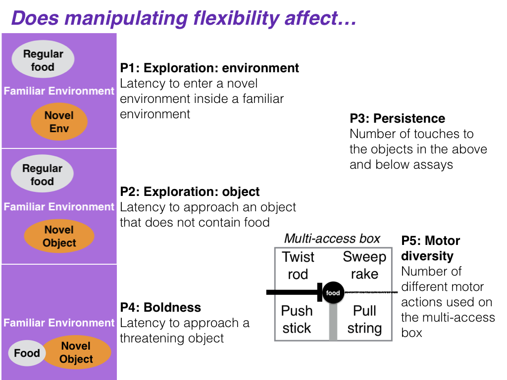

Does manipulating behavioral flexibility affect exploration, but not boldness, persistence, or motor diversity?
================
Dr. Kelsey McCune (University of California Santa Barbara / Max Planck Institute for Evolutionary Anthropology), Carolyn Rowney (Max Planck Institute for Evolutionary Anthropology), Luisa Bergeron (University of California Santa Barbara / Max Planck Institute for Evolutionary Anthropology), [Dr. Corina Logan](http://CorinaLogan.com) (Max Planck Institute for Evolutionary Anthropology, <corina_logan@eva.mpg.de>)
2018-10-29

``` r
library(knitr)
opts_chunk$set(tidy.opts=list(width.cutoff=60),tidy=TRUE)
```

### ABSTRACT

This is one of the first studies planned for our long-term research on the role of behavioral flexibility in rapid geographic range expansions. **Project background:** Behavioral flexibility, the ability to change behavior when circumstances change based on learning from previous experience (Mikhalevich, Powell, and Logan (2017)), is thought to play an important role in a species' ability to successfully adapt to new environments and expand its geographic range (e.g., (Lefebvre et al. 1997), (Griffin and Guez 2014), (Chow, Lea, and Leaver 2016), (Sol and Lefebvre 2000), (Sol, Timmermans, and Lefebvre 2002), (Sol et al. 2005)). However, behavioral flexibility is rarely directly tested at the individual level, thus limiting our ability to determine how it relates to other traits, which limits the power of predictions about a species' ability to adapt behavior to new environments. We use great-tailed grackles (a bird species) as a model to investigate this question because they have rapidly expanded their range into North America over the past 140 years ((Wehtje 2003), (Peer 2011)) (see an overview of the [5-year project timeline](./README.md)). **This investigation**: In this piece of the long-term project, we aim to understand whether manipulating grackle behavioral flexibility (color tube reversal learning - described in a separate [preregistration](https://github.com/corinalogan/grackles/blob/master/EasyToReadFiles/g_flexmanip.md)) correlates (or not) with individual differences in the exploration of new environments and novel objects, boldness, persistence, and motor diversity. Results will indicate whether consistent individual differences in these traits might interact with measures of flexibility (reversal learning and solution switching). This will improve our understanding of which variables are involved in flexibility and how they are related, thus putting us in an excellent position to further investigate the mechanisms behind these links in future research.

### A. STATE OF THE DATA

\*\*Prior to collecting any <data:**> This preregistration was written and submitted to PCI Ecology for peer review.

### B. PARTITIONING THE RESULTS

We may decide to present the results from different hypotheses in separate papers.

### C. HYPOTHESES

#### H1: [Behavioral flexibility](https://github.com/corinalogan/grackles/blob/master/EasyToReadFiles/g_flexmanip.md) (indicated by individuals that are faster at functionally changing their behavior when circumstances change; measured by reversal learning and switching between options on a multi-access box) is positively correlated with the exploration of new environments and novel objects, but not with other behaviors (i.e., boldness, persistence, or motor diversity) (see Mikhalevich, Powell, and Logan (2017) for theoretical background about our flexibility definition).

**Predictions 1-5:** Individuals in the experimental group where flexibility (as measured by reversal learning and on a multi-access box) was manipulated (such that individuals in the manipulated group became faster at switching) will be more exploratory of new environments (P1; methods as in Mettke-Hofmann et al. (2009)) and novel objects (P2; methods as in Mettke-Hofmann et al. (2009)) than individuals in the control group where flexibility was not increased, and there will be no difference between the groups in persistence (P3), boldness (P4; methods as in C. J. Logan (2016)), or motor diversity (P5) (as found in C. J. Logan (2016)).

**P1-P5 alternative:** If the flexibility manipulation does not work in that those individuals in the experimental condition are not more flexible than control individuals, then this experiment will elucidate whether general individual variation in flexibility relates to exploratory behaviors. The predictions are the same as above.

**P1 alternative 1:** There is a positive correlation between exploration and both dependent variables in reversal learning (one accounts for exploration in reversal learning \[the ratio\] and the other does not). This suggests that flexibility is not independent of exploration and could indicate that another trait is present, such as boldness.

**P1 alternative 2:** There is a positive correlation between exploration and one dependent variable, but not the other, in reversal learning. This indicates that exploration influences performance in reversal learning, but that flexibility is independent of exploration.

**P1 alternative 3:** There is no correlation between exploration and either dependent variable in reversal learning. This indicates that both dependent variables measure traits that are independent of exploration.

**P3 alternative 1:** There is a positive correlation between persistence and the number of incorrect choices in reversal learning before making the first correct choice. This indicates that individuals that are persistent in one context are also persistent in another context.

**P3 alternative 2:** There is no correlation between persistence and the number of incorrect choices in reversal learning before making the first correct choice. This indicates that flexibility is an independent trait.



***Figure 1.*** An overview of the study design. Exploration will be measured by comparing individual behavior within a familiar environment to behavior towards a novel environment, as well as response to a familiar object vs. a novel object within the familiar environment that contains their regular food. Boldness will be measured as the willingness to eat next to a threatening object (novel oject, taxidermic known non-predator, or a taxidermic known predator) in their familiar environment. Persistence will be measured as the number of touches to the novel environment and novel object in the Exploration assay, the objects in the Boldness assay, and the multi-access box in a separate [preregistration](https://github.com/corinalogan/grackles/blob/master/EasyToReadFiles/g_flexmanip.md). Motor diversity will be measured using the multi-access box in a separate [preregistration](https://github.com/corinalogan/grackles/blob/master/EasyToReadFiles/g_flexmanip.md). Assays will be conducted at least twice (e.g., Time 1, Time 2) and differences (if any) between the control and manipulated groups in the behavioral flexibility [preregistration](https://github.com/corinalogan/grackles/blob/master/EasyToReadFiles/g_flexmanip.md) will be compared across time and, with persistence, across tests (e.g., Test 1, Test 2) because persistence is measured in four different assays.

#### H2: Individuals whose flexibility was increased through the manipulation do not differ from controls in their boldness and persistence, potentially because flexibility is an independent trait.

We will first verify that our measures of boldness, exploration and persistence represent repeatable, inherent individual differences in behavior. Individuals show consistent individual differences in behavior if, across time, the variance in latency to approach, or closest approach to the task is smaller within individuals compared to the variance in latency to approach, or closest approach distance among individuals (for exploration and boldness assays). The same definition applies to persistence with the number of touches across tasks as the dependent variable.

**P6:** There is no repeatibility of persistence and boldness within individuals, which could indicate that performance is state dependent (e.g., it depends on their fluctuating motivation, hunger levels, etc.) and/or reliant on the current context of the task at hand.

**P6 alternative 1:** There is limited repeatability of persistence and boldness within individuals (Repeatability = 0.2-0.3 Bell, Hankison, and Laskowski (2009)), which could indicate that prior experience influences performance on tasks and facilitates the manipulation of these traits (e.g., individuals can change their behavior).

**P6 alternative 2:** There is significant, high repeatibility of persistence and boldness within individuals, which could indicate that it is a property of the individual (e.g., due to heritability or developmental effects).

#### H3: Individuals assayed while in captivity are less exploratory and bold than when they are again assayed in the wild, and as compared to separate individuals assayed in the wild, potentially because captivity is an unfamiliar situation.

**P7 alternative 1:** Individuals in captivity are more exploratory and bold than wild individuals (testing sessions matched for season), and captive individuals show more exploratory and bold behaviors than when they are subsequently tested in the wild, potentially because the captive environment decreases the influence of social interactions and competition.

**P7 alternative 2:** There is no difference in exploration and boldness between individuals in captivity and individuals in the wild (matched for season), potentially because in both contexts we sampled the types of individuals that were most likely to participate in assays in the wild or get caught in traps.

**P8 alternative 1:** Captive individuals, once released, show no difference in exploratory and bold behaviors because our methods assess inherent traits due to individual differences that are consistent across the captive and wild contexts in this taxa.


### D. METHODS

#### **Open materials**

[Testing protocols](https://docs.google.com/document/d/1sEMc5z2fw6S9C-wVfc2zV331CRPpu3NuA7IhSFUZJpE/edit?usp=sharing) for exploration of new environments and objects, boldness, persistence, and motor diversity.

#### **Open data**

When the study is complete, the data will be published in the Knowledge Network for Biocomplexity's data repository.

#### **Randomization and counterbalancing**

There is no randomizing. The order of the three tasks will be counterbalanced across birds (using <https://www.random.org> to randomly assign individuals to one of three experimental orders).

1/3 of the individuals will experience:

1.  Exploration environment

2.  Exploration object

3.  Boldness

1/3 of the individuals will experience:

1.  Exploration object

2.  Boldness

3.  Exploration environment

1/3 of the individuals will experience:

1.  Boldness

2.  Exploration environment

3.  Exploration object

#### **Blinding of conditions during analysis**

No blinding is involved in this study.

#### **Dependent variables**

*P1-P5: flexibility correlates with exploration of new environments and objects*

1.  The **number of trials to reverse** a preference in the last reversal that individual participated in (an individual is considered to have a preference if it chose the rewarded option at least 17 out of the most recent 20 trials (with a minimum of 8 or 9 correct choices out of 10 on the two most recent sets of 10 trials)). See behavioral flexibility [preregistration](https://github.com/corinalogan/grackles/blob/master/EasyToReadFiles/g_flexmanip.md) for details.

2.  The **ratio of correct divided by incorrect trials** for the first 40 trials in their final reversal after the individual has seen the newly rewarded option once. These 40 trials include trials where individuals were offered the test and chose not to participate (i.e., make a choice). This accounts for flexibility that can occur when some individuals inhibit their previously rewarded preference (thus exhibiting flexibility because they changed their behavior when circumstances changed), but are not as exploratory as those who have fewer 'no choice' trials. 'No choice' data is data that is otherwise excluded from standard reversal learning analyses. Including 'no choice' trials, controls for individual differences in exploration because those that refuse to choose are not exploring new options, which would allow them to learn the new food location.

3.  If the number of trials to reverse a preference does not positively correlate with the latency to attempt or solve new loci on the multi-access box (an additional measure of behavioral flexibility), then the **average latency to solve** and the **average latency to attempt** a new option on the multi-access box will be additional dependent variables. See behavioral flexibility [preregistration](https://github.com/corinalogan/grackles/blob/master/EasyToReadFiles/g_flexmanip.md).

4.  **Flexibility comprehensive**: This measure is currently being developed and is intended be a more accurate representation of all of the choices an individual made, as well as accounting for the degree of uncertainty exhibited by individuals as preferences change. If this measure more effectively represents flexibility (determined using a modeled dataset and not the actual data), we may decide to solely rely on this measure and not use independent variables 1-3. If this ends up being the case, we will modify the code in the analysis plan below to reflect this change before conducting analyses of the data in this preregistration.

All models will be run once per dependent variable.

*P3: does persistence correlate with reversal persistence?*

1.  The number of incorrect choices in the final reversal before making the first correct choice

*P6: repeatability of boldness, exploration and persistence*

1.  Boldness: Latency to land on the ground - OR - Latency to eat the food next to the threatening object - OR - Latency to touch a threatening object - OR - Closest approach distance (we will choose the variable with the most data)

2.  Persistence: Number of touches to an apparatus per time (multi-access box in the behavioral flexibility [preregistration](https://github.com/corinalogan/grackles/blob/master/EasyToReadFiles/g_flexmanip.md), novel environment in P1, and objects in P2 and P4)

3.  Exploration of novel environment: Latency to enter a novel environment set inside a familiar environment - OR - Closest approach distance (choose the variable with the most data)

4.  Exploration of novel object: Latency to land on the ground next to an object (novel, familiar) (that does not contain food) in a familiar environment (that contains maintenance diet away from the object) - OR - latency to touch an object (novel, familiar) - OR - Closest approach distance (choose the variable with the most data)

*P7-P8: captive vs wild*

1a.  Boldness in captivity: Latency to land on the ground - OR - Latency to eat the food - OR - Latency to touch a threatening object that is next to food - OR - Closest approach distance (we will choose the variable with the most data) 
1b.  Boldness in the wild: Latency to come within 2m - OR - Latency to eat the food - OR - Latency to touch a threatening object that is next to food - OR - Closest approach distance (we will choose the variable with the most data)

2.  Persistence: Number of touches to an apparatus per time (multi-access box in the behavioral flexibility [preregistration](https://github.com/corinalogan/grackles/blob/master/EasyToReadFiles/g_flexmanip.md), novel environment in P1, objects in P2 and P4)

3.  Exploration of novel environment: Latency to enter a novel sub-environment inside a familiar environment - OR - Closest approach distance (choose the variable with the most data)

4.  Exploration of novel object: Latency to land next to an object (novel, familiar) (that does not contain food) in a familiar environment (that contains maintenance diet away from the object) - OR - latency to touch an object (novel, familiar) - OR - Closest approach distance (choose the variable with the most data)

*Note: if 3 and 4 are consistent within individuals, and correlate, we will combine these variables into one exploration propensity score.*

#### **Independent variables**

*P1: exploration of new environment*

1.  Latency to enter a novel environment inside a familiar environment

2.  Time spent in each of the different sections inside the novel environment (pre-test: activity in familiar environment, experiment: activity in novel environment)

3.  Time spent exploring the outside of the novel environment (within 20cm) before entering it

*P2: exploration of objects*

1.  Latency to land on the ground next to an object (novel, familiar) (that does not contain food) in a familiar environment (that contains maintenance diet away from the object) - OR - latency to touch an object (novel, familiar) - OR - Closest approach distance (choose the variable with the most data)

*P3: persistence*

1.  Number of touches to the functional part of an apparatus per time (multi-access box, novel environment in P1, novel objects in P2 and P4)

2.  Number of touches to the non-functional part of an apparatus per time ([multi-access box](https://github.com/corinalogan/grackles/blob/master/EasyToReadFiles/g_flexmanip.md))

*P4: boldness*

1.  Latency to land on the ground - OR - Latency to eat the food - OR - Latency to touch a threatening object that is next to food - OR - Closest approach distance (we will choose the variable with the most data)

*P5: motor diversity*

1.  Number of different motor actions used when attempting to solve the [multi-access box](https://github.com/corinalogan/grackles/blob/master/EasyToReadFiles/g_flexmanip.md)

*Additional*

1.  Age (adult: after hatch year, juvenile: hatch year). NOTE: this variable will be removed if only adults are tested (and we are planning to test only adults).

2.  ID (random effect because multiple measures per individual)

3.  [Condition](https://github.com/corinalogan/grackles/blob/master/EasyToReadFiles/g_flexmanip.md): control, flexibility manipulation

*P3: does persistence correlate with reversal persistence?*

1.  Average number of touches to the functional part of an apparatus per time ([multi-access box](https://github.com/corinalogan/grackles/blob/master/EasyToReadFiles/g_flexmanip.md), novel environment in P1, novel objects in P2 and P4)

2.  Condition: control, flexibility manipulation

*P6: repeatability of boldness, exploration, and persistence*

1.  [Condition](https://github.com/corinalogan/grackles/blob/master/EasyToReadFiles/g_flexmanip.md): control, flexibility manipulation

2.  ID (random effect because multiple measures per individual)

*P7-P8: captive vs wild*

1.  Context: captive or wild

2.  ID (random effect because multiple measures per individual)

### E. ANALYSIS PLAN

We do not plan to **exclude** any data. When **missing data** occur, the existing data for that individual will be included in the analyses for the tests they completed. Analyses will be conducted in R (current version 3.3.3; (R Core Team 2017)). When there is more than one experimenter within a test, experimenter will be added as a random effect to account for potential differences between experimenters in conducting the tests. If there are no differences between models including or excluding experimenter as a random effect, then we will use the model without this random effect for simplicity.

#### *Ability to detect actual effects*

To begin to understand what kinds of effect sizes we will be able to detect given our sample size limitations and our interest in decreasing noise by attempting to measure it, which increases the number of explanatory variables, we used G\*Power (v.3.1, Faul et al. (2007), Faul et al. (2009)) to conduct power analyses based on confidence intervals. G\*Power uses pre-set drop down menus and we chose the options that were as close to our analysis methods as possible (listed in each analysis below). Note that there were no explicit options for GLMs (though the chosen test in G\*Power appears to align with GLMs) or GLMMs or for the inclusion of the number of trials per bird (which are generally large in our investigation), thus the power analyses are only an approximation of the kinds of effect sizes we can detect. We realize that these power analyses are not fully aligned with our study design and that these kinds of analyses are not appropriate for Bayesian statistics (e.g., our MCMCglmm below), however we are unaware of better options at this time. Additionally, it is difficult to run power analyses because it is unclear what kinds of effect sizes we should expect due to the lack of data on this species for these experiments.

#### *Data checking*

The data will be visually checked to determine whether they are normally distributed via two methods: 1) normality is indicated when the histograms of actual data match those with simulated data (Figures 2, 4, 6, 8), and 2) normality is indicated when the residuals closely fit the dotted line in the Normal Q-Q plot (Figures 3, 5, 7, 9) (Zuur, Ieno, and Saveliev 2009).

``` r
# Check dependent variables for normality: Histograms
# Reversal learning
last <- read.csv("/Users/corina/GTGR/data/data_reverselatency.csv", 
    header = T, sep = ",", stringsAsFactors = F)

# Boldness and persistence
boldness <- read.csv("/Users/corina/GTGR/data/data_boldness.csv", 
    header = T, sep = ",", stringsAsFactors = F)

op <- par(mfrow = c(2, 4), mar = c(4, 4, 2, 0.2))
# This is what the distribution of actual data looks like
hist(last$TrialsToReverseLast, xlab = "Number of trials to reverse the last preference", 
    main = "Actual Data")
hist(last$NumberIncorrectTrialsReversal, xlab = "Number of 'no choice' trials in the first reversal", 
    main = "Actual Data")
hist(boldness$LatencyToLandOnTable, xlab = "Latency to land on table", 
    main = "Actual Data")
hist(boldness$NoObjectTouchesPerTime, xlab = "Number of touches to an apparatus per time", 
    main = "Actual Data")    
hist(boldness$ClosestApproach, xlab = "Closest Approach distance", 
    main = "Actual Data")

# Given the actual data, this is what a normal distribution
# would look like
W2 <- rnorm(1281, mean = mean(last$TrialsToReverseLast), sd = sd(last$TrialsToReverseLast))
hist(W2, xlab = "No. trials reverse last preference", main = "Simulated Data")

X2 <- rnorm(1281, mean = mean(last$NumberIncorrectTrialsReversal), 
    sd = sd(last$NumberIncorrectTrialsReversal))
hist(X2, xlab = "No. 'no choice' trials 1st reversal", main = "Simulated Data")

Y2 <- rnorm(1281, mean = mean(boldness$LatencyToLandOnTable), 
    sd = sd(boldness$LatencyToLandOnTable))
hist(Y2, xlab = "Latency table", main = "Simulated Data")

Z2 <- rnorm(1281, mean = mean(boldness$NoObjectTouchesPerTime), 
    sd = sd(boldness$NoObjectTouchesPerTime))
hist(Z2, xlab = "No. touches apparatus/time", main = "Simulated Data")

Z3 <- rnorm(1281, mean = mean(boldness$ClosestApproach), 
    sd = sd(boldness$ClosestApproach))
hist(Z2, xlab = "Closest Approach distance", main = "Simulated Data")
```

``` r
# Check dependent variables for normality: Q-Q plots Reversal
# learning
last <- read.csv("/Users/corina/GTGR/data/data_reverselatency.csv", 
    header = T, sep = ",", stringsAsFactors = F)

# Boldness and persistence
boldness <- read.csv("/Users/corina/GTGR/data/data_boldness.csv", 
    header = T, sep = ",", stringsAsFactors = F)

op <- par(mfrow = c(4, 4), mar = c(4, 4, 2, 0.2))
plot(glm(last$TrialsToReverse ~ last$LatencyExpEnv))
plot(glm(last$NumberIncorrectTrialsReversal ~ last$LatencyExpEnv))
plot(glm(boldness$LatencyToLandOnTable ~ boldness$Day))
plot(glm(boldness$NoObjectTouchesPerTime ~ boldness$Day))
plot(glm(boldness$ClosestApproach ~ boldness$Day))
```

If the data do not appear normally distributed, visually check the residuals. If they are patternless, then assume a normal distribution (Figure 4) (Zuur, Ieno, and Saveliev 2009).

``` r
# Check the dependent variables for normality: Residuals
# Reversal learning
last <- read.csv("/Users/corina/GTGR/data/data_reverselatency.csv", 
    header = T, sep = ",", stringsAsFactors = F)

# Boldness and persistence
boldness <- read.csv("/Users/corina/GTGR/data/data_boldness.csv", 
    header = T, sep = ",", stringsAsFactors = F)

op <- par(mfrow = c(2, 2), mar = c(4, 4, 2, 0.2))
plot(residuals(glm(last$TrialsToReverse ~ last$LatencyExpEnv)), 
    ylab = "Reverse: Trials to reverse ~ Latency novel env.")
plot(residuals(glm(last$NumberIncorrectTrialsReversal ~ last$LatencyExpEnv)), 
    ylab = "Reverse: No. incorrect ~ Latency novel env.")
plot(residuals(glm(boldness$LatencyToLandOnTable ~ boldness$Day)), 
    ylab = "Boldness: Latency table ~ Day")
plot(residuals(glm(boldness$NoObjectTouchesPerTime ~ boldness$Day)), 
    ylab = "Boldness: No. object touches/time ~ Day")
plot(residuals(glm(boldness$ClosestApproach ~ boldness$Day)), 
    ylab = "Boldness: Closest Approach Distance ~ Day")
```

#### *P1-P5: flexibility correlates with exploration of new environments and objects, boldness, persistence, and motor diversity?*

**Analysis:** If behavior is not repeatable across assays at Time 1 and Time 2 (six weeks apart) for exploration, boldness, persistence, or motor diversity (see analysis for P6), we will not include these variables in analyses involving flexibility. If behavior is repeatable within individuals, we will examine the relationship between flexibility and these variables as follows. Note that the two exploration measures (novel environment and novel object) will be combined into one variable if they correlate and are both repeatable within individuals.

Because the independent variables could influence each other, we will analyze them in a single model: Generalized Linear Mixed Model (GLMM; MCMCglmm function, MCMCglmm package; (J. D. Hadfield 2010)) with a Poisson distribution and log link using 13,000 iterations with a thinning interval of 10, a burnin of 3,000, and minimal priors (V=1, nu=0) (J. Hadfield 2014). We will ensure the GLMM shows acceptable convergence (i.e., lag time autocorrelation values &lt;0.01; (J. D. Hadfield 2010)), and adjust parameters if necessary. We will determine whether an independent variable had an effect or not using the Estimate in the full model.

To roughly estimate our ability to detect actual effects (because these power analyses are designed for frequentist statistics, not Bayesian statistics), we ran a power analysis in G\*Power with the following settings: test family=F tests, statistical test=linear multiple regression: Fixed model (R^2 deviation from zero), type of power analysis=a priori, alpha error probability=0.05. We reduced the power to 0.70 and increased the effect size until the total sample size in the output matched our projected sample size (n=32). The number of predictor variables was restricted to only the fixed effects because this test was not designed for mixed models. The protocol of the power analysis is here:

*Input:*

Effect size f² = 0,62

α err prob = 0,05

Power (1-β err prob) = 0,7

Number of predictors = 10

*Output:*

Noncentrality parameter λ = 19,8400000

Critical F = 2,3209534

Numerator df = 10

Denominator df = 21

Total sample size = 32

Actual power = 0,7027626

This means that, with our sample size of 32, we have a 70% chance of detecting a large effect (approximated at f^2=0.35 by Cohen (1988)).

``` r
explore <- read.csv("/Users/corina/GTGR/data/data_explore.csv", 
    header = T, sep = ",", stringsAsFactors = F)

# Take the average of Time 1 and Time 2 for each variable
# (exploration environment, exploration object, boldness,
# motor diversity, persistence)
TimeOutsideNovelEnvT1 <- TimeOutsideNovelEnv[TimeOutsideNovelEnv$Time == 
    1, ]
TimeOutsideNovelEnvT2 <- TimeOutsideNovelEnv[TimeOutsideNovelEnv$Time == 
    2, ]
TimeOutsideNovelEnv <- (TimeOutsideNovelEnvT1 + TimeOutsideNovelEnvT2)/2

LatencyExpEnvT1 <- LatencyExpEnv[LatencyExpEnv$Time == 1, ]
LatencyExpEnvT2 <- LatencyExpEnv[LatencyExpEnv$Time == 2, ]
LatencyExpEnv <- (LatencyExpEnvT1 + LatencyExpEnvT2)/2

AverageTimePerSectionNovelEnvT1 <- AverageTimePerSectionNovelEnv[AverageTimePerSectionNovelEnv$Time == 
    1, ]
AverageTimePerSectionNovelEnvT2 <- AverageTimePerSectionNovelEnv[AverageTimePerSectionNovelEnv$Time == 
    2, ]
AverageTimePerSectionNovelEnv <- (AverageTimePerSectionNovelEnvT1 + 
    AverageTimePerSectionNovelEnvT2)/2

TotalNumberSectionsNovelEnvT1 <- TotalNumberSectionsNovelEnv[TotalNumberSectionsNovelEnv$Time == 
    1, ]
TotalNumberSectionsNovelEnvT2 <- TotalNumberSectionsNovelEnv[TotalNumberSectionsNovelEnv$Time == 
    2, ]
TotalNumberSectionsNovelEnv <- (TotalNumberSectionsNovelEnvT1 + 
    TotalNumberSectionsNovelEnvT2)/2

LatencyTableExpObjectT1 <- LatencyTableExpObject[LatencyTableExpObject$Time == 
    1, ]
LatencyTableExpObjectT2 <- LatencyTableExpObject[LatencyTableExpObject$Time == 
    2, ]
LatencyTableExpObject <- (LatencyTableExpObjectT1 + LatencyTableExpObjectT2)/2

MultiaccessTouchesPerTimeT1 <- MultiaccessTouchesPerTime[MultiaccessTouchesPerTime$Time == 
    1, ]
MultiaccessTouchesPerTimeT2 <- MultiaccessTouchesPerTime[MultiaccessTouchesPerTime$Time == 
    2, ]
MultiaccessTouchesPerTime <- (MultiaccessTouchesPerTimeT1 + MultiaccessTouchesPerTimeT2)/2

LatencyBoldnessT1 <- LatencyBoldness[LatencyBoldness$Time == 
    1, ]
LatencyBoldnessT2 <- LatencyBoldness[LatencyBoldness$Time == 
    2, ]
LatencyBoldness <- (LatencyBoldnessT1 + LatencyBoldnessT2)/2

NoMotorActionsT1 <- NoMotorActions[NoMotorActions$Time == 1, 
    ]
NoMotorActionsT1 <- NoMotorActions[NoMotorActions$Time == 1, 
    ]
NoMotorActions <- (NoMotorActionsT1 + NoMotorActionsT2)/2

# GLMM - dependent variable = number of trials to reverse in
# the last reversal
library(MCMCglmm)
prior = list(R = list(R1 = list(V = 1, nu = 0), R2 = list(V = 1, 
    nu = 0), R3 = list(V = 1, nu = 0), R4 = list(V = 1, nu = 0), 
    R5 = list(V = 1, nu = 0), R6 = list(V = 1, nu = 0), R7 = list(V = 1, 
        nu = 0), R8 = list(V = 1, nu = 0), R9 = list(V = 1, nu = 0), 
    R10 = list(V = 1, nu = 0), R11 = list(V = 1, nu = 0)), G = list(G1 = list(V = 1, 
    nu = 0), G2 = list(V = 1, nu = 0)))

expl1 <- MCMCglmm(AvgTrialsToReverse ~ Condition * TimeOutsideNovelEnv * 
    LatencyExpEnv * AverageTimePerSectionNovelEnv * TotalNumberSectionsNovelEnv * 
    LatencyTableExpObject * MultiaccessTouchesPerTime * LatencyBoldness * 
    NoMotorActions * ID, random = ~ID(1+Condition) + Batch, family = "poisson", 
    data = explore, verbose = F, prior = prior, nitt = 13000, 
    thin = 10, burnin = 3000)
summary(expl1)
autocorr(expl1$Sol)  #Did fixed effects converge?
autocorr(expl1$VCV)  #Did random effects converge?

# GLMM - dependent variable = ratio of correct divided by
# incorrect trials for first 40 trials of final reversal
# after making the first correct choice

expl2 <- MCMCglmm(Ratio40 ~ Condition * TimeOutsideNovelEnv * 
    LatencyExpEnv * AverageTimePerSectionNovelEnv * TotalNumberSectionsNovelEnv * 
    LatencyTableExpObject * MultiaccessTouchesPerTime * LatencyBoldness * 
    NoMotorActions * ID(1+Condition), random = ~ID + Batch, family = "poisson", 
    data = explore, verbose = F, prior = prior, nitt = 13000, 
    thin = 10, burnin = 3000)

summary(expl2)
autocorr(expl2$Sol)  #Did fixed effects converge?
autocorr(expl2$VCV)  #Did random effects converge?
```

#### *P3: does persistence correlate with reversal persistence?*

**Analysis:** Generalized Linear Model (GLM; glm function, stats package) with a Poisson distribution and log link.

To determine our ability to detect actual effects, we ran a power analysis in G\*Power with the following settings: test family=F tests, statistical test=linear multiple regression: Fixed model (R^2 deviation from zero), type of power analysis=a priori, alpha error probability=0.05. We reduced the power to 0.70 and increased the effect size until the total sample size in the output matched our projected sample size (n=32). The protocol of the power analysis is here:

*Input:*

Effect size f² = 0,27

α err prob = 0,05

Power (1-β err prob) = 0,7

Number of predictors = 2

*Output:*

Noncentrality parameter λ = 8,6400000

Critical F = 3,3276545

Numerator df = 2

Denominator df = 29

Total sample size = 32

Actual power = 0,7047420

This means that, with our sample size of 32, we have a 70% chance of detecting a medium (approximated at f^2=0.15 by Cohen (1988)) to large effect (approximated at f^2=0.35 by Cohen (1988)).

``` r
persist2 <- read.csv("/Users/corina/GTGR/data/data_reverselatency.csv", 
    header = T, sep = ",", stringsAsFactors = F)

# GLM
p2 <- glm(NumberIncorrectTrialsReversal ~ AvgFunctionalTouchesExploration * 
    Condition, family = "poisson", data = persist2)
# summary(p2)

sp2 <- summary(p2)
library(xtable)
sp2.table <- xtable(sp2)
library(knitr)
kable(sp2.table, caption = "Table 2: Model selection output.", 
    format = "html", digits = 2)

# Model Validation
library(MuMIn)
options(na.action = "na.fail")
base1 <- dredge(glm(NumberIncorrectTrialsReversal ~ AvgFunctionalTouchesExploration * 
    Condition, family = "poisson", data = persist2))
library(knitr)
kable(base1, caption = "Table 3: Model selection output.")
```

**Model validation:** Determine whether the test model results are likely to be reliable given the data (Burnham and Anderson 2003). Compare Akaike weights (range: 0–1, the sum of all model weights equals 1; Akaike, 1981) between the test model and a base model (number of trials to reverse as the response variable and 1 as the explanatory variable) using the dredge function in the MuMIn package (D Bates, Maechler, and Bolker 2012). If the best fitting model has a high Akaike weight (&gt;0.89; (Burnham and Anderson 2003)), then it indicates that the results are likely given the data. The Akaike weights indicate the best fitting model is the \[base/test *- delete as appropriate*\] model (Table 2).

#### *P6: repeatability of exploration, boldness and persistence*

**Analysis:** To calculate repeatability, we will run a GLMM (R package: lme4, function: lmer, Douglas Bates et al. (2015)) where each individual has a random intercept (i.e., ID is a random effect). To obtain the repeatability estimate, which indicates how much of the total variance after accounting for fixed effects is explained by individual differences (ID), the variance explained by ID is divided by the total variance (sum of the estimates of all random effects and residual variance) (as in Houslay (2016)). The model is then run in lmerTest (Kuznetsova, Bruun Brockhoff, and Haubo Bojesen Christensen (2016)) to determine whether the random effect (ID) is statistically significant (p&lt;0.05).

Note: The power analysis is the same as for P3 because there are the same number of explanatory variables (fixed effects).

``` r
# Boldness
bol <- read.csv("/Users/corina/GTGR/data/data_boldness.csv", 
    header = T, sep = ",", stringsAsFactors = F)

# How to calculate repeatability following advice from Tom
# Houslay's blog http://rpubs.com/tomhouslay/200150 GLMM
library(lme4)
bold <- lmer(LatencyToFeed ~ Condition + (1 | ID), data = bol)

#'we can also calculate the conditional repeatability easily - in terms of how much of the total phenotypic variance (after accounting for fixed effects) is explained by differences between individuals' http://rpubs.com/tomhouslay/200150
library(tidyr)
library(broom)
tbold <- tidy(bold, effects = "ran_pars", scales = "vcov")
tbold[tbold$group == "ID", ]$estimate/(sum(tbold$estimate))  #this gives a number called Repeatability

# To see whether ID is signficant (and, by proxy,
# repeatability), run lmerTest
library(lmerTest)
rand(bold)
detach(package:lmerTest)
```

``` r
# Persistence
per <- read.csv("/Users/corina/GTGR/data/data_persist.csv", header = T, 
    sep = ",", stringsAsFactors = F)

# How to calculate repeatability following advice from Tom
# Houslay's blog http://rpubs.com/tomhouslay/200150 GLMM
library(lme4)
pers <- lmer(NoTouches ~ Test * Condition + (1 | ID), data = per)

#'we can also calculate the conditional repeatability easily - in terms of how much of the total phenotypic variance (after accounting for fixed effects) is explained by differences between individuals' http://rpubs.com/tomhouslay/200150
library(tidyr)
library(broom)
tpers <- tidy(pers, effects = "ran_pars", scales = "vcov")
tpers[tpers$group == "ID", ]$estimate/(sum(tpers$estimate))  #this gives a number called Repeatability

# To see whether ID is signficant (and, by proxy,
# repeatability), run lmerTest
library(lmerTest)
rand(pers)
detach(package:lmerTest)
```

``` r
# Exploration of novel environment
ee <- read.csv("/Users/corina/GTGR/data/data_explore.csv", header = T, 
    sep = ",", stringsAsFactors = F)

# How to calculate repeatability following advice from Tom
# Houslay's blog http://rpubs.com/tomhouslay/200150 GLMM
library(lme4)
eem <- lmer(LatencyExpEnv ~ Condition + (1 | ID), data = ee)

#'we can also calculate the conditional repeatability easily - in terms of how much of the total phenotypic variance (after accounting for fixed effects) is explained by differences between individuals' http://rpubs.com/tomhouslay/200150
library(tidyr)
library(broom)
teem <- tidy(eem, effects = "ran_pars", scales = "vcov")
teem[teem$group == "ID", ]$estimate/(sum(teem$estimate))  #this gives a number called Repeatability

# To see whether ID is signficant (and, by proxy,
# repeatability), run lmerTest
library(lmerTest)
rand(eem)
detach(package:lmerTest)
```

``` r
# Exploration of novel object
eo <- read.csv("/Users/corina/GTGR/data/data_persist.csv", header = T, 
    sep = ",", stringsAsFactors = F)

# How to calculate repeatability following advice from Tom
# Houslay's blog http://rpubs.com/tomhouslay/200150 GLMM
library(lme4)
eom <- lmer(LatencyTableExpObject ~ Condition + (1 | ID), data = eo)

#'we can also calculate the conditional repeatability easily - in terms of how much of the total phenotypic variance (after accounting for fixed effects) is explained by differences between individuals' http://rpubs.com/tomhouslay/200150
library(tidyr)
library(broom)
teom <- tidy(eom, effects = "ran_pars", scales = "vcov")
teom[teom$group == "ID", ]$estimate/(sum(teom$estimate))  #this gives a number called Repeatability

# To see whether ID is signficant (and, by proxy,
# repeatability), run lmerTest
library(lmerTest)
rand(eom)
detach(package:lmerTest)
```

#### *Alternative Analyses*

We anticipate that we will want to run additional/different analyses after reading McElreath (2016). We will revise this preregistration to include these new analyses before conducting the analyses above.

### F. PLANNED SAMPLE

Great-tailed grackles are caught in the wild in Tempe, Arizona USA for individual identification (colored leg bands in unique combinations). Some individuals (~32: ~16 per experiment) are brought temporarily into aviaries for testing, and then they will be released back to the wild. Grackles are individually housed in an aviary (each 244cm long by 122cm wide by 213cm tall) at Arizona State University for a maximum of three months where they have ad lib access to water at all times and are fed Mazuri Small Bird maintenance diet ad lib during non-testing hours (minimum 20h per day), and various other food items (e.g., peanuts, grapes, bread) during testing (up to 3h per day per bird). Individuals are given three to four days to habituate to the aviaries and then their test battery begins on the fourth or fifth day (birds are usually tested six days per week, therefore if their fourth day in the aviaries occurs on a day off, then they are tested on the fifth day instead). For hypothesis 3 we will attempt to test all grackles in the wild that are color-banded.  

**Sample size rationale**

We will test as many birds as we can in the approximately three years at this field site given that the birds only participate in tests in aviaries during the non-breeding season (approximately September through March). The minimum sample size for captive subjects will be 16, however we expect to be able to test up to 32 grackles in captivity.  We catch grackles with a variety of methods, some of which decrease the likelihood of a selection bias for exploratory and bold individuals because grackles cannot see the traps (i.e. mist nets).  In samplng all banded birds in the wild, we will therefore have a better idea of the variation in exploration and boldness behaviors in this population.

**Data collection stopping rule**

We will stop testing birds once we have completed two full aviary seasons (likely in March 2020).

### G. ETHICS

This research is carried out in accordance with permits from the:

1.  US Fish and Wildlife Service (scientific collecting permit number MB76700A-0,1,2)
2.  US Geological Survey Bird Banding Laboratory (federal bird banding permit number 23872)
3.  Arizona Game and Fish Department (scientific collecting license number SP594338 \[2017\] and SP606267 \[2018\])
4.  Institutional Animal Care and Use Committee at Arizona State University (protocol number 17-1594R)
5.  University of Cambridge ethical review process (non-regulated use of animals in scientific procedures: zoo4/17)

### F. AUTHOR CONTRIBUTIONS

**McCune:** Hypothesis development, data collection, data analysis and interpretation, write up, revising/editing.

**Rowney:** Data collection, data interpretation, revising/editing.

**Bergeron:** Data collection, data interpretation, revising/editing.

**Logan:** Hypothesis development, data collection, data analysis and interpretation, revising/editing, materials/funding.

### H. FUNDING

This research is funded by the Department of Human Behavior, Ecology and Culture at the Max Planck Institute for Evolutionary Anthropology, and by a Leverhulme Early Career Research Fellowship to Logan in 2017-2018.

### I. ACKNOWLEDGEMENTS

We thank Dieter Lukas for help polishing the hypotheses; Ben Trumble for providing us with a wet lab at Arizona State University; Melissa Wilson Sayres for sponsoring our affiliations at Arizona State University and lending lab equipment; Kristine Johnson for technical advice on great-tailed grackles; Jay Taylor for grackle scouting at Arizona State University; Arizona State University School of Life Sciences Department Animal Care and Technologies for providing space for our aviaries and for their excellent support of our daily activities; Julia Cissewski for tirelessly solving problems involving financial transactions and contracts; and Richard McElreath for project support.

### J. REFERENCES

Bates, D, M Maechler, and B Bolker. 2012. “Lme4: Linear Mixed-Effects Models Using S4 Classes (2011). R Package Version 0.999375-42.”

Bates, Douglas, Martin Mächler, Ben Bolker, and Steve Walker. 2015. “Fitting Linear Mixed-Effects Models Using lme4.” Journal of Statistical Software 67 (1): 1–48. <doi:10.18637/jss.v067.i01>.

Bell, Alison M, Shala J Hankison, and Kate L Laskowski. 2009. “The Repeatability of Behaviour: A Meta-Analysis.” Animal Behaviour 77 (4). Elsevier: 771–83.

Burnham, Kenneth P, and David R Anderson. 2003. Model Selection and Multimodel Inference: A Practical Information-Theoretic Approach. Springer Science & Business Media.

Chow, Pizza Ka Yee, Stephen EG Lea, and Lisa A Leaver. 2016. “How Practice Makes Perfect: The Role of Persistence, Flexibility and Learning in Problem-Solving Efficiency.” Animal Behaviour 112. Elsevier: 273–83.

Cohen, Jacob. 1988. “Statistical Power Analysis for the Behavioral Sciences 2nd Edn.” Erlbaum Associates, Hillsdale.

Faul, Franz, Edgar Erdfelder, Axel Buchner, and Albert-Georg Lang. 2009. “Statistical Power Analyses Using G\* Power 3.1: Tests for Correlation and Regression Analyses.” Behavior Research Methods 41 (4). Springer: 1149–60.

Faul, Franz, Edgar Erdfelder, Albert-Georg Lang, and Axel Buchner. 2007. “G\* Power 3: A Flexible Statistical Power Analysis Program for the Social, Behavioral, and Biomedical Sciences.” Behavior Research Methods 39 (2). Springer: 175–91.

Griffin, Andrea S, and David Guez. 2014. “Innovation and Problem Solving: A Review of Common Mechanisms.” Behavioural Processes 109. Elsevier: 121–34.

Hadfield, Jarrod D. 2010. “MCMC Methods for Multi-Response Generalized Linear Mixed Models: The MCMCglmm R Package.” Journal of Statistical Software 33 (2): 1–22. <http://www.jstatsoft.org/v33/i02/>.

Hadfield, JD. 2014. “MCMCglmm Course Notes.” <http://cran.r-project.org/web/packages/MCMCglmm/vignettes/CourseNotes.pdf>.

Houslay, T. 2016. ISBE Plasticity. RPubs. <http://rpubs.com/tomhouslay/200150>.

Kuznetsova, Alexandra, Per Bruun Brockhoff, and Rune Haubo Bojesen Christensen. 2016. LmerTest: Tests in Linear Mixed Effects Models. <https://CRAN.R-project.org/package=lmerTest>.

Lefebvre, Louis, Patrick Whittle, Evan Lascaris, and Adam Finkelstein. 1997. “Feeding Innovations and Forebrain Size in Birds.” Animal Behaviour 53 (3). Elsevier: 549–60.

Logan, C J. 2016. “Behavioral Flexibility in an Invasive Bird Is Independent of Other Behaviors.” PeerJ 4. PeerJ Inc.: e2215.

McElreath, Richard. 2016. Statistical Rethinking: A Bayesian Course with Examples in R and Stan. CRC Press. <http://xcelab.net/rm/statistical-rethinking/>.

Mettke-Hofmann, Claudia, Sandy Lorentzen, Emmi Schlicht, Janine Schneider, and Franziska Werner. 2009. “Spatial Neophilia and Spatial Neophobia in Resident and Migratory Warblers (Sylvia).” Ethology 115 (5). Wiley Online Library: 482–92.

Mikhalevich, Irina, Russell Powell, and Corina Logan. 2017. “Is Behavioural Flexibility Evidence of Cognitive Complexity? How Evolution Can Inform Comparative Cognition.” Interface Focus 7 (3): 20160121. <doi:10.1098/rsfs.2016.0121>.

Peer, Brian D. 2011. “Invasion of the Emperor’s Grackle.” Ardeola 58 (2). BioOne: 405–9.

R Core Team. 2017. R: A Language and Environment for Statistical Computing. Vienna, Austria: R Foundation for Statistical Computing. <https://www.R-project.org>.

Sol, Daniel, and Louis Lefebvre. 2000. “Behavioural Flexibility Predicts Invasion Success in Birds Introduced to New Zealand.” Oikos 90 (3). Wiley Online Library: 599–605.

Sol, Daniel, Richard P Duncan, Tim M Blackburn, Phillip Cassey, and Louis Lefebvre. 2005. “Big Brains, Enhanced Cognition, and Response of Birds to Novel Environments.” Proceedings of the National Academy of Sciences of the United States of America 102 (15). National Acad Sciences: 5460–5.

Sol, Daniel, Sarah Timmermans, and Louis Lefebvre. 2002. “Behavioural Flexibility and Invasion Success in Birds.” Animal Behaviour 63 (3). Elsevier: 495–502.

Wehtje, Walter. 2003. “The Range Expansion of the Great-Tailed Grackle (Quiscalus Mexicanus Gmelin) in North America Since 1880.” Journal of Biogeography 30 (10). Wiley Online Library: 1593–1607.

Zuur, Alain F.., Elena N.. Ieno, and Anatoly A Saveliev. 2009. Mixed Effects Models and Extensions in Ecology with R. Springer.

Bates, D, M Maechler, and B Bolker. 2012. “Lme4: Linear Mixed-Effects Models Using S4 Classes (2011). R Package Version 0.999375-42.”

Bates, Douglas, Martin Mächler, Ben Bolker, and Steve Walker. 2015. “Fitting Linear Mixed-Effects Models Using lme4.” *Journal of Statistical Software* 67 (1): 1–48. doi:[10.18637/jss.v067.i01](https://doi.org/10.18637/jss.v067.i01).

Bell, Alison M, Shala J Hankison, and Kate L Laskowski. 2009. “The Repeatability of Behaviour: A Meta-Analysis.” *Animal Behaviour* 77 (4). Elsevier: 771–83.

Burnham, Kenneth P, and David R Anderson. 2003. *Model Selection and Multimodel Inference: A Practical Information-Theoretic Approach*. Springer Science & Business Media.

Chow, Pizza Ka Yee, Stephen EG Lea, and Lisa A Leaver. 2016. “How Practice Makes Perfect: The Role of Persistence, Flexibility and Learning in Problem-Solving Efficiency.” *Animal Behaviour* 112. Elsevier: 273–83.

Cohen, Jacob. 1988. “Statistical Power Analysis for the Behavioral Sciences 2nd Edn.” Erlbaum Associates, Hillsdale.

Faul, Franz, Edgar Erdfelder, Axel Buchner, and Albert-Georg Lang. 2009. “Statistical Power Analyses Using G\* Power 3.1: Tests for Correlation and Regression Analyses.” *Behavior Research Methods* 41 (4). Springer: 1149–60.

Faul, Franz, Edgar Erdfelder, Albert-Georg Lang, and Axel Buchner. 2007. “G\* Power 3: A Flexible Statistical Power Analysis Program for the Social, Behavioral, and Biomedical Sciences.” *Behavior Research Methods* 39 (2). Springer: 175–91.

Griffin, Andrea S, and David Guez. 2014. “Innovation and Problem Solving: A Review of Common Mechanisms.” *Behavioural Processes* 109. Elsevier: 121–34.

Hadfield, Jarrod D. 2010. “MCMC Methods for Multi-Response Generalized Linear Mixed Models: The MCMCglmm R Package.” *Journal of Statistical Software* 33 (2): 1–22. <http://www.jstatsoft.org/v33/i02/>.

Hadfield, JD. 2014. “MCMCglmm Course Notes.” <http://cran.r-project.org/web/packages/MCMCglmm/vignettes/CourseNotes.pdf>.

Houslay, T. 2016. *ISBE Plasticity*. RPubs. <http://rpubs.com/tomhouslay/200150>.

Kuznetsova, Alexandra, Per Bruun Brockhoff, and Rune Haubo Bojesen Christensen. 2016. *LmerTest: Tests in Linear Mixed Effects Models*. <https://CRAN.R-project.org/package=lmerTest>.

Lefebvre, Louis, Patrick Whittle, Evan Lascaris, and Adam Finkelstein. 1997. “Feeding Innovations and Forebrain Size in Birds.” *Animal Behaviour* 53 (3). Elsevier: 549–60.

Logan, C J. 2016. “Behavioral Flexibility in an Invasive Bird Is Independent of Other Behaviors.” *PeerJ* 4. PeerJ Inc.: e2215.

McElreath, Richard. 2016. *Statistical Rethinking: A Bayesian Course with Examples in R and Stan*. CRC Press. <http://xcelab.net/rm/statistical-rethinking/>.

Mettke-Hofmann, Claudia, Sandy Lorentzen, Emmi Schlicht, Janine Schneider, and Franziska Werner. 2009. “Spatial Neophilia and Spatial Neophobia in Resident and Migratory Warblers (Sylvia).” *Ethology* 115 (5). Wiley Online Library: 482–92.

Mikhalevich, Irina, Russell Powell, and Corina Logan. 2017. “Is Behavioural Flexibility Evidence of Cognitive Complexity? How Evolution Can Inform Comparative Cognition.” *Interface Focus* 7 (3): 20160121. doi:[10.1098/rsfs.2016.0121](https://doi.org/10.1098/rsfs.2016.0121).

Peer, Brian D. 2011. “Invasion of the Emperor’s Grackle.” *Ardeola* 58 (2). BioOne: 405–9.

R Core Team. 2017. *R: A Language and Environment for Statistical Computing*. Vienna, Austria: R Foundation for Statistical Computing. <https://www.R-project.org>.

Sol, Daniel, and Louis Lefebvre. 2000. “Behavioural Flexibility Predicts Invasion Success in Birds Introduced to New Zealand.” *Oikos* 90 (3). Wiley Online Library: 599–605.

Sol, Daniel, Richard P Duncan, Tim M Blackburn, Phillip Cassey, and Louis Lefebvre. 2005. “Big Brains, Enhanced Cognition, and Response of Birds to Novel Environments.” *Proceedings of the National Academy of Sciences of the United States of America* 102 (15). National Acad Sciences: 5460–5.

Sol, Daniel, Sarah Timmermans, and Louis Lefebvre. 2002. “Behavioural Flexibility and Invasion Success in Birds.” *Animal Behaviour* 63 (3). Elsevier: 495–502.

Wehtje, Walter. 2003. “The Range Expansion of the Great-Tailed Grackle (Quiscalus Mexicanus Gmelin) in North America Since 1880.” *Journal of Biogeography* 30 (10). Wiley Online Library: 1593–1607.

Zuur, Alain F.., Elena N.. Ieno, and Anatoly A Saveliev. 2009. *Mixed Effects Models and Extensions in Ecology with R*. Springer.
