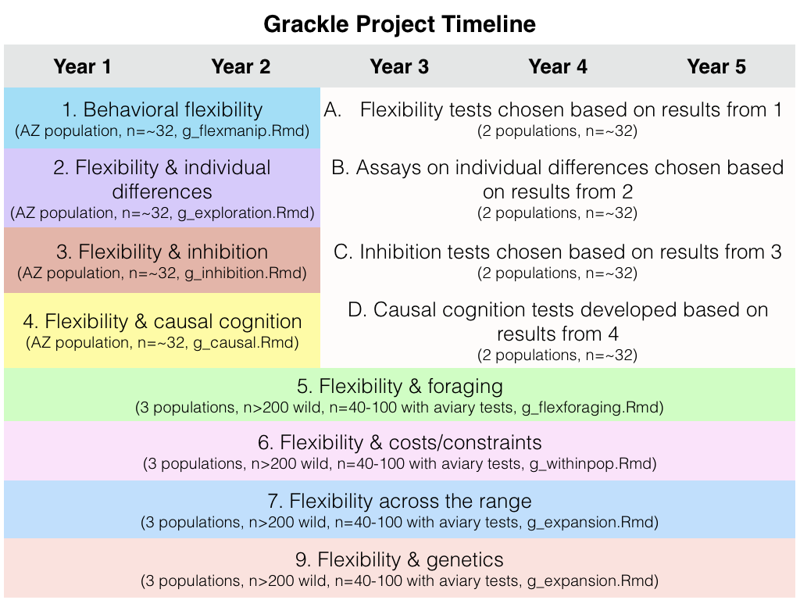

Is behavioral flexibility related to foraging and social behavior in a rapidly expanding species?
================
[Dr. Corina Logan](http://CorinaLogan.com) (Max Planck Institute for Evolutionary Anthropology, <corina_logan@eva.mpg.de>), Luisa Bergeron (University of California Santa Barbara / Max Planck Institute for Evolutionary Anthropology), Carolyn Rowney (University of California Santa Barbara / Max Planck Institute for Evolutionary Anthropology), Dr. Kelsey McCune (University of California Santa Barbara / Max Planck Institute for Evolutionary Anthropology), [Dr. Dieter Lukas](http://dieterlukas.strikingly.com) (Max Planck Institute for Evolutionary Anthropology)
2018-10-28

``` r
#Make code wrap text so it doesn't go off the page when Knitting to PDF
library(knitr)
opts_chunk$set(tidy.opts=list(width.cutoff=60),tidy=TRUE)
```

### ABSTRACT

This is one of the first studies planned for our long-term research on the role of behavioral flexibility in rapid geographic range expansions. **Project background:** Behavioral flexibility, the ability to change behavior when circumstances change based on learning from previous experience (Mikhalevich, Powell, and Logan (2017)), is thought to play an important role in a species' ability to successfully adapt to new environments and expand its geographic range (e.g., (Lefebvre et al. 1997), (Griffin and Guez 2014), (Chow, Lea, and Leaver 2016), (Sol and Lefebvre 2000), (Sol, Timmermans, and Lefebvre 2002), (Sol et al. 2005)). However, behavioral flexibility is rarely directly tested at the individual level, thus limiting our ability to determine how it relates to other traits, which limits the power of predictions about a species' ability to adapt behavior to new environments. We use great-tailed grackles (a bird species) as a model to investigate this question because they have rapidly expanded their range into North America over the past 140 years ((Wehtje 2003), (Peer 2011)) (Fig. 1). Results will allow us to determine whether, as predicted by hypotheses and cross-species correlational data, in this expanding species, individual-level variation in flexibility is linked with diet breadth, foraging proficiency, social interactions, habitat use, and movement into new geographic areas. **This investigation**: In this piece of the long-term project, we will assess whether performance in experiments that assess behavioral flexibility relates to variation in ecological and social behavior in the natural environment. In particular, we aim to determine whether the more behaviorally flexible (measured by reversal learning and solution switching on a multi-access box in a separate [preregistration](https://github.com/corinalogan/grackles/blob/master/EasyToReadFiles/g_flexmanip.md)) grackles have more flexible foraging behavior (eat a larger number of different foods, use a wider variety of foraging techniques), are more flexible in their habitat use (are found in more diverse habitat types, disperse farther from their natal area), and are more flexible in their social relationships (have stronger social bonds particularly with less related individuals). We will be able to compare the grackle's ability to adapt behavior according to social context with data from other species, as well as determine whether it is linked with measures of flexibility in asocial contexts.



### A. STATE OF THE DATA

This preregistration was written prior to collecting any data.

### B. PARTITIONING THE RESULTS

We may decide to present the results from different hypotheses in separate papers.

### C. HYPOTHESIS

#### H1: Individuals that are more [behaviorally flexible](https://github.com/corinalogan/grackles/blob/master/EasyToReadFiles/g_flexmanip.md) (measured by reversal learning and switching between options on a multi-access box) will differ in their foraging behavior in the wild (measured with focal follows).

**Prediction 1:** Individuals that are faster to reverse preferences on a reversal learning task and who also have lower latencies to switch to solving new loci after previously solved loci become unavailable (multi-access box) will eat a larger number of different foods and use a wider variety of foraging techniques in the wild, validating the cross-species correlational finding that technique breadth (Overington et al. (2009)) and diet breadth (Ducatez, Clavel, and Lefebvre (2015)) indicate flexibility.

**P1 alternative 1:** If there is no correlation, this suggests that flexibility is an independent trait from the number of foods eaten and foraging techniques used. Flexibility is not necessarily associated with diet and foraging technique breadth because flexibility could be constrained in a foraging context due to social competition (e.g., subordinates are outcompeted while foraging and thus try new foods and techniques) or ecological limitations (e.g., constrained by what is available).

**P1 alternative 2:** If there is a negative correlation between flexibility and the number of different foods eaten, this might indicate that the more flexible individuals target particular food items.

**P1 alternative 3:** If there is a negative correlation between flexibility and the number of foraging techniques, this could indicate that the more flexible individuals use particular (potentially more effective) techniques.

**P2:** Individuals whose [flexibility](https://github.com/corinalogan/grackles/blob/master/EasyToReadFiles/g_flexmanip.md) has been increased experimentally will consume a larger number of foods and use more foraging techniques (measured with focal follows) than individuals whose flexibility has not been manipulated. This would further validate that flexibility is related to diet breadth and foraging techniques.

**P2 alternative 1:** If the flexibility manipulation does not work in that those individuals in the experimental condition do not decrease their reversal learning speeds more than control individuals, then we will rely on the general individual variation in flexibility and how it relates to foraging in the wild (as in P1).

**P3:** The more flexible individuals eat more human food, potentially due to A) having stayed in their parent's home range (i.e., they eat human food because it happens to be more prevalent in their home range than in other home ranges; local specialization) or B) because these individuals move around to seek out such opportunities (potentially seeking out habitat edges within their population). Foods eaten will be recorded during focal follows.

**P3 alternative:** There is no correlation between an individual's flexibility and the amount of human food in their diet, potentially because A) their daily range sizes encompass many different food resources, including human foods, and B) some less flexible individuals might specialize on human foods.

#### H2: Individuals that are more [behaviorally flexible](https://github.com/corinalogan/grackles/blob/master/EasyToReadFiles/g_flexmanip.md) (measured by reversal learning and switching between options on a multi-access box) will differ in their social behavior in the wild (measured with focal follows).

**P4** Flexible individuals are more likely to have stronger bonds with others, in particular with individuals who are less related, potentially because they are better able to adjust their behavior to that of an affiliate. Bond strength is measured using the focal follow method to sample affiliative and aggressive behaviors.

**P4 alternative 1:** Flexible individuals are not more likely to have stronger bonds with each other, potentially because all individuals are able to form bonds with like individuals, including the less flexible individuals.

**P4 alternative 2:** Flexible individuals are less likely to have stronger bonds with each other, potentially because they frequently change their behavior and are difficult to form bonds with.

#### H3: Individuals that are more [behaviorally flexible](https://github.com/corinalogan/grackles/blob/master/EasyToReadFiles/g_flexmanip.md) (measured by reversal learning and switching between options on a multi-access box) will use a wider range of habitats (measured with GPS point for each focal follow).

**P5:** Individuals immigrating into a population are more likely to be flexible, potentially because they need to learn how to obtain resources in an unfamiliar area. Immigrants are individuals who carry many genetic variants (identified using ddRADseq) that are not found in other individuals in this population.

**P5 alternative:** Individuals immigrating into a population are not more likely to be flexible, potentially because the human urban environment is comparable across landscapes.

**P6:** Flexible individuals will be found more regularly in a wider diversity of habitats.

**P6 alternative:** Flexibility is not associated with presence in diverse habitats because the more flexible individuals might specialize in specific foraging strategies.

### D. METHODS

#### **Open materials**

[Ethogram](https://docs.google.com/spreadsheets/d/1N8wsA3geaRGlMjRxYTRpdG2i5oCXNGq9zBlTnj02Gho/edit?usp=sharing) for Prim8.

[Individuals](https://docs.google.com/spreadsheets/d/1Lr0pwsmdnpVM8X2Fyoj9EIGa3zOY1WCZlntW7e0Ui_Y/edit?usp=sharing) for Prim8.

#### **Open data**

When the study is complete, the data will be published in the Knowledge Network for Biocomplexity's data repository.

#### **Randomization and counterbalancing**

No randomization or counterbalancing is involved in this study.

#### **Blinding of conditions during analysis**

No blinding is involved in this study.

#### **Dependent variables**

***P1-P2***

1.  Number of different foods eaten in the first X minutes (X=the sum of the total observation time per individual, using the individual who had the lowest sum to equalize observation time across individuals)

2.  Number of foraging techniques used (based on Table 1 in Overington et al. (2009)) in the first X minutes (X=the sum of the total observation time per individual, using the individual who had the lowest sum to equalize observation time across individuals)

One model will be run per dependent variable.

***P3: flexible = more human foods***

1.  Proportion of diet per individual that is human food

***P4: flexible = stronger bonds***

1.  Strength of the maximum bond (maximum number of affiliative interactions initiated with another). If we are unable to sample each individual at least four times (McCune (2018)), we will instead use an individual's degree (maximum number of other individuals that the focal subject associated with; Wey et al. (2008)).

2.  Individual strength (the sum of all bonds an individual has; Wey et al. (2008))

3.  Male shares territory with another male: yes, no

4.  Relatedness for the strongest bond

***P5: flexible = immigrants***

1.  Probability of being an immigrant

***P6: flexible = wider range of habitats***

1.  Evenness in the proportion of time spent in each habitat type (grass, gravel and other natural substrate, cement, cafe, dumpster)

#### **Independent variables**

***P1-P4 and P6***

1.  Flexibility 1: **Number of trials to reverse** a preference in the last reversal an individual experienced (reversal learning; an individual is considered to have a preference if it chose the rewarded option at least 17 out of the most recent 20 trials, with a minimum of 8 or 9 correct choices out of 10 on the two most recent sets of 10 trials). See behavioral flexibility [preregistration](https://github.com/corinalogan/grackles/blob/master/EasyToReadFiles/g_flexmanip.md).

2.  Flexibility 2: The **ratio of correct divided by incorrect trials** for the first 40 trials in their final reversal after the individual has seen the newly rewarded option once. These 40 trials include trials where individuals were offered the test and chose not to participate (i.e., make a choice). This accounts for flexibility that can occur when some individuals inhibit their previously rewarded preference (thus exhibiting flexibility because they changed their behavior when circumstances changed), but are not as exploratory as those who have fewer 'no choice' trials. 'No choice' data is data that is otherwise excluded from standard reversal learning analyses. Including 'no choice' trials, controls for individual differences in exploration because those that refuse to choose are not exploring new options, which would allow them to learn the new food location.

3.  Flexibility 3: If the number of trials to reverse a preference does not positively correlate with the latency to attempt or solve new loci on the multi-access box (an additional measure of behavioral flexibility), then the **average latency to solve** and the **average latency to attempt** a new option on the multi-access box will be additional dependent variables. See behavioral flexibility [preregistration](https://github.com/corinalogan/grackles/blob/master/EasyToReadFiles/g_flexmanip.md).

4.  Flexibility 4: This measure is currently being developed and is intended be a more accurate representation of all of the choices an individual made, as well as accounting for the degree of uncertainty exhibited by individuals as preferences change. It will be based on a Bayesian estimate of the reduction in error across trials estimated from the number of correct choices from the beginning of each reversal. If this measure more effectively represents flexibility (determined using a modeled dataset and not the actual data), we may decide to solely rely on this measure and not use flexibility measures 1 through 3. If this ends up being the case, we will modify the code in the analysis plan below to reflect this change.

5.  Flexibility manipulation: control, manipulated

6.  Dominance rank

7.  ID (random effect because multiple measures per individual)

8.  Population: center (Central America), middle (Arizona), edge (northern US) (random effect because each population might have a different slope)

***P5***

1.  Flexibility 1: **Number of trials to reverse** a preference in the last reversal an individual experienced (reversal learning; an individual is considered to have a preference if it chose the rewarded option at least 17 out of the most recent 20 trials, with a minimum of 8 or 9 correct choices out of 10 on the two most recent sets of 10 trials). See behavioral flexibility [preregistration](https://github.com/corinalogan/grackles/blob/master/EasyToReadFiles/g_flexmanip.md).

2.  Flexibility 2: The **ratio of correct divided by incorrect trials** for the first 40 trials in their final reversal after the individual has seen the newly rewarded option once. These 40 trials include trials where individuals were offered the test and chose not to participate (i.e., make a choice). This accounts for flexibility that can occur when some individuals inhibit their previously rewarded preference (thus exhibiting flexibility because they changed their behavior when circumstances changed), but are not as exploratory as those who have fewer 'no choice' trials. 'No choice' data is data that is otherwise excluded from standard reversal learning analyses. Including 'no choice' trials, controls for individual differences in exploration because those that refuse to choose are not exploring new options, which would allow them to learn the new food location.

3.  Flexibility 3: If the number of trials to reverse a preference does not positively correlate with the latency to attempt or solve new loci on the multi-access box (an additional measure of behavioral flexibility), then the **average latency to solve** and the **average latency to attempt** a new option on the multi-access box will be additional dependent variables. See behavioral flexibility [preregistration](https://github.com/corinalogan/grackles/blob/master/EasyToReadFiles/g_flexmanip.md).

4.  Flexibility 4: A Bayesian measure is currently being developed and is intended be a more accurate representation of all of the choices an individual made, as well as accounting for the degree of uncertainty exhibited by individuals as preferences change. If this measure more effectively represents flexibility (determined using a modeled dataset and not the actual data), we may decide to solely rely on this measure and not use flexibility measures 1 through 3. If this ends up being the case, we will modify the code in the analysis plan below to reflect this change.

5.  Population: center (Central America), middle (Arizona), edge (northern US) (random effect because each population might have a different slope)

### E. ANALYSIS PLAN

We do not plan to **exclude** any data. When **missing data** occur, the existing data for that individual will be included in the analyses for the tests they completed. Analyses will be conducted in R (current version 3.3.3; R Core Team (2017)). When there is more than one experimenter within a test, experimenter will be added as a random effect to account for potential differences between experimenters in conducting the tests. If there are no differences between models including or excluding experimenter as a random effect, then we will use the model without this random effect for simplicity.

We will analyze data for females and males separately because each sex has a distinct natural history.

#### *Ability to detect actual effects*

To begin to understand what kinds of effect sizes we will be able to detect given our sample size limitations and our interest in decreasing noise by attempting to measure it, which increases the number of explanatory variables, we used G\*Power (v.3.1, Faul et al. (2007), Faul et al. (2009)) to conduct power analyses based on confidence intervals. G\*Power uses pre-set drop down menus and we chose the options that were as close to our analysis methods as possible (listed in each analysis below). Note that there were no explicit options for GLMs (though the chosen test in G\*Power appears to align with GLMs) or GLMMs or for the inclusion of the number of trials per bird (which are generally large in our investigation), thus the power analyses are only an approximation of the kinds of effect sizes we can detect. We realize that these power analyses are not fully aligned with our study design and that these kinds of analyses are not appropriate for Bayesian statistics (e.g., our MCMCglmm below), however we are unaware of better options at this time. Additionally, it is difficult to run power analyses because it is unclear what kinds of effect sizes we should expect due to the lack of data on this species for these experiments.

#### *Data checking*

The data will be visually checked to determine whether they are normally distributed via two methods: 1) normality is indicated when the histograms of actual data match those with simulated data (Figure 2), and 2) normality is indicated when the residuals closely fit the dotted line in the Normal Q-Q plot (Figure 3) (Zuur, Ieno, and Saveliev 2009).

``` r
ff <- read.csv("/Users/corina/GTGR/data/data_flexforaging.csv", 
    header = T, sep = ",", stringsAsFactors = F)

# Check the dependent variables for normality: Histograms
op <- par(mfrow = c(2, 3), mar = c(4, 4, 2, 0.2))
# This is what the distribution of actual data looks like
hist(ff$TrialsToReverseLast, xlab = "Trials to reverse (last)", 
    main = "Actual Data")
hist(ff$FlexRatio, xlab = "Correct/incorrect trials", main = "Actual Data")

# Given the actual data, this is what a normal distribution
# would look like
X2 <- rnorm(1281, mean = mean(ff$TrialsToReverseLast), sd = sd(ff$TrialsToReverseLast))
hist(X2, xlab = "Trials to reverse (last)", main = "Simulated Data")

Y2 <- rnorm(1281, mean = mean(ff$FlexRatio), sd = sd(ff$FlexRatio))
hist(Y2, xlab = "Correct/incorrect trials", main = "Simulated Data")


# Check the dependent variables against independent variables
# for normality: Q-Q plots
op <- par(mfrow = c(3, 4), mar = c(4, 4, 2, 0.2))
plot(glm(ff$TrialsToReverseLast ~ ff$NumberFoodsEaten))
plot(glm(ff$FlexRatio ~ ff$NumberFoodsEaten))
plot(glm(ff$TrialsToReverseLast ~ ff$NumberForagingTechniques))
plot(glm(ff$FlexRatio ~ ff$NumberForagingTechniques))
```

If the data do not appear normally distributed, visually check the residuals. If they are patternless, then assume a normal distribution (Figure 4) (Zuur, Ieno, and Saveliev 2009).

``` r
# Check the dependent variables for normality: Residuals
ff <- read.csv("/Users/corina/GTGR/data/data_flexforaging.csv", 
    header = T, sep = ",", stringsAsFactors = F)

# Figure 3. Visual check of the residuals
op <- par(mfrow = c(1, 4), mar = c(4, 4, 2, 0.2))
plot(residuals(glm(ff$TrialsToReverseLast ~ ff$NumberFoodsEaten)), 
    ylab = "Residuals: Trials to reverse ~ No. foods")
plot(residuals(glm(ff$FlexRatio ~ ff$NumberFoodsEaten)), ylab = "Residuals: Correct/incorrect trials ~ No. foods")
plot(residuals(glm(ff$TrialsToReverseLast ~ ff$NumberForagingTechniques)), 
    ylab = "Residuals: Trials to reverse ~ No. techniques")
plot(residuals(glm(ff$FlexRatio ~ ff$NumberForagingTechniques)), 
    ylab = "Residuals: Correct/incorrect trials ~ No. techniques")
```

#### *P1-P2*

**Analysis:** Because the independent variables could influence each other, we will analyze them in a single model: Generalized Linear Mixed Model (GLMM; MCMCglmm function, MCMCglmm package; (Hadfield 2010)) with a Poisson distribution and log link using 130,000 iterations with a thinning interval of 10, a burnin of 30,000, and minimal priors (V=1, nu=0) (Hadfield 2014). We will ensure the GLMM shows acceptable convergence (lag time autocorrelation values &lt;0.01; (Hadfield 2010)), and adjust parameters if necessary to meet this criterion. We will determine whether an independent variable had an effect or not using the Estimate in the full model.

To roughly estimate our ability to detect actual effects (because these power analyses are designed for frequentist statistics, not Bayesian statistics), we ran a power analysis in G\*Power with the following settings: test family=F tests, statistical test=linear multiple regression: Fixed model (R^2 deviation from zero), type of power analysis=a priori, alpha error probability=0.05. We reduced the power to 0.70 and increased the effect size until the total sample size in the output matched our projected minimum sample size for the flexibility tests (n=64). The number of predictor variables was restricted to only the fixed effects because this test was not designed for mixed models. The protocol of the power analysis is here:

*Input:*

Effect size f² = 0.166

α err prob = 0.05

Power (1-β err prob) = 0.7

Number of predictors = 4

*Output:*

Noncentrality parameter λ = 10.6240000

Critical F = 2.5279066

Numerator df = 4

Denominator df = 59

Total sample size = 64

Actual power = 0.7064103

This means that, with our minimum sample size of 64, we have a 71% chance of detecting a medium effect (approximated at f^2=0.15 by Cohen (1988)).

``` r
ff <- read.csv("/Users/corina/GTGR/data/data_flexforaging.csv", 
    header = T, sep = ",", stringsAsFactors = F)

# GLMM
library(MCMCglmm)
prior = list(R = list(R1 = list(V = 1, nu = 0), R2 = list(V = 1, 
    nu = 0), R3 = list(V = 1, nu = 0), R4 = list(V = 1, nu = 0)), 
    G = list(G1 = list(V = 1, nu = 0), G2 = list(V = 1, nu = 0)))

# Separate the sexes
fem <- ff[ff$Sex == "f", ]
mal <- ff[ff$Sex == "m", ]

# Factor the random effect variables
ID <- as.factor(fem$ID)
Population <- as.factor(fem$Population)
ID <- as.factor(mal$ID)
Population <- as.factor(mal$Population)

# GLMM with response variable = NumberFoodsEaten females
f1 <- MCMCglmm(NumberFoodsEaten ~ TrialsToReverseLast + FlexRatio + 
    ExperimentalGroup + DominanceRank, random = ~Population + 
    ID, family = "poisson", data = fem, verbose = F, prior = prior, 
    nitt = 130000, thin = 10, burnin = 30000)
summary(f1)
# autocorr(f1$Sol) #Did fixed effects converge?
# autocorr(f1$VCV) #Did random effects converge?

# males
f2 <- MCMCglmm(NumberFoodsEaten ~ TrialsToReverseLast + FlexRatio + 
    ExperimentalGroup + DominanceRank, random = ~Population + 
    ID, family = "poisson", data = mal, verbose = F, prior = prior, 
    nitt = 130000, thin = 10, burnin = 30000)
summary(f2)
# autocorr(f2$Sol) #Did fixed effects converge?
# autocorr(f2$VCV) #Did random effects converge?

# GLMM with response variable = NumberForagingTechniques
# female
f3 <- MCMCglmm(NumberForagingTechniques ~ TrialsToReverseLast + 
    FlexRatio + ExperimentalGroup + DominanceRank, random = ~Population + 
    ID, family = "poisson", data = fem, verbose = F, prior = prior, 
    nitt = 130000, thin = 10, burnin = 30000)
summary(f3)
# autocorr(f3$Sol) #Did fixed effects converge?
# autocorr(f3$VCV) #Did random effects converge?

# male
f4 <- MCMCglmm(NumberForagingTechniques ~ TrialsToReverseLast + 
    FlexRatio + ExperimentalGroup + DominanceRank, random = ~Population + 
    ID, family = "poisson", data = mal, verbose = F, prior = prior, 
    nitt = 130000, thin = 10, burnin = 30000)
summary(f4)
# autocorr(f4$Sol) #Did fixed effects converge?
# autocorr(f4$VCV) #Did random effects converge?
```

#### *P3: flexible = more human foods*

**Analysis:** Because the independent variables could influence each other, we will analyze them in a single model: Generalized Linear Mixed Model (GLMM; MCMCglmm function, MCMCglmm package; (Hadfield 2010)) with a Poisson distribution and log link using 130,000 iterations with a thinning interval of 10, a burnin of 30,000, and minimal priors (V=1, nu=0) (Hadfield 2014). We will ensure the GLMM shows acceptable convergence (lag time autocorrelation values &lt;0.01; (Hadfield 2010)), and adjust parameters if necessary to meet this criterion. We will determine whether an independent variable had an effect or not using the Estimate in the full model.

The power analysis is the same as in P1-P2.

``` r
ff <- read.csv("/Users/corina/GTGR/data/data_flexforaging.csv", 
    header = T, sep = ",", stringsAsFactors = F)

# GLMM
library(MCMCglmm)
prior = list(R = list(R1 = list(V = 1, nu = 0), R2 = list(V = 1, 
    nu = 0), R3 = list(V = 1, nu = 0), R4 = list(V = 1, nu = 0)), 
    G = list(G1 = list(V = 1, nu = 0), G2 = list(V = 1, nu = 0)))

# Separate the sexes
fem <- ff[ff$Sex == "f", ]
mal <- ff[ff$Sex == "m", ]

# Factor the random effect variables
ID <- as.factor(fem$ID)
Population <- as.factor(fem$Population)
ID <- as.factor(mal$ID)
Population <- as.factor(mal$Population)

# GLMM with response variable = NumberFoodsEaten females
f1 <- MCMCglmm(ProportionFoodsEatenHumanFood ~ TrialsToReverseLast + 
    FlexRatio + ExperimentalGroup + DominanceRank, random = ~Population + 
    ID, family = "poisson", data = fem, verbose = F, prior = prior, 
    nitt = 130000, thin = 10, burnin = 30000)
summary(f1)
# autocorr(f1$Sol) #Did fixed effects converge?
# autocorr(f1$VCV) #Did random effects converge?

# males
f2 <- MCMCglmm(ProportionFoodsEatenHumanFood ~ TrialsToReverseLast + 
    FlexRatio + ExperimentalGroup + DominanceRank, random = ~Population + 
    ID, family = "poisson", data = mal, verbose = F, prior = prior, 
    nitt = 130000, thin = 10, burnin = 30000)
summary(f2)
# autocorr(f2$Sol) #Did fixed effects converge?
# autocorr(f2$VCV) #Did random effects converge?
```

#### *P4: flexible = stronger bonds*

**Analysis:** Because the independent variables could influence each other, we will analyze them in a single model: Generalized Linear Mixed Model (GLMM; MCMCglmm function, MCMCglmm package; (Hadfield 2010)) with a Poisson distribution and log link using 130,000 iterations with a thinning interval of 10, a burnin of 30,000, and minimal priors (V=1, nu=0) (Hadfield 2014). We will ensure the GLMM shows acceptable convergence (lag time autocorrelation values &lt;0.01; (Hadfield 2010)), and adjust parameters if necessary to meet this criterion. We will determine whether an independent variable had an effect or not using the Estimate in the full model.

To roughly estimate our ability to detect actual effects (because these power analyses are designed for frequentist statistics, not Bayesian statistics), we ran a power analysis in G\*Power with the following settings: test family=F tests, statistical test=linear multiple regression: Fixed model (R^2 deviation from zero), type of power analysis=a priori, alpha error probability=0.05. We reduced the power to 0.70 and increased the effect size until the total sample size in the output matched our projected minimum sample size for the flexibility tests (n=64). The number of predictor variables was restricted to only the fixed effects because this test was not designed for mixed models. The protocol of the power analysis is here:

The power analysis is the same as in P1-P2.

To quantify social relationships, we will conduct at least four 10-minute focal follows on each subject. During focal follows we will record when another grackle comes within 6ft of the focal subject (and does not engage in aggressive interactions), as well as when another grackle comes within one body length of the focal bird (and does not engage in aggressive interactions). We will use the Half-Weight association index to value dyadic relationships to account for bias arising from subjects that are more likely to be observed separately rather than together in the same group (Cairns and Schwager (1987)). Our dependent variables will be calculated from these association indices using social network analysis (Croft, James, and Krause (2008)).

Social network data are not independent (Croft et al. (2011)), therefore, to determine whether individuals are associating non-randomly (i.e., association indices are larger than would be expected by random chance), we will conduct network permutations by rearranging edges in our network to create 10,000 random networks. We will then compare our observed effect sizes in the models below to the distribution of effect sizes that result when we calculate our dependent variables and run the same models on our randomized networks (as in (<span class="citeproc-not-found" data-reference-id="croft2011hypothsis">**???**</span>) and Whitehead, Bejder, and Ottensmeyer (2005)). We will conclude that social bonds are significantly related to the covariate of interest if our observed effect sizes are more extreme than at least 95% of the coefficients resulting from the random networks.

``` r
ff <- read.csv("/Users/corina/GTGR/data/data_flexforaging.csv", 
    header = T, sep = ",", stringsAsFactors = F)

# GLMM
library(MCMCglmm)
prior = list(R = list(R1 = list(V = 1, nu = 0), R2 = list(V = 1, 
    nu = 0), R3 = list(V = 1, nu = 0), R4 = list(V = 1, nu = 0)), 
    G = list(G1 = list(V = 1, nu = 0), G2 = list(V = 1, nu = 0)))

# Separate the sexes
fem <- ff[ff$Sex == "f", ]
mal <- ff[ff$Sex == "m", ]

# Factor the random effect variables
ID <- as.factor(fem$ID)
Population <- as.factor(fem$Population)
ID <- as.factor(mal$ID)
Population <- as.factor(mal$Population)

# GLMM with response variable = MaxBondStrength females
f1 <- MCMCglmm(MaxBondStrength ~ TrialsToReverseLast + FlexRatio + 
    ExperimentalGroup + DominanceRank, random = ~Population + 
    ID, family = "poisson", data = fem, verbose = F, prior = prior, 
    nitt = 130000, thin = 10, burnin = 30000)
summary(f1)
# autocorr(f1$Sol) #Did fixed effects converge?
# autocorr(f1$VCV) #Did random effects converge?

# males
f2 <- MCMCglmm(MaxBondStrength ~ TrialsToReverseLast + FlexRatio + 
    ExperimentalGroup + DominanceRank, random = ~Population + 
    ID, family = "poisson", data = mal, verbose = F, prior = prior, 
    nitt = 130000, thin = 10, burnin = 30000)
summary(f2)
# autocorr(f2$Sol) #Did fixed effects converge?
# autocorr(f2$VCV) #Did random effects converge?

# GLMM with response variable = AvgBondStrength female
f3 <- MCMCglmm(SumBondStrength ~ TrialsToReverseLast + FlexRatio + 
    ExperimentalGroup + DominanceRank, random = ~Population + 
    ID, family = "poisson", data = fem, verbose = F, prior = prior, 
    nitt = 130000, thin = 10, burnin = 30000)
summary(f3)
# autocorr(f3$Sol) #Did fixed effects converge?
# autocorr(f3$VCV) #Did random effects converge?

# male
f4 <- MCMCglmm(SumBondStrength ~ TrialsToReverseLast + FlexRatio + 
    ExperimentalGroup + DominanceRank, random = ~Population + 
    ID, family = "poisson", data = mal, verbose = F, prior = prior, 
    nitt = 130000, thin = 10, burnin = 30000)
summary(f4)
# autocorr(f4$Sol) #Did fixed effects converge?
# autocorr(f4$VCV) #Did random effects converge?

# GLMM with response variable = MaleSharesTerritory female
f3 <- MCMCglmm(MaleSharesTerritory ~ TrialsToReverseLast + FlexRatio + 
    ExperimentalGroup + DominanceRank, random = ~Population + 
    ID, family = "poisson", data = fem, verbose = F, prior = prior, 
    nitt = 130000, thin = 10, burnin = 30000)
summary(f3)
# autocorr(f3$Sol) #Did fixed effects converge?
# autocorr(f3$VCV) #Did random effects converge?

# male
f4 <- MCMCglmm(MaleSharesTerritory ~ TrialsToReverseLast + FlexRatio + 
    ExperimentalGroup + DominanceRank, random = ~Population + 
    ID, family = "poisson", data = mal, verbose = F, prior = prior, 
    nitt = 130000, thin = 10, burnin = 30000)
summary(f4)
# autocorr(f4$Sol) #Did fixed effects converge?
# autocorr(f4$VCV) #Did random effects converge?

# GLMM with response variable = RelatednessForMaxBond female
f3 <- MCMCglmm(RelatednessForMaxBond ~ TrialsToReverseLast + 
    FlexRatio + ExperimentalGroup + DominanceRank, random = ~Population + 
    ID, family = "poisson", data = fem, verbose = F, prior = prior, 
    nitt = 130000, thin = 10, burnin = 30000)
summary(f3)
# autocorr(f3$Sol) #Did fixed effects converge?
# autocorr(f3$VCV) #Did random effects converge?

# male
f4 <- MCMCglmm(RelatednessForMaxBond ~ TrialsToReverseLast + 
    FlexRatio + ExperimentalGroup + DominanceRank, random = ~Population + 
    ID, family = "poisson", data = mal, verbose = F, prior = prior, 
    nitt = 130000, thin = 10, burnin = 30000)
summary(f4)
# autocorr(f4$Sol) #Did fixed effects converge?
# autocorr(f4$VCV) #Did random effects converge?
```

#### *P5: flexible = immigrants*

**Analysis:** Because the independent variables could influence each other, we will analyze them in a single model: Generalized Linear Mixed Model (GLMM; MCMCglmm function, MCMCglmm package; (Hadfield 2010)) with a binomial distribution (family=categorical) and logit link using 130,000 iterations with a thinning interval of 10, a burnin of 30,000, and minimal priors (V=1, nu=0) (Hadfield 2014). We will ensure the GLMM shows acceptable convergence (lag time autocorrelation values &lt;0.01; (Hadfield 2010)), and adjust parameters if necessary to meet this criterion. We will determine whether an independent variable had an effect or not using the Estimate in the full model.

To roughly estimate our ability to detect actual effects (because these power analyses are designed for frequentist statistics, not Bayesian statistics), we ran a power analysis in G\*Power with the following settings: test family=F tests, statistical test=linear multiple regression: Fixed model (R^2 deviation from zero), type of power analysis=a priori, alpha error probability=0.05. We reduced the power to 0.70 and increased the effect size until the total sample size in the output matched our projected minimum sample size for the flexibility tests (n=64). The number of predictor variables was restricted to only the fixed effects because this test was not designed for mixed models. The protocol of the power analysis is here:

*Input:*

Effect size f² = 0.27

α err prob = 0.05

Power (1-β err prob) = 0.7

Number of predictors = 2

*Output:*

Noncentrality parameter λ = 8.6400000

Critical F = 3.3276545

Numerator df = 2

Denominator df = 29

Total sample size = 32

Actual power = 0.7047420

This means that, with our sample size of 32, we have a 70% chance of detecting a medium (approximated at f^2=0.15 by Cohen (1988)) to large effect (approximated at f^2=0.35 by Cohen (1988)).

``` r
ff <- read.csv("/Users/corina/GTGR/data/data_flexforaging.csv", 
    header = T, sep = ",", stringsAsFactors = F)

# GLMM
library(MCMCglmm)
prior = list(R = list(R1 = list(V = 1, nu = 0), R2 = list(V = 1, 
    nu = 0), R3 = list(V = 1, nu = 0)), G = list(G1 = list(V = 1, 
    nu = 0), G2 = list(V = 1, nu = 0)))

# Separate the sexes
fem <- ff[ff$Sex == "f", ]
mal <- ff[ff$Sex == "m", ]

# Factor the random effect variables
ID <- as.factor(fem$ID)
Population <- as.factor(fem$Population)
ID <- as.factor(mal$ID)
Population <- as.factor(mal$Population)

# GLMM females
f1 <- MCMCglmm(ImmigrantProbability ~ TrialsToReverseLast + FlexRatio, 
    random = ~Population, family = "poisson", data = fem, verbose = F, 
    prior = prior, nitt = 130000, thin = 10, burnin = 30000)
summary(f1)
# autocorr(f1$Sol) #Did fixed effects converge?
# autocorr(f1$VCV) #Did random effects converge?

# males
f2 <- MCMCglmm(ImmigrantProbability ~ TrialsToReverseLast + FlexRatio, 
    random = ~Population, family = "poisson", data = mal, verbose = F, 
    prior = prior, nitt = 130000, thin = 10, burnin = 30000)
summary(f2)
# autocorr(f2$Sol) #Did fixed effects converge?
# autocorr(f2$VCV) #Did random effects converge?
```

#### *P6: flexible = wider range of habitats*

**Analysis:** Because the independent variables could influence each other, we will analyze them in a single model: Generalized Linear Mixed Model (GLMM; MCMCglmm function, MCMCglmm package; (Hadfield 2010)) with a Poisson distribution and log link using 130,000 iterations with a thinning interval of 10, a burnin of 30,000, and minimal priors (V=1, nu=0) (Hadfield 2014). We will ensure the GLMM shows acceptable convergence (lag time autocorrelation values &lt;0.01; (Hadfield 2010)), and adjust parameters if necessary to meet this criterion. We will determine whether an independent variable had an effect or not using the Estimate in the full model.

The power analysis is the same as in P1-P2.

``` r
ff <- read.csv("/Users/corina/GTGR/data/data_flexforaging.csv", 
    header = T, sep = ",", stringsAsFactors = F)

# GLMM
library(MCMCglmm)
prior = list(R = list(R1 = list(V = 1, nu = 0), R2 = list(V = 1, 
    nu = 0), R3 = list(V = 1, nu = 0), R4 = list(V = 1, nu = 0)), 
    G = list(G1 = list(V = 1, nu = 0), G2 = list(V = 1, nu = 0)))

# Separate the sexes
fem <- ff[ff$Sex == "f", ]
mal <- ff[ff$Sex == "m", ]

# Factor the random effect variables
ID <- as.factor(fem$ID)
Population <- as.factor(fem$Population)
ID <- as.factor(mal$ID)
Population <- as.factor(mal$Population)

# GLMM females
f1 <- MCMCglmm(ShannonDiversityIndexHabitat ~ TrialsToReverseLast + 
    FlexRatio + ExperimentalGroup + DominanceRank, random = ~Population + 
    ID, family = "poisson", data = fem, verbose = F, prior = prior, 
    nitt = 130000, thin = 10, burnin = 30000)
summary(f1)
# autocorr(f1$Sol) #Did fixed effects converge?
# autocorr(f1$VCV) #Did random effects converge?

# males
f2 <- MCMCglmm(ShannonDiversityIndexHabitat ~ TrialsToReverseLast + 
    FlexRatio + ExperimentalGroup + DominanceRank, random = ~Population + 
    ID, family = "poisson", data = mal, verbose = F, prior = prior, 
    nitt = 130000, thin = 10, burnin = 30000)
summary(f2)
# autocorr(f2$Sol) #Did fixed effects converge?
# autocorr(f2$VCV) #Did random effects converge?
```

#### *Alternative Analyses*

We anticipate that we will want to run additional/different analyses after reading McElreath (2016). We will revise this preregistration to include these new analyses before conducting the analyses above.

### F. PLANNED SAMPLE

Great-tailed grackles (n &gt; 200) will be caught in the wild at three field sites across their geographic range: the center of their original range (at a site to be determined in Central America), the middle of the northward expanding edge (Tempe, Arizona USA), and on the northern expanding edge (to be determined). Individuals will be identified using colored leg bands in unique combinations, their data collected (blood, feathers, and biometrics), and then they will be released back to the wild. Some individuals (64-100) will be brought temporarily into aviaries for behavioral testing, and then they will be released back to the wild where the data for this study will be collected.

**Sample size rationale**

We will band as many birds as possible throughout the year, and conduct behavioral tests in aviaries (during the non-breeding seasons; approximately September through March) and in the wild (year-round) on as many birds as we can at each field site. The minimum sample size will be 200 banded birds and 60 behavior-tested birds in total, however we expect to be able to sample many more.

**Data collection stopping rule**

We will stop collecting data in April 2023 when the current funding ends, or after data have been collected at all three field sites, whichever date comes first.

### G. ETHICS

This research is carried out in accordance with permits from the:

1.  US Fish and Wildlife Service (scientific collecting permit number MB76700A-0,1,2)
2.  US Geological Survey Bird Banding Laboratory (federal bird banding permit number 23872)
3.  Arizona Game and Fish Department (scientific collecting license number SP594338 \[2017\] and SP606267 \[2018\])
4.  Institutional Animal Care and Use Committee at Arizona State University (protocol number 17-1594R)
5.  University of Cambridge ethical review process (non-regulated use of animals in scientific procedures: zoo4/17)

### H. AUTHOR CONTRIBUTIONS

**Logan:** Hypothesis development, study design, materials, data collection, data analysis and interpretation, write up, funding.

**Bergeron:** Data collection, data interpretation, revising/editing.

**Rowney:** Data collection, data interpretation, revising/editing.

**McCune:** Hypothesis development, study design, data collection, data interpretation, revising/editing.

**Lukas:** Hypothesis development, study design, data analysis and interpretation, write up, revising/editing.

### I. FUNDING

This research is funded by the Department of Human Behavior, Ecology and Culture at the Max Planck Institute for Evolutionary Anthropology, and by a Leverhulme Early Career Research Fellowship to Logan.

### J. ACKNOWLEDGEMENTS

We thank Ben Trumble for providing us with a wet lab at Arizona State University; Melissa Wilson Sayres for sponsoring our affiliations at Arizona State University and lending lab equipment; Kevin Langergraber for serving as local PI on the ASU IACUC; Kristine Johnson for technical advice on great-tailed grackles; Jay Taylor for grackle scouting at Arizona State University; Arizona State University School of Life Sciences Department Animal Care and Technologies for providing space for our aviaries and for their excellent support of our daily activities; Julia Cissewski for tirelessly solving problems involving financial transactions and contracts; and Richard McElreath for project support and helping to develop the flexibility 4 estimate.

### K. REFERENCES

Cairns, Sara J, and Steven J Schwager. 1987. “A Comparison of Association Indices.” *Animal Behaviour* 35 (5). Elsevier: 1454–69.

Chow, Pizza Ka Yee, Stephen EG Lea, and Lisa A Leaver. 2016. “How Practice Makes Perfect: The Role of Persistence, Flexibility and Learning in Problem-Solving Efficiency.” *Animal Behaviour* 112. Elsevier: 273–83.

Cohen, Jacob. 1988. “Statistical Power Analysis for the Behavioral Sciences 2nd Edn.” Erlbaum Associates, Hillsdale.

Croft, Darren P, Richard James, and Jens Krause. 2008. *Exploring Animal Social Networks*. Princeton University Press.

Croft, Darren P, Joah R Madden, Daniel W Franks, and Richard James. 2011. “Hypothesis Testing in Animal Social Networks.” *Trends in Ecology & Evolution* 26 (10). Elsevier: 502–7.

Ducatez, Simon, Joanne Clavel, and Louis Lefebvre. 2015. “Ecological Generalism and Behavioural Innovation in Birds: Technical Intelligence or the Simple Incorporation of New Foods?” *Journal of Animal Ecology* 84 (1). Wiley Online Library: 79–89.

Faul, Franz, Edgar Erdfelder, Axel Buchner, and Albert-Georg Lang. 2009. “Statistical Power Analyses Using G\* Power 3.1: Tests for Correlation and Regression Analyses.” *Behavior Research Methods* 41 (4). Springer: 1149–60.

Faul, Franz, Edgar Erdfelder, Albert-Georg Lang, and Axel Buchner. 2007. “G\* Power 3: A Flexible Statistical Power Analysis Program for the Social, Behavioral, and Biomedical Sciences.” *Behavior Research Methods* 39 (2). Springer: 175–91.

Griffin, Andrea S, and David Guez. 2014. “Innovation and Problem Solving: A Review of Common Mechanisms.” *Behavioural Processes* 109. Elsevier: 121–34.

Hadfield, JD. 2010. “MCMC Methods for Multi-Response Generalized Linear Mixed Models: The Mcmcglmm R Package.” *Journal of Statistical Software* 33 (2): 1–22.

———. 2014. “MCMCglmm Course Notes.” <http://cran.r-project.org/web/packages/MCMCglmm/vignettes/CourseNotes.pdf>.

Lefebvre, Louis, Patrick Whittle, Evan Lascaris, and Adam Finkelstein. 1997. “Feeding Innovations and Forebrain Size in Birds.” *Animal Behaviour* 53 (3). Elsevier: 549–60.

McCune, Kelsey B. 2018. “Cognition Gone Wild: Testing the Social Intelligence Hypothesis in Wild Jays.” PhD thesis, University of Washington.

McElreath, Richard. 2016. *Statistical Rethinking: A Bayesian Course with Examples in R and Stan*. CRC Press. <http://xcelab.net/rm/statistical-rethinking/>.

Mikhalevich, Irina, Russell Powell, and Corina Logan. 2017. “Is Behavioural Flexibility Evidence of Cognitive Complexity? How Evolution Can Inform Comparative Cognition.” *Interface Focus* 7 (3): 20160121. doi:[10.1098/rsfs.2016.0121](https://doi.org/10.1098/rsfs.2016.0121).

Overington, Sarah E, Julie Morand-Ferron, Neeltje J Boogert, and Louis Lefebvre. 2009. “Technical Innovations Drive the Relationship Between Innovativeness and Residual Brain Size in Birds.” *Animal Behaviour* 78 (4). Elsevier: 1001–10.

Peer, Brian D. 2011. “Invasion of the Emperor’s Grackle.” *Ardeola* 58 (2). BioOne: 405–9.

R Core Team. 2017. *R: A Language and Environment for Statistical Computing*. Vienna, Austria: R Foundation for Statistical Computing. <https://www.R-project.org>.

Sol, Daniel, and Louis Lefebvre. 2000. “Behavioural Flexibility Predicts Invasion Success in Birds Introduced to New Zealand.” *Oikos* 90 (3). Wiley Online Library: 599–605.

Sol, Daniel, Richard P Duncan, Tim M Blackburn, Phillip Cassey, and Louis Lefebvre. 2005. “Big Brains, Enhanced Cognition, and Response of Birds to Novel Environments.” *Proceedings of the National Academy of Sciences of the United States of America* 102 (15). National Acad Sciences: 5460–5.

Sol, Daniel, Sarah Timmermans, and Louis Lefebvre. 2002. “Behavioural Flexibility and Invasion Success in Birds.” *Animal Behaviour* 63 (3). Elsevier: 495–502.

Wehtje, Walter. 2003. “The Range Expansion of the Great-Tailed Grackle (Quiscalus Mexicanus Gmelin) in North America Since 1880.” *Journal of Biogeography* 30 (10). Wiley Online Library: 1593–1607.

Wey, Tina, Daniel T Blumstein, Weiwei Shen, and Ferenc Jordán. 2008. “Social Network Analysis of Animal Behaviour: A Promising Tool for the Study of Sociality.” *Animal Behaviour* 75 (2). Elsevier: 333–44.

Whitehead, Hal, Lars Bejder, and C Andrea Ottensmeyer. 2005. “Testing Association Patterns: Issues Arising and Extensions.” *Animal Behaviour* 69 (5). Citeseer: e1.

Zuur, Alain F.., Elena N.. Ieno, and Anatoly A Saveliev. 2009. *Mixed Effects Models and Extensions in Ecology with R*. Springer.
