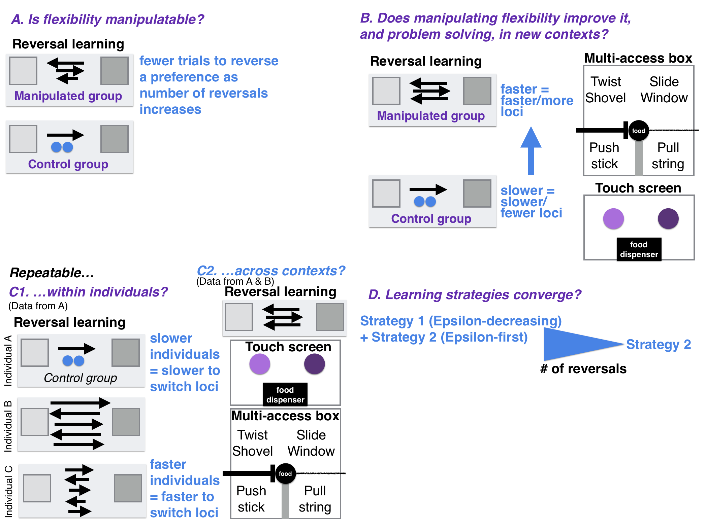

Is behavioral flexibility manipulatable and, if so, does it improve flexibility and problem solving in a new context?
================
[Dr. Corina Logan](http://CorinaLogan.com) (Max Planck Institute for Evolutionary Anthropology, <corina_logan@eva.mpg.de>), Carolyn Rowney (University of California Santa Barbara / Max Planck Institute for Evolutionary Anthropology), Luisa Bergeron (University of California Santa Barbara / Max Planck Institute for Evolutionary Anthropology), Benjamin Seitz (University of California Los Angeles), [Dr. Aaron Blaisdell](http://pigeonrat.psych.ucla.edu) (University of California Los Angeles), Dr. Zoe Johnson-Ulrich (University of California Santa Barbara / Max Planck Institute for Evolutionary Anthropology), Dr. Kelsey McCune (University of California Santa Barbara / Max Planck Institute for Evolutionary Anthropology)
2018-11-02

``` r
#Make code wrap text so it doesn't go off the page when Knitting to PDF
library(knitr)
opts_chunk$set(tidy.opts=list(width.cutoff=60),tidy=TRUE)
```

### ABSTRACT

This is one of the first studies planned for our long-term research on the role of behavioral flexibility in rapid geographic range expansions. Behavioral flexibility, the ability to adapt behavior to new circumstances, is thought to play an important role in a species' ability to successfully adapt to new environments and expand its geographic range (e.g., (Lefebvre et al. 1997), (Griffin and Guez 2014), (Chow, Lea, and Leaver 2016), (Sol and Lefebvre 2000), (Sol, Timmermans, and Lefebvre 2002), (Sol et al. 2005), (Sol et al. 2007)). However, behavioral flexibility is rarely directly tested in species in a way that would allow us to determine how it works and how we can make predictions about a species' ability to adapt their behavior to new environments. We use great-tailed grackles (a bird species) as a model to investigate this question because they have rapidly expanded their range into North America over the past 140 years ((Wehtje 2003), (Peer 2011)). We aim to manipulate grackle behavioral flexibility (color tube reversal learning) to determine whether their flexibility is generalizable across contexts (touch screen reversal learning and multi-access box), whether it is repeatable within individuals and across contexts, and what learning strategies they employ. Results will allow us to understand more about what flexibility is and how it works, and validate whether a touch screen measures the same ability as the color tubes (thus facilitating faster testing that can be conducted in the wild).

### A. STATE OF THE DATA

This preregistration was written prior to collecting data. Pilot data on serial reversal learning (using color tubes) in one grackle was collected January through April 2018, which informed the revision of 1) the criterion to pass serial reversal learning, 2) more accurate language for H1 P1 (they generally get faster rather than getting faster with each reversal), 3) the removal of shape reversals from H3a and H3b (to reduce the amount of time each bird is tested), and 4) a new passing criterion for touch screen serial reversals in H3b. Part way through data collection on reversal learning (using color tubes) for the first two birds, the criterion for what counts as making a choice was revised (October 2018) and part way through data collection on the first four birds (October 2018; see below for details) the number of trials that birds in the control group receive was revised to make the test battery feasible in the time given.

### B. PARTITIONING THE RESULTS

We may present the different hypotheses in separate papers.

### C. HYPOTHESES

#### H1: Behavioral flexibility, as measured by reversal learning using colored tubes, is manipulatable.

**Prediction 1:** Individuals improve their flexibility on a serial reversal learning task using colored tubes by generally requiring fewer trials to reverse a preference as the number of reversals increases (manipulation condition). Their flexibility on this test will have been manipulated relative to control birds who do not undergo serial reversals. Instead, individuals in the control condition will be matched to manipulated birds for experience (they will experience a similar number of trials), but there will be no possibility of a functional tube preference because both tubes will be the same color and both will contain food, therefore either choice will be correct.

**P1 alternative 1:** If the number of trials to reverse a preference does not correlate with or positively correlates with reversal number, this suggests that some individuals may prefer to rely on information acquired previously (i.e., they are slow to reverse) rather than relying on current cues (e.g., the food is in a new location) (e.g., (Manrique, Völter, and Call 2013); (Griffin and Guez 2014); (Liu et al. 2016), but see (Homberg et al. 2007)).

#### H2: Manipulating behavioral flexibility (improving reversal learning speed through serial reversals using colored tubers) improves flexibility (rule switching) and problem solving in a new context (multi-access box and serial reversals on a touch screen).

**P2:** Individuals that have improved their flexibility on a serial reversal learning task using colored tubes (requiring fewer trials to reverse a preference as the number of reversals increases) are faster to switch between new methods of solving (latency to solve or attempt to solve a new way of accessing the food \[locus\]), and learn more new loci (higher total number of solved loci) on a multi-access box flexibility task, and are faster to reverse preferences in a serial reversal task using a touch screen. The positive correlation between reversal learning performance using colored tubes and a touch screen (faster birds have fewer trials) and the multi-access box (faster birds have lower latencies) indicates that all three tests measure the same ability even though the multi-access box requires inventing new rules while reversal learning requires switching between two rules. Serial reversals eliminate the confounds of exploration, inhibition, and persistence in explaining reversal learning speed because, after multiple reversals, what is being measured is the ability to learn the rule to switch when the previously rewarded option no longer contains a reward. If the manipulation works, this indicates that flexibility can be influenced by previous experience and might indicate that any individual has the potential to move into new environments.

**P2 alternative 1:** If the manipulation does not work in that those individuals in the experimental condition do not decrease their reversal speeds more than control individuals, then this experiment will elucidate whether general individual variation in flexibility relates to flexibility in two new contexts (multi-access box and serial reversals on a touch screen) as well as problem solving ability (multi-access box). The prediction is the same in P2, but in this case variation in flexibility is constrained by traits inherent to the individual (some of which will be tested in a separate [preregistration](g_exploration.Rmd)), which suggests that certain individuals will be more likely to move into new environments.

**P2 alternative 2:** If there is no correlation between reversal learning speed (colored tubes) and the latency to solve/attempt a new locus on the multi-access box, this could be because the latency to solve not only measures flexibility but also innovativeness. In this case, an additional analysis will be run with the latency to solve as the response variable, to determine whether the fit of the model (as determined by Akaike weights) with reversal learning as an explanatory variable is improved if motor diversity (the number of different motor actions used when attempting to solve the multi-access box) is included as an explanatory variable. If the inclusion of motor diversity improves the model fit, then this indicates that the latency to solve a new locus on the multi-access box is influenced by flexibility (reversal learning speed) and innovation (motor diversity).

**P2 alternative 3:** If there is a negative correlation or no correlation between reversal learning speed on colored tubes and reversal learning speed on the touch screen, then this indicates that it may be difficult for individuals to perceive and/or understand images on the touch screen in contrast with physical objects (colored tubes)(e.g., (O’Hara, Huber, and Gajdon 2015)).



#### H3a: Behavioral flexibility within a context is repeatable within individuals.

Repeatibility of behavioral flexibility is defined as the number of trials to reverse a color preference being strongly negatively correlated within individuals with the number of reversals.

**P3a:** Individuals that are faster to reverse a color preference in the first reversal will also be faster to reverse a color preference in the second, etc. reversal due to natural individual variation.

**P3a alternative:** There is no repeatibility in behavioral flexibility within individuals, which could indicate that performance is state dependent (e.g., it depends on their fluctuating motivation, hunger levels, etc.). We will determine whether performance on colored tube reversal learning related to motivation by examining whether the latency to make a choice influenced the results. We will also determine whether performance was related to hunger levels by examining whether the number of minutes since the removal of their maintenance diet from their aviary plus the number of food rewards they received since then influenced the results.

#### H3b: The consistency of behavioral flexibility in individuals across contexts (context 1=reversal learning on colored tubes, context 2=multi-access box, context 3=reversal learning on touch screen) indicates their ability to generalize across contexts.

Individual consistency of behavioral flexibility is defined as the number of trials to reverse a color preference being strongly positively correlated within individuals with the latency to solve new loci on the multi-access box and with the number of trials to reverse a color preference on a touch screen (total number of touch screen reversals = 5 per bird).

*If P3a is supported (repeatability of flexibility within individuals)...*

**P3b:** ...and flexibility is correlated across contexts, then the more flexible individuals are better at generalizing across contexts.

**P3b alternative 1:** ...and flexibility is not correlated across contexts, then there is something that influences an individual's ability to discount cues in a given context. This could be the individual's reinforcement history (tested in P3a alternative), their reliance on particular learning strategies (one alternative is tested in H4), or their motivation (tested in P3a alternative) to engage with a particular task (e.g., difficulty level of the task).

#### H4: Individuals should converge on an epsilon-first learning strategy (learn the correct choice after one trial) as they progress through serial reversals.

**P4:** Individuals will prefer a mixture of learning strategies in the first serial reversals (an *epsilon-decreasing* strategy where individuals explore both options extensively before learning to prefer the rewarded option, and an *epsilon-first* strategy where the correct choice is consistently made after the first trial), and then move toward the epsilon-first learning strategy. The epsilon-first strategy works better later in the serial reversals where the reward is all or nothing because individuals will have learned the environment is changing in predictable ways (Bergstrom and Lachmann 2004): only one option is consistently rewarded, and if the reward isn't in the previously rewarded option, it must be in the other option.

**P4 alternative 1:** Individuals will continue to prefer a mixture of learning strategies, and/or they do not converge on the more functional epsilon-first learning strategy, regardless of how many reversals they participate in. This pattern could suggest that the grackles do not attend to functional meta-strategies, that is, they do not learn the overarching rule (once food is found in the non-preferred tube, one must switch to preferring that tube color), but rather they learn each preference change as if it was new.

### D. METHODS

#### **Open materials**

[Design files](./Multiaccess_box_design_files) for the multi-access box: 3D printer files and laser cutter files

[Testing protocols](https://docs.google.com/document/d/18D80XZV_XCG9urVzR9WzbfOKFprDV62v3P74upu01xU/edit?usp=sharing) for all three experiments: color tube reversal learning, multi-access box, and touch screen reversal learning

#### **Randomization and counterbalancing**

H1: Subjects will be randomly assigned to the manipulated or control group. In the reversal learning trials, the rewarded option is pseudorandomized for side (and the option on the left is always placed first). Pseudorandomization consisted of alternating location for the first two trials of a session and then keeping the same color on the same side for at most two consecutive trials thereafter. A list of all 88 unique trial sequences for a 10-trial session, following the pseudorandomization rules, will be generated in advance for experimenters to use during testing (e.g., a randomized trial sequence might look like: LRLLRRLRLR, where L and R refer to the location, left or right, of the rewarded tube). Randomized trial sequences will be assigned randomly to any given 10-trial session using a random number generator (random.org) to generate a number from 1-88.

#### **Blinding of conditions during analysis**

No blinding is involved in this study.

#### **Dependent variables**

*P1-P3*

Number of trials to reverse a preference. An individual is considered to have a preference if it chose the rewarded option at least 17 out of the most recent 20 trials (with a minimum of 8 or 9 correct choices out of 10 on the two most recent sets of 10 trials).

*P2 alternative 2: additional analysis: latency and motor diversity*

1.  Latency to attempt to solve a new locus on the multi-access box.

2.  Latency to solve a new locus on the multi-access box.

*P4: learning strategies*

Proportion of correct choices in a non-overlapping sliding window of 4-trial bins across the total number of trials required to reach the criterion of 17/20 correct choices (as in P1-P3).

#### **Independent variables**

#### *P1: reversal speed gets faster with serial reversals*

1.  Reversal number

2.  Batch

3.  ID (random effect because repeated measures on the same individuals)

#### *P2: serial reversals improve rule switching & problem solving*

1.  Average latency to attempt to solve a new locus after solving a different locus

2.  Average latency to solve a new locus after solving a different locus

3.  Total number of loci solved

4.  Experimental group (manipulated=multiple reversals with color stimuli; control=one reversal plus equalized experience making choices where both are the same color and both contain a reward)

5.  Batch

#### *P2 alternative 2: additional analysis: latency and motor diversity*

1.  Number of trials to reverse a preference in the last reversal that individual participated in

2.  Motor diversity: the number of different motor actions used when attempting to solve the multi-access box

#### *P3a: repeatable within individuals within a context (reversal learning)*

1.  Reversal number

2.  ID

#### *P3a alternative 1: was the potential lack of repeatability on colored tube reversal learning due to motivation or hunger?*

1.  Trial number

2.  Latency from the beginning of the trial to when they make a choice

3.  Minutes since maintenance diet was removed from the aviary

4.  Cumulative number of rewards from previous trials on that day

5.  ID (random effect)

6.  Batch (random effect)

#### *P3b: repeatable across contexts*

1.  Reversal number

2.  Condition (color tubes, multi-access box, touch screen)

3.  Average latency to solve a new locus

4.  ID

#### *P4: serial reversal learning strategy*

1.  Trial number

2.  ID

### E. ANALYSIS PLAN

We do not plan to **exclude** any data. When **missing data** occur, the existing data for that individual will be included in the analyses for the tests they completed. Analyses will be conducted in R (current version 3.3.3; R Core Team (2017)). When there is more than one experimenter within a test, experimenter will be added as a random effect to account for potential differences between experimenters in conducting the tests. If there are no differences between models including or excluding experimenter as a random effect, then we will use the model without this random effect for simplicity.

#### *Ability to detect actual effects*

To begin to understand what kinds of effect sizes we will be able to detect given our sample size limitations and our interest in decreasing noise by attempting to measure it, which increases the number of explanatory variables, we used G\*Power (v.3.1, Faul et al. (2007), Faul et al. (2009)) to conduct power analyses based on confidence intervals. G\*Power uses pre-set drop down menus and we chose the options that were as close to our analysis methods as possible (listed in each analysis below). Note that there were no explicit options for GLMs (though the chosen test in G\*Power appears to align with GLMs) or GLMMs or for the inclusion of the number of trials per bird (which are generally large in our investigation), thus the power analyses are only an approximation of the kinds of effect sizes we can detect. We realize that these power analyses are not fully aligned with our study design and that these kinds of analyses are not appropriate for Bayesian statistics (e.g., our MCMCglmm below), however we are unaware of better options at this time. Additionally, it is difficult to run power analyses because it is unclear what kinds of effect sizes we should expect due to the lack of data on this species for these experiments.

#### *Data checking*

The data will be visually checked to determine whether they are normally distributed via two methods: 1) normality is indicated when the histograms of actual data match those with simulated data (Figure 2), and 2) normality is indicated when the residuals closely fit the dotted line in the Normal Q-Q plot (Figure 3) (Zuur, Ieno, and Saveliev 2009).

``` r
# Check the dependent variables for normality: Histograms
# Trials to reverse
reverse <- read.csv("/Users/corina/GTGR/data/data_reverse.csv", 
    header = T, sep = ",", stringsAsFactors = F)

# Latency to attempt/solve a new locus
diversity <- read.csv("/Users/corina/GTGR/data/data_reversemulti.csv", 
    header = T, sep = ",", stringsAsFactors = F)

op <- par(mfrow = c(2, 3), mar = c(4, 4, 2, 0.2))
# This is what the distribution of actual data looks like
hist(reverse$TrialsToReverse, xlab = "Number of trials to reverse a preference", 
    main = "Actual Data")
hist(diversity$AvgLatencyAttemptNewLoci, xlab = "Latency to attempt a new locus (s)", 
    main = "Actual Data")
hist(diversity$AvgLatencySolveNewLoci, xlab = "Latency to solve a new locus (s)", 
    main = "Actual Data")

# Given the actual data, this is what a normal distribution
# would look like
X2 <- rnorm(1281, mean = mean(reverse$TrialsToReverse), sd = sd(reverse$TrialsToReverse))
hist(X2, xlab = "Number of trials to reverse a preference", main = "Simulated Data")

Y2 <- rnorm(1281, mean = mean(diversity$AvgLatencyAttemptNewLoci), 
    sd = sd(diversity$AvgLatencyAttemptNewLoci))
hist(Y2, xlab = "Latency to attempt a new locus (s)", main = "Simulated Data")

Z2 <- rnorm(1281, mean = mean(diversity$AvgLatencySolveNewLoci), 
    sd = sd(diversity$AvgLatencySolveNewLoci))
hist(Z2, xlab = "Latency to solve a new locus (s)", main = "Simulated Data")
```

``` r
# Check the dependent variables for normality: Q-Q plot
# Trials to reverse
reverse <- read.csv("/Users/corina/GTGR/data/data_reverse.csv", 
    header = T, sep = ",", stringsAsFactors = F)

# Latency to attempt/solve a new locus
diversity <- read.csv("/Users/corina/GTGR/data/data_reversemulti.csv", 
    header = T, sep = ",", stringsAsFactors = F)

# Figure 2. Visual check of the Normal Q-Q plot
op <- par(mfrow = c(2, 4), mar = c(4, 4, 2, 0.2))
plot(glm(reverse$TrialsToReverse ~ reverse$ReverseNumber))
plot(glm(diversity$AvgLatencySolveNewLoci ~ diversity$AvgLatencyAttemptNewLoci))
```

If the data do not appear normally distributed, visually check the residuals. If they are patternless, then assume a normal distribution (Figure 4) (Zuur, Ieno, and Saveliev 2009).

``` r
# Check the dependent variables for normality: Residuals
detour <- read.csv("/Users/corina/GTGR/data/data_detour.csv", 
    header = T, sep = ",", stringsAsFactors = F)

# Trials to reverse
reverse <- read.csv("/Users/corina/GTGR/data/data_reverse.csv", 
    header = T, sep = ",", stringsAsFactors = F)

# Latency to attempt/solve a new locus
diversity <- read.csv("/Users/corina/GTGR/data/data_reversemulti.csv", 
    header = T, sep = ",", stringsAsFactors = F)

# Figure 3. Visual check of the residuals
op <- par(mfrow = c(1, 2), mar = c(4, 4, 2, 0.2))
plot(residuals(glm(reverse$TrialsToReverse ~ reverse$ReverseNumber)), 
    ylab = "Reverse residuals: Trials to reverse ~ Reverse number")
plot(residuals(glm(diversity$AvgLatencySolveNewLoci ~ diversity$AvgLatencyAttemptNewLoci)), 
    ylab = "Multi-access residuals: Avg solve latency ~ Avg attempt latency")
```

#### *Determining the threshold: How many reversals are enough?*

We initially (in 2017) set as the passing criterion: During the data collection period, the number of trials required to reverse a preference will be documented per bird, and reversals will continue until the first batch of birds tested reaches an asymptote (i.e., there are negligible further decreases in the number of trials required to reverse a preference). The number of reversals to reach the asymptote will be the number of reversals that subsequent birds experience.

Due to delays in setting up the field site, we were only able to test two grackles in early 2018 (January through April) and, due to randomization, only one (Fajita) was in the experimental condition that involved undergoing the flexibility manipulation (Empanada was in the control condition). While Fajita's reversal speeds generally improved with increasing serial reversals, she never reached an asymptote (which we defined as passing three consecutive reversals in the same number of trials), even after 38 reversals. These 38 reversals took 2.5 months, which is an impractical amount of time if birds are to participate in the rest of the test battery after undergoing the reversal manipulation (we are permitted to keep them in aviaries for up to three months per bird). Because our objective in this experiment is to manipulate an individual's flexibility, we decided to revise our serial reversal passing criterion to something more species relevant based on Fajita's serial reversal performance and the performance of seven grackles in Santa Barbara who underwent only one reversal in 2014 and 2015 (Logan 2016). **The revised serial reversal passing criterion is: passing two sessions in a row at or under 50 trials**. 50 trials is fewer trials than any of the nine grackles required to pass their first reversal (range 70-130), therefore it should reflect an improvement in flexibility.

#### *Revising the choice criterion and the criterion to pass the control condition*

**Choice criterion:** At the beginning of the second bird's initial discrimination in the reversal learning color tube experiment (October 2018), we revised the criterion for what counts as a choice from A) the bird's head needs to pass an invisible line on the table that ran perpendicular to the the tube opening to B) the bird's needs to bend its body or head down to look in the tube. Criterion A resulted in birds making more choices than the number of learning opportunities they were exposed to (because they could not see whether there was food in the tube unless they bent their head down to look in the tube) and appeared to result in slower learning. It is important that one choice equals one learning opportunity, therefore we revised the choice criterion to the latter. Anecdotally, this choice matters because the first three birds in the experiment (Tomatillo, Chalupa, and Queso) learned faster than the pilot birds (Empanada and Fajita) in their initial discriminations and first reversals. Thus, it was an important change to make at the beginning of the experiment.

**Criterion to pass the control condition:** Before collecting experimental data, we set the number of trials experienced by the birds in the control group as 1100 because this is how many trials it would have taken the pilot bird in the manipulated group, Fajita, to pass serial reversals 2-17 according to our revised serial reversal passing criterion. However, after 25 and 17 days (after Tomatillo and Queso's first reversals, respectively) of testing the first two individuals in the control group it became apparent that 1100 trials is impractical given the time constraints for how long we are permitted to keep each bird temporarily in captivity and would prevent birds from completing the test battery before their release. Additionally, after revising the choice criterion, it was going to be likely that birds in the manipulated group would require fewer than 1100 trials to meet the serial reversal passing criterion. Therefore, reducing the number of trials control birds experience would result in a better match of experience with birds in the manipulated group. On 2 November 2018 we set the number of trials control birds experience after their first (and only) reversal to the number of trials it requires the first bird in the manipulated group to pass (the first bird has not passed yet, therefore we do not yet know what this number is). After more individuals in the manipulated group pass, we will update this number to the average number of trials to pass.

#### *P1: negative relationship between the number of trials to reverse a preference and the number of reversals?*

**Analysis:** Generalized Linear Model (GLM; glm function, stats package) with a Poisson distribution and log link.

To determine our ability to detect actual effects, we ran a power analysis in G\*Power with the following settings: test family=F tests, statistical test=linear multiple regression: Fixed model (R^2 deviation from zero), type of power analysis=a priori, alpha error probability=0.05. We reduced the power to 0.70 and increased the effect size until the total sample size in the output matched our projected sample size (n=32). The protocol of the power analysis is here:

*Input:*

Effect size f² = 0.21

α err prob = 0.05

Power (1-β err prob) = 0.7

Number of predictors = 1

*Output:*

Noncentrality parameter λ = 6.7200000

Critical F = 4.1708768

Numerator df = 1

Denominator df = 30

Total sample size = 32

Actual power = 0.7083763

This means that, with our sample size of 32, we have a 71% chance of detecting a medium effect (approximated at f<sup>2</sup>=0.15 by Cohen (1988)).

``` r
serial <- read.csv("/Users/corina/GTGR/data/data_reverse.csv", 
    header = T, sep = ",", stringsAsFactors = F)

# GLM
serial1 <- glm(TrialsToReverse ~ ReverseNumber, family = "poisson", 
    data = serial)
# summary(serial1)

sserial1 <- summary(serial1)
library(xtable)
sserial1.table <- xtable(sserial1)
library(knitr)
kable(sserial1.table, caption = "Table 1: Model selection output.", 
    format = "html", digits = 2)

# Model Validation
library(MuMIn)
options(na.action = "na.fail")
base1 <- dredge(glm(TrialsToReverse ~ ReverseNumber, family = "poisson", 
    data = serial))
library(knitr)
kable(base1, caption = "Table 2: Model selection output.")
```

**Model validation:** Determine whether the test model results are likely to be reliable given the data (Burnham and Anderson 2003). Compare Akaike weights (range: 0–1, the sum of all model weights equals 1; Akaike, 1981) between the test model and a base model (number of trials to reverse as the response variable and 1 as the explanatory variable) using the dredge function in the MuMIN package (D Bates, Maechler, and Bolker 2012). If the best fitting model has a high Akaike weight (&gt;0.89; (Burnham and Anderson 2003)), then it indicates that the results are likely given the data. The Akaike weights indicate the best fitting model is the \[base/test *- delete as appropriate*\] model (Table 2).

#### *P2: serial reversal improves rule switching & problem solving*

**Analysis:** Because the independent variables could influence each other, I will analyze them in a single model: Generalized Linear Model (GLM; glm function, stats package) with a Poisson distribution and log link. The contribution of each independent variable will be evaluated using the Estimate in the full model.

To determine our ability to detect actual effects, we ran a power analysis in G\*Power with the following settings: test family=F tests, statistical test=linear multiple regression: Fixed model (R^2 deviation from zero), type of power analysis=a priori, alpha error probability=0.05. We reduced the power to 0.70 and increased the effect size until the total sample size in the output matched our projected sample size (n=32). The protocol of the power analysis is here:

*Input:*

Effect size f² = 0.41

α err prob = 0.05

Power (1-β err prob) = 0.7

Number of predictors = 5

*Output:*

Noncentrality parameter λ = 13.1200000

Critical F = 2.5867901

Numerator df = 5

Denominator df = 26

Total sample size = 32

Actual power = 0.7103096

This means that, with our sample size of 32, we have a 71% chance of detecting a large effect (approximated at f<sup>2</sup>=0.35 by Cohen (1988)).

``` r
improve <- read.csv("/Users/corina/GTGR/data/data_reversemulti.csv", 
    header = T, sep = ",", stringsAsFactors = F)

# GLM
imp <- glm(AvgTrialsToReverse ~ ExperimentalGroup + AvgLatencySolveNewLoci + 
    AvgLatencyAttemptNewLoci + TotalLoci + Batch, family = "poisson", 
    data = improve)
simp <- summary(imp)
library(xtable)
simp.table <- xtable(simp)
library(knitr)
kable(simp.table, caption = "Table 3: Model selection output.", 
    format = "html", digits = 2)
```

**P2 alternative 2: additional analysis: latency and motor diversity** Generalized Linear Model (GLM; glm function, stats package) with a Poisson distribution and log link. The best-fitting model will be determined by comparing Akaike weights: this will show whether the best-fitting model results are likely to be reliable given the data (Burnham and Anderson 2003). Compare Akaike weights (range: 0–1, the sum of all model weights equals 1; Akaike, 1981) between the test model and a base model (number of trials to reverse as the response variable and 1 as the explanatory variable) using the dredge function in the MuMIN package (D Bates, Maechler, and Bolker 2012). If the best fitting model has a high Akaike weight (&gt;0.89; (Burnham and Anderson 2003)), then it indicates that the results are likely given the data. The Akaike weights indicate the best fitting model is the \[base/test *- delete as appropriate*\] model (Table 5).

To determine our ability to detect actual effects, we ran a power analysis in G\*Power with the following settings: test family=F tests, statistical test=linear multiple regression: Fixed model (R^2 deviation from zero), type of power analysis=a priori, alpha error probability=0.05. We reduced the power to 0.70 and increased the effect size until the total sample size in the output matched our projected sample size (n=32). The protocol of the power analysis is here:

*Input:*

Effect size f² = 0.27

α err prob = 0.05

Power (1-β err prob) = 0.7

Number of predictors = 2

*Output:*

Noncentrality parameter λ = 8.6400000

Critical F = 3.3276545

Numerator df = 2

Denominator df = 29

Total sample size = 32

Actual power = 0.7047420

This means that, with our sample size of 32, we have a 70% chance of detecting a medium (approximated at f<sup>2</sup>=0.15 by Cohen (1988)) to large effect (approximated at f<sup>2</sup>=0.35 by Cohen (1988)).

``` r
# Latency to attempt to solve a new locus
diversity <- read.csv("/Users/corina/GTGR/data/data_reversemulti.csv", 
    header = T, sep = ",", stringsAsFactors = F)

# GLM
div <- glm(AvgLatencySolveNewLoci ~ TrialsToReverseLast + NumberMotorActionsMulti, 
    family = "poisson", data = diversity)
# summary(div)

sdiv <- summary(div)
library(xtable)
sdiv.table <- xtable(sdiv)
library(knitr)
kable(sdiv.table, caption = "Table 4: Model selection output.", 
    format = "html", digits = 2)

# Model Validation
library(MuMIn)
options(na.action = "na.fail")
base1 <- dredge(glm(AvgLatencySolveNewLoci ~ TrialsToReverseLast + 
    NumberMotorActionsMulti, family = "poisson", data = diversity))
library(knitr)
kable(base1, caption = "Table 5: Model selection output.")
```

``` r
# Latency to solve a new locus
diversity <- read.csv("/Users/corina/GTGR/data/data_reversemulti.csv", 
    header = T, sep = ",", stringsAsFactors = F)

# GLM
div <- glm(AvgLatencyAttemptNewLoci ~ TrialsToReverseLast + NumberMotorActionsMulti, 
    family = "poisson", data = diversity)
# summary(div)

sdiv <- summary(div)
library(xtable)
sdiv.table <- xtable(sdiv)
library(knitr)
kable(sdiv.table, caption = "Table 6: Model selection output.", 
    format = "html", digits = 2)

# Model Validation
library(MuMIn)
options(na.action = "na.fail")
base1 <- dredge(glm(AvgLatencyAttemptNewLoci ~ TrialsToReverseLast + 
    NumberMotorActionsMulti, family = "poisson", data = diversity))
library(knitr)
kable(base1, caption = "Table 7: Model selection output.")
```

#### *P3a: repeatable within individuals within a context (reversal learning)*

**Analysis:** Is reversal learning (colored tubes) repeatable within individuals within a context (reversal learning)? To calculate repeatability, a GLMM was run (R package: lme4, function: lmer, Douglas Bates et al. (2015)) where each individual had a random intercept (i.e., ID was a random effect). To obtain the repeatability estimate, which indicates how much of the total variance, after accounting for fixed effects, is explained by individual differences (ID), the estimate for ID is divided by the sum of the estimates of all random effects and residual variance (as in Houslay (2016)). The model was then run in lmerTest (Kuznetsova, Bruun Brockhoff, and Haubo Bojesen Christensen (2016)) to determine whether the random effect (ID) was statistically significant (p&lt;0.05).

To roughly estimate our ability to detect actual effects (because these power analyses are designed for frequentist statistics, not Bayesian statistics), we ran a power analysis in G\*Power with the following settings: test family=F tests, statistical test=linear multiple regression: Fixed model (R^2 deviation from zero), type of power analysis=a priori, alpha error probability=0.05. The number of predictor variables was restricted to only the fixed effects because this test was not designed for mixed models. We reduced the power to 0.70 and increased the effect size until the total sample size in the output matched our projected sample size (n=32). The protocol of the power analysis is here:

*Input:*

Effect size f² = 0.21

α err prob = 0.05

Power (1-β err prob) = 0.7

Number of predictors = 1

*Output:*

Noncentrality parameter λ = 6.7200000

Critical F = 4.1708768

Numerator df = 1

Denominator df = 30

Total sample size = 32

Actual power = 0.7083763

This means that, with our sample size of 32, we have a 71% chance of detecting a medium effect (approximated at f<sup>2</sup>=0.15 by Cohen (1988)).

``` r
serial2 <- read.csv("/Users/corina/GTGR/data/data_reverse.csv", 
    header = T, sep = ",", stringsAsFactors = F)

# GLMM
library(MCMCglmm)
prior = list(R = list(R1 = list(V = 1, nu = 0)), G = list(G1 = list(V = 1, 
    nu = 0)))
serial <- MCMCglmm(TrialsToReverse ~ ReverseNumber, random = ~ID, 
    family = "poisson", data = serial2, verbose = F, prior = prior, 
    nitt = 13000, thin = 10, burnin = 3000)
summary(serial)
# autocorr(serial$Sol) #Did fixed effects converge?
# autocorr(serial$VCV) #Did random effects converge?

# How to calculate repeatability following advice from Tom
# Houslay's blog http://rpubs.com/tomhouslay/200150
library(lme4)
rep <- lmer(TrialsToReverse ~ ReverseNumber + (1 | ID), data = serial2)

#'we can also calculate the conditional repeatability easily - in terms of how much of the total phenotypic variance (after accounting for fixed effects) is explained by differences between individuals' http://rpubs.com/tomhouslay/200150
library(tidyr)
library(broom)
trep <- tidy(rep, effects = "ran_pars", scales = "vcov")
trep[trep$group == "ID", ]$estimate/(sum(trep$estimate))  #this gives a number called Repeatability

# To see whether ID is signficant (and, by proxy,
# repeatability), run lmerTest
library(lmerTest)
rand(rep)
detach(package:lmerTest)

## Determine whether
+AvgLatencyToChoose + MinSinceFoodRemoved + NumberRewardsFromPrevTrials
```

#### *P3a alternative 1: was the potential lack of repeatability on colored tube reversal learning due to motivation or hunger?*

**Analysis:** Because the independent variables could influence each other or measure the same variable, I will analyze them in a single model: Generalized Linear Mixed Model (GLMM; MCMCglmm function, MCMCglmm package; (J. D. Hadfield 2010)) with a binomial distribution (called categorical in MCMCglmm) and logit link using 13,000 iterations with a thinning interval of 10, a burnin of 3,000, and minimal priors (V=1, nu=0) (J. Hadfield 2014). We will ensure the GLMM shows acceptable convergence (lag time autocorrelation values &lt;0.01; (J. D. Hadfield 2010)), and adjust parameters if necessary. The contribution of each independent variable will be evaluated using the Estimate in the full model.

To roughly estimate our ability to detect actual effects (because these power analyses are designed for frequentist statistics, not Bayesian statistics), we ran a power analysis in G\*Power with the following settings: test family=F tests, statistical test=linear multiple regression: Fixed model (R^2 deviation from zero), type of power analysis=a priori, alpha error probability=0.05. We reduced the power to 0.70 and increased the effect size until the total sample size in the output matched our projected sample size (n=32). The number of predictor variables was restricted to only the fixed effects because this test was not designed for mixed models. The protocol of the power analysis is here:

*Input:*

Effect size f² = 0.31

α err prob = 0.05

Power (1-β err prob) = 0.7

Number of predictors = 4

*Output:*

Noncentrality parameter λ = 11.4700000

Critical F = 2.6684369

Numerator df = 4

Denominator df = 32

Total sample size = 37

Actual power = 0.7113216

This means that, with our sample size of 32, we have a 71% chance of detecting a large effect (approximated at f<sup>2</sup>=0.35 by Cohen (1988)).

``` r
rr <- read.csv("/Users/corina/GTGR/data/data_reverseraw.csv", 
    header = T, sep = ",", stringsAsFactors = F)

# GLMM - Is trial the main independent variable associated
# with learning performance (CorrectChoice) or are other
# variables associated with performance, including motivation
# and hunger?
library(MCMCglmm)
prior = list(R = list(R1 = list(V = 1, nu = 0), R2 = list(V = 1, 
    nu = 0), R3 = list(V = 1, nu = 0), R4 = list(V = 1, nu = 0)), 
    G = list(G1 = list(V = 1, nu = 0), G2 = list(V = 1, nu = 0)))

rr1 <- MCMCglmm(CorrectChoice ~ Trial * LatencyToChoose * MinSinceFoodRemoved * 
    NumberRewardsFromPrevTrials, random = ~ID + Batch, family = "categorical", 
    data = rr, verbose = F, prior = prior, nitt = 13000, thin = 10, 
    burnin = 3000)
summary(rr1)
autocorr(rr1$Sol)  #Did fixed effects converge?
autocorr(rr1$VCV)  #Did random effects converge?
```

#### *P3b: individual consistency across contexts*

**Analysis:** Do those individuals that are faster to reverse a color preference also have lower latencies to switch to new options on the multi-access box? Generalized Linear Model (GLM; glm function, stats package) with a Poisson distribution and log link.

To determine our ability to detect actual effects, we ran a power analyss in G\*Power with the following settings: test family=F tests, statistical test=linear multiple regression: Fixed model (R^2 deviation from zero), type of power analysis=a priori, alpha error probability=0.05. We reduced the power to 0.70 and increased the effect size until the total sample size in the output matched our projected sample size (n=32). The protocol of the power analysis is here:

*Input:*

Effect size f² = 0.21

α err prob = 0.05

Power (1-β err prob) = 0.7

Number of predictors = 1

*Output:*

Noncentrality parameter λ = 6.7200000

Critical F = 4.1708768

Numerator df = 1

Denominator df = 30

Total sample size = 32

Actual power = 0.7083763

This means that, with our sample size of 32, we have a 71% chance of detecting a medium effect (approximated at f<sup>2</sup>=0.15 by Cohen (1988)).

``` r
improve1 <- read.csv("/Users/corina/GTGR/data/data_reversemulti.csv", 
    header = T, sep = ",", stringsAsFactors = F)

# GLM: color reversal vs multi-access box
rm <- glm(AvgTrialsToReverse ~ AvgLatencySolveNewLoci, data = improve1)
summary(rm)
```

``` r
improve2 <- read.csv("/Users/corina/GTGR/data/data_reversetouch.csv", 
    header = T, sep = ",", stringsAsFactors = F)

# GLM: color reversal vs touch screen reversal
rt <- glm(AvgTrialsToReverseR ~ AvgTrialsToReverseT, data = improve2)
summary(rt)
```

#### *P4: learning strategies*

**Analysis:** Learning strategies will be identified by matching them to the two known approximate strategies of the contextual, binary multi-armed bandit: epsilon-first and epsilon-decreasing ((McInerney 2010), as in (Logan 2016)).

From Logan (2016) (emphasis added):

> The following equations refer to the different phases involved in each strategy:

> Equation 1 (exploration phase):
> *ϵ**N*

> Equation 2 (exploitation phase):
> (1 − *ϵ*)*N*

> N is the number of trials given, and epsilon,
> *ϵ*
> , represents the subject’s uncertainty about the location of the reward, starting at complete uncertainty (*ϵ* = 1) at the beginning of the experiment and decreasing rapidly as individuals gain experience with the task (exploration phase where the rewarded \[option\] is chosen below or at chance levels) and switch to the exploitative phase (the rewarded \[option\] is chosen significantly above chance levels). Because the \[subjects\] needed to learn the rules of the task, they necessarily had an exploration phase. The **epsilon-first strategy** involves an exploration phase followed by an entirely exploitative phase. The optimal strategy overall would be to explore one color in the first trial and the other color in the second trial, and then switch to an exploitative strategy (choose the rewarded \[option\] significantly above chance levels). In this case there would be no pattern \[in the learning curve\] in the choices \[during\] the exploration phase because it would consist of sampling each \[option\] only once. In the **epsilon-decreasing strategy**, subjects would start by making some incorrect choices and then increase their choice of the rewarded \[option\] gradually as their uncertainty decreases until they choose the rewarded \[option\] significantly above chance levels. In this case, a linear pattern emerges \[in the learning curve\] during the exploration phase.

#### *Alternative Analyses*

We anticipate that we will want to run additional/different analyses after reading McElreath (2016). We will revise this preregistration to include these new analyses before conducting the analyses above.

### F. PLANNED SAMPLE

Great-tailed grackles will be caught in the wild in Tempe, Arizona, USA for individual identification (colored leg bands in unique combinations). Some individuals (~32: ~16 per treatment (control: 1 reversal; flexibility manipulation: multiple reversals including a transfer to a new stimulus)) will be brought temporarily into aviaries for testing, and then they will be released back to the wild.

**Sample size rationale**

We will test as many birds as we can in the approximately three years at this field site given that the birds only participate in tests in aviaries during the non-breeding season (approximately September through March). The minimum sample size will be 8 birds per experiment (n=16 total), however we expect to be able to test many more.

**Data collection stopping rule**

We will stop testing birds once we have completed two full aviary seasons (likely in March 2020).

### G. ETHICS

This research is carried out in accordance with permits from the:

1.  US Fish and Wildlife Service (scientific collecting permit number MB76700A-0,1,2)
2.  US Geological Survey Bird Banding Laboratory (federal bird banding permit number 23872)
3.  Arizona Game and Fish Department (scientific collecting license number SP594338 \[2017\] and SP606267 \[2018\])
4.  Institutional Animal Care and Use Committee at Arizona State University (protocol number 17-1594R)
5.  University of Cambridge ethical review process (non-regulated use of animals in scientific procedures: zoo4/17)

### H. AUTHOR CONTRIBUTIONS

**Logan:** Hypothesis development, data collection, data analysis and interpretation, write up, revising/editing, materials/funding.

**Rowney:** Data collection, data interpretation, revising/editing.

**Bergeron:** Data collection, data interpretation, revising/editing.

**Seitz:** Prediction revision, programmed the reversal learning touch screen experiment, data interpretation, revising/editing.

**Blaisdell:** Prediction revision, assisted with programming the reversal learning touch screen experiment, data interpretation, revising/editing.

**Johnson-Ulrich:** Prediction revision, programming, data collection, data interpretation, revising/editing.

**McCune:** Data collection, data interpretation, revising/editing.

### I. FUNDING

This research is funded by the Department of Human Behavior, Ecology and Culture at the Max Planck Institute for Evolutionary Anthropology, and by a Leverhulme Early Career Research Fellowship to Logan.

### J. ACKNOWLEDGEMENTS

We thank Dieter Lukas for help polishing the hypotheses and for developing an additional dependent variable (flexibility ratio); Ben Trumble for hosting the grackle project via office and lab space; Angela Bond for daily logistical support in the lab; Melissa Wilson Sayres for sponsoring our affiliations at Arizona State University and lending lab equipment; Kristine Johnson for technical advice on great-tailed grackles; Jay Taylor for grackle scouting and connecting us with facilities at Arizona State University; Arizona State University School of Life Sciences Department Animal Care and Technologies for providing space for our aviaries and for their excellent support of our daily activities; Julia Cissewski for tirelessly solving problems involving financial transactions and contracts; and Richard McElreath for project support.

### K. [REFERENCES](MyLibrary.bib)

Bates, D, M Maechler, and B Bolker. 2012. “Lme4: Linear Mixed-Effects Models Using S4 Classes (2011). R Package Version 0.999375-42.”

Bates, Douglas, Martin Mächler, Ben Bolker, and Steve Walker. 2015. “Fitting Linear Mixed-Effects Models Using lme4.” *Journal of Statistical Software* 67 (1): 1–48. doi:[10.18637/jss.v067.i01](https://doi.org/10.18637/jss.v067.i01).

Bergstrom, Carl T, and Michael Lachmann. 2004. “Shannon Information and Biological Fitness.” In *Information Theory Workshop, 2004. Ieee*, 50–54. IEEE.

Burnham, Kenneth P, and David R Anderson. 2003. *Model Selection and Multimodel Inference: A Practical Information-Theoretic Approach*. Springer Science & Business Media.

Chow, Pizza Ka Yee, Stephen EG Lea, and Lisa A Leaver. 2016. “How Practice Makes Perfect: The Role of Persistence, Flexibility and Learning in Problem-Solving Efficiency.” *Animal Behaviour* 112. Elsevier: 273–83.

Cohen, Jacob. 1988. “Statistical Power Analysis for the Behavioral Sciences 2nd Edn.” Erlbaum Associates, Hillsdale.

Faul, Franz, Edgar Erdfelder, Axel Buchner, and Albert-Georg Lang. 2009. “Statistical Power Analyses Using G\* Power 3.1: Tests for Correlation and Regression Analyses.” *Behavior Research Methods* 41 (4). Springer: 1149–60.

Faul, Franz, Edgar Erdfelder, Albert-Georg Lang, and Axel Buchner. 2007. “G\* Power 3: A Flexible Statistical Power Analysis Program for the Social, Behavioral, and Biomedical Sciences.” *Behavior Research Methods* 39 (2). Springer: 175–91.

Griffin, Andrea S, and David Guez. 2014. “Innovation and Problem Solving: A Review of Common Mechanisms.” *Behavioural Processes* 109. Elsevier: 121–34.

Hadfield, Jarrod D. 2010. “MCMC Methods for Multi-Response Generalized Linear Mixed Models: The MCMCglmm R Package.” *Journal of Statistical Software* 33 (2): 1–22. <http://www.jstatsoft.org/v33/i02/>.

Hadfield, JD. 2014. “MCMCglmm Course Notes.” <http://cran.r-project.org/web/packages/MCMCglmm/vignettes/CourseNotes.pdf>.

Homberg, Judith R, Tommy Pattij, Mieke CW Janssen, Eric Ronken, Sietse F De Boer, Anton NM Schoffelmeer, and Edwin Cuppen. 2007. “Serotonin Transporter Deficiency in Rats Improves Inhibitory Control but Not Behavioural Flexibility.” *European Journal of Neuroscience* 26 (7). Wiley Online Library: 2066–73.

Houslay, T. 2016. *ISBE Plasticity*. RPubs. <http://rpubs.com/tomhouslay/200150>.

Kuznetsova, Alexandra, Per Bruun Brockhoff, and Rune Haubo Bojesen Christensen. 2016. *LmerTest: Tests in Linear Mixed Effects Models*. <https://CRAN.R-project.org/package=lmerTest>.

Lefebvre, Louis, Patrick Whittle, Evan Lascaris, and Adam Finkelstein. 1997. “Feeding Innovations and Forebrain Size in Birds.” *Animal Behaviour* 53 (3). Elsevier: 549–60.

Liu, Yuxiang, Lainy B Day, Kyle Summers, and Sabrina S Burmeister. 2016. “Learning to Learn: Advanced Behavioural Flexibility in a Poison Frog.” *Animal Behaviour* 111. Elsevier: 167–72.

Logan, C J. 2016. “Behavioral Flexibility in an Invasive Bird Is Independent of Other Behaviors.” *PeerJ* 4. PeerJ Inc.: e2215.

Manrique, Héctor Marín, Christoph J. Völter, and Josep Call. 2013. “Repeated Innovation in Great Apes.” *Animal Behaviour* 85 (1): 195–202. doi:[10.1016/j.anbehav.2012.10.026](https://doi.org/10.1016/j.anbehav.2012.10.026).

McElreath, Richard. 2016. *Statistical Rethinking: A Bayesian Course with Examples in R and Stan*. CRC Press. <http://xcelab.net/rm/statistical-rethinking/>.

McInerney, Rob E. 2010. “Multi-Armed Bandit Bayesian Decision Making.” *Univ. Oxford, Oxford, Tech. Rep*.

O’Hara, Mark, Ludwig Huber, and Gyula Kopanny Gajdon. 2015. “The Advantage of Objects over Images in Discrimination and Reversal Learning by Kea, Nestor Notabilis.” *Animal Behaviour* 101. Elsevier: 51–60.

Peer, Brian D. 2011. “Invasion of the Emperor’s Grackle.” *Ardeola* 58 (2). BioOne: 405–9.

R Core Team. 2017. *R: A Language and Environment for Statistical Computing*. Vienna, Austria: R Foundation for Statistical Computing. <https://www.R-project.org>.

Sol, Daniel, and Louis Lefebvre. 2000. “Behavioural Flexibility Predicts Invasion Success in Birds Introduced to New Zealand.” *Oikos* 90 (3). Wiley Online Library: 599–605.

Sol, Daniel, Richard P Duncan, Tim M Blackburn, Phillip Cassey, and Louis Lefebvre. 2005. “Big Brains, Enhanced Cognition, and Response of Birds to Novel Environments.” *Proceedings of the National Academy of Sciences of the United States of America* 102 (15). National Acad Sciences: 5460–5.

Sol, Daniel, Tamas Székely, Andras Liker, and Louis Lefebvre. 2007. “Big-Brained Birds Survive Better in Nature.” *Proceedings of the Royal Society of London B: Biological Sciences* 274 (1611). The Royal Society: 763–69.

Sol, Daniel, Sarah Timmermans, and Louis Lefebvre. 2002. “Behavioural Flexibility and Invasion Success in Birds.” *Animal Behaviour* 63 (3). Elsevier: 495–502.

Wehtje, Walter. 2003. “The Range Expansion of the Great-Tailed Grackle (Quiscalus Mexicanus Gmelin) in North America Since 1880.” *Journal of Biogeography* 30 (10). Wiley Online Library: 1593–1607.

Zuur, Alain F.., Elena N.. Ieno, and Anatoly A Saveliev. 2009. *Mixed Effects Models and Extensions in Ecology with R*. Springer.
