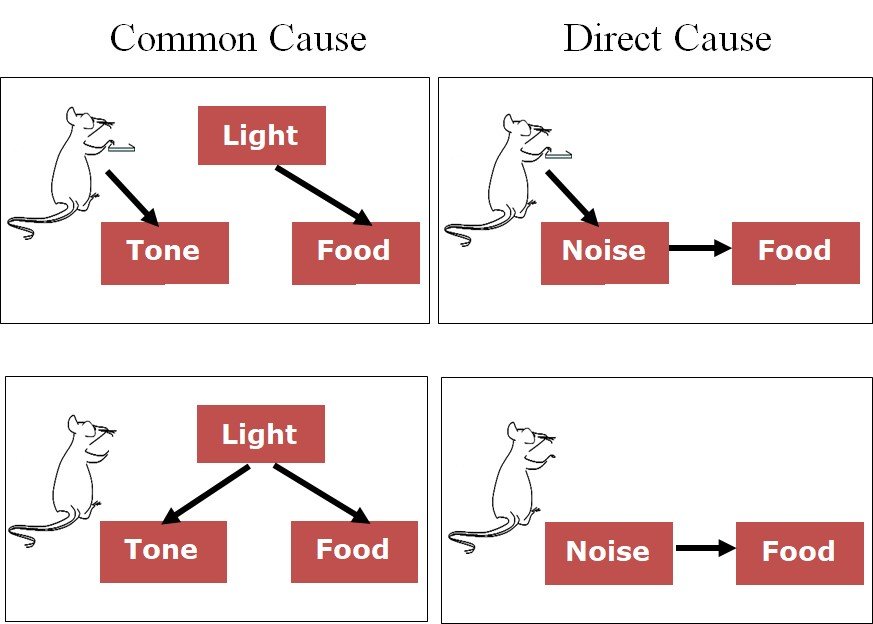
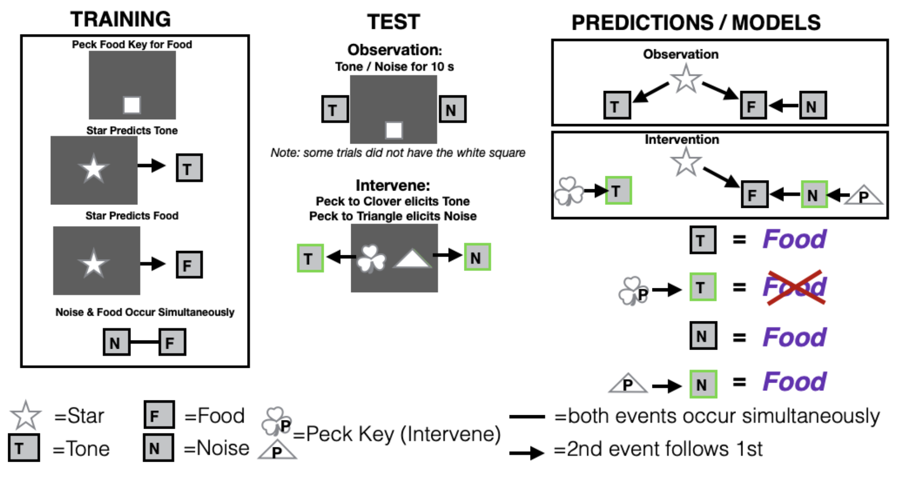
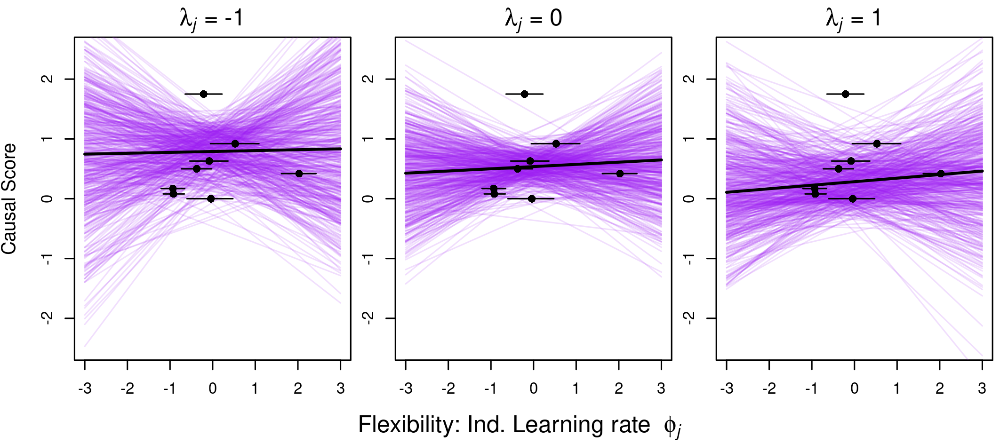

##### Affiliations: 
1) University of California Los Angeles
2) Max Planck Institute for Evolutionary Anthropology
3) University of California Santa Barbara

*Corresponding author: blaisdell@psych.ucla.edu


```{r setup, include=FALSE}
library(knitr)
knitr::opts_chunk$set(tidy.opts=list(width.cutoff=60),tidy=TRUE) 
#Make code wrap text so it doesn't go off the page when Knitting to PDF

knitr::opts_chunk$set(echo = TRUE) 
#sets global options to display code along with the results https://exeter-data-analytics.github.io/LitProg/r-markdown.html
```

See the [HTML](http://corinalogan.com/Preregistrations/g_causal.html) version because it is easy-to-read, and the reproducible manuscript [Rmd](https://github.com/corinalogan/grackles/blob/master/Files/Preregistrations/g_causal.Rmd) version for the code.

&nbsp;

{width=50%}

**Cite as:** Blaisdell AP, Johnson-Ulrich Z, Bergeron L, Rowney C, Seitz B, McCune K, Folsom M, MacPherson M, Logan CJ. 2019. [Do the more flexible individuals rely more on causal cognition? Observation versus intervention in casual inference in great-tailed grackles](http://corinalogan.com/Preregistrations/g_causal.html). (http://corinalogan.com/Preregistrations/g_causal.html) In principle acceptance by *PCI Ecology* of the version on 31 Jan 2019 [https://github.com/corinalogan/grackles/blob/master/Files/Preregistrations/g_causalPassedPreStudyPeerReview31Jan2019.pdf](https://github.com/corinalogan/grackles/blob/master/Files/Preregistrations/g_causalPassedPreStudyPeerReview31Jan2019.pdf).

{width=5%} {width=5%} {width=5%}

**This preregistration has been pre-study peer reviewed and received an In Principle Recommendation by:**

Emanuel Alexis Fronhofer (2019) From cognition to range dynamics: advancing our understanding of macroecological patterns. *Peer Community in Ecology*, 100014. [10.24072/pci.ecology.100014](https://ecology.peercommunityin.org/public/rec?id=25&reviews=True)

 - Reviewers: two anonymous reviewers

&nbsp;

## ABSTRACT

Behavioral flexibility, the ability to change behavior when circumstances change based on learning from previous experience, is thought to play an important role in a species’ ability to successfully adapt to new environments and expand its geographic range. It is alternatively or additionally possible that causal cognition, the ability to understand relationships beyond their statistical covariations, could play a significant role in rapid range expansions via the ability to learn faster: causal cognition could lead to making better predictions about outcomes through exerting more control over events. We aim to determine whether great-tailed grackles (*Quiscalus mexicanus*), a species that is rapidly expanding its geographic range, use causal inference and whether this ability relates to their behavioral flexibility (flexibility measured in these individuals by @logan2019flexmanip: reversal learning of a color discrimination and solution switching on a puzzle box). Causal cognition was measured using a touchscreen where individuals learned about the relationships between a star, a tone, a clicking noise, and food. They were then tested on their expectations about which of these causes the food to become available. We found that eight grackles showed no evidence of making causal inferences when given the opportunity to intervene on observed events using a touchscreen apparatus, and that performance on the causal cognition task did not correlate with behavioral flexibility measures. This could indicate that our test was inadequate to assess causal cognition. Because of this, we are unable to speculate about the potential role of causal cognition in a species that is rapidly expanding its geographic range. We suggest further exploration of this hypothesis using larger sample sizes and multiple test paradigms.

## [Video summary](https://youtu.be/PriIcZECK08) [https://youtu.be/PriIcZECK08](https://youtu.be/PriIcZECK08)

## INTRODUCTION

Behavioral flexibility, the ability to change behavior when circumstances change based on learning from previous experience [@mikhalevich_is_2017], is thought to play an important role in a species’ ability to successfully adapt to new environments and expand its geographic range [e.g., @lefebvre1997feeding; @griffin2014innovation; @chow2016practice; @sol2000behavioural; @sol2002behavioural; @sol2005big]. For example, flexibility would be useful for changing food preferences in accordance with locally available resources that potentially fluctuate over time. It is alternatively or additionally possible that causal cognition, the ability to understand the causality in relationships between events beyond their statistical covariations, could play a significant role in rapid range expansions by allowing one to learn faster and make more accurate predictions about outcomes, as well as by exertin For example, if a monkey observes an association between a tree branch shaking and a piece of fruit dislodging and falling to the ground where it can be consumed, a causal understanding of this association, that is that shaking the branch caused the fruit to fall, would provide the monkey the opportunity to itself intervene and shake the branch so as to procure the fruit. Two out of three measures of behavioral flexibility positively correlated with causal inference abilities in children [@deak2015cognitive], suggesting these two abilities might be linked. 

While a smattering of studies have investigated understanding of physical causality, such as in tool construction and use, in birds and mammals [see reviews by @emery2009tool; @lambert2019birds; @volter2017causal] there are no existing studies of causal perception aside from those in rats from Blaisdell’s lab (see below) and chimpanzees [@premack1994levels].

We aimed to determine whether great-tailed grackles (*Quiscalus mexicanus*), like rats [@blaisdell2006causal], derive predictions about the outcomes of interventions (actions) after passive observational learning of different kinds of causal models. Causal models involve a specific type of causal cognition in which causal representations between events that are estimated by observing the statistical regularity between continuous events, and can be combined into causal maps. For example, a bird that observes wind moving a branch, and then sees a fruit attached to the branch fall to the ground, the bird might interpret these observations as a causal chain in which wind *causes* the branch to shake, which in turn *causes* the fruit to shake loose and fall to the ground [@tomasello1997primate]. Causal maps, such as the wind-->shake branch-->fruit falling map just described, thus provide the causal structure in relationships that go beyond merely observing statistical covariation between events, and allow causal inferences to be derived, such as through diagnostic reasoning and reasoning about one’s own interventions on events within the causal model [@blaisdell2012rational; @waldmann1996knowledge]. Returning to the causal chain example, a bird with such causal knowledge could intervene to shake the branch itself (a causal intervention) with the expectation that they could themselves make the fruit fall to the ground where they would be able to retrieve and eat it. Without such causal knowledge, the bird would not try to shake the fruit loose.



**Figure 1.** Predictions of causal model theory for each test condition of Blaisdell et al. (2006), Experiment 1: Common cause intervene (top-left panel), Common cause observe (bottom-left panel), direct cause intervene (top-right panel), and direct cause observe (bottom-right panel). Causal discounting of the food is predicted only in condition “common cause intervene,” depicted as the deletion of the arrow from the light to the tone resulting from the lever press-tone contingency at test (acknowledgment to Bernard Balleine for permission to use the cartoon rat).

Blaisdell and colleagues [@blaisdell2006causal] taught rats that a light was a common cause of tone and food by presenting the light followed by the tone on some trials and by the food on other trials during training (Figure 1). Rats also learned that a clicking noise was a direct cause of food by presenting noise and food simultaneously during training. At test, some rats observed the tone or the noise. When they did, they looked for food, suggesting the rat had made a diagnostic causal inference. This shows that rats had formed the causal models of a) that noise causes food, and b) that tone is caused by light, which itself is a cause of food. Other rats were given the opportunity to intervene to make the tone or noise occur at test. This was accomplished by giving the rats a novel lever that they had never seen before or been trained on. When they pressed the lever, this caused the tone (or noise) to turn on. When the noise was caused by a lever press, rats looked for food in the food hopper, but when lever pressing caused the tone to turn on, rats did not look for food. This shows that rats understood that, by intervening on the lever to cause the noise to occur, because the noise was a cause of food, they should expect food. But by intervening on the lever to cause the tone to occur, the rats realized that they, and not the light (a previously established cause of the tone), had caused the tone. As a result of attributing the tone to their own action rather than the light, they did not expect there to be any food in the food hopper.

Our goal is to determine whether grackles, a species that is rapidly expanding its geographic range [@wehtje2003range], use causal inference and whether this ability relates to their behavioral flexibility. The current experiment adapted the procedure used by @blaisdell2006causal to study causal inference in rats for the study of causal inference in grackles using a touchscreen (Figure 2). We wished to determine whether grackles could also form causal models from contingency learning, and if so, whether their intervention could influence the type of causal inference made at test, depending on which causal model was being tested. To do so, we implemented a conceptually similar design, but adapted to the touchscreen. Grackles would first be trained to peck a small white square (the response key) presented on the lower part of the screen just above the food hopper. Pecks to this response key resulted in delivery of food from the hopper. Next, grackles would receive three types of trials intermixed within each training session. One type of trial consisted of the presentation of a white star in the center of the screen followed by the presentation of a tone from a speaker next to the screen. The second type of trial consisted of the presentation of the white star followed by the delivery of food in the food hopper. The third type of trial consisted of presentations of a noise from the speaker followed by delivery of food. As a result of these three types of trial, grackles should develop the causal models shown in the right panel of Figure 2. At test, each grackle will receive each of four types of test trial in separate test sessions. During the Observation test session, the grackle will receive two types of test trial interspersed within the session. One type of test trial consists of presentation of the tone by itself, while the other type of test trial consists of presentation of the noise by itself. If grackles had formed the causal models depicted in Figure 2, then upon hearing the tone the grackle should diagnostically infer that the star must have caused the tone, and because the star is also a cause of food, the grackles should expect food. Likewise, when they hear the noise at test, because the noise is a direct cause of food, they should expect food. Thus, in both cases, grackles should look for food in the hopper, or peck the food key which had been previously associated with food. During the Intervention test session, the grackle will be presented with two novel visual stimuli on the screen as shown in the center panel of Figure 2. Pecks to one of the stimuli, such as the clover, results in the presentation of the tone. Pecks to the other stimulus, such as the triangle, results in the presentation of the noise. When the noise is produced through the intervention of pecking at the triangle, grackles should expect food because noise is a cause of food. When the tone is produced through the intervention of pecking at the clover, however, the grackles should NOT expect food. This is because, if the grackle formed the common cause model of the star being a common cause of tone and food, when the grackle intervenes to produce the tone, it should attribute the occurrence of that tone to their own causal intervention, and not to the prior cause of the star. Thus, they should not expect that the star had caused THAT tone (the one the bird caused through its intervention) and thus should not expect food either. Thus, we predict more food inspection behavior when the grackles intervenes to cause the noise than when they intervene to cause the tone. This result would replicate the finding in rats by Blaisdell et al. 

Our results indicate whether grackles exhibited causal inference, whether it is related to behavioral flexibility, and whether causal cognition might be worth considering in the context of how a species is able to rapidly expand its geographic range.



**Figure 2.** Actual design for experiment 1: Test figures adapted from @blaisdell2006causal. In the Training phase, grackles first learn to peck at a food key to elicit food from the food hopper. Grackles then receive trials during which the white star is presented on the screen followed by a tone, and then they receive two types of trials interspersed within each training session: 1) the white star followed by food or 2) the noise and food presented at the same time. In the Test phase, those individuals in the Observation condition hear a tone or a noise while seeing only the food key on the screen, but individuals in the intervene condition can elicit the tone or noise by pecking at separate response keys that elicit those auditory stimuli. The prediction is that if individuals form a common cause model such that star produces tone and food, observing the tone should lead to individuals to expect food (indicated by the subject pecking the screen), because if tone is on, star caused it, and it also caused food. Meanwhile, if they intervene to produce the tone, they will not expect food (i.e., they will not peck the screen) because they know their intervention caused the tone and not the star (which also causes food). Additionally, observing noise should also lead an expectation of food (i.e., pecking the screen) because noise and food were paired simultaneously during training. Meanwhile, even if they intervene and cause the noise they should still expect food (i.e., peck the screen) because when the noise is on food is available regardless of what caused it (because the noise and the food were paired simultaneously). (T=tone, L=light, F=food, P=peck key)


## RESULTS

Data are publicly [available](https://doi.org/10.5063/QR4VH4) at the Knowledge Network for Biocomplexity [@loganblaisdell2020causaldata]. Details on how the grackles were trained to use the touchscreen are in @Seitz2020biorxivtraingrackle.

#### Do grackles show evidence of causal cognition?

Evidence of causal cognition in grackles would be apparent by an interaction in responding to visual cue type (clover or triangle) and the associated audio cue (tone or noise). Specifically, if grackles learned the common cause structure, they should  respond less to the screen when they intervene to cause the tone than when they merely observe the tone. However, there should be no difference in responses to the screen whether the grackles intervene to cause the noise or simply observe the noise; thus resulting in an interaction. To test this, we used a 2 (Audio Cue: Tone vs Noise) x 2 (Cue Type: Observe vs Intervene) repeated measures ANOVA (Table 1) in JASP (https://jasp-stats.org, see code in supplemental material). There was no significant interaction between audio cue and visual cue type, F (1,7) < 1.0, which suggests that there is no evidence of causal reasoning in grackles. However, note that the very low response rate in the Observe condition (Figure 2) makes it difficult to rely on this conclusion.

**Table 1.** Repeated measures ANOVA, within subjects effects, Type III sum of squares.

```{r table1, eval=TRUE, warning=FALSE, results='asis', echo=T}
options(width=60)
d <- read.csv("https://raw.githubusercontent.com/corinalogan/grackles/master/Files/Preregistrations/g_causalTable1.csv", header = F, sep = ",", stringsAsFactors = F)

colnames(d)<-c("Cases","Sum of squares","df","Mean square","F","p","eta^2^")

library(kableExtra)
knitr::kable(d) %>%
kable_styling(full_width = T, position = "left")
```

{width=70%}

**Figure 2.** Mean screen pecks per trial per bird (n=8 grackles) in the Intervene (open circles) and Observe (black squares) conditions depending on whether the audio cue was the tone or noise. Within individual performances are shown by the lines connecting the circles to the squares. The bars indicate the group average per condition (light gray=Intervene, dark gray=Observe).


#### Do causal cognition scores relate to behavioral flexibility performance?

We devised an equation that would give each bird one causal cognition score, which would then make it possible to analyze the causal data as a dependent variable in the pre-planned GLMs. This equation weights differential responding to the tone (Intervene < Observe) and equal responding to the noise (Intervene = Observe) as being equally important in providing evidence for causal reasoning. 

Equation 1:

0.5(pInterveneTone - pObserveTone) + 0.5(abs(pInterveneNoise - pObserveNoise))

Where p is the average screen pecks per trial in each of the associated conditions and "abs" constrains the second term to the absolute value to ensure a positive number. A lower negative score indicates that causal cognition was used, a score near zero indicates there is no evidence for or against causal cognitive abilities, and a positive score indicates no evidence for causal cognition. In these grackles, the causal scores indicated that there was no evidence of causal cognition (Table 2). That is, there were no birds who both responded more when they observed the tone, rather than when they intervened to turn it on, and also responded similarly to when they observed the noise and intervened to turn it on.

\newpage

**Table 2.** Grackle causal cognition scores. The two flexibility measures [data from @logan2019flexmanip] are: the number of trials to reverse a preference in that bird’s most recent reversal, and the average number of seconds to switch to attempting a new option after having successfully solved a different option on the multi-access log (MAB). We used only data from the MAB log experiment and not the MAB plastic box experiment because the log and plastic scores did not correlate with each other [@logan2019flexmanip] and there was data for more birds for the log experiment that were in the causal cognition study. Note: Mole did not complete the causal cognition experiment because he had to be released before he was finished.

```{r table2, eval=TRUE, warning=FALSE, results='asis', echo=T}
options(width=60)
d <- read.csv("https://raw.githubusercontent.com/corinalogan/grackles/master/Files/Preregistrations/g_causal_datasummary.csv", header = T, sep = ",", stringsAsFactors = F)

colnames(d)<-c("Bird name","Bird ID","Causal score","Number of trials to reverse last preference","Avg. seconds to switch options MAB")

library(kableExtra)
knitr::kable(d) %>%
kable_styling(full_width = T, position = "left")
```

There was no evidence that those birds with lower causal scores were faster to reverse their most recent preference or to switch more quickly to solving a new option on the multiaccess log because there was no relationship between these variables (Tables 3 and 4). 

**Table 3.** Results from the GLM: causal score ~ number of trials in last reversal. The estimate and (standard error) are shown.

```{r cause1resultsRev, eval=T, warning=F, results='asis', echo=T, include=T}
cause <- read.csv(url("https://raw.githubusercontent.com/corinalogan/grackles/master/Files/Preregistrations/g_causal_datasummary.csv"), header=T, sep=",", stringsAsFactors=F) 
d<-data.frame(cause)

#GLM with response variable = causal cognition score
m1 <- glm(CausalScore ~ TrialsReverseLast, family="gaussian", data=d)
#summary(m1)

#load packages for the output table
library(jtools) 
#library(huxtable)
base::suppressMessages(jtools::export_summs(m1, model.names=c("Causal score ~ Trials to reverse"), digits = getOption("jtools-digits", default = 2), model.info = getOption("summ-model.info", TRUE), model.fit = getOption("summ-model.fit", TRUE), pvals = getOption("summ-pvals", FALSE))) 
#suppressMessages gets rid of the text saying that the broom package overwrites something in jtools. Need to specify the package before the function to avoid a message popping up and preventing the PDF from rendering
knitr::knit_hooks$set(document = function(x) {sub('\\usepackage[]{color}', '\\usepackage{xcolor}', x, fixed = TRUE)}) 
#this prevents an issue with xcolor package when rendering to PDF
```

\newpage

**Table 4.** Results from the GLM: causal score ~ average latency (seconds) to switch to attempting a new locus on the multiaccess log after having previously solved a different locus. The estimate and (standard error) are shown.

```{r cause1resultsMAB, eval=T, warning=F, results='asis', echo=T, include=T}
cause <- read.csv(url("https://raw.githubusercontent.com/corinalogan/grackles/master/Files/Preregistrations/g_causal_datasummary.csv"), header=T, sep=",", stringsAsFactors=F) 
d<-data.frame(cause)

#GLM with response variable = causal cognition score
m2 <- glm(CausalScore ~ AvgLatencySwitch, family="gaussian", data=d)
#summary(m2)

#load packages for the output table
library(jtools) 
#library(huxtable)
base::suppressMessages(jtools::export_summs(m2, model.names=c("Causal score ~ Avg switch latency"), digits = getOption("jtools-digits", default = 2), model.info = getOption("summ-model.info", TRUE), model.fit = getOption("summ-model.fit", TRUE), pvals = getOption("summ-pvals", FALSE))) 
#suppressMessages gets rid of the text saying that the broom package overwrites something in jtools. Need to specify the package before the function to avoid a message popping up and preventing the PDF from rendering
knitr::knit_hooks$set(document = function(x) {sub('\\usepackage[]{color}', '\\usepackage{xcolor}', x, fixed = TRUE)}) 
#this prevents an issue with xcolor package when rendering to PDF
```

To further tease apart potential cognitive components underlying flexibility, we developed a more mechanistic measure of behavioral flexibility that takes into account all choices in the reversal learning experiment (“Flexibility comprehensive”). Through a computational Bayesian reinforcement learning model including bird and experimenter ID as random effects, we obtained individual-level estimates for each bird’s random choice and learning rates (see Analysis Plan > Prediction 1 > Flexibility comprehensive for details). We validated the model by analyzing data previously collected from great-tailed grackles in Santa Barbara, California [@logan2016flexibilityproblem], and we found that this parameterization accurately reproduces learning curves observed in real animals (see Figure 3).


**Figure 3.** Proportion of correct choices per color preference trial for Santa Barbara, California great-tailed grackles (N = 8; top), and “birds” simulated from the reinforcement learning model using parameter estimates (N = 8; bottom). Dashed vertical lines indicate color reversal. Error bars show standard errors of the means.

Figure 4 plots posterior predictions for the effect of individual-level learning rate $\phi_j$ on causal score for three different levels of the random choice rate $\lambda_j$ (results are presented as posterior means and 89% highest posterior density intervals (HPDI)). We did not find robust associations between either learning rate ($\beta_\phi$ = 0.03, HPDI = -0.63 - 0.69) or random choice rate ($\beta_\lambda$ = -0.40, HPDI = -0.96 - 0.25) and birds’ causal scores. There was also no interaction between the estimates of the two learning parameters in the model ($\beta_{\phi\chi\lambda}$ = 0.01, HPDI = -0.95 - 0.97).


**Figure 4.** Results from the computational learning model (flexibility 4). Posterior predicted causal score based on estimates for the individual-level learning rates from the reinforcement learning model ($\phi_j$; black dots show posterior means and horizontal lines indicate 89% highest posterior density intervals). Curves are plotted for high (left; $\lambda_j$=-1), average (middle; $\lambda_j$=0) and low (right; $\lambda_j$=1) random choice rates. Purple lines represent 200 independent draws from the posterior. Both predictors ($\lambda_j$ and $\phi_j$) were standardized before calculations.


## DISCUSSION

We attempted to produce a conceptual replication of the experiment conducted by @blaisdell2006causal in rats, to study causal cognition in the great-tailed grackle. We failed to find evidence that grackles represent as causal the statistical relations between visual cues presented on a touchscreen and food delivered in a food hopper. We also failed to find evidence that grackles derive causal inferences from their interventions.

Why did we fail to find evidence for causal cognition in grackles? There are a number of reasons to consider.

First, grackles may not have been very attentive to visual events presented on the touchscreen. While touchscreen operant techniques have been hugely successful in the study of learning, memory, perception, and cognition in pigeons, this apparatus might not be well suited for use with grackles. Touchscreen operant procedures have been tried in many other species of birds, with success in some instances [@kangas2017touchscreen; @schmitt2018implementing], but not in others (e.g., Blaisdell et al. unpublished; California scrub jays *Aphelocoma californica*). If grackles do not naturally relate to events presented on a touchscreen, then they might not perceive such events as causally related either to other events in the operant task, such as other cues, or to delivery of food in a hopper.

**Table 5.** The number of sessions it took for each bird to complete each training and test program. Ideally, each program is completed in one session. Trials were initiated manually only when the grackle was attending to the screen. Therefore, the more sessions required to complete a program indicates the grackle was attending less to the screen.

```{r table5, eval=TRUE, warning=FALSE, results='asis', echo=T}
options(width=60)
d <- read.csv("https://raw.githubusercontent.com/corinalogan/grackles/master/Files/Preregistrations/g_causal_datasessionsummary.csv", header = T, sep = ",", stringsAsFactors = F)

colnames(d)<-c("Bird","Training: FR1","Training: VR3","Training: VR5","Training: Sensory preconditioning","Training: First order conditioning","Test: Intervene","Test: Observe")

library(kableExtra)
knitr::kable(d) %>%
kable_styling(full_width = T, position = "left")
```

Even if grackles do attend to events in the touchscreen operant tasks, these events might be incompatible with their feeding behavior system. It is possible that because grackles feed more interactively with food items [@davis1972food], the touchscreen might be inappropriate for testing causal processes associated with obtaining food. Grackles are generalist omnivores that forage on a wide variety of food types, including insects, grubs, lizards, nestlings, eggs, shellfish, fruits, and seeds. They learn to hunt, extract, and forage using a variety of behaviors, rather than the stereotypical pecking behavior that other species, such as pigeons, use. Importantly, there have not been, to our knowledge, studies investigating visual cue-food associative learning in grackles.  

In contrast to grackles, touchscreen operant procedures have been wildly successful in pigeons. Pigeons are granivores and learn what to eat by associating the visual properties of ingested items (e.g., grains and seeds) with their caloric effects [@balsam1992operant]. Thus, the pigeon’s feeding behavior system is prepared for associating 2D visual cues presented on a touchscreen with food delivery, as in an autoshaping procedure such as the one used in this experiment, to which the pigeons will acquire sign tracking behavior (i.e., pecking or other behaviors directed at the cue) to the associated visual cues. The grackle behavior system is unlikely to be as highly specialized as that of the pigeon in forming visual cue-food associations. Thus, grackles may not be prepared to easily learn to associate visual cues on a touchscreen with food delivery – the primary means of training causal relations in our experiment.

Despite these caveats, in a separate study using the same operant touchscreen apparatus, we were able to successfully train these grackles to interact with visual displays on the screen [@logan2019inhibition]. Using a simple Go/No-Go procedure, in which the bird would receive a food reward for pecking at the Go stimulus but not for pecking at the No-Go stimulus, grackles successfully learned to make significantly more pecks at the Go stimulus than at the No-Go stimulus. Thus, grackles appear capable of learning simple operant visual discriminations using the touchscreen apparatus. Nevertheless, success with the visual discrimination does not require the bird to perceive the visual cues as causal of the food reward, nor even the instrumental peck at the visual cue as causal. Success could rely on simpler non-cognitive (e.g., S-R associative, model free learning) mechanisms, such as changes in peck rate due to reinforcement and non-reinforcement of Go and No-Go stimuli, respectively.

This failure to find evidence of causal cognition in the grackle provides a cautionary tale for comparative psychologists interested in testing wild-caught animals using traditional laboratory apparatuses and techniques. Given the nuance in each species’ foraging niche, and their specialized behavior systems for feeding, mating, sensing predators, etc [@timberlake1994behavior], these individual factors need to be taken into account when adapting standard laboratory techniques for use with atypical or wild-caught species. Nevertheless, the costs involved are typically quite low, and the rewards can be high if tasks and procedures can be adapted to such species. This opens up possibilities for the investigation of the types of learning and cognitive processes that are typically only studied in a small number of laboratory species, thereby extending our knowledge of the evolution and development of these processes.

That we did not find evidence of causal cognition in grackles could indicate that it is not implicated as a key factor involved in a rapid geographic range expansion, where behavioral flexibility might play a role. Nevertheless, we must acknowledge the caveats stated above that our method to assess causal cognition in the grackle may have been poorly suited to detect it, even if it were present. We suggest further exploration of this hypothesis using a variety of apparatuses and species-relevant experimental design adaptations before considering this a robust conclusion.


## METHODS: below is the preregistration that passed pre-study peer review

### A. STATE OF THE DATA

NOTE: all parts of the preregistration are included in this one manuscript.

**Prior to collecting any data:** This preregistration was written, underwent two rounds of peer reviews and received an in principle recommendation at PCI Ecology (see the [review history](https://ecology.peercommunityin.org/public/rec?id=25&reviews=True)).

**Post data collection: how the actual methods differed from the planned methods** (May 2020)

1) We met our minimum **sample size** of 8 grackles per experiment: our sample size for Experiment 1 (the only experiment that was conducted because evidence of causal inference was not found) was eight. We were not able to test many more individuals, as we initially predicted, for several reasons that were beyond our control in the 2.5 years we were at this field site: the grackles in Tempe, Arizona are extremely difficult to catch; only about half of the ~30 grackles that were brought into the aviaries volunteered to participate in experiments; of those that did participate, many were extremely slow, only participating in a few trials per day; the test battery, of which the causal cognition experiment was one, took much longer than expected and many birds did not complete the whole battery before they had to be released because they came to the end of their six months in the aviaries (the maximum duration we are permitted to hold them) or it became too hot in the aviaries to continue testing and they had to be released for the summer. A ninth bird was tested (Mole), but he only completed the intervene condition and had to be released before he began the observe condition.

2) We were **unable to maintain a sex balance** because of the difficulties encountered in point 1 and because the females were less willing than males to participate in experiments. Therefore, our sample size consists of 1 female and 7 males.

3) The **testing protocol changed multiple times** over the course of the data collection period in an effort to adapt the test to increase the motivation of this species to participate in the test trials. See the test [protocol](https://docs.google.com/document/d/1ksqCHG0mXPtskOoedXGIMc_2V5rFmeCe15mvCS-ytTg/edit?usp=sharing) for details. As such, we combined the two dependent variables into one (see [Dependent Variables](#dependent-variables) for details).

4) [Hypothesis](#c-hypothesis) > Predictions: we corrected the typo that we were going to compare causal inference abilities with "latencies to successfully solve new tasks after previously solved tasks become unavailable on a multiaccess box" by changing "successfully" to "attempt to solve", which makes it consistent with our Methods > Independent variables. The former measures innovation, the latter measures flexibility. As such, we also removed that we were comparing causal inference with "innovation" in Alternative 3 because this research is focused on the relationship between flexibility and causal cognition.

5) Analysis plan: we realized that we forgot to include a sentence stating that we would **replicate the analyses used in @blaisdell2006causal** because, as originally stated in the Objective, this grackle experiment is an adaptation of the rat research and we intended to directly compare the rat and grackle results. We therefore conducted the same analyses as in @blaisdell2006causal to assess causal cognition in addition to the previously described analyses.

6) Analysis plan: 
  - We **modified a [dependent variable](#dependent-variables)** (number of key pecks to food key) because we removed the food key from the experiment. The food key was a white square and this was the stimulus used to train them in how to use the touch screen. Consequently, in the causal experiment, they focused only on pecking the food key and ignored the other stimuli on the screen. We then changed this dependent variable to measure the number of screen pecks to anywhere on the screen (inside or outside the stimulus if there was a stimulus on the screen, or pecks to a blanck screen if there was no stimulus). This was because the grackles did not peck the screen very often in general so we wanted to increase the amount of data that were collected.
  - We investigated adding **adding two dependent variables** (number of feeder inspections and number of seconds spent searching for food) because the grackles were not motivated to peck the stimuli on the screen, resulting in almost no data. They appeared to inspect the feeder more often than touching the screen, therefore we decided to add this variable to increase our chances of obtaining usable data. After conducting interobserver reliability on the dependent variables, there was not enough interobserver agreement to indicate that we are able to objectively code these variables ([interobserver reliability](#interobserver-reliability-of-dependent-variables) code and data were added below). Therefore, in the analyses, we used only the automated screen pecking data collected by PsychoPy (which is not entirely accurate because there were many occasions where the screen did not register a screen peck and the experimenter had to remotely use the mouse to click where the bird pecked).

7) Analysis plan > [Alternative analyses](#alternative-analyses): after reading [@statrethinkingbook], we decided to run the GLMM in Prediction 1 for **only one independent variable at a time** because including more independent variables can confound the interpretation of the results.

8) We obtained permission from permitting agencies to **temporarily hold grackles in aviaries for up to 6 months per bird** (it was previously 3 months).


### B. PARTITIONING THE RESULTS

We may decide to present these results in two separate papers: 1) determining whether grackles have causal inference abilities, and 2) linking variation in performance on causal inference tasks to measures of flexibility. NOTE: everything in the preregistration is included in this one manuscript.


### C. HYPOTHESIS

#### Individuals that are more [behaviorally flexible](https://github.com/corinalogan/grackles/blob/master/EasyToReadFiles/g_flexmanip.md) (faster at functionally changing their behavior when circumstances change), as measured by reversal learning and switching between options on a multi-access box, are better able to derive accurate causal inferences (see @mikhalevich_is_2017 for theoretical background about the distinction between flexibility and complex cognition). This is because causal cognition may facilitate flexibility: an individual could be faster at switching to new solutions that are more functional if it makes causal inferences about how the problem works, rather than relying solely on trial and error learning to indiscriminately switch to new solutions. In this procedure, we assess whether grackles are able to derive correct predictions about causal interventions after observational learning, a core component of causal reasoning that can not be reduced to associative learning [@waldmann2005seeing]. 

**Predictions:** Individuals that are faster to reverse preferences on a serial reversal learning task and who also have lower latencies to attempt to solve new tasks after previously solved tasks become unavailable on a multiaccess box (two measures of flexibility in a separate [preregistration](https://github.com/corinalogan/grackles/blob/master/EasyToReadFiles/g_flexmanip.md)), perform better in two causal inference experiments. Specifically, the more flexible individuals are predicted to 

  - P1: form causal models from contingency learning (i.e. observational learning). Contingency information could be represented in one of two ways. On the one hand, relations between events could be encoded as associations. On the other, they could be represented as causal. For example, if the sound of a bell is followed by delivery of food, one could represent the bell as associated with the food, and thus the sounding of the bell calls to mind an expectancy of food. Or, the subject could represent the bell as a cause of food. @blaisdell2006causal (see also @leising2008special) report evidence that rats can represent statistical relationships between events as causal." Thus, we predict the more flexible indivuals will better learn the causal maps between all pairwise events (visual and auditory cues and food delivered from a food dispenser), and integrate these individual maps into larger causal map structures, including a common-cause, two-effect map (if observing T, L caused it, thus F is present), and a direct cause-effect map (if N is present, it will cause F). 

  - P2: behave as if intervention can influence the type of causal inference made at test, depending on which causal model is being tested: dissociate between seeing and doing as evidenced by a lower rate of pecking a key to release food when they had the opportunity to intervene in a common cause condition, while intervening on a direct cause or a causal chain will have no effect on key pecks.

Alternative 1: If there is no correlation between flexibility measures and performance on causal inference tasks, this suggests that learning about associations (on which the flexibility tasks are based) is different from learning about causal inferences.

Alternative 2: If there is a negative correlation between flexibility measures and performance on causal inference tasks, this suggests that some individuals may prefer to rely on information acquired previously (i.e., they are slow to reverse, but good at remembering prior information in causal inference tasks) rather than relying on current cues (e.g., the food is in a new location (flexibility), the light is absent in the test trials (causal inference)). For example, relying solely on current cues (i.e., the immediate stimulus (e.g., tone, noise) or lack thereof) in the causal cognition test will not give them enough information to consistently solve the task. They will need to draw on their memory of what the presence or absence of the current stimulus means about the food reward based on their experience in previous trials to perform well on this task.

Alternative 3: If the flexibility measures do not positively correlate with each other (P2 alternative 2 in the [flexibility preregistration](https://github.com/corinalogan/grackles/blob/master/EasyToReadFiles/g_flexmanip.md)), this indicates they measure different traits. In this case, we are interested in how each flexibility measure (reversal learning and task switching latency on the multiaccess box) relates to performance on causal inference tasks.


**Figure 5.** Planned design for experiment 1: Test figures adapted from @blaisdell2006causal. In the Training phase, subjects first learn to peck at a food key to elicit food from the magazine. Subjects then receive trials during which the yellow circle is presented on the screen followed by a tone, and then they receive two types of trials interspersed within each training session: 1) the yellow circle followed by food or 2) the noise and food presented at the same time. In the Test phase, those individuals in the Observation condition will hear a tone or a noise while seeing only the food key on the screen but individuals in the intervene condition can elicit the tone or noise by pecking on separate response keys that elicit those auditory stimuli. The prediction is that if individuals form a common cause model such that circle produces tone and food, observing the tone should lead to individuals to expect food (indicated by the subject pecking the food key), because if tone is on, circle caused it, and it also caused food. Meanwhile, if they intervene to produce the tone, they will not expect food (i.e., they will not peck the food key) because they know their intervention caused the tone and not the circle (which also causes food). Additionally, observing noise should also lead an expectation of food (i.e., pecking the food key) because noise and food were paired simultaneously during training. Meanwhile, even if they intervene and cause the noise they should still expect food (i.e., peck the food key) because when the noise is on food is available regardless of what caused it (because the noise and the food were paired simultaneously). (T=tone, L=light, F=food, P=peck key)


**Figure 6.** Planned design for experiment 2: Test figures adapted from @blaisdell2006causal. In Training phase 2a, subjects learn the same common cause model as in experiment 1 such that the circle predicts tone and also the circle predicts food. Note that there is no training of the noise in 2a. In the training phase of 2b, subjects learn that a tone comes before a circle on screen and that a circle on screen is followed by receiving food. In the Test phase, those individuals in the Observation condition hear a tone while seeing only the food key on the screen and those in the intervene condition can elicit the tone by pecking at a blue square. For subjects trained in 2a, the prediction is that if individuals form a common cause model such that circle produces tone and food, observing the tone should lead to individuals to expect food because, if tone is on, the circle caused it, and the circle also causes food. If individuals intervene to create the tone, they should not peck for food because it was their action that caused the tone and not the circle that caused it. For subjects trained in 2b, the prediction is that if they observe the tone they should expect food because food follows the circle which follows the tone. Likewise, even if subjects intervene to produce the tone, if they have formed the causal chain, they should still expect that the tone produces the circle which produces food and hence they should look for food. (T=tone, L=light, F=food, P=peck key)

**Objective:** 

The aim is to determine whether grackles, like rats (@blaisdell2006causal), derive predictions about the outcomes of interventions (actions) after passive observational learning of different kinds of causal models. Causal models are theoretical entities that are estimated, combining cues to infer causal structure in relationships that go beyond merely obseriving statstical covariations between events. 

Blaisdell and colleagues (@blaisdell2006causal) taught rats that a light was a common cause of tone and food by presenting the light followed by the tone on some trials and by the food on other trials during training. Rats also learned that a noise was a direct cause of food by presenting noise and food simultaneously during training. At test, some rats observed the tone or the noise. When they did, they looked for food. This shows that rats had formed the causal models of noise causes food and that tone is caused by light, which itself is a cause of food. Other rats were given the opportunity to intervene to make the tone or noise occur at test. This was done by giving the rats a novel lever that they had never seen before or been trained on. When the pressed the lever, this caused the tone (or noise) to turn on. When the noise was caused by a lever press, rats looked for food in the food hopper, but when lever pressing caused the tone to turn on, rats did not look for food. This shows that rats understood that, by intervening on the lever to cause the noise to occur, since the noise was a cause of food, they then expected food. But by intervening on the lever to cause the tone to occur, the rats realized that they had caused the tone, and not the light (which was an alternative cause of tone). As a result of attributing the tone to their own action rather than the light, they did not expect there to be any food in the food hopper.

This experiment adapts the procedure used by @blaisdell2006causal to study causal inference in rats for the study of causal inference in birds (e.g., pigeons and grackles) using a touchscreen. @blaisdell2006causal (see also @leising2008special) found that rats made different predictions about the presence of food based on a cue (a tone) depending on the causal relationship between them (direct cause or two effects of a common cause) and whether the tone was merely observed at test or had been caused by the subject’s own intervention (a lever press). This dissociation between seeing and doing suggests that subjects represent associated relationships as causal, and derive rational inference regarding an intervention on a cause versus an effect. We wish to determine whether grackles can also form causal models from contingency learning, and if so, whether their intervention can influence the type of causal inference made at test, depending on which causal model is being tested.

### D. METHODS

#### Planned Sample

Great-tailed grackles will be caught in the wild in Tempe, Arizona USA for individual identification (colored leg bands in unique combinations). Some individuals (~32: ~16 per experiment) will be brought temporarily into aviaries for testing, and then they will be released back to the wild. Grackles are individually housed in an aviary (each 244cm long by 122cm wide by 213cm tall) at Arizona State University for a maximum of six months where they have *ad lib* access to water at all times and are fed Mazuri Small Bird maintenance diet *ad lib* during non-testing hours (minimum 20h per day), and various other food items (e.g., peanuts, grapes, bread) during testing (up to 3h per day per bird). Individuals are given three to four days to habituate to the aviaries and then their test battery begins on the fourth or fifth day (birds are usually tested six days per week, therefore if their fourth day in the aviaries occurs on a day off, then they are tested on the fifth day instead).

#### Sample size rationale

We will test as many birds as we can in the three years we have at this field site given that the birds only participate in tests in aviaries only during the non-breeding season (approximately September - March). The minimum sample size will be 8 birds per experiment (n=16 total), however we expect to be able to test many more.

#### Data collection stopping rule

We will stop testing birds once we have completed two full aviary seasons (likely in March 2020). NOTE: the two full aviary seasons concluded in May 2020.

#### Open materials

1) Touchscreen training [protocol](https://docs.google.com/document/d/18HJzHVk-iFUwpBYRQoxVy1J6izFFr1_2joS9CRkyNSM/edit?usp=sharing)

2) Experiment 1 [protocol](https://docs.google.com/document/d/1ksqCHG0mXPtskOoedXGIMc_2V5rFmeCe15mvCS-ytTg/edit?usp=sharing)

#### Apparatus

Testing was conducted on an operant touchscreen mounted on a platform (49 cm wide x 70 cm long x 8 cm tall) and placed on a cart (89 cm tall) inside an individual subject’s aviary. All stimuli were presented by computer on a color LCD monitor (NEC MultiSync LCD1550M). Pecks to the monitor were detected by an infrared touchscreen (Carroll Touch, Elotouch Systems, Fremont, CA) mounted in front of the monitor. A food hopper (Coulbourn Instruments, Allentown, PA) was located below the monitor with an access hole situated flush with the floor. When in the raised position, the hopper provided access to peanut pieces. Dell laptop speakers delivered a pure tone (3000 hz) or a clicking noise, 8 db above background noise (average background noise = 70 dB, measured on an iPhone7 with the Decibel Meter app by Dmytro Hrebeniuk). Geometric symbols could be displayed on the touchscreen monitor. These consisted of a white star with gray lines (formerly yellow circle), and a clover (formerly a square) and triangle. The latter two shapes were both white with gray lines on them (formerly one was blue the other green) (the shape-sound pairings will be counterbalanced across subjects, while the star is for all subjects). All experimental events were controlled and data recorded with a laptop (Dell Inspiron 15). A video card in the Dell laptop controlled the monitor using the standard dynamic range color space SVGA graphics mode (1366x768 pixels for the Dell display and also for the display on the touchscreen). All experimental procedures were programmed using PsychoPy (v1.85.2, @peirce2009generating).

#### Touch screen training

For the most up to date description of how we conducted the touchscreen training, please see our [protocol](https://docs.google.com/document/d/18HJzHVk-iFUwpBYRQoxVy1J6izFFr1_2joS9CRkyNSM/edit?usp=sharing) and @Seitz2020biorxivtraingrackle for the training data and a summary of what happened.

**Training: food hopper**

We would like grackles to associate the sound of the hopper moving with food being available (note: a light also turns on when the food hopper is available, however this experiment is conducted in outdoor aviaries where it is bright and thus the light might not be the most obvious cue). Every time the grackle approached the food hopper, we opened it remotely.  The opening makes a distinct sound, and the food hopper is left open until the grackle looked in before closing. End goal behavior for hopper training: grackle lands on platform, hopper is moved forward within reach, grackle retrieves food, hopper is moved out of reach, grackle can not obtain food.

1. Position the food hopper so it is in the accessible position. Draw attention to it by placing food crumbs around the area. Allow the bird to eat from the hopper for 20 seconds, then go into aviary and add more crumbs at/around hopper. Repeat until the bird eats from the hopper without the crumbs. 

2. To habituate the bird to the sound of the hopper moving, use 1.Press_Space_for_food_2.Basic_mag_training_.psyexp program which lets you press the spacebar to raise, and lower the hopper.  Raise and lower the hopper many times when the bird is attending to the apparatus, especially when the bird is on the platform. Allow the bird to come to the platform and eat from the hopper, than immediately after press the spacebar to lower it while the bird is watching.  Continue to do this until the bird is no longer jumpy.

3. To train the grackle to eat quickly from the hopper, the experimenter uses the 1.Press_Space_for_food_2.Basic_mag_training_.psyexp program. Again use the spacebar to raise the hopper into the open position when the grackle is on the platform. Allow the food hopper to be available for eating for 20 s. After this time period, move the hopper out of reach. Wait 5-10 seconds (so that the grackle has noticed food is not longer available), then initiate another trial to move the hopper back into a reachable position. Allow grackle to eat for 5-20 s (or until it is seen with 3 food items in its bill, so it has eaten at least 3 food items). Repeat. At first, let the food stay available for 20s and gradually decrease it to ~8 s (which is what it will be during testing). Gradually increase this speed until the grackle does not retreat or show signs of fear (e.g., flying away, jumping backwards, reluctant to return to hopper, reluctant to put head in hopper). If grackle leaves the platform, make the food unavailable and only return it when the grackle is on the platform facing the hopper. Once grackle has habituated to going to, and eating from, the food hopper when it opens, proceed with trials to assess whether grackle passes hopper training.

4. Open a new run on the PsychoPy hopper training program.  Enter the bird’s ID and S1 T1 to indicate the first session and first trial of hopper training trials (or subsequent sessions/trials as appropriate).  Once program is running, turn on camera and use board to again indicate experiment, session, and trial number. Then put a small piece of cracker in front of the hopper before leaving the cage.
Once the grackle comes to the platform, let it take the free piece of cracker, then press the spacebar to raise the hopper.  Count to 5, if the grackle sticks it’s head in the hopper, let it eat up to 3 pieces of food. Lower the hopper and count to 10 before raising the hopper again for the next trial. In the data_reversaw sheet, put a “1” in CorrectChoice if the grackle ate within 5 sec from the food hopper. If the grackle does NOT stick its head into the hopper within 5 seconds, lower the hopper.  Count to 10 before raising the hopper again for the next trial. In the data_reverseaw sheet, put a “0” in CorrectChoice if the grackle did NOT eat within 5 sec from the food hopper. If the grackle leaves the platform after you raise the hopper, put a “-1” in CorrectChoice and repeat the trial the next time the grackle comes to the platform. If the grackle left the platform and does not come back within 5 min of the start of the previous trial, end the session and try again after giving the grackle a break. Grackles should get 20 trials - ideally 2 sessions of 10 trials.

5. **Criterion**: Subject needs at least 17 of the most recent 20 trials correct (with the hopper moving forward and backward at maximum speed), with at least 8/10 or 9/10 correct in the most recent two 10 trial blocks (as in @bateson2015opposite).  Intertrial interval =  10s (food is not available during this time so the grackle learns it must pay attention to when it is available).
NOTE: if a bird passed criterion the previous day, re-run that program to make sure they retained the information before moving on to the next program.


**Training: touch screen**

General Notes: 

 - Once a bird is habituated to the food hopper and touchscreen, only put the touchscreen in their aviary when you want them to pay attention to it and, if they make the correct response, they get a reward. Because hand shaping works the best for training grackles on the touchscreen, all training sessions must be attended by the experimenter who must pay attention the entire time (see the video on “how Dazzle learns to blow bubbles” to learn about how hand shaping works: http://www.dogtrainingology.com/concepts/shaping-behavior-definition/).
 - If a bird is having trouble with motivation/focus:
    - Take them back to the last program they were successful at and let them have a few good trials before trying the more advanced program. Also, if they are giving up on participating in a program because they are frustrated, end on a good note by taking them back to a program they already know and give them a few successful trials to make sure they stay interested in interacting with the touchscreen
    - Demonstrate by touching the screen how to use the program 
    - If the bird touches the correct stimulus on the screen, but it doesn’t activate due to a program error, use your cursor to click the button for them so they are rewarded for the correct behaviors and continue to progress with their learning.

**Passing criterion for each training program:** Subject needs at least 17 of the most recent 20 trials correct (touch the screen and eat from the hopper after each correct touch) with at least 8/10 or 9/10 correct in the most recent 2 sessions (each consisting of 10 trials). After each session, check the data file for the number of correct trials. 

**Peck food key for food**

Program: 4.Food_Key_Only_2FullControl.psyexp

How it works: a white square (3.5cm by 3.5cm) is on screen, when pecked, it disappears and the food hopper automatically becomes available. The experimenter must press the space bar to make the food unavailable, and then the white square re-appears. Experimenter can open or close the food hopper at any time by pressing space bar.)

Begin the program. To get the grackle interested in the screen, tape a goldfish cracker to the screen on top of the white square
 - Try to create a tape “hammock” so that the sides and bottom are taped on, but there is a gap in the center top where you can drop in crackers
 - Put a cracker piece in the tape “hammock”, when the grackle takes the piece press the spacebar to raise the hopper
    - Let the grackle eat 2-3 pieces from the hopper before pressing the spacebar to close it
    - If the grackle does not notice the hopper, close it after about 8 seconds.
    - If they don’t come back to the table, bait the tape again with a very small cracker crumb
 - Once the grackle is taking the cracker comfortably, remove the cracker from the screen
 - To get the grackle to associate the white square food key with food, hand shape by rewarding (giving them enough time to eat a couple of pieces of food) when the bird’s bill is near the white square, and then when it is closer to the square, and then when it is touching the square. The hopper automatically comes up when the bird pecks the square (but if it doesn’t and the bird gave the correct response, then press the space bar to move the hopper up), and then press the space bar to move the hopper out of reach after the bird gets one or two pieces of food.

#### Experiment 1

*We changed the protocol for conducting Experiment 1 over the course of the experiment to try to increase the grackle's motivation to participate. Please see our experimental [protocol](https://docs.google.com/document/d/1ksqCHG0mXPtskOoedXGIMc_2V5rFmeCe15mvCS-ytTg/edit?usp=sharing) for a complete description of how we conducted Experiment 1.*

Before contingency training, subjects completed response key autoshaping and instrumental conditioning. Subjects were trained to peck at the response key to activate the food hopper using a mixed autoshaping/instrumental training procedure. 

Contingency training follows the procedure outlined in Figure 5. The light is a white star (4cm wide x 4.5cm tall), the tone is 400hz presented for 10s, and the noise is a clicking noise presented for 10s. In the first training phase, subjects will receive trials during which the star will be presented on the screen followed by presentation of the tone. The star and tone will each be presented for 10s with the onset of the tone coinciding with the termination of the star. During the second training phase, subjects will receive two types of trials interspersed within each training session. On some trials, the star will be presented for 10 seconds followed by the delivery of food from the hopper. On other trials, the 10s noise and 10s delivery of food will onset and terminate together.

At test, the grackles will receive four types of tests. Half of the tests involve the presentation of the Tone and the Noise on separate trials. The other half of the tests involve trials on which when the grackle pecks at one of two novel response keys (white square with gray lines (2.2cm wide x 2.2cm tall; formerly blue square) and white triangle with gray lines (3cm base x 3cm height; formerly green triangle) made available on the touchscreen, this is followed immediately by the presentation of the Tone (for pecking one response key) or the Noise (for the other response key). Thus, these latter tests involve the grackle intervening on the Tone and the Noise. If grackles have formed the causal models shown in Figure 5, then they should expect food on test trials on which the Tone and the Noise are observed (but not intervened on). This is due to the causal inferences derived from observing a direct cause (Noise) of an effect (Food), or an effect (Tone) of a direct cause (Light) of the Food. We predict different expectation of food in the Intervention test trials, however. When the grackle intervenes on the Noise, they should still expect Food since the Noise is a direct cause of Food. When the grackle intervenes on the Tone, however, they should treat the Tone as caused by their own action (key peck) and thus discount the possibility that the Light had just occurred. By discounting the Light, they should also not expect Food. Thus, we expect less Food seeking on test trials on which grackles intervene on the Tone compared to the other three trial types. 

We devised an equation that would give each bird one causal cognition score, which would then make it possible to analyze the causal data as a dependent variable in the pre-planned GLMs. This equation weights differential responding to the tone (Intervene < Observe) and equal responding to the noise (Intervene = Observe) as being equally important in providing evidence for causal reasoning. 

Equation 1:

0.5(pInterveneTone - pObserveTone) + 0.5(abs(pInterveneNoise - pObserveNoise))

Where p is the average screen pecks per trial. A lower negative score indicates that causal cognition was used, a score near zero indicates there is no evidence for or against causal cognitive abilities, and a positive score indicates no evidence for causal cognition.

If causal inference is demonstrated in Experiment 1, we will begin Experiment 2.

#### Experiment 2

The materials used in Experiment 2 were identical to those used in Experiment 1. Grackles experience either common-cause training (as in Experiment 1) or causal-chain training, which is the same as the common-cause training except that the tone preceded the light during observational learning (in common cause training, L -> T). In experiment 2, in both common-cause and causal-chain training there was no training of the noise. At test, grackles in the Intervene condition hear a tone every time a key is pecked, whereas those in the Observe condition hear a tone periodically presented in the absence of a key peck. Both the Observe and Intervene grackles in the causal chain experiment should expect food after the tone. In contrast, grackles in the common cause experiment Observe condition should expect food if they hear the tone, but not those in the Intervene condition who have only experienced the light causing the tone or the food, but not the tone causing the light or the food. Also note there was no testing of the noise in experiment 2. 

#### Assignment to conditions: counterbalancing and randomization

*Sex* is balanced across each experiment (50% female in each experiment) and allocated evenly across treatment conditions. 

*Experiment 1:* Each individual will experience all four conditions in Experiment 1: 1) Intervene-Tone, 2) Intervene-Noise, 3) Observe-Tone, and 4) Observe-Noise. The Intervene condition will occur in one test session and the Observe condition in a separate test session, and the order will be counterbalanced across subjects.

*Experiment 2:* Individuals will be randomly assigned to Experiment 2a or 2b, and individuals within each experiment will receive Observe and Intervene conditions. 

To prevent their previous history with causal inference experiments from confounding the results, grackles that participated in Experiment 1 will not participate in Experiment 2 - new individuals will be selected for Experiment 2.

#### Blinding of conditions during analysis

No blinding is involved in this study.

#### Dependent variables

1) The number of key pecks to the food delivery symbol (food key) on the touchscreen that releases food into the food dispenser

2) The number of key pecks to the novel stimuli (square and triangle) on the touchscreen

Modified DV: The number of pecks to anywhere on the screen (inside or outside of the novel stimuli or food key). NOTE: in June 2020, we decided to combine these dependent variables into one (modified DV): the number of pecks to the screen (inside or outside of the novel stimuli or food key). This is because it was difficult to get the grackles to engage with the task and provide data in the form of screen pecks. Therefore, we broadened the category to all screen pecks to increase the amount of data.

#### Independent variables

##### *Prediction 1: causal map*

1) Condition (Intervene Tone, Intervene Noise, Observe Tone, Observe Noise)

2) Number of trials to [reverse a preference](https://github.com/corinalogan/grackles/blob/master/EasyToReadFiles/g_flexmanip.md) in the last reversal that individual participated in

3) Average latency to attempt to solve a new locus after solving a different locus ([multi-access box](https://github.com/corinalogan/grackles/blob/master/EasyToReadFiles/g_flexmanip.md))

4) Flexibility comprehensive: This measure is currently being developed and is intended be a more accurate representation of all of the choices an individual made, as well as accounting for the degree of uncertainty exhibited by individuals as preferences change. If this measure more effectively represents flexibility (determined using a modeled dataset and not the actual data), we may decide to solely rely on this measure and not use independent variables 2 and 3. If this ends up being the case, we will modify the code in the analysis plan below to reflect this change.

NOTE (Aug 2020): we developed the flexibility comprehensive model, which estimates flexibility in a different way than the other two flexibility measures and is therefore not a replacement. 

5) ID (random effect because multiple measures per individual)

6) Experimenter (random effect because multiple experimenters collected data in Experiment 1; if this variable makes no difference in the results, it will be removed)

Note: per Hypotheses > Alternative 3, if independent variables 2-4 are correlated with each other, we will only use one in the model.

##### *Prediction 2: common-cause vs causal chain*

1) Condition (Intervene, Observe)

The rest are the same as in P1.


##### Unregistered analysis: Interobserver reliability of dependent variables

To determine whether experimenters coded the dependent variables in a repeatable way, a hypothesis-blind video coder, Sierra Planck, was first trained in video coding the dependent variables (number of times the bird pecked the screen, number of times the head entered the food hopper, and number of seconds spent searching for food per trial), and then she coded 25% of the videos in this experiment. We randomly chose two (Diablo and Yuca) of the eight birds who participated in this experiment using random.org. Planck then analyzed all videos from these two birds. The experimenter's data was compared with Planck's data using the intra-class correlation coefficient (ICC) to determine the degree of bias in the regression slope (@hutcheon2010random, using the irr package in R: @gamer2012package). 

To pass **interobserver reliability (IOR) training**, Planck needed an ICC score of 0.90 or greater to ensure the instructions were clear and that there was a high degree of agreement across coders. For training, Planck coded two videos: 1) A087AG 2020-01-22 Causal Test Intervene S1 T1, and 2) A064LR 2019-12-20 Causal Test Observe S1 T1. When Planck's results were compared with the experimenter's, the scores were as follows:
 
  - ICC (PeckedScreen) = 0.16
  - ICC (HeadEnteredFoodHopper) = 0.51
  - ICC (SecondsSearchingForFood) = 0.71
 
The extremely low scores indicated that either the variables were not repeatable, or something about the instructions was incorrect. Therefore, Logan additionally coded these videos and compared her data with Planck's:

  - ICC (PeckedScreen) = 0.69
  - ICC (HeadEnteredFoodHopper) = 0.79
  - ICC (SecondsSearchingForFood) = 0.09

The first two scores improved, while the third got worse. The instructions were then clarified and Logan and Planck coded two additional videos to determine whether this improved the ICCs: videos 3) A064LR 2019-12-19 Causal Test Intervene S1 T1 (pt. 1) and 4) A064LR 2019-12-19 Causal Test Intervene S1 T1 (pt. 2). We expected the screen pecks and food hopper head entry variables to improve, however it appears that searching for food is highly subjective and might be unusable. The scores for data from all four videos were as follows:

   - ICC (PeckedScreen) = 0.68
   - ICC (HeadEnteredFoodHopper) = 0.85
   - ICC (SecondsSearchingForFood) = 0.39

The first score stayed the same, while the second and third improved. However, none of the scores passed our threshold of 0.90, which means that Planck did not pass IOR training. However, this is more of an indication that these variables are not able to be objectively coded. We moved forward with having Planck code the full **25% of the videos in this experiment** for one variable (hopper entries). We excluded the searching for food variable because its scores were so low and unrepeatable, and we decided to use only the computer-generated data for screen pecks because it was available to us and it is objective. The score was as follows:

 - ICC (HeadEnteredFoodHopper) =  0.70 (95% confidence interval: 0.52-0.82)

This lower score indicates that this variable is not able to be objectively coded, therefore we decided to use only the computer-generated data for number of screen pecks in our analyses. However, we must note that the computer-generated data was not entirely accurate: there were many occasions where the screen did not register a screen peck and the experimenter had to remotely use the mouse to click where the bird pecked.

```{r ior, eval=FALSE, warning=FALSE, results='asis', echo=TRUE, include=TRUE}
library(irr) #ICC package

# did Sierra Planck pass interobserver reliability training? No, but unclear whether the original coders were correct so CL coded bird 87's video to check. 

#Number of times pecked screen = SC & CL match enough after a bit more coding, MM doesn't match (in Intervene didn't seem to count the peck to the screen that initiated the trial)
pmm <- c(0, 0, 0, 0, 0, 0, 0, 0, 0, 0, 0, 0, 1, 0, 0, 0, 2, 1, 1, 0, 0, 3, 0, 0) 
#live coder data from NumberOfTimesPeckedScreen for videos below (bird 64 then 87)
psc <- c(0, 0, 0, 0, 0, 0, 0, 0, 0, 0, 0, 0, 1, 2, 4, 1, 1, 2, 1, 1, 1, 1, 1, 1) 
#video coder data from  for video A064LR 2019-12-20 Causal Test Observe S1 T1 and A087AG 2020-01-22 Causal Test Intervene S1 T1
pcl <- c(0, 0, 0, 0, 0, 0, 0, 0, 0, 0, 0, 0, 1, 2, 1, 1, 2, 2, 1, 1, 1, 2, 1, 1) 
#video coder data from  for video A064LR 2019-12-20 Causal Test Observe S1 T1 and A087AG 2020-01-22 Causal Test Intervene S1 T1
da <- data.frame(pmm,psc)
da2 <- data.frame(pcl,psc)
icc(da, model = "oneway", type = "consistency", unit = "single", conf.level = 0.95) 
#=0.16
icc(da2, model = "oneway", type = "consistency", unit = "single", conf.level = 0.95) 
#=0.69. Would be 0.92 if the 4 in SC's was changed to a 1 bc of the clarification in the instructions (only count the peck that starts the tone, not the pecks before it bc the trial hasn't technically started yet). Have CL & SC code 1 more video w data in this column to pass

#Number of times head entered food hopper = SC & CL almost exactly match, MM doesn't match
hmm <- c(1, 0, 0, 0, 0, 0, 0, 0, 0, 0, 0, 0, 0, 0, 0, 1, 0, 1, 1, 0, 1, 0, 0, 0) 
#live coder data from NumberOfTimesHeadEnteredFoodHopper for videos below (bird 64 then 87)
hsc <- c(0, 0, 0, 0, 0, 0, 0, 0, 0, 0, 0, 0, 0, 0, 0, 1, 0, 0, 0, 0, 1, 0, 0, 0) 
#video coder data from  for video A064LR 2019-12-20 Causal Test Observe S1 T1 and A087AG 2020-01-22 Causal Test Intervene S1 T1
hcl <- c(1, 0, 0, 0, 0, 0, 0, 0, 0, 0, 0, 0, 0, 0, 0, 1, 0, 0, 0, 0, 1, 0, 0, 0) 
#video coder data from  for video A064LR 2019-12-20 Causal Test Observe S1 T1 and A087AG 2020-01-22 Causal Test Intervene S1 T1
data <- data.frame(hmm,hsc)
data2 <- data.frame(hcl,hsc)
icc(data, model = "oneway", type = "consistency", unit = "single", conf.level = 0.95) #=0.51
icc(data2, model = "oneway", type = "consistency", unit = "single", conf.level = 0.95) #=0.79 only 1 point different

#Number of seconds searching for food = no pairs pass
smm <- c(1, 0, 1, 1, 6, 0, 0, 0, 1, 0, 1, 0, 2, 3, 2, 3, 2, 3, 1, 1, 2, 3, 3, 1) 
#live coder data from NumberOfTimesHeadEnteredFoodHopper for videos below (bird 64 then 87)
ssc <- c(4, 2, 2, 2, 5, 1, 1, 0, 2, 0, 1, 0, 1, 2, 2, 4, 3, 2, 1, 1, 1, 2, 3, 1) 
#video coder data from  for video A064LR 2019-12-20 Causal Test Observe S1 T1 and A087AG 2020-01-22 Causal Test Intervene S1 T1
scl <- c(8, 3, 5, 4, 10, 3, 1, 2, 7, 6, 5, 1, 5, 5, 5, 6, 3, 7, 1, 3, 3, 4, 5, 2) 
#video coder data from  for video A064LR 2019-12-20 Causal Test Observe S1 T1 and A087AG 2020-01-22 Causal Test Intervene S1 T1
dat <- data.frame(smm,ssc)
dat2 <- data.frame(scl,ssc)
icc(dat, model = "oneway", type = "consistency", unit = "single", conf.level = 0.95) #=0.71
icc(dat2, model = "oneway", type = "consistency", unit = "single", conf.level = 0.95) #=0.09


##26 March 2020: SC & CL additionally coded bird 64's intervene videos to see if it improved matching (after revising the instructions as well). Data analyzed here are the videos above plus: A064LR 2019-12-19 Causal Test Intervene S1 T1 (pt. 1) and A064LR 2019-12-19 Causal Test Intervene S1 T1 (pt. 2)
#Number of times pecked screen = SC & CL don't match enough after a bit more coding
psc <- c(0, 0, 0, 0, 0, 0, 0, 0, 0, 0, 0, 0, 1, 2, 4, 1, 1, 2, 1, 1, 1, 1, 1, 1,1, 1, 1, 1, 1, 1, 1, 1, 1, 1, 1, 1, 1) #37 data points
pcl <- c(0, 0, 0, 0, 0, 0, 0, 0, 0, 0, 0, 0, 1, 2, 1, 1, 2, 2, 1, 1, 1, 2, 1, 1, 1, 1, 1, 1, 1, 1, 1, 2, 1, 1, 1, 1, 1) 
da <- data.frame(pcl,psc)
icc(da, model = "oneway", type = "consistency", unit = "single", conf.level = 0.95) #=0.69

#Number of times head entered food hopper = SC & CL almost match
hsc <- c(0, 0, 0, 0, 0, 0, 0, 0, 0, 0, 0, 0, 0, 0, 0, 1, 0, 0, 0, 0, 1, 0, 0, 0, 0, 0, 0, 0, 0, 0, 0, 0, 0, 1, 0, 0, 0) #37 data points
hcl <- c(1, 0, 0, 0, 0, 0, 0, 0, 0, 0, 0, 0, 0, 0, 0, 1, 0, 0, 0, 0, 1, 0, 0, 0, 0, 0, 0, 0, 0, 0, 0, 0, 0, 1, 0, 0, 0)
data <- data.frame(hcl,hsc)
icc(data, model = "oneway", type = "consistency", unit = "single", conf.level = 0.95) #=0.85

#Number of seconds searching for food = don't match
ssc <- c(4, 2, 2, 2, 5, 1, 1, 0, 2, 0, 1, 0, 1, 2, 2, 4, 3, 2, 1, 1, 1, 2, 3, 1, 1, 2, 2, 2, 2, 0, 6, 2, 4, 8, 10, 8, 4) #37 data points
scl <- c(8, 3, 5, 4, 10, 3, 1, 2, 7, 6, 5, 1, 5, 5, 5, 6, 3, 7, 1, 3, 3, 4, 5, 2, 4, 7, 4, 8, 4, 2, 9, 4, 2, 13, 7, 11, 4)
dat <- data.frame(scl,ssc)
icc(dat, model = "oneway", type = "consistency", unit = "single", conf.level = 0.95) #=0.39


#### PASSING interobserver reliability - the final result from 20% of the videos
##FINAL 31 March 2020: 20% of videos coded, final comparison of Sierra & live coders (all videos from birds 64 and 87, n=6 videos)
#Number of times head entered food hopper

# Download the datasheet as a .csv file and put in a folder where you know the file path. Load the datasheet here
data <- read.csv("/Users/corina/ownCloud/Documents/Experiments/Interobserver Reliability/InterObsRelCausalLCSierra.csv", 
                 header = TRUE, sep = ",", stringsAsFactors = FALSE)
data  #Check to make sure it looks right
# Note: c(2,3) is telling R to look at columns 2 ('1HeadEnteredHopper') and 3 ('2HeadEnteredHopper') and compare them. Double check this:
data[,2]
data[,3]
icc(data[,c(2,3)], model="oneway", type="consistency", unit="single", conf.level=0.95) 
# ICC = 0.70 (95% Confidence Interval: 0.52-0.82)
```

### E. ANALYSIS PLAN

We do not plan to **exclude** any data. When **missing data** occur, the existing data for that individual will be included in the analyses for the tests they completed. Analyses will be conducted in R (current version `r getRversion()`; @rcoreteam). When there is more than one experimenter within a test, experimenter will be added as a random effect to account for potential differences between experimenters in conducting the tests. If there are no differences between models including or excluding experimenter as a random effect, then we will use the model without this random effect for simplicity. 

We realize that there are other variables that are not included in the analyses below that may have an influence in our models if they were included (e.g., individual differences in body size, sex, exploration, boldness, etc.). Many of these variables we will have measured on these particular individuals. We have chosen to keep the models as simple as possible because the sample sizes for each experiment are small. These experiments were designed to determine whether grackles attend to causal cues or not. If results show that they do, then we will conduct further tests to investigate the extent of these abilities. The combination of conducting multiple experiments on the same cognitive ability on different individuals at different times and locations will not only increase our overall sample size, but it will show that we were able to detect the trait we we were measuring.

#### Ability to detect actual effects

To begin to understand what kinds of effect sizes we will be able to detect given our sample size limitations we used G&ast;Power (v.3.1, @faul2007g, @faul2009statistical) to conduct power analyses based on confidence intervals. G&ast;Power uses pre-set drop down menus and we chose the options that were as close to our analysis methods as possible (listed in each analysis below). We realize that these power analyses are not fully aligned with our study design and that these kinds of analyses are not appropriate for Bayesian statistics (e.g., our MCMCglmm analyses below), however we are unaware of better options at this time. Additionally, it is difficult to run power analyses because it is unclear what kinds of effect sizes we should expect due to the lack of data on this species for these experiments. 

To roughly estimate our ability to detect actual effects (because these power analyses are designed for frequentist statistics, not Bayesian statistics), we ran a power analysis in G&ast;Power with the following settings: test family=F tests, statistical test=linear multiple regression: Fixed model (R^2 deviation from zero), type of power analysis=a priori, alpha error probability=0.05. The number of predictor variables was restricted to only the fixed effects because this test was not designed for mixed models. We reduced the power to 0.70 and increased the effect size until the total sample size in the output matched our projected sample size (n=16). The protocol of the power analysis applies to each of the models below because all have the same sample sizes and the same number of fixed effects (explanatory variables):

*Input:*

Effect size f²                	=	0,77

α err prob                    	=	0,05

Power (1-β err prob)          	=	0,7

Number of predictors          	=	3

*Output:*

Noncentrality parameter λ     	=	12,3200000

Critical F                    	=	3,4902948

Numerator df                  	=	3

Denominator df                	=	12

Total sample size             	=	16

Actual power                  	=	0,7052261

This means that, with our sample size of 16 (for each experiment), we have a 71% chance of detecting a large effect (approximated at f^2^=0.35 by @cohen1988statistical). 

***UPDATE January 2021:*** during the post-study peer review process, we realized we conducted the power analysis on the wrong sample size (n=16 instead of n=8 per experiment). We therefore reran the power analysis with a sample size of 8 and we reduced the predictor variables from three to one (because we only ended up using one predictor variable in the models).

*Input:*

Effect size f²                	=	1.11

α err prob                    	=	0.05

Power (1-β err prob)          	=	0.7

Number of predictors          	=	1

*Output:*

Noncentrality parameter λ     	=	8.8800000

Critical F                    	=	5.9873776

Numerator df                  	=	1

Denominator df                	=	6

Total sample size             	=	8

Actual power                  	=	0.7010653

@cohen1988statistical approximates small effect sizes at f^2^=0.20, medium at f^2^=0.50, and large at f^2^=0.80. This means that, with a sample size of 8 and a target 70% chance of detecting an effect, we will only be able to detect very large effects (f^2^>1). 

#### Data checking

The data will be visually checked to determine whether they are normally distributed. Normality is indicated when the histograms of actual data match those with simulated data [@zuur2009].

NOTE: July 2020: We realized that using the number of key pecks to the screen as a dependent variable and placing condition as an independent variable, would not tell us anything about whether the bird used causal cognition. To determine whether they use causal cognition, we needed one score per bird that accounts for their performance in the intervene conditions relative to the observe conditions (see the Results section for equation details). Therefore, we replaced screen pecks with the causal score in this data checking section.

```{r dist_check1, eval=FALSE, warning=FALSE, results='asis', echo=TRUE, fig.cap="**Figure 2.** Part 1. The distribution of the actual data versus what a normal distribution would look like with simulated data. Part 2. Residuals vs fitted: checking for homogeneity, which is satisfied if residuals have an even spread across the x-axis; Normal Q-Q: residuals are normally distributed if they are on the diagonal line; Residuals vs leverage: Cook's distance <1 means no influential observations [@zuur2009]. Top row: pecks to the food key, bottom row: pecks to the stimulus key."}
cause <- read.csv(url("https://raw.githubusercontent.com/corinalogan/grackles/master/Files/Preregistrations/g_causal_datasummary.csv"), header=T, sep=",", stringsAsFactors=F) 
d<-data.frame(cause)

##Check the dependent variables for normality: Histograms
op <- par(mfrow=c(2,2), mar=c(4,4,2,0.2))
#This is what the distribution of actual data looks like
hist(d$CausalScore, xlab="Causal score", main="Actual Data") 
#it has a tail on the right, but not on the left

#Given the actual data, this is what a normal distribution would look like
Y2 <- rnorm(1281, mean=mean(d$CausalScore), sd=sd(d$CausalScore))
hist(Y2, xlab="Causal score", main="Simulated Data")

##Check the dependent variable for normality: Q-Q plot
op <- par(mfrow=c(1,4), mar=c(4,4,2,0.2))
plot(glm(d$CausalScore~d$TrialsReverseLast)) 
#residuals look normally distributed, Cook's distance 0.8 or lower. So the data are clear to analyze.
```

If the data do not appear normally distributed, visually check the residuals. If they are patternless, then assume a normal distribution [@zuur2009]. The data were normally distributed.

#### Prediction 1: causal map

**Analysis:** Because the independent variables could influence each other, we will analyze them in a single model: Generalized Linear Mixed Model (GLMM; MCMCglmm function, MCMCglmm package; [@hadfield2010mcmc]) with a Poisson distribution and log link using 13,000 iterations with a thinning interval of 10, a burnin of 3,000, and minimal priors (V=1, nu=0) [@hadfield2014coursenotes]. We will ensure the GLMM shows acceptable convergence (lag time autocorrelation values <0.01; [@hadfield2010mcmc]), and adjust parameters if necessary to meet this criterion. We will determine whether an independent variable had an effect or not using the Estimate in the full model.

NOTE: July 2020: We realized that using the number of key pecks to the screen as a dependent variable and placing condition as an independent variable, would not tell us anything about whether the bird used causal cognition. To determine whether they use causal cognition, we needed one score per bird that accounts for their performance in the intervene conditions relative to the observe conditions (see the Results section for equation details). Now that we have one score per bird, the model changed from a GLMM to a GLM because there will only be one row of data per bird, and we removed condition as an independent variable. Additionally, the causal score has a Gaussian distribution because it is a continuous measurement.

```{r cause1, eval=T, warning=F, results='asis', echo=T, include=T}
cause <- read.csv(url("https://raw.githubusercontent.com/corinalogan/grackles/master/Files/Preregistrations/g_causal_datasummary.csv"), header=T, sep=",", stringsAsFactors=F) 
d<-data.frame(cause)

#GLM with response variable = causal cognition score
m1 <- glm(CausalScore ~ TrialsReverseLast, family="gaussian", data=d)
#summary(m1)

m2 <- glm(CausalScore ~ AvgLatencySwitch, family="gaussian", data=d)
summary(m2)

#m3 <- glm(CausalScore ~ FlexComp, family="gaussian", data=d)
#summary(m3)

#load packages for the output table
library(jtools) 
#library(huxtable)
base::suppressMessages(jtools::export_summs(m1, model.names=c("Causal score ~ Trials to reverse"), digits = getOption("jtools-digits", default = 2), model.info = getOption("summ-model.info", TRUE), model.fit = getOption("summ-model.fit", TRUE), pvals = getOption("summ-pvals", FALSE))) 
#suppressMessages gets rid of the text saying that the broom package overwrites something in jtools. Need to specify the package before the function to avoid a message popping up and preventing the PDF from rendering
knitr::knit_hooks$set(document = function(x) {sub('\\usepackage[]{color}', '\\usepackage{xcolor}', x, fixed = TRUE)}) 
#this prevents an issue with xcolor package when rendering to PDF
```

**Flexibility comprehensive:** In addition to the number of trials it took birds to reverse a preference, we also developed a more mechanistic measure of behavioral flexibility that takes into account all choices in the reversal learning experiment. Specifically, we use multilevel Bayesian reinforcement learning models that, from trial to trial, update the latent values of different options and use those *attractions* to explain observed choices. 

There are two basic components: 

First, we have an updating or learning equation that tells us how attractions to different behavioral options $A_{i,j, t+1}$ (i.e., how preferable option $i$ is to the bird $j$ at time $t+1$) change over time as a function of previous attractions $A_{i ,j, t}$ and recently experienced payoffs $\pi_{i,j,t}$ (i.e., whether they received a reward in a given trial or not). Attraction scores thus reflect the accumulated learning history up to this point. 

$A_{i,j, t+1} = (1-\phi_j) A_{i,j,t} + \phi_j \pi_{i,j,t}$. 

The (bird-specific) parameter $\phi_j$ describes the weight of recent experience. The higher the value of $\phi_j$, the faster the bird updates their attraction. It thus can be interpreted as the *learning or updating rate of an individual*. This corresponds to the first and third connotation of behavioral flexibility as defined by [@bond_serial_2007], the ability to rapidly and adaptively change behavior in light of new experiences. 

The second major part of the model expresses the probability an individual $j$ chooses option $i$ in the next round, $t+1$, based on the latent attractions:
 
 $P(i)_{t+1} = \frac{\exp(\lambda_j A_{i, j, t})}{\sum\limits_{m=1}^{2}\exp(\lambda_j A_{m, j, t})}.$
 
The parameter $\lambda_j$ represents the *random choice rate* of an individual (also called inverse temperature). It controls how sensitive choices are to differences in attraction scores. As $\lambda_j$ gets larger, choices become more deterministic, as it gets smaller, choices become more exploratory (random choice if $\lambda_j = 0$). This closely corresponds to the second connotation of internally generated behavioral variation, exploration or creativity [@bond_serial_2007]. To account for potential differences between experimenters, we also included experimenter ID as a random effect (omitted from previous equations to enhance readability, but available in the code below). 

This analysis yields posterior distributions for $\phi_j$ and $\lambda_j$ for each individual bird. To use these estimates in a GLM that predicts their causal score, we need to propagate the full *uncertainty* from the reinforcement learning model, which is achieved by directly passing the variables to the linear model within a single large *stan* model. We include both parameters ($\phi_j$ and $\lambda_j$) as predictors and estimate their respective independent effect on causal score as well as an interaction term.

```{r reinforcement, eval=FALSE, warning=FALSE, results='asis', echo=TRUE, include=TRUE}

#Load data
cause <- read.csv(url("https://raw.githubusercontent.com/corinalogan/grackles/master/Files/Preregistrations/g_causal_datasummary.csv"), header=T, sep=",", stringsAsFactors=F) 

d <- read.csv(url("https://raw.githubusercontent.com/corinalogan/grackles/master/Files/Preregistrations/g_flexmanip_data_reverseraw.csv"), header=T, sep=",", stringsAsFactors=F) 

# Process data for reinforcement learning model

d <- subset(d, d$Reversal != "Control: Yellow Tube")
d <- subset(d, d$CorrectChoice != -1)

d$Reversal <- as.integer(d$Reversal)
d$Correct <- as.integer(d$CorrectChoice)
d$Trial <- as.integer(d$Trial)
d <- subset(d, is.na(d$Correct) == FALSE)

#Construct choice variable
d$Choice <- NA
for (i in 1: nrow(d)) {
  if (d$Reversal[i] %in% seq(0, max(unique(d$Reversal)), by = 2)){
    
    if (d$Correct[i] == 1){
      d$Choice[i] <- 1
    } else {
      d$Choice[i] <- 2
    } 
  } else {
    if (d$Correct[i] == 1){
      d$Choice[i] <- 2
    } else {
      d$Choice[i] <- 1
    } 
  }
}

# Combined model

#Only birds with causal score
d_cause <- subset(d, d$ID %in% cause$BirdName)

# Sort birds alphabetically
d_cause <- d_cause[with(d_cause, order(d_cause$ID)), ]
cause   <- cause[with(cause, order(cause$BirdName)), ]

d_cause$id <- sapply(1:nrow(d_cause), function (i) which(unique(d_cause$ID) == d_cause$ID[i]) )
d_cause$Expid <-  sapply(1:nrow(d_cause), function (i) which(unique(d$Experimenter) == d$Experimenter[i]) )
d_cause <- subset(d_cause, select = c(id, Expid, Choice, Correct))

dat <- as.list(d_cause)
dat$N <- nrow(d_cause)
dat$N_id <- length(unique(d_cause$id))
dat$N_exp <- length(unique(d_cause$Expid))
dat$z <- cause$CausalScore

library(rstan)

combined_reinforcement_GLM <- "

// This model combines reinforcement learning model and regression of other stuff
// Including interaction on GLM

data{
   int N;
   int N_id;
   int N_exp;
   int id[N];
   int Expid[N];
   int Choice[N];
   int Correct[N];
   real z[N_id];
}

parameters{

  // Learning model
  real logit_phi;
  real log_L;

  // Varying effects clustered on individual
  matrix[2,N_id] z_ID;
  vector<lower=0>[2] sigma_ID;
  cholesky_factor_corr[2] Rho_ID;

  // Varying effects clustered on experimenter
  matrix[2,N_exp] z_EXP;
  vector<lower=0>[2] sigma_EXP;
  cholesky_factor_corr[2] Rho_EXP;

  // GLM
  real alpha;
  real b_phi;
  real b_lambda;
  real b_int;
  real<lower=0> sigma;
}

transformed parameters{

matrix[N_id,2] v_ID; // varying effects on individuals
matrix[N_exp,2] v_EXP; // varying effects on experimenter

v_ID = ( diag_pre_multiply( sigma_ID , Rho_ID ) * z_ID )';
v_EXP = ( diag_pre_multiply( sigma_EXP , Rho_EXP ) * z_EXP )';
}

model{

matrix[N_id,2] A; // attraction matrix
vector[N_id] phi_i;
vector[N_id] lambda_i;

vector[N_id] phi_i_s ;
vector[N_id] lambda_i_s ;

alpha ~ normal(0,1);
b_phi ~ normal(0,1);
b_lambda ~ normal(0,1);
b_int ~ normal(0,1);

sigma ~ exponential(1);

logit_phi ~  normal(0,2);
log_L ~  normal(0,2);

// varying effects
to_vector(z_ID) ~ normal(0,1);
sigma_ID ~ exponential(1);
Rho_ID ~ lkj_corr_cholesky(4);

to_vector(z_EXP) ~ normal(0,1);
sigma_EXP ~ exponential(1);
Rho_EXP ~ lkj_corr_cholesky(4);


// initialize attraction scores
for ( i in 1:N_id ) A[i,1:2] = rep_vector(0,2)';

// loop over Choices

for ( i in 1:N ) {
vector[2] pay;
vector[2] p;
real L;
real phi;

// first, what is log-prob of observed choice

L =  exp(log_L + v_ID[id[i],1] + v_EXP[Expid[i],1]);
p = softmax(L*A[id[i],1:2]' );
Choice[i] ~ categorical( p );

// second, update attractions conditional on observed choice

phi =  inv_logit(logit_phi +  v_ID[id[i],2] + v_EXP[Expid[i],2]);
pay[1:2] = rep_vector(0,2);
pay[ Choice[i] ] = Correct[i];
A[ id[i] , 1:2 ] = ( (1-phi)*to_vector(A[ id[i] , 1:2 ]) + phi*pay)';

}//i

// Define bird specific values on the outcome scale and standardize

lambda_i = exp(log_L + v_ID[,1]);
phi_i = inv_logit(logit_phi + v_ID[,2]);

lambda_i_s = (lambda_i - mean(lambda_i)) / sd(lambda_i);
phi_i_s = (phi_i - mean(phi_i)) / sd(phi_i);

z ~ normal(alpha + b_lambda * lambda_i_s + b_phi * phi_i_s  + b_int * lambda_i_s .* phi_i_s, sigma);

}

"

mCause <- stan( model_code  = combined_reinforcement_GLM , data=dat ,iter = 5000, cores = 4, chains=1, control = list(adapt_delta=0.9, max_treedepth = 13))  


# Plotting code for Figure 4

# m <- extract.samples(mCause)
# 
# phi <- apply(m$phi_stand, 2, mean)
# lambda <- apply(m$lambda_stand, 2, mean)
# phiHPDI <- apply(m$phi_stand, 2, HPDI)
# seq <- seq(-3,3,0.01)
# 
# 
# par(mfrow = c(1,3), 
#     mar=c(1,2,2,0.4), 
#     oma=c(3.5,2,0,0))
# 
# plot(phi, dat$z, ylim = c(-2.5,2.5), pch = 16, type = "n", ylab = "", xlim = c(-3, 3))
# for (i in 1:500) {
#   lines(seq,m$alpha[i] + m$b_phi[i]*seq + m$b_lambda[i]*(-1) + m$b_int[i]*seq*(-1), col = alpha("purple", alpha = 0.14)) 
# }
# lines(seq,mean(m$alpha) + mean(m$b_phi)*seq + mean(m$b_lambda)*(-1) + mean(m$b_int)*seq*(-1), col="black", lwd=2)
# 
# points(phi, dat$z, pch = 16, cex = 1.1)
# segments(x0 = phiHPDI[1,], y0 = dat$z, x1= phiHPDI[2,], y1 = dat$z, lwd = 1)
# mtext(side = 3, line = 0 , expression(paste(italic(lambda[j])," = -1")), cex = 1)
# mtext(side = 2, line = 3 , "Causal Score", cex = 0.8)
# 
# 
# plot(phi, dat$z, ylim = c(-2.5,2.5), pch = 16, type = "n" ,ylab = "", xlim = c(-3, 3))
# for (i in 1:500) {
#   lines(seq,m$alpha[i] + m$b_phi[i]*seq + m$b_lambda[i]*(0) + m$b_int[i]*seq*(0), col = alpha("purple", alpha = 0.14)) 
# }
# lines(seq,mean(m$alpha) + mean(m$b_phi)*seq + mean(m$b_lambda)*(0) + mean(m$b_int)*seq*(0), col="black", lwd=2)
# 
# points(phi, dat$z, pch = 16, cex = 1.1)
# segments(phiHPDI[1,],dat$z,phiHPDI[2,], dat$z, lwd = 1)
# mtext(side = 3, line = 0 , expression(paste(italic(lambda[j])," = 0")), cex = 1)
# 
# 
# plot(phi, dat$z, ylim = c(-2.5,2.5), pch = 16, type = "n", ylab = "", xlim = c(-3, 3))
# for (i in 1:500) {
#   lines(seq,m$alpha[i] + m$b_phi[i]*seq + m$b_lambda[i]*(1) + m$b_int[i]*seq*(1), col = alpha("purple", alpha = 0.14)) 
# }
# lines(seq,mean(m$alpha) + mean(m$b_phi)*seq + mean(m$b_lambda)*(1) + mean(m$b_int)*seq*(1), col="black", lwd=2)
# 
# points(phi, dat$z, pch = 16, cex = 1.1)
# segments(phiHPDI[1,],dat$z,phiHPDI[2,], dat$z, lwd = 1)
# 
# mtext(side = 3, line = 0 , expression(paste(italic(lambda[j])," = 1")), cex = 1)
# mtext(side = 1, line = 2.5 , expression(paste("Flexibility: Ind. Learning rate  ", italic(phi[j]))), cex = 1, outer = TRUE)


### NOTE: To make the model work, you need to set up a few things... (this took Logan a few days because at every stage there is an error message and it isn't clear what the problem is or what to do next). It's best to go to https://github.com/stan-dev/rstan/wiki/RStan-Getting-Started for instructions on how to install stan (and other dependencies) on your computer and get started. There are also plenty of stan fora where you can find answers to most common problems at https://discourse.mc-stan.org/. 
```


#### Prediction 2: common-cause vs causal chain

**Analysis:** Because the independent variables could influence each other, we will analyze them in a single model: Generalized Linear Mixed Model (GLMM; MCMCglmm function, MCMCglmm package; [@hadfield2010mcmc]) with a Poisson distribution and log link using 13,000 iterations with a thinning interval of 10, a burnin of 3,000, and minimal priors (V=1, nu=0) [@hadfield2014coursenotes]. We will ensure the GLMM shows acceptable convergence (lag time autocorrelation values <0.01; [@hadfield2010mcmc]), and adjust parameters if necessary to meet this criterion. We will determine whether an independent variable had an effect or not using the Estimate in the full model.

```{r cause2, eval=FALSE, warning=FALSE, results='asis', echo=TRUE, include=TRUE}
cause <- read.csv ("/Users/corina/GTGR/data/data_cause.csv", header=T, sep=",", stringsAsFactors=F) 

#Select only data from Experiment 2
cause <- cause[cause$Experiment=="2a" | cause$Experiment=="2b",]

#GLMM
library(MCMCglmm)
prior = list(R=list(R1=list(V=1,nu=0),R2=list(V=1,nu=0),R3=list(V=1,nu=0)), G=list(G1=list(V=1,nu=0)))

#GLMM with response variable = key pecks to the food key
cause2 <- MCMCglmm(KeyPecksFood ~ Condition + AvgTrialsReverse + AvgLatencySwitch, random=~ID, family="poisson", data=cause, verbose=F, prior=prior, nitt=13000, thin=10, burnin=3000)
summary(cause2)
#autocorr(cause2$Sol) #Did fixed effects converge?
#autocorr(cause2$VCV) #Did random effects converge?

#GLMM with response variable = key pecks to the stimulus key
cause2a <- MCMCglmm(KeyPecksNovel ~ Condition + AvgTrialsReverse + AvgLatencySwitch, random=~ID, family="poisson", data=cause, verbose=F, prior=prior, nitt=13000, thin=10, burnin=3000)
summary(cause2a)
#autocorr(cause2a$Sol) #Did fixed effects converge?
#autocorr(cause2a$VCV) #Did random effects converge?
```

#### Alternative Analyses

Logan anticipates that she will want to run additional/different analyses after reading [@statrethinkingbook]. We will revise this preregistration to include these new analyses before conducting the analyses above.

29 May 2020 (pre data analysis): after reading [@statrethinkingbook], we decided to run the GLMM in Prediction 1 for only one independent variable at a time because including more independent variables can confound the interpretation of the results.

### F. ETHICS

This research is carried out in accordance with permits from the:

1) US Fish and Wildlife Service (scientific collecting permit number MB76700A-0,1,2)
2) US Geological Survey Bird Banding Laboratory (federal bird banding permit number 23872)
3) Arizona Game and Fish Department (scientific collecting license number SP594338 [2017], SP606267 [2018], SP639866 [2019], and SP402153 [2020])
4) Institutional Animal Care and Use Committee at Arizona State University (protocol number 17-1594R)
5) University of Cambridge ethical review process (non-regulated use of animals in scientific procedures: zoo4/17 [2017])

### G. AUTHOR CONTRIBUTIONS

**Blaisdell:** Hypothesis development, experimental design, data analysis and interpretation, revising/editing, write up.

**Seitz:** Programmed the touchscreen experiment, experimental design, data analysis and interpretation, revising/editing.

**Rowney:** Data collection, revising/editing.

**Folsom:** Data collection, revising/editing.

**MacPherson:** Data collection, data interpretation, revising/editing.

**Deffner:** Development and interpretation of reinforcement learning model, writing, revising/editing.

**Logan:** Hypothesis development, data analysis and interpretation, write up, revising/editing, materials/funding.

### H. FUNDING

This research is funded by the Department of Human Behavior, Ecology and Culture at the Max Planck Institute for Evolutionary Anthropology, and, in 2017 through early 2018, by a Leverhulme Early Career Research Fellowship to Logan.

### I. CONFLICT OF INTEREST DISCLOSURE

We, the authors, declare that we have no financial conflicts of interest with the content of this article. Corina Logan is a Recommender and on the Managing Board at PCI Ecology.

### J. ACKNOWLEDGEMENTS

We thank Dieter Lukas for help polishing the predictions; Ben Trumble for providing us with a wet lab at Arizona State University and Angela Bond for lab support; Melissa Wilson for sponsoring our affiliations at Arizona State University; Kevin Langergraber for serving as the local PI on the ASU IACUC; Kristine Johnson for technical advice on great-tailed grackles; Arizona State University School of Life Sciences Department Animal Care and Technologies for providing space for our aviaries and for their excellent support of our daily activities; Julia Cissewski for tirelessly solving problems involving financial transactions and contracts; Richard McElreath for project support; Aaron Blackwell and Ken Kosik for being the UCSB sponsors of the Cooperation Agreement with the Max Planck Institute for Evolutionary Anthropology; two anonymous reviewers and the Recommender, Emanuel Fronhofer, at PCI Ecology for their useful feedback; Melissa Folsom, Sawyer Lung, and Luisa Bergeron for field and aviary support; Sierra Planck for interobserver reliability video coding; and our research assistants: Aelin Mayer, Nancy Rodriguez, Brianna Thomas, Aldora Messinger, Elysia Mamola, Michael Guillen, Rita Barakat, Adriana Boderash, Olateju Ojekunle, August Sevchik, Justin Huynh, Jennifer Berens, Amanda Overholt, Michael Pickett, Sam Munoz, Sam Bowser, Emily Blackwell, Kaylee Delcid, Sofija Savic, Brynna Hood, Sierra Planck, and Elise Lange.

### K. [REFERENCES](MyLibrary.bib)
