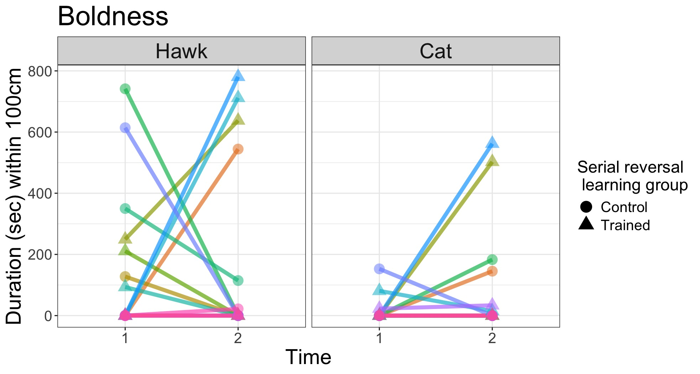

```{r, include=FALSE}
options(tinytex.verbose = TRUE)
```

```{r setup, include=FALSE}
library(knitr)
library(formatR)
knitr::opts_chunk$set(tidy.opts=list(width.cutoff=70),tidy=TRUE) 
#Make code chunks wrap text so it doesn't go off the page when knitting to PDF

knitr::opts_chunk$set(echo=F, include=T, results='asis', warning=F, message=F) 
#sets global options to display code along with the results https://exeter-data-analytics.github.io/LitProg/r-markdown.html
#set echo=F for knitting to PDF (hide code), and echo=T for knitting to HTML (show code)

options(xtable.comment = FALSE) #makes it so a note about how the table was printed doesn't show up in the pdf
```

```{r cleanbib, include=FALSE, eval=F}
### make a bibtex file that has only the references cited in this rmd 
#load the Rmd file
Rmd <- readChar("https://raw.githubusercontent.com/corinalogan/grackles/master/Files/Preregistrations/g_exploration.Rmd",nchars=1e7)

#find all in text citations that start with @, but are preceded by a space
pattern <- "\\ @(.*?)\\ "
m <- regmatches(Rmd,gregexpr(pattern,Rmd))[[1]]
m

res<- gsub("\\ ","",m) #delete spaces
res<- gsub("\\]","",res) #delete ]
res<- gsub("\\;","",res) #delete ;
res<- gsub("\\,","",res) #delete ,
res<- gsub("\\.","",res) # delete .

#find all in text citations that start with @, but are preceded by a "["
pattern2 <- "\\[@(.*?)\\ "
m2 <- regmatches(Rmd,gregexpr(pattern2,Rmd))[[1]]
m2

res2<- gsub("\\[","",m2)
res2<- gsub("\\]","",res2)
res2<- gsub("\\]","",res2)
res2<- gsub("\\;","",res2)
res2<- gsub("\\,","",res2)
res2<- gsub("\\.","",res2)
res2<- gsub("\\ ","",res2)

#combine both patterns
allbibtexkeys<-c(res,res2)

#write to a new file and then clean it up manually
write(allbibtexkeys,file="g_exploration_bibtexkeys.txt")

#load the cleaned txt file
allbibtexkeys<-read.csv("gxpopbehaviorhabitatq1_bibtexkeys.txt")

#use bib2df to convert the bibliography file into a dataframe
install.packages("bib2df")
library(bib2df)

#load the bib from GitHub
df <- bib2df("https://raw.githubusercontent.com/corinalogan/grackles/master/Files/Preregistrations/MyLibrary.bib")

#remove the @ to match the entry in the bib file
allbibtexkeys2<- gsub("\\@","",allbibtexkeys[,1])

#filter the full bib to only keep the entries that are cited here
df_filtered<-df[df$BIBTEXKEY %in% allbibtexkeys2,]

#use bib2df to convert the data frame into the bibliography file that only contains the citations in this Rmd
df2bib(df_filtered, file = "g_exploration_refs.bib", append = FALSE)
```

##### Affiliations: 
1) Institute for Social, Behavioral and Economic Research, University of California Santa Barbara
2) College of Forestry, Wildlife and Environment, Auburn University
3) Max Planck Institute for Evolutionary Anthropology
4) Department of Biological Sciences, Western Illinois University

*Corresponding author: kelseybmccune@gmail.com

&nbsp;


**This is the post-study manuscript of the preregistration that was pre-study peer reviewed and received an In Principle Recommendation on 27 March 2019 by:**

Jeremy Van Cleve (2019) Probing behaviors correlated with behavioral flexibility. *Peer Community in Ecology*, 100020. [10.24072/pci.ecology.100020](https://ecology.peercommunityin.org/public/rec?id=29&reviews=True). Reviewers: two anonymous reviewers

**Preregistration:** [html](http://corinalogan.com/Preregistrations/g_exploration.html), [pdf](https://github.com/corinalogan/grackles/blob/master/Files/Preregistrations/g_explorationPassedPreStudyPeerReviewOn27Mar2019.pdf), [rmd](https://github.com/corinalogan/grackles/blob/d17a75c24df4b90aa607eda452f4fcc496ae9409/Files/Preregistrations/g_exploration.Rmd)

**Post-study manuscript** (submitted to PCI Ecology for post-study peer review on 11 November 2024): preprint [pdf] ... at EcoEvoRxiv, [rmd](https://github.com/corinalogan/grackles/blob/master/Files/Preregistrations/g_exploration.Rmd)

# Abstract {-}

Behavioral flexibility, the ability to change behavior when circumstances change based on learning from previous experience, is thought to play an important role in a species' ability to successfully adapt to new environments and expand its geographic range. However, behavioral flexibility is rarely directly tested at the individual level. This limits our ability to determine how it relates to other traits, such as exploration or persistence, that might also influence individual responses to novel circumstances. Without this information, we lack the power to predict which traits facilitate a species' ability to adapt behavior to new environments. We use great-tailed grackles (a bird species; hereafter “grackles”) as a model to investigate this question because they have rapidly expanded their range into North America over the past 140 years. We evaluated whether grackle behavioral flexibility (measured as color reversal learning) correlated with individual differences in the exploration of new environments and novel objects, boldness towards known and novel threats, as well as persistence and motor diversity in accessing a novel food source. We determined that exploration of a novel environment across two time points and persistence when interacting with several different novel apparatuses was repeatable in individual grackles. There was a significant positive relationship between persistence and the two components of flexibility - the rate of learning to prefer a color option in the reversal learning task, and the rate of deviating from a preferred option. Furthermore, grackles that underwent serial reversal learning to experimentally increase behavioral flexibility were more exploratory in that they spent more time in close proximity to the novel environment relative to control individuals. This indicates that, the more an individual investigated or interacted with a novel apparatus, the more it was able to potentially learn and update its knowledge of current reward contingencies to adapt behavior accordingly. Our findings improve our understanding of the traits that are linked with flexibility in a highly adaptable species. We highlight the importance of using multiple different methods for measuring boldness and exploration to evaluate consistency of performance and therefore the methodological validity. We also show the importance of persistence as a factor in adapting to novel environmental changes. 

**Keywords:** behavioral flexibility, personality, anthropogenic change, repeatability

### [Video summary](https://youtu.be/Xd_nYV9Lj7E) [https://youtu.be/Xd_nYV9Lj7E](https://youtu.be/Xd_nYV9Lj7E)

# Introduction {-}

Humans are altering all ecosystems on the planet too rapidly for most species to evolve adaptations to survive and reproduce [@hendry2008human; @sih2013understanding]. Among other consequences, anthropogenic change can lead to a proliferation of novel habitats, foods, and predators [@sih2011evolution]. Across short timescales, individuals must adapt to this novelty through changes in behavior. Behavioral flexibility is defined as the ability to use learning to functionally change behavior when circumstances change [@mikhalevich_is_2017]. As such, behavioral flexibility is thought to facilitate species resilience to anthropogenic change [@sol2013behavioural] and species invasions into novel areas [@sol2002behavioural; @wright2010behavioral].

Behavioral flexibility is rarely directly tested at the individual level. Research studying the impact of flexibility on the success of species invasions most often uses proxies of flexibility such as species brain size, or presence of the theoretical outcomes of flexible behavior like the number of foraging innovations [@sol2002behavioural]. Until recently, few studies had directly tested the relationship between flexibility, foraging behavior, and other cognitive traits like innovativeness [@chow2016practice; @logan2016far; @audet2024problem]. New evidence suggests that the more flexible great-tailed grackles showed greater foraging diversity in the wild [@logan2024flexfor], and were better able to innovate solutions on a novel foraging apparatus [@logan2023flexmanippcj]. Consequently, behavioral flexibility may show variation within, as well as among, species and may affect diverse aspects of individual behavioral interactions with the environment. To better understand how behavioral flexibility might facilitate responses to novelty and resilience to anthropogenic change, it is important to directly test flexibility and relate it to other ecological and behavioral traits at the individual level.

Although behavioral flexibility has been the trait that research has focused on to understand how behavioral traits can impact adaptation to anthropogenic environmental changes, individual differences in other traits like exploratory tendency, boldness, persistence, or motor diversity could also play a role and correlate with behavioral flexibility [@logan016ehavioral; @sol2002behavioural]. For example, exploration is theoretically important for increasing the likelihood of encountering fitness-enhancing resources in novel environments [@canestrelli2016bolder; @griffin2016invading] and so the ability to adapt behavior to novel circumstances could be driven by exploratory tendency rather than, or in conjunction with, behavioral flexibility [@cohen2007should]. To distinguish whether observed behavior in the wild or performance on behavioral trait assays are motivated by one or more distinct traits, it is important to measure multiple traits in the same individuals [@carter2013animal]. 

Experimental evaluation of the relationship between flexibility and other behavioral traits has produced inconsistent results [@dougherty2018linking; @logan2016behaivoral]. In one well studied avian group, the Paridae, exploration is related to flexibility, implying that they are not two distinct traits, but the direction of the relationship is inconsistent across species [positive: @herborn2014personality, @rojas2020exploration; negative: @amy2012worms]. Inconsistencies such as this exist for other behavioral traits as well [see @logan2016behavioral for detailed review]. Individuals approaching a potentially threatening aspect of the environment require a certain degree of boldness [@mccune2018evidence]. However, the relationship between boldness and flexibility can be positive [@titulaer2012personality], negative [@bensky2022behavioral; @bebus2016associative], or neutral [@guenther2014learning; @de2022bold]. Theoretically, persistence should inhibit flexibility because it results in perseverating on a previously rewarded behavior rather than changing to a more productive behavior for a given circumstance [@morand2022cognitive]. In contrast to persistence, motor diversity is theoretically positively correlated with flexibility because it implies that the individual has a repertoire of different behaviors it is able to choose from to match each circumstance [@diquelou2016role]. Research in squirrels supports this prediction [@chow2016practice], where the more flexible individuals were less persistent and more likely to use diverse motor behaviors. Whereas, an earlier study in great-tailed grackles using different behavioral assays found no relationship between flexibility and any other behavioral traits, including persistence and motor diversity [@logan2016behavioral].   

The lack of consistent support for which behavioral traits are related (or not) to flexibility could stem from what has been called a “jingle-jangle fallacy” [@carter2013animal]. This term describes the mismatch between a trait label (like exploration) and what the method (novel environment) actually measures (could be exploration, activity, or boldness). A mismatch can occur when researchers use a single trait label for what are actually multiple distinct inherent traits (“jingle fallacy”), or if using distinct labels for what is actually the same inherent trait (“jangle fallacy”). One step towards avoiding this issue is to use multiple experimental methods, as in a test battery, to measure a variety of behaviors, then assess the relationships among performance to identify which aspects of the behaviors that are measured might be driven by the same underlying trait [@shaw2017cognitive; @perlas2017revisiting].

To determine whether behavior labels represent the same underlying trait, it is also important to ensure that measured performance on behavioral assays is consistent within individuals across time and context (i.e., repeatable). Inter-individual differences in performance could result from short-term variation in the external environment like social interactions or food availability. Furthermore, short-term differences in internal states like hunger or stress can lead to variation in behavior within species. This plasticity is distinct from consistent individual differences in behavior across contexts stemming from genetic or developmental effects [i.e., animal personality; @duckworth2010evolution; @fidler2007drd4]. Only behaviors that stem from inherent characteristics can be evolutionarily linked through natural selection [@reale2007integrating; @rowe2014measuring]. It is important to know whether traits are linked because such linkage could result in limited behavioral plasticity that may alter the ability or mode of adapting to rapid environmental changes [@sih2004behavioral]. Indeed, inconsistency in the direction of the relationship between flexibility and behavioral traits in previous studies could stem from a lack of repeatability in performance on behavioral trait assays. To address whether behavioral flexibility is related to other behavioral traits, we must first assess whether our methods produce performance that is repeatable [@dingemanse2013quantifying] to validate that it is more likely to represent variation in an inherent trait. 

Here, we first test whether performance on measures of exploration, boldness, persistence, and motor diversity is repeatable across time and contexts and therefore likely represents distinct personality traits. Behavior is considered repeatable if the variance in performance on the task is smaller within individuals compared to the variance among individuals. If there is no repeatability of these behaviors within individuals, then performance is likely state dependent (i.e., it depends on fluctuating motivation, stress, hunger levels, etc.) and/or reliant on the current context of the tasks. Then we assessed whether the repeatable traits are related to performance on a behavioral flexibility task. We focus on great-tailed grackles (*Quiscalus mexicanus*; hereafter “grackles”) because they are likely to have experienced selection for behavioral adaptations to rapid environmental change. Grackles have rapidly expanded their range into novel areas in North America over the past 140 years [@wehtje2003range, @summers2023xpop] and our previous research on this species has demonstrated that grackles are behaviorally flexible [@logan2016flexibilityproblem], and that behavioral flexibility is a distinct trait on which grackles show individual variation [@mccune2023flexmanippeerj]. Thus, this species is ideal for assessing whether behavioral flexibility is part of a suite of behaviors that facilitate adaptation to novel environments. 


## Preregistered hypotheses and predictions summary

*We preregistered several additional predictions pertaining to alternative measures of behavioral flexibility that we are not using here. The preregistration details the criteria that determined which variables to use, and we summarize this below in Methods > Behavioral flexibility. The full preregistration is available as Supplementary Material 3. The prediction numbers listed here maintain the original order from the preregistration to help readers track consistency across Stage 1 and Stage 2.* 

**Hypothesis 1:** Behavioral flexibility is correlated with the exploration of new environments and novel objects, but not with boldness, persistence, or motor diversity.

**Predictions 1-5:** Behaviorally flexible individuals will be more exploratory of novel environments (P1) and novel objects (P2) than less flexible individuals, but there will be no difference in persistence (P3), boldness (P4), or motor diversity (P5) [as found in @logan2016behavioral]. 

**P1 alternative 4:** There is no correlation between exploration and behavioral flexibility because our novel object and novel environment methods are inappropriate for measuring exploratory tendency. These measures of exploration both incorporate novelty and thus may measure boldness rather than exploration. This will be supported by a positive correlation between behavioral responses to our exploration and boldness assays.

**P3 alternative 1:** There is a positive correlation between persistence and the number of incorrect choices in reversal learning before making the first correct choice. This indicates that individuals that are persistent in one context are also persistent in another context.

**P3 alternative 2:** There is no correlation between persistence and the number of incorrect choices in reversal learning before making the first correct choice. This indicates that flexibility is an independent trait.

**Hypothesis 2:** Captive and wild individuals may respond differently to assays measuring exploration and boldness.

**Prediction 6:** Individuals assayed while in captivity are less exploratory and bold than when they are again assayed in the wild, and as compared to separate individuals assayed in the wild, potentially because captivity is an unfamiliar situation.

**P6 alternative 1:** Individuals in captivity are more exploratory and bold than wild individuals (testing sessions matched for season), and captive individuals show more exploratory and bold behaviors than when they are subsequently tested in the wild, potentially because the captive environment decreases the influence of predation, social interactions and competition.

**P6 alternative 2:** There is no difference in exploration and boldness between individuals in captivity and individuals in the wild (matched for season), potentially because in both contexts our data is biased by sampling only the types of individuals that were most likely to get caught in traps.

**P6 alternative 3:** Captive individuals, when tested again after being released, show no difference in exploratory and bold behaviors because our methods assess inherent personality traits that are consistent across the captive and wild contexts in this taxa.


# Methods {-}


## Preregistration details
The hypotheses, methods, and analysis plan are described in detail in the peer-reviewed preregistration. We summarize these methods here, with any changes from the preregistration noted in the *Changes after the study began* section. The preregistration was written and submitted to Peer Community In (PCI) Ecology for peer review (Sep 2018) before collecting any data. After data collection began (and before any data analysis was conducted), we received peer reviews from PCI Ecology, revised, resubmitted the preregistration (Feb 2019). It received an in principle recommendation in Mar 2019.


## Summary of methods
### Subjects
Grackles were caught in the wild in Tempe, Arizona USA. All individuals received color leg bands for individual identification and some individuals (n=19) were brought temporarily into aviaries. We gave these individuals various assays to measure behavioral flexibility, exploration, boldness, persistence and motor diversity, and then released them back to the wild. Grackles were individually housed in an aviary (each 244 cm long by 122 cm wide by 213 cm tall) for a maximum of six months where they had *ad lib* access to water. During testing (except exploration, see below) we food deprived grackles for up to four hours per day, but they had the opportunity to receive high value food items by participating in the assays. They had access to a maintenance diet at all other times. Individuals were given three to four days to habituate to the aviaries before their test battery began. For our second hypothesis, we tested as many grackles as possible in the wild that were color-banded (n=18 total, including 4 previously tested in the aviaries).

### Behavioral flexibility
As part of a different investigation, we used serial reversal learning to measure and then increase grackle behavioral flexibility. Details on the methods and results from this research are published elsewhere [@logan2024flexmanippcj; @mccune2023flexmanippeerj]. Briefly, we trained grackles to search in one of two color containers for food (Fig. 1a). After grackles showed a significant preference for this color (passing criterion was 17/20 trials correct), we switched the location of the food to the other color container (a “reversal”, for which we used the same passing criterion). We measured baseline behavioral flexibility as the number of trials it took grackles to switch their preference in the first reversal and search primarily in the second color container. A randomized subset of grackles (n = 8) received training to experimentally increase behavioral flexibility. We switched the location of the food multiple times (serial reversals) until grackles were switching their preference quickly enough to meet our passing criterion of two consecutive reversals in 50 trials or fewer. Instead of serial reversals, control grackles (n = 11) received equal testing experience with two identically colored containers, both containing a food item. 

In addition to assessing the relationship between performance on the behavioral trait assays and whether the grackle was flexibility trained (or in the control group), we preregistered that we would assess which of multiple additional continuous variables best represented flexible behavior. These variable were 1) the number of trials to reverse a preference in the last reversal the individual receives (for control individuals, the first reversal was also the last reversal); 2) The ratio of correct divided by incorrect trials for the first 40 trials in their final reversal, after the individual has seen the newly rewarded option once; 3) the average number of trials to solve and the average number of trials to attempt a new option on the multiaccess box (MAB), if these variables are uncorrelated with reversal performance; and 4) the “Flexibility Comprehensive” variables, described below. We determined that the Flexibility Comprehensive variables more effectively represent flexibility [@lukas2024flexmanip]. Furthermore, we found the latency to switch to a new locus on the MAB tasks was correlated with reversal performance. As a result, we focus only on the Flexibility Comprehensive variables here. 

From the performance of each individual on reversal learning, we created the Flexibility Comprehensive variables by modeling all of the choices that individuals made during the serial reversal learning experiment, and the uncertainty around these choices [@lukas2024flexmanip; @blaisdell2021more]. This measure of flexibility includes two components: $\phi$ (the Greek letter phi) as the rate of learning to be attracted to a color option and $\lambda$ (the Greek letter lambda) as the rate of deviating from learned attractions that were previously rewarded.

Measures of exploration, boldness, motor diversity, and persistence were collected after the serial reversal learning experiment was complete. By experimentally increasing behavioral flexibility we increased our ability to detect a relationship between this trait and the other traits under investigation in this study. 


### Boldness
We define boldness as an individual’s response to a potential threat [@reale2007integrating]. We measured boldness with two different threatening objects, a known threat (taxidermied Cooper’s hawk) and a novel threat (purple cat halloween decoration). We also included a known non-threat (taxidermied pigeon) as a control condition (Fig. 1d). Each individual was assayed with all three objects, presented in randomized order, across three days. Exposure to each object was limited to 15 minute trials, and a food item was placed next to the object. Boldness assays occurred while the grackle was food deprived to elicit approach behaviors. We conducted each of these assays twice to measure the repeatability of performance on this task to verify that the experimental designs elicited behaviors indicative of an inherent personality trait (as opposed to a passing motivational state). During boldness trials we measured multiple behaviors and, as preregistered, statistically analyzed the variable for which we ultimately had the most data (see below).

### Exploration
We defined exploration as an individual’s response to novelty [@reale2007integrating] to gather information that does not satisfy immediate needs [@mettke2002significance]. We used two different assays to measure exploratory tendency: novel environment (a small tent) and novel object (a pink fuzzy shape) exploration (Fig. 1b & 1c). We also conducted control conditions where we measured the grackle’s behavior in its familiar environment (the aviary) and with a familiar object (an empty water dish). Exploration tests occurred when the grackle was not food deprived to ensure that any approach to the novel object was for information gathering rather than food. Each trial was 45 minutes long and we always conducted the familiar condition trial immediately before the novel condition trial. We also conducted each of these assays twice to measure repeatability. As in boldness trials, we measured multiple behaviors during exploration trials and statistically analyzed the variable for which we ultimately had the most data (see below).

### Motor diversity and persistence
We defined motor diversity as the number of different motor actions used to solve novel problems on either of two multiaccess boxes (MABs; Fig. 1e & 1f). We used an ethogram (Table 1) to define and distinguish each interaction with the MABs. We quantified persistence as the number of touches to a novel apparatus per trial time [@logan2016behavioral; @griffin2015innovative], where the novel apparatuses included the novel environment and novel object from the exploration assays, the potentially threatening boldness objects, as well as the two MABs. Touches to the MABs were separated based on whether they were functional (touches to the doors or loci that could result in getting the food item) or nonfunctional (touches to the side of the box that would never result in food). Motor diversity and persistence were coded from videos of grackles interacting with the two different MAB apparatuses for a separate experiment on problem solving ability [@logan2024flexmanippcj], as well as the novel apparatuses from the exploration and boldness assays.


### Individual differences assays in the wild
We attempted to measure boldness and exploration in free-flying color-banded individuals in their home ranges. The overall methods for the assays in the wild were similar to those conducted in the aviaries. However, to attract the grackles’ attention to the items, we always used food near the site where the items were placed. For the exploration assays this food was greater than 2m from the item, whereas in the boldness assays the food was right next to the item (as in the aviary assays). We began the trial when a color-banded grackle came within view (20m) and was able to see the food and the object. In contrast to the aviary assays, we allowed multiple grackles to engage in the wild assays at one time. We then measured the same variables as those in the assays conducted in the aviaries. We also attempted to obtain repeated measures in the wild assays, but it was much more difficult to obtain repeated participation with free-flying grackles in the wild.

### Statistical analyses
*General analysis plan* - For all analyses, we used the MCMCglmm function in the MCMCglmm R package [@hadfield2010mcmc]. Our preregistered analysis plan was to use a Poisson distribution and log link for both the repeatability analyses and analyses testing the correlation of behavioral traits with flexibility. However, we used the DHARMa package [@hartig2019dharma] to verify that the data for each analysis met the assumptions for Poisson regression and modified the model family accordingly (see below in “Changes after the study began”). We started each model with 13,000 iterations, a thinning interval of 10, a burnin of 3,000, and minimal priors (V=1, nu=0). We checked that the GLMM showed acceptable convergence [i.e., lag time autocorrelation values <0.01; @hadfield2010mcmc], and adjusted the number of iterations, thinning and burnin if necessary.

We quantified multiple variables describing performance in each of the boldness and exploration assays. However, some individuals do not show all behaviors (e.g., not all individuals enter into the novel environment). Therefore, our preregistered analysis plan states that for each assay we will choose the variable for which we have the most data to proceed with the analysis. For boldness, we had the most data for the variable “Duration on the Ground”, which included both the duration spent near (within 20cm) and far (between 20cm and 100cm) from the object. For exploration of the novel environment, we had the most data for “Duration near (within 20cm)” and “Latency to first land on the ground” within 100cm of the object, so we conducted one model for each variable. For exploration of the novel object, we had the most data for “Latency to first land on the ground”.

*Repeatability* - We obtained repeatability estimates that account for the observed and latent scales. The repeatability estimate indicates how much of the total variance, after accounting for fixed and random effects, is explained by individual differences. From the posterior distribution of the MCMCglmm model for each behavioral trait, we extracted the Bird ID random effect variance to calculate the ratio of variance accounted for by individual differences relative to total variance. We used the mean value of this ratio across all iterations for a given behavioral trait as our measure of repeatability. We used the HPDinterval function from the coda package [@plummer2020coda] to calculate credible intervals around our repeatability estimate.

*Relationship with flexibility* - If performance was repeatable across two time points in the behavioral trait assays, we investigated whether performance was correlated with either of the Flexibility Comprehensive variables ($\phi$ and $\lambda$). Furthermore, we analyzed whether there was a difference in performance on the behavioral trait assays between grackles that underwent serial reversal learning flexibility training relative to grackles in the control group. We preregistered that we would include in these models an independent variable accounting for age effects if our subjects include juveniles as well as adults (but see *Changes after study began* section).

{width=50%}
Figure 1: This experiment assessed the relationship between multiple different behavioral tests and contexts. We quantified and increased behavioral flexibility with serial reversal learning of a color preference: a light gray and a dark gray tube (a), we determined individual differences in exploration of a novel environment: a tent (b), exploration of a novel object: a homemade pink fuzzy shape (c), boldness towards threatening objects (purple halloween cat and Cooper’s hawk) compared to a known non-threat (pigeon) (d), we cataloged motor diversity when interacting with novel foraging problems on the two multiaccess boxes (e-f), and we measured persistence by we counting the number of touches to all novel apparatuses (b, c, d, e, and f).

Table 1. Motor action ethogram for the two multiaccess box experiments. Any of the four modifiers can be added to any of the six motor actions. However, Stand only goes with the On top modifier, resulting in a total of 21 unique motor actions. For example, Vertical Peck is a peck to a vertical surface, and Gape Upside Down is a gape with the head being held upside down. Note that one interaction can be coded in multiple categories (e.g., if a bird pulls the string first horizontally and then vertically).
{width=100%}

## Changes after the study began

**After data collection began and before data analysis:**
1) We added an *unregistered analysis* to assess interobserver reliability for the response variables to determine how repeatable our data collection was by having the videos coded by multiple coders. This unregistered analysis is described, and results reported, in the Supplementary Material 1.

**After data collection and during data analysis:**
1) We conducted an *unregistered analysis* to compare the grackles’ responses to the familiar item with responses to the novel/threatening items in the exploration and boldness assays. The definition for boldness relates to the behavioral response to threat, so we would expect a decrease in interactions with the novel/threatening items relative to the control item. To test that this occurred, and the grackles perceived the items as threatening, we used MCMCglmm to model the effect of condition (novel or familiar item trial) on the latency to approach and the duration spent in proximity to the items in the exploration assays. We used a gaussian distribution for latency to approach and Poisson distribution for the duration spent in proximity. We included a covariate that identified whether the bird was in the serial reversal manipulation (or not) and a random effect for bird ID. The boldness data were overdispersed and zero-inflated so we used a zero-inflated negative binomial mixed model with the R package NBZIMM [@zhang2020nbzimm]. In this model, we also included a covariate for the serial reversal manipulation and a random effect for bird ID.

2) For the repeatability analyses, we preregistered that we would calculate repeatability from the ratio of variance components extracted from MCMCglmm models. We also obtained credible intervals from the posterior distribution of these models. However, repeatability is a ratio so values can never be less than zero. As such, we are not able to ascertain the significance of our repeatability values by determining whether the credible interval overlaps with zero. We conducted an *unregistered analysis* to obtain p-values indicating whether performance was significantly more repeatable than random by utilizing the built in permutation tests in the rptR package [@stoffel2017rptr]. This also ensured that repeatability values and credible intervals were consistent with the preregistered MCMCglmm methods to validate that our non-informative priors were appropriate. 

3) The boldness data were zero-inflated (69% of the data were zeros) and overdispersed, such that the appropriate model for this kind of count data is a zero-inflated negative binomial model. As stated above, we used this model type in the *unregistered analysis* to compare the responses between the threatening and non-threatening contexts. To assess repeatability of performance on the boldness assays, we preregistered that we would use a MCMCglmm model with a Poisson distribution. The boldness data were not appropriate for Poisson and we do not know of a method for obtaining the variance components for the repeatability calculation from a zero-inflated negative binomial model. Consequently, for the repeatability analysis we used a logistic regression, where the response was 0 (the grackle never approached the object during boldness trials) or 1 (the grackle approached the object during boldness trials). 

4) For repeatability analyses of the exploration and persistence data, we originally planned to conduct a model with a Poisson distribution. However, the data checking process detected significant zero-inflation and heteroscedasticity in the Poisson models. We log-transformed the latency to approach (for exploration) and number of touches (for persistence) for the gaussian model, which was normally distributed and not heteroscedastic, therefore we used a gaussian distribution instead. 

5) When we originally submitted this preregistration, we anticipated measuring motor diversity on only one multiaccess box (MAB). However, as part of a different experiment within our overall project, we added a second, but distinct MAB. Consequently, we did not preregister a repeatability analysis for motor diversity because there would have been only one measure per bird. We ultimately collected data on the number of motor actions on both MABs for 14 of the 17 grackles in our MAB sample, and so here we added an *unregistered analysis* to assess motor diversity repeatability. We used a Poisson regression and included a covariate for whether the grackle was flexibility trained or not. We also included an offset for the total trial time with the MABs to control for variation in the opportunity to express motor behaviors.

6) During the exploration environment assays, very few grackles stepped inside the tent (n = 4), so we did not have enough data to use the following preregistered variables in the analysis relating exploration and behavioral flexibility: Latency to enter a novel environment inside a familiar environment, Time spent in each of the different sections inside a novel environment or the corresponding areas on the floor when the novel environment is not present (familiar environment) as an interaction with the Environment Condition: activity in novel environment vs. activity in familiar environment, Time spent per section of a novel environment or in the corresponding areas on the floor when the novel environment is not present (familiar environment) as an interaction with the Environment Condition: time spent in novel environment vs. time spent in familiar environment.

7) We also realized that, because we experimentally increased reversal learning speed through serial reversal learning [@logan2024flexmanippcj], behavioral flexibility should be the independent rather than dependent variable. 

8) We found [@blaisdell2021more; @lukas2024flexmanip] that the "Flexibility Comprehensive" variables were much more effective at representing flexibility than the other variables we preregistered (e.g., Trials to reverse in the last reversal). Therefore, as preregistered, we only use this variable here, as described above in the methods. Because the individual’s serial reversal learning treatment condition (control or trained) is accounted for in the flexibility comprehensive variable, we did not include condition as an additional independent variable in these models. Note that we still conducted the preregistered analyses testing correlations between performance on the behavioral trait assays and whether the individual was in the control or flexibility trained group. 

9) We preregistered that we would include “Age” as a covariate in our models relating performance on the behavioral trait assays to behavioral flexibility if we tested juveniles as well as adults, though our plan was to only test adults. Our sample ultimately included two juveniles because the grackles were more difficult to catch than expected and we struggled to meet our minimum sample size. However, we found that the performance of the two juveniles was within the range of performance of the adults. Therefore, to maintain greater statistical power, we decided to not include Age as a covariate. 

10) We made two modifications to the analysis testing the relationship between persistence and flexibility. We preregistered that we would use all of the data, including the repeated measures, with a random effect for individual ID in a Poisson model. However, the full data set was zero-inflated. Because persistence was repeatable across tasks, we took the average of the number of functional touches and nonfunctional touches for each individual to use as the dependent variables in our models. Consequently, there was no potential for within-individual clustering in the data and we did not include the random effect for individual ID. Secondly, we were interested in the number of touches to novel objects per time. As such, we used a Poisson model as preregistered, but with an added offset term for trial time.


# RESULTS {-}

## Repeatability
Our first goal was to assess the repeatability of grackle boldness, exploration, persistence and motor diversity behaviors across time and different contexts. We collected boldness and exploration data on 19 individuals, but 2 of these individuals did not participate in the MAB tasks and so our sample size was 17 for the repeatability of persistence and motor diversity.  

### Boldness
We first conducted an *unregistered analysis* to evaluate whether grackles perceived the objects presented to them during boldness trials as threatening. Relative to the pigeon control condition (the known non-threat), we found that grackles spent 55% less time on the ground within 100cm of the cat (*p* = 0.00) and 61% less time on the ground in the presence of the hawk (*p* = 0.00). There was a nonsignificant 9.5% decrease in duration on the ground in the hawk condition relative to the cat condition (*p* = 0.71). Consequently, there is evidence that the grackles perceived the cat and hawk as more threatening than the pigeon, and we only use data from the cat and hawk assays in all subsequent analyses including boldness. Despite the perceived threat, 12 out of 19 grackles spent time on the ground in the presence of the hawk and 7 out of 19 grackles spent time on the ground with the cat at some point during the 15-minute boldness trials. 

Next we assessed whether grackles reacted consistently towards each threatening object across two time periods (temporal repeatability). Because the repeatability analysis was not possible with a zero-inflated negative binomial model, we instead used a binomial model where our dependent variable represented whether the duration grackles spent within 100cm of the threatening object was greater than 0 seconds (1) or not (0). We found no evidence for repeatability of performance in either the cat (*Repeatability* = 0.18, CI = 0.00-0.96, *p* = 0.22) or hawk (*R* = 0.00, CI = 0.00-0.44, *p* = 0.48) assays (Fig. 2). Similarly, when we considered grackle performance across the two different threatening contexts (contextual repeatability) there was also no consistency in behavioral response (*R* = 0.04, CI = 0.00-0.28, *p* = 0.22).

It is possible that habituation to the potentially threatening object occurs after the first exposure, such that individuals do not perform consistently across subsequent trials [@greggor2015neophobia; @takola2021novelty]. To check whether this explains the lack of contextual repeatability in this behavioral trait, we conducted an *unregistered analysis* evaluating repeatability of performance in only the first trial in response to the potentially threatening contexts: cat, hawk, and novel object (see below). We still found no evidence that response to the potentially threatening objects was repeatable across these contexts (*R* = 0.00, CI = 0.00-0.17, *p* = 1; Fig. S3).
```{r POSTrepeatableBold, message=FALSE, warning=FALSE, include=FALSE, results='asis'}
#Boldness
bol <- read.csv("https://raw.githubusercontent.com/corinalogan/grackles/master/Files/Preregistrations/g_exploration_data_boldness.csv", header = TRUE, sep = ",", stringsAsFactors = FALSE)
bol = bol[which(bol$IndicatedTrial == 2 & bol$AviaryOrWild == "Aviary"),-c(1:5,22:25)]
## Most data in Duration on floor - 15 out of 19 grackles came to the ground during at least 1 condition 
head(bol)  #Check to make sure it looks right

# add column identifying whether bird was in the flexibility manipulation or control groups
d <- read.csv(url("https://raw.githubusercontent.com/corinalogan/grackles/master/Files/Preregistrations/g_flexmanip_data_reverse.csv"), header=T, sep=",", stringsAsFactors=F)
d$ID <- as.factor(d$ID)
#remove pilot birds
d <- d[!d$ID=="Fajita" & !d$ID=="Empanada",]

#extract just bird name and flex group
flexID = unique(d[,c(4,5)])
colnames(flexID) = c("Name","FlexGroup")
#Taco did initial discrimination and 1 reversal, so he is considered Control group for this analysis
flexID$FlexGroup[which(flexID$Name == "Taco")]<- "Control"

# Add band ID bird names to data frame to merge it with boldness data
biometrics = read.csv(url("https://raw.githubusercontent.com/corinalogan/grackles/master/Files/Data/data_biometricsAZ.csv"), header=T, sep=",", stringsAsFactors=F)
biometrics = unique(biometrics[,c(1,2)])
flexID = merge(flexID, biometrics, by = "Name")

# Fix BirdIDs entered incorrectly in boldness data sheet
bol$BirdID[which(bol$BirdID == "A035P")] <- "A035P-"
bol$BirdID[which(bol$BirdID == "A036R")] <- "A036R-"
bol$BirdID[which(bol$BirdID == "A075Y")] <- "A075Y-"
bol = merge(bol, flexID, by = "BirdID", all = T)
# remove NA birds that were in the aviaries but did not complete boldness assays (4 birds)
bol = bol[-which(is.na(bol$Condition)),]


### total duration on ground: duration near + duration far
# Significantly correlated with Latency to land on ground (r = -0.82, p << 0.01)
bol$TotalDurationNear.20cm =  as.numeric(bol$TotalDurationNear.20cm)
bol$TotalDurationNear.20cm[which(is.na(bol$TotalDurationNear.20cm))]<-0
bol$TotalDurationFar.20cm =  as.numeric(bol$TotalDurationFar.20cm)
bol$TotalDurationFar.20cm[which(is.na(bol$TotalDurationFar.20cm))]<-0
bol$DurationOnGround = bol$TotalDurationFar.20cm + bol$TotalDurationNear.20cm # duration on ground means within 1m of object

####### FIGURING OUT DATA STRUCTURE FOR REPEATABILITY ANALYSIS ######
hist(bol$DurationOnGround) #definitely looks zero-inflated

d1 = glmer.nb(round(DurationOnGround) ~ Condition + FlexGroup + (1|BirdID), data = bol)
d2 = glmer(round(DurationOnGround) ~ Condition + FlexGroup + (1|BirdID),data = bol, family = poisson)
# function from Ben Bolker for calculating overdispersion in glmm
overdisp_fun <- function(model) {
    rdf <- df.residual(model)
    rp <- residuals(model,type="pearson")
    Pearson.chisq <- sum(rp^2)
    prat <- Pearson.chisq/rdf
    pval <- pchisq(Pearson.chisq, df=rdf, lower.tail=FALSE)
    c(chisq=Pearson.chisq,ratio=prat,rdf=rdf,p=pval)
}
overdisp_fun(d2) # both overdispersed, use zero-inflated negative binomial model

#### UNREGISTERED ANALYSIS: Is response different to cat and hawk vs pigeon? ####
# C1 = cat, C2 = pigeon, C3 = hawk

library(remotes)
install_github("nyiuab/NBZIMM", force=T, build_vignettes=F)
library(NBZIMM)

# C3 is NOT different from C1 (ß = -0.14, p = 0.52) - no difference in time on the ground between the cat and the hawk
d3 = glmm.zinb(DurationOnGround ~ Condition + FlexGroup + offset(log(TrialDuration)), random = ~1|BirdID, data = bol)
summary(d3) # Output displayed below chunk
# reorder factor levels to get difference between C2 & C3
bol$Condition = factor(bol$Condition, levels=c('C2', 'C3', 'C1'))
d3 = glmm.zinb(DurationOnGround ~ Condition + FlexGroup + offset(log(TrialDuration)), random = ~1|BirdID, data = bol)
summary(d3)
# response to C2 is different from C1 (ß = -0.80, p = 0) & C3 (ß = -0.95, p = 0) - significantly less time on the ground with the cat and hawk than the pigeon
# The cat and hawk did not result in different time on the ground (ß = -0.1, p = 0.71)
#exponentiate the coefficient to get the rate of change in Duration on ground.

### So, our control condition (known non-threat) worked and C1 & C3 seem to be perceived as threatening. Now only model repeatability of the response to threatening objects (C1 & C3) ###
hist(bol$DurationOnGround[-which(bol$Condition == "C2")])
d1 = glmer.nb(round(DurationOnGround) ~ FlexGroup + (1|BirdID), data = bol[-which(bol$Condition == "C2"),])
d2 = glmer(round(DurationOnGround) ~ FlexGroup + (1|BirdID),data = bol[-which(bol$Condition == "C2"),], family = poisson)
overdisp_fun(d1) # both overdispersed, use zero-inflated negative binomial model
d3 = glmm.zinb(fixed = round(DurationOnGround) ~ FlexGroup, random = ~1|BirdID, data = bol[-which(bol$Condition == "C2"),])
summary(d3)
# No effect of FlexGroup on response to threatening objects
# but cannot get variance components for repeatability calculation from z-inb model?

### For repeatability, need to binarize performance to 0 (did not come down) and 1 (came to the ground)
bol$binDur = ifelse(bol$DurationOnGround >0, 1, 0)
bol$Condition <- factor(bol$Condition, labels = c("Pigeon","Hawk","Cat"))

library(rptR)
rptC1 = rpt(binDur ~ FlexGroup + (1|BirdID), grname = "BirdID", data = bol[which(bol$Condition == "Cat"),], datatype = "Binary", nboot = 1000, npermut = 200)
# R = 0.18, p = 0.215, CI = 0-0.96
rptC3 = rpt(binDur ~ FlexGroup + (1|BirdID), grname = "BirdID", data = bol[which(bol$Condition == "Hawk"),], datatype = "Binary", nboot = 1000, npermut = 200)
# R = 0, p = 0.48
rptBoth = rpt(binDur ~ Condition + FlexGroup + (1|BirdID), grname = "BirdID", data = bol[-which(bol$Condition == "Pigeon"),], datatype = "Binary", nboot = 1000, npermut = 200)
# R = 0.04, p = 0.22


## Boldness is NOT repeatable ##

# easier to see individual inconsistency with DurationOnGround than the 0/1 variable we used in the analysis where the lines lie on top of each other
library(ggplot2)
ggplot(bol[-which(bol$Condition == "Pigeon"),]) +
  geom_line(aes(x = as.factor(Time), y = DurationOnGround, group = BirdID, color = BirdID), size = 1.8, alpha = 0.7) + 
  geom_point(aes(x = as.factor(Time), y = DurationOnGround, color = BirdID, size = 0.7)) + 
  facet_grid(.~Condition) +
  labs(x = "Time", y = "Duration (sec) within 100cm") + 
  theme_bw() +
  theme(axis.text = element_text(size = 14),
        axis.title = element_text(size = 20),
        plot.title = element_text(size = 26),
        strip.text.x = element_text(size = 20)) +
  ggtitle("Boldness") +
  theme(legend.position="none")


############ Registered Analysis: Now double-check repeatability in MCMCglmm #############
## DATA CHECKING FOR MCMC GLMM
library(DHARMa)
library(lme4)
simulationOutput <- simulateResiduals(fittedModel = glmer(bol$binDur ~ FlexGroup + (1|bol$BirdID), family=binomial, data=bol[-which(bol$Condition == "Pigeon")], na.action = na.omit), n=250) #250 simulations, but if want higher precision change n>1000
plot(simulationOutput$scaledResiduals) #Expect a flat distribution of the overall residuals, and uniformity in y direction if plotted against any predictor
# flat distribution
testDispersion(simulationOutput) #if under- or over-dispersed, then p-value<0.05, but then check the dispersion parameter and try to determine what in the model could be the cause and address it there, also check for zero inflation
# p > 0.05 so NOT over/under-dispersed
testZeroInflation(simulationOutput) #compare expected vs observed zeros, not zero-inflated if p>0.05
# p > 0.05 so NOT zero inflated
testUniformity(simulationOutput) #check for heteroscedasticity ("a systematic dependency of the dispersion / variance on another variable in the model" Hartig, https://cran.r-project.org/web/packages/DHARMa/vignettes/DHARMa.html), which is indicated if dots aren't on the red line and p=0.05.
# p > 0.05 so NOT heteroscedastic
plot(simulationOutput) #...there should be no pattern in the data points in the right panel
#plotResiduals(bol$LatencyFirstTouchToFood, simulationOutput$scaledResiduals) #plot the residuals against other predictors (in cases when there is more than 1 fixed effect) - can't get this code to work yet


library(MCMCglmm)
prior = list(R=list(R1=list(V=1,nu=0)), G=list(G1=list(V=1,nu=0)))
bold <- MCMCglmm(binDur ~ FlexGroup, random=~BirdID, family="categorical", data=bol[-which(bol$Condition == "Pigeon"),], verbose=F, prior=prior, nitt=63000, thin=20, burnin=5000)
summary(bold)
autocorr(bold$Sol) #Did fixed effects converge? (<0.1)? yes, after increasing iterations
autocorr(bold$VCV) #Did random effects converge? (<0.1)? yes

#Advice from Maxime Dahirel in the review for flexmanip on how to calculate repeatability from MCMCglmm (https://ecology.peercommunityin.org/public/rec?id=17&reviews=True). Dahirel says: “7- In P3a, you use a linear mixed model (lmer) to estimate repeatability when a generalized linear mixed model (glmer) should be used, as the dependent variable is a count. This would lead to potentially wrong estimates of repeatability, first because the individual variance will probably be wrongly estimated, and then because the residual/overdispersion variance is not the same for a Gaussian vs a Poisson model (Nakagawa & Schielzeth, 2010). If you want to extract correct repeatabilities from a lme4 (G)LMM (and their 95% CI) on both the response and latent scales, you can use the rptR package (Stoffel, Nakagawa, & Schielzeth, 2017). However, since you plan to fit your GLMM using MCMCglmm you actually don’t need that at all, since the latent scale adjusted repeatability and its credible interval can simply be obtained by mod$VCV[,ID]/(mod$VCV[,ID]+mod$VCV[,units]+mod$VCV[,any other included random effect]). For the raw repeatability, simply fit a model with no covariates. For the repeatability on the response scale, see (P. de Villemereuil, Morrissey, Nakagawa, & Schielzeth, 2018; Pierre de Villemereuil, Schielzeth, Nakagawa, & Morrissey, 2016) and the QGglmm R package.”
#Therefore, because MCMCglmm can easily calculate repeatability on the latent scale, there is no need to transform this back to the observed scale.

repeata <- bold$VCV[,"BirdID"]/(bold$VCV[,"BirdID"]+bold$VCV[,"units"]) #latent scale adjusted repeatability and its credible interval
mean(repeata) # 0.13
var(repeata) # 0.08
posterior.mode(repeata) # << -0.01
HPDinterval(repeata, 0.95) # 0 - 0.06
# R = 0.01 (CI: 0, 0.06)


# Repeatability on the data/observed scale (accounting for fixed effects)
#code from Supplementary Material S2 from Villemereuil et al. 2018 J Evol Biol
vf <- sapply(1:nrow(bold[["Sol"]]), function(i) {
   var(predict(bold, it=i))  
}) #estimates for each iteration of the MCMC

repeataF <- (vf+bold$VCV[,"BirdID"])/(vf+bold$VCV[,"BirdID"]+bold$VCV[,"units"]) #latent scale adjusted + data scale
mean(repeataF) # 0.49
posterior.mode(repeataF) 
HPDinterval(repeataF, 0.95) # 0 - 0.06
# get almost exact same results with rptR (R = 0.03, CI = 0-0.23, p = 0.27)

# Now compare with the raw repeatability: null model
boldraw <- MCMCglmm(binDur ~ 1, random=~BirdID, family="categorical", data=bol[-which(bol$Condition=="Pigeon"),], verbose=F, prior=prior, nitt=63000, thin=20, burnin=5000)
summary(boldraw)

repeataraw <- boldraw$VCV[,"BirdID"]/(boldraw$VCV[,"BirdID"]+boldraw$VCV[,"units"]) #latent scale adjusted repeatability and its credible interval
mean(repeataraw) # 0.01
posterior.mode(repeata) 
HPDinterval(repeata, 0.95) # 0 - 0.06
# these values are the exact same. All this means is FlexGroup has no effect/accounts for no variance
```

{width=70%}
Figure 2: The grackles did not respond consistently to the threatening objects across the two time points. Each line color represents an individual and the dots show the number of seconds individuals spent on the ground within 100cm of the threatening object during each of the two 15-minute trials (Time 1 and Time 2). The two time points were separated by an average of 33 days (range: 11-49 days) and if performance was repeatable we would expect the line connecting the two dots to be at or close to horizontal.

### Exploration
Similar to boldness, we assessed the repeatability of exploratory behavior across two time points and across two different contexts: a novel object and a novel environment. Because novel items might elicit a response based on the boldness personality trait rather than an exploratory response [@carter2013animal], we also compared the novel environment and novel object responses to control conditions with a familiar environment and a familiar object to determine whether grackles perceived the novelty as threatening (this is an *unregistered analysis*). We found no difference in the latency of individuals to approach the novel compared to the familiar environment (*ß* = 0.29, CI = -0.24-0.81, *p* = 0.27), or the duration they spent near the novel and familiar environments (*ß* = -0.61, CI = -1.47-0.20, *p* = 0.14). In contrast, grackles took significantly longer to approach the novel object relative to the familiar object (*ß* = 2.11, CI = 1.22-2.89, *p* < 0.01), indicating the novel object may have been perceived as threatening.

We found that the latency to approach the novel environment across time points 1 and 2 was highly repeatable (*R* = 0.72, CI = 0.42-0.88, *p* < 0.01). Similarly, the duration spent near the novel environment was also highly repeatable (*R* = 0.85, CI = 0.67-0.98, *p* < 0.01). However, the latency to approach the novel object was not repeatable (*R* = 0.05, CI = 0-0.5, *p* = 1; Fig. 3). When we assessed performance across the novel environment and novel object tasks, we found that latency to approach was repeatable across the two different contexts, but this result was driven by the very high between-individual variance in the environment assay (*R* = 0.49, CI = 0.21-0.69, *p* = 0; Fig. S1).

```{r POSTrepeatableExpEnv, warning=FALSE, include=FALSE, results='asis'}
#Exploration of novel environment
ee <- read.csv("https://raw.githubusercontent.com/corinalogan/grackles/master/Files/Preregistrations/g_exploration_data_exploration.csv", header = TRUE, sep = ",", stringsAsFactors = FALSE)
head(ee)  #Check to make sure it looks right


#want only Test=Environment (not Object)
ee <- ee[ee$Test=="Environment",]


#changed LatencyFirstLand NAs to a number higher than the assay session length so they show up as data points? yes. Set latency for these at 3060 (51 minutes: the highest assay duration was 50 mins)
ee$LatencyFirstLand[which(is.na(ee$LatencyFirstLand))]<-3060
ee$LatencyFirstLand <- as.numeric(ee$LatencyFirstLand)
ee$TotalDurationNear.20cm <- as.numeric(ee$TotalDurationNear.20cm)
#LatencyFirstLand or Duration has the most data so will use one of these variables. Histograms for both look poisson
ee$BirdID <- as.factor(ee$BirdID)

# add column identifying whether bird was in the flexibility manipulation or control groups
d <- read.csv(url("https://raw.githubusercontent.com/corinalogan/grackles/master/Files/Preregistrations/g_flexmanip_data_reverse.csv"), header=T, sep=",", stringsAsFactors=F)
d$ID <- as.factor(d$ID)
#remove pilot birds
d <- d[!d$ID=="Fajita" & !d$ID=="Empanada",]

#extract just bird name and flex group
flexID = unique(d[,c(4,5)])
colnames(flexID) = c("Name","FlexGroup")
#Taco did initial discrimination and 1 reversal, so he is considered Control group for this analysis
flexID$FlexGroup[which(flexID$Name == "Taco")]<- "Control"

# Add band ID bird names to data frame to merge it with boldness data
biometrics = read.csv(url("https://raw.githubusercontent.com/corinalogan/grackles/master/Files/Data/data_biometricsAZ.csv"), header=T, sep=",", stringsAsFactors=F)
biometrics = unique(biometrics[,c(1,2)])
flexID = merge(flexID, biometrics, by = "Name")
colnames(ee)[1] <- "Name"

exp = merge(ee, flexID, by = "Name", all = T)
# remove NA birds that were in the aviaries but did not complete exploration assays (4 birds)
exp = exp[-which(is.na(exp$Condition)),]
exp2 = exp[which(exp$Condition == "Novel"),]


# DATA CHECKING
library(DHARMa)
library(lme4)
simulationOutput <- simulateResiduals(fittedModel = lmer(log(LatencyFirstLand) ~ FlexGroup + (1|BirdID), data=exp2), n=250) #250 simulations, but if want higher precision change n>1000
plot(simulationOutput$scaledResiduals) #Expect a flat distribution of the overall residuals, and uniformity in y direction if plotted against any predictor
#looks kind of randomly spread
simulationOutput2 <- simulateResiduals(fittedModel = glmer(round(TotalDurationNear.20cm) ~ FlexGroup + (1|BirdID), family=poisson, data=exp2), n=250)
plot(simulationOutput2$scaledResiduals) # looks a little better

testDispersion(simulationOutput) #if under- or over-dispersed, then p-value<0.05, but then check the dispersion parameter and try to determine what in the model could be the cause and address it there, also check for zero inflation
#p=0.93 so not over or under dispersed
testDispersion(simulationOutput2) #p=0.23

testZeroInflation(simulationOutput) #compare expected vs observed zeros, not zero-inflated if p>0.05
#p=1 No zeros, so not zero inflated
testZeroInflation(simulationOutput2) #p=0.14

testUniformity(simulationOutput) #check for heteroscedasticity ("a systematic dependency of the dispersion / variance on another variable in the model" Hartig, https://cran.r-project.org/web/packages/DHARMa/vignettes/DHARMa.html), which is indicated if dots aren't on the red line and p<0.05. 
# p = 0.30, Log-transformed Latency variable and used gaussian distribution
testUniformity(simulationOutput2) #p = 0.81 - Not heteroscedastic

plot(simulationOutput)#...there should be no pattern in the data points in the right panel
plot(simulationOutput2) 

#### Assessing repeatability of both Latency to first land AND Duration near the outside of the tent
cor.test(exp2$LatencyFirstLand,exp2$TotalDurationNear.20cm) # they are moderately negatively correlated (r = -0.43)

### UNREGISTERED ANALYSIS: Do grackles perceive the novel environment as threatening? ###
library(MCMCglmm)
m1 = MCMCglmm(log(LatencyFirstLand) ~ Condition + FlexGroup, random=~BirdID, family="gaussian", data=exp, verbose=F, prior=prior, nitt=13000, thin=10, burnin=3000)
autocorr(m1$Sol) #Did fixed effects converge? Values after Lag 0 should be < 0.1. Yes
autocorr(m1$VCV) #Did random effects converge? Yes
summary(m1)
# No difference in performance on Familiar or Novel Environment tests. ß = 0.29, p = 0.27


m2 = MCMCglmm(round(TotalDurationNear.20cm) ~ Condition + FlexGroup, random=~BirdID, family="poisson", data=exp, verbose=F, prior=prior, nitt=13000, thin=10, burnin=3000)
autocorr(m2$Sol) #Did fixed effects converge? Values after Lag 0 should be < 0.1. Yes
autocorr(m2$VCV) #Did random effects converge? Yes
summary(m2)
# No difference in performance on Familiar or Novel Environment tests. ß = -0.61, p = 0.14
# Only interested in Novel Environment data from here on

### REGISTERED ANALYSIS: REPEATABILITY ###
#### LatencyFirstLand

#GLMM - 8 Feb 2021: changed family from poisson to gaussian because latency is gaussian, have to log-transform Latency so residuals are normally distributed
prior = list(R=list(R1=list(V=1,nu=0)), G=list(G1=list(V=1,nu=0)))
expl1 <- MCMCglmm(log(LatencyFirstLand) ~ FlexGroup, random=~BirdID, family="gaussian", data=exp2, verbose=F, prior=prior, nitt=13000, thin=10, burnin=3000)
autocorr(expl1$Sol) #Did fixed effects converge? Values after Lag 0 should be < 0.1. Yes
autocorr(expl1$VCV) #Did random effects converge? Yes


#Advice from one of our reviewers Maxime Dahirel: In MCMCglmm, the latent scale adjusted repeatability and its credible interval can simply be obtained by: mod$VCV[,ID]/(mod$VCV[,ID]+mod$VCV[,units])
repeata <- expl1$VCV[,"BirdID"]/(expl1$VCV[,"BirdID"]+expl1$VCV[,"units"]) #latent scale adjusted repeatability and its credible interval
mean(repeata) #0.68
var(repeata) #0.02
posterior.mode(repeata) #0.73
HPDinterval(repeata, 0.95) #0.37-0.92

# Repeatability on the data/observed scale (accounting for fixed effects)
#code from Supplementary Material S2 from Villemereuil et al. 2018 J Evol Biol
vf <- sapply(1:nrow(expl1[["Sol"]]), function(i) {
   var(predict(expl1, it=i))  
}) #estimates for each iteration of the MCMC

repeataF <- (vf+expl1$VCV[,"BirdID"])/(vf+expl1$VCV[,"BirdID"]+expl1$VCV[,"units"]) #latent scale adjusted + data scale
mean(repeataF) #0.69
posterior.mode(repeataF) #0.79
HPDinterval(repeataF, 0.95) #0.43-0.95

#RESULT: LatencyFirstLand (Explore Environment variable) = repeatable

#### TotalDurationNear
prior = list(R=list(R1=list(V=1,nu=0)), G=list(G1=list(V=1,nu=0)))
expl2 <- MCMCglmm(round(TotalDurationNear.20cm) ~ FlexGroup, random=~BirdID, family="poisson", data=exp2, verbose=F, prior=prior, nitt=13000, thin=10, burnin=3000)
autocorr(expl2$Sol) #Did fixed effects converge? Values after Lag 0 should be < 0.1. Yes
autocorr(expl2$VCV) #Did random effects converge? Yes


#Advice from one of our reviewers Maxime Dahirel: In MCMCglmm, the latent scale adjusted repeatability and its credible interval can simply be obtained by: mod$VCV[,ID]/(mod$VCV[,ID]+mod$VCV[,units])
repeata <- expl2$VCV[,"BirdID"]/(expl2$VCV[,"BirdID"]+expl2$VCV[,"units"]) #latent scale adjusted repeatability and its credible interval
mean(repeata) #0.85
var(repeata) #0.01
posterior.mode(repeata) #0.93
HPDinterval(repeata, 0.95) #0.67-0.98

#RESULT: TotalDurationNear.20cm (Explore Environment variable) = repeatable

### UNREGISTERED ANALYSIS - compare R values with rptR function and LRT test to make sure the interpretation of MCMCglmm results is correct - output matches that of MCMCglmm ###
exp2$Name = as.factor(as.character(exp2$Name))
library(rptR)
r1 = rpt(log(LatencyFirstLand) ~ FlexGroup + (1|Name), grname = "BirdID", data=exp2, datatype="Gaussian", nboot=1000, npermut=100)
r1
# R = 0.72
# CI = 0.41-0.89
# p < 0.05
r2 = rpt(round(TotalDurationNear.20cm) ~ FlexGroup + Time + (1|Name), grname = "Name", data=exp2, datatype="Poisson", nboot=1000, npermut=100)
r2
# something weird happening here... SE = 0

r3 = glmer(round(TotalDurationNear.20cm) ~ FlexGroup + (1|Name) + (1|olre), family = "poisson", data = exp2)
r4 = glmer(round(TotalDurationNear.20cm) ~ FlexGroup + (1|olre), family = "poisson", data = exp2)
anova(r3,r4) #Bird ID significantly improves the fit of the model

library(ggplot2)
ggplot(exp2) +
  geom_line(aes(x = as.factor(Time), y = TotalDurationNear.20cm, group = BirdID, color = BirdID), size = 1.8, alpha = 0.7) + 
  geom_point(aes(x = as.factor(Time), y = TotalDurationNear.20cm, color = BirdID, size = 0.7))
  

ggplot(exp2) +
  geom_line(aes(x = as.factor(Time), y = LatencyFirstLand, group = BirdID, color = BirdID), size = 1.8, alpha = 0.7) + 
  geom_point(aes(x = as.factor(Time), y = LatencyFirstLand, color = BirdID, size = 0.7)) + 
  #facet_grid(.~Condition) +
  labs(x = "Time", y = "Latency to approach (sec)") + 
  theme_bw() +
  theme(axis.text = element_text(size = 14),
        axis.title = element_text(size = 20),
        plot.title = element_text(size = 26),
        strip.text.x = element_text(size = 20)) +
  ggtitle("Novel Environment Exploration") +
  theme(legend.position="none")
## Need to facet by ExpObj data for including in manuscript - in below code chunk.
```

```{r POSTrepeatableExpObj, warning=FALSE, include=FALSE, results='asis'}
#Exploration of novel object
eo <- read.csv("https://raw.githubusercontent.com/corinalogan/grackles/master/Files/Preregistrations/g_exploration_data_exploration.csv", header = TRUE, sep = ",", stringsAsFactors = FALSE)
head(eo)  #Check to make sure it looks right

#want only Test=Object (not Environment)
eo <- eo[eo$Test=="Object",]

#Sum duration across distances to get DurationOnGround variable as in boldness analysis above
eo$DurationOnGround = eo$TotalDurationInTent + eo$TotalDurationFar.20cm + eo$TotalDurationNear.20cm
#changed LatencyFirstLand NAs to a number higher than the assay session length so they show up as data points? yes. Set latency for these at 3360 (56 minutes: the highest assay duration was 55 mins)
eo$LatencyFirstLand[which(is.na(eo$LatencyFirstLand))]<-3360
eo$LatencyFirstLand <- as.numeric(eo$LatencyFirstLand)
eo$DurationOnGround <- as.numeric(eo$DurationOnGround)
#LatencyFirstLand or Duration has the most data so will use one of these variables. 
eo$BirdID <- as.factor(eo$BirdID)

# add column identifying whether bird was in the flexibility manipulation or control groups
d <- read.csv(url("https://raw.githubusercontent.com/corinalogan/grackles/master/Files/Preregistrations/g_flexmanip_data_reverse.csv"), header=T, sep=",", stringsAsFactors=F)
d$ID <- as.factor(d$ID)
#remove pilot birds
d <- d[!d$ID=="Fajita" & !d$ID=="Empanada",]

#extract just bird name and flex group
flexID = unique(d[,c(4,5)])
colnames(flexID) = c("Name","FlexGroup")
#Taco did initial discrimination and 1 reversal, so he is considered Control group for this analysis
flexID$FlexGroup[which(flexID$Name == "Taco")]<- "Control"

# Add band ID bird names to data frame to merge it with boldness data
biometrics = read.csv(url("https://raw.githubusercontent.com/corinalogan/grackles/master/Files/Data/data_biometricsAZ.csv"), header=T, sep=",", stringsAsFactors=F)
biometrics = unique(biometrics[,c(1,2)])
flexID = merge(flexID, biometrics, by = "Name")
colnames(eo)[1] <- "Name"

exp.o = merge(eo, flexID, by = "Name", all = T)
# remove NA birds that were in the aviaries but did not complete exploration assays (4 birds)
exp.o = exp.o[-which(is.na(exp.o$Condition)),]

# DATA CHECKING - changed family to gaussian (from poisson) bc latency is gaussian
library(DHARMa)
library(lme4)
simulationOutput <- simulateResiduals(fittedModel = lmer(log(LatencyFirstLand) ~ Condition + FlexGroup + (1|BirdID), data=exp.o), n=250) #250 simulations, but if want higher precision change n>1000
plot(simulationOutput$scaledResiduals) #Expect a flat distribution of the overall residuals, and uniformity in y direction if plotted against any predictor
#looks flat
simulationOutput2 <- simulateResiduals(fittedModel = glmer(DurationOnGround ~ Condition + FlexGroup + (1|BirdID), family=poisson, data=exp.o), n=250)
plot(simulationOutput2$scaledResiduals) # looks less flat

testDispersion(simulationOutput) #if under- or over-dispersed, then p-value<0.05, but then check the dispersion parameter and try to determine what in the model could be the cause and address it there, also check for zero inflation
#p=0.88 so not over or under dispersed
testDispersion(simulationOutput2) #p=0.90

testZeroInflation(simulationOutput) #compare expected vs observed zeros, not zero-inflated if p>0.05
#p=1 No zeros, so not zero inflated
testZeroInflation(simulationOutput2) #p<<0.05 - significantly zero inflated

testUniformity(simulationOutput) #check for heteroscedasticity ("a systematic dependency of the dispersion / variance on another variable in the model" Hartig, https://cran.r-project.org/web/packages/DHARMa/vignettes/DHARMa.html), which is indicated if dots aren't on the red line and p<0.05. 
# p = 0.19, data normally distributed. 
testUniformity(simulationOutput2) #p = 0.006 - Heteroscedastic

plot(simulationOutput)#...there should be no pattern in the data points in the right panel
# all n.s.
plot(simulationOutput2) # KS test, Outlier test, within-group deviations from uniformity significant
#plotResiduals(exp$Test, simulationOutput$scaledResiduals) #plot the residuals against other predictors (in cases when there is more than 1 fixed effect) - can't get this code to work yet

#### Use Latency To First Land as variable because it has as much data as Duration on Ground, but it passes all of the data checks (when log-transformed) whereas Duration On Ground is zero inflated and heteroscedastic.

### UNREGISTERED ANALYSIS: Do grackles perceive the novel object as threatening? ###
m1 = MCMCglmm(log(LatencyFirstLand) ~ Condition + FlexGroup, random=~BirdID, family="gaussian", data=exp.o, verbose=F, prior=prior, nitt=50000, thin=100, burnin=5000)
autocorr(m1$Sol) #Did fixed effects converge? Values after Lag 0 should be < 0.1. Yes
autocorr(m1$VCV) #Did random effects converge? Yes, after increasing iterations
summary(m1)
# Grackles took signifiantly longer to come to the ground for the novel relative to the familiar object. 
# ß = 2.11, CI = 1.22-2.89, p < 0.01
# Only interested in Novel Environment data from here on

exp.o2 = exp.o[-which(exp.o$Condition == "Familiar"),]


### REGISTERED ANALYSIS: REPEATABILITY ###
#GLMM
library(MCMCglmm)
prior = list(R=list(R1=list(V=1,nu=0)), G=list(G1=list(V=1,nu=0)))
explo <- MCMCglmm(log(LatencyFirstLand) ~ FlexGroup, random=~BirdID, family="gaussian", data=exp.o2, verbose=F, prior=prior, nitt=630000, thin=1000, burnin=23000)
summary(explo) 
autocorr(explo$Sol) #Did fixed effects converge? Yes=all values after lag 0 are <0.1 indicating they converged
autocorr(explo$VCV) #Did random effects converge? Yes

#In MCMCglmm, the latent scale adjusted repeatability and its credible interval can simply be obtained by: mod$VCV[,ID]/(mod$VCV[,ID]+mod$VCV[,units]) - advice from Maxime Dahirel

repeata <- explo$VCV[,"BirdID"]/(explo$VCV[,"BirdID"]+explo$VCV[,"units"]) #latent scale adjusted repeatability and its credible interval
mean(repeata) #0.01
var(repeata) #0.002
posterior.mode(repeata) #-6.84e-6
HPDinterval(repeata, 0.95) #4.12e-17 to 0.06

# Repeatability on the data/observed scale (accounting for fixed effects)
#code from Supplementary Material S2 from Villemereuil et al. 2018 J Evol Biol
vf <- sapply(1:nrow(explo[["Sol"]]), function(i) {
   var(predict(explo, it=i))  
}) #estimates for each iteration of the MCMC

repeataF <- (vf+explo$VCV[,"BirdID"])/(vf+explo$VCV[,"BirdID"]+explo$VCV[,"units"]) #latent scale adjusted + data scale
mean(repeataF) #0.04
posterior.mode(repeataF) #0.001
HPDinterval(repeataF, 0.95) #8.20e-9 to 0.14

# Now compare with the raw repeatability: null model
exploraw <- MCMCglmm(log(LatencyFirstLand) ~ 1, random=~BirdID, family="gaussian", data=exp.o2, verbose=F, prior=prior, nitt=13000, thin=10, burnin=3000)
summary(exploraw)

repeataraw <- exploraw$VCV[,"BirdID"]/(exploraw$VCV[,"BirdID"]+exploraw$VCV[,"units"]) #latent scale adjusted repeatability and its credible interval
mean(repeataraw) #0.0002
posterior.mode(repeataraw) #-3.40e-11
HPDinterval(repeataraw, 0.95) #2.90e-17 to 4.62e-6

#RESULT=Explore Object is not repeatable

### UNREGISTERED ANALYSIS - compare R values with rptR function and LRT test to make sure the interpretation of MCMCglmm results is correct ###
library(rptR)
r2 = rpt(log(LatencyFirstLand) ~ FlexGroup + (1|BirdID), grname = "BirdID", data=exp.o2, datatype="Gaussian", nboot=1000, npermut=100) # Fit is singular
summary(r2)
# R = 0.05
# CI = 0-0.522
# p = 1

m3 = glmer(log(LatencyFirstLand) ~ FlexGroup + (1|BirdID), data = exp.o2, family = gaussian)
m4 = glm(log(LatencyFirstLand) ~ FlexGroup, data = exp.o2, family = gaussian)
anova(m3,m4) #random effect does not improve the fit of the model, does not account for a significant portion of the variance.


#### CONTEXTUAL REPEATABILITY - combine explore environment and explore object back together. Only novel condition
exp2$DurationOnGround = exp2$TotalDurationInTent + exp2$TotalDurationFar.20cm + exp2$TotalDurationNear.20cm
exp = rbind(exp2, exp.o2)
rptBoth = rpt(log(LatencyFirstLand) ~ Test + FlexGroup + (1|BirdID), grname = "BirdID", data=exp, datatype="Gaussian", nboot=1000, npermut=100)
summary(rptBoth) # R = 0.49, CI = 0.21-0.69, p = 0
rptBoth2 = rpt(log(LatencyFirstLand) ~ FlexGroup + (1|BirdID), grname = "BirdID", data=exp, datatype="Gaussian", nboot=1000, npermut=100)
summary(rptBoth2) #no difference in repeatability if we don't control for Test - in other words, the between-individual variance is the same regardless of which test

xcontx = lmer(log(LatencyFirstLand) ~ Test + FlexGroup + (1|BirdID), data = exp)
car::Anova(xcontx) #grackles take longer to land in the presence of the object relative to the environment

# Supplementary figure 1
ggplot(exp, aes(x = as.factor(Time), y = LatencyFirstLand, colour = BirdID, shape = Test)) +
  geom_point(size = 3) +
  facet_wrap( ~ BirdID) + 
  labs(x = "Time", y = "Latency to approach (sec)") + 
  theme_bw() + 
  scale_colour_discrete(guide = "none") 

ggplot(exp) +
  geom_line(aes(x = as.factor(Time), y = LatencyFirstLand, group = BirdID, color = BirdID), size = 1.8, alpha = 0.7) + 
  geom_point(aes(x = as.factor(Time), y = LatencyFirstLand, color = BirdID, size = 0.7)) + 
  facet_grid(.~Test) +
  labs(x = "Time", y = "Latency to approach (sec)") + 
  theme_bw() +
  theme(axis.text = element_text(size = 14),
        axis.title = element_text(size = 20),
        plot.title = element_text(size = 26),
        strip.text.x = element_text(size = 20)) +
  ggtitle("Exploration") +
  theme(legend.position="none")
```

{width=70%}
Figure 3: The response to the two exploration tests. Performance in the novel environment test was significantly repeatable across time. Grackles did not respond consistently to the novel object across the two time points. Each line color represents an individual and the dots show the amount of time before individuals approached to within 100cm of the novel item during each of the two 45-minute trials. The two time points were separated by 34 days on average (range: 11-49) and if performance is repeatable within a test we would expect the line connecting the two dots to be at or close to horizontal. Cross-contextual repeatability is indicated by similarly colored dots occurring at similar points on the y-axis across test types.

### Persistence
We tested whether individuals (n = 17) were repeatable in the number of touches per trial time that they made across multiple novel test apparatuses (Fig. 1b-f): boldness objects, exploration environment and object, as well as the two different MABs. We found that persistence in interacting with these diverse objects was repeatable (*R* = 0.28, CI = 0.07-0.46, *p* < 0.01; Fig. 4)

```{r POSTrepeatablePer, eval=FALSE, warning=FALSE, results='asis', echo=TRUE, include=TRUE}
#Persistence
per <- read.csv ("https://raw.githubusercontent.com/corinalogan/grackles/master/Files/Preregistrations/g_exploration_data_persistence-mot.csv", header=T, sep=",", stringsAsFactors=F) 

per = per[-which(is.na(per$Condition)),] #remove individual that did not complete reversal
per = per[-which(is.na(per$SumTouches)),] #remove rows where individuals did not receive a test
per$BirdID = as.factor(per$BirdID)
unique(per$Name) #18 individuals
table(per$Condition,per$BirdID) #10 control, 8 manipulated individuals
per$TouchRate = per$SumTouches/per$TotTime #account for trial time
per$binTouch = ifelse(per$SumTouches>0,1,0)


# DATA CHECKING
library(DHARMa)
library(lme4)
simulationOutput <- simulateResiduals(fittedModel = glmer(log(SumTouches+1) ~ Test + Condition + TotTime + (1|BirdID), family = "gaussian", data=per), n=250)
plot(simulationOutput$scaledResiduals) 
testDispersion(simulationOutput) # normally dispersed
testZeroInflation(simulationOutput) # zero inflated  
testUniformity(simulationOutput) #not heteroscedastic
plot(simulationOutput)


#REPEATABILITY
#GLMM
library(MCMCglmm)
#prior = list(R=list(R1=list(V=1,nu=0)), G=list(G1=list(V=1,nu=0)))
prior1 = list(R=list(R1=list(V=1, nu=1),
                     R2=list(V=1, nu=1),
                     R3=list(V=1, nu=1)),
              G=list(G1=list(V=1, nu=0.002)))
perFm <- MCMCglmm(log(SumTouches+1) ~ Test + Condition + TotTime, random=~BirdID, family="gaussian",
                 data=per, verbose=F, prior=prior1, nitt=1000000, thin=500, burnin=5000)
# no difference between control and manipulated groups, no effect of trial time
autocorr(perFm$Sol) #Did fixed effects converge?
autocorr(perFm$VCV) #Did random effects converge?
plot(perFm)

#In MCMCglmm, the latent scale adjusted repeatability and its credible interval can simply be obtained by: mod$VCV[,ID]/(mod$VCV[,ID]+mod$VCV[,units]) - advice from Maxime Dahirel
repeata <- perFm$VCV[,"BirdID"]/(perFm$VCV[,"BirdID"]+perFm$VCV[,"units"]) #latent scale adjusted repeatability and its credible interval
mean(repeata) # R=0.27
var(repeata) 
posterior.mode(repeata) 
HPDinterval(repeata, 0.95) # 0.05 - 0.53  

## Unregistered analysis
# checking repeatability with rptR
rPer = rpt(log(SumTouches +1) ~ Test + Condition + TotTime + (1|BirdID), grname = ("BirdID"), datatype = "Gaussian",
           data = per,
           nboot = 1000, npermut = 500)
rPer # R = 0.28 (0.07-0.46), p_LRT < 0.001, p_permut = 0.002
# We get the same results


### Plotting
per2 = per
per2$BirdID = as.factor(as.character(per2$BirdID))
per2$TouchRate = per2$SumTouches/per2$TotTime
per2 = per2[-which(per2$Test == "MABlogNFun" | per2$Test == "MABplasNFun"),] #no difference between number of functional or nonfunctional touches, so remove nonfunctional touches for the plot.
per2$Test = factor(per2$Test, levels = c("Boldness","Environment","Object",
                                         "MABlogFun","MABplasFun"),
                   labels = c("Boldness objects", "Exploration environment", "Exploration object",
                              "MAB wooden", "MAB plastic"))

library(ggplot2)
ggplot(per2,aes(x=reorder(BirdID,TouchRate),y=TouchRate,shape=Test,color=BirdID)) +
  geom_point(size = 6, stroke = 2, alpha = 0.75, position = position_dodge(width = 0.35)) +
  labs(x = "Bird", y = "Number of touches per time") + 
  theme_bw() +
  theme(legend.key.size = unit(2, 'lines')) +
  theme(axis.text.x = element_blank(),
        axis.text.y = element_text(size = 14),
        axis.title = element_text(size = 20),
        plot.title = element_text(size = 26),
        legend.title=element_text(size=20),
        legend.text = element_text(size=14)) +
  ggtitle("Persistence") +
  scale_shape_manual(values = c(15, 16, 17, 3, 4)) +
  scale_colour_discrete(guide = "none")


```


#### Motor Diversity
We quantified the number of different motor behaviors used while interacting with 2 distinct MABs in 14 grackles. Grackles were not consistent in the number of motor behaviors used across the two MABs and so repeatability was very low and not statistically significant (*R* = 0.06, CI = 0.00-0.45, *p* = 0.50).

### Hypothesis 1: Relationships among measures
The repeatability analyses informed which of our methods measured consistent individual differences in behavior. Our next goal was to investigate the relationships among only the repeatable measures (exploration of a novel environment and persistence) and behavioral flexibility.


#### Relationship between flexibility and exploration

We first analyzed the relationship between our measures of behavioral flexibility [the Flexibility Comprehensive measure that quantifies the rate of learning to be attracted to a color option in the serial reversal task, $\phi$, and the rate of deviating from learned associations, $\lambda$; @lukas2024flexmanip; @blaisdell2021more] and two variables describing novel environment exploration: Duration near (within 20cm) the outside of the tent, and the latency to first come to the ground from the aviary perches to approach the tent. We found no relationship between either measure of novel environment exploration and $\phi$ or $\lambda$ (Table 2). 

We also investigated if performance varied as a function of whether individuals went through serial reversal learning to increase flexibility (trained group, n=8) or not (control group, n=11). Grackles that underwent the flexibility training were more exploratory in that they spent more time within 20cm of the outside of the novel environment relative to control individuals (Table 3; *ß* = 3.92, *p* = 0.04). However, there was no difference between trained and control individuals in latency to come to the ground within 100cm of the novel environment (*ß* = -0.43, *p* = 0.54).  

#### Relationship between flexibility and persistence
In contrast, we found that grackles with a higher $\phi$ were more persistent in making nonfunctional touches to the novel multiaccess boxes (n = 17, *ß* = 0.26, *p* < 0.01) but not functional touches to all of the apparatuses (n=19, *ß* = 0.42, *p* = 0.11). Furthermore, individuals with lower $\lambda$ were more persistent with nonfunctional (n = 17, *ß* = -0.11, *p* =0.02) but not functional (n=19, *ß* = 0.08, *p* =0.77) touches. We then looked at whether the number of incorrect choices in the reversal learning task (i.e., how much the grackle is perseverating on a previously rewarded color option before exploring the other option, which is considered a measure of persistence) was related to the average number of functional or nonfunctional touches per time to the novel apparatuses (P3 alternative 2). We found no evidence for a relationship between these two potential measures of persistence because the intercept only model was supported over the model containing the number of touches variable (Table S1). This is further evidence that the number of touches is not related to perseverating on an option in a way that inhibits learning. 

In contrast, we found no evidence for a relationship between persistence and whether or not the grackle underwent the flexibility training. The number of functional (*ß* = 0.81, *p* = 0.09) and nonfunctional touches (*ß* = 0.24, *p* = 0.58) to the novel objects did not differ between control and trained grackles (Table 3). 


### Hypothesis 2: Comparing performance in captivity and in the wild
Participation of free-flying color-tagged grackles in our exploration and boldness assays in the wild was very low. Of the 19 grackles that experienced the personality assessments in the aviaries, we were only able to measure the corresponding performance in the wild for 2 in the exploration object assay and 2 in the boldness cat assay (3 individuals total). Therefore, we cannot statistically analyze the consistency of performance within individuals across aviary and wild contexts. Qualitatively, in all 4 assays in the wild, grackles approached the item more quickly in the wild compared to aviary assays (Fig. 4). 

We also compared general performance on the exploration environment task (the only repeatable exploration or boldness task) of all grackles in the aviaries compared to all grackles that participated in the wild tests (i.e. many of the color-banded grackles that participated in the wild were never brought into the aviaries). We had no data from the same birds for the exploration environment test in both the aviary and wild contexts and our sample size for wild individuals was small (n=3 wild grackles, n=19 aviary grackles). From this small sample, we found no difference in the latency to approach the novel environment between the aviary or wild context (*ß* = -0.39, CI = -1.83-1.46, *p* = 0.63).


## DISCUSSION

Rapid human-induced environmental change leads to novel challenges for wildlife, where individual and species ability to survive is most often possible through behavioral flexibility [@wright2010behaivoral]. Although several behavioral traits are implicated in successful adaptation to human modified environments [@chapple2012can], it is uncommon to directly test for multiple traits in the same individuals. Here, we used multiple novel and threatening stimuli to assess the validity of methods measuring various behavioral traits, and the relationships among traits, in great-tailed grackles, a species that has adapted to many human-induced changes to its environment during a rapid range expansion. We found that only some of our methods for measuring behavioral traits in captivity produced repeatable performance, indicating that the method elicits performance based on an inherent trait. Exploration and persistence were the two behavioral traits that were repeatable across time and context and thus are more likely to represent inherent traits that could be related to behavioral flexibility. Indeed, both exploration and persistence were correlated with behavioral flexibility. However, our results varied based on which of the two measures we used to quantify behavioral flexibility.

Personality traits like boldness, exploration, and persistence are not directly observable. To validate that the experimental method used has likely elicited performance reflective of the inherent personality trait, performance must be repeatable across time and contexts [@carter2013what]. We found that the number of touches that grackles made to multiple different novel apparatuses was repeatable, indicating that this is likely a valid method for measuring the trait persistence. Despite using multiple assays and stimuli to quantify exploration, boldness and motor diversity, we found that only one method produced repeatable performance: the novel environment exploration assay. The other methods, exploration of a novel object, boldness towards two different novel threats, and the number of distinct motor behaviors used to interact with the two different MABs (Fig. 1) did not produce repeatable performance across sampling periods. However, we provide in the supplementary materials a plot of the raw boldness and exploration data so readers can visually compare performance among tests (Fig. S2). 

A key aspect distinguishing boldness from exploration is that boldness reflects a response to potentially threatening objects, novel or familiar [@carter2013animal; @greggor2015neophobia]. Consequently, we compared performance between the novel or threatening objects and the familiar objects in the exploration and boldness assays. The novel environment was the only object the grackles did not perceive as a threat. Although the novel object for the exploration assay was not meant to be threatening (e.g., it was smaller than the threatening objects, it did not have eyes), grackles still spent significantly less time near it than their familiar object. Consequently, grackles did not perform consistently on these assays where the object was perceived as threatening. It is possible that grackles, in general, do not produce repeatable responses when faced with a threat in captivity. 

In the wild, grackles are a gregarious species that probably rarely encounters threats while alone [@johnson2001great]. For several reasons, we were unable to hold more than one grackle in each aviary. Therefore, the lack of repeatability in performance could stem from the relatively contrived situation of experiencing a threat when visually isolated from conspecifics. While we attempted to compare performance on these personality assays between individuals in the aviaries to individuals in the wild, it was very difficult to ensure participation of wild grackles on these assays. From the small sample of participating grackles, including those we also measured in the aviaries, preliminary evidence supports this explanation because wild grackles were faster to approach compared to grackles tested in the aviary. It is possible that, compared to the aviary performance, the faster approach of wild grackles could be explained by habituation to the threatening objects. If the assays in the wild occurred after grackles were released from the aviaries, it would be the third time they were exposed to the object. However, it is unlikely that this is the case because one (of three total) grackles tested in both the aviaries and the wild was actually given the novel object exploration assay and the novel threat boldness assay first in the wild, then subsequently was caught again and tested in the aviaries. This individual (A007-S) still approached the objects faster while in the wild (Fig. 4). This preliminary evidence is congruent with other research on social species encountering novelty. For example, zebra finches were more likely to approach a novel object for food [@coleman1994neophobia] and investigate a novel environment [@schuett2009sex] when in a social group compared to alone. However, Carib grackles were slower to approach novel foraging opportunities when in a social group compared to when alone [@morand2009innovation]. Because the majority of research on animal personality traits is conducted on individuals in captivity regardless of their sociality, more research is needed to understand when social behavior may affect the consistency of performance on personality assays.

We assessed the relationship between our repeatable behavioral traits (exploration and persistence) and the two measures of behavioral flexibility (Flexibility Comprehensive and flexibility trained group). Our Flexibility Comprehensive measure reflects two aspects of performance during serial reversal learning, the rate of learning to be attracted to a color option, $\phi$, and the rate of deviating from learned associations, $\lambda$ [@lukas2024flexmanip; @blaisdell2021more]. We predicted that exploration would be positively related to flexibility, and in particular we assumed $\lambda$ would best reflect exploratory behavior during the reversal learning task [@lukas2024flexmanip]. We found no relationship between the Flexibility Comprehensive variables and novel environment exploration. This is contrary to previous literature that found that flexibility is theoretically [@griffin2016invading] and experimentally [@rojas2020exploration] linked with this behavioral trait. In contrast, we found that grackles that underwent the serial reversal learning training to experimentally increase behavioral flexibility were more exploratory towards the novel environment compared to grackles that were in the control group. 

We also found mixed results for the correlations between persistence and the two different measures of behavioral flexibility, though with opposite results to exploration. There was no significant correlation between persistence and whether the grackle was in the flexibility trained group. Yet, more persistent individuals had a lower $\lambda$ and so were less likely to deviate from their learned attraction to the now unrewarded option. However, this relationship was only significant for nonfunctional touches. In addition, we found that persistence with nonfunctional touches was positively related to $\phi$, which Lukas and colleagues (2024) determined was a better predictor of reversal performance than $\lambda$. Together these results suggest that the more a grackle interacted with a novel apparatus, especially when no food resulted from the interaction, the more knowledge it obtained about the reward contingencies, thus facilitating faster learning of functional options. This is further supported by our finding that perseverating on choosing the previously rewarded option (incorrect choices) during reversal learning was unrelated to our persistence measure. Although persistence is often thought to impede behavioral flexibility [@morand2022cognitive], a knockout experiment in rats found evidence for distinct cognitive mechanisms for behavioral flexibility and the inability to inhibit a response (i.e., persistence in a response; @homberg2007serotonin). The importance of persistence in this highly adaptable species was also reported in a separate investigation by our team. Logan and colleagues (2023) found that persistence, rather than exploration or flexibility, was related to the ability of a species to expand its range into novel areas because the range edge population of grackles showed higher persistence compared to the population in the center of the range (the population we focus on here). 

The contradictory results for the relationship of exploration and persistence with either of the two different measures of behavioral flexibility likely reflects that, individuals trained to be more flexible through serial reversal learning ended up with different strategies of how to reverse quickly [@lukas2024flexmanip]. Trained individuals had a higher $\phi$ and lower $\lambda$ relative to grackles in the control group. As such, trained individuals were good at reacting to changes in the environment either because they kept on exploring alternative options (high lambda) or because they placed high importance on new information (high phi). With either strategy, we could expect trained individuals to also be better at exploration. In addition, we noticed that, even though all grackles improved during the manipulation, individual differences persisted [@mccune2023flexmanippeerj]. These individual differences might be linked to their persistence, which would explain why the training did not influence the relationship between flexibility and persistence. 

By assessing multiple behavioral traits in the same individuals of a highly adaptable species, we were able to identify correlations among certain repeatable traits that can inform our understanding of the ability to adapt to environmental change. Overall, we found that persistence, measured as the number of nonfunctional interactions with novel objects, and the time spent exploring near a novel environment are related to flexibility. Our results support previous hypotheses about traits that influence flexible behavior, and therefore might be important for increasing survival and fitness in the face of human-induced environmental change. However, additional research is needed to further validate methods for measuring individual differences in boldness and motor diversity in this species, and to disentangle the mechanisms driving the mixed results for the relationship between persistence, exploration and the two ways of measuring behavioral flexibility.


## PREREGISTRATION

Below is the preregistration that passed pre-study peer review.

### A. STATE OF THE DATA

NOTE: all parts of the preregistration are included in this one manuscript.

**Prior to collecting any data:** This preregistration was written and submitted to PCI Ecology for peer review (Sep 2018).

**After data collection had begun (and before any data analysis was conducted):** This preregistration was peer reviewed at PCI Ecology, revised, and resubmitted (Feb 2019), and passed pre-study peer review (Mar 2019). See the [peer review history](https://ecology.peercommunityin.org/public/rec?id=29&reviews=True). Interobserver reliability analyses were added (Feb 2021).

### B. PARTITIONING THE RESULTS

We may decide to present the results from different hypotheses in separate papers.

### C. HYPOTHESES

#### H1: [Behavioral flexibility](https://github.com/corinalogan/grackles/blob/master/EasyToReadFiles/g_flexmanip.md) (indicated by individuals that are faster at functionally changing their behavior when circumstances change; measured by reversal learning and switching between options on a multi-access box) is positively correlated with the exploration of new environments and novel objects, but not with other behaviors (i.e., boldness, persistence, or motor diversity) (see @mikhalevich_is_2017 for theoretical background about our flexibility definition).

We will first verify that our measures of exploration, boldness and persistence represent repeatable, inherent individual differences in behavior (i.e., personality). Individuals show consistent individual differences in behavior if the variance in latency to approach the task is smaller within individuals compared to variance in latency among individuals (for exploration and boldness assays). The same definition applies to persistence with the number of touches as the measured variable. If there is no repeatibility of these behaviors within individuals, then performance is likely state dependent (e.g., it depends on their fluctuating motivation, hunger levels, etc.) and/or reliant on the current context of the tasks. 

**Predictions 1-5:** Individuals in the experimental group where flexibility (as measured by reversal learning and on a multi-access box) was manipulated (such that individuals in the manipulated group became faster at switching) will be more exploratory of new environments (P1; methods similar to free-entry open field test as in @mettke2009spatial) and novel objects (P2; methods as in @mettke2009spatial) than individuals in the control group where flexibility was not increased, and there will be no difference between the groups in persistence (P3), boldness (P4; methods as in @logan2016behavioral), or motor diversity (P5) (as found in @logan2016behavioral). We do not expect the flexibility manipulation to causally change the nature of the relationship between flexibility and any of the other measured variables. Instead, we expect the manipulation to potentially enhance individual variation, thus making it easier for us to detect a correlation if one exists.

**P1-P5 alternative:** If the flexibility manipulation does not work in that those individuals in the experimental condition are not more flexible than control individuals, then we will analyze the individuals from both conditions as one group. In this case, we will assume that we were not able to influence their flexibility and that whatever level of flexibility they had coming into the experiment reflects the general individual variation in the population. This experiment will then elucidate whether general individual variation in flexibility relates to exploratory behaviors. The predictions are the same as above. The following alternatives apply to both cases: if the manipulation works (in which case we expect stronger effects for the manipulated group), and if the manipulation doesn't work (in which case we expect individuals to vary across all of the measured variables and for these variables to potentially interact).

**P1 alternative 1:** There is a positive correlation between exploration and both dependent variables in reversal learning (one accounts for exploration in reversal learning [the ratio] and the other does not). This suggests that flexibility is not independent of exploration and could indicate that another trait is present that could be explaining individual variation in flexibility as well as in exploration. This other trait or traits could be something such as boldness or persistence.

**P1 alternative 2a:** There is a positive correlation between exploration and the dependent variable that does not account for exploration (number of trials to reverse), but not the flexibility ratio, which suggests that performance overall in reversal learning is partially explained by variation in exploration, but that flexibility and exploration are separate traits because using a measure that accounts for exploration still shows variation in flexibility. 

**P1 alternative 2b:** There is a negative correlation between exploration and the flexibility ratio that accounts for exploration, but not with the number of trials to reverse. This could be an artifact of accounting for exploration in both variables.

**P1 alternative 3:** There is no correlation between exploration and either dependent variable in reversal learning. This indicates that both dependent variables measure traits that are independent of exploration.

**P1 alternative 4:** There is no correlation between exploration and either dependent variable in reversal learning because our novel object and novel environment methods are inappropriate for measuring exploratory tendency. These measures of exploration both incorporate novelty and thus may measure boldness rather than exploration. This is supported by a positive correlation between behavioral responses to our exploration and boldness assays.

**P3 alternative 1:** There is a positive correlation between persistence and the number of incorrect choices in reversal learning before making the first correct choice. This indicates that individuals that are persistent in one context are also persistent in another context.

**P3 alternative 2:** There is no correlation between persistence and the number of incorrect choices in reversal learning before making the first correct choice. This indicates that flexibility is an independent trait. 


***Figure 1.*** An overview of the study design and a selection of the variables we will measure for each assay. Exploration will be measured by comparing individual behavior within a familiar environment to behavior towards a novel environment, as well as response to a familiar object vs. a novel object within the familiar environment that contains their regular food. Boldness will be measured as the willingness to eat next to a threatening object (familiar, novel oject, or a taxidermic predator) in their familiar environment. Persistence will be measured as the number of touches to the novel environment and novel object in the Exploration assay, the objects in the Boldness assay, and the multi-access box in a separate [preregistration](https://github.com/corinalogan/grackles/blob/master/EasyToReadFiles/g_flexmanip.md). Motor diversity will be measured using the multi-access box in a separate [preregistration](https://github.com/corinalogan/grackles/blob/master/EasyToReadFiles/g_flexmanip.md). After the flexibility manipulation occurs, assays will be conducted at least twice (e.g., Time 1, Time 2) and differences (if any) between the control and manipulated groups in the behavioral flexibility [preregistration](https://github.com/corinalogan/grackles/blob/master/EasyToReadFiles/g_flexmanip.md) will be compared across time and, with persistence, across tests (e.g., Test 1, Test 2) because persistence is measured in four different assays.

#### H2: Captive and wild individuals may respond differently to assays measuring exploration and boldness.

**P6:** Individuals assayed while in captivity are less exploratory and bold than when they are again assayed in the wild, and as compared to separate individuals assayed in the wild, potentially because captivity is an unfamiliar situation.

**P6 alternative 1:** Individuals in captivity are more exploratory and bold than wild individuals (testing sessions matched for season), and captive individuals show more exploratory and bold behaviors than when they are subsequently tested in the wild, potentially because the captive environment decreases the influence of predation, social interactions and competition.

**P6 alternative 2:** There is no difference in exploration and boldness between individuals in captivity and individuals in the wild (matched for season), potentially because in both contexts our data is biased by sampling only the types of individuals that were most likely to get caught in traps.

**P6 alternative 3:** Captive individuals, when tested again after being released, show no difference in exploratory and bold behaviors because our methods assess inherent personality traits that are consistent across the captive and wild contexts in this taxa.


### D. METHODS

**Planned Sample**

Great-tailed grackles are caught in the wild in Tempe, Arizona USA for individual identification (colored leg bands in unique combinations). Some individuals (~32) are brought temporarily into aviaries for testing, and then they will be released back to the wild. Grackles are individually housed in an aviary (each 244cm long by 122cm wide by 213cm tall) at Arizona State University for a maximum of three months where they have ad lib access to water at all times and are fed Mazuri Small Bird maintenance diet ad lib during non-testing hours (minimum 20h per day), and various other food items (e.g., peanuts, grapes, bread) during testing (up to 3h per day per bird). Individuals are given three to four days to habituate to the aviaries and then their test battery begins on the fourth or fifth day (birds are usually tested six days per week, therefore if their fourth day in the aviaries occurs on a day off, then they are tested on the fifth day instead). For hypothesis 2 we will attempt to test all grackles in the wild that are color-banded.

**Sample size rationale**

We will test as many birds as we can in the approximately three years at this field site given that the birds only participate in tests in aviaries during the non-breeding season (approximately September through March). The minimum sample size for captive subjects will be 16, however we expect to be able to test up to 32 grackles in captivity. We catch grackles with a variety of methods, some of which decrease the likelihood of a selection bias for exploratory and bold individuals because grackles cannot see the traps (i.e. mist nets). In sampling all banded birds in the wild, we will therefore have a better idea of the variation in exploration and boldness behaviors in this population.

**Data collection stopping rule**

We will stop testing birds once we have completed two full aviary seasons (likely in March 2020) if the sample size is above the minimum suggested boundary based on model simulations (see section "[Ability to detect actual effects](#Ability-to-detect-actual-effects)" below). If the minimum sample size is not met by this point, we will continue testing birds at our next field site (which we move to in the summer of 2020) until we meet the minimum sample size.

#### **Open materials**

[Testing protocols](https://docs.google.com/document/d/1sEMc5z2fw6S9C-wVfc2zV331CRPpu3NuA7IhSFUZJpE/edit?usp=sharing) for exploration of new environments and objects, boldness, persistence, and motor diversity.

#### **Open data**

When the study is complete, the data will be published in the Knowledge Network for Biocomplexity's data repository.

#### **Randomization and counterbalancing** 

There is no randomizing. The order of the three tasks will be counterbalanced across birds (using https://www.random.org to randomly assign individuals to one of three experimental orders). 

1/3 of the individuals will experience:

1. Exploration environment

2. Exploration object

3. Boldness

1/3 of the individuals will experience:

1. Exploration object

2. Boldness

3. Exploration environment

1/3 of the individuals will experience: 

1. Boldness

2. Exploration environment

3. Exploration object

#### **Blinding of conditions during analysis**

No blinding is involved in this study. NOTE Feb 2021: interobserver reliability analyses were conducted with hypothesis-blind video coders.

#### **Variables included in analyses 1-5**

NOTE: to view a list of these variables in a table format, please see our Google [sheet](https://docs.google.com/spreadsheets/d/1nhFkqTFWeAeWli8FU8n7mDiWGBuCeduzf8tWN3wPQeE/edit?usp=sharing), which describes whether they are a dependent variable (DV), independent variable (IV), or random effect (RE). Note: when there is more than one DV per model, all models will be run once per DV.

**ANALYSIS 1** - *REPEATABILITY of boldness, persistence and exploration*

**Dependent variables**

1) Boldness: Latency to land on the table - OR - Latency to eat the food - OR - Latency to touch a threatening object next to food (we will choose the variable with the most data)

2) Persistence: Number of touches to an apparatus per time (multi-access box in the behavioral flexibility [preregistration](https://github.com/corinalogan/grackles/blob/master/EasyToReadFiles/g_flexmanip.md), novel environment in P1, and objects in P2 and P4)

3) Exploration of novel environment: Latency to enter a novel environment set inside a familiar environment

4) Exploration of novel object: Latency to land on the table next to an object (novel, familiar) (that does not contain food) in a familiar environment (that contains maintenance diet away from the object) - OR - latency to touch an object (novel, familiar) (choose the variable with the most data)

**Independent variables**

1) [Condition](https://github.com/corinalogan/grackles/blob/master/EasyToReadFiles/g_flexmanip.md): control, flexibility manipulation

2) ID (random effect because multiple measures per individual)

**ANALYSIS 2** - *H1: P1-P5: flexibility correlates with exploratory behaviors*

**Dependent variables**

1) The **number of trials to reverse** a preference in the last reversal that individual participated in (an individual is considered to have a preference if it chose the rewarded option at least 17 out of the most recent 20 trials (with a minimum of 8 or 9 correct choices out of 10 on the two most recent sets of 10 trials)). See behavioral flexibility [preregistration](https://github.com/corinalogan/grackles/blob/master/EasyToReadFiles/g_flexmanip.md) for details.

2) If the number of trials to reverse a preference does not positively correlate with the number of trials to attempt or solve new loci on the multi-access box (an additional measure of behavioral flexibility), then the **average number of trials to solve** and the **average number of trials to attempt** a new option on the multi-access box will be additional dependent variables. See behavioral flexibility [preregistration](https://github.com/corinalogan/grackles/blob/master/EasyToReadFiles/g_flexmanip.md).

3) **Flexibility comprehensive**: This measure is currently being developed and is intended be a more accurate representation of all of the choices an individual made, as well as accounting for the degree of uncertainty exhibited by individuals as preferences change. If this measure more effectively represents flexibility (determined using a modeled dataset and not the actual data), we may decide to solely rely on this measure and not use independent variables 1-3. If this ends up being the case, we will modify the code in the analysis plan below to reflect this change before conducting analyses of the data in this preregistration.

All models will be run once per dependent variable.

**Independent variables**

1) P1: Latency to enter a novel environment inside a familiar environment

2) P1: Time spent in each of the different sections inside a novel environment or the corresponding areas on the floor when the novel environment is not present (familiar environment) as an interaction with the Environment Condition: activity in novel environment vs. activity in familiar environment

3) P1: Time spent per section of a novel environment or in the corresponding areas on the floor when the novel environment is not present (familiar environment) as an interaction with the Environment Condition: time spent in novel environment vs. time spent in familiar environment

4) P1: Time spent exploring the outside of the novel environment (within 20cm) before entering it

5) P2: Latency to land on the table next to an object (novel, familiar) (that does not contain food) in a familiar environment (that contains maintenance diet away from the object) - OR - latency to touch an object (novel, familiar) (choose the variable with the most data)

6) P3: Number of touches to the functional part of an apparatus per time (multi-access box, novel environment in P1, novel objects in P2 and P4) 

7) P3: Number of touches to the non-functional part of an apparatus per time ([multi-access box](https://github.com/corinalogan/grackles/blob/master/EasyToReadFiles/g_flexmanip.md)) 

8) P4: Latency to land on the table - OR - Latency to eat the food - OR - Latency to touch a threatening object next to food (choose the variable with the most data)

9) P5: Number of different motor actions used when attempting to solve the [multi-access box](https://github.com/corinalogan/grackles/blob/master/EasyToReadFiles/g_flexmanip.md)

10) Age (adult: after hatch year, juvenile: hatch year). NOTE: this variable will be removed if only adults are tested (and we are planning to test only adults).

11) ID (random effect because multiple measures per individual)

12) [Condition](https://github.com/corinalogan/grackles/blob/master/EasyToReadFiles/g_flexmanip.md): control, flexibility manipulation

**ANALYSIS 3** - *H1: P1 alternative 4: correlation between boldness and exploration*

Dependent variable: Boldness: Latency to land on the table - OR - Latency to eat the food - OR - Latency to touch a threatening object next to food (we will choose the variable with the most data)

Independent variables: 

1) Time spent exploring the outside of the novel environment (within 20cm) before entering it

2) Latency to land on the table next to an object (novel, familiar) (that does not contain food) in a familiar environment (that contains maintenance diet away from the object) - OR - latency to touch an object (novel, familiar) (choose the variable with the most data)

**ANALYSIS 4** - *H1: P3: does persistence correlate with reversal persistence?*

Dependent variable: The number of incorrect choices in the final reversal before making the first correct choice

Independent variables:

1) Average number of touches to the functional part of an apparatus per time ([multi-access box](https://github.com/corinalogan/grackles/blob/master/EasyToReadFiles/g_flexmanip.md), novel environment in P1, novel objects in P2 and P4)

2) Condition: control, flexibility manipulation

**ANALYSIS 5** - *H2: P6: captive vs wild*

**Dependent variables**

1) Boldness: In captivity we will measure boldness as the latency to land on the table - OR - Latency to eat the food - OR - Latency to touch a threatening object that is next to food (we will choose the variable with the most data); In the wild the dependent variable will be the latency to come within 2m - OR - Latency to eat the food - OR - Latency to touch a threatening object that is next to food (we will choose the variable with the most data).

2) Persistence: Number of touches to an apparatus per time (multi-access box in the behavioral flexibility [preregistration](https://github.com/corinalogan/grackles/blob/master/EasyToReadFiles/g_flexmanip.md), novel environment in P1, objects in P2 and P4)

3) Exploration of novel environment: Latency to enter a novel sub-environment inside a familiar environment

4) Exploration of novel object: Latency to land next to an object (novel, familiar) (that does not contain food) in a familiar environment (that contains maintenance diet away from the object) - OR - latency to touch an object (novel, familiar) (choose the variable with the most data)

*Note: if 3 and 4 are consistent within individuals, and correlate, we will combine these variables into one exploration propensity score.*

**Independent variables**

1) Context: captive or wild

2) Number of times we attempted to assay boldness or exploration but failed due to lack of participation

3) ID (random effect because multiple measures per individual)

### E. ANALYSIS PLAN

We do not plan to **exclude** any data. When **missing data** occur, the existing data for that individual will be included in the analyses for the tests they completed. Analyses will be conducted in R (current version `r getRversion()`; [@rcoreteam]). When there is more than one experimenter within a test, experimenter will be added as a random effect to account for potential differences between experimenters in conducting the tests. If there are no differences between models including or excluding experimenter as a random effect, then we will use the model without this random effect for simplicity.

#### *Unregistered analysis: interobserver reliability of dependent variables*

To determine whether the experimenter coded the dependent variables in a repeatable way, hypothesis-blind video coders were first trained in video coding the dependent variable, and then he coded 26% of the videos in the exploration and boldness experiments. We randomly chose four (Tomatillo, Queso, Mole, and Habanero) of the 19 birds (21%) who participated in these experiments using random.org. Video coders then analyzed all videos from these four birds. The experimenter's data was compared with video coder data using the intra-class correlation coefficient (ICC) to determine the degree of bias in the regression slope (@hutcheon2010random, using the irr package in R: @gamer2012package). 

##### Interobserver reliability training

To pass **interobserver reliability (IOR) training**, video coders needed an ICC score of 0.90 or greater to ensure the instructions were clear and that there was a high degree of agreement across coders (see R code comments for details). 

**Sierra Planck (discussed with Logan):** Persistence (total number of touches to apparatus) and motor diversity (presence or absence of a behavior from the ethogram). Planck was the first to code videos for these variables so there was not an already established training process or someone to compare her to. Planck and Logan worked together to agree on coding decisions using one video, and then Planck proceeded to code videos independently after that.

**Alexis Breen**

   - **Persistence (compared with Logan):** total number of functional touches to apparatus unweighted Cohen's kappa = 1.00 (confidence boundaries=1.00-1.00, n=21 data points)
   - **Persistence (compared with Logan):** total number of non-functional touches to apparatus unweighted Cohen's kappa = 0.00 (confidence boundaries=0.00-0.00, n=19 data points). Note: Breen was previously unclear about when to count non-functional touches, however, a discussion eliminated confusion and we proceeded with allowing her to video code independently because the functional touches, which she scored perfectly on, are the more difficult touches to code and thus indicative of her ability to code non-functional touches after clarity on the instructions.
   - **Motor diversity (compared with Planck):** presence or absence of a behavior from the ethogram unweighted Cohen's kappa = 0.70 (confidence boundaries=0.39-1.00, n=21 data points). Note: Breen joined the project after Planck and had extensive experience with video coding bird behaviors. Because of this, and because she became Kiepsch's supervisor for exploration, boldness, persistence, and motor diversity, we decided to use Breen as the baseline for persistence and motor diversity and match future coders to her rather than to Plank. Therefore, we moved Breen into the primary video coder position (coding more of the videos than the others). To prepare for Kiepsch's training, Breen clarified the motor diversity ethogram to make it more repeatable. However, we did not require Planck to redo training because she was already so far through the videos. As such, we realize that Planck's data from 21% of the videos may not match Breen's as closely as if Plank was matched to Breen during training.

***Vincent Kiepsch*** (compared with Breen): 

 - **Exploration** order of the latency-distance categories ICC = 0.96 (confidence boundaries=0.92-1.00, n=141 data points)  
 - **Boldness**  order of the latency-distance categories ICC=1.00 (confidence boundaries=1.00-1.00, n=11 data points). Note that, for exploration and boldness, the ordered categories were aligned based on similar latencies between coders to prevent disagreements near the top of the data sheet from misaligning all subsequent entries. 
   - **Persistence** number of touches to the apparatus ICC = 0.999 (confidence boundaries=0.996-1.00, n=5 data points).
  - **Motor diversity**: the training score for the presence or absence of a behavior from the ethogram required additional training than originally planned, resulting in a final Cohen's kappa = 0.93 (confidence boundaries=0.80-1.00, n=42 data points). 


##### Interobserver reliability scores were as follows (4/19 birds; 21% of the videos):

**Vincent Kiepsch** (compared with Breen):

   - **Exploration:** closest distance category to apparatus Cohen's unweighted kappa = 0.86 (confidence boundaries=0.71-1.00, n=32 data points)
   - **Exploration environment:** first latency to enter tent ICC = 0.997 (confidence boundaries=0.99-0.999, n=10 data points)
   - **Boldness:** closest distance to apparatus Cohen's unweighted kappa = 0.86 (confidence boundaries=0.68-1.00, n=24 data points)

**Exploration and boldness in the WILD** (comparison between McCune video coding and transcribing field notes for 20% of the grackles in the wild sample in March 2021 and again on the same data in May 2021):
   - Exploration and boldness data collected in the wild were combined because there was not much data for either and because the variables were the same for both assays
   - **Exploration and boldness:** closest distance category to apparatus Cohen's unweighted kappa = 1.00 (confidence boundaries=1.00-1.00, n=12 data points)
   - **Exploration and boldness:** latency to first landing in a distance category ICC = 0.999 (confidence boundaries=0.994-1.000, n=8 data points)

**Persistence and Motor Diversity** (comparisons between Breen, Kiepsch, and Planck):
 
   - **Persistence:** 
       - total number of FUNCTIONAL touches to apparatus ICC = 0.77 (confidence boundaries=0.48-0.90, n=18 data points) 
       - total number of NON-FUNCTIONAL touches to apparatus ICC = 0.68 (confidence boundaries=-0.06-0.95, n=6 data points) 
   - **Motor diversity:** presence or absence of a behavior from the ethogram unweighted Kappa = 0.77 (confidence boundaries=0.70-0.84, n=380 data points)

These scores indicate that the dependent variables are repeatable to a moderate (persistence and motor diversity) or a high to very high (exploration and boldness) degree given our instructions and training.

```{r ior, eval=FALSE, warning=FALSE, results='asis', echo=TRUE, include=TRUE}
# Inter/intra-rater reliability using Cohen's kappa when the variable is categorical (scale=1+) or intra-class correlation coefficient when the variable is continuous (Mandrekar 2011 J Thoracic Oncology 6(1):6-7 https://doi.org/10.1097/JTO.0b013e318200f983)

# Intra-class correlation / reliability coefficient / the
# degree of bias in the regression slope (Hutcheon et al.
# 2010. Random measurement error and regression dilution bias
# www.bmj.com/content/340/bmj.c2289). 'The ratio of variation
# in error-free (true) X values to the variation in the
# observed error-prone (observed) values is known as the
# reliability coefficient, attenuation factor, or intra-class
# correlation.'

#Cohen's kappa = Good for nominal data (where distance doesn't mean anything; don't use the weighted Kappa bc it is like the ICC) https://www.rdocumentation.org/packages/psych/versions/1.9.12.31/topics/cohen.kappa 

# ICC / Cohen's Kappa must be 0.90 or greater to be considered reliable and pass training
### ICCs for agreement between the 2 coders (live coder and video coder)

#### PASSING interobserver reliability TRAINING so they can become second coders for experiments
#Note: this data counts as second coder data if they have ICC or Kappa > 0.89

#coder 1 = Alexis Breen
#coder 2 = Vincent Kiepsch

library(irr) #ICC package
library(psych) #Cohen's kappa package


##### EXPLORATION

#### IOR TRAINING: Did Vincent pass interobserver reliability TRAINING? YES (5 Nov 2020)
#video file names analyzed: A035P- 2018-12-27 ExploreEnv Time1 Novel T1, A035P- 2019-2-12 ExploreEnv Time2 Novel T1, A035P- 2018-12-28 ExploreObj Time1 Familiar T1
#For each coder, list the order of the distance categories scored (rows aligned to match latencies)
d <- read.csv("https://raw.githubusercontent.com/corinalogan/grackles/master/Files/Preregistrations/IOR_expbolmotper_vincent_training.csv", header = TRUE, sep = ",", stringsAsFactors = FALSE)
head(d)  #Check to make sure it looks right

de <- d[d$Experiment=="Exploration",] 
head(de)  #Check to make sure it looks right

de[,3] #coder1
de[,4] #coder2
cohen.kappa(de[,c(3,4)], w=NULL,n.obs=NULL,alpha=.05,levels=NULL) 
#unweighted kappa=0.96, confidence boundaries=0.92-1.00, n=141 data points


#### IOR: On 20% of the videos, what was the interrater reliability between Vincent and Alexis?

# Exploration OBJECT and ENVIRONMENT: Closest distance to apparatus
d <- read.csv("https://raw.githubusercontent.com/corinalogan/grackles/master/Files/Preregistrations/IOR_exploration_vincent.csv", header = TRUE, sep = ",", stringsAsFactors = FALSE)
head(d)  #Check to make sure it looks right

d[,4] #Coder1closestdistancetoapparatus
d[,6] #Coder2closestdistancetoapparatus

cohen.kappa(d[,c(4,6)], w=NULL,n.obs=NULL,alpha=.05,levels=NULL)
# unweighted kappa=0.86, confidence boundaries: 0.71-1.00, n=32 data points


# Exploration ENVIRONMENT: First latency to enter tent
d[,3] #Coder1timeentertent
d[,5] #Coder2timeentertent

# Need to change column 3 & 5 to numeric (b.c currently categorical)
d$Coder1timeentertent<-as.numeric(d$Coder1timeentertent)
d$Coder2timeentertent<-as.numeric(d$Coder2timeentertent)

icc(d[,c(3,5)], model="oneway", type="consistency", unit="single", conf.level=0.95) 
# ICC = 0.997 (95% Confidence Interval: 0.99-0.999, n=32 data points (but only 10 with data in them))


##### BOLDNESS

#### TRAINING: Did Vincent pass interobserver reliability TRAINING? YES
#video file names analyzed: A022-N 2019-01-15 Boldness Time2 C2 T2, A031-Y 2018-12-24 Boldness C2 T2

#For each coder, list the order of the distance category per video
d <- read.csv("https://raw.githubusercontent.com/corinalogan/grackles/master/Files/Preregistrations/IOR_expbolmotper_vincent_training.csv", header = TRUE, sep = ",", stringsAsFactors = FALSE)
head(d)  #Check to make sure it looks right

db <- d[d$Experiment=="Boldness",] 
head(db)  #Check to make sure it looks right
db[,3]
db[,4]
cohen.kappa(db[,c(3,4)], w=NULL,n.obs=NULL,alpha=.05,levels=NULL) 
#unweighted kappa=1.00, confidence boundaries=1.00-1.00, n=11 data points

#### IOR: On 20% of the videos, what was the interrater reliability between Vincent and Alexis?
##The data for IOR_explorationboldness_vincent.csv comes from GrackleVideoCoding, tab Exp7&8_IOR_AB_VK

# Closest distance to apparatus
d <- read.csv("https://raw.githubusercontent.com/corinalogan/grackles/master/Files/Preregistrations/IOR_exploration_vincent.csv", header = TRUE, sep = ",", stringsAsFactors = FALSE)
head(d)  #Check to make sure it looks right

db <- d[d$Experiment=="Boldness",] 
head(db)  #Check to make sure it looks right

db[,4] #coder1
db[,6] #coder2

db$Coder1closestdistancetoapparatus<-as.factor(db$Coder1closestdistancetoapparatus)
db$Coder2closestdistancetoapparatus<-as.factor(db$Coder2closestdistancetoapparatus)

#load tidyverse for data wrangling
library(tidyverse)

#clean col 4 & 6 b/c if not than counts n/a as a factor level in IOR calc
dbclean<-db %>% 
  filter(Coder1closestdistancetoapparatus != "n/a") %>% #throw out n/a category
  filter(Coder2closestdistancetoapparatus != "n/a") %>% #throw out n/a category
  droplevels() #drop unused level n/a from factor 4 & 6

cohen.kappa(dbclean[,c(4,6)], w=NULL,n.obs=NULL,alpha=.05,levels=NULL)
# unweighted kappa=0.86, confidence boundaries: 0.68-1.00, n=24 data points


#### WILD BOLDNESS & EXPLORATION ####
#Coded by the experimenter 1) live in the field using video and field notes, 2) more than a year later from video and field notes, and 3) 20% of individuals re-coded from video and field notes more than 2 months later for IOR calculation.

fd <- read.csv("https://raw.githubusercontent.com/corinalogan/grackles/master/Files/Preregistrations/IOR_expbolfieldKM.csv", header = TRUE, sep = ",", stringsAsFactors = FALSE)
head(fd)  #Check to make sure it looks right

## Exploration AND boldness (not much data so they are combined): latency to land in a distance category
fd[,5] #Coder1latencyland
fd[,7] #Coder2latencyland

# Need to change columns to numeric (b.c currently categorical)
fd$Coder1latencyland<-as.numeric(fd$Coder1latencyland)
fd$Coder1latencyland<-as.numeric(fd$Coder2latencyland)

icc(fd[,c(5,7)], model="oneway", type="consistency", unit="single", conf.level=0.95) 
# ICC = 0.999 (95% Confidence Interval: 0.994-1.000, n=8 data points (but only 10 with data in them))

## Exploration AND boldness (not much data so they are combined): closest distance category
fd[,6]
fd[,8]
cohen.kappa(fd[,c(6,8)], w=NULL,n.obs=NULL,alpha=.05,levels=NULL) 
#unweighted kappa=1.00, confidence boundaries=1.00-1.00, n=12 data points


##### MOTOR DIVERSITY
#coder 1 = Corina Logan
#coder 2 = Sierra Planck
#coder 3 = Alexis Breen
#coder 4 = Vincent Kiepsch

#### IOR TRAINING for motor diversity and persistence at the same time: Did Sierra calibrate to Corina? Yes
#Corina and Sierra both coded A035P- 2018-12-12 Multiaccess box S1 T1 to calibrate

# motor diversity: 
  #Corina=8 motor actions (data sheet: data_IORcorina at Google Drive): PullVert, PeckHorz, Grab, Pull, PeckHorz, GrabUpDown, PullHorz, PeckVert
  #Sierra=6 motor actions (GrackleVideoCoding google sheet: tab Exp_mot row 2): 
  #Corina decided Sierra passed because we went back through the video together. NOTE: Sierra has different codings here and Corina agrees with her - we worked out some kinks after Corina coded this data and we improved the categories. The only thing Sierra didn't have that Corina did was Vertical peck 3:04. 
  #Decision: Sierra moves forward with video coding bc she is coding 100% and we will match the IOR to her
#Sierra then recoded the same video=9 motor actions (GrackleVideoCoding google sheet: tab Exp_mot row 2): GrabVert, PullVert, PeckHorz, PeckVert, GrabHorz, PeckUpDown, GrabUpDown, PullHorz, PushHorz 
# Persistence: Total touches to apparatus: Corina=40, Sierra=40 - perfect agreement

# Matching Alexis to Sierra
  #Alexis coded A035P- 2018-12-12 Multiaccess box S1 T1 = 9 motor actions (data sheet: GrackleVideoCoding google sheet: tab IOR_mot row 2). Alexis listed 3 actions (out of 9 total) that Sierra did not list
  #Alexis n=9: GrabVert, PullVert, PeckVert (not in Sierra's), PeckHorz, GrabHorz, PeckUpDown, GrabUpDown (not in Sierra's), PullHorz (not in Sierra's), PushHorz
  #01:12, 01:12,   01:34,     01:37,  01:45,  02:24,   02:25,  02:39, 02:41

#Compare Alexis and Sierra: 21 motor actions in the ethogram, score presence/absence of each
ab <- c(1,1,1,1,1,1,1,1,1,0,0,0,0,0,0,0,0,0,0,0,0)
sp <- c(1,1,1,1,1,1,0,0,0,0,0,0,0,0,0,0,0,0,0,0,0)
df <- data.frame(ab,sp)
cohen.kappa(df, w=NULL,n.obs=NULL,alpha=.05,levels=NULL)
#unweighted kappa=0.70, 0.39-1.00, n=21 data points


# Persistence: Total touches to apparatus: Alexis=32. All of us (Alexis, Corina, Sierra) counted n=21 functional touches, the difference was in the nonfunctional touches

#Functional touches: compare CL and AB
cl <- c(1,1,1,1,1,1,1,1,1,1,1,1,1,1,1,1,1,1,1,1,1)
ab2 <- c(1,1,1,1,1,1,1,1,1,1,1,1,1,1,1,1,1,1,1,1,1)
df2 <- data.frame(cl,ab2)
cohen.kappa(df2, w=NULL,n.obs=NULL,alpha=.05,levels=NULL)
#unweighted kappa=1.00, 1.00-1.00, n=21 data points

#NON-functional touches: compare CL and AB
cl2 <- c(1,1,1,1,1,1,1,1,1,1,1,1,1,1,1,1,1,1,1)
ab3 <- c(1,1,1,1,1,1,1,1,1,1,1,0,0,0,0,0,0,0,0)
df3 <- data.frame(cl2,ab3)
cohen.kappa(df3, w=NULL,n.obs=NULL,alpha=.05,levels=NULL)
#unweighted kappa=0.00, 0.00-0.00, n=19 data points

#Decided to have Alexis code all videos for bird 35 and match all future coders to her because she made the motor diversity ethogram more detailed and with diagrams, and has an extensive background in coding these kinds of behaviors. So move Sierra to the 20% person for MAB plastic and MAB log. Vincent is the 20% person for Exp and Bol.

#From now (6 Oct 2020) on, for somone to pass interobserver reliability training, they must get Cohen's kappa 0.9 or above for MotorActionsUsed column motor action order, and ICC 0.9 or above for TotalNumberFunctionalTouches column time stamps


#### IOR TRAINING: Did Vincent pass interobserver reliability TRAINING for motor diversity on exploration & boldness videos? NO (4 Nov 2020), then did more training and did pass
#video file names analyzed 5 Nov 2020: A035P- 2018-12-27 ExploreEnv Time1 Novel T1
#video file names analyzed 6 Nov 2020: A035P- 2018-12-27 ExploreEnv Time1 Novel T1, A035P- 2019-2-12 ExploreEnv Time2 Novel T1, A035P- 2018-12-28 ExploreObj Time1 Familiar T1, A022-N 2019-01-15 Boldness Time2 C2 T2, A031-Y 2018-12-24 Boldness C2 T2, A022-N 2018-12-10 ExploreEnv Novel T1
#video file names analyzed 11 Nov 2020 (analysis 1): A035P- 2018-12-27 ExploreEnv Time1 Novel T1, A035P- 2019-2-12 ExploreEnv Time2 Novel T1, A035P- 2018-12-28 ExploreObj Time1 Familiar T1, A022-N 2019-01-15 Boldness Time2 C2 T2, A031-Y 2018-12-24 Boldness C2 T2, A022-N 2018-12-10 ExploreEnv Novel T1, A022-N 2019-01-11 ExploreEnv Time2 Novel T1
#video file names analyzed 11 Nov 2020 (analysis 2 without the first 2 videos=38 data points): A035P- 2018-12-28 ExploreObj Time1 Familiar T1, A022-N 2019-01-15 Boldness Time2 C2 T2, A031-Y 2018-12-24 Boldness C2 T2, A022-N 2018-12-10 ExploreEnv Novel T1, A022-N 2019-01-11 ExploreEnv Time2 Novel T1
#video file names analyzed 11 Nov 2020 (analysis 3 only bird 22 explore environment): A022-N 2018-12-10 ExploreEnv Novel T1, A022-N 2019-01-11 ExploreEnv Time2 Novel T1
#video file names analyzed 11 Nov 2020: A035P- 2018-12-27 ExploreEnv Time1 Novel T1, A035P- 2019-2-12 ExploreEnv Time2 Novel T1, A035P- 2018-12-28 ExploreObj Time1 Familiar T1, A022-N 2019-01-15 Boldness Time2 C2 T2, A031-Y 2018-12-24 Boldness C2 T2, A022-N 2018-12-10 ExploreEnv Novel T1, A022-N 2019-01-11 ExploreEnv Time2 Novel T1, A073OL 2019-11-28 ExploreEnv Time2 Novel T1 (pt. 1)
#video file names analyzed 16 Nov 2020: A035P- 2018-12-27 ExploreEnv Time1 Novel T1, A035P- 2019-2-12 ExploreEnv Time2 Novel T1, A035P- 2018-12-28 ExploreObj Time1 Familiar T1, A022-N 2019-01-15 Boldness Time2 C2 T2, A031-Y 2018-12-24 Boldness C2 T2, A022-N 2018-12-10 ExploreEnv Novel T1, A022-N 2019-01-11 ExploreEnv Time2 Novel T1, A073OL 2019-11-28 ExploreEnv Time2 Novel T1 (pt. 1), A073OL 2019-10-25 ExploreEnv Time1 Novel T1
#video file names analyzed 16 Nov 2020 (only those videos after the intensive training session): A073OL 2019-11-28 ExploreEnv Time2 Novel T1 (pt. 1), A073OL 2019-10-25 ExploreEnv Time1 Novel T1 = PASSED

# motor diversity: presence/absence of a coder coding a particular behavior from the ethogram
d <- read.csv("https://raw.githubusercontent.com/corinalogan/grackles/master/Files/Preregistrations/IOR_expbolmotper_vincent_training.csv", header = TRUE, sep = ",", stringsAsFactors = FALSE)
head(d)  #Check to make sure it looks right

dm <- d[d$Experiment=="Motor",] 
head(dm)  #Check to make sure it looks right

dm[,3]
dm[,4]

cohen.kappa(dm[,c(3,4)], w=NULL,n.obs=NULL,alpha=.05,levels=NULL)
#unweighted = 0.74, 0.61-0.87, n=105 data points. Did not pass on 5 Nov 2020
#unweighted = 0.74, 0.62-0.86, n=126 data points. Did not pass on 6 Nov 2020
#unweighted = 0.75, 0.64-0.87, n=147 data points. Did not pass on 11 Nov 2020 (1). There were too many mistakes in the first two videos for us to be able to evaluate whether he now passes training. Therefore, I am removing the first two videos from the analysis and recalculating...
#unweighted = 0.74, 0.55-0.92, n=109 data points. Did not pass on 11 Nov 2020 (2). Try only analyzing the most recent videos coded on bird 22 (explore env), which occurred after more training
#unweighted = 0.69, 0.41-0.99, n=42 data points. Did not pass on 11 Nov 2020 (3). So even his recent training is not improving his scoring ability. It's better to include all of the videos coded so far.
#unweighted = 0.8, 0.71-0.89, n=168 data points. Did not pass on 13 Nov 2020
#unweighted = 0.82, 0.73-0.90, n=189 data points. Did not pass on 16 Nov 2020
#unweighted = 0.93, 0.80-1.00, n=42 data points. PASSED on 16 Nov 2020 (need to replace the other training videos to make sure he codes 20% of all videos)


#### On 20% of the videos, what was the interrater reliability between Vincent and Alexis?
#total number of motor actions per bird across all experiments
d <- read.csv("https://raw.githubusercontent.com/corinalogan/grackles/master/Files/Preregistrations/IOR_motor_BreenPlanckKiepsch.csv", header = TRUE, sep = ",", stringsAsFactors = FALSE)
head(d)  #Check to make sure it looks right

d[,6]
d[,7]
cohen.kappa(d[,c(6,7)], w=NULL,n.obs=NULL,alpha=.05,levels=NULL)
#unweighted kappa 0.77 (0.70-0.84), n`380 data points


##### PERSISTENCE

#coder 1=Alexis Breen
#coder 2=Vincent Kiepsch

#### IOR TRAINING: Did Vincent pass interobserver reliability TRAINING for persistence on exploration & boldness videos? YES (4 Nov 2020)
#video file names analyzed: A035P- 2018-12-27 ExploreEnv Time1 Novel T1, A035P- 2019-2-12 ExploreEnv Time2 Novel T1, A035P- 2018-12-28 ExploreObj Time1 Familiar T1, A022-N 2019-01-15 Boldness Time2 C2 T2, A031-Y 2018-12-24 Boldness C2 T2

#list the values in the TotalNumberFunctionalTouches for each row (a row is a video or a trial depending on the experiment) (note: for exploration and boldness, there are only functional touches and no nonfunctional touches)
d <- read.csv("https://raw.githubusercontent.com/corinalogan/grackles/master/Files/Preregistrations/IOR_expbolmotper_vincent_training.csv", header = TRUE, sep = ",", stringsAsFactors = FALSE)
head(d)  #Check to make sure it looks right

dp <- d[d$Experiment=="Persistence",] 
head(dp)  #Check to make sure it looks right

dp[,3]  <- as.numeric(dp[,3]) #coder1
dp[,4]  <- as.numeric(dp[,4]) #coder2
icc(dp[,c(3,4)], model = "oneway", type = "consistency", unit = "single", conf.level = 0.95)
#ICC=0.999, 95%-Confidence Interval 0.996 < ICC < 1, n=5 data points


#### IOR: On 20% of the videos, what was the interrater reliability between Vincent and Alexis?
#total number of touches to an apparatus per bird across all experiments

#need to change the file path to the correect tab at the google sheet - the one here is for training data
d <- read.csv("https://raw.githubusercontent.com/corinalogan/grackles/master/Files/Preregistrations/IOR_persistence_BreenPlanckKiepsch.csv", header = TRUE, sep = ",", stringsAsFactors = FALSE)
head(d)  #Check to make sure it looks right

d[,3]  <- as.numeric(d[,3]) #coder1
d[,4]  <- as.numeric(d[,4]) #coder2
d[,5]  <- as.numeric(d[,5]) #coder1
d[,6]  <- as.numeric(d[,6]) #coder2

icc(d[,c(3,4)], model = "oneway", type = "consistency", unit = "single", conf.level = 0.95)
#functional touches: ICC=0.77, 95%-Confidence Interval  0.484 < ICC < 0.904, n=18 data points, F-Test, H0: r0 = 0 ; H1: r0 > 0  F(17,18) = 7.52 , p = 4.66e-05

icc(d[,c(5,6)], model = "oneway", type = "consistency", unit = "single", conf.level = 0.95)
#nonfunctional touches: ICC = 0.682, 95%-Confidence Interval -0.062 < ICC < 0.947, n=6 data points, F-Test, H0: r0 = 0 ; H1: r0 > 0 F(5,6) = 5.29 , p = 0.0332 
```


#### *Ability to detect actual effects*

To begin to understand what kinds of effect sizes we will be able to detect given our sample size limitations and our interest in decreasing noise by attempting to measure it, which increases the number of explanatory variables, we used G&ast;Power (v.3.1, @faul2007g, @faul2009statistical) to conduct power analyses based on confidence intervals. G&ast;Power uses pre-set drop down menus and we chose the options that were as close to our analysis methods as possible (listed in each analysis below). Note that there were no explicit options for GLMs (though the chosen test in G&ast;Power appears to align with GLMs) or GLMMs or for the inclusion of the number of trials per bird (which are generally large in our investigation), thus the power analyses are only an approximation of the kinds of effect sizes we can detect. We realize that these power analyses are not fully aligned with our study design and that these kinds of analyses are not appropriate for Bayesian statistics (e.g., our MCMCglmm below), however we are unaware of better options at this time. Additionally, it is difficult to run power analyses because it is unclear what kinds of effect sizes we should expect due to the lack of data on this species for these experiments. 

To address the power analysis issues, we will run simulations on our Arizona data set before conducting any analyses in this preregistration. We will first run null models (i.e., dependent variable ~ 1 + random effects), which will allow us to determine what a weak versus a strong effect is for each model. Then we will run simulations based on the null model to explore the boundaries of influences (e.g., sample size) on our ability to detect effects of interest of varying strengths. If simulation results indicate that our Arizona sample size is not larger than the lower boundary, we will continue these experiments at the next field site until we meet the minimum suggested sample size.

#### *Data checking*

The data will be checked for overdispersion, underdispersion, zero-inflation, and heteroscedasticity with the DHARMa R package [@Hartig2019dharma] following methods by [Hartig](https://cran.r-project.org/web/packages/DHARMa/vignettes/DHARMa.html). Note: DHARMa doesn't support MCMCglmm, therefore we will use the closest supported model: glmer from the R package lme4 [@lme4].


#### *Repeatability of exploration, boldness and persistence*

**Analysis:** We will obtain repeatability estimates that account for the observed and latent scales, and then compare them with the raw repeatability estimate from the null model. The repeatability estimate indicates how much of the total variance, after accounting for fixed and random effects, is explained by individual differences (ID). We will run this GLMM using the MCMCglmm function in the MCMCglmm package ([@hadfieldMCMCglmmpackage]) with a Poisson distribution and log link using 13,000 iterations with a thinning interval of 10, a burnin of 3,000, and minimal priors (V=1, nu=0) [@hadfield2014coursenotes]. We will ensure the GLMM shows acceptable convergence (i.e., lag time autocorrelation values <0.01; [@hadfieldMCMCglmmpackage]), and adjust parameters if necessary. 

*Note Feb 2021: a Gaussian distribution was used instead of a Poisson for exploration and boldness latencies because they are continuous variables.*

Note: The power analysis is the same as for P3 (below) because there are the same number of explanatory variables (fixed effects).

```{r PREREGISTRATIONrepeatableBold, eval=FALSE, warning=FALSE, include=FALSE, results='asis'}
# Boldness
bol <- read.csv("/Users/corina/GTGR/data/data_boldness.csv",
    header = T, sep = ",", stringsAsFactors = F)

# DATA CHECKING
library(DHARMa)
library(lme4)
simulationOutput <- simulateResiduals(fittedModel = glmer(LatencyToFeed ~
    Condition + (1 | ID), family = poisson, data = bol), n = 250)  #250 simulations, but if want higher precision change n>1000
simulationOutput$scaledResiduals  #Expect a flat distribution of the overall residuals, and uniformity in y direction if plotted against any predictor
testDispersion(simulationOutput)  #if under- or over-dispersed, then p-value<0.05, but then check the dispersion parameter and try to determine what in the model could be the cause and address it there, also check for zero inflation
testZeroInflation(simulationOutput)  #compare expected vs observed zeros, not zero-inflated if p<0.05
testUniformity(simulationOutput)  #check for heteroscedasticity ('a systematic dependency of the dispersion / variance on another variable in the model' Hartig, https://cran.r-project.org/web/packages/DHARMa/vignettes/DHARMa.html), which is indicated if dots aren't on the red line and p<0.05. Also...
plot(simulationOutput)  #...there should be no pattern in the data points in the right panel
plotResiduals(ReverseNumber, simulationOutput$scaledResiduals)  #plot the residuals against other predictors (in cases when there is more than 1 fixed effect) - can't get this code to work yet

# REPEATABILITY GLMM
library(MCMCglmm)
prior = list(R = list(R1 = list(V = 1, nu = 0)), G = list(G1 = list(V = 1,
    nu = 0)))
bold <- MCMCglmm(LatencyToFeed ~ Condition, random = ~ID, family = "poisson",
    data = bol, verbose = F, prior = prior, nitt = 13000, thin = 10,
    burnin = 3000)
summary(bold)
# autocorr(bold$Sol) #Did fixed effects converge?
# autocorr(bold$VCV) #Did random effects converge?

# In MCMCglmm, the latent scale adjusted repeatability and
# its credible interval can simply be obtained by:
# mod$VCV[,ID]/(mod$VCV[,ID]+mod$VCV[,units]) - advice from
# Maxime Dahirel

repeata <- bold$VCV[, "ID"]/(bold$VCV[, "ID"] + bold$VCV[, "units"])  #latent scale adjusted repeatability and its credible interval
mean(repeata)
var(repeata)
posterior.mode(repeata)
HPDinterval(repeata, 0.95)

# Repeatability on the data/observed scale (accounting for
# fixed effects) code from Supplementary Material S2 from
# Villemereuil et al. 2018 J Evol Biol
vf <- sapply(1:nrow(bold[["Sol"]]), function(i) {
    var(predict(bold, it = i))
})  #estimates for each iteration of the MCMC

repeataF <- (vf + bold$VCV[, "ID"])/(vf + bold$VCV[, "ID"] +
    bold$VCV[, "units"])  #latent scale adjusted + data scale
posterior.mode(repeataF)
HPDinterval(repeataF, 0.95)

# Now compare with the raw repeatability: null model
boldraw <- MCMCglmm(LatencyToFeed ~ 1, random = ~ID, family = "poisson",
    data = bol, verbose = F, prior = prior, nitt = 13000, thin = 10,
    burnin = 3000)
summary(boldraw)

repeataraw <- boldraw$VCV[, "ID"]/(boldraw$VCV[, "ID"] + boldraw$VCV[,
    "units"])  #latent scale adjusted repeatability and its credible interval
posterior.mode(repeata)
HPDinterval(repeata, 0.95)
# Persistence
per <- read.csv("/Users/corina/GTGR/data/data_persist.csv", header = T,
    sep = ",", stringsAsFactors = F)
```

```{r PREREGISTRATIONrepeatablePer, eval=FALSE, warning=FALSE, include=FALSE, results='asis'}
# Persistence
per <- read.csv("/Users/corina/GTGR/data/data_persist.csv", header = T,
    sep = ",", stringsAsFactors = F)

# DATA CHECKING
library(DHARMa)
library(lme4)
simulationOutput <- simulateResiduals(fittedModel = glmer(NoTouches ~
    Test * Condition + (1 | ID), family = poisson, data = per),
    n = 250)
simulationOutput$scaledResiduals
testDispersion(simulationOutput)
testZeroInflation(simulationOutput)
testUniformity(simulationOutput)
plot(simulationOutput)
plotResiduals(ReverseNumber, simulationOutput$scaledResiduals)  #can't get this code to work yet

# REPEATABILITY GLMM
library(MCMCglmm)
prior = list(R = list(R1 = list(V = 1, nu = 0)), G = list(G1 = list(V = 1,
    nu = 0)))
pers <- MCMCglmm(NoTouches ~ Test * Condition, random = ~ID,
    family = "poisson", data = per, verbose = F, prior = prior,
    nitt = 13000, thin = 10, burnin = 3000)
summary(pers)
# autocorr(pers$Sol) #Did fixed effects converge?
# autocorr(pers$VCV) #Did random effects converge?

# In MCMCglmm, the latent scale adjusted repeatability and
# its credible interval can simply be obtained by:
# mod$VCV[,ID]/(mod$VCV[,ID]+mod$VCV[,units]) - advice from
# Maxime Dahirel

repeata <- pers$VCV[, "ID"]/(pers$VCV[, "ID"] + pers$VCV[, "units"])  #latent scale adjusted repeatability and its credible interval
mean(repeata)
var(repeata)
posterior.mode(repeata)
HPDinterval(repeata, 0.95)

# Repeatability on the data/observed scale (accounting for
# fixed effects) code from Supplementary Material S2 from
# Villemereuil et al. 2018 J Evol Biol
vf <- sapply(1:nrow(pers[["Sol"]]), function(i) {
    var(predict(pers, it = i))
})  #estimates for each iteration of the MCMC

repeataF <- (vf + pers$VCV[, "ID"])/(vf + pers$VCV[, "ID"] +
    pers$VCV[, "units"])  #latent scale adjusted + data scale
posterior.mode(repeataF)
HPDinterval(repeataF, 0.95)

# Now compare with the raw repeatability: null model
persraw <- MCMCglmm(NoTouches ~ 1, random = ~ID, family = "poisson",
    data = per, verbose = F, prior = prior, nitt = 13000, thin = 10,
    burnin = 3000)
summary(persraw)

repeataraw <- persraw$VCV[, "ID"]/(persraw$VCV[, "ID"] + persraw$VCV[,
    "units"])  #latent scale adjusted repeatability and its credible interval
posterior.mode(repeata)
HPDinterval(repeata, 0.95)
```

```{r PREREGISTRATIONrepeatableExpEnv, eval=FALSE, warning=FALSE, include=FALSE, results='asis'}
# Exploration of novel environment
ee <- read.csv("/Users/corina/GTGR/data/data_explore.csv", header = T,
    sep = ",", stringsAsFactors = F)

# DATA CHECKING
library(DHARMa)
library(lme4)
simulationOutput <- simulateResiduals(fittedModel = glmer(LatencyExpEnv ~
    Condition + (1 | ID), family = poisson, data = ee), n = 250)  #250 simulations, but if want higher precision change n>1000
simulationOutput$scaledResiduals  #Expect a flat distribution of the overall residuals, and uniformity in y direction if plotted against any predictor
testDispersion(simulationOutput)  #if under- or over-dispersed, then p-value<0.05, but then check the dispersion parameter and try to determine what in the model could be the cause and address it there, also check for zero inflation
testZeroInflation(simulationOutput)  #compare expected vs observed zeros, not zero-inflated if p<0.05
testUniformity(simulationOutput)  #check for heteroscedasticity ('a systematic dependency of the dispersion / variance on another variable in the model' Hartig, https://cran.r-project.org/web/packages/DHARMa/vignettes/DHARMa.html), which is indicated if dots aren't on the red line and p<0.05. Also...
plot(simulationOutput)  #...there should be no pattern in the data points in the right panel
plotResiduals(ReverseNumber, simulationOutput$scaledResiduals)  #plot the residuals against other predictors (in cases when there is more than 1 fixed effect) - can't get this code to work yet

# REPEATABILITY GLMM
library(MCMCglmm)
prior = list(R = list(R1 = list(V = 1, nu = 0)), G = list(G1 = list(V = 1,
    nu = 0)))
expl <- MCMCglmm(LatencyExpEnv ~ Condition, random = ~ID, family = "poisson",
    data = ee, verbose = F, prior = prior, nitt = 13000, thin = 10,
    burnin = 3000)
summary(pers)
# autocorr(expl$Sol) #Did fixed effects converge?
# autocorr(expl$VCV) #Did random effects converge?

# In MCMCglmm, the latent scale adjusted repeatability and
# its credible interval can simply be obtained by:
# mod$VCV[,ID]/(mod$VCV[,ID]+mod$VCV[,units]) - advice from
# Maxime Dahirel

repeata <- expl$VCV[, "ID"]/(expl$VCV[, "ID"] + expl$VCV[, "units"])  #latent scale adjusted repeatability and its credible interval
mean(repeata)
var(repeata)
posterior.mode(repeata)
HPDinterval(repeata, 0.95)

# Repeatability on the data/observed scale (accounting for
# fixed effects) code from Supplementary Material S2 from
# Villemereuil et al. 2018 J Evol Biol
vf <- sapply(1:nrow(expl[["Sol"]]), function(i) {
    var(predict(expl, it = i))
})  #estimates for each iteration of the MCMC

repeataF <- (vf + expl$VCV[, "ID"])/(vf + expl$VCV[, "ID"] +
    expl$VCV[, "units"])  #latent scale adjusted + data scale
posterior.mode(repeataF)
HPDinterval(repeataF, 0.95)

# Now compare with the raw repeatability: null model
explraw <- MCMCglmm(LatencyExpEnv ~ 1, random = ~ID, family = "poisson",
    data = ee, verbose = F, prior = prior, nitt = 13000, thin = 10,
    burnin = 3000)
summary(explraw)

repeataraw <- explraw$VCV[, "ID"]/(explraw$VCV[, "ID"] + explraw$VCV[,
    "units"])  #latent scale adjusted repeatability and its credible interval
posterior.mode(repeata)
HPDinterval(repeata, 0.95)
```

```{r PREREGISTRATIONrepeatableExpObj, eval=FALSE, warning=FALSE, include=FALSE, results='asis'}
eo <- read.csv("/Users/corina/GTGR/data/data_persist.csv", header = T,
    sep = ",", stringsAsFactors = F)

# DATA CHECKING
library(DHARMa)
library(lme4)
simulationOutput <- simulateResiduals(fittedModel = glmer(LatencyTableExpObject ~
    Condition + (1 | ID), family = poisson, data = eo), n = 250)  #250 simulations, but if want higher precision change n>1000
simulationOutput$scaledResiduals  #Expect a flat distribution of the overall residuals, and uniformity in y direction if plotted against any predictor
testDispersion(simulationOutput)  #if under- or over-dispersed, then p-value<0.05, but then check the dispersion parameter and try to determine what in the model could be the cause and address it there, also check for zero inflation
testZeroInflation(simulationOutput)  #compare expected vs observed zeros, not zero-inflated if p<0.05
testUniformity(simulationOutput)  #check for heteroscedasticity ('a systematic dependency of the dispersion / variance on another variable in the model' Hartig, https://cran.r-project.org/web/packages/DHARMa/vignettes/DHARMa.html), which is indicated if dots aren't on the red line and p<0.05. Also...
plot(simulationOutput)  #...there should be no pattern in the data points in the right panel
plotResiduals(ReverseNumber, simulationOutput$scaledResiduals)  #plot the residuals against other predictors (in cases when there is more than 1 fixed effect) - can't get this code to work yet

# REPEATABILITY GLMM
library(MCMCglmm)
prior = list(R = list(R1 = list(V = 1, nu = 0)), G = list(G1 = list(V = 1,
    nu = 0)))
explo <- MCMCglmm(LatencyTableExpObject ~ Condition, random = ~ID,
    family = "poisson", data = eo, verbose = F, prior = prior,
    nitt = 13000, thin = 10, burnin = 3000)
summary(pers)
# autocorr(explo$Sol) #Did fixed effects converge?
# autocorr(explo$VCV) #Did random effects converge?

# In MCMCglmm, the latent scale adjusted repeatability and
# its credible interval can simply be obtained by:
# mod$VCV[,ID]/(mod$VCV[,ID]+mod$VCV[,units]) - advice from
# Maxime Dahirel

repeata <- explo$VCV[, "ID"]/(explo$VCV[, "ID"] + explo$VCV[,
    "units"])  #latent scale adjusted repeatability and its credible interval
mean(repeata)
var(repeata)
posterior.mode(repeata)
HPDinterval(repeata, 0.95)

# Repeatability on the data/observed scale (accounting for
# fixed effects) code from Supplementary Material S2 from
# Villemereuil et al. 2018 J Evol Biol
vf <- sapply(1:nrow(explo[["Sol"]]), function(i) {
    var(predict(explo, it = i))
})  #estimates for each iteration of the MCMC

repeataF <- (vf + explo$VCV[, "ID"])/(vf + explo$VCV[, "ID"] +
    explo$VCV[, "units"])  #latent scale adjusted + data scale
posterior.mode(repeataF)
HPDinterval(repeataF, 0.95)

# Now compare with the raw repeatability: null model
exploraw <- MCMCglmm(LatencyTableExpObject ~ 1, random = ~ID,
    family = "poisson", data = eo, verbose = F, prior = prior,
    nitt = 13000, thin = 10, burnin = 3000)
summary(explraw)

repeataraw <- exploraw$VCV[, "ID"]/(exploraw$VCV[, "ID"] + exploraw$VCV[,
    "units"])  #latent scale adjusted repeatability and its credible interval
posterior.mode(repeata)
HPDinterval(repeata, 0.95)
```

```{r repeatableMotDiv, eval=FALSE, warning=FALSE, results='asis', echo=TRUE, include=TRUE}
head(mot) #2 measures for each individual - one for plastic, one for log. 
mot2 = merge(mot, flexID, by = c("BirdID","Name"),all = T)
mot2 = mot2[-which(is.na(mot2$TotalMot)),]

mot2$motRate = mot2$TotalMot/mot2$TotTime

library(DHARMa)
library(lme4)
simulationOutput <- simulateResiduals(fittedModel = glmer(TotalMot ~ FlexGroup + offset(log(TotTime)) + (1|BirdID), family = poisson, data=mot3), n=250)
testDispersion(simulationOutput) # normally dispersed
testZeroInflation(simulationOutput) # not zero inflated  
testUniformity(simulationOutput) #not heteroscedastic
plot(simulationOutput$scaledResiduals) 
plot(simulationOutput)

# Best fit model is poisson with offset for trial time.
# We do not know how to write the prior to incorporate an offset term into MCMCglmm (this code provided by Hadfield produces an error: https://r-sig-mixed-models.r-project.narkive.com/H0mmc3JL/r-sig-me-mcmcglmm-poisson-with-an-offset-term-and-splines)
motR1 = glmer(TotalMot ~ FlexGroup + (1|BirdID) + offset(log(TotTime)), family ="poisson", data=mot2) #offset covariate should work in rpt the same way
summary(motR1) # random effect variance = 0.57

motR2 = glm(TotalMot ~ FlexGroup + offset(log(TotTime)), family = "poisson", data=mot2)
anova(motR1,motR2) # BirdID random effect significantly adds to variance explained

library(rptR)
motRpt = rpt(TotalMot ~ FlexGroup + offset(log(TotTime)) + (1|BirdID), 
           grname = ("BirdID"), datatype = "Poisson",
           data = mot3, ratio = T,
           nboot = 200, npermut = 100)
motRpt
# R = 0, p = 0.5, CI = 0 - 0.45
# This is contrary to what we'd expect based on the likelihood ratio test that shows the BirdID random effect accounts for a significant amount of variance in the response. However, this is because the rptR package automatically adds an observation-level random effect (olre) in Poisson models to control for overdispersion. The olre soaks up all of the variance, so the BirdID random effect explains 0 variance. Our data checking with DHARMa indicated that our model was not overdispersed and therefore does not need the olre.
mot2$olre = 1:nrow(mot2)
motR1.2 = glmer(TotalMot ~ FlexGroup + (1|BirdID) + offset(log(TotTime))+(1|olre), family ="poisson", data=mot2) 
summary(motR1.2) # BirdID random effect variance now accounts for 0 variance

# From Nakagawa & Schielzeth 2010 we can hand calculate repeatability using the Poisson log-link distribution-specific residual variance = ln(1/exp(β0) + 1). This way we can check if there is repeatability if olre are not included.
motR1@beta[1] # ß0 
resVar = log(1/exp(motR1@beta[1])+1) # residual variance
ranVar = as.numeric(VarCorr(motR1)) # BirdID random effect variance
R = ranVar/(ranVar + resVar) #0.06

# permutations for p-value
results = NA
for(i in 1:1000){
  tmp = data.frame("BirdID" = mot2$BirdID, 
                   "FlexGroup" = mot2$FlexGroup,
                   "TotTime"=mot2$TotTime, 
                   "TotalMot" = sample(mot2$TotalMot,replace=F))
  m = glmer(TotalMot ~ FlexGroup + (1|BirdID) + offset(log(TotTime)), family ="poisson", data=tmp)
  resVar = log(1/exp(m@beta[1])+1) # residual variance
  ranVar = as.numeric(VarCorr(m)) # BirdID random effect variance
  results[i] = ranVar/(ranVar + resVar)
}
hist(results)
abline(v=0.06,col="red")
sum(results > 0.06)/1000 # probability the repeatability estimate from our actual data is greater than the repeatability estimates generated from the permutations which randomized the data. 

# Repeatability is still very low, close to 0. Permutations indicate the p-value is 0.54. This is very similar to the results when using the rpt function (that included the olre). Therefore, individuals do not consistently use a similar number of motor behaviors across the two MABs relative to other individuals. We report the rpt results for consistency with the other repeatability tests.

```

Perhaps boldness is not repeatable because grackles are more likely to change their behavioral response to a potentially threatening object after the first exposure to that object. Consequently, this *unregistered post-hoc analysis* tests whether grackle boldness is repeatable across potentially threatening objects if we only consider their performance on the first trial.
```{r repeatableBol posthoc, eval=FALSE, warning=FALSE, results='asis', echo=TRUE, include=TRUE}
#Add explore object data to boldness data because grackles perceived it as a potential threat
exp.o2 = exp.o[-which(exp.o$Condition == "Familiar"),-2]
colnames(exp.o2)[2] = "Test"
exp.o2$Test = "Novel Object"
exp.o2 = exp.o2[,c(1:3,14:16)]

bol2 = bol[-which(bol$Condition == "Pigeon"),-c(2,3)]
colnames(bol2)[2] = "Test"
bol2 = bol2[,c(1:3,15:17)]

newBold = rbind(bol2, exp.o2)
newBold2 = aggregate(DurationOnGround~Name + FlexGroup + Test, FUN = "mean", data = newBold) #average performance from time 1 & time 2


newBold = newBold[which(newBold$Time == 1),] #performance only from time 1
newBold$Test = as.factor(as.character(newBold$Test))
newBold2$olre = 1:nrow(newBold2)

library(DHARMa)
library(lme4)
simulationOutput <- simulateResiduals(fittedModel = glmer(round(DurationOnGround) ~ FlexGroup + (1|Name) + (1|olre),
                                                         family = "poisson", data=newBold2), n=250)
testDispersion(simulationOutput) # underdispersed
testZeroInflation(simulationOutput) # not zero inflated  
testUniformity(simulationOutput) # slightly heteroscedastic
plot(simulationOutput$scaledResiduals) 
plot(simulationOutput)

# Data are still a poor fit for Poisson (even with olre) or Gaussian. Again we will binarize the response as the bird came to the ground (1) or did not (0) in the presence of the threatening object

newBold$binDur = ifelse(newBold$DurationOnGround >0,1,0)

simulationOutput <- simulateResiduals(fittedModel = glmer(binDur ~ FlexGroup + (1|BirdID), family = binomial(link = "logit"),
                                                          data=newBold), n=250)
testDispersion(simulationOutput) # normally dispersed
testZeroInflation(simulationOutput) # not zero inflated  
testUniformity(simulationOutput) # not heteroscedastic
plot(simulationOutput$scaledResiduals) 
plot(simulationOutput)

newBolrpt = rpt(binDur ~ FlexGroup + (1|Name),grname="Name",datatype="Binary",link = "logit",
                nboot = 200, npermut = 100, data = newBold)
newBolrpt # repeatability = 0

newBolrpt2 = rpt(round(DurationOnGround) ~ FlexGroup + (1|Name),grname = "Name",datatype = "Poisson",
                 nboot = 200, npermut = 100, data = newBold2)
newBolrpt2 # repeatability still close to 0

nb1 = glmer(round(DurationOnGround) ~ FlexGroup + (1|Name), family = poisson,data = newBold)
nb2 = glm(round(DurationOnGround) ~ FlexGroup, family = poisson, data = newBold)
nb3 = glmer(round(DurationOnGround) ~ FlexGroup + (1|Name) + (1|olre), family = poisson,data = newBold)
anova(nb1,nb3) # random effect of bird name does not significantly add to variance explained
          
library(ggplot2)
ggplot(newBold2) +
  geom_line(aes(x = as.factor(Test), y = DurationOnGround, group = Name, color = Name), size = 1.8, alpha = 0.7) + 
  geom_point(aes(x = as.factor(Test), y = DurationOnGround, color = Name, size = 0.7,alpha = 0.7)) + 
  labs(x = "Threatening object", y = "Duration (sec) within 100cm") + 
  theme_bw() +
  theme(axis.text = element_text(size = 14),
        axis.title = element_text(size = 20),
        plot.title = element_text(size = 26),
        strip.text.x = element_text(size = 20)) +
  ggtitle("Boldness") +
  theme(legend.position="none")

```


#### *H1: P1-P5: correlation of flexibility with exploration of new environments and objects, boldness, persistence, and motor diversity*

**Analysis:** If behavior is not repeatable across assays at Time 1 and Time 2 (six weeks apart, both assays occur after the flexibility manipulation takes place) for exploration, boldness, persistence, or motor diversity (see analysis for P6), we will not include these variables in analyses involving flexibility. If behavior is repeatable within individuals, we will examine the relationship between flexibility and these variables as follows. Note that the two exploration measures (novel environment and novel object) will be combined into one variable if they correlate and are both repeatable within individuals.

Because the independent variables could influence each other, we will analyze them in a single model: Generalized Linear Mixed Model (GLMM; MCMCglmm function, MCMCglmm package; [@hadfieldMCMCglmmpackage]) with a Poisson distribution and log link using 13,000 iterations with a thinning interval of 10, a burnin of 3,000, and minimal priors (V=1, nu=0) [@hadfield2014coursenotes]. We will ensure the GLMM shows acceptable convergence (i.e., lag time autocorrelation values <0.01; [@hadfieldMCMCglmmpackage]), and adjust parameters if necessary. We will determine whether an independent variable had an effect or not using the Estimate in the full model.

To roughly estimate our ability to detect actual effects (because these power analyses are designed for frequentist statistics, not Bayesian statistics), we ran a power analysis in G&ast;Power with the following settings: test family=F tests, statistical test=linear multiple regression: Fixed model (R^2 deviation from zero), type of power analysis=a priori, alpha error probability=0.05. We reduced the power to 0.70 and increased the effect size until the total sample size in the output matched our projected sample size (n=32). The number of predictor variables was restricted to only the fixed effects because this test was not designed for mixed models. The protocol of the power analysis is here:

*Input:*

Effect size f²                	=	0,62

α err prob                    	=	0,05

Power (1-β err prob - note: β=probability of making a Type II error)          	=	0,7

Number of predictors          	=	10

*Output:*

Noncentrality parameter λ     	=	19,8400000

Critical F                    	=	2,3209534

Numerator df                  	=	10

Denominator df                	=	21

Total sample size             	=	32

Actual power                  	=	0,7027626

This means that, with our sample size of 32, we have a 70% chance of detecting a large effect (approximated at f^2=0.35 by @cohen1988statistical). 

```{r corFlexBehav, eval=FALSE, warning=FALSE, results='asis', echo=TRUE, include=TRUE}

# DATA CHECKING for 1st GLMM
library(DHARMa)
library(lme4)
# boldness and novel object exploration were not repeatable and few grackles entered the tent in the explore environment assay so we did not include a measure for latency to enter the tent or number of sections explored. We removed those independent variables.
# FlexGroup (whether the grackle was in the flexibility manipulated or control group) is accounted for by the flexibility comprehensive variable, so we are excluding that variable.
# We also realized that as we manipulated reversal learning speed through serial reversal learning [@logan2022flexmanip], the TrialsToReverseLast variable should be the independent rather than dependent variable. This means we will conduct 4 models, one for each of: TotalDurationNear.20cm (TimeOutsideNovelEnv), LatencyFirstLand (LatencyExpEnv), TouchesPerTime (Persistence), & NoMotorActions
# We found [@blaisdell2021more; @logan2022flexmanip] that the "Flexibility comprehensive" variable was much more effective at representing flexibility than the other variables we preregistered (i.e. Trials to reverse in the last reversal). Therefore, we only use this variable here.


#####--------Prepare the exploration, persistence and motor diversity data---------##### 

flexcompr<-read.csv(url("https://raw.githubusercontent.com/corinalogan/grackles/master/Files/Preregistrations/g_flexmanip_ArizonaBirds_EstimatedPhiLambdaReversalLearning.csv"), header=T, sep=",", stringsAsFactors=F)
colnames(flexcompr)[2]<- "Name"

## Exploration
flexexplore = merge(exp2, flexcompr, by = "Name", all = T) # exp2 is the exploration of the novel environment data from Chunk 5, above.
#flexID$Batch = c(3,1,3,1,3,3,2,4,1,3,3,1,4,1,3,3,4,1,3,1,4,1,3) #add batch designation for each bird
flexexplore = merge(flexID[,c(1,3)],flexexplore, by = c("Name","BirdID"),all = T)
flexexplore = flexexplore[-which(is.na(flexexplore$Test)),] #remove non-participators (4)
# last phi and last lambda are on very different scales, which caused problems with model convergence (below). Center and scale them to fix this.
flexexplore$c.phi = scale(flexexplore$lastphi, center = T, scale = T)
flexexplore$c.lambda = scale(flexexplore$lastlambda, center = T, scale = T)

#Take the average of Time 1 and Time 2 for each variable (exploration environment, motor diversity, persistence)
#FE1 = aggregate(TotalDurationNear.20cm ~ Name + Batch + c.lambda + c.phi + lastlambda + lastphi, data = flexexplore, FUN = "mean")
#FE2 = aggregate(LatencyFirstLand ~ Name + Batch + c.lambda + c.phi + lastlambda + lastphi, data = flexexplore, FUN = "mean")

## Persistence
per <- read.csv ("https://raw.githubusercontent.com/corinalogan/grackles/master/Files/Preregistrations/g_exploration_data_persistence-mot.csv", header=T, sep=",", stringsAsFactors=F) 
per = per[-which(is.na(per$SumTouches)),] #remove rows where individuals did not receive a test
unique(per$BirdID) #19 individuals
per$TouchRate = per$SumTouches/per$TotTime #account for trial time
flexpers = merge(per,flexcompr, by = "Name", all = T)

perAvg = aggregate(SumTouches ~ Name + BirdID, data = per, FUN = "mean")
timeAvg = aggregate(TotTime ~ Name + BirdID, data = per, FUN = "mean")
perAvg = merge(perAvg, timeAvg, by = c("Name","BirdID"),FUN = "mean")
flexpers = merge(perAvg,flexcompr, by = "Name", all = T)
flexpers = flexpers[-which(is.na(flexpers$SumTouches)),]
flexpers$c.phi = scale(flexpers$lastphi, center = T, scale = T)
flexpers$c.lambda = scale(flexpers$lastlambda, center = T, scale = T)

### separate functional (all novel apparatuses) and nonfunctional (only MAB) touches
#### Functional first
perFun = per[-which(per$Test == "MABlogNFun" | per$Test == "MABplasNFun"),]
perAvg = aggregate(SumTouches ~ Name + BirdID, data = perFun, FUN = "mean")
timeAvg = aggregate(TotTime ~ Name + BirdID, data = perFun, FUN = "mean")
perAvg = merge(perAvg, timeAvg, by = c("Name","BirdID"),FUN = "mean")
flexpersF = merge(perAvg,flexcompr, by = "Name", all = T)
#flexpersF = flexpers[-which(is.na(flexpers$SumTouches)),]
# # last phi and last lambda are on very different scales, which caused problems with model convergence (below). Center and scale them to fix this.
flexpersF$c.phi = scale(flexpersF$lastphi, center = T, scale = T)
flexpersF$c.lambda = scale(flexpersF$lastlambda, center = T, scale = T)

# #### Nonfunctional
perNFun = per[which(per$Test == "MABlogNFun" | per$Test == "MABplasNFun"),]
perNAvg = aggregate(SumTouches ~ Name + BirdID, data = perNFun, FUN = "mean")
timeNAvg = aggregate(TotTime ~ Name + BirdID, data = perNFun, FUN = "mean")
perNAvg = merge(perNAvg, timeNAvg, by = c("Name","BirdID"),FUN = "mean")
flexpersN = merge(perNAvg,flexcompr, by = "Name", all = T)
# last phi and last lambda are on very different scales, which caused problems with model convergence (below). Center and scale them to fix this.
flexpersN$c.phi = scale(flexpersN$lastphi, center = T, scale = T)
flexpersN$c.lambda = scale(flexpersN$lastlambda, center = T, scale = T)


## Motor diversity
mot = per[which(per$Test == "MABlogFun" | per$Test == "MABplasFun"),] # only interested in motor diversity when attempting to solve the multiaccess boxes. Functional and non-functional rows have the same motor diversity number
motAvg = aggregate(TotalMot ~ Name + BirdID, data = mot, FUN = "mean")
motAvg = merge(motAvg, timeAvg, by = c("Name","BirdID"), all = T)
flexmot = merge(motAvg, flexcompr, by = "Name",all = T)
flexmot = merge(flexmot, flexID, by = c("Name","BirdID"))
flexmot = flexmot[-which(is.na(flexmot$TotalMot)),] # 2 birds did not receive MAB tests
# last phi and last lambda are on very different scales, which caused problems with model convergence (below). Center and scale them to fix this.
flexmot$c.phi = scale(flexmot$lastphi, center = T, scale = T)
flexmot$c.lambda = scale(flexmot$lastlambda, center = T, scale = T)


#####--------Exploration of a novel environment as a function of flexibility---------##### 

## FlexExplore Model 1: TotalDurationNear.20cm 
simulationOutput <- simulateResiduals(fittedModel = glmer(round(TotalDurationNear.20cm) ~ c.phi + c.lambda + (1|Name), family=poisson, data=flexexplore), n=250) #250 simulations, but if want higher precision change n>1000
plot(simulationOutput$scaledResiduals) #Expect a flat distribution of the overall residuals, and uniformity in y direction if plotted against any predictor
testDispersion(simulationOutput) #if under- or over-dispersed, then p-value<0.05, but then check the dispersion parameter and try to determine what in the model could be the cause and address it there, also check for zero inflation
# p = 0.24, not over- or under-dispersed
testZeroInflation(simulationOutput) #compare expected vs observed zeros, not zero-inflated if p>0.05
# p = 0.1, not zero inflated
testUniformity(simulationOutput) #check for heteroscedasticity ("a systematic dependency of the dispersion / variance on another variable in the model" Hartig, https://cran.r-project.org/web/packages/DHARMa/vignettes/DHARMa.html), which is indicated if dots aren't on the red line and p<0.05. Also...
# p = 0.3, not heteroscedastic
plot(simulationOutput) #...there should be no pattern in the data points in the right panel
# all n.s.


# ANALYSIS 1: EXPLORATION Total duration near tent
#GLMM - dependent variable = Total duration near tent - a lot of residual variation that is leading to convergence issues. Because in poisson the variance is constrained to 1, MCMCglmm looks for an observation-level residual term (random effect) to account for residual variance. We could also model this overdispersion with a negative binomial using glmer.nb, but there’s no comparable method in MCMCglmm. See: https://stat.ethz.ch/pipermail/r-sig-mixed-models/2019q2/027899.html

library(MCMCglmm)
prior1 = list(R=list(R1=list(V=1, nu=0),
                     R2=list(V=1, nu=1, alpha.v=0.1)),
              G=list(G1=list(V=1, nu=0)))
expl1 <- MCMCglmm(round(TotalDurationNear.20cm) ~ c.phi + c.lambda, random = ~Name, data=flexexplore,  family="poisson", prior = prior1, verbose=F,  nitt=800000, thin=400, burnin=400000)
plot(expl1)
# lastphi and lastlambda variables are on very different scales, so when we use them the model has trouble converging and fit looks poor. So need to center and scale these variables so they are closer to the same scale.
autocorr(expl1$Sol) #Did fixed effects converge? Yes
autocorr(expl1$VCV) #Did random effects converge? autocorrelation present so we 1) center/scaled IVs, 2) increase nitt/burnin/thin 
summary(expl1)
# no relationship between Duration near the outside of the tent and flexibility variables of phi (ß = 1.53, p = 0.19) or lambda (ß = -0.33, p = 0.73).


## FlexExplore Model 2: LatencyFirstLand
simulationOutput <- simulateResiduals(fittedModel = lmer(log(LatencyFirstLand) ~ c.phi + c.lambda + (1|Name), data=flexexplore), n=1000) #250 simulations, but if want higher precision change n>1000
plot(simulationOutput$scaledResiduals) #Expect a flat distribution of the overall residuals, and uniformity in y direction if plotted against any predictor
testDispersion(simulationOutput) #if under- or over-dispersed, then p-value<0.05, but then check the dispersion parameter and try to determine what in the model could be the cause and address it there, also check for zero inflation
# p = 0.79, not over- or under-dispersed
testZeroInflation(simulationOutput) #compare expected vs observed zeros, not zero-inflated if p>0.05
# no zeros so not zero-inflated
testUniformity(simulationOutput) #check for heteroscedasticity ("a systematic dependency of the dispersion / variance on another variable in the model" Hartig, https://cran.r-project.org/web/packages/DHARMa/vignettes/DHARMa.html), which is indicated if dots aren't on the red line and p<0.05. Also...
# p = 0.77, so not heteroscedastic
plot(simulationOutput) #...there should be no pattern in the data points in the right panel

# ANALYSIS 2: EXPLORATION LatencyFirstLand
#GLMM - dependent variable = LatencyFirstLand
library(MCMCglmm)
expl2 <- MCMCglmm(log(LatencyFirstLand) ~ c.phi + c.lambda, random=~Name, data=flexexplore,  family="gaussian", verbose=F, prior=prior1, nitt=13000, thin=10, burnin=3000)
autocorr(expl2$Sol) #Did fixed effects converge? Yes
autocorr(expl2$VCV) #Did random effects converge? Units, Yes
plot(expl2) # convergence looks good
summary(expl2) # Effective sample sizes and post.mean look good.
# no relationship between Latency to first Land on the ground and flexibility variables of phi (ß = -0.55, p = 0.16) or lambda (ß = 0.03, p = 0.88)


#####--------Persistence with novel apparatuses as a function of flexibility---------##### 


## FlexPersist Model 3_functional: Functional Touches Per Time 
#whole data set
flexperTotF$touchRate = flexperTotF$SumTouches/flexperTotF$TotTime
simulationOutput <- simulateResiduals(fittedModel = glmer(round(SumTouches) ~ c.phi + c.lambda + (1|olre), 
                                                          offset=log(TotTime), family=poisson, 
                                                          data=flexpersF), n=850) 
plot(simulationOutput$scaledResiduals)
testDispersion(simulationOutput) # not overdispersed with olre
testZeroInflation(simulationOutput) # not zero-inflated with olre
testUniformity(simulationOutput) # not heteroscedastic
plot(simulationOutput) #...there should be no pattern in the data points in the right panel

# use poisson with offset (see below)


## FlexPersist Model 3_non-functional: Non - Functional Touches Per Time 
flexpersN = flexpersN[-which(is.na(flexpersN$SumTouches)),]
simulationOutput <- simulateResiduals(fittedModel = glm(round(SumTouches) ~ c.phi + c.lambda, offset = log(TotTime), data=flexpersN), n=850) 
plot(simulationOutput$scaledResiduals)
testDispersion(simulationOutput) # not over- or under-dispersed 
testZeroInflation(simulationOutput) # not zero-inflated 
testUniformity(simulationOutput) # not heteroscedastic 
plot(simulationOutput) #...there should be no pattern in the data points in the right panel


### Poisson with an offset term is the appropriate way to model touches per time, but functional touches was zero-inflated and heteroscedastic according to the DHARMa test. We added an observation level random effect and the model then passed all checks. We could not find a method for using an offset term in MCMCglmm, so we will proceed with the frequentist model.

#### Functional touches
freqPersF = glmer(round(SumTouches) ~ c.phi + c.lambda + (1|olre), offset= log(TotTime), family=poisson, data=flexpersF)
summary(freqPersF)
# Neither phi (ß = 0.42, p = 0.11), nor lambda (ß = 0.08, p = 0.77) are related to functional touches per time

#### Nonfunctional touches was not zero inflated
freqPersN = glm(round(SumTouches) ~ c.phi + c.lambda, offset = log(TotTime), family=poisson, data=flexpersN)
summary(freqPersN)
# Grackles with larger phi made more nonfunctional touches (ß = 0.26, p < 0.01) and those with smaller lambda made more nonfunctional touches (ß = -0.11, p < 0.02)


```

#### *H1: P1-P5 alternative: Control vs flexibility manipulated individuals*
The flexibility manipulation did work such that individuals in the serial reversal learning group increased their speed to pass each reversal. After we received in-principal recommendation for the preregistration associated with this research, we developed and tested the flexibility comprehensive variable. We found that this variable more accurately represented flexible behavior [@blaisdell2021more; @lukas2024flexmanippcj]. However, our preregistered predictions still included comparison of performance on the behavioral trait assays between control and manipulated individuals. Thus, we conduct these comparisons here. Note that results were similar to those using the flexiblity comprehensive variables.
```{r conVmanip, eval=FALSE, warning=FALSE, results='asis', echo=TRUE, include=TRUE}
#### Exploration ####
#### Duration near the outside of the tent
simulationOutput <- simulateResiduals(fittedModel = glmer(round(TotalDurationNear.20cm) ~ FlexGroup + (1|Name), family=poisson, data=flexexplore), n=250) #250 simulations, but if want higher precision change n>1000
plot(simulationOutput$scaledResiduals) 
testDispersion(simulationOutput) # p = 0.24, not over- or under-dispersed
testZeroInflation(simulationOutput) # p = 0.1, not zero inflated
testUniformity(simulationOutput) # p = 0.6, not heteroscedastic
plot(simulationOutput) # all n.s.

library(MCMCglmm)
prior1 = list(R=list(R1=list(V=1, nu=0),
                     R2=list(V=1, nu=1, alpha.v=0.1)),
              G=list(G1=list(V=1, nu=0)))

explcvm <- MCMCglmm(round(TotalDurationNear.20cm) ~ FlexGroup, random = ~Name, data=flexexplore,  family="poisson", prior = prior1, verbose=F,  nitt=800000, thin=800, burnin=4000)
plot(explcvm)
autocorr(explcvm$Sol) #Did fixed effects converge? Yes
autocorr(explcvm$VCV) #Did random effects converge? 
summary(explcvm)

# Flexibility manipulated grackles spend longer Duration near the outside of the tent (ß = 3.92, p = 0.04).


#### Latency to first land on the ground
simulationOutput <- simulateResiduals(fittedModel = lmer(log(LatencyFirstLand) ~ FlexGroup + (1|Name), data=flexexplore), n=1000) 
plot(simulationOutput$scaledResiduals) 
testDispersion(simulationOutput) # p = 0.93, not over- or under-dispersed
testZeroInflation(simulationOutput) # no zeros so not zero-inflated
testUniformity(simulationOutput) # p = 0.38, so not heteroscedastic
plot(simulationOutput) #...there should be no pattern in the data points in the right panel

# ANALYSIS 2: EXPLORATION LatencyFirstLand
#GLMM - dependent variable = LatencyFirstLand
library(MCMCglmm)
explcvm2 <- MCMCglmm(log(LatencyFirstLand) ~ FlexGroup, random=~Name, data=flexexplore,  family="gaussian", verbose=F, prior=prior1, nitt=1000000, thin=600, burnin=3000)
autocorr(explcvm2$Sol) #Did fixed effects converge? Yes
autocorr(explcvm2$VCV) #Did random effects converge? Units, Yes
plot(explcvm2) # convergence looks good
summary(explcvm2) # Effective sample sizes and post.mean look good.
# no relationship between Latency to first Land on the ground and flexibility manipulation condition (ß = -0.41, p = 0.60)

#### Persistence ####
flexpersF2 = merge(flexpersF,flexID, by=c("Name","BirdID"), all = T)
flexpersF2 = flexpersF2[-which(is.na(flexpersF2$SumTouches)),]
flexpersN2 = merge(flexpersN,flexID, by=c("Name","BirdID"), all = T)
flexpersN2 = flexpersN2[-which(is.na(flexpersN2$SumTouches)),]

#### Functional touches was not zero inflated, overdispersed and heteroscedastic - so added observation level random effect 
flexpersF2$olre = 1:nrow(flexpersF2)
simulationOutput <- simulateResiduals(fittedModel = glmer(round(SumTouches) ~ FlexGroup + (1|olre), offset = log(TotTime), family=poisson, data = flexpersF2), n=250) #250 simulations, but if want higher precision change n>1000
plot(simulationOutput$scaledResiduals)
testDispersion(simulationOutput) # not over-dispersed with olre
testZeroInflation(simulationOutput) # not zero inflated with olre
testUniformity(simulationOutput) # not heteroscedastic with olre
plot(simulationOutput)

freqPersFcvm = glmer(round(SumTouches) ~ FlexGroup + (1|olre), offset = log(TotTime), family = poisson, data=flexpersF2)
summary(freqPersFcvm)
# No difference in functional touches to objects between manipulated and control grackles (ß = 0.81, p = 0.09)

#### Nonfunctional touches was not zero inflated, but was overdispersed and heteroscedastic - so added observation level random effect
flexpersN2$olre = 1:nrow(flexpersN2)
simulationOutput <- simulateResiduals(fittedModel = glmer(round(SumTouches) ~ FlexGroup + (1|olre), offset = log(TotTime), family=poisson, data = flexpersN2), n=250) #250 simulations, but if want higher precision change n>1000
plot(simulationOutput$scaledResiduals)
testDispersion(simulationOutput) # not over-dispersed with olre
testZeroInflation(simulationOutput) # not zero inflated
testUniformity(simulationOutput) # not heteroscedastic with olre
plot(simulationOutput)
freqPersNcvm = glmer(round(SumTouches) ~ FlexGroup + (1|olre), offset = log(TotTime), family=poisson, data = flexpersN2)
summary(freqPersNcvm)
# No difference in nonfunctional touches to MABs between manipulated and control grackles (ß = 0.24, p = 0.58)


```

```{r results summary tables, eval=F,warning=F,results='asis',echo=T,include=T}
#####-------Summary table--------#####

library(modelsummary)
library(kableExtra)
library(gt)

m <- list(
   "Duration near" = glmer(round(TotalDurationNear.20cm) ~ c.phi + c.lambda + (1|Name), data=flexexplore,  family="poisson"),
   "Latency to land" = lmer(log(LatencyFirstLand) ~ c.phi + c.lambda + (1|Name), data=flexexplore),
   "Number of functional touches per time" = glmer(round(SumTouches) ~ c.phi + c.lambda + (1|olre), offset = log(TotTime),
                                        family="poisson",data=flexpersF),
   "Number of nonfunctional touches per time" = glm(round(SumTouches) ~ c.phi + c.lambda, offset = log(TotTime),
                                        family="poisson",data=flexpersN))

cap = "Table 2: Behavioral flexibility, measured with two variables comprising our Flexibility Comprehensive measure (phi - the learning rate of attraction to either option and lambda - the rate of deviating from learned attractions), is not related to exploratory tendency as measured by duration spent within 20 cm of the outside of the novel environment (Duration Near) or the latency to approach the novel environment (Latency to Land). However, we did find that persistence (the number of nonfunctional touches to the novel apparatuses per time) was significantly related to phi and lambda."
tab2 = modelsummary(m,
                    output = "gt",
                    fmt = 2,
                    shape = term ~ model + statistic,
                    estimate  = "{estimate} [{conf.low}, {conf.high}]",
                    statistic = c("std.error",
                                  "p.value"),
                    coef_omit = "SD",
                    gof_omit = ".*",
                    gof_map = NA)
tab2 %>%
  tab_footnote(footnote = md("'c.phi' and 'c.lambda' represent the centered and scaled version of these variables because the phi and lamda values were on fairly different scales."),
               locations = cells_body(rows = c(2,3), columns = 1)) %>%
  tab_style(
    style = cell_text(weight = "bold"),
    locations = cells_body(columns = 13,rows = c(2,3))) %>%
  tab_header(title = cap) %>%
  opt_align_table_header(align = "left")


# Table 3 - Performance on exploration and persistence assays as a function of whether the grackle underwent a flexibility manipulation through serial reversal learning or were part of the control group.

m2 <- list(
  "Duration near" = glmer(round(TotalDurationNear.20cm) ~ FlexGroup + (1|Name), family=poisson, data=flexexplore),
   "Latency to land" = lmer(log(LatencyFirstLand) ~ FlexGroup + (1|Name), data=flexexplore),
   "Number of functional touches per time" = glmer(round(SumTouches) ~ FlexGroup + (1|olre), offset = log(TotTime), 
                                                   family = poisson, data=flexpersF2),
   "Number of nonfunctional touches per time" = glmer(round(SumTouches) ~ FlexGroup + (1|olre), offset = log(TotTime),
                                                      family=poisson, data = flexpersN2))
   

cap = "Table 3: We assessed the relationship between performance on the exploration and persistence assays and whether grackles were in the serial reversal learning group where grackles were trained to be more behavioral flexibility, or in the control group. Results differed from the analysis using the Flexibility Comprehensive variables as the measure of behavioral flexibility. Grackles in the trained group were more exploratory in that they spent more time near the outside of the tent than control individuals. But no other traits were related to behavioral flexibility."
tab3 = modelsummary(m2,
                    output = "gt",
                    fmt = 2,
                    shape = term ~ model + statistic,
                    estimate  = "{estimate} [{conf.low}, {conf.high}]",
                    statistic = c("std.error",
                                  "p.value"),
                    coef_omit = "SD",
                    gof_omit = ".*",
                    gof_map = NA)
tab3 %>%
  tab_style(
    style = cell_text(weight = "bold"),
    locations = cells_body(columns = 4,rows = 2)) %>%
  tab_header(title = cap) %>%
  text_replace(
    pattern = "^FlexGroupManipulation$",
    replacement = "Flexibility trained") %>%
  opt_align_table_header(align = "left")
```


#### *H1: P1 alternative 4: correlations between exploration and boldness measures*

**Analysis:** Generalized Linear Model (GLM; glm function, stats package) with a Poisson distribution and log link. For an estimation of our ability to detect actual effects, please see the power analysis for P3 below.

```{r expbol, eval=FALSE, warning=FALSE, results='asis', echo=TRUE, include=TRUE}
#### 23 JUNE 2022: BOLDNESS WAS NOT REPEATABLE SO WE DID NOT LOOK FOR CORRELATIONS BETWEEN BOLDNESS AND EXPLORATION.

#UNREGISTERED ANALYSIS (Jan 2021): first check whether first latency to land on the ground per video correlates between exploration environment and exploration object. The field season is now running in Woodland, CA, but the boldness data from Arizona is not yet done being video coded. The field team needs to know whether they can eliminate one of the exploration tests (they are currently conducting environment and object) because these assays are taking up too much time. The variable with the most data in it is Latency to first landing on the ground.

# dexp <- read.csv("https://raw.githubusercontent.com/corinalogan/grackles/master/Files/Preregistrations/g_exploration_data_exploration.csv", header = T, sep = ",", stringsAsFactors = F)
# 
# #examine only Time 1 because not looking at intraindividual repeatability and only the novel condition
# dexp <- dexp[!dexp$Time==2 & !dexp$Condition=="Familiar",]
# 
# dexp$LatencyFirstLand <- as.numeric(dexp$LatencyFirstLand)
# # change na's to ceiling value
# dexp$LatencyFirstLand[which(is.na(dexp$LatencyFirstLand))]<- 2000 #because max in data set is 1926
# dexp$Test <- as.factor(dexp$Test)
# dexp$BirdID <- as.factor(dexp$BirdID)
# dexp$Time <- as.factor(dexp$Time)

#plot to see what the data show. Omit facet_wrap if you want to see all birds in one plot. Looks like there are differences between environment and object latencies for 12/19 birds. Generally faster to approach the environment than the object
# library(ggplot2)
# ggplot(dexp, aes(x = Test, y = LatencyFirstLand, colour = BirdID)) +
#   geom_point() +
#   facet_wrap( ~ BirdID) +
#   theme(legend.position="none")
# 
# library(lme4)
# m.eo <- MCMCglmm(log(LatencyFirstLand) ~ Test, random=~BirdID, family="gaussian", data=dexp, verbose=F, prior=prior, nitt=630000, thin=1000, burnin=23000)
# summary(m.eo) #Latency to approach is significantly longer for object relative to environment p = 0.003


### REGISTERED ANALYSES (23 June 2022): Only running code to make a figure showing boldness and exploration data
## Combine exploration and boldness data to make a plot
bol <- read.csv("https://raw.githubusercontent.com/corinalogan/grackles/master/Files/Preregistrations/g_exploration_data_boldness.csv", header = TRUE, sep = ",", stringsAsFactors = FALSE)
bol = bol[which(bol$IndicatedTrial == 2 & bol$AviaryOrWild == "Aviary"),-c(1:5,22:25)]
bol = bol[-which(bol$Condition == "C2"),-c(2,3,6,8:16)] # exclude familiar condition and unused columns
bol = bol[-which(bol$Time == 2),] # just time 1 performance 
colnames(bol) = c("BirdID","Test","Time","LatencyFirstLand")
# Fix BirdIDs entered incorrectly in boldness data sheet
bol$BirdID[which(bol$BirdID == "A035P")] <- "A035P-"
bol$BirdID[which(bol$BirdID == "A036R")] <- "A036R-"
bol$BirdID[which(bol$BirdID == "A075Y")] <- "A075Y-"
bol = merge(bol, flexID, by = "BirdID", all = T)
# remove NA birds that were in the aviaries but did not complete boldness assays (4 birds)
bol = bol[-which(is.na(bol$Test)),]
bol$LatencyFirstLand = as.numeric(bol$LatencyFirstLand)
bol$LatencyFirstLand[which(is.na(bol$LatencyFirstLand))]<- 900 #give ceiling value, highest in dataset is 836
dexp <- read.csv("https://raw.githubusercontent.com/corinalogan/grackles/master/Files/Preregistrations/g_exploration_data_exploration.csv", header = T, sep = ",", stringsAsFactors = F)

#examine only Time 1 because not looking at intraindividual repeatability and only the novel condition
dexp <- dexp[!dexp$Time==2 & !dexp$Condition=="Familiar",]

dexp$LatencyFirstLand <- as.numeric(dexp$LatencyFirstLand)
# change na's to ceiling value
dexp$LatencyFirstLand[which(is.na(dexp$LatencyFirstLand))]<- 2000 #because max in data set is 1926
dexp$Test <- as.factor(dexp$Test)
dexp$BirdID <- as.factor(dexp$BirdID)
dexp$Time <- as.factor(dexp$Time)
dexp = dexp[,-c(3,6:14)]
colnames(dexp)[1] = ("Name")
dexp = merge(dexp, flexID, by = "Name", all = T)
# remove NA birds that were in the aviaries but did not complete boldness assays (4 birds)
dexp = dexp[-which(is.na(dexp$Test)),]

expbol = rbind(bol,dexp)
# need wide dataset, not long
expbol.melt = reshape(expbol, idvar = c("BirdID","FlexGroup"), v.names = "LatencyFirstLand", timevar = "Test", direction = "wide")

expbol$Test <- factor(expbol$Test, labels = c("Cat","Hawk","Environment","Object"))
#write.csv(expbol,"g_exploration_data_combinedExpBold.csv")
ggplot(expbol, aes(x = BirdID, y = LatencyFirstLand, colour = BirdID, shape = Test)) +
  geom_point(size = 4, face = "bold", alpha = 0.6, aes(fill = BirdID,color = BirdID)) +
  scale_shape_manual(values = c(15,17,8,19))+
  geom_hline(yintercept=900, linetype="solid", color = "black")+
  geom_hline(yintercept=2000, linetype="solid", color = "black")+
  labs(x = "Bird", y = "Latency to approach (sec)") + 
  theme_bw() +
  theme(axis.text = element_text(size = 10),
        axis.title = element_text(size = 16)) +
  scale_fill_discrete(guide = "none") +
  scale_colour_discrete(guide = "none")

```

**Model validation:** Determine whether the test model results are likely to be reliable given the data [@burnham2003model]. Compare Akaike weights (range: 0–1, the sum of all model weights equals 1; Akaike, 1981) between the test model and a base model (number of trials to reverse as the response variable and 1 as the explanatory variable) using the dredge function in the MuMIn package [@bates2012lme4]. If the best fitting model has a high Akaike weight (>0.89; [@burnham2003model]), then it indicates that the results are likely given the data. The Akaike weights indicate the best fitting model is the [base/test *- delete as appropriate*] model (Table 2).

#### *H1: P3: correlations between persistence measures*

**Analysis:** Generalized Linear Model (GLM; glm function, stats package) with a Poisson distribution and log link.

To determine our ability to detect actual effects, we ran a power analysis in G&ast;Power with the following settings: test family=F tests, statistical test=linear multiple regression: Fixed model (R^2 deviation from zero), type of power analysis=a priori, alpha error probability=0.05. We reduced the power to 0.70 and increased the effect size until the total sample size in the output matched our projected sample size (n=32). The protocol of the power analysis is here:

*Input:*

Effect size f²                	=	0,27

α err prob                    	=	0,05

Power (1-β err prob - note: β=probability of making a Type II error)          	=	0,7

Number of predictors          	=	2

*Output:*

Noncentrality parameter λ     	=	8,6400000

Critical F                    	=	3,3276545

Numerator df                  	=	2

Denominator df                	=	29

Total sample size             	=	32

Actual power                  	=	0,7047420

This means that, with our sample size of 32, we have a 70% chance of detecting a medium (approximated at f^2=0.15 by @cohen1988statistical) to large effect (approximated at f^2=0.35 by @cohen1988statistical). 

```{r persist2, eval=FALSE, warning=FALSE, results='asis', echo=TRUE, include=TRUE}
reverse <- read.csv ("https://raw.githubusercontent.com/corinalogan/grackles/master/Files/Preregistrations/g_flexmanip_data_reverseraw.csv", header=T, sep=",", stringsAsFactors=F) 

r1 = reverse[which(reverse$CorrectChoice == 1),c(4,6,8,11)]
r2 = aggregate(Reversal ~ ID + Trial, data = r1, FUN = "max")
r2$Trial = as.integer(r2$Trial)
tmp1 = aggregate(Trial ~ ID + Reversal, data = r2, FUN = "min")
tmp2 = aggregate(Reversal ~ ID, data = tmp1, FUN = "max")
r3 = merge(tmp1,tmp2, by = c("ID","Reversal"))
r3 = r3[-which(r3$Reversal == 0),]
colnames(r3)[1] = "Name"

# Functional touches
avgper = aggregate(TouchRate ~ Name, data = per[-which(per$Test == "MABlogNFun"|per$Test == "MABplasNFun"),], FUN = "mean")
avgper$s.per = scale(avgper$TouchRate, center = T, scale = T)
persist2 = merge(r3, avgper, by = "Name")
persist2 = merge(persist2,flexID, by = "Name")


# DATA CHECKING
library(DHARMa)
library(lme4)
simulationOutput <- simulateResiduals(fittedModel = glm(log(Trial+1) ~ s.per + FlexGroup, family = "gaussian", data=persist2), n=250) #250 simulations, but if want higher precision change n>1000
plot(simulationOutput$scaledResiduals) 
testDispersion(simulationOutput) # not over/under dispersed
testZeroInflation(simulationOutput) # not zero inflated
testUniformity(simulationOutput) # not heteroscedastic
plot(simulationOutput) #...there should be no pattern in the data points in the right panel

#GLM
p2 <- lm(log(Trial+1) ~ s.per + FlexGroup, data=persist2)
summary(p2)
# No relationship between functional touches per time and number of mistakes before switching in reversal learning


# Nonfunctional touches
avgper2 = aggregate(TouchRate ~ Name, data = per[which(per$Test == "MABlogNFun"|per$Test == "MABplasNFun"),], FUN = "mean")
avgper2$s.per = scale(avgper2$TouchRate, center = T, scale = T)
persist3 = merge(r3, avgper2, by = "Name")
persist3 = merge(persist3,flexID, by = "Name")

simulationOutput <- simulateResiduals(fittedModel = glm(log(Trial+1) ~ s.per + FlexGroup, family = "gaussian", data=persist3), n=250) 
plot(simulationOutput$scaledResiduals) 
testDispersion(simulationOutput) # not over/under dispersed
testZeroInflation(simulationOutput) # not zero inflated
testUniformity(simulationOutput) # not heteroscedastic
plot(simulationOutput) #...there should be no pattern in the data points in the right panel

#GLM
p3 <- lm(log(Trial+1) ~ s.per + FlexGroup, data=persist3)
summary(p3)
# No relationship between nonfunctional touches per time and number of mistakes before switching in reversal learning

sp2 <- summary(p2)
sp3 <- summary(p3)

library(xtable)
library(knitr)
#kable(sp2, caption="Table 2: Model selection output.", format="html", digits=2)

#Functional touches Model Validation
library(MuMIn)
options(na.action = "na.fail")
base1 <- dredge(lm(log(Trial+1) ~ s.per + FlexGroup, data=persist2))
library(knitr)
kable(base1, caption="Table 3: Model selection output.")
# intercept only model is a better fit, so no evidence for a relationship between the two persistence variables.

#Nonfunctional touches model validation
base2 <- dredge(lm(log(Trial+1) ~ s.per + FlexGroup, data=persist3))
kable(base2, caption="Table 3: Model selection output.")
```

**Model validation:** Determine whether the test model results are likely to be reliable given the data [@burnham2003model]. Compare Akaike weights (range: 0–1, the sum of all model weights equals 1; Akaike, 1981) between the test model and a base model (number of trials to reverse as the response variable and 1 as the explanatory variable) using the dredge function in the MuMIn package [@bates2012lme4]. If the best fitting model has a high Akaike weight (>0.89; [@burnham2003model]), then it indicates that the results are likely given the data. The Akaike weights indicate the best fitting model is the [base/test *- delete as appropriate*] model (Table 2).


#### *H2: P6: captive vs wild*

A GLMM (as in the repeatability analysis) will be conducted.

```{r capwildbold, eval=FALSE, warning=FALSE, results='asis', echo=TRUE, include=TRUE}
#Boldness
## BOLDNESS WAS NOT REPEATABLE IN THE AVIARY TESTS - THIS METHOD DOES NOT MEASURE AN INHERENT PERSONALITY TRAIT

# cw <- read.csv ("/Users/corina/GTGR/data/data_individual_differences.csv", header=T, sep=",", stringsAsFactors=F) 
# # DATA CHECKING
# library(DHARMa)
# library(lme4)
# simulationOutput <- simulateResiduals(fittedModel = glmer(LatencyBoldness ~ Context + AssayAttempts + (1|ID), family=poisson, data=cw), n=250) #250 simulations, but if want higher precision change n>1000
# simulationOutput$scaledResiduals #Expect a flat distribution of the overall residuals, and uniformity in y direction if plotted against any predictor
# testDispersion(simulationOutput) #if under- or over-dispersed, then p-value<0.05, but then check the dispersion parameter and try to determine what in the model could be the cause and address it there, also check for zero inflation
# testZeroInflation(simulationOutput) #compare expected vs observed zeros, not zero-inflated if p<0.05
# testUniformity(simulationOutput) #check for heteroscedasticity ("a systematic dependency of the dispersion / variance on another variable in the model" Hartig, https://cran.r-project.org/web/packages/DHARMa/vignettes/DHARMa.html), which is indicated if dots aren't on the red line and p<0.05. Also...
# plot(simulationOutput) #...there should be no pattern in the data points in the right panel
# plotResiduals(ReverseNumber, simulationOutput$scaledResiduals) #plot the residuals against other predictors (in cases when there is more than 1 fixed effect) - can't get this code to work yet
# #GLMM
# library(MCMCglmm)
# prior = list(R=list(R1=list(V=1,nu=0)), G=list(G1=list(V=1,nu=0)))
# bold <- MCMCglmm(LatencyBoldness ~ Context + AssayAttempts, random=~ID, family="poisson", data=cw, verbose=F, prior=prior, nitt=13000, thin=10, burnin=3000)
# summary(bold)
# #autocorr(bold$Sol) #Did fixed effects converge?
# #autocorr(bold$VCV) #Did random effects converge?
```

```{r capwildpers, eval=FALSE, warning=FALSE, results='asis', echo=TRUE, include=TRUE}
#Persistence
### NO GRACKLES TOUCHED THE ITEMS IN THE WILD ASSAYS
# 
# cw <- read.csv ("/Users/corina/GTGR/data/data_individual_differences.csv", header=T, sep=",", stringsAsFactors=F) 
# 
# # DATA CHECKING
# library(DHARMa)
# library(lme4)
# simulationOutput <- simulateResiduals(fittedModel = glmer(NumberTouches ~ Context + AssayAttempts + (1|ID), family=poisson, data=cw), n=250) #250 simulations, but if want higher precision change n>1000
# simulationOutput$scaledResiduals #Expect a flat distribution of the overall residuals, and uniformity in y direction if plotted against any predictor
# testDispersion(simulationOutput) #if under- or over-dispersed, then p-value<0.05, but then check the dispersion parameter and try to determine what in the model could be the cause and address it there, also check for zero inflation
# testZeroInflation(simulationOutput) #compare expected vs observed zeros, not zero-inflated if p<0.05
# testUniformity(simulationOutput) #check for heteroscedasticity ("a systematic dependency of the dispersion / variance on another variable in the model" Hartig, https://cran.r-project.org/web/packages/DHARMa/vignettes/DHARMa.html), which is indicated if dots aren't on the red line and p<0.05. Also...
# plot(simulationOutput) #...there should be no pattern in the data points in the right panel
# plotResiduals(ReverseNumber, simulationOutput$scaledResiduals) #plot the residuals against other predictors (in cases when there is more than 1 fixed effect) - can't get this code to work yet
# 
# #GLMM
# library(MCMCglmm)
# prior = list(R=list(R1=list(V=1,nu=0)), G=list(G1=list(V=1,nu=0)))
# bold <- MCMCglmm(NumberTouches ~ Context + AssayAttempts, random=~ID, family="poisson", data=cw, verbose=F, prior=prior, nitt=13000, thin=10, burnin=3000)
# summary(bold)
# #autocorr(bold$Sol) #Did fixed effects converge?
# #autocorr(bold$VCV) #Did random effects converge?
```

```{r capwildexp, eval=FALSE, warning=FALSE, results='asis', echo=TRUE, include=TRUE}
### ONLY NOVEL ENVIRONMENT EXPLORATION WAS REPEATABLE SO JUST COMPARING CAPTIVE AND WILD PERFORMANCE ON THAT TEST ###

#Exploration: novel environment
cw <- read.csv(url("https://raw.githubusercontent.com/corinalogan/grackles/master/Files/Preregistrations/g_exploration_data_wild.csv"), header=T, sep = ",", stringsAsFactors = FALSE) 
cw = cw[which(c(cw$Condition=="2" | cw$Condition == "Novel")),] # only novel item conditions
cw = cw[-which(cw$Time == 2),] # Remove the 1 instance of a repeated assay at time 2
cw = cw[-which(cw$Item == "C2"),] # only threatening boldness objects
cw$Item[cw$Item == "C1"]<-"Cat"
cw$Item[cw$Item == "C3"]<-"Hawk"

cw$LatencyFirstLandingOnFloor = as.numeric(cw$LatencyFirstLandingOnFloor) # most data in LatencyFirstLand, similar to aviary assays
cw = cw[,c(6,7,10,11:13)]
colnames(cw)[6] = "LatencyFirstLand" #to match aviary data
colnames(cw)[3] = "Test" #to match aviary data       
colnames(cw)[5] = "AssayAttempts"
cw = merge(cw,flexID,by = "Name", all = T)
cw = cw[-which(is.na(cw$Test)),-c(8:9)]
cw$FlexGroup[which(is.na(cw$FlexGroup))]<-"None"
colnames(cw)[2]="BirdID"
cw$Context = "Wild"

expbol <- read.csv(url("https://raw.githubusercontent.com/corinalogan/grackles/master/Files/Preregistrations/g_exploration_data_combinedExpBold.csv"), header=T, sep = ",", stringsAsFactors = FALSE) 
expbol$Context = "Aviary"
expbol$AssayAttempts = 1 #only 1 grackle in the aviary failed to participate on the first attempt
expbol$AssayAttempts[which(expbol$Name == "Tapa" & expbol$Test == "Environment")] <- 2
expbol = expbol[,-1]

cw = rbind(cw,expbol)
cw$BirdID = as.factor(cw$BirdID)

# DATA CHECKING
library(DHARMa)
library(lme4)
simulationOutput <- simulateResiduals(fittedModel = glmer(round(LatencyFirstLand) ~ Context + AssayAttempts + (1|BirdID), family=poisson, data=cw[which(cw$Test == "Environment"),]), n=250) #250 simulations, but if want higher precision change n>1000
plot(simulationOutput$scaledResiduals) #Expect a flat distribution of the overall residuals, and uniformity in y direction if plotted against any predictor
# looks flat
testDispersion(simulationOutput) #if under- or over-dispersed, then p-value<0.05, but then check the dispersion parameter and try to determine what in the model could be the cause and address it there, also check for zero inflation
# p = 0.42
testZeroInflation(simulationOutput) #compare expected vs observed zeros, not zero-inflated if p<0.05
# no zeros
testUniformity(simulationOutput) #check for heteroscedasticity ("a systematic dependency of the dispersion / variance on another variable in the model" Hartig, https://cran.r-project.org/web/packages/DHARMa/vignettes/DHARMa.html), which is indicated if dots aren't on the red line and p<0.05. Also...
# p = 0.74
plot(simulationOutput) #...there should be no pattern in the data points in the right panel
# all n.s.
#plotResiduals(ReverseNumber, simulationOutput$scaledResiduals) #plot the residuals against other predictors (in cases when there is more than 1 fixed effect) - can't get this code to work yet

#GLMM
library(MCMCglmm)
prior = list(R=list(R1=list(V=1,nu=0)), G=list(G1=list(V=1,nu=0)))
expEnv <- MCMCglmm(round(LatencyFirstLand) ~ Context + AssayAttempts, random=~BirdID, family="poisson", data=cw[which(cw$Test == "Environment"),], verbose=F, prior=prior, nitt=13000, thin=10, burnin=3000)
# model is singular because no repeated measures for BirdID when we just look at the Environment data. Remove random effect.
prior = list(R=list(R1=list(V=1,nu=0)))
expEnv <- MCMCglmm(round(LatencyFirstLand) ~ Context + AssayAttempts, family="poisson", data=cw[which(cw$Test == "Environment"),], verbose=F, prior=prior, nitt=200000, thin=100, burnin=6000)
plot(expEnv) #inspect traces for convergence - possibly some autocorrelation in Context, increase nitt/thin/burnin
autocorr(expEnv$Sol) #Did fixed effects converge? Yes
autocorr(expEnv$VCV) #Did random effects converge? Yes
summary(expEnv) # eff.samp matches sample size
# no relationship between latency to land and whether the assay was conducted in the aviaries or in the wild.


### Plot
#Within individual consistency across aviary and wild contexts
#Only repeated measures for Chalupa & Taquito (exploration object); Fideo & Taquito (boldness cat)
tmp = cw[which(cw$Name == "Chalupa"|cw$Name == "Taquito" | cw$Name == "Fideo"),]
tmp = tmp[which(tmp$Test == "Cat" | tmp$Test == "Object"),]
tmp = tmp[-which(tmp$Test == "Object" & tmp$Name == "Fideo"),]
tmp = tmp[-which(tmp$Test == "Cat" & tmp$Name == "Chalupa"),]

ggplot(tmp, aes(x = BirdID, y = LatencyFirstLand, colour = Context, shape = Test)) +
  geom_point(size = 6, face = "bold", alpha = 0.8, aes(fill = Context,color = Context)) +
  scale_shape_manual(values = c(15,17,8,19))+
  geom_hline(yintercept=900, linetype="solid", color = "black")+
  geom_hline(yintercept=2000, linetype="solid", color = "black")+
  labs(x = "Bird", y = "Latency to approach (sec)") + 
  theme_bw() +
  theme(axis.text = element_text(size = 10),
        axis.title = element_text(size = 16))


#Exploration: novel object
# cw <- read.csv ("/Users/corina/GTGR/data/data_individual_differences.csv", header=T, sep=",", stringsAsFactors=F) 
# 
# # DATA CHECKING
# library(DHARMa)
# library(lme4)
# simulationOutput <- simulateResiduals(fittedModel = glmer(LatencyTableExpObject ~ Context + AssayAttempts + (1|ID), family=poisson, data=cw), n=250) #250 simulations, but if want higher precision change n>1000
# simulationOutput$scaledResiduals #Expect a flat distribution of the overall residuals, and uniformity in y direction if plotted against any predictor
# testDispersion(simulationOutput) #if under- or over-dispersed, then p-value<0.05, but then check the dispersion parameter and try to determine what in the model could be the cause and address it there, also check for zero inflation
# testZeroInflation(simulationOutput) #compare expected vs observed zeros, not zero-inflated if p<0.05
# testUniformity(simulationOutput) #check for heteroscedasticity ("a systematic dependency of the dispersion / variance on another variable in the model" Hartig, https://cran.r-project.org/web/packages/DHARMa/vignettes/DHARMa.html), which is indicated if dots aren't on the red line and p<0.05. Also...
# plot(simulationOutput) #...there should be no pattern in the data points in the right panel
# plotResiduals(ReverseNumber, simulationOutput$scaledResiduals) #plot the residuals against other predictors (in cases when there is more than 1 fixed effect) - can't get this code to work yet
# 
# #GLMM
# library(MCMCglmm)
# prior = list(R=list(R1=list(V=1,nu=0)), G=list(G1=list(V=1,nu=0)))
# bold <- MCMCglmm(LatencyTableExpObject ~ Context + AssayAttempts, random=~ID, family="poisson", data=cw, verbose=F, prior=prior, nitt=13000, thin=10, burnin=3000)
# summary(bold)
# #autocorr(bold$Sol) #Did fixed effects converge?
# #autocorr(bold$VCV) #Did random effects converge?
```

#### *Alternative Analyses*

We anticipate that we will want to run additional/different analyses after reading @statrethinkingbook. We will revise this preregistration to include these new analyses before conducting the analyses above.

### F. ETHICS

This research is carried out in accordance with permits from the:

1) US Fish and Wildlife Service (scientific collecting permit number MB76700A-0,1,2)
2) US Geological Survey Bird Banding Laboratory (federal bird banding permit number 23872)
3) Arizona Game and Fish Department (scientific collecting license number SP594338 [2017] and SP606267 [2018])
4) Institutional Animal Care and Use Committee at Arizona State University (protocol number 17-1594R)
5) University of Cambridge ethical review process (non-regulated use of animals in scientific procedures: zoo4/17)

### G. AUTHOR CONTRIBUTIONS

**McCune:** Hypothesis development, data collection, data analysis and interpretation, write up, revising/editing.

**MacPherson:** Data collection, data interpretation, revising/editing.

**Rowney:** Data collection, data interpretation, revising/editing.

**Bergeron:** Data collection, data interpretation, revising/editing.

**Folsom:** Data collection, data interpretation, revising/editing.

**Deffner:** Data analysis (Flexibility comprehensive model), data interpretation, revising/editing.

**Logan:** Hypothesis development, data collection, data analysis and interpretation, revising/editing, materials/funding.

### H. FUNDING

This research is funded by the Department of Human Behavior, Ecology and Culture at the Max Planck Institute for Evolutionary Anthropology, and by a Leverhulme Early Career Research Fellowship to Logan in 2017-2018.

###I. CONFLICT OF INTEREST DISCLOSURE

We, the authors, declare that we have no financial conflicts of interest with the content of this article. Corina Logan is a Recommender and on the Managing Board at PCI Ecology.

### J. ACKNOWLEDGEMENTS

We thank Dieter Lukas for help polishing the predictions; Ben Trumble for providing us with a wet lab at Arizona State University and Angela Bond for lab support; Melissa Wilson for sponsoring our affiliations at Arizona State University and lending lab equipment; Kevin Langergraber for serving as local PI on the ASU IACUC; Kristine Johnson for technical advice on great-tailed grackles; Arizona State University School of Life Sciences Department Animal Care and Technologies for providing space for our aviaries and for their excellent support of our daily activities; Julia Cissewski for tirelessly solving problems involving financial transactions and contracts; Richard McElreath for project support; Aaron Blackwell and Ken Kosik for being the UCSB sponsors of the Cooperation Agreement with the Max Planck Institute for Evolutionary Anthropology; Jeremy Van Cleve, our Recommender at PCI Ecology, and two anonymous reviewers for their wonderful feedback; Vincent Kiepsch and Sierra Planck for interobserver reliability video coding: Sawyer Lung for field support; Alexis Breen for video coding; and our research assistants: Aelin Mayer, Nancy Rodriguez, Brianna Thomas, Aldora Messinger, Elysia Mamola, Michael Guillen, Rita Barakat, Adriana Boderash, Olateju Ojekunle, August Sevchik, Justin Huynh, Jennifer Berens, Amanda Overholt, Michael Pickett, Sam Munoz, Sam Bowser, Emily Blackwell, Kaylee Delcid, Sofija Savic, Brynna Hood, Sierra Planck, and Elise Lange.

### K. [REFERENCES](MyLibrary.bib)
