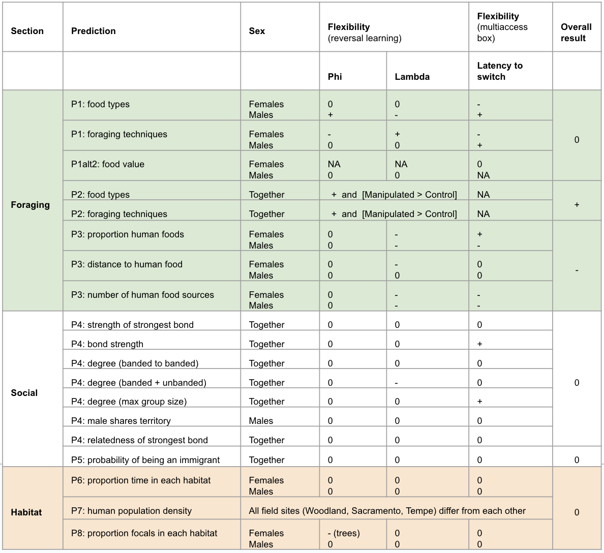
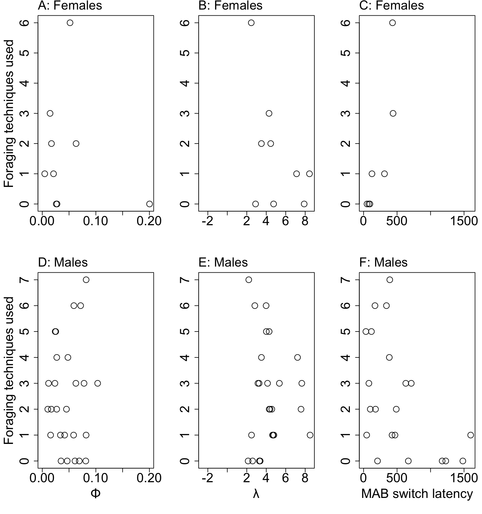

```{r, include=FALSE}
options(tinytex.verbose = TRUE)
```

```{r setup, include=FALSE}
library(knitr)
library(formatR)
knitr::opts_chunk$set(tidy.opts=list(width.cutoff=70),tidy=TRUE) 
#Make code chunks wrap text so it doesn't go off the page when knitting to PDF

knitr::opts_chunk$set(echo=F, include=T, results='asis', warning=F, message=F) 
#sets global options to display code along with the results https://exeter-data-analytics.github.io/LitProg/r-markdown.html
#set echo=F for knitting to PDF (hide code), and echo=T for knitting to HTML (show code)

options(xtable.comment = FALSE) #makes it so a note about how the table was printed doesn't show up in the pdf
```

```{r cleanbib, include=FALSE, eval=F}
### make a bibtex file that has only the references cited in this rmd 
#load the Rmd file
Rmd <- readChar("https://raw.githubusercontent.com/corinalogan/grackles/master/Files/Preregistrations/g_flexforaging.Rmd",nchars=1e7)

#find all in text citations that start with @, but are preceded by a space
pattern <- "\\ @(.*?)\\ "
m <- regmatches(Rmd,gregexpr(pattern,Rmd))[[1]]
m

res<- gsub("\\ ","",m) #delete spaces
res<- gsub("\\]","",res) #delete ]
res<- gsub("\\;","",res) #delete ;
res<- gsub("\\,","",res) #delete ,
res<- gsub("\\.","",res) # delete .

#find all in text citations that start with @, but are preceded by a "["
pattern2 <- "\\[@(.*?)\\ "
m2 <- regmatches(Rmd,gregexpr(pattern2,Rmd))[[1]]
m2

res2<- gsub("\\[","",m2)
res2<- gsub("\\]","",res2)
res2<- gsub("\\]","",res2)
res2<- gsub("\\;","",res2)
res2<- gsub("\\,","",res2)
res2<- gsub("\\.","",res2)
res2<- gsub("\\ ","",res2)

#combine both patterns
allbibtexkeys<-c(res,res2)

#write to a new file and then clean it up manually
write(allbibtexkeys,file="g_flexforaging_bibtexkeys.txt")

#load the cleaned txt file
allbibtexkeys<-read.csv("gxpopbehaviorhabitatq1_bibtexkeys.txt")

#use bib2df to convert the bibliography file into a dataframe
install.packages("bib2df")
library(bib2df)

#load the bib from GitHub
df <- bib2df("https://raw.githubusercontent.com/corinalogan/grackles/master/Files/Preregistrations/MyLibrary.bib")

#remove the @ to match the entry in the bib file
allbibtexkeys2<- gsub("\\@","",allbibtexkeys[,1])

#filter the full bib to only keep the entries that are cited here
df_filtered<-df[df$BIBTEXKEY %in% allbibtexkeys2,]

#use bib2df to convert the data frame into the bibliography file that only contains the citations in this Rmd
df2bib(df_filtered, file = "g_flexforaging_refs.bib", append = FALSE)
```

**Affiliations:** 1) Max Planck Institute for Evolutionary Anthropology, Leipzig, Germany, 2) University of Rochester, New York, USA, 3) University of California Santa Barbara, USA, 4) Washington State University, Pullman, Washington, USA. *Corresponding author: corina_logan@eva.mpg.de

&nbsp;

**This is the post-study manuscript of the preregistration that was pre-study peer reviewed and received an In Principle Recommendation on 6 Aug 2019 by:**

Julia Astegiano and Esther Sebastián González (2019) Understanding geographic range expansions in human-dominated landscapes: does behavioral flexibility modulate flexibility in foraging and social behavior? *Peer Community in Ecology*, 100026. [10.24072/pci.ecology.100026](https://doi.org/10.24072/pci.ecology.100026). Reviewers: Pizza Ka Yee Chow and Esther Sebastián González

**Preregistration:** [html](http://corinalogan.com/Preregistrations/g_flexforaging.html), [pdf](https://github.com/corinalogan/grackles/blob/master/Files/Preregistrations/g_flexforagingPassedPreStudyPeerReviewOn6Aug2019.pdf), [rmd](https://github.com/corinalogan/grackles/blob/d17a75c24df4b90aa607eda452f4fcc496ae9409/Files/Preregistrations/g_flexforaging.Rmd)

**Post-study manuscript** (submitted to PCI Ecology for post-study peer review on 22 May 2024): preprint [pdf]() at EcoEvoRxiv, [rmd](https://github.com/corinalogan/grackles/blob/master/Files/Preregistrations/g_flexforaging.Rmd)

# Abstract {-}

The ability of other species to adapt to human modified environments is increasingly crucial because of the rapid expansion of this landscape type. Behavioral flexibility, the ability to change behavior in the face of a changing environment by packaging information and making it available to other cognitive processes, is hypothesized to be a key factor in a species’ ability to successfully adapt to new environments, including human modified environments, and expand its geographic range. However, most tests of this hypothesis confound behavioral flexibility with the specific proxy aspect of foraging, social, or habitat use behavior that was feasible to measure. This severely limits the power of predictions about whether and how a species uses flexibility to adapt behavior to new environments. To begin to resolve this issue, we directly tested flexibility using two measures (reversal learning and puzzlebox solution switching) and investigated its relationship with foraging, social, and habitat use behaviors in a flexible species that is rapidly expanding its geographic range: the great-tailed grackle. We found relationships between flexibility and foraging breadth and foraging techniques, with the less flexible individuals using a higher proportion of human foods and having more human food sources within their home range, suggesting that they specialize on human foods. These relationships were only detectable after a flexibility manipulation where some individuals were trained to be more flexible via serial reversal learning and compared with control individuals who were not, but not when using data from outside of the flexibility manipulation. There were no strong relationships between flexibility and social or habitat use behaviors. Given that this species is rapidly expanding its geographic range and recently shifting more toward urban and arid environments, our findings could suggest that foraging breadth and foraging technique breadth are factors in facilitating such an expansion. Overall, this evidence indicates that cross-species correlations between flexibility and foraging, social, and habitat use behaviors based on proxies have a high degree of uncertainty, resulting in an insufficient ability to draw conclusions.

**Keywords:** flexibility, reversal learning, multiaccess box, sociality, habitat use, foraging breadth, foraging techniques, immigrant, urbanism, foraging innovations

# Introduction {-}

The ability to adapt to human modified environments is increasingly crucial because of the rapid expansion of this landscape type [@liu2020high; @wu2011quantifying; @goldewijk2001estimating] that individuals must cope with if they are able to. Behavioral flexibility (hereafter ‘flexibility’), the ability to change behavior in the face of a changing environment by packaging information and making it available to other cognitive processes [see @mikhalevich_is_2017 for background], is hypothesized to be a key factor in a species’ ability to successfully adapt to new environments, including human modified environments, and expand its geographic range [e.g., @lefebvre1997feeding; @wright2010behavioral; @griffin2014innovation; @chow2016practice; @sol2000behavioural; @sol2002behavioural; ]. However, most tests of this hypothesis confound flexibility with the specific aspect of foraging, social, or habitat use behavior that is assumed to be involved in the particular study system, thus making a circular argument [@mikhalevich_is_2017]. For example, individuals with a larger diet breadth cannot be assumed to be the more flexible individuals unless there is direct evidence that diet breadth and flexibility are linked at the individual level. The lack of evidence linking flexibility to the particular behaviors individuals use in their environments severely limits the power of predictions about whether and how a species uses flexibility to adapt behaviorally to new environments. 
Flexibility is hypothesized to be particularly important when a species initially moves into an environment [@wright2010behavioral]. Cross-species comparisons use foraging behaviors, including the number of novel foods eaten (often referred to as ‘innovation frequency’) and novel foraging techniques (sometimes called ‘technical innovations’) used across species as a proxy for flexibility [@lefebvre1997feeding; @sol2000behavioural; @sol2002behavioural; @sol2005brain; @sol2007big; overington2009technical; @reader2016animal]. The assumption that these variables are linked with flexibility has resulted in inconsistent conclusions. For example, species with more foraging innovations and, by proxy, supposedly more flexibility, are better at invading new environments [@sol2000behavioural; @sol2002behavioural]. However, resident birds are more flexible than migrants [@sol2005brain], and those with more foraging innovations are habitat generalists, but flexibility does not relate to diet breadth [@overington2011innovative]. Studies investigating the link between flexibility and innovation frequency at the individual level show that this relationship varies in unpredictable ways [@auersperg_flexibility_2011; @bond2007serial; @ducatez_ecological_2015; @jelbert_investigating_2015; @logan2016far; @logan2016flexibilityproblem; @logan_western_2016; @logan_modifications_2014; @manrique_repeated_2013; @reader_evolution_2011; @tebbich_tale_2010]. This noise between and within species indicates that conclusions based on such flexibility proxies are uncertain [@logan2018beyond]. Further, the assumption that a food type or foraging technique is novel for a given species is biased by whether the human observer perceived the behavior to be novel, and not whether the behavior was actually novel to the species [see @logan2018beyond for an in depth treatment]. Additionally, innovation frequency calculations are not easily replicable and it is unclear what the biological relevance of this measure is to the species in question, thus adding further evidence that measures of innovation frequency are highly noisy and uncertain [@logan2018beyond]. A less biased measure of foraging behavior involving the full repertoire, not only the pieces that are subjectively considered novel, combined with direct measures of flexibility are necessary to understand whether and how flexibility relates to adapting to new environments. 

Using flexibility to adjust to new social environments is thought to have been involved in the early hominid range expansion [@rockman2009landscape], and in the adaptation of people who come from one culture and move to an area where a different culture is predominant [@backmann2020cultural]. Despite an interest in understanding whether flexibility varies with aspects of social life outside of the human literature, few investigations have directly explored this relationship. For example, @bond2007serial found that the more social Pinyon jays (*Gymnorhinus cyanocephalus*) were more flexible than two less social species, Clark’s nutcrackers (*Nucifraga columbiana*) and California scrub jays (*Aphelocoma californica*), indicating that more social interactions might be implicated in requiring more flexibility. While much is known about social learning of behaviors [@laland2017animal], we do not consider this relevant to understanding a species’ flexibility because it is unknown whether flexibility itself is socially learnable. Investigations into the relationship between flexibility and sociality are wide open for discoveries about whether, for example, individuals who are more flexible form stronger bonds or bonds with more individuals or are more likely to be immigrants from other areas.

Here, we directly investigate the relationship between flexibility and foraging, social, and habitat use behaviors in two populations (Tempe, Arizona and Woodland, California) of great-tailed grackles (hereafter ‘grackles’; *Quiscalus mexicanus*). Grackles are flexible [@logan2016flexibilityproblem; @logan2023flexmanip] birds who are originally from Central America and have rapidly expanded their geographic range across North America since the late 1800s [@wehtje2003range]. Between 1970 and 2019, they expanded their habitat breadth to include more urban and arid environments, indicating their success in human modified environments [@summers2023xpop]. We directly measured flexibility in grackles in a previous article [@logan2023flexmanip] using two methods and we use the flexibility data from that article here. The first is a common method: reversal learning of a color preference [@lea2020behavioral]. Two color choices are available, but only one color always contains a hidden food reward. After the individual learns to prefer the rewarded color, the food is then available only in the previously unrewarded color. The speed with which the individual changes their color preference is the measure of flexibility, with the faster individuals being more flexible. Both populations experienced one reversal and a subset of individuals in the Arizona population were manipulated to be more flexible through serial reversal learning. The second measure of flexibility used solution switching on a puzzlebox. The puzzlebox (multiaccess box) had four different ways of obtaining food rewards. Once a bird became proficient at solving one way, that locus was rendered non-functional and the number of seconds it took them to attempt a different locus served as the flexibility measure. All individuals were then released back to the wild where their foraging, social, and habitat use behaviors were observed. We aim to determine whether the more behaviorally flexible grackles have more flexible foraging behavior (i.e., eat a larger number of different foods, use a wider variety of foraging techniques), are more flexible in their social relationships (i.e., have more or stronger social bonds particularly with less related individuals, disperse farther from their natal area), and are more flexible in their habitat use (i.e., are found in more diverse habitat types). Results will allow us to determine whether, as predicted by our hypotheses and cross-species correlational data, individual level variation in flexibility is linked with diet breadth, foraging proficiency, social interactions, habitat use, and movement into new geographic areas.

## PREREGISTERED HYPOTHESES

### H1: Behavioral flexibility [see @mikhalevich_is_2017 for a detailed definition] is related to foraging behavior (measured with focal follows using this ethogram) in wild individuals (after their release from the aviaries). We measure flexibility in aviaries using two paradigms: reversal learning [where grackles must learn to prefer one of two options that contain food and then reverse this preference] and switching between options on a multiaccess box (where grackles must learn to switch to a new option, out of four available options, when an option becomes non-functional). We expect this species to be behaviorally flexible because they are fast at reversal learning [@logan2016behavioral], they often encounter human-made “puzzle boxes” in the wild as they attempt to open packaging to access food when digging through garbage cans and eating at outdoor cafes, and they may track resources across time and space [@Rodrigo2021]. Foraging behavior is considered central to the rapid geographic range expansion of this species, and it is thought that they have been so successful by following human urban and agricultural corridors [@wehtje2003range; @peer2011invasion]. Therefore, as humans continue to modify landscapes, this increases the amount of suitable grackle habitat.

 - **Prediction 1:** Individuals that are faster to reverse preferences on a reversal learning task and who also have lower latencies to switch to solving new loci after previously solved loci become unavailable (multiaccess box) will eat a larger number of different foods and use a wider variety of foraging techniques in the wild, validating the cross-species correlational finding that technique breadth [@overington2009technical] and diet breadth [@ducatez2015ecological] are associated with flexibility.

 - **P1 alternative 1:** If there is no correlation, this suggests that flexibility as we measure it represents a trait that is not related to the number of foods eaten and foraging techniques used. Flexibility may not necessarily be associated with diet and foraging technique breadth because flexibility could be constrained in a foraging context due to social competition (e.g., subordinates are outcompeted while foraging and thus try new foods and techniques) or ecological limitations (e.g., constrained by what is available). Additional research would be required to determine the factors that might constrain foraging behavior.

 - **P1 alternative 2:** If there is a negative correlation between flexibility and the number of different foods eaten, this might indicate that the more flexible individuals target particular food items. If this prediction is supported, we will conduct an additional analysis to examine what food types the more flexible grackles eat and whether these food types are potentially more valuable (measured as having more calories).

 - **P1 alternative 3:** If there is a negative correlation between flexibility and the number of foraging techniques, this could indicate that the more flexible individuals use particular, and potentially more effective, techniques.

 - **P2:** Individuals whose flexibility has been increased experimentally will consume a larger number of foods and use more foraging techniques (measured with focal follows) than individuals whose flexibility has not been manipulated. This would further validate that flexibility is related to diet breadth and foraging techniques.

 - **P2 alternative 1:** If the flexibility manipulation does not work in that those individuals in the experimental condition do not decrease their reversal learning speeds more than control individuals, then we will rely on the general individual variation in flexibility and how it relates to foraging in the wild (as in P1).

 - **P3:** The proportion of a grackle’s diet that is human foods and the proportion of their foraging techniques involving human foods is higher for the more flexible individuals, who will consistently occur in locations closer to known outdoor human food locations like picnic areas and outdoor cafe seating (measured as the repeatability of the individual’s distance from cafes across multiple separate focal follows) OR who will occupy a home range that contains more outdoor human food locations. For the diet, this is potentially due to A) having stayed in their parent’s home range (i.e., they eat human food because it happens to be more prevalent in their home range than in other home ranges; local specialization) or B) because these individuals move around to seek out such opportunities (potentially seeking out habitat edges within their population). For the foraging techniques, this is potentially due to human foods and their packaging changing at a faster rate than natural foods and prey items and their accessibility. The foods eaten and the foraging techniques used will be recorded during focal follows. Because this species is highly associated with human-modified landscapes, it is likely that consuming human foods is part of the reason for this association, and that flexible individuals are better at solving these human-made “puzzle boxes” to access food.

 - **P3 alternative 1:** There is no correlation between an individual’s flexibility and the proportion of human foods in their diet, potentially because A) their daily range sizes encompass many different food resources, including human foods (though they are likely not specialized on human foods), and B) some less flexible individuals might specialize on human foods.

 - **P3 alternative 2:** There is a negative correlation between an individual’s flexibility and the proportion of human foods in their diet, potentially because some of the less flexible individuals might specialize on human foods, thus increasing their consumption above that of the more flexible individuals.

### H2: Behavioral flexibility (see Mikhalevich, Powell, and Logan (2017) for a detailed definition) is related to social behavior (measured year-round with focal follows using this ethogram: https://docs.google.com/spreadsheets/d/1N8wsA3geaRGlMjRxYTRpdG2i5oCXNGq9zBlTnj02Gho/edit?usp=sharing) in wild individuals. Flexibility is measured in aviaries using two paradigms: reversal learning and switching between options on a multiaccess box. To give an example of the types of social relationships this sexually dimorphic species engages in, they forage and roost socially (Selander and Giller 1961) and they have a non-faithful-female frank polygynous mating system (Johnson et al. 2000). In terms of male social relationships, Johnson et al. (2000) found during the breeding season in a population in Texas that one or more territorial males defend a territory with several nests from females, that non-territory holding resident males will queue to gain access to a territory, and that transient males move from colony to colony. There could be varying needs for males to manage their relationships with each other in breeding and non-breeding seasons, and flexibility could potentially play a role in such management.

 - **Prediction 4:** Flexible individuals are more likely to have a greater number of bonds OR stronger bonds with others, in particular with individuals who are less related, potentially because they are better able to adjust their behavior to that of an affiliate. Social bonds are measured using the focal follow method to sample affiliative and aggressive behaviors.

 - **P4 alternative 1:** Individual flexibility is not related to the number or strength of social bonds, potentially because all individuals are able to form bonds with like individuals, including the less flexible individuals.

 - **P4 alternative 2:** Flexible individuals may have fewer affiliates or be less likely to regularly affiliate with the same individuals, potentially because they frequently change their behavior and are difficult to associate with. We are not able to test this alternative in this study, but could propose experimental designs for future research if this alternative is supported by the data.

### H3: Individuals that are behaviorally flexible [see @mikhalevich_is_2017 for a detailed definition] will differ in their use of microhabitats within human-modified landscapes (substrate qualification during each focal follow), but the macrohabitat (square kilometer) of each population will not differ in human population density (measured with a GPS point for each focal follow after their release from the aviaries; we measure microhabitat types according to the last substrate the focal individual was seen on at the end of the focal follow: grass, gravel (rock), tree, building, dumpster, shrub, ground, miscellaneous human substrate. Flexibility is measured in aviaries using two paradigms: reversal learning and switching between options on a multiaccess box. Although we were only able to find this species in association with human-modified landscapes based on eBird sightings (i.e., there appear to be no forest-based populations), individuals could use these landscapes in a variety of ways. For example, they could specialize on particular foods or at particular types of locations (e.g., foraging exclusively at cafes or in grassy areas), they could generalize across all foods and location types, or they might fall somewhere in between these extremes.

 - **Prediction 5:** Individuals immigrating into a population are more likely to be flexible, potentially because they need to learn how to obtain resources in an unfamiliar area. Immigrants are individuals who carry many genetic variants (identified using ddRADseq) that are not found in other individuals in this population.

 - **P5 alternative:** Individuals immigrating into a population are not more likely to be flexible, potentially because the human urban environment is comparable across landscapes.

 - **P6:** Flexible individuals will be found more regularly in a wider diversity of microhabitats (human-modified substrates including dumpsters, buildings, and miscellaneous human substrate; or natural substrates including grass, shrubs, trees, rock, and ground) during focal follows.

 - **P6 alternative:** Flexibility is not associated with presence in diverse microhabitats because the more flexible individuals might specialize in specific foraging strategies best suited to particular microhabitats.

 - **P7:** There will be no difference in human population density among the sites for the grackle populations because all rackle populations are highly associated with human-modified landscapes. Human population density per square mile data will be obtained from census information (US census bureau: https://www.census.gov/quickfacts/fact/note/US/LND110210, still looking for a source for Central American countries)

 - **P8:** Flexible individuals will not be associated with presence in diverse microhabitats, not necessarily because they are specialists or generalists in specific foraging strategies, but rather because they may focus on high quality resources in particular habitat types. If this prediction is supported, we will conduct an additional analysis to examine the proportion of focal follows associated with a particular microhabitat type, which will allow us to determine whether the more flexible individuals are associated with particular microhabitats more than the less flexible individuals.


# Methods {-}

## Updates and changes to the preregistration
This study began as a preregistration, which received in principle acceptance at PCI Ecology in 2019: https://github.com/corinalogan/grackles/blob/master/Files/Preregistrations/g_flexforagingPassedPreStudyPeerReviewOn6Aug2019.pdf. The preregistration contains the pre-planned analyses. Here, we first describe the rationale for the ways in which we conducted the study differently from the plan, and then summarize the methods we used to obtain the results. 

**Changes made in the middle of data collection**

1) Because all models only included aviary-tested birds for our analyses, **Condition** (independent variable 6), which indicates whether a bird is aviary-tested or not aviary tested, **was removed**. We were only planning to use the Condition variable to compare foraging behavior, and not flexibility as it relates to foraging, between the aviary tested and non aviary tested birds, however there was not a large enough sample of focal follows with foraging data on non aviary tested birds to run this comparison (13 July 2022)

2) In the preregistration, we propose multiple measures of flexibility and state that the measure Flexibility 4 replaces the others if it is based on the better model as analyzed in a separate article. We found that Flexibility 4 is based on the better model [@blaisdell2021causal] and we used the values for this measure for the individuals in the current article that were generated in an improved version of the model by @lukas2024flexmanip. Therefore, in the current article, we **used only Flexibility 4 and not Flexibility 1** (both reflect performance in the color tube reversal experiment).

3) In @logan2023flexmanip, we discovered that the flexibility measures of the number of trials to reverse a preference in the color tube experiment and the latency to attempt to solve a new locus on the multiaccess box did not correlate with each other. Therefore, we **analyzed flexibility performance (latency to switch) on the multiaccess box separately**, as previously planned. However, we did not implement a multiaccess box latency analysis for P2 because it is a direct comparison of the birds in the control and manipulated groups in the reversal learning experiment.

4) In @logan2023flexmanip, we found that it is unnecessary and actually confounding to include the flexibility manipulation (manipulated or control) as an independent variable in the models when the Flexibility 4 variable is already included. This is because we used data from the last reversal the individual participated in (reversal 1 for control birds and the last reversal in the serial reversals for the manipulated birds), which already accounts for the influence the flexibility manipulation had on the birds in the manipulated condition. Therefore, we **removed the flexibility manipulation condition variable** from the models in the current article. (13 July 2022)

5) Initially, the dependent variables for P2 calculated the number of different foods eaten and the number of foraging techniques used in the first X minutes of a focal follow. To equalize observation time across individuals, X minutes was the total observation time using the individual with the lowest sum across all individuals. As we started to clean the data and prepare it for analysis, we noticed three individuals had no focal follows (sum focal time = 0 min) and the next lowest sum focal time was 497 seconds. The average sum focal time across all 38 individuals was 3024 seconds, which means that we would have excluded the majority of the data when using the originally prescribed calculation of the dependent variables. Therefore, we **changed this to using the number of different foods eaten and the number of foraging techniques used by an individual as the response variable and included the total observation time per individual as an explanatory variable**. The analyses for the P1 and P2 dependent variables accommodate this change by adjusting from a Poisson to a binomial distribution. (3 August 2022 & 17 May 2023)

6) The dependent variables for P1 were also planned as calculating the number of different foods eaten and the number of foraging techniques used in the first X minutes of a focal follow. However, we removed observation time and replaced it with the total number of food events observed per bird. The number of times we observed a bird eat is an upper bound on the number of food types and foraging techniques we can record for a bird (e.g., if we observed all individuals take only one food item, then differences in flexibility could not explain differences in the number of foods taken or foraging techniques used because all individuals would have the same value). Therefore, we must account for this in the model by adding the **number of food events observed per bird**.

7) We **omitted observation time from the models in P3 that had the proportion of human foods** as the dependent variable because the fact that it is a proportion already accounts for overall differences in observation time.

8) We originally planned to collect data from three field sites: the middle of the northern expanding edge (Tempe, Arizona), on the northern expanding edge (Woodland, California), and at a site in the center of their original range (Central America). We were not able to run the Central American site because the research station we were planning on using as the base for the site was exposed for having decades of sexual abuse toward women. We did not feel comfortable being at that station or bringing our business there, and it was too late to find another site because they take years to set up. Therefore, we have **data from only two field sites and not three**. This also means our sample size is not >200 grackles as originally planned. Our sample size is 95 grackles with focal follow data (69 in Arizona and 26 in California). We planned on bringing at least 60 of these grackles (across all three field sites) into the aviaries for behavioral choice tests. Of the 55 (24 in Arizona and 32 in California) grackles we brought into the aviaries, 39 (20 in Arizona and 19 in California) completed their reversal learning experiment. We stopped collecting data in December 2022 when the California field site's data collection was complete.

**Changes made after data collection, before data analysis**

9) As originally planned, we read @rethinking2020 and changed all of the analyses from MCMCglmms or glms to bespoke Bayesian models. In doing so, this **removed the need to conduct the pre-planned data checking** for overdispersion, underdispersion, zero-inflation, and heteroscedasticity. This is because the Bayesian models are already informed by the constraints of the hypothesis and experiment before they are run and, in many cases, we run simulations of the Bayesian models before running them on the actual data and we modify the models until they perform in a way that allows all feasible relationships, but not impossible relationships.

**Changes made after data collection, in the middle of data analysis**

10) We **removed the random effect of ID** from the models because there is only one data point per individual in the analyses. It was an error on our part to include it in the preregistration. (27 April 2023). Reassuringly, the interobserver reliability scores were very high (see Supplementary Material 1), indicating there was no difference between experimenters.

11) P4: We **only used the social association data from the nonbreeding season** even though we were not able to conduct a comparison between the seasons to determine whether they were similar or different. This is because, after we filtered the raw data to include only individuals in the behavioral flexibility test in the aviaries and with a minimum of 2 focal follows per season, we were left with only 7 interaction data points in the breeding season and there was no variability in this subset of data. This small sample precludes us from comparing social network metrics across seasons, and therefore we use only the nonbreeding season social association data.

12) P6: We **removed population (random variable)** because we found no average differences in the flexibility components (phi and lambda) between the Arizona and California populations in @logan2023flexmanip. Also, it should not be included in the analysis because it is not directly part of the prediction, which is something we learned after taking Richard McElreath’s Statistical Rethinking course. We originally planned to run models with a Poisson distribution, however we used a **Normal distribution** (with a log link) because the Shannon Diversity Index is not a count, but more similar to a sum.

13) P8: We **added microhabitat** as a random variable because this is the best way to link it to the dependent variable as we originally intended.

14) Ability to detect actual effects: in the preregistration, we stated, *“We will use Bayesian analyses to estimate our likely confidence in the results given simulated data. We will revise this preregistration to include these new analyses before conducting the planned analyses on our actual data. Based on the simulations, we might adapt the number of focal follows per individual or decide to collect much more data just with the aviary-tested birds to increase the amount of information per individual.”* It ended up taking 5 years of data collection to meet our pre-stated minimum sample size and we stopped data collection after meeting the minimum. At this point, we had not yet had time to build the models and run simulations because the field work was so time intensive. Therefore, we used Bayesian simulation analyses to determine, **given our sample size for a given prediction, how large of an effect can we expect to reliably detect.**

15) P4: We originally planned to conduct **social network permutations** to determine whether individuals were associating non-randomly based on flexibility, however we ended up **removing them**. We cannot do a permutation that fully reflects the data that we collected because there was variation in how often individuals were observed and whether observations included unbanded birds, which arose from the difficulty in trapping grackles to band, and then finding and following the banded grackles. A permutation randomly redistributes values, but in this case, we cannot randomly redistribute values because there is variation in the actual data. For example, from the perspective of a focal bird that is banded, an unbanded partner that is observed once is a unique partner. However, there is no way to determine whether an unbanded bird observed with this focal individual is the same as an unbanded bird observed with a different focal individual. For the permutations, it is critically important how many birds there are in the network because this will influence the expected number of bonds that a permuted individual can expect to engage in. Permutations only work if all individuals are known and are observed for roughly the same amount of time, and even still they might not account for the non-independence in the data [@hart2023bison; @ross2022modelling].

## Trapping

We used three different trapping techniques to capture grackles in the wild for transfer to the aviaries, including mist nets, walk-in traps, and bownets. Use of a particular trapping method depended on trapping location (e.g., mist nests required ample space for set up), time of day (e.g., mist nests are not as effective past dawn or before dusk), and individual grackle behavior. To lure birds to the trapping location, we habituated birds to eating a mix of crackers, mealworms, and bird seed in the immediate vicinity of the trap. Following capture of a grackle, the bird was either processed immediately on site if they were not slated to undergo aviary testing, or the bird was transported to the aviary location for subsequent processing. Processing involved collecting biometric measurements, feathers, and blood. The latter was used to extract DNA and determine relatedness (P4, P5)

## Reversal Learning

We used reversal learning to measure grackle behavioral flexibility. Briefly, we trained grackles to search in one of two differently colored containers for food (Fig. 1a). After grackles showed a significant preference for one color (minimum of 17 out of 20 correct choices), we switched the location of the food to the container of the other color. We measured behavioral flexibility as the number of trials it takes grackles to switch their preference and search in the container of the other color on a minimum of 17 out of 20 trials (a reversal). Grackles in Arizona were randomly assigned to one of two groups: a flexibility manipulation group where they received serial reversals until they switched their preference quickly enough to meet the experiment passing criterion (form a preference in 2 sequential reversals in 50 or fewer trials), and a control group that received one reversal and then a similar number of trials as the manipulation group, but with two yellow tubes that both contained food. See the protocol for serial reversal learning at: https://docs.google.com/document/d/18D80XZV_XCG9urVzR9WzbfOKFprDV62v3P74upu01xU/edit?usp=sharing.

## Multiaccess Boxes

We used two different multiaccess boxes to generate additional measures of grackle flexibility. All grackles were given time to habituate to the multiaccess boxes prior to testing. We set up the multiaccess boxes in the aviary of each grackle with food in and around each box in the days prior to testing. At this point, all loci were absent or fixed in open, non-functional positions to prevent early learning of how to solve loci. We began testing when the grackle was eating comfortably from the multiaccess box. For each multiaccess box, the goal was to measure how quickly they learned to solve each locus, and then how quickly they attempted to solve a new locus when a previously solved locus was rendered non-functional. We measured the latency in seconds until the grackle attempted a new locus after a previously solved locus was made non-functional (solution switching). See protocols for multiaccess box habituation and testing at: https://docs.google.com/document/d/18D80XZV_XCG9urVzR9WzbfOKFprDV62v3P74upu01xU/edit?usp=sharing.

**Plastic multiaccess box**: This apparatus consisted of a box with transparent plastic walls (Fig. 1b). There was a pedestal within the box where the food was placed and 4 different options (loci) set within the walls for accessing the food. One locus was a window that, when opened, allowed the grackle to reach in to grab the food. The second locus was a shovel that the food was placed on such that, when turned, the food fell from the pedestal and rolled out of the box. The third locus was a string attached to a tab that the food was placed on such that, when pulled, the food fell from the pedestal and rolled out of the box. The last locus was a horizontal stick that, when pushed, shoved the food off the pedestal such that it rolled out of the box. A trial ended when a grackle used a locus to retrieve the food item or after 10 min, whichever came first. If the grackle had not yet solved a locus, but was on the ground at 10 min, they were given an extra 5 min to interact. We reset the box out of view of the grackle and then began the next trial. To pass criterion for a locus, the grackle had to get food out of the box using only functional actions (i.e., they used a functional behavior to retrieve the food) in 2 consecutive sessions, or solving in 9/10 trials within a session, or in 8 consecutive trials in 1 session. After passing criterion, the locus is made non-functional to encourage the grackle to interact with the other loci.

**Wooden multiaccess box**: This apparatus consisted of a natural log that contained 4 compartments (loci) covered by transparent plastic doors (Fig. 1c). Each door opened in a different way (open upward like a hatch, out to the side like a car door, pull out like a drawer, or push in). During testing, all doors were closed and food was placed in each locus. A trial ended when the grackle opened a door or after 10 min (or 15 min if the grackle was on the ground at 10 min). After solving a locus, the experimenter re-baited that compartment and closed the locus door out of view of the grackle, and the next trial began. After a grackle solved one locus 3 times, that door was fixed in the open position and the compartment left empty to encourage the grackle to attempt the other loci. 

## Radio Telemetry

We attached radio transmitter tags to *most* grackles released from the aviaries upon completion of their test battery. Radio tags allowed us to relocate and track released grackles to collect space use data and foraging and social behavior data. We used three different kinds of radio transmitters, namely Lotek (model: Pip Ag386, https://www.lotek.com/, Seattle, WA, USA), Holohil (model: BD-2, https://www.holohil.com/, Carp, Ontario, Canada), and ATS (model: A2455, https://atstrack.com/, Isanti, MN, USA). Holohil and ATS tags were used on birds that could not accommodate the heavier Lotek tags, given that the weight of a radio tag must not exceed 3% of the bird’s total body weight to avoid hindering the animal’s movement behavior [@barron2010meta, @hallworth2015miniaturized, @murray2000critical]. We used the leg-loop harness method of attaching radio transmitters to the grackles in an effort to prolong the amount of time the tag stays affixed to the bird’s body [@rappole1991new]. Before releasing the grackles back into the wild, we programmed each tag’s unique frequency into our Yagi*brand radio receiver and annotated which frequency corresponded to which individual. This allowed us to quickly find and track birds upon release to the site at which they were initially caught.

Immediately following the release of the radio-tagged grackles, each bird was followed for 30 min to make sure they behaved normally. In the days following release, the radio receiver and antenna were used to relocate tagged individuals, together with the visual confirmation of color bands, for subsequent GPX tracking and focal follows. See full protocol for Radio Telemetry at: https://docs.google.com/document/d/1jtjgeWJoZ0Q1CfUpV6zdkyQL3p3WfW9KgyLrMNmNMJc/edit#. 

## Focal Follows

To quantify foraging and social relationships, we conducted focal follows using methods described in @altmann1974observational Following the release of the study birds from the aviaries upon completion of their test battery, we observed each individual over an ideally 10 min period (increased to 15 min if the bird went out of view) to record all foraging behaviors and social interactions, categories of which are listed in the ethogram (see Supplementary Material 4). To ensure we fully sampled social and foraging behavior, we prioritized conducting focal follows on grackles that successfully completed all aviary tests, for which we have a much larger amount of individualized data, including multiple measures of flexibility. We also sampled many other color marked grackles that were never tested in the aviaries, and thus do not have measures of flexibility. We aimed to conduct at least four, but no more than eight, focal follows for each individual, spaced equally across breeding (Apr - Aug) and non-breeding (Sept - Mar) seasons. Subsequent follows on the same individual were a minimum of three weeks apart from the previous focal follow to prevent temporal autocorrelation in behavior [@whitehead2008analyzing]. Each observer successfully completed an interobserver reliability test before collecting focal follow data to be used in the data set (see Supplementary Material 1). We used two different methods of collecting focal follow data: the Prim8 behavioral data collection application, and voice recordings. At the end of every focal follow, observers recorded the ending group size, GPS point of the bird’s location, and substrate type. See full protocol for Focal Follows at: https://docs.google.com/document/d/12p4QwIZO85oItvO2GylooyEhCsJUNblAyAhR5Ei_jGk/edit.

Data from focal follows that were used in analyses include: the number of food types taken and foraging techniques used (P1 and P2); the number of human foods taken by an individual, the distance to an outdoor human food source for an individual, number of human food sources inside an individual’s home range (in addition to GPX data, P3); the strength of the strongest bond (maximum bond), the strength of all bonds an individual has (strength), the maximum number of other individuals that the focal individual associated with (degree, P4), the Shannon Diversity Index was calculated from this data as a measure of the proportion of time spent in each microhabitat (P6); and the proportion of focal follows that were recorded in a particular microhabitat for each individual (P8).

## GPX Tracking

After releasing birds from the aviaries following completion of their test battery, we tracked grackle movements and space use by collecting GPX points on each bird’s location during the breeding and non-breeding seasons. GPX tracking occurred as soon as one day following a bird’s release, and continued until a sufficient number of points were collected to calculate an accurate home range estimate [@leo2016home]. We prioritized tracking birds that successfully completed tests in the aviaries, however, we were limited by which bird to track based on which birds were discoverable on any given day. Where possible, radio tag transmitters were used in coordination with a radio receiver to triangulate grackle locations. We used the Open GPX Tracker app (Juan Manuel Merlos, https://apps.apple.com/de/app/open-gpx-tracker/id984503772) for iOS devices to collect these GPX data because this app allows the user to manipulate pin location after placement and starts a tracking timer to indicate duration of tracking time. This latter function is especially critical to the protocol because we collected one GPS point on the bird’s location every 60 sec. Once a minimum of 20 points and a maximum of 90 points were achieved in a day, the file was saved and the data collector resumed tracking other discoverable individuals. We attempted to balance the data collection times between the morning (i.e., before 12 PM) and afternoon (i.e., after 12 PM) to account for variation in movement and space use at different times of day. See full protocol for GPX Tracking at: https://docs.google.com/document/d/1jtjgeWJoZ0Q1CfUpV6zdkyQL3p3WfW9KgyLrMNmNMJc/edit#. Data from GPX tracking that were used in analyses include: the distance to an outdoor human food source for an individual and the number of human food sources inside an individual’s home range (in addition to focal follow data, P3).

## Sample

Grackles were caught in the wild at two field sites across their geographic range: the middle of the northern expanding edge (Tempe, Arizona USA; n=94), and on the northern expanding edge (Woodland, California USA; n=35). Individuals were identified using colored leg bands in unique combinations, their data collected (blood, feathers, and biometrics), and then they were released back to the wild. Some individuals (34 in Arizona and 35 in California) were brought temporarily into aviaries for behavioral testing, and then released back to the wild where the data for this study were collected. We stopped collecting data in 2022 when the minimum sample sizes were met.

## Open materials

 - Ethogram for Prim8: https://docs.google.com/spreadsheets/d/1N8wsA3geaRGlMjRxYTRpdG2i5oCXNGq9zBlTnj02Gho/edit?usp=sharing
 - Individuals for Prim8: https://docs.google.com/spreadsheets/d/1Lr0pwsmdnpVM8X2Fyoj9EIGa3zOY1WCZlntW7e0Ui_Y/edit?usp=sharing
 - Protocol for cleaning the focal follow data: https://docs.google.com/document/d/1SMUy43qRd52BBTZM5Oe2hpSExBLRAC6iUVyGvrAlgqs/edit?usp=sharing 
  - Protocol for calculating P3 dependent variables 2 and 3: distance to outdoor human food areas during focal follows, and number of outdoor human food areas within the home range: https://docs.google.com/document/d/1W1uZ_AepoI6dcJcjeHWTHWnTi8GHkGf4H_2b8BQte-k/edit?usp=sharing 

## Open data

The data is available at the Knowledge Network for Biocomplexity's data repository [@logan2024flexforagingdata], and code is available at the Rmd file at https://github.com/corinalogan/grackles/blob/84efe125ee75e32310deba335872e8f222c3f990/Files/Preregistrations/g_flexforaging.Rmd.

## Analyses

We did not exclude any data. When missing data occurred, the existing data for that individual was included in the analyses for the tests they completed. Analyses were conducted in R (current version `r getRversion()`) [@rcoreteam] and RStudio [@rstudio], using several R packages: xtable [@dahl2019package], MCMCglmm [@hadfield2010mcmc], rethinking [@rethinking2020], rstan [@rstan], formatr [@formatr], Rcpp [@rcpp], ggplot2 [@ggplot2], knitr [@xie2018knitr; @xie2017dynamic; @xie2013knitr], dplyr [@dplyr], cmdstanr [@cmdstanr], posterior [@burkner2020posterior], cowplot [@wilkecowplot], irr [@gamer2012package], psych [@revelle2014psych; @psych], DHARMa [@hartig2019dharma], lme4 [@lme4; @bates2012lme4], igraph [@butts2016sna], and rptR [@stoffel2017rptr]. We analyzed data for females and males separately because each sex has a distinct natural history that might play a role in behavioral differences.

### Calculating the independent variable Flexibility 4 ($\phi$ and $\lambda$)

We developed a Bayesian model of behavioral flexibility [@blaisdell2021causal], which better represents flexibility than using the number of trials to pass a reversal in a color tube experiment [@lukas2024flexmanip]. This model represents flexibility using two parameters: the learning rate $\phi$) and the rate of deviating from learned preferences ($lambda$). These two parameters make up the Flexibility 4 measure, which is an independent variable used in some of the analyses in the results section. We use $\phi$ and $\lambda$ from each bird's initial discrimination plus first reversal (for the Woodland birds and Tempe control birds) or the last two reversals (for the Tempe manipulated birds). This means that the $\phi$ and $\lambda$ are used that reflect the individual’s current state when they are released back to the wild, after which point, the focal follows are conducted. We calculate $\phi$ and $\lambda$ using the model and code from @lukas2024flexmanip, and enter these into the data sheets used for the analyses in the results section of the current article.

```{r phislambdas, eval=FALSE}
### Code below copied from Lukas et al. 2022. Using OBSERVED (not simulated) data from GTGR in Woodland/Sacramento and Tempe

# These are the phis and lambas for the AZ birds using their LAST 2 switches
eachbirdslearningparameters<-read.csv(url("https://raw.githubusercontent.com/corinalogan/grackles/master/Files/Preregistrations/g_flexmanip_ArizonaBirds_EstimatedPhiLambdaReversalLearning.csv"), header=T, sep=",", stringsAsFactors=F)


# The code below gets the phis and lambdas for the first 2 switches, so only use it to calculate the CA data
# We want to estimate lambda and phi differently. For the initial values, we combine the data from the first association learning with the first reversal.
dflex <- read.csv(url("https://raw.githubusercontent.com/corinalogan/grackles/master/Files/Preregistrations/gxpopbehavhabitat_data_reversegtgr.csv"), header=T, sep=",", stringsAsFactors=F) 

library(rstan)
library(rethinking)
library(cmdstanr)
library(posterior)

# If you have cmdstan installed, use the following:
# set_ulam_cmdstan(TRUE)

# PREPARE reversal learning data
#exclude birds that did not finish the reversal experiment
dflex <- dflex[!dflex$ID=="Chocolate" & !dflex$ID=="Xango" & !dflex$ID=="Wachil" & !dflex$ID=="Talingo" & !dflex$ID=="Quiscalus" & !dflex$ID=="Churro" & !dflex$ID=="Sopapilla" & !dflex$ID=="Tres Leches" & !dflex$ID=="Merengue" & !dflex$ID=="Carlota" & !dflex$ID=="Changa" & !dflex$ID=="Urraca" & !dflex$ID=="Bacmut bacni" & !dflex$ID=="Zanate",] 

#include only those trials where the bird made a choice (0 or 1)
dflex <- subset(dflex, dflex$CorrectChoice != -1) #reverse number. 0=initial discrimination
dflex$Reversal <- as.integer(dflex$Reversal)

dflex$Correct <- as.integer(dflex$CorrectChoice)
dflex$Trial <- as.integer(dflex$Trial)
#exclude NAs from the CorrectChoice column
dflex <- subset(dflex, is.na(dflex$Correct) == FALSE)

# Want data ONLY from initial learning and first reversal to determine phi and lambda at the beginning. This is for all birds, including those that did not experience the reversal manipulation experiment
reduceddata <- matrix(ncol=ncol(dflex),nrow=0)
reduceddata <- data.frame(reduceddata)
for (i in 1:length(unique(dflex$ID))) {
  thisbird <- unique(dflex$ID)[i]
  thisbirddata <- dflex[dflex$ID==thisbird,]
  thisbirdslastreversal <- thisbirddata[thisbirddata$Reversal %in% c(0,1),]
  reduceddata <- rbind(reduceddata,thisbirdslastreversal)
}
dflex_beginning <- reduceddata

# We want to remove the birds who did not complete at least the first reversal
birdscompletedreversal<-unique(dflex_beginning[dflex_beginning$Reversal==1,]$ID)

dflex_beginning<-dflex_beginning[dflex_beginning$ID %in% birdscompletedreversal,]

length(unique(dflex_beginning$ID)) #39 birds

#Construct Choice variable to match with how the STAN model is set up.
dflex_beginning$Choice <- NA
for (i in 1: nrow(dflex_beginning)) {
  if (dflex_beginning$Reversal[i] %in% seq(0, max(unique(dflex_beginning$Reversal)), by = 2)){
    
    if (dflex_beginning$Correct[i] == 1){
      dflex_beginning$Choice[i] <- 1
    } else {
      dflex_beginning$Choice[i] <- 2
    } 
  } else {
    if (dflex_beginning$Correct[i] == 1){
      dflex_beginning$Choice[i] <- 2
    } else {
      dflex_beginning$Choice[i] <- 1
    } 
  }
}
dflex_beginning <- dflex_beginning[with(dflex_beginning, order(dflex_beginning$ID)), ]

#enter the column name for the individual's name here (ID) and then we will change it to small "id" to match the stan code below
colnames(dflex_beginning)[colnames(dflex_beginning)=="ID"]<-"id"

# Sort birds alphabetically; we do this so we can later on rematch the names to the numerical ids.
dflex_beginning <- dflex_beginning[with(dflex_beginning, order(dflex_beginning$id)), ]

# Store the bird names
birdnames<-unique(dflex_beginning$id)

# Convert bird names into numeric ids
dflex_beginning$id <- as.numeric(as.factor(dflex_beginning$id))

# Select only the columns that are of relevance. In particular, remove any additional columns that contain missing values.
dflex_beginning<-dflex_beginning[,c("id","Reversal","Trial","CorrectChoice","Correct","Choice")]

# Prepare the data in the setup for the STAN model, as a list
datinitialandfirstreversal <- as.list(dflex_beginning)
datinitialandfirstreversal$N <- nrow(dflex_beginning)
datinitialandfirstreversal$N_id <- length(unique(dflex_beginning$id))

datinitialandfirstreversal$Reversal<-as.numeric(as.factor(datinitialandfirstreversal$Reversal))
datinitialandfirstreversal$CorrectChoice<-as.numeric(as.factor(datinitialandfirstreversal$CorrectChoice))


# The STAN model is set up to have the initial attraction for each option set to 0.1, and that individuals only learn the reward of the option they chose in a given trial.
reinforcement_model_nonzeroattraction_alternativepriors <- "

data{
   int N;
   int N_id;
   int id[N];
   int Trial[N];
   int Choice[N];
   int Correct[N];
}

parameters{
  real logit_phi;
  real log_L;

  // Varying effects clustered on individual
  matrix[N_id,2] v_ID;
}

model{
matrix[N_id,2] A; // attraction matrix

logit_phi ~  normal(0,1);
log_L ~  normal(0,1);

// varying effects
to_vector(v_ID) ~ normal(0,1);

// initialize attraction scores

for ( i in 1:N_id ) {
A[i,1] = 0.1; A[i,2] = 0.1;
}

// loop over Choices

for ( i in 1:N ) {
vector[2] pay;
vector[2] p;
real L;
real phi;

// first, what is log-prob of observed choice

L =  exp(log_L + v_ID[id[i],1]);
p = softmax(L*A[id[i],1:2]' );
Choice[i] ~ categorical( p );

// second, update attractions conditional on observed choice

phi =  inv_logit(logit_phi + v_ID[id[i],2]);
pay[1:2] = rep_vector(0,2);
pay[ Choice[i] ] = Correct[i];
A[ id[i] , Choice[i] ] = ( (1-phi)*(A[ id[i] , Choice[i] ]) + phi*pay[Choice[i]]);

}//i
}
"

# RUN MODEL OPTION 1: The first way to run the model is directly through rstan. This does not work on some computers because of the way the interfacing runs. If it doesn't work on your computer, use Option 2 below, which uses cmdstan
m_initialandreversal <- stan( model_code =  reinforcement_model_nonzeroattraction_alternativepriors, data=datinitialandfirstreversal ,iter = 5000, cores = 4, chains=4, control = list(adapt_delta=0.9, max_treedepth = 12))

sinitialandreversal <- extract.samples(m_initialandreversal)
initialandreversal_lambda <- sapply(1 : datinitialandfirstreversal$N_id, function(x) exp( mean(sinitialandreversal$log_L) + mean(sinitialandreversal$v_ID[ ,x, 1])))
initialandreversal_phi <- sapply(1 : datinitialandfirstreversal$N_id, function(x) inv_logit( mean(sinitialandreversal$logit_phi) + mean(sinitialandreversal$v_ID[ ,x, 2])))

plot(initialandreversal_phi~initialandreversal_lambda)

# Combine the extracted values in a dataframe, and link them back to the id of the individuals
birds_phi_lambda<-matrix(ncol=3,nrow=length(birdnames))
birds_phi_lambda<-as.data.frame(birds_phi_lambda)
colnames(birds_phi_lambda)<-c("id","phi","lambda")
birds_phi_lambda$id<-birdnames
birds_phi_lambda$phi<-initialandreversal_phi
birds_phi_lambda$lambda<-initialandreversal_lambda
#here is the table with the phis and lambdas!
birds_phi_lambda 
#DONE with Option 1


# RUN MODEL OPTION 2: This alternative setup uses cmdstanr to run the model. It first needs to create an executable on your computer for the model for which you need to specify the path to where it can find the relevant compilers.
currentlocation<-getwd()
cmdstanlocation <- cmdstan_path()
setwd(cmdstanlocation)

# access the output file created by the model running the reinforcement model / reinforcement_model_nonzeroattraction_alternativepriors
write(reinforcement_model_nonzeroattraction_alternativepriors,file="myowntrial.stan")
file <- file.path(cmdstan_path(), "myowntrial.stan")
mod <- cmdstan_model(file)
options(mc.cores=4)

# RUN the model
fit_initialandfirstreversal <- mod$sample(
  data = datinitialandfirstreversal,
  chains = 4,
  parallel_chains = 4,
  refresh = 500
)

# Show the 90% compatibility intervals for the association between latency to switch loci on the plastic multi-access box and lambda and phi, and the interaction between lambda and phi from the reinforcement learning model
drawsarray<-fit_initialandfirstreversal$draws()
drawsdataframe<-as_draws_df(drawsarray)
drawsdataframe<-data.frame(drawsdataframe)
initialandreversal_lambda <- sapply(1 : datinitialandfirstreversal$N_id, function(x) exp( mean(drawsdataframe$log_L) + mean(drawsdataframe[,x+3]))) 
initialandreversal_phi <- sapply(1 : datinitialandfirstreversal$N_id, function(x) inv_logit( mean(drawsdataframe$logit_phi) + mean(drawsdataframe[,x+3+length(unique(datinitialandfirstreversal$id))])))

# Remove the stan command line file we created for this particular model from your computer
fn<-"myowntrial"
file.remove(fn)

# Reset your working directory to what it was before we ran the model
setwd(currentlocation)

# Combine the extracted values in a dataframe, and link them back to the id of the individuals
birds_phi_lambda<-matrix(ncol=3,nrow=length(birdnames))
birds_phi_lambda<-as.data.frame(birds_phi_lambda)
colnames(birds_phi_lambda)<-c("id","phi","lambda")
birds_phi_lambda$id<-birdnames
birds_phi_lambda$phi<-initialandreversal_phi
birds_phi_lambda$lambda<-initialandreversal_lambda
#here is the table with the phis and lambdas!
birds_phi_lambda 
#DONE with Option 2
```

### P1: Flexibility and food types / foraging techniques 

We used a binomial model that evaluates, of the known food types and foraging techniques, how many an individual uses. The model assumes every individual is able to eat all of the food types and use all of the foraging techniques, and it evaluates the probability of using a given food type or foraging technique at a given time. This model was run for males and females separately and takes the form of:

$tech_{i}$ ~ Binomial(11, $p$),

logit($p$) ~ $a$ + $bp$ x $\phi_{i}$ + $bl$ x $\lambda_{i}$ + $be$ x $obstime_{i}$ + $br$ x $rank_{i}$,

where $tech_{i}$ is the number of foraging techniques used (out of the total possible 11 foraging techniques that were observed across both populations) by individual, i, $p$ is the probability of using a given technique, $a_{i}$ is the intercept, $bp$ is the slope for the interaction with $\phi_{i}$ for individual, i, bl is the same for $\lambda_{i}$, $be$ is the slope for the interaction with total number of seconds individual, i, was observed for, $obstime_{i}$, and $br$ is the same for dominance rank per bird, $rank_{i}$. Note that the model is the same when analyzing the number of food types taken for each individual, $foods_{i}$, which replaces $tech_{i}$ in the above model, and 22 (number of food types observed across both populations) replaces the 11. 

### P2: Flexibility manipulation and food types / foraging techniques

The model is the same as in P1 except that this dataset includes only the Arizona grackles who were in the flexibility manipulation (serial reversal learning of color preferences) or the control group (only one reversal). Both sexes were analyzed together because the sample size was small. This model takes the form of:

$tech_{i}$ ~ Binomial(9, $p$),

logit($p$) ~ $a_{i}$[$treatment$] + $b_{i}$ x $time$,

where $tech_{i}$ is the number of foraging techniques used (out of the total possible 9 foraging techniques that were observed in the Arizona population) by individual, i, $p$ is the probability of using a given technique, $a_{i}$ is the intercept (one per level of $treatment$: control and manipulated), and $b_{i}$ is the slope for the interaction with total number of seconds of observation $time$ for individual, i. Note that the model is the same when analyzing the number of food types taken for each individual, $foods_{i}$, which replaces $tech_{i}$ in the above model, and 20 (number of food types observed in the Arizona population) replaces the 9. 

We used contrasts to determine whether there was a difference between $treatment$s and concluded that there is a difference if the 89% compatibility interval does not cross zero.

### P3: Flexibility and human foods / human food sources

To investigate **what proportion of the diet consists of human foods** and how this relates to flexibility, we used a binomial model as follows:

$humanfoods_{i}$ ~ Binomial($totalfoods_{i}$, $p$),

logit($p$) ~ $a_{i}$ + $bp$ x $\phi_{i}$ + $bl$ x $\lambda_{i}$ + $br$ x $rank_{i}$,

where $humanfoods_{i}$ is the number of human foods taken by individual, i, $totalfoods$ is the total number of foods taken by individual, i, $p$ is the probability of taking human foods, $a_{i}$ is the intercept, $bp$ is the slope for the interaction with the flexibility component $\phi_{i}$, $bl$ is the slope for the interaction with the flexibility component $\lambda_{i}$, and $br$ is the slope for the interaction with dominance rank, $rank_{i}$. Note that the model is the same when analyzing the latency (in sec) to attempt a new option on the multiaccess box except the terms for $\phi_{i}$ and $\lambda_{i}$ are replaced with $blat$ * $latency_{i}$ in the above model. 

We used the same model to investigate whether the **proportion human foods** relates with the **number of foraging techniques used**, but we removed all terms except for $a_{i}$, and added $bt$, the slope for the interaction with the number of techniques used per bird, $tech_{i}$.

To investigate the **distance to human food sources** and how this relates to flexibility, we recorded the spatial location of each individual at the end of each of its focal follow to measure the distance between this location and the nearest source of human food. We defined a human food source as locations where human-provided food is accessible to grackles, and this included dumpsters, restaurant outdoor seating areas, and feral cat feeding stations. To evaluate whether individual grackles consistently occur in certain spatial locations relative to human food (i.e., may have a preference for proximity to human food locations), we first examined whether distance to human food sources was repeatable within individuals across focal follows. If so, then we would be able to use a bird’s average distance as the response variable in the model. Repeatability is calculated as the ratio of variance among individuals in the distance to a human food source compared to total within- and among-individual variance in distance. We used a Bayesian mixed model (MCMCglmm) framework to determine the variance components for the repeatability value. We additionally used the rptR function in R to calculate repeatability because this function also runs permutations of the data to calculate the p-value as the probability of getting the observed repeatability value if the distance to human food sources was randomized across grackles. We found that distance to a human food source was a repeatable trait in grackles (p = 0.003) and the repeatability values and confidence intervals between the MCMCglmm and the rptR function were nearly identical (MCMCglmm: R = 0.28, CI = 0.15-0.39; rptR: R = 0.28, CI = 0.16-0.39). Therefore, we went forward with the analysis that answers the question for this prediction using a normal model as follows: 

$distance_{i}$ ~ Normal($\mu$, $\sigma$),

$\mu$ ~ $a_{i}$ + $bp$ x $\phi_{i}$ + $bl$ x $\lambda_{i}$ + $br$ x $rank_{i}$,

where $distance_{i}$ is average number of meters to an outdoor human food source for individual, i, $\mu$ is the population mean number of meters to a human food source, $\sigma$ is the standard deviation, the rest of the terms are as in above models. Note that the model is the same when analyzing the latency (in sec) to attempt a new option on the multiaccess box except the terms for $\phi_{i}$ and $\lambda_{i}$ are replaced with $blat$ * $latency_{i}$ in the above model. 

To investigate the **number of outdoor food sources within an individual’s home range** and how this relates to flexibility, we first measured home range size for each individual. We conducted high-resolution spatial location tracking for a different investigation [@mccune2020spaceuse] in which we used radio telemetry to follow grackles for 20-120 minutes and record GPS locations of the grackle at 1-minute intervals. We used the Kernel Density Estimation tool in QGIS [@QGIS_software] to calculate home range size. This tool incorporates all of the GPS locations where a bird was seen, as well as the average step length (distance between two sequential spatial locations collected at 1-minute intervals) to inform the kernel radius. We selected a pixel size of 10 meters to account for the satellite accuracy from collected data points. However, because we are including the entire area of the calculated home range instead of eliminating the outlying 5% in a 95% Kernel Density Estimation, pixel size did not affect the number of human food locations intersecting within a home range. Lastly, we used the quartic kernel shape option in the home range calculation. We then drew a 25 meter radius circular buffer around each of the human food location points to account for trash and food disposal as well as incidences of birds queuing in the vicinity of food sources. To determine all food location buffers that intersected with each bird’s home range, we polygonized the home range raster output using the Polygonize (raster to vector) tool in QGIS to Select by Location the intersecting human food sources. Our protocol and detailed methods for all spatial analyses can be found here: https://docs.google.com/document/d/1W1uZ_AepoI6dcJcjeHWTHWnTi8GHkGf4H_2b8BQte-k/edit?usp=sharing

The binomial model is as follows:

$number_{i}$ ~ Binomial($total_{i}$, $p$),

logit($p$) ~ $a_{i}$ + $bp$ x $\phi_{i}$ + $bl$ x $\lambda_{i}$ + $br$ x $rank_{i}$,

where $number_{i}$ is the number of human food sources inside the home range of individual, i, $total$ is the maximum number of human food sources a bird had in its home range in this sample, $p$ is the probability of having a given number of human food sources in a home range, and the rest of the terms are as in the above models. Note that the model is the same when analyzing the latency (in sec) to attempt a new option on the multiaccess box except the terms for $\phi_{i}$ and $\lambda_{i}$ are replaced with $blat$ * $latency_{i}$ in the above model. 

### P4: Flexibility and social bonds

To quantify social relationships, we conducted at least four 10-minute focal follows on each subject spaced equally across breeding and non-breeding seasons. We found subjects in the wild by attaching radio transmitter tags to all grackles that were released from the aviaries upon completion of their test battery. To ensure we fully sampled social and foraging behavior, we prioritized conducting focal follows on these tagged grackles for which we had a much larger amount of individualized data, including multiple measures of flexibility. 

To measure affiliative bonds, during each focal follow we recorded when another grackle came within one body length of the focal bird (and did not engage in aggressive interactions). In case we did not observe enough of these close associations, we also recorded when another grackle came within 3m of the focal subject (and did not engage in aggressive interactions). Finally, we conducted a scan sample at the end of the follow to determine group size as the number of other grackles within 10 m of the focal individual. Unmarked grackles that were seen in proximity of the focal individual were recorded and included in the count of group size and individual degree (the number of unique associates). However, because we cannot distinguish unmarked individuals from each other, we excluded unmarked bird data from calculations of an individual’s summed bond strengths (see details in the next paragraph). We also measured aggressive behavioral interactions, as indicated in our ethogram. The outcome of these dyadic interactions was used to create our index of dominance ranks (wins - losses / wins + losses). 

We conducted subsequent follows on the same individual only when 3 or more weeks passed since the previous focal follow to prevent temporal autocorrelation in behavior [@whitehead2008analyzing]. From the data sheet of dyadic associations during focal follows, we created a matrix of association strengths between all marked grackles by calculating the Half-Weight association index. This index determines association strength based on the proportion of observations in which two individuals are seen together versus separately, and accounts for bias arising from subjects that are more likely to be observed separately rather than together in the same group [@cairns1987comparison]. From the matrix of association values, we used the R package igraph [@csardi2006igraph] to create a social network, and calculated each individual’s strength (sum of all association values) and degree (maximum number of unique associates) values [@croft2008exploring].

Before analyzing degree and strength (individual strength and strength of the maximum bond), we determined if these values differed between breeding (Apr - Aug) and non-breeding seasons (Sept - Mar) because social associations could change as a result of breeding behaviors. There was not enough data in the breeding season (only 5 banded bird to banded bird associations) to statistically test if there was a difference between the seasons, therefore we omitted breeding season data from the analyses.  

**The maximum bond model is as follows:**

$maxbond_{i}$ ~ Normal($\mu$, $\sigma$),

$\mu$ ~ $a_{i}$ + $bp$ x $\phi_{i}$ + $bl$ x $\lambda_{i}$ + $br$ x $rank_{i}$,

where $maxbond_{i}$ is the strength of the strongest bond and calculated as the half-weight index based on association behavior during focal follows for individual, i, $\mu$ is the population mean strength of the strongest bond, and $\sigma$ is the standard deviation. The rest of the terms are as in the above models, and the same note about the latency model applies here. 

**The strength model is as follows:**

$strength_{i}$ ~ Normal($\mu$, $\sigma$),

$\mu$ ~ $a_{i}$ + $bp$ x $\phi_{i}$ + $bl$ x $\lambda_{i}$ + $br$ x $rank_{i}$,

where $strength_{i}$ is the sum of all bonds individual, i, has, $\mu$ is the population mean bond strengths, and $\sigma$ is the standard deviation. The rest of the terms are as in the above models, and the same note about the latency model applies here. 

**The degree model is as follows:**

$degree_{i}$ ~ Poisson($l$),

logit($l$) ~ $a_{i}$ + $bp$ x $\phi_{i}$ + $bl$ x $\lambda_{i}$ + $br$ x $rank_{i}$,

where $degree_{i}$ is the maximum number of other individuals that the focal individual, i, associated with, and $l$ is the population mean degree. The rest of the terms are as in the above models, and the same note about the latency model applies here. 

Because the response variables involve interactions within and between the sexes, we combined the sexes when analyzing the data.

We calculated the **percentage of territory that a male shares with another male** by using the polygons created for Prediction 3 to calculate the area of each male’s territory and performing an overlap analysis to determine the percentage of this area that overlapped with another male’s territory. We define territory as the space a bird was observed using (for foraging, nesting, etc.) during both the breeding and nonbreeding seasons, measured by following individuals for 20 - 120 minutes, noting the bird’s GPS location at 1-min intervals, several times a week after the bird was released from the aviaries. See the full protocol for this calculation at https://docs.google.com/document/d/1W1uZ_AepoI6dcJcjeHWTHWnTi8GHkGf4H_2b8BQte-k/edit?usp=sharing. 

**The percentage of shared territory model is as follows:**

$territory_{i}$ ~ Normal($\mu$, $\sigma$),

$\mu$ ~ $a_{i}$ + $bp$ x $\phi_{i}$ + $bl$ x $\lambda_{i}$ + $br$ x $rank_{i}$,

where $territory_{i}$ is the percentage of shared territory an individual male, i, shares with another male, $\mu$ is the population mean percentage of shared territory, and $\sigma$ is the standard deviation. The rest of the terms are as in the above models, and the same note about the latency model applies here. 

We calculated the **relatedness between individuals who had the strongest bonds** with each other (maximum bond) using the protocol in @thrasher2018double. We estimated pairwise relatedness between all individuals based on the extent of sharing of genetic variants as determined by ddRADseq. We calculated relatedness among pairs of individuals from single-nucleotide-polymorphism (SNP) data [for details on SNP typing see @sevchik2021dispersal]. We performed the genetic analyses at the population level, calling SNPs and calculating relatedness separately for the Arizona and the California individuals. The populations are too far apart geographically to expect any migration between them: combining the two populations into one analysis would lose information about the local relatedness in each. We used stringent settings for the SNP filtering, including loci only if they were present in 95% of the samples and had a minimum minor allele frequency of 0.05, to reduce potential noise from missing data. This resulted in 493 SNPs in California for 35 individuals (2.8% missing data) and 462 SNPs in Arizona for 94 individuals (2.9% missing data). The expected heterozygosity in both populations is 0.29, indicating that we have a high degree of power to calculate relatedness among individuals. We used functions in the package “related” [@pew2015related] in R to estimate relatedness among all pairs in a population using the approach by @queller1989estimating. For each individual, we identified who the individual with their strongest bond was, and took their pairwise relatedness. This is not necessarily symmetrical: individual A might have their strongest bond with individual B, but individual B might have an even stronger bond with individual C.  

The model to link relatedness between individuals who had the strongest bonds to $\phi$ and $\lambda$ is:

$relatednessstrongestbond_{i}$ ~ Normal($\mu$, $\sigma$),

$\mu$ ~ $a_{i}$ + $bp$ x $\phi_{i}$ + $bl$ x $\lambda_{i}$,

and the model to link relatedness among the strongest bonds to the latency is:

$relatednessstrongestbond_{i}$ ~ Normal($\mu$, $\sigma$),

$\mu$ ~ $a_{i}$ + $bla$ x $latency_{i}$,

where $relatednessstrongestbond_{i}$ is the relatedness of individual i to the individual with whom it forms their strongest bond, $\mu$ is the average level of relatedness in the population and $\sigma$ is the standard deviation. The rest of the terms are as in the above models.

```{r p4pt2season, eval = F}
### Social network values differ by season? ###
#Load social data
ff <- read.csv(url("https://raw.githubusercontent.com/corinalogan/grackles/master/Files/Preregistrations/g_flexforaging_data_social.csv"), header=T, sep=",", stringsAsFactors=F)
ff <- data.frame(ff)

#Exclude unbanded birds
ff1 <- ff[!ff$FocalBirdID=="NA" & !ff$NonFocalBirdID=="NA" & !ff$NonFocalBirdID=="unbanded adult female" & !ff$NonFocalBirdID=="unbanded adult male" & !ff$NonFocalBirdID=="unbanded juvenile" & !ff$NonFocalBirdID=="unbanded juvenile female" & !ff$NonFocalBirdID=="unbanded juvenile male" & !ff$NonFocalBirdID=="unbanded unknown female" & !ff$NonFocalBirdID=="unbanded unknown male"  & !ff$NonFocalBirdID=="unknown adult female" & !ff$NonFocalBirdID=="unknown adult male" & !ff$NonFocalBirdID=="unknown adult male " & !ff$NonFocalBirdID=="unknown banded female" & !ff$NonFocalBirdID=="unknown female" & !ff$NonFocalBirdID=="unknown grackle"  & !ff$NonFocalBirdID=="unknown individual" & !ff$NonFocalBirdID=="unknown juvenile" & !ff$NonFocalBirdID=="unknown juvenile female"  & !ff$NonFocalBirdID=="unknown juvenile male" & !ff$NonFocalBirdID=="unknown male" & !ff$NonFocalBirdID=="unknown unbanded male",] 

ff1 <- subset(ff1, is.na(ff1$FocalBirdID) == FALSE) #257 banded-banded bird associations
ff1aff <- subset(ff1, ff1$BehavType == "affiliative") #171 affiliative (86 aggressive for use in dominance calculations)

# Recreate social network graphs with association data separated by season (breeding or non-breeding)
unique(ff1aff$Date) #Dates from our raw data of banded-banded bird affiliative associations from above

# separate Sites because breeding started earlier in AZ
ff_AZ = ff1aff[which(ff1aff$Site == "AZ"),]
ff_AZ$Date = as.Date(ff_AZ$Date, format = "%Y-%m-%d")
ffAZ_bs19 = ff_AZ[which(ff_AZ$Date > "2019-03-08" & ff_AZ$Date < "2019-09-01"),] #2019 breeding season = 9 Mar to 31 Aug
ffAZ_bs19$Season = "BS"
ffAZ_bs20 = ff_AZ[which(ff_AZ$Date > "2020-03-08" & ff_AZ$Date < "2020-09-01"),] #2020 breeding season
ffAZ_bs20$Season = "BS"
ffAZ_nbs = ff_AZ[which(ff_AZ$Date < "2019-03-08" | c(ff_AZ$Date > "2019-08-31" & ff_AZ$Date < "2020-03-08")),] # nonbreeding season = 1 Sept 2019 - 8 Mar 2020
ffAZ_nbs$Season = "NBS"

ffsAZ = rbind(ffAZ_nbs,ffAZ_bs19,ffAZ_bs20)

#now repeat in CA
ff_CA = ff1aff[which(ff1aff$Site == "CA"),]
ff_CA$Date = as.Date(ff_CA$Date, format = "%Y-%m-%d")
ffCA_bs21 = ff_CA[which(ff_CA$Date > "2021-03-31" & ff_CA$Date < "2021-09-01"),] #2021 breeding season = 1 Apr to 31 Aug
ffCA_bs21$Season = "BS"
ffCA_bs22 = ff_CA[which(ff_CA$Date > "2022-03-29" & ff_CA$Date < "2022-09-01"),] #2022 breeding season = 30 Mar to 31 Aug
ffCA_bs22$Season = "BS"
ffCA_nbs = ff_CA[which(ff_CA$Date > "2021-08-31" & ff_CA$Date < "2022-03-30"),] # nonbreeding season = 1 Sept 2021 - 29 Mar 2022
ffCA_nbs$Season = "NBS"

ffsCA = rbind(ffCA_nbs,ffCA_bs21,ffCA_bs22)

#combine sites together again
ffs = rbind(ffsAZ,ffsCA)
#make new network graphs and re-calculate sna metrics by season
ffs2 = aggregate(TimeStamp ~ Date + FocalBirdID + NonFocalBirdID + Site + Season, data = ffs, FUN = "max") #only one observation of banded-banded pair per sampling period is allowed, for 111 banded-banded associations

#but only the following grackles (n = 15) had at least 2 follows per season: Burrito, Chalupa, Chilaquile, Diablo, Fideo, Taco, Taquito, Yuca, Polvorones, Dulce de Leche, Zapote Negro, Galandra, Cuervo, Kel, Cutuy
ffs3 = ffs2[which(ffs2$FocalBirdID == "Burrito" | ffs2$FocalBirdID == "Chilaquile" | ffs2$FocalBirdID == "Diablo" | 
                             ffs2$FocalBirdID == "Fideo" |  ffs2$FocalBirdID == "Taco" | ffs2$FocalBirdID == "Taquito" | 
                             ffs2$FocalBirdID == "Yuca" | ffs2$FocalBirdID == "Chalupa" | 
                             ffs2$FocalBirdID == "Polvorones" | ffs2$FocalBirdID == "Dulce de Leche" | ffs2$FocalBirdID == "Zapote Negro" | 
                             ffs2$FocalBirdID == "Cuervo" | ffs2$FocalBirdID == "Galandra" | ffs2$FocalBirdID == "Cutuy" | 
                             ffs2$FocalBirdID == "Kel"),]
#this decreases the sample size from 111 banded-banded associations to 27. And, the majority of these are in the non-breeding season (only 5 breeding season)

#Create an edgelist - a two column matrix of birds seen together
els.nb = ffs3[which(ffs3$Season == "NBS"),c(2:3)] #FocalBirdID and NonFocalBirdID in non-breeding season only (because 5 breeding season associations do not need to be symmetrized)
#since these are undirected associations, symmetrize the associations so all are in the same order and repeat pairs can be identified
colnames(els.nb)[c(1,2)]=c("ID.1","ID.2")
els.nb$ID.1 = as.character(els.nb$ID.1)
els.nb$ID.2 = as.character(els.nb$ID.2)
for (i in 1:nrow(els.nb)) {
  tmp = els.nb[i, c("ID.1", "ID.2")]
  tmp = tmp[,sort.list(tmp)] #produces warning messages, but works
  els.nb[i, "ID.1"] = tmp[,1]
  els.nb[i, "ID.2"] = tmp[,2]
}

#calculate edge weights using the half-weight index by quantifying the number of times two birds are seen together (x), the number of times bird 1 is seen without bird 2 (Y.1), and the number of times bird 2 is seen without bird 1 (Y.2)
els.nb$count = 1
x = aggregate(count ~ ID.1 + ID.2, data = els.nb, FUN = "sum") #how many times are bird 1 and bird 2 observed together in each season
colnames(x)[3]="x"
#add back in season and site variables
x$Season = "NBS"
x$Site = ifelse(x$ID.1 == "Camote" | x$ID.1 == "Cuervo" | x$ID.1 == "Cutuy" | x$ID.1 == "Galandra", "CA", "AZ")
x2 = ffs3[which(ffs3$Season == "BS"),-c(1,6)]
colnames(x2)[c(1:2)] = c("ID.1","ID.2")
x2$x = 1 #no repeated observations of the same two birds together across follows
x = rbind(x, x2) #combine with breeding season association data

tmp = ffs3[,c(2,4:5)] #FocalBirdID, Site, Season
colnames(tmp)[1] = "ID"
tmp2 = ffs3[,c(3:5)] #NonFocalBirdID, Site, Season
colnames(tmp2)[1] = "ID"
y = rbind(tmp, tmp2)
y$count = 1
y = aggregate(count ~ ID + Site + Season, data = y, FUN = "sum") #how many times each bird is seen individually each season
colnames(y)[4] = "y"

colnames(y)[1] = "ID.1" 
hwis = merge(x,y, by = c("ID.1","Site","Season"), all = T)
hwis$Y.1 = hwis$y - hwis$x #the number of times bird 1 was seen without bird 2 by season
hwis = hwis[,-6]
colnames(y)[1] = "ID.2"
hwis = merge(hwis,y, by = c("ID.2","Site","Season"), all = T)
hwis$Y.2 = hwis$y - hwis$x #the number of times bird 2 was seen without bird 1 by season
hwis = hwis[-which(is.na(hwis$x)),-7] #data frame ready for half-weight index equation
hwis$hwi = hwis$x/(0.5*(hwis$Y.1 + hwis$Y.2)+hwis$x)

library(igraph)
### Breeding season network
Y2bs = as.matrix(hwis[which(hwis$Season == "BS"),])
labels <- unique( c(Y2bs[,1], Y2bs[,4]) )
A2bs <- matrix(0, length(labels), length(labels))
rownames(A2bs) <- colnames(A2bs) <- labels
A2bs[ Y2bs[,c(1,4)] ] <- as.numeric( Y2bs[,8] )
Ya2bs = graph.adjacency(A2bs, weighted = T, mode = "max", diag = F)
### Nonbreeding season network
Y2nbs = as.matrix(hwis[which(hwis$Season == "NBS"),])
labels <- unique( c(Y2nbs[,1], Y2nbs[,4]) )
A2nbs <- matrix(0, length(labels), length(labels))
rownames(A2nbs) <- colnames(A2nbs) <- labels
A2nbs[ Y2nbs[,c(1,4)] ] <- as.numeric( Y2nbs[,8] )
Ya2nbs = graph.adjacency(A2nbs, weighted = T, mode = "max", diag = F)


### Now we can quantify social network metrics by season ###
### Calculate MaxBondStrength
bonds1 = hwis[,c(1,3,8)] #ID.2, Season, hwi
colnames(bonds1)[1] = "ID"
bonds2 = hwis[,c(3,4,8)] #ID.1, Season, hwi
colnames(bonds2)[2] = "ID"
bonds = rbind(bonds1, bonds2)
maxBond2 = aggregate(hwi ~ ID + Season, data = bonds, FUN = "max")

#include only grackles that had the minimum number of focal follows
maxBond2 = maxBond2[which(maxBond2$ID == "Burrito" | maxBond2$ID == "Chilaquile" | maxBond2$ID == "Diablo" | 
                             maxBond2$ID == "Fideo" |  maxBond2$ID == "Taco" | maxBond2$ID == "Taquito" | 
                             maxBond2$ID == "Yuca" | maxBond2$ID == "Chalupa" | 
                             maxBond2$ID == "Polvorones" | maxBond2$ID == "Dulce de Leche" | maxBond2$ID == "Zapote Negro" | 
                             maxBond2$ID == "Cuervo" | maxBond2$ID == "Galandra" | maxBond2$ID == "Cutuy" | 
                             maxBond2$ID == "Kel"),]


### Calculate IndividualStrength
strength.bs = strength(Ya2bs, V(Ya2bs))
strength.bs = data.frame(names(strength.bs),strength.bs)
colnames(strength.bs) = c("ID","strength")
strength.bs$Season = "BS"
strength.nbs = strength(Ya2nbs, V(Ya2nbs))
strength.nbs = data.frame(names(strength.nbs),strength.nbs)
colnames(strength.nbs) = c("ID","strength")
strength.nbs$Season = "NBS"
strength2 = rbind(strength.bs,strength.nbs)

#include grackles that had the minimum number of focal follows: 
strength2 = strength2[which(strength2$ID == "Burrito" | strength2$ID == "Chilaquile" | strength2$ID == "Diablo" | 
                             strength2$ID == "Fideo" |  strength2$ID == "Taco" | strength2$ID == "Taquito" | 
                             strength2$ID == "Yuca" | strength2$ID == "Chalupa" | 
                             strength2$ID == "Polvorones" | strength2$ID == "Dulce de Leche" | strength2$ID == "Zapote Negro" | 
                             strength2$ID == "Cuervo" | strength2$ID == "Galandra" | strength2$ID == "Cutuy" | 
                             strength2$ID == "Kel"),]

### Calculate Degree
degree.bs <- igraph::degree(Ya2bs,V(Ya2bs))
degree.bs = data.frame(names(degree.bs),degree.bs)
colnames(degree.bs) = c("ID","degree")
degree.bs$Season = "BS"
degree.nbs <- igraph::degree(Ya2nbs,V(Ya2nbs))
degree.nbs = data.frame(names(degree.nbs),degree.nbs)
colnames(degree.nbs) = c("ID","degree")
degree.nbs$Season = "NBS"
degree2 = rbind(degree.bs,degree.nbs)

#include grackles that had the minimum number of focal follows: 
degree2 = degree2[which(degree2$ID == "Burrito" | degree2$ID == "Chilaquile" | degree2$ID == "Diablo" | 
                             degree2$ID == "Fideo" |  degree2$ID == "Taco" | degree2$ID == "Taquito" | 
                             degree2$ID == "Yuca" | degree2$ID == "Chalupa" | 
                             degree2$ID == "Polvorones" | degree2$ID == "Dulce de Leche" | degree2$ID == "Zapote Negro" | 
                             degree2$ID == "Cuervo" | degree2$ID == "Galandra" | degree2$ID == "Cutuy" | 
                             degree2$ID == "Kel"),]

### Analyze sna metrics as a function of season
### We only have 7 data points from the breeding season with no variability in the social network metrics. Therefore, we do not think we have an adequate breeding season sample to be able to compare social network metrics across season. 
### There could be a season difference that we are unable to detect with our sample size and as preregistered, we will proceed using only the non-breeding season data.


# library(MCMCglmm)
# prior = list(R=list(R1=list(V=1,nu=0)), G=list(G1=list(V=1,nu=0)))
# 
# # hwi = half-weight index, the social association indices that we said we would use to weight the edges in the social network analysis
# hist(log(maxBond2$hwi))
# seasonmb = MCMCglmm(log(hwi) ~ Season, random=~ID, family="gaussian", data=maxBond2, verbose=F, prior=prior, nitt=300000, thin=200, burnin=30000)
# autocorr(seasonmb$Sol) #Did fixed effects converge?
# autocorr(seasonmb$VCV) #Did random effects converge?
# summary(seasonmb) 
# boxplot(hwi~Season,data = maxBond2)
# 
# hist(log(strength2$strength))
# seasons = MCMCglmm(log(strength) ~ Season, random=~ID, family="gaussian", data=strength2, verbose=F, prior=prior, nitt=200000, thin=200, burnin=30000)
# autocorr(seasons$Sol) #Did fixed effects converge?
# autocorr(seasons$VCV) #Did random effects converge?
# summary(seasons) 
# boxplot(strength~Season,data = strength2)
# 
# prior = list(R=list(R1=list(V=1,nu=0)))
# hist(degree2$degree)
# degree2$Season <- as.factor(degree2$Season) #factor to see if it makes the fixed effects converge. It helped
# seasond = MCMCglmm(degree ~ Season, family="poisson", data=degree2, verbose=F, prior=prior, nitt=300000, thin=1000, burnin=50000)
# autocorr(seasond$Sol) #Did fixed effects converge? No so factored season, increased nitt/burnin, decreased thin and it worked
# autocorr(seasond$VCV) #Did random effects converge?
# summary(seasond) 
# boxplot(degree~Season,data = degree2)
```

### P5: Flexibility and immigration

To assess whether individuals are potential immigrants, we calculated their genetic relatedness to all other individuals in their population. Individuals with low average relatedness do not share many of the genetic variants locally present and therefore are more likely to be immigrants. In contrast, individuals with high average relatedness have relatives and others with whom they share genetic variants in the same population and are therefore likely to have hatched in the population. We used the same pairwise relatedness data as in P4 to calculate for each individual the average of their pairwise relatedness with all other individuals in the population for whom we had genetic data (94 individuals in Arizona and 35 individuals in California). The model to link average relatedness to $\phi$ and $\lambda$ is:

$averagerelatedness_{i}$ ~ Normal($\mu$, $\sigma$),

$\mu$ ~ $a_{i}$ + $bp$ x $\phi_{i}$ + $bl$ x $\lambda_{i}$,

and the model to link average relatedness to the latency is:

$averagerelatedness_{i}$ ~ Normal($\mu$, $\sigma$),

$\mu$ ~ $a_{i}$ + $bla$ x $latency_{i}$,

where $averagerelatedness_{i}$ is the average relatedness of individual i, $\mu$ is the average level of relatedness in the population and $\sigma$ is the standard deviation. The rest of the terms are as in the above models. 

### P6: Flexibility and habitat diversity

This species is primarily found within urbanized environments, however there are many different substrates within urban habitats that could provide a variety of food items. Since we are interested in the flexibility of grackle foraging behaviors within the urban habitat, we focused our habitat diversity measures on the different substrates on which we are mostly likely to see individual variability in foraging behaviors and food types, if present. For example, cement, cafe, and dumpster substrates are all likely to contain human-provided food (either because people leave food out for wild animals or wild animals are able to scrounge human foods), whereas grass, gravel, or other natural substrates such as trees likely contain non-human provided prey items including insects and small vertebrates. We used the Shannon diversity index to understand the evenness of substrate use within urban habitats as recommended by others in the field of urban ecology [@alberti2001quantifying; @tews2004animal].

The model takes the form of:

$div_{i}$ ~ Normal($\mu_{i}$, $\sigma_{i}$) [likelihood],

log($\mu_{i}$) ~ a + bp x $\phi_{i}$ + bl x $\lambda_{i}$ + br x $rank_{i}$ [model],

where $div_{i}$ is the Shannon Diversity Index [see @vegan for mathematical definition] for each individual i, $\mu_{i}$ is the mean and $\sigma_{i}$ is the standard deviation for each individual. The rest of the terms are as in the above models, and the same note about the latency model applies here. We determine that $\phi_{i}$ and $\lambda_{i}$ are strongly related to the diversity index if the compatibility interval for the slope does not cross zero.

### P7: Human population density across sites

Human population density (population per square mile) was obtained from the U.S. Census Bureau for Tempe, Arizona (https://www.census.gov/quickfacts/fact/table/tempecityarizona,US/POP060220), Woodland, California (https://www.census.gov/quickfacts/fact/table/woodlandcitycalifornia/POP060220), and Sacramento, California (https://www.census.gov/quickfacts/fact/table/sacramentocitycalifornia,tempecityarizona,US/POP060220) for 2010 and 2020 (the Census data), and from the U.S. Census American Community Survey (https://www.opendatanetwork.com/entity/1600000US0664000-1600000US0686328-1600000US0473000/Sacramento_CA-Woodland_CA-Tempe_AZ/geographic.population.density?year=2018&ref=compare-entity) for the rest of the years from 2009 to 2018 (note that there is no data for 2019). The Woodland population consisted of two trapping locations: one in Woodland and the other in Sacramento. The two locations represent the same population because some of the same individuals were found at both locations. We designed a bespoke Bayesian model to determine whether there are differences between populations and we conducted a simulation to determine how much of a difference between the means (at least 250 people per square mile) would result in there being a difference between the cities (evaluated using a contrast).

The model takes the form of:

$p_{i}$  ~ Normal($\mu_{i}$, $\sigma_{i}$),

log($\mu_{i}$) ~ a[city],

where $div_{i}$ is the human population density (total population divided by the land area per square mile) for each observation i, $\mu_{i}$ is the mean and $\sigma_{i}$ is the standard deviation, and a[city] is the intercept for each city.

### P8: flexibility and microhabitat types

We examine the proportion of focal follows associated with each microhabitat per individual and relate this to their flexibility scores on their most recent reversal in the tube experiment. This allows us to see whether the more flexible individuals (faster to reverse) are associated with particular microhabitats more than the less flexible individuals.

The model takes the form of:

$follows_{i}$ ~ Binomial($totalfollows$, $p$),

logit($p$) ~ $a_{i}$[habitat] + $b_{i}$ x $\phi_{i}$,

where $follows_{i}$ is the proportion of focal follows that were recorded in a particular microhabitat for each individual i, $totalfollows$ is the total number of focal follows per bird, $p$ is the probability of being in a given microhabitat, $a_{i}$ is the intercept (one per observation), $b_{i}$ is the slope for the interaction with $\phi_{i}$, and $\phi_{i}$ is the learning rate of attraction to one of the two options and is one of the two components of the flexibility measure [see @lukas2024flexmanip for details]. Note that the model is the same when analyzing $\lambda_{i}$, which replaces $\phi_{i}$ in the above model. $\lambda_{i}$ is the rate of deviating from the learned attractions and is the second component of the flexibility measure. We determine that $\phi_{i}$ and $\lambda_{i}$ are strongly related to the proportion of focal follows in a given habitat if the compatibility interval for the slope does not cross zero.

### Ability to detect actual effects

Given our sample size for a given prediction, how large of a difference can we reliably detect? We developed bespoke Bayesian power analysis models to answer this question. There are three types of models that we use to analyze our results: the outcome variable follows either a normal or a binomial distribution, and for the binomial model there are two types of predictor variables, continuous and categorical. We developed a generic power analysis for each type. We ran these analyses for sample sizes of 4, 9, and 26 because sample sizes in the article range across 4, 6, 7, 8, 9, 10, 12, 13, 18, 19, 21, and 26, with 9 and 26 being the most common. We simulate three different effect sizes and classify their sizes as follows [@cohen2013statistical]: 
 - Small effect size: explains 20% of the variation in the outcome variable
 - Medium effect size: explains 50% of the variation in the outcome variable
 - Large effect size: explains 75% of the variation in the outcome variable

Models are run 100 times on each sample size/effect size setting and the proportion of times the 89% compatibility interval crosses zero is used to determine whether the model can reliably infer a relationship. The fewer times the interval crosses zero, the more power there is to detect the effect. We ran power analyses for the three types of models included in our article. 

**Scenario 1** is for an outcome variable that has a binomial distribution and a predictor variable that is continuous and standardized such that the mean is centered on zero ($\phi$, $\lambda$, or latency to switch). The model takes the form of:

$outcome$ ~ Binomial(22, $p$),

logit($p$) ~ $a_{i}$ + $b_{i}$ x $predictor$,

where 22 is chosen because it is in the middle of the range of values that appear in the models in this article.

We found that the small sample size (n=4) can reliably detect large effects, the intermediate sample size (n=9) can reliably detect large and medium effects, and the large sample size (n=26) can detect large, medium, and small effects (Table 1).

**Scenario 2** is for an outcome variable that has a binomial distribution and a predictor variable that is categorical (flexibility manipulated vs control groups). We have only one model that uses this scenario (P2), therefore we used that particular sample size (n=18: 8 in the flexibility manipulated group, 10 in the control group). The model is the same as above, except for the second line:

logit($p$) ~ $b_{i}$[predictor].

We found that our small sample size of 18 can reliably detect large and medium effects (Table 1).

**Scenario 3** is for an outcome variable that has a normal distribution and a predictor variable that is continuous and standardized such that the mean is centered on zero ($\phi$, $\lambda$, or latency to switch). The model is as follows:

$outcome$ ~ Normal($\mu_{i}$, $\sigma_{i}$),

$\mu_{i}$ ~ $a$ + $b_{i}$ x $predictor$.

We found that the small (n=4) and intermediate (n=9) sample sizes can reliably detect large effects, and the large sample size (n=26) can detect large and medium effects (Table 1).

**Table 1.** Our power to detect small, medium, or large effect sizes at various sample sizes (number of individuals) is indicated by the proportion of iterations the confidence interval crosses zero (a low proportion means that there is high power, whereas a high proportion indicates low power). Average slope is the value for b in the model output or the average contrast of b2 minus b1 in the model with the categorical predictor.

```{r powertable, eval=T}
pt <- read.csv(url("https://raw.githubusercontent.com/corinalogan/grackles/master/Files/Preregistrations/g_flexforaging_table_power.csv"), header=F, sep=",", stringsAsFactors=F)
pt <- data.frame(pt)
colnames(pt) <- c("Model type","Sample size","Effect size","Avg slope / avg contrast","Proportion of iterations that cross zero")

library(xtable) #https://cran.r-project.org/web/packages/xtable/vignettes/xtableGallery.pdf
ptable <- xtable(pt)
align(ptable) <- "|X|X|X|X|X|X|"
print(ptable, include.rownames = FALSE, tabular.environment = "tabularx", width = "\\textwidth", latex.environments = "center", hline.after = c(-1,0,9,12,21))

library(stargazer) #Citation: Hlavac, Marek (2022). stargazer: Well-Formatted Regression and Summary Statistics Tables. R package version 5.2.3. https://CRAN.R-project.org/package=stargazer 

library(pander)
#pander(pt) #breaks the table across columns, so not super helpful

library(kableExtra)
#knitr::kable(pt) %>%
#kable_styling(full_width = T, position = "left",  bootstrap_options = "condensed", font_size = 11)
```

```{r poweranalyses, eval=FALSE, echo=F}
######## Power simulations for flexforaging

# Load the relevant libraries
library(cmdstanr)
library(posterior)
library(rethinking)
library(dplyr)

##
## Scenario 1: outcome variable has binomial distribution, predictor variable is continuous (phi, lambda, latency)

# Example with a sample size of 9 to determine how to simulate the three different effect sizes
samplesize<-9 

# We create a vector to store the estimated representation (R-squared) of the effect size for a given setting
r_squared<-NA

# We estimate this effect size 1000 times to get an average estimate for a given seting
for(i in 1:1000){
  # Simulate the values of the predictor variable for each individual in the sample:
  # Predictor is a standardized variable to reflect phi, lambda, or latency (which are standardized before they are entered into the statistical models, and appear normally distributed among the individuals in our sample). A standardized variable has a mean of zero and a standard deviation of 1.
  predictor<-rnorm(samplesize,mean=0,sd=1)
  
  # For the binomial model, the predictor influences p, the proportion of the total that a given individual will have of the outcome variable. In our data, most of the outcome variables in the binomial models show a range between 0% and 50% across the individuals in our sample. So we simulate outcome values between 0 and ~50% 
  
  # We change the ratio between the multiplier for the predictor and the sd of the noise parameter to simulate different effect sizes. The multiplier and the noise have to sum to 0.5 to have the expected range in the outcome variable of 0% to 50%. A setting with multiplier = sd = 0.25 is a medium effect (~0.5), as the variation introduced by the predictor is the same as the variation introduced by the noise; multiplier = 0.15 and sd = 0.35 is a small effect (~0.2); and multiplier = 0.35 and sd = 0.15 is a large effect (~0.75); change the values below accordingly to observe the change in the effect size
  outcome<-0.35*predictor+rnorm(samplesize,mean=0.25,sd=0.15)
  outcome[outcome<0]<-0 # Values cannot be smaller than zero
  
  # Store the information of R-squared for a given repetition from a linear regression of the output on the predictor
  r_squared<-c(r_squared,summary(lm(outcome~predictor))$r.squared)
}
# Display the average effect size for a given pair of multiplier and noise values
mean(r_squared[2:1001])


# We estimate the models with cmdstan. This is quicker here because we do not need to recompile the model during each iteration of the power simulation. To use cmdstan, we need to tell R where to store and look for the compiled model
currentlocation<-getwd()
cmdstanlocation <- cmdstan_path()
setwd(cmdstanlocation)
options(mc.cores=4)

# We set the range of values which we want to change during the power simulation. We have three effects (small, medium, large) which are represented by the respective values for the multiplier and the noise, and three sample sizes
effects<-c("small","medium","large")
multiplier<-c(0.15,0.25,0.35)
noise<-c(0.35,0.25,0.15)
# For the power simulations, we chose the three sample sizes that reflect the smallest sample (4 individuals), the most common sample (9 individuals), and the largest sample (26 individuals)
samplesizes<-c(4,9,26)

# We create a table to store the output from the power simulations. We have nine combinations (three effect sizes times three sample sizes), each of which we will run 100 times to get an estimate how often we can expect to detect the simulated effect with a given sample size. For each iteration of the power simulation, we store the information on the current sample size, the current effect size, the estimated slope, and whether the 89% compatibility interval of the estimate does cross zero suggesting that the model cannot reliably infer the relationship
powertable_binomial<-as.data.frame(matrix(ncol=5,nrow=900))
colnames(powertable_binomial)<-c("id","samplesize","effect","slope","crosseszero")

# We now run the iteration on a loop, going through the three different sample sizes and the three different effect sizes
counter<-1
for(ss in 1:length(samplesizes)){
  currentsamplesize<-samplesizes[ss]
  for(effect in 1:length(noise)){
    currentmultiplier<-multiplier[effect]
    currentnoise<-noise[effect]
    
    predictor<-rnorm(currentsamplesize,mean=0,sd=1)
    outcome<-currentmultiplier*predictor+rnorm(currentsamplesize,mean=0.25,sd=currentnoise)
    outcome[outcome<0]<-0 # Values cannot be smaller than zero
    outcome[outcome>1]<-1 # Values cannot be larger than one
    
    # The outcome is currently a probability. We need to translate this to the data we observed, which are counts relative to a total. For the simulations here, we reflect that the probabilities reflect how likely individuals are to eat any of the 22 food types. The total options of 22 appears the average across the variables which have a binomial distribution:
    outcome<-round(outcome*22,0)
    dat_list<-list(outcome=outcome,
                   predictor=predictor)
 
    # We define the binomial model using the package rethinking 
    binomial_p <- ulam(
      alist(
        outcome ~ dbinom( 22 , p ) ,
        logit(p) <- a+b*predictor,
        a~dnorm(0,1),
        b~dnorm(0,1)
      ) , data=dat_list,cmdstan=T ,log_lik=T, chains=4,cores=4, control=list(adapt_delta=0.99))
    
    # We translate the model to stan code, and use cmdstan to create the compiled model
    write(stancode(binomial_p),file="myowntrial.stan")
    file <- file.path(cmdstan_path(), "myowntrial.stan")
    mod <- cmdstan_model(file)
    
    # We run the model 100 times for a given combination of sample size and effect size
    for(repetition in 1:100){
    predictor<-rnorm(currentsamplesize,mean=0,sd=1)
    outcome<-currentmultiplier*predictor+rnorm(currentsamplesize,mean=0.25,sd=currentnoise)
    outcome[outcome<0]<-0 # Values cannot be smaller than zero
    outcome[outcome>1]<-1 # Values cannot be larger than one
    outcome<-round(outcome*22,0)
    dat_list<-list(outcome=outcome,
               predictor=predictor)
    
    fit <- mod$sample(
      data = dat_list,
      seed = 123,
      chains = 4,
      parallel_chains = 4,
      refresh = 500
    )
    
    # We store the information about this repetition in the table
    powertable_binomial[counter,1]<-counter
    powertable_binomial[counter,2]<-currentsamplesize
    powertable_binomial[counter,3]<-effects[effect]
    powertable_binomial[counter,4]<-data.frame(fit$summary())[3,2]
    powertable_binomial[counter,5]<-data.frame(fit$summary())[3,6]<0
    print(counter)
    counter<-counter+1
    }
    
    # We remove the used version of the stan model so we always refer to the up-to-date compiled file
    fn<-"myowntrial"
    file.remove(fn)
  }
}

# Reset your working directory to what it was before we ran the model
setwd(currentlocation)

# Create a summary table from the output and save it to file
# powertable_binomial$crosseszero<-as.integer(as.factor(powertable_binomial$crosseszero))-1
# powertable_summary_binomialcont<-as.data.frame(powertable_binomial %>% group_by(samplesize,effect) %>% summarise("average slope"=mean(slope),"percentage crosses zero"=mean(crosseszero)))
# write.csv(powertable_summary_binomialcont,file="flexforaging_powertable_summary_binomialcont.csv")


##
## Scenario 2: outcome variable has binomial distribution, predictor variable is categorical (manipulated vs control)

# This scenario reflects the comparison between manipulated and control individuals. Here, the sample always consists of 8 manipulated and 10 control individuals
samplesize_m<-8 
samplesize_c<-10

# We are interested in the difference between the groups. We base the effect sizes on
# Cohen's d: small 0.2, medium 0.5, large 0.8, based on https://en.wikipedia.org/wiki/Effect_size#Cohen's_d
# Cohen's d can be estimated as mean manipulated minus mean control divided by joined standard deviation
# As before, the outcome represents a probability, which for the variables in our sample ranges between 0% and 50%, so we set it that the overall mean (mean manipulated plus mean control divided by two) is close to 0.25.

  # small:
  0.06/sqrt( (7*0.1+9*0.1) / ( 8+10 ) ) # 0.2 - difference 0.06, sd in each 0.1
  outcome_m<-rnorm(samplesize_m,mean=0.28,sd=0.1)
  outcome_m[outcome_m<0]<-0 # Values cannot be smaller than zero
  outcome_c<-rnorm(samplesize_c,mean=0.22,sd=0.1)
  outcome_c[outcome_c<0]<-0 # Values cannot be smaller than zero
  predictor<-c(rep(1,samplesize_m),rep(0,samplesize_c))
  outcome<-c(outcome_m,outcome_c)
  boxplot(outcome~predictor)
  
  # medium:
  0.15/sqrt( (7*0.1+9*0.1) / ( 8+10 ) ) # 0.5 - difference 0.15, sd in each 0.1
  outcome_m<-rnorm(samplesize_m,mean=0.35,sd=0.1)
  outcome_m[outcome_m<0]<-0 # Values cannot be smaller than zero
  outcome_c<-rnorm(samplesize_c,mean=0.20,sd=0.1)
  outcome_c[outcome_c<0]<-0 # Values cannot be smaller than zero
  predictor<-c(rep(1,samplesize_m),rep(0,samplesize_c))
  outcome<-c(outcome_m,outcome_c)
  boxplot(outcome~predictor)
  
  # large:
  0.2/sqrt( (7*0.1+9*0.1) / ( 8+10 ) ) # 0.7 - difference 0.20, sd in each 0.1
  outcome_m<-rnorm(samplesize_m,mean=0.40,sd=0.1)
  outcome_m[outcome_m<0]<-0 # Values cannot be smaller than zero
  outcome_c<-rnorm(samplesize_c,mean=0.20,sd=0.1)
  outcome_c[outcome_c<0]<-0 # Values cannot be smaller than zero
  predictor<-c(rep(1,samplesize_m),rep(0,samplesize_c))
  outcome<-c(outcome_m,outcome_c)
  boxplot(outcome~predictor)

  
# We again set everything up for cmdstan
cmdstanlocation <- cmdstan_path()
setwd(cmdstanlocation)

# We run an example to get and test the model
predictor<-c(rep(1,samplesize_m),rep(0,samplesize_c))
outcome_m<-rnorm(samplesize_m,mean=0.40,sd=0.1)
outcome_m[outcome_m<0]<-0 # Values cannot be smaller than zero
outcome_c<-rnorm(samplesize_c,mean=0.20,sd=0.1)
outcome_c[outcome_c<0]<-0 # Values cannot be smaller than zero
outcome<-c(outcome_m,outcome_c)

# We again assume that the probability reflects the likelihood that individuals will choose each of the 22 different food types
outcome<-round(outcome*22,0)

dat_list_c<-list(outcome=as.numeric(outcome),
               predictor=predictor+1)

binomial_p_c <- ulam(
  alist(
    outcome ~ dbinom( 22 , p ) ,
    logit(p) <- b[predictor],
    b[predictor]~dnorm(0,1)
  ) , data=dat_list_c,cmdstan=T , chains=4,cores=4, control=list(adapt_delta=0.99))

precis(binomial_p_c,depth=2)


# We compile the model with cmdstan
write(stancode(binomial_p_c),file="myowntrial.stan")
file <- file.path(cmdstan_path(), "myowntrial.stan")
mod <- cmdstan_model(file)
options(mc.cores=4)

# We set the range of values for the three different effect sizes. Here, we are not changing the sample sizes.
controlmean<-c(0.22,0.20,0.20)
manipulatedmean<-c(0.28,0.35,0.40)
effects<-c("small","medium","large")

# We create a table to store the outcome
powertable_binomial_c<-as.data.frame(matrix(ncol=4,nrow=300))
colnames(powertable_binomial_c)<-c("id","effect","contrast","crosseszero")

# We run the iterations of the power simulation
counter<-1
  for(effect in 1:length(controlmean)){
    currentmanipulatedmean<-manipulatedmean[effect]
    currentcontrolmean<-controlmean[effect]
    for(repetition in 1:100){
      predictor<-c(rep(1,samplesize_m),rep(0,samplesize_c))
      outcome_m<-rnorm(samplesize_m,mean=currentmanipulatedmean,sd=0.1)
      outcome_m[outcome_m<0]<-0 # Values cannot be smaller than zero
      outcome_c<-rnorm(samplesize_c,mean=currentcontrolmean,sd=0.1)
      outcome_c[outcome_c<0]<-0 # Values cannot be smaller than zero
      outcome<-c(outcome_m,outcome_c)
      outcome<-round(outcome*22,0)
      
      dat_list_c<-list(outcome=as.numeric(outcome),
                       predictor=predictor+1)
      
      fit <- mod$sample(
        data = dat_list_c,
        seed = 123,
        chains = 4,
        parallel_chains = 4,
        refresh = 500
      )
      
      drawsarray_binomial_c<-fit$draws()
      drawsarray_binomial_c<-as_draws_df(drawsarray_binomial_c)
      drawsarray_binomial_c<-data.frame(drawsarray_binomial_c)
      contrast_binomial_c<-inv_logit(drawsarray_binomial_c$b.2.)-inv_logit(drawsarray_binomial_c$b.1.)
      
      powertable_binomial_c[counter,1]<-counter
      powertable_binomial_c[counter,2]<-effects[effect]
      powertable_binomial_c[counter,3]<-precis(contrast_binomial_c)[1,1]
      powertable_binomial_c[counter,4]<-precis(contrast_binomial_c)[1,3]<0
      counter<-counter+1
    }
  }

# Remove the stan command line file we created for this particular model from your computer
fn<-"myowntrial"
file.remove(fn)

# Reset your working directory to what it was before we ran the model
setwd(currentlocation)

# Create the summary table and save it to file
# powertable_binomial_c$crosseszero<-as.integer(as.factor(powertable_binomial_c$crosseszero))-1
# powertable_summary_binomialcat<-as.data.frame(powertable_binomial_c %>% group_by(effect) %>% summarise("average contrast"=mean(contrast),"percentage crosses zero"=mean(crosseszero)))
# write.csv(powertable_summary_binomialcat,file="flexforaging_powertable_summary_binomialcat.csv")


##
## Scenario 3: outcome variable has normal distribution, predictor variable is continuous

# Example with a sample size of 9 to determine how to simulate the three different effect sizes
samplesize<-9 

# Predictor is a standardized variable to reflect phi, lambda, or latency (which appear normally distributed among the individuals in our sample). A standardized variable has a mean of zero and a standard deviation of 1.

# A quick assessment to check the strength of the effects
# Create a vector to store the output of the estimated effects
r_squared<-NA

for(i in 1:1000){
  # Simulate the values of the predictor variable for each individual in the sample:
  predictor<-rnorm(samplesize,mean=0,sd=1)
  
  # Our outcome variable is also a standardized variable, ranging between -2 and +2. To reflect the relative influence of the predictor, we take it as the sum of the influence of the predictor plus noise. For a completely deterministic relationship, the predictor would reflect the outcome completely, if there is no relationship, the outcome just reflects the noise. We can change the effects by adjusting their relative weights. The relative weights of the influence of the predictor and of the influence of noise sum to 1.
  noise<-rnorm(samplesize,mean=0,sd=1)
  outcome<-0.2*predictor+0.8*noise
  
  r_squared<-c(r_squared,summary(lm(outcome~predictor))$r.squared)
}
mean(r_squared[2:1001])


# We again set everything up for cmdstan
currentlocation<-getwd()
cmdstanlocation <- cmdstan_path()
setwd(cmdstanlocation)
options(mc.cores=4)

# We simulate three effect sizes, small means the predictor explains 20% of the variation, medium 50%, large 80%.
effects<-c("small","medium","large")
multipliers<-c(0.2,0.5,0.8)
noises<-c(0.8,0.5,0.2)
# We again simulate the three sample sizes, reflecting the smallest sample (4 individuals), the most common sample (9 individuals), and the largest sample (26 individuals)
samplesizes<-c(4,9,26)


# We create a table to store the output
powertable_normal<-as.data.frame(matrix(ncol=5,nrow=900))
colnames(powertable_normal)<-c("id","samplesize","effect","slope","crosseszero")

counter<-1
for(ss in 1:length(samplesizes)){
  currentsamplesize<-samplesizes[ss]
  for(effect in 1:length(noises)){
    currentmultiplier<-multipliers[effect]
    currentnoise<-noises[effect]
    
    predictor<-rnorm(currentsamplesize,mean=0,sd=1)
    noise<-rnorm(currentsamplesize,mean=0,sd=1)
    outcome<-currentmultiplier*predictor+currentnoise*noise
    dat_list<-list(outcome=outcome,
                   predictor=predictor)
    
    normal_p <- ulam(
      alist(
        outcome ~ dnorm( mu , sigma ) ,
        mu <- a+b*predictor,
        a~dnorm(0,1),
        b~dnorm(0,1),
        sigma~dexp(1)
      ) , data=dat_list,cmdstan=T , chains=4,cores=4, control=list(adapt_delta=0.99))
    
    write(stancode(normal_p),file="myowntrial.stan")
    file <- file.path(cmdstan_path(), "myowntrial.stan")
    mod <- cmdstan_model(file)
    
    for(repetition in 1:100){
      predictor<-rnorm(currentsamplesize,mean=0,sd=1)
      noise<-rnorm(currentsamplesize,mean=0,sd=1)
      outcome<-currentmultiplier*predictor+currentnoise*noise
      dat_list<-list(outcome=outcome,
                     predictor=predictor)
      
      fit <- mod$sample(
        data = dat_list,
        seed = 123,
        chains = 4,
        parallel_chains = 4,
        refresh = 500
      )
      
      powertable_normal[counter,1]<-counter
      powertable_normal[counter,2]<-currentsamplesize
      powertable_normal[counter,3]<-effects[effect]
      powertable_normal[counter,4]<-data.frame(fit$summary())[3,2]
      powertable_normal[counter,5]<-data.frame(fit$summary())[3,6]<0
      print(counter)
      counter<-counter+1
    }
    
    fn<-"myowntrial"
    file.remove(fn)
  }
}

# Reset your working directory to what it was before we ran the model
setwd(currentlocation)

# Create a summary table and save it to file.
# powertable_normal$crosseszero<-as.integer(as.factor(powertable_normal$crosseszero))-1
# powertable_summary_normal<-as.data.frame(powertable_normal %>% group_by(samplesize,effect) %>% summarise("average slope"=mean(slope),"percentage crosses zero"=mean(crosseszero)))
# write.csv(powertable_summary_normal,file="flexforaging_powertable_summary_normal.csv")
```


# Results {-}

We found several relationships between flexibility and foraging, and some with social and habitat variables (Figure 1). However, when evaluating the overall conclusion across all of the analyses in each prediction, the evidence indicated that there was support at the prediction level for the foraging relationships in predictions 2 and 3 (Figure 1; see Discussion for an explanation of this analysis and the R code).

{width=100%}

**Figure 1.** Summary of all results. Pluses and minuses are relative to FLEXIBILITY and not the specific relationship between $\lambda$ or $\phi$ or latency, therefore a + means that the more flexible individuals, for example, use more food types, etc. We adopted this interpretation because a lower $\lambda$ and latency means that the individual is more flexible, while a higher $\phi$ means they are more flexible, which makes the interpretation more confusing.

## P1: Flexibility and the number of foraging types

A total of 22 food types were taken and 11 foraging techniques used across both populations, which included 35 grackles (8 of which were in the flexibility manipulated condition; n=9 females, mean number of follows per female=4.2, range=1-6; n=26 males, mean number of follows per male=4.6, range=1-8). The food types were: fry, lizard, grains, insect, rock, cat food, worm, seed, food crumbs, vegetation, fruit, bird poop, candy, vomit, misc. trash, soil, condiment, carcass, chicken, peanut, mulch, and unknown. The foraging techniques were: gape, lift or nudge, stalk catch, flip, food share, break into pieces, dunk in water, theft, dig, pick up, and sweep. Flexibility was measured as $\phi$, $\lambda$, and average switching latency on the multiaccess box. 

Those *females* who used more **food types** had slower latencies to switch on the multiaccess box (i.e., less flexible), which supports prediction 1 alternatives 2 and 3, while $\phi$ and $\lambda$ did not strongly relate to the number of different food types eaten as indicated by the slope’s compatibility interval (CI) crossing zero or not, which supports prediction 1 alternative 1 (Figure 2; $\phi$: mean=-0.30, sd=0.51, 89% CI=-1.14-0.47; $\lambda$: mean=-0.27, sd=0.35, 89% CI=-0.83-0.28; latency: mean=0.67, sd=0.38, 89% CI=0.08-1.29). Those *males* who used more food types had higher $\lambda$ values (i.e., less flexible), which supports prediction 1 alternatives 2 and 3, and higher $\phi$ values and faster latencies to switch on the multiaccess box (i.e., more flexible), which supports prediction 1 (Figure 2; $\phi$: mean=0.41, sd=0.14, 89% CI=0.19-0.63; $\lambda$: mean=0.36, sd=0.16, 89% CI=0.10-0.62; latency: mean=-0.47, sd=0.20, 89% CI=-0.79 - -0.18).

Those *females* who used more **foraging techniques** had lower $\phi$ values and higher switching latencies on the multiaccess box (i.e., less flexible), which supports prediction 1 alternative 2, while those females with more foraging techniques had lower $\lambda$ values (i.e., more flexible; Figure 3; $\phi$: mean=-0.76, sd=0.51, 89% CI=-1.60 - 0.00; $\lambda$: mean=-0.91, sd=0.43, 89% CI=-1.61 - -0.25; latency: mean=1.15, sd=0.42, 89% CI=0.53-1.87). Those *males* who used more foraging techniques had lower switching latencies on the multiaccess box (i.e., more flexible), which supports prediction 1, while there was no strong relationship with $\phi$ or $\lambda$, which supports prediction 1 alternative 1 (Figure 3; $\phi$: mean=0.19, sd=0.16, 89% CI=-0.07-0.45; $\lambda$: mean=0.21, sd=0.18, 89% CI=-0.10-0.49; latency: mean=-0.79, sd=0.24, 89% CI=-1.19 - -0.42).

{width=75%}

**Figure 2.** Scatterplots for females (top row) and males (bottom row) showing the relationship between the number of different food types taken and flexibility: $\phi$ (left column), $\lambda$ (middle column), and the switching latencies on the multiaccess box (right column).

```{r p1foodsanalysis, eval=FALSE}
library(rethinking)
library(rstan)
library(cmdstanr)
library(dplyr)
options(cmdstanr_verbose=TRUE) #turns on the warning messages when running ULAM models. Useful for troubleshooting errors

# LOAD the General data sheet
b1 <- read.csv(url("https://raw.githubusercontent.com/corinalogan/grackles/master/Files/Preregistrations/g_flexforaging_data_general.csv"), header=T, sep=",", stringsAsFactors=F)
b1 <- data.frame(b1)


### NUMBER OF FORAGING TECHNIQUES and flexibility measures (phi, lambda, switch latency) across both populations
# How many different food types across both pops? 22 (from R code chunk p2manipunregistered)
#fry, lizard, unknown, grains, insect, rock, cat food, worm, seed, food crumbs, vegetation, fruit, bird poop, candy, vomit, misc. trash, soil, condiment, carcass, chicken, peanut, mulch

# How many different foraging techniques? 11 (from R code chunk p2manipunregistered)
#eat, gape, lift or nudge, stalk catch, flip, food share, break into pieces, dunk in water, tolerated theft, theft, dig, pick up, sweep


### FOOD TYPES: exclude NAs from the variables in this model
fo <- subset(b1, is.na(b1$NumFoodTypes) == FALSE) #note that this also eliminates the NAs for foraging techniques for the same birds bc NAs were always in both variables for the same birds
fo <- subset(fo, is.na(fo$SumFocalTime) == FALSE)
fo <- subset(fo, is.na(fo$Phi) == FALSE)
fo <- subset(fo, is.na(fo$Lambda) == FALSE)
fo <- subset(fo, is.na(fo$DomRank) == FALSE)
#length(unique(fo$BirdID)) #35 individuals
#mean(fo$NumFollows) #4.5 follows
#range(fo$NumFollows) #1-8 follows

#Separate the sexes
f <- fo[fo$Sex=="F",]
m <- fo[fo$Sex=="M",]

#sample sizes
length(unique(f$BirdID)) #9 females
length(unique(m$BirdID)) #26 males
mean(f$NumFollows) #4.2 follows for females
range(f$NumFollows) #1-6 follows for females
mean(m$NumFollows) #4.6 follows for females
range(m$NumFollows) #1-8 follows for females


# SIMULATION
n = 100
ph = rnorm(n,mean=0,sd=1) #phi can range from 0 to 1, but standardize it by making mean=0 and SD=1. FYI avg phi for AZ grackles is about 0.06 and only goes up to 0.12 so this is a small number, hence the small sd to keep it in this low range. 
la =  rnorm(n,mean=0,sd=1) #lambda can range from 0 to 9, but standardize by making mean=0 and SD=2
r = rnorm(n,mean=0,sd=1) #rank can range from -1 to 1, but standardize it
time =  600-rexp(n=n,rate=1/50) #each focal follow was 10 min (600 sec), but many weren't able to be conducted for this long bc the bird went out of view. Expect most follows to have met the 10 min criteria
#model = rbinom(n=n,size=22, prob=inv_logit(rnorm(n,mean=(0.25*ph + 0.5*la + 1*r + (1/6000)*time),sd=0.2))) #22 food types eaten. Now change the mean: a=4 which makes the phis and lambdas positive which is what we need, betas are the 1s before p, l, and r;  b=1/6000. If you have been observed for the full 600s, the probability of having more foraging techniques increases by 0.1 with the 1/6000 term
mod = rbinom(n=n,size=22, prob=inv_logit(rnorm(n,mean=(0.25*ph + 0.5*la + 1*r + (1/6000)*time),sd=0.2))) #22 food types eaten.
plot(mod~ph)
plot(mod~la)
#plots look good - any relationship is possible, but all values are within the feasible range

#run the simulated data through the model
s_type <- list(mod = mod,
               phi = ph,
               lambda = la,
               r = r,
               time = time
              )
simtype <- ulam( alist(
        mod ~ dbinom(22,p), #max 22 food types across AZ & CA (from data_FlexForaging > Foraging > How, and then counted the categories)
        logit(p) <- a + bp*phi + bl*lambda + br*r + bf*time, #include total observation time because this varied per focal (with a target max time of 10 min)
        a ~ dnorm(0,1), 
        bp ~ dnorm(0,1),
        bl ~ dnorm(0,1),
        br ~ dnorm(0,1),
        bf ~ dnorm(0,1) #our prior expectation for b is that it is around 0, can be negative or positive, and should not be larger than 1
    ) , data=s_type , chains=4 , cores=4 , cmdstan = TRUE, control = list(adapt_delta = .95, force_recompile = TRUE))
s_outputtype <- precis( simtype , depth=2 )
#   mean   sd  5.5% 94.5% n_eff Rhat4
#a  -0.85 0.52 -1.68  0.00 1.00  1390.25
#bp  0.26 0.05  0.18  0.34 1.00  1415.52
#bl  0.54 0.05  0.46  0.62 1.00  1339.72
#br  0.96 0.06  0.87  1.06 1.01  1442.50
#bf  0.00 0.00  0.00  0.00 1.00  1394.67
#check bp and bl to see if it crosses zero. neff and rhat look good


# RUN the models
## BINOMIAL model FEMALE - food types
#What is the difference between the best and worst birds?
#f$NumFoodTypes
#f$NumFoodTypes
#[1] 4 2 0 2 4 1 1 0 0
#> 4/22
#[1] 0.1818182


fe <- list(foods = f$NumFoodTypes,
            obstime = standardize(f$SumFocalTime),
            phi = standardize(as.numeric(f$Phi)),
            lambda = standardize(as.numeric(f$Lambda)),
            rank = standardize(f$DomRank)
              )
set.seed(9)
fe_binom <- ulam( alist(
        foods ~ dbinom(22,p), #max 22 food types
        logit(p) <- a + bp*phi + bl*lambda + br*rank + be*obstime, #the intercept is the probability of observing any of the food types. Include total observation time because this varied per focal (with a target max time of 10 min)
        a ~ dnorm(0,1), #intercept, mean=0 bc assume an average bird might show half of the total food types, so 0 on inverse logit = 50%
        bp ~ dnorm(0,1),
        bl ~ dnorm(0,1),
        br ~ dnorm(0,1),
        be ~ dnorm(0,1) #our prior expectation for b is that it is around 0, can be negative or positive, and should not be larger than 1
    ) , data=fe , chains=4 , cores=4 , cmdstan = TRUE, control = list(adapt_delta = .95, force_recompile = TRUE))

output_fe_binom <- precis( fe_binom , depth=2 )
#      mean   sd  5.5% 94.5% n_eff Rhat4
#a  -2.81 0.33 -3.37 -2.32    1   957.42
#bp -0.30 0.51 -1.14  0.47    1  1106.18
#bl -0.27 0.35 -0.83  0.28    1  1293.82
#br  0.28 0.28 -0.13  0.73    1  1310.38
#be  0.73 0.44  0.06  1.43    1  1182.97
#look at bp and bl to see if a relationship with foods: food types and phi/lambda are not strongly related in females

## BINOMIAL model FEMALE - food types & MAB switch latency
fm <- f[!f$MABavgLatencySwitch=="-",]

fef <- list(foodlat = fm$NumFoodTypes,
            obstime = standardize(fm$SumFocalTime),
            latency = standardize(as.numeric(fm$MABavgLatencySwitch)),
            rank = standardize(fm$DomRank)
              )
set.seed(14)
fe_binomfoodlat <- ulam( alist(
        foodlat ~ dbinom(11,p), #max 22 techniques
        logit(p) <- a + blat*latency + br*rank + be*obstime, #the intercept is the probability of observing any of the food types. Include total observation time because this varied per focal (with a target max time of 10 min)
        a ~ dnorm(0,1), #intercept, mean=0 bc assume an average bird might show half of the total food types, so 0 on inverse logit = 50%
        be ~ dnorm(0,1), #our prior expectation for b is that it is around 0, can be negative or positive, and should not be larger than 1
        blat ~ dnorm(0,1),
        br ~ dnorm(0,1)
    ) , data=fef , chains=4 , cores=4 , cmdstan = TRUE, control = list(adapt_delta = .95, force_recompile = TRUE))

output_fe_binomfoodlat <- precis( fe_binomfoodlat , depth=2 )
#      mean   sd  5.5% 94.5% n_eff Rhat4
#a    -2.20 0.40 -2.84 -1.61    1  1139.09
#be    0.56 0.48 -0.14  1.35    1  1216.65
#blat  0.67 0.38  0.08  1.29    1  1201.19
#br    0.29 0.30 -0.17  0.77    1  1483.59
#look at blat to see if a relationship with foods: those females with more food types have slower latencies to switch on the MAB (less flexible)


## BINOMIAL model FEMALE - techniques
#What is the difference between the best and worst birds?
#f$NumForageTechs
#[1] 2 1 0 3 6 1 2 0 0
#6/11
#0.55

fet <- list(tech = f$NumForageTechs,
            obstime = standardize(f$SumFocalTime),
            phi = standardize(as.numeric(f$Phi)),
            lambda = standardize(as.numeric(f$Lambda)),
            rank = standardize(f$DomRank)
              )
set.seed(10)
fe_binomtech <- ulam( alist(
        tech ~ dbinom(11,p), #max 11 techniques
        logit(p) <- a + be*obstime + bp*phi + bl*lambda + br*rank, #the intercept is the probability of observing any of the food types. Include total observation time because this varied per focal (with a target max time of 10 min)
        a ~ dnorm(0,1), #intercept, mean=0 bc assume an average bird might show half of the total food types, so 0 on inverse logit = 50%
        be ~ dnorm(0,1), #our prior expectation for b is that it is around 0, can be negative or positive, and should not be larger than 1
        bp ~ dnorm(0,1),
        bl ~ dnorm(0,1),
        br ~ dnorm(0,1)
    ) , data=fet , chains=4 , cores=4 , cmdstan = TRUE, control = list(adapt_delta = .95, force_recompile = TRUE))

output_fe_binomtech <- precis( fe_binomtech , depth=2 )
#      mean   sd  5.5% 94.5% n_eff Rhat4
#a  -2.01 0.33 -2.55 -1.50    1  1330.82
#be  0.40 0.45 -0.29  1.11    1  1311.79
#bp -0.76 0.51 -1.60  0.00    1  1235.05
#bl -0.91 0.43 -1.61 -0.25    1  1046.97
#br  0.16 0.28 -0.26  0.61    1  1429.19
#look at bp and bl to see if a relationship with techs: more techniques and lower phi (less flexible) and lower lambda (more flexible)


## BINOMIAL model FEMALE - techniques & MAB switch latency
fm <- f[!f$MABavgLatencySwitch=="-",]

fel <- list(techlat = fm$NumForageTechs,
            obstime = standardize(fm$SumFocalTime),
            latency = standardize(as.numeric(fm$MABavgLatencySwitch)),
            rank = standardize(fm$DomRank)
              )
set.seed(10)
fe_binomtechlat <- ulam( alist(
        techlat ~ dbinom(11,p), #max 22 techniques
        logit(p) <- a + be*obstime + blat*latency + br*rank, #the intercept is the probability of observing any of the food types. Include total observation time because this varied per focal (with a target max time of 10 min)
        a ~ dnorm(0,1), #intercept, mean=0 bc assume an average bird might show half of the total food types, so 0 on inverse logit = 50%
        be ~ dnorm(0,1), #our prior expectation for b is that it is around 0, can be negative or positive, and should not be larger than 1
        blat ~ dnorm(0,1),
        br ~ dnorm(0,1)
    ) , data=fel , chains=4 , cores=4 , cmdstan = TRUE, control = list(adapt_delta = .95, force_recompile = TRUE))

output_fe_binomtechlat <- precis( fe_binomtechlat , depth=2 )
#      mean   sd  5.5% 94.5% n_eff Rhat4
#a    -2.19 0.41 -2.88 -1.56 1.01  1216.04
#be    0.53 0.50 -0.26  1.39 1.00  1261.84
#blat  1.15 0.42  0.53  1.87 1.01  1003.76
#br    0.36 0.27 -0.05  0.80 1.00  1706.95
#look at blat to see if a relationship with techs: those females with more techniques have slower latencies to switch on the MAB (less flexible)


## BINOMIAL model MALE - food types
#What is the difference between the best and worst birds?
#m$NumFoodTypes
# [1]  4  2 10  2 10  7  1  3  7  1  0  0  0  4  0  0  0  6  5  4  1  2  2  4  2  1
#> 10/22
#[1] 0.4545455

ma <- list(foods = m$NumFoodTypes,
            obstime = standardize(m$SumFocalTime),
            phi = standardize(as.numeric(m$Phi)),
            lambda = standardize(as.numeric(m$Lambda)),
            rank = standardize(m$DomRank)
              )
set.seed(11)
ma_binom <- ulam( alist(
        foods ~ dbinom(22,p), #max 22 food types
        logit(p) <- a + be*obstime + bp*phi + bl*lambda + br*rank, #the intercept is the probability of observing any of the food types. Include total observation time because this varied per focal (with a target max time of 10 min)
        a ~ dnorm(0,1), #intercept, mean=0 bc assume an average bird might show half of the total food types, so 0 on inverse logit = 50%
        be ~ dnorm(0,1), #our prior expectation for b is that it is around 0, can be negative or positive, and should not be larger than 1
        bp ~ dnorm(0,1),
        bl ~ dnorm(0,1),
        br ~ dnorm(0,1)
    ) , data=ma , chains=4 , cores=4 , cmdstan = TRUE, control = list(adapt_delta = .95, force_recompile = TRUE))

output_ma_binom <- precis( ma_binom , depth=2 )
#      mean   sd  5.5% 94.5% n_eff Rhat4
#a  -2.05 0.14 -2.28 -1.82 1.00  1206.98
#be  0.79 0.16  0.54  1.06 1.00  1103.14
#bp  0.41 0.14  0.19  0.63 1.00  1308.01
#bl  0.36 0.16  0.10  0.62 1.01  1036.66
#br  0.07 0.16 -0.18  0.33 1.00  1536.81
#look at bp and bl to see if a relationship with foods: food types and lambda are positively related in males (more food types used by the less flexible males bc higher lambda=less flexible), and food types and phi/lambda are positively related


## BINOMIAL model MALE - food types & MAB switch latency
mm <- subset(m, is.na(m$MABavgLatencySwitch) == FALSE)
mm <- m[!m$MABavgLatencySwitch=="-" & !m$BirdID=="Diablo",] #Diablo had NA for MAB latency and for some reason this was the only way to exclude that NA and make the model run

maf <- list(foodlat = mm$NumFoodTypes,
            obstime = standardize(mm$SumFocalTime),
            latency = standardize(as.numeric(mm$MABavgLatencySwitch)),
            rank = standardize(mm$DomRank)
              )
set.seed(14)
ma_binomfoodlat <- ulam( alist(
        foodlat ~ dbinom(11,p), #max 22 techniques
        logit(p) <- a + be*obstime + blat*latency + br*rank, #the intercept is the probability of observing any of the food types. Include total observation time because this varied per focal (with a target max time of 10 min)
        a ~ dnorm(0,1), #intercept, mean=0 bc assume an average bird might show half of the total food types, so 0 on inverse logit = 50%
        be ~ dnorm(0,1), #our prior expectation for b is that it is around 0, can be negative or positive, and should not be larger than 1
        blat ~ dnorm(0,1),
        br ~ dnorm(0,1)
    ) , data=maf , chains=4 , cores=4 , cmdstan = TRUE, control = list(adapt_delta = .95, force_recompile = TRUE))

output_ma_binomfoodlat <- precis( ma_binomfoodlat , depth=2 )
#a    -1.16 0.17 -1.43 -0.90    1  1739.38
#be    0.71 0.18  0.43  1.00    1  1519.05
#blat -0.47 0.20 -0.79 -0.18    1  1641.22
#br    0.06 0.24 -0.33  0.44    1  1389.62
#look at blat to see if a relationship with foods: those males with more food types have faster latencies to switch on the MAB (more flexible)


## BINOMIAL model MALE - techniques
#What is the difference between the best and worst birds?
#m$NumForageTechs
#[1] 3 5 7 2 6 6 3 1 3 1 0 2 0 3 0 0 0 4 4 5 2 1 2 3 1 1
#7/11
#0.64

mat <- list(techs = m$NumForageTechs,
            obstime = standardize(m$SumFocalTime),
            phi = standardize(as.numeric(m$Phi)),
            lambda = standardize(as.numeric(m$Lambda)),
            rank = standardize(m$DomRank)
              )
set.seed(12)
ma_binomtech <- ulam( alist(
        techs ~ dbinom(11,p), #max 11 techniques
        logit(p) <- a + be*obstime + bp*phi + bl*lambda + br*rank, #the intercept is the probability of observing any of the food types. Include total observation time because this varied per focal (with a target max time of 10 min)
        a ~ dnorm(0,1), #intercept, mean=0 bc assume an average bird might show half of the total food types, so 0 on inverse logit = 50%
        be ~ dnorm(0,1), #our prior expectation for b is that it is around 0, can be negative or positive, and should not be larger than 1
        bp ~ dnorm(0,1),
        bl ~ dnorm(0,1),
        br ~ dnorm(0,1)
    ) , data=mat , chains=4 , cores=4 , cmdstan = TRUE, control = list(adapt_delta = .95, force_recompile = TRUE))

output_ma_binomtech <- precis( ma_binomtech , depth=2 )
#      mean   sd  5.5% 94.5% n_eff Rhat4
#a  -1.30 0.15 -1.54 -1.06    1  1848.40
#be  0.51 0.17  0.24  0.78    1  1429.43
#bp  0.19 0.16 -0.07  0.45    1  1460.61
#bl  0.21 0.18 -0.10  0.49    1  1230.75
#br  0.15 0.18 -0.13  0.43    1  1624.02
#look at bp and bl to see if a relationship with foods: food types and phi/lambda are not strongly related in males


## BINOMIAL model MALE - techniques & MAB switch latency
mm <- subset(m, is.na(m$MABavgLatencySwitch) == FALSE)
mm <- m[!m$MABavgLatencySwitch=="-" & !m$BirdID=="Diablo",] #Diablo had NA for MAB latency and for some reason this was the only way to exclude that NA and make the model run

matl <- list(teclat = mm$NumForageTechs,
            obstime = standardize(mm$SumFocalTime),
            latency = standardize(as.numeric(mm$MABavgLatencySwitch)),
            rank = standardize(mm$DomRank)
              )
set.seed(14)
ma_binomteclat <- ulam( alist(
        teclat ~ dbinom(11,p), #max 22 techniques
        logit(p) <- a + be*obstime + blat*latency + br*rank, #the intercept is the probability of observing any of the food types. Include total observation time because this varied per focal (with a target max time of 10 min)
        a ~ dnorm(0,1), #intercept, mean=0 bc assume an average bird might show half of the total food types, so 0 on inverse logit = 50%
        be ~ dnorm(0,1), #our prior expectation for b is that it is around 0, can be negative or positive, and should not be larger than 1
        blat ~ dnorm(0,1),
        br ~ dnorm(0,1)
    ) , data=matl , chains=4 , cores=4 , cmdstan = TRUE, control = list(adapt_delta = .95, force_recompile = TRUE))

output_ma_binomteclat <- precis( ma_binomteclat , depth=2 )
#      mean   sd  5.5% 94.5% n_eff Rhat4
#a    -1.42 0.18 -1.70 -1.13 1.00  1567.74
#be    0.47 0.18  0.18  0.74 1.01  1463.67
#blat -0.79 0.24 -1.19 -0.42 1.00  1574.42
#br   -0.10 0.24 -0.48  0.29 1.00  1588.30
#look at blat to see if a relationship with techs: those males with more techniques have faster latencies to switch on the MAB (more flexible)


#VISUALIZE
#food types (males, females, phi, lambda, MAB latency)
op <- par(mfrow=c(2,3), mar=c(5.9,4.9,2,0.9))
plot(f$NumFoodTypes ~ f$Phi , pch=1 , col="black" , xlab="" , ylab="Food types used" , xlim=c(0,0.2), cex.lab=2, cex.axis=2, cex=2 )
mtext("A: Females",side=3,outer=FALSE,adj=0,font=1,cex=1.3,line=0.6)
plot(f$NumFoodTypes ~ f$Lambda , pch=1 , col="black" , xlab="" , ylab="", xlim=c(-2.5,8.5), cex.lab=2, cex.axis=2, cex=2 )
mtext("B: Females",side=3,outer=FALSE,adj=0,font=1,cex=1.3,line=0.6)
plot(f$NumFoodTypes ~ f$MABavgLatencySwitch , pch=1 , col="black" , xlab="" , ylab="", xlim=c(0,1600), cex.lab=2, cex.axis=2, cex=2 )
mtext("C: Females",side=3,outer=FALSE,adj=0,font=1,cex=1.3,line=0.6)
plot(m$NumFoodTypes ~ m$Phi , pch=1 , col="black" , xlab="Phi" , ylab="Food types used", xlim=c(0,0.2), cex.lab=2, cex.axis=2, cex=2 )
mtext("D: Males",side=3,outer=FALSE,adj=0,font=1,cex=1.3,line=0.6)
plot(m$NumFoodTypes ~ m$Lambda , pch=1 , col="black" , xlab="Lambda" , ylab="", xlim=c(-2.5,8.5), cex.lab=2, cex.axis=2, cex=2)
mtext("E: Males",side=3,outer=FALSE,adj=0,font=1,cex=1.3,line=0.6)
plot(m$NumFoodTypes ~ m$MABavgLatencySwitch , pch=1 , col="black" , xlab="MAB switch latency" , ylab="", xlim=c(0,1600), cex.lab=2, cex.axis=2, cex=2 )
mtext("F: Males",side=3,outer=FALSE,adj=0,font=1,cex=1.3,line=0.6)
par(op)

#foraging techniques (males, females, phi, lambda, latency)
op <- par(mfrow=c(2,3), mar=c(5.9,4.9,2,0.9))
plot(f$NumForageTechs ~ f$Phi , pch=1 , col="black" , xlab="" , ylab="Foraging techniques used" , xlim=c(0,0.2), cex.lab=2, cex.axis=2, cex=2 )
mtext("A: Females",side=3,outer=FALSE,adj=0,font=1,cex=1.3,line=0.6)
plot(f$NumForageTechs ~ f$Lambda , pch=1 , col="black" , xlab="" , ylab="", xlim=c(-2.5,8.5), cex.lab=2, cex.axis=2, cex=2 )
mtext("B: Females",side=3,outer=FALSE,adj=0,font=1,cex=1.3,line=0.6)
plot(f$NumForageTechs ~ f$MABavgLatencySwitch , pch=1 , col="black" , xlab="" , ylab="", xlim=c(0,1600), cex.lab=2, cex.axis=2, cex=2 )
mtext("C: Females",side=3,outer=FALSE,adj=0,font=1,cex=1.3,line=0.6)
plot(m$NumForageTechs ~ m$Phi , pch=1 , col="black" , xlab="Phi" , ylab="Foraging techniques used", xlim=c(0,0.2), cex.lab=2, cex.axis=2, cex=2 )
mtext("D: Males",side=3,outer=FALSE,adj=0,font=1,cex=1.3,line=0.6)
plot(m$NumForageTechs ~ m$Lambda , pch=1 , col="black" , xlab="Lambda" , ylab="", xlim=c(-2.5,8.5), cex.lab=2, cex.axis=2, cex=2)
mtext("E: Males",side=3,outer=FALSE,adj=0,font=1,cex=1.3,line=0.6)
plot(m$NumForageTechs ~ m$MABavgLatencySwitch , pch=1 , col="black" , xlab="MAB switch latency" , ylab="", xlim=c(0,1600), cex.lab=2, cex.axis=2, cex=2 )
mtext("F: Males",side=3,outer=FALSE,adj=0,font=1,cex=1.3,line=0.6)
par(op)
```

{width=75%}

**Figure 3.** Scatterplots for females (top row) and males (bottom row) showing the relationship between the number of different foraging techniques used and flexibility: $\phi$ (left column), $\lambda$ (middle column), and the switching latencies on the multiaccess box (right column).

We found some support for prediction 1 alternative 2 - a negative correlation between food types taken and flexibility ($\lambda$ in males and latency to switch in females). Therefore, we conducted the preregistered follow up analysis examining what food types the more flexible individuals take and whether these food types are potentially more valuable (measured as having more calories). There was no correlation between average calories per 100g per bird and $\phi$ or $\lambda$ in males (n=19 males; $\phi$: mean=-0.01, sd=0.49, 89% CI=-0.81-0.77; $\lambda$: mean=0.01, sd=0.49, 89% CI=-0.75-0.79) or with switch latencies in females (n=4 females; mean=-0.03, sd=0.50, 89% CI=-0.84-0.80).

```{r p1alt2calories, eval=FALSE}
library(rethinking)
library(dplyr)

# Load focal follow data
fc <- read.csv(url("https://raw.githubusercontent.com/corinalogan/grackles/master/Files/Preregistrations/g_flexforaging_data_foraging.csv"), header=T, sep=",", stringsAsFactors=F)
fc <- data.frame(fc)

# Include only eat in the How column so that each What is a food item
fc1 <- fc[fc$How=="eat",]

# Load calorie data. Note that calories were calculated based on the broader food type category in the What column so it was standardized
cal <- read.csv(url("https://raw.githubusercontent.com/corinalogan/grackles/master/Files/Preregistrations/g_FlexForaging_data_calories.csv"), header=T, sep=",", stringsAsFactors=F)
cal <- data.frame(cal)
cal2 <- subset(cal, select=-c(Item,Source,Notes))
colnames(cal2) = c("What","CaloriesPer100g")

# Assign each food type its caloric value in the focal follow data sheet
fc2 <- left_join(fc,cal2,by="What") #1st entry=data sheet (fc) to which I want to add the info from the second entry (cal)
#write.csv(fc2,file="g_flexforaging_data_foraging.csv") #uploaded this to github so now can just use the CaloriesPer100g column in the foraging data sheet

# Add to the data sheet: phi and lambda values per bird
# Load the General data sheet
b1 <- read.csv(url("https://raw.githubusercontent.com/corinalogan/grackles/master/Files/Preregistrations/g_flexforaging_data_general.csv"), header=T, sep=",", stringsAsFactors=F)
b1 <- data.frame(b1)
#select only the phi and lambda columns
b2 <- subset(b1, select=c(BirdID,Phi,Lambda))

# Assign each food type its caloric value in the focal follow data sheet
fc3 <- left_join(fc2,b2,by="BirdID")
#write.csv(fc3,file="g_flexforaging_data_foraging.csv") 

# calculate AVERAGE calories per bird and plug into the General data sheet
fc4 <- as.data.frame(fc3 %>% group_by(BirdID) %>% summarize(mean(CaloriesPer100g)))
fc5 <- left_join(fc4,b1,by="BirdID")
#entered the data for this column to the general data sheet by hand because something was odd about the write.csv version, then I uploaded it to github

# REload the General data sheet with the new column for avg calories
b1 <- read.csv(url("https://raw.githubusercontent.com/corinalogan/grackles/master/Files/Preregistrations/g_flexforaging_data_general.csv"), header=T, sep=",", stringsAsFactors=F)
b1 <- data.frame(b1)

# only males had a negative relationship between food types and flexibility. We only look at reversal learning here. The females did show a negative relationship with latency to switch on the MAB, but their sample size is only 6 and none of the chains finished so the sample size is too small (the other 3 females with focals dropped out of this analysis bc they ate 0 food items)
b2 <- b1[b1$Sex=="M",]

#select only the columns in the model
b3 <- subset(b2, select=c(BirdID,Phi,Lambda,AvgCaloriesPer100g))

# Remove the NAs
b3 <- subset(b3, is.na(b3$AvgCaloriesPer100g) == FALSE)
b3 <- subset(b3, is.na(b3$Phi) == FALSE)
b3 <- subset(b3, is.na(b3$Lambda) == FALSE)

# summary stats
unique(b3$BirdID) #n=19 males
mean(b3$AvgCaloriesPer100g) #254
sd(b3$AvgCaloriesPer100g) #97

# SIMULATE
N_ind <- 20

sat <- list(
    cals = rnorm(N_ind,mean=254,sd=97),
    ph = rnorm(N_ind,mean=0,sd=1), #standardized
    la = rnorm(N_ind,mean=0,sd=1) #standardized  
    )

sim_cal <- ulam( alist(
        cals ~ normal( mu , sigma ),
        mu <- a + bp*ph + bl*la,
        a ~ normal(0,0.5), 
        bp ~ normal(0,0.5), #standardized
        bl ~ normal(0,0.5), #standardized
        sigma ~ exponential(1)
    ) , data=sat , chains=4 , cores=4 , log_lik=TRUE , cmdstan = TRUE)

precis(sim_cal,depth=2)
#       mean   sd  5.5%  94.5% n_eff Rhat4
#a       0.11 0.52  -0.72   0.92  2667     1
#bp      0.06 0.50  -0.77   0.87  2288     1
#bl      0.04 0.50  -0.79   0.84  2544     1
#sigma 124.45 6.29 114.57 134.48  3024     1
#n_eff and rhat look good, no strong relationship between avg calories and phi and lambda. Ran it 3x & same results

plot(sat$cals~sat$ph)
plot(sat$cals~sat$la)
#plots looks like any relationship is feasible and they are within the boundaries


# RUN the model: calories of the food types taken per bird by phi and lambda to see if the more flexible birds took more valuable food (higher calories)
# MALES with lambda
datc <- list(
    avgcal = b3$AvgCaloriesPer100g,
    phi = standardize(b3$Phi),
    lambda = standardize(b3$Lambda) )

mod_cal <- ulam( alist(
        avgcal ~ normal( mu , sigma ),
        mu <- a + bp*phi + bl*lambda,
        a ~ normal(0,0.5), 
        bp ~ normal(0,0.5), 
        bl ~ normal(0,0.5), 
        sigma ~ exponential(1)
    ) , data=datc , chains=4 , cores=4 , cmdstan = TRUE, control = list(adapt_delta = .95, force_recompile = TRUE), log_lik=TRUE)

precis(mod_cal,depth=2)
#       mean   sd  5.5%  94.5% n_eff Rhat4
#a       0.11 0.52 -0.74   0.93  2168     1
#bp     -0.02 0.49 -0.81   0.77  2207     1
#bl      0.01 0.49 -0.75   0.79  2398     1
#sigma 106.33 5.46 98.05 115.39  2267     1
#no relationship between avg calories (food type value) and phi or lambda


# FEMALES with latency
bf <- b1[b1$Sex=="F",]

#select only the columns in the model
bf2 <- subset(bf, select=c(BirdID,MABavgLatencySwitch,AvgCaloriesPer100g))

# Remove the NAs
bf2 <- subset(bf2, is.na(bf2$AvgCaloriesPer100g) == FALSE)
bf2 <- subset(bf2, is.na(bf2$MABavgLatencySwitch) == FALSE)
bf2 <- bf2[!bf2$MABavgLatencySwitch=="-",]

# summary stats
unique(bf2$BirdID) #n=4 females
mean(bf2$AvgCaloriesPer100g) #228
sd(bf2$AvgCaloriesPer100g) #181

# RUN the model
datf <- list(
    avgcal = bf2$AvgCaloriesPer100g,
    latency = standardize(as.numeric(bf2$MABavgLatencySwitch))
    )

mod_calf <- ulam( alist(
        avgcal ~ normal( mu , sigma ),
        mu <- a + blat*latency,
        a ~ normal(0,0.5), 
        blat ~ normal(0,0.5), 
        sigma ~ exponential(1)
    ) , data=datf , chains=4 , cores=4 , cmdstan = TRUE, control = list(adapt_delta = .95, force_recompile = TRUE), log_lik=TRUE)

precis(mod_calf,depth=2)
#       mean   sd  5.5%  94.5% n_eff Rhat4
#a      0.04 0.48 -0.74  0.78  1866     1
#blat  -0.03 0.50 -0.84  0.80  2035     1
#sigma 69.81 4.86 62.42 78.06  1756     1
#no relationship between avg calories (food type value) and latency
```

## P2: Flexibility manipulation and food types and foraging techniques

This dataset consists of only the Tempe grackles. There were 8 manipulated birds and 10 control birds, and they had 1-8 focal follows per bird with a mean of 4.7 follows. 

We used a binomial model to determine how many of the known food types and foraging techniques were used. We found that flexibility manipulated individuals took an average of 1.9 more food types and used an average of 1.1 more foraging techniques than control individuals at the average amount of observation time because the contrast compatibility interval did not cross zero (food types: mean=-1.85, sd=0.75, 89% compatibility interval=-3.02 - -0.65; techniques: mean=-1.12 sd=0.65, 89% compatibility interval=-2.16 - -0.09; Figure 4). The manipulated birds had a 1.9 higher likelihood of using any of the 20 food types, a 19% probability, whereas control birds only had a 10% probability. The manipulated birds had a 1.6 higher likelihood of using any of the 9 techniques than the control birds, a 32% probability compared to a 20% probability for the control birds. See Supplementary Material 2.1 for an analysis that better accounts for undersampling, which gives the same results, but has much higher uncertainty.

{width=75%}

**Figure 4.** The relationship between the number of food types eaten (A) or foraging techniques used (B) and observation time (number of seconds) for the manipulated (triangle points with red shading and a solid line) and control (circle points with blue shading and a dashed line) individuals.


```{r p2manipvsctrl, eval=F}
### NUMBER OF FOOD TYPES AND FORAGING TECHNIQUES for flexibility manipulated vs control birds
library(rethinking)
c1 <- read.csv(url("https://raw.githubusercontent.com/corinalogan/grackles/master/Files/Preregistrations/g_flexforaging_data_general.csv"), header=T, sep=",", stringsAsFactors=F)
c1 <- data.frame(c1)

#select only the AZ birds who were manipulated or control individuals in the flexibility experiment
c1 <- c1[c1$Population=="AZ",]

# AZ population: How many different food types? 20 (from R code chunk p2manipunregistered)
#length(unique(ft1$What)) #20
#unique(ft1$What) #fry, lizard, unknown, grains, insect, rock, cat food, worm, seed, food crumbs, vegetation, fruit, bird poop, candy, vomit, misc. trash, soil, condiment, carcass, chicken

# AZ population: How many different foraging techniques? 9 (from R code chunk p2manipunregistered)
#length(unique(ft1$How)) # 11 - 1 (eat) - 1 (tolerated theft) = 9
#unique(ft1$How) #eat, gape, lift or nudge, stalk catch, flip, food share, break into pieces, dunk in water, tolerated theft, theft, dig


### FOOD TYPES: exclude NAs from the variables in this model
fo <- subset(c1, is.na(c1$NumFoodTypes) == FALSE)
fo <- subset(fo, is.na(fo$SumFocalTime) == FALSE)
fo <- subset(fo, is.na(fo$FlexibilityManipulated) == FALSE)
#length(unique(fo$BirdID)) #18 individuals
#fo$FlexibilityManipulated #manipulated=8, control=10
#mean(fo$NumFollows) #4.7 follows
#range(fo$NumFollows) #1-8 follows


# SIMULATION
#n = 18
#t = sample(1:2,size=n,replace=T) #treatment is a categorical variable
#time =  600-rexp(n=n,rate=1/50) #each focal follow was 10 min (600 sec), but many weren't able to be conducted for this long bc the bird went out of view. Expect most follows to have met the 10 min criteria
#m = rbinom(n=n,size=20, prob=rnorm(n,mean=(ifelse(t==1,0.4,0.41)+(1/6000)*time),sd=0.2)) #22 food types eaten. Now change the mean: a=the ifelse term giving each t a different intercept (a[1]=0.4), a[2]=0.5, b=1/6000. If you have been observed for the full 600 s, the probability of having more foraging techniques increases by 0.1 with the 1/6000 term
#sim_boxtype <- boxplot(m~t)
#sim_plottype <- plot(m~time)
#plots look good - any relationship is possible, but all values are within the feasible range

#run the simulated data through the model
#s_type <- list(m = m,
            time = standardize(time),
            t = t
              )
#simtype <- ulam( alist(
        m ~ dbinom(20,p), #max 22 food types in AZ (from data_FlexForaging > Foraging > How, and then counted the categories)
        logit(p) <- a[t] + b*time, #include total observation time because this varied per focal (with a target max time of 10 min)
        a[t] ~ dnorm(0,1), #each treatment gets its own intercept, mean=0 bc response variable is standardized
        b ~ dnorm(0,1) #our prior expectation for b is that it is around 0, can be negative or positive, and should not be larger than 1
    ) , data=s_type , chains=4 , cores=4 , cmdstan = TRUE, control = list(adapt_delta = .95, force_recompile = TRUE))
#s_outputtype <- precis( simtype , depth=2 )

#contrast
#postt <- extract.samples(simtype)
#diff <- inv_logit( postt$a[,1]) - inv_logit( postt$a[,2])
#diftype <- precis( diff )
#shows a difference between the treatment groups when means differ by 0.01 or more when sd=0.2


# RUN the models
#rebuild_cmdstan() #run this if you get an error about a PCH file

## BINOMIAL model - food types
tr <- list(foods = fo$NumFoodTypes,
            obstime = standardize(fo$SumFocalTime),
            treatment = as.integer(as.factor(fo$FlexibilityManipulated)) #1=control, 2=manipulated
              )
set.seed(9)
tr_binom <- ulam( alist(
        foods ~ dbinom(20,p), #max 20 food types in the AZ population
        logit(p) <- a[treatment] + b*obstime, #the intercept is the probability of observing any of the food types is different between groups, but this probability doesn't change over time (bc birds are observed only AFTER the manipulation is over). Include total observation time because this varied per focal (with a target max time of 10 min)
        a[treatment] ~ dnorm(0,1), #each treatment gets its own intercept, mean=0 bc assume an average bird might show half of the total food types, so 0 on inverse logit = 50%
        b ~ dnorm(0,1) #our prior expectation for b is that it is around 0, can be negative or positive, and should not be larger than 1
    ) , data=tr , chains=4 , cores=4 , cmdstan = TRUE) #, control = list(adapt_delta = .95, force_recompile = TRUE)

output_tr_binom <- precis( tr_binom , depth=2 )
#      mean   sd  5.5% 94.5% n_eff Rhat4
#a[1] -2.23 0.24 -2.60 -1.85  1480     1
#a[2] -1.45 0.21 -1.80 -1.11  1618     1
#b     0.79 0.16  0.54  1.04  1399     1

#contrast to see if treatment groups differ
posttr <- extract.samples(tr_binom)
difftr <- inv_logit( posttr$a[,1])*20 - inv_logit( posttr$a[,2])*20 #it shows a probability so multiply by 20 food types
contrasttr <- precis( difftr )
#         mean   sd  5.5% 94.5%   histogram
# difftr -1.85 0.75 -3.02 -0.65 ▁▁▁▃▇▇▅▂▁▁▁
#control group has 1.9 fewer food types than the manipulated group

#look at the predicted number of techniques that manipulated individuals are expected to show if they would be observed for the full 10 min
# manipulatedtype <- link(tr_binom,data=list(treatment=2,obstime=max(tr$obstime)))*20
# contrasttrm <- precis(manipulatedtype[,1])
#                 mean   sd 5.5% 94.5% histogram
#manipulatedtype...1. 9.71 1.52 7.26 12.18 ▁▁▂▅▇▇▃▂▁▁
#they would eat an average of 9.7 food types

#look at the predicted number of techniques that control individuals are expected to show if they would be observed for the full 10 min
# controltype <- link(tr_binom,data=list(treatment=1,obstime=max(tr$obstime)))*20
# contrasttrc <- precis(controltype[,1])
#                 mean   sd 5.5% 94.5%   histogram
#controltype...1. 5.93 1.12 4.23  7.75  ▁▁▃▇▇▃▁▁
#they would use an average of 5.9 techniques

#Probability of using a food type
#inv_logit( output_tr_binom[1,1]) # 0.09748999 control
#inv_logit( output_tr_binom[2,1]) # 0.1893969 manipulated
#how much more likely are manipulated birds to use a food type?
#inv_logit( output_tr_binom[2,1]) / inv_logit( output_tr_binom[1,1]) #manipulated birds are 1.94 times more likely


### FORAGING TECHNIQUES: exclude NAs from the variables in this model
c2 <- subset(c1, is.na(c1$NumForageTechs) == FALSE)
c2 <- subset(c2, is.na(c2$SumFocalTime) == FALSE)
c2 <- subset(c2, is.na(c2$FlexibilityManipulated) == FALSE)

#Separate the sexes - too few females (n=3) to separate the sexes so combining the sexes for this analysis
#f3 <- c2[c2$Sex=="F",]
#m3 <- c2[c2$Sex=="M",]

#sample sizes
#length(unique(c2$BirdID)) #18 individuals
#mean(c2$NumFollows) #4.7 follows
#range(c2$NumFollows) #1-8 follows

# SIMULATION
#n = 100
#t = sample(1:2,size=n,replace=T) #treatment is a categorical variable
#time =  600-rexp(n=n,rate=1/50) #each focal follow was 10 min (600 sec), but many weren't able to be conducted for this long bc the bird went out of view. Expect most follows to have met the 10 min criteria
#m = rbinom(n=n,size=9, prob=rnorm(n,mean=(ifelse(t==1,0.4,0.45)+(1/6000)*time),sd=0.15)) #9 techniques used. Now change the mean: a=the ifelse term giving each t a different intercept (a[1]=0.4), a[2]=0.5, b=1/6000. If you have been observed for the full 600 s, the probability of having more foraging techniques increases by 0.1 with the 1/6000 term
#boxplot(m~t)
#plot(m~time)
#plots look good - any relationship is possible, but all values are within the feasible range

#run the simulated data through the model
#s_manip <- list(m = m,
            time = standardize(time),
            t = t
              )
#set.seed(11)
#simmanip <- ulam( alist(
        m ~ dbinom(12,p), #max 12 foraging techniques used across both populations (from data_FlexForaging > Foraging > How, and then counted the categories)
        logit(p) <- a[t] + b*time, #include total observation time because this varied per focal (with a target max time of 10 min)
        a[t] ~ dnorm(0,1), #each treatment gets its own intercept, mean=0 bc response variable is standardized
        b ~ dnorm(0,1) #our prior expectation for b is that it is around 0, can be negative or positive, and should not be larger than 1
    ) , data=s_manip , chains=4 , cores=4 , cmdstan = TRUE, control = list(adapt_delta = .95, force_recompile = TRUE))
#s_output <- precis( simmanip , depth=2 )

#contrast
#posts <- extract.samples(simmanip)
#diffs <- inv_logit( posts$a[,1]) - inv_logit( posts$a[,2])
#contrastsim_binom <- precis( diffs )
#shows a difference between the treatment groups when means differ by 0.05 or more when sd=0.15


# RUN the models
## BINOMIAL model - foraging techniques
manip <- list(tech = c2$NumForageTechs,
            obstime = standardize(c2$SumFocalTime),
            treatment = as.integer(as.factor(c2$FlexibilityManipulated)) #1=control, 2=manipulated
              )

# Run the model: binomial distribution bc it is a count of events occurring over a continuous period of time that is a bounded period of time (McElreath 2nd edition, Fig 10.6)
set.seed(12)
phimanip <- ulam( alist(
        tech ~ dbinom(9,p), #max 9 foraging techniques used in the AZ population
        logit(p) <- a[treatment] + b*obstime, #the intercept is the probability of observing any of the techs is different between groups, but this probability doesn't change over time (bc birds are observed only AFTER the manipulation is over). Include total observation time because this varied per focal (with a target max time of 10 min)
        a[treatment] ~ dnorm(0,1), #each treatment gets its own intercept, mean=0 bc assume an average bird might show half of the total techs, so 0 on inverse logit = 50%
        b ~ dnorm(0,1) #our prior expectation for b is that it is around 0, can be negative or positive, and should not be larger than 1
    ) , data=manip , chains=4 , cores=4 , cmdstan = TRUE, control = list(adapt_delta = .95, force_recompile = TRUE))

outputtphimanipp <- precis( phimanip , depth=2 )
#      mean   sd  5.5% 94.5% n_eff Rhat4
#a[1] -1.41 0.26 -1.83 -1.00  1826     1
#a[2] -0.75 0.28 -1.20 -0.32  1787     1
#b     0.87 0.20  0.56  1.19  1928     1

#contrast to see if treatment groups differ
postphi <- extract.samples(phimanip)
diffpm <- inv_logit( postphi$a[,1])*9 - inv_logit( postphi$a[,2])*9 #it shows a probability so multiply by 9 techniques
contrastbinomtech <- precis( diffpm )
#         mean   sd  5.5% 94.5%  histogram
# diffpm -1.12 0.65 -2.16 -0.09 ▁▁▂▅▇▇▃▁▁▁
#control group has 1.1 fewer foraging techniques than the manipulated group

#look at the predicted number of techniques that manipulated individuals are expected to show if they would be observed for the full 10 min
# manipulated<- link(phimanip,data=list(treatment=2,obstime=max(manip$obstime)))*10
# contrastbinomm <- precis(manipulated[,1])
#                 mean   sd 5.5% 94.5% histogram
#manipulated...1. 6.39 0.86 4.95   7.7 ▁▁▁▂▃▅▇▇▅▂▁▁
#they would use an average of 6.4 techniques

#look at the predicted number of techniques that control individuals are expected to show if they would be observed for the full 10 min
# control<- link(phimanip,data=list(treatment=1,obstime=max(manip$obstime)))*10
# contrastbinomc <- precis(control[,1])
#             mean   sd 5.5% 94.5%   histogram
#control...1. 4.83 0.78 3.56  6.04 ▁▁▁▃▅▇▇▃▁▁▁▁
#they would use an average of 4.8 techniques

#Probability of using a technique
inv_logit( outputtphimanipp[1,1]) # 0.1967045 control
inv_logit( outputtphimanipp[2,1]) # 0.3216786 manipulated
#how much more likely are manipulated birds to use a technique?
inv_logit( outputtphimanipp[2,1]) / inv_logit( outputtphimanipp[1,1]) #manipulated birds 1.64 times more likely


#VISUALIZE
op <- par(mfrow=c(2,1), mar=c(5.9,4.9,2,0.9))
k<-1 #used to standardize the plotting
#types binomial plot
plot( fo$SumFocalTime , fo$NumFoodTypes , xlab="" , ylab="Total food types" ,
    col=ifelse( tr$treatment==1 , 4 , 2 ) , lwd=4+4*normalize(k) ,
    ylim=c(0,22) , cex=1+normalize(k) )
time_seq <- seq(from=min(tr$obstime),to=max(tr$obstime),length=100)
time_seq_unst<-seq(from=min(fo$SumFocalTime),to=max(fo$SumFocalTime),length=100)
lambda <- link( tr_binom , data=data.frame( obstime=time_seq , treatment=1 ) )*10
lmu <- apply( lambda , 2 , mean )
lci <- apply( lambda , 2 , PI )
lines( time_seq_unst , lmu , lty=2 , lwd=1.5 )
shade( lci , time_seq_unst , xpd=TRUE , col=col.alpha(4,0.3))
lambda <- link( tr_binom , data=data.frame( obstime=time_seq , treatment=2 ) )*10
lmu <- apply( lambda , 2 , mean )
lci <- apply( lambda , 2 , PI )
lines( time_seq_unst , lmu , lty=1 , lwd=1.5 )
shade( lci , time_seq_unst , xpd=TRUE , col=col.alpha(2,0.3) )
points(fo[fo$FlexibilityManipulated=="No",]$NumFoodTypes~fo[fo$FlexibilityManipulated=="No",]$SumFocalTime,pch=1)
points(fo[fo$FlexibilityManipulated=="Yes",]$NumFoodTypes~fo[fo$FlexibilityManipulated=="Yes",]$SumFocalTime,pch=2,col="black")
legend(x="topleft", y=8, legend=c(pch1="Control", pch2="Manipulated"), pch=c(1,2), col=c("Black","Black"), box.lty=1, cex=1)
mtext("A",side=3,outer=FALSE,adj=0,font=1,cex=1,line=0.6)
##techs binomial plot: the manipulated birds had consistently more techniques across all observation times and the rate of observing a given technique is higher for manipulated birds, therefore the difference between them and the control group gets larger as time increases
plot( c2$SumFocalTime , c2$NumForageTechs , xlab="Observation time (sec)" , ylab="Total foraging techniques" ,
    col=ifelse( manip$treatment==1 , 4 , 2 ) , lwd=4+4*normalize(k) ,
    ylim=c(0,10) , cex=1+normalize(k) )
time_seq <- seq(from=min(manip$obstime),to=max(manip$obstime),length=100)
time_seq_unst<-seq(from=min(c2$SumFocalTime),to=max(c2$SumFocalTime),length=100)
lambda <- link( phimanip , data=data.frame( obstime=time_seq , treatment=1 ) )*10
lmu <- apply( lambda , 2 , mean )
lci <- apply( lambda , 2 , PI )
lines( time_seq_unst , lmu , lty=2 , lwd=1.5 )
shade( lci , time_seq_unst , xpd=TRUE , col=col.alpha(4,0.3))
lambda <- link( phimanip , data=data.frame( obstime=time_seq , treatment=2 ) )*10
lmu <- apply( lambda , 2 , mean )
lci <- apply( lambda , 2 , PI )
lines( time_seq_unst , lmu , lty=1 , lwd=1.5 )
shade( lci , time_seq_unst , xpd=TRUE , col=col.alpha(2,0.3) )
points(c2[c2$FlexibilityManipulated=="No",]$NumForageTechs~c2[c2$FlexibilityManipulated=="No",]$SumFocalTime,pch=1)
points(c2[c2$FlexibilityManipulated=="Yes",]$NumForageTechs~c2[c2$FlexibilityManipulated=="Yes",]$SumFocalTime,pch=2,col="black")
mtext("B",side=3,outer=FALSE,adj=0,font=1,cex=1,line=0.6)
par(op)


# USE THE BINOMIAL MODELS because Poisson goes beyond the data and tries to get causal about things that aren't causal. But here is the POISSON model - foraging techniques just so we have it - equally likely to switch among techs, but the manipulated birds have a different total number of techniques, which is reflected by the intercept. Time is just a control variable and don't want to interpret any output from this variable
# set.seed(10)
# tr_poi <- ulam( alist(
#         foods ~ dpois(lambda),
#         log(lambda) <- a[treatment] + b*obstime, #include total observation time because this varied per focal (with a target max time of 10 min)
#         a[treatment] ~dnorm(0,1) , #expect 1 technique as soon as start collecting data (time can never be zero)
#         b ~ dnorm(0,1) #our prior expectation for b is that it is around 0, can be negative or positive, and should not be larger than 1
#     ) , data=tr , chains=4 , cores=4 , cmdstan = TRUE, control = list(adapt_delta = .95, force_recompile = TRUE))
# outputtr_poi <- precis(tr_poi,depth=2)
# #     mean   sd 5.5% 94.5% n_eff Rhat4
# #a[1] 0.50 0.23 0.11  0.86  1062     1
# #a[2] 1.14 0.20 0.81  1.43  1066     1
# #b    0.71 0.15 0.48  0.96  1086     1
# 
# #contrast to see if treatment groups differ
# posttrpoi <- extract.samples(tr_poi)
# difftrpoi <- exp( posttrpoi$a[,1]) - exp( posttrpoi$a[,2])
# contrasttrpoi <- precis( difftrpoi )
# #         mean   sd  5.5% 94.5%  histogram
# #difftrpoi -1.51 0.67 -2.57 -0.47 ▁▁▁▁▃▇▇▃▂▁▁
# #manipulated birds used more food types

# USE THE BINIOMIAL MODEL! POISSON model - foraging techniques - equally likely to switch among techs, but the manipulated birds have a different total number of techniques, which is reflected by the intercept. Time is just a control variable and don't want to interpret any output from this variable
# set.seed(13)
# manippoi <- ulam( alist(
#         tech ~ dpois(lambda),
#         log(lambda) <- a[treatment] + b*obstime, #include total observation time because this varied per focal (with a target max time of 10 min)
#         a[treatment] ~dnorm(0,1) , #expect 1 technique as soon as start collecting data (time can never be zero)
#         b ~ dnorm(0,1) #our prior expectation for b is that it is around 0, can be negative or positive, and should not be larger than 1
#     ) , data=manip , chains=4 , cores=4 , cmdstan = TRUE, control = list(adapt_delta = .95, force_recompile = TRUE))
# precis(manippoi,depth=2)
# #     mean   sd 5.5% 94.5% n_eff Rhat4
# #a[1] 0.43 0.24 0.05  0.79  1464     1
# #a[2] 0.86 0.23 0.48  1.20  1287     1
# #b    0.64 0.17 0.38  0.91  1227     1
# 
# #contrast to see if treatment groups differ
# postpoi <- extract.samples(manippoi)
# diffpoi <- exp( postpoi$a[,1]) - exp( postpoi$a[,2])
# precis( diffpoi )
# #         mean   sd  5.5% 94.5%  histogram
# #diffpoi -0.84 0.61 -1.84   0.1 ▁▁▁▂▇▇▅▂▁▁


# #types poisson plot
# plot( fo$SumFocalTime , fo$NumFoodTypes , xlab="" , ylab="Total food types" ,
#     col=ifelse( tr$treatment==1 , 4 , 2 ) , lwd=4+4*normalize(k) ,
#     ylim=c(0,22) , cex=1+normalize(k) )
# time_seq <- seq(from=min(tr$obstime),to=max(tr$obstime),length=100)
# time_seq_unst<-seq(from=min(fo$SumFocalTime),to=max(fo$SumFocalTime),length=100)
# lambda <- link( tr_poi , data=data.frame( obstime=time_seq , treatment=1 ) )
# lmu <- apply( lambda , 2 , mean )
# lci <- apply( lambda , 2 , PI )
# lines( time_seq_unst , lmu , lty=2 , lwd=1.5 )
# shade( lci , time_seq_unst , xpd=TRUE , col=col.alpha(4,0.3))
# lambda <- link( tr_poi , data=data.frame( obstime=time_seq , treatment=2 ) )
# lmu <- apply( lambda , 2 , mean )
# lci <- apply( lambda , 2 , PI )
# lines( time_seq_unst , lmu , lty=1 , lwd=1.5 )
# shade( lci , time_seq_unst , xpd=TRUE , col=col.alpha(2,0.3) )
# points(fo[fo$FlexibilityManipulated=="No",]$NumFoodTypes~fo[fo$FlexibilityManipulated=="No",]$SumFocalTime,pch=1)
# points(fo[fo$FlexibilityManipulated=="Yes",]$NumFoodTypes~fo[fo$FlexibilityManipulated=="Yes",]$SumFocalTime,pch=2,col="black")
# mtext("B: Poisson",side=3,outer=FALSE,adj=0,font=1,cex=1,line=0.6)

# #techs poisson plot
# plot( c2$SumFocalTime , c2$NumForageTechs , xlab="Observation time (sec)" , ylab="Total foraging techniques" ,
#     col=ifelse( manip$treatment==1 , 4 , 2 ) , lwd=4+4*normalize(k) ,
#     ylim=c(0,10) , cex=1+normalize(k) )
# time_seq <- seq(from=min(manip$obstime),to=max(manip$obstime),length=100)
# time_seq_unst<-seq(from=min(c2$SumFocalTime),to=max(c2$SumFocalTime),length=100)
# lambda <- link( manippoi , data=data.frame( obstime=time_seq , treatment=1 ) )
# lmu <- apply( lambda , 2 , mean )
# lci <- apply( lambda , 2 , PI )
# lines( time_seq_unst , lmu , lty=2 , lwd=1.5 )
# shade( lci , time_seq_unst , xpd=TRUE , col=col.alpha(4,0.3))
# lambda <- link( manippoi , data=data.frame( obstime=time_seq , treatment=2 ) )
# lmu <- apply( lambda , 2 , mean )
# lci <- apply( lambda , 2 , PI )
# lines( time_seq_unst , lmu , lty=1 , lwd=1.5 )
# shade( lci , time_seq_unst , xpd=TRUE , col=col.alpha(2,0.3) )
# points(c2[c2$FlexibilityManipulated=="No",]$NumForageTechs~c2[c2$FlexibilityManipulated=="No",]$SumFocalTime,pch=1)
# points(c2[c2$FlexibilityManipulated=="Yes",]$NumForageTechs~c2[c2$FlexibilityManipulated=="Yes",]$SumFocalTime,pch=2,col="black")
# mtext("D: Poisson",side=3,outer=FALSE,adj=0,font=1,cex=1,line=0.6)

#### the difference between the poisson and binomial models: 
#binomial model indicates that manipulated birds use more techniques bc, of the techniques they know, they switch between them more frequently than control birds in a given time frame
#poisson model indicates that there is no difference in how many techniques a bird potentially knows
#assume observe a bird for 3 min and it shows techs a b and c. Assume a 2nd bird for 3 min, shows a and b. Why are fewer techs observed in the 2nd bird? Option 1 = it knows fewer techs, Option 2= it changes between techs at a lower rate. The binomial model captures the rate of switching among techs at a given time point, so as long as you look at the difference between the treatment groups away from the two ends of observation time (not close to zero and not once the techniques have asymptoted), the you will be able to see the difference between the groups, if any. 
#With binomial, assume every bird can reach the full 10 maximum techniques, whereas the poisson tries to extrapolate the maximum number of techs each bird could have and it says that this number is not different between the groups. 
```

**UNREGISTERED ANALYSES:** The results suggest that the difference between manipulated and control individuals could be due to differences in the probability that birds will switch among foraging techniques. We predict that manipulated birds have a higher probability of switching techniques per second or per minute because switching is a measure of flexibility, which was manipulated in the aviaries for these individuals. The food type data set consisted of 13 individuals (6=manipulated, 7=control), and the foraging technique data set consisted of 12 individuals (n=5 manipulated, n=7 control) who had data that involved eating at least one food type or using at least one foraging technique. For each focal follow, we calculated the number of switches between food types or techniques that occurred and the total amount of time that the bird was observed. We summed both measures across focal follows to have one data point per bird. This model takes the form of:

$switches_{i}$ ~ Binomial($totaltime_{i}$, $p$) *[likelihood]*,

logit($p$) ~ $\alpha_{i}$[$treatment$] *[model]*,

where $switches_{i}$ is the number of times individual, i, changed foraging techniques within a focal follow and summed across all of their focal follows, $totaltime_{i}$ is the number of seconds individual, i, was observed across all of its focal follows, $p$ is the probability of switching to a different technique per second, and $\alpha_{i}$ is the intercept (one per level of $treatment$: control and manipulated). Note that the model is the same when analyzing the number of food types eaten for each individual, $foodswitches_{i}$, which replaces $switches_{i}$ in the above model.

We found that the manipulated birds on average were 1.9 times more likely to switch to a different food type (mean=1.93, sd=0.31, 89% compatibility interval=1.44 - 2.38), and 1.7 times more likely to switch to a different foraging technique (mean=1.69, sd=0.33, 89% compatibility interval=1.19 - 2.21) compared to control birds (Figure 5). The manipulated birds had an average probability of switching among food types of 16% per minute compared with 8% for control birds, and the probability of switching among foraging techniques was 11% per minute for manipulated birds compared to 7% per minute for control birds.

{width=100%}

**Figure 5.** The probability of switching among food types (A) and foraging techniques (B) per minute for the control and manipulated birds. The small circles are the data points per individual and the large circles are the estimated means with their 89% compatibility intervals represented by the vertical lines.

There is the caveat that during a given focal follow, the bird might have been out of view for part of the time. Our calculation of total time in view excludes the out of view time, but treats observations before and after the out of view period as a single focal follow. This could either overestimate switch rates if during the time out of view birds were not foraging or it could underestimate the switch rates if during the time out of view birds were foraging on different food types and using different foraging techniques. The control birds were out of view for 56 seconds longer than manipulated birds on average (mean=-56.21, sd=30.12, 89% compatibility intervals=-104.26 - -9.07). Through running a simulation, we conclude that the reduced time in view should result in a +/-1% different estimated switch rate per minute. If the only reason for the difference in the switching rates between the manipulated and control birds is the difference in the time out of view, then the contrast in the switching rates between manipulated and control birds would always overlap zero. This was not the case because the contrasts above did not cross zero, which means that the results that the manipulated birds have higher switching rates (16% and 11%) still holds because their rates are more than 2% higher than the rates of the control birds (8% and 7%).

```{r p2manipunregistered, eval=F}
### NUMBER OF FOOD TYPES for flexibility manipulated vs control birds - did manipulated switch more?
library(rethinking)
library(dplyr)
ft <- read.csv(url("https://raw.githubusercontent.com/corinalogan/grackles/master/Files/Preregistrations/g_flexforaging_data_foraging.csv"), header=T, sep=",", stringsAsFactors=F)
ft <- data.frame(ft)

# ONLY AZ: select only the AZ birds who were manipulated or control individuals in the flexibility experiment
ft1 <- ft[ft$Population=="AZ",]

# AZ population: How many different food types?
#length(unique(ft1$What)) #20
#unique(ft1$What) #fry, lizard, unknown, grains, insect, rock, cat food, worm, seed, food crumbs, vegetation, fruit, bird poop, candy, vomit, misc. trash, soil, condiment, carcass, chicken

# AZ population: How many different foraging techniques?
#length(unique(ft1$How)) # 11 - 1 (eat) - 1 (tolerated theft) = 9
#unique(ft1$How) #eat, gape, lift or nudge, stalk catch, flip, food share, break into pieces, dunk in water, tolerated theft, theft, dig


#FOOD TYPES: count the number of technique switches during each focal
#exclude NAs from the variables in this model
fo <- subset(ft1, is.na(ft1$What) == FALSE)

#calculate food type switches per bird across all follows
fo$FoodSwitch<-NA
fo[1,]$FoodSwitch<-0
for(i in 2:nrow(fo)){
  ifelse(fo[i,]$FocalID==fo[i-1,]$FocalID & fo[i,]$What !=fo[i-1,]$What, fo[i,]$FoodSwitch<-1,fo[i,]$FoodSwitch<-0)
}

fo2 <- fo %>% group_by(BirdID,FocalID) %>% summarise(foodswitchesperfocal=sum(FoodSwitch),timeperfocal=mean(TotalTimeInView))
fo3 <- fo2 %>% group_by(BirdID) %>% summarise(totalfoodswitches=sum(foodswitchesperfocal),totaltime=sum(timeperfocal))

# link with general datasheet to identify which birds were manipulated
c1 <- read.csv(url("https://raw.githubusercontent.com/corinalogan/grackles/master/Files/Preregistrations/g_flexforaging_data_general.csv"), header=T, sep=",", stringsAsFactors=F)
c1 <- data.frame(c1)
#select only the AZ birds who were manipulated or control individuals in the flexibility experiment
c1 <- c1[c1$Population=="AZ",]
ca<- c1 %>% group_by(BirdID) %>% summarise (Treatment=unique(FlexibilityManipulated))

fo4 <- left_join(fo3,ca,by="BirdID")
fo4 <- subset(fo4, is.na(fo4$Treatment) == FALSE)
#nrow(fo4) #NOTE: n=13 (6=manipulated, 7=control) birds because some dropped out due to not having any foraging events in their focals or not having any focals


# What is the average number of focals per bird? 
ff <- fo2 %>% group_by(BirdID,FocalID) %>% summarise (Count=n()) #Doesn't work yet, so just looked at fo2 and hand calculated
ff1 <- data.frame(ff)
##Total number of focals per bird in this dataset
#Manipulated: Adobo=1, Burrito=7, Chalupa=3, Chilaquile=5, Diablo=2, Habanero=1.
#mean(c(1,7,3,5,2,1)) #3.2 focals per manipulated bird
#Control: Fideo=5, Mofongo=2, Queso=3, Taco=7, Tapa=2, Taquito=3, Tomatillo=3
#mean(c(5,2,3,7,2,3,3)) #3.6 focals per control bird


# RUN the models
dat_swfo <- list(foodswitches = fo4$totalfoodswitches,
            totaltime = fo4$totaltime, 
            treatment = as.integer(as.factor(fo4$Treatment)) #1=control, 2=manipulated
              )
swfo <- ulam( alist(
        foodswitches ~ dbinom(totaltime,p),
        logit(p) <- a[treatment], #the intercept is the probability of observing any of the types is different between groups, but this probability doesn't change over time (bc birds are observed only AFTER the manipulation is over). Include total observation time because this varied per focal (with a target max time of 10 min)
        a[treatment] ~ dnorm(0,1) #each treatment gets its own intercept, mean=0 bc assume an average bird might show half of the total techs, so 0 on inverse logit = 50%
    ) , data=dat_swfo , chains=4 , cores=4 , cmdstan = TRUE, control = list(adapt_delta = .95, force_recompile = TRUE))

output_swfo <- precis( swfo , depth=2 )
#      mean   sd  5.5% 94.5% n_eff Rhat4
#a[1] -6.60 0.20 -6.94 -6.30  1321     1
#a[2] -5.94 0.16 -6.20 -5.69  1358     1

#contrast to see if treatment groups differ
postswfo <- extract.samples(swfo)
diffswfo <- inv_logit( postswfo$a[,1]) - inv_logit( postswfo$a[,2])
contrast_swfo <- precis( diffswfo )
#         mean   sd  5.5% 94.5%  histogram
#diffswfo    0  0    0     0  ▁▁▁▃▇▃▁▁

#numbers are too small to distinguish, so check the actual intervals...
HPDI(diffswfo) #Highest Posterior Density intervals, which are the same as is used in the precis (described as compatibility intervals) because our samples are from the posterior distribution
#        |0.89         0.89| 
#-0.0020248513 -0.0004803254 
#does not cross zero so the groups differ: manipulated birds have higher probability of switching
#mean(diffswfo) # -0.001279503 per sec
#sd(diffswfo) # 0.0004892852 per sec
#mean(diffswfo)*60 # -0.07677021 per min

# What is the probability that manipulated birds switch techniques per second or minute?
#mean(inv_logit(postswfo$a[,2])) #0.002658024/sec
#mean(inv_logit(postswfo$a[,2]))*60 # 0.1594814/min
# What is the probability that control birds switch techniques per second or minute?
#mean(inv_logit(postswfo$a[,1])) #0.00137852/sec
#mean(inv_logit(postswfo$a[,1]))*60 # 0.08271122/min

# How much more likely are the manipulated birds to switch?
#mean(inv_logit(postswfo$a[,2]))/mean(inv_logit(postswfo$a[,1])) # 1.928172
#sd(inv_logit(postswfo$a[,2]))/mean(inv_logit(postswfo$a[,1])) # 0.3055382
#HPDI(inv_logit(postswfo$a[,2]))/mean(inv_logit(postswfo$a[,1]))
#   |0.89    0.89| 
#1.435329 2.382249 


#TECHNIQUES: count the number of technique switches during each focal
#exclude NAs from the variables in this model
ft2 <- subset(ft1, is.na(ft1$How) == FALSE)
ft2 <- ft2[!ft2$How=="eat",]

ft2$TechSwitch<-NA
ft2[1,]$TechSwitch<-0
for(i in 2:nrow(ft2)){
  ifelse(ft2[i,]$FocalID==ft2[i-1,]$FocalID & ft2[i,]$How !=ft2[i-1,]$How, ft2[i,]$TechSwitch<-1,ft2[i,]$TechSwitch<-0)
}

ft3 <- ft2 %>% group_by(BirdID,FocalID) %>% summarise(switchesperfocal=sum(TechSwitch),timeperfocal=mean(TotalTimeInView))
ft4 <- ft3 %>% group_by(BirdID) %>% summarise(totalswitches=sum(switchesperfocal),totaltime=sum(timeperfocal))

# link with general datasheet to identify which birds were manipulated
c1 <- read.csv(url("https://raw.githubusercontent.com/corinalogan/grackles/master/Files/Preregistrations/g_flexforaging_data_general.csv"), header=T, sep=",", stringsAsFactors=F)
c1 <- data.frame(c1)
#select only the AZ birds who were manipulated or control individuals in the flexibility experiment
c1 <- c1[c1$Population=="AZ",]
ca<- c1 %>% group_by(BirdID) %>% summarise (Treatment=unique(FlexibilityManipulated))

ft5 <- left_join(ft4,ca,by="BirdID")
ft5 <- subset(ft5, is.na(ft5$Treatment) == FALSE)
#nrow(ft5) #NOTE: n=12 (5=manipulated, 7=control) birds because 6 dropped out due to not having any foraging events in their focals or not having any focals

# RUN the models
dat_sw <- list(switches = ft5$totalswitches,
            totaltime = ft5$totaltime, 
            treatment = as.integer(as.factor(ft5$Treatment)) #1=control, 2=manipulated
              )
sw <- ulam( alist(
        switches ~ dbinom(totaltime,p), 
        logit(p) <- a[treatment], #the intercept is the probability of observing any of the techs is different between groups, but this probability doesn't change over time (bc birds are observed only AFTER the manipulation is over). Include total observation time because this varied per focal (with a target max time of 10 min)
        a[treatment] ~ dnorm(0,1) #each treatment gets its own intercept, mean=0 bc assume an average bird might show half of the total techs, so 0 on inverse logit = 50%
    ) , data=dat_sw , chains=4 , cores=4 , cmdstan = TRUE, control = list(adapt_delta = .95, force_recompile = TRUE))

output_sw <- precis( sw , depth=2 )
#      mean   sd  5.5% 94.5% n_eff Rhat4
#a[1] -6.83 0.28 -7.30 -6.41  1316     1
#a[2] -6.29 0.19 -6.61 -5.98  1449     1

#contrast to see if treatment groups differ
postsw <- extract.samples(sw)
diffsw <- inv_logit( postsw$a[,1]) - inv_logit( postsw$a[,2])
contrast_sw <- precis( diffsw )
#         mean   sd  5.5% 94.5%  histogram
#diffsw    0  0    0     0   ▁▁▅▇▅▁▁

#numbers are too small to distinguish, so check the actual intervals...
#HPDI(diffsw) #Highest Posterior Density intervals, which are the same as is used in the precis (described as compatibility intervals) because our samples are from the posterior distribution
#        |0.89         0.89| 
#-1.488057e-03 -1.877975e-05 
#does not cross zero so the groups differ: manipulated birds have higher probability of switching
#mean(diffsw) #-0.000773443
#sd(diffsw) #0.0004663716
#mean(diffsw)*60 #-0.04640658

# What is the probability that manipulated birds switch techniques per second or minute?
#mean(inv_logit(postsw$a[,2])) #0.001888756/sec, 0.1133254/min

# What is the probability that control birds switch techniques per second or minute?
#mean(inv_logit(postsw$a[,1])) #0.001115313/sec, 0.0669188/min

# How much more likely are the manipulated birds to switch?
#mean(inv_logit(postsw$a[,2]))/mean(inv_logit(postsw$a[,1])) # 1.693476
#sd(inv_logit(postsw$a[,2]))/mean(inv_logit(postsw$a[,1])) # 0.3263996
#HPDI(inv_logit(postsw$a[,2]))/mean(inv_logit(postsw$a[,1]))
#   |0.89    0.89| 
#1.187837 2.211168 


# EXTRA ANALYSIS: Do the control and manipulated birds differ in the amount of time they were in view? YES: manipulated were in view for more time
timeperfocal<-ft %>% group_by(BirdID,TotalTimeInView) %>% summarise(mean(TotalTimeInView))
timeperfocal <-left_join(timeperfocal,ca,by="BirdID")
timeperfocal <- subset(timeperfocal, is.na(timeperfocal$Treatment) == FALSE)
#boxplot(timeperfocal$TotalTimeInView~timeperfocal$Treatment) # doesn't look like a difference between groups
#hist(timeperfocal$TotalTimeInView) #normally distributed
#mean(900-timeperfocal$TotalTimeInView)/60 # an average of 1.9 min out of view per focal
v <- list(  totaltime = timeperfocal$TotalTimeInView, 
            treatment = as.integer(as.factor(timeperfocal$Treatment)) #1=control, 2=manipulated
              )
vm <- ulam( alist(
        totaltime ~ dnorm(mu,sigma), 
        mu <- a[treatment], 
        a[treatment] ~ dnorm(800,100), #using the estimated average and sd from the histogram above
        sigma ~ dexp(1)
    ) , data=v , chains=4 , cores=4 , cmdstan = TRUE, control = list(adapt_delta = .95, force_recompile = TRUE))

#contrast to see if treatment groups differ
postvm <- extract.samples(vm)
diffvm <- ( postvm$a[,1]) - ( postvm$a[,2])
contrast_vm <- precis( diffvm )
#         mean   sd  5.5% 94.5%  histogram
#diffvm -56.21 30.12 -104.26 -9.07 ▁▁▂▃▇▇▅▂▁▁▁
#manipulated birds have more time in view than control birds. Control birds had less time in view and had fewer switches so we need to figure out of their lower switching rate was due to having less time in view using a simulation

# SIMULATION: Did the time out of view affect the switch rate that we are estimating and can this potentially explain the difference the switch rate between manipulated and control birds?

#get the proportion of different food types eaten so can model the prabability of eating different food types
fop <- as.factor(fo$What)
propfoodtypes <- table(fop$What) 

# The time out of view does not affect observed switch rate. Confirmed this using a simulation that shows that the estimation of the switching rate is not affected by excluding the time period in which the bird was out of view when using an average of 2.2 min out of view over a 15 min focal follow period (similar to the actual average 1.9 min out of view in our sample (see calculation above). While the target maximum was 10 min per focal, 15 min was allowed if the bird went out of view to give the observer time to re-find the bird if possible)
library(rethinking)
library(tidyr)
library(dplyr)

#make lists for storing results
observedtime_different<-NA
missing_minutes<-NA
mean_difference<-NA

max_obstime<-15 # a given focal could last for a maximum of 15 minutes
individuals<-12 # number of individuals for whom we have both actual observations and observations with missing time - similar to the number of control individuals

for(simulations in 1:100) { # repeat the simulation 100 times to see how often missing minutes leads to a difference in the estimated switching rate
control_birds<-as.data.frame(matrix(rbern(individuals*max_obstime,prob=0.22),ncol=max_obstime,nrow=individuals)) # there is a 22% probability that a bird will eat anything at a given minute, 0.22 * 15 min = avg 3.3 feeding events per focal, which should lead to the observed switching rate of 1.8 (0.12 switches per minute * 15 min focal was the avg switching rate across all birds). Wanted the observed feeding events to be at least the switching rate plus 1 because the number of swtiches is always at least 1 smaller than the number of feeding events. Checked after the simulation whether the resulting switching rate in the simulation is 0.12 and it is.

control_birds$totaleatingobs<-apply(control_birds,1,sum) #add a column
foodeaten<-control_birds[,1:max_obstime]*sample(c(1:20),sum(control_birds[,1:max_obstime]),replace=T,prob=c(0.45,0.2,0.1,0.05,0.05,rep(0.01,15))) # 20 different food types; most common one occurs 45% of times, others 20%, 10%, 5%, 5%, and 15 food types 1% of times). Converts each eating event to one of the 20 food types

#convert 1 row/focal to 1 row/min = 15 rows per focal
foodeaten_l<-as.data.frame(pivot_longer(foodeaten,cols=c(1:max_obstime)))
foodeaten_l$focalid<-rep(1:individuals,each=max_obstime)

#remove minutes where a bird didn't eat anything
foodeaten_l_r<-foodeaten_l[foodeaten_l$value!=0,]
foodeaten_l_r$TechSwitch<-0

#calculate whether switch occurred or not in any given minute
for(obsswitches in 2:nrow(foodeaten_l_r)){
  ifelse(foodeaten_l_r[obsswitches,]$focalid==foodeaten_l_r[obsswitches-1,]$focalid & foodeaten_l_r[obsswitches,]$value != foodeaten_l_r[obsswitches-1,]$value,foodeaten_l_r[obsswitches,]$TechSwitch<-1,foodeaten_l_r[obsswitches,]$TechSwitch<-0)
}

#calculate the sum of switches per focal
actual_switches_sim<-data.frame(foodeaten_l_r %>% group_by(focalid) %>% summarise(actualsimswitchesperfocal=sum(TechSwitch)))

#add unique focal id to join data sheets
control_birds$focalid<-c(1:individuals)
control_birds<-left_join(control_birds,actual_switches_sim,by="focalid")

#create data for individuals who were not observed the whole time
missing_birds<-control_birds
missing_birds$observedtime<-max_obstime
foodeaten_missing<-foodeaten
for(missingobs in 1:nrow(foodeaten_missing)){
  missingminutes<-rbinom(1,max_obstime,prob=0.15) # there is a 15% chance that any minute will be missing, which means that on average 0.15 * 15 = 2.25 minutes will be missing from a 15 minute focal
  if(missingminutes>0){
    startminute<-round(runif(1,1,max_obstime-missingminutes),0)
    foodeaten_missing[missingobs,startminute:(startminute+(missingminutes-1))]<-NA
    missing_birds[missingobs,]$observedtime<-max_obstime-missingminutes
  }
}

#repeat calculations of number of switches for birds with missing data
foodeaten_l_missing<-as.data.frame(pivot_longer(foodeaten_missing,cols=c(1:max_obstime)))
foodeaten_l_missing$focalid<-rep(1:individuals,each=max_obstime)
foodeaten_l_r_missing<-foodeaten_l_missing[foodeaten_l_missing$value!=0,]
foodeaten_l_r_missing<-foodeaten_l_r_missing[is.na(foodeaten_l_r_missing)==F,]
foodeaten_l_r_missing$TechSwitch<-0
for(missingswitches in 2:nrow(foodeaten_l_r_missing)){
    ifelse(foodeaten_l_r_missing[missingswitches,]$focalid==foodeaten_l_r_missing[missingswitches-1,]$focalid & foodeaten_l_r_missing[missingswitches,]$value != foodeaten_l_r_missing[missingswitches-1,]$value,foodeaten_l_r_missing[missingswitches,]$TechSwitch<-1,foodeaten_l_r_missing[missingswitches,]$TechSwitch<-0)
}

observed_switches_sim<-data.frame(foodeaten_l_r_missing %>% group_by(focalid) %>% summarise(observedsimswitchesperfocal=sum(TechSwitch)))
missing_birds<-left_join(missing_birds,observed_switches_sim,by="focalid")
missing_birds$actualtime<-max_obstime
missing_birds<-missing_birds[is.na(missing_birds$actualsimswitchesperfocal)==F,]
missing_birds<-missing_birds[is.na(missing_birds$observedsimswitchesperfocal)==F,]

#calculate the rate of switching for birds with full and partial observation time
mean(missing_birds$actualsimswitchesperfocal/missing_birds$actualtime)
mean(missing_birds$observedsimswitchesperfocal/missing_birds$observedtime)

#create data frame to calculate contrst
dat_list<-list(
  time=c(missing_birds$actualtime,missing_birds$observedtime),
  switch_sim=c(missing_birds$actualsimswitchesperfocal,missing_birds$observedsimswitchesperfocal),
  missing=c(rep(1,nrow(missing_birds)),rep(2,nrow(missing_birds))) # category 1 is full observation time, category 2 is with reduced time due to birds being out of view
)

#run the model
m_missing<-ulam(
  alist(
    switch_sim ~ dbinom(time,p),
    logit(p)<-a[missing],
    a[missing]~dnorm(-0.5,1)
  ),data=dat_list,chains=4,cores=4,cmdstan=T,messages=FALSE,refresh=0)

#calculate contrast to see if birds with missing time have a different switching rate than birds with full observation time
precis(m_missing,depth=2)
post<-extract.samples(m_missing)
contrast<-inv_logit(post$a[,2])-inv_logit(post$a[,1])

#extract simulation results
observedtime_different[simulations]<-ifelse(as.numeric(HPDI(contrast)[1])*as.numeric(HPDI(contrast)[2])<0,0,1)
missing_minutes[simulations]<-mean(missing_birds$actualtime-missing_birds$observedtime)
mean_difference[simulations]<-precis(contrast)[1,1]
print(simulations)
}

#summarizing results
sum(observedtime_different)/100 # In what percentage of the simulations is there an observable difference (contrast does not overlap zero)
hist(mean_difference,xlim=c(-0.06,0.06)) # The contrast is for how different observations of birds with missing time are compared to birds with a full observation. In more than half of cases, the estimated probability of switching is smaller when birds were out of view because we are missing the rare feeding events, but there are also instances where the estimated probability of switching is higher because all feeding events were observed so the number of switches is calculated over the reduced instead of the total time leading to a higher rate. 
mean(mean_difference) # -0.00675478 - we would expect that on average a reduction in observation time of 2.25 minutes leads to a 0.6% lower estimated probability of switching
mean(missing_birds$actualsimswitchesperfocal)/mean(missing_birds$actualtime) # 12% switching probability per minute - halfway between the 16% of manipulated and the 8% of control birds


# VISUALIZE
#make new variables of probability of switching per minute
fo4$probswitchfo <- (fo4$totalfoodswitches/fo4$totaltime)*60
ft5$probswitch <- (ft5$totalswitches/ft5$totaltime)*60

op <- par(mfrow=c(1,2), mar=c(3,4.9,2,0.9))
plot( as.integer(as.factor(fo4$Treatment))+rnorm(13,0,0.1) , fo4$probswitchfo , xlab="" , ylab="Probability of switching among food types / min" , ylim=c(0,0.3), xlim=c(0.5,2.5), xaxt="n")
points(inv_logit(precis(swfo,depth=2)[1,1])*60 ~ c(1.1),cex=2)
lines(c(inv_logit(precis(swfo,depth=2)[1,3])*60,inv_logit(precis(swfo,depth=2)[1,4])*60) ~ c(1.1,1.1))
points(inv_logit(precis(swfo,depth=2)[2,1])*60 ~ c(1.9),cex=2)
lines(c(inv_logit(precis(swfo,depth=2)[2,3])*60,inv_logit(precis(swfo,depth=2)[2,4])*60) ~ c(1.9,1.9))
mtext("A",side=3,outer=FALSE,adj=0,font=1,cex=1,line=0.2)
mtext("Control",side=1,at=0.9,outer=FALSE,adj=0,font=1,cex=1,line=0.6)
mtext("Manipulated",side=1,at=1.7,outer=FALSE,adj=0,font=1,cex=1,line=0.6)

plot( as.integer(as.factor(ft5$Treatment))+rnorm(12,0,0.1) , ft5$probswitch , xlab="" , ylab="Probabiity of switching among foraging techniques / min" , ylim=c(0,0.3), xlim=c(0.5,2.5), xaxt="n")
points(inv_logit(precis(sw,depth=2)[1,1])*60 ~ c(1.1),cex=2)
lines(c(inv_logit(precis(sw,depth=2)[1,3])*60,inv_logit(precis(sw,depth=2)[1,4])*60) ~ c(1.1,1.1))
points(inv_logit(precis(sw,depth=2)[2,1])*60 ~ c(1.9),cex=2)
lines(c(inv_logit(precis(sw,depth=2)[2,3])*60,inv_logit(precis(sw,depth=2)[2,4])*60) ~ c(1.9,1.9))
mtext("B",side=3,outer=FALSE,adj=0,font=1,cex=1,line=0.2)
mtext("Control",side=1,at=0.9,outer=FALSE,adj=0,font=1,cex=1,line=0.6)
mtext("Manipulated",side=1,at=1.7,outer=FALSE,adj=0,font=1,cex=1,line=0.6)
par(op)

# a plot with time along the xaxis, but the above plot better shows our results
#op <- par(mfrow=c(2,1), mar=c(5.9,4.9,2,0.9))
#food types plot
#plot( fo4$totaltime , fo4$totalfoodswitches , xlab="" , ylab="Switches among food types" , col=ifelse( dat_swfo$treatment==1 , 4 , 2 ) , lwd=4+4*normalize(k) , ylim=c(0,15) , cex=1+normalize(k) )
#time_seq <- seq(from=min(dat_swfo$totaltime),to=max(dat_swfo$totaltime),length=100)
#time_seq_unst<-seq(from=min(fo4$totaltime),to=max(fo4$totaltime),length=100)
#lambda <- link( swfo , data=data.frame( totaltime=time_seq , treatment=1 ) )
#lmu <- apply( lambda , 2 , mean )
#lci <- apply( lambda , 2 , PI )
#lci.plot<-matrix(NA,ncol=length(time_seq_unst),nrow=2)
#lci.plot[1,]<-lci[1,1]*time_seq_unst
#lci.plot[2,]<-lci[2,1]*time_seq_unst
#lines( time_seq_unst , lmu*time_seq_unst , lty=2 , lwd=1.5 )
#shade( lci.plot , time_seq_unst , xpd=TRUE , col=col.alpha(4,0.3))
#lambda <- link( swfo , data=data.frame( totaltime=time_seq , treatment=2 ) )
#lmu <- apply( lambda , 2 , mean )
#lci <- apply( lambda , 2 , PI )
#lci.plot<-matrix(NA,ncol=length(time_seq_unst),nrow=2)
#lci.plot[1,]<-lci[1,1]*time_seq_unst
#lci.plot[2,]<-lci[2,1]*time_seq_unst
#lines( time_seq_unst , lmu*time_seq_unst , lty=1 , lwd=1.5 )
#shade( lci.plot , time_seq_unst , xpd=TRUE , col=col.alpha(2,0.3) )
#points(fo4[fo4$Treatment=="No",]$totalfoodswitches~fo4[fo4$Treatment=="No",]$totaltime,pch=1)
#points(fo4[fo4$Treatment=="Yes",]$totalfoodswitches~fo4[fo4$Treatment=="Yes",]$totaltime,pch=2,col="black")
#legend(x="topleft", y=8, legend=c(pch1="Control", pch2="Manipulated"), pch=c(1,2), col=c("Black","Black"), box.lty=1, cex=1.5)
#mtext("A",side=3,outer=FALSE,adj=0,font=1,cex=1.5,line=0.6)
#techs plot
#plot( ft5$totaltime, ft5$totalswitches , xlab="Total observation time (sec)" , ylab="Switches among foraging techniques" , col=ifelse( dat_sw$treatment==1 , 4 , 2 ) , lwd=4+4*normalize(k) , ylim=c(0,15) , cex=1+normalize(k) )
#time_seq <- seq(from=min(dat_sw$totaltime),to=max(dat_sw$totaltime),length=100)
#time_seq_unst<-seq(from=min(ft5$totaltime),to=max(ft5$totaltime),length=100)
#lambda <- link( sw , data=data.frame( totaltime=time_seq , treatment=1 ) )
#lmu <- apply( lambda , 2 , mean )
#lci <- apply( lambda , 2 , PI )
#lci.plot<-matrix(NA,ncol=length(time_seq_unst),nrow=2)
#lci.plot[1,]<-lci[1,1]*time_seq_unst
#lci.plot[2,]<-lci[2,1]*time_seq_unst
#lines( time_seq_unst , lmu*time_seq_unst , lty=2 , lwd=1.5 )
#shade( lci.plot , time_seq_unst , xpd=TRUE , col=col.alpha(4,0.3))
#lambda <- link( sw , data=data.frame( totaltime=time_seq , treatment=2 ) )
#lmu <- apply( lambda , 2 , mean )
#lci <- apply( lambda , 2 , PI )
#lci.plot<-matrix(NA,ncol=length(time_seq_unst),nrow=2)
#lci.plot[1,]<-lci[1,1]*time_seq_unst
#lci.plot[2,]<-lci[2,1]*time_seq_unst
#lines( time_seq_unst , lmu*time_seq_unst , lty=1 , lwd=1.5 )
#shade( lci.plot , time_seq_unst , xpd=TRUE , col=col.alpha(2,0.3) )
#points(ft5[ft5$Treatment=="No",]$totalswitches~ft5[ft5$Treatment=="No",]$totaltime,pch=1)
#points(ft5[ft5$Treatment=="Yes",]$totalswitches~ft5[ft5$Treatment=="Yes",]$totaltime,pch=2,col="black")
#mtext("B",side=3,outer=FALSE,adj=0,font=1,cex=1.5,line=0.6)
#par(op)
```

In addition to the manipulated birds switching between food types more often than control birds, in an additional unregistered analysis, we explored whether it was also likely that the manipulated birds used more food types in part because they ate more often than control birds. We found that manipulated birds were observed to forage more frequently per minute than control birds (contrast: mean=0.18, sd=0.03, 89%CI=0.13-0.24). The difference in food types arose because control and manipulated birds feed on slightly different food types with manipulated birds having more food types that only they eat. Nevertheless, even after accounting for the total number of food events, the manipulated birds still switched among food types more often than control birds (contrast: mean=-0.04, sd=0.03, 89%CI=-0.09-0.00). For foraging technique switches, after accounting for the number of feeding events, the manipulated birds had higher switch rates per minute, but the differences were not reliable with our small sample size as indicated by the compatibility interval crossing zero (contrast: mean=-0.02, sd=0.02, 89%CI=-0.04-0.01).

```{r p2manipvsctrlsuppfeedingrate, eval=FALSE}
library(dplyr)
library(tidyr)
### NUMBER OF FEEDING EVENTS for flexibility manipulated vs control birds 

# Does the rate at which individuals feed (number of feeding events per minute) differ between the manipulated vs control birds?

#Load the foraging data
f1 <- read.csv(url("https://raw.githubusercontent.com/corinalogan/grackles/master/Files/Preregistrations/g_flexforaging_data_foraging.csv"), header=T, sep=",", stringsAsFactors=F)
f1 <- data.frame(f1)

#select only the AZ birds who were manipulated or control individuals in the flexibility experiment
c1 <- f1[f1$Population=="AZ",]

#Count per bird the number of times it took a food type for all food types
f <- c1 %>% group_by(BirdID,What) %>% summarise (Count=n())
f2 <- pivot_wider(f,names_from=What,values_from=Count)
f2<-as.data.frame(f2)
f2[is.na(f2)] <- 0
f2<-mutate(f2,sum=rowSums(f2[2:21]))

# link with general datasheet to identify which birds were manipulated and their sum focal time
g <- read.csv(url("https://raw.githubusercontent.com/corinalogan/grackles/master/Files/Preregistrations/g_flexforaging_data_general.csv"), header=T, sep=",", stringsAsFactors=F)
g <- data.frame(g)
#select only the AZ birds who were manipulated or control individuals in the flexibility experiment
g <- g[g$Population=="AZ",]
ca<- g %>% group_by(BirdID) %>% summarise (Treatment=unique(FlexibilityManipulated), obstime=unique(SumFocalTime))

ty <- left_join(f2,ca,by="BirdID")
ty <- subset(ty, is.na(ty$Treatment) == FALSE)
ty <- as.data.frame(ty)
#nrow(ty) #NOTE: n=13 (6=manipulated, 7=control) birds because some dropped out due to not having any foraging events in their focals or not having any focals

dat_list_rate<- list(events = ty$sum,
                     treatment=as.integer(as.factor(ty$Treatment)),
                     obstime=standardize(ty$obstime)
              )
# POISSON model: want to know whether the slope (rate) between observation time and the number of feeding events is different for treatment versus control
set.seed(19)
events_poi <- ulam( alist(
        events ~ dpois(lambda),
        log(lambda) <- a + b[treatment]*obstime, #include total observation time because this varied per focal (with a target max time of 10 min)
        a ~dnorm(0,1) , #expect 1 technique as soon as start collecting data (time can never be zero)
        b[treatment] ~ dnorm(0,1) #our prior expectation for b is that it is around 0, can be negative or positive, and should not be larger than 1
    ) , data=dat_list_rate , chains=4 , cores=4 , cmdstan = TRUE, control = list(adapt_delta = .95, force_recompile = TRUE))
outputevents_poi <- precis(events_poi,depth=2)
#     mean   sd 5.5% 94.5% n_eff Rhat4
#a[1] 0.50 0.23 0.11  0.86  1062     1
#a[2] 1.14 0.20 0.81  1.43  1066     1
#b    0.71 0.15 0.48  0.96  1086     1

#contrast to see if treatment groups differ
posteventspoi <- extract.samples(events_poi)
diffeventspoi <- exp( posteventspoi$b[,1]) - exp( posteventspoi$b[,2])
contrasteventspoi <- precis( diffeventspoi )
#         mean   sd  5.5% 94.5%  histogram
               mean   sd 5.5% 94.5%      histogram
# diffeventspoi -1.67 0.38 -2.3 -1.09 ▁▁▁▁▂▃▇▇▇▅▂▁▁▁
#manipulated birds eat more frequently than control birds
  

## BINOMIAL model - USE THIS ONE because the output is easier to interpret because already on the right scale 
dat_list_rate_binom<- list(events = ty$sum,
                     treatment=as.integer(as.factor(ty$Treatment)),
                     obstime=ty$obstime
              )               
                            
     events_binom <- ulam( alist(
        events ~ dbinom(obstime,p),
        logit(p) <- a + b[treatment], #include total observation time because this varied per focal (with a target max time of 10 min)
        a ~dnorm(0,1) , #expect 1 technique as soon as start collecting data (time can never be zero)
        b[treatment] ~ dnorm(0,1) #our prior expectation for b is that it is around 0, can be negative or positive, and should not be larger than 1
    ) , data=dat_list_rate_binom , chains=4 , cores=4 , cmdstan = TRUE, control = list(adapt_delta = .95, force_recompile = TRUE))
outputevents_binom <- precis(events_binom,depth=2)          
posteventsbinom <- extract.samples(events_binom)
diffeventsbinom <- inv_logit( posteventsbinom$b[,1]+posteventsbinom$a[,1]) - inv_logit( posteventsbinom$b[,2]+posteventsbinom$a[,1])
contrasteventsbinom <- precis( diffeventsbinom *60 )    
#                       mean   sd  5.5% 94.5%      histogram
# diffeventsbinom...60 -0.18 0.03 -0.24 -0.13 ▁▁▁▁▁▃▅▇▇▅▂▁▁▁
# control birds have 0.18 fewer feeding events per minute.


# Visualize
#generate the lines from the model
predevents_control<-link(events_binom,data=data.frame(treatment=rep(1,1),obstime=3500))
predevents_control_mean<-apply(predevents_control,2,mean)
predevents_control_seq<-predevents_control_mean*seq(from=0,to=9000,length=10)

predevents_manipulated<-link(events_binom,data=data.frame(treatment=rep(2,1),obstime=3500))
predevents_manipulated_mean<-apply(predevents_manipulated,2,mean)
predevents_manipulated_seq<-predevents_manipulated_mean*seq(from=0,to=9000,length=10)

#plot
plot(dat_list_rate_binom$events ~ dat_list_rate_binom$obstime,col=dat_list_rate_binom$treatment)
lines(predevents_control_seq ~  seq(from=0,to=9000,length=10),col=1)
lines(predevents_manipulated_seq ~  seq(from=0,to=9000,length=10),col=2)
```

```{r p2manipvsctrlsuppswitching, eval=FALSE}
### NUMBER OF FOOD TYPE SWITCHES for flexibility manipulated vs control birds - did manipulated switch more?
library(rethinking)
library(dplyr)
ft <- read.csv(url("https://raw.githubusercontent.com/corinalogan/grackles/master/Files/Preregistrations/g_flexforaging_data_foraging.csv"), header=T, sep=",", stringsAsFactors=F)
ft <- data.frame(ft)

# ONLY AZ: select only the AZ birds who were manipulated or control individuals in the flexibility experiment
ft1 <- ft[ft$Population=="AZ",]

#FOOD TYPES: count the number of food type switches during each focal
#exclude NAs from the variables in this model
fo <- subset(ft1, is.na(ft1$What) == FALSE)

#calculate food type switches per bird across all follows
fo$FoodSwitch<-NA
fo[1,]$FoodSwitch<-0
for(i in 2:nrow(fo)){
  ifelse(fo[i,]$FocalID==fo[i-1,]$FocalID & fo[i,]$What !=fo[i-1,]$What, fo[i,]$FoodSwitch<-1,fo[i,]$FoodSwitch<-0)
}

fo2 <- fo %>% group_by(BirdID,FocalID) %>% summarise(foodswitchesperfocal=sum(FoodSwitch),timeperfocal=mean(TotalTimeInView),feedingseventsperfocal=n()-1) # Total feeding events minus 1 because the first feeding event in a focal cannot be a switch
fo3 <- fo2 %>% group_by(BirdID) %>% summarise(totalfoodswitches=sum(foodswitchesperfocal),totaltime=sum(timeperfocal),totalfeedingevents=sum(feedingseventsperfocal))

# link with general datasheet to identify which birds were manipulated
c1 <- read.csv(url("https://raw.githubusercontent.com/corinalogan/grackles/master/Files/Preregistrations/g_flexforaging_data_general.csv"), header=T, sep=",", stringsAsFactors=F)
c1 <- data.frame(c1)
#select only the AZ birds who were manipulated or control individuals in the flexibility experiment
c1 <- c1[c1$Population=="AZ",]
ca<- c1 %>% group_by(BirdID) %>% summarise (Treatment=unique(FlexibilityManipulated))

fo4 <- left_join(fo3,ca,by="BirdID")
fo4 <- subset(fo4, is.na(fo4$Treatment) == FALSE)
#nrow(fo4) #NOTE: n=13 (6=manipulated, 7=control) birds because some dropped out due to not having any foraging events in their focals or not having any focals


dat_swfo_supp <- list(foodswitches = fo4$totalfoodswitches,
            totalevents = fo4$totalfeedingevents, 
            totaltime=round(fo4$totaltime/60,0),
            treatment = as.integer(as.factor(fo4$Treatment)) #1=control, 2=manipulated
              )
swfo_supp <- ulam( alist(
        foodswitches ~ dbinom(totaltime,p),
        logit(p) <- a[treatment]+b*totalevents, #the intercept is the probability of observing any of the types is different between groups, but this probability doesn't change over time (bc birds are observed only AFTER the manipulation is over). Include total observation time because this varied per focal (with a target max time of 10 min)
        a[treatment] ~ dnorm(0,1), #each treatment gets its own intercept, mean=0 bc assume an average bird might show half of the total techs, so 0 on inverse logit = 50%,
        b~dnorm(0,1)
    ) , data=dat_swfo_supp , chains=4 , cores=4 , cmdstan = TRUE, control = list(adapt_delta = .95, force_recompile = TRUE))

output_swfo_supp <- precis( swfo_supp , depth=2 )
#      mean   sd  5.5% 94.5% n_eff Rhat4
# a[1] -2.84 0.24 -3.24 -2.46   863     1
# a[2] -2.30 0.33 -2.84 -1.77   738     1
# b     0.02 0.01  0.00  0.03   699     1

#contrast to see if treatment groups differ
postswfo_supp<- extract.samples(swfo_supp)
diffswfo_supp <- inv_logit( postswfo_supp$a[,1]) - inv_logit( postswfo_supp$a[,2])
contrast_swfo_supp <- precis( diffswfo_supp )
#               mean   sd 5.5% 94.5%  histogram
# diffswfo_supp -0.04 0.03 -0.09     0 ▁▁▁▁▁▁▂▇▇▅▁▁
#Even after accounting for the total number of food events, the manipulated birds still switch more than control birds. 


#TECHNIQUES: count the number of technique switches during each focal
#exclude NAs from the variables in this model
ft2 <- subset(ft1, is.na(ft1$How) == FALSE)
ft2 <- ft2[!ft2$How=="eat",]

ft2$TechSwitch<-NA
ft2[1,]$TechSwitch<-0
for(i in 2:nrow(ft2)){
  ifelse(ft2[i,]$FocalID==ft2[i-1,]$FocalID & ft2[i,]$How !=ft2[i-1,]$How, ft2[i,]$TechSwitch<-1,ft2[i,]$TechSwitch<-0)
}

ft3 <- ft2 %>% group_by(BirdID,FocalID) %>% summarise(switchesperfocal=sum(TechSwitch),timeperfocal=mean(TotalTimeInView),feedingeventsperfocal=n()-1) # events minus 1 because the first feeding event cannot be a switch
ft4 <- ft3 %>% group_by(BirdID) %>% summarise(totalswitches=sum(switchesperfocal),totaltime=sum(timeperfocal),totalfeedingevents=sum(feedingeventsperfocal))

# link with general datasheet to identify which birds were manipulated
c1 <- read.csv(url("https://raw.githubusercontent.com/corinalogan/grackles/master/Files/Preregistrations/g_flexforaging_data_general.csv"), header=T, sep=",", stringsAsFactors=F)
c1 <- data.frame(c1)
#select only the AZ birds who were manipulated or control individuals in the flexibility experiment
c1 <- c1[c1$Population=="AZ",]
ca<- c1 %>% group_by(BirdID) %>% summarise (Treatment=unique(FlexibilityManipulated))

ft5 <- left_join(ft4,ca,by="BirdID")
ft5 <- subset(ft5, is.na(ft5$Treatment) == FALSE)
#nrow(ft5) #NOTE: n=12 (5=manipulated, 7=control) birds because 6 dropped out due to not having any foraging events in their focals or not having any focals

# RUN the models
dat_sw <- list(switches = ft5$totalswitches,
            totaltime = round(ft5$totaltime/60,0), 
            totalevent = ft5$totalfeedingevents,
            treatment = as.integer(as.factor(ft5$Treatment)) #1=control, 2=manipulated
              )
sw <- ulam( alist(
        switches ~ dbinom(totaltime,p), 
        logit(p) <- a[treatment]+b*totalevent, #the intercept is the probability of observing any of the techs is different between groups, but this probability doesn't change over time (bc birds are observed only AFTER the manipulation is over). Include total observation time because this varied per focal (with a target max time of 10 min)
        a[treatment] ~ dnorm(0,1), #each treatment gets its own intercept, mean=0 bc assume an average bird might show half of the total techs, so 0 on inverse logit = 50%
        b~dnorm(0,1)
    ) , data=dat_sw , chains=4 , cores=4 , cmdstan = TRUE, control = list(adapt_delta = .95, force_recompile = TRUE))

output_sw <- precis( sw , depth=2 )
#      mean   sd  5.5% 94.5% n_eff Rhat4
# a[1] -3.42 0.35 -4.03 -2.90   903     1
# a[2] -3.05 0.39 -3.72 -2.45   643     1
# b     0.07 0.03  0.03  0.11   631     1

#contrast to see if treatment groups differ
postsw <- extract.samples(sw)
diffsw <- inv_logit( postsw$a[,1]) - inv_logit( postsw$a[,2])
contrast_sw <- precis( diffsw )
#         mean   sd  5.5% 94.5%  histogram
# diffsw -0.02 0.02 -0.04  0.01 ▁▁▁▁▂▃▅▇▇▃▂▁▁▁

# After accounting for the number of feeding events, the rates per minutes in the switches in the foraging techniques are potentially similar between control and manipulated birds.
```

## P3: Human foods

The less flexible (higher $\lambda$) females and males ate a higher **proportion of human foods**, while there was no strong relationship with $\phi$ ($\phi$: females: n=6 birds; mean=0.23, sd=0.62, 89%CI=-0.77-1.22; males: n=20 birds, mean=0.11, sd=0.20, 89%CI=-0.22-0.41; $\lambda$: females: mean=1.69, sd=0.62, 89%CI=0.73-2.75; males: mean=0.39, sd=0.19, 89%CI=0.09-0.68; Figure 6). The males with the higher latencies to switch options on a multiaccess box (less flexible) ate a higher proportion of human foods, while the females with the lower latency (more flexible) ate a higher proportion of human foods (females: n=4 birds, mean=-1-59, sd=0.58, 89%CI=-2.55 - -0.68; males: n=15 birds, mean=0.93, sd=0.29, 89%CI=0.48-1.38). The **proportion of human foods eaten and the number of foraging techniques used** were negatively correlated in females (n=6 birds; mean=-1.46, sd=0.61, 89%CI=-2.47 - -0.56) and males (n=20 birds; mean=-0.34, sd=0.17, 89%CI=-0.60 - -0.07).

{width=75%}

**Figure 6.** Proportion of human food sources inside a bird’s home range and its association with A) $\lambda$ (standardized so it is centered on zero) from the reversal learning experiment and B) the latency to switch options on the multiaccess box in females (blue triangles) and males (black circles).

Even though flexibility is not related to the proportion of human foods eaten, females (n=9) with a higher $\lambda$ (less flexible) have smaller average **distances to human food sources**, while there is no relationship for males (n=26) or for $\phi$ or latency in both sexes ($\phi$ females: mean=-0.11, sd=0.28, 89%CI=-0.55-0.33; males: mean=0.11, sd=0.27, 89%CI=-0.32-0.55; $\lambda$ females: mean=-1.07, sd=0.28, 89%CI=-1.51 - -0.60; males: mean=-0.20, sd=0.26, 89%CI=-0.61-0.21; latency: females: mean=0.47, sd=0.53, 89%CI=-0.41-1.28; males: mean=0.10, sd=0.28, 89%CI=-0.35-0.56; Figure 7).

{width=60%}

**Figure 7.** Distance (log meters) to a human food source and its association with $\lambda$ (standardized so it is centered on zero) in females (blue triangles), but not males (black circles).

Females (n=6) that have higher $\lambda$ (less flexible) and males (n=21) that have higher $\lambda$ (less flexible) and $\phi$ (more flexible) have a higher **number of human food sources in their home ranges**, whereas there is no relationship with $\phi$ in females ($\phi$ females: mean=0.47, sd=0.31, 89%CI=-0.02-0.98; males: mean=0.23, sd=0.08, 89%CI=0.10-0.36; $\lambda$ females: mean=0.80, sd=0.26, 89%CI=0.39-1.23; males: mean=0.70, sd=0.08, 89%CI=0.58-0.83; Figure 8). Males (n=16) that are faster to switch between options on the multiaccess box (more flexible) have a lower number of human food sources in their home ranges, whereas there was no strong relationship in females (n=4) (females: mean=-0.04, sd=0.34, 89%CI=-0.58-0.50; males: mean=0.40, sd=0.08, 89%CI=0.28-0.53).

{width=75%}

**Figure 8.** The number of human food sources inside the home range and its association with A) $\phi$ and B) $\lambda$ (standardized so they are centered on zero) in females (blue triangles) and males (black circles).

```{r p3humanfood, eval=FALSE}
library(rethinking)
library(dplyr)

# LOAD the General data sheet
b1 <- read.csv(url("https://raw.githubusercontent.com/corinalogan/grackles/master/Files/Preregistrations/g_flexforaging_data_general.csv"), header=T, sep=",", stringsAsFactors=F)
b1 <- data.frame(b1)


### PROPORTION HUMAN FOOD

# CALCULATE the total number of eating events per bird (How > eat) and add it to the general data sheet
# the number of human food eating events per bird is already in the general data sheet b1$NumHumanFood
# load the foraging data sheet
#fdat <- read.csv(url("https://raw.githubusercontent.com/corinalogan/grackles/master/Files/Preregistrations/g_flexforaging_data_foraging.csv"), header=T, sep=",", stringsAsFactors=F)
#fdat <- data.frame(fdat)

#library(dplyr)
#fdat$How <- as.factor(fdat$How)
#fdat1 <- as.data.frame(fdat %>% group_by(BirdID) %>% summarise(How=n(),humfoods=sum(HumanFood=="Yes")))
#colnames(fdat1) = c("BirdID","TotalFoodEvents") #Name the new column

# add this new variable to the general data sheet
#fo0 <- left_join(fdat1,b1,by="BirdID")
#write.csv(fo0,"g_flexforaging_data_general.csv")


#exclude NAs from the variables in this model
fo <- subset(b1, !(is.na(b1["TotalFoodEvents"])) & !(is.na(b1["SumFocalTime"])) & !(is.na(b1["Phi"])) & !(is.na(b1["DomRank"]))) #note that this also eliminates the NAs for foraging techniques for the same birds bc NAs were always in both variables for the same birds
#length(unique(fo$BirdID)) #35 individuals

#Separate the sexes
f <- fo[fo$Sex=="F",]
m <- fo[fo$Sex=="M",]

#sample sizes
#length(unique(f$BirdID)) #6 females
#length(unique(m$BirdID)) #20 males
#mean(f$NumFollows) #4.2 follows for females
#range(f$NumFollows) #1-6 follows for females
#mean(m$NumFollows) #4.6 follows for females
#range(m$NumFollows) #1-8 follows for females


# SIMULATION
n = 50
ph = rnorm(n,mean=0,sd=1) #phi can range from 0 to 1, but standardize it by making mean=0 and SD=1. FYI avg phi for AZ grackles is about 0.06 and only goes up to 0.12 so this is a small number, hence the small sd to keep it in this low range. 
la =  rnorm(n,mean=0,sd=1) #lambda can range from 0 to 9, but standardize by making mean=0 and SD=2
r = rnorm(n,mean=0,sd=1) #rank can range from -1 to 1, but standardize it
mod = rbinom(n=n,size=1, prob=inv_logit(rnorm(n,mean=(0.5*ph + 0.25*la + 0.5*r),sd=0.1))) #Now change the mean: a=4 which makes the phis and lambdas positive which is what we need, betas are the 1s before p, l, and r;  b=1/6000. If you have been observed for the full 600s, the probability of having more foraging techniques increases by 0.1 with the 1/6000 term
plot(mod~ph)
plot(mod~la)
#plots look good - any relationship is possible, but all values are within the feasible range

#run the simulated data through the model
s_type <- list(mod = mod,
               phi = ph,
               lambda = la,
               r = r
              )
simtype <- ulam( alist(
        mod ~ dbinom(1,p), #max 22 food types across AZ & CA (from data_FlexForaging > Foraging > How, and then counted the categories)
        logit(p) <- a + bp*phi + bl*lambda + br*r, #include total observation time because this varied per focal (with a target max time of 10 min)
        a ~ dnorm(0,1), 
        bp ~ dnorm(0,1),
        bl ~ dnorm(0,1),
        br ~ dnorm(0,1)
    ) , data=s_type , chains=4 , cores=4 , cmdstan = TRUE, control = list(adapt_delta = .95, force_recompile = TRUE))
precis( simtype , depth=2 )
#   mean   sd  5.5% 94.5% n_eff Rhat4
#
#check bp and bl to see if it crosses zero. neff and rhat look good


# RUN the models
## FEMALE - food types - bc the dependent variable is a proportion, it already accounts for the total number of observations, therefore don't need to include observation time
fe <- list(humfood = f$NumHumanFood,
            totalfoods = f$TotalFoodEvents,
            phi = standardize(as.numeric(f$Phi)),
            lambda = standardize(as.numeric(f$Lambda)),
            rank = standardize(f$DomRank)
              )
set.seed(19)
fe_binom <- ulam( alist(
        humfood ~ dbinom(totalfoods,p), 
        logit(p) <- a + bp*phi + bl*lambda + br*rank, #the intercept is the probability of observing any of the food types. Include total observation time because this varied per focal (with a target max time of 10 min)
        a ~ dnorm(0,1), #intercept, mean=0 bc assume an average bird might show half of the total food types, so 0 on inverse logit = 50%
        bp ~ dnorm(0,1), #standardized
        bl ~ dnorm(0,1),
        br ~ dnorm(0,1)
    ) , data=fe , chains=4 , cores=4 , cmdstan = TRUE, control = list(adapt_delta = .95, force_recompile = TRUE))

precis( fe_binom , depth=2 )
#      mean   sd  5.5% 94.5% n_eff Rhat4
#a  -1.49 0.48 -2.26 -0.75    1  1549.08
# bp  0.23 0.62 -0.77  1.22    1  1099.81
# bl  1.69 0.62  0.73  2.75    1  1161.26
# br  0.24 0.65 -0.75  1.35    1  1235.52
#Females that eat more human foods are less flexible (higher lambda), no strongly relationship with phi


## MALE - food types - bc the dependent variable is a proportion, it already accounts for the total number of observations, therefore don't need to include observation time
ma <- list(humfood = m$NumHumanFood,
            totalfoods = as.numeric(m$TotalFoodEvents),
            phi = standardize(as.numeric(m$Phi)),
            lambda = standardize(as.numeric(m$Lambda)),
            rank = standardize(m$DomRank)
              )
set.seed(119)
ma_binom <- ulam( alist(
        humfood ~ dbinom(totalfoods,p), 
        logit(p) <- a + bp*phi + bl*lambda + br*rank, 
        a ~ dnorm(0,1), 
        bp ~ dnorm(0,1), 
        bl ~ dnorm(0,1),
        br ~ dnorm(0,1)
    ) , data=ma, chains=4 , cores=4 , cmdstan = TRUE, control = list(adapt_delta = .95, force_recompile = TRUE))

precis( ma_binom , depth=2 )
#      mean   sd  5.5% 94.5% n_eff Rhat4
#a  -1.59 0.18 -1.88 -1.32 1.00  2078.93
# bp  0.11 0.20 -0.22  0.41 1.00  1912.84
# bl  0.39 0.19  0.09  0.68 1.00  1600.11
# br  0.12 0.19 -0.18  0.43 1.01  1843.03
#Males that eat more human foods are less flexible (higher lambda), no strongly relationship with phi

#Have a look at the data to confirm
# plot(f$PropHumanFood~f$Phi)
# plot(f$PropHumanFood~f$Lambda)
# plot(m$PropHumanFood~m$Phi)
# plot(m$PropHumanFood~m$Lambda)


#LATENCY model: females
#remove the birds who don't have data in all variables
mflat <- subset(f,!(is.na(f["MABavgLatencySwitch"])) & !(is.na(f["DomRank"])) & !(is.na(f["TotalFoodEvents"]))) 
mflat2 <- mflat[!mflat$MABavgLatencySwitch=="-",]
mflat2$MABavgLatencySwitch <- as.numeric(mflat2$MABavgLatencySwitch)
#nrow(mflat2) #n=4

mfl <- list(humfood = mflat2$NumHumanFood,
            totalfoods = as.numeric(mflat2$TotalFoodEvents),
            latency = standardize(as.numeric(mflat2$MABavgLatencySwitch)),
            rank = standardize(mflat2$DomRank)
              )
set.seed(23)
mfl_binom <- ulam( alist(
        humfood ~ dbinom(totalfoods,p), 
        logit(p) <- a + blat*latency + br*rank, 
        a ~ dnorm(0,1), 
        br ~ dnorm(0,1),
        blat ~ dnorm(0,1)
    ) , data=mfl, chains=4 , cores=4 , cmdstan = TRUE, control = list(adapt_delta = .95, force_recompile = TRUE))

precis( mfl_binom , depth=2 )
#      mean   sd  5.5% 94.5% rhat ess_bulk
# a    -1.24 0.58 -2.17 -0.31    1  1686.13
# br   -0.32 0.60 -1.27  0.67    1  1817.16
# blat -1.59 0.58 -2.55 -0.68    1  1522.42
#The more flexible (lower latency) females eat more human foods


#LATENCY model: males
#remove the birds who don't have data in all variables
malat <- subset(m,!(is.na(m["MABavgLatencySwitch"])) & !(is.na(m["DomRank"])) & !(is.na(m["TotalFoodEvents"]))) 
malat2 <- malat[!malat$MABavgLatencySwitch=="-",]
malat2$MABavgLatencySwitch <- as.numeric(malat2$MABavgLatencySwitch)
#nrow(malat2) #n=15

mal <- list(humfood = malat2$NumHumanFood,
            totalfoods = as.numeric(malat2$TotalFoodEvents),
            latency = standardize(as.numeric(malat2$MABavgLatencySwitch)),
            rank = standardize(malat2$DomRank)
              )
set.seed(193)
mal_binom <- ulam( alist(
        humfood ~ dbinom(totalfoods,p), 
        logit(p) <- a + blat*latency + br*rank, 
        a ~ dnorm(0,1), 
        br ~ dnorm(0,1),
        blat ~ dnorm(0,1)
    ) , data=mal, chains=4 , cores=4 , cmdstan = TRUE, control = list(adapt_delta = .95, force_recompile = TRUE))

precis( mal_binom , depth=2 )
#      mean   sd  5.5% 94.5% rhat ess_bulk
# a    -1.40 0.19 -1.70 -1.09 1.00  1695.68
# br    0.19 0.23 -0.15  0.58 1.01  1494.11
# blat  0.93 0.29  0.48  1.38 1.00  1572.61
#The less flexible (higher latency) males eat more human foods


#VISUALIZE
op <- par(mfrow=c(1,2), mar=c(5.9,4.9,2,0.9))
plot((ma$humfood/ma$totalfoods)~ma$lambda, xlab="λ", ylab="Proportion of human foods", pch=1,cex=2,cex.lab=1.5)
points((fe$humfood/fe$totalfoods)~fe$lambda,pch=2,col="blue",cex=2)
legend(x="topleft", y=7, legend=c(pch1="Males", pch2="Females"), pch=c(1,2), col=c("Black","Blue"), box.lty=1, cex=1.3)
mtext("A",side=3,outer=FALSE,adj=0,font=1,cex=1.3,line=0.6)

plot((mal$humfood/mal$totalfoods)~mal$latency, xlab="Latency (sec) to switch", ylab="", pch=1,cex=2,cex.lab=1.5)
points((mfl$humfood/mfl$totalfoods)~mfl$latency,pch=2,col="blue",cex=2)
mtext("B",side=3,outer=FALSE,adj=0,font=1,cex=1.3,line=0.6)
par(op)


### Correlation between proportion HUMAN FOODS taken and foraging TECHNIQUES
## FEMALE - prop human food and foraging TECHNIQUES
fet <- list(humfood = f$NumHumanFood,
            totalfoods = as.numeric(f$TotalFoodEvents),
            tech = standardize(as.numeric(f$NumForageTechs)))
#length(fet$humfood) #n=6
set.seed(194)
fet_binom <- ulam( alist(
        humfood ~ dbinom(totalfoods,p), #max 22 food types
        logit(p) <- a + bt*tech, #the intercept is the probability of observing any of the food types. Include total observation time because this varied per focal (with a target max time of 10 min)
        a ~ dnorm(0,1), #intercept, mean=0 bc assume an average bird might show half of the total food types, so 0 on inverse logit = 50%
        bt ~ dnorm(0,1) #standardized
    ) , data=fet , chains=4 , cores=4 , cmdstan = TRUE, control = list(adapt_delta = .95, force_recompile = TRUE))

precis( fet_binom , depth=2 )
#      mean   sd  5.5% 94.5% n_eff Rhat4
#a  -1.71 0.43 -2.41 -1.04    1  1187.62
#bt -1.46 0.61 -2.47 -0.56    1  1108.12
#prophumanfoods is negatively related with the number of foraging techniques in females


## MALE - prop human food and foraging TECHNIQUES
mat <- list(humfood = m$NumHumanFood,
            totalfoods = as.numeric(m$TotalFoodEvents),
            tech = standardize(m$NumForageTechs))
#length(mat$humfood) #n=20
set.seed(126)
mat_binom <- ulam( alist(
        humfood ~ dbinom(totalfoods,p), #max 22 food types
        logit(p) <- a + bt*tech, 
        a ~ dnorm(0,1), #intercept, mean=0 bc assume an average bird might show half of the total food types, so 0 on inverse logit = 50%
        bt ~ dnorm(0,1) 
    ) , data=mat, chains=4 , cores=4 , cmdstan = TRUE, control = list(adapt_delta = .95, force_recompile = TRUE))

precis( mat_binom , depth=2 )
#      mean   sd  5.5% 94.5% n_eff Rhat4
#a  -1.48 0.17 -1.76 -1.21    1    816.6
#bt -0.34 0.17 -0.60 -0.07    1    911.1
#prophumanfoods is negatively related with the number of foraging techniques in males


### DISTANCE (in meters) to outdoor human food sources
#If distance per bird is repeatable, then use the avg distance per bird as the dependent variable

####### BEGIN CALCULATION OF distance repeatability
# REPEATABILITY of DISTANCE: Is distance from outdoor cafes a REPEATABLE trait within individuals, as measured with a GPS point of individual locations during several separate focal follows
library(DHARMa)
rpt.dist <- read.csv(url("https://raw.githubusercontent.com/corinalogan/grackles/master/Files/Preregistrations/g_flexforaging_data_P3repeatability.csv"), header=T, sep=",", stringsAsFactors=F)
rpt.dist <- data.frame(rpt.dist)
rpt.dist$BirdID = as.factor(rpt.dist$BirdID)
rpt.dist$Sex = as.factor(rpt.dist$Sex)
rpt.dist$Season = as.factor(rpt.dist$Season)
#check which distribution to use
hist(log(rpt.dist$DistHumanFood))
simulationOutput <- simulateResiduals(fittedModel = lmer(log(DistHumanFood) ~ FollowNumber + Sex + Season + (1|BirdID), data=rpt.dist), n=500)

plot(simulationOutput$scaledResiduals) #Expect a flat distribution of the overall residuals, and uniformity in y direction if plotted against any predictor. = Yes
testDispersion(simulationOutput) #if under- or over-dispersed, then p-value<0.05, but then check the dispersion parameter and try to determine what in the model could be the cause and address it there, also check for zero inflation.
#p.g=0.7, p.p=0.1
testZeroInflation(simulationOutput) #compare expected vs observed zeros, not zero-inflated if p>0.05.
#p.g=1, p.p=1
testUniformity(simulationOutput) #check for heteroscedasticity ("a systematic dependency of the dispersion / variance on another variable in the model" Hartig, https://cran.r-project.org/web/packages/DHARMa/vignettes/DHARMa.html), which is indicated if dots aren't on the red line and p<0.05.
#p.g=0.01, p.p<0.001
plot(simulationOutput) 
# log-transformed distance with a gaussian distribution is best. Though there is some evidence for heteroscedasticity. KS test p=0.0072 deviation significant

#run the model to test for repeatability
library(rptR)
library(MCMCglmm)
d1 <- rpt(log(DistHumanFood) ~ FollowNumber + Sex + Season + (1|BirdID), grname = "BirdID", data = rpt.dist, datatype = "Gaussian", nboot = 1000, npermut = 300)
d1 # R = 0.28, CI = 0.16-0.39, p = 0.003

prior = list(R=list(R1=list(V=1,nu=0.002)), G=list(G1=list(V=1,nu=0.002))) #weak priors
mc1 = MCMCglmm(log(DistHumanFood) ~ FollowNumber + Sex + Season, random = ~BirdID, family = "gaussian", data = rpt.dist,
               verbose=F, prior=prior, nitt=500000, thin=500, burnin=3000)
plot(mc1) #all chains look good
autocorr(mc1$Sol) #Did fixed effects converge? (<0.1)? Yes
autocorr(mc1$VCV) #Did random effects converge? (<0.1)? Yes
repeata <- mc1$VCV[,"BirdID"]/(mc1$VCV[,"BirdID"]+mc1$VCV[,"units"]) #latent scale adjusted repeatability and its credible interval
mean(repeata) # Repeatability: 0.27
var(repeata) # 0.004
posterior.mode(repeata) # 0.26
HPDinterval(repeata, 0.95) # 0.14 - 0.39

## YES - distance (in meters) is repeatable of each individual to a human food location across focal follows

#If repeatable, take average distance across focal follows per bird to model relationship with flexibility
tmp = aggregate(DistHumanFood ~ BirdID, FUN = "mean", data = rpt.dist)
general = read.csv(url("https://raw.githubusercontent.com/corinalogan/grackles/master/Files/Preregistrations/g_flexforaging_data_general.csv"), header=T, sep=",", stringsAsFactors=F)
general = merge(tmp, general, by = "BirdID",all = T)
general = general[!is.na(general$Sex),]
#write.csv(general, "g_flexforaging_data_general.csv")
####### END CALCULATiON OF distance repeatability


###### BEGIN MODELS to answer the research question
general = read.csv(url("https://raw.githubusercontent.com/corinalogan/grackles/master/Files/Preregistrations/g_flexforaging_data_general.csv"), header=T, sep=",", stringsAsFactors=F)

#Separate the sexes
fg <- general[general$Sex=="F",]
mg <- general[general$Sex=="M",]

#exclude NAs from the variables in this model
fg <- subset(fg, !(is.na(fg["AvgDistHumanFood"])) & !(is.na(fg["DomRank"])) & !(is.na(fg["Phi"]))) 
mg <- subset(mg, !(is.na(mg["AvgDistHumanFood"])) & !(is.na(mg["DomRank"])) & !(is.na(mg["Phi"]))) 

#sample sizes
#length(unique(fg$BirdID)) #9 females
#length(unique(mg$BirdID)) #26 males
#mean(fg$NumFollows) #4.2 follows for females
#range(fg$NumFollows) #1-6 follows for females
#mean(mg$NumFollows) #4.6 follows for females
#range(mg$NumFollows) #1-8 follows for females

#determine the distribution
#hist(general$AvgDistHumanFood) #poisson bc count of meters, but some large outliers so need to log transform. If you are relatively close, small distance changes can make a big difference, but if you are farther away, small distance changes don't make much difference. Therefore, this is a NORMAL distribution (page 242 McElreath 2020)
#hist(log(general$AvgDistHumanFood)) #log fixed it so it is normal

# FEMALE model
dat_list_distancef <- list(
  distance = log(fg$AvgDistHumanFood),
  phi = standardize(fg$Phi),
  lambda = standardize(fg$Lambda),
  rank = standardize(fg$DomRank)
)

m_distancef<-ulam( alist(
       distance ~dnorm(mu,sigma),
       mu <- a + bp*phi + bl*lambda + br*rank,
       a~dnorm(4.5,1),
       c(bp,bl,br)~dnorm(0,1),
       sigma~dexp(1)
    ) , data=dat_list_distancef , chains=4 , cores=4 , cmdstan = TRUE, control = list(adapt_delta = .95, force_recompile = TRUE))

dfout <- precis( m_distancef , depth=2 )
#       mean   sd  5.5% 94.5% rhat ess_bulk
# a      4.32 0.23  3.96  4.69 1.00  1310.27
#br    -0.11 0.24 -0.48  0.26 1.01  1501.11
#bl    -1.07 0.28 -1.51 -0.60 1.00  1259.35
#bp    -0.11 0.28 -0.55  0.33 1.00  1217.33
#sigma  0.68 0.23  0.40  1.10 1.00   766.14
#even though flexibility is not related to the proportion of human foods eaten, birds with a higher lambda (less flexible) are closer to human food sources (so flexible birds have to actively seek human food). Phi's CI does not cross zero

# MALE model
dat_list_distancem <- list(
  distance = log(mg$AvgDistHumanFood),
  phi = standardize(mg$Phi),
  lambda = standardize(mg$Lambda),
  rank = standardize(mg$DomRank)
)

m_distancem<-ulam( alist(
       distance ~dnorm(mu,sigma),
       mu <- a + bp*phi + bl*lambda + br*rank,
       a~dnorm(4.5,1),
       c(bp,bl,br)~dnorm(0,1),
       sigma~dexp(1)
    ) , data=dat_list_distancem , chains=4 , cores=4 , cmdstan = TRUE, control = list(adapt_delta = .95, force_recompile = TRUE))

dmout <- precis( m_distancem , depth=2 )
#       mean   sd  5.5% 94.5% rhat ess_bulk
#a      4.76 0.25  4.38  5.15    1  2215.61
#br    -0.23 0.26 -0.63  0.20    1  1936.88
#bl    -0.20 0.26 -0.61  0.21    1  2033.19
#bp     0.11 0.27 -0.32  0.55    1  2147.77
#sigma  1.28 0.20  1.01  1.63    1  1792.89
#flexibility is not related to the proportion of human foods eaten, and lambda and phi show no association with the distance to human food sources


#LATENCY model: females
#remove the birds who don't have data in all variables
mfglat <- subset(fg,!(is.na(fg["MABavgLatencySwitch"])) & !(is.na(fg["DomRank"])) & !(is.na(fg["AvgDistHumanFood"]))) 
mfglat2 <- mfglat[!mfglat$MABavgLatencySwitch=="-",]
mfglat2$MABavgLatencySwitch <- as.numeric(mfglat2$MABavgLatencySwitch)
#nrow(mfglat2) #n=7

mfgl <- list(distance = log(mfglat2$AvgDistHumanFood),
            latency = standardize(as.numeric(mfglat2$MABavgLatencySwitch)),
            rank = standardize(mfglat2$DomRank)
              )
set.seed(21)
m_mfgl<-ulam( alist(
       distance ~dnorm(mu,sigma),
       mu <- a + blat*latency + br*rank,
       a~dnorm(4.5,1),
       c(blat,br)~dnorm(0,1),
       sigma~dexp(1)
    ) , data=mfgl , chains=4 , cores=4 , cmdstan = TRUE, control = list(adapt_delta = .95, force_recompile = TRUE))

precis( m_mfgl , depth=2 )
#      mean   sd  5.5% 94.5% rhat ess_bulk
# a     4.31 0.47  3.61  5.06    1  1908.40
# br    0.09 0.51 -0.77  0.82    1  1640.83
# blat  0.47 0.53 -0.41  1.28    1  1554.33
# sigma 1.45 0.45  0.88  2.28    1  1565.61
#No relationship between latency and distance


#LATENCY model: males
#remove the birds who don't have data in all variables
mglat <- subset(mg,!(is.na(mg["MABavgLatencySwitch"])) & !(is.na(mg["DomRank"])) & !(is.na(mg["AvgDistHumanFood"]))) 
mglat2 <- mglat[!mglat$MABavgLatencySwitch=="-",]
mglat2$MABavgLatencySwitch <- as.numeric(mglat2$MABavgLatencySwitch)

mal <- list(distance = log(mglat2$AvgDistHumanFood),
            latency = standardize(as.numeric(mglat2$MABavgLatencySwitch)),
            rank = standardize(mglat2$DomRank)
              )
set.seed(22)
m_mal<-ulam( alist(
       distance ~dnorm(mu,sigma),
       mu <- a + blat*latency + br*rank,
       a~dnorm(4.5,1),
       c(blat,br)~dnorm(0,1),
       sigma~dexp(1)
    ) , data=mal , chains=4 , cores=4 , cmdstan = TRUE, control = list(adapt_delta = .95, force_recompile = TRUE))

precis( m_mal , depth=2 )
#      mean   sd  5.5% 94.5% rhat ess_bulk
# a      4.70 0.27  4.27  5.13    1  2083.37
# br    -0.34 0.29 -0.80  0.12    1  2003.45
# blat   0.10 0.28 -0.35  0.56    1  1893.13
# sigma  1.21 0.20  0.92  1.57    1  1707.69
#No relationship between latency and distance


#VISUALIZE
op <- par(mfrow=c(1,1), mar=c(5.9,4.9,2,0.9))
plot(dat_list_distancem$distance~dat_list_distancem$lambda, xlab="λ", ylab="Distance to human food source (log meters)", pch=1,cex=2,cex.lab=1.5)
points(dat_list_distancef$distance~dat_list_distancef$lambda,pch=2,col="blue",cex=2)
legend(x="topright", y=7, legend=c(pch1="Males", pch2="Females"), pch=c(1,2), col=c("Black","Blue"), box.lty=1, cex=1.3)
par(op)


### NUMBER OF OUTDOOR HUMAN FOOD SOURCES PER HOME RANGE

#### CALCULATE number of human food sources per bird's home range and insert it into the GENERAL data sheet
# LOAD the foraging data sheet
f1 <- read.csv(url("https://raw.githubusercontent.com/corinalogan/grackles/master/Files/Preregistrations/g_flexforaging_data_foraging.csv"), header=T, sep=",", stringsAsFactors=F)
f1 <- data.frame(f1)

# only include the columns I want to add to the general data sheet
f2 <- subset(f1, select=c(BirdID,NumberHumanFoodSourcesInHomeRange))
colnames(f2) = c("BirdID","NumberHumanFoodSourcesInHomeRange")

f3<-f2[is.na(f2$NumberHumanFoodSourcesInHomeRange)==FALSE,] # remove NAs
f3<-f3[f3$NumberHumanFoodSourcesInHomeRange!="N/A",] # remove N/As
f3$NumberHumanFoodSourcesInHomeRange<-as.numeric(f3$NumberHumanFoodSourcesInHomeRange)
#reduce the number of rows to only 1 per bird

f4 <- as.data.frame(f3 %>% group_by(BirdID) %>% summarise(NumberHumanFoodSourcesInHomeRange=mean(NumberHumanFoodSourcesInHomeRange)))

# Add the column number of human food sources inside a home range to the general data sheet: IT IS ALREADY IN https://raw.githubusercontent.com/corinalogan/grackles/master/Files/Preregistrations/g_flexforaging_data_general.csv
hr <- left_join(b1,f4,by="BirdID")
#write.csv(hr, "g_flexforaging_data_general.csv")
#### DONE with the calculation


# PHI AND LAMBDA models
# LOAD the General data sheet
b1 <- read.csv(url("https://raw.githubusercontent.com/corinalogan/grackles/master/Files/Preregistrations/g_flexforaging_data_general.csv"), header=T, sep=",", stringsAsFactors=F)
b1 <- data.frame(b1)

#remove the birds who don't have data in all variables
b2 <- subset(b1,!(is.na(b1["Phi"])) & !(is.na(b1["DomRank"])) & !(is.na(b1["NumberHumanFoodSourcesInHomeRange"]))) 

#determine the distribution: binomial bc number of human food sources inside home range and we don't want to extrapolate beyond the maximum observed in the data
#hist(b2$NumberHumanFoodSourcesInHomeRange)

#Separate the sexes
fd <- b2[b2$Sex=="F",] 
md <- b2[b2$Sex=="M",] 

#length(unique(fd$BirdID)) #6
#length(unique(md$BirdID)) #21

#FEMALE phi and lambda model
fn <- list(num = fd$NumberHumanFoodSourcesInHomeRange,
           total = rep(max(fd$NumberHumanFoodSourcesInHomeRange),nrow(fd)),
              phi = standardize(fd$Phi),
              lambda = standardize(fd$Lambda),
              rank = standardize(fd$DomRank))
set.seed(34)
mn <- ulam( alist(
        num ~ dbinom(total,p), #total is the maximum number of human food sources a bird had in its home range in this sample
        logit(p) <- a + bp*phi + bl*lambda + br*rank,
        a ~ dnorm(1, 0.5),
        c(bp,bl,br)~dnorm(0,1)
  ),data=fn, log_lik=TRUE, chains=4 , cores=4 , cmdstan = TRUE, control = list(adapt_delta = .95, force_recompile = TRUE))
#precis(mn,depth=2)
#   mean   sd  5.5% 94.5% rhat ess_bulk
# a   1.03 0.14  0.82  1.26 1.00  1159.41
# br -0.55 0.24 -0.95 -0.17 1.01   966.76
# bl  0.80 0.26  0.39  1.23 1.01   947.25
# bp  0.47 0.31 -0.02  0.98 1.01   782.70
#females with a larger lambda (less flexible) have more human food sources inside their home range. No effect for phi


#MALE phi and lambda model
mnl <- list(num = md$NumberHumanFoodSourcesInHomeRange,
            total = rep(max(md$NumberHumanFoodSourcesInHomeRange),nrow(md)),  
            phi = standardize(md$Phi),
              lambda = standardize(md$Lambda),
              rank = standardize(md$DomRank))
set.seed(35)
mnmale <- ulam(
  alist(
    num ~ dbinom( total,p ),
      logit(p) <- a + bp*phi + bl*lambda + br*rank,
        a ~ dnorm(1, 0.5),
        c(bp,bl,br)~dnorm(0,1)
  ),data=mnl, log_lik=TRUE, chains=4 , cores=4 , cmdstan = TRUE, control = list(adapt_delta = .95, force_recompile = TRUE))

#precis(mnmale,depth=2)
#   mean   sd  5.5% 94.5% rhat ess_bulk
# a  -0.71 0.07 -0.82 -0.60    1  1867.08
# br  0.59 0.09  0.45  0.75    1  1836.99
# bl  0.70 0.08  0.58  0.83    1  1585.59
# bp  0.23 0.08  0.10  0.36    1  1426.90
#males with a larger lambda (less flexible) and phi (more flexible) have more human food sources inside their home range


#LATENCY models
#remove the birds who don't have data in all variables
latrange <- subset(b1,!(is.na(b1["MABavgLatencySwitch"])) & !(is.na(b1["DomRank"])) & !(is.na(b1["NumberHumanFoodSourcesInHomeRange"]))) 
latrange2 <- latrange[!latrange$MABavgLatencySwitch=="-",]
latrange2$MABavgLatencySwitch <- as.numeric(latrange2$MABavgLatencySwitch)

#Separate the sexes
fl <- latrange2[latrange2$Sex=="F",] #n=8
ml <- latrange2[latrange2$Sex=="M",] #n=26
#nrow(fl) #4
#nrow(ml) #16

#FEMALE model
fldat <- list(num = fl$NumberHumanFoodSourcesInHomeRange,
              total = rep(max(fl$NumberHumanFoodSourcesInHomeRange),nrow(fl)),  
              latency = standardize(fl$MABavgLatencySwitch),
              rank = standardize(fl$DomRank))
set.seed(36)
mlfemale <- ulam(
  alist(
    num ~ dbinom( total,p ),
      logit(p) <- a + blat*latency + br*rank,
        a ~ dnorm(1, 0.5),
        c(blat,br)~dnorm(0,1)
  ),data=fldat, log_lik=TRUE, chains=4 , cores=4 , cmdstan = TRUE, control = list(adapt_delta = .95, force_recompile = TRUE))

precis(mlfemale,depth=2)
#     mean   sd  5.5% 94.5% rhat ess_bulk
# a     2.49 0.25  2.11  2.90 1.00  1422.80
# br    0.33 0.31 -0.16  0.83 1.01  1236.60
# blat -0.04 0.34 -0.58  0.50 1.00  1398.24
#no relationship between switch speeds and number of human food sources in their home range

#MALE model
mldat <- list(num = ml$NumberHumanFoodSourcesInHomeRange,
             total = rep(max(ml$NumberHumanFoodSourcesInHomeRange),nrow(ml)),  
              latency = standardize(ml$MABavgLatencySwitch),
              rank = standardize(ml$DomRank))
set.seed(37)
mlmale <- ulam(
  alist(
    num  ~ dbinom( total,p ),
      logit(p) <- a + blat*latency + br*rank,
        a ~ dnorm(1, 0.5),
        c(blat,br)~dnorm(0,1)
  ),data=mldat, log_lik=TRUE, chains=4 , cores=4 , cmdstan = TRUE, control = list(adapt_delta = .95, force_recompile = TRUE))

precis(mlmale,depth=2)
#     mean   sd  5.5% 94.5% rhat ess_bulk
# a    -0.44 0.08 -0.56 -0.32    1  1499.06
# br    0.58 0.10  0.42  0.74    1  1818.92
# blat  0.40 0.08  0.28  0.53    1  1931.52
#males that are faster to switch have fewer human food sources in their home range


#VISUALIZE
op <- par(mfrow=c(1,2), mar=c(5.9,4.9,2,0.9))
plot(mnl$num~mnl$phi, xlab="ϕ", ylab="Number of human food sources inside home range", pch=1,cex=2,cex.lab=1.5)
points(fn$num~fn$phi,pch=2,col="blue",cex=2)
mtext("A",side=3,outer=FALSE,adj=0,font=1,cex=1.3,line=0.6)
plot(mnl$num~mnl$lambda, xlab="λ", ylab="", pch=1,cex=2,cex.lab=1.5)
points(fn$num~fn$lambda,pch=2,col="blue",cex=2)
legend(x="topleft", y=7, legend=c(pch1="Males", pch2="Females"), pch=c(1,2), col=c("Black","Blue"), box.lty=1, cex=1.3)
mtext("B",side=3,outer=FALSE,adj=0,font=1,cex=1.3,line=0.6)
par(op)
```

## P4: Flexibility and social bonds

We obtained social data between banded and banded grackles (Figure 9), as well as banded and unbanded grackles in both populations. The sample sizes for our analyses were limited to those individuals for whom we had flexibility data.

{width=100%}

**Figure 9.** Illustration of the social networks for the Arizona (gray, left) and California (blue, bottom right) grackles. Each circle (node) represents an individual and the thickness of the line (edge) connecting two nodes is the strength of the social association, calculated using the half-weight index. The arrangement of nodes and edges in the plot does not represent geographic distance.

```{r p4pt1socialnetwork, eval=F}
### Create social network graph figure from ALL associations between banded birds ###
#Load social data
ff <- read.csv(url("https://raw.githubusercontent.com/corinalogan/grackles/master/Files/Preregistrations/g_flexforaging_data_social.csv"), header=T, sep=",", stringsAsFactors=F)
ff <- data.frame(ff)

#Exclude unbanded birds
ff1 <- ff[!ff$FocalBirdID=="NA" & !ff$NonFocalBirdID=="NA" & !ff$NonFocalBirdID=="unbanded adult female" & !ff$NonFocalBirdID=="unbanded adult male" & !ff$NonFocalBirdID=="unbanded juvenile" & !ff$NonFocalBirdID=="unbanded juvenile female" & !ff$NonFocalBirdID=="unbanded juvenile male" & !ff$NonFocalBirdID=="unbanded unknown female" & !ff$NonFocalBirdID=="unbanded unknown male"  & !ff$NonFocalBirdID=="unknown adult female" & !ff$NonFocalBirdID=="unknown adult male" & !ff$NonFocalBirdID=="unknown adult male " & !ff$NonFocalBirdID=="unknown banded female" & !ff$NonFocalBirdID=="unknown female" & !ff$NonFocalBirdID=="unknown grackle"  & !ff$NonFocalBirdID=="unknown individual" & !ff$NonFocalBirdID=="unknown juvenile" & !ff$NonFocalBirdID=="unknown juvenile female"  & !ff$NonFocalBirdID=="unknown juvenile male" & !ff$NonFocalBirdID=="unknown male" & !ff$NonFocalBirdID=="unknown unbanded male",] 

ff1 <- subset(ff1, is.na(ff1$FocalBirdID) == FALSE) #257 banded-banded bird associations
ff1aff <- subset(ff1, ff1$BehavType == "affiliative")
ff2 = aggregate(TimeStamp ~ Date + FocalBirdID + NonFocalBirdID + Site, data = ff1aff, FUN = "max") #only one observation of banded-banded pair per sampling period is allowed, for 111 banded-banded associations

library(igraph)
library(sna)
#Create an edgelist - a two column matrix of birds seen together
el = ff2
#since these are undirected associations, symmetrize the associations so all are in the same order and repeat pairs can be identified
colnames(el)[c(2,3)]=c("ID.1","ID.2")
el$ID.1 = as.character(el$ID.1)
el$ID.2 = as.character(el$ID.2)
for (i in 1:nrow(el)) {
  tmp = el[i, c("ID.1", "ID.2")]
  tmp = tmp[,sort.list(tmp)] 
  el[i, "ID.1"] = tmp[,1]
  el[i, "ID.2"] = tmp[,2]
}

#calculate edge weights using the half-weight index by quantifying the number of times two birds are seen together (x), the number of times bird 1 is seen without bird 2 (Y.1), and the number of times bird 2 is seen without bird 1 (Y.2)
el$count = 1
x = aggregate(count ~ ID.1 + ID.2, data = el, FUN = "sum") #how many times are bird 1 and bird 2 observed together
colnames(x)[3]="x"

tmp = el[,c(2,4)]
colnames(tmp)[1] = "ID"
tmp2 = el[,c(3,4)]
colnames(tmp2)[1] = "ID"
y = rbind(tmp, tmp2)
y$count = 1
y = aggregate(count ~ ID + Site, data = y, FUN = "sum") #how many times each bird is seen individually
colnames(y)[3] = "y"

colnames(y)[1] = "ID.1" 
hwi = merge(x,y, by = "ID.1", all = T)
hwi$Y.1 = hwi$y - hwi$x #the number of times bird 1 was seen without bird 2
hwi = hwi[,-5]
colnames(y)[1] = "ID.2"
hwi = merge(hwi,y, by = c("ID.2","Site"), all = T)
hwi$Y.2 = hwi$y - hwi$x #the number of times bird 2 was seen without bird 1
hwi = hwi[-which(is.na(hwi$x)),-6] #data frame ready for half-weight index equation
hwi$hwi = hwi$x/(0.5*(hwi$Y.1 + hwi$Y.2)+hwi$x)

#convert data to adjacency graph for calculating social network metrics
Y = as.matrix(hwi)
labels <- unique( c(Y[,1], Y[,3]) ) #make sure the matrix indices labels match hwi columns for ID.1 and ID.2
A <- matrix(0, length(labels), length(labels))
rownames(A) <- colnames(A) <- labels
A[ Y[,c(1,3)] ] <- as.numeric( Y[,7] ) #make sure the matrix numeric index is matched with the hwi column for hwi.
Ya = graph.adjacency(A, weighted = T, mode = "max", diag = F)

#graphical representation of the data, including all individuals seen from both sites (ie. we did not exclude grackles who did not meet the minimum focal follow sample size for the plot)
l <- layout_with_fr(Ya)
l <- norm_coords(l, ymin=-8, ymax=8, xmin=-8, xmax=8)
E(Ya)$weight <- hwi$hwi #link hwi to graph for edge weights
V(Ya)$Site=as.character(y$Site[match(V(Ya)$name,y$ID.2)])#link Site info to graph vertices (bird IDs)
V(Ya)$color=V(Ya)$Site 
V(Ya)$color=gsub("AZ","gray",V(Ya)$color) 
V(Ya)$color=gsub("CA","lightblue",V(Ya)$color)
deg <- igraph::degree(Ya)
V(Ya)$size <- deg*2

plot(Ya, layout = l*8.0, 
     edge.width =E(Ya)$weight*10,
     vertex.color = V(Ya)$color,
     size = V(Ya)$size*10,
     vertex.label.cex=1,
     vertex.label.color = "black")
```

```{r p4pt2socnetmetrics, eval = F}
# QUANTIFY SOCAL NETWORK METRICS on individuals with the minimum number of focal follows ###
# NOTE: skip this R chunk to go to the models

### We do not have enough breeding season data (only 5 interactions between banded birds), so we are only using nonbreeding season data. 

### Which birds meet the minimum requirement of 4 total follows (actually 2 focals in the non breeding season because now we are only looking at non breeding season data)?

#load attribute data
g <- read.csv(url("https://raw.githubusercontent.com/corinalogan/grackles/master/Files/Preregistrations/g_flexforaging_data_general.csv"), header=T, sep=",", stringsAsFactors=F)
g <- data.frame(g)

#load social association data
ff <- read.csv(url("https://raw.githubusercontent.com/corinalogan/grackles/master/Files/Preregistrations/g_flexforaging_data_social.csv"), header=T, sep=",", stringsAsFactors=F)
ff <- data.frame(ff)

#Exlude aggressive assocations
ff1aff <- subset(ff, ff$BehavType == "affiliative")

# Only want non-breeding season data
# separate Sites because breeding started earlier in AZ
ff_AZ = ff1aff[which(ff1aff$Site == "AZ"),]
ff_AZ$Date = as.Date(ff_AZ$Date, format = "%Y-%m-%d")
ffAZ_nbs = ff_AZ[which(ff_AZ$Date < "2019-03-08" | c(ff_AZ$Date > "2019-08-31" & ff_AZ$Date < "2020-03-08")),] # nonbreeding season = 1 Sept 2019 - 8 Mar 2020
ffAZ_nbs$Season = "NBS"
#now repeat in CA
ff_CA = ff1aff[which(ff1aff$Site == "CA"),]
ff_CA$Date = as.Date(ff_CA$Date, format = "%Y-%m-%d")
ffCA_nbs = ff_CA[which(ff_CA$Date > "2021-08-31" & ff_CA$Date < "2022-03-30"),] # nonbreeding season = 1 Sept 2021 - 29 Mar 2022
ffCA_nbs$Season = "NBS"
#combine sites together again
ffs = rbind(ffAZ_nbs,ffCA_nbs) 
#aggregate to only one association per pair per follow
els.nb = aggregate(TimeStamp ~ Date + FocalBirdID + NonFocalBirdID + Site, data = ffs, FUN = "max") 

## For the strength of bonds, we use the half-weight index to quantify the association strength between two banded birds.
# For the half-weight index we need the number of times bird 1 is seen without bird 2 (Y.1), and the number of times bird 2 is seen without bird 1 (Y.2). Use raw data, including UB and UNK birds, to get the number of times each bird is seen.
tmp = els.nb[,c(2,4)] #FocalBirdID, Site
colnames(tmp)[1] = "ID"
tmp2 = els.nb[,c(3:4)] #NonFocalBirdID, Site
colnames(tmp2)[1] = "ID"
y = rbind(tmp, tmp2)
y$count = 1
y = aggregate(count ~ ID + Site, data = y, FUN = "sum") #how many times each bird is seen individually
colnames(y)[3] = "y"

#For the half-weight index we also need the number of times two banded birds are seen together (x). 
#Filter for Focal birds that went through flexibility assays and had the minimum number of focal follows (at least 2 in non-breeding season) from data frame of affiliative, non-breeding season associations. 
els.nb = els.nb[which(els.nb$FocalBirdID == "Adobo" | els.nb$FocalBirdID == "Burrito" | els.nb$FocalBirdID == "Chilaquile" | els.nb$FocalBirdID == "Chalupa" | els.nb$FocalBirdID == "Diablo" | els.nb$FocalBirdID == "Fideo" | els.nb$FocalBirdID == "Taco" | els.nb$FocalBirdID == "Taquito" |  els.nb$FocalBirdID == "Yuca" | els.nb$FocalBirdID == "Tembleque" | els.nb$FocalBirdID == "Polvorones" | els.nb$FocalBirdID == "Camote" | els.nb$FocalBirdID == "Dulce de Leche" | els.nb$FocalBirdID == "Zapote Negro" | els.nb$FocalBirdID == "Cuervo" | els.nb$FocalBirdID == "Xunub" | els.nb$FocalBirdID == "Galandra" | els.nb$FocalBirdID == "Kel" | els.nb$FocalBirdID == "Kau" | els.nb$FocalBirdID == "Cutuy" | els.nb$FocalBirdID == "Tzanatl Preciosa" | els.nb$FocalBirdID == "Pina" |
                        els.nb$NonFocalBirdID == "Adobo" | els.nb$NonFocalBirdID == "Burrito" | els.nb$NonFocalBirdID == "Chilaquile" | els.nb$NonFocalBirdID == "Chalupa" | els.nb$NonFocalBirdID == "Diablo" | els.nb$NonFocalBirdID == "Fideo" | els.nb$NonFocalBirdID == "Taco" | els.nb$NonFocalBirdID == "Taquito" |  els.nb$NonFocalBirdID == "Yuca" | els.nb$NonFocalBirdID == "Tembleque" | els.nb$NonFocalBirdID == "Polvorones" | els.nb$NonFocalBirdID == "Camote" | els.nb$NonFocalBirdID == "Dulce de Leche" | els.nb$NonFocalBirdID == "Zapote Negro" | els.nb$NonFocalBirdID == "Cuervo" | els.nb$NonFocalBirdID == "Xunub" | els.nb$NonFocalBirdID == "Galandra" | els.nb$NonFocalBirdID == "Kel" | els.nb$NonFocalBirdID == "Kau" | els.nb$NonFocalBirdID == "Cutuy" | els.nb$NonFocalBirdID == "Tzanatl Preciosa" | els.nb$NonFocalBirdID == "Pina"),]

#Exclude unbanded birds
els.nb2 <- els.nb[!els.nb$NonFocalBirdID=="NA" & !els.nb$NonFocalBirdID=="unbanded adult female" & !els.nb$NonFocalBirdID=="unbanded adult male" & !els.nb$NonFocalBirdID=="unbanded juvenile" & !els.nb$NonFocalBirdID=="unbanded juvenile female" & !els.nb$NonFocalBirdID=="unbanded juvenile male" & !els.nb$NonFocalBirdID=="unbanded unknown female" & !els.nb$NonFocalBirdID=="unbanded unknown male"  & !els.nb$NonFocalBirdID=="unknown adult female" & !els.nb$NonFocalBirdID=="unknown adult male" & !els.nb$NonFocalBirdID=="unknown banded female" & !els.nb$NonFocalBirdID=="unknown female" & !els.nb$NonFocalBirdID=="unknown grackle"  & !els.nb$NonFocalBirdID=="unknown individual" & !els.nb$NonFocalBirdID=="unknown juvenile" & !els.nb$NonFocalBirdID=="unknown juvenile female"  & !els.nb$NonFocalBirdID=="unknown juvenile male" & !els.nb$NonFocalBirdID=="unknown male" & !els.nb$NonFocalBirdID=="unknown unbanded male",] 


#Create an edgelist - a two column matrix of birds seen together
#since these are undirected associations, symmetrize the associations so all are in the same order and repeat pairs can be identified
colnames(els.nb2)[c(2,3)]=c("ID.1","ID.2")
els.nb2$ID.1 = as.character(els.nb2$ID.1)
els.nb2$ID.2 = as.character(els.nb2$ID.2)
for (i in 1:nrow(els.nb2)) {
  tmp = els.nb2[i, c("ID.1", "ID.2")]
  tmp = tmp[,sort.list(as.character(tmp))] 
  els.nb2[i, "ID.1"] = tmp[,1]
  els.nb2[i, "ID.2"] = tmp[,2]
}


#For the half-weight index, calculate the number of times two birds are seen together (x)
els.nb2$count = 1
x = aggregate(count ~ ID.1 + ID.2 + Site, data = els.nb2, FUN = "sum") #how many times are bird 1 and bird 2 observed together in each season
colnames(x)[4]="x"


colnames(y)[1] = "ID.1" 
hwis = merge(x,y, by = c("ID.1","Site"))
hwis$Y.1 = hwis$y - hwis$x #the number of times bird 1 was seen without bird 2
hwis = hwis[,-5]
colnames(y)[1] = "ID.2"
hwis = merge(hwis,y, by = c("ID.2","Site"))
hwis$Y.2 = hwis$y - hwis$x #the number of times bird 2 was seen without bird 1
hwis = hwis[,-6]
#data frame ready for half-weight index equation
### Half-weight index is used to weight the edges in the network for the calculation of the social network metric "strength". The equation is:
hwis$hwi = hwis$x/(0.5*(hwis$Y.1 + hwis$Y.2)+hwis$x)
#write.csv(hwis, "g_flexforaging_data_hwiValues.csv")

## Get max bond strength from half-weight index data frame
maxB1 = aggregate(hwi ~ ID.1, data = hwis, FUN = "max")
colnames(maxB1)[1] = "ID"
maxB2 = aggregate(hwi ~ ID.2, data = hwis, FUN = "max")
colnames(maxB2)[1] = "ID"
maxB = rbind(maxB1,maxB2)
maxB = aggregate(hwi ~ ID, data = maxB, FUN = "max")

### Strength & Degree ###
el.az = hwis[which(hwis$Site == "AZ"),c(1,3,7)] # only want ID1, ID2 and hwi; separate sites
colnames(el.az)[3] = "weight"
grAZ = graph_from_data_frame(el.az, directed = F) # data need to be a class "igraph"
obs.strength = strength(grAZ,vids = V(grAZ))
obs.degree = igraph::degree(grAZ)
el.ca = hwis[which(hwis$Site == "CA"),c(1,3,7)] # only want ID1, ID2 and hwi; separate sites
colnames(el.ca)[3] = "weight"
grCA = graph_from_data_frame(el.ca, directed = F) # data need to be a class "igraph"
obs.strength = strength(grCA,vids = V(grCA))
obs.degree = igraph::degree(grCA)

### Alternative Degree measures ###
# because there were many unbanded or unknown birds seen in association with the focal bird during focal follows,
# it is possible that banded-banded bird associations only do not give an accurate degree estimate.
# So, we also calculate degree including the unbanded and unknown grackles seen in association with focal grackles during follows (unknown is counted once within a follow and counts again in the next follow as a unique individual)

els.nb = aggregate(TimeStamp ~ Date + FocalBirdID + NonFocalBirdID + Site, data = ffs, FUN = "max") 
# the original edgelist that includes only 1 association between bird pairs. For UB or UNK grackles, this assumes that if they are seen together on different days, then it is a different UB or UNK grackle

## uniquely identify each category of UB/UNK bird ##
ubf = els.nb[which(els.nb$NonFocalBirdID == "unbanded adult female"),]
ubf$num = factor(1:nrow(ubf))
ubf$newID2 = do.call(paste0, ubf[c("NonFocalBirdID", "num")])
els.nb = merge(els.nb,ubf,by = c("Date","FocalBirdID","NonFocalBirdID","Site","TimeStamp"),all = T)

ubjf = els.nb[which(els.nb$NonFocalBirdID == "unbanded juvenile female"),]
ubjf$num = factor(1:nrow(ubjf))
ubjf$newID2 = do.call(paste0, ubjf[c("NonFocalBirdID", "num")])
els.nb = merge(els.nb,ubjf,by = c("Date","FocalBirdID","NonFocalBirdID","Site","TimeStamp","num","newID2"),all = T) #creating some duplicates I will get rid of later

ubuf = els.nb[which(els.nb$NonFocalBirdID == "unbanded unknown female"),]
ubuf$num = factor(1:nrow(ubuf))
ubuf$newID2 = do.call(paste0, ubuf[c("NonFocalBirdID", "num")])
els.nb = merge(els.nb,ubuf,by = c("Date","FocalBirdID","NonFocalBirdID","Site","TimeStamp","num","newID2"),all = T) #creating some duplicates I will get rid of later

uf = els.nb[which(els.nb$NonFocalBirdID == "unknown female"),]
uf$num = factor(1:nrow(uf))
uf$newID2 = do.call(paste0, uf[c("NonFocalBirdID", "num")])
els.nb = merge(els.nb,uf,by = c("Date","FocalBirdID","NonFocalBirdID","Site","TimeStamp","num","newID2"),all = T) #creating some duplicates I will get rid of later

uaf = els.nb[which(els.nb$NonFocalBirdID == "unknown adult female"),]
uaf$num = factor(1:nrow(uaf))
uaf$newID2 = do.call(paste0, uaf[c("NonFocalBirdID", "num")])
els.nb = merge(els.nb,uaf,by = c("Date","FocalBirdID","NonFocalBirdID","Site","TimeStamp","num","newID2"),all = T) #creating some duplicates I will get rid of later

ubm = els.nb[which(els.nb$NonFocalBirdID == "unbanded adult male"),]
ubm$num = factor(1:nrow(ubm))
ubm$newID2 = do.call(paste0, ubm[c("NonFocalBirdID", "num")])
els.nb = merge(els.nb,ubm,by = c("Date","FocalBirdID","NonFocalBirdID","Site","TimeStamp","num","newID2"),all = T) #creating some duplicates I will get rid of later

ubjm = els.nb[which(els.nb$NonFocalBirdID == "unbanded juvenile male"),]
ubjm$num = factor(1:nrow(ubjm))
ubjm$newID2 = do.call(paste0, ubjm[c("NonFocalBirdID", "num")])
els.nb = merge(els.nb,ubjm,by = c("Date","FocalBirdID","NonFocalBirdID","Site","TimeStamp","num","newID2"),all = T) #creating some duplicates I will get rid of later

um = els.nb[which(els.nb$NonFocalBirdID == "unknown male"),]
um$num = factor(1:nrow(um))
um$newID2 = do.call(paste0, um[c("NonFocalBirdID", "num")])
els.nb = merge(els.nb,um,by = c("Date","FocalBirdID","NonFocalBirdID","Site","TimeStamp","num","newID2"),all = T) #creating some duplicates I will get rid of later

uam = els.nb[which(els.nb$NonFocalBirdID == "unknown adult male"),]
uam$num = factor(1:nrow(uam))
uam$newID2 = do.call(paste0, uam[c("NonFocalBirdID", "num")])
els.nb = merge(els.nb,uam,by = c("Date","FocalBirdID","NonFocalBirdID","Site","TimeStamp","num","newID2"),all = T) #creating some duplicates I will get rid of later

ubj = els.nb[which(els.nb$NonFocalBirdID == "unbanded juvenile"),]
ubj$num = factor(1:nrow(ubj))
ubj$newID2 = do.call(paste0, ubj[c("NonFocalBirdID", "num")])
els.nb = merge(els.nb,ubj,by = c("Date","FocalBirdID","NonFocalBirdID","Site","TimeStamp","num","newID2"),all = T) #creating some duplicates I will get rid of later

uj = els.nb[which(els.nb$NonFocalBirdID == "unknown juvenile"),]
uj$num = factor(1:nrow(uj))
uj$newID2 = do.call(paste0, uj[c("NonFocalBirdID", "num")])
els.nb = merge(els.nb,uj,by = c("Date","FocalBirdID","NonFocalBirdID","Site","TimeStamp","num","newID2"),all = T) #creating some duplicates I will get rid of later

ujm = els.nb[which(els.nb$NonFocalBirdID == "unknown juvenile male"),]
ujm$num = factor(1:nrow(ujm))
ujm$newID2 = do.call(paste0, ujm[c("NonFocalBirdID", "num")])
els.nb = merge(els.nb,ujm,by = c("Date","FocalBirdID","NonFocalBirdID","Site","TimeStamp","num","newID2"),all = T) #creating some duplicates I will get rid of later

ug = els.nb[which(els.nb$NonFocalBirdID == "unknown grackle"),]
ug$num = factor(1:nrow(ug))
ug$newID2 = do.call(paste0, ug[c("NonFocalBirdID", "num")])
els.nb = merge(els.nb,ug,by = c("Date","FocalBirdID","NonFocalBirdID","Site","TimeStamp","num","newID2"),all = T) #creating some duplicates I will get rid of later

els.nb$newID2[which(els.nb$NonFocalBirdID=="unbanded unknown male")]<-"unbanded unknown male1"
els.tot1 = els.nb[-which(is.na(els.nb$newID2) & grep("^un",els.nb$NonFocalBirdID,perl=T,ignore.case =F)),] 
els.tot2 = els.nb[-which(grepl("^un",els.nb$NonFocalBirdID,perl=T,ignore.case =F)),]
els.tot2$newID2 = els.tot2$NonFocalBirdID
els.tot = rbind(els.tot1, els.tot2) # edgelist with unique identifiers for unbanded or unknown individuals
els.tot = els.tot[,c(2,4,7)]


#since these are undirected associations, symmetrize the associations so all are in the same order and repeat pairs can be identified
colnames(els.tot)[c(1,3)]=c("ID.1","ID.2")
els.tot$ID.1 = as.character(els.tot$ID.1)
els.tot$ID.2 = as.character(els.tot$ID.2)
for (i in 1:nrow(els.tot)) {
  tmp = els.tot[i, c("ID.1", "ID.2")]
  tmp = tmp[,sort.list(as.character(tmp))] 
  els.tot[i, "ID.1"] = tmp[,1]
  els.tot[i, "ID.2"] = tmp[,2]
}

id1 = els.tot[1]
colnames(id1) = "ID"
id2 = els.tot[3]
colnames(id2) = "ID"
degree2 = rbind(id1,id2)
degree2$degree = 1
degree2 = aggregate(degree ~ ID, data = degree2, FUN = "sum")

#Combining degree with general data sheet that will be used for analyses
#colnames(degree2) = c("BirdID","Degree")
#g = merge(g, degree2, by = "BirdID", all = T)

### We also said we would calculate a degree-like variable using the group size from the scan sample at the end of the focal follow because there were so few banded associations that group size could be a replacement variable with more data. It is column "Group size" at data_flexforaging > tab: Social. This is in the preregistration (Analysis plan > P4), but not exactly clear what we were planning on doing with it

grpsz = read.csv("g_flexforaging_data_social.csv") # this gives the group size for each individual per follow. So there are multiple values per bird.
grpsz = grpsz[,c(1,2,8)]
grpsz$GroupSize = as.numeric(grpsz$GroupSize)
grpsz.mean = aggregate(GroupSize ~ FocalBirdID, data = grpsz, FUN = "mean")
colnames(grpsz.mean) = c("ID", "mean.grpsz")
grpsz.max = aggregate(GroupSize ~ FocalBirdID, data = grpsz, FUN = "max")
colnames(grpsz.max) = c("ID", "max.grpsz")

# Does either (or both) variable correlate with Degree?
degree3 = merge(degree,grpsz.mean, by = "ID")
degree3 = merge(degree3,grpsz.max,by = "ID")
cor(degree3[, c('degree','mean.grpsz','max.grpsz')]) #mean and max group size from the end of focals are correlated at 0.74
# but neither is correlated with the measure of Degree from social associations.

# Added Max_GrpSz column to data_general. Note that group size = 1 means the focal bird was not seen associating with any other birds

#write.csv(g, "g_flexforaging_data_general.csv")
```

There were **no strong relationships between flexibility and the strength of the strongest bond**, which supports prediction 4 alternative 1 ($\phi$: mean=0.00, sd=0.02, 89%CI=-0.03-0.03; $\lambda$: mean=-0.02, sd=0.02, 89%CI=-0.05-0.01; n=13 males, n=6 females; latency: mean=-0.01, sd=0.70, 89%CI=-1.12-1.10; n=11 males, n=5 females).

The **more flexible individuals** that were faster to switch between options on the multiaccess box had **stronger individual strength** (the sum of the strengths of all of the bonds they have), which supports prediction 4, while there were no strong relationships with $\phi$ or $\lambda$, which supports prediction 4 alternative 1 ($\phi$: mean=-0.01, sd=0.06, 89%CI=-0.10-0.09; $\lambda$: mean=0.01, sd=0.06, 89%CI=-0.08-0.12; n=13 males, n=6 females; latency: mean=-0.10, sd=0.05, 89%CI=-0.17 - -0.02; n=11 males, n=5 females). 

The **more flexible individuals** that were faster to switch on the multiaccess box had a **higher degree** (the total number of affiliates an individual has) in the analyses where degree was the maximum group size at the end of a focal follow as a proxy for degree, which supports prediction 4, while there were no strong relationships with $\phi$ or $\lambda$ or the other measures of degree, which supports prediction 4 alternative 1 (*banded to banded interactions only*: $\phi$: mean=0.02, sd=0.18, 89%CI=-0.28-0.30; $\lambda$: mean=0.23, sd=0.17, 89%CI=-0.04-0.51; n=13 males, n=6 females; latency: mean=-0.10, sd=0.16, 89%CI=-0.36-0.14; n=11 males, n=5 females; *group size as a proxy for degree*: $\phi$: mean=-0.15, sd=0.11, 89%CI=-0.32-0.02; $\lambda$: mean=-0.03, sd=0.10, 89%CI=-0.18-0.13; n=7 females, n=15 males; latency: mean=-0.19, sd=0.11, 89%CI=-0.37 - -0.01; n=6 females, n=13 males). In contrast, the **less flexible individuals** that had higher $\lambda$ values had a **higher degree* in the analysis where degree included interactions between banded and unbanded birds, which supports prediction 4 alternative 2, while there were no strong relationships with $\phi$ or latency, which supports prediction 4 alternative 1 (*banded and unbanded interactions*: $\phi$: mean=-0.01, sd=0.08, 89%CI=-0.14-0.11; $\lambda$: mean=0.12, sd=0.07, 89%CI=0.00-0.23; n=8 females, n=17 males; latency: mean=-0.03, sd=0.07, 89%CI=-0.15-0.08; n=6 females, n=13 males). 

All three measures of flexibility did not strongly relate with the **relatedness with the individual with whom they had the strongest bond** ($\phi$: mean=0.02, sd=0.03, 89%CI=-0.02-0.07; $\lambda$: mean=0.01, sd=0.03, 89% CI=-0.04-0.06; n=7 females, n=15 males; latency: mean=-0.01, sd=0.03, 89% CI=-0.06-0.04; n=6 females, n=13 males), or the **percentage of territory a male shares** with another male, which supports prediction 4 alternative 1 ($\phi$: mean=0.05, sd=0.06, 89%CI=-0.06-0.15; $\lambda$: mean=-0.01, sd=0.07, 89% CI=-0.12-0.10; n=26 males; latency: mean=0.03, sd=0.03, 89% CI=-0.02-0.07; n=21 males).

```{r p4results, eval=F}
### Are social network metrics associated with flexibility?
library(rethinking)
library(cmdstanr)

g <- read.csv(url("https://raw.githubusercontent.com/corinalogan/grackles/master/Files/Preregistrations/g_flexforaging_data_general.csv"), header=T, sep=",", stringsAsFactors=F)
g <- data.frame(g)


### MAX BOND - strength of the strongest bond (calculated as the half-weight index based on association behavior during focal follows)
#Maxbond (half weight index, width of line) ranges 0-1 and is kind of the proportion of times birds were seen together. Can use binomial distribution
#Maxbond equation: number of times birds were seen together divided by (half of the sum of the number of times bird is seen individually + times seen together). 

#remove the birds who don't have data in all variables
max <- subset(g,!(is.na(g["Phi"])) & !(is.na(g["DomRank"])) & !(is.na(g["MaxBondStrength"]))) 
#length(unique(max$BirdID)) #19 grackles: 13 males, 6 females

#determine the distribution: normal even though the variable ranges from 0 to 1, but it is on a continuous scale, therefore binomial doesn't work bc it is not binary with a proportion that can be broken up into number of X/number of X+Y
#hist(max$MaxBond)

#PHI AND LAMBDA model
mbf <- list(maxbond = max$MaxBondStrength,
            phi = standardize(max$Phi),
            lambda = standardize(max$Lambda),
            rank = standardize(max$DomRank)
              )
set.seed(1109)
mbfmodel <- ulam( alist(
       maxbond ~dnorm(mu,sigma),
       mu <- a + bp*phi + bl*lambda + br*rank,
       a~dnorm(0.1,1), #maxbondstrength values are close to 0.1
       c(bp,bl,br)~dnorm(0,1),
       sigma~dexp(1)
    ) , data=mbf, chains=4 , cores=4 , cmdstan = TRUE, control = list(adapt_delta = .95, force_recompile = TRUE))
#Note the following error message was displayed after running the model, however there was no error message explaining the problem "Error: An error occured during compilation! See the message above for more information." I was able to get the error message by running putting the whole ulam() model into message()

mbfout <- precis( mbfmodel , depth=2 )
#   mean   sd  5.5% 94.5% rhat ess_bulk
# a      0.12 0.02  0.10  0.15    1  1364.66
# br     0.02 0.02 -0.01  0.05    1  1523.24
# bl    -0.02 0.02 -0.05  0.01    1  1286.87
# bp     0.00 0.02 -0.03  0.03    1  1325.14
# sigma  0.07 0.01  0.05  0.09    1  1074.54
#No relationship between phi/lambda and max bond strength


#LATENCY model
#remove the birds who don't have data in all variables
mlat <- subset(g,!(is.na(g["MABavgLatencySwitch"])) & !(is.na(g["DomRank"])) & !(is.na(g["MaxBondStrength"]))) 
mlat2 <- mlat[!mlat$MABavgLatencySwitch=="-",]
mlat2$MABavgLatencySwitch <- as.numeric(mlat2$MABavgLatencySwitch)
#length(unique(mlat2$BirdID)) #16 grackles: 11 males, 5 females

mbm <- list(maxbond = mlat2$MaxBondStrength,
            latency = standardize(mlat2$MABavgLatencySwitch),
            rank = standardize(mlat2$DomRank)
              )
set.seed(1110)
mbmmodel <- ulam( alist(
        maxbond ~ dbinom(1,p), 
        logit(p) <- a + blat*latency + br*rank, 
        a ~ dnorm(-2,1), #maxbondstrength values are close to 0.1 and logit(0.1)=-2 
        c(blat,br)~dnorm(0,1)
    ) , data=mbm, chains=4 , cores=4 , cmdstan = TRUE, control = list(adapt_delta = .95, force_recompile = TRUE))

mbmout <- precis( mbmmodel , depth=2 )
#       mean   sd  5.5% 94.5% rhat ess_bulk
# a    -3.12 0.73 -4.39 -2.01    1  1877.62
# br    0.11 0.73 -1.01  1.33    1  1834.77
# blat -0.01 0.70 -1.12  1.10    1  1600.36
#No relationship between latency and max bond strength


### STRENGTH - the sum of all bonds an individual has
#Strength (sum of half weight indices/individual) ranges 0.00-2.07 and is what kind of number? It is a sum, so use a normal distribution.

#remove the birds who don't have data in all variables
st <- subset(g,!(is.na(g["Phi"])) & !(is.na(g["DomRank"])) & !(is.na(g["Strength"]))) 
length(unique(st$BirdID)) #19 grackles: 13 males, 6 females

#determine the distribution: binomial bc variable ranges from 0 to 1
#hist(max$MaxBond)

#PHI AND LAMBDA model
sf <- list(
  strength = st$Strength,
  phi = standardize(st$Phi),
  lambda = standardize(st$Lambda),
  rank = standardize(st$DomRank)
)

set.seed(417)
sfm <-ulam( alist(
       strength ~dnorm(mu,sigma),
       mu <- a + bp*phi + bl*lambda + br*rank,
       a~dnorm(0.15,1), #0.15 is about the average strength for the birds in this analysis
       c(bp,bl,br)~dnorm(0,1),
       sigma~dexp(1)
    ) , data=sf , chains=4 , cores=4 , cmdstan = TRUE, control = list(adapt_delta = .95, force_recompile = TRUE))

sfmout <- precis( sfm , depth=2 )
#        mean   sd  5.5% 94.5% rhat ess_bulk
# a      0.28 0.05  0.20  0.36    1  1253.70
# br     0.05 0.05 -0.04  0.13    1  1238.00
# bl     0.01 0.06 -0.08  0.12    1  1197.23
# bp    -0.01 0.06 -0.10  0.09    1  1359.52
# sigma  0.21 0.04  0.15  0.28    1  1071.15
#No relationship between phi or lambda and strength


#LATENCY model
#remove the birds who don't have data in all variables
slat <- subset(g,!(is.na(g["MABavgLatencySwitch"])) & !(is.na(g["DomRank"])) & !(is.na(g["Strength"]))) 
slat2 <- slat[!slat$MABavgLatencySwitch=="-",]
slat2$MABavgLatencySwitch <- as.numeric(slat2$MABavgLatencySwitch)
#length(unique(slat2$BirdID)) #16 grackles: 11 males, 5 females

sm <- list(
  strength = slat2$Strength,
  latency = standardize(slat2$MABavgLatencySwitch),
  rank = standardize(slat2$DomRank)
)

set.seed(416)
smm <-ulam( alist(
       strength ~dnorm(mu,sigma),
       mu <- a + blat*latency + br*rank,
       a~dnorm(0.15,1), #0.15 is about the average strength for the birds in this analysis
       c(blat,br)~dnorm(0,1),
       sigma~dexp(1)
    ) , data=sm , chains=4 , cores=4 , cmdstan = TRUE, control = list(adapt_delta = .95, force_recompile = TRUE))

smmout <- precis( smm , depth=2 )
#       mean   sd  5.5% 94.5% rhat ess_bulk
# a      0.29 0.05  0.22  0.36 1.00  1924.60
# br     0.05 0.05 -0.02  0.13 1.01  1895.24
# blat  -0.10 0.05 -0.17 -0.02 1.00  1958.70
# sigma  0.18 0.04  0.13  0.25 1.00  1486.59
#The more flexible individuals (faster to switch) had stronger strengths


### DEGREE - maximum number of other individuals that the focal subject associated with
#Degree (max number of individuals a bird is associated with) ranges 1-5 (whole numbers) and is a count
#n=6 females, 12 males

# DEGREE - BANDED TO BANDED interactions ONLY
#remove the birds who don't have data in all variables
de <- subset(g,!(is.na(g["Phi"])) & !(is.na(g["DomRank"])) & !(is.na(g["Degree_bb"]))) 
#length(unique(de$BirdID)) #19 grackles: 13 males, 6 females

#determine the distribution: binomial bc variable ranges from 0 to 1
#hist(max$MaxBond)

#PHI and LAMBDA model
fde <- list(degree = de$Degree_bb,
              phi = standardize(de$Phi),
              lambda = standardize(de$Lambda),
              rank = standardize(de$DomRank)
)
set.seed(418)
fdem <- ulam(
  alist(
    degree ~ dpois( l ),
        log(l) <- a + bp*phi + bl*lambda + br*rank,
        a ~ dnorm(1, 0.5),
        c(bp,bl,br)~dnorm(0,1)
  ),data=fde, log_lik=TRUE, chains=4 , cores=4 , cmdstan = TRUE, control = list(adapt_delta = .95, force_recompile = TRUE))
fdemout <- precis( fdem , depth=2 )
#     mean   sd  5.5% 94.5% rhat ess_bulk
# a   0.88 0.13  0.67  1.07    1  2123.59
# br  0.06 0.15 -0.16  0.31    1  2067.02
# bl  0.11 0.16 -0.15  0.37    1  1222.26
# bp -0.01 0.17 -0.29  0.25    1  1406.07
#No relationship between phi or lambda and degree


#LATENCY model
#remove the birds who don't have data in all variables
delat <- subset(g,!(is.na(g["MABavgLatencySwitch"])) & !(is.na(g["DomRank"])) & !(is.na(g["Degree_bb"]))) 
delat2 <- delat[!delat$MABavgLatencySwitch=="-",]
delat2$MABavgLatencySwitch <- as.numeric(delat2$MABavgLatencySwitch)
#length(unique(delat2$BirdID)) #16 grackles: 11 males, 5 females

mde <- list(degree = delat2$Degree_bb,
              latency = standardize(delat2$MABavgLatencySwitch),
              rank = standardize(delat2$DomRank))
set.seed(1432)
mdem <- ulam(
  alist(
    degree ~ dpois( l ),
        log(l) <- a + blat*latency + br*rank,
        a ~ dnorm(1, 0.5),
        c(blat,br)~dnorm(0,1)
  ),data=mde, log_lik=TRUE, chains=4 , cores=4 , cmdstan = TRUE, control = list(adapt_delta = .95, force_recompile = TRUE))
mdemout <- precis( mdem , depth=2 )
#      mean   sd  5.5% 94.5% rhat ess_bulk
# a     1.05 0.14  0.82  1.27    1  1745.76
# br    0.09 0.16 -0.16  0.37    1  1885.69
# blat -0.10 0.16 -0.36  0.14    1  1854.72
#No relationship between flexibility and degree_bb


# DEGREE - BANDED PLUS UNBANDED interactions
#remove the birds who don't have data in all variables
den <- subset(g,!(is.na(g["Phi"])) & !(is.na(g["DomRank"])) & !(is.na(g["Degree_nb"]))) 
#length(unique(den$BirdID)) #25 grackles: 17 males, 8 females

#determine the distribution: binomial bc variable ranges from 0 to 1
#hist(den$MaxBond)

#PHI and LAMBDA model
fdeu <- list(degree = den$Degree_nb,
              phi = standardize(den$Phi),
              lambda = standardize(den$Lambda),
              rank = standardize(den$DomRank)
)
set.seed(416)
fdemu <- ulam(
  alist(
    degree ~ dpois( l ),
        log(l) <- a + bp*phi + bl*lambda + br*rank,
        a ~ dnorm(1, 0.5),
        c(bp,bl,br)~dnorm(0,1)
  ),data=fdeu, log_lik=TRUE, chains=4 , cores=4 , cmdstan = TRUE, control = list(adapt_delta = .95, force_recompile = TRUE))
fdemuout <- precis( fdemu , depth=2 )
#     mean   sd  5.5% 94.5% rhat ess_bulk
# a   2.30 0.06  2.20  2.40    1  2011.90
# br  0.12 0.07  0.01  0.23    1  2212.54
# bl  0.12 0.07  0.00  0.23    1  1806.89
# bp -0.01 0.08 -0.14  0.11    1  1774.99
#No relationship between phi and degree, less flexible (higher lambda) have higher degree


#LATENCY model
#remove the birds who don't have data in all variables
delatn <- subset(g,!(is.na(g["MABavgLatencySwitch"])) & !(is.na(g["DomRank"])) & !(is.na(g["Degree_nb"]))) 
delat2n <- delatn[!delatn$MABavgLatencySwitch=="-",]
delat2n$MABavgLatencySwitch <- as.numeric(delat2n$MABavgLatencySwitch)
#length(unique(delat2n$BirdID)) #20 grackles: 14 males, 6 females

mde <- list(degree = delat2n$Degree_nb,
              latency = standardize(delat2n$MABavgLatencySwitch),
              rank = standardize(delat2n$DomRank))
set.seed(1440)
mdem <- ulam(
  alist(
    degree ~ dpois( l ),
        log(l) <- a + blat*latency + br*rank,
        a ~ dnorm(1, 0.5),
        c(blat,br)~dnorm(0,1)
  ),data=mde, log_lik=TRUE, chains=4 , cores=4 , cmdstan = TRUE, control = list(adapt_delta = .95, force_recompile = TRUE))
mdemout <- precis( mdem , depth=2 )
#  mean   sd  5.5% 94.5% rhat ess_bulk
# a     2.38 0.07  2.27  2.48    1  1958.67
# br    0.11 0.07 -0.01  0.23    1  1891.28
# blat -0.03 0.07 -0.15  0.08    1  1758.74
#No relationship between latency and degree


### DEGREE using MAXIMUM GROUP SIZE at the end of the focal follow
#remove the birds who don't have data in all variables
deg <- subset(g,!(is.na(g["Phi"])) & !(is.na(g["DomRank"])) & !(is.na(g["Max_GrpSz"]))) 
#length(unique(deg$BirdID)) #35 grackles: 26 males, 9 females

#determine the distribution: binomial bc variable ranges from 0 to 1
#hist(deg$MaxBond)

#PHI and LAMBDA model
fdeg <- list(degreegrp = deg$Max_GrpSz,
              phi = standardize(deg$Phi),
              lambda = standardize(deg$Lambda),
              rank = standardize(deg$DomRank)
)
set.seed(417)
fdemg <- ulam(
  alist(
    degreegrp ~ dpois( l ),
        log(l) <- a + bp*phi + bl*lambda + br*rank,
        a ~ dnorm(1, 0.5),
        c(bp,bl,br)~dnorm(0,1)
  ),data=fdeg, log_lik=TRUE, chains=4 , cores=4 , cmdstan = TRUE, control = list(adapt_delta = .95, force_recompile = TRUE))
fdemgout <- precis( fdemg , depth=2 )
#     mean   sd  5.5% 94.5% rhat ess_bulk
# a   1.35 0.08  1.22  1.49    1  2060.05
# br -0.13 0.08 -0.27  0.01    1  2118.35
# bl -0.03 0.10 -0.18  0.13    1  1684.87
# bp -0.15 0.11 -0.32  0.02    1  1630.97
#No relationship between phi or lambda and degree

#LATENCY model
#remove the birds who don't have data in all variables
delatg <- subset(g,!(is.na(g["MABavgLatencySwitch"])) & !(is.na(g["DomRank"])) & !(is.na(g["Max_GrpSz"]))) 
delat2g <- delatg[!delatg$MABavgLatencySwitch=="-",]
delat2g$MABavgLatencySwitch <- as.numeric(delat2g$MABavgLatencySwitch)
#length(unique(delat2g$BirdID)) #28 grackles: 21 males, 7 females

mdeg <- list(degreegrp = delat2g$Max_GrpSz,
              latency = standardize(delat2g$MABavgLatencySwitch),
              rank = standardize(delat2g$DomRank))
set.seed(1441)
mdemg <- ulam(
  alist(
    degreegrp ~ dpois( l ),
        log(l) <- a + blat*latency + br*rank,
        a ~ dnorm(1, 0.5),
        c(blat,br)~dnorm(0,1)
  ),data=mdeg, log_lik=TRUE, chains=4 , cores=4 , cmdstan = TRUE, control = list(adapt_delta = .95, force_recompile = TRUE))
mdemoutg <- precis( mdemg , depth=2 )
#       mean   sd  5.5% 94.5% rhat ess_bulk
# a     1.36 0.10  1.20  1.50    1  1604.06
# br   -0.17 0.09 -0.32 -0.02    1  1713.52
# blat -0.19 0.11 -0.37 -0.01    1  1543.62
#Lower latency (more flexible) and higher degree


### PERCENT TERRITORY SHARED WITH ANOTHER MALE
te <- read.csv(url("https://raw.githubusercontent.com/corinalogan/grackles/master/Files/Preregistrations/g_flexforaging_data_general.csv"), header=T, sep=",", stringsAsFactors=F)
te <- data.frame(te)

# remove NAs
te <- subset(te,!(is.na(te["PercentTerritoryShared"])))
te <- subset(te,!(is.na(te["Phi"])))
te <- subset(te,!(is.na(te["DomRank"])))

#Summary
te$BirdID <- as.factor(te$BirdID)
#length(levels(te$BirdID)) #26 males
#range(te$NumFollows) #1-8 focals per male
#mean(te$NumFollows) #avg 4.6 focals for males

# SIMULATE
n = 100
p = rnorm(n,mean=0,sd=1) #phi can range from 0 to 1, but standardize it by making mean=0 and SD=1. FYI avg phi for AZ grackles is about 0.06 and only goes up to 0.12 so this is a small number, hence the small sd to keep it in this low range. 
d = rnorm(n,mean=0,sd=0.3) #rank can range from -1 to 1, but standardize it
terr = rnorm(n,mean=(-1*p + -1*d),sd=0.5) #territory is a proportion. Now change the slope (b) - tried 0, 1, and -1
#plot(p,terr)
#plot(d,terr)
#plots look good - any relationship is possible, but all values are within the feasible range

# RUN THE MODEL on the actual data (similar to J.Q4 in ManyIndividuals: line 1024)
dat <- list(ter = te$PercentTerritoryShared, #range=0-1.54 so standardizing centers on 0
            phi = standardize(te$Phi),
            lambda = standardize(te$Lambda),
            rank = standardize(te$DomRank)
              )

# Run the model: normal distribution bc the index is a variable that has already been modified to account for presence in habitats, therefore it is more similar to a sum (McElreath 2nd edition, Fig 10.6)
ter <- ulam(
    alist(
        ter ~ dnorm(mu,sigma),
        log(mu) <- a + bp*phi + bl*lambda + br*rank ,
        a ~ dnorm(0,1), 
        c(bp,bl,br)~dnorm(0,1),
        sigma~dexp(1)
    ) , data=dat , chains=4 , cores=4 , cmdstan = TRUE, control = list(adapt_delta = .95, force_recompile = TRUE))

terout <- precis( ter , depth=2 ) #look at the bp mean and whether the interval crosses zero to determine whether phi is strongly related to the percent shared territory (does not cross 0) or not (does cross 0)
#        mean   sd  5.5% 94.5% rhat ess_bulk
# a      4.23 0.06  4.14  4.32    1  1684.60
# br    -0.01 0.06 -0.10  0.09    1  1936.64
# bl    -0.01 0.07 -0.12  0.10    1  1776.33
# bp     0.05 0.06 -0.06  0.15    1  1901.05
# sigma 20.09 2.12 16.93 23.62    1  1780.88
# bp and bl intervals cross zero so not much relationship between phi or lambda and the percent shared territory


#LATENCY model
#remove the birds who don't have data in all variables
terlat <- subset(g,!(is.na(g["MABavgLatencySwitch"])) & !(is.na(g["DomRank"])) & !(is.na(g["PercentTerritoryShared"]))) 
terlat2 <- terlat[!terlat$MABavgLatencySwitch=="-",]
terlat2$MABavgLatencySwitch <- as.numeric(terlat2$MABavgLatencySwitch)
#nrow(terlat2) #21 males

mde <- list(ter = terlat2$PercentTerritoryShared,
              latency = standardize(terlat2$MABavgLatencySwitch),
              rank = standardize(terlat2$DomRank))
set.seed(440)
mdem <- ulam(
  alist(
    ter ~ dpois( l ),
        log(l) <- a + blat*latency + br*rank,
        a ~ dnorm(1, 0.5),
        c(blat,br)~dnorm(0,1)
  ),data=mde, log_lik=TRUE, chains=4 , cores=4 , cmdstan = TRUE, control = list(adapt_delta = .95, force_recompile = TRUE))
mdemout <- precis( mdem , depth=2 )
#  mean   sd  5.5% 94.5% rhat ess_bulk
# a     4.23 0.03  4.19  4.27    1  1722.07
# br   -0.01 0.03 -0.06  0.03    1  1231.15
# blat  0.03 0.03 -0.02  0.07    1  1548.26
#No relationship between latency and degree


### RELATEDNESS: Relatedness for the strongest bond (measured following the protocol in Thrasher et al. (2018) to estimate pairwise relatedness between all individuals based on the extent of sharing of genetic variants as determined by ddRADseq)

library(related) # see https://github.com/timothyfrasier/related?tab=readme-ov-file

# Load genotype data for California grackles
wo_input<-readgenotypedata("https://raw.githubusercontent.com/corinalogan/grackles/master/Files/Preregistrations/g_flexforaging_data_genepop_Tempe.txt")

# Load genotype data for Arizona Grackles
az_input<-readgenotypedata("https://raw.githubusercontent.com/corinalogan/grackles/master/Files/Preregistrations/g_flexforaging_data_AZgrackle_genepop_Woodland.txt")


#Analysis 1: 
#Calculate pairwise relatedness, here choosing the relatedness method developed by Wang, Queller & Goodknight, Lynch & Li
wo_outfile<-coancestry(wo_input$gdata,wang=1,quellergt=1,lynchli=1)
az_outfile<-coancestry(az_input$gdata,wang=1,quellergt=1,lynchli=1)

#extract the relevant information from the file
wo_pairwise_r<-wo_outfile$relatedness
az_pairwise_r<-az_outfile$relatedness

# Calculate for each individuals their pairwise relatedness to all other members of the group, first for the California grackles
wo_completerelatedness<-as.data.frame(matrix(nrow=2*nrow(wo_pairwise_r),ncol=ncol(wo_pairwise_r)))
colnames(wo_completerelatedness)<-colnames(wo_pairwise_r)
wo_completerelatedness$pair.no<-c(wo_pairwise_r$pair.no,wo_pairwise_r$pair.no)
wo_completerelatedness$ind1.id<-c(wo_pairwise_r$ind1.id,wo_pairwise_r$ind2.id)
wo_completerelatedness$ind2.id<-c(wo_pairwise_r$ind2.id,wo_pairwise_r$ind1.id)
wo_completerelatedness$group<-c(wo_pairwise_r$group,wo_pairwise_r$group)
wo_completerelatedness$trioml<-c(wo_pairwise_r$trioml,wo_pairwise_r$trioml)
wo_completerelatedness$wang<-c(wo_pairwise_r$wang,wo_pairwise_r$wang)
wo_completerelatedness$lynchli<-c(wo_pairwise_r$lynchli,wo_pairwise_r$lynchli)
wo_completerelatedness$lynchrd<-c(wo_pairwise_r$lynchrd,wo_pairwise_r$lynchrd)
wo_completerelatedness$ritland<-c(wo_pairwise_r$ritland,wo_pairwise_r$ritland)
wo_completerelatedness$quellergt<-c(wo_pairwise_r$quellergt,wo_pairwise_r$quellergt)
wo_completerelatedness$dyadml<-c(wo_pairwise_r$dyadml,wo_pairwise_r$dyadml)


# Calculate for each individuals their pairwise relatedness to all other members of the group, now for the Arizona grackles
az_completerelatedness<-as.data.frame(matrix(nrow=2*nrow(az_pairwise_r),ncol=ncol(az_pairwise_r)))
colnames(az_completerelatedness)<-colnames(az_pairwise_r)
az_completerelatedness$pair.no<-c(az_pairwise_r$pair.no,az_pairwise_r$pair.no)
az_completerelatedness$ind1.id<-c(az_pairwise_r$ind1.id,az_pairwise_r$ind2.id)
az_completerelatedness$ind2.id<-c(az_pairwise_r$ind2.id,az_pairwise_r$ind1.id)
az_completerelatedness$group<-c(az_pairwise_r$group,az_pairwise_r$group)
az_completerelatedness$trioml<-c(az_pairwise_r$trioml,az_pairwise_r$trioml)
az_completerelatedness$wang<-c(az_pairwise_r$wang,az_pairwise_r$wang)
az_completerelatedness$lynchli<-c(az_pairwise_r$lynchli,az_pairwise_r$lynchli)
az_completerelatedness$lynchrd<-c(az_pairwise_r$lynchrd,az_pairwise_r$lynchrd)
az_completerelatedness$ritland<-c(az_pairwise_r$ritland,az_pairwise_r$ritland)
az_completerelatedness$quellergt<-c(az_pairwise_r$quellergt,az_pairwise_r$quellergt)
az_completerelatedness$dyadml<-c(az_pairwise_r$dyadml,az_pairwise_r$dyadml


## Link to additional data ##

# prepare the average relatedness data to match the names to the identifiers
wo_individualrelatedness$ind1.id<-gsub("-","",wo_individualrelatedness$ind1.id)
az_individualrelatedness$ind1.id<-gsub("-","",az_individualrelatedness$ind1.id)

individualrelatedness<-rbind(wo_individualrelatedness,az_individualrelatedness)

# Load data sheet that links information on identifiers to their names
idinfo <- read.csv(url("https://raw.githubusercontent.com/corinalogan/grackles/master/Files/Preregistrations/gxpop_flexforaging_individualinfoforrelatedness.csv"), header=T, sep=",", stringsAsFactors=F)

idinfo$BirdID<-gsub("-","",idinfo$BirdID)
birdnames<-as.data.frame(matrix(ncol=2,nrow=nrow(idinfo)))
colnames(birdnames)<-c("ind1.id","BirdID")
birdnames$ind1.id<-idinfo$BirdID
birdnames$BirdID<-idinfo$Name

completerelatedness<-rbind(wo_completerelatedness,az_completerelatedness)
completerelatedness$ind1.id<-gsub("-","",completerelatedness$ind1.id)
completerelatedness$ind2.id<-gsub("-","",completerelatedness$ind2.id)

completerelatedness<-left_join(completerelatedness,birdnames,by="ind1.id")
colnames(birdnames)<-c("ind2.id","BirdIDpartner")
completerelatedness<-left_join(completerelatedness,birdnames,by="ind2.id")

completerelatedness[completerelatedness$BirdID %in% "Akxi",]$BirdID <- "Ak'xi"
completerelatedness[completerelatedness$BirdID %in% "Tzanatl preciosa",]$BirdID <- "Tzanatl Preciosa"
completerelatedness[completerelatedness$BirdID %in% "Molé",]$BirdID <- "Mole"
completerelatedness[completerelatedness$BirdID %in% "Piña",]$BirdID <- "Pina"
completerelatedness[completerelatedness$BirdIDpartner %in% "Akxi",]$BirdIDpartner <- "Ak'xi"
completerelatedness[completerelatedness$BirdIDpartner %in% "Tzanatl preciosa",]$BirdIDpartner <- "Tzanatl Preciosa"
completerelatedness[completerelatedness$BirdIDpartner %in% "Molé",]$BirdIDpartner <- "Mole"
completerelatedness[completerelatedness$BirdIDpartner %in% "Piña",]$BirdIDpartner <- "Pina"


pairwiserelatedness<-as.data.frame(matrix(ncol=3,nrow=nrow(completerelatedness)))
colnames(pairwiserelatedness)<-c("BirdID","MaxBondPartner","relatednessmaxbond")
pairwiserelatedness$BirdID<-c(completerelatedness$BirdID)
pairwiserelatedness$MaxBondPartner<-c(completerelatedness$BirdIDpartner)
pairwiserelatedness$relatednessmaxbond<-c(completerelatedness$quellergt)
pairwiserelatedness$partners<-unite(data=pairwiserelatedness,col=partners,BirdID,MaxBondPartner,sep=",")

pairwiserelatedness<-pairwiserelatedness %>% unite("partners",BirdID:MaxBondPartner,remove=FALSE)
pairwiserelatedness<-pairwiserelatedness[,c(1,4)]

b3<-b2 %>% unite("partners",BirdID,MaxBondPartner,remove=FALSE)

b3<-left_join(b3,pairwiserelatedness,by="partners")

#distribution: even though relatedness is between 0 and 1 (the proportion of alleles you share), it is a continuous variable so the binomial doesn't work. Use normal distribution

# Is there an association between flexibility and relatedness with the maximum bond partner?

# We keep females and males combined here
library(rethinking)

b4<-b3[is.na(b3$relatednessmaxbond)==F,]

#PHI AND LAMBDA model
mrmb <- list(relatedness = b4$relatednessmaxbond,
            phi = standardize(b4$Phi),
            lambda = standardize(b4$Lambda)
)
set.seed(1109)
mrmbmodel <- ulam( alist(
  relatedness ~dnorm(mu,sigma),
  mu <- a + bp*phi + bl*lambda,
  a~dnorm(0,0.1), #relatedness values are centered on zero
  c(bp,bl)~dnorm(0,1),
  sigma~dexp(1)
) , data=mrmb, chains=4 , cores=4 , cmdstan = TRUE, control = list(adapt_delta = .95, force_recompile = TRUE))

mrmbout <- precis( mrmbmodel , depth=2 )
# mean   sd  5.5% 94.5% n_eff Rhat4
# a     -0.01 0.02 -0.04  0.01  1923  1.00
# bl    -0.01 0.02 -0.04  0.02  1293  1.00
# bp     0.01 0.02 -0.03  0.04  1369  1.00
# sigma  0.07 0.01  0.05  0.10  1034  1.01
#No relationship between phi or lambda and the relatedness of an individual to the partner they have their maximum bond with


#LATENCY model
#remove the birds who don't have data in all variables
mrmblat <- subset(b4,!(is.na(b4["MABavgLatencySwitch"])) ) 
mrmblat2 <- mrmblat[!mrmblat$MABavgLatencySwitch=="-",]
mrmblat2$MABavgLatencySwitch <- as.numeric(mrmblat2$MABavgLatencySwitch)

mrmblatd <- list(relatedness = mrmblat2$relatednessmaxbond,
                latency = standardize(mrmblat2$MABavgLatencySwitch)
)
set.seed(1111)
mrmblatmodel <- ulam( alist(
  relatedness ~ dnorm(mu,sigma), 
  mu <- a + bl*latency,
  a~dnorm(0,0.1), #relatedness values are centered on zero
  bl~dnorm(0,1),
  sigma~dexp(1)
) , data=mrmblatd, chains=4 , cores=4 , cmdstan = TRUE, control = list(adapt_delta = .95, force_recompile = TRUE))

mrmblatout <- precis( mrmblatmodel , depth=2 )
# mean   sd  5.5% 94.5% n_eff Rhat4
# a     -0.02 0.02 -0.05  0.01  1517     1
# bl    -0.01 0.02 -0.05  0.02  1204     1
# sigma  0.07 0.02  0.05  0.10  1431     1
#No relationship between latency and relatedness with maximum bond partner
```

```{r p4figterritory, eval=F}
#didn't end up using this figure in the article
library(rethinking)
te <- read.csv(url("https://raw.githubusercontent.com/corinalogan/grackles/master/Files/Preregistrations/g_flexforaging_data_general.csv"), header=T, sep=",", stringsAsFactors=F)
te <- data.frame(te)

# remove NAs
te <- subset(te,!(is.na(te["PercentTerritoryShared"])))
te <- subset(te,!(is.na(te["Phi"])))
te <- subset(te,!(is.na(te["Lambda"])))
te <- subset(te,!(is.na(te["DomRank"])))

# set up the data sheet
dat <- list(ter = te$PercentTerritoryShared, #range=0-1.54 so standardizing centers on 0
            phi = standardize(te$Phi),
            lambda = standardize(te$Lambda),
            rank = standardize(te$DomRank)
              )

# the figure
op <- par(mfrow=c(1,2), mar=c(5.9,4.9,2,0.9))
plot(dat$ter ~ dat$phi , pch=1 , col="black" , xlab=expression(phi, "(std)") , ylab="Percent territory shared" , xlim=c(-2.5,2.5), cex.lab=1, cex.axis=1, cex=1)
plot(dat$ter ~ dat$lambda , pch=1 , col="black" , xlab=expression(lambda, "(std)"), ylab="", xlim=c(-2.5,2.5), cex.lab=1, cex.axis=1, cex=1)
par(op)
```

```{r p4 permutations, eval=FALSE}
# Because social network metrics are not independent, we randomly permute the associations among individuals and re-run the models to test if the effect of flexibility on the social network metrics is greater than that seen at random association levels.
# To generate random associations, we need the original edgelist, before it has been aggregated for calculations of hwi. In this edgelist we can randomize which grackles are seen together, then re-calculate hwi and the social network metrics, degree, strength and max bond strength.
#load social association data in the form of an edgelist. This is only nonbreeding season data.
el <- read.csv(url("https://raw.githubusercontent.com/corinalogan/grackles/master/Files/Preregistrations/g_flexforaging_data_permedgelist_uniqueUB.csv"), header=T, sep=",", stringsAsFactors=F)

library(igraph)
library(sna)
### igraph function "rewire" to permute the vertices (bird IDs) in a graph

## AZ first ##
AZel = el[which(el$Site == "AZ"),-c(1,3)] #only AZ rows, remove extra columns
ids = unique(c(AZel$ID.1,AZel$ID.2)) #248 including uniquely identified UBs/UNKs
out.strength = data.frame("ID" = ids)
out.degree = data.frame("ID" = ids)
max.bond = data.frame("ID" = ids)

for(i in 1:10000){
 # Make a network graph from what we have (an edgelist)
    TotgrAZ = graph_from_data_frame(AZel, directed = F) # All associations in data (i.e., the associations have not been aggregated to create the hwi for each dyad. This is needed for the edge permutations to create random networks. Data need to be a class "igraph" for the permutation function to work.
 #permute the edges
    perm.az = rewire(TotgrAZ,each_edge(prob = 1)) #permute all edges
    perm.el = igraph::as_data_frame(perm.az, what = "edges") #turn from graph format back into edge list
    colnames(perm.el)[1] = "ID.1"
    colnames(perm.el)[2] = "ID.2"

 #symmetrize the associations so they can be aggregated to calculate association strengths with half-weight index
    for (i in 1:nrow(perm.el)) {
      tmp = perm.el[i, c("ID.1", "ID.2")]
      tmp = tmp[,sort.list(as.character(tmp))] 
      perm.el[i, "ID.1"] = tmp[,1]
      perm.el[i, "ID.2"] = tmp[,2]
    }
## Data manipulations for Half-weight index
 #count number of times each focal bird is seen individually (y)
  tmp2 = data.frame(perm.el[,1]) #ID.1
  colnames(tmp2) = "ID"
  tmp3 = data.frame(perm.el[,2]) #ID.2 
  colnames(tmp3) = "ID"
  y = rbind(tmp2, tmp3)
  y$count = 1
  y = aggregate(count ~ ID, data = y, FUN = "sum") 
  colnames(y)[2] = "y"

  perm.el$count = 1
  x = aggregate(count ~ ID.1 + ID.2, data = perm.el, FUN = "sum")
  colnames(x)[3]="x"

  colnames(y)[1] = "ID.1" 
  hwi.perm = merge(x,y, by = "ID.1")
  hwi.perm$Y.1 = hwi.perm$y - hwi.perm$x #the number of times bird 1 was seen without bird 2
  hwi.perm = hwi.perm[,-4] # no longer need y column
  colnames(y)[1] = "ID.2"
  hwi.perm = merge(hwi.perm,y, by = "ID.2")
  hwi.perm$Y.2 = hwi.perm$y - hwi.perm$x #the number of times bird 2 was seen without bird 1
  hwi.perm = hwi.perm[,-5]
  # Now we can calculate the half-weight index to give each dyad an association weight
  hwi.perm$weight = hwi.perm$x/(0.5*(hwi.perm$Y.1 + hwi.perm$Y.2)+hwi.perm$x) 
  
## Get max bond strength from half-weight index data frame
  maxB1 = aggregate(weight ~ ID.1, data = hwi.perm, FUN = "max")
  colnames(maxB1)[1] = "ID"
  maxB2 = aggregate(weight ~ ID.2, data = hwi.perm, FUN = "max")
  colnames(maxB2)[1] = "ID"
  maxB = rbind(maxB1,maxB2)
  maxB = aggregate(weight ~ ID, data = maxB, FUN = "max")
  max.bond = merge(max.bond,maxB,by = "ID",all = T)  
  
## Turn permuted data back into network graph with hwi weighting the edges for calculations of strength, etc
 permAZgr = graph_from_data_frame(hwi.perm, directed = F)  
 perm.strength = strength(permAZgr,vids = V(permAZgr))
 perm.strength = data.frame(perm.strength)
 perm.strength$ID = row.names(perm.strength)
 perm.degree = igraph::degree(permAZgr)
 perm.degree = data.frame(perm.degree)
 perm.degree$ID = row.names(perm.degree)
 
## Add data from permutation iteration to output dataframe
 out.strength = merge(out.strength,perm.strength, by = "ID",all = T)
 out.degree = merge(out.degree, perm.degree, by = "ID",all = T)
}

# started at 2:42pm, ended 3:53pm
#write.csv(out.strength,"g_flexforaging_data_AZpermStrength.csv")
#write.csv(out.degree,"g_flexforaging_data_AZpermDegree.csv")
#write.csv(max.bond, "g_flexforaging_data_AZpermmaxBond.csv")


## CA ##
CAel = el[which(el$Site == "CA"),-c(1,3)] #only AZ rows, remove extra columns
ids = unique(c(CAel$ID.1,CAel$ID.2)) #218 including uniquely identified UBs/UNKs

CAout.strength = data.frame("ID" = ids)
CAout.degree = data.frame("ID" = ids)
CAmax.bond = data.frame("ID" = ids)
for(i in 1:10000){
 # Make a network graph from what we have (an edgelist)
    TotgrCA = graph_from_data_frame(CAel, directed = F) # All associations in data (i.e., the associations have not been aggregated to create the hwi for each dyad. This is needed for the edge permutations to create random networks. Data need to be a class "igraph" for the permutation function to work.
 #permute the edges
    perm.ca = rewire(TotgrCA,each_edge(prob = 1)) #permute all edges
    perm.el = igraph::as_data_frame(perm.ca, what = "edges") #turn from graph format back into edge list
    colnames(perm.el)[1] = "ID.1"
    colnames(perm.el)[2] = "ID.2"

 #symmetrize the associations so they can be aggregated to calculate association strengths with half-weight index
    for (i in 1:nrow(perm.el)) {
      tmp = perm.el[i, c("ID.1", "ID.2")]
      tmp = tmp[,sort.list(as.character(tmp))] 
      perm.el[i, "ID.1"] = tmp[,1]
      perm.el[i, "ID.2"] = tmp[,2]
    }
## Data manipulations for Half-weight index
 #count number of times each focal bird is seen individually (y)
  tmp2 = data.frame(perm.el[,1]) #ID.1
  colnames(tmp2) = "ID"
  tmp3 = data.frame(perm.el[,2]) #ID.2 
  colnames(tmp3) = "ID"
  y = rbind(tmp2, tmp3)
  y$count = 1
  y = aggregate(count ~ ID, data = y, FUN = "sum") 
  colnames(y)[2] = "y"

  perm.el$count = 1
  x = aggregate(count ~ ID.1 + ID.2, data = perm.el, FUN = "sum")
  colnames(x)[3]="x"

  colnames(y)[1] = "ID.1" 
  hwi.perm = merge(x,y, by = "ID.1")
  hwi.perm$Y.1 = hwi.perm$y - hwi.perm$x #the number of times bird 1 was seen without bird 2
  hwi.perm = hwi.perm[,-4] # no longer need y column
  colnames(y)[1] = "ID.2"
  hwi.perm = merge(hwi.perm,y, by = "ID.2")
  hwi.perm$Y.2 = hwi.perm$y - hwi.perm$x #the number of times bird 2 was seen without bird 1
  hwi.perm = hwi.perm[,-5]
  # Now we can calculate the half-weight index to give each dyad an association weight
  hwi.perm$weight = hwi.perm$x/(0.5*(hwi.perm$Y.1 + hwi.perm$Y.2)+hwi.perm$x) 
  
## Get max bond strength from half-weight index data frame
  maxB1 = aggregate(weight ~ ID.1, data = hwi.perm, FUN = "max")
  colnames(maxB1)[1] = "ID"
  maxB2 = aggregate(weight ~ ID.2, data = hwi.perm, FUN = "max")
  colnames(maxB2)[1] = "ID"
  maxB = rbind(maxB1,maxB2)
  maxB = aggregate(weight ~ ID, data = maxB, FUN = "sum")
  CAmax.bond = merge(max.bond,maxB,by = "ID",all = T)
  
## Turn permuted data back into network graph with hwi weighting the edges for calculations of strength, etc
 permCAgr = graph_from_data_frame(hwi.perm, directed = F)  
 perm.strength = strength(permCAgr,vids = V(permCAgr))
 perm.strength = data.frame(perm.strength)
 perm.strength$ID = row.names(perm.strength)
 perm.degree = igraph::degree(permCAgr)
 perm.degree = data.frame(perm.degree)
 perm.degree$ID = row.names(perm.degree)
 
## Add data from permutation iteration to output dataframe
 CAout.strength = merge(out.strength,perm.strength, by = "ID",all = T)
 CAout.degree = merge(out.degree, perm.degree, by = "ID", all = T)
}


#started 8:07pm; 10:28 still going; done by 6:28am
#write.csv(CAout.strength,"g_flexforaging_data_CApermStrength.csv")
#write.csv(CAout.degree,"g_flexforaging_data_CApermDegree.csv")
#write.csv(CAmax.bond, "g_flexforaging_data_CApermmaxBond.csv")


### These data contain all individuals present in the focal follows. Will need to restrict the data frames used in the models to the grackles that had at least 2 focal follows


# Check whether actual social network data differs from permuted data

# First load the actual data

b1 <- read.csv(url("https://raw.githubusercontent.com/corinalogan/grackles/master/Files/Preregistrations/g_flexforaging_data_general.csv"), header=T, sep=",", stringsAsFactors=F)
b1 <- data.frame(b1)


# Load permuted data for the analyses. We go through the different variables one by one, and check them separately for each of the two populations

# Maximum bond strength Woodland California
ca_maxbond_permuted<-read.table(url("https://raw.githubusercontent.com/corinalogan/grackles/master/Files/Preregistrations/g_flexforaging_data_CApermmaxBond.csv"), header=T, sep=",", stringsAsFactors=F)

ca_maxbond_permuted<-ca_maxbond_permuted[ca_maxbond_permuted$ID %in% b1$BirdID,]

bCA<-b1[b1$BirdID %in% ca_maxbond_permuted$ID,]
ca_maxbond_actual<-bCA$MaxBondStrength

ca_maxbond_permuted<-ca_maxbond_permuted[,3:10002]
ca_maxbond_permuted_forcomparison<-as.numeric(unlist(ca_maxbond_permuted))
ca_maxbond_permuted_forcomparison<-ca_maxbond_permuted_forcomparison[is.na(ca_maxbond_permuted_forcomparison)==F]

ca_maxbond_actual_forcomparison<-ca_maxbond_actual[is.na(ca_maxbond_actual)==F]
ca_maxbond_permuted_forcomparison<-ca_maxbond_permuted_forcomparison[1:94197]

dat_ca_maxbond<-list(values=c(ca_maxbond_permuted_forcomparison,rep(ca_maxbond_actual_forcomparison,5541)),origin=c(rep(1,5541*17),rep(2,5541*17)))
                     
                     
permmodel <- ulam( alist(
  values ~ dnorm(mu,sigma), 
  mu <- a[origin],
  a[origin]~dnorm(0,0.1),
  sigma~dexp(1)
) , data=dat_ca_maxbond, chains=4 , cores=4 , cmdstan = TRUE, control = list(adapt_delta = .95, force_recompile = TRUE))
post<-extract.samples(permmodel)
contrast<-post$a[,2]-post$a[,1]
precis(contrast)

# The contrast shows that the permutation does not simply redistribute values across individuals, but that, likely because. of the uncertainty around unbanded birds, the permuted networks are fundamentally different from those observed among the banded birds. It appears that in the permutations the total number of interactions involving banded birds are systematically lower than in the observed data. Accordingly, all social network measures in the permutations do not reflect the underlying structure of the actual network.
```

## P5: Flexibility and immigration

We found no association between the probability that an individual might be an immigrant, measured as their average relatedness to the remaining members of their population, and any of our measures of flexibility ($\phi$: mean=0.01, sd=0.01, 89% CI=-0.01-0.03, n=38 individuals; $\lambda$: mean=0.01, sd=0.01, 89% CI=-0.01-0.03, n=38 individuals; latency: mean=0.01, sd=0.01, 89% CI=-0.02-0.03, n=28 individuals).

```{r p5, eval=FALSE}
library(rethinking)
library(related) # see https://github.com/timothyfrasier/related?tab=readme-ov-file

# Load genotype data for California grackles
wo_input<-readgenotypedata("https://raw.githubusercontent.com/corinalogan/grackles/master/Files/Preregistrations/g_flexforaging_data_genepop_Tempe.txt")

# Load genotype data for Arizona Grackles
az_input<-readgenotypedata("https://raw.githubusercontent.com/corinalogan/grackles/master/Files/Preregistrations/g_flexforaging_data_AZgrackle_genepop_Woodland.txt")


#Analysis 1: 
#Calculate pairwise relatedness, here choosing the relatedness method developed by Wang, Queller & Goodknight, Lynch & Li
wo_outfile<-coancestry(wo_input$gdata,wang=1,quellergt=1,lynchli=1)
az_outfile<-coancestry(az_input$gdata,wang=1,quellergt=1,lynchli=1)

#extract the relevant information from the file
wo_pairwise_r<-wo_outfile$relatedness
az_pairwise_r<-az_outfile$relatedness

# Calculate for each individuals their pairwise relatedness to all other members of the group, first for the California grackles
wo_completerelatedness<-as.data.frame(matrix(nrow=2*nrow(wo_pairwise_r),ncol=ncol(wo_pairwise_r)))
colnames(wo_completerelatedness)<-colnames(wo_pairwise_r)
wo_completerelatedness$pair.no<-c(wo_pairwise_r$pair.no,wo_pairwise_r$pair.no)
wo_completerelatedness$ind1.id<-c(wo_pairwise_r$ind1.id,wo_pairwise_r$ind2.id)
wo_completerelatedness$ind2.id<-c(wo_pairwise_r$ind2.id,wo_pairwise_r$ind1.id)
wo_completerelatedness$group<-c(wo_pairwise_r$group,wo_pairwise_r$group)
wo_completerelatedness$trioml<-c(wo_pairwise_r$trioml,wo_pairwise_r$trioml)
wo_completerelatedness$wang<-c(wo_pairwise_r$wang,wo_pairwise_r$wang)
wo_completerelatedness$lynchli<-c(wo_pairwise_r$lynchli,wo_pairwise_r$lynchli)
wo_completerelatedness$lynchrd<-c(wo_pairwise_r$lynchrd,wo_pairwise_r$lynchrd)
wo_completerelatedness$ritland<-c(wo_pairwise_r$ritland,wo_pairwise_r$ritland)
wo_completerelatedness$quellergt<-c(wo_pairwise_r$quellergt,wo_pairwise_r$quellergt)
wo_completerelatedness$dyadml<-c(wo_pairwise_r$dyadml,wo_pairwise_r$dyadml)

# We choose the relatedness estimator by Queller & Goodknight because we noticed in previous analyses that this estimator is least affected by the missing data
wo_individualrelatedness<-wo_completerelatedness %>% group_by(ind1.id) %>% summarise(average_r=mean(quellergt))
wo_individualrelatedness<-as.data.frame(wo_individualrelatedness)

# Calculate for each individuals their pairwise relatedness to all other members of the group, now for the Arizona grackles
az_completerelatedness<-as.data.frame(matrix(nrow=2*nrow(az_pairwise_r),ncol=ncol(az_pairwise_r)))
colnames(az_completerelatedness)<-colnames(az_pairwise_r)
az_completerelatedness$pair.no<-c(az_pairwise_r$pair.no,az_pairwise_r$pair.no)
az_completerelatedness$ind1.id<-c(az_pairwise_r$ind1.id,az_pairwise_r$ind2.id)
az_completerelatedness$ind2.id<-c(az_pairwise_r$ind2.id,az_pairwise_r$ind1.id)
az_completerelatedness$group<-c(az_pairwise_r$group,az_pairwise_r$group)
az_completerelatedness$trioml<-c(az_pairwise_r$trioml,az_pairwise_r$trioml)
az_completerelatedness$wang<-c(az_pairwise_r$wang,az_pairwise_r$wang)
az_completerelatedness$lynchli<-c(az_pairwise_r$lynchli,az_pairwise_r$lynchli)
az_completerelatedness$lynchrd<-c(az_pairwise_r$lynchrd,az_pairwise_r$lynchrd)
az_completerelatedness$ritland<-c(az_pairwise_r$ritland,az_pairwise_r$ritland)
az_completerelatedness$quellergt<-c(az_pairwise_r$quellergt,az_pairwise_r$quellergt)
az_completerelatedness$dyadml<-c(az_pairwise_r$dyadml,az_pairwise_r$dyadml)

az_individualrelatedness<-az_completerelatedness %>% group_by(ind1.id) %>% summarise(average_r=mean(quellergt))
az_individualrelatedness<-as.data.frame(az_individualrelatedness)


################################################################################################################################

# Link to additional data - 

# prepare the average relatedness data to match the names to the identifiers
wo_individualrelatedness$ind1.id<-gsub("-","",wo_individualrelatedness$ind1.id)
az_individualrelatedness$ind1.id<-gsub("-","",az_individualrelatedness$ind1.id)

individualrelatedness<-rbind(wo_individualrelatedness,az_individualrelatedness)

# Load data sheet that links information on identifiers to their names
idinfo <- read.csv(url("https://raw.githubusercontent.com/corinalogan/grackles/master/Files/Preregistrations/gxpop_flexforaging_individualinfoforrelatedness.csv"), header=T, sep=",", stringsAsFactors=F)

idinfo$BirdID<-gsub("-","",idinfo$BirdID)
birdnames<-as.data.frame(matrix(ncol=2,nrow=nrow(idinfo)))
colnames(birdnames)<-c("ind1.id","BirdID")
birdnames$ind1.id<-idinfo$BirdID
birdnames$BirdID<-idinfo$Name

individualrelatedness<-left_join(individualrelatedness,birdnames,by="ind1.id")

# Correct name spelling to match with general data sheet
individualrelatedness[individualrelatedness$BirdID %in% "Akxi",]$BirdID <- "Ak'xi"
individualrelatedness[individualrelatedness$BirdID %in% "Tzanatl preciosa",]$BirdID <- "Tzanatl Preciosa"
individualrelatedness[individualrelatedness$BirdID %in% "Molé",]$BirdID <- "Mole"
individualrelatedness[individualrelatedness$BirdID %in% "Piña",]$BirdID <- "Pina"

# Join information on average relatedness with general data sheet

b1 <- read.csv(url("https://raw.githubusercontent.com/corinalogan/grackles/master/Files/Preregistrations/g_flexforaging_data_general.csv"), header=T, sep=",", stringsAsFactors=F)
b1 <- data.frame(b1)


b2<-left_join(b1,individualrelatedness,by="BirdID")


################################################################################################################################

# Is there an association between flexibility and the probability that individual is an immigrant (measured as average relatedness to other individuals in population)

# We keep females and males combined here

#PHI AND LAMBDA model
mim <- list(immigration = b2$average_r,
            phi = standardize(b2$Phi),
            lambda = standardize(b2$Lambda)
)
set.seed(1109)
mimmodel <- ulam( alist(
  immigration ~dnorm(mu,sigma),
  mu <- a + bp*phi + bl*lambda,
  a~dnorm(0,0.1), #relatedness values are centered on zero
  c(bp,bl)~dnorm(0,1),
  sigma~dexp(1)
) , data=mim, chains=4 , cores=4 , cmdstan = TRUE, control = list(adapt_delta = .95, force_recompile = TRUE))

mimout <- precis( mimmodel , depth=2 )
# mean   sd  5.5% 94.5% n_eff Rhat4
# a     -0.02 0.01 -0.04  0.00  2195     1
# bl     0.01 0.01 -0.01  0.03  1452     1
# bp     0.01 0.01 -0.01  0.03  1543     1
# sigma  0.07 0.01  0.06  0.09  1657     1
#No relationship between phi or lambda and how closely individuals are related to others in the group


#LATENCY model
#remove the birds who don't have data in all variables
mimlat <- subset(b2,!(is.na(b2["MABavgLatencySwitch"])) ) 
mimlat2 <- mimlat[!mimlat$MABavgLatencySwitch=="-",]
mimlat$MABavgLatencySwitch <- as.numeric(mimlat$MABavgLatencySwitch)

mimlatd <- list(immigration = mimlat$average_r,
            latency = standardize(mimlat$MABavgLatencySwitch)
)
set.seed(1110)
mimlatmodel <- ulam( alist(
  immigration ~ dnorm(mu,sigma), 
  mu <- a + bl*latency,
  a~dnorm(0,0.1), #relatedness values are centered on zero
  bl~dnorm(0,1),
  sigma~dexp(1)
) , data=mimlatd, chains=4 , cores=4 , cmdstan = TRUE, control = list(adapt_delta = .95, force_recompile = TRUE))

mimlatout <- precis( mimlatmodel , depth=2 )
# mean   sd  5.5% 94.5% n_eff Rhat4
# a     -0.01 0.01 -0.03  0.01  1828     1
# bl     0.01 0.01 -0.02  0.03  1284     1
# sigma  0.07 0.01  0.05  0.09  1445     1
#No relationship between latency and how closely individuals are related to others in the group
```

## P6: Flexibility and microhabitat diversity

For both sexes, the Shannon Diversity Index, a measure of the **proportion of time spent in each habitat, does not have a strong relationship** (as indicated by the compatibility interval crossing zero) **with $\phi$ or $\lambda$** (n=9 females, average follows=4.2, range=1-6; n=26 males, average follows=4.6, range=1-8; $\phi$ females: mean=-0.26, sd=0.64, 89%CI=-1.37-0.65; males: mean=0.15, sd=0.63, 89%CI=-0.85-1.13; $\lambda$ females: mean=-0.32, sd=0.63, 89%CI=-1.34-0.71; males: mean=0.06, sd=0.55, 89%CI=-0.88-0.87), **or with latency** (females: n=7 birds, mean=0.35, sd=0.66, 89%CI=-0.81-1.34; males: n=21 birds, mean=0.11, sd=0.49, 89%CI=-0.74-0.79; Figure 10). As such, prediction 6 (the more flexible individuals have a higher diversity index) and prediction 6 alternative (the more flexible individuals have a low diversity index indicating that they are specialists) are not supported.

```{r resltsp6table, eval=F}
t6 <- read.csv(url("https://raw.githubusercontent.com/corinalogan/grackles/master/Files/Preregistrations/g_flexforaging_tablep6.csv"), header=F, sep=",", stringsAsFactors=F)
t6 <- data.frame(t6)
colnames(t6) <- c("","Mean","Standard deviation","Lower 89 percentile compatibility interval (5.5%)","Upper 89 percentile compatibility interval (94.5%)","n_eff","Rhat4")

library(xtable) #https://cran.r-project.org/web/packages/xtable/vignettes/xtableGallery.pdf
p6table <- xtable(t6)
align(p6table) <- "|l|l|X|X|X|X|X|X|"
print(p6table, include.rownames = FALSE, tabular.environment = "tabularx", width = "\\textwidth", floating = TRUE, latex.environments = "center")

library(kableExtra)
#knitr::kable(t6) %>%
#kable_styling(full_width = T, position = "left",  bootstrap_options = "condensed", font_size = 11)
```

```{r p6, eval=F}
### Calculate the Shannon diversity index (SDI) per bird
sdi <- read.csv(url("https://raw.githubusercontent.com/corinalogan/grackles/master/Files/Preregistrations/g_flexforaging_data_proportionmicrohabitats.csv"), header=T, sep=",", stringsAsFactors=F)
sdi <- data.frame(sdi)
library(vegan)

#factor ID and make a data frame for each individual so each can get their own SDI
sdi$BirdID <- factor(sdi$BirdID)
#levels(unique(sdi$BirdID))
ado <- sdi[sdi$BirdID=="Adobo",]
#diversity(ado$ProportionFollows, index = "shannon", equalize.groups = FALSE, MARGIN = 1, base = exp(1)) #=0
akx <- sdi[sdi$BirdID=="Ak'xi",]
#diversity(akx$ProportionFollows, index = "shannon", equalize.groups = FALSE, MARGIN = 1, base = exp(1)) #=0
bun <- sdi[sdi$BirdID=="Buñuelo",]
#diversity(bun$ProportionFollows, index = "shannon", equalize.groups = FALSE, MARGIN = 1, base = exp(1)) #=0
bur <- sdi[sdi$BirdID=="Burrito",]
#diversity(bur$ProportionFollows, index = "shannon", equalize.groups = FALSE, MARGIN = 1, base = exp(1)) #=0.748781
cam <- sdi[sdi$BirdID=="Camote",]
#diversity(cam$ProportionFollows, index = "shannon", equalize.groups = FALSE, MARGIN = 1, base = exp(1)) #=1.386294
cha <- sdi[sdi$BirdID=="Chalupa",]
#diversity(cha$ProportionFollows, index = "shannon", equalize.groups = FALSE, MARGIN = 1, base = exp(1)) #=1.332179
chi <- sdi[sdi$BirdID=="Chilaquile",]
#diversity(chi$ProportionFollows, index = "shannon", equalize.groups = FALSE, MARGIN = 1, base = exp(1)) #=0.6341786
cue <- sdi[sdi$BirdID=="Cuervo",]
#diversity(cue$ProportionFollows, index = "shannon", equalize.groups = FALSE, MARGIN = 1, base = exp(1)) #=1.013665
cut <- sdi[sdi$BirdID=="Cutuy",]
#diversity(cut$ProportionFollows, index = "shannon", equalize.groups = FALSE, MARGIN = 1, base = exp(1)) #=0.4558862
dia <- sdi[sdi$BirdID=="Diablo",]
#diversity(dia$ProportionFollows, index = "shannon", equalize.groups = FALSE, MARGIN = 1, base = exp(1)) #=0.9502705
ddl <- sdi[sdi$BirdID=="Dulce de Leche",]
#diversity(ddl$ProportionFollows, index = "shannon", equalize.groups = FALSE, MARGIN = 1, base = exp(1)) #= 1.085262
fid <- sdi[sdi$BirdID=="Fideo",]
#diversity(fid$ProportionFollows, index = "shannon", equalize.groups = FALSE, MARGIN = 1, base = exp(1)) #=1.260804
fla <- sdi[sdi$BirdID=="Flan",]
#diversity(fla$ProportionFollows, index = "shannon", equalize.groups = FALSE, MARGIN = 1, base = exp(1)) #=0
gal <- sdi[sdi$BirdID=="Galandra",]
#diversity(gal$ProportionFollows, index = "shannon", equalize.groups = FALSE, MARGIN = 1, base = exp(1)) #=0.872114
hab <- sdi[sdi$BirdID=="Habanero",]
#diversity(hab$ProportionFollows, index = "shannon", equalize.groups = FALSE, MARGIN = 1, base = exp(1)) #=0
hel <- sdi[sdi$BirdID=="Helado",]
#diversity(hel$ProportionFollows, index = "shannon", equalize.groups = FALSE, MARGIN = 1, base = exp(1)) #=0.6931472
kau <- sdi[sdi$BirdID=="Kau",]
#diversity(kau$ProportionFollows, index = "shannon", equalize.groups = FALSE, MARGIN = 1, base = exp(1)) #=0
kel <- sdi[sdi$BirdID=="Kel",]
#diversity(kel$ProportionFollows, index = "shannon", equalize.groups = FALSE, MARGIN = 1, base = exp(1)) #=1.039721
mar <- sdi[sdi$BirdID=="Marisco",]
#diversity(mar$ProportionFollows, index = "shannon", equalize.groups = FALSE, MARGIN = 1, base = exp(1)) #=1.039721
mof <- sdi[sdi$BirdID=="Mofongo",]
#diversity(mof$ProportionFollows, index = "shannon", equalize.groups = FALSE, MARGIN = 1, base = exp(1)) #=1.386294
mol <- sdi[sdi$BirdID=="Mole",]
#diversity(mol$ProportionFollows, index = "shannon", equalize.groups = FALSE, MARGIN = 1, base = exp(1)) #=0.6931472
pin <- sdi[sdi$BirdID=="Piña",]
#diversity(pin$ProportionFollows, index = "shannon", equalize.groups = FALSE, MARGIN = 1, base = exp(1)) #=1.098612
piz <- sdi[sdi$BirdID=="Pizza",]
#diversity(piz$ProportionFollows, index = "shannon", equalize.groups = FALSE, MARGIN = 1, base = exp(1)) #= 0.6341786
pol <- sdi[sdi$BirdID=="Pollito",]
#diversity(pol$ProportionFollows, index = "shannon", equalize.groups = FALSE, MARGIN = 1, base = exp(1)) #=0
pov <- sdi[sdi$BirdID=="Polvorones",]
#diversity(pov$ProportionFollows, index = "shannon", equalize.groups = FALSE, MARGIN = 1, base = exp(1)) #=1.334183
que <- sdi[sdi$BirdID=="Queso",]
#diversity(que$ProportionFollows, index = "shannon", equalize.groups = FALSE, MARGIN = 1, base = exp(1)) #=0.6730117
tac <- sdi[sdi$BirdID=="Taco",]
#diversity(tac$ProportionFollows, index = "shannon", equalize.groups = FALSE, MARGIN = 1, base = exp(1)) #=0.748781
tap <- sdi[sdi$BirdID=="Tapa",]
#diversity(tap$ProportionFollows, index = "shannon", equalize.groups = FALSE, MARGIN = 1, base = exp(1)) #=1.039721
taq <- sdi[sdi$BirdID=="Taquito",]
#diversity(taq$ProportionFollows, index = "shannon", equalize.groups = FALSE, MARGIN = 1, base = exp(1)) #=0
tem <- sdi[sdi$BirdID=="Tembleque",]
#diversity(tem$ProportionFollows, index = "shannon", equalize.groups = FALSE, MARGIN = 1, base = exp(1)) #=1.332179
tom <- sdi[sdi$BirdID=="Tomatillo",]
#diversity(tom$ProportionFollows, index = "shannon", equalize.groups = FALSE, MARGIN = 1, base = exp(1)) #=1.039721
tza <- sdi[sdi$BirdID=="Tzanatl preciosa",]
#diversity(tza$ProportionFollows, index = "shannon", equalize.groups = FALSE, MARGIN = 1, base = exp(1)) #=0.6931472
xun <- sdi[sdi$BirdID=="Xunub",]
#diversity(xun$ProportionFollows, index = "shannon", equalize.groups = FALSE, MARGIN = 1, base = exp(1)) #=0.5623351
yuc <- sdi[sdi$BirdID=="Yuca",]
#diversity(yuc$ProportionFollows, index = "shannon", equalize.groups = FALSE, MARGIN = 1, base = exp(1)) #=0
zan <- sdi[sdi$BirdID=="Zapote Negro",]
#diversity(zan$ProportionFollows, index = "shannon", equalize.groups = FALSE, MARGIN = 1, base = exp(1)) #=1.322879
#entered this data into the main data sheet used below

### RUN THE MODELS
library(rethinking)
p8 <- read.csv(url("https://raw.githubusercontent.com/corinalogan/grackles/master/Files/Preregistrations/g_flexforaging_data_general.csv"), header=T, sep=",", stringsAsFactors=F)
p8 <- data.frame(p8)

# remove NAs
p8 <- subset(p8,!(is.na(p8["ShannonDiversityIndex"])))
p8 <- subset(p8,!(is.na(p8["Phi"])))
p8 <- subset(p8,!(is.na(p8["Lambda"])))
p8 <- subset(p8,!(is.na(p8["DomRank"])))

#Separate the sexes
f8 <- p8[p8$Sex=="F",]
m8 <- p8[p8$Sex=="M",]

#Summary
f8$BirdID <- as.factor(f8$BirdID)
#length(levels(f8$BirdID)) #9 females
#range(f8$NumFollows) #1-6 focals per female
#mean(f8$NumFollows) #avg 4.2 focals for males
m8$BirdID <- as.factor(m8$BirdID)
#length(levels(m8$BirdID)) #26 males
#range(m8$NumFollows) #1-8 focals per male
#mean(m8$NumFollows) #avg 4.6 focals for males

# SIMULATE
n = 100
p = rnorm(n,mean=0,sd=1) #phi can range from 0 to 1, but standardize it by making mean=0 and SD=1. FYI avg phi for AZ grackles is about 0.06 and only goes up to 0.12 so this is a small number, hence the small sd to keep it in this low range. 
d = rnorm(n,mean=0,sd=0.2) #rank can range from 0 to 1, but standardize it
sdi = rnorm(n,mean=(-1*p + 1*d),sd=0.5) #shannon diversity index, standardize it. Now change the slope (b) - tried 0, 1, and -1
#plot(p,sdi)
#plot(d,sdi)
#plots look good - any relationship is possible, but all values are within the feasible range

#Just to check: unstandardize for plotting to interpret: standardized value * sd of original data + mean of original data
pu = sd(m8$Phi)*p+mean(m8$Phi)
sdiu = sd(m8$ShannonDiversityIndex)*sdi+mean(m8$ShannonDiversityIndex)
#plot(pu,sdiu)


# RUN THE MODEL on the actual data (similar to J.Q4 in ManyIndividuals: line 1024)
# MALES. Set up data sheet for model
dat <- list(div = standardize(m8$ShannonDiversityIndex), #range=0-1.54 so standardizing centers on 0
            phi = standardize(m8$Phi),
            lambda = standardize(m8$Lambda),
            rank = standardize(m8$DomRank)
              )

# Run the model: normal distribution bc the index is a variable that has already been modified to account for presence in habitats, therefore it is more similar to a sum (McElreath 2nd edition, Fig 10.6)
m8phi <- ulam(
    alist(
        div ~ dnorm(mu,sigma),
        log(mu) <- a + bp*phi + bl*lambda + br*rank ,
        a ~ dnorm(0,1), #mean=0 bc response variable is standardized
        bp ~ dnorm(0,1),
        bl ~ dnorm(0,1),
        br ~ dnorm(0,1),
        sigma~dexp(1)
    ) , data=dat , chains=4 , cores=4 , cmdstan = TRUE, control = list(adapt_delta = .95, force_recompile = TRUE))

outputm8p <- precis( m8phi , depth=2 ) #look at the bp effect size and whether the interval crosses zero to determine whether phi is strongly related to the diversity index (does not cross 0) or not (does cross 0). Look at the direction of the relationship to determine whether higher phi (more flexible bc associated with reversing in fewer trials, see Lukas et al. 2023 figs 2 & 3) have lower SDIs, which would indicate that they are specializing in particular microhabitats
#        mean   sd  5.5% 94.5% n_eff Rhat4
#a     -1.98 0.59 -2.95 -1.08    1  1131.19
# bp     0.15 0.63 -0.85  1.13    1   976.38
# bl     0.06 0.55 -0.88  0.87    1   865.96
# br     0.32 0.49 -0.40  1.15    1  1201.40
# sigma  1.04 0.15  0.82  1.31    1  1573.13
# The result here and for all of the below models is the same: bp interval crosses zero and the slope is negative (-0.02 to -0.33) so not much relationship between phi and the shannon diversity index, indicating that the more flexible individuals do not specialize or generalize in microhabitat types, but are somewhere in the middle. This means that P6 and P6 alt are not supported and do not need to be analyzed. Do need to analyze P8 though because can't tell from this analysis whether different birds preferred different habitats. We can only see how they split their time among the habitats, not what the habitats are.


# FEMALES
daf <- list(div = standardize(f8$ShannonDiversityIndex), #range=0-1.54 so standardizing centers on 0
            phi = standardize(f8$Phi),
            lambda = standardize(f8$Lambda),
            rank = standardize(f8$DomRank)
              )
set.seed(234)
f8phi <- ulam(
    alist(
        div ~ dnorm(mu,sigma),
        log(mu) <- a + bp*phi + bl*lambda + br*rank , #bird=random variable
        a ~ dnorm(0,1), #mean=0 bc response variable is standardized
        bp ~ dnorm(0,1),
        bl ~ dnorm(0,1),
        br ~ dnorm(0,1),
        sigma~dexp(1)
    ) , data=daf , chains=4 , cores=4 , cmdstan = TRUE, control = list(adapt_delta = .95, force_recompile = TRUE))

outputfp <- precis( f8phi , depth=2 ) #look at the bp effect size and whether the interval crosses zero to determine whether 
#        mean   sd  5.5% 94.5% rhat ess_bulk
# a     -1.56 0.61 -2.57 -0.68    1   964.06
# bp    -0.26 0.64 -1.37  0.65    1  1047.28
# bl    -0.32 0.63 -1.34  0.71    1  1036.79
# br     0.38 0.66 -0.65  1.43    1  1114.20
# sigma  1.08 0.31  0.69  1.62    1  1283.46


#LATENCY models
lat <- read.csv(url("https://raw.githubusercontent.com/corinalogan/grackles/master/Files/Preregistrations/g_flexforaging_data_general.csv"), header=T, sep=",", stringsAsFactors=F)
lat <- data.frame(lat)

#remove the birds who don't have data in all variables
la <- subset(lat,!(is.na(lat["MABavgLatencySwitch"])) & !(is.na(lat["DomRank"])) & !(is.na(lat["ShannonDiversityIndex"]))) 
la2 <- la[!la$MABavgLatencySwitch=="-",]
la2$MABavgLatencySwitch <- as.numeric(la2$MABavgLatencySwitch)

#Separate the sexes
f6 <- la2[la2$Sex=="F",]
m6 <- la2[la2$Sex=="M",]
#nrow(f6) #7
#nrow(m6) #21

# FEMALES
dafl <- list(div = standardize(f6$ShannonDiversityIndex), #range=0-1.54 so standardizing centers on 0
            latency = standardize(f6$MABavgLatencySwitch),
            rank = standardize(f6$DomRank) )
set.seed(235)
f8lat <- ulam(
    alist(
        div ~ dnorm(mu,sigma),
        log(mu) <- a + blat*latency + br*rank , #bird=random variable
        a ~ dnorm(0,1), #mean=0 bc response variable is standardized
        blat ~ dnorm(0,1),
        br ~ dnorm(0,1),
        sigma~dexp(1)
    ) , data=dafl , chains=4 , cores=4 , cmdstan = TRUE, control = list(adapt_delta = .95, force_recompile = TRUE))

outputfl <- precis( f8lat , depth=2 ) #look at the bp effect size and whether the interval crosses zero to determine whether 
#       mean   sd  5.5% 94.5% n_eff Rhat4
#a     -1.44 0.63 -2.50 -0.52 1.00   956.77
# blat   0.35 0.66 -0.81  1.34 1.00   692.97
# br     0.25 0.61 -0.74  1.23 1.01   577.35
# sigma  1.04 0.33  0.65  1.63 1.00  1093.87
# no relationship between latency and the shannon diversity index

# MALES
daml <- list(div = standardize(m6$ShannonDiversityIndex), #range=0-1.54 so standardizing centers on 0
            latency = standardize(m6$MABavgLatencySwitch),
            rank = standardize(m6$DomRank) )
set.seed(236)
m8lat <- ulam(
    alist(
        div ~ dnorm(mu,sigma),
        log(mu) <- a + blat*latency + br*rank , #bird=random variable
        a ~ dnorm(0,1), #mean=0 bc response variable is standardized
        blat ~ dnorm(0,1),
        br ~ dnorm(0,1),
        sigma~dexp(1)
    ) , data=daml , chains=4 , cores=4 , cmdstan = TRUE, control = list(adapt_delta = .95, force_recompile = TRUE))

outputm8lat <- precis( m8lat , depth=2 ) #look at the bp effect size and whether the interval crosses zero to determine whether 
#       mean   sd  5.5% 94.5% n_eff Rhat4
#a     -1.77 0.59 -2.76 -0.90 1.01  1005.13
# blat   0.11 0.49 -0.74  0.79 1.01   991.53
# br     0.36 0.55 -0.47  1.27 1.00   939.52
# sigma  1.05 0.17  0.81  1.36 1.01  1236.07
# no relationship between latency and the shannon diversity index


### CODY ROSS'S CODE: we ran a model that accounts more for the small numbers of observations per individual and that can estimate the uncertainty around the entropy (a measure of habitat diversity) and it found the same results as the model based on the Shannon Diversity Index above (note: we ran it on the females and not the males). Note: the entropy values per individual were almost exactly the same as that individual's Shannon Diversity Index

#run the stan model
entropymodel <- "functions{
  real Entropy(vector X, int N){
    vector[N] Y;

    for(i in 1:N){
      if(X[i] == 0)
      Y[i] = 0;
      else
      Y[i] = X[i]*log(X[i]);
    }

    return(-sum(Y));
  }
}

data {
  int N_ind;                            //# Number of individuals
  int N_habs;                          //# Number of habitat types
  array[N_ind] int Id;                //# indicator for each unique individual
  array[N_ind, N_habs] int Outcomes;   //# Outcome data, count of visits per habitat, per individual
  array[N_ind] real phi;               //# phi of each individual
  array[N_ind] real lambda;               //# lambda of each individual
}

parameters {
  array[N_ind] simplex[N_habs] Theta;          //# Vector of habitat choice parameters
}

model{
  //# Priors on habitat choice parameters
   for(individual in 1:N_ind){
   Theta[individual] ~ dirichlet(rep_vector(0.01, N_habs)); 
    }

  //# Multinomial model of outcomes
  for(n in 1:N_ind){
    Outcomes[n] ~ multinomial(Theta[Id[n]]);
  }
 }

generated quantities{
 //# Calculate entropy and entropy difference
  vector[N_ind] H;                     //# Entropy
 
 for(indentropies in 1:N_ind){
  H[indentropies] = Entropy(Theta[indentropies], N_habs);
 }
  }
"

# MODELING FEMALES
# Prepare data
f9<-f8[,c(2,13:21)]
f9[,2:10]<-round(f9[,2:10]*c(5, 6, 1, 6, 6, 3, 4, 2, 4),0) #f8$NumFollows but reduced Chalupa's from 6 to 5 because couldn't find her habitat data for the 6th follow

model_dat = list(N_ind = nrow(f9), 
	             N_habs = ncol(f9)-1,
	             Id = as.integer(as.factor(f9$BirdID)),
	             Outcomes = f9[,2:10], #note that column names are wrong: this isn't a proportion, it is now the number of follows
	             phi = f8$Phi,
	             lambda = f8$Lambda
	            )

#Run the model
model <- stan( model_code  = entropymodel , data=model_dat ,iter = 5000, cores = 2, chains=2, control = list(adapt_delta=0.95, max_treedepth = 13))  

#Extract samples from the posterior
posterior_model<-extract.samples(model)

for(i in 1:100){
  dat_entropy=list(H=posterior_model$H[i,],
            phi = standardize(f8$Phi),
            lambda = standardize(f8$Lambda),
            rank = standardize(f8$DomRank)
                   )
  
  model_entropy <-ulam(
    alist(
        H ~ dnorm(mu,sigma),
        log(mu) <- a + bl*lambda + bp*phi + br*rank , 
        a ~ dnorm(0,1), 
        bl ~ dnorm(0,1),
        bp ~ dnorm(0,1),
        br ~ dnorm(0,1),
        sigma~dexp(1)
    ) , data=dat_entropy , chains=1 , cores=1 , cmdstan = TRUE, control = list(adapt_delta = .95, force_recompile = TRUE))
  
  posterior_entropy<-extract.samples(model_entropy)
 ifelse(i==1,combined_bl<-posterior_entropy$bl[,1],c(combined_bl,posterior_entropy$bl[,1]))
 ifelse(i==1,combined_bp<-posterior_entropy$bp[,1],c(combined_bp,posterior_entropy$bp[,1])) 
 print(i)
}

# determine whether phi or lambda were associated with the number of habitats used by looking at bl and bp and seeing if the CI crosses zero. Both CIs cross zero, so they are not associated with the number of habitats used
la <- precis(combined_bl)
#             mean  sd  5.5% 94.5% histogram
#combined_bl -0.31 0.5 -1.22  0.42  ▁▁▁▃▇▃▁▁

ph <- precis(combined_bp)
#            mean   sd  5.5% 94.5%      histogram
#combined_bp -0.34 0.43 -1.07  0.29 ▁▁▁▂▂▃▅▇▇▅▂▁▁▁
```

```{r p6fig, eval=T}
library(rethinking)
p8 <- read.csv(url("https://raw.githubusercontent.com/corinalogan/grackles/master/Files/Preregistrations/g_flexforaging_data_general.csv"), header=T, sep=",", stringsAsFactors=F)
p8 <- data.frame(p8)

# remove NAs
p8 <- subset(p8,!(is.na(p8["ShannonDiversityIndex"])))
p8 <- subset(p8,!(is.na(p8["Phi"])))
p8 <- subset(p8,!(is.na(p8["Lambda"])))
p8 <- subset(p8,!(is.na(p8["DomRank"])))

#Separate the sexes
f8 <- p8[p8$Sex=="F",]
m8 <- p8[p8$Sex=="M",]

#set up the data sheets
dat <- list(div = standardize(m8$ShannonDiversityIndex), #range=0-1.54 so standardizing centers on 0
            phi = standardize(m8$Phi),
            lambda = standardize(m8$Lambda),
            rank = standardize(m8$DomRank)
              )
daf <- list(div = standardize(f8$ShannonDiversityIndex), #range=0-1.54 so standardizing centers on 0
            phi = standardize(f8$Phi),
            lambda = standardize(f8$Lambda),
            rank = standardize(f8$DomRank)
              )

# the figure
op <- par(mfrow=c(2,2), mar=c(5.9,4.9,2,0.9))
plot(daf$div ~ daf$phi , pch=1 , col="black" , xlab=expression("Female" ~ phi ~ "(std)") , ylab="Shannon Diversity Index" , xlim=c(-2.5,2.5), cex.lab=1, cex.axis=1, cex=1 )
plot(daf$div ~ daf$lambda , pch=1 , col="black" , xlab=expression("Female" ~ lambda ~ "(std)") , ylab="", xlim=c(-2,2), cex.lab=1, cex.axis=1, cex=1 )
plot(dat$div ~ dat$phi , pch=1 , col="black" , xlab=expression("Male" ~ phi ~ "(std)") , ylab="Shannon Diversity Index", xlim=c(-2.5,2.5), cex.lab=1, cex.axis=1, cex=1 )
plot(dat$div ~ dat$lambda , pch=1 , col="black" , xlab=expression("Male" ~ lambda ~ "(std)") , ylab="", xlim=c(-2.5,2.5), cex.lab=1, cex.axis=1, cex=1 )
par(op)
```

**Figure 10.** Scatterplots showing the lack of relationship between the Shannon DIversity Index (microhabitat diversity) and $\phi$ (learning rate of attraction) and $\lambda$ (rate of deviating from learned attractions) for both sexes. Variables are standardized (std), meaning that the mean is centered on zero.

## P7: Human population density across sites

Human population density (population per square mile) is higher in Sacramento, California (mean=4,895, sd=185) than in Tempe, Arizona (mean=4,283, sd=187), and the latter is higher than Woodland, California (mean=3,710, sd=140) (Table 2).

**Table 2.** Contrasts showing that the human population density at each trap site is different from the others.

```{r resltsp7table, eval=T}
exptable <- read.csv(url("https://raw.githubusercontent.com/corinalogan/grackles/master/Files/Preregistrations/g_flexforaging_tablep7.csv"), header=F, sep=",", stringsAsFactors=F)
exptable <- data.frame(exptable)
colnames(exptable) <- c("","Mean","Standard deviation","Lower 89 percentile compatibility interval (5.5%)","Upper 89 percentile compatibility interval (94.5%)")

library(xtable) #https://cran.r-project.org/web/packages/xtable/vignettes/xtableGallery.pdf
poptable <- xtable(exptable)
align(poptable) <- "|l|X|X|X|X|X|"
print(poptable, include.rownames = FALSE, tabular.environment = "tabularx", width = "\\textwidth", floating = TRUE, latex.environments = "center")

library(kableExtra)
#knitr::kable(exptable) %>%
#kable_styling(full_width = T, position = "left",  bootstrap_options = "condensed", font_size = 11)
```

```{r p7, eval=FALSE}
library(rethinking)

# Human population density 2009-2020 (but no data for 2019 so n=10 data points per city) from the Open Data Network, which used data from the U.S. Census American Community Survey ("Population Density is computed by dividing the total population by Land Area Per Square Mile"), except for the data points from 2010 and 2020, which were from the census.
pd <- read.csv(url("https://raw.githubusercontent.com/corinalogan/grackles/master/Files/Preregistrations/g_flexforaging_datap7.csv"), header=T, sep=",", stringsAsFactors=F)
pd <- data.frame(pd)

# look at the data: each city's pop is generally increasing every year
f <- plot(pd$HumanPopDensity~pd$Year)

# SIMULATE data to figure out the model boundaries
n=10 #sample size
offset=250 #expect no difference between the cities when offset=0 (bc they have the same means)
city1_mean=5000 #avg pop density of city 1
city2_mean=city1_mean+offset #avg pop density of city 2
act1=rnorm(n/2, mean=city1_mean, sd=100) #alpha simulation for city 1
act2=rnorm(n/2, mean=city2_mean, sd=100) #alpha simulation for city 2

#boxplot(c(act1,act2)~c(rep("City1",n/2),rep("City2",n/2))) #look at the sim
plotsim <- plot(c(act1,act2)~c(rep(1,n/2),rep(2,n/2))) #look at the sim
for (j in 1:(n/2) ) {
  lines(x=c(1,2),y=c(act1[j],act2[j]),lwd=2,col=2)
}

# will run a contrast on the actual data to determine whether the cities differ, so run simulated contrasts and look at the histogram to see if any values cross zero. Centered on the offset and the spread reflects the SD. Ran the contrasts with varying offsets and found the values stop crossing zero when the difference between the city means is at least 250 (at n=50 and n=10, SD always=100).
contrast <- act2-act1
hist(contrast)

# USING ACTUAL DATA: Set up the data sheet for the model
dat <- list(
  city = as.factor(pd$City),
  p = as.numeric(pd$HumanPopDensity)
)

# Run the model: normal distribution bc pop density is a sum with a large mean (McElreath 2nd edition, Fig 10.6)
pop <- ulam(
    alist(
        p ~ dnorm(mu,sigma),
        log(mu) <- a[city],
        a[city] ~ dnorm(8,2), #mean of 8 because the actual mean across the cities is around 3000 so log(3000)=8. Set the sd of expected values at 2 because pop densities could range from 100 (log=5) to 10,000 (log=9)
        sigma~dexp(1)
    ) , data=dat , chains=4 , cores=4 , cmdstan = TRUE, control = list(adapt_delta = .95, force_recompile = TRUE))

output <- precis( pop , depth=2 ) #level 1=Sacramento, 2=Tempe, 3=Woodland
#        mean   sd  5.5% 94.5% n_eff Rhat4
#a[1]     8.50 0.01  8.49  8.50  3111     1
#a[2]     8.36 0.01  8.35  8.37  2850     1
#a[3]     8.22 0.01  8.21  8.23  3295     1
#a_bar    0.99 1.05 -0.64  2.67  1581     1
#sigma_a  5.11 1.37  3.33  7.47  1775     1
#sigma   87.91 5.11 80.00 96.21  1882     1

# run a CONTRAST to determine whether there is a difference between cities
post <- extract.samples(pop)
diff_a <- post$a[,1] - post$a[,2]
diff_p12 <- exp(post$a[,1]) - exp(post$a[,2]) #convert the log link to the probability scale p.341
diff_p13 <- exp(post$a[,1]) - exp(post$a[,3]) #convert the log link to the probability scale p.341
diff_p32 <- exp(post$a[,2]) - exp(post$a[,3]) #convert the log link to the probability scale p.341
precis( list( diff_p12=diff_p12 , diff_p13=diff_p13 , diff_p32=diff_p32 ) )
#        mean   sd  5.5% 94.5%     histogram
#diff_p12  612.15 36.01  556.47  670.68  ▁▁▁▂▃▇▇▇▅▂▁▁▁
#diff_p13 1184.74 36.10 1129.14 1241.31 ▁▁▁▁▂▃▇▇▅▃▁▁▁▁
#diff_p32  572.59 36.15  515.65  630.09  ▁▁▁▂▃▇▇▇▅▂▁▁▁
#there is a difference between all cities because diff interval crosses zero and there is a difference larger than 250 between the means

# summary
#mean(pd[pd$City=="Tempe",]$HumanPopDensity) #4282.755
#mean(pd[pd$City=="Woodland",]$HumanPopDensity) #3710.073
#mean(pd[pd$City=="Sacramento",]$HumanPopDensity) #4895.055
#sd(pd[pd$City=="Tempe",]$HumanPopDensity) #187.4377
#sd(pd[pd$City=="Woodland",]$HumanPopDensity) #140.2587
#sd(pd[pd$City=="Sacramento",]$HumanPopDensity) #185.2717

### land cover classifications (https://www.usgs.gov/media/images/land-cover-conterminous-us-shown-16-thematic-classes)
## Tempe and Sacramento = Developed, medium intensity
## Woodland = Cultivated crops
```

## P8: Flexibility and microhabitat types

Females with the **higher $\phi$ values (more flexible) had fewer focal follows in the tree microhabitat**. Outside of this, there is **not a strong relationship between $\phi$, $\lambda$** (n=7 females; n=26 males), **or the latency to switch between options on a multiaccess box** (n=5 females; n=21 males) (all measures of flexibility) **and the proportion of focal follows in a given microhabitat** type: the compatibility intervals for the slopes cross zero (Figure 11, Table SM3).

```{r p8, eval=F}
library(rethinking)
# load the data sheet
d8 <- read.csv(url("https://raw.githubusercontent.com/corinalogan/grackles/master/Files/Preregistrations/g_flexforaging_data_proportionmicrohabitats.csv"), header=T, sep=",", stringsAsFactors=F)
d8 <- data.frame(d8)

# Add a new variable to the foraging data sheet from the general data sheet: total number of focal follows per habitat per bird
#g <- read.csv(url("https://raw.githubusercontent.com/corinalogan/grackles/master/Files/Preregistrations/g_flexforaging_data_general.csv"), header=T, sep=",", stringsAsFactors=F)
#g <- data.frame(g)
#g1 <- select(g,BirdID,NumFollows)
#d8dat <- left_join(d8,g1,by="BirdID")
#d8dat$FollowsPerHabitat <- round(d8dat$ProportionFollows*d8dat$NumFollows,0)
#write.csv(d8dat,"g_flexforaging_data_proportionmicrohabitats.csv")


# remove NAs
d8dat <- subset(d8,!(is.na(d8["FollowsPerHabitat"]) & is.na(d8["Phi"]) & is.na(d8["Microhabitat"]) & is.na(d8["NumFollows"])))

#Separate the sexes
ff8 <- d8[d8$Sex=="F",]
mm8 <- d8[d8$Sex=="M",]

# SIMULATE
n = 99 #99 rows / 9 microhabitat types = 11 individuals
ph = rnorm(n,mean=0,sd=1) #phi can range from 0 to 1, but standardize it by making mean=0 and SD=1. FYI avg phi for AZ grackles is about 0.06 and only goes up to 0.12 so this is a small number, hence the small sd to keep it in this low range. 
ha = rep(c(1:9),11) #go through all individuals 1 time (microhabitat is a categorical variable) 
slopes0 = rep(c(0,0,0,0,0,0,0,0,0),11) #repeat 0 nine times (one time per habitat) for 11 inds. Use zeros for no relationship. 
slopes1 = rep(c(-1,-1,-1,0,0,0,1,1,1),11) #use a mixture of slopes to simulate what happens at different values
pf = rnorm(n,mean=(0*ha + slopes1*ph),sd=0.5) #proportion follows
#plot(ha,pf,cex=ph*2) #Multiply by 2 so the tiny dots show up better
#plots look good - any relationship is possible, but all values are within the feasible range

# RUN THE MODEL on the actual data (similar to J.Q4 in ManyIndividuals: line 1024)
# MALES, phi. Set up data sheet for model
dat8 <- list(follows = mm8$FollowsPerHabitat, 
            totalfollows = mm8$NumFollows, 
             phi = standardize(mm8$Phi),
            lambda = standardize(mm8$Lambda),
            hab = as.factor(mm8$Microhabitat))
#length(unique(mm8$BirdID)) #n=26
# Run the model
set.seed(93)
d8phi <- ulam( alist(
        follows ~ dbinom(totalfollows,p),
        logit(p) <- a[hab] + b[hab]*phi , #microhabitat=random variable
        a[hab] ~ dnorm(0,1), #mean=0 bc response variable is standardized
        b[hab] ~ dnorm(0,1)  #mean=0 bc response variable is standardized
    ) , data=dat8 , chains=4 , cores=4 , cmdstan = TRUE, control = list(adapt_delta = .95, force_recompile = TRUE))

outputd8p <- precis( d8phi , depth=2 ) #look at the b values (the slopes) and whether the interval crosses zero to determine whether phi is strongly related to the proportion of follows (does not cross 0) or not (does cross 0). b1=building, b2=dumpster, b3=grass, b4=human surface, b5=misc human, b6=natural ground, b7=rock, b8=shrub, b9=tree
#        mean   sd  5.5% 94.5% n_eff Rhat4
#b[1]  0.20 0.27 -0.23  0.61 1.00  2858.45
# b[2] -0.01 0.42 -0.71  0.62 1.01  2688.07
# b[3]  0.28 0.29 -0.19  0.73 1.00  2757.13
# b[4] -0.18 0.30 -0.68  0.28 1.00  3228.37
# b[5] -0.24 0.30 -0.72  0.23 1.00  3234.41
# b[6]  0.04 0.34 -0.48  0.58 1.01  3603.94
# b[7]  0.28 0.42 -0.41  0.96 1.01  2327.11
# b[8] -0.16 0.40 -0.84  0.46 1.00  2549.61
# b[9] -0.01 0.19 -0.32  0.29 1.00  3069.74
# the b intervals cross zero in all microhabitat types and the slope is negative, so not much relationship between phi and the proportion of follows, indicating that the more flexible individuals do not specialize in a particular microhabitat type

# MALES, lambda
set.seed(94)
d8lam <- ulam( alist(
        follows ~ dbinom(totalfollows,p),
        logit(p) <- a[hab] + b[hab]*lambda , #microhabitat=random variable
        a[hab] ~ dnorm(0,1), #mean=0 bc response variable is standardized
        b[hab] ~ dnorm(0,1)  #mean=0 bc response variable is standardized
    ) , data=dat8 , chains=4 , cores=4 , cmdstan = TRUE, control = list(adapt_delta = .95, force_recompile = TRUE))

outputd8l <- precis( d8lam , depth=2 )
#       mean   sd  5.5% 94.5% n_eff Rhat4
#b[1]  0.18 0.28 -0.27  0.60    1  2835.84
# b[2] -0.10 0.43 -0.80  0.57    1  2562.04
# b[3] -0.07 0.32 -0.59  0.42    1  3069.80
# b[4]  0.18 0.31 -0.32  0.65    1  3180.71
# b[5]  0.35 0.27 -0.10  0.76    1  2851.33
# b[6]  0.33 0.35 -0.24  0.89    1  2826.38
# b[7]  0.08 0.48 -0.70  0.80    1  2660.91
# b[8] -0.60 0.50 -1.45  0.16    1  2277.51
# b[9] -0.31 0.22 -0.67  0.04    1  2663.20
#the b intervals cross zero in all microhabitat types and the slope is negative, so not much relationship between phi and the proportion of follows, indicating that the more flexible individuals do not specialize in a particular microhabitat type
#look at b9 Tree because it has a large mean relative to the others
#plot(mm8[mm8$Microhabitat=="Tree",]$ProportionFollows ~ mm8[mm8$Microhabitat=="Tree",]$Lambda)
#this relationship is pretty randomly scattered, with the zero proportions having lower lambdas

# FEMALES, phi
ff8 <- subset(ff8,!(is.na(ff8["FollowsPerHabitat"]) & is.na(ff8["NumFollows"]))) # remove NAs
#unique(ff8$BirdID) #n=7

daf8 <- list(follows = ff8$FollowsPerHabitat, 
            totalfollows = ff8$NumFollows, 
            phi = standardize(ff8$Phi),
            lambda = standardize(ff8$Lambda),
            hab = as.factor(ff8$Microhabitat))
set.seed(96)
df8phi <- ulam( alist(
        follows ~ dbinom(totalfollows,p),
        logit(p) <- a[hab] + b[hab]*phi , #microhabitat=random variable
        a[hab] ~ dnorm(0,1), #mean=0 bc response variable is standardized
        b[hab] ~ dnorm(0,1)  #mean=0 bc response variable is standardized
    ) , data=daf8 , chains=4 , cores=4 , cmdstan = TRUE, control = list(adapt_delta = .95, force_recompile = TRUE))

outputdfp <- precis( df8phi , depth=2 ) 
#      mean   sd  5.5% 94.5% n_eff Rhat4
# b[1]  0.33 0.47 -0.43  1.08 1.00  2293.36
# b[2] -0.39 0.52 -1.27  0.40 1.00  2740.15
# b[3]  0.13 0.46 -0.59  0.85 1.01  2520.01
# b[4]  0.13 0.44 -0.59  0.84 1.00  2095.21
# b[5]  0.11 0.45 -0.62  0.81 1.00  2505.86
# b[6] -0.27 0.50 -1.09  0.50 1.00  2221.74
# b[7]  0.02 0.46 -0.73  0.74 1.00  2770.03
# b[8]  0.37 0.44 -0.31  1.07 1.00  2347.32
# b[9] -0.66 0.33 -1.22 -0.16 1.00  2220.67
#the females with the higher phi (more flexible) had fewer focal follows in trees

df8lam <- ulam(alist(
        follows ~ dbinom(totalfollows,p),
        logit(p) <- a[hab] + b[hab]*lambda , #microhabitat=random variable
        a[hab] ~ dnorm(0,1), #mean=0 bc response variable is standardized
        b[hab] ~ dnorm(0,1)  #mean=0 bc response variable is standardized
    ) , data=daf8 , chains=4 , cores=4 , cmdstan = TRUE, control = list(adapt_delta = .95, force_recompile = TRUE))

outputdfl <- precis( df8lam , depth=2 ) #look at the bp effect size and whether the interval crosses zero to determine whether 
#       mean   sd  5.5% 94.5% n_eff Rhat4
#b[1] -0.11 0.55 -1.01  0.73 1.00  2362.50
# b[2]  0.51 0.49 -0.27  1.28 1.00  3024.54
# b[3] -0.14 0.51 -1.00  0.66 1.00  2824.06
# b[4] -0.19 0.50 -1.01  0.57 1.00  2886.54
# b[5]  0.13 0.47 -0.63  0.87 1.00  3629.00
# b[6] -0.01 0.51 -0.84  0.77 1.00  3125.07
# b[7] -0.27 0.52 -1.11  0.51 1.00  2930.38
# b[8] -0.55 0.54 -1.42  0.30 1.00  2595.46
# b[9]  0.58 0.40 -0.03  1.24 1.00  2578.53
#the b intervals cross zero in all microhabitat types and the slope is negative, so not much relationship between phi and the proportion of follows, indicating that the more flexible individuals do not specialize in a particular microhabitat type


#LATENCY models
lat8 <- read.csv(url("https://raw.githubusercontent.com/corinalogan/grackles/master/Files/Preregistrations/g_flexforaging_data_proportionmicrohabitats.csv"), header=T, sep=",", stringsAsFactors=F)
lat8 <- data.frame(lat8)

#remove the birds who don't have data in all variables
laten <- subset(lat8,!(is.na(lat8["MABavgLatencySwitch"])) & !(is.na(lat8["Microhabitat"])) & !(is.na(lat8["FollowsPerHabitat"])) & !(is.na(lat8["NumFollows"]))) 
laten2 <- laten[!laten$MABavgLatencySwitch=="-",]
laten2$MABavgLatencySwitch <- as.numeric(laten2$MABavgLatencySwitch)

#Separate the sexes
f8 <- laten2[laten2$Sex=="F",]
m8 <- laten2[laten2$Sex=="M",]
#length(unique(f8$BirdID)) #5
#length(unique(m8$BirdID)) #21

# FEMALES
dat_l8 <- list(follows = f8$FollowsPerHabitat, 
            totalfollows = f8$NumFollows, 
            latency = standardize(f8$MABavgLatencySwitch),
            hab = as.factor(f8$Microhabitat) )

set.seed(237)
d8lat <- ulam( alist(
        follows ~ dbinom(totalfollows,p),
        logit(p) <- a[hab] + b[hab]*latency , #microhabitat=random variable
        a[hab] ~ dnorm(0,1), #mean=0 bc response variable is standardized
        b[hab] ~ dnorm(0,1)  #mean=0 bc response variable is standardized
    ) , data=dat_l8 , chains=4 , cores=4 , cmdstan = TRUE, control = list(adapt_delta = .95, force_recompile = TRUE))

outputd8latf <- precis( d8lat , depth=2 ) #look at the b values (the slopes) and whether the interval crosses zero
#      mean   sd  5.5% 94.5% rhat ess_bulk
# b[1] -0.25 0.63 -1.29  0.75 1.01  3027.81
# b[2] -0.44 0.58 -1.39  0.47 1.00  2766.35
# b[3] -0.25 0.61 -1.24  0.68 1.00  2697.11
# b[4]  0.13 0.56 -0.77  1.00 1.00  2501.44
# b[5] -0.17 0.52 -1.01  0.63 1.00  2355.71
# b[6]  0.11 0.57 -0.79  0.98 1.00  2143.10
# b[7]  0.12 0.54 -0.75  0.95 1.00  2429.98
# b[8]  0.37 0.50 -0.43  1.18 1.00  2800.71
# b[9] -0.60 0.43 -1.34  0.06 1.00  2495.63
#none cross zero

# MALES
dat_l8m <- list(follows = m8$FollowsPerHabitat, 
            totalfollows = m8$NumFollows, 
            latency = standardize(m8$MABavgLatencySwitch),
            hab = as.factor(m8$Microhabitat) )

set.seed(238)
d8latm <- ulam( alist(
        follows ~ dbinom(totalfollows,p),
        logit(p) <- a[hab] + b[hab]*latency , #microhabitat=random variable
        a[hab] ~ dnorm(0,1), #mean=0 bc response variable is standardized
        b[hab] ~ dnorm(0,1)  #mean=0 bc response variable is standardized
    ) , data=dat_l8m , chains=4 , cores=4 , cmdstan = TRUE, control = list(adapt_delta = .95, force_recompile = TRUE))

outputd8latm <- precis( d8latm , depth=2 ) #look at the b values (the slopes) and whether the interval crosses zero
#      mean   sd  5.5% 94.5% rhat ess_bulk
# b[1]  0.40 0.26 -0.01  0.81 1.00  2509.69
# b[2] -0.02 0.44 -0.76  0.62 1.00  2622.36
# b[3] -0.39 0.39 -1.06  0.18 1.00  2174.13
# b[4]  0.21 0.29 -0.26  0.68 1.00  2455.05
# b[5] -0.22 0.34 -0.78  0.28 1.00  2207.25
# b[6]  0.05 0.34 -0.51  0.55 1.00  3218.02
# b[7] -0.12 0.48 -0.95  0.60 1.00  2946.13
# b[8]  0.34 0.35 -0.24  0.89 1.01  2699.78
# b[9] -0.28 0.21 -0.63  0.05 1.00  3230.49
#none cross zero

# put all of the model outputs into a csv file
#write.csv(c(outputdfp,outputdfl,outputd8p,outputd8l,outputd8latf,outputd8latm),file="flexforaging_P8outputs.csv")
```

```{r p8figure, eval=T}
library(ggplot2)
library(cowplot)

d8 <- read.csv(url("https://raw.githubusercontent.com/corinalogan/grackles/master/Files/Preregistrations/g_flexforaging_data_proportionmicrohabitats.csv"), header=T, sep=",", stringsAsFactors=F)
d8 <- data.frame(d8)

# remove NAs
d8 <- subset(d8,!(is.na(d8["ProportionFollows"])))
d8 <- subset(d8,!(is.na(d8["Phi"])))
d8 <- subset(d8,!(is.na(d8["Lambda"])))
d8 <- subset(d8,!(is.na(d8["Microhabitat"])))

#Separate the sexes
ff8 <- d8[d8$Sex=="F",]
mm8 <- d8[d8$Sex=="M",]
ff8$BirdID <- as.factor(ff8$BirdID)
mm8$BirdID <- as.factor(mm8$BirdID)

# factor categorical variable
ff8$Microhabitat <- as.factor(ff8$Microhabitat)
mm8$Microhabitat <- as.factor(mm8$Microhabitat)

# visualize
mp <- ggplot() + geom_point(data=mm8,aes(x=Microhabitat, y=ProportionFollows, size=Phi), shape=1) + geom_jitter(width=0.5, height=0.1) + theme(axis.text.x = element_text(angle=90, vjust = 0.5)) + labs(x = "", y = "Prop. follows")
ml <- ggplot() + geom_point(data=mm8,aes(x=Microhabitat, y=ProportionFollows, size=Lambda), shape=1) + geom_jitter(width=0.5, height=0.1) + theme(axis.text.x = element_text(angle=90, vjust = 0.5)) + labs(x = "", y = "")
fp <- ggplot() + geom_point(data=ff8,aes(x=Microhabitat, y=ProportionFollows, size=Phi), shape=1) + geom_jitter(width=0.5, height=0.1) + theme(axis.text.x = element_text(angle=90, vjust = 0.5)) + labs(x = "", y = "Prop. follows")
fl <- ggplot() + geom_point(data=ff8,aes(x=Microhabitat, y=ProportionFollows, size=Lambda), shape=1) + geom_jitter(width=0.5, height=0.1) + theme(axis.text.x = element_text(angle=90, vjust = 0.5)) + labs(x = "", y = "")

theme_set(theme_cowplot(font_size=12))
plot_grid(mp, ml, fp, fl, align='h', ncol=2) #labels=c('A','B','C','D'), label_size=12
```

**Figure 11.** Scatterplots for females (top row) and males (bottom row) showing the relationship between the proportion of follows in a particular microhabitat and $\phi$ (learning rate of attraction; left column) or $\lambda$ (rate of deviating from learned attractions; right column). Larger diameter circles indicate a larger $\phi$ or $\lambda$.


# Discussion

We investigated the relationships between flexibility and foraging, social, and habitat use behaviors in two populations of grackles. In the following, we discuss whether our predictions are generally supported or not by looking at the combined evidence across the different analyses we used to assess each prediction.

Flexibility did not relate to foraging habits when using data from all individuals from both populations. We found support for an even number of negative, positive, and no relationships between flexibility (reversal 1) and the number of food types taken and foraging techniques used depending on the sex of the bird and the flexibility measure (Prediction 1). For the flexible individuals who used fewer food types, this was not due to their being selective of higher value food types (indicated by more calories; Prediction 1 alternative 2). However, when comparing the individuals who underwent a flexibility manipulation using serial reversal learning with the control group, there was an effect (Prediction 2). The more flexible manipulated individuals used **more food types and foraging techniques** than control individuals, indicating that manipulating flexibility had a causal effect on foraging habits. This pattern parallels previous findings in this species that showed flexibility is not strongly related to innovativeness [measured as innovating stick tool use and string pulling; @logan2016far]. However, after undergoing a flexibility manipulation using serial reversal learning, manipulated individuals solved more loci on a puzzlebox than the control individuals, indicating that an increase in flexibility was related to a subsequent increase in innovativeness [@logan2023flexmanip]. Taken together, these results suggest that it requires a manipulative experiment to be able to reduce the noise from correlational studies enough to make robust conclusions about the relationship between flexibility and foraging/foraging technique breadth. Such studies could capitalize on natural experiments as a manipulator of flexibility. For example, @chaby2015chronic found that rats who grew up in a stressful environment were more flexible (measured as reversal learning) than those who grew up in a less stressful environment. If this was validated in other systems and in the wild, it would be a useful way to use a natural experimental design. Future studies could also manipulate flexibility in the wild, which makes logistics potentially more feasible for more researchers. See the replicable research program, ManyIndividuals [@logan2022manyindividuals], for two different study designs, analysis plans, and R code for how to conduct such a study.

The finding that the manipulated birds used more foraging techniques led us to conduct an unregistered analysis, which showed that the manipulated individuals switched among the various food types and foraging techniques at higher rates - an effect that continued for at least eight months after the manipulation occurred. This discovery was unexpected and has some implications. We can use this as a **new measure of flexibility** because it involves switching behaviors in response to environmental change. This flexibility measure is much more feasible to collect than measuring flexibility in a controlled experiment like reversal learning because this data is easily extracted from focal follows, which involve the observation of identifiable individuals in the wild. The different measures that can be collected from foraging focal follow data are similar to the innovativeness and flexibility tests on the multiaccess puzzle box where the total number of loci solved is the measure of innovativeness and is similar to the total number of foraging techniques used in focal follows [@logan2023flexmanip]. Whereas the latency to switch to attempting to solve a new locus on the multiaccess box is the measure of flexibility and is similar to switching among different foraging techniques in focal follows. Therefore, where we previously only used this kind of foraging data to measure innovativeness (i.e., number of food types and foraging techniques), we can now also use this data to measure flexibility (i.e., number of switches among food types and foraging techniques per minute).

We found support for eight negative relationships, one positive relationship, and nine instances of no strong relationship between flexibility (reversal 1) and the **proportion of the diet that was human food**, and negative or no relationships with **distance to a human food source** or **number of human food sources** within their home range depending on the sex of the bird and the flexibility measure used (Prediction 3). Because of this mixed support, we conducted an unregistered analysis to evaluate whether, overall, the prediction was supported or not and, if so, in which direction. Overall, results indicate that human foods are disproportionately used more by the less flexible individuals. This is consistent with the result above that the flexibility manipulated individuals ate more food types, thus having a more diverse diet than the less flexible individuals. We originally thought that the more flexible individuals would use more human foods because they might stay near their parent’s home range or move around to seek out new opportunities. We found that individuals in the Arizona population did not disperse very far [@sevchik2021dispersal], and individuals in the California population moved large distances across daily and annual time periods [@mccune2020spaceuse in prep.]. Despite this, flexibility was overall negatively related to the proportion of human foods taken and the number of human food sources within a home range, potentially because the less flexible individuals might specialize on human foods. Because this species is highly associated with human modified landscapes, we predicted they would likely rely on human foods as part of the reason for this association. However, an alternative possibility is that this species’ shift toward using more urban and arid environments [@summers2023xpop] might not be due to grackles relying more heavily on human foods, but rather urban water sources. Grackles eat a variety of natural foods (e.g., insects, worms, fruit), which are present in urban and non-urban habitats. The water available in an urban area via fountains, sprinklers, human-made ponds, lakes, and waterways can provide a stark contrast to the surrounding natural areas, which might be dominated by deserts (as in both grackle populations), forests, or agriculture (as in the California population).

We found support for one negative relationship, four positive relationships, and 18 instances of no strong relationship between flexibility (reversal 1) and the sociality variables in Predictions 4 and 5. Overall, we did not find support for a strong relationship between flexibility and **strength of the strongest bond**, **average bond strength**, **degree** (the number of individuals one associates with), whether a **male shares his territory** with another male, **relatedness of the strongest bond** (Prediction 4), or the **probability of being an immigrant** (Prediction 5). This is perhaps because all individuals, not only the flexible ones, are able to form bonds with a variety of individuals. Even though 94 individuals in Arizona and 35 individuals in California were banded, they did not often exhibit affiliative behaviors with other individuals in their focal follows, which means that there was not much social data. It was also difficult to meet the two focal follows in the non-breeding season minimum criterion despite the thousands of hours spent searching for banded individuals (many of whom had radio tags). Perhaps these difficulties are why there is a lack of literature on empirical studies of flexibility as it relates to social behaviors. This topic will become more accessible when technology becomes functional enough to track individuals throughout their home ranges. However, the technology we have tried so far does not have the capacity to collect data at this scale. Additionally, selecting species that exhibit more affiliative behaviors than grackles would help in terms of collecting more data per unit of time.

Aside from the more flexible females using trees less than other habitat types, there were no strong relationships between flexibility as measured in the aviaries and **microhabitat diversity** measured after their release back to the wild (Predictions 6 and 8). This suggests that flexibility is not associated with foraging strategy specialization or generalization at the microhabitat level. Human population density varied within and between the grackle populations: it was the highest and lowest at the Woodland trap sites (both trap sites were experienced by some of the same individuals), which were different from each other and from Tempe (Prediction 7). This confirmed our prediction that grackle populations are highly associated with human modified landscapes. The wide variation in human population densities at the Woodland site leads us to wonder if there is a lower threshold of human population density below which is too small to attract grackles. It would be interesting to explore differences and similarities between cities above and below this threshold to identify which urban features are more attractive for grackles.

We found relationships between flexibility and foraging, but not social or habitat use behaviors. This could suggest that social and habitat use behaviors are potentially formed early in life and individuals are less likely to change these behaviors when circumstances change. Another explanation is that we did not have enough power to detect potentially weak relationships. With our sample sizes for the social and habitat use behaviors, we had the power to detect large effects and sometimes also medium effects. Even if relationships do exist, they would be so weak that the social and habitat use behaviors could not serve as reliable proxies for flexibility.

In conclusion, grackles who were manipulated to be more flexible used a wider variety of foods and foraging techniques. Given that this species is rapidly expanding its geographic range [@wehtje2003range] and shifting more toward urban and arid environments [@summers2023xpop], our finding could suggest that foraging breadth is a factor in facilitating such an expansion. To understand whether flexibility is directly involved in facilitating adaptations to new environments, manipulative experiments are needed. Manipulating one variable of interest to determine whether it has an effect on one or more other variables reduces the noise in correlations enough to resolve relationships between flexibility and foraging behavior when the variables are measured directly, rather than via proxies, at the individual level. This evidence indicates that cross-species correlations between flexibility and foraging, social, and habitat use behaviors based on proxies have a high degree of uncertainty, resulting in an insufficient ability to draw conclusions.

```{r multipleanalysesperprediction, eval=FALSE}
### In prediction 3, there were 18 analyses with 8 being negative, 1 positive, and 9 no relationship. What should we conclude overall? This analysis will tell us by randomly simulating 18 analyses where there was no effect. If we observe in the simulated 18 analyses that sometimes results can be positive and negative, it can tell us the likely distribution of positive/negative/null results to expect. We compare the expected versus the observed distribution of positive/negative/null results to determine whether the observed distribution could occur if there was no effect or if it could only occur if there is an actual effect, which is so small that we don't consistently detect it.

library(cmdstanr)
library(rethinking)

# Tell the computer where to access cmdstan
currentlocation<-getwd()
cmdstanlocation <- cmdstan_path()
setwd(cmdstanlocation)
options(mc.cores=4)

# Observed outcome across 18 analyses in Prediction 3
actualresults<-c(rep(0,8),rep(1,9),rep(2,1)) #whether result was negative (8 times 0), null (9 times 1), or positive (1 times 2)
actuallower<-c(0.9998, 0.9939, 0.9933, 0.9908, 0.9841, 0.9761, 0.9556, 0.9581,
               0.9098, 0.8959, 0.8691, 0.8412, 0.7329, 0.7324, 0.6690, 0.6232, 0.6012,
               0.0464) #proportion of posterior that is smaller than 0. We estimate these based on the observed distribution of the 89% compatability intervals: the first 8 values represent the results from the analyses with negative relationships, almost all of their posterior estimates of the distribution are below zero (above the upper 89%CI span of 0.9450), the next 9 values represent the results from the analyses with no relationship where the posterior spans both sides of zero, and the last value represents the analysis with the positive result where almost all of the posterior estimate is larger than zero and therefore almost none is smaller than zero (below the lower 89%CI span of 0.055)

# SIMULATION OF NO EFFECT. The outcome is currently a probability. We need to translate this to the data we observed, which are counts relative to a total. For the simulations here, we reflect that the probabilities reflect how likely individuals are to eat any of the 22 food types in these binomial models
outcome<-rbinom(9,22,0.7) #9=sample size, 22 food types, 0.7 probability of eating a particular food
predictor<-rnorm(9,mean=0,sd=1) #9=sample size, mean of 0 standardizes the predictor
dat_list<-list(outcome=outcome,
               predictor=predictor)

# We define the binomial model using the package rethinking 
binomial_p <- ulam(
  alist(
    outcome ~ dbinom( 22 , p ) ,
    logit(p) <- a + b*predictor,
    a~dnorm(0,1),
    b~dnorm(0,1)
  ) , data=dat_list,cmdstan=T ,log_lik=T, chains=4,cores=4, control=list(adapt_delta=0.99))

# We translate the model to stan code, and use cmdstan to create the compiled model to make it run more quickly
write(stancode(binomial_p),file="myowntrial.stan")
file <- file.path(cmdstan_path(), "myowntrial.stan")
mod <- cmdstan_model(file)

# Save the simulated outcomes. We perform 18 analyses 100 times. For each of the repetitions, we score how many of the 18 analyses show a negative/positive/null relationship
resultdistribution<-as.data.frame(matrix(ncol=4,nrow=100))
colnames(resultdistribution)<-c("repetition","negative","non","positive")

# We now run the iteration on a loop. First simulating data with no effect 18 times and assessing the outcome of the model assessing the relationship. Next we combine the results from a run of 18 analyses and compare them to the observed 18 results. So there are 100 comparisons in total
counter<-1

for(repetition in 1:100){

  currentresults<-rep(NA,18)
  currentlower<-rep(NA,18)
  
  for(analyses in 1:18){
    
  outcome<-rbinom(9,22,0.7)
  predictor<-rnorm(9,mean=0,sd=1)
  dat_list<-list(outcome=outcome,
                 predictor=predictor)
      
      fit <- mod$sample(
        data = dat_list,
        seed = 123,
        chains = 1,
        parallel_chains = 1,
        refresh = 500
      )
 #If the 89% compatibility interval is all negative, score as 0, if all positive, score as 2, if it includes zero, score as 1
  if(data.frame(fit$summary())[3,6]<0 & data.frame(fit$summary())[3,7]>0){currentresults[analyses]<- 1}
  if(data.frame(fit$summary())[3,6]>0 & data.frame(fit$summary())[3,7]>0){currentresults[analyses]<- 2}
  if(data.frame(fit$summary())[3,6]<0 & data.frame(fit$summary())[3,7]<0){currentresults[analyses]<- 0}
      currentlower[analyses]<-   sum(data.frame(fit$draws())[,3]<0) / nrow(data.frame(fit$draws()))     
  }
  
  resultdistribution[repetition,1]<-counter
  resultdistribution[repetition,2]<-sum(currentresults==0)
  resultdistribution[repetition,3]<-sum(currentresults==1)
  resultdistribution[repetition,4]<-sum(currentresults==2)
  
  #MODEL 1: Run model to compare observed distribution of positive/negative/null results to the simulated distribution in the current repetition
  dat_an<-list(
    results=c(actualresults,currentresults),
    identity=c(rep(1,18),rep(2,18))
  )
  
  m1_an <- ulam(
    alist(
      results ~ dbinom( 2 , p ) ,
      logit(p) <- a[identity] ,
      a[identity] ~ normal( 0 , 1 )
    ) , data=dat_an,cmdstan=T ,log_lik=T, chains=1,cores=4)
  
  #Extract posterior and run a contrast to compare the simulated vs actual distributions
  posterior<-extract.samples(m1_an)
  contrast<-posterior$a[,2]-posterior$a[,1]
ifelse(repetition==1,combinedcontrast<-contrast,combinedcontrast<-c(combinedcontrast,contrast))  

#MODEL 2: Run a model that provides the same comparison between actual and simulated analyses, but with a different output measure: compare observed values of percentage of posterior smaller than zero to the current simulated percentages
dat_lower<-list(
  lowerzero=c(actuallower,currentlower),
  identity=c(rep(1,18),rep(2,18))
)

m1_lower <- ulam(
  alist(
    lowerzero ~ dnorm( mu , sigma ) ,
    logit(mu) <- a[identity] ,
    a[identity] ~ normal( 0 , 1 ),
    sigma <- s[identity],
    s[identity]~dexp(1)
  ) , data=dat_lower,cmdstan=T ,log_lik=T, chains=1,cores=4)

#Extract posterior and run a contrast to compare the simulated vs actual distributions
posterior<-extract.samples(m1_lower)
contrast_lower<-posterior$a[,2]-posterior$a[,1]
ifelse(repetition==1,combinedcontrastlower<-contrast_lower,combinedcontrastlower<-c(combinedcontrastlower,contrast_lower))  

counter<-counter+1
}

# We remove the used version of the stan model so we always refer to the up-to-date compiled file
fn<-"myowntrial"
file.remove(fn)

# Reset your working directory to what it was before we ran the model
setwd(currentlocation)

# MODEL 1: Check whether the number of negative/null/positive results out of the 18 analyses differs between the actual observed and the simulated
# The results show that the simulated analyses tend to have higher values (more null and positive relationships), but the CI crosses zero
precis(combinedcontrast)
#                  mean   sd  5.5% 94.5% histogram
# combinedcontrast 0.76 0.49 -0.01  1.54 ▁▁▁▅▇▅▁▁▁

# We can check how many negative/null/positive results we see on average in 18 analyses with this sample size: approx 1 negative, 1 positive, and 16 null rather than the 8, 1, and 9 we found.
apply(resultdistribution,2,mean)
# negative  zero         positive 
# 0.89      16.23       0.88

# MODEL 2: for the more precise comparison, check whether the distribution of the 18 values of the proportion of posterior samples smaller than zero differs in the actual analyses compared to the simulated ones. Here it shows clearly that our results are different from what we would expect by chance if there is no effect. In the actual results, the 8 negative relationships have almost all of their posterior estimates below zero, for the 9 null relationships, about half of the posterior is smaller than zero, and for the 1 positive relationship, almost none of the posterior is smaller than zero
precis(combinedcontrastlower)
#                       mean  sd 5.5% 94.5%       histogram
# combinedcontrastlower 1.42 0.6 0.49  2.41 ▁▁▁▁▃▇▇▂▁▁▁▁▁▁▁
#the two distributions (actual results vs simulated results) are different from each other because the mean is shifted as indicated by the CI not crossing zero

# Showing how the proportion of the posterior smaller than zero links to the observed relationships
hist(inv_logit(rnorm(1000,mean=0,sd=3))) #if there is no effect, there will be an equal number of few large (>0.945) and small (<0.055) proportions
hist(inv_logit(rnorm(1000,mean=3,sd=3))) #if there is an effect, there will be a large number of large (>0.945) and very few small (<0.055) proportions

sum((inv_logit(rnorm(18,mean=0,sd=2)))<0.055) #the proportion that is below the 89% CI cut off if there is no effect
sum((inv_logit(rnorm(18,mean=3,sd=3)))<0.055) #the proportion that is below the 89% CI cut off if there is an effect
```

# Ethics

This research is carried out in accordance with permits from the:

1) US Fish and Wildlife Service (scientific collecting permit number MB76700A-0,1,2)
2) US Geological Survey Bird Banding Laboratory (federal bird banding permit number 23872)
3) Arizona Game and Fish Department (scientific collecting license number SP594338 [2017], SP606267 [2018], and SP639866 [2019])
4) California Department of Fish and Wildlife (scientific collecting permit number S‐192100001‐19210‐001)
5) Institutional Animal Care and Use Committee at Arizona State University (protocol number 17-1594R)
6) Institutional Animal Care and Use Committee at the University of California Santa Barbara (protocol number 958)
7) University of Cambridge ethical review process (non-regulated use of animals in scientific procedures: zoo4/17 [2017])
8) RegionalSan access permit (number AP 2021-01)

# Author Contributions

**Logan:** Hypothesis development, study design, materials, data collection, data analysis and interpretation, write up, funding.

**Lukas:** Hypothesis development, study design, data analysis and interpretation, write up, revising/editing.

**Geng:** ddRADseq, revising/editing.

**LeGrande-Rolls:** Data collection, data analysis and interpretation, revising/editing

**Marfori:** Data collection, revising/editing.

**MacPherson:** Data collection, revising/editing.

**Rowney:** Data collection, revising/editing.

**Smith:** DNA extraction to prepare samples for ddRADseq, revising/editing.

**McCune:** Hypothesis development, study design, data collection, data analysis, data interpretation, revising/editing.

# Funding

This research was funded by the Department of Human Behavior, Ecology and Culture at the Max Planck Institute for Evolutionary Anthropology, and by a Leverhulme Early Career Research Fellowship to Logan (2017-2018).

# Conflict of Interest Disclosure

We, the authors, declare that we have no financial conflicts of interest with the content of this article. Logan and Lukas are Recommenders at PCI Ecology, and Logan was on the Managing Board at PCI Ecology (2018-2022).

# Acknowledgements

We thank our pre-study manuscript PCI Ecology recommenders, Julia Astegiano and Esther Sebastián González, and reviewers Esther Sebastián González and Pizza Ka Yee Chow for their beneficial feedback before the study began. We are grateful to Ben Trumble for providing us with a wet lab at Arizona State University and Angela Bond for lab support; Melissa Wilson for sponsoring our affiliations at Arizona State University and lending lab equipment; Kevin Langergraber for serving as local PI on the ASU IACUC; Kristine Johnson for technical advice on great-tailed grackles; Arizona State University School of Life Sciences Department Animal Care and Technologies for providing space for our aviaries and for their excellent support of our daily activities; Julia Cissewski and Sophie Kaube for tirelessly solving problems involving financial transactions and contracts; Richard McElreath for tremendous project support and analysis assistance; Aaron Blackwell and Ken Kosik for being the UCSB sponsors of the Cooperation Agreement with the Max Planck Institute for Evolutionary Anthropology; Aaron Blackwell and Maryam Edrisi for conducting DNA extractions and shipping samples to Cornell; Bronwyn Butcher at Cornell University, and Xuewen Geng, Kristin Hardy, and Xin Yi He at University of Rochester for conducting ddRADseq on the DNA to obtain the relatedness meaure; Ann Brice for hosting the California aviary and lab space; Tim Busch at the Woodland-Davis Clean Water Agency, Bryan Young and Chris Conard at RegionalSan, and Conaway Ranch for hosting the California field research on their land; Dr. Rhonda Oates and the vet team at UC Davis for veterinary consultations; Luisa Bergeron, Zoe Johnson-Ulrich, and Melissa Folsom for conducting focal follows and field research, August Sevchik for helping in the field and in the aviaries, and Sawyer Lung for field support in Arizona; Alexis Breen for assistance with data transcription; our California research assistant, Josephine Hubbard, and our Arizona research assistants: Aelin Mayer, Nancy Rodriguez, Brianna Thomas, Aldora Messinger, Elysia Mamola, Michael Guillen, Rita Barakat, Adriana Boderash, Olateju Ojekunle, August Sevchik, Justin Huynh, Jennifer Berens, Amanda Overholt, Michael Pickett, Sam Munoz, Sam Bowser, Emily Blackwell, Kaylee Delcid, Sofija Savic, Brynna Hood, Sierra Planck, and Elise Lange.

\newpage

# SUPPLEMENTARY MATERIAL 1: interobserver reliability

To be able to conduct focal follows [methods as in @altmann1974observational], a coder must pass interobserver reliability before the data they collect is used in the data set. To pass, coders must have an intra-class correlation [ICC; @hutcheon2010random] of 0.90 or greater based on at least six 10-min focal follows where both coders recorded the behavior of the same focal individual at the same time.

Bergeron was the first person to conduct focal follows, therefore she trained McCune and Folsom until they passed interobserver reliability (on 10 June 2019) for each of the 6 variables listed in the preregistration. In March 2021, Rolls passed interobserver reliability (training with McCune) in the California population.

**Scores for McCune (n=6 focal follows, Bergeron=baseline):**

Different Foods Eaten: ICC = 1.00

Different Foraging Techniques: ICC = 0.97 (95% confidence interval=0.823-1.00)

Number of Affiliative Interactions: ICC = 0.96 (95% confidence interval=0.794-1.00)

Number of Aggressive Interactions: ICC = 1.00 (95% confidence interval=0.986-1.00)

Number of Initiated Aggressive Interactions: ICC = 1.00 (95% confidence interval=0.974-1.00)

Microhabitat: Cohen's unweighted kappa = 1.00

**Scores for Folsom (n=6 focal follows, Bergeron=baseline):**

Different Foods Eaten: ICC = 1.00

Different Foraging Techniques: ICC = 1.00

Number of Affiliative Interactions: ICC = 1.00

Number of Aggressive Interactions: ICC = 0.96 (95% confidence interval=0.779-0.994)

Number of Initiated Aggressive Interactions: ICC = 0.94 (95% confidence interval=0.696-0.991)

Microhabitat: Cohen's unweighted kappa = 1.00

NOTE: the ICCs for the variable Different Foods Eaten for these focal follows was originally 0.63 (Folsom) and 0.64 (McCune) because Folsom and McCune recorded a "bug" being eaten while Bergeron recorded no food type because she couldn't identify it to a more specific category. At this point, we decided that we would prefer to enter a general category for food type rather than having no information about what was eaten. Therefore, this data point was removed from the interobserver reliability analysis. This resulted in ICCs of 1.00 for both McCune and Folsom on the Different Foods Eaten variable because they matched Bergeron in the other food type data points.

**Scores for Rolls (n=17 focal follows, McCune=baseline):**

Different Foods Eaten: ICC = 0.92 (95% confidence interval=0.791-0.971)

Different Foraging Techniques: ICC = 0.91 (95% confidence interval=0.758-0.966)

Number of Affiliative Interactions: ICC = 0.90 (95% confidence interval=0.751-0.965)

Number of Aggressive Interactions: ICC = 0.94 (95% confidence interval=0.830-0.977)

Number of Initiated Aggressive Interactions: ICC = 0.95 (95% confidence interval=0.874-0.983)

Microhabitat: Cohen's unweighted kappa = 1.00

Group size = 1.00

**Unregistered reliability analysis for data entry (Jun 2022):** The focal follow data were transferred from the Prim8 auto-generated data sheets and transcribed (from focals that were recorded using audio files) to two analyzable data sheets (one for social behavior and one for foraging behavior) containing data for all variables in this preregistration. During the data cleaning process, several data entry/transcription errors were found, which prompted us to conduct a reliability analysis on the data. We did not record who the data entry person / transcriber was, so we could not conduct an interoberver analysis. Instead, we conducted an intraobserver reliability analysis. Ten percent (37) of the focal follows (total 367) were randomly selected (using RAND() in MS Excel) and recoded by Christa Rolls in 2022. Rolls recorded for each focal follow whether one or more errors in the original data set were made (1) or not (0), and this vector was compared with a vector from the original data set where the assumption wsa that no errors were made (all data points were 0). The Cohen's kappa between the recoded and the original data set was 0.89 (confidence boundary 0.79-0.99), indicating that the data cleaning process corrected enough errors such that the rest of the data did not need to be recoded.

```{r ior, eval=FALSE}
# Inter/intra-rater reliability using Cohen's kappa when the variable is categorical (scale=1+) or intra-class correlation coefficient when the variable is continuous (Mandrekar 2011 J Thoracic Oncology 6(1):6-7 https://doi.org/10.1097/JTO.0b013e318200f983)

# Intra-class correlation / reliability coefficient / the
# degree of bias in the regression slope (Hutcheon et al.
# 2010. Random measurement error and regression dilution bias
# www.bmj.com/content/340/bmj.c2289). 'The ratio of variation
# in error-free (true) X values to the variation in the
# observed error-prone (observed) values is known as the
# reliability coefficient, attenuation factor, or intra-class
# correlation.'

#Cohen's kappa = Good for nominal data (where distance doesn't mean anything; don't use the weighted Kappa bc it is like the ICC) https://www.rdocumentation.org/packages/psych/versions/1.9.12.31/topics/cohen.kappa 

# ICC / Cohen's Kappa must be 0.90 or greater to be considered reliable and pass training
### ICCs for agreement between the 2 coders (live coder and video coder)

library(irr) #ICC package
library(psych) #Cohen's kappa package

### ICCs & Cohen's unweighted kappas for agreement between the 2 coders for 6-7 variables
#Note: c(4,5) is telling R to look at columns 4 ("1NumberForagingTechniques") and 5 ("2NumberForagingTechniques") and compare them

#ICCs for KM=Kelsey McCune, MF=Melissa Folsom, CLR=Christa Rolls
km <- read.csv(url("https://raw.githubusercontent.com/corinalogan/grackles/master/Files/Preregistrations/IOR_flexforagingKM.csv"), header=T, sep=",", stringsAsFactors=F) 
km #Check to make sure it looks right
km[,2]
km[,3]

#ICC for number different foods eaten not working
icc(km[,c(2,3)], model="oneway", type="agreement", unit="single", conf.level=0.95) #NumberDifferentFoodsEaten. See note in text for why this is 1.00 rather than 0.64

icc(km[,c(4,5)], model="oneway", type="agreement", unit="single", conf.level=0.95) #NumberDifferentForagingTechniques
icc(km[,c(6,7)], model="oneway", type="agreement", unit="single", conf.level=0.95) #NumberAffiliativeInteractions
icc(km[,c(8,9)], model="oneway", type="agreement", unit="single", conf.level=0.95) #NumberAggressiveInteractions
icc(km[,c(10,11)], model="oneway", type="agreement", unit="single", conf.level=0.95) #NumberTimesSubjectInitiatedAggression
cohen.kappa(km[,c(12,13)], w=NULL,n.obs=NULL,alpha=.05,levels=NULL) #Microhabitat


#ICCs for MF=Melissa Folsom
mf <- read.csv(url("https://raw.githubusercontent.com/corinalogan/grackles/master/Files/Preregistrations/IOR_flexforagingMF.csv"), header=T, sep=",", stringsAsFactors=F) 
mf #Check to make sure it looks right
mf[,2]
mf[,3]
mf[,12]
mf[,13]

icc(mf[,c(2,3)], model="oneway", type="agreement", unit="single", conf.level=0.95) #NumberDifferentFoodsEaten. See note in text for why this is 1.00 rather than 0.63
icc(mf[,c(4,5)], model="oneway", type="agreement", unit="single", conf.level=0.95) #NumberDifferentForagingTechniques
icc(mf[,c(6,7)], model="oneway", type="agreement", unit="single", conf.level=0.95) #NumberAffiliativeInteractions
icc(mf[,c(8,9)], model="oneway", type="agreement", unit="single", conf.level=0.95) #NumberAggressiveInteractions
icc(mf[,c(10,11)], model="oneway", type="agreement", unit="single", conf.level=0.95) #NumberTimesSubjectInitiatedAggression
cohen.kappa(mf[,c(12,13)], w=NULL,n.obs=NULL,alpha=.05,levels=NULL) #Microhabitat


#ICCs for CLR=Christa Rolls
clr <- read.csv(url("https://raw.githubusercontent.com/corinalogan/grackles/master/Files/Preregistrations/IOR_flexforagingCLR.csv"), header=T, sep=",", stringsAsFactors=F) 
clr #Check to make sure it looks right
clr[,9]
clr[,10]

icc(clr[,c(3,4)], model="oneway", type="agreement", unit="single", conf.level=0.95) #NumberDifferentFoodsEaten
icc(clr[,c(5,6)], model="oneway", type="agreement", unit="single", conf.level=0.95) #NumberDifferentForagingTechniques
icc(clr[,c(7,8)], model="oneway", type="agreement", unit="single", conf.level=0.95) #NumberAffiliativeInteractions
icc(clr[,c(9,10)], model="oneway", type="agreement", unit="single", conf.level=0.95) #NumberAggressiveInteractions
icc(clr[,c(11,12)], model="oneway", type="agreement", unit="single", conf.level=0.95) #NumberTimesSubjectInitiatedAggression
cohen.kappa(clr[,c(13,14)], w=NULL,n.obs=NULL,alpha=.05,levels=NULL) #Microhabitat. Unweighted kappa=1
icc(clr[,c(15,16)], model="oneway", type="agreement", unit="single", conf.level=0.95) #Group size
```

```{r iorrolls, eval=FALSE}
#Cohen's kappa for CLR=Christa Rolls' recoded data vs the original transcribed data
library(psych) #Cohen's kappa package

#whether one or more errors were found by CLR (1=yes, 0=no). The assumption is that when the coders initially transcribed the data the first time, they did not think they were making any errors (0)
clr = c(1,0,0,0,0,0,0,0,0,0,0,0,0,0,0,0,0,0,0,0,0,1,0,0,0,0,0,0,0,1,0,0,0,0,0,1,0)
orig = c(0,0,0,0,0,0,0,0,0,0,0,0,0,0,0,0,0,0,0,0,0,0,0,0,0,0,0,0,0,0,0,0,0,0,0,0,0)

#the cohen.kappa calculation can't calculate it properly when the data are in this format because one string is calculating the errors of the other string. So assign numbers 1 through 37 to orig and the same for clr, but make the 4 data points that were different in the two strings a number that is out of sequence so the difference will register
orig <- c(1:37)
clr <- c(1:37)
clr[1] <- 38
clr[22] <- 39
clr[30] <- 10
clr[36] <- 40

cohen.kappa(x=cbind(clr,orig), w=NULL,n.obs=NULL,alpha=.05,levels=NULL) #Unweighted kappa = 0.89, confidence boundary 0.79-0.99
```

\newpage

# SUPPLEMENTARY MATERIAL 2: additional analyses for P2

##  2.1 Accounting for undersampling in the main P2 model

If a bird has only been observed for a short period of time, we might not have had a chance to see a given behavior that it actually uses. This is called undersampling. We adapted a model that McElreath developed (https://github.com/rmcelreath/cg_vocal_repertoires/blob/main/model_ulam_covariates.r) that better accounts for undersampling than the model we used in the Results section for P2. We applied the model to Prediction 2 where we examine whether there are differences between control and manipulated birds in the number of food types and foraging techniques they use. We omitted food types and foraging techniques that none of these individuals used, which resulted in 14 food types and 9 foraging techniques.

We found that these models came to the same conclusion that manipulated birds ate 1.6 more food types and used 1.1 more foraging techniques, however the model was much less certain about the results given that most individuals were not observed using very many food types and foraging techniques (Table SM2.1). As such, all of the 89% compatibility intervals crossed zero. The model also revealed that there are some foods and foraging techniques that the manipulated birds were less likely to use, suggesting that they ate different food types and used different techniques, rather than more of the same.

**Table SM2.1.** Contrasts showing that, for each food type and each foraging technique as well as across food types and foraging techniques, whether manipulated birds are more likely to use them than control birds.

```{r p2manipvsctrlsupp1table, eval=T}
smtable <- read.csv(url("https://raw.githubusercontent.com/corinalogan/grackles/master/Files/Preregistrations/g_flexforaging_table_sm_p2.csv"), header=T, sep=",", stringsAsFactors=F)
smtable <- data.frame(smtable)
colnames(smtable) <- c("Food type/foraging technique","Mean","Standard deviation","Lower 89 percentile compatibility interval (5.5%)","Upper 89 percentile compatibility interval (94.5%)")

library(xtable) #https://cran.r-project.org/web/packages/xtable/vignettes/xtableGallery.pdf
p2table <- xtable(smtable)
align(p2table) <- "|l|X|X|X|X|X|"
print(p2table, include.rownames = FALSE, tabular.environment = "tabularx", width = "\\textwidth", floating = TRUE, latex.environments = "center", hline.after = c(-1,0,14,15,25,26))

library(kableExtra)
#knitr::kable(smtable) %>%
#kable_styling(full_width = T, position = "left",  bootstrap_options = "condensed", font_size = 11)
```

```{r p2manipvsctrlsupp1, eval=FALSE}
library(dplyr)
library(tidyr)
### NUMBER OF FOOD TYPES for flexibility manipulated vs control birds using Richard McElreath's vocalization Poisson model that accounts for undersampling (didn't observe all of the food types an individual eats) and for the baseline levels of each food type in the population (https://github.com/rmcelreath/cg_vocal_repertoires/blob/main/model_ulam_covariates.r)

#Lambda = fixed rate at which each behavior is exhibited
#P = probability that a given individual has the behavior (food type) in its repertoire. If a bird does not show as having taken a given food type, then this could be either because the behavior is not part of its repertoire or we haven't observed the bird for long enough to see the behavior given that the rate at which it is exhibited in the population is low. If a bird does show a given food type, it means it is definitely part of its repertoire and we can now calculate the rate at which it is exhibited. This allows for uncertainty around each food type.

#Load the foraging data
f1 <- read.csv(url("https://raw.githubusercontent.com/corinalogan/grackles/master/Files/Preregistrations/g_flexforaging_data_foraging.csv"), header=T, sep=",", stringsAsFactors=F)
f1 <- data.frame(f1)

#select only the AZ birds who were manipulated or control individuals in the flexibility experiment
c1 <- f1[f1$Population=="AZ",]

#Count per bird the number of times it took a food type for all food types
f <- c1 %>% group_by(BirdID,What) %>% summarise (Count=n())
f2 <- pivot_wider(f,names_from=What,values_from=Count)

# AZ population: How many different food types? 20 (from R code chunk p2manipunregistered)
#length(unique(ft1$What)) #20
#unique(ft1$What) #fry, lizard, unknown, grains, insect, rock, cat food, worm, seed, food crumbs, vegetation, fruit, bird poop, candy, vomit, misc. trash, soil, condiment, carcass, chicken

# AZ population: How many different foraging techniques? 9 (from R code chunk p2manipunregistered)
#length(unique(ft1$How)) # 11 - 1 (eat) - 1 (tolerated theft) = 9
#unique(ft1$How) #eat, gape, lift or nudge, stalk catch, flip, food share, break into pieces, dunk in water, tolerated theft, theft, dig

# link with general datasheet to identify which birds were manipulated and their sum focal time
g <- read.csv(url("https://raw.githubusercontent.com/corinalogan/grackles/master/Files/Preregistrations/g_flexforaging_data_general.csv"), header=T, sep=",", stringsAsFactors=F)
g <- data.frame(g)
#select only the AZ birds who were manipulated or control individuals in the flexibility experiment
g <- g[g$Population=="AZ",]
ca<- g %>% group_by(BirdID) %>% summarise (Treatment=unique(FlexibilityManipulated), obstime=unique(SumFocalTime))

ty <- left_join(f2,ca,by="BirdID")
ty <- subset(ty, is.na(ty$Treatment) == FALSE)
ty <- as.data.frame(ty)
#nrow(ty) #NOTE: n=13 (6=manipulated, 7=control) birds because some dropped out due to not having any foraging events in their focals or not having any focals

#replace NAs with zeros
ty[is.na(ty)] <- 0

# remove food types that neither the manipulated nor the control birds ate: we cannot say whether they are more or less likely to be part of their repertoire
for(i in 2:21){
  if(sum(ty[,i])==0){print(i)}
}

ty_minus<-ty[,-c(10,12,13,18,19,21)]


# Convert the table into long form: take the values from the matrix and put them one behind the other, starting with the first row (all counts for bird 1 for all food types) followed by the second row (all counts for bird 2 for all food types), etc.

# Make a matrix that only has the food types and their counts
dat<-ty_minus[,2:15]

YY <- rep(NA,length(dat))
MM <- YY
ID <- YY
JJ <- YY
k <- 1
for ( j in 1:nrow(dat) ) for ( m in 1:ncol(dat) ) {
    YY[k] <- dat[j,m]
    MM[k] <- m
    ID[k] <- ty_minus$BirdID[j]
    JJ[k] <- j
    k <- k + 1
}


### Richard's model: the probability for each bird for each food type that this food type is in their repertoire
dat_list <- list(
    Y = YY,    # behavior counts
    ID = as.integer(as.factor(ID)),   # individual ID
    BID = MM,  # behavior ID
    J = JJ,    # recording ID
    D = ty$obstime, # duration of recording
    M = max(MM), # total number of different food types
    vlen=rep(1,max(MM)), # each of the different food types takes 1 second to process
    group=as.integer(as.factor(ty_minus$Treatment)) # 1 = Control, 2 = manipulated
)

m0u <- ulam(
    alist(
        # Y > 0
        Y|Y>0 ~ custom( log(p) + poisson_log_lpmf(Y|log_lambda1) ),
        # Y = 0
        Y|Y==0 ~ custom( log_sum_exp( 
            log(p) + poisson_log_lpmf(0|log_lambda1) , 
            log1m(p)
         ) ),
        # models for rate of behavior and prob possess behavior
        log_lambda1 <- log(L[BID]) + log(D[J]),
        save> logit(p) <- 
            # vocialization intercepts for each group
            a_mean[BID] + a[BID,group[ID]]*sigma + 
            # association of vocalization length with intercept
            bvl*vlen[BID],
        # priors
        bvl ~ normal(0,1),
        vector[M]:L ~ exponential(1),
        vector[M]:a_mean ~ normal(0,1),
        matrix[M,2]:a ~ normal(0,1),
        sigma ~ exponential(1)
    ), data=dat_list , chains=4 , cores=4 , sample=TRUE , iter=500 )

precis(m0u,3,pars=c("a_mean","sigma","bvl"))

# Calculate contrast for each food type between control and manipulated birds
posterior_m0u<-extract.samples(m0u)
pairwisecontrast_byfoodtype<-as.data.frame(matrix(ncol=dat_list$M,nrow=nrow(posterior_m0u$a)))
for(i in 1:dat_list$M){
  pairwisecontrast_byfoodtype[,i]<-posterior_m0u$a[,i,2]-posterior_m0u$a[,i,1]
}
colnames(pairwisecontrast_byfoodtype)<-colnames(dat)
precis(pairwisecontrast_byfoodtype)


### group as treatment yes versus no rather than group as id 1 or 2
dat_list_binary <- list(
    Y = YY,    # behavior counts
    ID = as.integer(as.factor(ID)),   # individual ID
    BID = MM,  # behavior ID
    J = JJ,    # recording ID
    D = ty$obstime, # duration of recording
    M = max(MM), # total number of different food types
    vlen=rep(1,max(MM)), # each of the different food types takes 1 second to process
    group=as.integer(as.factor(ty_minus$Treatment))-1 # 0 = Control, 1 = manipulated
)

# control=0 and treatment=1 with a hyperprior for the differences across the food types
m0u_binary_hyper <- ulam(
    alist(
        # Y > 0
        Y|Y>0 ~ custom( log(p) + poisson_log_lpmf(Y|log_lambda1) ),
        # Y = 0
        Y|Y==0 ~ custom( log_sum_exp( 
            log(p) + poisson_log_lpmf(0|log_lambda1) , 
            log1m(p)
         ) ),
        # models for rate of behavior and prob possess behavior
        log_lambda1 <- log(L[BID]) + log(D[J]),
        save> logit(p) <- 
            # vocialization intercepts for each group
            a_mean[BID] + a[BID]*group[ID] + 
            # association of vocalization length with intercept
            bvl*vlen[BID],
        # priors
        bvl ~ normal(0,1),
        vector[M]:L ~ exponential(1),
        vector[M]:a_mean ~ normal(0,1),
        vector[M]:a ~ normal(a_bar,a_sigma),
        a_bar~normal(0,1),
        a_sigma~exponential(1)
    ), data=dat_list_binary , chains=4 , cores=4 , sample=TRUE , iter=2500 )

precis(m0u_binary_hyper,3,pars=c("a_bar"))


### repeat for foraging techniques

#Load the foraging data
f1 <- read.csv(url("https://raw.githubusercontent.com/corinalogan/grackles/master/Files/Preregistrations/g_flexforaging_data_foraging.csv"), header=T, sep=",", stringsAsFactors=F)
f1 <- data.frame(f1)

#select only the AZ birds who were manipulated or control individuals in the flexibility experiment
c1 <- f1[f1$Population=="AZ",]

#Count per bird the number of times it took a food type for all food types
f_tech <- c1 %>% group_by(BirdID,How) %>% summarise (Count=n())
f2_tech <- pivot_wider(f_tech,names_from=How,values_from=Count)

# AZ population: How many different food types? 20 (from R code chunk p2manipunregistered)
#length(unique(ft1$What)) #20
#unique(ft1$What) #fry, lizard, unknown, grains, insect, rock, cat food, worm, seed, food crumbs, vegetation, fruit, bird poop, candy, vomit, misc. trash, soil, condiment, carcass, chicken

# AZ population: How many different foraging techniques? 9 (from R code chunk p2manipunregistered)
#length(unique(ft1$How)) # 11 - 1 (eat) - 1 (tolerated theft) = 9
#unique(ft1$How) #eat, gape, lift or nudge, stalk catch, flip, food share, break into pieces, dunk in water, tolerated theft, theft, dig

# link with general datasheet to identify which birds were manipulated and their sum focal time
g <- read.csv(url("https://raw.githubusercontent.com/corinalogan/grackles/master/Files/Preregistrations/g_flexforaging_data_general.csv"), header=T, sep=",", stringsAsFactors=F)
g <- data.frame(g)
#select only the AZ birds who were manipulated or control individuals in the flexibility experiment
g <- g[g$Population=="AZ",]
ca<- g %>% group_by(BirdID) %>% summarise (Treatment=unique(FlexibilityManipulated), obstime=unique(SumFocalTime))

ty_tech <- left_join(f2_tech,ca,by="BirdID")
ty_tech <- subset(ty_tech, is.na(ty_tech$Treatment) == FALSE)
ty_tech <- as.data.frame(ty_tech)
#nrow(ty) #NOTE: n=13 (6=manipulated, 7=control) birds because some dropped out due to not having any foraging events in their focals or not having any focals

# Remove "eat" and "tolerated theft" from the techniques
ty_tech<-ty_tech[,-c(2,9)]

#replace NAs with zeros
ty_tech[is.na(ty_tech)] <- 0

# remove food types that neither the manipulated nor the control birds ate: we cannot say whether they are more or less likely to be part of their repertoire
for(i in 2:10){
  if(sum(ty_tech[,i])==0){print(i)}
}

ty_tech_minus<-ty_tech[,-c(9)]


# Convert the table into long form: take the values from the matrix and put them one behind the other, starting with the first row (all counts for bird 1 for all food types) followed by the second row (all counts for bird 2 for all food types), etc.

# Make a matrix that only has the food types and their counts
dat_tech<-ty_tech_minus[,2:9]

YY <- rep(NA,length(dat_tech))
MM <- YY
ID <- YY
JJ <- YY
k <- 1
for ( j in 1:nrow(dat_tech) ) for ( m in 1:ncol(dat_tech) ) {
    YY[k] <- dat_tech[j,m]
    MM[k] <- m
    ID[k] <- ty_tech_minus$BirdID[j]
    JJ[k] <- j
    k <- k + 1
}


### Richard's model: the probability for each bird for each food type that this food type is in their repertoire
dat_list_tech <- list(
    Y = YY,    # behavior counts
    ID = as.integer(as.factor(ID)),   # individual ID
    BID = MM,  # behavior ID
    J = JJ,    # recording ID
    D = ty_tech_minus$obstime, # duration of recording
    M = max(MM), # total number of different food types
    vlen=rep(1,max(MM)), # each of the different food types takes 1 second to process
    group=as.integer(as.factor(ty_tech_minus$Treatment)) # 1 = Control, 2 = manipulated
)

m0u_tech <- ulam(
    alist(
        # Y > 0
        Y|Y>0 ~ custom( log(p) + poisson_log_lpmf(Y|log_lambda1) ),
        # Y = 0
        Y|Y==0 ~ custom( log_sum_exp( 
            log(p) + poisson_log_lpmf(0|log_lambda1) , 
            log1m(p)
         ) ),
        # models for rate of behavior and prob possess behavior
        log_lambda1 <- log(L[BID]) + log(D[J]),
        save> logit(p) <- 
            # vocialization intercepts for each group
            a_mean[BID] + a[BID,group[ID]]*sigma + 
            # association of vocalization length with intercept
            bvl*vlen[BID],
        # priors
        bvl ~ normal(0,1),
        vector[M]:L ~ exponential(1),
        vector[M]:a_mean ~ normal(0,1),
        matrix[M,2]:a ~ normal(0,1),
        sigma ~ exponential(1)
    ), data=dat_list_tech , chains=4 , cores=4 , sample=TRUE , iter=500 )

precis(m0u_tech,3,pars=c("a_mean","sigma","bvl"))

# Calculate contrast for each food type between control and manipulated birds
posterior_m0u_tech<-extract.samples(m0u_tech)
pairwisecontrast_byforagingtechnique<-as.data.frame(matrix(ncol=dat_list_tech$M,nrow=nrow(posterior_m0u_tech$a)))
for(i in 1:dat_list_tech$M){
  pairwisecontrast_byforagingtechnique[,i]<-posterior_m0u_tech$a[,i,2]-posterior_m0u_tech$a[,i,1]
}
colnames(pairwisecontrast_byforagingtechnique)<-colnames(dat_tech)
precis(pairwisecontrast_byforagingtechnique)


### group as treatment yes versus no rather than group as id 1 or 2
dat_list_binary_tech <- list(
    Y = YY,    # behavior counts
    ID = as.integer(as.factor(ID)),   # individual ID
    BID = MM,  # behavior ID
    J = JJ,    # recording ID
    D = ty_tech_minus$obstime, # duration of recording
    M = max(MM), # total number of different food types
    vlen=rep(1,max(MM)), # each of the different food types takes 1 second to process
    group=as.integer(as.factor(ty_tech_minus$Treatment))-1 # 0 = Control, 1 = manipulated
)

# control=0 and treatment=1 with a hyperprior for the differences across the food types
m0u_binary_hyper_tech <- ulam(
    alist(
        # Y > 0
        Y|Y>0 ~ custom( log(p) + poisson_log_lpmf(Y|log_lambda1) ),
        # Y = 0
        Y|Y==0 ~ custom( log_sum_exp( 
            log(p) + poisson_log_lpmf(0|log_lambda1) , 
            log1m(p)
         ) ),
        # models for rate of behavior and prob possess behavior
        log_lambda1 <- log(L[BID]) + log(D[J]),
        save> logit(p) <- 
            # vocialization intercepts for each group
            a_mean[BID] + a[BID]*group[ID] + 
            # association of vocalization length with intercept
            bvl*vlen[BID],
        # priors
        bvl ~ normal(0,1),
        vector[M]:L ~ exponential(1),
        vector[M]:a_mean ~ normal(0,1),
        vector[M]:a ~ normal(a_bar,a_sigma),
        a_bar~normal(0,1),
        a_sigma~exponential(1)
    ), data=dat_list_binary_tech , chains=4 , cores=4 , sample=TRUE , iter=2500 )

precis(m0u_binary_hyper_tech,3,pars=c("a_bar"))

# number of foraging techniques control birds
inv_logit(mean(precis(m0u_binary_hyper_tech,3,pars=c("a_mean"))[,1]))
#> 0.4900608*8
# 3.920486

# number of foraging techniques manipulated birds
inv_logit(mean(precis(m0u_binary_hyper_tech,3,pars=c("a_mean"))[,1])+precis(m0u_binary_hyper_tech,3,pars=c("a_bar"))[1,1])
#> 0.6314007*8
# 5.051206

inv_logit(mean(precis(m0u_binary_hyper_tech,3,pars=c("a_mean"))[,1])+precis(m0u_binary_hyper_tech,3,pars=c("a_bar"))[1,1])*8-inv_logit(mean(precis(m0u_binary_hyper_tech,3,pars=c("a_mean"))[,1]))*8
# 1.130719
```

\newpage


# SUPPLEMENTARY MATERIAL 3: P8 model outputs

**Table SM3.** Model output showing that $\phi$ (learning rate of attraction) and $\lambda$ (rate of deviating from learned attractions) did not have a strong relationship with the proportion of focal follows in a given microhabitat type for either sex as indicated by the slopes ($\beta$). n_eff is the effective sample size and Rhat4 is an indicator of model convergence (1.00 is ideal).

```{r resltsp8table, eval=T}
t8 <- read.csv(url("https://raw.githubusercontent.com/corinalogan/grackles/master/Files/Preregistrations/g_flexforaging_tablep8.csv"), header=F, sep=",", stringsAsFactors=F)
t8 <- data.frame(t8)
colnames(t8) <- c("","Mean","Std dev","Lower 89% CI (5.5%)","Upper 89% CI (94.5%)","n_eff","Rhat4") #lower/upper 89 percentile compatibility interval

library(xtable) #https://cran.r-project.org/web/packages/xtable/vignettes/xtableGallery.pdf
p8table <- xtable(t8)
align(p8table) <- "|l|l|l|l|l|l|l|l|"
print(p8table, include.rownames = FALSE, tabular.environment = "longtable", floating=FALSE)

library(kableExtra)
#knitr::kable(t8) %>%
#kable_styling(full_width = T, position = "left",  bootstrap_options = "condensed", font_size = 11)
```

# SUPPLEMENTARY MATERIAL 4: Ethogram

**Table SM4.** Ethogram used for the great-tailed grackle focal follow research. For state behaviors, if the bird pauses the behavior for up to 10 sec, keep the state going. If it pauses for >10 sec, end the state.

{width=75%}

{width=75%}

{width=75%}

# References
