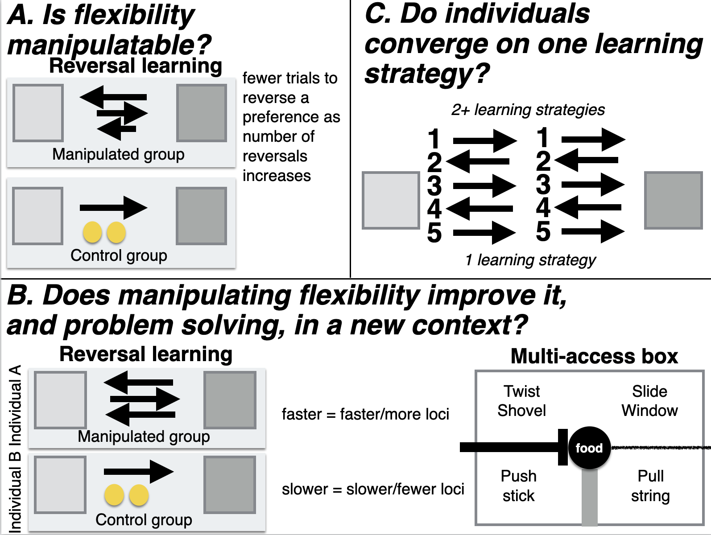

```{r setup, include=FALSE}
knitr::opts_chunk$set(echo = TRUE)
```

```{r}
#Make code wrap text so it doesn't go off the page when Knitting to PDF
library(knitr)
opts_chunk$set(tidy.opts=list(width.cutoff=60),tidy=TRUE)
```


**Cite as:** Logan CJ, MacPherson M, Rowney C, Bergeron L, Seitz B, Blaisdell A, Folsom M, Johnson-Ulrich Z, McCune K. 2019. [Is behavioral flexibility manipulatable and, if so, does it improve flexibility and problem solving in a new context?](http://corinalogan.com/Preregistrations/g_flexmanip.html) (http://corinalogan.com/Preregistrations/g_flexmanip.html) In principle acceptance by *PCI Ecology* of the version on 26 Mar 2019 [https://github.com/corinalogan/grackles/blob/master/Files/Preregistrations/g_flexmanip.Rmd](https://github.com/corinalogan/grackles/blob/master/Files/Preregistrations/g_flexmanip.Rmd).

  

**This preregistration has been pre-study peer reviewed and received an In Principle Recommendation by:**

Aurélie Coulon (2019) Can context changes improve behavioral flexibility? Towards a better understanding of species adaptability to environmental changes. *Peer Community in Ecology*, 100019. [10.24072/pci.ecology.100019](https://doi.org/10.24072/pci.ecology.100019)

 - Reviewers: Maxime Dahirel and Andrea Griffin

###ABSTRACT

This is one of the first studies planned for our long-term research on the role of behavioral flexibility in rapid geographic range expansions. Behavioral flexibility, the ability to adapt behavior to new circumstances, is thought to play an important role in a species' ability to successfully adapt to new environments and expand its geographic range (e.g., [@lefebvre1997feeding], [@griffin2014innovation], [@chow2016practice], [@sol2000behavioural], [@sol2002behavioural], [@sol2005big], [@sol2007big]). However, behavioral flexibility is rarely directly tested in species in a way that would allow us to determine how it works and how we can make predictions about a species' ability to adapt their behavior to new environments. We use great-tailed grackles (a bird species) as a model to investigate this question because they have rapidly expanded their range into North America over the past 140 years ([@wehtje2003range], [@peer2011invasion]). We aim to manipulate grackle behavioral flexibility (color tube reversal learning) to determine whether their flexibility is generalizable across contexts (touch screen reversal learning and multi-access box), whether it is repeatable within individuals and across contexts, and what learning strategies they employ. Results will allow us to understand more about what flexibility is and how it works, and validate whether a touch screen measures the same ability as the color tubes (thus facilitating faster testing that can be conducted in the wild).

###A. STATE OF THE DATA

This preregistration was written (2017) prior to collecting data. Pilot data on serial reversal learning (using color tubes) in one grackle was collected January through April 2018, which informed the revision of 1) the [criterion to pass serial reversal learning](#Determining-the-threshold-How-many-reversals-are-enough), 2) more accurate language for H1 P1 (each subsequent reversal may not be faster than the previous, however their average reversal speed decreases), 3) the removal of shape reversals from H3a and H3b (to reduce the amount of time each bird is tested), and 4) a new passing criterion for touch screen serial reversals in H3b. Part way through data collection on reversal learning (using color tubes) for the first two birds, the criterion for what counts as making a choice was revised (October 2018) and part way through data collection on the first four birds (October 2018; see below for details) the number of trials that birds in the control group receive was revised to make the test battery feasible in the time given.

This preregistration was submitted to PCI Ecology for peer review (July 2018), we received the first round of peer reviews a few days before data collection began (Sep 2018), we revised and resubmitted after data collection had started (Feb 2019) and it passed peer review (Mar 2019) before any of the planned analyses had been conducted. See the [peer review history](https://ecology.peercommunityin.org/public/rec?id=17&reviews=True) at PCI Ecology.

NOTE on 10 April 2019: We are discontinuing the reversal learning experiment on the touchscreen because it appears to measure something other than what we are trying to test and it requires a huge time investment for each bird (which consequently reduces the number of other tests they are available to participate in). This is not necessarily surprising because this is the first time touchscreen tests have been conducted in this species, and also the first time this particular reversal experiment has been conducted on a touchscreen with birds (to our knowledge). So we had no idea going into it what was going to happen. We are basing this decision on data from four grackles (2 in the flexibility manipulation group and 2 in the flexibility control group; 3 males and 1 female). All four of these individuals show highly inconsistent learning curves and require hundreds of trials to form each preference when compared to the performance of these individuals on the color tube reversal experiment. It appears that there is a confounding variable with the touchscreen such that they are extremely slow to learn a preference as indicated by passing our criterion of 17 correct trials out of the most recent 20. One confound could be that they must discriminate between shapes rather than colors. Shapes are known to require a few more trials for a preference to develop, but nothing on the order of what we found here (e.g., @shaw2015wild: mean=40 trials color, mean=55 trials shape in New Zealand robins; @isden2013performance: mean=6 trials color, mean=10 trials shape in spotted bowerbirds). Another confound could be that they find it somehow rewarding simply to touch the screen and have something happen, regardless of whether they receive a food reward (e.g., they touch the screen on one of the stimuli and the screen goes blank because the trial ends). It is unclear what this confounding variable could be and we will not investigate it further given that these individuals need to complete a large test battery. The time investment to complete the touchscreen reversal experiment is significant: of the birds in the manipulation group which undergo 5 reversals on the touchscreen, Mole took 4 months and Habanero is on a similar track (he is not done yet). The birds in the control group (Queso and Tapa) only undergo only 1 reversal on the touchscreen, so it overall requires less time for these individuals. We will not include the data from this experiment when conducting the cross-test comparisons in the Analysis Plan section of this preregistration. Instead, in the results section of the resulting article, we will provide summary results for this experiment and qualitatively compare it with performance on the color tube reversal test to explain why we removed this experiment.

NOTE on 16 April 2019: Because we are discontinuing the touchscreen reversal learning experiment, we will add an additional but distinct multi-access box task, which will allow us to continue to measure flexibility across three different experiments. There are two main differences between the current multi-access box, which is made of plastic, and the additional multi-access box added, which is made of wood. First, the wooden multi-access box is a natural log in which we carved out 4 compartments. As a result, the apparatus and solving options are more comparable to what grackles experience in the wild, though each compartment is covered by clear plastic doors that require different behaviors to open. Furthermore, there is only one food item available in the plastic multi-access box and the bird could use any of 4 loci to reach it. In contrast, the wooden multi-access box has a piece of food in each of the 4 separate compartments. With this difference, we can determine whether grackles are better able to inhibit manipulating a non-functional loci when food is no longer present.

###B. PARTITIONING THE RESULTS

We may present the different hypotheses in separate papers.

###C. HYPOTHESES

#### H1: Behavioral flexibility, as measured by reversal learning using colored tubes, is manipulatable.

**Prediction 1:** Individuals improve their flexibility on a serial reversal learning task using colored tubes by generally requiring fewer trials to reverse a preference as the number of reversals increases (manipulation condition). Their flexibility on this test will have been manipulated relative to control birds who do not undergo serial reversals. Instead, individuals in the control condition will be matched to manipulated birds for experience (they will experience a similar number of trials), but there will be no possibility of a functional tube preference because both tubes will be the same color and both will contain food, therefore either choice will be correct.

**P1 alternative 1:** If the number of trials to reverse a preference does not correlate with or positively correlates with reversal number, which would account for all potential correlation outcomes, this suggests that some individuals may prefer to rely on information acquired previously (i.e., they are slow to reverse) rather than relying on current cues (e.g., the food is in a new location) (e.g., [@manrique_repeated_2013]; [@griffin2014innovation]; [@liu2016learning], but see [@homberg2007serotonin]).

#### H2: Manipulating behavioral flexibility (improving reversal learning speed through serial reversals using colored tubers) improves flexibility (rule learning and/or switching) and problem solving in a new context (two distinct multi-access boxes and serial reversals on a touch screen).

**P2:** Individuals that have improved their flexibility on a serial reversal learning task using colored tubes (requiring fewer trials to reverse a preference as the number of reversals increases) are faster to switch between new methods of solving (latency to solve or attempt to solve a new way of accessing the food [locus]), and learn more new loci (higher total number of solved loci) on multi-access box flexibility tasks, and are faster to reverse preferences in a serial reversal task using a touch screen than individuals in the control group where flexibility has not been manipulated. The positive correlation between reversal learning performance using colored tubes and a touch screen (faster birds have fewer trials) and the multi-access boxes (faster birds have lower latencies) indicates that all three tests measure the same ability even though the multi-access boxes require inventing new rules to solve new loci (while potentially learning a rule about switching: "when an option becomes non-functional, try a different option") while reversal learning requires switching between two rules ("choose light gray" or "choose dark gray") or learning the rule to "switch when the previously rewarded option no longer contains a reward". Serial reversals eliminate the confounds of exploration, inhibition, and persistence in explaining reversal learning speed because, after multiple reversals, what is being measured is the ability to learn one or more rules. If the manipulation works, this indicates that flexibility can be influenced by previous experience and might indicate that any individual has the potential to move into new environments (see relevant hypotheses in preregistrations on [genetics](https://github.com/corinalogan/grackles/blob/master/EasyToReadFiles/g_flexgenes.md) (R1) and [expansion](https://github.com/corinalogan/grackles/blob/master/EasyToReadFiles/g_expansion.md) (H1)).

**P2 alternative 1:** If the manipulation does not work in that those individuals in the experimental condition do not decrease their reversal speeds more than control individuals, then this experiment will elucidate whether general individual variation in flexibility relates to flexibility in new contexts (two distinct multi-access boxes and serial reversals on a touch screen) as well as problem solving ability (multi-access boxes). The prediction is the same in P2, but in this case variation in flexibility is constrained by traits inherent to the individual (some of which will be tested in a separate [preregistration](https://github.com/corinalogan/grackles/blob/master/EasyToReadFiles/g_exploration.md)), which suggests that certain individuals will be more likely to move into new environments.

**P2 alternative 2:** If there is no correlation between reversal learning speed (colored tubes) and the latency to solve/attempt a new locus on the multi-access boxes, this could be because the latency to solve not only measures flexibility but also innovativeness. In this case, an additional analysis will be run with the latency to solve as the response variable, to determine whether the fit of the model (as determined by the lower AIC value) with reversal learning as an explanatory variable is improved if motor diversity (the number of different motor actions used when attempting to solve the multi-access box) is included as an explanatory variable. If the inclusion of motor diversity improves the model fit, then this indicates that the latency to solve a new locus on the multi-access box is influenced by flexibility (reversal learning speed) and innovation (motor diversity). 

**P2 alternative 3:** If there is a negative correlation or no correlation between reversal learning speed on colored tubes and reversal learning speed on the touch screen, then this indicates that it may be difficult for individuals to perceive and/or understand images on the touch screen in contrast with physical objects (colored tubes)(e.g., [@ohara2015advantage]).



#### H3a: Behavioral flexibility within a context is repeatable within individuals.

Repeatibility of behavioral flexibility is defined as the number of trials to reverse a color preference being strongly negatively correlated within individuals with the number of reversals.

**P3a:** Individuals that are faster to reverse a color preference in the first reversal will also be faster to reverse a color preference in the second, etc. reversal due to natural individual variation.

**P3a alternative:** There is no repeatibility in behavioral flexibility within individuals, which could indicate that performance is state dependent (e.g., it depends on their fluctuating motivation, hunger levels, etc.). We will determine whether performance on colored tube reversal learning related to motivation by examining whether the latency to make a choice influenced the results. We will also determine whether performance was related to hunger levels by examining whether the number of minutes since the removal of their maintenance diet from their aviary plus the number of food rewards they received since then influenced the results.

#### H3b: The consistency of behavioral flexibility in individuals across contexts (context 1=reversal learning on colored tubes, context 2=multi-access boxes, context 3=reversal learning on touch screen) indicates their ability to generalize across contexts.

Individual consistency of behavioral flexibility is defined as the number of trials to reverse a color preference being strongly positively correlated within individuals with the latency to solve new loci on each of the multi-access boxes and with the number of trials to reverse a color preference on a touch screen (total number of touch screen reversals = 5 per bird).

*If P3a is supported (repeatability of flexibility within individuals)...*

**P3b:** ...and flexibility is correlated across contexts, then the more flexible individuals are better at generalizing across contexts.

**P3b alternative 1:** ...and flexibility is not correlated across contexts, then there is something that influences an individual's ability to discount cues in a given context. This could be the individual's reinforcement history (tested in P3a alternative), their reliance on particular learning strategies (one alternative is tested in H4), or their motivation (tested in P3a alternative) to engage with a particular task (e.g., difficulty level of the task). 

#### H4: Individuals should converge on an epsilon-first learning strategy (learn the correct choice after one trial) as they progress through serial reversals.

**P4:** Individuals will prefer a mixture of learning strategies in the first serial reversals (an *epsilon-decreasing* strategy where individuals explore both options extensively before learning to prefer the rewarded option, and an *epsilon-first* strategy where the correct choice is consistently made after the first trial), and then move toward the epsilon-first learning strategy. The epsilon-first strategy works better later in the serial reversals where the reward is all or nothing because individuals will have learned the environment is changing in predictable ways [@bergstrom2004shannon]: only one option is consistently rewarded, and if the reward isn't in the previously rewarded option, it must be in the other option.

**P4 alternative 1:** Individuals will continue to prefer a mixture of learning strategies, and/or they do not converge on the more functional epsilon-first learning strategy, regardless of how many reversals they participate in. This pattern could suggest that the grackles do not attend to functional meta-strategies, that is, they do not learn the overarching rule (once food is found in the non-preferred tube, one must switch to preferring that tube color), but rather they learn each preference change as if it was new. 

###D. METHODS

####**Planned Sample**
	
Great-tailed grackles will be caught in the wild in Tempe, Arizona, USA for individual identification (colored leg bands in unique combinations). Some individuals (~32: ~16 in the control group (they receive 1 reversal) and ~16 in the flexibility manipulation (they receive multiple reversals)) will be brought temporarily into aviaries for testing, and then they will be released back to the wild.
	
####**Sample size rationale**
	
We will test as many birds as we can in the approximately three years at this field site given that the birds only participate in tests in aviaries during the non-breeding season (approximately September through March). 
	
####**Data collection stopping rule**
	
We will stop testing birds once we have completed two full aviary seasons (likely in March 2020) if the sample size is above the minimum suggested boundary based on model simulations (see section "[Ability to detect actual effects](#Ability-to-detect-actual-effects)" below). If the minimum sample size is not met by this point, we will continue testing birds at our next field site (which we move to in the summer of 2020) until we meet the minimum sample size.

####**Open materials** 

[Design files](https://github.com/corinalogan/grackles/tree/master/Files/MultiaccessBoxDesignFiles) for the plastic multi-access box: 3D printer files and laser cutter files

[Testing protocols](https://docs.google.com/document/d/18D80XZV_XCG9urVzR9WzbfOKFprDV62v3P74upu01xU/edit?usp=sharing) for all three experiments: color tube reversal learning, plastic multi-access box, wooden multi-access box, and touch screen reversal learning

####**Open data**

When the study is complete, the data will be published in the Knowledge Network for Biocomplexity's data repository.

####**Randomization and counterbalancing** 

H1: Subjects will be randomly assigned to the manipulated or control group. In the reversal learning trials, the rewarded option is pseudorandomized for side (and the option on the left is always placed first). Pseudorandomization consisted of alternating location for the first two trials of a session and then keeping the same color on the same side for at most two consecutive trials thereafter. A list of all 88 unique trial sequences for a 10-trial session, following the pseudorandomization rules, will be generated in advance for experimenters to use during testing (e.g., a randomized trial sequence might look like: LRLLRRLRLR, where L and R refer to the location, left or right, of the rewarded tube). Randomized trial sequences will be assigned randomly to any given 10-trial session using a random number generator (random.org) to generate a number from 1-88.

####**Blinding of conditions during analysis**

No blinding is involved in this study.

####**Dependent variables**

*P1-P3*

Number of trials to reverse a preference. An individual is considered to have a preference if it chose the rewarded option at least 17 out of the most recent 20 trials (with a minimum of 8 or 9 correct choices out of 10 on the two most recent sets of 10 trials). We use a sliding window to look at the most recent 10 trials for a bird, regardless of when the testing sessions occurred.

*P2 alternative 2: additional analysis: latency and motor diversity*

1) Number of trials to attempt a new locus on the multi-access boxes

2) Number of trials to solve (meet criterion) a new locus on the multi-access boxes

*P3b: additional analysis: individual consistency in flexibility across contexts + flexibility is correlated across contexts*

Number of trials to solve a new loci on the multi-access boxes

*P4: learning strategies* 

Proportion of correct choices in a non-overlapping sliding window of 4-trial bins across the total number of trials required to reach the criterion of 17/20 correct choices (as in P1-P3).

####**Independent variables**

####*P1: reversal speed gets faster with serial reversals*

1) Reversal number

2) Batch (random effect because multiple batches included in the analysis). Note: batch is a test cohort, consisting of 8 birds being tested simultaneously

3) ID (random effect because repeated measures on the same individuals)

####*P2: serial reversals improve rule switching & problem solving*

1) Average latency to attempt to solve a new locus after solving a different locus

2) Average latency to solve a new locus after solving a different locus

3) Total number of loci solved

4) Experimental group (manipulated=multiple reversals with color stimuli; control=one reversal plus equalized experience making choices where both are the same color and both contain a reward)

5) Batch (random effect because multiple batches included in the analysis). Note: batch is a test cohort, consisting of 8 birds being tested simultaneously

####*P2 alternative 2: additional analysis: latency and motor diversity*

1) Number of trials to reverse a preference in the last reversal that individual participated in

2) Motor diversity: the number of different motor actions used when attempting to solve the multi-access boxes

3) ID (random effect because repeated measures on the same individuals)

####*P3a: repeatable within individuals within a context (reversal learning)*

1) Reversal number

2) ID (random effect because repeated measures on the same individuals)

####*P3a alternative 1: was the potential lack of repeatability on colored tube reversal learning due to motivation or hunger?*

1) Trial number

2) Latency from the beginning of the trial to when they make a choice

3) Minutes since maintenance diet was removed from the aviary

4) Cumulative number of rewards from previous trials on that day

5) ID (random effect because repeated measures on the same individuals)

6) Batch (random effect because repeated measures on the same individuals). Note: batch is a test cohort, consisting of 8 birds being tested simultaneously

####*P3b: repeatable across contexts*

1) Reversal number

2) Condition (color tubes, plastic multi-access box, wooden multi-access box, touch screen)

3) Latency to solve a new locus

4) Number of trials to reverse a preference (color tubes)

5) Number of trials to reverse a preference (touchscreen)

6) ID (random effect because repeated measures on the same individuals)

####*P4: serial reversal learning strategy*

1) Trial number

2) ID (random effect because repeated measures on the same individuals)

###E. ANALYSIS PLAN

We do not plan to **exclude** any data. When **missing data** occur, the existing data for that individual will be included in the analyses for the tests they completed. Analyses will be conducted in R (current version `r getRversion()`; @rcoreteam). When there is more than one experimenter within a test, experimenter will be added as a random effect to account for potential differences between experimenters in conducting the tests. If there are no differences between models including or excluding experimenter as a random effect, then we will use the model without this random effect for simplicity.

####*Ability to detect actual effects*

To begin to understand what kinds of effect sizes we will be able to detect given our sample size limitations and our interest in decreasing noise by attempting to measure it, which increases the number of explanatory variables, we used G&ast;Power (v.3.1, @faul2007g, @faul2009statistical) to conduct power analyses based on confidence intervals. G&ast;Power uses pre-set drop down menus and we chose the options that were as close to our analysis methods as possible (listed in each analysis below). Note that there were no explicit options for GLMs (though the chosen test in G&ast;Power appears to align with GLMs) or GLMMs or for the inclusion of the number of trials per bird (which are generally large in our investigation), thus the power analyses are only an approximation of the kinds of effect sizes we can detect. We realize that these power analyses are not fully aligned with our study design and that these kinds of analyses are not appropriate for Bayesian statistics (e.g., our MCMCglmm below), however we are unaware of better options at this time. Additionally, it is difficult to run power analyses because it is unclear what kinds of effect sizes we should expect due to the lack of data on this species for these experiments.

To address the power analysis issues, we will run simulations on our Arizona data set before conducting any analyses in this preregistration. We will first run null models (i.e., dependent variable ~ 1 + random effects), which will allow us to determine what a weak versus a strong effect is for each model. Then we will run simulations based on the null model to explore the boundaries of influences (e.g., sample size) on our ability to detect effects of interest of varying strengths. If simulation results indicate that our Arizona sample size is not larger than the lower boundary, we will continue these experiments at the next field site until we meet the minimum suggested sample size.

**APRIL 2020 (pre-data analysis):** following procedures in @statrethinkingbook, we first constructed a *hypothesis-appropriate mathematical model* to identify the parameter boundaries (beta, sigma) that produce simulated data within the range of values expected for this species in the reversal learning and multiaccess box experiments. Values for reversal learning using color tubes (mean, standard deviation, and range of number of trials to reverse a color preference) were taken from previously published data on great-tailed grackles (@logan2016behavioral). We were unsure of whether the grackles would be able to solve any options on the multiaccess box because this experiment had never been done on this species before, so, in the simulation (described next), we ran versions where grackles solved between 0 and 4 options and other versions where they solved between 0 and 2 options (out of 4 options maximum). The model is as follows:

t ~ Normal(mu, sigma) *[likelihood]*

$\mu$ ~ a + bx  *[linear model]*

$\alpha$ ~ Normal(91,21) *[$\alpha$ prior]*

$\beta$ ~ Normal(0,0.5) *[$\beta$ prior]*

$\sigma$ ~ Uniform(0,40) *[$\sigma$ prior]*

t is the number of trials to reverse a preference (with fewer trials indicating faster reversal and thus more flexibility), $\mu$ is the population average trials to reverse, sigma is the population standard deviation for trials to reverse, $\alpha$ is the intercept, $\beta$ is the expected amount of change in t for every one unit change in x, and x is the number of options solved on the multiaccess box. We used a normal distribution for t, $\alpha$, and $\beta$ because they are (or are based on) sums with large means (see Figure 10.6 in @statrethinkingbook). We plugged in data from the Santa Barbara grackles (@logan2016behavioral): 91=average number of trials to reverse a preference (standard deviation=21 trials). The $\beta$ prior uses 0 as the mean and 0.5 as the standard deviation as a place to start and may need to be adjusted as the data are simulated. We chose a uniform distribution for $\sigma$ because it constrains $\sigma$ to have a positive probability of the standard deviation being between 0 and 40 trials (range of the number of trials to reverse a preference: 39-130, therefore 130 trials minus the average number of trials (91), which is about 40).

```{r modelparameters, eval=FALSE, warning=FALSE, results='asis', echo=TRUE, include=TRUE}
library(rethinking)
library(rstan)
library(formatR)

### Mathematical model in R code
N <- 100 #simulating with 100 lines (individuals, which is what I predict will be the sample size after measuring all 3 populations)
t ~ dnorm(mu, sigma)
mu <- a + b*x
a <- dnorm(91,21)
b <- rlnorm(N,0,0.5)
sigma <- dunif(x,0,40)

### SIMULATION 1: see what range of values the model produces
N <- 100 #simulating with 100 lines (individuals, which is what we predict will be the sample size after measuring all three populations)
a <- rnorm(N,91,21)
b <- rnorm(N,0,10) #10 because 5 categories of MAB innovations (0-4) so 5*10=50 trial difference and there is a 60 trial difference in the Santa Barbara reversal range 70-130

plot( NULL , xlim=c(0,4) , ylim=c(50,150) , xlab="options solved" , ylab="trials to reverse" )
abline( h=70 , lty=2 ) #this is the lower limit seen in the SB data
abline( h=130 , lty=1 , lwd=0.5 ) #this is the upper limit seen in the SB data
mtext( "b ~ dnorm(0,10)" )
xbar <- 2 #the median in the range of MAB solves 0-4
for ( i in 1:N ) curve( a[i] + b[i]*(x - xbar) ,
from=min(0) , to=max(4) , add=TRUE , col=col.alpha("black",0.2) ) #0-4 options on MAB
#RESULT = there are lines out of bounds, so...

### SIMULATION 2 - log the response variable trials to reverse
N <- 100
a <- rnorm(N,91,21)
b <- rlnorm(N,0,1) #1 because log of 10 is 1 (Rethinking p. 96)

plot( NULL , xlim=c(0,4) , ylim=c(50,150) , xlab="options solved" , ylab="trials to reverse" )
abline( h=70 , lty=2 )
abline( h=130 , lty=1 , lwd=0.5 )
mtext( "b ~ dnorm(0,1)" )
xbar <- 2
for ( i in 1:N ) curve( a[i] + b[i]*(x - xbar) ,
from=min(0) , to=max(4) , add=TRUE , col=col.alpha("black",0.2) )
#RESULT = more lines are within bounds, but now no negative correlations, which will be possible in the actual data, so...

### SIMULATION 3 - change b standard deviation to 2 rather than 10
N <- 100 
a <- rnorm(N,91,21)
b <- rnorm(N,0,2) #2 because want to constrain the slopes to be less extreme

plot( NULL , xlim=c(0,4) , ylim=c(50,150) , xlab="options solved" , ylab="trials to reverse" )
abline( h=70 , lty=2 )
abline( h=130 , lty=1 , lwd=0.5 )
mtext( "b ~ dnorm(0,2)" )
xbar <- 2 
for ( i in 1:N ) curve( a[i] + b[i]*(x - xbar) ,
from=min(0) , to=max(4) , add=TRUE , col=col.alpha("black",0.2) ) 
#RESULT = now lines mostly within bounds and includes negative correlations. Some lines go a little to far below the lower boundary, so...

### SIMULATION 4 - constrain a (intercept) so it starts within bounds (reduce sd from 21) and have steeper slopes (increase b sd)
N <- 100
a <- rnorm(N,91,10)
b <- rnorm(N,0,5) #increased b sd to 5

plot( NULL , xlim=c(0,4) , ylim=c(50,150) , xlab="options solved" , ylab="trials to reverse" )
abline( h=70 , lty=2 )
abline( h=130 , lty=1 , lwd=0.5 ) 
mtext( "b ~ dnorm(0,5)" )
xbar <- 2
for ( i in 1:N ) curve( a[i] + b[i]*(x - xbar) ,
from=min(0) , to=max(4) , add=TRUE , col=col.alpha("black",0.2) ) 
#RESULT = the slopes and this beta seem the most realistic for what we expect the range of values to be (a change in solving 1 more or 1 less option on MAB leads to a change in reversing 5 trials faster or slower)


### SIMULATION 5: now change beta from -5 to +5 to see what happens within the range of possible slopes
betas <- c(-5,-4,-3,-2,-1,0,1,2,3,4,5)
n <- 5 #sample size: number of grackles
sample <- matrix(nrow=n*11,ncol=2) #data frame: column 1=number of options solved on MAB, column 2=number of trials to reverse
a <- rnorm(1,91,10) #this is the alpha for the whole population
sigma <- runif(1,-5,5) #adding the runif error term (sigma) so the points are more like gitter and not perfectly aligned on the regression. This is the measurement error (e.g., I didn't measure the trials to reverse perfectly, whatever causes the bird to choose the light or dark gray tube is not always perfect), which also reflects the potential error that reversal learning performance is or is not an indicator of flexibility

for (k in 1:11){
b <- betas[k] #run through each beta

for (i in 1:n){
MAB <- round(runif(1,0,4),0) #n, min, max number of MAB options solved
sample[(k-1)*n+i,2] <- a + b * MAB + runif(1,-5,5) #simulating trials to reverse per individual
sample[(k-1)*n+i,1] <- MAB
}}
#sample #look at the data sheet

##Plot it
#The plot shows that there are differences in the relationship between trials to reverse and number of MAB loci solved when beta changes. It also shows that our sample size of 15 grackles should be enough
plot(sample[1:n,], ylim=c(50,150), xlim=c(0,4))
points(sample[(n+1):(2*n),], col="purple")
points(sample[(2*n+1):(3*n),], col="red")
points(sample[(3*n+1):(4*n),], col="blue")
points(sample[(4*n+1):(5*n),], col="green")
points(sample[(5*n+1):(6*n),], col="yellowgreen")
points(sample[(6*n+1):(7*n),], col="yellow")
points(sample[(7*n+1):(8*n),], col="magenta")
points(sample[(8*n+1):(9*n),], col="grey25")
points(sample[(9*n+1):(10*n),], col="grey15")
points(sample[(10*n+1):(11*n),], col="grey75")
```

We then used the mathematical model to run *simulations* on simulated data to estimate the measurement error associated with varying sample size, $\beta$, and the range of multiaccess box loci solved (Table 1). Before running the simulation, we decided that the output would be reliable when none of the regression coefficient 89% confidence intervals crossed zero (Table 1).

```{r sim, eval=FALSE, warning=FALSE, results='asis', echo=TRUE, include=TRUE}

###To make the model work, need to set up a few things... (this took me a few days because at every stage there is an error message and it isn't clear what the problem is or what to do next)

###Update R
#install installr package
#updateR(TRUE) #didn't work bc it can't find my R folder on my computer
#updateR(fast = FALSE, browse_news, install_R, copy_packages, copy_Rprofile.site, keep_old_packages, update_packages, start_new_R, quit_R, print_R_versions = TRUE, GUI = TRUE, to_checkMD5sums = FALSE, keep_install_file = FALSE, download_dir = "/Users/corina/Library/R", silent = FALSE, setInternet2 = TRUE, cran_mirror = "https://cran.rstudio.com/") #didn't work bc it can't find my R folder on my computer
#manually updated R and reinstalled packages

###Install rethinking
#install package devtools
#devtools::install_github("rmcelreath/rethinking",ref="Experimental")

###Install xcode (first download the app from the app store)
#In terminal, type: "xcode-select --install"

###Get STAN working https://github.com/rmcelreath/rethinking
#Install C++ toolchain and configuration https://github.com/stan-dev/rstan/wiki/Installing-RStan-from-source-on-a-Mac
#install.packages("Rcpp", repos = "https://rcppcore.github.io/drat") 
#Then install rstan per instructions at the previous link

###Now we're ready to go!
#Load packages
library("Rcpp")
library("rstan") 
library(rethinking)
library(ggplot2)

n <- 15 #sample size, number of grackles
sample <- matrix(nrow=n*10,ncol=2) #1 col for MAB scores, 1 col for reverse scores
regcoef <- matrix(nrow=10,ncol=1) #store regression coefficients here
sigma <- runif(1,-5,5) 

for (k in 1:10){
  a <- rnorm(1,91,10) #this is the alpha for the whole pop
  b <- -1
  
  for (i in 1:n){
    MAB <- round(runif(1,0,4),0) #n, min, max
    sample[(k-1)*n+i,2] <- a + b * MAB + runif(1,-14,14) 
    sample[(k-1)*n+i,1] <- MAB
  }
  
  dat_list <- list(
    trials = (sample[(((k-1))*n+1):(k*n),2]),
    MAB = (sample[(((k-1))*n+1):(k*n),1])
  )
  
  m1 <- ulam(
    alist(
      trials ~ dnorm( mu , sigma ),
      mu <- a+bM*MAB,
      a~normal(91,10),
      bM~normal(0,5),
      sigma~dexp(1)
    ),data=dat_list,messages=FALSE)
  
  regcoef[k,1]<-precis(m1)$"94.5%"[2]<0
  
}
```

**Table 1.** Simulation outputs from varying $\beta$, sample size (n), $\sigma$, and range of multiaccess box [MAB] loci solved. We ran the simulation with $\beta$ at -5 because this was what ended up generating an appropriate range of values in the parameter testing phase, at 0 because this would be the scenario in which there is no relationship between trials to reverse and number of multiaccess box loci solved, and -1 to determine how small of a difference we can detect with what amount of associated error ($\sigma$). When $\beta$ = 0 we want all of the regression coefficients to cross zero (10/10) and when $\beta$ $\neq$ 0 we want none of the regression coefficients to cross zero (0/10). We used the simulations to determine at what point this was the case for each combination of parameters.

```{r table1, eval=TRUE, warning=FALSE, results='asis', echo=TRUE, include=TRUE}
d <- read.csv ("/Users/corina/GitHub/grackles/Files/Preregistrations/gflexmanip_table_minsamplesizesim.csv", header=F, sep=",", stringsAsFactors=F) 

library(reactable)
reactable(d, highlight=TRUE, bordered=FALSE, compact=TRUE, wrap=TRUE, resizable=TRUE,
          columns = list(
            V1 = colDef(name="Beta"),
            V2 = colDef(name="n"),
            V3 = colDef(name="Sigma"),
            V4 = colDef(name="Regression coefficient crosses zero"),
            V5 = colDef(name="Regression coefficient"),
            V6 = colDef(name="Range of MAB loci solved")
          ))
```


Finally, we translated the simulation output into effect sizes and examined what kind of effect size we could detect (Table 2). For each $\beta$, we calculated the effect size as in @lajeunesse2013recovering (Box 13.3 in @lajeunesse2013recovering: linear regression):

r = $\beta$ (SDx / SDy) = $\beta$ (1.5 / 21)

Where r is the Pearson product moment correlation and SD is the standard deviation. For the standard deviation of x (number of loci solved on the multiacccess box), we estimated a possible value of 1.5. For the standard deviation of y (trials to reverse), we used 21 from the Santa Barbara grackle data (@logan2016behavioral). We then calculated the effect sizes and R2 values for each value of $\beta$.

**Table 2.** Predicted effect sizes based on simulations.

```{r table2, eval=TRUE, warning=FALSE, results='asis', echo=TRUE, include=TRUE}
d <- read.csv ("/Users/corina/GitHub/grackles/Files/Preregistrations/gflexmanip_table_simtoeffectsize.csv", header=F, sep=",", stringsAsFactors=F) 

library(reactable)
reactable(d, highlight=TRUE, bordered=FALSE, compact=TRUE, wrap=TRUE, resizable=TRUE,
          columns = list(
            V1 = colDef(name="Beta"),
            V2 = colDef(name="SDx"),
            V3 = colDef(name="SDy"),
            V4 = colDef(name="Effect size"),
            V5 = colDef(name="R2")
          ))
```


####*Data checking*

The data will be checked for overdispersion, underdispersion, zero-inflation, and heteroscedasticity with the DHARMa R package [@Hartig2019dharma] following methods by [Hartig](https://cran.r-project.org/web/packages/DHARMa/vignettes/DHARMa.html). Note: DHARMa doesn't support MCMCglmm, therefore we will use the closest supported model: glmer from the R package lme4 [@lme4].

####*Determining the threshold: How many reversals are enough?*

We initially (in 2017) set as the passing criterion: During the data collection period, the number of trials required to reverse a preference will be documented per bird, and reversals will continue until the first batch of birds tested reaches an asymptote (i.e., there are negligible further decreases in the number of trials required to reverse a preference). The number of reversals to reach the asymptote will be the number of reversals that subsequent birds experience.

Due to delays in setting up the field site, we were only able to test two grackles in early 2018 (January through April) and, due to randomization, only one (Fajita) was in the experimental condition that involved undergoing the flexibility manipulation (Empanada was in the control condition). While Fajita's reversal speeds generally improved with increasing serial reversals, she never reached an asymptote (which we defined as passing three consecutive reversals in the same number of trials), even after 38 reversals. These 38 reversals took 2.5 months, which is an impractical amount of time if birds are to participate in the rest of the test battery after undergoing the reversal manipulation (we are permitted to keep them in aviaries for up to three months per bird). Because our objective in this experiment is to manipulate an individual's flexibility, we decided to revise our serial reversal passing criterion to something more species relevant based on Fajita's serial reversal performance and the performance of seven grackles in Santa Barbara who underwent only one reversal in 2014 and 2015 [@logan2016behavioral]. **The revised serial reversal passing criterion is: passing two sessions in a row at or under 50 trials**. 50 trials is fewer trials than any of the nine grackles required to pass their first reversal (range 70-130), therefore it should reflect an improvement in flexibility.

####*Revising the choice criterion and the criterion to pass the control condition*

**Choice criterion:** At the beginning of the second bird's initial discrimination in the reversal learning color tube experiment (October 2018), we revised the criterion for what counts as a choice from A) the bird's head needs to pass an invisible line on the table that ran perpendicular to the the tube opening to B) the bird needs to bend its body or head down to look in the tube. Criterion A resulted in birds making more choices than the number of learning opportunities they were exposed to (because they could not see whether there was food in the tube unless they bent their head down to look in the tube) and appeared to result in slower learning. It is important that one choice equals one learning opportunity, therefore we revised the choice criterion to the latter. Anecdotally, this choice matters because the first three birds in the experiment (Tomatillo, Chalupa, and Queso) learned faster than the pilot birds (Empanada and Fajita) in their initial discriminations and first reversals. Thus, it was an important change to make at the beginning of the experiment.

**Criterion to pass the control condition:** Before collecting experimental data, we set the number of trials experienced by the birds in the control group as 1100 because this is how many trials it would have taken the pilot bird in the manipulated group, Fajita, to pass serial reversals 2-17 according to our revised serial reversal passing criterion. However, after 25 and 17 days (after Tomatillo and Queso's first reversals, respectively) of testing the first two individuals in the control group it became apparent that 1100 trials is impractical given the time constraints for how long we are permitted to keep each bird temporarily in captivity and would prevent birds from completing the test battery before their release. Additionally, after revising the choice criterion, it was going to be likely that birds in the manipulated group would require fewer than 1100 trials to meet the serial reversal passing criterion. Therefore, reducing the number of trials control birds experience would result in a better match of experience with birds in the manipulated group. On 2 November 2018 we set the number of trials control birds experience after their first (and only) reversal to the number of trials it requires the first bird in the manipulated group to pass (the first bird has not passed yet, therefore we do not yet know what this number is). After more individuals in the manipulated group pass, we will update this number to the average number of trials to pass.

####*P1: negative relationship between the number of trials to reverse a preference and the number of reversals?*

**Analysis:** A Generalized Linear Mixed Model (GLMM; MCMCglmm function, MCMCglmm package; [@hadfieldMCMCglmmpackage]) will be used with a Poisson distribution and log link using 13,000 iterations with a thinning interval of 10, a burnin of 3,000, and minimal priors (V=1, nu=0) [@hadfield2014coursenotes]. We will ensure the GLMM shows acceptable convergence (lag time autocorrelation values <0.01; [@hadfieldMCMCglmmpackage]), and adjust parameters if necessary. We will determine whether an independent variable had an effect or not using the Estimate in the full model.

We do not need a power analysis to estimate our ability to detect actual effects because, by definition, the individuals that complete this experiment must get faster at reversing in order to be able to pass the stopping criterion (two consecutive reversals in 50 trials or less). According to previous grackle data (from the pilot and from Santa Barbara), the fastest grackle passed their first reversal in 70 trials, which means that passing our serial reversal stopping criterion would require them to have improved their passing speed.

```{r serial, eval=FALSE, warning=FALSE, results='asis', echo=TRUE, include=TRUE}
seriald <- read.csv ("/Users/corina/GTGR/data/data_reverse.csv", header=T, sep=",", stringsAsFactors=F) 

# DATA CHECKING
library(DHARMa)
library(lme4)
simulationOutput <- simulateResiduals(fittedModel = glmer(TrialsToReverse ~ ReverseNumber + (1|ID) + (1|Batch), family=poisson, data=seriald), n=250) #250 simulations, but if want higher precision change n>1000
simulationOutput$scaledResiduals #Expect a flat distribution of the overall residuals, and uniformity in y direction if plotted against any predictor
testDispersion(simulationOutput) #if under- or over-dispersed, then p-value<0.05, but then check the dispersion parameter and try to determine what in the model could be the cause and address it there, also check for zero inflation
testZeroInflation(simulationOutput) #compare expected vs observed zeros, not zero-inflated if p<0.05
testUniformity(simulationOutput) #check for heteroscedasticity ("a systematic dependency of the dispersion / variance on another variable in the model" Hartig, https://cran.r-project.org/web/packages/DHARMa/vignettes/DHARMa.html), which is indicated if dots aren't on the red line and p<0.05. Also...
plot(simulationOutput) #...there should be no pattern in the data points in the right panel
plotResiduals(ReverseNumber, simulationOutput$scaledResiduals) #plot the residuals against other predictors (in cases when there is more than 1 fixed effect) - can't get this code to work yet

# GLMM
library(MCMCglmm)
prior = list(R = list(R1 = list(V = 1, nu = 0)), G = list(G1 = list(V = 1, 
	    nu = 0), G2 = list(V = 1, nu = 0)))
serial <- MCMCglmm(TrialsToReverse ~ ReverseNumber, random = ~ID+Batch, 
	    family = "poisson", data = seriald, verbose = F, prior = prior, 
	    nitt = 13000, thin = 10, burnin = 3000)
summary(serial)
# autocorr(serial$Sol) #Did fixed effects converge?
# autocorr(serial$VCV) #Did random effects converge?

#AIC calculation
library(MuMIn)
options(na.action = "na.fail")
base1 <- dredge(MCMCglmm(TrialsToReverse ~ ReverseNumber, random = ~ID+Batch, 
	    family = "poisson", data = seriald, verbose = F, prior = prior, 
	    nitt = 13000, thin = 10, burnin = 3000))
library(knitr)
kable(base1, caption="Table 2: Model selection output.")
```

####*P2: serial reversal improves rule switching & problem solving*

**Analysis:** Because the independent variables could influence each other, we will analyze them in a single model. A Generalized Linear Mixed Model (GLMM; MCMCglmm function, MCMCglmm package; [@hadfieldMCMCglmmpackage]) will be used with a Poisson distribution and log link using 13,000 iterations with a thinning interval of 10, a burnin of 3,000, and minimal priors (V=1, nu=0) [@hadfield2014coursenotes]. We will ensure the GLMM shows acceptable convergence (lag time autocorrelation values <0.01; [@hadfieldMCMCglmmpackage]), and adjust parameters if necessary. We will determine whether an independent variable had an effect or not using the Estimate in the full model.

To roughly estimate our ability to detect actual effects (because these power analyses are designed for frequentist statistics, not Bayesian statistics), we ran a power analysis in G\*Power with the following settings: test family=F tests, statistical test=linear multiple regression: Fixed model (R^2 deviation from zero), type of power analysis=a priori, alpha error probability=0.05. We reduced the power to 0.70 and increased the effect size until the total sample size in the output matched our projected sample size (n=32). The number of predictor variables was restricted to only the fixed effects because this test was not designed for mixed models. The protocol of the power analysis is here:

*Input:*

Effect size f²                	=	0.41

α err prob                    	=	0.05

Power (1-β err prob)          	=	0.7

Number of predictors          	=	5

*Output:*

Noncentrality parameter λ     	=	13.1200000

Critical F                    	=	2.5867901

Numerator df                  	=	5

Denominator df                	=	26

Total sample size             	=	32

Actual power                  	=	0.7103096

This means that, with our sample size of 32, we have a 71% chance of detecting a large effect (approximated at f^2^=0.35 by @cohen1988statistical). 

We will first determine whether the total loci solved, the latency to solve or attempt at new loci are correlated across the two distinct multi-access boxes. If there is a positive correlation, then we will only use the variables for the plastic multi-access box (for which we will likely have more data), as presented below. If there is no correlation, we will incorporate the total loci solved, the latencies to solve and attempt at new loci for each of the multi-access boxes as independent variables in our model.

```{r improves, eval=FALSE, warning=FALSE, results='asis', echo=TRUE, include=TRUE}
improve <- read.csv ("/Users/corina/GTGR/data/data_reversemulti.csv", header=T, sep=",", stringsAsFactors=F) 

#Is performance on the two multi-access boxes correlated?
cor(improve$AvgLatencySolveNewLoci_plastic, improve$AvgLatencySolveNewLoci_wooden)
cor(improve$AvgLatencyAttemptNewLoci_plastic, improve$AvgLatencyAttemptNewLoci_wooden)
cor(improve$TotalLoci_plastic, improve$TotalLoci_wooden)

# DATA CHECKING
library(DHARMa)
library(lme4)
simulationOut <- simulateResiduals(fittedModel = glmer(TrialsToReverse ~ Condition + AvgLatencySolveNewLoci + AvgLatencyAttemptNewLoci + TotalLoci + (1|Batch), family=poisson, data=improve), n=250) #250 simulations, but if want higher precision change n>1000
simulationOut$scaledResiduals #Expect a flat distribution of the overall residuals, and uniformity in y direction if plotted against any predictor
testDispersion(simulationOut) #if under- or over-dispersed, then p-value<0.05, but then check the dispersion parameter and try to determine what in the model could be the cause and address it there, also check for zero inflation
testZeroInflation(simulationOut) #compare expected vs observed zeros, not zero-inflated if p<0.05
testUniformity(simulationOut) #check for heteroscedasticity ("a systematic dependency of the dispersion / variance on another variable in the model" Hartig, https://cran.r-project.org/web/packages/DHARMa/vignettes/DHARMa.html), which is indicated if dots aren't on the red line and p<0.05. Also...
plot(simulationOut) #...there should be no pattern in the data points in the right panel
plotResiduals(Condition, simulationOut$scaledResiduals) #plot the residuals against other predictors (in cases when there is more than 1 fixed effect) - can't get this code to work yet

# GLMM
library(MCMCglmm)
prior = list(R = list(R1 = list(V = 1, nu = 0)), G = list(G1 = list(V = 1, 
	    nu = 0), G2 = list(V = 1, nu = 0)))
imp <- MCMCglmm(TrialsToReverse ~ Condition + AvgLatencySolveNewLoci + 
	    AvgLatencyAttemptNewLoci + TotalLoci, random = ~Batch, 
	    family = "poisson", data = improve, verbose = F, prior = prior, 
	    nitt = 13000, thin = 10, burnin = 3000)
summary(imp)
# autocorr(imp$Sol) #Did fixed effects converge?
# autocorr(imp$VCV) #Did random effects converge?
```

####*P2 alternative 2: additional analysis: latency and motor diversity*

A Generalized Linear Mixed Model (GLMM; MCMCglmm function, MCMCglmm package; [@hadfieldMCMCglmmpackage]) will be used with a Poisson distribution and log link using 13,000 iterations with a thinning interval of 10, a burnin of 3,000, and minimal priors (V=1, nu=0) [@hadfield2014coursenotes]. We will ensure the GLMM shows acceptable convergence (lag time autocorrelation values <0.01; [@hadfieldMCMCglmmpackage]), and adjust parameters if necessary. We will determine whether an independent variable had an effect or not using the Estimate in the full model.

To roughly estimate our ability to detect actual effects (because these power analyses are designed for frequentist statistics, not Bayesian statistics), we ran a power analysis in G\*Power with the following settings: test family=F tests, statistical test=linear multiple regression: Fixed model (R^2 deviation from zero), type of power analysis=a priori, alpha error probability=0.05. We reduced the power to 0.70 and increased the effect size until the total sample size in the output matched our projected sample size (n=32). The number of predictor variables was restricted to only the fixed effects because this test was not designed for mixed models. The protocol of the power analysis is here:

*Input:*

Effect size f²                	=	0.27

α err prob                    	=	0.05

Power (1-β err prob)          	=	0.7

Number of predictors          	=	2

*Output:*

Noncentrality parameter λ     	=	8.6400000

Critical F                    	=	3.3276545

Numerator df                  	=	2

Denominator df                	=	29

Total sample size             	=	32

Actual power                  	=	0.7047420

This means that, with our sample size of 32, we have a 70% chance of detecting a medium (approximated at f^2^=0.15 by @cohen1988statistical) to large effect (approximated at f^2^=0.35 by @cohen1988statistical). 

We will perform separate models for each multi-access box (plastic and wooden).

```{r diversity1P, eval=FALSE, warning=FALSE, results='asis', echo=TRUE, include=TRUE}
#Latency to attempt to solve a new locus
diversity <- read.csv ("/Users/corina/GTGR/data/data_reversemulti.csv", header=T, sep=",", stringsAsFactors=F) 

# PLASTIC MULTI-ACCESS BOX (P)
# DATA CHECKING
library(DHARMa)
library(lme4)
simulationOutp <- simulateResiduals(fittedModel = glmer(TrialsToSolveNewLociP ~ TrialsToReverseLast + NumberMotorActionsMultiP + (1|ID), family=poisson, data=diversity), n=250) #250 simulations, but if want higher precision change n>1000
simulationOutp$scaledResiduals #Expect a flat distribution of the overall residuals, and uniformity in y direction if plotted against any predictor
testDispersion(simulationOutp) #if under- or over-dispersed, then p-value<0.05, but then check the dispersion parameter and try to determine what in the model could be the cause and address it there, also check for zero inflation
testZeroInflation(simulationOutp) #compare expected vs observed zeros, not zero-inflated if p<0.05
testUniformity(simulationOutp) #check for heteroscedasticity ("a systematic dependency of the dispersion / variance on another variable in the model" Hartig, https://cran.r-project.org/web/packages/DHARMa/vignettes/DHARMa.html), which is indicated if dots aren't on the red line and p<0.05. Also...
plot(simulationOutp) #...there should be no pattern in the data points in the right panel
plotResiduals(NumberMotorActionsMultiW, simulationOutp$scaledResiduals) #plot the residuals against other predictors (in cases when there is more than 1 fixed effect) - can't get this code to work yet
plotResiduals(TrialsToReverseLast, simulationOutp$scaledResiduals)

# GLMM
library(MCMCglmm)
prior = list(R = list(R1 = list(V = 1, nu = 0), R2 = list(V = 1, nu = 0)), G = list(G1 = list(V = 1, 
    nu = 0)))
div <- MCMCglmm(TrialsToSolveNewLociP ~ TrialsToReverseLast + NumberMotorActionsMultiP, random = ~ID, 
    family = "poisson", data = diversity, verbose = F, prior = prior, 
    nitt = 13000, thin = 10, burnin = 3000)
summary(div)
# autocorr(div$Sol) #Did fixed effects converge?
# autocorr(div$VCV) #Did random effects converge?

# AIC calculation
library(MuMIn)
options(na.action = "na.fail")
base1 <- dredge(MCMCglmm(TrialsToSolveNewLociP ~ TrialsToReverseLast + NumberMotorActionsMultiP, random = ~ID, 
    family = "poisson", data = diversity, verbose = F, prior = prior, 
    nitt = 13000, thin = 10, burnin = 3000))
library(knitr)
kable(base1, caption = "Table 5: Model selection output.")
```

```{r diversity1W, eval=FALSE, warning=FALSE, results='asis', echo=TRUE, include=TRUE}
# WOODEN MULTI-ACCESS BOX (W)
# DATA CHECKING
library(DHARMa)
library(lme4)
simulationOutp <- simulateResiduals(fittedModel = glmer(TrialsToSolveNewLociW ~ TrialsToReverseLast + NumberMotorActionsMultiW + (1|ID), family=poisson, data=diversity), n=250) #250 simulations, but if want higher precision change n>1000
simulationOutp$scaledResiduals #Expect a flat distribution of the overall residuals, and uniformity in y direction if plotted against any predictor
testDispersion(simulationOutp) #if under- or over-dispersed, then p-value<0.05, but then check the dispersion parameter and try to determine what in the model could be the cause and address it there, also check for zero inflation
testZeroInflation(simulationOutp) #compare expected vs observed zeros, not zero-inflated if p<0.05
testUniformity(simulationOutp) #check for heteroscedasticity ("a systematic dependency of the dispersion / variance on another variable in the model" Hartig, https://cran.r-project.org/web/packages/DHARMa/vignettes/DHARMa.html), which is indicated if dots aren't on the red line and p<0.05. Also...
plot(simulationOutp) #...there should be no pattern in the data points in the right panel
plotResiduals(NumberMotorActionsMultiW, simulationOutp$scaledResiduals) #plot the residuals against other predictors (in cases when there is more than 1 fixed effect) - can't get this code to work yet
plotResiduals(TrialsToReverseLast, simulationOutp$scaledResiduals)

# GLMM
library(MCMCglmm)
prior = list(R = list(R1 = list(V = 1, nu = 0), R2 = list(V = 1, nu = 0)), G = list(G1 = list(V = 1, 
    nu = 0)))
div <- MCMCglmm(TrialsToSolveNewLociW ~ TrialsToReverseLast + NumberMotorActionsMultiW, random = ~ID, 
    family = "poisson", data = diversity, verbose = F, prior = prior, 
    nitt = 13000, thin = 10, burnin = 3000)
summary(div)
# autocorr(div$Sol) #Did fixed effects converge?
# autocorr(div$VCV) #Did random effects converge?

# AIC calculation
library(MuMIn)
options(na.action = "na.fail")
base1 <- dredge(MCMCglmm(TrialsToSolveNewLociW ~ TrialsToReverseLast + NumberMotorActionsMultiW, random = ~ID, 
    family = "poisson", data = diversity, verbose = F, prior = prior, 
    nitt = 13000, thin = 10, burnin = 3000))
library(knitr)
kable(base1, caption = "Table 5: Model selection output.")
```

```{r diversity2P, eval=FALSE, warning=FALSE, results='asis', echo=TRUE, include=TRUE}
#Latency to solve a new locus
diversity <- read.csv ("/Users/corina/GTGR/data/data_reversemulti.csv", header=T, sep=",", stringsAsFactors=F) 

# PLASTIC MULTI-ACCESS BOX (P)
# DATA CHECKING
library(DHARMa)
library(lme4)
simulationOutpu <- simulateResiduals(fittedModel = glmer(TrialsToAttemptNewLociP ~ TrialsToReverseLast + NumberMotorActionsMultiP + (1|ID), family=poisson, data=diversity), n=250) #250 simulations, but if want higher precision change n>1000
simulationOutpu$scaledResiduals #Expect a flat distribution of the overall residuals, and uniformity in y direction if plotted against any predictor
testDispersion(simulationOutpu) #if under- or over-dispersed, then p-value<0.05, but then check the dispersion parameter and try to determine what in the model could be the cause and address it there, also check for zero inflation
testZeroInflation(simulationOutpu) #compare expected vs observed zeros, not zero-inflated if p<0.05
testUniformity(simulationOutpu) #check for heteroscedasticity ("a systematic dependency of the dispersion / variance on another variable in the model" Hartig, https://cran.r-project.org/web/packages/DHARMa/vignettes/DHARMa.html), which is indicated if dots aren't on the red line and p<0.05. Also...
plot(simulationOutpu) ##...there should be no pattern in the data points in the right panel
plotResiduals(NumberMotorActionsMultiP, simulationOutpu$scaledResiduals) #plot the residuals against other predictors - can't get this code to work yet
plotResiduals(TrialsToReverseLast, simulationOutpu$scaledResiduals)

# GLMM
library(MCMCglmm)
prior = list(R = list(R1 = list(V = 1, nu = 0), R2 = list(V = 1, nu = 0)), G = list(G1 = list(V = 1, 
    nu = 0)))
div <- MCMCglmm(TrialsToAttemptNewLociP ~ TrialsToReverseLast + NumberMotorActionsMultiP, random = ~ID, 
    family = "poisson", data = diversity, verbose = F, prior = prior, 
    nitt = 13000, thin = 10, burnin = 3000)
summary(div)
# autocorr(div$Sol) #Did fixed effects converge?
# autocorr(div$VCV) #Did random effects converge?

# AIC calculation
library(MuMIn)
options(na.action = "na.fail")
base1 <- dredge(MCMCglmm(TrialsToAttemptNewLociP ~ TrialsToReverseLast + NumberMotorActionsMultiP, random = ~ID, 
    family = "poisson", data = diversity, verbose = F, prior = prior, 
    nitt = 13000, thin = 10, burnin = 3000))
library(knitr)
kable(base1, caption = "Table 5: Model selection output.")
```

```{r diversity2W, eval=FALSE, warning=FALSE, results='asis', echo=TRUE, include=TRUE}
#Latency to solve a new locus
diversity <- read.csv ("/Users/corina/GTGR/data/data_reversemulti.csv", header=T, sep=",", stringsAsFactors=F) 

# WOODEN MULTI-ACCESS BOX (W)
# DATA CHECKING
library(DHARMa)
library(lme4)
simulationOutpu <- simulateResiduals(fittedModel = glmer(TrialsToAttemptNewLociW ~ TrialsToReverseLast + NumberMotorActionsMultiW + (1|ID), family=poisson, data=diversity), n=250) #250 simulations, but if want higher precision change n>1000
simulationOutpu$scaledResiduals #Expect a flat distribution of the overall residuals, and uniformity in y direction if plotted against any predictor
testDispersion(simulationOutpu) #if under- or over-dispersed, then p-value<0.05, but then check the dispersion parameter and try to determine what in the model could be the cause and address it there, also check for zero inflation
testZeroInflation(simulationOutpu) #compare expected vs observed zeros, not zero-inflated if p<0.05
testUniformity(simulationOutpu) #check for heteroscedasticity ("a systematic dependency of the dispersion / variance on another variable in the model" Hartig, https://cran.r-project.org/web/packages/DHARMa/vignettes/DHARMa.html), which is indicated if dots aren't on the red line and p<0.05. Also...
plot(simulationOutpu) ##...there should be no pattern in the data points in the right panel
plotResiduals(NumberMotorActionsMultiW, simulationOutpu$scaledResiduals) #plot the residuals against other predictors - can't get this code to work yet
plotResiduals(TrialsToReverseLast, simulationOutpu$scaledResiduals)

# GLMM
library(MCMCglmm)
prior = list(R = list(R1 = list(V = 1, nu = 0), R2 = list(V = 1, nu = 0)), G = list(G1 = list(V = 1, 
    nu = 0)))
div <- MCMCglmm(TrialsToAttemptNewLociW ~ TrialsToReverseLast + NumberMotorActionsMultiW, random = ~ID, 
    family = "poisson", data = diversity, verbose = F, prior = prior, 
    nitt = 13000, thin = 10, burnin = 3000)
summary(div)
# autocorr(div$Sol) #Did fixed effects converge?
# autocorr(div$VCV) #Did random effects converge?

# AIC calculation
library(MuMIn)
options(na.action = "na.fail")
base1 <- dredge(MCMCglmm(TrialsToAttemptNewLociW ~ TrialsToReverseLast + NumberMotorActionsMultiW, random = ~ID, 
    family = "poisson", data = diversity, verbose = F, prior = prior, 
    nitt = 13000, thin = 10, burnin = 3000))
library(knitr)
kable(base1, caption = "Table 5: Model selection output.")
```

####*P3a: repeatable within individuals within a context (reversal learning)*

**Analysis:** Is reversal learning (colored tubes) repeatable within individuals within a context (reversal learning)? We will obtain repeatability estimates that account for the observed and latent scales, and then compare them with the raw repeatability estimate from the null model. The repeatability estimate indicates how much of the total variance, after accounting for fixed and random effects, is explained by individual differences (ID). We will run this GLMM using the MCMCglmm function in the MCMCglmm package ([@hadfieldMCMCglmmpackage]) with a Poisson distribution and log link using 13,000 iterations with a thinning interval of 10, a burnin of 3,000, and minimal priors (V=1, nu=0) [@hadfield2014coursenotes]. We will ensure the GLMM shows acceptable convergence (i.e., lag time autocorrelation values <0.01; [@hadfieldMCMCglmmpackage]), and adjust parameters if necessary.

To roughly estimate our ability to detect actual effects (because these power analyses are designed for frequentist statistics, not Bayesian statistics), we ran a power analysis in G&ast;Power with the following settings: test family=F tests, statistical test=linear multiple regression: Fixed model (R^2 deviation from zero), type of power analysis=a priori, alpha error probability=0.05. The number of predictor variables was restricted to only the fixed effects because this test was not designed for mixed models. We reduced the power to 0.70 and increased the effect size until the total sample size in the output matched our projected sample size (n=32). The protocol of the power analysis is here:

*Input:*

Effect size f²                	=	0.21

α err prob                    	=	0.05

Power (1-β err prob)          	=	0.7

Number of predictors          	=	1

*Output:*

Noncentrality parameter λ     	=	6.7200000

Critical F                    	=	4.1708768

Numerator df                  	=	1

Denominator df                	=	30

Total sample size             	=	32

Actual power                  	=	0.7083763

This means that, with our sample size of 32, we have a 71% chance of detecting a medium effect (approximated at f^2^=0.15 by @cohen1988statistical). 

```{r repeatableR, eval=FALSE, warning=FALSE, results='asis', echo=TRUE, include=TRUE}
serial2 <- read.csv ("/Users/corina/GTGR/data/data_reverse.csv", header=T, sep=",", stringsAsFactors=F) 

# DATA CHECKING
library(DHARMa)
library(lme4)
simulationOutput <- simulateResiduals(fittedModel = glmer(TrialsToReverse ~ ReverseNumber + (1|ID), family=poisson, data=serial2), n=250) #250 simulations, but if want higher precision change n>1000
simulationOutput$scaledResiduals #Expect a flat distribution of the overall residuals, and uniformity in y direction if plotted against any predictor
testDispersion(simulationOutput) #if under- or over-dispersed, then p-value<0.05, but then check the dispersion parameter and try to determine what in the model could be the cause and address it there, also check for zero inflation
testZeroInflation(simulationOutput) #compare expected vs observed zeros, not zero-inflated if p<0.05
testUniformity(simulationOutput) #check for heteroscedasticity ("a systematic dependency of the dispersion / variance on another variable in the model" Hartig, https://cran.r-project.org/web/packages/DHARMa/vignettes/DHARMa.html), which is indicated if dots aren't on the red line and p<0.05. Also...
plot(simulationOutput) #...there should be no pattern in the data points in the right panel
plotResiduals(ReverseNumber, simulationOutput$scaledResiduals) #plot the residuals against other predictors - can't get this code to work yet

# GLMM
library(MCMCglmm)
prior = list(R=list(R1=list(V=1,nu=0)), G=list(G1=list(V=1,nu=0)))
serial <- MCMCglmm(TrialsToReverse ~ ReverseNumber, random=~ID, family="poisson", data=serial2, verbose=F, prior=prior, nitt=13000, thin=10, burnin=3000)
summary(serial)
#autocorr(serial$Sol) #Did fixed effects converge?
#autocorr(serial$VCV) #Did random effects converge?

#REPEATABILITY
#In MCMCglmm, the latent scale adjusted repeatability and its credible interval can simply be obtained by: serial$VCV[,ID]/(serial$VCV[,ID]+serial$VCV[,units]) - advice from Maxime Dahirel

repeata <- serial$VCV[,"ID"]/(serial$VCV[,"ID"]+serial$VCV[,"units"]) #latent scale adjusted repeatability and its credible interval
mean(repeata) #0.79 variance
var(repeata) #0.15 variance
posterior.mode(repeata) #0.99879
HPDinterval(repeata, 0.95) #2.6e-14 to 0.99999

# Repeatability on the data/observed scale (accounting for fixed effects)
#code from Supplementary Material S2 from Villemereuil et al. 2018 J Evol Biol
vf <- sapply(1:nrow(serial[["Sol"]]), function(i) {
   var(predict(serial, it=i))  
}) #estimates for each iteration of the MCMC

repeataF <- (vf+serial$VCV[,"ID"])/(vf+serial$VCV[,"ID"]+serial$VCV[,"units"]) #latent scale adjusted + data scale
posterior.mode(repeataF) #1.0
HPDinterval(repeataF, 0.95) #0.9999 to 1.0

# Now compare with the raw repeatability: null model
serialraw <- MCMCglmm(TrialsToReverse ~ 1, random=~ID, family="poisson", data=serial2, verbose=F, prior=prior, nitt=13000, thin=10, burnin=3000)
summary(serialraw)

repeataraw <- serialraw$VCV[,"ID"]/(serialraw$VCV[,"ID"]+serialraw$VCV[,"units"]) #latent scale adjusted repeatability and its credible interval
posterior.mode(repeata) #0.99879
HPDinterval(repeata, 0.95) #2.6e-14 to 0.99999
```

####*P3a alternative 1: was the potential lack of repeatability on colored tube reversal learning due to motivation or hunger?*

**Analysis:** Because the independent variables could influence each other or measure the same variable, I will analyze them in a single model: Generalized Linear Mixed Model (GLMM; MCMCglmm function, MCMCglmm package; [@hadfieldMCMCglmmpackage]) with a binomial distribution (called categorical in MCMCglmm) and logit link using 13,000 iterations with a thinning interval of 10, a burnin of 3,000, and minimal priors (V=1, nu=0) [@hadfield2014coursenotes]. We will ensure the GLMM shows acceptable convergence (lag time autocorrelation values <0.01; [@hadfieldMCMCglmmpackage]), and adjust parameters if necessary. The contribution of each independent variable will be evaluated using the Estimate in the full model. 

To roughly estimate our ability to detect actual effects (because these power analyses are designed for frequentist statistics, not Bayesian statistics), we ran a power analysis in G&ast;Power with the following settings: test family=F tests, statistical test=linear multiple regression: Fixed model (R^2 deviation from zero), type of power analysis=a priori, alpha error probability=0.05. We reduced the power to 0.70 and increased the effect size until the total sample size in the output matched our projected sample size (n=32). The number of predictor variables was restricted to only the fixed effects because this test was not designed for mixed models. The protocol of the power analysis is here:

*Input:*

Effect size f²                	=	0.31

α err prob                    	=	0.05

Power (1-β err prob)          	=	0.7

Number of predictors          	=	4

*Output:*

Noncentrality parameter λ     	=	11.4700000

Critical F                    	=	2.6684369

Numerator df                  	=	4

Denominator df                	=	32

Total sample size             	=	37

Actual power                  	=	0.7113216

This means that, with our sample size of 32, we have a 71% chance of detecting a large effect (approximated at f^2^=0.35 by @cohen1988statistical). 

```{r motivation, eval=FALSE, warning=FALSE, results='asis', echo=TRUE, include=TRUE}
rr <- read.csv ("/Users/corina/GTGR/data/data_reverseraw.csv", header=T, sep=",", stringsAsFactors=F) 

# DATA CHECKING
library(DHARMa)
library(lme4)
simulationOutput <- simulateResiduals(fittedModel = glmer(CorrectChoice ~ Trial + LatencyToChoose + MinSinceFoodRemoved + NumberRewardsFromPrevTrials + (1|ID) + (1|Batch), family=binomial, data=rr), n=250) #250 simulations, but if want higher precision change n>1000
simulationOutput$scaledResiduals #Expect a flat distribution of the overall residuals, and uniformity in y direction if plotted against any predictor
testDispersion(simulationOutput) #if under- or over-dispersed, then p-value<0.05, but then check the dispersion parameter and try to determine what in the model could be the cause and address it there, also check for zero inflation
testZeroInflation(simulationOutput) #compare expected vs observed zeros, not zero-inflated if p<0.05
testUniformity(simulationOutput) #check for heteroscedasticity ("a systematic dependency of the dispersion / variance on another variable in the model" Hartig, https://cran.r-project.org/web/packages/DHARMa/vignettes/DHARMa.html), which is indicated if dots aren't on the red line and p<0.05. Also...
plot(simulationOutput) #...there should be no pattern in the data points in the right panel
plotResiduals(LatencyToChoose, simulationOutput$scaledResiduals) #plot the residuals against other predictors - can't get this code to work yet

# GLMM - Is trial the main independent variable associated with learning performance (CorrectChoice) or are other variables associated with performance, including motivation and hunger?
library(MCMCglmm)
prior = list(R=list(R1=list(V=1,nu=0),R2=list(V=1,nu=0),R3=list(V=1,nu=0),R4=list(V=1,nu=0)), G=list(G1=list(V=1,nu=0),G2=list(V=1,nu=0))) 

rr1 <- MCMCglmm(CorrectChoice ~ Trial + LatencyToChoose + MinSinceFoodRemoved + NumberRewardsFromPrevTrials, random=~ID+Batch, family="categorical", data=rr, verbose=F, prior=prior, nitt=13000, thin=10, burnin=3000)
summary(rr1)
autocorr(rr1$Sol) #Did fixed effects converge?
autocorr(rr1$VCV) #Did random effects converge?
```

####*P3b: individual consistency across contexts*

**Analysis:** Do those individuals that are faster to reverse a color preference also have lower latencies to switch to new options on the multi-access box? Do those individuals that are faster to reverse a color preference also have lower latencies to switch to new options on the multi-access box? A Generalized Linear Mixed Model (GLMM; MCMCglmm function, MCMCglmm package; [@hadfieldMCMCglmmpackage]) will be used with a Poisson distribution and log link using 13,000 iterations with a thinning interval of 10, a burnin of 3,000, and minimal priors (V=1, nu=0) [@hadfield2014coursenotes]. We will ensure the GLMM shows acceptable convergence (lag time autocorrelation values <0.01; [@hadfieldMCMCglmmpackage]), and adjust parameters if necessary. We will determine whether an independent variable had an effect or not using the Estimate in the full model.

To roughly estimate our ability to detect actual effects (because these power analyses are designed for frequentist statistics, not Bayesian statistics), we ran a power analysis in G\*Power with the following settings: test family=F tests, statistical test=linear multiple regression: Fixed model (R^2 deviation from zero), type of power analysis=a priori, alpha error probability=0.05. We reduced the power to 0.70 and increased the effect size until the total sample size in the output matched our projected sample size (n=32). The number of predictor variables was restricted to only the fixed effects because this test was not designed for mixed models. The protocol of the power analysis is here:

*Input:*

Effect size f²                	=	0.21

α err prob                    	=	0.05

Power (1-β err prob)          	=	0.7

Number of predictors          	=	1

*Output:*

Noncentrality parameter λ     	=	6.7200000

Critical F                    	=	4.1708768

Numerator df                  	=	1

Denominator df                	=	30

Total sample size             	=	32

Actual power                  	=	0.7083763

This means that, with our sample size of 32, we have a 71% chance of detecting a medium effect (approximated at f^2^=0.15 by @cohen1988statistical). 
 
```{r consistent1, eval=FALSE, warning=FALSE, results='asis', echo=TRUE, include=TRUE}
improve1 <- read.csv ("/Users/corina/GTGR/data/data_reversemulti.csv", header=T, sep=",", stringsAsFactors=F) 

# DATA CHECKING
library(DHARMa)
library(lme4)
simulationOutput <- simulateResiduals(fittedModel = glmer(TrialsToSolveNewLoci ~ Condition + ReversalNumber + TrialsToReverseT + TrialsToReverse + (1|ID), family=poisson, data=improve1), n=250) #250 simulations, but if want higher precision change n>1000
simulationOutput$scaledResiduals #Expect a flat distribution of the overall residuals, and uniformity in y direction if plotted against any predictor
testDispersion(simulationOutput) #if under- or over-dispersed, then p-value<0.05, but then check the dispersion parameter and try to determine what in the model could be the cause and address it there, also check for zero inflation
testZeroInflation(simulationOutput) #compare expected vs observed zeros, not zero-inflated if p<0.05
testUniformity(simulationOutput) #check for heteroscedasticity ("a systematic dependency of the dispersion / variance on another variable in the model" Hartig, https://cran.r-project.org/web/packages/DHARMa/vignettes/DHARMa.html), which is indicated if dots aren't on the red line and p<0.05. Also...
plot(simulationOutput) #...there should be no pattern in the data points in the right panel
plotResiduals(ReverseNumber, simulationOutput$scaledResiduals) #plot the residuals against other predictors - can't get this code to work yet

# GLMM color reversal tubes compared with multi-access box and reversal on the touchscreen
library(MCMCglmm)
prior = list(R = list(R1 = list(V = 1, nu = 0), R2 = list(V = 1, nu = 0)), G = list(G1 = list(V = 1, 
	    nu = 0)))
rm <- MCMCglmm(TrialsToSolveNewLoci ~ Condition * ReversalNumber * TrialsToReverseT * TrialsToReverse, random = ~ID, 
	    family = "poisson", data = improve1, verbose = F, prior = prior, 
	    nitt = 13000, thin = 10, burnin = 3000)
summary(rm)
# autocorr(rm$Sol) #Did fixed effects converge?
# autocorr(rm$VCV) #Did random effects converge?
```

####*P4: learning strategies (for birds in the manipulated group only)*

**Analysis:** Learning strategies will be identified by matching them to the two known approximate strategies of the contextual, binary multi-armed bandit: epsilon-first and epsilon-decreasing ([@mcinerney2010], as in [@logan2016behavioral]). 

From @logan2016behavioral (emphasis added):

>The following equations refer to the different phases involved in each strategy:

>Equation 1 (exploration phase): $$\epsilon N$$

>Equation 2 (exploitation phase): $$ ( 1 - \epsilon ) N $$

>N is the number of trials given, and epsilon, $$\epsilon$$, represents the subject’s uncertainty about the location of the reward, starting at complete uncertainty ($\epsilon$ = 1) at the beginning of the experiment and decreasing rapidly as individuals gain experience with the task (exploration phase where the rewarded [option] is chosen below or at chance levels) and switch to the exploitative phase (the rewarded [option] is chosen significantly above chance levels). Because the [subjects] needed to learn the rules of the task, they necessarily had an exploration phase. The **epsilon-first strategy** involves an exploration phase followed by an entirely exploitative phase. The optimal strategy overall would be to explore one color in the first trial and the other color in the second trial, and then switch to an exploitative strategy (choose the rewarded [option] significantly above chance levels). In this case there would be no pattern [in the learning curve] in the choices [during] the exploration phase because it would consist of sampling each [option] only once. In the **epsilon-decreasing strategy**, subjects would start by making some incorrect choices and then increase their choice of the rewarded [option] gradually as their uncertainty decreases until they choose the rewarded [option] significantly above chance levels. In this case, a linear pattern emerges [in the learning curve] during the exploration phase. 

We will then quantitatively determine to what degree each bird used the exploration versus exploitation strategy using methods in [federspiel2017adjusting] by calculating the number of 20-trial blocks where birds were choosing “randomly” (6-14 correct choices; called sampling blocks; akin to the exploration phase in our preregistration) was divided by the total number of blocks to reach criterion per bird. This ratio was also calculated for “acquisition” blocks where birds made primarily correct choices (15-20 correct choices; akin to the exploitation phase in our preregistration). These ratios, calculated for each bird for their serial reversals, quantitatively discern the exploration from the exploitation phases.

```{r strategy, eval=FALSE, warning=FALSE, results='asis', echo=TRUE, include=TRUE}
strat <- read.csv ("/Users/corina/GTGR/data/data_strategy.csv", header=T, sep=",", stringsAsFactors=F) 

# DATA CHECKING
library(DHARMa)
library(lme4)
simulationOutput <- simulateResiduals(fittedModel = glmer(ratioExplore ~ ReversalNumber + (1|ID), family=poisson, data=strat), n=250) #250 simulations, but if want higher precision change n>1000
simulationOutput$scaledResiduals #Expect a flat distribution of the overall residuals, and uniformity in y direction if plotted against any predictor
testDispersion(simulationOutput) #if under- or over-dispersed, then p-value<0.05, but then check the dispersion parameter and try to determine what in the model could be the cause and address it there, also check for zero inflation
testZeroInflation(simulationOutput) #compare expected vs observed zeros, not zero-inflated if p<0.05
testUniformity(simulationOutput) #check for heteroscedasticity ("a systematic dependency of the dispersion / variance on another variable in the model" Hartig, https://cran.r-project.org/web/packages/DHARMa/vignettes/DHARMa.html), which is indicated if dots aren't on the red line and p<0.05. Also...
plot(simulationOutput) #...there should be no pattern in the data points in the right panel
plotResiduals(ReverseNumber, simulationOutput$scaledResiduals) #plot the residuals against other predictors - can't get this code to work yet

# GLMM explore strategy (6-14 correct choices/20 trial block) ratio
library(MCMCglmm)
prior = list(R = list(R1 = list(V = 1, nu = 0), R2 = list(V = 1, nu = 0)), G = list(G1 = list(V = 1, 
	    nu = 0)))
st <- MCMCglmm(ratioExplore ~ ReversalNumber, random = ~ID, 
	    family = "poisson", data = strat, verbose = F, prior = prior, 
	    nitt = 13000, thin = 10, burnin = 3000)
summary(st)
# autocorr(st$Sol) #Did fixed effects converge?
# autocorr(st$VCV) #Did random effects converge?

# DATA CHECKING
library(DHARMa)
library(lme4)
simulationOutput <- simulateResiduals(fittedModel = glmer(ratioExploit ~ ReversalNumber + (1|ID), family=poisson, data=strat), n=250) #250 simulations, but if want higher precision change n>1000
simulationOutput$scaledResiduals #Expect a flat distribution of the overall residuals, and uniformity in y direction if plotted against any predictor
testDispersion(simulationOutput) #if under- or over-dispersed, then p-value<0.05, but then check the dispersion parameter and try to determine what in the model could be the cause and address it there, also check for zero inflation
testZeroInflation(simulationOutput) #compare expected vs observed zeros, not zero-inflated if p<0.05
testUniformity(simulationOutput) #check for heteroscedasticity ("a systematic dependency of the dispersion / variance on another variable in the model" Hartig, https://cran.r-project.org/web/packages/DHARMa/vignettes/DHARMa.html), which is indicated if dots aren't on the red line and p<0.05. Also...
plot(simulationOutput) #...there should be no pattern in the data points in the right panel
plotResiduals(ReverseNumber, simulationOutput$scaledResiduals) #plot the residuals against other predictors - can't get this code to work yet

# GLMM exploit strategy (6-14 correct choices/20 trial block) ratio
library(MCMCglmm)
prior = list(R = list(R1 = list(V = 1, nu = 0), R2 = list(V = 1, nu = 0)), G = list(G1 = list(V = 1, 
	    nu = 0)))
et <- MCMCglmm(ratioExploit ~ ReversalNumber, random = ~ID, 
	    family = "poisson", data = strat, verbose = F, prior = prior, 
	    nitt = 13000, thin = 10, burnin = 3000)
summary(et)
# autocorr(et$Sol) #Did fixed effects converge?
# autocorr(et$VCV) #Did random effects converge?
```

####*Alternative Analyses*

We anticipate that we will want to run additional/different analyses after reading @statrethinkingbook. We will revise this preregistration to include these new analyses before conducting the analyses above.

###F. ETHICS

This research is carried out in accordance with permits from the:

1) US Fish and Wildlife Service (scientific collecting permit number MB76700A-0,1,2)
2) US Geological Survey Bird Banding Laboratory (federal bird banding permit number 23872)
3) Arizona Game and Fish Department (scientific collecting license number SP594338 [2017], SP606267 [2018], and SP639866 [2019])
4) Institutional Animal Care and Use Committee at Arizona State University (protocol number 17-1594R)
5) University of Cambridge ethical review process (non-regulated use of animals in scientific procedures: zoo4/17 [2017])

###G. AUTHOR CONTRIBUTIONS

**Logan:** Hypothesis development, protocol development, data collection, data analysis and interpretation, write up, revising/editing, materials/funding.

**MacPherson:** Data collection, data interpretation, revising/editing.

**Rowney:** Data collection, data interpretation, revising/editing.

**Bergeron:** Data collection, data interpretation, revising/editing.

**Seitz:** Prediction revision, programmed the reversal learning touch screen experiment, protocol development, data interpretation, revising/editing.

**Blaisdell:** Prediction revision, assisted with programming the reversal learning touch screen experiment, protocol development, data interpretation, revising/editing.

**Folsom:** Data collection, data interpretation, revising/editing.

**Johnson-Ulrich:** Prediction revision, programming, data collection, data interpretation, revising/editing.

**Sevchik:** Data collection, revising/editing.

**McCune:** Added MAB log experiment, protocol development, data collection, data interpretation, revising/editing, materials.

###H. FUNDING

This research is funded by the Department of Human Behavior, Ecology and Culture at the Max Planck Institute for Evolutionary Anthropology (2017-current), and by a Leverhulme Early Career Research Fellowship to Logan (2017-2018).

###I. CONFLICT OF INTEREST DISCLOSURE

We, the authors, declare that we have no financial conflicts of interest with the content of this article. Corina Logan is a Recommender and on the Managing Board at PCI Ecology.

###J. ACKNOWLEDGEMENTS

We thank our PCI Ecology recommender, Aurelie Coulon, and reviewers, Maxime Dahirel and Andrea Griffin, for their feedback on this preregistration; Dieter Lukas for help polishing the hypotheses, developing an additional dependent variable (flexibility ratio), and assistance in responding to reviewer comments; Ben Trumble for hosting the grackle project via office and lab space; Angela Bond for daily logistical support in the lab; Melissa Wilson Sayres for sponsoring our affiliations at Arizona State University and lending lab equipment; Kristine Johnson for technical advice on great-tailed grackles; Arizona State University School of Life Sciences Department Animal Care and Technologies for providing space for our aviaries and for their excellent support of our daily activities; Julia Cissewski for tirelessly solving problems involving financial transactions and contracts; and Richard McElreath for project support.

###K. [REFERENCES](MyLibrary.bib)
