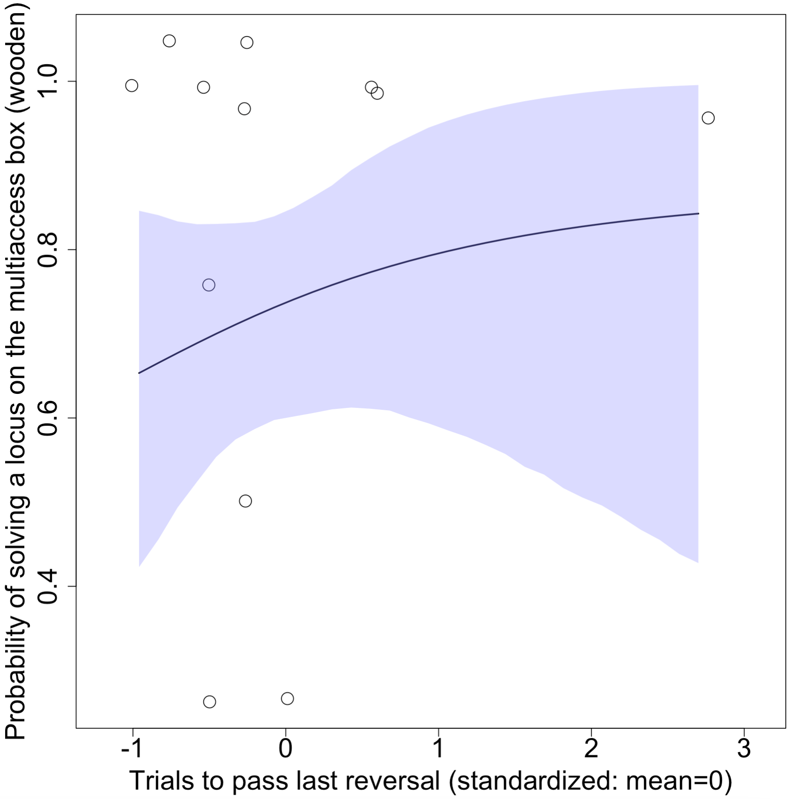

Open... {width=5%} access {width=5%} [code](https://github.com/corinalogan/grackles/blob/master/Files/Preregistrations/g_flexmanip.Rmd) {width=5%} peer review {width=5%} [data]()

\addtolength{\headheight}{0.1cm}
\pagestyle{fancyplain}
\lhead{\includegraphics[height=1.2cm]{logoPCIecology.png}}
\renewcommand{\headrulewidth}{0pt}

&nbsp;

**Affiliations:** 1) Max Planck Institute for Evolutionary Anthropology, Leipzig, Germany 2) University of California Santa Barbara, USA 3) University of California Los Angeles, USA, 4) Arizona State University, Tempe, AZ USA. *Corresponding author: corina_logan@eva.mpg.de

```{r setup, include=FALSE}
library(knitr)
knitr::opts_chunk$set(tidy.opts=list(width.cutoff=70),tidy=TRUE) 
#Make code wrap text so it doesn't go off the page when Knitting to PDF

knitr::opts_chunk$set(echo = TRUE) 
#sets global options to display code along with the results https://exeter-data-analytics.github.io/LitProg/r-markdown.html
```

&nbsp;


**Cite as:** Logan CJ, MacPherson M, Rowney C, Bergeron L, Seitz B, Blaisdell AP, Folsom M, Johnson-Ulrich Z, McCune K. 2019. [Is behavioral flexibility manipulatable and, if so, does it improve flexibility and problem solving in a new context?](http://corinalogan.com/Preregistrations/g_flexmanip.html) (http://corinalogan.com/Preregistrations/g_flexmanip.html) In principle acceptance by *PCI Ecology* of the version on 26 Mar 2019 [https://github.com/corinalogan/grackles/blob/master/Files/Preregistrations/g_flexmanip.Rmd](https://github.com/corinalogan/grackles/blob/master/Files/Preregistrations/g_flexmanip.Rmd).

  

**This preregistration has been pre-study peer reviewed and received an In Principle Recommendation by:**

Aurélie Coulon (2019) Can context changes improve behavioral flexibility? Towards a better understanding of species adaptability to environmental changes. *Peer Community in Ecology*, 100019. [10.24072/pci.ecology.100019](https://doi.org/10.24072/pci.ecology.100019). Reviewers: Maxime Dahirel and Andrea Griffin


## ABSTRACT

Behavioral flexibility, the ability to adapt behavior to new circumstances, is thought to play an important role in a species' ability to successfully adapt to new environments and expand its geographic range. However, behavioral flexibility is rarely directly tested in species in a way that would allow us to determine how it works and how we can make predictions about a species' ability to adapt their behavior to new environments. We use great-tailed grackles (a bird species) as a model to investigate this question because they have rapidly expanded their range into North America over the past 140 years. We attempted to manipulate grackle behavioral flexibility (color tube reversal learning) to determine whether their flexibility is generalizable across contexts (touch screen reversal learning and multi-access box), whether it is repeatable within individuals and across contexts, and what learning strategies they employ. We found that we were able to manipulate flexibility: birds in the experimental group reversed in fewer trials by the end of their serial reversals compared to control birds who had only one reversal. Flexibility WAS WAS NOT repeatable within individuals. We found that flexibility WAS WAS NOT generalizable to a multi-access box context, but not to a touchscreen context. The responses to the touchscreen reversal experiment appeared to answer a different question - one that we were not aware we were asking. Further research on the cues that confound the test on the touchscreen are needed to understand this result. They employed X learning strategies. Our findings allow us to understand more about what flexibility is and how it works.

## [Video summary](https://youtu.be/bALXB2S4OpI)


## INTRODUCTION

Behavioral flexibility, the ability to adapt behavior to new circumstances (see @mikhalevich_is_2017 for the theoretical background on this definition), is thought to play an important role in a species' ability to successfully adapt to new environments and expand its geographic range [e.g., @lefebvre1997feeding; @sol2000behavioural; @sol2002behavioural; @sol2005big; @sol2007big]. This research predicts that behavioral flexibility (hereafter referred to as flexibility) should positively relate with innovativeness. However, these predictions are based on species-level data and proxies for flexibility and for innovation when examining such relationships [see @logan2018beyond]. Flexibility is rarely directly tested in species that are rapidly expanding their geographic ranges in a way that would allow us to determine how flexibility works and how we can make predictions about a species' ability to adapt their behavior to new areas Those investigations that examine the relationship between flexibility and innovation (or problem solving) in species that are expanding their range show mixed results, with these variables correlating positively [e.g., grey squirrels: @chow2016practice], negatively [e.g., Indian mynas: @griffin2013tracking], or not at all [e.g., great-tailed grackles: @logan2016behavioral]. One way to improve our understanding of whether and how flexibility is related to innovativeness is to perform a manipulative experiment on one of the variables to determine whether there is an associated change in the other.

We aimed to determine whether flexibility is manipulatable and, if so, whether there are associated differences in flexibility in a new context and in innovativeness in the manipulated group of great-tailed grackles (*Quiscalus mexicanus*), a bird species that is flexible [@logan2016behavioral] and rapidly expanding its geographic range [@wehtje2003range]. We attempted to manipulate grackle flexibility using serial reversals of color tube preferences to determine whether their flexibility is generalizable across contexts (touch screen reversal learning and multi-access box solution switching), whether it is repeatable within individuals and across contexts, and what learning strategies they employ. 

If grackle flexibility is manipulatable using serial reversals, this would provide conservation managers with a useful tool for managing populations in this, and potentially other, species. If the manipulation works in grackles, it has the potential to also be effective in other species, which would be particularly useful for endangered species because individuals that are more flexible might be able to adapt better to new environments. If the flexibility manipulation is not successful, this could indicate either that we did not manipulate the right aspect of flexibility (e.g., perhaps training them to solve a variety of different types of tasks quickly would be more effective) or that grackle flexibility is not a trait that is trainable.


## HYPOTHESES

#### H1: Behavioral flexibility, as measured by reversal learning using colored tubes, is manipulatable.

**Prediction 1:** Individuals improve their flexibility on a serial reversal learning task using colored tubes by generally requiring fewer trials to reverse a preference as the number of reversals increases (manipulation condition). Their flexibility on this test will have been manipulated relative to control birds who do not undergo serial reversals. Instead, individuals in the control condition will be matched to manipulated birds for experience (they will experience a similar number of trials), but there will be no possibility of a functional tube preference because both tubes will be the same color and both will contain food, therefore either choice will be correct.

**P1 alternative 1:** If the number of trials to reverse a preference does not correlate with or positively correlates with reversal number, which would account for all potential correlation outcomes, this suggests that some individuals may prefer to rely on information acquired previously (i.e., they are slow to reverse) rather than relying on current cues (e.g., the food is in a new location) [e.g., @manrique_repeated_2013; @griffin2014innovation; @liu2016learning; but see @homberg2007serotonin].

#### H2: Manipulating behavioral flexibility (improving reversal learning speed through serial reversals using colored tubers) improves flexibility (rule learning and/or switching) and problem solving in a new context (two distinct multi-access boxes and serial reversals on a touch screen).

**P2:** Individuals that have improved their flexibility on a serial reversal learning task using colored tubes (requiring fewer trials to reverse a preference as the number of reversals increases) are faster to switch between new methods of solving (latency to solve or attempt to solve a new way of accessing the food [locus]), and learn more new loci (higher total number of solved loci) on multi-access box flexibility tasks, and are faster to reverse preferences in a serial reversal task using a touch screen than individuals in the control group where flexibility has not been manipulated. The positive correlation between reversal learning performance using colored tubes and a touch screen (faster birds have fewer trials) and the multi-access boxes (faster birds have lower latencies) indicates that all three tests measure the same ability even though the multi-access boxes require inventing new rules to solve new loci (while potentially learning a rule about switching: "when an option becomes non-functional, try a different option") while reversal learning requires switching between two rules ("choose light gray" or "choose dark gray") or learning the rule to "switch when the previously rewarded option no longer contains a reward". Serial reversals eliminate the confounds of exploration, inhibition, and persistence in explaining reversal learning speed because, after multiple reversals, what is being measured is the ability to learn one or more rules. If the manipulation works, this indicates that flexibility can be influenced by previous experience and might indicate that any individual has the potential to move into new environments (see relevant hypotheses in preregistrations on [genetics](https://github.com/corinalogan/grackles/blob/master/EasyToReadFiles/g_flexgenes.md) (R1) and [expansion](https://github.com/corinalogan/grackles/blob/master/EasyToReadFiles/g_expansion.md) (H1)).

**P2 alternative 1:** If the manipulation does not work in that those individuals in the experimental condition do not decrease their reversal speeds more than control individuals, then this experiment will elucidate whether general individual variation in flexibility relates to flexibility in new contexts (two distinct multi-access boxes and serial reversals on a touch screen) as well as problem solving ability (multi-access boxes). The prediction is the same in P2, but in this case variation in flexibility is constrained by traits inherent to the individual (some of which will be tested in a separate [preregistration](https://github.com/corinalogan/grackles/blob/master/EasyToReadFiles/g_exploration.md)), which suggests that certain individuals will be more likely to move into new environments.

**P2 alternative 2:** If there is no correlation between reversal learning speed (colored tubes) and the latency to solve/attempt a new locus on the multi-access boxes, this could be because the latency to solve not only measures flexibility but also innovativeness. In this case, an additional analysis will be run with the latency to solve as the response variable, to determine whether the fit of the model (as determined by the lower AIC value) with reversal learning as an explanatory variable is improved if motor diversity (the number of different motor actions used when attempting to solve the multi-access box) is included as an explanatory variable. If the inclusion of motor diversity improves the model fit, then this indicates that the latency to solve a new locus on the multi-access box is influenced by flexibility (reversal learning speed) and innovation (motor diversity). 

**P2 alternative 3:** If there is a negative correlation or no correlation between reversal learning speed on colored tubes and reversal learning speed on the touch screen, then this indicates that it may be difficult for individuals to perceive and/or understand images on the touch screen in contrast with physical objects (colored tubes) [e.g., @ohara2015advantage].


#### H3a: Behavioral flexibility within a context is repeatable within individuals.

Repeatibility of behavioral flexibility is defined as the number of trials to reverse a color preference being strongly negatively correlated within individuals with the number of reversals.

**P3a:** Individuals that are faster to reverse a color preference in the first reversal will also be faster to reverse a color preference in the second, etc. reversal due to natural individual variation.

**P3a alternative:** There is no repeatibility in behavioral flexibility within individuals, which could indicate that performance is state dependent (e.g., it depends on their fluctuating motivation, hunger levels, etc.). We will determine whether performance on colored tube reversal learning related to motivation by examining whether the latency to make a choice influenced the results. We will also determine whether performance was related to hunger levels by examining whether the number of minutes since the removal of their maintenance diet from their aviary plus the number of food rewards they received since then influenced the results.

#### H3b: The consistency of behavioral flexibility in individuals across contexts (context 1=reversal learning on colored tubes, context 2=multi-access boxes, context 3=reversal learning on touch screen) indicates their ability to generalize across contexts.

Individual consistency of behavioral flexibility is defined as the number of trials to reverse a color preference being strongly positively correlated within individuals with the latency to solve new loci on each of the multi-access boxes and with the number of trials to reverse a color preference on a touch screen (total number of touch screen reversals = 5 per bird).

*If P3a is supported (repeatability of flexibility within individuals)...*

**P3b:** ...and flexibility is correlated across contexts, then the more flexible individuals are better at generalizing across contexts.

**P3b alternative 1:** ...and flexibility is not correlated across contexts, then there is something that influences an individual's ability to discount cues in a given context. This could be the individual's reinforcement history (tested in P3a alternative), their reliance on particular learning strategies (one alternative is tested in H4), or their motivation (tested in P3a alternative) to engage with a particular task (e.g., difficulty level of the task). 

#### H4: Individuals should converge on an epsilon-first learning strategy (learn the correct choice after one trial) as they progress through serial reversals.

**P4:** Individuals will prefer a mixture of learning strategies in the first serial reversals (an *epsilon-decreasing* strategy where individuals explore both options extensively before learning to prefer the rewarded option, and an *epsilon-first* strategy where the correct choice is consistently made after the first trial), and then move toward the epsilon-first learning strategy. The epsilon-first strategy works better later in the serial reversals where the reward is all or nothing because individuals will have learned the environment is changing in predictable ways [@bergstrom2004shannon]: only one option is consistently rewarded, and if the reward isn't in the previously rewarded option, it must be in the other option.

**P4 alternative 1:** Individuals will continue to prefer a mixture of learning strategies, and/or they do not converge on the more functional epsilon-first learning strategy, regardless of how many reversals they participate in. This pattern could suggest that the grackles do not attend to functional meta-strategies, that is, they do not learn the overarching rule (once food is found in the non-preferred tube, one must switch to preferring that tube color), but rather they learn each preference change as if it was new. 


## ASSOCIATED PREREGISTRATION

Our methods and analysis plans are described in the peer-reviewed preregistration of this article, which is included below as the [Methods](#methods). We moved the hypotheses from the preregistration below to the section above to improve flow for the reader.


### DEVIATIONS FROM THE PREREGISTRATION

**In the middle of data collection**

1) 10 April 2019: We are discontinuing the reversal learning experiment on the touchscreen because it appears to measure something other than what we are trying to test and it requires a huge time investment for each bird (which consequently reduces the number of other tests they are available to participate in). This is not necessarily surprising because this is the first time touchscreen tests have been conducted in this species, and also the first time this particular reversal experiment has been conducted on a touchscreen with birds (to our knowledge). So we had no idea going into it what was going to happen. We are basing this decision on data from four grackles (2 in the flexibility manipulation group and 2 in the flexibility control group; 3 males and 1 female). All four of these individuals show highly inconsistent learning curves and require hundreds of trials to form each preference when compared to the performance of these individuals on the color tube reversal experiment. It appears that there is a confounding variable with the touchscreen such that they are extremely slow to learn a preference as indicated by passing our criterion of 17 correct trials out of the most recent 20. One confound could be that they must discriminate between shapes rather than colors. Shapes are known to require a few more trials for a preference to develop, but nothing on the order of what we found here [e.g., @shaw2015wild: mean=40 trials color, mean=55 trials shape in New Zealand robins; @isden2013performance: mean=6 trials color, mean=10 trials shape in spotted bowerbirds]. Another confound could be that they find it somehow rewarding simply to touch the screen and have something happen, regardless of whether they receive a food reward (e.g., they touch the screen on one of the stimuli and the screen goes blank because the trial ends). It is unclear what this confounding variable could be and we will not investigate it further given that these individuals need to complete a large test battery. The time investment to complete the touchscreen reversal experiment is significant: of the birds in the manipulation group which undergo 5 reversals on the touchscreen, Mole took 4 months and Habanero is on a similar track (he is not done yet). The birds in the control group (Queso and Tapa) only undergo only 1 reversal on the touchscreen, so it overall requires less time for these individuals. We will not include the data from this experiment when conducting the cross-test comparisons in the Analysis Plan section of this preregistration. Instead, in the results section of the resulting article, we will provide summary results for this experiment and qualitatively compare it with performance on the color tube reversal test to explain why we removed this experiment.

2) 16 April 2019: Because we are discontinuing the touchscreen reversal learning experiment, we will add an additional but distinct multi-access box task, which will allow us to continue to measure flexibility across three different experiments. There are two main differences between the current multi-access box, which is made of plastic, and the additional multi-access box added, which is made of wood. First, the wooden multi-access box is a natural log in which we carved out 4 compartments. As a result, the apparatus and solving options are more comparable to what grackles experience in the wild, though each compartment is covered by clear plastic doors that require different behaviors to open. Furthermore, there is only one food item available in the plastic multi-access box and the bird could use any of 4 loci to reach it. In contrast, the wooden multi-access box has a piece of food in each of the 4 separate compartments. With this difference, we can determine whether grackles are better able to inhibit manipulating a non-functional loci when food is no longer present.

**Post data collection, pre-data analysis**

3) We completed our simulation to explore the lower boundary of a minimum sample size and determined that **our sample size for the Arizona study site is above the minimum** (see details and code in [Ability to detect actual effects](http://corinalogan.com/Preregistrations/g_flexmanip.html#ability_to_detect_actual_effects) (17 April 2020).

4) Please see our [Alternative Analyses](#alternative-analyses) section where we describe how we **changed the analysis for P2** and that we are replacing this analysis with the new models in the [Ability to detect actual effects](#ability-to-detect-actual-effects) section (14 May 2020).

5) We originally planned on testing only **adults** to have a better understanding of what the species is capable of, assuming the abilities we are testing are at their optimal levels in adulthood, and so that we could increase our statistical power by eliminating the need to include age as an independent variable in the models. Because the grackles in Arizona were extremely difficult to catch, we ended up testing two juveniles: Taco and Chilaquile. We did not conduct the full test battery with Taco or put him in the flexibility manipulation or control groups (he received 1 reversal and then moved on to the next test) because he was the first juvenile and we wanted to see whether his performance was different from adult performances. His performances were similar to the adults, therefore we decided to put Chilaquile in the full test battery. Chilaquile's performances were also similar to the adults, therefore we decided not to add age as an independent variable in the models to avoid reducing our statistical power. 


## RESULTS

Data are publicly [available]() at the Knowledge Network for Biocomplexity [@logan2021flexmanipdata].

Although 22 grackles completed their color tube initial discrimination, only 20 grackles participated in one or more reversals (Table 1). The rest of the tests began only after a bird's reversal experiment was complete (see the order of tests for each bird in Table 2). Interobserver reliability analyses (unregistered) showed that the reversal learning and multiaccess box (plastic and wooden) experiments were highly repeatable across live coders and video coders (see details in Analysis Plan > Interobserver reliability).

**Table 1.** Summarized results per bird in the reversal learning (tube and touchscreen) and multiaccess box (plastic and wooden) experiments. Reversals to pass indicates how many serial reversals it took a bird to pass criterion if they were in the flexibility manipulation condition.

```{r summary, eval=TRUE, warning=FALSE, results='asis', echo=TRUE, include=TRUE}
d <- read.csv(url("https://raw.githubusercontent.com/corinalogan/grackles/master/Files/Preregistrations/g_flexmanip_datasummary.csv"), header=F, sep=",", stringsAsFactors=F)

d <- data.frame(d)
colnames(d) <- c("Bird","Batch","Sex","Trials to learn (tube)","Trials to first reversal (tube)","Trials to last reversal (tube)","Reversals to pass","Total loci solved MAB plastic","Total loci solved MAB wooden","Average latency to attempt new solution (MAB plastic)","Average latency to attempt new solution (MAB wooden)","Trials to learn (touchscreen)","Trials to first reversal (touchscreen)","Notes")

library(kableExtra)
knitr::kable(d) %>%
kable_styling(full_width = T, position = "left")
```


**Table 2.** An overview of all color marked grackles at the Arizona field site (2018-2021), whether the bird was brought into the aviaries (number 1-8) or not ("-"), the order of the aviary experiments that individual began (though they did not necessarily complete that experiment) is denoted by numbers 1 through 8, whether the experiment was offered to the bird (- = not offered to that bird even though they were in the aviaries because they did not participate enough to pass habituation/training), and whether data for the variables that were collected in the wild are present (Y) or not (blank). Data and results from the various columns belong with different articles: reversal learning and MAB are reported here; detour and go no-go are reported in @logan2021inhibition; causal is reported in @blaisdell2021causal; demonstrator training is reported in @mccune2019soclearn; exploration and boldness in the aviaries and in the wild are reported in @mccune2019exploration; focal follows are reported here and in @mccune2020spaceuse; radio telemetry is reported in @mccune2020spaceuse, @berens2019condition, and @logan2019flexforaging; GPX tracks are reported in @mccune2020spaceuse; and nest and territory checks are reported in @berens2019condition.

```{r order, eval=TRUE, warning=FALSE, results='asis', echo=TRUE, include=TRUE}
d <- read.csv(url("https://raw.githubusercontent.com/corinalogan/grackles/master/Files/Preregistrations/g_flexmanip_data_AllGrackleExpOrder.csv"), header=F, sep=",", stringsAsFactors=F)

d <- data.frame(d)
colnames(d) <- c("Bird","ID","Sex","Age","Reversal learning (tube)","MAB plastic","MAB log","Detour","Reversal learning (touchscreen)","Go no-go (touchscreen)","Causal (touchscreen)","Demonstrator training","Exploration and boldness (aviaries)","Exploration and boldness (wild)","Focal follows","Radio telemetry","GPX tracks","Had nest (females) or had nest on territory (males)")

library(kableExtra)
knitr::kable(d) %>%
kable_styling(full_width = T, position = "left")
```

Because the wooden multiaccess box was added after in principle acceptance, we conducted an unregistered analysis to determine whether the plastic and wooden multiaccess box results correlated with each other, which would indicate that these tests are interchangeable. We found that they did not correlate with each other on either variable measured: the average latency to attempt a new locus (switching; Pearson's r=0.74, 95% CI=-0.19-0.97, t=2.18, df=4, p=0.09) or the total number of loci solved (problem solving; Pearson's r=0.51, 95% CI=-0.09-0.84, t=1.86, df=10, p=0.09). Therefore, these two tests are not interchangeable and we analyzed them separately.

### P1: reversal speed gets faster with serial reversals

There was a significant negative correlation between the number of trials to reverse (average=71 trials, sd=28) and the reversal number for those grackles in the flexibility manipulation condition (n=9, which included Memela who did not pass the manipulation condition; Figure B). When this model was compared with the null model, the null model had a higher Akaike weight, however it was not high enough to indicate the two models were reliably different from each other (Table B). Therefore, we conclude that there was no effect of a linear relationship between the number of trials to reverse and reversal number. 

**Unregistered analysis:** While there may not be an effect when one examines all reversals, there is a difference between manipulated and control reversal speeds when comparing their last reversals (for the control birds, their last reversal is their first reversal): the Akaike weight of the full model was 0.94, which means that including condition in the model explains the bulk of the variation in the number of trials to reverse in the last reversal (Table C). This analysis includes 19 grackles (8 manipulated condition - only those who actually passed the manipulation, 11 control condition) who had an overall average of 62 trials in their last reversal (sd=32).

**Table B.** Does the number of trials to reverse decrease with increasing reversal number? Not more than would be expected by chance: the Akaike weight of null model was higher than that of the the full model, though not >0.89, which indicates that neither model is more reliable than the other.

```{r p1table, eval=F, warning=F, results='asis', echo=T, include=T}
d <- read.csv(url("https://raw.githubusercontent.com/corinalogan/grackles/master/Files/Preregistrations/g_flexmanip_data_reverse.csv"), header=T, sep=",", stringsAsFactors=F)
d <- d[!d$ID=="Fajita" & !d$ID=="Empanada",] #remove Fajita because she was a pilot bird

#remove NAs from the variables that will be in the model
d <- subset(d,!(is.na(d["TrialsToReverse"])))
d <- subset(d,!(is.na(d["ReverseNumber"])))

#include only those birds in the reversal tubes experiment and only those in the manipulation condition bc only these will have more than one reversal (and thus something to correlate)
d <- d[d$TubesOrTouchscreen=="TUBES" & d$ExperimentalGroup=="Manipulation",]

#factor variables
d$Batch <- as.factor(d$Batch)
d$ID <- as.factor(d$ID)

# GLMM
library(MCMCglmm)
prior = list(R = list(R1 = list(V = 1, nu = 0)), G = list(G1 = list(V = 1, 
	    nu = 0), G2 = list(V = 1, nu = 0)))
serial <- MCMCglmm(TrialsToReverse ~ ReverseNumber, random = ~ID+Batch, 
	    family = "poisson", data = d, verbose = F, prior = prior, 
	    nitt = 300000, thin = 500, burnin = 90000)
#reverse number significantly negatively correlates with trials to reverse, as expected due to the manipulation
#summary(serial)
#Did fixed effects converge (<0.1)? Yes
#autocorr(serial$Sol) 
#Did random effects converge (<0.1)? Yes except for 2 values: 0.11 and 0.12
#autocorr(serial$VCV)

#AIC calculation
library(MuMIn)
options(na.action = "na.fail")
base <- dredge(MCMCglmm(TrialsToReverse ~ ReverseNumber, random = ~ID+Batch, 
	    family = "poisson", data = d, verbose = F, prior = prior, 
	    nitt = 300000, thin = 500, burnin = 90000))

library(kableExtra)
knitr::kable(base)

#UNREGISTERED ANALYSIS: compare control vs manipulated group reversal speeds using only last reversals
#prior = list(R = list(R1 = list(V = 1, nu = 0)), G = list(G1 = list(V = 1, 
#	    nu = 0), G2 = list(V = 1, nu = 0)))
#serial <- MCMCglmm(TrialsToReverse ~ ReverseNumber, random = ~ID+Batch, 
#	    family = "poisson", data = d, verbose = F, prior = prior, 
#	    nitt = 300000, thin = 500, burnin = 90000)
#reverse number significantly negatively correlates with trials to reverse, as expected due to the manipulation
#summary(serial)
#Did fixed effects converge (<0.1)? Yes
#autocorr(serial$Sol) 
#Did random effects converge (<0.1)? Yes except for 2 values: 0.11 and 0.12
#autocorr(serial$VCV)
```


```{r p1fig, eval=T, warning=F, results='asis', echo=T, include=T}
d <- read.csv(url("https://raw.githubusercontent.com/corinalogan/grackles/master/Files/Preregistrations/g_flexmanip_data_reverse.csv"), header=T, sep=",", stringsAsFactors=F)
d <- d[!d$ID=="Fajita" & !d$ID=="Empanada",] #remove Fajita because she was a pilot bird

#remove NAs from the variables that will be in the model
d <- subset(d,!(is.na(d["TrialsToReverse"])))
d <- subset(d,!(is.na(d["ReverseNumber"])))

#include only those birds in the reversal tubes experiment and only those in the manipulation condition bc only these will have more than one reversal (and thus something to correlate)
d <- d[d$TubesOrTouchscreen=="TUBES" & d$ExperimentalGroup=="Manipulation",]

#n, mean, sd
#length(levels(d$ID)) #9
#mean(d$TrialsToReverse) #71
#sd(d$TrialsToReverse) #28

#figure
plot(d$TrialsToReverse ~ d$ReverseNumber)
```

**Figure C.** Individuals in the manipulated condition (who received serial reversals) did not decrease their reversal passing speeds with increasing reversal number (n=9 grackles in the manipulated condition).


**Table C.** Do individuals in the manipulated condition pass their last reversal in fewer trials than control individuals? Yes: the Akaike weight of full model was >0.89, indicating that it is more reliable than the null model.

```{r p1last, eval=T, warning=F, results='asis', echo=T, include=T}
d <- read.csv(url("https://raw.githubusercontent.com/corinalogan/grackles/master/Files/Preregistrations/g_flexmanip_datasummary.csv"), header=F, sep=",", stringsAsFactors=F)

d <- data.frame(d)
colnames(d) <- c("Bird","Batch","Sex","Trials to learn","TrialsFirstReversal","TrialsLastReversal","ReversalsToPass","TotalLociSolvedMABplastic","TotalLociSolvedMABwooden","AverageLatencyAttemptNewLocusMABplastic","AverageLatencyAttemptNewLocusMABwooden)","Trials to learn (touchscreen)","Trials to first reversal (touchscreen)","Notes")

# Remove NAs
d <- subset(d,!(is.na(d["TrialsLastReversal"])))

# exclude the bird who didn't pass serial
d <- d[!d$Bird=="Memela",]

# make ReversalsToPass a factor that has only 2 levels: level 1 = control, level 2 = manipulated
d$ReversalsToPass <- as.factor(d$ReversalsToPass)
levels(d$ReversalsToPass)[c(1,2,3,4)] <- c("Control","Manipulated","Manipulated","Manipulated")

#UNREGISTERED ANALYSIS: compare control vs manipulated group reversal speeds using only last reversals
last <- glm(d$TrialsLastReversal~d$ReversalsToPass)
#manipulated group has significantly fewer trials to reverse in last reversal, as expected due to the manipulation
#summary(last)

#AIC calculation
library(MuMIn)
options(na.action = "na.fail")
aw <- dredge(glm(d$TrialsLastReversal~d$ReversalsToPass))

library(kableExtra)
knitr::kable(aw)
#the full model has an Akaike weight >0.9 so it is reliable. This means that condition explains differences in the number of trials to pass the last reversal, with the manipulated group being faster than the control group
```

```{r p1figlast, eval=T, warning=F, results='asis', echo=T, include=T}
d <- read.csv(url("https://raw.githubusercontent.com/corinalogan/grackles/master/Files/Preregistrations/g_flexmanip_datasummary.csv"), header=F, sep=",", stringsAsFactors=F)

d <- data.frame(d)
colnames(d) <- c("Bird","Batch","Sex","Trials to learn","TrialsFirstReversal","TrialsLastReversal","ReversalsToPass","TotalLociSolvedMABplastic","TotalLociSolvedMABwooden","AverageLatencyAttemptNewLocusMABplastic","AverageLatencyAttemptNewLocusMABwooden)","Trials to learn (touchscreen)","Trials to first reversal (touchscreen)","Notes")

# Remove NAs
d <- subset(d,!(is.na(d["TrialsLastReversal"])))

# exclude the bird who didn't pass serial
d <- d[!d$Bird=="Memela",]

#n, mean, and sd
#length(d$TrialsLastReversal) #19
#mean(d$TrialsLastReversal) #62
#sd(d$TrialsLastReversal) #32

# make ReversalsToPass a factor that has only 2 levels: level 1 = control, level 2 = manipulated
d$ReversalsToPass <- as.factor(d$ReversalsToPass)
levels(d$ReversalsToPass)[c(1,2,3,4)] <- c("Control","Manipulated","Manipulated","Manipulated")

#figure
plot(d$TrialsLastReversal ~ d$ReversalsToPass)
```

**Figure D.** Individuals in the manipulated condition (who received serial reversals) passed their last reversal in fewer trials than individuals in the control condition (who only received 1 reversal). n=19 grackles: 8 in the manipulated condition, 11 in the control condition.

### P2: serial reversals improve rule switching & problem solving on the MAB

#### Problem solving: number of loci solved on the multiaccess box (plastic) ~ trials to reverse

Grackles that were faster to reverse a preference (in their last reversal: average 62 trials, sd=34) solved more loci on the plastic multiaccess box (average=2 loci, sd=1.6; Figure E; Table C: Model 2; n=15 grackles: 6 in manipulated condition, 9 in control condition; this number excludes Mole and Habanero who were, due to experimenter error, given the fully put together box during habituation and could have learned how to solve the loci at that time). The original model (Table C: Model 1) included aviary batch, however this ended up confounding the analysis because control and manipulated individuals, while randomly assigned to these conditions, ended up in particular batches as a result of their willingness to participate (Table C: Model 3). As such, grackles who did not participate in their condition in a given batch were replaced in the aviary batch. Therefore, we removed batch from the model. We additionally examined whether first reversal (rather than last reversal) or condition (control or manipulated) better explained the relationship between reversal performance and number of loci solved: they did not. There was no correlation between the number of loci solved and which reversal condition a grackle was randomly assigned to, which indicates that the conditions did not differ from each other (Table C: Model 4). There was also no correlation between the number of trials to reverse in the first reversal (average=75 trials, sd=31) and the number of loci solved on the multiaccess box (Table C: Model 5; unregistered analysis). A correlation was determined to be present if the prediction interval for the slope (b) in the model output did not cross zero (Table C).

```{r p2mabplastic, eval=F, warning=FALSE, results='asis', echo=TRUE, include=TRUE}
library(rethinking)
library(rstan)
library(formatR)

# LOAD the data and column names
d <- read.csv(url("https://raw.githubusercontent.com/corinalogan/grackles/master/Files/Preregistrations/g_flexmanip_datasummary.csv"), header=F, sep=",", stringsAsFactors=F)

d <- data.frame(d)
colnames(d) <- c("Bird","Batch","Sex","Trials to learn","TrialsFirstReversal","TrialsLastReversal","ReversalsToPass","TotalLociSolvedMABplastic","TotalLociSolvedMABwooden","AverageLatencyAttemptNewLocusMABplastic","AverageLatencyAttemptNewLocusMABwooden)","Trials to learn (touchscreen)","Trials to first reversal (touchscreen)","Notes")

# Exclude Mole and Habanero from this analysis because they were given the put together plastic box during habituation (due to experimenter error)
d <- d[!d$Bird=="Mole" & !d$Bird=="Habanero",]

# Remove NAs
d <- subset(d,!(is.na(d["TotalLociSolvedMABplastic"])) & !(is.na(d["TrialsLastReversal"])))

# n=15: 6 in manipulated group, 9 in control group
#length(d$TotalLociSolvedMABplastic)

# make Batch a factor (assigned Taco to batch 3 because 3a doesn't work with the model)
d$Batch <- as.factor(d$Batch)
levels(d$Batch)[c(3)] <- c("3")

# look at the data
#hist(d$TotalLociSolvedMABplastic)
#mean(d$TotalLociSolvedMABplastic) #2
#sd(d$TotalLociSolvedMABplastic) #1.6
#hist(d$TrialsLastReversal)
#mean(d$TrialsLastReversal) #61.5
#sd(d$TrialsLastReversal) #34.2

#translating the actual data (rather than the simulated data) into effect sizes (see equation below in "translated the simulation output into effect sizes"): SDx / SDy = 1.6/34.2 actual data (note: simulated data were 1.5/21=0.7)
#sd(d$TotalLociSolvedMABplastic)/sd(d$TrialsLastReversal) #=0.5
#cor.test(d$TotalLociSolvedMABplastic,d$TrialsLastReversal,alternative=c("two.sided"),method = c("pearson"),conf.level = 0.95)
#corr = r =-0.24
#solve equation for beta:
#-0.24/(sd(d$TotalLociSolvedMABplastic)/sd(d$TrialsLastReversal)) #-4.98 = beta

# RUN MODELs on the actual data
dat <- list(locisolved = d$TotalLociSolvedMABplastic,
            trials = standardize(d$TrialsLastReversal),
            batch = d$Batch
              )

# MODEL 1: includes batch
m1 <- ulam( alist(
  locisolved ~ dbinom(4,p) , #4 loci, p=probability of solving a locus
  logit(p) <- a[batch] + b*trials , #batch=random effect, standardize trials so 0=mean
  a[batch] ~ dnorm(0,1) , #each batch gets its own intercept
  b ~ dnorm(0,0.4) #our prior expectation for b is that it is around 0, can be negative or positive, and should not be larger than 1. normal distribution works for binomial (Rethinking p.341)
) , data=dat , chains=4 , log_lik=TRUE )

#precis(m1,depth=2)
#      mean   sd  5.5% 94.5% n_eff Rhat4
#a[1]  0.04 0.46 -0.70  0.78  2304     1
#a[2]  0.29 0.36 -0.30  0.87  2456     1
#a[3] -0.78 0.55 -1.65  0.08  2510     1
#b    -0.22 0.25 -0.63  0.18  2364     1
#mean loci solved varies by batch, b=slope for correlation between number of loci solved and number of trials to pass last reversal - there is a negative relationship, but (in all cases) the confidence interval crosses 0 so this indicates no correlation because we can't say with certainty that it is different from zero. n_eff  (number of independent samples obtained) is high, Rhat (indicator of model convergence) is good (p.281 Rethinking) 
#Result: total number of loci solved is not associated with the number of trials to pass criterion on the last reversal

#model details: 2000 samples from 4 chains
#show(m1)
#no correlations between variables across batches
#pairs(m1)
#check the chain - fuzzy caterpillars = looks good
#traceplot(m1)
#check the chain a different way - "histograms overlap and stay within the same range" ≠ looks good (p.285 Rethinking)
#trankplot(m1) 

# plot the results on the outcome scale (p.330 Rethinking). V1-3 = batch 1-3, value = probability of solving a locus
#postm1 <- extract.samples(m1)
#p_batch <- inv_logit( postm1$a )
#plot( precis( as.data.frame(p_batch) ) , xlim=c(0,1) )

# contrasts between batches: the log odds differences in solving a locus between batches. Value = log odds of solving a locus (p.331 & 341 Rethinking)
#diffsm1 <- list(
#    b13 = postm1$a[,1] - postm1$a[,2],
#    b14 = postm1$a[,1] - postm1$a[,3],
#    b34 = postm1$a[,2] - postm1$a[,3] )
#labsdif <- c("Batch 1-3","Batch 1-4","Batch 3-4")
#plot( precis(diffsm1), xlim=c(-3,3), labels=labsdif)

# contrasts between batches on the outcome scale (p.341 Rethinking). Value = difference in number of loci solved. This shows that the batches are actually not different from each other in how many loci they solved because all values cross zero.
diffsm1c <- list(
  diff_b13 <- inv_logit( postm1$a[,1]) - inv_logit( postm1$a[,2]),
  diff_b14 <- inv_logit( postm1$a[,1]) - inv_logit( postm1$a[,3]),
  diff_b34 <- inv_logit( postm1$a[,2]) - inv_logit( postm1$a[32]) )
#precis( list( diff_b13 , diff_b14 , diff_b34 ) )

#check posterior for p to look at the distribution of probabilities that are probable
#p <- inv_logit(postm1$a) #convert from logit to actual probability
#dens(p,adj=0.1)
#HPDI(p) #most mass is below 0.5
#median(p) #0.49
#result: the prior was a normal curve that peaked at 0.5. The posterior: the mean y axis point where the intercept is is 0.49 (meaning they solve on average 50% of the loci = 2), which means this is when trials to reverse is at the average


# MODEL 2: check to see if including batch has an influence on the estimate of b by removing batch
mwobatch <- ulam( alist(
  locisolved ~ dbinom(4,p) , 
  logit(p) <- a + b*trials, #standardize trials so 0=mean
  a ~ dnorm(0,0.5) , 
  b ~ dnorm(0,2)
) , data=dat , chains=4 , log_lik=TRUE )

precis(mwobatch,depth=2)
#   mean   sd  5.5% 94.5% n_eff Rhat4
#a -0.02 0.24 -0.40  0.35  1466     1
#b -0.46 0.31 -0.97 -0.01  1383     1
#the confidence interval does NOT cross 0, which indicates batch differ in their composition of control and manipulated indviduals. n_eff is high, but lower than for m1, Rhat is good. Report both: there is a potential confound of batch, which is differently composed (m1). 

#check posterior for p to look at the distribution of probabilities that are probable
postmwobatch <- extract.samples(mwobatch)
#p2 <- inv_logit(postmwobatch$a) #convert from logit to actual probability
#dens(p2,adj=0.1)
#HPDI(p2) 
#median(p2) #0.50, narrower than prior & m1
#result: The posterior: the mean y axis point where the intercept is is 0.50 (meaning they solve on average 50% of the loci = 2), which means this is when trials to reverse is at the average


# MODEL 3: see whether the confound of batch in m1 is an issue of the composition of control and manipulated individuals in a particular batch that is causing the batch differences in the MAB models
#trialsbatch <- ulam( alist(
#  trials ~ normal(mu,sigma),
#  mu <- a[batch],
#  a[batch] ~ dnorm(0,0.5) , 
#  sigma ~ dexp(1)
#) , data=dat , chains=4 , log_lik=TRUE )
#precis(trialsbatch,depth=2)
#batches differ, which suggests that this is a confound in m1: can't accurately estimate the relationship between loci solved and trials to reverse because the batches already contain the difference. So need to EXCLUDE batch from the MAB model and use mwobatch


# MODEL 4: see whether the flexibility manipulation actually had an effect on MAB performance by replacing batch with condition (control, manipulated) and REMOVING trials
#mean(d$TrialsFirstReversal) #74.7
#sd(d$TrialsFirstReversal) #30.7

# make ReversalsToPass a factor that has only 2 levels: level 1 = control, level 2 = manipulated
#d$ReversalsToPass <- as.factor(d$ReversalsToPass)
#levels(d$ReversalsToPass)[c(1,2,3)] <- c("Control","Manipulated","Manipulated")

#dat2 <- list(locisolved = d$TotalLociSolvedMABplastic,
#            trials = standardize(d$TrialsFirstReversal),
#            condition = d$ReversalsToPass
#              )

mcondition <- ulam( alist(
  locisolved ~ dbinom(4,p) , #4 loci, p=probability of solving a locus
  logit(p) <- a[condition] , #condition=random effect, standardize trials so 0=mean
  a[condition] ~ dnorm(0,1)  #each condition gets its own intercept
) , data=dat2 , chains=4 , log_lik=TRUE )
#precis(mcondition,depth=2)
#     mean   sd  5.5% 94.5% n_eff Rhat4
#a[1] -0.11 0.32 -0.62   0.4  1311     1
#a[2]  0.15 0.39 -0.46   0.8  1222     1

# contrasts between conditions: the log odds differences in solving a locus between batches. Value = log odds of solving a locus (p.331 & 341 Rethinking)
postmcondition <- extract.samples(mcondition)
diffsmcondition <- postmcondition$a[,1] - postmcondition$a[,2]
#labsdifc <- c("Control-Manipulated")
#plot( precis(diffsmcondition), xlim=c(-1.5,1), labels=labsdifc)
# contrasts between conditions on the outcome scale (p.341 Rethinking)
#precis( diffsmcondition )
#Both of thse results show that the condiitons are actually not different from each other in how many loci they solved because all values cross zero. This means that mwobatch shows that it is some combination of the flexibility manipulation (training those individuals who were not already fast) and other previous experience (not making much of a difference in reversal speeds for those who were already fast) that led to differences on the MAB. This suggests the important variable is the ability to be flexible, which birds could have from the beginning or could be manipulated in the experiment. It is the effect of the experiment on this ability, not the something else about the experiment (e.g., differences in motivation, exploration, etc.)


# MODEL 5: see whether the flexibility manipulation actually had an effect on MAB performance by replacing trials to LAST reversal with trials to FIRST reversal
# make ReversalsToPass a factor that has only 2 levels: level 1 = control, level 2 = manipulated
#dat3 <- list(locisolved = d$TotalLociSolvedMABplastic,
#            trials = standardize(d$TrialsFirstReversal),
#            batch = d$Batch
#              )

#mwobatch2 <- ulam( alist(
#  locisolved ~ dbinom(4,p) , 
#  logit(p) <- a + b*trials , #standardize trials so 0=mean
#  a ~ dnorm(0,0.5) , 
#  b ~ dnorm(0,2)
#) , data=dat , chains=4 , log_lik=TRUE )

#precis(mwobatch2,depth=2)
#     mean   sd  5.5% 94.5% n_eff Rhat4
#a  0.00 0.24 -0.37  0.39  1208     1
#b -0.44 0.30 -0.94  0.02  1273     1
#b crosses zero so there is no correlation between number of loci solved and number of trials to reverse on the first reversal. This means that reversal in general doesn't correlate with MAB loci. You actually have to DO something to flexibility to make it matter for MAB loci


# VISUALIZE: plot trials to pass last reversal against number of loci solved on the mwobatch model (p249 Rethinking panel on the left)

# figure out xlim: -0.96 - 2.65
#range(dat$trials)

# dat$locisolved is on the outcome scale, but the model output is on the logit scale so transform dat$locisolved to a probability by dividing by 4 total loci
dat$locisolvedp <- (dat$locisolved/4)

# draw 50 lines from the prior
trials_seq <- seq( from=-1.13 , to=2.9 , length.out=30 )

op <- par(mfrow=c(1,1), mar=c(5.9,4.9,2,0.9))
plot(dat$locisolvedp ~ dat$trials , pch=16 , col="black" ,
    xlab="Trials to pass last reversal (standardized: mean=0)" , ylab="Probability of solving a locus on the multiaccess box (plastic)" , xlim=c(-1.2,3.1), cex.lab=2, cex.axis=2, cex=2 )
mu <- link( mwobatch , data=data.frame( trials=trials_seq ) )
mu_mean <- apply( mu , 2 , mean )
mu_ci <- apply( mu , 2 , PI , prob=0.97 )
lines( trials_seq , mu_mean , lwd=2 )
shade( mu_ci , trials_seq , col=col.alpha(rangi2,0.3) )
par(op)

# contrasts between batches on the outcome scale (p.341 Rethinking). Value = difference in number of loci solved. This shows that the batches are actually not different from each other in how many loci they solved because all values cross zero
labsdif1 <- c("m1: Batch 1-3","m1: Batch 1-4","m1: Batch 3-4")
labsdif2 <- c("m4: Control-Manipulated")
op <- par(mfrow=c(2,1), mar=c(4,4,2,0.2))
plot( precis(diffsm1c, diffsmcondition), xlim=c(-0.5,0.5), xlab="Difference in number of loci solved", labels=labsdif1)
plot( precis(diffsmcondition), xlim=c(-1.5,0.5), xlab="Difference in number of loci solved", labels=labsdif2)
par(op)
```

{width=100%}
**Figure E.** The probability of solving a locus on the plastic multiaccess box is negatively correlated with the number of trials to pass their last reversal (n = 15 grackles, shading = 97% prediction interval). 

**Table C.** Model outputs for the number of loci solved on the plastic (models 1-5) and wooden (models 6-8) multiaccess boxes. SD=standard deviation, the 89% prediction intervals are shown, n_eff=effective sample size, Rhat4=an indicator of model convergence (1 is ideal), b=the slope of the relationship between loci solved and number of trials to pass reversal.

```{r p2outputs, eval=TRUE, warning=FALSE, results='asis', echo=TRUE, include=TRUE}
table <- read.csv(url("https://raw.githubusercontent.com/corinalogan/grackles/master/Files/Preregistrations/g_flexmanip_table_modeloutputs.csv"), header=T, sep=",", stringsAsFactors=F)

table <- data.frame(table)
colnames(table) <- c("","Mean","SD","5.5%","94.5%","n_eff","Rhat4")

library(kableExtra)
knitr::kable(table) %>%
kable_styling(full_width = T, position = "left")
```


#### Problem solving: number of loci solved on the multiaccess box (wooden) ~ trials to reverse

The estimate for the association between the number of loci solved on the wooden multiaccess box (average=3.2, sd=1.3) and the number of trials to reverse a preference (in their last reversal: average=59 trials, sd=38) crossed zero (Figure F; Model 6, Table C; n=11 grackles: 5 in manipulated condition, 6 in control condition; this number excludes Mole and Habanero who were, due to experimenter error, given the fully put together box during habituation and could have learned how to solve the loci at that time). This could mean that there is no association, however our simulations showed that if the effect is small, we would expect that with our sample size, we are not able to reliably estimate that such a small effect is different from zero (correlation test suggests effect size of 0.2; Table 2p). Aviary batch was excluded because of what we learned in the previous section. There was no correlation between the number of loci solved and which reversal condition a grackle was randomly assigned to, indicating the conditions did not differ from each other (Table C: Model 7, wooden), or between the number of trials to reverse in the first reversal (average=74 trials, sd=34) and the number of loci solved on the multiaccess box (Table C: Model 8, wooden; unregistered analysis). A correlation was determined to be present if the prediction interval for the slope (b) in the model output did not cross zero (Table C).

```{r p2mablog, eval=F, warning=FALSE, results='asis', echo=TRUE, include=TRUE}
library(rethinking)
library(rstan)
library(formatR)

# LOAD the data and column names
d2 <- read.csv(url("https://raw.githubusercontent.com/corinalogan/grackles/master/Files/Preregistrations/g_flexmanip_datasummary.csv"), header=F, sep=",", stringsAsFactors=F)

d2 <- data.frame(d2)
colnames(d2) <- c("Bird","Batch","Sex","Trials to learn","TrialsFirstReversal","TrialsLastReversal","ReversalsToPass","TotalLociSolvedMABplastic","TotalLociSolvedMABwooden","AverageLatencyAttemptNewLocusMABplastic","AverageLatencyAttemptNewLocusMABwooden)","Trials to learn (touchscreen)","Trials to first reversal (touchscreen)","Notes")

# Exclude Mole and Habanero from this analysis because they were given the put together plastic box during habituation (due to experimenter error)
d2 <- d2[!d2$Bird=="Mole" & !d2$Bird=="Habanero",]

# Remove NAs
d2 <- subset(d2,!(is.na(d2["TotalLociSolvedMABwooden"])) & !(is.na(d2["TrialsLastReversal"])))

# n=11: 5 in manipulated group, 6 in control group
#length(d2$TotalLociSolvedMABwooden)

# make Batch numeric (assigned Taco to batch 3 because 3a doesn't work with the model)
d2$Batch <- as.factor(d2$Batch)
levels(d2$Batch)[c(2)] <- c("3")

# look at the data
#hist(d2$TotalLociSolvedMABwooden)
#mean(d2$TotalLociSolvedMABwooden) #3.2
#sd(d2$TotalLociSolvedMABwooden) #1.3
#mean(d2$TrialsLastReversal) #59.4
#sd(d2$TrialsLastReversal) #38.0

#translating the actual data (rather than the simulated data) into effect sizes (see equation below in "translated the simulation output into effect sizes"): SDx / SDy = 1.3/38 actual data (note: simulated data were 1.5/21=0.7)
#sd(d2$TotalLociSolvedMABwooden)/sd(d2$TrialsLastReversal) #=0.03
#cor.test(d2$TotalLociSolvedMABwooden,d2$TrialsLastReversal,alternative=c("two.sided"),method = c("pearson"),conf.level = 0.95)
#corr = r = 0.20 = this is the effect size!!!
#solve equation for beta:
#0.20/(sd(d2$TotalLociSolvedMABwooden)/sd(d2$TrialsLastReversal)) #6.08 = beta, which is larger than the estimated -5

# RUN MODELs on the actual data
datw <- list(locisolved = d2$TotalLociSolvedMABwooden,
            trials = standardize(d2$TrialsLastReversal),
            batch = d2$Batch
              )

# MODEL 6: same as model 2 in previous section
m6 <- ulam( alist(
  locisolved ~ dbinom(4,p) , 
  logit(p) <- a + b*trials, #standardize trials so 0=mean
  a ~ dnorm(0,0.5) , 
  b ~ dnorm(0,2)
) , data=datw , chains=4 , log_lik=TRUE )

precis(m6,depth=2)
#   mean   sd  5.5% 94.5% n_eff Rhat4
#a 0.97 0.29  0.53  1.43  1180     1
#b 0.44 0.43 -0.18  1.19  1254     1
#the confidence interval for b (the slope) crosses 0, which indicates that there is no correlation between number of loci solved and trials to reverse

#check posterior for p to look at the distribution of probabilities that are probable
postm6 <- extract.samples(m6)
#p2 <- inv_logit(postm6$a) #convert from logit to actual probability
#dens(p2,adj=0.1)
#HPDI(p2) 
#median(p2) #0.72, narrower than prior & m1, shifted to the right
#result: The posterior: the mean y axis point where the intercept is is 0.72 (meaning they solve on average 72% of the loci = 3), which means this is when trials to reverse is at the average

#model details: 2000 samples from 4 chains
#show(m1)
#no correlations between variables across batches
#pairs(m6)
#check the chain - fuzzy caterpillars = looks good
#traceplot(m6)
#check the chain a different way - "histograms overlap and stay within the same range" ≠ looks good (p.285 Rethinking)
#trankplot(m6) 


# MODEL 7: see whether the flexibility manipulation actually had an effect on MAB performance by replacing batch with condition (control, manipulated) and REMOVING trials
#mean(d2$TrialsFirstReversal) #73.6
#sd(d2$TrialsFirstReversal) #34.1

# make ReversalsToPass a factor that has only 2 levels: level 1 = control, level 2 = manipulated
d2$ReversalsToPass <- as.factor(d2$ReversalsToPass)
levels(d2$ReversalsToPass)[c(1,2,3)] <- c("Control","Manipulated","Manipulated")

dat2 <- list(locisolved = d2$TotalLociSolvedMABplastic,
            trials = standardize(d2$TrialsFirstReversal),
            condition = d2$ReversalsToPass
              )

m7 <- ulam( alist(
  locisolved ~ dbinom(4,p) , #4 loci, p=probability of solving a locus
  logit(p) <- a[condition] , #condition=random effect, standardize trials so 0=mean
  a[condition] ~ dnorm(0,1)  #each condition gets its own intercept
) , data=dat2 , chains=4 , log_lik=TRUE )
#precis(m7,depth=2)
#     mean   sd  5.5% 94.5% n_eff Rhat4
#a[1] -0.44 0.39 -1.06  0.18  1501     1
#a[2]  0.53 0.43 -0.18  1.21  1314     1
#Condition does not correlate with performance on the MAB bc both CIs cross zero

# contrasts between conditions: the log odds differences in solving a locus between batches. Value = log odds of solving a locus (p.331 & 341 Rethinking)
postm7 <- extract.samples(m7)
diffsm7 <- postm7$a[,1] - postm7$a[,2]
labsdifc <- c("Control-Manipulated")
plot( precis(diffsmcondition), xlim=c(-1.5,1), labels=labsdifc)
# contrasts between conditions on the outcome scale (p.341 Rethinking)
precis( diffsm7 )
#conditons are actually not different from each other in how many loci they solved because CIs cross zero. This means that m7 shows that it is some combination of the flexibility manipulation (training those individuals who were not already fast) and other previous experience (not making much of a difference in reversal speeds for those who were already fast) that led to differences on the MAB. This suggests the important variable is the ability to be flexible, which birds could have from the beginning or could be manipulated in the experiment. It is the effect of the experiment on this ability, not the something else about the experiment (e.g., differences in motivation, exploration, etc.)


# MODEL 8: see whether the flexibility manipulation actually had an effect on MAB performance by replacing trials to LAST reversal with trials to FIRST reversal
dat3 <- list(locisolved = d2$TotalLociSolvedMABplastic,
            trials = standardize(d2$TrialsFirstReversal),
            batch = d2$Batch
              )

m8 <- ulam( alist(
  locisolved ~ dbinom(4,p) , 
  logit(p) <- a + b*trials , #standardize trials so 0=mean
  a ~ dnorm(0,0.5) , 
  b ~ dnorm(0,2)
) , data=dat3 , chains=4 , log_lik=TRUE )

precis(m8,depth=2)
#     mean   sd  5.5% 94.5% n_eff Rhat4
#a -0.01 0.26 -0.42  0.40  1258     1
#b -0.50 0.37 -1.11  0.06  1379     1
#b crosses zero so there is no correlation between number of loci solved and number of trials to reverse on the first reversal. This means that reversal in general doesn't correlate with MAB loci. You actually have to DO something to flexibility to make it matter for MAB loci


# VISUALIZE: plot trials to pass last reversal against number of loci solved on the mwobatch model (p249 Rethinking panel on the left)
# figure out xlim: -0.96 - 2.65
#range(datw$trials)

# datw$locisolved is on the outcome scale, but the model output is on the logit scale so transform datw$locisolved to a probability by dividing by 4 total loci
datw$locisolvedp <- (datw$locisolved/4)

# draw 50 lines from the prior
trialsw_seq <- seq( from=-0.96 , to=2.7 , length.out=30 )

op <- par(mfrow=c(1,1), mar=c(5.9,4.9,2,0.9))
plot(datw$locisolvedp ~ datw$trials , pch=16 , col="black" ,
    xlab="Trials to pass last reversal (standardized: mean=0)" , ylab="Probability of solving a locus on the multiaccess box (wooden)" , xlim=c(-1.2,3.1), cex.lab=2, cex.axis=2, cex=2 )
mu <- link( m6 , data=data.frame( trials=trialsw_seq ) )
mu_mean <- apply( mu , 2 , mean )
mu_ci <- apply( mu , 2 , PI , prob=0.97 )
lines( trialsw_seq , mu_mean , lwd=2 )
shade( mu_ci , trialsw_seq , col=col.alpha(rangi2,0.3) )
par(op)
```

{width=100%}

**Figure F.** The probability of solving a locus on the wooden multiaccess box is negatively correlated with the number of trials to pass their last reversal (n = 15 grackles, shading = 97% prediction interval). 


#### Rule switching: latency to attempt a new locus on the multiaccess box (plastic) ~ trials to reverse

Grackles that were faster to reverse a preference (in their last reversal: average 52 trials, sd=23) were also faster to attempt to solve a new locus on the plastic multiaccess box (after just having passed criterion on a different locus; average=208 seconds, sd=226; Figure G; Table C: Model 9; n=11 grackles: 6 in manipulated condition, 5 in control condition; Pizza, Taquito, Chalupa, and Pollito completed this experiment, but they only solved 0 locus, therefore they did not have any locus switching times to analyze; Marisco and Taco also completed this experiment and solved 1 locus, but did not attempt another locus after that, thus they also do not have any switching times to analyze). We excluded aviary batch from all analyses because of our findings in the first section of Results P2. We also found that individuals in the flexibilty manipulation had faster switch latencies than those in the control condition (Table C: Model 10). There was a positive correlation between the number of trials to reverse in the first reversal (average=70 trials, sd=21) and the average switch latency on the multiaccess box (Table C: Model 11; unregistered analysis). A correlation was determined to be present if the prediction interval for the slope (b) in the model output did not cross zero (Table C).

```{r p2mabplasticlat, eval=F, warning=FALSE, results='asis', echo=TRUE, include=TRUE}
library(rethinking)
library(rstan)
library(formatR)

# LOAD the data and column names
d3 <- read.csv(url("https://raw.githubusercontent.com/corinalogan/grackles/master/Files/Preregistrations/g_flexmanip_datasummary.csv"), header=F, sep=",", stringsAsFactors=F)

d3 <- data.frame(d3)
colnames(d3) <- c("Bird","Batch","Sex","Trials to learn","TrialsFirstReversal","TrialsLastReversal","ReversalsToPass","TotalLociSolvedMABplastic","TotalLociSolvedMABwooden","AverageLatencyAttemptNewLocusMABplastic","AverageLatencyAttemptNewLocusMABwooden","Trials to learn (touchscreen)","Trials to first reversal (touchscreen)","Notes")

# Remove NAs
d3 <- subset(d3,!(is.na(d3["AverageLatencyAttemptNewLocusMABplastic"])) & !(is.na(d3["TrialsLastReversal"])))

# n=11: 5 in manipulated group, 6 in control group
#length(d3$AverageLatencyAttemptNewLocusMABplastic)

# make Batch a factor
d3$Batch <- as.factor(d3$Batch)

# look at the data
#hist(d3$AverageLatencyAttemptNewLocusMABplastic)
#mean(d3$AverageLatencyAttemptNewLocusMABplastic) #208
#sd(d3$AverageLatencyAttemptNewLocusMABplastic) #226
#mean(d3$TrialsLastReversal) #52
#sd(d3$TrialsLastReversal) #23
#mean(d3$TrialsFirstReversal) #70
#sd(d3$TrialsFirstReversal) #21

#translating the actual data (rather than the simulated data) into effect sizes (see equation below in "translated the simulation output into effect sizes")
#sd(d3$AverageLatencyAttemptNewLocusMABplastic)/sd(d3$TrialsLastReversal) #=9.9
#cor.test(d3$AverageLatencyAttemptNewLocusMABplastic,d3$TrialsLastReversal,alternative=c("two.sided"),method = c("pearson"),conf.level = 0.95)
#corr = r = 0.52
#solve equation for beta:
#0.52/(sd(d3$AverageLatencyAttemptNewLocusMABplastic)/sd(d3$TrialsLastReversal)) #0.05 = beta

# RUN MODELs on the actual data
library("Rcpp")
library("rstan")
library(rethinking)
library(ggplot2)

# MODEL 9: batch was excluded because of what was learned in the previous sections
dl <- list(trials = standardize(as.numeric(d3$TrialsLastReversal)), 
           latency = as.integer(d3$AverageLatencyAttemptNewLocusMABplastic), 
           batch = as.integer(d3$Batch)
           )

mplat1 <- ulam(alist(
  latency ~ dgampois(lambda, phi), 
  log(lambda) <- a + b * trials, 
  a ~ dnorm(1, 1), 
  b ~ dnorm(0, 1), 
  phi ~ dexp(1)
  ), data = dl, chains=4, log_lik = TRUE, messages = FALSE)

precis(mplat1,depth=2)
#   mean   sd  5.5% 94.5% n_eff Rhat4
#a   4.93 0.30 4.45  5.41  1235  1.01
#b   0.46 0.29 0.00  0.92  1363  1.00
#phi 0.93 0.35 0.44  1.55  1476  1.00
#the confidence interval for b (the slope) touches 0 but does not cross it (which would be indicated by a sign change), which indicates that there is likely a positive correlation between MAB switch latency and trials to reverse

#check posterior for p to look at the distribution of probabilities that are probable
postmplat1 <- extract.samples(mplat1)
p3 <- exp(postmplat1$a) #convert from log to number of seconds
dens(p3,adj=0.1)
HPDI(p3) #76-209
median(p3) #139, narrower and shifted left than the curve from the simulations
#result: The posterior: the mean y axis point where the intercept is is 139 (meaning they switch on average at a latency of 139 seconds), which means this is when trials to reverse is at the average. The actual median is smaller than what we estimated the mean would be in the simulations (300s)

#model details: 2000 samples from 4 chains
#show(mplat1)
#no correlation
#pairs(mplat1)
#check the chain - fuzzy caterpillars = looks good
#traceplot(mplat1)
#check the chain a different way - "histograms overlap and stay within the same range" ≠ looks good (p.285 Rethinking)
#trankplot(mplat1) 


# MODEL 10: see whether the flexibility manipulation actually had an effect on MAB performance by replacing batch with condition (control, manipulated) and REMOVING trials
#mean(d2$TrialsFirstReversal) #73.6
#sd(d2$TrialsFirstReversal) #34.1

# make ReversalsToPass a factor that has only 2 levels: level 1 = manipulated, level 2 = control
d3$ReversalsToPass <- as.factor(d3$ReversalsToPass)
levels(d3$ReversalsToPass)[c(1,2,3)] <- c("Manipulated","Manipulated","Manipulated")

dl2 <- list(latency = as.integer(d3$AverageLatencyAttemptNewLocusMABplastic), 
           condition = as.integer(d3$ReversalsToPass)
           )

mplat2 <- ulam(alist(
  latency ~ dgampois(lambda, phi), 
  log(lambda) <- a[condition], 
  a[condition] ~ dnorm(1, 1), 
  phi ~ dexp(1)
  ), data = dl2, chains=4, log_lik = TRUE, messages = FALSE)

precis(mplat2,depth=2)
#     mean   sd  5.5% 94.5% n_eff Rhat4
#a[1] 4.07 0.39 3.46  4.68  1027  1.00
#a[2] 5.18 0.39 4.50  5.76  1006  1.00
#phi  0.91 0.41 0.37  1.63   925  1.01
#Condition correlates with performance on the MAB bc neither a[] CI crosses zero, a1 manipulated has a lower mean than a2 control

# contrasts between conditions: the log odds differences in solving a locus between batches. Value = log odds of solving a locus (p.331 & 341 Rethinking)
postmplat2 <- extract.samples(mplat2)
diffmplat2 <- postmplat2$a[,1] - postmplat2$a[,2]
labsdif2 <- c("Manipulated-Control")
plot( precis(diffmplat2), xlim=c(-2,0.5), labels=labsdif2)
# contrasts between conditions on the outcome scale (p.341 Rethinking)
precis( diffmplat2 )
#conditons are different from each other in their average latency to switch because CI does not cross zero. This means that the manipulated individuals are faster to switch than control individuals. This suggests that the experience involved in the flexibility manipulation had a direct effect on mab performance


# MODEL 11: see whether the flexibility manipulation actually had an effect on MAB performance by replacing trials to LAST reversal with trials to FIRST reversal
dl3 <- list(locisolved = d3$AverageLatencyAttemptNewLocusMABplastic,
            trials = standardize(d3$TrialsFirstReversal)
              )

mplat3 <- ulam(alist(
  latency ~ dgampois(lambda, phi), 
  log(lambda) <- a + b * trials, 
  a ~ dnorm(1, 1), 
  b ~ dnorm(0, 1), 
  phi ~ dexp(1)
  ), data = dl, chains=4, log_lik = TRUE, messages = FALSE)

precis(mplat3,depth=2)
#     mean   sd  5.5% 94.5% n_eff Rhat4
#a   4.93 0.29 4.46  5.39  1488     1
#b   0.46 0.28 0.02  0.93  1211     1
#phi 0.94 0.36 0.44  1.60  1447     1
#b does not cross zero so there is a positive correlation between average switch latencies and number of trials to reverse on the first reversal. This means that reversal in general correlates with MAB loci and that the flexibility manipulation is not needed to enhance or make this relationship


# VISUALIZE: plot trials to pass last reversal against number of loci solved on the mwobatch model (p249 Rethinking panel on the left)
# figure out xlim: -1.28 - 2.10
#range(dl$trials)

# draw 50 lines from the prior
trialsp_seq <- seq( from=-1.29 , to=2.11 , length.out=30 )

op <- par(mfrow=c(1,1), mar=c(5.9,4.9,2,0.9))
plot(dl$latency ~ dl$trials , pch=16 , col="black" ,
    xlab="Trials to pass last reversal (standardized: mean=0)" , ylab="Avg latency (s) to attempt new locus on multiaccess box (plastic)" , xlim=c(-1.2,2.05), cex.lab=2, cex.axis=2, cex=2 )
mu <- link( mplat1 , data=data.frame( trials=trialsp_seq ) )
mu_mean <- apply( mu , 2 , mean )
mu_ci <- apply( mu , 2 , PI , prob=0.97 )
lines( trialsp_seq , mu_mean , lwd=2 )
shade( mu_ci , trialsp_seq , col=col.alpha(rangi2,0.3) )
par(op)
```

{width=100%}

**Figure G.** The average latency (seconds) to attempt to solve a different locus on the plastic multiaccess box after having previously successfully solved a locus is positively correlated with the number of trials to pass their last reversal (n = 11 grackles, shading = 97% prediction interval). 


#### Rule switching: latency to attempt a new locus on the multiaccess box (wooden) ~ trials to reverse

There was no correlation between the number of trials to reverse a preference (in their last reversal: average 60 trials, sd=38) and the latency to attempt to solve a new locus on the wooden multiaccess box (after just having passed criterion on a different locus; average=463 seconds, sd=481; Figure H; Table C: Model 12; n=11 grackles: 5 in manipulated condition, 6 in control condition; Diablo also completed this experiment and solved 1 locus, but did not attempt another locus after that, thus he does not have any switching times to analyze). We excluded aviary batch from all analyses because of our findings in the first section of Results P2. We additionally found that there was no difference in average latency to switch between individuals in the flexibilty manipulation and those in the control condition (Table C: Model 13). There was a negative correlation between the number of trials to reverse in the first reversal (average=73 trials, sd=34) and the average switch latency on the multiaccess box (Table C: Model 14; unregistered analysis). A correlation was determined to be present if the prediction interval for the slope (b) in the model output did not cross zero (Table C).

```{r p2mabloglat, eval=F, warning=FALSE, results='asis', echo=TRUE, include=TRUE}
library(rethinking)
library(rstan)
library(formatR)
library("Rcpp")
library("rstan")
library(ggplot2)

# LOAD the data and column names
d4 <- read.csv(url("https://raw.githubusercontent.com/corinalogan/grackles/master/Files/Preregistrations/g_flexmanip_datasummary.csv"), header=F, sep=",", stringsAsFactors=F)

d4 <- data.frame(d4)
colnames(d4) <- c("Bird","Batch","Sex","Trials to learn","TrialsFirstReversal","TrialsLastReversal","ReversalsToPass","TotalLociSolvedMABplastic","TotalLociSolvedMABwooden","AverageLatencyAttemptNewLocusMABplastic","AverageLatencyAttemptNewLocusMABwooden","Trials to learn (touchscreen)","Trials to first reversal (touchscreen)","Notes")

# Remove NAs
d4 <- subset(d4,!(is.na(d4["AverageLatencyAttemptNewLocusMABwooden"])) & !(is.na(d4["TrialsLastReversal"])))

# n=11: 5 in manipulated group, 6 in control group
#length(d4$AverageLatencyAttemptNewLocusMABwooden)

# make Batch a factor (assigned Taco to batch 3 because 3a doesn't work with the model)
d4$Batch <- as.factor(d4$Batch)
levels(d4$Batch)[c(3)] <- c("3")

# look at the data
#hist(d4$AverageLatencyAttemptNewLocusMABwooden)
#mean(d4$AverageLatencyAttemptNewLocusMABwooden) #463
#sd(d4$AverageLatencyAttemptNewLocusMABwooden) #481
#mean(d4$TrialsLastReversal) #60
#sd(d4$TrialsLastReversal) #38
#mean(d4$TrialsFirstReversal) #73
#sd(d4$TrialsFirstReversal) #34

#translating the actual data (rather than the simulated data) into effect sizes (see equation below in "translated the simulation output into effect sizes")
#sd(d4$AverageLatencyAttemptNewLocusMABwooden)/sd(d4$TrialsLastReversal) #=12.8
#cor.test(d4$AverageLatencyAttemptNewLocusMABwooden,d4$TrialsLastReversal,alternative=c("two.sided"),method = c("pearson"),conf.level = 0.95)
#corr = r = -0.26
#solve equation for beta:
#-0.26/(sd(d4$AverageLatencyAttemptNewLocusMABwooden)/sd(d4$TrialsLastReversal)) #0.02 = beta
#looking at table 2 for beta=0 and using the "Range of MAB loci solved" as 0-4 because they were able to solve all 4, the regression coefficient is 0.43.

# RUN MODELs on the actual data

# MODEL 12: batch was excluded because of what was learned in the previous sections
dlw <- list(trials = standardize(as.numeric(d4$TrialsLastReversal)), 
           latency = as.integer(d4$AverageLatencyAttemptNewLocusMABwooden)
           )

mwlat1 <- ulam(alist(
  latency ~ dgampois(lambda, phi), 
  log(lambda) <- a + b * trials, 
  a ~ dnorm(1, 1), 
  b ~ dnorm(0, 1), 
  phi ~ dexp(1)
  ), data = dlw, chains=4, log_lik = TRUE, messages = FALSE)

precis(mwlat1,depth=2)
#   mean   sd  5.5% 94.5% n_eff Rhat4
#a    5.75 0.28  5.28  6.18  1049  1.00
#b   -0.41 0.32 -0.86  0.15  1281  1.01
#phi  1.04 0.42  0.48  1.77  1456  1.00
#the confidence interval for b (the slope) crosses zero, indicating that there is no correlation between MAB switch latency and trials to reverse

#check posterior for p to look at the distribution of probabilities that are probable
postmwplat1 <- extract.samples(mwlat1)
#p4 <- exp(postmwplat1$a) #convert from log to number of seconds
#dens(p4,adj=0.1)
#HPDI(p4) #193-469
#median(p4) #315, as expected from the simulations
#result: The posterior: the mean y axis point where the intercept is is 315 (meaning they switch on average at a latency of 315 seconds), which means this is when trials to reverse is at the average. The actual median is the same as what we estimated the mean would be in the simulations (300s)

#model details: 2000 samples from 4 chains
#show(mwlat1)
#no correlation
#pairs(mwlat1)
#check the chain - fuzzy caterpillars = looks good
#traceplot(mwlat1)
#check the chain a different way - "histograms overlap and stay within the same range" ≠ looks good (p.285 Rethinking)
#trankplot(mwlat1) 


# MODEL 13: see whether the flexibility manipulation actually had an effect on MAB performance by replacing batch with condition (control, manipulated) and REMOVING trials
#mean(d2$TrialsFirstReversal) #73.6
#sd(d2$TrialsFirstReversal) #34.1

# make ReversalsToPass a factor that has only 2 levels: level 1 = control, level 2 = manipulated
d4$ReversalsToPass <- as.factor(d4$ReversalsToPass)
levels(d4$ReversalsToPass)[c(1,2,3,4)] <- c("Control","Manipulated","Manipulated","Manipulated")

dl3 <- list(latency = as.integer(d4$AverageLatencyAttemptNewLocusMABwooden), 
           condition = as.integer(d4$ReversalsToPass)
           )

mwlat2 <- ulam(alist(
  latency ~ dgampois(lambda, phi), 
  log(lambda) <- a[condition], 
  a[condition] ~ dnorm(1, 1), 
  phi ~ dexp(1)
  ), data = dl3, chains=4, log_lik = TRUE, messages = FALSE)

precis(mwlat2,depth=2)
#     mean   sd  5.5% 94.5% n_eff Rhat4
#a[1] 5.31 0.42 4.61  5.95   701  1.00
#a[2] 5.34 0.44 4.61  6.00   620  1.01
#phi  0.66 0.32 0.25  1.25   806  1.00
#Condition correlates with performance on the MAB bc neither a[] CI crosses zero, a1 control and a2 manipulated have similar means

# contrasts between conditions: the log odds differences in solving a locus between batches. Value = log odds of solving a locus (p.331 & 341 Rethinking)
postmwlat2 <- extract.samples(mwlat2)
diffmwlat2 <- postmwlat2$a[,1] - postmwlat2$a[,2]
labsdif3 <- c("Control-Manipulated")
plot( precis(diffmwlat2), xlim=c(-1,1), labels=labsdif3)
# contrasts between conditions on the outcome scale (p.341 Rethinking)
precis( diffmwlat2 )
#conditons are not different from each other in their average latency to switch because CI crosses zero. Same interpretation as for MAB plastic loci solved


# MODEL 14: see whether the flexibility manipulation actually had an effect on MAB performance by replacing trials to LAST reversal with trials to FIRST reversal
dl4 <- list(latency = d4$AverageLatencyAttemptNewLocusMABwooden,
            trials = standardize(d4$TrialsFirstReversal)
              )

mwlat3 <- ulam(alist(
  latency ~ dgampois(lambda, phi), 
  log(lambda) <- a + b * trials, 
  a ~ dnorm(1, 1), 
  b ~ dnorm(0, 1), 
  phi ~ dexp(1)
  ), data = dl4, chains=4, log_lik = TRUE, messages = FALSE)

precis(mwlat3,depth=2)
#     mean   sd  5.5% 94.5% n_eff Rhat4
#a    5.71 0.26  5.28  6.12  1109     1
#b   -0.50 0.28 -0.89 -0.01  1308     1
#phi  1.08 0.41  0.53  1.80  1347     1
#b does not cross zero so there is a negative correlation between average switch latencies and number of trials to reverse on the first reversal. This means that reversal in general correlates with MAB loci and that the flexibility manipulation is not needed to enhance or make this relationship


# VISUALIZE: plot trials to pass last reversal against number of loci solved on the mwobatch model (p249 Rethinking panel on the left)
# figure out xlim: -1 - 2.65
#range(dlw$trials)

# draw 50 lines from the prior
trialsw_seq <- seq( from=-1 , to=2.65 , length.out=30 )

op <- par(mfrow=c(1,1), mar=c(5.9,4.9,3,0.9))
plot(dlw$latency ~ dlw$trials , pch=16 , col="black" ,
    xlab="Trials to pass last reversal (standardized: mean=0)" , ylab="Avg latency (s) to attempt new locus on multiaccess box (wooden)" , xlim=c(-1,2.65), cex.lab=2, cex.axis=2, cex=2 )
mu <- link( mwlat1 , data=data.frame( trials=trialsw_seq ) )
mu_mean <- apply( mu , 2 , mean )
mu_ci <- apply( mu , 2 , PI , prob=0.97 )
lines( trialsw_seq , mu_mean , lwd=2 )
shade( mu_ci , trialsw_seq , col=col.alpha(rangi2,0.3) )
par(op)
```

{width=100%}

**Figure H.** The average latency (seconds) to attempt to solve a different locus on the wooden multiaccess box after having previously successfully solved a locus is positively correlated with the number of trials to pass their last reversal (n = 11 grackles, shading = 97% prediction interval). 


### P2 alternative 2 (additional analysis): latency and motor diversity

Because there was no correlation between the number of trials to reverse in the last reversal and the latency to attempt a different locus on the wooden multiaccess box, we conducted this additional analysis to determine whether the model fit was improved when adding the number of motor actions as an explanatory variable. Adding the number of motor actions (wooden: average=13, sd=4) did not improve the model fit when examining the relationship between the latency to switch loci on the plastic and wooden multiaccess boxes (wooden: average=463, sd=481) and the number of trials to reverse in the last reversal (wooden: average=60, sd=38) because the Akaike weights were similar for both models (wooden: n=11 grackles: 5 in the manipulated group, 6 in the control group; Table Z).

```{r diversity1Wresults, eval=T, warning=FALSE, results='asis', echo=TRUE, include=TRUE}
# WOODEN MULTI-ACCESS BOX (W)
dw <- read.csv(url("https://raw.githubusercontent.com/corinalogan/grackles/master/Files/Preregistrations/g_flexmanip_datasummary.csv"), header=F, sep=",", stringsAsFactors=F)

dw <- data.frame(dw)
colnames(dw) <- c("Bird","Batch","Sex","Trials to learn","TrialsFirstReversal","TrialsLastReversal","ReversalsToPass","TotalLociSolvedMABplastic","TotalLociSolvedMABwooden","AverageLatencyAttemptNewLocusMABplastic","AverageLatencyAttemptNewLocusMABwooden","Trials to learn (touchscreen)","Trials to first reversal (touchscreen)","MotorActionsPlastic","MotorActionsWooden","Notes")

# Remove NAs
dw <- subset(dw,!(is.na(dw["MotorActionsWooden"])) & !(is.na(dw["TrialsLastReversal"])) & !(is.na(dw["AverageLatencyAttemptNewLocusMABwooden"])))

# n=11: 5 in manipulated group, 6 in control group
#length(dw$AverageLatencyAttemptNewLocusMABwooden)

# look at the data
#hist(dw$AverageLatencyAttemptNewLocusMABwooden)
#mean(dw$AverageLatencyAttemptNewLocusMABwooden) #463
#sd(dw$AverageLatencyAttemptNewLocusMABwooden) #481

#hist(dw$MotorActionsWooden)
#mean(dw$MotorActionsWooden) #13
#sd(dw$MotorActionsWooden) #4

#mean(dw$TrialsLastReversal) #60
#sd(dw$TrialsLastReversal) #38

# GLM
motw <- glm(dw$AverageLatencyAttemptNewLocusMABwooden ~ dw$TrialsLastReversal + dw$MotorActionsWooden)

# AIC calculation
library(MuMIn)
options(na.action = "na.fail")
dredgemw <- dredge(glm(dw$AverageLatencyAttemptNewLocusMABwooden ~ dw$TrialsLastReversal + dw$MotorActionsWooden))
library(knitr)
kable(dredgemw, caption = "")
#Akaike weights = 0.71 null and <0.15 for the rest, therefore the models with or without motor actions are essentially the same
```


### P3a: reversal is repeatable within individuals within a context


### P3a alternative: was the potential lack of repeatability on colored tube reversal learning due to motivation or hunger?


### P3b: repeatable across contexts

There was no consistency of flexibility in individuals across contexts: the latency to attempt a differenc locus on both multiaccess boxes did not correlate within individuals with the number of trials to reverse a preference in each reversal (n=8 grackles: only those in the manipulated condition because only they experienced more than one reversal; Memela was not included because she did not complete the reversal experiment and therefore was not offered the multiaccess box experiments).

```{r consistent1, eval=FALSE, warning=FALSE, results='asis', echo=TRUE, include=TRUE}
d <- read.csv(url("https://raw.githubusercontent.com/corinalogan/grackles/master/Files/Preregistrations/g_flexmanip_data_reverse.csv"), header=T, sep=",", stringsAsFactors=F) 

#remove NAs from the variables that will be in the model
d <- subset(d,!(is.na(d["TrialsToReverse"])))
d <- subset(d,!(is.na(d["ReverseNumber"])))

#include only those birds in the reversal tubes experiment
d <- d[d$TubesOrTouchscreen=="TUBES" & d$ExperimentalGroup=="Manipulation",]

#factor variable
d$ID <- as.factor(d$ID)

#remove pilot birds (Fajita and Empanada) and Memela who did not pass the reversal experiment and therefore was not offered the MAB experiments
d <- d[!d$ID=="Fajita" & !d$ID=="Empanada" & !d$ID=="Memela",]

#n=8
#length(unique(d$ID))

# GLMM color reversal tubes compared with multi-access box plastic
library(MCMCglmm)
prior = list(R = list(R1 = list(V = 1, nu = 0), R2 = list(V = 1, nu = 0)), G = list(G1 = list(V = 1, 
	    nu = 0)))
rm <- MCMCglmm(LatencyMABplastic ~ ReverseNumber * TrialsToReverse, random = ~ID, 
	    family = "poisson", data = d, verbose = F, prior = prior, 
	    nitt = 130000, thin = 1000, burnin = 30000)
summary(rm)
#                              post.mean l-95% CI u-95% CI eff.samp pMCMC
#(Intercept)                     2.08708 -4.45451 11.67734      100  0.66
#ReverseNumber                   1.01476 -2.75484  5.49974      100  0.42
#TrialsToReverse                 0.01693 -0.09999  0.11593      100  0.58
#ReverseNumber:TrialsToReverse  -0.01159 -0.07061  0.03283      100  0.42
#nothing significant so no consistent individual differences across contexts on MAB plastic and trials to reverse

# GLMM color reversal tubes compared with multi-access box wooden
prior = list(R = list(R1 = list(V = 1, nu = 0), R2 = list(V = 1, nu = 0)), G = list(G1 = list(V = 1, 
	    nu = 0)))
rmw <- MCMCglmm(LatencyMABwooden ~ ReverseNumber * TrialsToReverse, random = ~ID, 
	    family = "poisson", data = d, verbose = F, prior = prior, 
	    nitt = 130000, thin = 1000, burnin = 30000)
#summary(rmw)
#                              post.mean  l-95% CI  u-95% CI eff.samp pMCMC  
#(Intercept)                    3.622381  0.148743  7.810863    159.0  0.08 .
#ReverseNumber                  0.211605 -1.843271  2.126334    100.0  0.88  
#TrialsToReverse                0.032183 -0.019718  0.076067    147.9  0.14  
#ReverseNumber:TrialsToReverse -0.004685 -0.037464  0.014299    100.0  0.62  
#nothing significant so no consistent individual differences across contexts on MAB wooden and trials to reverse
```


### P4: serial reversal learning strategy


## DISCUSSION

**Serial reversals improved switch latencies on both multiaccess boxes**. Grackles that were faster to reverse a preference in their first and last reversals were also faster to attempt to solve a new locus on the **plastic** multiaccess box, and individuals in the manipulated condition had faster switch times than those in the control condition. This indicates that, while these variables already positively correlate before conducting a manipulation, the serial reversal flexibility manipulation improved multiaccess box switching latencies. In contrast, there was no difference between control and manipulated switching performance on the **wooden** multiaccess box. Instead, serial reversal experience changed the relationship between the number of trials to reverse and switch latencies from being negative in the first reversal to having no relationship in the last reversal. This indicates that the flexibility manipulation had some effect on changing the latency to switch to attempting different loci on the wooden multiaccess box. Because there was no correlation between trials to pass last reversal and the latency to attempt a different locus on the wooden multiaccess box, we added motor diversity (the number of motor actions used on the wooden multiaccess box) to the model as a measure of innovativeness to determine whether switch latencies might measure both flexibility and innovativeness. This addition did not improve the model fit. This indicates that innovativeness is likely not a confound in switch latencies, which were influenced by serial reversals.

**Serial reversals improved problem solving on the plastic multiaccess box**, but not in a predicted way. We predicted (P2) that there would be differences in multiaccess box performance between individuals in the control and manipulated conditions in the reversal experiment, however this was not the case: there was no difference between the conditions. We had an alternative prediction (P2 alternative 1) for if the flexibility manipulation did not work, however the manipulation did work in that almost all individuals (8/9) in the manipulated condition met the passing criterion: they were faster at reversing preferences in their last reversals than control individuals were in their first reversals. This suggests that the flexibility manipulation trained individuals who were not already fast to become faster at reversing, and, for those individuals who were already fast at reversing when they began the experiment, that other previous experience led to differences in their performance on the plastic multiaccess box. This could indicate that the important variable is the ability to be flexible, which individuals could already possess or could be trained to improve on during the experimental manipulation. That there was no correlation between the number of trials to reverse in the first reversal and the number of loci solved on either multiaccess box indicates that reversal learning in general does not correlate with problem solving on the multiaccess box: experimenters must actively do something to flexibility to make a difference in multiaccess box performance. 

**Performance differed between the two multiaccess boxes**, suggesting that box design plays a large role in the outcomes of an experiment. The number of trials to reverse a preference in the first reversal positively correlated with switch latencies on the plastic multiaccess box, and negatively on the wooden multiaccess box, which calls into question what switching latencies actually measure. Switch latencies are presumed to measure flexibility, however, if this is the case, switch latency should be relatively independent of box design. There was no correlation between trials to pass last reversal and the number of loci solved on the wooden multiaccess box, and a negative correlation on the plastic multiacces box. The lack of correlation on the wooden multiaccess box could be due to a small sample size. These results generally indicate that the two boxes differ in some way that affects a grackle's solving ability. The two box designs differed in many ways: the plastic box was human-made with human-made ways of solving it, while the wooden box was made out of a natural log and required opening doors (likely a common thing for a grackle to do in the wild) or a drawer. Perhaps the wooden multiaccess box was more ecologically relevant, thus the grackles solved more loci an average than on the plastic multiaccess box.

There was **no consistency of flexibility across contexts**: those individuals who were consistently faster at reversing a color preference in each reversal were not also those who were faster at switching latencies on either multiaccess box. Therefore, flexibility did not generalize to a new context.


## METHODS

Below is our preregistration that received in principle acceptance at PCI Ecology ([PDF](https://github.com/corinalogan/grackles/blob/master/Files/Preregistrations/g_flexmanipPassedPreStudyPeerReview26Mar2019.pdf) version)

### A. STATE OF THE DATA

This preregistration was written (2017) prior to collecting data. Pilot data on serial reversal learning (using color tubes) in one grackle was collected January through April 2018, which informed the revision of 1) the [criterion to pass serial reversal learning](#Determining-the-threshold-How-many-reversals-are-enough), 2) more accurate language for H1 P1 (each subsequent reversal may not be faster than the previous, however their average reversal speed decreases), 3) the removal of shape reversals from H3a and H3b (to reduce the amount of time each bird is tested), and 4) a new passing criterion for touch screen serial reversals in H3b. Part way through data collection on reversal learning (using color tubes) for the first two birds, the criterion for what counts as making a choice was revised (October 2018) and part way through data collection on the first four birds (October 2018; see below for details) the number of trials that birds in the control group receive was revised to make the test battery feasible in the time given.

This preregistration was submitted to PCI Ecology for peer review (July 2018), we received the first round of peer reviews a few days before data collection began (Sep 2018), we revised and resubmitted after data collection had started (Feb 2019) and it passed peer review (Mar 2019) before any of the planned analyses had been conducted. See the [peer review history](https://ecology.peercommunityin.org/public/rec?id=17&reviews=True) at PCI Ecology.

### B. PARTITIONING THE RESULTS

We may present the different hypotheses in separate papers (Nov 2020: all hypotheses are included in this one post-study article).

### D. METHODS

#### **Planned Sample**
	
Great-tailed grackles will be caught in the wild in Tempe, Arizona, USA for individual identification (colored leg bands in unique combinations). Some individuals (~32: ~16 in the control group (they receive 1 reversal) and ~16 in the flexibility manipulation (they receive multiple reversals)) will be brought temporarily into aviaries for testing, and then they will be released back to the wild.
	
#### **Sample size rationale**
	
We will test as many birds as we can in the approximately three years at this field site given that the birds only participate in tests in aviaries during the non-breeding season (approximately September through March). 
	
#### **Data collection stopping rule**
	
We will stop testing birds once we have completed two full aviary seasons (likely in March 2020) if the sample size is above the minimum suggested boundary based on model simulations (see section "[Ability to detect actual effects](http://corinalogan.com/Preregistrations/g_flexmanip.html#ability_to_detect_actual_effects)" below). If the minimum sample size is not met by this point, we will continue testing birds at our next field site (which we move to in the summer of 2020) until we meet the minimum sample size.

#### **Open materials** 

[Design files](https://github.com/corinalogan/grackles/tree/master/Files/MultiaccessBoxDesignFiles) for the plastic multi-access box: 3D printer files and laser cutter files

[Testing protocols](https://docs.google.com/document/d/18D80XZV_XCG9urVzR9WzbfOKFprDV62v3P74upu01xU/edit?usp=sharing) for all three experiments: color tube reversal learning, plastic multi-access box, wooden multi-access box, and touch screen reversal learning

NOTE (Oct 2020): Touchscreen training data and a summary of what happened is detailed in @seitz2021training

#### **Open data**

When the study is complete, the data will be published in the Knowledge Network for Biocomplexity's data repository.

#### **Randomization and counterbalancing** 

H1: Subjects will be randomly assigned to the manipulated or control group. In the reversal learning trials, the rewarded option is pseudorandomized for side (and the option on the left is always placed first). Pseudorandomization consisted of alternating location for the first two trials of a session and then keeping the same color on the same side for at most two consecutive trials thereafter. A list of all 88 unique trial sequences for a 10-trial session, following the pseudorandomization rules, will be generated in advance for experimenters to use during testing (e.g., a randomized trial sequence might look like: LRLLRRLRLR, where L and R refer to the location, left or right, of the rewarded tube). Randomized trial sequences will be assigned randomly to any given 10-trial session using a random number generator (random.org) to generate a number from 1-88.

#### **Blinding of conditions during analysis**

No blinding is involved in this study.

#### **Dependent variables**

*P1-P3*

Number of trials to reverse a preference. An individual is considered to have a preference if it chose the rewarded option at least 17 out of the most recent 20 trials (with a minimum of 8 or 9 correct choices out of 10 on the two most recent sets of 10 trials). We use a sliding window to look at the most recent 10 trials for a bird, regardless of when the testing sessions occurred.

*P2 alternative 2: additional analysis: latency and motor diversity*

1) Number of trials to attempt a new locus on the multi-access boxes

2) Number of trials to solve (meet criterion) a new locus on the multi-access boxes

*P3b: additional analysis: individual consistency in flexibility across contexts + flexibility is correlated across contexts*

Number of trials to solve a new locus on the multi-access boxes

*P4: learning strategies* 

Proportion of correct choices in a non-overlapping sliding window of 4-trial bins across the total number of trials required to reach the criterion of 17/20 correct choices (as in P1-P3).

#### **Independent variables**

#### *P1: reversal speed gets faster with serial reversals*

1) Reversal number

2) Batch (random effect because multiple batches included in the analysis). Note: batch is a test cohort, consisting of 8 birds being tested simultaneously

3) ID (random effect because repeated measures on the same individuals)

#### *P2: serial reversals improve rule switching & problem solving*

1) Average latency to attempt to solve a new locus after solving a different locus

2) Average latency to solve a new locus after solving a different locus

3) Total number of loci solved

4) Experimental group (manipulated=multiple reversals with color stimuli; control=one reversal plus equalized experience making choices where both are the same color and both contain a reward)

5) Batch (random effect because multiple batches included in the analysis). Note: batch is a test cohort, consisting of 8 birds being tested simultaneously

Note April 2020: we realized that the average latency to solve a new locus after solving a different locus is confounded with the total number of loci solved because the measure of innovation is included in the definition. Therefore, we will remove this independent variable when conducting the analysis so that we are only examining pure measures of flexibility (average latency to attempt to solve) and innovation (total number of loci solved).

#### *P2 alternative 2: additional analysis: latency and motor diversity*

1) Number of trials to reverse a preference in the last reversal that individual participated in

2) Motor diversity: the number of different motor actions used when attempting to solve the multi-access boxes

3) ID (random effect because repeated measures on the same individuals)

#### *P3a: repeatable within individuals within a context (reversal learning)*

1) Reversal number

2) ID (random effect because repeated measures on the same individuals)

#### *P3a alternative 1: was the potential lack of repeatability on colored tube reversal learning due to motivation or hunger?*

1) Trial number

2) Latency from the beginning of the trial to when they make a choice

3) Minutes since maintenance diet was removed from the aviary

4) Cumulative number of rewards from previous trials on that day

5) ID (random effect because repeated measures on the same individuals)

6) Batch (random effect because repeated measures on the same individuals). Note: batch is a test cohort, consisting of 8 birds being tested simultaneously

#### *P3b: repeatable across contexts*

1) Reversal number

2) Condition (color tubes, plastic multi-access box, wooden multi-access box, touch screen)

3) Latency to solve a new locus

4) Number of trials to reverse a preference (color tubes)

5) Number of trials to reverse a preference (touchscreen)

6) ID (random effect because repeated measures on the same individuals)

#### *P4: serial reversal learning strategy*

1) Trial number

2) ID (random effect because repeated measures on the same individuals)

### E. ANALYSIS PLAN

We do not plan to **exclude** any data. When **missing data** occur, the existing data for that individual will be included in the analyses for the tests they completed. Analyses will be conducted in R [current version `r getRversion()`; @rcoreteam]. When there is more than one experimenter within a test, experimenter will be added as a random effect to account for potential differences between experimenters in conducting the tests. If there are no differences between models including or excluding experimenter as a random effect, then we will use the model without this random effect for simplicity.

#### Unregistered analysis: interobserver reliability of dependent variables

To determine whether experimenters coded the dependent variables in a repeatable way, hypothesis-blind video coders were first trained in video coding the dependent variable, and then they coded at least 20% of the videos in the reversal (tubes) and multiaccess box experiments. We randomly chose a subset of all of the birds who participated in each experiment using random.org:

- Reversal 6/20 grackles (30% with half from the control group): Chalupa, Avocada, Diablo, Fideo, Tomatillo, Adobo

- Multiaccess box plastic 3/15 grackles (20%): Habanero, Queso, Chalupa

- Multiaccess box log 3/12 grackles (25%): Diablo, Adobo, Yuca

Video coders then analyzed all videos from these birds. The experimenter's data was compared with the video coder data using the intra-class correlation coefficient (ICC) to determine the degree of bias in the regression slope (@hutcheon2010random, using the irr package in R: @gamer2012package). Note that the data in columns from coders 1 and 2 in the data sheets were aligned based on similar numbers between coders to prevent disagreements near the top of the data sheet from misaligning all subsequent entries.

##### Interobserver reliability training

To pass **interobserver reliability (IOR) training**, video coders needed an ICC score of 0.90 or greater to ensure the instructions were clear and that there was a high degree of agreement across coders (see R code comments for details). 

***Alexis Breen*** (compared with experimenter's live coding): 

 - Multiaccess box: correct choice unweighted Cohen's Kappa=0.90 (confidence boundaries=0.77-1.00, n=33 data points) 

 - Multiaccess box: locus solved unweighted Cohen's Kappa=0.90 (confidence boundaries=0.76-1.00, n=33 data points) 
 
Note: Breen was not a hypothesis-blind video coder. She contributed to extensive video coding across the whole project, however, for interobserver reliability analyses, her data were always compared with a hypothesis-blind coder's data.

***Anja Becker*** (compared with experimenter's live coding): 

 - Reversal: correct choice ICC=1.00 (confidence boundaries=1.00-1.00, n=25 data points) 
 
***Tiana Lam*** (compared with experimenter's live coding): 

 - Multiaccess box: correct choice ICC=0.90 (confidence boundaries=0.77-1.00, n=33 data points) 

 - Multiaccess box: locus solved unweighted Cohen's Kappa=0.95 (confidence boundaries=0.84-1.00, n=33 data points) 
 
***Brynna Hood*** (compared with experimenter's live coding): 

 - Multiaccess log: correct choice unweighted Cohen's Kappa=1.00 (confidence boundaries=1.00-1.00, n=29 data points) 

 - Multiaccess log: locus solved unweighted Cohen's Kappa=1.00 (confidence boundaries=1.00-1.00, n=29 data points) 

 
##### Interobserver reliability

Interobserver reliability scores (minimum 20% of the videos) were as follows:
   
***Brynna Hood*** (compared with experimenter's live coding): 

 - Multiaccess log: correct choice unweighted Cohen's Kappa=0.91 (confidence boundaries=0.76-1.00, n=39 data points) 

 - Multiaccess log: locus solved unweighted Cohen's Kappa=1.0 (confidence boundaries=1.0-1.00, n=39 data points) 

***Tiana Lam*** (compared with experimenter's live coding): 

 - Multiaccess box: correct choice unweighted Cohen's Kappa=0.83 (confidence boundaries=0.73-0.92, n=102 data points) 

 - Multiaccess box: locus solved unweighted Cohen's Kappa=0.90 (confidence boundaries=0.830-0.97, n=102 data points) 

***Anja Becker*** (compared with experimenter's live coding): 

 - Reversal: correct choice ICC=0.99 (confidence boundaries=0.98-0.99, n=3280 data points) 

These scores indicate that the dependent variables are repeatable to a high or extremely high degree given our instructions and training.


```{r ior, eval=F, warning=F, results='asis', echo=T, include=T}
# Inter/intra-rater reliability using Cohen's kappa when the variable is categorical (scale=1+) or intra-class correlation coefficient when the variable is continuous (Mandrekar 2011 J Thoracic Oncology 6(1):6-7 https://doi.org/10.1097/JTO.0b013e318200f983)

# Intra-class correlation / reliability coefficient / the # degree of bias in the regression slope (Hutcheon et al. 2010. Random measurement error and regression dilution bias  www.bmj.com/content/340/bmj.c2289). 'The ratio of variation in error-free (true) X values to the variation in the observed error-prone (observed) values is known as the reliability coefficient, attenuation factor, or intra-class correlation.'

#Cohen's kappa = Good for nominal data (where distance doesn't mean anything; don't use the weighted Kappa bc it is like the ICC) https://www.rdocumentation.org/packages/psych/versions/1.9.12.31/topics/cohen.kappa 

# ICC / Cohen's Kappa must be 0.90 or greater to be considered reliable and pass training
### ICCs for agreement between the 2 coders (live coder and video coder)

#### PASSING interobserver reliability TRAINING so they can become second coders for experiments
#Note: this data counts as second coder data if they have ICC or Kappa > 0.89

library(irr) #ICC package
library(psych) #Cohen's kappa package

##### REVERSAL

#coder 1=experimenter live coding
#coder 2=Anja Becker

# IOR TRAINING: did ANJA BECKER pass interobserver reliability training? YES
l <- c(1,-1,1,1,1,0,1,1,-1,-1,-1,1,1,-1,1,1,1,1,1,1,1,1,1,1,1) 
#live coder data from CorrectChoice column for videos below
v <- c(1,-1,1,1,1,0,1,1,-1,-1,-1,1,1,-1,1,1,1,1,1,1,1,1,1,1,1) 
#video coder data for videos A064LR 2019-09-25 Color Reversal 0 S1 T1, A064LR 2019-09-25 Color Reversal 0 S2 T2, A064LR 2019-09-25 Color Reversal 0 S3 T8, A064LR 2019-09-26 Color Reversal 0 S4 T8, A064LR 2019-09-26 Color Reversal 0 S5 T8, A064LR 2019-09-26 Color Reversal 0 S6 T10
df <- data.frame(l,v)
cohen.kappa(df, w=NULL,n.obs=NULL,alpha=.05,levels=NULL) 
#Anja = unweighted kappa = 1 (1-1=lower and upper bounds, n=25 data points)

# IOR: 20% of videos
becker <- read.csv("https://raw.githubusercontent.com/corinalogan/grackles/master/Files/Preregistrations/IOR_reversal_Becker.csv", header = TRUE, sep = ",", stringsAsFactors = FALSE)
head(becker)
cohen.kappa(becker[,c("X1CorrectChoice","X2CorrectChoice")], w=NULL, n.obs=NULL, alpha=.05, levels=NULL)
#unweighted kappa = 0.99; upper and lower CIs = 0.98 - 0.99, n = 3280


##### MULTIACCESS BOX PLASTIC

#coder 1=experimenter live coding
#coder 2=Tiana Lam
#coder 3=Alexis Breen

### IOR TRAINING: did Tiana Lam pass? YES  Cohen's unweighted kappa = 0.90 and 0.95
#all videos from bird 31

lamtrain <- read.csv("https://raw.githubusercontent.com/corinalogan/grackles/master/Files/Preregistrations/IOR_MABplastic_Lam_training.csv", header = TRUE, sep = ",", stringsAsFactors = FALSE)
head(lamtrain)  #Check to make sure it looks right

# correct choice
lamtrain[,3] #1CorrectChoice = live coder
lamtrain[,4] #2CorrectChoice = Coder2 data from Tiana
cohen.kappa(lamtrain[,c(3,4)], w=NULL,n.obs=NULL,alpha=.05,levels=NULL) #unweighted kappa = 0.90, confidence boundary = 0.77-1.00, n=33 data points

# locus solved
lamtrain[,5] #1LocusSolved = live coder
lamtrain[,6] #2LocusSolved = Coder2 data from Tiana
cohen.kappa(lamtrain[,c(5,6)], w=NULL,n.obs=NULL,alpha=.05,levels=NULL) #unweighted kappa = 0.95, confidence boundary = 0.84-1.00, n=33 data points


### IOR: interobserver reliability score from Tiana Lam on 20% of the videos
lam <- read.csv("https://raw.githubusercontent.com/corinalogan/grackles/master/Files/Preregistrations/IOR_MABplastic_Lam.csv", header = TRUE, sep = ",", stringsAsFactors = FALSE)
head(lam)  #Check to make sure it looks right

# correct choice
lam[,3] #1CorrectChoice = live coder
lam[,4] #2CorrectChoice = Coder2 data from Tiana
cohen.kappa(lam[,c(3,4)], w=NULL,n.obs=NULL,alpha=.05,levels=NULL) #unweighted kappa = 0.83, confidence boundary = 0.73-0.92, n=102 data points

# locus solved
lam[,5] #1LocusSolved = live coder
lam[,6] #2LocusSolved = Coder2 data from Tiana
cohen.kappa(lam[,c(5,6)], w=NULL,n.obs=NULL,alpha=.05,levels=NULL) #unweighted kappa = 0.90, confidence boundary = 0.83-0.97, n=102 data points


### IOR TRAINING: did Alexis Breen pass? YES  Cohen's unweighted kappa = 0.90 and 0.90
#all videos from bird 31

data <- read.csv("https://raw.githubusercontent.com/corinalogan/grackles/master/Files/Preregistrations/IOR_MABplastic_Breen_training.csv", header = TRUE, sep = ",", stringsAsFactors = FALSE)
head(data)  #Check to make sure it looks right

# correct choice
data[,3] #1CorrectChoice = live coder
data[,4] #2CorrectChoice = Coder2 data from Tiana
cohen.kappa(data[,c(3,4)], w=NULL,n.obs=NULL,alpha=.05,levels=NULL) #unweighted kappa = 0.90, confidence boundary = 0.77-1.00, n=33 data points

# locus solved
data[,5] #1LocusSolved = live coder
data[,6] #2LocusSolved = Coder2 data from Tiana
cohen.kappa(data[,c(5,6)], w=NULL,n.obs=NULL,alpha=.05,levels=NULL) #unweighted kappa = 0.90, confidence boundary = 0.76-1.00, n=33 data points


##### MULTIACCESS BOX LOG

#coder 1=experimenter live coding
#coder 2=Brynna Hood

### IOR TRAINING: did Brynna Hood pass? YES
#didn't need to calculate it because everything matched perfectly (all videos from birds 73 and 87) - Brynna's training data is in the data sheet below with 20% of the videos (all of her training data was used in the 20% IOR calculation)
#correct choice unweighted Cohen's Kappa=1.00 (confidence boundaries=1.00-1.00, n=29 data points) 
#locus solved unweighted Cohen's Kappa=1.00 (confidence boundaries=1.00-1.00, n=29 data points) 

## IOR: Brynna Hood interobserver reliability score for 20% of the videos = 0.91 & 1.00
#20% of the videos = all videos from birds 64, 73, and 87
 
data <- read.csv("https://raw.githubusercontent.com/corinalogan/grackles/master/Files/Preregistrations/IOR_MABlog_Hood.csv", header = TRUE, sep = ",", stringsAsFactors = FALSE)
head(data)  #Check to make sure it looks right

# correct choice
# Note: c(3,4) is telling R to look at columns 2 ('1CorrectChoice') and 3 ('2CorrectChoice') and compare them. Double check this:
data[,3] #1CorrectChoice = live coder
data[,4] #2CorrectChoice = Coder2 data from Brynna

cohen.kappa(data[,c(3,4)], w=NULL,n.obs=NULL,alpha=.05,levels=NULL) 
#unweighted kappa = 0.91, confidence boundary = 0.76-1.00, n=39 data points

# locus solved
data[,5] #1LocusSolved = live coder
data[,6] #2LocusSolved = Coder2 data from Brynna

cohen.kappa(data[,c(5,6)], w=NULL,n.obs=NULL,alpha=.05,levels=NULL) 
#unweighted kappa = 1.00 confidence boundary = 1-1, n=39 data points
```


#### *Ability to detect actual effects*

To begin to understand what kinds of effect sizes we will be able to detect given our sample size limitations and our interest in decreasing noise by attempting to measure it, which increases the number of explanatory variables, we used G&ast;Power [v.3.1, @faul2007g; @faul2009statistical] to conduct power analyses based on confidence intervals. G&ast;Power uses pre-set drop down menus and we chose the options that were as close to our analysis methods as possible (listed in each analysis below). Note that there were no explicit options for GLMs (though the chosen test in G&ast;Power appears to align with GLMs) or GLMMs or for the inclusion of the number of trials per bird (which are generally large in our investigation), thus the power analyses are only an approximation of the kinds of effect sizes we can detect. We realize that these power analyses are not fully aligned with our study design and that these kinds of analyses are not appropriate for Bayesian statistics (e.g., our MCMCglmm below), however we are unaware of better options at this time. Additionally, it is difficult to run power analyses because it is unclear what kinds of effect sizes we should expect due to the lack of data on this species for these experiments.

To address the power analysis issues, we will run simulations on our Arizona data set before conducting any analyses in this preregistration. We will first run null models (i.e., dependent variable ~ 1 + random effects), which will allow us to determine what a weak versus a strong effect is for each model. Then we will run simulations based on the null model to explore the boundaries of influences (e.g., sample size) on our ability to detect effects of interest of varying strengths. If simulation results indicate that our Arizona sample size is not larger than the lower boundary, we will continue these experiments at the next field site until we meet the minimum suggested sample size.

**SIMULATIONS APRIL 2020 (pre-data analysis):** following procedures in @mcelreath2018statistical, we first constructed a **hypothesis-appropriate mathematical model** that encompasses the relationship between the variables of interest for each analysis: 1) number of loci solved on the multiaccess box ~ trials to reverse, and 2) latency to attempt a new locus on the multiaccess box ~ trials to reverse. 

**Simulation and model: number of loci solved on the multiaccess box ~ trials to reverse**

The model takes the form of:

locisolved ~ Binomial(4, p) *[likelihood]*

logit(p) ~ $\alpha$[batch] + $\beta$trials  *[model]*

locisolved is the number of loci solved on the multiaccess box, 4 is the total number of loci on the multiaccess box, p is the probability of solving any one locus across the whole experiment, $\alpha$ is the intercept and each batch gets its own, $\beta$ is the expected amount of change in locisolved for every one unit change in trials, and trials is the number of trials to reverse a color preference. 

Expected values for the number of loci solved on the multiaccess box were set to either 2 or 0 (out of 4 loci maximum) because we were unsure of whether the grackles would be able to solve any loci on the multiaccess box because this experiment had never been done on this species before. Expected values for reversal learning using color tubes (mean, standard deviation, and range of number of trials to reverse a color preference) were based on previously published data on great-tailed grackles [@logan2016behavioral]. This data indicates that the average number of trials to reverse a preference is 91 and the standard deviation is 21. In our model, the variation in the actual data is reflected by both the population standard deviation and the expected amount of change related to the explanatory variable. After running simulations, we identified the following distributions and priors to be the most likely for our expected data:

$\alpha$ ~ Normal(4,10) *[$\alpha$ prior]*

$\beta$ ~ Normal(0,5) *[$\beta$ prior]*

We used normal distributions for $\alpha$ and $\beta$ because they are (or are based on) sums with large means [see Figure 10.6 in @mcelreath2018statistical]. For the $\beta$ prior, we had no expectation about whether the relationship would be positive or negative, therefore we centered it on 0 (the mean). 

```{r modelparameters1, eval=FALSE, warning=FALSE, results='asis', echo=TRUE, include=TRUE}
library(rethinking)
library(rstan)
library(formatR)

### SIMULATION
#SET PARAMETERS for population values = these are what we are varying!

#Setting beta
b <- 0.1
plot(x=21*c(-2:2)+91,y=4*inv_logit(0+b*c(-2:2))) #plot expected relationship between loci solved (y axis) and trials to reverse (x axis) based on varying b. Result1 = in the simulation b should not be larger than 1 (or smaller than -1) because at 1 it ranges from solving 0.5-3.5 loci which is basically the min and max possible range. Beta=0.1 means 

#Setting b prior: our prior expectation for b is that it is around 0, can be negative or positive, and should not be larger than 1 (these will be the limits for the simulation)
x <- seq(-2,2,length=100) #make a normal distribution
hx <- dnorm(x,mean=0,sd=0.4) #change sd until you get the width you want
plot(x,hx,xlim=c(-2,2),ylim=c(0,1)) #plot to see whether values now match our expectation for this prior and the result from figuring out beta prior
#Result2 = in the model (ulam) we want to set the b prior to be (0,0.4)

#Figuring out probability, p
batch1mean <- 2 #solves on average 2 loci 
batch2mean <- 1.6 #solves on average 1.6 loci

batch1mean <- log((batch1mean/4)/(1-(batch1mean/4))) #convert to the logit scale: log(p/1-p) p=4/probability to solve a given locus (4 because max 4 loci, so 2 loci solved / 4 total loci = 0.5 probability)
batch2mean <- log((batch2mean/4)/(1-(batch2mean/4))) 

#Figuring out alpha prior
probabilities<-inv_logit(rnorm(10000,mean=-2,sd=0.5))
mean(probabilities) #this is the mean number of loci solved
loci <- vector()
for(i in 1:10000) {loci[i]<-rbinom(1,size=4,prob=probabilities[i])}
hist(loci) #we didn't know whether they would be able to solve any loci bc this species had never been given this MAB before. Therefore, we set the mean number of loci solved to 0 (which is -2 inverse logit scale of the probability), and the sd to 2 because then it is possible that some individuals can solve all 4 options (even though solving all 4 is rare) (if sd is lower, then the possibility to solve 4 options disappears, if higher then solving 1-4 becomes equally likely or 4 becomes more likely). Minimum SD=0.5

probabilities<-inv_logit(rnorm(10000,mean=0,sd=0.3))
loci <- vector()
for(i in 1:10000) {loci[i]<-rbinom(1,size=4,prob=probabilities[i])}
mean(loci) #this is the mean number of loci solved
hist(loci) #Alternatively, we expect a bell curve with most of the individuals being average at solving loci (at the mean=2 loci) and some being more innovative while others are less. Minimum SD=0.3

#Figuring out how much noise we expect (sd in alpha) = 0.4
hist(inv_logit(rnorm(10000,mean=0,sd=1))) #it is spread out along the x axis so the many individuals in the ends are going to have different probabilities from the pop mean
hist(inv_logit(rnorm(10000,mean=0,sd=0.4))) #this is much narrower, thus most of the individuals will match the pop mean and this reduces noise

#Result = in the simulation alpha sd should not be larger than 1 because at 1 it ranges from a probability of solving 0.12-0.88 loci which is basically the min and max possible range. But since this is the sd, we want it narrower than the full range (so it isn't a flat prior), so set it to something like 0.5 (0.7 with a beta of 1 looks like alpha covers 41% of the variation w a sample size of 15 birds, which was the boundary for a different simulation using a normal distribution in a separate preregistration xpopbehaviorhabitat. So we could detect effects that are at least as large as the noise)


#RUN SIMULATION WITH PARAMETERS (this is the simulated data that the model (below) will use to estimate beta) Generate values for simulated individuals from two simulated batches: vary the alpha batch mean (expected number of loci solved and whether batches differ) and alpha sd (the noise in the population in the number of loci solved), beta (the slope between number of loci solved and trials to reverse), sample size
b <- 1  #beta
asd <- 0.3 #alpha sd for the population. We set this smaller than what we had it above bc we wanted to make it so individuals were not equally likely to have similar results
batch1mean <- 1.9 #alpha batch mean: solves on average 2 loci 
batch2mean <- 2.1 #alpha batch mean: solves on average 1.6 loci
n <- 16

batch1mean <- log((batch1mean/4)/(1-(batch1mean/4))) #convert to the logit scale: log(p/1-p) p=4/probability to solve a given locus (4 because max 4 loci, so 2 loci solved / 4 total loci = 0.5 probability)
batch2mean <- log((batch2mean/4)/(1-(batch2mean/4))) 

individuals<-matrix(nrow=16,ncol=8)
colnames(individuals)<-c("loci","trials","batch","probability","logit trials","logit base value","base probability","logit probability")
for (i in 1:n/2) {
  trials<-rnorm(1,0,1)
  batch1 <- rnorm(1,batch1mean,asd) #n, mean, sd of probability of solving a locus. SD is the noise
  p <- batch1 + b*trials
  individuals[i,1]<-sum(rbinom(50,1,inv_logit(p)/12.5)) #50 trials (drawing 50 times (the highest number of trials an individual could get is probably 50 trials). Each trial is an opportunity to solve a locus and they can only solve 1 locus per trial. Sum for how many of the loci in total did they solve across the 50 trials
  ifelse(individuals[i,1]>4,individuals[i,1]<-4,individuals[i,1]<-individuals[i,1])
  individuals[i,2]<-trials*21+91 #column: number trials to reverse (standardized) and then unstandardized (multiply by sd + mean)
  individuals[i,3]<-1 #column: batch=1
  individuals[i,4]<-inv_logit(p) #column: p (probability)
  individuals[i,5]<-trials #the logit of trials to reverse
  individuals[i,6]<-batch1 #logit base value of alpha (for the intercept for this ind)
  individuals[i,7]<-inv_logit(batch1) #base probability is the inverse logit of the previous column
  individuals[i,8]<-p #logit probability
}

for (i in (n/2+1):n) {
  trials<-rnorm(1,0,1)
  batch2 <- rnorm(1,batch2mean,asd) #n, mean, sd
  p <- batch2 + b*trials
  individuals[i,1]<-sum(rbinom(50,1,inv_logit(p)/12.5)) 
  ifelse(individuals[i,1]>4,individuals[i,1]<-4,individuals[i,1]<-individuals[i,1])
  individuals[i,2]<-trials*21+91
  individuals[i,3]<-2 #batch=2
  individuals[i,4]<-inv_logit(p)
  individuals[i,5]<-trials
  individuals[i,6]<-batch2
  individuals[i,7]<-inv_logit(batch2)
  individuals[i,8]<-p
}

#individuals #check the data
plot(individuals[,1]~individuals[,2]) #visualize the relationship
#plot(individuals[1:8,1]~individuals[1:8,2]) #batch1 goes full range of both variables
#plot(individuals[9:16,1]~individuals[9:16,2]) #batch2 goes full range of both variables


### RUN MODEL
#don't change alpha or beta parameters here because they are changed above
dat <- list(locisolved = individuals[,1],
            trials = standardize(individuals[,2]),
            batch = individuals[,3]
              )

m1 <- ulam( alist(
  locisolved ~ dbinom(4,p) , #4 loci, p=probability of solving a locus
  logit(p) <- a[batch] + b*trials , #batch=random effect, standardize trials so 0=mean
  a[batch] ~ dnorm(0,1) , #each batch gets its own intercept
  b ~ dnorm(0,0.4) #our prior expectation for b is that it is around 0, can be negative or positive, and should not be larger than 1. normal distribution works for binomial (Rethinking p.341)
) , data=dat , chains=4 , log_lik=TRUE )

precis(m1,depth=2)
#mean(individuals[1:8,1])
#mean(individuals[9:16,1])


#check posterior for p to look at the distribution of probabilities that are probable
prior <- extract.prior(m,n=1e4)
p <- inv_logit(prior$a) #convert from logit to actual probability
dens(p,adj=0.1)
#result1: it was a normal curve with a peak at 3.5, let's see what happens if we flatten it saying that we expect all probabilities to be probable (changed a sd from 0.5 to 1.5)
#result2: this worked - the distribution is flat at 1.2


#check to see if including batch has an influence on the estimate of b by removing batch
mwobatch <- ulam( alist(
  locisolved ~ dbinom(4,p) , 
  logit(p) <- a + b*trials , #standardize trials so 0=mean
  a ~ dnorm(0,0.5) , 
  b ~ dnorm(0,2)
) , data=dat , chains=4 , log_lik=TRUE )

precis(mwobatch,depth=2)
mean(individuals[1:8,1])
mean(individuals[9:16,1])
#result = really similar to model m1
```

**Simulation and model: latency to attempt a new locus on the multiaccess box ~ trials to reverse**

For the average latency to attempt a new locus on the multiaccess box as it relates to trials to reverse (both are measures of flexibility), we simulated data and set the model as follows: 

latency ~ gamma-Poisson($\lambda_i$, $\phi$) *[likelihood]*

log($\lambda_i$) ~ $\alpha$[batch] + $\beta$trials  *[the model]*

latency is the average latency to attempt a new locus on the multiaccess box, $\lambda_i$ is the rate (probability of attempting a locus in each second) per bird (and we take the log of it to make sure it is always positive; birds with a higher rate have a smaller latency), $\phi$ is the dispersion of the rates across birds, $\alpha$ is the intercept for the rate per batch, $\beta$ is the expected amount of change in the rate of attempting to solve in any given second for every one unit change in trials, and trials is the number of trials to reverse a color preference. 

Expected values for the latency to attempt a new locus on the multiaccess box was set to between 1-2700 sec because the experiment ends for a bird if they do not obtain the food in 3 consecutive trials, and each trial can last up to 15 min. Because we did not have prior data for this species on this test, we set the mean to 300 sec, which is half way through a usual 10 min trial because it seems likely that if a bird is going to attempt another locus, it will likely do so at the next opportunity, especially after being successful in the previous trial. Expected values for reversal learning using color tubes are the same as above. After running simulations, we identified the following to be the most likely distributions and priors for our expected data:

$\phi$ ~ 1/(Exponential(1)) *[$\phi$ prior]*

$\alpha$ ~ Normal(300,50) *[$\alpha$ prior]*

$\beta$ ~ Normal(0,5) *[$\beta$ prior]*

We used a gamma-Poisson distribution for latency because it constrains the values to be positive and to primarily occur sooner rather than later, which is what we expect from the grackles [based on data from New Caledonian crows and kea in @auersperg_flexibility_2011]. For $\phi$, we used an exponential distribution because it is standard for this paramter. We used normal distributions for $\alpha$ and $\beta$ because they are (or are based on) sums with large means [see Figure 10.6 in @mcelreath2018statistical]. For the $\beta$ prior, we had no expectation about whether the relationship would be positive or negative, therefore we centered it on 0 (the mean).

```{r modelparameters2, eval=FALSE, warning=FALSE, results='asis', echo=TRUE, include=TRUE}
library(rethinking)
library(rstan)
library(formatR)

### SIMULATIONS: GAMMA-POISSON
n <- 16 #number of individuals
b<- 1 #slope between latency and trials, want positive and negative values so mean=0
phi <- 150 #this gives us a distribution that we expect (long right tail)
asd<-0.5 #alpha sd is our noise parameter. Decrease this to make the upper bound come to a reasonable number

individuals<-matrix(nrow=16,ncol=3)
colnames(individuals)<-c("trials","latency","batch")

for (i in 1:n/2){
  trials <- rnorm(1,0,1) #distribution for trials. These are standardized values. To convert back to the original units: trials*21+91
  a1 <- rnorm(1,mean=6.5,asd) #intercept for batch 1, mean=log of 450 sec, sd puts the range at 164-1212 sec (asd is our noise parameter)
  lambda <- exp(a1 + b*trials) #the linear model for batch 1
  latency <- rgampois(1,lambda,phi) #this is the latency per individual
  
  individuals[i,1]<-trials*21+91
  individuals[i,2]<-latency
  individuals[i,3]<-1
}

for (i in (n/2+1):n){
  trials <- rnorm(1,0,1) 
  a2 <- rnorm(1,mean=5.5,sd=asd)
  lambda <- exp(a2 + b*trials)
  latency <- rgampois(1,lambda,phi) 
  
  individuals[i,1]<-trials*21+91
  individuals[i,2]<-latency
  individuals[i,3]<-2
}

### RUN THE MODEL
#Load packages
library("Rcpp")
library("rstan") 
library(rethinking)
library(ggplot2)

dat <- list(trials = standardize(as.numeric(individuals[,1])),
            latency = as.integer(individuals[,2]),
            batch = as.integer(individuals[,3])
)

m2 <- ulam(
  alist(
    latency ~ dgampois(lambda, phi),
    log(lambda) <- a[batch] + b*trials,
    a[batch] ~ dnorm(1,1),
    b ~ dnorm(0,1),
    phi ~ dexp(1)
  ),data=dat, log_lik=TRUE, messages=FALSE)

###To make the model work, need to set up a few things... (this took me a few days because at every stage there is an error message and it isn't clear what the problem is or what to do next)

###Update R
#install installr package
#updateR(TRUE) #didn't work bc it can't find my R folder on my computer
#updateR(fast = FALSE, browse_news, install_R, copy_packages, copy_Rprofile.site, keep_old_packages, update_packages, start_new_R, quit_R, print_R_versions = TRUE, GUI = TRUE, to_checkMD5sums = FALSE, keep_install_file = FALSE, download_dir = "/Users/corina/Library/R", silent = FALSE, setInternet2 = TRUE, cran_mirror = "https://cran.rstudio.com/") #didn't work bc it can't find my R folder on my computer
#manually updated R and reinstalled packages

###Install rethinking
#install package devtools
#devtools::install_github("rmcelreath/rethinking",ref="Experimental")

###Install xcode (first download the app from the app store)
#In terminal, type: "xcode-select --install"

###Get STAN working https://github.com/rmcelreath/rethinking
#Install C++ toolchain and configuration https://github.com/stan-dev/rstan/wiki/Installing-RStan-from-source-on-a-Mac
#install.packages("Rcpp", repos = "https://rcppcore.github.io/drat") 
#Then install rstan per instructions at the previous link

###Now we're ready to go!
```

We **translated the simulation output into effect sizes** and examined what kind of effect size these parameter values represent (Table 1). For each $\beta$, we calculated the effect size [Box 13.3 in @lajeunesse2013recovering: linear regression]:

r = $\beta$ (SDx / SDy) = $\beta$ (1.5 / 21)

Where r is the Pearson product moment correlation and SD is the standard deviation. For the standard deviation of x (number of loci solved on the multiacccess box), we estimated a possible value of 1.5. For the standard deviation of y (trials to reverse), we used 21 from the Santa Barbara grackle data [@logan2016behavioral]. We then calculated the effect sizes and R^2^ values for each value of $\beta$.

**Table 1.** The connection between $\beta$ and effect sizes (SDx=standard deviation of x, which is the number of loci solved; SDy=standard deviation of y, which is the number of trials to reverse; R^2^=R squared).

```{r tableeffect, eval=TRUE, warning=FALSE, results='asis', echo=TRUE, include=TRUE}
d <- read.csv(url("https://raw.githubusercontent.com/corinalogan/grackles/master/Files/Preregistrations/g_flexmanip_table_simtoeffectsize.csv"), header=F, sep=",", stringsAsFactors=F)

library(reactable)
reactable(d, highlight=TRUE, bordered=FALSE, compact=TRUE, wrap=TRUE, resizable=TRUE,
          columns = list(
            V1 = colDef(name="Beta"),
            V2 = colDef(name="SDx"),
            V3 = colDef(name="SDy"),
            V4 = colDef(name="Effect size"),
            V5 = colDef(name="R2")
          ))
```

We then used the simulations to run **models** on simulated data to estimate the measurement error associated with varying sample size, $\beta$, and the range of multiaccess box loci solved or latency to attempt a new locus (Table 2). Before running the models, we decided that a model would detect an effect if 89% of the posterior sample was on the same side of zero [following @mcelreath2018statistical]. We ran the simulation with $\beta$=3 (latency) because this was a high value at which an appropriate range of values were observed in the simulation testing phase, $\beta$=0 because this would be the scenario in which there is no relationship between the response variable and the trials to reverse, and $\beta$=-1 to determine how small of a difference we can detect and with what amount of associated noise ($\sigma$). **Sigma ($\sigma$) is the standard deviation in the trials to reverse if the trials to reverse is a normal distribution. In all simulations, the mean in the trials to reverse was set to 91. Therefore, a ($\sigma$) of 14 is 15% noise (14/91). We found that when ($\sigma$) is larger than 14, we cannot detect even the largest effect of trials to reverse on loci solved or latency because there are some simulations where the estimated regression coefficient crosses zero.** When $\beta$=0 we want all of the regression coefficients to cross zero (10 out of 10 random repetitions) and when $\beta$ $\neq$ 0 we want none of the regression coefficients to cross zero (0 out of 10 random repetitions). We ran the models several times with various parameters to determine at what point this was the case for each combination of parameters.

**Table 2.** Simulation outputs from varying $\beta$, sample size (n), $\sigma$, and whether the actual range of multiaccess box [MAB] loci solved were 0-2 or 0-4 **(we did not know how many loci the grackles would be able to solve before we started collecting data so we ran two simulations. The grackles ended up being able to solve all four loci on both multiaccess boxes, therefore we must use only those rows associated with "Range of MAB loci solved" = 0-4). This table is useful for the analyses involving the number of loci solved on the multiaccess box, but not the latency to switch to attempting a new locus on the multiaccess box, which uses a different (gamma poisson) model.**

```{r tableparam, eval=TRUE, warning=FALSE, results='asis', echo=TRUE, include=TRUE}
d <- read.csv(url("https://raw.githubusercontent.com/corinalogan/grackles/master/Files/Preregistrations/g_flexmanip_table_minsamplesizesim.csv"), header=F, sep=",", stringsAsFactors=F)

library(reactable)
reactable(d, highlight=TRUE, bordered=FALSE, compact=TRUE, wrap=TRUE, resizable=TRUE,
          columns = list(
            V1 = colDef(name="Beta"),
            V2 = colDef(name="n"),
            V3 = colDef(name="Sigma"),
            V4 = colDef(name="Regression coefficient crosses zero"),
            V5 = colDef(name="Regression coefficient"),
            V6 = colDef(name="Range of MAB loci solved")
          ))
```

This shows that we would have the power to detect a medium effect (-0.357 in Table 1) with a sample size of 15 if the noise ($\sigma$) is <15%. We would be unlikely to get a false negative because there were no false negatives in the  simulations (i.e., the posterior sample range did not cross zero). With this sample size, when $\beta$=0, there are no false positives (i.e., the posterior sample range always included zero). However, we would not be able to detect a weak effect unless the noise ($\sigma$) was much smaller.


#### *Data checking*

The data will be checked for overdispersion, underdispersion, zero-inflation, and heteroscedasticity with the DHARMa R package [@Hartig2019dharma] following methods by [Hartig](https://cran.r-project.org/web/packages/DHARMa/vignettes/DHARMa.html). Note: DHARMa doesn't support MCMCglmm, therefore we will use the closest supported model: glmer from the R package lme4 [@lme4].

#### *Determining the threshold: How many reversals are enough?*

We initially (in 2017) set as the passing criterion: During the data collection period, the number of trials required to reverse a preference will be documented per bird, and reversals will continue until the first batch of birds tested reaches an asymptote (i.e., there are negligible further decreases in the number of trials required to reverse a preference). The number of reversals to reach the asymptote will be the number of reversals that subsequent birds experience.

Due to delays in setting up the field site, we were only able to test two grackles in early 2018 (January through April) and, due to randomization, only one (Fajita) was in the experimental condition that involved undergoing the flexibility manipulation (Empanada was in the control condition). While Fajita's reversal speeds generally improved with increasing serial reversals, she never reached an asymptote (which we defined as passing three consecutive reversals in the same number of trials), even after 38 reversals. These 38 reversals took 2.5 months, which is an impractical amount of time if birds are to participate in the rest of the test battery after undergoing the reversal manipulation (we are permitted to keep them in aviaries for up to three months per bird). Because our objective in this experiment is to manipulate an individual's flexibility, we decided to revise our serial reversal passing criterion to something more species relevant based on Fajita's serial reversal performance and the performance of seven grackles in Santa Barbara who underwent only one reversal in 2014 and 2015 [@logan2016behavioral]. **The revised serial reversal passing criterion is: passing two sessions in a row at or under 50 trials**. 50 trials is fewer trials than any of the nine grackles required to pass their first reversal (range 70-130), therefore it should reflect an improvement in flexibility.

#### *Revising the choice criterion and the criterion to pass the control condition*

**Choice criterion:** At the beginning of the second bird's initial discrimination in the reversal learning color tube experiment (October 2018), we revised the criterion for what counts as a choice from A) the bird's head needs to pass an invisible line on the table that ran perpendicular to the the tube opening to B) the bird needs to bend its body or head down to look in the tube. Criterion A resulted in birds making more choices than the number of learning opportunities they were exposed to (because they could not see whether there was food in the tube unless they bent their head down to look in the tube) and appeared to result in slower learning. It is important that one choice equals one learning opportunity, therefore we revised the choice criterion to the latter. Anecdotally, this choice matters because the first three birds in the experiment (Tomatillo, Chalupa, and Queso) learned faster than the pilot birds (Empanada and Fajita) in their initial discriminations and first reversals. Thus, it was an important change to make at the beginning of the experiment.

**Criterion to pass the control condition:** Before collecting experimental data, we set the number of trials experienced by the birds in the control group as 1100 because this is how many trials it would have taken the pilot bird in the manipulated group, Fajita, to pass serial reversals 2-17 according to our revised serial reversal passing criterion. However, after 25 and 17 days (after Tomatillo and Queso's first reversals, respectively) of testing the first two individuals in the control group it became apparent that 1100 trials is impractical given the time constraints for how long we are permitted to keep each bird temporarily in captivity and would prevent birds from completing the test battery before their release. Additionally, after revising the choice criterion, it was going to be likely that birds in the manipulated group would require fewer than 1100 trials to meet the serial reversal passing criterion. Therefore, reducing the number of trials control birds experience would result in a better match of experience with birds in the manipulated group. On 2 November 2018 we set the number of trials control birds experience after their first (and only) reversal to the number of trials it requires the first bird in the manipulated group to pass (the first bird has not passed yet, therefore we do not yet know what this number is). After more individuals in the manipulated group pass, we will update this number to the average number of trials to pass. Note on 16 April 2020: this is what we did for all birds in the control condition, except Mofongo who was a slow participator and would not have finished his test battery by the time it got too hot to keep birds in the aviaries if we used the current average number of trials (420). Instead, we matched him with the fastest bird in the manipulated group (Habanero=290 trials) to make it more likely that Mofongo could get through the rest of the test battery in time.

#### *P1: negative relationship between the number of trials to reverse a preference and the number of reversals?*

**Analysis:** A Generalized Linear Mixed Model [GLMM; MCMCglmm function, MCMCglmm package; @hadfieldMCMCglmmpackage] will be used with a Poisson distribution and log link using 13,000 iterations with a thinning interval of 10, a burnin of 3,000, and minimal priors (V=1, nu=0) [@hadfield2014coursenotes]. We will ensure the GLMM shows acceptable convergence [lag time autocorrelation values <0.01; @hadfieldMCMCglmmpackage], and adjust parameters if necessary. We will determine whether an independent variable had an effect or not using the Estimate in the full model.

We do not need a power analysis to estimate our ability to detect actual effects because, by definition, the individuals that complete this experiment must get faster at reversing in order to be able to pass the stopping criterion (two consecutive reversals in 50 trials or less). According to previous grackle data (from the pilot and from Santa Barbara), the fastest grackle passed their first reversal in 70 trials, which means that passing our serial reversal stopping criterion would require them to have improved their passing speed.

```{r serial, eval=F, warning=F, results='asis', echo=T, include=T}
d <- read.csv(url("https://raw.githubusercontent.com/corinalogan/grackles/master/Files/Preregistrations/g_flexmanip_data_reverse.csv"), header=T, sep=",", stringsAsFactors=F)
d <- d[!d$ID=="Fajita" & !d$ID=="Empanada",] #remove Fajita because she was a pilot bird

#remove NAs from the variables that will be in the model
d <- subset(d,!(is.na(d["TrialsToReverse"])))
d <- subset(d,!(is.na(d["ReverseNumber"])))

#include only those birds in the reversal tubes experiment and only those in the manipulation condition bc only these will have more than one reversal (and thus something to correlate)
d <- d[d$TubesOrTouchscreen=="TUBES" & d$ExperimentalGroup=="Manipulation",]

#factor variables
d$Batch <- as.factor(d$Batch)
d$ID <- as.factor(d$ID)

# DATA CHECKING
library(DHARMa)
library(lme4)
simulationOutput <- simulateResiduals(fittedModel = glmer(TrialsToReverse ~ ReverseNumber + (1|ID) + (1|Batch), family=poisson, data=d), n=250) #250 simulations, but if want higher precision change n>1000
plot(simulationOutput$scaledResiduals) #Expect a flat distribution of the overall residuals, and uniformity in y direction if plotted against any predictor. 
#Looks randomly scattered
testDispersion(simulationOutput) #if under- or over-dispersed, then p-value<0.05, but then check the dispersion parameter and try to determine what in the model could be the cause and address it there, also check for zero inflation. 
#p=0.00, it is underdispersed according to the plot at https://cran.r-project.org/web/packages/DHARMa/vignettes/DHARMa.html.
testZeroInflation(simulationOutput) #compare expected vs observed zeros, not zero-inflated if p<0.05
#p=1 so not zero inflated
testUniformity(simulationOutput) #check for heteroscedasticity ("a systematic dependency of the dispersion / variance on another variable in the model" Hartig, https://cran.r-project.org/web/packages/DHARMa/vignettes/DHARMa.html), which is indicated if dots aren't on the red line and p<0.05. 
#p=0.06 so it is not heteroscedastic
plot(simulationOutput) #...there should be no pattern in the data points in the right panel
#There is a pattern in the right panel
#January 2021: My interpretation of the statistically significant underdispersion in the data is that this was a manipulation, therefore, by definition the data will not be randomly (normally) distributed. Therefore, we will move forward with the glmm as planned.

# GLMM
library(MCMCglmm)
prior = list(R = list(R1 = list(V = 1, nu = 0)), G = list(G1 = list(V = 1, 
	    nu = 0), G2 = list(V = 1, nu = 0)))
serial <- MCMCglmm(TrialsToReverse ~ ReverseNumber, random = ~ID+Batch, 
	    family = "poisson", data = d, verbose = F, prior = prior, 
	    nitt = 300000, thin = 500, burnin = 90000)
#reverse number significantly negatively correlates with trials to reverse, as expected due to the manipulation
summary(serial)
#Did fixed effects converge (<0.1)? Yes
autocorr(serial$Sol) 
#Did random effects converge (<0.1)? Yes except for 2 values: 0.11 and 0.12
autocorr(serial$VCV)

#AIC calculation
library(MuMIn)
options(na.action = "na.fail")
base <- dredge(MCMCglmm(TrialsToReverse ~ ReverseNumber, random = ~ID+Batch, 
	    family = "poisson", data = d, verbose = F, prior = prior, 
	    nitt = 300000, thin = 500, burnin = 90000))
library(knitr)
kable(base, caption="Table 2: Model selection output.")
```

#### *P2: serial reversal improves rule switching and problem solving*

**Note on 14 May 2020:** Please see our [Alternative Analyses](#alternative-analyses) section where we describe that we will conduct this analysis as in the new models in the [Ability to detect actual effects](#ability-to-detect-actual-effects) section, which will replace the analysis listed below.

**Analysis:** Because the independent variables could influence each other, we will analyze them in a single model. A Generalized Linear Mixed Model [GLMM; MCMCglmm function, MCMCglmm package; @hadfieldMCMCglmmpackage] will be used with a Poisson distribution and log link using 13,000 iterations with a thinning interval of 10, a burnin of 3,000, and minimal priors (V=1, nu=0) [@hadfield2014coursenotes]. We will ensure the GLMM shows acceptable convergence [lag time autocorrelation values <0.01; @hadfieldMCMCglmmpackage], and adjust parameters if necessary. We will determine whether an independent variable had an effect or not using the Estimate in the full model.

To roughly estimate our ability to detect actual effects (because these power analyses are designed for frequentist statistics, not Bayesian statistics), we ran a power analysis in G\*Power with the following settings: test family=F tests, statistical test=linear multiple regression: Fixed model (R^2 deviation from zero), type of power analysis=a priori, alpha error probability=0.05. We reduced the power to 0.70 and increased the effect size until the total sample size in the output matched our projected sample size (n=32). The number of predictor variables was restricted to only the fixed effects because this test was not designed for mixed models. The protocol of the power analysis is here:

*Input:*

Effect size f²                	=	0.41

α err prob                    	=	0.05

Power (1-β err prob)          	=	0.7

Number of predictors          	=	5

*Output:*

Noncentrality parameter λ     	=	13.1200000

Critical F                    	=	2.5867901

Numerator df                  	=	5

Denominator df                	=	26

Total sample size             	=	32

Actual power                  	=	0.7103096

This means that, with our sample size of 32, we have a 71% chance of detecting a large effect [approximated at f^2^=0.35 by @cohen1988statistical]. 

We will first determine whether the total loci solved, the latency to solve or attempt at new loci are correlated across the two distinct multi-access boxes. If there is a positive correlation, then we will only use the variables for the plastic multi-access box (for which we will likely have more data), as presented below. If there is no correlation, we will incorporate the total loci solved, the latencies to solve and attempt at new loci for each of the multi-access boxes as independent variables in our model.

```{r improves, eval=FALSE, warning=FALSE, results='asis', echo=TRUE, include=TRUE}
d <- read.csv(url("https://raw.githubusercontent.com/corinalogan/grackles/master/Files/Preregistrations/g_flexmanip_datasummary.csv"), header=T, sep=",", stringsAsFactors=F) 

##### This is the model code from the ability to detect actual effects section, copied here for clarity
#remove pilot birds and Taco because he was the only one in batch "Juvenile"
d2 <- d[!d$Bird=="Fajita" & !d$Bird=="Empanada",]

#ulam doesn't like that batch is not consecutive (there is no batch 2 in this sample, only 1, 3 and 4), so renamed batches 3 and 4, 2 and 3, respectively
d2$Batch[d2$Batch==3]<-2
d2$Batch[d2$Batch==4]<-3
d2$Batch[d2$Batch=="3a"]<-4 #This is Taco bc he wasn't officially in a batch due to him being the first juvenile we ever tested so we wanted to see if he performed similarly to the adults and he did
d2$Batch<-as.integer(d2$Batch)

#load libraries
library(rethinking)
library(rstan)
library(formatR)

### MAB PLASTIC LOCI last reversal
#remove NAs from the variables that will be in the models. n=17
d3 <- subset(d2,!(is.na(d2["Trialstoreverselast"])) & !(is.na(d2["TotalLoci_plastic"]))) 

dlist <- list(locisolved = d3$TotalLoci_plastic,
              trials = standardize(d3$Trialstoreverselast),
              batch = as.integer(d3$Batch)
)

mloci <- ulam( alist(
  locisolved ~ dbinom(4,p) , #4 loci, p=probability of solving a locus
  logit(p) <- a[batch] + b*trials , #batch=random effect, standardize trials so 0=mean
  a[batch] ~ dnorm(0,1) , #each batch gets its own intercept
  b ~ dnorm(0,0.4) #our prior expectation for b is that it is around 0, can be negative or positive, and should not be larger than 1. normal distribution works for binomial (Rethinking p.341)
) , data=dlist , chains=4 , log_lik=TRUE )

precis(mloci,depth=2)
# a=number of loci solved: was there a difference betweeen batches? Yes, batch 1 solved more loci
#b=effect of trials to reverse last on the number of loci solved. Results show that there are no relationships between the number of loci solved and the trials to reverse last (across all batches)
#mean   sd  5.5% 94.5% n_eff Rhat
#a[1]  0.61 0.39  0.01  1.22  3289     1
#a[2]  0.44 0.39 -0.19  1.06  2763     1
#a[3] -0.76 0.56 -1.65  0.11  3031     1
#a[4] -0.48 0.75 -1.70  0.65  3743     1
#b    -0.28 0.26 -0.69  0.13  2905     1


### MAB LOG LOCI last reversal
#remove NAs from the variables that will be in the models. n=12
d4 <- subset(d2,!(is.na(d2["Trialstoreverselast"])) & !(is.na(d2["TotalLoci_wooden"]))) 

dlistLog <- list(locisolved = d4$TotalLoci_wooden,
              trials = standardize(d4$Trialstoreverselast),
              batch = as.integer(d4$Batch)
)

mlociw <- ulam( alist(
  locisolved ~ dbinom(4,p) , #4 loci, p=probability of solving a locus
  logit(p) <- a[batch] + b*trials , #batch=random effect, standardize trials so 0=mean
  a[batch] ~ dnorm(0,1) , #each batch gets its own intercept
  b ~ dnorm(0,0.4) #our prior expectation for b is that it is around 0, can be negative or positive, and should not be larger than 1. normal distribution works for binomial (Rethinking p.341)
) , data=dlistLog , chains=4 , log_lik=TRUE )

precis(mlociw,depth=2)
#a=number of loci solved: was there a difference betweeen batches? Yes, batches 2 and 3 (actually 3 and 4) solved more loci on the log. However, there was only 1 bird (Mole) in batch 1 (he solved all 4)
#b=effect of trials to reverse last on the number of loci solved. There was no relationship between trials to reverse the last preference and the number of loci solved
#mean   sd  5.5% 94.5% n_eff Rhat
#a[1] 1.09 0.75 -0.09  2.35  2820     1
#a[2] 0.83 0.37  0.26  1.44  2595     1
#a[3] 1.45 0.63  0.47  2.49  2432     1
#a[4] 1.08 0.76 -0.10  2.36  2573     1
#b    0.14 0.29 -0.32  0.62  2539     1

#plot
op <- par(mfrow=c(1,1), oma=c(0,0,0,0), mar=c(4.5,4.5,2,0.2), cex.lab=1.8, cex.axis=2)
plot(jitter(d3$Trialstoreverselast),jitter(d3$TotalLoci_plastic), ylab="Number of loci solved", xlab="Trials in last reversal", ylim=c(0,5), xlim=c(0,170), cex=4, pch=2, yaxt="n")
points(jitter(d4$Trialstoreverselast),jitter(d4$TotalLoci_wooden), cex=4, pch=1, yaxt="n")
legend(x="topright", y=8, legend=c(pch2="Plastic", pch1="Wooden"), pch=c(2,1), box.lty=1, cex=2)
axis(side=2, at=c(1,2,3,4))
par(op)


### MAB PLASTIC SWITCH last reversal
#Load packages
library("Rcpp")
library(ggplot2)

#remove NAs from the variables that will be in the models. n=11
d5 <- subset(d2,!(is.na(d2["Trialstoreverselast"])) & !(is.na(d2["AvgLatencyAttemptNewLoci_plastic"]))) 

dlist5 <- list(latency = d5$AvgLatencyAttemptNewLoci_plastic,
              trials = standardize(d5$Trialstoreverselast),
              batch = as.integer(d5$Batch)
)

mswitchp <- ulam(
  alist(
    latency ~ dgampois(lambda, phi),
    log(lambda) <- a[batch] + b*trials,
    a[batch] ~ dnorm(1,1),
    b ~ dnorm(0,1),
    phi ~ dexp(1)
  ),data=dlist5, log_lik=TRUE, messages=FALSE)

precis(mswitchp,depth=2)
#phi=dispersion of gamma poisson, b=effect of trials to reverse on latency, a=were some batches faster to switch
#b=no correlation between average switch latencies and number of trials in last reversal

#mean   sd  5.5% 94.5% n_eff Rhat
#a[1] 4.74 0.45  3.97  5.39   208    1
#a[2] 3.64 0.42  2.99  4.32   278    1
#a[3] 4.63 0.58  3.69  5.53   216    1
#b    0.32 0.26 -0.06  0.77   438    1
#phi  0.78 0.43  0.27  1.60   200    1


### MAB LOG SWITCH last reversal
#remove NAs from the variables that will be in the models. n=11
d6 <- subset(d2,!(is.na(d2["Trialstoreverselast"])) & !(is.na(d2["AvgLatencyAttemptNewLoci_wooden"]))) 

dlist6 <- list(latency = d6$AvgLatencyAttemptNewLoci_wooden,
              trials = standardize(d6$Trialstoreverselast),
              batch = as.integer(d6$Batch)
)

mswitchw <- ulam(
  alist(
    latency ~ dgampois(lambda, phi),
    log(lambda) <- a[batch] + b*trials,
    a[batch] ~ dnorm(1,1),
    b ~ dnorm(0,1),
    phi ~ dexp(1)
  ),data=dlist6, log_lik=TRUE, messages=FALSE)

precis(mswitchw,depth=2)
#phi=dispersion of gamma poisson, b=effect of trials to reverse on latency, a=were some batches faster to switch
#b=no correlation between average switch latencies and number of trials in last reversal

#mean   sd  5.5% 94.5% n_eff Rhat
#a[1]  4.17 0.68  3.07  5.25   208    1
#a[2]  4.52 0.60  3.54  5.43   237    1
#a[3]  4.27 0.60  3.36  5.22   207    1
#a[4]  2.66 0.73  1.57  3.89   304    1
#b    -0.27 0.36 -0.81  0.36   304    1
#phi   0.20 0.12  0.06  0.45   162    1


#plot
op <- par(mfrow=c(1,1), oma=c(0,0,0,0), mar=c(4.5,4.5,2,0.2), cex.lab=1.8, cex.axis=2)
plot(jitter(d5$Trialstoreverselast),jitter(d5$AvgLatencyAttemptNewLoci_plastic), ylab="Average seconds to attempt a new locus", xlab="Trials in last reversal", ylim=c(0,1500), xlim=c(0,170), cex=4, pch=2, yaxt="n")
points(jitter(d6$Trialstoreverselast),jitter(d6$AvgLatencyAttemptNewLoci_wooden), cex=4, pch=1, yaxt="n")
legend(x="topright", y=8, legend=c(pch2="Plastic", pch1="Wooden"), pch=c(2,1), box.lty=1, cex=2)
axis(side=2, at=c(100,200,300,400,500,600,700,800,900,1000,1100,1200,1300,1400,1500))
par(op)


######   BELOW was in the original preregistration  ######
#Is performance on the two multi-access boxes correlated?
#cor(d$AvgLatencySolveNewLoci_plastic, d$AvgLatencySolveNewLoci_wooden) #we no longer run this analyses bc switching is about the next attempt, not the next solve
cor.test(d$AvgLatencyAttemptNewLoci_plastic, d$AvgLatencyAttemptNewLoci_wooden, use="pairwise.complete.obs", method="pearson")
#plastic and wooden are not significantly correlated cor=0.74 (95% CI=-0.19-0.97), t=2.18, df=4, p=0.09
cor.test(d$TotalLoci_plastic, d$TotalLoci_wooden, use="pairwise.complete.obs", method="pearson")
#plastic and wooden are not significantly correlated cor=0.51 (95% CI=-0.09-0.84), t=1.86, df=10, p=0.09

# DATA CHECKING
library(DHARMa)
library(lme4)
simulationOut <- simulateResiduals(fittedModel = glmer(TrialsToReverse ~ Condition + AvgLatencySolveNewLoci + AvgLatencyAttemptNewLoci + TotalLoci + (1|Batch), family=poisson, data=improve), n=250) #250 simulations, but if want higher precision change n>1000
simulationOut$scaledResiduals #Expect a flat distribution of the overall residuals, and uniformity in y direction if plotted against any predictor
testDispersion(simulationOut) #if under- or over-dispersed, then p-value<0.05, but then check the dispersion parameter and try to determine what in the model could be the cause and address it there, also check for zero inflation
testZeroInflation(simulationOut) #compare expected vs observed zeros, not zero-inflated if p<0.05
testUniformity(simulationOut) #check for heteroscedasticity ("a systematic dependency of the dispersion / variance on another variable in the model" Hartig, https://cran.r-project.org/web/packages/DHARMa/vignettes/DHARMa.html), which is indicated if dots aren't on the red line and p<0.05. Also...
plot(simulationOut) #...there should be no pattern in the data points in the right panel
plotResiduals(Condition, simulationOut$scaledResiduals) #plot the residuals against other predictors (in cases when there is more than 1 fixed effect) - can't get this code to work yet

# GLMM
library(MCMCglmm)
prior = list(R = list(R1 = list(V = 1, nu = 0)), G = list(G1 = list(V = 1, 
	    nu = 0), G2 = list(V = 1, nu = 0)))
imp <- MCMCglmm(TrialsToReverse ~ Condition + AvgLatencySolveNewLoci + 
	    AvgLatencyAttemptNewLoci + TotalLoci, random = ~Batch, 
	    family = "poisson", data = improve, verbose = F, prior = prior, 
	    nitt = 13000, thin = 10, burnin = 3000)
summary(imp)
# autocorr(imp$Sol) #Did fixed effects converge?
# autocorr(imp$VCV) #Did random effects converge?
```

#### *P2 alternative 2: additional analysis: latency and motor diversity*

A Generalized Linear Mixed Model [GLMM; MCMCglmm function, MCMCglmm package; @hadfieldMCMCglmmpackage] will be used with a Poisson distribution and log link using 13,000 iterations with a thinning interval of 10, a burnin of 3,000, and minimal priors (V=1, nu=0) [@hadfield2014coursenotes]. We will ensure the GLMM shows acceptable convergence [lag time autocorrelation values <0.01; @hadfieldMCMCglmmpackage], and adjust parameters if necessary. We will determine whether an independent variable had an effect or not using the Estimate in the full model.

To roughly estimate our ability to detect actual effects (because these power analyses are designed for frequentist statistics, not Bayesian statistics), we ran a power analysis in G\*Power with the following settings: test family=F tests, statistical test=linear multiple regression: Fixed model (R^2 deviation from zero), type of power analysis=a priori, alpha error probability=0.05. We reduced the power to 0.70 and increased the effect size until the total sample size in the output matched our projected sample size (n=32). The number of predictor variables was restricted to only the fixed effects because this test was not designed for mixed models. The protocol of the power analysis is here:

*Input:*

Effect size f²                	=	0.27

α err prob                    	=	0.05

Power (1-β err prob)          	=	0.7

Number of predictors          	=	2

*Output:*

Noncentrality parameter λ     	=	8.6400000

Critical F                    	=	3.3276545

Numerator df                  	=	2

Denominator df                	=	29

Total sample size             	=	32

Actual power                  	=	0.7047420

This means that, with our sample size of 32, we have a 70% chance of detecting a medium [approximated at f^2^=0.15 by @cohen1988statistical] to large effect [approximated at f^2^=0.35 by @cohen1988statistical]. 

We will perform separate models for each multi-access box (plastic and wooden).

NOTE (Aug 2021): when attempting to run the below model, we realized the model has to be a GLM and not a GLMM because there is only one data point per bird, so we changed this accordingly.

```{r diversity1P, eval=FALSE, warning=FALSE, results='asis', echo=TRUE, include=TRUE}
#Latency to attempt to solve a new locus
dp <- read.csv(url("https://raw.githubusercontent.com/corinalogan/grackles/master/Files/Preregistrations/g_flexmanip_datasummary.csv"), header=F, sep=",", stringsAsFactors=F)

dp <- data.frame(dp)
colnames(dp) <- c("Bird","Batch","Sex","Trials to learn","TrialsFirstReversal","TrialsLastReversal","ReversalsToPass","TotalLociSolvedMABplastic","TotalLociSolvedMABwooden","AverageLatencyAttemptNewLocusMABplastic","AverageLatencyAttemptNewLocusMABwooden","Trials to learn (touchscreen)","Trials to first reversal (touchscreen)","MotorActionsPlastic","MotorActionsWooden","Notes")

# Remove NAs
dp <- subset(dp,!(is.na(dp["MotorActionsPlastic"])) & !(is.na(dp["TrialsLastReversal"])) & !(is.na(dp["AverageLatencyAttemptNewLocusMABplastic"])))

# n=11: 6 in manipulated group, 5 in control group
#length(dp$AverageLatencyAttemptNewLocusMABplastic)

# look at the data
#hist(dp$AverageLatencyAttemptNewLocusMABplastic)
#mean(dp$AverageLatencyAttemptNewLocusMABplastic) #208
#sd(dp$AverageLatencyAttemptNewLocusMABplastic) #226

#hist(dp$MotorActionsPlastic)
#mean(dp$MotorActionsPlastic) #14
#sd(dp$MotorActionsPlastic) #3

#mean(dp$TrialsLastReversal) #52
#sd(dp$TrialsLastReversal) #22
#mean(dp$TrialsFirstReversal) #70
#sd(dp$TrialsFirstReversal) #21


# PLASTIC MULTI-ACCESS BOX (P)
# DATA CHECKING
library(DHARMa)
library(lme4)
simulationOutp <- simulateResiduals(fittedModel = glmer(AverageLatencyAttemptNewLocusMABplastic ~ TrialsLastReversal + MotorActionsPlastic + (1|Bird), family=poisson, data=dp), n=250) #250 simulations, but if want higher precision change n>1000
plot(simulationOutp$scaledResiduals) #Expect a flat distribution of the overall residuals, and uniformity in y direction if plotted against any predictor. Looks randomly scattered
testDispersion(simulationOutp) #if under- or over-dispersed, then p-value<0.05, but then check the dispersion parameter and try to determine what in the model could be the cause and address it there, also check for zero inflation. p=0.992 so not over or under dispersed
testZeroInflation(simulationOutp) #compare expected vs observed zeros, not zero-inflated if p<0.05. p=1 so not zero inflated
testUniformity(simulationOutp) #check for heteroscedasticity ("a systematic dependency of the dispersion / variance on another variable in the model" Hartig, https://cran.r-project.org/web/packages/DHARMa/vignettes/DHARMa.html), which is indicated if dots aren't on the red line and p<0.05. p=0.45 so not heterscedastic
plot(simulationOutp) #...there should be no pattern in the data points in the right panel. There is no pattern

# GLM
motp <- glm(dp$AverageLatencyAttemptNewLocusMABplastic ~ dp$TrialsLastReversal + dp$MotorActionsPlastic)

# AIC calculation
library(MuMIn)
options(na.action = "na.fail")
dredgemp <- dredge(glm(dp$AverageLatencyAttemptNewLocusMABplastic ~ dp$TrialsLastReversal + dp$MotorActionsPlastic))
library(knitr)
kable(dredgemp, caption = "")
#Akaike weights are all >0.5, therefore the models are essentially the same


# GLMM - can't use this because only 1 data point per bird
library(MCMCglmm)
prior = list(R = list(R1 = list(V = 1, nu = 0), R2 = list(V = 1, nu = 0)), G = list(G1 = list(V = 1, 
    nu = 0)))
div <- MCMCglmm(AverageLatencyAttemptNewLocusMABplastic ~ TrialsLastReversal + MotorActionsPlastic, random = ~Bird, 
    family = "poisson", data = diversity, verbose = F, prior = prior, 
    nitt = 13000, thin = 10, burnin = 3000)
summary(div)
# autocorr(div$Sol) #Did fixed effects converge?
# autocorr(div$VCV) #Did random effects converge?

# AIC calculation
library(MuMIn)
options(na.action = "na.fail")
base1 <- dredge(MCMCglmm(TrialsToSolveNewLociP ~ TrialsToReverseLast + NumberMotorActionsMultiP, random = ~ID, 
    family = "poisson", data = diversity, verbose = F, prior = prior, 
    nitt = 13000, thin = 10, burnin = 3000))
library(knitr)
kable(base1, caption = "")
```

```{r diversity1W, eval=FALSE, warning=FALSE, results='asis', echo=TRUE, include=TRUE}
# WOODEN MULTI-ACCESS BOX (W)
dw <- read.csv(url("https://raw.githubusercontent.com/corinalogan/grackles/master/Files/Preregistrations/g_flexmanip_datasummary.csv"), header=F, sep=",", stringsAsFactors=F)

dw <- data.frame(dw)
colnames(dw) <- c("Bird","Batch","Sex","Trials to learn","TrialsFirstReversal","TrialsLastReversal","ReversalsToPass","TotalLociSolvedMABplastic","TotalLociSolvedMABwooden","AverageLatencyAttemptNewLocusMABplastic","AverageLatencyAttemptNewLocusMABwooden","Trials to learn (touchscreen)","Trials to first reversal (touchscreen)","MotorActionsPlastic","MotorActionsWooden","Notes")

# Remove NAs
dw <- subset(dw,!(is.na(dw["MotorActionsWooden"])) & !(is.na(dw["TrialsLastReversal"])) & !(is.na(dw["AverageLatencyAttemptNewLocusMABwooden"])))

# n=11: 5 in manipulated group, 6 in control group
#length(dw$AverageLatencyAttemptNewLocusMABwooden)

# look at the data
#hist(dw$AverageLatencyAttemptNewLocusMABwooden)
#mean(dw$AverageLatencyAttemptNewLocusMABwooden) #463
#sd(dw$AverageLatencyAttemptNewLocusMABwooden) #481

#hist(dw$MotorActionsWooden)
#mean(dw$MotorActionsWooden) #13
#sd(dw$MotorActionsWooden) #4

#mean(dw$TrialsLastReversal) #60
#sd(dw$TrialsLastReversal) #38

# DATA CHECKING
library(DHARMa)
library(lme4)
simulationOutw <- simulateResiduals(fittedModel = glm(dw$AverageLatencyAttemptNewLocusMABwooden ~ dw$TrialsLastReversal + dw$MotorActionsWooden), n=250) #250 simulations, but if want higher precision change n>1000
plot(simulationOutw$scaledResiduals) #Expect a flat distribution of the overall residuals, and uniformity in y direction if plotted against any predictor. Looks randomly scattered
testDispersion(simulationOutw) #if under- or over-dispersed, then p-value<0.05, but then check the dispersion parameter and try to determine what in the model could be the cause and address it there, also check for zero inflation. p=0.744 so not over or under dispersed
testZeroInflation(simulationOutw) #compare expected vs observed zeros, not zero-inflated if p<0.05. p=1 so not zero inflated
testUniformity(simulationOutw) #check for heteroscedasticity ("a systematic dependency of the dispersion / variance on another variable in the model" Hartig, https://cran.r-project.org/web/packages/DHARMa/vignettes/DHARMa.html), which is indicated if dots aren't on the red line and p<0.05. p=0.53 so not heterscedastic
plot(simulationOutw) #...there should be no pattern in the data points in the right panel. It says "quantile deviations detected"

# GLM
motw <- glm(dw$AverageLatencyAttemptNewLocusMABwooden ~ dw$TrialsLastReversal + dw$MotorActionsWooden)

# AIC calculation
library(MuMIn)
options(na.action = "na.fail")
dredgemw <- dredge(glm(dw$AverageLatencyAttemptNewLocusMABwooden ~ dw$TrialsLastReversal + dw$MotorActionsWooden))
library(knitr)
kable(dredgemw, caption = "")
#Akaike weights = 0.71 null and <0.15 for the rest, therefore the models with or without motor actions are essentially the same


# GLMM - does not work because only one data point per bird
library(MCMCglmm)
prior = list(R = list(R1 = list(V = 1, nu = 0), R2 = list(V = 1, nu = 0)), G = list(G1 = list(V = 1, 
    nu = 0)))
div <- MCMCglmm(TrialsToSolveNewLociW ~ TrialsToReverseLast + NumberMotorActionsMultiW, random = ~ID, 
    family = "poisson", data = diversity, verbose = F, prior = prior, 
    nitt = 13000, thin = 10, burnin = 3000)
summary(div)
# autocorr(div$Sol) #Did fixed effects converge?
# autocorr(div$VCV) #Did random effects converge?

# AIC calculation
library(MuMIn)
options(na.action = "na.fail")
base1 <- dredge(MCMCglmm(TrialsToSolveNewLociW ~ TrialsToReverseLast + NumberMotorActionsMultiW, random = ~ID, 
    family = "poisson", data = diversity, verbose = F, prior = prior, 
    nitt = 13000, thin = 10, burnin = 3000))
library(knitr)
kable(base1, caption = "Table 5: Model selection output.")
```

```{r diversity2P, eval=FALSE, warning=FALSE, results='asis', echo=TRUE, include=TRUE}
#Latency to solve a new locus
d <- read.csv(url("https://raw.githubusercontent.com/corinalogan/grackles/master/Files/Preregistrations/g_flexmanip_datasummary.csv"), header=F, sep=",", stringsAsFactors=F)
diversity <- read.csv ("/Users/corina/GTGR/data/data_reversemulti.csv", header=T, sep=",", stringsAsFactors=F) 

# PLASTIC MULTI-ACCESS BOX (P)
# DATA CHECKING
library(DHARMa)
library(lme4)
simulationOutpu <- simulateResiduals(fittedModel = glmer(TrialsToAttemptNewLociP ~ TrialsToReverseLast + NumberMotorActionsMultiP + (1|ID), family=poisson, data=diversity), n=250) #250 simulations, but if want higher precision change n>1000
simulationOutpu$scaledResiduals #Expect a flat distribution of the overall residuals, and uniformity in y direction if plotted against any predictor
testDispersion(simulationOutpu) #if under- or over-dispersed, then p-value<0.05, but then check the dispersion parameter and try to determine what in the model could be the cause and address it there, also check for zero inflation
testZeroInflation(simulationOutpu) #compare expected vs observed zeros, not zero-inflated if p<0.05
testUniformity(simulationOutpu) #check for heteroscedasticity ("a systematic dependency of the dispersion / variance on another variable in the model" Hartig, https://cran.r-project.org/web/packages/DHARMa/vignettes/DHARMa.html), which is indicated if dots aren't on the red line and p<0.05. Also...
plot(simulationOutpu) ##...there should be no pattern in the data points in the right panel
plotResiduals(NumberMotorActionsMultiP, simulationOutpu$scaledResiduals) #plot the residuals against other predictors - can't get this code to work yet
plotResiduals(TrialsToReverseLast, simulationOutpu$scaledResiduals)

# GLMM
library(MCMCglmm)
prior = list(R = list(R1 = list(V = 1, nu = 0), R2 = list(V = 1, nu = 0)), G = list(G1 = list(V = 1, 
    nu = 0)))
div <- MCMCglmm(TrialsToAttemptNewLociP ~ TrialsToReverseLast + NumberMotorActionsMultiP, random = ~ID, 
    family = "poisson", data = diversity, verbose = F, prior = prior, 
    nitt = 13000, thin = 10, burnin = 3000)
summary(div)
# autocorr(div$Sol) #Did fixed effects converge?
# autocorr(div$VCV) #Did random effects converge?

# AIC calculation
library(MuMIn)
options(na.action = "na.fail")
base1 <- dredge(MCMCglmm(TrialsToAttemptNewLociP ~ TrialsToReverseLast + NumberMotorActionsMultiP, random = ~ID, 
    family = "poisson", data = diversity, verbose = F, prior = prior, 
    nitt = 13000, thin = 10, burnin = 3000))
library(knitr)
kable(base1, caption = "Table 5: Model selection output.")
```

```{r diversity2W, eval=FALSE, warning=FALSE, results='asis', echo=TRUE, include=TRUE}
#Latency to solve a new locus
d <- read.csv(url("https://raw.githubusercontent.com/corinalogan/grackles/master/Files/Preregistrations/g_flexmanip_datasummary.csv"), header=F, sep=",", stringsAsFactors=F)
diversity <- read.csv ("/Users/corina/GTGR/data/data_reversemulti.csv", header=T, sep=",", stringsAsFactors=F) 

# WOODEN MULTI-ACCESS BOX (W)
# DATA CHECKING
library(DHARMa)
library(lme4)
simulationOutpu <- simulateResiduals(fittedModel = glmer(TrialsToAttemptNewLociW ~ TrialsToReverseLast + NumberMotorActionsMultiW + (1|ID), family=poisson, data=diversity), n=250) #250 simulations, but if want higher precision change n>1000
simulationOutpu$scaledResiduals #Expect a flat distribution of the overall residuals, and uniformity in y direction if plotted against any predictor
testDispersion(simulationOutpu) #if under- or over-dispersed, then p-value<0.05, but then check the dispersion parameter and try to determine what in the model could be the cause and address it there, also check for zero inflation
testZeroInflation(simulationOutpu) #compare expected vs observed zeros, not zero-inflated if p<0.05
testUniformity(simulationOutpu) #check for heteroscedasticity ("a systematic dependency of the dispersion / variance on another variable in the model" Hartig, https://cran.r-project.org/web/packages/DHARMa/vignettes/DHARMa.html), which is indicated if dots aren't on the red line and p<0.05. Also...
plot(simulationOutpu) ##...there should be no pattern in the data points in the right panel
plotResiduals(NumberMotorActionsMultiW, simulationOutpu$scaledResiduals) #plot the residuals against other predictors - can't get this code to work yet
plotResiduals(TrialsToReverseLast, simulationOutpu$scaledResiduals)

# GLMM
library(MCMCglmm)
prior = list(R = list(R1 = list(V = 1, nu = 0), R2 = list(V = 1, nu = 0)), G = list(G1 = list(V = 1, 
    nu = 0)))
div <- MCMCglmm(TrialsToAttemptNewLociW ~ TrialsToReverseLast + NumberMotorActionsMultiW, random = ~ID, 
    family = "poisson", data = diversity, verbose = F, prior = prior, 
    nitt = 13000, thin = 10, burnin = 3000)
summary(div)
# autocorr(div$Sol) #Did fixed effects converge?
# autocorr(div$VCV) #Did random effects converge?

# AIC calculation
library(MuMIn)
options(na.action = "na.fail")
base1 <- dredge(MCMCglmm(TrialsToAttemptNewLociW ~ TrialsToReverseLast + NumberMotorActionsMultiW, random = ~ID, 
    family = "poisson", data = diversity, verbose = F, prior = prior, 
    nitt = 13000, thin = 10, burnin = 3000))
library(knitr)
kable(base1, caption = "Table 5: Model selection output.")
```

#### *P3a: repeatable within individuals within a context (reversal learning)*

**Analysis:** Is reversal learning (colored tubes) repeatable within individuals within a context (reversal learning)? We will obtain repeatability estimates that account for the observed and latent scales, and then compare them with the raw repeatability estimate from the null model. The repeatability estimate indicates how much of the total variance, after accounting for fixed and random effects, is explained by individual differences (ID). We will run this GLMM using the MCMCglmm function in the MCMCglmm package [@hadfieldMCMCglmmpackage] with a Poisson distribution and log link using 13,000 iterations with a thinning interval of 10, a burnin of 3,000, and minimal priors [V=1, nu=0; @hadfield2014coursenotes]. We will ensure the GLMM shows acceptable convergence [i.e., lag time autocorrelation values <0.01; @hadfieldMCMCglmmpackage], and adjust parameters if necessary.

To roughly estimate our ability to detect actual effects (because these power analyses are designed for frequentist statistics, not Bayesian statistics), we ran a power analysis in G&ast;Power with the following settings: test family=F tests, statistical test=linear multiple regression: Fixed model (R^2 deviation from zero), type of power analysis=a priori, alpha error probability=0.05. The number of predictor variables was restricted to only the fixed effects because this test was not designed for mixed models. We reduced the power to 0.70 and increased the effect size until the total sample size in the output matched our projected sample size (n=32). The protocol of the power analysis is here:

*Input:*

Effect size f²                	=	0.21

α err prob                    	=	0.05

Power (1-β err prob)          	=	0.7

Number of predictors          	=	1

*Output:*

Noncentrality parameter λ     	=	6.7200000

Critical F                    	=	4.1708768

Numerator df                  	=	1

Denominator df                	=	30

Total sample size             	=	32

Actual power                  	=	0.7083763

This means that, with our sample size of 32, we have a 71% chance of detecting a medium effect [approximated at f^2^=0.15 by @cohen1988statistical]. 

```{r repeatableR, eval=FALSE, warning=FALSE, results='asis', echo=TRUE, include=TRUE}
d <- read.csv(url("https://raw.githubusercontent.com/corinalogan/grackles/master/Files/Preregistrations/g_flexmanip_data_reverse.csv"), header=T, sep=",", stringsAsFactors=F)

#remove NAs from the variables that will be in the model
d <- subset(d,!(is.na(d["TrialsToReverse"])))
d <- subset(d,!(is.na(d["ReverseNumber"])))

#include only those birds in the reversal tubes experiment
d <- d[d$TubesOrTouchscreen=="TUBES" & d$ExperimentalGroup=="Manipulation",]

#factor variable
d$ID <- as.factor(d$ID)

#remove pilot birds
d <- d[!d$ID=="Fajita" & !d$ID=="Empanada",]

#n=9
#length(unique(d$ID))

# DATA CHECKING
library(DHARMa)
library(lme4)
simulationOutput <- simulateResiduals(fittedModel = glmer(TrialsToReverse ~ ReverseNumber + (1|ID), family=poisson, data=d), n=250) #250 simulations, but if want higher precision change n>1000
plot(simulationOutput$scaledResiduals) #Expect a flat distribution of the overall residuals, and uniformity in y direction if plotted against any predictor. Looks randomly scattered
testDispersion(simulationOutput) #if under- or over-dispersed, then p-value<0.05, but then check the dispersion parameter and try to determine what in the model could be the cause and address it there, also check for zero inflation. p<2.2e-16 
testZeroInflation(simulationOutput) #compare expected vs observed zeros, not zero-inflated if p<0.05. p=1 so not zero inflated
testUniformity(simulationOutput) #check for heteroscedasticity ("a systematic dependency of the dispersion / variance on another variable in the model" Hartig, https://cran.r-project.org/web/packages/DHARMa/vignettes/DHARMa.html), which is indicated if dots aren't on the red line and p<0.05. p=0.049 so heteroscedastic
plot(simulationOutput) #...there should be no pattern in the data points in the right panel. There is a pattern
#January 2021: My interpretation of the statistically significant underdispersion and heteroscedasticity is that this was a manipulation, therefore, by definition the data will not be randomly (normally) distributed. Therefore, we will move forward with the glmm as planned.

# GLMM
library(MCMCglmm)
prior = list(R=list(R1=list(V=1,nu=0)), G=list(G1=list(V=1,nu=0)))
serial <- MCMCglmm(TrialsToReverse ~ ReverseNumber, random=~ID, family="poisson", data=d, verbose=F, prior=prior, nitt=50000, thin=100, burnin=25000)
#summary(serial)
#autocorr(serial$Sol) #Did fixed effects converge (<0.1)? yes
#autocorr(serial$VCV) #Did random effects converge (<0.1)? yes except for 6 values


#REPEATABILITY

#In MCMCglmm, the latent scale adjusted repeatability and its credible interval can simply be obtained by: serial$VCV[,ID]/(serial$VCV[,ID]+serial$VCV[,units]) - advice from Maxime Dahirel
repeata <- serial$VCV[,"ID"]/(serial$VCV[,"ID"]+serial$VCV[,"units"]) #latent scale adjusted repeatability and its credible interval
mean(repeata) #0.15
var(repeata) #0.03 variance
posterior.mode(repeata) #0.0001
HPDinterval(repeata, 0.95) #2.06e-15 to 0.48, probability=0.952

# Repeatability on the data/observed scale (accounting for fixed effects)
#code from Supplementary Material S2 from Villemereuil et al. 2018 J Evol Biol
vf <- sapply(1:nrow(serial[["Sol"]]), function(i) {
   var(predict(serial, it=i))  
}) #estimates for each iteration of the MCMC

repeataF <- (vf+serial$VCV[,"ID"])/(vf+serial$VCV[,"ID"]+serial$VCV[,"units"]) #latent scale adjusted + data scale
posterior.mode(repeataF) #0.998
HPDinterval(repeataF, 0.95) #0.992 to 0.9998, probability=0.952

# Now compare with the raw repeatability: null model. NOTE: we shouldn't run this one because the reversal was a manipulation so the reverse number must be included
serialraw <- MCMCglmm(TrialsToReverse ~ 1, random=~ID, family="poisson", data=d, verbose=F, prior=prior, nitt=50000, thin=100, burnin=25000)
#summary(serialraw)

repeataraw <- serialraw$VCV[,"ID"]/(serialraw$VCV[,"ID"]+serialraw$VCV[,"units"]) #latent scale adjusted repeatability and its credible interval
posterior.mode(repeataraw) # -0.00002
HPDinterval(repeataraw, 0.95) #7.2e-16 to 0.18, probability=0.952
```

#### *P3a alternative: was the potential lack of repeatability on colored tube reversal learning due to motivation or hunger?*

**Analysis:** Because the independent variables could influence each other or measure the same variable, I will analyze them in a single model: Generalized Linear Mixed Model [GLMM; MCMCglmm function, MCMCglmm package; @hadfieldMCMCglmmpackage] with a binomial distribution (called categorical in MCMCglmm) and logit link using 13,000 iterations with a thinning interval of 10, a burnin of 3,000, and minimal priors (V=1, nu=0) [@hadfield2014coursenotes]. We will ensure the GLMM shows acceptable convergence [lag time autocorrelation values <0.01; @hadfieldMCMCglmmpackage], and adjust parameters if necessary. The contribution of each independent variable will be evaluated using the Estimate in the full model. NOTE (Apr 2021): This analysis is restricted to data from their first reversal because this is the only reversal data that is comparable across the manipulated and control groups.

To roughly estimate our ability to detect actual effects (because these power analyses are designed for frequentist statistics, not Bayesian statistics), we ran a power analysis in G&ast;Power with the following settings: test family=F tests, statistical test=linear multiple regression: Fixed model (R^2 deviation from zero), type of power analysis=a priori, alpha error probability=0.05. We reduced the power to 0.70 and increased the effect size until the total sample size in the output matched our projected sample size (n=32). The number of predictor variables was restricted to only the fixed effects because this test was not designed for mixed models. The protocol of the power analysis is here:

*Input:*

Effect size f²                	=	0.31

α err prob                    	=	0.05

Power (1-β err prob)          	=	0.7

Number of predictors          	=	4

*Output:*

Noncentrality parameter λ     	=	11.4700000

Critical F                    	=	2.6684369

Numerator df                  	=	4

Denominator df                	=	32

Total sample size             	=	37

Actual power                  	=	0.7113216

This means that, with our sample size of 32, we have a 71% chance of detecting a large effect [approximated at f^2^=0.35 by @cohen1988statistical]. 

```{r motivation, eval=FALSE, warning=FALSE, results='asis', echo=TRUE, include=TRUE}
d <- read.csv(url("https://raw.githubusercontent.com/corinalogan/grackles/master/Files/Preregistrations/g_flexmanip_data_reverseraw.csv"), header=T, sep=",", stringsAsFactors=F) 

d <- d[d$Reversal==1,]
#want only data from reversal 1 (their first reversal) because this is the only reversal data that is comparable across birds in the control and manipulated groups
head(d)

# DATA CHECKING
library(DHARMa)
library(lme4)
simulationOutput <- simulateResiduals(fittedModel = glmer(CorrectChoice ~ Trial + LatencyToChoose + MinSinceFoodRemoved + NumberRewardsFromPrevTrials + (1|ID) + (1|Batch), family=binomial, data=d), n=250) #250 simulations, but if want higher precision change n>1000
simulationOutput$scaledResiduals #Expect a flat distribution of the overall residuals, and uniformity in y direction if plotted against any predictor
testDispersion(simulationOutput) #if under- or over-dispersed, then p-value<0.05, but then check the dispersion parameter and try to determine what in the model could be the cause and address it there, also check for zero inflation
testZeroInflation(simulationOutput) #compare expected vs observed zeros, not zero-inflated if p<0.05
testUniformity(simulationOutput) #check for heteroscedasticity ("a systematic dependency of the dispersion / variance on another variable in the model" Hartig, https://cran.r-project.org/web/packages/DHARMa/vignettes/DHARMa.html), which is indicated if dots aren't on the red line and p<0.05. Also...
plot(simulationOutput) #...there should be no pattern in the data points in the right panel
plotResiduals(LatencyToChoose, simulationOutput$scaledResiduals) #plot the residuals against other predictors - can't get this code to work yet

# GLMM - Is trial the main independent variable associated with learning performance (CorrectChoice) or are other variables associated with performance, including motivation and hunger?
library(MCMCglmm)
prior = list(R=list(R1=list(V=1,nu=0),R2=list(V=1,nu=0),R3=list(V=1,nu=0),R4=list(V=1,nu=0)), G=list(G1=list(V=1,nu=0),G2=list(V=1,nu=0))) 

rr1 <- MCMCglmm(CorrectChoice ~ Trial + LatencyToChoose + MinSinceFoodRemoved + NumberRewardsFromPrevTrials, random=~ID+Batch, family="categorical", data=d, verbose=F, prior=prior, nitt=13000, thin=10, burnin=3000)
summary(rr1)
autocorr(rr1$Sol) #Did fixed effects converge?
autocorr(rr1$VCV) #Did random effects converge?
```

#### *P3b: individual consistency across contexts*

**Analysis:** Do those individuals that are faster to reverse a color preference also have lower latencies to switch to new options on the multi-access box? Do those individuals that are faster to reverse a color preference also have lower latencies to switch to new options on the multi-access box? A Generalized Linear Mixed Model [GLMM; MCMCglmm function, MCMCglmm package; [@hadfieldMCMCglmmpackage] will be used with a Poisson distribution and log link using 13,000 iterations with a thinning interval of 10, a burnin of 3,000, and minimal priors (V=1, nu=0) [@hadfield2014coursenotes]. We will ensure the GLMM shows acceptable convergence [lag time autocorrelation values <0.01; @hadfieldMCMCglmmpackage], and adjust parameters if necessary. We will determine whether an independent variable had an effect or not using the Estimate in the full model.

To roughly estimate our ability to detect actual effects (because these power analyses are designed for frequentist statistics, not Bayesian statistics), we ran a power analysis in G\*Power with the following settings: test family=F tests, statistical test=linear multiple regression: Fixed model (R^2 deviation from zero), type of power analysis=a priori, alpha error probability=0.05. We reduced the power to 0.70 and increased the effect size until the total sample size in the output matched our projected sample size (n=32). The number of predictor variables was restricted to only the fixed effects because this test was not designed for mixed models. The protocol of the power analysis is here:

*Input:*

Effect size f²                	=	0.21

α err prob                    	=	0.05

Power (1-β err prob)          	=	0.7

Number of predictors          	=	1

*Output:*

Noncentrality parameter λ     	=	6.7200000

Critical F                    	=	4.1708768

Numerator df                  	=	1

Denominator df                	=	30

Total sample size             	=	32

Actual power                  	=	0.7083763

This means that, with our sample size of 32, we have a 71% chance of detecting a medium effect [approximated at f^2^=0.15 by @cohen1988statistical]. 
 
```{r consistent1, eval=FALSE, warning=FALSE, results='asis', echo=TRUE, include=TRUE}
d <- read.csv(url("https://raw.githubusercontent.com/corinalogan/grackles/master/Files/Preregistrations/g_flexmanip_data_reverse.csv"), header=T, sep=",", stringsAsFactors=F) 

#remove NAs from the variables that will be in the model
d <- subset(d,!(is.na(d["TrialsToReverse"])))
d <- subset(d,!(is.na(d["ReverseNumber"])))

#include only those birds in the reversal tubes experiment
d <- d[d$TubesOrTouchscreen=="TUBES" & d$ExperimentalGroup=="Manipulation",]

#factor variable
d$ID <- as.factor(d$ID)

#remove pilot birds (Fajita and Empanada) and Memela who did not pass the reversal experiment and therefore was not offered the MAB experiments
d <- d[!d$ID=="Fajita" & !d$ID=="Empanada" & !d$ID=="Memela",]

#n=8
#length(unique(d$ID))

#NOTE: removed "touchscreen trials to reverse" from the models below because the touchscreen experiment did not end up working out. Removed "condition" from the models below because this analysis only works on birds that have had serial reversals, which are only those in the manipulated group

# DATA CHECKING
library(DHARMa)
library(lme4)
simulationOutput <- simulateResiduals(fittedModel = glmer(LatencyMABplastic ~ ReverseNumber + TrialsToReverse + (1|ID), family=poisson, data=d), n=250) #250 simulations, but if want higher precision change n>1000
plot(simulationOutput$scaledResiduals) #Expect a flat distribution of the overall residuals, and uniformity in y direction if plotted against any predictor. Looks randomly scattered
testDispersion(simulationOutput) #if under- or over-dispersed, then p-value<0.05, but then check the dispersion parameter and try to determine what in the model could be the cause and address it there, also check for zero inflation. p=0.744 so no dispersion
testZeroInflation(simulationOutput) #compare expected vs observed zeros, not zero-inflated if p<0.05. p=1
testUniformity(simulationOutput) #check for heteroscedasticity ("a systematic dependency of the dispersion / variance on another variable in the model" Hartig, https://cran.r-project.org/web/packages/DHARMa/vignettes/DHARMa.html), which is indicated if dots aren't on the red line and p<0.05. p=0.44
plot(simulationOutput) #...there should be no pattern in the data points in the right panel. There are patterns
#January 2021: My interpretation of the patterns is that this was a manipulation, therefore, by definition the data will not be randomly (normally) distributed. Therefore, we will move forward with the glmm as planned.


# GLMM color reversal tubes compared with multi-access box plastic
library(MCMCglmm)
prior = list(R = list(R1 = list(V = 1, nu = 0), R2 = list(V = 1, nu = 0)), G = list(G1 = list(V = 1, 
	    nu = 0)))
rm <- MCMCglmm(LatencyMABplastic ~ ReverseNumber * TrialsToReverse, random = ~ID, 
	    family = "poisson", data = d, verbose = F, prior = prior, 
	    nitt = 130000, thin = 1000, burnin = 30000)
summary(rm)
#                              post.mean l-95% CI u-95% CI eff.samp pMCMC
#(Intercept)                     2.08708 -4.45451 11.67734      100  0.66
#ReverseNumber                   1.01476 -2.75484  5.49974      100  0.42
#TrialsToReverse                 0.01693 -0.09999  0.11593      100  0.58
#ReverseNumber:TrialsToReverse  -0.01159 -0.07061  0.03283      100  0.42
#nothing significant so no consistent individual differences across contexts on MAB plastic and trials to reverse

#autocorr(rm$Sol) #Did fixed effects converge (<0.1)? yes
#autocorr(rm$VCV) #Did random effects converge (<0.1)? yes except for 3 values

# GLMM color reversal tubes compared with multi-access box wooden
prior = list(R = list(R1 = list(V = 1, nu = 0), R2 = list(V = 1, nu = 0)), G = list(G1 = list(V = 1, 
	    nu = 0)))
rmw <- MCMCglmm(LatencyMABwooden ~ ReverseNumber * TrialsToReverse, random = ~ID, 
	    family = "poisson", data = d, verbose = F, prior = prior, 
	    nitt = 130000, thin = 1000, burnin = 30000)
#summary(rmw)
#                              post.mean  l-95% CI  u-95% CI eff.samp pMCMC  
#(Intercept)                    3.622381  0.148743  7.810863    159.0  0.08 .
#ReverseNumber                  0.211605 -1.843271  2.126334    100.0  0.88  
#TrialsToReverse                0.032183 -0.019718  0.076067    147.9  0.14  
#ReverseNumber:TrialsToReverse -0.004685 -0.037464  0.014299    100.0  0.62  
#nothing significant so no consistent individual differences across contexts on MAB wooden and trials to reverse

#autocorr(rmw$Sol) #Did fixed effects converge (<0.1)? yes except for 1 value
#autocorr(rmw$VCV) #Did random effects converge (<0.1)? yes
```

#### *P4: learning strategies (for birds in the manipulated group only)*

**Analysis:** Learning strategies will be identified by matching them to the two known approximate strategies of the contextual, binary multi-armed bandit: epsilon-first and epsilon-decreasing [@mcinerney2010; as in @logan2016behavioral]. 

From @logan2016behavioral (emphasis added):

>The following equations refer to the different phases involved in each strategy:

>Equation 1 (exploration phase): $$\epsilon N$$

>Equation 2 (exploitation phase): $$ ( 1 - \epsilon ) N $$

>N is the number of trials given, and epsilon, $$\epsilon$$, represents the subject’s uncertainty about the location of the reward, starting at complete uncertainty ($\epsilon$ = 1) at the beginning of the experiment and decreasing rapidly as individuals gain experience with the task (exploration phase where the rewarded [option] is chosen below or at chance levels) and switch to the exploitative phase (the rewarded [option] is chosen significantly above chance levels). Because the [subjects] needed to learn the rules of the task, they necessarily had an exploration phase. The **epsilon-first strategy** involves an exploration phase followed by an entirely exploitative phase. The optimal strategy overall would be to explore one color in the first trial and the other color in the second trial, and then switch to an exploitative strategy (choose the rewarded [option] significantly above chance levels). In this case there would be no pattern [in the learning curve] in the choices [during] the exploration phase because it would consist of sampling each [option] only once. In the **epsilon-decreasing strategy**, subjects would start by making some incorrect choices and then increase their choice of the rewarded [option] gradually as their uncertainty decreases until they choose the rewarded [option] significantly above chance levels. In this case, a linear pattern emerges [in the learning curve] during the exploration phase. 

We will then quantitatively determine to what degree each bird used the exploration versus exploitation strategy using methods in [federspiel2017adjusting] by calculating the number of 20-trial blocks where birds were choosing “randomly” (6-14 correct choices; called sampling blocks; akin to the exploration phase in our preregistration) was divided by the total number of blocks to reach criterion per bird. This ratio was also calculated for “acquisition” blocks where birds made primarily correct choices (15-20 correct choices; akin to the exploitation phase in our preregistration). These ratios, calculated for each bird for their serial reversals, quantitatively discern the exploration from the exploitation phases.

```{r strategy, eval=FALSE, warning=FALSE, results='asis', echo=TRUE, include=TRUE}
d <- read.csv(url("https://raw.githubusercontent.com/corinalogan/grackles/master/Files/Preregistrations/g_flexmanip_data_reverseraw.csv"), header=T, sep=",", stringsAsFactors=F) 
strat <- read.csv ("/Users/corina/GTGR/data/data_strategy.csv", header=T, sep=",", stringsAsFactors=F) 

# DATA CHECKING
library(DHARMa)
library(lme4)
simulationOutput <- simulateResiduals(fittedModel = glmer(ratioExplore ~ ReversalNumber + (1|ID), family=poisson, data=strat), n=250) #250 simulations, but if want higher precision change n>1000
simulationOutput$scaledResiduals #Expect a flat distribution of the overall residuals, and uniformity in y direction if plotted against any predictor
testDispersion(simulationOutput) #if under- or over-dispersed, then p-value<0.05, but then check the dispersion parameter and try to determine what in the model could be the cause and address it there, also check for zero inflation
testZeroInflation(simulationOutput) #compare expected vs observed zeros, not zero-inflated if p<0.05
testUniformity(simulationOutput) #check for heteroscedasticity ("a systematic dependency of the dispersion / variance on another variable in the model" Hartig, https://cran.r-project.org/web/packages/DHARMa/vignettes/DHARMa.html), which is indicated if dots aren't on the red line and p<0.05. Also...
plot(simulationOutput) #...there should be no pattern in the data points in the right panel
plotResiduals(ReverseNumber, simulationOutput$scaledResiduals) #plot the residuals against other predictors - can't get this code to work yet

# GLMM explore strategy (6-14 correct choices/20 trial block) ratio
library(MCMCglmm)
prior = list(R = list(R1 = list(V = 1, nu = 0), R2 = list(V = 1, nu = 0)), G = list(G1 = list(V = 1, 
	    nu = 0)))
st <- MCMCglmm(ratioExplore ~ ReversalNumber, random = ~ID, 
	    family = "poisson", data = strat, verbose = F, prior = prior, 
	    nitt = 13000, thin = 10, burnin = 3000)
summary(st)
# autocorr(st$Sol) #Did fixed effects converge?
# autocorr(st$VCV) #Did random effects converge?

# DATA CHECKING
library(DHARMa)
library(lme4)
simulationOutput <- simulateResiduals(fittedModel = glmer(ratioExploit ~ ReversalNumber + (1|ID), family=poisson, data=strat), n=250) #250 simulations, but if want higher precision change n>1000
simulationOutput$scaledResiduals #Expect a flat distribution of the overall residuals, and uniformity in y direction if plotted against any predictor
testDispersion(simulationOutput) #if under- or over-dispersed, then p-value<0.05, but then check the dispersion parameter and try to determine what in the model could be the cause and address it there, also check for zero inflation
testZeroInflation(simulationOutput) #compare expected vs observed zeros, not zero-inflated if p<0.05
testUniformity(simulationOutput) #check for heteroscedasticity ("a systematic dependency of the dispersion / variance on another variable in the model" Hartig, https://cran.r-project.org/web/packages/DHARMa/vignettes/DHARMa.html), which is indicated if dots aren't on the red line and p<0.05. Also...
plot(simulationOutput) #...there should be no pattern in the data points in the right panel
plotResiduals(ReverseNumber, simulationOutput$scaledResiduals) #plot the residuals against other predictors - can't get this code to work yet

# GLMM exploit strategy (6-14 correct choices/20 trial block) ratio
library(MCMCglmm)
prior = list(R = list(R1 = list(V = 1, nu = 0), R2 = list(V = 1, nu = 0)), G = list(G1 = list(V = 1, 
	    nu = 0)))
et <- MCMCglmm(ratioExploit ~ ReversalNumber, random = ~ID, 
	    family = "poisson", data = strat, verbose = F, prior = prior, 
	    nitt = 13000, thin = 10, burnin = 3000)
summary(et)
# autocorr(et$Sol) #Did fixed effects converge?
# autocorr(et$VCV) #Did random effects converge?
```

#### *Alternative Analyses*

We anticipate that we will want to run additional/different analyses after reading @statrethinkingbook. We will revise this preregistration to include these new analyses before conducting the analyses above.

**14 May 2020:** After reading @mcelreath2018statistical and taking McElreath's stats course, we changed a couple of things about the analysis plan in this preregistration (before we analyzed any of our data). These are the changes we made:

1) [Ability to detect actual effects](#ability-to-detect-actual-effects): We added two simulations and hypothesis-specific models for P2. One examines the relationship between the number of loci solved on the multiaccess box and the number of trials to reverse a preference. The other examines the latency to attempt another locus on the multiaccess box and the number of trials to reverse a preference.

2) [P2: serial reversal improves rule switching and problem solving](#p2-serial-reversal-improves-rule-switching-and-problem-solving): In conducting point 1, we realized that we had misinterpreted which variable should be the response variable in this analysis. We originally set the number of trials to reverse as the response variable, however we should have instead set the number of loci solved as the response variable and then planned to conduct a second model with the latency to attempt a new locus as the response variable and number of trials as the explanatory variable. This is because a) we manipulated the number of trials to reverse, therefore it must be the explanatory variable; and b) they should be split into two models because of a and because these are two very different relationships that should be considered in their own models. We also realized that Condition (manipulated or control) does not need to be a variable in any of our models because the manipulated birds have, by definition, faster reversal speeds. For these reasons, when we conduct the P2 analysis in this preregistration, we will use the custom models we made in point 1 above rather than the planned MCMCglmm model.

### F. ETHICS

This research is carried out in accordance with permits from the:

1) US Fish and Wildlife Service (scientific collecting permit number MB76700A-0,1,2)
2) US Geological Survey Bird Banding Laboratory (federal bird banding permit number 23872)
3) Arizona Game and Fish Department (scientific collecting license number SP594338 [2017], SP606267 [2018], and SP639866 [2019])
4) Institutional Animal Care and Use Committee at Arizona State University (protocol number 17-1594R)
5) University of Cambridge ethical review process (non-regulated use of animals in scientific procedures: zoo4/17 [2017])

### G. AUTHOR CONTRIBUTIONS

**Logan:** Hypothesis development, protocol development, data collection, data analysis and interpretation, write up, revising/editing, materials/funding.

**Bergeron:** Data collection, data interpretation, revising/editing.

**Blaisdell:** Prediction revision, assisted with programming the reversal learning touch screen experiment, protocol development, data interpretation, revising/editing.

**Breen:** Data collection (video coding), data interpretation, revising/editing.

**Folsom:** Data collection, data interpretation, revising/editing.

**Johnson-Ulrich:** Prediction revision, programming, data collection, data interpretation, revising/editing.

**Lukas:** Hypothesis development, simulation development, data interpretation, revising/editing.

**MacPherson:** Data collection, data interpretation, revising/editing.

**Rowney:** Data collection, data interpretation, revising/editing.

**Seitz:** Prediction revision, programmed the reversal learning touch screen experiment, protocol development, data interpretation, revising/editing.

**Sevchik:** Data collection, revising/editing.

**McCune:** Added MAB log experiment, protocol development, data collection, data interpretation, revising/editing, materials.

### H. FUNDING

This research is funded by the Department of Human Behavior, Ecology and Culture at the Max Planck Institute for Evolutionary Anthropology (2017-current), and by a Leverhulme Early Career Research Fellowship to Logan (2017-2018).

### I. CONFLICT OF INTEREST DISCLOSURE

We, the authors, declare that we have no financial conflicts of interest with the content of this article. CJ Logan is a Recommender and on the Managing Board at PCI Ecology.

### J. ACKNOWLEDGEMENTS

We thank our PCI Ecology recommender, Aurelie Coulon, and reviewers, Maxime Dahirel and Andrea Griffin, for their feedback on this preregistration; Dieter Lukas for help polishing the hypotheses, developing an additional dependent variable (flexibility ratio), assistance in responding to reviewer comments, and making the simulation possible; Kevin Langergraber for serving as our ASU IACUC PI; Ben Trumble for office and lab space; Angela Bond for logistical support in the lab; Melissa Wilson for sponsoring our affiliations at Arizona State University and lending lab equipment; Kristine Johnson for technical advice on great-tailed grackles; Arizona State University School of Life Sciences Department Animal Care and Technologies for providing space for our aviaries and for their excellent support of our daily activities; Julia Cissewski for tirelessly solving problems involving financial transactions and contracts; Richard McElreath for project support; Aaron Blackwell and Ken Kosik for being the UCSB sponsors of the Cooperation Agreement with the Max Planck Institute for Evolutionary Anthropology; Tiana Lam, Anja Becker, and Brynna Hood for interobserver reliability video coding: Sawyer Lung for field support; and our research assistants: Aelin Mayer, Nancy Rodriguez, Brianna Thomas, Aldora Messinger, Elysia Mamola, Michael Guillen, Rita Barakat, Adriana Boderash, Olateju Ojekunle, August Sevchik, Justin Huynh, Jennifer Berens, Amanda Overholt, Michael Pickett, Sam Munoz, Sam Bowser, Emily Blackwell, Kaylee Delcid, Sofija Savic, Brynna Hood, Sierra Planck, and Elise Lange.

### K. [REFERENCES](MyLibrary.bib)
