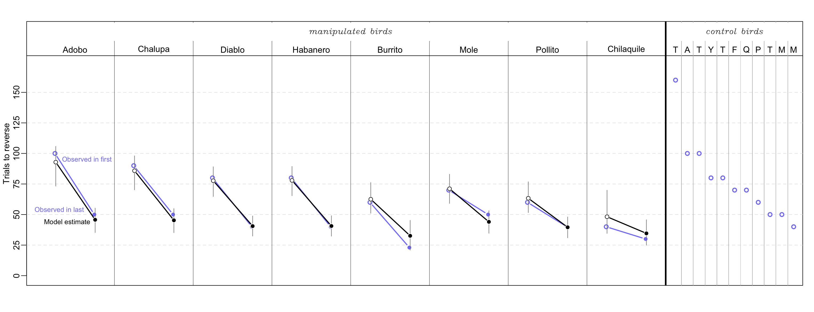

Open... {width=5%} access {width=5%} [code](https://github.com/corinalogan/grackles/blob/master/Files/Preregistrations/g_flexmanip.Rmd) {width=5%} peer review {width=5%} [data](https://knb.ecoinformatics.org/view/corina_logan.84.42)

\addtolength{\headheight}{0.1cm}
\pagestyle{fancyplain}
\lhead{\includegraphics[height=1.2cm]{logoPCIecology.png}}
\renewcommand{\headrulewidth}{0pt}

&nbsp;

**Affiliations:** 1) Max Planck Institute for Evolutionary Anthropology, Leipzig, Germany, 2) University of California Los Angeles, USA, 3) University of California Santa Barbara, USA, 4) Arizona State University, Tempe, AZ USA. *Corresponding author: corina_logan@eva.mpg.de

```{r setup, include=FALSE}
library(knitr)
library(formatR)
knitr::opts_chunk$set(tidy.opts=list(width.cutoff=70),tidy=TRUE) 
#Make code wrap text so it doesn't go off the page when Knitting to PDF

knitr::opts_chunk$set(echo = TRUE) 
#sets global options to display code along with the results https://exeter-data-analytics.github.io/LitProg/r-markdown.html
```

&nbsp;


**Cite as:** Logan CJ, MacPherson M, Rowney C, Bergeron L, Seitz B, Blaisdell AP, Folsom M, Johnson-Ulrich Z, McCune K. 2019. [Is behavioral flexibility manipulatable and, if so, does it improve flexibility and problem solving in a new context?](http://corinalogan.com/Preregistrations/g_flexmanip.html) (http://corinalogan.com/Preregistrations/g_flexmanip.html) In principle acceptance by *PCI Ecology* of the version on 26 Mar 2019 [https://github.com/corinalogan/grackles/blob/master/Files/Preregistrations/g_flexmanip.Rmd](https://github.com/corinalogan/grackles/blob/master/Files/Preregistrations/g_flexmanip.Rmd).

**This preregistration has been pre-study peer reviewed and received an In Principle Recommendation by:**

Aurélie Coulon (2019) Can context changes improve behavioral flexibility? Towards a better understanding of species adaptability to environmental changes. *Peer Community in Ecology*, 100019. [10.24072/pci.ecology.100019](https://doi.org/10.24072/pci.ecology.100019). Reviewers: Maxime Dahirel and Andrea Griffin


## ABSTRACT

Behavioral flexibility, the ability to adapt behavior to new circumstances, is thought to play an important role in a species' ability to successfully adapt to new environments and expand its geographic range. However, flexibility is rarely directly tested in species in a way that would allow us to determine how it works and enable us to make predictions about a species' ability to adapt their behavior to new environments. We use great-tailed grackles (a bird species) as a model to investigate this question because they have rapidly expanded their range into North America over the past 140 years. We attempted to manipulate grackle flexibility using colored tube reversal learning to determine whether flexibility is generalizable across contexts (touchscreen reversal learning and multi-access box), whether it is repeatable within individuals and across contexts, and what learning strategies grackles employ. We found that we were able to manipulate flexibility: birds in the manipulated group reversed a color preference in fewer trials by the end of their serial reversals compared to control birds who had only one reversal. Flexibility was repeatable within individuals (reversal), but not across contexts (from reversal to multi-access box). The touchscreen reversal experiment did not appear to measure what was measured in the reversal learning experiment with the tubes, and we speculate as to why. One third of the grackles in the manipulated reversal learning group switched from one learning strategy (epsilon-decreasing where they have a long exploration period) to a different strategy (epsilon-first where they quickly shift their preference). A separate analysis showed that the grackles did not use a particular strategy earlier or later in their serial reversals. Posthoc analyses using a model that breaks down performance on the reversal learning task into different components showed that learning to be attracted to an option (phi) more consistently correlated with reversal performance than the rate of deviating from learned attractions that were rewarded (lambda). This result held in simulations and in the data from the grackles: learning rates in the manipulated grackles doubled by the end of the manipulation compared to control grackles, while the rate of deviation slightly decreased. Grackles with intermediate rates of deviation in their last reversal solved fewer loci on the plastic and wooden multi-access boxes, and those with intermediate learning rates in their last reversal were faster to attempt a new locus on both multi-access boxes. This investigation allowed us to make causal conclusions, rather than relying only on correlations: we manipulated reversal learning, which caused changes in a different flexibility measure (multi-access box switch times) and in an innovativeness measure (multi-access box loci solved), as well as validating that the manipulation had an effect on the cognitive ability we think of as flexibility. Understanding how behavioral flexibility causally relates to other traits will allow researchers to develop robust theory about what behavioral flexibility is and when to invoke it as a primary driver in a given context, such as a rapid geographic range expansion. Given our results, flexibility manipulations could be useful in training threatened and endangered species in how to be more flexible. If such a flexibility manipulation was successful, it could then change their behavior in this and other domains, giving them a better chance of succeeding in human modified environments.

## [Video summary](https://youtu.be/bALXB2S4OpI)

## INTRODUCTION

Behavioral flexibility, the ability to adapt behavior to new circumstances (see @mikhalevich_is_2017 for the theoretical background on this definition), is thought to play an important role in a species' ability to successfully adapt to new environments and expand its geographic range [e.g., @lefebvre1997feeding; @sol2000behavioural; @sol2002behavioural; @sol2005big; @sol2007big]. This research predicts that behavioral flexibility (hereafter referred to as flexibility) should positively relate with innovativeness. However, these predictions are based on species-level data and proxies for flexibility and for innovation when examining such relationships [see @logan2018beyond]. Flexibility is rarely directly tested in species that are rapidly expanding their geographic ranges in a way that would allow us to determine how flexibility works and predict a species' ability to adapt their behavior to new areas. Those investigations that examine the relationship between flexibility and innovation (or problem solving) in species that are expanding their range show mixed results, with these variables correlating positively [e.g., grey squirrels: @chow2016practice], negatively [e.g., Indian mynas: @griffin2013tracking], or not at all [e.g., great-tailed grackles: @logan2016behavioral]. One way to improve our understanding of whether and how flexibility is related to innovativeness is to perform a manipulative experiment on one of the variables to determine whether there is an associated change in the other.

We focused our study on great-tailed grackles (*Quiscalus mexicanus*, hereafter grackles), a bird species that is flexible [@logan2016behavioral] and rapidly expanding its geographic range [@wehtje2003range]. We attempted to manipulate grackle flexibility using serial reversals of a color preference to determine whether their flexibility is generalizable across additional experimental contexts (touchscreen reversal learning and multi-access box solution switching), whether it is repeatable within individuals and across contexts, and what learning strategies grackles employ. 

If grackle flexibility is manipulatable using serial reversals, this could provide conservation managers with an important tool for managing at-risk populations. If the manipulation works in grackles, it has the potential to be effective in other species as well. This could be particularly useful for endangered species conservation efforts, such as when selecting individuals for captive breeding programs, because individuals that are more flexible might be able to adapt better to new environments. If the flexibility manipulation is not successful, this could indicate either that we did not manipulate the right aspect of flexibility (e.g., perhaps training them to solve a variety of different types of tasks quickly would be more effective) or that grackle flexibility is not a trait that is trainable.


## HYPOTHESES

#### H1: Behavioral flexibility, as measured by reversal learning using colored tubes, is manipulatable.

**Prediction 1:** Individuals improve their flexibility on a serial reversal learning task using colored tubes by generally requiring fewer trials to reverse a preference as the number of reversals increases (manipulation condition). Their flexibility on this test will have been manipulated relative to control birds who do not undergo serial reversals. Instead, individuals in the control condition will be matched to manipulated birds for experience (they will experience a similar number of trials), but there will be no possibility of a functional tube preference because both tubes will be the same color and both will contain food, therefore either choice will be correct.

**P1 alternative 1:** If the number of trials to reverse a preference does not correlate with or positively correlates with reversal number, which would account for all potential correlation outcomes, this suggests that some individuals may prefer to rely on information acquired previously (i.e., they are slow to reverse) rather than relying on current cues (e.g., the food is in a new location) [e.g., @manrique_repeated_2013; @griffin2014innovation; @liu2016learning; but see @homberg2007serotonin].

#### H2: Manipulating behavioral flexibility (improving reversal learning speed through serial reversals using colored tubes) improves flexibility (rule learning and/or switching) and problem solving in a new context (two distinct multi-access boxes and serial reversals on a touchscreen).

**P2:** Individuals that have improved their flexibility on a serial reversal learning task using colored tubes (requiring fewer trials to reverse a preference as the number of reversals increases) are faster to switch between new methods of solving (latency to solve or attempt to solve a new way of accessing the food [locus]), and learn more new loci (higher total number of solved loci) on multi-access box flexibility tasks, and are faster to reverse preferences in a serial reversal task using a touchscreen than individuals in the control group where flexibility has not been manipulated. The positive correlation between reversal learning performance using colored tubes and a touchscreen (faster birds have fewer trials) and the multi-access boxes (faster birds have lower latencies) indicates that all three tests measure the same ability even though the multi-access boxes require inventing new rules to solve new loci (while potentially learning a rule about switching: "when an option becomes non-functional, try a different option") while reversal learning requires switching between two rules ("choose light gray" or "choose dark gray") or learning the rule to "switch when the previously rewarded option no longer contains a reward". Serial reversals eliminate the confounds of exploration, inhibition, and persistence in explaining reversal learning speed because, after multiple reversals, what is being measured is the ability to learn one or more rules. If the manipulation works, this indicates that flexibility can be influenced by previous experience and might indicate that any individual has the potential to move into new environments (see relevant hypotheses in preregistrations on [genetics](http://corinalogan.com/Preregistrations/g_flexgenes.html) (R1) and [expansion](http://corinalogan.com/Preregistrations/g_expansion.html) (H1)).

**P2 alternative 1:** If the manipulation does not work in that those individuals in the experimental condition do not decrease their reversal speeds more than control individuals, then this experiment will elucidate whether general individual variation in flexibility relates to flexibility in new contexts (two distinct multi-access boxes and serial reversals on a touchscreen) as well as problem solving ability (multi-access boxes). The prediction is the same in P2, but in this case variation in flexibility is constrained by traits inherent to the individual [some of which will be tested in @mccune2019exploration], which suggests that certain individuals will be more likely to move into new environments.

**P2 alternative 2:** If there is no correlation between reversal learning speed (colored tubes) and the latency to solve/attempt a new locus on the multi-access boxes, this could be because the latency to solve not only measures flexibility but also innovativeness. In this case, an additional analysis will be run with the latency to solve as the response variable, to determine whether the fit of the model (as determined by the lower AIC value) with reversal learning as an explanatory variable is improved if motor diversity (the number of different motor actions used when attempting to solve the multi-access box) is included as an explanatory variable [see @diquelou2015role; @griffin2016invading]. If the inclusion of motor diversity improves the model fit, then this indicates that the latency to solve a new locus on the multi-access box is influenced by flexibility (reversal learning speed) and innovation (motor diversity). 

**P2 alternative 3:** If there is a negative correlation or no correlation between reversal learning speed on colored tubes and reversal learning speed on the touchscreen, then this indicates that it may be difficult for individuals to perceive and/or understand images on the touchscreen in contrast with physical objects (colored tubes) [e.g., @ohara2015advantage].


**Figure 1.** A visual illustration of Hypothesis 1 (A), Hypothesis 2 (B), Hypothesis 3 (C1 and C2), and Hypothesis 4 (D). Longer black arrows indicate slower reversal times, the two yellow circles represent experience with the two yellow tubes that both contained food for the control group.

#### H3a: Behavioral flexibility within a context is repeatable within individuals.

Repeatability of behavioral flexibility is defined as the number of trials to reverse a color preference being strongly negatively correlated within individuals with the number of reversals.

**P3a:** Individuals that are faster to reverse a color preference in the first reversal will also be faster to reverse a color preference in the second, etc. reversal due to natural individual variation.

**P3a alternative:** There is no repeatability in behavioral flexibility within individuals, which could indicate that performance is state dependent (e.g., it depends on their fluctuating motivation, hunger levels, etc.). We will determine whether performance on colored tube reversal learning related to motivation by examining whether the latency to make a choice influenced the results. We will also determine whether performance was related to hunger levels by examining whether the number of minutes since the removal of their maintenance diet from their aviary plus the number of food rewards they received since then influenced the results.

#### H3b: The consistency of behavioral flexibility in individuals across contexts (context 1=reversal learning on colored tubes, context 2=multi-access boxes, context 3=reversal learning on touchscreen) indicates their ability to generalize across contexts.

Individual consistency of behavioral flexibility is defined as the number of trials to reverse a color preference being strongly positively correlated within individuals with the latency to solve new loci on each of the multi-access boxes and with the number of trials to reverse a color preference on a touchscreen (total number of touchscreen reversals = 5 per bird).

*If P3a is supported (repeatability of flexibility within individuals)...*

**P3b:** ...and flexibility is correlated across contexts, then the more flexible individuals are better at generalizing across contexts.

**P3b alternative 1:** ...and flexibility is not correlated across contexts, then there is something that influences an individual's ability to discount cues in a given context. This could be the individual's reinforcement history (tested in P3a alternative), their reliance on particular learning strategies (one alternative is tested in H4), or their motivation (tested in P3a alternative) to engage with a particular task (e.g., difficulty level of the task). 

#### H4: Individuals should converge on an epsilon-first learning strategy (learn the correct choice after one trial) as they progress through serial reversals.

**P4:** Individuals will prefer a mixture of learning strategies in the first serial reversals (an *epsilon-decreasing* strategy where individuals explore both options extensively before learning to prefer the rewarded option, and an *epsilon-first* strategy where the correct choice is consistently made after the first trial), and then move toward the epsilon-first learning strategy. The epsilon-first strategy works better later in the serial reversals where the reward is all or nothing because individuals will have learned the environment is changing in predictable ways [@bergstrom2004shannon]: only one option is consistently rewarded, and if the reward isn't in the previously rewarded option, it must be in the other option.

**P4 alternative 1:** Individuals will continue to prefer a mixture of learning strategies, and/or they do not converge on the more functional epsilon-first learning strategy, regardless of how many reversals they participate in. This pattern could suggest that the grackles do not attend to functional meta-strategies, that is, they do not learn the overarching rule (once food is found in the non-preferred tube, one must switch to preferring that tube color), but rather they learn each preference change as if it was new. 


## ASSOCIATED PREREGISTRATION

Our methods and analysis plans are described in the peer-reviewed preregistration of this article that received in principle recommendation from PCI Ecology, which is included below as the [Methods](#methods). We moved the hypotheses from the preregistration to the section above to improve flow for the reader.


### DEVIATIONS FROM THE PREREGISTRATION

**In the middle of data collection**

1) 10 April 2019: We discontinued the reversal learning experiment on the touchscreen because it appears to measure something other than what we intended to test and it requires a huge time investment for each bird (which consequently reduces the number of other tests they are available to participate in). This is not necessarily surprising because this is the first time touchscreen tests have been conducted in this species, and also the first time (to our knowledge) this particular reversal experiment has been conducted on a touchscreen with birds. We based this decision on data from four grackles (2 in the flexibility manipulation group and 2 in the flexibility control group; 3 males and 1 female). All four of these individuals showed highly inconsistent learning curves and required hundreds more trials to form each preference when compared to the performance of these individuals on the colored tube reversal experiment. It appears that there is a confounding variable with the touchscreen such that they are extremely slow to learn a preference as indicated by passing our criterion of 17 correct trials out of the most recent 20. We will not include the data from this experiment when conducting the cross-test comparisons in the Analysis Plan section of the preregistration. Instead, in the Results section, we provide summary results for this experiment and, in the Discussion, qualitatively compare it with performance on the colored tube reversal test to explain what might have confounded the touchscreen experiment.

2) 16 April 2019: Because we discontinued the touchscreen reversal learning experiment, we added an additional but distinct multi-access box task, which allowed us to continue to measure flexibility across three different experiments. There are two main differences between the first multi-access box, which is made of plastic, and the new multi-access box, which is made of wood. First, the wooden multi-access box is a natural log in which we carved out 4 compartments. As a result, the apparatus and solving options are more comparable to what grackles experience in the wild, though each compartment is covered by a transparent plastic door that requires different behaviors to open. Furthermore, there is only one food item available in the plastic multi-access box and the bird could use any of 4 loci to reach it. In contrast, the wooden multi-access box has a piece of food in each of the 4 separate compartments. 

**Post data collection, pre-data analysis**

3) We completed our simulation to explore the lower boundary of a minimum sample size and determined that **our sample size for the Arizona study site is above the minimum** (see details and code in [Ability to detect actual effects](http://corinalogan.com/Preregistrations/g_flexmanip.html#ability_to_detect_actual_effects); 17 April 2020).

4) Please see our [Alternative Analyses](#alternative-analyses) section where we describe how we **changed the analysis for P2** and that we are replacing this analysis with the new models in the [Ability to detect actual effects](#ability-to-detect-actual-effects) section (14 May 2020). We also describe here that we realized that Condition (manipulated or control) does not need to be a variable in our models because the manipulated birds have, by definition, faster reversal speeds.

5) We originally planned on testing only **adults** to have a better understanding of what the species is capable of, assuming the abilities we are testing are at their optimal levels in adulthood, and so we could increase our statistical power by eliminating the need to include age as an independent variable in the models. Because the grackles in Arizona were extremely difficult to catch, we ended up testing two juveniles: Taco and Chilaquile. We did not conduct the full test battery with Taco or put him in the flexibility manipulation or control groups (he received 1 reversal and then moved on to the next test) because he was the first juvenile and we wanted to see whether his performance was different from adult performances. His performances were similar to the adults, therefore we decided to put Chilaquile in the full test battery. Chilaquile's performances were also similar to the adults, therefore we decided not to add age as an independent variable in the models to avoid reducing our statistical power. 

**Post data collection, mid-data analysis**

6) We **log transformed** the response variable and changed the GLMM distribution from Poisson to Gaussian in the [P3a analysis](#p3a-repeatable-within-individuals-within-a-context-reversal-learning) (24 Aug 2021).

7) The original model for P2 (Table 4: Model 1) included the covariate aviary batch, however this ended up confounding the analysis because control and manipulated individuals, while randomly assigned to these conditions, ended up in particular batches as a result of their willingness to participate in tests offered during their time in the aviary (Table 4: Model 3). Several grackles never passed habituation or training such that their first experiment could begin, therefore we replaced these grackles in the aviaries with others who were willing to participate. This means that batch did not indicate a particular temporal period. Therefore, we removed batch from the model. 


## RESULTS

Data are publicly [available](https://knb.ecoinformatics.org/view/corina_logan.84.42]) at the Knowledge Network for Biocomplexity [@logan2021flexmanipdata]. Please see the data sheet titled g_flexmanip_data_AllGrackleExpOrder at KNB for an overview of all color marked grackles at the Arizona field site (2018-2021), which of the aviary experiments they participated in and whether data for the variables that were collected in the wild are present.

Although 22 grackles completed their initial colored tube discrimination, only 20 grackles participated in one or more reversals (Table 1). The rest of the tests began only after a bird's reversal experiment was complete (see the order of tests for each bird at the data sheet titled g_flexmanip_data_AllGrackleExpOrder at KNB). Interobserver reliability analyses (unregistered) showed that the reversal learning and multi-access box (plastic and wooden) experiments were highly repeatable across live coders and video coders (see details in Analysis Plan > Interobserver reliability).

\newpage
\blandscape

**Table 1.** Summarized results per bird in the reversal learning (tube and touchscreen) and multi-access box (plastic and wooden) experiments. Reversals to pass indicates how many serial reversals it took a bird to pass criterion if they were in the flexibility manipulation condition. Note: Tapa did not finish the MAB log experiment; Marisco's MAB log experiment ended too early due to experimenter error (timed out on 2 consecutive sessions, not 3); Mole and Habanero: do not count MAB plastic number of options solved because they were given the box fully put together for habituation due to experimenter error; Taco was the first juvenile we tested and we did not put him in the flexibility experiment: he received 1 reversal and moved on to his next test, therefore he was essentially a control bird without the matched yellow tube experience.

```{r summary, eval=TRUE, warning=FALSE, results='asis', echo=TRUE, include=TRUE}
d <- read.csv(url("https://raw.githubusercontent.com/corinalogan/grackles/master/Files/Preregistrations/g_flexmanip_datasummary.csv"), header=F, sep=",", stringsAsFactors=F)

d <- data.frame(d)
colnames(d) <- c("Bird","Batch","Sex","Trials to learn (tube)","Trials to first reversal (tube)","Trials to last reversal (tube)","Reversals to pass","Total loci solved (MAB plastic)","Total loci solved (MAB wooden)","Average latency to attempt new locus (MAB plastic)","Average latency to attempt new locus (MAB wooden)","Trials to learn (touchscreen)","Trials to first reversal (touchscreen)","Motor actions (MAB plastic)","Motor actions (MAB wooden)")

library(kableExtra)
knitr::kable(d) %>%
kable_styling(full_width = T, position = "left",  bootstrap_options = "condensed", font_size = 8)
```

\elandscape
\newpage

Because the wooden multi-access box was added after in principle recommendation, we conducted an unregistered analysis to determine whether the plastic and wooden multi-access box results correlated with each other, which would indicate that these tests are interchangeable. We found that they did not correlate with each other on either variable measured: the average latency to attempt a new locus (switching; Pearson's r=0.74, 95% CI=-0.19-0.97, t=2.18, df=4, p=0.09) or the total number of loci solved (problem solving; Pearson's r=0.51, 95% CI=-0.09-0.84, t=1.86, df=10, p=0.09). Therefore, these two tests are not interchangeable and we analyzed them separately.

### P1: reversal speed gets faster with serial reversals

There was a significant negative correlation between the number of trials to reverse (average=71 trials, standard deviation (sd)=28) and the reversal number for those grackles in the flexibility manipulation condition (n=9, which included Memela who did not pass the manipulation condition; Figure 2). When this model was compared with the null model, where there was no explanatory variable, the null model had a higher Akaike weight, however it was not high enough to indicate the two models were reliably different from each other (Table 2). Therefore, we conclude that there was no effect of a linear relationship between the number of trials to reverse and reversal number. 

**Unregistered analysis:** While there may not be an effect when one examines all reversals, there was a difference between manipulated and control reversal speeds when comparing their last reversals (Figure 3; for the control birds, their last reversal was their first reversal): the Akaike weight of the full model was 0.94, which means that including condition in the model explains the bulk of the variation in the number of trials to reverse in the last reversal (Table 3). This analysis includes 19 grackles (8 manipulated condition - only those who actually passed the manipulation, 11 control condition) who had an overall average of 62 trials in their last reversal (sd=32).

**Table 2.** The number of trials to reverse does not linearly decrease with increasing reversal number more than would be expected by chance. The Akaike weight of null model was higher than that of the full model, though not >0.89, which indicates that neither model is more reliable than the other.

```{r p1table, eval=T, warning=F, results='asis', echo=T, include=T, message=FALSE}
d <- read.csv(url("https://raw.githubusercontent.com/corinalogan/grackles/master/Files/Preregistrations/g_flexmanip_data_reverse.csv"), header=T, sep=",", stringsAsFactors=F)
d <- d[!d$ID=="Fajita" & !d$ID=="Empanada",] #remove Fajita because she was a pilot bird

#remove NAs from the variables that will be in the model
d <- subset(d,!(is.na(d["TrialsToReverse"])))
d <- subset(d,!(is.na(d["ReverseNumber"])))

#include only those birds in the reversal tubes experiment and only those in the manipulation condition bc only these will have more than one reversal (and thus something to correlate)
d <- d[d$TubesOrTouchscreen=="TUBES" & d$ExperimentalGroup=="Manipulation",]

#factor variables
d$Batch <- as.factor(d$Batch)
d$ID <- as.factor(d$ID)

# GLMM
library(MCMCglmm)
prior = list(R = list(R1 = list(V = 1, nu = 0)), G = list(G1 = list(V = 1, 
	    nu = 0), G2 = list(V = 1, nu = 0)))
serial <- MCMCglmm(TrialsToReverse ~ ReverseNumber, random = ~ID+Batch, 
	    family = "poisson", data = d, verbose = F, prior = prior, 
	    nitt = 300000, thin = 500, burnin = 90000)
#reverse number significantly negatively correlates with trials to reverse, as expected due to the manipulation
#summary(serial)
#Did fixed effects converge (<0.1)? Yes
#autocorr(serial$Sol) 
#Did random effects converge (<0.1)? Yes except for 2 values: 0.11 and 0.12
#autocorr(serial$VCV)

#AIC calculation
library(MuMIn)
options(na.action = "na.fail")
base <- dredge(MCMCglmm(TrialsToReverse ~ ReverseNumber, random = ~ID+Batch, 
	    family = "poisson", data = d, verbose = F, prior = prior, 
	    nitt = 300000, thin = 500, burnin = 90000))

library(kableExtra)
knitr::kable(base)  %>%
  column_spec(column = 1:7, width = "6em") %>%
  scroll_box(width = "100%")

#UNREGISTERED ANALYSIS: compare control vs manipulated group reversal speeds using only last reversals
#prior = list(R = list(R1 = list(V = 1, nu = 0)), G = list(G1 = list(V = 1, 
#	    nu = 0), G2 = list(V = 1, nu = 0)))
#serial <- MCMCglmm(TrialsToReverse ~ ReverseNumber, random = ~ID+Batch, 
#	    family = "poisson", data = d, verbose = F, prior = prior, 
#	    nitt = 300000, thin = 500, burnin = 90000)
#reverse number significantly negatively correlates with trials to reverse, as expected due to the manipulation
#summary(serial)
#Did fixed effects converge (<0.1)? Yes
#autocorr(serial$Sol) 
#Did random effects converge (<0.1)? Yes except for 2 values: 0.11 and 0.12
#autocorr(serial$VCV)
```

```{r p1fig, eval=T, warning=F, results='asis', echo=T, include=T}
d <- read.csv(url("https://raw.githubusercontent.com/corinalogan/grackles/master/Files/Preregistrations/g_flexmanip_data_reverse.csv"), header=T, sep=",", stringsAsFactors=F)
d <- d[!d$ID=="Fajita" & !d$ID=="Empanada",] #remove Fajita because she was a pilot bird

#remove NAs from the variables that will be in the model
d <- subset(d,!(is.na(d["TrialsToReverse"])))
d <- subset(d,!(is.na(d["ReverseNumber"])))

#include only those birds in the reversal tubes experiment and only those in the manipulation condition bc only these will have more than one reversal (and thus something to correlate)
d <- d[d$TubesOrTouchscreen=="TUBES" & d$ExperimentalGroup=="Manipulation",]

#n, mean, sd
#length(levels(d$ID)) #9
#mean(d$TrialsToReverse) #71
#sd(d$TrialsToReverse) #28

#figure
op <- par(mfrow=c(1,1), mar=c(5.9,4.9,2,0.9))
plot(jitter(d$TrialsToReverse) ~ jitter(d$ReverseNumber), xlab="Reversal number", ylab="Number of trials to reverse", xlim=c(0.9,11.1), ylim=c(19,171), cex.lab=2, cex.axis=2, cex=2)
par(op)
```

**Figure 2.** Individuals in the manipulated condition (who received serial reversals) did not linearly decrease their reversal passing speeds with increasing reversal number (n=9 grackles).

**Table 3.** Individuals in the manipulated condition pass their last reversal in fewer trials than control individuals. The Akaike weight of the full model was >0.89, indicating that it is more reliable than the null model.

```{r p1last, eval=T, warning=F, results='asis', echo=T, include=T, message=FALSE}
d <- read.csv(url("https://raw.githubusercontent.com/corinalogan/grackles/master/Files/Preregistrations/g_flexmanip_datasummary.csv"), header=F, sep=",", stringsAsFactors=F)

d <- data.frame(d)
colnames(d) <- c("Bird","Batch","Sex","Trials to learn","TrialsFirstReversal","TrialsLastReversal","ReversalsToPass","TotalLociSolvedMABplastic","TotalLociSolvedMABwooden","AverageLatencyAttemptNewLocusMABplastic","AverageLatencyAttemptNewLocusMABwooden","Trials to learn (touchscreen)","Trials to first reversal (touchscreen)","MotorActionsPlastic","MotorActionsWooden")

# Remove NAs
d <- subset(d,!(is.na(d["TrialsLastReversal"])))

# exclude the bird who didn't pass serial
d <- d[!d$Bird=="Memela",]

# make ReversalsToPass a factor that has only 2 levels: level 1 = control, level 2 = manipulated
d$ReversalsToPass <- as.factor(d$ReversalsToPass)
levels(d$ReversalsToPass)[c(1,2,3,4)] <- c("Control","Manipulated","Manipulated","Manipulated")

#UNREGISTERED ANALYSIS: compare control vs manipulated group reversal speeds using only last reversals
last <- glm(d$TrialsLastReversal~d$ReversalsToPass)
#manipulated group has significantly fewer trials to reverse in last reversal, as expected due to the manipulation
#summary(last)

#AIC calculation
library(MuMIn)
options(na.action = "na.fail")
aw <- dredge(glm(d$TrialsLastReversal~d$ReversalsToPass))

library(kableExtra)
knitr::kable(aw)  %>%
  column_spec(column = 1:7, width = "5em") %>%
  scroll_box(width = "100%")
#the full model has an Akaike weight >0.9 so it is reliable. This means that condition explains differences in the number of trials to pass the last reversal, with the manipulated group being faster than the control group
```

```{r p1figlast, eval=T, warning=F, results='asis', echo=T, include=T}
d <- read.csv(url("https://raw.githubusercontent.com/corinalogan/grackles/master/Files/Preregistrations/g_flexmanip_datasummary.csv"), header=F, sep=",", stringsAsFactors=F)

d <- data.frame(d)
colnames(d) <- c("Bird","Batch","Sex","Trials to learn","TrialsFirstReversal","TrialsLastReversal","ReversalsToPass","TotalLociSolvedMABplastic","TotalLociSolvedMABwooden","AverageLatencyAttemptNewLocusMABplastic","AverageLatencyAttemptNewLocusMABwooden","Trials to learn (touchscreen)","Trials to first reversal (touchscreen)","MotorActionsPlastic","MotorActionsWooden")

# Remove NAs
d <- subset(d,!(is.na(d["TrialsLastReversal"])))

# exclude the bird who didn't pass serial
d <- d[!d$Bird=="Memela",]

#n, mean, and sd
#length(d$TrialsLastReversal) #19
#mean(d$TrialsLastReversal) #62
#sd(d$TrialsLastReversal) #32

# make ReversalsToPass a factor that has only 2 levels: level 1 = control, level 2 = manipulated
d$ReversalsToPass <- as.factor(d$ReversalsToPass)
levels(d$ReversalsToPass)[c(1,2,3,4)] <- c("Control","Manipulated","Manipulated","Manipulated")

#figure
op <- par(mfrow=c(1,1), mar=c(5.9,4.9,2,0.9))
plot(jitter(d$TrialsLastReversal) ~ d$ReversalsToPass, xlab="", ylab="Number of trials to pass last reversal", ylim=c(19,161), cex.lab=1.5, cex.axis=2, cex=2)
points(jitter(d$TrialsLastReversal) ~ d$ReversalsToPass, cex=2)
par(op)
```

**Figure 3.** Individuals in the manipulated condition (who received serial reversals) passed their last reversal in fewer trials than individuals in the control condition (who only received 1 reversal). n=19 grackles: 11=control, 8=manipulated.

### P2: serial reversals improve rule switching and problem solving on the MAB

To determine whether the serial reversal manipulation affected flexibility generally, we compared performance (the number of trials to reverse a preference in the first and last color reversal, performance of the manipulated group relative to control group) to speed of solution switching on two multi-access boxes. Furthermore, we assessed whether flexibility measured through these serial reversals related to innovativeness by comparing performance to the number of loci solved on two multi-access boxes. The results for each of these comparisons are described in detail below and an overview is provided in Figure 4.


**Figure 4.** Overview of the results from the P2 analyses with the multi-access boxes (plastic and wooden). A plus sign (+) indicates a positive correlation, a minus sign (-) indicates a negative correlation, and a 0 indicates no correlation between the two variables. The asterisks (*) indicate that a small sample size decreases the reliability of this result


#### Rule switching: latency to attempt a new locus on the multi-access box (plastic) ~ trials to reverse

Grackles that were faster to reverse a preference in their **last reversal** (average 52 trials, sd=23) were also faster to attempt to solve a new locus on the plastic multi-access box (after just having passed criterion on a different locus; average=208 seconds, sd=226; Figure 5a; Table 4: Model 9; n=11 grackles: 6 in manipulated condition, 5 in control condition; 6 subjects completed this experiment but did not solve enough loci to have switching times (i.e., solved 0 loci or 1 locus)). We also found that individuals in the flexibility manipulation had faster switch latencies than those in the control condition (Table 4: Model 10). There was a positive correlation between the number of trials to reverse in the **first reversal** (average=70 trials, sd=21) and the average switch latency on the multi-access box (Table 4: Model 11; unregistered analysis).


```{r p2mabplasticlat, eval=F, echo=TRUE, warning=FALSE, include=TRUE, results='asis'}
library(rethinking)
library(rstan)
library(formatR)

# LOAD the data and column names
d3 <- read.csv(url("https://raw.githubusercontent.com/corinalogan/grackles/master/Files/Preregistrations/g_flexmanip_datasummary.csv"), header=F, sep=",", stringsAsFactors=F)

d3 <- data.frame(d3)
colnames(d3) <- c("Bird","Batch","Sex","Trials to learn","TrialsFirstReversal","TrialsLastReversal","ReversalsToPass","TotalLociSolvedMABplastic","TotalLociSolvedMABwooden","AverageLatencyAttemptNewLocusMABplastic","AverageLatencyAttemptNewLocusMABwooden","Trials to learn (touchscreen)","Trials to first reversal (touchscreen)","MotorActionsPlastic","MotorActionsWooden")

# Remove NAs
d3 <- subset(d3,!(is.na(d3["AverageLatencyAttemptNewLocusMABplastic"])) & !(is.na(d3["TrialsLastReversal"])))

# n=11: 5 in manipulated group, 6 in control group
#length(d3$AverageLatencyAttemptNewLocusMABplastic)

# make Batch a factor
d3$Batch <- as.factor(d3$Batch)

# look at the data
#hist(d3$AverageLatencyAttemptNewLocusMABplastic)
#mean(d3$AverageLatencyAttemptNewLocusMABplastic) #208
#sd(d3$AverageLatencyAttemptNewLocusMABplastic) #226
#mean(d3$TrialsLastReversal) #52
#sd(d3$TrialsLastReversal) #23
#mean(d3$TrialsFirstReversal) #70
#sd(d3$TrialsFirstReversal) #21

#translating the actual data (rather than the simulated data) into effect sizes (see equation below in "translated the simulation output into effect sizes")
#sd(d3$AverageLatencyAttemptNewLocusMABplastic)/sd(d3$TrialsLastReversal) #=9.9
#cor.test(d3$AverageLatencyAttemptNewLocusMABplastic,d3$TrialsLastReversal,alternative=c("two.sided"),method = c("pearson"),conf.level = 0.95)
#corr = r = 0.52
#solve equation for beta:
#0.52/(sd(d3$AverageLatencyAttemptNewLocusMABplastic)/sd(d3$TrialsLastReversal)) #0.05 = beta

# RUN MODELs on the actual data
library("Rcpp")
library("rstan")
library(rethinking)
library(ggplot2)

# MODEL 9: batch was excluded because of what was learned in the previous sections
dl <- list(trials = standardize(as.numeric(d3$TrialsLastReversal)), 
           latency = as.integer(d3$AverageLatencyAttemptNewLocusMABplastic), 
           batch = as.integer(d3$Batch)
           )

mplat1 <- ulam(alist(
  latency ~ dgampois(lambda, phi), 
  log(lambda) <- a + b * trials, 
  a ~ dnorm(1, 1), 
  b ~ dnorm(0, 1), 
  phi ~ dexp(1)
  ), data = dl, chains=4, log_lik = TRUE, messages = FALSE)
#This causes KM's R session to crash every time


precis(mplat1,depth=2)
#   mean   sd  5.5% 94.5% n_eff Rhat4
#a   4.93 0.30 4.45  5.41  1235  1.01
#b   0.46 0.29 0.00  0.92  1363  1.00
#phi 0.93 0.35 0.44  1.55  1476  1.00
#the confidence interval for b (the slope) touches 0 but does not cross it (which would be indicated by a sign change), which indicates that there is likely a positive correlation between MAB switch latency and trials to reverse

#check posterior for p to look at the distribution of probabilities that are probable
postmplat1 <- extract.samples(mplat1)
p3 <- exp(postmplat1$a) #convert from log to number of seconds
dens(p3,adj=0.1)
HPDI(p3) #76-209
median(p3) #139, narrower and shifted left than the curve from the simulations
#result: The posterior: the mean y axis point where the intercept is is 139 (meaning they switch on average at a latency of 139 seconds), which means this is when trials to reverse is at the average. The actual median is smaller than what we estimated the mean would be in the simulations (300s)

#model details: 2000 samples from 4 chains
#show(mplat1)
#no correlation
#pairs(mplat1)
#check the chain - fuzzy caterpillars = looks good
#traceplot(mplat1)
#check the chain a different way - "histograms overlap and stay within the same range" ≠ looks good (p.285 Rethinking)
#trankplot(mplat1) 


# MODEL 10: see whether the flexibility manipulation actually had an effect on MAB performance by replacing batch with condition (control, manipulated) and REMOVING trials
#mean(d2$TrialsFirstReversal) #73.6
#sd(d2$TrialsFirstReversal) #34.1

# make ReversalsToPass a factor that has only 2 levels: level 1 = manipulated, level 2 = control
d3$ReversalsToPass <- as.factor(d3$ReversalsToPass)
levels(d3$ReversalsToPass)[c(1,2,3)] <- c("Manipulated","Manipulated","Manipulated")

dl2 <- list(latency = as.integer(d3$AverageLatencyAttemptNewLocusMABplastic), 
           condition = as.integer(d3$ReversalsToPass)
           )

mplat2 <- ulam(alist(
  latency ~ dgampois(lambda, phi), 
  log(lambda) <- a[condition], 
  a[condition] ~ dnorm(1, 1), 
  phi ~ dexp(1)
  ), data = dl2, chains=4, log_lik = TRUE, messages = FALSE)

precis(mplat2,depth=2)
#     mean   sd  5.5% 94.5% n_eff Rhat4
#a[1] 4.07 0.39 3.46  4.68  1027  1.00
#a[2] 5.18 0.39 4.50  5.76  1006  1.00
#phi  0.91 0.41 0.37  1.63   925  1.01
#Condition correlates with performance on the MAB bc neither a[] CI crosses zero, a1 manipulated has a lower mean than a2 control

# contrasts between conditions: the log odds differences in solving a locus between batches. Value = log odds of solving a locus (p.331 & 341 Rethinking)
postmplat2 <- extract.samples(mplat2)
diffmplat2 <- postmplat2$a[,1] - postmplat2$a[,2]
labsdif2 <- c("Manipulated-Control")
plot( precis(diffmplat2), xlim=c(-2,0.5), labels=labsdif2)
# contrasts between conditions on the outcome scale (p.341 Rethinking)
precis( diffmplat2 )
#conditons are different from each other in their average latency to switch because CI does not cross zero. This means that the manipulated individuals are faster to switch than control individuals. This suggests that the experience involved in the flexibility manipulation had a direct effect on mab performance


# MODEL 11: see whether the flexibility manipulation actually had an effect on MAB performance by replacing trials to LAST reversal with trials to FIRST reversal
dl3 <- list(locisolved = d3$AverageLatencyAttemptNewLocusMABplastic,
            trials = standardize(d3$TrialsFirstReversal)
              )

mplat3 <- ulam(alist(
  latency ~ dgampois(lambda, phi), 
  log(lambda) <- a + b * trials, 
  a ~ dnorm(1, 1), 
  b ~ dnorm(0, 1), 
  phi ~ dexp(1)
  ), data = dl, chains=4, log_lik = TRUE, messages = FALSE)

precis(mplat3,depth=2)
#     mean   sd  5.5% 94.5% n_eff Rhat4
#a   4.93 0.29 4.46  5.39  1488     1
#b   0.46 0.28 0.02  0.93  1211     1
#phi 0.94 0.36 0.44  1.60  1447     1
#b does not cross zero so there is a positive correlation between average switch latencies and number of trials to reverse on the first reversal. This means that reversal in general correlates with MAB loci and that the flexibility manipulation is not needed to enhance or make this relationship


# VISUALIZE: plot trials to pass last reversal against number of loci solved on the mwobatch model (p249 Rethinking panel on the left)
# figure out xlim: -1.28 - 2.10
#range(dl$trials)

# draw 50 lines from the prior
trialsp_seq <- seq( from=-1.29 , to=2.11 , length.out=30 )

op <- par(mfrow=c(1,1), mar=c(5.9,4.9,2,0.9))
plot(dl$latency ~ dl$trials , pch=16 , col="black" ,
    xlab="Trials to pass last reversal (standardized: mean=0)" , ylab="Avg latency (s) to attempt new locus on multi-access box (plastic)" , xlim=c(-1.2,2.05), cex.lab=2, cex.axis=2, cex=2 )
mu <- link( mplat1 , data=data.frame( trials=trialsp_seq ) )
mu_mean <- apply( mu , 2 , mean )
mu_ci <- apply( mu , 2 , PI , prob=0.97 )
lines( trialsp_seq , mu_mean , lwd=2 )
shade( mu_ci , trialsp_seq , col=col.alpha(rangi2,0.3) )
par(op)
```

{width=100%}

**Figure 5.** The average latency (seconds) to attempt to solve a different locus after having previously successfully solved a locus on a) the plastic multi-access box (MAB) is positively correlated with the number of trials to pass their last reversal (n = 11 grackles), but on b) the wooden MAB it is not correlated with the number of trials to pass their last reversal (n = 11 grackles). Additionally, the probability of solving a locus on c) the plastic MAB is negatively correlated with the number of trials to pass their last reversal (n = 15 grackles), but on d) the wooden MAB it is not correlated with the number of trials to pass their last reversal (n = 12 grackles, estimate of slope includes zero). Shading represents the 97% prediction intervals.


#### Rule switching: latency to attempt a new locus on the multi-access box (wooden) ~ trials to reverse

There was no correlation between the number of trials to reverse a preference in their **last reversal** (average 60 trials, sd=38) and the latency to attempt to solve a new locus on the wooden multi-access box (after just having passed criterion on a different locus; average=463 seconds, sd=481; Figure 5b; Table 4: Model 12; n=11 grackles: 5 in manipulated condition, 6 in control condition; Diablo also completed this experiment and solved 1 locus, but did not attempt another locus after that, thus he does not have any switching times to analyze). We additionally found that there was no difference in average latency to switch between individuals in the flexibility manipulation and those in the control condition (Table 4: Model 13). There was a negative correlation between the number of trials to reverse in the **first reversal** (average=73 trials, sd=34) and the average switch latency on the multi-access box (Table 4: Model 14; unregistered analysis). A correlation was determined to be present if the prediction interval for the slope (b) in the model output did not cross zero (Table 4). This criterion was used throughout the analyses for P2.

```{r p2mabloglat, eval=F, warning=FALSE, results='asis', echo=TRUE, include=TRUE}
library(rethinking)
library(rstan)
library(formatR)
library("Rcpp")
library("rstan")
library(ggplot2)

# LOAD the data and column names
d4 <- read.csv(url("https://raw.githubusercontent.com/corinalogan/grackles/master/Files/Preregistrations/g_flexmanip_datasummary.csv"), header=F, sep=",", stringsAsFactors=F)

d4 <- data.frame(d4)
colnames(d4) <- c("Bird","Batch","Sex","Trials to learn","TrialsFirstReversal","TrialsLastReversal","ReversalsToPass","TotalLociSolvedMABplastic","TotalLociSolvedMABwooden","AverageLatencyAttemptNewLocusMABplastic","AverageLatencyAttemptNewLocusMABwooden","Trials to learn (touchscreen)","Trials to first reversal (touchscreen)","MotorActionsPlastic","MotorActionsWooden")

# Remove NAs
d4 <- subset(d4,!(is.na(d4["AverageLatencyAttemptNewLocusMABwooden"])) & !(is.na(d4["TrialsLastReversal"])))

# n=11: 5 in manipulated group, 6 in control group
#length(d4$AverageLatencyAttemptNewLocusMABwooden)

# make Batch a factor (assigned Taco to batch 3 because 3a doesn't work with the model)
d4$Batch <- as.factor(d4$Batch)
levels(d4$Batch)[c(3)] <- c("3")

# look at the data
#hist(d4$AverageLatencyAttemptNewLocusMABwooden)
#mean(d4$AverageLatencyAttemptNewLocusMABwooden) #463
#sd(d4$AverageLatencyAttemptNewLocusMABwooden) #481
#mean(d4$TrialsLastReversal) #60
#sd(d4$TrialsLastReversal) #38
#mean(d4$TrialsFirstReversal) #73
#sd(d4$TrialsFirstReversal) #34

#translating the actual data (rather than the simulated data) into effect sizes (see equation below in "translated the simulation output into effect sizes")
#sd(d4$AverageLatencyAttemptNewLocusMABwooden)/sd(d4$TrialsLastReversal) #=12.8
#cor.test(d4$AverageLatencyAttemptNewLocusMABwooden,d4$TrialsLastReversal,alternative=c("two.sided"),method = c("pearson"),conf.level = 0.95)
#corr = r = -0.26
#solve equation for beta:
#-0.26/(sd(d4$AverageLatencyAttemptNewLocusMABwooden)/sd(d4$TrialsLastReversal)) #0.02 = beta
#looking at table 2 for beta=0 and using the "Range of MAB loci solved" as 0-4 because they were able to solve all 4, the regression coefficient is 0.43.

# RUN MODELs on the actual data

# MODEL 12: batch was excluded because of what was learned in the previous sections
dlw <- list(trials = standardize(as.numeric(d4$TrialsLastReversal)), 
           latency = as.integer(d4$AverageLatencyAttemptNewLocusMABwooden)
           )

mwlat1 <- ulam(alist(
  latency ~ dgampois(lambda, phi), 
  log(lambda) <- a + b * trials, 
  a ~ dnorm(1, 1), 
  b ~ dnorm(0, 1), 
  phi ~ dexp(1)
  ), data = dlw, chains=4, log_lik = TRUE, messages = FALSE)

precis(mwlat1,depth=2)
#   mean   sd  5.5% 94.5% n_eff Rhat4
#a    5.75 0.28  5.28  6.18  1049  1.00
#b   -0.41 0.32 -0.86  0.15  1281  1.01
#phi  1.04 0.42  0.48  1.77  1456  1.00
#the confidence interval for b (the slope) crosses zero, indicating that there is no correlation between MAB switch latency and trials to reverse

#check posterior for p to look at the distribution of probabilities that are probable
postmwplat1 <- extract.samples(mwlat1)
#p4 <- exp(postmwplat1$a) #convert from log to number of seconds
#dens(p4,adj=0.1)
#HPDI(p4) #193-469
#median(p4) #315, as expected from the simulations
#result: The posterior: the mean y axis point where the intercept is is 315 (meaning they switch on average at a latency of 315 seconds), which means this is when trials to reverse is at the average. The actual median is the same as what we estimated the mean would be in the simulations (300s)

#model details: 2000 samples from 4 chains
#show(mwlat1)
#no correlation
#pairs(mwlat1)
#check the chain - fuzzy caterpillars = looks good
#traceplot(mwlat1)
#check the chain a different way - "histograms overlap and stay within the same range" ≠ looks good (p.285 Rethinking)
#trankplot(mwlat1) 


# MODEL 13: see whether the flexibility manipulation actually had an effect on MAB performance by replacing batch with condition (control, manipulated) and REMOVING trials
#mean(d2$TrialsFirstReversal) #73.6
#sd(d2$TrialsFirstReversal) #34.1

# make ReversalsToPass a factor that has only 2 levels: level 1 = control, level 2 = manipulated
d4$ReversalsToPass <- as.factor(d4$ReversalsToPass)
levels(d4$ReversalsToPass)[c(1,2,3,4)] <- c("Control","Manipulated","Manipulated","Manipulated")

dl3 <- list(latency = as.integer(d4$AverageLatencyAttemptNewLocusMABwooden), 
           condition = as.integer(d4$ReversalsToPass)
           )

mwlat2 <- ulam(alist(
  latency ~ dgampois(lambda, phi), 
  log(lambda) <- a[condition], 
  a[condition] ~ dnorm(1, 1), 
  phi ~ dexp(1)
  ), data = dl3, chains=4, log_lik = TRUE, messages = FALSE)

precis(mwlat2,depth=2)
#     mean   sd  5.5% 94.5% n_eff Rhat4
#a[1] 5.31 0.42 4.61  5.95   701  1.00
#a[2] 5.34 0.44 4.61  6.00   620  1.01
#phi  0.66 0.32 0.25  1.25   806  1.00
#Condition correlates with performance on the MAB bc neither a[] CI crosses zero, a1 control and a2 manipulated have similar means

# contrasts between conditions: the log odds differences in solving a locus between batches. Value = log odds of solving a locus (p.331 & 341 Rethinking)
postmwlat2 <- extract.samples(mwlat2)
diffmwlat2 <- postmwlat2$a[,1] - postmwlat2$a[,2]
labsdif3 <- c("Control-Manipulated")
plot( precis(diffmwlat2), xlim=c(-1,1), labels=labsdif3)
# contrasts between conditions on the outcome scale (p.341 Rethinking)
precis( diffmwlat2 )
#conditons are not different from each other in their average latency to switch because CI crosses zero. Same interpretation as for MAB plastic loci solved


# MODEL 14: see whether the flexibility manipulation actually had an effect on MAB performance by replacing trials to LAST reversal with trials to FIRST reversal
dl4 <- list(latency = d4$AverageLatencyAttemptNewLocusMABwooden,
            trials = standardize(d4$TrialsFirstReversal)
              )

mwlat3 <- ulam(alist(
  latency ~ dgampois(lambda, phi), 
  log(lambda) <- a + b * trials, 
  a ~ dnorm(1, 1), 
  b ~ dnorm(0, 1), 
  phi ~ dexp(1)
  ), data = dl4, chains=4, log_lik = TRUE, messages = FALSE)

precis(mwlat3,depth=2)
#     mean   sd  5.5% 94.5% n_eff Rhat4
#a    5.71 0.26  5.28  6.12  1109     1
#b   -0.50 0.28 -0.89 -0.01  1308     1
#phi  1.08 0.41  0.53  1.80  1347     1
#b does not cross zero so there is a negative correlation between average switch latencies and number of trials to reverse on the first reversal. This means that reversal in general correlates with MAB loci and that the flexibility manipulation is not needed to enhance or make this relationship


# VISUALIZE: plot trials to pass last reversal against number of loci solved on the mwobatch model (p249 Rethinking panel on the left)
# figure out xlim: -1 - 2.65
#range(dlw$trials)

# draw 50 lines from the prior
trialsw_seq <- seq( from=-1 , to=2.65 , length.out=30 )

op <- par(mfrow=c(1,1), mar=c(5.9,4.9,3,0.9))
plot(dlw$latency ~ dlw$trials , pch=16 , col="black" ,
    xlab="Trials to pass last reversal (standardized: mean=0)" , ylab="Avg latency (s) to attempt new locus on multi-access box (wooden)" , xlim=c(-1,2.65), cex.lab=2, cex.axis=2, cex=2 )
mu <- link( mwlat1 , data=data.frame( trials=trialsw_seq ) )
mu_mean <- apply( mu , 2 , mean )
mu_ci <- apply( mu , 2 , PI , prob=0.97 )
lines( trialsw_seq , mu_mean , lwd=2 )
shade( mu_ci , trialsw_seq , col=col.alpha(rangi2,0.3) )
par(op)
```


#### Innovativeness: number of loci solved on the multi-access box (plastic) ~ trials to reverse

Grackles that were faster to reverse a preference in their **last reversal** (average 62 trials, sd=34), where grackles in the control condition received only one reversal which served as their first and last reversal, solved more loci on the plastic multi-access box (average=2 loci, sd=1.6; Figure 5c; Table 4: Model 2; n=15 grackles: 6 in manipulated condition, 9 in control condition; this number excludes Mole and Habanero who were, due to experimenter error, given the fully put together box during habituation and could have learned how to solve the loci at that time). There was no correlation between the number of loci solved and which reversal condition a grackle was randomly assigned to (Table 4: Model 4). There was also no correlation between the number of trials to reverse in the **first reversal** (average=75 trials, sd=31) and the number of loci solved on the multi-access box (Table 4: Model 5; unregistered analysis). 

```{r p2mabplastic, eval=F, warning=FALSE, results='asis', echo=TRUE, include=TRUE}
library(rethinking)
library(rstan)
library(formatR)

# LOAD the data and column names
d <- read.csv(url("https://raw.githubusercontent.com/corinalogan/grackles/master/Files/Preregistrations/g_flexmanip_datasummary.csv"), header=F, sep=",", stringsAsFactors=F)

d <- data.frame(d)
colnames(d) <- c("Bird","Batch","Sex","Trials to learn","TrialsFirstReversal","TrialsLastReversal","ReversalsToPass","TotalLociSolvedMABplastic","TotalLociSolvedMABwooden","AverageLatencyAttemptNewLocusMABplastic","AverageLatencyAttemptNewLocusMABwooden","Trials to learn (touchscreen)","Trials to first reversal (touchscreen)","MotorActionsPlastic","MotorActionsWooden")

# Exclude Mole and Habanero from this analysis because they were given the put together plastic box during habituation (due to experimenter error)
d <- d[!d$Bird=="Mole" & !d$Bird=="Habanero",]

# Remove NAs
d <- subset(d,!(is.na(d["TotalLociSolvedMABplastic"])) & !(is.na(d["TrialsLastReversal"])))

# n=15: 6 in manipulated group, 9 in control group
#length(d$TotalLociSolvedMABplastic)

# make Batch a factor (assigned Taco to batch 3 because 3a doesn't work with the model)
d$Batch <- as.factor(d$Batch)
levels(d$Batch)[c(3)] <- c("3")

# look at the data
#hist(d$TotalLociSolvedMABplastic)
#mean(d$TotalLociSolvedMABplastic) #2
#sd(d$TotalLociSolvedMABplastic) #1.6
#hist(d$TrialsLastReversal)
#mean(d$TrialsLastReversal) #61.5
#sd(d$TrialsLastReversal) #34.2

#translating the actual data (rather than the simulated data) into effect sizes (see equation below in "translated the simulation output into effect sizes"): SDx / SDy = 1.6/34.2 actual data (note: simulated data were 1.5/21=0.7)
#sd(d$TotalLociSolvedMABplastic)/sd(d$TrialsLastReversal) #=0.5
#cor.test(d$TotalLociSolvedMABplastic,d$TrialsLastReversal,alternative=c("two.sided"),method = c("pearson"),conf.level = 0.95)
#corr = r =-0.24
#solve equation for beta:
#-0.24/(sd(d$TotalLociSolvedMABplastic)/sd(d$TrialsLastReversal)) #-4.98 = beta

# RUN MODELs on the actual data
dat <- list(locisolved = d$TotalLociSolvedMABplastic,
            trials = standardize(d$TrialsLastReversal),
            batch = d$Batch
              )

# MODEL 1: includes batch
m1 <- ulam( alist(
  locisolved ~ dbinom(4,p) , #4 loci, p=probability of solving a locus
  logit(p) <- a[batch] + b*trials , #batch=random effect, standardize trials so 0=mean
  a[batch] ~ dnorm(0,1) , #each batch gets its own intercept
  b ~ dnorm(0,0.4) #our prior expectation for b is that it is around 0, can be negative or positive, and should not be larger than 1. normal distribution works for binomial (Rethinking p.341)
) , data=dat , chains=4 , log_lik=TRUE )

#precis(m1,depth=2)
#      mean   sd  5.5% 94.5% n_eff Rhat4
#a[1]  0.04 0.46 -0.70  0.78  2304     1
#a[2]  0.29 0.36 -0.30  0.87  2456     1
#a[3] -0.78 0.55 -1.65  0.08  2510     1
#b    -0.22 0.25 -0.63  0.18  2364     1
#mean loci solved varies by batch, b=slope for correlation between number of loci solved and number of trials to pass last reversal - there is a negative relationship, but (in all cases) the confidence interval crosses 0 so this indicates no correlation because we can't say with certainty that it is different from zero. n_eff  (number of independent samples obtained) is high, Rhat (indicator of model convergence) is good (p.281 Rethinking) 
#Result: total number of loci solved is not associated with the number of trials to pass criterion on the last reversal

#model details: 2000 samples from 4 chains
#show(m1)
#no correlations between variables across batches
#pairs(m1)
#check the chain - fuzzy caterpillars = looks good
#traceplot(m1)
#check the chain a different way - "histograms overlap and stay within the same range" ≠ looks good (p.285 Rethinking)
#trankplot(m1) 

# plot the results on the outcome scale (p.330 Rethinking). V1-3 = batch 1-3, value = probability of solving a locus
#postm1 <- extract.samples(m1)
#p_batch <- inv_logit( postm1$a )
#plot( precis( as.data.frame(p_batch) ) , xlim=c(0,1) )

# contrasts between batches: the log odds differences in solving a locus between batches. Value = log odds of solving a locus (p.331 & 341 Rethinking)
#diffsm1 <- list(
#    b13 = postm1$a[,1] - postm1$a[,2],
#    b14 = postm1$a[,1] - postm1$a[,3],
#    b34 = postm1$a[,2] - postm1$a[,3] )
#labsdif <- c("Batch 1-3","Batch 1-4","Batch 3-4")
#plot( precis(diffsm1), xlim=c(-3,3), labels=labsdif)

# contrasts between batches on the outcome scale (p.341 Rethinking). Value = difference in number of loci solved. This shows that the batches are actually not different from each other in how many loci they solved because all values cross zero.
diffsm1c <- list(
  diff_b13 <- inv_logit( postm1$a[,1]) - inv_logit( postm1$a[,2]),
  diff_b14 <- inv_logit( postm1$a[,1]) - inv_logit( postm1$a[,3]),
  diff_b34 <- inv_logit( postm1$a[,2]) - inv_logit( postm1$a[32]) )
#precis( list( diff_b13 , diff_b14 , diff_b34 ) )

#check posterior for p to look at the distribution of probabilities that are probable
#p <- inv_logit(postm1$a) #convert from logit to actual probability
#dens(p,adj=0.1)
#HPDI(p) #most mass is below 0.5
#median(p) #0.49
#result: the prior was a normal curve that peaked at 0.5. The posterior: the mean y axis point where the intercept is is 0.49 (meaning they solve on average 50% of the loci = 2), which means this is when trials to reverse is at the average


# MODEL 2: check to see if including batch has an influence on the estimate of b by removing batch
mwobatch <- ulam( alist(
  locisolved ~ dbinom(4,p) , 
  logit(p) <- a + b*trials, #standardize trials so 0=mean
  a ~ dnorm(0,0.5) , 
  b ~ dnorm(0,2)
) , data=dat , chains=4 , log_lik=TRUE )

precis(mwobatch,depth=2)
#   mean   sd  5.5% 94.5% n_eff Rhat4
#a -0.02 0.24 -0.40  0.35  1466     1
#b -0.46 0.31 -0.97 -0.01  1383     1
#the confidence interval does NOT cross 0, which indicates batch differ in their composition of control and manipulated indviduals. n_eff is high, but lower than for m1, Rhat is good. Report both: there is a potential confound of batch, which is differently composed (m1). 

#check posterior for p to look at the distribution of probabilities that are probable
postmwobatch <- extract.samples(mwobatch)
#p2 <- inv_logit(postmwobatch$a) #convert from logit to actual probability
#dens(p2,adj=0.1)
#HPDI(p2) 
#median(p2) #0.50, narrower than prior & m1
#result: The posterior: the mean y axis point where the intercept is is 0.50 (meaning they solve on average 50% of the loci = 2), which means this is when trials to reverse is at the average


# MODEL 3: see whether the confound of batch in m1 is an issue of the composition of control and manipulated individuals in a particular batch that is causing the batch differences in the MAB models
#trialsbatch <- ulam( alist(
#  trials ~ normal(mu,sigma),
#  mu <- a[batch],
#  a[batch] ~ dnorm(0,0.5) , 
#  sigma ~ dexp(1)
#) , data=dat , chains=4 , log_lik=TRUE )
#precis(trialsbatch,depth=2)
#batches differ, which suggests that this is a confound in m1: can't accurately estimate the relationship between loci solved and trials to reverse because the batches already contain the difference. So need to EXCLUDE batch from the MAB model and use mwobatch


# MODEL 4: see whether the flexibility manipulation actually had an effect on MAB performance by replacing batch with condition (control, manipulated) and REMOVING trials
#mean(d$TrialsFirstReversal) #74.7
#sd(d$TrialsFirstReversal) #30.7

# make ReversalsToPass a factor that has only 2 levels: level 1 = control, level 2 = manipulated
#d$ReversalsToPass <- as.factor(d$ReversalsToPass)
#levels(d$ReversalsToPass)[c(1,2,3)] <- c("Control","Manipulated","Manipulated")

#dat2 <- list(locisolved = d$TotalLociSolvedMABplastic,
#            trials = standardize(d$TrialsFirstReversal),
#            condition = d$ReversalsToPass
#              )

mcondition <- ulam( alist(
  locisolved ~ dbinom(4,p) , #4 loci, p=probability of solving a locus
  logit(p) <- a[condition] , #condition=random effect, standardize trials so 0=mean
  a[condition] ~ dnorm(0,1)  #each condition gets its own intercept
) , data=dat2 , chains=4 , log_lik=TRUE )
#precis(mcondition,depth=2)
#     mean   sd  5.5% 94.5% n_eff Rhat4
#a[1] -0.11 0.32 -0.62   0.4  1311     1
#a[2]  0.15 0.39 -0.46   0.8  1222     1

# contrasts between conditions: the log odds differences in solving a locus between batches. Value = log odds of solving a locus (p.331 & 341 Rethinking)
postmcondition <- extract.samples(mcondition)
diffsmcondition <- postmcondition$a[,1] - postmcondition$a[,2]
#labsdifc <- c("Control-Manipulated")
#plot( precis(diffsmcondition), xlim=c(-1.5,1), labels=labsdifc)
# contrasts between conditions on the outcome scale (p.341 Rethinking)
#precis( diffsmcondition )
#Both of thse results show that the condiitons are actually not different from each other in how many loci they solved because all values cross zero. This means that mwobatch shows that it is some combination of the flexibility manipulation (training those individuals who were not already fast) and other previous experience (not making much of a difference in reversal speeds for those who were already fast) that led to differences on the MAB. This suggests the important variable is the ability to be flexible, which birds could have from the beginning or could be manipulated in the experiment. It is the effect of the experiment on this ability, not the something else about the experiment (e.g., differences in motivation, exploration, etc.)


# MODEL 5: see whether the flexibility manipulation actually had an effect on MAB performance by replacing trials to LAST reversal with trials to FIRST reversal
# make ReversalsToPass a factor that has only 2 levels: level 1 = control, level 2 = manipulated
#dat3 <- list(locisolved = d$TotalLociSolvedMABplastic,
#            trials = standardize(d$TrialsFirstReversal),
#            batch = d$Batch
#              )

#mwobatch2 <- ulam( alist(
#  locisolved ~ dbinom(4,p) , 
#  logit(p) <- a + b*trials , #standardize trials so 0=mean
#  a ~ dnorm(0,0.5) , 
#  b ~ dnorm(0,2)
#) , data=dat , chains=4 , log_lik=TRUE )

#precis(mwobatch2,depth=2)
#     mean   sd  5.5% 94.5% n_eff Rhat4
#a  0.00 0.24 -0.37  0.39  1208     1
#b -0.44 0.30 -0.94  0.02  1273     1
#b crosses zero so there is no correlation between number of loci solved and number of trials to reverse on the first reversal. This means that reversal in general doesn't correlate with MAB loci. You actually have to DO something to flexibility to make it matter for MAB loci


# VISUALIZE: plot trials to pass last reversal against number of loci solved on the mwobatch model (p249 Rethinking panel on the left)

# figure out xlim: -0.96 - 2.65
#range(dat$trials)

# dat$locisolved is on the outcome scale, but the model output is on the logit scale so transform dat$locisolved to a probability by dividing by 4 total loci
dat$locisolvedp <- (dat$locisolved/4)

# draw 50 lines from the prior
trials_seq <- seq( from=-1.13 , to=2.9 , length.out=30 )

op <- par(mfrow=c(1,1), mar=c(5.9,4.9,2,0.9))
plot(dat$locisolvedp ~ dat$trials , pch=16 , col="black" ,
    xlab="Trials to pass last reversal (standardized: mean=0)" , ylab="Probability of solving a locus on the multi-access box (plastic)" , xlim=c(-1.2,3.1), cex.lab=2, cex.axis=2, cex=2 )
mu <- link( mwobatch , data=data.frame( trials=trials_seq ) )
mu_mean <- apply( mu , 2 , mean )
mu_ci <- apply( mu , 2 , PI , prob=0.97 )
lines( trials_seq , mu_mean , lwd=2 )
shade( mu_ci , trials_seq , col=col.alpha(rangi2,0.3) )
par(op)

# contrasts between batches on the outcome scale (p.341 Rethinking). Value = difference in number of loci solved. This shows that the batches are actually not different from each other in how many loci they solved because all values cross zero
labsdif1 <- c("m1: Batch 1-3","m1: Batch 1-4","m1: Batch 3-4")
labsdif2 <- c("m4: Control-Manipulated")
op <- par(mfrow=c(2,1), mar=c(4,4,2,0.2))
plot( precis(diffsm1c, diffsmcondition), xlim=c(-0.5,0.5), xlab="Difference in number of loci solved", labels=labsdif1)
plot( precis(diffsmcondition), xlim=c(-1.5,0.5), xlab="Difference in number of loci solved", labels=labsdif2)
par(op)
```


**Table 4.** Model outputs for the number of loci solved and the latency to switch loci after passing criterion on a different locus on the plastic (models 1-5) and wooden (models 6-8) multi-access boxes. SD=standard deviation, the 89% prediction intervals are shown, n_eff=effective sample size, Rhat4=an indicator of model convergence (1 is ideal), b=the slope of the relationship between loci solved or average switch latency and number of trials to pass reversal.

```{r p2outputs, eval=TRUE, warning=FALSE, results='asis', echo=TRUE, include=TRUE}
table <- read.csv(url("https://raw.githubusercontent.com/corinalogan/grackles/master/Files/Preregistrations/g_flexmanip_table_modeloutputs.csv"), header=T, sep=",", stringsAsFactors=F)

table <- data.frame(table)
colnames(table) <- c("","Mean","SD","5.5%","94.5%","n_eff","Rhat4")

library(kableExtra)
options(knitr.kable.NA = '')
knitr::kable(table) %>%
kable_styling(full_width = TRUE, position = "left",  bootstrap_options = "condensed", font_size = 5)
```


#### Innovativeness: number of loci solved on the multi-access box (wooden) ~ trials to reverse

The prediction interval for the estimate for the association between the number of loci solved on the wooden multi-access box (average=3.2, sd=1.3) and the number of trials to reverse a preference in their last reversal (average=59 trials, sd=38) crossed zero (Figure 5d; Model 6, Table 4; n=12 grackles: 6 in manipulated condition, 6 in control condition). This could mean that there is no association, however our simulations showed that we would not be able to reliably distinguish whether a small effect is different from zero with our sample size (correlation test suggests effect size of 0.2; Table M2). Aviary batch was excluded because of what we learned in the previous section. We did find a correlation between the number of loci solved and which reversal condition a grackle was randomly assigned to, indicating the reversal manipulation appears to have affected performance on the wooden multi-access box. The model estimates that manipulated birds solved on average 1.2 loci more than birds in the control condition (Table 4: Model 7, wooden; 89% prediction intervals=0.34-2.14; n=12 grackles: 6 in manipulated condition, 6 in control condition). However, there is no association between the number of trials to reverse in the first reversal (average=74 trials, sd=34) and the number of loci solved on the multi-access box (Table 4: Model 8, wooden; unregistered analysis).

```{r p2mablog, eval=F, warning=FALSE, results='asis', echo=TRUE, include=TRUE}
library(rethinking)
library(rstan)
library(formatR)

# LOAD the data and column names
d2 <- read.csv(url("https://raw.githubusercontent.com/corinalogan/grackles/master/Files/Preregistrations/g_flexmanip_datasummary.csv"), header=F, sep=",", stringsAsFactors=F)

d2 <- data.frame(d2)
colnames(d2) <- c("Bird","Batch","Sex","Trials to learn","TrialsFirstReversal","TrialsLastReversal","ReversalsToPass","TotalLociSolvedMABplastic","TotalLociSolvedMABwooden","AverageLatencyAttemptNewLocusMABplastic","AverageLatencyAttemptNewLocusMABwooden","Trials to learn (touchscreen)","Trials to first reversal (touchscreen)","MotorActionsPlastic","MotorActionsWooden")

# Remove NAs
d2 <- subset(d2,!(is.na(d2["TotalLociSolvedMABwooden"])) & !(is.na(d2["TrialsLastReversal"])))

# n=12: 6 in manipulated group, 6 in control group
#length(d2$TotalLociSolvedMABwooden)

# make Batch numeric (assigned Taco to batch 3 because 3a doesn't work with the model)
d2$Batch <- as.factor(d2$Batch)
levels(d2$Batch)[c(2)] <- c("3")

# look at the data
#hist(d2$TotalLociSolvedMABwooden)
#mean(d2$TotalLociSolvedMABwooden) #3.2
#sd(d2$TotalLociSolvedMABwooden) #1.3
#mean(d2$TrialsLastReversal) #59.4
#sd(d2$TrialsLastReversal) #38.0

#translating the actual data (rather than the simulated data) into effect sizes (see equation below in "translated the simulation output into effect sizes"): SDx / SDy = 1.3/38 actual data (note: simulated data were 1.5/21=0.7)
#sd(d2$TotalLociSolvedMABwooden)/sd(d2$TrialsLastReversal) #=0.03
#cor.test(d2$TotalLociSolvedMABwooden,d2$TrialsLastReversal,alternative=c("two.sided"),method = c("pearson"),conf.level = 0.95)
#corr = r = 0.20 = this is the effect size!!!
#solve equation for beta:
#0.20/(sd(d2$TotalLociSolvedMABwooden)/sd(d2$TrialsLastReversal)) #6.08 = beta, which is larger than the estimated -5

# RUN MODELs on the actual data
datw <- list(locisolved = d2$TotalLociSolvedMABwooden,
            trials = standardize(d2$TrialsLastReversal),
            batch = d2$Batch
              )

# MODEL 6: same as model 2 in previous section
m6 <- ulam( alist(
  locisolved ~ dbinom(4,p) , 
  logit(p) <- a + b*trials, #standardize trials so 0=mean
  a ~ dnorm(0,0.5) , 
  b ~ dnorm(0,2)
) , data=datw , chains=4 , log_lik=TRUE )

precis(m6,depth=2)
#   mean   sd  5.5% 94.5% n_eff Rhat4
#a 1.04 0.28  0.61  1.48  1423     1
#b 0.39 0.41 -0.24  1.09  1517     1
#the confidence interval for b (the slope) crosses 0, which indicates that there is no correlation between number of loci solved and trials to reverse

#In case you rerun the model and want to add the new estimates for a and b to the table (Table 4 referenced above), use this code
# This will go to the respective columns 2-7 that have the output information, in lines 21 and 22 which have the information for the a and for the b from this model, and fill it in with the precis output. The first line of the precis output is the information for a so it goes in line 21, the second line in the precis output is for b, so it goes into line 22. We also want to round the output values to what is in the table, 2 decimal places 
#table[21,2:7]<-round(precis(m6,depth=2)[1,],2)
#table[22,2:7]<-round(precis(m6,depth=2)[2,],2)
# For the number of effective samples, we actually want no decimal places, so we can adjust that at the end
#table$n_eff<-round(table$n_eff,0)
# You can save the changed table as
# write.csv(table,file="g_flexmanip_table_modeloutputs.csv")

#check posterior for p to look at the distribution of probabilities that are probable
postm6 <- extract.samples(m6)
#p2 <- inv_logit(postm6$a) #convert from logit to actual probability
#dens(p2,adj=0.1)
#HPDI(p2) 
#median(p2) #0.72, narrower than prior & m1, shifted to the right
#result: The posterior: the mean y axis point where the intercept is is 0.72 (meaning they solve on average 72% of the loci = 3), which means this is when trials to reverse is at the average

#model details: 2000 samples from 4 chains
#show(m1)
#no correlations between variables across batches
#pairs(m6)
#check the chain - fuzzy caterpillars = looks good
#traceplot(m6)
#check the chain a different way - "histograms overlap and stay within the same range" ≠ looks good (p.285 Rethinking)
#trankplot(m6) 


# MODEL 7: see whether the flexibility manipulation actually had an effect on MAB performance by replacing batch with condition (control, manipulated) and REMOVING trials
#mean(d2$TrialsFirstReversal) #73.6
#sd(d2$TrialsFirstReversal) #34.1

# make ReversalsToPass a factor that has only 2 levels: level 1 = control, level 2 = manipulated
d2$ReversalsToPass <- as.factor(d2$ReversalsToPass)
levels(d2$ReversalsToPass)[c(1,2,3)] <- c("Control","Manipulated","Manipulated")

dat2 <- list(locisolved = d2$TotalLociSolvedMABplastic,
            trials = standardize(d2$TrialsFirstReversal),
            condition = d2$ReversalsToPass
              )

m7 <- ulam( alist(
  locisolved ~ dbinom(4,p) , #4 loci, p=probability of solving a locus
  logit(p) <- a[condition] , #condition=random effect, standardize trials so 0=mean
  a[condition] ~ dnorm(0,1)  #each condition gets its own intercept
) , data=dat2 , chains=4 , log_lik=TRUE )
#precis(m7,depth=2)
#     mean   sd  5.5% 94.5% n_eff Rhat4
#a[1] -0.45 0.40 -1.10  0.18  1161     1
#a[2]  0.77 0.41  0.13  1.44  1302     1
#Condition does not correlate with performance on the MAB bc both CIs cross zero

# contrasts between conditions: the log odds differences in solving a locus between batches. Value = log odds of solving a locus (p.331 & 341 Rethinking)
postm7 <- extract.samples(m7)
diffsm7 <- postm7$a[,1] - postm7$a[,2]
labsdifc <- c("Control-Manipulated")
plot( precis(diffsmcondition), xlim=c(-1.5,1), labels=labsdifc)
# contrasts between conditions on the outcome scale (p.341 Rethinking)
precis( diffsm7 )
#conditons are actually not different from each other in how many loci they solved because CIs cross zero. This means that m7 shows that it is some combination of the flexibility manipulation (training those individuals who were not already fast) and other previous experience (not making much of a difference in reversal speeds for those who were already fast) that led to differences on the MAB. This suggests the important variable is the ability to be flexible, which birds could have from the beginning or could be manipulated in the experiment. It is the effect of the experiment on this ability, not the something else about the experiment (e.g., differences in motivation, exploration, etc.)


# MODEL 8: see whether the flexibility manipulation actually had an effect on MAB performance by replacing trials to LAST reversal with trials to FIRST reversal
dat3 <- list(locisolved = d2$TotalLociSolvedMABplastic,
            trials = standardize(d2$TrialsFirstReversal),
            batch = d2$Batch
              )

m8 <- ulam( alist(
  locisolved ~ dbinom(4,p) , 
  logit(p) <- a + b*trials , #standardize trials so 0=mean
  a ~ dnorm(0,0.5) , 
  b ~ dnorm(0,2)
) , data=dat3 , chains=4 , log_lik=TRUE )

precis(m8,depth=2)
#     mean   sd  5.5% 94.5% n_eff Rhat4
#a  0.11 0.26 -0.30  0.52  1221     1
#b -0.50 0.35 -1.09  0.04  1234     1
#b crosses zero so there is no correlation between number of loci solved and number of trials to reverse on the first reversal. This means that reversal in general doesn't correlate with MAB loci. You actually have to DO something to flexibility to make it matter for MAB loci


# VISUALIZE: plot trials to pass last reversal against number of loci solved on the mwobatch model (p249 Rethinking panel on the left)
# figure out xlim: -0.96 - 2.65
#range(datw$trials)

# datw$locisolved is on the outcome scale, but the model output is on the logit scale so transform datw$locisolved to a probability by dividing by 4 total loci
datw$locisolvedp <- (datw$locisolved/4)

# draw 50 lines from the prior
trialsw_seq <- seq( from=-0.96 , to=2.7 , length.out=30 )

# the plot will automatically be turned into a png file so we need to set the working directory to where this rmd file is so that g_flexmanip_figp2mablog.png will also save there
library(rstudioapi)
setwd(dirname(rstudioapi::getActiveDocumentContext()$path))
# if this does not work, in RStudio click Session > Set working directory > To source file location

op <- par(mfrow=c(1,1), mar=c(5.9,4.9,2,0.9))
#png("g_flexmanip_figp2mablog.png")
plot(jitter(datw$locisolvedp) ~ jitter(datw$trials) , pch=1 , col="black" ,
     xlab="Trials to pass last reversal (standardized: mean=0)" , ylab="Probability of solving a locus on the multi-access box (wooden)" , xlim=c(-1.2,3.1), cex.lab=2, cex.axis=2, cex=2 )
mu <- link( m6 , data=data.frame( trials=trialsw_seq ) )
mu_mean <- apply( mu , 2 , mean )
mu_ci <- apply( mu , 2 , PI , prob=0.97 )
lines( trialsw_seq , mu_mean , lwd=2 )
shade( mu_ci , trialsw_seq , col=col.alpha(rangi2,0.3) )
#dev.off()
par(op)
#but the png doesn't look good so I will make the png by hand again
```


#### Reversal learning experiments: discriminating shapes on the touchscreen compared with color using tubes

In the tube experiment, it took four grackles an average of 40 trials (sd=12) in the initial discrimination phase to learn to prefer a color, while it took the same individuals an average of 390 trials (sd=59) to learn to prefer a shape using the touchscreen (Queso, Mole, Habanero, and Tapa). The two individuals who were faster to learn in the tube experiment were slower to learn in the touchscreen experiment. For the reversal, it took three of these individuals (Queso, Mole, and Habanero) an average of 80 trials (sd=14) to reverse their colored tube preference, and an average of 362 trials (sd=111) to reverse their shape preference on the touchscreen (Tapa had to be released back to the wild before finishing the experiment, but was on trial 629 in reversal one of the touchscreen experiment at the time of release. In the tube experiment, she was also the slowest of the four to reverse at 100 trials). All three individuals were about equally fast at the reversal in the tube experiment, while their reversal learning speeds differed on the touchscreen. 

```{r touchscreen, eval=F, warning=FALSE, results='asis', echo=TRUE, include=TRUE}
dts <- read.csv(url("https://raw.githubusercontent.com/corinalogan/grackles/master/Files/Preregistrations/g_flexmanip_datasummary.csv"), header=F, sep=",", stringsAsFactors=F)

dts <- data.frame(dts)
colnames(dts) <- c("Bird","Batch","Sex","Trials to learn","TrialsFirstReversal","TrialsLastReversal","ReversalsToPass","TotalLociSolvedMABplastic","TotalLociSolvedMABwooden","AverageLatencyAttemptNewLocusMABplastic","AverageLatencyAttemptNewLocusMABwooden","Trials to learn (touchscreen)","Trials to first reversal (touchscreen)","MotorActionsPlastic","MotorActionsWooden")

# Remove NAs
dts <- subset(dts,!(is.na(dts["TrialsToLearnTouchscreen"])) & !(is.na(dts["TrialsFirstReversal"])))

# Touchscreen initial discrimination
# n=4: 2 in manipulated group, 2 in control group
#length(dts$TrialsToLearnTouchscreen)
mean(dts$TrialsToLearnTouchscreen) #390 trials
sd(dts$TrialsToLearnTouchscreen) #59 trials

# Tube initial discrimination
mean(dts$TrialsToLearn) #40 trials
sd(dts$TrialsToLearn) #12 trials

# Touchscreen 1st reversal (n=3)
mean(c(490,307,290)) #362 trials TrialsFirstReversalTouchscreen
sd(c(490,307,290)) #111 trials TrialsFirstReversalTouchscreen

# Tube 1st reversal (n=3)
mean(dts$TrialsFirstReversal) #80 trials
sd(dts$TrialsFirstReversal) #14 trials
```


### P2 alternative 2 (additional analysis): latency and motor diversity

Because there was no correlation between the number of trials to reverse in the last reversal and the latency to attempt a different locus on the wooden multi-access box, we conducted this additional analysis to determine whether the model fit was improved when adding the number of motor actions as an explanatory variable. Adding the number of motor actions (wooden: average=13, sd=4) did not improve the model fit when examining the relationship between the latency to switch loci on the wooden multi-access box (wooden: average=463, sd=481) and the number of trials to reverse in the last reversal (wooden: average=60, sd=38) because the Akaike weights were similar for both models (wooden: n=11 grackles: 5 in the manipulated group, 6 in the control group; Table 5).

**Table 5.** GLM output for the average latency to attempt a new option on the wooden multi-access box with and without motor diversity as an explanatory variable.

```{r diversity1Wresults, eval=T, warning=FALSE, results='asis', echo=TRUE, include=TRUE, message=FALSE}
# WOODEN MULTI-ACCESS BOX (W)
dw <- read.csv(url("https://raw.githubusercontent.com/corinalogan/grackles/master/Files/Preregistrations/g_flexmanip_datasummary.csv"), header=F, sep=",", stringsAsFactors=F)

dw <- data.frame(dw)
colnames(dw) <- c("Bird","Batch","Sex","Trials to learn","TrialsFirstReversal","TrialsLastReversal","ReversalsToPass","TotalLociSolvedMABplastic","TotalLociSolvedMABwooden","AverageLatencyAttemptNewLocusMABplastic","AverageLatencyAttemptNewLocusMABwooden","Trials to learn (touchscreen)","Trials to first reversal (touchscreen)","MotorActionsPlastic","MotorActionsWooden")

# Remove NAs
dw <- subset(dw,!(is.na(dw["MotorActionsWooden"])) & !(is.na(dw["TrialsLastReversal"])) & !(is.na(dw["AverageLatencyAttemptNewLocusMABwooden"])))

# n=11: 5 in manipulated group, 6 in control group
#length(dw$AverageLatencyAttemptNewLocusMABwooden)

# look at the data
#hist(dw$AverageLatencyAttemptNewLocusMABwooden)
#mean(dw$AverageLatencyAttemptNewLocusMABwooden) #463
#sd(dw$AverageLatencyAttemptNewLocusMABwooden) #481

#hist(dw$MotorActionsWooden)
#mean(dw$MotorActionsWooden) #13
#sd(dw$MotorActionsWooden) #4

#mean(dw$TrialsLastReversal) #60
#sd(dw$TrialsLastReversal) #38

# GLM
motw <- glm(dw$AverageLatencyAttemptNewLocusMABwooden ~ dw$TrialsLastReversal + dw$MotorActionsWooden)

# AIC calculation
library(MuMIn)
options(na.action = "na.fail")
dredgemw <- dredge(glm(dw$AverageLatencyAttemptNewLocusMABwooden ~ dw$TrialsLastReversal + dw$MotorActionsWooden))
library(knitr)
kable(dredgemw, caption = "")
#Akaike weights = 0.71 null and <0.15 for the rest, therefore the models with or without motor actions are essentially the same
```

### P3a: reversal is repeatable within individuals within a context

Performance was repeatable within individuals within the context of reversal learning. We obtained a repeatability value of 0.13, which is significantly greater than that expected if birds are performing randomly in each reversal (p=0.001; see analysis details in the R code for Analysis Plan > P3a). Consequently, and as preregistered, we did not need to conduct the analysis for P3a alternative to determine whether a lack of repeatability was due to motivation or hunger.

### P3b: repeatable across contexts

There was no consistency of flexibility in individuals across contexts: the latency to attempt a different locus on both multi-access boxes did not correlate within individuals with the number of trials to reverse a preference in each reversal (Table 6; n=8 grackles: only those in the manipulated condition because only they experienced more than one reversal; Memela was not included because she did not complete the reversal experiment and therefore was not offered the multi-access box experiments).

**Table 6.** No repeatability across contexts. MCMCglmm output for the multi-access box plastic and wooden models.

```{r consistent1results, eval=T, warning=F, results='asis', echo=T, include=T, message=F}
d <- read.csv(url("https://raw.githubusercontent.com/corinalogan/grackles/master/Files/Preregistrations/g_flexmanip_data_reverse.csv"), header=T, sep=",", stringsAsFactors=F) 

#remove NAs from the variables that will be in the model
d <- subset(d,!(is.na(d["TrialsToReverse"])))
d <- subset(d,!(is.na(d["ReverseNumber"])))

#include only those birds in the reversal tubes experiment
d <- d[d$TubesOrTouchscreen=="TUBES" & d$ExperimentalGroup=="Manipulation",]

#factor variable
d$ID <- as.factor(d$ID)

#remove pilot birds (Fajita and Empanada) and Memela who did not pass the reversal experiment and therefore was not offered the MAB experiments
d <- d[!d$ID=="Fajita" & !d$ID=="Empanada" & !d$ID=="Memela",]

#n=8
#length(unique(d$ID))

# GLMM color reversal tubes compared with multi-access box
library(MCMCglmm)
prior = list(R = list(R1 = list(V = 1, nu = 0), R2 = list(V = 1, nu = 0)), G = list(G1 = list(V = 1, 
	    nu = 0)))

# plastic
rm <- MCMCglmm(LatencyMABplastic ~ ReverseNumber * TrialsToReverse, random = ~ID, 
	    family = "poisson", data = d, verbose = F, prior = prior, 
	    nitt = 130000, thin = 1000, burnin = 30000)
#summary(rm)
#                              post.mean l-95% CI u-95% CI eff.samp pMCMC
#(Intercept)                     2.08708 -4.45451 11.67734      100  0.66
#ReverseNumber                   1.01476 -2.75484  5.49974      100  0.42
#TrialsToReverse                 0.01693 -0.09999  0.11593      100  0.58
#ReverseNumber:TrialsToReverse  -0.01159 -0.07061  0.03283      100  0.42
#nothing significant so no consistent individual differences across contexts on MAB plastic and trials to reverse

# wooden
rmw <- MCMCglmm(LatencyMABwooden ~ ReverseNumber * TrialsToReverse, random = ~ID, 
	    family = "poisson", data = d, verbose = F, prior = prior, 
	    nitt = 130000, thin = 1000, burnin = 30000)
#summary(rmw)
#                              post.mean  l-95% CI  u-95% CI eff.samp pMCMC  
#(Intercept)                    3.622381  0.148743  7.810863    159.0  0.08 .
#ReverseNumber                  0.211605 -1.843271  2.126334    100.0  0.88  
#TrialsToReverse                0.032183 -0.019718  0.076067    147.9  0.14  
#ReverseNumber:TrialsToReverse -0.004685 -0.037464  0.014299    100.0  0.62  
#nothing significant so no consistent individual differences across contexts on MAB wooden and trials to reverse


# Make a table with the outputs from both models (following https://gkhajduk.github.io/2017-10-25-cleanMCMCglmm/)
library(dplyr)

# for 1 model
clean.MCMC <- function(x) {
    sols <- summary(x)$solutions  ## pull out relevant info from model summary
    Gcovs <- summary(x)$Gcovariances
    Rcovs <- summary(x)$Rcovariances
    fixed <- data.frame(row.names(sols), sols, row.names = NULL)  ## convert to dataframes with the row.names as the first col
    random <- data.frame(row.names(Gcovs), Gcovs, row.names = NULL)
    residual <- data.frame(row.names(Rcovs), Rcovs, row.names = NULL)
    names(fixed)[names(fixed) == "row.names.sols."] <- "variable"  ## change the columns names to variable, so they all match
    names(random)[names(random) == "row.names.Gcovs."] <- "variable"
    names(residual)[names(residual) == "row.names.Rcovs."] <- "variable"
    fixed$effect <- "fixed"  ## add ID column for type of effect (fixed, random, residual)
    random$effect <- "random"
    residual$effect <- "residual"
    modelTerms <- as.data.frame(bind_rows(fixed, random, residual))  # merge it all together
}

# check for one model - it works
#oneModel <- clean.MCMC(rmw)  # get all the info from summary(modelName)
#oneModel$modelName <- getName.MCMC(rmw)  # add the model's name in a new column
#oneModel  # check out the created dataframe

# check for multiple models - it works
dataList <- list(rm, rmw)
dataListNames <- list("Plastic", "Wooden")
readyList <- mapply(cbind, lapply(dataList, clean.MCMC), "modelName" = dataListNames, SIMPLIFY = F)
mcmcOutputs <- as.data.frame(do.call(rbind, readyList), stringsAsFactors = FALSE)

# NOTE: change to type='html' when preparing the html output and to type='latex' when preparing the pdf output (https://stackoverflow.com/questions/14670299/using-stargazer-with-rstudio-and-knitr , stargazer cheatsheet: https://www.jakeruss.com/cheatsheets/stargazer/#html-formatting)
library(stargazer)
stargazer(mcmcOutputs, summary=FALSE, header=FALSE, type='html', digits=1) 
```

### P4: serial reversal learning strategy

Three out of nine grackles switched from an epsilon-decreasing to an epsilon-first strategy in their last reversal (Diablo reversal 8, Burrito reversal 8, and Chilaquile reversal 6; Figure 6). The rest continued to rely on an epsilon-decreasing strategy throughout their reversals.

```{r p4strategyfig, eval=F, warning=FALSE, results='asis', echo=TRUE, include=TRUE}
d <- read.csv(url("https://raw.githubusercontent.com/corinalogan/grackles/master/Files/Preregistrations/g_flexmanip_data_reverseraw.csv"), header=T, sep=",", stringsAsFactors=F) 
d$Trial = as.numeric(d$Trial)


#Include only the manipulated birds because they received serial reversals
d <- d[d$ID=="Chalupa" | d$ID=="Mole" | d$ID=="Habanero" | d$ID=="Diablo" | d$ID=="Burrito" | d$ID=="Adobo" | d$ID=="Chilaquile" | d$ID=="Pollito" | d$ID=="Memela",]

#Exclude reversal 0 because this was the initial discrimination
d <- d[!d$Reversal==0,]
d$Reversal = factor(d$Reversal, levels = c("1", "2", "3","4", "5", "6","7", "8", "9","10", "11"))

#Factor ID so I can make plots for each bird
d$ID <- factor(d$ID)
#levels(d$ID) #n=9 grackles in manipulated group, including Memela who did not complete the experiment
#make a palette to distinguish the data from each reversal that is color blind friendly with 11 distinct colors
Palette <- c("#000000", "#660066", "#666633", "#F0E442", "#D55E00", "#009E73", "#CC79A7","#3300FF","#666666","#999999","#CCCCCC")

library(ggplot2)
library(cowplot)


all <- ggplot(d[which(!is.na(d$NonOverlappingWindow4TrialBins)),], 
              aes(Trial, NonOverlappingWindow4TrialBins, color=Reversal)) +
  geom_line(size = 2, alpha = 0.8,position=position_jitter(w=0.02, h=0)) + 
  facet_wrap(.~ID,ncol = 2,as.table = F) +
  scale_colour_manual(values=Palette) +
  guides(col = guide_legend(nrow = 3, byrow = TRUE)) +
  theme_classic() +
  theme(legend.key.size = unit(0.7, 'cm'),
        legend.key.height = unit(0.5, 'cm'),
        legend.title = element_text(size = 18),
        legend.text = element_text(size = 14),
        legend.title.align=0.5,
        axis.title = element_text(size = 18),
        axis.text = element_text( size = 14 ),
        strip.text = element_text(size = 20,face = "bold")) +
  xlab("Trials") + ylab("Proportion correct")

b <- get_legend(all)

ggdraw(all + theme(legend.position = "none")) +
  draw_plot(b, 0.75,0.91,0,0)

```


**Figure 6.** The proportion of trials correct by trial number and reversal for each bird.

We additionally quantitatively determined to what degree each bird used the exploration versus exploitation strategy using methods in [@federspiel2017adjusting] by calculating the number of 10-trial blocks where birds were choosing “randomly” (2-9 correct choices; called sampling blocks; akin to the exploration strategy) divided by the total number of blocks to reach criterion per bird. This ratio was also calculated for “acquisition” blocks where birds made primarily correct choices (9-10 correct choices; akin to the exploitation strategy). There was no correlation between exploration (sampling ratio) or exploitation (acquisition ratio) and reversal number (sampling: reversal estimate=-0.09, SE=0.11, z=-0.86, p=0.39; acquisition: reversal estimate=0.00, SE=0.00, z=-0, p=1.00), indicating that the grackles did not use a particular strategy earlier or later in their serial reversals.

### Post-hoc, unregistered exploratory analyses to investigate the effect the flexibility manipulation had on performance

Furthermore, in addition to the planned analyses, we conducted post-hoc exploratory analyses on the serial reversal learning data to better understand the effect the flexibility manipulation had on performance. We used the version of the Bayesian model that was developed by @blaisdell2021causal and modified by @logan2020xpop [see Analysis Plan > Flexibility analysis in @logan2020xpop for model specifications and validation]. This model uses data from every trial of reversal learning (rather than only using the total number of trials to pass criterion) and represents behavioral flexibility using two parameters: the learning rate of attraction to either option ($\phi$) and the rate of deviating from learned attractions ($\lambda$). We wanted to address the following questions: 1) What did the manipulation change? 2) Do the manipulations shift birds beyond what is naturally observed and does it make them more similar? 3) Are $\phi$ or $\lambda$, the two components of flexibility in reversal learning, associated with performance on the multi-access boxes across control and manipulated birds? 

#### 1) Observed effects of manipulation on reversal performance, $\phi$, and $\lambda$

The birds in the manipulated group required a similar number of trials during their first reversal (R1 median=75 trials) as the birds in the control group needed during their first and only reversal (R1 median=70 trials). The manipulated birds improved during the reversal manipulation to needing a median of 40 trials in their last reversal. A pooled model of performance across all reversals estimates that birds can expect to improve by about 30 trials (89% prediction interval (PI): 25-36) (Figure 8) after completing the serial reversals. While all manipulated birds improved, those birds that were already fast to reverse in their first reversal improved less than the birds that required many trials to reverse in their first reversal (posterior peak indicates a correlation of +0.22 between the first reversal value and the improvement achieved by the last reversal). However, the birds who were the fastest in the first reversal, were also the fastest in the last reversal, but the difference between the slower and faster reversers is reduced. 



**Figure 8.** All eight manipulated birds need fewer trials to reverse in their last reversal than in their first. Their improvement depends on their starting value, with steeper slopes for those birds that  needed more trials to reverse in the first reversal (blue colours for observed values and changes, black colours for model estimates). However, birds who needed more trials in the first reversal do not completely catch up, such that the birds that needed more trials in their first reversal also needed more trials in their last reversal relative to other grackles.

The findings from the simulated data indicated that $\lambda$ and $\phi$ can only be estimated accurately when calculating them across at least one switch (initial discrimination plus first reversal or final two reversals). For the manipulated birds, the estimated $\phi$ more than doubled from 0.03 (control grackles: 0.03) in the beginning (initial discrimination plus first reversal) to 0.07 in their last two reversals (model estimate of expected average change: +0.02 to +0.05), while their $\lambda$ went slightly down from 4.2 (control grackles: 4.3) to 3.2 (model estimate of average change -1.63 to -0.56). For $\phi$, this pattern fits with the observations in the simulations: larger $\phi$ values are associated with fewer trials to reverse. However, while in the simulations individuals needed fewer trials to reverse when we increased $\lambda$ (less deviation from learned association), the birds in the manipulations showed an increased $\lambda$ in their last reversal when they needed fewer trials to reverse. This would suggest that $\lambda$ seems to be a constraint rather than a direct linear influence on the number of trials to reverse in that birds with low $\lambda$ still can reach the criterion in few trials as long as they have a sufficiently high value of $\phi$ (see Fig. X below).

For the $\phi$ values, we also observe a correlation between the $\phi$ estimated from an individual's performance in the first reversal and how much their $\phi$ changed toward the value for their performance in the last reversal (-0.4; 50% highest posterior density intervals (HPDI) all negative), while there is no such obvious relationship for $\lambda$ (-0.15; 50% HPDI crosses zero). For both $\phi$ and $\lambda$, unlike for the number of trials to reverse, we do not see that the individuals who had the largest values during the first reversal also always had the largest value during the last reversal. The manipulation changed both $\phi$ and $\lambda$, such that, across all birds, there is a negative correlation between $\phi$ and $\lambda$. 

#### 2) Variation in reversal performance, phi, and lambda

The values we observed after the manipulation in the last reversal for the number of trials to reverse, for $\phi$, and for $\lambda$ fall within the range of variation we observed among the control birds in their first and only reversal. This means that the manipulation did not push birds to new levels, but changed them within the boundaries of their natural environment. This fits with the observation that, for the correlations with performance on the multi-access box, there was generally no difference between the control and the manipulated birds. Instead, their performance in the last reversal before they attempted other tasks (first reversal for control birds, last reversal for manipulated birds) was associated with some of their other behaviors.

Across both manipulated and control birds, $\phi$ was more consistently associated with the number of trials individuals needed to reverse, and $\phi$ changed more than $\lambda$ for the manipulated birds (Figure 9). However, changes in $\phi$ and $\lambda$ independently correlated with changes in the improvement in performance of the manipulated birds from the first to the last reversal (association of change in number of trials from first to last trial with standardized change in $\phi$: 11, 89% PI: 6-15 and with standardized $\lambda$: 6, 89% PI: 1-10). In a combined model that also takes into account that birds who needed fewer trials than other birds during the first reversal also needed fewer trials during the last reversal, the $\phi$ from the initial learning and first reversal determines the number of trials individuals need during the first reversal, which, in turn, explains how many trials they need during their last reversal. The $\phi$ for the last reversal does not appear to provide any additional information about the number of trials in the last reversal, and $\lambda$ is not associated with the number of trials birds need to reverse.


**Figure 9.** Comparisons of the different measures of performance in the reversal task for each of the 19 birds. The figure shows the trials to reach the association criterion after the reversal (a, top) during the initial (first) reversal (for all birds, orange) and the last reversal (for manipulated birds, blue); the $\phi$ values reflecting the updating of their information about the two options during those trials and during the trials before (initial = initial discrimination plus first reversal; manipulated = last two reversals) (b, middle); and the $\lambda$ values reflecting their rate of deviation from the two options during those trials (c, bottom). Individual birds have the same position along the x-axis in all three panels. Birds that needed fewer trials to reverse their preference generally had higher $\phi$ values, whereas $\lambda$ appears to reflect more whether any choices of the unrewarded tube occurred throughout the trials or only at the beginning. The values do not align perfectly because the $\phi$ and $\lambda$ values are estimated across two rather than just the one reversal (e.g. bird 2, Mofongo, has a very high $\phi$ because he only needed 20 trials during the initial discrimination). For the manipulated birds, their $\phi$ values changed more consistently than their $\lambda$ values, and the $\phi$ values of the manipulated individuals were generally higher than those observed in the control individuals, while their $\lambda$ values remained within the range also observed in the control group.


```{r posthoc, eval=FALSE, warning=FALSE, results='asis', echo=TRUE, include=TRUE}

### Code below copied from Blaisdell et al. 2021

# Using OBSERVED not simulated data 

# We want to estimate lambda and phi differently. For the initial values, we combine the data from the first association learning with the first reversal.


dflex <- read.csv(url("https://raw.githubusercontent.com/corinalogan/grackles/master/Files/Preregistrations/g_flexmanip_data_reverseraw.csv"), header=T, sep=",", stringsAsFactors=F) 

library(rstan)
library(rethinking)
library(cmdstanr)
library(posterior)

# If you have cmdstan installed, use the following:
# set_ulam_cmdstan(TRUE)

### Code below copied from Blaisdell et al. 2021

# PREPARE reversal learning data
#exclude yellow tube trials for control birds because we are only interested in reversal data
dflex <- subset(dflex, dflex$Reversal != "Control: Yellow Tube" & dflex$ID !="Memela") 
#include only those trials where the bird made a choice (0 or 1)
dflex <- subset(dflex, dflex$CorrectChoice != -1) 
#reverse number. 0=initial discrimination
dflex$Reversal <- as.integer(dflex$Reversal)

dflex$Correct <- as.integer(dflex$CorrectChoice)
dflex$Trial <- as.integer(dflex$Trial)
#exclude NAs from the CorrectChoice column
dflex <- subset(dflex, is.na(dflex$Correct) == FALSE)

# Want data ONLY from initial learning and first reversal to determine phi and lambda at the beginning. This is for all birds, including those that did not experience the reversal manipulation experiment
reduceddata <- matrix(ncol=ncol(dflex),nrow=0)
reduceddata <- data.frame(reduceddata)
for (i in 1:length(unique(dflex$ID))) {
  thisbird <- unique(dflex$ID)[i]
  thisbirddata <- dflex[dflex$ID==thisbird,]
  thisbirdslastreversal <- thisbirddata[thisbirddata$Reversal %in% c(0,1),]
  reduceddata <- rbind(reduceddata,thisbirdslastreversal)
}
dflex_beginning <- reduceddata

# We want to remove the birds who did not go through at least the first reversal trial
birdscompletedreversal<-unique(dflex_beginning[dflex_beginning$Reversal==1,]$ID)

dflex_beginning<-dflex_beginning[dflex_beginning$ID %in% birdscompletedreversal,]

length(unique(dflex_beginning$ID)) #21 birds

#Construct Choice variable
dflex_beginning$Choice <- NA
for (i in 1: nrow(dflex_beginning)) {
  if (dflex_beginning$Reversal[i] %in% seq(0, max(unique(dflex_beginning$Reversal)), by = 2)){
    
    if (dflex_beginning$Correct[i] == 1){
      dflex_beginning$Choice[i] <- 1
    } else {
      dflex_beginning$Choice[i] <- 2
    } 
  } else {
    if (dflex_beginning$Correct[i] == 1){
      dflex_beginning$Choice[i] <- 2
    } else {
      dflex_beginning$Choice[i] <- 1
    } 
  }
}
dflex_beginning <- dflex_beginning[with(dflex_beginning, order(dflex_beginning$ID)), ]

colnames(dflex_beginning)[4]<-"id"

# Sort birds alphabetically
dflex_beginning <- dflex_beginning[with(dflex_beginning, order(dflex_beginning$id)), ]
birdnames<-unique(dflex_beginning$id)

# Convert bird names into numeric ids
dflex_beginning$id <- as.numeric(as.factor(dflex_beginning$id))


datinitialandfirstreversal <- as.list(dflex_beginning)
datinitialandfirstreversal$N <- nrow(dflex_beginning)
datinitialandfirstreversal$N_id <- length(unique(dflex_beginning$id))


# The STAN model is set up to have the initial attraction for each option set to 0.1, and that individuals only learn the reward of the option they chose in a given trial.
reinforcement_model_nonzeroattraction <- "
data{
   int N;
   int N_id;
   int id[N];
   int Trial[N];
   int Choice[N];
   int Correct[N];
}

parameters{
  real logit_phi;
  real log_L;

  // Varying effects clustered on individual
  matrix[2,N_id] z_ID;
  vector<lower=0>[2] sigma_ID;       //SD of parameters among individuals
  cholesky_factor_corr[2] Rho_ID;
}

transformed parameters{
matrix[N_id,2] v_ID; // varying effects on stuff
v_ID = ( diag_pre_multiply( sigma_ID , Rho_ID ) * z_ID )';
}

model{
matrix[N_id,2] A; // attraction matrix

logit_phi ~  normal(0,1);
log_L ~  normal(0,1);

// varying effects
to_vector(z_ID) ~ normal(0,1);
sigma_ID ~ exponential(1);
Rho_ID ~ lkj_corr_cholesky(4);

// initialize attraction scores

for ( i in 1:N_id ) {
A[i,1] = 0.1; A[i,2] = 0.1';
}

// loop over Choices

for ( i in 1:N ) {
vector[2] pay;
vector[2] p;
real L;
real phi;

// first, what is log-prob of observed choice

L =  exp(log_L + v_ID[id[i],1]);
p = softmax(L*A[id[i],1:2]' );
Choice[i] ~ categorical( p );

// second, update attractions conditional on observed choice

phi =  inv_logit(logit_phi + v_ID[id[i],2]);
pay[1:2] = rep_vector(0,2);
pay[ Choice[i] ] = Correct[i];
A[ id[i] , Choice[i] ] = ( (1-phi)*(A[ id[i] , Choice[i] ]) + phi*pay[Choice[i]])';

}//i
}
"

m_initialandreversal <- stan( model_code =  reinforcement_model_nonzeroattraction, data=datinitialandfirstreversal ,iter = 5000, cores = 4, chains=4, control = list(adapt_delta=0.9, max_treedepth = 12))

sinitialandreversal <- extract.samples(m_initialandreversal)
initialandreversal_lambda <- sapply(1 : datinitialandfirstreversal$N_id, function(x) exp( mean(sinitialandreversal$log_L) + mean(sinitialandreversal$v_ID[ ,x, 1])))
initialandreversal_phi <- sapply(1 : datinitialandfirstreversal$N_id, function(x) inv_logit( mean(sinitialandreversal$logit_phi) + mean(sinitialandreversal$v_ID[ ,x, 2])))

plot(initialandreversal_phi~initialandreversal_lambda)


# Next, for comparison, want data ONLY from last two reversal trials to determine phi and lambda at the end. This is for the manipulated birds only because the control group only went through a single reversal.

# Need to do the analysis for the last two reversals with the skewed priors for the attraction values for the manipulated birds.

# link manipulatedbirdids to birdnames

dflex_last_manipulated<- dflex[dflex$ID=="Chalupa" | dflex$ID=="Mole" | dflex$ID=="Habanero" | dflex$ID=="Diablo" | dflex$ID=="Burrito" | dflex$ID=="Adobo" | dflex$ID=="Chilaquile" | dflex$ID=="Pollito" | dflex$ID=="Memela",]

colnames(dflex_last_manipulated)[4]<-"id"

# Sort birds alphabetically
dflex_last_manipulated <- dflex_last_manipulated[with(dflex_last_manipulated, order(dflex_last_manipulated$id)), ]
birdnames_manipulated<-unique(dflex_last_manipulated$id)

# Convert bird names into numeric ids
dflex_last_manipulated$id <- as.numeric(as.factor(dflex_last_manipulated$id))

length(unique(dflex_last_manipulated$id)) #8 birds

#Construct Choice variable
dflex_last_manipulated$Choice <- NA
for (i in 1: nrow(dflex_last_manipulated)) {
  if (dflex_last_manipulated$Reversal[i] %in% seq(0, max(unique(dflex_last_manipulated$Reversal)), by = 2)){
    
    if (dflex_last_manipulated$Correct[i] == 1){
      dflex_last_manipulated$Choice[i] <- 1
    } else {
      dflex_last_manipulated$Choice[i] <- 2
    } 
  } else {
    if (dflex_last_manipulated$Correct[i] == 1){
      dflex_last_manipulated$Choice[i] <- 2
    } else {
      dflex_last_manipulated$Choice[i] <- 1
    } 
  }
}

# Want data ONLY from last two reversals to determine phi and lambda at the beginning. This is for all birds, including those that did not experience the reversal manipulation experiment
reduceddata <- matrix(ncol=ncol(dflex),nrow=0)
reduceddata <- data.frame(reduceddata)
for (i in 1:length(unique(dflex_last_manipulated$id))) {
  thisbird <- unique(dflex_last_manipulated$id)[i]
  thisbirddata <- dflex_last_manipulated[dflex_last_manipulated$id==thisbird,]
  thisbirdslastreversal <- thisbirddata[thisbirddata$Reversal %in% c(max(thisbirddata$Reversal)-1,max(thisbirddata$Reversal)),]
  reduceddata <- rbind(reduceddata,thisbirdslastreversal)
}
dflex_last_manipulated <- reduceddata

datlasterversalsskewed <- as.list(dflex_last_manipulated)
datlasterversalsskewed$N <- nrow(dflex_last_manipulated)
datlasterversalsskewed$N_id <- length(unique(dflex_last_manipulated$id))


# The STAN model is set up to have theattraction for the previously rewarded option set to 0.7 and the unrewarded option set to 0.1 when birds start with their final reversals, and that individuals only learn the reward of the option they chose in a given trial.
reinforcement_model_nonzeroattraction_skewedpriorattraction <- "

data{
   int N;
   int N_id;
   int id[N];
   int Trial[N];
   int Choice[N];
   int Correct[N];
}

parameters{
  real logit_phi;
  real log_L;

  // Varying effects clustered on individual
  matrix[2,N_id] z_ID;
  vector<lower=0>[2] sigma_ID;       //SD of parameters among individuals
  cholesky_factor_corr[2] Rho_ID;
}

transformed parameters{
matrix[N_id,2] v_ID; // varying effects on stuff
v_ID = ( diag_pre_multiply( sigma_ID , Rho_ID ) * z_ID )';
}

model{
matrix[N_id,2] A; // attraction matrix

logit_phi ~  normal(0,1);
log_L ~  normal(0,1);

// varying effects
to_vector(z_ID) ~ normal(0,1);
sigma_ID ~ exponential(1);
Rho_ID ~ lkj_corr_cholesky(4);

// initialize attraction scores

for ( i in 1:N_id ) {
A[i,1] = 0.7; A[i,2] = 0.1';
}

// loop over Choices

for ( i in 1:N ) {
vector[2] pay;
vector[2] p;
real L;
real phi;

// first, what is log-prob of observed choice

L =  exp(log_L + v_ID[id[i],1]);
p = softmax(L*A[id[i],1:2]' );
Choice[i] ~ categorical( p );

// second, update attractions conditional on observed choice

phi =  inv_logit(logit_phi + v_ID[id[i],2]);
pay[1:2] = rep_vector(0,2);
pay[ Choice[i] ] = Correct[i];
A[ id[i] , Choice[i] ] = ( (1-phi)*(A[ id[i] , Choice[i] ]) + phi*pay[Choice[i]])';

}//i
}
"

m_lastreversals_skewed <- stan( model_code =  reinforcement_model_nonzeroattraction_skewedpriorattraction, data=datlasterversalsskewed ,iter = 5000, cores = 4, chains=4, control = list(adapt_delta=0.9, max_treedepth = 12))

slastreversals_skewed <- extract.samples(m_lastreversals_skewed)
lastreversals_lambda_skewed <- sapply(1 : datlasterversalsskewed$N_id, function(x) exp( mean(slastreversals_skewed$log_L) + mean(slastreversals_skewed$v_ID[ ,x, 1])))
lastreversals_phi_skewed <- sapply(1 : datlasterversalsskewed$N_id, function(x) inv_logit( mean(slastreversals_skewed$logit_phi) + mean(slastreversals_skewed$v_ID[ ,x, 2])))


# We can now combine the information on the estimated phis and lambdas for the initial performance of all birds and the last performance of the manipulated birds into a single table
eachbirdslearningparameters<-matrix(nrow=datinitialandfirstreversal$N_id,ncol=8)
eachbirdslearningparameters<-data.frame(eachbirdslearningparameters)
colnames(eachbirdslearningparameters)<-c("Bird","Number","beginningphi","beginninglambda","manipulatedphi","manipulatedlambda","lastphi","lastlambda")
eachbirdslearningparameters[,1]<-birdnames
eachbirdslearningparameters[,2]<-unique(dflex_beginning$id)
eachbirdslearningparameters[,3]<-initialandreversal_phi
eachbirdslearningparameters[,4]<-initialandreversal_lambda
eachbirdslearningparameters[eachbirdslearningparameters$Bird %in% birdnames_manipulated,5]<-lastreversals_phi_skewed
eachbirdslearningparameters[eachbirdslearningparameters$Bird %in% birdnames_manipulated,6]<-lastreversals_lambda_skewed
for(i in 1:nrow(eachbirdslearningparameters)){
  if(is.na(eachbirdslearningparameters[i,]$manipulatedphi)==T) {
    eachbirdslearningparameters[i,]$lastphi<- eachbirdslearningparameters[i,]$beginningphi
    eachbirdslearningparameters[i,]$lastlambda<- eachbirdslearningparameters[i,]$beginninglambda}
  if(is.na(eachbirdslearningparameters[i,]$manipulatedphi)==F) {
    eachbirdslearningparameters[i,]$lastphi<- eachbirdslearningparameters[i,]$manipulatedphi
    eachbirdslearningparameters[i,]$lastlambda<- eachbirdslearningparameters[i,]$manipulatedlambda}
}

write.csv(eachbirdslearningparameters,file="g_flexmanip_ArizonaBirds_EstimatedPhiLambdaReversalLearning.csv")

#################
# Is there a linear improvement?

performanceimprovement <- matrix(ncol=10,nrow=length(unique(dflex$ID)))
performanceimprovement<-as.data.frame(performanceimprovement)
colnames(performanceimprovement)<-c("Bird","initialassociation", "reversal1","reversal2","reversal3","reversal4","reversal5","reversal6","reversal7","reversal8")

for (i in 1:length(unique(dflex$ID))) {
  thisbird <- unique(dflex$ID)[i]
  thisbirddata <- dflex[dflex$ID==thisbird,]
 for (k in 1:length(unique(thisbirddata$Reversal))){ 
  thisbirdcurrentreversal <- thisbirddata[thisbirddata$Reversal %in% unique(thisbirddata$Reversal)[k],]
performanceimprovement[i,1]<-thisbird
performanceimprovement[i,k+1]<-max(thisbirdcurrentreversal$Trial)
	}
}

colourstoplot<-c("red","blue","red","black","yellow","red","red","black","blue","red","red","red","red","yellow","red","blue",rep("red",6))
plot( NULL , xlim=c(1,9) , ylim=c(0,200) , xlab="Reversal" ,
    ylab="Trials" , xaxt="n" , yaxt="n" )
for (j in 1:nrow(performanceimprovement)) {lines( c(1:9) , performanceimprovement[j,2:10] , lwd=2 , col=colourstoplot[j] )}

manipulatedperformanceimprovement<-performanceimprovement[is.na(performanceimprovement$reversal2)==F,]
manipulatedperformanceimprovement<-mutate(manipulatedperformanceimprovement,maximumreversal=pmax(reversal1,reversal2,reversal3,reversal4,reversal5,reversal6,reversal7,reversal8,na.rm=T))

smallimprovementdata<-select(improvementdata,Bird,lastphi,lastlambda,beginningphi,beginninglambda)
largecombined<-left_join(manipulatedperformanceimprovement,smallimprovementdata,by="Bird")

# first	last	max
# 40	  30	  90
# 60	  23	  110
# 60	  40	  90
# 70	  50	  110
# 80	  40	  80
# 80	  40	  170
# 90	  50	  90
# 100	  50	  100


```

```{r posthoc_changes, eval=FALSE, warning=FALSE, results='asis', echo=TRUE, include=TRUE}


# # # # # # # # 

# What did the manipulation change? Determine what mechanisms of flexibility the birds in the manipulated group who were already fast at reversing rely on. We predicted that birds that were already faster at reversing would have similar deviation rates from the learned attractions between the first and last reversals and lower learning rates than slower birds, which would allow them to change their preference more quickly because the attraction would be weaker and easier to reverse. We predicted that birds that were initially slower to reverse would have high deviation rates in the first reversal compared with the last reversal because once one has a small preference for one option, it will be heavily preferred in future trials.

# Questions:
# 1) Effect of manipulation
# Say that manipulation reduces number of trials birds needed to reverse (trials ~ reversal) - on average, by how many trials did they improve?
# 1a) Did manipulation change phi and lambda? (phi ~ reversal (first vs last); lambda ~ reversal)
# 1b) Does extent of change depend on how the birds started? Expect that birds that were already good initially needed to change less (cafe visiting model model m14.1: phi ~ id +id*manipulation)


# 2) Is improvement in performance mainly due to change in phi or in lambda? 
# 2a) (model mimprovement: trialimprovement ~ lambdaimprovement + phiimprovement)
# 2b) cafe waiting model for trials to reverse, with morning/afternoon as first/last, and slope depends on phi improvement and lambda improvement
# 2c) Can we estimate all changes simultaneously?  mallchanges, maybe run with just phi and just lambda because of their correlation in last

library(rethinking)

# if you have cmdstan installed, use the following:
# set_ulam_cmdstan(TRUE)

d3 <- read.csv(url("https://raw.githubusercontent.com/corinalogan/grackles/master/Files/Preregistrations/g_flexmanip_datasummary.csv"), header=F, sep=",", stringsAsFactors=F)

d3 <- data.frame(d3)
colnames(d3) <- c("Bird","Batch","Sex","Trials to learn","TrialsFirstReversal","TrialsLastReversal","ReversalsToPass","TotalLociSolvedMABplastic","TotalLociSolvedMABwooden","AverageLatencyAttemptNewLocusMABplastic","AverageLatencyAttemptNewLocusMABwooden","Trials to learn (touchscreen)","Trials to first reversal (touchscreen)","MotorActionsPlastic","MotorActionsWooden")

# n=11: 5 in manipulated group, 6 in control group
#length(d3$AverageLatencyAttemptNewLocusMABplastic)

# make Batch a factor
d3$Batch <- as.factor(d3$Batch)

# Need to fix spelling mistake in a bird name to match it to the other data
d3[d3$Bird=="Huachinago",]$Bird<-"Huachinango"

d3_match<- subset(d3, d3$Bird !="Memela") 
d3_match <- d3_match[with(d3_match, order(d3_match$Bird)), ]

eachbirdslearningparameters<-read.csv(url("https://raw.githubusercontent.com/corinalogan/grackles/master/Files/Preregistrations/g_flexmanip_ArizonaBirds_EstimatedPhiLambdaReversalLearning.csv"), header=T, sep=",", stringsAsFactors=F)

library(dplyr)
combinedreversaldata<-left_join(d3_match,eachbirdslearningparameters,by="Bird")


# Sort birds alphabetically, so the birds are always in the same order in both data sets and the model can attribute the right data to the right birds
combinedreversaldata <- combinedreversaldata[with(combinedreversaldata, order(combinedreversaldata$Bird)), ]


# Store the bird names in case we want to link their data from here back to other datasets
birdnames<-unique(combinedreversaldata$Bird)

plot(TrialsFirstReversal~beginningphi,data=combinedreversaldata[is.na(combinedreversaldata$lastlambda)==FALSE,],xlim=c(0,0.15),ylim=c(0,160))
points(TrialsLastReversal~lastphi,data=combinedreversaldata[is.na(combinedreversaldata$manipulatedlambda)==FALSE,],col="red")

plot(TrialsFirstReversal~beginninglambda,data=combinedreversaldata[is.na(combinedreversaldata$lastlambda)==FALSE,],xlim=c(0,10),ylim=c(0,160))
points(TrialsLastReversal~lastlambda,data=combinedreversaldata[is.na(combinedreversaldata$manipulatedlambda)==FALSE,],col="red")


# Filter the dataset to only include those birds that experienced the reversal manipulation
improvementdata<-combinedreversaldata[is.na(combinedreversaldata$manipulatedphi)==F,]

# For these birds, we can calculate how much they changed from beginning to end
improvementdata$phiimprovement<-improvementdata$lastphi-improvementdata$beginningphi
improvementdata$lambdaimprovement<-improvementdata$lastlambda-improvementdata$beginninglambda
improvementdata$performanceimprovement<-improvementdata$TrialsFirstReversal -improvementdata$TrialsLastReversal

# Filter the dataset a second time to only include the control birds
singlereversaldata<-combinedreversaldata[is.na(combinedreversaldata$manipulatedphi)==T,]
singlereversaldata<-singlereversaldata[is.na(singlereversaldata$TrialsFirstReversal)==F,]


# How much did birds change that experienced the manipulation?

median(improvementdata$beginningphi)
#  0.03
median(improvementdata$manipulatedphi)
# 0.07
median(improvementdata$beginninglambda)
# 4.2
median(improvementdata$manipulatedlambda)
# 3.2

median(singlereversaldata$beginningphi)
# 0.03
median(singlereversaldata$beginninglambda)
# 4.3

median(improvementdata$TrialsFirstReversal)
# 75
median(improvementdata$TrialsLastReversal)
# 40
median(singlereversaldata$TrialsFirstReversal)
# 70


# 1) First, we want to model the changes that happened during the manipulations

# How did the number of trials change - is there a difference between first and last reversal and how much could we expect new birds to change?
dat_change_trials <- list(
      trials = c(improvementdata$TrialsFirstReversal,improvementdata$TrialsLastReversal), 
      bird = c(as.factor(improvementdata$Bird),as.factor(improvementdata$Bird)), 
      reversal = c(rep(0,nrow(improvementdata)),rep(1,nrow(improvementdata)))
           )

mchangetrialspool <- ulam(alist(
  trials ~ dnorm(mu, sigma), 
  mu <- a[bird]+b[bird]*reversal, 
  a[bird] ~ dnorm(100, 50), 
  b[bird] ~ dnorm(b_bar, sigma_bar),
  b_bar~dnorm(30,20),
  sigma ~ dexp(1),
  sigma_bar ~ dexp(1)
  ), data = dat_change_trials, chains=4, log_lik = TRUE, messages = FALSE)
precis(mchangetrialspool,depth=2)

# The relevant estimate here is for b_bar, showing that birds on average improve by between 25-36 trials

#              mean   sd   5.5%  94.5% n_eff Rhat4
# a[1]       91.62 5.80  82.51 100.10    33  1.14
# a[2]       57.85 4.98  49.48  65.18   739  1.01
# a[3]       85.83 5.14  77.61  94.23   184  1.03
# a[4]       48.63 6.66  36.69  58.57    26  1.19
# a[5]       76.55 5.32  67.81  85.57    66  1.07
# a[6]       75.77 5.14  68.18  83.18   100  1.04
# a[7]       74.20 5.59  66.82  83.56   108  1.05
# a[8]       64.34 5.46  56.13  73.21    85  1.06
# b[1]      -32.76 6.84 -49.77 -24.93    11  1.55
# b[2]      -31.16 4.13 -37.24 -24.74    33  1.15
# b[3]      -31.56 4.65 -40.11 -24.73    20  1.23
# b[4]      -27.79 6.96 -35.22 -10.13    10  1.67
# b[5]      -31.53 4.68 -40.12 -24.74    20  1.23
# b[6]      -31.49 4.65 -39.90 -24.53    21  1.22
# b[7]      -29.00 4.78 -35.47 -19.93    16  1.31
# b[8]      -29.01 4.71 -35.34 -20.07    16  1.31
# b_bar     -30.30 3.51 -35.65 -24.65   109  1.06
# sigma       6.54 2.42   0.23   9.41    10  1.60
# sigma_bar   2.13 2.93   0.17   9.77     9  1.73

# We might expect that birds who took many trials during their first reversal had to improve more to reach the criterion. This means that we can expect that there is a correlation between the intercept and the slope of change of each bird. We built a model that incorporates that potential correlation

dat_change_trials_noncentered <- list(
      trials = standardize(c(improvementdata$TrialsFirstReversal,improvementdata$TrialsLastReversal)), 
      bird = c(as.factor(improvementdata$Bird),as.factor(improvementdata$Bird)), 
      reversal = c(rep(1,nrow(improvementdata)),rep(2,nrow(improvementdata)))
           )

mchangetrialnoncentered <- ulam(
    alist(
        trials ~ normal(mu,sigma),
        mu <- a_reversal[reversal] + b_reversal[bird,reversal],
        # adaptive priors - non-centered
        transpars> matrix[bird,2]:b_reversal <-
                compose_noncentered( sigma_reversal , L_Rho_reversal , z_reversal ),
        matrix[2,bird]:z_reversal ~ normal( 0 , 1 ),
        # fixed priors
        a_reversal[reversal] ~ normal(0,20),
        sigma ~ exponential(1),
        vector[2]:sigma_reversal ~ dexp(1),
        cholesky_factor_corr[2]:L_Rho_reversal ~ lkj_corr_cholesky( 2 ),
        # compute ordinary correlation matrixes from Cholesky factors
        gq> matrix[2,2]:Rho_actor <<- Chol_to_Corr(L_Rho_reversal)
    ) , data=dat_change_trials_noncentered , chains=4 , cores=4 , log_lik=TRUE )

precis(mchangetrialnoncentered,depth=4)

# Is there a correlation between the initial trials to reverse and how much they improve? Yes, it appears there is, with the posterior showing a clear peak around +0.22 - so birds with higher initial values improve more.

post <- extract.samples(mchangetrialnoncentered)
dens( post$Rho[,1,2] , xlim=c(-1,1) ) # posterior
R <- rlkjcorr( 1e4 , K=2 , eta=2 )    # prior
dens( R[,1,2] , add=TRUE , lty=2 )

PI(post$Rho[,1,2],0.10)


# We can plot the observed and estimated changes for each bird with the following block of code. This shows that for birds that needed many trials during the initial reversal, the slope is much steeper than for birds who needed only few trials initially; and that the model estimates that overall birds are relatively similar such that their slopes are less extreme in all cases because there is in addition the general effect of the treatment (not shown here)

# compute mean for each bird in each treatment
pl <- by( c(improvementdata$TrialsFirstReversal,improvementdata$TrialsLastReversal) , list( c(as.factor(improvementdata$Bird),as.factor(improvementdata$Bird)) , c(rep(1,nrow(improvementdata)),rep(2,nrow(improvementdata))) ) , mean )
pl<-pl[c(1,3,5,6,2,7,8,4),]
# generate posterior predictions using link
datp <- list(
    bird=rep(1:8,each=2) ,
    reversal=rep(1:2,times=8)  )
p_post <- link( mchangetrialnoncentered , data=datp )
p_mu <- apply( p_post , 2 , mean )
p_mu<-p_mu[c(1,2,5,6,9,10,11,12,3,4,13,14,15,16,7,8)]
p_ci <- apply( p_post , 2 , PI )
p_ci<-p_ci[,c(1,2,5,6,9,10,11,12,3,4,13,14,15,16,7,8)]
# set up plot
plot( NULL , xlim=c(1,16) , ylim=c(0,130) , xlab="" ,
    ylab="Trials to reverse" , xaxt="n" , yaxt="n" )
axis( 2 , at=c(0,25,50,75,100) , labels=c(0,25,50,75,100) )
abline( h=25 , lty=2, col="grey90" )
abline( h=50 , lty=2, col="grey90" )
abline( h=75 , lty=2, col="grey90" )
abline( h=100 , lty=2, col="grey90" )
abline( h=120 , lty=1 )
for ( j in 1:8 ) abline( v=(j*2+0.5) , lwd=0.5 )
improvementdatabirds<-improvementdata[c(1,3,5,6,2,7,8,4),]$Bird
for ( j in 1:8 ) text( (j-1)*2+1.5 , 125 , improvementdatabirds[j] , xpd=TRUE )
xo <- 0.01 # offset distance to stagger raw data and predictions
# raw data
for ( j in (1:8) ) {
    lines( (j-1)*2+c(1,2)-xo , pl[j,c(1,2)] , lwd=2 , col=rangi2 )
}
points( 1:16-xo , t(pl) , pch=16 , col="white" , cex=1.7 )
points( 1:16-xo , t(pl) , pch=c(1,16,1,16) , col=rangi2 , lwd=2 )
yoff <- 12
text( 1+0.8 , pl[1,1]+1 , "Observed in first" , pos=1 , cex=0.8, col=rangi2 )
text( 2-0.9 , pl[1,2]-2 , "Observed in last" , pos=3 , cex=0.8 , col=rangi2)
text( 2-0.7 , pl[1,2]-12 , "Model estimate" , pos=3 , cex=0.8 , col="black")

# posterior predictions
for ( j in (1:8) ) {
    lines( (j-1)*2+c(1,2)+xo , p_mu[(j-1)*2+c(1,2)]*sd(c(improvementdata$TrialsFirstReversal,improvementdata$TrialsLastReversal))+mean(c(improvementdata$TrialsFirstReversal,improvementdata$TrialsLastReversal)) , lwd=2 )
}
for ( i in 1:16 ) lines( c(i,i)+xo , p_ci[,i]*sd(c(improvementdata$TrialsFirstReversal,improvementdata$TrialsLastReversal))+mean(c(improvementdata$TrialsFirstReversal,improvementdata$TrialsLastReversal)) , lwd=1,col="grey50" )
points( 1:16+xo , p_mu*sd(c(improvementdata$TrialsFirstReversal,improvementdata$TrialsLastReversal))+mean(c(improvementdata$TrialsFirstReversal,improvementdata$TrialsLastReversal)) , pch=16 , col="white" , cex=1.3 )
points( 1:16+xo , p_mu*sd(c(improvementdata$TrialsFirstReversal,improvementdata$TrialsLastReversal))+mean(c(improvementdata$TrialsFirstReversal,improvementdata$TrialsLastReversal)) , pch=c(1,16,1,16) )


# We can similarly check whether phi and lambda changed between the first and the last reversal, and again whether the values during the first reversal are linked to how much they change

# Phi increases for the manipulated birds by +0.02 - +0.05, whereas lambda decreases by-1.63 - -0.56. For phi, we observe the same correlation between the initial value and the change (-0.4; 50% HPDI all negative), there is no such obvious relationship for lambda (-0.15; 50% HPDI spans zero).

dat_change_phi <- list(
      phi = c(improvementdata$beginningphi,improvementdata$manipulatedphi), 
      bird = c(as.integer(as.factor(improvementdata$Bird)),as.integer(as.factor(improvementdata$Bird))),
      reversal = c(rep(1,nrow(improvementdata)),rep(2,nrow(improvementdata)))
           )

mchangephi <- ulam(
    alist(
        phi ~ normal( mu , sigma ),
        mu <- a_bird[bird] + b_bird[bird]*reversal,
        c(a_bird,b_bird)[bird] ~ multi_normal( c(a,b) , Rho , sigma_bird ),
        a ~ normal(5,2),
        b ~ normal(-1,0.5),
        sigma_bird ~ exponential(1),
        sigma ~ exponential(1),
        Rho ~ lkj_corr(2)
    ) , data=dat_change_phi , chains=4 , cores=4,iter=10000 )

precis(mchangephi,depth=4)


post <- extract.samples(mchangephi)
dens( post$Rho[,1,2] , xlim=c(-1,1) ) # posterior
R <- rlkjcorr( 1e4 , K=2 , eta=2 )    # prior
dens( R[,1,2] , add=TRUE , lty=2 )

HPDI( post$Rho[,1,2],0.5)


# The phis of the individuals from their first reversal are not correlated with the phis from their last reversal (estimate of a crosses zero)
dat_phi_correlated<-list(
  phifirst = improvementdata$beginningph,
  philast = standardize(improvementdata$manipulatedphi)
)

mchangephi_correlated <- ulam(
    alist(
        phifirst ~ normal( mu , sigma ),
        mu <- a*philast,
        a ~ normal(0,1),
        sigma ~ exponential(1)
    ) , data=dat_phi_correlated , chains=4 , cores=4,iter=10000,cmdstan=T )

precis(mchangephi_correlated)
#      mean   sd  5.5% 94.5% n_eff Rhat4
#a     0.01 0.02 -0.03  0.04  7519     1
#sigma 0.06 0.02  0.03  0.09  6230     1  


dat_change_lambda <- list(
      lambda = c(improvementdata$beginninglambda,improvementdata$manipulatedlambda), 
      bird = c(as.integer(as.factor(improvementdata$Bird)),as.integer(as.factor(improvementdata$Bird))),
      reversal = c(rep(1,nrow(improvementdata)),rep(2,nrow(improvementdata)))
           )

mchangelambda <- ulam(
    alist(
        lambda ~ normal( mu , sigma ),
        mu <- a_bird[bird] + b_bird[bird]*reversal,
        c(a_bird,b_bird)[bird] ~ multi_normal( c(a,b) , Rho , sigma_bird ),
        a ~ normal(5,2),
        b ~ normal(-1,0.5),
        sigma_bird ~ exponential(1),
        sigma ~ exponential(1),
        Rho ~ lkj_corr(2)
    ) , data=dat_change_lambda , chains=4 , cores=4 )

precis(mchangelambda,depth=2)

post <- extract.samples(mchangelambda)
dens( post$Rho[,1,2] , xlim=c(-1,1) ) # posterior
R <- rlkjcorr( 1e4 , K=2 , eta=2 )    # prior
dens( R[,1,2] , add=TRUE , lty=2 )
HPDI(post$Rho[,1,2],0.5)


# Both phi and lambda change during the manipulation. Is there a systematic change in how birds attempt to solve the task? We might expect that in the end lambda and phi are correlated as birds focus on slightly different strategies to achieve the criterion.

# We can see that the manipulation changes both phi and lambda, so that across all values there is a negative correlation. In addition, for the manipulated birds, there is also a clear negative correlation among the phi and lambdas during their final reversal.

dat_change_phi_correlated_lambda <- list(
      lambda = c(improvementdata$beginninglambda,improvementdata$manipulatedlambda,singlereversaldata$beginninglambda), 
      reversal = c(rep(1,nrow(improvementdata)),rep(2,nrow(improvementdata)),rep(3,nrow(singlereversaldata))),
      phi = standardize(c(improvementdata$beginningphi,improvementdata$manipulatedphi,singlereversaldata$beginningphi))
           )

mchangelambda <- ulam(
    alist(
        lambda ~ normal( mu , sigma ),
        mu <- a[reversal]+b[reversal]*phi ,
        a[reversal] ~ normal(5,2),
        b[reversal] ~ normal(0,5),
        sigma ~ exponential(1)
    ) , data=dat_change_phi_correlated_lambda , chains=4 , cores=4 )

precis(mchangelambda,depth=2)
#                         mean   sd  5.5% 94.5% n_eff Rhat4
# a[manipulated first]    4.04 0.30  3.57  4.54  1515     1
# a[manipulated last]     4.96 0.74  3.82  6.14   893     1
# a[control]              4.14 0.24  3.76  4.50  1535     1
# b[manipulated first]   -0.62 0.32 -1.13 -0.12  1159     1
# b[manipulated last]    -2.01 0.78 -3.28 -0.77   835     1
# b[control]              0.18 0.24 -0.20  0.57  1716     1
# sigma                   0.77 0.12  0.61  0.97  1275     1
```

```{r posthoc_improvement, eval=FALSE, warning=FALSE, results='asis', echo=TRUE, include=TRUE}

# 2a) is improvement in trials to reverse linked to improvement in phi and/or lambda?

improvementdata$performanceimprovement<-improvementdata$TrialsFirstReversal-improvementdata$TrialsLastReversal

dat_improvement <- list(
      lambdaimprovement = standardize(as.numeric(improvementdata$lambdaimprovement)), 
      phiimprovement = standardize(as.numeric(improvementdata$phiimprovement)), 
      performanceimprovement = as.integer(improvementdata$performanceimprovement)
           )

mimprovementboth <- ulam(alist(
  performanceimprovement ~ dnorm(mu, sigma), 
  mu <- a + b * phiimprovement + c * lambdaimprovement, 
  a ~ dnorm(40, 10), 
  b ~ dnorm(0, 10),
  c ~ dnorm(0, 10),
  sigma ~ dexp(1)
  ), data = dat_improvement, chains=4, log_lik = TRUE, messages = FALSE)
precis(mimprovementboth,depth=2)

# Changes in both phi (11, 6-15) and lambda (6, 1-10) appear asscociated with the changes in the number of trials needed to reverse a preference. The estimate for phi is however twice as high as the estimate for lambda (both are standardized)


# Before we saw that how much a bird improves depends on where they started off from - birds that needed more trials in the first reversal improved more than birds that needed fewer trials initially. However, it appeared that the birds that needed more trials initially did not fully catch up. So we want to see whether there are consistent individual differences, where the starting point of a bird influences where they end up, both potentially influenced by their phi and lambda.
# We can now try to bring it all together in one model.

# This model shows that trials needed in the last rerversal is influenced by  trials in the first reversal and trials in the first reversals are influenced by the initial phi of an bird. No other links appear.

dat_allchanges<- list(
  TrialsLast = standardize(improvementdata$TrialsLastReversal),
  TrialsFirst = standardize(improvementdata$TrialsFirstReversal),
  philast = standardize(improvementdata$lastphi),
  lambdalast = standardize(improvementdata$lastlambda),
  phifirst = standardize(improvementdata$beginningphi),
  lambdafirst = standardize(improvementdata$beginninglambda)
)

mallchanges <- ulam(alist(
TrialsLast ~ dnorm(mutrialslast,sigmaltrialslast), 
mutrialslast <- x*TrialsFirst + a*philast + b*lambdalast,
TrialsFirst ~ dnorm(mutrialsfirst,sigmatrialsfirst),
mutrialsfirst<-  c*phifirst + d*lambdafirst,
philast ~ dnorm(muphilast,sigmaphilast),
muphilast<-  e*phifirst,
lambdalast ~ dnorm(mulambdalast,sigmalambdalast),
mulambdalast<-  f*lambdafirst,
x ~ dnorm(0,1),
a ~ dnorm(0,1),
b ~ dnorm(0,1),
c ~ dnorm(0,1),
d ~ dnorm(0,1),
e ~ dnorm(0,1),
f ~ dnorm(0,1),
sigmaltrialslast~dexp(1),
sigmatrialsfirst~dexp(1),
sigmaphilast~dexp(1),
sigmalambdalast~dexp(1)
), data = dat_allchanges, chains=4, log_lik = TRUE, messages = FALSE)

precis(mallchanges,depth=2)

#                   mean   sd  5.5% 94.5% n_eff Rhat4
# x                 0.62 0.36  0.04  1.17  1166     1
# a                -0.28 0.51 -1.07  0.54  1095     1
# b                -0.22 0.48 -0.98  0.55  1278     1
# c                -1.04 0.15 -1.26 -0.80  1059     1
# d                -0.18 0.16 -0.41  0.06   890     1
# e                 0.29 0.37 -0.31  0.86  1696     1
# f                 0.19 0.38 -0.41  0.79  1806     1
# sigmaltrialslast  0.85 0.28  0.52  1.33  1185     1
# sigmatrialsfirst  0.33 0.13  0.19  0.52   778     1
# sigmaphilast      1.03 0.29  0.67  1.56  1283     1
# sigmalambdalast   1.06 0.29  0.70  1.59  1824     1


# We now want to know whether the number of trials a bird needed in either the initial or the last reversal is influenced more by phi or more by lambda. The results indicate that phi is more related to the number of trials - lambda is more related to when birds make "mistakes", whether at the beginning (high lambda) or throughout (low lambda). So the manipulation makes birds less fixated on small differences (smaller lambda) because they now quickly vote one option up or down (larger phi)

dat_trialsphiandlambda<- list(
  Trials = c(improvementdata$TrialsFirstReversal,improvementdata$TrialsLastReversal,singlereversaldata$TrialsFirstReversal),
  bird = c(as.numeric(as.factor(improvementdata$Bird)),as.numeric(as.factor(improvementdata$Bird)),9:19),
  phi = standardize(c(improvementdata$beginningphi,improvementdata$lastphi,singlereversaldata$beginningphi)),
  lambda = standardize(c(improvementdata$beginninglambda,improvementdata$lastlambda,singlereversaldata$beginninglambda))
)

trials.phiandlambda <- ulam(
    alist(
        Trials ~ normal( mu , sigma ),
        mu <- a + b*phi+c*lambda,
        a ~ normal(70,40),
        b ~ normal(0,20),
        c ~ normal(0,20),
        sigma ~ exponential(1)
    ) , data=dat_trialsphiandlambda , chains=4 , cores=4,iter=10000 )

precis(trials.phiandlambda,depth=2)

#         mean   sd   5.5%  94.5% n_eff Rhat4
# a      65.34 2.69  61.04  69.60 19803     1
# b     -23.38 2.98 -28.15 -18.62 18077     1
# c      -0.04 2.98  -4.83   4.75 19159     1
# sigma  13.88 1.53  11.66  16.51 19522     1


# Given that phi and lambda are negatively correlated, bird with intermediate values might do best on other tasks

# For plotting

combinedreversaldata$TrialsLastButOneReversal<-NA
for (i in 1:length(unique(combinedreversaldata$Bird))){
  combinedreversaldata[combinedreversaldata$Bird==unique(combinedreversaldata$Bird)[i],]$TrialsLastButOneReversal<-max((filter(dflex,ID==unique(combinedreversaldata$Bird)[i],Reversal==max(dflex[dflex$ID==unique(combinedreversaldata$Bird)[i],]$Reversal)-1))$Trial)
}

improvementdata<-combinedreversaldata[is.na(combinedreversaldata$manipulatedphi)==F,]

improvementdata$phiimprovement<-improvementdata$lastphi-improvementdata$beginningphi
improvementdata$lambdaimprovement<-improvementdata$lastlambda-improvementdata$beginninglambda
improvementdata$performanceimprovement<-improvementdata$TrialsFirstReversal -improvementdata$TrialsLastReversal

singlereversaldata<-combinedreversaldata[is.na(combinedreversaldata$manipulatedphi)==T,]
singlereversaldata<-singlereversaldata[is.na(singlereversaldata$TrialsFirstReversal)==F,]

library(cowplot)

## Plotting trials across a switch (initial = initial association learning plus first reversal; manipulated = last two reversals) - with this the phi and lambda match more closely the performance but the changes are not as clearly visible
dat_for_plotting_reversals <- list(
      trials = c(singlereversaldata$TrialsFirstReversal+singlereversaldata$'Trials to learn',improvementdata$TrialsFirstReversal+improvementdata$'Trials to learn',improvementdata$TrialsLastReversal+improvementdata$TrialsLastButOneReversal), 
      bird = c(as.integer(as.factor(singlereversaldata$Bird))+max(as.integer(as.factor(improvementdata$Bird))),as.integer(as.factor(improvementdata$Bird)),as.integer(as.factor(improvementdata$Bird))),
      reversal = c(rep("initial",nrow(singlereversaldata)),rep("initial",nrow(improvementdata)),rep("manipulated",nrow(improvementdata))),
      reversalforsorting = c(singlereversaldata$TrialsFirstReversal+singlereversaldata$'Trials to learn',improvementdata$TrialsFirstReversal+improvementdata$'Trials to learn',improvementdata$TrialsFirstReversal+improvementdata$'Trials to learn')
           )

dat_for_plotting_reversals<-as.data.frame(dat_for_plotting_reversals)
dat_for_plotting_reversals <- arrange(dat_for_plotting_reversals,reversalforsorting,bird)
dat_for_plotting_reversals$plotid<-NA
count<-0
for(i in 1:nrow(dat_for_plotting_reversals)){
  if(dat_for_plotting_reversals[i,]$reversal=="initial"){count<-count+1}
  dat_for_plotting_reversals[i,]$plotid<-count  
}

trialsplot<-dat_for_plotting_reversals %>%
  ggplot(aes(plotid,trials)) +
  geom_point(aes(color=reversal),size=4) +
  geom_line(aes(group = bird),color="darkgrey")+
  ylim(0,280)+
  scale_colour_manual(values=c("#E69F00","#56B4E9"))+
  theme(axis.line=element_blank(),axis.text.x=element_blank(),axis.title.x = element_blank(),axis.title.y = element_blank())+ theme(plot.margin = unit(c(2,1,2,2), "lines"))


dat_for_plotting_phi <- list(
      phi = c(singlereversaldata$beginningphi,improvementdata$beginningphi,improvementdata$manipulatedphi), 
      bird = c(as.integer(as.factor(singlereversaldata$Bird))+max(as.integer(as.factor(improvementdata$Bird))),as.integer(as.factor(improvementdata$Bird)),as.integer(as.factor(improvementdata$Bird))),
      reversal = c(rep("initial",nrow(singlereversaldata)),rep("initial",nrow(improvementdata)),rep("manipulated",nrow(improvementdata))),
      reversalforsorting = c(singlereversaldata$TrialsFirstReversal+singlereversaldata$'Trials to learn',improvementdata$TrialsFirstReversal+improvementdata$'Trials to learn',improvementdata$TrialsFirstReversal+improvementdata$'Trials to learn')
           )

dat_for_plotting_phi<-as.data.frame(dat_for_plotting_phi)
dat_for_plotting_phi <- arrange(dat_for_plotting_phi,reversalforsorting,bird)
dat_for_plotting_phi$plotid<-NA
count<-0
for(i in 1:nrow(dat_for_plotting_phi)){
  if(dat_for_plotting_phi[i,]$reversal=="initial"){count<-count+1}
  dat_for_plotting_phi[i,]$plotid<-count  
}

phiplot<-dat_for_plotting_phi %>%
  ggplot(aes(plotid,phi)) +
  geom_point(aes(color=reversal),size=4) +
  geom_line(aes(group = bird),color="darkgrey")+
  ylim(0,0.125)+
  scale_colour_manual(values=c("#E69F00","#56B4E9"))+
  theme(axis.line=element_blank(),axis.text.x=element_blank(),axis.title.x = element_blank(),axis.title.y = element_blank())+ theme(plot.margin = unit(c(2,1,2,2), "lines"))


dat_for_plotting_lambda <- list(
      lambda = c(singlereversaldata$beginninglambda,improvementdata$beginninglambda,improvementdata$manipulatedlambda), 
      bird = c(as.integer(as.factor(singlereversaldata$Bird))+max(as.integer(as.factor(improvementdata$Bird))),as.integer(as.factor(improvementdata$Bird)),as.integer(as.factor(improvementdata$Bird))),
      reversal = c(rep("initial",nrow(singlereversaldata)),rep("initial",nrow(improvementdata)),rep("manipulated",nrow(improvementdata))),
      reversalforsorting = c(singlereversaldata$TrialsFirstReversal+singlereversaldata$'Trials to learn',improvementdata$TrialsFirstReversal+improvementdata$'Trials to learn',improvementdata$TrialsFirstReversal+improvementdata$'Trials to learn')
           )

dat_for_plotting_lambda<-as.data.frame(dat_for_plotting_lambda)
dat_for_plotting_lambda <- arrange(dat_for_plotting_lambda,reversalforsorting,bird)
dat_for_plotting_lambda$plotid<-NA
count<-0
for(i in 1:nrow(dat_for_plotting_lambda)){
  if(dat_for_plotting_lambda[i,]$reversal=="initial"){count<-count+1}
  dat_for_plotting_lambda[i,]$plotid<-count  
}

lambdaplot<-dat_for_plotting_lambda %>%
  ggplot(aes(plotid,lambda)) +
  geom_point(aes(color=reversal),size=4) +
  geom_line(aes(group = bird),color="darkgrey")+
  ylim(0,7.5)+
  scale_colour_manual(values=c("#E69F00","#56B4E9"))+
  theme(axis.line=element_blank(),axis.text.x=element_blank(),axis.title.x = element_blank(),axis.title.y = element_blank())+ theme(plot.margin = unit(c(2,1,2,3.5), "lines"))

plot_grid(trialsplot,
          phiplot,
          lambdaplot,
          labels = c('a) Trials to reverse','b) Estimated phi','c) Estimated lambda'),
          label_x = 0.31,
          label_size	= 20,
          hjust = -0.05,
          ncol = 1,
          rel_heights = c(1,1,1))


## Plotting trials only for first reversal (initial) or for last reversal (manipulated) - with this the phi and lambda might not fully reflect the performance but the changes are more clearly visible.
dat_for_plotting_reversals <- list(
      trials = c(singlereversaldata$TrialsFirstReversal,improvementdata$TrialsFirstReversal,improvementdata$TrialsLastReversal), 
      bird = c(as.integer(as.factor(singlereversaldata$Bird))+max(as.integer(as.factor(improvementdata$Bird))),as.integer(as.factor(improvementdata$Bird)),as.integer(as.factor(improvementdata$Bird))),
      reversal = c(rep("initial",nrow(singlereversaldata)),rep("initial",nrow(improvementdata)),rep("manipulated",nrow(improvementdata))),
      reversalforsorting = c(singlereversaldata$TrialsFirstReversal,improvementdata$TrialsFirstReversal,improvementdata$TrialsFirstReversal)
        )

dat_for_plotting_reversals<-as.data.frame(dat_for_plotting_reversals)
dat_for_plotting_reversals <- arrange(dat_for_plotting_reversals,reversalforsorting,bird)
dat_for_plotting_reversals$plotid<-NA
count<-0
for(i in 1:nrow(dat_for_plotting_reversals)){
  if(dat_for_plotting_reversals[i,]$reversal=="initial"){count<-count+1}
  dat_for_plotting_reversals[i,]$plotid<-count  
}

trialsplot<-dat_for_plotting_reversals %>%
  ggplot(aes(plotid,trials)) +
  geom_point(aes(color=reversal),size=4) +
  geom_line(aes(group = bird),color="darkgrey")+
  ylim(0,180)+
  scale_colour_manual(values=c("#E69F00","#56B4E9"))+
  theme(axis.line=element_blank(),axis.text.x=element_blank(),axis.title.x = element_blank(),axis.title.y = element_blank())+ theme(plot.margin = unit(c(2,1,2,2), "lines"))


dat_for_plotting_phi <- list(
      phi = c(singlereversaldata$beginningphi,improvementdata$beginningphi,improvementdata$manipulatedphi), 
      bird = c(as.integer(as.factor(singlereversaldata$Bird))+max(as.integer(as.factor(improvementdata$Bird))),as.integer(as.factor(improvementdata$Bird)),as.integer(as.factor(improvementdata$Bird))),
      reversal = c(rep("initial",nrow(singlereversaldata)),rep("initial",nrow(improvementdata)),rep("manipulated",nrow(improvementdata))),
      reversalforsorting = c(singlereversaldata$TrialsFirstReversal,improvementdata$TrialsFirstReversal,improvementdata$TrialsFirstReversal)
           )

dat_for_plotting_phi<-as.data.frame(dat_for_plotting_phi)
dat_for_plotting_phi <- arrange(dat_for_plotting_phi,reversalforsorting,bird)
dat_for_plotting_phi$plotid<-NA
count<-0
for(i in 1:nrow(dat_for_plotting_phi)){
  if(dat_for_plotting_phi[i,]$reversal=="initial"){count<-count+1}
  dat_for_plotting_phi[i,]$plotid<-count  
}

phiplot<-dat_for_plotting_phi %>%
  ggplot(aes(plotid,phi)) +
  geom_point(aes(color=reversal),size=4) +
  geom_line(aes(group = bird),color="darkgrey")+
  ylim(0,0.125)+
  scale_colour_manual(values=c("#E69F00","#56B4E9"))+
  theme(axis.line=element_blank(),axis.text.x=element_blank(),axis.title.x = element_blank(),axis.title.y = element_blank())+ theme(plot.margin = unit(c(2,1,2,2), "lines"))


# NOTE: take inverse of lambda to make it rate of deviation. With inverse, larger values means you deviate more from the learned associations.

dat_for_plotting_lambda <- list(
      lambda = c(singlereversaldata$beginninglambda,improvementdata$beginninglambda,improvementdata$manipulatedlambda), 
      bird = c(as.integer(as.factor(singlereversaldata$Bird))+max(as.integer(as.factor(improvementdata$Bird))),as.integer(as.factor(improvementdata$Bird)),as.integer(as.factor(improvementdata$Bird))),
      reversal = c(rep("initial",nrow(singlereversaldata)),rep("initial",nrow(improvementdata)),rep("manipulated",nrow(improvementdata))),
      reversalforsorting = c(singlereversaldata$TrialsFirstReversal,improvementdata$TrialsFirstReversal,improvementdata$TrialsFirstReversal)
           )

dat_for_plotting_lambda<-as.data.frame(dat_for_plotting_lambda)
dat_for_plotting_lambda <- arrange(dat_for_plotting_lambda,reversalforsorting,bird)
dat_for_plotting_lambda$plotid<-NA
count<-0
for(i in 1:nrow(dat_for_plotting_lambda)){
  if(dat_for_plotting_lambda[i,]$reversal=="initial"){count<-count+1}
  dat_for_plotting_lambda[i,]$plotid<-count  
}

lambdaplot<-dat_for_plotting_lambda %>%
  ggplot(aes(plotid,lambda)) +
  geom_point(aes(color=reversal),size=4) +
  geom_line(aes(group = bird),color="darkgrey")+
  ylim(0,7.5)+
  scale_colour_manual(values=c("#E69F00","#56B4E9"))+
  theme(axis.line=element_blank(),axis.text.x=element_blank(),axis.title.x = element_blank(),axis.title.y = element_blank())+ theme(plot.margin = unit(c(2,1,2,3.5), "lines"))

plot_grid(trialsplot,
          phiplot,
          lambdaplot,
          labels = c('a) Trials to reach association criterion','b) Phi: rate of updating learned attractions','c) Lambda: rate of deviating from learned attractions'),
          label_x = 0.05,
          label_size	= 20,
          hjust = -0.05,
          ncol = 1,
          rel_heights = c(1,1,1))
```

#### 3) Association between $\phi$ and $\lambda$ with performance on the multi-access boxes

We modified the analyses from the preregistered Results section that assessed potential links between reversal learning and performance on the multi-access boxes by replacing the number of trials it took individuals to reverse with $\phi$ (rate of updating previous attractions) and $\lambda$ (rate of deviation from learned attractions) estimated from the reversal performances. The modified analyses did not find any matches with any of the three previously detected correlations between reversal learning and the performance on the two multi-access boxes (latency to attempt a locus on the plastic multi-access box, number of loci solved on the plastic and wooden multi-access boxes). We detected one additional correlation - the latency to attempt a new locus on the wooden multi-access box was positively correlated with $\phi$ in the last reversal, indicating that individuals who were faster to update their associations in reversal learning (higher $\phi$, therefore need fewer trials in their last reversal) take more time to attempt a new locus. Even though $\phi$ is closely associated with the number of trials a bird needs to reach the reversal criterion, we presumably could not recover the previous correlations because of our small sample sizes. In addition, we estimated $\phi$ and $\lambda$ across at least one reversal (initial discrimination plus first reversal or last two reversals for manipulated birds), whereas the previous analyses using the number of trials to reverse were based on a single reversal (first or last reversal).

For the manipulated birds, we found that during their last reversal there was a positive correlation between $\phi$ and $\lambda$, with individuals with higher $\phi$ values also showing higher $\lambda$ values. This positive correlation could lead to worse performance on the mult-access boxes for birds with intermediate values because birds might attempt a new locus faster either because they quickly update previously learned associations with a higher $\phi$ or because they are more likely to deviate from learned associations with a lower $\lambda$. Our data shows that, for the number of loci solved on both the plastic and the wooden multi-access boxes, there is a U-shaped association, particularly with $\lambda$ values in the last reversal (Figure 10), with birds with intermediate values of $\lambda$ solving fewer loci on the plastic and the wooden multi-access boxes. For the latency to attempt a new locus, there is also a U-shaped association, particularly with $\phi$, with birds with intermediate phis showing shorter latencies to attempt a new locus. Given that there is also a positive correlation between number of loci solved and the latency to attempt a new locus, there might be a trade off, where birds with extreme phis and lambdas solve more loci, but need more time, whereas birds with intermediate values have shorter latencies, but solve fewer loci.


**Figure 10.** Relationships between phi and lambda from the last reversal and performance on the wooden (black dots) and plastic (red dots) multi-access boxes. Birds with intermediate $\lambda$ values during their last reversal (a) are less likely to solve all four loci on the multi-access boxes than birds with either high or low $\lambda$ values. Birds who solved two or fewer loci on either box all fall within the central third of the $\lambda$ values observed for the last reversal, while 12 of the 14 birds who solved all four loci fall outside this central range. $\lambda$ values do not perfectly match between the two boxes because not all individuals were tested on both boxes, which led to slight shifts during the standardization of the $\lambda$ values. There are no clear relationships between lambda and (b) the latency to attempt a locus, or between phi and either (c) the number of loci solved or (d) the latency to attempt a new locus.

```{r posthocMABplasticLatency, eval=FALSE, warning=FALSE, results='asis', echo=T, include=TRUE}
library(rstan)
library(rethinking)
library(cmdstanr)
library(posterior)
library("Rcpp")
library(ggplot2)

# if you have cmdstan installed, use the following:
# set_ulam_cmdstan(TRUE)

### Now we can link the phi and lambda values we extracted for each bird to the various parameters that measure their performance on the multi-access boxes

# First, we link it to the latency to switch loci on the plastic multi-access box

d3 <- read.csv(url("https://raw.githubusercontent.com/corinalogan/grackles/master/Files/Preregistrations/g_flexmanip_datasummary.csv"), header=F, sep=",", stringsAsFactors=F)

d3 <- data.frame(d3)
colnames(d3) <- c("Bird","Batch","Sex","Trials to learn","TrialsFirstReversal","TrialsLastReversal","ReversalsToPass","TotalLociSolvedMABplastic","TotalLociSolvedMABwooden","AverageLatencyAttemptNewLocusMABplastic","AverageLatencyAttemptNewLocusMABwooden","Trials to learn (touchscreen)","Trials to first reversal (touchscreen)","MotorActionsPlastic","MotorActionsWooden")

# n=11: 5 in manipulated group, 6 in control group
#length(d3$AverageLatencyAttemptNewLocusMABplastic)

# make Batch a factor
d3$Batch <- as.factor(d3$Batch)

# Need to fix spelling mistake in a bird name to match it to the other data
d3[d3$Bird=="Huachinago",]$Bird<-"Huachinango"

d3_match<- subset(d3, d3$Bird !="Memela") 
d3_match <- d3_match[with(d3_match, order(d3_match$Bird)), ]

eachbirdslearningparameters<-read.csv(url("https://raw.githubusercontent.com/corinalogan/grackles/master/Files/Preregistrations/g_flexmanip_ArizonaBirds_EstimatedPhiLambdaReversalLearning.csv"), header=T, sep=",", stringsAsFactors=F)

library(dplyr)
combinedreversaldata<-left_join(d3_match,eachbirdslearningparameters,by="Bird")

# Sort birds alphabetically, so the birds are always in the same order in both data sets and the model can attribute the right data to the right birds
combinedreversaldata <- combinedreversaldata[with(combinedreversaldata, order(combinedreversaldata$Bird)), ]

# Store the bird names in case we want to link their data from here back to other datasets
birdnames<-unique(combinedreversaldata$Bird)


# MODEL phi lat plastic: 
# First, we link the latency to attempt a new locus on the plastic multi-access box to phi (updating of attraction scores in the last reversal)

      # Keep only birds who finished the task
      inputdata_philatencyplastic <- subset(combinedreversaldata,!(is.na(combinedreversaldata["AverageLatencyAttemptNewLocusMABplastic"])) & !(is.na(combinedreversaldata["TrialsLastReversal"])))
      
      # Based on last reversal
      
      dl_phi <- list(learningphi = standardize(as.numeric(inputdata_philatencyplastic$lastphi)), 
              latency = as.integer(inputdata_philatencyplastic$AverageLatencyAttemptNewLocusMABplastic),               batch = as.integer(inputdata_philatencyplastic$Batch)
                 )
      
      mplat1alternative1 <- ulam(alist(
        latency ~ dgampois(lambda, phi), 
        log(lambda) <- a + b * learningphi, 
        a ~ dnorm(1, 1), 
        b ~ dnorm(0, 1), 
        phi ~ dexp(1)
        ), data = dl_phi, chains=4, log_lik = TRUE, messages = FALSE)
      
      precis(mplat1alternative1,depth=2)
      
      #      mean   sd  5.5% 94.5% n_eff Rhat4
      # a    4.99 0.31  4.51  5.48  1354     1
      # b   -0.07 0.24 -0.45  0.31  1769     1
      # phi  0.80 0.31  0.39  1.34  1527     1
      # The parameter b estimates the association between phi and the latency. It's compatibility     interval crosses zero, so there appears to be no association between the phi we estimate from the last trials in the reversal learning experiment and the latency to approach a new locus on the plastic multi-access box
      
      dl_lambda <- list(learninglambda = standardize(as.numeric(inputdata_philatencyplastic$lastlambda)), 
                 latency = as.integer(inputdata_philatencyplastic$AverageLatencyAttemptNewLocusMABplastic), 
                 batch = as.integer(inputdata_philatencyplastic$Batch)
                 )
      
      mplat1alternative2 <- ulam(alist(
        latency ~ dgampois(lambda, phi), 
        log(lambda) <- a + b * learninglambda, 
        a ~ dnorm(1, 1), 
        b ~ dnorm(0, 1), 
        phi ~ dexp(1)
        ), data = dl_lambda, chains=4, log_lik = TRUE, messages = FALSE)
      
      precis(mplat1alternative2,depth=2)
      
      #        mean   sd 5.5% 94.5% n_eff Rhat4
      # a   4.97 0.30  4.5  5.46  1547     1
      # b   0.32 0.27 -0.1  0.74  1260     1
      # phi 0.87 0.34  0.4  1.46  1425     1
      
      # The parameter b estimates the association between lambda and the latency. It's compatibility interval crosses zero, so there appears to be no association between the lambda we estimate from the last trials in the reversal learning experiment and the latency to approach a new locus on the plastic multi-access box
      
      dl_lambda_phi <- list(learninglambda = standardize(as.numeric(inputdata_philatencyplastic$lastlambda)), 
                            learningphi = standardize(as.numeric(inputdata_philatencyplastic$lastphi)), 
                 latency = as.integer(inputdata_philatencyplastic$AverageLatencyAttemptNewLocusMABplastic), 
                 batch = as.integer(inputdata_philatencyplastic$Batch)
                 )
      
      mplat1alternative3 <- ulam(alist(
        latency ~ dgampois(lambda, phi), 
        log(lambda) <- a + b * learninglambda + c * learningphi, 
        a ~ dnorm(1, 1), 
        b ~ dnorm(0, 1), 
        c ~ dnorm(0, 1),
        phi ~ dexp(1)
        ), data = dl_lambda_phi, chains=4, log_lik = TRUE, messages = FALSE)
      
      precis(mplat1alternative3,depth=2)
      
      #      mean   sd  5.5% 94.5% n_eff Rhat4
      # a    4.99 0.31  4.52  5.46  1183     1
      # b    0.33 0.27 -0.09  0.76  1736     1
      # c   -0.01 0.26 -0.41  0.42  1556     1
      # phi  0.83 0.32  0.39  1.42  1321     1
      
      dl_lambda_phi <- list(learninglambda = standardize(as.numeric(inputdata_philatencyplastic$lastlambda)), 
                            learningphi = standardize(as.numeric(inputdata_philatencyplastic$lastphi)), 
                 latency = as.integer(inputdata_philatencyplastic$AverageLatencyAttemptNewLocusMABplastic), 
                 batch = as.integer(inputdata_philatencyplastic$Batch)
                 )
      
      mplat1alternative4 <- ulam(alist(
        latency ~ dgampois(lambda, phi), 
        log(lambda) <- a + b * learninglambda * learningphi, 
        a ~ dnorm(1, 1), 
        b ~ dnorm(0, 1),
        phi ~ dexp(1)
        ), data = dl_lambda_phi, chains=4, log_lik = TRUE, messages = FALSE)
      
      precis(mplat1alternative4,depth=2)
      
      #     mean   sd  5.5% 94.5% n_eff Rhat4
      # a   5.02 0.31  4.51  5.49   886     1
      # b   0.07 0.21 -0.25  0.42  1256     1
      # phi 0.80 0.30  0.39  1.33  1493     1
      
      
      
      # Is there a U-shaped assocation with birds with intermediate values performing differently?
      dl_lambda_phi_U <- list(learninglambda = abs(standardize(as.numeric(inputdata_philatencyplastic$lastlambda))), 
                            learningphi = abs(standardize(as.numeric(inputdata_philatencyplastic$lastphi))), 
                 latency = as.integer(inputdata_philatencyplastic$AverageLatencyAttemptNewLocusMABplastic), 
                 batch = as.integer(inputdata_philatencyplastic$Batch)
                 )
      
      mplat1alternative5 <- ulam(alist(
        latency ~ dgampois(lambda, phi), 
        log(lambda) <- a + b * learninglambda + c * learningphi, 
        a ~ dnorm(1, 1), 
        b ~ dnorm(0, 1),
        c ~ dnorm(0, 1),
        phi ~ dexp(1)
        ), data = dl_lambda_phi_U, chains=4, log_lik = TRUE, messages = FALSE)
      
      precis(mplat1alternative5,depth=2)
      
      #     mean   sd  5.5% 94.5% n_eff Rhat4
      # a   3.07 0.52  2.29  3.91  1210  1.01
      # b   0.82 0.53 -0.02  1.68  1353  1.00
      # c   1.49 0.47  0.76  2.27  1226  1.00
      # phi 1.27 0.48  0.61  2.12  1456  1.00
      

      
      # Based on first reversal
      
      dl_phi <- list(learningphi = standardize(as.numeric(inputdata_philatencyplastic$beginningphi)), 
              latency = as.integer(inputdata_philatencyplastic$AverageLatencyAttemptNewLocusMABplastic),               batch = as.integer(inputdata_philatencyplastic$Batch)
                 )
      
      mplat2alternative1 <- ulam(alist(
        latency ~ dgampois(lambda, phi), 
        log(lambda) <- a + b * learningphi, 
        a ~ dnorm(1, 1), 
        b ~ dnorm(0, 1), 
        phi ~ dexp(1)
        ), data = dl_phi, chains=4, log_lik = TRUE, messages = FALSE)
      
      precis(mplat2alternative1,depth=2)
      
      #      mean   sd  5.5% 94.5% n_eff Rhat4
      # a   4.97 0.30  4.49  5.44  1105     1
      # b   0.16 0.26 -0.24  0.60  1376     1
      # phi 0.80 0.30  0.39  1.32  1218     1
      
      
      dl_lambda <- list(learninglambda = standardize(as.numeric(inputdata_philatencyplastic$beginninglambda)), 
            latency = as.integer(inputdata_philatencyplastic$AverageLatencyAttemptNewLocusMABplastic), 
            batch = as.integer(inputdata_philatencyplastic$Batch)
                 )
      
      mplat2alternative2 <- ulam(alist(
        latency ~ dgampois(lambda, phi), 
        log(lambda) <- a + b * learninglambda, 
        a ~ dnorm(1, 1), 
        b ~ dnorm(0, 1), 
        phi ~ dexp(1)
        ), data = dl_lambda, chains=4, log_lik = TRUE, messages = FALSE)
      
      precis(mplat2alternative2,depth=2)
      #    mean   sd  5.5% 94.5% n_eff Rhat4
      # a   4.95 0.34  4.40  5.47  1284     1
      # b   0.20 0.44 -0.53  0.88  1334     1
      # phi 0.80 0.34  0.36  1.41  1614     1


# MODEL phi lat wooden: 
# Second, we link the latency to attempt a new locus on the wooden multi-access box to phi (updating of attraction scores in the last reversal)

        inputdata_philatencywooden<-combinedreversaldata[is.na(combinedreversaldata$AverageLatencyAttemptNewLocusMABwooden)==FALSE,]
        
        # Based on last reversal
        
        dl_phi <- list(learningphi = standardize(as.numeric(inputdata_philatencywooden$lastphi)), 
                   latency = as.integer(inputdata_philatencywooden$AverageLatencyAttemptNewLocusMABwooden), 
                   batch = as.integer(inputdata_philatencywooden$Batch)
                   )
        
        mwood1alternative1 <- ulam(alist(
          latency ~ dgampois(lambda, phi), 
          log(lambda) <- a + b * learningphi, 
          a ~ dnorm(1, 1), 
          b ~ dnorm(0, 1), 
          phi ~ dexp(1)
          ), data = dl_phi, chains=4, log_lik = TRUE, messages = FALSE)
        
        precis(mwood1alternative1,depth=2)
        
        #     mean   sd 5.5% 94.5% n_eff Rhat4
        # a   5.73 0.28 5.27  6.15  1064     1
        # b   0.47 0.30 0.00  0.94  1144     1
        # phi 1.06 0.44 0.48  1.86  1364     1
        # The parameter b estimates the association between phi and the latency. It's compatibility interval does not crosses zero, so there appears to be an association between the phi we estimate from the last trials in the reversal learning experiment and the latency to approach a new locus on the wooden multi-access box
        
        
        dl_lambda <- list(learninglambda = standardize(as.numeric(inputdata_philatencywooden$lastlambda)), 
                   latency = as.integer(inputdata_philatencywooden$AverageLatencyAttemptNewLocusMABwooden), 
                   batch = as.integer(inputdata_philatencywooden$Batch)
                   )
        
        mwood1alternative2 <- ulam(alist(
          latency ~ dgampois(lambda, phi), 
          log(lambda) <- a + b * learninglambda, 
          a ~ dnorm(1, 1), 
          b ~ dnorm(0, 1), 
          phi ~ dexp(1)
          ), data = dl_lambda, chains=4, log_lik = TRUE, messages = FALSE)
        
        precis(mwood1alternative2,depth=2)
        
            mean   sd  5.5% 94.5% n_eff Rhat4
        #      mean   sd  5.5% 94.5% n_eff Rhat4
        # a    5.76 0.30  5.28  6.21  1373     1
        # b   -0.25 0.25 -0.63  0.16  1415     1
        # phi  0.96 0.37  0.45  1.62  1532     1
        
        # The parameter b estimates the association between lambda and the latency. It's compatibility interval crosses zero, so there appears to be no association between the lambda we estimate from the last trials in the reversal learning experiment and the latency to approach a new locus on the wooden multi-access box
        
        
        dl_lambda_phi <- list(learninglambda = standardize(as.numeric(inputdata_philatencywooden$lastlambda)), 
                              learningphi = standardize(as.numeric(inputdata_philatencywooden$lastphi)), 
                   latency = as.integer(inputdata_philatencywooden$AverageLatencyAttemptNewLocusMABwooden), 
                   batch = as.integer(inputdata_philatencywooden$Batch)
                   )
        
        mwood1alternative3 <- ulam(alist(
          latency ~ dgampois(lambda, phi), 
          log(lambda) <- a + b * learninglambda + c * learningphi, 
          a ~ dnorm(1, 1), 
          b ~ dnorm(0, 1), 
          c ~ dnorm(0, 1),
          phi ~ dexp(1)
          ), data = dl_lambda_phi, chains=4, log_lik = TRUE, messages = FALSE)
        
        precis(mwood1alternative3,depth=2)
        
        #      mean   sd  5.5% 94.5% n_eff Rhat4
        # a    5.72 0.28  5.27  6.16  1174     1
        # b   -0.29 0.28 -0.73  0.15  1712     1
        # c    0.47 0.29  0.01  0.93  1642     1
        # phi  1.07 0.45  0.49  1.89  1642     1
        
        dl_lambda_phi <- list(learninglambda = standardize(as.numeric(inputdata_philatencywooden$lastlambda)), 
                              learningphi = standardize(as.numeric(inputdata_philatencywooden$lastphi)), 
                   latency = as.integer(inputdata_philatencywooden$AverageLatencyAttemptNewLocusMABwooden), 
                   batch = as.integer(inputdata_philatencywooden$Batch)
                   )
        
        mwood1alternative4 <- ulam(alist(
          latency ~ dgampois(lambda, phi), 
          log(lambda) <- a + b * learninglambda * learningphi, 
          a ~ dnorm(1, 1), 
          b ~ dnorm(0, 1),
          phi ~ dexp(1)
          ), data = dl_lambda_phi, chains=4, log_lik = TRUE, messages = FALSE)
        
        precis(mwood1alternative4,depth=2)
        
        #     mean   sd  5.5% 94.5% n_eff Rhat4
        # a   5.80 0.30  5.31  6.23  1259     1
        # b   0.15 0.24 -0.22  0.56  1448     1
        # phi 0.92 0.35  0.44  1.54  1342     1
        
        
        # Again, we might expect a U-shaped relationship
        
        dl_lambda_phi_U <- list(learninglambda = abs(standardize(as.numeric(inputdata_philatencywooden$lastlambda))), 
                              learningphi = abs(standardize(as.numeric(inputdata_philatencywooden$lastphi))), 
                   latency = as.integer(inputdata_philatencywooden$AverageLatencyAttemptNewLocusMABwooden), 
                   batch = as.integer(inputdata_philatencywooden$Batch)
                   )
        
        mwood1alternative5 <- ulam(alist(
          latency ~ dgampois(lambda, phi), 
          log(lambda) <- a + b * learninglambda + c * learningphi, 
          a ~ dnorm(1, 1), 
          b ~ dnorm(0, 1),
          c ~ dnorm(0, 1),
          phi ~ dexp(1)
          ), data = dl_lambda_phi_U, chains=4, log_lik = TRUE, messages = FALSE)
        
        precis(mwood1alternative5,depth=2)
        #     mean   sd  5.5% 94.5% n_eff Rhat4
        # a   5.07 0.53  4.20  5.90   739     1
        # b   0.68 0.59 -0.23  1.68   867     1
        # c   0.39 0.77 -0.81  1.62   931     1
        # phi 0.78 0.34  0.34  1.42   932     1
        
        
        # Based on first reversal
        
        dl_phi <- list(learningphi = standardize(as.numeric(inputdata_philatencywooden$beginningphi)), 
                   latency = as.integer(inputdata_philatencywooden$AverageLatencyAttemptNewLocusMABwooden), 
                   batch = as.integer(inputdata_philatencywooden$Batch)
                   )
        
        mwood2alternative1 <- ulam(alist(
          latency ~ dgampois(lambda, phi), 
          log(lambda) <- a + b * learningphi, 
          a ~ dnorm(1, 1), 
          b ~ dnorm(0, 1), 
          phi ~ dexp(1)
          ), data = dl_phi, chains=4, log_lik = TRUE, messages = FALSE)
        
        precis(mwood2alternative1,depth=2)
        
        #      mean   sd  5.5% 94.5% n_eff Rhat4
        # a   5.75 0.30  5.27  6.22  1172     1
        # b   0.30 0.33 -0.22  0.82  1467     1
        # phi 0.95 0.40  0.43  1.65  1216     1
        
        
        dl_lambda <- list(learninglambda = standardize(as.numeric(inputdata_philatencywooden$beginninglambda)), 
                   latency = as.integer(inputdata_philatencywooden$AverageLatencyAttemptNewLocusMABwooden), 
                   batch = as.integer(inputdata_philatencywooden$Batch)
                   )
        
        mwood2alternative2 <- ulam(alist(
          latency ~ dgampois(lambda, phi), 
          log(lambda) <- a + b * learninglambda, 
          a ~ dnorm(1, 1), 
          b ~ dnorm(0, 1), 
          phi ~ dexp(1)
          ), data = dl_lambda, chains=4, log_lik = TRUE, messages = FALSE)
        
        precis(mwood2alternative2,depth=2)
        #      mean   sd  5.5% 94.5% n_eff Rhat4
        # a    5.76 0.30  5.28  6.21  1250     1
        # b   -0.21 0.26 -0.60  0.21  1233     1
        # phi  0.94 0.37  0.45  1.59  1537     1


# MODEL phi loci plastic: 
# Third, we link the number of loci sovled on the plastic multi-access box to phi (updating of attraction scores in the last reversal)

        inputdata_philociplastic<-combinedreversaldata[is.na(combinedreversaldata$TotalLociSolvedMABplastic)==FALSE,]
        
        # Exclude Mole and Habanero from this analysis because they were given the put together plastic box during habituation (due to experimenter error)
        inputdata_philociplastic <- inputdata_philociplastic[!inputdata_philociplastic$Bird=="Mole" & !inputdata_philociplastic$Bird=="Habanero",]
        
        # Remove NAs
        inputdata_philociplastic <- subset(inputdata_philociplastic,!(is.na(inputdata_philociplastic["TotalLociSolvedMABplastic"])) & !(is.na(inputdata_philociplastic["TrialsLastReversal"])))
        
        # n=15
        
        
        dat <- list(locisolved = as.numeric(inputdata_philociplastic$TotalLociSolvedMABplastic),
                    learninglambda = standardize(as.numeric(inputdata_philociplastic$beginninglambda))
                      )
        m1plasticloci <- ulam( alist(
          locisolved ~ dbinom(4,p) , #4 loci, p=probability of solving a locus
          logit(p) <- a+ b*learninglambda , #batch=random effect, standardize trials so 0=mean
          a ~ dnorm(0,1) , #each batch gets its own intercept
          b ~ dnorm(0,0.4) #our prior expectation for b is that it is around 0, can be negative or positive, and should not be larger than 1. normal distribution works for binomial (Rethinking p.341)
        ) , data=dat , chains=4 )
        
        precis(m1plasticloci,depth=2)
        #   mean   sd  5.5% 94.5% n_eff Rhat4
        # a 0.01 0.26 -0.41  0.42  1346     1
        # b 0.29 0.23 -0.08  0.66  1536     1
        
        
        
        dat <- list(locisolved = as.numeric(inputdata_philociplastic$TotalLociSolvedMABplastic),
                    learningphi = standardize(as.numeric(inputdata_philociplastic$beginningphi))
                      )
        m2plasticloci <- ulam( alist(
          locisolved ~ dbinom(4,p) , #4 loci, p=probability of solving a locus
          logit(p) <- a+ b*learningphi , #batch=random effect, standardize trials so 0=mean
          a ~ dnorm(0,1) , 
          b ~ dnorm(0,0.4) #our prior expectation for b is that it is around 0, can be negative or positive, and should not be larger than 1. normal distribution works for binomial (Rethinking p.341)
        ) , data=dat , chains=4 )
        
        precis(m2plasticloci,depth=2)
        #   ean   sd  5.5% 94.5% n_eff Rhat4
        # a 0.02 0.26 -0.41  0.42  1313     1
        # b 0.20 0.22 -0.16  0.54  1624     1 
        
        
        dat <- list(locisolved = as.numeric(inputdata_philociplastic$TotalLociSolvedMABplastic),
                    learninglambda = standardize(as.numeric(inputdata_philociplastic$lastlambda))
                      )
        m3plasticloci <- ulam( alist(
          locisolved ~ dbinom(4,p) , #4 loci, p=probability of solving a locus
          logit(p) <- a+ b*learninglambda , #batch=random effect, standardize trials so 0=mean
          a ~ dnorm(0,1) , #each batch gets its own intercept
          b ~ dnorm(0,0.4) #our prior expectation for b is that it is around 0, can be negative or positive, and should not be larger than 1. normal distribution works for binomial (Rethinking p.341)
        ) , data=dat , chains=4 )
        
        precis(m3plasticloci,depth=2)
        #   mean   sd  5.5% 94.5% n_eff Rhat4
        # a 0.00 0.25 -0.40  0.41  1369     1
        # b 0.14 0.22 -0.21  0.49  1200     1
        
        
        dat <- list(locisolved = as.numeric(inputdata_philociplastic$TotalLociSolvedMABplastic),
                    learningphi = standardize(as.numeric(inputdata_philociplastic$lastphi))
                      )
        m4plasticloci <- ulam( alist(
          locisolved ~ dbinom(4,p) , #4 loci, p=probability of solving a locus
          logit(p) <- a+ b*learningphi , #batch=random effect, standardize trials so 0=mean
          a ~ dnorm(0,1) , #each batch gets its own intercept
          b ~ dnorm(0,0.4) #our prior expectation for b is that it is around 0, can be negative or positive, and should not be larger than 1. normal distribution works for binomial (Rethinking p.341)
        ) , data=dat , chains=4 )
        
        precis(m4plasticloci,depth=2)
        #  mean   sd  5.5% 94.5% n_eff Rhat4
        # a 0.02 0.30 -0.45  0.50  1153     1
        # b 0.24 0.26 -0.16  0.65  1463     1
        
        
        
        dat_loci_plastic_both <- list(locisolved = as.numeric(inputdata_philociplastic$TotalLociSolvedMABplastic),
                    learningphi = standardize(as.numeric(inputdata_philociplastic$lastphi)),
                    learninglambda = standardize(as.numeric(inputdata_philociplastic$lastlambda))
                      )
        m5plasticloci <- ulam( alist(
          locisolved ~ dbinom(4,p) , #4 loci, p=probability of solving a locus
          logit(p) <- a+ b*learningphi*learninglambda , #batch=random effect, standardize trials so 0=mean
          a ~ dnorm(0,1) , #each batch gets its own intercept
          b ~ dnorm(0,0.4)#our prior expectation for b is that it is around 0, can be negative or positive, and should not be larger than 1. normal distribution works for binomial (Rethinking p.341)
        ) , data=dat_loci_plastic_both , chains=4 )
        
        precis(m5plasticloci,depth=2)


# MODEL phi loci wooden: 
# Fourth, we link the number of loci solved on the wooden multi-access box to phi (updating of attraction scores in the last reversal)

        inputdata_philociwooden<-combinedreversaldata[is.na(combinedreversaldata$TotalLociSolvedMABwooden)==FALSE,]
        
        # Remove NAs
        inputdata_philociwooden <- subset(inputdata_philociwooden,!(is.na(inputdata_philociwooden["TotalLociSolvedMABwooden"])) & !(is.na(inputdata_philociwooden["TrialsLastReversal"])))
        
        # n=12
        
        dat <- list(locisolved = as.numeric(inputdata_philociwooden$TotalLociSolvedMABwooden),
                    learninglambda = standardize(as.numeric(inputdata_philociwooden$beginninglambda))
                      )
        m1woodenloci <- ulam( alist(
          locisolved ~ dbinom(4,p) , #4 loci, p=probability of solving a locus
          logit(p) <- a+ b*learninglambda , #batch=random effect, standardize trials so 0=mean
          a ~ dnorm(0,1) , #each batch gets its own intercept
          b ~ dnorm(0,0.4) #our prior expectation for b is that it is around 0, can be negative or positive, and should not be larger than 1. normal distribution works for binomial (Rethinking p.341)
        ) , data=dat , chains=4 )
        
        precis(m1woodenloci,depth=2)
        #   mean   sd  5.5% 94.5% n_eff Rhat4
        #a  1.34 0.33  0.82  1.88  1283     1
        #b -0.11 0.27 -0.52  0.32  1111     1
        
        
        dat <- list(locisolved = as.numeric(inputdata_philociwooden$TotalLociSolvedMABwooden),
                    learningphi = standardize(as.numeric(inputdata_philociwooden$beginningphi)))
                      )
        m2woodenloci <- ulam( alist(
          locisolved ~ dbinom(4,p) , #4 loci, p=probability of solving a locus
          logit(p) <- a+ b*learningphi , #batch=random effect, standardize trials so 0=mean
          a ~ dnorm(0,1) , #each batch gets its own intercept
          b ~ dnorm(0,0.4) #our prior expectation for b is that it is around 0, can be negative or positive, and should not be larger than 1. normal distribution works for binomial (Rethinking p.341)
        ) , data=dat , chains=4 )
        
        precis(m2woodenloci,depth=2)
        #      mean   sd  5.5% 94.5% n_eff Rhat4
        # a 1.34 0.34  0.82  1.91  1259     1
        # b 0.05 0.28 -0.37  0.48  1434     1
        
        
        dat <- list(locisolved = as.numeric(inputdata_philociwooden$TotalLociSolvedMABwooden),
                    learninglambda = standardize(as.numeric(inputdata_philociwooden$lastlambda)))
                      )
        m3woodenloci <- ulam( alist(
          locisolved ~ dbinom(4,p) , #4 loci, p=probability of solving a locus
          logit(p) <- a+ b*learninglambda , #batch=random effect, standardize trials so 0=mean
          a ~ dnorm(0,1) , #each batch gets its own intercept
          b ~ dnorm(0,0.4) #our prior expectation for b is that it is around 0, can be negative or positive, and should not be larger than 1. normal distribution works for binomial (Rethinking p.341)
        ) , data=dat , chains=4 )
        
        precis(m3woodenloci,depth=2)
        #       mean   sd  5.5% 94.5% n_eff Rhat4
        # a 1.34 0.33  0.83  1.87  1566     1
        # b 0.20 0.27 -0.24  0.63  1444     1
        
        
        dat <- list(locisolved = as.numeric(inputdata_philociwooden$TotalLociSolvedMABwooden),
                    learningphi = standardize(as.numeric(inputdata_philociwooden$lastphi)))
                      )
        m4woodenloci <- ulam( alist(
          locisolved ~ dbinom(4,p) , #4 loci, p=probability of solving a locus
          logit(p) <- a+ b*learningphi , #batch=random effect, standardize trials so 0=mean
          a ~ dnorm(0,1) , #each batch gets its own intercept
          b ~ dnorm(0,0.4) #our prior expectation for b is that it is around 0, can be negative or positive, and should not be larger than 1. normal distribution works for binomial (Rethinking p.341)
        ) , data=dat , chains=4 )
        
        precis(m4woodenloci,depth=2)
        #     mean   sd  5.5% 94.5% n_eff Rhat4
        # a  1.35 0.34  0.83  1.90  1329     1
        # b -0.08 0.27 -0.52  0.37  1268     1
        
        
        # Phi and lambda are negatively correlated,  so we could expect that birds with intermediate values perform better on other tasks if these rely on a combination of these activities. Alternatively, we could also expect that for the multi-access boxes birds perform best if they
        
        dat_loci_wooden_both <- list(locisolved = as.numeric(inputdata_philociwooden$TotalLociSolvedMABplastic),
                    learningphi = abs(standardize(as.numeric(inputdata_philociwooden$lastphi))),
                    learninglambda = abs(standardize(as.numeric(inputdata_philociwooden$lastlambda)))
                      )
        m6plasticloci <- ulam( alist(
          locisolved ~ dbinom(4,p) , #4 loci, p=probability of solving a locus
          logit(p) <- a+ b*learningphi+c*learninglambda , #batch=random effect, standardize trials so 0=mean
          a ~ dnorm(0,1) , #each batch gets its own intercept
          b ~ dnorm(0,0.4),#our prior expectation for b is that it is around 0, can be negative or positive, and should not be larger than 1. normal distribution works for binomial (Rethinking p.341)
           c ~ dnorm(0,0.4)
        ) , data=dat_loci_wooden_both , chains=4 )
        
        precis(m6plasticloci,depth=2)


#  Create a plot that shows the U-shaped relationship

dat_loci_wooden_both <- list(locisolved = as.numeric(inputdata_philociwooden$TotalLociSolvedMABwooden),
            learningphi = (standardize(as.numeric(inputdata_philociwooden$lastphi))),
            learninglambda = (standardize(as.numeric(inputdata_philociwooden$lastlambda)))
              )

dat_loci_plastic_both <- list(locisolved = as.numeric(inputdata_philociplastic$TotalLociSolvedMABplastic),
            learningphi = (standardize(as.numeric(inputdata_philociplastic$lastphi))),
            learninglambda = (standardize(as.numeric(inputdata_philociplastic$lastlambda)))
              )

par(mfrow=c(2,2))

plot( NULL , xlim=c(-2.1,2.1) , ylim=c(0,5) , cex=2,cex.lab=1.5,font=2 ,bty="n",ylab="",xlab="" )
rect(xleft=-0.66,ybottom=-0.5,xright=0.77,ytop=5.5,col="grey90",border="NA")

points(dat_loci_wooden_both$locisolved~dat_loci_wooden_both$learninglambda,col="black",pch=16,cex=2)
points(dat_loci_plastic_both$locisolved~dat_loci_plastic_both$learninglambda,col="red",pch=16,cex=2)

legend(x="bottomleft", legend=c(pch16="Wooden MAB", pch16="Plastic MAB"), pch=c(16,16), col=c("black","red"), box.lty=0, cex=0.7,pt.cex=1.7)

mtext("central third of lambda values", side=3,line=-2,font=3)
mtext("a)", side=3,line=0,font=2,at=-2,cex=1.7)
mtext("Number of loci solved" , side=2,font=2,cex=1.5,line=2.4)
mtext("Lambda from last reversal (standardized)",side=1,font=2,cex=1.5,line=3)


plot( NULL , xlim=c(-2.1,2.1) , ylim=c(0,5) , cex=2,cex.lab=1.5,font=2 ,bty="n",ylab="",xlab="" )
rect(xleft=-0.7,ybottom=-0.5,xright=0.7,ytop=5.5,col="grey90",border="NA")

points(dat_loci_wooden_both$locisolved~dat_loci_wooden_both$learningphi,col="black",pch=16,cex=2)
points(dat_loci_plastic_both$locisolved~dat_loci_plastic_both$learningphi,col="red",pch=16,cex=2)

mtext("central third of phi values", side=3,line=-2,font=3)
mtext("b)", side=3,line=0,font=2,at=-2,cex=1.7)
mtext("Number of loci solved" , side=2,font=2,cex=1.5,line=2.4)
mtext("Phi from last reversal (standardized)",side=1,font=2,cex=1.5,line=3)


plot( NULL , xlim=c(-2.1,2.1) , ylim=c(0,1800) , cex=2,cex.lab=1.5,font=2 ,bty="n",ylab="",xlab="" )
rect(xleft=-0.7,ybottom=-0.5,xright=0.7,ytop=1805.5,col="grey90",border="NA")

points(inputdata_philatencywooden$AverageLatencyAttemptNewLocusMABwooden~standardize(inputdata_philatencywooden$lastlambda),col="black",pch=16,cex=2)
points(inputdata_philatencyplastic$AverageLatencyAttemptNewLocusMABplastic~standardize(inputdata_philatencyplastic$lastlambda),col="red",pch=16,cex=2)

mtext("central third of lambda values", side=3,line=-2,font=3)
mtext("c)", side=3,line=0,font=2,at=-2,cex=1.7)
mtext("Latency to attempt new locus" , side=2,font=2,cex=1.5,line=2.4)
mtext("Lambda from last reversal (standardized)",side=1,font=2,cex=1.5,line=3)


plot( NULL , xlim=c(-2.1,2.1) , ylim=c(0,1800) , cex=2,cex.lab=1.5,font=2 ,bty="n",ylab="",xlab="" )
rect(xleft=-0.7,ybottom=-0.5,xright=0.7,ytop=1805.5,col="grey90",border="NA")

points(inputdata_philatencywooden$AverageLatencyAttemptNewLocusMABwooden~standardize(inputdata_philatencywooden$lastphi),col="black",pch=16,cex=2)
points(inputdata_philatencyplastic$AverageLatencyAttemptNewLocusMABplastic~standardize(inputdata_philatencyplastic$lastphi),col="red",pch=16,cex=2)

mtext("central third of phi values", side=3,line=-2,font=3)
mtext("d)", side=3,line=0,font=2,at=-2,cex=1.7)
mtext("Latency to attempt new locus" , side=2,font=2,cex=1.5,line=2.4)
mtext("Phi from last reversal (standardized)",side=1,font=2,cex=1.5,line=3)


```

```{r posthoc_alternative, eval=FALSE, warning=FALSE, results='asis', echo=TRUE, include=TRUE}

### Below is an alternative approach where phi and lambda are estimated in the same STAN model in which their association with other parameters is assessed.

### Code below copied from Blaisdell et al. 2021

dflex <- read.csv(url("https://raw.githubusercontent.com/corinalogan/grackles/master/Files/Preregistrations/g_flexmanip_data_reverseraw.csv"), header=T, sep=",", stringsAsFactors=F) 
dmabp <- read.csv(url("https://raw.githubusercontent.com/corinalogan/grackles/master/Files/Preregistrations/g_flexmanip_datasummary.csv"), header=F, sep=",", stringsAsFactors=F) 

# PREPARE reversal learning data
#exclude yellow tube trials for control birds because we are only interested in reversal data
dflex <- subset(dflex, dflex$Reversal != "Control: Yellow Tube" & dflex$ID !="Memela") 
#include only those trials where the bird made a choice (0 or 1)
dflex <- subset(dflex, dflex$CorrectChoice != -1) 
#reverse number. 0=initial discrimination
dflex$Reversal <- as.integer(dflex$Reversal)
#exclude reversal=0 because this was the initial discrimination and not a reversal
dflex <- subset(dflex, dflex$Reversal != 0) 
dflex$Correct <- as.integer(dflex$CorrectChoice)
dflex$Trial <- as.integer(dflex$Trial)
#exclude NAs from the CorrectChoice column
dflex <- subset(dflex, is.na(dflex$Correct) == FALSE)

# Want data ONLY from LAST TWO reversals to compare with main results from the other model in the Results section (which were from the last reversal)
reduceddata <- matrix(ncol=ncol(dflex),nrow=0)
reduceddata <- data.frame(reduceddata)
for (i in 1:length(unique(dflex$ID))) {
  thisbird <- unique(dflex$ID)[i]
  thisbirddata <- dflex[dflex$ID==thisbird,]
  thisbirdslastreversal <- thisbirddata[thisbirddata$Reversal %in% c((max(thisbirddata$Reversal)-1),max(thisbirddata$Reversal)),]
  reduceddata <- rbind(reduceddata,thisbirdslastreversal)
}
dflex <- reduceddata
length(unique(dflex$ID)) #21 birds

#Construct Choice variable
dflex$Choice <- NA
for (i in 1: nrow(dflex)) {
  if (dflex$Reversal[i] %in% seq(0, max(unique(dflex$Reversal)), by = 2)){
    
    if (dflex$Correct[i] == 1){
      dflex$Choice[i] <- 1
    } else {
      dflex$Choice[i] <- 2
    } 
  } else {
    if (dflex$Correct[i] == 1){
      dflex$Choice[i] <- 2
    } else {
      dflex$Choice[i] <- 1
    } 
  }
}
dflex <- dflex[with(dflex, order(dflex$ID)), ]


# PREPARE MAB data for models
dmabp <- data.frame(dmabp)
colnames(dmabp) <- c("Bird","Batch","Sex","Trials to learn","TrialsFirstReversal","TrialsLastReversal","ReversalsToPass","TotalLociSolvedMABplastic","TotalLociSolvedMABwooden","AverageLatencyAttemptNewLocusMABplastic","AverageLatencyAttemptNewLocusMABwooden","Trials to learn (touchscreen)","Trials to first reversal (touchscreen)","MotorActionsPlastic","MotorActionsWooden")

# Keep only birds who finished the task
dmabp <- subset(dmabp, is.na(dmabp$AverageLatencyAttemptNewLocusMABplastic) == FALSE)

#Flexibility data for birds with inhibition score
d <- subset(dflex, dflex$ID %in% dmabp$ID)

# Sort birds alphabetically, so the birds are always in the same order in both data sets and the model can attribute the right data to the right birds
d <- d[with(d, order(d$ID)), ]
dmabp   <- dmabp[with(dmabp, order(dmabp$ID)), ]

# Store the bird names in case we want to link their data from here back to other datasets
birdnames<-unique(d$ID)

# Convert bird names into numeric ids
d$ID <- as.numeric(as.factor(d$ID))
dmabp$ID <- as.numeric(as.factor(dmabp$ID))

# Keep only the columns we are going to analyze
d <- subset(d, select = c(ID, Choice, Correct))


### The STAN model. Code below copied from Logan et al. 2020 http://corinalogan.com/Preregistrations/gxpopbehaviorhabitat.html and modified to obtain phi and lambda from reversal learning (explanatory variables) and MAB plastic latency to switch (response variable)

# PREPARE the data for the STAN model
dat_full <- as.list(d)
dat_full$N <- nrow(d)
dat_full$N_id <- length(unique(d$ID))
dat_full$Choice <- as.numeric(as.factor(d$Correct))
# to modify our code for your purposes, insert your response variable here. Replace dmabp$AverageLatencyAttemptNewLocusMABplastic with the column in your data sheet that is the response variable
dat_full$Response <- dmabp$AverageLatencyAttemptNewLocusMABplastic


# This STAN model, in addition to estimating phi and lambda for each individual, also estimates means for each site. It again starts with attractions set to 0.1 and assumes that individuals only learn about the option they chose.

# In case you want to learn how to convert R code to STAN code, you can use the function stancode(). In this case, where we want to use the gamma poisson distribution, we can see the STAN code translation from the rethinking model mplat1 with stancode(mplat1)

# DEFINE the model in STAN. This model links phi and lambda from reversal learning to the MAB plastic latency to switch data per bird
reinforcement_model_id_mabplatency_nonzeroattraction_gammapoison <- "
data{
   int N;
   int N_id;
   int ID[N];
   int Choice[N];
   int Correct[N];
   int Response[N_id];
}

parameters{
  real logit_phi;
  real log_L;

  // Varying effects clustered on individual
  matrix[2,N_id] z_ID;
  vector<lower=0>[2] sigma_ID;       //SD of parameters among individuals
  cholesky_factor_corr[2] Rho_ID;

  // GLM
  real alpha;
  real b_phi;
  real b_lambda;
  real b_int;
  real <lower=0> spread;
}

transformed parameters{
matrix[N_id,2] v_ID; // varying effects on individuals

v_ID = ( diag_pre_multiply( sigma_ID , Rho_ID ) * z_ID )';
}

model{
matrix[N_id,2] A; // attraction matrix

vector[N_id] phi_i;
vector[N_id] lambda_i;

vector[N_id] phi_i_s ;
vector[N_id] lambda_i_s ;
vector[N_id] binomial_lambda;

alpha ~ normal(5,0.5);
b_phi ~ normal(0,0.3);
b_lambda ~ normal(0,0.3);
b_int ~ normal(0,0.3);
spread ~ exponential(1);

logit_phi ~  normal(0,1);
log_L ~  normal(0,1);

// varying effects
to_vector(z_ID) ~ normal(0,1);
sigma_ID ~ exponential(1);
Rho_ID ~ lkj_corr_cholesky(4);

// initialize attraction scores, which are set to 0.1 for both choices (lt gray and dk gray)
for ( i in 1:N_id ) A[i,1:2] = rep_vector(0.1,2)';

// loop over Choices
for ( i in 1:N ) {
vector[2] pay;
vector[2] p;
real L;
real phi;

// first, what is log-prob of observed choice
L =  exp(log_L + v_ID[ID[i],1]);
p = softmax(L*A[ID[i],1:2]' );
Choice[i] ~ categorical( p );

// second, update attractions conditional on observed choice
phi =  inv_logit(logit_phi + v_ID[ID[i],2]);
pay[1:2] = rep_vector(0,2);
pay[ Choice[i] ] = Correct[i];
A[ ID[i] , Choice[i] ] = ((1-phi)*(A[ ID[i] , Choice[i] ]) + phi*pay[Choice[i]]);
}//i

// Define bird specific values on the outcome scale and standardize
lambda_i = exp(log_L + v_ID[,1]);
phi_i = inv_logit(logit_phi + v_ID[,2]);

lambda_i_s = (lambda_i - mean(lambda_i)) / sd(lambda_i);
phi_i_s = (phi_i - mean(phi_i)) / sd(phi_i);


binomial_lambda = alpha + b_lambda * lambda_i_s + b_phi * phi_i_s  + b_int * lambda_i_s .* phi_i_s;
binomial_lambda = exp(binomial_lambda);

Response ~ neg_binomial_2(binomial_lambda, spread);
}
"

### Prepare to run the model using cmdstan
#NOTE: CmdStan will help the stan models run faster. Instructions on how to install this are at https://mc-stan.org/cmdstanr/articles/cmdstanr.html

# Save where your working directory is so we can reset it to this at the end of the session. You might have to copy and paste the following 2 sections directly into the Console because they sometimes don't otherwise run
currentlocation<-getwd()
cmdstanlocation <- cmdstan_path()
setwd(cmdstanlocation)

# access the output file created by the model running the reinforcement model
write(reinforcement_model_id_mabplatency_nonzeroattraction_gammapoison,file="myowntrial.stan")
file <- file.path(cmdstan_path(), "myowntrial.stan")
mod <- cmdstan_model(file)
options(mc.cores=4)

# RUN the model
fit <- mod$sample(
  data = dat_full,
  seed = 123,
  chains = 4,
  parallel_chains = 4,
  refresh = 500
)
# Extract relevant variables
outcome<-data.frame(fit$summary())
rownames(outcome)<-outcome$variable

# Show the 90% compatibility intervals for the association between latency to switch loci on the plastic multi-access box and lambda and phi, and the interaction between lambda and phi from the reinforcement learning model
drawsarray<-fit$draws()
drawsdataframe<-as_draws_df(drawsarray)
drawsdataframe<-data.frame(drawsdataframe)
HPDI(drawsdataframe$b_lambda)
HPDI(drawsdataframe$b_phi)
HPDI(drawsdataframe$b_int)
# all values cross zero so there is no correlation between mab latencies and phi or lambda

# Plot the distribution of the estimated associations to see whether they overlap zero (if so, then there is no effect)
library(bayesplot)
mcmc_hist(fit$draws("b_lambda"))
mcmc_hist(fit$draws("b_phi"))
mcmc_hist(fit$draws("b_int"))

# Calculate the lambda and phi values for each individual
lambda <- sapply(1 : dat_full$N_id, function(x) exp( mean(drawsdataframe$log_L) + mean(drawsdataframe[ ,36+x])))
# 2.733134 4.955325 4.195128 3.346893 3.934143 4.651078 3.408593 2.709205 2.763549 3.197556 2.594222
phi <- sapply(1 : dat_full$N_id, function(x) inv_logit( mean(drawsdataframe$logit_phi) + mean(drawsdataframe[ ,47+x])))
# 0.02692541 0.08285155 0.06224467 0.05683807 0.04781117 0.05612348 0.02987072 0.01878873 0.01372789  0.02764422 0.01833556

# Here, for the last reversal data, lambda and phi are correlated across individuals
plot(lambda~phi)


# Remove the stan command line file we created for this particular model from your computer
fn<-"myowntrial"
file.remove(fn)

# Reset your working directory to what it was before we ran the model
setwd(currentlocation)


### NOTE: if you aren't running cmdstan, then run the model with this code instead of the above "fit" model
run_reinforcement_model_id_mabplatency_nonzeroattraction_gammapoison <- stan( model_code =  reinforcement_model_id_mabplatency_nonzeroattraction_gammapoison, data=dat_full ,iter = 5000, cores = 4, chains=4, control = list(adapt_delta=0.9, max_treedepth = 12))
```


## DISCUSSION

### The flexibility manipulation worked

Although animal behavior can affect conservation outcomes [@greggor2016research], behavioral manipulations other than predator recognition training have rarely been attempted [@moseby2012can; @west2018predator; @jolly2018out; @ross2019reversing; see review in @tetzlaff2019effects]. Here, we conducted a controlled experiment to evaluate whether serial reversal learning affected behavioral flexibility. We found that while the number of trials to reverse did not linearly decrease with increasing reversal number, when examining last reversals, there was a difference between the manipulated and control groups. This indicates that the flexibility manipulation was effective in that it manipulated reversal learning speeds. The post-hoc Bayesian analyses further showed that performance in the last reversal is not linked to how many reversals they needed to reach criterion. Most grackles performed worse in the middle of the manipulation (e.g., reversals 2 through their third to last reversal) before improving and reaching criterion. This result is a novel and important contribution because manipulating flexibility, which is thought of as a generalizable cognitive ability, has the potential to change not only the behavior that was trained, but to allow trained individuals to change other behaviors related to this general cognitive ability.

The post-hoc Bayesian analyses revealed that the primary component of flexibility that was manipulated was the learning rate ($\phi$), which more than doubled between the first and last reversals. The increase in the learning rate might reflect that birds recognize that this is an environment where new information should be prioritized over previously learned associations. In contrast, the rate of deviating from learned preferences ($\lambda$) did not correlate with the number of trials to reverse. The decrease in the rate of deviation from the first to the last reversal might indicate that individuals learned a meta-rule about the serial reversal experiment, that this is an environment where information from the last few trials is highly predictive of the reward location so that they should deviate from their previous attractions as soon as the reward changes.


### Serial reversals affected performance on both multi-access boxes

Performance differed between the two multi-access boxes, but the serial reversal flexibility manipulation did affect flexibility in a new context and innovativeness. Grackles that were faster to reverse a preference in their first and last reversals, and those in the manipulated condition, were also faster to attempt to solve a new locus on the **plastic** multi-access box. Similarly, the flexibility manipulation affected innovativeness because grackles in the manipulated condition solved on average 1.2 more loci on the **wooden** multi-access box than those birds in the control condition and there was a positive correlation between the number of loci solved on the **plastic** multi-access box and the number of trials to reverse in the last reversal. That our results were not consistent across first reversal, last reversal and condition (Fig. 2) on the two different multi-access boxes could be due to small sample size because even in the control group there were several individuals who solved their first and only reversal in very few trials. Furthermore, the lack of correlation between the number of trials to reverse in the first reversal and the number of loci solved on either multi-access box indicates that flexibility is not an inherently utilized tool ability, but one that is shaped by experience. If it was an inherently utilized tool ability, the first reversals of the manipulated group would likely have resulted in a correlation with the number of loci solved. The analyses linking $\phi$ and $\lambda$ to the performance on the multi-access box suggest that birds might also use different strategies to solve a large number of loci in the multi-access box, either being potentially quicker in discounting the no longer rewarded locus or alternatively being more likely to explore new loci.  In addition, it is also possible that performance on the multi-access boxes additionally on further cognitive abilities in which individuals may differ. For example, we previously found that grackles who are faster to complete go no-go, an inhibition task, were slower to switch loci on the multi-access boxes [@logan2021inhibition]. As such, variation in self control may affect performance on flexibility and innovation tasks by decreasing exploratory behaviors.

Examining only the manipulated grackles, there was **repeatability of flexibility performance within a context (serial reversal learning with colored tubes), but not across contexts (correlation of reversal learning and solution switching on the multi-access boxes)**. Individuals who were faster at reversing a color preference in reversal one were also generally faster at reversing in subsequent reversals. The post-hoc Bayesian analyses replicated this result because manipulated birds exhibited among-individual variation in performance across reversals. Consequently, it is possible to formulate a general rule for determining when the manipulation is complete by using individual performance in Reversal 1: the number of trials in the last reversal equaling roughly (trials first reversal)^2 / 200. 

While one third of the grackles switched from an exploratory **strategy** (epsilon-decreasing) to an exploitative strategy (epsilon-first) in their last reversal, there was no correlation between either strategy and reversal number, indicating that the grackles did not use a particular strategy earlier or later in their serial reversals. This could suggest that the grackles did not learn the overarching rule that once food is not present in the preferred color's tube, they must switch to preferring the other color. Instead, they may learn each preference change as if it was new.

### Why did performance on a touchscreen vary so drastically from a traditional approach?

We assumed that reversal learning performance using **shape on the touchscreen** would directly compare to and be interchangeable with reversal learning performance using color on tubes. However, it quickly became clear that the touchscreen experiment may have been asking a different question compared with the traditional reversal learning approach using physical objects. Unfortunately, we did not have the time to explore what might have caused the differences between the two tests, but we speculate below. We conclude that these two methods, the traditional physical object and the touchscreen, do not measure the same construct in this species and with this reversal learning experiment.

One possible explanation for the difference between the two experiments is that grackles require more trials to learn to discriminate between shapes than between colors. Shapes are known to require a few more trials for a preference to develop [e.g., @shaw2015wild: mean=40 trials color, mean=55 trials shape in toutouwai; @isden2013performance: mean=6 trials color, mean=10 trials shape in spotted bowerbirds], however grackles required hundreds more trials to learn shapes, therefore this explanation seems unlikely. Morevover, grackles may not have understood how the touchscreen worked and therefore it was the apparatus that interfered with their performance, yet grackles successfully completed a go no-go inhibition task using the same touchscreen apparatus [@logan2021inhibition]. The go no-go task similarly used two different white shapes (wavy lines or a heart), but presented sequentially rather than simultaneously (as in the reversal touchscreen experiment). Given this difference between the two touchscreen experiments, it is possible that the grackles found touching the screen in the reversal experiment rewarding in and of itself because something happened whenever they made a response. That is, if they touched the correct stimulus, they received food; if they touched the incorrect stimulus, the screen went blank immediately. This is in contrast with the go no-go experiment where the stimulus stayed on the screen for a set amount of time after an incorrect choice. Another potential reason for the difference between performances on the two touchscreen experiments was that making the incorrect choice in the reversal experiment was not costly enough. In the reversal touchscreen experiment, they could get through many trials, receiving some rewards, in a short amount of time. Consequently, there was potentially not enough incentive to learn quickly, thus explaining the differences in learning speeds between the two reversal experiments. 

We are not the first group to attempt to transfer a traditional lab or field task to a touchscreen apparatus [e.g., @drayton2014insights]. Despite some of the challenges associated with touchscreen apparatuses, other attempts to transfer tasks to a touchscreen have been more successful [e.g., @blaisdell2005integration; @sawa2005sensory; @kangas2017touchscreen]. We maintain that touchscreens have the potential to be an incredibly useful tool for studying comparative cognition in some systems [for reviews and methods, see @bussey2008touchscreen; @cook2004touchscreen; @kangas2017touchscreen; @wolf2014need; @seitz2021training; @logan2021inhibition].

### Conclusion

We demonstrate that it is possible to manipulate flexibility using a paradigm such as reversal learning. This opens up many opportunities to better understand what flexibility is and whether and how it is causally related to other behaviors or forms of cognition. Understanding how flexibility causally relates to other traits will allow researchers to develop robust theory about the mechanisms and functional impact of flexibility, and when to invoke it as a primary driver in a given context, such as a rapid geographic range expansion. Indeed, we are already in the process of testing the latter hypothesis by conducting cross-population research on great-tailed grackles to test whether a population on the range edge is more flexible [@logan2020xpop]. That we were able to manipulate flexibility, which had causal effects on flexible behavior in a different context (multi-access box) as well as a different cognitive ability (innovativeness), demonstrates that flexibility manipulations could be useful in training individuals of other species in how to be more flexible. This could have important implications for threatened and endangered taxa (such as informing the choice of individuals for captive breeding or introduction programs where individuals or their offspring are released into novel areas), as well as for habituating zoo animals or other managed populations to novelty. If such a flexibility manipulation was successful, it could then change their behavior in this and other domains, giving them a better chance of succeeding in human modified environments.


## METHODS

Below is our preregistration that received in principle acceptance at PCI Ecology ([PDF](https://github.com/corinalogan/grackles/blob/master/Files/Preregistrations/g_flexmanipPassedPreStudyPeerReview26Mar2019.pdf) version)

### A. STATE OF THE DATA

This preregistration was written (2017) prior to collecting data. Pilot data on serial reversal learning (using colored tubes) in one grackle was collected January through April 2018, which informed the revision of 1) the [criterion to pass serial reversal learning](#Determining-the-threshold-How-many-reversals-are-enough), 2) more accurate language for H1 P1 (each subsequent reversal may not be faster than the previous, however their average reversal speed decreases), 3) the removal of shape reversals from H3a and H3b (to reduce the amount of time each bird is tested), and 4) a new passing criterion for touchscreen serial reversals in H3b. Part way through data collection on reversal learning (using colored tubes) for the first two birds, the criterion for what counts as making a choice was revised (October 2018) and part way through data collection on the first four birds (October 2018; see below for details) the number of trials that birds in the control group receive was revised to make the test battery feasible in the time given.

This preregistration was submitted to PCI Ecology for peer review (July 2018), we received the first round of peer reviews a few days before data collection began (Sep 2018), we revised and resubmitted after data collection had started (Feb 2019) and it passed peer review (Mar 2019) before any of the planned analyses had been conducted. See the [peer review history](https://ecology.peercommunityin.org/public/rec?id=17&reviews=True) at PCI Ecology.

### B. PARTITIONING THE RESULTS

We may present the different hypotheses in separate papers (Nov 2020: all hypotheses are included in this one post-study article).

### D. METHODS

#### **Planned Sample**
	
Great-tailed grackles will be caught in the wild in Tempe, Arizona, USA for individual identification (colored leg bands in unique combinations). Some individuals (~32: ~16 in the control group (they receive 1 reversal) and ~16 in the flexibility manipulation (they receive multiple reversals)) will be brought temporarily into aviaries for testing, and then they will be released back to the wild.
	
#### **Sample size rationale**
	
We will test as many birds as we can in the approximately three years at this field site given that the birds only participate in tests in aviaries during the non-breeding season (approximately September through March). 
	
#### **Data collection stopping rule**
	
We will stop testing birds once we have completed two full aviary seasons (likely in March 2020) if the sample size is above the minimum suggested boundary based on model simulations (see section "[Ability to detect actual effects](http://corinalogan.com/Preregistrations/g_flexmanip.html#ability_to_detect_actual_effects)" below). If the minimum sample size is not met by this point, we will continue testing birds at our next field site (which we move to in the summer of 2020) until we meet the minimum sample size.

#### **Open materials** 

[Design files](https://github.com/corinalogan/grackles/tree/master/Files/MultiaccessBoxDesignFiles) for the plastic multi-access box: 3D printer files and laser cutter files

[Testing protocols](https://docs.google.com/document/d/18D80XZV_XCG9urVzR9WzbfOKFprDV62v3P74upu01xU/edit?usp=sharing) for all three experiments: colored tube reversal learning, plastic multi-access box, wooden multi-access box, and touchscreen reversal learning

NOTE (Oct 2020): Touchscreen training data and a summary of the training process is detailed in @seitz2021training

#### **Open data**

The data are available at the Knowledge Network for Biocomplexity's data repository: [https://knb.ecoinformatics.org/view/corina_logan.84.42](https://knb.ecoinformatics.org/view/corina_logan.84.42).

#### **Randomization and counterbalancing** 

H1: Subjects will be randomly assigned to the manipulated or control group. In the reversal learning trials, the rewarded option is pseudorandomized for side (and the option on the left is always placed first). Pseudorandomization consisted of alternating location for the first two trials of a session and then keeping the same color on the same side for at most two consecutive trials thereafter. A list of all 88 unique trial sequences for a 10-trial session, following the pseudorandomization rules, will be generated in advance for experimenters to use during testing (e.g., a randomized trial sequence might look like: LRLLRRLRLR, where L and R refer to the location, left or right, of the rewarded tube). Randomized trial sequences will be assigned randomly to any given 10-trial session using a random number generator (random.org) to generate a number from 1-88.

#### **Blinding of conditions during analysis**

No blinding is involved in this study.

#### **Dependent variables**

*P1-P3*

Number of trials to reverse a preference. An individual is considered to have a preference if it chose the rewarded option at least 17 out of the most recent 20 trials (with a minimum of 8 or 9 correct choices out of 10 on the two most recent sets of 10 trials). We use a sliding window to look at the most recent 10 trials for a bird, regardless of when the testing sessions occurred.

*P2 alternative 2: additional analysis: latency and motor diversity*

1) Number of trials to attempt a new locus on the multi-access boxes

2) Number of trials to solve (meet criterion) a new locus on the multi-access boxes

*P3b: additional analysis: individual consistency in flexibility across contexts + flexibility is correlated across contexts*

Number of trials to solve a new locus on the multi-access boxes

*P4: learning strategies* 

Proportion of correct choices in a non-overlapping sliding window of 4-trial bins across the total number of trials required to reach the criterion of 17/20 correct choices (as in P1-P3).

#### **Independent variables**

#### *P1: reversal speed gets faster with serial reversals*

1) Reversal number

2) Batch (random effect because multiple batches included in the analysis). Note: batch is a test cohort, consisting of 8 birds being tested simultaneously

3) ID (random effect because repeated measures on the same individuals)

#### *P2: serial reversals improve rule switching & problem solving*

1) Average latency to attempt to solve a new locus after solving a different locus

2) Average latency to solve a new locus after solving a different locus

3) Total number of loci solved

4) Experimental group (manipulated=multiple reversals with color stimuli; control=one reversal plus equalized experience making choices where both are the same color and both contain a reward)

5) Batch (random effect because multiple batches included in the analysis). Note: batch is a test cohort, consisting of 8 birds being tested simultaneously

Note April 2020: we realized that the average latency to solve a new locus after solving a different locus is confounded with the total number of loci solved because the measure of innovation is included in the definition. Therefore, we will remove this independent variable when conducting the analysis so that we are only examining pure measures of flexibility (average latency to attempt to solve) and innovation (total number of loci solved).

#### *P2 alternative 2: additional analysis: latency and motor diversity*

1) Number of trials to reverse a preference in the last reversal that individual participated in

2) Motor diversity: the number of different motor actions used when attempting to solve the multi-access boxes

3) ID (random effect because repeated measures on the same individuals)

#### *P3a: repeatable within individuals within a context*

1) Reversal number

2) ID (random effect because repeated measures on the same individuals)

#### *P3a alternative 1: was the potential lack of repeatability on colored tube reversal learning due to motivation or hunger?*

1) Trial number

2) Latency from the beginning of the trial to when they make a choice

3) Minutes since maintenance diet was removed from the aviary

4) Cumulative number of rewards from previous trials on that day

5) ID (random effect because repeated measures on the same individuals)

6) Batch (random effect because repeated measures on the same individuals). Note: batch is a test cohort, consisting of 8 birds being tested simultaneously

#### *P3b: repeatable across contexts*

1) Reversal number

2) Condition (colored tubes, plastic multi-access box, wooden multi-access box, touchscreen)

3) Latency to solve a new locus

4) Number of trials to reverse a preference (colored tubes)

5) Number of trials to reverse a preference (touchscreen)

6) ID (random effect because repeated measures on the same individuals)

#### *P4: serial reversal learning strategy*

1) Trial number

2) ID (random effect because repeated measures on the same individuals)

### E. ANALYSIS PLAN

We do not plan to **exclude** any data. When **missing data** occur, the existing data for that individual will be included in the analyses for the tests they completed. Analyses will be conducted in R [current version `r getRversion()`; @rcoreteam], using several R packages: @kableextra, @stargazer, @hadfieldMCMCglmmpackage, @mumin, @rethinking2020, @rstan, @formatr, @rstudioapi, @rcpp, @ggplot2, knitr [@xie2018knitr; @xie2017dynamic; @xie2013knitr], @dplyr, @cmdstanr, posterior [@burkner2020posterior], cowplot [@wilkecowplot], bayesplot [@gabry2019visualization], irr [@gamer2012package], psych [@revelle2014psych; @psych], @reactable, DHARMa [@Hartig2019dharma], lme4 [@lme4; @bates2012lme4]. When there is more than one experimenter within a test, experimenter will be added as a random effect to account for potential differences between experimenters in conducting the tests. If there are no differences between models including or excluding experimenter as a random effect, then we will use the model without this random effect for simplicity. 

#### Unregistered analysis: interobserver reliability of dependent variables

To determine whether experimenters coded the dependent variables in a repeatable way, hypothesis-blind video coders were first trained in video coding the dependent variable, and then they coded at least 20% of the videos in the reversal (tubes) and multi-access box experiments. We randomly chose a subset of all of the birds who participated in each experiment using random.org:

- Reversal 6/20 grackles (30% with half from the control group): Chalupa, Avocada, Diablo, Fideo, Tomatillo, Adobo

- Multi-access box plastic 3/15 grackles (20%): Habanero, Queso, Chalupa

- Multi-access box log 3/12 grackles (25%): Diablo, Adobo, Yuca

Video coders then analyzed all videos from these birds. The experimenter's data was compared with the video coder data using the intra-class correlation coefficient (ICC) to determine the degree of bias in the regression slope (@hutcheon2010random, using the irr package in R: @gamer2012package). Note that the data in columns from coders 1 and 2 in the data sheets were aligned based on similar numbers between coders to prevent disagreements near the top of the data sheet from misaligning all subsequent entries.

##### Interobserver reliability training

To pass **interobserver reliability (IOR) training**, video coders needed an ICC score of 0.90 or greater to ensure the instructions were clear and that there was a high degree of agreement across coders (see R code comments for details). 

***Alexis Breen*** (compared with experimenter's live coding): 

 - Multi-access box: correct choice unweighted Cohen's Kappa=0.90 (confidence boundaries=0.77-1.00, n=33 data points) 

 - Multi-access box: locus solved unweighted Cohen's Kappa=0.90 (confidence boundaries=0.76-1.00, n=33 data points) 
 
Note: Breen was not a hypothesis-blind video coder. She contributed to extensive video coding across the whole project, however, for interobserver reliability analyses, her data were always compared with a hypothesis-blind coder's data.

***Anja Becker*** (compared with experimenter's live coding): 

 - Reversal: correct choice ICC=1.00 (confidence boundaries=1.00-1.00, n=25 data points) 
 
***Tiana Lam*** (compared with experimenter's live coding): 

 - Multi-access box: correct choice ICC=0.90 (confidence boundaries=0.77-1.00, n=33 data points) 

 - Multi-access box: locus solved unweighted Cohen's Kappa=0.95 (confidence boundaries=0.84-1.00, n=33 data points) 
 
***Brynna Hood*** (compared with experimenter's live coding): 

 - Multi-access log: correct choice unweighted Cohen's Kappa=1.00 (confidence boundaries=1.00-1.00, n=29 data points) 

 - Multi-access log: locus solved unweighted Cohen's Kappa=1.00 (confidence boundaries=1.00-1.00, n=29 data points) 

 
##### Interobserver reliability

Interobserver reliability scores (minimum 20% of the videos) were as follows:
   
***Brynna Hood*** (compared with experimenter's live coding): 

 - Multi-access log: correct choice unweighted Cohen's Kappa=0.91 (confidence boundaries=0.76-1.00, n=39 data points) 

 - Multi-access log: locus solved unweighted Cohen's Kappa=1.0 (confidence boundaries=1.0-1.00, n=39 data points) 

***Tiana Lam*** (compared with experimenter's live coding): 

 - Multi-access box: correct choice unweighted Cohen's Kappa=0.83 (confidence boundaries=0.73-0.92, n=102 data points) 

 - Multi-access box: locus solved unweighted Cohen's Kappa=0.90 (confidence boundaries=0.830-0.97, n=102 data points) 

***Anja Becker*** (compared with experimenter's live coding): 

 - Reversal: correct choice ICC=0.99 (confidence boundaries=0.98-0.99, n=3280 data points) 

These scores indicate that the dependent variables are repeatable to a high or extremely high degree given our instructions and training.


```{r ior, eval=F, warning=F, results='asis', echo=T, include=T}
# Inter/intra-rater reliability using Cohen's kappa when the variable is categorical (scale=1+) or intra-class correlation coefficient when the variable is continuous (Mandrekar 2011 J Thoracic Oncology 6(1):6-7 https://doi.org/10.1097/JTO.0b013e318200f983)

# Intra-class correlation / reliability coefficient / the # degree of bias in the regression slope (Hutcheon et al. 2010. Random measurement error and regression dilution bias  www.bmj.com/content/340/bmj.c2289). 'The ratio of variation in error-free (true) X values to the variation in the observed error-prone (observed) values is known as the reliability coefficient, attenuation factor, or intra-class correlation.'

#Cohen's kappa = Good for nominal data (where distance doesn't mean anything; don't use the weighted Kappa bc it is like the ICC) https://www.rdocumentation.org/packages/psych/versions/1.9.12.31/topics/cohen.kappa 

# ICC / Cohen's Kappa must be 0.90 or greater to be considered reliable and pass training
### ICCs for agreement between the 2 coders (live coder and video coder)

#### PASSING interobserver reliability TRAINING so they can become second coders for experiments
#Note: this data counts as second coder data if they have ICC or Kappa > 0.89

library(irr) #ICC package
library(psych) #Cohen's kappa package

##### REVERSAL

#coder 1=experimenter live coding
#coder 2=Anja Becker

# IOR TRAINING: did ANJA BECKER pass interobserver reliability training? YES
l <- c(1,-1,1,1,1,0,1,1,-1,-1,-1,1,1,-1,1,1,1,1,1,1,1,1,1,1,1) 
#live coder data from CorrectChoice column for videos below
v <- c(1,-1,1,1,1,0,1,1,-1,-1,-1,1,1,-1,1,1,1,1,1,1,1,1,1,1,1) 
#video coder data for videos A064LR 2019-09-25 Color Reversal 0 S1 T1, A064LR 2019-09-25 Color Reversal 0 S2 T2, A064LR 2019-09-25 Color Reversal 0 S3 T8, A064LR 2019-09-26 Color Reversal 0 S4 T8, A064LR 2019-09-26 Color Reversal 0 S5 T8, A064LR 2019-09-26 Color Reversal 0 S6 T10
df <- data.frame(l,v)
cohen.kappa(df, w=NULL,n.obs=NULL,alpha=.05,levels=NULL) 
#Anja = unweighted kappa = 1 (1-1=lower and upper bounds, n=25 data points)

# IOR: 20% of videos
becker <- read.csv("https://raw.githubusercontent.com/corinalogan/grackles/master/Files/Preregistrations/IOR_reversal_Becker.csv", header = TRUE, sep = ",", stringsAsFactors = FALSE)
head(becker)
cohen.kappa(becker[,c("X1CorrectChoice","X2CorrectChoice")], w=NULL, n.obs=NULL, alpha=.05, levels=NULL)
#unweighted kappa = 0.99; upper and lower CIs = 0.98 - 0.99, n = 3280


##### MULTIACCESS BOX PLASTIC

#coder 1=experimenter live coding
#coder 2=Tiana Lam
#coder 3=Alexis Breen

### IOR TRAINING: did Tiana Lam pass? YES  Cohen's unweighted kappa = 0.90 and 0.95
#all videos from bird 31

lamtrain <- read.csv("https://raw.githubusercontent.com/corinalogan/grackles/master/Files/Preregistrations/IOR_MABplastic_Lam_training.csv", header = TRUE, sep = ",", stringsAsFactors = FALSE)
head(lamtrain)  #Check to make sure it looks right

# correct choice
lamtrain[,3] #1CorrectChoice = live coder
lamtrain[,4] #2CorrectChoice = Coder2 data from Tiana
cohen.kappa(lamtrain[,c(3,4)], w=NULL,n.obs=NULL,alpha=.05,levels=NULL) #unweighted kappa = 0.90, confidence boundary = 0.77-1.00, n=33 data points

# locus solved
lamtrain[,5] #1LocusSolved = live coder
lamtrain[,6] #2LocusSolved = Coder2 data from Tiana
cohen.kappa(lamtrain[,c(5,6)], w=NULL,n.obs=NULL,alpha=.05,levels=NULL) #unweighted kappa = 0.95, confidence boundary = 0.84-1.00, n=33 data points


### IOR: interobserver reliability score from Tiana Lam on 20% of the videos
lam <- read.csv("https://raw.githubusercontent.com/corinalogan/grackles/master/Files/Preregistrations/IOR_MABplastic_Lam.csv", header = TRUE, sep = ",", stringsAsFactors = FALSE)
head(lam)  #Check to make sure it looks right

# correct choice
lam[,3] #1CorrectChoice = live coder
lam[,4] #2CorrectChoice = Coder2 data from Tiana
cohen.kappa(lam[,c(3,4)], w=NULL,n.obs=NULL,alpha=.05,levels=NULL) #unweighted kappa = 0.83, confidence boundary = 0.73-0.92, n=102 data points

# locus solved
lam[,5] #1LocusSolved = live coder
lam[,6] #2LocusSolved = Coder2 data from Tiana
cohen.kappa(lam[,c(5,6)], w=NULL,n.obs=NULL,alpha=.05,levels=NULL) #unweighted kappa = 0.90, confidence boundary = 0.83-0.97, n=102 data points


### IOR TRAINING: did Alexis Breen pass? YES  Cohen's unweighted kappa = 0.90 and 0.90
#all videos from bird 31

data <- read.csv("https://raw.githubusercontent.com/corinalogan/grackles/master/Files/Preregistrations/IOR_MABplastic_Breen_training.csv", header = TRUE, sep = ",", stringsAsFactors = FALSE)
head(data)  #Check to make sure it looks right

# correct choice
data[,3] #1CorrectChoice = live coder
data[,4] #2CorrectChoice = Coder2 data from Tiana
cohen.kappa(data[,c(3,4)], w=NULL,n.obs=NULL,alpha=.05,levels=NULL) #unweighted kappa = 0.90, confidence boundary = 0.77-1.00, n=33 data points

# locus solved
data[,5] #1LocusSolved = live coder
data[,6] #2LocusSolved = Coder2 data from Tiana
cohen.kappa(data[,c(5,6)], w=NULL,n.obs=NULL,alpha=.05,levels=NULL) #unweighted kappa = 0.90, confidence boundary = 0.76-1.00, n=33 data points


##### MULTIACCESS BOX LOG

#coder 1=experimenter live coding
#coder 2=Brynna Hood

### IOR TRAINING: did Brynna Hood pass? YES
#didn't need to calculate it because everything matched perfectly (all videos from birds 73 and 87) - Brynna's training data is in the data sheet below with 20% of the videos (all of her training data was used in the 20% IOR calculation)
#correct choice unweighted Cohen's Kappa=1.00 (confidence boundaries=1.00-1.00, n=29 data points) 
#locus solved unweighted Cohen's Kappa=1.00 (confidence boundaries=1.00-1.00, n=29 data points) 

## IOR: Brynna Hood interobserver reliability score for 20% of the videos = 0.91 & 1.00
#20% of the videos = all videos from birds 64, 73, and 87
 
data <- read.csv("https://raw.githubusercontent.com/corinalogan/grackles/master/Files/Preregistrations/IOR_MABlog_Hood.csv", header = TRUE, sep = ",", stringsAsFactors = FALSE)
head(data)  #Check to make sure it looks right

# correct choice
# Note: c(3,4) is telling R to look at columns 2 ('1CorrectChoice') and 3 ('2CorrectChoice') and compare them. Double check this:
data[,3] #1CorrectChoice = live coder
data[,4] #2CorrectChoice = Coder2 data from Brynna

cohen.kappa(data[,c(3,4)], w=NULL,n.obs=NULL,alpha=.05,levels=NULL) 
#unweighted kappa = 0.91, confidence boundary = 0.76-1.00, n=39 data points

# locus solved
data[,5] #1LocusSolved = live coder
data[,6] #2LocusSolved = Coder2 data from Brynna

cohen.kappa(data[,c(5,6)], w=NULL,n.obs=NULL,alpha=.05,levels=NULL) 
#unweighted kappa = 1.00 confidence boundary = 1-1, n=39 data points
```


#### Unregistered analysis: Bayesian Flexibility model

In addition to the planned analyses, we conducted post-hoc exploratory analyses on the serial reversal learning data to better understand the effect the flexibility manipulation had on performance. We used the version of the Bayesian model that was developed by @blaisdell2021causal and modified by @logan2020xpop [see Analysis Plan > Flexibility analysis in @logan2020xpop for model specifications and validation]. This model uses data from every trial of reversal learning (rather than only using the total number of trials to pass criterion) and represents behavioral flexibility using two parameters: the learning rate of attraction to either option ($\phi$) and the rate of deviating from learned attractions ($\lambda$).   We wanted to address the following questions: 1) What did the manipulation change? Can we determine what mechanisms of flexibility the birds in the manipulated group who were already fast at reversing rely on? We predicted that birds that were already faster at reversing would have similar deviation rates from the learned attractions between the first and last reversals and lower learning rates than slower birds, which would allow them to change their preference more quickly because the attraction would be weaker and easier to reverse. 2) Do the manipulations shift birds beyond what is naturally observed and does it make them more similar? In the analyses in the Results section, it was unclear how there was an effect on innovation and flexibility in the multi-access box experiments when, in some cases, there was no difference between the control and manipulated conditions. Therefore, for both the control and manipulated groups, we investigated whether the learning rate and rate of deviating from learned attractions differed between a bird's first 10 trials of the first and last reversals and whether what we observe among the manipulated birds at the end might already naturally be present in some birds in the control group. In addition, we wanted to know whether the manipulations affected all birds equally or if we could still detect variation. 3) Are $\phi$ or $\lambda$, the two components of flexibility in reversal learning, associated with performance on the multi-access boxes across control and manipulated birds? In the analyses in the Results section, we detected some associations between a bird's performance in the reversal learning task and on the multi-access boxes. Examining the two parameters, $\phi$ and $\lambda$, separately might offer a more detailed understanding of potential abilities that might influence performance in the different tasks.

##### Using simulations to check models estimating potential factors underlying performance in reversal tests

We first ran the Bayesian model on simulated data to better understand how the two parameters might lead to differences in performance and whether we could detect meaningful differences between control and manipulated birds. The settings for the simulations were based on the previous analysis of data from grackles in a different population (Santa Barbara, @blaisdell2021causal). When we used only the choices simulated individuals made during their one reversal, the estimated $\phi$ and $\lambda$ values did not match those the individuals had been assigned. We realized that $\phi$ and $\lambda$ values were consistently shifted in a correlated way. When estimating these values from only a single reversal, there was equifinality: multiple combinations of the two parameters $\phi$ and $\lambda$ can potentially explain the performance of birds during this reversal, and the estimation adjusts both learning parameters towards the mean. However, when we combined data from across at least one switch in the color of the rewarded option, combining initial discrimination learning with the first reversal, the model accurately recovered the $\phi$ and $\lambda$ values that simulated individuals had been assigned. 

In terms of the influence of the two parameters $\phi$ and $\lambda$ on the number of trials birds needed to reverse an association, the $\phi$ values assigned to simulated individuals have a stronger influence than the $\lambda$ values (estimated association of number of trials with standardized values of $\phi$: -21, 89% prediction interval (PI):-22 to -19; with standardized values of $\lambda$ -14, 89% PI: -16 to -13). In particular, low numbers of trials to reverse can be observed across the full range of $\lambda$ values, though when $\lambda$ is smaller than 8, simulated birds might need 150 or more trials to reverse a preference (Figure 7). In contrast, there is a more linear relationship between $\phi$ and the number of trials to reverse, with birds needing fewer trials the larger their $\phi$.


**Figure 7.** In the simulations, the $\phi$ values assigned to individuals (green) have a clearer influence on the number of trials these individuals needed in their reversal than their $\lambda$ values (red). Phi and $\lambda$ values are standardised for direct comparison. In general, individuals need fewer trials to reverse if they have larger $\phi$ and $\lambda$ values. However, relatively small $\lambda$ values can be found across the range of reversal performances, whereas there is a more clear distinction with $\phi$ values. 

```{r posthoc_simulationchecks, eval=FALSE, warning=FALSE, results='asis', echo=TRUE, include=TRUE}

################################################################################################
# Load previously simulated data from xpop
################################################################################################

# These two are the sets we decided on, with initial attractions at 0.1 and eight different phi and four different lambda combinations
simulatedreversaldata_attractionscores_1<-read.csv(url("https://raw.githubusercontent.com/corinalogan/grackles/master/Files/Preregistrations/gxpopbehaviorhabitat_SimulatedReversalData_Grackles_PhiLambda_Attraction02_Aug2021.csv"), header=T, sep=",", stringsAsFactors=F) 

simulatedreversaldata_attractionscores_2<-read.csv(url("https://raw.githubusercontent.com/corinalogan/grackles/master/Files/Preregistrations/gxpopbehaviorhabitat_SimulatedReversalData_Grackles_PhiLambda_Attraction04_Aug2021.csv"), header=T, sep=",", stringsAsFactors=F) 

# In both simulations, sites were counted from 1-16; for the second simulation we change this to 17-32
simulatedreversaldata_attractionscores_2$Site<-simulatedreversaldata_attractionscores_2$Site+16

# In both simulations, individuals were counted from 1-320; for the second population we change the ids to start at 321
simulatedreversaldata_attractionscores_2$Bird_ID<-simulatedreversaldata_attractionscores_2$Bird_ID+320

# We combine the two data sets for the further analyses
library(dplyr)
simulatedreversaldata_attractionscores<-bind_rows(simulatedreversaldata_attractionscores_1,simulatedreversaldata_attractionscores_2)

################################################################################################

# In the simulations, trials were counted continuously for each bird. We now want to change this so that it restarts counting trials from 1 upward once a bird switches to reversal.

for (birds in 1:length(unique(simulatedreversaldata_attractionscores$Bird_ID))){
  currentbird<-unique(simulatedreversaldata_attractionscores$Bird_ID)[birds]
  maximuminitial<-max(simulatedreversaldata_attractionscores[simulatedreversaldata_attractionscores$Bird_ID==currentbird & simulatedreversaldata_attractionscores$Reversal == "initial",]$Trial)
  simulatedreversaldata_attractionscores[simulatedreversaldata_attractionscores$Bird_ID==currentbird & simulatedreversaldata_attractionscores$Reversal == "reversal",]$Trial<-simulatedreversaldata_attractionscores[simulatedreversaldata_attractionscores$Bird_ID==currentbird & simulatedreversaldata_attractionscores$Reversal == "reversal",]$Trial - maximuminitial
}

# We need to adjust the coding during the reversal learning so that "correct" now matches whether it is correct or not. 
simulatedreversaldata_attractionscores[simulatedreversaldata_attractionscores$Choice==0,]$Choice<-2

# To use the model to estimate the phi and lambda parameters, we first need to change the column names to match these to the specifications in the model: change Bird_ID  to id; change Reversal to Choice, change CorrectChoice to Correct, change Site to Expid

colnames(simulatedreversaldata_attractionscores)<-c("counter","id","Session","Trial","Reversal","Choice","Correct","Phi_mean","Lambda_mean","Site","Phi_sd","Lambda_sd","ThisBirdsPhi","ThisBirdsLambda","Attraction1","Attraction2")


# There are several simulated individuals who never reached the criterion during the initial learning phase. We need to remove these from the dataset

birdswithreversal<-as.data.frame(simulatedreversaldata_attractionscores %>% group_by(id) %>% summarise(experiments=length(unique(Reversal))))
birdswithreversal<-birdswithreversal[birdswithreversal$experiments==2,]
simulatedreversaldata_attractionscores<-simulatedreversaldata_attractionscores[simulatedreversaldata_attractionscores$id %in% birdswithreversal$id,]

# Next, we need to change the ids of the birds to be continuous again so the STAN model will include them all
simulatedreversaldata_attractionscores$id<-as.integer(as.factor(simulatedreversaldata_attractionscores$id))


# We first focus only on the performance in the reversal trials
simulatedreversaldata_attractionscores_reversalphase<-simulatedreversaldata_attractionscores[simulatedreversaldata_attractionscores$Reversal=="reversal",]

# Let's start with 30 individuals for comparison
firstreversal_simulated<-simulatedreversaldata_attractionscores_reversalphase[simulatedreversaldata_attractionscores_reversalphase$id %in% c(20,40,60,80,100,120,140,160,180,200,220,240,260,300,320,340,360,380,400,420,440,460,480,500,520,540,560,580,600,620),]

firstreversal_simulated$id<-as.numeric(as.factor(firstreversal_simulated$id))

# We can now extract the relevant data from the first reversal for the STAN model to estimate phi and lambda at the beginning
datfirstsimulated <- as.list(firstreversal_simulated)
datfirstsimulated$N <- nrow(firstreversal_simulated)
datfirstsimulated$N_id <- length(unique(firstreversal_simulated$id))

# Next, we also look at the estimation of the phi and lambda values based on their performance in the initial association learning phase

# We first focus only on the performance in the reversal trials
simulatedreversaldata_attractionscores_learningphase<-simulatedreversaldata_attractionscores[simulatedreversaldata_attractionscores$Reversal=="initial",]

# Let's start with 30 individuals for comparison
initiallearning_simulated<-simulatedreversaldata_attractionscores_learningphase[simulatedreversaldata_attractionscores_learningphase$id %in% c(20,40,60,80,100,120,140,160,180,200,220,240,260,300,320,340,360,380,400,420,440,460,480,500,520,540,560,580,600,620),]

initiallearning_simulated$id<-as.numeric(as.factor(initiallearning_simulated$id))

# We can now extract the relevant data from the first reversal for the STAN model to estimate phi and lambda at the beginning
datinitialsimulated <- as.list(initiallearning_simulated)
datinitialsimulated$N <- nrow(initiallearning_simulated)
datinitialsimulated$N_id <- length(unique(initiallearning_simulated$id))


# The STAN model is set up to have the inital attraction for each option set to 0.1, and that individuals only learn the reward of the option they chose in a given trial.
reinforcement_model_nonzeroattraction <- "

data{
   int N;
   int N_id;
   int id[N];
   int Trial[N];
   int Choice[N];
   int Correct[N];
}

parameters{
  real logit_phi;
  real log_L;

  // Varying effects clustered on individual
  matrix[2,N_id] z_ID;
  vector<lower=0>[2] sigma_ID;       //SD of parameters among individuals
  cholesky_factor_corr[2] Rho_ID;
}

transformed parameters{
matrix[N_id,2] v_ID; // varying effects on stuff
v_ID = ( diag_pre_multiply( sigma_ID , Rho_ID ) * z_ID )';
}

model{
matrix[N_id,2] A; // attraction matrix

logit_phi ~  normal(0,1);
log_L ~  normal(0,1);

// varying effects
to_vector(z_ID) ~ normal(0,1);
sigma_ID ~ exponential(1);
Rho_ID ~ lkj_corr_cholesky(4);

// initialize attraction scores

for ( i in 1:N_id ) {
A[i,1] = 0.1; A[i,2] = 0.1';
}

// loop over Choices

for ( i in 1:N ) {
vector[2] pay;
vector[2] p;
real L;
real phi;

// first, what is log-prob of observed choice

L =  exp(log_L + v_ID[id[i],1]);
p = softmax(L*A[id[i],1:2]' );
Choice[i] ~ categorical( p );

// second, update attractions conditional on observed choice

phi =  inv_logit(logit_phi + v_ID[id[i],2]);
pay[1:2] = rep_vector(0,2);
pay[ Choice[i] ] = Correct[i];
A[ id[i] , Choice[i] ] = ( (1-phi)*(A[ id[i] , Choice[i] ]) + phi*pay[Choice[i]])';

}//i
}
"

# We run this model for the first reversal
m_firstsimulated <- stan( model_code =  reinforcement_model_nonzeroattraction, data=datfirstsimulated ,iter = 5000, cores = 4, chains=4, control = list(adapt_delta=0.9, max_treedepth = 12))

sfirstsimulated <- extract.samples(m_firstsimulated)
firstreversal_simulatedlambda <- sapply(1 : datfirstsimulated$N_id, function(x) exp( mean(sfirstsimulated$log_L) + mean(sfirstsimulated$v_ID[ ,x, 1])))
firstreversal_simulatedphi <- sapply(1 : datfirstsimulated$N_id, function(x) inv_logit( mean(sfirstsimulated$logit_phi) + mean(sfirstsimulated$v_ID[ ,x, 2])))


# alternative using cmdstan
library(cmdstanr)
currentlocation<-getwd()
cmdstanlocation <- cmdstan_path()
setwd(cmdstanlocation)

# access the output file created by the model running the reinforcement model
write(reinforcement_model_nonzeroattraction,file="myowntrial.stan")
file <- file.path(cmdstan_path(), "myowntrial.stan")
mod <- cmdstan_model(file)
options(mc.cores=4)

datfirstsimulated$Reversal<-as.numeric(as.factor(datfirstsimulated$Reversal))

# RUN the model
fit <- mod$sample(
  data = datfirstsimulated,
  seed = 123,
  chains = 4,
  parallel_chains = 4,
  refresh = 500
)
# Extract relevant variables
outcome<-data.frame(fit$summary())
rownames(outcome)<-outcome$variable

# Show the 90% compatibility intervals for the association between latency to switch loci on the plastic multi-access box and lambda and phi, and the interaction between lambda and phi from the reinforcement learning model
library(posterior)
library(rethinking)
drawsarray<-fit$draws()
drawsdataframe<-as_draws_df(drawsarray)
drawsdataframe<-data.frame(drawsdataframe)
initialandreversal_lambda <- sapply(1 : datfirstsimulated$N_id, function(x) exp( mean(drawsdataframe$log_L) + mean(drawsdataframe[,x+3])))
initialandreversal_phi <- sapply(1 : datfirstsimulated$N_id, function(x) inv_logit( mean(drawsdataframe$logit_phi) + mean(drawsdataframe[,x+33])))

# Remove the stan command line file we created for this particular model from your computer
fn<-"myowntrial"
file.remove(fn)

# Reset your working directory to what it was before we ran the model
setwd(currentlocation)


# And we run this model for the initial learning phase
m_initialsimulated <- stan( model_code =  reinforcement_model_nonzeroattraction, data=datinitialsimulated ,iter = 5000, cores = 4, chains=4, control = list(adapt_delta=0.9, max_treedepth = 12))

sinitialsimulated <- extract.samples(m_initialsimulated)
initiallearning_simulatedlambda <- sapply(1 : datinitialsimulated$N_id, function(x) exp( mean(sinitialsimulated$log_L) + mean(sinitialsimulated$v_ID[ ,x, 1])))
initiallearning_simulatedphi <- sapply(1 : datinitialsimulated$N_id, function(x) inv_logit( mean(sinitialsimulated$logit_phi) + mean(sinitialsimulated$v_ID[ ,x, 2])))


# We now can get back the phi and lambda values 30 individuals were assigned at the beginning of the simulation
simulatedphis<-unique(simulatedreversaldata_attractionscores_reversalphase[simulatedreversaldata_attractionscores_reversalphase$id %in% c(20,40,60,80,100,120,140,160,180,200,220,240,260,300,320,340,360,380,400,420,440,460,480,500,520,540,560,580,600,620),]$ThisBirdsPhi)
simulatedlambdas<-unique(simulatedreversaldata_attractionscores_reversalphase[simulatedreversaldata_attractionscores_reversalphase$id %in% c(20,40,60,80,100,120,140,160,180,200,220,240,260,300,320,340,360,380,400,420,440,460,480,500,520,540,560,580,600,620),]$ThisBirdsLambda)


# Some of the phi values estimated from the performance during the initial learning are estimated as higher than what the individuals had during the simulation. 
plot(initiallearning_simulatedphi~simulatedphis,xlim=c(0,0.08),ylim=c(0,0.08))
abline(a=0,b=1)

# In contrast, some of the lambda values estimated from the performance during the initial learning are estimated as lower than what the individuals had during the simulation
plot(initiallearning_simulatedlambda~simulatedlambdas)
abline(a=0,b=1)

# The issue likely arises because the STAN model assumes that the phi and lambda values are correlated - whereas in the simulations they were allowed to vary independently from each other
plot(initiallearning_simulatedphi~initiallearning_simulatedlambda)
plot(simulatedphis~simulatedlambdas)

# In the simulation, we set some high lambda values and low phi values - because of the assumed correlation, the STAN model estimates higher phi values than simulated in cases when lambda was high, and lower lambda values than simulated when phi was low

plot(initiallearning_simulatedphi[simulatedlambdas<5]~simulatedphis[simulatedlambdas<5],xlim=c(0,0.08),ylim=c(0,0.08))
points(initiallearning_simulatedphi[simulatedlambdas>5]~simulatedphis[simulatedlambdas>5],xlim=c(0,0.08),ylim=c(0,0.08),col="red")
abline(a=0,b=1)


# The phi values for the first reversal are systematically underestimated. This likely results from the model assuming that the attraction scores for both options are initially equal, while in reality there will be a skewed attraction towards the option that was rewarded during the initial learning. According, the birds seem to change their behaviour very slowly (because in the estimation they do not have to overcome their initially biased attraction) leading to the model estimating much lower phi values than those that the birds really had.
plot(firstreversal_simulatedphi~simulatedphis,xlim=c(0,0.06),ylim=c(0,0.06))
abline(a=0,b=1)

# We can see how skewed the attraction scores were in the simulation at the beginning of the first reversal learning trial and use these values as priors in the STAN model (instead of the current setup where both attraction scores are set to be 0.1)
median(simulatedreversaldata_attractionscores_reversalphase[simulatedreversaldata_attractionscores_reversalphase$Trial==1,]$Attraction1/simulatedreversaldata_attractionscores_reversalphase[simulatedreversaldata_attractionscores_reversalphase$Trial==1,]$Attraction2)

median(simulatedreversaldata_attractionscores_reversalphase[simulatedreversaldata_attractionscores_reversalphase$Trial==1,]$Attraction1)

median(simulatedreversaldata_attractionscores_reversalphase[simulatedreversaldata_attractionscores_reversalphase$Trial==1,]$Attraction2)
# Based on this we want to set it to 0.1 and 0.7


# Try different priors to reduce the correlation between estimated phis and lambdas

reinforcement_model_nonzeroattraction_alternativepriors <- "

data{
   int N;
   int N_id;
   int id[N];
   int Trial[N];
   int Choice[N];
   int Correct[N];
}

parameters{
  real logit_phi;
  real log_L;

  // Varying effects clustered on individual
  matrix[N_id,2] v_ID;
}

model{
matrix[N_id,2] A; // attraction matrix

logit_phi ~  normal(0,1);
log_L ~  normal(0,1);

// varying effects
to_vector(v_ID) ~ normal(0,1);

// initialize attraction scores

for ( i in 1:N_id ) {
A[i,1] = 0.1; A[i,2] = 0.1';
}

// loop over Choices

for ( i in 1:N ) {
vector[2] pay;
vector[2] p;
real L;
real phi;

// first, what is log-prob of observed choice

L =  exp(log_L + v_ID[id[i],1]);
p = softmax(L*A[id[i],1:2]' );
Choice[i] ~ categorical( p );

// second, update attractions conditional on observed choice

phi =  inv_logit(logit_phi + v_ID[id[i],2]);
pay[1:2] = rep_vector(0,2);
pay[ Choice[i] ] = Correct[i];
A[ id[i] , Choice[i] ] = ( (1-phi)*(A[ id[i] , Choice[i] ]) + phi*pay[Choice[i]])';

}//i
}
"

m_initialsimulated_alternativepriors <- stan( model_code =  reinforcement_model_nonzeroattraction_alternativepriors, data=datinitialsimulated ,iter = 5000, cores = 4, chains=4, control = list(adapt_delta=0.9, max_treedepth = 12))

sinitialsimulatedalternativepriors <- extract.samples(m_initialsimulated_alternativepriors)
initiallearning_simulatedlambda_alternativepriors <- sapply(1 : datinitialsimulated$N_id, function(x) exp( mean(sinitialsimulatedalternativepriors$log_L) + mean(sinitialsimulatedalternativepriors$v_ID[ ,x, 1])))
initiallearning_simulatedphi_alternativepriors <- sapply(1 : datinitialsimulated$N_id, function(x) inv_logit( mean(sinitialsimulatedalternativepriors$logit_phi) + mean(sinitialsimulatedalternativepriors$v_ID[ ,x, 2])))


# Need to change the priors for the attraction scores 0.1 and 0.7

# Based on this information, we can now modify the STAN model to have the prior for the attraction for option set 1 (the option rewarded during the initial learning) to 0.7 and for option 2 set to 0.1, and that individuals only learn the reward of the option they chose in a given trial.
reinforcement_model_nonzeroattraction_skewedpriorattraction <- "

data{
   int N;
   int N_id;
   int id[N];
   int Trial[N];
   int Choice[N];
   int Correct[N];
}

parameters{
  real logit_phi;
  real log_L;

  // Varying effects clustered on individual
  matrix[2,N_id] z_ID;
  vector<lower=0>[2] sigma_ID;       //SD of parameters among individuals
  cholesky_factor_corr[2] Rho_ID;
}

transformed parameters{
matrix[N_id,2] v_ID; // varying effects on stuff
v_ID = ( diag_pre_multiply( sigma_ID , Rho_ID ) * z_ID )';
}

model{
matrix[N_id,2] A; // attraction matrix

logit_phi ~  normal(0,1);
log_L ~  normal(0,1);

// varying effects
to_vector(z_ID) ~ normal(0,1);
sigma_ID ~ exponential(1);
Rho_ID ~ lkj_corr_cholesky(4);

// initialize attraction scores

for ( i in 1:N_id ) {
A[i,1] = 0.7; A[i,2] = 0.1';
}

// loop over Choices

for ( i in 1:N ) {
vector[2] pay;
vector[2] p;
real L;
real phi;

// first, what is log-prob of observed choice

L =  exp(log_L + v_ID[id[i],1]);
p = softmax(L*A[id[i],1:2]' );
Choice[i] ~ categorical( p );

// second, update attractions conditional on observed choice

phi =  inv_logit(logit_phi + v_ID[id[i],2]);
pay[1:2] = rep_vector(0,2);
pay[ Choice[i] ] = Correct[i];
A[ id[i] , Choice[i] ] = ( (1-phi)*(A[ id[i] , Choice[i] ]) + phi*pay[Choice[i]])';

}//i
}
"

# We run this model for the first reversal
m_firstsimulated_skewedpriorattraction <- stan( model_code =  reinforcement_model_nonzeroattraction_skewedpriorattraction, data=datfirstsimulated ,iter = 5000, cores = 4, chains=4, control = list(adapt_delta=0.9, max_treedepth = 12))

sfirstsimulatedskewedpriorattraction <- extract.samples(m_firstsimulated_skewedpriorattraction)
firstreversalsimulated_lambda_skewedpriorattraction <- sapply(1 : datfirstsimulated$N_id, function(x) exp( mean(sfirstsimulatedskewedpriorattraction$log_L) + mean(sfirstsimulatedskewedpriorattraction$v_ID[ ,x, 1])))
firstreversalsimulated_phi_skewedpriorattraction <- sapply(1 : datfirstsimulated$N_id, function(x) inv_logit( mean(sfirstsimulatedskewedpriorattraction$logit_phi) + mean(sfirstsimulatedskewedpriorattraction$v_ID[ ,x, 2])))

plot(firstreversalsimulated_phi_skewedpriorattraction~simulatedphis,xlim=c(0,0.06),ylim=c(0,0.06))


# In these estimations based on the performance during single setups (either just the initial learning or the first reversal learning) the model always estimates that lambda and phi are correlated. This likely reflects equifinality - individuals can achieve the same performance with a range of phis and lambdas, and the model will slide to the middle along the line for each individual:

plot(x="lambda",y="phi",xlim=c(0,10),ylim=c(0,0.1))
# Individuals who needed a long time to learn the association will be in the bottom left corner
abline(a=0.04,b=-0.01,lty=2)
abline(a=0.06,b=-0.01,lty=2)
abline(a=0.08,b=-0.01,lty=2)
# Individuals who needed a short time to learn the association will be in the top right corner
abline(a=0.10,b=-0.01,lty=2)
abline(a=0.12,b=-0.01,lty=2)
abline(a=0.14,b=-0.01,lty=2)

points(x=1,y=0.03,cex=2)
points(x=2,y=0.04,cex=2)
points(x=3,y=0.05,cex=2)
points(x=4,y=0.06,cex=2)
points(x=5,y=0.07,cex=2)
points(x=6,y=0.08,cex=2)
abline(a=0.02,b=0.01,col="red",lwd=1.5)
points(initiallearning_simulatedphi~initiallearning_simulatedlambda,pch=2)


# Maybe the model can better separate the lambda and phi values when combining data from multiple runs - in the case of the simulations that means combining the data from the initial learning with the data of the first reversal
simulatedreversaldata_attractionscores_reversalphase<-simulatedreversaldata_attractionscores[simulatedreversaldata_attractionscores$Reversal=="reversal",]

# Let's start with 30 individuals for comparison
initialandreversal_simulated<-simulatedreversaldata_attractionscores[simulatedreversaldata_attractionscores$id %in% c(20,40,60,80,100,120,140,160,180,200,220,240,260,300,320,340,360,380,400,420,440,460,480,500,520,540,560,580,600,620),]

initialandreversal_simulated$id<-as.numeric(as.factor(initialandreversal_simulated$id))

# We can now extract the relevant data from the first reversal for the STAN model to estimate phi and lambda at the beginning
datinitialandreversalsimulated <- as.list(initialandreversal_simulated)
datinitialandreversalsimulated$N <- nrow(initialandreversal_simulated)
datinitialandreversalsimulated$N_id <- length(unique(initialandreversal_simulated$id))


m_initialandreversal <- stan( model_code =  reinforcement_model_nonzeroattraction, data=datinitialandreversalsimulated ,iter = 5000, cores = 4, chains=4, control = list(adapt_delta=0.9, max_treedepth = 12))

sinitialandreversal <- extract.samples(m_initialandreversal)
initialandreversal_lambda <- sapply(1 : datinitialandreversalsimulated$N_id, function(x) exp( mean(sinitialandreversal$log_L) + mean(sinitialandreversal$v_ID[ ,x, 1])))
initialandreversal_phi <- sapply(1 : datinitialandreversalsimulated$N_id, function(x) inv_logit( mean(sinitialandreversal$logit_phi) + mean(sinitialandreversal$v_ID[ ,x, 2])))

plot(initialandreversal_phi~simulatedphis)
abline(a=0,b=1)
plot(initialandreversal_lambda~simulatedlambdas)
abline(a=0,b=1)

plot(initialandreversal_phi~initialandreversal_lambda)

currentlocation<-getwd()
cmdstanlocation <- cmdstan_path()
setwd(cmdstanlocation)

# access the output file created by the model running the reinforcement model
write(reinforcement_model_nonzeroattraction_alternativepriors,file="myowntrial.stan")
file <- file.path(cmdstan_path(), "myowntrial.stan")
mod <- cmdstan_model(file)
options(mc.cores=4)

# RUN the model
fit <- mod$sample(
  data = datinitialandreversalsimulated,
  seed = 123,
  chains = 4,
  parallel_chains = 4,
  refresh = 500
)
# Extract relevant variables
outcome<-data.frame(fit$summary())
rownames(outcome)<-outcome$variable

# Show the 90% compatibility intervals for the association between latency to switch loci on the plastic multi-access box and lambda and phi, and the interaction between lambda and phi from the reinforcement learning model
drawsarray<-fit$draws()
drawsdataframe<-as_draws_df(drawsarray)
drawsdataframe<-data.frame(drawsdataframe)
initialandreversal_lambda <- sapply(1 : datinitialandreversalsimulated$N_id, function(x) exp( mean(drawsdataframe$log_L) + mean(drawsdataframe[,x+3])))
initialandreversal_phi <- sapply(1 : datinitialandreversalsimulated$N_id, function(x) inv_logit( mean(drawsdataframe$logit_phi) + mean(drawsdataframe[,x+33])))

# Remove the stan command line file we created for this particular model from your computer
fn<-"myowntrial"
file.remove(fn)

# Reset your working directory to what it was before we ran the model
setwd(currentlocation)

simulatedphi<-initialandreversal_simulated %>% group_by(id) %>% summarise(mean(Phi_mean))
simulatedphi<-as.data.frame(simulatedphi)
simulatedphis<-simulatedphi[,2]


# OPEN QUESTIONS:
# How did you decide that the manipulation worked? 
# two consecutive reversals passed in 50 or less trials
# Can check what phi/lambda has to be so that they pass in 50 or less trials in the simulation
# Is it easier to change phi or lambda to get at 50 or fewer trials?

# We might want to compare first 20 trials to last 20 trials, both for the simulated data, and for
# the observed data look at the first and last 20 trials for each the first and the last reversal

summarysimulateddata<-matrix(nrow=length(unique(simulatedreversaldata_attractionscores$id)),ncol=5)
summarysimulateddata<-as.data.frame(summarysimulateddata)
colnames(summarysimulateddata)<-c("id","ThisBirdsPhi","ThisBirdsLambda","TrialsInitial","TrialsReversal")

summarysimulateddata$id<-unique(simulatedreversaldata_attractionscores$id)

for (i in 1:nrow(summarysimulateddata)){
summarysimulateddata[i,]$TrialsInitial<-max(filter(simulatedreversaldata_attractionscores,id==unique(simulatedreversaldata_attractionscores$id)[i],Reversal=="initial")$Trial)
}

for (i in 1:nrow(summarysimulateddata)){
summarysimulateddata[i,]$TrialsReversal<-max(filter(simulatedreversaldata_attractionscores,id==unique(simulatedreversaldata_attractionscores$id)[i],Reversal=="reversal")$Trial)
}

for (i in 1:nrow(summarysimulateddata)){
summarysimulateddata[i,]$ThisBirdsPhi<-max(filter(simulatedreversaldata_attractionscores,id==unique(simulatedreversaldata_attractionscores$id)[i])$ThisBirdsPhi)
}

for (i in 1:nrow(summarysimulateddata)){
summarysimulateddata[i,]$ThisBirdsLambda<-max(filter(simulatedreversaldata_attractionscores,id==unique(simulatedreversaldata_attractionscores$id)[i])$ThisBirdsLambda)
}

plot(summarysimulateddata$TrialsReversal~summarysimulateddata$ThisBirdsPhi)

plot(summarysimulateddata$TrialsReversal~summarysimulateddata$ThisBirdsLambda)


dat_trialsphiandlambda<- list(
  Trials = (summarysimulateddata$TrialsReversal),
  bird = c(as.numeric(as.factor(summarysimulateddata$id))),
  phi = standardize(c(summarysimulateddata$ThisBirdsPhi)),
  lambda = standardize(c(summarysimulateddata$ThisBirdsLambda))
)

trials.phiandlambda <- ulam(
    alist(
        Trials ~ normal( mu , sigma ),
        mu <- a + b*phi+c*lambda,
        a ~ normal(70,40),
        b ~ normal(0,20),
        c ~ normal(0,20),
        sigma ~ exponential(1)
    ) , data=dat_trialsphiandlambda , chains=4 , cores=4,iter=10000 )

precis(trials.phiandlambda,depth=2)

#         mean   sd   5.5%  94.5% n_eff Rhat4
# a      92.33 0.94  90.84  93.83 24367     1
# b     -20.62 0.94 -22.12 -19.11 25492     1
# c     -14.25 0.94 -15.74 -12.75 24876     1
# sigma  23.38 0.64  22.37  24.43 24251     1

summarysimulateddata_forplotting<-matrix(ncol=3,nrow=2*nrow(summarysimulateddata))
summarysimulateddata_forplotting<-as.data.frame(summarysimulateddata_forplotting)
colnames(summarysimulateddata_forplotting)<-c("TrialsReversal","Predictor","Value")
summarysimulateddata_forplotting$TrialsReversal<-c(summarysimulateddata$TrialsReversal,summarysimulateddata$TrialsReversal)
summarysimulateddata_forplotting$Predictor<-c(rep("phi",nrow(summarysimulateddata)),rep("lambda",nrow(summarysimulateddata)))
summarysimulateddata_forplotting$Value<-c(standardize(summarysimulateddata$ThisBirdsPhi),standardize(summarysimulateddata$ThisBirdsLambda))

summarysimulateddata_forplotting[summarysimulateddata_forplotting$TrialsReversal>181,]$TrialsReversal<-8
summarysimulateddata_forplotting[summarysimulateddata_forplotting$TrialsReversal>151,]$TrialsReversal<-7
summarysimulateddata_forplotting[summarysimulateddata_forplotting$TrialsReversal>131,]$TrialsReversal<-6
summarysimulateddata_forplotting[summarysimulateddata_forplotting$TrialsReversal>111,]$TrialsReversal<-5
summarysimulateddata_forplotting[summarysimulateddata_forplotting$TrialsReversal>91,]$TrialsReversal<-4
summarysimulateddata_forplotting[summarysimulateddata_forplotting$TrialsReversal>71,]$TrialsReversal<-3
summarysimulateddata_forplotting[summarysimulateddata_forplotting$TrialsReversal>51,]$TrialsReversal<-2
summarysimulateddata_forplotting[summarysimulateddata_forplotting$TrialsReversal>31,]$TrialsReversal<-1
summarysimulateddata_forplotting$TrialsReversal<-as.factor(summarysimulateddata_forplotting$TrialsReversal)

library(ggplot2)

ggplot(summarysimulateddata_forplotting, aes(x=TrialsReversal, y=Value, fill=Predictor)) + 
  geom_boxplot()+xlab("Trials simulated individuals needed in reversal")+scale_y_continuous(name = "Standardised phi/lambda of simulated individuals") + theme_classic()+scale_x_discrete(name="Trials simulated individuals needed in reversal",breaks=1:8, labels=c("31-50","51-70","71-90","91-110","111-130","131-150","151-180","181-220"))+theme(axis.text.x = element_text(size = 14, colour ="black",
                                              hjust = 0.5,
                                              angle = 0)) + 
    theme(axis.title.x = element_text(size = 18, colour ="black", face = "bold",
                                              hjust = 0.5,
                                              vjust = -0.5,
                                              angle = 0))+
   theme(axis.text.y = element_text(size = 14, colour ="black",
                                              hjust = 0.5,
                                              angle = 0)) +
   theme(axis.title.y = element_text(size = 16, colour ="black", face = "bold",
                                              hjust = 0.5,
                                              angle = 90)) + theme(legend.title = element_text(size = 13))
```


#### *Ability to detect actual effects*

To begin to understand what kinds of effect sizes we will be able to detect given our sample size limitations and our interest in decreasing noise by attempting to measure it, which increases the number of explanatory variables, we used G&ast;Power [v.3.1, @faul2007g; @faul2009statistical] to conduct power analyses based on confidence intervals. G&ast;Power uses pre-set drop down menus and we chose the options that were as close to our analysis methods as possible (listed in each analysis below). Note that there were no explicit options for GLMs (though the chosen test in G&ast;Power appears to align with GLMs) or GLMMs or for the inclusion of the number of trials per bird (which are generally large in our investigation), thus the power analyses are only an approximation of the kinds of effect sizes we can detect. We realize that these power analyses are not fully aligned with our study design and that these kinds of analyses are not appropriate for Bayesian statistics (e.g., our MCMCglmm below), however we are unaware of better options at this time. Additionally, it is difficult to run power analyses because it is unclear what kinds of effect sizes we should expect due to the lack of data on this species for these experiments.

To address the power analysis issues, we will run simulations on our Arizona data set before conducting any analyses in this preregistration. We will first run null models (i.e., dependent variable ~ 1 + random effects), which will allow us to determine what a weak versus a strong effect is for each model. Then we will run simulations based on the null model to explore the boundaries of influences (e.g., sample size) on our ability to detect effects of interest of varying strengths. If simulation results indicate that our Arizona sample size is not larger than the lower boundary, we will continue these experiments at the next field site until we meet the minimum suggested sample size.

**SIMULATIONS APRIL 2020 (pre-data analysis):** following procedures in @mcelreath2018statistical, we first constructed a **hypothesis-appropriate mathematical model** that encompasses the relationship between the variables of interest for each analysis: 1) number of loci solved on the multi-access box ~ trials to reverse, and 2) latency to attempt a new locus on the multi-access box ~ trials to reverse. 

**Simulation and model: number of loci solved on the multi-access box ~ trials to reverse**

The model takes the form of:

locisolved ~ Binomial(4, p) *[likelihood]*

logit(p) ~ $\alpha$[batch] + $\beta$trials  *[model]*

locisolved is the number of loci solved on the multi-access box, 4 is the total number of loci on the multi-access box, p is the probability of solving any one locus across the whole experiment, $\alpha$ is the intercept and each batch gets its own, $\beta$ is the expected amount of change in locisolved for every one unit change in trials, and trials is the number of trials to reverse a color preference. 

Expected values for the number of loci solved on the multi-access box were set to either 2 or 0 (out of 4 loci maximum) because we were unsure of whether the grackles would be able to solve any loci on the multi-access box because this experiment had never been done on this species before. Expected values for reversal learning using colored tubes (mean, standard deviation, and range of number of trials to reverse a color preference) were based on previously published data on great-tailed grackles [@logan2016behavioral]. This data indicates that the average number of trials to reverse a preference is 91 and the standard deviation is 21. In our model, the variation in the actual data is reflected by both the population standard deviation and the expected amount of change related to the explanatory variable. After running simulations, we identified the following distributions and priors to be the most likely for our expected data:

$\alpha$ ~ Normal(4,10) *[$\alpha$ prior]*

$\beta$ ~ Normal(0,5) *[$\beta$ prior]*

We used normal distributions for $\alpha$ and $\beta$ because they are (or are based on) sums with large means [see Figure 10.6 in @mcelreath2018statistical]. For the $\beta$ prior, we had no expectation about whether the relationship would be positive or negative, therefore we centered it on 0 (the mean). 

```{r modelparameters1, eval=FALSE, warning=FALSE, results='asis', echo=TRUE, include=TRUE}
library(rethinking)
library(rstan)
library(formatR)

### SIMULATION
#SET PARAMETERS for population values = these are what we are varying!

#Setting beta
b <- 0.1
plot(x=21*c(-2:2)+91,y=4*inv_logit(0+b*c(-2:2))) #plot expected relationship between loci solved (y axis) and trials to reverse (x axis) based on varying b. Result1 = in the simulation b should not be larger than 1 (or smaller than -1) because at 1 it ranges from solving 0.5-3.5 loci which is basically the min and max possible range. Beta=0.1 means 

#Setting b prior: our prior expectation for b is that it is around 0, can be negative or positive, and should not be larger than 1 (these will be the limits for the simulation)
x <- seq(-2,2,length=100) #make a normal distribution
hx <- dnorm(x,mean=0,sd=0.4) #change sd until you get the width you want
plot(x,hx,xlim=c(-2,2),ylim=c(0,1)) #plot to see whether values now match our expectation for this prior and the result from figuring out beta prior
#Result2 = in the model (ulam) we want to set the b prior to be (0,0.4)

#Figuring out probability, p
batch1mean <- 2 #solves on average 2 loci 
batch2mean <- 1.6 #solves on average 1.6 loci

batch1mean <- log((batch1mean/4)/(1-(batch1mean/4))) #convert to the logit scale: log(p/1-p) p=4/probability to solve a given locus (4 because max 4 loci, so 2 loci solved / 4 total loci = 0.5 probability)
batch2mean <- log((batch2mean/4)/(1-(batch2mean/4))) 

#Figuring out alpha prior
probabilities<-inv_logit(rnorm(10000,mean=-2,sd=0.5))
mean(probabilities) #this is the mean number of loci solved
loci <- vector()
for(i in 1:10000) {loci[i]<-rbinom(1,size=4,prob=probabilities[i])}
hist(loci) #we didn't know whether they would be able to solve any loci bc this species had never been given this MAB before. Therefore, we set the mean number of loci solved to 0 (which is -2 inverse logit scale of the probability), and the sd to 2 because then it is possible that some individuals can solve all 4 options (even though solving all 4 is rare) (if sd is lower, then the possibility to solve 4 options disappears, if higher then solving 1-4 becomes equally likely or 4 becomes more likely). Minimum SD=0.5

probabilities<-inv_logit(rnorm(10000,mean=0,sd=0.3))
loci <- vector()
for(i in 1:10000) {loci[i]<-rbinom(1,size=4,prob=probabilities[i])}
mean(loci) #this is the mean number of loci solved
hist(loci) #Alternatively, we expect a bell curve with most of the individuals being average at solving loci (at the mean=2 loci) and some being more innovative while others are less. Minimum SD=0.3

#Figuring out how much noise we expect (sd in alpha) = 0.4
hist(inv_logit(rnorm(10000,mean=0,sd=1))) #it is spread out along the x axis so the many individuals in the ends are going to have different probabilities from the pop mean
hist(inv_logit(rnorm(10000,mean=0,sd=0.4))) #this is much narrower, thus most of the individuals will match the pop mean and this reduces noise

#Result = in the simulation alpha sd should not be larger than 1 because at 1 it ranges from a probability of solving 0.12-0.88 loci which is basically the min and max possible range. But since this is the sd, we want it narrower than the full range (so it isn't a flat prior), so set it to something like 0.5 (0.7 with a beta of 1 looks like alpha covers 41% of the variation w a sample size of 15 birds, which was the boundary for a different simulation using a normal distribution in a separate preregistration xpopbehaviorhabitat. So we could detect effects that are at least as large as the noise)


#RUN SIMULATION WITH PARAMETERS (this is the simulated data that the model (below) will use to estimate beta) Generate values for simulated individuals from two simulated batches: vary the alpha batch mean (expected number of loci solved and whether batches differ) and alpha sd (the noise in the population in the number of loci solved), beta (the slope between number of loci solved and trials to reverse), sample size
b <- 1  #beta
asd <- 0.3 #alpha sd for the population. We set this smaller than what we had it above bc we wanted to make it so individuals were not equally likely to have similar results
batch1mean <- 1.9 #alpha batch mean: solves on average 2 loci 
batch2mean <- 2.1 #alpha batch mean: solves on average 1.6 loci
n <- 16

batch1mean <- log((batch1mean/4)/(1-(batch1mean/4))) #convert to the logit scale: log(p/1-p) p=4/probability to solve a given locus (4 because max 4 loci, so 2 loci solved / 4 total loci = 0.5 probability)
batch2mean <- log((batch2mean/4)/(1-(batch2mean/4))) 

individuals<-matrix(nrow=16,ncol=8)
colnames(individuals)<-c("loci","trials","batch","probability","logit trials","logit base value","base probability","logit probability")
for (i in 1:n/2) {
  trials<-rnorm(1,0,1)
  batch1 <- rnorm(1,batch1mean,asd) #n, mean, sd of probability of solving a locus. SD is the noise
  p <- batch1 + b*trials
  individuals[i,1]<-sum(rbinom(50,1,inv_logit(p)/12.5)) #50 trials (drawing 50 times (the highest number of trials an individual could get is probably 50 trials). Each trial is an opportunity to solve a locus and they can only solve 1 locus per trial. Sum for how many of the loci in total did they solve across the 50 trials
  ifelse(individuals[i,1]>4,individuals[i,1]<-4,individuals[i,1]<-individuals[i,1])
  individuals[i,2]<-trials*21+91 #column: number trials to reverse (standardized) and then unstandardized (multiply by sd + mean)
  individuals[i,3]<-1 #column: batch=1
  individuals[i,4]<-inv_logit(p) #column: p (probability)
  individuals[i,5]<-trials #the logit of trials to reverse
  individuals[i,6]<-batch1 #logit base value of alpha (for the intercept for this ind)
  individuals[i,7]<-inv_logit(batch1) #base probability is the inverse logit of the previous column
  individuals[i,8]<-p #logit probability
}

for (i in (n/2+1):n) {
  trials<-rnorm(1,0,1)
  batch2 <- rnorm(1,batch2mean,asd) #n, mean, sd
  p <- batch2 + b*trials
  individuals[i,1]<-sum(rbinom(50,1,inv_logit(p)/12.5)) 
  ifelse(individuals[i,1]>4,individuals[i,1]<-4,individuals[i,1]<-individuals[i,1])
  individuals[i,2]<-trials*21+91
  individuals[i,3]<-2 #batch=2
  individuals[i,4]<-inv_logit(p)
  individuals[i,5]<-trials
  individuals[i,6]<-batch2
  individuals[i,7]<-inv_logit(batch2)
  individuals[i,8]<-p
}

#individuals #check the data
plot(individuals[,1]~individuals[,2]) #visualize the relationship
#plot(individuals[1:8,1]~individuals[1:8,2]) #batch1 goes full range of both variables
#plot(individuals[9:16,1]~individuals[9:16,2]) #batch2 goes full range of both variables


### RUN MODEL
#don't change alpha or beta parameters here because they are changed above
dat <- list(locisolved = individuals[,1],
            trials = standardize(individuals[,2]),
            batch = individuals[,3]
              )

m1 <- ulam( alist(
  locisolved ~ dbinom(4,p) , #4 loci, p=probability of solving a locus
  logit(p) <- a[batch] + b*trials , #batch=random effect, standardize trials so 0=mean
  a[batch] ~ dnorm(0,1) , #each batch gets its own intercept
  b ~ dnorm(0,0.4) #our prior expectation for b is that it is around 0, can be negative or positive, and should not be larger than 1. normal distribution works for binomial (Rethinking p.341)
) , data=dat , chains=4 , log_lik=TRUE )

precis(m1,depth=2)
#mean(individuals[1:8,1])
#mean(individuals[9:16,1])


#check posterior for p to look at the distribution of probabilities that are probable
prior <- extract.prior(m,n=1e4)
p <- inv_logit(prior$a) #convert from logit to actual probability
dens(p,adj=0.1)
#result1: it was a normal curve with a peak at 3.5, let's see what happens if we flatten it saying that we expect all probabilities to be probable (changed a sd from 0.5 to 1.5)
#result2: this worked - the distribution is flat at 1.2


#check to see if including batch has an influence on the estimate of b by removing batch
mwobatch <- ulam( alist(
  locisolved ~ dbinom(4,p) , 
  logit(p) <- a + b*trials , #standardize trials so 0=mean
  a ~ dnorm(0,0.5) , 
  b ~ dnorm(0,2)
) , data=dat , chains=4 , log_lik=TRUE )

precis(mwobatch,depth=2)
mean(individuals[1:8,1])
mean(individuals[9:16,1])
#result = really similar to model m1
```

**Simulation and model: latency to attempt a new locus on the multi-access box ~ trials to reverse**

For the average latency to attempt a new locus on the multi-access box as it relates to trials to reverse (both are measures of flexibility), we simulated data and set the model as follows: 

latency ~ gamma-Poisson($\lambda_i$, $\phi$) *[likelihood]*

log($\lambda_i$) ~ $\alpha$[batch] + $\beta$trials  *[the model]*

latency is the average latency to attempt a new locus on the multi-access box, $\lambda_i$ is the rate (probability of attempting a locus in each second) per bird (and we take the log of it to make sure it is always positive; birds with a higher rate have a smaller latency), $\phi$ is the dispersion of the rates across birds, $\alpha$ is the intercept for the rate per batch, $\beta$ is the expected amount of change in the rate of attempting to solve in any given second for every one unit change in trials, and trials is the number of trials to reverse a color preference. 

Expected values for the latency to attempt a new locus on the multi-access box was set to between 1-2700 sec because the experiment ends for a bird if they do not obtain the food in 3 consecutive trials, and each trial can last up to 15 min. Because we did not have prior data for this species on this test, we set the mean to 300 sec, which is half way through a usual 10 min trial because it seems likely that if a bird is going to attempt another locus, it will likely do so at the next opportunity, especially after being successful in the previous trial. Expected values for reversal learning using colored tubes are the same as above. After running simulations, we identified the following to be the most likely distributions and priors for our expected data:

$\phi$ ~ 1/(Exponential(1)) *[$\phi$ prior]*

$\alpha$ ~ Normal(300,50) *[$\alpha$ prior]*

$\beta$ ~ Normal(0,5) *[$\beta$ prior]*

We used a gamma-Poisson distribution for latency because it constrains the values to be positive and to primarily occur sooner rather than later, which is what we expect from the grackles [based on data from New Caledonian crows and kea in @auersperg_flexibility_2011]. For $\phi$, we used an exponential distribution because it is standard for this paramter. We used normal distributions for $\alpha$ and $\beta$ because they are (or are based on) sums with large means [see Figure 10.6 in @mcelreath2018statistical]. For the $\beta$ prior, we had no expectation about whether the relationship would be positive or negative, therefore we centered it on 0 (the mean).

```{r modelparameters2, eval=FALSE, warning=FALSE, results='asis', echo=TRUE, include=TRUE}
library(rethinking)
library(rstan)
library(formatR)

### SIMULATIONS: GAMMA-POISSON
n <- 16 #number of individuals
b<- 1 #slope between latency and trials, want positive and negative values so mean=0
phi <- 150 #this gives us a distribution that we expect (long right tail)
asd<-0.5 #alpha sd is our noise parameter. Decrease this to make the upper bound come to a reasonable number

individuals<-matrix(nrow=16,ncol=3)
colnames(individuals)<-c("trials","latency","batch")

for (i in 1:n/2){
  trials <- rnorm(1,0,1) #distribution for trials. These are standardized values. To convert back to the original units: trials*21+91
  a1 <- rnorm(1,mean=6.5,asd) #intercept for batch 1, mean=log of 450 sec, sd puts the range at 164-1212 sec (asd is our noise parameter)
  lambda <- exp(a1 + b*trials) #the linear model for batch 1
  latency <- rgampois(1,lambda,phi) #this is the latency per individual
  
  individuals[i,1]<-trials*21+91
  individuals[i,2]<-latency
  individuals[i,3]<-1
}

for (i in (n/2+1):n){
  trials <- rnorm(1,0,1) 
  a2 <- rnorm(1,mean=5.5,sd=asd)
  lambda <- exp(a2 + b*trials)
  latency <- rgampois(1,lambda,phi) 
  
  individuals[i,1]<-trials*21+91
  individuals[i,2]<-latency
  individuals[i,3]<-2
}

### RUN THE MODEL
#Load packages
library("Rcpp")
library("rstan") 
library(rethinking)
library(ggplot2)

dat <- list(trials = standardize(as.numeric(individuals[,1])),
            latency = as.integer(individuals[,2]),
            batch = as.integer(individuals[,3])
)

m2 <- ulam(
  alist(
    latency ~ dgampois(lambda, phi),
    log(lambda) <- a[batch] + b*trials,
    a[batch] ~ dnorm(1,1),
    b ~ dnorm(0,1),
    phi ~ dexp(1)
  ),data=dat, log_lik=TRUE, messages=FALSE)

###To make the model work, need to set up a few things... (this took me a few days because at every stage there is an error message and it isn't clear what the problem is or what to do next)

###Update R
#install installr package
#updateR(TRUE) #didn't work bc it can't find my R folder on my computer
#updateR(fast = FALSE, browse_news, install_R, copy_packages, copy_Rprofile.site, keep_old_packages, update_packages, start_new_R, quit_R, print_R_versions = TRUE, GUI = TRUE, to_checkMD5sums = FALSE, keep_install_file = FALSE, download_dir = "/Users/corina/Library/R", silent = FALSE, setInternet2 = TRUE, cran_mirror = "https://cran.rstudio.com/") #didn't work bc it can't find my R folder on my computer
#manually updated R and reinstalled packages

###Install rethinking
#install package devtools
#devtools::install_github("rmcelreath/rethinking",ref="Experimental")

###Install xcode (first download the app from the app store)
#In terminal, type: "xcode-select --install"

###Get STAN working https://github.com/rmcelreath/rethinking
#Install C++ toolchain and configuration https://github.com/stan-dev/rstan/wiki/Installing-RStan-from-source-on-a-Mac
#install.packages("Rcpp", repos = "https://rcppcore.github.io/drat") 
#Then install rstan per instructions at the previous link

###Now we're ready to go!
```

We **translated the simulation output into effect sizes** and examined what kind of effect size these parameter values represent (Table M1). For each $\beta$, we calculated the effect size [Box 13.3 in @lajeunesse2013recovering: linear regression]:

r = $\beta$ (SDx / SDy) = $\beta$ (1.5 / 21)

Where r is the Pearson product moment correlation and SD is the standard deviation. For the standard deviation of x (number of loci solved on the multiacccess box), we estimated a possible value of 1.5. For the standard deviation of y (trials to reverse), we used 21 from the Santa Barbara grackle data [@logan2016behavioral]. We then calculated the effect sizes and R^2^ values for each value of $\beta$.

**Table M1.** The connection between $\beta$ and effect sizes (SDx=standard deviation of x, which is the number of loci solved; SDy=standard deviation of y, which is the number of trials to reverse; R^2^=R squared).

```{r tableeffect, eval=TRUE, warning=FALSE, results='asis', echo=TRUE, include=TRUE}
d <- read.csv(url("https://raw.githubusercontent.com/corinalogan/grackles/master/Files/Preregistrations/g_flexmanip_table_simtoeffectsize.csv"), header=F, sep=",", stringsAsFactors=F)

library(reactable)
reactable(d, highlight=TRUE, bordered=FALSE, compact=TRUE, wrap=TRUE, resizable=TRUE,
          columns = list(
            V1 = colDef(name="Beta"),
            V2 = colDef(name="SDx"),
            V3 = colDef(name="SDy"),
            V4 = colDef(name="Effect size"),
            V5 = colDef(name="R2")
          ))
```

We then used the simulations to run **models** on simulated data to estimate the measurement error associated with varying sample size, $\beta$, and the range of multi-access box loci solved or latency to attempt a new locus (Table M2). Before running the models, we decided that a model would detect an effect if 89% of the posterior sample was on the same side of zero [following @mcelreath2018statistical]. We ran the simulation with $\beta$=3 (latency) because this was a high value at which an appropriate range of values were observed in the simulation testing phase, $\beta$=0 because this would be the scenario in which there is no relationship between the response variable and the trials to reverse, and $\beta$=-1 to determine how small of a difference we can detect and with what amount of associated noise ($\sigma$). **Sigma ($\sigma$) is the standard deviation in the trials to reverse if the trials to reverse is a normal distribution. In all simulations, the mean in the trials to reverse was set to 91. Therefore, a ($\sigma$) of 14 is 15% noise (14/91). We found that when ($\sigma$) is larger than 14, we cannot detect even the largest effect of trials to reverse on loci solved or latency because there are some simulations where the estimated regression coefficient crosses zero.** When $\beta$=0 we want all of the regression coefficients to cross zero (10 out of 10 random repetitions) and when $\beta$ $\neq$ 0 we want none of the regression coefficients to cross zero (0 out of 10 random repetitions). We ran the models several times with various parameters to determine at what point this was the case for each combination of parameters.

**Table M2.** Simulation outputs from varying $\beta$, sample size (n), $\sigma$, and whether the actual range of multi-access box [MAB] loci solved were 0-2 or 0-4 **(we did not know how many loci the grackles would be able to solve before we started collecting data so we ran two simulations. The grackles ended up being able to solve all four loci on both multi-access boxes, therefore we must use only those rows associated with "Range of MAB loci solved" = 0-4). This table is useful for the analyses involving the number of loci solved on the multi-access box, but not the latency to switch to attempting a new locus on the multi-access box, which uses a different (gamma poisson) model.**

```{r tableparam, eval=TRUE, warning=FALSE, results='asis', echo=TRUE, include=TRUE}
d <- read.csv(url("https://raw.githubusercontent.com/corinalogan/grackles/master/Files/Preregistrations/g_flexmanip_table_minsamplesizesim.csv"), header=F, sep=",", stringsAsFactors=F)

library(reactable)
reactable(d, highlight=TRUE, bordered=FALSE, compact=TRUE, wrap=TRUE, resizable=TRUE,
          columns = list(
            V1 = colDef(name="Beta"),
            V2 = colDef(name="n"),
            V3 = colDef(name="Sigma"),
            V4 = colDef(name="Regression coefficient crosses zero"),
            V5 = colDef(name="Regression coefficient"),
            V6 = colDef(name="Range of MAB loci solved")
          ))
```

This shows that we would have the power to detect a medium effect (-0.357 in Table M1) with a sample size of 15 if the noise ($\sigma$) is <15%. We would be unlikely to get a false negative because there were no false negatives in the  simulations (i.e., the posterior sample range did not cross zero). With this sample size, when $\beta$=0, there are no false positives (i.e., the posterior sample range always included zero). However, we would not be able to detect a weak effect unless the noise ($\sigma$) was much smaller.


#### *Data checking*

The data will be checked for overdispersion, underdispersion, zero-inflation, and heteroscedasticity with the DHARMa R package [@Hartig2019dharma] following methods by [Hartig](https://cran.r-project.org/web/packages/DHARMa/vignettes/DHARMa.html). Note: DHARMa doesn't support MCMCglmm, therefore we will use the closest supported model: glmer from the R package lme4 [@lme4].

#### *Determining the threshold: How many reversals are enough?*

We initially (in 2017) set as the passing criterion: During the data collection period, the number of trials required to reverse a preference will be documented per bird, and reversals will continue until the first batch of birds tested reaches an asymptote (i.e., there are negligible further decreases in the number of trials required to reverse a preference). The number of reversals to reach the asymptote will be the number of reversals that subsequent birds experience.

Due to delays in setting up the field site, we were only able to test two grackles in early 2018 (January through April) and, due to randomization, only one (Fajita) was in the experimental condition that involved undergoing the flexibility manipulation (Empanada was in the control condition). While Fajita's reversal speeds generally improved with increasing serial reversals, she never reached an asymptote (which we defined as passing three consecutive reversals in the same number of trials), even after 38 reversals. These 38 reversals took 2.5 months, which is an impractical amount of time if birds are to participate in the rest of the test battery after undergoing the reversal manipulation (we are permitted to keep them in aviaries for up to three months per bird). Because our objective in this experiment is to manipulate an individual's flexibility, we decided to revise our serial reversal passing criterion to something more species relevant based on Fajita's serial reversal performance and the performance of seven grackles in Santa Barbara who underwent only one reversal in 2014 and 2015 [@logan2016behavioral]. **The revised serial reversal passing criterion is: passing two sessions in a row at or under 50 trials**. 50 trials is fewer trials than any of the nine grackles required to pass their first reversal (range 70-130), therefore it should reflect an improvement in flexibility.

#### *Revising the choice criterion and the criterion to pass the control condition*

**Choice criterion:** At the beginning of the second bird's initial discrimination in the reversal learning colored tube experiment (October 2018), we revised the criterion for what counts as a choice from A) the bird's head needs to pass an invisible line on the table that ran perpendicular to the the tube opening to B) the bird needs to bend its body or head down to look in the tube. Criterion A resulted in birds making more choices than the number of learning opportunities they were exposed to (because they could not see whether there was food in the tube unless they bent their head down to look in the tube) and appeared to result in slower learning. It is important that one choice equals one learning opportunity, therefore we revised the choice criterion to the latter. Anecdotally, this choice matters because the first three birds in the experiment (Tomatillo, Chalupa, and Queso) learned faster than the pilot birds (Empanada and Fajita) in their initial discriminations and first reversals. Thus, it was an important change to make at the beginning of the experiment.

**Criterion to pass the control condition:** Before collecting experimental data, we set the number of trials experienced by the birds in the control group as 1100 because this is how many trials it would have taken the pilot bird in the manipulated group, Fajita, to pass serial reversals 2-17 according to our revised serial reversal passing criterion. However, after 25 and 17 days (after Tomatillo and Queso's first reversals, respectively) of testing the first two individuals in the control group it became apparent that 1100 trials is impractical given the time constraints for how long we are permitted to keep each bird temporarily in captivity and would prevent birds from completing the test battery before their release. Additionally, after revising the choice criterion, it was going to be likely that birds in the manipulated group would require fewer than 1100 trials to meet the serial reversal passing criterion. Therefore, reducing the number of trials control birds experience would result in a better match of experience with birds in the manipulated group. On 2 November 2018 we set the number of trials control birds experience after their first (and only) reversal to the number of trials it requires the first bird in the manipulated group to pass (the first bird has not passed yet, therefore we do not yet know what this number is). After more individuals in the manipulated group pass, we will update this number to the average number of trials to pass. Note on 16 April 2020: this is what we did for all birds in the control condition, except Mofongo who was a slow participator and would not have finished his test battery by the time it got too hot to keep birds in the aviaries if we used the current average number of trials (420). Instead, we matched him with the fastest bird in the manipulated group (Habanero=290 trials) to make it more likely that Mofongo could get through the rest of the test battery in time.

#### *P1: negative relationship between the number of trials to reverse a preference and the number of reversals?*

**Analysis:** A Generalized Linear Mixed Model [GLMM; MCMCglmm function, MCMCglmm package; @hadfieldMCMCglmmpackage] will be used with a Poisson distribution and log link using 13,000 iterations with a thinning interval of 10, a burnin of 3,000, and minimal priors (V=1, nu=0) [@hadfield2014coursenotes]. We will ensure the GLMM shows acceptable convergence [lag time autocorrelation values <0.01; @hadfieldMCMCglmmpackage], and adjust parameters if necessary. We will determine whether an independent variable had an effect or not using the Estimate in the full model.

We do not need a power analysis to estimate our ability to detect actual effects because, by definition, the individuals that complete this experiment must get faster at reversing in order to be able to pass the stopping criterion (two consecutive reversals in 50 trials or less). According to previous grackle data (from the pilot and from Santa Barbara), the fastest grackle passed their first reversal in 70 trials, which means that passing our serial reversal stopping criterion would require them to have improved their passing speed.

```{r serial, eval=F, warning=F, results='asis', echo=T, include=T}
d <- read.csv(url("https://raw.githubusercontent.com/corinalogan/grackles/master/Files/Preregistrations/g_flexmanip_data_reverse.csv"), header=T, sep=",", stringsAsFactors=F)
d <- d[!d$ID=="Fajita" & !d$ID=="Empanada",] #remove Fajita because she was a pilot bird

#remove NAs from the variables that will be in the model
d <- subset(d,!(is.na(d["TrialsToReverse"])))
d <- subset(d,!(is.na(d["ReverseNumber"])))

#include only those birds in the reversal tubes experiment and only those in the manipulation condition bc only these will have more than one reversal (and thus something to correlate)
d <- d[d$TubesOrTouchscreen=="TUBES" & d$ExperimentalGroup=="Manipulation",]

#factor variables
d$Batch <- as.factor(d$Batch)
d$ID <- as.factor(d$ID)

# DATA CHECKING
library(DHARMa)
library(lme4)
simulationOutput <- simulateResiduals(fittedModel = glmer(TrialsToReverse ~ ReverseNumber + (1|ID) + (1|Batch), family=poisson, data=d), n=250) #250 simulations, but if want higher precision change n>1000
plot(simulationOutput$scaledResiduals) #Expect a flat distribution of the overall residuals, and uniformity in y direction if plotted against any predictor. 
#Looks randomly scattered
testDispersion(simulationOutput) #if under- or over-dispersed, then p-value<0.05, but then check the dispersion parameter and try to determine what in the model could be the cause and address it there, also check for zero inflation. 
#p=0.00, it is underdispersed according to the plot at https://cran.r-project.org/web/packages/DHARMa/vignettes/DHARMa.html.
testZeroInflation(simulationOutput) #compare expected vs observed zeros, not zero-inflated if p<0.05
#p=1 so not zero inflated
testUniformity(simulationOutput) #check for heteroscedasticity ("a systematic dependency of the dispersion / variance on another variable in the model" Hartig, https://cran.r-project.org/web/packages/DHARMa/vignettes/DHARMa.html), which is indicated if dots aren't on the red line and p<0.05. 
#p=0.06 so it is not heteroscedastic
plot(simulationOutput) #...there should be no pattern in the data points in the right panel
#There is a pattern in the right panel
#January 2021: My interpretation of the statistically significant underdispersion in the data is that this was a manipulation, therefore, by definition the data will not be randomly (normally) distributed. Therefore, we will move forward with the glmm as planned.

# GLMM
library(MCMCglmm)
prior = list(R = list(R1 = list(V = 1, nu = 0)), G = list(G1 = list(V = 1, 
	    nu = 0), G2 = list(V = 1, nu = 0)))
serial <- MCMCglmm(TrialsToReverse ~ ReverseNumber, random = ~ID+Batch, 
	    family = "poisson", data = d, verbose = F, prior = prior, 
	    nitt = 300000, thin = 500, burnin = 90000)
#reverse number significantly negatively correlates with trials to reverse, as expected due to the manipulation
summary(serial)
#Did fixed effects converge (<0.1)? Yes
autocorr(serial$Sol) 
#Did random effects converge (<0.1)? Yes except for 2 values: 0.11 and 0.12
autocorr(serial$VCV)

#AIC calculation
library(MuMIn)
options(na.action = "na.fail")
base <- dredge(MCMCglmm(TrialsToReverse ~ ReverseNumber, random = ~ID+Batch, 
	    family = "poisson", data = d, verbose = F, prior = prior, 
	    nitt = 300000, thin = 500, burnin = 90000))
library(knitr)
kable(base, caption="")
```

#### *P2: serial reversal improves rule switching and problem solving*

**Note on 14 May 2020:** Please see our [Alternative Analyses](#alternative-analyses) section where we describe that we will conduct this analysis as in the new models in the [Ability to detect actual effects](#ability-to-detect-actual-effects) section, which will replace the analysis listed below.

**Analysis:** Because the independent variables could influence each other, we will analyze them in a single model. A Generalized Linear Mixed Model [GLMM; MCMCglmm function, MCMCglmm package; @hadfieldMCMCglmmpackage] will be used with a Poisson distribution and log link using 13,000 iterations with a thinning interval of 10, a burnin of 3,000, and minimal priors (V=1, nu=0) [@hadfield2014coursenotes]. We will ensure the GLMM shows acceptable convergence [lag time autocorrelation values <0.01; @hadfieldMCMCglmmpackage], and adjust parameters if necessary. We will determine whether an independent variable had an effect or not using the Estimate in the full model.

To roughly estimate our ability to detect actual effects (because these power analyses are designed for frequentist statistics, not Bayesian statistics), we ran a power analysis in G\*Power with the following settings: test family=F tests, statistical test=linear multiple regression: Fixed model (R^2 deviation from zero), type of power analysis=a priori, alpha error probability=0.05. We reduced the power to 0.70 and increased the effect size until the total sample size in the output matched our projected sample size (n=32). The number of predictor variables was restricted to only the fixed effects because this test was not designed for mixed models. The protocol of the power analysis is here:

*Input:*

Effect size f²                	=	0.41

α err prob                    	=	0.05

Power (1-β err prob)          	=	0.7

Number of predictors          	=	5

*Output:*

Noncentrality parameter λ     	=	13.1200000

Critical F                    	=	2.5867901

Numerator df                  	=	5

Denominator df                	=	26

Total sample size             	=	32

Actual power                  	=	0.7103096

This means that, with our sample size of 32, we have a 71% chance of detecting a large effect [approximated at f^2^=0.35 by @cohen1988statistical]. 

We will first determine whether the total loci solved, the latency to solve or attempt at new loci are correlated across the two distinct multi-access boxes. If there is a positive correlation, then we will only use the variables for the plastic multi-access box (for which we will likely have more data), as presented below. If there is no correlation, we will incorporate the total loci solved, the latencies to solve and attempt at new loci for each of the multi-access boxes as independent variables in our model.

```{r improves, eval=FALSE, warning=FALSE, results='asis', echo=TRUE, include=TRUE}
d <- read.csv(url("https://raw.githubusercontent.com/corinalogan/grackles/master/Files/Preregistrations/g_flexmanip_datasummary.csv"), header=T, sep=",", stringsAsFactors=F) 

##### This is the model code from the ability to detect actual effects section, copied here for clarity
#remove pilot birds and Taco because he was the only one in batch "Juvenile"
d2 <- d[!d$Bird=="Fajita" & !d$Bird=="Empanada",]

#ulam doesn't like that batch is not consecutive (there is no batch 2 in this sample, only 1, 3 and 4), so renamed batches 3 and 4, 2 and 3, respectively
d2$Batch[d2$Batch==3]<-2
d2$Batch[d2$Batch==4]<-3
d2$Batch[d2$Batch=="3a"]<-4 #This is Taco bc he wasn't officially in a batch due to him being the first juvenile we ever tested so we wanted to see if he performed similarly to the adults and he did
d2$Batch<-as.integer(d2$Batch)

#load libraries
library(rethinking)
library(rstan)
library(formatR)

### MAB PLASTIC LOCI last reversal
#remove NAs from the variables that will be in the models. n=17
d3 <- subset(d2,!(is.na(d2["Trialstoreverselast"])) & !(is.na(d2["TotalLoci_plastic"]))) 

dlist <- list(locisolved = d3$TotalLoci_plastic,
              trials = standardize(d3$Trialstoreverselast),
              batch = as.integer(d3$Batch)
)

mloci <- ulam( alist(
  locisolved ~ dbinom(4,p) , #4 loci, p=probability of solving a locus
  logit(p) <- a[batch] + b*trials , #batch=random effect, standardize trials so 0=mean
  a[batch] ~ dnorm(0,1) , #each batch gets its own intercept
  b ~ dnorm(0,0.4) #our prior expectation for b is that it is around 0, can be negative or positive, and should not be larger than 1. normal distribution works for binomial (Rethinking p.341)
) , data=dlist , chains=4 , log_lik=TRUE )

precis(mloci,depth=2)
# a=number of loci solved: was there a difference betweeen batches? Yes, batch 1 solved more loci
#b=effect of trials to reverse last on the number of loci solved. Results show that there are no relationships between the number of loci solved and the trials to reverse last (across all batches)
#mean   sd  5.5% 94.5% n_eff Rhat
#a[1]  0.61 0.39  0.01  1.22  3289     1
#a[2]  0.44 0.39 -0.19  1.06  2763     1
#a[3] -0.76 0.56 -1.65  0.11  3031     1
#a[4] -0.48 0.75 -1.70  0.65  3743     1
#b    -0.28 0.26 -0.69  0.13  2905     1


### MAB LOG LOCI last reversal
#remove NAs from the variables that will be in the models. n=12
d4 <- subset(d2,!(is.na(d2["Trialstoreverselast"])) & !(is.na(d2["TotalLoci_wooden"]))) 

dlistLog <- list(locisolved = d4$TotalLoci_wooden,
              trials = standardize(d4$Trialstoreverselast),
              batch = as.integer(d4$Batch)
)

mlociw <- ulam( alist(
  locisolved ~ dbinom(4,p) , #4 loci, p=probability of solving a locus
  logit(p) <- a[batch] + b*trials , #batch=random effect, standardize trials so 0=mean
  a[batch] ~ dnorm(0,1) , #each batch gets its own intercept
  b ~ dnorm(0,0.4) #our prior expectation for b is that it is around 0, can be negative or positive, and should not be larger than 1. normal distribution works for binomial (Rethinking p.341)
) , data=dlistLog , chains=4 , log_lik=TRUE )

precis(mlociw,depth=2)
#a=number of loci solved: was there a difference betweeen batches? Yes, batches 2 and 3 (actually 3 and 4) solved more loci on the log. However, there was only 1 bird (Mole) in batch 1 (he solved all 4)
#b=effect of trials to reverse last on the number of loci solved. There was no relationship between trials to reverse the last preference and the number of loci solved
#mean   sd  5.5% 94.5% n_eff Rhat
#a[1] 1.09 0.75 -0.09  2.35  2820     1
#a[2] 0.83 0.37  0.26  1.44  2595     1
#a[3] 1.45 0.63  0.47  2.49  2432     1
#a[4] 1.08 0.76 -0.10  2.36  2573     1
#b    0.14 0.29 -0.32  0.62  2539     1

#plot
op <- par(mfrow=c(1,1), oma=c(0,0,0,0), mar=c(4.5,4.5,2,0.2), cex.lab=1.8, cex.axis=2)
plot(jitter(d3$Trialstoreverselast),jitter(d3$TotalLoci_plastic), ylab="Number of loci solved", xlab="Trials in last reversal", ylim=c(0,5), xlim=c(0,170), cex=4, pch=2, yaxt="n")
points(jitter(d4$Trialstoreverselast),jitter(d4$TotalLoci_wooden), cex=4, pch=1, yaxt="n")
legend(x="topright", y=8, legend=c(pch2="Plastic", pch1="Wooden"), pch=c(2,1), box.lty=1, cex=2)
axis(side=2, at=c(1,2,3,4))
par(op)


### MAB PLASTIC SWITCH last reversal
#Load packages
library("Rcpp")
library(ggplot2)

#remove NAs from the variables that will be in the models. n=11
d5 <- subset(d2,!(is.na(d2["Trialstoreverselast"])) & !(is.na(d2["AvgLatencyAttemptNewLoci_plastic"]))) 

dlist5 <- list(latency = d5$AvgLatencyAttemptNewLoci_plastic,
              trials = standardize(d5$Trialstoreverselast),
              batch = as.integer(d5$Batch)
)

mswitchp <- ulam(
  alist(
    latency ~ dgampois(lambda, phi),
    log(lambda) <- a[batch] + b*trials,
    a[batch] ~ dnorm(1,1),
    b ~ dnorm(0,1),
    phi ~ dexp(1)
  ),data=dlist5, log_lik=TRUE, messages=FALSE)

precis(mswitchp,depth=2)
#phi=dispersion of gamma poisson, b=effect of trials to reverse on latency, a=were some batches faster to switch
#b=no correlation between average switch latencies and number of trials in last reversal

#mean   sd  5.5% 94.5% n_eff Rhat
#a[1] 4.74 0.45  3.97  5.39   208    1
#a[2] 3.64 0.42  2.99  4.32   278    1
#a[3] 4.63 0.58  3.69  5.53   216    1
#b    0.32 0.26 -0.06  0.77   438    1
#phi  0.78 0.43  0.27  1.60   200    1


### MAB LOG SWITCH last reversal
#remove NAs from the variables that will be in the models. n=11
d6 <- subset(d2,!(is.na(d2["Trialstoreverselast"])) & !(is.na(d2["AvgLatencyAttemptNewLoci_wooden"]))) 

dlist6 <- list(latency = d6$AvgLatencyAttemptNewLoci_wooden,
              trials = standardize(d6$Trialstoreverselast),
              batch = as.integer(d6$Batch)
)

mswitchw <- ulam(
  alist(
    latency ~ dgampois(lambda, phi),
    log(lambda) <- a[batch] + b*trials,
    a[batch] ~ dnorm(1,1),
    b ~ dnorm(0,1),
    phi ~ dexp(1)
  ),data=dlist6, log_lik=TRUE, messages=FALSE)

precis(mswitchw,depth=2)
#phi=dispersion of gamma poisson, b=effect of trials to reverse on latency, a=were some batches faster to switch
#b=no correlation between average switch latencies and number of trials in last reversal

#mean   sd  5.5% 94.5% n_eff Rhat
#a[1]  4.17 0.68  3.07  5.25   208    1
#a[2]  4.52 0.60  3.54  5.43   237    1
#a[3]  4.27 0.60  3.36  5.22   207    1
#a[4]  2.66 0.73  1.57  3.89   304    1
#b    -0.27 0.36 -0.81  0.36   304    1
#phi   0.20 0.12  0.06  0.45   162    1


#plot
op <- par(mfrow=c(1,1), oma=c(0,0,0,0), mar=c(4.5,4.5,2,0.2), cex.lab=1.8, cex.axis=2)
plot(jitter(d5$Trialstoreverselast),jitter(d5$AvgLatencyAttemptNewLoci_plastic), ylab="Average seconds to attempt a new locus", xlab="Trials in last reversal", ylim=c(0,1500), xlim=c(0,170), cex=4, pch=2, yaxt="n")
points(jitter(d6$Trialstoreverselast),jitter(d6$AvgLatencyAttemptNewLoci_wooden), cex=4, pch=1, yaxt="n")
legend(x="topright", y=8, legend=c(pch2="Plastic", pch1="Wooden"), pch=c(2,1), box.lty=1, cex=2)
axis(side=2, at=c(100,200,300,400,500,600,700,800,900,1000,1100,1200,1300,1400,1500))
par(op)


######   BELOW was in the original preregistration  ######
#Is performance on the two multi-access boxes correlated?
#cor(d$AvgLatencySolveNewLoci_plastic, d$AvgLatencySolveNewLoci_wooden) #we no longer run this analyses bc switching is about the next attempt, not the next solve
cor.test(d$AvgLatencyAttemptNewLoci_plastic, d$AvgLatencyAttemptNewLoci_wooden, use="pairwise.complete.obs", method="pearson")
#plastic and wooden are not significantly correlated cor=0.74 (95% CI=-0.19-0.97), t=2.18, df=4, p=0.09
cor.test(d$TotalLoci_plastic, d$TotalLoci_wooden, use="pairwise.complete.obs", method="pearson")
#plastic and wooden are not significantly correlated cor=0.51 (95% CI=-0.09-0.84), t=1.86, df=10, p=0.09

# DATA CHECKING
library(DHARMa)
library(lme4)
simulationOut <- simulateResiduals(fittedModel = glmer(TrialsToReverse ~ Condition + AvgLatencySolveNewLoci + AvgLatencyAttemptNewLoci + TotalLoci + (1|Batch), family=poisson, data=improve), n=250) #250 simulations, but if want higher precision change n>1000
simulationOut$scaledResiduals #Expect a flat distribution of the overall residuals, and uniformity in y direction if plotted against any predictor
testDispersion(simulationOut) #if under- or over-dispersed, then p-value<0.05, but then check the dispersion parameter and try to determine what in the model could be the cause and address it there, also check for zero inflation
testZeroInflation(simulationOut) #compare expected vs observed zeros, not zero-inflated if p<0.05
testUniformity(simulationOut) #check for heteroscedasticity ("a systematic dependency of the dispersion / variance on another variable in the model" Hartig, https://cran.r-project.org/web/packages/DHARMa/vignettes/DHARMa.html), which is indicated if dots aren't on the red line and p<0.05. Also...
plot(simulationOut) #...there should be no pattern in the data points in the right panel
plotResiduals(Condition, simulationOut$scaledResiduals) #plot the residuals against other predictors (in cases when there is more than 1 fixed effect) - can't get this code to work yet

# GLMM
library(MCMCglmm)
prior = list(R = list(R1 = list(V = 1, nu = 0)), G = list(G1 = list(V = 1, 
	    nu = 0), G2 = list(V = 1, nu = 0)))
imp <- MCMCglmm(TrialsToReverse ~ Condition + AvgLatencySolveNewLoci + 
	    AvgLatencyAttemptNewLoci + TotalLoci, random = ~Batch, 
	    family = "poisson", data = improve, verbose = F, prior = prior, 
	    nitt = 13000, thin = 10, burnin = 3000)
summary(imp)
# autocorr(imp$Sol) #Did fixed effects converge?
# autocorr(imp$VCV) #Did random effects converge?
```

#### *P2 alternative 2: additional analysis: latency and motor diversity*

A Generalized Linear Mixed Model [GLMM; MCMCglmm function, MCMCglmm package; @hadfieldMCMCglmmpackage] will be used with a Poisson distribution and log link using 13,000 iterations with a thinning interval of 10, a burnin of 3,000, and minimal priors (V=1, nu=0) [@hadfield2014coursenotes]. We will ensure the GLMM shows acceptable convergence [lag time autocorrelation values <0.01; @hadfieldMCMCglmmpackage], and adjust parameters if necessary. We will determine whether an independent variable had an effect or not using the Estimate in the full model.

To roughly estimate our ability to detect actual effects (because these power analyses are designed for frequentist statistics, not Bayesian statistics), we ran a power analysis in G\*Power with the following settings: test family=F tests, statistical test=linear multiple regression: Fixed model (R^2 deviation from zero), type of power analysis=a priori, alpha error probability=0.05. We reduced the power to 0.70 and increased the effect size until the total sample size in the output matched our projected sample size (n=32). The number of predictor variables was restricted to only the fixed effects because this test was not designed for mixed models. The protocol of the power analysis is here:

*Input:*

Effect size f²                	=	0.27

α err prob                    	=	0.05

Power (1-β err prob)          	=	0.7

Number of predictors          	=	2

*Output:*

Noncentrality parameter λ     	=	8.6400000

Critical F                    	=	3.3276545

Numerator df                  	=	2

Denominator df                	=	29

Total sample size             	=	32

Actual power                  	=	0.7047420

This means that, with our sample size of 32, we have a 70% chance of detecting a medium [approximated at f^2^=0.15 by @cohen1988statistical] to large effect [approximated at f^2^=0.35 by @cohen1988statistical]. 

We will perform separate models for each multi-access box (plastic and wooden).

NOTE (Aug 2021): when attempting to run the below model, we realized the model has to be a GLM and not a GLMM because there is only one data point per bird, so we changed this accordingly.

```{r diversity1P, eval=FALSE, warning=FALSE, results='asis', echo=TRUE, include=TRUE}
#Latency to attempt to solve a new locus
dp <- read.csv(url("https://raw.githubusercontent.com/corinalogan/grackles/master/Files/Preregistrations/g_flexmanip_datasummary.csv"), header=F, sep=",", stringsAsFactors=F)

dp <- data.frame(dp)
colnames(dp) <- c("Bird","Batch","Sex","Trials to learn","TrialsFirstReversal","TrialsLastReversal","ReversalsToPass","TotalLociSolvedMABplastic","TotalLociSolvedMABwooden","AverageLatencyAttemptNewLocusMABplastic","AverageLatencyAttemptNewLocusMABwooden","Trials to learn (touchscreen)","Trials to first reversal (touchscreen)","MotorActionsPlastic","MotorActionsWooden")

# Remove NAs
dp <- subset(dp,!(is.na(dp["MotorActionsPlastic"])) & !(is.na(dp["TrialsLastReversal"])) & !(is.na(dp["AverageLatencyAttemptNewLocusMABplastic"])))

# n=11: 6 in manipulated group, 5 in control group
#length(dp$AverageLatencyAttemptNewLocusMABplastic)

# look at the data
#hist(dp$AverageLatencyAttemptNewLocusMABplastic)
#mean(dp$AverageLatencyAttemptNewLocusMABplastic) #208
#sd(dp$AverageLatencyAttemptNewLocusMABplastic) #226

#hist(dp$MotorActionsPlastic)
#mean(dp$MotorActionsPlastic) #14
#sd(dp$MotorActionsPlastic) #3

#mean(dp$TrialsLastReversal) #52
#sd(dp$TrialsLastReversal) #22
#mean(dp$TrialsFirstReversal) #70
#sd(dp$TrialsFirstReversal) #21


# PLASTIC MULTI-ACCESS BOX (P)
# DATA CHECKING
library(DHARMa)
library(lme4)
simulationOutp <- simulateResiduals(fittedModel = glmer(AverageLatencyAttemptNewLocusMABplastic ~ TrialsLastReversal + MotorActionsPlastic + (1|Bird), family=poisson, data=dp), n=250) #250 simulations, but if want higher precision change n>1000
plot(simulationOutp$scaledResiduals) #Expect a flat distribution of the overall residuals, and uniformity in y direction if plotted against any predictor. Looks randomly scattered
testDispersion(simulationOutp) #if under- or over-dispersed, then p-value<0.05, but then check the dispersion parameter and try to determine what in the model could be the cause and address it there, also check for zero inflation. p=0.992 so not over or under dispersed
testZeroInflation(simulationOutp) #compare expected vs observed zeros, not zero-inflated if p<0.05. p=1 so not zero inflated
testUniformity(simulationOutp) #check for heteroscedasticity ("a systematic dependency of the dispersion / variance on another variable in the model" Hartig, https://cran.r-project.org/web/packages/DHARMa/vignettes/DHARMa.html), which is indicated if dots aren't on the red line and p<0.05. p=0.45 so not heterscedastic
plot(simulationOutp) #...there should be no pattern in the data points in the right panel. There is no pattern

# GLM
motp <- glm(dp$AverageLatencyAttemptNewLocusMABplastic ~ dp$TrialsLastReversal + dp$MotorActionsPlastic)

# AIC calculation
library(MuMIn)
options(na.action = "na.fail")
dredgemp <- dredge(glm(dp$AverageLatencyAttemptNewLocusMABplastic ~ dp$TrialsLastReversal + dp$MotorActionsPlastic))
library(knitr)
kable(dredgemp, caption = "")
#Akaike weights are all >0.5, therefore the models are essentially the same


# GLMM - can't use this because only 1 data point per bird
library(MCMCglmm)
prior = list(R = list(R1 = list(V = 1, nu = 0), R2 = list(V = 1, nu = 0)), G = list(G1 = list(V = 1, 
    nu = 0)))
div <- MCMCglmm(AverageLatencyAttemptNewLocusMABplastic ~ TrialsLastReversal + MotorActionsPlastic, random = ~Bird, 
    family = "poisson", data = diversity, verbose = F, prior = prior, 
    nitt = 13000, thin = 10, burnin = 3000)
summary(div)
# autocorr(div$Sol) #Did fixed effects converge?
# autocorr(div$VCV) #Did random effects converge?

# AIC calculation
library(MuMIn)
options(na.action = "na.fail")
base1 <- dredge(MCMCglmm(TrialsToSolveNewLociP ~ TrialsToReverseLast + NumberMotorActionsMultiP, random = ~ID, 
    family = "poisson", data = diversity, verbose = F, prior = prior, 
    nitt = 13000, thin = 10, burnin = 3000))
library(knitr)
kable(base1, caption = "")
```

```{r diversity1W, eval=FALSE, warning=FALSE, results='asis', echo=TRUE, include=TRUE}
# WOODEN MULTI-ACCESS BOX (W)
dw <- read.csv(url("https://raw.githubusercontent.com/corinalogan/grackles/master/Files/Preregistrations/g_flexmanip_datasummary.csv"), header=F, sep=",", stringsAsFactors=F)

dw <- data.frame(dw)
colnames(dw) <- c("Bird","Batch","Sex","Trials to learn","TrialsFirstReversal","TrialsLastReversal","ReversalsToPass","TotalLociSolvedMABplastic","TotalLociSolvedMABwooden","AverageLatencyAttemptNewLocusMABplastic","AverageLatencyAttemptNewLocusMABwooden","Trials to learn (touchscreen)","Trials to first reversal (touchscreen)","MotorActionsPlastic","MotorActionsWooden")

# Remove NAs
dw <- subset(dw,!(is.na(dw["MotorActionsWooden"])) & !(is.na(dw["TrialsLastReversal"])) & !(is.na(dw["AverageLatencyAttemptNewLocusMABwooden"])))

# n=11: 5 in manipulated group, 6 in control group
#length(dw$AverageLatencyAttemptNewLocusMABwooden)

# look at the data
#hist(dw$AverageLatencyAttemptNewLocusMABwooden)
#mean(dw$AverageLatencyAttemptNewLocusMABwooden) #463
#sd(dw$AverageLatencyAttemptNewLocusMABwooden) #481

#hist(dw$MotorActionsWooden)
#mean(dw$MotorActionsWooden) #13
#sd(dw$MotorActionsWooden) #4

#mean(dw$TrialsLastReversal) #60
#sd(dw$TrialsLastReversal) #38

# DATA CHECKING
library(DHARMa)
library(lme4)
simulationOutw <- simulateResiduals(fittedModel = glm(dw$AverageLatencyAttemptNewLocusMABwooden ~ dw$TrialsLastReversal + dw$MotorActionsWooden), n=250) #250 simulations, but if want higher precision change n>1000
plot(simulationOutw$scaledResiduals) #Expect a flat distribution of the overall residuals, and uniformity in y direction if plotted against any predictor. Looks randomly scattered
testDispersion(simulationOutw) #if under- or over-dispersed, then p-value<0.05, but then check the dispersion parameter and try to determine what in the model could be the cause and address it there, also check for zero inflation. p=0.744 so not over or under dispersed
testZeroInflation(simulationOutw) #compare expected vs observed zeros, not zero-inflated if p<0.05. p=1 so not zero inflated
testUniformity(simulationOutw) #check for heteroscedasticity ("a systematic dependency of the dispersion / variance on another variable in the model" Hartig, https://cran.r-project.org/web/packages/DHARMa/vignettes/DHARMa.html), which is indicated if dots aren't on the red line and p<0.05. p=0.53 so not heterscedastic
plot(simulationOutw) #...there should be no pattern in the data points in the right panel. It says "quantile deviations detected"

# GLM
motw <- glm(dw$AverageLatencyAttemptNewLocusMABwooden ~ dw$TrialsLastReversal + dw$MotorActionsWooden)

# AIC calculation
library(MuMIn)
options(na.action = "na.fail")
dredgemw <- dredge(glm(dw$AverageLatencyAttemptNewLocusMABwooden ~ dw$TrialsLastReversal + dw$MotorActionsWooden))
library(knitr)
kable(dredgemw, caption = "")
#Akaike weights = 0.71 null and <0.15 for the rest, therefore the models with or without motor actions are essentially the same


# GLMM - does not work because only one data point per bird
library(MCMCglmm)
prior = list(R = list(R1 = list(V = 1, nu = 0), R2 = list(V = 1, nu = 0)), G = list(G1 = list(V = 1, 
    nu = 0)))
div <- MCMCglmm(TrialsToSolveNewLociW ~ TrialsToReverseLast + NumberMotorActionsMultiW, random = ~ID, 
    family = "poisson", data = diversity, verbose = F, prior = prior, 
    nitt = 13000, thin = 10, burnin = 3000)
summary(div)
# autocorr(div$Sol) #Did fixed effects converge?
# autocorr(div$VCV) #Did random effects converge?

# AIC calculation
library(MuMIn)
options(na.action = "na.fail")
base1 <- dredge(MCMCglmm(TrialsToSolveNewLociW ~ TrialsToReverseLast + NumberMotorActionsMultiW, random = ~ID, 
    family = "poisson", data = diversity, verbose = F, prior = prior, 
    nitt = 13000, thin = 10, burnin = 3000))
library(knitr)
kable(base1, caption = "")
```

```{r diversity2P, eval=FALSE, warning=FALSE, results='asis', echo=TRUE, include=TRUE}
#Latency to solve a new locus
d <- read.csv(url("https://raw.githubusercontent.com/corinalogan/grackles/master/Files/Preregistrations/g_flexmanip_datasummary.csv"), header=F, sep=",", stringsAsFactors=F)
diversity <- read.csv ("/Users/corina/GTGR/data/data_reversemulti.csv", header=T, sep=",", stringsAsFactors=F) 

# PLASTIC MULTI-ACCESS BOX (P)
# DATA CHECKING
library(DHARMa)
library(lme4)
simulationOutpu <- simulateResiduals(fittedModel = glmer(TrialsToAttemptNewLociP ~ TrialsToReverseLast + NumberMotorActionsMultiP + (1|ID), family=poisson, data=diversity), n=250) #250 simulations, but if want higher precision change n>1000
simulationOutpu$scaledResiduals #Expect a flat distribution of the overall residuals, and uniformity in y direction if plotted against any predictor
testDispersion(simulationOutpu) #if under- or over-dispersed, then p-value<0.05, but then check the dispersion parameter and try to determine what in the model could be the cause and address it there, also check for zero inflation
testZeroInflation(simulationOutpu) #compare expected vs observed zeros, not zero-inflated if p<0.05
testUniformity(simulationOutpu) #check for heteroscedasticity ("a systematic dependency of the dispersion / variance on another variable in the model" Hartig, https://cran.r-project.org/web/packages/DHARMa/vignettes/DHARMa.html), which is indicated if dots aren't on the red line and p<0.05. Also...
plot(simulationOutpu) ##...there should be no pattern in the data points in the right panel
plotResiduals(NumberMotorActionsMultiP, simulationOutpu$scaledResiduals) #plot the residuals against other predictors - can't get this code to work yet
plotResiduals(TrialsToReverseLast, simulationOutpu$scaledResiduals)

# GLMM
library(MCMCglmm)
prior = list(R = list(R1 = list(V = 1, nu = 0), R2 = list(V = 1, nu = 0)), G = list(G1 = list(V = 1, 
    nu = 0)))
div <- MCMCglmm(TrialsToAttemptNewLociP ~ TrialsToReverseLast + NumberMotorActionsMultiP, random = ~ID, 
    family = "poisson", data = diversity, verbose = F, prior = prior, 
    nitt = 13000, thin = 10, burnin = 3000)
summary(div)
# autocorr(div$Sol) #Did fixed effects converge?
# autocorr(div$VCV) #Did random effects converge?

# AIC calculation
library(MuMIn)
options(na.action = "na.fail")
base1 <- dredge(MCMCglmm(TrialsToAttemptNewLociP ~ TrialsToReverseLast + NumberMotorActionsMultiP, random = ~ID, 
    family = "poisson", data = diversity, verbose = F, prior = prior, 
    nitt = 13000, thin = 10, burnin = 3000))
library(knitr)
kable(base1, caption = "")
```

```{r diversity2W, eval=FALSE, warning=FALSE, results='asis', echo=TRUE, include=TRUE}
#Latency to solve a new locus
d <- read.csv(url("https://raw.githubusercontent.com/corinalogan/grackles/master/Files/Preregistrations/g_flexmanip_datasummary.csv"), header=F, sep=",", stringsAsFactors=F)
diversity <- read.csv ("/Users/corina/GTGR/data/data_reversemulti.csv", header=T, sep=",", stringsAsFactors=F) 

# WOODEN MULTI-ACCESS BOX (W)
# DATA CHECKING
library(DHARMa)
library(lme4)
simulationOutpu <- simulateResiduals(fittedModel = glmer(TrialsToAttemptNewLociW ~ TrialsToReverseLast + NumberMotorActionsMultiW + (1|ID), family=poisson, data=diversity), n=250) #250 simulations, but if want higher precision change n>1000
simulationOutpu$scaledResiduals #Expect a flat distribution of the overall residuals, and uniformity in y direction if plotted against any predictor
testDispersion(simulationOutpu) #if under- or over-dispersed, then p-value<0.05, but then check the dispersion parameter and try to determine what in the model could be the cause and address it there, also check for zero inflation
testZeroInflation(simulationOutpu) #compare expected vs observed zeros, not zero-inflated if p<0.05
testUniformity(simulationOutpu) #check for heteroscedasticity ("a systematic dependency of the dispersion / variance on another variable in the model" Hartig, https://cran.r-project.org/web/packages/DHARMa/vignettes/DHARMa.html), which is indicated if dots aren't on the red line and p<0.05. Also...
plot(simulationOutpu) ##...there should be no pattern in the data points in the right panel
plotResiduals(NumberMotorActionsMultiW, simulationOutpu$scaledResiduals) #plot the residuals against other predictors - can't get this code to work yet
plotResiduals(TrialsToReverseLast, simulationOutpu$scaledResiduals)

# GLMM
library(MCMCglmm)
prior = list(R = list(R1 = list(V = 1, nu = 0), R2 = list(V = 1, nu = 0)), G = list(G1 = list(V = 1, 
    nu = 0)))
div <- MCMCglmm(TrialsToAttemptNewLociW ~ TrialsToReverseLast + NumberMotorActionsMultiW, random = ~ID, 
    family = "poisson", data = diversity, verbose = F, prior = prior, 
    nitt = 13000, thin = 10, burnin = 3000)
summary(div)
# autocorr(div$Sol) #Did fixed effects converge?
# autocorr(div$VCV) #Did random effects converge?

# AIC calculation
library(MuMIn)
options(na.action = "na.fail")
base1 <- dredge(MCMCglmm(TrialsToAttemptNewLociW ~ TrialsToReverseLast + NumberMotorActionsMultiW, random = ~ID, 
    family = "poisson", data = diversity, verbose = F, prior = prior, 
    nitt = 13000, thin = 10, burnin = 3000))
library(knitr)
kable(base1, caption = "")
```

#### *P3a: repeatable within individuals within a context (reversal learning)*

**Analysis:** Is reversal learning (colored tubes) repeatable within individuals within a context (reversal learning)? We will obtain repeatability estimates that account for the observed and latent scales, and then compare them with the raw repeatability estimate from the null model. The repeatability estimate indicates how much of the total variance, after accounting for fixed and random effects, is explained by individual differences (ID). We will run this GLMM using the MCMCglmm function in the MCMCglmm package [@hadfieldMCMCglmmpackage] with a Poisson distribution and log link using 13,000 iterations with a thinning interval of 10, a burnin of 3,000, and minimal priors [V=1, nu=0; @hadfield2014coursenotes]. We will ensure the GLMM shows acceptable convergence [i.e., lag time autocorrelation values <0.01; @hadfieldMCMCglmmpackage], and adjust parameters if necessary.

NOTE (Aug 2021): our data checking process showed that the distribution of values of the data (number of trials to reverse) in this model was not a good fit for the Poisson distribution because it was overdispersed and heteroscedastic. However, when log-transformed the data approximate a normal distribution and pass all of the data checks, therefore we used a Gaussian distribution for our model, which fits the log-transformed data well.

To roughly estimate our ability to detect actual effects (because these power analyses are designed for frequentist statistics, not Bayesian statistics), we ran a power analysis in G&ast;Power with the following settings: test family=F tests, statistical test=linear multiple regression: Fixed model (R^2 deviation from zero), type of power analysis=a priori, alpha error probability=0.05. The number of predictor variables was restricted to only the fixed effects because this test was not designed for mixed models. We reduced the power to 0.70 and increased the effect size until the total sample size in the output matched our projected sample size (n=32). The protocol of the power analysis is here:

*Input:*

Effect size f²                	=	0.21

α err prob                    	=	0.05

Power (1-β err prob)          	=	0.7

Number of predictors          	=	1

*Output:*

Noncentrality parameter λ     	=	6.7200000

Critical F                    	=	4.1708768

Numerator df                  	=	1

Denominator df                	=	30

Total sample size             	=	32

Actual power                  	=	0.7083763

This means that, with our sample size of 32, we have a 71% chance of detecting a medium effect [approximated at f^2^=0.15 by @cohen1988statistical]. 

```{r repeatableR, eval=FALSE, warning=FALSE, results='asis', echo=TRUE, include=TRUE}
d <- read.csv(url("https://raw.githubusercontent.com/corinalogan/grackles/master/Files/Preregistrations/g_flexmanip_data_reverse.csv"), header=T, sep=",", stringsAsFactors=F)

#remove NAs from the variables that will be in the model
d <- subset(d,!(is.na(d["TrialsToReverse"])))
d <- subset(d,!(is.na(d["ReverseNumber"])))

#include only those birds in the reversal tubes experiment
d <- d[d$TubesOrTouchscreen=="TUBES" & d$ExperimentalGroup=="Manipulation",]

#factor variable
d$ID <- as.factor(d$ID)

#remove pilot birds
d <- d[!d$ID=="Fajita" & !d$ID=="Empanada",]

#n=9
#length(unique(d$ID))

# DATA CHECKING
# ADDED Aug 2021 - Although our dependent variable (number of trials to reverse) is a count variable, the distribution of values was not appropriate for a poisson regression.  When checking the fit of our data to a Poisson model the data were overdispersed and heteroscedastic.  However, when log-transformed the data approximate a normal distribution and pass all of the below data checks, indicating the Gaussian model fits our log-transformed data well.
library(DHARMa)
library(lme4)
simulationOutput <- simulateResiduals(fittedModel = glmer(log(TrialsToReverse) ~ ReverseNumber + (1|ID), family=gaussian, data=d), n=250) #250 simulations, but if want higher precision change n>1000; Log transform because trials does not fit a poisson distribution.
plot(simulationOutput$scaledResiduals) #Expect a flat distribution of the overall residuals, and uniformity in y direction if plotted against any predictor. Looks randomly scattered
testDispersion(simulationOutput) #if under- or over-dispersed, then p-value<0.05, but then check the dispersion parameter and try to determine what in the model could be the cause and address it there, also check for zero inflation. p=0.84 
testZeroInflation(simulationOutput) #compare expected vs observed zeros, not zero-inflated if p>0.05. p=1 so not zero inflated
testUniformity(simulationOutput) #check for heteroscedasticity ("a systematic dependency of the dispersion / variance on another variable in the model" Hartig, https://cran.r-project.org/web/packages/DHARMa/vignettes/DHARMa.html), which is indicated if dots aren't on the red line and p<0.05. p=0.81 so NOT heteroscedastic
plot(simulationOutput) #...there should be no pattern in the data points in the right panel. There does not seem to be a pattern

# GLMM
library(MCMCglmm)
prior = list(R=list(R1=list(V=1,nu=0)), G=list(G1=list(V=1,nu=0)))
serial <- MCMCglmm(log(TrialsToReverse) ~ ReverseNumber, random=~ID, family="gaussian", data=d, verbose=F, prior=prior, nitt=50000, thin=100, burnin=500)
summary(serial)
autocorr(serial$Sol) #Did fixed effects converge (<0.1)? yes, except for 2
autocorr(serial$VCV) #Did random effects converge (<0.1)? yes, except for 4


#REPEATABILITY

#In MCMCglmm, the latent scale adjusted repeatability and its credible interval can simply be obtained by: serial$VCV[,ID]/(serial$VCV[,ID]+serial$VCV[,units]) - advice from Maxime Dahirel
repeata <- serial$VCV[,"ID"]/(serial$VCV[,"ID"]+serial$VCV[,"units"]) #latent scale adjusted repeatability and its credible interval
mean(repeata) #0.13
var(repeata) #0.02 variance
posterior.mode(repeata) #-0.0003
HPDinterval(repeata, 0.95) #5.77e-16 to 0.42, probability=0.95

# ADDED Aug 2021
#Is 0.13 a statistically significant repeatability? Test whether it is significantly greater than expected at chance by permuting number of trials to reverse among individuals.
#NOTE: Because the flexibility manipulation requires the last two reversals to be less than or equal to 50 trials, and ReverseNumber is significant, indicating birds generally get faster over time, we must permute TrialsToReverse across birds within ReverseNumber.

results = rep(NA, 1000)
for(i in 1:1000){
  tmp1 = data.frame("ID" = d$ID[which(d$ReverseNumber==1)], "ReverseNumber"=d$ReverseNumber[which(d$ReverseNumber==1)], 
          "TrialsToReverse" = sample(d$TrialsToReverse[which(d$ReverseNumber==1)],replace=F))
  tmp2 = data.frame("ID" = d$ID[which(d$ReverseNumber==2)], "ReverseNumber"=d$ReverseNumber[which(d$ReverseNumber==2)], 
          "TrialsToReverse" = sample(d$TrialsToReverse[which(d$ReverseNumber==2)],replace=F))
  tmp3 = data.frame("ID" = d$ID[which(d$ReverseNumber==3)], "ReverseNumber"=d$ReverseNumber[which(d$ReverseNumber==3)], 
          "TrialsToReverse" = sample(d$TrialsToReverse[which(d$ReverseNumber==3)],replace=F))
  tmp4 = data.frame("ID" = d$ID[which(d$ReverseNumber==4)], "ReverseNumber"=d$ReverseNumber[which(d$ReverseNumber==4)], 
          "TrialsToReverse" = sample(d$TrialsToReverse[which(d$ReverseNumber==4)],replace=F))
  tmp5 = data.frame("ID" = d$ID[which(d$ReverseNumber==5)], "ReverseNumber"=d$ReverseNumber[which(d$ReverseNumber==5)], 
          "TrialsToReverse" = sample(d$TrialsToReverse[which(d$ReverseNumber==5)],replace=F))  
  tmp6 = data.frame("ID" = d$ID[which(d$ReverseNumber==6)], "ReverseNumber"=d$ReverseNumber[which(d$ReverseNumber==6)], 
          "TrialsToReverse" = sample(d$TrialsToReverse[which(d$ReverseNumber==6)],replace=F))
  tmp7 = data.frame("ID" = d$ID[which(d$ReverseNumber==7)], "ReverseNumber"=d$ReverseNumber[which(d$ReverseNumber==7)], 
          "TrialsToReverse" = sample(d$TrialsToReverse[which(d$ReverseNumber==7)],replace=F))
  tmp8 = data.frame("ID" = d$ID[which(d$ReverseNumber==8)], "ReverseNumber"=d$ReverseNumber[which(d$ReverseNumber==8)], 
          "TrialsToReverse" = sample(d$TrialsToReverse[which(d$ReverseNumber==8)],replace=F))
  tmp = rbind(tmp1,tmp2,tmp3,tmp4,tmp5,tmp6,tmp7,tmp8)
  m <- MCMCglmm(log(TrialsToReverse) ~ ReverseNumber, random=~ID, family="gaussian", data=tmp, verbose=F, prior=prior, nitt=50000, thin=100, burnin=500)
  rpt <- m$VCV[,"ID"]/(m$VCV[,"ID"]+m$VCV[,"units"]) #latent scale adjusted repeatability and its credible interval
  results[i] = mean(rpt)
}
hist(results)
abline(v=0.13,col="red")
sum(results > 0.13)/1000
#p = 0.001 - Our repeatability value of 0.13 is significantly greater than that expected if birds are performing randomly in each reversal


# WE DID NOT end up using the code below because the above gave us what we needed
# Repeatability on the data/observed scale (accounting for fixed effects)
#code from Supplementary Material S2 from Villemereuil et al. 2018 J Evol Biol
vf <- sapply(1:nrow(serial[["Sol"]]), function(i) {
   var(predict(serial, it=i))  
}) #estimates for each iteration of the MCMC

repeataF <- (vf+serial$VCV[,"ID"])/(vf+serial$VCV[,"ID"]+serial$VCV[,"units"]) #latent scale adjusted + data scale
posterior.mode(repeataF) #0.998
HPDinterval(repeataF, 0.95) #0.992 to 0.9998, probability=0.952

# Now compare with the raw repeatability: null model. NOTE: we shouldn't run this one because the reversal was a manipulation so the reverse number must be included
serialraw <- MCMCglmm(TrialsToReverse ~ 1, random=~ID, family="poisson", data=d, verbose=F, prior=prior, nitt=50000, thin=100, burnin=25000)
#summary(serialraw)

repeataraw <- serialraw$VCV[,"ID"]/(serialraw$VCV[,"ID"]+serialraw$VCV[,"units"]) #latent scale adjusted repeatability and its credible interval
posterior.mode(repeataraw) # -0.00002
HPDinterval(repeataraw, 0.95) #7.2e-16 to 0.18, probability=0.952
```

#### *P3a alternative: was the potential lack of repeatability on colored tube reversal learning due to motivation or hunger?*

**Analysis:** Because the independent variables could influence each other or measure the same variable, I will analyze them in a single model: Generalized Linear Mixed Model [GLMM; MCMCglmm function, MCMCglmm package; @hadfieldMCMCglmmpackage] with a binomial distribution (called categorical in MCMCglmm) and logit link using 13,000 iterations with a thinning interval of 10, a burnin of 3,000, and minimal priors (V=1, nu=0) [@hadfield2014coursenotes]. We will ensure the GLMM shows acceptable convergence [lag time autocorrelation values <0.01; @hadfieldMCMCglmmpackage], and adjust parameters if necessary. The contribution of each independent variable will be evaluated using the Estimate in the full model. NOTE (Apr 2021): This analysis is restricted to data from their first reversal because this is the only reversal data that is comparable across the manipulated and control groups.

To roughly estimate our ability to detect actual effects (because these power analyses are designed for frequentist statistics, not Bayesian statistics), we ran a power analysis in G&ast;Power with the following settings: test family=F tests, statistical test=linear multiple regression: Fixed model (R^2 deviation from zero), type of power analysis=a priori, alpha error probability=0.05. We reduced the power to 0.70 and increased the effect size until the total sample size in the output matched our projected sample size (n=32). The number of predictor variables was restricted to only the fixed effects because this test was not designed for mixed models. The protocol of the power analysis is here:

*Input:*

Effect size f²                	=	0.31

α err prob                    	=	0.05

Power (1-β err prob)          	=	0.7

Number of predictors          	=	4

*Output:*

Noncentrality parameter λ     	=	11.4700000

Critical F                    	=	2.6684369

Numerator df                  	=	4

Denominator df                	=	32

Total sample size             	=	37

Actual power                  	=	0.7113216

This means that, with our sample size of 32, we have a 71% chance of detecting a large effect [approximated at f^2^=0.35 by @cohen1988statistical]. 

```{r motivation, eval=FALSE, warning=FALSE, results='asis', echo=TRUE, include=TRUE}
d <- read.csv(url("https://raw.githubusercontent.com/corinalogan/grackles/master/Files/Preregistrations/g_flexmanip_data_reverseraw.csv"), header=T, sep=",", stringsAsFactors=F) 

d <- d[d$Reversal==1,]
#want only data from reversal 1 (their first reversal) because this is the only reversal data that is comparable across birds in the control and manipulated groups
head(d)

# DATA CHECKING
library(DHARMa)
library(lme4)
simulationOutput <- simulateResiduals(fittedModel = glmer(CorrectChoice ~ Trial + LatencyToChoose + MinSinceFoodRemoved + NumberRewardsFromPrevTrials + (1|ID) + (1|Batch), family=binomial, data=d), n=250) #250 simulations, but if want higher precision change n>1000
simulationOutput$scaledResiduals #Expect a flat distribution of the overall residuals, and uniformity in y direction if plotted against any predictor
testDispersion(simulationOutput) #if under- or over-dispersed, then p-value<0.05, but then check the dispersion parameter and try to determine what in the model could be the cause and address it there, also check for zero inflation
testZeroInflation(simulationOutput) #compare expected vs observed zeros, not zero-inflated if p<0.05
testUniformity(simulationOutput) #check for heteroscedasticity ("a systematic dependency of the dispersion / variance on another variable in the model" Hartig, https://cran.r-project.org/web/packages/DHARMa/vignettes/DHARMa.html), which is indicated if dots aren't on the red line and p<0.05. Also...
plot(simulationOutput) #...there should be no pattern in the data points in the right panel
plotResiduals(LatencyToChoose, simulationOutput$scaledResiduals) #plot the residuals against other predictors - can't get this code to work yet

# GLMM - Is trial the main independent variable associated with learning performance (CorrectChoice) or are other variables associated with performance, including motivation and hunger?
library(MCMCglmm)
prior = list(R=list(R1=list(V=1,nu=0),R2=list(V=1,nu=0),R3=list(V=1,nu=0),R4=list(V=1,nu=0)), G=list(G1=list(V=1,nu=0),G2=list(V=1,nu=0))) 

rr1 <- MCMCglmm(CorrectChoice ~ Trial + LatencyToChoose + MinSinceFoodRemoved + NumberRewardsFromPrevTrials, random=~ID+Batch, family="categorical", data=d, verbose=F, prior=prior, nitt=13000, thin=10, burnin=3000)
summary(rr1)
autocorr(rr1$Sol) #Did fixed effects converge?
autocorr(rr1$VCV) #Did random effects converge?
```

#### *P3b: individual consistency across contexts*

**Analysis:** Do those individuals that are faster to reverse a color preference also have lower latencies to switch to new options on the multi-access box? Do those individuals that are faster to reverse a color preference also have lower latencies to switch to new options on the multi-access box? A Generalized Linear Mixed Model [GLMM; MCMCglmm function, MCMCglmm package; [@hadfieldMCMCglmmpackage] will be used with a Poisson distribution and log link using 13,000 iterations with a thinning interval of 10, a burnin of 3,000, and minimal priors (V=1, nu=0) [@hadfield2014coursenotes]. We will ensure the GLMM shows acceptable convergence [lag time autocorrelation values <0.01; @hadfieldMCMCglmmpackage], and adjust parameters if necessary. We will determine whether an independent variable had an effect or not using the Estimate in the full model.

To roughly estimate our ability to detect actual effects (because these power analyses are designed for frequentist statistics, not Bayesian statistics), we ran a power analysis in G\*Power with the following settings: test family=F tests, statistical test=linear multiple regression: Fixed model (R^2 deviation from zero), type of power analysis=a priori, alpha error probability=0.05. We reduced the power to 0.70 and increased the effect size until the total sample size in the output matched our projected sample size (n=32). The number of predictor variables was restricted to only the fixed effects because this test was not designed for mixed models. The protocol of the power analysis is here:

*Input:*

Effect size f²                	=	0.21

α err prob                    	=	0.05

Power (1-β err prob)          	=	0.7

Number of predictors          	=	1

*Output:*

Noncentrality parameter λ     	=	6.7200000

Critical F                    	=	4.1708768

Numerator df                  	=	1

Denominator df                	=	30

Total sample size             	=	32

Actual power                  	=	0.7083763

This means that, with our sample size of 32, we have a 71% chance of detecting a medium effect [approximated at f^2^=0.15 by @cohen1988statistical]. 
 
```{r consistent1, eval=FALSE, warning=FALSE, results='asis', echo=TRUE, include=TRUE}
d <- read.csv(url("https://raw.githubusercontent.com/corinalogan/grackles/master/Files/Preregistrations/g_flexmanip_data_reverse.csv"), header=T, sep=",", stringsAsFactors=F) 

#remove NAs from the variables that will be in the model
d <- subset(d,!(is.na(d["TrialsToReverse"])))
d <- subset(d,!(is.na(d["ReverseNumber"])))

#include only those birds in the reversal tubes experiment
d <- d[d$TubesOrTouchscreen=="TUBES" & d$ExperimentalGroup=="Manipulation",]

#factor variable
d$ID <- as.factor(d$ID)

#remove pilot birds (Fajita and Empanada) and Memela who did not pass the reversal experiment and therefore was not offered the MAB experiments
d <- d[!d$ID=="Fajita" & !d$ID=="Empanada" & !d$ID=="Memela",]

#n=8
#length(unique(d$ID))

#NOTE: removed "touchscreen trials to reverse" from the models below because the touchscreen experiment did not end up working out. Removed "condition" from the models below because this analysis only works on birds that have had serial reversals, which are only those in the manipulated group

# DATA CHECKING
library(DHARMa)
library(lme4)
simulationOutput <- simulateResiduals(fittedModel = glmer(LatencyMABplastic ~ ReverseNumber + TrialsToReverse + (1|ID), family=poisson, data=d), n=250) #250 simulations, but if want higher precision change n>1000
plot(simulationOutput$scaledResiduals) #Expect a flat distribution of the overall residuals, and uniformity in y direction if plotted against any predictor. Looks randomly scattered
testDispersion(simulationOutput) #if under- or over-dispersed, then p-value<0.05, but then check the dispersion parameter and try to determine what in the model could be the cause and address it there, also check for zero inflation. p=0.744 so no dispersion
testZeroInflation(simulationOutput) #compare expected vs observed zeros, not zero-inflated if p<0.05. p=1
testUniformity(simulationOutput) #check for heteroscedasticity ("a systematic dependency of the dispersion / variance on another variable in the model" Hartig, https://cran.r-project.org/web/packages/DHARMa/vignettes/DHARMa.html), which is indicated if dots aren't on the red line and p<0.05. p=0.44
plot(simulationOutput) #...there should be no pattern in the data points in the right panel. There are patterns
#January 2021: My interpretation of the patterns is that this was a manipulation, therefore, by definition the data will not be randomly (normally) distributed. Therefore, we will move forward with the glmm as planned.


# GLMM color reversal tubes compared with multi-access box plastic
library(MCMCglmm)
prior = list(R = list(R1 = list(V = 1, nu = 0), R2 = list(V = 1, nu = 0)), G = list(G1 = list(V = 1, 
	    nu = 0)))
rm <- MCMCglmm(LatencyMABplastic ~ ReverseNumber * TrialsToReverse, random = ~ID, 
	    family = "poisson", data = d, verbose = F, prior = prior, 
	    nitt = 130000, thin = 1000, burnin = 30000)
summary(rm)
#                              post.mean l-95% CI u-95% CI eff.samp pMCMC
#(Intercept)                     2.08708 -4.45451 11.67734      100  0.66
#ReverseNumber                   1.01476 -2.75484  5.49974      100  0.42
#TrialsToReverse                 0.01693 -0.09999  0.11593      100  0.58
#ReverseNumber:TrialsToReverse  -0.01159 -0.07061  0.03283      100  0.42
#nothing significant so no consistent individual differences across contexts on MAB plastic and trials to reverse

#autocorr(rm$Sol) #Did fixed effects converge (<0.1)? yes
#autocorr(rm$VCV) #Did random effects converge (<0.1)? yes except for 3 values

# GLMM color reversal tubes compared with multi-access box wooden
prior = list(R = list(R1 = list(V = 1, nu = 0), R2 = list(V = 1, nu = 0)), G = list(G1 = list(V = 1, 
	    nu = 0)))
rmw <- MCMCglmm(LatencyMABwooden ~ ReverseNumber * TrialsToReverse, random = ~ID, 
	    family = "poisson", data = d, verbose = F, prior = prior, 
	    nitt = 130000, thin = 1000, burnin = 30000)
#summary(rmw)
#                              post.mean  l-95% CI  u-95% CI eff.samp pMCMC  
#(Intercept)                    3.622381  0.148743  7.810863    159.0  0.08 .
#ReverseNumber                  0.211605 -1.843271  2.126334    100.0  0.88  
#TrialsToReverse                0.032183 -0.019718  0.076067    147.9  0.14  
#ReverseNumber:TrialsToReverse -0.004685 -0.037464  0.014299    100.0  0.62  
#nothing significant so no consistent individual differences across contexts on MAB wooden and trials to reverse

#autocorr(rmw$Sol) #Did fixed effects converge (<0.1)? yes except for 1 value
#autocorr(rmw$VCV) #Did random effects converge (<0.1)? yes
```

#### *P4: learning strategies (for birds in the manipulated group only)*

**Analysis:** Learning strategies will be identified by matching them to the two known approximate strategies of the contextual, binary multi-armed bandit: epsilon-first and epsilon-decreasing [@mcinerney2010; as in @logan2016behavioral]. 

From @logan2016behavioral (emphasis added):

>The following equations refer to the different phases involved in each strategy:

>Equation 1 (exploration phase): $$\epsilon N$$

>Equation 2 (exploitation phase): $$ ( 1 - \epsilon ) N $$

>N is the number of trials given, and epsilon, $$\epsilon$$, represents the subject’s uncertainty about the location of the reward, starting at complete uncertainty ($\epsilon$ = 1) at the beginning of the experiment and decreasing rapidly as individuals gain experience with the task (exploration phase where the rewarded [option] is chosen below or at chance levels) and switch to the exploitative phase (the rewarded [option] is chosen significantly above chance levels). Because the [subjects] needed to learn the rules of the task, they necessarily had an exploration phase. The **epsilon-first strategy** involves an exploration phase followed by an entirely exploitative phase. The optimal strategy overall would be to explore one color in the first trial and the other color in the second trial, and then switch to an exploitative strategy (choose the rewarded [option] significantly above chance levels). In this case there would be no pattern [in the learning curve] in the choices [during] the exploration phase because it would consist of sampling each [option] only once. In the **epsilon-decreasing strategy**, subjects would start by making some incorrect choices and then increase their choice of the rewarded [option] gradually as their uncertainty decreases until they choose the rewarded [option] significantly above chance levels. In this case, a linear pattern emerges [in the learning curve] during the exploration phase. 

We will then quantitatively determine to what degree each bird used the exploration versus exploitation strategy using methods in [@federspiel2017adjusting] by calculating the number of 20-trial blocks where birds were choosing “randomly” (6-14 correct choices; called sampling blocks; akin to the exploration phase in our preregistration) was divided by the total number of blocks to reach criterion per bird. This ratio was also calculated for “acquisition” blocks where birds made primarily correct choices (15-20 correct choices; akin to the exploitation phase in our preregistration). These ratios, calculated for each bird for their serial reversals, quantitatively discern the exploration from the exploitation phases.

NOTE (Aug 2021): the grackles were tested in 10-trial blocks and not 20-trial blocks as in @federspiel2017adjusting, which would mean that if there were <20 trials in the last block of a reversal, they would be omitted from the analysis. Therefore, we changed the block size to 10 trials and adjusted the sampling blocks to 2-9 correct choices, and the acquisition blocks to 9-10 correct choices using significance levels in the binomial test as did @federspiel2017adjusting.

```{r strategyratio, eval=FALSE, warning=FALSE, results='asis', echo=TRUE, include=TRUE}
rr <- read.csv(url("https://raw.githubusercontent.com/corinalogan/grackles/master/Files/Preregistrations/g_flexmanip_data_reverseratio.csv"), header=T, sep=",", stringsAsFactors=F) 

#remove NAs from the variables that will be in the model
rr <- subset(rr,!(is.na(rr["SamplingRatio"])))
rr <- subset(rr,!(is.na(rr["AcquisitionRatio"])))

# GLMM is sampling ratio (exploration) higher earlier in serial reversals?
rr1 <- glmer(SamplingRatio ~ Reversal + (1|ID), family=binomial, data=rr)
summary(rr1)
#There is no significant correlation between reversal number and sampling ratio

# GLMM is acquisition ratio (exploitation) higher earlier in serial reversals?
rr2 <- glmer(AcquisitionRatio ~ Reversal + (1|ID), family=binomial, data=rr)
summary(rr2)
#There is no significant correlation between reversal number and acquisition ratio
```

#### *Alternative Analyses*

We anticipate that we will want to run additional/different analyses after reading @statrethinkingbook. We will revise this preregistration to include these new analyses before conducting the analyses above.

**14 May 2020:** After reading @mcelreath2018statistical and taking McElreath's stats course, we changed a couple of things about the analysis plan in this preregistration (before we analyzed any of our data). These are the changes we made:

1) [Ability to detect actual effects](#ability-to-detect-actual-effects): We added two simulations and hypothesis-specific models for P2. One examines the relationship between the number of loci solved on the multi-access box and the number of trials to reverse a preference. The other examines the latency to attempt another locus on the multi-access box and the number of trials to reverse a preference.

2) [P2: serial reversal improves rule switching and problem solving](#p2-serial-reversal-improves-rule-switching-and-problem-solving): In conducting point 1, we realized that we had misinterpreted which variable should be the response variable in this analysis. We originally set the number of trials to reverse as the response variable, however we should have instead set the number of loci solved as the response variable and then planned to conduct a second model with the latency to attempt a new locus as the response variable and number of trials as the explanatory variable. This is because a) we manipulated the number of trials to reverse, therefore it must be the explanatory variable; and b) they should be split into two models because of a and because these are two very different relationships that should be considered in their own models. We also realized that Condition (manipulated or control) does not need to be a variable in any of our models because the manipulated birds have, by definition, faster reversal speeds. For these reasons, when we conduct the P2 analysis in this preregistration, we will use the custom models we made in point 1 above rather than the planned MCMCglmm model.

### F. ETHICS

This research is carried out in accordance with permits from the:

1) US Fish and Wildlife Service (scientific collecting permit number MB76700A-0,1,2)
2) US Geological Survey Bird Banding Laboratory (federal bird banding permit number 23872)
3) Arizona Game and Fish Department (scientific collecting license number SP594338 [2017], SP606267 [2018], and SP639866 [2019])
4) Institutional Animal Care and Use Committee at Arizona State University (protocol number 17-1594R)
5) University of Cambridge ethical review process (non-regulated use of animals in scientific procedures: zoo4/17 [2017])

### G. AUTHOR CONTRIBUTIONS

**Logan:** Hypothesis development, protocol development, data collection, data analysis and interpretation, write up, revising/editing, materials/funding.

**Blaisdell:** Prediction revision, assisted with programming the reversal learning touchscreen experiment, protocol development, data interpretation, revising/editing.

**Johnson-Ulrich:** Prediction revision, programming, data collection, data interpretation, revising/editing.

**Lukas:** Hypothesis development, simulation development, data interpretation, revising/editing.

**MacPherson:** Data collection, data interpretation, revising/editing.

**Seitz:** Prediction revision, programmed the reversal learning touchscreen experiment, protocol development, data interpretation, revising/editing.

**Sevchik:** Data collection, revising/editing.

**McCune:** Added MAB log experiment, protocol development, data collection, data interpretation, revising/editing, materials.

### H. FUNDING

This research is funded by the Department of Human Behavior, Ecology and Culture at the Max Planck Institute for Evolutionary Anthropology (2017-current), and by a Leverhulme Early Career Research Fellowship to Logan (2017-2018).

### I. CONFLICT OF INTEREST DISCLOSURE

We, the authors, declare that we have no financial conflicts of interest with the content of this article. CJ Logan is a Recommender and on the Managing Board at PCI Ecology.

### J. ACKNOWLEDGEMENTS

We thank our PCI Ecology recommender, Aurelie Coulon, and reviewers, Maxime Dahirel and Andrea Griffin, for their feedback on this preregistration; Kevin Langergraber for serving as our ASU IACUC PI; Ben Trumble and Angela Bond for logistical support; Melissa Wilson for sponsoring our affiliations at Arizona State University and lending lab equipment; Kristine Johnson for technical advice on great-tailed grackles; Arizona State University School of Life Sciences Department Animal Care and Technologies for providing space for our aviaries and for their excellent support of our daily activities; Julia Cissewski for tirelessly solving problems involving financial transactions and contracts; Sophie Kaube for logistical support; Richard McElreath for project support; Aaron Blackwell and Ken Kosik for being the UCSB sponsors of the Cooperation Agreement with the Max Planck Institute for Evolutionary Anthropology; Tiana Lam, Anja Becker, and Brynna Hood for interobserver reliability video coding: Sawyer Lung for field support;  Alexis Breen for coding multi-access box videos; and our research assistants: Aelin Mayer, Nancy Rodriguez, Brianna Thomas, Aldora Messinger, Elysia Mamola, Michael Guillen, Rita Barakat, Adriana Boderash, Olateju Ojekunle, August Sevchik, Justin Huynh, Jennifer Berens, Amanda Overholt, Michael Pickett, Sam Munoz, Sam Bowser, Emily Blackwell, Kaylee Delcid, Sofija Savic, Brynna Hood, Sierra Planck, and Elise Lange.

### K. [REFERENCES](MyLibrary.bib)
