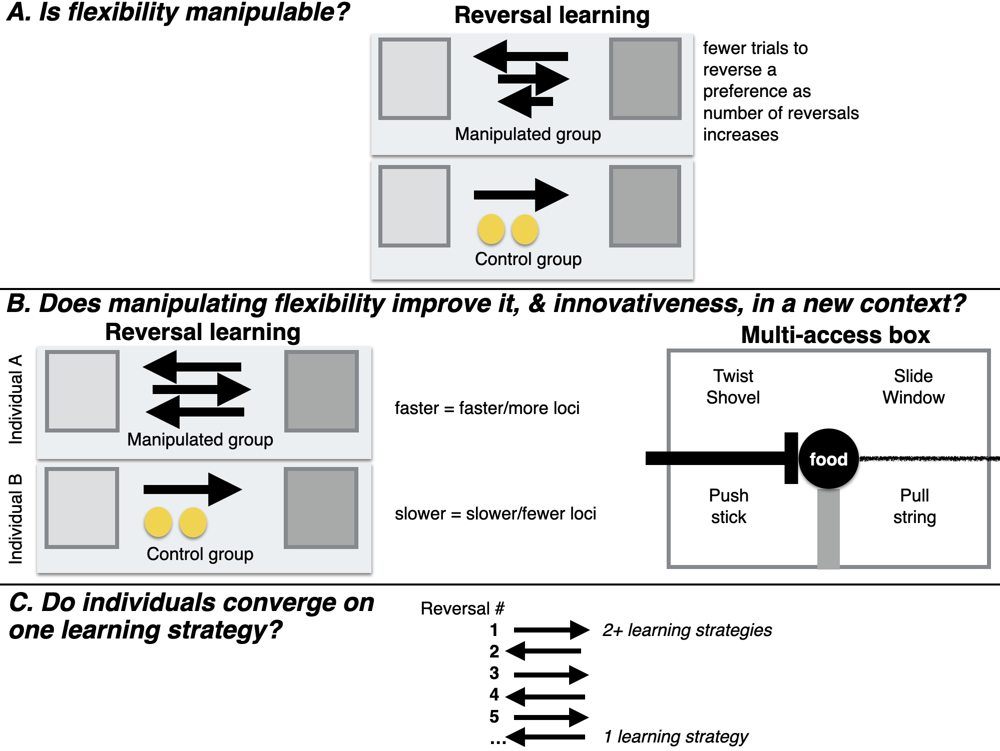
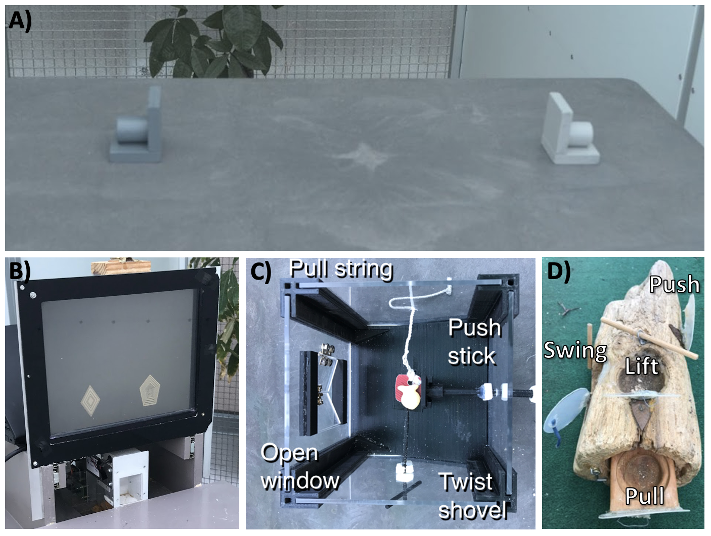
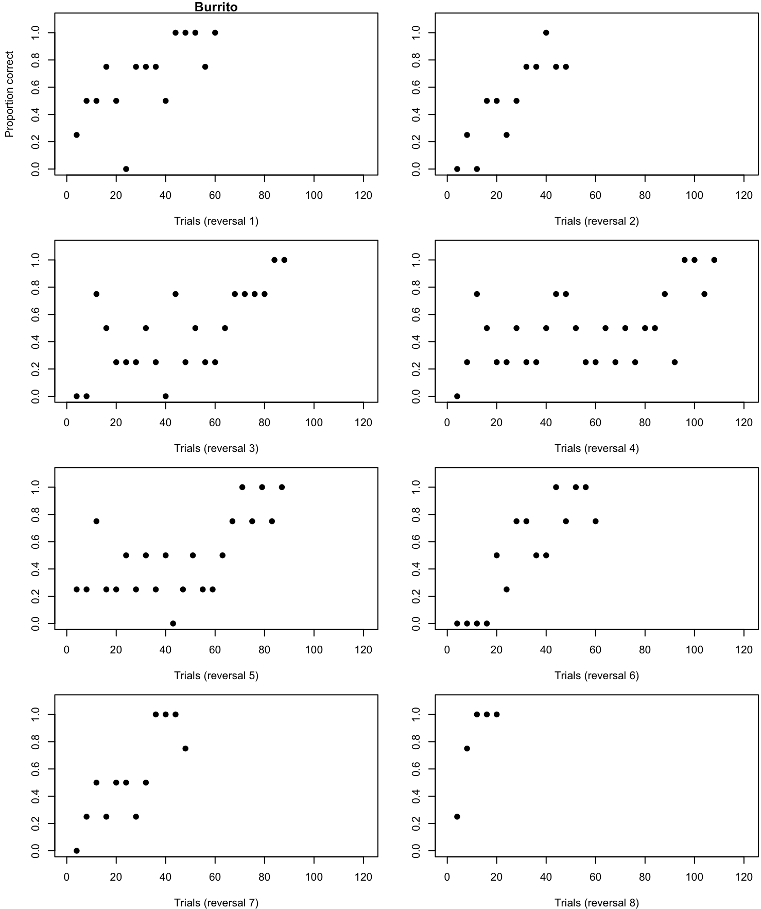
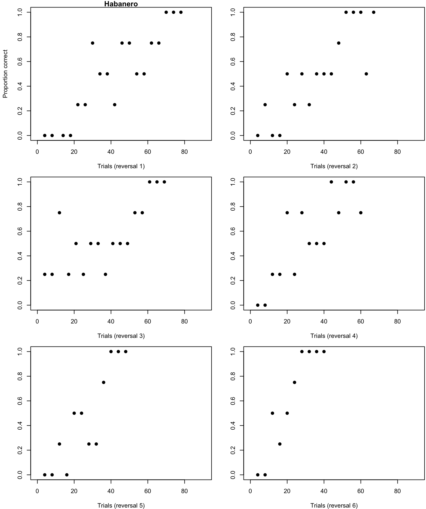

Open... {width=5%} access {width=5%} [code](https://github.com/corinalogan/grackles/blob/master/Files/Preregistrations/g_flexmanip.Rmd) {width=5%} [data](https://doi.org/10.5063/F1XP73CJ) {width=5%} peer review 

&nbsp;

**Affiliations:** 1) Max Planck Institute for Evolutionary Anthropology, Leipzig, Germany, 2) University of California Los Angeles, USA, 3) University of California Santa Barbara, USA, 4) Arizona State University, Tempe, AZ USA. *Corresponding author: corina_logan@eva.mpg.de

```{r setup, include=FALSE}
library(knitr)
library(formatR)
knitr::opts_chunk$set(tidy.opts=list(width.cutoff=70),tidy=TRUE) 
#Make code chunks wrap text so it doesn't go off the page when knitting to PDF

knitr::opts_chunk$set(echo=F, include=T, results='asis', warning=F, message=F) 
#sets global options to display code along with the results https://exeter-data-analytics.github.io/LitProg/r-markdown.html
#set echo=F for knitting to PDF (hide code), and echo=T for knitting to HTML (show code)
```

&nbsp;

**This is the post-study manuscript of the preregistration that was pre-study peer reviewed and received an In Principle Recommendation on 26 Mar 2019 by:**

Aurélie Coulon (2019) Can context changes improve behavioral flexibility? Towards a better understanding of species adaptability to environmental changes. *Peer Community in Ecology*, 100019. [10.24072/pci.ecology.100019](https://doi.org/10.24072/pci.ecology.100019). Reviewers: Maxime Dahirel and Andrea Griffin

**Preregistration:** [html](http://corinalogan.com/Preregistrations/g_flexmanip.html), [pdf](https://github.com/corinalogan/grackles/blob/master/Files/Preregistrations/g_flexmanipPassedPreStudyPeerReview26Mar2019.pdf), [rmd](https://github.com/corinalogan/grackles/blob/d17a75c24df4b90aa607eda452f4fcc496ae9409/Files/Preregistrations/g_flexmanip.Rmd)

**Post-study manuscript** (submitted to PCI Ecology for post-study peer review on 3 Jan 2022, underwent 2 rounds of revisions, R2 submitted Mar 2023): preprint [pdf](https://doi.org/10.32942/osf.io/5z8xs) at EcoEvoRxiv, [html](http://corinalogan.com/Preregistrations/g_flexmanip2.html), [rmd](https://github.com/corinalogan/grackles/blob/master/Files/Preregistrations/g_flexmanip.Rmd)


## ABSTRACT

Behavioral flexibility, the ability to adapt behavior to new circumstances, is thought to play an important role in a species' ability to successfully adapt to new environments and expand its geographic range. However, flexibility is rarely directly tested in species in a way that would allow us to determine how flexibility works to predict a species' ability to adapt their behavior to new environments. We use great-tailed grackles (*Quiscalus mexicanus*; a bird species) as a model to investigate this question because they have recently rapidly expanded their range into North America. We attempted to manipulate grackle flexibility using shaded (light and dark gray) tube reversal learning to determine whether flexibility is generalizable across contexts (multi-access box), and what learning strategies grackles employ. We found that flexibility was manipulable: birds in the manipulated group took fewer trials to pass criterion with increasing reversal number, and they reversed a shade preference in fewer trials by the end of their serial reversals compared to control birds who had only one reversal. Birds that passed their last reversal faster were also more flexible (faster to switch between loci) and innovative (solved more loci) on a multi-access box. All grackles in the manipulated reversal learning group used one learning strategy (epsilon-decreasing) in all reversals, and none used a particular exploration or exploitation strategy earlier or later in their serial reversals. Understanding how flexibility causally relates to other traits will allow researchers to develop robust theory about what flexibility is and when to invoke it as a primary driver in a given context, such as a rapid geographic range expansion. 

## [Video summary](https://youtu.be/bALXB2S4OpI)

## INTRODUCTION

Behavioral flexibility, the ability to adapt behavior to new circumstances through packaging information and making it available to other cognitive processes [see @mikhalevich_is_2017 for the theoretical background on this definition], is thought to play an important role in a species' ability to successfully adapt to new environments and expand its geographic range [e.g., @lefebvre1997feeding; @sol2000behavioural; @sol2002behavioural; @sol2005big; @sol2007big]. The behavioral flexibility (hereafter referred to as flexibility) of individuals is considered an important trait that facilitates the capacity for learning, which is then associated with problem solving ability (applying what one has learned about the world to then attempt to access a resource that is not readily accessible) [see review in @lea2020behavioral]. It is hypothesized that, through flexibility, individuals can increase the diversity of their behaviors either via asocial learning (innovativeness) or social learning, leading to the establishment of the population in a new area [@wright2010behavioral]. 

It is predicted that flexibility should positively relate with innovativeness, the ability to create a new behavior or use an existing behavior in a new situation [@griffin2014innovation]. However, these predictions are based on species-level data and proxies for flexibility and for innovation (e.g., brain size, number of anecdotal reports of “novel” foods consumed) when examining such relationships [see @logan2018beyond]. Flexibility is rarely directly tested in species that are rapidly expanding their geographic ranges in a way that would allow us to determine how flexibility works and predict a species' ability to adapt their behavior to new areas. Those investigations that examine the relationship between flexibility and innovation or problem solving in species that are expanding their range show mixed results, with these variables correlating positively [e.g., grey squirrels: @chow2016practice], negatively [e.g., Indian mynas: @griffin2013tracking], or not at all [e.g., stick tool use and string pulling in great-tailed grackles: @logan2016behavioral]. Problem solving in these contexts involves experimental assays that do not necessarily require innovativeness to solve [e.g., the ability to solve tasks using pre-trained behaviors: @griffin2014innovation]. However, none of these experiments manipulated flexibility.

Here, we take the first step to improving our understanding of whether and how flexibility relates to innovativeness by starting with one population and performing a manipulative experiment on one of the variables to determine whether there is an associated change in the other. Once this association is known, future research can then investigate whether flexibility and innovativeness are involved in a range expansion. Manipulative experiments go beyond correlations to infer a cause and effect relationship between the manipulated variable and the variable(s) measured after the manipulation [@hernan2006instruments; @rethinking2020]. A manipulative experiment combined with the random assignment of subjects to a condition (manipulated group or control group), eliminates many confounds associated with internal and external variation (for example, season, motivation, sex, and so on). Such manipulative experiments in behavioral ecology have primarily been conducted in laboratory settings because of the increased feasibility, however such experiments are now also being conducted in wild settings [e.g., @aplin2015experimentally].

We focused our study on one population of great-tailed grackles (*Quiscalus mexicanus*, hereafter grackles), a bird species that is flexible [@logan2016behavioral]. While they are originally from Central America, grackles have rapidly expanded their geographic range across the US since 1880 [@wehtje2003range; @summers2022xpop]. We attempted to manipulate grackle flexibility using serial reversals of a shade (light or dark gray) preference to determine whether their flexibility is generalizable across additional experimental contexts (touchscreen reversal learning and multi-access box solution switching), whether improving flexibility also improves innovativeness (number of loci solved on a multi-access box), and what learning strategies grackles employ (Figure 1). 

Reversal learning is a common way of measuring flexibility that has been used for many decades across many species, therefore lending itself well to comparative analyses and generalizations [see review in @lea2020behavioral]. In this test, an individual learns to prefer the rewarded option, which differs from the non-rewarded option in shade/color, shape, space, or another discriminable feature. Once this initial preference is formed, the previously non-rewarded option becomes the rewarded option and vice versa, and the preference is reversed. Individuals who are faster to reverse their preference are considered more flexible - better able to change their behavior when the circumstances change. Serial reversal learning involves continuing to reverse the preference back and forth to determine whether individuals learn a “win-stay, lose-shift” rule that, when the reward no longer follows the expected option, they should switch to preferring the other option [@spence1936nature; @warren1965primate; @warren1965comparative]. Once this rule is learned, it can then be applied to new contexts and result in improved performance over individuals who have not learned this rule [@warren1965comparative]. We randomly assigned individuals to a manipulated or control condition and used serial reversals (for the manipulated group) to attempt to manipulate flexibility and determine whether the manipulated individuals were then more flexible and more innovative in other contexts.

If grackle flexibility is manipulable using serial reversals, this would provide us with a useful tool for investigating the relationship between flexibility and any number of other variables implicated in geographic range expansions. It would provide researchers with a way to examine the direct links between, for example, flexibility and exploration, to determine whether they are connected and in which direction, which could provide insights into how populations establish in a new location if cross-population manipulations were conducted. If the flexibility manipulation is not successful, this could indicate either that we did not manipulate the right aspect of flexibility (e.g., perhaps training them to solve a variety of different types of tasks quickly would be more effective) or that grackle flexibility is not a trait that is trainable.



**Figure 1.** A visual illustration of Hypothesis 1 (A), Hypothesis 2 (B), and Hypothesis 4 (C). Longer black arrows indicate slower reversal times, the two yellow circles represent experience with the two yellow tubes that both contained food for the control group.


### HYPOTHESES

#### H1: Behavioral flexibility, as measured by reversal learning using colored tubes, is manipulable.

 - **Prediction 1:** Individuals improve their flexibility on a serial reversal learning task using shaded tubes by generally requiring fewer trials to reverse a preference as the number of reversals increases (manipulation condition). Their flexibility on this test is manipulated relative to control birds who do not undergo serial reversals. Instead, individuals in the control condition are matched to manipulated birds for experience (they experience a similar number of trials), but there is no possibility of a functional tube preference because both tubes are the same shade (yellow) and both contain food, therefore either choice is correct.

 - **P1 alternative 1:** If the number of trials to reverse a preference does not correlate with or positively correlates with reversal number, which would account for all potential correlation outcomes, this suggests that some individuals may prefer to rely on information acquired previously (i.e., they are slow to reverse) rather than relying on current cues (e.g., the food is in a new location) [e.g., @manrique_repeated_2013; @griffin2014innovation; @liu2016learning; but see @homberg2007serotonin].

#### H2: Manipulating behavioral flexibility (improving reversal learning speed through serial reversals using shaded tubes) improves flexibility (rule learning and/or switching) and innovativeness in a new context (two distinct multi-access boxes and serial reversals on a touchscreen).

 - **P2:** Individuals that have improved their flexibility on a serial reversal learning task using shaded tubes (requiring fewer trials to reverse a preference as the number of reversals increases) are faster to switch between new methods of solving (latency to solve or attempt to solve a new way of accessing the food [locus]), and learn more new loci (higher total number of solved loci) on multi-access box flexibility tasks, and are faster to reverse preferences in a serial reversal task using a touchscreen than individuals in the control group where flexibility has not been manipulated. The positive correlation between reversal learning performance using shaded tubes and a touchscreen (faster birds have fewer trials) and the multi-access boxes (faster birds have lower latencies) indicates that all three tests measure the same ability even though the multi-access boxes require inventing new rules to solve new loci (while potentially learning a rule about switching: "when an option becomes non-functional, try a different option") while reversal learning requires switching between two rules ("choose light gray" or "choose dark gray") or learning the rule to "switch when the previously rewarded option no longer contains a reward". Serial reversals eliminate the confounds of exploration, inhibition, and persistence in explaining reversal learning speed because, after multiple reversals, what is being measured is the ability to learn one or more rules. If the manipulation works, this indicates that flexibility can be influenced by previous experience and might indicate that any individual has the potential to move into new environments (see relevant hypotheses in preregistrations on [genetics](http://corinalogan.com/Preregistrations/g_flexgenes.html) (R1) and [expansion](http://corinalogan.com/Preregistrations/g_expansion.html) (H1).

 - **P2 alternative 1:** If the manipulation does not work in that those individuals in the experimental condition do not decrease their reversal speeds more than control individuals, then this experiment elucidates whether general individual variation in flexibility relates to flexibility in new contexts (two distinct multi-access boxes and serial reversals on a touchscreen) as well as innovativeness (multi-access boxes). The prediction is the same as in P2, but in this case variation in flexibility is constrained by traits inherent to the individual [some of which will be tested in @mccune2019exploration], which suggests that certain individuals will be more likely to move into new environments.

 - **P2 alternative 2:** If there is no correlation between reversal learning speed (shaded tubes) and the latency to solve/attempt a new locus on the multi-access boxes, this could be because the latency to solve not only measures flexibility but also innovativeness. In this case, an additional analysis is run with the latency to solve as the response variable, to determine whether the fit of the model (as determined by the lower AIC value) with reversal learning as an explanatory variable is improved if motor diversity (the number of different motor actions used when attempting to solve the multi-access box) is included as an explanatory variable [see @diquelou2015role; @griffin2016invading]. If the inclusion of motor diversity improves the model fit, then this indicates that the latency to solve a new locus on the multi-access box is influenced by flexibility (reversal learning speed) and innovation (motor diversity). 

 - **P2 alternative 3:** If there is a negative correlation or no correlation between reversal learning speed on shaded tubes and reversal learning speed on the touchscreen, then this indicates that it may be difficult for individuals to perceive and/or understand images on the touchscreen in contrast with physical objects (shaded tubes) [e.g., @ohara2015advantage].

#### H3: Behavioral flexibility within a context is repeatable within individuals.

\
This hypothesis from the original preregistration is now being treated in a separate manuscript [@mccune2022flexmanip].

#### H4: Individuals should converge on an epsilon-first learning strategy (learn the correct choice after one trial) as they progress through serial reversals.

 - **P4:** Individuals prefer a mixture of learning strategies in the first serial reversals (an *epsilon-decreasing* strategy where individuals explore both options extensively before learning to prefer the rewarded option, and an *epsilon-first* strategy where the correct choice is consistently made after the first trial), and then move toward the epsilon-first learning strategy. The epsilon-first strategy works better later in the serial reversals where the reward is all or nothing because individuals have learned the environment is changing in predictable ways [@bergstrom2004shannon]: only one option is consistently rewarded, and if the reward isn't in the previously rewarded option, it must be in the other option.

 - **P4 alternative 1:** Individuals continue to prefer a mixture of learning strategies, and/or they do not converge on the more functional epsilon-first learning strategy, regardless of how many reversals they participate in. This pattern could suggest that the grackles do not attend to functional meta-strategies, that is, they do not learn the overarching rule (once food is found in the non-preferred tube, one must switch to preferring that tube shade), but rather they learn each preference change as if it was new. 


## METHODS

Please see our preregistration that received in principle acceptance at PCI Ecology ([PDF](https://github.com/corinalogan/grackles/blob/master/Files/Preregistrations/g_flexmanipPassedPreStudyPeerReview26Mar2019.pdf) version) for all of the preregistered methods. Below, we include a summary and describe all deviations from the preregistration. We present the results from different hypotheses in separate articles: this one, @mccune2022flexmanip, and @lukas2022flexmanip.

#### Planned Sample
\
Grackles were caught in the wild in Tempe, Arizona, USA for individual identification (colored leg bands in unique combinations). Some individuals (~32: ~16 in the control group (they receive 1 reversal) and ~16 in the flexibility manipulation (they receive multiple reversals)) were brought temporarily into aviaries for testing, and then released back to the wild.

#### Data collection stopping rule
\	
We stopped testing birds after we completed two full aviary seasons because the sample size was above the minimum suggested boundary of 15 (to detect a medium effect size) based on model simulations (see Supplementary Material 1).

#### Summary of testing protocols (Figure 2)

- **Reversal learning with shaded tubes:** one light gray and one dark gray tube were placed such that the openings were not visible (shades were pseudorandomized for side). One shade always contained a food reward. The individual had the opportunity to choose to look inside one tube per trial. Once the individual chose correctly on 17 out of the most recent 20 trials, they were considered to have a shade preference, and then the food was always placed in the previously non-rewarded shade and the same passing criterion was used to determine their reversal learning performance. Individuals were randomly placed in the manipulated condition (serial reversals until they passed two consecutive reversals in 50 trials or less) or the control condition (receive only one reversal and then a similar number of total trials to the manipulated individuals, but with two yellow tubes, both of which always had food).

- **Plastic multi-access box:** was a puzzlebox made of plexiglas and plastic, which contained one piece of food on a post in the center of the box. The box was placed in the aviary for up to 15 minutes per trial. Each plexiglas wall had one option (locus) for retrieving the food, but each option required a different method for obtaining the food. The individual had the opportunity to attempt (touch, but not obtain the food) or solve a locus. Once a locus was used successfully three times to get the food, it was considered solved and rendered non-functional in subsequent trials. The experiment ended when an individual solved all four loci or if they did not interact with or successfully solve a locus in three consecutive trials.

- **Wooden multi-access box:** a puzzlebox carved from a log to have four loci containing a food item. Each locus required a different motor action to solve. Three loci were covered with a plastic door on a hinge and one locus was a drawer that must be pulled out. Trials lasted for up to 15 minutes. The passing criterion and experiment ending criteria were the same as for the plastic multi-access box.

- **Reversal learning of shapes on a touchscreen:** this is the same experimental design as with the shaded tubes, except it was carried out on a touchscreen computer where the individual was presented with two white symbols that differed in shape (pentagon or diamond). Touching the screen over the rewarded shape resulted in food dropping from a food hopper into a dish accessible to the grackle, while touching the screen over the non-rewarded shape resulted in no food and a longer inter-trial interval.



**Figure 2.** The experimental apparatuses: reversal learning using dark gray and light gray tubes or two different shapes on a touchscreen, and the wooden and plastic multi-access boxes (MAB). The wooden MAB has four loci, each containing food and each locus has a distinct way of being opened: lift up flap (A), swing open flap (B), pull out drawer (C), or push in flap (D). The plastic MAB has four loci that all provide access to one piece of food and each locus has a distinct way of being opened: open the window (left side), pull the string (top side), push the shovel (right side), or twist the shovel (bottom side).

#### Open materials

 - [Design files](https://github.com/corinalogan/grackles/tree/master/Files/MultiaccessBoxDesignFiles) for the plastic multi-access box: 3D printer files and laser cutter files

 - [Testing protocols](https://docs.google.com/document/d/18D80XZV_XCG9urVzR9WzbfOKFprDV62v3P74upu01xU/edit?usp=sharing) for all experiments: shaded tube reversal learning, plastic multi-access box, wooden multi-access box, and touchscreen reversal learning

#### Open data
\
Data are publicly [available](https://doi.org/10.5063/F1XP73CJ) at the Knowledge Network for Biocomplexity [@logan2023flexmanipdata].

#### Randomization and counterbalancing
\
H1: Subjects were randomly assigned to the manipulated or control group. In the reversal learning trials, the rewarded option is pseudorandomized for side (and the option on the left is always placed first). Pseudorandomization consisted of alternating location for the first two trials of a session and then keeping the same shade on the same side for at most two consecutive trials thereafter. A list of all 88 unique trial sequences for a 10-trial session, following the pseudorandomization rules, was generated in advance for experimenters to use during testing (e.g., a randomized trial sequence might look like: LRLLRRLRLR, where L and R refer to the location, left or right, of the rewarded tube). Randomized trial sequences were assigned randomly to any given 10-trial session using a random number generator (random.org) to generate a number from 1-88. The only exception to this randomization was when an individual exhibited a side bias (choosing one side 4 or more trials in a row). In these cases, we stopped the current random numbers for side and started putting the rewarded shade on the non-preferred side as much as possible while still following the pseudorandomization rules until the individual stopped exhibiting a side bias.

### ANALYSES

Analyses were conducted in R [current version `r getRversion()`, @rcoreteam], using several R packages: kableExtra [@kableextra], MCMCglmm [@hadfield2010mcmc], MuMIn [@mumin], rethinking [@rethinking2020], stan [@rstan], formatR [@formatr], Rstudioapi [@rstudioapi], rcpp [@rcpp], ggplot2 [@ggplot2], knitr [@xie2018knitr; @xie2017dynamic; @xie2013knitr], dplyr [@dplyr], cmdstanr [@cmdstanr], cowplot [@wilkecowplot], reactable [@reactable], DHARMa [@hartig2019dharma], and lme4 [@lme4; @bates2012lme4]. 

**Unregistered analyses:** We conducted unregistered interobserver reliability analyses on the video and live coding of the response variables. Scores indicated that the response variables are repeatable to a high or extremely high degree given our instructions and training for coders (see Supplementary Material 2).

#### Data checking
\
The data were checked for overdispersion, underdispersion, zero-inflation, and heteroscedasticity with the DHARMa R package [@hartig2019dharma] following methods by [Hartig](https://cran.r-project.org/web/packages/DHARMa/vignettes/DHARMa.html).

#### P1: negative relationship between the number of trials to reverse a preference and the number of reversals?
\
**Analysis:** Response variable: Number of trials to reverse a preference. We use a sliding window to look at the most recent 10 trials for a bird, regardless of when the testing sessions occurred. Explanatory variable: reversal number. Random variables: batch (batch is a test cohort, consisting of 8 birds being tested simultaneously and there were multiple batches included in the analysis) and ID (random effect because there were repeated measures on the same individuals). A Generalized Linear Mixed Model [GLMM, MCMCglmm function, MCMCglmm package, @hadfield2010mcmc] was used with a Poisson distribution and log link using 30,000 iterations with a thinning interval of 500, a burnin of 90,000, and minimal priors (V=1, nu=0) [@hadfield2014coursenotes]. We ensured the GLMM showed acceptable convergence [lag time autocorrelation values <0.01, @hadfield2010mcmc], and adjusted parameters as necessary.

We did not need a power analysis to estimate our ability to detect actual effects because, by definition, the individuals that complete this experiment must get faster at reversing in order to pass the stopping criterion (two consecutive reversals in 50 trials or less). According to previous grackle data [from the pilot birds, and from Santa Barbara @logan2016behavioral], the fastest grackle passed their first reversal in 70 trials, which means that passing our serial reversal stopping criterion would require them to have improved their passing speed.

```{r serial, eval=F}
d <- read.csv(url("https://raw.githubusercontent.com/corinalogan/grackles/master/Files/Preregistrations/g_flexmanip_data_reverse.csv"), header=T, sep=",", stringsAsFactors=F)
d <- d[!d$ID=="Fajita" & !d$ID=="Empanada",] #remove Fajita because she was a pilot bird

#remove NAs from the variables that will be in the model
d <- subset(d,!(is.na(d["TrialsToReverse"])))
d <- subset(d,!(is.na(d["ReverseNumber"])))

#include only those birds in the reversal tubes experiment and only those in the manipulation condition bc only these will have more than one reversal (and thus something to correlate). Exclude Memela because she never passed the manipulation criterion
d <- d[d$TubesOrTouchscreen=="TUBES" & d$ExperimentalGroup=="Manipulation" & !d$ID=="Memela",]

#factor variables
d$Batch <- as.factor(d$Batch)
d$ID <- as.factor(d$ID) #n=8 individuals

# DATA CHECKING
library(DHARMa)
library(lme4)

# using MCMCglmm
library(MCMCglmm)
prior = list(R = list(R1 = list(V = 1, nu = 0)), G = list(G1 = list(V = 1, nu = 0), G2 = list(V = 1, nu = 0))) 
model <- MCMCglmm(TrialsToReverse ~ ReverseNumber, random = ~us(ReverseNumber):ID+Batch, 
	    family = "poisson", data = d, verbose = F, prior = prior, 
	    nitt = 300000, thin = 500, burnin = 90000)

### Making DHARMa work for MCMCglmm
# instructions on applying DHARMa to Bayesian models (using BRMS): https://frodriguezsanchez.net/post/using-dharma-to-check-bayesian-models-fitted-with-brms/. To get it to work for MCMCglmm, I had to change posterior_predict to predict (https://rdrr.io/cran/MCMCglmm/man/predict.MCMCglmm.html). Dieter Lukas then figured out the code for simulatedResponse
modelcheck <- createDHARMa(
  simulatedResponse = simulate(model,nsim=250),
  observedResponse = d$TrialsToReverse,
  fittedPredictedResponse = apply(simulate(model,nsim=250), 1, mean),
  integerResponse = TRUE)
plot(modelcheck)
#KS test p=0.47 so not heteroscedastic, dispersion test p=0.66 so not dispersed, outlier test p=0.92 so not zero inflated, residual vs predicted: no significant problems detected.
#compared to how we previously applied DHARMa to a glm (because we couldn't figure out how to apply it to a MCMCglmm), the results are the same except the MCMCglmm version is not dispersed, whereas the GLM version was.

# using glm - we did not use this in the article - we used the one for MCMCglmm above
simulationOutput <- simulateResiduals(fittedModel = glmer(TrialsToReverse ~ ReverseNumber + (1|ID) + (1|Batch), family=poisson, data=d), n=250) #250 simulations, but if want higher precision change n>1000
plot(simulationOutput$scaledResiduals) #Expect a flat distribution of the overall residuals, and uniformity in y direction if plotted against any predictor. 
#Looks randomly scattered
testDispersion(simulationOutput) #if under- or over-dispersed, then p-value<0.05, but then check the dispersion parameter and try to determine what in the model could be the cause and address it there, also check for zero inflation. 
#p=0.00, it is underdispersed according to the plot at https://cran.r-project.org/web/packages/DHARMa/vignettes/DHARMa.html.
testZeroInflation(simulationOutput) #compare expected vs observed zeros, not zero-inflated if p<0.05
#p=1 so not zero inflated
testUniformity(simulationOutput) #check for heteroscedasticity ("a systematic dependency of the dispersion / variance on another variable in the model" Hartig, https://cran.r-project.org/web/packages/DHARMa/vignettes/DHARMa.html), which is indicated if dots aren't on the red line and p<0.05. 
#p=0.06 so it is not heteroscedastic
plot(simulationOutput) #...there should be no pattern in the data points in the right panel
#There is a pattern in the right panel
#January 2021: My interpretation of the statistically significant underdispersion in the data is that this was a manipulation, therefore, by definition the data will not be randomly (normally) distributed. Therefore, we will move forward with the glmm as planned.

# GLMM
library(MCMCglmm)
prior = list(R = list(R1 = list(V = 1, nu = 0)), G = list(G1 = list(V = 1, nu = 0), G2 = list(V = 1, nu = 0)))
serial <- MCMCglmm(TrialsToReverse ~ ReverseNumber, random = ~ID+Batch, family = "poisson", data = d, verbose = F, prior = prior, nitt = 300000, thin = 500, burnin = 90000)
#reverse number significantly negatively correlates with trials to reverse, as expected due to the manipulation
summary(serial)
#Did fixed effects converge (<0.1)? Yes
autocorr(serial$Sol) 
#Did random effects converge (<0.1)? Yes except for 2 values: 0.11 and 0.12
autocorr(serial$VCV)

# with random slope for ID
priorr = list(R = list(R1 = list(V = 1, nu = 0.002)), G = list(G1 = list(V=diag(2), nu=0.002), G2 = list(V = 1, nu = 0.002))) #set nu to 0.002 (because it must be >0) according to p13 https://cran.microsoft.com/snapshot/2019-12-07/web/packages/MCMCglmm/vignettes/CourseNotes.pdf. nu is the belief parameter so a small nu means less belief (uninformed priors)
serialr <- MCMCglmm(TrialsToReverse ~ ReverseNumber, random = ~idh(1+ReverseNumber):ID+Batch, family = "poisson", data = d, verbose = F, prior = priorr, nitt = 300000, thin = 500, burnin = 90000)
summary(serialr)
#same result as without random slopes: a significant negative correlation between trials to reverse and reversal number

#AIC calculation
library(MuMIn)
options(na.action = "na.fail")
base <- dredge(MCMCglmm(TrialsToReverse ~ ReverseNumber, random = ~ID+Batch, 
	    family = "poisson", data = d, verbose = F, prior = prior, 
	    nitt = 300000, thin = 500, burnin = 90000))
library(knitr)
kable(base, caption="")
```

**Unregistered analyses:** We evaluated whether the individuals in both conditions (manipulated and control) required a similar number of trials to pass their first reversal (dependent variable: trials to reverse in first reversal, explanatory variable: condition, random variables: ID and batch; Table 1), and their last reversal (dependent variable: trials to reverse in last reversal, explanatory variable: condition, random variables: ID and batch; Table 3). 

#### P2: serial reversal improves rule switching and innovativeness
\
**Analyses:** One model was run per response variable: average latency to attempt to solve a new locus after solving a different locus, and total number of loci solved. Explanatory variable: Number of trials to reverse a preference in the last reversal.

The model for the number of loci solved takes the form of:

locisolved ~ Binomial(4, p) *[likelihood]*

logit(p) ~ $\alpha$ + $\beta$trials  *[model]*

locisolved is the number of loci solved on the multi-access box, 4 is the total number of loci on the multi-access box, p is the probability of solving any one locus across the whole experiment, $\alpha$ is the intercept, $\beta$ is the expected amount of change in locisolved for every one unit change in trials, and trials is the number of trials to reverse a shade preference. See Supplementary Material 1 for more model details.

The model for the latency to switch options takes the form of:

latency ~ gamma-Poisson($\lambda_i$, $\phi$) *[likelihood]*

log($\lambda_i$) ~ $\alpha$ + $\beta$trials  *[model]*

latency is the average latency to attempt a new locus on the multi-access box, $\lambda_i$ is the rate (probability of attempting a locus in each second) per bird (and we take the log of it to make sure it is always positive; birds with a higher rate have a smaller latency), $\phi$ is the dispersion of the rates across birds, $\alpha$ is the intercept for the rate, $\beta$ is the expected amount of change in the rate of attempting to solve in any given second for every one unit change in trials, and trials is the number of trials to reverse a shade preference. Note that a gamma-Poisson distribution is also known as negative binomial. See Supplementary Material 1 for more model details.

Note: As originally planned, we replaced the GLMs and GLMMs in May 2020 with more powerful models after learning how to make bespoke Bayesian models from McElreath (2016). We made these models before analyzing the actual data (14 May 2020).

```{r improves, eval=F}
d <- read.csv(url("https://raw.githubusercontent.com/corinalogan/grackles/master/Files/Preregistrations/g_flexmanip_datasummary.csv"), header=T, sep=",", stringsAsFactors=F) 

d <- data.frame(d)
colnames(d) <- c("Bird","Batch","Sex","Trials to learn","TrialsFirstReversal","TrialsLastReversal","ReversalsToPass","TotalLociSolvedMABplastic","TotalLociSolvedMABwooden","AverageLatencyAttemptNewLocusMABplastic","AverageLatencyAttemptNewLocusMABwooden","Trials to learn (touchscreen)","Trials to first reversal (touchscreen)","MotorActionsPlastic","MotorActionsWooden")

##### This is the model code from the ability to detect actual effects section, copied here for clarity
#remove pilot birds and Taco because he was the only one in batch "Juvenile"
d2 <- d[!d$Bird=="Fajita" & !d$Bird=="Empanada",]

#ulam doesn't like that batch is not consecutive (there is no batch 2 in this sample, only 1, 3 and 4), so renamed batches 3 and 4, 2 and 3, respectively
d2$Batch[d2$Batch==3]<-2
d2$Batch[d2$Batch==4]<-3
d2$Batch[d2$Batch=="3a"]<-4 #This is Taco bc he wasn't officially in a batch due to him being the first juvenile we ever tested so we wanted to see if he performed similarly to the adults and he did
d2$Batch<-as.integer(d2$Batch)

#load libraries
library(rethinking)
library(rstan)
library(formatR)

### MAB PLASTIC LOCI last reversal
#remove NAs from the variables that will be in the models. n=17
d3 <- subset(d2,!(is.na(d2["Trialstoreverselast"])) & !(is.na(d2["TotalLoci_plastic"]))) 

dlist <- list(locisolved = d3$TotalLoci_plastic,
              trials = standardize(d3$Trialstoreverselast),
              batch = as.integer(d3$Batch)
)

mloci <- ulam( alist(
  locisolved ~ dbinom(4,p) , #4 loci, p=probability of solving a locus
  logit(p) <- a[batch] + b*trials , #batch=random effect, standardize trials so 0=mean
  a[batch] ~ dnorm(0,1) , #each batch gets its own intercept
  b ~ dnorm(0,0.4) #our prior expectation for b is that it is around 0, can be negative or positive, and should not be larger than 1. normal distribution works for binomial (Rethinking p.341)
) , data=dlist , chains=4 , log_lik=TRUE )

precis(mloci,depth=2)
# a=number of loci solved: was there a difference betweeen batches? Yes, batch 1 solved more loci
#b=effect of trials to reverse last on the number of loci solved. Results show that there are no relationships between the number of loci solved and the trials to reverse last (across all batches)
#mean   sd  5.5% 94.5% n_eff Rhat
#a[1]  0.61 0.39  0.01  1.22  3289     1
#a[2]  0.44 0.39 -0.19  1.06  2763     1
#a[3] -0.76 0.56 -1.65  0.11  3031     1
#a[4] -0.48 0.75 -1.70  0.65  3743     1
#b    -0.28 0.26 -0.69  0.13  2905     1


### MAB LOG LOCI last reversal
#remove NAs from the variables that will be in the models. n=12
d4 <- subset(d2,!(is.na(d2["Trialstoreverselast"])) & !(is.na(d2["TotalLoci_wooden"]))) 

dlistLog <- list(locisolved = d4$TotalLoci_wooden,
              trials = standardize(d4$Trialstoreverselast),
              batch = as.integer(d4$Batch)
)

mlociw <- ulam( alist(
  locisolved ~ dbinom(4,p) , #4 loci, p=probability of solving a locus
  logit(p) <- a[batch] + b*trials , #batch=random effect, standardize trials so 0=mean
  a[batch] ~ dnorm(0,1) , #each batch gets its own intercept
  b ~ dnorm(0,0.4) #our prior expectation for b is that it is around 0, can be negative or positive, and should not be larger than 1. normal distribution works for binomial (Rethinking p.341)
) , data=dlistLog , chains=4 , log_lik=TRUE )

precis(mlociw,depth=2)
#a=number of loci solved: was there a difference betweeen batches? Yes, batches 2 and 3 (actually 3 and 4) solved more loci on the log. However, there was only 1 bird (Mole) in batch 1 (he solved all 4)
#b=effect of trials to reverse last on the number of loci solved. There was no relationship between trials to reverse the last preference and the number of loci solved
#mean   sd  5.5% 94.5% n_eff Rhat
#a[1] 1.09 0.75 -0.09  2.35  2820     1
#a[2] 0.83 0.37  0.26  1.44  2595     1
#a[3] 1.45 0.63  0.47  2.49  2432     1
#a[4] 1.08 0.76 -0.10  2.36  2573     1
#b    0.14 0.29 -0.32  0.62  2539     1

#plot
op <- par(mfrow=c(1,1), oma=c(0,0,0,0), mar=c(4.5,4.5,2,0.2), cex.lab=1.8, cex.axis=2)
plot(jitter(d3$Trialstoreverselast),jitter(d3$TotalLoci_plastic), ylab="Number of loci solved", xlab="Trials in last reversal", ylim=c(0,5), xlim=c(0,170), cex=4, pch=2, yaxt="n")
points(jitter(d4$Trialstoreverselast),jitter(d4$TotalLoci_wooden), cex=4, pch=1, yaxt="n")
legend(x="topright", y=8, legend=c(pch2="Plastic", pch1="Wooden"), pch=c(2,1), box.lty=1, cex=2)
axis(side=2, at=c(1,2,3,4))
par(op)


### MAB PLASTIC SWITCH last reversal
#Load packages
library("Rcpp")
library(ggplot2)

#remove NAs from the variables that will be in the models. n=11
d5 <- subset(d2,!(is.na(d2["Trialstoreverselast"])) & !(is.na(d2["AvgLatencyAttemptNewLoci_plastic"]))) 

dlist5 <- list(latency = d5$AvgLatencyAttemptNewLoci_plastic,
              trials = standardize(d5$Trialstoreverselast),
              batch = as.integer(d5$Batch)
)

mswitchp <- ulam(
  alist(
    latency ~ dgampois(lambda, phi),
    log(lambda) <- a[batch] + b*trials,
    a[batch] ~ dnorm(1,1),
    b ~ dnorm(0,1),
    phi ~ dexp(1)
  ),data=dlist5, log_lik=TRUE, messages=FALSE)

precis(mswitchp,depth=2)
#phi=dispersion of gamma poisson, b=effect of trials to reverse on latency, a=were some batches faster to switch
#b=no correlation between average switch latencies and number of trials in last reversal

#mean   sd  5.5% 94.5% n_eff Rhat
#a[1] 4.74 0.45  3.97  5.39   208    1
#a[2] 3.64 0.42  2.99  4.32   278    1
#a[3] 4.63 0.58  3.69  5.53   216    1
#b    0.32 0.26 -0.06  0.77   438    1
#phi  0.78 0.43  0.27  1.60   200    1


### MAB LOG SWITCH last reversal
#remove NAs from the variables that will be in the models. n=11
d6 <- subset(d2,!(is.na(d2["Trialstoreverselast"])) & !(is.na(d2["AvgLatencyAttemptNewLoci_wooden"]))) 

dlist6 <- list(latency = d6$AvgLatencyAttemptNewLoci_wooden,
              trials = standardize(d6$Trialstoreverselast),
              batch = as.integer(d6$Batch)
)

mswitchw <- ulam(
  alist(
    latency ~ dgampois(lambda, phi),
    log(lambda) <- a[batch] + b*trials,
    a[batch] ~ dnorm(1,1),
    b ~ dnorm(0,1),
    phi ~ dexp(1)
  ),data=dlist6, log_lik=TRUE, messages=FALSE)

precis(mswitchw,depth=2)
#phi=dispersion of gamma poisson, b=effect of trials to reverse on latency, a=were some batches faster to switch
#b=no correlation between average switch latencies and number of trials in last reversal

#mean   sd  5.5% 94.5% n_eff Rhat
#a[1]  4.17 0.68  3.07  5.25   208    1
#a[2]  4.52 0.60  3.54  5.43   237    1
#a[3]  4.27 0.60  3.36  5.22   207    1
#a[4]  2.66 0.73  1.57  3.89   304    1
#b    -0.27 0.36 -0.81  0.36   304    1
#phi   0.20 0.12  0.06  0.45   162    1


#plot
op <- par(mfrow=c(1,1), oma=c(0,0,0,0), mar=c(4.5,4.5,2,0.2), cex.lab=1.8, cex.axis=2)
plot(jitter(d5$Trialstoreverselast),jitter(d5$AvgLatencyAttemptNewLoci_plastic), ylab="Average seconds to attempt a new locus", xlab="Trials in last reversal", ylim=c(0,1500), xlim=c(0,170), cex=4, pch=2, yaxt="n")
points(jitter(d6$Trialstoreverselast),jitter(d6$AvgLatencyAttemptNewLoci_wooden), cex=4, pch=1, yaxt="n")
legend(x="topright", y=8, legend=c(pch2="Plastic", pch1="Wooden"), pch=c(2,1), box.lty=1, cex=2)
axis(side=2, at=c(100,200,300,400,500,600,700,800,900,1000,1100,1200,1300,1400,1500))
par(op)


######   BELOW was in the original preregistration  ######
#Is performance on the two multi-access boxes correlated?
#cor(d$AvgLatencySolveNewLoci_plastic, d$AvgLatencySolveNewLoci_wooden) #we no longer run this analyses bc switching is about the next attempt, not the next solve
cor.test(d2$AverageLatencyAttemptNewLocusMABplastic, d2$AverageLatencyAttemptNewLocusMABwooden, use="pairwise.complete.obs", method="pearson")
#plastic and wooden are not significantly correlated cor=0.74 (95% Confidence Interval=-0.19-0.97), t=2.18, df=4, p=0.09
cor.test(d2$TotalLociSolvedMABplastic, d2$TotalLociSolvedMABwooden, use="pairwise.complete.obs", method="pearson")
#plastic and wooden are not significantly correlated cor=0.51 (95% Confidence Interval=-0.09-0.84), t=1.86, df=10, p=0.09

# DATA CHECKING
library(DHARMa)
library(lme4)
simulationOut <- simulateResiduals(fittedModel = glmer(TrialsToReverse ~ Condition + AvgLatencySolveNewLoci + AvgLatencyAttemptNewLoci + TotalLoci + (1|Batch), family=poisson, data=improve), n=250) #250 simulations, but if want higher precision change n>1000
simulationOut$scaledResiduals #Expect a flat distribution of the overall residuals, and uniformity in y direction if plotted against any predictor
testDispersion(simulationOut) #if under- or over-dispersed, then p-value<0.05, but then check the dispersion parameter and try to determine what in the model could be the cause and address it there, also check for zero inflation
testZeroInflation(simulationOut) #compare expected vs observed zeros, not zero-inflated if p<0.05
testUniformity(simulationOut) #check for heteroscedasticity ("a systematic dependency of the dispersion / variance on another variable in the model" Hartig, https://cran.r-project.org/web/packages/DHARMa/vignettes/DHARMa.html), which is indicated if dots aren't on the red line and p<0.05. Also...
plot(simulationOut) #...there should be no pattern in the data points in the right panel
plotResiduals(Condition, simulationOut$scaledResiduals) #plot the residuals against other predictors (in cases when there is more than 1 fixed effect) - can't get this code to work yet

# GLMM
library(MCMCglmm)
prior = list(R = list(R1 = list(V = 1, nu = 0)), G = list(G1 = list(V = 1, 
	    nu = 0), G2 = list(V = 1, nu = 0)))
imp <- MCMCglmm(TrialsToReverse ~ Condition + AvgLatencySolveNewLoci + 
	    AvgLatencyAttemptNewLoci + TotalLoci, random = ~Batch, 
	    family = "poisson", data = improve, verbose = F, prior = prior, 
	    nitt = 13000, thin = 10, burnin = 3000)
summary(imp)
# autocorr(imp$Sol) #Did fixed effects converge?
# autocorr(imp$VCV) #Did random effects converge?
```

**Unregistered analysis:** Because the wooden multi-access box was added after in principle recommendation, we conducted an unregistered analysis to determine whether the plastic and wooden multi-access box results correlated with each other, which would indicate that these tests are interchangeable. We found that they did not statistically significantly correlate with each other on either variable measured: the average latency to attempt a new locus (switching; Pearson's r=0.74, 89% confidence level=0.02-0.95, t=2.18, df=4, p=0.09, n=6) or the total number of loci solved (problem solving; Pearson's r=0.51, 89% confidence level=0.03-0.80, t=1.86, df=10, p=0.09, n=12). Therefore, while the performance on the two multi-access boxes might not be completely independent as indicated by the high r values, the two boxes appear not to be completely interchangeable either as indicated by the lack of statistical significance and high uncertainty in the r values. We therefore analyzed the plastic and wooden multi-access boxes separately.

```{r mabscorr, eval=TRUE}
#Is performance on the two multi-access boxes correlated?
d <- read.csv(url("https://raw.githubusercontent.com/corinalogan/grackles/master/Files/Preregistrations/g_flexmanip_datasummary.csv"), header=T, sep=",", stringsAsFactors=F) 

d <- data.frame(d)
colnames(d) <- c("Bird","Batch","Sex","Trials to learn","TrialsFirstReversal","TrialsLastReversal","ReversalsToPass","TotalLociSolvedMABplastic","TotalLociSolvedMABwooden","AverageLatencyAttemptNewLocusMABplastic","AverageLatencyAttemptNewLocusMABwooden","Trials to learn (touchscreen)","Trials to first reversal (touchscreen)","MotorActionsPlastic","MotorActionsWooden")

##### This is the model code from the ability to detect actual effects section, copied here for clarity
#remove pilot birds and Taco because he was the only one in batch "Juvenile"
d2 <- d[!d$Bird=="Fajita" & !d$Bird=="Empanada",]

#cor(d$AvgLatencySolveNewLoci_plastic, d$AvgLatencySolveNewLoci_wooden) #we no longer run this analyses bc switching is about the next attempt, not the next solve
#cor.test(d2$AverageLatencyAttemptNewLocusMABplastic, d2$AverageLatencyAttemptNewLocusMABwooden, use="pairwise.complete.obs", method="pearson", conf.level=0.89)
#plastic and wooden are not significantly correlated cor=0.74 (89% Confidence level=0.02-0.95), t=2.18, df=4, p=0.09
#cor.test(d2$TotalLociSolvedMABplastic, d2$TotalLociSolvedMABwooden, use="pairwise.complete.obs", method="pearson", conf.level=0.89)
#plastic and wooden are not significantly correlated cor=0.51 (89% Confidence level=0.03-0.80), t=1.86, df=10, p=0.09
```

Post-data collection, we added an additional unregistered analysis comparing first versus last reversal performance for the individuals in the manipulated group (see r code chunk “posthoc_conditionalimprovement” at the rmd for model details).

#### P2 alternative 2: additional analysis: latency and motor diversity
\
**Analyses:** We ran one model per response variable: average latency to attempt a new locus on the multi-access boxes, and number of trials to solve (meet criterion) a new locus on the multi-access boxes. Explanatory variables: Number of trials to reverse a preference in the last reversal that an individual participated in, the number of different motor actions used when attempting to solve the multi-access boxes (motor diversity). A General Linear Model (GLM; glm function) was used with a Poisson distribution and log link.

```{r diversity1P, eval=F}
### NOTE: did not end up using this analysis because only the wooden MAB met the conditions for P2 alternative 2

#Latency to attempt to solve a new locus
dp <- read.csv(url("https://raw.githubusercontent.com/corinalogan/grackles/master/Files/Preregistrations/g_flexmanip_datasummary.csv"), header=F, sep=",", stringsAsFactors=F)

dp <- data.frame(dp)
colnames(dp) <- c("Bird","Batch","Sex","Trials to learn","TrialsFirstReversal","TrialsLastReversal","ReversalsToPass","TotalLociSolvedMABplastic","TotalLociSolvedMABwooden","AverageLatencyAttemptNewLocusMABplastic","AverageLatencyAttemptNewLocusMABwooden","Trials to learn (touchscreen)","Trials to first reversal (touchscreen)","MotorActionsPlastic","MotorActionsWooden")

# Remove NAs
dp <- subset(dp,!(is.na(dp["MotorActionsPlastic"])) & !(is.na(dp["TrialsLastReversal"])) & !(is.na(dp["AverageLatencyAttemptNewLocusMABplastic"])))

# n=11: 6 in manipulated group, 5 in control group
#length(dp$AverageLatencyAttemptNewLocusMABplastic)

# look at the data
#hist(dp$AverageLatencyAttemptNewLocusMABplastic)
#mean(dp$AverageLatencyAttemptNewLocusMABplastic) #208
#sd(dp$AverageLatencyAttemptNewLocusMABplastic) #226

#hist(dp$MotorActionsPlastic)
#mean(dp$MotorActionsPlastic) #14
#sd(dp$MotorActionsPlastic) #3

#mean(dp$TrialsLastReversal) #52
#sd(dp$TrialsLastReversal) #22
#mean(dp$TrialsFirstReversal) #70
#sd(dp$TrialsFirstReversal) #21


# PLASTIC MULTI-ACCESS BOX (P)
# DATA CHECKING
library(DHARMa)
library(lme4)

simulationOutp <- simulateResiduals(fittedModel = glmer(AverageLatencyAttemptNewLocusMABplastic ~ TrialsLastReversal + MotorActionsPlastic + (1|Bird), family=poisson, data=dp), n=250) #250 simulations, but if want higher precision change n>1000
plot(simulationOutp$scaledResiduals) #Expect a flat distribution of the overall residuals, and uniformity in y direction if plotted against any predictor. Looks randomly scattered
testDispersion(simulationOutp) #if under- or over-dispersed, then p-value<0.05, but then check the dispersion parameter and try to determine what in the model could be the cause and address it there, also check for zero inflation. p=0.992 so not over or under dispersed
testZeroInflation(simulationOutp) #compare expected vs observed zeros, not zero-inflated if p<0.05. p=1 so not zero inflated
testUniformity(simulationOutp) #check for heteroscedasticity ("a systematic dependency of the dispersion / variance on another variable in the model" Hartig, https://cran.r-project.org/web/packages/DHARMa/vignettes/DHARMa.html), which is indicated if dots aren't on the red line and p<0.05. p=0.45 so not heterscedastic
plot(simulationOutp) #...there should be no pattern in the data points in the right panel. There is no pattern

# GLM
motp <- glm(dp$AverageLatencyAttemptNewLocusMABplastic ~ dp$TrialsLastReversal + dp$MotorActionsPlastic, family = poisson)

# AIC calculation
library(MuMIn)
options(na.action = "na.fail")
dredgemp <- dredge(glm(dp$AverageLatencyAttemptNewLocusMABplastic ~ dp$TrialsLastReversal + dp$MotorActionsPlastic))
library(knitr)
kable(dredgemp, caption = "")
#Akaike weights are all >0.5, therefore the models are essentially the same

#22 Feb 2023: realized that the glm default family was used, which is gaussian and we specified in the preregistration that this was a poisson family. So I ran the model with both families and found the exact same results so nothing needs to be changed in the table
#gaussian family results
	#(Intercept)	dpMotorActionsPlastic|dpTrialsLastReversal	df	logLik	AICc	delta	weight	
#1	207.63636	NA	NA	2	-74.69601	154.8920	0.0000000	0.49007426
#3	-60.94031	NA	5.155922	3	-72.96256	155.3537	0.4616654	0.38905637
#2	430.86441	-16.37006	NA	3	-74.40936	158.2473	3.3552730	0.09155322
#4	-161.40544	5.74627	5.580313	4	-72.92910	160.5249	5.6328367	0.02931615

#poisson family results
#	(Intercept)	dpMotorActionsPlastic|dpTrialsLastReversal	df	logLik	AICc	delta	weight	
#1	207.63636	NA	NA	2	-74.69601	154.8920	0.0000000	0.49007426
#3	-60.94031	NA	5.155922	3	-72.96256	155.3537	0.4616654	0.38905637
#2	430.86441	-16.37006	NA	3	-74.40936	158.2473	3.3552730	0.09155322
#4	-161.40544	5.74627	5.580313	4	-72.92910	160.5249	5.6328367	0.02931615


### GLMM - can't use this because only 1 data point per bird
library(MCMCglmm)
prior = list(R = list(R1 = list(V = 1, nu = 0), R2 = list(V = 1, nu = 0)), G = list(G1 = list(V = 1, 
    nu = 0)))
div <- MCMCglmm(AverageLatencyAttemptNewLocusMABplastic ~ TrialsLastReversal + MotorActionsPlastic, random = ~Bird, 
    family = "poisson", data = diversity, verbose = F, prior = prior, 
    nitt = 13000, thin = 10, burnin = 3000)
summary(div)
# autocorr(div$Sol) #Did fixed effects converge?
# autocorr(div$VCV) #Did random effects converge?

# AIC calculation
library(MuMIn)
options(na.action = "na.fail")
base1 <- dredge(MCMCglmm(TrialsToSolveNewLociP ~ TrialsToReverseLast + NumberMotorActionsMultiP, random = ~ID, 
    family = "poisson", data = diversity, verbose = F, prior = prior, 
    nitt = 13000, thin = 10, burnin = 3000))
library(knitr)
kable(base1, caption = "")
```

```{r diversity1W, eval=F}
# WOODEN MULTI-ACCESS BOX (W)
dw <- read.csv(url("https://raw.githubusercontent.com/corinalogan/grackles/master/Files/Preregistrations/g_flexmanip_datasummary.csv"), header=F, sep=",", stringsAsFactors=F)

dw <- data.frame(dw)
colnames(dw) <- c("Bird","Batch","Sex","Trials to learn","TrialsFirstReversal","TrialsLastReversal","ReversalsToPass","TotalLociSolvedMABplastic","TotalLociSolvedMABwooden","AverageLatencyAttemptNewLocusMABplastic","AverageLatencyAttemptNewLocusMABwooden","Trials to learn (touchscreen)","Trials to first reversal (touchscreen)","MotorActionsPlastic","MotorActionsWooden")

# Remove NAs
dw <- subset(dw,!(is.na(dw["MotorActionsWooden"])) & !(is.na(dw["TrialsLastReversal"])) & !(is.na(dw["AverageLatencyAttemptNewLocusMABwooden"])))

# n=11: 5 in manipulated group, 6 in control group
#length(dw$AverageLatencyAttemptNewLocusMABwooden)

# look at the data
#hist(dw$AverageLatencyAttemptNewLocusMABwooden)
#mean(dw$AverageLatencyAttemptNewLocusMABwooden) #463
#sd(dw$AverageLatencyAttemptNewLocusMABwooden) #481

#hist(dw$MotorActionsWooden)
#mean(dw$MotorActionsWooden) #13
#sd(dw$MotorActionsWooden) #4

#mean(dw$TrialsLastReversal) #60
#sd(dw$TrialsLastReversal) #38

# DATA CHECKING
library(DHARMa)
library(lme4)
simulationOutw <- simulateResiduals(fittedModel = glm(dw$AverageLatencyAttemptNewLocusMABwooden ~ dw$TrialsLastReversal + dw$MotorActionsWooden), n=250) #250 simulations, but if want higher precision change n>1000
plot(simulationOutw$scaledResiduals) #Expect a flat distribution of the overall residuals, and uniformity in y direction if plotted against any predictor. Looks randomly scattered
testDispersion(simulationOutw) #if under- or over-dispersed, then p-value<0.05, but then check the dispersion parameter and try to determine what in the model could be the cause and address it there, also check for zero inflation. p=0.744 so not over or under dispersed
testZeroInflation(simulationOutw) #compare expected vs observed zeros, not zero-inflated if p<0.05. p=1 so not zero inflated
testUniformity(simulationOutw) #check for heteroscedasticity ("a systematic dependency of the dispersion / variance on another variable in the model" Hartig, https://cran.r-project.org/web/packages/DHARMa/vignettes/DHARMa.html), which is indicated if dots aren't on the red line and p<0.05. p=0.53 so not heteroscedastic
plot(simulationOutw) #...there should be no pattern in the data points in the right panel. It says "quantile deviations detected"

# GLM
motw <- glm(dw$AverageLatencyAttemptNewLocusMABwooden ~ dw$TrialsLastReversal + dw$MotorActionsWooden)

# AIC calculation
library(MuMIn)
options(na.action = "na.fail")
dredgemw <- dredge(glm(dw$AverageLatencyAttemptNewLocusMABwooden ~ dw$TrialsLastReversal + dw$MotorActionsWooden))
library(knitr)
kable(dredgemw, caption = "")
#Akaike weights = 0.71 null and <0.15 for the rest, therefore the models with or without motor actions are essentially the same


# GLMM - does not work because only one data point per bird
library(MCMCglmm)
prior = list(R = list(R1 = list(V = 1, nu = 0), R2 = list(V = 1, nu = 0)), G = list(G1 = list(V = 1, 
    nu = 0)))
div <- MCMCglmm(TrialsToSolveNewLociW ~ TrialsToReverseLast + NumberMotorActionsMultiW, random = ~ID, 
    family = "poisson", data = diversity, verbose = F, prior = prior, 
    nitt = 13000, thin = 10, burnin = 3000)
summary(div)
# autocorr(div$Sol) #Did fixed effects converge?
# autocorr(div$VCV) #Did random effects converge?

# AIC calculation
library(MuMIn)
options(na.action = "na.fail")
base1 <- dredge(MCMCglmm(TrialsToSolveNewLociW ~ TrialsToReverseLast + NumberMotorActionsMultiW, random = ~ID, 
    family = "poisson", data = diversity, verbose = F, prior = prior, 
    nitt = 13000, thin = 10, burnin = 3000))
library(knitr)
kable(base1, caption = "")
```

```{r diversity2P, eval=F}
### NOTE: did not end up using this analysis because only the wooden MAB met the conditions for P2 alternative 2

#Latency to solve a new locus
d <- read.csv(url("https://raw.githubusercontent.com/corinalogan/grackles/master/Files/Preregistrations/g_flexmanip_datasummary.csv"), header=F, sep=",", stringsAsFactors=F)
diversity <- read.csv ("/Users/corina/GTGR/data/data_reversemulti.csv", header=T, sep=",", stringsAsFactors=F) 

# PLASTIC MULTI-ACCESS BOX (P)
# DATA CHECKING
library(DHARMa)
library(lme4)
simulationOutpu <- simulateResiduals(fittedModel = glmer(TrialsToAttemptNewLociP ~ TrialsToReverseLast + NumberMotorActionsMultiP + (1|ID), family=poisson, data=diversity), n=250) #250 simulations, but if want higher precision change n>1000
simulationOutpu$scaledResiduals #Expect a flat distribution of the overall residuals, and uniformity in y direction if plotted against any predictor
testDispersion(simulationOutpu) #if under- or over-dispersed, then p-value<0.05, but then check the dispersion parameter and try to determine what in the model could be the cause and address it there, also check for zero inflation
testZeroInflation(simulationOutpu) #compare expected vs observed zeros, not zero-inflated if p<0.05
testUniformity(simulationOutpu) #check for heteroscedasticity ("a systematic dependency of the dispersion / variance on another variable in the model" Hartig, https://cran.r-project.org/web/packages/DHARMa/vignettes/DHARMa.html), which is indicated if dots aren't on the red line and p<0.05. Also...
plot(simulationOutpu) ##...there should be no pattern in the data points in the right panel
plotResiduals(NumberMotorActionsMultiP, simulationOutpu$scaledResiduals) #plot the residuals against other predictors - can't get this code to work yet
plotResiduals(TrialsToReverseLast, simulationOutpu$scaledResiduals)

# GLMM
library(MCMCglmm)
prior = list(R = list(R1 = list(V = 1, nu = 0), R2 = list(V = 1, nu = 0)), G = list(G1 = list(V = 1, 
    nu = 0)))
div <- MCMCglmm(TrialsToAttemptNewLociP ~ TrialsToReverseLast + NumberMotorActionsMultiP, random = ~ID, 
    family = "poisson", data = diversity, verbose = F, prior = prior, 
    nitt = 13000, thin = 10, burnin = 3000)
summary(div)
# autocorr(div$Sol) #Did fixed effects converge?
# autocorr(div$VCV) #Did random effects converge?

# AIC calculation
library(MuMIn)
options(na.action = "na.fail")
base1 <- dredge(MCMCglmm(TrialsToAttemptNewLociP ~ TrialsToReverseLast + NumberMotorActionsMultiP, random = ~ID, 
    family = "poisson", data = diversity, verbose = F, prior = prior, 
    nitt = 13000, thin = 10, burnin = 3000))
library(knitr)
kable(base1, caption = "")
```

```{r diversity2W, eval=F}
### NOTE: did not end up using this analysis because the total number of loci solved on the wooden MAB did not meet the conditions for P2 alternative 2

# WOODEN MULTI-ACCESS BOX (W)
#Latency to solve a new locus
dw <- read.csv(url("https://raw.githubusercontent.com/corinalogan/grackles/master/Files/Preregistrations/g_flexmanip_datasummary.csv"), header=F, sep=",", stringsAsFactors=F)

dw <- data.frame(dw)
colnames(dw) <- c("Bird","Batch","Sex","Trials to learn","TrialsFirstReversal","TrialsLastReversal","ReversalsToPass","TotalLociSolvedMABplastic","TotalLociSolvedMABwooden","AverageLatencyAttemptNewLocusMABplastic","AverageLatencyAttemptNewLocusMABwooden","Trials to learn (touchscreen)","Trials to first reversal (touchscreen)","MotorActionsPlastic","MotorActionsWooden")

# Remove NAs
dw <- subset(dw,!(is.na(dw["MotorActionsWooden"])) & !(is.na(dw["TrialsLastReversal"])) & !(is.na(dw["TotalLociSolvedMABwooden"])))

# n=12: 6 in manipulated group, 6 in control group
#length(dw$TotalLociSolvedMABwooden)

# look at the data
#hist(dw$TotalLociSolvedMABwooden)
#mean(dw$TotalLociSolvedMABwooden) #3.25
#sd(dw$TotalLociSolvedMABwooden) #1.22

#hist(dw$MotorActionsWooden)
#mean(dw$MotorActionsWooden) #12.4
#sd(dw$MotorActionsWooden) #5.2

#mean(dw$TrialsLastReversal) #58
#sd(dw$TrialsLastReversal) #36


# DATA CHECKING
library(DHARMa)
library(lme4)
simulationOutpu <- simulateResiduals(fittedModel = glm(TotalLociSolvedMABwooden ~ TrialsLastReversal + MotorActionsWooden, family=poisson, data=dw), n=250) #250 simulations, but if want higher precision change n>1000
plot(simulationOutpu$scaledResiduals) #Expect a flat distribution of the overall residuals, and uniformity in y direction if plotted against any predictor
testDispersion(simulationOutpu) #if under- or over-dispersed, then p-value<0.05, but then check the dispersion parameter and try to determine what in the model could be the cause and address it there, also check for zero inflation. p<0.05 so under or overdispersed
testZeroInflation(simulationOutpu) #compare expected vs observed zeros, not zero-inflated if p<0.05. p=0.8 so not zero inflated
testUniformity(simulationOutpu) #check for heteroscedasticity ("a systematic dependency of the dispersion / variance on another variable in the model" Hartig, https://cran.r-project.org/web/packages/DHARMa/vignettes/DHARMa.html), which is indicated if dots aren't on the red line and p<0.05. p=0.2 so not heteroscedastic. Also...
plot(simulationOutpu) ##...there should be no pattern in the data points in the right panel. Dispersion test significant
plotResiduals(dw$MotorActionsWooden, simulationOutpu$scaledResiduals) #plot the residuals against other predictors - can't get this code to work yet
plotResiduals(dw$TrialsLastReversal, simulationOutpu$scaledResiduals)

# AIC calculation
library(MuMIn)
options(na.action = "na.fail")
base1 <- dredge(glm(TotalLociSolvedMABwooden ~ TrialsLastReversal + MotorActionsWooden, family=poisson, data=dw))
library(knitr)
kable(base1, caption = "")


### glmm doesn't work because only 1 data point per bird
# GLMM
library(MCMCglmm)
prior = list(R = list(R1 = list(V = 1, nu = 0), R2 = list(V = 1, nu = 0)), G = list(G1 = list(V = 1, 
    nu = 0)))
div <- MCMCglmm(TrialsToAttemptNewLociW ~ TrialsLastReversal + MotorActionsWooden, random = ~ID, 
    family = "poisson", data = diversity, verbose = F, prior = prior, 
    nitt = 13000, thin = 10, burnin = 3000)
summary(div)
# autocorr(div$Sol) #Did fixed effects converge?
# autocorr(div$VCV) #Did random effects converge?

# AIC calculation
library(MuMIn)
options(na.action = "na.fail")
base1 <- dredge(MCMCglmm(TotalLociSolvedMABwooden ~ TrialsLastReversal + MotorActionsWooden, random = ~ID, 
    family = "poisson", data = diversity, verbose = F, prior = prior, 
    nitt = 13000, thin = 10, burnin = 3000))
library(knitr)
kable(base1, caption = "")
```

#### P4: learning strategies (for birds in the manipulated group only)
\
**Analysis 1 (qualitative):** Learning strategies were identified by matching them to the two known approximate strategies of the contextual, binary multi-armed bandit: epsilon-first and epsilon-decreasing [@mcinerney2010; as in @logan2016behavioral]. We used the criterion for the epsilon-first strategy of learning the correct choice after one trial and then choosing correctly thereafter. Other patterns were classified as the epsilon-decreasing strategy where individuals gradually increase their number of successes as the number of trials increases. This method of qualitative inspection of learning curves is standard for this type of learning strategy assessment [@mcinerney2010]. The variable for visual inspection was the proportion of correct choices in a non-overlapping sliding window of 4-trial bins across the total number of trials required to reach the criterion of 17/20 correct choices per individual. 

**Analysis 2 (quantitative):** We then quantitatively determined to what degree each bird used the exploration versus exploitation strategy using methods in @federspiel2017adjusting by calculating the number of 10-trial blocks where birds were choosing “randomly” (2-9 correct choices; called sampling blocks; akin to the exploration phase above) and dividing it by the total number of blocks to reach criterion per bird. This ratio was also calculated for “acquisition” blocks where birds made primarily correct choices (9-10 correct choices; akin to the exploitation phase above). These ratios, calculated for each bird for their serial reversals, quantitatively discern the exploration from the exploitation phases.

#### DEVIATIONS FROM THE PREREGISTRATION

\

**After pilot data were collected and before the actual data collection began**

1) We initially (in 2017) set as the  serial reversal passing criterion: During the data collection period, the number of trials required to reverse a preference will be documented per bird, and reversals will continue until the first batch of birds tested reaches an asymptote (i.e., there are negligible further decreases in the number of trials required to reverse a preference). The number of reversals to reach the asymptote will be the number of reversals that subsequent birds experience. Due to delays in setting up the field site, we were only able to test two grackles in early 2018 (January through April) and, due to randomization, only one (Fajita) was in the experimental condition that involved undergoing the flexibility manipulation (Empanada was in the control condition). While Fajita’s reversal speeds generally improved with increasing serial reversals, she never reached an asymptote (which we defined as passing three consecutive reversals in the same number of trials), even after 38 reversals. These 38 reversals took 2.5 months, which is an impractical amount of time if birds are to participate in the rest of the test battery (multi-access box, detour, causal cognition, go no-go, reversal on a touchscreen) after undergoing the reversal manipulation (we were initially permitted to keep them in aviaries for up to three months per bird, which we extended to 6 months per bird in Dec 2018). Because our objective in this experiment was to manipulate an individual’s flexibility, we decided to revise our serial reversal passing criterion to something more species relevant based on Fajita’s serial reversal performance and the performance of seven grackles in Santa Barbara who underwent only one reversal in 2014 and 2015 (Logan, 2016). The **revised serial reversal passing criterion was: passing two reversals in a row at or under 50 trials**. 50 trials is fewer trials than any of the nine grackles required to pass their first reversal (range 70-130), therefore it should reflect an improvement in flexibility.

**At the beginning of data collection**

2) Reversal learning shaded tube choice criterion: At the beginning of the second bird’s initial discrimination in the reversal learning shaded tube experiment (October 2018), we revised the criterion for what counts as a choice from A) the bird’s head needs to pass an invisible line on the table that ran perpendicular to the the tube opening to B) the **bird needs to bend its body or head down to look in the tube** (see B demonstrated in Figure 3). Criterion A resulted in birds making more choices than the number of learning opportunities they were exposed to (because they could not see whether there was food in the tube unless they bent their head down to look in the tube) and appeared to result in slower learning. It is important that one choice equals one learning opportunity, therefore we revised the choice criterion to the latter. Anecdotally, this choice matters because the first three birds in the experiment (Tomatillo, Chalupa, and Queso) learned faster than the pilot birds (Empanada and Fajita) in their initial discriminations and first reversals. Thus, it was an important change to make at the beginning of the experiment (after testing the two pilot birds and before collecting any data that were included in analyses).


**Figure 3.** Tzanatl preciosa bending down to look into the dark gray tube. 

3) Criterion to pass the control condition: Before collecting experimental data, we set the number of trials experienced by the birds in the control group as 1100 because this is how many trials it would have taken the pilot bird in the manipulated group, Fajita, to pass serial reversals 2-17 according to our revised serial reversal passing criterion. However, after 25 and 17 days (after Tomatillo and Queso’s first reversals, respectively) of testing the first two individuals in the control group, it became apparent that 1100 trials is impractical given the time constraints for how long we were permitted to keep each bird temporarily in captivity and would prevent birds from completing the test battery before their release. Additionally, after revising the choice criterion, it was going to be likely that birds in the manipulated group would require fewer than 1100 trials to meet the serial reversal passing criterion. Therefore, reducing the number of trials the control birds experience would result in a better match of experience with birds in the manipulated group. On 2 November 2018 we **set the number of trials control birds experience after their first (and only) reversal** to the number of trials it requires the first bird in the manipulated group to pass (the first bird had not passed yet, therefore we did not yet know what this number was). After more individuals in the manipulated group passed, we updated this number to the average number of trials to pass. This applied to all birds in the control condition, except Mofongo. Mofongo (control condition) was a slow participator and would not have finished his test battery by the time it got too hot to keep birds in the aviaries if we used the current average number of trials (420). Instead, we matched him with the fastest bird in the manipulated group (Habanero=290 trials) to make it more likely that Mofongo could get through the rest of the test battery in time.

**In the middle of data collection**

4) 10 April 2019: We **discontinued the reversal learning experiment on the touchscreen** because it appeared to measure something other than what we intended to test and it required a huge time investment for each bird (which consequently reduced the number of other tests they were available to participate in). This is not necessarily surprising because this was the first time touchscreen tests have been conducted in this species, and also the first time (to our knowledge) this particular reversal experiment has been conducted on a touchscreen with birds. We based this decision on data from four grackles (2 in the flexibility manipulation group and 2 in the flexibility control group; 3 males and 1 female). All four of these individuals showed highly inconsistent learning curves and required hundreds more trials to form each preference when compared to the performance of these individuals on the shaded tube reversal experiment. It appeared that there was a confounding variable with the touchscreen such that they were extremely slow to learn a preference as indicated by passing our criterion of 17 correct trials out of the most recent 20. We did not include the data from this experiment when conducting the cross-test comparisons in the Analysis Plan section of the preregistration. Instead, in Supplementary Material 4, we provided summary results for this experiment and, in the Discussion, qualitatively compared it with performance on the shaded tube reversal test to explain what might have confounded the touchscreen experiment.

5) 16 April 2019: Because we discontinued the touchscreen reversal learning experiment, we **added an additional but distinct multi-access box** task, which allowed us to continue to measure flexibility across three different experiments. There are two main differences between the first multi-access box, which is made of plastic, and the new multi-access box, which is made of wood. First, the wooden multi-access box is a natural log in which we carved out 4 compartments. As a result, the apparatus and solving options are more comparable to what grackles experience in the wild, though each compartment is covered by a transparent plastic door that requires different behaviors to open. Furthermore, there is only one food item available in the plastic multi-access box and the bird could use any of 4 loci to reach it. In contrast, the wooden multi-access box has a piece of food in each of the 4 separate compartments. 

**Post data collection, pre-data analysis**

6) We completed our simulation to explore the lower boundary of a minimum sample size and determined that **our sample size for the Arizona study site is above the minimum** (see details and code in Supplementary Material 1; 17 April 2020).

7) Please see our Alternative Analyses section in the preregistration where we stated that we would learn and implement Bayesian models, which resulted in our **changing the analysis for P2** and that we are replacing this analysis with the new models in the Ability to detect actual effects section (Supplementary Material 1; 14 May 2020). We also describe in SM1 that we realized that Condition (manipulated or control) does not need to be a variable in our models because our analyses in P1 demonstrate that the manipulation causally changed reversal speeds, which is the key assumption in P2.

8) We originally planned on testing only **adults** to have a better understanding of what the species is capable of, assuming the abilities we are testing are at their optimal levels in adulthood, and so we could increase our statistical power by eliminating the need to include age as an independent variable in the models. Because the grackles in Arizona were extremely difficult to catch, we ended up testing two juveniles: Taco and Chilaquile. We did not conduct the full test battery with Taco or put him in the flexibility manipulation or control groups (he received 1 reversal and then moved on to the next test) because he was the first juvenile and we wanted to see whether his performance was different from adult performances. His performances were similar to the adults, therefore we decided to put Chilaquile in the full test battery. Chilaquile's performances were also similar to the adults, therefore we decided not to add age as an independent variable in the models to avoid reducing our statistical power. 

9) We **removed experimenter as a random effect** from all analyses because the interobserver reliability scores were so high, indicating there was no difference between experimenters, therefore we could keep our models simpler by leaving this variable out.

10) P2 alternative 2: We **used the average latency rather than the number of trials to attempt a new locus** because this would make the model comparable with the model in P2. Using the number of trials was an artifact from a previous version and we had missed updating this. We omitted the number of trials to solve a new locus as described in the deviation from the plan in P2 above. We used a GLM rather than a GLMM because there was only one data point per bird (note that there would have been only one data point per bird in the preregistration as well, but we didn’t realize this until after in principle acceptance).

11) P4 (Aug 2021): the grackles were tested in **10-trial blocks** and not 20-trial blocks as in Federspiel et al. (2017), which would mean that if there were <20 trials in the last block of a reversal, they would be omitted from the analysis. Therefore, we changed the block size to 10 trials and adjusted the sampling blocks to 2-9 correct choices, and the acquisition blocks to 9-10 correct choices using significance levels in the binomial test as did Federspiel et al. (2017).

**Post data collection, mid-data analysis**

12) P2 (April 2020): we realized that the average latency to solve a new locus after solving a different locus is confounded with the total number of loci solved because the measure of innovation is included in the definition. Therefore, we removed average latency to solve a locus from analyses so that we are only examining pure measures of flexibility (average latency to **attempt** to solve) and innovation (total number of loci solved).

13) P2: Removed batch (random variable): the original model for P2 (Table SM3: Model 1) included the covariate aviary batch, however this ended up confounding the analysis because control and manipulated individuals, while randomly assigned to these conditions, ended up in particular batches as a result of their willingness to participate in tests offered during their time in the aviary (Table SM3: Model 3). Several grackles never passed habituation or training such that their first experiment could begin, therefore we replaced these grackles in the aviaries with others who were willing to participate. This means that batch did not indicate a particular temporal period. Therefore, we **removed batch from the models** (post data collection, mid-data analysis).

14) P2: When making the bespoke Bayesian models, we realized that we had previously misinterpreted which variable should be the response variable in this analysis. We originally set the number of trials to reverse as the response variable, however we should have instead set the number of loci solved as the response variable and then planned to conduct a second model with the latency to attempt a new locus as the response variable and number of trials as the explanatory variable. This is because a) we manipulated the number of trials to reverse, therefore it must be the explanatory variable (Hernán & Robins, 2006); and b) they should be split into two models, **one each for average latency and number of loci solved**, because of a and because these are two very different relationships that should be considered in their own models. We also realized that Condition (manipulated or control) does not need to be a variable in any of our models because our analyses in P1 demonstrate that the manipulation causally changed reversal speeds, which is the key assumption in P2.


## RESULTS

Although 22 grackles completed their initial shaded tube discrimination, only 20 grackles participated in one or more reversal (Table SM5). The rest of the tests began only after a bird's reversal experiment was complete [@logan2023flexmanipdata].

### P1: reversal speed gets faster with serial reversals

The birds in the manipulated group required a similar number of trials during their first reversal (R1 median=75 trials) as the birds in the control group needed during their first and only reversal (R1 median=70 trials) (see unregistered analysis in Table 1). The manipulated birds improved during the reversal manipulation to a median of 40 trials in their last reversal: there was a significant negative correlation between the number of trials to reverse (average=71 trials, standard deviation (sd)=28, Table 2) and the reversal number for those grackles in the flexibility manipulation condition (n=9, which included Memela who did not pass the manipulation condition of passing two consecutive reversals in 50 trials or less; Figure 4). 

**Table 1.** Unregistered analysis: the number of trials to reverse in the first reversal is similar between the manipulated and control groups.

```{r p1unregistered, eval=F}
d <- read.csv(url("https://raw.githubusercontent.com/corinalogan/grackles/master/Files/Preregistrations/g_flexmanip_data_reverse.csv"), header=T, sep=",", stringsAsFactors=F)
d <- d[!d$ID=="Fajita" & !d$ID=="Empanada",] #remove Fajita because she was a pilot bird

#remove NAs from the variables that will be in the model
d <- subset(d,!(is.na(d["TrialsToReverse"])))
d <- subset(d,!(is.na(d["ReverseNumber"])))

#include only those birds in the reversal tubes experiment and only those in the manipulation condition bc only these will have more than one reversal (and thus something to correlate)
d <- d[d$TubesOrTouchscreen=="TUBES",]

#factor variables
d$Batch <- as.factor(d$Batch)
d$ID <- as.factor(d$ID)
d$ExperimentalGroup <- as.factor(d$ExperimentalGroup)

#rename Taco's "None" to "Control" to count him as a control bird for this analysis because he had only 1 reversal (and no yellow tube afterward)
levels(d$ExperimentalGroup) <- c("Control","Manipulation","Control")

# GLMM
library(MCMCglmm)
prior = list(R = list(R1 = list(V = 1, nu = 0)), G = list(G1 = list(V = 1, 
	    nu = 0), G2 = list(V = 1, nu = 0)))
condition <- MCMCglmm(TrialsToReverse ~ ExperimentalGroup, random = ~ID+Batch, 
	    family = "poisson", data = d, verbose = F, prior = prior, 
	    nitt = 300000, thin = 500, burnin = 90000)

#reverse number significantly negatively correlates with trials to reverse, as expected due to the manipulation? Yes
summary(condition)
#              post.mean l-95% CI u-95% CI eff.samp  pMCMC   
#(Intercept)                     4.28760  4.09032  4.51160      420 <0.002 **
#ExperimentalGroupManipulation  -0.07978 -0.31236  0.15703      420  0.457   

#see whether removing batch makes a difference in the results (we removed batch for all P2 analyses)
prior2 = list(R = list(R1 = list(V = 1, nu = 0)), G = list(G1 = list(V = 1, 
	    nu = 0)))
conditionwobatch <- MCMCglmm(TrialsToReverse ~ ExperimentalGroup, random = ~ID, 
	    family = "poisson", data = d, verbose = F, prior = prior2, 
	    nitt = 300000, thin = 500, burnin = 90000)
summary(conditionwobatch) #results are very similar to and conclusions are not different from the "condition" model

#Output table
# FIRST: Extract 89 percentile compatibility interval from the model output and update the table's csv
library(rethinking)
PI(condition$Sol[,1],prob=0.89) #4.12 to 4.46 percentile intervals
PI(condition$Sol[,2],prob=0.89) #-0.27 to 0.11 percentile intervals

tb <- read.csv(url("https://raw.githubusercontent.com/corinalogan/grackles/master/Files/Preregistrations/g_flexmanip_tableR1condition.csv"), header=F, sep=",", stringsAsFactors=F)
tb <- data.frame(tb)
colnames(tb) <- c("","Posterior mean","Lower 89 percentile compatibility interval (5.5%)","Upper 89 percentile compatibility interval (94.5%)","Effective sample size","pMCMC","Significance code: **=0.01")

library(kableExtra)
knitr::kable(tb) %>%
kable_styling(full_width = T, position = "left",  bootstrap_options = "condensed", font_size = 8)
```

```{r p1unregisteredTable, eval=T}
tb <- read.csv(url("https://raw.githubusercontent.com/corinalogan/grackles/master/Files/Preregistrations/g_flexmanip_tableR1condition.csv"), header=F, sep=",", stringsAsFactors=F)
tb <- data.frame(tb)
colnames(tb) <- c("","Posterior mean","Lower 89 percentile compatibility interval (5.5%)","Upper 89 percentile compatibility interval (94.5%)","Effective sample size","pMCMC","Significance code: **=0.01")

library(kableExtra)
knitr::kable(tb) %>%
kable_styling(full_width = T, position = "left",  bootstrap_options = "condensed", font_size = 8)
```

**Table 2.** The number of trials to reverse decreases with increasing reversal number.

```{r p1table, eval=T}
d <- read.csv(url("https://raw.githubusercontent.com/corinalogan/grackles/master/Files/Preregistrations/g_flexmanip_data_reverse.csv"), header=T, sep=",", stringsAsFactors=F)
d <- d[!d$ID=="Fajita" & !d$ID=="Empanada",] #remove Fajita because she was a pilot bird

#remove NAs from the variables that will be in the model
d <- subset(d,!(is.na(d["TrialsToReverse"])))
d <- subset(d,!(is.na(d["ReverseNumber"])))

#include only those birds in the reversal tubes experiment and only those in the manipulation condition bc only these will have more than one reversal (and thus something to correlate)
d <- d[d$TubesOrTouchscreen=="TUBES" & d$ExperimentalGroup=="Manipulation",]

#factor variables
d$Batch <- as.factor(d$Batch)
d$ID <- as.factor(d$ID)

# GLMM
library(MCMCglmm)
prior = list(R = list(R1 = list(V = 1, nu = 0)), G = list(G1 = list(V = 1, 
	    nu = 0), G2 = list(V = 1, nu = 0))) 
serial <- MCMCglmm(TrialsToReverse ~ ReverseNumber, random = ~us(ReverseNumber):ID+Batch, 
	    family = "poisson", data = d, verbose = F, prior = prior, 
	    nitt = 300000, thin = 500, burnin = 90000)

# Extract 89 percentile compatibility interval from the model output
library(rethinking)
#PI(serial$Sol[,1],prob=0.89) #4.31 to 4.62
#PI(serial$Sol[,2],prob=0.89) #-0.10 to -0.03

#reverse number significantly negatively correlates with trials to reverse, as expected due to the manipulation? Yes
#summary(serial)
#              post.mean l-95% CI u-95% CI eff.samp  pMCMC   
#(Intercept)     4.43636  4.25434  4.62631    635.3 <0.002 **
#ReverseNumber  -0.05523 -0.08775 -0.02024    499.9 <0.002 **

#25 May 2022: nested ID within reverse number as a random effect per reviewer comment and the results are the same
#             post.mean l-95% CI u-95% CI eff.samp   pMCMC   
#(Intercept)     4.46585  4.28078  4.66648    349.0 < 0.002 **
#ReverseNumber  -0.06401 -0.11447 -0.02273    273.9 0.00952 **

#Did batch have an effect on the results? No.
priorNoBatch = list(R = list(R1 = list(V = 1, nu = 0)), G = list(G1 = list(V = 1, 
	    nu = 0)))

serialNoBatch <- MCMCglmm(TrialsToReverse ~ ReverseNumber, random = ~us(ReverseNumber):ID, 
	    family = "poisson", data = d, verbose = F, prior = priorNoBatch, 
	    nitt = 300000, thin = 500, burnin = 90000)
#summary(serialNoBatch)
#22 Jun 2022: removed batch as a random effect per reviewer comment andn the results are the same
#              post.mean l-95% CI u-95% CI eff.samp   pMCMC   
#(Intercept)     4.47231  4.30258  4.68142    420.0 < 0.002 **
#ReverseNumber  -0.06477 -0.11364 -0.02472    315.3 0.00476 **

#Did fixed effects converge (<0.1)? Yes
#autocorr(serial$Sol) 
#Did random effects converge (<0.1)? Yes except for 2 values: 0.11 and 0.12
#autocorr(serial$VCV)

#Output table
tb <- read.csv(url("https://raw.githubusercontent.com/corinalogan/grackles/master/Files/Preregistrations/g_flexmanip_table2output.csv"), header=F, sep=",", stringsAsFactors=F)
tb <- data.frame(tb)
colnames(tb) <- c("","Posterior mean","Lower 89 percentile compatibility interval (5.5%)","Upper 89 percentile compatibility interval (94.5%)","Effective sample size","pMCMC","Significance code: **=0.01")

library(kableExtra)
knitr::kable(tb) %>%
kable_styling(full_width = T, position = "left",  bootstrap_options = "condensed", font_size = 8)
```

```{r p1fig, eval=T}
d <- read.csv(url("https://raw.githubusercontent.com/corinalogan/grackles/master/Files/Preregistrations/g_flexmanip_data_reverse.csv"), header=T, sep=",", stringsAsFactors=F)
d <- d[!d$ID=="Fajita" & !d$ID=="Empanada",] #remove Fajita because she was a pilot bird

#remove NAs from the variables that will be in the model
d <- subset(d,!(is.na(d["TrialsToReverse"])))
d <- subset(d,!(is.na(d["ReverseNumber"])))

#include only those birds in the reversal tubes experiment and only those in the manipulation condition bc only these will have more than one reversal (and thus something to correlate)
d <- d[d$TubesOrTouchscreen=="TUBES" & d$ExperimentalGroup=="Manipulation",]

#n, mean, sd
#length(levels(d$ID)) #9
#mean(d$TrialsToReverse) #71
#sd(d$TrialsToReverse) #28

#figure
op <- par(mfrow=c(1,1), mar=c(5.9,4.9,2,0.9))
plot(jitter(d$TrialsToReverse) ~ jitter(d$ReverseNumber), xlab="Reversal number", ylab="Number of trials to reverse", xlim=c(0.9,11.1), ylim=c(19,171), cex.lab=1.8, cex.axis=1.8, cex=1.8)
par(op)
```

**Figure 4.** Individuals in the manipulated condition (who received serial reversals) linearly decreased their reversal passing speeds with increasing reversal number (n=9 grackles).

**Unregistered analysis 1:** There was additionally a difference between manipulated and control reversal speeds when comparing their last reversals (Figure 5; for the control birds, their last reversal was their first reversal; Table 3). This analysis includes 19 grackles (8 manipulated condition - only those who actually passed the manipulation, 11 control condition) who had an overall average of 62 trials in their last reversal (sd=32).

```{r p1figlast, eval=T}
d <- read.csv(url("https://raw.githubusercontent.com/corinalogan/grackles/master/Files/Preregistrations/g_flexmanip_datasummary.csv"), header=F, sep=",", stringsAsFactors=F)

d <- data.frame(d)
colnames(d) <- c("Bird","Batch","Sex","Trials to learn","TrialsFirstReversal","TrialsLastReversal","ReversalsToPass","TotalLociSolvedMABplastic","TotalLociSolvedMABwooden","AverageLatencyAttemptNewLocusMABplastic","AverageLatencyAttemptNewLocusMABwooden","Trials to learn (touchscreen)","Trials to first reversal (touchscreen)","MotorActionsPlastic","MotorActionsWooden")

# Remove NAs
d <- subset(d,!(is.na(d["TrialsLastReversal"])))

# exclude the bird who didn't pass serial
d <- d[!d$Bird=="Memela",]

#n, mean, and sd
#length(d$TrialsLastReversal) #19
#mean(d$TrialsLastReversal) #62
#sd(d$TrialsLastReversal) #32

# make ReversalsToPass a factor that has only 2 levels: level 1 = control, level 2 = manipulated
d$ReversalsToPass <- as.factor(d$ReversalsToPass)
levels(d$ReversalsToPass)[c(1,2,3,4)] <- c("Control","Manipulated","Manipulated","Manipulated")

#figure
op <- par(mfrow=c(1,1), mar=c(5.9,4.9,2,0.9))
plot(jitter(d$TrialsLastReversal) ~ d$ReversalsToPass, xlab="", ylab="Number of trials to pass last reversal", ylim=c(19,161), cex.lab=1.3, cex.axis=1.8, cex=1.8)
points(jitter(d$TrialsLastReversal) ~ d$ReversalsToPass, cex=2)
par(op)
```

**Figure 5.** Individuals in the manipulated condition (who received serial reversals) passed their last reversal in fewer trials than individuals in the control condition (who only received 1 reversal). n=19 grackles: 11=control, 8=manipulated.

**Table 3.** Individuals in the manipulated condition pass their last reversal in fewer trials than control individuals.

```{r p1tablecondition, eval=T}
d <- read.csv(url("https://raw.githubusercontent.com/corinalogan/grackles/master/Files/Preregistrations/g_flexmanip_datasummary.csv"), header=F, sep=",", stringsAsFactors=F)

d <- data.frame(d)
colnames(d) <- c("Bird","Batch","Sex","Trials to learn","TrialsFirstReversal","TrialsLastReversal","ReversalsToPass","TotalLociSolvedMABplastic","TotalLociSolvedMABwooden","AverageLatencyAttemptNewLocusMABplastic","AverageLatencyAttemptNewLocusMABwooden","Trials to learn (touchscreen)","Trials to first reversal (touchscreen)","MotorActionsPlastic","MotorActionsWooden")

# Remove NAs
d <- subset(d,!(is.na(d["TrialsLastReversal"])))

# exclude the bird who didn't pass serial and the pilot birds
d <- d[!d$Bird=="Memela" & !d$Bird=="Fajita" & !d$Bird=="Empanada",]

#make 2 groups: group '0' for control and group '1' for manipulated
d$Condition <- 1 #n=8
d[d$ReversalsToPass=="Control",]$Condition <- 0 #n=11

#factor variables
d$Batch <- as.factor(d$Batch)
d$Bird <- as.factor(d$Bird)

# GLMM
library(MCMCglmm)

#UNREGISTERED ANALYSIS: compare control vs manipulated group reversal speeds using only last reversals
prior2 = list(R = list(R1 = list(V = 1, nu = 0)), G = list(G1 = list(V = 1, nu = 0)))
serial2 <- MCMCglmm(TrialsLastReversal ~ Condition, random = ~Batch, 
	    family = "poisson", data = d, verbose = F, prior = prior2, 
	    nitt = 300000, thin = 500, burnin = 90000)

# Extract 89 percentile compatibility interval from the model output
library(rethinking)
#PI(serial2$Sol[,1],prob=0.89) #4.08 to 4.48
#PI(serial2$Sol[,2],prob=0.89) #-0.81 to -0.22

#reverse number significantly negatively correlates with trials to reverse, as expected due to the manipulation
#summary(serial2)
#            post.mean l-95% CI u-95% CI eff.samp   pMCMC   
#(Intercept)    4.2793   3.9954   4.5086      420 < 0.002 **
#Condition     -0.5117  -0.8751  -0.1651      420 0.00952 **
#Did fixed effects converge (<0.1)? Yes
#autocorr(serial2$Sol) 
#Did random effects converge (<0.1)? Yes except for 2 values: 0.11 and 0.12
#autocorr(serial2$VCV)

#a comparison to see if the results of the model without batch make a difference in the conclusions = no
serial2wobatch <- glm(d$TrialsLastReversal ~ d$Condition, family=poisson)
#summary(serial2wobatch)
#            Estimate Std. Error z value Pr(>|z|)    
#(Intercept)  4.35671    0.03581 121.677   <2e-16 ***
#d$Condition -0.55500    0.06135  -9.047   <2e-16 ***


#Output table
cond <- read.csv(url("https://raw.githubusercontent.com/corinalogan/grackles/master/Files/Preregistrations/g_flexmanip_table3output.csv"), header=F, sep=",", stringsAsFactors=F)
cond <- data.frame(cond)
colnames(cond) <- c("","Posterior mean","Lower 89 percentile compatibility interval (5.5%)","Upper 89 percentile compatibility interval (94.5%)","Effective sample size","pMCMC","Significance code: **=0.01")

library(kableExtra)
knitr::kable(cond) %>%
kable_styling(full_width = T, position = "left",  bootstrap_options = "condensed", font_size = 8)
```

**Unregistered analysis 2:** A pooled model of performance across all reversals estimates that birds can expect to improve by about 30 trials (89% percentile interval (PI): 25-36; Table SM3: Model 15) after completing the serial reversals. While all manipulated birds improved, those birds that were already fast to reverse in their first reversal improved less than the birds that required many trials to reverse in their first reversal (posterior peak indicates a correlation of +0.64, with highest posterior density intervals (HPDI) all positive, between the first reversal value and the improvement achieved by the last reversal; Table SM3: Model 16). However, the birds who were the fastest in the first reversal, were also the fastest in the last reversal, but the difference between the slower and faster reversers is reduced (Figure 6). 

\newpage


**Figure 6.** All eight manipulated birds needed fewer trials to reverse in their last reversal than in their first. Their improvement depended on their starting value, with steeper slopes for those birds that needed more trials to reverse in the first reversal (blue = observed values and changes, black = model estimates). However, birds who needed more trials in the first reversal did not completely catch up, such that the birds that needed more trials in their first reversal also needed more trials in their last reversal relative to other grackles.

```{r posthoc_conditionalimprovement, eval=F}
library(rethinking)

# if you have cmdstan installed, use the following:
# set_ulam_cmdstan(TRUE)

d3 <- read.csv(url("https://raw.githubusercontent.com/corinalogan/grackles/master/Files/Preregistrations/g_flexmanip_datasummary.csv"), header=F, sep=",", stringsAsFactors=F)

d3 <- data.frame(d3)
colnames(d3) <- c("Bird","Batch","Sex","Trials to learn","TrialsFirstReversal","TrialsLastReversal","ReversalsToPass","TotalLociSolvedMABplastic","TotalLociSolvedMABwooden","AverageLatencyAttemptNewLocusMABplastic","AverageLatencyAttemptNewLocusMABwooden","Trials to learn (touchscreen)","Trials to first reversal (touchscreen)","MotorActionsPlastic","MotorActionsWooden")

# n=11: 5 in manipulated group, 6 in control group
#length(d3$AverageLatencyAttemptNewLocusMABplastic)

# make Batch a factor
d3$Batch <- as.factor(d3$Batch)

# Need to fix spelling mistake in a bird name to match it to the other data
d3[d3$Bird=="Huachinago",]$Bird<-"Huachinango"

d3_match<- subset(d3, d3$Bird !="Memela") 
d3_match <- d3_match[with(d3_match, order(d3_match$Bird)), ]

# phi and lambda for all Arizona birds
eachbirdslearningparameters<-read.csv(url("https://raw.githubusercontent.com/corinalogan/grackles/master/Files/Preregistrations/g_flexmanip_ArizonaBirds_EstimatedPhiLambdaReversalLearning.csv"), header=T, sep=",", stringsAsFactors=F)

library(dplyr)
combinedreversaldata<-left_join(d3_match,eachbirdslearningparameters,by="Bird")


# Sort birds alphabetically, so the birds are always in the same order in both data sets and the model can attribute the right data to the right birds
combinedreversaldata <- combinedreversaldata[with(combinedreversaldata, order(combinedreversaldata$Bird)), ]


# Store the bird names in case we want to link their data from here back to other datasets
birdnames<-unique(combinedreversaldata$Bird)

# Filter the dataset to only include those birds that experienced the reversal manipulation
improvementdata<-combinedreversaldata[is.na(combinedreversaldata$manipulatedphi)==F,]

# For these birds, we can calculate how much they changed from beginning to end
improvementdata$phiimprovement<-improvementdata$lastphi-improvementdata$beginningphi
improvementdata$lambdaimprovement<-improvementdata$lastlambda-improvementdata$beginninglambda
improvementdata$performanceimprovement<-improvementdata$TrialsFirstReversal -improvementdata$TrialsLastReversal

# Filter the dataset a second time to only include the control birds
singlereversaldata<-combinedreversaldata[is.na(combinedreversaldata$manipulatedphi)==T,]
singlereversaldata<-singlereversaldata[is.na(singlereversaldata$TrialsFirstReversal)==F,]


#We want to model the changes that happened during the manipulations

# How did the number of trials change - is there a difference between first and last reversal and how much could we expect new birds to change?
dat_change_trials <- list(
      trials = c(improvementdata$TrialsFirstReversal,improvementdata$TrialsLastReversal), 
      bird = c(as.factor(improvementdata$Bird),as.factor(improvementdata$Bird)), 
      reversal = c(rep(0,nrow(improvementdata)),rep(1,nrow(improvementdata)))
           )

# Model 15
mchangetrialspool <- ulam(alist(
  trials ~ dnorm(mu, sigma), 
  mu <- a[bird]+b[bird]*reversal, 
  a[bird] ~ dnorm(100, 50), 
  b[bird] ~ dnorm(b_bar, sigma_bar),
  b_bar~dnorm(30,20),
  sigma ~ dexp(1),
  sigma_bar ~ dexp(1)
  ), data = dat_change_trials, chains=4, log_lik = TRUE, messages = FALSE)
precis(mchangetrialspool,depth=2)

# The relevant estimate here is for b_bar, showing that birds on average improve by between 25-36 trials

#              mean   sd   5.5%  94.5% n_eff Rhat4
# a[1]       91.62 5.80  82.51 100.10    33  1.14
# a[2]       57.85 4.98  49.48  65.18   739  1.01
# a[3]       85.83 5.14  77.61  94.23   184  1.03
# a[4]       48.63 6.66  36.69  58.57    26  1.19
# a[5]       76.55 5.32  67.81  85.57    66  1.07
# a[6]       75.77 5.14  68.18  83.18   100  1.04
# a[7]       74.20 5.59  66.82  83.56   108  1.05
# a[8]       64.34 5.46  56.13  73.21    85  1.06
# b[1]      -32.76 6.84 -49.77 -24.93    11  1.55
# b[2]      -31.16 4.13 -37.24 -24.74    33  1.15
# b[3]      -31.56 4.65 -40.11 -24.73    20  1.23
# b[4]      -27.79 6.96 -35.22 -10.13    10  1.67
# b[5]      -31.53 4.68 -40.12 -24.74    20  1.23
# b[6]      -31.49 4.65 -39.90 -24.53    21  1.22
# b[7]      -29.00 4.78 -35.47 -19.93    16  1.31
# b[8]      -29.01 4.71 -35.34 -20.07    16  1.31
# b_bar     -30.30 3.51 -35.65 -24.65   109  1.06
# sigma       6.54 2.42   0.23   9.41    10  1.60
# sigma_bar   2.13 2.93   0.17   9.77     9  1.73

# We might expect that birds who took many trials during their first reversal had to improve more to reach the criterion. This means that we can expect that there is a correlation between the intercept and the slope of change of each bird. We built a model that incorporates that potential correlation

dat_change_trials_noncentered <- list(
      trials = standardize(c(improvementdata$TrialsFirstReversal,improvementdata$TrialsLastReversal)), 
      bird = c(as.factor(improvementdata$Bird),as.factor(improvementdata$Bird)), 
      reversal = c(rep(1,nrow(improvementdata)),rep(2,nrow(improvementdata)))
           )

# Model 16
mchangetrialnoncentered <- ulam(
    alist(
        trials ~ normal(mu,sigma),
        mu <- a_reversal[reversal] + b_reversal[bird,reversal],
        # adaptive priors - non-centered
        transpars> matrix[bird,2]:b_reversal <-
                compose_noncentered( sigma_reversal , L_Rho_reversal , z_reversal ),
        matrix[2,bird]:z_reversal ~ normal( 0 , 1 ),
        # fixed priors
        a_reversal[reversal] ~ normal(0,20),
        sigma ~ exponential(1),
        vector[2]:sigma_reversal ~ dexp(1),
        cholesky_factor_corr[2]:L_Rho_reversal ~ lkj_corr_cholesky( 2 ),
        # compute ordinary correlation matrixes from Cholesky factors
        gq> matrix[2,2]:Rho_actor <<- Chol_to_Corr(L_Rho_reversal)
    ) , data=dat_change_trials_noncentered , chains=4 , cores=4 , log_lik=TRUE )

precis(mchangetrialnoncentered,depth=4)

# Is there a correlation between the initial trials to reverse and how much they improve? Yes, it appears there is, with the posterior showing a clear peak around +0.22 - so birds with higher initial values improve more.

post <- extract.samples(mchangetrialnoncentered)
dens( post$Rho[,1,2] , xlim=c(-1,1) ) # posterior
R <- rlkjcorr( 1e4 , K=2 , eta=2 )    # prior
dens( R[,1,2] , add=TRUE , lty=2 )

PI(post$Rho[,1,2],0.10)


# We can plot the observed and estimated changes for each bird with the following block of code. This shows that for birds that needed many trials during the initial reversal, the slope is much steeper than for birds who needed only few trials initially; and that the model estimates that overall birds are relatively similar such that their slopes are less extreme in all cases because there is in addition the general effect of the treatment (not shown here)

# compute mean for each bird in each treatment
pl <- by( c(improvementdata$TrialsFirstReversal,improvementdata$TrialsLastReversal) , list( c(as.factor(improvementdata$Bird),as.factor(improvementdata$Bird)) , c(rep(1,nrow(improvementdata)),rep(2,nrow(improvementdata))) ) , mean )
pl<-pl[c(1,3,5,6,2,7,8,4),]
# generate posterior predictions using link
datp <- list(
    bird=rep(1:8,each=2) ,
    reversal=rep(1:2,times=8)  )
p_post <- link( mchangetrialnoncentered , data=datp )
p_mu <- apply( p_post , 2 , mean )
p_mu<-p_mu[c(1,2,5,6,9,10,11,12,3,4,13,14,15,16,7,8)]
p_ci <- apply( p_post , 2 , PI )
p_ci<-p_ci[,c(1,2,5,6,9,10,11,12,3,4,13,14,15,16,7,8)]
# set up plot
plot( NULL , xlim=c(1,16) , ylim=c(0,130) , xlab="" ,
    ylab="Trials to reverse" , xaxt="n" , yaxt="n" )
axis( 2 , at=c(0,25,50,75,100) , labels=c(0,25,50,75,100) )
abline( h=25 , lty=2, col="grey90" )
abline( h=50 , lty=2, col="grey90" )
abline( h=75 , lty=2, col="grey90" )
abline( h=100 , lty=2, col="grey90" )
abline( h=120 , lty=1 )
for ( j in 1:8 ) abline( v=(j*2+0.5) , lwd=0.5 )
improvementdatabirds<-improvementdata[c(1,3,5,6,2,7,8,4),]$Bird
for ( j in 1:8 ) text( (j-1)*2+1.5 , 125 , improvementdatabirds[j] , xpd=TRUE )
xo <- 0.01 # offset distance to stagger raw data and predictions
# raw data
for ( j in (1:8) ) {
    lines( (j-1)*2+c(1,2)-xo , pl[j,c(1,2)] , lwd=2 , col=rangi2 )
}
points( 1:16-xo , t(pl) , pch=16 , col="white" , cex=1.7 )
points( 1:16-xo , t(pl) , pch=c(1,16,1,16) , col=rangi2 , lwd=2 )
yoff <- 12
text( 1+0.8 , pl[1,1]+1 , "Observed in first" , pos=1 , cex=0.8, col=rangi2 )
text( 2-0.9 , pl[1,2]-2 , "Observed in last" , pos=3 , cex=0.8 , col=rangi2)
text( 2-0.7 , pl[1,2]-12 , "Model estimate" , pos=3 , cex=0.8 , col="black")

# posterior predictions
for ( j in (1:8) ) {
    lines( (j-1)*2+c(1,2)+xo , p_mu[(j-1)*2+c(1,2)]*sd(c(improvementdata$TrialsFirstReversal,improvementdata$TrialsLastReversal))+mean(c(improvementdata$TrialsFirstReversal,improvementdata$TrialsLastReversal)) , lwd=2 )
}
for ( i in 1:16 ) lines( c(i,i)+xo , p_ci[,i]*sd(c(improvementdata$TrialsFirstReversal,improvementdata$TrialsLastReversal))+mean(c(improvementdata$TrialsFirstReversal,improvementdata$TrialsLastReversal)) , lwd=1,col="grey50" )
points( 1:16+xo , p_mu*sd(c(improvementdata$TrialsFirstReversal,improvementdata$TrialsLastReversal))+mean(c(improvementdata$TrialsFirstReversal,improvementdata$TrialsLastReversal)) , pch=16 , col="white" , cex=1.3 )
points( 1:16+xo , p_mu*sd(c(improvementdata$TrialsFirstReversal,improvementdata$TrialsLastReversal))+mean(c(improvementdata$TrialsFirstReversal,improvementdata$TrialsLastReversal)) , pch=c(1,16,1,16) )

```

### P2: serial reversals improve rule switching and innovativeness on the MAB

To determine whether the serial reversal manipulation affected flexibility generally, we compared three measures of performance (the number of trials to reverse a preference in the first and last shade reversal, performance of the manipulated group relative to the control group) to the speed of solution switching on two multi-access boxes. Furthermore, we assessed whether flexibility measured through these serial reversals related to innovativeness by comparing performance to the number of loci solved on the multi-access boxes. The results for each of these comparisons are described in detail below and an overview is provided in Figure 7.


**Figure 7.** Overview of the results from the P2 analyses with the multi-access boxes (plastic and wooden). An effect of natural variation in flexibility on performance on the multi-access box tasks would result in correlations in the first reversal. An effect of the flexibility manipulation would result in a change in correlations from the first to last reversals. Individuals are more flexible if they require fewer trials to pass the serial reversals, more flexible in a new context if they have shorter latencies to switch to a new locus on the multi-access box, and are more innovative if they solve more loci on the multi-access box. A plus sign (+) indicates that the two abilities are positively correlated, a minus sign (-) that they are negatively correlated, and a 0 indicates no correlation between the two abilities (note that the correlation between the variables that reflect the abilities for innovativeness have the opposite sign because individuals with more flexibility need fewer trials in the reversal learning experiment). The asterisks (*) indicate that a small sample size decreases the reliability of this result.

#### Rule switching: latency to attempt a new locus on the multi-access box (plastic) ~ trials to reverse

\
Grackles that were faster to reverse a preference in their **last reversal** (average=52 trials, sd=23), where grackles in the control condition received only one reversal which served as their first and last reversal, were also faster to attempt to solve a new locus on the plastic multi-access box (after just having passed criterion on a different locus; average=208 seconds, sd=226; Figure 8a; Table SM3: Model 9; n=11 grackles: 6 in manipulated condition, 5 in control condition; 6 subjects completed this experiment but solved 0 loci or 1 locus and so did not have switching times). We also found that individuals in the flexibility manipulation had faster switch latencies than those in the control condition (Table SM3: Model 10). Lastly, there was a positive correlation between the number of trials to reverse in the **first reversal** (average=70 trials, sd=21) and the average switch latency on the plastic multi-access box (Table SM3: Model 11). A correlation was determined to be present if the compatibility interval for the slope (b) in the model output did not cross zero (Table SM3). This criterion was used throughout the analyses for P2.

```{r p2mabplasticlat, eval=F}
library(rethinking)
library(rstan)
library(formatR)
library(dplyr)

# LOAD the data and column names
d3 <- read.csv(url("https://raw.githubusercontent.com/corinalogan/grackles/master/Files/Preregistrations/g_flexmanip_datasummary.csv"), header=F, sep=",", stringsAsFactors=F)

d3 <- data.frame(d3)
colnames(d3) <- c("Bird","Batch","Sex","Trials to learn","TrialsFirstReversal","TrialsLastReversal","ReversalsToPass","TotalLociSolvedMABplastic","TotalLociSolvedMABwooden","AverageLatencyAttemptNewLocusMABplastic","AverageLatencyAttemptNewLocusMABwooden","Trials to learn (touchscreen)","Trials to first reversal (touchscreen)","MotorActionsPlastic","MotorActionsWooden")

# Remove NAs
d3 <- subset(d3,!(is.na(d3["AverageLatencyAttemptNewLocusMABplastic"])) & !(is.na(d3["TrialsLastReversal"])))

# n=11: 5 in manipulated group, 6 in control group
#length(d3$AverageLatencyAttemptNewLocusMABplastic)

# make Batch a factor
d3$Batch <- as.factor(d3$Batch)

# look at the data
#hist(d3$AverageLatencyAttemptNewLocusMABplastic)
#mean(d3$AverageLatencyAttemptNewLocusMABplastic) #208
#sd(d3$AverageLatencyAttemptNewLocusMABplastic) #226
#mean(d3$TrialsLastReversal) #52
#sd(d3$TrialsLastReversal) #23
#mean(d3$TrialsFirstReversal) #70
#sd(d3$TrialsFirstReversal) #21

#translating the actual data (rather than the simulated data) into effect sizes (see equation below in "translated the simulation output into effect sizes")
#sd(d3$AverageLatencyAttemptNewLocusMABplastic)/sd(d3$TrialsLastReversal) #=9.9
#cor.test(d3$AverageLatencyAttemptNewLocusMABplastic,d3$TrialsLastReversal,alternative=c("two.sided"),method = c("pearson"),conf.level = 0.95)
#corr = r = 0.52
#solve equation for beta:
#0.52/(sd(d3$AverageLatencyAttemptNewLocusMABplastic)/sd(d3$TrialsLastReversal)) #0.05 = beta

# RUN MODELs on the actual data
library("Rcpp")
library("rstan")
#rebuild_cmdstan() #run this if you get an error about a PCH file https://discourse.mc-stan.org/t/struggling-to-get-cmdstan-working-on-mac-os-big-sur/19774/4

# MODEL 9: MAB plastic latency - batch was excluded because of what was learned in the previous sections
dl <- list(trials = standardize(as.numeric(d3$TrialsLastReversal)), 
           latency = as.integer(d3$AverageLatencyAttemptNewLocusMABplastic), 
           batch = as.integer(d3$Batch)
           )

mplat1 <- ulam(alist(
  latency ~ dgampois(lambda, phi), 
  log(lambda) <- a + b * trials, 
  a ~ dnorm(1, 1), 
  b ~ dnorm(0, 1), 
  phi ~ dexp(1)
  ), data = dl, chains=4, log_lik = TRUE, messages = FALSE)

precis(mplat1,depth=2)
#   mean   sd  5.5% 94.5% n_eff Rhat4
#a   4.93 0.30 4.45  5.41  1235  1.01
#b   0.46 0.29 0.00  0.92  1363  1.00
#phi 0.93 0.35 0.44  1.55  1476  1.00
#the confidence interval for b (the slope) touches 0 but does not cross it (which would be indicated by a sign change), which indicates that there is likely a positive correlation between MAB switch latency and trials to reverse

#check posterior for p to look at the distribution of probabilities that are probable
postmplat1 <- extract.samples(mplat1)
p3 <- exp(postmplat1$a) #convert from log to number of seconds
dens(p3,adj=0.1)
HPDI(p3) #76-209
median(p3) #139, narrower and shifted left than the curve from the simulations
#result: The posterior: the mean y axis point where the intercept is is 139 (meaning they switch on average at a latency of 139 seconds), which means this is when trials to reverse is at the average. The actual median is smaller than what we estimated the mean would be in the simulations (300s)

#model details: 2000 samples from 4 chains
#show(mplat1)
#no correlation
#pairs(mplat1)
#check the chain - fuzzy caterpillars = looks good
#traceplot(mplat1)
#check the chain a different way - "histograms overlap and stay within the same range" ≠ looks good (p.285 Rethinking)
#trankplot(mplat1) 


# MODEL 10: MAB plastic latency - see whether the flexibility manipulation actually had an effect on MAB performance by replacing batch with condition (control, manipulated) and REMOVING trials
#mean(d2$TrialsFirstReversal) #73.6
#sd(d2$TrialsFirstReversal) #34.1

# make ReversalsToPass a factor that has only 2 levels: level 1 = manipulated, level 2 = control
d3$ReversalsToPass <- as.factor(d3$ReversalsToPass)
levels(d3$ReversalsToPass)[c(1,2,3)] <- c("Manipulated","Manipulated","Manipulated")

dl2 <- list(latency = as.integer(d3$AverageLatencyAttemptNewLocusMABplastic), 
           condition = as.integer(d3$ReversalsToPass)
           )

mplat2 <- ulam(alist(
  latency ~ dgampois(lambda, phi), 
  log(lambda) <- a[condition], 
  a[condition] ~ dnorm(1, 1), 
  phi ~ dexp(1)
  ), data = dl2, chains=4, log_lik = TRUE, messages = FALSE)

precis(mplat2,depth=2)
#     mean   sd  5.5% 94.5% n_eff Rhat4
#a[1] 4.07 0.39 3.46  4.68  1027  1.00
#a[2] 5.18 0.39 4.50  5.76  1006  1.00
#phi  0.91 0.41 0.37  1.63   925  1.01
#Condition correlates with performance on the MAB bc neither a[] CI crosses zero, a1 manipulated has a lower mean than a2 control

# contrasts between conditions: the log odds differences in solving a locus between batches. Value = log odds of solving a locus (p.331 & 341 Rethinking)
postmplat2 <- extract.samples(mplat2)
diffmplat2 <- postmplat2$a[,1] - postmplat2$a[,2]
labsdif2 <- c("Manipulated-Control")
plot( precis(diffmplat2), xlim=c(-2,0.5), labels=labsdif2)
# contrasts between conditions on the outcome scale (p.341 Rethinking)
precis( diffmplat2 )
#conditons are different from each other in their average latency to switch because CI does not cross zero. This means that the manipulated individuals are faster to switch than control individuals. This suggests that the experience involved in the flexibility manipulation had a direct effect on mab performance


# MODEL 11: MAB plastic latency - see whether the flexibility manipulation actually had an effect on MAB performance by replacing trials to LAST reversal with trials to FIRST reversal
dl3 <- list(locisolved = d3$AverageLatencyAttemptNewLocusMABplastic,
            trials = standardize(d3$TrialsFirstReversal)
              )

mplat3 <- ulam(alist(
  latency ~ dgampois(lambda, phi), 
  log(lambda) <- a + b * trials, 
  a ~ dnorm(1, 1), 
  b ~ dnorm(0, 1), 
  phi ~ dexp(1)
  ), data = dl, chains=4, log_lik = TRUE, messages = FALSE)

precis(mplat3,depth=2)
#     mean   sd  5.5% 94.5% n_eff Rhat4
#a   4.93 0.29 4.46  5.39  1488     1
#b   0.46 0.28 0.02  0.93  1211     1
#phi 0.94 0.36 0.44  1.60  1447     1
#b does not cross zero so there is a positive correlation between average switch latencies and number of trials to reverse on the first reversal. This means that reversal in general correlates with MAB loci and that the flexibility manipulation is not needed to enhance or make this relationship


# VISUALIZE: plot trials to pass last reversal against number of loci solved on the mwobatch model (p249 Rethinking panel on the left) with 89 percentile compatibility intervals (PI)
# figure out xlim: -1.28 - 2.10
#range(dl$trials)
# NOTE: need the code from KM for g_flexmanip_P2comboFig.png because I can't find it here. I started to put the 4 plots in the same place below, but haven't finished it yet

# draw 50 lines from the prior
trialsp_seq <- seq( from=-1.29 , to=2.11 , length.out=30 )

# unstandardize the x axis to make the plot easier to interpret. Then insert below in plot() and in shade() when specifying the x values
originalmean<-mean(as.numeric(d3$TrialsLastReversal))
originalsd<-sd(as.numeric(d3$TrialsLastReversal))
unstandardizedx<-(as.numeric(dl$trials)*originalsd)+originalmean
unstandardizedtrialseq<-trialsp_seq*originalsd+originalmean

# the figure (NOTE: the other 3 panels are in the next 3 R code chunks! Put the screenshots together in Keynote for final formatting)
op <- par(mfrow=c(1,1), mar=c(5.9,4.9,2,0.9))
plot(dl$latency ~ unstandardizedx , pch=16 , col="black" ,
    xlab="Trials to pass last reversal" , ylab="Avg. latency (s) to attempt new locus (plastic)" , xlim=c(20,101), cex.lab=2, cex.axis=2, cex=2 )
mu <- link( mplat1 , data=data.frame( trials=trialsp_seq ) )
mu_mean <- apply( mu , 2 , mean )
mu_ci <- apply( mu , 2 , PI , prob=0.89 )
lines( trialsp_seq , mu_mean , lwd=2 )
shade( mu_ci , unstandardizedtrialseq , col=col.alpha(rangi2,0.3) )
par(op)
```

{width=100%}

**Figure 8.** The average latency (seconds) to attempt to solve a different locus after having previously successfully solved a locus on a) the plastic multi-access box (MAB) is positively correlated with the number of trials to pass their last reversal (n = 11 grackles), but on b) the wooden MAB it is not correlated with the number of trials to pass their last reversal (n = 11 grackles). Additionally, the probability of solving a locus on c) the plastic MAB is negatively correlated with the number of trials to pass their last reversal (n = 15 grackles), but on d) the wooden MAB it is not correlated with the number of trials to pass their last reversal (n = 12 grackles, estimate of slope includes zero). Shading represents the 89 percentile compatibility intervals and darker shading indicates relationships that were found.

#### Rule switching: latency to attempt a new locus on the multi-access box (wooden) ~ trials to reverse (unregistered analysis)

\
There was no correlation between the number of trials to reverse a preference in their **last reversal** (average=60 trials, sd=38) and the latency to attempt to solve a new locus on the wooden multi-access box (after just having passed criterion on a different locus; average=463 seconds, sd=481; Figure 8b; Table SM3: Model 12; n=11 grackles: 5 in manipulated condition, 6 in control condition; Diablo also completed this experiment and solved 1 locus, but did not attempt another locus after that, thus he does not have any switching times to analyze). We additionally found that there was no difference in the average latency to switch between individuals in the flexibility manipulation and those in the control condition (Table SM3: Model 13). There was a negative correlation between the number of trials to reverse in the **first reversal** (average=73 trials, sd=34) and the average switch latency on the multi-access box (Table SM3: Model 14). 

```{r p2mabloglat, eval=F}
library(rethinking)
library(rstan)
library(formatR)
library("Rcpp")
library("rstan")
library(ggplot2)

# LOAD the data and column names
d4 <- read.csv(url("https://raw.githubusercontent.com/corinalogan/grackles/master/Files/Preregistrations/g_flexmanip_datasummary.csv"), header=F, sep=",", stringsAsFactors=F)

d4 <- data.frame(d4)
colnames(d4) <- c("Bird","Batch","Sex","Trials to learn","TrialsFirstReversal","TrialsLastReversal","ReversalsToPass","TotalLociSolvedMABplastic","TotalLociSolvedMABwooden","AverageLatencyAttemptNewLocusMABplastic","AverageLatencyAttemptNewLocusMABwooden","Trials to learn (touchscreen)","Trials to first reversal (touchscreen)","MotorActionsPlastic","MotorActionsWooden")

# Remove NAs
d4 <- subset(d4,!(is.na(d4["AverageLatencyAttemptNewLocusMABwooden"])) & !(is.na(d4["TrialsLastReversal"])))

# n=11: 5 in manipulated group, 6 in control group
#length(d4$AverageLatencyAttemptNewLocusMABwooden)


### 23 Feb 2023: Cross validation checks
# Remove Taquito who has a 160 trial reversal speed (note: he doesn't have data for latency on the plastic MAB, but he does for the other three analyses)
dT <- d4[!d4$Bird=="Taquito",]

# Remove a different random bird from the data set to do a cross check validation about whether it is just removing Taquito or any random bird. Used random.org to generate a random number between 1 and 11 and used Table SM5 to count individuals (who had Total loci solved data for both the wooden and plastic MABs) from the top of the table down to reach the randomized bird: 4 = Mofongo
dR <- d4[!d4$Bird=="Mofongo",]


# make Batch a factor (assigned Taco to batch 3 because 3a doesn't work with the model)
d4$Batch <- as.factor(d4$Batch)
levels(d4$Batch)[c(3)] <- c("3")

# look at the data
#hist(d4$AverageLatencyAttemptNewLocusMABwooden)
#mean(d4$AverageLatencyAttemptNewLocusMABwooden) #463
#sd(d4$AverageLatencyAttemptNewLocusMABwooden) #481
#mean(d4$TrialsLastReversal) #60
#sd(d4$TrialsLastReversal) #38
#mean(d4$TrialsFirstReversal) #73
#sd(d4$TrialsFirstReversal) #34

#translating the actual data (rather than the simulated data) into effect sizes (see equation below in "translated the simulation output into effect sizes")
#sd(d4$AverageLatencyAttemptNewLocusMABwooden)/sd(d4$TrialsLastReversal) #=12.8
#cor.test(d4$AverageLatencyAttemptNewLocusMABwooden,d4$TrialsLastReversal,alternative=c("two.sided"),method = c("pearson"),conf.level = 0.95)
#corr = r = -0.26
#solve equation for beta:
#-0.26/(sd(d4$AverageLatencyAttemptNewLocusMABwooden)/sd(d4$TrialsLastReversal)) #0.02 = beta
#looking at table 2 for beta=0 and using the "Range of MAB loci solved" as 0-4 because they were able to solve all 4, the regression coefficient is 0.43.

# RUN MODELs on the actual data

# MODEL 12: batch was excluded because of what was learned in the previous sections
dlw <- list(trials = standardize(as.numeric(d4$TrialsLastReversal)), 
           latency = as.integer(d4$AverageLatencyAttemptNewLocusMABwooden)
           )

mwlat1 <- ulam(alist(
  latency ~ dgampois(lambda, phi), 
  log(lambda) <- a + b * trials, 
  a ~ dnorm(1, 1), 
  b ~ dnorm(0, 1), 
  phi ~ dexp(1)
  ), data = dlw, chains=4, log_lik = TRUE, messages = FALSE)

precis(mwlat1,depth=2)
#   mean   sd  5.5% 94.5% n_eff Rhat4
#a    5.75 0.28  5.28  6.18  1049  1.00
#b   -0.41 0.32 -0.86  0.15  1281  1.01
#phi  1.04 0.42  0.48  1.77  1456  1.00
#the confidence interval for b (the slope) crosses zero, indicating that there is no correlation between MAB switch latency and trials to reverse

#check posterior for p to look at the distribution of probabilities that are probable
postmwplat1 <- extract.samples(mwlat1)
#p4 <- exp(postmwplat1$a) #convert from log to number of seconds
#dens(p4,adj=0.1)
#HPDI(p4) #193-469
#median(p4) #315, as expected from the simulations
#result: The posterior: the mean y axis point where the intercept is is 315 (meaning they switch on average at a latency of 315 seconds), which means this is when trials to reverse is at the average. The actual median is the same as what we estimated the mean would be in the simulations (300s)

#model details: 2000 samples from 4 chains
#show(mwlat1)
#no correlation
#pairs(mwlat1)
#check the chain - fuzzy caterpillars = looks good
#traceplot(mwlat1)
#check the chain a different way - "histograms overlap and stay within the same range" ≠ looks good (p.285 Rethinking)
#trankplot(mwlat1) 

### Cross validation check 1: exclude Taquito
dT1 <- list(trials = standardize(as.numeric(dT$TrialsLastReversal)), 
           latency = as.integer(dT$AverageLatencyAttemptNewLocusMABwooden)
           )

mwlat1T <- ulam(alist(
  latency ~ dgampois(lambda, phi), 
  log(lambda) <- a + b * trials, 
  a ~ dnorm(1, 1), 
  b ~ dnorm(0, 1), 
  phi ~ dexp(1)
  ), data = dT1, chains=4, log_lik = TRUE, messages = FALSE)
precis(mwlat1T,depth=2)
#result is the same as with Taquito: the confidence interval for b (the slope) crosses zero, indicating that there is no correlation between MAB switch latency and trials to reverse
#    mean   sd  5.5% 94.5% n_eff Rhat4
#a    5.79 0.31  5.27  6.27  1172     1
#b   -0.15 0.38 -0.76  0.46  1395     1
#phi  0.91 0.38  0.38  1.59  1417     1

### Cross validation check 2: exclude random bird (Mofongo)
dR1 <- list(trials = standardize(as.numeric(dR$TrialsLastReversal)), 
           latency = as.integer(dR$AverageLatencyAttemptNewLocusMABwooden)
           )

mwlat1R <- ulam(alist(
  latency ~ dgampois(lambda, phi), 
  log(lambda) <- a + b * trials, 
  a ~ dnorm(1, 1), 
  b ~ dnorm(0, 1), 
  phi ~ dexp(1)
  ), data = dR1, chains=4, log_lik = TRUE, messages = FALSE)
precis(mwlat1R,depth=2)
#result is the same as with Taquito: the confidence interval for b (the slope) crosses zero, indicating that there is no correlation between MAB switch latency and trials to reverse
#    mean   sd 5.5% 94.5% n_eff Rhat4
#a    5.64 0.31  5.1  6.13   926  1.01
#b   -0.40 0.35 -0.9  0.21  1059  1.00
#phi  0.90 0.38  0.4  1.54  1256  1.00


# MODEL 13: see whether the flexibility manipulation actually had an effect on MAB performance by replacing batch with condition (control, manipulated) and REMOVING trials
#mean(d2$TrialsFirstReversal) #73.6
#sd(d2$TrialsFirstReversal) #34.1

# make ReversalsToPass a factor that has only 2 levels: level 1 = control, level 2 = manipulated
d4$ReversalsToPass <- as.factor(d4$ReversalsToPass)
levels(d4$ReversalsToPass)[c(1,2,3,4)] <- c("Control","Manipulated","Manipulated","Manipulated")

dl3 <- list(latency = as.integer(d4$AverageLatencyAttemptNewLocusMABwooden), 
           condition = as.integer(d4$ReversalsToPass)
           )

mwlat2 <- ulam(alist(
  latency ~ dgampois(lambda, phi), 
  log(lambda) <- a[condition], 
  a[condition] ~ dnorm(1, 1), 
  phi ~ dexp(1)
  ), data = dl3, chains=4, log_lik = TRUE, messages = FALSE)

precis(mwlat2,depth=2)
#     mean   sd  5.5% 94.5% n_eff Rhat4
#a[1] 5.31 0.42 4.61  5.95   701  1.00
#a[2] 5.34 0.44 4.61  6.00   620  1.01
#phi  0.66 0.32 0.25  1.25   806  1.00
#Condition correlates with performance on the MAB bc neither a[] CI crosses zero, a1 control and a2 manipulated have similar means

# contrasts between conditions: the log odds differences in solving a locus between batches. Value = log odds of solving a locus (p.331 & 341 Rethinking)
postmwlat2 <- extract.samples(mwlat2)
diffmwlat2 <- postmwlat2$a[,1] - postmwlat2$a[,2]
labsdif3 <- c("Control-Manipulated")
plot( precis(diffmwlat2), xlim=c(-1,1), labels=labsdif3)
# contrasts between conditions on the outcome scale (p.341 Rethinking)
precis( diffmwlat2 )
#conditons are not different from each other in their average latency to switch because CI crosses zero. Same interpretation as for MAB plastic loci solved


# MODEL 14: see whether the flexibility manipulation actually had an effect on MAB performance by replacing trials to LAST reversal with trials to FIRST reversal
dl4 <- list(latency = d4$AverageLatencyAttemptNewLocusMABwooden,
            trials = standardize(d4$TrialsFirstReversal)
              )

mwlat3 <- ulam(alist(
  latency ~ dgampois(lambda, phi), 
  log(lambda) <- a + b * trials, 
  a ~ dnorm(1, 1), 
  b ~ dnorm(0, 1), 
  phi ~ dexp(1)
  ), data = dl4, chains=4, log_lik = TRUE, messages = FALSE)

precis(mwlat3,depth=2)
#     mean   sd  5.5% 94.5% n_eff Rhat4
#a    5.71 0.26  5.28  6.12  1109     1
#b   -0.50 0.28 -0.89 -0.01  1308     1
#phi  1.08 0.41  0.53  1.80  1347     1
#b does not cross zero so there is a negative correlation between average switch latencies and number of trials to reverse on the first reversal. This means that reversal in general correlates with MAB loci and that the flexibility manipulation is not needed to enhance or make this relationship


# VISUALIZE: plot trials to pass last reversal against number of loci solved on the mwobatch model (p249 Rethinking panel on the left)
# figure out xlim: -1 - 2.65
#range(dlw$trials)

# draw 50 lines from the prior
trialsw_seq <- seq( from=-1 , to=2.65 , length.out=30 )

# unstandardize the x axis to make the plot easier to interpret. Then insert below in plot() and in shade() when specifying the x values
originalmean2<-mean(as.numeric(d4$TrialsLastReversal))
originalsd2<-sd(as.numeric(d4$TrialsLastReversal))
unstandardizedx2<-(as.numeric(dlw$trials)*originalsd2)+originalmean2
unstandardizedtrialseq2<-trialsw_seq*originalsd2+originalmean2

# the figure (NOTE: the other 3 panels are in the next 3 R code chunks! Put the screenshots together in Keynote for final formatting)
op <- par(mfrow=c(1,1), mar=c(5.9,4.9,3,0.9))
plot(dlw$latency ~ unstandardizedx2 , pch=16 , col="black" ,
    xlab="Trials to pass last reversal" , ylab="Avg. latency (s) to attempt new locus (wooden)" , xlim=c(20,161), cex.lab=2, cex.axis=2, cex=2 )
mu <- link( mwlat1 , data=data.frame( trials=trialsw_seq ) )
mu_mean <- apply( mu , 2 , mean )
mu_ci <- apply( mu , 2 , PI , prob=0.89 )
lines( trialsw_seq , mu_mean , lwd=2 )
shade( mu_ci , unstandardizedtrialseq2 , col=col.alpha(rangi2,0.1) )
par(op)
```

#### Innovativeness: number of loci solved on the multi-access box (plastic) ~ trials to reverse

Grackles that were faster to reverse a preference in their **last reversal** (average=62 trials, sd=34) solved more loci on the plastic multi-access box (average=2 loci, sd=1.6; Figure 8c; Table SM3: Model 2; n=15 grackles: 6 in manipulated condition, 9 in control condition; this number excludes Mole and Habanero who were, due to experimenter error, given the fully put together box during habituation and could have learned how to solve the loci at that time). There was no correlation between the number of loci solved and which reversal condition a grackle was randomly assigned to (Table SM3: Model 4). There was also no correlation between the number of trials to reverse in the **first reversal** (average=75 trials, sd=31) and the number of loci solved on the multi-access box (Table SM3: Model 5). 

```{r p2mabplastic, eval=F}
library(rethinking)
library(rstan)
library(formatR)

# LOAD the data and column names
d <- read.csv(url("https://raw.githubusercontent.com/corinalogan/grackles/master/Files/Preregistrations/g_flexmanip_datasummary.csv"), header=F, sep=",", stringsAsFactors=F)

d <- data.frame(d)
colnames(d) <- c("Bird","Batch","Sex","Trials to learn","TrialsFirstReversal","TrialsLastReversal","ReversalsToPass","TotalLociSolvedMABplastic","TotalLociSolvedMABwooden","AverageLatencyAttemptNewLocusMABplastic","AverageLatencyAttemptNewLocusMABwooden","Trials to learn (touchscreen)","Trials to first reversal (touchscreen)","MotorActionsPlastic","MotorActionsWooden")

# Exclude Mole and Habanero from this analysis because they were given the put together plastic box during habituation (due to experimenter error)
d <- d[!d$Bird=="Mole" & !d$Bird=="Habanero",]

# Remove NAs
d <- subset(d,!(is.na(d["TotalLociSolvedMABplastic"])) & !(is.na(d["TrialsLastReversal"])))

# n=15: 6 in manipulated group, 9 in control group
#length(d$TotalLociSolvedMABplastic)

# make Batch a factor (assigned Taco to batch 3 because 3a doesn't work with the model)
d$Batch <- as.factor(d$Batch)
levels(d$Batch)[c(3)] <- c("3")

# look at the data
#hist(d$TotalLociSolvedMABplastic)
#mean(d$TotalLociSolvedMABplastic) #2
#sd(d$TotalLociSolvedMABplastic) #1.6
#hist(d$TrialsLastReversal)
#mean(d$TrialsLastReversal) #61.5
#sd(d$TrialsLastReversal) #34.2

#translating the actual data (rather than the simulated data) into effect sizes (see equation below in "translated the simulation output into effect sizes"): SDx / SDy = 1.6/34.2 actual data (note: simulated data were 1.5/21=0.7)
#sd(d$TotalLociSolvedMABplastic)/sd(d$TrialsLastReversal) #=0.5
#cor.test(d$TotalLociSolvedMABplastic,d$TrialsLastReversal,alternative=c("two.sided"),method = c("pearson"),conf.level = 0.95)
#corr = r =-0.24
#solve equation for beta:
#-0.24/(sd(d$TotalLociSolvedMABplastic)/sd(d$TrialsLastReversal)) #-4.98 = beta

# RUN MODELs on the actual data
dat <- list(locisolved = d$TotalLociSolvedMABplastic,
            trials = standardize(d$TrialsLastReversal),
            batch = d$Batch
              )

# MODEL 1: includes batch
m1 <- ulam( alist(
  locisolved ~ dbinom(4,p) , #4 loci, p=probability of solving a locus
  logit(p) <- a[batch] + b*trials , #batch=random effect, standardize trials so 0=mean
  a[batch] ~ dnorm(0,1) , #each batch gets its own intercept
  b ~ dnorm(0,0.4) #our prior expectation for b is that it is around 0, can be negative or positive, and should not be larger than 1. normal distribution works for binomial (Rethinking p.341)
) , data=dat , chains=4 , log_lik=TRUE )

#precis(m1,depth=2)
#      mean   sd  5.5% 94.5% n_eff Rhat4
#a[1]  0.04 0.46 -0.70  0.78  2304     1
#a[2]  0.29 0.36 -0.30  0.87  2456     1
#a[3] -0.78 0.55 -1.65  0.08  2510     1
#b    -0.22 0.25 -0.63  0.18  2364     1
#mean loci solved varies by batch, b=slope for correlation between number of loci solved and number of trials to pass last reversal - there is a negative relationship, but (in all cases) the confidence interval crosses 0 so this indicates no correlation because we can't say with certainty that it is different from zero. n_eff  (number of independent samples obtained) is high, Rhat (indicator of model convergence) is good (p.281 Rethinking) 
#Result: total number of loci solved is not associated with the number of trials to pass criterion on the last reversal

#model details: 2000 samples from 4 chains
#show(m1)
#no correlations between variables across batches
#pairs(m1)
#check the chain - fuzzy caterpillars = looks good
#traceplot(m1)
#check the chain a different way - "histograms overlap and stay within the same range" ≠ looks good (p.285 Rethinking)
#trankplot(m1) 

# plot the results on the outcome scale (p.330 Rethinking). V1-3 = batch 1-3, value = probability of solving a locus
#postm1 <- extract.samples(m1)
#p_batch <- inv_logit( postm1$a )
#plot( precis( as.data.frame(p_batch) ) , xlim=c(0,1) )

# contrasts between batches: the log odds differences in solving a locus between batches. Value = log odds of solving a locus (p.331 & 341 Rethinking)
#diffsm1 <- list(
#    b13 = postm1$a[,1] - postm1$a[,2],
#    b14 = postm1$a[,1] - postm1$a[,3],
#    b34 = postm1$a[,2] - postm1$a[,3] )
#labsdif <- c("Batch 1-3","Batch 1-4","Batch 3-4")
#plot( precis(diffsm1), xlim=c(-3,3), labels=labsdif)

# contrasts between batches on the outcome scale (p.341 Rethinking). Value = difference in number of loci solved. This shows that the batches are actually not different from each other in how many loci they solved because all values cross zero.
diffsm1c <- list(
  diff_b13 <- inv_logit( postm1$a[,1]) - inv_logit( postm1$a[,2]),
  diff_b14 <- inv_logit( postm1$a[,1]) - inv_logit( postm1$a[,3]),
  diff_b34 <- inv_logit( postm1$a[,2]) - inv_logit( postm1$a[32]) )
#precis( list( diff_b13 , diff_b14 , diff_b34 ) )

#check posterior for p to look at the distribution of probabilities that are probable
#p <- inv_logit(postm1$a) #convert from logit to actual probability
#dens(p,adj=0.1)
#HPDI(p) #most mass is below 0.5
#median(p) #0.49
#result: the prior was a normal curve that peaked at 0.5. The posterior: the mean y axis point where the intercept is is 0.49 (meaning they solve on average 50% of the loci = 2), which means this is when trials to reverse is at the average


# MODEL 2: check to see if including batch has an influence on the estimate of b by removing batch
mwobatch <- ulam( alist(
  locisolved ~ dbinom(4,p) , 
  logit(p) <- a + b*trials, #standardize trials so 0=mean
  a ~ dnorm(0,0.5) , 
  b ~ dnorm(0,2)
) , data=dat , chains=4 , log_lik=TRUE )

precis(mwobatch,depth=2)
#   mean   sd  5.5% 94.5% n_eff Rhat4
#a -0.02 0.24 -0.40  0.35  1466     1
#b -0.46 0.31 -0.97 -0.01  1383     1
#the confidence interval does NOT cross 0, which indicates batch differ in their composition of control and manipulated indviduals. n_eff is high, but lower than for m1, Rhat is good. Report both: there is a potential confound of batch, which is differently composed (m1). 

#check posterior for p to look at the distribution of probabilities that are probable
postmwobatch <- extract.samples(mwobatch)
#p2 <- inv_logit(postmwobatch$a) #convert from logit to actual probability
#dens(p2,adj=0.1)
#HPDI(p2) 
#median(p2) #0.50, narrower than prior & m1
#result: The posterior: the mean y axis point where the intercept is is 0.50 (meaning they solve on average 50% of the loci = 2), which means this is when trials to reverse is at the average


### Cross validation check 1: exclude Taquito
# Remove Taquito
dTlw <- d[!d$Bird=="Taquito",]
dT2 <- list(locisolved = dTlw$TotalLociSolvedMABplastic,
            trials = standardize(dTlw$TrialsLastReversal),
            batch = dTlw$Batch
              )
mwobatchT <- ulam( alist(
  locisolved ~ dbinom(4,p) , 
  logit(p) <- a + b*trials, #standardize trials so 0=mean
  a ~ dnorm(0,0.5) , 
  b ~ dnorm(0,2)
) , data=dT2 , chains=4 , log_lik=TRUE )
precis(mwobatchT,depth=2)
#result is different when Taquito is excluded: the confidence interval for b (the slope) crosses zero, indicating that there is no correlation between MAB plastic loci solved and trials to reverse
#    mean   sd  5.5% 94.5% n_eff Rhat4
#a 0.11 0.25 -0.28  0.50  1257     1
#b 0.10 0.29 -0.35  0.56  1519     1

### Cross validation check 2: exclude random bird (Mofongo)
# Remove a different random bird
dRlw <- d[!d$Bird=="Mofongo",]
dR2 <- list(locisolved = dRlw$TotalLociSolvedMABplastic,
            trials = standardize(dRlw$TrialsLastReversal),
            batch = dRlw$Batch
              )
mwobatchR <- ulam( alist(
  locisolved ~ dbinom(4,p) , 
  logit(p) <- a + b*trials, #standardize trials so 0=mean
  a ~ dnorm(0,0.5) , 
  b ~ dnorm(0,2)
) , data=dR2 , chains=4 , log_lik=TRUE )
precis(mwobatchR,depth=2)
#result is different when a random bird is excluded: the confidence interval for b (the slope) crosses zero, indicating that there is no correlation between MAB plastic loci solved and trials to reverse
#   mean   sd  5.5% 94.5% n_eff Rhat4
#a -0.07 0.24 -0.45  0.31  1335     1
#b -0.42 0.32 -0.94  0.06  1469     1


# MODEL 3: see whether the confound of batch in m1 is an issue of the composition of control and manipulated individuals in a particular batch that is causing the batch differences in the MAB models
#trialsbatch <- ulam( alist(
#  trials ~ normal(mu,sigma),
#  mu <- a[batch],
#  a[batch] ~ dnorm(0,0.5) , 
#  sigma ~ dexp(1)
#) , data=dat , chains=4 , log_lik=TRUE )
#precis(trialsbatch,depth=2)
#batches differ, which suggests that this is a confound in m1: can't accurately estimate the relationship between loci solved and trials to reverse because the batches already contain the difference. So need to EXCLUDE batch from the MAB model and use mwobatch


# MODEL 4: see whether the flexibility manipulation actually had an effect on MAB performance by replacing batch with condition (control, manipulated) and REMOVING trials
#mean(d$TrialsFirstReversal) #74.7
#sd(d$TrialsFirstReversal) #30.7

# make ReversalsToPass a factor that has only 2 levels: level 1 = control, level 2 = manipulated
#d$ReversalsToPass <- as.factor(d$ReversalsToPass)
#levels(d$ReversalsToPass)[c(1,2,3)] <- c("Control","Manipulated","Manipulated")

#dat2 <- list(locisolved = d$TotalLociSolvedMABplastic,
#            trials = standardize(d$TrialsFirstReversal),
#            condition = d$ReversalsToPass
#              )

mcondition <- ulam( alist(
  locisolved ~ dbinom(4,p) , #4 loci, p=probability of solving a locus
  logit(p) <- a[condition] , #condition=random effect, standardize trials so 0=mean
  a[condition] ~ dnorm(0,1)  #each condition gets its own intercept
) , data=dat2 , chains=4 , log_lik=TRUE )
#precis(mcondition,depth=2)
#     mean   sd  5.5% 94.5% n_eff Rhat4
#a[1] -0.11 0.32 -0.62   0.4  1311     1
#a[2]  0.15 0.39 -0.46   0.8  1222     1

# contrasts between conditions: the log odds differences in solving a locus between batches. Value = log odds of solving a locus (p.331 & 341 Rethinking)
postmcondition <- extract.samples(mcondition)
diffsmcondition <- postmcondition$a[,1] - postmcondition$a[,2]
#labsdifc <- c("Control-Manipulated")
#plot( precis(diffsmcondition), xlim=c(-1.5,1), labels=labsdifc)
# contrasts between conditions on the outcome scale (p.341 Rethinking)
#precis( diffsmcondition )
#Both of thse results show that the condiitons are actually not different from each other in how many loci they solved because all values cross zero. This means that mwobatch shows that it is some combination of the flexibility manipulation (training those individuals who were not already fast) and other previous experience (not making much of a difference in reversal speeds for those who were already fast) that led to differences on the MAB. This suggests the important variable is the ability to be flexible, which birds could have from the beginning or could be manipulated in the experiment. It is the effect of the experiment on this ability, not the something else about the experiment (e.g., differences in motivation, exploration, etc.)


# MODEL 5: see whether the flexibility manipulation actually had an effect on MAB performance by replacing trials to LAST reversal with trials to FIRST reversal
# make ReversalsToPass a factor that has only 2 levels: level 1 = control, level 2 = manipulated
#dat3 <- list(locisolved = d$TotalLociSolvedMABplastic,
#            trials = standardize(d$TrialsFirstReversal),
#            batch = d$Batch
#              )

#mwobatch2 <- ulam( alist(
#  locisolved ~ dbinom(4,p) , 
#  logit(p) <- a + b*trials , #standardize trials so 0=mean
#  a ~ dnorm(0,0.5) , 
#  b ~ dnorm(0,2)
#) , data=dat , chains=4 , log_lik=TRUE )

#precis(mwobatch2,depth=2)
#     mean   sd  5.5% 94.5% n_eff Rhat4
#a  0.00 0.24 -0.37  0.39  1208     1
#b -0.44 0.30 -0.94  0.02  1273     1
#b crosses zero so there is no correlation between number of loci solved and number of trials to reverse on the first reversal. This means that reversal in general doesn't correlate with MAB loci. You actually have to DO something to flexibility to make it matter for MAB loci


# VISUALIZE: plot trials to pass last reversal against number of loci solved on the mwobatch model (p249 Rethinking panel on the left)

# figure out xlim: -0.96 - 2.65
#range(dat$trials)

# dat$locisolved is on the outcome scale, but the model output is on the logit scale so transform dat$locisolved to a probability by dividing by 4 total loci
dat$locisolvedp <- (dat$locisolved/4)

# contrasts between batches on the outcome scale (p.341 Rethinking). Value = difference in number of loci solved. This shows that the batches are actually not different from each other in how many loci they solved because all values cross zero
labsdif1 <- c("m1: Batch 1-3","m1: Batch 1-4","m1: Batch 3-4")
labsdif2 <- c("m4: Control-Manipulated")
op <- par(mfrow=c(2,1), mar=c(4,4,2,0.2))
plot( precis(diffsm1c, diffsmcondition), xlim=c(-0.5,0.5), xlab="Difference in number of loci solved", labels=labsdif1)
plot( precis(diffsmcondition), xlim=c(-1.5,0.5), xlab="Difference in number of loci solved", labels=labsdif2)
par(op)

# draw 50 lines from the prior
trials_seq3 <- seq( from=-1.13 , to=2.9 , length.out=30 )

# unstandardize the x axis to make the plot easier to interpret. Then insert below in plot() and in shade() when specifying the x values
originalmean3<-mean(as.numeric(d$TrialsLastReversal))
originalsd3<-sd(as.numeric(d$TrialsLastReversal))
unstandardizedx3<-(as.numeric(dat$trials)*originalsd3)+originalmean3
unstandardizedtrialseq3<-trials_seq3*originalsd3+originalmean3

# the figure (NOTE: the other 3 panels are in the next 3 R code chunks! Put the screenshots together in Keynote for final formatting)
op <- par(mfrow=c(1,1), mar=c(5.9,4.9,3,0.9))
plot(dat$locisolvedp ~ unstandardizedx3 , pch=16 , col="black" ,
    xlab="Trials to pass last reversal" , ylab="Probability of solving a locus  (plastic)" , xlim=c(20,161), cex.lab=2, cex.axis=2, cex=2 )
mu <- link( mwobatch , data=data.frame( trials=trials_seq3 ) )
mu_mean <- apply( mu , 2 , mean )
mu_ci <- apply( mu , 2 , PI , prob=0.89 )
lines( trials_seq3 , mu_mean , lwd=2 )
shade( mu_ci , unstandardizedtrialseq3 , col=col.alpha(rangi2,0.3) )
par(op)
```

#### Innovativeness: number of loci solved on the multi-access box (wooden) ~ trials to reverse (unregistered analysis)

\
The compatibility interval for the estimate for the association (mean beta -0.41) between the number of loci solved on the wooden multi-access box (average=3.2, sd=1.3) and the number of trials to reverse a preference in their **last reversal** (average=59 trials, sd=38) crossed zero (Figure 8d; Table SM3: Model 6; n=12 grackles: 6 in manipulated condition, 6 in control condition). This could mean that there is no association, however simulations in Supplementary Material 1 showed that we would not be able to reliably distinguish whether a small effect is different from zero with our sample size (with a simulated beta of -1 and a sd in the number of trials >10, the compatibility interval of the estimate crossed zero in all simulations; Table SM1.2). We did find a correlation between the number of loci solved and which reversal condition a grackle was randomly assigned to, indicating the reversal manipulation appears to have affected performance on the wooden multi-access box. The model estimates that manipulated birds solved on average 1.2 more loci than birds in the control condition (Table SM3: Model 7, wooden; 89% compatibility intervals=0.34-2.14; n=12 grackles: 6 in manipulated condition, 6 in control condition). However, there is no association between the number of trials to reverse in the **first reversal** (average=74 trials, sd=34) and the number of loci solved on the multi-access box (Table SM3: Model 8, wooden).

```{r p2mablog, eval=F}
library(rethinking)
library(rstan)
library(formatR)

# LOAD the data and column names
d2 <- read.csv(url("https://raw.githubusercontent.com/corinalogan/grackles/master/Files/Preregistrations/g_flexmanip_datasummary.csv"), header=F, sep=",", stringsAsFactors=F)

d2 <- data.frame(d2)
colnames(d2) <- c("Bird","Batch","Sex","Trials to learn","TrialsFirstReversal","TrialsLastReversal","ReversalsToPass","TotalLociSolvedMABplastic","TotalLociSolvedMABwooden","AverageLatencyAttemptNewLocusMABplastic","AverageLatencyAttemptNewLocusMABwooden","Trials to learn (touchscreen)","Trials to first reversal (touchscreen)","MotorActionsPlastic","MotorActionsWooden")

# Remove NAs
d2 <- subset(d2,!(is.na(d2["TotalLociSolvedMABwooden"])) & !(is.na(d2["TrialsLastReversal"])))

# n=12: 6 in manipulated group, 6 in control group
#length(d2$TotalLociSolvedMABwooden)

# make Batch numeric (assigned Taco to batch 3 because 3a doesn't work with the model)
d2$Batch <- as.factor(d2$Batch)
levels(d2$Batch)[c(2)] <- c("3")

# look at the data
#hist(d2$TotalLociSolvedMABwooden)
#mean(d2$TotalLociSolvedMABwooden) #3.2
#sd(d2$TotalLociSolvedMABwooden) #1.3
#mean(d2$TrialsLastReversal) #59.4
#sd(d2$TrialsLastReversal) #38.0

#translating the actual data (rather than the simulated data) into effect sizes (see equation below in "translated the simulation output into effect sizes"): SDx / SDy = 1.3/38 actual data (note: simulated data were 1.5/21=0.7)
#sd(d2$TotalLociSolvedMABwooden)/sd(d2$TrialsLastReversal) #=0.03
#cor.test(d2$TotalLociSolvedMABwooden,d2$TrialsLastReversal,alternative=c("two.sided"),method = c("pearson"),conf.level = 0.95)
#corr = r = 0.20 = this is the effect size!!!
#solve equation for beta:
#0.20/(sd(d2$TotalLociSolvedMABwooden)/sd(d2$TrialsLastReversal)) #6.08 = beta, which is larger than the estimated -5

# RUN MODELs on the actual data
datw <- list(locisolved = d2$TotalLociSolvedMABwooden,
            trials = standardize(d2$TrialsLastReversal),
            batch = d2$Batch
              )

# MODEL 6: same as model 2 in previous section
m6 <- ulam( alist(
  locisolved ~ dbinom(4,p) , 
  logit(p) <- a + b*trials, #standardize trials so 0=mean
  a ~ dnorm(0,0.5) , 
  b ~ dnorm(0,2)
) , data=datw , chains=4 , log_lik=TRUE )

precis(m6,depth=2)
#   mean   sd  5.5% 94.5% n_eff Rhat4
#a 1.04 0.28  0.61  1.48  1423     1
#b 0.39 0.41 -0.24  1.09  1517     1
#the confidence interval for b (the slope) crosses 0, which indicates that there is no correlation between number of loci solved and trials to reverse

#In case you rerun the model and want to add the new estimates for a and b to the table (Table 4 referenced above), use this code
# This will go to the respective columns 2-7 that have the output information, in lines 21 and 22 which have the information for the a and for the b from this model, and fill it in with the precis output. The first line of the precis output is the information for a so it goes in line 21, the second line in the precis output is for b, so it goes into line 22. We also want to round the output values to what is in the table, 2 decimal places 
#table[21,2:7]<-round(precis(m6,depth=2)[1,],2)
#table[22,2:7]<-round(precis(m6,depth=2)[2,],2)
# For the number of effective samples, we actually want no decimal places, so we can adjust that at the end
#table$n_eff<-round(table$n_eff,0)
# You can save the changed table as
# write.csv(table,file="g_flexmanip_table_modeloutputs.csv")

#check posterior for p to look at the distribution of probabilities that are probable
postm6 <- extract.samples(m6)
#p2 <- inv_logit(postm6$a) #convert from logit to actual probability
#dens(p2,adj=0.1)
#HPDI(p2) 
#median(p2) #0.72, narrower than prior & m1, shifted to the right
#result: The posterior: the mean y axis point where the intercept is is 0.72 (meaning they solve on average 72% of the loci = 3), which means this is when trials to reverse is at the average

#model details: 2000 samples from 4 chains
#show(m1)
#no correlations between variables across batches
#pairs(m6)
#check the chain - fuzzy caterpillars = looks good
#traceplot(m6)
#check the chain a different way - "histograms overlap and stay within the same range" ≠ looks good (p.285 Rethinking)
#trankplot(m6) 


### Cross validation check 1: exclude Taquito
# Remove Taquito
dTl <- d2[!d2$Bird=="Taquito",]
dT3 <- list(locisolved = dTl$TotalLociSolvedMABwooden,
            trials = standardize(dTl$TrialsLastReversal),
            batch = dTl$Batch
              )
m6T <- ulam( alist(
  locisolved ~ dbinom(4,p) , 
  logit(p) <- a + b*trials, #standardize trials so 0=mean
  a ~ dnorm(0,0.5) , 
  b ~ dnorm(0,2)
) , data=dT3 , chains=4 , log_lik=TRUE )
precis(m6T,depth=2)
#result is the same when Taquito is excluded: the confidence interval for b (the slope) crosses zero, indicating that there is no correlation
#    mean   sd  5.5% 94.5% n_eff Rhat4
#a 0.93 0.28  0.47  1.38  1268     1
#b 0.05 0.37 -0.52  0.61  1223     1

### Cross validation check 2: exclude random bird (Mofongo)
# Remove a different random bird
dRl <- d2[!d2$Bird=="Mofongo",]
dR3 <- list(locisolved = dTl$TotalLociSolvedMABwooden,
            trials = standardize(dTl$TrialsLastReversal),
            batch = dTl$Batch
              )
m6R <- ulam( alist(
  locisolved ~ dbinom(4,p) , 
  logit(p) <- a + b*trials, #standardize trials so 0=mean
  a ~ dnorm(0,0.5) , 
  b ~ dnorm(0,2)
) , data=dR3 , chains=4 , log_lik=TRUE )
precis(m6R,depth=2)
#result is the same when a random bird is excluded: the confidence interval for b (the slope) crosses zero, indicating that there is no correlation
#   mean   sd  5.5% 94.5% n_eff Rhat4
#a 0.92 0.29  0.45  1.39  1094     1
#b 0.05 0.36 -0.52  0.61  1158     1


# MODEL 7: see whether the flexibility manipulation actually had an effect on MAB performance by replacing batch with condition (control, manipulated) and REMOVING trials
#mean(d2$TrialsFirstReversal) #73.6
#sd(d2$TrialsFirstReversal) #34.1

# make ReversalsToPass a factor that has only 2 levels: level 1 = control, level 2 = manipulated
d2$ReversalsToPass <- as.factor(d2$ReversalsToPass)
levels(d2$ReversalsToPass)[c(1,2,3)] <- c("Control","Manipulated","Manipulated")

dat2 <- list(locisolved = d2$TotalLociSolvedMABplastic,
            trials = standardize(d2$TrialsFirstReversal),
            condition = d2$ReversalsToPass
              )

m7 <- ulam( alist(
  locisolved ~ dbinom(4,p) , #4 loci, p=probability of solving a locus
  logit(p) <- a[condition] , #condition=random effect, standardize trials so 0=mean
  a[condition] ~ dnorm(0,1)  #each condition gets its own intercept
) , data=dat2 , chains=4 , log_lik=TRUE )
#precis(m7,depth=2)
#     mean   sd  5.5% 94.5% n_eff Rhat4
#a[1] -0.45 0.40 -1.10  0.18  1161     1
#a[2]  0.77 0.41  0.13  1.44  1302     1
#Condition does not correlate with performance on the MAB bc both CIs cross zero

# contrasts between conditions: the log odds differences in solving a locus between batches. Value = log odds of solving a locus (p.331 & 341 Rethinking)
postm7 <- extract.samples(m7)
diffsm7 <- postm7$a[,1] - postm7$a[,2]
labsdifc <- c("Control-Manipulated")
plot( precis(diffsmcondition), xlim=c(-1.5,1), labels=labsdifc)
# contrasts between conditions on the outcome scale (p.341 Rethinking)
precis( diffsm7 )
#conditons are actually not different from each other in how many loci they solved because CIs cross zero. This means that m7 shows that it is some combination of the flexibility manipulation (training those individuals who were not already fast) and other previous experience (not making much of a difference in reversal speeds for those who were already fast) that led to differences on the MAB. This suggests the important variable is the ability to be flexible, which birds could have from the beginning or could be manipulated in the experiment. It is the effect of the experiment on this ability, not the something else about the experiment (e.g., differences in motivation, exploration, etc.)


# MODEL 8: see whether the flexibility manipulation actually had an effect on MAB performance by replacing trials to LAST reversal with trials to FIRST reversal
dat3 <- list(locisolved = d2$TotalLociSolvedMABplastic,
            trials = standardize(d2$TrialsFirstReversal),
            batch = d2$Batch
              )

m8 <- ulam( alist(
  locisolved ~ dbinom(4,p) , 
  logit(p) <- a + b*trials , #standardize trials so 0=mean
  a ~ dnorm(0,0.5) , 
  b ~ dnorm(0,2)
) , data=dat3 , chains=4 , log_lik=TRUE )

precis(m8,depth=2)
#     mean   sd  5.5% 94.5% n_eff Rhat4
#a  0.11 0.26 -0.30  0.52  1221     1
#b -0.50 0.35 -1.09  0.04  1234     1
#b crosses zero so there is no correlation between number of loci solved and number of trials to reverse on the first reversal. This means that reversal in general doesn't correlate with MAB loci. You actually have to DO something to flexibility to make it matter for MAB loci


# VISUALIZE: plot trials to pass last reversal against number of loci solved on the mwobatch model (p249 Rethinking panel on the left)
# figure out xlim: -0.96 - 2.65
#range(datw$trials)

# datw$locisolved is on the outcome scale, but the model output is on the logit scale so transform datw$locisolved to a probability by dividing by 4 total loci
datw$locisolvedp <- (datw$locisolved/4)

# draw 50 lines from the prior
trialsw_seq4 <- seq( from=-0.96 , to=2.7 , length.out=30 )

# unstandardize the x axis to make the plot easier to interpret. Then insert below in plot() and in shade() when specifying the x values
originalmean4<-mean(as.numeric(d2$TrialsLastReversal))
originalsd4<-sd(as.numeric(d2$TrialsLastReversal))
unstandardizedx4<-(as.numeric(datw$trials)*originalsd4)+originalmean4
unstandardizedtrialseq4<-trialsw_seq4*originalsd4+originalmean4

# the plot will automatically be turned into a png file so we need to set the working directory to where this rmd file is so that g_flexmanip_figp2mablog.png will also save there
library(rstudioapi)
setwd(dirname(rstudioapi::getActiveDocumentContext()$path))
# if this does not work, in RStudio click Session > Set working directory > To source file location

# the figure (NOTE: the other 3 panels are in the next 3 R code chunks! Put the screenshots together in Keynote for final formatting)
op <- par(mfrow=c(1,1), mar=c(5.9,4.9,3,0.9))
#png("g_flexmanip_figp2mablog.png")
plot(jitter(datw$locisolvedp) ~ jitter(unstandardizedx4) , pch=16 , col="black" ,
    xlab="Trials to pass last reversal" , ylab="Probability of solving a locus (wooden)" , xlim=c(20,161), cex.lab=2, cex.axis=2, cex=2 )
mu <- link( m6 , data=data.frame( trials=trialsw_seq4 ) )
mu_mean <- apply( mu , 2 , mean )
mu_ci <- apply( mu , 2 , PI , prob=0.89 )
lines( trialsw_seq4 , mu_mean , lwd=2 )
shade( mu_ci , unstandardizedtrialseq4 , col=col.alpha(rangi2,0.1) )
#dev.off()
par(op)
#but the png doesn't look good so I will make the png by hand again
```

### P2 alternative 2 (additional analysis): latency and motor diversity

Because there was no correlation between the number of trials to reverse in the last reversal and the latency to attempt a different locus on the wooden multi-access box, we conducted this additional analysis to determine whether the model fit was improved when adding the number of motor actions as an explanatory variable. Adding the number of motor actions (wooden: average=13, sd=4) did not improve the model fit when examining the relationship between the latency to switch loci on the wooden multi-access box (average=463, sd=481) and the number of trials to reverse in the last reversal (average=60, sd=38) because the Akaike weights were similar for both models (n=11 grackles: 5 in the manipulated group, 6 in the control group; Table 4).

**Table 4.** Adding the number of motor actions used to the analysis of the average latency to attempt a new option on the wooden multi-access box and the number of trials to reverse in the last reversal does not improve the model fit. Each row represents one model that includes different independent variables (motor actions and/or trials last reversal).

```{r diversity1Wresults, eval=T}
# WOODEN MULTI-ACCESS BOX (W)
dw <- read.csv(url("https://raw.githubusercontent.com/corinalogan/grackles/master/Files/Preregistrations/g_flexmanip_datasummary.csv"), header=F, sep=",", stringsAsFactors=F)

dw <- data.frame(dw)
colnames(dw) <- c("Bird","Batch","Sex","Trials to learn","TrialsFirstReversal","TrialsLastReversal","ReversalsToPass","TotalLociSolvedMABplastic","TotalLociSolvedMABwooden","AverageLatencyAttemptNewLocusMABplastic","AverageLatencyAttemptNewLocusMABwooden","Trials to learn (touchscreen)","Trials to first reversal (touchscreen)","MotorActionsPlastic","MotorActionsWooden")

# Remove NAs
dw <- subset(dw,!(is.na(dw["MotorActionsWooden"])) & !(is.na(dw["TrialsLastReversal"])) & !(is.na(dw["AverageLatencyAttemptNewLocusMABwooden"])))

# n=11: 5 in manipulated group, 6 in control group
#length(dw$AverageLatencyAttemptNewLocusMABwooden)

# look at the data
#hist(dw$AverageLatencyAttemptNewLocusMABwooden)
#mean(dw$AverageLatencyAttemptNewLocusMABwooden) #463
#sd(dw$AverageLatencyAttemptNewLocusMABwooden) #481

#hist(dw$MotorActionsWooden)
#mean(dw$MotorActionsWooden) #13
#sd(dw$MotorActionsWooden) #4

#mean(dw$TrialsLastReversal) #60
#sd(dw$TrialsLastReversal) #38

# GLM
motw <- glm(dw$AverageLatencyAttemptNewLocusMABwooden ~ dw$TrialsLastReversal + dw$MotorActionsWooden)
#AIC(motw) #171.7

withoutmot <- glm(dw$AverageLatencyAttemptNewLocusMABwooden ~ dw$TrialsLastReversal)
#AIC(withoutmot) #171.3

# AIC calculation
library(MuMIn)
options(na.action = "na.fail")
dredgemw <- dredge(glm(dw$AverageLatencyAttemptNewLocusMABwooden ~ dw$TrialsLastReversal + dw$MotorActionsWooden))

#library(kableExtra)
#knitr::kable(dredgemw) %>%
#    column_spec(column = 1:7, width = "5em") %>%
#    scroll_box(width = "100%")
#Akaike weights = 0.71 null and <0.15 for the rest, therefore the models with or without motor actions are essentially the same

aictable <- read.csv(url("https://raw.githubusercontent.com/corinalogan/grackles/master/Files/Preregistrations/g_flexmanip_table5output.csv"), header=F, sep=",", stringsAsFactors=F)
aictable <- data.frame(aictable)
colnames(aictable) <- c("Intercept","Motor actions (wooden)","Trials last reversal","df","log likelihood","AICc","delta","weight")

library(kableExtra)
knitr::kable(aictable) %>%
kable_styling(full_width = T, position = "left",  bootstrap_options = "condensed", font_size = 8)
```

### P4: serial reversal learning strategy

**Analysis 1 (qualitative):** Using the criterion for the epsilon-first strategy of learning the correct choice after one trial and then choosing correctly thereafter, no grackle in this study used this strategy in any reversal. All grackles used an epsilon-decreasing strategy in all reversals (Figure 9 and Supplementary Material 6). We use Burrito’s figures to illustrate the epsilon-decreasing strategy (Figure 9): the proportion of trials he gets correct wanders up and down (epsilon-decreasing) until an asymptote at 0.8 is reached and held.

```{r p4strategyfig, eval=F}
d <- read.csv(url("https://raw.githubusercontent.com/corinalogan/grackles/master/Files/Preregistrations/g_flexmanip_data_reverseraw.csv"), header=T, sep=",", stringsAsFactors=F) 
d$Trial = as.numeric(d$Trial)

#Include only the manipulated birds because they received serial reversals
d <- d[d$ID=="Chalupa" | d$ID=="Mole" | d$ID=="Habanero" | d$ID=="Diablo" | d$ID=="Burrito" | d$ID=="Adobo" | d$ID=="Chilaquile" | d$ID=="Pollito" | d$ID=="Memela",]

#Exclude reversal 0 because this was the initial discrimination
d <- d[!d$Reversal==0,]
d$Reversal = factor(d$Reversal, levels = c("1", "2", "3","4", "5", "6","7", "8", "9","10", "11"))

#Factor ID so I can make plots for each bird
d$ID <- factor(d$ID)
#levels(d$ID) #n=9 grackles in manipulated group, including Memela who did not complete the experiment

### One plot per reversal per bird
#make data frames for each bird for each of their reversals
bu1 <- d[d$ID=="Burrito" & d$Reversal==1,]
bu2 <- d[d$ID=="Burrito" & d$Reversal==2,]
bu3 <- d[d$ID=="Burrito" & d$Reversal==3,]
bu4 <- d[d$ID=="Burrito" & d$Reversal==4,]
bu5 <- d[d$ID=="Burrito" & d$Reversal==5,]
bu6 <- d[d$ID=="Burrito" & d$Reversal==6,]
bu7 <- d[d$ID=="Burrito" & d$Reversal==7,]
bu8 <- d[d$ID=="Burrito" & d$Reversal==8,]

op <- par(mfrow=c(4,2), mar=c(4,4.2,1,0.2))
plot(bu1$Trial,bu1$NonOverlappingWindow4TrialBins, main="Burrito", xlab="Trials (reversal 1)", ylab="Proportion correct", ylim=c(0,1.1), xlim=c(0,121), pch=19)
plot(bu2$Trial,bu2$NonOverlappingWindow4TrialBins, xlab="Trials (reversal 2)", ylab="", ylim=c(0,1.1), xlim=c(0,121), pch=19)
plot(bu3$Trial,bu3$NonOverlappingWindow4TrialBins, xlab="Trials (reversal 3)", ylab="", ylim=c(0,1.1), xlim=c(0,121), pch=19)
plot(bu4$Trial,bu4$NonOverlappingWindow4TrialBins, xlab="Trials (reversal 4)", ylab="", ylim=c(0,1.1), xlim=c(0,121), pch=19)
plot(bu5$Trial,bu5$NonOverlappingWindow4TrialBins, xlab="Trials (reversal 5)", ylab="", ylim=c(0,1.1), xlim=c(0,121), pch=19)
plot(bu6$Trial,bu6$NonOverlappingWindow4TrialBins, xlab="Trials (reversal 6)", ylab="", ylim=c(0,1.1), xlim=c(0,121), pch=19)
plot(bu7$Trial,bu7$NonOverlappingWindow4TrialBins, xlab="Trials (reversal 7)", ylab="", ylim=c(0,1.1), xlim=c(0,121), pch=19)
plot(bu8$Trial,bu8$NonOverlappingWindow4TrialBins, xlab="Trials (reversal 8)", ylab="", ylim=c(0,1.1), xlim=c(0,121), pch=19)
par(op)
```



**Figure 9.** Burrito’s proportion of trials correct by trial number and reversal showing the epsilon-decreasing learning strategy where options are explored before forming a preference.

**Analysis 2 (quantitative):** We additionally quantitatively determined to what degree each bird used the exploration versus exploitation strategy using methods in @federspiel2017adjusting by calculating the number of 10-trial blocks where birds were choosing “randomly” (2-9 correct choices; called sampling blocks; akin to the exploration strategy) divided by the total number of blocks to reach criterion per bird. This ratio was also calculated for “acquisition” blocks where birds made primarily correct choices (9-10 correct choices; akin to the exploitation strategy). There was no correlation between exploration (sampling ratio) or exploitation (acquisition ratio) and reversal number (sampling: reversal estimate=-0.09, SE=0.11, z=-0.86, p=0.39; acquisition: reversal estimate=0.00, SE=0.00, z=-0, p=1.00), indicating that the grackles did not use a particular strategy earlier or later in their serial reversals.

```{r strategyratio, eval=F}
rr <- read.csv(url("https://raw.githubusercontent.com/corinalogan/grackles/master/Files/Preregistrations/g_flexmanip_data_reverseratio.csv"), header=T, sep=",", stringsAsFactors=F) 

#remove NAs from the variables that will be in the model
rr <- subset(rr,!(is.na(rr["SamplingRatio"])))
rr <- subset(rr,!(is.na(rr["AcquisitionRatio"])))

# GLMM is sampling ratio (exploration) higher earlier in serial reversals?
rr1 <- glmer(SamplingRatio ~ Reversal + (1|ID), family=binomial, data=rr)
summary(rr1)
#There is no significant correlation between reversal number and sampling ratio

# GLMM is acquisition ratio (exploitation) higher earlier in serial reversals?
rr2 <- glmer(AcquisitionRatio ~ Reversal + (1|ID), family=binomial, data=rr)
summary(rr2)
#There is no significant correlation between reversal number and acquisition ratio
```


## DISCUSSION

We conducted a controlled experiment to evaluate whether serial reversal learning affected flexibility and innovativeness in new contexts. We found that the number of trials to reverse decreased with increasing reversal number, and, when examining last reversals, there was a difference between the manipulated and control groups. This indicates that the flexibility manipulation was effective in that it improved reversal learning speeds, suggesting that these individuals shifted toward a “win-stay, lose-shift” rule to learn to reverse faster after more experience with reversing [@spence1936nature; @warren1965primate; @warren1965comparative]. The manipulated individuals who increased their reversal learning speed, were then apparently able to apply this to a new context, which resulted in better performance when compared with control individuals who did not have the opportunity to learn. Previous research has also exploited the fact that most individuals can learn to learn and have used serial reversals to show that such experience usually improves performance when transferring to reversals involving different stimuli (e.g., visual vs. spatial, visual vs. visual in a new combination) [@rayburn2013reversal; @schusterman1962transfer; @warren1965primate; @warren1966reversal].

While performance differed between the two multi-access boxes, the serial reversal flexibility manipulation did affect flexibility in a new context, as well as innovativeness. Grackles that were faster to reverse a preference in their first and last reversals, and those in the manipulated condition, were also faster to attempt to solve a new locus on the **plastic** multi-access box. Similarly, the flexibility manipulation affected innovativeness because grackles in the manipulated condition solved on average 1.2 more loci on the **wooden** multi-access box than those birds in the control condition and there was a negative correlation between the number of loci solved on the **plastic** multi-access box and the number of trials to reverse in the last reversal. That our results were not consistent across first reversal, last reversal, and condition (Figure 7) on the two different multi-access boxes could be due to the small sample sizes because even in the control group there were several individuals who solved their first and only reversal in very few trials. Because of the variation in our small sample (Taquito was by far the slowest to reverse a preference), we conducted a cross validation check to determine whether removing a bird from the data set changed the model results. We found that there was no difference in results when removing Taquito or a random bird. However, removing either from the data set changed the conclusions for one of the three models (Model 2, but not Models 6 or 12). This change in results after removing a data point indicates that we should be less confident in the conclusion that individuals who are faster to reverse a preference in their last reversal also solved more loci on the plastic multi-access box. Furthermore, the lack of correlation between the number of trials to reverse in the first reversal and the number of loci solved on either multi-access box indicates that flexibility is not an inherently utilized tool, but one that is shaped by experience. If it was an inherently utilized tool, the variation in the number of trials to complete first reversals would likely have resulted in a correlation with the number of loci solved.

Our results are in contrast with previous research on the correlation between flexibility performance on serial reversals and innovation: Indian mynas that were faster to reverse, were slower to innovate [@griffin2013tracking]. However, the @griffin2013tracking investigation was designed to evaluate the correlation between the variables and not whether manipulating flexibility using serial reversals influenced innovativeness. This difference could explain the differing results because correlational research can become noisy if there are unmeasured variables, which is something that a manipulation can help reduce. Other potential reasons for the difference in results could include using different experimental designs, and/or different serial reversal passing criteria [@griffin2013tracking used a preset number of reversals that resulted in a maximum of four reversals], inherent species differences, or needing a larger sample size to help reduce noise in a non-manipulative experiment.

None of the flexibility manipulated individuals converged on using an epsilon-first learning strategy (learn the correct choice after one trial) as they progressed through serial reversals. All used the epsilon-decreasing strategy (explore options before forming a preference) throughout their reversals. Additionally, no grackle used a particular exploitation or exploration strategy earlier or later in their reversals. Learning theory on serial reversal experiments predicts that all individuals in the manipulated group shifted toward the “win-stay, lose-shift” rule because their reversal speeds improved [@spence1936nature; @warren1965primate; @warren1965comparative]. In contrast, learning theory on multi-armed bandit (a paradigm often used in reversal learning) decision making has a stricter criterion, predicting that the optimal strategy is to maximize the cumulative reward, which, in this case would result in individuals using the epsilon-first learning strategy immediately after the first trial [@mcinerney2010]. Both learning theories consider one trial learning the optimal solution. Perhaps these wild-caught grackles relied solely on the epsilon-decreasing strategy because these individuals are used to an environment where information about the probability of what the optimal options are varies [@mcinerney2010]. Therefore, maximizing information gain via continued exploration of the available options is likely of more use in the less predictable environment in the wild. Other investigations of the exploitation vs. exploration learning strategies involved in reversal learning have found that these strategies can vary by individual and relate to differences in reversal performance. For example, urban common mynas were slower to reverse a preference than rural mynas because they spent more time exploring their options [@federspiel2017adjusting]. Perhaps we found no such differences in the grackles because all of the individuals we tested came from an urban area. If a rural population of grackles could be found, it would be interesting to compare learning strategy use between rural and urban individuals.

### Why did performance on a touchscreen vary so drastically from a traditional approach?

We assumed that reversal learning performance using **shape on the touchscreen** would directly compare to and be interchangeable with reversal learning performance using shaded tubes. However, it quickly became clear that the touchscreen experiment may have been asking a different question compared with the traditional reversal learning approach using physical objects. Unfortunately, we did not have the time to explore what might have caused the differences between the two tests, but we speculate below. We conclude that these two methods, the traditional physical object and the touchscreen, do not measure the same construct in this species and with this reversal learning experiment.

One possible explanation for the difference between the two experiments is that grackles might require more trials to learn to discriminate between shapes than between shades Shapes are known to require a few more trials for a preference to develop [e.g., @shaw2015wild: mean=40 trials shade, mean=55 trials shape in toutouwai; @isden2013performance: mean=6 trials shade, mean=10 trials shape in spotted bowerbirds], however grackles required hundreds more trials to learn shapes, therefore this explanation seems unlikely. Moreover, grackles may not have understood how the touchscreen worked and therefore it was the apparatus that interfered with their performance, yet grackles successfully completed a go no-go inhibition task using the same touchscreen apparatus [@logan2021inhibition]. The go no-go task similarly used two different white shapes (wavy lines or a heart), but the shapes were presented sequentially rather than simultaneously (as in the reversal touchscreen experiment). Given this difference between the two touchscreen experiments, it is possible that the grackles found touching the screen in the reversal experiment rewarding in and of itself because something happened whenever they made a response. That is, if they touched the correct stimulus, they received food; if they touched the incorrect stimulus, the screen went blank immediately. This is in contrast with the go no-go experiment where the stimulus stayed on the screen for a set amount of time after an incorrect choice. Another potential reason for the difference between performances on the two touchscreen experiments was that making the incorrect choice in the reversal experiment was not costly enough. In the reversal touchscreen experiment, they could get through many trials, receiving some rewards, in a short amount of time. Consequently, there was potentially not enough incentive to learn quickly, thus explaining the differences in learning speeds between the two reversal experiments. 

We are not the first group to attempt to transfer a traditional lab or field task to a touchscreen apparatus [e.g., @drayton2014insights]. Despite some of the challenges associated with touchscreen apparatuses, other attempts to transfer tasks to a touchscreen have been more successful [e.g., @blaisdell2005integration; @sawa2005sensory; @kangas2017touchscreen]. We maintain that touchscreens have the potential to be an incredibly useful tool for studying comparative cognition in some systems [for reviews and methods, see @bussey2008touchscreen; @cook2004touchscreen; @kangas2017touchscreen; @wolf2014need; @seitz2021training; @logan2021inhibition].

### Conclusion

We demonstrate that it is possible to manipulate flexibility, using a paradigm such as reversal learning, to examine its direct link with other traits. This opens up many opportunities for future research to better understand what flexibility is and whether and how it is causally related to other behaviors or forms of cognition. Understanding how flexibility causally relates to other traits will allow researchers to develop robust theory about the mechanisms and functional impact of flexibility, and when to invoke it as a primary driver in a given context, such as a rapid geographic range expansion. Indeed, we are already in the process of testing the latter hypothesis by conducting cross-population research on great-tailed grackles to test whether a population on the range edge is more flexible [@logan2020xpop]. That we were able to manipulate flexibility, which had causal effects on flexible behavior in a different context (multi-access box) as well as a different cognitive ability (innovativeness), demonstrates that flexibility manipulations could be useful in training individuals of other species in how to be more flexible. This could have important implications for threatened and endangered taxa (such as informing the choice of individuals for captive breeding or introduction programs where individuals or their offspring are released into novel areas), as well as for habituating zoo animals or other managed populations to novelty. If such a flexibility manipulation was successful, it could then change their behavior in this and other domains, giving them a better chance of succeeding in human modified environments. This is the focus of our new research program, ManyIndividuals, where we manipulate flexibility using serial reversals in the wild in species that are successful and at risk and determine whether the manipulation improves their success in human modified environments [@logan2022manyindividuals].

## ETHICS

This research is carried out in accordance with permits from the:

1) US Fish and Wildlife Service (scientific collecting permit number MB76700A-0,1,2)
2) US Geological Survey Bird Banding Laboratory (federal bird banding permit number 23872)
3) Arizona Game and Fish Department (scientific collecting license number SP594338 [2017], SP606267 [2018], and SP639866 [2019])
4) California Department of Fish and Wildlife (scientific collecting permit number S‐192100001‐19210‐001)
5) Institutional Animal Care and Use Committee at Arizona State University (protocol number 17-1594R)
6) Institutional Animal Care and Use Committee at the University of California Santa Barbara (protocol number 958)
7) University of Cambridge ethical review process (non-regulated use of animals in scientific procedures: zoo4/17 [2017])
8) Regionalsan access permit (number AP 2021-01)

## AUTHOR CONTRIBUTIONS

**Logan:** Hypothesis development, protocol development, data collection, data analysis and interpretation, write up, revising/editing, materials/funding.

**Lukas:** Hypothesis development, simulation development, data interpretation, revising/editing.

**Blaisdell:** Prediction revision, assisted with programming the reversal learning touchscreen experiment, protocol development, data interpretation, revising/editing.

**Johnson-Ulrich:** Prediction revision, programming, data collection, data interpretation, revising/editing.

**MacPherson:** Data collection, data interpretation, revising/editing.

**Seitz:** Prediction revision, programmed the reversal learning touchscreen experiment, protocol development, data interpretation, revising/editing.

**Sevchik:** Data collection, revising/editing.

**McCune:** Added MAB log experiment, protocol development, data collection, data interpretation, revising/editing, materials.

## FUNDING

This research is funded by the Department of Human Behavior, Ecology and Culture at the Max Planck Institute for Evolutionary Anthropology (2017-current), and by a Leverhulme Early Career Research Fellowship to Logan (2017-2018).

## CONFLICT OF INTEREST DISCLOSURE

We, the authors, declare that we have no financial conflicts of interest with the content of this article. CJ Logan and D Lukas are Recommenders at PCI Ecology, and Logan used to be on the Managing Board (2018-2022).

## ACKNOWLEDGEMENTS

We thank our PCI Ecology recommender, Aurelie Coulon, and reviewers, Maxime Dahirel, Andrea Griffin, and Aliza le Roux for their feedback on the preregistration and post-study manuscript; Kevin Langergraber for serving as our ASU IACUC PI; Ben Trumble and Angela Bond for logistical support; Melissa Wilson for sponsoring our affiliations at Arizona State University and lending lab equipment; Kristine Johnson for technical advice on great-tailed grackles; Arizona State University School of Life Sciences Department Animal Care and Technologies for providing space for our aviaries and for their excellent support of our daily activities; Julia Cissewski for tirelessly solving problems involving financial transactions and contracts; Sophie Kaube for logistical support; Richard McElreath for project support; Aaron Blackwell and Ken Kosik for being the UCSB sponsors of the Cooperation Agreement with the Max Planck Institute for Evolutionary Anthropology; Tiana Lam, Anja Becker, and Brynna Hood for interobserver reliability video coding: Sawyer Lung for field support; Alexis Breen for coding multi-access box videos; and our research assistants: Aelin Mayer, Nancy Rodriguez, Brianna Thomas, Aldora Messinger, Elysia Mamola, Michael Guillen, Rita Barakat, Adriana Boderash, Olateju Ojekunle, August Sevchik, Justin Huynh, Jennifer Berens, Amanda Overholt, Michael Pickett, Sam Munoz, Sam Bowser, Emily Blackwell, Kaylee Delcid, Sofija Savic, Brynna Hood, Sierra Planck, and Elise Lange.

\newpage

## SUPPLEMENTARY MATERIAL 1: Ability to detect actual effects

To begin to understand what kinds of effect sizes we will be able to detect given our sample size limitations and our interest in decreasing noise by attempting to measure it, which increases the number of explanatory variables, we used G&ast;Power [v.3.1, @faul2007g; @faul2009statistical] to conduct power analyses based on confidence intervals. G&ast;Power uses pre-set drop down menus and we chose the options that were as close to our analysis methods as possible (listed in each analysis below). Note that there were no explicit options for GLMs (though the chosen test in G&ast;Power appears to align with GLMs) or GLMMs or for the inclusion of the number of trials per bird (which are generally large in our investigation), thus the power analyses are only an approximation of the kinds of effect sizes we can detect. We realize that these power analyses are not fully aligned with our study design and that these kinds of analyses are not appropriate for Bayesian statistics (e.g., our MCMCglmm below), however we were unaware of better options at that time. Additionally, it is difficult to run power analyses because it is unclear what kinds of effect sizes we should expect due to the lack of data on this species for these experiments.

To address the power analysis issues, we ran simulations on our Arizona data set before conducting any analyses in this preregistration. 

**Planned:** We will first run null models (i.e., dependent variable ~ 1 + random effects), which will allow us to determine what a weak versus a strong effect is for each model. Then we will run simulations based on the null model to explore the boundaries of influences (e.g., sample size) on our ability to detect effects of interest of varying strengths. If simulation results indicate that our Arizona sample size is not larger than the lower boundary, we will continue these experiments at the next field site until we meet the minimum suggested sample size.

 - **Implementation of the plan:** simulations were conducted in April 2020 (pre-data analysis) following procedures in @mcelreath2018statistical. This meant that there were no null models because the simulations using the full models are used to determine whether one can detect differences between effect sizes.

To run the simulations, we first constructed a **hypothesis-appropriate mathematical model** that encompasseds the relationship between the variables of interest for each analysis: 1) number of loci solved on the multi-access box ~ trials to reverse, and 2) latency to attempt a new locus on the multi-access box ~ trials to reverse. 

### **Simulation and model: number of loci solved on the multi-access box ~ trials to reverse**

The model takes the form of:

locisolved ~ Binomial(4, p) *[likelihood]*

logit(p) ~ $\alpha$[batch] + $\beta$trials  *[model]*

locisolved is the number of loci solved on the multi-access box, 4 is the total number of loci on the multi-access box, p is the probability of solving any one locus across the whole experiment, $\alpha$ is the intercept and each batch gets its own, $\beta$ is the expected amount of change in locisolved for every one unit change in trials, and trials is the number of trials to reverse a shade preference. 

Expected values for the number of loci solved on the multi-access box were set to either 2 or 0 (out of 4 loci maximum) because we were unsure of whether the grackles would be able to solve any loci on the multi-access box because this experiment had never been done on this species before. Expected values for reversal learning using shaded tubes (mean, standard deviation, and range of number of trials to reverse a shade preference) were based on previously published data on great-tailed grackles [@logan2016behavioral]. This data indicates that the average number of trials to reverse a preference is 91 and the standard deviation is 21. In our model, the variation in the actual data is reflected by both the population standard deviation and the expected amount of change related to the explanatory variable. After running simulations, we identified the following distributions and priors to be the most likely for our expected data:

$\alpha$ ~ Normal(4,10) *[$\alpha$ prior]*

$\beta$ ~ Normal(0,5) *[$\beta$ prior]*

We used normal distributions for $\alpha$ and $\beta$ because they are (or are based on) sums with large means [see Figure 10.6 in @mcelreath2018statistical]. For the $\beta$ prior, we had no expectation about whether the relationship would be positive or negative, therefore we centered it on 0 (the mean). 

```{r modelparameters1, eval=F}
library(rethinking)
library(rstan)
library(formatR)

### SIMULATION
#SET PARAMETERS for population values = these are what we are varying!

#Setting beta
b <- 0.1
plot(x=21*c(-2:2)+91,y=4*inv_logit(0+b*c(-2:2))) #plot expected relationship between loci solved (y axis) and trials to reverse (x axis) based on varying b. Result1 = in the simulation b should not be larger than 1 (or smaller than -1) because at 1 it ranges from solving 0.5-3.5 loci which is basically the min and max possible range. Beta=0.1 means 

#Setting b prior: our prior expectation for b is that it is around 0, can be negative or positive, and should not be larger than 1 (these will be the limits for the simulation)
x <- seq(-2,2,length=100) #make a normal distribution
hx <- dnorm(x,mean=0,sd=0.4) #change sd until you get the width you want
plot(x,hx,xlim=c(-2,2),ylim=c(0,1)) #plot to see whether values now match our expectation for this prior and the result from figuring out beta prior
#Result2 = in the model (ulam) we want to set the b prior to be (0,0.4)

#Figuring out probability, p
batch1mean <- 2 #solves on average 2 loci 
batch2mean <- 1.6 #solves on average 1.6 loci

batch1mean <- log((batch1mean/4)/(1-(batch1mean/4))) #convert to the logit scale: log(p/1-p) p=4/probability to solve a given locus (4 because max 4 loci, so 2 loci solved / 4 total loci = 0.5 probability)
batch2mean <- log((batch2mean/4)/(1-(batch2mean/4))) 

#Figuring out alpha prior
probabilities<-inv_logit(rnorm(10000,mean=-2,sd=0.5))
mean(probabilities) #this is the mean number of loci solved
loci <- vector()
for(i in 1:10000) {loci[i]<-rbinom(1,size=4,prob=probabilities[i])}
hist(loci) #we didn't know whether they would be able to solve any loci bc this species had never been given this MAB before. Therefore, we set the mean number of loci solved to 0 (which is -2 inverse logit scale of the probability), and the sd to 2 because then it is possible that some individuals can solve all 4 options (even though solving all 4 is rare) (if sd is lower, then the possibility to solve 4 options disappears, if higher then solving 1-4 becomes equally likely or 4 becomes more likely). Minimum SD=0.5

probabilities<-inv_logit(rnorm(10000,mean=0,sd=0.3))
loci <- vector()
for(i in 1:10000) {loci[i]<-rbinom(1,size=4,prob=probabilities[i])}
mean(loci) #this is the mean number of loci solved
hist(loci) #Alternatively, we expect a bell curve with most of the individuals being average at solving loci (at the mean=2 loci) and some being more innovative while others are less. Minimum SD=0.3

#Figuring out how much noise we expect (sd in alpha) = 0.4
hist(inv_logit(rnorm(10000,mean=0,sd=1))) #it is spread out along the x axis so the many individuals in the ends are going to have different probabilities from the pop mean
hist(inv_logit(rnorm(10000,mean=0,sd=0.4))) #this is much narrower, thus most of the individuals will match the pop mean and this reduces noise

#Result = in the simulation alpha sd should not be larger than 1 because at 1 it ranges from a probability of solving 0.12-0.88 loci which is basically the min and max possible range. But since this is the sd, we want it narrower than the full range (so it isn't a flat prior), so set it to something like 0.5 (0.7 with a beta of 1 looks like alpha covers 41% of the variation w a sample size of 15 birds, which was the boundary for a different simulation using a normal distribution in a separate preregistration xpopbehaviorhabitat. So we could detect effects that are at least as large as the noise)


#RUN SIMULATION WITH PARAMETERS (this is the simulated data that the model (below) will use to estimate beta) Generate values for simulated individuals from two simulated batches: vary the alpha batch mean (expected number of loci solved and whether batches differ) and alpha sd (the noise in the population in the number of loci solved), beta (the slope between number of loci solved and trials to reverse), sample size
b <- 1  #beta
asd <- 0.3 #alpha sd for the population. We set this smaller than what we had it above bc we wanted to make it so individuals were not equally likely to have similar results
batch1mean <- 1.9 #alpha batch mean: solves on average 2 loci 
batch2mean <- 2.1 #alpha batch mean: solves on average 1.6 loci
n <- 16

batch1mean <- log((batch1mean/4)/(1-(batch1mean/4))) #convert to the logit scale: log(p/1-p) p=4/probability to solve a given locus (4 because max 4 loci, so 2 loci solved / 4 total loci = 0.5 probability)
batch2mean <- log((batch2mean/4)/(1-(batch2mean/4))) 

individuals<-matrix(nrow=16,ncol=8)
colnames(individuals)<-c("loci","trials","batch","probability","logit trials","logit base value","base probability","logit probability")
for (i in 1:n/2) {
  trials<-rnorm(1,0,1)
  batch1 <- rnorm(1,batch1mean,asd) #n, mean, sd of probability of solving a locus. SD is the noise
  p <- batch1 + b*trials
  individuals[i,1]<-sum(rbinom(50,1,inv_logit(p)/12.5)) #50 trials (drawing 50 times (the highest number of trials an individual could get is probably 50 trials). Each trial is an opportunity to solve a locus and they can only solve 1 locus per trial. Sum for how many of the loci in total did they solve across the 50 trials
  ifelse(individuals[i,1]>4,individuals[i,1]<-4,individuals[i,1]<-individuals[i,1])
  individuals[i,2]<-trials*21+91 #column: number trials to reverse (standardized) and then unstandardized (multiply by sd + mean)
  individuals[i,3]<-1 #column: batch=1
  individuals[i,4]<-inv_logit(p) #column: p (probability)
  individuals[i,5]<-trials #the logit of trials to reverse
  individuals[i,6]<-batch1 #logit base value of alpha (for the intercept for this ind)
  individuals[i,7]<-inv_logit(batch1) #base probability is the inverse logit of the previous column
  individuals[i,8]<-p #logit probability
}

for (i in (n/2+1):n) {
  trials<-rnorm(1,0,1)
  batch2 <- rnorm(1,batch2mean,asd) #n, mean, sd
  p <- batch2 + b*trials
  individuals[i,1]<-sum(rbinom(50,1,inv_logit(p)/12.5)) 
  ifelse(individuals[i,1]>4,individuals[i,1]<-4,individuals[i,1]<-individuals[i,1])
  individuals[i,2]<-trials*21+91
  individuals[i,3]<-2 #batch=2
  individuals[i,4]<-inv_logit(p)
  individuals[i,5]<-trials
  individuals[i,6]<-batch2
  individuals[i,7]<-inv_logit(batch2)
  individuals[i,8]<-p
}

#individuals #check the data
plot(individuals[,1]~individuals[,2]) #visualize the relationship
#plot(individuals[1:8,1]~individuals[1:8,2]) #batch1 goes full range of both variables
#plot(individuals[9:16,1]~individuals[9:16,2]) #batch2 goes full range of both variables


### RUN MODEL
#don't change alpha or beta parameters here because they are changed above
dat <- list(locisolved = individuals[,1],
            trials = standardize(individuals[,2]),
            batch = individuals[,3]
              )
#Note: if running m1 gives a PCH error, run this code to fix it: cmdstanr::rebuild_cmdstan()
m1 <- ulam( alist(
  locisolved ~ dbinom(4,p) , #4 loci, p=probability of solving a locus
  logit(p) <- a[batch] + b*trials , #batch=random effect, standardize trials so 0=mean
  a[batch] ~ dnorm(0,1) , #each batch gets its own intercept
  b ~ dnorm(0,0.4) #our prior expectation for b is that it is around 0, can be negative or positive, and should not be larger than 1. normal distribution works for binomial (Rethinking p.341)
) , data=dat , chains=4 , log_lik=TRUE )

precis(m1,depth=2)
#mean(individuals[1:8,1])
#mean(individuals[9:16,1])


#check posterior for p to look at the distribution of probabilities that are probable
prior <- extract.prior(m,n=1e4)
p <- inv_logit(prior$a) #convert from logit to actual probability
dens(p,adj=0.1)
#result1: it was a normal curve with a peak at 3.5, let's see what happens if we flatten it saying that we expect all probabilities to be probable (changed a sd from 0.5 to 1.5)
#result2: this worked - the distribution is flat at 1.2


#check to see if including batch has an influence on the estimate of b by removing batch
mwobatch <- ulam( alist(
  locisolved ~ dbinom(4,p) , 
  logit(p) <- a + b*trials , #standardize trials so 0=mean
  a ~ dnorm(0,0.5) , 
  b ~ dnorm(0,2)
) , data=dat , chains=4 , log_lik=TRUE )

precis(mwobatch,depth=2)
mean(individuals[1:8,1])
mean(individuals[9:16,1])
#result = really similar to model m1
```

### **Simulation and model: latency to attempt a new locus on the multi-access box ~ trials to reverse**

For the average latency to attempt a new locus on the multi-access box as it relates to trials to reverse (both are measures of flexibility), we simulated data and set the model as follows: 

latency ~ gamma-Poisson($\lambda_i$, $\phi$) *[likelihood]*

log($\lambda_i$) ~ $\alpha$[batch] + $\beta$trials  *[the model]*

latency is the average latency to attempt a new locus on the multi-access box, $\lambda_i$ is the random probability of attempting a locus in each second per bird (and we take the log of it to make sure it is always positive; birds with a higher rate have a smaller latency), $\phi$ is the dispersion of the rates across birds, $\alpha$ is the intercept for the rate per batch, $\beta$ is the expected amount of change in the rate of attempting to solve in any given second for every one unit change in trials, and trials is the number of trials to reverse a shade preference. 

Expected values for the latency to attempt a new locus on the multi-access box was set to between 1-2700 sec because the experiment ends for a bird if they do not obtain the food in 3 consecutive trials, and each trial can last up to 15 min. Because we did not have prior data for this species on this test, we set the mean to 300 sec, which is half way through a usual 10 min trial because it seems likely that if a bird is going to attempt another locus, it will likely do so at the next opportunity, especially after being successful in the previous trial. Expected values for reversal learning using shaded tubes are the same as above. After running simulations, we identified the following to be the most likely distributions and priors for our expected data:

$\phi$ ~ 1/(Exponential(1)) *[$\phi$ prior]*

$\alpha$ ~ Normal(300,50) *[$\alpha$ prior]*

$\beta$ ~ Normal(0,5) *[$\beta$ prior]*

We used a gamma-Poisson distribution for latency because it constrains the values to be positive and to primarily occur sooner rather than later, which is what we expect from the grackles [based on data from New Caledonian crows and kea in @auersperg_flexibility_2011]. For $\phi$, we used an exponential distribution because it is standard for this paramter. We used normal distributions for $\alpha$ and $\beta$ because they are (or are based on) sums with large means [see Figure 10.6 in @mcelreath2018statistical]. For the $\beta$ prior, we had no expectation about whether the relationship would be positive or negative, therefore we centered it on 0 (the mean).

```{r modelparameters2, eval=F}
library(rethinking)
library(rstan)
library(formatR)

### SIMULATIONS: GAMMA-POISSON
n <- 16 #number of individuals
b<- 1 #slope between latency and trials, want positive and negative values so mean=0
phi <- 150 #this gives us a distribution that we expect (long right tail)
asd<-0.5 #alpha sd is our noise parameter. Decrease this to make the upper bound come to a reasonable number

individuals<-matrix(nrow=16,ncol=3)
colnames(individuals)<-c("trials","latency","batch")

for (i in 1:n/2){
  trials <- rnorm(1,0,1) #distribution for trials. These are standardized values. To convert back to the original units: trials*21+91
  a1 <- rnorm(1,mean=6.5,asd) #intercept for batch 1, mean=log of 450 sec, sd puts the range at 164-1212 sec (asd is our noise parameter)
  lambda <- exp(a1 + b*trials) #the linear model for batch 1
  latency <- rgampois(1,lambda,phi) #this is the latency per individual
  
  individuals[i,1]<-trials*21+91
  individuals[i,2]<-latency
  individuals[i,3]<-1
}

for (i in (n/2+1):n){
  trials <- rnorm(1,0,1) 
  a2 <- rnorm(1,mean=5.5,sd=asd)
  lambda <- exp(a2 + b*trials)
  latency <- rgampois(1,lambda,phi) 
  
  individuals[i,1]<-trials*21+91
  individuals[i,2]<-latency
  individuals[i,3]<-2
}

### RUN THE MODEL
#Load packages
library("Rcpp")
library("rstan") 
library(rethinking)
library(ggplot2)

dat <- list(trials = standardize(as.numeric(individuals[,1])),
            latency = as.integer(individuals[,2]),
            batch = as.integer(individuals[,3])
)

m2 <- ulam(
  alist(
    latency ~ dgampois(lambda, phi),
    log(lambda) <- a[batch] + b*trials,
    a[batch] ~ dnorm(1,1),
    b ~ dnorm(0,1),
    phi ~ dexp(1)
  ),data=dat, log_lik=TRUE, messages=FALSE)

###To make the model work, need to set up a few things... (this took me a few days because at every stage there is an error message and it isn't clear what the problem is or what to do next)

###Update R
#install installr package
#updateR(TRUE) #didn't work bc it can't find my R folder on my computer
#updateR(fast = FALSE, browse_news, install_R, copy_packages, copy_Rprofile.site, keep_old_packages, update_packages, start_new_R, quit_R, print_R_versions = TRUE, GUI = TRUE, to_checkMD5sums = FALSE, keep_install_file = FALSE, download_dir = "/Users/corina/Library/R", silent = FALSE, setInternet2 = TRUE, cran_mirror = "https://cran.rstudio.com/") #didn't work bc it can't find my R folder on my computer
#manually updated R and reinstalled packages

###Install rethinking
#install package devtools
#devtools::install_github("rmcelreath/rethinking",ref="Experimental")

###Install xcode (first download the app from the app store)
#In terminal, type: "xcode-select --install"

###Get STAN working https://github.com/rmcelreath/rethinking
#Install C++ toolchain and configuration https://github.com/stan-dev/rstan/wiki/Installing-RStan-from-source-on-a-Mac
#install.packages("Rcpp", repos = "https://rcppcore.github.io/drat") 
#Then install rstan per instructions at the previous link

###Now we're ready to go!
```

We **translated the simulation output into effect sizes** and examined what kind of effect size these parameter values represent (Table SM1.1). For each $\beta$, we calculated the effect size [Box 13.3 in @lajeunesse2013recovering: linear regression]:

r = $\beta$ (SDx / SDy) = $\beta$ (1.5 / 21)

Where r is the Pearson product moment correlation and SD is the standard deviation. For the standard deviation of x (number of loci solved on the multiacccess box), we estimated a possible value of 1.5. For the standard deviation of y (trials to reverse), we used 21 from the Santa Barbara grackle data [@logan2016behavioral]. We then calculated the effect sizes and R^2^ values for each value of $\beta$.

**Table SM1.1.** The connection between $\beta$ and effect sizes (SDx=standard deviation of x, which is the number of loci solved; SDy=standard deviation of y, which is the number of trials to reverse; R^2^=R squared).

```{r tableeffect, eval=T}
d <- read.csv(url("https://raw.githubusercontent.com/corinalogan/grackles/master/Files/Preregistrations/g_flexmanip_table_simtoeffectsize.csv"), header=F, sep=",", stringsAsFactors=F)

#library(reactable)
#reactable(d, highlight=TRUE, bordered=FALSE, compact=TRUE, wrap=TRUE, resizable=TRUE,
#          columns = list(
#            V1 = colDef(name="Beta"),
#            V2 = colDef(name="SDx"),
#            V3 = colDef(name="SDy"),
#            V4 = colDef(name="Effect size"),
#            V5 = colDef(name="R2")
#          ))

#table for pdf
colnames(d) <- c("Beta","SDx","SDy","Effect size","R-squared")

library(kableExtra)
knitr::kable(d) %>%
kable_styling(full_width = T, position = "left",  bootstrap_options = "condensed", font_size = 8)
```

We then used the simulations to run **models** on simulated data to estimate the measurement error associated with varying sample size, $\beta$, and the range of multi-access box loci solved or latency to attempt a new locus (Table SM1.2). Before running the models, we decided that a model would detect an effect if 89% of the posterior sample was on the same side of zero [following @mcelreath2018statistical]. We ran the simulation with $\beta$=3 (latency) because this was a high value at which an appropriate range of values were observed in the simulation testing phase, $\beta$=0 because this would be the scenario in which there is no relationship between the response variable and the trials to reverse, and $\beta$=-1 to determine how small of a difference we can detect and with what amount of associated noise ($\sigma$). Sigma ($\sigma$) is the standard deviation in the trials to reverse if the trials to reverse is a normal distribution. In all simulations, the mean in the trials to reverse was set to 91. Therefore, a ($\sigma$) of 14 is 15% noise (14/91). We found that when ($\sigma$) is larger than 14, we cannot detect even the largest effect of trials to reverse on loci solved or latency because there are some simulations where the estimated regression coefficient crosses zero. When $\beta$=0 we want all of the regression coefficients to cross zero (10 out of 10 random repetitions) and when $\beta$ $\neq$ 0 we want none of the regression coefficients to cross zero (0 out of 10 random repetitions). We ran the models several times with various parameters to determine at what point this was the case for each combination of parameters.

**Table SM1.2.** Simulation outputs from varying $\beta$, sample size (n), $\sigma$, and whether the actual range of multi-access box [MAB] loci solved were 0-2 or 0-4 (we did not know how many loci the grackles would be able to solve before we started collecting data so we ran two simulations. The grackles ended up being able to solve all four loci on both multi-access boxes, therefore we must use only those rows associated with "Range of MAB loci solved" = 0-4). This table is useful for the analyses involving the number of loci solved on the multi-access box, but not the latency to switch to attempting a new locus on the multi-access box, which uses a different (gamma poisson) model.

```{r tableparam, eval=T}
d <- read.csv(url("https://raw.githubusercontent.com/corinalogan/grackles/master/Files/Preregistrations/g_flexmanip_table_minsamplesizesim.csv"), header=F, sep=",", stringsAsFactors=F)

#library(reactable)
#reactable(d, highlight=TRUE, bordered=FALSE, compact=TRUE, wrap=TRUE, resizable=TRUE,
#          columns = list(
#            V1 = colDef(name="Beta"),
#            V2 = colDef(name="n"),
#            V3 = colDef(name="Sigma"),
#            V4 = colDef(name="Regression coefficient crosses zero"),
#            V5 = colDef(name="Regression coefficient"),
#            V6 = colDef(name="Range of MAB loci solved")
#          ))

#table for pdf
colnames(d) <- c("Beta","n","Sigma","Regression coefficient crosses zero","Regression coefficient","Range of MAB loci solved")

library(kableExtra)
knitr::kable(d) %>%
kable_styling(full_width = T, position = "left",  bootstrap_options = "condensed", font_size = 8)
```

This shows that we would have the power to detect a medium effect (-0.357 in Table SM1.1) with a sample size of 15 if the noise ($\sigma$) is <15%. We would be unlikely to get a false negative because there were no false negatives in the  simulations (i.e., the posterior sample range did not cross zero). With this sample size, when $\beta$=0, there are no false positives (i.e., the posterior sample range always included zero). However, we would not be able to detect a weak effect unless the noise ($\sigma$) was much smaller.

\newpage

## SUPPLEMENTARY MATERIAL 2: Interobserver reliability of dependent variables (unregistered analyses)

To determine whether experimenters coded the dependent variables in a repeatable way, hypothesis-blind video coders were first trained in video coding the dependent variable, and then they coded at least 20% of the videos in the reversal (tubes) and multi-access box experiments. We randomly chose a subset of all of the birds who participated in each experiment using random.org:

- Reversal 6/20 grackles (30% with half from the control group): Chalupa, Avocada, Diablo, Fideo, Tomatillo, Adobo

- Multi-access box plastic 3/15 grackles (20%): Habanero, Queso, Chalupa

- Multi-access box log 3/12 grackles (25%): Diablo, Adobo, Yuca

Video coders then analyzed all videos from these birds. The experimenter's data was compared with the video coder data using the intra-class correlation coefficient (ICC) to determine the degree of bias in the regression slope (@hutcheon2010random, using the irr package in R: @gamer2012package). Note that the data in columns from coders 1 and 2 in the data sheets were aligned based on similar numbers between coders to prevent disagreements near the top of the data sheet from misaligning all subsequent entries.

### INTEROBSERVER RELIABILITY TRAINING

To pass **interobserver reliability (IOR) training**, video coders needed an ICC score of 0.90 or greater to ensure the instructions were clear and that there was a high degree of agreement across coders (see R code comments for details). 

***Alexis Breen*** (compared with experimenter's live coding): 

 - Multi-access box: correct choice unweighted Cohen's Kappa=0.90 (confidence boundaries=0.77-1.00, n=33 data points) 

 - Multi-access box: locus solved unweighted Cohen's Kappa=0.90 (confidence boundaries=0.76-1.00, n=33 data points) 
 
Note: Breen was not a hypothesis-blind video coder. She contributed to extensive video coding across the whole project, however, for interobserver reliability analyses, her data were always compared with a hypothesis-blind coder's data.

***Anja Becker*** (compared with experimenter's live coding): 

 - Reversal: correct choice ICC=1.00 (confidence boundaries=1.00-1.00, n=25 data points) 
 
***Tiana Lam*** (compared with experimenter's live coding): 

 - Multi-access box: correct choice ICC=0.90 (confidence boundaries=0.77-1.00, n=33 data points) 

 - Multi-access box: locus solved unweighted Cohen's Kappa=0.95 (confidence boundaries=0.84-1.00, n=33 data points) 
 
***Brynna Hood*** (compared with experimenter's live coding): 

 - Multi-access log: correct choice unweighted Cohen's Kappa=1.00 (confidence boundaries=1.00-1.00, n=29 data points) 

 - Multi-access log: locus solved unweighted Cohen's Kappa=1.00 (confidence boundaries=1.00-1.00, n=29 data points) 

 
### INTEROBSERVER RELIABILITY

Interobserver reliability scores (minimum 20% of the videos) were as follows:
   
***Brynna Hood*** (compared with experimenter's live coding): 

 - Multi-access log: correct choice unweighted Cohen's Kappa=0.91 (confidence boundaries=0.76-1.00, n=39 data points) 

 - Multi-access log: locus solved unweighted Cohen's Kappa=1.0 (confidence boundaries=1.0-1.00, n=39 data points) 

***Tiana Lam*** (compared with experimenter's live coding): 

 - Multi-access box: correct choice unweighted Cohen's Kappa=0.83 (confidence boundaries=0.73-0.92, n=102 data points) 

 - Multi-access box: locus solved unweighted Cohen's Kappa=0.90 (confidence boundaries=0.830-0.97, n=102 data points) 

***Anja Becker*** (compared with experimenter's live coding): 

 - Reversal: correct choice ICC=0.99 (confidence boundaries=0.98-0.99, n=3280 data points) 

These scores indicate that the dependent variables are repeatable to a high or extremely high degree given our instructions and training

\newpage

## SUPPLEMENTARY MATERIAL 3: Prediction 2 model outputs

**Table SM3.** Model outputs for the number of loci solved and the latency to switch loci after passing criterion on a different locus on the plastic (models 1-5 and 9-11) and wooden (models 6-8 and 12-14) multi-access boxes, and for the pairwise comparisons explaining the changes caused by the manipulation (Models 15-16). SD=standard deviation, the 89% prediction intervals are shown, n_eff=effective sample size, Rhat4=an indicator of model convergence (1.00 is ideal), a=the intercept (a[batch] is the intercept for each batch), b=the slope of the relationship between loci solved or average switch latency and the number of trials to pass the reversal. See Supplementary Material 1 for details on model specifications.

```{r p2outputs, eval=T}
table <- read.csv(url("https://raw.githubusercontent.com/corinalogan/grackles/master/Files/Preregistrations/g_flexmanip_table_modeloutputs.csv"), header=T, sep=",", stringsAsFactors=F)

table <- data.frame(table)
colnames(table) <- c("","Mean","SD","Lower 89 percentile compatibility interval (5.5%)","Upper 89 percentie compatibility interval (94.5%)","n_eff","Rhat4")

library(kableExtra)
options(knitr.kable.NA = '')
knitr::kable(table) %>%
kable_styling(full_width = TRUE, position = "left",  bootstrap_options = "condensed", font_size = 4.4)
#for html, change font size to 10. For pdf, change font size to 4.4
```

\newpage

## SUPPLEMENTARY MATERIAL 4: Reversal learning experiments: discriminating shapes on the touchscreen compared with shade using tubes

In the tube experiment, it took four grackles an average of 40 trials (sd=12) in the initial discrimination phase to learn to prefer a shade, while it took the same individuals an average of 390 trials (sd=59) to learn to prefer a shape using the touchscreen (Queso, Mole, Habanero, and Tapa). The two individuals who were faster to learn in the tube experiment were slower to learn in the touchscreen experiment. For the reversal, it took three of these individuals (Queso, Mole, and Habanero) an average of 80 trials (sd=14) to reverse their shaded tube preference, and an average of 362 trials (sd=111) to reverse their shape preference on the touchscreen (Tapa had to be released back to the wild before finishing the experiment, but was on trial 629 in reversal one of the touchscreen experiment at the time of release. In the tube experiment, she was also the slowest of the four to reverse at 100 trials). All three individuals were about equally fast at the reversal in the tube experiment, while their reversal learning speeds differed on the touchscreen. The touchscreen training data and a summary of the training process is detailed in @seitz2021training.

```{r touchscreen, eval=F}
dts <- read.csv(url("https://raw.githubusercontent.com/corinalogan/grackles/master/Files/Preregistrations/g_flexmanip_datasummary.csv"), header=F, sep=",", stringsAsFactors=F)

dts <- data.frame(dts)
colnames(dts) <- c("Bird","Batch","Sex","Trials to learn","TrialsFirstReversal","TrialsLastReversal","ReversalsToPass","TotalLociSolvedMABplastic","TotalLociSolvedMABwooden","AverageLatencyAttemptNewLocusMABplastic","AverageLatencyAttemptNewLocusMABwooden","Trials to learn (touchscreen)","Trials to first reversal (touchscreen)","MotorActionsPlastic","MotorActionsWooden")

# Remove NAs
dts <- subset(dts,!(is.na(dts["TrialsToLearnTouchscreen"])) & !(is.na(dts["TrialsFirstReversal"])))

# Touchscreen initial discrimination
# n=4: 2 in manipulated group, 2 in control group
#length(dts$TrialsToLearnTouchscreen)
mean(dts$TrialsToLearnTouchscreen) #390 trials
sd(dts$TrialsToLearnTouchscreen) #59 trials

# Tube initial discrimination
mean(dts$TrialsToLearn) #40 trials
sd(dts$TrialsToLearn) #12 trials

# Touchscreen 1st reversal (n=3)
mean(c(490,307,290)) #362 trials TrialsFirstReversalTouchscreen
sd(c(490,307,290)) #111 trials TrialsFirstReversalTouchscreen

# Tube 1st reversal (n=3)
mean(dts$TrialsFirstReversal) #80 trials
sd(dts$TrialsFirstReversal) #14 trials
```

\newpage

## SUPPLEMENTARY MATERIAL 5: Summarized results per bird

\blandscape

**Table SM5.** Summarized results per bird in the reversal learning (tube and touchscreen) and multi-access box (plastic and wooden) experiments. “Reversals to pass” indicates how many serial reversals it took a bird to pass criterion (passing two consecutive reversals in 50 trials or less) if they were in the flexibility manipulation condition. X indicates the bird attempted, but did not pass that experiment. Note: Tapa did not finish the MAB log experiment; Marisco's MAB log experiment ended too early due to experimenter error (timed out on 2 consecutive sessions, not 3); Mole and Habanero: do not count MAB plastic number of options solved because they were given the box fully put together for habituation due to experimenter error; Taco was the first juvenile we tested and we did not put him in the flexibility experiment: he received 1 reversal and moved on to his next test, therefore he was essentially a control bird without the matched yellow tube experience.

```{r summary, eval=TRUE}
d <- read.csv(url("https://raw.githubusercontent.com/corinalogan/grackles/master/Files/Preregistrations/g_flexmanip_datasummary.csv"), header=F, sep=",", stringsAsFactors=F)

d <- data.frame(d)
colnames(d) <- c("Bird","Batch","Sex","Trials to learn (tube)","Trials to first reversal (tube)","Trials to last reversal (tube)","Reversals to pass","Total loci solved (MAB plastic)","Total loci solved (MAB wooden)","Average latency to attempt new locus (MAB plastic)","Average latency to attempt new locus (MAB wooden)","Trials to learn (touchscreen)","Trials to first reversal (touchscreen)","Motor actions (MAB plastic)","Motor actions (MAB wooden)")

library(kableExtra)
knitr::kable(d) %>%
kable_styling(full_width = T, position = "left",  bootstrap_options = "condensed", font_size = 8)
```

\elandscape
\newpage

## SUPPLEMENTARY MATERIAL 6: Prediction 4 learning strategy figures

Below are figures for the proportion of trials correct by trial number and reversal for each bird.

```{r p4strategyfigSM, eval=F}
d <- read.csv(url("https://raw.githubusercontent.com/corinalogan/grackles/master/Files/Preregistrations/g_flexmanip_data_reverseraw.csv"), header=T, sep=",", stringsAsFactors=F) 
d$Trial = as.numeric(d$Trial)

#Include only the manipulated birds because they received serial reversals
d <- d[d$ID=="Chalupa" | d$ID=="Mole" | d$ID=="Habanero" | d$ID=="Diablo" | d$ID=="Burrito" | d$ID=="Adobo" | d$ID=="Chilaquile" | d$ID=="Pollito" | d$ID=="Memela",]

#Exclude reversal 0 because this was the initial discrimination
d <- d[!d$Reversal==0,]
d$Reversal = factor(d$Reversal, levels = c("1", "2", "3","4", "5", "6","7", "8", "9","10", "11"))

#Factor ID so I can make plots for each bird
d$ID <- factor(d$ID)
#levels(d$ID) #n=9 grackles in manipulated group, including Memela who did not complete the experiment

### One plot per reversal per bird
#make data frames for each bird for each of their reversals
ch1 <- d[d$ID=="Chalupa" & d$Reversal==1,]
ch2 <- d[d$ID=="Chalupa" & d$Reversal==2,]
ch3 <- d[d$ID=="Chalupa" & d$Reversal==3,]
ch4 <- d[d$ID=="Chalupa" & d$Reversal==4,]
ch5 <- d[d$ID=="Chalupa" & d$Reversal==5,]
ch6 <- d[d$ID=="Chalupa" & d$Reversal==6,]
ch7 <- d[d$ID=="Chalupa" & d$Reversal==7,]
ch8 <- d[d$ID=="Chalupa" & d$Reversal==8,]
mo1 <- d[d$ID=="Mole" & d$Reversal==1,]
mo2 <- d[d$ID=="Mole" & d$Reversal==2,]
mo3 <- d[d$ID=="Mole" & d$Reversal==3,]
mo4 <- d[d$ID=="Mole" & d$Reversal==4,]
mo5 <- d[d$ID=="Mole" & d$Reversal==5,]
mo6 <- d[d$ID=="Mole" & d$Reversal==6,]
mo7 <- d[d$ID=="Mole" & d$Reversal==7,]
ha1 <- d[d$ID=="Habanero" & d$Reversal==1,]
ha2 <- d[d$ID=="Habanero" & d$Reversal==2,]
ha3 <- d[d$ID=="Habanero" & d$Reversal==3,]
ha4 <- d[d$ID=="Habanero" & d$Reversal==4,]
ha5 <- d[d$ID=="Habanero" & d$Reversal==5,]
ha6 <- d[d$ID=="Habanero" & d$Reversal==6,]
di1 <- d[d$ID=="Diablo" & d$Reversal==1,]
di2 <- d[d$ID=="Diablo" & d$Reversal==2,]
di3 <- d[d$ID=="Diablo" & d$Reversal==3,]
di4 <- d[d$ID=="Diablo" & d$Reversal==4,]
di5 <- d[d$ID=="Diablo" & d$Reversal==5,]
di6 <- d[d$ID=="Diablo" & d$Reversal==6,]
di7 <- d[d$ID=="Diablo" & d$Reversal==7,]
di8 <- d[d$ID=="Diablo" & d$Reversal==8,]
bu1 <- d[d$ID=="Burrito" & d$Reversal==1,]
bu2 <- d[d$ID=="Burrito" & d$Reversal==2,]
bu3 <- d[d$ID=="Burrito" & d$Reversal==3,]
bu4 <- d[d$ID=="Burrito" & d$Reversal==4,]
bu5 <- d[d$ID=="Burrito" & d$Reversal==5,]
bu6 <- d[d$ID=="Burrito" & d$Reversal==6,]
bu7 <- d[d$ID=="Burrito" & d$Reversal==7,]
bu8 <- d[d$ID=="Burrito" & d$Reversal==8,]
ad1 <- d[d$ID=="Adobo" & d$Reversal==1,]
ad2 <- d[d$ID=="Adobo" & d$Reversal==2,]
ad3 <- d[d$ID=="Adobo" & d$Reversal==3,]
ad4 <- d[d$ID=="Adobo" & d$Reversal==4,]
ad5 <- d[d$ID=="Adobo" & d$Reversal==5,]
ad6 <- d[d$ID=="Adobo" & d$Reversal==6,]
cq1 <- d[d$ID=="Chilaquile" & d$Reversal==1,]
cq2 <- d[d$ID=="Chilaquile" & d$Reversal==2,]
cq3 <- d[d$ID=="Chilaquile" & d$Reversal==3,]
cq4 <- d[d$ID=="Chilaquile" & d$Reversal==4,]
cq5 <- d[d$ID=="Chilaquile" & d$Reversal==5,]
cq6 <- d[d$ID=="Chilaquile" & d$Reversal==6,]
po1 <- d[d$ID=="Pollito" & d$Reversal==1,]
po2 <- d[d$ID=="Pollito" & d$Reversal==2,]
po3 <- d[d$ID=="Pollito" & d$Reversal==3,]
po4 <- d[d$ID=="Pollito" & d$Reversal==4,]
po5 <- d[d$ID=="Pollito" & d$Reversal==5,]
po6 <- d[d$ID=="Pollito" & d$Reversal==6,]
po7 <- d[d$ID=="Pollito" & d$Reversal==7,]
po8 <- d[d$ID=="Pollito" & d$Reversal==8,]
me1 <- d[d$ID=="Memela" & d$Reversal==1,]
me2 <- d[d$ID=="Memela" & d$Reversal==2,]
me3 <- d[d$ID=="Memela" & d$Reversal==3,]
me4 <- d[d$ID=="Memela" & d$Reversal==4,]
me5 <- d[d$ID=="Memela" & d$Reversal==5,]
me6 <- d[d$ID=="Memela" & d$Reversal==6,]
me7 <- d[d$ID=="Memela" & d$Reversal==7,]
me8 <- d[d$ID=="Memela" & d$Reversal==8,]
me9 <- d[d$ID=="Memela" & d$Reversal==9,]
me10 <- d[d$ID=="Memela" & d$Reversal==10,]
me11 <- d[d$ID=="Memela" & d$Reversal==11,]

op <- par(mfrow=c(4,2), mar=c(4,4.2,1,0.2))
plot(ch1$Trial,ch1$NonOverlappingWindow4TrialBins, main="Chalupa", xlab="Trials (reversal 1)", ylab="Proportion correct", ylim=c(0,1), xlim=c(0,101), pch=19)
plot(ch2$Trial,ch2$NonOverlappingWindow4TrialBins, xlab="Trials (reversal 2)", ylab="", ylim=c(0,1), xlim=c(0,101), pch=19)
plot(ch3$Trial,ch3$NonOverlappingWindow4TrialBins, xlab="Trials (reversal 3)", ylab="", ylim=c(0,1), xlim=c(0,101), pch=19)
plot(ch4$Trial,ch4$NonOverlappingWindow4TrialBins, xlab="Trials (reversal 4)", ylab="", ylim=c(0,1), xlim=c(0,101), pch=19)
plot(ch5$Trial,ch5$NonOverlappingWindow4TrialBins, xlab="Trials (reversal 5)", ylab="", ylim=c(0,1), xlim=c(0,101), pch=19)
plot(ch6$Trial,ch6$NonOverlappingWindow4TrialBins, xlab="Trials (reversal 6)", ylab="", ylim=c(0,1), xlim=c(0,101), pch=19)
plot(ch7$Trial,ch7$NonOverlappingWindow4TrialBins, xlab="Trials (reversal 7)", ylab="", ylim=c(0,1), xlim=c(0,101), pch=19)
plot(ch8$Trial,ch8$NonOverlappingWindow4TrialBins, xlab="Trials (reversal 8)", ylab="", ylim=c(0,1), xlim=c(0,101), pch=19)
par(op)

op <- par(mfrow=c(4,2), mar=c(4,4.2,1,0.2))
plot(mo1$Trial,mo1$NonOverlappingWindow4TrialBins, main="Mole", xlab="Trials (reversal 1)", ylab="Proportion correct", ylim=c(0,1), xlim=c(0,111), pch=19)
plot(mo2$Trial,mo2$NonOverlappingWindow4TrialBins, xlab="Trials (reversal 2)", ylab="", ylim=c(0,1), xlim=c(0,111), pch=19)
plot(mo3$Trial,mo3$NonOverlappingWindow4TrialBins, xlab="Trials (reversal 3)", ylab="", ylim=c(0,1), xlim=c(0,111), pch=19)
plot(mo4$Trial,mo4$NonOverlappingWindow4TrialBins, xlab="Trials (reversal 4)", ylab="", ylim=c(0,1), xlim=c(0,111), pch=19)
plot(mo5$Trial,mo5$NonOverlappingWindow4TrialBins, xlab="Trials (reversal 5)", ylab="", ylim=c(0,1), xlim=c(0,111), pch=19)
plot(mo6$Trial,mo6$NonOverlappingWindow4TrialBins, xlab="Trials (reversal 6)", ylab="", ylim=c(0,1), xlim=c(0,111), pch=19)
plot(mo7$Trial,mo7$NonOverlappingWindow4TrialBins, xlab="Trials (reversal 7)", ylab="", ylim=c(0,1), xlim=c(0,111), pch=19)
par(op)

op <- par(mfrow=c(3,2), mar=c(4,4.2,1,0.2))
plot(ha1$Trial,ha1$NonOverlappingWindow4TrialBins, main="Habanero", xlab="Trials (reversal 1)", ylab="Proportion correct", ylim=c(0,1), xlim=c(0,91), pch=19)
plot(ha2$Trial,ha2$NonOverlappingWindow4TrialBins, xlab="Trials (reversal 2)", ylab="", ylim=c(0,1), xlim=c(0,91), pch=19)
plot(ha3$Trial,ha3$NonOverlappingWindow4TrialBins, xlab="Trials (reversal 3)", ylab="", ylim=c(0,1), xlim=c(0,91), pch=19)
plot(ha4$Trial,ha4$NonOverlappingWindow4TrialBins, xlab="Trials (reversal 4)", ylab="", ylim=c(0,1), xlim=c(0,91), pch=19)
plot(ha5$Trial,ha5$NonOverlappingWindow4TrialBins, xlab="Trials (reversal 5)", ylab="", ylim=c(0,1), xlim=c(0,91), pch=19)
plot(ha6$Trial,ha6$NonOverlappingWindow4TrialBins, xlab="Trials (reversal 6)", ylab="", ylim=c(0,1), xlim=c(0,91), pch=19)
par(op)

op <- par(mfrow=c(4,2), mar=c(4,4.2,1,0.2))
plot(di1$Trial,di1$NonOverlappingWindow4TrialBins, main="Diablo", xlab="Trials (reversal 1)", ylab="Proportion correct", ylim=c(0,1), xlim=c(0,171), pch=19)
plot(di2$Trial,di2$NonOverlappingWindow4TrialBins, xlab="Trials (reversal 2)", ylab="", ylim=c(0,1), xlim=c(0,171), pch=19)
plot(di3$Trial,di3$NonOverlappingWindow4TrialBins, xlab="Trials (reversal 3)", ylab="", ylim=c(0,1), xlim=c(0,171), pch=19)
plot(di4$Trial,di4$NonOverlappingWindow4TrialBins, xlab="Trials (reversal 4)", ylab="", ylim=c(0,1), xlim=c(0,171), pch=19)
plot(di5$Trial,di5$NonOverlappingWindow4TrialBins, xlab="Trials (reversal 5)", ylab="", ylim=c(0,1), xlim=c(0,171), pch=19)
plot(di6$Trial,di6$NonOverlappingWindow4TrialBins, xlab="Trials (reversal 6)", ylab="", ylim=c(0,1), xlim=c(0,171), pch=19)
plot(di7$Trial,di7$NonOverlappingWindow4TrialBins, xlab="Trials (reversal 7)", ylab="", ylim=c(0,1), xlim=c(0,171), pch=19)
plot(di8$Trial,di8$NonOverlappingWindow4TrialBins, xlab="Trials (reversal 8)", ylab="", ylim=c(0,1), xlim=c(0,171), pch=19)
par(op)

op <- par(mfrow=c(4,2), mar=c(4,4.2,1,0.2))
plot(bu1$Trial,bu1$NonOverlappingWindow4TrialBins, main="Burrito", xlab="Trials (reversal 1)", ylab="Proportion correct", ylim=c(0,1), xlim=c(0,121), pch=19)
plot(bu2$Trial,bu2$NonOverlappingWindow4TrialBins, xlab="Trials (reversal 2)", ylab="", ylim=c(0,1), xlim=c(0,121), pch=19)
plot(bu3$Trial,bu3$NonOverlappingWindow4TrialBins, xlab="Trials (reversal 3)", ylab="", ylim=c(0,1), xlim=c(0,121), pch=19)
plot(bu4$Trial,bu4$NonOverlappingWindow4TrialBins, xlab="Trials (reversal 4)", ylab="", ylim=c(0,1), xlim=c(0,121), pch=19)
plot(bu5$Trial,bu5$NonOverlappingWindow4TrialBins, xlab="Trials (reversal 5)", ylab="", ylim=c(0,1), xlim=c(0,121), pch=19)
plot(bu6$Trial,bu6$NonOverlappingWindow4TrialBins, xlab="Trials (reversal 6)", ylab="", ylim=c(0,1), xlim=c(0,121), pch=19)
plot(bu7$Trial,bu7$NonOverlappingWindow4TrialBins, xlab="Trials (reversal 7)", ylab="", ylim=c(0,1), xlim=c(0,121), pch=19)
plot(bu8$Trial,bu8$NonOverlappingWindow4TrialBins, xlab="Trials (reversal 8)", ylab="", ylim=c(0,1), xlim=c(0,121), pch=19)
par(op)

op <- par(mfrow=c(3,2), mar=c(4,4.2,1,0.2))
plot(ad1$Trial,ad1$NonOverlappingWindow4TrialBins, main="Adobo", xlab="Trials (reversal 1)", ylab="Proportion correct", ylim=c(0,1), xlim=c(0,101), pch=19)
plot(ad2$Trial,ad2$NonOverlappingWindow4TrialBins, xlab="Trials (reversal 2)", ylab="", ylim=c(0,1), xlim=c(0,101), pch=19)
plot(ad3$Trial,ad3$NonOverlappingWindow4TrialBins, xlab="Trials (reversal 3)", ylab="", ylim=c(0,1), xlim=c(0,101), pch=19)
plot(ad4$Trial,ad4$NonOverlappingWindow4TrialBins, xlab="Trials (reversal 4)", ylab="", ylim=c(0,1), xlim=c(0,101), pch=19)
plot(ad5$Trial,ad5$NonOverlappingWindow4TrialBins, xlab="Trials (reversal 5)", ylab="", ylim=c(0,1), xlim=c(0,101), pch=19)
plot(ad6$Trial,ad6$NonOverlappingWindow4TrialBins, xlab="Trials (reversal 6)", ylab="", ylim=c(0,1), xlim=c(0,101), pch=19)
par(op)

op <- par(mfrow=c(3,2), mar=c(4,4.2,1,0.2))
plot(cq1$Trial,cq1$NonOverlappingWindow4TrialBins, main="Chilaquile", xlab="Trials (reversal 1)", ylab="Proportion correct", ylim=c(0,1), xlim=c(0,101), pch=19)
plot(cq2$Trial,cq2$NonOverlappingWindow4TrialBins, xlab="Trials (reversal 2)", ylab="", ylim=c(0,1), xlim=c(0,101), pch=19)
plot(cq3$Trial,cq3$NonOverlappingWindow4TrialBins, xlab="Trials (reversal 3)", ylab="", ylim=c(0,1), xlim=c(0,101), pch=19)
plot(cq4$Trial,cq4$NonOverlappingWindow4TrialBins, xlab="Trials (reversal 4)", ylab="", ylim=c(0,1), xlim=c(0,101), pch=19)
plot(cq5$Trial,cq5$NonOverlappingWindow4TrialBins, xlab="Trials (reversal 5)", ylab="", ylim=c(0,1), xlim=c(0,101), pch=19)
plot(cq6$Trial,cq6$NonOverlappingWindow4TrialBins, xlab="Trials (reversal 6)", ylab="", ylim=c(0,1), xlim=c(0,101), pch=19)
par(op)

op <- par(mfrow=c(4,2), mar=c(4,4.2,1,0.2))
plot(po1$Trial,po1$NonOverlappingWindow4TrialBins, main="Pollito", xlab="Trials (reversal 1)", ylab="Proportion correct", ylim=c(0,1), xlim=c(0,101), pch=19)
plot(po2$Trial,po2$NonOverlappingWindow4TrialBins, xlab="Trials (reversal 2)", ylab="", ylim=c(0,1), xlim=c(0,101), pch=19)
plot(po3$Trial,po3$NonOverlappingWindow4TrialBins, xlab="Trials (reversal 3)", ylab="", ylim=c(0,1), xlim=c(0,101), pch=19)
plot(po4$Trial,po4$NonOverlappingWindow4TrialBins, xlab="Trials (reversal 4)", ylab="", ylim=c(0,1), xlim=c(0,101), pch=19)
plot(po5$Trial,po5$NonOverlappingWindow4TrialBins, xlab="Trials (reversal 5)", ylab="", ylim=c(0,1), xlim=c(0,101), pch=19)
plot(po6$Trial,po6$NonOverlappingWindow4TrialBins, xlab="Trials (reversal 6)", ylab="", ylim=c(0,1), xlim=c(0,101), pch=19)
plot(po7$Trial,po7$NonOverlappingWindow4TrialBins, xlab="Trials (reversal 7)", ylab="", ylim=c(0,1), xlim=c(0,101), pch=19)
plot(po8$Trial,po8$NonOverlappingWindow4TrialBins, xlab="Trials (reversal 8)", ylab="", ylim=c(0,1), xlim=c(0,101), pch=19)
par(op)

op <- par(mfrow=c(6,2), mar=c(4,4.2,1,0.2))
plot(me1$Trial,me1$NonOverlappingWindow4TrialBins, main="Memela", xlab="Trials (reversal 1)", ylab="Proportion correct", ylim=c(0,1), xlim=c(0,161), pch=19)
plot(me2$Trial,me2$NonOverlappingWindow4TrialBins, xlab="Trials (reversal 2)", ylab="", ylim=c(0,1), xlim=c(0,161), pch=19)
plot(me3$Trial,me3$NonOverlappingWindow4TrialBins, xlab="Trials (reversal 3)", ylab="", ylim=c(0,1), xlim=c(0,161), pch=19)
plot(me4$Trial,me4$NonOverlappingWindow4TrialBins, xlab="Trials (reversal 4)", ylab="", ylim=c(0,1), xlim=c(0,161), pch=19)
plot(me5$Trial,me5$NonOverlappingWindow4TrialBins, xlab="Trials (reversal 5)", ylab="", ylim=c(0,1), xlim=c(0,161), pch=19)
plot(me6$Trial,me6$NonOverlappingWindow4TrialBins, xlab="Trials (reversal 6)", ylab="", ylim=c(0,1), xlim=c(0,161), pch=19)
plot(me7$Trial,me7$NonOverlappingWindow4TrialBins, xlab="Trials (reversal 7)", ylab="", ylim=c(0,1), xlim=c(0,161), pch=19)
plot(me8$Trial,me8$NonOverlappingWindow4TrialBins, xlab="Trials (reversal 8)", ylab="", ylim=c(0,1), xlim=c(0,161), pch=19)
plot(me9$Trial,me9$NonOverlappingWindow4TrialBins, xlab="Trials (reversal 9)", ylab="", ylim=c(0,1), xlim=c(0,161), pch=19)
plot(me10$Trial,me10$NonOverlappingWindow4TrialBins, xlab="Trials (reversal 10)", ylab="", ylim=c(0,1), xlim=c(0,161), pch=19)
plot(me11$Trial,me11$NonOverlappingWindow4TrialBins, xlab="Trials (reversal 11)", ylab="", ylim=c(0,1), xlim=c(0,161), pch=19)
par(op)


### All reversals on one plot per bird (made by Kelsey)
#make a palette to distinguish the data from each reversal that is color blind friendly with 11 distinct colors
Palette <- c("#000000", "#660066", "#666633", "#F0E442", "#D55E00", "#009E73", "#CC79A7","#3300FF","#666666","#999999","#CCCCCC")

library(ggplot2)
library(cowplot)


all <- ggplot(d[which(!is.na(d$NonOverlappingWindow4TrialBins)),], 
              aes(Trial, NonOverlappingWindow4TrialBins, color=Reversal)) +
  geom_line(size = 2, alpha = 0.8,position=position_jitter(w=0.02, h=0)) + 
  facet_wrap(.~ID,ncol = 2,as.table = F) +
  scale_colour_manual(values=Palette) +
  guides(col = guide_legend(nrow = 3, byrow = TRUE)) +
  theme_classic() +
  theme(legend.key.size = unit(0.7, 'cm'),
        legend.key.height = unit(0.5, 'cm'),
        legend.title = element_text(size = 18),
        legend.text = element_text(size = 14),
        legend.title.align=0.5,
        axis.title = element_text(size = 18),
        axis.text = element_text( size = 14 ),
        strip.text = element_text(size = 20,face = "bold")) +
  xlab("Trials") + ylab("Proportion correct")

b <- get_legend(all)

ggdraw(all + theme(legend.position = "none")) +
  draw_plot(b, 0.75,0.91,0,0)
```


**Figure SM6.1.** Adobo’s proportion of trials correct by trial number and reversal.


**Figure SM6.2.** Chalupa’s proportion of trials correct by trial number and reversal.


**Figure SM6.3.** Chilaquile’s proportion of trials correct by trial number and reversal.


**Figure SM6.4.** Diablo’s proportion of trials correct by trial number and reversal.



**Figure SM6.5.** Habanero’s proportion of trials correct by trial number and reversal.


**Figure SM6.6.** Memela’s proportion of trials correct by trial number and reversal.


**Figure SM6.7.** Mole’s proportion of trials correct by trial number and reversal.


**Figure SM6.8.** Pollito’s proportion of trials correct by trial number and reversal.

\newpage

### REFERENCES
