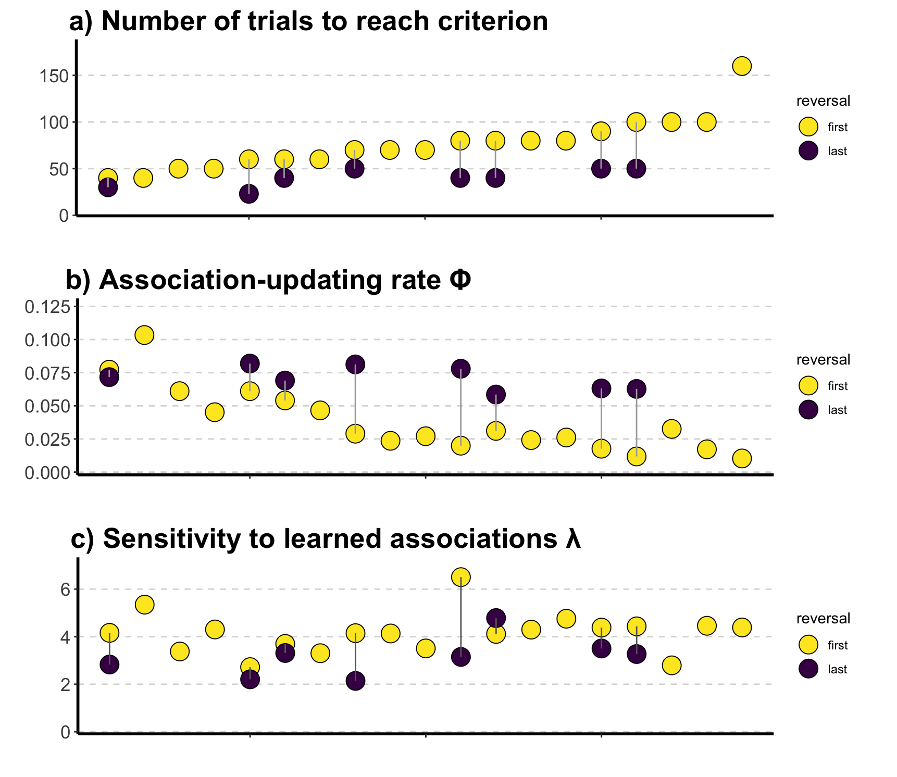

Open... {width=5%} access {width=5%} [code](https://github.com/corinalogan/grackles/blob/master/Files/Preregistrations/g_flexmanip2post.Rmd) {width=5%} peer review {width=5%} [data](https://doi.org/10.5063/F1H41PWS)

&nbsp;

**Affiliations:** 1) Max Planck Institute for Evolutionary Anthropology, Leipzig, Germany, 2) University of California Los Angeles, USA, 3) University of California Santa Barbara, USA, 4) Arizona State University, Tempe, AZ USA. *Corresponding author: dieter_lukas@eva.mpg.de

```{r setup, include=FALSE}
library(knitr)
library(formatR)
knitr::opts_chunk$set(tidy.opts=list(width.cutoff=70),tidy=TRUE) 
#Make code chunks wrap text so it doesn't go off the page when knitting to PDF

knitr::opts_chunk$set(echo=T, include=T, results='asis', warning=F, message=F) 
#sets global options to display code along with the results https://exeter-data-analytics.github.io/LitProg/r-markdown.html
#set echo=F for knitting to PDF (hide code), and echo=T for knitting to HTML (show code)

### make a bibtex file that has only the references cited in this rmd 
#load the Rmd file
Rmd <- readChar("https://raw.githubusercontent.com/corinalogan/grackles/master/Files/Preregistrations/g_flexmanip2post.Rmd",nchars=1e7)

#find all in text citations that start with @, but are preceded by a space
pattern <- "\\ @(.*?)\\ "
m <- regmatches(Rmd,gregexpr(pattern,Rmd))[[1]]
m

res<- gsub("\\ ","",m) #delete spaces
res<- gsub("\\]","",res) #delete ]
res<- gsub("\\;","",res) #delete ;
res<- gsub("\\,","",res) #delete ,
res<- gsub("\\.","",res) # delete .

#find all in text citations that start with @, but are preceded by a "["
pattern2 <- "\\[@(.*?)\\ "
m2 <- regmatches(Rmd,gregexpr(pattern2,Rmd))[[1]]
m2

res2<- gsub("\\[","",m2)
res2<- gsub("\\]","",res2)
res2<- gsub("\\]","",res2)
res2<- gsub("\\;","",res2)
res2<- gsub("\\,","",res2)
res2<- gsub("\\.","",res2)
res2<- gsub("\\ ","",res2)

#combine both patterns
allbibtexkeys<-c(res,res2)

#write to a new file and then clean it up manually
write(allbibtexkeys,file="g_flexmanip2post_bibtexkeys.txt")

#load the cleaned txt file
allbibtexkeys<-read.csv("g_flexmanip2post_bibtexkeys.txt")

#use bib2df to convert the bibliography file into a dataframe
install.packages("bib2df")
library(bib2df)

#load the bib from GitHub
df <- bib2df("https://raw.githubusercontent.com/corinalogan/grackles/master/Files/Preregistrations/MyLibrary.bib")

#remove the @ to match the entry in the bib file
allbibtexkeys2<- gsub("\\@","",allbibtexkeys[,1])

#filter the full bib to only keep the entries that are cited here
df_filtered<-df[df$BIBTEXKEY %in% allbibtexkeys2,]

#use bib2df to convert the data frame into the bibliography file that only contains the citations in this Rmd
df2bib(df_filtered, file = "_flexmanip2post_refs.bib", append = FALSE)
```

&nbsp;

**This is one of three post-study manuscript of the preregistration that was pre-study peer reviewed and received an In Principle Recommendation on 26 Mar 2019 by:**

Aurélie Coulon (2019) Can context changes improve behavioral flexibility? Towards a better understanding of species adaptability to environmental changes. *Peer Community in Ecology*, 100019. [10.24072/pci.ecology.100019](https://doi.org/10.24072/pci.ecology.100019). Reviewers: Maxime Dahirel and Andrea Griffin

**Preregistration:** [html](http://corinalogan.com/Preregistrations/g_flexmanip.html), [pdf](https://github.com/corinalogan/grackles/blob/master/Files/Preregistrations/g_flexmanipPassedPreStudyPeerReview26Mar2019.pdf), [rmd](https://github.com/corinalogan/grackles/blob/d17a75c24df4b90aa607eda452f4fcc496ae9409/Files/Preregistrations/g_flexmanip.Rmd)

**Post-study manuscript** (submitted to PCI Ecology for post-study peer review on 3 Jan 2022, revised and resubmitted Aug 2023): preprint [pdf] at EcoEvoRxiv


## ABSTRACT

Behavioral flexibility, adapting behavior to changing situations, is hypothesized to be related to adapting to new environments and geographic range expansions. However, flexibility is rarely directly tested in a way that allows insight into how flexibility works. Research on great-tailed grackles, a bird species that has rapidly expanded their range into North America over the past 140 years, shows that grackle flexibility is manipulatable  using colored tube reversal learning and that flexibility is generalizable across contexts multi-access box). Here, we use these grackle results to conduct a set of posthoc analyses using a model that breaks down performance on the reversal learning task into different components. We show that the rate of learning to be attracted to an option (phi) is a stronger predictor of reversal performance than the rate of deviating from learned attractions that were rewarded (lambda). This result was supported in simulations and in the data from the grackles: learning rates in the manipulated grackles doubled by the end of the manipulation compared to control grackles, while the rate of deviation slightly decreased. Grackles with intermediate rates of deviation in their last reversal, independently of whether they had gone through the serial reversal manipulation, solved fewer loci on the plastic and wooden multi-access boxes, and those with intermediate learning rates in their last reversal were faster to attempt a new locus on both multi-access boxes.  These findings provide additional insights into how grackles changed their behavior when conditions changed. Their ability to rapidly change their learned associations validates that the manipulation had an effect on the cognitive ability we think of as flexibility. 

## INTRODUCTION

The field of comparative cognition is strongly suspected to be in a replicability crisis, which calls into question the validity of the conclusions produced by this research [@farrar2020replications; @farrar2020trialling; @farrar2021hidden; @brecht2021status; @tecwyn2021doing; @lambert2022manybirds]. The lack of replicability in experimental design, analyses, and results is, in part, because of the lack of clear theoretical frameworks [@frankenhuis2022strategic], the resulting heavy reliance on measuring operationalized variables that are assumed to represent broad concepts, as well as small sample sizes [@farrar2020replications]. One solution is to start from *mechanistic models* informed by a theoretical framework that can represent and make predictions about how individuals behave in a given task, rather than just relying on *statistical models* that simply describe the observed data [@rethinking2020]. Statistical models cannot infer what leads to the differences in behavior, whereas mechanistic models offer the opportunity to infer the underlying processes [@rethinking2020]. 
 
Here, we apply a mechanistic model to a commonly studied trait in animal cognition: behavioral flexibility. Recent work provides clearer conceptualizations of behavioral flexibility that allow us to apply such a mechanistic model. The theoretical framework argues that the critical element of behavioral flexibility is that individuals change their behavior when circumstances change [@mikhalevich_is_2017], with freedom from instinctual constraints [@lea2020behavioral]. These theoretical models point out that behavioral flexibility appears to contain two internal learning processes: the suppression of a previous behavioral choice and the simultaneous adoption of a new behavioral choice. Based on this framework, @blaisdell2021more showed how reversal learning experiments, where individuals have to choose between two options until they learn to prefer the rewarded option and then the reward is moved to the other option and they reverse their preference, reflect these learning processes. @blaisdell2021more built a mechanistic model by adapting Bayesian reinforcement learning models to infer the potential cognitive processes underlying behavioral flexibility.
 
As their name implies, Bayesian reinforcement learning models [@doya2007reinforcement] assume that individuals will gain from learning which of the options leads to the reward. This learning is assumed to occur through reinforcement because individuals repeatedly experience that an option is either rewarded or not. The approach is represented as Bayesian because individuals continuously update their knowledge about the reward with each choice [@deffner2020dynamic]. At their core, these models contain two individual-specific parameters that we aim to estimate from reversal performance: how quickly individuals update their attraction to an option based on the reward they received during their most recent choice relative to the rewards they received when choosing this option previously (their learning rate, termed “phi” $\phi$), and whether individuals already act on small differences in their attraction or whether they continue to explore the less attractive option (the deviation rate, termed “lambda” $\lambda$). Applied to the serial reversal learning setup, where an individual’s preferences are reversed multiple times, the model assumes that, at the beginning of the experiment, individuals have equally low attractions to both options. Depending on which option they choose first, they either experience the reward or not. Experiencing the reward will potentially increase their attraction to this option: if $\phi$ is zero, their attraction remains unchanged; if $\phi$ is one, their attraction is completely dominated by the reward they just gained. In environments that are predictable for short periods of time, similar to the rewarded option during a single reversal in our experiment, individuals are likely to gain more rewards if they update their information based on their latest experience. In situations where rewards change frequently or novel options become available often, individuals are expected to deviate from their learned attractions to continue to explore, while in more stable environments individuals benefit from large $\lambda$ values to exploit the associations they formed [@cohen2007should]. While performance in the reversal learning task has sometimes been decomposed between the initial association learning and the reversal learning phase [e.g. @federspiel2017adjusting], the reinforcement learning model does not make such a distinction. However, it does predict a difference between phases because individuals’ internal states, in particular their attraction toward the different options, are expected to continuously change throughout the experiment. We also expect individuals to “learn to learn” over subsequent reversals [@neftci2019reinforcement], changing their learning and deviation rate over repeated reversals. The parameters of the serial reversal model can also capture broader concepts that have previously been used to describe variation in reversal learning performance, such as “proactive interference” [@morand2022cognitive] as the tendency to continue to choose the previously rewarded option which would occur if individuals do not update their attractions quickly.

We applied this model to our great-tailed grackle (*Quiscalus mexicanus*, hereafter grackle) research on behavioral flexibility, which we measured as reversal learning of a color preference using two differently colored tubes [one light gray and one dark gray @logan2022flexmanip]. In one population, we conducted a flexibility manipulation using serial reversal learning - reversing individuals until their reversal speeds were consistently fast (at or less than 50 trials in two consecutive reversals). We randomly assigned individuals to a manipulated group who received serial reversals, or to a control group who received one reversal and then a similar amount of experience in making choices between two yellow tubes that both contained rewards [@logan2022flexmanip]. After the manipulation, grackles were given a flexibility and innovativeness test using one or two different multi-access boxes to determine whether improving flexibility in reversal learning also improved flexibility (the latency to attempt to solve a new locus) and innovativeness (the number of loci solved) in a different context (the multi-access boxes). We found that we were able to manipulate reversal learning performance (flexibility) and this improved flexibility and problem solving in a new context (multi-access boxes) [@logan2022flexmanip]. However, we were left with some lingering questions: what specifically did we manipulate about flexibility? And how might the cognitive changes induced by the manipulation transfer to influence performance in a new context? These questions are the focus of the current article.


## RESEARCH QUESTIONS
 
1) How are the two parameters $\phi$ or $\lambda$ linked to individual differences in reversal learning behavior in simulations? Can we reliably estimate $\phi$ or $\lambda$ based on the performance of individuals in the reversal learning task? \
Prediction 1: We predicted that the Bayesian reinforcement learning model can reliably infer these two components based on the choices individuals make, which we tested by assigning individuals $\phi$ and $\lambda$ values, simulating their choices based on these, and back-estimating $\phi$ and $\lambda$ from the simulated choice data. \
Prediction 2: We predicted that both $\phi$ and $\lambda$ influence the performance of individuals in a reversal learning task, with higher $\phi$ (faster learning rate) and lower $\lambda$ (less exploration) values leading to individuals more quickly reaching the passing criterion after a reversal in the color of the rewarded option.
 
2) Which of the two parameters $\phi$ or $\lambda$ explain more of the variation in the reversal performance of the tested grackles, and which changed more across the serial reversals? \
Prediction 3: We predicted that whichever of the two parameters, $\phi$ or $\lambda$, explains more of the variation in the first reversal performance is also the parameter that shows more change after the manipulation. However, in the serial reversals, birds need to be able to quickly learn the new reward location and also be ready to explore the other option. Accordingly, birds might end up with one of two solutions: they might adopt a strategy of weighting recent information more heavily while also showing low exploration, or they might show high exploration while being slow at updating their attractions.
 
3) Are $\phi$ or $\lambda$, the two components of flexibility in reversal learning, associated with performance on the multi-access boxes across control and manipulated birds? \
Prediction 4: We predicted that birds that are more flexible, presumably those who have a high $\phi$ (faster learning rate), have shorter latencies to attempt a new locus and solve more loci on the two multi-access boxes. Given that birds might use different strategies to be flexible (see prediction 3), we also explore whether the relationship between $\phi$ or $\lambda$ and the performance on the multi-access boxes is non-linear.


## METHODS
 
### The Bayesian reinforcement learning model
 
We used the version of the Bayesian model that was developed by @blaisdell2021more and modified by @logan2020xpop (see their Analysis Plan > "Flexibility analysis" for model specifications and validation). This model uses data from every trial of reversal learning (rather than only using the total number of trials to pass criterion) and represents behavioral flexibility using two parameters: the learning rate of attraction to either option ($\phi$) and the rate of deviating from learned attractions ($\lambda$). The model repeatedly estimates the series of choices each bird made, based on two equations

Equation 1 (attraction and $\phi$): $A_{j,i,t+1}$=(1−$\phi_j$)$A_{j,i,t}$+$\phi_j$ $\pi_{j,i,t}$
 
Equation 1 tells us how attractions A of individual j to the two different options (i=1,2) change from one trial to the next (time t+1) as a function of previous attractions $A_{j,i,t}$ (how preferable option i is to the bird j at time t) and recently experienced payoffs $\pi$ (i.e., 1 when they received a reward in a given trial, 0 when not). The (bird-specific) parameter $\phi_j$ describes the weight of recent experience. The higher the value of $\phi_j$, the faster the bird updates their attraction. Attraction scores thus reflect the accumulated learning history up to this point. At the beginning of the experiment, we assume that individuals have the same low attraction to both options ($A_{j,1}$ = $A_{j,2}$ = 0.1).
 
Equation 2 (choice and $\lambda$): $P(j,i)_{t+1}$=$\displaystyle \frac{exp(\lambda_j A_{j,i,t})}{\sum_{i = 1}^{2} exp(\lambda_j A_{j,i,t})}$

Equation 2 expresses the probability P that an individual j chooses option i in the next trial, t+1, based on the attractions. The parameter $\lambda_j$ represents the rate of deviating from learned attractions of an individual. It controls how sensitive choices are to differences in attraction scores. As $\lambda_j$ gets larger, choices become more deterministic and individuals consistently choose the option with the higher attraction even if attractions are very similar, as $\lambda_j$ gets smaller, choices become more exploratory (random choice independent of the attractions if $\lambda_j$=0). 
 
We implemented the Bayesian reinforcement learning model in the statistical language Stan [@stan2019stan], calling the model and analyzing its output in R [current version `r getRversion()`; @rcoreteam]. The values for $\phi$ and $\lambda$ for each individual are estimated as the mean from 2000 samples from the posterior. 
 
#### 1) Using simulations to check models estimating the role of the potential parameters underlying performance in the reversal experiment
 
We ran the Bayesian model on simulated data to first understand whether we could recover the $\phi$ and $\lambda$ values assigned to each individual from the choices individuals made based on their phis and lambdas in the initial and first reversal learning phases; and second to see whether inter-individual variation in $\phi$ or in $\lambda$ contributed more to variation in their performance. The settings for the simulations were based on the previous analysis of data from grackles in a different population (Santa Barbara, @blaisdell2021more). We re-analyzed data we had simulated for power analyses to estimate sample sizes for population comparisons [@logan2020xpop]. In brief, we simulated 20 individuals each from 32 different populations (640 individuals). The $\phi$ and $\lambda$ values for each individual were drawn from a distribution representing that population, with different mean $\phi$ (8 different means) and mean $\lambda$ (4 different values) for each population (32 populations as the combination of each $\phi$ and $\lambda$). Based on their $\phi$ and $\lambda$ value, each individual was simulated to pass first through the initial association learning phase and, after they reached criterion, a reversal learning phase. Each choice each individual made was simulated consecutively, updating their internal attraction to the two options based on their $\phi$ values and setting their next choice based on their $\lambda$ weighing of their attractions. We first attempted to recover $\phi$ and $\lambda$ for different subsets of the data (initial association learning and reversal learning separately or combined). Next, we determined how the $\phi$ and $\lambda$ values that were assigned to the individuals influenced their performance in the reversal learning trial, building a regression model to determine which of the two parameters had a more direct influence on the number of trials individuals needed to reach criterion: \
number of trials to reverse ~ normal(mu, sigma) \
mu <- a + b * $\phi$ + c * $\lambda$ \
The model was also estimated in stan, using functions from the package ‘rethinking’ [@rethinking2020] to build the model.


```{r question1_possibilityinferringphiandlambdasimulations, eval=F}

################################################################################################
# Load previously simulated data from xpop
################################################################################################

# There are two separate sets of simulations, with initial attractions at 0.1 and eight different phi and four different lambda combinations
simulatedreversaldata_attractionscores_1<-read.csv(url("https://raw.githubusercontent.com/corinalogan/grackles/master/Files/Preregistrations/gxpopbehaviorhabitat_SimulatedReversalData_Grackles_PhiLambda_Attraction02_Aug2021.csv"), header=T, sep=",", stringsAsFactors=F) 

simulatedreversaldata_attractionscores_2<-read.csv(url("https://raw.githubusercontent.com/corinalogan/grackles/master/Files/Preregistrations/gxpopbehaviorhabitat_SimulatedReversalData_Grackles_PhiLambda_Attraction04_Aug2021.csv"), header=T, sep=",", stringsAsFactors=F) 

# In both sets of simulations, populations with different phi and lambda values were counted from 1-16; for the second set we change this to 17-32
simulatedreversaldata_attractionscores_2$Site<-simulatedreversaldata_attractionscores_2$Site+16

# In both simulations, individuals were counted from 1-320; for the second set we change the ids to start at 321
simulatedreversaldata_attractionscores_2$Bird_ID<-simulatedreversaldata_attractionscores_2$Bird_ID+320

# We combine the two data sets for the further analyses
library(dplyr)
simulatedreversaldata_attractionscores<-bind_rows(simulatedreversaldata_attractionscores_1,simulatedreversaldata_attractionscores_2)

################################################################################################

# In the simulations, trials were counted continuously for each bird. We now want to change this so that it restarts counting trials from 1 upward once a bird switches to reversal.

for (birds in 1:length(unique(simulatedreversaldata_attractionscores$Bird_ID))){
  currentbird<-unique(simulatedreversaldata_attractionscores$Bird_ID)[birds]
  maximuminitial<-max(simulatedreversaldata_attractionscores[simulatedreversaldata_attractionscores$Bird_ID==currentbird & simulatedreversaldata_attractionscores$Reversal == "initial",]$Trial)
  simulatedreversaldata_attractionscores[simulatedreversaldata_attractionscores$Bird_ID==currentbird & simulatedreversaldata_attractionscores$Reversal == "reversal",]$Trial<-simulatedreversaldata_attractionscores[simulatedreversaldata_attractionscores$Bird_ID==currentbird & simulatedreversaldata_attractionscores$Reversal == "reversal",]$Trial - maximuminitial
}

# We need to adjust the coding during the reversal learning so that "correct" now matches whether it is correct or not. 
simulatedreversaldata_attractionscores[simulatedreversaldata_attractionscores$Choice==0,]$Choice<-2

# To use the model to estimate the phi and lambda parameters, we first need to change the column names to match these to the specifications in the model: change Bird_ID  to id; change Reversal to Choice, change CorrectChoice to Correct, change Site to Expid

colnames(simulatedreversaldata_attractionscores)<-c("counter","id","Session","Trial","Reversal","Choice","Correct","Phi_mean","Lambda_mean","Site","Phi_sd","Lambda_sd","ThisBirdsPhi","ThisBirdsLambda","Attraction1","Attraction2")


# There are several simulated individuals who never reached the criterion during the initial learning phase. We need to remove these from the dataset

birdswithreversal<-as.data.frame(simulatedreversaldata_attractionscores %>% group_by(id) %>% summarise(experiments=length(unique(Reversal))))
birdswithreversal<-birdswithreversal[birdswithreversal$experiments==2,]
simulatedreversaldata_attractionscores<-simulatedreversaldata_attractionscores[simulatedreversaldata_attractionscores$id %in% birdswithreversal$id,]

# Next, we need to change the ids of the birds to be continuous again so the STAN model will include them all
simulatedreversaldata_attractionscores$id<-as.integer(as.factor(simulatedreversaldata_attractionscores$id))


###### QUESTION 1: Power of Bayesian reinforcement learning model to detect short-term changes in the association-updating rate $\phi$ and the sensitivity to learned associations $\lambda$


# We first focus only on the performance in the reversal trials
simulatedreversaldata_attractionscores_reversalphase<-simulatedreversaldata_attractionscores[simulatedreversaldata_attractionscores$Reversal=="reversal",]

# Let's start with 30 individuals for comparison
firstreversal_simulated<-simulatedreversaldata_attractionscores_reversalphase[simulatedreversaldata_attractionscores_reversalphase$id %in% c(20,40,60,80,100,120,140,160,180,200,220,240,260,300,320,340,360,380,400,420,440,460,480,500,520,540,560,580,600,620),]

firstreversal_simulated$id<-as.numeric(as.factor(firstreversal_simulated$id))

# We can now extract the relevant data from the first reversal for the STAN model to estimate phi and lambda at the beginning
datfirstsimulated <- as.list(firstreversal_simulated)
datfirstsimulated$N <- nrow(firstreversal_simulated)
datfirstsimulated$N_id <- length(unique(firstreversal_simulated$id))

# Next, we also look at the estimation of the phi and lambda values based on their performance in the initial association learning phase

# We first focus only on the performance in the reversal trials
simulatedreversaldata_attractionscores_learningphase<-simulatedreversaldata_attractionscores[simulatedreversaldata_attractionscores$Reversal=="initial",]

# Let's start with 30 individuals for comparison
initiallearning_simulated<-simulatedreversaldata_attractionscores_learningphase[simulatedreversaldata_attractionscores_learningphase$id %in% c(20,40,60,80,100,120,140,160,180,200,220,240,260,300,320,340,360,380,400,420,440,460,480,500,520,540,560,580,600,620),]

initiallearning_simulated$id<-as.numeric(as.factor(initiallearning_simulated$id))

# We can now extract the relevant data from the first reversal for the STAN model to estimate phi and lambda at the beginning
datinitialsimulated <- as.list(initiallearning_simulated)
datinitialsimulated$N <- nrow(initiallearning_simulated)
datinitialsimulated$N_id <- length(unique(initiallearning_simulated$id))


# The STAN model is set up to have the inital attraction for each option set to 0.1, and that individuals only learn the reward of the option they chose in a given trial.

reinforcement_model_nonzeroattraction_alternativepriors <- "

data{
   int N;
   int N_id;
   int id[N];
   int Trial[N];
   int Choice[N];
   int Correct[N];
}

parameters{
  real logit_phi;
  real log_L;

  // Varying effects clustered on individual
  matrix[N_id,2] v_ID;
}

model{
matrix[N_id,2] A; // attraction matrix

logit_phi ~  normal(0,1);
log_L ~  normal(0,1);

// varying effects
to_vector(v_ID) ~ normal(0,1);

// initialize attraction scores

for ( i in 1:N_id ) {
A[i,1] = 0.1; A[i,2] = 0.1;
}

// loop over Choices

for ( i in 1:N ) {
vector[2] pay;
vector[2] p;
real L;
real phi;

// first, what is log-prob of observed choice

L =  exp(log_L + v_ID[id[i],1]);
p = softmax(L*A[id[i],1:2]' );
Choice[i] ~ categorical( p );

// second, update attractions conditional on observed choice

phi =  inv_logit(logit_phi + v_ID[id[i],2]);
pay[1:2] = rep_vector(0,2);
pay[ Choice[i] ] = Correct[i];
A[ id[i] , Choice[i] ] = ( (1-phi)*(A[ id[i] , Choice[i] ]) + phi*pay[Choice[i]]);

}//i
}
"


# We run this model for the data from only the first reversal

# Two options to call stan from R - option 1 calling stan directly
m_firstsimulated <- stan( model_code =  reinforcement_model_nonzeroattraction_alternativepriors, data=datfirstsimulated ,iter = 5000, cores = 4, chains=4, control = list(adapt_delta=0.9, max_treedepth = 12))

sfirstsimulated <- extract.samples(m_firstsimulated)
firstreversal_simulatedlambda <- sapply(1 : datfirstsimulated$N_id, function(x) exp( mean(sfirstsimulated$log_L) + mean(sfirstsimulated$v_ID[ ,x, 1])))
firstreversal_simulatedphi <- sapply(1 : datfirstsimulated$N_id, function(x) inv_logit( mean(sfirstsimulated$logit_phi) + mean(sfirstsimulated$v_ID[ ,x, 2])))


# Two options to call stan from R - option 2 calling stan using cmdstanr
library(cmdstanr)
currentlocation<-getwd()
cmdstanlocation <- cmdstan_path()
setwd(cmdstanlocation)

# access the output file created by the model running the reinforcement model
write(reinforcement_model_nonzeroattraction_alternativepriors,file="myowntrial.stan")
file <- file.path(cmdstan_path(), "myowntrial.stan")
mod <- cmdstan_model(file)
options(mc.cores=4)

datfirstsimulated$Reversal<-as.numeric(as.factor(datfirstsimulated$Reversal))

# RUN the model
fit <- mod$sample(
  data = datfirstsimulated,
  seed = 123,
  chains = 4,
  parallel_chains = 4,
  refresh = 500
)
# Extract relevant variables
outcome_firstsimulated<-data.frame(fit$summary())
rownames(outcome_firstsimulated)<-outcome_firstsimulated$variable

# Show the 90% compatibility intervals for the association between latency to switch loci on the plastic multi-access box and lambda and phi, and the interaction between lambda and phi from the reinforcement learning model
library(posterior)
library(rethinking)
drawsarray_firstsimulated<-fit$draws()
drawsdataframe_firstsimulated<-as_draws_df(drawsarray_firstsimulated)
drawsdataframe_firstsimulated<-data.frame(drawsdataframe_firstsimulated)
firstsimulated_lambda <- sapply(1 : datfirstsimulated$N_id, function(x) exp( mean(drawsdataframe_firstsimulated$log_L) + mean(drawsdataframe_firstsimulated[,x+3])))
firstsimulated_phi <- sapply(1 : datfirstsimulated$N_id, function(x) inv_logit( mean(drawsdataframe_firstsimulated$logit_phi) + mean(drawsdataframe_firstsimulated[,x+33])))
firstsimulated_lambda_individuals <- sapply(1 : datfirstsimulated$N_id, function(x) exp( (drawsdataframe_firstsimulated$log_L) + (drawsdataframe_firstsimulated[,x+3])))
firstsimulated_lambda_range<-sapply(1 : datfirstsimulated$N_id, function(x) HPDI(firstsimulated_lambda_individuals[,x],0.5))
firstsimulated_phi_individuals<-sapply(1 : datfirstsimulated$N_id, function(x) inv_logit( (drawsdataframe_firstsimulated$logit_phi) + (drawsdataframe_firstsimulated[,x+33])))
firstsimulated_phi_range<-sapply(1 : datfirstsimulated$N_id, function(x) HPDI(firstsimulated_phi_individuals[,x],0.5))

# Remove the stan command line file we created for this particular model from your computer
fn<-"myowntrial"
file.remove(fn)

# Reset your working directory to what it was before we ran the model
setwd(currentlocation)


# We now can get back the phi and lambda values 30 individuals were assigned at the beginning of the simulation
simulatedphis<-unique(simulatedreversaldata_attractionscores_reversalphase[simulatedreversaldata_attractionscores_reversalphase$id %in% c(20,40,60,80,100,120,140,160,180,200,220,240,260,300,320,340,360,380,400,420,440,460,480,500,520,540,560,580,600,620),]$ThisBirdsPhi)
simulatedlambdas<-unique(simulatedreversaldata_attractionscores_reversalphase[simulatedreversaldata_attractionscores_reversalphase$id %in% c(20,40,60,80,100,120,140,160,180,200,220,240,260,300,320,340,360,380,400,420,440,460,480,500,520,540,560,580,600,620),]$ThisBirdsLambda)


# Some of the phi values estimated from the performance during the initial learning are estimated as higher than what the individuals had during the simulation. 
plot(firstsimulated_phi~simulatedphis,xlim=c(0,0.08),ylim=c(0,0.08))
abline(a=0,b=1)

# In contrast, some of the lambda values estimated from the performance during the initial learning are estimated as lower than what the individuals had during the simulation
plot(firstsimulated_lambda~simulatedlambdas,xlim=c(0,10),ylim=c(0,10))
abline(a=0,b=1)

# The issue likely arises because the STAN model assumes that the phi and lambda values are correlated - whereas in the simulations they were allowed to vary independently from each other
plot(firstsimulated_phi~firstsimulated_lambda)
plot(simulatedphis~simulatedlambdas)

# In the simulation, we set some high lambda values and low phi values - because of the assumed correlation, the STAN model estimates higher phi values than simulated in cases when lambda was high, and lower lambda values than simulated when phi was low

plot(firstsimulated_phi[simulatedlambdas<5]~simulatedphis[simulatedlambdas<5],xlim=c(0,0.08),ylim=c(0,0.08))
points(firstsimulated_phi[simulatedlambdas>5]~simulatedphis[simulatedlambdas>5],xlim=c(0,0.08),ylim=c(0,0.08),col="red")
abline(a=0,b=1)


# In these estimations based on the performance during single setups (either just the initial learning or the first reversal learning) the model always estimates that lambda and phi are correlated. This likely reflects equifinality - individuals can achieve the same performance with a range of phis and lambdas, and the model will slide to the middle along the line for each individual:

plot(x="lambda",y="phi",xlim=c(0,10),ylim=c(0,0.1))
# Individuals who needed a long time to learn the association will be in the bottom left corner
abline(a=0.04,b=-0.01,lty=2)
abline(a=0.06,b=-0.01,lty=2)
abline(a=0.08,b=-0.01,lty=2)
# Individuals who needed a short time to learn the association will be in the top right corner
abline(a=0.10,b=-0.01,lty=2)
abline(a=0.12,b=-0.01,lty=2)
abline(a=0.14,b=-0.01,lty=2)

points(x=1,y=0.03,cex=2)
points(x=2,y=0.04,cex=2)
points(x=3,y=0.05,cex=2)
points(x=4,y=0.06,cex=2)
points(x=5,y=0.07,cex=2)
points(x=6,y=0.08,cex=2)
abline(a=0.02,b=0.01,col="red",lwd=1.5)
points(initiallearning_simulatedphi~initiallearning_simulatedlambda,pch=2)


# Maybe the model can better separate the lambda and phi values when combining data from multiple runs - in the case of the simulations that means combining the data from the initial learning with the data of the first reversal


# Let's start with the same 30 individuals for comparison
initialandreversal_simulated<-simulatedreversaldata_attractionscores[simulatedreversaldata_attractionscores$id %in% c(20,40,60,80,100,120,140,160,180,200,220,240,260,300,320,340,360,380,400,420,440,460,480,500,520,540,560,580,600,620),]

initialandreversal_simulated$id<-as.numeric(as.factor(initialandreversal_simulated$id))

# We can now extract the relevant data from the first reversal for the STAN model to estimate phi and lambda at the beginning
datinitialandreversalsimulated <- as.list(initialandreversal_simulated)
datinitialandreversalsimulated$N <- nrow(initialandreversal_simulated)
datinitialandreversalsimulated$N_id <- length(unique(initialandreversal_simulated$id))


# Option 1: calling stan directly from R
m_initialandreversal <- stan( model_code =  reinforcement_model_nonzeroattraction, data=datinitialandreversalsimulated ,iter = 5000, cores = 4, chains=4, control = list(adapt_delta=0.9, max_treedepth = 12))

sinitialandreversal <- extract.samples(m_initialandreversal)
initialandreversal_lambda <- sapply(1 : datinitialandreversalsimulated$N_id, function(x) exp( mean(sinitialandreversal$log_L) + mean(sinitialandreversal$v_ID[ ,x, 1])))
initialandreversal_phi <- sapply(1 : datinitialandreversalsimulated$N_id, function(x) inv_logit( mean(sinitialandreversal$logit_phi) + mean(sinitialandreversal$v_ID[ ,x, 2])))

plot(initialandreversal_phi~simulatedphis)
abline(a=0,b=1)
plot(initialandreversal_lambda~simulatedlambdas)
abline(a=0,b=1)

plot(initialandreversal_phi~initialandreversal_lambda)


# Option 1: calling stan through cmdstanr
# setup with cmdstanr
currentlocation<-getwd()
cmdstanlocation <- cmdstan_path()
setwd(cmdstanlocation)

datinitialandreversalsimulated$Reversal<-as.numeric(as.factor(datinitialandreversalsimulated$Reversal))

# access the output file created by the model running the reinforcement model / reinforcement_model_nonzeroattraction_alternativepriors
write(reinforcement_model_nonzeroattraction_alternativepriors,file="myowntrial.stan")
file <- file.path(cmdstan_path(), "myowntrial.stan")
mod <- cmdstan_model(file)
options(mc.cores=4)

# RUN the model
fit <- mod$sample(
  data = datinitialandreversalsimulated,
  seed = 123,
  chains = 4,
  parallel_chains = 4,
  refresh = 500
)


# Show the 90% compatibility intervals for the association between latency to switch loci on the plastic multi-access box and lambda and phi, and the interaction between lambda and phi from the reinforcement learning model
drawsarray<-fit$draws()
drawsdataframe<-as_draws_df(drawsarray)
drawsdataframe<-data.frame(drawsdataframe)
initialandreversal_lambda <- sapply(1 : datinitialandreversalsimulated$N_id, function(x) exp( mean(drawsdataframe$log_L) + mean(drawsdataframe[,x+3]))) 
initialandreversal_phi <- sapply(1 : datinitialandreversalsimulated$N_id, function(x) inv_logit( mean(drawsdataframe$logit_phi) + mean(drawsdataframe[,x+33]))) 
initialandreversal_lambda_individuals <- sapply(1 : datfirstsimulated$N_id, function(x) exp( (drawsdataframe$log_L) + (drawsdataframe[,x+3])))
initialandreversal_lambda_range<-sapply(1 : datfirstsimulated$N_id, function(x) HPDI(initialandreversal_lambda_individuals[,x],0.5))
initialandreversal_phi_individuals<-sapply(1 : datfirstsimulated$N_id, function(x) inv_logit( (drawsdataframe$logit_phi) + (drawsdataframe[,x+33])))
initialandreversal_phi_range<-sapply(1 : datfirstsimulated$N_id, function(x) HPDI(initialandreversal_phi_individuals[,x],0.5))


# Remove the stan command line file we created for this particular model from your computer
fn<-"myowntrial"
file.remove(fn)

# Reset your working directory to what it was before we ran the model
setwd(currentlocation)

simulatedphi<-initialandreversal_simulated %>% group_by(id) %>% summarise(mean(Phi_mean))
simulatedphi<-as.data.frame(simulatedphi)
simulatedphis<-simulatedphi[,2]


library(rethinking)

dat_simulatedvsestimated_onlyone<- list(
  simulatedphis = simulatedphis,
  estimatedphis = firstsimulated_phi
)

model_simulatedvsestimated_onlyone <- ulam(
    alist(
        estimatedphis ~ normal( mu , sigma ),
        mu <- a + b*simulatedphis,
        a ~ normal(0,0.1),
        b ~ normal(1,1),
        sigma ~ dexp(1)
    ) , data=dat_simulatedvsestimated_onlyone , chains=4 , cores=4,iter=10000 ,cmdstan = T)

precis(model_simulatedvsestimated_onlyone,depth=2)

#      mean   sd 5.5% 94.5% n_eff Rhat4
#a     0.01 0.00 0.00  0.01  6711     1
#b     0.15 0.05 0.06  0.23  6526     1
#sigma 0.00 0.00 0.00  0.00  7926     1


dat_simulatedvsestimated_acrossreversal<- list(
  simulatedphis = simulatedphis,
  estimatedphis = initialandreversal_phi
)

model_simulatedvsestimated_acrossreversal <- ulam(
    alist(
        estimatedphis ~ normal( mu , sigma ),
        mu <- a + b*simulatedphis,
        a ~ normal(0,0.1),
        b ~ normal(1,1),
        sigma ~ dexp(1)
    ) , data=dat_simulatedvsestimated_acrossreversal , chains=4 , cores=4,iter=10000, cmdstan = T)

precis(model_simulatedvsestimated_acrossreversal,depth=2)

#      mean   sd  5.5% 94.5% n_eff Rhat4
#a     0.00 0.00 -0.01  0.01  6680     1
#b     0.96 0.16  0.70  1.21  6677     1
#sigma 0.01 0.00  0.01  0.01  8210     1


dat_simulatedvsestimated_onlyone_l<- list(
  simulatedlambdas = simulatedlambdas,
  estimatedlambdas = firstsimulated_lambda
)

model_simulatedvsestimated_onlyone_l <- ulam(
    alist(
        estimatedlambdas ~ normal( mu , sigma ),
        mu <- a + b*simulatedlambdas,
        a ~ normal(0,0.1),
        b ~ normal(1,1),
        sigma ~ dexp(1)
    ) , data=dat_simulatedvsestimated_onlyone_l , chains=4 , cores=4,iter=10000 ,cmdstan = T)

precis(model_simulatedvsestimated_onlyone_l,depth=2)

#      mean   sd  5.5% 94.5% n_eff Rhat4
#a     0.05 0.10 -0.11  0.21 17975     1
#b     0.58 0.06  0.48  0.68 16713     1
#sigma 1.87 0.25  1.52  2.31 17115     1


dat_simulatedvsestimated_acrossreversal_l<- list(
  simulatedlambdas = simulatedlambdas,
  estimatedlambdas = initialandreversal_lambda
)

model_simulatedvsestimated_acrossreversal_l <- ulam(
    alist(
        estimatedlambdas ~ normal( mu , sigma ),
        mu <- a + b*simulatedlambdas,
        a ~ normal(0,0.1),
        b ~ normal(1,1),
        sigma ~ dexp(1)
    ) , data=dat_simulatedvsestimated_acrossreversal_l , chains=4 , cores=4,iter=10000, cmdstan = T)

precis(model_simulatedvsestimated_acrossreversal_l,depth=2)

#      mean   sd  5.5% 94.5% n_eff Rhat4
#a     0.01 0.10 -0.15  0.16 15584     1
#b     0.98 0.04  0.92  1.05 14582     1
#sigma 1.20 0.16  0.97  1.47 16119     1


dat_simulatedvsestimated_onlyone_both<- list(
  estimatedlambdas = firstsimulated_lambda,
  estimatedphis = firstsimulated_phi
)

model_simulatedvsestimated_onlyone_both <- ulam(
    alist(
        estimatedlambdas ~ normal( mu , sigma ),
        mu <- a + b*estimatedphis,
        a ~ normal(0,10),
        b ~ normal(0,250),
        sigma ~ dexp(1)
    ) , data=dat_simulatedvsestimated_onlyone_both , chains=4 , cores=4,iter=10000 ,cmdstan = T)

precis(model_simulatedvsestimated_onlyone_both,depth=2)

#        mean    sd   5.5%  94.5% n_eff Rhat4
#a      -0.81  0.39  -1.42  -0.19  6193     1
#b     504.19 42.73 435.31 570.69  6066     1
#sigma   0.61  0.09   0.49   0.76  7213     1


################################################################################
#### Plot for Figure 1
plot(firstsimulated_phi~simulatedphis,xlim=c(0,0.06),ylim=c(0,0.06),bty="n",cex=3,pch=18,col="#00DADF",ann=F)
points(initialandreversal_phi~simulatedphis,col="#007477",pch=16,cex=2)
abline(a=0,b=1,lty=2)
legend(x="topleft", legend=c(pch16="Initial plus Reversal",pch18="Single Reversal"), pch=c(16,18), col=c("#007477","#00DADF"), box.lty=0, cex=1.2,pt.cex=1.4)
mtext("Assigned association-updating rate φ",side=1,at=0.03,line=3,cex=1.5)
mtext("Estimated association-updating rate φ",side=2,at=0.03,line=2.5,cex=1.5)
mtext("1:1 line",side=1,at=0.055,line=-20)

for(i in 1:30) {
lines(y=c(initialandreversal_phi_range[1,i],initialandreversal_phi_range[2,i]),x=c(simulatedphis[i],simulatedphis[i]),col=col.alpha(acol="#007477",alpha=0.4))
lines(y=c(firstsimulated_phi_range[1,i],firstsimulated_phi_range[2,i]),x=c(simulatedphis[i],simulatedphis[i]),col=col.alpha(acol="#00DADF",alpha=0.4))  
}


plot(firstsimulated_lambda~simulatedlambdas,xlim=c(0,10),ylim=c(0,10))
points(initialandreversal_lambda~simulatedlambdas,col="red")
abline(a=0,b=1)
```


```{r question2_phiversuslambdasimulateddata, eval=F}

################################################################################################
# Load previously simulated data from xpop
################################################################################################

# There are two separate sets of simulations, with initial attractions at 0.1 and eight different phi and four different lambda combinations
simulatedreversaldata_attractionscores_1<-read.csv(url("https://raw.githubusercontent.com/corinalogan/grackles/master/Files/Preregistrations/gxpopbehaviorhabitat_SimulatedReversalData_Grackles_PhiLambda_Attraction02_Aug2021.csv"), header=T, sep=",", stringsAsFactors=F) 

simulatedreversaldata_attractionscores_2<-read.csv(url("https://raw.githubusercontent.com/corinalogan/grackles/master/Files/Preregistrations/gxpopbehaviorhabitat_SimulatedReversalData_Grackles_PhiLambda_Attraction04_Aug2021.csv"), header=T, sep=",", stringsAsFactors=F) 

# In both sets of simulations, populations with different phi and lambda values were counted from 1-16; for the second set we change this to 17-32
simulatedreversaldata_attractionscores_2$Site<-simulatedreversaldata_attractionscores_2$Site+16

# In both simulations, individuals were counted from 1-320; for the second set we change the ids to start at 321
simulatedreversaldata_attractionscores_2$Bird_ID<-simulatedreversaldata_attractionscores_2$Bird_ID+320

# We combine the two data sets for the further analyses
library(dplyr)
simulatedreversaldata_attractionscores<-bind_rows(simulatedreversaldata_attractionscores_1,simulatedreversaldata_attractionscores_2)

# In the simulation, trials were counted continuously. We change it so that the count of trials starts at 1 again when birds switch to the reversal
for (birds in 1:length(unique(simulatedreversaldata_attractionscores$Bird_ID))){
  currentbird<-unique(simulatedreversaldata_attractionscores$Bird_ID)[birds]
  maximuminitial<-max(simulatedreversaldata_attractionscores[simulatedreversaldata_attractionscores$Bird_ID==currentbird & simulatedreversaldata_attractionscores$Reversal == "initial",]$Trial)
  simulatedreversaldata_attractionscores[simulatedreversaldata_attractionscores$Bird_ID==currentbird & simulatedreversaldata_attractionscores$Reversal == "reversal",]$Trial<-simulatedreversaldata_attractionscores[simulatedreversaldata_attractionscores$Bird_ID==currentbird & simulatedreversaldata_attractionscores$Reversal == "reversal",]$Trial - maximuminitial
}

################################################################################################


# Are phi or lambda more important to reach criterion in 50 or fewer trials?

colnames(simulatedreversaldata_attractionscores)<-c("counter","id","Session","Trial","Reversal","Choice","Correct","Phi_mean","Lambda_mean","Site","Phi_sd","Lambda_sd","ThisBirdsPhi","ThisBirdsLambda","Attraction1","Attraction2")


summarysimulateddata<-matrix(nrow=length(unique(simulatedreversaldata_attractionscores$id)),ncol=5)
summarysimulateddata<-as.data.frame(summarysimulateddata)
colnames(summarysimulateddata)<-c("id","ThisBirdsPhi","ThisBirdsLambda","TrialsInitial","TrialsReversal")

summarysimulateddata$id<-unique(simulatedreversaldata_attractionscores$id)

for (i in 1:nrow(summarysimulateddata)){
summarysimulateddata[i,]$TrialsInitial<-max(filter(simulatedreversaldata_attractionscores,id==unique(simulatedreversaldata_attractionscores$id)[i],Reversal=="initial")$Trial)
}

for (i in 1:nrow(summarysimulateddata)){
summarysimulateddata[i,]$TrialsReversal<-max(filter(simulatedreversaldata_attractionscores,id==unique(simulatedreversaldata_attractionscores$id)[i],Reversal=="reversal")$Trial)
}

for (i in 1:nrow(summarysimulateddata)){
summarysimulateddata[i,]$ThisBirdsPhi<-max(filter(simulatedreversaldata_attractionscores,id==unique(simulatedreversaldata_attractionscores$id)[i])$ThisBirdsPhi)
}

for (i in 1:nrow(summarysimulateddata)){
summarysimulateddata[i,]$ThisBirdsLambda<-max(filter(simulatedreversaldata_attractionscores,id==unique(simulatedreversaldata_attractionscores$id)[i])$ThisBirdsLambda)
}

# Remove individuals who did not proceed to initial association
summarysimulateddata<-summarysimulateddata[summarysimulateddata$TrialsReversal != -Inf,]

plot(summarysimulateddata$TrialsReversal~summarysimulateddata$ThisBirdsPhi)

plot(summarysimulateddata$TrialsReversal~summarysimulateddata$ThisBirdsLambda)


library(rethinking)
library(cmdstanr)

dat_trialsphiandlambda<- list(
  Trials = (summarysimulateddata$TrialsReversal),
  bird = c(as.numeric(as.factor(summarysimulateddata$id))),
  phi = standardize(c(summarysimulateddata$ThisBirdsPhi)),
  lambda = standardize(c(summarysimulateddata$ThisBirdsLambda))
)


trials.phiandlambda <- ulam(
    alist(
        Trials ~ dpois(poislambda ),
        log(poislambda) <- a + b*phi+c*lambda,
        a ~ normal(5,1),
        b ~ normal(0,1),
        c ~ normal(0,1)
    ) , data=dat_trialsphiandlambda , chains=4 , cores=4,iter=10000,cmdstan=T )

precis(trials.phiandlambda,depth=2)

#    mean sd  5.5% 94.5% n_eff Rhat4
# a  4.49  0  4.48  4.49 17433     1
# b -0.23  0 -0.24 -0.23 18136     1
# c -0.17  0 -0.18 -0.16 18856     1


#Plot to assess fit of the model:
mu_1<- link( trials.phiandlambda, data=data.frame(phi=seq(from=-2,to=2,by=0.25),lambda=rep(0,17) ) ) 
mu_1_mean <- apply( mu_1 , 2 , mean ) 
mu_1_ci <- apply( mu_1 , 2 , PI , prob=0.97 ) 
plot(dat_trialsphiandlambda$Trials~dat_trialsphiandlambda$phi) # plot the predicted relationship between the chance to marry a cousin on the y-axis and the birth year of the individuals on the x-axis
shade(mu_1_ci,seq(from=-2,to=2,by=0.25), col=col.alpha("blue",0.4))

# Repeat analyses with unstandardized predictors to compare estimated slopes with those of the grackles
summarysimulateddata_ll<-summarysimulateddata[summarysimulateddata$ThisBirdsLambda>2,]
summarysimulateddata_ll<-summarysimulateddata_ll[summarysimulateddata_ll$ThisBirdsPhi>0.01,]
summarysimulateddata_ll<-summarysimulateddata_ll[summarysimulateddata_ll$TrialsReversal <300,]
dat_trialsphiandlambda<- list(
  Trials = (summarysimulateddata_ll$TrialsReversal),
  bird = c(as.numeric(as.factor(summarysimulateddata_ll$id))),
  phi = (c(summarysimulateddata_ll$ThisBirdsPhi)),
  lambda = (c(summarysimulateddata_ll$ThisBirdsLambda))
)


trials.phiandlambda <- ulam(
    alist(
        Trials ~ dpois(poislambda ),
        log(poislambda) <- a + b*phi+c*lambda,
        a ~ normal(5,1),
        b ~ normal(0,25),
        c ~ normal(0,1)
    ) , data=dat_trialsphiandlambda , chains=4 , cores=4,iter=10000,cmdstan=T )

precis(trials.phiandlambda,depth=2)
#     mean   sd   5.5%  94.5% n_eff Rhat4
# a   5.31 0.01   5.29   5.33  5471     1
# b -21.21 0.39 -21.84 -20.58  5904     1
# c  -0.05 0.00  -0.06  -0.05  7955     1

mu_1<- link( trials.phiandlambda, data=data.frame(phi=seq(from=0.01,to=0.07,length=17),lambda=rep(4,17) ) ) 
mu_1_mean <- apply( mu_1 , 2 , mean ) 
mu_1_ci_simulated <- apply( mu_1 , 2 , PI , prob=0.97 ) 


summarysimulateddata_forplotting<-matrix(ncol=3,nrow=2*nrow(summarysimulateddata))
summarysimulateddata_forplotting<-as.data.frame(summarysimulateddata_forplotting)
colnames(summarysimulateddata_forplotting)<-c("TrialsReversal","Predictor","Value")
summarysimulateddata_forplotting$TrialsReversal<-c(summarysimulateddata$TrialsReversal,summarysimulateddata$TrialsReversal)
summarysimulateddata_forplotting$Predictor<-c(rep("phi",nrow(summarysimulateddata)),rep("lambda",nrow(summarysimulateddata)))
summarysimulateddata_forplotting$Value<-c(standardize(summarysimulateddata$ThisBirdsPhi),standardize(summarysimulateddata$ThisBirdsLambda))

summarysimulateddata_forplotting[summarysimulateddata_forplotting$TrialsReversal>181,]$TrialsReversal<-8
summarysimulateddata_forplotting[summarysimulateddata_forplotting$TrialsReversal>151,]$TrialsReversal<-7
summarysimulateddata_forplotting[summarysimulateddata_forplotting$TrialsReversal>131,]$TrialsReversal<-6
summarysimulateddata_forplotting[summarysimulateddata_forplotting$TrialsReversal>111,]$TrialsReversal<-5
summarysimulateddata_forplotting[summarysimulateddata_forplotting$TrialsReversal>91,]$TrialsReversal<-4
summarysimulateddata_forplotting[summarysimulateddata_forplotting$TrialsReversal>71,]$TrialsReversal<-3
summarysimulateddata_forplotting[summarysimulateddata_forplotting$TrialsReversal>51,]$TrialsReversal<-2
summarysimulateddata_forplotting[summarysimulateddata_forplotting$TrialsReversal>31,]$TrialsReversal<-1
summarysimulateddata_forplotting$TrialsReversal<-as.factor(summarysimulateddata_forplotting$TrialsReversal)

library(ggplot2)
library(ggtext)

################################################################################
##### Plot for Figure 2


summarysimulateddata_forplotting$color<-NA
summarysimulateddata_forplotting[summarysimulateddata_forplotting$Predictor=="phi",]$color<-"#007477"
summarysimulateddata_forplotting[summarysimulateddata_forplotting$Predictor=="lambda",]$color<-"indianred1"  


summarysimulateddata_forplotting_alt<-summarysimulateddata_forplotting[order(summarysimulateddata_forplotting$Predictor),]

summarysimulateddata_forplotting_alt$TrialsReversal<-as.integer(summarysimulateddata_forplotting_alt$TrialsReversal)

ggplot(summarysimulateddata_forplotting_alt, aes(x=TrialsReversal, y=Value, fill=Predictor)) + 
    geom_jitter(colour=summarysimulateddata_forplotting_alt$color,width=0.2,size=2)+xlab("Trials simulated individuals needed to reach criterion")+  ylab("<span style='font-size:20pt;font-weight:bold'>Assigned <b style='color:#007477'>φ</b> and <b style='color:#FF6A6A'>λ</b> (standardized) </span>")+
 theme_classic()+scale_x_continuous(name="Number of trials to reach criterion",breaks=1:8, labels=c("31-50","51-70","71-90","91-110","111-130","131-150","151-180","181-220"))+theme(axis.text.x = element_text(size = 14, colour ="black",hjust = 0.5,angle = 0)) + 
    theme(axis.title.x = element_text(size = 18, colour ="black", face = "bold",
                                      hjust = 0.5,
                                      vjust = -0.5,
                                      angle = 0))+
    theme(axis.text.y = element_text(size = 14, colour ="black",
                                     hjust = 0.5,
                                     angle = 0)) +
    theme(axis.title.y =element_markdown() )+theme(legend.position = "none") +geom_smooth(col="grey")


# With high phi values, lambda can be smaller because birds will after few trials have such large differences in their learned association that they do not require to be very sensitive to those differences.

# Example: assume that in first 20 trials birds choose randomly either the rewarded or the non-rewarded option, so they experience each 10 times. We check how much their associations start from initially similar values. Next, based on these differences in the two associations, we estimate the lambda with which individuals will choose the rewarded option in 85% of the next trials (17 out of 20 = 85%). Across the range of phis 0.02 through 0.10, as phi increases, lambda decreases exponentially because birds change both their association to the rewarded and the non-rewarded option more quickly. For example, with a phi of 0.05, after 20 trials the attraction to the rewarded option will be 0.46, while the attraction to the non-rewarded option will be 0.06. With a lambda of 4.4, individuals will choose the rewarded option with a probability of 

phi<-0.05
lambda<-4.4

initial_attraction_rewarded<-0.1
initial_attraction_nonrewarded<-0.1

trial20_attraction_rewarded<-NA
trial20_attraction_nonrewarded<-NA

for(i in 1:10){
  ifelse(i==1,trial20_attraction_rewarded<-(1-phi)*initial_attraction_rewarded+phi*1, trial20_attraction_rewarded<-(1-phi)*trial20_attraction_rewarded+phi*1)
  ifelse(i==1,trial20_attraction_nonrewarded<-(1-phi)*initial_attraction_nonrewarded+phi*0, trial20_attraction_nonrewarded<-(1-phi)*trial20_attraction_nonrewarded+phi*0)
}

probability_choose_rewarded<-exp(trial20_attraction_rewarded*lambda)/( exp(trial20_attraction_rewarded*lambda)+exp(trial20_attraction_nonrewarded*lambda))

probability_choose_rewarded


################################################################################
### Plot for Figure 3

phis_85percent<-c(0.02,0.03,0.04,0.05,0.06,0.07,0.08,0.09,0.10)
lambda_85percent<-c(9.5,6.6,5.2,4.4,3.8,3.4,3.1,2.9,2.7)


d<-matrix(data=c(phis_85percent,lambda_85percent),nrow=9,ncol=2)
d<-as.data.frame(d)
colnames(d)<-c("Association-updating rate φ","Sensitivity to learned associations λ")


spline_int <- as.data.frame(spline(d$`Association-updating rate φ`, d$`Sensitivity to learned associations λ`))


ggplot(d) + 
  geom_point(aes(x = `Association-updating rate φ`, y = `Sensitivity to learned associations λ`), size = 3) +
  geom_line(data = spline_int, aes(x = x, y = y))+theme_classic() +theme(axis.text.x = element_text(size = 14, colour ="black",
                                              hjust = 0.5,
                                              angle = 0)) + 
    theme(axis.title.x = element_text(size = 18, colour ="black", face = "bold",
                                              hjust = 0.5,
                                              vjust = -0.5,
                                              angle = 0))+
   theme(axis.text.y = element_text(size = 14, colour ="black",
                                              hjust = 0.5,
                                              angle = 0)) +
   theme(axis.title.y = element_text(size = 18, colour ="black", face = "bold",
                                              hjust = 0.5,
                                              angle = 90),axis.line.x = element_line(colour = 'black', linewidth = 1, linetype='solid'),
          axis.line.y = element_line(colour = 'black', linewidth = 1, linetype='solid'),panel.background = element_rect(fill = "white",
                                colour = "white",
                                size = 0.5, linetype = "solid"),
  panel.grid.major.y = element_line(size = 0.5, linetype = 'dashed',
                                colour = "grey85")) + theme(legend.title = element_text(size = 13))+
  ylim(0.4,10)+xlim(0.004,0.10)+
  annotate("text", x=0.035, y=1.5, label= "Unlikely to reach criterion in 40 trials",size=5)+
  annotate("text", x=0.07, y=7, label= "Likely to reach criterion in 40 trials",size=5)+
  geom_point(aes(x=0.03, y=4.3), colour="#E69F00",size=4)+
  geom_point(aes(x=0.07, y=3.2), colour="#56B4E9",size=4)+
  annotate("text", x=0.03, y=3.8, label= "Grackles first",size=5,colour="#E69F00")+
  annotate("text", x=0.07, y=2.7, label= "Grackles manipulated",size=5,colour="#56B4E9")


# Alternative where individuals experience a reversal, so their initial association is biased toward the option that is no longer rewarded. We can calculate how many random trials individuals will need to such that their association toward the now rewarded option is larger than their association to the previously rewarded option.

phi<-0.09

initial_attraction_rewarded<-0.1
initial_attraction_nonrewarded<-0.7

trial20_attraction_rewarded<-NA
trial20_attraction_nonrewarded<-NA

for(i in 1:100){
  ifelse(i==1,trial20_attraction_rewarded<-(1-phi)*initial_attraction_rewarded+phi*1, trial20_attraction_rewarded<-(1-phi)*trial20_attraction_rewarded+phi*1)
  ifelse(i==1,trial20_attraction_nonrewarded<-(1-phi)*initial_attraction_nonrewarded+phi*0, trial20_attraction_nonrewarded<-(1-phi)*trial20_attraction_nonrewarded+phi*0)
  print(i*2)
  if(trial20_attraction_rewarded>trial20_attraction_nonrewarded){break}
}


phis_85percent<-c(0.02,0.03,0.04,0.05,0.06,0.07,0.08,0.09,0.10)
trials_to_reverse<-c(48,32,24,20,16,14,12,10,10,10)


# Calculate how likely individuals are to choose new rewarded option after a switch given their lambda value.

lambda<-8 # change this to 3 for the comparison reported in the manuscript

initial_attraction_rewarded<-0.1
initial_attraction_nonrewarded<-0.7

probability_choose_rewarded<-exp(initial_attraction_rewarded*lambda)/( exp(initial_attraction_rewarded*lambda)+exp(initial_attraction_nonrewarded*lambda))

probability_choose_rewarded


```


 
#### 2) Estimating $\phi$ and $\lambda$ from the observed serial reversal learning performances 
 
The collection of the great-tailed grackle data, as described in the main article [@logan2022flexmanip], was based on our preregistration that received in principle acceptance at PCI Ecology    ([PDF](https://github.com/corinalogan/grackles/blob/master/Files/Preregistrations/g_flexmanipPassedPreStudyPeerReview26Mar2019.pdf) version). All of the analyses of @logan2022flexmanip data reported here were not part of the original preregistration.


The data are available at the Knowledge Network for Biocomplexity's data repository: [https://knb.ecoinformatics.org/view/doi:10.5063/F1H41PWS](https://knb.ecoinformatics.org/view/doi:10.5063/F1H41PWS).
            
Great-tailed grackles were caught in the wild in Tempe, Arizona, USA for individual identification (colored leg bands in unique combinations). Some individuals were brought temporarily into aviaries for testing, and then released back to the wild. Individuals first participated in the reversal learning tasks. A subset of individuals was part of the control group, where they learned the association of reward with one color before experiencing one reversal to learn that the other color is rewarded. The other subset of individuals was part of the manipulated group. These individuals went through a series of reversals until they reached the criterion of having formed an association (17 out of 20 choices correct) in less than 50 trials in two consecutive reversals.
 
We fit the Bayesian reinforcement learning model to the data of both the control and the manipulated birds. For the manipulated birds, we calculated $\phi$ and $\lambda$ separately for their performance in the beginning (initial association and first reversal) and at the end of the manipulation (final two reversals). Next, as with the simulated data, we fit a series of regression models to determine how $\phi$ and $\lambda$ link to the number of trials birds needed during their reversals. 


```{r question3_estimatephiandlambdagrackles, eval=F}

### Code below copied from Blaisdell et al. 2021

# Using OBSERVED not simulated data 

# We want to estimate lambda and phi differently. For the initial values, we combine the data from the first association learning with the first reversal.


dflex <- read.csv(url("https://raw.githubusercontent.com/corinalogan/grackles/master/Files/Preregistrations/g_flexmanip_data_reverseraw.csv"), header=T, sep=",", stringsAsFactors=F) 

library(rstan)
library(rethinking)
library(cmdstanr)
library(posterior)

# If you have cmdstan installed, use the following:
# set_ulam_cmdstan(TRUE)

# PREPARE reversal learning data
#exclude yellow tube trials for control birds because we are only interested in reversal data
dflex <- subset(dflex, dflex$Reversal != "Control: Yellow Tube" & dflex$ID !="Memela") 
#include only those trials where the bird made a choice (0 or 1)
dflex <- subset(dflex, dflex$CorrectChoice != -1) 
#reverse number. 0=initial discrimination
dflex$Reversal <- as.integer(dflex$Reversal)

dflex$Correct <- as.integer(dflex$CorrectChoice)
dflex$Trial <- as.integer(dflex$Trial)
#exclude NAs from the CorrectChoice column
dflex <- subset(dflex, is.na(dflex$Correct) == FALSE)

# Want data ONLY from initial learning and first reversal to determine phi and lambda at the beginning. This is for all birds, including those that did not experience the reversal manipulation experiment
reduceddata <- matrix(ncol=ncol(dflex),nrow=0)
reduceddata <- data.frame(reduceddata)
for (i in 1:length(unique(dflex$ID))) {
  thisbird <- unique(dflex$ID)[i]
  thisbirddata <- dflex[dflex$ID==thisbird,]
  thisbirdslastreversal <- thisbirddata[thisbirddata$Reversal %in% c(0,1),]
  reduceddata <- rbind(reduceddata,thisbirdslastreversal)
}
dflex_beginning <- reduceddata

# We want to remove the birds who did not go through at least the first reversal trial
birdscompletedreversal<-unique(dflex_beginning[dflex_beginning$Reversal==1,]$ID)

dflex_beginning<-dflex_beginning[dflex_beginning$ID %in% birdscompletedreversal,]

length(unique(dflex_beginning$ID)) #21 birds

#Construct Choice variable
dflex_beginning$Choice <- NA
for (i in 1: nrow(dflex_beginning)) {
  if (dflex_beginning$Reversal[i] %in% seq(0, max(unique(dflex_beginning$Reversal)), by = 2)){
    
    if (dflex_beginning$Correct[i] == 1){
      dflex_beginning$Choice[i] <- 1
    } else {
      dflex_beginning$Choice[i] <- 2
    } 
  } else {
    if (dflex_beginning$Correct[i] == 1){
      dflex_beginning$Choice[i] <- 2
    } else {
      dflex_beginning$Choice[i] <- 1
    } 
  }
}
dflex_beginning <- dflex_beginning[with(dflex_beginning, order(dflex_beginning$ID)), ]

colnames(dflex_beginning)[4]<-"id"

# Sort birds alphabetically
dflex_beginning <- dflex_beginning[with(dflex_beginning, order(dflex_beginning$id)), ]
birdnames<-unique(dflex_beginning$id)

# Convert bird names into numeric ids
dflex_beginning$id <- as.numeric(as.factor(dflex_beginning$id))

# select only necessary columns
library(dplyr)
dflex_beginning<-dflex_beginning %>% select(id,Trial,Choice,Correct)

datinitialandfirstreversal <- as.list(dflex_beginning)
datinitialandfirstreversal$N <- nrow(dflex_beginning)
datinitialandfirstreversal$N_id <- length(unique(dflex_beginning$id))


# The STAN model is set up to have the initial attraction for each option set to 0.1, and that individuals only learn the reward of the option they chose in a given trial.
reinforcement_model_nonzeroattraction <- "
data{
   int N;
   int N_id;
   int id[N];
   int Trial[N];
   int Choice[N];
   int Correct[N];
}

parameters{
  real logit_phi;
  real log_L;

  // Varying effects clustered on individual
  matrix[2,N_id] z_ID;
  vector<lower=0>[2] sigma_ID;       //SD of parameters among individuals
  cholesky_factor_corr[2] Rho_ID;
}

transformed parameters{
matrix[N_id,2] v_ID; // varying effects on stuff
v_ID = ( diag_pre_multiply( sigma_ID , Rho_ID ) * z_ID )';
}

model{
matrix[N_id,2] A; // attraction matrix

logit_phi ~  normal(0,1);
log_L ~  normal(0,1);

// varying effects
to_vector(z_ID) ~ normal(0,1);
sigma_ID ~ exponential(1);
Rho_ID ~ lkj_corr_cholesky(4);

// initialize attraction scores

for ( i in 1:N_id ) {
A[i,1] = 0.1; A[i,2] = 0.1;
}

// loop over Choices

for ( i in 1:N ) {
vector[2] pay;
vector[2] p;
real L;
real phi;

// first, what is log-prob of observed choice

L =  exp(log_L + v_ID[id[i],1]);
p = softmax(L*A[id[i],1:2]' );
Choice[i] ~ categorical( p );

// second, update attractions conditional on observed choice

phi =  inv_logit(logit_phi + v_ID[id[i],2]);
pay[1:2] = rep_vector(0,2);
pay[ Choice[i] ] = Correct[i];
A[ id[i] , Choice[i] ] = ( (1-phi)*(A[ id[i] , Choice[i] ]) + phi*pay[Choice[i]]);

}//i
}
"


currentlocation<-getwd()
cmdstanlocation <- cmdstan_path()
setwd(cmdstanlocation)

datinitialandfirstreversal$Reversal<-as.numeric(as.factor(datinitialandfirstreversal$Reversal))

# access the output file created by the model running the reinforcement model / reinforcement_model_nonzeroattraction
write(reinforcement_model_nonzeroattraction,file="myowntrial.stan")
file <- file.path(cmdstan_path(), "myowntrial.stan")
mod <- cmdstan_model(file)
options(mc.cores=4)

# RUN the model
fit <- mod$sample(
  data = datinitialandfirstreversal,
  seed = 123,
  chains = 4,
  parallel_chains = 4,
  refresh = 500
)


# Show the 90% compatibility intervals for the association between latency to switch loci on the plastic multi-access box and lambda and phi, and the interaction between lambda and phi from the reinforcement learning model
drawsarray<-fit$draws()
drawsdataframe<-as_draws_df(drawsarray)
drawsdataframe<-data.frame(drawsdataframe)
initialandreversal_lambda <- sapply(1 : datinitialandfirstreversal$N_id, function(x) exp( mean(drawsdataframe$log_L) + mean(drawsdataframe[,x+3]))) 
initialandreversal_phi <- sapply(1 : datinitialandfirstreversal$N_id, function(x) inv_logit( mean(drawsdataframe$logit_phi) + mean(drawsdataframe[,x+33]))) 

# Remove the stan command line file we created for this particular model from your computer
fn<-"myowntrial"
file.remove(fn)

# Reset your working directory to what it was before we ran the model
setwd(currentlocation)

posteriorsamples_initialandreversal_phi<-sapply(1 : datinitialandfirstreversal$N_id, function(x) inv_logit((drawsdataframe$logit_phi) +(drawsdataframe[,x+72]))) 

write.csv(posteriorsamples_initialandreversal_phi,file="g_flexmanip_ArizonaBirds_ReversalLearning_EstimatedPhiBeginning_PosteriorSamples.csv")

posteriorsamples_initialandreversal_phi <- sapply(1 : datinitialandfirstreversal$N_id, function(x) exp((drawsdataframe$log_L) +(drawsdataframe[,x+51]))) 

write.csv(posteriorsamples_initialandreversal_lambda,file="g_flexmanip_ArizonaBirds_ReversalLearning_EstimatedLambdaBeginning_PosteriorSamples.csv")


# Next, for comparison, want data ONLY from last two reversal trials to determine phi and lambda at the end. This is for the manipulated birds only because the control group only went through a single reversal.

# Need to do the analysis for the last two reversals with the skewed priors for the attraction values for the manipulated birds.

# link manipulatedbirdids to birdnames

dflex_last_manipulated<- dflex[dflex$ID=="Chalupa" | dflex$ID=="Mole" | dflex$ID=="Habanero" | dflex$ID=="Diablo" | dflex$ID=="Burrito" | dflex$ID=="Adobo" | dflex$ID=="Chilaquile" | dflex$ID=="Pollito" | dflex$ID=="Memela",]

colnames(dflex_last_manipulated)[4]<-"id"

# Sort birds alphabetically
dflex_last_manipulated <- dflex_last_manipulated[with(dflex_last_manipulated, order(dflex_last_manipulated$id)), ]
birdnames_manipulated<-unique(dflex_last_manipulated$id)

# Convert bird names into numeric ids
dflex_last_manipulated$id <- as.numeric(as.factor(dflex_last_manipulated$id))

length(unique(dflex_last_manipulated$id)) #8 birds

#Construct Choice variable
dflex_last_manipulated$Choice <- NA
for (i in 1: nrow(dflex_last_manipulated)) {
  if (dflex_last_manipulated$Reversal[i] %in% seq(0, max(unique(dflex_last_manipulated$Reversal)), by = 2)){
    
    if (dflex_last_manipulated$Correct[i] == 1){
      dflex_last_manipulated$Choice[i] <- 1
    } else {
      dflex_last_manipulated$Choice[i] <- 2
    } 
  } else {
    if (dflex_last_manipulated$Correct[i] == 1){
      dflex_last_manipulated$Choice[i] <- 2
    } else {
      dflex_last_manipulated$Choice[i] <- 1
    } 
  }
}

# Want data ONLY from last two reversals to determine phi and lambda at the beginning. This is for all birds, including those that did not experience the reversal manipulation experiment
reduceddata <- matrix(ncol=ncol(dflex),nrow=0)
reduceddata <- data.frame(reduceddata)
for (i in 1:length(unique(dflex_last_manipulated$id))) {
  thisbird <- unique(dflex_last_manipulated$id)[i]
  thisbirddata <- dflex_last_manipulated[dflex_last_manipulated$id==thisbird,]
  thisbirdslastreversal <- thisbirddata[thisbirddata$Reversal %in% c(max(thisbirddata$Reversal)-1,max(thisbirddata$Reversal)),]
  reduceddata <- rbind(reduceddata,thisbirdslastreversal)
}
dflex_last_manipulated <- reduceddata

dflex_last_manipulated<-dflex_last_manipulated %>% select(id,Trial,Choice,Correct)

datlasterversalsskewed <- as.list(dflex_last_manipulated)
datlasterversalsskewed$N <- nrow(dflex_last_manipulated)
datlasterversalsskewed$N_id <- length(unique(dflex_last_manipulated$id))


# The STAN model is set up to have theattraction for the previously rewarded option set to 0.7 and the unrewarded option set to 0.1 when birds start with their final reversals, and that individuals only learn the reward of the option they chose in a given trial.
reinforcement_model_nonzeroattraction_skewedpriorattraction <- "

data{
   int N;
   int N_id;
   int id[N];
   int Trial[N];
   int Choice[N];
   int Correct[N];
}

parameters{
  real logit_phi;
  real log_L;

  // Varying effects clustered on individual
  matrix[2,N_id] z_ID;
  vector<lower=0>[2] sigma_ID;       //SD of parameters among individuals
  cholesky_factor_corr[2] Rho_ID;
}

transformed parameters{
matrix[N_id,2] v_ID; // varying effects on stuff
v_ID = ( diag_pre_multiply( sigma_ID , Rho_ID ) * z_ID )';
}

model{
matrix[N_id,2] A; // attraction matrix

logit_phi ~  normal(0,1);
log_L ~  normal(0,1);

// varying effects
to_vector(z_ID) ~ normal(0,1);
sigma_ID ~ exponential(1);
Rho_ID ~ lkj_corr_cholesky(4);

// initialize attraction scores

for ( i in 1:N_id ) {
A[i,1] = 0.7; A[i,2] = 0.1;
}

// loop over Choices

for ( i in 1:N ) {
vector[2] pay;
vector[2] p;
real L;
real phi;

// first, what is log-prob of observed choice

L =  exp(log_L + v_ID[id[i],1]);
p = softmax(L*A[id[i],1:2]' );
Choice[i] ~ categorical( p );

// second, update attractions conditional on observed choice

phi =  inv_logit(logit_phi + v_ID[id[i],2]);
pay[1:2] = rep_vector(0,2);
pay[ Choice[i] ] = Correct[i];
A[ id[i] , Choice[i] ] = ( (1-phi)*(A[ id[i] , Choice[i] ]) + phi*pay[Choice[i]]);

}//i
}
"


currentlocation<-getwd()
cmdstanlocation <- cmdstan_path()
setwd(cmdstanlocation)

datlasterversalsskewed$Reversal<-as.numeric(as.factor(datlasterversalsskewed$Reversal))

# access the output file created by the model running the reinforcement model / reinforcement_model_nonzeroattraction
write(reinforcement_model_nonzeroattraction_skewedpriorattraction,file="myowntrial.stan")
file <- file.path(cmdstan_path(), "myowntrial.stan")
mod <- cmdstan_model(file)
options(mc.cores=4)

# RUN the model
fit <- mod$sample(
  data = datlasterversalsskewed,
  seed = 123,
  chains = 4,
  parallel_chains = 4,
  refresh = 500
)


# Show the 90% compatibility intervals for the association between latency to switch loci on the plastic multi-access box and lambda and phi, and the interaction between lambda and phi from the reinforcement learning model
drawsarray<-fit$draws()
drawsdataframe<-as_draws_df(drawsarray)
drawsdataframe<-data.frame(drawsdataframe)
lastreversals_lambda_skewed <- sapply(1 : datlasterversalsskewed$N_id, function(x) exp( mean(drawsdataframe$log_L) + mean(drawsdataframe[,x+25]))) 
lastreversals_phi_skewed <- sapply(1 : datlasterversalsskewed$N_id, function(x) inv_logit( mean(drawsdataframe$logit_phi) + mean(drawsdataframe[,x+33]))) 

# Remove the stan command line file we created for this particular model from your computer
fn<-"myowntrial"
file.remove(fn)

# Reset your working directory to what it was before we ran the model
setwd(currentlocation)

posteriorsamples_lastreversal_phi<-sapply(1 : datlasterversalsskewed$N_id, function(x) inv_logit((drawsdataframe$logit_phi) +(drawsdataframe[,x+33]))) 

write.csv(posteriorsamples_lastreversal_phi,file="g_flexmanip_ArizonaBirds_ReversalLearning_EstimatedPhiEnd_PosteriorSamples.csv")

posteriorsamples_lastreversal_lambda <- sapply(1 : datlasterversalsskewed$N_id, function(x) exp((drawsdataframe$log_L) +(drawsdataframe[,x+25]))) 

write.csv(posteriorsamples_lastreversal_lambda,file="g_flexmanip_ArizonaBirds_ReversalLearning_EstimatedLambdaEnd_PosteriorSamples.csv")


# We can now combine the information on the estimated phis and lambdas for the initial performance of all birds and the last performance of the manipulated birds into a single table
eachbirdslearningparameters<-matrix(nrow=datinitialandfirstreversal$N_id,ncol=8)
eachbirdslearningparameters<-data.frame(eachbirdslearningparameters)
colnames(eachbirdslearningparameters)<-c("Bird","Number","beginningphi","beginninglambda","manipulatedphi","manipulatedlambda","lastphi","lastlambda")
eachbirdslearningparameters[,1]<-birdnames
eachbirdslearningparameters[,2]<-unique(dflex_beginning$id)
eachbirdslearningparameters[,3]<-initialandreversal_phi
eachbirdslearningparameters[,4]<-initialandreversal_lambda
eachbirdslearningparameters[eachbirdslearningparameters$Bird %in% birdnames_manipulated,5]<-lastreversals_phi_skewed
eachbirdslearningparameters[eachbirdslearningparameters$Bird %in% birdnames_manipulated,6]<-lastreversals_lambda_skewed
for(i in 1:nrow(eachbirdslearningparameters)){
  if(is.na(eachbirdslearningparameters[i,]$manipulatedphi)==T) {
    eachbirdslearningparameters[i,]$lastphi<- eachbirdslearningparameters[i,]$beginningphi
    eachbirdslearningparameters[i,]$lastlambda<- eachbirdslearningparameters[i,]$beginninglambda}
  if(is.na(eachbirdslearningparameters[i,]$manipulatedphi)==F) {
    eachbirdslearningparameters[i,]$lastphi<- eachbirdslearningparameters[i,]$manipulatedphi
    eachbirdslearningparameters[i,]$lastlambda<- eachbirdslearningparameters[i,]$manipulatedlambda}
}

write.csv(eachbirdslearningparameters,file="g_flexmanip_ArizonaBirds_EstimatedPhiLambdaReversalLearning.csv")

```


```{r question3_influencephiandlambdagrackles, eval=F}

d3 <- read.csv(url("https://raw.githubusercontent.com/corinalogan/grackles/master/Files/Preregistrations/g_flexmanip_datasummary.csv"), header=F, sep=",", stringsAsFactors=F)


posteriorsamples_initialandreversal_phi<-read.csv(url("https://raw.githubusercontent.com/corinalogan/grackles/master/Files/Preregistrations/g_flexmanip_ArizonaBirds_ReversalLearning_EstimatedPhiBeginning_PosteriorSamples.csv"), header=T, sep=",", stringsAsFactors=F)
posteriorsamples_initialandreversal_phi<-posteriorsamples_initialandreversal_phi[,2:22]

posteriorsamples_initialandreversal_lambda<-read.csv(url("https://raw.githubusercontent.com/corinalogan/grackles/master/Files/Preregistrations/g_flexmanip_ArizonaBirds_ReversalLearning_EstimatedLambdaBeginning_PosteriorSamples.csv"), header=T, sep=",", stringsAsFactors=F)
posteriorsamples_initialandreversal_lambda<-posteriorsamples_initialandreversal_lambda[,2:22]

posteriorsamples_lastreversal_lambda<-read.csv(url("https://raw.githubusercontent.com/corinalogan/grackles/master/Files/Preregistrations/g_flexmanip_ArizonaBirds_ReversalLearning_EstimatedLambdaEnd_PosteriorSamples.csv"), header=T, sep=",", stringsAsFactors=F)
posteriorsamples_lastreversal_lambda<-posteriorsamples_lastreversal_lambda[,2:9]

posteriorsamples_lastreversal_phi<-read.csv(url("https://raw.githubusercontent.com/corinalogan/grackles/master/Files/Preregistrations/g_flexmanip_ArizonaBirds_ReversalLearning_EstimatedPhiEnd_PosteriorSamples.csv"), header=T, sep=",", stringsAsFactors=F)
posteriorsamples_lastreversal_phi<-posteriorsamples_lastreversal_phi[,2:9]


d3 <- data.frame(d3)
colnames(d3) <- c("Bird","Batch","Sex","Trials to learn","TrialsFirstReversal","TrialsLastReversal","ReversalsToPass","TotalLociSolvedMABplastic","TotalLociSolvedMABwooden","AverageLatencyAttemptNewLocusMABplastic","AverageLatencyAttemptNewLocusMABwooden","Trials to learn (touchscreen)","Trials to first reversal (touchscreen)","MotorActionsPlastic","MotorActionsWooden")

# n=11: 5 in manipulated group, 6 in control group
#length(d3$AverageLatencyAttemptNewLocusMABplastic)

# make Batch a factor
d3$Batch <- as.factor(d3$Batch)

# Need to fix spelling mistake in a bird name to match it to the other data
d3[d3$Bird=="Huachinago",]$Bird<-"Huachinango"

d3_match<- subset(d3, d3$Bird !="Memela") 
d3_match <- d3_match[with(d3_match, order(d3_match$Bird)), ]

eachbirdslearningparameters<-read.csv(url("https://raw.githubusercontent.com/corinalogan/grackles/master/Files/Preregistrations/g_flexmanip_ArizonaBirds_EstimatedPhiLambdaReversalLearning.csv"), header=T, sep=",", stringsAsFactors=F)

library(dplyr)
combinedreversaldata<-left_join(d3_match,eachbirdslearningparameters,by="Bird")


# First, we can check whether the decision to estimate phi and lambda from the combined choices across the initial learning and the first reversal is justified because the performance of the individuals across the two learning phases is correlated
combinedreversaldata<-combinedreversaldata[is.na(combinedreversaldata$TrialsFirstReversal)==F,]

dat_initialfirst<- list(
  TrialsFirstReversal = combinedreversaldata$TrialsFirstReversal,
  TrialsInitialLearning = combinedreversaldata$`Trials to learn`
)

initialfirsttrials <- ulam(
    alist(
        TrialsFirstReversal ~ dpois(lambdapois),
        lambdapois <- a + b*TrialsInitialLearning,
        a ~ normal(4,1),
        b ~ normal(0,1)
    ) , data=dat_initialfirst , chains=4 , cores=4,iter=10000, cmdstan=T )

precis(initialfirsttrials,depth=2)

#   mean   sd 5.5% 94.5% n_eff Rhat4
# a 5.01 0.99 3.43  6.58  8505     1
# b 1.61 0.05 1.53  1.69  8402     1


# Sort birds alphabetically, so the birds are always in the same order in both data sets and the model can attribute the right data to the right birds
combinedreversaldata <- combinedreversaldata[with(combinedreversaldata, order(combinedreversaldata$Bird)), ]


# Store the bird names in case we want to link their data from here back to other datasets
birdnames<-unique(combinedreversaldata$Bird)


# Filter the dataset to only include those birds that experienced the reversal manipulation
improvementdata<-combinedreversaldata[is.na(combinedreversaldata$manipulatedphi)==F,]

# For these birds, we can calculate how much they changed from beginning to end
improvementdata$phiimprovement<-improvementdata$lastphi-improvementdata$beginningphi
improvementdata$lambdaimprovement<-improvementdata$lastlambda-improvementdata$beginninglambda
improvementdata$performanceimprovement<-improvementdata$TrialsFirstReversal -improvementdata$TrialsLastReversal

singlereversaldata<-combinedreversaldata[is.na(combinedreversaldata$manipulatedphi)==T,]
singlereversaldata<-singlereversaldata[is.na(singlereversaldata$TrialsFirstReversal)==F,]

# We now want to know whether the number of trials a bird needed in the initial reversal is influenced more by phi or more by lambda. The results indicate that phi is more related to the number of trials - lambda is more related to when birds make "mistakes", whether at the beginning (high lambda) or throughout (low lambda). So the manipulation makes birds less fixated on small differences (smaller lambda) because they now quickly vote one option up or down (larger phi)


dat_firstreversaltrials_philambda<- list(
  Trials = combinedreversaldata$TrialsFirstReversal,
  phi = standardize(combinedreversaldata$beginningphi),
  lambda = standardize(combinedreversaldata$beginninglambda)
)


trialsfirst.phiandlambda <- ulam(
    alist(
        Trials ~ dpois( lambdapois ),
        log(lambdapois) <- a + b*phi+c*lambda,
        a ~ normal(5,1),
        b ~ normal(0,1),
        c ~ normal(0,1)
    ) , data=dat_firstreversaltrials_philambda , chains=4 , cores=4,iter=10000, cmdstan=T )

precis(trialsfirst.phiandlambda,depth=2)

#    mean   sd  5.5% 94.5% n_eff Rhat4
# a  4.28 0.03  4.23  4.32 16074     1
# b -0.35 0.04 -0.41 -0.29 15091     1
# c -0.04 0.03 -0.08  0.01 16671     1


# For comparison of the slopes with those estimated for the simulated data, repeat the analyses with the unstandardized input values

combinedreversaldata_ll<-combinedreversaldata[combinedreversaldata$beginningphi<0.06,]
dat_firstreversaltrials_philambda<- list(
  Trials = combinedreversaldata_ll$TrialsFirstReversal,
  phi = (combinedreversaldata_ll$beginningphi),
  lambda = (combinedreversaldata_ll$beginninglambda)
)


trialsfirst.phiandlambda <- ulam(
    alist(
        Trials ~ dpois( lambdapois ),
        log(lambdapois) <- a + b*phi+c*lambda,
        a ~ normal(5,1),
        b ~ normal(0,50),
        c ~ normal(0,1)
    ) , data=dat_firstreversaltrials_philambda , chains=4 , cores=4,iter=10000, cmdstan=T )

precis(trialsfirst.phiandlambda,depth=2)
#     mean   sd   5.5%  94.5% n_eff Rhat4
# a   5.46 0.21   5.12   5.80  4040     1
# b -22.28 2.78 -26.67 -17.80  5241     1
# c  -0.11 0.04  -0.17  -0.04  4419     1

#Plot to assess fit of the model:
mu_1<- link( trialsfirst.phiandlambda, data=data.frame(phi=seq(from=0.01,to=0.07,length=17),lambda=rep(4,17) ) ) 
mu_1_mean <- apply( mu_1 , 2 , mean ) 
mu_1_ci <- apply( mu_1 , 2 , PI , prob=0.97 ) 


# Repeat with the samples from the posterior of the estimated phis and lambdas

# need to remove the two birds who did not complete the first reversal

posteriorsamples_initialandreversal_phi<-posteriorsamples_initialandreversal_phi[,c(1:7,9,11:21)]

posteriorsamples_initialandreversal_lambda<-posteriorsamples_initialandreversal_lambda[,c(1:7,9,11:21)]

for(i in 1:4000){  

dat_firstreversaltrials_philambda<- list(
  Trials = combinedreversaldata$TrialsFirstReversal,
  phi = standardize(as.numeric(posteriorsamples_initialandreversal_phi[i,])),
  lambda = standardize(as.numeric(posteriorsamples_initialandreversal_lambda[i,]))
)

trialsfirst.phiandlambda <- ulam(
    alist(
        Trials ~ dpois( lambdapois ),
        log(lambdapois) <- a + b*phi+c*lambda,
        a ~ normal(5,1),
        b ~ normal(0,1),
        c ~ normal(0,1),
        sigma ~ exponential(1)
    ) , data=dat_firstreversaltrials_philambda , chains=4 , cores=4,iter=10000, cmdstan=T ,messages=F, refresh=0)

ifelse(i == 1,combinedposterior_trialsfirstphiandlambda<-as.data.frame(extract.samples(trialsfirst.phiandlambda)), combinedposterior_trialsfirstphiandlambda<-rbind(combinedposterior_trialsfirstphiandlambda,as.data.frame(extract.samples(trialsfirst.phiandlambda))))

}


precis(combinedposterior_trialsfirstphiandlambda)

#        mean   sd   5.5%  94.5%  histogram
#a      75.76 3.44  70.28  81.23   ▁▁▁▅▇▂▁▁
#b     -20.80 4.24 -27.53 -14.01 ▁▁▁▂▇▅▁▁▁▁
#c      -3.91 5.18 -12.23   4.26 ▁▁▁▂▇▇▃▁▁▁
#sigma  14.88 1.97  11.98  18.24 ▁▁▅▇▃▁▁▁▁▁


write.csv(precis(combinedposterior_trialsfirstphiandlambda),file="trialsfirst_phiandlambda.csv")


manipulatedbirds<-combinedreversaldata[is.na(combinedreversaldata$manipulatedlambda)==F,]

dat_lastreversaltrials_philambda<- list(
  Trials = manipulatedbirds$TrialsLastReversal,
  phi = standardize(as.numeric(manipulatedbirds$manipulatedphi)),
  lambda = standardize(as.numeric(manipulatedbirds$manipulatedlambda))
)

trialslast.phiandlambda <- ulam(
    alist(
        Trials ~ dpois( lambdapois ),
        log(lambdapois) <- a + b*phi+c*lambda,
        a ~ normal(5,1),
        b ~ normal(0,1),
        c ~ normal(0,1),
        sigma ~ exponential(1)
    ) , data=dat_lastreversaltrials_philambda , chains=4 , cores=4,iter=10000, cmdstan=T )

precis(trialslast.phiandlambda,depth=2)

#        mean   sd  5.5% 94.5% n_eff Rhat4
# a      3.69 0.06  3.60  3.78 13148     1
# b     -0.19 0.12 -0.38  0.00  9204     1
# c     -0.10 0.12 -0.29  0.08  9511     1
# sigma  1.00 1.00  0.06  2.86 16187     1


# Repeat with the samples from the posterior of the estimated phis and lambdas

# need to remove the two birds who did not complete the first reversal
  
manipulatedbirds_posteriorsamples_initialandreversal_phi<- posteriorsamples_initialandreversal_phi[, colnames(posteriorsamples_initialandreversal_phi) %in% manipulatedbirds$Bird]

manipulatedbirds_posteriorsamples_initialandreversal_lambda<- posteriorsamples_initialandreversal_lambda[, colnames(posteriorsamples_initialandreversal_lambda) %in% manipulatedbirds$Bird]

for(i in 1:4000){  

dat_lastreversaltrials_philambda<- list(
  Trials = manipulatedbirds$TrialsLastReversal,
  phi = standardize(as.numeric(manipulatedbirds_posteriorsamples_initialandreversal_phi[i,])),
  lambda = standardize(as.numeric(manipulatedbirds_posteriorsamples_initialandreversal_lambda[i,]))
)

trialslast.phiandlambda <- ulam(
    alist(
        Trials ~ dpois( lambdapois ),
        mu <- a + b*phi+c*lambda,
        a ~ normal(5,1),
        b ~ normal(0,1),
        c ~ normal(0,1),
        sigma ~ exponential(1)
    ) , data=dat_lastreversaltrials_philambda , chains=4 , cores=4,iter=10000, cmdstan=T ,messages=F, refresh=0)

ifelse(i == 1,combinedposterior_trialslastphiandlambda<-as.data.frame(extract.samples(trialslast.phiandlambda)), combinedposterior_trialslastphiandlambda<-rbind(combinedposterior_trialslastphiandlambda,as.data.frame(extract.samples(trialslast.phiandlambda))))

}


precis(combinedposterior_trialslastphiandlambda)

#        mean   sd   5.5% 94.5%    histogram
#a      40.43 1.69  37.78 43.10 ▁▁▁▁▁▅▇▂▁▁▁▁
#b     -10.11 3.01 -14.93 -5.60  ▁▁▁▁▇▇▁▁▁▁▁
#c      -2.86 3.46  -8.30  2.46    ▁▁▁▃▇▃▁▁▁
#sigma   4.63 1.24   2.96  6.83 ▁▁▇▇▅▂▁▁▁▁▁▁


write.csv(precis(combinedposterior_trialslastphiandlambda),file="trialslast_phiandlambda.csv")


# For comparison with the grackles, check relationship in the range observed in the experiments
summarysimulateddata_ll<-summarysimulateddata[summarysimulateddata$ThisBirdsLambda>2,]
summarysimulateddata_ll<-summarysimulateddata_ll[summarysimulateddata_ll$ThisBirdsPhi>0.01,]
summarysimulateddata_ll<-summarysimulateddata_ll[summarysimulateddata_ll$TrialsReversal <300,]
plot(summarysimulateddata_ll$TrialsReversal~summarysimulateddata_ll$ThisBirdsPhi)
points(combinedreversaldata$TrialsFirstReversal~combinedreversaldata$beginningphi,col="red",pch=16,cex=2)

plot( NULL , xlim=c(0.01,0.07) , ylim=c(0,250) , cex=2,cex.lab=1.5,font=2 ,bty="n",ylab="",xlab="" )
points(summarysimulateddata_ll$TrialsReversal~summarysimulateddata_ll$ThisBirdsPhi,col="#007477",pch=1,cex=1)
points(combinedreversaldata$TrialsFirstReversal~combinedreversaldata$beginningphi,bg="#E69F00",pch=21,cex=2,col="black")
legend(x=0.045,y=250,legend=c(pch1="Simulated individuals", pch1="Great-tailed grackles"), pch=c(1,16), col=c("#007477","#E69F00"), box.lty=0, cex=0.9,pt.cex=2)
mtext("Association-updating rate φ", side=1,line=3,font=3,cex=1.5)
mtext("Number of trials to reach criterion", side=2,line=2.5,font=3,cex=1.5)
shade(mu_1_ci_simulated,seq(from=0.01,to=0.07,length=17), col=col.alpha("#007477",0.4))
shade(mu_1_ci,seq(from=0.01,to=0.07,length=17), col=col.alpha("#E69F00",0.4))


### Assess role of phi and lambda on number of trials across both first and last reversal
dat_trialsphiandlambda<- list(
  Trials = c(improvementdata$TrialsFirstReversal,improvementdata$TrialsLastReversal,singlereversaldata$TrialsFirstReversal),
  bird = c(as.numeric(as.factor(improvementdata$Bird)),as.numeric(as.factor(improvementdata$Bird)),9:19),
  phi = standardize(c(improvementdata$beginningphi,improvementdata$lastphi,singlereversaldata$beginningphi)),
  lambda = standardize(c(improvementdata$beginninglambda,improvementdata$lastlambda,singlereversaldata$beginninglambda))
)

trials.phiandlambda <- ulam(
    alist(
        Trials ~ dpois( lambdapois ),
        log(lambdapois) <- a + b*phi+c*lambda,
        a ~ normal(70,40),
        b ~ normal(0,20),
        c ~ normal(0,20),
        sigma ~ exponential(1)
    ) , data=dat_trialsphiandlambda , chains=4 , cores=4,iter=10000, cmdstan=T )

precis(trials.phiandlambda,depth=2)

#        mean   sd  5.5% 94.5% n_eff Rhat4
# a      4.11 0.03  4.06  4.15 13669     1
# b     -0.41 0.03 -0.46 -0.36 11944     1
# c     -0.04 0.03 -0.09  0.01 12467     1
# sigma  0.99 0.98  0.05  2.88 19121     1


for(i in 1:4000){  

dat_trials_philambda<- list(
  Trials = c(combinedreversaldata$TrialsFirstReversal,manipulatedbirds$TrialsLastReversal),
  phi =  standardize( c(posteriorsamples_initialandreversal_phi[i,],manipulatedbirds_posteriorsamples_initialandreversal_phi[i,])),
  lambda = standardize( c(posteriorsamples_initialandreversal_lambda[i,],manipulatedbirds_posteriorsamples_initialandreversal_lambda[i,]))
)

trials.phiandlambda <- ulam(
    alist(
        Trials ~ dpois( lambdapois ),
        log(lambdapois) <- a + b*phi+c*lambda,
        a ~ normal(70,40),
        b ~ normal(0,30),
        c ~ normal(0,30),
        sigma ~ exponential(1)
    ) , data=dat_trials_philambda , chains=4 , cores=4,iter=10000, cmdstan=T ,messages=F, refresh=0)

ifelse(i == 1,combinedposterior_trialsphiandlambda<-as.data.frame(extract.samples(trials.phiandlambda)), combinedposterior_trialsphiandlambda<-rbind(combinedposterior_trialsphiandlambda,as.data.frame(extract.samples(trials.phiandlambda))))

}


precis(combinedposterior_trialsphiandlambda)

write.csv(precis(combinedposterior_trialsphiandlambda),file="trials_phiandlambda.csv")


##########################################################################################
##########################################################################################
# For plotting Figure 4
##########################################################################################

d3 <- read.csv(url("https://raw.githubusercontent.com/corinalogan/grackles/master/Files/Preregistrations/g_flexmanip_datasummary.csv"), header=F, sep=",", stringsAsFactors=F)

d3 <- data.frame(d3)
colnames(d3) <- c("Bird","Batch","Sex","Trials to learn","TrialsFirstReversal","TrialsLastReversal","ReversalsToPass","TotalLociSolvedMABplastic","TotalLociSolvedMABwooden","AverageLatencyAttemptNewLocusMABplastic","AverageLatencyAttemptNewLocusMABwooden","Trials to learn (touchscreen)","Trials to first reversal (touchscreen)","MotorActionsPlastic","MotorActionsWooden")

# n=11: 5 in manipulated group, 6 in control group
#length(d3$AverageLatencyAttemptNewLocusMABplastic)

# make Batch a factor
d3$Batch <- as.factor(d3$Batch)

# Need to fix spelling mistake in a bird name to match it to the other data
d3[d3$Bird=="Huachinago",]$Bird<-"Huachinango"

d3_match<- subset(d3, d3$Bird !="Memela") 
d3_match <- d3_match[with(d3_match, order(d3_match$Bird)), ]

eachbirdslearningparameters<-read.csv(url("https://raw.githubusercontent.com/corinalogan/grackles/master/Files/Preregistrations/g_flexmanip_ArizonaBirds_EstimatedPhiLambdaReversalLearning.csv"), header=T, sep=",", stringsAsFactors=F)

library(dplyr)
combinedreversaldata<-left_join(d3_match,eachbirdslearningparameters,by="Bird")


# Sort birds alphabetically, so the birds are always in the same order in both data sets and the model can attribute the right data to the right birds
combinedreversaldata <- combinedreversaldata[with(combinedreversaldata, order(combinedreversaldata$Bird)), ]


# Store the bird names in case we want to link their data from here back to other datasets
birdnames<-unique(combinedreversaldata$Bird)

plot(TrialsFirstReversal~beginningphi,data=combinedreversaldata[is.na(combinedreversaldata$lastlambda)==FALSE,],xlim=c(0,0.15),ylim=c(0,160))
points(TrialsLastReversal~lastphi,data=combinedreversaldata[is.na(combinedreversaldata$manipulatedlambda)==FALSE,],col="red")

plot(TrialsFirstReversal~beginninglambda,data=combinedreversaldata[is.na(combinedreversaldata$lastlambda)==FALSE,],xlim=c(0,10),ylim=c(0,160))
points(TrialsLastReversal~lastlambda,data=combinedreversaldata[is.na(combinedreversaldata$manipulatedlambda)==FALSE,],col="red")


# Filter the dataset to only include those birds that experienced the reversal manipulation
improvementdata<-combinedreversaldata[is.na(combinedreversaldata$manipulatedphi)==F,]

# For these birds, we can calculate how much they changed from beginning to end
improvementdata$phiimprovement<-improvementdata$lastphi-improvementdata$beginningphi
improvementdata$lambdaimprovement<-improvementdata$lastlambda-improvementdata$beginninglambda
improvementdata$performanceimprovement<-improvementdata$TrialsFirstReversal -improvementdata$TrialsLastReversal


dflex <- read.csv(url("https://raw.githubusercontent.com/corinalogan/grackles/master/Files/Preregistrations/g_flexmanip_data_reverseraw.csv"), header=T, sep=",", stringsAsFactors=F) 
dmabp <- read.csv(url("https://raw.githubusercontent.com/corinalogan/grackles/master/Files/Preregistrations/g_flexmanip_datasummary.csv"), header=F, sep=",", stringsAsFactors=F) 

# PREPARE reversal learning data
#exclude yellow tube trials for control birds because we are only interested in reversal data
dflex <- subset(dflex, dflex$Reversal != "Control: Yellow Tube" & dflex$ID !="Memela") 
#include only those trials where the bird made a choice (0 or 1)
dflex <- subset(dflex, dflex$CorrectChoice != -1) 
#reverse number. 0=initial discrimination
dflex$Reversal <- as.integer(dflex$Reversal)
#exclude reversal=0 because this was the initial discrimination and not a reversal
dflex <- subset(dflex, dflex$Reversal != 0) 
dflex$Correct <- as.integer(dflex$CorrectChoice)
dflex$Trial <- as.integer(dflex$Trial)
#exclude NAs from the CorrectChoice column
dflex <- subset(dflex, is.na(dflex$Correct) == FALSE)

# Want data ONLY from LAST TWO reversals to compare with main results from the other model in the Results section (which were from the last reversal)
reduceddata <- matrix(ncol=ncol(dflex),nrow=0)
reduceddata <- data.frame(reduceddata)
for (i in 1:length(unique(dflex$ID))) {
  thisbird <- unique(dflex$ID)[i]
  thisbirddata <- dflex[dflex$ID==thisbird,]
  thisbirdslastreversal <- thisbirddata[thisbirddata$Reversal %in% c((max(thisbirddata$Reversal)-1),max(thisbirddata$Reversal)),]
  reduceddata <- rbind(reduceddata,thisbirdslastreversal)
}
dflex <- reduceddata
length(unique(dflex$ID)) #21 birds

#Construct Choice variable
dflex$Choice <- NA
for (i in 1: nrow(dflex)) {
  if (dflex$Reversal[i] %in% seq(0, max(unique(dflex$Reversal)), by = 2)){
    
    if (dflex$Correct[i] == 1){
      dflex$Choice[i] <- 1
    } else {
      dflex$Choice[i] <- 2
    } 
  } else {
    if (dflex$Correct[i] == 1){
      dflex$Choice[i] <- 2
    } else {
      dflex$Choice[i] <- 1
    } 
  }
}
dflex <- dflex[with(dflex, order(dflex$ID)), ]


combinedreversaldata$TrialsLastButOneReversal<-NA
for (i in 1:length(unique(combinedreversaldata$Bird))){
  combinedreversaldata[combinedreversaldata$Bird==unique(combinedreversaldata$Bird)[i],]$TrialsLastButOneReversal<-max((filter(dflex,ID==unique(combinedreversaldata$Bird)[i],Reversal==max(dflex[dflex$ID==unique(combinedreversaldata$Bird)[i],]$Reversal)-1))$Trial)
}

improvementdata<-combinedreversaldata[is.na(combinedreversaldata$manipulatedphi)==F,]

improvementdata$phiimprovement<-improvementdata$lastphi-improvementdata$beginningphi
improvementdata$lambdaimprovement<-improvementdata$lastlambda-improvementdata$beginninglambda
improvementdata$performanceimprovement<-improvementdata$TrialsFirstReversal -improvementdata$TrialsLastReversal

singlereversaldata<-combinedreversaldata[is.na(combinedreversaldata$manipulatedphi)==T,]
singlereversaldata<-singlereversaldata[is.na(singlereversaldata$TrialsFirstReversal)==F,]

library(cowplot)

## Plotting trials across a switch (initial = initial association learning plus first reversal; manipulated = last two reversals) - with this the phi and lambda match more closely the performance but the changes are not as clearly visible
dat_for_plotting_reversals <- list(
      trials = c(singlereversaldata$TrialsFirstReversal+singlereversaldata$'Trials to learn',improvementdata$TrialsFirstReversal+improvementdata$'Trials to learn',improvementdata$TrialsLastReversal+improvementdata$TrialsLastButOneReversal), 
      bird = c(as.integer(as.factor(singlereversaldata$Bird))+max(as.integer(as.factor(improvementdata$Bird))),as.integer(as.factor(improvementdata$Bird)),as.integer(as.factor(improvementdata$Bird))),
      reversal = c(rep("first",nrow(singlereversaldata)),rep("first",nrow(improvementdata)),rep("last",nrow(improvementdata))),
      reversalforsorting = c(singlereversaldata$TrialsFirstReversal+singlereversaldata$'Trials to learn',improvementdata$TrialsFirstReversal+improvementdata$'Trials to learn',improvementdata$TrialsFirstReversal+improvementdata$'Trials to learn')
           )

dat_for_plotting_reversals<-as.data.frame(dat_for_plotting_reversals)
dat_for_plotting_reversals <- arrange(dat_for_plotting_reversals,reversalforsorting,bird)
dat_for_plotting_reversals$plotid<-NA
count<-0
for(i in 1:nrow(dat_for_plotting_reversals)){
  if(dat_for_plotting_reversals[i,]$reversal=="first"){count<-count+1}
  dat_for_plotting_reversals[i,]$plotid<-count  
}

trialsplot<-dat_for_plotting_reversals %>%
  ggplot(aes(plotid,trials)) +
  geom_point(aes(color=reversal),size=4) +
  geom_line(aes(group = bird),color="darkgrey")+
  ylim(0,280)+
  scale_colour_manual(values=c("#E69F00","#56B4E9"))+
  theme(axis.line=element_blank(),axis.text.x=element_blank(),axis.title.x = element_blank(),axis.title.y = element_blank())+ theme(plot.margin = unit(c(2,1,2,2), "lines"))


dat_for_plotting_phi <- list(
      phi = c(singlereversaldata$beginningphi,improvementdata$beginningphi,improvementdata$manipulatedphi), 
      bird = c(as.integer(as.factor(singlereversaldata$Bird))+max(as.integer(as.factor(improvementdata$Bird))),as.integer(as.factor(improvementdata$Bird)),as.integer(as.factor(improvementdata$Bird))),
      reversal = c(rep("first",nrow(singlereversaldata)),rep("first",nrow(improvementdata)),rep("last",nrow(improvementdata))),
      reversalforsorting = c(singlereversaldata$TrialsFirstReversal+singlereversaldata$'Trials to learn',improvementdata$TrialsFirstReversal+improvementdata$'Trials to learn',improvementdata$TrialsFirstReversal+improvementdata$'Trials to learn')
           )

dat_for_plotting_phi<-as.data.frame(dat_for_plotting_phi)
dat_for_plotting_phi <- arrange(dat_for_plotting_phi,reversalforsorting,bird)
dat_for_plotting_phi$plotid<-NA
count<-0
for(i in 1:nrow(dat_for_plotting_phi)){
  if(dat_for_plotting_phi[i,]$reversal=="first"){count<-count+1}
  dat_for_plotting_phi[i,]$plotid<-count  
}

phiplot<-dat_for_plotting_phi %>%
  ggplot(aes(plotid,phi)) +
  geom_point(aes(color=reversal),size=4) +
  geom_line(aes(group = bird),color="darkgrey")+
  ylim(0,0.125)+
  scale_colour_manual(values=c("#E69F00","#56B4E9"))+
  theme(axis.line=element_blank(),axis.text.x=element_blank(),axis.title.x = element_blank(),axis.title.y = element_blank())+ theme(plot.margin = unit(c(2,1,2,2), "lines"))


dat_for_plotting_lambda <- list(
      lambda = c(singlereversaldata$beginninglambda,improvementdata$beginninglambda,improvementdata$manipulatedlambda), 
      bird = c(as.integer(as.factor(singlereversaldata$Bird))+max(as.integer(as.factor(improvementdata$Bird))),as.integer(as.factor(improvementdata$Bird)),as.integer(as.factor(improvementdata$Bird))),
      reversal = c(rep("first",nrow(singlereversaldata)),rep("first",nrow(improvementdata)),rep("last",nrow(improvementdata))),
      reversalforsorting = c(singlereversaldata$TrialsFirstReversal+singlereversaldata$'Trials to learn',improvementdata$TrialsFirstReversal+improvementdata$'Trials to learn',improvementdata$TrialsFirstReversal+improvementdata$'Trials to learn')
           )

dat_for_plotting_lambda<-as.data.frame(dat_for_plotting_lambda)
dat_for_plotting_lambda <- arrange(dat_for_plotting_lambda,reversalforsorting,bird)
dat_for_plotting_lambda$plotid<-NA
count<-0
for(i in 1:nrow(dat_for_plotting_lambda)){
  if(dat_for_plotting_lambda[i,]$reversal=="first"){count<-count+1}
  dat_for_plotting_lambda[i,]$plotid<-count  
}

lambdaplot<-dat_for_plotting_lambda %>%
  ggplot(aes(plotid,lambda)) +
  geom_point(aes(color=reversal),size=4) +
  geom_line(aes(group = bird),color="darkgrey")+
  ylim(0,7.5)+
  scale_colour_manual(values=c("#E69F00","#56B4E9"))+
  theme(axis.line=element_blank(),axis.text.x=element_blank(),axis.title.x = element_blank(),axis.title.y = element_blank())+ theme(plot.margin = unit(c(2,1,2,3.5), "lines"))

plot_grid(trialsplot,
          phiplot,
          lambdaplot,
          labels = c('a) Trials to reverse','b) Estimated phi','c) Estimated lambda'),
          label_x = 0.31,
          label_size	= 20,
          hjust = -0.05,
          ncol = 1,
          rel_heights = c(1,1,1))


## Plotting trials only for first reversal (initial) or for last reversal (manipulated) - with this the phi and lambda might not fully reflect the performance but the changes are more clearly visible.
dat_for_plotting_reversals <- list(
      trials = c(singlereversaldata$TrialsFirstReversal,improvementdata$TrialsFirstReversal,improvementdata$TrialsLastReversal), 
      bird = c(as.integer(as.factor(singlereversaldata$Bird))+max(as.integer(as.factor(improvementdata$Bird))),as.integer(as.factor(improvementdata$Bird)),as.integer(as.factor(improvementdata$Bird))),
      reversal = c(rep("first",nrow(singlereversaldata)),rep("first",nrow(improvementdata)),rep("last",nrow(improvementdata))),
      reversalforsorting = c(singlereversaldata$TrialsFirstReversal,improvementdata$TrialsFirstReversal,improvementdata$TrialsFirstReversal)
        )

dat_for_plotting_reversals<-as.data.frame(dat_for_plotting_reversals)
dat_for_plotting_reversals <- arrange(dat_for_plotting_reversals,reversalforsorting,bird)
dat_for_plotting_reversals$plotid<-NA
count<-0
for(i in 1:nrow(dat_for_plotting_reversals)){
  if(dat_for_plotting_reversals[i,]$reversal=="first"){count<-count+1}
  dat_for_plotting_reversals[i,]$plotid<-count  
}

trialsplot<-dat_for_plotting_reversals %>%
  ggplot(aes(plotid,trials)) +
  geom_point(aes(color=reversal),size=4) +
  geom_line(aes(group = bird),color="darkgrey")+
  ylim(8,180)+
  scale_colour_manual(values=c("#E69F00","#56B4E9"))+
  theme_classic() +theme(axis.line.x = element_line(colour = 'black', linewidth = 1, linetype='solid'),
          axis.line.y = element_line(colour = 'black', linewidth = 1, linetype='solid'),axis.text.x=element_blank(),axis.title.x = element_blank(),axis.title.y = element_blank(),axis.text.y = element_text(size=rel(1.5)),panel.background = element_rect(fill = "white",
                                colour = "white",
                                size = 0.5, linetype = "solid"),
  panel.grid.major.y = element_line(size = 0.5, linetype = 'dashed',
                                colour = "grey85"))+ theme(plot.margin = unit(c(2,1,2,3.5), "lines"))


dat_for_plotting_phi <- list(
      phi = c(singlereversaldata$beginningphi,improvementdata$beginningphi,improvementdata$manipulatedphi), 
      bird = c(as.integer(as.factor(singlereversaldata$Bird))+max(as.integer(as.factor(improvementdata$Bird))),as.integer(as.factor(improvementdata$Bird)),as.integer(as.factor(improvementdata$Bird))),
      reversal = c(rep("first",nrow(singlereversaldata)),rep("first",nrow(improvementdata)),rep("last",nrow(improvementdata))),
      reversalforsorting = c(singlereversaldata$TrialsFirstReversal,improvementdata$TrialsFirstReversal,improvementdata$TrialsFirstReversal)
           )

dat_for_plotting_phi<-as.data.frame(dat_for_plotting_phi)
dat_for_plotting_phi <- arrange(dat_for_plotting_phi,reversalforsorting,bird)
dat_for_plotting_phi$plotid<-NA
count<-0
for(i in 1:nrow(dat_for_plotting_phi)){
  if(dat_for_plotting_phi[i,]$reversal=="first"){count<-count+1}
  dat_for_plotting_phi[i,]$plotid<-count  
}

phiplot<-dat_for_plotting_phi %>%
  ggplot(aes(plotid,phi)) +
  geom_point(aes(color=reversal),size=4) +
  geom_line(aes(group = bird),color="darkgrey")+
  ylim(0.004,0.125)+
  scale_colour_manual(values=c("#E69F00","#56B4E9"))+
  theme_classic() +theme(axis.line.x = element_line(colour = 'black', linewidth = 1, linetype='solid'),
          axis.line.y = element_line(colour = 'black', linewidth = 1, linetype='solid'),axis.text.x=element_blank(),axis.title.x = element_blank(),axis.title.y = element_blank(),axis.text.y = element_text(size=rel(1.5)),panel.background = element_rect(fill = "white",
                                colour = "white",
                                size = 0.5, linetype = "solid"),
  panel.grid.major.y = element_line(size = 0.5, linetype = 'dashed',
                                colour = "grey85"))+ theme(plot.margin = unit(c(2,1,2,3.5), "lines"))


# NOTE: take inverse of lambda to make it rate of deviation. With inverse, larger values means you deviate more from the learned associations.

dat_for_plotting_lambda <- list(
      lambda = c(singlereversaldata$beginninglambda,improvementdata$beginninglambda,improvementdata$manipulatedlambda), 
      bird = c(as.integer(as.factor(singlereversaldata$Bird))+max(as.integer(as.factor(improvementdata$Bird))),as.integer(as.factor(improvementdata$Bird)),as.integer(as.factor(improvementdata$Bird))),
      reversal = c(rep("first",nrow(singlereversaldata)),rep("first",nrow(improvementdata)),rep("last",nrow(improvementdata))),
      reversalforsorting = c(singlereversaldata$TrialsFirstReversal,improvementdata$TrialsFirstReversal,improvementdata$TrialsFirstReversal)
           )

dat_for_plotting_lambda<-as.data.frame(dat_for_plotting_lambda)
dat_for_plotting_lambda <- arrange(dat_for_plotting_lambda,reversalforsorting,bird)
dat_for_plotting_lambda$plotid<-NA
count<-0
for(i in 1:nrow(dat_for_plotting_lambda)){
  if(dat_for_plotting_lambda[i,]$reversal=="first"){count<-count+1}
  dat_for_plotting_lambda[i,]$plotid<-count  
}

lambdaplot<-dat_for_plotting_lambda %>%
  ggplot(aes(plotid,lambda)) +
  geom_point(aes(color=reversal),size=4) +
  geom_line(aes(group = bird),color="grey40")+
  ylim(0.25,7)+
  scale_colour_manual(values=c("#E69F00","#56B4E9"))+
  theme_classic() +theme(axis.line.x = element_line(colour = 'black', linewidth = 1, linetype='solid'),
          axis.line.y = element_line(colour = 'black', linewidth = 1, linetype='solid'),axis.text.x=element_blank(),axis.title.x = element_blank(),axis.title.y = element_blank(),axis.text.y = element_text(size=rel(1.5)),panel.background = element_rect(fill = "white",
                                colour = "white",
                                size = 0.5, linetype = "solid"),
  panel.grid.major.y = element_line(size = 0.5, linetype = 'dashed',
                                colour = "grey85"))+ theme(plot.margin = unit(c(2,1,2,3.5), "lines"))

plot_grid(trialsplot,
          phiplot,
          lambdaplot,
          labels = c('a) Number of trials to reach criterion','b) Association-updating rate φ','c) Sensitivity to learned associations λ'),
          label_x = 0.05,
          label_size	= 20,
          hjust = -0.05,
          ncol = 1,
          rel_heights = c(1,1,1))


```


```{r question4_improvementmanipulatedgrackles, eval=F}
# What did the manipulation change? Determine what mechanisms of flexibility the birds in the manipulated group who were already fast at reversing rely on. We predicted that birds that were already faster at reversing would have similar deviation rates from the learned attractions between the first and last reversals and lower learning rates than slower birds, which would allow them to change their preference more quickly because the attraction would be weaker and easier to reverse. We predicted that birds that were initially slower to reverse would have high deviation rates in the first reversal compared with the last reversal because once one has a small preference for one option, it will be heavily preferred in future trials.

# Questions:
# 1) Effect of manipulation
# Say that manipulation reduces number of trials birds needed to reverse (trials ~ reversal) - on average, by how many trials did they improve?
# 1a) Did manipulation change phi and lambda? (phi ~ reversal (first vs last); lambda ~ reversal)
# 1b) Does extent of change depend on how the birds started? Expect that birds that were already good initially needed to change less (cafe visiting model model m14.1: phi ~ id +id*manipulation)

# 2) Is improvement in performance mainly due to change in phi or in lambda? 
# 2a) (model mimprovement: trialimprovement ~ lambdaimprovement + phiimprovement)
# 2b) cafe waiting model for trials to reverse, with morning/afternoon as first/last, and slope depends on phi improvement and lambda improvement
# 2c) Can we estimate all changes simultaneously?  mallchanges, maybe run with just phi and just lambda because of their correlation in last

library(rethinking)
library(cmdstanr)

# if you have cmdstan installed, use the following:
set_ulam_cmdstan(TRUE)

d3 <- read.csv(url("https://raw.githubusercontent.com/corinalogan/grackles/master/Files/Preregistrations/g_flexmanip_datasummary.csv"), header=F, sep=",", stringsAsFactors=F)

d3 <- data.frame(d3)
colnames(d3) <- c("Bird","Batch","Sex","Trials to learn","TrialsFirstReversal","TrialsLastReversal","ReversalsToPass","TotalLociSolvedMABplastic","TotalLociSolvedMABwooden","AverageLatencyAttemptNewLocusMABplastic","AverageLatencyAttemptNewLocusMABwooden","Trials to learn (touchscreen)","Trials to first reversal (touchscreen)","MotorActionsPlastic","MotorActionsWooden")

# n=11: 5 in manipulated group, 6 in control group
#length(d3$AverageLatencyAttemptNewLocusMABplastic)

# make Batch a factor
d3$Batch <- as.factor(d3$Batch)

# Need to fix spelling mistake in a bird name to match it to the other data
d3[d3$Bird=="Huachinago",]$Bird<-"Huachinango"

d3_match<- subset(d3, d3$Bird !="Memela") 
d3_match <- d3_match[with(d3_match, order(d3_match$Bird)), ]

eachbirdslearningparameters<-read.csv(url("https://raw.githubusercontent.com/corinalogan/grackles/master/Files/Preregistrations/g_flexmanip_ArizonaBirds_EstimatedPhiLambdaReversalLearning.csv"), header=T, sep=",", stringsAsFactors=F)

library(dplyr)
combinedreversaldata<-left_join(d3_match,eachbirdslearningparameters,by="Bird")


# Sort birds alphabetically, so the birds are always in the same order in both data sets and the model can attribute the right data to the right birds
combinedreversaldata <- combinedreversaldata[with(combinedreversaldata, order(combinedreversaldata$Bird)), ]


# Store the bird names in case we want to link their data from here back to other datasets
birdnames<-unique(combinedreversaldata$Bird)


# Filter the dataset to only include those birds that experienced the reversal manipulation
improvementdata<-combinedreversaldata[is.na(combinedreversaldata$manipulatedphi)==F,]

# For these birds, we can calculate how much they changed from beginning to end
improvementdata$phiimprovement<-improvementdata$lastphi-improvementdata$beginningphi
improvementdata$lambdaimprovement<-improvementdata$lastlambda-improvementdata$beginninglambda
improvementdata$performanceimprovement<-improvementdata$TrialsFirstReversal -improvementdata$TrialsLastReversal

# Filter the dataset a second time to only include the control birds
singlereversaldata<-combinedreversaldata[is.na(combinedreversaldata$manipulatedphi)==T,]
singlereversaldata<-singlereversaldata[is.na(singlereversaldata$TrialsFirstReversal)==F,]


# How much did birds change that experienced the manipulation?

median(improvementdata$beginningphi)
#  0.03
median(improvementdata$manipulatedphi)
# 0.07
median(improvementdata$beginninglambda)
# 4.2
median(improvementdata$manipulatedlambda)
# 3.2

median(singlereversaldata$beginningphi)
# 0.03
median(singlereversaldata$beginninglambda)
# 4.3

median(improvementdata$TrialsFirstReversal)
# 75
median(improvementdata$TrialsLastReversal)
# 40
median(singlereversaldata$TrialsFirstReversal)
# 70


# Load the samples from the posterior of the phii and lambda estimates

posteriorsamples_initialandreversal_phi<-read.csv(url("https://raw.githubusercontent.com/corinalogan/grackles/master/Files/Preregistrations/g_flexmanip_ArizonaBirds_ReversalLearning_EstimatedPhiBeginning_PosteriorSamples.csv"), header=T, sep=",", stringsAsFactors=F)
posteriorsamples_initialandreversal_phi<-posteriorsamples_initialandreversal_phi[,2:22]

posteriorsamples_initialandreversal_lambda<-read.csv(url("https://raw.githubusercontent.com/corinalogan/grackles/master/Files/Preregistrations/g_flexmanip_ArizonaBirds_ReversalLearning_EstimatedLambdaBeginning_PosteriorSamples.csv"), header=T, sep=",", stringsAsFactors=F)
posteriorsamples_initialandreversal_lambda<-posteriorsamples_initialandreversal_lambda[,2:22]

posteriorsamples_lastreversal_lambda<-read.csv(url("https://raw.githubusercontent.com/corinalogan/grackles/master/Files/Preregistrations/g_flexmanip_ArizonaBirds_ReversalLearning_EstimatedLambdaEnd_PosteriorSamples.csv"), header=T, sep=",", stringsAsFactors=F)
posteriorsamples_lastreversal_lambda<-posteriorsamples_lastreversal_lambda[,2:9]
colnames(posteriorsamples_lastreversal_lambda)<-eachbirdslearningparameters[is.na(eachbirdslearningparameters$manipulatedlambda)==F,]$Bird

posteriorsamples_lastreversal_phi<-read.csv(url("https://raw.githubusercontent.com/corinalogan/grackles/master/Files/Preregistrations/g_flexmanip_ArizonaBirds_ReversalLearning_EstimatedPhiEnd_PosteriorSamples.csv"), header=T, sep=",", stringsAsFactors=F)
posteriorsamples_lastreversal_phi<-posteriorsamples_lastreversal_phi[,2:9]
colnames(posteriorsamples_lastreversal_phi)<-eachbirdslearningparameters[is.na(eachbirdslearningparameters$manipulatedlambda)==F,]$Bird


# 1) First, we want to model the changes that happened during the manipulations

# How did the number of trials change - is there a difference between first and last reversal and how much could we expect new birds to change?
dat_change_trials <- list(
      trials = c(improvementdata$TrialsFirstReversal,improvementdata$TrialsLastReversal), 
      bird = c(as.factor(improvementdata$Bird),as.factor(improvementdata$Bird)), 
      reversal = c(rep(0,nrow(improvementdata)),rep(1,nrow(improvementdata)))
           )

# Model 15
mchangetrialspool <- ulam(alist(
  trials ~ dnorm(mu, sigma), 
  mu <- a[bird]+b[bird]*reversal, 
  a[bird] ~ dnorm(100, 50), 
  b[bird] ~ dnorm(b_bar, sigma_bar),
  b_bar~dnorm(30,20),
  sigma ~ dexp(1),
  sigma_bar ~ dexp(1)
  ), data = dat_change_trials, chains=4, log_lik = TRUE, messages = FALSE, cmdstan=T)
precis(mchangetrialspool,depth=2)

# The relevant estimate here is for b_bar, showing that birds on average improve by between 25-36 trials

#            mean   sd   5.5%  94.5% n_eff Rhat4
#a[1]       90.71 5.39  81.90  98.50   408  1.01
#a[2]       57.28 5.42  48.75  65.87   544  1.01
#a[3]       85.74 5.25  77.34  94.26   525  1.01
#a[4]       50.35 5.51  41.14  58.86   599  1.01
#a[5]       75.96 5.17  67.73  83.76   698  1.01
#a[6]       75.75 5.18  66.87  84.00   823  1.01
#a[7]       75.30 5.53  66.72  84.39   570  1.00
#a[8]       65.50 5.59  56.25  74.31   520  1.01
#b[1]      -31.37 4.44 -38.46 -24.30   199  1.03
#b[2]      -30.86 4.01 -37.12 -24.14   223  1.02
#b[3]      -31.06 4.06 -37.35 -24.26   252  1.02
#b[4]      -29.68 4.53 -35.73 -22.23   148  1.02
#b[5]      -30.94 4.05 -37.35 -24.23   257  1.02
#b[6]      -31.00 4.07 -37.40 -24.21   233  1.03
#b[7]      -30.10 4.06 -35.97 -23.10   169  1.02
#b[8]      -30.09 4.03 -35.97 -23.05   166  1.02
#b_bar     -30.52 3.65 -36.05 -24.16   194  1.02
#sigma       7.08 1.40   5.21   9.39   254  1.02
#sigma_bar   1.47 1.50   0.25   4.42    76  1.04


# We can similarly check whether phi and lambda changed between the first and the last reversal, and again whether the values during the first reversal are linked to how much they change

dat_change_phi <- list(
      phi = c(improvementdata$beginningphi,improvementdata$manipulatedphi), 
      bird = c(as.integer(as.factor(improvementdata$Bird)),as.integer(as.factor(improvementdata$Bird))),
      reversal = c(rep(1,nrow(improvementdata)),rep(2,nrow(improvementdata)))
           )
# Model 19
mchangephi <- ulam(
    alist(
        phi ~ normal( mu , sigma ),
        mu <- a_bird[bird] + b_bird[bird]*reversal,
        c(a_bird,b_bird)[bird] ~ multi_normal( c(a,b) , Rho , sigma_bird ),
        a ~ normal(5,2),
        b ~ normal(-1,0.5),
        sigma_bird ~ exponential(1),
        sigma ~ exponential(1),
        Rho ~ lkj_corr(2)
    ) , data=dat_change_phi , chains=4 , cores=4 )

precis(mchangephi,depth=2)

#               mean   sd  5.5% 94.5% n_eff Rhat4
# b_bird[1]     0.03 0.01  0.01  0.05   123  1.03
# b_bird[2]     0.03 0.01  0.01  0.05   129  1.03
# b_bird[3]     0.03 0.01  0.01  0.05   130  1.02
# b_bird[4]     0.03 0.01  0.00  0.05   118  1.03
# b_bird[5]     0.03 0.01  0.01  0.06   111  1.04
# b_bird[6]     0.03 0.01  0.01  0.05   149  1.02
# b_bird[7]     0.03 0.01  0.02  0.05   121  1.03
# b_bird[8]     0.03 0.01  0.01  0.05   129  1.03
# a_bird[1]     0.00 0.02 -0.04  0.03   118  1.03
# a_bird[2]     0.02 0.02 -0.01  0.05   119  1.03
# a_bird[3]     0.00 0.02 -0.04  0.03   122  1.03
# a_bird[4]     0.02 0.02 -0.01  0.07   114  1.04
# a_bird[5]     0.00 0.02 -0.03  0.03   118  1.03
# a_bird[6]     0.00 0.02 -0.03  0.03   132  1.03
# a_bird[7]     0.00 0.02 -0.03  0.03   126  1.04
# a_bird[8]     0.01 0.02 -0.02  0.04   123  1.03
# a             0.01 0.02 -0.02  0.03   113  1.03
# b             0.03 0.01  0.02  0.05   105  1.03
# sigma_bird[1] 0.02 0.01  0.00  0.04   117  1.03
# sigma_bird[2] 0.01 0.01  0.00  0.02   105  1.05
# sigma         0.02 0.01  0.01  0.03   129  1.04


dat_change_lambda <- list(
      lambda = c(improvementdata$beginninglambda,improvementdata$manipulatedlambda), 
      bird = c(as.integer(as.factor(improvementdata$Bird)),as.integer(as.factor(improvementdata$Bird))),
      reversal = c(rep(1,nrow(improvementdata)),rep(2,nrow(improvementdata)))
           )
# Model 18
mchangelambda <- ulam(
    alist(
        lambda ~ normal( mu , sigma ),
        mu <- a_bird[bird] + b_bird[bird]*reversal,
        c(a_bird,b_bird)[bird] ~ multi_normal( c(a,b) , Rho , sigma_bird ),
        a ~ normal(5,2),
        b ~ normal(-1,0.5),
        sigma_bird ~ exponential(1),
        sigma ~ exponential(1),
        Rho ~ lkj_corr(2)
    ) , data=dat_change_lambda , chains=4 , cores=4 )

precis(mchangelambda,depth=2)

#                mean   sd  5.5% 94.5% n_eff Rhat4
# b_bird[1]     -1.09 0.36 -1.64 -0.52   338  1.01
# b_bird[2]     -1.21 0.40 -1.86 -0.60   346  1.01
# b_bird[3]     -1.07 0.36 -1.62 -0.48   368  1.01
# b_bird[4]     -1.14 0.37 -1.71 -0.55   355  1.01
# b_bird[5]     -1.07 0.41 -1.70 -0.45   332  1.01
# b_bird[6]     -0.93 0.41 -1.52 -0.22   264  1.02
# b_bird[7]     -1.21 0.37 -1.83 -0.65   382  1.01
# b_bird[8]     -1.09 0.37 -1.66 -0.47   342  1.01
# a_bird[1]      5.42 0.61  4.51  6.37   338  1.01
# a_bird[2]      4.93 0.72  3.76  6.03   287  1.00
# a_bird[3]      5.43 0.61  4.51  6.42   363  1.01
# a_bird[4]      5.29 0.63  4.32  6.27   358  1.00
# a_bird[5]      5.79 0.74  4.75  7.00   319  1.01
# a_bird[6]      5.50 0.66  4.47  6.51   307  1.01
# a_bird[7]      5.21 0.63  4.24  6.23   382  1.00
# a_bird[8]      5.26 0.63  4.23  6.26   341  1.01
# a              5.36 0.51  4.57  6.18   255  1.01
# b             -1.10 0.30 -1.57 -0.64   260  1.01
# sigma_bird[1]  0.51 0.35  0.09  1.12   240  1.00
# sigma_bird[2]  0.26 0.20  0.03  0.63   220  1.03
# sigma          0.85 0.20  0.58  1.19   648  1.01
# Rho[1,1]       1.00 0.00  1.00  1.00   NaN   NaN
# Rho[1,2]      -0.08 0.44 -0.77  0.64   566  1.00
# Rho[2,1]      -0.08 0.44 -0.77  0.64   566  1.00
# Rho[2,2]       1.00 0.00  1.00  1.00   NaN   NaN


# Phi increases for the manipulated birds by +0.02 - +0.05, whereas lambda decreases by -1.57 - -0.64. 

# Alternative approach, calculating contrasts from the posterior samples

posteriorsamples_initialandreversal_phi_manipulated<-posteriorsamples_initialandreversal_phi[,eachbirdslearningparameters[is.na(eachbirdslearningparameters$manipulatedlambda)==F,]$Bird]

contrasts_initiallastphi<-posteriorsamples_lastreversal_phi-posteriorsamples_initialandreversal_phi_manipulated

precis(unlist(contrasts_initiallastphi)) # 0.03, -0.02 to 0.08

posteriorsamples_initialandreversal_lambda_manipulated<-posteriorsamples_initialandreversal_lambda[,eachbirdslearningparameters[is.na(eachbirdslearningparameters$manipulatedlambda)==F,]$Bird]

contrasts_initiallastlambda<-posteriorsamples_lastreversal_lambda-posteriorsamples_initialandreversal_lambda_manipulated

precis(unlist(contrasts_initiallastlambda)) # -1.21, -4.45 to 1.58


# 2a) is improvement in trials to reverse linked to improvement in phi and/or lambda?
improvementdata$performanceimprovement<-improvementdata$TrialsFirstReversal-improvementdata$TrialsLastReversal

dat_improvement <- list(
      lambdaimprovement = standardize(as.numeric(improvementdata$lambdaimprovement)), 
      phiimprovement = standardize(as.numeric(improvementdata$phiimprovement)), 
      performanceimprovement = as.integer(improvementdata$performanceimprovement)
           )

# Model 19
mimprovementboth <- ulam(alist(
  performanceimprovement ~ dnorm(mu, sigma), 
  mu <- a + b * phiimprovement + c * lambdaimprovement, 
  a ~ dnorm(40, 10), 
  b ~ dnorm(0, 10),
  c ~ dnorm(0, 10),
  sigma ~ dexp(1)
  ), data = dat_improvement, chains=4, log_lik = TRUE, messages = FALSE)
precis(mimprovementboth,depth=2)

#        mean   sd  5.5% 94.5% n_eff Rhat4
# a     32.74 2.52 28.76 36.79  1362     1
# b     10.63 3.09  5.68 15.31  1155     1
# c      5.58 3.03  0.73 10.20  1223     1
# sigma  7.22 1.36  5.31  9.56  1322     1

# Changes in both phi (11, 6-15) and lambda (6, 1-10) appear asscociated with the changes in the number of trials needed to reverse a preference. The estimate for phi is however twice as high as the estimate for lambda (both are standardized)


for(i in 1:4000)
{
  dat_improvement <- list(
      lambdaimprovement = standardize(as.numeric(contrasts_initiallastlambda[i,])), 
      phiimprovement = standardize(as.numeric(contrasts_initiallastphi[i,])), 
      performanceimprovement = as.integer(improvementdata$performanceimprovement)
           )

# Model 19
mimprovementboth <- ulam(alist(
  performanceimprovement ~ dnorm(mu, sigma), 
  mu <- a + b * phiimprovement + c * lambdaimprovement, 
  a ~ dnorm(40, 10), 
  b ~ dnorm(0, 10),
  c ~ dnorm(0, 10),
  sigma ~ dexp(1)
  ), data = dat_improvement, chains=4, log_lik = TRUE, messages = FALSE)
  
ifelse(i == 1,combinedposterior_improvement<-as.data.frame(extract.samples(mimprovementboth)), combinedposterior_improvement<-rbind(combinedposterior_improvement,as.data.frame(extract.samples(mimprovementboth))))
  
}

precis(combinedposterior_improvement)

#        mean   sd  5.5% 94.5%      histogram
# a     32.72 2.81 28.33 37.23 ▁▁▁▁▂▇▇▅▂▁▁▁▁▁
# b      8.25 4.06  1.54 14.22     ▁▁▁▁▂▇▅▁▁▁
# c      2.53 4.47 -4.66  9.46      ▁▁▁▃▇▃▁▁▁
# sigma  8.14 1.67  5.73 11.06 ▁▁▂▅▇▇▃▂▁▁▁▁▁▁

write.csv(precis(combinedposterior_improvement),file="improvementboth.csv")


#################
# Lambda association with correct trials in first 10 choices after switch

dflex <- read.csv(url("https://raw.githubusercontent.com/corinalogan/grackles/master/Files/Preregistrations/g_flexmanip_data_reverseraw.csv"), header=T, sep=",", stringsAsFactors=F) 

# PREPARE reversal learning data
#exclude yellow tube trials for control birds because we are only interested in reversal data
dflex <- subset(dflex, dflex$Reversal != "Control: Yellow Tube" & dflex$ID !="Memela") 
#include only those trials where the bird made a choice (0 or 1)
dflex <- subset(dflex, dflex$CorrectChoice != -1) 
#reverse number. 0=initial discrimination
dflex$Reversal <- as.integer(dflex$Reversal)
#exclude reversal=0 because this was the initial discrimination and not a reversal
dflex <- subset(dflex, dflex$Reversal != 0) 
dflex$Correct <- as.integer(dflex$CorrectChoice)
dflex$Trial <- as.integer(dflex$Trial)
#exclude NAs from the CorrectChoice column
dflex <- subset(dflex, is.na(dflex$Correct) == FALSE)


firstreversal<-dflex[dflex$Reversal==1,]

# Want data ONLY from last two reversals to determine phi and lambda at the beginning. This is for all birds, including those that did not experience the reversal manipulation experiment
reduceddata <- matrix(ncol=ncol(dflex),nrow=0)
reduceddata <- data.frame(reduceddata)
for (i in 1:length(unique(dflex$ID))) {
  thisbird <- unique(dflex$ID)[i]
  thisbirddata <- dflex[dflex$ID==thisbird,]
  thisbirdslastreversal <- thisbirddata[thisbirddata$Reversal %in% c(max(thisbirddata$Reversal)-1,max(thisbirddata$Reversal)),]
  reduceddata <- rbind(reduceddata,thisbirdslastreversal)
}
lastreversal <- reduceddata
lastreversal<-lastreversal[lastreversal$Reversal>1,]

firstreversal_20trials<-firstreversal[firstreversal$Trial<21,]
lastreversal_20trials<-lastreversal[lastreversal$Trial<21,]

first20correct<-firstreversal_20trials %>% group_by(ID) %>% summarize(mean(Correct))
last20correct<-lastreversal_20trials %>% group_by(ID) %>% summarize(mean(Correct))

first20correct<-as.data.frame(first20correct)
last20correct<-as.data.frame(last20correct)

colnames(first20correct)<-c("Bird","Percentage20Correct")
colnames(last20correct)<-c("Bird","Percentage20Correct")

eachbirdslearningparameters<-read.csv(url("https://raw.githubusercontent.com/corinalogan/grackles/master/Files/Preregistrations/g_flexmanip_ArizonaBirds_EstimatedPhiLambdaReversalLearning.csv"), header=T, sep=",", stringsAsFactors=F)

library(dplyr)
first20correct<-left_join(first20correct,eachbirdslearningparameters,by="Bird")
last20correct<-left_join(last20correct,eachbirdslearningparameters,by="Bird")

median(first20correct$Percentage20Correct) # 25%

median(last20correct$Percentage20Correct) # 35%


```


```{r question5_individualvariationmanipulatedgrackles, eval=F}


# How much the phi of individuals changes depends on where their phi was at the beginning
dat_phi_improvement<-list(
  phichange = improvementdata$phiimprovement,
  phifirst = (improvementdata$beginningphi)
)

mchangephi_improvement <- ulam(
    alist(
        phichange ~ normal( mu , sigma ),
        mu <- a+b*phifirst,
        a ~ normal(0,1),
        b ~ normal(0,1),
        sigma ~ exponential(1)
    ) , data=dat_phi_improvement , chains=4 , cores=4,iter=10000,cmdstan=T )

precis(mchangephi_improvement)
#       mean   sd  5.5% 94.5% n_eff Rhat4
#a      0.06 0.01  0.05  0.08  4373     1
#b     -0.84 0.21 -1.14 -0.52  4489     1
#sigma  0.01 0.01  0.01  0.02  4314     1


for(i in 1:4000)
{
  dat_phi_improvement <- list(
      phichange = as.numeric(contrasts_initiallastphi[i,]), 
      phifirst = as.numeric(posteriorsamples_initialandreversal_phi_manipulated[i,])
           )

# Model 19
mchangephi_improvement <- ulam(
    alist(
        phichange ~ normal( mu , sigma ),
        mu <- a+b*phifirst,
        a ~ normal(0,1),
        b ~ normal(0,1),
        sigma ~ exponential(1)
    ) , data=dat_phi_improvement , chains=4 , cores=4,iter=10000,cmdstan=T ,messages=F,refresh=0)
  
ifelse(i == 1,combinedposterior_improvementphi<-as.data.frame(extract.samples(mchangephi_improvement)), combinedposterior_improvementphi<-rbind(combinedposterior_improvementphi,as.data.frame(extract.samples(mchangephi_improvement))))
  
}

precis(combinedposterior_improvementphi)

#        mean   sd  5.5% 94.5%      histogram
# a      0.07 0.02  0.05  0.10 ▁▁▁▁▁▁▂▇▂▁▁▁▁▁
# b     -0.86 0.32 -1.16 -0.30   ▁▁▁▁▅▇▁▁▁▁▁▁
# sigma  0.01 0.02  0.00  0.04    ▇▁▁▁▁▁▁▁▁▁▁

write.csv(precis(combinedposterior_improvementphi),file="improvementphi.csv")


# The phis of the individuals from their first reversal are not correlated with the phis from their last reversal (estimate of a crosses zero)
dat_phi_correlated<-list(
  phifirst = improvementdata$beginningphi,
  philast = standardize(improvementdata$manipulatedphi)
)

mchangephi_correlated <- ulam(
    alist(
        phifirst ~ normal( mu , sigma ),
        mu <- a+b*philast,
        a ~ normal(0,1),
        b ~ normal(0,1),
        sigma ~ exponential(1)
    ) , data=dat_phi_correlated , chains=4 , cores=4,iter=10000,cmdstan=T )

precis(mchangephi_correlated)
#       mean   sd  5.5% 94.5% n_eff Rhat4
# a     0.01 0.05 -0.07  0.10  4734     1
# b     0.36 0.76 -0.86  1.54  4752     1
# sigma 0.03 0.01  0.02  0.05  5404     1

# Repeat this with the samples from the posterior
for(i in 1:4000){  

dat_phi_correlated<- list(
  phifirst =  as.numeric(posteriorsamples_initialandreversal_phi_manipulated[i,]),
  philast =  as.numeric(posteriorsamples_lastreversal_phi[i,])
)

mchangephi_correlated <- ulam(
    alist(
        phifirst ~ normal( mu , sigma ),
        mu <- a+b*philast,
        a ~ normal(0,1),
        b ~ normal(0,1),
        sigma ~ exponential(1)
    ) , data=dat_phi_correlated , chains=4 , cores=4,iter=10000,cmdstan=T,messages=F,refresh=0 )

ifelse(i == 1,combinedposterior_phicorrelated<-as.data.frame(extract.samples(mchangephi_correlated)), combinedposterior_phicorrelated<-rbind(combinedposterior_phicorrelated,as.data.frame(extract.samples(mchangephi_correlated))))

}


precis(combinedposterior_phicorrelated)
#       mean   sd  5.5% 94.5%     histogram
# a     0.03 0.07 -0.08  0.14      ▁▁▁▅▇▂▁▁
# b     0.18 0.91 -1.35  1.55    ▁▁▁▂▅▇▂▁▁▁
# sigma 0.03 0.01  0.02  0.06 ▁▇▂▁▁▁▁▁▁▁▁▁▁

write.csv(precis(combinedposterior_phicorrelated),file="phicorrelated.csv")


# How much the lambda of individuals changes depends on where their lambda was at the beginning
dat_lambda_improvement<-list(
  lambdachange = improvementdata$lambdaimprovement,
  lambdafirst = (improvementdata$beginninglambda)
)

mchangelambda_improvement <- ulam(
    alist(
        lambdachange ~ normal( mu , sigma ),
        mu <- a+b*lambdafirst,
        a ~ normal(0,1),
        b ~ normal(0,1),
        sigma ~ exponential(1)
    ) , data=dat_lambda_improvement , chains=4 , cores=4,iter=10000,cmdstan=T )

precis(mchangelambda_improvement)
#       mean   sd  5.5% 94.5% n_eff Rhat4
#a      0.68 0.86 -0.71  2.02  5084     1
#b     -0.44 0.21 -0.76 -0.10  5076     1
#sigma  1.03 0.32  0.65  1.59  6778     1


for(i in 1:4000){  

dat_lambda_improvement<-list(
  lambdachange = as.numeric(contrasts_initiallastlambda[i,])
  lambdafirst = as.numeric(posteriorsamples_initialandreversal_lambda_manipulated[i,]),
)  

mchangelambda_improvement <- ulam(
    alist(
        lambdachange ~ normal( mu , sigma ),
        mu <- a+b*lambdafirst,
        a ~ normal(0,1),
        b ~ normal(0,1),
        sigma ~ exponential(1)
    ) , data=dat_lambda_improvement , chains=4 , cores=4,iter=10000,cmdstan=T,messages=F,refresh=0 )

ifelse(i == 1,combinedposterior_lambdachange<-as.data.frame(extract.samples(mchangelambda_improvement)), combinedposterior_lambdachange<-rbind(combinedposterior_lambdachange,as.data.frame(extract.samples(mchangelambda_improvement))))

}

write.csv(precis(combinedposterior_lambdachange),file="lambdachange.csv")


currentlocation<-getwd()
cmdstanlocation <- cmdstan_path()
setwd(cmdstanlocation)

mchangelambda_improvement_model<-ulam(
     alist(
         lambdachange ~ normal( mu , sigma ),
         mu <- a+b*lambdafirst,
         a ~ normal(0,1),
         b ~ normal(0,1),
         sigma ~ exponential(1)
     ), sample=FALSE,data=dat_lambda_improvement )$model
# access the output file created by the model running the reinforcement model / reinforcement_model_nonzeroattraction
write(mchangelambda_improvement_model,file="myowntrial.stan")
file <- file.path(cmdstan_path(), "myowntrial.stan")
mod <- cmdstan_model(file)
options(mc.cores=4)


for(i in 1:4000){

dat_lambda_improvement<-list(
  lambdachange = as.numeric(contrasts_initiallastlambda[i,]),
  lambdafirst = as.numeric(posteriorsamples_initialandreversal_lambda_manipulated[i,])
)    
  
# RUN the model
fit <- mod$sample(
  data = dat_lambda_improvement,
  seed = 123,
  chains = 4,
  parallel_chains = 4,
  refresh = 500
)


# Show the 90% compatibility intervals for the association between latency to switch loci on the plastic multi-access box and lambda and phi, and the interaction between lambda and phi from the reinforcement learning model
drawsarray<-fit$draws()
drawsdataframe<-as_draws_df(drawsarray)
drawsdataframe<-data.frame(drawsdataframe)

ifelse(i == 1,combinedposterior_lambdachange<-as.data.frame(drawsdataframe),combinedposterior_lambdachange<-rbind(combinedposterior_lambdachange,drawsdataframe))

}

# Remove the stan command line file we created for this particular model from your computer
fn<-"myowntrial"
file.remove(fn)

# Reset your working directory to what it was before we ran the model
setwd(currentlocation)

write.csv(precis(combinedposterior_lambdachange),file="lambdachange.csv")


# The lambdas of the individuals from their first reversal are not correlated with the lambdas from their last reversal (estimate of a crosses zero)
dat_lambda_correlated<-list(
  lambdafirst = improvementdata$beginninglambda,
  lambdalast = standardize(improvementdata$manipulatedlambda)
)

mchangelambda_correlated <- ulam(
    alist(
        lambdafirst ~ normal( mu , sigma ),
        mu <- a+b*lambdalast,
        a ~ normal(0,1),
        b ~ normal(0,1),
        sigma ~ exponential(1)
    ) , data=dat_lambda_correlated , chains=4 , cores=4,iter=10000,cmdstan=T )

precis(mchangelambda_correlated)
#       mean   sd  5.5% 94.5% n_eff Rhat4
#a     3.21 0.76  1.79  4.17  5566     1
#b     0.17 0.52 -0.67  0.97  9571     1
#sigma 1.64 0.67  0.88  2.92  5321     1

for(i in 1:4000){  

dat_lambda_correlated<- list(
  lambdafirst =  as.numeric(posteriorsamples_initialandreversal_lambda_manipulated[i,]),
  lambdalast =  as.numeric(posteriorsamples_lastreversal_lambda[i,])
)

mchangelambda_correlated <- ulam(
    alist(
        lambdafirst ~ normal( mu , sigma ),
        mu <- a+b*lambdalast,
        a ~ normal(0,1),
        b ~ normal(0,1),
        sigma ~ exponential(1)
    ) , data=dat_phi_correlated , chains=4 , cores=4,iter=10000,cmdstan=T,messages=F,refresh=0 )

ifelse(i == 1,combinedposterior_lambdacorrelated<-as.data.frame(extract.samples(mchangelambda_correlated)), combinedposterior_lambdacorrelated<-rbind(combinedposterior_lambdacorrelated,as.data.frame(extract.samples(mchangelambda_correlated))))

}


precis(combinedposterior_phicorrelated)
#       mean   sd  5.5% 94.5%     histogram
# a     0.03 0.07 -0.08  0.14      ▁▁▁▅▇▂▁▁
# b     0.18 0.91 -1.35  1.55    ▁▁▁▂▅▇▂▁▁▁
# sigma 0.03 0.01  0.02  0.06 ▁▇▂▁▁▁▁▁▁▁▁▁▁

write.csv(precis(combinedposterior_lambdacorrelated),file="lambdacorrelated.csv")


currentlocation<-getwd()
cmdstanlocation <- cmdstan_path()
setwd(cmdstanlocation)

dat_lambda_correlated<-list(
  lambdafirst = improvementdata$beginninglambda,
  lambdalast = standardize(improvementdata$manipulatedlambda)
)

mchangelambda_correlated_model<-ulam(
    alist(
        lambdafirst ~ normal( mu , sigma ),
        mu <- a+b*lambdalast,
        a ~ normal(0,1),
        b ~ normal(0,1),
        sigma ~ exponential(1)
     ), sample=FALSE,data=dat_lambda_correlated )$model
# access the output file created by the model running the reinforcement model / reinforcement_model_nonzeroattraction
write(mchangelambda_correlated_model,file="myowntrial.stan")
file <- file.path(cmdstan_path(), "myowntrial.stan")
mod <- cmdstan_model(file)
options(mc.cores=4)


for(i in 1:4000){

dat_lambda_correlated<- list(
  lambdafirst =  as.numeric(posteriorsamples_initialandreversal_lambda_manipulated[i,]),
  lambdalast =  as.numeric(posteriorsamples_lastreversal_lambda[i,])
)
  
# RUN the model
fit <- mod$sample(
  data = dat_lambda_correlated,
  seed = 123,
  chains = 4,
  parallel_chains = 4,
  refresh = 500
)


# Show the 90% compatibility intervals for the association between latency to switch loci on the plastic multi-access box and lambda and phi, and the interaction between lambda and phi from the reinforcement learning model
drawsarray<-fit$draws()
drawsdataframe<-as_draws_df(drawsarray)
drawsdataframe<-data.frame(drawsdataframe)

ifelse(i == 1,combinedposterior_lambdachange<-as.data.frame(drawsdataframe),combinedposterior_lambdachange<-rbind(combinedposterior_lambdachange,drawsdataframe))

ifelse(i == 1,combinedposterior_lambdacorrelated<-as.data.frame(drawsdataframe),combinedposterior_lambdacorrelated<-rbind(combinedposterior_lambdacorrelated,drawsdataframe))


}

# Remove the stan command line file we created for this particular model from your computer
fn<-"myowntrial"
file.remove(fn)

# Reset your working directory to what it was before we ran the model
setwd(currentlocation)

write.csv(precis(combinedposterior_lambdacorrelated),file="lambdacorrelated.csv")


# The phis and lambdas of the individuals from their last reversal are negatively correlated 
dat_lambdaphi_correlated<-list(
  philast = improvementdata$manipulatedphi,
  lambdalast = improvementdata$manipulatedlambda
)

mchangelambdaphi_correlated <- ulam(
    alist(
        philast ~ normal( mu , sigma ),
        mu <- a+b*lambdalast,
        a ~ normal(0,1),
        b ~ normal(0,1),
        sigma ~ exponential(1)
    ) , data=dat_lambdaphi_correlated , chains=4 , cores=4,iter=10000,cmdstan=T )

precis(mchangelambdaphi_correlated)

#       mean   sd  5.5% 94.5% n_eff Rhat4
#a      0.10 0.01  0.08  0.11  4367     1
#b     -0.01 0.00 -0.01  0.00  4378     1
#sigma  0.01 0.00  0.00  0.01  4150     1


#### Arithmetic solution to show the learning curves of individuals with different phi/lambda combinations at the end of the serial reversal learning experiment
phi<-0.06 # 0.06 vs 0.08
lambda<-4 # 4 vs 3


attraction_rewarded<-NA
attraction_nonrewarded<-NA
probability_rewarded<-NA
attraction_rewarded[1]<-0.2 # 0.2 
attraction_nonrewarded[1]<-0.65 # 0.65 
probability_rewarded[1]<-exp(attraction_rewarded*lambda)/(exp(attraction_rewarded*lambda)+exp(attraction_nonrewarded*lambda))

for(i in 1:35){
attraction_rewarded[i+1]<-((1-phi)*attraction_rewarded[i]+phi*1)*probability_rewarded[i]+(1-probability_rewarded[i])*attraction_rewarded[i]
attraction_nonrewarded[i+1]<-(1-probability_rewarded[i])*(1-phi)*attraction_nonrewarded[i]+attraction_nonrewarded[i]*probability_rewarded[i]
probability_rewarded[i+1]<-exp(attraction_rewarded[i]*lambda)/(exp(attraction_rewarded[i]*lambda)+exp(attraction_nonrewarded[i]*lambda))
}

probability_rewarded_phi06<-probability_rewarded


phi<-0.087 # 0.06 vs 0.08
lambda<-3 # 4 vs 3


attraction_rewarded<-NA
attraction_nonrewarded<-NA
probability_rewarded<-NA
attraction_rewarded[1]<-0.1 # 0.1
attraction_nonrewarded[1]<-0.7 # 0.7
probability_rewarded[1]<-exp(attraction_rewarded*lambda)/(exp(attraction_rewarded*lambda)+exp(attraction_nonrewarded*lambda))

for(i in 1:35){
attraction_rewarded[i+1]<-((1-phi)*attraction_rewarded[i]+phi*1)*probability_rewarded[i]+(1-probability_rewarded[i])*attraction_rewarded[i]
attraction_nonrewarded[i+1]<-(1-probability_rewarded[i])*(1-phi)*attraction_nonrewarded[i]+attraction_nonrewarded[i]*probability_rewarded[i]
probability_rewarded[i+1]<-exp(attraction_rewarded[i]*lambda)/(exp(attraction_rewarded[i]*lambda)+exp(attraction_nonrewarded[i]*lambda))
}

probability_rewarded_phi08<-probability_rewarded


plot( NULL , ylim=c(0,1) , xlim=c(0,40) , cex=2,cex.lab=1.5,font=2 ,bty="n",ylab="",xlab="" )

lines(probability_rewarded_phi06[2:36]~c(1:35),col="darkblue",lwd=8)
lines(probability_rewarded_phi08[2:36]~c(1:35),col="lightblue",lwd=8)

legend(x=10,y=0.25, legend=c(pch16="higher association-updating (φ = 0.09), lower sensitivity (λ = 3)", pch16="lower association-updating (φ = 0.06), higher sensitivity (λ = 4)"), pch=c(16,16), col=c("lightblue","darkblue"), box.lty=0, cex=0.9,pt.cex=1.4)

mtext("Subsequent trials in final reversal",side=1,line=2.5,cex=1.25)
mtext("Probability individual chooses the rewarded option", side=2,line=2.5,cex=1.25)


```


#### 3) Linking $\phi$ and $\lambda$ from the observed serial reversal learning performances to the performance on the multi-access boxes
 
After the individuals had completed the reversal learning tasks, they were provided access to two multi-access boxes, one made of wood and one made of plastic. Both boxes had 4 possible ways (loci) to access food. Initially, individuals could explore all loci. After a preference for a locus was formed, this preferred choice became non-functional by closing access to the locus, and then the latency of the grackle to switch to a new locus was measured. If they again formed a preference, the second locus was also made non-functional, and so on. The outcome measures for each individual with each box were the average latency it took to switch to a new locus and the total number of loci they accessed. For details see [@logan2022flexmanip].
 
We repeated the models in the original article [@logan2022flexmanip] that linked performance on the serial reversal learning tasks to performance on the multi-access boxes, replacing the previously used independent variable of number of trials needed to reach criterion in the last reversal with the estimated $\phi$ and $\lambda$ values from the last two reversals (manipulated birds) or the initial discrimination and the first reversal (control birds). The outcome variables were latency to attempt a locus on either the plastic or the wooden multi-access box, and the number of loci solved on the plastic and wooden multi-access boxes. With our observation that $\phi$ and $\lambda$ could be negatively correlated (see results), we realized that birds might be using different strategies when facing a situation in which cues change: some birds might quickly discard previous information and rely on what they just experienced (high $\phi$ and low lambda), or they might rely on earlier information and continue to explore other options (low $\phi$ and high lambda). Accordingly, we assumed that there also might be non-linear, U-shaped relationships between $\phi$ and/or $\lambda$ and the performance on the multi-access box. The regression models were again estimated in stan, using functions from the package ‘rethinking’ to build the model. We assumed that $\phi$ and/or $\lambda$ were associated with the performance on the multi-access boxes if the 89% compatibility intervals of the posterior estimate did not cross zero.

Model: number of loci solved on the multi-access box ~ $\phi$ and $\lambda$ \
The model takes the form of: \
locisolved ~ Binomial(4, p) [likelihood] \
logit(p) ~ $\alpha$[batch] + $\beta$ * $\phi$ + $\gamma$ * $\lambda$ [model] \
locisolved is the number of loci solved on the multi-access box, 4 is the total number of loci on the multi-access box, p is the probability of solving any one locus across the whole experiment, $\alpha$ is the intercept and each batch gets its own, $\beta$ is the expected amount of change in locisolved for every one unit change in the learning rate $\phi$ in the reversal learning experiments, gamma is the expected amount of change in locisolved for every one unit change in the deviation rate $\lambda$ in the reversal learning experiments.
 
Model: latency to attempt a new locus on the multi-access box ~ $\phi$ and $\lambda$ \
For the average latency to attempt a new locus on the multi-access box as it relates to trials to reverse (both are measures of flexibility), we simulated data and set the model as follows: \
latency ~ gamma-Poisson($\mu$, $\sigma$) [likelihood] \
log($\mu$) ~ $\alpha$[batch] + $\beta$ * $\phi$ + $\gamma$ * $\lambda$ [the model] \
latency is the average latency to attempt a new locus on the multi-access box, $\mu$ is the rate (probability of attempting a locus in each second) per bird (and we take the log of it to make sure it is always positive; birds with a higher rate have a smaller latency), $\sigma$ is the dispersion of the rates across birds, $\alpha$ is the intercept for the rate per batch, $\beta$ is the expected amount of change in the rate of attempting to solve in any given second for every one unit change in the learning rate $\phi$ in the reversal learning experiments, $\gamma$ is the expected amount of change in the rate of attempting to solve in any given second for every one unit change in the deviation rate $\lambda$ in the reversal learning experiments.

To represent the potential U-shaped relationship, which assumes that birds with intermediate $\phi$ and $\lambda$ values perform differently, we first transformed $\phi$ and $\lambda$ to calculate for each individual how far their value is from the median. Second, we ran the models squaring $\phi$ and lambda. Both approaches gave the same results, and we only reported the estimates from the models with the transformed values. 


```{r posthocMABplasticLatency, eval=F}
library(rstan)
library(rethinking)
library(cmdstanr)
library(posterior)
library("Rcpp")
library(ggplot2)

# if you have cmdstan installed, use the following:
# set_ulam_cmdstan(TRUE)

### Now we can link the phi and lambda values we extracted for each bird to the various parameters that measure their performance on the multi-access boxes

# First, we link it to the latency to switch loci on the plastic multi-access box

d3 <- read.csv(url("https://raw.githubusercontent.com/corinalogan/grackles/master/Files/Preregistrations/g_flexmanip_datasummary.csv"), header=F, sep=",", stringsAsFactors=F)

d3 <- data.frame(d3)
colnames(d3) <- c("Bird","Batch","Sex","Trials to learn","TrialsFirstReversal","TrialsLastReversal","ReversalsToPass","TotalLociSolvedMABplastic","TotalLociSolvedMABwooden","AverageLatencyAttemptNewLocusMABplastic","AverageLatencyAttemptNewLocusMABwooden","Trials to learn (touchscreen)","Trials to first reversal (touchscreen)","MotorActionsPlastic","MotorActionsWooden")

# n=11: 5 in manipulated group, 6 in control group
#length(d3$AverageLatencyAttemptNewLocusMABplastic)

# make Batch a factor
d3$Batch <- as.factor(d3$Batch)

# Need to fix spelling mistake in a bird name to match it to the other data
d3[d3$Bird=="Huachinago",]$Bird<-"Huachinango"

d3_match<- subset(d3, d3$Bird !="Memela") 
d3_match <- d3_match[with(d3_match, order(d3_match$Bird)), ]

eachbirdslearningparameters<-read.csv(url("https://raw.githubusercontent.com/corinalogan/grackles/master/Files/Preregistrations/g_flexmanip_ArizonaBirds_EstimatedPhiLambdaReversalLearning.csv"), header=T, sep=",", stringsAsFactors=F)

library(dplyr)
combinedreversaldata<-left_join(d3_match,eachbirdslearningparameters,by="Bird")

# Sort birds alphabetically, so the birds are always in the same order in both data sets and the model can attribute the right data to the right birds
combinedreversaldata <- combinedreversaldata[with(combinedreversaldata, order(combinedreversaldata$Bird)), ]

# Match the entry in the reversalstopass column for one bird to the standard used for the remaining birds
combinedreversaldata[combinedreversaldata$Bird=="Taco",]$ReversalsToPass<-"Control"

# Store the bird names in case we want to link their data from here back to other datasets
birdnames<-unique(combinedreversaldata$Bird)


# Load the samples from the posterior of the phii and lambda estimates

posteriorsamples_initialandreversal_phi<-read.csv(url("https://raw.githubusercontent.com/corinalogan/grackles/master/Files/Preregistrations/g_flexmanip_ArizonaBirds_ReversalLearning_EstimatedPhiBeginning_PosteriorSamples.csv"), header=T, sep=",", stringsAsFactors=F)
posteriorsamples_initialandreversal_phi<-posteriorsamples_initialandreversal_phi[,2:22]

posteriorsamples_initialandreversal_lambda<-read.csv(url("https://raw.githubusercontent.com/corinalogan/grackles/master/Files/Preregistrations/g_flexmanip_ArizonaBirds_ReversalLearning_EstimatedLambdaBeginning_PosteriorSamples.csv"), header=T, sep=",", stringsAsFactors=F)
posteriorsamples_initialandreversal_lambda<-posteriorsamples_initialandreversal_lambda[,2:22]

posteriorsamples_lastreversal_lambda<-read.csv(url("https://raw.githubusercontent.com/corinalogan/grackles/master/Files/Preregistrations/g_flexmanip_ArizonaBirds_ReversalLearning_EstimatedLambdaEnd_PosteriorSamples.csv"), header=T, sep=",", stringsAsFactors=F)
posteriorsamples_lastreversal_lambda<-posteriorsamples_lastreversal_lambda[,2:9]
colnames(posteriorsamples_lastreversal_lambda)<-eachbirdslearningparameters[is.na(eachbirdslearningparameters$manipulatedlambda)==F,]$Bird

posteriorsamples_lastreversal_phi<-read.csv(url("https://raw.githubusercontent.com/corinalogan/grackles/master/Files/Preregistrations/g_flexmanip_ArizonaBirds_ReversalLearning_EstimatedPhiEnd_PosteriorSamples.csv"), header=T, sep=",", stringsAsFactors=F)
posteriorsamples_lastreversal_phi<-posteriorsamples_lastreversal_phi[,2:9]
colnames(posteriorsamples_lastreversal_phi)<-eachbirdslearningparameters[is.na(eachbirdslearningparameters$manipulatedlambda)==F,]$Bird


# MODEL latency plastic: 
# First, we link the latency to attempt a new locus on the plastic multi-access box to phi (updating of attraction scores in the last reversal).

      # Keep only birds who finished the task
      inputdata_philatencyplastic <- subset(combinedreversaldata,!(is.na(combinedreversaldata["AverageLatencyAttemptNewLocusMABplastic"])) & !(is.na(combinedreversaldata["TrialsLastReversal"])))
      
      # For these birds, get their last reversal: for control birds, from the posteriorsamples_initialandreversal files, for manipulated birds from the posteriorsamples_lastreversal files
      
      controlbirds_lambda<-posteriorsamples_initialandreversal_lambda[,inputdata_philatencyplastic[inputdata_philatencyplastic$ReversalsToPass=="Control",]$Bird]
      manipulatedbirds_lambda<-posteriorsamples_lastreversal_lambda[,inputdata_philatencyplastic[inputdata_philatencyplastic$ReversalsToPass!="Control",]$Bird]
      philatencyplastic_lambda<-cbind(controlbirds_lambda,manipulatedbirds_lambda)
      philatencyplastic_lambda<-philatencyplastic_lambda[ , order(names(philatencyplastic_lambda))]
       
      controlbirds_phi<-posteriorsamples_initialandreversal_phi[,inputdata_philatencyplastic[inputdata_philatencyplastic$ReversalsToPass=="Control",]$Bird]
      manipulatedbirds_phi<-posteriorsamples_lastreversal_phi[,inputdata_philatencyplastic[inputdata_philatencyplastic$ReversalsToPass!="Control",]$Bird]
      philatencyplastic_phi<-cbind(controlbirds_phi,manipulatedbirds_phi)
      philatencyplastic_phi<-philatencyplastic_phi[ , order(names(philatencyplastic_phi))]
 
# N=11 individuals      
      
# Is there a U-shaped association with birds with intermediate values performing differently?
      
      # Model with the mean phi and lambda values as predictors
      
      dl_phi2 <- list(learningphi = standardize(as.numeric(inputdata_philatencyplastic$lastphi)), 
                      learninglambda = standardize(as.numeric(inputdata_philatencyplastic$lastlambda)), 
              latency = as.integer(inputdata_philatencyplastic$AverageLatencyAttemptNewLocusMABplastic),               batch = as.integer(inputdata_philatencyplastic$Batch)
                 )
# Model 21      
      mplat1alternative12 <- ulam(alist(
        latency ~ dgampois(lambda, phi), 
        log(lambda) <- a + b * learningphi + c*learningphi^2 + d*learninglambda + e*learninglambda^2, 
        a ~ dnorm(1, 1), 
        b ~ dnorm(0, 1),
        c ~ dnorm(0, 1),
        d ~ dnorm(0, 1),
        e ~ dnorm(0, 1),
        phi ~ dexp(1)
        ), data = dl_phi2, chains=4, log_lik = TRUE, messages = FALSE)
      
      precis(mplat1alternative12,depth=2)
      
#      mean   sd  5.5% 94.5% n_eff Rhat4
# a    3.47 0.44  2.76  4.16  1096     1
# b   -0.66 0.43 -1.30  0.06   860     1
# c    0.58 0.42 -0.06  1.30   639     1
# d    0.14 0.36 -0.45  0.70   999     1
# e    1.09 0.49  0.28  1.87   792     1
# phi  1.20 0.52  0.54  2.10   863     1          


plasticlatencyquadratic<- link( mplat1alternative12, data=data.frame(learningphi=rep(0,17),learninglambda=seq(from=-2, to=+2,length=17) ) ) 
plasticlatencyquadratic_mean <- apply( plasticlatencyquadratic , 2 , mean ) 
plasticlatencyquadratic_ci <- apply( plasticlatencyquadratic , 2 , PI , prob=0.97 )        
        
        
            
      
            
      # Model with the sampled phi and lambda values from the posterior as predictors
      
for(i in 1:4000) {
  dl_phi2 <- list(learningphi = standardize(as.numeric(philatencyplastic_phi[i,])), 
                      learninglambda = standardize(as.numeric(philatencyplastic_lambda[i,])), 
              latency = as.integer(inputdata_philatencyplastic$AverageLatencyAttemptNewLocusMABplastic)
                 )
# Model 21      
      mplat1alternative12 <- ulam(alist(
        latency ~ dgampois(lambda, phi), 
        log(lambda) <- a + b * learningphi + c*learningphi^2 + d*learninglambda + e*learninglambda^2, 
        a ~ dnorm(1, 1), 
        b ~ dnorm(0, 1),
        c ~ dnorm(0, 1),
        d ~ dnorm(0, 1),
        e ~ dnorm(0, 1),
        phi ~ dexp(1)
        ), data = dl_phi2, chains=4, log_lik = TRUE, messages = FALSE, refresh=0)
  
  ifelse(i == 1,combinedposterior_mplat<-as.data.frame(extract.samples(mplat1alternative12)), combinedposterior_mplat<-rbind(combinedposterior_mplat,as.data.frame(extract.samples(mplat1alternative12))))
      
}      
      
precis(combinedposterior_mplat)  
      
#      mean   sd  5.5% 94.5%       histogram
# a    3.75 0.62  2.74  4.72        ▁▁▁▂▇▃▁▁
# b   -0.39 0.61 -1.38  0.56 ▁▁▁▁▁▂▇▇▃▁▁▁▁▁▁
# c    0.80 0.58 -0.12  1.72 ▁▁▁▁▁▁▃▇▅▂▁▁▁▁▁
# d   -0.19 0.65 -1.23  0.82        ▁▁▁▇▅▁▁▁
# e    0.61 0.61 -0.31  1.61 ▁▁▁▁▃▇▇▃▁▁▁▁▁▁▁
# phi  1.13 0.62  0.43  2.24    ▇▅▁▁▁▁▁▁▁▁▁▁    


currentlocation<-getwd()
cmdstanlocation <- cmdstan_path()
setwd(cmdstanlocation)


dl_phi2 <- list(learningphi = standardize(as.numeric(philatencyplastic_phi[1,])), 
                      learninglambda = standardize(as.numeric(philatencyplastic_lambda[1,])), 
              latency = as.integer(inputdata_philatencyplastic$AverageLatencyAttemptNewLocusMABplastic)
                 )

mplat1alternative12_model<-ulam(
         alist(
        latency ~ dgampois(lambda, phi), 
        log(lambda) <- a + b * learningphi + c*learningphi^2 + d*learninglambda + e*learninglambda^2, 
        a ~ dnorm(1, 1), 
        b ~ dnorm(0, 1),
        c ~ dnorm(0, 1),
        d ~ dnorm(0, 1),
        e ~ dnorm(0, 1),
        phi ~ dexp(1)
     ), sample=FALSE,data=dl_phi2,refresh=0 )$model
# access the output file created by the model running the reinforcement model / reinforcement_model_nonzeroattraction
write(mplat1alternative12_model,file="myowntrial.stan")
file <- file.path(cmdstan_path(), "myowntrial.stan")
mod <- cmdstan_model(file)
options(mc.cores=4)


for(i in 1:4000){

  dl_phi2 <- list(learningphi = standardize(as.numeric(philatencyplastic_phi[i,])), 
                      learninglambda = standardize(as.numeric(philatencyplastic_lambda[i,])), 
              latency = as.integer(inputdata_philatencyplastic$AverageLatencyAttemptNewLocusMABplastic)
                 )
   
  
# RUN the model
fit <- mod$sample(
  data = dl_phi2,
  seed = 123,
  chains = 4,
  parallel_chains = 4,
  refresh = 500
)


# Show the 90% compatibility intervals for the association between latency to switch loci on the plastic multi-access box and lambda and phi, and the interaction between lambda and phi from the reinforcement learning model
drawsarray<-fit$draws()
drawsdataframe<-as_draws_df(drawsarray)
drawsdataframe<-data.frame(drawsdataframe)

ifelse(i == 1,combinedposterior_mplat<-as.data.frame(drawsdataframe),combinedposterior_mplat<-rbind(combinedposterior_mplat,drawsdataframe))

}

# Remove the stan command line file we created for this particular model from your computer
fn<-"myowntrial"
file.remove(fn)

# Reset your working directory to what it was before we ran the model
setwd(currentlocation)

write.csv(precis(combinedposterior_mplat),file="plasticlatency.csv")


      

### Latency to solve loci on the plastic multi-access box associated with lambda & phi squared, mainly phi squared


      
      
      
 
# MODEL latency wooden: 
# Second, we link the latency to attempt a new locus on the wooden multi-access box to phi and lambda


# Keep only birds who finished the task

        inputdata_philatencywooden<-combinedreversaldata[is.na(combinedreversaldata$AverageLatencyAttemptNewLocusMABwooden)==FALSE,]
        
      # For these birds, get their last reversal from the posterior samples: for control birds, from the posteriorsamples_initialandreversal files, for manipulated birds from the posteriorsamples_lastreversal files
      
      controlbirds_lambda<-posteriorsamples_initialandreversal_lambda[,inputdata_philatencywooden[inputdata_philatencywooden$ReversalsToPass=="Control",]$Bird]
      manipulatedbirds_lambda<-posteriorsamples_lastreversal_lambda[,inputdata_philatencywooden[inputdata_philatencywooden$ReversalsToPass!="Control",]$Bird]
      philatencywooden_lambda<-cbind(controlbirds_lambda,manipulatedbirds_lambda)
      philatencywooden_lambda<-philatencywooden_lambda[ , order(names(philatencywooden_lambda))]
       
      controlbirds_phi<-posteriorsamples_initialandreversal_phi[,inputdata_philatencywooden[inputdata_philatencywooden$ReversalsToPass=="Control",]$Bird]
      manipulatedbirds_phi<-posteriorsamples_lastreversal_phi[,inputdata_philatencywooden[inputdata_philatencywooden$ReversalsToPass!="Control",]$Bird]
      philatencywooden_phi<-cbind(controlbirds_phi,manipulatedbirds_phi)
      philatencywooden_phi<-philatencywooden_phi[ , order(names(philatencywooden_phi))]        
        
        # Based on last reversal
# n=11
      
        dl_lambda_phi <- list(learninglambda = standardize(as.numeric(inputdata_philatencywooden$lastlambda)), 
                              learningphi = standardize(as.numeric(inputdata_philatencywooden$lastphi)), 
                   latency = as.integer(inputdata_philatencywooden$AverageLatencyAttemptNewLocusMABwooden), 
                   batch = as.integer(inputdata_philatencywooden$Batch)
                   )
# Model 30        
        mwood1alternative3 <- ulam(alist(
          latency ~ dgampois(lambda, phi), 
          log(lambda) <- a + b * learninglambda + c * learninglambda^2 + d * learningphi + e * learningphi^2, 
          a ~ dnorm(1, 1), 
          b ~ dnorm(0, 1), 
          c ~ dnorm(0, 1),
          d ~ dnorm(0, 1), 
          e ~ dnorm(0, 1),
          phi ~ dexp(1)
          ), data = dl_lambda_phi, chains=4, log_lik = TRUE, messages = FALSE)
        
        precis(mwood1alternative3,depth=2)
        
#      mean   sd  5.5% 94.5% n_eff Rhat4
# a    5.23 0.46  4.48  5.92   786  1.00
# b   -0.62 0.50 -1.46  0.14   765  1.00
# c    0.39 0.54 -0.47  1.26   972  1.00
# d    0.13 0.48 -0.66  0.86  1194  1.00
# e    0.32 0.63 -0.62  1.35   716  1.01
# phi  0.83 0.38  0.35  1.51  1033  1.00
        
 
# Model with the sampled phi and lambda values from the posterior as predictors
      
for(i in 1:4000) {
  dl_phi2 <- list(learningphi = standardize(as.numeric(philatencywooden_phi[i,])), 
                      learninglambda = standardize(as.numeric(philatencywooden_lambda[i,])), 
              latency = as.integer(inputdata_philatencywooden$AverageLatencyAttemptNewLocusMABwooden),               batch = as.integer(inputdata_philatencywooden$Batch)
                 )
# Model 21      
      mwlat1alternative12 <- ulam(alist(
        latency ~ dgampois(lambda, phi), 
        log(lambda) <- a + b * learningphi + c*learningphi^2 + d*learninglambda + e*learninglambda^2, 
        a ~ dnorm(1, 1), 
        b ~ dnorm(0, 1),
        c ~ dnorm(0, 1),
        d ~ dnorm(0, 1),
        e ~ dnorm(0, 1),
        phi ~ dexp(1)
        ), data = dl_phi2, chains=4, log_lik = TRUE, messages = FALSE, refresh=0)
  
  ifelse(i == 1,combinedposterior_mwlat<-as.data.frame(extract.samples(mwlat1alternative12)), combinedposterior_mwlat<-rbind(combinedposterior_mwlat,as.data.frame(extract.samples(mwlat1alternative12))))
      
}      
      
precis(combinedposterior_mwlat)  
#      mean   sd  5.5% 94.5%     histogram
# a    5.07 0.59  4.13  6.01     ▁▁▁▃▇▇▃▁▁
# b    0.19 0.54 -0.71  1.00   ▁▁▁▁▂▅▇▅▁▁▁
# c    0.51 0.59 -0.41  1.46  ▁▁▁▃▇▇▃▁▁▁▁▁
# d   -0.66 0.71 -1.79  0.44  ▁▁▁▁▃▇▇▇▃▁▁▁
# e    0.41 0.61 -0.74  1.27 ▁▁▁▁▁▂▇▇▂▁▁▁▁
# phi  0.91 0.49  0.34  1.81   ▂▇▃▁▁▁▁▁▁▁▁        


currentlocation<-getwd()
cmdstanlocation <- cmdstan_path()
setwd(cmdstanlocation)


  dl_phi2 <- list(learningphi = standardize(as.numeric(philatencywooden_phi[1,])), 
                      learninglambda = standardize(as.numeric(philatencywooden_lambda[1,])), 
              latency = as.integer(inputdata_philatencywooden$AverageLatencyAttemptNewLocusMABwooden)
                 )

mwlat1alternative12_model<-ulam(
         alist(
        latency ~ dgampois(lambda, phi), 
        log(lambda) <- a + b * learningphi + c*learningphi^2 + d*learninglambda + e*learninglambda^2, 
        a ~ dnorm(1, 1), 
        b ~ dnorm(0, 1),
        c ~ dnorm(0, 1),
        d ~ dnorm(0, 1),
        e ~ dnorm(0, 1),
        phi ~ dexp(1)
     ), sample=FALSE,data=dl_phi2,refresh=0 )$model
# access the output file created by the model running the reinforcement model / reinforcement_model_nonzeroattraction
write(mwlat1alternative12_model,file="myowntrial.stan")
file <- file.path(cmdstan_path(), "myowntrial.stan")
mod <- cmdstan_model(file)
options(mc.cores=4)


for(i in 1:4000){

  dl_phi2 <- list(learningphi = standardize(as.numeric(philatencywooden_phi[i,])), 
                      learninglambda = standardize(as.numeric(philatencywooden_lambda[i,])), 
              latency = as.integer(inputdata_philatencywooden$AverageLatencyAttemptNewLocusMABwooden)
                 )
   
  
# RUN the model
fit <- mod$sample(
  data = dl_phi2,
  seed = 123,
  chains = 4,
  parallel_chains = 4,
  refresh = 500
)


# Show the 90% compatibility intervals for the association between latency to switch loci on the plastic multi-access box and lambda and phi, and the interaction between lambda and phi from the reinforcement learning model
drawsarray<-fit$draws()
drawsdataframe<-as_draws_df(drawsarray)
drawsdataframe<-data.frame(drawsdataframe)

ifelse(i == 1,combinedposterior_mwlat<-as.data.frame(drawsdataframe),combinedposterior_mwlat<-rbind(combinedposterior_mwlat,drawsdataframe))

print(c("finished",i))

}

# Remove the stan command line file we created for this particular model from your computer
fn<-"myowntrial"
file.remove(fn)

# Reset your working directory to what it was before we ran the model
setwd(currentlocation)

write.csv(precis(combinedposterior_mwlat),file="woodenlatency.csv")


        
        
### Latency to solve loci on the wooden multi-access box not associated with lambda & phi 
        
        
        
        
        

# MODEL loci plastic: 
# Third, we link the number of loci sovled on the plastic multi-access box to phi (updating of attraction scores in the last reversal)

        inputdata_philociplastic<-combinedreversaldata[is.na(combinedreversaldata$TotalLociSolvedMABplastic)==FALSE,]
        
        # Exclude Mole and Habanero from this analysis because they were given the put together plastic box during habituation (due to experimenter error)
        inputdata_philociplastic <- inputdata_philociplastic[!inputdata_philociplastic$Bird=="Mole" & !inputdata_philociplastic$Bird=="Habanero",]
        
        # Remove NAs
        inputdata_philociplastic <- subset(inputdata_philociplastic,!(is.na(inputdata_philociplastic["TotalLociSolvedMABplastic"])) & !(is.na(inputdata_philociplastic["TrialsLastReversal"])))
        
        # n=15
    
        
        dat_loci_plastic_both <- list(locisolved = as.numeric(inputdata_philociplastic$TotalLociSolvedMABplastic),
                    learningphi = standardize(as.numeric(inputdata_philociplastic$lastphi)),
                    learninglambda = standardize(as.numeric(inputdata_philociplastic$lastlambda))
                      )
        
  # Model 37
        m5plasticloci <- ulam( alist(
          locisolved ~ dbinom(4,p) , #4 loci, p=probability of solving a locus
          logit(p) <- a+ b*learningphi+c*learningphi^2+d*learninglambda+e*learninglambda^2 , #batch=random effect, standardize trials so 0=mean
          a ~ dnorm(0,1) , #each batch gets its own intercept
          b ~ dnorm(0,0.4),#our prior expectation for b is that it is around 0, can be negative or positive, and should not be larger than 1. normal distribution works for binomial (Rethinking p.341)
          c ~ dnorm(0,0.4),
          d ~ dnorm(0,0.4),
          e ~ dnorm(0,0.4)
        ) , data=dat_loci_plastic_both , chains=4 )
        
        precis(m5plasticloci,depth=2)       

#    mean   sd  5.5% 94.5% n_eff Rhat4
# a -0.33 0.35 -0.86  0.23  1370     1
# b  0.03 0.26 -0.38  0.43  1603     1
# c -0.16 0.28 -0.59  0.28  1192     1
# d  0.17 0.27 -0.27  0.61  1776     1
# e  0.59 0.26  0.18  1.02  1315     1

plasticlociquadratic<- link( m5plasticloci, data=data.frame(learningphi=rep(0,17),learninglambda=seq(from=-2, to=+2,length=17) ) ) 
plasticlociquadratic_mean <- apply( plasticlociquadratic , 2 , mean ) 
plasticlociquadratic_ci <- apply( plasticlociquadratic , 2 , PI , prob=0.97 )              
        

        
 # For these birds, get their last reversal from the posterior samples: for control birds, from the posteriorsamples_initialandreversal files, for manipulated birds from the posteriorsamples_lastreversal files
      
      controlbirds_lambda<-posteriorsamples_initialandreversal_lambda[,inputdata_philociplastic[inputdata_philociplastic$ReversalsToPass=="Control",]$Bird]
      manipulatedbirds_lambda<-posteriorsamples_lastreversal_lambda[,inputdata_philociplastic[inputdata_philociplastic$ReversalsToPass!="Control",]$Bird]
      lociplastic_lambda<-cbind(controlbirds_lambda,manipulatedbirds_lambda)
      lociplastic_lambda<-lociplastic_lambda[ , order(names(lociplastic_lambda))]
       
      controlbirds_phi<-posteriorsamples_initialandreversal_phi[,inputdata_philociplastic[inputdata_philociplastic$ReversalsToPass=="Control",]$Bird]
      manipulatedbirds_phi<-posteriorsamples_lastreversal_phi[,inputdata_philociplastic[inputdata_philociplastic$ReversalsToPass!="Control",]$Bird]
      lociplastic_phi<-cbind(controlbirds_phi,manipulatedbirds_phi)
      lociplastic_phi<-lociplastic_phi[ , order(names(lociplastic_phi))]         
        
        
# Model with the sampled phi and lambda values from the posterior as predictors
      
for(i in 1:4000) {
         dat_loci_plastic_both <- list(locisolved = as.numeric(inputdata_philociplastic$TotalLociSolvedMABplastic),
                    learningphi = standardize(as.numeric(lociplastic_phi[i,])),
                    learninglambda = standardize(as.numeric(lociplastic_lambda[i,]))
                      )
        
  # Model 37
        m5plasticloci <- ulam( alist(
          locisolved ~ dbinom(4,p) , #4 loci, p=probability of solving a locus
          logit(p) <- a+ b*learningphi+c*learningphi^2+d*learninglambda+e*learninglambda^2 , #batch=random effect, standardize trials so 0=mean
          a ~ dnorm(0,1) , #each batch gets its own intercept
          b ~ dnorm(0,0.4),#our prior expectation for b is that it is around 0, can be negative or positive, and should not be larger than 1. normal distribution works for binomial (Rethinking p.341)
          c ~ dnorm(0,0.4),
          d ~ dnorm(0,0.4),
          e ~ dnorm(0,0.4)
        ) , data=dat_loci_plastic_both , chains=4, messages=FALSE, refresh=0 )
  
  ifelse(i == 1,combinedposterior_mploci<-as.data.frame(extract.samples(m5plasticloci)), combinedposterior_mploci<-rbind(combinedposterior_mploci,as.data.frame(extract.samples(m5plasticloci))))
      
}      
      
precis(combinedposterior_mploci)                  
#    mean   sd  5.5% 94.5%      histogram
# a -0.25 0.46 -0.94  0.54       ▁▁▅▇▃▁▁▁
# b  0.13 0.29 -0.34  0.60  ▁▁▁▁▂▅▇▇▃▁▁▁▁
# c -0.05 0.30 -0.55  0.43 ▁▁▁▁▁▂▅▇▇▃▂▁▁▁
# d  0.12 0.33 -0.40  0.66 ▁▁▁▁▃▇▇▇▃▂▁▁▁▁
# e  0.38 0.39 -0.36  0.94        ▁▁▂▇▇▁▁  


currentlocation<-getwd()
cmdstanlocation <- cmdstan_path()
setwd(cmdstanlocation)


         dat_loci_plastic_both <- list(locisolved = as.numeric(inputdata_philociplastic$TotalLociSolvedMABplastic),
                    learningphi = standardize(as.numeric(lociplastic_phi[1,])),
                    learninglambda = standardize(as.numeric(lociplastic_lambda[1,]))
                      )

mploci1alternative12_model<-ulam(
         alist(
          locisolved ~ dbinom(4,p) , #4 loci, p=probability of solving a locus
          logit(p) <- a+ b*learningphi+c*learningphi^2+d*learninglambda+e*learninglambda^2 , #batch=random effect, standardize trials so 0=mean
          a ~ dnorm(0,1) , #each batch gets its own intercept
          b ~ dnorm(0,0.4),#our prior expectation for b is that it is around 0, can be negative or positive, and should not be larger than 1. normal distribution works for binomial (Rethinking p.341)
          c ~ dnorm(0,0.4),
          d ~ dnorm(0,0.4),
          e ~ dnorm(0,0.4)
     ), sample=FALSE,data=dat_loci_plastic_both,refresh=0 )$model
# access the output file created by the model running the reinforcement model / reinforcement_model_nonzeroattraction
write(mploci1alternative12_model,file="myowntrial.stan")
file <- file.path(cmdstan_path(), "myowntrial.stan")
mod <- cmdstan_model(file)
options(mc.cores=4)


for(i in 1:4000){

         dat_loci_plastic_both <- list(locisolved = as.numeric(inputdata_philociplastic$TotalLociSolvedMABplastic),
                    learningphi = standardize(as.numeric(lociplastic_phi[i,])),
                    learninglambda = standardize(as.numeric(lociplastic_lambda[i,]))
                      )
   
  
# RUN the model
fit <- mod$sample(
  data = dat_loci_plastic_both,
  seed = 123,
  chains = 4,
  parallel_chains = 4,
  refresh = 500
)


# Show the 90% compatibility intervals for the association between latency to switch loci on the plastic multi-access box and lambda and phi, and the interaction between lambda and phi from the reinforcement learning model
drawsarray<-fit$draws()
drawsdataframe<-as_draws_df(drawsarray)
drawsdataframe<-data.frame(drawsdataframe)

ifelse(i == 1,combinedposterior_mploci<-as.data.frame(drawsdataframe),combinedposterior_mploci<-rbind(combinedposterior_mploci,drawsdataframe))

print(c("finished",i))

}

# Remove the stan command line file we created for this particular model from your computer
fn<-"myowntrial"
file.remove(fn)

# Reset your working directory to what it was before we ran the model
setwd(currentlocation)

write.csv(precis(combinedposterior_mploci),file="plasticloci.csv")


                   
### Number of solved loci on the plastic multi-access box associated with lambda squared

        
        
# MODEL loci wooden: 
# Fourth, we link the number of loci solved on the wooden multi-access box to phi (updating of attraction scores in the last reversal)

        inputdata_philociwooden<-combinedreversaldata[is.na(combinedreversaldata$TotalLociSolvedMABwooden)==FALSE,]
        
        # Remove NAs
        inputdata_philociwooden <- subset(inputdata_philociwooden,!(is.na(inputdata_philociwooden["TotalLociSolvedMABwooden"])) & !(is.na(inputdata_philociwooden["TrialsLastReversal"])))
        
        # n=12
        
# repeating with a quadratic function to reflect U-shaped relationship
   
        dat_loci_wooden_both_quadratic <- list(
          locisolved = as.numeric(inputdata_philociwooden$TotalLociSolvedMABwooden),
          learningphi = (standardize(as.numeric(inputdata_philociwooden$lastphi))),
          learninglambda = (standardize(as.numeric(inputdata_philociwooden$lastlambda)))
                      )
# Model 44a
        m6woodenlociquadratic <- ulam( alist(
          locisolved ~ dbinom(4,p) , #4 loci, p=probability of solving a locus
          logit(p) <- a+ b*learningphi+ c*learningphi^2+d*learninglambda+e*learninglambda^2 , #batch=random effect, standardize trials so 0=mean
          a ~ dnorm(0,1) , #each batch gets its own intercept
          b ~ dnorm(0,0.4),#our prior expectation for b is that it is around 0, can be negative or positive, and should not be larger than 1. normal distribution works for binomial (Rethinking p.341)
          c ~ dnorm(0,0.4),
          d ~ dnorm(0,0.4),
          e ~ dnorm(0,0.4)
        ) , data=dat_loci_wooden_both_quadratic , chains=4 )
        
        precis(m6woodenlociquadratic,depth=2)
#    mean   sd  5.5% 94.5% n_eff Rhat4
# a  0.72 0.43  0.06  1.40  1347     1
# b -0.08 0.35 -0.62  0.47  1468     1
# c  0.43 0.33 -0.08  0.97  1827     1
# d  0.03 0.34 -0.50  0.59  1596     1
# e  0.64 0.33  0.12  1.19  1992     1

woodenlociquadratic<- link( m6woodenlociquadratic, data=data.frame(learningphi=rep(0,17),learninglambda=seq(from=-2, to=+2,length=17) ) ) 
woodenlociquadratic_mean <- apply( woodenlociquadratic , 2 , mean ) 
woodenlociquadratic_ci <- apply( woodenlociquadratic , 2 , PI , prob=0.97 )        
        
        
        
# Model with the sampled phi and lambda values from the posterior as predictors

# For these birds, get their last reversal from the posterior samples: for control birds, from the posteriorsamples_initialandreversal files, for manipulated birds from the posteriorsamples_lastreversal files
      
      controlbirds_lambda<-posteriorsamples_initialandreversal_lambda[,inputdata_philociwooden[inputdata_philociwooden$ReversalsToPass=="Control",]$Bird]
      manipulatedbirds_lambda<-posteriorsamples_lastreversal_lambda[,inputdata_philociwooden[inputdata_philociwooden$ReversalsToPass!="Control",]$Bird]
      lociwooden_lambda<-cbind(controlbirds_lambda,manipulatedbirds_lambda)
      lociwooden_lambda<-lociwooden_lambda[ , order(names(lociwooden_lambda))]
       
      controlbirds_phi<-posteriorsamples_initialandreversal_phi[,inputdata_philociwooden[inputdata_philociwooden$ReversalsToPass=="Control",]$Bird]
      manipulatedbirds_phi<-posteriorsamples_lastreversal_phi[,inputdata_philociwooden[inputdata_philociwooden$ReversalsToPass!="Control",]$Bird]
      lociwooden_phi<-cbind(controlbirds_phi,manipulatedbirds_phi)
      lociwooden_phi<-lociwooden_phi[ , order(names(lociwooden_phi))]         
        
              
for(i in 1:4000) {
         dat_loci_wooden_both_quadratic <- list(locisolved = as.numeric(inputdata_philociwooden$TotalLociSolvedMABwooden),
                    learningphi = standardize(as.numeric(lociwooden_phi[i,])),
                    learninglambda = standardize(as.numeric(lociwooden_lambda[i,]))
                      )
        
  # Model 37
         m6woodenlociquadratic <- ulam( alist(
          locisolved ~ dbinom(4,p) , #4 loci, p=probability of solving a locus
          logit(p) <- a+ b*learningphi+ c*learningphi^2+d*learninglambda+e*learninglambda^2 , #batch=random effect, standardize trials so 0=mean
          a ~ dnorm(0,1) , #each batch gets its own intercept
          b ~ dnorm(0,0.4),#our prior expectation for b is that it is around 0, can be negative or positive, and should not be larger than 1. normal distribution works for binomial (Rethinking p.341)
          c ~ dnorm(0,0.4),
          d ~ dnorm(0,0.4),
          e ~ dnorm(0,0.4)
        ) , data=dat_loci_wooden_both_quadratic , chains=4, messages=FALSE,refresh=0 )
  
  ifelse(i == 1,combinedposterior_mwloci<-as.data.frame(extract.samples(m6woodenlociquadratic)), combinedposterior_mwloci<-rbind(combinedposterior_mwloci,as.data.frame(extract.samples(m6woodenlociquadratic))))
      
}      
      
precis(combinedposterior_mwloci)       
#    mean   sd  5.5% 94.5%      histogram
# a  0.84 0.48  0.09  1.62       ▁▁▃▇▅▁▁▁
# b -0.04 0.33 -0.57  0.48  ▁▁▁▁▂▅▇▇▃▂▁▁▁
# c  0.38 0.37 -0.23  0.96        ▁▁▂▇▅▁▁
# d  0.08 0.37 -0.50  0.68 ▁▁▁▂▅▇▇▅▃▂▁▁▁▁
# e  0.49 0.35 -0.06  1.05        ▁▁▇▇▁▁▁        
        

### Number of solved loci on the wooden multi-access box associated with lambda squared        


currentlocation<-getwd()
cmdstanlocation <- cmdstan_path()
setwd(cmdstanlocation)


         dat_loci_wooden_both_quadratic <- list(locisolved = as.numeric(inputdata_philociwooden$TotalLociSolvedMABwooden),
                    learningphi = standardize(as.numeric(lociwooden_phi[1,])),
                    learninglambda = standardize(as.numeric(lociwooden_lambda[1,]))
                      )

mwloci1alternative12_model<-ulam(
         alist(
          locisolved ~ dbinom(4,p) , #4 loci, p=probability of solving a locus
          logit(p) <- a+ b*learningphi+ c*learningphi^2+d*learninglambda+e*learninglambda^2 , #batch=random effect, standardize trials so 0=mean
          a ~ dnorm(0,1) , #each batch gets its own intercept
          b ~ dnorm(0,0.4),#our prior expectation for b is that it is around 0, can be negative or positive, and should not be larger than 1. normal distribution works for binomial (Rethinking p.341)
          c ~ dnorm(0,0.4),
          d ~ dnorm(0,0.4),
          e ~ dnorm(0,0.4)
     ), sample=FALSE,data=dat_loci_wooden_both_quadratic,refresh=0 )$model
# access the output file created by the model running the reinforcement model / reinforcement_model_nonzeroattraction
write(mwloci1alternative12_model,file="myowntrial.stan")
file <- file.path(cmdstan_path(), "myowntrial.stan")
mod <- cmdstan_model(file)
options(mc.cores=4)


for(i in 1:4000){

         dat_loci_wooden_both_quadratic <- list(locisolved = as.numeric(inputdata_philociwooden$TotalLociSolvedMABwooden),
                    learningphi = standardize(as.numeric(lociwooden_phi[i,])),
                    learninglambda = standardize(as.numeric(lociwooden_lambda[i,]))
                      )
   
  
# RUN the model
fit <- mod$sample(
  data = dat_loci_wooden_both_quadratic,
  seed = 123,
  chains = 4,
  parallel_chains = 4,
  refresh = 500
)


# Show the 90% compatibility intervals for the association between latency to switch loci on the plastic multi-access box and lambda and phi, and the interaction between lambda and phi from the reinforcement learning model
drawsarray<-fit$draws()
drawsdataframe<-as_draws_df(drawsarray)
drawsdataframe<-data.frame(drawsdataframe)

ifelse(i == 1,combinedposterior_mwloci<-as.data.frame(drawsdataframe),combinedposterior_mwloci<-rbind(combinedposterior_mwloci,drawsdataframe))

print(c("finished",i))

}

# Remove the stan command line file we created for this particular model from your computer
fn<-"myowntrial"
file.remove(fn)

# Reset your working directory to what it was before we ran the model
setwd(currentlocation)

write.csv(precis(combinedposterior_mwloci),file="woodenloci.csv")


       
        
        
        
#  Create a plot that shows the U-shaped relationship

dat_loci_wooden_both <- list(locisolved = as.numeric(inputdata_philociwooden$TotalLociSolvedMABwooden),
            learningphi = (standardize(as.numeric(inputdata_philociwooden$lastphi))),
            learninglambda = (standardize(as.numeric(inputdata_philociwooden$lastlambda)))
              )

dat_loci_plastic_both <- list(locisolved = as.numeric(inputdata_philociplastic$TotalLociSolvedMABplastic),
            learningphi = (standardize(as.numeric(inputdata_philociplastic$lastphi))),
            learninglambda = (standardize(as.numeric(inputdata_philociplastic$lastlambda)))
              )


phi_samples_for_plotting<-posteriorsamples_initialandreversal_phi
for(i in 1:8){
  phi_samples_for_plotting[,colnames(posteriorsamples_lastreversal_phi)[i]]<-posteriorsamples_lastreversal_phi[,colnames(posteriorsamples_lastreversal_phi)[i]]
}

phi_samples_for_plotting_ranges<-sapply(1 : ncol(phi_samples_for_plotting), function(x) HPDI(phi_samples_for_plotting[,x],0.5))
colnames(phi_samples_for_plotting_ranges)<-colnames(posteriorsamples_initialandreversal_phi)

phi_samples_for_plotting_ranges_wooden<-phi_samples_for_plotting_ranges[,inputdata_philociwooden$Bird]
phi_samples_for_plotting_ranges_wooden<-(phi_samples_for_plotting_ranges_wooden-0.05967069)/0.0277076

phi_samples_for_plotting_ranges_plastic<-phi_samples_for_plotting_ranges[,inputdata_philociplastic$Bird]
phi_samples_for_plotting_ranges_plastic<-(phi_samples_for_plotting_ranges_plastic-0.05248961)/0.02712191

lambda_samples_for_plotting<-posteriorsamples_initialandreversal_lambda
for(i in 1:8){
  lambda_samples_for_plotting[,colnames(posteriorsamples_lastreversal_lambda)[i]]<-posteriorsamples_lastreversal_lambda[,colnames(posteriorsamples_lastreversal_lambda)[i]]
}

lambda_samples_for_plotting_ranges<-sapply(1 : ncol(lambda_samples_for_plotting), function(x) HPDI(lambda_samples_for_plotting[,x],0.5))
colnames(lambda_samples_for_plotting_ranges)<-colnames(posteriorsamples_initialandreversal_lambda)

lambda_samples_for_plotting_ranges_wooden<-lambda_samples_for_plotting_ranges[,inputdata_philociwooden$Bird]
lambda_samples_for_plotting_ranges_wooden<-(lambda_samples_for_plotting_ranges_wooden-3.53152)/0.9840425

lambda_samples_for_plotting_ranges_plastic<-lambda_samples_for_plotting_ranges[,inputdata_philociplastic$Bird]
lambda_samples_for_plotting_ranges_plastic<-(lambda_samples_for_plotting_ranges_plastic-3.733967)/0.8262337


offset_plastic<-rnorm(ncol(lambda_samples_for_plotting_ranges_plastic),mean=0.1,sd=0.05)
offset_wooden<-rnorm(ncol(lambda_samples_for_plotting_ranges_wooden),mean=-0.1,sd=0.05)

plasticlocisolved<-dat_loci_plastic_both$locisolved+offset_plastic
woodenlocisolved<-dat_loci_wooden_both$locisolved+offset_wooden


par(mfrow=c(2,2))

plot( NULL , xlim=c(-2.5,2.5) , ylim=c(-0.25,4.5) , cex=2,cex.lab=1.5,font=2 ,bty="n",ylab="",xlab="" )

points(woodenlocisolved~dat_loci_wooden_both$learninglambda,col="black",pch=16,cex=2)
points(plasticlocisolved~dat_loci_plastic_both$learninglambda,col="red",pch=16,cex=2)

legend(x="bottomleft", legend=c(pch16="Wooden MAB", pch16="Plastic MAB"), pch=c(16,16), col=c("black","red"), box.lty=0, cex=0.7,pt.cex=1.7)

mtext("a)", side=3,line=0,font=2,at=-2,cex=1.7)
mtext("Number of loci solved" , side=2,font=2,cex=1.5,line=2.4)
mtext("λ from last reversal (standardized)",side=1,font=2,cex=1.5,line=3)

shade(woodenlociquadratic_ci*4,seq(from=-2, to=+2,length=17),col=col.alpha("black"),0.4)
shade(plasticlociquadratic_ci*4,seq(from=-2, to=+2,length=17),col=col.alpha("red"),0.4)


for(i in 1:ncol(lambda_samples_for_plotting_ranges_plastic)){
  lines(y=c(plasticlocisolved[i],plasticlocisolved[i]),x=c(lambda_samples_for_plotting_ranges_plastic[1,i],lambda_samples_for_plotting_ranges_plastic[2,i]),col="red")
}

for(i in 1:ncol(lambda_samples_for_plotting_ranges_wooden)){
  lines(y=c(woodenlocisolved[i],woodenlocisolved[i]),x=c(lambda_samples_for_plotting_ranges_wooden[1,i],lambda_samples_for_plotting_ranges_wooden[2,i]),col="black")
}


plot( NULL , xlim=c(-2.1,2.1) , ylim=c(0,5) , cex=2,cex.lab=1.5,font=2 ,bty="n",ylab="",xlab="" )

points(woodenlocisolved~dat_loci_wooden_both$learningphi,col="black",pch=16,cex=2)
points(plasticlocisolved~dat_loci_plastic_both$learningphi,col="red",pch=16,cex=2)

mtext("b)", side=3,line=0,font=2,at=-2,cex=1.7)
mtext("Number of loci solved" , side=2,font=2,cex=1.5,line=2.4)
mtext("φ from last reversal (standardized)",side=1,font=2,cex=1.5,line=3)

for(i in 1:ncol(lambda_samples_for_plotting_ranges_plastic)){
  lines(y=c(plasticlocisolved[i],plasticlocisolved[i]),x=c(phi_samples_for_plotting_ranges_plastic[1,i],phi_samples_for_plotting_ranges_plastic[2,i]),col="red")
}

for(i in 1:ncol(lambda_samples_for_plotting_ranges_wooden)){
  lines(y=c(woodenlocisolved[i],woodenlocisolved[i]),x=c(phi_samples_for_plotting_ranges_wooden[1,i],phi_samples_for_plotting_ranges_wooden[2,i]),col="black")
}


dat_latency_wooden_both <- list(latency = as.numeric(inputdata_philatencywooden$AverageLatencyAttemptNewLocusMABwooden),
            learningphi = (standardize(as.numeric(inputdata_philatencywooden$lastphi))),
            learninglambda = (standardize(as.numeric(inputdata_philatencywooden$lastlambda)))
              )

dat_latency_plastic_both <- list(latency = as.numeric(inputdata_philatencyplastic$AverageLatencyAttemptNewLocusMABplastic),
            learningphi = (standardize(as.numeric(inputdata_philatencyplastic$lastphi))),
            learninglambda = (standardize(as.numeric(inputdata_philatencyplastic$lastlambda)))
              )


phi_samples_for_plotting<-posteriorsamples_initialandreversal_phi
for(i in 1:8){
  phi_samples_for_plotting[,colnames(posteriorsamples_lastreversal_phi)[i]]<-posteriorsamples_lastreversal_phi[,colnames(posteriorsamples_lastreversal_phi)[i]]
}

phi_samples_for_plotting_ranges<-sapply(1 : ncol(phi_samples_for_plotting), function(x) HPDI(phi_samples_for_plotting[,x],0.5))
colnames(phi_samples_for_plotting_ranges)<-colnames(posteriorsamples_initialandreversal_phi)

phi_samples_for_plotting_ranges_wooden<-phi_samples_for_plotting_ranges[,inputdata_philatencywooden$Bird]
phi_samples_for_plotting_ranges_wooden<-(phi_samples_for_plotting_ranges_wooden-0.05800687)/0.0284243

phi_samples_for_plotting_ranges_plastic<-phi_samples_for_plotting_ranges[,inputdata_philatencyplastic$Bird]
phi_samples_for_plotting_ranges_plastic<-(phi_samples_for_plotting_ranges_plastic-0.05934977)/0.02750371

lambda_samples_for_plotting<-posteriorsamples_initialandreversal_lambda
for(i in 1:8){
  lambda_samples_for_plotting[,colnames(posteriorsamples_lastreversal_lambda)[i]]<-posteriorsamples_lastreversal_lambda[,colnames(posteriorsamples_lastreversal_lambda)[i]]
}

lambda_samples_for_plotting_ranges<-sapply(1 : ncol(lambda_samples_for_plotting), function(x) HPDI(lambda_samples_for_plotting[,x],0.5))
colnames(lambda_samples_for_plotting_ranges)<-colnames(posteriorsamples_initialandreversal_lambda)

lambda_samples_for_plotting_ranges_wooden<-lambda_samples_for_plotting_ranges[,inputdata_philatencywooden$Bird]
lambda_samples_for_plotting_ranges_wooden<-(lambda_samples_for_plotting_ranges_wooden-3.566315)/1.024301

lambda_samples_for_plotting_ranges_plastic<-lambda_samples_for_plotting_ranges[,inputdata_philatencyplastic$Bird]
lambda_samples_for_plotting_ranges_plastic<-(lambda_samples_for_plotting_ranges_plastic-3.704481)/1.090913


offset_plastic<-rnorm(nrow(inputdata_philatencyplastic),mean=0.1,sd=0.05)
offset_wooden<-rnorm(nrow(inputdata_philatencywooden),mean=-0.1,sd=0.05)

plasticlatency<-dat_latency_plastic_both$latency+offset_plastic
woodenlatency<-dat_latency_wooden_both$latency+offset_wooden


plot( NULL , xlim=c(-2.1,2.1) , ylim=c(0,1800) , cex=2,cex.lab=1.5,font=2 ,bty="n",ylab="",xlab="" )

points(woodenlatency~dat_latency_wooden_both$learninglambda,col="black",pch=16,cex=2)
points(plasticlatency~standardize(dat_latency_plastic_both$learninglambda),col="red",pch=16,cex=2)

mtext("c)", side=3,line=0,font=2,at=-2,cex=1.7)
mtext("Latency to attempt new locus" , side=2,font=2,cex=1.5,line=2.4)
mtext("λ from last reversal (standardized)",side=1,font=2,cex=1.5,line=3)

for(i in 1:ncol(lambda_samples_for_plotting_ranges_plastic)){
  lines(y=c(plasticlatency[i],plasticlatency[i]),x=c(lambda_samples_for_plotting_ranges_plastic[1,i],lambda_samples_for_plotting_ranges_plastic[2,i]),col="red")
}

for(i in 1:ncol(lambda_samples_for_plotting_ranges_wooden)){
  lines(y=c(woodenlatency[i],woodenlatency[i]),x=c(lambda_samples_for_plotting_ranges_wooden[1,i],lambda_samples_for_plotting_ranges_wooden[2,i]),col="black")
}


plot( NULL , xlim=c(-2.1,2.1) , ylim=c(0,1800) , cex=2,cex.lab=1.5,font=2 ,bty="n",ylab="",xlab="" )

points(woodenlatency~dat_latency_wooden_both$learningphi,col="black",pch=16,cex=2)
points(plasticlatency~dat_latency_plastic_both$learningphi,col="red",pch=16,cex=2)

mtext("d)", side=3,line=0,font=2,at=-2,cex=1.7)
mtext("Latency to attempt new locus" , side=2,font=2,cex=1.5,line=2.4)
mtext("φ from last reversal (standardized)",side=1,font=2,cex=1.5,line=3)

shade(plasticlatencyquadratic_ci,seq(from=-2, to=+2,length=17),col=col.alpha("red"),0.4)

for(i in 1:ncol(lambda_samples_for_plotting_ranges_plastic)){
  lines(y=c(plasticlatency[i],plasticlatency[i]),x=c(phi_samples_for_plotting_ranges_plastic[1,i],phi_samples_for_plotting_ranges_plastic[2,i]),col="red")
}

for(i in 1:ncol(lambda_samples_for_plotting_ranges_wooden)){
  lines(y=c(woodenlatency[i],woodenlatency[i]),x=c(phi_samples_for_plotting_ranges_wooden[1,i],phi_samples_for_plotting_ranges_wooden[2,i]),col="black")
}


```


```{r posthoc_alternative, eval=F}

### Below is an alternative approach where phi and lambda are estimated in the same STAN model in which their association with other parameters is assessed.

### Code below copied from Blaisdell et al. 2021

dflex <- read.csv(url("https://raw.githubusercontent.com/corinalogan/grackles/master/Files/Preregistrations/g_flexmanip_data_reverseraw.csv"), header=T, sep=",", stringsAsFactors=F) 
dmabp <- read.csv(url("https://raw.githubusercontent.com/corinalogan/grackles/master/Files/Preregistrations/g_flexmanip_datasummary.csv"), header=F, sep=",", stringsAsFactors=F) 

# PREPARE reversal learning data
#exclude yellow tube trials for control birds because we are only interested in reversal data
dflex <- subset(dflex, dflex$Reversal != "Control: Yellow Tube" & dflex$ID !="Memela") 
#include only those trials where the bird made a choice (0 or 1)
dflex <- subset(dflex, dflex$CorrectChoice != -1) 
#reverse number. 0=initial discrimination
dflex$Reversal <- as.integer(dflex$Reversal)
#exclude reversal=0 because this was the initial discrimination and not a reversal
dflex <- subset(dflex, dflex$Reversal != 0) 
dflex$Correct <- as.integer(dflex$CorrectChoice)
dflex$Trial <- as.integer(dflex$Trial)
#exclude NAs from the CorrectChoice column
dflex <- subset(dflex, is.na(dflex$Correct) == FALSE)

# Want data ONLY from LAST TWO reversals to compare with main results from the other model in the Results section (which were from the last reversal)
reduceddata <- matrix(ncol=ncol(dflex),nrow=0)
reduceddata <- data.frame(reduceddata)
for (i in 1:length(unique(dflex$ID))) {
  thisbird <- unique(dflex$ID)[i]
  thisbirddata <- dflex[dflex$ID==thisbird,]
  thisbirdslastreversal <- thisbirddata[thisbirddata$Reversal %in% c((max(thisbirddata$Reversal)-1),max(thisbirddata$Reversal)),]
  reduceddata <- rbind(reduceddata,thisbirdslastreversal)
}
dflex <- reduceddata
length(unique(dflex$ID)) #21 birds

#Construct Choice variable
dflex$Choice <- NA
for (i in 1: nrow(dflex)) {
  if (dflex$Reversal[i] %in% seq(0, max(unique(dflex$Reversal)), by = 2)){
    
    if (dflex$Correct[i] == 1){
      dflex$Choice[i] <- 1
    } else {
      dflex$Choice[i] <- 2
    } 
  } else {
    if (dflex$Correct[i] == 1){
      dflex$Choice[i] <- 2
    } else {
      dflex$Choice[i] <- 1
    } 
  }
}
dflex <- dflex[with(dflex, order(dflex$ID)), ]


# PREPARE MAB data for models
dmabp <- data.frame(dmabp)
colnames(dmabp) <- c("Bird","Batch","Sex","Trials to learn","TrialsFirstReversal","TrialsLastReversal","ReversalsToPass","TotalLociSolvedMABplastic","TotalLociSolvedMABwooden","AverageLatencyAttemptNewLocusMABplastic","AverageLatencyAttemptNewLocusMABwooden","Trials to learn (touchscreen)","Trials to first reversal (touchscreen)","MotorActionsPlastic","MotorActionsWooden")

# Keep only birds who finished the task
dmabp <- subset(dmabp, is.na(dmabp$AverageLatencyAttemptNewLocusMABplastic) == FALSE)

#Flexibility data for birds with inhibition score
d <- subset(dflex, dflex$ID %in% dmabp$ID)

# Sort birds alphabetically, so the birds are always in the same order in both data sets and the model can attribute the right data to the right birds
d <- d[with(d, order(d$ID)), ]
dmabp   <- dmabp[with(dmabp, order(dmabp$ID)), ]

# Store the bird names in case we want to link their data from here back to other datasets
birdnames<-unique(d$ID)

# Convert bird names into numeric ids
d$ID <- as.numeric(as.factor(d$ID))
dmabp$ID <- as.numeric(as.factor(dmabp$ID))

# Keep only the columns we are going to analyze
d <- subset(d, select = c(ID, Choice, Correct))


### The STAN model. Code below copied from Logan et al. 2020 http://corinalogan.com/Preregistrations/gxpopbehaviorhabitat.html and modified to obtain phi and lambda from reversal learning (explanatory variables) and MAB plastic latency to switch (response variable)

# PREPARE the data for the STAN model
dat_full <- as.list(d)
dat_full$N <- nrow(d)
dat_full$N_id <- length(unique(d$ID))
dat_full$Choice <- as.numeric(as.factor(d$Correct))
# to modify our code for your purposes, insert your response variable here. Replace dmabp$AverageLatencyAttemptNewLocusMABplastic with the column in your data sheet that is the response variable
dat_full$Response <- dmabp$AverageLatencyAttemptNewLocusMABplastic


# This STAN model, in addition to estimating phi and lambda for each individual, also estimates means for each site. It again starts with attractions set to 0.1 and assumes that individuals only learn about the option they chose.

# In case you want to learn how to convert R code to STAN code, you can use the function stancode(). In this case, where we want to use the gamma poisson distribution, we can see the STAN code translation from the rethinking model mplat1 with stancode(mplat1)

# DEFINE the model in STAN. This model links phi and lambda from reversal learning to the MAB plastic latency to switch data per bird
reinforcement_model_id_mabplatency_nonzeroattraction_gammapoison <- "
data{
   int N;
   int N_id;
   int ID[N];
   int Choice[N];
   int Correct[N];
   int Response[N_id];
}

parameters{
  real logit_phi;
  real log_L;

  // Varying effects clustered on individual
  matrix[2,N_id] z_ID;
  vector<lower=0>[2] sigma_ID;       //SD of parameters among individuals
  cholesky_factor_corr[2] Rho_ID;

  // GLM
  real alpha;
  real b_phi;
  real b_lambda;
  real b_int;
  real <lower=0> spread;
}

transformed parameters{
matrix[N_id,2] v_ID; // varying effects on individuals

v_ID = ( diag_pre_multiply( sigma_ID , Rho_ID ) * z_ID )';
}

model{
matrix[N_id,2] A; // attraction matrix

vector[N_id] phi_i;
vector[N_id] lambda_i;

vector[N_id] phi_i_s ;
vector[N_id] lambda_i_s ;
vector[N_id] binomial_lambda;

alpha ~ normal(5,0.5);
b_phi ~ normal(0,0.3);
b_lambda ~ normal(0,0.3);
b_int ~ normal(0,0.3);
spread ~ exponential(1);

logit_phi ~  normal(0,1);
log_L ~  normal(0,1);

// varying effects
to_vector(z_ID) ~ normal(0,1);
sigma_ID ~ exponential(1);
Rho_ID ~ lkj_corr_cholesky(4);

// initialize attraction scores, which are set to 0.1 for both choices (lt gray and dk gray)
for ( i in 1:N_id ) A[i,1:2] = rep_vector(0.1,2)';

// loop over Choices
for ( i in 1:N ) {
vector[2] pay;
vector[2] p;
real L;
real phi;

// first, what is log-prob of observed choice
L =  exp(log_L + v_ID[ID[i],1]);
p = softmax(L*A[ID[i],1:2]' );
Choice[i] ~ categorical( p );

// second, update attractions conditional on observed choice
phi =  inv_logit(logit_phi + v_ID[ID[i],2]);
pay[1:2] = rep_vector(0,2);
pay[ Choice[i] ] = Correct[i];
A[ ID[i] , Choice[i] ] = ((1-phi)*(A[ ID[i] , Choice[i] ]) + phi*pay[Choice[i]]);
}//i

// Define bird specific values on the outcome scale and standardize
lambda_i = exp(log_L + v_ID[,1]);
phi_i = inv_logit(logit_phi + v_ID[,2]);

lambda_i_s = (lambda_i - mean(lambda_i)) / sd(lambda_i);
phi_i_s = (phi_i - mean(phi_i)) / sd(phi_i);


binomial_lambda = alpha + b_lambda * lambda_i_s + b_phi * phi_i_s  + b_int * lambda_i_s .* phi_i_s;
binomial_lambda = exp(binomial_lambda);

Response ~ neg_binomial_2(binomial_lambda, spread);
}
"

### Prepare to run the model using cmdstan
#NOTE: CmdStan will help the stan models run faster. Instructions on how to install this are at https://mc-stan.org/cmdstanr/articles/cmdstanr.html

# Save where your working directory is so we can reset it to this at the end of the session. You might have to copy and paste the following 2 sections directly into the Console because they sometimes don't otherwise run
currentlocation<-getwd()
cmdstanlocation <- cmdstan_path()
setwd(cmdstanlocation)

# access the output file created by the model running the reinforcement model
write(reinforcement_model_id_mabplatency_nonzeroattraction_gammapoison,file="myowntrial.stan")
file <- file.path(cmdstan_path(), "myowntrial.stan")
mod <- cmdstan_model(file)
options(mc.cores=4)

# RUN the model
fit <- mod$sample(
  data = dat_full,
  seed = 123,
  chains = 4,
  parallel_chains = 4,
  refresh = 500
)
# Extract relevant variables
outcome<-data.frame(fit$summary())
rownames(outcome)<-outcome$variable

# Show the 90% compatibility intervals for the association between latency to switch loci on the plastic multi-access box and lambda and phi, and the interaction between lambda and phi from the reinforcement learning model
drawsarray<-fit$draws()
drawsdataframe<-as_draws_df(drawsarray)
drawsdataframe<-data.frame(drawsdataframe)
HPDI(drawsdataframe$b_lambda)
HPDI(drawsdataframe$b_phi)
HPDI(drawsdataframe$b_int)
# all values cross zero so there is no correlation between mab latencies and phi or lambda

# Plot the distribution of the estimated associations to see whether they overlap zero (if so, then there is no effect)
library(bayesplot)
mcmc_hist(fit$draws("b_lambda"))
mcmc_hist(fit$draws("b_phi"))
mcmc_hist(fit$draws("b_int"))

# Calculate the lambda and phi values for each individual
lambda <- sapply(1 : dat_full$N_id, function(x) exp( mean(drawsdataframe$log_L) + mean(drawsdataframe[ ,36+x])))
# 2.733134 4.955325 4.195128 3.346893 3.934143 4.651078 3.408593 2.709205 2.763549 3.197556 2.594222
phi <- sapply(1 : dat_full$N_id, function(x) inv_logit( mean(drawsdataframe$logit_phi) + mean(drawsdataframe[ ,47+x])))
# 0.02692541 0.08285155 0.06224467 0.05683807 0.04781117 0.05612348 0.02987072 0.01878873 0.01372789  0.02764422 0.01833556

# Here, for the last reversal data, lambda and phi are correlated across individuals
plot(lambda~phi)


# Remove the stan command line file we created for this particular model from your computer
fn<-"myowntrial"
file.remove(fn)

# Reset your working directory to what it was before we ran the model
setwd(currentlocation)


### NOTE: if you aren't running cmdstan, then run the model with this code instead of the above "fit" model
run_reinforcement_model_id_mabplatency_nonzeroattraction_gammapoison <- stan( model_code =  reinforcement_model_id_mabplatency_nonzeroattraction_gammapoison, data=dat_full ,iter = 5000, cores = 4, chains=4, control = list(adapt_delta=0.9, max_treedepth = 12))
```
 


## RESULTS

### 1) Using simulations to check the validity of the Bayesian reinforcement learning models to estimate performance in the reversal learning task \
 
We first ran the Bayesian reinforcement learning model on simulated data to better understand how the two parameters, $\phi$ and $\lambda$, might lead to differences in performance, and whether we could detect meaningful differences between control and manipulated birds. When we used only the choices simulated individuals made during their first reversal, the estimated $\phi$ and $\lambda$ values did not match those the individuals had been assigned. We realized that $\phi$ and $\lambda$ values were consistently shifted in a correlated way. When estimating these values from only a single reversal, there was equifinality: multiple combinations of the two parameters $\phi$ and $\lambda$ could potentially explain the performance of birds during this reversal, and the estimation adjusted both parameters towards the mean. However, when we combined data from across two reversal or from the initial discrimination learning and the first reversal, the model accurately recovered the $\phi$ and $\lambda$ values that the simulated individuals had been assigned (Figure 1). 
 


Figure 1: The $\phi$ values estimated by the model based on the choices made by 30 simulated individuals (x-axis) versus the $\phi$ values assigned to them (y-axis). Individuals were assigned the simulated phi, their choices were simulated and these values were used to back-estimate the $\phi$. When $\phi$ was estimated based on the choices made only during one reversal, the estimates were consistently lower than the assigned values, particularly for large $\phi$ values (blue squares). However, when $\phi$ was estimated based on the choices made during the initial association and the first reversal, the estimates were close to the assigned values (yellow circles). 
 
In terms of the influence of the two parameters $\phi$ and $\lambda$ on the number of trials birds needed to reverse a color preference, the $\phi$ values assigned to simulated individuals had a stronger influence than the $\lambda$ values (estimated association of number of trials with standardized values of $\phi$: -21, 89% compatibility interval: -22 to -19; with standardized values of $\lambda$: -14, 89% CI: -16 to -13). In particular, low numbers of trials to reverse could be observed across the full range of $\lambda$ values, though when $\lambda$ was smaller than 8, simulated birds might need 150 or more trials to reverse a preference (Figure 2). In contrast, there was a more linear relationship between $\phi$ and the number of trials to reverse, with birds needing fewer trials the larger their $\phi$.
 

 
**Figure 2.** In the simulations, the $\phi$ values assigned to individuals (green) had a clearer influence on the number of trials these individuals needed to reverse than their $\lambda$ values (red). $\phi$ and $\lambda$ values were standardized for direct comparison. In general, individuals needed fewer trials to reverse if they had larger $\phi$ and $\lambda$ values. However, relatively small $\lambda$ values could be found across the range of reversal performances, whereas there was a more clear distinction with $\phi$ values. 


### 2) Observed effects of the manipulation on reversal performance, $\phi$, and $\lambda$  \
 
The findings from the simulated data indicated that $\lambda$ and $\phi$ can only be estimated accurately when calculated across at least one switch, and we therefore estimated these values for the observed birds based on their performance in the initial discrimination plus first reversal, and for the manipulated birds additionally on their performance in the final two reversals. For the manipulated birds, the estimated $\phi$ more than doubled from 0.03 (for reference, control grackles=0.03) in their initial discrimination and first reversal to 0.07 in their last two reversals (model estimate of expected average change 89% compatibility interval: +0.02 to +0.05; Table 1: Model 17), while their $\lambda$ went slightly down from 4.2 (for reference, control grackles=4.3) to 3.2 (model estimate of average change 89% compatibility interval: -1.63 to -0.56; Table 1: Model 18). The values we observed after the manipulation in the last reversal for the number of trials to reverse, as well as the $\phi$ and $\lambda$ values estimated from the last reversal, all fall within the range of variation we observed among the control birds in their first and only reversal (Figure 3). This means that the manipulation did not push birds to new levels, but changed them within the boundaries of their natural environment. Some birds in the control group already had similar flexibility measures to the manipulated birds after going through serial reversal learning, presumably because some birds have had experiences in their natural environments that made them more flexible. Accordingly, birds in the manipulated group were not initially all better performers than all of the birds in the control group. 
 
For $\phi$, the increase during the manipulation fits with the observations in the simulations: larger $\phi$ values were associated with fewer trials to reverse. However, while in the simulations individuals needed fewer trials to reverse when we increased $\lambda$ (less deviation from the learned association), the birds in the manipulation showed a decreased $\lambda$ in their last reversal when they needed fewer trials to reverse. This suggests that $\lambda$ is a constraint, rather than having a direct linear influence on the number of trials to reverse: birds with low $\lambda$ still can reach the criterion in a small number of trials as long as they have a sufficiently high value of $\phi$ (see Figure 2). In line with this, across both manipulated and control birds, $\phi$ was more consistently associated with the number of trials individuals needed to reverse, and $\phi$ changed more than $\lambda$ across reversals for the manipulated birds (Figure 3). The birds might have changed their learning rate $\phi$ because they repeatedly experienced an associative learning task, while the change in $\lambda$ might reflect that birds adapt to the serial reversal where the rewarded option changes every time they reach criterion so that their learned attractions are not completely reliable and it is beneficial to deviate from time to time.
 
For the $\phi$ values, we also observed a correlation between the $\phi$ estimated from an individual's performance in the first reversal and how much their $\phi$ changed toward the value for their performance in the last reversal (-0.4;Table 1: Model 17), while there is no such obvious relationship for $\lambda$ (-0.15; Table 1: Model 18). For both $\phi$ and $\lambda$, unlike for the number of trials to reverse, we did not see that the individuals who had the largest values during the first reversal also always had the largest values during the last reversal. The manipulation changed both $\phi$ and $\lambda$, such that, across all birds, there was a negative correlation between $\phi$ and $\lambda$ (mean estimate -0.39, 89% compatibility interval: -0.72 to -0.06). 
 
\newpage
 

 
**Figure 3.** Comparisons of the different measures of performance in the reversal task for each of the 19 birds. The figure shows a) the number of trials to pass criterion for the first reversal (orange; all birds) and the last reversal (blue; only manipulated birds); b) the $\phi$ values reflecting the learning rate of attraction to the two options from the initial discrimination and first reversal (orange; all birds) and from the last two reversals (blue; manipulated birds); and c) the $\lambda$ values reflecting the rate of deviating from the learned attractions to the two options from the initial discrimination and first reversal (orange; all birds) and from the last two reversals (blue; manipulated birds). Individual birds have the same position along the x-axis in all three panels. Birds that needed fewer trials to reverse their preference generally had higher $\phi$ values, whereas $\lambda$ appeared to reflect whether any choices of the unrewarded color occurred throughout the trials or only at the beginning of a reversal. For the manipulated birds, their $\phi$ values changed more consistently than their $\lambda$ values, and the $\phi$ values of the manipulated individuals were generally higher than those observed in the control individuals, while their $\lambda$ values remained within the range observed in the control group.
 
The pairwise analyses above indicated that the number of trials in the last reversal was correlated with the number of trials in the first reversal, with $\phi$, and with $\lambda$. The number of trials in the first reversal, $\phi$, and $\lambda$ were also correlated with each other (Figure 4). With the Bayesian approach, we used one model to estimate all potential links simultaneously to identify the pathways through which the variables interacted with each other (e.g., some variables might be correlated because both are influenced by a third variable). We therefore simultaneously estimated support for the following pathways: 
 
 - trials last reversal ~ trials first reversal + $\phi$ last reversal + $\lambda$ last reversal
 - trials first reversal ~ $\phi$ first reversal + $\lambda$ first reversal
 - $\phi$ last reversal ~ $\phi$ first reversal
 - $\lambda$ last reversal ~ $\lambda$ first reversal
 
Results from this simultaneous estimation of the potential pathways show that our data best support that the $\phi$ from the initial learning and first reversal link to the number of trials to pass the first reversal, which, in turn, appear associated with how many trials they needed to pass their last reversal. The $\phi$ for the last reversal did not appear to provide any additional information about the number of trials in the last reversal, and $\lambda$ was not directly associated with the number of trials birds needed to reverse (Table 1: Model 20) (Figure 4).
 
\newpage
 

 
**Figure 4.** Graph showing the pathways between the number of trials to pass a reversal, $\phi$, $\lambda$, and the flexibility manipulation (serial reversals). In the pairwise assessments (dotted lines), most of the variables were indicated as being associated with each other. The combined model identified which of these associations were likely to be direct (solid lines with arrows). The results from the combined model indicate that a) the manipulation worked, b) $\phi$ had a more direct influence on performance in the reversals than $\lambda$ did, and c) individuals had some consistency both in their abilities and in their performance.
 
\newpage
\blandscape
 
**Table 1.** Model outputs for the pairwise comparisons (models 1-5) and for the combined model (model 6) explaining the changes during the manipulation. SD=standard deviation, the 89% compatibility intervals are shown, n_eff=effective sample size, Rhat4=an indicator of model convergence (1.00 is ideal).


```{r posthocoutputs_table1, eval=T}
table <- read.csv(url("https://raw.githubusercontent.com/corinalogan/grackles/master/Files/Preregistrations/g_flexmanip_table_modeloutputs_posthoc.csv"), header=T, sep=",", stringsAsFactors=F)

table <- data.frame(table)
colnames(table) <- c("","Mean","SD","5.5%","94.5%","n_eff","Rhat4")

library(kableExtra)
options(knitr.kable.NA = '')
knitr::kable(table) %>%
kable_styling(full_width = TRUE, position = "left",  bootstrap_options = "condensed", font_size = 5)
#for html, change font size to 10. For pdf, change font size to 5
```

\elandscape
\newpage

### 3) Association between $\phi$ and $\lambda$ with performance on the multi-access boxes \
 
We first modified the analyses from the preregistered analyses in the original article that assessed potential linear links between reversal learning and performance on the multi-access boxes by replacing the number of trials it took individuals to reverse with $\phi$ (learning rate of attraction to either option) and $\lambda$ (rate of deviating from learned attractions) estimated from the reversal performances. 
These modified analyses did not find matches with any of the three previously detected correlations between reversal learning and performance on the two multi-access boxes (latency to attempt a locus on the plastic multi-access box, number of loci solved on the plastic and wooden multi-access boxes) (Table 2,3). We detected a different correlation: the latency to attempt a new locus on the wooden multi-access box was positively correlated with $\phi$ in the last reversal (Table 2: Model 28). This correlation appears to arise not because of a linear increase of the latency with increasing $\phi$ values, but because there were several individuals who had both a long latency and a large $\phi$. However, there were also some individuals who had a long latency with a low $\phi$ (see below for additional analyses). This indicates that individuals who were faster to update their associations in reversal learning (higher $\phi$, therefore needed fewer trials in their last reversal) took more time to attempt a new locus. Even though $\phi$ was closely associated with the number of trials a bird needed to reach the reversal criterion, we presumably could not recover the previous correlations because of our small sample sizes. In addition, we estimated $\phi$ and $\lambda$ across at least one reversal (initial discrimination plus first reversal, or last two reversals for manipulated birds), whereas the previous analyses using the number of trials to reverse were based on a single reversal (first or last reversal).
 
Next, we additionally assessed whether $\phi$ and $\lambda$ were associated with performance on the multi-access boxes in a non-linear way. For the manipulated birds, we found that during their last reversal there was a negative correlation between $\phi$ and $\lambda$, with individuals with higher $\phi$ values showing lower $\lambda$ values. This negative correlation could lead to worse performance on the multi-access boxes for birds with intermediate values.  Exploration of our data shows that, for the number of loci solved on both the plastic and the wooden multi-access boxes, there was a U-shaped association, particularly with $\lambda$ values in the last reversal (Table 3: models 39 & 46) (Figure 5), with birds with intermediate values of $\lambda$ solving fewer loci on both multi-access boxes. For the latency to attempt a new locus, there was also a U-shaped association, particularly with $\phi$, with birds with intermediate values of $\phi$ showing shorter latencies to attempt a new locus (Table 2: models 25 & 32). Given that there was also a positive correlation between number of loci solved and the latency to attempt a new locus, there might be a trade off, where birds with extreme $\phi$ and $\lambda$ values solve more loci, but need more time, whereas birds with intermediate values have shorter latencies, but solve fewer loci.
 
\newpage

 
**Figure 5.** Relationships between $\phi$ and $\lambda$ from the last reversal and performance on the wooden (black dots) and plastic (red dots) multi-access boxes. Birds with intermediate $\lambda$ values in their last reversal (a) were less likely to solve all four loci on the multi-access boxes than birds with either high or low $\lambda$ values. Birds who solved two or fewer loci on either box all fall within the central third of the $\lambda$ values observed for the last reversal, while 12 of the 14 birds who solved all four loci fall outside this central range. An individual's $\phi$ and $\lambda$ values change slightly between the top and bottom rows because values were standardized for each plot and not all individuals were tested on both boxes, therefore values changed relative to the mean of the points included in each plot. There are no clear relationships between (b) $\phi$ and the number of loci solved, (c) $\lambda$ and the latency to attempt a locus, or (d) $\phi$ and the latency to attempt a new locus.
 
\newpage


**Table 2.** Model outputs for the **latency** to switch loci after passing criterion on a different locus on the plastic (models 7-13) and wooden (models 14-20) multi-access boxes in relation to $\phi$ and $\lambda$. SD=standard deviation, the 89% compatibility intervals are shown, n_eff=effective sample size, Rhat4=an indicator of model convergence (1.00 is ideal), b=the slope of the relationship between loci solved or average switch latency and $\phi$ or $\lambda$.

```{r posthoc2outputslatency, eval=T}
table <- read.csv(url("https://raw.githubusercontent.com/corinalogan/grackles/master/Files/Preregistrations/g_flexmanip_table_modeloutputs_posthoc_associationslatency.csv"), header=T, sep=",", stringsAsFactors=F)

table <- data.frame(table)
colnames(table) <- c("","Mean","SD","5.5%","94.5%","n_eff","Rhat4")

library(kableExtra)
options(knitr.kable.NA = '')
knitr::kable(table) %>%
kable_styling(full_width = TRUE, position = "left",  font_size = 6)
#for html, change font size to 10. For pdf, change font size to 5
```

\newpage


**Table 3.** Model outputs for the **number of loci solved** on the plastic (models 21-27) and wooden (models 28-34) multi-access boxes in relation to $\phi$ and $\lambda$. SD=standard deviation, the 89% compatibility intervals are shown, n_eff=effective sample size, Rhat4=an indicator of model convergence (1.00 is ideal), b=the slope of the relationship between loci solved or average switch latency and $\phi$ or $\lambda$.

```{r posthoc2outputsloci, eval=T}
table <- read.csv(url("https://raw.githubusercontent.com/corinalogan/grackles/master/Files/Preregistrations/g_flexmanip_table_modeloutputs_posthoc_associationsloci.csv"), header=T, sep=",", stringsAsFactors=F)

table <- data.frame(table)
colnames(table) <- c("","Mean","SD","5.5%","94.5%","n_eff","Rhat4")

library(kableExtra)
options(knitr.kable.NA = '')
knitr::kable(table) %>%
kable_styling(full_width = TRUE, position = "left",  bootstrap_options = "condensed", font_size = 6)
#for html, change font size to 10. For pdf, change font size to 5
```

\newpage


## DISCUSSION
Our post-hoc analyses indicate that applying a more mechanistic model to understand the behavior of great-tailed grackles in a serial reversal learning experiment can provide additional insights into the potential components of behavioral flexibility. The simulations showed that the Bayesian reinforcement learning model captures variation in the behavior and that the two key components phi, the learning rate, and lambda, the deviation rate, can be reliably estimated from the choices individuals make. The post-hoc Bayesian analyses of the grackle data revealed that the primary component of flexibility that was manipulated was the learning rate ($\phi$), which more than doubled between the first and last reversals. The learning rate also explained more of the interindividual variation in how many trials individuals needed to reach criterion during a reversal. Finally, linking these two components of behavioral flexibility to the performance on the multi-access boxes suggests that birds with intermediate values of $\lambda$ solve fewer loci on both multi-access boxes, and birds with intermediate values of $\phi$ have shorter latencies to attempt a new locus. The two key components of the Bayesian reinforcement learning model, the learning rate $\phi$ and the deviation rate lambda, appear to reflect differences and changes in behavioral flexibility: individuals with a higher learning rate are more likely to update their previously learned associations and individuals with a higher deviation rate are more likely to explore new options. 
 
The Bayesian reinforcement learning model we applied in these post-hoc analyses appears to be an accurate representation of the behavior of grackles in the serial reversal experiment. In the previous application of this model to reversal learning data from a different population, @blaisdell2021more found that the choices of grackles were consistent with what this model predicts. Here, we add to this by showing that the model can identify variation in performance, and in particular reveal how individuals change their behavior through the manipulation series of multiple reversals. Previous analyses of reversal learning performance of wild-caught animals have often focused on summaries of the choices individuals make [@bond2007serial], setting criteria to define success and how much individuals sample/explore versus acquire/exploit [@federspiel2017adjusting]. These approaches are more descriptive, making it difficult to predict how variation in behavior might transfer to other tasks. While there have been attempts to identify potential rules that individuals might learn during serial reversal learning [@spence1936nature; @warren1965comparative], it is unclear how to use these rule-based approaches for cases like the grackles, who, while apparently shifting toward a win-stay/lose-shift rule, did not fully land on this rule [@logan2022flexmanip]. More recent analyses of serial reversal learning experiments of laboratory animals have specifically focused on determining when individuals might switch to more specialized rules [@jang2015role]. In such analyses, some individuals were found to learn more specific rules about the serial reversal because such specialized reversal rule models seemed to fit the behavior better than the reinforcement learning models because individuals appeared to switch toward the win-stay/lose-shift strategy rather than continuously updating their attractions [@dhawan2019more, @metha2020separating]. However, these specialized strategies only seem to emerge in over-trained animals who have experienced a very large number of trials [@bartolo2020prefrontal], whereas individuals such as the grackles in our experiment are more likely to use the more general learning strategies that are reflected in the reinforcement learning models. Accordingly, the changes in behavior that can be observed in the serial reversal experiments we analyzed are likely better captured by the changes in the learning rate and the deviation rate than by switches in rules.
 
The increase in the learning rate during the manipulation might reflect that birds recognize that this is an environment where new information should be prioritized over previously learned associations. This change in the learning rate over the serial reversal experiment in the grackles matches what has been reported for squirrel monkeys [@bari2022reinforcement]. In contrast, the rate of deviating from learned preferences ($\lambda$) did not correlate with the number of trials to reverse. The change in the rate of deviation during the manipulation might indicate that individuals learned about the serial nature of the reversal experiment, that they should deviate from their previous attractions as soon as the reward changes. While there were individual differences in learning and deviation rates [@mccune2022flexmanip], all individuals appeared to change depending on their experiences. The manipulation pushed individuals to levels that were already observed in some individuals at the beginning of the experiment, suggesting that individuals might also change their behavioral flexibility in response to their experiences in their natural habitats.
 
The analyses linking $\phi$ and $\lambda$ to the performance on the multi-access boxes suggest that birds might use different strategies to solve a larger number of loci on the multi-access box. The negative correlation between $\phi$ and $\lambda$ prompted us to explore whether the relationship between these two variables and the performance on the multi-access boxes could be non-linear. We did detect U-shaped relationships between $\phi$ and $\lambda$ and how individuals performed on the multi-access boxes. First, birds with intermediate $\phi$ values showed shorter latencies to attempt a new locus. This could reflect that birds with high $\phi$ values take longer because they formed very strong attractions to the previously rewarded locus, while birds with small $\phi$ values take longer because they do not update their attraction even though the first locus is no longer rewarded. Second, we found that birds with intermediate values of $\lambda$ solved fewer loci. This could indicate that birds with a small $\lambda$ are more likely to explore new loci while birds with a large $\lambda$ are more likely to stop returning to an option that is no longer rewarded. We also found further interactions in that birds who solved more loci had longer latencies to attempt a locus. An alternative interpretation could therefore be that birds with high $\phi$ and small $\lambda$ solve fewer loci because they do not switch attractions quickly but need less time because they explore more, while birds with small $\phi$ and high $\lambda$ solve fewer loci because they do not learn but need less time because they already act on small differences in attractions. In addition, it is also possible that performance on the multi-access boxes relies on other cognitive abilities in which individuals may differ. For example, we previously found that grackles who are faster to complete go no-go, an inhibition task, were slower to switch loci on the multi-access boxes [@logan2021inhibition]. As such, variation in self control may affect performance on flexibility and innovation tasks by decreasing exploratory behaviors. However, all these analyses are exploratory and based on a small sample, so these interpretations are speculative and further investigation is needed to understand how potential cognitive abilities shape performance on these different tasks.
 
Overall, these post-hoc analyses indicate the potential benefits of applying a more mechanistic model to the serial reversal learning paradigm. Inferring the potential underlying cognitive processes can allow us to make clearer predictions about how the experiments link to behavioral flexibility. In particular, we could expect that the previously observed differences in whether reversal learning performance links with performance in other traits like innovation or inhibition [e.g. positively in grey squirrels: @chow2016practice, negatively in Indian mynas: @griffin2013tracking, depending on the other trait in great-tailed grackles: @logan2016behavioral and this article] could be linked to differences in whether the learning rate or the deviation plays a larger role in the reversal performance in a given species and in particular for the other trait. The mechanistic model can also help with setting criteria to better design the serial reversal experiments because the changes in attraction can be used to reflect whether individuals have formed a sufficient association to reverse the rewarded option [@logan2022manyindividuals]. We believe that considering such mechanistic models more generally can offer an opportunity for the field of comparative cognition to better fulfill its potential.
 
## AUTHOR CONTRIBUTIONS
 
**Lukas:** Hypothesis development, simulation development, data interpretation, write up, revising/editing.
 
**McCune:** Added MAB log experiment, protocol development, data collection, data interpretation, revising/editing, materials.
 
**Blaisdell:** Prediction revision, assisted with programming the reversal learning touchscreen experiment, protocol development, data interpretation, revising/editing.
 
**Johnson-Ulrich:** Prediction revision, programming, data collection, data interpretation, revising/editing.
 
**MacPherson:** Data collection, data interpretation, revising/editing.
 
**Seitz:** Prediction revision, programmed the reversal learning touchscreen experiment, protocol development, data interpretation, revising/editing.
 
**Sevchik:** Data collection, revising/editing.
 
**Logan:** Hypothesis development, protocol development, data collection, data analysis and interpretation, write up, revising/editing, materials/funding.
 
## FUNDING
 
This research is funded by the Department of Human Behavior, Ecology and Culture at the Max Planck Institute for Evolutionary Anthropology.
 
## CONFLICT OF INTEREST DISCLOSURE
 
We, the authors, declare that we have no financial conflicts of interest with the content of this article. CJ Logan is a Recommender and, until 2022, was on the Managing Board at PCI Ecology. D Lukas is a Recommender at PCI Ecology.
 
## ACKNOWLEDGEMENTS
 
We thank our PCI Ecology recommender, Aurelie Coulon, and reviewers, Maxime Dahirel and Andrea Griffin, for their feedback on this preregistration; Julia Cissewski for tirelessly solving problems involving financial transactions and contracts; Sophie Kaube for logistical support; and Richard McElreath for project support.
 
## REFERENCES
