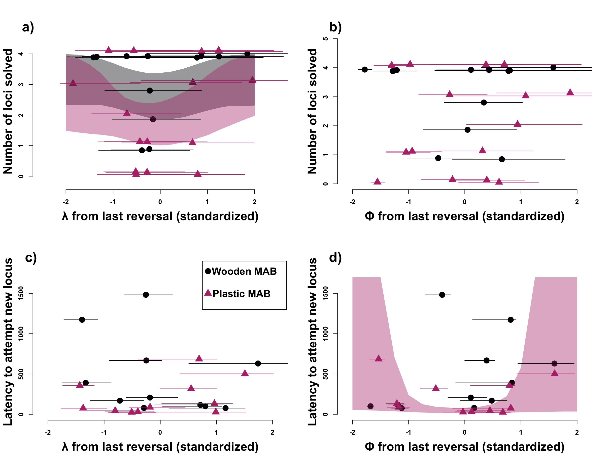

Open... {width=5%} access {width=5%} [code](https://github.com/corinalogan/grackles/blob/master/Files/Preregistrations/g_flexmanip2post.Rmd) {width=5%} peer review {width=5%} [data](https://doi.org/10.5063/F1H41PWS)

&nbsp;

**Affiliations:** 1) Max Planck Institute for Evolutionary Anthropology, Leipzig, Germany, 2) University of California Santa Barbara, USA, 3) University of California Los Angeles, USA, 4) Arizona State University, Tempe, AZ USA. *Corresponding author: dieter_lukas@eva.mpg.de

```{r preparermd, include=FALSE}
library(knitr)
library(formatR)
knitr::opts_chunk$set(tidy.opts=list(width.cutoff=70),tidy=TRUE) 
#Make code chunks wrap text so it doesn't go off the page when knitting to PDF

knitr::opts_chunk$set(echo=F, include=T, results='asis', warning=F, message=F) 
#sets global options to display code along with the results https://exeter-data-analytics.github.io/LitProg/r-markdown.html
#set echo=F for knitting to PDF (hide code), and echo=T for knitting to HTML (show code)

### make a bibtex file that has only the references cited in this rmd 
#load the Rmd file
Rmd <- readChar("https://raw.githubusercontent.com/corinalogan/grackles/master/Files/Preregistrations/g_flexmanip2post.Rmd",nchars=1e7)

#find all in text citations that start with @, but are preceded by a space
pattern <- "\\ @(.*?)\\ "
m <- regmatches(Rmd,gregexpr(pattern,Rmd))[[1]]
m

res<- gsub("\\ ","",m) #delete spaces
res<- gsub("\\]","",res) #delete ]
res<- gsub("\\;","",res) #delete ;
res<- gsub("\\,","",res) #delete ,
res<- gsub("\\.","",res) # delete .

#find all in text citations that start with @, but are preceded by a "["
pattern2 <- "\\[@(.*?)\\ "
m2 <- regmatches(Rmd,gregexpr(pattern2,Rmd))[[1]]
m2

res2<- gsub("\\[","",m2)
res2<- gsub("\\]","",res2)
res2<- gsub("\\]","",res2)
res2<- gsub("\\;","",res2)
res2<- gsub("\\,","",res2)
res2<- gsub("\\.","",res2)
res2<- gsub("\\ ","",res2)

#combine both patterns
allbibtexkeys<-c(res,res2)

#write to a new file and then clean it up manually
write(allbibtexkeys,file="g_flexmanip2post_bibtexkeys.txt")

#load the cleaned txt file
allbibtexkeys<-read.csv("g_flexmanip2post_bibtexkeys.txt")

#use bib2df to convert the bibliography file into a dataframe
library(bib2df)

#load the bib from GitHub
df <- bib2df("https://raw.githubusercontent.com/corinalogan/grackles/master/Files/Preregistrations/MyLibrary.bib")

#remove the @ to match the entry in the bib file
allbibtexkeys2<- gsub("\\@","",allbibtexkeys[,1])

#filter the full bib to only keep the entries that are cited here
df_filtered<-df[df$BIBTEXKEY %in% allbibtexkeys2,]

#use bib2df to convert the data frame into the bibliography file that only contains the citations in this Rmd
df2bib(df_filtered, file = "_flexmanip2post_refs.bib", append = FALSE)
```

&nbsp;

**This is one of three post-study manuscript of the preregistration that was pre-study peer reviewed and received an In Principle Recommendation on 26 Mar 2019 by:**

Aurélie Coulon (2019) Can context changes improve behavioral flexibility? Towards a better understanding of species adaptability to environmental changes. *Peer Community in Ecology*, 100019. [10.24072/pci.ecology.100019](https://doi.org/10.24072/pci.ecology.100019). Reviewers: Maxime Dahirel and Andrea Griffin

**Preregistration:** [html](http://corinalogan.com/Preregistrations/g_flexmanip.html), [pdf](https://github.com/corinalogan/grackles/blob/master/Files/Preregistrations/g_flexmanipPassedPreStudyPeerReview26Mar2019.pdf), [rmd](https://github.com/corinalogan/grackles/blob/d17a75c24df4b90aa607eda452f4fcc496ae9409/Files/Preregistrations/g_flexmanip.Rmd)

**Post-study manuscript** (submitted to PCI Ecology for post-study peer review on 3 Jan 2022, revised and resubmitted Feb 2024): [preprint at EcoEvoRxiv](https://ecoevorxiv.org/repository/view/3689/), [rmd with code at github](https://github.com/corinalogan/grackles/blob/master/Files/Preregistrations/g_flexmanip2post.Rmd)


# Abstract

Environments can change suddenly and unpredictably, so animals might benefit from being able to flexibly adapt their behavior through learning new associations. Reversal learning experiments have long been used to investigate differences in behavioral flexibility among individuals and species. In these experiments, individuals initially learn that a reward is associated with a specific cue before the reward is switched to a different cue, forcing individuals to reverse their learned associations. Here, we apply and expand newly developed Bayesian reinforcement learning models to gain additional insights into how individuals might dynamically modulate their behavioral flexibility if they experience repeated reversals in which cue is associated with a reward. In the serial reversal learning experiment cues are reliably associated with a reward, but the association between the reward and the cue frequently changes. We derive mathematical predictions that in this environment, individuals will gain the most rewards if they increase their rate of updating associations between cues and the reward to quickly change to a new option after a switch, and if they decrease their sensitivity to their learned association to explore the alternative option after a switch. We reanalyzed data from eight wild-caught great-tailed grackles (*Quiscalus mexicanus*), which were in line with these predictions. Their estimated association-updating rate was more than twice as high at the end of the serial reversal learning experiment than at the beginning, and their estimated sensitivities to their learned associations declined by about a third.  The changes in behavioral flexibility that grackles showed in experience of the serial reversals also influenced their behavior on a different subsequent experiment, where individuals with more extreme rates or sensitivities solved more options on a multi-option puzzle box. Our findings offers new insights into how individuals react to uncertainty and changes in their environment, in particular showing how they can modulate their behavioral flexibility in response to their experiences. 

# Introduction

Most animals live in environments that undergo changes that can affect key components of their lives, such as where to find food or which areas are safe. Accordingly, individuals that cannot react to these changes should have reduced survival and/or reproductive success. One of the ways in which animals react to changes is through behavioral flexibility, the ability to change behavior when circumstances change [@shettleworth2010cognition].  The level of behavioral flexibility present in a given species is often assumed to have been shaped by selection, with past levels of change in the environment determining how well species might be able to cope with more rapidly changing [@sih2013understanding] or novel environments [@sol2002behavioural]. However, in another conception, behavioral flexibility is itself plastic [@wright2010behavioral]. Behavioral flexibility arises because individuals update their information about the environment through personal experience and make that information available to other cognitive processes [@mikhalevich_is_2017]. Such modulation of behavioral flexibility is presumably relevant if the rate and extent of environmental change is variable and unpredictable [@donaldson2013unreliable, @tello2019spatial]. We are still limited in our understanding of when and how individuals might react to their experiences of environmental change. 

Evidence that animals can change their behavioral flexibility based on their recent experience comes from serial reversal learning experiments. Serial reversal learning experiments have long been used to understand how individuals keep track of biologically important associations in changing environments [@dufort1954one, @mackintosh1968factors, @bitterman1975comparative].  In these experiments, individuals are presented with multiple options associated with cues, such as different colors or locations, that differ in their reward. Individuals can repeatedly choose among the options to learn the associations between rewards and cues. After they show a clear preference for the most rewarded option, the rewards are reversed across cues, and individuals are observed to see how quickly they learn the changed associations. When they have reversed their preference, the reward is changed back to the other option, until the individual reverses their preference again, in a process called serial reversals. Their performance during the reversal task is taken as a measure of their behavioral flexibility, with individuals needing fewer trials to consistently choose the rewarded option after a switch assumed to be more flexible. While the primary focus of these serial reversal learning experiments has been to measure differences in behavioral flexibility across individuals and species [@lea2020behavioral], several of these experiments show that behavioral flexibility is not a fixed trait, but that individuals can improve their performance if they experience repeated reversals [@bond2007serial, @liu2016learning, @cauchoix2017cognition]. Here, we investigate how individuals might change their behavioral flexibility during serial reversal learning experiments to better understand what cognitive processes could lead to the observed differences and adjustments in behavioral flexibility [@izquierdo2017neural, @danwitz2022parameter].

We recently found that great-tailed grackles (*Quiscalus mexicanus*; hereafter grackles) can be trained to improve how quickly they learn to change associations in a serial reversal learning experiment [@logan2023flexmanippcj]. After training birds to search for food in a yellow tube, the reversal learning experiment consisted of presenting birds with a light gray and a dark gray tube, only one of which contained a reward. After individuals chose one of the tubes, thus experiencing whether this color was either rewarded or not, the experiment was reset, with the reward being in the same colored tube as before. Once an individual chose the rewarded color more than expected by chance (passing criterion of choosing correctly in at least 17 out of the last 20 trials, which represents a significant association according to the chi-square test), the reward was switched to the other color. Again, individuals made choices until they chose the now rewarded tube above the passing criterion. For one set of individuals, the trained group, we repeated the reversal of rewards from one color to the other until the birds reached the serial reversal passing criterion of forming a preference in 50 trials or less in two consecutive reversals. The median number of trials birds in this trained group needed to reach the passing criterion during their first reversal was 75, which improved to 40 trials during their final reversal. Importantly, we found that, in comparison to a control group who only experienced a single reversal, trained grackles who experienced serial reversals also showed increased behavioral flexibility in other contexts. In particular, trained grackles performed better on multi-option puzzle boxes than control grackles, being faster to switch to a new access option on a box if the previous option was closed, and they solved more of the available access options [@logan2023flexmanippcj]. This indicates that individuals did not just learn an abstract rule about the serial reversal learning experiment, but rather changed their overall behavioral flexibility in response to their experience.

Previous analyses of serial reversal learning experiments were limited in understanding the potential changes in behavioral flexibility because they focused on summaries of the choices individuals make [e.g. @bond2007serial]. These approaches are more descriptive, making it difficult to link the differences to specific processes and to predict how variation in behavior might transfer to other tasks. While there have been attempts to identify potential rules that individuals might learn during serial reversal learning [@spence1936nature; @warren1965primate; @warren1965comparative, @le2023mixtures], these rules were often about abstract switches to extreme behaviors (e.g. win-stay / lose-shift) and therefore could not account for the full variation in the behavior. A number of theoretical models have recently been developed that appear to reflect the potential cognitive processes individuals seem to rely on when making choices in reversal learning experiments [for a recent review see, for example, @fromer2023belief]. These theoretical models deconstruct the behavior of individuals in a reversal learning task into two primary parameters [@camerer1999experience, @chow2015serial, @izquierdo2017neural, @bartolo2020prefrontal]. The first process reflects the *rate of updating associations* (which we refer to hereafter as $\phi$, the Greek letter phi), or how quickly individuals learn about the associations between the cues and potential rewards (or dangers). In the reinforcement learning models, this rate is reflected by the Rescorla-Wagner rule [@rescorlawagner1972reinforcement]. The rate weights the most recent information proportionally to the previously accumulated information for that cue (as a proportion, the rate can range between 0 and 1, see Equations 1-3). Individuals are expected to show different rates in different environments, particularly in response to the reliability of the cues (Figure 1). Lower updating rates are expected when associations are not perfect such that a single absence of a reward might be an error rather than indicating a new association. Higher updating rates are expected when associations are reliable such that individuals should update their associations quickly when they encounter new information [@dunlap2009components, @Breen_2023]. The second process, the *sensitivity to their learned associations* (which we hereafter refer to as $\lambda$, the Greek letter lambda) reflects how individuals, when presented with a set of cues, might decide between these alternative options based on their learned associations of the cues. In the reinforcement learning model, the decision between different options is reflected by relative probabilities [@daw2006cortical, @agrawal2012analysis, @danwitz2022parameter], where the sensitivity to learned associations modifies the relative difference in learned rewards to generate the probabilities of choosing each option. A value of zero means individuals do not pay attention to their learned associations, but choose randomly, whereas increasingly larger values mean that individuals show strong biases in choice as soon as there are small differences in their learned associations (see Equations 1-3). Individuals with larger sensitivities will quickly prefer the option that previously gave them the highest reward (or the lowest danger), while individuals with lower sensitivities will continue to explore alternative options. Sensitivities are expected to reflect the rate of change in the environment (Figure 1), with larger sensitivities occurring when environments are static such that individuals start to exploit any differences they recognise as soon as possible. Lower sensitivities are expected when changes are frequent, such that individuals continue to explore alternative options when conditions change [@daw2006cortical, @Breen_2023].


**Figure 1** In serial reversal learning experiments, associations are reliable, such that if an option is associated with a reward, it is rewarded during every trial (white background). However, the associations between options and the rewards change across trials (solid line). In such environments, individuals are expected to gain the most rewards if they update their associations quickly (large $\phi$) to switch away from an option if it is no longer being rewarded, and if they have small sensitivities to their learned associations to continue to explore all options to check if associations have changed again (small $\lambda$). In contrast, in unchanging but unreliable environments, the probability that an option is rewarded stays constant across trials (dotted lines), but is closer to 50% (gray background). In such environments, individuals are expected to gain the most rewards if they build their associations as average across many trials (small $\phi$), and have high sensitivities to learned associations to exploit the option with the highest association (large $\lambda$). Grackle picture credit (CC BY 4.0): Dieter Lukas.
 


Here, we applied and modified the Bayesian reinforcement learning models to data from our grackle research on behavioral flexibility to assess if and how the cognitive processes might have changed as individuals experienced the serial reversal learning experiment. We previously found that the model can predict the performance of grackles in a static reversal learning task with a single reversal of a color preference [@blaisdell2021causal]. Grackles experiencing the serial reversal learning experiment are expected to infer that associations can frequently change but that, before and after a change, cues reliably indicate whether a reward is present or not.  Based on the theoretical models, we predict that individuals increase their association-updating rate because cues are highly reliable, such that they can change their associations as soon as there is a change in the reward [@dunlap2009components, @Breen_2023]. In addition, we predict that individuals reduce their sensitivity to the learned associations, because the option that is rewarded switches frequently, requiring individuals to explore alternative options [@neftci2019reinforcement, @leimar2024flexible]. Given that reversals in the associations are not very frequent, we also expect some variation in individuals in whether they switch to the newly rewarded option because they find the reward quickly through continued exploration (somewhat lower $\lambda$ and higher $\phi$) or because they quickly move away from the option that is no longer rewarded (somewhat higher $\lambda$ and lower $\phi$). To assess these predictions, we addressed the following six research questions. With the first two research questions, we determined the feasibility and validity of our approach using simulations. As far as we were aware, Bayesian reinforcement learning models had not been used to investigate temporal changes in behavior. We therefore used simulations as a proof-of-concept assessment to show their sensitivity and ability to answer our questions. With the other four questions, we analyzed the grackle data to determine how the association-updating rate and the sensitivity to learned associations reflect the variation and changes in behavioral flexibility in grackles.


**1) Are the Bayesian reinforcement learning models sufficiently sensitive to detect changes that occur across the limited number of serial reversals that individuals participated in?** \
We used agent-based simulations to answer this question, where simulated individuals make choices based on assigned $\phi$ and $\lambda$ values. We determined how to apply the Bayesian reinforcement learning models to recover the assigned values. Previous applications of the Bayesian reinforcement learning models always combined the full sample of observations, so it is not clear whether these models are sufficiently sensitive to detect the changes we are interested in. The stochasticity in which option an individual chooses based on a given set of associations introduces differences in the set of choices across trials even among individuals with the same $\phi$ and $\lambda$ values. On the flip-side, because of the probabilistic decisions, a given series of specific choices during a short number of trials can occur even if individuals have different $\phi$ and $\lambda$ values. We varied the number of trials we analyzed to determine with which sample size we can recover the assigned $\phi$ and $\lambda$ values in light of this noise.

**2) Is a high rate of association-updating ($\phi$) and a low sensitivity to learned associations ($\lambda$) best to reduce errors in the serial reversal learning experiment?** \
We used analytical approaches to systematically vary $\phi$ and $\lambda$ to determine how the interaction of the two processes determine the behavior of individuals throughout the serial reversal learning experiment. Previous studies made general predictions about the role of $\phi$ and $\lambda$ in different environments [@dunlap2009components, @Breen_2023]. We assessed here whether, under the specific conditions in the serial reversal experiments, where information is reliable and changes occur frequently, the best behavior for individuals is to show high $\phi$ and low $\lambda$. 

**3) Which of the two parameters $\phi$ or $\lambda$ explains more of the variation in the serial reversal learning experiment performance of the tested grackles?** \
Across both the trained (experienced serial reversals) and control (experienced a single reversal) grackles, we assessed whether variation in the number of trials an individual needs to reach the criterion in a given reversal is better explained by their inferred association updating rate or by their sensitivity to learned associations. 


**4) Do the grackles who improved their performance through the serial reversal experiment show the predicted changes in $\phi$ and $\lambda$?** \
If individuals learn the contingencies of the serial reversal experiment, they should be reducing their sensitivity to learned associations $\lambda$ to explore the alternative option when rewards change, and increase their association-updating rate $\phi$ to quickly exploit the new reliably rewarded option. 


**5) Are some individuals better than others at adapting to the serial reversals?** \
In previous work, we found that there are individual differences that persist throughout the experiment, with individuals who required fewer trials to solve the initial reversal also requiring fewer trials in the final reversal after their training [@mccune2023flexmanippeerj]. We could expect that these individual differences are guided by consistency in how individuals solve the reversal learning paradigm, meaning they are reflected in individual consistency in $\phi$ and $\lambda$ that persist through the serial reversals. In addition, it is not clear whether some grackles change their behavior more than others: for example, it could be that individuals who have a higher association-updating rate $\phi$ at the beginning of the experiment might also be better able to quickly change their behavior to match the particular conditions of the serial reversal learning experiment. Therefore, we also analyze whether the $\phi$ and $\lambda$ values of individuals at the beginning predict how much they changed throughout the serial reversal learning experiment. 

 
**6) Can the $\phi$ or $\lambda$ from the performance of the grackles during their final reversal predict variation in the performance on the multi-option puzzle boxes?** \
Grackles would be expected to solve more options on the multi-option puzzle boxes if they quickly update their previously learned associations when a previous option becomes unavailable (high $\phi$). Given that, in the puzzle box experiment, individuals only receive a reward at any given option a few times, instead of repeatedly as during the reversal learning task, we predict that those individuals who are less sensitive to previously learned associations and instead continue to explore alternative options (low $\lambda$) can also gain more rewards. 


\newpage

# Materials and Methods

## Data

For question 1, we re-analyzed data we previously simulated for power analyses to estimate sample sizes for population comparisons [@logan2023xpoppcj]. In brief, we simulated choices in an initial association learning and following reversal experiment for a total of 640 individuals. The $\phi$ and $\lambda$ values for each individual were drawn from a distribution representing one of 32 populations, with different mean $\phi$ (8 different means) and mean $\lambda$ (4 different values) for each population (32 populations as the combination of each $\phi$ and $\lambda$). We simulated 20 individuals in each of the 32 populations. The range for $\phi$ and $\lambda$ values assigned to the artificial individuals in the simulations were based on the previous analysis of the single reversal data from grackles in a different population (Santa Barbara, California, USA, @blaisdell2021causal) to reflect the likely expected behavior. Based on their assigned $\phi$ and $\lambda$ values, each individual was simulated to pass first through the initial association learning phase and, after they reached criterion (chose the correct option 17 out of the last 20 times), the rewarded option switched and simulated individuals went through the reversal learning phase until they again reached criterion. Each choice that each individual made was simulated consecutively. Choices during trials were based on Equation 2. The first choice a simulated individual made in the initial association learning was random, because we assumed individuals had no information about the rewards and therefore set the initial attraction to be equally low. Based on their choices, individuals updated their internal associations with the two options based on Equation 1. We excluded simulated individuals from further analyses if they did not reach criterion either during the initial association or the reversal within 300 trials, the maximum that was also set for the experiments with the grackles. For each simulated individual, we had their assigned $\phi$ and $\lambda$ values, as well as the series of choices they made during the initial association and the first reversal learning period. For a given $\phi$ and $\lambda$, the stochasticity in which option a simulated individual chooses based on their attractions, plus the experience of either reward or not during previous choices, can lead to differences in the actual choices individuals make. The aim here was to see what sample is needed to correctly infer the assigned $\phi$ and $\lambda$ given the noise in the choice data.

For the empirical questions 3-6, we re-analyzed data of the performance of great-tailed grackles in serial reversal learning and multi-option puzzle box experiments [@logan2023flexmanippcj]. The data collection was based on our preregistration that received in principle acceptance at PCI Ecology [@coulon2023experiment]. All of the analyses reported here were not part of the original preregistration. The data we use here were published as part of the earlier article [@logan2023flexmanipdata] and are available at the Knowledge Network for Biocomplexity's data repository: [https://knb.ecoinformatics.org/view/corina_logan.84.42](https://knb.ecoinformatics.org/view/corina_logan.84.42).

In brief, great-tailed grackles were caught in the wild in Tempe, Arizona, USA for individual identification (colored leg bands in unique combinations), and brought temporarily into aviaries for testing, before being released back to the wild. The first experiment individuals participated in in the aviaries was the reversal learning experiment, as described in the introduction. A subset of 11 grackles was part of the control group, where they learned the association of the reward with one color before experiencing one reversal to learn that the other color is rewarded (initial reward option was randomly assigned to either a dark-gray or a light-gray tube). The rewarded option was switched when grackles passed the criterion of choosing the rewarded option during 17 of the most recent 20 trials. This criterion was set based on earlier serial reversal learning studies, and is based on the chi-square test which indicates that 17 out of 20 represents a significant association. With this criterion, individuals can be assumed to have learned the association between the cue and the reward [@logan2022manyindividuals] rather than having randomly chosen one option more than the other. After their single reversal, the 11 control grackles participated in a number of trials with two identically colored tubes (yellow) which both contained a reward. This matched their general experiment participation to that of the trained group. The other subset of 8 individuals in the trained group went through a series of reversals until they reached the criterion of having formed an association (17 out of 20 choices correct) in less than 50 trials in two consecutive reversals. The individuals in the trained group needed between 6-8 reversals to consistently reach this threshold, with the number of reversals not being linked to their performance at the beginning or at the end of the experiment.  

For question 6, we additionally used data from an experiment the grackles participated in after they had completed the reversal learning experiment. Both the control and trained individuals were provided access to two multi-option puzzle boxes, one made of wood and one made of plastic. The two boxes were designed with slight differences to explore how general the performance of the grackles was. The wooden box was made from a natural log, so was more representative of something the grackles might encounter in the wild. In addition, while both boxes had 4 possible ways (options) to access food, the four options on the wooden box were distinct compartments, each containing rewards, while the four options on the plastic box all led to the same reward. Grackles were tested sequentially on both boxes, where individuals could initially explore all options. After proficiency at an option was achieved (gaining food from this locus three times in a row), this option became non-functional by closing access to the option, and then the latency of the grackle to switch to attempting a different option was measured. If they again successfully solved another option, this second option was also made non-functional, and so on. The outcome measures for each individual with each box were the average latency it took to switch to a new option and the total number of options they successfully solved. 
 

## The Bayesian reinforcement learning model
 
For both the simulated and the observed grackle data, we used the Bayesian reinforcement learning model to estimate for each individual their $\phi$ and $\lambda$ values based on their choices they made during the reversal learning experiments. The estimated $\phi$ and $\lambda$ values were then used as outcome/predictor variables in the statistical models we built to assess the six questions. We used the version of the Bayesian model that was developed in @blaisdell2021causal and modified in @logan2023xpoppcj (see their Analysis Plan > "Flexibility analysis" for model specifications and validation). This model uses data from every trial of reversal learning (rather than only using the total number of trials to pass criterion) and represents behavioral flexibility using two parameters: the association-updating rate ($\phi$) and the sensitivity to learned associations ($\lambda$). The model transforms the series of choices each grackle made based on two equations to estimate the most likely $\phi$ and $\lambda$ that generated the observed behavior. 


Equation 1 (attraction and $\phi$): $A_{b,o,t+1}$=(1−$\phi_b$)$A_{b,o,t}$+$\phi_b$ $\pi_{b,o,t}$.

Equation 1 estimates how the associations $A$ that individual $b$ forms between the two different options ($o$ equals 1 or 2) and their expected rewards change from one trial to the next (time $t$+1) as a function of their previously formed associations $A_{b,o,t}$ (how preferable option $o$ is to grackle $b$ at time $t$) and recently experienced payoff $\pi$ (in our case, $\pi$ = 1 when they chose the correct option and received a reward in a given trial, and 0 when they chose the unrewarded option). The parameter $\phi_b$ modifies how much individual $b$ updates its associations based on its most recent experience. The higher the value of $\phi_b$, the faster the individual updates its associations, paying more attention to recent experiences, whereas when $\phi_b$ is lower, a grackle’s associations reflect averages across many trials. Association scores thus reflect the accumulated learning history up to this point. The association with the option that is not explored in a given trial remains unchanged. At the beginning of the experiment, we assume that individuals have the same low association between both options and rewards ($A_{b,1}$ = $A_{b,2}$ = 0.1).
 
Equation 2 (choice and $\lambda$): $P_{b,o,t+1}$=$\displaystyle \frac{exp(\lambda_b A_{b,o,t})}{\sum_{o = 1}^{2} exp(\lambda_b A_{b,o,t})}$.

Equation 2 is a normalized exponential (softmax) function to convert the learned associations of the two options with rewards into the probability $P$ that an individual $*b*$ chooses one of the two options $o_{i}$ in the next trial, $t$+1. The parameter $λ_{b}$ represents the sensitivity of a given grackle $b$ to how different its associations to the two options are. As $λ_{b}$ gets larger, choices become more deterministic and individuals consistently choose the option with the higher association even if associations are very similar. As $λ_{b}$ gets smaller, choices become more exploratory, with individuals choosing randomly between the two options independently of their learned associations if $λ_{b}$ is 0. 
 
We implemented the Bayesian reinforcement learning model in the statistical language Stan [@stan2019stan], calling the model and analyzing its output in *R* (version `r getRversion()`) [@rcoreteam]. The model takes the full series of choices individuals make (which of the two options did they choose, which option was rewarded, did they make the correct choice) across all their trials to find the $\phi$ and $\lambda$ values that best fit these choices given the two equations: which option individuals chose was estimated with a categorical distribution with the probability *P* as estimated from equation 2 for each of the two options (categories), before updating the associations using equation 1. The model was fit across all choices, with individual $\phi$ and $\lambda$ values estimated as varying effects. In the model, $\phi$ is estimated on the logit-scale to reflect that it is a proportion (only can take values between 0 and 1), and $\lambda$ is estimated on the log-scale to reflect that values have to be positive (there is no upper bound). We set the priors for $\phi$ and $\lambda$ to come from a normal distribution with a mean of zero and a standard deviation of one. We set the initial associations with both options for all individuals at the beginning of the experiment to 0.1 to indicate that they do not have an initial preference for either option but are likely to be somewhat curious about exploring the tubes because they underwent habituation with a differently colored tube (see below). For estimations at the end of the serial reversal learning experiment, we set the association with the option that was rewarded before the switch to 0.7 and to the option that was previously not rewarded to 0.1. Note that when applying equation 1 in the context of the reversal learning experiment as most commonly used, where there are only rewards (positive association) or no rewards (zero association) but no punishment (negative association), associations can never reach zero because they change proportionally.

For each estimation (simulated and observed grackle data), we ran 4 chains with 2000 samples each (half of which were warmup). We used functions in the package “posterior” [@vehtari2021rank] to draw 4000 samples from the posterior (the default in the functions). We report the estimates for $\phi$ and $\lambda$ for each individual (simulated or observed grackle) as the mean from these samples from the posterior. For the subsequent analyses where the estimated $\phi$ and $\lambda$ values were response or predictor variables, we ran the analyses both with the single mean per individual as well as looping over the full 4000 samples from the posterior to reflect the uncertainty in the estimates. The analyses with the samples from the posterior provided the same estimates as the analyses with the single mean values, though with larger confidence estimates because of the increased uncertainty. In the results, we report the estimates from the analyses with the mean values. The estimates with the samples from the posterior can be found in the code in the rmd file at the repository. In analyses where $\phi$ and $\lambda$ are predictor variables, we standardized the values that went into each analysis (either the means, or the respective samples from the posterior) by subtracting the average from each value and then dividing by the standard deviation. We did this to define the priors for the relationship on a more standard scale and to be able to more directly compare their respective influence on the outcome variable.


 
## 1) Using simulations to determine whether the Bayesian serial reinforcement learning models have sufficient power to detect changes through the serial reversal learning experiment \
 
We ran the Bayesian reinforcement learning model on the simulated data to understand the minimum number of choices per individual that would be necessary to recover the association-updating rate $\phi$ and the sensitivity to learned association $\lambda$ values assigned to each individual.

To determine whether the Bayesian reinforcement learning model can accurately recover the simulated $\phi$ and $\lambda$ values from limited data, we applied the model first to only the choices from the initial association learning phase, next to only the choices from the first reversal learning phase, and finally from both phases combined. To estimate whether the Bayesian reinforcement learning model can recover the simulated $\phi$ and $\lambda$ values without bias from either of the single or from the combined datasets, we correlated the estimated values with the values individuals were initially assigned:

$\phi_{b,1}$ or $\lambda_{b,1}$ ~ Normal($\mu$_{b}, $\sigma$), \
$\mu_{b}$ = $\alpha$ + $\beta$ x $\phi_{b,0}$ or $\lambda_{b,0}$, \
$\alpha$ ~ Normal(0,0.1), \
$\beta$ ~ Normal(1,1), \
$\sigma$ ~ Exponential(1),

where the values estimated for each bird, indexed by $b$, from the simulated behavior ($\phi_{b,1}$ or $\lambda_{b,1}$) are assumed to come from a normal distribution with a mean that can vary for each bird, $mu_{b}$, and overall variance $sigma$. The mean for each bird is constructed from an overall intercept, $\alpha$, and the change in expectation $\beta$ depending on the values assigned to each bird at the beginning of the simulation ($\phi_{b,0}$ or $\lambda_{b,0}$)  The combination of $\alpha$ close to 0 and of $\beta$ close to 1 would indicate that the estimated values matched the assigned values. 

This, and all following statistical models, were implemented using functions of the package ‘rethinking’ [@rethinking2020] in R to estimate the association with stan. Following the social convention set in [@rethinking2020], we report the mean estimate and the 89% compatibility interval from the posterior estimate from these models. For each model, we ran four chains with 10,000 iterations each (half of which were burn-in, and half samples for the posterior). We checked that the number of effective samples was sufficiently high and evenly distributed across all estimated variables such that auto-correlation did not influence the estimates. We also confirmed that in all cases the Gelman-Rubin convergence diagnostic, Ȓ, was 1.01 or smaller indicating that the chains had converged on the final estimates [@gelman1995avoiding]. In all cases, we also linked the model inferences back to the distribution of the raw data to confirm that the estimated predictions matched the observed patterns.


```{r question1_possibilityinferringphiandlambdasimulations, eval=F}
####
# Load previously simulated data from xpop
####

# There are two separate sets of simulations, with initial attractions at 0.1 and eight different phi and four different lambda combinations
simulatedreversaldata_attractionscores_1<-read.csv(url("https://raw.githubusercontent.com/corinalogan/grackles/master/Files/Preregistrations/gxpopbehaviorhabitat_SimulatedReversalData_Grackles_PhiLambda_Attraction02_Aug2021.csv"), header=T, sep=",", stringsAsFactors=F) 

simulatedreversaldata_attractionscores_2<-read.csv(url("https://raw.githubusercontent.com/corinalogan/grackles/master/Files/Preregistrations/gxpopbehaviorhabitat_SimulatedReversalData_Grackles_PhiLambda_Attraction04_Aug2021.csv"), header=T, sep=",", stringsAsFactors=F) 

# In both sets of simulations, populations with different phi and lambda values were counted from 1-16; for the second set we change this to 17-32
simulatedreversaldata_attractionscores_2$Site<-simulatedreversaldata_attractionscores_2$Site+16

# In both simulations, individuals were counted from 1-320; for the second set we change the ids to start at 321
simulatedreversaldata_attractionscores_2$Bird_ID<-simulatedreversaldata_attractionscores_2$Bird_ID+320

# We combine the two data sets for the further analyses
library(dplyr)
simulatedreversaldata_attractionscores<-bind_rows(simulatedreversaldata_attractionscores_1,simulatedreversaldata_attractionscores_2)

####

# In the simulations, trials were counted continuously for each bird. We now want to change this so that it restarts counting trials from 1 upward once a bird switches to reversal.

for (birds in 1:length(unique(simulatedreversaldata_attractionscores$Bird_ID))){
  currentbird<-unique(simulatedreversaldata_attractionscores$Bird_ID)[birds]
  maximuminitial<-max(simulatedreversaldata_attractionscores[simulatedreversaldata_attractionscores$Bird_ID==currentbird & simulatedreversaldata_attractionscores$Reversal == "initial",]$Trial)
  simulatedreversaldata_attractionscores[simulatedreversaldata_attractionscores$Bird_ID==currentbird & simulatedreversaldata_attractionscores$Reversal == "reversal",]$Trial<-simulatedreversaldata_attractionscores[simulatedreversaldata_attractionscores$Bird_ID==currentbird & simulatedreversaldata_attractionscores$Reversal == "reversal",]$Trial - maximuminitial
}

# We need to adjust the coding during the reversal learning so that "correct" now matches whether it is correct or not. 
simulatedreversaldata_attractionscores[simulatedreversaldata_attractionscores$Choice==0,]$Choice<-2

# To use the model to estimate the phi and lambda parameters, we first need to change the column names to match these to the specifications in the model: change Bird_ID  to id; change Reversal to Choice, change CorrectChoice to Correct, change Site to Expid

colnames(simulatedreversaldata_attractionscores)<-c("counter","id","Session","Trial","Reversal","Choice","Correct","Phi_mean","Lambda_mean","Site","Phi_sd","Lambda_sd","ThisBirdsPhi","ThisBirdsLambda","Attraction1","Attraction2")


# There are several simulated individuals who never reached the criterion during the initial learning phase. We need to remove these from the dataset

birdswithreversal<-as.data.frame(simulatedreversaldata_attractionscores %>% group_by(id) %>% summarise(experiments=length(unique(Reversal))))
birdswithreversal<-birdswithreversal[birdswithreversal$experiments==2,]
simulatedreversaldata_attractionscores<-simulatedreversaldata_attractionscores[simulatedreversaldata_attractionscores$id %in% birdswithreversal$id,]

# Next, we need to change the ids of the birds to be continuous again so the STAN model will include them all
simulatedreversaldata_attractionscores$id<-as.integer(as.factor(simulatedreversaldata_attractionscores$id))


#### QUESTION 1: Power of Bayesian reinforcement learning model to detect short-term changes in the association-updating rate $\phi$ and the sensitivity to learned associations $\lambda$


# We first focus only on the performance in the reversal trials
simulatedreversaldata_attractionscores_reversalphase<-simulatedreversaldata_attractionscores[simulatedreversaldata_attractionscores$Reversal=="reversal",]

# Let's start with 30 individuals for comparison
firstreversal_simulated<-simulatedreversaldata_attractionscores_reversalphase[simulatedreversaldata_attractionscores_reversalphase$id %in% c(20,40,60,80,100,120,140,160,180,200,220,240,260,300,320,340,360,380,400,420,440,460,480,500,520,540,560,580,600,620),]

firstreversal_simulated$id<-as.numeric(as.factor(firstreversal_simulated$id))

# We can now extract the relevant data from the first reversal for the STAN model to estimate phi and lambda at the beginning
datfirstsimulated <- as.list(firstreversal_simulated)
datfirstsimulated$N <- nrow(firstreversal_simulated)
datfirstsimulated$N_id <- length(unique(firstreversal_simulated$id))

# Next, we also look at the estimation of the phi and lambda values based on their performance in the initial association learning phase

# We  focus only on the performance in the initial association trials
simulatedreversaldata_attractionscores_learningphase<-simulatedreversaldata_attractionscores[simulatedreversaldata_attractionscores$Reversal=="initial",]

# Let's start with 30 individuals for comparison
initiallearning_simulated<-simulatedreversaldata_attractionscores_learningphase[simulatedreversaldata_attractionscores_learningphase$id %in% c(20,40,60,80,100,120,140,160,180,200,220,240,260,300,320,340,360,380,400,420,440,460,480,500,520,540,560,580,600,620),]

initiallearning_simulated$id<-as.numeric(as.factor(initiallearning_simulated$id))

# We can now extract the relevant data from the first reversal for the STAN model to estimate phi and lambda at the beginning
datinitialsimulated <- as.list(initiallearning_simulated)
datinitialsimulated$N <- nrow(initiallearning_simulated)
datinitialsimulated$N_id <- length(unique(initiallearning_simulated$id))


# The STAN model is set up to have the inital attraction for each option set to 0.1, and that individuals only learn the reward of the option they chose in a given trial.

reinforcement_model_nonzeroattraction_alternativepriors <- "

data{
   int N;
   int N_id;
   array[N] int id;
   array[N] int Trial;
   array[N] int Choice;
   array[N] int Correct;
}

parameters{
  real logit_phi;
  real log_L;

  // Varying effects clustered on individual
  matrix[N_id,2] v_ID;
}

model{
matrix[N_id,2] A; // attraction matrix

logit_phi ~  normal(0,1);
log_L ~  normal(0,1);

// varying effects
to_vector(v_ID) ~ normal(0,1);

// initialize attraction scores

for ( i in 1:N_id ) {
A[i,1] = 0.1; A[i,2] = 0.1;
}

// loop over Choices

for ( i in 1:N ) {
vector[2] pay;
vector[2] p;
real L;
real phi;

// first, what is log-prob of observed choice

L =  exp(log_L + v_ID[id[i],1]);
p = softmax(L*A[id[i],1:2]' );
Choice[i] ~ categorical( p );

// second, update attractions conditional on observed choice

phi =  inv_logit(logit_phi + v_ID[id[i],2]);
pay[1:2] = rep_vector(0,2);
pay[ Choice[i] ] = Correct[i];
A[ id[i] , Choice[i] ] = ( (1-phi)*(A[ id[i] , Choice[i] ]) + phi*pay[Choice[i]]);

}//i
}
"


# We run this model for the data from only the first reversal

# Two options to call stan from R - option 1 calling stan directly
m_firstsimulated <- stan( model_code =  reinforcement_model_nonzeroattraction_alternativepriors, data=datfirstsimulated ,iter = 5000, cores = 4, chains=4, control = list(adapt_delta=0.9, max_treedepth = 12))

sfirstsimulated <- extract.samples(m_firstsimulated)
firstreversal_simulatedlambda <- sapply(1 : datfirstsimulated$N_id, function(x) exp( mean(sfirstsimulated$log_L) + mean(sfirstsimulated$v_ID[ ,x, 1])))
firstreversal_simulatedphi <- sapply(1 : datfirstsimulated$N_id, function(x) inv_logit( mean(sfirstsimulated$logit_phi) + mean(sfirstsimulated$v_ID[ ,x, 2])))


# Two options to call stan from R - option 2 calling stan using cmdstanr
library(cmdstanr)
currentlocation<-getwd()
cmdstanlocation <- cmdstan_path()
setwd(cmdstanlocation)

# access the output file created by the model running the reinforcement model
write(reinforcement_model_nonzeroattraction_alternativepriors,file="myowntrial.stan")
file <- file.path(cmdstan_path(), "myowntrial.stan")
mod <- cmdstan_model(file)
options(mc.cores=4)

datfirstsimulated$Reversal<-as.numeric(as.factor(datfirstsimulated$Reversal))

# RUN the model
fit <- mod$sample(
  data = datfirstsimulated,
  seed = 123,
  chains = 4,
  parallel_chains = 4,
  refresh = 500
)
# Extract relevant variables
outcome_firstsimulated<-data.frame(fit$summary())
rownames(outcome_firstsimulated)<-outcome_firstsimulated$variable


library(posterior)
library(rethinking)
drawsarray_firstsimulated<-fit$draws()
drawsdataframe_firstsimulated<-as_draws_df(drawsarray_firstsimulated)
drawsdataframe_firstsimulated<-data.frame(drawsdataframe_firstsimulated)
firstsimulated_lambda <- sapply(1 : datfirstsimulated$N_id, function(x) exp( mean(drawsdataframe_firstsimulated$log_L) + mean(drawsdataframe_firstsimulated[,x+3])))
firstsimulated_phi <- sapply(1 : datfirstsimulated$N_id, function(x) inv_logit( mean(drawsdataframe_firstsimulated$logit_phi) + mean(drawsdataframe_firstsimulated[,x+33])))
firstsimulated_lambda_individuals <- sapply(1 : datfirstsimulated$N_id, function(x) exp( (drawsdataframe_firstsimulated$log_L) + (drawsdataframe_firstsimulated[,x+3])))
firstsimulated_lambda_range<-sapply(1 : datfirstsimulated$N_id, function(x) HPDI(firstsimulated_lambda_individuals[,x],0.89))
firstsimulated_phi_individuals<-sapply(1 : datfirstsimulated$N_id, function(x) inv_logit( (drawsdataframe_firstsimulated$logit_phi) + (drawsdataframe_firstsimulated[,x+33])))
firstsimulated_phi_range<-sapply(1 : datfirstsimulated$N_id, function(x) HPDI(firstsimulated_phi_individuals[,x],0.89))

# Remove the stan command line file we created for this particular model from your computer
fn<-"myowntrial"
file.remove(fn)

# Reset your working directory to what it was before we ran the model
setwd(currentlocation)


# We now can get back the phi and lambda values 30 individuals were assigned at the beginning of the simulation
simulatedphis<-unique(simulatedreversaldata_attractionscores_reversalphase[simulatedreversaldata_attractionscores_reversalphase$id %in% c(20,40,60,80,100,120,140,160,180,200,220,240,260,300,320,340,360,380,400,420,440,460,480,500,520,540,560,580,600,620),]$ThisBirdsPhi)
simulatedlambdas<-unique(simulatedreversaldata_attractionscores_reversalphase[simulatedreversaldata_attractionscores_reversalphase$id %in% c(20,40,60,80,100,120,140,160,180,200,220,240,260,300,320,340,360,380,400,420,440,460,480,500,520,540,560,580,600,620),]$ThisBirdsLambda)


# Some of the phi values estimated from the performance during the initial learning are estimated as higher than what the individuals had during the simulation. 
plot(firstsimulated_phi~simulatedphis,xlim=c(0,0.08),ylim=c(0,0.08))
abline(a=0,b=1)

# In contrast, some of the lambda values estimated from the performance during the initial learning are estimated as lower than what the individuals had during the simulation
plot(firstsimulated_lambda~simulatedlambdas,xlim=c(0,10),ylim=c(0,10))
abline(a=0,b=1)

# The issue likely arises because the STAN model assumes that the phi and lambda values are correlated - whereas in the simulations they were allowed to vary independently from each other
plot(firstsimulated_phi~firstsimulated_lambda)
plot(simulatedphis~simulatedlambdas)

# In the simulation, we set some high lambda values and low phi values - because of the assumed correlation, the STAN model estimates higher phi values than simulated in cases when lambda was high, and lower lambda values than simulated when phi was low

plot(firstsimulated_phi[simulatedlambdas<5]~simulatedphis[simulatedlambdas<5],xlim=c(0,0.08),ylim=c(0,0.08))
points(firstsimulated_phi[simulatedlambdas>5]~simulatedphis[simulatedlambdas>5],xlim=c(0,0.08),ylim=c(0,0.08),col="red")
abline(a=0,b=1)


# In these estimations based on the performance during single setups (either just the initial learning or the first reversal learning) the model always estimates that lambda and phi are correlated. This likely reflects equifinality - individuals can achieve the same performance with a range of phis and lambdas, and the model will slide to the middle along the line for each individual:

plot(x="lambda",y="phi",xlim=c(0,10),ylim=c(0,0.1))
# Individuals who needed a long time to learn the association will be in the bottom left corner
abline(a=0.04,b=-0.01,lty=2)
abline(a=0.06,b=-0.01,lty=2)
abline(a=0.08,b=-0.01,lty=2)
# Individuals who needed a short time to learn the association will be in the top right corner
abline(a=0.10,b=-0.01,lty=2)
abline(a=0.12,b=-0.01,lty=2)
abline(a=0.14,b=-0.01,lty=2)

points(x=1,y=0.03,cex=2)
points(x=2,y=0.04,cex=2)
points(x=3,y=0.05,cex=2)
points(x=4,y=0.06,cex=2)
points(x=5,y=0.07,cex=2)
points(x=6,y=0.08,cex=2)
abline(a=0.02,b=0.01,col="red",lwd=1.5)
points(initiallearning_simulatedphi~initiallearning_simulatedlambda,pch=2)


# Maybe the model can better separate the lambda and phi values when combining data from multiple runs - in the case of the simulations that means combining the data from the initial learning with the data of the first reversal


# Let's start with the same 30 individuals for comparison
initialandreversal_simulated<-simulatedreversaldata_attractionscores[simulatedreversaldata_attractionscores$id %in% c(20,40,60,80,100,120,140,160,180,200,220,240,260,300,320,340,360,380,400,420,440,460,480,500,520,540,560,580,600,620),]

initialandreversal_simulated$id<-as.numeric(as.factor(initialandreversal_simulated$id))

# We can now extract the relevant data from the first reversal for the STAN model to estimate phi and lambda at the beginning
datinitialandreversalsimulated <- as.list(initialandreversal_simulated)
datinitialandreversalsimulated$N <- nrow(initialandreversal_simulated)
datinitialandreversalsimulated$N_id <- length(unique(initialandreversal_simulated$id))


# Option 1: calling stan directly from R
m_initialandreversal <- stan( model_code =  reinforcement_model_nonzeroattraction, data=datinitialandreversalsimulated ,iter = 5000, cores = 4, chains=4, control = list(adapt_delta=0.9, max_treedepth = 12))

sinitialandreversal <- extract.samples(m_initialandreversal)
initialandreversal_lambda <- sapply(1 : datinitialandreversalsimulated$N_id, function(x) exp( mean(sinitialandreversal$log_L) + mean(sinitialandreversal$v_ID[ ,x, 1])))
initialandreversal_phi <- sapply(1 : datinitialandreversalsimulated$N_id, function(x) inv_logit( mean(sinitialandreversal$logit_phi) + mean(sinitialandreversal$v_ID[ ,x, 2])))

plot(initialandreversal_phi~simulatedphis)
abline(a=0,b=1)
plot(initialandreversal_lambda~simulatedlambdas)
abline(a=0,b=1)

plot(initialandreversal_phi~initialandreversal_lambda)


# Option 1: calling stan through cmdstanr
# setup with cmdstanr
currentlocation<-getwd()
cmdstanlocation <- cmdstan_path()
setwd(cmdstanlocation)

datinitialandreversalsimulated$Reversal<-as.numeric(as.factor(datinitialandreversalsimulated$Reversal))

# access the output file created by the model running the reinforcement model / reinforcement_model_nonzeroattraction_alternativepriors
write(reinforcement_model_nonzeroattraction_alternativepriors,file="myowntrial.stan")
file <- file.path(cmdstan_path(), "myowntrial.stan")
mod <- cmdstan_model(file)
options(mc.cores=4)

# RUN the model
fit <- mod$sample(
  data = datinitialandreversalsimulated,
  seed = 123,
  chains = 4,
  parallel_chains = 4,
  refresh = 500
)

#Extract relevant variables
drawsarray<-fit$draws()
drawsdataframe<-as_draws_df(drawsarray)
drawsdataframe<-data.frame(drawsdataframe)
initialandreversal_lambda <- sapply(1 : datinitialandreversalsimulated$N_id, function(x) exp( mean(drawsdataframe$log_L) + mean(drawsdataframe[,x+3]))) 
initialandreversal_phi <- sapply(1 : datinitialandreversalsimulated$N_id, function(x) inv_logit( mean(drawsdataframe$logit_phi) + mean(drawsdataframe[,x+33]))) 
initialandreversal_lambda_individuals <- sapply(1 : datfirstsimulated$N_id, function(x) exp( (drawsdataframe$log_L) + (drawsdataframe[,x+3])))
initialandreversal_lambda_range<-sapply(1 : datfirstsimulated$N_id, function(x) HPDI(initialandreversal_lambda_individuals[,x],0.89))
initialandreversal_phi_individuals<-sapply(1 : datfirstsimulated$N_id, function(x) inv_logit( (drawsdataframe$logit_phi) + (drawsdataframe[,x+33])))
initialandreversal_phi_range<-sapply(1 : datfirstsimulated$N_id, function(x) HPDI(initialandreversal_phi_individuals[,x],0.89))


# Remove the stan command line file we created for this particular model from your computer
fn<-"myowntrial"
file.remove(fn)

# Reset your working directory to what it was before we ran the model
setwd(currentlocation)

simulatedphi<-initialandreversal_simulated %>% group_by(id) %>% summarise(mean(Phi_mean))
simulatedphi<-as.data.frame(simulatedphi)
simulatedphis<-simulatedphi[,2]


library(rethinking)

dat_simulatedvsestimated_onlyone<- list(
  simulatedphis = simulatedphis,
  estimatedphis = firstsimulated_phi
)

model_simulatedvsestimated_onlyone <- ulam(
    alist(
        estimatedphis ~ normal( mu , sigma ),
        mu <- a + b*simulatedphis,
        a ~ normal(0,0.1),
        b ~ normal(1,1),
        sigma ~ dexp(1)
    ) , data=dat_simulatedvsestimated_onlyone , chains=4 , cores=4,iter=10000 ,cmdstan = T)

precis(model_simulatedvsestimated_onlyone,depth=2)
#      mean   sd 5.5% 94.5% n_eff Rhat4
#a     0.01 0.00 0.00  0.01  6711     1
#b     0.15 0.05 0.06  0.23  6526     1
#sigma 0.00 0.00 0.00  0.00  7926     1


dat_simulatedvsestimated_acrossreversal<- list(
  simulatedphis = simulatedphis,
  estimatedphis = initialandreversal_phi
)

model_simulatedvsestimated_acrossreversal <- ulam(
    alist(
        estimatedphis ~ normal( mu , sigma ),
        mu <- a + b*simulatedphis,
        a ~ normal(0,0.1),
        b ~ normal(1,1),
        sigma ~ dexp(1)
    ) , data=dat_simulatedvsestimated_acrossreversal , chains=4 , cores=4,iter=10000, cmdstan = T)

precis(model_simulatedvsestimated_acrossreversal,depth=2)
#      mean   sd  5.5% 94.5% n_eff Rhat4
#a     0.00 0.00 -0.01  0.01  6680     1
#b     0.96 0.16  0.70  1.21  6677     1
#sigma 0.01 0.00  0.01  0.01  8210     1


dat_simulatedvsestimated_onlyone_l<- list(
  simulatedlambdas = simulatedlambdas,
  estimatedlambdas = firstsimulated_lambda
)

model_simulatedvsestimated_onlyone_l <- ulam(
    alist(
        estimatedlambdas ~ normal( mu , sigma ),
        mu <- a + b*simulatedlambdas,
        a ~ normal(0,0.1),
        b ~ normal(1,1),
        sigma ~ dexp(1)
    ) , data=dat_simulatedvsestimated_onlyone_l , chains=4 , cores=4,iter=10000 ,cmdstan = T)

precis(model_simulatedvsestimated_onlyone_l,depth=2)
#      mean   sd  5.5% 94.5% n_eff Rhat4
#a      0.13 0.10 -0.03  0.29    1 19299.05
#b      6.04 0.11  5.86  6.22    1 19167.92
#sigma 18.04 0.50 17.27 18.86    1 19884.38


dat_simulatedvsestimated_acrossreversal_l<- list(
  simulatedlambdas = simulatedlambdas,
  estimatedlambdas = initialandreversal_lambda
)

model_simulatedvsestimated_acrossreversal_l <- ulam(
    alist(
        estimatedlambdas ~ normal( mu , sigma ),
        mu <- a + b*simulatedlambdas,
        a ~ normal(0,0.1),
        b ~ normal(1,1),
        sigma ~ dexp(1)
    ) , data=dat_simulatedvsestimated_acrossreversal_l , chains=4 , cores=4,iter=10000, cmdstan = T)

precis(model_simulatedvsestimated_acrossreversal_l,depth=2)
#      mean   sd  5.5% 94.5% n_eff Rhat4
#a     0.01 0.10 -0.15  0.16 15584     1
#b     0.98 0.04  0.92  1.05 14582     1
#sigma 1.20 0.16  0.97  1.47 16119     1


dat_simulatedvsestimated_onlyone_both<- list(
  estimatedlambdas = firstsimulated_lambda,
  estimatedphis = firstsimulated_phi
)

model_simulatedvsestimated_onlyone_both <- ulam(
    alist(
        estimatedlambdas ~ normal( mu , sigma ),
        mu <- a + b*estimatedphis,
        a ~ normal(0,10),
        b ~ normal(0,250),
        sigma ~ dexp(1)
    ) , data=dat_simulatedvsestimated_onlyone_both , chains=4 , cores=4,iter=10000 ,cmdstan = T)

precis(model_simulatedvsestimated_onlyone_both,depth=2)
#        mean    sd   5.5%  94.5% n_eff Rhat4
#a      -0.81  0.39  -1.42  -0.19  6193     1
#b     504.19 42.73 435.31 570.69  6066     1
#sigma   0.61  0.09   0.49   0.76  7213     1


####
#### Plot for Figure 2
plot(firstsimulated_phi~simulatedphis,xlim=c(0,0.06),ylim=c(0,0.06),bty="n",cex=3,pch=18,col="#00DADF",ann=F)
points(initialandreversal_phi~simulatedphis,col="#007477",pch=16,cex=2)
abline(a=0,b=1,lty=2)
legend(x="topleft", legend=c(pch16="Initial plus Reversal",pch18="Single Reversal"), pch=c(16,18), col=c("#007477","#00DADF"), box.lty=0, cex=1.2,pt.cex=1.4)
mtext("Assigned association-updating rate Φ",side=1,at=0.03,line=3,cex=1.5)
mtext("Estimated association-updating rate Φ",side=2,at=0.03,line=2.5,cex=1.5)
mtext("1:1 line",side=1,at=0.055,line=-20)

for(i in 1:30) {
lines(y=c(initialandreversal_phi_range[1,i],initialandreversal_phi_range[2,i]),x=c(simulatedphis[i],simulatedphis[i]),col=col.alpha(acol="#007477",alpha=0.4))
lines(y=c(firstsimulated_phi_range[1,i],firstsimulated_phi_range[2,i]),x=c(simulatedphis[i],simulatedphis[i]),col=col.alpha(acol="#00DADF",alpha=0.4))  
}


par(mfrow=c(1,2))
# jitter simulated phi values to make it easier to see the 89% compatibility ranges
jsimulatedphis<-jitter(simulatedphis)
# Alternative Plot for Figure 2 based on full simulated data
plot(firstsimulated_phi~jsimulatedphis,xlim=c(0,0.05),ylim=c(0,0.12),bty="n",cex=3,pch=18,col="#31688EFF",ann=F)
points(initialandreversal_phi~jsimulatedphis,col="#35B779FF",pch=16,cex=2)
abline(a=0,b=1,lty=2)
legend(x="topleft", legend=c(pch16="Initial plus Reversal",pch18="Single Reversal"), pch=c(16,18), col=c("#35B779FF","#31688EFF"), box.lty=0, cex=1.2,pt.cex=1.4)
mtext("Assigned association-updating rate Φ",side=1,at=0.02,line=3,cex=1.5)
mtext("Estimated association-updating rate Φ",side=2,at=0.06,line=2.5,cex=1.5)
mtext("1:1 line",side=1,at=0.05,line=-10)
mtext("a)", side=1,line=-15,font=2,at=-0.004,cex=1.7)

for(i in 1:626) {
lines(y=c(initialandreversal_phi_range[1,i],initialandreversal_phi_range[2,i]),x=c(jsimulatedphis[i],jsimulatedphis[i]),col=col.alpha(acol="#35B779FF",alpha=0.4))
lines(y=c(firstsimulated_phi_range[1,i],firstsimulated_phi_range[2,i]),x=c(jsimulatedphis[i],jsimulatedphis[i]),col=col.alpha(acol="#31688EFF",alpha=0.4))  
}


plot(firstsimulated_lambda~simulatedlambdas,xlim=c(0,20),ylim=c(0,120),bty="n",cex=3,pch=18,col="#31688EFF",ann=F)
points(initialandreversal_lambda~simulatedlambdas,col="#35B779FF",pch=16,cex=2)
abline(a=0,b=1,lty=2)
legend(x="topleft", legend=c(pch16="Initial plus Reversal",pch18="Single Reversal"), pch=c(16,18), col=c("#35B779FF","#31688EFF"), box.lty=0, cex=1.2,pt.cex=1.4)
mtext("Assigned sensitivity λ",side=1,at=10,line=3,cex=1.5)
mtext("Estimated sensitivity λ",side=2,at=60,line=2.5,cex=1.5)
mtext("1:1 line",side=1,at=20,line=-6)
mtext("b)", side=1,line=-15,font=2,at=-1.5,cex=1.7)

for(i in 1:626) {
lines(y=c(initialandreversal_lambda_range[1,i],initialandreversal_lambda_range[2,i]),x=c(simulatedlambdas[i],simulatedlambdas[i]),col=col.alpha(acol="#35B779FF",alpha=0.4),lwd=2)
}


```

## 2) Using analytical approaches to determine whether variation in $\phi$ or in $\lambda$ has a stronger influence on the number of trials individuals might need to reach criterion in serial reversal learning experiments  \

We determined how the $\phi$ and $\lambda$ values that were assigned to the simulated individuals influenced their performance in the reversal learning trials, building a regression model to determine which of the two parameters had a more direct influence on the number of trials individuals needed to reach criterion. We assumed that the number of trials followed a Poisson distribution because the number of trials to reach criterion is a count that is bounded at smaller numbers (individuals need at least 20 trials to reach the criterion), with a log-linear link, because we expect there are diminishing influences of further increases in $\phi$ or $\lambda$. The model is as follows:

$v_{b}$ ~ Poisson($\mu$), \
log $\mu$ = $\alpha$ + $\beta_{1}$ x $\phi_{b}$ + $\beta_{2}$ x $\lambda_{b}$, \
$\alpha$ ~ Normal(4.5,1), \
$\beta_{1}$ ~ Normal(0,1), \
$\beta_{2}$ ~ Normal(0,1), \

where the number of trials each simulated bird needed during their reversal, $v_{b}$, was linked with separate slopes to both the $\phi$ and $\lambda$ assigned to each bird. The mean of the prior distribution for the intercept $alpha$ was based on the average number of trials (90) grackles in Santa Barbara were observed to need to reach the criterion during the reversal (mean of 4.5 is equal to logarithm of 90, standard deviation set to 1 to constrain the estimate to the range observed across individuals). The priors for the relationships $\beta_{1}$ and $\beta_{2}$ with $\phi$ and $\lambda$ were centered on zero, indicating that, *a priori*, we do not bias it toward a relationship.


We used the equations that link $\phi$ and $\lambda$ to the associations and choices analytically to more directly make predictions about the values that individuals would need to reach the passing criterion in fewer trials during the serial reversal learning experiment. To derive the learning curves for individuals with different $\phi$ and $\lambda$, we incorporated the dynamic aspect of change over time by inserting the probabilities of choosing either the rewarded or the non-rewarded option from time $t$-1 as the likelihood for the changes in associations at time $t$. 

Equation 3a (dynamic association for the rewarded option): $A_{r,t+1}$  = ((1-$\phi$) x $A_{r,t}$ + $\phi$ x $Reward$) x $P_{t}$ + (1-$P_{t}$) x $A_{r,t}$.

Equation 3b (dynamic association for the non-rewarded option): $A_{n,t+1}$ = (1-$P_{t}$) x (1-$\phi$) x $A_{n,t}$ + $P_{t}$ + (1-$P_{t}$) x $A_{n,t}$.

In equations 3a and 3b, the association with both the rewarded, Ar, and the non-rewarded, An, options change from time $t$-1 to time $t$ depending on the association updating rate $\phi$ and the probability, $P$, that the association was chosen at time $t$. The proportion $P$ is calculated using equation 2. We used these equations to explore which combinations of $\phi$ and $\lambda$ would lead to an individual choosing the rewarded option above the passing criterion within 40 trials after a switch in the rewarded option. We assumed a serial reversal, and therefore set the initial associations after the presumed switch to 0.2 for the now rewarded option (previously unrewarded, so low association) and to 0.8 for the now unrewarded option (previously rewarded, so high association). These associations were observed in the simulations at the end of the reversal learning. For a given combination of $\phi$ and $\lambda$, we first used equation 2 to calculate the probability that an individual would choose the rewarded option during this first trial after the switch (where the remaining probability reflects the individual choosing the non-rewarded option), before using equations 3a and 3b to update the associations. We then repeated the calculations of the probabilities and the updates of the associations 50 times to determine whether individuals with a given combination of $\phi$ and $\lambda$ would reach the passing criterion within either 50 (or training criterion) or 40 trials (the average observed among the trained grackles). For $\phi$ ranging between 0.02 and 0.10, we manually explored which $\lambda$ would be needed such that an individual would choose the rewarded option with more than 50% probability at trial 31 (or 21) and with more than 85% probability at trial 50 (or 40), to match the passing criterion of 17 out of the last 20 trials correct. 


```{r question2_phiversuslambdasimulateddata, eval=F}
####
# Load previously simulated data from xpop
####

# There are two separate sets of simulations, with initial attractions at 0.1 and eight different phi and four different lambda combinations
simulatedreversaldata_attractionscores_1<-read.csv(url("https://raw.githubusercontent.com/corinalogan/grackles/master/Files/Preregistrations/gxpopbehaviorhabitat_SimulatedReversalData_Grackles_PhiLambda_Attraction02_Aug2021.csv"), header=T, sep=",", stringsAsFactors=F) 

simulatedreversaldata_attractionscores_2<-read.csv(url("https://raw.githubusercontent.com/corinalogan/grackles/master/Files/Preregistrations/gxpopbehaviorhabitat_SimulatedReversalData_Grackles_PhiLambda_Attraction04_Aug2021.csv"), header=T, sep=",", stringsAsFactors=F) 

# In both sets of simulations, populations with different phi and lambda values were counted from 1-16; for the second set we change this to 17-32
simulatedreversaldata_attractionscores_2$Site<-simulatedreversaldata_attractionscores_2$Site+16

# In both simulations, individuals were counted from 1-320; for the second set we change the ids to start at 321
simulatedreversaldata_attractionscores_2$Bird_ID<-simulatedreversaldata_attractionscores_2$Bird_ID+320

# We combine the two data sets for the further analyses
library(dplyr)
simulatedreversaldata_attractionscores<-bind_rows(simulatedreversaldata_attractionscores_1,simulatedreversaldata_attractionscores_2)

# In the simulation, trials were counted continuously. We change it so that the count of trials starts at 1 again when birds switch to the reversal
for (birds in 1:length(unique(simulatedreversaldata_attractionscores$Bird_ID))){
  currentbird<-unique(simulatedreversaldata_attractionscores$Bird_ID)[birds]
  maximuminitial<-max(simulatedreversaldata_attractionscores[simulatedreversaldata_attractionscores$Bird_ID==currentbird & simulatedreversaldata_attractionscores$Reversal == "initial",]$Trial)
  simulatedreversaldata_attractionscores[simulatedreversaldata_attractionscores$Bird_ID==currentbird & simulatedreversaldata_attractionscores$Reversal == "reversal",]$Trial<-simulatedreversaldata_attractionscores[simulatedreversaldata_attractionscores$Bird_ID==currentbird & simulatedreversaldata_attractionscores$Reversal == "reversal",]$Trial - maximuminitial
}


####
# Are phi or lambda more important to reach criterion in 50 or fewer trials?

colnames(simulatedreversaldata_attractionscores)<-c("counter","id","Session","Trial","Reversal","Choice","Correct","Phi_mean","Lambda_mean","Site","Phi_sd","Lambda_sd","ThisBirdsPhi","ThisBirdsLambda","Attraction1","Attraction2")

summarysimulateddata<-matrix(nrow=length(unique(simulatedreversaldata_attractionscores$id)),ncol=5)
summarysimulateddata<-as.data.frame(summarysimulateddata)
colnames(summarysimulateddata)<-c("id","ThisBirdsPhi","ThisBirdsLambda","TrialsInitial","TrialsReversal")

summarysimulateddata$id<-unique(simulatedreversaldata_attractionscores$id)

for (i in 1:nrow(summarysimulateddata)){
summarysimulateddata[i,]$TrialsInitial<-max(filter(simulatedreversaldata_attractionscores,id==unique(simulatedreversaldata_attractionscores$id)[i],Reversal=="initial")$Trial)
}

for (i in 1:nrow(summarysimulateddata)){
summarysimulateddata[i,]$TrialsReversal<-max(filter(simulatedreversaldata_attractionscores,id==unique(simulatedreversaldata_attractionscores$id)[i],Reversal=="reversal")$Trial)
}

for (i in 1:nrow(summarysimulateddata)){
summarysimulateddata[i,]$ThisBirdsPhi<-max(filter(simulatedreversaldata_attractionscores,id==unique(simulatedreversaldata_attractionscores$id)[i])$ThisBirdsPhi)
}

for (i in 1:nrow(summarysimulateddata)){
summarysimulateddata[i,]$ThisBirdsLambda<-max(filter(simulatedreversaldata_attractionscores,id==unique(simulatedreversaldata_attractionscores$id)[i])$ThisBirdsLambda)
}

# Remove individuals who did not proceed to initial association
summarysimulateddata<-summarysimulateddata[summarysimulateddata$TrialsReversal != -Inf,]

plot(summarysimulateddata$TrialsReversal~summarysimulateddata$ThisBirdsPhi)

plot(summarysimulateddata$TrialsReversal~summarysimulateddata$ThisBirdsLambda)


library(rethinking)
library(cmdstanr)

dat_trialsphiandlambda<- list(
  Trials = (summarysimulateddata$TrialsReversal),
  bird = c(as.numeric(as.factor(summarysimulateddata$id))),
  phi = standardize(c(summarysimulateddata$ThisBirdsPhi)),
  lambda = standardize(c(summarysimulateddata$ThisBirdsLambda))
)

trials.phiandlambda <- ulam(
    alist(
        Trials ~ dpois(poislambda ),
        log(poislambda) <- a + b*phi+c*lambda,
        a ~ normal(5,1),
        b ~ normal(0,1),
        c ~ normal(0,1)
    ) , data=dat_trialsphiandlambda , chains=4 , cores=4,iter=10000,cmdstan=T )

precis(trials.phiandlambda,depth=2)
#    mean sd  5.5% 94.5% n_eff Rhat4
# a  4.49  0  4.48  4.49 17433     1
# b -0.23  0 -0.24 -0.23 18136     1
# c -0.17  0 -0.18 -0.16 18856     1


#Plot to assess fit of the model:
mu_1<- link( trials.phiandlambda, data=data.frame(phi=seq(from=-2,to=2,by=0.25),lambda=rep(0,17) ) ) 
mu_1_mean <- apply( mu_1 , 2 , mean ) 
mu_1_ci <- apply( mu_1 , 2 , PI , prob=0.97 ) 
plot(dat_trialsphiandlambda$Trials~dat_trialsphiandlambda$phi) # plot the predicted relationship between the chance to marry a cousin on the y-axis and the birth year of the individuals on the x-axis
shade(mu_1_ci,seq(from=-2,to=2,by=0.25), col=col.alpha("blue",0.4))

# Repeat analyses with unstandardized predictors to compare estimated slopes with those of the grackles
summarysimulateddata_ll<-summarysimulateddata[summarysimulateddata$ThisBirdsLambda>2,]
summarysimulateddata_ll<-summarysimulateddata_ll[summarysimulateddata_ll$ThisBirdsPhi>0.01,]
summarysimulateddata_ll<-summarysimulateddata_ll[summarysimulateddata_ll$TrialsReversal <300,]
dat_trialsphiandlambda<- list(
  Trials = (summarysimulateddata_ll$TrialsReversal),
  bird = c(as.numeric(as.factor(summarysimulateddata_ll$id))),
  phi = (c(summarysimulateddata_ll$ThisBirdsPhi)),
  lambda = (c(summarysimulateddata_ll$ThisBirdsLambda))
)

trials.phiandlambda <- ulam(
    alist(
        Trials ~ dpois(poislambda ),
        log(poislambda) <- a + b*phi+c*lambda,
        a ~ normal(5,1),
        b ~ normal(0,25),
        c ~ normal(0,1)
    ) , data=dat_trialsphiandlambda , chains=4 , cores=4,iter=10000,cmdstan=T )

precis(trials.phiandlambda,depth=2)
#     mean   sd   5.5%  94.5% n_eff Rhat4
# a   5.31 0.01   5.29   5.33  5471     1
# b -21.21 0.39 -21.84 -20.58  5904     1
# c  -0.05 0.00  -0.06  -0.05  7955     1

mu_1<- link( trials.phiandlambda, data=data.frame(phi=seq(from=0.01,to=0.11,length=17),lambda=rep(4,17) ) ) 
mu_1_mean <- apply( mu_1 , 2 , mean ) 
mu_1_ci_simulated <- apply( mu_1 , 2 , PI , prob=0.97 ) 


summarysimulateddata_forplotting<-matrix(ncol=3,nrow=2*nrow(summarysimulateddata))
summarysimulateddata_forplotting<-as.data.frame(summarysimulateddata_forplotting)
colnames(summarysimulateddata_forplotting)<-c("TrialsReversal","Predictor","Value")
summarysimulateddata_forplotting$TrialsReversal<-c(summarysimulateddata$TrialsReversal,summarysimulateddata$TrialsReversal)
summarysimulateddata_forplotting$Predictor<-c(rep("phi",nrow(summarysimulateddata)),rep("lambda",nrow(summarysimulateddata)))
summarysimulateddata_forplotting$Value<-c(standardize(summarysimulateddata$ThisBirdsPhi),standardize(summarysimulateddata$ThisBirdsLambda))

summarysimulateddata_forplotting[summarysimulateddata_forplotting$TrialsReversal>181,]$TrialsReversal<-8
summarysimulateddata_forplotting[summarysimulateddata_forplotting$TrialsReversal>151,]$TrialsReversal<-7
summarysimulateddata_forplotting[summarysimulateddata_forplotting$TrialsReversal>131,]$TrialsReversal<-6
summarysimulateddata_forplotting[summarysimulateddata_forplotting$TrialsReversal>111,]$TrialsReversal<-5
summarysimulateddata_forplotting[summarysimulateddata_forplotting$TrialsReversal>91,]$TrialsReversal<-4
summarysimulateddata_forplotting[summarysimulateddata_forplotting$TrialsReversal>71,]$TrialsReversal<-3
summarysimulateddata_forplotting[summarysimulateddata_forplotting$TrialsReversal>51,]$TrialsReversal<-2
summarysimulateddata_forplotting[summarysimulateddata_forplotting$TrialsReversal>31,]$TrialsReversal<-1
summarysimulateddata_forplotting$TrialsReversal<-as.factor(summarysimulateddata_forplotting$TrialsReversal)

library(ggplot2)
library(ggtext)

####
#### Plot for Figure 3
summarysimulateddata_forplotting$color<-NA
summarysimulateddata_forplotting[summarysimulateddata_forplotting$Predictor=="phi",]$color<-"#007477"
summarysimulateddata_forplotting[summarysimulateddata_forplotting$Predictor=="lambda",]$color<-"indianred1"  
summarysimulateddata_forplotting_alt<-summarysimulateddata_forplotting[order(summarysimulateddata_forplotting$Predictor),]
summarysimulateddata_forplotting_alt$TrialsReversal<-as.integer(summarysimulateddata_forplotting_alt$TrialsReversal)

ggplot(summarysimulateddata_forplotting_alt, aes(x=TrialsReversal, y=Value, fill=Predictor)) + 
    geom_jitter(colour=summarysimulateddata_forplotting_alt$color,width=0.2,size=2)+xlab("Trials simulated individuals needed to reach criterion")+  ylab("<span style='font-size:20pt;font-weight:bold'>Assigned <b style='color:#007477'>Φ</b> and <b style='color:#FF6A6A'>λ</b> (standardized) </span>")+
 theme_classic()+scale_x_continuous(name="Number of trials to reach criterion",breaks=1:8, labels=c("31-50","51-70","71-90","91-110","111-130","131-150","151-180","181-220"))+theme(axis.text.x = element_text(size = 14, colour ="black",hjust = 0.5,angle = 0)) + 
    theme(axis.title.x = element_text(size = 18, colour ="black", face = "bold",
                                      hjust = 0.5,
                                      vjust = -0.5,
                                      angle = 0))+
    theme(axis.text.y = element_text(size = 14, colour ="black",
                                     hjust = 0.5,
                                     angle = 0)) +
    theme(axis.title.y =element_markdown() )+theme(legend.position = "none") +geom_smooth(col="grey")


# With high phi values, lambda can be smaller because birds will after few trials have such large differences in their learned association that they do not require to be very sensitive to those differences.

# Example: assume that in first 20 trials birds choose randomly either the rewarded or the non-rewarded option, so they experience each 10 times. We check how much their associations start from initially similar values. Next, based on these differences in the two associations, we estimate the lambda with which individuals will choose the rewarded option in 85% of the next trials (17 out of 20 = 85%). Across the range of phis 0.02 through 0.10, as phi increases, lambda decreases exponentially because birds change both their association to the rewarded and the non-rewarded option more quickly. For example, with a phi of 0.05, after 20 trials the attraction to the rewarded option will be 0.46, while the attraction to the non-rewarded option will be 0.06. With a lambda of 4.4, individuals will choose the rewarded option with a probability of 

phi<-0.04
lambda<-6.5

initial_attraction_rewarded<-0.05
initial_attraction_nonrewarded<-0.7

trial20_attraction_rewarded<-NA
trial20_attraction_nonrewarded<-NA

for(i in 1:20){
  ifelse(i==1,trial20_attraction_rewarded<-(1-phi)*initial_attraction_rewarded+phi*1, trial20_attraction_rewarded<-(1-phi)*trial20_attraction_rewarded+phi*1)
  ifelse(i==1,trial20_attraction_nonrewarded<-(1-phi)*initial_attraction_nonrewarded+phi*0, trial20_attraction_nonrewarded<-(1-phi)*trial20_attraction_nonrewarded+phi*0)
}

probability_choose_rewarded<-exp(trial20_attraction_rewarded*lambda)/( exp(trial20_attraction_rewarded*lambda)+exp(trial20_attraction_nonrewarded*lambda))

probability_choose_rewarded


# We use the equations below to assess which combination of phi and lambda mean an indiviudal will reach the passing criterion 40 trials after a reversal. We assume that they will reach the passing criterion if the probability to choose the rewarded option is >0.5 at trial 21 and >0.85 at trial 40

phi<-0.04 # does not work with phi of 0.03
lambda<-6.3 # 4 vs 3

attraction_rewarded<-NA
attraction_nonrewarded<-NA
probability_rewarded<-NA
attraction_rewarded[1]<-0.2 # adjust depending on phi
attraction_nonrewarded[1]<-0.85 # adjust depending on phi 
probability_rewarded[1]<-exp(attraction_rewarded*lambda)/(exp(attraction_rewarded*lambda)+exp(attraction_nonrewarded*lambda))

for(i in 1:50){
attraction_rewarded[i+1]<-((1-phi)*attraction_rewarded[i]+phi*1)*probability_rewarded[i]+(1-probability_rewarded[i])*attraction_rewarded[i]
attraction_nonrewarded[i+1]<-(1-probability_rewarded[i])*(1-phi)*attraction_nonrewarded[i]+attraction_nonrewarded[i]*probability_rewarded[i]
probability_rewarded[i+1]<-exp(attraction_rewarded[i]*lambda)/(exp(attraction_rewarded[i]*lambda)+exp(attraction_nonrewarded[i]*lambda))
}

probability_rewarded

####
### Plot for Figure 4
library(ggplot2)

#  40 trials
phis_85percent<-c(0.04,0.05,0.06,0.07,0.08,0.09,0.10)
lambda_85percent<-c(7.5,4.4,3.4,2.9,2.6,2.4,2.3)
lambdamax_85percent<-c(7.8,8.5,9.1,9.5,9.7,9.8,9.9)

#  50 trials
phis_85percent_50<-c(0.04,0.05,0.06,0.07,0.08,0.09,0.10)
lambda_85percent_50<-c(6.3,3.5,2.7,2.4,2.2,2.1,2.1)
lambdamax_85percent_50<-c(7.9,9.3,9.6,9.8,9.9,9.9,10)


d<-matrix(data=c(phis_85percent,lambda_85percent,lambdamax_85percent),nrow=7,ncol=3)
d<-as.data.frame(d)
colnames(d)<-c("Association-updating rate Φ","Sensitivity to learned associations λ","Maximum Sensitivity to learned associations λ")

spline_int <- as.data.frame(spline(d$`Association-updating rate Φ`, d$`Sensitivity to learned associations λ`))
spline_int_max <- as.data.frame(spline(d$`Association-updating rate Φ`, d$`Maximum Sensitivity to learned associations λ`))

spline_int$y2<-spline_int_max$y


d_50<-matrix(data=c(phis_85percent_50,lambda_85percent_50,lambdamax_85percent_50),nrow=7,ncol=3)
d_50<-as.data.frame(d_50)
colnames(d_50)<-c("Association-updating rate Φ","Sensitivity to learned associations λ","Maximum Sensitivity to learned associations λ")

spline_int_50 <- as.data.frame(spline(d_50$`Association-updating rate Φ`, d_50$`Sensitivity to learned associations λ`))
spline_int_max_50 <- as.data.frame(spline(d_50$`Association-updating rate Φ`, d_50$`Maximum Sensitivity to learned associations λ`))

spline_int_50$y2<-spline_int_max_50$y

eachbirdslearningparameters<-read.csv(url("https://raw.githubusercontent.com/corinalogan/grackles/master/Files/Preregistrations/g_flexmanip_ArizonaBirds_EstimatedPhiLambdaReversalLearning.csv"), header=T, sep=",", stringsAsFactors=F)

trainedgrackles<-eachbirdslearningparameters[is.na(eachbirdslearningparameters$manipulatedlambda)==F,]

ggplot(d) + 
  geom_ribbon(data = spline_int,aes(x = x,
                  ymin = y,
                  ymax = y2),
              fill = "gray50",
              alpha = 0.4)+ 
  geom_ribbon(data = spline_int_50,aes(x = x,
                  ymin = y,
                  ymax = y2),
              fill = "gray90",
              alpha = 0.4)+theme_classic() +theme(axis.text.x = element_text(size = 14, colour ="black",
                                              hjust = 0.5,
                                              angle = 0)) + 
    theme(axis.title.x = element_text(size = 18, colour ="black", face = "bold",
                                              hjust = 0.5,
                                              vjust = -0.5,
                                              angle = 0))+
   theme(axis.text.y = element_text(size = 14, colour ="black",
                                              hjust = 0.5,
                                              angle = 0)) +
   theme(axis.title.y = element_text(size = 18, colour ="black", face = "bold",
                                              hjust = 0.5,
                                              angle = 90),axis.line.x = element_line(colour = 'black', linewidth = 1, linetype='solid'),
          axis.line.y = element_line(colour = 'black', linewidth = 1, linetype='solid'),panel.background = element_rect(fill = "white",
                                colour = "white",
                                size = 0.5, linetype = "solid")) + theme(legend.title = element_text(size = 13))+
  ylim(0.4,10)+xlim(0.004,0.10)+
  annotate("text", x=0.031, y=1.5, label= "Unlikely to reach criterion in 50 trials",size=5)+
  annotate("text", x=0.072, y=10, label= "Likely to reach criterion in 50 trials",size=5)+
  annotate("text", x=0.072, y=7, label= "Likely to reach criterion in 40 trials",size=5)+
  geom_point(data=trainedgrackles,aes(x=beginningphi, y=beginninglambda),shape=21, fill="#FDE725FF",colour="black",size=6)+
  geom_point(data=trainedgrackles,aes(x=manipulatedphi, y=manipulatedlambda), colour="#440154FF",size=6)+
  annotate("text", x=0.02, y=3.6, label= "Grackles first",size=5,colour="#FDE725FF",fontface="bold")+
  annotate("text", x=0.085, y=3.6, label= "Grackles trained",size=5,colour="#440154FF",fontface="bold")+
  labs(x="Association-updating rate Φ",y="Sensitivity to learned associations λ")


```

## 3) Estimating $\phi$ and $\lambda$ from the observed reversal learning performances of great-tailed grackles to determine which has more influence on variation in how many trials individuals needed to reach the passing criterion \
 
We fit the Bayesian reinforcement learning model to the data of both the control and the trained grackles. Based on the simulation results indicating that the minimum sample required for accurate estimation are two learning phases across one switch (see below), we fit the model first to only the choices from the initial association learning phase and the first reversal learning phase for both control and trained individuals. For the control grackles, these estimated $\phi$ and $\lambda$ values also reflect their behavioral flexibility at the end of the reversal learning experiment. For the trained grackles, we additionally calculated $\phi$ and $\lambda$ separately for their final two reversals at the end of the serial reversal to infer the potential changes in the parameters. 

We determined how the $\phi$ and $\lambda$ values influenced the number of trials individuals needed during a reversal, building a regression model to determine which of the two parameters had a more direct influence on the number of trials individuals needed to reach criterion. We fit this model to the data from the simulated individuals (assigned $\phi$ and $\lambda$ with the number of trials needed during the single reversal), as well as to the data from the grackles (estimated $\phi$ and $\lambda$ values with the number of trials needed to reach criterion, during the first reversal and during the final reversal for the trained grackles). We assumed that the number of trials followed a Poisson distribution because the number of trials to reach criterion is a count that is bounded at smaller numbers (individuals need at least 20 trials to reach the criterion), with a log-linear link, because we expect there are diminishing influences of further increases in $\phi$ or $\lambda$. The model is as follows:

$v_{b}$ ~ Poisson(mu),
log mu = $\alpha$ + $\beta_{1}$ x $\phi_{b}$ + $\beta_{2}$ x $\lambda_{b}$,
$\alpha$ ~ Normal(4.5,1),
$\beta_{1}$ ~ Normal(0,1),
$\beta_{2}$ ~ Normal(0,1),

where the number of trials each simulated bird needed during their reversal, $v_{b}$, was linked with separate slopes to both the $\phi$ and $\lambda$ assigned to each bird. The mean of the prior distribution for the intercept $alpha$ was based on the average number of trials (90) grackles in Santa Barbara were observed to need to reach the criterion during the reversal (mean of 4.5 is equal to logarithm of 90, standard deviation set to 1 to constrain the estimate to the range observed across individuals). The priors for the relationships $\beta_{1}$ and $\beta_{2}$ with $\phi$ and $\lambda$ were centered on zero, indicating that, *a priori*, we do not bias it toward a relationship.

```{r question3_estimatephiandlambdagrackles, eval=F}
### Code below copied from Blaisdell et al. 2021

# Using OBSERVED not simulated data 

# We want to estimate lambda and phi differently. For the initial values, we combine the data from the first association learning with the first reversal.

dflex <- read.csv(url("https://raw.githubusercontent.com/corinalogan/grackles/master/Files/Preregistrations/g_flexmanip_data_reverseraw.csv"), header=T, sep=",", stringsAsFactors=F) 

library(rstan)
library(rethinking)
library(cmdstanr)
library(posterior)

# If you have cmdstan installed, use the following:
# set_ulam_cmdstan(TRUE)

# PREPARE reversal learning data
#exclude yellow tube trials for control birds because we are only interested in reversal data
dflex <- subset(dflex, dflex$Reversal != "Control: Yellow Tube" & dflex$ID !="Memela") 
#include only those trials where the bird made a choice (0 or 1)
dflex <- subset(dflex, dflex$CorrectChoice != -1) 
#reverse number. 0=initial discrimination
dflex$Reversal <- as.integer(dflex$Reversal)

dflex$Correct <- as.integer(dflex$CorrectChoice)
dflex$Trial <- as.integer(dflex$Trial)
#exclude NAs from the CorrectChoice column
dflex <- subset(dflex, is.na(dflex$Correct) == FALSE)

# Want data ONLY from initial learning and first reversal to determine phi and lambda at the beginning. This is for all birds, including those that did not experience the reversal manipulation experiment
reduceddata <- matrix(ncol=ncol(dflex),nrow=0)
reduceddata <- data.frame(reduceddata)
for (i in 1:length(unique(dflex$ID))) {
  thisbird <- unique(dflex$ID)[i]
  thisbirddata <- dflex[dflex$ID==thisbird,]
  thisbirdslastreversal <- thisbirddata[thisbirddata$Reversal %in% c(0,1),]
  reduceddata <- rbind(reduceddata,thisbirdslastreversal)
}
dflex_beginning <- reduceddata

# We want to remove the birds who did not go through at least the first reversal trial
birdscompletedreversal<-unique(dflex_beginning[dflex_beginning$Reversal==1,]$ID)

dflex_beginning<-dflex_beginning[dflex_beginning$ID %in% birdscompletedreversal,]

length(unique(dflex_beginning$ID)) #21 birds

#Construct Choice variable
dflex_beginning$Choice <- NA
for (i in 1: nrow(dflex_beginning)) {
  if (dflex_beginning$Reversal[i] %in% seq(0, max(unique(dflex_beginning$Reversal)), by = 2)){
    
    if (dflex_beginning$Correct[i] == 1){
      dflex_beginning$Choice[i] <- 1
    } else {
      dflex_beginning$Choice[i] <- 2
    } 
  } else {
    if (dflex_beginning$Correct[i] == 1){
      dflex_beginning$Choice[i] <- 2
    } else {
      dflex_beginning$Choice[i] <- 1
    } 
  }
}
dflex_beginning <- dflex_beginning[with(dflex_beginning, order(dflex_beginning$ID)), ]

colnames(dflex_beginning)[4]<-"id"

# Sort birds alphabetically
dflex_beginning <- dflex_beginning[with(dflex_beginning, order(dflex_beginning$id)), ]
birdnames<-unique(dflex_beginning$id)

# Convert bird names into numeric ids
dflex_beginning$id <- as.numeric(as.factor(dflex_beginning$id))

# select only necessary columns
library(dplyr)
dflex_beginning<-dflex_beginning %>% select(id,Trial,Choice,Correct)

datinitialandfirstreversal <- as.list(dflex_beginning)
datinitialandfirstreversal$N <- nrow(dflex_beginning)
datinitialandfirstreversal$N_id <- length(unique(dflex_beginning$id))


# The STAN model is set up to have the initial attraction for each option set to 0.1, and that individuals only learn the reward of the option they chose in a given trial.
reinforcement_model_nonzeroattraction <- "
data{
   int N;
   int N_id;
   array[N] int id;
   array[N] int Trial;
   array[N] int Choice;
   array[N] int Correct;
}

parameters{
  real logit_phi;
  real log_L;

  // Varying effects clustered on individual
  matrix[2,N_id] z_ID;
  vector<lower=0>[2] sigma_ID;       //SD of parameters among individuals
  cholesky_factor_corr[2] Rho_ID;
}

transformed parameters{
matrix[N_id,2] v_ID; // varying effects on stuff
v_ID = ( diag_pre_multiply( sigma_ID , Rho_ID ) * z_ID )';
}

model{
matrix[N_id,2] A; // attraction matrix

logit_phi ~  normal(0,1);
log_L ~  normal(0,1);

// varying effects
to_vector(z_ID) ~ normal(0,1);
sigma_ID ~ exponential(1);
Rho_ID ~ lkj_corr_cholesky(4);

// initialize attraction scores

for ( i in 1:N_id ) {
A[i,1] = 0.1; A[i,2] = 0.1;
}

// loop over Choices

for ( i in 1:N ) {
vector[2] pay;
vector[2] p;
real L;
real phi;

// first, what is log-prob of observed choice

L =  exp(log_L + v_ID[id[i],1]);
p = softmax(L*A[id[i],1:2]' );
Choice[i] ~ categorical( p );

// second, update attractions conditional on observed choice

phi =  inv_logit(logit_phi + v_ID[id[i],2]);
pay[1:2] = rep_vector(0,2);
pay[ Choice[i] ] = Correct[i];
A[ id[i] , Choice[i] ] = ( (1-phi)*(A[ id[i] , Choice[i] ]) + phi*pay[Choice[i]]);

}//i
}
"

currentlocation<-getwd()
cmdstanlocation <- cmdstan_path()
setwd(cmdstanlocation)

datinitialandfirstreversal$Reversal<-as.numeric(as.factor(datinitialandfirstreversal$Reversal))

# access the output file created by the model running the reinforcement model / reinforcement_model_nonzeroattraction
write(reinforcement_model_nonzeroattraction,file="myowntrial.stan")
file <- file.path(cmdstan_path(), "myowntrial.stan")
mod <- cmdstan_model(file)
options(mc.cores=4)

# RUN the model
fit <- mod$sample(
  data = datinitialandfirstreversal,
  seed = 123,
  chains = 4,
  parallel_chains = 4,
  refresh = 500
)

# Extract relevant variables
drawsarray<-fit$draws()
drawsdataframe<-as_draws_df(drawsarray)
drawsdataframe<-data.frame(drawsdataframe)
initialandreversal_lambda <- sapply(1 : datinitialandfirstreversal$N_id, function(x) exp( mean(drawsdataframe$log_L) + mean(drawsdataframe[,x+3]))) 
initialandreversal_phi <- sapply(1 : datinitialandfirstreversal$N_id, function(x) inv_logit( mean(drawsdataframe$logit_phi) + mean(drawsdataframe[,x+33]))) 

# Remove the stan command line file we created for this particular model from your computer
fn<-"myowntrial"
file.remove(fn)

# Reset your working directory to what it was before we ran the model
setwd(currentlocation)

posteriorsamples_initialandreversal_phi<-sapply(1 : datinitialandfirstreversal$N_id, function(x) inv_logit((drawsdataframe$logit_phi) +(drawsdataframe[,x+72]))) 

write.csv(posteriorsamples_initialandreversal_phi,file="g_flexmanip_ArizonaBirds_ReversalLearning_EstimatedPhiBeginning_PosteriorSamples.csv")

posteriorsamples_initialandreversal_phi <- sapply(1 : datinitialandfirstreversal$N_id, function(x) exp((drawsdataframe$log_L) +(drawsdataframe[,x+51]))) 

write.csv(posteriorsamples_initialandreversal_lambda,file="g_flexmanip_ArizonaBirds_ReversalLearning_EstimatedLambdaBeginning_PosteriorSamples.csv")


# Next, for comparison, want data ONLY from last two reversal trials to determine phi and lambda at the end. This is for the manipulated birds only because the control group only went through a single reversal.

# Need to do the analysis for the last two reversals with the skewed priors for the attraction values for the manipulated birds.

# link manipulatedbirdids to birdnames
dflex_last_manipulated<- dflex[dflex$ID=="Chalupa" | dflex$ID=="Mole" | dflex$ID=="Habanero" | dflex$ID=="Diablo" | dflex$ID=="Burrito" | dflex$ID=="Adobo" | dflex$ID=="Chilaquile" | dflex$ID=="Pollito" | dflex$ID=="Memela",]
colnames(dflex_last_manipulated)[4]<-"id"

# Sort birds alphabetically
dflex_last_manipulated <- dflex_last_manipulated[with(dflex_last_manipulated, order(dflex_last_manipulated$id)), ]
birdnames_manipulated<-unique(dflex_last_manipulated$id)

# Convert bird names into numeric ids
dflex_last_manipulated$id <- as.numeric(as.factor(dflex_last_manipulated$id))
length(unique(dflex_last_manipulated$id)) #8 birds

#Construct Choice variable
dflex_last_manipulated$Choice <- NA
for (i in 1: nrow(dflex_last_manipulated)) {
  if (dflex_last_manipulated$Reversal[i] %in% seq(0, max(unique(dflex_last_manipulated$Reversal)), by = 2)){
    
    if (dflex_last_manipulated$Correct[i] == 1){
      dflex_last_manipulated$Choice[i] <- 1
    } else {
      dflex_last_manipulated$Choice[i] <- 2
    } 
  } else {
    if (dflex_last_manipulated$Correct[i] == 1){
      dflex_last_manipulated$Choice[i] <- 2
    } else {
      dflex_last_manipulated$Choice[i] <- 1
    } 
  }
}

# Want data ONLY from last two reversals to determine phi and lambda at the beginning. This is for all birds, including those that did not experience the reversal manipulation experiment
reduceddata <- matrix(ncol=ncol(dflex),nrow=0)
reduceddata <- data.frame(reduceddata)
for (i in 1:length(unique(dflex_last_manipulated$id))) {
  thisbird <- unique(dflex_last_manipulated$id)[i]
  thisbirddata <- dflex_last_manipulated[dflex_last_manipulated$id==thisbird,]
  thisbirdslastreversal <- thisbirddata[thisbirddata$Reversal %in% c(max(thisbirddata$Reversal)-1,max(thisbirddata$Reversal)),]
  reduceddata <- rbind(reduceddata,thisbirdslastreversal)
}
dflex_last_manipulated <- reduceddata

dflex_last_manipulated<-dflex_last_manipulated %>% select(id,Trial,Choice,Correct)

datlasterversalsskewed <- as.list(dflex_last_manipulated)
datlasterversalsskewed$N <- nrow(dflex_last_manipulated)
datlasterversalsskewed$N_id <- length(unique(dflex_last_manipulated$id))


# The STAN model is set up to have theattraction for the previously rewarded option set to 0.7 and the unrewarded option set to 0.1 when birds start with their final reversals, and that individuals only learn the reward of the option they chose in a given trial.
reinforcement_model_nonzeroattraction_skewedpriorattraction <- "

data{
   int N;
   int N_id;
   array[N] int id;
   array[N] int Trial;
   array[N] int Choice;
   array[N] int Correct;
}

parameters{
  real logit_phi;
  real log_L;

  // Varying effects clustered on individual
  matrix[2,N_id] z_ID;
  vector<lower=0>[2] sigma_ID;       //SD of parameters among individuals
  cholesky_factor_corr[2] Rho_ID;
}

transformed parameters{
matrix[N_id,2] v_ID; // varying effects on stuff
v_ID = ( diag_pre_multiply( sigma_ID , Rho_ID ) * z_ID )';
}

model{
matrix[N_id,2] A; // attraction matrix

logit_phi ~  normal(0,1);
log_L ~  normal(0,1);

// varying effects
to_vector(z_ID) ~ normal(0,1);
sigma_ID ~ exponential(1);
Rho_ID ~ lkj_corr_cholesky(4);

// initialize attraction scores

for ( i in 1:N_id ) {
A[i,1] = 0.7; A[i,2] = 0.1;
}

// loop over Choices

for ( i in 1:N ) {
vector[2] pay;
vector[2] p;
real L;
real phi;

// first, what is log-prob of observed choice

L =  exp(log_L + v_ID[id[i],1]);
p = softmax(L*A[id[i],1:2]' );
Choice[i] ~ categorical( p );

// second, update attractions conditional on observed choice

phi =  inv_logit(logit_phi + v_ID[id[i],2]);
pay[1:2] = rep_vector(0,2);
pay[ Choice[i] ] = Correct[i];
A[ id[i] , Choice[i] ] = ( (1-phi)*(A[ id[i] , Choice[i] ]) + phi*pay[Choice[i]]);

}//i
}
"

currentlocation<-getwd()
cmdstanlocation <- cmdstan_path()
setwd(cmdstanlocation)

datlasterversalsskewed$Reversal<-as.numeric(as.factor(datlasterversalsskewed$Reversal))

# access the output file created by the model running the reinforcement model / reinforcement_model_nonzeroattraction
write(reinforcement_model_nonzeroattraction_skewedpriorattraction,file="myowntrial.stan")
file <- file.path(cmdstan_path(), "myowntrial.stan")
mod <- cmdstan_model(file)
options(mc.cores=4)

# RUN the model
fit <- mod$sample(
  data = datlasterversalsskewed,
  seed = 123,
  chains = 4,
  parallel_chains = 4,
  refresh = 500
)

#Extract relevant variables
drawsarray<-fit$draws()
drawsdataframe<-as_draws_df(drawsarray)
drawsdataframe<-data.frame(drawsdataframe)
lastreversals_lambda_skewed <- sapply(1 : datlasterversalsskewed$N_id, function(x) exp( mean(drawsdataframe$log_L) + mean(drawsdataframe[,x+25]))) 
lastreversals_phi_skewed <- sapply(1 : datlasterversalsskewed$N_id, function(x) inv_logit( mean(drawsdataframe$logit_phi) + mean(drawsdataframe[,x+33]))) 

# Remove the stan command line file we created for this particular model from your computer
fn<-"myowntrial"
file.remove(fn)

# Reset your working directory to what it was before we ran the model
setwd(currentlocation)

posteriorsamples_lastreversal_phi<-sapply(1 : datlasterversalsskewed$N_id, function(x) inv_logit((drawsdataframe$logit_phi) +(drawsdataframe[,x+33]))) 

write.csv(posteriorsamples_lastreversal_phi,file="g_flexmanip_ArizonaBirds_ReversalLearning_EstimatedPhiEnd_PosteriorSamples.csv")

posteriorsamples_lastreversal_lambda <- sapply(1 : datlasterversalsskewed$N_id, function(x) exp((drawsdataframe$log_L) +(drawsdataframe[,x+25]))) 

write.csv(posteriorsamples_lastreversal_lambda,file="g_flexmanip_ArizonaBirds_ReversalLearning_EstimatedLambdaEnd_PosteriorSamples.csv")


# We can now combine the information on the estimated phis and lambdas for the initial performance of all birds and the last performance of the manipulated birds into a single table
eachbirdslearningparameters<-matrix(nrow=datinitialandfirstreversal$N_id,ncol=8)
eachbirdslearningparameters<-data.frame(eachbirdslearningparameters)
colnames(eachbirdslearningparameters)<-c("Bird","Number","beginningphi","beginninglambda","manipulatedphi","manipulatedlambda","lastphi","lastlambda")
eachbirdslearningparameters[,1]<-birdnames
eachbirdslearningparameters[,2]<-unique(dflex_beginning$id)
eachbirdslearningparameters[,3]<-initialandreversal_phi
eachbirdslearningparameters[,4]<-initialandreversal_lambda
eachbirdslearningparameters[eachbirdslearningparameters$Bird %in% birdnames_manipulated,5]<-lastreversals_phi_skewed
eachbirdslearningparameters[eachbirdslearningparameters$Bird %in% birdnames_manipulated,6]<-lastreversals_lambda_skewed
for(i in 1:nrow(eachbirdslearningparameters)){
  if(is.na(eachbirdslearningparameters[i,]$manipulatedphi)==T) {
    eachbirdslearningparameters[i,]$lastphi<- eachbirdslearningparameters[i,]$beginningphi
    eachbirdslearningparameters[i,]$lastlambda<- eachbirdslearningparameters[i,]$beginninglambda}
  if(is.na(eachbirdslearningparameters[i,]$manipulatedphi)==F) {
    eachbirdslearningparameters[i,]$lastphi<- eachbirdslearningparameters[i,]$manipulatedphi
    eachbirdslearningparameters[i,]$lastlambda<- eachbirdslearningparameters[i,]$manipulatedlambda}
}

write.csv(eachbirdslearningparameters,file="g_flexmanip_ArizonaBirds_EstimatedPhiLambdaReversalLearning.csv")
```

```{r question3_influencephiandlambdagrackles, eval=F}
library(rethinking)
d3 <- read.csv(url("https://raw.githubusercontent.com/corinalogan/grackles/master/Files/Preregistrations/g_flexmanip_datasummary.csv"), header=F, sep=",", stringsAsFactors=F)

posteriorsamples_initialandreversal_phi<-read.csv(url("https://raw.githubusercontent.com/corinalogan/grackles/master/Files/Preregistrations/g_flexmanip_ArizonaBirds_ReversalLearning_EstimatedPhiBeginning_PosteriorSamples.csv"), header=T, sep=",", stringsAsFactors=F)
posteriorsamples_initialandreversal_phi<-posteriorsamples_initialandreversal_phi[,2:22]

posteriorsamples_initialandreversal_lambda<-read.csv(url("https://raw.githubusercontent.com/corinalogan/grackles/master/Files/Preregistrations/g_flexmanip_ArizonaBirds_ReversalLearning_EstimatedLambdaBeginning_PosteriorSamples.csv"), header=T, sep=",", stringsAsFactors=F)
posteriorsamples_initialandreversal_lambda<-posteriorsamples_initialandreversal_lambda[,2:22]

posteriorsamples_lastreversal_lambda<-read.csv(url("https://raw.githubusercontent.com/corinalogan/grackles/master/Files/Preregistrations/g_flexmanip_ArizonaBirds_ReversalLearning_EstimatedLambdaEnd_PosteriorSamples.csv"), header=T, sep=",", stringsAsFactors=F)
posteriorsamples_lastreversal_lambda<-posteriorsamples_lastreversal_lambda[,2:9]

posteriorsamples_lastreversal_phi<-read.csv(url("https://raw.githubusercontent.com/corinalogan/grackles/master/Files/Preregistrations/g_flexmanip_ArizonaBirds_ReversalLearning_EstimatedPhiEnd_PosteriorSamples.csv"), header=T, sep=",", stringsAsFactors=F)
posteriorsamples_lastreversal_phi<-posteriorsamples_lastreversal_phi[,2:9]


d3 <- data.frame(d3)
colnames(d3) <- c("Bird","Batch","Sex","Trials to learn","TrialsFirstReversal","TrialsLastReversal","ReversalsToPass","TotalLociSolvedMABplastic","TotalLociSolvedMABwooden","AverageLatencyAttemptNewLocusMABplastic","AverageLatencyAttemptNewLocusMABwooden","Trials to learn (touchscreen)","Trials to first reversal (touchscreen)","MotorActionsPlastic","MotorActionsWooden")

# n=11: 5 in manipulated group, 6 in control group
#length(d3$AverageLatencyAttemptNewLocusMABplastic)

# make Batch a factor
d3$Batch <- as.factor(d3$Batch)

# Need to fix spelling mistake in a bird name to match it to the other data
d3[d3$Bird=="Huachinago",]$Bird<-"Huachinango"

d3_match<- subset(d3, d3$Bird !="Memela") 
d3_match <- d3_match[with(d3_match, order(d3_match$Bird)), ]

eachbirdslearningparameters<-read.csv(url("https://raw.githubusercontent.com/corinalogan/grackles/master/Files/Preregistrations/g_flexmanip_ArizonaBirds_EstimatedPhiLambdaReversalLearning.csv"), header=T, sep=",", stringsAsFactors=F)

library(dplyr)
combinedreversaldata<-left_join(d3_match,eachbirdslearningparameters,by="Bird")


# First, we can check whether the decision to estimate phi and lambda from the combined choices across the initial learning and the first reversal is justified because the performance of the individuals across the two learning phases is correlated
combinedreversaldata<-combinedreversaldata[is.na(combinedreversaldata$TrialsFirstReversal)==F,]

dat_initialfirst<- list(
  TrialsFirstReversal = combinedreversaldata$TrialsFirstReversal,
  TrialsInitialLearning = combinedreversaldata$`Trials to learn`
)

initialfirsttrials <- ulam(
    alist(
        TrialsFirstReversal ~ dpois(lambdapois),
        lambdapois <- a + b*TrialsInitialLearning,
        a ~ normal(4,1),
        b ~ normal(0,1)
    ) , data=dat_initialfirst , chains=4 , cores=4,iter=10000, cmdstan=T )

precis(initialfirsttrials,depth=2)
#   mean   sd 5.5% 94.5% n_eff Rhat4
# a 5.01 0.99 3.43  6.58  8505     1
# b 1.61 0.05 1.53  1.69  8402     1


# Sort birds alphabetically, so the birds are always in the same order in both data sets and the model can attribute the right data to the right birds
combinedreversaldata <- combinedreversaldata[with(combinedreversaldata, order(combinedreversaldata$Bird)), ]

# Store the bird names in case we want to link their data from here back to other datasets
birdnames<-unique(combinedreversaldata$Bird)

# Filter the dataset to only include those birds that experienced the reversal manipulation
improvementdata<-combinedreversaldata[is.na(combinedreversaldata$manipulatedphi)==F,]

# For these birds, we can calculate how much they changed from beginning to end
improvementdata$phiimprovement<-improvementdata$lastphi-improvementdata$beginningphi
improvementdata$lambdaimprovement<-improvementdata$lastlambda-improvementdata$beginninglambda
improvementdata$performanceimprovement<-improvementdata$TrialsFirstReversal -improvementdata$TrialsLastReversal

singlereversaldata<-combinedreversaldata[is.na(combinedreversaldata$manipulatedphi)==T,]
singlereversaldata<-singlereversaldata[is.na(singlereversaldata$TrialsFirstReversal)==F,]

# We now want to know whether the number of trials a bird needed in the initial reversal is influenced more by phi or more by lambda. The results indicate that phi is more related to the number of trials - lambda is more related to when birds make "mistakes", whether at the beginning (high lambda) or throughout (low lambda). So the manipulation makes birds less fixated on small differences (smaller lambda) because they now quickly vote one option up or down (larger phi)

dat_firstreversaltrials_philambda<- list(
  Trials = combinedreversaldata$TrialsFirstReversal,
  phi = standardize(combinedreversaldata$beginningphi),
  lambda = standardize(combinedreversaldata$beginninglambda)
)

trialsfirst.phiandlambda <- ulam(
    alist(
        Trials ~ dpois( lambdapois ),
        log(lambdapois) <- a + b*phi+c*lambda,
        a ~ normal(5,1),
        b ~ normal(0,1),
        c ~ normal(0,1)
    ) , data=dat_firstreversaltrials_philambda , chains=4 , cores=4,iter=10000, cmdstan=T )

precis(trialsfirst.phiandlambda,depth=2)

#    mean   sd  5.5% 94.5% n_eff Rhat4
# a  4.28 0.03  4.23  4.32 16074     1
# b -0.35 0.04 -0.41 -0.29 15091     1
# c -0.04 0.03 -0.08  0.01 16671     1


# For comparison of the slopes with those estimated for the simulated data, repeat the analyses with the unstandardized input values
combinedreversaldata_ll<-combinedreversaldata[combinedreversaldata$beginningphi<0.06,]
dat_firstreversaltrials_philambda<- list(
  Trials = combinedreversaldata_ll$TrialsFirstReversal,
  phi = (combinedreversaldata_ll$beginningphi),
  lambda = (combinedreversaldata_ll$beginninglambda)
)

trialsfirst.phiandlambda <- ulam(
    alist(
        Trials ~ dpois( lambdapois ),
        log(lambdapois) <- a + b*phi+c*lambda,
        a ~ normal(5,1),
        b ~ normal(0,50),
        c ~ normal(0,1)
    ) , data=dat_firstreversaltrials_philambda , chains=4 , cores=4,iter=10000, cmdstan=T )

precis(trialsfirst.phiandlambda,depth=2)
#     mean   sd   5.5%  94.5% n_eff Rhat4
# a   5.46 0.21   5.12   5.80  4040     1
# b -22.28 2.78 -26.67 -17.80  5241     1
# c  -0.11 0.04  -0.17  -0.04  4419     1

#Plot to assess fit of the model:
mu_1<- link( trialsfirst.phiandlambda, data=data.frame(phi=seq(from=0.01,to=0.11,length=17),lambda=rep(4,17) ) ) 
mu_1_mean <- apply( mu_1 , 2 , mean ) 
mu_1_ci <- apply( mu_1 , 2 , PI , prob=0.97 ) 


# Repeat with the samples from the posterior of the estimated phis and lambdas

# need to remove the two birds who did not complete the first reversal
posteriorsamples_initialandreversal_phi<-posteriorsamples_initialandreversal_phi[,c(1:7,9,11:21)]
posteriorsamples_initialandreversal_lambda<-posteriorsamples_initialandreversal_lambda[,c(1:7,9,11:21)]

for(i in 1:4000){  

dat_firstreversaltrials_philambda<- list(
  Trials = combinedreversaldata$TrialsFirstReversal,
  phi = standardize(as.numeric(posteriorsamples_initialandreversal_phi[i,])),
  lambda = standardize(as.numeric(posteriorsamples_initialandreversal_lambda[i,]))
)

trialsfirst.phiandlambda <- ulam(
    alist(
        Trials ~ dpois( lambdapois ),
        log(lambdapois) <- a + b*phi+c*lambda,
        a ~ normal(5,1),
        b ~ normal(0,1),
        c ~ normal(0,1),
        sigma ~ exponential(1)
    ) , data=dat_firstreversaltrials_philambda , chains=4 , cores=4,iter=10000, cmdstan=T ,messages=F, refresh=0)

ifelse(i == 1,combinedposterior_trialsfirstphiandlambda<-as.data.frame(extract.samples(trialsfirst.phiandlambda)), combinedposterior_trialsfirstphiandlambda<-rbind(combinedposterior_trialsfirstphiandlambda,as.data.frame(extract.samples(trialsfirst.phiandlambda))))

}

precis(combinedposterior_trialsfirstphiandlambda)
#        mean   sd   5.5%  94.5%  histogram
#a      75.76 3.44  70.28  81.23   ▁▁▁▅▇▂▁▁
#b     -20.80 4.24 -27.53 -14.01 ▁▁▁▂▇▅▁▁▁▁
#c      -3.91 5.18 -12.23   4.26 ▁▁▁▂▇▇▃▁▁▁
#sigma  14.88 1.97  11.98  18.24 ▁▁▅▇▃▁▁▁▁▁

write.csv(precis(combinedposterior_trialsfirstphiandlambda),file="trialsfirst_phiandlambda.csv")


manipulatedbirds<-combinedreversaldata[is.na(combinedreversaldata$manipulatedlambda)==F,]

dat_lastreversaltrials_philambda<- list(
  Trials = manipulatedbirds$TrialsLastReversal,
  phi = standardize(as.numeric(manipulatedbirds$manipulatedphi)),
  lambda = standardize(as.numeric(manipulatedbirds$manipulatedlambda))
)

trialslast.phiandlambda <- ulam(
    alist(
        Trials ~ dpois( lambdapois ),
        log(lambdapois) <- a + b*phi+c*lambda,
        a ~ normal(5,1),
        b ~ normal(0,1),
        c ~ normal(0,1),
        sigma ~ exponential(1)
    ) , data=dat_lastreversaltrials_philambda , chains=4 , cores=4,iter=10000, cmdstan=T )

precis(trialslast.phiandlambda,depth=2)
#        mean   sd  5.5% 94.5% n_eff Rhat4
# a      3.69 0.06  3.60  3.78 13148     1
# b     -0.19 0.12 -0.38  0.00  9204     1
# c     -0.10 0.12 -0.29  0.08  9511     1
# sigma  1.00 1.00  0.06  2.86 16187     1


# Repeat with the samples from the posterior of the estimated phis and lambdas

# need to remove the two birds who did not complete the first reversal
manipulatedbirds_posteriorsamples_initialandreversal_phi<- posteriorsamples_initialandreversal_phi[, colnames(posteriorsamples_initialandreversal_phi) %in% manipulatedbirds$Bird]

manipulatedbirds_posteriorsamples_initialandreversal_lambda<- posteriorsamples_initialandreversal_lambda[, colnames(posteriorsamples_initialandreversal_lambda) %in% manipulatedbirds$Bird]

for(i in 1:4000){  

dat_lastreversaltrials_philambda<- list(
  Trials = manipulatedbirds$TrialsLastReversal,
  phi = standardize(as.numeric(manipulatedbirds_posteriorsamples_initialandreversal_phi[i,])),
  lambda = standardize(as.numeric(manipulatedbirds_posteriorsamples_initialandreversal_lambda[i,]))
)

trialslast.phiandlambda <- ulam(
    alist(
        Trials ~ dpois( lambdapois ),
        mu <- a + b*phi+c*lambda,
        a ~ normal(5,1),
        b ~ normal(0,1),
        c ~ normal(0,1),
        sigma ~ exponential(1)
    ) , data=dat_lastreversaltrials_philambda , chains=4 , cores=4,iter=10000, cmdstan=T ,messages=F, refresh=0)

ifelse(i == 1,combinedposterior_trialslastphiandlambda<-as.data.frame(extract.samples(trialslast.phiandlambda)), combinedposterior_trialslastphiandlambda<-rbind(combinedposterior_trialslastphiandlambda,as.data.frame(extract.samples(trialslast.phiandlambda))))

}

precis(combinedposterior_trialslastphiandlambda)
#        mean   sd   5.5% 94.5%    histogram
#a      40.43 1.69  37.78 43.10 ▁▁▁▁▁▅▇▂▁▁▁▁
#b     -10.11 3.01 -14.93 -5.60  ▁▁▁▁▇▇▁▁▁▁▁
#c      -2.86 3.46  -8.30  2.46    ▁▁▁▃▇▃▁▁▁
#sigma   4.63 1.24   2.96  6.83 ▁▁▇▇▅▂▁▁▁▁▁▁

write.csv(precis(combinedposterior_trialslastphiandlambda),file="trialslast_phiandlambda.csv")

 
# For comparison with the grackles, check relationship in the range observed in the experiments
summarysimulateddata_ll<-summarysimulateddata[summarysimulateddata$ThisBirdsLambda>2,]
summarysimulateddata_ll<-summarysimulateddata_ll[summarysimulateddata_ll$ThisBirdsPhi>0.01,]
summarysimulateddata_ll<-summarysimulateddata_ll[summarysimulateddata_ll$TrialsReversal <300,]
plot(summarysimulateddata_ll$TrialsReversal~summarysimulateddata_ll$ThisBirdsPhi)
points(combinedreversaldata$TrialsFirstReversal~combinedreversaldata$beginningphi,col="red",pch=16,cex=2)


## Plot for Figure 6
plot( NULL , xlim=c(0.01,0.11) , ylim=c(0,250) , cex=2,cex.lab=1.5,font=2 ,bty="n",ylab="",xlab="" )
points(summarysimulateddata_ll$TrialsReversal~summarysimulateddata_ll$ThisBirdsPhi,col="#21908CFF",pch=8,cex=1)
points(combinedreversaldata$TrialsFirstReversal~combinedreversaldata$beginningphi,bg="#FDE725FF",pch=21,cex=2,col="black")
points(combinedreversaldata$TrialsLastReversal~combinedreversaldata$manipulatedphi,bg="#440154FF",pch=21,cex=2,col="black")
legend(x=0.045,y=250,legend=c(pch1="Simulated individuals", pch1="Grackles first reversal","Grackles serial reversal"), pch=c(8,16,16), col=c("#21908CFF","#FDE725FF","#440154FF"), box.lty=0, cex=0.9,pt.cex=2)
mtext("Association-updating rate Φ", side=1,line=3,font=2,cex=1.5)
mtext("Number of trials to reach criterion", side=2,line=2.5,font=2,cex=1.5)
shade(mu_1_ci_simulated,seq(from=0.01,to=0.11,length=17), col=col.alpha("#21908CFF",0.4))
shade(mu_1_ci,seq(from=0.01,to=0.11,length=17), col=col.alpha("#FDE725FF",0.4))


### Assess role of phi and lambda on number of trials across both first and last reversal
dat_trialsphiandlambda<- list(
  Trials = c(improvementdata$TrialsFirstReversal,improvementdata$TrialsLastReversal,singlereversaldata$TrialsFirstReversal),
  bird = c(as.numeric(as.factor(improvementdata$Bird)),as.numeric(as.factor(improvementdata$Bird)),9:19),
  phi = standardize(c(improvementdata$beginningphi,improvementdata$lastphi,singlereversaldata$beginningphi)),
  lambda = standardize(c(improvementdata$beginninglambda,improvementdata$lastlambda,singlereversaldata$beginninglambda))
)

trials.phiandlambda <- ulam(
    alist(
        Trials ~ dpois( lambdapois ),
        log(lambdapois) <- a + b*phi+c*lambda,
        a ~ normal(70,40),
        b ~ normal(0,20),
        c ~ normal(0,20),
        sigma ~ exponential(1)
    ) , data=dat_trialsphiandlambda , chains=4 , cores=4,iter=10000, cmdstan=T )

precis(trials.phiandlambda,depth=2)
#        mean   sd  5.5% 94.5% n_eff Rhat4
# a      4.11 0.03  4.06  4.15 13669     1
# b     -0.41 0.03 -0.46 -0.36 11944     1
# c     -0.04 0.03 -0.09  0.01 12467     1
# sigma  0.99 0.98  0.05  2.88 19121     1


for(i in 1:4000){  

dat_trials_philambda<- list(
  Trials = c(combinedreversaldata$TrialsFirstReversal,manipulatedbirds$TrialsLastReversal),
  phi =  standardize( c(posteriorsamples_initialandreversal_phi[i,],manipulatedbirds_posteriorsamples_initialandreversal_phi[i,])),
  lambda = standardize( c(posteriorsamples_initialandreversal_lambda[i,],manipulatedbirds_posteriorsamples_initialandreversal_lambda[i,]))
)

trials.phiandlambda <- ulam(
    alist(
        Trials ~ dpois( lambdapois ),
        log(lambdapois) <- a + b*phi+c*lambda,
        a ~ normal(70,40),
        b ~ normal(0,30),
        c ~ normal(0,30),
        sigma ~ exponential(1)
    ) , data=dat_trials_philambda , chains=4 , cores=4,iter=10000, cmdstan=T ,messages=F, refresh=0)

ifelse(i == 1,combinedposterior_trialsphiandlambda<-as.data.frame(extract.samples(trials.phiandlambda)), combinedposterior_trialsphiandlambda<-rbind(combinedposterior_trialsphiandlambda,as.data.frame(extract.samples(trials.phiandlambda))))

}

precis(combinedposterior_trialsphiandlambda)
write.csv(precis(combinedposterior_trialsphiandlambda),file="trials_phiandlambda.csv")


####
# For plotting Figure 5
####
d3 <- read.csv(url("https://raw.githubusercontent.com/corinalogan/grackles/master/Files/Preregistrations/g_flexmanip_datasummary.csv"), header=F, sep=",", stringsAsFactors=F)
d3 <- data.frame(d3)
colnames(d3) <- c("Bird","Batch","Sex","Trials to learn","TrialsFirstReversal","TrialsLastReversal","ReversalsToPass","TotalLociSolvedMABplastic","TotalLociSolvedMABwooden","AverageLatencyAttemptNewLocusMABplastic","AverageLatencyAttemptNewLocusMABwooden","Trials to learn (touchscreen)","Trials to first reversal (touchscreen)","MotorActionsPlastic","MotorActionsWooden")

# n=11: 5 in manipulated group, 6 in control group
#length(d3$AverageLatencyAttemptNewLocusMABplastic)

# make Batch a factor
d3$Batch <- as.factor(d3$Batch)

# Need to fix spelling mistake in a bird name to match it to the other data
d3[d3$Bird=="Huachinago",]$Bird<-"Huachinango"

d3_match<- subset(d3, d3$Bird !="Memela") 
d3_match <- d3_match[with(d3_match, order(d3_match$Bird)), ]

eachbirdslearningparameters<-read.csv(url("https://raw.githubusercontent.com/corinalogan/grackles/master/Files/Preregistrations/g_flexmanip_ArizonaBirds_EstimatedPhiLambdaReversalLearning.csv"), header=T, sep=",", stringsAsFactors=F)

library(dplyr)
combinedreversaldata<-left_join(d3_match,eachbirdslearningparameters,by="Bird")


# Sort birds alphabetically, so the birds are always in the same order in both data sets and the model can attribute the right data to the right birds
combinedreversaldata <- combinedreversaldata[with(combinedreversaldata, order(combinedreversaldata$Bird)), ]


# Store the bird names in case we want to link their data from here back to other datasets
birdnames<-unique(combinedreversaldata$Bird)

plot(TrialsFirstReversal~beginningphi,data=combinedreversaldata[is.na(combinedreversaldata$lastlambda)==FALSE,],xlim=c(0,0.15),ylim=c(0,160))
points(TrialsLastReversal~lastphi,data=combinedreversaldata[is.na(combinedreversaldata$manipulatedlambda)==FALSE,],col="red")

plot(TrialsFirstReversal~beginninglambda,data=combinedreversaldata[is.na(combinedreversaldata$lastlambda)==FALSE,],xlim=c(0,10),ylim=c(0,160))
points(TrialsLastReversal~lastlambda,data=combinedreversaldata[is.na(combinedreversaldata$manipulatedlambda)==FALSE,],col="red")


# Filter the dataset to only include those birds that experienced the reversal manipulation
improvementdata<-combinedreversaldata[is.na(combinedreversaldata$manipulatedphi)==F,]

# For these birds, we can calculate how much they changed from beginning to end
improvementdata$phiimprovement<-improvementdata$lastphi-improvementdata$beginningphi
improvementdata$lambdaimprovement<-improvementdata$lastlambda-improvementdata$beginninglambda
improvementdata$performanceimprovement<-improvementdata$TrialsFirstReversal -improvementdata$TrialsLastReversal


dflex <- read.csv(url("https://raw.githubusercontent.com/corinalogan/grackles/master/Files/Preregistrations/g_flexmanip_data_reverseraw.csv"), header=T, sep=",", stringsAsFactors=F) 
dmabp <- read.csv(url("https://raw.githubusercontent.com/corinalogan/grackles/master/Files/Preregistrations/g_flexmanip_datasummary.csv"), header=F, sep=",", stringsAsFactors=F) 

# PREPARE reversal learning data
#exclude yellow tube trials for control birds because we are only interested in reversal data
dflex <- subset(dflex, dflex$Reversal != "Control: Yellow Tube" & dflex$ID !="Memela") 
#include only those trials where the bird made a choice (0 or 1)
dflex <- subset(dflex, dflex$CorrectChoice != -1) 
#reverse number. 0=initial discrimination
dflex$Reversal <- as.integer(dflex$Reversal)
#exclude reversal=0 because this was the initial discrimination and not a reversal
dflex <- subset(dflex, dflex$Reversal != 0) 
dflex$Correct <- as.integer(dflex$CorrectChoice)
dflex$Trial <- as.integer(dflex$Trial)
#exclude NAs from the CorrectChoice column
dflex <- subset(dflex, is.na(dflex$Correct) == FALSE)

# Want data ONLY from LAST TWO reversals to compare with main results from the other model in the Results section (which were from the last reversal)
reduceddata <- matrix(ncol=ncol(dflex),nrow=0)
reduceddata <- data.frame(reduceddata)
for (i in 1:length(unique(dflex$ID))) {
  thisbird <- unique(dflex$ID)[i]
  thisbirddata <- dflex[dflex$ID==thisbird,]
  thisbirdslastreversal <- thisbirddata[thisbirddata$Reversal %in% c((max(thisbirddata$Reversal)-1),max(thisbirddata$Reversal)),]
  reduceddata <- rbind(reduceddata,thisbirdslastreversal)
}
dflex <- reduceddata
length(unique(dflex$ID)) #21 birds

#Construct Choice variable
dflex$Choice <- NA
for (i in 1: nrow(dflex)) {
  if (dflex$Reversal[i] %in% seq(0, max(unique(dflex$Reversal)), by = 2)){
    
    if (dflex$Correct[i] == 1){
      dflex$Choice[i] <- 1
    } else {
      dflex$Choice[i] <- 2
    } 
  } else {
    if (dflex$Correct[i] == 1){
      dflex$Choice[i] <- 2
    } else {
      dflex$Choice[i] <- 1
    } 
  }
}
dflex <- dflex[with(dflex, order(dflex$ID)), ]


combinedreversaldata$TrialsLastButOneReversal<-NA
for (i in 1:length(unique(combinedreversaldata$Bird))){
  combinedreversaldata[combinedreversaldata$Bird==unique(combinedreversaldata$Bird)[i],]$TrialsLastButOneReversal<-max((filter(dflex,ID==unique(combinedreversaldata$Bird)[i],Reversal==max(dflex[dflex$ID==unique(combinedreversaldata$Bird)[i],]$Reversal)-1))$Trial)
}

improvementdata<-combinedreversaldata[is.na(combinedreversaldata$manipulatedphi)==F,]

improvementdata$phiimprovement<-improvementdata$lastphi-improvementdata$beginningphi
improvementdata$lambdaimprovement<-improvementdata$lastlambda-improvementdata$beginninglambda
improvementdata$performanceimprovement<-improvementdata$TrialsFirstReversal -improvementdata$TrialsLastReversal

singlereversaldata<-combinedreversaldata[is.na(combinedreversaldata$manipulatedphi)==T,]
singlereversaldata<-singlereversaldata[is.na(singlereversaldata$TrialsFirstReversal)==F,]

library(cowplot)

## Plotting trials across a switch (initial = initial association learning plus first reversal; manipulated = last two reversals) - with this the phi and lambda match more closely the performance but the changes are not as clearly visible
dat_for_plotting_reversals <- list(
      trials = c(singlereversaldata$TrialsFirstReversal+singlereversaldata$'Trials to learn',improvementdata$TrialsFirstReversal+improvementdata$'Trials to learn',improvementdata$TrialsLastReversal+improvementdata$TrialsLastButOneReversal), 
      bird = c(as.integer(as.factor(singlereversaldata$Bird))+max(as.integer(as.factor(improvementdata$Bird))),as.integer(as.factor(improvementdata$Bird)),as.integer(as.factor(improvementdata$Bird))),
      reversal = c(rep("first",nrow(singlereversaldata)),rep("first",nrow(improvementdata)),rep("last",nrow(improvementdata))),
      reversalforsorting = c(singlereversaldata$TrialsFirstReversal+singlereversaldata$'Trials to learn',improvementdata$TrialsFirstReversal+improvementdata$'Trials to learn',improvementdata$TrialsFirstReversal+improvementdata$'Trials to learn')
           )

dat_for_plotting_reversals<-as.data.frame(dat_for_plotting_reversals)
dat_for_plotting_reversals <- arrange(dat_for_plotting_reversals,reversalforsorting,bird)
dat_for_plotting_reversals$plotid<-NA
count<-0
for(i in 1:nrow(dat_for_plotting_reversals)){
  if(dat_for_plotting_reversals[i,]$reversal=="first"){count<-count+1}
  dat_for_plotting_reversals[i,]$plotid<-count  
}

trialsplot<-dat_for_plotting_reversals %>%
  ggplot(aes(plotid,trials)) +
  geom_point(aes(color=reversal),size=4) +
  geom_line(aes(group = bird),color="darkgrey")+
  ylim(0,280)+
  scale_colour_manual(values=c("#FDE725FF","#440154FF"))+
  theme(axis.line=element_blank(),axis.text.x=element_blank(),axis.title.x = element_blank(),axis.title.y = element_blank())+ theme(plot.margin = unit(c(2,1,2,2), "lines"))


dat_for_plotting_phi <- list(
      phi = c(singlereversaldata$beginningphi,improvementdata$beginningphi,improvementdata$manipulatedphi), 
      bird = c(as.integer(as.factor(singlereversaldata$Bird))+max(as.integer(as.factor(improvementdata$Bird))),as.integer(as.factor(improvementdata$Bird)),as.integer(as.factor(improvementdata$Bird))),
      reversal = c(rep("first",nrow(singlereversaldata)),rep("first",nrow(improvementdata)),rep("last",nrow(improvementdata))),
      reversalforsorting = c(singlereversaldata$TrialsFirstReversal+singlereversaldata$'Trials to learn',improvementdata$TrialsFirstReversal+improvementdata$'Trials to learn',improvementdata$TrialsFirstReversal+improvementdata$'Trials to learn')
           )

dat_for_plotting_phi<-as.data.frame(dat_for_plotting_phi)
dat_for_plotting_phi <- arrange(dat_for_plotting_phi,reversalforsorting,bird)
dat_for_plotting_phi$plotid<-NA
count<-0
for(i in 1:nrow(dat_for_plotting_phi)){
  if(dat_for_plotting_phi[i,]$reversal=="first"){count<-count+1}
  dat_for_plotting_phi[i,]$plotid<-count  
}

phiplot<-dat_for_plotting_phi %>%
  ggplot(aes(plotid,phi)) +
  geom_point(aes(color=reversal),size=4) +
  geom_line(aes(group = bird),color="darkgrey")+
  ylim(0,0.125)+
  scale_colour_manual(values=c("#FDE725FF","#440154FF"))+
  theme(axis.line=element_blank(),axis.text.x=element_blank(),axis.title.x = element_blank(),axis.title.y = element_blank())+ theme(plot.margin = unit(c(2,1,2,2), "lines"))


dat_for_plotting_lambda <- list(
      lambda = c(singlereversaldata$beginninglambda,improvementdata$beginninglambda,improvementdata$manipulatedlambda), 
      bird = c(as.integer(as.factor(singlereversaldata$Bird))+max(as.integer(as.factor(improvementdata$Bird))),as.integer(as.factor(improvementdata$Bird)),as.integer(as.factor(improvementdata$Bird))),
      reversal = c(rep("first",nrow(singlereversaldata)),rep("first",nrow(improvementdata)),rep("last",nrow(improvementdata))),
      reversalforsorting = c(singlereversaldata$TrialsFirstReversal+singlereversaldata$'Trials to learn',improvementdata$TrialsFirstReversal+improvementdata$'Trials to learn',improvementdata$TrialsFirstReversal+improvementdata$'Trials to learn')
           )

dat_for_plotting_lambda<-as.data.frame(dat_for_plotting_lambda)
dat_for_plotting_lambda <- arrange(dat_for_plotting_lambda,reversalforsorting,bird)
dat_for_plotting_lambda$plotid<-NA
count<-0
for(i in 1:nrow(dat_for_plotting_lambda)){
  if(dat_for_plotting_lambda[i,]$reversal=="first"){count<-count+1}
  dat_for_plotting_lambda[i,]$plotid<-count  
}

lambdaplot<-dat_for_plotting_lambda %>%
  ggplot(aes(plotid,lambda)) +
  geom_point(aes(color=reversal),size=4) +
  geom_line(aes(group = bird),color="darkgrey")+
  ylim(0,7.5)+
  scale_colour_manual(values=c("#FDE725FF","#440154FF"))+
  theme(axis.line=element_blank(),axis.text.x=element_blank(),axis.title.x = element_blank(),axis.title.y = element_blank())+ theme(plot.margin = unit(c(2,1,2,3.5), "lines"))

plot_grid(trialsplot,
          phiplot,
          lambdaplot,
          labels = c('a) Trials to reverse','b) Estimated phi','c) Estimated lambda'),
          label_x = 0.31,
          label_size	= 20,
          hjust = -0.05,
          ncol = 1,
          rel_heights = c(1,1,1))


## Plotting trials only for first reversal (initial) or for last reversal (manipulated) - with this the phi and lambda might not fully reflect the performance but the changes are more clearly visible.
dat_for_plotting_reversals <- list(
      trials = c(singlereversaldata$TrialsFirstReversal,improvementdata$TrialsFirstReversal,improvementdata$TrialsLastReversal), 
      bird = c(as.integer(as.factor(singlereversaldata$Bird))+max(as.integer(as.factor(improvementdata$Bird))),as.integer(as.factor(improvementdata$Bird)),as.integer(as.factor(improvementdata$Bird))),
      reversal = c(rep("first",nrow(singlereversaldata)),rep("first",nrow(improvementdata)),rep("last",nrow(improvementdata))),
      reversalforsorting = c(singlereversaldata$TrialsFirstReversal,improvementdata$TrialsFirstReversal,improvementdata$TrialsFirstReversal)
        )

dat_for_plotting_reversals<-as.data.frame(dat_for_plotting_reversals)
dat_for_plotting_reversals <- arrange(dat_for_plotting_reversals,reversalforsorting,bird)
dat_for_plotting_reversals$plotid<-NA
count<-0
for(i in 1:nrow(dat_for_plotting_reversals)){
  if(dat_for_plotting_reversals[i,]$reversal=="first"){count<-count+1}
  dat_for_plotting_reversals[i,]$plotid<-count  
}

trialsplot<-dat_for_plotting_reversals %>%
  ggplot(aes(plotid,trials)) +
  geom_point(aes(fill=reversal),size=6,shape=21) +
  geom_line(aes(group = bird),color="darkgrey")+
  ylim(8,180)+
  scale_fill_manual(values=c("#FDE725FF","#440154FF"))+
  theme_classic() +theme(axis.line.x = element_line(colour = 'black', linewidth = 1, linetype='solid'),
          axis.line.y = element_line(colour = 'black', linewidth = 1, linetype='solid'),axis.text.x=element_blank(),axis.title.x = element_blank(),axis.title.y = element_blank(),axis.text.y = element_text(size=rel(1.5)),panel.background = element_rect(fill = "white",
                                colour = "white",
                                size = 0.5, linetype = "solid"),
  panel.grid.major.y = element_line(size = 0.5, linetype = 'dashed',
                                colour = "grey85"))+theme(plot.margin = unit(c(1,1,1,1), "cm"))


dat_for_plotting_phi <- list(
      phi = c(singlereversaldata$beginningphi,improvementdata$beginningphi,improvementdata$manipulatedphi), 
      bird = c(as.integer(as.factor(singlereversaldata$Bird))+max(as.integer(as.factor(improvementdata$Bird))),as.integer(as.factor(improvementdata$Bird)),as.integer(as.factor(improvementdata$Bird))),
      reversal = c(rep("first",nrow(singlereversaldata)),rep("first",nrow(improvementdata)),rep("last",nrow(improvementdata))),
      reversalforsorting = c(singlereversaldata$TrialsFirstReversal,improvementdata$TrialsFirstReversal,improvementdata$TrialsFirstReversal)
           )

dat_for_plotting_phi<-as.data.frame(dat_for_plotting_phi)
dat_for_plotting_phi <- arrange(dat_for_plotting_phi,reversalforsorting,bird)
dat_for_plotting_phi$plotid<-NA
count<-0
for(i in 1:nrow(dat_for_plotting_phi)){
  if(dat_for_plotting_phi[i,]$reversal=="first"){count<-count+1}
  dat_for_plotting_phi[i,]$plotid<-count  
}

phiplot<-dat_for_plotting_phi %>%
  ggplot(aes(plotid,phi)) +
  geom_point(aes(fill=reversal),size=6,shape=21) +
  geom_line(aes(group = bird),color="darkgrey")+
  ylim(0.004,0.125)+
  scale_fill_manual(values=c("#FDE725FF","#440154FF"))+
  theme_classic() +theme(axis.line.x = element_line(colour = 'black', linewidth = 1, linetype='solid'),
          axis.line.y = element_line(colour = 'black', linewidth = 1, linetype='solid'),axis.text.x=element_blank(),axis.title.x = element_blank(),axis.title.y = element_blank(),axis.text.y = element_text(size=rel(1.5)),panel.background = element_rect(fill = "white",
                                colour = "white",
                                size = 0.5, linetype = "solid"),
  panel.grid.major.y = element_line(size = 0.5, linetype = 'dashed',
                                colour = "grey85"))+ theme(plot.margin = unit(c(1,1,1,0.65), "cm"))


# NOTE: take inverse of lambda to make it rate of deviation. With inverse, larger values means you deviate more from the learned associations.

dat_for_plotting_lambda <- list(
      lambda = c(singlereversaldata$beginninglambda,improvementdata$beginninglambda,improvementdata$manipulatedlambda), 
      bird = c(as.integer(as.factor(singlereversaldata$Bird))+max(as.integer(as.factor(improvementdata$Bird))),as.integer(as.factor(improvementdata$Bird)),as.integer(as.factor(improvementdata$Bird))),
      reversal = c(rep("first",nrow(singlereversaldata)),rep("first",nrow(improvementdata)),rep("last",nrow(improvementdata))),
      reversalforsorting = c(singlereversaldata$TrialsFirstReversal,improvementdata$TrialsFirstReversal,improvementdata$TrialsFirstReversal)
           )

dat_for_plotting_lambda<-as.data.frame(dat_for_plotting_lambda)
dat_for_plotting_lambda <- arrange(dat_for_plotting_lambda,reversalforsorting,bird)
dat_for_plotting_lambda$plotid<-NA
count<-0
for(i in 1:nrow(dat_for_plotting_lambda)){
  if(dat_for_plotting_lambda[i,]$reversal=="first"){count<-count+1}
  dat_for_plotting_lambda[i,]$plotid<-count  
}

lambdaplot<-dat_for_plotting_lambda %>%
  ggplot(aes(plotid,lambda)) +
  geom_point(aes(fill=reversal),size=6,shape=21) +
  geom_line(aes(group = bird),color="grey40")+
  ylim(0.25,7)+
  scale_fill_manual(values=c("#FDE725FF","#440154FF"))+
  theme_classic() +theme(axis.line.x = element_line(colour = 'black', linewidth = 1, linetype='solid'),
          axis.line.y = element_line(colour = 'black', linewidth = 1, linetype='solid'),axis.text.x=element_blank(),axis.title.x = element_blank(),axis.title.y = element_blank(),axis.text.y = element_text(size=rel(1.5)),panel.background = element_rect(fill = "white",
                                colour = "white",
                                size = 0.5, linetype = "solid"),
  panel.grid.major.y = element_line(size = 0.5, linetype = 'dashed',
                                colour = "grey85"))+ theme(plot.margin = unit(c(1,1,1,1.55), "cm"))

plot_grid(trialsplot,
          phiplot,
          lambdaplot,
          labels = c('a) Number of trials to reach criterion','b) Association-updating rate Φ','c) Sensitivity to learned associations λ'),
          label_x = 0.05,
          label_size	= 20,
          hjust = -0.05,
          ncol = 1,
          rel_heights = c(1,1,1))
```

## 4) Comparing $\phi$ and $\lambda$ from the beginning and the end of the observed serial reversal learning performances to assess which changes more as grackles improve their performance \

For the subset of grackles that were part of the serial reversal group, we calculated how much their $\phi$ and $\lambda$ changed from their first to their last reversal. The model is as follows:

$\phi_{b,r}$ or $\lambda_{b,r}$ ~ Normal( $\mu_{b}$ , $\sigma$ ), \
$\mu_{b}$ = $\alpha_{b}$ + $\beta_{b}$ x $reversal$, \ 

\[
\begin{aligned}
\begin{bmatrix}
\alpha_{b}\\
\beta_{b}
\end{bmatrix}
\sim MVNormal\begin{pmatrix} \begin{bmatrix}
\alpha\\
\beta
\end{bmatrix}
, S
\end{pmatrix},
\end{aligned}
\]
\[
\begin{aligned}
S =
\begin{pmatrix}
  \sigma_{\alpha} & 0\\
  0 & \sigma_{\beta}
\end{pmatrix}
P
\begin{pmatrix}
  \sigma_{\alpha} & 0\\
  0 & \sigma_{\beta}
\end{pmatrix},
\end{aligned}
\]
*P* ~ **LKJcorr**(2), \
$\alpha$ ~ Normal(5,2), \
$\beta$ ~ Normal(-1,0.5), \
$\delta_{b}$ ~ Exponential(1), \
$\sigma$ ~ Exponential(1), \

where each grackle $b$ has two $\phi$ or $\lambda$ values, one from the beginning (r equals 1) and one from the end of the serial reversal experiment (r equals 2). We assume that there are individual differences that persist through the experiment (intercept $\alpha_{b}$), and that how much individuals change from the first to the last $reversal$, estimated by $\beta_{b}$, might also depend on their values at the beginning. Each bird has an intercept and slope with a prior distribution defined by the two-dimensional Gaussian distribution ($MVNormal$) with means e and f and covariance matrix *S*. The covariance matrix *S* is factored into separate standard deviations $\delta_{b} and a correlation matrix **P**. The prior for the correlation matrix is set to come from the Lewandowski-Kurowicka-Joe (LKJcorr) distribution, and is set to be weakly informative and skeptical of extreme correlations near -1 or 1.


We also fit a model to assess whether how much individuals improved in the number of trials from their first to their last reversal was linked more to their change in $\phi$ or to their change in $\lambda$. The model is as follows:

$\Delta$$v_{b}$ ~ Normal($\mu_{b}$, $\sigma$), \
$\mu_{b}$ = $\alpha$ + $\beta_{1}$ x $\Delta$$\phi_{b}$ + $\beta_{2}$ x $\Delta$$\lambda_{b}$, \  

$\alpha_{b}$ ~ Normal(40, 10), \
$\beta_{1}$ ~ Normal(0, 10), \
$\beta_{2}$ ~ Normal(0, 10), \
$\sigma$ ~ Exponential(1), \

where $\Delta$$v_{b}$, improvement in the number of trials, is the difference in the number of trials between the first and the last reversal and $\Delta$$\phi_{b}$ and $\Delta$$\lambda_{b}$ are the respective differences in these parameters between the beginning and the end of the serial reversal experiment. The remaining factors in the model are as defined above.

```{r question4_improvementmanipulatedgrackles, eval=F}
library(rethinking)
library(cmdstanr)

# if you have cmdstan installed, use the following:
set_ulam_cmdstan(TRUE)

d3 <- read.csv(url("https://raw.githubusercontent.com/corinalogan/grackles/master/Files/Preregistrations/g_flexmanip_datasummary.csv"), header=F, sep=",", stringsAsFactors=F)

d3 <- data.frame(d3)
colnames(d3) <- c("Bird","Batch","Sex","Trials to learn","TrialsFirstReversal","TrialsLastReversal","ReversalsToPass","TotalLociSolvedMABplastic","TotalLociSolvedMABwooden","AverageLatencyAttemptNewLocusMABplastic","AverageLatencyAttemptNewLocusMABwooden","Trials to learn (touchscreen)","Trials to first reversal (touchscreen)","MotorActionsPlastic","MotorActionsWooden")

# n=11: 5 in manipulated group, 6 in control group
#length(d3$AverageLatencyAttemptNewLocusMABplastic)

# Need to fix spelling mistake in a bird name to match it to the other data
d3[d3$Bird=="Huachinago",]$Bird<-"Huachinango"

d3_match<- subset(d3, d3$Bird !="Memela") 
d3_match <- d3_match[with(d3_match, order(d3_match$Bird)), ]

eachbirdslearningparameters<-read.csv(url("https://raw.githubusercontent.com/corinalogan/grackles/master/Files/Preregistrations/g_flexmanip_ArizonaBirds_EstimatedPhiLambdaReversalLearning.csv"), header=T, sep=",", stringsAsFactors=F)

library(dplyr)
combinedreversaldata<-left_join(d3_match,eachbirdslearningparameters,by="Bird")


# Sort birds alphabetically, so the birds are always in the same order in both data sets and the model can attribute the right data to the right birds
combinedreversaldata <- combinedreversaldata[with(combinedreversaldata, order(combinedreversaldata$Bird)), ]

# Store the bird names in case we want to link their data from here back to other datasets
birdnames<-unique(combinedreversaldata$Bird)

# Filter the dataset to only include those birds that experienced the reversal manipulation
improvementdata<-combinedreversaldata[is.na(combinedreversaldata$manipulatedphi)==F,]

# For these birds, we can calculate how much they changed from beginning to end
improvementdata$phiimprovement<-improvementdata$lastphi-improvementdata$beginningphi
improvementdata$lambdaimprovement<-improvementdata$lastlambda-improvementdata$beginninglambda
improvementdata$performanceimprovement<-improvementdata$TrialsFirstReversal -improvementdata$TrialsLastReversal

# Filter the dataset a second time to only include the control birds
singlereversaldata<-combinedreversaldata[is.na(combinedreversaldata$manipulatedphi)==T,]
singlereversaldata<-singlereversaldata[is.na(singlereversaldata$TrialsFirstReversal)==F,]

# How much did birds change that experienced the manipulation?
median(improvementdata$beginningphi) #  0.03
median(improvementdata$manipulatedphi) # 0.07
median(improvementdata$beginninglambda) # 4.2
median(improvementdata$manipulatedlambda) # 3.2

median(singlereversaldata$beginningphi) # 0.03
median(singlereversaldata$beginninglambda) # 4.3

median(improvementdata$TrialsFirstReversal) # 75
median(improvementdata$TrialsLastReversal) # 40
median(singlereversaldata$TrialsFirstReversal) # 70


# Load the samples from the posterior of the phi and lambda estimates
posteriorsamples_initialandreversal_phi<-read.csv(url("https://raw.githubusercontent.com/corinalogan/grackles/master/Files/Preregistrations/g_flexmanip_ArizonaBirds_ReversalLearning_EstimatedPhiBeginning_PosteriorSamples.csv"), header=T, sep=",", stringsAsFactors=F)
posteriorsamples_initialandreversal_phi<-posteriorsamples_initialandreversal_phi[,2:22]

posteriorsamples_initialandreversal_lambda<-read.csv(url("https://raw.githubusercontent.com/corinalogan/grackles/master/Files/Preregistrations/g_flexmanip_ArizonaBirds_ReversalLearning_EstimatedLambdaBeginning_PosteriorSamples.csv"), header=T, sep=",", stringsAsFactors=F)
posteriorsamples_initialandreversal_lambda<-posteriorsamples_initialandreversal_lambda[,2:22]

posteriorsamples_lastreversal_lambda<-read.csv(url("https://raw.githubusercontent.com/corinalogan/grackles/master/Files/Preregistrations/g_flexmanip_ArizonaBirds_ReversalLearning_EstimatedLambdaEnd_PosteriorSamples.csv"), header=T, sep=",", stringsAsFactors=F)
posteriorsamples_lastreversal_lambda<-posteriorsamples_lastreversal_lambda[,2:9]
colnames(posteriorsamples_lastreversal_lambda)<-eachbirdslearningparameters[is.na(eachbirdslearningparameters$manipulatedlambda)==F,]$Bird

posteriorsamples_lastreversal_phi<-read.csv(url("https://raw.githubusercontent.com/corinalogan/grackles/master/Files/Preregistrations/g_flexmanip_ArizonaBirds_ReversalLearning_EstimatedPhiEnd_PosteriorSamples.csv"), header=T, sep=",", stringsAsFactors=F)
posteriorsamples_lastreversal_phi<-posteriorsamples_lastreversal_phi[,2:9]
colnames(posteriorsamples_lastreversal_phi)<-eachbirdslearningparameters[is.na(eachbirdslearningparameters$manipulatedlambda)==F,]$Bird


# 1) First, we want to model the changes that happened during the manipulations

# How did the number of trials change - is there a difference between first and last reversal and how much could we expect new birds to change?
dat_change_trials <- list(
      trials = c(improvementdata$TrialsFirstReversal,improvementdata$TrialsLastReversal), 
      bird = c(as.factor(improvementdata$Bird),as.factor(improvementdata$Bird)), 
      reversal = c(rep(0,nrow(improvementdata)),rep(1,nrow(improvementdata)))
           )

# Model 15
mchangetrialspool <- ulam(alist(
  trials ~ dnorm(mu, sigma), 
  mu <- a[bird]+b[bird]*reversal, 
  a[bird] ~ dnorm(100, 50), 
  b[bird] ~ dnorm(b_bar, sigma_bar),
  b_bar~dnorm(30,20),
  sigma ~ dexp(1),
  sigma_bar ~ dexp(1)
  ), data = dat_change_trials, chains=4, log_lik = TRUE, messages = FALSE, cmdstan=T)
precis(mchangetrialspool,depth=2)
# The relevant estimate here is for b_bar, showing that birds on average improve by between 25-36 trials
#            mean   sd   5.5%  94.5% n_eff Rhat4
#a[1]       90.71 5.39  81.90  98.50   408  1.01
#a[2]       57.28 5.42  48.75  65.87   544  1.01
#a[3]       85.74 5.25  77.34  94.26   525  1.01
#a[4]       50.35 5.51  41.14  58.86   599  1.01
#a[5]       75.96 5.17  67.73  83.76   698  1.01
#a[6]       75.75 5.18  66.87  84.00   823  1.01
#a[7]       75.30 5.53  66.72  84.39   570  1.00
#a[8]       65.50 5.59  56.25  74.31   520  1.01
#b[1]      -31.37 4.44 -38.46 -24.30   199  1.03
#b[2]      -30.86 4.01 -37.12 -24.14   223  1.02
#b[3]      -31.06 4.06 -37.35 -24.26   252  1.02
#b[4]      -29.68 4.53 -35.73 -22.23   148  1.02
#b[5]      -30.94 4.05 -37.35 -24.23   257  1.02
#b[6]      -31.00 4.07 -37.40 -24.21   233  1.03
#b[7]      -30.10 4.06 -35.97 -23.10   169  1.02
#b[8]      -30.09 4.03 -35.97 -23.05   166  1.02
#b_bar     -30.52 3.65 -36.05 -24.16   194  1.02
#sigma       7.08 1.40   5.21   9.39   254  1.02
#sigma_bar   1.47 1.50   0.25   4.42    76  1.04


# We can similarly check whether phi and lambda changed between the first and the last reversal, and again whether the values during the first reversal are linked to how much they change
dat_change_phi <- list(
      phi = c(improvementdata$beginningphi,improvementdata$manipulatedphi), 
      bird = c(as.integer(as.factor(improvementdata$Bird)),as.integer(as.factor(improvementdata$Bird))),
      reversal = c(rep(1,nrow(improvementdata)),rep(2,nrow(improvementdata)))
           )
# Model 19
mchangephi <- ulam(
    alist(
        phi ~ normal( mu , sigma ),
        mu <- a_bird[bird] + b_bird[bird]*reversal,
        c(a_bird,b_bird)[bird] ~ multi_normal( c(a,b) , Rho , sigma_bird ),
        a ~ normal(5,2),
        b ~ normal(-1,0.5),
        sigma_bird ~ exponential(1),
        sigma ~ exponential(1),
        Rho ~ lkj_corr(2)
    ) , data=dat_change_phi , chains=4 , cores=4 )

precis(mchangephi,depth=2)
#               mean   sd  5.5% 94.5% n_eff Rhat4
# b_bird[1]     0.03 0.01  0.01  0.05   123  1.03
# b_bird[2]     0.03 0.01  0.01  0.05   129  1.03
# b_bird[3]     0.03 0.01  0.01  0.05   130  1.02
# b_bird[4]     0.03 0.01  0.00  0.05   118  1.03
# b_bird[5]     0.03 0.01  0.01  0.06   111  1.04
# b_bird[6]     0.03 0.01  0.01  0.05   149  1.02
# b_bird[7]     0.03 0.01  0.02  0.05   121  1.03
# b_bird[8]     0.03 0.01  0.01  0.05   129  1.03
# a_bird[1]     0.00 0.02 -0.04  0.03   118  1.03
# a_bird[2]     0.02 0.02 -0.01  0.05   119  1.03
# a_bird[3]     0.00 0.02 -0.04  0.03   122  1.03
# a_bird[4]     0.02 0.02 -0.01  0.07   114  1.04
# a_bird[5]     0.00 0.02 -0.03  0.03   118  1.03
# a_bird[6]     0.00 0.02 -0.03  0.03   132  1.03
# a_bird[7]     0.00 0.02 -0.03  0.03   126  1.04
# a_bird[8]     0.01 0.02 -0.02  0.04   123  1.03
# a             0.01 0.02 -0.02  0.03   113  1.03
# b             0.03 0.01  0.02  0.05   105  1.03
# sigma_bird[1] 0.02 0.01  0.00  0.04   117  1.03
# sigma_bird[2] 0.01 0.01  0.00  0.02   105  1.05
# sigma         0.02 0.01  0.01  0.03   129  1.04


dat_change_lambda <- list(
      lambda = c(improvementdata$beginninglambda,improvementdata$manipulatedlambda), 
      bird = c(as.integer(as.factor(improvementdata$Bird)),as.integer(as.factor(improvementdata$Bird))),
      reversal = c(rep(1,nrow(improvementdata)),rep(2,nrow(improvementdata)))
           )
# Model 18
mchangelambda <- ulam(
    alist(
        lambda ~ normal( mu , sigma ),
        mu <- a_bird[bird] + b_bird[bird]*reversal,
        c(a_bird,b_bird)[bird] ~ multi_normal( c(a,b) , Rho , sigma_bird ),
        a ~ normal(5,2),
        b ~ normal(-1,0.5),
        sigma_bird ~ exponential(1),
        sigma ~ exponential(1),
        Rho ~ lkj_corr(2)
    ) , data=dat_change_lambda , chains=4 , cores=4 )

precis(mchangelambda,depth=2)
#                mean   sd  5.5% 94.5% n_eff Rhat4
# b_bird[1]     -1.09 0.36 -1.64 -0.52   338  1.01
# b_bird[2]     -1.21 0.40 -1.86 -0.60   346  1.01
# b_bird[3]     -1.07 0.36 -1.62 -0.48   368  1.01
# b_bird[4]     -1.14 0.37 -1.71 -0.55   355  1.01
# b_bird[5]     -1.07 0.41 -1.70 -0.45   332  1.01
# b_bird[6]     -0.93 0.41 -1.52 -0.22   264  1.02
# b_bird[7]     -1.21 0.37 -1.83 -0.65   382  1.01
# b_bird[8]     -1.09 0.37 -1.66 -0.47   342  1.01
# a_bird[1]      5.42 0.61  4.51  6.37   338  1.01
# a_bird[2]      4.93 0.72  3.76  6.03   287  1.00
# a_bird[3]      5.43 0.61  4.51  6.42   363  1.01
# a_bird[4]      5.29 0.63  4.32  6.27   358  1.00
# a_bird[5]      5.79 0.74  4.75  7.00   319  1.01
# a_bird[6]      5.50 0.66  4.47  6.51   307  1.01
# a_bird[7]      5.21 0.63  4.24  6.23   382  1.00
# a_bird[8]      5.26 0.63  4.23  6.26   341  1.01
# a              5.36 0.51  4.57  6.18   255  1.01
# b             -1.10 0.30 -1.57 -0.64   260  1.01
# sigma_bird[1]  0.51 0.35  0.09  1.12   240  1.00
# sigma_bird[2]  0.26 0.20  0.03  0.63   220  1.03
# sigma          0.85 0.20  0.58  1.19   648  1.01
# Rho[1,1]       1.00 0.00  1.00  1.00   NaN   NaN
# Rho[1,2]      -0.08 0.44 -0.77  0.64   566  1.00
# Rho[2,1]      -0.08 0.44 -0.77  0.64   566  1.00
# Rho[2,2]       1.00 0.00  1.00  1.00   NaN   NaN

# Phi increases for the manipulated birds by +0.02 - +0.05, whereas lambda decreases by -1.57 - -0.64. 


# Alternative approach, calculating contrasts from the posterior samples
posteriorsamples_initialandreversal_phi_manipulated<-posteriorsamples_initialandreversal_phi[,eachbirdslearningparameters[is.na(eachbirdslearningparameters$manipulatedlambda)==F,]$Bird]

contrasts_initiallastphi<-posteriorsamples_lastreversal_phi-posteriorsamples_initialandreversal_phi_manipulated

precis(unlist(contrasts_initiallastphi)) # 0.03, -0.02 to 0.08

posteriorsamples_initialandreversal_lambda_manipulated<-posteriorsamples_initialandreversal_lambda[,eachbirdslearningparameters[is.na(eachbirdslearningparameters$manipulatedlambda)==F,]$Bird]

contrasts_initiallastlambda<-posteriorsamples_lastreversal_lambda-posteriorsamples_initialandreversal_lambda_manipulated

precis(unlist(contrasts_initiallastlambda)) # -1.21, -4.45 to 1.58


# 2a) is improvement in trials to reverse linked to improvement in phi and/or lambda?
improvementdata$performanceimprovement<-improvementdata$TrialsFirstReversal-improvementdata$TrialsLastReversal

dat_improvement <- list(
      lambdaimprovement = standardize(as.numeric(improvementdata$lambdaimprovement)), 
      phiimprovement = standardize(as.numeric(improvementdata$phiimprovement)), 
      performanceimprovement = as.integer(improvementdata$performanceimprovement)
           )

# Model 19
mimprovementboth <- ulam(alist(
  performanceimprovement ~ dnorm(mu, sigma), 
  mu <- a + b * phiimprovement + c * lambdaimprovement, 
  a ~ dnorm(40, 10), 
  b ~ dnorm(0, 10),
  c ~ dnorm(0, 10),
  sigma ~ dexp(1)
  ), data = dat_improvement, chains=4, log_lik = TRUE, messages = FALSE)
precis(mimprovementboth,depth=2)
#        mean   sd  5.5% 94.5% n_eff Rhat4
# a     32.74 2.52 28.76 36.79  1362     1
# b     10.63 3.09  5.68 15.31  1155     1
# c      5.58 3.03  0.73 10.20  1223     1
# sigma  7.22 1.36  5.31  9.56  1322     1

# Changes in both phi (11, 6-15) and lambda (6, 1-10) appear asscociated with the changes in the number of trials needed to reverse a preference. The estimate for phi is however twice as high as the estimate for lambda (both are standardized)

for(i in 1:4000)
{
  dat_improvement <- list(
      lambdaimprovement = standardize(as.numeric(contrasts_initiallastlambda[i,])), 
      phiimprovement = standardize(as.numeric(contrasts_initiallastphi[i,])), 
      performanceimprovement = as.integer(improvementdata$performanceimprovement)
           )

# Model 19
mimprovementboth <- ulam(alist(
  performanceimprovement ~ dnorm(mu, sigma), 
  mu <- a + b * phiimprovement + c * lambdaimprovement, 
  a ~ dnorm(40, 10), 
  b ~ dnorm(0, 10),
  c ~ dnorm(0, 10),
  sigma ~ dexp(1)
  ), data = dat_improvement, chains=4, log_lik = TRUE, messages = FALSE)
  
ifelse(i == 1,combinedposterior_improvement<-as.data.frame(extract.samples(mimprovementboth)), combinedposterior_improvement<-rbind(combinedposterior_improvement,as.data.frame(extract.samples(mimprovementboth))))
  
}

precis(combinedposterior_improvement)
#        mean   sd  5.5% 94.5%      histogram
# a     32.72 2.81 28.33 37.23 ▁▁▁▁▂▇▇▅▂▁▁▁▁▁
# b      8.25 4.06  1.54 14.22     ▁▁▁▁▂▇▅▁▁▁
# c      2.53 4.47 -4.66  9.46      ▁▁▁▃▇▃▁▁▁
# sigma  8.14 1.67  5.73 11.06 ▁▁▂▅▇▇▃▂▁▁▁▁▁▁

write.csv(precis(combinedposterior_improvement),file="improvementboth.csv")


####
# Lambda association with correct trials in first 10 choices after switch

dflex <- read.csv(url("https://raw.githubusercontent.com/corinalogan/grackles/master/Files/Preregistrations/g_flexmanip_data_reverseraw.csv"), header=T, sep=",", stringsAsFactors=F) 

# PREPARE reversal learning data
#exclude yellow tube trials for control birds because we are only interested in reversal data
dflex <- subset(dflex, dflex$Reversal != "Control: Yellow Tube" & dflex$ID !="Memela") 
#include only those trials where the bird made a choice (0 or 1)
dflex <- subset(dflex, dflex$CorrectChoice != -1) 
#reverse number. 0=initial discrimination
dflex$Reversal <- as.integer(dflex$Reversal)
#exclude reversal=0 because this was the initial discrimination and not a reversal
dflex <- subset(dflex, dflex$Reversal != 0) 
dflex$Correct <- as.integer(dflex$CorrectChoice)
dflex$Trial <- as.integer(dflex$Trial)
#exclude NAs from the CorrectChoice column
dflex <- subset(dflex, is.na(dflex$Correct) == FALSE)


firstreversal<-dflex[dflex$Reversal==1,]

# Want data ONLY from last two reversals to determine phi and lambda at the beginning. This is for all birds, including those that did not experience the reversal manipulation experiment
reduceddata <- matrix(ncol=ncol(dflex),nrow=0)
reduceddata <- data.frame(reduceddata)
for (i in 1:length(unique(dflex$ID))) {
  thisbird <- unique(dflex$ID)[i]
  thisbirddata <- dflex[dflex$ID==thisbird,]
  thisbirdslastreversal <- thisbirddata[thisbirddata$Reversal %in% c(max(thisbirddata$Reversal)-1,max(thisbirddata$Reversal)),]
  reduceddata <- rbind(reduceddata,thisbirdslastreversal)
}
lastreversal <- reduceddata
lastreversal<-lastreversal[lastreversal$Reversal>1,]

firstreversal_20trials<-firstreversal[firstreversal$Trial<21,]
lastreversal_20trials<-lastreversal[lastreversal$Trial<21,]

first20correct<-firstreversal_20trials %>% group_by(ID) %>% summarize(mean(Correct))
last20correct<-lastreversal_20trials %>% group_by(ID) %>% summarize(mean(Correct))

first20correct<-as.data.frame(first20correct)
last20correct<-as.data.frame(last20correct)

colnames(first20correct)<-c("Bird","Percentage20Correct")
colnames(last20correct)<-c("Bird","Percentage20Correct")

eachbirdslearningparameters<-read.csv(url("https://raw.githubusercontent.com/corinalogan/grackles/master/Files/Preregistrations/g_flexmanip_ArizonaBirds_EstimatedPhiLambdaReversalLearning.csv"), header=T, sep=",", stringsAsFactors=F)

library(dplyr)
first20correct<-left_join(first20correct,eachbirdslearningparameters,by="Bird")
last20correct<-left_join(last20correct,eachbirdslearningparameters,by="Bird")

median(first20correct$Percentage20Correct) # 25%
median(last20correct$Percentage20Correct) # 35%
```

## 5) Calculating whether individual differences in $\phi$ and $\lambda$ persist throughout the serial reversal learning experiment and whether individuals differ in how much they change throughout the experiment

We checked whether the $\phi$ or $\lambda$ values of individuals at the beginning (*first*) was associated with how much they changed (*change*, difference in values between beginning or end) or with the values they had at the end (*last*). The first part of the model is as follows:

$\Delta$$\phi_{b}$ or $\Delta$$\lambda_{b}$ ~ Normal($\mu_{b}$ , $\sigma$), \
        $\mu_{b}$ = $\alpha$ + $\beta$ x $\phi_{b,0}$ or $\lambda_{b,0}$, \
        $\alpha$ ~ Normal(0,1), \
        $\beta$ ~ Normal(0,1), \
        $\sigma$ ~ Exponential(1), \

where $\Delta$$\phi_{b}$ and $\Delta$$\lambda_{b}$ are the changes in these values, and $\phi_{b,0}$ and $\lambda_{b,0}$ are the bird’s values from their first reversal. The remaining factors are as defined above.

We also checked whether the $\phi$ or $\lambda$ values of grackles at the beginning were associated with the values they had at the end:

$\phi_{b,1}$ or $\lambda_{b,1}$ ~ Normal($\mu_{b}$ , $\sigma$), \ 
        
$\mu_{b}$ = $\alpha$ + $\beta$ x $\phi_{b,0}$ or $\lambda_{b,0}$, \
$\alpha$ ~ Normal(0,1), \
$\beta$ ~ Normal(0,1), \
$\sigma$ ~ Exponential(1),

where $\phi_{b,1}$ and $\lambda_{b,1}$ are from the last reversal. The remaining factors are as defined above.


In addition, we assessed whether grackles at the end show the potential trade-off between $\phi$ and $\lambda$ that could be expected in the serial reversal experiment. The model is as follows:

$\phi_{b,1}$ ~ Normal($\mu_{b}$ , $\sigma$), \
        $\mu_{b}$ = $\alpha$ + $\beta$ x $\lambda_{b,1}$, \
        $\alpha$ ~ Normal(0,1), \
        $\beta$ ~ Normal(0,1), \
        $\sigma$ ~ Exponential(1),

where the values estimated for birds from their last reversal are assessed for an association. All parameters as defined above. 

We used the $\phi$ and $\lambda$ values estimated from individuals after they completed the serial reversal learning experiment to better understand how individuals behave to switch to the rewarded option. We chose combinations from either end, one example with a slightly higher $\phi$ (0.09) and a slightly lower $\lambda$ (3) and another example with a slightly lower $\phi$ (0.06) and slightly higher $\lambda$ (4). We entered these values in equations 2, 3a and 3b. We plot the change in the probability that an individual will choose the rewarded option across the first 40 trials after a switch. As above, we set the initial associations to the now rewarded option to 0.2 and to the now non-rewarded option to 0.8. 
 

```{r question5_individualvariationmanipulatedgrackles, eval=F}
# How much the phi of individuals changes depends on where their phi was at the beginning
dat_phi_improvement<-list(
  phichange = improvementdata$phiimprovement,
  phifirst = (improvementdata$beginningphi)
)

mchangephi_improvement <- ulam(
    alist(
        phichange ~ normal( mu , sigma ),
        mu <- a+b*phifirst,
        a ~ normal(0,1),
        b ~ normal(0,1),
        sigma ~ exponential(1)
    ) , data=dat_phi_improvement , chains=4 , cores=4,iter=10000,cmdstan=T )

precis(mchangephi_improvement)
#       mean   sd  5.5% 94.5% n_eff Rhat4
#a      0.06 0.01  0.05  0.08  4373     1
#b     -0.84 0.21 -1.14 -0.52  4489     1
#sigma  0.01 0.01  0.01  0.02  4314     1


for(i in 1:4000)
{
  dat_phi_improvement <- list(
      phichange = as.numeric(contrasts_initiallastphi[i,]), 
      phifirst = as.numeric(posteriorsamples_initialandreversal_phi_manipulated[i,])
           )

# Model 19
mchangephi_improvement <- ulam(
    alist(
        phichange ~ normal( mu , sigma ),
        mu <- a+b*phifirst,
        a ~ normal(0,1),
        b ~ normal(0,1),
        sigma ~ exponential(1)
    ) , data=dat_phi_improvement , chains=4 , cores=4,iter=10000,cmdstan=T ,messages=F,refresh=0)
  
ifelse(i == 1,combinedposterior_improvementphi<-as.data.frame(extract.samples(mchangephi_improvement)), combinedposterior_improvementphi<-rbind(combinedposterior_improvementphi,as.data.frame(extract.samples(mchangephi_improvement))))
  
}

precis(combinedposterior_improvementphi)

#        mean   sd  5.5% 94.5%      histogram
# a      0.07 0.02  0.05  0.10 ▁▁▁▁▁▁▂▇▂▁▁▁▁▁
# b     -0.86 0.32 -1.16 -0.30   ▁▁▁▁▅▇▁▁▁▁▁▁
# sigma  0.01 0.02  0.00  0.04    ▇▁▁▁▁▁▁▁▁▁▁

write.csv(precis(combinedposterior_improvementphi),file="improvementphi.csv")


# The phis of the individuals from their first reversal are not correlated with the phis from their last reversal (estimate of a crosses zero)
dat_phi_correlated<-list(
  phifirst = improvementdata$beginningphi,
  philast = standardize(improvementdata$manipulatedphi)
)

mchangephi_correlated <- ulam(
    alist(
        phifirst ~ normal( mu , sigma ),
        mu <- a+b*philast,
        a ~ normal(0,1),
        b ~ normal(0,1),
        sigma ~ exponential(1)
    ) , data=dat_phi_correlated , chains=4 , cores=4,iter=10000,cmdstan=T )

precis(mchangephi_correlated)
#       mean   sd  5.5% 94.5% n_eff Rhat4
# a     0.01 0.05 -0.07  0.10  4734     1
# b     0.36 0.76 -0.86  1.54  4752     1
# sigma 0.03 0.01  0.02  0.05  5404     1

# Repeat this with the samples from the posterior
for(i in 1:4000){  

dat_phi_correlated<- list(
  phifirst =  as.numeric(posteriorsamples_initialandreversal_phi_manipulated[i,]),
  philast =  as.numeric(posteriorsamples_lastreversal_phi[i,])
)

mchangephi_correlated <- ulam(
    alist(
        phifirst ~ normal( mu , sigma ),
        mu <- a+b*philast,
        a ~ normal(0,1),
        b ~ normal(0,1),
        sigma ~ exponential(1)
    ) , data=dat_phi_correlated , chains=4 , cores=4,iter=10000,cmdstan=T,messages=F,refresh=0 )

ifelse(i == 1,combinedposterior_phicorrelated<-as.data.frame(extract.samples(mchangephi_correlated)), combinedposterior_phicorrelated<-rbind(combinedposterior_phicorrelated,as.data.frame(extract.samples(mchangephi_correlated))))

}


precis(combinedposterior_phicorrelated)
#       mean   sd  5.5% 94.5%     histogram
# a     0.03 0.07 -0.08  0.14      ▁▁▁▅▇▂▁▁
# b     0.18 0.91 -1.35  1.55    ▁▁▁▂▅▇▂▁▁▁
# sigma 0.03 0.01  0.02  0.06 ▁▇▂▁▁▁▁▁▁▁▁▁▁

write.csv(precis(combinedposterior_phicorrelated),file="phicorrelated.csv")


# How much the lambda of individuals changes depends on where their lambda was at the beginning
dat_lambda_improvement<-list(
  lambdachange = improvementdata$lambdaimprovement,
  lambdafirst = (improvementdata$beginninglambda)
)

mchangelambda_improvement <- ulam(
    alist(
        lambdachange ~ normal( mu , sigma ),
        mu <- a+b*lambdafirst,
        a ~ normal(0,1),
        b ~ normal(0,1),
        sigma ~ exponential(1)
    ) , data=dat_lambda_improvement , chains=4 , cores=4,iter=10000,cmdstan=T )

precis(mchangelambda_improvement)
#       mean   sd  5.5% 94.5% n_eff Rhat4
#a      0.68 0.86 -0.71  2.02  5084     1
#b     -0.44 0.21 -0.76 -0.10  5076     1
#sigma  1.03 0.32  0.65  1.59  6778     1


for(i in 1:4000){  

dat_lambda_improvement<-list(
  lambdachange = as.numeric(contrasts_initiallastlambda[i,]),
  lambdafirst = as.numeric(posteriorsamples_initialandreversal_lambda_manipulated[i,]),
)  

mchangelambda_improvement <- ulam(
    alist(
        lambdachange ~ normal( mu , sigma ),
        mu <- a+b*lambdafirst,
        a ~ normal(0,1),
        b ~ normal(0,1),
        sigma ~ exponential(1)
    ) , data=dat_lambda_improvement , chains=4 , cores=4,iter=10000,cmdstan=T,messages=F,refresh=0 )

ifelse(i == 1,combinedposterior_lambdachange<-as.data.frame(extract.samples(mchangelambda_improvement)), combinedposterior_lambdachange<-rbind(combinedposterior_lambdachange,as.data.frame(extract.samples(mchangelambda_improvement))))

}

write.csv(precis(combinedposterior_lambdachange),file="lambdachange.csv")


currentlocation<-getwd()
cmdstanlocation <- cmdstan_path()
setwd(cmdstanlocation)

mchangelambda_improvement_model<-ulam(
     alist(
         lambdachange ~ normal( mu , sigma ),
         mu <- a+b*lambdafirst,
         a ~ normal(0,1),
         b ~ normal(0,1),
         sigma ~ exponential(1)
     ), sample=FALSE,data=dat_lambda_improvement )$model
# access the output file created by the model running the reinforcement model / reinforcement_model_nonzeroattraction
write(mchangelambda_improvement_model,file="myowntrial.stan")
file <- file.path(cmdstan_path(), "myowntrial.stan")
mod <- cmdstan_model(file)
options(mc.cores=4)


for(i in 1:4000){

dat_lambda_improvement<-list(
  lambdachange = as.numeric(contrasts_initiallastlambda[i,]),
  lambdafirst = as.numeric(posteriorsamples_initialandreversal_lambda_manipulated[i,])
)    
  
# RUN the model
fit <- mod$sample(
  data = dat_lambda_improvement,
  seed = 123,
  chains = 4,
  parallel_chains = 4,
  refresh = 500
)


# Show the 90% compatibility intervals for the association between latency to switch loci on the plastic multi-access box and lambda and phi, and the interaction between lambda and phi from the reinforcement learning model
drawsarray<-fit$draws()
drawsdataframe<-as_draws_df(drawsarray)
drawsdataframe<-data.frame(drawsdataframe)

ifelse(i == 1,combinedposterior_lambdachange<-as.data.frame(drawsdataframe),combinedposterior_lambdachange<-rbind(combinedposterior_lambdachange,drawsdataframe))

}

# Remove the stan command line file we created for this particular model from your computer
fn<-"myowntrial"
file.remove(fn)

# Reset your working directory to what it was before we ran the model
setwd(currentlocation)

write.csv(precis(combinedposterior_lambdachange),file="lambdachange.csv")


# The lambdas of the individuals from their first reversal are not correlated with the lambdas from their last reversal (estimate of a crosses zero)
dat_lambda_correlated<-list(
  lambdafirst = improvementdata$beginninglambda,
  lambdalast = standardize(improvementdata$manipulatedlambda)
)

mchangelambda_correlated <- ulam(
    alist(
        lambdafirst ~ normal( mu , sigma ),
        mu <- a+b*lambdalast,
        a ~ normal(0,1),
        b ~ normal(0,1),
        sigma ~ exponential(1)
    ) , data=dat_lambda_correlated , chains=4 , cores=4,iter=10000,cmdstan=T )

precis(mchangelambda_correlated)
#       mean   sd  5.5% 94.5% n_eff Rhat4
#a     3.21 0.76  1.79  4.17  5566     1
#b     0.17 0.52 -0.67  0.97  9571     1
#sigma 1.64 0.67  0.88  2.92  5321     1

for(i in 1:4000){  

dat_lambda_correlated<- list(
  lambdafirst =  as.numeric(posteriorsamples_initialandreversal_lambda_manipulated[i,]),
  lambdalast =  as.numeric(posteriorsamples_lastreversal_lambda[i,])
)

mchangelambda_correlated <- ulam(
    alist(
        lambdafirst ~ normal( mu , sigma ),
        mu <- a+b*lambdalast,
        a ~ normal(0,1),
        b ~ normal(0,1),
        sigma ~ exponential(1)
    ) , data=dat_phi_correlated , chains=4 , cores=4,iter=10000,cmdstan=T,messages=F,refresh=0 )

ifelse(i == 1,combinedposterior_lambdacorrelated<-as.data.frame(extract.samples(mchangelambda_correlated)), combinedposterior_lambdacorrelated<-rbind(combinedposterior_lambdacorrelated,as.data.frame(extract.samples(mchangelambda_correlated))))

}


precis(combinedposterior_phicorrelated)
#       mean   sd  5.5% 94.5%     histogram
# a     0.03 0.07 -0.08  0.14      ▁▁▁▅▇▂▁▁
# b     0.18 0.91 -1.35  1.55    ▁▁▁▂▅▇▂▁▁▁
# sigma 0.03 0.01  0.02  0.06 ▁▇▂▁▁▁▁▁▁▁▁▁▁

write.csv(precis(combinedposterior_lambdacorrelated),file="lambdacorrelated.csv")


currentlocation<-getwd()
cmdstanlocation <- cmdstan_path()
setwd(cmdstanlocation)

dat_lambda_correlated<-list(
  lambdafirst = improvementdata$beginninglambda,
  lambdalast = standardize(improvementdata$manipulatedlambda)
)

mchangelambda_correlated_model<-ulam(
    alist(
        lambdafirst ~ normal( mu , sigma ),
        mu <- a+b*lambdalast,
        a ~ normal(0,1),
        b ~ normal(0,1),
        sigma ~ exponential(1)
     ), sample=FALSE,data=dat_lambda_correlated )$model
# access the output file created by the model running the reinforcement model / reinforcement_model_nonzeroattraction
write(mchangelambda_correlated_model,file="myowntrial.stan")
file <- file.path(cmdstan_path(), "myowntrial.stan")
mod <- cmdstan_model(file)
options(mc.cores=4)


for(i in 1:4000){

dat_lambda_correlated<- list(
  lambdafirst =  as.numeric(posteriorsamples_initialandreversal_lambda_manipulated[i,]),
  lambdalast =  as.numeric(posteriorsamples_lastreversal_lambda[i,])
)
  
# RUN the model
fit <- mod$sample(
  data = dat_lambda_correlated,
  seed = 123,
  chains = 4,
  parallel_chains = 4,
  refresh = 500
)


# Show the 90% compatibility intervals for the association between latency to switch loci on the plastic multi-access box and lambda and phi, and the interaction between lambda and phi from the reinforcement learning model
drawsarray<-fit$draws()
drawsdataframe<-as_draws_df(drawsarray)
drawsdataframe<-data.frame(drawsdataframe)

ifelse(i == 1,combinedposterior_lambdachange<-as.data.frame(drawsdataframe),combinedposterior_lambdachange<-rbind(combinedposterior_lambdachange,drawsdataframe))

ifelse(i == 1,combinedposterior_lambdacorrelated<-as.data.frame(drawsdataframe),combinedposterior_lambdacorrelated<-rbind(combinedposterior_lambdacorrelated,drawsdataframe))


}

# Remove the stan command line file we created for this particular model from your computer
fn<-"myowntrial"
file.remove(fn)

# Reset your working directory to what it was before we ran the model
setwd(currentlocation)

write.csv(precis(combinedposterior_lambdacorrelated),file="lambdacorrelated.csv")


# The phis and lambdas of the individuals from their last reversal are negatively correlated 
dat_lambdaphi_correlated<-list(
  philast = improvementdata$manipulatedphi,
  lambdalast = improvementdata$manipulatedlambda
)

mchangelambdaphi_correlated <- ulam(
    alist(
        philast ~ normal( mu , sigma ),
        mu <- a+b*lambdalast,
        a ~ normal(0,1),
        b ~ normal(0,1),
        sigma ~ exponential(1)
    ) , data=dat_lambdaphi_correlated , chains=4 , cores=4,iter=10000,cmdstan=T )

precis(mchangelambdaphi_correlated)

#       mean   sd  5.5% 94.5% n_eff Rhat4
#a      0.10 0.01  0.08  0.11  4367     1
#b     -0.01 0.00 -0.01  0.00  4378     1
#sigma  0.01 0.00  0.00  0.01  4150     1


#### Arithmetic solution to show the learning curves of individuals with different phi/lambda combinations at the end of the serial reversal learning experiment
phi<-0.06 # 0.06 vs 0.08
lambda<-4 # 4 vs 3

attraction_rewarded<-NA
attraction_nonrewarded<-NA
probability_rewarded<-NA
attraction_rewarded[1]<-0.2 
attraction_nonrewarded[1]<-0.8 
probability_rewarded[1]<-exp(attraction_rewarded*lambda)/(exp(attraction_rewarded*lambda)+exp(attraction_nonrewarded*lambda))

for(i in 1:40){
attraction_rewarded[i+1]<-((1-phi)*attraction_rewarded[i]+phi*1)*probability_rewarded[i]+(1-probability_rewarded[i])*attraction_rewarded[i]
attraction_nonrewarded[i+1]<-(1-probability_rewarded[i])*(1-phi)*attraction_nonrewarded[i]+attraction_nonrewarded[i]*probability_rewarded[i]
probability_rewarded[i+1]<-exp(attraction_rewarded[i]*lambda)/(exp(attraction_rewarded[i]*lambda)+exp(attraction_nonrewarded[i]*lambda))
}

probability_rewarded_phi06<-probability_rewarded

phi<-0.087 # 0.06 vs 0.08
lambda<-3 # 4 vs 3

attraction_rewarded<-NA
attraction_nonrewarded<-NA
probability_rewarded<-NA
attraction_rewarded[1]<-0.2 
attraction_nonrewarded[1]<-0.8
probability_rewarded[1]<-exp(attraction_rewarded*lambda)/(exp(attraction_rewarded*lambda)+exp(attraction_nonrewarded*lambda))

for(i in 1:40){
attraction_rewarded[i+1]<-((1-phi)*attraction_rewarded[i]+phi*1)*probability_rewarded[i]+(1-probability_rewarded[i])*attraction_rewarded[i]
attraction_nonrewarded[i+1]<-(1-probability_rewarded[i])*(1-phi)*attraction_nonrewarded[i]+attraction_nonrewarded[i]*probability_rewarded[i]
probability_rewarded[i+1]<-exp(attraction_rewarded[i]*lambda)/(exp(attraction_rewarded[i]*lambda)+exp(attraction_nonrewarded[i]*lambda))
}

probability_rewarded_phi08<-probability_rewarded

## Plot for Figure 7
plot( NULL , ylim=c(0,1) , xlim=c(0,40) , cex=2,cex.lab=1.5,font=2 ,bty="n",ylab="",xlab="" )

lines(probability_rewarded_phi06[2:41]~c(1:40),col="#51127CFF",lwd=8)
lines(probability_rewarded_phi08[2:41]~c(1:40),col="#B63679FF",lwd=8)

legend(x=10,y=0.25, legend=c(pch16="higher association-updating (Φ = 0.09), lower sensitivity (λ = 3)", pch16="lower association-updating (Φ = 0.06), higher sensitivity (λ = 4)"), pch=c(16,16), col=c("#B63679FF","#51127CFF"), box.lty=0, cex=0.9,pt.cex=1.4)

mtext("Subsequent trials in final reversal",side=1,line=2.5,cex=1.25)
mtext("Probability individual chooses the rewarded option", side=2,line=2.5,cex=1.25)
```

## 6) Linking $\phi$ and $\lambda$ from the observed serial reversal learning performances to the performance on the multi-option puzzle boxes
 
We modified the statistical models in the original article [@logan2023flexmanippch] that linked performance on the serial reversal learning tasks to performance on the multi-option boxes, replacing the previously used independent variable of number of trials needed to reach criterion in the last reversal with the estimated $\phi$ and $\lambda$ values from the last two reversals (trained grackles) or the initial discrimination and the first reversal (control grackles) (see below for explanation of these choices). We assumed that there also might be non-linear, U-shaped relationships between $\phi$ and/or $\lambda$ and the performance on the multi-option puzzle box. 
For the number of options solved, we fit a binomial model with a logit link:

$o_{b}$ ~ Binomial(4, $p$), \
logit($p$) ~ $\alpha$ + $\beta_{1}$ x $\phi$ + $\beta_{2}$ x $\phi^{2}$ + $\beta_{3}$ x $\lambda$ + $\beta_{4}$ x $\lambda^{2}$, \
        $\alpha$ ~ Normal(1, 1), \
        $\beta_{1}$ ~ Normal(0, 1), \
        $\beta_{2}$ ~ Normal(0, 1), \
        $\beta_{3}$ ~ Normal(0, 1), \
        $\beta_{4}$ ~ Normal(0, 1),

where $o_{b}$ is the number of options solved on the multi-option puzzle box, 4 is the total number of options on the multi-option puzzle box, $p$ is the probability of solving any one option across the whole experiment, α is the intercept, $\beta_{1}$ is the expected linear amount of change in $o_{b}$ for every one unit change in $\phi$ in the reversal learning experiments, $\beta_{2}$ is the expected non-linear amount of change in $o_{b}$ for every one unit change in $\phi^{2}$, $\beta_{3}$ the expected linear amount of change for changes in $\lambda$, and $\beta_{4}$ is the expected non-linear amount of change for changes in $\lambda^{2}$.
 
For the average latency to attempt a new option on the multi-access puzzle box as it relates to trials to reverse (both are measures of flexibility), we fit a Gamma-Poisson model with a log-link:

$n_{b}$ ~ Gamma-Poisson($m_{i}$, $s$),  \
log($m_{i}$) ~ $\alpha$ + $\beta_{1}$ x $\phi$ + $\beta_{2}$ x $\phi^{2}$ + $\beta_{3}$ x $\lambda$ + $\beta_{4}$ x $\lambda^{2}$, \
        $\alpha$ ~ Normal(1, 1), \
        $\beta_{1}$ ~ Normal(0, 1), \
        $\beta_{2}$ ~ Normal(0, 1), \
        $\beta_{3}$ ~ Normal(0, 1), \
        $\beta_{4}$ ~ Normal(0, 1),
        $s$ ~ Exponential(1),

where $n_{b}$ is the average latency, counted in number of seconds, to attempt a new option on the multi-access box, $m_{i}$  is the rate of each grackle (if they have rate of acquiring seconds, they have a longer latency), $s$ controls the variance (larger values mean the overall distribution is more like a pure Poisson process in which all grackles have the same rate), $\alpha$ is the intercept, $\beta_{1}$ is the expected linear amount of change in latency for every one unit change in $\phi$, $\beta_{2}$ is the expected non-linear amount of change in latency for every one unit change in $\phi^{2}$, $\beta_{3}$ the expected linear amount of change for changes in $\lambda$, and $\beta_{4}$ is the expected non-linear amount of change for changes in $\lambda^{2}$.

```{r posthocMABplasticLatency, eval=F}
library(rstan)
library(rethinking)
library(cmdstanr)
library(posterior)
library("Rcpp")
library(ggplot2)

# if you have cmdstan installed, use the following:
# set_ulam_cmdstan(TRUE)

### Now we can link the phi and lambda values we extracted for each bird to the various parameters that measure their performance on the multi-access boxes

# First, we link it to the latency to switch loci on the plastic multi-access box
d3 <- read.csv(url("https://raw.githubusercontent.com/corinalogan/grackles/master/Files/Preregistrations/g_flexmanip_datasummary.csv"), header=F, sep=",", stringsAsFactors=F)

d3 <- data.frame(d3)
colnames(d3) <- c("Bird","Batch","Sex","Trials to learn","TrialsFirstReversal","TrialsLastReversal","ReversalsToPass","TotalLociSolvedMABplastic","TotalLociSolvedMABwooden","AverageLatencyAttemptNewLocusMABplastic","AverageLatencyAttemptNewLocusMABwooden","Trials to learn (touchscreen)","Trials to first reversal (touchscreen)","MotorActionsPlastic","MotorActionsWooden")

# n=11: 5 in manipulated group, 6 in control group
#length(d3$AverageLatencyAttemptNewLocusMABplastic)

# make Batch a factor
d3$Batch <- as.factor(d3$Batch)

# Need to fix spelling mistake in a bird name to match it to the other data
d3[d3$Bird=="Huachinago",]$Bird<-"Huachinango"

d3_match<- subset(d3, d3$Bird !="Memela") 
d3_match <- d3_match[with(d3_match, order(d3_match$Bird)), ]

eachbirdslearningparameters<-read.csv(url("https://raw.githubusercontent.com/corinalogan/grackles/master/Files/Preregistrations/g_flexmanip_ArizonaBirds_EstimatedPhiLambdaReversalLearning.csv"), header=T, sep=",", stringsAsFactors=F)

library(dplyr)
combinedreversaldata<-left_join(d3_match,eachbirdslearningparameters,by="Bird")

# Sort birds alphabetically, so the birds are always in the same order in both data sets and the model can attribute the right data to the right birds
combinedreversaldata <- combinedreversaldata[with(combinedreversaldata, order(combinedreversaldata$Bird)), ]

# Match the entry in the reversalstopass column for one bird to the standard used for the remaining birds
combinedreversaldata[combinedreversaldata$Bird=="Taco",]$ReversalsToPass<-"Control"

# Store the bird names in case we want to link their data from here back to other datasets
birdnames<-unique(combinedreversaldata$Bird)


# Load the samples from the posterior of the phi and lambda estimates
posteriorsamples_initialandreversal_phi<-read.csv(url("https://raw.githubusercontent.com/corinalogan/grackles/master/Files/Preregistrations/g_flexmanip_ArizonaBirds_ReversalLearning_EstimatedPhiBeginning_PosteriorSamples.csv"), header=T, sep=",", stringsAsFactors=F)
posteriorsamples_initialandreversal_phi<-posteriorsamples_initialandreversal_phi[,2:22]

posteriorsamples_initialandreversal_lambda<-read.csv(url("https://raw.githubusercontent.com/corinalogan/grackles/master/Files/Preregistrations/g_flexmanip_ArizonaBirds_ReversalLearning_EstimatedLambdaBeginning_PosteriorSamples.csv"), header=T, sep=",", stringsAsFactors=F)
posteriorsamples_initialandreversal_lambda<-posteriorsamples_initialandreversal_lambda[,2:22]

posteriorsamples_lastreversal_lambda<-read.csv(url("https://raw.githubusercontent.com/corinalogan/grackles/master/Files/Preregistrations/g_flexmanip_ArizonaBirds_ReversalLearning_EstimatedLambdaEnd_PosteriorSamples.csv"), header=T, sep=",", stringsAsFactors=F)
posteriorsamples_lastreversal_lambda<-posteriorsamples_lastreversal_lambda[,2:9]
colnames(posteriorsamples_lastreversal_lambda)<-eachbirdslearningparameters[is.na(eachbirdslearningparameters$manipulatedlambda)==F,]$Bird

posteriorsamples_lastreversal_phi<-read.csv(url("https://raw.githubusercontent.com/corinalogan/grackles/master/Files/Preregistrations/g_flexmanip_ArizonaBirds_ReversalLearning_EstimatedPhiEnd_PosteriorSamples.csv"), header=T, sep=",", stringsAsFactors=F)
posteriorsamples_lastreversal_phi<-posteriorsamples_lastreversal_phi[,2:9]
colnames(posteriorsamples_lastreversal_phi)<-eachbirdslearningparameters[is.na(eachbirdslearningparameters$manipulatedlambda)==F,]$Bird


# MODEL latency plastic: 
# First, we link the latency to attempt a new locus on the plastic multi-access box to phi (updating of attraction scores in the last reversal).

      # Keep only birds who finished the task
      inputdata_philatencyplastic <- subset(combinedreversaldata,!(is.na(combinedreversaldata["AverageLatencyAttemptNewLocusMABplastic"])) & !(is.na(combinedreversaldata["TrialsLastReversal"])))
      
      # For these birds, get their last reversal: for control birds, from the posteriorsamples_initialandreversal files, for manipulated birds from the posteriorsamples_lastreversal files
      
      controlbirds_lambda<-posteriorsamples_initialandreversal_lambda[,inputdata_philatencyplastic[inputdata_philatencyplastic$ReversalsToPass=="Control",]$Bird]
      manipulatedbirds_lambda<-posteriorsamples_lastreversal_lambda[,inputdata_philatencyplastic[inputdata_philatencyplastic$ReversalsToPass!="Control",]$Bird]
      philatencyplastic_lambda<-cbind(controlbirds_lambda,manipulatedbirds_lambda)
      philatencyplastic_lambda<-philatencyplastic_lambda[ , order(names(philatencyplastic_lambda))]
       
      controlbirds_phi<-posteriorsamples_initialandreversal_phi[,inputdata_philatencyplastic[inputdata_philatencyplastic$ReversalsToPass=="Control",]$Bird]
      manipulatedbirds_phi<-posteriorsamples_lastreversal_phi[,inputdata_philatencyplastic[inputdata_philatencyplastic$ReversalsToPass!="Control",]$Bird]
      philatencyplastic_phi<-cbind(controlbirds_phi,manipulatedbirds_phi)
      philatencyplastic_phi<-philatencyplastic_phi[ , order(names(philatencyplastic_phi))]
 
# N=11 individuals      
      
# Is there a U-shaped association with birds with intermediate values performing differently?
      
      # Model with the mean phi and lambda values as predictors
      
      dl_phi2 <- list(learningphi = standardize(as.numeric(inputdata_philatencyplastic$lastphi)), 
                      learninglambda = standardize(as.numeric(inputdata_philatencyplastic$lastlambda)), 
              latency = as.integer(inputdata_philatencyplastic$AverageLatencyAttemptNewLocusMABplastic),               batch = as.integer(inputdata_philatencyplastic$Batch)
                 )
# Model 21      
      mplat1alternative12 <- ulam(alist(
        latency ~ dgampois(lambda, phi), 
        log(lambda) <- a + b * learningphi + c*learningphi^2 + d*learninglambda + e*learninglambda^2, 
        a ~ dnorm(1, 1), 
        b ~ dnorm(0, 1),
        c ~ dnorm(0, 1),
        d ~ dnorm(0, 1),
        e ~ dnorm(0, 1),
        phi ~ dexp(1)
        ), data = dl_phi2, chains=4, log_lik = TRUE, messages = FALSE)
      
      precis(mplat1alternative12,depth=2)
      
#      mean   sd  5.5% 94.5% n_eff Rhat4
# a    3.47 0.44  2.76  4.16  1096     1
# b   -0.66 0.43 -1.30  0.06   860     1
# c    0.58 0.42 -0.06  1.30   639     1
# d    0.14 0.36 -0.45  0.70   999     1
# e    1.09 0.49  0.28  1.87   792     1
# phi  1.20 0.52  0.54  2.10   863     1          


plasticlatencyquadratic<- link( mplat1alternative12, data=data.frame(learningphi=rep(0,17),learninglambda=seq(from=-2, to=+2,length=17) ) ) 
plasticlatencyquadratic_mean <- apply( plasticlatencyquadratic , 2 , mean ) 
plasticlatencyquadratic_ci <- apply( plasticlatencyquadratic , 2 , PI , prob=0.97 )        
        
            
      # Model with the sampled phi and lambda values from the posterior as predictors
      

currentlocation<-getwd()
cmdstanlocation <- cmdstan_path()
setwd(cmdstanlocation)


dl_phi2 <- list(learningphi = standardize(as.numeric(philatencyplastic_phi[1,])), 
                      learninglambda = standardize(as.numeric(philatencyplastic_lambda[1,])), 
              latency = as.integer(inputdata_philatencyplastic$AverageLatencyAttemptNewLocusMABplastic)
                 )

mplat1alternative12_model<-ulam(
         alist(
        latency ~ dgampois(lambda, phi), 
        log(lambda) <- a + b * learningphi + c*learningphi^2 + d*learninglambda + e*learninglambda^2, 
        a ~ dnorm(1, 1), 
        b ~ dnorm(0, 1),
        c ~ dnorm(0, 1),
        d ~ dnorm(0, 1),
        e ~ dnorm(0, 1),
        phi ~ dexp(1)
     ), sample=FALSE,data=dl_phi2,refresh=0 )$model
# access the output file created by the model running the reinforcement model / reinforcement_model_nonzeroattraction
write(mplat1alternative12_model,file="myowntrial.stan")
file <- file.path(cmdstan_path(), "myowntrial.stan")
mod <- cmdstan_model(file)
options(mc.cores=4)

for(i in 1:4000){

  dl_phi2 <- list(learningphi = standardize(as.numeric(philatencyplastic_phi[i,])), 
                      learninglambda = standardize(as.numeric(philatencyplastic_lambda[i,])), 
              latency = as.integer(inputdata_philatencyplastic$AverageLatencyAttemptNewLocusMABplastic)
                 )
   
# RUN the model
fit <- mod$sample(
  data = dl_phi2,
  seed = 123,
  chains = 4,
  parallel_chains = 4,
  refresh = 500
)

# Show the 90% compatibility intervals for the association between latency to switch loci on the plastic multi-access box and lambda and phi, and the interaction between lambda and phi from the reinforcement learning model
drawsarray<-fit$draws()
drawsdataframe<-as_draws_df(drawsarray)
drawsdataframe<-data.frame(drawsdataframe)

ifelse(i == 1,combinedposterior_mplat<-as.data.frame(drawsdataframe),combinedposterior_mplat<-rbind(combinedposterior_mplat,drawsdataframe))

}

# Remove the stan command line file we created for this particular model from your computer
fn<-"myowntrial"
file.remove(fn)

# Reset your working directory to what it was before we ran the model
setwd(currentlocation)

write.csv(precis(combinedposterior_mplat),file="plasticlatency.csv")

      

### Latency to solve loci on the plastic multi-access box associated with lambda & phi squared, mainly phi squared
 
# MODEL latency wooden: 
# Second, we link the latency to attempt a new locus on the wooden multi-access box to phi and lambda

# Keep only birds who finished the task

        inputdata_philatencywooden<-combinedreversaldata[is.na(combinedreversaldata$AverageLatencyAttemptNewLocusMABwooden)==FALSE,]
        
      # For these birds, get their last reversal from the posterior samples: for control birds, from the posteriorsamples_initialandreversal files, for manipulated birds from the posteriorsamples_lastreversal files
      
      controlbirds_lambda<-posteriorsamples_initialandreversal_lambda[,inputdata_philatencywooden[inputdata_philatencywooden$ReversalsToPass=="Control",]$Bird]
      manipulatedbirds_lambda<-posteriorsamples_lastreversal_lambda[,inputdata_philatencywooden[inputdata_philatencywooden$ReversalsToPass!="Control",]$Bird]
      philatencywooden_lambda<-cbind(controlbirds_lambda,manipulatedbirds_lambda)
      philatencywooden_lambda<-philatencywooden_lambda[ , order(names(philatencywooden_lambda))]
       
      controlbirds_phi<-posteriorsamples_initialandreversal_phi[,inputdata_philatencywooden[inputdata_philatencywooden$ReversalsToPass=="Control",]$Bird]
      manipulatedbirds_phi<-posteriorsamples_lastreversal_phi[,inputdata_philatencywooden[inputdata_philatencywooden$ReversalsToPass!="Control",]$Bird]
      philatencywooden_phi<-cbind(controlbirds_phi,manipulatedbirds_phi)
      philatencywooden_phi<-philatencywooden_phi[ , order(names(philatencywooden_phi))]        
        
        # Based on last reversal
# n=11
        dl_lambda_phi <- list(learninglambda = standardize(as.numeric(inputdata_philatencywooden$lastlambda)), 
                              learningphi = standardize(as.numeric(inputdata_philatencywooden$lastphi)), 
                   latency = as.integer(inputdata_philatencywooden$AverageLatencyAttemptNewLocusMABwooden), 
                   batch = as.integer(inputdata_philatencywooden$Batch)
                   )
# Model 30        
        mwood1alternative3 <- ulam(alist(
          latency ~ dgampois(lambda, phi), 
          log(lambda) <- a + b * learninglambda + c * learninglambda^2 + d * learningphi + e * learningphi^2, 
          a ~ dnorm(1, 1), 
          b ~ dnorm(0, 1), 
          c ~ dnorm(0, 1),
          d ~ dnorm(0, 1), 
          e ~ dnorm(0, 1),
          phi ~ dexp(1)
          ), data = dl_lambda_phi, chains=4, log_lik = TRUE, messages = FALSE)
        
        precis(mwood1alternative3,depth=2)
#      mean   sd  5.5% 94.5% n_eff Rhat4
# a    5.23 0.46  4.48  5.92   786  1.00
# b   -0.62 0.50 -1.46  0.14   765  1.00
# c    0.39 0.54 -0.47  1.26   972  1.00
# d    0.13 0.48 -0.66  0.86  1194  1.00
# e    0.32 0.63 -0.62  1.35   716  1.01
# phi  0.83 0.38  0.35  1.51  1033  1.00
        
 
# Model with the sampled phi and lambda values from the posterior as predictors
currentlocation<-getwd()
cmdstanlocation <- cmdstan_path()
setwd(cmdstanlocation)

  dl_phi2 <- list(learningphi = standardize(as.numeric(philatencywooden_phi[1,])), 
                      learninglambda = standardize(as.numeric(philatencywooden_lambda[1,])), 
              latency = as.integer(inputdata_philatencywooden$AverageLatencyAttemptNewLocusMABwooden)
                 )

mwlat1alternative12_model<-ulam(
         alist(
        latency ~ dgampois(lambda, phi), 
        log(lambda) <- a + b * learningphi + c*learningphi^2 + d*learninglambda + e*learninglambda^2, 
        a ~ dnorm(1, 1), 
        b ~ dnorm(0, 1),
        c ~ dnorm(0, 1),
        d ~ dnorm(0, 1),
        e ~ dnorm(0, 1),
        phi ~ dexp(1)
     ), sample=FALSE,data=dl_phi2,refresh=0 )$model
# access the output file created by the model running the reinforcement model / reinforcement_model_nonzeroattraction
write(mwlat1alternative12_model,file="myowntrial.stan")
file <- file.path(cmdstan_path(), "myowntrial.stan")
mod <- cmdstan_model(file)
options(mc.cores=4)

for(i in 1:4000){
  dl_phi2 <- list(learningphi = standardize(as.numeric(philatencywooden_phi[i,])), 
                      learninglambda = standardize(as.numeric(philatencywooden_lambda[i,])), 
              latency = as.integer(inputdata_philatencywooden$AverageLatencyAttemptNewLocusMABwooden)
                 )
   
# RUN the model
fit <- mod$sample(
  data = dl_phi2,
  seed = 123,
  chains = 4,
  parallel_chains = 4,
  refresh = 500
)

# Show the 90% compatibility intervals for the association between latency to switch loci on the plastic multi-access box and lambda and phi, and the interaction between lambda and phi from the reinforcement learning model
drawsarray<-fit$draws()
drawsdataframe<-as_draws_df(drawsarray)
drawsdataframe<-data.frame(drawsdataframe)

ifelse(i == 1,combinedposterior_mwlat<-as.data.frame(drawsdataframe),combinedposterior_mwlat<-rbind(combinedposterior_mwlat,drawsdataframe))

print(c("finished",i))
}

# Remove the stan command line file we created for this particular model from your computer
fn<-"myowntrial"
file.remove(fn)

# Reset your working directory to what it was before we ran the model
setwd(currentlocation)
write.csv(precis(combinedposterior_mwlat),file="woodenlatency.csv")
        
        
### Latency to solve loci on the wooden multi-access box not associated with lambda & phi 
        
# MODEL loci plastic: 
# Third, we link the number of loci sovled on the plastic multi-access box to phi (updating of attraction scores in the last reversal)

        inputdata_philociplastic<-combinedreversaldata[is.na(combinedreversaldata$TotalLociSolvedMABplastic)==FALSE,]
        
        # Exclude Mole and Habanero from this analysis because they were given the put together plastic box during habituation (due to experimenter error)
        inputdata_philociplastic <- inputdata_philociplastic[!inputdata_philociplastic$Bird=="Mole" & !inputdata_philociplastic$Bird=="Habanero",]
        
        # Remove NAs
        inputdata_philociplastic <- subset(inputdata_philociplastic,!(is.na(inputdata_philociplastic["TotalLociSolvedMABplastic"])) & !(is.na(inputdata_philociplastic["TrialsLastReversal"])))
            # n=15
    
        dat_loci_plastic_both <- list(locisolved = as.numeric(inputdata_philociplastic$TotalLociSolvedMABplastic),
                    learningphi = standardize(as.numeric(inputdata_philociplastic$lastphi)),
                    learninglambda = standardize(as.numeric(inputdata_philociplastic$lastlambda))
                      )
        
  # Model 37
        m5plasticloci <- ulam( alist(
          locisolved ~ dbinom(4,p) , 
          logit(p) <- a+ b*learningphi+c*learningphi^2+d*learninglambda+e*learninglambda^2 , 
          a ~ dnorm(0,1) , 
          b ~ dnorm(0,0.4),
          c ~ dnorm(0,0.4),
          d ~ dnorm(0,0.4),
          e ~ dnorm(0,0.4)
        ) , data=dat_loci_plastic_both , chains=4 )
        
        precis(m5plasticloci,depth=2)       
#    mean   sd  5.5% 94.5% n_eff Rhat4
# a -0.33 0.35 -0.86  0.23  1370     1
# b  0.03 0.26 -0.38  0.43  1603     1
# c -0.16 0.28 -0.59  0.28  1192     1
# d  0.17 0.27 -0.27  0.61  1776     1
# e  0.59 0.26  0.18  1.02  1315     1

plasticlociquadratic<- link( m5plasticloci, data=data.frame(learningphi=rep(0,17),learninglambda=seq(from=-2, to=+2,length=17) ) ) 
plasticlociquadratic_mean <- apply( plasticlociquadratic , 2 , mean ) 
plasticlociquadratic_ci <- apply( plasticlociquadratic , 2 , PI , prob=0.97 )              
        
 # For these birds, get their last reversal from the posterior samples: for control birds, from the posteriorsamples_initialandreversal files, for manipulated birds from the posteriorsamples_lastreversal files
      controlbirds_lambda<-posteriorsamples_initialandreversal_lambda[,inputdata_philociplastic[inputdata_philociplastic$ReversalsToPass=="Control",]$Bird]
      manipulatedbirds_lambda<-posteriorsamples_lastreversal_lambda[,inputdata_philociplastic[inputdata_philociplastic$ReversalsToPass!="Control",]$Bird]
      lociplastic_lambda<-cbind(controlbirds_lambda,manipulatedbirds_lambda)
      lociplastic_lambda<-lociplastic_lambda[ , order(names(lociplastic_lambda))]
       
      controlbirds_phi<-posteriorsamples_initialandreversal_phi[,inputdata_philociplastic[inputdata_philociplastic$ReversalsToPass=="Control",]$Bird]
      manipulatedbirds_phi<-posteriorsamples_lastreversal_phi[,inputdata_philociplastic[inputdata_philociplastic$ReversalsToPass!="Control",]$Bird]
      lociplastic_phi<-cbind(controlbirds_phi,manipulatedbirds_phi)
      lociplastic_phi<-lociplastic_phi[ , order(names(lociplastic_phi))]         
        
        
# Model with the sampled phi and lambda values from the posterior as predictors
currentlocation<-getwd()
cmdstanlocation <- cmdstan_path()
setwd(cmdstanlocation)

         dat_loci_plastic_both <- list(locisolved = as.numeric(inputdata_philociplastic$TotalLociSolvedMABplastic),
                    learningphi = standardize(as.numeric(lociplastic_phi[1,])),
                    learninglambda = standardize(as.numeric(lociplastic_lambda[1,]))
                      )

mploci1alternative12_model<-ulam(
         alist(
          locisolved ~ dbinom(4,p) , 
          logit(p) <- a+ b*learningphi+c*learningphi^2+d*learninglambda+e*learninglambda^2 , 
          a ~ dnorm(0,1) , 
          b ~ dnorm(0,0.4),
          c ~ dnorm(0,0.4),
          d ~ dnorm(0,0.4),
          e ~ dnorm(0,0.4)
     ), sample=FALSE,data=dat_loci_plastic_both,refresh=0 )$model
# access the output file created by the model running the reinforcement model / reinforcement_model_nonzeroattraction
write(mploci1alternative12_model,file="myowntrial.stan")
file <- file.path(cmdstan_path(), "myowntrial.stan")
mod <- cmdstan_model(file)
options(mc.cores=4)

for(i in 1:4000){

         dat_loci_plastic_both <- list(locisolved = as.numeric(inputdata_philociplastic$TotalLociSolvedMABplastic),
                    learningphi = standardize(as.numeric(lociplastic_phi[i,])),
                    learninglambda = standardize(as.numeric(lociplastic_lambda[i,]))
                      )
  
# RUN the model
fit <- mod$sample(
  data = dat_loci_plastic_both,
  seed = 123,
  chains = 4,
  parallel_chains = 4,
  refresh = 500
)

# Show the 90% compatibility intervals for the association between latency to switch loci on the plastic multi-access box and lambda and phi, and the interaction between lambda and phi from the reinforcement learning model
drawsarray<-fit$draws()
drawsdataframe<-as_draws_df(drawsarray)
drawsdataframe<-data.frame(drawsdataframe)

ifelse(i == 1,combinedposterior_mploci<-as.data.frame(drawsdataframe),combinedposterior_mploci<-rbind(combinedposterior_mploci,drawsdataframe))

print(c("finished",i))
}

# Remove the stan command line file we created for this particular model from your computer
fn<-"myowntrial"
file.remove(fn)

# Reset your working directory to what it was before we ran the model
setwd(currentlocation)
write.csv(precis(combinedposterior_mploci),file="plasticloci.csv")


                   
### Number of solved loci on the plastic multi-access box associated with lambda squared

# MODEL loci wooden: 
# Fourth, we link the number of loci solved on the wooden multi-access box to phi (updating of attraction scores in the last reversal)
      inputdata_philociwooden<-combinedreversaldata[is.na(combinedreversaldata$TotalLociSolvedMABwooden)==FALSE,]
        
        # Remove NAs
        inputdata_philociwooden <- subset(inputdata_philociwooden,!(is.na(inputdata_philociwooden["TotalLociSolvedMABwooden"])) & !(is.na(inputdata_philociwooden["TrialsLastReversal"])))
          # n=12
        
# repeating with a quadratic function to reflect U-shaped relationship
        dat_loci_wooden_both_quadratic <- list(
          locisolved = as.numeric(inputdata_philociwooden$TotalLociSolvedMABwooden),
          learningphi = (standardize(as.numeric(inputdata_philociwooden$lastphi))),
          learninglambda = (standardize(as.numeric(inputdata_philociwooden$lastlambda)))
                      )
# Model 44a
        m6woodenlociquadratic <- ulam( alist(
          locisolved ~ dbinom(4,p) , 
          logit(p) <- a+ b*learningphi+ c*learningphi^2+d*learninglambda+e*learninglambda^2 ,
          a ~ dnorm(0,1) , 
          b ~ dnorm(0,0.4),
          c ~ dnorm(0,0.4),
          d ~ dnorm(0,0.4),
          e ~ dnorm(0,0.4)
        ) , data=dat_loci_wooden_both_quadratic , chains=4 )
        
        precis(m6woodenlociquadratic,depth=2)
#    mean   sd  5.5% 94.5% n_eff Rhat4
# a  0.72 0.43  0.06  1.40  1347     1
# b -0.08 0.35 -0.62  0.47  1468     1
# c  0.43 0.33 -0.08  0.97  1827     1
# d  0.03 0.34 -0.50  0.59  1596     1
# e  0.64 0.33  0.12  1.19  1992     1

woodenlociquadratic<- link( m6woodenlociquadratic, data=data.frame(learningphi=rep(0,17),learninglambda=seq(from=-2, to=+2,length=17) ) ) 
woodenlociquadratic_mean <- apply( woodenlociquadratic , 2 , mean ) 
woodenlociquadratic_ci <- apply( woodenlociquadratic , 2 , PI , prob=0.97 )        
        
        
# Model with the sampled phi and lambda values from the posterior as predictors

# For these birds, get their last reversal from the posterior samples: for control birds, from the posteriorsamples_initialandreversal files, for manipulated birds from the posteriorsamples_lastreversal files
      controlbirds_lambda<-posteriorsamples_initialandreversal_lambda[,inputdata_philociwooden[inputdata_philociwooden$ReversalsToPass=="Control",]$Bird]
      manipulatedbirds_lambda<-posteriorsamples_lastreversal_lambda[,inputdata_philociwooden[inputdata_philociwooden$ReversalsToPass!="Control",]$Bird]
      lociwooden_lambda<-cbind(controlbirds_lambda,manipulatedbirds_lambda)
      lociwooden_lambda<-lociwooden_lambda[ , order(names(lociwooden_lambda))]
       
      controlbirds_phi<-posteriorsamples_initialandreversal_phi[,inputdata_philociwooden[inputdata_philociwooden$ReversalsToPass=="Control",]$Bird]
      manipulatedbirds_phi<-posteriorsamples_lastreversal_phi[,inputdata_philociwooden[inputdata_philociwooden$ReversalsToPass!="Control",]$Bird]
      lociwooden_phi<-cbind(controlbirds_phi,manipulatedbirds_phi)
      lociwooden_phi<-lociwooden_phi[ , order(names(lociwooden_phi))]         
        
     
### Number of solved loci on the wooden multi-access box associated with lambda squared        
currentlocation<-getwd()
cmdstanlocation <- cmdstan_path()
setwd(cmdstanlocation)

         dat_loci_wooden_both_quadratic <- list(locisolved = as.numeric(inputdata_philociwooden$TotalLociSolvedMABwooden),
                    learningphi = standardize(as.numeric(lociwooden_phi[1,])),
                    learninglambda = standardize(as.numeric(lociwooden_lambda[1,]))
                      )

mwloci1alternative12_model<-ulam(
         alist(
          locisolved ~ dbinom(4,p) , 
          logit(p) <- a+ b*learningphi+ c*learningphi^2+d*learninglambda+e*learninglambda^2 , 
          a ~ dnorm(0,1) ,
          b ~ dnorm(0,0.4),
          c ~ dnorm(0,0.4),
          d ~ dnorm(0,0.4),
          e ~ dnorm(0,0.4)
     ), sample=FALSE,data=dat_loci_wooden_both_quadratic,refresh=0 )$model
# access the output file created by the model running the reinforcement model / reinforcement_model_nonzeroattraction
write(mwloci1alternative12_model,file="myowntrial.stan")
file <- file.path(cmdstan_path(), "myowntrial.stan")
mod <- cmdstan_model(file)
options(mc.cores=4)

for(i in 1:4000){

         dat_loci_wooden_both_quadratic <- list(locisolved = as.numeric(inputdata_philociwooden$TotalLociSolvedMABwooden),
                    learningphi = standardize(as.numeric(lociwooden_phi[i,])),
                    learninglambda = standardize(as.numeric(lociwooden_lambda[i,]))
                      )
   
# RUN the model
fit <- mod$sample(
  data = dat_loci_wooden_both_quadratic,
  seed = 123,
  chains = 4,
  parallel_chains = 4,
  refresh = 500
)

# Show the 90% compatibility intervals for the association between latency to switch loci on the plastic multi-access box and lambda and phi, and the interaction between lambda and phi from the reinforcement learning model
drawsarray<-fit$draws()
drawsdataframe<-as_draws_df(drawsarray)
drawsdataframe<-data.frame(drawsdataframe)

ifelse(i == 1,combinedposterior_mwloci<-as.data.frame(drawsdataframe),combinedposterior_mwloci<-rbind(combinedposterior_mwloci,drawsdataframe))

print(c("finished",i))
}

# Remove the stan command line file we created for this particular model from your computer
fn<-"myowntrial"
file.remove(fn)

# Reset your working directory to what it was before we ran the model
setwd(currentlocation)
write.csv(precis(combinedposterior_mwloci),file="woodenloci.csv")

        
####  Plot for Figure 8
dat_loci_wooden_both <- list(locisolved = as.numeric(inputdata_philociwooden$TotalLociSolvedMABwooden),
            learningphi = (standardize(as.numeric(inputdata_philociwooden$lastphi))),
            learninglambda = (standardize(as.numeric(inputdata_philociwooden$lastlambda)))
              )

dat_loci_plastic_both <- list(locisolved = as.numeric(inputdata_philociplastic$TotalLociSolvedMABplastic),
            learningphi = (standardize(as.numeric(inputdata_philociplastic$lastphi))),
            learninglambda = (standardize(as.numeric(inputdata_philociplastic$lastlambda)))
              )

phi_samples_for_plotting<-posteriorsamples_initialandreversal_phi
for(i in 1:8){
  phi_samples_for_plotting[,colnames(posteriorsamples_lastreversal_phi)[i]]<-posteriorsamples_lastreversal_phi[,colnames(posteriorsamples_lastreversal_phi)[i]]
}

phi_samples_for_plotting_ranges<-sapply(1 : ncol(phi_samples_for_plotting), function(x) HPDI(phi_samples_for_plotting[,x],0.89))
colnames(phi_samples_for_plotting_ranges)<-colnames(posteriorsamples_initialandreversal_phi)

phi_samples_for_plotting_ranges_wooden<-phi_samples_for_plotting_ranges[,inputdata_philociwooden$Bird]
phi_samples_for_plotting_ranges_wooden<-(phi_samples_for_plotting_ranges_wooden-0.05967069)/0.0277076

phi_samples_for_plotting_ranges_plastic<-phi_samples_for_plotting_ranges[,inputdata_philociplastic$Bird]
phi_samples_for_plotting_ranges_plastic<-(phi_samples_for_plotting_ranges_plastic-0.05248961)/0.02712191

lambda_samples_for_plotting<-posteriorsamples_initialandreversal_lambda
for(i in 1:8){
  lambda_samples_for_plotting[,colnames(posteriorsamples_lastreversal_lambda)[i]]<-posteriorsamples_lastreversal_lambda[,colnames(posteriorsamples_lastreversal_lambda)[i]]
}

lambda_samples_for_plotting_ranges<-sapply(1 : ncol(lambda_samples_for_plotting), function(x) HPDI(lambda_samples_for_plotting[,x],0.89))
colnames(lambda_samples_for_plotting_ranges)<-colnames(posteriorsamples_initialandreversal_lambda)

lambda_samples_for_plotting_ranges_wooden<-lambda_samples_for_plotting_ranges[,inputdata_philociwooden$Bird]
lambda_samples_for_plotting_ranges_wooden<-(lambda_samples_for_plotting_ranges_wooden-3.53152)/1.1740425

lambda_samples_for_plotting_ranges_plastic<-lambda_samples_for_plotting_ranges[,inputdata_philociplastic$Bird]
lambda_samples_for_plotting_ranges_plastic<-(lambda_samples_for_plotting_ranges_plastic-3.733967)/1.1862337

offset_plastic<-rnorm(ncol(lambda_samples_for_plotting_ranges_plastic),mean=0.1,sd=0.05)
offset_wooden<-rnorm(ncol(lambda_samples_for_plotting_ranges_wooden),mean=-0.1,sd=0.05)

plasticlocisolved<-dat_loci_plastic_both$locisolved+offset_plastic
woodenlocisolved<-dat_loci_wooden_both$locisolved+offset_wooden

par(mfrow=c(2,2))
plot( NULL , xlim=c(-2.5,2.5) , ylim=c(-0.25,4.5) , cex=2,cex.lab=1.5,font=2 ,bty="n",ylab="",xlab="" )
points(woodenlocisolved~dat_loci_wooden_both$learninglambda,col="#000004FF",pch=16,cex=2)
points(plasticlocisolved~dat_loci_plastic_both$learninglambda,col="#B63679FF",pch=17,cex=2)
#legend(x="bottomleft", legend=c(pch16="Wooden MAB", pch16="Plastic MAB"), pch=c(16,16), col=c("black","red"), box.lty=0, cex=0.7,pt.cex=1.7)
mtext("a)", side=3,line=0,font=2,at=-2.8,cex=1.7)
mtext("Number of loci solved" , side=2,font=2,cex=1.5,line=2.4)
mtext("λ from last reversal (standardized)",side=1,font=2,cex=1.5,line=3)
shade(woodenlociquadratic_ci*4,seq(from=-2, to=+2,length=17),col=col.alpha("#000004FF",0.4))
shade(plasticlociquadratic_ci*4,seq(from=-2, to=+2,length=17),col=col.alpha("#B63679FF",0.4))

for(i in 1:ncol(lambda_samples_for_plotting_ranges_plastic)){
  lines(y=c(plasticlocisolved[i],plasticlocisolved[i]),x=c(lambda_samples_for_plotting_ranges_plastic[1,i],lambda_samples_for_plotting_ranges_plastic[2,i]),col="#B63679FF")
}

for(i in 1:ncol(lambda_samples_for_plotting_ranges_wooden)){
  lines(y=c(woodenlocisolved[i],woodenlocisolved[i]),x=c(lambda_samples_for_plotting_ranges_wooden[1,i],lambda_samples_for_plotting_ranges_wooden[2,i]),col="#000004FF")
}

plot( NULL , xlim=c(-2.1,2.1) , ylim=c(0,5) , cex=2,cex.lab=1.5,font=2 ,bty="n",ylab="",xlab="" )
points(woodenlocisolved~dat_loci_wooden_both$learningphi,col="#000004FF",pch=16,cex=2)
points(plasticlocisolved~dat_loci_plastic_both$learningphi,col="#B63679FF",pch=17,cex=2)
mtext("b)", side=3,line=0,font=2,at=-2.3,cex=1.7)
mtext("Number of loci solved" , side=2,font=2,cex=1.5,line=2.4)
mtext("Φ from last reversal (standardized)",side=1,font=2,cex=1.5,line=3)

for(i in 1:ncol(lambda_samples_for_plotting_ranges_plastic)){
  lines(y=c(plasticlocisolved[i],plasticlocisolved[i]),x=c(phi_samples_for_plotting_ranges_plastic[1,i],phi_samples_for_plotting_ranges_plastic[2,i]),col="#B63679FF")
}

for(i in 1:ncol(lambda_samples_for_plotting_ranges_wooden)){
  lines(y=c(woodenlocisolved[i],woodenlocisolved[i]),x=c(phi_samples_for_plotting_ranges_wooden[1,i],phi_samples_for_plotting_ranges_wooden[2,i]),col="#000004FF")
}


dat_latency_wooden_both <- list(latency = as.numeric(inputdata_philatencywooden$AverageLatencyAttemptNewLocusMABwooden),
            learningphi = (standardize(as.numeric(inputdata_philatencywooden$lastphi))),
            learninglambda = (standardize(as.numeric(inputdata_philatencywooden$lastlambda)))
              )

dat_latency_plastic_both <- list(latency = as.numeric(inputdata_philatencyplastic$AverageLatencyAttemptNewLocusMABplastic),
            learningphi = (standardize(as.numeric(inputdata_philatencyplastic$lastphi))),
            learninglambda = (standardize(as.numeric(inputdata_philatencyplastic$lastlambda)))
              )

phi_samples_for_plotting<-posteriorsamples_initialandreversal_phi
for(i in 1:8){
  phi_samples_for_plotting[,colnames(posteriorsamples_lastreversal_phi)[i]]<-posteriorsamples_lastreversal_phi[,colnames(posteriorsamples_lastreversal_phi)[i]]
}

phi_samples_for_plotting_ranges<-sapply(1 : ncol(phi_samples_for_plotting), function(x) HPDI(phi_samples_for_plotting[,x],0.5))
colnames(phi_samples_for_plotting_ranges)<-colnames(posteriorsamples_initialandreversal_phi)

phi_samples_for_plotting_ranges_wooden<-phi_samples_for_plotting_ranges[,inputdata_philatencywooden$Bird]
phi_samples_for_plotting_ranges_wooden<-(phi_samples_for_plotting_ranges_wooden-0.05800687)/0.0284243

phi_samples_for_plotting_ranges_plastic<-phi_samples_for_plotting_ranges[,inputdata_philatencyplastic$Bird]
phi_samples_for_plotting_ranges_plastic<-(phi_samples_for_plotting_ranges_plastic-0.05934977)/0.02750371

lambda_samples_for_plotting<-posteriorsamples_initialandreversal_lambda
for(i in 1:8){
  lambda_samples_for_plotting[,colnames(posteriorsamples_lastreversal_lambda)[i]]<-posteriorsamples_lastreversal_lambda[,colnames(posteriorsamples_lastreversal_lambda)[i]]
}

lambda_samples_for_plotting_ranges<-sapply(1 : ncol(lambda_samples_for_plotting), function(x) HPDI(lambda_samples_for_plotting[,x],0.5))
colnames(lambda_samples_for_plotting_ranges)<-colnames(posteriorsamples_initialandreversal_lambda)

lambda_samples_for_plotting_ranges_wooden<-lambda_samples_for_plotting_ranges[,inputdata_philatencywooden$Bird]
lambda_samples_for_plotting_ranges_wooden<-(lambda_samples_for_plotting_ranges_wooden-3.566315)/1.024301

lambda_samples_for_plotting_ranges_plastic<-lambda_samples_for_plotting_ranges[,inputdata_philatencyplastic$Bird]
lambda_samples_for_plotting_ranges_plastic<-(lambda_samples_for_plotting_ranges_plastic-3.704481)/1.090913

offset_plastic<-rnorm(nrow(inputdata_philatencyplastic),mean=0.1,sd=0.05)
offset_wooden<-rnorm(nrow(inputdata_philatencywooden),mean=-0.1,sd=0.05)

plasticlatency<-dat_latency_plastic_both$latency+offset_plastic
woodenlatency<-dat_latency_wooden_both$latency+offset_wooden


plot( NULL , xlim=c(-2.1,2.1) , ylim=c(0,1800) , cex=2,cex.lab=1.5,font=2 ,bty="n",ylab="",xlab="" )
points(woodenlatency~dat_latency_wooden_both$learninglambda,col="#000004FF",pch=16,cex=2)
points(plasticlatency~standardize(dat_latency_plastic_both$learninglambda),col="#B63679FF",pch=17,cex=2)
legend(x=c(0.75,2.25),y=c(1300,1900), legend=c(pch16="", pch16=""), pch=c(16,16), col=c("white","white"), box.lty=1, cex=0.8,pt.cex=1.7,text.font=2,xpd=TRUE)
points(x=0.85,y=1775,col="#000004FF",pch=16,cex=2)
points(x=0.85,y=1500,col="#B63679FF",pch=17,cex=2)
text(x=1.5,y=1775,labels="Wooden MAB",font=2,cex=1.5)
text(x=1.45,y=1500,labels="Plastic MAB",font=2,cex=1.5)
mtext("c)", side=3,line=0,font=2,at=-2.3,cex=1.7)
mtext("Latency to attempt new locus" , side=2,font=2,cex=1.5,line=2.4)
mtext("λ from last reversal (standardized)",side=1,font=2,cex=1.5,line=3)

for(i in 1:ncol(lambda_samples_for_plotting_ranges_plastic)){
  lines(y=c(plasticlatency[i],plasticlatency[i]),x=c(lambda_samples_for_plotting_ranges_plastic[1,i],lambda_samples_for_plotting_ranges_plastic[2,i]),col="#B63679FF")
}

for(i in 1:ncol(lambda_samples_for_plotting_ranges_wooden)){
  lines(y=c(woodenlatency[i],woodenlatency[i]),x=c(lambda_samples_for_plotting_ranges_wooden[1,i],lambda_samples_for_plotting_ranges_wooden[2,i]),col="#000004FF")
}


plot( NULL , xlim=c(-2.1,2.1) , ylim=c(0,1800) , cex=2,cex.lab=1.5,font=2 ,bty="n",ylab="",xlab="" )
points(woodenlatency~dat_latency_wooden_both$learningphi,col="#000004FF",pch=16,cex=2)
points(plasticlatency~dat_latency_plastic_both$learningphi,col="#B63679FF",pch=17,cex=2)
mtext("d)", side=3,line=0,font=2,at=-2.3,cex=1.7)
mtext("Latency to attempt new locus" , side=2,font=2,cex=1.5,line=2.4)
mtext("Φ from last reversal (standardized)",side=1,font=2,cex=1.5,line=3)
plasticlatencyquadratic_ci_1700<-plasticlatencyquadratic_ci
plasticlatencyquadratic_ci_1700[plasticlatencyquadratic_ci_1700>1700]<-1700
shade(plasticlatencyquadratic_ci_1700,seq(from=-2, to=+2,length=17),col=col.alpha("#B63679FF",0.4))

for(i in 1:ncol(lambda_samples_for_plotting_ranges_plastic)){
  lines(y=c(plasticlatency[i],plasticlatency[i]),x=c(phi_samples_for_plotting_ranges_plastic[1,i],phi_samples_for_plotting_ranges_plastic[2,i]),col="#B63679FF")
}

for(i in 1:ncol(lambda_samples_for_plotting_ranges_wooden)){
  lines(y=c(woodenlatency[i],woodenlatency[i]),x=c(phi_samples_for_plotting_ranges_wooden[1,i],phi_samples_for_plotting_ranges_wooden[2,i]),col="#000004FF")
}
```

\newpage

# Results

## 1) Power of the Bayesian reinforcement learning model to detect short-term changes in the association-updating rate $\phi$ and the sensitivity to learned associations $\lambda$
 
Applying the Bayesian reinforcement learning model to simulated data from only a single phase (initial association or first reversal) revealed that, while the model recovered the differences among individuals, the estimated $\phi$ and $\lambda$ values did not match those the individuals had been assigned (Figure 2). The estimated $\phi$ and $\lambda$ values were consistently shifted away from the values assigned to the simulated individuals.  The estimated $\phi$ values were consistently smaller than those assigned to the simulated individuals (+0.15, +0.06 to +0.23, n=626 simulated individuals), while the estimated $\lambda$ values were consistently estimated to be larger than assigned values (+6.04, +5.86 to +6.22, n=626 simulated individuals)(Figure 2). The model assumed that, with a single reversal, individuals only need to experience each option once to learn which of the two options to choose, for which they do not need a large $\phi$. Individuals are then expected to consistently choose the option which they learned to have the association with the rewarded, which they would do because of their large $\phi$. In addition, these shifts mean that the $\phi$ and $\lambda$ are no longer estimated independently. The model estimated that if an individual had a particularly low $\phi$ value, it would require a particularly high $\lambda$ value. This dependency in the estimation of the two values led to a  strong positive correlation in the estimated values (slope of the correlation between the estimated $\lambda$ and estimated $\phi$ values: +505, +435 to +570, n=626 simulated individuals). This correlation is artificial, because individuals were assigned their $\lambda$ values independent of their $\phi$ values, with the different combinations across the populations meaning that high and low values of $\lambda$ were assigned to individuals both with high and with low $\phi$ values.

In contrast, when we combined data from across the initial discrimination learning and the first reversal, the model recovered the $\phi$ and $\lambda$ values that the simulated individuals had been assigned ($\phi$: intercept 0.00, -0.01 - +0.01, slope +0.96, +0.70 to +1.21, n=626 simulated individuals; $\lambda$: intercept +0.01, -0.15 - 0.16, slope +0.98, +0.92 to +1.05, n=626 simulated individuals) (Figure 2). While different combinations of $\phi$ and $\lambda$ could potentially explain the series of choices during a single phase (initial discrimination and single reversal), these different combinations lead to different assumptions about how an individual would behave right after a reversal when the reward is switched to the alternative option, making it possible to infer the assigned value when combining behavioral choices from two phases (initial learning plus first reversal, or two subsequent reversals). Given that the choices individuals make during any given trial are probabilistic, the estimation can show slight deviations from the assigned values. However, this was also reflected in the uncertainties of the estimated values, and the compatibility intervals of the estimated values included the value assigned to the simulated individuals (Figure 2).


**Figure 2:** Both the $\phi$ (a) and the $\lambda$ (b) values are only estimated correctly by the Bayesian reinforcement model when the choices from the simulated reversal learning are combined with the previous initial association learning (green circles). When $\phi$ was estimated based on the choices made only during the first reversal, the estimates were consistently lower than the assigned values, particularly for large $\phi$ values (a), blue squares). The model assumed that the simulated individuals chose the rewarded option consistently not because they update their associations, but because they consistently chose the rewarded option as soon as they had learned which option was rewarded. Accordingly, the model wrongly assigned individuals very high $\lambda$ values (blue squares). Lines around the points indicate the compatibility intervals of the estimated values. They are only shown for the estimation from the combined choices from the initial and reversal learning, the approach we ended up using for the remaining analyses.

 
## 2) Role of $\phi$ and $\lambda$ on performance in the serial reversal learning task based on analytical predictions

To determine how $\phi$ and $\lambda$ influence behavior during the serial reversals, we performed an analytical assessment using equations 2, 3a, and 3b.  We identified the range of values for $\phi$ and for $\lambda$ we would expect in individuals who quickly change their behavior after a switch in the serial reversal learning experiment. We found that $\phi$ needs to be 0.04 or larger for individuals to be able to reach the passing criterion in 40 or in 50 trials after a switch (Figure 3). With smaller $\phi$ values, individuals are expected to take longer before switching to the newly rewarded option because they would not update their associations fast enough. We also find that as $\phi$ values increase beyond 0.04, individuals can have a larger range of $\lambda$ values to still reach the passing criterion in 40 or 50 trials. The $\lambda$ values are though expected to be small, less than 10 and as low as 3.


**Figure 3.** Individuals are more likely to reach the criterion of choosing the correct option 17 out of 20 times during the serial reversal trials if they update their associations quickly (high $\phi$). Using the equations, we find the space of values individuals are predicted to need to reach the passing criterion in less than 40 (dark gray shading) or less than 50 trials (light gray shading). Individuals are predicted to need a large $\phi$ to completely reverse their associations with the two options presented in the serial reversal learning experiment. The predicted  $\lambda$ values are expected to be relative small (there is, in principle, no upper limit for lambda).,The figure also shows the median $\phi$ and $\lambda$ values estimated for the trained grackles during their first reversal (yellow), when they needed on average 70 trials to reach criterion, and during their last reversal (purple) when they needed on average 40 trials to reach criterion. During the training, grackles increased their $\phi$ to become efficient at gaining the reward and reaching the criterion.They also showed a slight decline in their $\lambda$, allowing them to explore the alternative option after a switch in which option was rewarded.


## 3) Observed role of $\phi$ and $\lambda$ on performance of grackles in the reversal learning task

We estimated $\phi$ and $\lambda$ after the first reversal for all grackles, and additionally after the final reversal for the individuals who experienced the serial reversal learning experiment. The findings from the simulated data indicated that $\lambda$ and $\phi$ can only be estimated accurately when calculated across at least one switch. In the simulation, we could combine the performance of individuals during the initial learning with the first reversal to estimate the parameters because the behavior during those two phases in the simulations was determined in the same way by the $\phi$ and $\lambda$ values that individuals were assigned. We determined that we can also combine the first two phases for the observed grackle data, because we found that the performance of the great-tailed grackles during the initial learning and the first reversal learning are correlated (+1.61, +1.53 to +1.69, n=19 grackles), where grackles needed about 28 trials more to reach criterion during the first reversal than they needed during the initial association learning . Therefore, we estimated $\phi$ and $\lambda$ for the great-tailed grackles based on their performance in the initial discrimination plus first reversal, and for the trained grackles additionally based on their performance in the final two reversals. The inferred $\phi$ values for the grackles in Arizona range between 0.01 and 0.10, and the $\lambda$ values between 2.1 and 6.5 (Figure 4). 

 
\newpage
 

**Figure 4.** Comparisons of the different measures of ability in the reversal task for each of the 19 great-tailed grackles. The figure shows a) the number of trials to pass criterion for the first reversal (yellow; all grackles) and the last reversal (purple; only trained grackles); b) the $\phi$ values reflecting the rate of updating associations with the two options inferred from the initial discrimination and first reversal (orange; all grackles) and from the last two reversals (blue; trained grackles); and c) the $\lambda$ values reflecting the sensitivity to the learned associations inferred from the initial discrimination and first reversal (orange; all grackles) and from the last two reversals (blue; trained grackles). Individual grackles have the same position along the x-axis in all three panels. Grackles that needed fewer trials to reverse their preference generally had higher $\phi$ values, whereas $\lambda$ appeared unrelated to the number of trials grackles needed during the first reversal. For the trained grackles, their $\phi$ values changed more consistently than their $\lambda$ values, and the $\phi$ values of the trained individuals were generally higher than those observed in the control individuals, while their $\lambda$ values remained within the range observed in the control group.

 
For the 19 grackles that finished the initial learning and the first reversal, only their $\phi$ (-20.69, -26.17 to -15.13; n=19 grackles), but not their $\lambda$ (-0.22, -5.66 to 5.26, n=19 grackles), predicted the number of trials they needed to reach criterion during their first reversal (Figure 4). A grackle with a 0.01 higher $\phi$ than another individual needed about 10 fewer trials to reach the criterion. The slope between $\phi$ and the number of trials for the grackles was essentially identical to the slope observed in the simulations (-21.21 vs -20.48, Figure 5). The number of trials grackles needed to reach the criterion given their $\phi$ values fell right into the range observed in the relationship between the $\phi$ and the number of trials observed among the simulated individuals (Figure 5). Even though the 8 trained grackles also appeared to need slightly fewer trials to reach criterion in their final two reversals if they had a higher $\phi$, the limited variation in the number of trials and in $\phi$ and $\lambda$ values among individuals means that there is no clear association between the number of trials and either parameter in the last reversals ($\phi$: -7.38, -15.97 to 1.28; $\lambda$: -4.00, 12.53 to 4.61, n=8 grackles).


 **Figure 5.** Relationship between $\phi$ and the number of trials needed to reach criterion observed among grackles during their first reversal (yellow points) and the last reversal of the trained grackles (purple points), as well as for the first reversal for the simulated individuals (green stars). The observed grackle data falls within the range of the number of trials individuals with a given $\phi$ value are expected to need, and shows the same negative correlation between their $\phi$ and the number of trials as the simulated individuals (the shaded lines display the compatibility interval of the estimated relationships between $\phi$ and the number of trials for both the simulated individuals and for the grackles during their first reversal). We had not simulated individuals with $\phi$ values larger than 0.05 because we had not observed larger values among grackles in a different population.

 

## 4) Changes in $\phi$ and $\lambda$ through the serial reversal learning task

Great-tailed grackles who experienced the serial reversal learning  reduced the number of trials they needed to reach the criterion from an average of 75 to an average of 40 (-30.02, -36.05 to -24.16, n=8 grackles). For the trained grackles, the estimated $\phi$ values more than doubled from 0.03 in their initial discrimination and first reversal (which is identical to the average observed among the control grackles who did not experience the serial reversals) to 0.07 in their last two reversals (+0.03, +0.02 to +0.05, n=8). The $\lambda$ values of the trained grackles went slightly down from 4.2 (again, identical to control grackles) to 3.2 (-1.07, -1.63 to -0.56, n=8 grackles) (Figure 4). The number of trials to reverse that we observed in the last reversal, as well as the $\phi$ and $\lambda$ values estimated from the last reversal, all fall within the range of variation we observed among the control grackles in their first and only reversal (Figure 5). This means that the training did not push grackles to new levels, but changed them within the boundaries of their natural abilities observed in the population.  

As predicted, the increase in $\phi$ during the training fits with the outcome from the simulations: larger $\phi$ values were associated with fewer trials to reverse. The improvement the grackles showed in the number of trials they needed to reach the criterion from the first to the last reversal matched the increase in their $\phi$ values (+7.59,l +1.54 to +14.22, n=8 grackles). The improvement did not match the change in their $\lambda$ values (+2.17, -4.66 to 9.46, n=8 grackles), because, as predicted, the grackles in the training showed a decreased $\lambda$ in their last reversal. This decrease in $\lambda$ meant that grackles quickly found the rewarded option after a switch in which option was rewarded. In their first reversal grackles chose the newly rewarded option in 25% of the first 20 trials, in their final reversal the trained grackles chose correctly in 35% of the first 20 trials. Despite their low $\lambda$ values, trained grackles still chose the rewarded option consistently because the increase in $\phi$ compensated for this reduced sensitivity (Figure 3; also see below). 


## 5) Individual consistency in the serial reversal learning task 
While we had previously found that differences among grackles in whether they needed many or few trials persisted through the serial reversals, we did not find similar consistency in either $\phi$ or $\lambda$. We found a negative correlation between the $\phi$ estimated from an individual's performance in the first reversal and how much their $\phi$ changed toward the value for their performance in the last reversal (-0.84, -1.14 to -0.52, n=8 grackles) such that individuals ended up with similar $\phi$ values to each other at the end of the training and their beginning and end $\phi$ values were not correlated (-0.21, -1.55 to 1.35, n=8 grackles). Similarly, individuals who started with a high $\lambda$ changed more than individuals who already had a lower $\lambda$ during the first reversal (-0.44, -0.76 to -0.10, n=8 grackles). Individuals changed to different degrees, such that individuals who had higher $\lambda$ values in the beginning did not necessarily have higher $\lambda$ values than other individuals at the end of the serial reversal learning, with values at the beginning not associated with values at the end (+0.17, -0.67 to +0.97, n=8 grackles). 

Individuals appeared to use different adjustments to their behavior to improve their performance through the training. There was a negative correlation between an individual’s $\phi$ and $\lambda$ after their last reversal (-0.39, -0.72 to -0.06, n=8 grackles). While, as predicted, essentially all grackles who experienced the serial reversal learning experiments increased their $\phi$ and decreased their $\lambda$ (Figure 5), individuals ended up with different combinations of the two parameters that all allowed them to switch to the newly rewarded option in less than 50 trials. Individuals ended up along the bottom of the space of values that is suitable for the serial reversal learning experiment (bottom line in Figure 3). 

We used the values from individuals at either end of this spectrum to illustrate how the behavior of these individuals differed. Using these $\phi$ and $\lambda$ values in the equations indicates that the individuals with the slightly higher $\phi$ and the slightly lower $\lambda$ learn the new reward structure after a switch more quickly, but continue to explore the alternative option even after they learned the new associations and therefore do not fix on the rewarded option (top line in Figure 6). Individuals with slightly lower $\phi$ and slightly higher $\lambda$ take slightly longer to learn that the reward has switched, but once they reversed their associations they rarely choose the unrewarded option (bottom line in Figure 6). Together, this suggests that all individuals improved by the same extent through the training such that the differences in their performances persisted, but they utilized slightly different behaviors  to quickly reach the criterion after a reversal.

 
\newpage


 
**Figure 6.** Expected performance curves of individuals with different $\phi$ and $\lambda$ values at the end of the serial reversal learning experiment. We used values observed among individuals after the serial reversal in the analytical equations 2, 3a and 3b to derive these curves of the probability that an individual will choose the option that is currently rewarded during subsequent trials. Individuals with a higher $\phi$ (0.09) and lower $\lambda$ (3) (red line on top) are expected to quickly learn the new associations, but continue to explore the unrewarded option even after they learned the association, leading to a curve with a more gradual increase throughout the trials. Individuals with a lower $\phi$ (0.06) and higher $\lambda$ (4) (dark purple line on bottom) are expected to take longer to switch their associations, but once they do, they only rarely choose the non-rewarded option, leading to a more S-shaped curve where the initial increase in probability is lower and but more rapid later.

## 6) Association between $\phi$ and $\lambda$ with performance on the multi-option puzzle boxes

We find that the number of options solved for both the wooden and the plastic multi-option puzzle box as well as the latency to solve a new option on these boxes correlate with the underlying flexibility parameters $\phi$ and $\lambda$. In particular, the $\lambda$ values individuals had after their last reversal had a U-shaped relationship with the number of options solved had a  on both the plastic ($\lambda$ +0.17, -0.27 to +0.61; squared $\lambda^{2}$ +0.59, +0.18 to +1.02; n=15 grackles) and the wooden multi-option puzzle boxes ( $\lambda$: +0.03, -0.50 to +0.59; $\lambda^{2}$: +0.63, +0.12 to +1.19; n=12 grackles). There was no association between the number of options solved on either box and $\phi$ (plastic box: $\phi$ +0.03, -0.38 to +0.43; squared $\phi^{2}$ -0.16, -0.59 to +0.28, n=15 grackles; wooden box: $\phi$ -0.08, -0.62 to +0.47, $\phi^{2} +0.43, -0.08 to +0.97, n=12 grackles). Grackles who had either particularly low or particularly high sensitivities to their previously learned associations were more likely to solve all four options than grackles with intermediate values of $\lambda$ (Figure 7). 

For the latency to attempt a new option on the plastic box there was also a U-shaped association, but with $\phi$ ($\phi$: -0.66, -1.30 to +0.0.06; $\phi^{2}$: +0.58, -0.06 to +1.30; $lambda$: +0.14, -0.45 to +0.70; $\lambda^{2}$: +1.09, +0.28 to +1.87; n=11 grackles). Grackles with either particularly high or particularly low rates of updating their associations took longer to attempt a new option than grackles with intermediate values of $\phi$ (Figure 8). There was no association between the latency to attempt a new option on the wooden box with either $\phi$ (-0.62, -1.46 to +0.14; $\phi^{2}$: +0.39, -0.47 to +1.26; 11 grackles) nor $\lambda$ (+0.13, -0.66 to +0.86; $\lambda^{2}$: +0.32, -0.62 to +1.35; n=11 grackles).  




**Figure 7.** Relationships between $\phi$ and $\lambda$ from the last reversal and performance on the wooden (black dots) and plastic (red triangles) multi-option puzzle boxes. Grackles with intermediate $\lambda$ values in their last reversal (a) were less likely to solve all four options on both multi-option puzzle boxes than grackles with either high or low $\lambda$ values (indicated by the shaded lines). Grackles with intermediate $\phi$ values have a shorter latency to attempt a new option on the plastic box (d). There are no clear relationships between $\phi$ and the number of options solved on either box (b), $\lambda$ and the latency to attempt an option on either box (c), or (d) $\phi$ and the latency to attempt a new option on the wooden box. An individual's $\phi$ and $\lambda$ values change slightly between the top and bottom rows because values were standardized for each plot and not all individuals were tested on both boxes, therefore values changed relative to the mean of the points included in each plot. Lines around each point indicate the uncertainty in the estimated $\phi$ and $\lambda$ values.
 
 
\newpage

# Discussion

Our analyses show that grackles change their behavioral flexibility to match the reliability and stability of the environment they experience. The application of the Bayesian reinforcement learning model to the grackle serial reversal learning data revealed that the association-updating rate $\phi$ explained more of the interindividual variation in how many trials individuals needed to reach criterion during a reversal than the sensitivity to learned associations $\lambda$. We found that, as predicted given the reliability of cues and frequent switches in the serial reversal learning experiment, $\phi$ more than doubled between the first and last reversals, whereas $\lambda$ slightly declined While individual differences in performance persist across the serial reversals, the underlying changes in $\phi$ and $\lambda$ are not predictable based on their initial values. Even though all grackles changed their behavior in the expected direction at the end of the serial reversal learning experiment, we found that the trained individuals ended up with slightly different approaches from across the range of possible behaviors. . Finally, these changes in how the trained individuals explore alternative options and switch options in light of recent information subsequently also influenced their behavior in a different experimental test of behavioral flexibility. Grackles with intermediate sensitivities to learned associations solved fewer options on both multi-option puzzle boxes than grackles with either low or high sensitivities. Accordingly, the trained grackles did not just change their behavior within the specific serial reversal learning task, but they more generally changed their behavior across contexts in response to their experience. Our findings show that grackles modulate their behavioral flexibility to match the stability and reliability of the environment they find themselves in.

Applying the Bayesian reinforcement learning model to serial reversal data shows that participating in the serial reversal learning experiment madegrackles change how much they value new information over old to update their associations, and how much they continue to explore alternative options or if they are sensitive to the reward they are receiving at their current choice. . Grackles coming into the experiment already had different rates of updating their associations and different sensitivities to their learned associations, suggesting that they had different experiences of how predictable cues are and how frequently their environment changes. In their natural environment, most cues are presumably not perfect such that their initial expectation might be that the particular tube just did not have a reward that time, but should still provide rewards frequently. In the urban environment they live in, changes are presumably frequent, so they would be expected to change their associations frequently [@Breen_2023]. In line with this, the association-updating rate $\phi$ appeared to explain more of the variation in how many trials individuals need to reach the criterion of consistently choosing the rewarded option during a single phase already during their first reversal. The importance of the association-updating rate for the performance of the grackles in the reversal learning experiment matches what has been reported for squirrel monkeys [@bari2022reinforcement]. In response to learning that the cues are highly reliable and the switches are relatively frequent, the grackles increased their association-updating rate $\phi$, which on average doubled across individuals, changing more for individuals who started off with lower $\phi$ values. Grackles also changed their sensitivity to the learned associations $\lambda$ during the serial reversals, in line with the prediction that they benefit from being open to exploring the alternative option when the reward structure frequently switches. While there were individual differences in how individuals performed [@mccune2023flexmanippeerj], all individuals changed depending on their experiences. Individuals changed their $\phi$ and $\lambda$ more if their initial values were further from those necessary to reach the passing criterion quickly. Individuals who already needed less than 50 trials to reach the criterion during the first reversal changed only slightly, and the $\phi$ and $\lambda$ values observed after the serial reversal learning experiment did not fall outside the range of values observed among individuals at the beginning of the experiment. Among the trained grackles, who all quickly switched to consistently gain the reward, we observed different behaviors. Some individuals seemed more focused on the frequent changes, such that they kept on exploring the alternative options and changed their associations as soon as they encountered new information. These individuals reached the passing criterion quickly because they switched to the newly rewarded option soon after a switch. However, their continued exploration of the alternative option meant that they still needed several trials to reach the criterion. Other individuals seemed to focus more on the reliability of the cues, focusing on one option after they had learned the switch. These individuals reached the passing criterion quickly because they consistently chose the rewarded option. However, these grackles needed a few more trials after a reversal to switch to the new option. With the variables we measured here, we could not predict which behavior grackles ended up with after the serial reversals. 

The changes in behavioral flexibility that the grackles showed during the serial reversal learning experiment influenced their subsequent behavior in other tasks. The analyses linking $\phi$ and $\lambda$ to the performance on the multi-option puzzle boxes show that the different behaviors grackles utilized to improve their performance during the serial reversal learning experiment subsequently appeared to influence how they solved the multi-option puzzle box. Grackles with intermediate $\phi$ values showed shorter latencies to attempt a new option. This could reflect that grackles with high $\phi$ values take longer because they formed very strong associations with the previously rewarded option, while grackles with small $\phi$ values take longer because they do not update their associations even though the first option is no longer rewarded or because they do not explore as much because of their small $\lambda$. Second, we found that grackles with intermediate values of $\lambda$ solved fewer options. This could indicate that grackles with a small $\lambda$ are more likely to explore new options while grackles with a large $\lambda$, and low $\phi$ are less likely to return to an option that is no longer rewarded. We are limited, though, in our interpretation by the small sample sizes for the multi-option puzzle boxes. We have some indication that experiencing the serial reversal learning experiment continued to shape the behavior of the grackles after releasing them back to their original environments. Individuals who had changed their $\phi$ and $\lambda$ more during the experiments appeared to switch more frequently between food types and foraging techniques [@logan2024flexfor]. The observations in the aviaries and in the wild suggest that changes in behavioral flexibility might occur on the timescale of weeks. It took a grackle on average one month to pass through the serial reversal learning experiment [@logan2023flexmanippcj], and the observations of the foraging behavior continued for up to 8 months after individuals were released [@logan2024flexfor].
Most animals that have been tested in serial reversal learning experiments thus far show improvements throughout the consecutive reversals, suggesting that most species can modulate their behavioral flexibility in response to the predictability and stability of their environments [e.g. @warren1962reversal, @komischke2002successive, @bond2007serial, @strang2014serial, @chow2015serial, @cauchoix2017cognition, @erdsack2022serial, @degrande2022domestic]. Previous studies used summary statistics to describe how the behavior of individuals changes during the serial reversal learning experiment [e.g. @federspiel2017adjusting] and showed changes in learning curves [e.g. @gallistel2004learning]. As shown in Figure 6, we can recreate these from the inferred association-updating rates and sensitivities to learned associations. The advantage of the Bayesian reinforcement learning model with its two parameters of the association-updating rate and the sensitivity to learned associations is that it has a clear theoretical foundation of what aspects of the experimental setting should lead to changes in the behavior [@gershman2018deconstructing, @danwitz2022parameter, @metha2020separating, @woo2023mechanisms]. Based on our application here, the model appears to be sufficient to accurately represent the behavior of grackles in the serial reversal experiment. This suggests that the stability and reliability of the environment has a large influence on how individuals learn about rewards. This potentially explains the difference between lab-raised and wild-caught animals in how they change their behavior during the serial reversal learning experiment. Many lab-raised animals were observed to switch to a “win-stay versus loose-shift” strategy, where only their most recent experience guided their behavior and they no longer explored alternative options [@mackintosh1968factors, @rayburn2013pigeons]. These animals generally experience very stable conditions during their lives, and often participate in very large numbers of trials of the same experiment. In contrast, wild-caught animals, including the grackles, only slowly move away when an option is no longer rewarded and continue to explore alternative options [@chow2015serial, @cauchoix2017cognition]. These individuals probably experience environments in which associations are not perfectly reliable and changes occur more gradually. This focus on the key pieces of information that individuals likely pay attention to when adjusting their behavior also provides ways to link their performances and inferred cognitive abilities to their natural behavior. We did find for the grackles that the behavioral flexibility they exhibited at the end of the aviary experiments linked to their foraging behavior in the wild [@logan2024flexfor]. The existing literature on foraging behavior, investigating trade-offs between the exploration versus exploitation of different options, has a similar focus on gaining information (exploration) versus decision making (exploitation) [@kramer1991exploration, @berger2014exploration, @addicott2017primer]. The links between experiment and natural behavior, plus the theoretical frameworks to predict behavior, offer opportunities to better understand cognition in the wild [@rosati2022cognition].


\newpage
 
# Author contributions
 
**Lukas:** Hypothesis development, simulation development, data analyses, data interpretation, write up, revising/editing.
 
**McCune:** Added MAB log experiment, protocol development, data collection, revising/editing.
 
**Blaisdell:** Prediction revision, revising/editing.
 
**Johnson-Ulrich:** Data collection, revising/editing.
 
**MacPherson:** Data collection, revising/editing.
 
**Seitz:** Prediction revision, revising/editing.
 
**Sevchik:** Data collection, revising/editing.
 
**Logan:** Hypothesis development, protocol development, data collection, data analysis, data interpretation, revising/editing.
 
# Funding
 
This research is funded by the Department of Human Behavior, Ecology and Culture at the Max Planck Institute for Evolutionary Anthropology.

# Ethics

The research on the great-tailed grackles followed established ethical guidelines for the involvement and treatment of animals in experiments and received institutional approval prior to conducting the study (US Fish and Wildlife Service scientific collecting permit number MB76700A-0,1,2; US Geological Survey Bird Banding Laboratory federal bird banding permit number 23872; Arizona Game and Fish Department scientific collecting license number SP594338 [2017], SP606267 [2018], and SP639866 [2019]; California Department of Fish and Wildlife scientific collecting permit number S‐192100001‐19210‐001; Institutional Animal Care and Use Committee at Arizona State University protocol number 17-1594R; Institutional Animal Care and Use Committee at the University of California Santa Barbara protocol number 958; University of Cambridge ethical review process non-regulated use of animals in scientific procedures: zoo4/17 [2017]).
 
# Conflict of interest disclosure
 
We, the authors, declare that we have no financial conflicts of interest with the content of this article. CJ Logan is a Recommender and, until 2022, was on the Managing Board at PCI Ecology. D Lukas is a Recommender at PCI Ecology.
 
# Acknowledgements
 
We thank our PCI Ecology recommender, Aurelie Coulon, and reviewers, Maxime Dahirel and Andrea Griffin, for their feedback on this preregistration; and the reviewers of this manuscript for their constructive feedback that helped with the framing of the study; Julia Cissewski for tirelessly solving problems involving financial transactions and contracts; Sophie Kaube for logistical support; and Richard McElreath for project support.
 
# References
