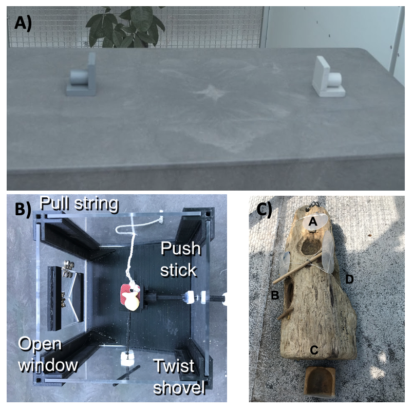

Open... {width=5%} access {width=5%} [code](https://github.com/corinalogan/grackles/blob/master/Files/Preregistrations/g_flexmanip.Rmd) {width=5%} peer review {width=5%} [data](https://doi.org/10.5063/F1862DWC)

&nbsp;

**Affiliations:** 1) Max Planck Institute for Evolutionary Anthropology, Leipzig, Germany, 2) University of California Los Angeles, USA, 3) University of California Santa Barbara, USA, 4) Arizona State University, Tempe, AZ USA. *Corresponding author: corina_logan@eva.mpg.de

```{r setup, include=FALSE}
library(knitr)
library(formatR)
knitr::opts_chunk$set(tidy.opts=list(width.cutoff=70),tidy=TRUE) 
#Make code chunks wrap text so it doesn't go off the page when knitting to PDF

knitr::opts_chunk$set(echo=F, include=T, results='asis', warning=F, message=F) 
#sets global options to display code along with the results https://exeter-data-analytics.github.io/LitProg/r-markdown.html
#set echo=F for knitting to PDF (hide code), and echo=T for knitting to HTML (show code)
```

&nbsp;

**This is the post-study manuscript of the preregistration that was pre-study peer reviewed and received an In Principle Recommendation on 26 Mar 2019 by:**

Aurélie Coulon (2019) Can context changes improve behavioral flexibility? Towards a better understanding of species adaptability to environmental changes. *Peer Community in Ecology*, 100019. [10.24072/pci.ecology.100019](https://doi.org/10.24072/pci.ecology.100019). Reviewers: Maxime Dahirel and Andrea Griffin

**Preregistration:** [html](http://corinalogan.com/Preregistrations/g_flexmanip.html), [pdf](https://github.com/corinalogan/grackles/blob/master/Files/Preregistrations/g_flexmanipPassedPreStudyPeerReview26Mar2019.pdf), [rmd](https://github.com/corinalogan/grackles/blob/d17a75c24df4b90aa607eda452f4fcc496ae9409/Files/Preregistrations/g_flexmanip.Rmd)

**Post-study manuscript** (submitted to PCI Ecology for post-study peer review on 3 Jan 2022): [html](http://corinalogan.com/Preregistrations/g_flexmanip2.html), preprint [pdf](https://doi.org/10.32942/osf.io/5z8xs) at EcoEvoRxiv, [rmd](https://github.com/corinalogan/grackles/blob/master/Files/Preregistrations/g_flexmanip.Rmd)


## ABSTRACT

Research into animal cognitive abilities is increasing quickly and often uses methods where behavioral performance on a task is assumed to represent variation in the underlying cognitive trait. However, because these methods rely on behavioral responses as a proxy for cognitive ability, it is important to validate that the task structure does, in fact, target the cognitive trait of interest rather than non-target cognitive, personality, or motivational traits (construct validity). One way to validate that task structure elicits performance based on the target cognitive trait is to assess the temporal and contextual repeatability of performance. In other words, individual performance is likely to represent an inherent trait when it is consistent across time and across similar or different tasks that theoretically test the same trait. Here, we assessed the temporal and contextual repeatability of the cognitive trait behavioral flexibility in great-tailed grackles. For temporal repeatability, we quantified the number of trials to form a color preference after each of multiple color reversals on a serial reversal learning task. For contextual repeatability, we then compared performance on this task to the latency to switch solutions on two different multi-access boxes. We found that the number of trials to form a preference in reversal learning was repeatable across serial reversals and the latency to switch a preference was repeatable across reversal learning and the multi-access box contexts. This supports the idea that reversal learning and solution switching on multi-access boxes similarly reflect the inherent trait of behavioral flexibility.


## INTRODUCTION

To clarify factors that influenced the evolution of human cognition, mechanisms relating cognition to ecological and evolutionary dynamics, or to facilitate more humane treatment of captive individuals, it is important to increase our understanding of the cognitive abilities of non-human animals [@shettleworth2010cognition]. In the last 50 years, comparative psychologists and behavioral ecologists have led a surge in studies innovating methods for measuring cognitive traits in animals. Consequently, evidence now exists that various species possess cognitive abilities in both the physical [e.g. object permanence: @salwiczek2009development, causal understanding: @taylor2012end] and social domains [e.g. social learning: @hoppitt2012identification, transitive inference: @maclean2008social]. 

While many cognitive abilities have been tested, and various methods used, it is rare for one study to use multiple methods to test for a given cognitive ability. Because nearly all methods use behavioral performance as a proxy for cognitive ability, it is possible that non-target cognitive, personality, or motivational traits could be affecting performance on the task [@morand2016studying]. For example, the success of pheasants on multiple similar and different problem-solving tasks was related to individual variation in persistence and motivation, rather than problem solving ability [@van2016problem]. Additionally, performance on cognitive tasks can be affected by different learning styles, where individuals consistently vary in their perception of the salience of stimuli, the impact of a reward (or non-reward) on future behavior, or the propensity to sample alternative stimuli [@rowe2014measuring]. Without comparing individual differences in performance within and across tasks, it is impossible to determine whether some aspect of performance on a single task is reflective of the target inherent cognitive trait, which would indicate that the task has construct validity [@volter2018comparative]. We use the term “inherent trait” to indicate a trait that is intrinsic to the individual, such as from genetic or developmental effects [@reale2007integrating]. Some plasticity can still be present but the baseline trait value and the amount of plasticity in the trait consistently varies among individuals [@sih2013understanding]. One way to evaluate the validity of the task structure for measuring the target trait is to quantify the temporal and contextual repeatability of performance [@carter2013animal].

Behavioral flexibility, the ability to change behavior when circumstances change, is a general cognitive ability that likely affects interactions with both the social and physical environment [@bond2007serial]. Behavioral flexibility could be measured using a variety of methods [@mikhalevich2017behavioural], but the most popular method is reversal learning [@bond2007serial] where behavioral flexibility is quantified as the speed that individuals are able to switch a learned preference. However, to our knowledge, no studies have assessed the validity of this task by comparing performance of individuals over time and across different tasks that are predicted to require flexible behavior.

In the wild, this ability to change behavior when circumstances change is expected to result in individuals and species that adapt quickly to novelty by showing a high rate of foraging innovations. For example, cross-taxon correlational studies found that species that were “behaviorally flexible”, in that there were many documented foraging innovations, were also more likely to become invasive when introduced to novel habitats [@sol2002behavioural]. The ability to innovate solutions to novel problems can also be more directly quantified using a multi-access or puzzle box task, where the subject must use new behavior patterns to solve the task to get food. While it is generally assumed that foraging innovation rate corresponds to the cognitive ability behavioral flexibility [@sol2002behavioural], few studies compare innovation performance and solution switching (a measure of flexibility) on a multi-access box task to performance on a behavioral flexibility task like reversal learning.

We tested two hypotheses about the validity of the reversal learning method as a measure of behavioral flexibility in the great-tailed grackle (Quiscalus mexicanus; hereafter “grackle”). First, we determined whether performance on a reversal learning task represents an inherent trait by assessing the repeatability of performance across serial reversals (temporal repeatability). While our previous research found that behavioral flexibility does affect innovation ability on a multi-access box [@logan2022flexmanip], here we tested the contextual repeatability of flexibility by comparing performance on the reversal learning task to the latency of solution switching on two different multi-access boxes (Fig. 1). We chose solution switching because it requires similar attention to changing reward contingencies, thus serving as a measure of flexibility, but in a different context (e.g. the food is always visible, there is no color association learning required). In other words, in both reversal learning and solution switching individuals learned a preferred way to obtain food, but then contingencies changed such that food can no longer be obtained with this learned preference and the grackle must be able to switch to a new method. As a human-associated species, the grackle is an ideal subject for this study because they adapt quickly in response to human-induced rapid environmental change [@wehtje2003range; @summers2022xpop] and the genus Quiscalus has a high rate of foraging innovations in the wild [@lefebvre2008brains; @grabrucker2010rare]. Therefore, as their environment may select for flexible and innovative behavior, we believe that these tasks are ecologically relevant and will elicit individual variation in performance.


**Figure 1.** We assessed flexibility as the latency to switch a preference across 3 contexts illustrated here. A) We used two colored containers (tubes) in a color reversal learning task, as well as B) plastic and C) wooden multi-access boxes that each had 4 possible ways (loci) to access food. In each context, after a preference for a color/locus was formed, we made the preferred choice non-functional and then measured the latency of the grackle to switch to a new color/locus.


## METHODS

The hypotheses, methods, and analysis plan for this research are described in detail in the [peer-reviewed preregistration](http://corinalogan.com/Preregistrations/g_flexmanip.html). We give a short summary of these methods here, with any changes from the preregistration summarized in the *Deviations from the preregistration* section below and further explained in the updates to the preregistration (indicated in italics).

### Preregistration details
This experiment was one piece (*H3a and H3b*) of a larger project. This project is detailed in the preregistration that was written (2017), submitted to PCI Ecology for peer review (July 2018), and received the first round of peer reviews a few days before data collection began (Sep 2018). We revised and resubmitted this preregistration after data collection had started (Feb 2019) and it passed peer review (Mar 2019) before any of the planned analyses had been conducted. See the [peer review history](https://doi.org/10.24072/pci.ecology.100019) at PCI Ecology.

### Summary of Hypotheses
We hypothesized that behavioral flexibility (as measured by reversal learning of a color preference) would be repeatable within individuals across serial reversals. If performance was not repeatable within individuals, we tested whether performance on reversal learning was influenced by state-dependent factors of motivation or hunger. Secondly, we hypothesized that, as an inherent trait, behavioral flexibility results in repeatable performance across other contexts (Fig. 1) that require changing behavior when circumstances change (context 1=reversal learning on colored tubes, context 2=plastic multi-access box, context 3=wooden multi-access box).

### Summary of methods
#### Subjects
Great-tailed grackles were caught in the wild in Tempe, Arizona USA using a variety of trapping methods. All individuals received color leg bands for individual identification and some individuals (n=34) were brought temporarily into aviaries. Grackles were individually housed in an aviary (each 244cm long by 122cm wide by 213cm tall) for a maximum of six months where they had *ad lib* access to water at all times. During testing, we removed their maintenance diet for up to four hours per day. During this time, they had the opportunity to receive high value food items by participating in tests. Individuals were given three to four days to habituate to the aviaries before we began testing. 


#### Serial color reversal learning
We used serial reversal learning to measure grackle behavioral flexibility. Briefly, we trained grackles to search in one of two differently colored containers for food (Fig. 1a). After grackles showed a significant preference for one color (minimum of 17 out of 20 correct choices), we switched the location of the food to the container of the other color (a reversal). We measured behavioral flexibility as the time it took grackles to switch their preference and search in the second colored container on a minimum of 17 out of 20 trials. Grackles received serial reversals where we switched the location of the food after each preference was formed, until grackles were switching their preference quickly enough to meet the experiment passing criterion (formed a preference in 2 sequential reversals in 50 or fewer trials). See the protocol for serial reversal learning [here](https://docs.google.com/document/d/18D80XZV_XCG9urVzR9WzbfOKFprDV62v3P74upu01xU/edit?usp=sharing).


#### Multi-access boxes
We used two different multi-access boxes (hereafter “MAB”). All grackles were given time to habituate to the MABs prior to testing. We set up the MABs in the aviary of each grackle with food in and around each apparatus in the days prior to testing. At this point all loci were absent or fixed in open, non-functional positions to prevent any early learning of how to solve each apparatus. We began testing when the grackle was eating comfortably from the MAB. For each MAB, the goal was to measure how quickly the grackle could learn to solve each locus, and then how quickly they could switch to attempting to solve a new locus. Consequently, we measured the number of trials to solve a locus and the number of trials until the grackle attempted a new locus after a previously solved locus was made non-functional (solution switching). See protocols for MAB habituation and testing [here](https://docs.google.com/document/d/18D80XZV_XCG9urVzR9WzbfOKFprDV62v3P74upu01xU/edit?usp=sharing).

**Plastic multi-access box**: This apparatus consisted of a box with transparent plastic walls (Fig. 1b). There was a pedestal within the box where the food was placed and 4 different options (loci) set within the walls for accessing the food. One locus was a window that, when opened, allowed the grackle to reach in to grab the food. The second locus was a shovel that the food was placed on such that, when turned, the food fell from the pedestal and rolled out of the box. The third locus was a string attached to a tab that the food was placed on such that, when pulled, the food fell from the pedestal and rolled out of the box. The last locus was a horizontal stick that, when pushed, would shove the food off the pedestal such that it rolled out of the box. Each trial was 10 minutes long, or until the grackle used a locus to retrieve the food item. We reset the box out of view of the grackle to begin the next trial. To pass criterion for a locus, the grackle had to get food out of the box after touching the locus only once (i.e. used a functional behavior to retrieve the food) trials across 2 sessions. Afterward, the locus is made non-functional to encourage the grackle to interact with the other loci.

**Wooden multi-access box**: This apparatus consisted of a natural log that contained 4 compartments (loci) covered by transparent plastic doors (Fig. 1c). Each door opened in a different way (open up like a hatch, out to the side like a car door, pull out like a drawer, or push in). During testing, all doors were closed and food was placed in each locus. Each trial lasted 10 minutes or until the grackle opened a door. After solving a locus, the experimenter re-baited that compartment, closed the door out of view of the grackle, and the next trial began. After a grackle solved one locus 3 times, that door was fixed in the open position and the compartment left empty to encourage the grackle to attempt the other loci. 


#### Repeatability
Repeatability is defined as the proportion of total variation in performance that is attributable to differences among individuals [@nakagawa2010repeatability]. In other words, performance is likely to represent an inherent trait, when variation in performance is greater among individuals than within individuals.

To measure repeatability within an individual across serial reversals of a color preference, we modeled the number of trials to pass a reversal (choosing correctly on at least 17 out of 20 sequential trials) as a function of the reversal number and a random effect for individual. The variance components for the random effect and residual variance were then used to determine the proportion of variance attributable to differences among individuals. 

We tested for contextual repeatability by modeling the variance in latency (in seconds) to switch a preference among and within individuals across 3 behavior switching contexts. Note that the time it took to switch a colored tube preference in serial reversal learning was measured in trials, but the time it took to switch loci in the MAB experiment was measured in seconds. We used the trial start times in the serial reversal experiment to convert the latency to switch a preference from number of trials to number of seconds. Therefore, the contexts across which we measured repeatability of performance were the latency to switch a preference to a new color in the color reversal learning task and latency to switch to a new locus after a previously solved locus was made non-functional on both MABs.

#### **Open data**

The data are available at the Knowledge Network for Biocomplexity's data repository: [https://knb.ecoinformatics.org/view/doi:10.5063/F18K77JH](https://knb.ecoinformatics.org/view/doi:10.5063/F18K77JH).


## HYPOTHESES

#### H3a: Behavioral flexibility within a context is repeatable within individuals.

Repeatability of behavioral flexibility is defined as the number of trials to reverse a color preference being strongly negatively correlated within individuals with the number of reversals.

**P3a:** Individuals that are faster to reverse a color preference in the first reversal will also be faster to reverse a color preference in the second, etc. reversal due to natural individual variation.

**P3a alternative:** There is no repeatability in behavioral flexibility within individuals, which could indicate that performance is state dependent (e.g., it depends on their fluctuating motivation, hunger levels, etc.). We will determine whether performance on colored tube reversal learning related to motivation by examining whether the latency to make a choice influenced the results. We will also determine whether performance was related to hunger levels by examining whether the number of minutes since the removal of their maintenance diet from their aviary plus the number of food rewards they received since then influenced the results.

#### H3b: The consistency of behavioral flexibility in individuals across contexts (context 1=reversal learning on colored tubes, context 2=multi-access boxes, context 3=reversal learning on touchscreen) indicates their ability to generalize across contexts.

Individual consistency of behavioral flexibility is defined as the number of trials to reverse a color preference being strongly positively correlated within individuals with the latency to solve new loci on each of the multi-access boxes and with the number of trials to reverse a color preference on a touchscreen (total number of touchscreen reversals = 5 per bird).

*If P3a is supported (repeatability of flexibility within individuals)...*

**P3b:** ...and flexibility is correlated across contexts, then the more flexible individuals are better at generalizing across contexts.

**P3b alternative 1:** ...and flexibility is not correlated across contexts, then there is something that influences an individual's ability to discount cues in a given context. This could be the individual's reinforcement history (tested in P3a alternative), their reliance on particular learning strategies (one alternative is tested in H4), or their motivation (tested in P3a alternative) to engage with a particular task (e.g., difficulty level of the task). 

### DEVIATIONS FROM THE PREREGISTRATION

**Post data collection, mid-data analysis**

6) The distribution of values for the "number of trials to reverse" response variable in the [P3a analysis](#p3a-repeatable-within-individuals-within-a-context-reversal-learning) was not a good fit for the Poisson distribution because it was overdispersed and heteroscedastic. We **log-transformed** the data to approximate a normal distribution and it passed all of the data checks. Therefore, we used a Gaussian distribution for our model, which fits the log-transformed data well. (24 Aug 2021).

## RESULTS

Data are publicly [available](https://doi.org/10.5063/F1862DWC) at the Knowledge Network for Biocomplexity [@logan2021flexmanipdata]. 
```{r consistent1results, eval=T}
### P3a: reversal is repeatable within individuals within a context
d <- read.csv(url("https://raw.githubusercontent.com/corinalogan/grackles/master/Files/Preregistrations/g_flexmanip_data_reverse.csv"),
    header = T, sep = ",", stringsAsFactors = F)

# remove NAs from the variables that will be in the model
d <- subset(d, !(is.na(d["TrialsToReverse"])))
d <- subset(d, !(is.na(d["ReverseNumber"])))

# include only those birds in the reversal tubes experiment
d <- d[d$TubesOrTouchscreen == "TUBES" & d$ExperimentalGroup == "Manipulation",
    ]

# factor variable
d$ID <- as.factor(d$ID)

# remove pilot birds
d <- d[!d$ID == "Fajita" & !d$ID == "Empanada", ]

# n=9 length(unique(d$ID))

# DATA CHECKING ADDED Aug 2021 - Although our dependent variable
# (number of trials to reverse) is a count variable, the distribution
# of values was not appropriate for a poisson regression.  When
# checking the fit of our data to a Poisson model the data were
# overdispersed and heteroscedastic.  However, when log-transformed
# the data approximate a normal distribution and pass all of the
# below data checks, indicating the Gaussian model fits our
# log-transformed data well.
library(DHARMa)
library(lme4)
simulationOutput <- simulateResiduals(fittedModel = glmer(log(TrialsToReverse) ~
    ReverseNumber + (1 | ID), family = gaussian, data = d), n = 250)  #250 simulations, but if want higher precision change n>1000; Log transform because trials does not fit a poisson distribution.
plot(simulationOutput$scaledResiduals)  #Expect a flat distribution of the overall residuals, and uniformity in y direction if plotted against any predictor. Looks randomly scattered
testDispersion(simulationOutput)  #if under- or over-dispersed, then p-value<0.05, but then check the dispersion parameter and try to determine what in the model could be the cause and address it there, also check for zero inflation. p=0.84 
testZeroInflation(simulationOutput)  #compare expected vs observed zeros, not zero-inflated if p>0.05. p=1 - there are no zeros, so not zero inflated
testUniformity(simulationOutput)  #check for heteroscedasticity ('a systematic dependency of the dispersion / variance on another variable in the model' Hartig, https://cran.r-project.org/web/packages/DHARMa/vignettes/DHARMa.html), which is indicated if dots aren't on the red line and p<0.05. p=0.81 so NOT heteroscedastic
plot(simulationOutput)  #...there should be no pattern in the data points in the right panel. There does not seem to be a pattern

# GLMM
library(MCMCglmm)
prior = list(R = list(R1 = list(V = 1, nu = 0)), G = list(G1 = list(V = 1,
    nu = 0)))
serial <- MCMCglmm(log(TrialsToReverse) ~ ReverseNumber, random = ~ID,
    family = "gaussian", data = d, verbose = F, prior = prior, nitt = 100000,
    thin = 200, burnin = 1000)
summary(serial) # significant negative correlation with Reverse number - each increase in reversal number relates to a decline in trials to reverse
autocorr(serial$Sol)  #Did fixed effects converge (<0.1)? yes
autocorr(serial$VCV)  #Did random effects converge (<0.1)? no, increased iterations from 50,000 to 100,000, burnin from 500 to 1,000, thin from 100 to 200. Then yes convergence


# REPEATABILITY

# In MCMCglmm, the latent scale adjusted repeatability and its
# credible interval can simply be obtained by:
# serial$VCV[,ID]/(serial$VCV[,ID]+serial$VCV[,units]) - advice from
# Maxime Dahirel
repeata <- serial$VCV[, "ID"]/(serial$VCV[, "ID"] + serial$VCV[, "units"])  #latent scale adjusted repeatability and its credible interval
mean(repeata)  #0.14
var(repeata)  #0.02 variance
posterior.mode(repeata)  #-0.0003
HPDinterval(repeata, 0.95)  #1.43e-15 to 0.46, probability=0.95

# ADDED Aug 2021 Is 0.14 a statistically significant repeatability?
# Test whether it is significantly greater than expected at chance by
# permuting number of trials to reverse among individuals. NOTE:
# Because the flexibility manipulation requires the last two
# reversals to be less than or equal to 50 trials, and ReverseNumber
# is significant, indicating birds generally get faster over time, we
# must permute TrialsToReverse across birds within ReverseNumber.

results = rep(NA, 1000)
for (i in 1:1000) {
    tmp1 = data.frame(ID = d$ID[which(d$ReverseNumber == 1)], ReverseNumber = d$ReverseNumber[which(d$ReverseNumber ==
        1)], TrialsToReverse = sample(d$TrialsToReverse[which(d$ReverseNumber ==
        1)], replace = F))
    tmp2 = data.frame(ID = d$ID[which(d$ReverseNumber == 2)], ReverseNumber = d$ReverseNumber[which(d$ReverseNumber ==
        2)], TrialsToReverse = sample(d$TrialsToReverse[which(d$ReverseNumber ==
        2)], replace = F))
    tmp3 = data.frame(ID = d$ID[which(d$ReverseNumber == 3)], ReverseNumber = d$ReverseNumber[which(d$ReverseNumber ==
        3)], TrialsToReverse = sample(d$TrialsToReverse[which(d$ReverseNumber ==
        3)], replace = F))
    tmp4 = data.frame(ID = d$ID[which(d$ReverseNumber == 4)], ReverseNumber = d$ReverseNumber[which(d$ReverseNumber ==
        4)], TrialsToReverse = sample(d$TrialsToReverse[which(d$ReverseNumber ==
        4)], replace = F))
    tmp5 = data.frame(ID = d$ID[which(d$ReverseNumber == 5)], ReverseNumber = d$ReverseNumber[which(d$ReverseNumber ==
        5)], TrialsToReverse = sample(d$TrialsToReverse[which(d$ReverseNumber ==
        5)], replace = F))
    tmp6 = data.frame(ID = d$ID[which(d$ReverseNumber == 6)], ReverseNumber = d$ReverseNumber[which(d$ReverseNumber ==
        6)], TrialsToReverse = sample(d$TrialsToReverse[which(d$ReverseNumber ==
        6)], replace = F))
    tmp7 = data.frame(ID = d$ID[which(d$ReverseNumber == 7)], ReverseNumber = d$ReverseNumber[which(d$ReverseNumber ==
        7)], TrialsToReverse = sample(d$TrialsToReverse[which(d$ReverseNumber ==
        7)], replace = F))
    tmp8 = data.frame(ID = d$ID[which(d$ReverseNumber == 8)], ReverseNumber = d$ReverseNumber[which(d$ReverseNumber ==
        8)], TrialsToReverse = sample(d$TrialsToReverse[which(d$ReverseNumber ==
        8)], replace = F))
    tmp = rbind(tmp1, tmp2, tmp3, tmp4, tmp5, tmp6, tmp7, tmp8)
    m <- MCMCglmm(log(TrialsToReverse) ~ ReverseNumber, random = ~ID, family = "gaussian",
        data = tmp, verbose = F, prior = prior, nitt = 50000, thin = 100,
        burnin = 500)
    rpt <- m$VCV[, "ID"]/(m$VCV[, "ID"] + m$VCV[, "units"])  #latent scale adjusted repeatability and its credible interval
    results[i] = mean(rpt)
}
hist(results)
abline(v = 0.14, col = "red")
sum(results > 0.14)/1000
# p = 0.002 - Our repeatability value of 0.14 is significantly
# greater than that expected if birds are performing randomly in each
# reversal


# WE DID NOT end up using the code below because the above gave us
# what we needed Repeatability on the data/observed scale (accounting
# for fixed effects) code from Supplementary Material S2 from
# Villemereuil et al. 2018 J Evol Biol
vf <- sapply(1:nrow(serial[["Sol"]]), function(i) {
    var(predict(serial, it = i))
})  #estimates for each iteration of the MCMC

repeataF <- (vf + serial$VCV[, "ID"])/(vf + serial$VCV[, "ID"] + serial$VCV[,
    "units"])  #latent scale adjusted + data scale
posterior.mode(repeataF)  #0.998
HPDinterval(repeataF, 0.95)  #0.992 to 0.9998, probability=0.952

# Now compare with the raw repeatability: null model. NOTE: we
# shouldn't run this one because the reversal was a manipulation so
# the reverse number must be included
serialraw <- MCMCglmm(TrialsToReverse ~ 1, random = ~ID, family = "poisson",
    data = d, verbose = F, prior = prior, nitt = 50000, thin = 100, burnin = 25000)
# summary(serialraw)

repeataraw <- serialraw$VCV[, "ID"]/(serialraw$VCV[, "ID"] + serialraw$VCV[,
    "units"])  #latent scale adjusted repeatability and its credible interval
posterior.mode(repeataraw)  # -0.00002
HPDinterval(repeataraw, 0.95)  #7.2e-16 to 0.18, probability=0.952
```

Performance was repeatable within individuals within the context of reversal learning. We obtained a repeatability value of 0.13, which is significantly greater than that expected if birds are performing randomly in each reversal (p=0.001; see analysis details in the R code for Analysis Plan > P3a). Consequently, and as preregistered, we did not need to conduct the analysis for the P3a alternative to determine whether a lack of repeatability was due to motivation or hunger.

### P3b: repeatable across contexts


```{r consistent2results, eval=T}
## UNREGISTERED ANALYSIS: We realized that to determine whether individuals that are faster to reverse a color preference also have lower latencies to switch to new options on the multi-access box, we needed the variables on the same measurement scale (seconds). The serial reversal learning latencies to switch a preference were previously at the trial-level measurement scale. However, all trials had start times so we were able to calculate the latency to switch a preference in seconds, across trials. For the repeatability analysis we were then able to create a data frame that consisted of latency to switch (labeled as duration of time to switch in data frame), Condition (test type - Reversal, MAB plastic, MAB wooden), reversal number (i.e. only serial reversal or locus solves after initial color tube discrimination/first MAB solve), and bird ID.
### DEVIATION: We also realize we incorrectly specified the variables that would be included in the repeatability model in the preregistration. The DV is the latency to switch a preference after the previously rewarded preference becomes non-functional. The IVs are Test type, Reversal Number and a random effect for Bird ID.

d <- read.csv(url("https://raw.githubusercontent.com/corinalogan/grackles/master/Files/Preregistrations/g_flexmanip2rep_data_xcontext.csv"), header=T, sep=",", stringsAsFactors=F) 
# rename variables to match preregistration:
colnames(d)[c(3,4)] = c("Condition","LatencySwitch")
d$ID  = as.factor(d$ID)
d$Condition = as.factor(d$Condition)

length(unique(d$ID))
#n=16 birds participated in at least one switch (reversal) across at least 2 tests (reversal learning and/or MAB plastic and/or MAB wooden)

#NOTE: removed "touchscreen trials to reverse" from the models below because the touchscreen experiment did not end up working out. 

# DATA CHECKING
library(DHARMa)
library(lme4)
## DEVIATION: Poisson model was heterscedastic, but when we log-transformed to use a gaussian distribution and used the centered and scaled reversal IV, it passed data checks
simulationOutput <- simulateResiduals(fittedModel = lmer(log(LatencySwitch) ~ cent.rev + Condition + (1|ID), data=d), n=250) #250 simulations, but if want higher precision change n>1000
plot(simulationOutput$scaledResiduals) #Expect a flat distribution of the overall residuals, and uniformity in y direction if plotted against any predictor. Does not look great
testDispersion(simulationOutput) #if under- or over-dispersed, then p-value<0.05, but then check the dispersion parameter and try to determine what in the model could be the cause and address it there, also check for zero inflation. 
#p=0.72 so no dispersion
testZeroInflation(simulationOutput) #compare expected vs observed zeros, not zero-inflated if p<0.05. p=1
# no zeros
testUniformity(simulationOutput) #check for heteroscedasticity ("a systematic dependency of the dispersion / variance on another variable in the model" Hartig, https://cran.r-project.org/web/packages/DHARMa/vignettes/DHARMa.html), which is indicated if dots aren't on the red line and p<0.05. 
# p=0.14 so NOT heteroscedastic
plot(simulationOutput) #...there should be no pattern in the data points in the right panel. There are patterns
#January 2021: My interpretation of the patterns is that this was a manipulation, therefore, by definition the data will not be randomly (normally) distributed. Therefore, we will move forward with the glmm as planned.

prior = list(R=list(R1=list(V=1,nu=0)), G=list(G1=list(V=1,nu=0)))
xcontx <- MCMCglmm(log(LatencySwitch) ~ cent.rev + Condition, random=~ID, family="gaussian", data=d, verbose=F, prior=prior, nitt=13000, thin=10, burnin=3000)
autocorr(xcontx$Sol) #Did fixed effects converge? Values after Lag 0 should be < 0.1. Yes
autocorr(xcontx$VCV) #Did random effects converge? Yes
plot(xcontx) # traces look grassy and uncorrelated

## REPEATABILITY ANALYSIS
#Advice from one of our reviewers Maxime Dahirel: In MCMCglmm, the latent scale adjusted repeatability and its credible interval can simply be obtained by: mod$VCV[,ID]/(mod$VCV[,ID]+mod$VCV[,units])

repeata <- xcontx$VCV[,"ID"]/(xcontx$VCV[,"ID"]+xcontx$VCV[,"units"]) #latent scale adjusted repeatability and its credible interval
mean(repeata) #0.35
var(repeata) #0.02
posterior.mode(repeata) #0.35
HPDinterval(repeata, 0.95) #0.12-0.60

### UNREGISTERED ANALYSIS - compare R values with rptR function for p-value (from permutation tests) and to make sure the interpretation of MCMCglmm result is correct - output matches that of MCMCglmm ###
library(rptR)
r1 = rpt(log(LatencySwitch) ~ cent.rev + Condition + (1|ID), grname = "ID", data=d, datatype="Gaussian", nboot=1000, npermut=100)
summary(r1)
# Same results as above: R = 0.36, CI = 0.12-0.55, p = 0.01

d$scale.dur = scale_by(LatencySwitch ~ Condition, d)
rev.all3 = d %>% 
  group_by(ID, Condition) %>% 
  summarise(median = median(scale.dur),
            lcl = quantile(scale.dur, probs=0.25),
            ucl = quantile(scale.dur, probs=0.75)) %>% 
  ungroup() %>% 
  mutate(Condition = recode(Condition, "LatencyMABplastic"="MAB plastic",
                            "LatencyMABwooden"="MAB wood",
                            "Reversal" = "Reversal learning")) 

#Plot of performance across all tests
ggplot(rev.all3, aes(x = reorder(ID, median, mean), y = median, colour = ID, shape = Condition)) +
  #geom_point() +
  geom_pointrange(aes(ymin=lcl, ymax=ucl), size = 1, 
                  position = position_dodge(width = 0.5)) +
  scale_shape_manual(values = c(15,17,8,19))+
  labs(x = "Bird", y = "Latency to switch (sec)") +
  theme_bw() +
  theme(axis.text.x = element_text(size = 10,angle=90,vjust=-0.001,hjust=0.95),
        axis.text.y = element_text(size = 10),
        axis.title = element_text(size = 16)) +
  scale_fill_discrete(guide = "none") +
  scale_colour_discrete(guide = "none")


```

## DISCUSSION

Examining only the manipulated grackles, there was **repeatability of flexibility performance within a context (serial reversal learning with colored tubes), but not across contexts (correlation of reversal learning and solution switching on the multi-access boxes)**. Individuals who were faster at reversing a color preference in reversal 1 were also generally faster at reversing in subsequent reversals.


### D. PREREGISTRATION (detailed methods) 
#### **Dependent variables**

*P3a and P3a alternative 1*

Number of trials to reverse a preference. An individual is considered to have a preference if it chose the rewarded option at least 17 out of the most recent 20 trials (with a minimum of 8 or 9 correct choices out of 10 on the two most recent sets of 10 trials). We use a sliding window to look at the most recent 10 trials for a bird, regardless of when the testing sessions occurred.


*P3b: additional analysis: individual consistency in flexibility across contexts + flexibility is correlated across contexts*

Number of trials to solve a new locus on the multi-access boxes *NOTE: Jul 2022 we realized this variable is more likely to represent innovation, and we mean to assess flexibility here. Therefore we changed this variable to Latency to Switch a preference after the previously rewarded color/loci becomes non-functional.*

#### **Independent variables**

#### *P3a: repeatable within individuals within a context*

1) Reversal number

2) ID (random effect because repeated measures on the same individuals)

#### *P3a alternative 1: was the potential lack of repeatability on colored tube reversal learning due to motivation or hunger?*

1) Trial number

2) Latency from the beginning of the trial to when they make a choice

3) Minutes since maintenance diet was removed from the aviary

4) Cumulative number of rewards from previous trials on that day

5) ID (random effect because repeated measures on the same individuals)

6) Batch (random effect because repeated measures on the same individuals). Note: batch is a test cohort, consisting of 8 birds being tested simultaneously

#### *P3b: repeatable across contexts*

*NOTE: Jul 2022 we changed the dependent variable such that it is now the same as IVs 3 & 4, below. Furthermore, we did not include the touchscreen experiment in this manuscript (see the Deviations section). Therefore we deleted these IVs from the model.*
1) Reversal number

2) Condition (colored tubes, plastic multi-access box, wooden multi-access box, touchscreen)

3) Latency to solve a new locus

4) Number of trials to reverse a preference (colored tubes)

5) Number of trials to reverse a preference (touchscreen)

6) ID (random effect because repeated measures on the same individuals)


### E. ANALYSIS PLAN

#### *P3a: repeatable within individuals within a context (reversal learning)*

**Analysis:** Is reversal learning (colored tubes) repeatable within individuals within a context (reversal learning)? We will obtain repeatability estimates that account for the observed and latent scales, and then compare them with the raw repeatability estimate from the null model. The repeatability estimate indicates how much of the total variance, after accounting for fixed and random effects, is explained by individual differences (ID). We will run this GLMM using the MCMCglmm function in the MCMCglmm package [@hadfieldMCMCglmmpackage] with a Poisson distribution and log link using 13,000 iterations with a thinning interval of 10, a burnin of 3,000, and minimal priors [V=1, nu=0; @hadfield2014coursenotes]. We will ensure the GLMM shows acceptable convergence [i.e., lag time autocorrelation values <0.01; @hadfieldMCMCglmmpackage], and adjust parameters if necessary.

NOTE (Aug 2021): our data checking process showed that the distribution of values of the data (number of trials to reverse) in this model was not a good fit for the Poisson distribution because it was overdispersed and heteroscedastic. However, when log-transformed the data approximate a normal distribution and pass all of the data checks, therefore we used a Gaussian distribution for our model, which fits the log-transformed data well.

To roughly estimate our ability to detect actual effects (because these power analyses are designed for frequentist statistics, not Bayesian statistics), we ran a power analysis in G&ast;Power with the following settings: test family=F tests, statistical test=linear multiple regression: Fixed model (R^2 deviation from zero), type of power analysis=a priori, alpha error probability=0.05. The number of predictor variables was restricted to only the fixed effects because this test was not designed for mixed models. We reduced the power to 0.70 and increased the effect size until the total sample size in the output matched our projected sample size (n=32). The protocol of the power analysis is here:

*Input:*

Effect size f²                	=	0.21

α err prob                    	=	0.05

Power (1-β err prob)          	=	0.7

Number of predictors          	=	1

*Output:*

Noncentrality parameter λ     	=	6.7200000

Critical F                    	=	4.1708768

Numerator df                  	=	1

Denominator df                	=	30

Total sample size             	=	32

Actual power                  	=	0.7083763

This means that, with our sample size of 32, we have a 71% chance of detecting a medium effect [approximated at f^2^=0.15 by @cohen1988statistical]. 

```{r repeatableR, eval=F}
d <- read.csv(url("https://raw.githubusercontent.com/corinalogan/grackles/master/Files/Preregistrations/g_flexmanip_data_repeatability.csv"), header=T, sep=",", stringsAsFactors=F)

#remove NAs from the variables that will be in the model
d <- subset(d,!(is.na(d["TrialsToReverse"])))
d <- subset(d,!(is.na(d["ReverseNumber"])))

#include only those birds in the reversal tubes experiment
d <- d[d$TubesOrTouchscreen=="TUBES" & d$ExperimentalGroup=="Manipulation",]

#factor variable
d$ID <- as.factor(d$ID)

#remove pilot birds
d <- d[!d$ID=="Fajita" & !d$ID=="Empanada",]

#n=9
#length(unique(d$ID))

# DATA CHECKING
# ADDED Aug 2021 - Although our dependent variable (number of trials to reverse) is a count variable, the distribution of values was not appropriate for a poisson regression.  When checking the fit of our data to a Poisson model the data were overdispersed and heteroscedastic.  However, when log-transformed the data approximate a normal distribution and pass all of the below data checks, indicating the Gaussian model fits our log-transformed data well.
library(DHARMa)
library(lme4)
simulationOutput <- simulateResiduals(fittedModel = glmer(log(TrialsToReverse) ~ ReverseNumber + (1|ID), family=gaussian, data=d), n=250) #250 simulations, but if want higher precision change n>1000; Log transform because trials does not fit a poisson distribution.
plot(simulationOutput$scaledResiduals) #Expect a flat distribution of the overall residuals, and uniformity in y direction if plotted against any predictor. Looks randomly scattered
testDispersion(simulationOutput) #if under- or over-dispersed, then p-value<0.05, but then check the dispersion parameter and try to determine what in the model could be the cause and address it there, also check for zero inflation. p=0.84 
testZeroInflation(simulationOutput) #compare expected vs observed zeros, not zero-inflated if p>0.05. p=1 so not zero inflated
testUniformity(simulationOutput) #check for heteroscedasticity ("a systematic dependency of the dispersion / variance on another variable in the model" Hartig, https://cran.r-project.org/web/packages/DHARMa/vignettes/DHARMa.html), which is indicated if dots aren't on the red line and p<0.05. p=0.81 so NOT heteroscedastic
plot(simulationOutput) #...there should be no pattern in the data points in the right panel. There does not seem to be a pattern

# GLMM
library(MCMCglmm)
prior = list(R=list(R1=list(V=1,nu=0)), G=list(G1=list(V=1,nu=0)))
serial <- MCMCglmm(log(TrialsToReverse) ~ ReverseNumber, random=~ID, family="gaussian", data=d, verbose=F, prior=prior, nitt=1000000, thin=1000, burnin=5000)
summary(serial)
autocorr(serial$Sol) #Did fixed effects converge (<0.1)? yes
autocorr(serial$VCV) #Did random effects converge (<0.1)? yes
plot(serial)

#REPEATABILITY

#In MCMCglmm, the latent scale adjusted repeatability and its credible interval can simply be obtained by: serial$VCV[,ID]/(serial$VCV[,ID]+serial$VCV[,units]) - advice from Maxime Dahirel
repeata <- serial$VCV[,"ID"]/(serial$VCV[,"ID"]+serial$VCV[,"units"]) #latent scale adjusted repeatability and its credible interval
mean(repeata) #0.13
var(repeata) #0.02 variance
posterior.mode(repeata) #<0.01
HPDinterval(repeata, 0.95) #4.64e-16 to 0.43, probability=0.95

# ADDED Aug 2021
#Is 0.13 a statistically significant repeatability? Test whether it is significantly greater than expected at chance by permuting number of trials to reverse among individuals.
#NOTE: Because the flexibility manipulation requires the last two reversals to be less than or equal to 50 trials, and ReverseNumber is significant, indicating birds generally get faster over time, we must permute TrialsToReverse across birds within ReverseNumber.

results = rep(NA, 1000)
for(i in 1:1000){
  tmp1 = data.frame("ID" = d$ID[which(d$ReverseNumber==1)], "ReverseNumber"=d$ReverseNumber[which(d$ReverseNumber==1)], 
          "TrialsToReverse" = sample(d$TrialsToReverse[which(d$ReverseNumber==1)],replace=F))
  tmp2 = data.frame("ID" = d$ID[which(d$ReverseNumber==2)], "ReverseNumber"=d$ReverseNumber[which(d$ReverseNumber==2)], 
          "TrialsToReverse" = sample(d$TrialsToReverse[which(d$ReverseNumber==2)],replace=F))
  tmp3 = data.frame("ID" = d$ID[which(d$ReverseNumber==3)], "ReverseNumber"=d$ReverseNumber[which(d$ReverseNumber==3)], 
          "TrialsToReverse" = sample(d$TrialsToReverse[which(d$ReverseNumber==3)],replace=F))
  tmp4 = data.frame("ID" = d$ID[which(d$ReverseNumber==4)], "ReverseNumber"=d$ReverseNumber[which(d$ReverseNumber==4)], 
          "TrialsToReverse" = sample(d$TrialsToReverse[which(d$ReverseNumber==4)],replace=F))
  tmp5 = data.frame("ID" = d$ID[which(d$ReverseNumber==5)], "ReverseNumber"=d$ReverseNumber[which(d$ReverseNumber==5)], 
          "TrialsToReverse" = sample(d$TrialsToReverse[which(d$ReverseNumber==5)],replace=F))  
  tmp6 = data.frame("ID" = d$ID[which(d$ReverseNumber==6)], "ReverseNumber"=d$ReverseNumber[which(d$ReverseNumber==6)], 
          "TrialsToReverse" = sample(d$TrialsToReverse[which(d$ReverseNumber==6)],replace=F))
  tmp7 = data.frame("ID" = d$ID[which(d$ReverseNumber==7)], "ReverseNumber"=d$ReverseNumber[which(d$ReverseNumber==7)], 
          "TrialsToReverse" = sample(d$TrialsToReverse[which(d$ReverseNumber==7)],replace=F))
  tmp8 = data.frame("ID" = d$ID[which(d$ReverseNumber==8)], "ReverseNumber"=d$ReverseNumber[which(d$ReverseNumber==8)], 
          "TrialsToReverse" = sample(d$TrialsToReverse[which(d$ReverseNumber==8)],replace=F))
  tmp = rbind(tmp1,tmp2,tmp3,tmp4,tmp5,tmp6,tmp7,tmp8)
  m <- MCMCglmm(log(TrialsToReverse) ~ ReverseNumber, random=~ID, family="gaussian", data=tmp, verbose=F, prior=prior, nitt=10000, thin=50, burnin=500)
  rpt <- m$VCV[,"ID"]/(m$VCV[,"ID"]+m$VCV[,"units"]) #latent scale adjusted repeatability and its credible interval
  results[i] = mean(rpt)
}
hist(results)
abline(v=0.13,col="red")
sum(results > 0.13)/1000
#p = 0.003 - Our repeatability value of 0.13 is significantly greater than that expected if birds are performing randomly in each reversal


# WE DID NOT end up using the code below because the above gave us what we needed
# Repeatability on the data/observed scale (accounting for fixed effects)
#code from Supplementary Material S2 from Villemereuil et al. 2018 J Evol Biol
# vf <- sapply(1:nrow(serial[["Sol"]]), function(i) {
#    var(predict(serial, it=i))  
# }) #estimates for each iteration of the MCMC
# 
# repeataF <- (vf+serial$VCV[,"ID"])/(vf+serial$VCV[,"ID"]+serial$VCV[,"units"]) #latent scale adjusted + data scale
# posterior.mode(repeataF) #0.998
# HPDinterval(repeataF, 0.95) #0.992 to 0.9998, probability=0.952
# 
# # Now compare with the raw repeatability: null model. NOTE: we shouldn't run this one because the reversal was a manipulation so the reverse number must be included
# serialraw <- MCMCglmm(TrialsToReverse ~ 1, random=~ID, family="poisson", data=d, verbose=F, prior=prior, nitt=50000, thin=100, burnin=25000)
# #summary(serialraw)
# 
# repeataraw <- serialraw$VCV[,"ID"]/(serialraw$VCV[,"ID"]+serialraw$VCV[,"units"]) #latent scale adjusted repeatability and its credible interval
# posterior.mode(repeataraw) # -0.00002
# HPDinterval(repeataraw, 0.95) #7.2e-16 to 0.18, probability=0.952
```

#### *P3a alternative: was the potential lack of repeatability on colored tube reversal learning due to motivation or hunger?*

**Analysis:** Because the independent variables could influence each other or measure the same variable, I will analyze them in a single model: Generalized Linear Mixed Model [GLMM; MCMCglmm function, MCMCglmm package; @hadfieldMCMCglmmpackage] with a binomial distribution (called categorical in MCMCglmm) and logit link using 13,000 iterations with a thinning interval of 10, a burnin of 3,000, and minimal priors (V=1, nu=0) [@hadfield2014coursenotes]. We will ensure the GLMM shows acceptable convergence [lag time autocorrelation values <0.01; @hadfieldMCMCglmmpackage], and adjust parameters if necessary. The contribution of each independent variable will be evaluated using the Estimate in the full model. NOTE (Apr 2021): This analysis is restricted to data from their first reversal because this is the only reversal data that is comparable across the manipulated and control groups.

To roughly estimate our ability to detect actual effects (because these power analyses are designed for frequentist statistics, not Bayesian statistics), we ran a power analysis in G&ast;Power with the following settings: test family=F tests, statistical test=linear multiple regression: Fixed model (R^2 deviation from zero), type of power analysis=a priori, alpha error probability=0.05. We reduced the power to 0.70 and increased the effect size until the total sample size in the output matched our projected sample size (n=32). The number of predictor variables was restricted to only the fixed effects because this test was not designed for mixed models. The protocol of the power analysis is here:

*Input:*

Effect size f²                	=	0.31

α err prob                    	=	0.05

Power (1-β err prob)          	=	0.7

Number of predictors          	=	4

*Output:*

Noncentrality parameter λ     	=	11.4700000

Critical F                    	=	2.6684369

Numerator df                  	=	4

Denominator df                	=	32

Total sample size             	=	37

Actual power                  	=	0.7113216

This means that, with our sample size of 32, we have a 71% chance of detecting a large effect [approximated at f^2^=0.35 by @cohen1988statistical]. 

```{r motivation, eval=F}
d <- read.csv(url("https://raw.githubusercontent.com/corinalogan/grackles/master/Files/Preregistrations/g_flexmanip_data_reverseraw.csv"), header=T, sep=",", stringsAsFactors=F) 

d <- d[d$Reversal==1,]
#want only data from reversal 1 (their first reversal) because this is the only reversal data that is comparable across birds in the control and manipulated groups
head(d)

# DATA CHECKING
library(DHARMa)
library(lme4)
simulationOutput <- simulateResiduals(fittedModel = glmer(CorrectChoice ~ Trial + LatencyToChoose + MinSinceFoodRemoved + NumberRewardsFromPrevTrials + (1|ID) + (1|Batch), family=binomial, data=d), n=250) #250 simulations, but if want higher precision change n>1000
simulationOutput$scaledResiduals #Expect a flat distribution of the overall residuals, and uniformity in y direction if plotted against any predictor
testDispersion(simulationOutput) #if under- or over-dispersed, then p-value<0.05, but then check the dispersion parameter and try to determine what in the model could be the cause and address it there, also check for zero inflation
testZeroInflation(simulationOutput) #compare expected vs observed zeros, not zero-inflated if p<0.05
testUniformity(simulationOutput) #check for heteroscedasticity ("a systematic dependency of the dispersion / variance on another variable in the model" Hartig, https://cran.r-project.org/web/packages/DHARMa/vignettes/DHARMa.html), which is indicated if dots aren't on the red line and p<0.05. Also...
plot(simulationOutput) #...there should be no pattern in the data points in the right panel
plotResiduals(LatencyToChoose, simulationOutput$scaledResiduals) #plot the residuals against other predictors - can't get this code to work yet

# GLMM - Is trial the main independent variable associated with learning performance (CorrectChoice) or are other variables associated with performance, including motivation and hunger?
library(MCMCglmm)
prior = list(R=list(R1=list(V=1,nu=0),R2=list(V=1,nu=0),R3=list(V=1,nu=0),R4=list(V=1,nu=0)), G=list(G1=list(V=1,nu=0),G2=list(V=1,nu=0))) 

rr1 <- MCMCglmm(CorrectChoice ~ Trial + LatencyToChoose + MinSinceFoodRemoved + NumberRewardsFromPrevTrials, random=~ID+Batch, family="categorical", data=d, verbose=F, prior=prior, nitt=13000, thin=10, burnin=3000)
summary(rr1)
autocorr(rr1$Sol) #Did fixed effects converge?
autocorr(rr1$VCV) #Did random effects converge?
```

#### *P3b: individual consistency across contexts*

**Analysis:** Do those individuals that are faster to reverse a color preference also have lower latencies to switch to new options on the multi-access box? A Generalized Linear Mixed Model [GLMM; MCMCglmm function, MCMCglmm package; [@hadfieldMCMCglmmpackage] will be used with a Poisson distribution and log link using 13,000 iterations with a thinning interval of 10, a burnin of 3,000, and minimal priors (V=1, nu=0) [@hadfield2014coursenotes]. We will ensure the GLMM shows acceptable convergence [lag time autocorrelation values <0.01; @hadfieldMCMCglmmpackage], and adjust parameters if necessary. We will determine whether an independent variable had an effect or not using the Estimate in the full model.

To roughly estimate our ability to detect actual effects (because these power analyses are designed for frequentist statistics, not Bayesian statistics), we ran a power analysis in G\*Power with the following settings: test family=F tests, statistical test=linear multiple regression: Fixed model (R^2 deviation from zero), type of power analysis=a priori, alpha error probability=0.05. We reduced the power to 0.70 and increased the effect size until the total sample size in the output matched our projected sample size (n=32). The number of predictor variables was restricted to only the fixed effects because this test was not designed for mixed models. The protocol of the power analysis is here:

*Input:*

Effect size f²                	=	0.21

α err prob                    	=	0.05

Power (1-β err prob)          	=	0.7

Number of predictors          	=	1

*Output:*

Noncentrality parameter λ     	=	6.7200000

Critical F                    	=	4.1708768

Numerator df                  	=	1

Denominator df                	=	30

Total sample size             	=	32

Actual power                  	=	0.7083763

This means that, with our sample size of 32, we have a 71% chance of detecting a medium effect [approximated at f^2^=0.15 by @cohen1988statistical]. 
 
```{r consistent1, eval=T, echo=F, message=FALSE, warning=FALSE, results=hide}
# ADDED JULY 2022 - we realized we mis-specified the model for assessing repeatability of flexibility across contexts. Previously we were analyzing the relationship between overall performance on the reversal learning and MAB tasks, rather than individual consistency of performance. Consequently we conducted an analysis that evaluated performance as a function of task type, reversal/switch number and a random effect of ID.
library(lubridate)
library(DHARMa)
library(lme4)
rev <- read.csv(url("https://raw.githubusercontent.com/corinalogan/grackles/master/Files/Preregistrations/g_flexmanip2rep_data_xcontext.csv"), header=T, sep=",", stringsAsFactors=F) # data file with reversal learning measure in seconds to reverse
rev <- rev[!rev$ID == "Diablo",] #remove Diablo who did not pass criterion on solving any MAB loci and so we can't measure solution switching

simulationOutput <- simulateResiduals(fittedModel = glmer(log(Dur.sec) ~
    Test + cent.rev + (1 | ID), family = gaussian, data = rev), n = 500)  #250 simulations, but if want higher precision change n>1000
plot(simulationOutput$scaledResiduals)  #Expect a flat distribution of the overall residuals, and uniformity in y direction if plotted against any predictor. Poisson does not look great. Try log-transforming and using gaussian - Looks randomly scattered
testDispersion(simulationOutput)  #if under- or over-dispersed, then p-value<0.05, but then check the dispersion parameter and try to determine what in the model could be the cause and address it there, also check for zero inflation.
#p = 0.78
testZeroInflation(simulationOutput)  #compare expected vs observed zeros, not zero-inflated if p>0.05. 
#p=1 - there are no zeros, so not zero inflated
testUniformity(simulationOutput)  #check for heteroscedasticity ('a systematic dependency of the dispersion / variance on another variable in the model' Hartig, https://cran.r-project.org/web/packages/DHARMa/vignettes/DHARMa.html), which is indicated if dots aren't on the red line and p<0.05.
#p = 0.07 not heteroscedastic
plot(simulationOutput)  #...there should be no pattern in the data points in the right panel. 


#REPEATABILITY
# GLMM
library(MCMCglmm)
prior = list(R=list(R1=list(V=1,nu=0)), G=list(G1=list(V=1,nu=0)))
xcontx <- MCMCglmm(log(Dur.sec) ~ Test + cent.rev, random=~ID, family="gaussian", data=rev, verbose=F, prior=prior, nitt=1000000, thin=1000, burnin=5000)
autocorr(xcontx$Sol) #Did fixed effects converge (<0.1)? yes
autocorr(xcontx$VCV) #Did random effects converge (<0.1)? yes
plot(xcontx) # all traces look great

#In MCMCglmm, the latent scale adjusted repeatability and its credible interval can simply be obtained by: serial$VCV[,ID]/(serial$VCV[,ID]+serial$VCV[,units]) - advice from Maxime Dahirel
repeata <- xcontx$VCV[,"ID"]/(xcontx$VCV[,"ID"]+xcontx$VCV[,"units"]) #latent scale adjusted repeatability and its credible interval
mean(repeata) #0.36
var(repeata) #0.02 variance
posterior.mode(repeata) #0.40
HPDinterval(repeata, 0.95) #0.10-0.64

library(rptR) # check significance of repeatability using rptR package
xcontx.rpt = rpt(log(Dur.sec) ~ Test + cent.rev + (1|ID), grname = "ID", 
                 data = rev, datatype="Gaussian", nboot=1000, npermut=100)
#summary(xcontx.rpt)
# R = 0.36, CI: 0.11-0.58, p = 0.01
# Almost exact same results for R and CI.

## PLOTTING RESULTS ##
library(tidyverse)
library(ggplot2)

rev = rev %>% 
  group_by(Test) %>% 
  mutate(scale.dur = scale(Dur.sec, center=T, scale=T)) %>% 
  ungroup()
rev.all3 = rev %>% 
  group_by(ID, Test) %>% 
  summarise(median = median(scale.dur),
            lcl = quantile(scale.dur, probs=0.25),
            ucl = quantile(scale.dur, probs=0.75)) %>% 
  ungroup() %>% 
  mutate(Test = recode(Test, "LatencyMABplastic"="MAB plastic",
                       "LatencyMABwooden"="MAB wood",
                       "Reversal" = "Reversal learning")) #%>% 

#performance across all tests
ggplot(rev.all3, aes(x = reorder(ID, median, mean), y = median, colour = ID, shape = Test)) +
  geom_pointrange(aes(ymin=lcl, ymax=ucl), size = 1, 
                  position = position_dodge(width = 0.5)) +
  scale_shape_manual(values = c(15,17,8,19))+
  labs(x = "Bird", y = "Latency to switch (sec)") +
  theme_bw() +
  theme(axis.text = element_text(size = 10),
        axis.title = element_text(size = 16)) +
  scale_fill_discrete(guide = "none") +
  scale_colour_discrete(guide = "none")


## CODE for previous (mis-specified) analysis ##
# d <- read.csv(url("https://raw.githubusercontent.com/corinalogan/grackles/master/Files/Preregistrations/g_flexmanip_data_reverse.csv"), header=T, sep=",", stringsAsFactors=F) 
# setwd("~/Documents/Grackle project")
# d = read.csv("g_flexmanip_data_repeatability.csv")
# #remove NAs from the variables that will be in the model
# d <- subset(d,!(is.na(d["TrialsToReverse"])))
# d <- subset(d,!(is.na(d["ReverseNumber"])))
# 
# #include only those birds in the serial reversal tubes experiment, and not values for the initial discrimination
# d <- d[d$ExperimentalGroup=="Manipulation" & !d$Test == "InitialDisc",]
# d <- d[d$TubesOrTouchscreen == "TUBES" & d$ExperimentalGroup == "Manipulation",
#     ]
# 
# #factor variable
# d$ID <- as.factor(d$ID)
# 
# #remove Guacamole & Memela who did not pass the reversal experiment and therefore were not offered the MAB experiments
# d <- d[!d$ID=="Guacamole" & !d$ID=="Memela",]
# #remove Diablo and Chalupa who did not pass criterion on solving any MAB loci and so we can't measure solution switching
# d <- d[!d$ID=="Chalupa" & !d$ID == "Diablo",]
# #remove pilot birds
# d <- d[!d$ID == "Fajita" & !d$ID == "Empanada", ]
# 
# #n=6
# #length(unique(d$ID))
# 
# # Data checking  
# library(DHARMa)
# library(lme4)
# simulationOutput <- simulateResiduals(fittedModel = glmer(log(Value) ~
#     Test + ReverseNumber + (1 | ID), family = gaussian, data = d), n = 250)  #250 simulations, but if want higher precision change n>1000; Log transform because trials does not fit a poisson distribution.
# plot(simulationOutput$scaledResiduals)  #Expect a flat distribution of the overall residuals, and uniformity in y direction if plotted against any predictor. Looks randomly scattered
# testDispersion(simulationOutput)  #if under- or over-dispersed, then p-value<0.05, but then check the dispersion parameter and try to determine what in the model could be the cause and address it there, also check for zero inflation. p=0.90 
# testZeroInflation(simulationOutput)  #compare expected vs observed zeros, not zero-inflated if p>0.05. p=1 - there are no zeros, so not zero inflated
# testUniformity(simulationOutput)  #check for heteroscedasticity ('a systematic dependency of the dispersion / variance on another variable in the model' Hartig, https://cran.r-project.org/web/packages/DHARMa/vignettes/DHARMa.html), which is indicated if dots aren't on the red line and p<0.05. p=0.25 so NOT heteroscedastic
# plot(simulationOutput)  #...there should be no pattern in the data points in the right panel.
# 
# # GLMM color reversal tubes compared with multi-access box
# library(MCMCglmm)
# prior = list(R = list(R1 = list(V = 1, nu = 0), R2 = list(V = 1, nu = 0)), G = list(G1 = list(V = 1, 
# 	    nu = 0)))
# 
# # plastic
# rm <- MCMCglmm(LatencyMABplastic ~ ReverseNumber * TrialsToReverse, random = ~ID, 
# 	    family = "poisson", data = d, verbose = F, prior = prior, 
# 	    nitt = 130000, thin = 1000, burnin = 30000)
# #summary(rm)
# #                              post.mean l-95% CI u-95% CI eff.samp pMCMC
# #(Intercept)                     2.08708 -4.45451 11.67734      100  0.66
# #ReverseNumber                   1.01476 -2.75484  5.49974      100  0.42
# #TrialsToReverse                 0.01693 -0.09999  0.11593      100  0.58
# #ReverseNumber:TrialsToReverse  -0.01159 -0.07061  0.03283      100  0.42
# #nothing significant so no consistent individual differences across contexts on MAB plastic and trials to reverse
# 
# # wooden
# rmw <- MCMCglmm(LatencyMABwooden ~ ReverseNumber * TrialsToReverse, random = ~ID, 
# 	    family = "poisson", data = d, verbose = F, prior = prior, 
# 	    nitt = 130000, thin = 1000, burnin = 30000)
# #summary(rmw)
# #                              post.mean  l-95% CI  u-95% CI eff.samp pMCMC  
# #(Intercept)                    3.622381  0.148743  7.810863    159.0  0.08 .
# #ReverseNumber                  0.211605 -1.843271  2.126334    100.0  0.88  
# #TrialsToReverse                0.032183 -0.019718  0.076067    147.9  0.14  
# #ReverseNumber:TrialsToReverse -0.004685 -0.037464  0.014299    100.0  0.62  
# #nothing significant so no consistent individual differences across contexts on MAB wooden and trials to reverse
# 
# 
# # Make a table with the outputs from both models (following https://gkhajduk.github.io/2017-10-25-cleanMCMCglmm/)
# library(dplyr)
# 
# # for 1 model
# clean.MCMC <- function(x) {
#     sols <- summary(x)$solutions  ## pull out relevant info from model summary
#     Gcovs <- summary(x)$Gcovariances
#     Rcovs <- summary(x)$Rcovariances
#     fixed <- data.frame(row.names(sols), sols, row.names = NULL)  ## convert to dataframes with the row.names as the first col
#     random <- data.frame(row.names(Gcovs), Gcovs, row.names = NULL)
#     residual <- data.frame(row.names(Rcovs), Rcovs, row.names = NULL)
#     names(fixed)[names(fixed) == "row.names.sols."] <- "variable"  ## change the columns names to variable, so they all match
#     names(random)[names(random) == "row.names.Gcovs."] <- "variable"
#     names(residual)[names(residual) == "row.names.Rcovs."] <- "variable"
#     fixed$effect <- "fixed"  ## add ID column for type of effect (fixed, random, residual)
#     random$effect <- "random"
#     residual$effect <- "residual"
#     modelTerms <- as.data.frame(bind_rows(fixed, random, residual))  # merge it all together
# }

# check for one model - it works
#oneModel <- clean.MCMC(rmw)  # get all the info from summary(modelName)
#oneModel$modelName <- getName.MCMC(rmw)  # add the model's name in a new column
#oneModel  # check out the created dataframe

# check for multiple models - it works
# dataList <- list(rm, rmw)
# dataListNames <- list("Plastic", "Wooden")
# readyList <- mapply(cbind, lapply(dataList, clean.MCMC), "modelName" = dataListNames, SIMPLIFY = F)
# mcmcOutputs <- as.data.frame(do.call(rbind, readyList), stringsAsFactors = FALSE)
# 
# # NOTE: for html, change to type='html', for pdf, change to type='latex' (https://stackoverflow.com/questions/14670299/using-stargazer-with-rstudio-and-knitr , stargazer cheatsheet: https://www.jakeruss.com/cheatsheets/stargazer/#html-formatting)
# library(stargazer)
# stargazer(mcmcOutputs, summary=FALSE, header=FALSE, type='latex', digits=1) 
```
Figure 2: We found significant repeatability in switching performance across the three contexts: multi-access box (MAB) plastic (square), MAB wood (triangle), and reversal learning with color tubes (star). Points indicate the (centered and scaled) median performance of an individual in each context, the lines indicate the variation in performance across multiple switches within a context. Some individuals participated in a context, but did not experience multiple preference switches and so there is a point, but no line. Additionally, some individuals are missing points for a given context because they did not participate. Grackles are ordered on the x-axis from fastest (left) to slowest (right).


Table 1: We found significant repeatability of performance across time within a context (temporal repeatability model) and across contexts (contextual repeatability model).
```{r resultstable, eval=T}
#Output table
tbl = read.csv(url("https://raw.githubusercontent.com/corinalogan/grackles/master/Files/Preregistrations/g_flexmanip2rep_tabledata.csv"), header=T, sep=",", stringsAsFactors=F)
#tbl <- data.frame(tbl)
#colnames(tbl) <- c("","Posterior mean","Lower 89 percentile compatibility interval (5%)","Upper 89 percentile compatibility interval (94%)","Effective sample size","pMCMC","Significance code: **=0.01")

library(kableExtra)
knitr::kable(tbl) %>%
kable_styling(full_width = T, position = "left",  bootstrap_options = "condensed", font_size = 8)

```