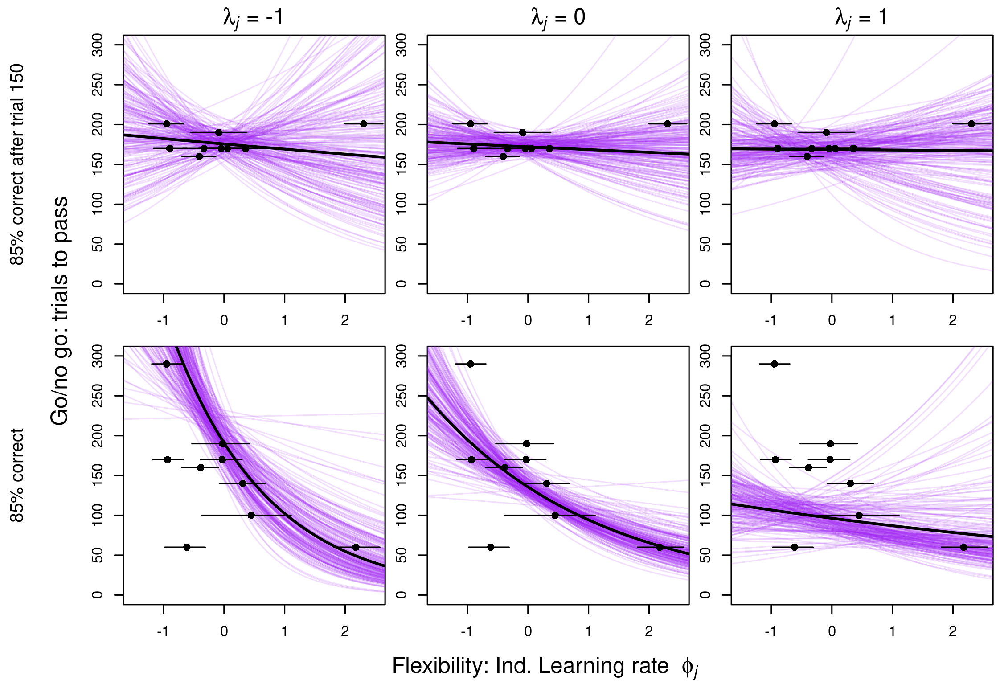

Open... {width=5%} access {width=5%} [code](https://github.com/corinalogan/grackles/blob/master/Files/Preregistrations/g_inhibition.Rmd) {width=5%} peer review {width=5%} [data](https://doi.org/10.5063/M043S3)

\addtolength{\headheight}{0.1cm}
\pagestyle{fancyplain}
\lhead{\includegraphics[height=1.2cm]{logoPCIecology.png}}
\renewcommand{\headrulewidth}{0pt}

&nbsp;

**Affiliations:** 1) Max Planck Institute for Evolutionary Anthropology, Leipzig, Germany; 2) University of California Santa Barbara, Santa Barbara, California, USA; 3) University of California Los Angeles, Los Angeles, California, USA; 4) Anglia Ruskin University, Cambridge, UK. *Corresponding author: corina_logan@eva.mpg.de

```{r setup, echo=F, include=FALSE}
library(knitr)
#Make code wrap text so it doesn't go off the page when Knitting to PDF
opts_chunk$set(tidy.opts=list(width.cutoff=60),tidy=TRUE)

knitr::opts_chunk$set(echo=T)
```

&nbsp;

**This research article has been peer reviewed and recommended by:**

Aliza le Roux. 2021. Great-tailed grackle research reveals need for researchers to consider their own flexibility and test limitations in cognitive test batteries. *Peer Community in Ecology*, 100081. [10.24072/pci.ecology.100081](https://doi.org/10.24072/pci.ecology.100081). Reviewers: Pizza Ka Yee Chow and Alex DeCasian.

**Cite as:** Logan CJ, McCune KB, MacPherson M, Johnson-Ulrich Z, Rowney C, Seitz B, Blaisdell AP, Deffner D, Wascher CAF. 2021. Are the more flexible individuals also better at inhibition? PsyArXiv, version 7, peer-reviewed and recommended by *Peer Community in Ecology*. doi: https://doi.org/10.31234/osf.io/vpc39 

*See the easy-to-read [HTML](http://corinalogan.com/Preregistrations/g_inhibition.html) version and the reproducible manuscript ([Rmd](https://github.com/corinalogan/grackles/blob/master/Files/Preregistrations/g_inhibition.Rmd)) version for the code*

&nbsp;

**This article began as a preregistration, which was pre-study peer reviewed and received an In Principle Recommendation of the [version](https://github.com/corinalogan/grackles/blob/master/Files/Preregistrations/g_inhibitionPassedPreStudyPeerReview6Mar2019.pdf) on 6 March 2019 by:**

Erin Vogel. 2019. Adapting to a changing environment: advancing our understanding of the mechanisms that lead to behavioral flexibility. *Peer Community in Ecology*, 100016. [10.24072/pci.ecology.100016](https://ecology.peercommunityin.org/articles/rec?id=32). Reviewers: Simon Gingins and two anonymous reviewers.


# ABSTRACT

Behavioral flexibility (hereafter, flexibility) should theoretically be positively related to behavioral inhibition (hereafter, inhibition) because one should need to inhibit a previously learned behavior to change their behavior when the task changes [the flexibility component; @manrique_repeated_2013; @griffin2014innovation; @liu2016learning]. However, several investigations show no or mixed support of this hypothesis, which challenges the assumption that inhibition is involved in making flexible decisions. We aimed to test the hypothesis that flexibility [measured as reversal learning and solution switching on a multi-access box by @logan2019flexmanip] is associated with inhibition by measuring both variables in the same individuals and three inhibition tests (a go/no go task on a touchscreen, a detour task, and a delay of gratification experiment). We set out to measure grackle inhibition to determine whether those individuals that are more flexible are also better at inhibition. Because touchscreen experiments had never been conducted in this species, we additionally validated that a touchscreen setup is functional for wild-caught grackles who learned to use the touchscreen and completed the go/no go inhibition task on it. Performance on the go/no go and detour inhibition tests did not correlate with each other, indicating that they did not measure the same trait. Individuals who were faster to update their behavior in the reversal experiment took more time to attempt a new option in the multi-access box experiments, and they were either faster or slower to reach criterion in the go/no go task depending on whether the one bird, Taquito, who was accidentally tested beyond the 200 trial cap was included in the GLM analysis. While the relationship between the number of trials to reverse a preference and the number of trials to reach the go/no go criterion was strongly influenced by Taquito, who was very slow in both experiments, the more comprehensive Bayesian model of flexibility that takes all trials into account and does not rely on an arbitrary passing criterion provided support for the positive relationship irrespective of whether Taquito was included. Performance on the detour inhibition task did not correlate with either measure of flexibility, suggesting that detour performance and the flexibility experiments may measure separate traits. We were not able to run the delay of gratification experiment because the grackles never habituated to the apparatuses. We conclude that flexibility is associated with certain types of inhibition, but not others, in great-tailed grackles.

# [Video summary](https://youtu.be/TXFOYqZztf4) [https://youtu.be/TXFOYqZztf4](https://youtu.be/TXFOYqZztf4)

# INTRODUCTION

Individuals who are more behaviorally flexible [the ability to change behaviors in response to a changing environment, @mikhalevich_is_2017] are assumed to also be better at inhibiting a prepotent response [@ghahremani2009neural; @manrique_repeated_2013; @griffin2014innovation; @liu2016learning]. This is because one should need to inhibit a previously learned behavior to change their behavior when the task changes. However, there is mixed support for the hypothesis that behavioral flexibility (hereafter, flexibility) and behavioral inhibition (hereafter, inhibition) are linked. Many investigations found no correlation between reversal learning (a measure of flexibility) and detour performance (a measure of inhibition) [@boogert_song_2011; @shaw2015wild; @damerius2017curiosity; @brucks2017measures; @dubois2018song; @ducatez2019speed], while others found mixed support that varied by species and experimental design [@deaner_taxa_2006]. Investigations using other measures of flexibility and inhibition have also failed to find a connection between the two [@johnson2018proactive], and even between different measures of inhibition [e.g., @bray2014context; @fagnani2016previous]. Further, causal evidence directly challenges the assumption that flexibility requires inhibition. For example, @homberg2007serotonin showed that rats with improved inhibition (due to gene knockouts) did not perform better in a reversal learning experiment than non-knockout rats. Additionally, @ghahremani2009neural found in humans that brain regions that are active during reversal learning are different from those that are active when someone inhibits a prepotent learned association. These results indicate that inhibition and flexibility are separate traits. The mixed support for a relationship between detour performance and reversal learning makes it difficult to determine whether inhibition is unrelated to flexibility or whether the detour or reversal learning tasks are instead inappropriate for some species.

It is important to use multiple experimental assays to validate that performance on a task reflects an inherent trait [@carter2013animal]. We aimed to determine whether great-tailed grackles that are better at inhibiting behavioral responses in three experiments (go/no go, detour, delay of gratification) are also more flexible [measured as reversal learning of a color preference, and the latency to attempt a new solution on a puzzle box (multi-access) by @logan2019flexmanip]. The go/no go experiment consisted of two different shapes sequentially presented on a touchscreen where one shape must be pecked to receive a food reward (automatically provided by a food hopper under the screen) and the other shape must not be pecked (indicating more inhibitory control) or there will be a penalty of a longer intertrial interval (indicating less inhibitory control). In the detour task, individuals are assessed on their ability to inhibit the motor impulse to try to reach a reward through the long side of a transparent cylinder (indicating less inhibitory control), and instead to detour and take the reward from an open end (indicating more inhibitory control) [@kabadayi2018detour; methods as in @maclean2014evolution who call it the "cylinder task"]. In the delay of gratification task, grackles must wait longer (indicating more inhibitory control) for higher quality (more preferred) food or for higher quantities [methods as in @hillemann2014waiting]. The reversal learning of a color preference task involved one reversal (half the birds) or serial reversals (to increase flexibility; half the birds) of a light gray and a dark gray colored tube, one of which contained a food reward [the experiments and data are in @logan2019flexmanip]. Those grackles that are faster to reverse are more flexible. The multi-access box experimental paradigm is modeled after @auersperg_flexibility_2011 and consists of four different access options to obtain food where each option requires a different type of action to solve it [the experiments and data are in @logan2019flexmanip]. Once a grackle passes criterion for demonstrating proficiency in solving an option, that option becomes non-functional in all future trials. The measure of flexibility is the latency to switch to attempting a new option after a proficient option becomes non-functional, with shorter latencies indicating more flexibility. Employing several experimental assays to measure flexibility and inhibition supports a rigorous approach to testing whether the two traits are linked.

This investigation adds to current knowledge of inhibition and flexibility in several ways. First, our results indicate whether inhibition and flexibility are related and whether tests of inhibition measure the same trait in great-tailed grackles. In addition, touchscreen experiments had never been conducted in this species before, and it was one of our goals to validate whether this setup is viable for running an inhibition task on wild-caught adult grackles. Furthermore, when experimenters test subjects on a series of behavioral tasks, learning from previous tasks can carry over to affect performance on the focal task. Indeed, @van2018detour found that previous experience with transparent materials influenced detour performance, while @isaksson2018high found no effect. Therefore, we also aimed to examine whether the extensive experience of obtaining food from tubes in the reversal learning experiment had an influence on a subject’s detour performance, which also involves a tube with food in it. 


# ASSOCIATED PREREGISTRATION

Our hypotheses, methods, and analysis plans are described in the peer-reviewed preregistration of this article, which is included below as the [Methods](#methods). 

# DEVIATIONS FROM THE PREREGISTRATION

**After data collection began and before data analysis:**

1) Jan 2020 go/no go performance: the preregistration listed the passing criterion as the number of trials to reach 85% correct, while the protocol associated with the preregistration that the experimenters used when testing the birds listed the passing criterion as 100% correct within 150 trials or 85% correct between 150-200 trials. Therefore, we tested birds according to the latter criterion and conducted all analyses for both criteria. It was previously not specified over what number of trials 85% accuracy was calculated, therefore we decided to calculate it at the level of the most recent sliding 10 trial block (i.e., the most recent 10 trials, regardless of whether it is an even 20, 30, 40 trials).

2) Jul 2020: in the section 'Independent variables > P1 go/no go > Model 2b', removed the variable "flexibility condition" because, by definition, the birds in the manipulated condition were faster to reverse. 

3) Sep 2020: Prediction 1 alternative 2 analysis - when we tried to run the code, we discovered that the Cronbach's alpha is not the appropriate test to run on our experimental design to test the internal validity of the experiment (e.g., does this test actually measure what we think it does). To test internal validity, we would need to change the experimental design, which was not the goal of our current study. Therefore, we did not conduct this analysis.


# RESULTS

A total of 18 grackles participated to varying degrees in the test battery between Sep 2018 and May 2020 (Table 1). Sample sizes vary between the tests due to the extensive amount of time it took most birds to get through the test battery, in which case several had to be released before they were finished because, for example, they reached the end of the maximum amount of time we were allowed to temporarily hold them in the aviaries (see [protocol](https://docs.google.com/document/d/1oEQ66yLrkMFr4UJTXfPBRAEXqoUuOgRwcKOB_KcT7HE/edit?usp=sharing) for details). Data are publicly [available](https://doi.org/10.5063/M043S3) at the Knowledge Network for Biocomplexity [@logan2020inhibitiondata]. Details on how the grackles were trained to use the touchscreen are in @seitz2021training.

There was no correlation between the two flexibility experiments: the number of trials to reverse a preference in the last reversal and the average number of seconds (latency) to attempt a new option on the multi-access box after a different locus has become non-functional because they passed criterion on it (Pearson's r=0.52, 95% confidence interval=-0.12-0.85, t=1.83, df=9, p=0.10). The lack of a correlation between the two flexibility experiments could have arisen for a variety of reasons: 1) perhaps comparing different types of data, number of trials to pass a criterion versus the number of seconds to switch to attempting a new option, distorts this relationship. Future experiments could obtain switch latencies from reversal learning to make the measures more directly comparable. 2) Perhaps one or both flexibility measures are not repeatable within individuals, in which case, it would be unlikely that a stable correlation would be found. 3) The multi-access box experimental design allows for unknown amounts of learning within a trial, whereas the reversal learning design allows only one learning opportunity per trial. Perhaps this difference in experimental design introduces noise into the multi-access box experiment, thus making the comparison of their results ambiguous. Additionally, the average latency to attempt a new option did not correlate between the multi-access plastic and multi-access wooden experiments [@logan2019flexmanip]. Therefore, we conducted separate analyses for each flexibility experiment (reversal and multi-access) as well as separate analyses for the multi-access box and multi-access wooden apparatuses.

\newpage

**Table 1.** Summarized results per bird in the go/no go and detour inhibition experiments, and the reversal and multi-access box (MAB) flexibility experiments [flexibility data from @logan2019flexmanip]. We used data from the MAB plastic experiment and the MAB wooden experiment because the wooden and plastic scores did not correlate with each other [@logan2019flexmanip]. **Go/no go trials to 85% correct after 150 trials** requires the bird must achieve 100% correct before trial 150 and if they did not, then they pass after they achieve 85% correct. **Go/no go trials to 85% correct** is simply the number of trials to reach this criterion without the 150 trial threshold of needing to get 100% correct. A value of 201 for go/no go indicates that the bird did not pass criterion within the 200 trial maximum (but note the exception of Taquito who was tested beyond trial 200 until he passed due to experimenter error). **Detour proportion correct modified** accounts for the grackle-specific behavior of standing at the opening of the tube where they are about to reach their head inside the tube to get the food, but they appear frustrated and bite the edge of the plastic tube. These bites do not count as first touch to the plastic when the bird obtains the food immediately after the bite (see Results for the Detour task for justification of this coding).

```{r summary, eval=TRUE, warning=FALSE, results='asis', echo=T, include=TRUE}
d <- read.csv(url("https://raw.githubusercontent.com/corinalogan/grackles/master/Files/Preregistrations/g_inhibition_datasummary.csv"), header=F, sep=",", stringsAsFactors=F)

d <- data.frame(d)
colnames(d) <- c("Bird","Go/no go trials to 85% correct after 150 trials","Go/no go trials to 85% correct","Detour proportion correct","Detour proportion correct modified","Detour pre- or post-reversal","Trials to reverse in first reversal","Trials to reverse in last reversal","Average latency to attempt new solution (MAB plastic)","Average latency to attempt new solution (MAB log)")

library(kableExtra)
knitr::kable(d) %>%
kable_styling(full_width = T, position = "left")
```

## Prediction 1: the more flexible individuals are also better at inhibition

### Model 2a: Number of trials to pass criterion in go/no go

#### *Relationship between go/no go (inhibition) and reversal learning (flexibility)*

There was a positive correlation between the number of trials to pass criterion in the go/no go experiment and the number of trials to reverse a preference (average=59 trials, standard deviation=41, range=23-160 trials, n=9 grackles) in the colored tube reversal experiment (in their **last reversal**, thus for the control grackles, this was their first and only reversal, while for the manipulated grackles, this was their last reversal in the serial reversal manipulation) when using one of the two go/no go passing criteria: the number of trials to reach 85% correct (measured in the most recent 20 trial block; average=149 trials, standard deviation=71, range=60-290 trials, n=9 grackles; Table 2a, Figure 1). The other passing criterion of achieving 100% correct performance by trial 150, and if this is not met then they pass when they reach 85% correct after trial 150 (measured in the most recent 20 trial block; average=178 trials, standard deviation=15, range=160-200 trials) did not correlate with reversal performance. 

Regardless of the criterion used, we capped the number of trials for the go/no go experiment at 200, with the exception of 2 individuals who were tested past trial 200 due to experimenter error (Mofongo continued to trial 249 and did not pass the 85% criterion; and Taquito continued to trial 290 and passed the 85% criterion). We repeated the above analyses for the 85% criterion using a data set without Taquito because this would make the individuals more comparable as not all grackles were given the chance to pass criterion after trial 200. 

Results for the analyses without Taquito showed that, instead of a positive correlation, there was a negative correlation between the number of trials to pass criterion in the go/no go experiment and the number of trials to reverse a preference in the colored tube reversal experiment (in their **last reversal**; average=47, standard deviation=17, range=23-80, n=8 grackles) using the 85% criterion (average=131 trials, standard deviation=51, range=60-190 trials, n=8 grackles; Table 2b, Figure 1).
 
```{r summaryfiggngRev, eval=TRUE, warning=FALSE, results='asis', echo=T, include=TRUE, fig.height=8.5, fig.width=6}
d <- read.csv(url("https://raw.githubusercontent.com/corinalogan/grackles/master/Files/Preregistrations/g_inhibition_datasummary.csv"), header=F, sep=",", stringsAsFactors=F)

d <- data.frame(d)
colnames(d) <- c("Bird","Gonogo150","Gonogo85","Detour","DetourA","Detourprepost","TrialsFirst","TrialsLast","AvgLatencyPlastic","AvgLatencyLog")

#sd(d$TrialsLastReversal,na.rm=TRUE) #33

op <- par(mfrow=c(2,1), oma=c(0,0,0,0), mar=c(4.5,4.5,2,0.2), cex.lab=1.8, cex.axis=2)
plot(jitter(d$TrialsLast),jitter(d$Gonogo85), ylab="Go/no go: trials to pass", xlab="Trials in last reversal", ylim=c(0,310), xlim=c(0,180), cex=4, pch=2, yaxt="n")
points(jitter(d$TrialsLast),jitter(d$Gonogo150), cex=4, pch=1, yaxt="n")
legend(x="bottomright", y=8, legend=c(pch2="85", pch1="150"), pch=c(2,1), box.lty=1, cex=2)
axis(side=2, at=c(100,200,300))
plot(jitter(d$TrialsFirst),jitter(d$Gonogo85), ylab="Go/no go: trials to pass", xlab="Trials in first reversal", ylim=c(0,310), xlim=c(0,180), cex=4, pch=2, yaxt="n")
points(jitter(d$TrialsFirst),jitter(d$Gonogo150), cex=4, pch=1, yaxt="n")
legend(x="bottomright", y=8, legend=c(pch2="85", pch1="150"), pch=c(2,1), box.lty=1, cex=2)
axis(side=2, at=c(100,200,300))
par(op)

#simple plot for presentations
#op <- par(mfrow=c(2,1), oma=c(0,0,0,0), mar=c(4.5,4.5,2,0.2), cex.lab=1.8, cex.axis=2)
#plot(d$TrialsLast,d$Gonogo85, ylab="Go/no go: trials to pass", xlab="Trials in last reversal", ylim=c(0,310), xlim=c(0,180), cex=4, pch=2)
#plot(d$TrialsFirst,d$Gonogo85, ylab="Go/no go: trials to pass", xlab="Trials in first reversal", ylim=c(0,310), xlim=c(0,180), cex=4, pch=2)
#par(op)

## trying to get ggplot2 to work and failed
#combine gng85 and gng150 columns into one so it can be a factor
#gngtrials <-append(d$gng85,d$gng150)
#gngcriterion <-c(rep(85,nrow(d)),rep(150,nrow(d)))
#lastrev <- append(d$TrialsLastReversal,d$TrialsLastReversal)
#avglat <- append(d$AvgLatencySwitchPlastic,d$AvgLatencySwitchPlastic)
#gng <- data.frame(gngtrials,gngcriterion,lastrev,avglat)
#gngcriterion <- factor(gngcriterion)

#make the plots
#library(ggplot2)
#library(cowplot)
#g <- ggplot(gng,aes(lastrev,gngtrials)) + geom_jitter() + ggtitle("") + xlab("Reversal: Trials in last reversal") + ylab("Go/no go: Trials to pass") + geom_point(aes(shape=factor(gngcriterion)), size = 4) + guides(shape=guide_legend(title="")) + theme(panel.border = element_rect(colour = "black", fill=NA))

#legend.position=c(150,75),

#a1 <- ggplot(d,aes(TrialsLastReversal,gng85)) + geom_jitter() + ggtitle("") + xlab("Reversal: Trials in last reversal") + ylab("Go/no go: Trials to pass") + geom_point(data=d, aes(TrialsLastReversal,gng150), shape="triangle") + scale_shape_manual(name="Legend", values=c("85","150"))

#a2 <- ggplot(d,aes(AvgLatencySwitchPlastic,gng85)) + geom_jitter() + ggtitle("") + xlab("MAB: Average latency to switch") + ylab("Go/no go: Trials to pass") + geom_point(data=d, aes(AvgLatencySwitchPlastic,gng150), shape="triangle")
#theme_set(theme_cowplot(font_size=12))
#plot_grid(a1, a2, align='h', ncol=2, labels=c('A','B'))
```

**Figure 1.** The number of go/no go trials to pass criterion per bird (n=9 grackles) using the 85% correct (triangles) or 85% correct after 150 trials (circles) criteria and the number of trials to reverse a color preference in their last reversal (top panel) and first reversal (bottom panel).

The two results from the data set that included Taquito were confirmed using a more comprehensive computational measure of reversal learning that accounts for all of the choices an individual made as well as the degree of uncertainty exhibited as preferences change (flexibility 4 in the Methods). We use multilevel Bayesian reinforcement learning models to investigate a bird’s learning rate and random choice rate per reversal (see Methods for more details; results presented as posterior means and 89% highest posterior density intervals (HPDI)). With the **85% correct criterion**, we found a negative relationship between reversal learning rate and the number of go/no go trials to pass criterion. This means that birds who are faster to update their behavior in the reversal experiment were also faster to reach criterion in the go/no go task ($\beta_\phi$ = -0.37, HPDI = -0.54 to -0.16). This confirms the positive relationship between numbers of trials to reverse a preference and trials to reach criterion in the go/no go task, because fewer trials to reverse preferences tend to be reflected in higher learning rates in the computational model. Moreover, birds that exhibited a higher random choice rate in the reversal experiment took longer to reach the 85% correct criterion compared to birds that were less random in their choices ($\beta_\lambda$ = -0.34, HPDI = -0.52 to -0.12). We also found some evidence for a positive interaction between both learning parameters (reversal learning rate and random choice rate; $\beta_{\phi\chi\lambda}$ = 0.27, HPDI = 0.02 - 0.58), suggesting a buffering effect among parameters such that the influence of random choice rate is weaker for individuals that are fast learners. 

Figure 2 plots posterior predictions for the effect of learning rate $\phi_j$ on the number of trials to pass criterion for three different levels of the random choice rate $\lambda_j$. Focusing on the bottom row (**85% correct criterion**), the model, in general, predicts that fast learners in the reversal learning experiment also reach the criterion in the go/no go experiment in fewer trials. There appears to be a trade-off between learning parameters, such that fast learners who are somewhat exploratory are predicted to perform better than fast learners who show very limited randomness in their choices. Lastly, overall individuals who show fewer random choices in the reversal learning experiment are predicted to perform better in the go/no go inhibition experiment. 



**Figure 2.** Results from the computational learning model (flexibility 4; n=9). Posterior predicted number of trials to pass go/no go using the 85% correct after 150 trials (top row) or 85% correct (bottom row) criteria, based on estimates for the individual-level learning rates from the reinforcement learning model ($\phi_j$; black dots show posterior means, black horizontal lines indicate 89% highest posterior density intervals). Curves are plotted for high (left; $\lambda_j$=-1), average (middle; $\lambda_j$=0) and low (right; $\lambda_j$=1) random choice rates. Purple lines represent 200 independent draws from the posterior, the black lines show posterior means. Both predictors ($\lambda_j$ and $\phi_j$) were standardized before calculations.

As with the other analysis, there was no robust association between either learning rate ($\beta_\phi$ = - 0.02, HPDI = -0.15 - 0.12) or random choice rate ($\beta_\lambda$ = -0.02, HPDI = -0.12 - 0.07) and the number of trials to pass the other go/no go criterion (**100% correct by trial 150**). There was no interaction between the learning parameters ($\beta_{\phi\chi\lambda}$ = 0.01, HPDI = -0.23 - 0.19).

Reassuringly, excluding Taquito did not change the overall patterns. There was still a negative relationship between reversal learning rate and the number of go/no go trials to pass the **85% correct criterion**  ($\beta_\phi$ = -0.26, HPDI = -0.47 to -0.01), a positive relationship between random choice rate and go/no go trials ($\beta_\lambda$ = -0.34, HPDI = -0.53 to -0.06) and a positive interaction between both learning parameters ($\beta_{\phi\chi\lambda}$ = 0.27, HPDI = -0.13 - 0.53). The results for the other go/no go criterion also did not change for the data set that included Taquito.

Overall, these results indicate that those individuals that have more inhibition are also faster at changing their preferences when circumstances change. While the relationship between trials to reverse preference and trials to reach the go/no go criterion was strongly influenced by Taquito, who was very slow in both experiments, the more comprehensive model of flexibility that takes all trials into account and does not rely on an arbitrary passing criterion provided support for the relationship irrespective of whether Taquito was included or not. Still, we would need a larger sample size to determine to what degree the relationship is perturbed by individual variation. 

##### Unregistered analyses

**Unregistered analysis 1:** We additionally analyzed the relationship between go/no go performance and the number of trials to reverse a color preference (average=76, standard deviation=37, range=40-160, n=8 grackles) in the **first reversal** to make our results comparable across more species. This is because most studies do not conduct serial reversals, but only one reversal. The results that included Taquito (Table 2a) were the same as the results that excluded Taquito (Table 2b): there was a positive correlation between go/no go and reversal learning performance when using the 85% go/no go criterion, and no relationship when using the 100% by 150 trial criterion. In comparison with the results for the last reversal, these results are the same as those that included Taquito (positive relationship; Table 2a), and the opposite of those that excluded Taquito (negative relationship; Table 2b).

\newpage

**Table 2a.** Results from the go/no go and reversal learning GLMs (WITH Taquito): **m1** and **m2** show GLM outputs for the last reversal, while **m3** and **m4** show GLM outputs for the first reversal. **m1** and **m3** show results from the GLM using the number of trials to reach 85% correct if 100% correct was not achieved within the first 150 trials in go/no go, while **m2** and **m4** use the number of trials to reach 85% correct without the 150 trial threshold. The estimate is presented above the standard error, which is in parentheses; asterisks refer to p-value significance.

```{r goResults, eval=T, warning=F, results='asis', echo=T, include=T}
d <- read.csv(url("https://raw.githubusercontent.com/corinalogan/grackles/master/Files/Preregistrations/g_inhibition_datasummary.csv"), header=F, sep=",", stringsAsFactors=F)
d <- data.frame(d)
colnames(d) <- c("Bird","Gonogo150","Gonogo85","Detour","DetourA","Detourprepost","TrialsFirst","TrialsLast","AvgLatencyPlastic","AvgLatencyLog")

#get descriptive stats
cc <- subset(d,!(is.na(d["Gonogo150"])) & !(is.na(d["Gonogo85"])) & !(is.na(d["TrialsLast"])) & !(is.na(d["TrialsFirst"])))
#length(cc$Bird) #n=9
#mean(cc$TrialsLast) #59
#sd(cc$TrialsLast) #41
#min(cc$TrialsLast) #23
#max(cc$TrialsLast) #160

#mean(cc$TrialsFirst) #76
#sd(cc$TrialsFirst) #37
#min(cc$TrialsFirst) #40
#max(cc$TrialsFirst) #160

#mean(cc$Gonogo150) #178
#sd(cc$Gonogo150) #15
#min(cc$Gonogo150) #160
#max(cc$Gonogo150) #201

#mean(cc$Gonogo85) #149
#sd(cc$Gonogo85) #71
#min(cc$Gonogo85) #60
#max(cc$Gonogo85) #290


#Is performance on the two multi-access boxes correlated?
#cor.test(d$TrialsLast, d$AvgLatency, use="pairwise.complete.obs", method="pearson")
#No correlation so need to do a separate analysis for MAB. Pearson's r=0.52 (95% confidence interval: -0.12-0.85), t=1.83, df=9, p=0.10


#GLM
m1 <- glm(Gonogo150 ~ TrialsLast, family="poisson", data=d)
#sm1 <- summary(m1) 
#there is no relationship between the number of trials to pass criterion in go/no go and the number of trials to reverse a preference (in the last reversal)

m2 <- glm(Gonogo85 ~ TrialsLast, family="poisson", data=d)
#sm2 <- summary(m2) 
#there is a relationship between the number of trials to pass criterion in go/no go and the number of trials to reverse a preference (in the last reversal) 

#have a look at the plot to see why m2, but not m1 is positively related
#plot(Gonogo85~TrialsLast, data=d) 
#Taquito is a huge outlier here and if I look at the rest of the data, I don't see a positive relationship. Need more data to know whether this relationship holds


#UNREGISTERED analyses: number of trials to reverse in the first reversal (which will make this data comparable with more species)
u1 <- glm(Gonogo150 ~ TrialsFirst, family="poisson", data=d)
#su1 <- summary(u1) 
#there is no relationship between the number of trials to pass criterion in go/no go and the number of trials to reverse a preference (in the first reversal)

u2 <- glm(Gonogo85 ~ TrialsFirst, family="poisson", data=d)
#su2 <- summary(u2) 
#there is a relationship between the number of trials to pass criterion in go/no go and the number of trials to reverse a preference (in the first reversal) (though the estimate 0.008 and the standard error is lower than the estimate so it doesn't cross zero, it is significant: p<2e-16)


#load packages for the output table
library(jtools) 
base::suppressMessages(jtools::export_summs(m1, m2, u1, u2, model.names=c("m1: 150 last reversal","m2: 85 last reversal","m3: 150 first reversal","m4: 85 first reversal"), digits = getOption("jtools-digits", default = 2), model.info = getOption("summ-model.info", TRUE), model.fit = getOption("summ-model.fit", TRUE), pvals = getOption("summ-pvals", FALSE))) 
#suppressMessages gets rid of the text saying that the broom package overwrites something in jtools. Need to specify the package before the function to avoid a message popping up and preventing the PDF from rendering
knitr::knit_hooks$set(document = function(x) {sub('\\usepackage[]{color}', '\\usepackage{xcolor}', x, fixed = TRUE)}) 
#this prevents an issue with xcolor package when rendering to PDF

#Note: this code also works for showing output tables, but don't know how to get it to show more than one model at a time
#library(xtable)
#sm1.table <- xtable(sm1)
#library(knitr)
#kable(sm1.table, caption="Table T: Model selection output.", format="html", digits=2)
```

\newpage

**Table 2b.** Results from the go/no go and reversal learning GLMs (WITHOUT Taquito): **m1** shows GLM outputs for the last reversal, while **m2** shows GLM outputs for the first reversal. Both models show results from the GLM using the number of trials to reach 85% correct without the 150 trial threshold. The estimate is presented above the standard error, which is in parentheses; asterisks refer to p-value significance.

```{r goResultsB, eval=T, warning=F, results='asis', echo=T, include=T}
d <- read.csv(url("https://raw.githubusercontent.com/corinalogan/grackles/master/Files/Preregistrations/g_inhibition_datasummary.csv"), header=F, sep=",", stringsAsFactors=F)
d <- data.frame(d)
colnames(d) <- c("Bird","Gonogo150","Gonogo85","Detour","DetourA","Detourprepost","TrialsFirst","TrialsLast","AvgLatencyPlastic","AvgLatencyLog")

#Remove Taquito from data sheet
dt <- d[!d$Bird=="Taquito",] 

#get descriptive stats
cc2 <- subset(dt,!(is.na(dt["Gonogo85"])) & !(is.na(dt["TrialsLast"])) & !(is.na(dt["TrialsFirst"])))
#length(cc2$Bird) #n=8
#mean(cc2$TrialsLast) #47
#sd(cc2$TrialsLast) #17
#min(cc2$TrialsLast) #23
#max(cc2$TrialsLast) #80

#mean(cc2$TrialsFirst) #66
#sd(cc2$TrialsFirst) #20
#min(cc2$TrialsFirst) #40
#max(cc2$TrialsFirst) #100

#mean(cc2$Gonogo85) #131
#sd(cc2$Gonogo85) #51
#min(cc2$Gonogo85) #60
#max(cc2$Gonogo85) #190


#GLM
m2b <- glm(Gonogo85 ~ TrialsLast, family="poisson", data=dt)
#sm2b <- summary(m2b) 
#there is a negative relationship between the number of trials to pass criterion in go/no go and the number of trials to reverse a preference (in the last reversal) - in contrast to the result with Taquito where this is a positive relationship

#UNREGISTERED analyses: number of trials to reverse in the first reversal (which will make this data comparable with more species)
u2b <- glm(Gonogo85 ~ TrialsFirst, family="poisson", data=dt)
#su2b <- summary(u2b) 
#there is a positive relationship between the number of trials to pass criterion in go/no go and the number of trials to reverse a preference (in the first reversal) - this is the same result as with Taquito

#load packages for the output table
library(jtools) 
base::suppressMessages(jtools::export_summs(m2b,u2b, model.names=c("m1: 85 last reversal","m2: 85 first reversal"), digits = getOption("jtools-digits", default = 2), model.info = getOption("summ-model.info", TRUE), model.fit = getOption("summ-model.fit", TRUE), pvals = getOption("summ-pvals", FALSE))) 
#suppressMessages gets rid of the text saying that the broom package overwrites something in jtools. Need to specify the package before the function to avoid a message popping up and preventing the PDF from rendering
knitr::knit_hooks$set(document = function(x) {sub('\\usepackage[]{color}', '\\usepackage{xcolor}', x, fixed = TRUE)}) 
#this prevents an issue with xcolor package when rendering to PDF
```


#### *Relationship between go/no go (inhibition) and multi-access box (flexibility)*

The average latency to attempt a new option on both MAB experiments (plastic and log) negatively correlated with go/no go performance when using the 85% go/no go criterion (plastic sample: average=136, standard deviation=54, range=60-190, n=7 grackles, does not include Taquito; log sample: average=146, standard deviation=76, range=60-290, n=8 grackles, includes Taquito). There was no correlation when using the 150 trial threshold (average=176, standard deviation=14, range=160-201, n=7 grackles; Table 3a, Figure 3). Results from the log MAB that exclude Taquito show no relationship between the average latency to attempt a new option  (average=572, standard deviation=559, range=77-1482, n=7 grackles) and go/no go performance using the 85% criterion (average=125, standard deviation=53, range=60-190, n=7 grackles). On the plastic multi-access box, the average of the average latency per bird to attempt a new solution was 167 seconds (standard deviation=188, range=25-502, n=7 grackles). On the log multi-access box, the average of the average latency per bird to attempt a new solution was 513 seconds (standard deviation=544, range=77-1482, n=8 grackles).

\newpage

**Table 3a.** Results from the go/no go and multi-access box GLMs (WITH Taquito): **m1** and **m3** show results from the GLM using the number of trials to reach 85% correct if 100% correct was not achieved within the first 150 trials in go/no go, while **m2** and **m4** use the number of trials to reach 85% correct without the 150 trial threshold. **m1** and **m2** show results from the plastic multi-access box, while **m3** and **m4** show results from the log multi-access box. The estimate is presented above the standard error, which is in parentheses; asterisks refer to p-value significance. Note that an estimate of -0.00 simply means that rounding to two decimal places obscured additional digits that show this is a slightly negative number.

```{r goResultsMAB, eval=T, warning=F, results='asis', echo=T, include=T}
d <- read.csv(url("https://raw.githubusercontent.com/corinalogan/grackles/master/Files/Preregistrations/g_inhibition_datasummary.csv"), header=F, sep=",", stringsAsFactors=F)
d <- data.frame(d)
colnames(d) <- c("Bird","Gonogo150","Gonogo85","Detour","DetourA","Detourprepost","TrialsFirst","TrialsLast","AvgLatencyPlastic","AvgLatencyLog")

#get descriptive stats PLASTIC - Taquito did NOT get plastic so he is by default not included in this data set
cc3 <- subset(d,!(is.na(d["Gonogo150"])) & !(is.na(d["Gonogo85"])) & !(is.na(d["AvgLatencyPlastic"])))
#length(cc3$Bird) #n=7
#mean(cc3$AvgLatencyPlastic) #167
#sd(cc3$AvgLatencyPlastic) #188
#min(cc3$AvgLatencyPlastic) #25
#max(cc3$AvgLatencyPlastic) #502

#mean(cc3$Gonogo150) #176
#sd(cc3$Gonogo150) #14
#min(cc3$Gonogo150) #160
#max(cc3$Gonogo150) #201

#mean(cc3$Gonogo85) #136
#sd(cc3$Gonogo85) #54
#min(cc3$Gonogo85) #60
#max(cc3$Gonogo85) #190

#get descriptive stats LOG - Taquito did get log so he is in this data set
cc4 <- subset(d,!(is.na(d["Gonogo150"])) & !(is.na(d["Gonogo85"])) & !(is.na(d["AvgLatencyLog"])))
#length(cc4$Bird) #n=8
#mean(cc4$AvgLatencyLog) #513
#sd(cc4$AvgLatencyLog) #544
#min(cc4$AvgLatencyLog) #77
#max(cc4$AvgLatencyLog) #1482

#mean(cc4$Gonogo85) #146
#sd(cc4$Gonogo85) #76
#min(cc4$Gonogo85) #60
#max(cc4$Gonogo85) #290


#GLM
m1 <- glm(Gonogo150 ~ AvgLatencyPlastic, family="poisson", data=d)
#sm1 <- summary(m1) 
#there is no relationship between the number of trials to pass criterion in go/no go and the average latency to attempt a new locus on the MAB

m2 <- glm(Gonogo85 ~ AvgLatencyPlastic, family="poisson", data=d)
#sm2 <- summary(m2) 
#there is a relationship between the number of trials to pass criterion in go/no go and the average latency to attempt a new locus on the MAB

m3 <- glm(Gonogo150 ~ AvgLatencyLog, family="poisson", data=d)
#sm3 <- summary(m3) 
#there is no relationship between the number of trials to pass criterion in go/no go and the average latency to attempt a new locus on the MAB

m4 <- glm(Gonogo85 ~ AvgLatencyLog, family="poisson", data=d)
#sm4 <- summary(m4) 
#there is a relationship between the number of trials to pass criterion in go/no go and the average latency to attempt a new locus on the MAB

#load packages for the output table
library(jtools) 
base::suppressMessages(jtools::export_summs(m1, m2, m3, m4, model.names=c("m1: 150 plastic","m2: 85 plastic","m3: 150 log","m4: 85 log"), digits = getOption("jtools-digits", default = 2), model.info = getOption("summ-model.info", TRUE), model.fit = getOption("summ-model.fit", TRUE), pvals = getOption("summ-pvals", FALSE))) 
#suppressMessages gets rid of the text saying that the broom package overwrites something in jtools. Need to specify the package before the function to avoid a message popping up and preventing the PDF from rendering
knitr::knit_hooks$set(document = function(x) {sub('\\usepackage[]{color}', '\\usepackage{xcolor}', x, fixed = TRUE)}) 
#this prevents an issue with xcolor package when rendering to PDF
```

\newpage

**Table 3b.** Results from the go/no go and log multi-access box GLM (WITHOUT Taquito) GLM using the number of trials to reach 85% correct without the 150 trial threshold. The estimate is presented above the standard error, which is in parentheses; asterisks refer to p-value significance. Note that an estimate of -0.00 simply means that rounding to two decimal places obscured additional digits that show this is a slightly negative number.

```{r goResultsMABb, eval=T, warning=F, results='asis', echo=T, include=T}
d <- read.csv(url("https://raw.githubusercontent.com/corinalogan/grackles/master/Files/Preregistrations/g_inhibition_datasummary.csv"), header=F, sep=",", stringsAsFactors=F)
d <- data.frame(d)
colnames(d) <- c("Bird","Gonogo150","Gonogo85","Detour","DetourA","Detourprepost","TrialsFirst","TrialsLast","AvgLatencyPlastic","AvgLatencyLog")

#Remove Taquito from data sheet
dt <- d[!d$Bird=="Taquito",] 

#get descriptive stats LOG without Taquito
cc5 <- subset(dt,!(is.na(dt["Gonogo150"])) & !(is.na(dt["Gonogo85"])) & !(is.na(dt["AvgLatencyLog"])))
#length(cc5$Bird) #n=7
#mean(cc5$AvgLatencyLog) #572
#sd(cc5$AvgLatencyLog) #559
#min(cc5$AvgLatencyLog) #77
#max(cc5$AvgLatencyLog) #1482

#mean(cc5$Gonogo85) #125
#sd(cc5$Gonogo85) #53
#min(cc5$Gonogo85) #60
#max(cc5$Gonogo85) #190


#GLM
mm4b <- glm(Gonogo85 ~ AvgLatencyLog, family="poisson", data=dt)
#smm4b <- summary(mm4b) 
#there is no relationship between the number of trials to pass criterion in go/no go and the average latency to attempt a new locus on the MAB - in contrast with results with Taquito where there is a negative relationship
#Summary: The addition or removal of one grackle indicates that the relationship between these two traits is not stable

#load packages for the output table
library(jtools) 
base::suppressMessages(jtools::export_summs(mm4b, model.names=c("85 log"), digits = getOption("jtools-digits", default = 2), model.info = getOption("summ-model.info", TRUE), model.fit = getOption("summ-model.fit", TRUE), pvals = getOption("summ-pvals", FALSE))) 
#suppressMessages gets rid of the text saying that the broom package overwrites something in jtools. Need to specify the package before the function to avoid a message popping up and preventing the PDF from rendering
knitr::knit_hooks$set(document = function(x) {sub('\\usepackage[]{color}', '\\usepackage{xcolor}', x, fixed = TRUE)}) 
#this prevents an issue with xcolor package when rendering to PDF
```

```{r summaryfiggngMAB, eval=TRUE, warning=FALSE, results='asis', echo=T, include=TRUE, fig.height=5, fig.width=7}
d <- read.csv(url("https://raw.githubusercontent.com/corinalogan/grackles/master/Files/Preregistrations/g_inhibition_datasummary.csv"), header=F, sep=",", stringsAsFactors=F)

d <- data.frame(d)
colnames(d) <- c("Bird","Gonogo150","Gonogo85","Detour","DetourA","Detourprepost","TrialsFirst","TrialsLast","AvgLatencyPlastic","AvgLatencyLog")

op <- par(mfrow=c(1,1), oma=c(0,0,0,0), mar=c(4.5,4.5,2,0.2), cex.lab=1.8, cex.axis=2)
plot(jitter(d$AvgLatencyPlastic),jitter(d$Gonogo85), ylab="Go/no go: trials to pass", xlab="MAB: average switch latency (s)", ylim=c(0,310), xlim=c(0,700), cex=4, pch=2, yaxt="n")
points(jitter(d$AvgLatencyPlastic),jitter(d$Gonogo150), cex=4, pch=1, yaxt="n")
legend(x="topright", y=8, legend=c(pch2="85", pch1="150"), pch=c(2,1), box.lty=1, cex=2)
axis(side=2, at=c(100,200,300))
par(op)

#simple plot for presentations: 85% correct only, n=7
#op <- par(mfrow=c(1,1), oma=c(0,0,0,0), mar=c(4.5,4.5,2,0.2), cex.lab=1.8, cex.axis=2)
#plot(d$AvgLatencyPlastic,d$Gonogo85, ylab="Go/no go: trials to pass", xlab="MAB: average switch latency (s)", ylim=c(0,310), xlim=c(0,525), cex=4)
#par(op)
```

**Figure 3.** The number of go/no go trials to pass criterion per bird (n=7) using the 85% correct (triangles) or 85% correct after 150 trials (circles) criteria and the average latency to attempt a new locus on the multi-access box (MAB) plastic.

\newpage

### Model 2b: Latency to peck screen in go/no go

The model that examined whether the latency of the first peck to the screen per trial (response variable) was associated with the outcome of the trial (correct/incorrect) did not converge. This is probably because the correct choice on the no go trials was not to peck the screen and so this level of the categorical choice variable has much less data than the other two levels (incorrect choice and correct choice on the go trials; Figure 4). Therefore, we cannot include the analysis here or make conclusions based on it. Additionally, there was a problem matching the latency data across data sheets. Latency data was brought in from the PsychoPy data sheets, however, the number of trials reported by the experimenter and by PsychoPy sometimes differed for reasons that are unclear. Therefore, the first latency to peck the screen is not completely accurately matched between the two data sheets.

```{r golatencyResults, eval=F, warning=F, results='asis', echo=T, include=T}
d <- read.csv(url("https://raw.githubusercontent.com/corinalogan/grackles/master/Files/Preregistrations/g_inhibition_data_gonogoPsychopy.csv"), header=T, sep=",", stringsAsFactors=F)
d <- data.frame(d)

#load libraries
library(dplyr)
library(ggplot2)
library(cowplot)

#Remove Queso (bird 31) who didn't complete this experiment
d1 <- d[!d$bird==31,] 

#Set numeric and factors so MCMCglmm will run
d1$Latency <- as.numeric(d1$Latency)
d1$TrialThisSession <- as.numeric(d1$TrialThisSession)
d1$session <- as.factor(d1$session)
d1$bird <- as.factor(d1$bird)
d1$rewarded <- as.factor(d1$rewarded)

#Get rid of rows where rewarded=NA because we won't know whether it was a go or a no go trial
d1 <- subset(d1,!(is.na(d1["rewarded"])) & !(is.na(d1["Latency"])))
length(d1$Latency)


#FIGURE mean latency of first peck to screen ALL BIRDS by go or no go: x=trial number,  y=latency to first peck to screen/trial, by go (filled circles) or no go (open circles)

#for loops to scroll through the Latency column and only select the first latency to peck/trial
d2 <- matrix(data=NA,nrow=length(levels(d1$bird)), ncol=5) 
d2 <- data.frame(d2) 
colnames(d2) <- c("bird","session","trial","trialtype","firstlatency")
head(d2)
	
currentrow<-1
for(j in 1:length(levels(d1$bird))) {
  
  birdLatencies <- filter(d1,bird==levels(d1$bird)[j])
  
  for(i in 1:length(unique(birdLatencies$session))) {
    
    sessionLatencies <- filter(birdLatencies,session==unique(birdLatencies$session)[i],)
    
    for(h in 1:length(unique(sessionLatencies$TrialThisSession))) {
  
      trialLatencies <- filter(sessionLatencies,TrialThisSession==unique(sessionLatencies$TrialThisSession)[h])
      
        #Only take the first Latency per Trial
				d2[currentrow,]$firstlatency <- trialLatencies$Latency[1]
				d2[currentrow,]$trial <- trialLatencies$TrialThisSession[1]
				d2[currentrow,]$session <- as.character(trialLatencies$session[1])
				d2[currentrow,]$bird <- as.character(trialLatencies$bird[1])

				if (trialLatencies$rewarded[1]=="yes"){
				  d2[currentrow,]$trialtype <- "go"
				}
				
				else{
				  d2[currentrow,]$trialtype <- "no go"
				}
				
				currentrow<-currentrow+1
			}
		}
  }

## now get mean latency for each trial type for each bird for each session
#make factors (& then properly order session)
d2$bird <- as.factor(d2$bird)
d2$trialtype <- as.factor(d2$trialtype)
d2$session <- as.factor(d2$session)
levels(d2$session)
d2$session = factor(d2$session,levels(d2$session)[c(1,10:17,2:9)])
levels(d2$session)

#make new data frame for 2nd for loop data
d3 <- matrix(data=NA,nrow=length(levels(d1$bird)), ncol=4) 
d3 <- data.frame(d3) 
colnames(d3) <- c("bird","session","trialtype","avgfirstlatency")
head(d3)
	
currentrow<-1
for(a in 1:length(levels(d2$bird))) {
  
  birds <- filter(d2,bird==levels(d2$bird)[a])

  for(b in 1:length(unique(birds$session))) {
    
    sessions <- filter(birds,session==unique(birds$session)[b],)

      for(d in 1:length(unique(birds$trialtype))) {
  
			  d3[currentrow,]$avgfirstlatency <- mean(sessions[sessions$trialtype==unique(birds$trialtype)[d],]$firstlatency)
			  #unique says: run through trialtype levels and calculate mean first latency (the first factor level is go, so it runs through one first), then run through the data sheet again for the next factor level (no go) and because there are only 2 factor levels it then stops
			  
				d3[currentrow,]$session <- as.character(sessions$session[1])
				d3[currentrow,]$bird <- as.character(sessions$bird[1])
				d3[currentrow,]$trialtype <- as.character(unique(birds$trialtype)[d])
				currentrow<-currentrow+1
		}
  }
}

#Print the data to a sheet for Aaron
#length(d3$trialtype) #218
#write.csv(d3,file="g_inhibition_data_gonogoPsychopySummary.csv", sep=",",quote=FALSE,col.names=TRUE)  #It puts it in my grackle prereg github folder


#FIGURE: mean latency/session for go and no go trials against each other across ALL BIRDS
#make factors (& then properly order session)
d3$trialtype <- as.factor(d3$trialtype)
d3$session <- as.factor(d3$session)
levels(d3$session)
d3$session = factor(d3$session,levels(d3$session)[c(1,10:17,2:9)])
levels(d3$session) #17 sessions

#make new data frame for new for loop data
d4 <- matrix(data=NA,nrow=17*2, ncol=3) #17=number of rows
d4 <- data.frame(d4) 
colnames(d4) <- c("session","trialtype","avgfirstlatency")
head(d4)

currentrow<-1
for(e in 1:length(levels(d3$session))) {
    
    sessions1 <- filter(d3,session==levels(d3$session)[e])

      for(f in 1:length(unique(sessions1$trialtype))) {
  
			  d4[currentrow,]$avgfirstlatency <- mean(sessions1[sessions1$trialtype==unique(d3$trialtype)[f],]$avgfirstlatency,na.rm=T)
				d4[currentrow,]$session <- as.character(sessions1$session[1])
				d4[currentrow,]$trialtype <- as.character(unique(d3$trialtype)[f])
				currentrow<-currentrow+1
		}
  }

#### DID NOT GET THE FIGURE TO have the right regression lines or error bars. Going to use Aaron's png file he sent
#make factors (& then properly order session)
d4$trialtype <- as.factor(d4$trialtype)
d4$session <- as.factor(d4$session)
levels(d4$session)
d4$session = factor(d4$session,levels(d4$session)[c(1,10:17,2:9)])
levels(d4$session) #17 sessions

#f1 <- ggplot(d4,aes(x=session,y=avgfirstlatency)) + geom_smooth(method=lm, se=TRUE, aes(x=session, y=avgfirstlatency), formula=d4$avgfirstlatency~d4$session, group=d4$trialtype, colour="gray") + geom_point(data=d4, mapping=aes(x=session, y=avgfirstlatency, shape=trialtype)) + geom_line(aes(group=trialtype, colour="blue")) + geom_jitter(aes(shape=trialtype)) + ggtitle("") + xlab("Session") + ylab("Average latency first peck (s)") 

#Separate the data frame into go trials and no go trials
go <- d4[d4$trialtype=="go",]
no <- d4[d4$trialtype=="no go",]
smooth1 = predict(lm(avgfirstlatency ~ session, data = go))
smooth2 = predict(lm(avgfirstlatency ~ session, data = no))

#g1 <- ggplot(go,aes(session,avgfirstlatency)) + geom_smooth(method=lm, se=TRUE, formula=go$avgfirstlatency~go$session, colour="red") + geom_point(data=no, mapping=aes(x=session, y=avgfirstlatency, shape=trialtype)) + geom_line(aes(group = session, colour="blue")) + geom_jitter(aes(shape=trialtype)) + ggtitle("") + xlab("Session") + ylab("Average latency first peck (s)") 

#op <- par(mfrow=c(1,1), oma=c(0,0,0,0), mar=c(4.5,4.5,2,0.2), cex.lab=1.8, cex.axis=2)
#plot(go$session,go$avgfirstlatency, ylab="Average latency first peck (s)", xlab="Session", ylim=c(0,10), xlim=c(0,20), cex=2, pch=19)
#abline(lm(go$avgfirstlatency~as.numeric(go$session)))
#points(no$session,no$avgfirstlatency, ylab="Average latency first peck (s)", xlab="Session", ylim=c(0,10), xlim=c(0,20), cex=2, pch=1)
#abline(lm(no$avgfirstlatency~as.numeric(no$session)),lty=2)
#legend(x="topright", y=8, legend=c(pch19="go", pch1="no go"), pch=c(19,1), box.lty=1, cex=2)
#par(op)
```


**Figure 4.** The average latency (seconds) across all birds (n=9) to first peck the screen in a trial per session according to whether it was a go trial (when they should peck; black triangles and black regression line) or a no go trial (when they should not peck; gray squares and gray regression line) (error bars=standard error of the mean).


### *Relationship between detour (inhibition) and reversal learning (flexibility)*

There was no correlation between the proportion correct on the detour experiment (average=0.71, standard deviation=0.25, range=0.20-1.00, n=18 grackles) and the number of trials to reverse their **last preference** in the reversal learning experiment (Table 3, Figure 5). The same result was found using the more comprehensive flexibility measure with the Bayesian reinforcement model: we found no relationship between the learning rate ($\beta_\phi$ = 0.12, HPDI = -0.13 to 0.38) or random choice rate ($\beta_\lambda$ = -0.07, HPDI = -0.55 to 0.46) and the proportion of correct choices in the detour experiment. There was also no interaction among parameters (learning rate and random choice rate; $\beta_{\phi\chi\lambda}$ = 0.01, HPDI = -0.39 to 0.38).  

####### Unregistered analyses

We additionally analyzed the relationship between detour performance and the number of trials to reverse a color preference in the **first reversal** to make our results comparable across more species. This is because most studies do not conduct serial reversals, but only one reversal. The results remained the same regardless of whether the first or last reversal were analyzed: there was no relationship between detour and reversal learning performance (Table 3).

As we conducted this experiment, we discovered that scoring whether the grackle made a correct or incorrect first choice is more complicated than the scoring method used in @maclean2014evolution. In @maclean2014evolution, and most other studies using a detour task, to our knowledge, if the plastic is touched first, then it is an incorrect choice, whereas if the food is touched first, it is a correct choice. If the plastic is touched first, it is assumed that the individual touched the plastic on the long side of the tube and not on the rim side where the opening is because they were trying to reach the food through plastic (which is non-functional). We found that many grackles have a habit of standing at the tube opening biting the rim of the tube and then immediately afterwards putting their head in to obtain the food, possibly due to reluctance to put their heads into the tube. This behavior did not appear to be an attempt to reach the food through the plastic because: 1) it was always followed by immediate food retrieval, and 2) it was distinct from other pecks to plastic on the long side. For these reasons, we coded an additional variable, the "grackle-specific correct choice". In this variable, a bite to the plastic rim does not count as an incorrect choice if they then obtained the food without having touched the front (non-edge) of the plastic tubing between their bite to the rim and their obtaining the food. Instead, this counts as a correct choice. We therefore conducted *post hoc* analyses of the proportion correct on the detour task in relation to their reversal performance (Table 3). The results were the same as above: there is no correlation between detour performance (using the grackle-specific correct choice) and the number of trials to reverse their last or first preference. With this scoring method, grackles averaged 87% correct (standard deviation: 25%, range: 60-100%). Results were also identical to above for the more comprehensive flexibility measure using the Bayesian model: there was no relationship between detour performance (using the grackle-specific method) and learning rate ($\beta_\phi$ = 0.17, HPDI = -0.11 to 0.44) or random choice rate ($\beta_\lambda$ = -0.13, HPDI = -0.44 to 0.21) and no interaction ($\beta_{\phi\chi\lambda}$ = 0.06, HPDI = -0.28 to 0.38).

**Table 4.** Results from the detour and reversal learning GLMs: **m1** and **m2** show GLM outputs using the standard @maclean2014evolution method of scoring (std), while **m3** and **m4** show GLM outputs using the grackle-specific scoring method (grackle). **m1** and **m3** show results using the last reversal (last rev), while **m2** and **m4** use the first reversal (1st rev).

```{r detourResults, eval=T, warning=F, results='asis', echo=T, include=T}
d <- read.csv(url("https://raw.githubusercontent.com/corinalogan/grackles/master/Files/Preregistrations/g_inhibition_datasummary.csv"), header=F, sep=",", stringsAsFactors=F)
d <- data.frame(d)
colnames(d) <- c("Bird","Gonogo150","Gonogo85","Detour","DetourA","Detourprepost","TrialsFirst","TrialsLast","AvgLatencyPlastic","AvgLatencyLog")

#GLM
d$Bird <- factor(d$Bird)
m4 <- glm(Detour ~ TrialsLast, family="binomial", data=d)
sm4 <- summary(m4) 
#there is no relationship between the proportion of trials correct on the detour task and the number of trials to reverse in the last reversal

#UNREGISTERED ANALYSIS: first reversal (rather than last reversal)
m5 <- glm(Detour ~ TrialsFirst, family="binomial", data=d)
sm5 <- summary(m5) 
#there is no relationship between the proportion of trials correct on the detour task and the number of trials to reverse in the first reversal

m6 <- glm(DetourA ~ TrialsLast, family="binomial", data=d)
sm6 <- summary(m6) 
#there is no relationship between the proportion of trials correct on the detour task (grackle calculation) and the number of trials to reverse in the last reversal

m7 <- glm(Detour ~ TrialsFirst, family="binomial", data=d)
sm7 <- summary(m7) 
#there is no relationship between the proportion of trials correct on the detour task (grackle calculation) and the number of trials to reverse in the first reversal


#load packages for the output table
library(jtools) 
base::suppressMessages(jtools::export_summs(m4, m5, m6, m7, model.names=c("m1: std & last rev","m2: std & 1st rev","m3: grackle & last rev","m4: grackle & 1st rev"), digits = getOption("jtools-digits", default = 2), model.info = getOption("summ-model.info", TRUE), model.fit = getOption("summ-model.fit", TRUE), pvals = getOption("summ-pvals", FALSE))) 
#suppressMessages gets rid of the text saying that the broom package overwrites something in jtools. Need to specify the package before the function to avoid a message popping up and preventing the PDF from rendering
knitr::knit_hooks$set(document = function(x) {sub('\\usepackage[]{color}', '\\usepackage{xcolor}', x, fixed = TRUE)}) 
#this prevents an issue with xcolor package when rendering to PDF
```


```{r summaryfigdetRev, eval=TRUE, warning=FALSE, results='asis', echo=T, include=TRUE, fig.height=5, fig.width=7}
d <- read.csv(url("https://raw.githubusercontent.com/corinalogan/grackles/master/Files/Preregistrations/g_inhibition_datasummary.csv"), header=F, sep=",", stringsAsFactors=F)

d <- data.frame(d)
colnames(d) <- c("Bird","Gonogo150","Gonogo85","Detour","DetourA","Detourprepost","TrialsFirst","TrialsLast","AvgLatencyPlastic","AvgLatencyLog")

op <- par(mfrow=c(1,1), oma=c(0,0,0,0), mar=c(4.5,4.5,2,0.2), cex.lab=1.8, cex.axis=2)
plot(jitter(d$TrialsLast),jitter(d$Detour), ylab="Detour: Proportion correct", xlab="Trials in last reversal", ylim=c(0,1.2), xlim=c(0,180), cex=4, pch=2, yaxt="n")
points(jitter(d$TrialsLast),jitter(d$DetourA), cex=4, pch=1, yaxt="n")
legend(x="bottomright", y=8, legend=c(pch2="Standard", pch1="Grackle"), pch=c(2,1), box.lty=1, cex=2)
axis(side=2, at=c(0.5,1.0))
par(op)
```

**Figure 5.** The proportion of detour trials correct per bird (n=15) using the standard calculation method (triangles) or the grackle-specific calculation method (circles) and the number of trials to reverse a color preference in their last reversal.

### *Relationship between detour (inhibition) and multi-access box (flexibility)*

We conducted a separate analysis to determine whether the proportion correct in the detour experiment was related to the average latency to attempt a new option on the multi-access boxes (plastic and log) and found no relationship [using the @maclean2014evolution method of scoring; Table 5].

####### Unregistered analyses

There was no correlation between the proportion correct in the detour experiment using the grackle-specific scoring method and the average latency to attempt a new option on either of the multi-access boxes (plastic or log; Table 5, Figure 6). 

**Table 5.** Results from the detour and multi-access box GLMs: **m1** and **m3** show GLM outputs using the standard @maclean2014evolution method of scoring (std), while **m2** and **m4** show GLM outputs using the grackle-specific scoring method (grackle). **m1** and **m2** show results from the MAB plastic experiment, while **m3** and **m4** show results from the MAB log experiment.

```{r detourResultsMAB, eval=T, warning=F, results='asis', echo=T, include=T}
d <- read.csv(url("https://raw.githubusercontent.com/corinalogan/grackles/master/Files/Preregistrations/g_inhibition_datasummary.csv"), header=F, sep=",", stringsAsFactors=F)
d <- data.frame(d)
colnames(d) <- c("Bird","Gonogo150","Gonogo85","Detour","DetourA","Detourprepost","TrialsFirst","TrialsLast","AvgLatencyPlastic","AvgLatencyLog")

#mean(d$AvgLatencySwitchPlastic, na.rm=T) #208, n=11
#sd(d$AvgLatencySwitchPlastic, na.rm=T) #226
#min(d$AvgLatencySwitchPlastic, na.rm=T) #25
#max(d$AvgLatencySwitchPlastic, na.rm=T) #685
#mean(d$AvgLatencySwitchLog, na.rm=T) #489, n=10
#sd(d$AvgLatencySwitchLog, na.rm=T) #499
#min(d$AvgLatencySwitchLog, na.rm=T) #77
#max(d$AvgLatencySwitchLog, na.rm=T) #1482

#GLM
m8 <- glm(Detour ~ AvgLatencyPlastic, family="binomial", data=d)
#sm8 <- summary(m8) 
#there is no relationship between the proportion of trials correct on the detour task and the average latency to switch on the MAB plastic

m9 <- glm(Detour ~ AvgLatencyLog, family="binomial", data=d)
sm9 <- summary(m9) 
#there is no relationship between the proportion of trials correct on the detour task and the average latency to switch on the MAB log

#UNREGISTERED ANALYSIS: MAB switch latency
m10 <- glm(DetourA ~ AvgLatencyPlastic, family="binomial", data=d)
#sm10 <- summary(m10) 
#there is no relationship between the proportion of trials correct on the detour task and the average latency to switch on the MAB plastic

m11 <- glm(DetourA ~ AvgLatencyLog, family="binomial", data=d)
#sm11 <- summary(m11) 
#there is no relationship between the proportion of trials correct on the detour task and the average latency to switch on the MAB log

#load packages for the output table
library(jtools) 
base::suppressMessages(jtools::export_summs(m8, m9, m10, m11, model.names=c("m1: std & plastic","m2: grackle & plastic","m3: std & log","m4: grackle & log"), digits = getOption("jtools-digits", default = 2), model.info = getOption("summ-model.info", TRUE), model.fit = getOption("summ-model.fit", TRUE), pvals = getOption("summ-pvals", FALSE))) 
#suppressMessages gets rid of the text saying that the broom package overwrites something in jtools. Need to specify the package before the function to avoid a message popping up and preventing the PDF from rendering
knitr::knit_hooks$set(document = function(x) {sub('\\usepackage[]{color}', '\\usepackage{xcolor}', x, fixed = TRUE)}) 
#this prevents an issue with xcolor package when rendering to PDF
```

```{r summaryfigdetMAB, eval=TRUE, warning=FALSE, results='asis', echo=T, include=TRUE, fig.height=5, fig.width=7}
d <- read.csv(url("https://raw.githubusercontent.com/corinalogan/grackles/master/Files/Preregistrations/g_inhibition_datasummary.csv"), header=F, sep=",", stringsAsFactors=F)

d <- data.frame(d)
colnames(d) <- c("Bird","Gonogo150","Gonogo85","Detour","DetourA","Detourprepost","TrialsFirst","TrialsLast","AvgLatencyPlastic","AvgLatencyLog")

op <- par(mfrow=c(1,1), oma=c(0,0,0,0), mar=c(4.5,4.5,2,0.2), cex.lab=1.8, cex.axis=2)
plot(jitter(d$AvgLatencyPlastic),jitter(d$Detour), ylab="Detour: Proportion correct", xlab="MAB: average switch latency (s)", ylim=c(0,1.3), xlim=c(0,700), cex=4, pch=2, yaxt="n")
points(jitter(d$AvgLatencyPlastic),jitter(d$DetourA), cex=4, pch=1, yaxt="n")
legend(x="bottomright", y=8, legend=c(pch2="Standard", pch1="Grackle"), pch=c(2,1), box.lty=1, cex=2)
axis(side=2, at=c(0.5,1.0))
par(op)
```

**Figure 6.** The proportion of detour trials correct per bird (n=11) using the standard calculation method (triangles) or the grackle-specific calculation method (circles) and the average latency to attempt a new locus on the multi-access box (MAB) plastic.


## Prediction 2: no correlation between inhibition tasks

There was no correlation between the inhibition tasks go/no go and detour. Cronbach's alpha showed low reliability equal to zero for all comparisons (go/no go 150 threshold and detour standard=0.03, go/no go 150 and detour grackle specific=0.03, go/no go 85 and detour standard=0.005, go/no go 85 and detour grackle specific=0.003).

## Prediction 3: does training improve detour performance?

There was no difference in the proportion correct on the detour task and whether the individual received the detour experiment before or after their reversal learning experiment (which also involved obtaining food from tubes; Table 4). Seventeen grackles participated in the detour experiment with 5 in the pre-reversal condition and 12 in the post-reversal condition.

### Unregistered analysis

We conducted a post-hoc analysis using the detour grackle-specific proportion of correct responses (see full explanation in P1: detour > Unregistered analyses) and found that the result is the same as above: there is no difference in detour performance relative to their experience with reversal tubes (Table 6).

**Table 6.** Results from the detour GLMs to determine whether experience with reversal tubes improves detour performance: **Detour standard** shows GLM outputs using the  @maclean2014evolution method of scoring, **Detour grackle-specific** shows GLM outputs using the grackle-specific scoring method, Condition refers to whether they received the detour test before (pre) or after (post) their reversal experiment.

```{r detour2Results, eval=T, warning=F, results='asis', echo=T, include=T}
d <- read.csv(url("https://raw.githubusercontent.com/corinalogan/grackles/master/Files/Preregistrations/g_inhibition_datasummary.csv"), header=F, sep=",", stringsAsFactors=F)
d <- data.frame(d)
colnames(d) <- c("Bird","Gonogo150","Gonogo85","Detour","DetourA","Detourprepost","TrialsFirst","TrialsLast","AvgLatencyPlastic","AvgLatencyLog")

#GLM - detour standard correct choice scoring
de <- glm(Detour ~ Detourprepost, family="binomial", data=d)
sde <- summary(de)
#no difference between detour percent correct and whether they received detour before or after reversal tubes

#GLM - detour grackle-specific correct choice scoring - UNREGISTERED ANALYSIS
de2 <- glm(DetourA ~ Detourprepost, family="binomial", data=d)
sde2 <- summary(de2)
#no difference between detour percent correct and whether they received detour before or after reversal tubes

#load packages for the output table
library(jtools) 
base::suppressMessages(jtools::export_summs(de, de2, model.names=c("Detour standard","Detour grackle-specific"), digits = getOption("jtools-digits", default = 2), model.info = getOption("summ-model.info", TRUE), model.fit = getOption("summ-model.fit", TRUE), pvals = getOption("summ-pvals", FALSE))) 
#suppressMessages gets rid of the text saying that the broom package overwrites something in jtools. Need to specify the package before the function to avoid a message popping up and preventing the PDF from rendering
knitr::knit_hooks$set(document = function(x) {sub('\\usepackage[]{color}', '\\usepackage{xcolor}', x, fixed = TRUE)}) 
#this prevents an issue with xcolor package when rendering to PDF
```

We were not able to conduct the delay of gratification experiment because the grackles never habituated to the apparatuses, therefore the inhibition results come only from the go/no go and detour experiments.


# DISCUSSION

We found mixed support for the hypothesis that inhibition and flexibility are associated with each other. Inhibition measured using the go/no go task was associated with flexibility (reversal task and multi-access box tasks), but inhibition measured using the detour task was not associated with either flexibility measure. While the relationship between the number of trials to reverse a preference and the number of trials to reach go/no go criterion depended on the inclusion or exclusion of one individual, flexibility measured through our more mechanistic computational model showed a consistent association with go/no go performance, such that the more flexible learners were also better at inhibition. This shows the need to move beyond rather arbitrary thresholds towards more theoretically grounded measures of cognitive traits, based on, for example, cognitive modeling of behavior. Regardless, the change of direction of the relationship given the addition or removal of one individual from the data set indicates that individuals should be tested beyond an arbitrary threshold in the go/no go test to better understand individual variation at the high end of the spectrum. The negative correlation between performance on go/no go and the multi-access boxes could indicate that solution switching on the multi-access box is hindered by self control. Performance on the multi-access box improves when one explores the other options faster. Perhaps inhibition hinders such exploration, resulting in slower switching times.

Our results confirm previous findings where detour performance was not associated with flexibility as measured by the multi-access box locus switching performance [@johnson2018proactive] or by reversal learning [@boogert_song_2011; @shaw2015wild; @damerius2017curiosity; @brucks2017measures; @dubois2018song; @ducatez2019speed]. This mixed support could be because the two inhibition tests, go/no go and detour, did not correlate with each other, indicating that they did not measure the same trait in great-tailed grackles.

There is controversy around how to best assess inhibition given the several experimental paradigms that are available. Inhibitory control is a multi-level construct and an integral part of executive functioning. One aspect of inhibition is motor self-regulation [i.e., stopping a prepotent but counterproductive movement; @diamond2013executive], which is usually assessed with the detour task in non-human animals. While another aspect of inhibitory control is self-control [i.e., the ability to withhold an immediate response towards a present stimulus in favor of a later stimulus; @nigg2017annual]. To assess self-control in non-human animals, a task must crucially involve a component of decision making, such as deciding between obtaining a less preferred reward now or tolerating a delay for a more valuable outcome in the future [@beran2015comparative]. In non-human animals, self-control is typically assessed using experimental paradigms, such as the accumulation paradigm, exchange paradigm, hybrid delay, and intertemporal choice task [for an overview see: @beran2018self; @miller2019self]. A major concern associated with the comparison of performance on inhibition tasks is that measures are not always consistent when different experimental paradigms are used [@addessi2013delay; @brucks2017measures; @van2018detour], which is further confirmed by our findings. This indicates that it is crucial to compare inhibition paradigms with each other on the same individuals to understand whether and how they relate to each other and in which contexts. In addition, it may be best to refer to the different inhibition paradigms with distinct terms to differentiate them (e.g., “motor inhibition” for detour-like tasks and “self-control” for delay of gratification tasks).

In the go/no go experiment, the 85% correct passing criterion was more relevant to the grackles, and the one we recommend using in the future. Setting an arbitrary threshold of needing 100% correct in the first 150 trials to pass criterion, which is not generally used in go/no go inhibition tasks, was not ecologically relevant for grackles. In reversal learning tests, which are similar to the go/no go experimental design in that they learn to discriminate between two shapes, grackles almost always continue to explore their options regardless of whether they already have a color preference [e.g., @logan2016flexibilityproblem]. There was also more individual variation using the 85% passing criterion, which makes it a more useful measure for comparison. 

Although great-tailed grackles had never experienced touchscreen experiments before, we found that the grackles were able to learn to use the touchscreen and to complete the go/no go experiment on it. This validates the use of this setup for future experiments in this species, and shows that it could be a viable option for wild-caught birds from other species as well. However, there are several caveats to the feasibility of touchscreen tasks for behavioral testing [see @seitz2021training for details]. First, touchscreen hardware and software can be prone to error. We recommend future studies ensure that the touchscreens accurately record the target behaviors prior to intensive experimentation. Second, touchscreen experimentation should be as fully automated as possible; it can be difficult for observers to objectively code bird behaviors as the birds interact with a touchscreen. Our interobserver reliability was not as reliable as we had hoped, although it was still acceptable for data analysis, due to some of these issues (see details in [Methods](#unregistered-analysis-interobserver-reliability-of-dependent-variables)). 

Performance on the detour inhibition test was not affected by extensive experience obtaining hidden food from tubes in the reversal learning test. Grackles who received the detour experiment before reversal training did not perform differently from those who received the detour experiment after reversal training. These two contexts appear to be different enough to solicit independent responses without interference due to a grackle’s previous test history. The development of our grackle-relevant detour scoring method resulted in improved performance for 9 out of the 16 grackles we tested. This indicates that cross-species comparisons on this test that are not attuned to the species under study could underestimate inhibitory ability. This finding could partially explain why so many of the 36 species in @maclean2014evolution performed so poorly on this task, aside from actually having poor motor inhibition.

Our developments and modifications to these inhibition tests confirm that it is necessary to accommodate species-relevant behavioral differences in apparatus design and when scoring choices to measure the actual potential of a given species [e.g., @thornton_individual_2012]. Such developments are required to determine what inherent trait inhibition tests measure, whether it is appropriate to categorize different tests as measuring the same ability, and how inhibition relates to other traits.

In conclusion, our results support the idea that flexibility used in reversal learning and in task switching on multi-access boxes may only be associated with the “self-control” type of inhibition (as measured by the go/no go task) and not motor inhibition (as measured by the detour task) in great-tailed grackles. We confirm previous findings that suggest inhibition is multiple constructs that are potentially independent, as has been suggested for humans and dogs [@friedman2004relations; @brucks2017measures]. It is possible that inhibition represents a set of cognitive pathways that is evolutionarily ancient (such that birds and mammals share types of inhibition from a common ancestor) or that there has been convergent evolution of these abilities in multiple lineages.


# METHODS

### A. STATE OF THE DATA

**Prior to collecting any data:** This preregistration was written. 

**After data collection had begun (and before any data analysis):** This preregistration was submitted to PCI Ecology (Oct 2018) for peer review after starting data collection on the detour task for the pre-reversal subcategory of subjects (for which there was data from one bird). Reviews were received, the preregistration was revised and resubmitted to PCI Ecology (Jan 2019) at which point there was detour data for six birds, data on a few training trials for the delay of gratification task for one bird, and no data from the go/no go experiment. This preregistration passed peer review and was recommended by PCI Ecology in March 2019 (see the [review history](https://ecology.peercommunityin.org/public/rec?id=32&reviews=True)).

### B. PARTITIONING THE RESULTS

We may decide to present the results from different tests in separate papers. NOTE: everything in the preregistration is included in this one manuscript.

### C. HYPOTHESIS

**If behavioral flexibility requires behavioral inhibition, then individuals that are more [behaviorally flexible](./g_flexmanip.Rmd) (indicated by individuals that are faster at functionally changing their behavior when circumstances change), as measured by reversal learning and switching to a different option after one becomes non-functional on a multi-access box, will also be better at inhibiting their responses in three tasks: delayed gratification, go/no go, and detour (Figure 7).**

**P1:** Individuals that are faster to reverse preferences on a reversal learning task and who also have lower latencies to successfully solve new loci after previously solved loci become unavailable (multi-access box) (see [flexibility preregistration](./g_flexmanip.Rmd)) will perform better in the go/no go task (methods similar to @harding2004animal) and in the detour task (methods as in @maclean2014evolution who call it the "cylinder task"), and they will wait longer for higher quality (more preferred) food, but not for higher quantities of food (methods as in @hillemann2014waiting). Waiting for higher quality food has been validated as a test of inhibition in birds, while waiting for a higher quantity of food does not appear to measure inhibition (@hillemann2014waiting).

**P1 alternative 1:** If there is no correlation between flexibility measures and performance on the inhibition tasks, this may indicate that the flexibility tasks may not require much inhibition (particularly if the inhibition results are reliable - see *P1 alternative 2*).

**P1 alternative 2:** If there is no correlation between flexibility measures and performance on the inhibition tasks, this may indicate that the inhibition tasks had low reliability and were therefore too noisy to correlate with flexibility.

**P2:** If there is no correlation in performance across inhibition tasks, it may indicate that that one or more of these tasks does not measure inhibition, or that they measure different types of inhibition (see @friedman2004relations).

**P2 alternative:** If go/no go task performance strongly correlates with performance on the delayed gratification task, this indicates these two tasks measure the same trait, which therefore validates a inhibition task using a touchscreen (the go/no go task).

**P3:** If individuals perform well on the detour task and with little individual variation, this is potentially because they will have had extensive experience looking into the sides of opaque tubes during reversal learning. To determine whether prior experience with opaque tubes in reversal learning contributed to their detour performance, a subset of individuals will experience the detour task before any reversal learning tests. If this subset performs the same as the others, then previous experience with tubes does not influence detour task performance. If the subset performs worse than the others, this indicates that detour task performance depends on the previous experiences of the individuals tested.


***Figure 7a.*** PLANNED: The experimental designs of the three tasks: delayed gratification, go/no go, and detour (see [protocol](https://docs.google.com/document/d/1oEQ66yLrkMFr4UJTXfPBRAEXqoUuOgRwcKOB_KcT7HE/edit?usp=sharing) for details). In the **delay of gratification** task, individuals learn that food items will be transferred by the experimenter from a storing lid (near the experimenter) to a serving lid (near the bird) one at a time, and that they have access to the food in the serving lid from which they can eat at any time: they will have the opportunity to learn that they will have access to more food if they wait longer for the experimenter to transfer food items. Once they pass training (by waiting for more than one food item in three trials), they move on to the test where food items are transferred from the serving to the storing lid with delays ranging from 2-1280 seconds. Birds will be tested on whether will wait for food items that increase in quality (i.e., are more preferred) or increase in quantity (i.e., the same food type accumulates in the serving lid). In the **go/no go** task, after pecking a start key on the touchscreen to show they are attending to a trial, they will be presented with either a green circle or a purple circle (the rewarded circle color is counterbalanced across birds). Pecking the food key while the rewarded colored circle (green in the figure) is on the screen will result in the food hopper rising so the bird can eat food for 2 seconds, after which point the trial ends and the screen goes blank for 8 seconds before starting over again. If the non-rewarded colored circle (purple in the figure) appears on the screen after the start key is pecked, then the correct response is to refrain from pecking the food key for 10 seconds. If the bird succeeds in refraining, the next intertrial interval starts. If the bird fails and pecks the food key while the purple circle is on the screen, then it is given an aversive stimuli for 5 seconds (TV static screen). In the **detour** task, individuals first receive a warm up with an opaque tube where they learn that the experimenter will show them a piece of food and then move that piece of food into the tube. Subjects then have the opportunity to approach the tube and eat the food. A correct response is when their first approach is to go to the side of the tube to the opening to obtain the food and an incorrect response is when they try to access the food by pecking at the front of the tube (which has no opening). Once they pass the warm up, by solving correctly in 4 out of 5 consecutive trials, they move on to the test, which uses the same setup of tube and food except the tube is transparent. The idea is that being able to see the food through the tube wall might entice them to try to go through the wall rather than refrain from a direct approach to the food and instead go around the side through the tube opening.


***Figure 7b.*** ACTUAL: The experimental designs of the two tasks that were able to be conducted, go/no go and detour, and the modifications we made to go/no go (see [protocol](https://docs.google.com/document/d/1oEQ66yLrkMFr4UJTXfPBRAEXqoUuOgRwcKOB_KcT7HE/edit?usp=sharing) for details on why these changes were made). In the **go/no go** task, the green circle was replaced with a white heart, the purple circle was replaced with white wavy lines, the trial start key was removed, and the food key was removed to make it so that pecking the go stimulus could result in a food reward. After a correct go response, the food hopper was available for approximately 2-3 s. After a trial ended, the screen went blank for for a variable number of seconds, depending on whether the individual gave a correct (~3 s) or incorrect (~10s) response, before starting over again. If the bird failed to refrain from pecking the stimulus during the no go trials, then it was given a longer intertrial interval rather than an aversive stimuli (TV static screen). No changes were made to the **detour** task.


### D. METHODS

#### Open materials

ADDED Sep 2020: [Testing protocols: inhibition](https://docs.google.com/document/d/1oEQ66yLrkMFr4UJTXfPBRAEXqoUuOgRwcKOB_KcT7HE/edit?usp=sharing) for the three inhibition experiments: go/no go, detour, and delay of gratification

[Testing protocols: flexibility](https://docs.google.com/document/d/1oEQ66yLrkMFr4UJTXfPBRAEXqoUuOgRwcKOB_KcT7HE/edit?usp=sharing) for the experiments: color tube reversal learning and multi-access box

#### Open data

When the study is complete, the data will be published in the Knowledge Network for Biocomplexity's data repository.

#### Randomization and counterbalancing

**P3** 

Two individuals from each batch will experience the detour task before participating in the flexibility manipulation. These individuals will be randomly selected using the random number generator at https://www.random.org.

**P1-P2**

For the rest of the individuals (n=6 per batch), the order of the three inhibition tasks will be counterbalanced across birds (using https://www.random.org to randomly assign individuals to one of three experimental orders). 1/3 of the individuals will experience:

1. Delayed gratification task

2. Go/no go task

3. Detour

1/3 of the individuals will experience:

1. Go/no go task

2. Detour

3. Delayed gratification task

1/3 of the individuals will experience: 

1. Detour

2. Delayed gratification task

3. Go/no go task

NOTE (Sep 2020): the delayed gratification task was not conducted because the grackles never habituated to the apparatuses. The following birds experienced go/no go first, then detour: Burrito, Chilaquile, Pizza, Yuca, and Pollito. 

**Delayed gratification** 

- Food preference test: food will be presented in random combinations over six sessions of 12-15 trials. 

- Training trials: The type of demonstration and training trials varied randomly (with more demo trials near the beginning of training), incorporating trials in which food of the same sort accumulated (quantity), food of ascending quality accumulated (quality), and trials in which we added increasingly larger food pieces throughout the trial (size).

- Test: we will test each food quality (low, mid, high) twice in randomized order in each session.

**Go/no go** 

Go and no go trials will be presented randomly with the restriction that no more than four of the same type will occur in a row. The rewarded color will be counterbalanced across birds.

**Detour** 

The side from which the apparatus is baited will be consistent within subjects, but counterbalanced across subjects.

#### Blinding of conditions during analysis

No blinding is involved in this study. NOTE (Sep 2020): interobserver reliability analyses were conducted by hypothesis-blind video coders.

#### Dependent variables

##### *P1: the more flexible individuals are better at inhibition*

1) **Delayed gratification:** Number of food pieces waited for (0-3). A successful wait is defined as waiting for at least one additional piece of food to be added to the serving lid of the three possible additional food items, and accepting at least one of the reward pieces.

2) **Go/no go:** 

    a) The number of trials to reach criterion (85% correct) where correct responses involve pecking when the rewarded stimulus is displayed and not pecking when the unrewarded stimulus is displayed, and incorrect responses involve pecking when the unrewarded stimulus is displayed, and not pecking when the rewarded stimulus is displayed

    b) The latency to respond (peck the target key)

3) **Detour:** First approach (physical contact with bill): Correct (to the tube's side opening) or Incorrect (to the front closed area of the tube) (methods as in @maclean2014evolution).

One model will be run per dependent variable.

##### *P3: does training improve detour performance?*

1) First approach (physical contact): Correct (to the tube's side opening) or Incorrect (to the front closed area of the tube) (methods as in @maclean2014evolution).

#### Independent variables

##### *P1: delayed gratification*

1) Food quality or quantity (Quality: High, Med, Low; Quantity: Smaller, Medium, Larger)

2) Trial

3) Delay (2, 5, 10, 20, 40, 60, or 80 seconds)

4) Flexibility 1: **Number of trials to reverse** a preference in the last reversal an individual experienced (reversal learning; an individual is considered to have a preference if it chose the rewarded option at least 17 out of the most recent 20 trials, with a minimum of 8 or 9 correct choices out of 10 on the two most recent sets of 10 trials). See behavioral flexibility [preregistration](./g_flexmanip.Rmd).

5) Flexibility 3: If the number of trials to reverse a preference does not positively correlate with the latency to attempt or solve new loci on the multi-access box (an additional measure of flexibility), then the **average latency to solve** and the **average latency to attempt** a new option on the multi-access box will be additional dependent variables. See behavioral flexibility [preregistration](./g_flexmanip.Rmd).

7) Flexibility 4: This measure is currently being developed and is intended to be a more accurate representation of all of the choices an individual made, as well as accounting for the degree of uncertainty exhibited by individuals as preferences change. If this measure more effectively represents flexibility (determined using a modeled dataset and not the actual data), we may decide to solely rely on this measure and not use flexibility measures 1 through 3. If this ends up being the case, we will modify the code in the analysis plan below to reflect this change.

##### *P1: go/no go*

Model 2a: number of trials to reach criterion

1) Flexibility 1: Number of trials to reverse a preference in the last reversal an individual experienced (reversal learning; as above)

2) Flexibility 3: If the number of trials to reverse a preference does not positively correlate with the latency to attempt or solve new loci on the multi-access box, then the **average latency to solve** and the **average latency to attempt** a new option on the multi-access box will be additional independent variables (as above).

4) Flexibility 4: This measure is currently being developed and is intended to be a more accurate representation of all the choices an individual made, as well as accounting for the degree of uncertainty exhibited by individuals as preferences change. If this measure more effectively represents flexibility (determined using a modeled dataset and not the actual data), we may decide to solely rely on this measure and not use flexibility measures 1 through 3. If this ends up being the case, we will modify the code in the analysis plan below to reflect this change.

Model 2b: latency to respond

1) Correct or incorrect response

2) Trial

3) [Flexibility Condition](./g_flexmanip.Rmd): control, flexibility manipulation

3) ID (random effect because multiple measures per bird)

NOTE Jul 2020: remove flexibility condition as a variable because, by definition, the birds in the manipulated group were faster to reverse their preferences.

##### *P1: detour*

1) Trial

NOTE (Aug 2020): Because the data are analyzed in a GLM, meaning that there is only one row per bird, trial number is not able to be included because it would need to be conducted on multiple rows per bird. Therefore, we removed this independent variable from this analysis.

2) Flexibility 1: Number of trials to reverse a preference in the last reversal an individual experienced (reversal learning; as above)

3) Flexibility 3: If the number of trials to reverse a preference does not positively correlate with the latency to attempt or solve new loci on the multi-access box, then the **average latency to solve** and the **average latency to attempt** a new option on the multi-access box will be additional independent variables (as above).

4) Flexibility 4: This measure is currently being developed and is intended to be a more accurate representation of all of the choices an individual made, as well as accounting for the degree of uncertainty exhibited by individuals as preferences change. If this measure more effectively represents flexibility (determined using a modeled dataset and not the actual data), we may decide to solely rely on this measure and not use flexibility measures 1 through 3. If this ends up being the case, we will modify the code in the analysis plan below to reflect this change.

##### *P3: does training improve detour performance?*

1) Condition: pre- or post-reversal learning tests


##### Unregistered analysis: Interobserver reliability of dependent variables

To determine whether experimenters coded the dependent variables in a repeatable way, hypothesis-blind video coders, Sophie Kaube (detour) and Brynna Hood (go/no go), were first trained in video coding the dependent variables (detour and go/no go: whether the bird made the correct choice or not), requiring a Cohen's unweighted kappa of 0.90 or above to pass training (using the psych package in R @psych). This threshold indicates that the two coders (the experimenter and the video coder) agree with each other to a high degree (@landis1977measurement). After passing training, the video coders coded 24% (detour) and 33% (go/no go) of the videos for each experiment and the unweighted Cohen's kappa was calculated to determine how objective and repeatable scoring was for this variable, while noting that the experimenter had the advantage over the video coder because watching the videos was not as clear as watching the bird participate in the trial from the aisle of the aviaries. The unweighted kappa was used because this is a categorical variable where the distances between the numbers are meaningless (0=incorrect choice, 1=correct choice, -1=did not participate).

**Detour: correct choice**

We randomly chose four (Diablo, Queso, Chalupa, and Habanero) of the 11 birds that had participated in this experiment by Nov 2019 using random.org. First, Kaube analyzed all videos from Habanero and Diablo, and we analyzed the data using an intraclass correlation coefficient, which is not an appropriate test for categorical data. After learning this, we switched to using the Cohen's unweighted kappa and replaced Habanero and Diablo with two new randomly chosen grackles (Mole and Chilaquile). Kaube then analyzed all videos from Queso and Chalupa for training and passed (Cohen's unweighted kappa=0.91, confidence boundary=0.75-1.00, n=24 data points). After passing training, Kaube analyzed all videos from Queso, Chalupa, Mole, and Chilaquile, and highly agreed with the experimenter's data (Cohen's unweighted kappa=0.91, confidence boundary=0.78-1.00, n=44 data points).

**Go/no go: correct choice**

We randomly chose three (Diablo, Burrito, and Chilaquile) of the 12 birds that were estimated to complete this experiment using random.org. Hood then analyzed all videos from Diablo for training and passed (Cohen's unweighted kappa=0.91, confidence boundary=0.80-1.00, n=40 data points). Hood then coded the rest of the videos and had substantial amounts of agreement with the experimenters (Cohen's unweighted kappa = 0.82, confidence boundary = 0.78-0.85, n=611 data points).

We think the reason for the lower (but still acceptable) interobserver agreement for this variable is due to the fact that the correct choice data were not as objective to code as we had hoped due to the touchscreen malfunctioning (not registering touches to the screen), and to the subjective criterion that the bird had to be within a certain distance of the screen to be considered paying attention and thus be in position to make a choice or not. This indicates that our touchscreen set up could be greatly improved such that it is actually automated, rather than needing experimenter intervention for every trial.

**Go/no go: latency to respond (peck the screen)**

Interobserver reliability was not conducted on this variable because we obtained this data from the automatically generated PsychoPy data sheets. However, we must note that when entering the latency to first screen peck into the main data sheet that the experimenter used to determine whether they made a correct choice or not, the two data sheets did not always match. This is because: 1) if a session started or ended with the bird not participating such that a trial was not triggered, this receives a -1 in the experimenter's data sheet and is not recorded by the PsychoPy data sheet; and 2) the touchscreen regularly failed to register screen pecks, which could result in an NA for the PsychoPy data sheet whereas the experimenter's data sheet recorded a choice.

```{r ior, eval=FALSE, warning=FALSE, results='asis', echo=T, include=TRUE}
library(irr) #ICC package
library(psych) #Cohen's kappa package

#### DETOUR

# did Sophie Kaube pass interobserver reliability training? YES (0.91) on 10 Feb 2020

## 9 Jan 2020 = ICC = 0.4 because we differed on 2/21 data points. However, Sophie was correct (CL checked the video) because she followed the instructions in an unbiased way. I need to rethink the instructions and then give her another video or two to code
ld <- c(1,1,-1,1,1,1,1,1,1,1,1,0,1,1,1,1,0,0,1,1,1) 
#live coder data from AdaptedFirstTouchCorrectChoice column for A036R- 2019-01-07 Detour S1 T1, A036R- 2019-01-08 Detour S2 T3, A064LR 2019-11-07 Detour S1 T1
vd <- c(1,1,-1,1,1,1,1,1,1,1,1,0,1,1,1,1,2,2,1,1,1) 
#video coder data for same videos
vdtest <- c(1,1,-1,1,1,1,1,1,1,1,1,0,1,1,1,1,1,1,1,1,1) 
#video coder data for same videos 
d <- data.frame(ld,vdtest)

icc(d, model = "oneway", type = "consistency", unit = "single", conf.level = 0.95) 
#=0.412 BUT WAIT!!!! The reason the ICC was so low is because it was looking at the distance between the measurements: 0-2 and 0-2 were the differences, but in reality, these are just categories that don't have a distance. So change the TYPE to CONSISTENCY rather than AGREEMENT (http://neoacademic.com/2011/11/16/computing-intraclass-correlations-icc-as-estimates-of-interrater-reliability-in-spss/). BUT the instructions for ICC say that if a oneway model is chosen, then consistency is the only option so it is implicitly already doing consistency.

## 10 Feb 2020: Did Sophie pass IOR for the second 2 birds she coded? YES 0.91
#NOTE: don't just add more videos to the above analysis to try to get her ICC up because it would take more than 4 extra videos to counteract the 2 disagreements. Instead, start from scratch on different videos and have her recode the above after she passes.
ld2 <- c(1,1,1,-1,1,2,-1,1,1,1,1,-1,2,1,1,1,0,1,1,1,1,1,-1,1) 
#live coder data from AdaptedFirstTouchCorrectChoice column for the same videos as vd2
vd2 <- c(0,1,1,-1,1,2,-1,1,1,1,1,-1,2,1,1,1,0,1,1,1,1,1,-1,1) 
#video coder data from AdaptedFirstTouchCorrectChoice for videos A025GO 2018-12-30 Detour Up S1 T1, A025GO 2018-12-31 Detour S2 T4, A025GO 2018-12-31 Detour S3 T6, A025GO 2018-12-31 Detour S4 T9, A025GO 2019-01-01 Detour S5 T10, A031-Y 2018-10-08 Detour S1 T1, A031-Y 2018-10-09 Detour S2 T10
d5 <- data.frame(ld2+2,vd2+2) 

cohen.kappa(d5, w=NULL,n.obs=NULL,alpha=.05,levels=NULL) 
#Sophie = unweighted kappa = 0.91, confidence boundary=0.75-1.00, n=24 data points
#Now have Sophie code 2 additional birds (don't need any more IOR because she already passed) and then 20% of the videos will be double coded

## 19 Feb 2020: Sophie IOR score for 20% of the videos (birds 25 Chalupa, 31 Queso, 35 Mole, 86 Chilaquile) = 0.91
ld3 <- c(1,1,1,-1,1,2,-1,1,1,1,1,-1,2,1,1,1,0,1,1,1,1,1,-1,1,  0,1,1,1,2,1,1,1,1,1,2,1,2,1,2,1,1,1,1,2) 
#live coder data from AdaptedFirstTouchCorrectChoice column for the same videos as vd2
vd3 <- c(0,1,1,-1,1,2,-1,1,1,1,1,-1,2,1,1,1,0,1,1,1,1,1,-1,1,  2,1,1,1,2,1,1,1,1,1,2,1,2,1,2,1,1,1,1,2) 
#video coder data from AdaptedFirstTouchCorrectChoice for videos A025GO 2018-12-30 Detour Up S1 T1, A025GO 2018-12-31 Detour S2 T4, A025GO 2018-12-31 Detour S3 T6, A025GO 2018-12-31 Detour S4 T9, A025GO 2019-01-01 Detour S5 T10, A031-Y 2018-10-08 Detour S1 T1, A031-Y 2018-10-09 Detour S2 T10, A035P- 2018-12-20 Detour S1 T1, A086GB 2020-01-01 Detour S1 T1
dfinal <- data.frame(ld3+2,vd3+2) 
cohen.kappa(dfinal, w=NULL,n.obs=NULL,alpha=.05,levels=NULL) 
#Sophie = unweighted kappa = 0.91, confidence boundary=0.78-1.00, n=44 data points


#### go/no go

# did Brynna Hood pass interobserver reliability training? YES Cohen's unweighted kappa = 0.91
mm <- c(-1,0,1,0,1,0,1,0,1,0,0,1,1,-1,1,0,1,0,1,0,1,0,1,0,0,1,0,1,1,0,0,1,1,0,0,0,0,1,1,0) 
#live coder data (Maggie MacPherson) from CorectChoice column for the same trials as in videos for bh
bh <- c(-1,2,1,0,1,0,1,0,1,0,0,1,1,-1,1,0,1,0,1,0,1,2,1,0,0,1,0,1,1,0,0,1,1,0,0,0,0,1,1,0) 
#video coder data from CorrectChoice for videos A064LR 2019-12-06 Go:No-Go S1 T1.mp4, A064LR 2019-12-06 Go:No-Go S2 T19.mp4
dgng <- data.frame(mm,bh) 
cohen.kappa(dgng, w=NULL,n.obs=NULL,alpha=.05,levels=NULL) 
#unweighted kappa = 0.91, confidence boundaries 0.80-1.00, n=40 data points

# interobserver reliability on 20% of the videos between Brynna Hood and the live coder (LC)
data <- read.csv(url("https://raw.githubusercontent.com/corinalogan/grackles/master/Files/Preregistrations/g_inhibition_dataIORgngHood.csv"), header=T, sep=",", stringsAsFactors=F)
head(data)  #Check to make sure it looks right
# Note: c(3,5) is telling R to look at columns 2 ('1CorrectChoice') and 3 ('2CorrectChoiceAdapted') and compare them. Double check this:
data[,3] #1CorrectChoice = live coder
data[,5] #2CorrectChoiceAdapted = re-aligned Coder2 data from Brynna
cohen.kappa(data[,c(3,5)], w=NULL,n.obs=NULL,alpha=.05,levels=NULL) 
#unweighted kappa = 0.82, confidence boundary = 0.78-0.85, n=611 data points
```


### E. ANALYSIS PLAN

We do not plan to **exclude** any data. When **missing data** occur, the existing data for that individual will be included in the analyses for the tests they completed. Analyses will be conducted in R (current version `r getRversion()`; @rcoreteam). When there is more than one experimenter within a test, experimenter will be added as a random effect to account for potential differences between experimenters in conducting the tests. If there are no differences between models including or excluding experimenter as a random effect, then we will use the model without this random effect for simplicity.

#### Ability to detect actual effects

To begin to understand what kinds of effect sizes we will be able to detect given our sample size limitations and our interest in decreasing noise by attempting to measure it, which increases the number of explanatory variables, we used G&ast;Power (v.3.1, @faul2007g, @faul2009statistical) to conduct power analyses based on confidence intervals. G&ast;Power uses pre-set drop down menus and we chose the options that were as close to our analysis methods as possible (listed in each analysis below). Note that there were no explicit options for GLMs (though the chosen test in G&ast;Power appears to align with GLMs) or GLMMs or for the inclusion of the number of trials per bird (which are generally large in our investigation), thus the power analyses are only an approximation of the kinds of effect sizes we can detect. We realize that these power analyses are not fully aligned with our study design and that these kinds of analyses are not appropriate for Bayesian statistics (e.g., our MCMCglmm below), however we are unaware of better options at this time. Additionally, it is difficult to run power analyses because it is unclear what kinds of effect sizes we should expect due to the lack of data on this species for these experiments. 

#### Data checking

The data will be visually checked to determine whether they are normally distributed via two methods: 1) normality is indicated when the histograms of actual data match those with simulated data, and 2) normality is indicated when the residuals closely fit the dotted line in the Normal Q-Q plot [@zuur2009]. If the data do not appear normally distributed, visually check the residuals. If they are patternless, then assume a normal distribution [@zuur2009]. Detour data look normal, go/no go data are questionable, and both have patternless residuals, therefore we presume normality for both variables.

```{r dist_checkHist, eval=FALSE, warning=FALSE, results='asis', echo=T, include=T}
d <- read.csv(url("https://raw.githubusercontent.com/corinalogan/grackles/master/Files/Preregistrations/g_inhibition_datasummary.csv"), header=F, sep=",", stringsAsFactors=F)
d <- data.frame(d)
colnames(d) <- c("Bird","Gonogo150","Gonogo85","Detour","DetourA","Detourprepost","TrialsFirst","TrialsLast","AvgLatencyPlastic","AvgLatencyLog")

#Check the dependent variables for normality: Histograms
op <- par(mfrow=c(2,4), mar=c(4,4,2,0.2))
#This is what the distribution of actual data looks like
hist(d$Gonogo150, xlab="Go/no go 150: Trials to criterion", main="Actual Data") 
#not normally distributed
hist(d$Gonogo85, xlab="Go/no go 85 (unregistered): Trials to criterion", main="Actual Data") 
#much more normally distributed than Gonogo150
hist(d$Detour, xlab="Detour: First approach", main="Actual Data")

#Given the actual data, this is what a normal distribution would look like
Y2 <- rnorm(1281, mean=mean(d$Gonogo150), sd=sd(d$Gonogo150))
hist(Y2, xlab="Go/no-go 150: Trials to criterion", main="Simulated Data") 
#The NAs break this, but looking at the histogram, the data are not normally distributed

Z2 <- rnorm(1281, mean=mean(d$Detour), sd=sd(d$Detour))
hist(Z2, xlab="Detour: First approach", main="Simulated Data")


#Check the dependent variables for normality: Q-Q plots
op <- par(mfrow=c(3,4), mar=c(4,4,2,0.2))
plot(glm(d$Gonogo150~d$TrialsLast)) 
plot(glm(d$Gonogo85~d$TrialsLast)) 
plot(glm(d$Detour~d$TrialsLast)) 
#detour looks normally distributed, go/no go 150 data are borderline, go/no go 85 data are normally distributed. Analyze all three dependent variables.

##Check the dependent variables for normality: Residuals
op <- par(mfrow=c(1,3), mar=c(4,4,2,0.2))
plot(residuals(glm(d$Detour~d$TrialsLast)), ylab="Detour residuals: First approach ~ Trials to reverse")
plot(residuals(glm(d$Gonogo150~d$TrialsLast)), ylab="Go-no-go 150: Residuals Correct response ~ Trials to reverse")
plot(residuals(glm(d$Gonogo85~d$TrialsLast)), ylab="Go-no-go 85 (unregistered): Residuals Correct response ~ Trials to reverse")
#All look patternless. Analyze all three dependent variables.

#The distribution of the actual data versus what a normal distribution would look like with simulated data. Residuals vs fitted: checking for homogeneity, which is satisfied if residuals have an even spread across the x-axis; Normal Q-Q: residuals are normally distributed if they are on the diagonal line; Residuals vs leverage: Cook's distance <1 means no influential observations [@zuur2009].
```


#### P1: delayed gratification

**Assess food preferences:** Conduct preference tests between pairs of different foods. Rank food preferences into three categories (High, Medium, Low) in the order of the percentage of times a food was chosen.

**Analysis:** Generalized Linear Model (GLM; glm function, stats package) with a Poisson distribution and log link, unless the only choices made were 0 (they didn't wait for food) and 1 (they waited for 1 piece of food but not for 2 or 3), in which case we will use a binomial distribution with a logit link. We will determine whether an independent variable had an effect or not using the Estimate in the full model.

To determine our ability to detect actual effects, we ran a power analysis in G&ast;Power with the following settings: test family=F tests, statistical test=linear multiple regression: Fixed model (R^2 deviation from zero), type of power analysis=a priori, alpha error probability=0.05. We reduced the power to 0.70 and increased the effect size until the total sample size in the output matched our projected sample size (n=32). The protocol of the power analysis is here:

*Input:*

Effect size f²                	=	0,41
			
α err prob                    	=	0,05

Power (1-β err prob)          	=	0,7

Number of predictors          	=	5

*Output:*

Noncentrality parameter λ     	=	13,1200000

Critical F                    	=	2,5867901

Numerator df                  	=	5

Denominator df                	=	26

Total sample size             	=	32

Actual power                  	=	0,7103096

This means that, with our sample size of 32, we have a 71% chance of detecting a large effect (approximated at f^2^=0.35 by @cohen1988statistical). 

```{r better, eval=FALSE, warning=FALSE, results='asis', echo=T, include=TRUE}
acc <- read.csv ("/Users/corina/GTGR/data/data_accumulation.csv", header=T, sep=",", stringsAsFactors=F) 

#GLM
better <- glm(NumberOfAccumulationsWaited ~ Delay + FoodQualityQuantity + Trial + TrialsToReverseLast, family="poisson", data=acc)
#summary(better)

better1 <- summary(better)
library(xtable)
better1.table <- xtable(better1)
library(knitr)
kable(better1.table, caption="Table U: Model selection output.", format="html", digits=2)
```

These analyses were not conducted because the experiment failed due to the grackles never habituating to the test apparatuses.

#### P1: go/no go

**Analysis:** 

**Model 2a: number of trials to reach criterion in the go/no go experiment** Generalized Linear Model (GLM; glm function, stats package) with a Poisson distribution and a log link. We will determine whether an independent variable had an effect or not using the Estimate in the full model.

To determine our ability to detect actual effects, we ran a power analysis in G&ast;Power with the following settings: test family=F tests, statistical test=linear multiple regression: Fixed model (R^2 deviation from zero), type of power analysis=a priori, alpha error probability=0.05. We reduced the power to 0.70 and increased the effect size until the total sample size in the output matched our projected sample size (n=32). The protocol of the power analysis is here:

*Input:*

Effect size f²                	=	0,27

α err prob                    	=	0,05

Power (1-β err prob)          	=	0,7

Number of predictors          	=	2

*Output:*

Noncentrality parameter λ     	=	8,6400000

Critical F                    	=	3,3276545

Numerator df                  	=	2

Denominator df                	=	29

Total sample size             	=	32

Actual power                  	=	0,7047420

This means that, with our sample size of 32, we have a 70% chance of detecting a medium (approximated at f^2^=0.15 by @cohen1988statistical) to large effect (approximated at f^2^=0.35 by @cohen1988statistical). 

```{r go, eval=F, warning=F, results='asis', echo=T, include=T}
d <- read.csv(url("https://raw.githubusercontent.com/corinalogan/grackles/master/Files/Preregistrations/g_inhibition_datasummary.csv"), header=F, sep=",", stringsAsFactors=F)
d <- data.frame(d)
colnames(d) <- c("Bird","Gonogo150","Gonogo85","Detour","DetourA","Detourprepost","TrialsFirst","TrialsLast","AvgLatencyPlastic","AvgLatencyLog")

#GLM
m1 <- glm(Gonogo150 ~ TrialsLast, family="poisson", data=d)
#sm1 <- summary(m1) 
#there is no relationship between the number of trials to pass criterion in go/no go and the number of trials to reverse a preference (in the last reversal)

m2 <- glm(Gonogo85 ~ TrialsLast, family="poisson", data=d)
#sm2 <- summary(m2) 
#there is a relationship between the number of trials to pass criterion in go/no go and the number of trials to reverse a preference (in the last reversal) 

#have a look at the plot to see why m2, but not m1 is positively related
#plot(Gonogo85~TrialsLast, data=d) 
#Taquito is a huge outlier here and if I look at the rest of the data, I don't see a positive relationship. Need more data to know whether this relationship holds


#UNREGISTERED analyses: number of trials to reverse in the first reversal (which will make this data comparable with more species)
u1 <- glm(Gonogo150 ~ TrialsFirst, family="poisson", data=d)
#su1 <- summary(u1) 
#there is no relationship between the number of trials to pass criterion in go/no go and the number of trials to reverse a preference (in the first reversal)

u2 <- glm(Gonogo85 ~ TrialsFirst, family="poisson", data=d)
#su2 <- summary(u2) 
#there is no relationship between the number of trials to pass criterion in go/no go and the number of trials to reverse a preference (in the first reversal) (though the estimate 0.008 and the standard error is lower than the estimate so it doesn't cross zero, it is is significant: p<2e-16)


#load packages for the output table
library(jtools) 
base::suppressMessages(jtools::export_summs(m1, m2, u1, u2, model.names=c("150 last reversal","85 last reversal","150 first reversal","85 first reversal"), digits = getOption("jtools-digits", default = 2), model.info = getOption("summ-model.info", TRUE), model.fit = getOption("summ-model.fit", TRUE), pvals = getOption("summ-pvals", FALSE))) 
#suppressMessages gets rid of the text saying that the broom package overwrites something in jtools. Need to specify the package before the function to avoid a message popping up and preventing the PDF from rendering
knitr::knit_hooks$set(document = function(x) {sub('\\usepackage[]{color}', '\\usepackage{xcolor}', x, fixed = TRUE)}) 
#this prevents an issue with xcolor package when rendering to PDF


#Note: this code also works for showing output tables, but don't know how to get it to show more than one model at a time
#library(xtable)
#sm1.table <- xtable(sm1)
#library(knitr)
#kable(sm1.table, caption="Table T: Model selection output.", format="html", digits=2)
```


**Flexibility comprehensive:** In addition to the number of trials it took birds to reverse a preference, we also used a more mechanistic multilevel Bayesian reinforcement learning model that takes into account all choices in the reversal learning experiment (see @blaisdell2021causal for details and model validation). From trial to trial, the model updates the latent values of different options and uses those *attractions* to explain observed choices. For each bird $j$, we estimate a set of two different parameters. The *learning or updating rate* $\phi_j$ describes the weight of recent experience, the higher the value of $\phi_j$, the faster the bird updates their attraction. This corresponds to the first and third connotation of behavioral flexibility as defined by [@bond_serial_2007], the ability to rapidly and adaptively change behavior in light of new experiences. The *random choice rate* $\lambda_j$ controls how sensitive choices are to differences in attraction scores. As $\lambda_j$ gets larger, choices become more deterministic, as it gets smaller, choices become more exploratory (random choice if $\lambda_j = 0$). This closely corresponds to the second connotation of internally generated behavioral variation, exploration or creativity [@bond_serial_2007]. To account for potential differences between experimenters, we also included experimenter ID as a random effect. 

This analysis yields posterior distributions for $\phi_j$ and $\lambda_j$ for each individual bird. To use these estimates in a GLM that predicts their inhibition score, we propagate the full *uncertainty* from the reinforcement learning model by directly passing the variables to the linear model within a single large *stan* model. We include both parameters ($\phi_j$ and $\lambda_j$) as predictors and estimate their respective independent effect on the number of trials to pass criterion in go/no go as well as an interaction term. To model the number of trials to pass criterion, we used a Poisson likelihood and a standard log link function as appropriate for count data with an unknown maximum. 

```{r reinforcement, eval=FALSE, warning=FALSE, results='asis', echo=T, include=TRUE}

# Load data
d_flex <- read.csv(url("https://raw.githubusercontent.com/corinalogan/grackles/master/Files/Preregistrations/g_flexmanip_data_reverseraw.csv"), header=T, sep=",", stringsAsFactors=F) 
d_inhibit <- read.csv(url("https://raw.githubusercontent.com/corinalogan/grackles/master/Files/Preregistrations/g_inhibition_datasummary.csv"), header=F, sep=",", stringsAsFactors=F) 
d_detour <- read.csv(url("https://raw.githubusercontent.com/corinalogan/grackles/master/Files/Preregistrations/g_inhibition_detour.csv"), header=F, sep=",", stringsAsFactors=F) 

library(rstan)

# Prepare Reversal learning data
d_flex <- subset(d_flex, d_flex$Reversal != "Control: Yellow Tube")
d_flex <- subset(d_flex, d_flex$CorrectChoice != -1)
d_flex$Reversal <- as.integer(d_flex$Reversal)
d_flex$Correct <- as.integer(d_flex$CorrectChoice)
d_flex$Trial <- as.integer(d_flex$Trial)
d_flex <- subset(d_flex, is.na(d_flex$Correct) == FALSE)

#Construct choice variable
d_flex$Choice <- NA
for (i in 1: nrow(d_flex)) {
  if (d_flex$Reversal[i] %in% seq(0, max(unique(d_flex$Reversal)), by = 2)){
    
    if (d_flex$Correct[i] == 1){
      d_flex$Choice[i] <- 1
    } else {
      d_flex$Choice[i] <- 2
    } 
  } else {
    if (d_flex$Correct[i] == 1){
      d_flex$Choice[i] <- 2
    } else {
      d_flex$Choice[i] <- 1
    } 
  }
}
d_flex <- d_flex[with(d_flex, order(d_flex$ID)), ]


# Go no go models
colnames(d_inhibit)[c(1,2,3)] <- c("ID", "GNG", "GNG85")
d_inhibit <- subset(d_inhibit, select = c(ID, GNG, GNG85))

# Keep only birds who finished the task
d_inhibit <- subset(d_inhibit, is.na(d_inhibit$GNG) == FALSE)

#Flexibility data for birds with inhibition score
d <- subset(d_flex, d_flex$ID %in% d_inhibit$ID)

# Sort birds alphabetically
d <- d[with(d, order(d$ID)), ]
d_inhibit   <- d_inhibit[with(d_inhibit, order(d_inhibit$ID)), ]

d$id <- sapply(1:nrow(d), function (i) which(unique(d$ID) == d$ID[i]) )
d$Expid <-  sapply(1:nrow(d), function (i) which(unique(d$Experimenter) == d$Experimenter[i]) )
d <- subset(d, select = c(id, Expid, Choice, Correct))

#Prepare data list for stan
dat <- as.list(d)
dat$N <- nrow(d)
dat$N_id <- length(unique(d$id))
dat$N_exp <- length(unique(d$Expid))
dat$z <- d_inhibit$GNG


reinforcement_poisson <- "

data{
   int N;
   int N_id;
   int N_exp;
   int id[N];
   int Expid[N];
   int Choice[N];
   int Correct[N];
   int z[N_id];
}

parameters{

  // Learning model
  real logit_phi;
  real log_L;

  // Varying effects clustered on individual
  matrix[2,N_id] z_ID;
  vector<lower=0>[2] sigma_ID;
  cholesky_factor_corr[2] Rho_ID;

  // Varying effects clustered on experimenter
  matrix[2,N_exp] z_EXP;
  vector<lower=0>[2] sigma_EXP;
  cholesky_factor_corr[2] Rho_EXP;

  // GLM
  real alpha;
  real b_phi;
  real b_lambda;
  real b_int;
}

transformed parameters{

matrix[N_id,2] v_ID; // varying effects on individuals
matrix[N_exp,2] v_EXP; // varying effects on experimenter

v_ID = ( diag_pre_multiply( sigma_ID , Rho_ID ) * z_ID )';
v_EXP = ( diag_pre_multiply( sigma_EXP , Rho_EXP ) * z_EXP )';
}

model{

matrix[N_id,2] A; // attraction matrix
vector[N_id] phi_i;
vector[N_id] lambda_i;

vector[N_id] phi_i_s ;
vector[N_id] lambda_i_s ;
vector[N_id] lambda;

alpha ~ normal(5,0.5);
b_phi ~ normal(0,0.3);
b_lambda ~ normal(0,0.3);
b_int ~ normal(0,0.3);

logit_phi ~  normal(0,2);
log_L ~  normal(0,2);

// varying effects
to_vector(z_ID) ~ normal(0,1);
sigma_ID ~ exponential(3);
Rho_ID ~ lkj_corr_cholesky(3);

to_vector(z_EXP) ~ normal(0,1);
sigma_EXP ~ exponential(3);
Rho_EXP ~ lkj_corr_cholesky(3);


// initialize attraction scores
for ( i in 1:N_id ) A[i,1:2] = rep_vector(0,2)';

// loop over Choices

for ( i in 1:N ) {
vector[2] pay;
vector[2] p;
real L;
real phi;

// first, what is log-prob of observed choice

L =  exp(log_L + v_ID[id[i],1] + v_EXP[Expid[i],1]);
p = softmax(L*A[id[i],1:2]' );
Choice[i] ~ categorical( p );

// second, update attractions conditional on observed choice

phi =  inv_logit(logit_phi +  v_ID[id[i],2] + v_EXP[Expid[i],2]);
pay[1:2] = rep_vector(0,2);
pay[ Choice[i] ] = Correct[i];
A[ id[i] , 1:2 ] = ( (1-phi)*to_vector(A[ id[i] , 1:2 ]) + phi*pay)';

}//i

// Define bird specific values on the outcome scale and standardize

lambda_i = exp(log_L + v_ID[,1]);
phi_i = inv_logit(logit_phi + v_ID[,2]);

lambda_i_s = (lambda_i - mean(lambda_i)) / sd(lambda_i);
phi_i_s = (phi_i - mean(phi_i)) / sd(phi_i);


lambda = alpha + b_lambda * lambda_i_s + b_phi * phi_i_s  + b_int * lambda_i_s .* phi_i_s;
z ~ poisson(exp(lambda));
}

"

m_gonogo <- stan( model_code  = reinforcement_poisson , data=dat ,iter = 5000, cores = 4, chains=4, control = list(adapt_delta=0.9999, max_treedepth = 13))  

# Set outcome to 85% criterion
dat$z <- d_inhibit$GNG85

m_gonogo85 <- stan( model_code  = reinforcement_poisson , data=dat ,iter = 5000, cores = 4, chains=4, control = list(adapt_delta=0.9999, max_treedepth = 13))  


#Detour models

d_detour <- subset(d_detour, d_detour$ID != "Pizza" & d_detour$FirstTouch != -1)
d_detour$AdaptedFirstTouch[which(d_detour$AdaptedFirstTouch == 2)] <- 1

#Keep learning data only from birds with inhibition score

d <- subset(d_flex, d_flex$ID %in% d_detour$ID)
d_detour <- subset(d_detour, d_detour$ID %in% d$ID)

# Sort birds alphabetically
d          <- d[with(d, order(d$ID)), ]
d_detour   <- d_detour[with(d_detour, order(d_detour$ID)), ]
d$id        <- sapply(1:nrow(d), function (i) which(unique(d$ID) == d$ID[i]) )
d_detour$id <- sapply(1:nrow(d_detour), function (i) which(unique(d_detour$ID) == d_detour$ID[i]) )
d$Expid <-  sapply(1:nrow(d), function (i) which(unique(d$Experimenter) == d$Experimenter[i]) )
dat <- as.list(subset(d, select = c(id, Expid, Choice, Correct)))
dat$N <- nrow(d)
dat$N_detour <- nrow(d_detour)
dat$N_id <- length(unique(d$id))
dat$N_exp <- length(unique(d$Expid))
dat$id_detour <- d_detour$id
dat$y <- d_detour$FirstTouch


reinforcement_binomial <- "

data{
   int N;
   int N_detour;
   int N_id;
   int N_exp;
   int id[N];
   int id_detour[N_detour];
   int Expid[N];
   int Choice[N];
   int Correct[N];
   int y[N_detour];
}

parameters{

  // Learning model
  real logit_phi;
  real log_L;

  // Varying effects clustered on individual
  matrix[2,N_id] z_ID;
  vector<lower=0>[2] sigma_ID;
  cholesky_factor_corr[2] Rho_ID;

  // Varying effects clustered on experimenter
  matrix[2,N_exp] z_EXP;
  vector<lower=0>[2] sigma_EXP;
  cholesky_factor_corr[2] Rho_EXP;

  // GLM
  real alpha;
  real b_phi;
  real b_lambda;
  real b_int;
}

transformed parameters{

matrix[N_id,2] v_ID; // varying effects on individuals
matrix[N_exp,2] v_EXP; // varying effects on experimenter

v_ID = ( diag_pre_multiply( sigma_ID , Rho_ID ) * z_ID )';
v_EXP = ( diag_pre_multiply( sigma_EXP , Rho_EXP ) * z_EXP )';
}

model{

matrix[N_id,2] A; // attraction matrix
vector[N_id] phi_i;
vector[N_id] lambda_i;

vector[N_id] phi_i_s ;
vector[N_id] lambda_i_s ;
vector[N_detour] prob;

alpha ~ normal(0,1.5);
b_phi ~ normal(0,0.2);
b_lambda ~ normal(0,0.2);
b_int ~ normal(0,0.2);

logit_phi ~  normal(0,2);
log_L ~  normal(0,2);

// varying effects
to_vector(z_ID) ~ normal(0,1);
sigma_ID ~ exponential(3);
Rho_ID ~ lkj_corr_cholesky(3);

to_vector(z_EXP) ~ normal(0,1);
sigma_EXP ~ exponential(3);
Rho_EXP ~ lkj_corr_cholesky(3);


// initialize attraction scores
for ( i in 1:N_id ) A[i,1:2] = rep_vector(0,2)';

// loop over Choices

for ( i in 1:N ) {
vector[2] pay;
vector[2] p;
real L;
real phi;

// first, what is log-prob of observed choice

L =  exp(log_L + v_ID[id[i],1] + v_EXP[Expid[i],1]);
p = softmax(L*A[id[i],1:2]' );
Choice[i] ~ categorical( p );

// second, update attractions conditional on observed choice

phi =  inv_logit(logit_phi +  v_ID[id[i],2] + v_EXP[Expid[i],2]);
pay[1:2] = rep_vector(0,2);
pay[ Choice[i] ] = Correct[i];
A[ id[i] , 1:2 ] = ( (1-phi)*to_vector(A[ id[i] , 1:2 ]) + phi*pay)';

}//i

// Define bird specific values on the outcome scale

for ( i in 1:N_id ) {
 lambda_i[i] = exp(log_L + v_ID[i,1]);
 phi_i[i] = inv_logit(logit_phi + v_ID[i,2]);
}

// Standardize predictors

lambda_i_s = (lambda_i - mean(lambda_i)) / sd(lambda_i);
phi_i_s = (phi_i - mean(phi_i)) / sd(phi_i);

// Binomial model
for ( i in 1:N_detour ) {
  prob[i] = alpha + b_lambda * lambda_i_s[id_detour[i]] + b_phi * phi_i_s[id_detour[i]]  + b_int * lambda_i_s[id_detour[i]] * phi_i_s[id_detour[i]];
  prob[i] = inv_logit(prob[i]);
}
y ~ binomial(1, prob);
}

"

m_detour <- stan( model_code  = reinforcement_binomial , data=dat ,iter = 5000, cores = 4, chains=4, control = list(adapt_delta=0.9999, max_treedepth = 10))  

# Grackle-specific scoring method
dat$y <- d_detour$AdaptedFirstTouch

m_detour_adapted <- stan( model_code  = reinforcement_binomial , data=dat ,iter = 5000, cores = 4, chains=4, control = list(adapt_delta=0.9999, max_treedepth = 10))  


#Plotting code for Fig. 2

#library(scales)
#m <- extract.samples(m_gonogo)
#dat$z <- d_inhibit$GNG
# 
# phi <- apply(m$phi_stand, 2, mean)
# lambda <- apply(m$lambda_stand, 2, mean)
# phiHPDI <- apply(m$phi_stand, 2, HPDI)
# 
# 
# seq <- seq(-3,3,0.01)
# 
# 
# par(mfrow = c(2,3), 
#     mar=c(1,2,2,0.4), 
#     oma=c(3.5,5,0,0))
# 
# 
# plot(phi, dat$z, ylim = c(0,300), pch = 16, type = "n", ylab = "", xlim = c(-1.5, 2.5))
# for (i in sample(1:10000, 200)) {
#   lines(seq,exp(m$alpha[i] + m$b_phi[i]*seq + m$b_lambda[i]*(-1) + m$b_int[i]*seq*(-1)), col = alpha("purple", alpha = 0.14)) 
# }
# 
# lines(seq,exp(mean(m$alpha) + mean(m$b_phi)*seq + mean(m$b_lambda)*(-1) + mean(m$b_int)*seq*(-1)), col="black", lwd=2)
# 
# points(phi, dat$z, pch = 16, cex = 1.1)
# segments(x0 = phiHPDI[1,], y0 = dat$z, x1= phiHPDI[2,], y1 = dat$z, lwd = 1)
# 
# mtext(side = 3, line = 0 , expression(paste(italic(lambda[j])," = -1")), cex = 1)
# 
# mtext(side = 2, line = 5.5 , "85% correct after trial 150", cex = 0.8)
# 
# 
# plot(phi, dat$z, ylim = c(0,300), pch = 16, type = "n" ,ylab = "", xlim = c(-1.5, 2.5))
# for (i in sample(1:10000, 200)) {
#   lines(seq,exp(m$alpha[i] + m$b_phi[i]*seq + m$b_lambda[i]*(0) + m$b_int[i]*seq*(0)), col = alpha("purple", alpha = 0.14)) 
# }
# lines(seq,exp(mean(m$alpha) + mean(m$b_phi)*seq + mean(m$b_lambda)*(0) + mean(m$b_int)*seq*(0)), col="black", lwd=2)
# 
# points(phi, dat$z, pch = 16, cex = 1.1)
# segments(phiHPDI[1,],dat$z,phiHPDI[2,], dat$z, lwd = 1)
# 
# mtext(side = 3, line = 0 , expression(paste(italic(lambda[j])," = 0")), cex = 1)
# 
# 
# plot(phi, dat$z, ylim = c(0,300), pch = 16, type = "n", ylab = "", xlim = c(-1.5, 2.5))
# for (i in sample(1:10000, 200)) {
#   lines(seq,exp(m$alpha[i] + m$b_phi[i]*seq + m$b_lambda[i]*(1) + m$b_int[i]*seq*(1)), col = alpha("purple", alpha = 0.14)) 
# }
# lines(seq,exp(mean(m$alpha) + mean(m$b_phi)*seq + mean(m$b_lambda)*(1) + mean(m$b_int)*seq*(1)), col="black", lwd=2)
# 
# points(phi, dat$z, pch = 16, cex = 1.1)
# segments(phiHPDI[1,],dat$z,phiHPDI[2,], dat$z, lwd = 1)
# 
# mtext(side = 3, line = 0 , expression(paste(italic(lambda[j])," = 1")), cex = 1)
# 
# 
# m <- extract.samples(m_gonogo85)
# dat$z <- d_inhibit$GNG85
# 
# phi <- apply(m$phi_stand, 2, mean)
# lambda <- apply(m$lambda_stand, 2, mean)
# 
# phiHPDI <- apply(m$phi_stand, 2, HPDI)
# 
# plot(phi, dat$z, ylim = c(0,300), pch = 16, type = "n", ylab = "", xlim = c(-1.5, 2.5))
# for (i in sample(1:10000, 200)) {
#   lines(seq,exp(m$alpha[i] + m$b_phi[i]*seq + m$b_lambda[i]*(-1) + m$b_int[i]*seq*(-1)), col = alpha("purple", alpha = 0.14)) 
# }
# lines(seq,exp(mean(m$alpha) + mean(m$b_phi)*seq + mean(m$b_lambda)*(-1) + mean(m$b_int)*seq*(-1)), col="black", lwd=2)
# 
# points(phi, dat$z, pch = 16, cex = 1.1)
# mtext(side = 2, line = 5.5 , "85% correct", cex = 0.8)
# segments(phiHPDI[1,],dat$z,phiHPDI[2,], dat$z, lwd = 1)
# 
# 
# plot(phi, dat$z, ylim = c(0,300), pch = 16, type = "n", ylab = "", xlim = c(-1.5, 2.5))
# for (i in sample(1:10000, 200)) {
#   lines(seq,exp(m$alpha[i] + m$b_phi[i]*seq + m$b_lambda[i]*(0) + m$b_int[i]*seq*(0)), col = alpha("purple", alpha = 0.14)) 
# }
# lines(seq,exp(mean(m$alpha) + mean(m$b_phi)*seq + mean(m$b_lambda)*(0) + mean(m$b_int)*seq*(0)), col="black", lwd=2)
# 
# points(phi, dat$z, pch = 16, cex = 1.1)
# segments(phiHPDI[1,],dat$z,phiHPDI[2,], dat$z, lwd = 1)
# 
# 
# plot(phi, dat$z, ylim = c(0,300), pch = 16, type = "n", ylab = "", xlim = c(-1.5, 2.5))
# for (i in sample(1:10000, 200)) {
#   lines(seq,exp(m$alpha[i] + m$b_phi[i]*seq + m$b_lambda[i]*(1) + m$b_int[i]*seq*(1)), col = alpha("purple", alpha = 0.14)) 
# }
# lines(seq,exp(mean(m$alpha) + mean(m$b_phi)*seq + mean(m$b_lambda)*(1) + mean(m$b_int)*seq*(1)), col="black", lwd=2)
# 
# points(phi, dat$z, pch = 16, cex = 1.1)
# segments(phiHPDI[1,],dat$z,phiHPDI[2,], dat$z, lwd = 1)
# 
# 
# mtext(side = 2, line = 1 , "Go/no go: trials to pass", cex = 1, outer = TRUE)
# 
# mtext(side = 1, line = 2.5 , expression(paste("Flexibility: Ind. Learning rate  ", italic(phi[j]))), cex = 1, outer = TRUE)


### NOTE: To make the model work, you need to set up a few things... (this took Logan a few days because at every stage there is an error message and it isn't clear what the problem is or what to do next). It's best to go to https://github.com/stan-dev/rstan/wiki/RStan-Getting-Started for instructions on how to install stan (and other dependencies) on your computer and get started. There are also plenty of stan fora where you can find answers to most common problems at https://discourse.mc-stan.org/. 

```


**Model 2b: latency to respond in the go/no go experiment** A Generalized Linear Mixed Model (GLMM; MCMCglmm function, MCMCglmm package; [@hadfieldMCMCglmmpackage]) will be used with a Poisson distribution and log link using 13,000 iterations with a thinning interval of 10, a burnin of 3,000, and minimal priors (V=1, nu=0) [@hadfield2014coursenotes]. We will ensure the GLMM shows acceptable convergence (lag time autocorrelation values <0.01 after lag 0; [@hadfieldMCMCglmmpackage]), and adjust parameters if necessary. We will determine whether an independent variable had an effect or not using the Estimate in the full model.

NOTE (Sep 2020): we changed the distribution to Gaussian (with an identity link) because MCMCglmm would not run on a Poisson (it kept saying there were negative integers even after we removed them). A Gaussian distribution also works for this kind of data because the response variable is a latency in seconds.

To roughly estimate our ability to detect actual effects (because these power analyses are designed for frequentist statistics, not Bayesian statistics), we ran a power analysis in G&ast;Power with the following settings: test family=F tests, statistical test=linear multiple regression: Fixed model (R^2 deviation from zero), type of power analysis=a priori, alpha error probability=0.05. We reduced the power to 0.70 and increased the effect size until the total sample size in the output matched our projected sample size (n=32). The number of predictor variables was restricted to only the fixed effects because this test was not designed for mixed models. The protocol of the power analysis is here:

*Input:*

Effect size f²                	=	0,32

α err prob                    	=	0,05

Power (1-β err prob)          	=	0,7

Number of predictors          	=	3

*Output:*

Noncentrality parameter λ     	=	10,2400000

Critical F                    	=	2,9466853

Numerator df                  	=	3

Denominator df                	=	28

Total sample size             	=	32

Actual power                  	=	0,7061592

This means that, with our sample size of 32, we have a 71% chance of detecting a large effect (approximated at f^2^=0.35 by @cohen1988statistical). 

```{r golatency, eval=FALSE, warning=FALSE, results='asis', echo=T, include=TRUE}
d <- read.csv(url("https://raw.githubusercontent.com/corinalogan/grackles/master/Files/Preregistrations/g_inhibition_data_gonogoExperimenter.csv"), header=T, sep=",", stringsAsFactors=F)
d <- data.frame(d)

#Remove trials that grackles didn't participate in, & Queso who didn't complete this experiment
d1 <- d[!d$CorrectChoice==-1  & !d$ID=="Queso",] 

#Note that latency data was brought in from PsychoPy data sheets, and that the number of trials reported by the experimenter and by PsychoPy sometimes differed for reasons that are not clear. Therefore, the first latency to peck the screen is not completely accurately matched between the two data sheets.

#Set numeric and factors so MCMCglmm will run
d1$LatencyFirstPeckToScreen <- as.numeric(d1$LatencyFirstPeckToScreen)
d1$Trial <- as.numeric(d1$Trial)
d1$CorrectChoice <- as.factor(d1$CorrectChoice)
d1$ID <- as.factor(d1$ID)

#GLMM
library(MCMCglmm)
prior2 = list(G=list(G1=list(V=1,nu=0)))

go <- MCMCglmm(LatencyFirstPeckToScreen ~ CorrectChoice * Trial, random=~ID, family="gaussian", data=d1, verbose=F, prior=prior2, nitt=3000000, thin=5000, burnin=2800000)
#gaussian = identity link for mcmcglmm https://cran.r-project.org/web/packages/MCMCglmm/vignettes/Overview.pdf
summary(go)
autocorr(go$Sol) 
#Did fixed effects converge? No, changed nitt and burnin from 13000 and 3000 respectively but nothing is getting it to converge
autocorr(go$VCV) 
#Did random effects converge? No, changed nitt and burnin from 13000 and 3000 respectively but nothing is getting it to converge
#The model did not converge so cannot include it in the results section
```

#### P1: detour

**Analysis:** Generalized Linear Model (GLM; glm function, stats package) with a binomial distribution and a logit link. We will determine whether an independent variable had an effect or not using the Estimate in the full model.

See the protocol for the power analyses for Model 2b above for the rough estimation of our ability to detect actual effects with this model.

```{r detour, eval=F, warning=F, results='asis', echo=T, include=T}
d <- read.csv(url("https://raw.githubusercontent.com/corinalogan/grackles/master/Files/Preregistrations/g_inhibition_datasummary.csv"), header=F, sep=",", stringsAsFactors=F)
d <- data.frame(d)
colnames(d) <- c("Bird","Gonogo150","Gonogo85","Detour","DetourA","Detourprepost","TrialsFirst","TrialsLast","AvgLatencyPlastic","AvgLatencyLog")

#GLM
m4 <- glm(Detour ~ TrialsLast, family="binomial", data=d)
sm4 <- summary(m4) 
#there is no relationship between the proportion of trials correct on the detour task and the number of trials to reverse in the last reversal

#UNREGISTERED ANALYSIS: first reversal (rather than last reversal)
m5 <- glm(Detour ~ TrialsFirst, family="binomial", data=d)
sm5 <- summary(m5) 

#load packages for the output table
library(jtools) 
base::suppressMessages(jtools::export_summs(m4, m5, model.names=c("last reversal","first reversal"), digits = getOption("jtools-digits", default = 2), model.info = getOption("summ-model.info", TRUE), model.fit = getOption("summ-model.fit", TRUE), pvals = getOption("summ-pvals", FALSE))) 
#suppressMessages gets rid of the text saying that the broom package overwrites something in jtools. Need to specify the package before the function to avoid a message popping up and preventing the PDF from rendering
knitr::knit_hooks$set(document = function(x) {sub('\\usepackage[]{color}', '\\usepackage{xcolor}', x, fixed = TRUE)}) 
#this prevents an issue with xcolor package when rendering to PDF
```

**Flexibility comprehensive:** We again repeat the analyses for the detour task with the more comprehensive computational measure of flexibility that takes into account all choices in the reversal learning experiment. We include both parameters ($\phi_j$ and $\lambda_j$) as well as their interaction to predict whether birds make correct choices in each trial of the detour task. We use a binomial likelihood as the outcome distribution and a logit link function (see section 2a for full data preparation and analysis script).


#### P1 alternative 2: are inhibition results reliable?

The reliability of the inhibition tests will be calculated using Cronbach's Alpha (as in @friedman2004relations; R package: psy [@psy], function: cronbach), which is indicated by alpha in the output.

NOTE (Sep 2020): when we tried to run this code we discovered that this is not the appropriate test to run on our experimental design to test the internal validity of the experiment (e.g., does this test actually measure what we think it does). To test internal validity, we would need to change the experimental design, which was not the goal of our current study. Therefore, we did not conduct this analysis.

```{r reliability, eval=FALSE, warning=FALSE, results='asis', echo=T, include=TRUE}
dat <- read.csv(url("https://raw.githubusercontent.com/corinalogan/grackles/master/Files/Preregistrations/g_inhibition_datareliabilityanalysis.csv"), header=T, sep=",", stringsAsFactors=F)
dat <- data.frame(dat)
#Note: n=8 grackles participated in both of these tests (1 is female). Had to make IDs numeric for the code below to run

#Load package
library(psych)

#Compare go/no go 150 with detour standard
a1 <- data.frame(dat$gng150)
alpha(a1) #

#Compare go/no go 85 with detour standard
a2 <- data.frame(dat$gng85,dat$detour)
cronbach(da2) #alpha

#Compare go/no go 150 with detour grackle specific
a3 <- data.frame(dat$gng150,dat$detoura)
cronbach(da3) #alpha

#Compare go/no go 85 with detour grackle specific
a4 <- data.frame(dat$gng85,dat$detoura)
cronbach(da4) #alpha
```


#### P2: correlation across inhibition tasks

**See analysis description for P1 alternative 2.** 

```{r reliability2, eval=FALSE, warning=FALSE, results='asis', echo=T, include=TRUE}
dat <- read.csv(url("https://raw.githubusercontent.com/corinalogan/grackles/master/Files/Preregistrations/g_inhibition_datareliabilityanalysis.csv"), header=T, sep=",", stringsAsFactors=F)
dat <- data.frame(dat)
#Note: n=8 grackles participated in both of these tests (1 is female). Had to make IDs numeric for the code below to run
#Details on alpha at https://data.library.virginia.edu/using-and-interpreting-cronbachs-alpha/. 0=variables are independent and don't measure the same trait, 1=the two measures measure the same trait

#Load package
library(psy)

#Compare go/no go 150 with detour standard
da <- data.frame(dat$gng150,dat$detour)
cronbach(da) #alpha 0.02756873, the two variables are independent of each other

#Compare go/no go 85 with detour standard
da2 <- data.frame(dat$gng85,dat$detour)
cronbach(da2) #alpha 0.004805139, the two variables are independent of each other

#Compare go/no go 150 with detour grackle specific
da3 <- data.frame(dat$gng150,dat$detoura)
cronbach(da3) #alpha 0.03041709, the two variables are independent of each other

#Compare go/no go 85 with detour grackle specific
da4 <- data.frame(dat$gng85,dat$detoura)
cronbach(da4) #alpha 0.002771009, the two variables are independent of each other
```

#### P3: does training improve detour performance?

**Analysis:** Generalized Linear Model (GLM; glm function, stats package) with a binomial distribution and a logit link. We will determine whether an independent variable had an effect or not using the Estimate in the full model.

To determine our ability to detect actual effects, we ran a power analysis in G&ast;Power with the following settings: test family=F tests, statistical test=linear multiple regression: Fixed model (R^2 deviation from zero), type of power analysis=a priori, alpha error probability=0.05. We reduced the power to 0.70 and increased the effect size until the total sample size in the output matched our projected sample size (n=32). The protocol of the power analysis is here:

*Input:*

Effect size f²                	=	0,21

α err prob                    	=	0,05

Power (1-β err prob)          	=	0,7

Number of predictors          	=	1

*Output:*

Noncentrality parameter λ     	=	6,7200000

Critical F                    	=	4,1708768

Numerator df                  	=	1

Denominator df                	=	30

Total sample size             	=	32

Actual power                  	=	0,7083763

This means that, with our sample size of 32, we have a 71% chance of detecting a medium effect (approximated at f^2^=0.15 by @cohen1988statistical).

```{r detour2, eval=F, warning=F, results='asis', echo=T, include=T}
d <- read.csv(url("https://raw.githubusercontent.com/corinalogan/grackles/master/Files/Preregistrations/g_inhibition_datasummary.csv"), header=F, sep=",", stringsAsFactors=F)
d <- data.frame(d)
colnames(d) <- c("Bird","Gonogo150","Gonogo85","Detour","DetourA","Detourprepost","TrialsFirst","TrialsLast","AvgLatencyPlastic","AvgLatencyLog")

#GLM - detour standard correct choice scoring
de <- glm(Detour ~ Detourprepost, family="binomial", data=d)
sde <- summary(de)
#no difference between detour percent correct and whether they received detour before or after reversal tubes

#GLM - detour grackle-specific correct choice scoring - UNREGISTERED ANALYSIS
de2 <- glm(DetourA ~ Detourprepost, family="binomial", data=d)
sde2 <- summary(de2)
#no difference between detour percent correct and whether they received detour before or after reversal tubes

#load packages for the output table
library(jtools) 
base::suppressMessages(jtools::export_summs(de, de2, model.names=c("Detour standard","Detour grackle-specific"), digits = getOption("jtools-digits", default = 2), model.info = getOption("summ-model.info", TRUE), model.fit = getOption("summ-model.fit", TRUE), pvals = getOption("summ-pvals", FALSE))) 
#suppressMessages gets rid of the text saying that the broom package overwrites something in jtools. Need to specify the package before the function to avoid a message popping up and preventing the PDF from rendering
knitr::knit_hooks$set(document = function(x) {sub('\\usepackage[]{color}', '\\usepackage{xcolor}', x, fixed = TRUE)}) 
#this prevents an issue with xcolor package when rendering to PDF
```

#### Alternative Analyses

We anticipate that we will want to run additional/different analyses after reading @statrethinkingbook. We will revise this preregistration to include these new analyses before conducting the analyses above. See the [State of the Data](#a-state-of-the-data) for a description of the analysis changes we made.

### F. PLANNED SAMPLE

Great-tailed grackles are caught in the wild in Tempe, Arizona, USA, for individual identification (colored leg bands in unique combinations). Some individuals (~32) are brought temporarily into aviaries for testing, and then they will be released back to the wild. Grackles are individually housed in an aviary (each 244cm long by 122cm wide by 213cm tall) at Arizona State University for a maximum of three months where they have ad lib access to water at all times and are fed Mazuri Small Bird maintenance diet ad lib during non-testing hours (minimum 20h per day), and various other food items (e.g., peanuts, grapes, bread) during testing (up to 3h per day per bird). Individuals are given three to four days to habituate to the aviaries and then their test battery begins on the fourth or fifth day (birds are usually tested six days per week, therefore if their fourth day in the aviaries occurs on a day off, then they are tested on the fifth day instead).

**Sample size rationale**

We will test as many birds as we can in the approximately three years at this field site given that the birds only participate in tests in aviaries during the non-breeding season (approximately September through March). The minimum sample size will be 16, however we expect to be able to test up to 32 grackles.

**Data collection stopping rule**

We will stop testing birds once we have completed two full aviary seasons (likely in March 2020). NOTE: the two full aviary seasons concluded in May 2020. NOTE (Sep 2020): data collection stopped after two full aviary seasons in May 2020.

### G. ETHICS

This research is carried out in accordance with permits from the:

1) US Fish and Wildlife Service (scientific collecting permit number MB76700A-0,1,2)
2) US Geological Survey Bird Banding Laboratory (federal bird banding permit number 23872)
3) Arizona Game and Fish Department (scientific collecting license number SP594338 [2017], SP606267 [2018], and SP639866 [2019])
4) Institutional Animal Care and Use Committee at Arizona State University (protocol number 17-1594R)
5) University of Cambridge ethical review process (non-regulated use of animals in scientific procedures: zoo4/17)

### H. AUTHOR CONTRIBUTIONS

**Logan:** Hypothesis development, experimental design (go/no go task), data collection, data analysis and interpretation, write up, revising/editing, materials/funding.

**McCune:** Data collection, data interpretation, revising/editing.

**MacPherson:** Data collection, data interpretation, revising/editing.

**Johnson-Ulrich:** Touchscreen programming for go/no go task, data interpretation, revising/editing.

**Rowney:** Data collection, data interpretation, revising/editing.

**Seitz:** Experimental design (go/no go task), touchscreen programming (go/no go task), data interpretation, revising/editing.

**Blaisdell:** Experimental design (go/no go task), data interpretation, revising/editing.

**Deffner:** Data analysis (Flexibility 4 model), revising/editing.

**Wascher:** Hypothesis development, experimental design (delayed gratification and detour tasks), data analysis and interpretation, write up, revising/editing.

### I. FUNDING

This research is funded by the Department of Human Behavior, Ecology and Culture at the Max Planck Institute for Evolutionary Anthropology, and by a Leverhulme Early Career Research Fellowship to Logan in 2017-2018.

### J. CONFLICT OF INTEREST DISCLOSURE

We, the authors, declare that we have no financial conflicts of interest with the content of this article. Corina Logan is a Recommender and on the Managing Board at PCI Ecology.

### K. ACKNOWLEDGEMENTS

We thank Dieter Lukas for help polishing the predictions; Ben Trumble for providing us with a wet lab at Arizona State University and Angela Bond for lab support; Melissa Wilson for sponsoring our affiliations at Arizona State University; Kevin Langergraber for serving as the local PI on the ASU IACUC; Kristine Johnson for technical advice on great-tailed grackles; Arizona State University School of Life Sciences Department Animal Care and Technologies for providing space for our aviaries and for their excellent support of our daily activities; Julia Cissewski for tirelessly solving problems involving financial transactions and contracts; Richard McElreath for project support; Aaron Blackwell and Ken Kosik for being the UCSB sponsors of the Cooperation Agreement with the Max Planck Institute for Evolutionary Anthropology; Erin Vogel, our preregistration Recommender at PCI Ecology, and Simon Gingins and two anonymous reviewers for their wonderful feedback; Aliza le Roux, our post-study Recommender at PCI Ecology, and reviewers Pizza Ka Yee Chow and Alex DeCasian for their useful feedback; Debbie Kelly for advice on how to modify the go/no go experiment; Melissa Folsom, Sawyer Lung, and Luisa Bergeron for field and aviary support; Brynna Hood and Sophie Kaube for interobserver reliability video coding; and our research assistants: Aelin Mayer, Nancy Rodriguez, Brianna Thomas, Aldora Messinger, Elysia Mamola, Michael Guillen, Rita Barakat, Adriana Boderash, Olateju Ojekunle, August Sevchik, Justin Huynh, Jennifer Berens, Amanda Overholt, Michael Pickett, Sam Munoz, Sam Bowser, Emily Blackwell, Kaylee Delcid, Sofija Savic, Brynna Hood, Sierra Planck, and Elise Lange.

### L. REFERENCES
