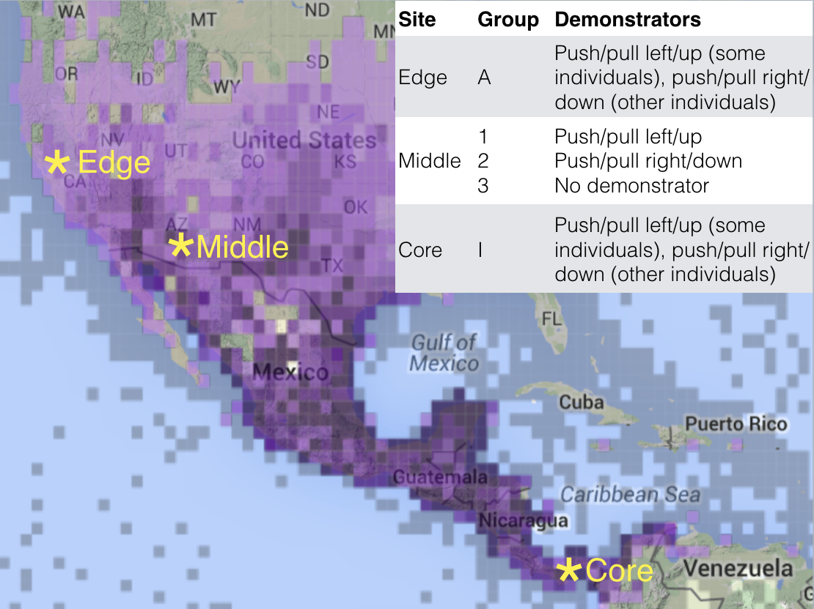

```{r setup, include=FALSE}
knitr::opts_chunk$set(echo = TRUE)
```

```{r}
#Make code wrap text so it doesn't go off the page when Knitting to PDF
library(knitr)
opts_chunk$set(tidy.opts=list(width.cutoff=60),tidy=TRUE)
```


**Cite as:** McCune KB, McElreath R, Logan CJ. 2019 Investigating the use of learning mechanisms in a species that is rapidly expanding its geographic range. (version: [11 Oct 2019](https://github.com/corinalogan/grackles/blob/master/Files/Preregistrations/g_sociallearning.Rmd)) In principle recommendation by PCI Ecology.

  

**This preregistration has been pre-study peer reviewed and received an In Principle Recommendation by:**

Aliza le Roux (2019 In Principle Acceptance) How would variation in environmental predictability affect the use of different learning mechanisms in a social bird? *Peer Community in Ecology*, 100032. [10.24072/pci.ecology.100032](https://doi.org/10.24072/pci.ecology.100032)

 - Reviewers: Matthew Petelle and one anonymous reviewer


###ABSTRACT

This is one of many studies planned for our long-term research on the role of behavior and learning in rapid geographic range expansions. **Project background:** Behavioral flexibility, the ability to change behavior when circumstances change based on learning from previous experience [@mikhalevich_is_2017], is thought to play an important role in a species' ability to successfully adapt to new environments and expand its geographic range (e.g., [@lefebvre1997feeding], [@griffin2014innovation], [@chow2016practice], [@sol2000behavioural], [@sol2002behavioural], [@sol2005big]). However, behavioral flexibility is rarely directly tested at the individual level, thus limiting our ability to determine how it relates to other traits, which limits the power of predictions about a species' ability to adapt behavior to new environments. We use great-tailed grackles (a bird species) as a model to investigate this question because they have rapidly expanded their range into North America over the past 140 years ([@wehtje2003range], [@peer2011invasion]) (see an overview of the [5-year project timeline](https://github.com/corinalogan/grackles/blob/master/README.md)). Behavioral flexibility was likely necessary for this species to adapt to new environments during the range expansion. For example, as a tropical species, great-tailed grackles were likely only able to expand through, and persist in, the desert of the southwest United States after humans modified the landscape by building canals and other methods of irrigation (@wehtje2003range). Although grackles continue to be associated with similarly urban habitats across the range and use human-provided sources of food, one challenge grackles may have to overcome in these new environments is gaining the ability to recognize and exploit the new stimuli that indicate natural sources of food and water. Similarly, grackles may only be able to survive the harsh winters in the most northern parts of the current range, when invertebrate prey are more scarce, because large sources of grain from cattle feedlots have become more common (@wehtje2003range). **This investigation**: The ability to learn individually, or from others, could allow grackles to flexibly change their behavior in response to changing environmental conditions. In this piece of the long-term project, we aim to determine what learning mechanisms grackles use (i.e., stimulus or local enhancement, imitation/emulation, personal information) when learning to solve novel foraging problems. We will use two puzzle box apparatuses that contain food accessible via diverse opening methods. Wild grackles will first be habituated to eating from or off of the non-functional apparatus so that differences in neophobia will not confound performance. We will test grackles from a population in the middle of the expanded geographic range to determine whether this species uses social learning. If so, we will then compare performance across three populations (core, middle of the expansion, and at the northern range edge). Results will indicate how social learning might play a role in the geographic range expansion by elucidating how this species solves novel foraging problems in the wild.  

###A. STATE OF THE DATA
This preregistration was written (2017) and submitted to Peer Community in Ecology for pre-study peer review (Jul 2019) prior to collecting any data. 

###B. HYPOTHESES

#### H1: Information about resources is obtained via individual learning and also transmitted socially in the wild.

Prediction 1: Stimulus enhancement will draw attention to WHAT locus on the apparatus to attend to, and then subjects will rely on personal information to learn HOW to solve that locus. This was found for a similar study on New Caledonian crows (@logan2016new). We predict that the grackles will behave in the same way because grackles likely need to pay attention to what resources others are accessing, but the exact details of how to access these resources may not be as important because it is likely that most resources are not very complicated to access (e.g., open a sandwich wrapper to eat the sandwich)

P1 alternative 1: Grackles might rely on local enhancement to attend to a particular area and then rely on personal information to explore the area and learn how to solve a particular locus. Grackles may pay more attention to other grackles when determing whether to visit a location to search for food rather than to what specific food might be present in that location.

P1 alternative 2: Individuals may copy (copy partially suggests emulation, or copy completely suggests imitation) the sequence of actions they observed others using to solve a particular locus. This may be a particularly useful mechanism when trying to open complicated packaging (e.g., a plastic ketchup packet). Complicated packaging is likely not as frequently encountered in the wild because easier to access food such as insects might be more abundant.

P1 alternative 3: Individuals do not use social information, but rely solely on personal information when solving novel apparatus loci. This species does not form strong bonds with each other (relative to, for example, monogamous corvids), therefore perhaps social information is not as important to them when solving new problems.

P2: Dominant individuals will solve faster because they can exclude subordinates from accessing the resource. This might also make it appear that males are faster at solving than females because males are reported as being more dominant than females.

P2 alternative 1: Subordinate individuals are more likely to solve the puzzle box faster because they are excluded by dominant individuals from other, easier to access food sources or dominants are able to scrounge from subordinates after they access the food compartments (@mccormack2007producer).

P3: Older individuals may be better at outcompeting others potentially because they have more experience at solving problems in general. We will be able to test this prediction when comparing juveniles (<1yr) and adults (>1yr), but we will not know the age of the adults unless they were banded as juveniles and became adults by the time the testing occurred. Therefore we will have a limited ability to test this prediction. 

P4: It does not require many observations of others attempting to solve or solving at a particular locus to influence which loci observers attempt first. This was found for a similar study on New Caledonian crows (@logan2016new). We predict that it will be the same for the grackles because grackles likely need to attend to fleeting observations of others as they figure out how to find food in their shared environment. Therefore, there is pressure to attend to any available information.

#### H2: Performance on the learning task will vary among grackles in the different populations included in this investigation (core: Panama, population established hundreds of thousands of years ago, average number of generations: extremely large; middle of the expansion: Tempe, Arizona, population established in 1936 (@wehtje2003range), average number of generations: 15 (generation length=5.6 years (@GTGRbirdlife2018)); and at the range edge: Woodland, California, population established in 2000 (@pandolfino_deuel_young), average number of generations: 3). We will quantify environmental differences among populations using the results from a separate preregistration on [foraging behavior](http://corinalogan.com/Preregistrations/g_flexforaging.html) where we examine the proportion of human food eaten, the distance between where grackles forage and the nearest outdoor human food area, the number of outdoor food areas within a home range, and human population density per square mile. The results will allow us to qualitatively describe how differences in the use of learning mechanisms across populations may relate to environmental differences or differences in how grackles use their environments.

P5: Individuals from the population on the edge of the grackle range will solve more options faster and rely more on social learning than grackles from the middle of the expanded range and the original core of the range. This may occur because social information is particularly useful to individuals in new areas (e.g., the social learning strategy of "copy when uncertain" [@laland2004social]).

Predictions about how the edge population might differ from the other populations environmentally:
 - Higher reliance on human modifications (eat more human food / more human food areas in home range / higher human population density) potentially because grackles in the edge environment rely more on human foods as a more readily available source of food while they learn about where to find and how to track natural food sources in the new area.
 - Lower reliance on human modifications (eat less human foods / fewer human food areas in home range / lower human population density) potentially because human foods are not as available as natural foods, or the grackles have not yet learned where these resources are.
 - If no environmental differences are found across the populations, this could indicate that all three populations have a mixture of human and natural foods and both food types are accessed. Social learning might be useful in the new area (edge population) simply because the grackles are learning the daily/yearly food resource patterns and learning to exploit them.

P5 alternative 1: Individuals from the population in the core of the grackle range will solve more options faster and rely more on social information than grackles from the middle and the edge of the expanded range. This may occur because the lack of novelty in the endemic range may result in grackles predominantly using individual learning (i.e., producers) which leads to the production of reliable public social information. When social information is consistently high quality, individuals may be selected to preferentially use available social information to navigate unusual novel situations (e.g. social learning strategy of "copy if rare" @laland2004social).

Predictions about how the core population might differ from the other populations environmentally:
 - Higher reliance on human modifications potentially because the population in the core environment is well established (has lived there for many years) and has already learned where the food sources are (human-sourced and natural). When something new appears in the environment, social learning can be used to learn about it more quickly.
 - Lower reliance on human modifications potentially because natural foods are more abundant and/or easier to access.
 - If no environmental differences are found across the populations, this could indicate that new options are not often encountered, therefore individual learning is relied on until a rare new resource arises and they engage in social learning to learn about it more quickly.

P5 alternative 2: Individuals from the the middle of the expanded range will solve more options faster and rely more on social information than grackles from the population on the edge of the grackle range, and the original core of the range. This is potentially because population densities might be higher in the middle of the expanded range, therefore there might be more within-species competition for resources such that grackles may be selected to pay increased attention to conspecifics.

Predictions about how the middle population might differ from the other populations environmentally are the same as for P5 alternative 1.

P5 alternative 3: There will be no difference in the number of options solved, the speed at which they switch between solving options, and the reliance on personal versus social information on the learning task across grackle populations. This is potentially because grackles in each population are equally social and generalist foragers ([@giraldeau1996social]), measured in a separate [preregistration](http://corinalogan.com/Preregistrations/g_flexforaging.html) and rely on a mixture of personal and social information.

Predictions about why the learning mechanisms are the same across populations if the environments differ or if the environments are similar:
 - Higher or lower reliance on human modifications potentially because grackles rely on the same learning mechanisms regardless of the environment they are in. They might have a general pattern for learning about resources, regardless of whether the resources come from human or natural sources.
 - If no environmental differences are found across the populations, we give the same explanation as in P5 alternative 1.

#### H3: Repeated assessments of learning mechanisms with two similar apparatuses will illuminate whether performance is consistent within individuals.

P6: Grackles will show repeatable performance on the learning task over sequential trials with two functionally similar but visually distinct apparatuses (@logan2016new, @mccune_2018). This would indicate that behavioral interactions with the task result from inherent learning abilities.

P6 alternative 1: Grackles will not show repeatable learning performance on the two apparatuses. This could happen for several reasons. First, it may indicate that the two apparatuses may vary in difficulty and so performance on one is not predictive of performance on the other. Second, the distinct visual appearance of the two apparatuses could differentially stimulate behavioral responses that lead to variation in performance (i.e., one apparatus has clear plastic doors therefore the food is visible, while the food is not visible in the other apparatus). Third, grackles may learn to solve the second learning apparatus more quickly after having already learned to solve the first apparatus.



###C. METHODS

####**Planned Sample**

Great-tailed grackles are caught in the wild in Tempe, Arizona USA and at two additional field sites in future years (core and edge populations) for individual identification (colored leg bands in unique combinations) until as much of the population is banded as possible (62 have been marked in Tempe as of 17 Sept 2019). Great-tailed grackles are a highly social species that roosts together at night and forages in groups during the day during the non-breeding season, while during the breeding season one or more males defend a territory with multiple nests built by females who care for young (@johnson2001great). Based on our current trapping efforts in Arizona, many grackles have overlapping home ranges and when a large, temporary source of food is available, grackles will gather in groups of 3 - 15 birds. Additionally, there is some site-fidelity where the same individuals can be reliably found in the area close to where they were caught.

Some individuals (~6-16) will be brought temporarily into aviaries where they will be trained on a particular locus of the apparatus. After a maximum of 6 months, these individuals will be released back to the wild to serve as demonstrators for the experiment, which will occur in the wild (in the same way as @logan2016new, except in the wild). We will attempt to train grackles in the aviaries on one solving method per bird, per apparatus, for the two visually distinct but functionally similar apparatuses (@logan2016new, @mccune_2018). However, if the solving methods on one apparatus are too difficult for the aviary grackles to learn quickly, then we will only use the easier apparatus for the experiment in the wild and we will not test H3. 

We will conduct the social learning experiments in an area where the home ranges of many color-marked grackles overlaps. We will encourage continued attendance to this area by pre-baiting it every day for several weeks. Based on previous trapping efforts, and experiments described elsewhere (i.e. http://corinalogan.com/Preregistrations/g_exploration.html), we believe we will have learning mechanism group sizes of approximately 8 color-marked grackles.

####**Task design**

We will use two functionally similar, but visually distinct apparatuses (Fig. 1) to test social learning in this species. The first apparatus is a log that has 4 compartments (loci) covered by transparent doors that open in different ways (@mccune_2018). The top door opens up like a hatch, the left side door opens out like a car door, the front door pulls out like a drawer, and the right side door pushes in. Three of the 4 doors also have locks to increase the difficulty of the task. The lock on top is a stick that can be pushed or pulled to unblock the door, the lock on the left side is a stick that swivels up or down over the door, and the lock on the front is a hook-and-eye style lock that attaches to the handle to hold the drawer in place.

The second apparatus has three loci for accessing food (@logan2016new). One locus had two methods for accessing the same food compartment, giving a total of four different options for solving the task (Fig. 1). The food in the compartment at locus 1 can be accessed by pushing a swiveling door from the left to the right and putting the bill in the food compartment (‘Vflap’ option) or by pushing the same swiveling door from the right to the left and poking the bill through a piece of rubber to access the same food compartment (‘Vrubber’ option). At locus 2, food can be obtained by lifting up a wooden flap (‘Hflap’ option) to expose the compartment. At locus 3, food is obtained by inserting the bill through a hole in the side of the apparatus (‘Hside’ option) that accessed the same food compartment as Hflap.

Each group will have at least one demonstrator trained to open a locus on one of the two apparatuses. This experiment involves an open-diffusion design with wild birds, so any individual that interacts with a solving option will automatically become a demonstrator. Our open-diffusion analysis accounts for this by examining not only who solved (or attempted to solve) which option, but also who was watching them solve or attempt to solve, and then measures the change in behavior of the observer.

All trials will be video recorded from multiple angles or by using a camera with a fisheye lens to ensure that we can see all loci on both apparatuses and identify all of the observers. All data will be collected from scoring the videos.

####**Data collection stopping rule**
	
Each group will be given time to habituate to non-functional apparatuses prior to starting social learning trials.  We will put out the apparatuses with food on and around them until the majority of grackles are eating comfortably. Each locus on the apparatuses will be disabled during this habituation period so that grackles cannot learn solving methods.  During social learning trials, we will conduct a maximum of eight sessions of up to 45 minutes per apparatus type per group. A group is defined as having the same trained demonstrator(s) in the presence of many of the same conspecifics across the sessions. For the control group (with no trained demonstrator), the group must have many of the same individuals as in the first session. We will stop this experiment after each group has completed 8 sessions per apparatus or when we must move to the next field site (summer 2020), whichever comes first. At that point, we will analyze the Arizona (middle field site) data to determine whether social learning occured. If not, we will not conduct this test in the other populations. If so, we will conduct this test in the other two populations (core and edge) over the course of one year at each site.

####**Open data**

When the study is complete, the data will be published in the Knowledge Network for Biocomplexity's data repository.

####**Randomization and counterbalancing** 

In the population in the middle of the expanded range, we will attempt to counterbalance demonstrators among the three groups such that each group will observe a demonstrator that was trained in a distinct solving method, and observers in each group will not be exposed to other demonstrators using different opening methods. If we are able to train demonstrators on solving methods for both of the apparatuses, then we will counterbalance which group sees which apparatus type first (counterbalanced order determined at random.org where P=plank apparatus from @logan2016new and L=log apparatus from @mccune_2018. Edge: plank then log; middle: group 1=plank then log, group 2=plank then log, group 3=log then plank; core: log then plank). We will train half of the demonstrators in the core and edge populations (one group per population) on one solving method and the other half of the demonstrators on the other method for each of the two apparatus types. 

####**Blinding of conditions during analysis**

No blinding is involved in this study.

####**Dependent variables**

1) Latency to attempt to solve a particular locus

2) Latency to solve (obtain the food) a particular locus

####**Independent variables**

####*P1-P5*

1) Locus on the apparatus (plank: horizontal side, horizontal flap, vertical flap, or vertical rubber; log: doors A-D)

2) ID

3) Group ID

4) The number of times the naive focal individual observed conspecifics attempting/solving at a particular locus before the focal individual's first interaction at that locus

5) Binary variable indicating whether the focal individual saw another individual succeed (obtain food) or just attempt (did not obtain food) a particular locus before the focal individual's first interaction at that locus

6) The number of successes a focal individual had at other loci before attempting a novel locus (asocial learning)

7) Which apparatus (left or right) was observed or interacted with

8) Sex

9) Age

10) Dominance rank

11) Population (core, middle, edge)

12) Random effect: ID (to allow for multiple events from the same individual)

NOTE: we will run one model per dependent variable per apparatus type (plank or log).

####*P6*

1) Apparatus

2) Sex

3) Age

4) Dominance rank

5) Population (core, middle, edge)

6) Random effect: ID (to partition within individual and between individual variance in performance to calculate an intraclass correlation coefficient [ICC])

###D. ANALYSIS PLAN

We do not plan to **exclude** any data. When **missing data** occur, the existing data for that individual will be included in the analyses for the sessions they participated in. Analyses will be conducted in R (current version `r getRversion()`; @rcoreteam). When there is more than one experimenter collecting data, experimenter will be added as a random effect to account for potential differences between experimenters in conducting the sessions.

####*Data checking*

The data will be checked for overdispersion, underdispersion, zero-inflation, and heteroscedasticity with the DHARMa R package [@Hartig2019dharma] following methods by [Hartig](https://cran.r-project.org/web/packages/DHARMa/vignettes/DHARMa.html). Additionally, prior to survival analysis we will verify that independent variables to not violate the assumption of proportional hazards [@machin2006survival]. 

####*P1-P5: Learning mechanisms and population differences*

The analysis will be conducted as in @logan2016new with a survival analysis (Cox proportional hazards model), using ID as a random effect, that is sensitive to the order and latency of events at each locus. We will model the rate at which individual *i* in group *j* first attempted method *l* at locus *k* as a function of predictor variables (e.g., age, sex, rank). This method accounts for previous attempts by the subject as well as observations of others attempting and solving the loci.

```{r mod, eval=FALSE, warning=FALSE, results='asis', echo=TRUE, include=TRUE}
data1 <- read.csv ("/Users/corina/GTGR/data/data_reverse.csv", header=T, sep=",", stringsAsFactors=F) 

# DATA CHECKING
library(DHARMa)
library(lme4)

#Latency to solve
simulationOutput <- simulateResiduals(fittedModel = MCMCglmm(latencysolve ~ Locus + Group ID + StartTime + ObservedAnother + Apparatus + Sex + Age + Rank + Population + (1|ID), family=poisson, data=data1), n=250) #250 simulations, but if want higher precision change n>1000
simulationOutput$scaledResiduals #Expect a flat distribution of the overall residuals, and uniformity in y direction if plotted against any predictor
testDispersion(simulationOutput) #if under- or over-dispersed, then p-value<0.05, but then check the dispersion parameter and try to determine what in the model could be the cause and address it there, also check for zero inflation
testZeroInflation(simulationOutput) #compare expected vs observed zeros, not zero-inflated if p<0.05
testUniformity(simulationOutput) #check for heteroscedasticity ("a systematic dependency of the dispersion / variance on another variable in the model" Hartig, https://cran.r-project.org/web/packages/DHARMa/vignettes/DHARMa.html), which is indicated if dots aren't on the red line and p<0.05. Also...
plot(simulationOutput) #...there should be no pattern in the data points in the right panel
plotResiduals(ReverseNumber, simulationOutput$scaledResiduals) #plot the residuals against other predictors (in cases when there is more than 1 fixed effect) - can't get this code to work yet

#Latency to attempt to solve
simulationOutput <- simulateResiduals(fittedModel = MCMCglmm(latencyattempt ~ Locus + Group ID + StartTime + ObservedAnother + Apparatus + Sex + Age + Rank + Population + (1|ID), family=poisson, data=data1), n=250) #250 simulations, but if want higher precision change n>1000
simulationOutput$scaledResiduals #Expect a flat distribution of the overall residuals, and uniformity in y direction if plotted against any predictor
testDispersion(simulationOutput) #if under- or over-dispersed, then p-value<0.05, but then check the dispersion parameter and try to determine what in the model could be the cause and address it there, also check for zero inflation
testZeroInflation(simulationOutput) #compare expected vs observed zeros, not zero-inflated if p<0.05
testUniformity(simulationOutput) #check for heteroscedasticity ("a systematic dependency of the dispersion / variance on another variable in the model" Hartig, https://cran.r-project.org/web/packages/DHARMa/vignettes/DHARMa.html), which is indicated if dots aren't on the red line and p<0.05. Also...
plot(simulationOutput) #...there should be no pattern in the data points in the right panel
plotResiduals(ReverseNumber, simulationOutput$scaledResiduals) #plot the residuals against other predictors (in cases when there is more than 1 fixed effect) - can't get this code to work yet

```

####*P4: How many observations?*

The analysis will be conducted as in @barrett2017pay using multilevel experience-weighted attraction models that can determine how individuals accumulate experience and the probability of an option being chosen. We will also use this analysis to investigate P1-P5.

####*P6: Repeatability of performance?*

We will only conduct this analysis if we are able to train demonstrator grackles in aviaries on solving methods for both apparatuses. If so, wild grackle groups will receive sequential trials with first one apparatus, then the second apparatus, and we will be able to run the analysis on repeatability of performance.

```{r repeatability, eval=FALSE, warning=FALSE, results='asis', echo=TRUE, include=TRUE}
data1 <- read.csv ("/Users/corina/GTGR/data/data_reverse.csv", header=T, sep=",", stringsAsFactors=F) 

# REPEATABILITY GLMM
library(MCMCglmm)
prior = list(R = list(R1 = list(V = 1, nu = 0)), G = list(G1 = list(V = 1, 
    nu = 0)))
learn.rpt <- MCMCglmm(latencyattempt ~ Apparatus + Sex + Age + Rank + Population, random = ~ID, family = "poisson", 
    data = data1, verbose = F, prior = prior, nitt = 13000, thin = 10, 
    burnin = 3000)
summary(learn.rpt)
# autocorr(learn.rpt$Sol) #Did fixed effects converge?
# autocorr(learn.rpt$VCV) #Did random effects converge?

# In MCMCglmm, the latent scale adjusted repeatability and
# its credible interval can simply be obtained by:

rpt <- learn.rpt$VCV[, "ID"]/(learn.rpt$VCV[, "ID"] + learn.rpt$VCV[, "units"])  #latent scale adjusted repeatability and its credible interval
mean(rpt)
var(rpt)
posterior.mode(rpt)
HPDinterval(rpt, 0.95)

# Repeatability on the data/observed scale (accounting for
# fixed effects) code from Supplementary Material S2 from
# Villemereuil et al. 2018 J Evol Biol
vf <- sapply(1:nrow(learn.rpt[["Sol"]]), function(i) {
    var(predict(learn.rpt, it = i))
})  #estimates for each iteration of the MCMC

repeataF <- (vf + learn.rpt$VCV[, "ID"])/(vf + learn.rpt$VCV[, "ID"] + 
    learn.rpt$VCV[, "units"])  #latent scale adjusted + data scale
posterior.mode(repeataF)
HPDinterval(repeataF, 0.95)

# Now compare with the raw repeatability: null model
learn.raw <- MCMCglmm(latencyattempt ~ 1, random = ~ID, family = "poisson", 
    data = data1, verbose = F, prior = prior, nitt = 13000, thin = 10, 
    burnin = 3000)
summary(learn.raw)

repeataraw <- learn.raw$VCV[, "ID"]/(learn.raw$VCV[, "ID"] + learn.raw$VCV[, 
    "units"])  #latent scale adjusted repeatability and its credible interval
posterior.mode(repeataraw)
HPDinterval(repeataraw, 0.95)
```

###E. ETHICS

This research is carried out in accordance with permits from the:

1) US Fish and Wildlife Service (scientific collecting permit number MB76700A-0,1,2)
2) US Geological Survey Bird Banding Laboratory (federal bird banding permit number 23872)
3) Arizona Game and Fish Department (scientific collecting license number SP594338 [2017], SP606267 [2018], and SP639866 [2019])
4) Institutional Animal Care and Use Committee at Arizona State University (protocol number 17-1594R)

###F. AUTHOR CONTRIBUTIONS

**McCune:** Hypothesis development, experimental design, materials, data collection, data analysis and interpretation, write up, editing/revising.

**McElreath:** Analysis design, data analysis and interpretation, editing/revising, funding.

**Logan:** Hypothesis development, experimental design, materials, data collection, data analysis and interpretation, write up.

###G. FUNDING

This research is funded by the Department of Human Behavior, Ecology and Culture at the Max Planck Institute for Evolutionary Anthropology.

###H. CONFLICT OF INTEREST DISCLOSURE

We, the authors, declare that we have no financial conflicts of interest with the content of this article. Corina Logan is a Recommender and on the Managing Board at PCI Ecology.

###I. ACKNOWLEDGEMENTS

We thank our PCI Ecology Recommender, Aliza le Roux, and our reviewers, Matthew Petelle and an anonymous reviewer, for their valuable feedback that improved this preregistration; Ben Trumble for providing us with a wet lab at Arizona State University and Angela Bond for lab support; Melissa Wilson Sayres for sponsoring our affiliations at Arizona State University and lending lab equipment; Kevin Langergraber for serving as local PI on the ASU IACUC; Kristine Johnson for technical advice on great-tailed grackles; Arizona State University School of Life Sciences Department Animal Care and Technologies for providing space for our aviaries and for their excellent support of our daily activities; Julia Cissewski for tirelessly solving problems involving financial transactions and contracts; and our research assistants: Aelin Mayer, Nancy Rodriguez, Brianna Thomas, Aldora Messinger, Elysia Mamola, Michael Guillen, Rita Barakat, Adriana Boderash, Olateju Ojekunle, August Sevchik, Justin Huynh, Jennifer Berens, Amanda Overholt, and Michael Pickett.

###J. REFERENCES
