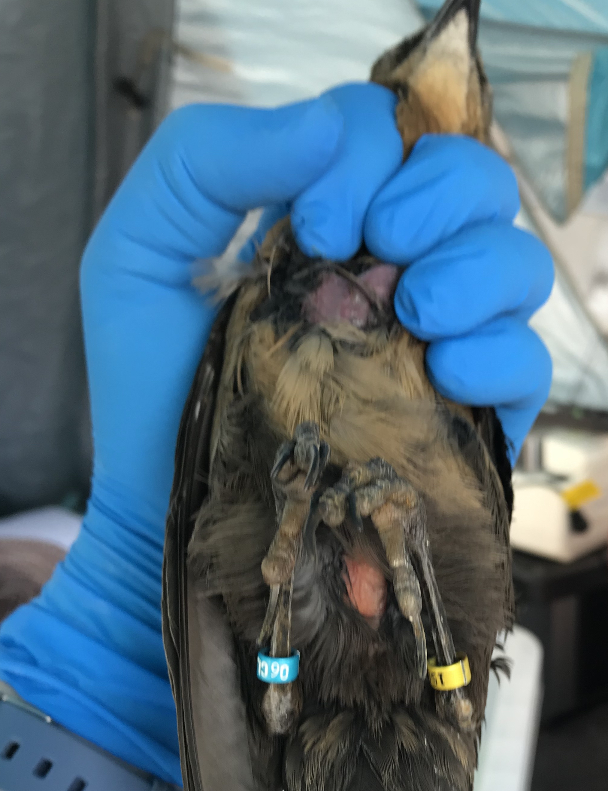

##### Affiliations: 
1) Arizona State University School of Life Sciences
2) Max Planck Institute for Evolutionary Anthropology
3) University of California Santa Barbara

*Corresponding author: KB McCune (kelseybmccune@gmail.com)

```{r setup, include=FALSE}
knitr::opts_chunk$set(echo = TRUE)
```

```{r include=FALSE}
#Make code wrap text so it doesn't go off the page when Knitting to PDF
library(knitr)
opts_chunk$set(tidy.opts=list(width.cutoff=60),tidy=TRUE)
```


**Cite as:** Berens JM, Folsom M, Sevchik A, Bergeron L, Logan CJ, McCune KB. Submitted to PCI Ecology Nov 2020. [Validating morphological condition indices and their relationship with reproductive success in great-tailed grackles](http://corinalogan.com/Preregistrations/gcondition.html).

  

**This preregistration has been pre-study peer reviewed and received an In Principle Acceptance by:**

Marcos Mendez (2019 In Principle Acceptance) Are condition indices positively related to each other and to fitness?: a test with grackles.  *Peer Community in Ecology*, 100035. [10.24072/pci.ecology.100035](https://doi.org/10.24072/pci.ecology.100035)

 - Reviewers: Javier Seoane and Isabel López-Rull

### ABSTRACT
Morphological variation among individuals has the potential to influence multiple life history characteristics such as dispersal, migration, reproductive success, and survival [@wilder2016moving]. Individuals that are in better "condition" can disperse or migrate further or more successfully, have greater reproductive success, and survive longer [@wilder2016moving; @heidinger2010patch; @liao2011fat], particularly in years where environmental conditions are harsh [@milenkaya2015body]. Body condition is defined in various ways, but is most often measured using an individual's energetic or immune state [@milenkaya2015body]. These traits are difficult to measure directly, therefore a variety of morphological proxies to quantify condition are used instead, including fat score [@kaiser1993new], weight, ratio of weight to tarsus length [@labocha2014body], a scaled mass index [@peig2009new], as well as hematological indices for immune system function [@fleskes2017body; @kraft2019developmental]. However, there is mixed support regarding whether these condition indices relate to life history characteristics [@wilder2016moving; @labocha2014body], and whether the relationship is linear [@mcnamara2005theoretical; @milenkaya2015body]. Additionally, although some investigations use multiple morphological proxies for condition [e.g. @warnock1998spring], rarely have there been direct comparisons among proxies to validate that they measure the same trait. In this investigation, we define condition as an energetic state and we attempt to measure it by comparing two indices (fat score and the scaled mass index) to validate whether they measure the same trait and whether they correlate with measures of reproductive success in our study system, the great-tailed grackle (*Quiscalus mexicanus*). We found that the morphological proxies did not correlate with each other, indicating that they do not measure the same trait. Further, neither proxy correlated with reproductive success in males, measured as whether a male held a territory containing nests or not. We found that females with a high scaled mass index had a significantly lower probability that their nest would survive on any given day. However, there was no relationship between female fat score and nest survival. These results indicate that measures of condition should be validated before relying on their use as a condition proxy in grackles and birds in general. Future research should further investigate our unexpected result that higher scaled mass index correlated with lower nest survival to better understand the importance of energetic condition for reproductive success - a necessary component for selection to act.

### INTRODUCTION
Morphological variation among individuals has the potential to influence multiple life history characteristics such as dispersal, migration, reproductive fitness, and survival [@wilder2016moving]. One morphological trait that might be particularly likely to influence these life history characteristics is energetic condition. Individuals that are in better "condition" can disperse or migrate further or more successfully, have greater reproductive success, and survive longer [@wilder2016moving; @heidinger2010patch; @liao2011fat], particularly in years where environmental conditions are harsh [@milenkaya2015body]. For example, a study conducted on vipers showed that while the level of fat reserves in males was not related to their sexual activity, females with low fat reserves engaged in sexual interactions less frequently than those with higher fat reserves [@aubret2002fat]. In contrast, mantids showed conflicting results regarding the relationship between fat reserves and reproductive success [@barry2013macronutrient]. Female mantids were fed either a high protein, low lipid diet, or a high lipid, low protein diet. The females that received the high lipid diet had higher lipid content in most parts of their body compared to that of their high protein diet counterparts. However, they were not able to produce even half as many eggs as the females fed the high protein, low lipid diet. This led to lower male attraction, measured by the number of copulation events, thus negatively impacting further reproductive success. 

A variety of morphological proxies have been used to quantify energetic condition [i.e., fat score, weight, ratio of weight to tarsus length, ratio of weight to wing chord length; @labocha2014body]. However, there is mixed support regarding whether and how these proxies relate to life history characteristics [@wilder2016moving; @labocha2014body]. A review conducted by Barnett (2015) shows that, while mass or body size measures of condition are often assumed to have a positive linear relationship with fitness, this is not always the case, and the relationship should first be empirically validated before being used as a proxy [@barnett2015mass]. In some instances, the condition proxy might relate to life history characteristics, but in an unexpected way. For example, theoretical simulations of small birds show that survival does not increase linearly with energy (i.e., fat) reserves [@mcnamara2005theoretical]. If the reserves are too low, the individual is at risk of starvation. However, once the reserves get too high, the individual is at an increased risk of predation [@mcnamara2005theoretical]. Thus, fat reserves can relate to a life history variable (survival), but in a U-shaped relationship rather than a linear one. 

Although some studies use multiple morphological proxies for condition [e.g., @warnock1998spring], rarely are these variables directly compared. Multiple proxies should correlate with each other if they measure the same trait (energetic condition). Furthermore, there is still confusion about what trait some proxies actually measure. For example, a study conducted on two species of crickets showed that three estimates of body condition based on fat content or on the relationship between body mass and body length (scaled mass index or ordinary least squares regression) did not correlate with each other [@kelly2014evaluating], thus indicating that they do not measure the same trait. This is an example of the jingle fallacy [@block1995contrarian; @carter2013animal], where a single trait label (“condition”) actually encompasses more than one distinct trait. In this case, two investigations using different proxies can be conducted on the same research question, using the same species, but may end up with different results. This is problematic because inconsistency in results among researchers can result in potentially misleading interpretations of the impact of variation in morphology in relation to life history and population variables [@stevenson2006condition].

Here we compare two indices (fat score and the scaled mass index) of an individual’s energetic state to validate whether they correlate with each other, which would indicate that they both measure body condition. Fat score, as described by @kaiser1993new, is a numerical estimate of the amount of fat visible under the skin (Fig. 1). The score ranges from 0 to 8 depending on the size and appearance of the fat located in the individual’s abdomen and interclavicular depression, with 0 indicating no visible fat and 8 indicating extensive fat covering the ventral surface such that no muscle tissue is visible. For example, a score of 1 corresponds to sparse traces of fat visible in the interclavicular depression and abdomen. This measure is frequently used in birds [@erciyas2010body; @merila1997fat; @cornelius2019physiological], and is a straightforward, non-invasive method for estimating condition. However, previous research found that it does not always positively relate with life history variables. For example, @haas1998effects found no difference between fat scores in individuals that had successful or failed nests in American robins and brown thrashers, indicating that fat score may not explain much of the variation in nest success in some species. Further research is needed to understand the relationship between fat score measures and life history characteristics.

In contrast, the scaled mass index (SMI) is more difficult to calculate than the fat score, but it has become the predominant ratio method for quantifying energetic condition within and among populations [@english2018body; @maceda2014scaled; @delciellos2018habitat]. The SMI is an individual’s mass scaled by skeletal body size [@peig2009new]. Unlike the common alternative which uses a simple ratio of tarsus (lower leg) length to body mass, the SMI accounts for the tendency towards allometric scaling where the relationship between body mass and structural size increases by a power law [@huxley1932problems]. When individuals with different structural body sizes can be standardized to the population average structural body size, then energetic condition (the amount of mass not explained by structural body size) can be more directly compared within and across populations. That is, the SMI calculates the energetic condition as the mass of an individual relative to the population by first computing the mass that the individual would have at the population average of a specific body measurement (e.g., tarsus length). Next, structural body size of the individual is standardized by scaling the individual’s structural body length by the population average of that body measurement, which accounts for population differences. The SMI is calculated as: $Mass_i\left[ \frac{AvgLength_p}{Length_i} \right]^{slope_p}$ where $Mass_i$ is each individual’s weight in grams, $Length_i$ is the value of the chosen measure of structural body length for each bird, $AvgLength_p$ is the average structural body length in the population, and $slope_p$ is calculated from the standard major axis regression (which is used to compare variables that were both directly measured and thus have residual error) of a structural body size measure, like tarsus length, on mass [@peig2009new], and is interpreted as the expected change in structural length for a one unit increase in mass. Therefore, individuals in better energetic condition (larger weight for their structural body size) will have a higher SMI compared to individuals in poor condition. Studies across taxa found that the SMI relates positively to reproductive success and survival. For example, mallards with a lower SMI had lower rates of survival compared to their higher SMI counterparts [@champagnon2012low], while in crimson finches SMI was positively related to the number of young that survived to independence [@milenkaya2015body]. 

Our research will determine whether these two indices of energetic condition measure the same trait, and whether this trait relates to an important life history characteristic: reproductive success. Measuring reproductive success in birds involves finding and monitoring nests [@mayfield1961nesting]. However, nests are usually built in cryptic locations and parents behave secretly [@gill1995ornithology], thus making it difficult to quantify the number of eggs and nestlings inside the nest over time. Additionally, it is difficult and time-consuming to track the survival of offspring once they leave the nest. Therefore, we will use the predominant method in this field for quantifying reproductive success: whether a nest fledged offspring [@mayfield1961nesting]. 

Our study system is a population of great-tailed grackles (*Quiscalus mexicanus*), hereafter “grackles”, in Tempe, Arizona. This system is ideal for this investigation because grackles are native to the tropical climates of Central America [@johnson2001great], but have rapidly expanded their geographic range into new areas [@wehtje2003range]. Because grackles are a water-associated species, the desert habitat of Tempe presents physiological challenges that could lead to an increased likelihood of a tradeoff between survival and reproductive attempts [@henderson2017glucocorticoids]. Deserts are characterized by a scarcity of water and extreme temperature fluctuations, which require behavioral and physiological adaptations [@costa2012behavioural]. Wide variation in body condition and reproductive success is possible if grackle physiology requires more water than is present in the environment, and some individuals may cope with physiological stress, or find hidden sources of water, better than others [@henderson2017glucocorticoids].  

{width=25%} {width=25%}

Figure 1: A male grackle showing the yellow/orange tint of fat under the skin in the intraclavicular depression (left); and a female grackle showing *no* fat under the skin of the intraclavicular region, but significant fat deposits under the skin of the abdomen (right).


### HYPOTHESES
We measured two proxies of body condition and observed reproductive success in grackles to test two hypotheses:

**H1 - There is a relationship between two different morphological indices of condition: fat score and the scaled mass index.**

**Prediction 1:**  Fat score and the scaled mass index will be positively correlated. This would indicate that these two indices measure the same trait, and it is likely they both are proxies for fat content.

**Prediction 1 alternative 1:** There is a negative correlation between fat score and the scaled mass index. This would indicate that there may be a tradeoff between the two indices where a larger value of the scaled mass index may measure muscle content rather than fat, and individuals with more muscle have less visible fat.

**Prediction 1 alternative 2:** There is no correlation between fat score and the scaled mass index. This indicates that these two variables do not measure the same trait. Fat score may not adequately capture a bird’s condition because birds may be selected to only store the minimal fat necessary to prevent starvation, while also minimizing the weight gain that would make them easier targets for predators [@barnett2015mass]. Similarly, the scaled mass index could be heavily influenced by body size, therefore reflecting structural size rather than fat storage [@labocha2012morphometric].

**H2 - Condition (as measured by fat score and the scaled mass index) relates to reproductive success (measured as a binary variable of whether a female had one or more fledglings (1) or not (0), and whether a male defended a territory containing nests (1) or not (0)).**

**Prediction 2:** Morphological indices of condition (fat score and the scaled mass index) will correlate positively with reproductive success. This would indicate that individuals with more fat, and therefore higher energy reserves, are better able to acquire the resources necessary for reproduction.

**Prediction 2 alternative 1:** Morphological indices of condition (fat score and the scaled mass index) will correlate negatively with reproductive success. This indicates that individuals may make trade offs, with some acquiring more food and increasing their energy reserves, and others prioritizing reproductive activities over increasing energy reserves.

**Prediction 2 alternative 2:** Morphological indices of condition (fat score and the scaled mass index) do not correlate with reproductive success. This indicates that other, potentially non-morphological, individual characteristics relate to reproductive success (i.e., cognition, nest site selection, breeding experience, predator vigilance, etc.).


### ASSOCIATED PREREGISTRATION

This preregistration used secondary data that were collected as part of other ongoing investigations (tarsus length in http://corinalogan.com/Preregistrations/g_flexgenes.html; tarsus length, body weight, number of fledglings, and whether a male holds a territory in http://corinalogan.com/Preregistrations/g_withinpop.html; and tarsus length in http://corinalogan.com/Preregistrations/g_expansion.html). This preregistration, containing the hypotheses, methods, and analysis plan, was written (July 2019) and submitted to Peer Community In Ecology for pre-study peer review (August 2019) before any analyses were conducted. We revised according to reviewer comments and received in principle acceptance by PCI Ecology of the version on 8 Nov 2019. After that, we conducted the analyses in the preregistration. Our final methods, results, and discussion, including all data and code, are listed below.


#### **After pre-study peer review: Deviations from the planned methods**

1) We realized that the sexual dimorphism of male and female body sizes necessitates separate analyses. Therefore, we calculated SMI for males and females separately, and ran separate models for each sex for the repeatibility analysis (P1 and P2).

2) Fat score data were distributed such that the majority of scores were 0, with some 1's and very few higher numbers. This lack of variance in the response variable led to problems when we ran the models: it was difficult to fit models using an ordinal regression. The function "simulateResiduals", which we used to check our data, does not work with data in the ordinal family. Consequently, we modified the model to use a logistic regression where the dependent variable FatScore is categorized as individuals that showed no visible fat (y = 0), or some fat was present (y = 1) where we combined all individuals that had fat score values of 1 or greater. Subsequent data checking indicated that these data were not zero-inflated or overdispersed.


##### P1: correlation between SMI and Fat score
3) Warning messages occurred during the repeatability analysis using the "rptR" package in R [@stoffel2017rptr] indicating that the fit was singular, likely because the variance for the Experimenter random effect in the model for both female and male wing length was 0.001. We thus conducted an unregistered analysis where we confirmed that our repeatability values from the repeatability models were valid, despite the warning, by hand calculating repeatability following @nakagawa2010repeatability. The hand-calculated repeatabilities were nearly identical (female R = 0.5, male R = 0.71) to the output from the rpt function.

4) Despite the data checking which indicated our model was not overdispersed or zero inflated, we could not get the fixed effects or random effect to converge using the Bayesian package in R "MCMCglmm". We found no improvement in model fit by tweaking the priors or iterations/burnin/thin options. Therefore, we fit these models using the function glmer, a frequentist framework.

5) The Season variable only includes 2 males in the breeding season category, thus we do not have a large enough sample to produce reliable estimates. We removed the Season variable from the model for males.

##### P2: body condition and reproductive success
6) Only two females had reproductive success data from more than one year in our study (2019 and 2020). Consequently, there were very few repeated measures in this sample and our random effect of bird ID accounted for zero variance.  This led to a warning that our model fit was singular.  Therefore, we removed the data for these females for 2020 so we could remove ID as a random effect from the model, which resulted in the model running without warnings.  We removed the 2020 data for these females because their condition data was collected in 2019 and these measures were more likely to relate to their 2019 reproductive success data than to their reproductive success in 2020.

7) The fit of the model analyzing the relationship between body condition and male reproductive success (ability to hold a territory containing female nests) was singular. The Year random effect accounted for zero variance in the data, so we removed it. The fit was still singular, but we retained the ID random effect (although it also explained zero variance) to account for repeated measures in this sample.

8) The model fit was again singular in our logistic exposure model because the Year random effect explained zero variance in the data. We removed this random effect from the analysis.


\pagebreak

### RESULTS
**Prediction 1: correlation between SMI and Fat Score**

We were able to calculate SMI for 24 males and 62 females, and fat score values were available for 21 males and 47 females. 

We found that wing length was more tightly correlated with body mass than tarsus length in both sexes, therefore we used wing length in our SMI calculations (female n = 62, r = 0.26, *p* = 0.03; male n = 24, r = 0.35, *p* = 0.08). This allows us to account for as much variation in body mass as possible that is associated with skeletal body size because leftover variation in body mass is more likely to relate to energetic condition. Consequently, we used wing length in our calculation of SMI as: $Mass_i\left[ \frac{AvgWing_p}{AvgWing_i} \right]^{slope_p}$.  $Mass_i$ is each individual’s weight in grams, $AvgWing_i$ is the average value of the measures of the left and right wing lengths of each bird, $AvgWing_p$ is the average wing length in the population, and $slope_p$ is the value of the slope from a standard major axis regression of the population's wing length on the population's mass [@peig2009new].

To validate that we were measuring structural body size consistently across experimenters, we analyzed the repeatability of wing length in the birds in our sample that were measured more than once. We found that average wing length was repeatable (n = 17 females, Repeatability ± standard error = 0.53 ± 0.18; n = 18 males, Repeatability ± SE = 0.75 ± 0.11). Data permutations and a likelihood ratio test both confirmed that these repeatability values were statistically significant at p < 0.01. 

We found that fat score was not correlated with SMI, which indicates that they are not measuring the same trait (female *p* = 0.81; male *p* = 0.50; Table 1).  There was also no relationship between season (breeding or non-breeding) and female fat score (*p* = 0.71). Only 2 males were measured during the breeding season, therefore we omitted season as an independent variable in the male model. 


```{r p1 results, echo=FALSE, message=FALSE, warning=FALSE, paged.print=FALSE, results='asis', hold = TRUE}
d2_f <- read.csv(url("https://raw.githubusercontent.com/corinalogan/grackles/master/Files/Preregistrations/gcondition_p1model_fdata.csv"), header=T, sep=",", stringsAsFactors=F)
d2_m <- read.csv(url("https://raw.githubusercontent.com/corinalogan/grackles/master/Files/Preregistrations/gcondition_p1model_mdata.csv"), header=T, sep=",", stringsAsFactors=F)

d2_f <- data.frame(d2_f)
d2_m <- data.frame(d2_m)

library(lme4)
library(knitr)
library(kableExtra)
library(smatr)
##females
f1 = glmer(Fatbin ~ Body2 + Season + (1|Experimenter), data = d2_f, family = binomial(link = "logit"))
#summary(f1)
##males
m1 = glmer(Fatbin ~ Body2 + (1|Experimenter), data = d2_m, family = binomial(link = "logit"))
#summary(m1)

#p1_f = data.frame("Parameter" = c("Intercept","SMI","Season"),"Females" = c("-0.20 (0.74)","0.07 (0.30)","0.27 (0.71)"), "p-value" = c(0.79,0.81,0.70))
#p1_m = data.frame("Males" = c("-0.82 (0.64)","0.46 (0.62)"), "p-value" = c(0.21,0.46))

p1 = data.frame("Parameter" = c("Intercept","SMI","Season"),"Estimate (SE)" = c("-0.20 (0.74)","0.07 (0.30)","0.27 (0.71)"), 
                "p-value" = c(0.79,0.81,0.70), "Estimate (SE)" = c("-0.82 (0.64)","0.46 (0.62)",NA), "p-value" = c(0.21,0.46,NA))

colnames<- c("Parameter", "Estimate (SE)", "p-value", "Estimate (SE)", "p-value")
kbl(p1, col.names = colnames,align = c("l","c","c","c","c"),caption="Table 1. Results from the logistic mixed-effect regression for females and fixed-effect regression for males to determine whether fat score and scaled mass index (SMI) are correlated. Estimates are presented with the standard error in parentheses. Our sample size was too small to test for a season effect in males.") %>% 
  add_header_above(c(" " = 1, "Females" = 2, "Males" = 2)) %>% 
  kable_styling()

```


**P2: body condition and reproductive success**

Our sample size for P2, where individuals had measures of reproductive success, SMI, and fat scores, was 20 for females and 20 for males.

In some investigations, body condition shows a non-linear relationship with reproductive success [@milenkaya2015body]. To test for this, we calculated the SMI categories using 0.5 standard deviation (sd) increments around the mean to determine whether individuals in some categories were more likely to be reproductively successful. Category 1 includes "low" SMI values that are more than 1 sd less than the mean, category 2 is "moderately low" SMI values and ranges from 0.5 sd to 1 sd less than the mean, category 3 includes "moderate" SMI values between 0.5 less than the mean and 0.5 sd greater than the mean, category 4 includes "moderately high" individual SMI values between 0.5 and 1 sd greater than the mean and category 5 includes "high" SMI values that are more than 1 sd greater than the mean. However, we found no evidence for a non-linear relationship between reproductive success and SMI for males or females (Fig. 2). 

```{r p2 non-linear trend results, echo=FALSE, fig.height=2.5, fig.width=7, message=FALSE, warning=FALSE, paged.print=FALSE, results='asis', hold = TRUE}
h2_f <- read.csv(url("https://raw.githubusercontent.com/corinalogan/grackles/master/Files/Preregistrations/gcondition_p2_fdata.csv"), header=T, sep=",", stringsAsFactors=F)
h2_m <- read.csv(url("https://raw.githubusercontent.com/corinalogan/grackles/master/Files/Preregistrations/gcondition_p2_mdata.csv"), header=T, sep=",", stringsAsFactors=F)

# get proportion successful in each sex to make table
#table(h2_f$SMI_cat, h2_f$Fledglings) 
tmp_f = data.frame("Proportion_successful" = c(0.75,0.2,0.6,0.625,0.25), "SMI_category" = c("1","2", "3","4","5"))
tmp_f$SMI_category = factor(tmp_f$SMI_category, levels = c("1","2", "3","4","5"))

#table(h2_m$SMI_cat, h2_m$Territory)
tmp_m = data.frame("Proportion_successful" = c(0.67,0,0.69,0.67,1), "SMI_category" = c("1","2", "3","4","5"))
tmp_m$SMI_category = factor(tmp_m$SMI_category, levels = c("1","2", "3","4","5"))
tmp_m$n = c(7, 4, 16, 7, 4)
tmp_f$n = c(4, 5, 10, 8, 4)

tmp_m$Sex = "Male"
tmp_f$Sex = "Female"

tmp = rbind(tmp_f, tmp_m)

library(ggplot2)
ggplot(tmp, aes(x=SMI_category, y=Proportion_successful, size=n))+
  facet_wrap(.~Sex) +
  geom_point()+
  theme_bw()+
  theme(panel.grid=element_blank())+
  theme(axis.text.x= element_text(size=12),
        axis.title.x = element_text(size=16),
        strip.text = element_text(size=18)) +
  theme(axis.text.y= element_text(size=12),
        axis.title.y = element_text(size=16)) +
  xlab('SMI category')+
  ylab('Proportion successful')

```

Figure 2: The proportion of individuals that successfully fledged nests (females: left) or held a territory (males: right) in low (1), moderately low (2), moderate (3), moderately high (4) and high (5) scaled mass index (SMI) categories. Dots are sized according to the number (n) of individuals in that category. There is no evidence of a non-linear relationship.  


We used linear models to determine whether season would be important to include in our models testing P2. We found that neither SMI (female *p* = 0.26, male *p* = 0.15) nor fat score (female *p* = 0.68, male *p* = 0.99) differed by season in females or males (Fig. 3). Although we note that, as stated above, we lack sufficient fat score data from males in the breeding season so results from that model should be interpreted with caution. Consequently, we did not include season as an independent variable in the P2 models. 

```{r p2 condition and season, echo=FALSE, fig.height=5, fig.width=8, message=FALSE, warning=FALSE, paged.print=FALSE, results='asis', hold = TRUE}
d <- read.csv(url("https://raw.githubusercontent.com/corinalogan/grackles/master/Files/Preregistrations/gcondition_datacondition.csv"), header=T, sep=",", stringsAsFactors=F)
d <- data.frame(d)

#change column names to match the models we preregistered
colnames(d) = c("Date","Aviary","ID","Sex","FatScore","mass","Ltarsus","Rtarsus","tarsus","Lwing","Rwing","wing","Season","Experimenter")
#remove data from birds we caught as juveniles
d = d[-which(d$ID == "Chilaquile" | d$ID == "Roja" | d$ID == "Becky" | d$ID == "Pepino" | 
               d$ID == "Morada" | d$ID == "Taco" | d$ID == "Pan Dulce"),] 
d_f = d[which(d$Sex == "F"),] #biometrics data
d_f = d_f[-which(d_f$Aviary == "Aviary"),-2] #remove data from birds when released from aviaries
d_f$Fatbin = ifelse(d_f$FatScore > 0, 1, 0)
sma = sma(log(wing) ~ log(mass), data = d_f, method = "SMA") #standard major axis regression
bsma = (as.data.frame(sma$coef))[2,1] #extract slope from sma regression
Lo = mean(d_f$wing) #calculate the population mean wing length
d_f$Body = d_f$mass*(Lo/d_f$wing)^bsma
d_f$Body2 = scale(d_f$Body, center = T, scale = T)

#Males
d_m = d[which(d$Sex == "M"),] #biometrics data
d_m = d_m[-which(d_m$Aviary == "Aviary"),-2] #remove data from birds when released from aviaries
d_m$Fatbin = ifelse(d_m$FatScore > 0, 1, 0)
sma = sma(log(wing) ~ log(mass), data = d_m, method = "SMA") #standard major axis regression
bsma = (as.data.frame(sma$coef))[2,1] #extract slope from sma regression
Lo = mean(d_m$wing) #calculate the population mean wing length
d_m$Body = d_m$mass*(Lo/d_m$wing)^bsma
d_m$Body2 = scale(d_m$Body, center = T, scale = T)

# Females
bs_f <- lm(Body2 ~ Season,  data = d_f)
# SMI does not vary with season
d_f2 = na.omit(d_f)
fs_f <- glm(Fatbin ~ Season, data = d_f2, family = binomial(link = "logit"))
# Fat score does not vary with season


# Males
bs_m <- lm(Body2 ~ Season,  data = d_m[-which(is.na(d_m$Body2)),]) 
# SMI does not vary with season - do NOT need to include Season in H2 analyses
d_m2 = na.omit(d_m)
fs_m <- glm(Fatbin ~ Season, data = d_m2, family = binomial(link = "logit"))
# Just like in H1, not enough Fat score data on males in the breeding season to reliably estimate a relationship. 


par(mfrow = c(1,2))
boxplot(Body2 ~ Season, data = d_f,main = "Females", ylab = "SMI")
boxplot(Body2 ~ Season, data = d_m,main = "Males", ylab = "SMI")
```

Figure 3: Scaled mass index (SMI) was not significantly different between the breeding and non-breeding seasons for either sex.


Because fat score and SMI did not correlate, we included both as independent variables in our models testing prediction 2. We found that neither SMI (*p* = 0.13), nor fat score (*p* = 0.82) was associated with whether a female fledged offspring (Table 2). There was also no evidence of a relationship between the ability of a female to produce fledglings and having previously spent time in the aviaries (*p* = 0.22). For males, the ability to defend a territory was also unrelated to either SMI (*p* = 0.13) or fat score (*p* = 0.76). Additionally, we found that those males who spent more time in the aviaries were less likely to hold a territory compared with males who were never in the aviaries or who spent less time in the aviaries (*p* = 0.02). However, we stress that our sample size was relatively small (20 males), and we did not have a balanced sample because there were no males that did not defend a territory and were never in the aviaries. Additionally, only five males had data from more than one breeding season, which resulted in our model fit being singular because the random effect for bird ID accounted for essentially zero variance. However, we kept ID in the model to account for the repeated samples.  


```{r p2 main results, echo=FALSE, message=FALSE, warning=FALSE, hold=TRUE, paged.print=FALSE, results='asis'}
h2_f <- read.csv(url("https://raw.githubusercontent.com/corinalogan/grackles/master/Files/Preregistrations/gcondition_p2_fdata.csv"), header=T, sep=",", stringsAsFactors=F)
h2_m <- read.csv(url("https://raw.githubusercontent.com/corinalogan/grackles/master/Files/Preregistrations/gcondition_p2_mdata.csv"), header=T, sep=",", stringsAsFactors=F)

h2_f = h2_f[-which(is.na(h2_f$Fledglings)),]
h2_f = h2_f[-which(is.na(h2_f$Fatbin)),]
# 20 Females with RS, fat score and SMI data

m_frs2 = glmer(Fledglings ~ FatScore + Body2 + Aviary + (1|ID), family = binomial(link="logit"), data = h2_f) # Yes, fit is still singular and variance of random effects is close to 0

##  UNREGISTERED ANALYSIS - The variance of the ID random effect is essentially 0, so the model fit is singular.  There are only 2 females with data from 2019 and 2020.  Remove reproductive success data of these females from 2020 because condition data were collected in 2019 so it is more likely to impact their reproductive success that year.
h2_f2 = h2_f[-which(h2_f$ID == "Chalupa" & h2_f$Year == "2020" | h2_f$ID == "Memela" & h2_f$Year == "2020"),]
m_frs3 = glm(Fledglings ~ FatScore + Body2 + Aviary, family = binomial(link="logit"), data = h2_f2)
#summary(m_frs3) #no significant effects

h2_m = h2_m[-which(is.na(h2_m$Territory)),]
h2_m = h2_m[-which(is.na(h2_m$Fatbin)),]
# 20 Males with RS, Fat score and SMI data

## UNREGISTERED ANALYSIS - We could not get the MCMCglmm to fit by tweaking the priors or iterations/burnin/thin options.  We therefore cannot rely on the results from those models and we switched to using a frequentist logistic regression model.
m_mrs2 = glmer(Territory ~ FatScore + Body2 + Aviary + (1|ID), family = binomial(link="logit"), data = h2_m) # fit is still singular. ID random effect accounts for 0 variance - but need to keep because 25% of data are repeated males.
#summary(m_mrs2) ## Is this still okay to present?

p2 = data.frame("Parameter" = c("Intercept","FatScore", "SMI","Aviary"),"Estimate (SE)" = c("-0.02 (0.73)","0.15 (1.02)","-0.92 (0.61)","-1.38 (1.14)"), 
                "p-value" = c(0.98,0.89,0.13,0.23), "Estimate (SE)" = c("3.05 (1.40)","-0.33 (1.10)","1.18 (0.78)","-3.62 (1.56)"), "p-value" = c(0.03,0.77,0.13,0.02))

colnames<- c("Parameter", "Estimate (SE)", "p-value", "Estimate (SE)", "p-value")
kbl(p2, col.names = colnames,align = c("l","c","c","c","c"),caption="Table 2. Results from the logistic regression for females and males to test whether reproductive success relates to condition. Estimates are presented with the standard error in parentheses.") %>% 
  add_header_above(c(" " = 1, "Females" = 2, "Males" = 2)) %>% 
  kable_styling()
```


\pagebreak
**P2: body condition and probability of daily nest survival**

Logistic regression analyses to determine reproductive success from nests discovered in different stages will be  systematically biased [@shaffer2004unified]. Nests discovered at a more progressed stage (i.e., nestling stage compared to building stage) are statistically more likely to succeed and nests with frequent and prolonged adult visits (such as those that occur when nests survive longer) are more likely to be discovered. Therefore, nests that fail early are less likely to be detected [@shaffer2004unified]. Consequently, we analyzed female reproductive success using a logistic exposure model [@bolker2014logistic], which uses survival analysis to determine the factors affecting the probability of daily nest survival, while accounting for incomplete nest observations.  We found that the probability of daily nest survival was significantly negatively related to SMI (*p* = 0.03; Table 3), where, for every unit increase in SMI, the odds of daily nest survival decreased by half. This indicates that a female with a larger SMI (more mass for her structural body size) was less likely to have her nest survive each day (Fig. 4). There was no statistically significant relationship between the probability of daily nest survival and fat score, day of the year, or time spent in the aviaries (Table 3). Although not statistically significant, the effect size for the relationship between fat score and daily nest survival is large (Fig. 4) and potentially biologically meaningful. The odds of a nest surviving on a given day are almost 2.5 times greater for birds with some fat (a score of 1) compared to no fat (a score of 0).


```{r logexp, echo=FALSE, message=FALSE, warning=FALSE, hold=TRUE, paged.print=FALSE, results='asis'}
#Logistic exposure model, where “Exposure” is the number of days between nest checks
#Created by Ben Bolker: https://rpubs.com/bbolker/logregexp

## First run code for the exposure link function
library(MASS)
logexp <- function(exposure = 1) {
  ## hack to help with visualization, post-prediction etc etc
  get_exposure <- function() {
    if (exists("..exposure", env=.GlobalEnv))
      return(get("..exposure", envir=.GlobalEnv))
    exposure
  }
  linkfun <- function(mu) qlogis(mu^(1/get_exposure()))
  ## FIXME: is there some trick we can play here to allow
  ##   evaluation in the context of the 'data' argument?
  linkinv <- function(eta) plogis(eta)^get_exposure()
  logit_mu_eta <- function(eta) {
    ifelse(abs(eta)>30,.Machine$double.eps,
           exp(eta)/(1+exp(eta))^2)
  }
  mu.eta <- function(eta) {       
    get_exposure() * plogis(eta)^(get_exposure()-1) *
      logit_mu_eta(eta)
  }
  valideta <- function(eta) TRUE
  link <- paste("logexp(", deparse(substitute(exposure)), ")",
                sep="")
  structure(list(linkfun = linkfun, linkinv = linkinv,
                 mu.eta = mu.eta, valideta = valideta, 
                 name = link),
            class = "link-glm")
}

d <- read.csv(url("https://raw.githubusercontent.com/corinalogan/grackles/master/Files/Preregistrations/gcondition_p2_logexpdata.csv"), header=T, sep=",", stringsAsFactors=F)
rs3 = na.omit(d) # remove NAs in fat score values

exp3 <- glmer(Fate ~ FatScore + Body2 + DayofYear2 + Aviary + (1|MothersID), #+ (1|Year),
         family=binomial(link=logexp(rs3$Interval)),
         data = rs3)

#summary(exp3)
library(kableExtra)
ple = data.frame("Parameter" = c("Intercept","Fat score", "SMI","Day of year","Aviary"),"Estimate (SE)" = c("1.99 (0.40)","0.91 (0.49)","-0.69 (0.31)","-0.21 (0.15)","-0.47 (0.61)"), "OR (CI)" = c("7.32 (3.3-16.0)","0.50 (0.27-0.92)","2.48 (0.95-6.49)","0.63 (0.19-2.10)","0.81 (0.60-1.10)"), "p-value" = c("<0.001",0.06,"0.03*",0.16,0.44))
colnames<- c("Parameter", "Estimate (SE)", "OR (CI)", "p-value")
kbl(ple, col.names = colnames,align = c("l","c","c","c"),caption="Table 3. Results of the logistic exposure model showing the relationship between the probability of daily nest survival and scaled mass index (SMI), fat score, the amount of time spent in the aviaries, and the day of the year. Odds ratios (OR) are the exponentiated estimates to increase interpretability. SE=Standard Error, CI=95% Confidence Interval") %>% 
  kable_styling()

library(ggplot2)
library(visreg)
library(sjPlot)
library(bayestestR)

set_theme(base = theme_classic())
p = plot_model(exp3, show.values = T, title = "Probability of daily nest survival",axis.title = "Odds ratio",
           axis.labels = c("Aviary","Day of year","SMI","Fat score"),
           dot.size = 3,line.size = 1.5,vline.color = "black")
p + font_size(title =  16, axis_title.x = 14, labels.x = 12, labels.y= 12)
```

Figure 4. Odds ratios for independent variables affecting the probability of a nest surviving a given day.  The dots and corresponding values represent the odds ratio values, and lines represent the confidence intervals around the odds ratio value. The vertical line at x = 1 delineates the odds ratio value for no relationship between the estimates and the probability of daily nest survival. The asterisk indicates an odds ratio value that is statistically significant.


### DISCUSSION

Although it is often implicitly assumed that most condition proxies measure the same trait, we found that two proxies of energetic condition, fat score and SMI, did not correlate with each other in the great-tailed grackle, regardless of whether it was the breeding or non-breeding season. Further, we found that neither fat score nor SMI correlated with a female’s ability to produce fledglings or a male’s ability to hold a territory containing nests. However, we did find that the probability a female’s nest will survive a given day is negatively related to SMI. These results have implications for the interpretation of results that are based on such proxies and for the use of these proxies in future research. 

There are several potential reasons why grackle fat score and SMI did not correlate. First, it is possible that we were unable to accurately measure the amount of fat the birds actually stored. In addition to storing fat under their skin, birds may also store fat intraperitoneally [@musacchia1953study], which would not have been detected with our fat score measure. Second, variation in mass among grackles might have resulted from not only variation in fat content, but also from variation in muscle content [@labocha2012morphometric]. However, measuring muscle content requires destructive methods [i.e. sacrificing the birds; @zhang2015cross], which was beyond the scope of the current research program. Third, it is possible that fat score and SMI did not correlate due to experimenter error in collecting these measurements. We were unable to quantify the repeatability of our measures within and between experimenters because we did not collect repeated measurements on the same grackles when they were in hand (to reduce the amount of processing time a bird experiences). Finally, our sample size might have been too small to detect an effect. However, the effect size for the relationship between fat score and SMI was essentially zero (0.001), therefore it is unlikely that a larger sample size would find a biologically informative relationship between these two proxies.

Although our first analysis of reproductive success, measured as the ability to produce fledglings (females) or to hold a territory containing nests (males), found no correlation with fat score or SMI, when we used logistic exposure models to determine whether female body condition related to the probability of daily nest survival, we found a negative relationship between SMI and the likelihood of daily nest survival. This result was surprising, but could be due to larger females actually carrying proportionally smaller energetic reserves than their smaller female counterparts, as seen in red-winged blackbirds [@langston1990evolution]. In some species, females with smaller body sizes are able to initiate breeding earlier because they can allocate more resources to reproduction compared to larger individuals that have higher bodily energy demands and therefore fewer excess energetic resources [@murphy1986body; @langston1990evolution; @barbraud2000body]. This indirectly affects reproductive success because nesting earlier increases the probability of nesting success and multiple nesting attempts [@perrins1970timing; @johnson2001great]. Yet, we found no relationship between the probability of daily nest survival and day of the year, therefore this is unlikely to explain the negative relationship between SMI and nest survival. Alternatively, it is possible that larger females are unable to build a more concealed nest in the most dense vegetation, or that larger females are more likely to disrupt nest stability. The grackle nests were very high (often >10m above ground) and usually fairly well concealed, so we could not determine the causes of nest failure. Further investigations would be required to determine how body condition relates to specific threats to nesting success. In addition, the parameter estimate for the relationship between fat score and the daily probability of nest survival indicates that females with some visible fat are more than twice as likely to have a nest survive a given day. Because the direction of this effect is opposite to the relationship between SMI and nest survival, this is further evidence that these two proxies represent different traits, and that SMI is likely influenced by muscle mass. 

Measurements of energetic condition are important for understanding variation in life history characteristics in studies across the animal kingdom. However, the results of this study highlight the need to better understand proxy measures of condition, not only in grackles, but for birds in general. Most studies on avian energetic condition only use one proxy for condition, but because energetic condition is difficult to measure directly, it is important to compare multiple proxy variables to ensure each proxy is measuring the intended trait [the jingle-jangle fallacy; @block1995contrarian; @carter2013animal]. Future research could add to this work by incorporating additional methods to measure energetic condition, for example, blood hematocrit levels [@dawson1997avian], protein storage [@houston1995changes], or by studying additional traits that could relate to variation in energy stores, such as dispersal [@ellers1998field] or survival [@liao2011fat]. Furthermore, future research would benefit from using logistic exposure models to examine the relationship between body condition and reproductive success because these models control for the bias that arises when early nest failures are not detected, which is not possible in logistic regression models, and it is more sensitive to changes in a bird's nest status [@shaffer2004unified]. 

\pagebreak
### METHODS

The methods below are based on the preregistration, with small changes as described in the [Deviations from the preregistration](#associated-preregistration) section above.

#### **Planned Sample**

Great-tailed grackles are caught in the wild in Tempe, Arizona using a variety of methods (e.g., walk-in trap, bownet, mist net). After capture we immediately process birds by attaching colored leg bands in unique combinations for individual identification, conducting morphological measurements of weight, tarsus length, flattened wing length, tail length, skull length, bill length and fat score [the amount of visible fat under the skin in the clavicle and abdomen as in @kaiser1993new]. Most grackles are released after completion of color band marking, measurements, and acquiring a blood sample. A subset of grackles are held in aviaries for up to 6 months for behavioral testing, and then released back to the wild at their location of capture.

From March - August, we monitor the behavior of all color-marked grackles to determine their nesting status. We follow females carrying nesting materials to find their nest. We determine whether the male territory owner is color-marked as well. Then we check each nest approximately every day to determine the status based on the female’s behavior (building, incubation, feeding nestlings, feeding fledglings, failed).

Individuals included in this sample will be those for which we have measures of condition when they were adults. We will not include individuals whose data were collected as juveniles. As of 30 July 2019, we have fledgling data for 14 females that exhibited breeding behavior (5 had 1+ fledgling, 9 had no fledglings) and breeding territory status for 10 males (7 territory holders, 3 non-territory holders, 2 not observed so not part of this sample). Therefore, the minimum sample size for H2 will be 24. The minimum sample size for H1 will be 72, because that is how many marked individuals we have biometric data for so far. However, we expect to be able to add to the sample size for both H1 and H2 before the end of this investigation in Tempe, Arizona. *UPDATE Oct 2020: In the second breeding season we had 20 females and 20 males with reproductive success and body condition data.*

#### **Sample size rationale**

We will continue to color mark as many grackles as possible, and collect biometric data and fat scores. Our current sample of reproductive success is small because the grackles in Tempe nest in very tall palms, making it difficult to determine nest status. However, we plan to collect additional reproductive success data during the breeding season in summer 2020. *UPDATE Oct 2020: In the second breeding season we had 20 females and 20 males with reproductive success and body condition data.*

#### **Data collection stopping rule**

We will stop collecting data for this project in early August 2020 when research at the Tempe, Arizona field site will be finished.

#### **Open materials**

Biometric measurement protocol:
https://gitlab.com/corinalogan/the-grackle-project/blob/master/protocolBiometrics.pdf 

Nest check protocol:
https://gitlab.com/corinalogan/the-grackle-project/blob/master/protocolNestCheck.pdf 

#### **Open data**

All data [@berens2020conditiondata] are available at https://knb.ecoinformatics.org/view/doi:10.5063/F1NZ862D and at github (the provided code will load these files directly from github).

#### **Randomization and counterbalancing**

There is no randomization or counterbalancing in this investigation. 

#### **Blinding of conditions during analysis**

No blinding is involved in this investigation.

**Dependent Variables**

**P1: correlation between fat and the scaled mass index**

1) Fat score [the amount of visible fat under the skin in the clavicle and abdomen reported as a score from 0 (no fat) to 8 (fat completely covers muscles and underside of the bird); @kaiser1993new] *UPDATE Oct 2020: Fat score was heavily 0 skewed with few scores greater than one. To increase model fit we used a binomial response variable instead, where 0 is no fat and 1 is some fat observed undert the skin.*

**P2: condition and reproductive success**

1) Female had one or more fledglings (yes, no)

2) Male held a territory consisting of 1 to 3 clumped palms containing nests (yes, no)


**Independent Variables**

**P1: correlation between fat and the scaled mass index**

1) Scaled mass index using measures of body weight and tarsus length or flattened wing length [average of left and right as in @bleeker2005body]. We will choose the measure that is most correlated with body weight [@peig2009new].

2) Season (non-breeding [Sep-Feb], breeding [Mar-Aug]). *UPDATE Oct 2020: The Season variable only includes 2 males in the breeding season category, thus we do not have a large enough sample to produce reliable estimates. We removed the Season variable from the model for males.*

3) Random effect: Experimenter (because several different experimenters measure dependent variables on multiple different birds)

**P2: condition and reproductive success**

1) Fat score 
   - Note 1: if the fat score and the scaled mass index are positively correlated, then we will use only fat score in the model for P2. If they are not positively correlated, then we will add the scaled mass index as an independent variable in the P2 analysis
   - Note 2: if fat score and/or the scaled mass index vary by season (breeding or non-breeding), then we will only use the data from the breeding season to ensure that less time has elapsed between the collection of condition and reproductive success variables

2) Temporarily held in aviaries for behavioral testing at any point during this study, because this may affect breeding behaviors (yes, no)

3) Random effect: Year (to determine whether conditions in a given breeding season similarly affected all grackle behavior and nest success)

4) Random effect: Bird ID (because there may be multiple measures of reproductive success for each bird)

### ANALYSIS PLAN
*UPDATE Oct 2020:*

*1) We realized that the sexual dimorphism of male and female body sizes necessitates separate analyses.  Therefore, we calculated SMI for males and females separately, ran separate models for each sex for the repeatibility analysis, P1 and P2.*

*2) Fat score data were distributed such that the majority of scores were 0, with some 1's and very few higher numbers. This made it difficult to fit models using an ordinal regression.  The function simulateResiduals, which we used to check our data, does not work with data in the ordinal family. Consequently, we used logistic regression where the dependent variable FatScore represents no fat (score = 0), or some fat (score = 1)*

*3) Despite the data checking which indicated our model was not overdispersed or zero inflated, we could not get the fixed effects or random effect to converge using the Bayesian MCMCglmm. We found no improvement in model fit by tweaking the priors or iterations/burnin/thin options. Therefore, we fit these models using the function glmer, a frequentist framework.*

*4) The Season variable only includes 2 males in the breeding season category, thus we do not have a large enough sample to produce reliable estimates. We removed the Season variable from the model for males.*


We will **exclude** data that was collected from the grackles when they were released from the aviaries to avoid any confounds due to their time in the aviary (e.g., perhaps unlimited nutritious food in the aviaries decreased their fat score). However, to validate that our measures of structural body size (tarsus length or wing length) are precise and accurate, we will measure twice a subset of grackles brought into aviaries - once when they are initially caught, and again up to 6 months later when we release them. We will then calculate the repeatability of these multiple measures. All other data  included in this study will come only from wild-caught grackles (including the birds that were brought into the aviaries on their first capture). When **missing data** occur, the existing data for that individual will be included in the analyses for which their data exist. Analyses will be conducted in R [current version `r getRversion()`; @rcoreteam]. 

#### *Ability to detect actual effects*

To begin to understand what kinds of effect sizes we will be able to detect given our sample size limitations, we used G&ast;Power [v.3.1, @faul2007g, @faul2009statistical] to conduct power analyses based on confidence intervals. G&ast;Power uses pre-set drop down menus and we chose the options that were as close to our analysis methods as possible (listed in each analysis below). Note that there were no explicit options for GLMMs, thus the power analyses are only an approximation of the kinds of effect sizes we can detect. We realize that these power analyses are not fully aligned with our study design and that these kinds of analyses are not appropriate for Bayesian statistics (e.g., our MCMCglmm below), however we are unaware of better options at this time. Additionally, it is difficult to run power analyses because it is unclear what kinds of effect sizes we should expect due to the lack of data on this species for these particular research questions.

#### *Data checking*

The data will be checked for overdispersion, underdispersion, zero-inflation, and heteroscedasticity with the DHARMa R package [@Hartig2019dharma] following methods by [Hartig](https://cran.r-project.org/web/packages/DHARMa/vignettes/DHARMa.html). 

*P1 analysis: correlation between fat and the scaled mass index*

We will calculate the scaled mass index as described by @peig2009new using either tarsus or flattened wing length - whichever measure is most correlated with body weight [@peig2009new]. 

We use a Generalized Linear Mixed Model (GLMM; MCMCglmm function, MCMCglmm package; (Hadfield 2010)) with an ordinal distribution (for categorical variables in MCMCglmm) and probit link using 130,000 iterations with a thinning interval of 10, a burnin of 30,000, and minimal priors (V=1, nu=0) [@hadfield2014coursenotes]. We will ensure the GLMM shows acceptable convergence [lag time autocorrelation values <0.01; @hadfield2010mcmc], and adjust parameters if necessary to meet this criterion. We will determine whether an independent variable had an effect or not using the Estimate in the full model.

Where we have multiple measures of tarsus or flattened wing length, we will check that our measurements are repeatable using the rptR package [@stoffel2017rptr].

To roughly estimate our ability to detect actual effects (because these power analyses are designed for frequentist statistics, not Bayesian statistics), we ran a power analysis in G\*Power with the following settings: test family=F tests, statistical test=linear multiple regression: Fixed model (R^2 deviation from zero), type of power analysis=a priori, alpha error probability=0.05. We changed the power and the effect size until we reached an output that we project our sample size will be (n=90). The number of predictor variables was restricted to only the fixed effects because this test was not designed for mixed models. The protocol of the power analysis is here:

*Input:*

Effect size f²                	=	0.15

α err prob                    	=	0.05

Power (1-β err prob)          	=	0.86

Number of predictors          	=	3

*Output:*

Noncentrality parameter λ     	=	13.3500000

Critical F                    	=	2.7119214

Numerator df                  	=	3

Denominator df                	=	85

Total sample size             	=	89

Actual power                  	=	0.8635760

This means that, with a sample size of 89, we would have an 86% chance of detecting a medium effect [approximated at f^2^=0.15 by @cohen1988statistical]. 

*code shown in .rmd*
```{r p1, eval=FALSE, message=FALSE, warning=FALSE, include=FALSE, paged.print=FALSE, results='asis'}

# the "Condition" tab from the Google sheet data_condition
d <- read.csv(url("https://raw.githubusercontent.com/corinalogan/grackles/master/Files/Preregistrations/gcondition_datacondition.csv"), header=T, sep=",", stringsAsFactors=F)
d <- data.frame(d)

# DATA CHECKING
library(DHARMa)
library(lme4)
library(MCMCglmm)
library(smatr)
library(rptR)


#change column names to match the models we preregistered
colnames(d) = c("Date","Aviary","ID","Sex","FatScore","mass","Ltarsus","Rtarsus","tarsus","Lwing","Rwing","wing","Season","Experimenter")

#remove data from birds we caught as juveniles
d = d[-which(d$ID == "Chilaquile" | d$ID == "Roja" | d$ID == "Becky" | d$ID == "Pepino" | 
               d$ID == "Morada" | d$ID == "Taco" | d$ID == "Pan Dulce"),] 
#remove data from birds released from the aviaries
d2 = d[-which(d$Aviary == "Aviary"),]
#remove data from males with no weight values
d2 = d2[-which(d2$ID == "Pico" | d2$ID == "Tomatillo"),]

#factor random effects and round fat score variables listed as x.5
d2$Experimenter <- as.factor(d2$Experimenter)
d2$ID = as.factor(d2$ID)
#factor all categorical variables in the model
d2$Sex = as.factor(d2$Sex)
d2$Season = as.factor(d2$Season)

d2$FatScore = round(d2$FatScore, digits =0)


## UNREGISTERED ANALYSIS - Because SMI includes population mean structural body length need to calculate SMI separately for males and females
d2_f = d2[which(d2$Sex == "F"),]
d2_m = d2[which(d2$Sex == "M"),]

### Determine which measure will go into the calculation of SMI to be the "Body" variable ###
#as the structural body size measure that shows a higher correlation with body mass
cor.test(d2_m$tarsus,d2_m$mass) #r = 0.21
cor.test(d2_m$wing,d2_m$mass) #r = 0.35, p = 0.08 #use for SMI
cor.test(d2_f$tarsus,d2_f$mass) #r = 0.09
cor.test(d2_f$wing,d2_f$mass) #r = 0.26, p = 0.04 #use for SMI
# Wing length more correlated with mass in males and females

### Calculating SMI (scaled mass index) ###
#Males
sma = sma(log(wing) ~ log(mass), data = d2_m, method = "SMA") #standard major axis regression
bsma = (as.data.frame(sma$coef))[2,1] #extract slope from sma regression
Lo = mean(d2_m$wing) #calculate the population mean wing length
d2_m$Body = d2_m$wing*(Lo/d2_m$tarsus)^bsma #equation to calculate SMI from Pieg & Green 2009 for each bird
#Females
sma = sma(log(wing) ~ log(mass), data = d2_f, method = "SMA") #standard major axis regression
bsma = (as.data.frame(sma$coef))[2,1] #extract slope from sma regression
Lo = mean(d2_f$wing) #calculate the population mean wing length
d2_f$Body = d2_f$mass*(Lo/d2_f$wing)^bsma #equation to calculate SMI from Pieg & Green 2009 for each bird

#REPEATABILITY of structural body mass measurements (wing length was most correlated with mass and so used in the calculation of SMI)
# For this, need data set of birds with 2+ structural body measures from Wild & Aviary
tmp = d
tmp$count = 1
tmp = aggregate(count ~ ID, data = tmp, FUN = "sum")
d3 = merge(tmp, d, by = "ID")
d3 = d3[which(d3$count > 1),] # 35 individuals
# separate males and females
d3_m = d3[which(d3$Sex == "M"),]
d3_f = d3[which(d3$Sex == "F"),]

#rpt(log(wing) ~ Sex + (1|ID), grname = "ID", data = d3, datatype = "Gaussian", nboot = 500, npermut = 500) # WARNING - fit is singular 
# R = 0.68, CI: 0.45 - 0.82, p = 0.002

## UNREGISTERED ANALYSIS - because males and females are sexually dimorphic, run separate models.
rpt(log(wing) ~ (1|ID), grname = "ID", data = d3_f, datatype = "Gaussian", ratio = F, nboot = 500, npermut = 500)
# Fit is singular, meaning variance of ID is very close to 0
# R = 0.52, p_LRT = 0.01, p_perm = 0.01
rpt(log(wing) ~ (1|ID), grname = "ID", data = d3_m, datatype = "Gaussian", nboot = 500, npermut = 500)
# Fit is singular, variance of ID is very close to 0
# R = 0.75, p_LRT << 0.01, p_perm = 0.004
?isSingular


## UNREGISTERED ANALYSIS - Because fit was singular in the repeatability analysis (indicating the variance of random effect is very close to zero) we wanted to double check our results by hand calculating repeatability following [@nakagawa2010repeatability]. 
r_wing_m = lmer(log(wing) ~ 1 + (1|ID), data = d3_m)
summary(r_wing_m)
# variance of ID = 0.001
# varance of residual = 0.0005
R = 0.001/(0.001+0.0005)
# R = 0.67

r_wing_f = lmer(log(wing) ~ 1 + (1|ID), data = d3_f)
summary(r_wing_f)
# variance of ID = 0.001
# varance of residual = 0.001
R = 0.001/(0.001+0.001)
# R = 0.5


### H1 - data checking

## MODIFIED ANALYSIS - Fat score data were distributed such that the majority of scores were 0, with some 1's and very few higher numbers. This made it difficult to fit models using ordinal regression.  Furthermore, the function simulateResiduals does not work with data in family "ordinal". Consequently, we used logistic regression where the dependent variable FatScore represents no fat (score = 0), or some fat (score = 1+).
## UNREGISTERED ANALYSIS - As above, need to run all models separately for males and females
d2_m$Fatbin = ifelse(d2_m$FatScore > 0, 1, 0)
d2_f$Fatbin = ifelse(d2_f$FatScore > 0, 1, 0)

#DATA CHECKING for GLMM
#Could only get dharma to run with glm/glmer and not MCMCglmm
#Remove NAs from all variables so glmer will run
#d2_m <- na.omit(d2_m)
#d2_f <- na.omit(d2_f)
d2_m$Body2 = scale(d2_m$Body, center = T, scale = T) #must scale SMI variable to get models to fit
d2_f$Body2 = scale(d2_f$Body, center = T, scale = T) #must scale SMI variable to get models to fit

#Males
simulationOutput_m <- simulateResiduals(fittedModel = glm(as.factor(Fatbin) ~ Body2 + Season, family=binomial(link = "logit"), data=d2_m), n=250) 

plot(simulationOutput_m$scaledResiduals)
#Expect a flat distribution of the overall residuals, and uniformity in y direction if plotted against any predictor
#Distribution is flat and uniform

testDispersion(simulationOutput_m) 
#if under- or over-dispersed, then p-value<0.05, but then check the dispersion parameter and try to determine what in the model could be the cause and address it there, also check for zero inflation
#p=0.82

testZeroInflation(simulationOutput_m) 
#compare expected vs observed zeros
#ratioObsSim = 0.99, p-value = 1 so not significantly zero inflated

testUniformity(simulationOutput_m) 
#check for heteroscedasticity ("a systematic dependency of the dispersion / variance on another variable in the model" Hartig, https://cran.r-project.org/web/packages/DHARMa/vignettes/DHARMa.html), which is indicated if dots aren't on the red line and p<0.05. 
#D = 0.21, p-value = 0.29. # dots are on red line, p value > 0.05 so not heteroscedastic

plot(simulationOutput_m) 
#...there should be no pattern in the data points in the right panel
#there is no pattern

plotResiduals(simulationOutput_m$scaledResiduals, d2_m$Body2) 
#plot the residuals against other predictors (in cases when there is more than 1 fixed effect)

plotResiduals(simulationOutput_m$scaledResiduals, d2_m$Season) 
#plot the residuals against other predictors (in cases when there is more than 1 fixed effect)

#Run zero inflation corrections
par(mfrow = c(1,2))
plot(d2_m$Body2, d2_m$FatScore, xlab = "Body", ylab = "FatScore")
hist(d2_m$FatScore, xlab = "FatScore", main = "")
#It's not zero inflated, there are lots of zeros (the most of these) and 1s

#Females
simulationOutput_f <- simulateResiduals(fittedModel = glmer(Fatbin ~ Body2 + Season + (1|Experimenter), family=binomial(link = "logit"), data=d2_f), n=250)

plot(simulationOutput_f$scaledResiduals)
#Expect a flat distribution of the overall residuals, and uniformity in y direction if plotted against any predictor
#Distribution is flat and uniform

testDispersion(simulationOutput_f) 
#if under- or over-dispersed, then p-value<0.05, but then check the dispersion parameter and try to determine what in the model could be the cause and address it there, also check for zero inflation
#p=0.51

testZeroInflation(simulationOutput_f) 
#compare expected vs observed zeros
#ratioObsSim = 1.1, p-value = 0.69 so not significantly zero inflated

testUniformity(simulationOutput_f) 
#check for heteroscedasticity ("a systematic dependency of the dispersion / variance on another variable in the model" Hartig, https://cran.r-project.org/web/packages/DHARMa/vignettes/DHARMa.html), which is indicated if dots aren't on the red line and p<0.05. 
#D = 0.12, p-value = 0.47. # dots are almost on red line, p value > 0.05 so not heteroscedastic

plot(simulationOutput_f) 
#...there should be no pattern in the data points in the right panel
#there is no pattern

plotResiduals(simulationOutput_f$scaledResiduals, d2_f$Body2) 
#plot the residuals against other predictors (in cases when there is more than 1 fixed effect)

plotResiduals(simulationOutput_f$scaledResiduals, d2_f$Season) 
#plot the residuals against other predictors (in cases when there is more than 1 fixed effect)

#Run zero inflation corrections
par(mfrow = c(1,2))
plot(d2_f$Body, d2_f$FatScore, xlab = "Body", ylab = "FatScore")
hist(d2_f$FatScore, xlab = "FatScore", main = "")


#Run the model to address zero inflation - CODE NOT NEEDED#
#library(TMB)
#library(glmmTMB)
#fittedmodel1 <- simulateResiduals(fittedModel = glmmTMB(FatScore ~ Body + Season + Sex + (1|Experimenter), family=poisson, data=d2, ziformula = ~1), n=250)
#summary(fittedmodel1)

#simulationOutput1 <- simulateResiduals(fittedModel1 = fittedModel1)
#plot(simulationOutput1)
#addressing the zero inflation makes it so the residuals are normally distributed on the QQ plot and there are no significant problems detected. Use the zipoisson family in the MCMCglmm below (it looks like the link for the whole poisson family is log https://stat.ethz.ch/R-manual/R-devel/library/stats/html/family.html)


prior = list(R=list(R1=list(V=0.001,nu=0.002),R2=list(V=0.001,nu=0.002))) #This prior specification appears to be wrong for logistic models: http://www.natalialevshina.com/Documents/MCMCglmm_Tutorial.pdf

### GLMM 

# Males
m_condition <- MCMCglmm(Fatbin ~ Body2 + Season, family="categorical", data=d2_m, verbose=F, prior=prior, nitt=20000000, thin=5000, burnin=1000000)
summary(m_condition)
## Cannot get model to converge
autocorr(m_condition$Sol) #Did fixed effects converge? Values after Lag 0 should be < 0.1. 
autocorr(m_condition$VCV) # 

## MODIFIED ANALYSIS - We could not get the MCMCglmm to fit by tweaking the priors or iterations/burnin/thin options.  We therefore cannot rely on the results from those models and we switched to using a frequentist logistic regression model.
m1 = glmer(Fatbin ~ Body2 + Season + (1|Experimenter), family = binomial(link = "logit"), data = d2_m)
summary(m1) # but the estimates for this also look bad, specifically the intercept and Season
## In the season variable we only have 2 breeding males - sample size too small to give good estimates.

## MODIFIED ANALYSIS - Because the Season variable only includes 2 males in the breeding category we don't have a large enough sample to produce reliable estimates. Therefore we must drop Season from the model.
m3 = glmer(Fatbin ~ Body2 + (1|Experimenter), data = d2_m, family = binomial(link = "logit"))
summary(m3)

# Females
prior = list(R=list(R1=list(V=0.001,nu=0.002),R2=list(V=0.001,nu=0.002))) #This prior specification appears to be wrong for logistic models: http://www.natalialevshina.com/Documents/MCMCglmm_Tutorial.pdf
f_condition <- MCMCglmm(Fatbin ~ Body2 + Season, random = ~Experimenter, family="categorical", data=d2_f, verbose=F, prior=prior, nitt=20000000, thin=5000, burnin=10000000)
summary(f_condition)
## No relationship between fat score and SMI or fat score and season
autocorr(f_condition$Sol) #Did fixed effects converge? Values after Lag 0 should be < 0.01. Yes converged, but estimates and errors are extremely large
autocorr(m_condition$VCV) # Yes converged, but estimates and errors are extremely large

# Do we have an equal sample for the Season categories for females?
table(d2_f$Fatbin)

summary(d2_f$Body2)
table(d2_f$Season)

ggplot(d2_f, aes(x=Season, y=Body2))+
  theme_bw()+theme(panel.grid=element_blank())+
  geom_boxplot()

## MODIFIED ANALYSIS - We could not get the MCMCglmm to fit by tweaking the priors or iterations/burnin/thin options.  We therefore cannot rely on the results from those models and we switched to using a frequentist logistic regression model.
f1 = glmer(Fatbin ~ Body2 + Season + (1|Experimenter), data = d2_f, family = binomial(link = "logit"))
summary(f1)


```


*P2 analysis: condition and reproductive success*

To model the effect of body condition on reproductive success, we will use two types of logistic mixed-effect models. Both types are supported in the literature, but are slightly different in the way in which the link function is specified. First, we will model reproductive success using a generalized linear mixed model framework with a logit link function [i.e. @milenkaya2015body]. We will also use a logistic exposure model that has a link function which accounts for the time interval between nest checks when estimating the probability of daily nest survival [@shaffer2004unified; @bolker2014logistic]. If fat score and the scaled mass index are positively correlated in P1, then we will use only fat score as the independent variable in this GLMM. If they are not positively correlated, we will include both as independent variables.

Previous research found a non-linear relationship between reproductive success and body condition variables [@milenkaya2015body]. To check whether this is occurring in our data, we will first plot our raw data to determine if we need to include a non-linear body condition independent variable into our model (i.e. FatScore^2^). Our dependent variable is binary, so to more clearly see the trends in the data, on the x-axis we will bin our condition scores into 5 categories based on standard deviations (sd) around the mean (low = < 2 sd, moderately low = -2 sd to -1 sd, moderate = -1 sd to +1 sd, moderately high = +1 sd to +2 sd, high = > 2 sd). Then on the y-axis we will use the proportion of individuals in each category that had successful nests. *UPDATE Oct 2020: Because most individuals fell within the medium category when we grouped data using 1 standard deviation around the mean, we switched to using half standard deviation increments around the mean.*

A power analysis was conducted as above for P1 and the protocol reported here:

*Input:*

Effect size f²                	=	0.15

α err prob                    	=	0.05

Power (1-β err prob)          	=	0.90

Number of predictors          	=	2

*Output:*

Noncentrality parameter λ     	=	13.2000000

Critical F                    	=	3.1038387

Numerator df                  	=	2

Denominator df                	=	85

Total sample size             	=	88

Actual power                  	=	0.9020264

This means that, with a sample size of 88, we would have a 90% chance of detecting a medium effect [approximated at f^2^=0.15 by @cohen1988statistical]. 

*code shown in .rmd*
```{r p2pt1, eval=FALSE, message=FALSE, warning=FALSE, include=FALSE, paged.print=FALSE, results='asis'}
library(DHARMa)
library(lme4)
library(MCMCglmm)
library(MASS)
library(psych)

# from the "ReproSuccess" tab in the data_condition Google Sheet
rs <- read.csv(url("https://raw.githubusercontent.com/corinalogan/grackles/master/Files/Preregistrations/gcondition_datareprosuccess.csv"), header=T, sep=",", stringsAsFactors=F)
rs <- data.frame(rs)

rs$BirdID <- as.factor(rs$BirdID)

#remove birds where condition was measured when juveniles
rs = rs[-which(rs$BirdID == "Chilaquile" | rs$BirdID == "Roja" | rs$BirdID == "Becky" | rs$BirdID == "Pepino" | 
               rs$BirdID == "Morada" | rs$BirdID == "Taco" | rs$BirdID == "Pan dulce"),] 

rs = rs[,-1] # we don't need the date column
colnames(rs)[1] = "ID"
rs_f = rs[which(rs$Fledglings == "yes" | rs$Fledglings == "no"),]
rs_m = rs[which(rs$Territory == "yes" | rs$Territory == "no"),]

# Need reproductive success and body condition variables together, for all birds that didn't have Fat Scores
#Females
d_f = d[which(d$Sex == "F"),] #biometrics data
d_f = d_f[-which(d_f$Aviary == "Aviary"),-2] #remove data from birds when released from aviaries
d_f$Fatbin = ifelse(d_f$FatScore > 0, 1, 0)
sma = sma(log(wing) ~ log(mass), data = d_f, method = "SMA") #standard major axis regression
bsma = (as.data.frame(sma$coef))[2,1] #extract slope from sma regression
Lo = mean(d_f$wing) #calculate the population mean wing length
d_f$Body = d_f$mass*(Lo/d_f$wing)^bsma
d_f$Body2 = scale(d_f$Body, center = T, scale = T)
h2_f = merge(rs_f, d_f, by ="ID", all = T) # create h2 data set with reproductive success and body condition variables

#Males
d_m = d[which(d$Sex == "M"),] #biometrics data
d_m = d_m[-which(d_m$Aviary == "Aviary"),-2] #remove data from birds when released from aviaries
d_m$Fatbin = ifelse(d_m$FatScore > 0, 1, 0)
sma = sma(log(wing) ~ log(mass), data = d_m, method = "SMA") #standard major axis regression
bsma = (as.data.frame(sma$coef))[2,1] #extract slope from sma regression
Lo = mean(d_m$wing) #calculate the population mean wing length
d_m$Body = d_m$mass*(Lo/d_m$wing)^bsma
d_m$Body2 = scale(d_m$Body, center = T, scale = T)
h2_m = merge(rs_m, d_m, by = "ID", all = T)


#Factor the random effect variables
h2_m$Year <- as.factor(h2_m$Year)
h2_f$Year <- as.factor(h2_f$Year)
#Change yes/no values to 1/0
h2_f$Fledglings = ifelse(h2_f$Fledglings == "yes", 1, ifelse(h2_f$Fledglings == "no", 0, NA))
h2_m$Territory = ifelse(h2_m$Territory == "yes", 1, ifelse(h2_m$Territory == "no", 0, NA))


## DATA CHECKING ##
# Non-linear trends?

#first females
describe(h2_f$Body2) # find the mean and standard deviation for categorizing the SMI scores

## MODIFIED ANALYSIS - Because most individuals fall within the medium category when we group data using 1 standard deviation around the mean, we switched to using a half standard deviation increments around the mean. 
h2_f$SMI_cat = ifelse(h2_f$Body2 > 0.04+0.97, "high", NA) # greater than 1 sd from the mean
h2_f$SMI_cat = ifelse(h2_f$Body2 > 0.53 & h2_f$Body2 < 1.01, "moderately high", h2_f$SMI_cat) # between 0.5 and 1 sd from the mean
h2_f$SMI_cat = ifelse(h2_f$Body2 < 0.04-0.97, "low", h2_f$SMI_cat) # less than 1 sd from the mean
h2_f$SMI_cat = ifelse(h2_f$Body2 > -0.93 & h2_f$Body2 < -0.45, "moderately low", h2_f$SMI_cat) # between 0.5 and 1 standard deviation less than the mean
h2_f$SMI_cat[which(is.na(h2_f$SMI_cat))] <- "moderate" 
h2_f$SMI_cat = factor(h2_f$SMI_cat, levels = c("low","moderately low", "moderate","moderately high", "high"))

table(h2_f$Fatbin, h2_f$Fledglings) #equal proportions in each category
table(h2_f$SMI_cat, h2_f$Fledglings) # still a lot of data in the moderate category

tmp_f = data.frame("Proportion_successful" = c(0.75,0.2,0.6,0.625,0.25), "SMI_category" = c("low","moderately low", "moderate","moderately high","high"))
tmp_f$SMI_category = factor(tmp_f$SMI_category, levels = c("low","moderately low", "moderate","moderately high", "high"))

#repeat for males
describe(h2_m$Body2) # find the mean and standard deviation for categorizing the SMI scores

## MODIFIED ANALYSIS - Because most individuals fall within the medium category when we group data using 1 standard deviation around the mean, we switched to using a half standard deviation increments around the mean. 
h2_m$SMI_cat = ifelse(h2_m$Body2 > 0.03+0.97, "high", NA) # greater than 1 sd from the mean
h2_m$SMI_cat = ifelse(h2_m$Body2 > 0.52 & h2_m$Body2 < 1, "moderately high", h2_m$SMI_cat) # between 0.5 and 1 sd from the mean
h2_m$SMI_cat = ifelse(h2_m$Body2 < 0.03-0.97, "low", h2_m$SMI_cat) # less than 1 sd from the mean
h2_m$SMI_cat = ifelse(h2_m$Body2 > -0.94 & h2_m$Body2 < -0.46, "moderately low", h2_m$SMI_cat) # between 0.5 and 1 standard deviation less than the mean
h2_m$SMI_cat[which(is.na(h2_m$SMI_cat))] <- "moderate" 
h2_m$SMI_cat = factor(h2_m$SMI_cat, levels = c("low","moderately low", "moderate","moderately high", "high"))

table(h2_m$SMI_cat, h2_m$Territory)
tmp_m = data.frame("Proportion_successful" = c(0.67,0,0.69,0.67,1), "SMI_category" = c("low","moderately low", "moderate","moderately high","high"))
tmp_m$SMI_category = factor(tmp_m$SMI_category, levels = c("low","moderately low", "moderate","moderately high", "high"))
tmp_m$n = c(7, 4, 16, 7, 4)
tmp_f$n = c(4, 5, 10, 8, 4)

tmp_m$Sex = "Male"
tmp_f$Sex = "Female"

tmp = rbind(tmp_f, tmp_m)

library(tidyverse)

table(h2_m$SMI_cat)

ggplot(tmp, aes(x=SMI_category, y=Proportion_successful, size=n))+
  facet_wrap(.~Sex) +
  geom_point()+
  theme_bw()+
  theme(panel.grid=element_blank())+
  xlab('SIM category')+
  ylab('Proportion successful')
  #ggtitle('Males')

prior = list(R=list(R1=list(V=1,nu=0),R2=list(V=1,nu=0),R3=list(V=1,nu=0),R4=list(V=1,nu=0)), G=list(G1=list(V=1,nu=0),G2=list(V=1,nu=0)))

# Over or underdispersion?
#Fledglings 
h2_f$ID = as.factor(as.character(h2_f$ID))
h2_f <- na.omit(h2_f)
simulationOutput <- simulateResiduals(fittedModel = MCMCglmm(Fledglings ~ FatScore + Body2 + Aviary, random=~Year + ID, family="categorical", data=h2_f, verbose=F, prior=prior, nitt=130000, thin=10, burnin=30000), n=250)
## Error no applicable method for 'family' applied to an object of class "MCMCglmm". 

## MODIFIED ANALYSIS - Due to the error above, we use glmer in this simulation function
simulationOutput <- simulateResiduals(fittedModel = glmer(Fledglings ~ FatScore + Body2 + Aviary + (1|Year) + (1|ID), family=binomial(link ="logit"), data=h2_f), n=250) 
#250 simulations, but if want higher precision change n>1000
## Error fit is singular. Both random effects explain essentially 0 variance.

## MODIFIED ANALYSIS - Due to the error above, we dropped the random effect of Year from the model. The ID random effect needs to be kept in to account for multiple observations on the same individuals.
simulationOutput <- simulateResiduals(fittedModel = glmer(Fledglings ~ FatScore + Body2 + Aviary + (1|ID), family=binomial(link ="logit"), data=h2_f), n=250) # fit is still singular though

plot(simulationOutput$scaledResiduals)
testDispersion(simulationOutput) 
testZeroInflation(simulationOutput) 
testUniformity(simulationOutput) 
plot(simulationOutput) 
# no evidence of overdispersion or zero inflation


#Territory holder
h2_m = na.omit(h2_m)
simulationOutput <- simulateResiduals(fittedModel = MCMCglmm(Territory ~ FatScore + Body2 + Aviary, random=~Year + ID, family="categorical", data=h2_m, verbose=F, prior=prior, nitt=130000, thin=10, burnin=30000), n=250) 
## Error no applicable method for 'family' applied to an object of class "MCMCglmm"

## MODIFIED ANALYSIS - Due to the error above, we use glmer in this simulation function
simulationOutput <- simulateResiduals(fittedModel = glmer(Territory ~ FatScore + Body2 + Aviary + (1|Year) + (1|ID), family=binomial(link ="logit"), data=h2_m), n=250) 
## Error fit is singular. Both random effects explain 0 variance.

## MODIFIED ANALYSIS - Due to the error above, we dropped the random effect of Year from the model. The ID random effect needs to be kept in to account for multiple observations on the same individuals.
simulationOutput <- simulateResiduals(fittedModel = glmer(Territory ~ FatScore + Body2 + Aviary + (1|ID), family=binomial(link ="logit"), data=h2_m), n=250) # fit is still singular though

plot(simulationOutput$scaledResiduals)
testDispersion(simulationOutput) 
testZeroInflation(simulationOutput) 
testUniformity(simulationOutput) 
plot(simulationOutput) 
# no evidence of overdispersion or zero inflation
```


#### Do body condition variables vary by season?

*code shown in .rmd*
```{r p2pt2, eval=FALSE, message=FALSE, warning=FALSE, include=FALSE, paged.print=FALSE, results='asis'}
library(MASS)

# Females
bs_f <- lm(Body2 ~ Season,  data = d_f) # only need one row per bird
plot(bs_f) 
hist(resid(bs_f)) #Looks normal
summary(bs_f) # SMI does not vary with season - do NOT need to include Season in H2 analyses

d_f2 = na.omit(d_f)
fs_f <- glm(Fatbin ~ Season, data = d_f2, family = binomial(link = "logit"))
summary(fs_f) # Fat score does not vary with season


# Males
bs_m <- lm(Body2 ~ Season,  data = d_m[-which(is.na(d_m$Body2)),]) 
plot(bs_m) 
hist(resid(bs_m)) #Looks mostly normal, a little uniform
summary(bs_m) # SMI does not vary with season - do NOT need to include Season in H2 analyses

d_m2 = na.omit(d_m)
fs_m <- glm(Fatbin ~ Season, data = d_m2, family = binomial(link = "logit"))
summary(fs_m) # Just like in H1, not enough Fat score data on males in the breeding season to reliably estimate a relationship. 


par(mfrow = c(1,2))
boxplot(Body2 ~ Season, data = d_f,main = "Females", ylab = "SMI")
boxplot(Body2 ~ Season, data = d_m,main = "Males", ylab = "SMI")

```


#### Does body condition relate to reproductive success?

*code shown in .rmd*
```{r p2pt3, eval=FALSE, message=FALSE, warning=FALSE, include=FALSE, paged.print=FALSE, results='asis'}
prior = list(R=list(R1=list(V=1,nu=0),R2=list(V=1,nu=0),R3=list(V=1,nu=0),R4=list(V=1,nu=0)), G=list(G1=list(V=1,nu=0),G2=list(V=1,nu=0)))

#Mixed-effect logistic regression
h2_f = na.omit(h2_f)
# 20 Females with RS, fat score and SMI data

m_frs <- MCMCglmm(Fledglings ~ FatScore + Body2 + Aviary, random = ~Year + ID, 
    family = "categorical", data = h2_f, verbose = F, prior = prior, 
    nitt = 2000000, thin = 2000, burnin = 50000)
summary(m_frs) # Cannot get model to converge. Even if we increase nitt, thin and burnin we get the Error: Mixed model equations singular: use a (stronger) prior

## MODIFIED ANALYSIS - Due to the error above, we dropped the Year random effect to try to get the model to converge.
m_frs <- MCMCglmm(Fledglings ~ FatScore + Body2 + Aviary, random = ~ID, 
    family = "categorical", data = h2_f, verbose = F, prior = prior, 
    nitt = 20000000, thin = 2000, burnin = 500000)
summary(m_frs)# Cannot get model to converge. Even if we increase nitt, thin and burnin we get Error: Mixed model equations singular: use a (stronger) prior
autocorr(m_frs$Sol) #Did fixed effects converge?
autocorr(m_frs$VCV) #Did random effects converge?

## MODIFIED ANALYSIS - Due to the error above, we instead analyze these data using a frequentist method.
m_frs1 = glmer(Fledglings ~ FatScore + Body2 + Aviary + (1|Year) + (1|ID), family = binomial(link="logit"), data = h2_f) # Yes, fit is still singular and variance of random effects is close to 0
m_frs2 = glmer(Fledglings ~ FatScore + Body2 + Aviary + (1|ID), family = binomial(link="logit"), data = h2_f) # Yes, fit is still singular and variance of random effects is close to 0

##  MODIFIED ANALYSIS - The variance of the ID random effect is essentially 0, so the model fit is singular.  There are only 2 females with data from 2019 and 2020.  Remove reproductive success data of these females from 2020 because condition data were collected in 2019 so it is more likely to impact their reproductive success that year.
h2_f2 = h2_f[-which(h2_f$ID == "Chalupa" & h2_f$Year == "2020" | h2_f$ID == "Memela" & h2_f$Year == "2020"),]

m_frs3 = glm(Fledglings ~ FatScore + Body2 + Aviary, family = binomial(link="logit"), data = h2_f2)
summary(m_frs3) #no significant effects


h2_m = na.omit(h2_m)
# 20 Males with RS, Fat score and SMI data
m_mrs <- MCMCglmm(Territory ~ Fatbin + Body2 + Aviary, random = ~Year + ID, 
                  family = "categorical", data = h2_m, verbose = F, prior = prior, 
    nitt = 200000, thin = 200, burnin = 5000)
summary(m_mrs) # Estimates and CIs are abnormally large.
autocorr(m_mrs$Sol) # Looks like it converges, but estimates and CIs remain abnormally large
autocorr(m_mrs$VCV) # Cannot get this to converge

## MODIFIED ANALYSIS - We could not get the MCMCglmm to fit by tweaking the priors or iterations/burnin/thin options.  We therefore cannot rely on the results from those models and we switched to using a frequentist logistic regression model.
m_mrs1 = glmer(Territory ~ FatScore + Body2 + Aviary + (1|Year) + (1|ID), family = binomial(link="logit"), data = h2_m) # fit is singular - random effects accounts for 0 variance
m_mrs2 = glmer(Territory ~ FatScore + Body2 + Aviary + (1|ID), family = binomial(link="logit"), data = h2_m) # fit is still singular. ID random effect accounts for 0 variance - but need to keep because 25% of data are repeated males.
summary(m_mrs2) ## Is this still okay to present?


## MODIFIED ANALYSIS - The variance of the ID random effect is essentially 0, so the model fit is singular.  There are 5 males with data from 2019 and 2020 (25%).  Only keep reproductive success data of these males in the year condition data were collected so it is more likely to impact their reproductive success that year.

h2_m2 = h2_m[-which(h2_m$ID == "Taquito" & h2_m$Year == "2019" | h2_m$ID == "Queso" & h2_m$Year == "2020" |
                    h2_m$ID == "Picante" & h2_m$Year == "2020" |h2_m$ID == "Mixiote" & h2_m$Year == "2020" |
                    h2_m$ID == "Fideo" & h2_m$Year == "2020"),]
m_mrs3 = glm(Territory ~ FatScore + Body2 + Aviary, family = binomial(link="logit"), data = h2_m2)
summary(m_mrs3) # Estimate and CI for Intercept and Aviary are still huge.
table(h2_m2$Territory, h2_m2$Aviary) # That is likely because in our sample there are no males that failed to defend a territory and were not in the aviaries.  So there is not enough variance in this variable to get a reliable estimate.

## MODIFIED ANALYSIS - Due to the problem discovered above, we dropped the Aviary covariate from the model.
m_mrs4 = glm(Territory ~ FatScore + Body2, family = binomial(link="logit"), data = h2_m2)
summary(m_mrs4) # No significant effects
plot(m_mrs4)


```


#### Does female body condition relate to the probability of daily nest survival?

Our measure of female nest success could be systematically biased against nests that failed early [@shaffer2004unified]. Consequently, we also analyzed female reproductive success using a logistic exposure model. This type of model determines the factors affecting daily nest survival probability.

*code shown in .rmd*
```{r p2pt4, eval=FALSE, message=FALSE, warning=FALSE, include=FALSE, paged.print=FALSE, results='asis'}
#Logistic exposure model, where “Exposure” is the number of days between nest checks
#Created by Ben Bolker: https://rpubs.com/bbolker/logregexp

## First run code for the exposure link function
library(MASS)
logexp <- function(exposure = 1) {
  ## hack to help with visualization, post-prediction etc etc
  get_exposure <- function() {
    if (exists("..exposure", env=.GlobalEnv))
      return(get("..exposure", envir=.GlobalEnv))
    exposure
  }
  linkfun <- function(mu) qlogis(mu^(1/get_exposure()))
  ## FIXME: is there some trick we can play here to allow
  ##   evaluation in the context of the 'data' argument?
  linkinv <- function(eta) plogis(eta)^get_exposure()
  logit_mu_eta <- function(eta) {
    ifelse(abs(eta)>30,.Machine$double.eps,
           exp(eta)/(1+exp(eta))^2)
  }
  mu.eta <- function(eta) {       
    get_exposure() * plogis(eta)^(get_exposure()-1) *
      logit_mu_eta(eta)
  }
  valideta <- function(eta) TRUE
  link <- paste("logexp(", deparse(substitute(exposure)), ")",
                sep="")
  structure(list(linkfun = linkfun, linkinv = linkinv,
                 mu.eta = mu.eta, valideta = valideta, 
                 name = link),
            class = "link-glm")
}


setwd("~/Documents/Grackle project")
rs20 <- read.csv("2020nests.csv",header=T, sep=",", stringsAsFactors=F) # from "2020 Nests" tab on data_NestsNestlings Google sheet
rs19 <- read.csv("2019nests.csv",header=T, sep=",", stringsAsFactors=F) # from "2019 Nests_combined" tab on data_NestsNestlings Google sheet

#remove nests where we couldn't tell the nest apart from others in the tree to determine the fate
rs20 = rs20[-which(rs20$NestID == "AN025"|rs20$NestID == "AN033"|rs20$NestID == "AN040"|
                     rs20$NestID == "AN047"| rs20$Fate == "?"),
            c("JulianDate","NestID","Interval","Fate","MothersID","MalesIDinTerritory")]
rs20 = rs20[-which(is.na(rs20$Interval)),] #remove rows for unknown nests
rs19 = rs19[,c("JulianDate","NestID","Interval","Fate","MothersID","MalesIDinTerritory")]
rs19 = rs19[-which(is.na(rs19$Interval)),]
rs19$Year = "2019"
rs20$Year = "2020"

rs_exp = rbind(rs19,rs20) # combine reproductive success data from both years
colnames(rs_exp)[1] = "DayofYear" #turns out Day of Year is a more accurate variable name than Julian Date
rs_expf = rs_exp[-which(rs_exp$MothersID=="UB"),] # subset to just female data

## Combine RS data with condition data
d <- read.csv(url("https://raw.githubusercontent.com/corinalogan/grackles/master/Files/Preregistrations/gcondition_datacondition.csv"), header=T, sep=",", stringsAsFactors=F)
d <- data.frame(d)
#change column names to match the models we preregistered
colnames(d) = c("Date","Aviary","ID","Sex","FatScore","mass","Ltarsus","Rtarsus","tarsus","Lwing","Rwing","wing","Season","Experimenter")
#remove data from birds we caught as juveniles
d = d[-which(d$ID == "Chilaquile" | d$ID == "Roja" | d$ID == "Becky" | d$ID == "Pepino" | 
               d$ID == "Morada" | d$ID == "Taco" | d$ID == "Pan Dulce"),] 
#remove data from birds released from the aviaries
d2 = d[-which(d$Aviary == "Aviary"),]

#factor random effects and round fat score variables listed as x.5
d2$Experimenter <- as.factor(d2$Experimenter)
d2$ID = as.factor(d2$ID)
d2$FatScore = round(d2$FatScore, digits =0)
d2_f = d2[which(d2$Sex == "F"),]
### Calculating SMI (scaled mass index) ###
#Females
sma = sma(log(wing) ~ log(mass), data = d2_f, method = "SMA") #standard major axis regression
bsma = (as.data.frame(sma$coef))[2,1] #extract slope from sma regression
Lo = mean(d2_f$wing) #calculate the population mean wing length
d2_f$Body = d2_f$mass*(Lo/d2_f$wing)^bsma #equation to calculate SMI from Pieg & Green 2009 for each bird
d2_f$Body2 = scale(d2_f$Body, center = T, scale = T)
d2_f$Fatbin = ifelse(d2_f$FatScore >0, 1, 0)

rs = d2_f[,c(3,5,14:17)]
colnames(rs)[1] = "MothersID"
rs$MothersID = as.factor(as.character(rs$MothersID))

rs_expf$Year = as.factor(rs_expf$Year)
rs_expf$Fate = as.numeric(rs_expf$Fate)
rs_expf$DayofYear2 = scale(rs_expf$DayofYear, scale = T, center = T)
rs2 = unique(merge(rs_expf,rs, by = "MothersID")) #combine condition data with reproductive success data

## Add Aviary variable
rs2$Aviary = "no"
rs2$Aviary[which(rs2$MothersID == "Avocada" | rs2$MothersID == "Chalupa" | rs2$MothersID == "Chimichanga" | 
                   rs2$MothersID == "Memela" | rs2$MothersID == "Paella" | rs2$MothersID == "Tapa" | 
                   rs2$MothersID == "Yuca")] <- "yes"

rs2 = rs2[-which(rs2$Interval == 0),] #don't need rows for first nest observation
# 27 females

exp1 <- glmer(Fate ~ as.numeric(FatScore) + Body2 + DayofYear2 + Aviary + (1|MothersID) + (1|Year),
         family=binomial(link=logexp(rs2$Interval)),
         data = rs2)
closeAllConnections()
summary(exp1) # Warning - model is singular. Also warning - longer object length is not a multiple of shorter object length (maybe because there are NAs for Fatscore?)

## MODIFIED ANALYSIS - Model including the Year random effect is singular because Year accounts for essentially zero variance. Removed year from the model for subsequent analysis.

exp2 <- glmer(Fate ~ as.numeric(FatScore) + Body2 + DayofYear2 + Aviary + (1|MothersID), #+ (1|Year),
         family=binomial(link=logexp(rs2$Interval)),
         data = rs2)

summary(exp2) # Still get warning - longer object length is not a multiple of shorter object length. Try removing fat score NAs

rs3 = na.omit(rs2)
exp3 <- glmer(Fate ~ FatScore + Body2 + DayofYear2 + Aviary + (1|MothersID), 
         family=binomial(link=logexp(rs3$Interval)),
         data = rs3)

summary(exp3)
# As SMI increases, probability of nest success decreases p = 0.02
# No effect of Fat Score, Time spent in the aviaries, day of the year

library(ggplot2)
pred = predict(exp3, newdata = rs3, se.fit = TRUE)
pred = as.data.frame(pred)
rs3 = cbind(rs3,pred)

ggplot(rs3, aes(x = Body2, y = pred)) + 
  geom_smooth(model=exp3) +
  theme_bw() +
  labs(x = "SMI", y = "Probability of daily nest survival", title = "Body Condition and nest survival")


library(visreg)
library(sjPlot)
library(bayestestR)

..exposure <- mean(rs3$Interval)
visreg(exp3, "Body2", scale="response")


set_theme(
  base = theme_bw(),
  axis.title.size = 1.3,
  axis.textsize = 0.9)
p = plot_model(exp3, terms = "Body2",type="pred")
p + labs(y="Probability of nest survival", x = "SMI", title = "Relationship of body condition and nest survival") #+
  scale_y_discrete(labels = "")
                     
set_theme(
  base = theme_bw(),
  axis.title.size = 1.3,
  axis.textsize = 0.9)
p2 = plot_model(exp3, terms = "FatScore",type="pred")
p2 + labs(y="Probability of nest survival", x = "Fat score", title = "Relationship of body condition and nest survival") 
                     


rm(..exposure)


```


### ETHICS

This research is carried out in accordance with permits from the:

1) US Fish and Wildlife Service (scientific collecting permit number MB76700A-0,1,2)
2) US Geological Survey Bird Banding Laboratory (federal bird banding permit number 23872)
3) Arizona Game and Fish Department (scientific collecting license number SP594338 [2017], SP606267 [2018], and SP639866 [2019])
4) Institutional Animal Care and Use Committee at Arizona State University (protocol number 17-1594R)

### AUTHOR CONTRIBUTIONS

**Berens:** Hypothesis development, data collection, revising/editing.

**Logan:** Study design, write up, revising/editing, materials/funding.

**Folsom:** Data collection, revising/editing.

**Sevchik** Data collection, revising/editing.

**Bergeron:** Data collection, revising/editing.

**McCune:** Hypothesis development, data collection, data analysis, write up, revising/editing.

### FUNDING

This research is funded by the Department of Human Behavior, Ecology and Culture at the Max Planck Institute for Evolutionary Anthropology.

### ACKNOWLEDGEMENTS

We thank our research assistants for help with trapping the grackles and collecting the biometric and nest/territory data: Aelin Mayer, Nancy Rodriguez, Brianna Thomas, Aldora Messinger, Elysia Mamola, Michael Guillen, Rita Barakat, Adriana Boderash, Olateju Ojekunle, August Sevchik, Justin Huynh, Amanda Overholt, and Michael Pickett.

### [REFERENCES](MyLibrary.bib)
