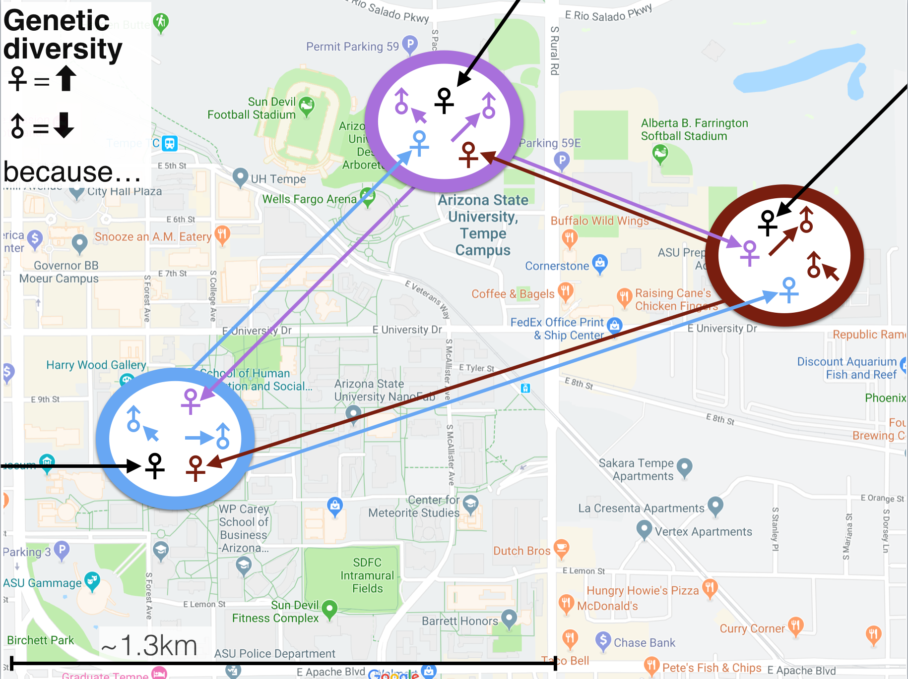

```{r setup, include=FALSE}
knitr::opts_chunk$set(echo = TRUE)
```

```{r}
#Make code wrap text so it doesn't go off the page when Knitting to PDF
library(knitr)
opts_chunk$set(tidy.opts=list(width.cutoff=60),tidy=TRUE)
```

***Click [here](https://github.com/corinalogan/grackles/blob/master/README.md) to navigate to the version-tracked reproducible manuscript (.Rmd file)***

###ABSTRACT

In most bird species, females disperse prior to their first breeding attempt, while males remain close to the place they were hatched for their entire lives (@greenwood1982natal). Explanations for such female bias in natal dispersal have focused on the potential benefits that males derive from knowing the local environment to establish territories, while females search for suitable mates (@greenwood1980mating), however the exact factors shaping dispersal decisions appear more complex (@mabry2013social, @vegvari2018sex). Here, we investigate whether females are the dispersing sex in great-tailed grackles, which have a mating system where the males hold territories and the females choose which territory to place their nest in (@johnson2000male). We will use genetic approaches to identify sex biases in the propensity to disperse. We will first determine whether, for individuals caught within a singe site in Arizona, the average relatedness among all female dyads is lower than that among all male dyads, suggesting that females are less likely to have relatives which indicates that females disperse away from relatives. Second, we will assess whether in males close relatives are most likely to be found within very short distances of each other; whereas, in females, relatives live both near and far from each other. Results will inform our long-term study on the relationship between behavioral flexibility and rapid geographic range expansion by elucidating which individuals are likely to experience similar conditions across their lives, and which are likely to face new conditions when they become breeders.

###A. STATE OF THE DATA

The first version of this preregistration was written (June 2019) and submitted to Peer Community In Ecology (July 2019) after blood was collected and before processing the DNA to obtain the genetic data. The revised version of this preregistration following comments from the Peer Community in Ecology (October 2019) was written after obtaining the genotypes for the individuals in the sample.

###B. HYPOTHESIS

**Hypothesis** There are sex differences in the natal disperal rate and distance among individuals of great-tailed grackle (*Quiscalus mexicanus*) with males remaining close to where they hatched and females moving away from where they hatched. Males are expected to remain close to the area where they hatched, therefore a large number of the males on the Arizona State University (ASU) campus are expected to have been born within the area of the study site and stay close to their relatives. In contrast, females are expected to move before their first breeding attempt (@greenwood1980mating), therefore females on campus are likely to come from areas outside the campus in the surrounding area and have moved away from relatives. 

**Alternative 1** Fewer males than females move away from where they hatched, but the few males who do disperse move much farther distances than the females.

**Alternative 2** Males disperse away while females remain where they hatched.

**Alternative 3** Individuals of both sexes remain close to where they hatched.

**Alternative 4** Individuals of both sexes disperse away from where they hatched.

**Alternative 5** Males remain not on the exact site they hatched but within the general area while females disperse for farther distances.

We predict that the movement of individuals will influence the spatial distribution of genetic relatives. Individuals of the sex who remain close to where they hatched are expected to be close to relatives while individuals of the sex who disperse are expected to not be close to relatives (see Fig 1 for a visualization). We also expect that the further distances that individuals move the less likely they are to be even distantly related to another individual within the area. We will perform three analyses to investigate the spatial distribution of genetic relatives: the first two aim to detect whether there are sex biases in levels of average genetic relatedness among indivduals found within a certain distance of each other (i: average levels of relatedness among individuals in our sample; ii: geographic distances between individuals assumed to be genetic relatives) and the third aims to determine separately for each sex whether individuals are likely to have dispersed or not ( iii: spatial autocorrelation). 

**Prediction for Hypothesis, Analysis i (dispersal males < females; average relatedness)** 
Both the mean level of and the variance in average genetic relatedness will be higher among males compared to females in our sample. 

**Prediction for Hypothesis, Analysis ii (dispersal males < females; distance between relatives)**
Both the mean and variance of the geographic distances between pairs of individuals inferred to be genetic relatives (individuals estimated to be related at levels of cousins or closer, r>0.125) will be shorter among males compared to females.

**Prediction for Hypothesis, Analysis iii (dispersal males < females; spatial autocorrelation)**
There will be a spatial autocorrelation signal indicating a negative relationship between genetic relatedness and geographic distance for males. There will be no spatial autocorrelation signal indicating the absence of a relationship between genetic relatedness and geographic distance for females.


**Prediction for Alternative 1, Analysis i (dispersal rate males < females, dispersal distance males > females; average relatedness)**
The mean level of average genetic relatedness will be similar among males and among females in our sample, while the variance will be higher for males.

**Prediction for Alternative 1, Analysis ii (dispersal rate males < females, dispersal distance males > females; distance between relatives)**
The mean geographic distances between pairs of individuals inferred to be genetic relatives (individuals estimated to be related at levels of cousins or closer, r>0.125) will be similar among males compared to females, while the variance will be higher for males.

**Prediction for Alternative 1, Analysis iii (dispersal rate males < females, dispersal distance males > females; spatial autocorrelation)**
There will be a spatial autocorrelation signal indicating a U-shaped relationship between genetic relatedness and geographic distance for males with closely related males found both at near and far distances. There will be no spatial autocorrelation signal indicating the absence of a relationship between genetic relatedness and geographic distance for females.


**Prediction for Alternative 2, Analysis i (dispersal males > females; average relatedness)**
Both the mean level of and the variance in average genetic relatedness will be lower among males compared to females in our sample. 

**Prediction for Alternative 2, Analysis ii (dispersal males > females; distance between relatives)**
Both the mean and variance of the geographic distances between pairs of individuals inferred to be genetic relatives (individuals estimated to be related at levels of cousins or closer, r>0.125) will be higher among males compared to females.

**Prediction for Alternative 2, Analysis iii (dispersal males > females; spatial autocorrelation)**
There will be no spatial autocorrelation signal indicating the absence of a relationship between genetic relatedness and geographic distance for males. There will be a spatial autocorrelation signal indicating a negative relationship between genetic relatedness and geographic distance for females.


**Prediction for Alternative 3, Analysis i (dispersal neither males nor females; average relatedness)**
Both the mean level of and the variance in average genetic relatedness will be similar among males compared to females in our sample. 

**Prediction for Alternative 3, Analysis ii (dispersal neither males nor females; distance between relatives)**
Both the mean and variance of the geographic distances between pairs of individuals inferred to be genetic relatives (individuals estimated to be related at levels of cousins or closer, r>0.125) will be similar among males compared to females.

**Prediction for Alternative 3, Analysis iii (dispersal neither males nor females; spatial autocorrelation)**
There will be a spatial autocorrelation signal indicating a negative relationship between genetic relatedness and geographic distance for males. There will be a spatial autocorrelation signal indicating a negative relationship between genetic relatedness and geographic distance for females.


**Prediction for Alternative 4, Analysis i (dispersal both males and females; average relatedness)**
Both the mean level of and the variance in average genetic relatedness will be similar among males compared to females in our sample. 

**Prediction for Alternative 4, Analysis ii (dispersal both males and females; distance between relatives)**
Both the mean and variance of the geographic distances between pairs of individuals inferred to be genetic relatives (individuals estimated to be related at levels of cousins or closer, r>0.125) will be similar among males compared to females.

**Prediction for Alternative 4, Analysis iii (dispersal both males and females; spatial autocorrelation)**
There will be no spatial autocorrelation signal indicating the absence of a relationship between genetic relatedness and geographic distance for males. There will be no spatial autocorrelation signal indicating the absence of a relationship between genetic relatedness and geographic distance for females.


**Prediction for Alternative 5, Analysis i (dispersal rate males = females, dispersal distance males < females; average relatedness)**
The mean level of average genetic relatedness will be slightly higher among males compared to females in our sample, while the variance will be lower among males. 

**Prediction for Alternative 5, Analysis ii (dispersal rate males = females, dispersal distance males < females; distance between relatives)**
The mean of the geographic distances between pairs of individuals inferred to be genetic relatives (individuals estimated to be related at levels of cousins or closer, r>0.125) will be shorter among males compared to females, while the variance will be similar among males and females.

**Prediction for Alternative 5, Analysis iii (dispersal rate males = females, dispersal distance males < females; spatial autocorrelation)**
There will be a autocorrelation signal indicating the absence of an inverse-U shaped relationship between genetic relatedness and geographic distance for males with closely related males found at intermediate geographic distances. There will be no spatial autocorrelation signal indicating the absence of a relationship between genetic relatedness and geographic distance for females.




###C. METHODS

####**Planned Sample**
	
DNA from 57 great-tailed grackles was obtained from wild adults and juveniles (n=40 adult females, n=17 adult males, juvenile samples were excluded because they had not yet dispersed) caught in Tempe, Arizona, USA (see Fig 2 for a map). These individuals were either immediately released, or temporarily brought into aviaries for behavioral testing and then released back to the wild.


The larger number of females than males in our sample appears to reflect the adult sex ratio at this study site. We estimated the of sex ratio based on trappings in mist nets, which were set up to randomly catch individuals in different areas of the study site. A total of 26 females and 11 males were trapped this way (a ratio of 2.36 females per 1 male), which is very similar to the sex ratio in our sample consisting of 40 females and 17 males (2.35 females per 1 male).

Males were not caught at all sites, but there are several sites at which multiple males were caught and sufficient sites for comparisons of males that were caught close to each other, at intermediate, and at long distances. 


	
####**Sample size rationale**
	
This was the largest sample size possible by July 2019 when the DNA were analyzed using ddRADseq. 
	
####**Data collection stopping rule**
	
Analyze all blood that was collected by June 2019 when the trapping season stopped.

####**Open data**

When the study is complete, the data will be published in the Knowledge Network for Biocomplexity's data repository.

####**Randomization and counterbalancing** 

No randomization or counterbalancing is involved in this study.

####**Blinding of conditions during analysis**

Experimenters are blind to the sex of the bird when processing samples using ddRADseq (only the alphanumeric bird ID was visible on the tube and no team member has memorized which ID goes with which bird because we give the birds names).

####**Blood collection**

150uL of blood was collected from trapped great-tailed grackles and stored for a minimum of 30 minutes, and a maximum of 60 minutes at room temperature or 3 hours on ice. Samples were then centrifuged at 15x gravity for 10 minutes to separate the serum from the cellular fraction. After the serum layer was removed and stored, 600uL lysis buffer (@white1992mitochondrial, pp. 50-51) was added to the remaining packed cells. Tubes containing packed cells and lysis buffer were stored at room temperature for up to 1 year before extraction. Some samples were extracted at Arizona State University by Rowney, while others were shipped with ice packs to Washington State University for extraction by Blackwell and his lab.

####**DNA extraction and quantification**

DNA was extracted from the above samples using the DNeasy Blood and Tissue kit (Qiagen) with slight modifications from the manufacturer's protocol (see details in @thrasher2018double Supporting Information, page 7; our slightly modified protocol is available [here](https://cryptpad.fr/pad/#/2/pad/edit/4eLjZYSBPsIwUC42BTqWczBJ/)). Approximately 100ul of blood/lysis mixture was mixed with 20ul Proteinase K (need to add concentration), 150ul PBS, and 200ul buffer AL, then incubated overnight at 64C while shaking. Samples were mixed with 200ul ethanol and added to spin columns. Columns were centrifuged and washed according to kit protocol using buffers AW1 and AW2. DNA was eluted into 50ul of RNAse and DNAse free water at 64C after a 5-10 min incubation on columns. DNA quantification was then performed on a Qubit 4.0 Fluorometer (Fisher Scientific) following the manufacturer’s protocol for broad range dsDNA. The average yield of samples used for sequencing was 34ng/ul. Extracted DNA samples were shipped with ice packs to the Cornell Lab of Ornithology for ddRAD sequencing.

####**ddRADseq**

The DNA is processed using ddRADseq by Sevchik and Bronwyn Butcher (Cornell University) following methods in Thrasher et al. (2018). In brief, a sample is chosen for each individual with a concentration as close to being between 5-50 µl as possible and any sample that remains outside that range is concentrated and diluted as necessary. Concentrations are taken using the Qubit Fluorometer. The DNA extracts are then run through a PCR thermocycle where the fragments are  digested with a combination of two restriction enzymes and 20 different adapters attached to the end of the DNA pieces. A gel is then run to ensure the proper digestion and ligation of the DNA samples. The samples are then cleaned up using SPRI beads and size selected using BluePippin for a prespecified length (between 400-700 base pairs). After the samples return from size selection, they are amplified using a low-cycle PCR process and pooled together to be sent in to be sequenced. Sequencing will be performed on an Illumina NextSeq500 (using a mid-output kit) to generate 150 bp single end reads. These data are post-processed to generate SNP data for relatedness analyses as in Thrasher et al. (2018). After filtering reads for quality and demultiplexing to assign sequences back to specific individuals, genetic loci will be assembled de novo as no reference genome exists for great-tailed grackles. We will follow the cut-offs described in Thrasher et al. (2018) for single nucleotide polymorphism filtering, but might adjust settings (e.g. threshold of accepted minor allele frequencies) depending on the composition of our sample (these decisions will have no influence on testing our predictions since they influence females and males equally and will be performed prior to any further analyses). 

####**Relatedness analyses**

Genetic relatedness between all pairs of individuals is calculated using the package “related” (Pew, Muir, Wang, & Frasier, 2015 https://doi.org/10.1111/1755-0998.12323) in R, following methods in @thrasher2018double. We will use the function 'compareestimators' to assess which relatedness estimator appears to perform the best given the characteristics of our data. 

####**Dependent variable**

Average relatedness between all pairs of individuals within one sex

####**Independent variables**

P1: Sex (female, male)

P2: Distance between trap sites (meters)

###D. ANALYSIS PLAN

We do not plan to **exclude** any data and no data are **missing**. Analyses will be conducted in R (current version `r getRversion()`; @rcoreteam). 

####*Ability to detect actual effects*

Birds the size of a grackle (~100-150 grams) are expected to show a median natal dispersal distance of about 250-300 meters (Sutherland et al. 2000 http://www.consecol.org/vol4/iss1/art16/). Our 15 trap locations are within a ~1000m circle, suggesting that if there are dispersers in our sample, these individuals will have most likely come from areas outside the trapping locations. In turn, individuals who would remain close to their natal area would only move distances much shorter than this, suggesting that the pairwise distances between non-dispersed relatives would be shorter than the random distance between any two birds we caught. We restrict our sample to adults to focus on the distribution of individuals after any potential natal dispersal (Goudet et al. 2002 doi:10.1046/j.1365-294X.2002.01496.x). We only have individuals from within a single site, so we cannot use methods that rely on assigning individuals to a source population or measure the relative distribution of genetic variation within versus among populations (Fst or similar measures). We therefore rely on measuring genetic relatedness between pairs of individuals. Approaches relying on spatial analyses of multi-locus genotypes have been shown to be able to detect even modest sex biased dispersal in fine-scale spatial distribution, in particular analyses of spatial autocorrelation (Banks & Peakall 2012 doi:10.1111/j.1365-294X.2012.05485.x). However, our sample size is low, meaning that we might have only limited power to detect potential differences between females and males (Goudet et al. 2002 doi:10.1046/j.1365-294X.2002.01496.x). For the spatial distribution of relatives (Analysis 2), the number of related individuals in our sample might be too low to detect a strong pattern of relatives of one sex being closer to each other than relatives of the other sex. For the isolation-by-distance leading to a change in relatedness within the range of our sampling locations, the signal might be too inclusive in either or both sexes to make inferences about sex differences. However, for the comparison of average relatedness (Analysis 1), given that we have a larger number of SNP loci, we expect that the we should have sufficient power to obtain a qualitative assessment of whether relatives are present in our sample (Wang and Santure 2008 doi:10.1534/genetics.108.100214) and accordingly whether dispersal is more prevalent in either females or males (examples of empirical studies that detected a signal with small sample sizes include Hofmann et al. 2012 doi:10.1655/HERPETOLOGICA-D-12-00017, Quaglietta et al. 2013 doi:10.1644/12-MAMM-A-171.1, Singh Gour et al. 2013 doi:10.1371/journal.pone.0066956), Botero-Delgadillo et al. 2017 doi:10.1002/ece3.3342. 


####*Analysis i: average relatedness and sex*

We will compare the mean and variance in average relatedness among all females to that among all males. Since average relatedness tends to decrease as the number of individuals in the sample increases (regression to the mean), we will perform a permutation analysis to investigate whether the average relatedness among the males or among the females in our sample is higher than what would be expected for a random sample of the same number of females or of individuals of both sexes. We will perform 10,000 random draws of 17 individuals either from among the females or from among all individuals and of 40 individuals from among all individuals, and generate distributions of average relatedness among these samples. We will assess whether the observed average relatedness among the 17 males or the 40 females in our sample is higher than what is observed in the majority of random samples. We will report the proportion of samples lower than the actual values and, for comparison with other approaches, assess whether the observed values are higher than 95% of all random draws.  

####*Analysis ii: distances among genetic relatives*

Based on the calculations of pairwise genetic relatedness, we will select the subset of pairs who are estimated to be more closely related than cousins (r≥0.125) or half-siblings (r≥0.25). For this subset of individuals, we will determine whether the pairwise geographic distances are shorter for the males or the females in the sample (@coulon2006relatedness). We will perform 10,000 random draws of pairs of males and of females matching the numbers of inferred closely related dyads, and calculate the difference between the average geographic distances for each sex. We will assess whether the observed difference in geographic distances is higher than the majority of random samples, and for comparison with other approaches, determine whether the observed value is higher than 95% of all random draws.

####*Analysis iii: spatial autocorrelation*

To test whether males and females show different patterns of genetic isolation by geographic distance, we will follow analyses as in @aguillon2017deconstructing. For the analysis, we will initially create 11 distance bins separated by 200m between 0m-2000m (the maximum distance between trapping sites). The 200m bin size was chosen because there are roosting trees that are ~50m apart suggesting that dispersal might be occuring below this scale and to maximize the number of pairs in each distance class. The individuals in our sample have been caught at one of 15 trap sites, and the resulting 105 pairwise distances among individuals will be assigned to one of the 11 bins. We will reduce the number of bins in case the pairwise distances among individuals are too low in each bin to determine a signal. For males and females separately, we will link the matrices of average relatedness and of geographic distance between all pairs of individuals by first plotting genetic relatedness against geographic distance and next by assessing the strength of the association using Mantel correlograms. We will use the function 'mantel.correlog' in the vegan package (Oksanen J, Blanchet FG, Kindt R, Legendre P, Minchin PR, O'Hara RB, et al. vegan: Community Ecology Package. 2015) in R, performing 10,000 permutations to assess the strength of the association. This approach relies on the establishment of the multivariate Mantel correlogram by Legendre & Legendre (Numerical Ecology 2012 Elsevier). The approach relies on partitioning the geographic locations into a series of discrete distance class. The result of this set of analyses is a Mantel’s correlogram, analogous to an autocorrelation function but performed on a set of distance matrices. For each distance class, a separate matrix is generated coding whether a given geographic distance between a pair of individuals falls within that range or not. A normalized Mantel statistic is calculated using permutations for each distance class. The permutation statistics, plotted against distance classes, produce a multivariate correlogram. These analyses are performed separately for each sex to determine whether isolation-by-distance might occur and indicate dispersal of the individuals of that sex. A stronger negative correlation between genetic relatedness and spatial distance for males than for females would indicate that males disperse shorter distances than females, and in particular we expect that males captured at the same trapping site will be much closer related to each other than females captured at the same trapping site. 

###E. ETHICS

This research is carried out in accordance with permits from the:

1) US Fish and Wildlife Service (scientific collecting permit number MB76700A-0,1,2)
2) US Geological Survey Bird Banding Laboratory (federal bird banding permit number 23872)
3) Arizona Game and Fish Department (scientific collecting license number SP594338 [2017], SP606267 [2018], and SP639866 [2019])
4) Institutional Animal Care and Use Committee at Arizona State University (protocol number 17-1594R)
5) University of Cambridge ethical review process (non-regulated use of animals in scientific procedures: zoo4/17 [2017])

###F. AUTHOR CONTRIBUTIONS

**Sevchik:** Hypothesis development, sample processing, data analysis and interpretation, write up, revising/editing.

**Logan:** Hypothesis development, data analysis and interpretation, write up, revising/editing, materials/funding.

**Folsom:** Blood collection, revising/editing.

**Bergeron:** Blood collection, revising/editing.

**Blackwell:** Hypothesis development, DNA extraction, revising/editing.

**Rowney:** DNA extraction, write up, revising/editing.

**Lukas:** Hypothesis development, data analysis and interpretation, write up, revising/editing, materials/funding.

###G. FUNDING

This research is funded by the Department of Human Behavior, Ecology and Culture at the Max Planck Institute for Evolutionary Anthropology.

###I. CONFLICT OF INTEREST DISCLOSURE

We, the authors, declare that we have no financial conflicts of interest with the content of this article. Corina Logan and Dieter Lukas are Recommenders at PCI Ecology and Corina Logan is on the Managing Board at PCI Ecology.

###J. ACKNOWLEDGEMENTS

We thank Bronwyn Butcher and Irby Lovette at the Lab of Ornithology at Cornell University for providing the lab and training for processing the DNA samples using ddRADseq and for post-processing the raw data into a readily analyzable form.

###K. [REFERENCES](MyLibrary.bib)
