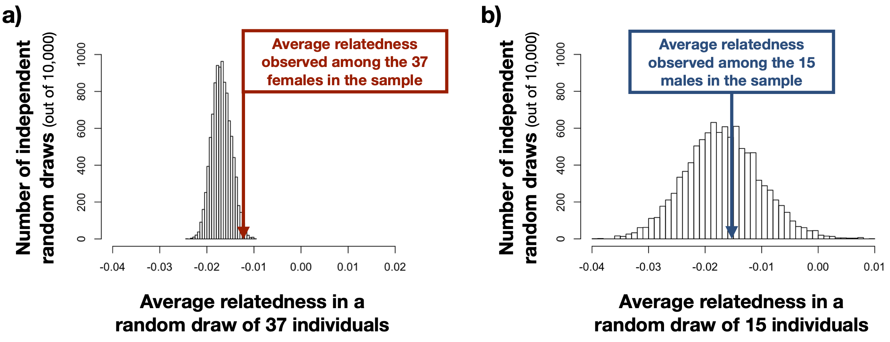
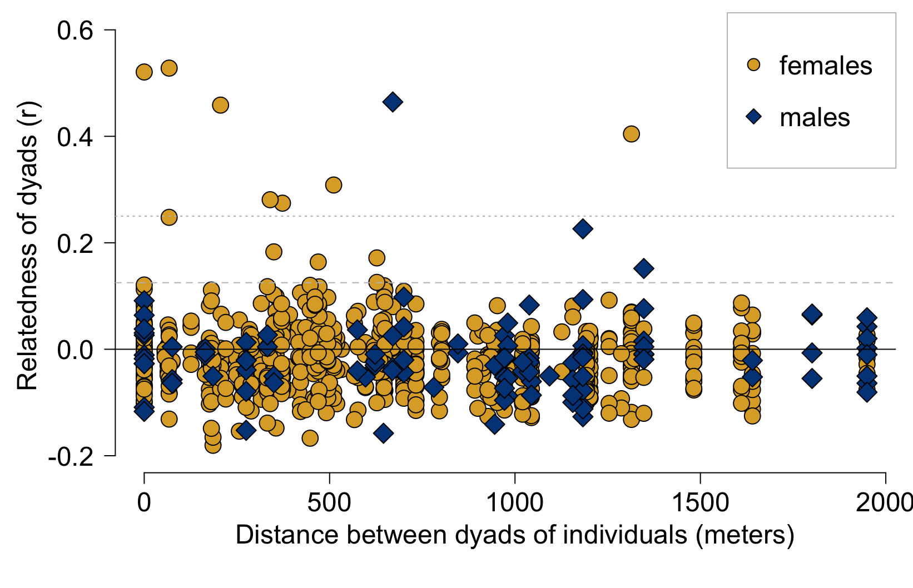
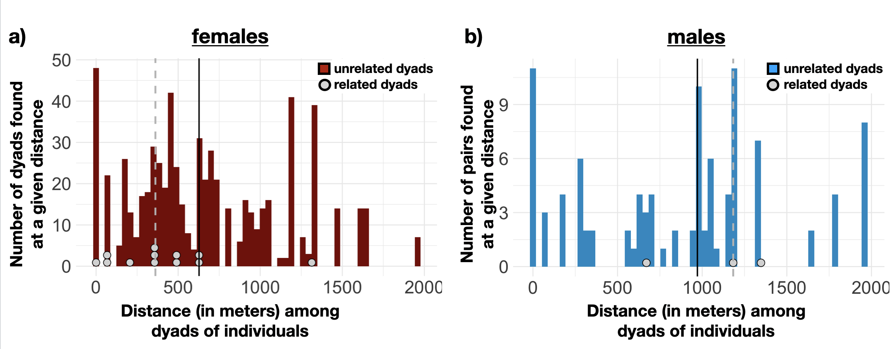

##### Affiliations: 
1) Arizona State University, 2) Max Planck Institute for Evolutionary Anthropology, 3) University of California Santa Barbara, 4) Washington State University, *Corresponding author: dieter.lukas@eva.mpg.de


```{r setup, include=FALSE}
options(width=60)
knitr::opts_chunk$set(echo = TRUE)
knitr::opts_chunk$set(tidy.opts=list(width.cutoff=60), tidy=TRUE)
```


\  
\  


**This study has been peer reviewed and received a Recommendation by:**
{width=25%}

Emanuel Fronhofer (2021) Investigating sex differences in genetic relatedness in great-tailed grackles. *Peer Community in Ecology*, 100074. [10.24072/pci.ecology.100074] (https://doi.org/10.24072/pci.ecology.100074). Reviewers: two anonymous reviewers
 
Cite this article as: Sevchik, A., Logan, C. J., McCune, K. B., Blackwell, A., Rowney, C. and Lukas, D. (2021) Investigating sex differences in genetic relatedness in great-tailed grackles in Tempe, Arizona to infer potential sex biases in dispersal. EcoEvoRxiv, osf.io/t6beh, ver. 5 peer-reviewed and recommended by Peer community in Ecology. doi:
https://doi.org/10.32942/osf.io/t6beh 

\  
\  

**The preregistration for this study received an In Principle Recommendation by:**
{width=25%}

Sophie Beltran-Bech (2019 In Principle Acceptance) Investigate fine scale sex dispersal with spatial and genetic analyses. *Peer Community in Ecology*, 100036. [10.24072/pci.ecology.100036](https://doi.org/10.24072/pci.ecology.100036). Reviewers: Sylvine Durand and one anonymous reviewer

\   
{width=5%} {width=5%} {width=5%} {width=5%}

\   
\   

## Abstract

In most bird species, females disperse prior to their first breeding attempt, while males remain closer to the place they hatched for their entire lives. Explanations for such female bias in natal dispersal have focused on the resource-defense based monogamous mating system that is prevalent in most birds. In this system, males are argued to benefit from philopatry because knowing the local environment can help them to establish territories to attract females, while females are argued to benefit from dispersing because they can find suitable unrelated mates. However, theoretical, field, and comparative studies highlight that the factors shaping dispersal decisions are often more complex. Studying species with different social and mating systems can help illuminate the relative role of various factors in the evolution of sex biased dispersal. Here, we use genetic approaches to determine whether females and/or males disperse in great-tailed grackles (*Quiscalus mexicanus*), which have a mating system where the males hold breeding territories that multiple females might choose to place their nest in, but females forage independently of these breeding territories across a wider area. First, we find that, for individuals caught at a single site in Arizona, the average relatedness among all female dyads is higher than average relatedness among other individuals at the site, whereas average relatedness among all males dyads is not. Second, we find that female close relatives are found within shorter distances from each other than pairs of unrelated females, whereas male close relatives are found at larger distances from each other than pairs of unrelated males. Third, we find a decline in relatedness with increasing spatial distances for females, but not for males. Our results indicate sex biases in relatedness structure that differ from most other bird species. Female great-tailed grackles associate with close genetic relatives, presumably by remaining close to where they hatched which would lead to them remaining close to their mothers and sisters. Males are not found close to genetic relatives, suggesting that they disperse away from their fathers and brothers. Our findings show that great-tailed grackles offer a relevant study system to further understand the factors shaping natal philopatry and dispersal, given this reversal of the usual sex-bias in dispersal in line with their divergent social and mating system.

\newpage

## Introduction

Maturing birds face a decision about where to establish themselves for breeding. In the majority of avian species, the potential costs and benefits of breeding movement decisions appear to differ between the sexes, with males remaining in the area they hatched while females move to breed elsewhere [@greenwood1980mating]. The main theory proposed to explain this sex bias towards male philopatry has focused on the resource-defense based monogamous mating system found in most bird species [@greenwood1980mating; @trochet2016evolution]. In monogamous systems, males tend to stay philopatric to defend an area they know to provide resources to attract females, whereas females disperse to avoid the risk of inbreeding with close relatives who dominate reproduction in the area. However, alternative hypotheses about the benefits and costs of philopatry or dispersal could equally apply to explain the dominant female bias in dispersal among species with resource defense based monogamy. In general, it is likely that, in both sexes, decisions of whether to remain in the area or to move short or substantial distances to new breeding grounds are influenced by an interplay of the potential costs of movement, resource availability and competition, and the potential benefits or costs of interacting with close relatives [@mabry2013social; @trochet2016evolution; @li2019sex]. One way toward a better understanding of the relative role of the various factors that potentially explain breeding movement decisions of both female and male birds is to study dispersal in species with different social and mating systems.

Studying dispersal outside of well established study systems is difficult, which means that there is only limited information from bird species with unusual social and mating systems. It is challenging to set up studies that span a large geographical area where the identity of many individuals can be established and followed. As such, the fate of individuals who leave the area often remains unknown and it is unclear whether new individuals found in the area have moved to the area or were simply not observed previously [@walters2000dispersal]. To overcome these challenges, genetic approaches are now incorporated to identify dispersal patterns [@lawson2007advances; @banks2012genetic]. In particular, to identify potential sex biases in dispersal, two approaches are used. The first approach relies on determining the spatial distribution of variants of genetic markers that have a sex-specific inheritance [@lawson2007advances]. The second approach uses data from a large number of genetic markers spread across the genome to determine how the similarity across these markers changes with increasing spatial distances among males and females [@banks2012genetic]. Studies based on the second approach have increased in recent years because the costs of generating genotypes for a large sample of individuals have rapidly decreased [@harrison2014population; @weinman2015comparison; and @thrasher2018double].

Here, we investigate SNP (single nucleotide polymorphism) genotype data for a sample of great-tailed grackle (*Quiscalus mexicanus*) females and males at a single site. Great-tailed grackles differ in several aspects from the majority of bird species in which dispersal has been investigated thus far, which might make them a relevant study system to gain further insights into the factors shaping the dispersal decisions of females and males. Great-tailed grackles are a highly social passerine bird found in the Americas. Individuals forage year-round in small fission-fusion groups in areas that are not obviously defended against other individuals and at night they roost in large associations [@johnson2001great], unlike most other bird species where, at least during the breeding season, pairs or families defend foraging territories [@cockburn2006prevalence]. This could indicate that resource competition might be lower in great-tailed grackles, potentially reducing pressure to remain in or move to high quality areas. Essentially everywhere they occur, great-tailed grackles live in human-modified environments [@macgregor2009non] and their wide range of foraging habits routinely includes exploiting human foods [@king2012habitat]. In these environments, they can occur in large numbers and at high densities [@escobar2020greener]. Great-tailed grackles have recently extensively expanded their geographic range [@wehtje2003range], indicating that they are highly mobile. Great-tailed grackles are sexually dimorphic, with males being larger than females and differing in plumage. During the mating season, some males defend territories around suitable breeding habitats and mate with females who build their nests in these territories. Holding a territory leads to higher reproductive success for these males, but females also mate with roaming males, leading to a polygamous mating system [@johnson2000male]. This resembles the mating system observed in many mammalian species, where males disperse to areas with the highetst number of potential mates [e.g. @honer2007female]. Previously, great-tailed grakckle females were assumed to perform all activities related to offspring care, from building the nest through incubating and feeding the hatchlings, but observations indicate that at least some males partake in these activities [@selander1970parental; @Folsom2020malecare]. Both the mating and the social system are accordingly different from the resource-defense based monogamous system found in the majority of birds, which might lead to a deviation from female-biased dispersal. Determining patterns of philopatry and dispersal in great-tailed grackles can offer further insights into the potential association between dispersal decisions and the various factors that might shape them.

  
  

## Hypotheses

Our main hypothesis assumes that great-tailed grackles show a pattern of female-bias in dispersal. It is our main hypothesis because this dispersal pattern predominates across birds and dispersal patterns are often retained from a common ancestor; in addition, the factors that shape this pattern might still operate in great-tailed grackles. Our alternative hypotheses expect that some of the differences in the social and mating system of great-tailed grackles might lead to a deviation from this dispersal pattern. We set these as alternative hypotheses because it is  unclear which factors might be important. With the setup of our study, we cannot infer why or how dispersal patterns might have changed, therefore we present these hypotheses simply as alternatives. 

**Hypothesis** There are sex differences in the natal disperal rate and distance among individuals in great-tailed grackles (*Quiscalus mexicanus*) with males remaining close to where they hatched and females moving away from where they hatched. Males are expected to remain close to the area where they hatched, therefore a large number of the males on the Arizona State University (ASU) campus are expected to have hatched within the area of the study site and stay close to their relatives. In contrast, females are expected to move before their first breeding attempt [@greenwood1980mating], therefore females on campus are likely to come from areas outside of campus in the surrounding area, having moved away from relatives. 

**Alternative hypothesis 1** Males disperse away from where they hatched, while females remain where they hatched.

**Alternative hypothesis 2** Individuals of both sexes remain close to where they hatched.

**Alternative hypothesis 3** Individuals of both sexes disperse away from where they hatched.

We expect that the movement of individuals will influence the spatial distribution of genetic relatives [@aguillon2017deconstructing]. Individuals of the sex that remains close to where they hatched are expected to be close to genetic relatives, while individuals of the sex that disperses are expected to be more distant from genetic relatives. We also expect that the further the distance an individual moves, the less likely they are to be even distantly related to another individual within the study area. Our hypotheses generate specific predictions about contrasts in the levels of relatedness and the spatial distribution of genetic relatives according to whether individuals are philopatric or disperse. The first analysis (analysis i: average levels of relatedness among individuals in our sample) focuses on whether individuals disperse beyond the trapping area and compares one average value of relatedness per sex. Here, we predict higher levels of average relatedness among all individuals of the philopatric sex than among all individuals of the sex that disperses. This follows if some dispersing emigrants move outside of the trapping area, away from parents and siblings, while immigrants can come from a variety of areas outside of the trapping area and therefore consist of unrelated individuals. The second analysis (analysis ii: geographic distances between individuals that are close genetic relatives) focuses on the distances among close relatives of the same sex that are trapped within our trapping area and investigates the pairwise distances among individuals of the same sex who are closely related. Here, we predict that there are sex biases in the average distances between trapping sites for relatives compared to non-relatives because philopatric individuals will remain close to same-sex parents and siblings while indiivduals that disperse within the trapping area will end up in different locations than their same-sex parents and siblings. The third analysis (analysis iii: spatial autocorrelation) focuses on how relatedness among pairs of same sex individuals changes as the distance between them increases and investigates correlations among all estimates of pairwise relatedness and pairwise geographic distances among individuals of the same sex. Here, we predict a decline in levels of relatedness as distances among individuals increase to indicate that individuals have remained philopatric such that close relatives are found in close geographic proximity. In contrast, we predict no structure of relatedness in geographic space for individuals who disperse because relatives will be found both close and far from each other. 


## Deviations from the preregistration

We preregistered our hypotheses, methods, and analysis plans. Analyses began in March 2020 after the preregistration passed pre-study peer review at *Peer Community In Ecology* in November 2019. The final version of the preregistration can be found here http://corinalogan.com/Preregistrations/gdispersal.html. 

We made the following changes and additions to the analyses (explained in detail in the Methods section below):  
 - we adjusted the sample to exclude juveniles and reflect sex composition  
 - we used a more stringent filter for the ddRadSeq single nucleotide polymorphism  
 - we excluded one genotype with implausible levels of heterozygosity  
 - we chose the Queller & Goodnight estimator to calculate pairwise relatedness  
 - we added an analysis to assess whether the geographic distances among closely related females were shorter than those in a random sample of females  
 - we added a configuration to the spatial correlogram analyses, based on the observed distances among related individuals

\newpage

## Methods

The methods below are based on the preregistration, with small changes summarized in the [Deviations from the preregistration](#deviations-from-the-preregistration) section above and further explained here (in italics).

### Data

#### Sample
	
DNA from 57 great-tailed grackles was obtained from wild individuals caught in Tempe, Arizona, USA (see Figure 4 for a map showing the trap locations and sample sizes for the individuals included in the analyses). These individuals were either immediately released, or temporarily brought into aviaries for behavioral testing and then released back to the wild.

*Deviation from preregistration: During the preparation of the analyses, we noticed that we made a mistake when calculating the sex composition in the sample: different from what was written in the preregistration, the sample for our genetic analyses consists of 41 (not 40) females and 16 (not 17) males. In addition, we realized that the sample included some juvenile individuals (<1 yr of age). We excluded these four juveniles from the main analyses because they might have been pre-dispersal at the time of capture. In addition, we excluded one individual after genotyping (see below). The dataset for the all analyses therefore consisted of 37 adult females and 15 adult males.*


**Figure 1.** Map displaying the sampling locations of grackles on the Arizona State University campus and the number of great-tailed grackles trapped at each location as part of this research.


The larger number of females than males in our sample appears to reflect the adult sex ratio at this study site. To estimate the sex ratio at the field site, we counted the number of females and males that were trapped in mist nets since the beginning of our study (September 2017 - October 2019). This trapping method likely does not elicit a sex bias in terms of which sex is caught because the nets are invisible. Therefore, if one sex is more neophobic than the other, both sexes are likely to be trapped using this method. A total of 26 females and 11 males were trapped using mist nets (a ratio of 2.36 females per 1 male), which is very similar to the sex ratio in our sample consisting of 37 adult females and 15 adult males (2.47 females per 1 male).

Females were caught at all but one site, such that comparisons are possible of the genetic relatedness of pairs of females trapped at various distances from each other. Males were not caught at all trap sites, but there are several sites at which multiple males were caught and sufficient sites for comparisons of males that were caught close to each other, and at intermediate and large distances from each other.

#### Sample size rationale
	
The sample size presented was the largest one possible (due to the time required for trapping) by July 2019 when the DNA were sequenced using ddRADseq.

#### Data collection stopping rule
	
We analyzed all blood samples that were collected through June 2019, which was the end of the trapping season.

#### Open data

All data necessary for the analyses are available at https://doi.org/10.5063/F1W66J48 [@lukas2020geneticdata] and at GitHub (the code included in the R markdown file will load these files directly from GitHub). The raw genetic data is available at https://www.ncbi.nlm.nih.gov/sra?term=SRP278340. 


#### Randomization and counterbalancing 

No randomization or counterbalancing is involved in this study.

#### Blinding of conditions during analysis

Experimenters were blind to the sex of the bird when processing samples using ddRADseq (only the alphanumeric bird ID was visible on the tube and no team member who handled the samples memorized which ID goes with which bird because we give the birds names).

#### Blood collection

Whole blood samples were collected from individual birds by brachial or medial metatarsal venipuncture. Blood was collected and stored in one of two ways until DNA extraction: 

1) At the beginning of the project (2018), 70uL of whole blood was added to silicone-coated micro-blood collection tubes containing 280uL of lysis buffer [@white1992mitochondrial, pp. 50-51] and stored at room temperature for up to a year before DNA extraction.

2) In 2018 a different method was implemented, using DNA from packed red blood cells: 150uL of blood was collected from trapped great-tailed grackles and stored for a minimum of 30 minutes and a maximum of 60 minutes at room temperature or 3 hours on ice. Samples were then centrifuged at 15x gravity for 10 minutes to separate the serum from the cellular fraction. After the serum layer was removed and stored, 600uL lysis buffer [@white1992mitochondrial, pp. 50-51] was added to the remaining packed cells. Tubes containing packed cells and lysis buffer were stored at room temperature for up to 1 year before extraction. 

#### DNA extraction and quantification

Some samples were extracted at Arizona State University by Rowney (samples through Dec 2018), while others were shipped with ice packs to Washington State University for extraction by Blackwell and his lab (samples collected Jan-Jun 2019). DNA was extracted from the above samples using the DNeasy Blood and Tissue kit (Qiagen) with slight modifications from the manufacturer's protocol (see details in @thrasher2018double Supporting Information, page 7). Approximately 100ul of blood/lysis mixture was mixed with 20ul Proteinase K, 150ul PBS, and 200ul buffer AL, then incubated overnight at 64C while shaking. Samples were mixed with 200ul ethanol and added to spin columns. Columns were centrifuged and washed according to kit protocol using buffers AW1 and AW2. DNA was eluted into 50ul of RNAse and DNAse free water at 64C after a 5-10 min incubation on columns. DNA quantification was then performed on a Qubit 4.0 Fluorometer (Fisher Scientific) following the manufacturer’s protocol for broad range dsDNA. The average yield of samples used for sequencing was 34ng/ul. Extracted DNA samples were shipped with ice packs to the Cornell Lab of Ornithology for ddRAD sequencing in July 2019.

#### ddRAD sequencing

We generated single-nucleotide polymorphism (SNP; where at a given position in the genome two different bases, alleles, can occur) genotypes for 57 individuals from our study site in Arizona (we excluded the above mentioned 5 individuals later). The DNA was processed using ddRADseq by Sevchik and Bronwyn Butcher (Cornell University) following methods in @thrasher2018double. Each of the samples’ DNA concentrations was measured using the Qubit dsDNA BR Assay Kit and the Qubit Fluorometer following the manufacturer’s protocol. For this particular experiment, the necessary DNA concentrations were between 5-50ng/ul and so any sample outside of this range needed to be normalized. Those samples with a concentration higher than 50ng/ul were diluted to approximately 25ng/ul with nuclease-free water. For those samples with concentrations lower than 5ng/ul, both elutions were pooled and the DNA concentrated by evaporation using an Eppendorf Vacufuge. The DNA extracts are then run through a PCR thermocycler where the fragments are digested with a combination of two restriction enzymes (SbfI-HF and MspI) and 20 different adapters attached to the end of the DNA pieces. A 1% agarose gel is run to ensure the proper digestion and ligation of the DNA samples. The samples are then cleaned up using MagNA beads and size selected using BluePippin for a prespecified length (between 400-700 base pairs). After the samples return from size selection, they are amplified using a low-cycle PCR process and pooled together to be sent in to be sequenced. Sequencing was performed on an Illumina NextSeq500 (using a mid-output kit and run with Illumina PhiX control (15%) to aid sequence alignment) to generate 150 bp single end reads at the Core Facilities of the Cornell Institute of Biotechnology. 

#### SNP processing

These data were post-processed to generate SNP data for relatedness analyses as in @thrasher2018double. After filtering reads for quality and demultiplexing to assign sequences back to specific individuals, genetic loci were assembled *de novo* because no reference genome exists for great-tailed grackles. 

*Deviation from preregistration: For the ddRadSeq single nucleotide polymorphism (SNP) filtering, two sets of restrictions were applied to maximize power by focusing the analysis on the most informative SNPs while reducing the potential risk of noise. The first filter was based on the parameters set forth by @thrasher2018double, which they showed to provide a set of loci with strong power to discern relationships among individuals. Loci were only considered if they were present in 80% of the samples (r parameter of the stacks pipeline) and had a minimum frequency of the minor allele of 0.05 (min maf parameter of the stacks pipeline). This meant that the rare variant at a locus was present in at least 5% of the samples and it resulted in 3647 acceptable SNPs for analyses.
The second filter applied more stringent conditions for the loci to be retained. Loci were only considered if they were present in 95% of the samples (r) and had a minimum minor allele frequency of 0.05 (min maf). This resulted in 635 acceptable SNPs; 3012 SNPs fewer than in the first, less restrictive filtering, but still more than in the study by @thrasher2018double because each individual in our sample had been sequenced to a greater depth. We decided to use the resulting genotypes from the second, more restrictive setting for the relatedness analyses because of our small sample size (e.g., if some individuals had a lower quality sample, their relatedness to other individuals might consistently be misclassified) and because these settings still provided an effective number of SNPs for analyses. The more restrictive filtering reduces noise from missing data and retains high power by selecting loci with high heterozygosity (their heterozygosity approaches the maximum of 0.5) [Morin et al. 2004].* 

*Addition to preregistration: The preregistration had focused on analyses to address the hypotheses. We realized that we should also provide descriptive statistics of the genotype data we generated specificially for this study. We used functions in the R packages ‘adegenet’ [@Jombart2008adegenet], ‘pegas’ [@Paradis2010pegas], and ‘popgenutils [@Tourvas2020popgenutils] to edit the genotype data and to calculate, based on the allele frequencies in the data and assuming random mating, the expected heterozygosity (average chance of finding two different alleles across loci across individuals) and probability of identity (chance that two individuals will have the same set of alleles across all loci).*

#### Relatedness estimation

Genetic relatedness between all pairs of individuals was calculated using the package “related” [@pew2015related] in R, following methods in @thrasher2018double. We used the frequencies of the alleles at the generated SNPs to calculate relatedness among pairs of individuals, with individuals being classified as related if they share more alleles than what is expected based on random chance given the frequencies of variants in the population (relatedness (R) >0) and as unrelated if they share as many (R=0) or fewer genetic variants than expected (R<0).
We planned to use the function ‘compareestimators’ to assess which relatedness estimator appears to perform the best given the characteristics of our data. 

*Deviation from preregistration: The 'compareestimator' function in the R package 'related' caused fatal errors on multiple computers. We therefore calculated pairwise relatedness using two estimators: 1) the Wang estimator [@wang2002estimator], following the observation in @thrasher2018double of the suitability of this estimator for ddRadSeq data, and 2) the Queller-Goodnight estimator [@queller1989estimating], which is the standard in several studies. With both sets of relatedness estimates, all of our inferences (high levels of average relatedness among females, shorter distances among closely related females, spatial structure among female genotypes) were similar. We present the results based only on the estimator by Queller & Goodnight (1989) because we noticed that, with our data, the estimator by Wang (2002) appeared to be more influenced by missing data in the genotypes. We calculated average relatedness between all pairs of individuals within one sex: the arithmetic mean of the estimated relatedness based on sharing of SNP alleles among all female dyads and all male dyads.*

*Additional note: Our preregistration did not include plans to perform pedigree reconstructions as an alternative way to assess relatedness among the individuals for three reasons. First, we have a cross-sectional sample, which does not contain  longitudinal information from tracking juveniles seen with their potential parents into adulthood. Second, adults are of unknown age, so for any related individuals who share an allele at (almost) all loci we would not be able to determine which is the parent and which is the offspring. Third, grackles are not expected to have large clusters of siblings [@johnson2000male], as for example in fish species, making it highly unlikely that our sample contains extended families.*

#### Additional variables

1) Sex (female, male): the sex of the individuals assigned based on morphological features


2) Distance between trap sites (meters): straight line distance (assuming earth is an ellipsoid) between all pairs of trapping locations based on the longitude and latitude of each site.


### Analyses

Analyses were conducted in R (current version `r getRversion()`; @rcoreteam). 

We did not plan to exclude any data. We did not have to exclude individuals because more than half of their genotype was unknown.

*Deviation from preregistration: After obtaining the SNP data, we noticed that one individual, female A053PS, was indicated to be related to all other individuals in the sample. When we checked the genotype of this individual, it had much higher levels of heterozygosity, independent of how we filtered the data. The genotype did not show signs of shifting of alleles between loci (e.g., showing a genotype that lists allele 2 from locus 1 with allele 1 from locus 2) or have issues with missing data or the dropout of alleles. Instead, the increase in heterozygosity was always close to the square of the heterozygosity observed among the remaining individuals, suggesting that this genotype might be constructed from two different individuals. We were not able to retrace where such an error might have been introduced, therefore we decided to exclude individual A053PS from the analyses.*

#### *Ability to detect actual effects*

Birds the size of a grackle (~100-150 grams) are expected to show a median natal dispersal distance of about 250-300 meters [@sutherland2000scaling]. Our 15 trap locations were located within a ~1000m radius circle, suggesting that if there are dispersers in our sample, these individuals will have most likely come from areas outside of the trapping circle. In turn, if individuals remain close to their natal area, they would only move distances much shorter than this, suggesting that the pairwise distances between non-dispersed relatives would be shorter than the random distance between any two birds we caught. However, we do not know the average distance that either philopatric or dispersing individuals move. The scale of our sampling area might be so small that individuals of the sex that disperses the least are likely to have hatched outside of this area. In addition, there could be variation among either females or males in the distances individuals move, with potentially also a small proportion of individuals of the predominantly philopatric sex dispersing, which could obscure patterns in the small sample of individuals in our study. Accordingly, we might not be able to detect differences in average relatedness between females and males (analysis i), but we still might expect a sex bias in the geographic distances among relatives (analysis ii).

We restricted our sample to adults to focus on the distribution of individuals after any potential natal dispersal [@goudet2002tests]. We only have individuals from within a single site, so we did not use methods that rely on assigning individuals to a source population or measure the relative distribution of genetic variation within versus among populations (Fst or similar measures). We therefore relied on measuring genetic relatedness between pairs of individuals. Approaches relying on spatial analyses of multi-locus genotypes have been shown to be able to detect even modest sex biased dispersal in fine-scale spatial distribution, in particular analyses of spatial autocorrelation [@banks2012genetic]. However, our sample size is small, meaning that we might have only limited power to detect potential differences between females and males [@goudet2002tests]. For the spatial distribution of relatives (Analysis ii), the number of related individuals in our sample might be too small to detect a strong pattern of the relatives of one sex being more geographically closer to each other than relatives of the other sex. For the isolation-by-distance leading to a change in relatedness within the range of our sampling locations, the signal might be too weak in either or both sexes to make inferences about sex differences (Analysis iii). However, for the comparison of average relatedness (Analysis i), given that we have a large number of SNP loci, we expect that we should have sufficient power to obtain a qualitative assessment of whether relatives are present in our sample [@wang2009parentage] and accordingly whether dispersal is more prevalent in either females or males. Examples of empirical studies that detected a signal with small sample sizes include @hofmann2012evidence; @quaglietta2013fine; @gour2013philopatry; and @botero2017variation. 


#### *Analysis i: average relatedness and sex*

We compared the average and variance in relatedness among all females to that among all males. Since average relatedness tends to decrease as the number of individuals in the sample increases (regression to the mean), we performed a permutation analysis to investigate whether the average relatedness among the males or among the females in our sample is higher than what would be expected for a random sample of the same number of females or of individuals of both sexes. 

*Deviation from preregistration: We adjusted the permutations to reflect the actual sex composition in our sample of 37 adult females and 15 adult males, rather than drawing random samples of 40 and 17 individuals as planned in the preregistration. We compared (i) the observed average relatedness among the 37 females in our sample with the relatedness in the 10,000 random samples of 37 individuals from both sexes; (ii) the observed average relatedness among the 15 males in our sample with the relatedness in the 10,000 random samples of 15 individuals from both sexes; (iii) the observed average relatedness among the 15 males in our sample with the relatedness in the 10,000 random samples of 15 females. We report the proportion of 10,000 random samples with lower relatedness than the observed values and, for comparison with other approaches, assess whether the observed relatedness is higher than the relatedness calculated for 95% of all random draws.*  


#### *Analysis ii: distances among genetic relatives*

Based on the calculations of pairwise genetic relatedness, we selected the subset of pairs of individuals who are estimated to be more closely related than cousins (r≥0.125) or half-siblings (r≥0.25). For this subset of closely related individuals, we first determined whether the pairwise geographic distances are shorter than expected for males or for females [@coulon2006dispersal]. 

*Deviation from preregistration: In addition to the permutation to assess whether the difference in the average distance among closely related females and the average distance among closely related males was larger than expected, we performed a permutation to assess whether the average distance among closely related female dyads (r>0.2499) was shorter than the average distance among a random sample of the same number of female dyads. We added this analysis of just females because the number of closely related males was very small.*

We performed 10,000 draws of 12 (reflecting r≥0.125) random pairs of females and calculated the average geographic distance among them. We assessed whether the observed difference in geographic distances was larger than the majority of random samples and, for comparison with other approaches, determined whether the observed distance was larger than that calculated for 95% of all random draws. We repeated these comparisons for the more closely related females (r≥0.25), randomly drawing seven females 10,000 times. For the males, we randomly drew three pairs of individuals (reflecting the number of dyads related at r≥0.125) and additionally randomly drew one pair of individuals (reflecting the one dyad related at r≥0.25) 10,000 times and compared the geographic distances among the randomly sampled dyads to the geographic distances among the pairs of related males. Next, we performed 10,000 random draws of pairs of males and pairs of females matching the numbers of closely related dyads for their sex. We calculated the differences between the average geographic distances among the subset of males and the average geographic distances among the subset of females. We compared this to the observed difference in the distance among closely related males and among closely related females.


#### *Analysis iii: spatial autocorrelation*

To test whether males and females show different patterns of genetic isolation by geographic distance, we followed analyses as in @aguillon2017deconstructing. For the analysis, we initially created 11 distance bins separated by 200m between 0m-2000m (the maximum distance between trapping sites). The 200m bin size was chosen because there are roosting trees that are ~50m apart suggesting that dispersal might be occurring below this scale and also to maximize the number of pairs in each distance class. The individuals in our sample were caught at one of 15 trap sites, and the resulting 105 pairwise distances among individuals was assigned to one of the 11 bins. In addition, we adjusted the distances covered by each bin to have shorter distances for the first few bins to increase the chance of detecting relatives within the smallest bins (changing from 11 equally sized 200m bins to, for example, 9 bins at varying distances such as 0-50m, 50m-100m, 100m-150m, 150m-200m, 200m-500m, 500m-750m, 750m-1000m, 1000m-1500m, 1500m-2000m) [following @peakall2003spatial]. 

*Deviation from preregistration: For the correlogram analyses with set distance classes, we added a configuration where we set the distance classes using information on the average distance among close genetic relatives from analysis ii. We had planned for this in the preregistration and decided to add the analyses because the observed distances among close genetic relatives did not match the distance classes we had initially planned. We spaced the distance classes such that the observed average distance among close female kin (~330m) and among close male kin (~670m) fell about halfway between the breakpoints for the distance classes (set at 0-150m, 150-450m, 450-900m, 900-1500m, 1500-2000m).*

For males and females separately, we linked the matrices of average relatedness and of geographic distance between all pairs of individuals by first plotting genetic relatedness against geographic distance and next by assessing the strength of their association using Mantel correlograms. We used the function 'mantel.correlog' in the vegan package [@oksanen2013package] in R, performing 10,000 permutations to assess the strength of the association. This approach relies on the establishment of the multivariate Mantel correlogram by @legendre2012numerical. The approach involves partitioning the geographic locations into a series of discrete distance classes. The result of this set of analyses is a Mantel’s correlogram analogous to an autocorrelation function but performed on a set of distance matrices. For each distance class, a separate matrix is generated and codes whether a given geographic distance between a pair of individuals falls within that range. A normalized Mantel statistic is calculated using permutations for each distance class. The permutation statistics, plotted against distance classes, produce a multivariate correlogram. These analyses are performed separately for each sex to determine whether isolation-by-distance might occur and indicate dispersal of the individuals of that sex. A stronger negative correlation between genetic relatedness and spatial distance for males than for females would indicate that males disperse shorter distances than females, and in particular we expect that males captured at the same trapping site will be much more closely related to each other than females captured at the same trapping site. 

\newpage

## Results


#### *Genotyping*

After filtering the sequencing data to include only the most useful SNPs, our dataset consists of 635 SNPs for 52 individuals. Data is missing for 2.7% of all alleles (individuals missing information for either one or both of their chromosomes for that particular position), with no individual or SNP showing a particular underrepresentation of information. All SNPs have 2 alleles and the observed heterozygosity (individuals carrying one copy each of the two bases) is 0.48, which is slightly higher than the heterozygosity expected in a population with the same allele frequencies and random mating (0.46). The increased heterozygosity potentially reflects that inbreeding is rare, likely because individuals of one sex disperse prior to breeding. The probability of identity for siblings, the chance that two siblings will show the same genotypes given the allele frequencies across these 635 loci and random mating among individuals, is less than 10^-139^. 

  
    
#### *Analysis i: average relatedness and sex*

The average relatedness among the 37 adult females (666 dyads) is -0.013 (standard deviation, SD=0.07), the average relatedness among the 15 adult males (105 dyads) is -0.015 (SD=0.08), and the average relatedness among all 52 adult individuals in our sample (1326 dyads) is -0.017 (SD=0.07). To assess whether the average relatedness among females is higher than expected, we compare it to the average relatedness calculated from random draws of 37 individuals from all 52 individuals. In less than 4% of these draws is the level of relatedness as high as or higher than that observed in our sample of females (Figure 1a). Therefore, although the difference in the level of average relatedness among females compared to among all individuals is small (0.004), it is higher than expected by chance. The average relatedness observed among the 15 males is not different from that expected by chance among 15 randomly drawn individuals from the total 52 (40% of random samples give a value as low as or lower than what we found in our sample of males; Figure 1b) or among 15 randomly drawn individuals from the 37 females (61% of random samples give a value as low or lower than the male value). Of the eight close genetic relatives (relatedness of 0.25 or higher), seven are female dyads and one is a male dyad, and the majority of dyads are not related to each other (658/666 female dyads are not close relatives; 104/105 male dyads are not close relatives). 




**Figure 2.** Females are more related than expected by random chance, whereas males are not. a) In less than 4% of 10,000 repetitions is the average relatedness among the 37 randomly drawn individuals (of both sexes) as high as or higher than the observed relatedness among the 37 females in our sample. b) In contrast, average relatedness among 15 randomly drawn individuals (of both sexes) is higher than the observed relatedness among the 15 males in our sample in 38% of 10,000 draws.


  
\newpage


#### *Analysis ii: distances among genetic relatives*

Close female genetic relatives are found to have been trapped in close spatial proximity to each other (Figure 2). The median distance between the eight female dyads related at 0.25 or higher is 340m (SD=440m) and between the twelve female dyads related at 0.125 or higher is 360m (SD=354m), compared to a median of 620m (SD=464m) among all dyads of females (Figure 3). A median distance as short as or shorter than 340m is observed in less than 6% of all random samples of 7 female dyads and a median distance of 360m or shorter is observed in less than 4% of all random samples of 12 female dyads. The distance among the one pair of males related at higher than 0.25 is 670m, and the median distance among the three male dyads related at 0.125 or higher is 1183m (SD=353m). This compares to a median of 972m (SD=569m) among all dyads of males, with about 40% of male dyads being 670m or less apart. The difference in distances among the 12 related females (r≥0.125, on average 360m apart) compared to the three related males (r≥0.125, on average 1183m apart) is 823m. This difference in distance (and larger differences in distance) is present in only 2% of 10,000 random draws comparing average distances among 12 random females and three random males.


  



**Figure 3.** Change in genetic relatedness as geographic distance among dyads increases. Each dot reflects a single dyad, a pair of female individuals (yellow) or a pair of male individuals (blue). There are very few close male relatives who are found at larger distances. The small number of close female relatives are all found within relatively short distances of each other. The dotted horizontal line indicates the level of relatedness for half-siblings (r=0.25), the dashed line indicates the level of relatedness for cousins (r=0.125).


  



**Figure 4.** The geographic distance among dyads of closely related individuals (relatedness of 0.125 or higher; light circles) compared to the distance among dyads of unrelated individuals (colored bars). a) Among females, twelve closely related individuals were trapped at locations near each other (median distance indicated by dotted grey line), with eleven of the twelve closely related female dyads at distances as near as or nearer than the median of unrelated female dyads (vertical black line). b) In contrast, only one of the three closely related male pairs was trapped at locations that were as near as or nearer than the median distance among the unrelated males (vertical black line). The distances among the closely related males were about three times larger (median indicated by dotted grey line) than the distances among closely related females.


<br/><br/>

#### *Analysis iii: spatial autocorrelation*

Correlogram analyses linking genetic relatedness and spatial distance for females showed negative values when females are in close spatial proximity and positive values when they are far apart (the corrected probability values for females are different than expected by chance in two of the five distance classes), suggesting that as spatial distance among females increases the relatedness among them decreases (Table 1). Correlogram analyses for males showed no consistent relationships between genetic relatedness and spatial distance, with values fluctuating around zero (none of the corrected probability values for males are different than expected by chance in any of the five distance classes; Table 1).


**Table 1.** Output of correlogram analyses linking pairwise relatedness to pairwise distances. The values represent the correlations between relatedness and distances for males and females across trapping sites binned into distance classes, with the probability of observing the values by chance corrected for the multiple tests across distances classes (based on the Holm-Bonferroni method).

```{r table1, eval=TRUE, warning=FALSE, results='asis', echo=FALSE}
options(width=60)
d <- read.csv("https://raw.githubusercontent.com/corinalogan/grackles/master/Files/Preregistrations/gdispersal_correlogramtable.csv", header = F, sep = ",", stringsAsFactors = F)

colnames(d)<-c("Distance class","Females: correlation","Females: corrected probability","Males: correlation","Males: corrected probability")

knitr::kable(d)
```
  
  
  
\newpage

## Discussion

Our results show that in great-tailed grackles, unlike in most other bird species but in line with their divergent social and mating system, the majority of males are not philopatric because individuals are not found in close proximity to fathers or brothers. In contrast, several female great-tailed grackles are found in close proximity to genetic kin. The most likely explanation for this assortment of kin in space is that at least some females remain close to where they hatched. Overall, the findings support the first alternative hypothesis that males disperse more than females. We find that the mean level of average genetic relatedness is slightly lower among males compared to females in our sample and that females are more closely related to each other than expected by chance, while males are not (analysis i); the mean geographic distance between pairs of individuals that are close genetic relatives is higher among males compared to females (analysis ii); and there is no spatial relationship between genetic relatedness and geographic distance for males, while there is a negative spatial autocorrelation signal indicating a negative relationship between genetic relatedness and geographic distance for females (analysis iii).

Our small sample (we estimate that we trapped ~25-30% of all grackles within this area, which is continuously connected to other areas in which grackles reside) and the limited number of genetic relatives we found, restrict the inferences we can draw. The consistency of the results across the three types of analyses, showing that at least some female great-tailed grackles remain close to relatives and most males disperse, is reassuring and supports the inference that males disperse more than females. Previous studies relying on spatial analyses of multi-locus genotypes were also able to detect even modest sex biased dispersal in fine-scale spatial distribution [examples of empirical studies that detected a signal with small sample sizes include @hofmann2012evidence; @quaglietta2013fine; @gour2013philopatry; @botero2017variation]. In particular, the effective number of SNP loci we have for each individual likely increased our power to obtain a qualitative assessment of whether relatives are present in our sample and, accordingly, whether dispersal is more prevalent in females or males based on spatial autocorrelation [@banks2012genetic]. However, we cannot infer how substantial this sex bias is (our comparison of average relatedness between sexes is inconclusive), what percentage of females and males might disperse, or how far they might move. In addition, because we only have information for a small number of individuals from within a single site, we could not use methods that rely on assigning individuals to a source population or measure the relative distribution of genetic variation within versus among populations (Fst or similar measures). Such approaches could reveal the proportion of individuals who do disperse and the distances they might move, something which we are planning to investigate in the future [see @logan2020xpop].

Our findings indicate that great-tailed grackles are a species that might help us better understand the factors influencing the dispersal decisions of female and male birds. The reversal of the sex bias in great-tailed grackles compared to what is observed in most other avian species is in line with the main hypothesis that has been put forward to explain the contrast in sex biases in dispersal between birds and mammals: that in polygynous species, males disperse to search for mating opportunities, while in monogamous species, males remain philopatric to defend resources for high quality partners. However, given that the link between the mating system and dispersal is more ambiguous than sometimes assumed [@li2019sex] and given the limitations of our study, we cannot determine the underlying reasons for why males disperse or why females apparently remain close to where they hatched. We only observe a general pattern of bias, but we do not have sufficiently detailed information on the experiences of particular individuals that might have shaped their dispersal behavior. Individual-based studies are needed to investigate resource and mating competition and whether the patterning of relatives in space relates to kin-based social interactions and inbreeding. In addition, information on dispersal patterns from different sites might help elucidate how much the sex bias we detect at this site in the city center of Tempe is shaped by local factors or whether it is linked to general features of the biology of great-tailed grackles.

\newpage

## Code

All data necessary for the analyses are available at https://doi.org/10.5063/F1W66J48 [@lukas2020geneticdata] and the code is available at [GitHub](https://github.com/corinalogan/grackles/blob/master/Files/Preregistrations/gdispersal_manuscript.Rmd). The provided code will load these files directly from GitHub. 

#### Load data

The following block of code loads the data from GitHub. Please check that you have all relevant libraries installed.

```{r dispersal_loaddata, eval=FALSE, warning=FALSE, results='asis', echo=TRUE}
options(width=60)

library(related)
library(tidyr)
library(dplyr)
library(vegan)
library(geosphere)
library(DataCombine)
library(data.table)
library(readr) 

#SNP data, processed to calculate pairwise relatedness
input<-readgenotypedata("https://raw.githubusercontent.com/
                        corinalogan/grackles/master/Files/Preregistrations/
                        gDispersal_GrackleGenotypesForRelatedness.txt")

# Individual level data, listing the sex (M ale or F emale), age (A dult or J uvenile), and latitude and longitude of the capture location
gracklelocations<-read_csv(url("https://raw.githubusercontent.com/
                              corinalogan/grackles/master/Files/Preregistrations/
                              gDispersal_GrackleIndividualInformationForRelatedness.csv"))
gracklelocations<-data.frame(gracklelocations)

```


#### Subset data to relevant sample, excluding juveniles and outlier genotype

The full sample contains juveniles and a spurious genotype, which we exclude prior to the analyses.


```{r dispersal_filterdata, eval=FALSE, warning=FALSE, results='asis', echo=TRUE}
options(width=60)
input$gdata$V1<-as.character(gracklelocations$Individual)
gracklelocations<-filter(gracklelocations,Individual != "AF_053PS")
adults<-filter(gracklelocations,Age %in% "A")[,]$Individual
adultgracklelocations<-filter(gracklelocations,Individual %in% adults)
```


#### Calculate pairwise distances from trapping site locations

Based on the GIS-coordinates of each trapping location, we calculate pairwise distances between all pairs of individuals.


```{r dispersal_distances, eval=FALSE, warning=FALSE, results='asis', echo=TRUE}
options(width=60)

#Plot pairwise distances among all females and among all males in the sample
#Calculate all pairwise distances
all_pairwise_distances <- distm(adultgracklelocations[,c('Lon','Lat')], adultgracklelocations[,c('Lon','Lat')], fun=distVincentyEllipsoid)
rownames(all_pairwise_distances)<-adultgracklelocations$Individual
colnames(all_pairwise_distances)<-adultgracklelocations$Individual
diag(all_pairwise_distances)<-NA

#Calculate pairwise distances among all the females
female_pairwise_distances <- distm(adultgracklelocations[adultgracklelocations$Sex=="F",c('Lon','Lat')], adultgracklelocations[adultgracklelocations$Sex=="F",c('Lon','Lat')], fun=distVincentyEllipsoid)
rownames(female_pairwise_distances)<-adultgracklelocations[adultgracklelocations$Sex=="F",]$Individual
colnames(female_pairwise_distances)<-adultgracklelocations[adultgracklelocations$Sex=="F",]$Individual
diag(female_pairwise_distances)<-NA

#Calculate pairwise distances among all the females
male_pairwise_distances <- distm(adultgracklelocations[adultgracklelocations$Sex=="M",c('Lon','Lat')], adultgracklelocations[adultgracklelocations$Sex=="M",c('Lon','Lat')], fun=distVincentyEllipsoid)
rownames(male_pairwise_distances)<-adultgracklelocations[adultgracklelocations$Sex=="M",]$Individual
colnames(male_pairwise_distances)<-adultgracklelocations[adultgracklelocations$Sex=="M",]$Individual
diag(male_pairwise_distances)<-NA

#plot distributions of pairwise distances
hist(all_pairwise_distances,col="grey75",border="black",breaks=10)
hist(female_pairwise_distances,col="grey75",border="black",breaks=10)
hist(male_pairwise_distances,col="grey75",border="black",breaks=10)

```


#### *Analysis i: average relatedness and sex*

The first analysis investigates whether average relatedness among all females or among all males is different than that observed in random samples.


```{r dispersal_analysisi, eval=FALSE, warning=FALSE, results='asis', echo=TRUE}
options(width=60)

#Analysis 1: Assess whether average relatedness is higher among females or among males
#Calculate pairwise relatedness, here choosing the relatedness method developed by Wang and Queller & Goodnight
outfile<-coancestry(input$gdata,wang=1,quellergt=1)

#extract the relevant information from the file
pairwise_r<-outfile$relatedness

# We now exclude the individual with the dubious genotype and the juvenile individuals
pairwise_r<-filter(pairwise_r,ind1.id != "AF_053PS")
pairwise_r<-filter(pairwise_r,ind2.id != "AF_053PS")

# Next, we exculde all juvenile individuals
pairwise_r<-filter(pairwise_r,ind1.id %in% adults)
pairwise_r<-filter(pairwise_r,ind2.id %in% adults)

#This leaves us with 1326 pairwise relatedness values among the 52 remaining individuals


#identify which individuals are female and which are male
females<-filter(gracklelocations,Sex %in% "F",Age %in% "A")[,]$Individual
males<-filter(gracklelocations,Sex %in% "M",Age %in% "A")[,]$Individual

#Calculate average of and variance in relatedness among all individuals, all females, and all males
# First using the relatedness estimates based on the method by Wang
mean(filter(pairwise_r,ind1.id %in% females,ind2.id %in% females)$wang)
mean(filter(pairwise_r,ind1.id %in% males,ind2.id %in% males)$wang)
mean(pairwise_r$wang)

var(filter(pairwise_r,ind1.id %in% females,ind2.id %in% females)$wang)
var(filter(pairwise_r,ind1.id %in% males,ind2.id %in% males)$wang)
var(pairwise_r$wang)

# Next using the relatedness estimates based on the method by Queller and Goodnight
mean(filter(pairwise_r,ind1.id %in% females,ind2.id %in% females)$quellergt)
mean(filter(pairwise_r,ind1.id %in% males,ind2.id %in% males)$quellergt)
mean(pairwise_r$quellergt)

var(filter(pairwise_r,ind1.id %in% females,ind2.id %in% females)$quellergt)
var(filter(pairwise_r,ind1.id %in% males,ind2.id %in% males)$quellergt)
var(pairwise_r$quellergt)


#Perform a simulation to assess whether average relatedness among males is different from what we would expect in a random subset of the same number of individuals
#First based on the relatedness estimates based on the method by Wang
simulatedrelatedness<-matrix(ncol=1,nrow=10000)
for (i in 1:10000) {
  currentset<-sample(adults,length(males))
  simulatedrelatedness[i,1]<-mean(filter(pairwise_r,ind1.id %in% currentset,ind2.id %in% currentset)$wang)
}
hist(simulatedrelatedness)
#This value is similar to a p-value, it reflects the probability that the average relatedness observed among males would be expected in a random subsample
sum(simulatedrelatedness>mean(filter(pairwise_r,ind1.id %in% males,ind2.id %in% males)$wang))/10000


#Perform a simulation to assess whether average relatedness among females is different from what we would expect in a random subset of the same number of individuals
simulatedrelatedness<-matrix(ncol=1,nrow=10000)
for (i in 1:10000) {
  currentset<-sample(adults,length(females))
  simulatedrelatedness[i,1]<-mean(filter(pairwise_r,ind1.id %in% currentset,ind2.id %in% currentset)$wang)
}
hist(simulatedrelatedness)
#This value is similar to a p-value, it reflects the probability that the average relatedness observed among males would be expected in a random subsample
sum(simulatedrelatedness>mean(filter(pairwise_r,ind1.id %in% females,ind2.id %in% females)$wang))/10000


#Next based on the relatedness estimates based on the method by Queller & Goodnight
#Perform a simulation to assess whether average relatedness among males is different from what we would expect in a random subset of the same number of individuals
simulatedrelatedness<-matrix(ncol=1,nrow=10000)
for (i in 1:10000) {
  currentset<-sample(adults,length(males))
  simulatedrelatedness[i,1]<-mean(filter(pairwise_r,ind1.id %in% currentset,ind2.id %in% currentset)$quellergt)
}
hist(simulatedrelatedness)
#This value is similar to a p-value, it reflects the probability that the average relatedness observed among males would be expected in a random subsample
sum(simulatedrelatedness>mean(filter(pairwise_r,ind1.id %in% males,ind2.id %in% males)$quellergt))/10000


#Perform a simulation to assess whether average relatedness among females is different from what we would expect in a random subset of the same number of individuals
simulatedrelatedness<-matrix(ncol=1,nrow=10000)
for (i in 1:10000) {
  currentset<-sample(adults,length(females))
  simulatedrelatedness[i,1]<-mean(filter(pairwise_r,ind1.id %in% currentset,ind2.id %in% currentset)$quellergt)
}
hist(simulatedrelatedness)
#This value is similar to a p-value, it reflects the probability that the average relatedness observed among males would be expected in a random subsample
sum(simulatedrelatedness>mean(filter(pairwise_r,ind1.id %in% females,ind2.id %in% females)$quellergt))/10000

```


#### *Analysis ii: distances among genetic relatives*

The second analysis investigates whether closely related individuals were trapped at closer distances from each other than random pairs of individuals.


```{r dispersal_anaysisii, eval=FALSE, warning=FALSE, results='asis', echo=TRUE}
options(width=60)

#Analysis 2: Assess whether distances among closely related females are shorter than distances among closely related males
#First define close relatives as all pairs of individuals who are related by a level of 0.25 or higher (half-siblings or higher) using the Wang estimator
close_relatives_females<-filter(pairwise_r,wang >0.2499,ind1.id %in% females,ind2.id %in% females)
close_relatives_females_individuals<-c(close_relatives_females$ind1.id,close_relatives_females$ind2.id)

#Alternatively, select close relatives as pairs of individuals who are related at a level of 0.25 of higher using the Queller & Goodnight estimator
close_relatives_females<-filter(pairwise_r,quellergt >0.2499,ind1.id %in% females,ind2.id %in% females)
close_relatives_females_individuals<-c(close_relatives_females$ind1.id,close_relatives_females$ind2.id)

#Pick one of the two estimators before proceeding with the following analyses

#Next subset the the distance matrix to only include these individuals

females_pairwise_distances_matrix<-as.data.frame(female_pairwise_distances)
close_relatives_females_pairwise_distances<-matrix(nrow=nrow(close_relatives_females),ncol=1)

for (i in 1:nrow(close_relatives_females)) {
  ind1<-close_relatives_females[i,]$ind1.id
  ind2<-close_relatives_females[i,]$ind2.id
  pair_distance<-females_pairwise_distances_matrix[ind1,ind2]
  close_relatives_females_pairwise_distances[i,]<-pair_distance
}

median(close_relatives_females_pairwise_distances)

hist(close_relatives_females_pairwise_distances)


#repeat the same for the males
close_relatives_males<-filter(pairwise_r,wang >0.2499,ind1.id %in% males,ind2.id %in% males)
close_relatives_males_individuals<-c(close_relatives_males$ind1.id,close_relatives_males$ind2.id)

#Again, the alternative with the Queller & Goodnight method, pick only one of the two
close_relatives_males<-filter(pairwise_r,quellergt >0.2499,ind1.id %in% males,ind2.id %in% males)
close_relatives_males_individuals<-c(close_relatives_males$ind1.id,close_relatives_males$ind2.id)


#Next subset the the distance matrix to only include these individuals

males_pairwise_distances_matrix<-as.data.frame(male_pairwise_distances)
close_relatives_males_pairwise_distances<-matrix(nrow=nrow(close_relatives_males),ncol=1)

for (i in 1:nrow(close_relatives_males)) {
  ind1<-close_relatives_males[i,]$ind1.id
  ind2<-close_relatives_males[i,]$ind2.id
  pair_distance<-males_pairwise_distances_matrix[ind1,ind2]
  close_relatives_males_pairwise_distances[i,]<-pair_distance
}

median(close_relatives_males_pairwise_distances)

hist(close_relatives_males_pairwise_distances)

#calculate difference between the distances among males and among females
observeddifferenceindistances<-median(close_relatives_males_pairwise_distances,na.rm=T)-median(close_relatives_females_pairwise_distances,na.rm=T)

#perform simulation to generate random draws of matching numbers of individuals to assess whether the sex-difference in the distance is more or less than what would be expected by chance
number_close_relatives_females<-nrow(close_relatives_females)
number_close_relatives_males<-nrow(close_relatives_males)

simulateddifferencesindistances<-matrix(ncol=1,nrow=10000)
simulateddfemaleindistances<-matrix(ncol=1,nrow=10000)
simulateddmaleindistances<-matrix(ncol=1,nrow=10000)

for (i in 1:10000) {
simulated_close_relatives_females<-sample_n(pairwise_r, number_close_relatives_females, replace = TRUE)

subset_relatives_females_pairwise_distances<-matrix(nrow=nrow(simulated_close_relatives_females),ncol=1)

for (j in 1:nrow(simulated_close_relatives_females)) {
  ind1<-simulated_close_relatives_females[j,]$ind1.id
  ind2<-simulated_close_relatives_females[j,]$ind2.id
  pair_distance<-all_pairwise_distances[ind1,ind2]
  subset_relatives_females_pairwise_distances[j,]<-pair_distance
}

simulated_close_relatives_males<-sample_n(pairwise_r, number_close_relatives_males, replace = TRUE)

subset_relatives_males_pairwise_distances<-matrix(nrow=nrow(simulated_close_relatives_males),ncol=1)

for (k in 1:nrow(simulated_close_relatives_males)) {
  ind1<-simulated_close_relatives_males[k,]$ind1.id
  ind2<-simulated_close_relatives_males[k,]$ind2.id
  pair_distance<-all_pairwise_distances[ind1,ind2]
  subset_relatives_males_pairwise_distances[k,]<-pair_distance
}

simulateddfemaleindistances[i,1]<-median(subset_relatives_females_pairwise_distances,na.rm=T)
simulateddmaleindistances[i,1]<-median(subset_relatives_males_pairwise_distances,na.rm=T)
simulateddifferencesindistances[i,1]<-median(subset_relatives_males_pairwise_distances,na.rm=T)-median(subset_relatives_females_pairwise_distances,na.rm=T)
  }

sum(simulateddfemaleindistances<median(close_relatives_females_pairwise_distances))/10000
sum(simulateddmaleindistances>median(close_relatives_males_pairwise_distances))/10000
sum(simulateddifferencesindistances>observeddifferenceindistances)/10000


```


#### *Analysis iii: spatial autocorrelation*

The third analysis investigates whether relatedness among individuals changes as the geographic distance between them increases.


```{r dispersal_analysisiii, eval=FALSE, warning=FALSE, results='asis', echo=TRUE}
options(width=60)

#Analysis 3: Correlogram to assess change of relatedness with distances

#have each value only once in the distance matrix
for (i in 1:ncol(all_pairwise_distances)) {
  all_pairwise_distances[i,i:ncol(all_pairwise_distances)]<-NA
}


#turn pairwise_r$wang into a matrix
all_relatedness<-select(pairwise_r,ind1.id,ind2.id,wang)
relatedness_matrix<-spread(all_relatedness,"ind1.id","wang")
relatedness_matrix <- cbind(relatedness_matrix,AF_061PR="NA")
relatedness_matrix<-arrange(relatedness_matrix,ind2.id)
relatedness_matrix <- InsertRow(data=relatedness_matrix, NewRow=rep("NA",53), RowNum=1)
relatedness_matrix[1,1] <- "AF_001YP"
rownames(relatedness_matrix)<-relatedness_matrix[,1]

#turn pairwise_r$quellergt into a matrix
all_relatedness<-select(pairwise_r,ind1.id,ind2.id,quellergt)
relatedness_matrix<-spread(all_relatedness,"ind1.id","quellergt")
relatedness_matrix <- cbind(relatedness_matrix,AF_061PR="NA")
relatedness_matrix<-arrange(relatedness_matrix,ind2.id)
relatedness_matrix <- InsertRow(data=relatedness_matrix, NewRow=rep("NA",53), RowNum=1)
relatedness_matrix[1,1] <- "AF_001YP"
rownames(relatedness_matrix)<-relatedness_matrix[,1]

relatedness_matrix<-relatedness_matrix[1:52,2:53]

female_relatedness_matrix<-relatedness_matrix[rownames(relatedness_matrix) %in% females,colnames(relatedness_matrix) %in% females]
male_relatedness_matrix<-relatedness_matrix[rownames(relatedness_matrix) %in% males,colnames(relatedness_matrix) %in% males]

#perform the correlogram analysis
#first way, defining the distance classes
female_correlogram_setdistances<-mantel.correlog(D.eco=female_relatedness_matrix,D.geo=female_pairwise_distances,break.pts=c(0,100,200,300,400,500,750,1250,1550,2000,2500),cutoff=FALSE,nperm=10000)
male_correlogram_setdistances<-mantel.correlog(D.eco=male_relatedness_matrix,D.geo=male_pairwise_distances,break.pts=c(0,100,200,300,400,500,750,1250,1550,2000,2500),cutoff=FALSE,nperm=10000)
#second way, setting the number of distance classes
female_correlogram_classes<-mantel.correlog(D.eco=female_relatedness_matrix,D.geo=female_pairwise_distances,n.class=5)
male_correlogram_classes<-mantel.correlog(D.eco=male_relatedness_matrix,D.geo=male_pairwise_distances,n.class=5)

#additional way, with the distance classes based on the inferred distance among relatives from analysis ii
female_correlogram_setdistances<-mantel.correlog(D.eco=female_relatedness_matrix,D.geo=female_pairwise_distances,break.pts=c(0,150,450,900,1600,2000),cutoff=FALSE,nperm=10000)
male_correlogram_setdistances<-mantel.correlog(D.eco=male_relatedness_matrix,D.geo=male_pairwise_distances,break.pts=c(0,150,450,900,1600,2000),cutoff=FALSE,nperm=10000)

female_correlogram_setdistances
male_correlogram_setdistances

```

\newpage

## Ethics

This research is carried out in accordance with permits from the:

1) US Fish and Wildlife Service (scientific collecting permit number MB76700A-0,1,2)
2) US Geological Survey Bird Banding Laboratory (federal bird banding permit number 23872)
3) Arizona Game and Fish Department (scientific collecting license number SP594338 [2017], SP606267 [2018], and SP639866 [2019])
4) Institutional Animal Care and Use Committee at Arizona State University (protocol number 17-1594R)
5) University of Cambridge ethical review process (non-regulated use of animals in scientific procedures: zoo4/17 [2017])

## Author contributions

**Sevchik:** Hypothesis development, sample processing, data analysis and interpretation, write up, revising/editing.

**Logan:** Hypothesis development, data analysis and interpretation, write up, revising/editing, materials/funding.

**McCune:** Blood collection, data analysis and interpretation, revising/editing.

**Blackwell:** Hypothesis development, DNA extraction, revising/editing.

**Rowney:** Blood collection, DNA extraction, sample processing, write up, revising/editing.

**Lukas:** Hypothesis development, data analysis and interpretation, write up, revising/editing, materials/funding.

## Funding

This research is funded by the Department of Human Behavior, Ecology and Culture at the Max Planck Institute for Evolutionary Anthropology.

## Conflict of interest disclosure

We, the authors, declare that we have no financial conflicts of interest with the content of this article. Corina Logan and Dieter Lukas are Recommenders at PCI Ecology and Corina Logan is on the Managing Board at PCI Ecology.

## Acknowledgements

We thank our PCI Ecology Preregistration Recommender, Sophie Beltran-Bech, and our reviewers, Sylvine Durand and one anonymous reviewer, for their valuable feedback that greatly improved the preregistration of this research; our PCI Ecology Manuscript Recommender, Emanuel Fronhofer, and our two anonymous reviewers, for their constructive comments to improve the presentation of our results. Version 5 of this preprint has been peer-reviewed and recommended by Peer Community In Ecology (https://doi.org/10.24072/pci.ecology.100074). We are grateful to Luisa Bergeron and Melissa Folsom for trapping some of the individuals and collecting blood and data on the individuals; Caroline Smith for assisting with some of the DNA extractions; and Bronwyn Butcher and Irby Lovette at the Lab of Ornithology at Cornell University for providing the lab and training for processing the DNA samples using ddRADseq and for post-processing the raw data into a readily analyzable form. 

\newpage

## [References](MyLibrary.bib)
