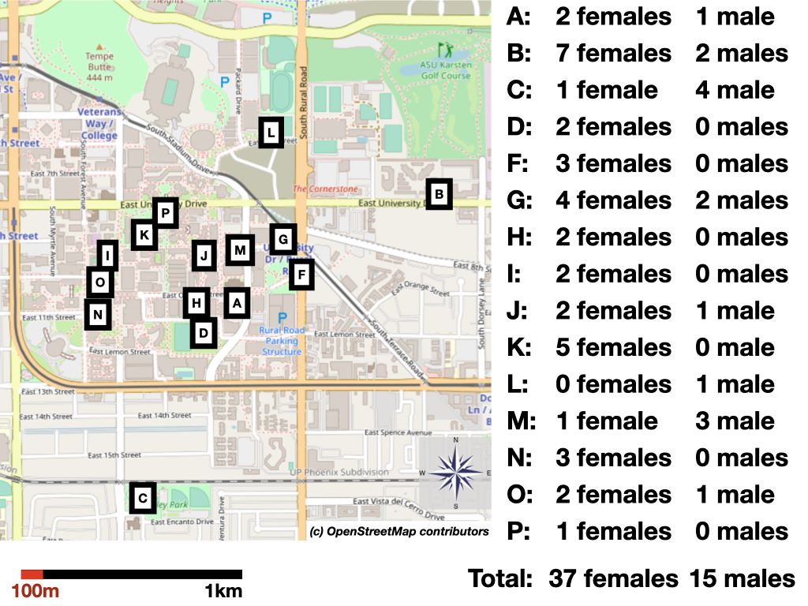

```{r setup, include=FALSE}
knitr::opts_chunk$set(echo = TRUE)
```

```{r}
#Make code wrap text so it doesn't go off the page when Knitting to PDF
library(knitr)
opts_chunk$set(tidy.opts=list(width.cutoff=60),tidy=TRUE)
```

&lt;img width="50%" src="logoPCIecology.png"&gt;


**The preregistration for this study has been pre-study peer reviewed and received an In Principle Recommendation by:**

Sophie Beltran-Bech (2019 In Principle Acceptance) Investigate fine scale sex dispersal with spatial and genetic analyses. *Peer Community in Ecology*, 100036. [10.24072/pci.ecology.100036](https://doi.org/10.24072/pci.ecology.100036)

 - Reviewers: Sylvine Durand and one anonymous reviewer


###ABSTRACT

In most bird species, females disperse prior to their first breeding attempt, while males remain close to the place they were hatched for their entire lives. Explanations for such female bias in natal dispersal have focused on the resource-defense based monogamous mating system that is prevalent in most birds, with potential benefits for males from knowing the local environment to establish territories to attract females and benefits for females to disperse to search for suitable mates. However, theoretical, field, and comparative studies highlight that the exact factors shaping dispersal decisions are often more complex. Studying species with different social and mating systems can help to better understand the relative role of various factors in the evolution of sex biased dispersal. Here, we use genetic approaches to determine whether females and/or males disperse in great-tailed grackles (*Quiscalus mexicanus*), which have a mating system where the males hold breeding territories where multiple females might choose to place their nest in, but females forage independently of these breeding territories across a wider area. First, we find that, for individuals caught at a single site in Arizona, the average relatedness among all female dyads is higher than expected at random whereas average relatedness among all males dyads is not. Second, we find that female close relatives are found within shorter distances from each other than pairs of unrelated females whereas male close relatives are found at larger distances from each other than pairs of unrelated males. Third, we find some patterning of genetic similarity by geographic distance within our study site for females but not for males. These relatedness results suggest that, unlike most other bird species, female great-tailed grackles appear to have hatched and remained at this site while males disperse to new areas. Our findings show that reduced resource competition might facilitate female philopatry and that prior knowledge of an area does not appear to be a prerequisite for male great-tailed grackles to establish breeding territories.


### INTRODUCTION

Maturing birds face a decision about where to establish themselves to breed. The decision of whether to remain in the area they have hatched or to move short or substantial distances to new breeding grounds has been argued to be influenced by an interplay of the potential costs of movement, resource availability and competition, and the potential benefits or costs of interacting with close relatives (@Mabry2013social, @Li2019sex). Generally across bird species, the relative balance of these benefits and costs appears to differ between males and females, leading to sex biases in natal dispersal. In the majority of avian species, this bias is expressed as males remaining in the area they have hatched while females move to breed elsewhere (@greenwood1980). The main theory that has been proposed to explain this sex bias towards male philopatry has focused on the resource-defense based monogamous mating system found in most bird species (@greenwood1980, @trochet2016evolution). However, because many of the alternative factors brought forward to potentially explaining this sex bias are also present in the majority of bird species, it has been difficult to disentangle their relative roles (@Mabry2013social, @trochet2016evolution, @Li2019sex). One way forward to better understand the relative role of the various factors that potentially explain dispersal in birds is to study the dispersal of females and males in species with different social and mating systems.

Studying dispersal outside of well established study systems is difficult, limiting information from bird species with unusual social and mating system. It is challenging to set up studies that span a large geographical area where the identity of many individuals can be established and followed, such that the fate of individuals who leave the area often remains unknown and it is unclear whether individuals who are found new in the area have moved to the area or were simply not observed previously (@walters2000dispersal). To overcome these challenges, research has moved to incorporate genetic approaches to identify dispersal patterns (@lawson2007advances, @banks2012genetic). In particular, to identify potential sex biases in dispersal, two approaches are used. The first approach relies on determining the spatial distribution of variants of genetic markers that have a sex-specific inheritance (@lawson2007advances). The second approach uses data from a large number of genetic markers spread across the genome to determine how the similarity across these markes changes with increasing spatial distances among males and females (@banks2012genetic). Studies based on the second approach have increased in recent years as the costs of generating genotypes for a large sample of individuals have rapidly declined (@harrison2014population, @weinman2015comparison, @thrasher2018double)

Here, we investigate SNP (single nucleotide polymorphism) genotype data for a sample of females and males from a single site of *Quiscalus mexicanus*, great-tailed grackles. In great-tailed grackles, individuals forage in small fission-fusion groups in ranges that are not obviously defended against other individuals, and at night roost in large associations of several hundred individuals. During the mating seasons, some males defend territories around suitable breeding habitats and mate with females building their nests in these territories. Holding a territory leads to higher reproductive success for these males, but females also mate with other roaming males, leading to a  a polygynous mating system (@johnson2000male). Previously, females were assumed to perform all activities related to offspring care, from building the nest through incubating and feeding the hatchlings, but recent observations indicate that at least some males partake in these activities (@Folsom2020malecare). Both the mating and the social system are accordingly different from the resource-defense based monogamous system found in the majority of birds, offering an opportunity to determine if and how these differences might influence the dispersal behavior of both males and of females.


### HYPOTHESES

**Main hypothesis** Based on the argument that males are expected to be philopatric when they defend resources beneficial to females and that females in response disperse to avoid mating with relatives, our main hypothesis predicts that there are sex differences in the natal disperal rate and distance among individuals in great-tailed grackles (*Quiscalus mexicanus*) with males remaining close to where they hatched and females moving away from where they hatched. 

In addition, to assess the potential interplay of various factors, we assess four alternative hypotheses:

**Alternative hypothesis 1** Based on observations that great-tailed grackle males only compete during a short period to gain access to small distinct breeding territories, without defending resources for females for an extended period of time, males might move to areas where mating opportunities are higher or competition is lower. In this case, females could be expected not to face a risk of inbreeding, and we predict sex differences in the opposite direction with males dispersing away from where they hatched and females remaining where they hatched. 

**Alternative hypothesis 2** The polygynous mating system of great-tailed grackles, where females might be able to choose among potential males, might reduce their risk of mating with their father or brother. In this case, individuals of both sexes can remain close to relatives, and we predict that individuals of both sexes remain close to where they hatched. 

**Alternative hypothesis 3** Given that great-tailed grackle individuals of both sexes do not establish territories around resources (food or mates), they might move multiple times throughout their lives to areas where competition is the lowest. In this case, we predict that individuals of both sexes disperse away from where they hatched. 

We predict that the movement of individuals will influence the spatial distribution of genetic relatives. Individuals of the sex who remain close to where they hatched are expected to be close to genetic relatives while individuals of the sex who disperse are expected to not be close to genetic relatives (see Fig 1 for a visualization). We also expect that the further the distance an individual moves, the less likely they are to be even distantly related to another individual within the study area. We will perform three analyses to investigate the spatial distribution of genetic relatives: the first two aim to detect whether there are sex biases in levels of average genetic relatedness among indivduals found within a certain distance of each other (analysis i: average levels of relatedness among individuals in our sample; analysis ii: geographic distances between individuals assumed to be close genetic relatives) and the third aims to describe the genetic structure separately for each sex and whether relatives are predominantly found within certain distances from each other or whether relatives are not structured in geographic space (analysis iii: spatial autocorrelation). 





### METHODS

Our methods are described in the peer-reviewed preregistration of this article http://corinalogan.com/Preregistrations/gdispersal.html  All details, data, and code are listed below.


### STATE OF THE DATA AND CHANGE FROM PREREGISTRATION

The first version of the preregistration was written (June 2019) and submitted to Peer Community In Ecology (July 2019) after blood was collected and before processing the DNA to obtain the genetic data. The revised version of this preregistration following peer review at Peer Community in Ecology (October 2019) was written after obtaining the genotypes for the individuals in the sample and resubmitted (November 2019). The preregistration received an in-principle recommendation in November 2019. 

Analyses were started in March 2020. During the preparation of the analyses, we noticed that we had made a mistake when calculating the sex composition in the sample: different from what was written in the preregistration, the sample for our genetic analyses consists of 41 (not 40) females and 16 (not 17) males. In addition, we realized that the sample included some juvenile individuals. We excluded these 4 individuals from the main analyses as they might have been pre-dispersal at the time of capture. The dataset for the relatedness analyses therefore consisted of 37 adult females and 15 adult males.

We made the following changes and additions to the analyses, all of which test existing predictions and rely on approaches described in the preregistration:

ddRadSeq single nucleotide polymorphism filtering: In addition to using the parameters of (@thrasher2018double; loci only considered if they were present in 80% of the samples (r), minimum minor allele frequency of 0.05 (maf-min) - resulting in 3647 variant sites), we repeated the filtering with more stringent conditions (loci only considered if they were present in 95% of the samples (r), minimum minor allele frequency of 0.05 (maf-min) - resulting in 635 variant sites). We decided to use the resulting genotypes from the second, more restrictive setting for the relatedness analyses because of our low sample size (if some individuals had a lower quality sample their relatedness to other individuals might consistently be misclassified) and because these settings still provided a large number of variant sites for analyses.

Exclusion of genotypes: We noticed that one individual, female A053, was indicated to be related to all other individuals in the sample. When we checked the genotype of this individual, we noticed that it had much higher levels of heterozygosity, independent of how we filtered the data. The genotype did not show signs of shifting of alleles between loci (e.g. showing a genotype that lists allele 2 from locus 1 with allele 1 from locus 2 and so on) or issues with missing data or dropout of alleles. Instead, the increase in heterozygosity was always close to the square of the heterozygosity observed among the remaining individuals, suggesting that this genotype might be constructed from two different individuals. We were not able to retrace where such an error might have been introduced, and accordingly decided to exclude individual A053 from the analyses.

Relatedness estimator: The 'compareestimator' function in the package 'related' caused fatal errors on multiple computers. We therefore opted to calculate pairwise relatedness based on the estimator of (@wang2009parentage), following the observation in (@thrasher2018double) of the suitability of this estimator for ddRadSeq data, and based on the estimator of (@queller1989estimating), which has been the standard for multiple studies. With both sets of  relatedness estimates, all of our inferences (high levels of average relatedness among females, shorter distance among closely related females, spatial structure among female genotypes) were similar. In the results, we only present the results based on the estimator by Queller & Goodnight, because we noticed that with our data the estimator by Wang appeared to be more influenced by missing data in the genotypes.  

Analysis i average relatedness and sex: We adjusted the permutations to reflect the actual sex composition in our sample.

Analysis ii distances among genetic relatives: We did not perform the permutation to assess whether the difference in the average distance among closely related females and the average distance among closely related males was different than expected because of the very low number of closely related male dyads in our sample (only a single dyad). Instead, we performed a permutation to assess whether the average distance among closely related female dyads (r>0.2499) was shorter than the average distance among a random sample of the same number of female dyads.

Analysis iii relatedness and geographic distance: For the correlogram analyses with set distance classes, we repeated the analyses setting the distance classes based on the information of the average distance among close genetic relatives from analysis ii. We spaced the distance classes such that the observed average distance among close female kin (~330m) and among close male kin (~670m)  fell about halfway between the breakpoints for the classes (set at 0-150, 150-450, 450-900, 900-1500, 1500-2000).


### RESULTS

####*Genotyping*

We generated SNP genotypes for 56 individuals from our study site in Arizona. We retained 635 variable loci after filtering out loci that were not present in at least 95% of individuals and at which the rare allele was not observed in at least 5% of all samples. Data was missing for 2.7% of all alleles, with no individual or locus showing a particular underrepresentation of information. All loci had 2 alleles and theobserved heterozygosity was 0.48, slightly higher than the expected heterozygosity. The probability of identity for siblings, the chance that two siblings will show the same genotypes given the allele frequencies across these 635 loci, is less than 10 to the power of minus 139. 


####*Analysis i: average relatedness and sex*

The average relatedness among the 37 adult females (666 dyads) is -0.013 (standard deviation 0.07), the average relatedness among the 15 adult males (105 dyads) is -0.015 (standard deviation 0.08), and the average relatedness among all 52 adult individuals in our sample (1326 dyads) is -0.017 (standard deviation 0.07). Even though the difference in the level of average relatedness among females compared to among all individuals is small, by chance we would expect average relatedness values as high or higher than observed among adult females in less than 4% of random samples of 37 individuals, whereas average relatedness among males is not different from that expected by chance among 15 individuals (40% of random samples give a value as low or lower). Of the eight close genetic relatives (relatedness of 0.25 or higher), seven are female dyads and one is a male dyad. 


####*Analysis ii: distances among genetic relatives*

Close female genetic relatives had been trapped in close spatial proximity to each other (Figure 2). The median distance between the eight female dyads related at 0.25 or closer is 340 meters (standard deviation 440 meters) and between the twelve female dyads related at 0.125 or closer it is 360 meters (standard deviation 354 meters), compared to a median of 620 meters among all dyads of females (standard deviation 464 meters). A median distance as short or shorter than 340 meters is observed in less than 6% of all random samples of 7 female dyads and a median distance of 360 meters or shorter is observed in less than 4% of all random samples of 12 female dyads. The distance among the one pair of males related at closer than 0.25 is 670 meters, and the median distance among the three male dyads related at 0.125 or closer is 1183 meters (standard deviation 353 meters). This compares to a median of 972 meters among all dyads of males (standard deviation 569 meters), with about 40% of male dyads being 670 or less meters apart. 


####*Analysis iii: spatial autocorrelation*

Correlogram analyses linking genetic relatedness and spatial distance for females showed negative values when females are in close spatial proximity and positive values when they are far apart (two of five values different than expected by chance), suggesting that as spatial distance among females increases the relatedness among them decreases. Correlogram analyses for males showed no consistent relationships between genetic relatedness and spatial distance, with values fluctuating around zero (zero of five values different than expected by chance).


Table 1:
```{r dist_check1, eval=FALSE, warning=FALSE, results='asis', echo=TRUE}
d <- read.csv("gdispersal_correlogramtable.csv", 
    header = F, sep = ",", stringsAsFactors = F)

library(reactable)
reactable(d, highlight = TRUE, bordered = FALSE, compact = TRUE, 
    wrap = TRUE, resizable = TRUE, columns = list(V1 = colDef(name = "Distance class"), 
        V2 = colDef(name = "Females: correlation"), V3 = colDef(name = "Females: corrected probability"), 
        V4 = colDef(name = "Males: correlation"), V5 = colDef(name = "Males: corrected probability")))
```


### DISCUSSION


Our results support the first alternative hypothesis that males disperse more than females. Matching all three predictions, we find in analysis i that the mean level of average genetic relatedness is lower among males compared to females in our sample; in analysis ii that the mean of the geographic distances between pairs of individuals inferred to be closecgenetic relatives is higher among males compared to females; and in analysis iii that there is no spatialrelationship between genetic relatedness and geographic distance for males but there will is a negative spatial autocorrelation signal indicating a negative relationship between genetic relatedness and geographic distance for females.

The consistency of the results across the three types of analyses supporting female philopatry and male dispersal is reassuring given our small sample size and additional limitations. Previous studies relying on spatial analyses of multi-locus genotypes have also been able to detect even modest sex biased dispersal in fine-scale spatial distribution (examples of empirical studies that detected a signal with small sample sizes include @hofmann2012evidence, @quaglietta2013fine, @gour2013philopatry, @botero2017variation). In particular, the large number of SNP loci we have for each individual presumably increased our power to obtain a qualitative assessment of whether relatives are present in our sample (@wang2009parentage) and accordingly whether dispersal is more prevalent in either females or males based on the spatial autocorrelation (@banks2012genetic). However, since we only have information for a small number of individuals from within a single site, we could not use methods that rely on assigning individuals to a source population or measure the relative distribution of genetic variation within versus among populations (Fst or similar measures). We also do not know whether there is a proportion of females who do disperse and the distances that individuals might disperse.

Our findings highlight great-tailed grackles as further species that might help us to better understand the factors influencing dispersal decisions of female and male birds. The reversal of the sex bias in great-tailed grackles compared to what is observed in most other avian species is in line with the main hypothesis that has been put forward to explain the contrast in sex biases in dispersal between birds and mammals: that in polygynous species, males disperse to search for mating opportunities, while in monogamous species, males remain philopatric to defense resources for high-quality partners. However, given that the link between the mating system and dispersal is much less clear-cut than sometimes assumed (@Li2019sex) and the limitations of our study, we cannot determine the exact reasons for males to disperse and for females to apparently remain cose to where they hatched. We only observe a general pattern of bias, but do not have sufficiently detailed information on the experiences of particular individuals that might have shaped their dispersal behaviour. Additional individual-based studies would be needed to investigate resource and mating competition and whether the patterning of relatives in space relates to kin-based social interactions and inbreeding. 


###C. METHODS

####**Planned Sample**
	
DNA from 52 great-tailed grackles was obtained from wild adults (n=37 adult females, n=15 adult males, juvenile samples were excluded because they had not yet dispersed) caught in Tempe, Arizona, USA (see Fig 1 for a map). These individuals were either immediately released, or temporarily brought into aviaries for behavioral testing and then released back to the wild.

The larger number of females than males in our sample appears to reflect the adult sex ratio at this study site. To estimate the sex ratio at the field site, we counted the number of females and males that were trapped in mist nets since the beginning of our study (September 2017 - October 2019). This trapping method likely does not elicit a sex bias in terms of which sex is caught because the nets are invisible. Therefore, if one sex is more neophobic than the other, both sexes are likely to be trapped using this method. A total of 26 females and 11 males were trapped using mist nets (a ratio of 2.36 females per 1 male), which is very similar to the sex ratio in our sample consisting of 40 females and 17 males (2.35 females per 1 male).

Females were caught at all but one site, such that comparisons are possible of the genetic relatedness of pairs of females trapped at various distances from each other. Males were not caught at all trap sites, but there are several sites at which multiple males were caught and sufficient sites for comparisons of males that were caught close to each other, at intermediate, and at long distances.

####**Sample size rationale**
	
The sample size presented was the largest one possible by July 2019 when the DNA were sequenced using ddRADseq.

####**Data collection stopping rule**
	
We analyzed all blood samples that were collected through June 2019, which was the end of the trapping season.

####**Open data**

When the study is complete, the data will be published in the Knowledge Network for Biocomplexity's data repository. Data necessary for the analyses are also available at github.

```{r dist_check1, eval=FALSE, warning=FALSE, results='asis', echo=TRUE}

library(related)
library(tidyr)
library(dplyr)
library(vegan)
library(geosphere)
library(DataCombine)
library(data.table)


#SNP data, processed to calculate pairwise relatedness
input<-readgenotypedata(url("https://raw.githubusercontent.com/corinalogan/grackles/master/Files/Preregistrations/gDispersal_GrackleGenotypesForRelatedness.txt"))

# Individual level data, listing the sex (M ale or F emale), age (A dult or J uvenile), and latitude and longitude of the capture location
gracklelocations<-read_csv(url("https://raw.githubusercontent.com/corinalogan/grackles/master/Files/Preregistrations/gDispersal_GrackleIndividualInformationForRelatedness.csv"))
gracklelocations<-data.frame(gracklelocations)

```

####**Randomization and counterbalancing** 

No randomization or counterbalancing is involved in this study.

####**Blinding of conditions during analysis**

Experimenters are blind to the sex of the bird when processing samples using ddRADseq (only the alphanumeric bird ID was visible on the tube and no team member has memorized which ID goes with which bird because we give the birds names).

####**Blood collection**

Whole blood samples were collected from individual birds by brachial or medial metatarsal venipuncture. For each individual, blood was collected by draining 150 uL of whole blood directly into a non-heparinized microtainer. While other blood processing and biometric measurements (for other research questions) were taking place, this microtainer sat at room temperature for 30-60 min. After releasing birds, the microtainer containing whole blood was centrifuged at 15 X gravity for 10 minutes to separate avian blood plasma (contains hormones) from nucleated red blood cells (contains DNA; packed red blood cells, PRBC). The plasma layer was decanted from the centrifuged tube into a 0.6 mL microcentrifuge tube and placed on ice for a maximum of 3 hours until it could be stored in a -80 C freezer (Jan 2018 to Sep 2019) or temporarily in a -20 C freezer until it could be shipped to a -80 C freezer (Jun 2019 to present).

Blood was collected and stored in one of two ways until DNA extraction: 

1) At the beginning of the project (2018), 70 uL of whole blood was added to silicone-coated micro-blood collection tubes containing 280 uL of lysis buffer (@white1992mitochondrial, pp. 50-51) and stored at room temperature for up to a year before DNA extraction.

2) In 2018 a different method was implemented, using DNA from packed red blood cells: 150uL of blood was collected from trapped great-tailed grackles and stored for a minimum of 30 minutes and a maximum of 60 minutes at room temperature or 3 hours on ice. Samples were then centrifuged at 15x gravity for 10 minutes to separate the serum from the cellular fraction. After the serum layer was removed and stored, 600uL lysis buffer (@white1992mitochondrial, pp. 50-51) was added to the remaining packed cells. Tubes containing packed cells and lysis buffer were stored at room temperature for up to 1 year before extraction. 

####**DNA extraction and quantification**

Some samples were extracted at Arizona State University by Rowney (samples through Dec 2018), while others were shipped with ice packs to Washington State University for extraction by Blackwell and his lab (samples collected Jan-Jun 2019). DNA was extracted from the above samples using the DNeasy Blood and Tissue kit (Qiagen) with slight modifications from the manufacturer's protocol (see details in @thrasher2018double Supporting Information, page 7; our slightly modified protocol is available [here](https://cryptpad.fr/pad/#/2/pad/edit/4eLjZYSBPsIwUC42BTqWczBJ/)). Approximately 100ul of blood/lysis mixture was mixed with 20ul Proteinase K, 150ul PBS, and 200ul buffer AL, then incubated overnight at 64C while shaking. Samples were mixed with 200ul ethanol and added to spin columns. Columns were centrifuged and washed according to kit protocol using buffers AW1 and AW2. DNA was eluted into 50ul of RNAse and DNAse free water at 64C after a 5-10 min incubation on columns. DNA quantification was then performed on a Qubit 4.0 Fluorometer (Fisher Scientific) following the manufacturer’s protocol for broad range dsDNA. The average yield of samples used for sequencing was 34ng/ul. Extracted DNA samples were shipped with ice packs to the Cornell Lab of Ornithology for ddRAD sequencing in July 2019.

####**ddRADseq**

The DNA was processed using ddRADseq by Sevchik and Bronwyn Butcher (Cornell University) following methods in @thrasher2018double. Each of the samples’ DNA concentrations was measured using the Qubit dsDNA BR Assay Kit and the Qubit Fluorometer following the manufacturers protocol. For this particular experiment, the necessary DNA concentrations were between 5-50 ng/ul and so any sample outside of this range needed to be normalized. Those samples with a concentration higher than 50ng/ul were diluted to approximately 25ng/ul with nuclease-free water. For those samples with concentrations lower than 5ng/ul, both elutions were pooled and the DNA concentrated by evaporation using an Eppendorf Vacufuge. The DNA extracts are then run through a PCR thermocycle where the fragments are digested with a combination of two restriction enzymes (SbfI-HF and MspI) and 20 different adapters attached to the end of the DNA pieces. A 1% agarose gel is run to ensure the proper digestion and ligation of the DNA samples. The samples are then cleaned up using MagNA beads and size selected using BluePippin for a prespecified length (between 400-700 base pairs). After the samples return from size selection, they are amplified using a low-cycle PCR process and pooled together to be sent in to be sequenced. Sequencing was performed on an Illumina NextSeq500 (using a mid-output kit and run with Illumina PhiX control (15%) to aid sequence alignment) to generate 150 bp single end reads at the Core Facilities of the Cornell Institute of Biotechnology. These data were post-processed to generate SNP data for relatedness analyses as in @thrasher2018double. After filtering reads for quality and demultiplexing to assign sequences back to specific individuals, genetic loci were assembled *de novo* because no reference genome exists for great-tailed grackles. We will follow the cut-offs described in @thrasher2018double for single nucleotide polymorphism filtering, but might adjust settings (e.g., threshold of accepted minor allele frequencies) depending on the composition of our sample (these decisions will have no influence on testing our predictions since they influence females and males equally and will be performed prior to any further analyses). 

####**Relatedness analyses**

Genetic relatedness between all pairs of individuals is calculated using the package “related” (@pew2015related) in R, following methods in @thrasher2018double. We estimated relatedness using the approaches of (@wang2009parentage) and of (@queller1989estimating). 

####**Dependent variable**

Average relatedness between all pairs of individuals within one sex

####**Independent variables**

1) Sex (female, male)

```{r dist_check1, eval=FALSE, warning=FALSE, results='asis', echo=TRUE}
input$gdata$V1<-as.character(gracklelocations$Individual)
gracklelocations<-filter(gracklelocations,Individual != "AF_053PS")
adults<-filter(gracklelocations,Age %in% "A")[,]$Individual
adultgracklelocations<-filter(gracklelocations,Individual %in% adults)
```

2) Distance between trap sites (meters)

```{r dist_check1, eval=FALSE, warning=FALSE, results='asis', echo=TRUE}
#Plot pairwise distances among all females and among all males in the sample
#Calculate all pairwise distances
all_pairwise_distances <- distm(adultgracklelocations[,c('Lon','Lat')], adultgracklelocations[,c('Lon','Lat')], fun=distVincentyEllipsoid)
rownames(all_pairwise_distances)<-adultgracklelocations$Individual
colnames(all_pairwise_distances)<-adultgracklelocations$Individual
diag(all_pairwise_distances)<-NA

#Calculate pairwise distances among all the females
female_pairwise_distances <- distm(adultgracklelocations[adultgracklelocations$Sex=="F",c('Lon','Lat')], adultgracklelocations[adultgracklelocations$Sex=="F",c('Lon','Lat')], fun=distVincentyEllipsoid)
rownames(female_pairwise_distances)<-adultgracklelocations[adultgracklelocations$Sex=="F",]$Individual
colnames(female_pairwise_distances)<-adultgracklelocations[adultgracklelocations$Sex=="F",]$Individual
diag(female_pairwise_distances)<-NA

#Calculate pairwise distances among all the females
male_pairwise_distances <- distm(adultgracklelocations[adultgracklelocations$Sex=="M",c('Lon','Lat')], adultgracklelocations[adultgracklelocations$Sex=="M",c('Lon','Lat')], fun=distVincentyEllipsoid)
rownames(male_pairwise_distances)<-adultgracklelocations[adultgracklelocations$Sex=="M",]$Individual
colnames(male_pairwise_distances)<-adultgracklelocations[adultgracklelocations$Sex=="M",]$Individual
diag(male_pairwise_distances)<-NA

#plot distributions of pairwise distances
hist(all_pairwise_distances,col="grey75",border="black",breaks=10)
hist(female_pairwise_distances,col="grey75",border="black",breaks=10)
hist(male_pairwise_distances,col="grey75",border="black",breaks=10)

```


###D. ANALYSIS PLAN

We do not plan to **exclude** any data. If any **missing** data occur for the genotyping, we will exclude individuals more than half of their genotype is unknown. We did exclude one individual whose genotype showed unexplainable high levels of variation across the loci. Analyses were conducted in R (current version `r getRversion()`; @rcoreteam). 


####*Analysis i: average relatedness and sex*

We will compare the average and variance in relatedness among all females to that among all males. Since average relatedness tends to decrease as the number of individuals in the sample increases (regression to the mean), we will perform a permutation analysis to investigate whether the average relatedness among the males or among the females in our sample is higher than what would be expected for a random sample of the same number of females or of individuals of both sexes. We will perform 10,000 random draws of 17 individuals either from among the females or from among all individuals and of 40 individuals from among all individuals, and generate distributions of average relatedness among these samples. We will assess whether the observed average relatedness among the 17 males or the 40 females in our sample is higher than what is observed in the majority of random samples. We will report the proportion of random samples with lower relatedness than the observed values and, for comparison with other approaches, assess whether the observed relatedness is higher than the relatedness calculated for 95% of all random draws.  

```{r dist_check1, eval=FALSE, warning=FALSE, results='asis', echo=TRUE}

#Analysis 1: Assess whether average relatedness is higher among females or among males
#Calculate pairwise relatedness, here choosing the relatedness method developed by Wang and Queller & Goodnight
outfile<-coancestry(input$gdata,wang=1,quellergt=1)

#extract the relevant information from the file
pairwise_r<-outfile$relatedness

# We now exclude the individual with the dubious genotype and the juvenile individuals
pairwise_r<-filter(pairwise_r,ind1.id != "AF_053PS")
pairwise_r<-filter(pairwise_r,ind2.id != "AF_053PS")

# Next, we exculde all juvenile individuals
pairwise_r<-filter(pairwise_r,ind1.id %in% adults)
pairwise_r<-filter(pairwise_r,ind2.id %in% adults)

#This leaves us with 1326 pairwise relatedness values among the 52 remaining individuals


#identify which individuals are female and which are male
females<-filter(gracklelocations,Sex %in% "F",Age %in% "A")[,]$Individual
males<-filter(gracklelocations,Sex %in% "M",Age %in% "A")[,]$Individual

#Calculate average of and variance in relatedness among all individuals, all females, and all males
# First using the relatedness estimates based on the method by Wang
mean(filter(pairwise_r,ind1.id %in% females,ind2.id %in% females)$wang)
mean(filter(pairwise_r,ind1.id %in% males,ind2.id %in% males)$wang)
mean(pairwise_r$wang)

var(filter(pairwise_r,ind1.id %in% females,ind2.id %in% females)$wang)
var(filter(pairwise_r,ind1.id %in% males,ind2.id %in% males)$wang)
var(pairwise_r$wang)

# Next using the relatedness estimates based on the method by Queller and Goodnight
mean(filter(pairwise_r,ind1.id %in% females,ind2.id %in% females)$quellergt)
mean(filter(pairwise_r,ind1.id %in% males,ind2.id %in% males)$quellergt)
mean(pairwise_r$quellergt)

var(filter(pairwise_r,ind1.id %in% females,ind2.id %in% females)$quellergt)
var(filter(pairwise_r,ind1.id %in% males,ind2.id %in% males)$quellergt)
var(pairwise_r$quellergt)


#Perform a simulation to assess whether average relatedness among males is different from what we would expect in a random subset of the same number of individuals
#First based on the relatedness estimates based on the method by Wang
simulatedrelatedness<-matrix(ncol=1,nrow=10000)
for (i in 1:10000) {
  currentset<-sample(adults,length(males))
  simulatedrelatedness[i,1]<-mean(filter(pairwise_r,ind1.id %in% currentset,ind2.id %in% currentset)$wang)
}
hist(simulatedrelatedness)
#This value is similar to a p-value, it reflects the probability that the average relatedness observed among males would be expected in a random subsample
sum(simulatedrelatedness>mean(filter(pairwise_r,ind1.id %in% males,ind2.id %in% males)$wang))/10000


#Perform a simulation to assess whether average relatedness among females is different from what we would expect in a random subset of the same number of individuals
simulatedrelatedness<-matrix(ncol=1,nrow=10000)
for (i in 1:10000) {
  currentset<-sample(adults,length(females))
  simulatedrelatedness[i,1]<-mean(filter(pairwise_r,ind1.id %in% currentset,ind2.id %in% currentset)$wang)
}
hist(simulatedrelatedness)
#This value is similar to a p-value, it reflects the probability that the average relatedness observed among males would be expected in a random subsample
sum(simulatedrelatedness>mean(filter(pairwise_r,ind1.id %in% females,ind2.id %in% females)$wang))/10000


#Next based on the relatedness estimates based on the method by Queller & Goodnight
#Perform a simulation to assess whether average relatedness among males is different from what we would expect in a random subset of the same number of individuals
simulatedrelatedness<-matrix(ncol=1,nrow=10000)
for (i in 1:10000) {
  currentset<-sample(adults,length(males))
  simulatedrelatedness[i,1]<-mean(filter(pairwise_r,ind1.id %in% currentset,ind2.id %in% currentset)$quellergt)
}
hist(simulatedrelatedness)
#This value is similar to a p-value, it reflects the probability that the average relatedness observed among males would be expected in a random subsample
sum(simulatedrelatedness>mean(filter(pairwise_r,ind1.id %in% males,ind2.id %in% males)$quellergt))/10000


#Perform a simulation to assess whether average relatedness among females is different from what we would expect in a random subset of the same number of individuals
simulatedrelatedness<-matrix(ncol=1,nrow=10000)
for (i in 1:10000) {
  currentset<-sample(adults,length(females))
  simulatedrelatedness[i,1]<-mean(filter(pairwise_r,ind1.id %in% currentset,ind2.id %in% currentset)$quellergt)
}
hist(simulatedrelatedness)
#This value is similar to a p-value, it reflects the probability that the average relatedness observed among males would be expected in a random subsample
sum(simulatedrelatedness>mean(filter(pairwise_r,ind1.id %in% females,ind2.id %in% females)$quellergt))/10000

```


####*Analysis ii: distances among genetic relatives*

Based on the calculations of pairwise genetic relatedness, we will select the subset of pairs who are estimated to be more closely related than cousins (r≥0.125) or half-siblings (r≥0.25). For this subset of individuals, we will determine whether the pairwise geographic distances are shorter for the males or the females in the sample (@coulon2006dispersal). We will perform 10,000 random draws of pairs of males and of females matching the numbers of inferred closely related dyads, and calculate the difference between the average geographic distances for each sex. We will assess whether the observed difference in geographic distances is higher than the majority of random samples and, for comparison with other approaches, determine whether the observed distance is higher than that calculated for 95% of all random draws.


```{r dist_check2, eval=FALSE, warning=FALSE, results='asis', echo=TRUE}

#Analysis 2: Assess whether distances among closely related females are shorter than distances among closely related males
#First define close relatives as all pairs of individuals who are related by a level of 0.25 or higher (half-siblings or higher) using the Wang estimator
close_relatives_females<-filter(pairwise_r,wang >0.2499,ind1.id %in% females,ind2.id %in% females)
close_relatives_females_individuals<-c(close_relatives_females$ind1.id,close_relatives_females$ind2.id)

#Alternatively, select close relatives as pairs of individuals who are related at a level of 0.25 of higher using the Queller & Goodnight estimator
close_relatives_females<-filter(pairwise_r,quellergt >0.2499,ind1.id %in% females,ind2.id %in% females)
close_relatives_females_individuals<-c(close_relatives_females$ind1.id,close_relatives_females$ind2.id)

#Pick one of the two estimators before proceeding with the following analyses

#Next subset the the distance matrix to only include these individuals

females_pairwise_distances_matrix<-as.data.frame(female_pairwise_distances)
close_relatives_females_pairwise_distances<-matrix(nrow=nrow(close_relatives_females),ncol=1)

for (i in 1:nrow(close_relatives_females)) {
  ind1<-close_relatives_females[i,]$ind1.id
  ind2<-close_relatives_females[i,]$ind2.id
  pair_distance<-females_pairwise_distances_matrix[ind1,ind2]
  close_relatives_females_pairwise_distances[i,]<-pair_distance
}

median(close_relatives_females_pairwise_distances)

hist(close_relatives_females_pairwise_distances)


#repeat the same for the males
close_relatives_males<-filter(pairwise_r,wang >0.2499,ind1.id %in% males,ind2.id %in% males)
close_relatives_males_individuals<-c(close_relatives_males$ind1.id,close_relatives_males$ind2.id)

#Again, the alternative with the Queller & Goodnight method, pick only one of the two
close_relatives_males<-filter(pairwise_r,quellergt >0.2499,ind1.id %in% males,ind2.id %in% males)
close_relatives_males_individuals<-c(close_relatives_males$ind1.id,close_relatives_males$ind2.id)


#Next subset the the distance matrix to only include these individuals

males_pairwise_distances_matrix<-as.data.frame(male_pairwise_distances)
close_relatives_males_pairwise_distances<-matrix(nrow=nrow(close_relatives_males),ncol=1)

for (i in 1:nrow(close_relatives_males)) {
  ind1<-close_relatives_males[i,]$ind1.id
  ind2<-close_relatives_males[i,]$ind2.id
  pair_distance<-males_pairwise_distances_matrix[ind1,ind2]
  close_relatives_males_pairwise_distances[i,]<-pair_distance
}

median(close_relatives_males_pairwise_distances)

hist(close_relatives_males_pairwise_distances)

#calculate difference between the distances among males and among females
observeddifferenceindistances<-median(close_relatives_males_pairwise_distances,na.rm=T)-median(close_relatives_females_pairwise_distances,na.rm=T)

#perform simulation to generate random draws of matching numbers of individuals to assess whether the sex-difference in the distance is more or less than what would be expected by chance
number_close_relatives_females<-nrow(close_relatives_females)
number_close_relatives_males<-nrow(close_relatives_males)

simulateddifferencesindistances<-matrix(ncol=1,nrow=10000)
simulateddfemaleindistances<-matrix(ncol=1,nrow=10000)
simulateddmaleindistances<-matrix(ncol=1,nrow=10000)

for (i in 1:10000) {
simulated_close_relatives_females<-sample_n(pairwise_r, number_close_relatives_females, replace = TRUE)

subset_relatives_females_pairwise_distances<-matrix(nrow=nrow(simulated_close_relatives_females),ncol=1)

for (j in 1:nrow(simulated_close_relatives_females)) {
  ind1<-simulated_close_relatives_females[j,]$ind1.id
  ind2<-simulated_close_relatives_females[j,]$ind2.id
  pair_distance<-all_pairwise_distances[ind1,ind2]
  subset_relatives_females_pairwise_distances[j,]<-pair_distance
}

simulated_close_relatives_males<-sample_n(pairwise_r, number_close_relatives_males, replace = TRUE)

subset_relatives_males_pairwise_distances<-matrix(nrow=nrow(simulated_close_relatives_males),ncol=1)

for (k in 1:nrow(simulated_close_relatives_males)) {
  ind1<-simulated_close_relatives_males[k,]$ind1.id
  ind2<-simulated_close_relatives_males[k,]$ind2.id
  pair_distance<-all_pairwise_distances[ind1,ind2]
  subset_relatives_males_pairwise_distances[k,]<-pair_distance
}

simulateddfemaleindistances[i,1]<-median(subset_relatives_females_pairwise_distances,na.rm=T)
simulateddmaleindistances[i,1]<-median(subset_relatives_males_pairwise_distances,na.rm=T)
simulateddifferencesindistances[i,1]<-median(subset_relatives_males_pairwise_distances,na.rm=T)-median(subset_relatives_females_pairwise_distances,na.rm=T)
  }

sum(simulateddfemaleindistances<median(close_relatives_females_pairwise_distances))/10000
sum(simulateddmaleindistances>median(close_relatives_males_pairwise_distances))/10000
sum(simulateddifferencesindistances>observeddifferenceindistances)/10000


```


####*Analysis iii: spatial autocorrelation*

To test whether males and females show different patterns of genetic isolation by geographic distance, we will follow analyses as in @aguillon2017deconstructing. For the analysis, we will initially create 11 distance bins separated by 200m between 0m-2000m (the maximum distance between trapping sites). The 200m bin size was chosen because there are roosting trees that are ~50m apart suggesting that dispersal might be occuring below this scale and also to maximize the number of pairs in each distance class. The individuals in our sample were caught at one of 15 trap sites, and the resulting 105 pairwise distances among individuals will be assigned to one of the 11 bins. In case the pairwise distances among individuals are too small in each bin to detect a signal, then we will reduce the number of bins. In addition, we might adjust the distances covered by each bin to have shorter distances for the first few bins to increase the chance to detect relatives within the smallest bins (changing from 11 equally sized 200m bins to, for example, 9 bins at varying distances such as 0-50m, 50m-100m, 100m-150m, 150m-200m, 200m-500m, 500m-750m, 750m-1000m, 1000m-1500m, 1500m-2000m) (following @peakall2003spatial). For males and females separately, we will link the matrices of average relatedness and of geographic distance between all pairs of individuals by first plotting genetic relatedness against geographic distance and next by assessing the strength of their association using Mantel correlograms. We will use the function 'mantel.correlog' in the vegan package (@oksanen2013package) in R, performing 10,000 permutations to assess the strength of the association. This approach relies on the establishment of the multivariate Mantel correlogram by @legendre2012numerical. The approach relies on partitioning the geographic locations into a series of discrete distance classes. The result of this set of analyses is a Mantel’s correlogram, analogous to an autocorrelation function but performed on a set of distance matrices. For each distance class, a separate matrix is generated and codes whether a given geographic distance between a pair of individuals falls within that range or not. A normalized Mantel statistic is calculated using permutations for each distance class. The permutation statistics, plotted against distance classes, produce a multivariate correlogram. These analyses are performed separately for each sex to determine whether isolation-by-distance might occur and indicate dispersal of the individuals of that sex. A stronger negative correlation between genetic relatedness and spatial distance for males than for females would indicate that males disperse shorter distances than females, and in particular we expect that males captured at the same trapping site will be much more closely related to each other than females captured at the same trapping site. 

```{r dist_check3, eval=FALSE, warning=FALSE, results='asis', echo=TRUE}

#Analysis 3: Correlogram to assess change of relatedness with distances

#have each value only once in the distance matrix
for (i in 1:ncol(all_pairwise_distances)) {
  all_pairwise_distances[i,i:ncol(all_pairwise_distances)]<-NA
}


#turn pairwise_r$wang into a matrix
all_relatedness<-select(pairwise_r,ind1.id,ind2.id,wang)
relatedness_matrix<-spread(all_relatedness,"ind1.id","wang")
relatedness_matrix <- cbind(relatedness_matrix,AF_061PR="NA")
relatedness_matrix<-arrange(relatedness_matrix,ind2.id)
relatedness_matrix <- InsertRow(data=relatedness_matrix, NewRow=rep("NA",53), RowNum=1)
relatedness_matrix[1,1] <- "AF_001YP"
rownames(relatedness_matrix)<-relatedness_matrix[,1]

#turn pairwise_r$quellergt into a matrix
all_relatedness<-select(pairwise_r,ind1.id,ind2.id,quellergt)
relatedness_matrix<-spread(all_relatedness,"ind1.id","quellergt")
relatedness_matrix <- cbind(relatedness_matrix,AF_061PR="NA")
relatedness_matrix<-arrange(relatedness_matrix,ind2.id)
relatedness_matrix <- InsertRow(data=relatedness_matrix, NewRow=rep("NA",53), RowNum=1)
relatedness_matrix[1,1] <- "AF_001YP"
rownames(relatedness_matrix)<-relatedness_matrix[,1]

relatedness_matrix<-relatedness_matrix[1:52,2:53]

female_relatedness_matrix<-relatedness_matrix[rownames(relatedness_matrix) %in% females,colnames(relatedness_matrix) %in% females]
male_relatedness_matrix<-relatedness_matrix[rownames(relatedness_matrix) %in% males,colnames(relatedness_matrix) %in% males]

#perform the correlogram analysis
#first way, defining the distance classes
female_correlogram_setdistances<-mantel.correlog(D.eco=female_relatedness_matrix,D.geo=female_pairwise_distances,break.pts=c(0,100,200,300,400,500,750,1250,1550,2000,2500),cutoff=FALSE,nperm=10000)
male_correlogram_setdistances<-mantel.correlog(D.eco=male_relatedness_matrix,D.geo=male_pairwise_distances,break.pts=c(0,100,200,300,400,500,750,1250,1550,2000,2500),cutoff=FALSE,nperm=10000)
#second way, setting the number of distance classes
female_correlogram_classes<-mantel.correlog(D.eco=female_relatedness_matrix,D.geo=female_pairwise_distances,n.class=5)
male_correlogram_classes<-mantel.correlog(D.eco=male_relatedness_matrix,D.geo=male_pairwise_distances,n.class=5)

#additional way, with the distance classes based on the inferred distance among relatives from analysis ii
female_correlogram_setdistances<-mantel.correlog(D.eco=female_relatedness_matrix,D.geo=female_pairwise_distances,break.pts=c(0,150,450,900,1600,2000),cutoff=FALSE,nperm=10000)
male_correlogram_setdistances<-mantel.correlog(D.eco=male_relatedness_matrix,D.geo=male_pairwise_distances,break.pts=c(0,150,450,900,1600,2000),cutoff=FALSE,nperm=10000)

female_correlogram_setdistances
male_correlogram_setdistances

```

###E. ETHICS

This research is carried out in accordance with permits from the:

1) US Fish and Wildlife Service (scientific collecting permit number MB76700A-0,1,2)
2) US Geological Survey Bird Banding Laboratory (federal bird banding permit number 23872)
3) Arizona Game and Fish Department (scientific collecting license number SP594338 [2017], SP606267 [2018], and SP639866 [2019])
4) Institutional Animal Care and Use Committee at Arizona State University (protocol number 17-1594R)
5) University of Cambridge ethical review process (non-regulated use of animals in scientific procedures: zoo4/17 [2017])

###F. AUTHOR CONTRIBUTIONS

**Sevchik:** Hypothesis development, sample processing, data analysis and interpretation, write up, revising/editing.

**Logan:** Hypothesis development, data analysis and interpretation, write up, revising/editing, materials/funding.

**Folsom:** Blood collection, revising/editing.

**Bergeron:** Blood collection, revising/editing.

**Blackwell:** Hypothesis development, DNA extraction, revising/editing.

**Rowney:** DNA extraction, write up, revising/editing.

**Lukas:** Hypothesis development, data analysis and interpretation, write up, revising/editing, materials/funding.

###G. FUNDING

This research is funded by the Department of Human Behavior, Ecology and Culture at the Max Planck Institute for Evolutionary Anthropology.

###I. CONFLICT OF INTEREST DISCLOSURE

We, the authors, declare that we have no financial conflicts of interest with the content of this article. Corina Logan and Dieter Lukas are Recommenders at PCI Ecology and Corina Logan is on the Managing Board at PCI Ecology.

###J. ACKNOWLEDGEMENTS

We thank our PCI Ecology Recommender, Sophie Beltran-Bech, and our reviewers, Sylvine Durand and one anonymous reviewer, for their valuable feedback that greatly improved the preregistretation of this research; Caroline Smith for assisting with some of the DNA extractions; and Bronwyn Butcher and Irby Lovette at the Lab of Ornithology at Cornell University for providing the lab and training for processing the DNA samples using ddRADseq and for post-processing the raw data into a readily analyzable form.

###K. [REFERENCES](MyLibrary.bib)
