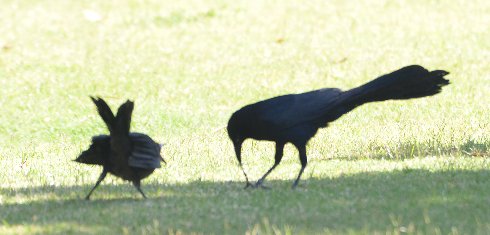
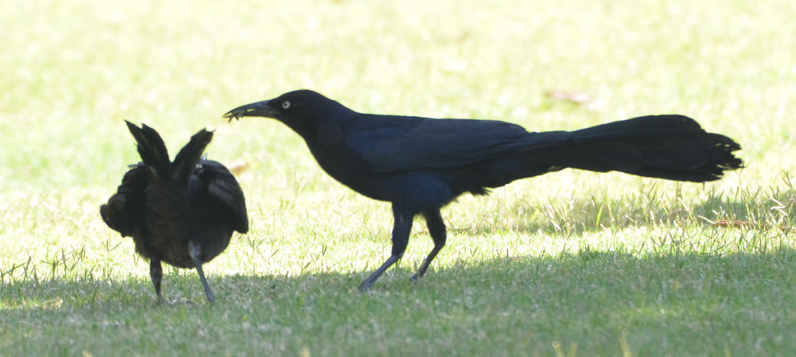
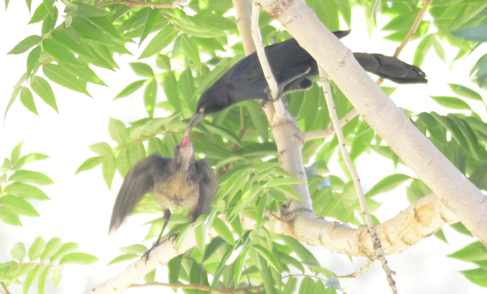
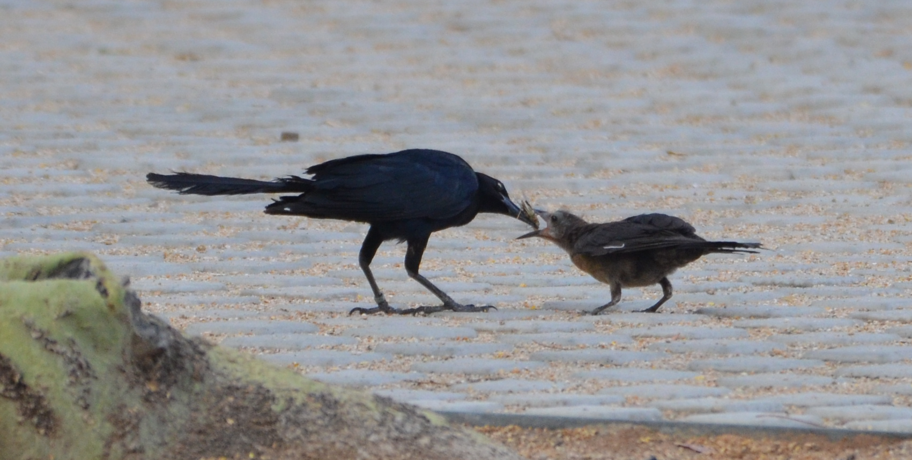

```{r setup, include=FALSE}
knitr::opts_chunk$set(echo = TRUE) #set global options
```

```{r}
#Make code wrap text so it doesn't go off the page when Knitting to PDF
library(knitr)
opts_chunk$set(tidy.opts=list(width.cutoff=60),tidy=TRUE)
```

***Click [here](https://github.com/corinalogan/grackles/blob/master/README.md) to navigate to the version-tracked reproducible manuscript (.Rmd file)***

### ABSTRACT
Great-tailed grackles (*Quiscalus mexicanus*) are known to have a mating system where females are the sole builders of the nest and caretakers of the young (@johnson2000male). However, there is one report from @selander1970parental in which an unmarked male great-tailed grackle provided parental care to two juveniles in Austin, Texas. Here, we report repeated parental care events by multiple individually marked adult males in a population of great-tailed grackles in Tempe, Arizona. We also report male parental care by unmarked adult males in Tempe, Arizona; Santa Barbara, California; and San Clemente, California. We then propose to begin to investigate hypotheses determining whether male parental care 1) is associated with hormone profiles (testosterone, estrogen, prolactin, progesterone) potentially because hormones mediate investment in competition and care behavior; 2) increases the number of offspring that survive to independence; 3) is a local adaptation, unique to specific populations where it has evolved; and 4) is a mating strategy.

### A. STATE OF THE DATA

This preregistration was written (Jun 2019) when an individually marked male provided repeated parental care in Tempe, Arizona, at which point behavioral data collection began. We submitted it to Peer Community in Ecology for pre-study peer review (Dec 2019) before collecting data from subsequent breeding seasons and before analyzing any of the data involved in hypothesis testing.

### B. PARTITIONING THE RESULTS

We may publish the anecdotes and the results from hypotheses separately.

### C. BEHAVIORAL OBSERVATIONS

#### Chile provides male parental care

Chile, an adult male great-tailed grackle, was color-marked with bands on 24 April 2018 at the Arizona State University (ASU) campus in Tempe, Arizona. On 02 June 2019, Folsom observed Chile providing parental care for two fledglings (both were greater than 23 days of age because they were capable of flying (@skutch1954life)). The larger fledgling lacked feathers around its eyes, while the smaller fledgling had feathers around its eyes, indicating it was older than the larger fledgling (@skutch1954life). Based on their development, the smaller but older fledgling was likely female, while the other was likely a male because adult female grackles are typically much smaller than adult males (@selander1958age).


The first observation, on 02 June 2019 at 09:16, involved Chile foraging in the grass, obtaining food items (most likely insects, no obvious human food), and then feeding these items to the two fledglings who were walking in the grass and following him. Later that day, at 13:02, Chile was again seen feeding the two fledglings. Both of these observations were within Chile’s breeding territory (170 m apart). While this was occurring, Crema, a color-marked adult female great-tailed grackle, was calling while standing about three meters away in the grass. Although it is common for fledglings to approach females and beg for food, the fledglings did not attempt to approach Crema.



On 03 June 2019 at 07:55, Bergeron observed Chile forage and collect a natural prey item out of the grass and feed it to a large fledgling that was begging. This observation occurred under a staircase within Chile’s breeding territory, 56 m away from the prior observation. A smaller fledgling followed and begged from Chile as well. Once again, Crema was nearby but the fledglings did not direct their attention toward her, they continued to follow Chile until 09:00.

On 19 June 2019 at 11:42 and on 21 June 2019 at 07:56, Folsom and Bergeon observed Pepino (who we think was the larger fledgling that we were able to trap and band on 17 June 2019 - see first paragraph under HYPOTHESES below) and a smaller fledgling begging to Chile and being fed by him within Chile’s breeding territory. The observed parental care involved Chile carrying food in his beak and placing it directly in the mouths of the fledglings (food sharing). During this time, Pepino was still considered a fledgling because he was dependent upon Chile.



On 24 June 2019 at 08:04, Overholt (an undergraduate research assistant) observed Pepino independently foraging within Chile’s territory. Due to this observation, we inferred that Pepino was transitioning from a fledgling to a juvenile. After this sighting, Pepino was never again seen begging from or following Chile. 

On 09 July 2019 at 07:31, McCune observed Pepino eating dried noodles at DP Dough (a restaurant), approximately 0.6 km from Chile’s territory in Tempe. He was no longer dependent upon Chile and had fully transitioned from a fledgling to a juvenile. On 30 July 2019 at 05:51, Folsom observed Pepino at the Wells Fargo Arena, 0.5 km from Chile’s breeding territory and 800 m from DP Dough. Pepino was perched in a tree preening his feathers while in the vicinity (~5 m) of an unbanded female and an unbanded male. 

All of the observations that occurred within Chile’s breeding territory were next to (and potentially overlapped with) the territories of two other color-marked adult males: Nacho and Taquito. During these observations, Chile spent approximately 80% of his time providing parental care and about 20% of his time sitting in the date palm (*Phoenix dactylifera*) that he defended at the beginning of the breeding season, which is located in the center of his breeding territory. 



See a [video](https://youtu.be/boHPGqqu2YU) of Chile feeding a fledgling, which contains two videos: Video 1: Chile repeatedly fed Pepino. Near the end of the video, Crema is visible. Video taken on 02 June 2019 at 12:52 by Folsom. Video 2: both fledglings were near Chile, Pepino repeatedly begged and received food from Chile while the other fledgling and another adult grackle watched. Video taken on 03 June 2019 at 07:53 by Bergeon.

#### Picante provides male parental care

McCune observed male parental care by another color-marked grackle at ASU in Tempe, Arizona. On 26 July 2019, the adult male, Picante, was observed foraging in gravel and on pavement in an area adjacent to his territory. He collected grasshoppers in his bill, then approached and fed an unmarked fledgling at 05:30 and again at 07:00. While Picante was foraging, the unmarked fledgling followed him at a distance and only begged from Picante when Picante approached the fledgling with food. This was likely the same fledgling in both feeding events because both times the fledgling was of a smaller size, and was therefore likely a female (@teather1988sex). Unlike our observations of Chile, we did not observe multiple fledglings begging and being fed at the same time. Between the feeding events at 05:30 and 07:00, Picante stopped foraging to display to another male. On 29 July 2019 at 08:11 and on 30 July 2019 at 07:57, Folsom and Pickett (an undergraduate research assistant) observed Picante with a bill full of grasshoppers feeding a smaller fledgling at the same location as before. We believe this was most likely the fledgling McCune observed him feeding three and four days prior.



MacPherson and McCune observed male parental care by Picante at 06:09 on 02 August 2019 in the same area as previously observed. Picante held what appeared to be a Dorito (human food) in his bill and attempted to give it to a begging fledgling multiple times while both were on a pedestrian sidewalk. Picante did feed the Dorito to the fledgling eventually, but only after multiple minutes of Picante motioning to put the Dorito into the fledgling’s mouth and then retracting his head while still in possession of the food item. No other grackles were in the vicinity when this event transpired. 

See a [video](https://youtu.be/pwyg_OfEUY0) of Picante attempting to feed a fledgling a Dorito: Picante repeatedly gestured feeding behavior to an unmarked fledgling. Not seen in the video is Picante actually feeding the fledgling the Dorito, which occurred just after the recording ended. Video taken on 02 August 2019 by MacPherson. 

#### Unmarked adult males provide parental care in Tempe, Arizona

Folsom observed male parental care at ASU in Tempe, Arizona on 28 July 2019 from 07:20 until 08:00. An unmarked adult male great-tailed grackle carried a grasshopper in his bill to a nest that was being monitored as part of the long-term grackle research in Tempe. A color-marked female who had a nest in this territory, Chimichanga, was observed feeding a nestling cat food that had been dunked in water on 22 July 2019 and 23 July 2019. On 28 July 2019, Chimichanga was not seen at the nest or providing parental care, but an unmarked male flew to the nest while holding a grasshopper in his bill for 30 minutes while presumably looking for the nestling. Unfortunately, the nestling had fallen out of the nest, approximately 9 m below, and landed on the ground directly below the nest.

#### An unmarked adult male provides parental care in Santa Barbara, California

Logan and Lukas observed male parental care at the Santa Barbara Zoo in Santa Barbara, California on 25 May 2014 between 10:30 and 12:45. An adult male great-tailed grackle carried what looked like nest material or a food item (we were not able to identify what it was) to the area of a nest in a thick patch of tall bamboo and presumably participated in either nest building or nestling feeding (there were sightings of nestlings from 10 May 2018, D Falge pers. comm.). The bamboo was thick, which made it difficult to see what happened. The thick bamboo habitat also made for an unintelligible photo, so unfortunately there is no documentation for this anecdote.

#### An unmarked adult male provides parental care in San Clemente, California  

Folsom observed male parental care at Camp Pendleton campground in San Clemente, California on 03 July 2019 between 09:30 and 13:00. In the sandy campground parking lot, a fledgling was begging to an adult male that was preoccupied with foraging for natural prey items. The natural prey items were collected in his bill and then shared with a begging fledgling by placing it in their gaping bill. The adult male spent the next hour foraging, collecting more food in his bill, then feeding a fledgling several more times. There were two additional fledglings that were in the vicinity (within ~2 m) begging to three adult females and two adult males in the flock. This observation only involved parental care between one fledgling and one adult male. There is no photo or video documentation for this anecdote.

### D. HYPOTHESES

At ASU in Tempe, Arizona, the color-marked adult male, Chile, and the larger fledgling who received Chile’s parental care, were trapped using a mist net, processed, and immediately released back to the wild by Folsom and McCune on 17 June 2019. The larger fledgling was named Pepino and given unique color leg bands to allow individual identification. Blood samples were taken from Pepino and Chile to assess hormone levels and genetic relatedness. This data will allow us to begin to test hypotheses about male parental care in this species. 

Since color-marking Pepino on 17 June 2019, Folsom, McCune, and Bergeron observed Chile provide additional parental care for Pepino and an unmarked smaller fledgling on three consecutive days from 19-21 June 2019. Based on Chile’s repeated care for Pepino and Pepino’s tendency to stay within Chile’s territory during dependency, it is likely that the smaller fledgling was the same individual over the course of the observations and received the same serial acts of parental care from Chile that Pepino received.

Over the course of this multi-year study, we will have data on hormones, genetics, and behavior from three populations: Arizona (middle of the geographic range expansion), California (northern edge of the geographic range), and in Central America (core of the range). Since there has previously been only a single report of male parental care in this species (@selander1970parental), we will have the opportunity to determine whether this behavior occurs at multiple populations across their range and develop a variety of predictions about how and why this behavior might occur. We note that this study will be more of an exploratory nature because of the likely very small sample size of males that provide parental care in this species. Our aim is to assess which of the predictions receive the most support based on the amount of data we are able to collect.

#### H1: Hormones

@selander1970parental hypothesized that because the male parental care event he observed occurred late in the breeding season (on 29 July 1967), the male's breeding hormones were decreasing and his internal state may have been more like a female's. We also observed male parental care during the late breeding season by an unmarked adult male (28 July 2019) and the marked male, Picante, in Tempe, Arizona (26 July - 02 August 2019). However, we also observed male parental care much earlier in the breeding season by Chile, in Tempe, Arizona (2 June 2019; Figure 6), as well as an unmarked adult male in Santa Barbara, California (25 May 2019). In the case of Chile providing parental care early in the breeding season, this behavior was first observed when other grackles nearby were still laying eggs and feeding nestlings, therefore his breeding hormones were unlikely to be low.


##### Hypothesis 1: Variation in male parental care is associated with hormone profiles potentially because hormones mediate investment in competition behavior and in care behavior. These investments could trade off (i.e., one cannot invest into both competition and care), be additive (i.e., one can invest in competition and care because they have more energy), or be independent (i.e., all combinations of competition and care are possible depending on the circumstances).

**Prediction 1 (trade off):** If there is a trade off between caring and competition that is mediated by hormones (and independent of the sex of the individual), then we expect the hormone profile of males who provide parental care to be more similar to females who provide care than to males who do not provide care. Specifically, during the breeding season, we expect males that provide parental care to be more similar to females and:

  i) Have lower T than males who do not provide care because T is linked with higher aggression (@archawaranon1988control)
  ii) Have higher estrogen (hereafter “E”) than males who do not provide parental care potentially because T exerts negative feedback on the production of E (@davies1976steroid)
  ii) Have higher prolactin levels, compared with males who do not provide care, potentially because birds are known to increase the production of prolactin during nestling provisioning (@schoech1996prolactin).
  iv) Have higher progesterone levels after breeding compared with males who do not provide care potentially because progesterone is thought to inhibit some mating behaviors in male birds (e.g., mate acquisition in ring doves (*Streptopelia risoria*); @erickson1967selective), and may inhibit aggression in females (@goymann2008progesterone).

**Prediction 2 (additive):** If high T is necessary to become a territory holder, and only territory holders provide care, then we expect T in caring males to be the same as in males who hold a territory but do not provide care, and higher than in non-territory holding males. This is because, in males, T is positively correlated with breeding success (@garamszegi2005testosterone), and is higher in breeding males than in helper males (in cooperatively breeding species; @pikus2018testosterone). If parenting is additive and dependent on condition, we expect these same high T males to also have higher prolactin and estrogen, and to engage in more parenting behaviors.

**Prediction 3 (independent):** T will be associated with territorial behavior, and prolactin and E will be associated with parenting behaviors, but these will vary independently (no positive or negative correlation).

#### H2: Relatedness

##### Hypothesis 2: Paternal care increases the number of offspring that survive to independence. 

**Prediction 4 (own offspring):** Males who provide parental care do so for their own offspring. The more care offspring receive, the more likely they are to survive, therefore any male care will have a direct influence on their offspring's fitness.

**Prediction 4, alternative 1 (inattentive mothers):** All males are more likely to provide parental care to offspring when mothers spend more time foraging or caring for other offspring (e.g., some females re-nest after successfully fledging a nest [@johnson2001great]), thereby offsetting a lack of care by the mothers. For example, given the proximity of Crema, a female that re-nested after a first successful nest, during some of Chile’s parental care feeding events, we predict that she is Pepino’s mother. Alternatively, if Crema is not Pepino’s mother, then her presence during Chile’s parental care events was likely due to events unrelated to Pepino and the other fledgling, such as an overlap in breeding territories and preferred foraging substrate.

**Prediction 4, alternative 2 (offspring of relatives):** If the males providing parental care are not the parents of the offspring cared for, we predict that these males are caring for the offspring of close relatives. For example, Nacho and Taquito (males who hold neighboring territories) could be Chile’s brothers and/or Crema (observed near Chile and the two fledglings) could be his sister. Therefore, if Pepino is an offspring of one of these nearby individuals, Chile would be helping his relative. 

**Prediction 4, alternative 3 (uncertain paternity):** If the caring males and the offspring are only distantly related, we predict the offspring’s mother mated with the caring male and also additional males such that the caring male cannot be certain of whether the offspring could have been fathered by another male. Extrapair copulations are known for both sexes in this species (@johnson2000male).

**Prediction 4, alternative 4 (signal):** The caring behavior might be a signal to the offspring’s mother, which then increases the caring male's chance of fathering her next offspring, independently of whether he is or is not the father of the offspring he is currently caring for.

#### H3 & 4: Behavior

##### Hypothesis 3: Male parental care is a local adaptation, unique to specific populations where it has evolved.

**Prediction 5 (relative benefits of paternal care are higher at the range edge because offspring benefit more from care or because males have lower costs):** Male parental care occurs only in populations that are more recently established. The greater coverage of sample effort of observations during the breeding season of this species (e.g., @selander1970parental, @johnson2000male, @skutch1954life) come from populations that were well established: the great-tailed grackle breeding range extended into Texas around 1880 and they are originally from Central America where the population age is much older (@wehtje2003range). Our anecdotes of male parental care so far come from more recently established populations in Arizona (~1940-1960) and California (~1980-2000; @wehtje2003range). Perhaps male parental care is more prevalent near the edge of their range because the offspring are more likely to benefit from receiving care. For example, offspring might need more protection from predators, they may need to learn more about foraging options, or they might be in a place with higher seasonality where the time for providing care is shorter. For males, the relative benefits of providing this extra investment might outweigh their potential costs.

**Prediction 5, alternative 1 (relative benefits of paternal care are lower at the range edge because offspring benefit less from care or because males have higher costs):** Perhaps male parental care is less prevalent near the edge of their range because the costs of raising offspring are higher. For example, costs to males of providing care in edge populations might be higher because they might be more exposed to new predators, it might be more difficult to find food in a new location, there might be a female-skewed sex ratio ([Sevchik et al. 2019](http://corinalogan.com/Preregistrations/gdispersal.html)) such that males will lose out on additional mating opportunities if they provide care, or there might be less protection due to a lower conspecific population density. For males, the relative costs of providing this extra investment might not outweigh the potential benefits.

**Prediction 5, alternative 2 (common across range):** Male parental care occurs in populations across the range, regardless of establishment date. It might not have been considered a common behavior previously because of a lack of sampling effort during the breeding season at populations across their range. 

##### Hypothesis 4: Male parental care is a mating strategy (Table 1).

**Prediction 6 (trade off territory holding and parental care):** Males who do not hold a territory are therefore able to invest in their current offspring by providing parental care. 

**Prediction 7 (pathway - all territory holders in good condition, can invest in both territory holding and parental care):** There is a distinction between males: dominant males versus roaming males (@johnson2000male). Only males who are in better condition become dominant and are therefore able to hold a territory and to relieve females of parental care duties. Whereas, roaming males are in worse condition and only invest in extra-pair copulations.

**Prediction 8 (additive):** There may be territory-holding males who are not in good condition and therefore do not provide parental care. However, one needs to hold a territory to provide care therefore roaming males in good condition would not provide care. We predict that only those territory holders in good condition are able to provide parental care.

**Prediction 9 (condition):** Both territory holding and roaming males will provide parental care if they are in good condition.

**Prediction 10 (no relationship):** Male parental care is not related to physical condition or whether they hold a territory.

Table 1. Summary of predictions for Hypothesis 4 for territory holding males and for roaming males that are in bad or good condition.

```{r table1, eval=TRUE, warning=FALSE, results='asis', echo=TRUE, include=TRUE}
d <- read.csv ("/Users/corina/GitHub/grackles/Files/Preregistrations/gmalecare_Table1.csv", header=F, sep=",", stringsAsFactors=F) 

# DATA CHECKING
library(reactable)
reactable(d, highlight=TRUE, bordered=FALSE, compact=TRUE, wrap=TRUE, resizable=TRUE,
          columns = list(
            V1 = colDef(name="Prediction"),
            V2 = colDef(name="Territory males"),
            V3 = colDef(name="Territory males"),
            V4 = colDef(name="Roaming males"),
            V5 = colDef(name="Roaming males")
            ))
```

##### A hypothesis we are unable to test: Males learn parental care socially via the male(s) who cared for them as juveniles or by watching males care for juveniles.


### E. Methods

#### **Planned sample**

Great-tailed grackles (n > 200) will be caught in the wild at three field sites across their geographic range: the center of their original range (at a site to be determined in Central America: likely 2021-2022), the middle of the northward expanding edge (Tempe, Arizona USA: 2018-2020), and near the northern expanding edge (Woodland, California USA: likely 2020-2021). Individuals will be identified using colored leg bands in unique combinations, their data collected (blood, feathers, and biometrics), and then they will be released back to the wild where we will collect data on their behavior. Note that we are unable to recapture individuals, therefore there is only one blood sample per individual and it can be from the breeding or non-breeding season. Although we collect data on this project in both the breeding and non-breeding seasons, we will limit our hormonal and behavioral analyses in this study to only the breeding season data to reduce potential confounds between breeding and non-breeding season hormone behavioral profiles.

#### **Sample size rationale**

We are unsure of how many males will provide male parental care at the three populations under study. However, given that we have observed at least three males engaging in parental care in Arizona, and observations of this behavior in two locations in southern California, we think it is likely that we will observe at least one male providing care at the northern California field site, but unlikely that we will observe large numbers because this behavior has been so rarely noted. We are not sure what to expect from the Central American field site because no reports of male parental care have come from this region. Therefore, it is likely that our sample size will be <15 males who provide parental care.

#### **Data collection stopping rule**

We will stop collecting observational data and blood samples (for hormones and genetics) after we have completed research on the three populations included in this investigation (likely in 2022), which coincides with the period in which we have funding for this project.

#### **Hormones and relatedness: Blood samples from which grackles and when**

We collected blood samples from 57 grackles in Tempe, Arizona (n=38 adult females, n=3 juvenile females, n=15 adult males, n=1 juvenile male) between 25 January 2018 and 17 June 2019. We will continue to collect blood samples and observe behavior at this site through 2020. We will also collect blood samples and behavioral observations from two other populations across their range: Northern California (at the northern edge of their range) and Central America (in their core range area).

*Breeding season adult male hormone comparison*

During the breeding seasons in 2018 and 2019 (Apr-Aug), we collected a total of 12 blood samples from n=11 males (n=10 adults, n=1 juvenile). For the 2018 breeding season (when there were no observations of male parental care), we have four blood samples (Table 2). For the 2019 breeding season, we have 8 blood samples from males (Table 2). Note that four of these adult males were being released from the aviaries during the breeding season, so they likely do not show typical breeding season hormone profiles. Details from the observations from 2020 through 2022 will be added as they become available.

Table 2. Blood samples collected during the breeding seasons from adult males and the offspring they cared for to determine sample sizes for comparisons. Note that we cannot be completely certain that the individuals listed in the “Adult males who did not provide parental care” column did not provide care, they were simply not observed to provide care in that breeding season. It is unknown whether any males provided parental care in the 2018 breeding season because systematic focal follows were not yet implemented. Females who cared for offspring were placed in this category because they were observed carrying food.  Non-caring females were classified as such because they were observed during breeding season, but not engaging in breeding behaviors. ^ = There was no nest data for banded females because not many were banded yet. TBD = To Be Determined.

```{r table2, eval=TRUE, warning=FALSE, results='asis', echo=TRUE, include=TRUE}
d <- read.csv ("/Users/corina/GitHub/grackles/Files/Preregistrations/gmalecare_Table2.csv", header=F, sep=",", stringsAsFactors=F) 

# DATA CHECKING
library(reactable)
reactable(d, highlight=TRUE, bordered=FALSE, compact=TRUE, wrap=TRUE, resizable=TRUE,
          columns = list(
            V1 = colDef(name="Year"),
            V2 = colDef(name="Caring males"),
            V3 = colDef(name="Non-caring males"),
            V4 = colDef(name="Males released from aviaries during breeding season"),
            V5 = colDef(name="Offspring cared for by males"),
            V6 = colDef(name="Caring females"),
            V7 = colDef(name="Non-caring females")
            ))
```

#### **Hormones and relatedness: Blood collection procedure**

Whole blood samples were collected from individual birds by brachial or medial metatarsal venipuncture. For each individual, blood was collected by draining 150 uL of whole blood directly into a non-heparinized microtainer. While other blood processing and biometric measurements (for other research questions) were taking place, this microtainer sat at room temperature for 30-60 min. After releasing birds, the microtainer containing whole blood was centrifuged at 15 X gravity for 10 minutes to separate avian blood plasma (contains hormones) from nucleated red blood cells (contains DNA; packed red blood cells, PRBC). The plasma layer was decanted from the centrifuged tube into a 0.6 mL microcentrifuge tube and placed on ice for a maximum of 3 hours until it could be stored in a -80 C freezer (Jan 2018 to Sep 2019) or temporarily in a -20 C freezer until it could be shipped to a -80 C freezer (Jun 2019 to present). 

To obtain DNA from the blood, one or both of the following procedures was carried out:

  1) PRBC: From Jun 2018 to present, 600 uL of lysis buffer (lysis buffer recipe followed @white1992mitochondrial, pp. 50-51) was added to the microtainer containing packed red blood cells (the same tube from the above procedure) and this was gently flicked to mix and stored at room temperature for up to a year before DNA extraction. 

  2) Whole blood: From 25 Jan 2018 to 01 Aug 2018, we also (or instead of the PRBC method) collected DNA by adding 70 uL of whole blood to silicone-coated micro-blood collection tubes containing 280 uL of lysis buffer (@white1992mitochondrial, pp. 50-51) and stored these tubes at room temperature for up to a year before DNA extraction.

#### **Hormone assays**

Testosterone, estrogen, prolactin, and progesterone were measured using commercially available immunoassay kits. 

#### **Relatedness: DNA extraction and quantification**

DNA was extracted from the above samples using the DNeasy Blood and Tissue kit (Qiagen) with slight modifications from the manufacturer's protocol (see details in @thrasher2018double Supporting Information, p. 7). DNA quantification was then performed on a Qubit 4.0 Fluorometer (Fisher Scientific) following the manufacturer’s protocol.

#### **Relatedness: ddRADseq for genetic relatedness analyses**

The DNA was processed using ddRADseq (double digest restriction-site associated DNA sequencing) by A Sevchik (undergraduate research assistant) and B Butcher (Cornell University) following methods in @thrasher2018double. In brief, DNA extracts are digested with a combination of two restriction enzymes and 20 different adapters attached to the end of the DNA pieces. Fragments of a prespecified length (between 400-700 base pairs) are selected after purification. Index groups and sequencing adapters are added by performing PCR (polymerase chain reaction)). Sequencing is performed on an Illumina NextSeq500 (using a mid-output kit) to generate 150 bp (base pair) single end reads. These data are post-processed to generate SNP (single nucleotide polymorphism) data for relatedness analyses as in @thrasher2018double. After filtering reads for quality and demultiplexing to assign sequences back to specific individuals, RAD loci are assembled de novo because no reference genome exists for great-tailed grackles. We followed the cut-offs described in @thrasher2018double for SNP filtering (loci were only considered if they are present in 80% of the samples, minimum minor allele frequency of 0.05, and only report the first SNP per locus), resulting in 3647 loci from the blood samples that were collected through Jun 2019. 

#### **Collecting behavioral observations**

As part of separate preregistrations, we conduct two to three types of systematic field observational data on the grackles at each study site. These data collection protocols provide the opportunity to discover and record male parental care in a more systematic way rather than simply relying on chance anecdotes. We will continue collecting focal follows and space use data, as well as anecdotes, during the breeding seasons at the next two study populations.

1) [Nest checks](http://corinalogan.com/Preregistrations/g_withinpop.html) are conducted at the Arizona study site. We find nests by following radio-tagged and non-radio-tagged grackles to their nest sites and by searching for the nests of color-marked grackles in our study area. We record the females and males that are present in the nesting area, identify the nest stage (e.g., building, laying, incubating), and take a GPS point of the nest location. See the full data collection [protocol](https://gitlab.com/corinalogan/the-grackle-project/blob/master/protocolNestCheck.pdf).

2) [Focal follows](http://corinalogan.com/Preregistrations/g_flexforaging.html) to collect data on 19 social and foraging behaviors, which includes food sharing behavioral data that the carers of offspring engage in. We aim to conduct a minimum of four 10-min focal follows per bird across the breeding and non-breeding seasons. See the [ethogram](https://docs.google.com/spreadsheets/d/1N8wsA3geaRGlMjRxYTRpdG2i5oCXNGq9zBlTnj02Gho/edit?usp=sharing) of behaviors we collect data on.

3) Track [space use](http://corinalogan.com/Preregistrations/gspaceuse.html) of the color-marked grackles in our study. We obtain 20+ GPS points on an estimated ~60 radio-tagged and ~60 non-radio-tagged grackles during the breeding and non-breeding seasons (~20 grackles of each type at each of the three sites). After finding an individual to track, the grackle is followed for up to 90 min, collecting a GPS point every minute as well as recording the behavior the grackle was engaged in that minute. See the full data collection [protocol](https://docs.google.com/document/d/1jtjgeWJoZ0Q1CfUpV6zdkyQL3p3WfW9KgyLrMNmNMJc/edit?usp=sharing).


#### **Randomization and counterbalancing** 

No randomization or counterbalancing is involved in this study.

#### **Blinding of conditions during analysis**

The researchers analyzing the DNA and hormone samples will be blind to the sex of the grackle from which the sample came (the bird's ID is written on the tube, however, the people performing the lab work will not have field experience with the grackles, therefore they will not know the grackle's sex or other information about that individual based on their ID).

####**Open data**

When the investigation is complete, the data will be published in the Knowledge Network for Biocomplexity's data repository.

#### **Response variables**

##### *Hormones*

**P1-P3 (hormone profiles):**

1. Testosterone concentration

2. Prolactin concentration

3. Estrogen concentration

4. Progesterone concentration

Note 1: we will validate whether T is negatively correlated with the other hormones in grackles using data from all grackles sampled in the long-term study.

Note 2: we will run one model per dependent variable.

##### *Relatedness*

**P4 (fitness):** relatedness will be determined and analyzed as in [Sevchik et al 2019](http://corinalogan.com/Preregistrations/gdispersal.html)

##### *Behavior*

**H3 (cross population comparison):** we will qualitatively describe our findings about whether male parental care is present or absent across the three field sites according to the date each population was established

**H4 (mating strategy):** 

Male parental care (yes, no) 

#### **Explanatory variables**

##### *Hormones*

**P1-P3:**

1. Provided male parental care (yes, no)

2. Sex (male, female)

##### *Behavior*

**H4 (mating strategy):** 

1. Territory holder (yes, no) (quantified in [Berens et al 2019](http://corinalogan.com/Preregistrations/gcondition.html))

2. Condition: Scaled mass index using measures of body weight and tarsus length or flattened wing length (average of left and right as in @bleeker2005body). We will choose the measure that is most correlated with body weight (@peig2009new) (as found in [Berens et al 2019](http://corinalogan.com/Preregistrations/gcondition.html)). 

3. Condition: hematocrit (measured in a separate [preregistration](http://corinalogan.com/Preregistrations/g_withinpop.html)). 

Note: if scaled mass index and hematocrit are correlated, we will choose only one of these variables to include in the analyses.


### F. ANALYSIS PLAN

We do not plan to exclude any data. Analyses will be conducted in R (current version `r getRversion()`; @rcoreteam). When there is more than one experimenter analyzing the blood samples, the experimenter will be added as a random effect to account for potential differences between experimenters in conducting the analyses. Only data from the breeding season will be analyzed.

#### *Ability to detect actual effects*

To understand what effect sizes we will be able to detect given our sample size limitations and the number of explanatory variables, we used G&ast;Power (v.3.1, @faul2007g, @faul2009statistical) to conduct power analyses based on confidence intervals. G&ast;Power uses pre-set drop down menus and we chose the options that were as close to our analysis methods as possible (listed in each analysis below). We realize that these power analyses are not fully aligned with our study design, however we are unaware of better options at this time. Additionally, it is difficult to run power analyses because it is unclear what kinds of effect sizes we should expect due to the lack of data on this species for these measures.

#### *Data checking*

The data will be checked for overdispersion, underdispersion, zero-inflation, and heteroscedasticity with the DHARMa R package [@Hartig2019dharma] following methods by [Hartig](https://cran.r-project.org/web/packages/DHARMa/vignettes/DHARMa.html). 

####*H1: hormones (P1-P3)*

To roughly estimate our ability to detect actual effects, we ran a power analysis in G\*Power with the following settings: test family=F tests, statistical test=linear multiple regression: Fixed model (R^2 deviation from zero), type of power analysis=a priori, alpha error probability=0.05. We reduced the power to 0.70 and increased the effect size until the total sample size in the output matched our projected sample size (n=9). The protocol of the power analysis is here:

*Input:*

Effect size f²                	=	1.5

α err prob                    	=	0.05

Power (1-β err prob)          	=	0.7

Number of predictors          	=	2

*Output:*

Noncentrality parameter λ     	=	13.5000000

Critical F                    	=	5.1432528

Numerator df                  	=	2

Denominator df                	=	6

Total sample size             	=	9

Actual power                  	=	0.7128627

This means that, with a projected sample size of 9, we have a 71% chance of detecting only very large effects (approximated at f^2^=0.80 by @cohen1988statistical). 

**Analysis:** We will run a General Linear Model (GLM; glm function, stats package) with a Gaussian distribution and identity link. We will determine whether an explanatory variable had a detectable effect using the Estimate in the full model: if the 89% confidence intervals do not overlap zero, we will consider this a detectable effect (@statrethinkingbook).

```{r profile, eval=FALSE, warning=FALSE, results='asis', echo=TRUE, include=TRUE}
d <- read.csv ("/Users/corina/GTGR/data/data_malecare.csv", header=T, sep=",", stringsAsFactors=F) 

# DATA CHECKING
library(DHARMa)
library(lme4)

#Data checking for GLM estrogen
simulationOutput <- simulateResiduals(fittedModel = glm(Testosterone ~ Cared + Sex, family="gaussian", data=d), n=250) #250 simulations, but if want higher precision change n>1000
simulationOutput$scaledResiduals #Expect a flat distribution of the overall residuals, and uniformity in y direction if plotted against any predictor
testDispersion(simulationOutput) #if under- or over-dispersed, then p-value<0.05, but then check the dispersion parameter and try to determine what in the model could be the cause and address it there, also check for zero inflation
testZeroInflation(simulationOutput) #compare expected vs observed zeros, not zero-inflated if p<0.05
testUniformity(simulationOutput) #check for heteroscedasticity ("a systematic dependency of the dispersion / variance on another variable in the model" Hartig, https://cran.r-project.org/web/packages/DHARMa/vignettes/DHARMa.html), which is indicated if dots aren't on the red line and p<0.05. Also...
plot(simulationOutput) #...there should be no pattern in the data points in the right panel
plotResiduals(Cared, simulationOutput$scaledResiduals) #plot the residuals against other predictors (in cases when there is more than 1 fixed effect) - can't get this code to work yet

#Data checking for GLM estrogen
simulationOutput <- simulateResiduals(fittedModel = glm(Estrogen ~ Cared + Sex, family="gaussian", data=d), n=250) #250 simulations, but if want higher precision change n>1000
simulationOutput$scaledResiduals #Expect a flat distribution of the overall residuals, and uniformity in y direction if plotted against any predictor
testDispersion(simulationOutput) #if under- or over-dispersed, then p-value<0.05, but then check the dispersion parameter and try to determine what in the model could be the cause and address it there, also check for zero inflation
testZeroInflation(simulationOutput) #compare expected vs observed zeros, not zero-inflated if p<0.05
testUniformity(simulationOutput) #check for heteroscedasticity ("a systematic dependency of the dispersion / variance on another variable in the model" Hartig, https://cran.r-project.org/web/packages/DHARMa/vignettes/DHARMa.html), which is indicated if dots aren't on the red line and p<0.05. Also...
plot(simulationOutput) #...there should be no pattern in the data points in the right panel
plotResiduals(Cared, simulationOutput$scaledResiduals) #plot the residuals against other predictors (in cases when there is more than 1 fixed effect) - can't get this code to work yet

#Data checking for GLM prolactin
simulationOutput <- simulateResiduals(fittedModel = glm(Prolactin ~ Cared + Sex, family="gaussian", data=d), n=250) #250 simulations, but if want higher precision change n>1000
simulationOutput$scaledResiduals #Expect a flat distribution of the overall residuals, and uniformity in y direction if plotted against any predictor
testDispersion(simulationOutput) #if under- or over-dispersed, then p-value<0.05, but then check the dispersion parameter and try to determine what in the model could be the cause and address it there, also check for zero inflation
testZeroInflation(simulationOutput) #compare expected vs observed zeros, not zero-inflated if p<0.05
testUniformity(simulationOutput) #check for heteroscedasticity ("a systematic dependency of the dispersion / variance on another variable in the model" Hartig, https://cran.r-project.org/web/packages/DHARMa/vignettes/DHARMa.html), which is indicated if dots aren't on the red line and p<0.05. Also...
plot(simulationOutput) #...there should be no pattern in the data points in the right panel
plotResiduals(Cared, simulationOutput$scaledResiduals) #plot the residuals against other predictors (in cases when there is more than 1 fixed effect) - can't get this code to work yet

#Data checking for GLM progesterone
simulationOutput <- simulateResiduals(fittedModel = glm(Progesterone ~ Cared + Sex, family="gaussian", data=d), n=250) #250 simulations, but if want higher precision change n>1000
simulationOutput$scaledResiduals #Expect a flat distribution of the overall residuals, and uniformity in y direction if plotted against any predictor
testDispersion(simulationOutput) #if under- or over-dispersed, then p-value<0.05, but then check the dispersion parameter and try to determine what in the model could be the cause and address it there, also check for zero inflation
testZeroInflation(simulationOutput) #compare expected vs observed zeros, not zero-inflated if p<0.05
testUniformity(simulationOutput) #check for heteroscedasticity ("a systematic dependency of the dispersion / variance on another variable in the model" Hartig, https://cran.r-project.org/web/packages/DHARMa/vignettes/DHARMa.html), which is indicated if dots aren't on the red line and p<0.05. Also...
plot(simulationOutput) #...there should be no pattern in the data points in the right panel
plotResiduals(Cared, simulationOutput$scaledResiduals) #plot the residuals against other predictors (in cases when there is more than 1 fixed effect) - can't get this code to work yet

#GLM
#Testosterone
t <- glm(Testosterone ~ Cared + Sex, family="gaussian", data=d)
#summary(t)

#Estrogen
e <- glm(Estrogen ~ Cared + Sex, family="gaussian", data=d)
#summary(e)

#Prolactin
lac <- glm(Prolactin ~ Cared + Sex, family="gaussian", data=d)
#summary(lac)

#Progesterone
pr <- glm(Progesterone ~ Cared + Sex, family="gaussian", data=d)
#summary(pr)
```

#### *H2: relatedness*

We will first assess how carers are related to the offspring they cared for by checking whether the offspring shares an allele at each locus with either of the two potential parents allowing for some mismatches which could result from allelic dropout (missing a variant in one of the individuals due to chance processes during the ddRADseq) or mutation. For example, we will examine whether Chile and/or Crema are the parents of Pepino. If not, then we will test for potential indirect fitness benefits by determining genetic relatedness between them using the package “related” (@pew2015related) in R, following methods in @thrasher2018double. We will use the function 'compareestimators' to assess which relatedness estimator appears to perform the best, given the characteristics of our data. We will use a sample of individuals from the same population to set the background allele frequencies to assess whether, for example, Chile, Crema, and Pepino are more closely related than what would be expected by chance.

#### *H4: mating strategy*

To roughly estimate our ability to detect actual effects, we ran a power analysis as in H1 above. The protocol of the power analysis is here:

*Input:*

Effect size f²                	=	2.2

α err prob                    	=	0.05

Power (1-β err prob)          	=	0.7

Number of predictors          	=	3

*Output:*

Noncentrality parameter λ     	=	19.8000000

Critical F                    	=	5.4094513

Numerator df                  	=	3

Denominator df                	=	5

Total sample size             	=	9

Actual power                  	=	0.7095689

This means that, with a projected sample size of 9, we have a 71% chance of detecting only very large effects (approximated at f^2^=0.80 by @cohen1988statistical). 


We will run a Generalized Linear Model (GLM; glm function, stats package) with a binomial distribution and logit link. We will determine whether an explanatory variable had a detectable effect using the Estimate in the full model: if the 89% confidence intervals do not overlap zero, we will consider this a detectable effect (@statrethinkingbook).

```{r alt, eval=FALSE, warning=FALSE, results='asis', echo=TRUE, include=TRUE}
d <- read.csv ("/Users/corina/GTGR/data/data_malecare.csv", header=T, sep=",", stringsAsFactors=F) 

# DATA CHECKING
library(DHARMa)
library(lme4)

#Data checking for GLM
simulationOutput <- simulateResiduals(fittedModel = glm(Cared ~ TerritoryHolder + ScaledMassIndex + ID, family="poisson", data=d), n=250) #250 simulations, but if want higher precision change n>1000
simulationOutput$scaledResiduals #Expect a flat distribution of the overall residuals, and uniformity in y direction if plotted against any predictor
testDispersion(simulationOutput) #if under- or over-dispersed, then p-value<0.05, but then check the dispersion parameter and try to determine what in the model could be the cause and address it there, also check for zero inflation
testZeroInflation(simulationOutput) #compare expected vs observed zeros, not zero-inflated if p<0.05
testUniformity(simulationOutput) #check for heteroscedasticity ("a systematic dependency of the dispersion / variance on another variable in the model" Hartig, https://cran.r-project.org/web/packages/DHARMa/vignettes/DHARMa.html), which is indicated if dots aren't on the red line and p<0.05. Also...
plot(simulationOutput) #...there should be no pattern in the data points in the right panel
plotResiduals(Cared, simulationOutput$scaledResiduals) #plot the residuals against other predictors (in cases when there is more than 1 fixed effect) - can't get this code to work yet

#GLM
m <- glm(Cared ~ TerritoryHolder + ScaledMassIndex + ID, family="binomial", data=d)
#summary(m)

m1 <- summary(m)
library(xtable)
m1.table <- xtable(m1)
library(knitr)
kable(m1.table, caption="Table U: Model selection output.", format="html", digits=2)
```


### G. ETHICS

This research is carried out in accordance with permits from the:

1) US Fish and Wildlife Service (scientific collecting permit number MB76700A-0,1,2)
2) US Geological Survey Bird Banding Laboratory (federal bird banding permit number 23872)
3) Arizona Game and Fish Department (scientific collecting license number SP594338 [2017], SP606267 [2018], and SP639866 [2019])
4) Institutional Animal Care and Use Committee at Arizona State University (protocol number 17-1594R)

### H. AUTHOR CONTRIBUTIONS

**Folsom:** Hypothesis development, data collection, write up, revising/editing.

**MacPherson:** Hypothesis development, hormone analyses, write up, revising/editing.

**Lukas:** Hypothesis development, genetic analyses, write up, revising/editing.

**McCune:** Hypothesis development, data collection, revising/editing.

**Bergeron:** Data collection, revising/editing.

**Bond:** Study design, hormone analyses, write up, revising/editing.

**Blackwell:** Study design, DNA extraction,, write up, revising/editing.

**Rowney:** Data collection, DNA extraction, write up, revising/editing.

**Logan:** Hypothesis development, study design, write up, revising/editing, materials/funding.

### I. FUNDING

This research is funded by the Department of Human Behavior, Ecology and Culture at the Max Planck Institute for Evolutionary Anthropology.

### J. CONFLICT OF INTEREST DISCLOSURE

We, the authors, declare that we have no financial conflicts of interest with the content of this article. C Logan and D Lukas are Recommenders at PCI Ecology and C Logan is on the Managing Board at PCI Ecology.

### K. ACKNOWLEDGEMENTS

We thank Amanda Overholt for contributing to the behavioral observations, Michael Pickett for contributing to the photography and behavioral observations of Picante feeding a fledgling, Kristine Johnson for feedback about what this behavior might mean, August Sevchik for processing the DNA samples at Cornell, and Bronwyn Butcher and Irby Lovette at the Lab of Ornithology at Cornell University for providing the lab and training for processing the DNA samples using ddRADseq and for post-processing the raw data into a readily analyzable form, Melissa Wilson Sayres for sponsoring our affiliations at Arizona State University, Julia Cissewski for tirelessly solving problems involving financial transactions and contracts, and Richard McElreath for project support.

### L. [REFERENCES](MyLibrary.bib)
