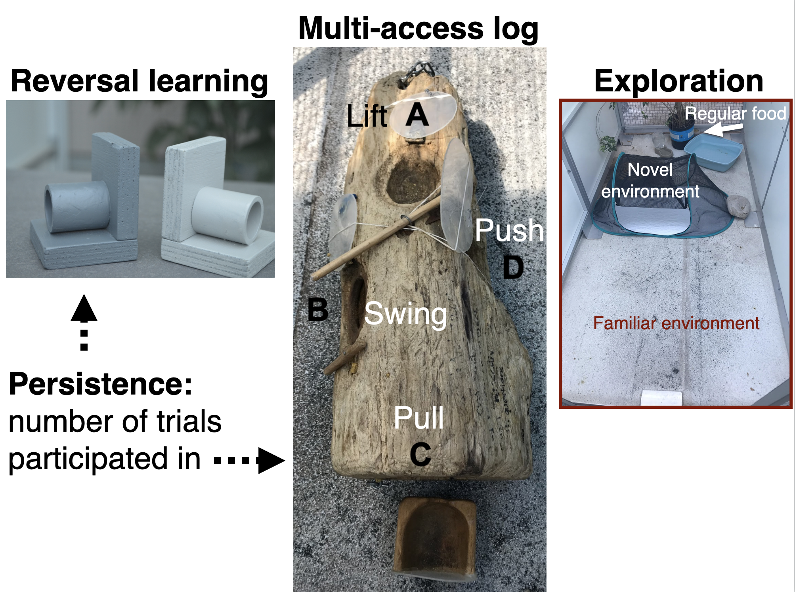

```{r setup, include=FALSE}
knitr::opts_chunk$set(echo = TRUE)
```

```{r}
#Make code wrap text so it doesn't go off the page when Knitting to PDF
library(knitr)
opts_chunk$set(tidy.opts=list(width.cutoff=60),tidy=TRUE)
```

##### Affiliations: 
1) Max Planck Institute for Evolutionary Anthropology
2) University of California Santa Barbara
3) University of Rochester

*Corresponding author: corina_logan@eva.mpg.de

***Click [here](https://github.com/corinalogan/grackles/blob/master/Files/Preregistrations/gxpopbehaviorhabitat.Rmd) for the version-tracked reproducible manuscript (.Rmd file)***

### ABSTRACT

It is generally thought that behavioral flexibility, the ability to change behavior when circumstances change, plays an important role in the ability of a species to rapidly expand their geographic range (e.g., [@lefebvre1997feeding], [@griffin2014innovation], [@chow2016practice], [@sol2000behavioural], [@sol2002behavioural], [@sol2005big], [@sol2007big]). However, it is alternatively possible that an increase in the amount of suitable habitat can be the primary facilitator for a range expansion. Great-tailed grackles (*Quiscalus mexicanus*) are a social, polygamous species that is rapidly expanding its geographic range (@wehtje2003range) and eats a variety of human foods in addition to foraging on insects and on the ground for other natural food items (@johnson2001great). They are behaviorally flexible (@logan2016flexibilityproblem) and highly associated with human-modified environments (@johnson2001great), thus offering an opportunity to assess the role of behavior and habitat change over the course of their expansion. We first aim to compare behavior in wild-caught grackle individuals from three populations across their range (core, middle of the expansion front, northern edge) to investigate whether: 1) certain behaviors (flexibility, innovativeness, exploration, and persistence) have higher averages and variances in some populations relative to others, and 2) individuals in a more recently established population exhibit more dispersal behavior (i.e., individuals are more likely to move away from their parents). Secondly, we aim to investigate whether habitat availability, not necessarily inherent species differences, can explain why great-tailed grackles are able to much more rapidly expand their range than their closest relative, boat-tailed grackles (*Quiscalus major*) (@post1996boat, @wehtje2003range). We will examine temporal habitat changes over the past few decades for great-tailed grackles using existing databases on presence/absence and a comparison of habitat variables for both species to determine whether: 3) these species use different habitats, habitat availability and connectivity has increased across their range, and what proportion of suitable habitat both species occupy. Results will elucidate whether the rapid geographic range expansion of great-tailed grackles is associated with individuals differentially expressing particular behaviors or whether the expansion is facilitated by the alignment of their natural behaviors with an increase in suitable habitat (i.e., human-modified environments).

### A. STATE OF THE DATA

This preregistration was written (Mar 2020) prior to collecting any data from the edge and core populations. Some of the relatedness data from the middle (Arizona) population has already been analyzed for other purposes (n=57 individuals, [see](http://corinalogan.com/Preregistrations/gdispersal.html) @sevchik2019dispersal, therefore it will be considered secondary data: data that are in the process of being collected for other investigations. However, we have now collected blood samples from many more grackles in Arizona, therefore we will redo the analyses from the Arizona population in the analyses involved in the current preregistration. We have also almost completed data collection for other variables at the Arizona field site: [flexibility and innovation](http://corinalogan.com/Preregistrations/g_flexmanip.html) [@logan2019flexmanip], and  [exploration](http://corinalogan.com/Preregistrations/g_exploration.html) [@mccune2019exploration], however we will soon analyze this data, therefore it will also be considered secondary data. This preregistration was submitted in May 2020 to PCI Ecology for pre-study peer review.

### B. PARTITIONING THE RESULTS

We may decide to present the results from different hypotheses in separate articles. We may also decide to test these hypotheses in additional species.

### C. HYPOTHESES

Note: There could be multiple mechanisms underpinning the results we find, however our aim here is to narrow down the relative roles of changes in behavior and changes in habitats in the range expansion of great-tailed grackles.

#### H1: Changes in behavioral traits (flexibility, innovation, exploration, and persistence) facilitate the great-tailed grackle's geographic range expansion (Fig. 1 & 2). 

**Prediction 1:** If behavior modifications are needed to adapt to new locations, then there will be a higher average and/or larger variance of at least some traits thought to be involved in range expansions (behavioral flexibility: speed at reversing a previously learned color preference, innovativeness: number of options solved on a puzzle box, exploration: latency to approach/touch a novel object, and persistence: number of trials not participated in with higher numbers indicating a less persistent individual) in the grackles sampled from the recently established population relative to the individuals sampled in the two older populations (Table 1). Higher averages in behavioral traits indicate that each individual can exhibit more of that trait (e.g., they are more flexible/innovative/exploratory/persistent). Perhaps in newly established populations, individuals need to learn about and innovate new foraging techniques or find new food sources. Perhaps grackles require flexibility to visit these resources according to their temporal availability and the individual's food preferences. Perhaps solving such problems requires more exploration and persistence. Higher variances in behavioral traits indicate that there is a larger diversity of individuals in the population, which means that there is a higher chance that at least some individuals in the population could innovate foraging techniques and be more flexible, exploratory, and persistent, all of which could be learned by conspecifics and/or future generations.

**Prediction 1 alternative 1:** Human-modified environments are suitable habitat for grackles and the amount of human-modified environments has and is increasing. If the original behaviors exhibited by this species happen to be suited to the uniformity of human-modified landscapes (e.g., urban, agricultural, etc. environments are modified in similar ways across Central and North America), then averages and/or variances of these traits will be similar in the grackles sampled from populations across their range (Table 1). This supports the hypothesis that, because this species is closely associated with human-modified environments (@johnson2001great, @wehtje2003range), which may be similar across the geographic range of this species, individuals in new areas may not need to learn very much about their new environment: they can eat familiar foods and access these foods in similar ways across their range (e.g., fast food restaurant chains likely make the same food and package it in the same packaging in Central and North America, outdoor cafes and garbage cans also look the same across their range). Alternatively, it is possible that 2.9 generations at the edge site is too long after their original establishment date to detect differences in the averages and/or variances. If the sampled individuals had already been living at this location for long enough (or for their whole lives) to have learned what they need about this particular environment (e.g., there may no longer be evidence of increased exploration/persisence/flexibility/innovativeness), there may be no reason to maintain population diversity in these traits to continue to learn about this environment. We will not be able to distinguish between these two alternatives within alternative 1 because populations closer to the northern edge of this species' range were too small for us to establish such a field site.




#### H2 (dispersal): Changes in dispersal behavior, particularly for females, which is the sex that appears to be philopatric in the middle of the range expansion, facilitate the great-tailed grackle's geographic range expansion (Fig. 1, Table 1).

**Prediction 2:** If a change in dispersal behavior is facilitating the expansion, then we predict more dispersal at the edge: a higher proportion of individuals disperse in a more recently established population and accordingly fewer individuals are closely related to each other. 

**Prediction 2 alternative 1:** If the original dispersal behavior was already well adapted to facilitate a range expansion, we predict that the proportion of individuals dispersing is not related to the number of generations at that population and accordingly the average relatedness is similar across populations. 

**Table 1.** Population characteristics for each of the three field sites in H1 and H2. The number of generations at a site is based on a generation length of 5.6 years for this species (@GTGRbirdlife2018) and on the first year in which this species was reported to breed at the location (@wehtje2003range for Arizona, Steve Hampton's pers comm reported in @pandolfino2009colonization for Woodland, California). The first confirmed nest sighting in Woodland, California was reported in the Yolo Audubon Society's newsletter The Burrowing Owl (July 2004), which Steve Hampton shared with Logan. For Central America, there is no data on the first year in which they started breeding because this species originates in this region, therefore we used the age of the species: 800,000 years (@johnsoncicero2004new).

```{r table1, eval=TRUE, warning=FALSE, results='asis', echo=TRUE, include=TRUE}
d <- read.csv ("/Users/corina/GitHub/grackles/Files/Preregistrations/gxpopbehaviorhabitat_Table1.csv", header=F, sep=",", stringsAsFactors=F) 

library(reactable)
reactable(d, highlight=TRUE, bordered=FALSE, compact=TRUE, wrap=TRUE, resizable=TRUE,
          columns = list(
            V1 = colDef(name="Site"),
            V2 = colDef(name="Range position"),
            V3 = colDef(name="Breeding since"),
            V4 = colDef(name="Number of years breeding"),
            V5 = colDef(name="Average number of generations"),
            V6 = colDef(name="Citation")
          ))
```


#### H3 (suitable habitat GTGR-BTGR): The availability of habitat, not inherent species differences, explains why great-tailed grackles (GTGR) are able to much more rapidly expand their range than boat-tailed grackles (BTGR) (Figure 3).

**Prediction 3:** GTGR and BTGR use different habitats, and the habitat of GTGR, but not that of BTGR, has increased in availability and connectivity over the past few decades.

**Prediction 4:** GTGR has increased the habitat breadth in which they can occupy over the past few decades, whereas BTGR continue to use the same limited habitat types.

**Prediction 5:** Some inherent trait allows GTGR to expand even though both species have unused habitat available to them.


### D. METHODS

#### Planned Sample (H1 & H2)
	
Great-tailed grackles are caught in the wild in Woodland, California and at a site to be determined in Central America. We apply colored leg bands in unique combinations for individual identification. Some individuals (~20) are brought temporarily into aviaries for testing, and then are released back to the wild at their point of capture. We catch grackles with a variety of methods (e.g., walk-in traps, mist nets, bow nets), some of which decrease the likelihood of a selection bias for exploratory and bold individuals because grackles cannot see the traps (i.e., mist nets). Grackles are individually housed in an aviary (each 244cm long by 122cm wide by 213cm tall) for a maximum of six months where they have *ad lib* access to water at all times and are fed Mazuri Small Bird maintenance diet *ad lib* during non-testing hours (minimum 20h per day), and various other food items (e.g., peanuts, bread) during testing (up to 4h per day per bird). Individuals are given three to four days to habituate to the aviaries and then their test battery begins on the fourth or fifth day (birds are usually tested six days per week, therefore if their fourth day occurs on a day off, they are tested on the fifth day instead). 

While the above is our ideal plan, due to restrictions around COVID-19, it may not be possible for us to accomplish all of our goals in our current funding period. We think it will be possible to collect data at one more site and we will attempt to also include a third field site.

#### Sample size rationale (H1 & H2)
	
We test as many birds as we can during the approximately one year we spend at each population given that the birds are only brought into the aviaries during the non-breeding season (approximately September through March). It is time intensive to conduct the aviary test battery (2-6 months per bird at the Arizona field site), therefore we approximate that the minimum sample size at each site will be 20 grackles with the aim that half of the grackles tested at each site are female.
	
#### Data collection stopping rule (H1 & H2)
	
We will stop collecting data on wild-caught grackles in H1 and H2 (data for H3 are collected from the literature) once we have completed one year at each of the California and Central America sites (likely complete in summer 2022), which coincides with the period in which we currently have funding.

#### Protocols and open materials

  - Protocols for H1 are online [here](https://docs.google.com/document/d/1oqucJ4mH-glh9Hv9JaiDSyhEGi0yVpMuqqzqR2IwQeA/edit?usp=sharing).
  
  - **Flexibility** protocol (from @logan2019flexmanip) using reversal learning on the color tubes. A light gray tube and a dark gray tube are placed on the table or floor: one color always contains a food reward (not visible by the bird) while the other color never contains a reward. The bird is allowed to choose one tube per trial. An individual is considered to have a preference if it chose the rewarded option at least 17 out of the most recent 20 trials (with a minimum of 8 or 9 correct choices out of 10 on the two most recent sets of 10 trials). We use a sliding window to look at the most recent 10 trials for a bird, regardless of when the testing sessions occurred. Once a bird learns to prefer one color, the contingency is reversed: food is always in the other color and never in the previously rewarded color. The flexibility measure is how many trials it takes them to reverse their color preference using the same passing criterion. Note: we may modify this protocol by moving the passing criterion sliding window in 1-trial increments, rather than 10-trial increments (i.e., a bird could pass criterion at trial 36 rather than only at trials 20, 30, 40, etc.).
  
  - **Innovativeness** protocol (from @logan2019flexmanip) using the multi-access log. A log that has four ways of accessing food (pull drawer, push door, lift door up, swing door out) is placed on the ground and grackles are allowed to attempt to solve or successfully solve one option per trial. Once a bird has successfully solved an option three times, it becomes non-functional (the door is locked open and there is no food at that locus). The experiment ends when all four loci become non-functional, if a bird does not come to the ground within 10 min in three consecutive test sessions, or if a bird does not obtain the food within 10 min (or 15 min if the bird was on the ground at 10 min) in three consecutive test sessions.

  - **Exploration** protocol (from @mccune2019exploration) for exploration of a novel object. A familiar object (that contains no food) is placed in the center of the bird's aviary, while maintenance diet is available at a far end of the aviary away from the object, for 45 min. This is immediately followed by the same set up with a novel object instead of a familiar object. Test sessions are video recorded and experimenters are out of view of the bird during the sessions. This assay is conducted at Time 1 (3-6 days after the bird arrives in the aviary) and Time 2 (1 week after Time 1) with the same novel object (to control for potential differences in perceived threat or attraction between objects) to determine whether measures are repeatable across individuals. Note: we might make three modifications to this protocol as a result of analyzing the results from the Arizona population: 1) we may reduce the session time from 45 min to something shorter if all grackles who came to the ground did so in <45 min in Arizona, and 2) we may replace the novel object with a novel environment - we will choose the one that correlates with boldness measures in Arizona. If both correlate with boldness, we will choose the novel object because it is a simpler test.
  
  - **Persistence** is measured as the number of trials not participated in during the flexibility and innovativeness experiments. The higher the number, the less persistent they are. We generally offer a grackle the chance to participate in a trial for 5 min. If they don't participate within that time, we record -1 in the data sheet, the apparatus is removed and the trial is re-attempted later. Note: we might make a modification to this protocol as a result of analyzing the results from the Arizona population: we may decide not to conduct an analysis to determine how repeatable persistence is within individuals.
  
  - **Dispersal:** DNA is collected from the grackles, processed, and analyzed for pairwise relatedness using ddRADseq and Stacks as in @sevchik2019dispersal ([protocol](http://corinalogan.com/Preregistrations/gdispersal.html)).
  
  - **Suitable habitat:** We will conduct ecological niche modeling to investigate grackle presence as it overlaps with suitable habitat across their range. Grackles will be considered as present or absent in a particular geographic area based on sightings reported at eBird.org. Suitable habitat variables will be identified from @johnson2001great, and we will add additional variables relevant to our hypotheses. A suitable habitat map will be generated across the Americas using GIS.

#### Open data (H1 & H2)

When the study is complete, the data will be published in the Knowledge Network for Biocomplexity's data repository.

#### Randomization and counterbalancing (H1 & H2)

**Experimental order:** The order of experiments, reversal learning or multiaccess log, will be counterbalanced across birds within a site.

**Reversal learning:** The first rewarded color in reversal learning is counterbalanced across birds at each site. In the reversal learning trials, the rewarded option is pseudorandomized for side (and the option on the left is always placed first). Pseudorandomization consisted of alternating location for the first two trials of a session and then keeping the same color on the same side for at most two consecutive trials thereafter. A list of all 88 unique trial sequences for a 10-trial session, following the pseudorandomization rules, will be generated in advance for experimenters to use during testing (e.g., a randomized trial sequence might look like: LRLLRRLRLR, where L and R refer to the location, left or right, of the rewarded tube). Randomized trial sequences will be assigned randomly to any given 10-trial session using a random number generator (random.org) to generate a number from 1-88.

#### Blinding of conditions during analysis

No blinding is involved in this investigation.


### E. ANALYSIS PLAN

We use simulations and design customized models to determine what sample sizes allow us to detect differences between populations (see chapter 5.3 in @bolker2008ecological for why simulations perform more powerful power analyses). We do not plan to **exclude** any data and if there are **missing** data (e.g. if a bird participated in two of the three experiments, then it will only be included in those analyses for which it has data). Analyses will be conducted in R (current version `r getRversion()`; @rcoreteam) and Stan (version 2.18, @carpenter2017stan). 

#### H1: behavior across the range

*Response variables*

1) Flexibility: number of trials to reverse a color preference. 

2) Innovativeness: total number of loci solved on the multiaccess log (maximum=4)

3) Exploration: Latency to approach up to 20cm of an object (novel or familiar, that does not contain food) in a familiar environment (that contains maintenance diet away from the object) - OR - closest approach distance to the object (choose the variable with the most data for the analysis).

4) Persistence: number of trials not participated in during the flexibility and innovativeness experiments

One model will be run for each response variable.

*Explanatory variable*

There is no explanatory variable: we will conduct pairwise comparisons across sites as described in the next section.

##### Hypothesis-specific mathematical model

Following procedures in @statrethinkingbook, we constructed a **hypothesis-appropriate mathematical model** for each of the response variables that examines differences in the response variable between sites. These models take the form of:

y ~ $\alpha$[site] *[model]*

$\alpha_1$ ~ Normal($\mu$,$\sigma$) *[$\alpha_1$ prior for site 1]*

$\alpha_2$ ~ Normal($\mu$,$\sigma$) *[$\alpha_2$ prior for site 2]*

$\alpha_3$ ~ Normal($\mu$,$\sigma$) *[$\alpha_3$ prior for site 3]*

y is the response variable (flexibility, innovation, exploration, or persistence). There will be one intercept, $\alpha$, per site and we will estimate the site's average and standard deviation of the response variable. 

We then performed pairwise contrasts to determine at what point we will be able to detect differences between sites by manipulating sample size, and $\alpha$ means and standard deviations. Before running the simulations, we decided that a model would detect an effect if 89% of the difference between the two posterior distributions was on the same side of zero (following @statrethinkingbook).

##### Flexibility analysis

**Model and simulation**

Expected values for reversal learning using color tubes (mean, standard deviation, and range of number of trials to reverse a color preference) were based on previously published data on great-tailed grackles (@logan2016behavioral). This data indicates that the average number of trials to reverse a preference is 91 and the standard deviation is 21 (n=7 grackles). The $\sigma$ prior is set to produce only positive values that encompass the range of values shown by the Santa Barbara grackles (reversing in 70-130 trials, 130 trials-91 mean is about 40 trials).

$\mu$ ~ Normal(91,21) *[$\mu$ prior]*

$\sigma$ ~ Uniform(0,40) *[$\sigma$ prior]*

```{r modelflexibility, eval=FALSE, warning=FALSE, results='asis', echo=TRUE, include=TRUE}
library(rethinking)
library(rstan)

#Plot priors to make sure the prior behaves as expected (p.82 Rethinking)
curve( dnorm( x , 91 , 21 ) , from=20 , to=200 ) #mu result as expected
curve( dunif( x , 0 , 50 ) , from=-10 , to=60 ) #sigma result as expected

#Prior predictive simulation (p.82 Rethinking)
sample_mu <- rnorm( 1e4 , 91 , 21 )
sample_sigma <- runif( 1e4 , 0 , 40 )
prior_t <- rnorm( 1e4 , sample_mu , sample_sigma ) 
dens( prior_t ) #Result: behaving as expected


### SIMULATION: Manipulate mu mean, mu sd, and n (grackles)
#Simulate data for the model
n <- 60 #number of grackles in total across all sites (~20/site; AZ=20)
sites <- matrix(nrow=n,ncol=4) #store data here
colnames(sites)<-c("trials","mu","sigma","site")

for (i in 1:(n/3)){
  mu1 <- rnorm( 1 , 91 , 22 ) #mu for site 1
  sigma1 <- runif( 1 , 0 , 40 ) #sigma for site 1
  trials <- rnorm(1,mu1,sigma1) #distribution for trials
  
  sites[i,1]<-trials
  sites[i,2]<-mu1
  sites[i,3]<-sigma1
  sites[i,4]<-1 #site
}

for (i in ((n/3)+1):((n/3)+(n/3))){
  mu2 <- rnorm( 1 , 120 , 22 ) #mu for site 2
  sigma2 <- runif( 1 , 0 , 40 ) #sigma for site 2
  trials <- rnorm(1,mu2,sigma2) #distribution for trials
  
  sites[i,1]<-trials
  sites[i,2]<-mu2
  sites[i,3]<-sigma2
  sites[i,4]<-2 #site
}

for (i in ((n/3)+(n/3)+1):n){
  mu3 <- rnorm( 1 , 77 , 22 ) #mu for site 3
  sigma3 <- runif( 1 , 0 , 40 ) #sigma for site 3
  trials <- rnorm(1,mu3,sigma3) #distribution for trials
  
  sites[i,1]<-trials
  sites[i,2]<-mu3
  sites[i,3]<-sigma3
  sites[i,4]<-3 #site
}

### THE MODEL
dat <- list(trials = as.numeric(sites[,1]),
            site = as.integer(sites[,4])
) #This sets up the data sheet with the simulated data that the model will run on

s1 <- ulam(
  alist(
trials ~ dnorm(mu[site],sigma),
mu[site] ~ dnorm(91,21),
sigma ~ dunif(0,40)
),data=dat, log_lik=TRUE, messages=FALSE) #This is the model

#Plot it
labels <- paste( "mu[" , 1:3 , "]:" , levels(dat$site) , sep="" ) 
plot( precis( s1 , depth=2 , pars="mu" ) , labels=labels ,  xlab="expected trials to reverse" ) #contrasts plot p.157

#Summary data
precis(s1,depth=2) #depth=2 means to show any vector parameters (p.156)

#Compute pairwise contrasts
#Comparing sites 1 and 2
post1 <- extract.samples(s1) 
post1$diff_12 <- post1$mu[,1] - post1$mu[,2] #subtract mu for site 2 from mu for site 1. col1=site 1, col2=site 2
precis(post1,depth=2) #look at the last row: diff_12: this is the expected difference between the distributions of mu at sites 1 and 2. (p.156) The distribution crosses 0, which means that there are no differences between the sites (because subtracting distribution 1 from distribution 2 should result in all negative or all positive values if the two distributions are consistently different from each other)
#hist(post1$diff_12) #another way of visualizing it

#Comparing sites 1 and 3
post2 <- extract.samples(s1) 
post2$diff_13 <- post2$mu[,1] - post2$mu[,3] 
precis(post2,depth=2)

#Comparing sites 2 and 3
post3 <- extract.samples(s1) 
post3$diff_23 <- post3$mu[,2] - post3$mu[,3] 
precis(post3,depth=2)
```

We then ran the **mathematical model** and performed pairwise contrasts and determined that we will be able to detect differences between sites with a total sample size of 45 if the average number of trials to reverse a preference differs by >13 trials, and the standard deviation is a maximum of 21 at each site (Table 2). For a sample size of 60, which is more like what we expect, we will be able to detect site differences if the average number of trials to reverse a preference differs by >11 trials, and the standard deviation is a maximum of 23 at each site  (Table 2).

**Table 2.** Simulation outputs from varying sample size (n), and $\alpha$ means and standard deviations. From the pairwise contrasts, if the difference between the distributions crosses zero (yes), then we are not able to detect differences between the two sites. If they do not cross zero (no), then we are able to detect differences between the two sites.

```{r tableparam, eval=TRUE, warning=FALSE, results='asis', echo=TRUE, include=TRUE}
d <- read.csv ("/Users/corina/GitHub/grackles/Files/Preregistrations/gxpopbehaviorhabitat_Table2.csv", header=F, sep=",", stringsAsFactors=F) 

library(reactable)
reactable(d, highlight=TRUE, bordered=FALSE, compact=TRUE, wrap=TRUE, resizable=TRUE,
          columns = list(
            V1 = colDef(name="Response variable"),
            V2 = colDef(name="n"),
            V3 = colDef(name="mu1"),
            V4 = colDef(name="mu2"),
            V5 = colDef(name="mu3"),
            V6 = colDef(name="mu1_sd"),
            V7 = colDef(name="mu2_sd"),
            V8 = colDef(name="mu3_sd"),
            V9 = colDef(name="Difference crosses zero? S1-S2"),
            V10 = colDef(name="Difference crosses zero? S1-S3"),
            V11 = colDef(name="Difference crosses zero? S2-S3")
          ))
```

**Results (using our actual data)**

We will analyze our data using the above model once all of the data have been collected.


##### Innovation analysis

**Model and simulation**

Expected values for the number of options solved on the multiaccess log were set to 0-4 (out of 4 options maximum) because this apparatus had been used on two species of jays who exhibited individual variation in the number of loci solved between 0-4 (California scrub-jays and Mexican jays: @mccune2018cognition, @mccune2019captive). After running simulations, we identified the following distribution to be the most likely priors for our expected data:

$\mu$ ~ Normal(2,0.9) *[$\mu$ prior]*

$\sigma$ ~ Uniform(0,4) *[$\sigma$ prior]*

We used a normal distribution for $\mu$ because it is a sum (see Figure 10.6 in @statrethinkingbook). We estimate that the grackles might solve an average of 2 loci, therefore we set the mean to 2. We chose a uniform distribution for $\sigma$ because it constrains $\sigma$ to have a positive probability with the standard deviation being the range of options possible (0-4).

```{r modelinnovation, eval=FALSE, warning=FALSE, results='asis', echo=TRUE, include=TRUE}
library(rethinking)
library(rstan)

#Plot priors to make sure the prior behaves as expected (p.82 Rethinking)
curve( dnorm( x , 2 , 0.9 ) , from=0 , to=5 ) #mu a bit too wide initially (sd=1.4), which made solving 5 loci possible. Reduced sd until only 4 max loci possible
curve( dunif( x , 0 , 4 ) , from=-1 , to=5 ) #sigma result as expected

#Prior predictive simulation (p.82 Rethinking)
sample_mu <- rnorm( 1e4 , 2 , 0.9 )
sample_sigma <- runif( 1e4 , 0 , 4 )
prior_t <- rnorm( 1e4 , sample_mu , sample_sigma ) 
dens( prior_t ) #Result: a little too wide


### SIMULATION: Manipulate mu mean, mu sd, and n (grackles)
#Simulate data for the model
n <- 45 #number of grackles in total across all sites (~20/site; AZ=11 MAB log, 17 MAB plastic)
sites <- matrix(nrow=n,ncol=4) #store data here
colnames(sites)<-c("loci","mu","sigma","site")

for (i in 1:(n/3)){
  mu1 <- rnorm( 1 , 1 , 0.9 ) #mu for site 1
  sigma1 <- runif( 1 , 0 , 4 ) #sigma for site 1
  trials <- rnorm(1,mu1,sigma1) #distribution for loci
  
  sites[i,1]<-trials
  sites[i,2]<-mu1
  sites[i,3]<-sigma1
  sites[i,4]<-1 #site
}

for (i in ((n/3)+1):((n/3)+(n/3))){
  mu2 <- rnorm( 1 , 2 , 0.9 ) #mu for site 2
  sigma2 <- runif( 1 , 0 , 4 ) #sigma for site 2
  trials <- rnorm(1,mu2,sigma2) 
  
  sites[i,1]<-trials
  sites[i,2]<-mu2
  sites[i,3]<-sigma2
  sites[i,4]<-2 #site
}

for (i in ((n/3)+(n/3)+1):n){
  mu3 <- rnorm( 1 , 4 , 0.9 ) #mu for site 3
  sigma3 <- runif( 1 , 0 , 4 ) #sigma for site 3
  trials <- rnorm(1,mu3,sigma3)
  
  sites[i,1]<-trials
  sites[i,2]<-mu3
  sites[i,3]<-sigma3
  sites[i,4]<-3 #site
}

### THE MODEL
dat <- list(trials = as.numeric(sites[,1]),
            site = as.integer(sites[,4])
) #This sets up the data sheet with the simulated data that the model will run on

s1 <- ulam(
  alist(
trials ~ dnorm(mu[site],sigma),
mu[site] ~ dnorm(2,0.9),
sigma ~ dunif(0,4)
),data=dat, log_lik=TRUE, messages=FALSE) #This is the model

#Plot it
labels <- paste( "mu[" , 1:3 , "]:" , levels(dat$site) , sep="" ) 
plot( precis( s1 , depth=2 , pars="mu" ) , labels=labels ,  xlab="expected loci solved" ) #contrasts plot p.157

#Summary data
precis(s1,depth=2) #depth=2 means to show any vector parameters (p.156)

#Compute pairwise contrasts
#Comparing sites 1 and 2
post1 <- extract.samples(s1) 
post1$diff_12 <- post1$mu[,1] - post1$mu[,2] #subtract mu for site 2 from mu for site 1. col1=site 1, col2=site 2
precis(post1,depth=2) #look at the last row: diff_12: this is the expected difference between the distributions of mu at sites 1 and 2. (p.156) The distribution crosses 0, which means that there are no differences between the sites (because subtracting distribution 1 from distribution 2 should result in all negative or all positive values if the two distributions are consistently different from each other)

#Comparing sites 1 and 3
post2 <- extract.samples(s1) 
post2$diff_13 <- post2$mu[,1] - post2$mu[,3] 
precis(post2,depth=2)

#Comparing sites 2 and 3
post3 <- extract.samples(s1) 
post3$diff_23 <- post3$mu[,2] - post3$mu[,3] 
precis(post3,depth=2)
```

We then ran the **mathematical model** and performed pairwise contrasts and determined that we will be able to detect differences between sites with a total sample size of 45 if the average number of loci solved differs by 2 loci or more and the standard deviation is generally a maximum of 1.2 at each site (Table 2). For a sample size of 60, which is more like what we expect (even though the Arizona sample size is 11 for the multiaccess log and 17 on a similar multiaccess box), we will be able to detect site differences if the average number of loci solved differs by 1 locus or more and the standard deviation is generally a maximum of 0.9 at each site (Table 2).

**Results (using our actual data)**

We will analyze our data using the above model once all of the data have been collected.


##### Exploration analysis

**Model and simulation**

Expected values for the latency to approach a novel object range from 0-2700 sec, which encompasses the time period during which they are exposed to the object (sessions last up to 45 min). After running simulations, we identified the following distribution to be the most likely priors for our expected data:

$\mu$ ~ Normal(1350,500) *[$\mu$ prior]*

$\sigma$ ~ Uniform(0,2700) *[$\sigma$ prior]*

We used a normal distribution for $\mu$ because it is a sum (see Figure 10.6 in @statrethinkingbook). We estimate that the grackles might approach the object anywhere in the session, therefore we set the mean at the halfway mark: 1350 sec. We chose a uniform distribution for $\sigma$ because it constrains $\sigma$ to have a positive probability with the standard deviation being the range of seconds possible (0-2700).

```{r modelexploration, eval=FALSE, warning=FALSE, results='asis', echo=TRUE, include=TRUE}
library(rethinking)
library(rstan)

#Plot priors to make sure the prior behaves as expected (p.82 Rethinking)
curve( dnorm( x , 1350 , 500 ) , from=-10 , to=3000 ) #mu a bit too narrow initially (sd=200), which made approaches at either end of the session impossible. Increased sd until all seconds in the session were possible
curve( dunif( x , 0 , 2700 ) , from=-100 , to=3000 ) #sigma result as expected

#Prior predictive simulation (p.82 Rethinking)
sample_mu <- rnorm( 1e4 , 1350 , 500 )
sample_sigma <- runif( 1e4 , 0 , 2700 )
prior_t <- rnorm( 1e4 , sample_mu , sample_sigma ) 
dens( prior_t ) #Result: a little too wide


### SIMULATION: Manipulate mu mean, mu sd, and n (grackles)
#Simulate data for the model
n <- 60 #number of grackles in total across all sites (~20/site; AZ=17). Must be a multiple of 3 because there are 3 sites
sites <- matrix(nrow=n,ncol=4) #store data here
colnames(sites)<-c("latency","mu","sigma","site")

for (i in 1:(n/3)){
  mu1 <- rnorm( 1 , 100 , 500 ) #mu for site 1
  sigma1 <- runif( 1 , 0 , 2700 ) #sigma for site 1
  trials <- rnorm(1,mu1,sigma1) #distribution for loci
  
  sites[i,1]<-trials
  sites[i,2]<-mu1
  sites[i,3]<-sigma1
  sites[i,4]<-1 #site
}

for (i in ((n/3)+1):((n/3)+(n/3))){
  mu2 <- rnorm( 1 , 1000 , 500 ) #mu for site 2
  sigma2 <- runif( 1 , 0 , 2700 ) #sigma for site 2
  trials <- rnorm(1,mu2,sigma2) 
  
  sites[i,1]<-trials
  sites[i,2]<-mu2
  sites[i,3]<-sigma2
  sites[i,4]<-2 #site
}

for (i in ((n/3)+(n/3)+1):n){
  mu3 <- rnorm( 1 , 2500 , 500 ) #mu for site 3
  sigma3 <- runif( 1 , 0 , 2700 ) #sigma for site 3
  trials <- rnorm(1,mu3,sigma3)
  
  sites[i,1]<-trials
  sites[i,2]<-mu3
  sites[i,3]<-sigma3
  sites[i,4]<-3 #site
}

### THE MODEL
dat <- list(trials = as.numeric(sites[,1]),
            site = as.integer(sites[,4])
) #This sets up the data sheet with the simulated data that the model will run on

s1 <- ulam(
  alist(
trials ~ dnorm(mu[site],sigma),
mu[site] ~ dnorm(1350,500),
sigma ~ dunif(0,2700)
),data=dat, log_lik=TRUE, messages=FALSE) #This is the model

#Plot it
labels <- paste( "mu[" , 1:3 , "]:" , levels(dat$site) , sep="" ) 
plot( precis( s1 , depth=2 , pars="mu" ) , labels=labels ,  xlab="expected latency (sec)" ) #contrasts plot p.157

#Summary data
precis(s1,depth=2) #depth=2 means to show any vector parameters (p.156)

#Compute pairwise contrasts
#Comparing sites 1 and 2
post1 <- extract.samples(s1) 
post1$diff_12 <- post1$mu[,1] - post1$mu[,2] #subtract mu for site 2 from mu for site 1. col1=site 1, col2=site 2
precis(post1,depth=2) #look at the last row: diff_12: this is the expected difference between the distributions of mu at sites 1 and 2. (p.156) The distribution crosses 0, which means that there are no differences between the sites (because subtracting distribution 1 from distribution 2 should result in all negative or all positive values if the two distributions are consistently different from each other)

#Comparing sites 1 and 3
post2 <- extract.samples(s1) 
post2$diff_13 <- post2$mu[,1] - post2$mu[,3] 
precis(post2,depth=2)

#Comparing sites 2 and 3
post3 <- extract.samples(s1) 
post3$diff_23 <- post3$mu[,2] - post3$mu[,3] 
precis(post3,depth=2)
```

We then ran the **mathematical model** and performed pairwise contrasts and determined that we will be able to detect differences between sites with a total sample size of 45 if the average latency to approach the object differs by at least 1200 sec and the standard deviation is generally a maximum of 200 at each site (Table 2). For a sample size of 60, which is more like what we expect, we will be able to detect site differences if the average latency to approach the object differs by at least 1100 sec and the standard deviation is generally a maximum of 275 at each site (Table 2).

**Results (using our actual data)**

We will analyze our data using the above model once all of the data have been collected.


##### Persistence analysis

**Model and simulation**

Expected values for the number of trials not participated in could range from 0-350 (likely maxima: 300 trials reversal learning, 50 trials multiaccess log). After running simulations, we identified the following distribution to be the most likely priors for our expected data:

$\mu$ ~ Normal(175,75) *[$\mu$ prior]*

$\sigma$ ~ Uniform(0,350) *[$\sigma$ prior]*

We used a normal distribution for $\mu$ because it is a sum (see Figure 10.6 in @statrethinkingbook). We estimate that there will be large individual differences among grackles with some always participating and others not participating very often. Therefore, we set the mean at the halfway mark: 175 trials. We chose a uniform distribution for $\sigma$ because it constrains $\sigma$ to have a positive probability with the standard deviation being the likely range of trials (0-350).

```{r modelpersistence, eval=FALSE, warning=FALSE, results='asis', echo=TRUE, include=TRUE}
library(rethinking)
library(rstan)

#Plot priors to make sure the prior behaves as expected (p.82 Rethinking)
curve( dnorm( x , 175 , 50 ) , from=-100 , to=400 ) #mu allows negative values at sd=75 but these aren't possible. Decreased to 50 and it performed as expected, but when running the for loops below negative numbers were still being generated. Decreased to 25 and it still happened. So increased curve on next line from 0 to 10
curve( dunif( x , 10 , 350 ) , from=-100 , to=400 ) #sigma result as expected
curve( rlnorm( x , 0.5 , 0.15 ) , from=-10 , to=20 ) #mu allows negative

#Prior predictive simulation (p.82 Rethinking)
sample_mu <- rnorm( 1e4 , 175 , 75 )
sample_sigma <- runif( 1e4 , 0 , 350 )
prior_t <- rnorm( 1e4 , sample_mu , sample_sigma ) 
dens( prior_t ) #Result: a little too wide


### SIMULATION: Manipulate mu mean, mu sd, and n (grackles)
#Simulate data for the model
n <- 60 #number of grackles in total across all sites (~20/site; AZ=20). Must be a multiple of 3 because there are 3 sites
sites <- matrix(nrow=n,ncol=4) #store data here
colnames(sites)<-c("trialsnoparticipation","mu","sigma","site")

for (i in 1:(n/3)){
  mu1 <- rnorm( 1 , 100 , 15 ) #mu for site 1
  sigma1 <- runif( 1 , 10 , 350 ) #sigma for site 1
  trials <- rnorm(1,mu1,sigma1) #distribution for loci
  
  sites[i,1]<-trials
  sites[i,2]<-mu1
  sites[i,3]<-sigma1
  sites[i,4]<-1 #site
}

for (i in ((n/3)+1):((n/3)+(n/3))){
  mu2 <- rnorm( 1 , 175 , 15 ) #mu for site 2
  sigma2 <- runif( 1 , 10 , 350 ) #sigma for site 2
  trials <- rnorm(1,mu2,sigma2) 
  
  sites[i,1]<-trials
  sites[i,2]<-mu2
  sites[i,3]<-sigma2
  sites[i,4]<-2 #site
}

for (i in ((n/3)+(n/3)+1):n){
  mu3 <- rnorm( 1 , 200 , 15 ) #mu for site 3
  sigma3 <- runif( 1 , 10 , 350 ) #sigma for site 3
  trials <- rnorm(1,mu3,sigma3)
  
  sites[i,1]<-trials
  sites[i,2]<-mu3
  sites[i,3]<-sigma3
  sites[i,4]<-3 #site
}

### THE MODEL
dat <- list(trials = as.numeric(sites[,1]),
            site = as.integer(sites[,4])
) #This sets up the data sheet with the simulated data that the model will run on

s1 <- ulam(
  alist(
trials ~ dnorm(mu[site],sigma),
mu[site] ~ dnorm(1350,500),
sigma ~ dunif(0,2700)
),data=dat, log_lik=TRUE, messages=FALSE) #This is the model

#Plot it
labels <- paste( "mu[" , 1:3 , "]:" , levels(dat$site) , sep="" ) 
plot( precis( s1 , depth=2 , pars="mu" ) , labels=labels ,  xlab="expected latency (sec)" ) #contrasts plot p.157

#Summary data
precis(s1,depth=2) #depth=2 means to show any vector parameters (p.156)

#Compute pairwise contrasts
#Comparing sites 1 and 2
post1 <- extract.samples(s1) 
post1$diff_12 <- post1$mu[,1] - post1$mu[,2] #subtract mu for site 2 from mu for site 1. col1=site 1, col2=site 2
precis(post1,depth=2) #look at the last row: diff_12: this is the expected difference between the distributions of mu at sites 1 and 2. (p.156) The distribution crosses 0, which means that there are no differences between the sites (because subtracting distribution 1 from distribution 2 should result in all negative or all positive values if the two distributions are consistently different from each other)

#Comparing sites 1 and 3
post2 <- extract.samples(s1) 
post2$diff_13 <- post2$mu[,1] - post2$mu[,3] 
precis(post2,depth=2)

#Comparing sites 2 and 3
post3 <- extract.samples(s1) 
post3$diff_23 <- post3$mu[,2] - post3$mu[,3] 
precis(post3,depth=2)
```

We then ran the **mathematical model** and performed pairwise contrasts and determined that we will be able to detect differences between sites with a total sample size of 45 if the average latency to approach the object differs by at least 1200 sec and the standard deviation is generally a maximum of 200 at each site (Table 2). For a sample size of 60, which is more like what we expect, we will be able to detect site differences if the average latency to approach the object differs by at least 1100 sec and the standard deviation is generally a maximum of 275 at each site (Table 2).

**Results (using our actual data)**

We will analyze our data using the above model once all of the data have been collected.


##### Repeatability of exploration and persistence

**Analysis:** We will obtain repeatability estimates that account for the observed and latent scales, and then compare them with the raw repeatability estimate from the null model. The repeatability estimate indicates how much of the total variance, after accounting for fixed and random effects, is explained by individual differences (ID). We will run this GLMM using the MCMCglmm function in the MCMCglmm package ([@hadfieldMCMCglmmpackage]) with a Poisson distribution and log link using 13,000 iterations with a thinning interval of 10, a burnin of 3,000, and minimal priors (V=1, nu=0) [@hadfield2014coursenotes]. We will ensure the GLMM shows acceptable convergence (i.e., lag time autocorrelation values <0.01; [@hadfieldMCMCglmmpackage]), and adjust parameters if necessary.

Note: The power analysis is the same as for H1 (below) because there are the same number of explanatory variables (fixed effects).

```{r repeatablePer, eval=FALSE, warning=FALSE, results='asis', echo=TRUE, include=TRUE}
#Persistence
per <- read.csv ("/Users/corina/GTGR/data/data_persist.csv", header=T, sep=",", stringsAsFactors=F) 

# DATA CHECKING
library(DHARMa)
library(lme4)
simulationOutput <- simulateResiduals(fittedModel = glmer(NoParticipation ~ Test + (1|ID), family=poisson, data=per), n=250)
simulationOutput$scaledResiduals 
testDispersion(simulationOutput) 
testZeroInflation(simulationOutput) 
testUniformity(simulationOutput) 
plot(simulationOutput) 
plotResiduals(Test, simulationOutput$scaledResiduals) #can't get this code to work yet

#REPEATABILITY
#GLMM
library(MCMCglmm)
prior = list(R=list(R1=list(V=1,nu=0)), G=list(G1=list(V=1,nu=0)))
pers <- MCMCglmm(NoParticipation ~ Test, random=~ID, family="poisson", data=per, verbose=F, prior=prior, nitt=13000, thin=10, burnin=3000)
summary(pers)
#autocorr(pers$Sol) #Did fixed effects converge?
#autocorr(pers$VCV) #Did random effects converge?

#In MCMCglmm, the latent scale adjusted repeatability and its credible interval can simply be obtained by: mod$VCV[,ID]/(mod$VCV[,ID]+mod$VCV[,units]) - advice from Maxime Dahirel

repeata <- pers$VCV[,"ID"]/(pers$VCV[,"ID"]+pers$VCV[,"units"]) #latent scale adjusted repeatability and its credible interval
mean(repeata) 
var(repeata) 
posterior.mode(repeata) 
HPDinterval(repeata, 0.95) 

# Repeatability on the data/observed scale (accounting for fixed effects)
#code from Supplementary Material S2 from Villemereuil et al. 2018 J Evol Biol
vf <- sapply(1:nrow(pers[["Sol"]]), function(i) {
   var(predict(pers, it=i))  
}) #estimates for each iteration of the MCMC

repeataF <- (vf+pers$VCV[,"ID"])/(vf+pers$VCV[,"ID"]+pers$VCV[,"units"]) #latent scale adjusted + data scale
posterior.mode(repeataF) 
HPDinterval(repeataF, 0.95)

# Now compare with the raw repeatability: null model
persraw <- MCMCglmm(NoParticipation ~ 1, random=~ID, family="poisson", data=per, verbose=F, prior=prior, nitt=13000, thin=10, burnin=3000)
summary(persraw)

repeataraw <- persraw$VCV[,"ID"]/(persraw$VCV[,"ID"]+persraw$VCV[,"units"]) #latent scale adjusted repeatability and its credible interval
posterior.mode(repeata)
HPDinterval(repeata, 0.95) 
```

```{r repeatableExpObj, eval=FALSE, warning=FALSE, results='asis', echo=TRUE, include=TRUE}
#Exploration of novel object
eo <- read.csv ("/Users/corina/GTGR/data/data_persist.csv", header=T, sep=",", stringsAsFactors=F) 

# DATA CHECKING
library(DHARMa)
library(lme4)
simulationOutput <- simulateResiduals(fittedModel = glmer(Latency ~ Time + (1|ID), family=poisson, data=eo), n=250) #250 simulations, but if want higher precision change n>1000
simulationOutput$scaledResiduals #Expect a flat distribution of the overall residuals, and uniformity in y direction if plotted against any predictor
testDispersion(simulationOutput) #if under- or over-dispersed, then p-value<0.05, but then check the dispersion parameter and try to determine what in the model could be the cause and address it there, also check for zero inflation
testZeroInflation(simulationOutput) #compare expected vs observed zeros, not zero-inflated if p<0.05
testUniformity(simulationOutput) #check for heteroscedasticity ("a systematic dependency of the dispersion / variance on another variable in the model" Hartig, https://cran.r-project.org/web/packages/DHARMa/vignettes/DHARMa.html), which is indicated if dots aren't on the red line and p<0.05. Also...
plot(simulationOutput) #...there should be no pattern in the data points in the right panel
plotResiduals(Test, simulationOutput$scaledResiduals) #plot the residuals against other predictors (in cases when there is more than 1 fixed effect) - can't get this code to work yet

#REPEATABILITY
#GLMM
library(MCMCglmm)
prior = list(R=list(R1=list(V=1,nu=0)), G=list(G1=list(V=1,nu=0)))
explo <- MCMCglmm(Latency ~ Time, random=~ID, family="poisson", data=eo, verbose=F, prior=prior, nitt=13000, thin=10, burnin=3000)
summary(pers)
#autocorr(explo$Sol) #Did fixed effects converge?
#autocorr(explo$VCV) #Did random effects converge?

#In MCMCglmm, the latent scale adjusted repeatability and its credible interval can simply be obtained by: mod$VCV[,ID]/(mod$VCV[,ID]+mod$VCV[,units]) - advice from Maxime Dahirel

repeata <- explo$VCV[,"ID"]/(explo$VCV[,"ID"]+explo$VCV[,"units"]) #latent scale adjusted repeatability and its credible interval
mean(repeata) 
var(repeata) 
posterior.mode(repeata) 
HPDinterval(repeata, 0.95) 

# Repeatability on the data/observed scale (accounting for fixed effects)
#code from Supplementary Material S2 from Villemereuil et al. 2018 J Evol Biol
vf <- sapply(1:nrow(explo[["Sol"]]), function(i) {
   var(predict(explo, it=i))  
}) #estimates for each iteration of the MCMC

repeataF <- (vf+explo$VCV[,"ID"])/(vf+explo$VCV[,"ID"]+explo$VCV[,"units"]) #latent scale adjusted + data scale
posterior.mode(repeataF) 
HPDinterval(repeataF, 0.95)

# Now compare with the raw repeatability: null model
exploraw <- MCMCglmm(Latency ~ 1, random=~ID, family="poisson", data=eo, verbose=F, prior=prior, nitt=13000, thin=10, burnin=3000)
summary(explraw)

repeataraw <- exploraw$VCV[,"ID"]/(exploraw$VCV[,"ID"]+exploraw$VCV[,"units"]) #latent scale adjusted repeatability and its credible interval
posterior.mode(repeata)
HPDinterval(repeata, 0.95) 
```


#### H2: dispersal

*Response variable*

1) Average relatedness between all pairs of individuals within one sex

One model will be run per sex

*Explanatory variables*

1) Study area diameter (meters)

2) Study area sample size

3) Number of generations at a site

The data will be analyzed as in @sevchik2019dispersal. To summarize, blood is collected from the bird, DNA is extracted (by Aaron Blackwell at Washington State University), size selected (between 400-700 base pairs), and sequenced using ddRADseq (at Cornell University Lab of Ornithology) on an Illumina NextSeq500 machine using the mid-output setting for 150 base pair single end reads. Data are post processed to generate single nucleotide polymorphisms (SNPs) as in @thrasher2018double. Genetic relatedness between all pairs of individuals is calculated using the package related (@pew2015related) in R (as in @thrasher2018double). We use the function 'compareestimators' to assess which relatedness estimator appears to perform the best given the characteristics of our data. 


#### H3: suitable habitat

**P3: GTGR & BTGR use different habitats**

Where are they now and have these habitats increased over the past few decades?

*Response variable*

Presence/absence of GTGR and BTGR

*Explanatory variable*

Road maps

Climate

Altitude

Distance from ocean

Distance from water treatment plants


**P4: GTGR increased habitat breadth, but BTGR did not**

Historical records: is the habitat used in ~1980 different from the habitat used now?

*Response variable*

Presence/absence of GTGR and BTGR

*Explanatory variable*

1) Annual temperature range

2) Daily temperature range

3) Distance to a water body/wetland/reeds (km)

4) Distance to the next suitable habitat patch weighted by nearest mountain range/forest

5) Distance (km) to the nearest conspecific population 10 years previous to the point in time being investigated

6) Predator density

7) Additional variables found in the literature on both species

One model will be run for GTGR and a separate model will be run for BTGR.

This is a draft list of variables that we are considering including in our model. We will refer to @strimas2020bestpracticesebird [best practices for using eBird data](https://cornelllabofornithology.github.io/ebird-best-practices/) when extracting data on grackle presence in a region from eBird.org.

**Outline**
 
 1) Download and preprocess eBird data. Conduct spatial filtering to account for sampling bias
 2) Clean the species occurrence data: remove any uncertain records or geographic outliers
 3) Import climactic variables from WorldClim and landscape data from MODIS and crop to region of interest
 4) Match environmental data to grackle occurrence records
 5) Fit models with maxent to get predicted distributions and estimate importance/contribution of each environmental variable

```{r hab, eval=FALSE, warning=FALSE, results='asis', echo=TRUE, include=TRUE}
#Load packages
library(auk)
library(dismo)
library(raster)
library(maptools)
library(tidyverse)
library(rgdal)
library(rJava)

d <-read.csv("gtgr_points.csv", header = T)
```


### F. ETHICS

This research is carried out in accordance with permits from the:

1) US Fish and Wildlife Service (scientific collecting permit number MB76700A-0,1,2)
2) US Geological Survey Bird Banding Laboratory (federal bird banding permit number 23872)
3) Arizona Game and Fish Department (scientific collecting license number SP594338 [2017], SP606267 [2018], SP639866 [2019], and SP402153 [2020])
4) Institutional Animal Care and Use Committee at Arizona State University (protocol number 17-1594R)
5) California Department of Fish and Wildlife (scientific collecting permit [specific use] number S19210000119210001)

### G. AUTHOR CONTRIBUTIONS

**Logan:** Hypothesis development, data collection (H1 & H2), data analysis and interpretation, write up, revising/editing, materials/funding.

**McCune:** Method development, data collection (H1 & H2), data analysis and interpretation, revising/editing.

**MacPherson:** Data collection (H1 & H2), data interpretation, revising/editing.

**Chen (H3):** Hypothesis development, data collection, ecological niche modeling, data interpretation, revising/editing.

**Lukas:** Hypothesis development, data analysis and interpretation, write up, revising/editing.

### H. FUNDING

This research is funded by the Department of Human Behavior, Ecology and Culture at the Max Planck Institute for Evolutionary Anthropology.

### I. CONFLICT OF INTEREST DISCLOSURE

We, the authors, declare that we have no financial conflicts of interest with the content of this article. CJ Logan and D Lukas are Recommenders at PCI Ecology, and CJ Logan is on the Managing Board at PCI Ecology.

### J. ACKNOWLEDGEMENTS

We thank Kristine Johnson for technical advice on great-tailed grackles; Julia Cissewski and Sophie Kaube for tirelessly solving problems involving financial transactions and contracts; and Richard McElreath for project support.

### K. [REFERENCES](MyLibrary.bib)
