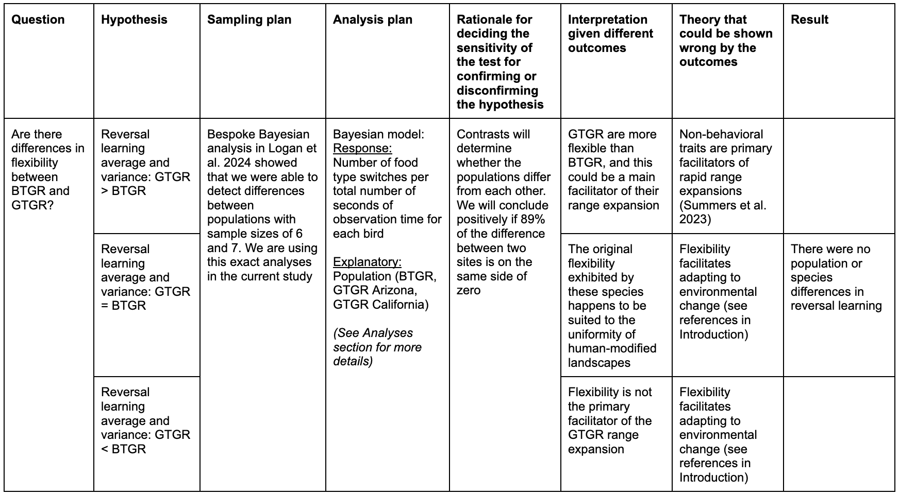

```{r setup, include=FALSE}
library(knitr)
library(formatR)
knitr::opts_chunk$set(tidy.opts=list(width.cutoff=70),tidy=TRUE) 
#Make code chunks wrap text so it doesn't go off the page when knitting to PDF

knitr::opts_chunk$set(echo=F, include=T, results='asis', warning=F, message=F) 
#sets global options to display code along with the results https://exeter-data-analytics.github.io/LitProg/r-markdown.html
#set echo=F for knitting to PDF (hide code), and echo=T for knitting to HTML (show code)
```

```{r cleanbib, include=FALSE, eval=F}
### make a bibtex file that has only the references cited in this rmd 
#load the Rmd file
Rmd <- readChar("https://raw.githubusercontent.com/corinalogan/grackles/master/Files/Preregistrations/gxpopbehaviorhabitatq1.Rmd",nchars=1e7)

#find all in text citations that start with @, but are preceded by a space
pattern <- "\\ @(.*?)\\ "
m <- regmatches(Rmd,gregexpr(pattern,Rmd))[[1]]
m

res<- gsub("\\ ","",m) #delete spaces
res<- gsub("\\]","",res) #delete ]
res<- gsub("\\;","",res) #delete ;
res<- gsub("\\,","",res) #delete ,
res<- gsub("\\.","",res) # delete .

#find all in text citations that start with @, but are preceded by a "["
pattern2 <- "\\[@(.*?)\\ "
m2 <- regmatches(Rmd,gregexpr(pattern2,Rmd))[[1]]
m2

res2<- gsub("\\[","",m2)
res2<- gsub("\\]","",res2)
res2<- gsub("\\]","",res2)
res2<- gsub("\\;","",res2)
res2<- gsub("\\,","",res2)
res2<- gsub("\\.","",res2)
res2<- gsub("\\ ","",res2)

#combine both patterns
allbibtexkeys<-c(res,res2)

#write to a new file and then clean it up manually
write(allbibtexkeys,file="gxpopbehaviorhabitatq1_bibtexkeys.txt")

#load the cleaned txt file
allbibtexkeys<-read.csv("gxpopbehaviorhabitatq1_bibtexkeys.txt")

#use bib2df to convert the bibliography file into a dataframe
install.packages("bib2df")
library(bib2df)

#load the bib from GitHub
df <- bib2df("https://raw.githubusercontent.com/corinalogan/grackles/master/Files/Preregistrations/MyLibrary.bib")

#remove the @ to match the entry in the bib file
allbibtexkeys2<- gsub("\\@","",allbibtexkeys[,1])

#filter the full bib to only keep the entries that are cited here
df_filtered<-df[df$BIBTEXKEY %in% allbibtexkeys2,]

#use bib2df to convert the data frame into the bibliography file that only contains the citations in this Rmd
df2bib(df_filtered, file = "xpopq1refs.bib", append = FALSE)
```

&nbsp;

**Affiliations:** 1) Department of Human Behavior, Ecology and Culture, Max Planck Institute for Evolutionary Anthropology, Leipzig Germany, 2) Institute for Social, Behavioral and Economic Research, University of California Santa Barbara, Santa Barbara, California USA, 3) College of Forestry, Wildlife and Environment, Auburn University, Auburn, Alabama USA. *Corresponding author: corina_logan@eva.mpg.de

# Abstract {-}

Human-modified environments are rapidly increasing, which puts other species in the precarious position of either adapting to the new challenges or, if they are not able to adapt, shifting their range to a more suitable environment. It is generally thought that behavioral flexibility, the ability to change behavior when circumstances change, plays an important role in the ability of a species to rapidly expand their geographic range. To determine whether species differences in range expansion propensity are linked to differences in behavioral flexibility, we compared two closely related species, great-tailed grackles (*Quiscalus mexicanus*; GTGR) and boat-tailed grackles (*Quiscalus major*; BTGR). GTGR is rapidly expanding their geographic range by settling in new areas, whereas BTGR is not. We previously found that GTGR are behaviorally flexible, however not much is known about BTGR behavior. Using the comparative method thus provides an ideal way to test the hypothesis that behavioral flexibility plays a key role in the GTGR rapid range expansion. We compared the behavioral flexibility of two GTGR populations (an older population where they have been breeding since 1951 in the middle of the northern expansion front: Tempe, Arizona, and a more recent population where they have been breeding since 2004 on the northern edge of the expansion front: Woodland, California) with one BTGR population from Venus, Florida (the age of the population is unknown, but likely thousands of years old), to investigate whether the rapidly expanding GTGR, particularly the more recent population, are more flexible. We found that both species, and both GTGR populations, have similar levels of flexibility (measured as food type switching rates during focal follows). Our results elucidate that, while GTGR are highly flexible, flexibility in foraging behavior may not be the primary factor involved in their successful range expansion. If this were the case, we would expect to see a rapid range expansion in BTGR as well. This comparative perspective adds further support to our previous intraspecific findings that persistence and the variance in flexibility (rather than population average flexibility) play a larger role in the edge GTGR population than in the GTGR population away from the edge. Our research indicates that the hypothesis that higher average levels of flexibility are the primary facilitators of rapid geographic range expansions into new areas needs to be revisited.

Preregistered Stage 1 protocol: http://corinalogan.com/Preregistrations/gxpopbehaviorhabitat.html (date of in-principle acceptance: 06/10/2020)  

**Keywords:** behavioral flexibility, boat-tailed grackle, *Quiscalus major*, great-tailed grackle, *Quiscalus mexicanus*, focal follow, food type, range expansion, comparative approach, urbanization, urbanism, behavioral adaptation, innovativeness, exploration, persistence 

# Programmatic registered report  {-}

This Stage 2 (focused on research question 4) is one of four Stages 2s resulting from one programmatic Stage 1 registered report. A programmatic registered report means that multiple Stage 2 articles result from the one Stage 1. Two of the other three Stage 2s have already been published: @logan2023xpoppcj (research question 1) and @summers2023xpop (research question 3). The third, on research question 2, is currently in review at PCI Ecology: @lukas2025xpopdispersal.

# Introduction {-}

Human modified environments are rapidly increasing [@liu2020high; @wu2011quantifying; @goldewijk2001estimating], which puts other species in the precarious position of either adapting to the new challenges or moving to a different area if they are able to [@sol2014urbanisation; @sol2017urbanisation]. Behavioral flexibility (hereafter, ‘flexibility’), the ability to change behavior when circumstances change via processing information that becomes available to other cognitive operations [see @mikhalevich_is_2017 for theoretical background], is hypothesized to play an important role in the ability of a species to adjust to new areas and rapidly expand its geographic range [@chow2016practice; @griffin2014innovation; @lefebvre1997feeding; @sol2002behavioural; @wright2010behavioral]. The prediction is that flexibility, along with behaviors such as exploration, and innovation, facilitate the expansion of individuals into completely new areas, and that the role of these behaviors diminishes after an initial adjustment stage [@wright2010behavioral]. This prediction is supported by experimental studies showing that abilities that are not commonly (or ever) observed in the wild are primarily expressed when needed [e.g., @taylor2007spontaneous; @bird2009insightful; @manrique2011spontaneous; @auersperg2012spontaneous; @laumer2018spontaneous]. Therefore, the founding individuals who initially dispersed out of their original range should not have unique behavioral characteristics that are passed on to their offspring. Instead, the continuation of a range expansion should rely on flexibility, and potentially behaviors such as exploration, innovation, and persistence. These behaviors should therefore be expressed more on the edge of the expansion range where there have not been many generations to accumulate relevant knowledge about the environment, and expressed more in species and populations that are rapidly expanding their range relative to species that are not.

Whether and how flexibility relates to a rapid range expansion is still an open question [@wright2010behavioral]. To determine whether behaviors are involved, they must be directly measured in individuals in populations across the range of the species, and, ideally, also include cross-species comparisons using the same methods [see a discussion in @logan2018beyond and direct evidence in @logan2025flexfor on the danger of flexibility proxies]. There is only a small amount of direct evidence that is beginning to answer this question and it suggests that populations on the range edge express certain behaviors more than populations away from the edge. @cohen2020innovation showed that common mynas (*Acridotheres tristis*) in populations on the edge were more innovative and less neophobic with food than individuals in populations away from the edge, while there were no differences in object neophobia. @logan2023xpoppcj found that edge great-tailed grackles (*Quiscalus mexicanus*; hereafter GTGR) were more persistent and had a higher flexibility variance than individuals in a more central population, while there were no differences in average flexibility, innovation, or exploration. Evidence in invasive species in regions where they were introduced also shows that individuals on the edge or in newer populations were faster to eat new foods (house sparrows, *Passer domesticus*) [@martin2005taste, @liebl2014living] and were more risk averse (bank voles, *Myodes glareolus*) [@eccard2022timid] than individuals away from the edge or in older populations. In contrast, invasive spiders (*Cyrtophora citricola*) at newer sites in their non-native range were less exploratory and less bold than spiders at older sites [@chuang2021personality]. Such differences can also vary seasonally: @liebl2012exploratory found that invasive house sparrows closer to the edge of their non-native range were more exploratory than those away from the edge, but only during the breeding season. This suggests that behavior is differentially involved in expanding a range, however flexibility may not play the primary role and the relative expression of the behaviors might be contrary to predictions. Most evidence on this topic comes from invasive species in their non-native range. GTGR are not technically considered invasive because their rapid range expansion is not due to human introductions [see @logan2023xpoppcj for discussion]. However, it is useful to compare GTGR with invasive species because the range expansion dynamics after arrival appear similar [@chapple2012can]. 

While some intra-species comparisons of behaviors in edge and non-edge populations exist, we were not able to find inter-species investigations that directly measure flexibility or similar behaviors in closely related species that differ in their range expansion rates. This comparative method is a useful approach because it can serve as a type of natural experiment when testing closely related species that are known to differ in one of the two traits of interest [@davies2012introduction]. Here, we investigate flexibility in two closely related species, GTGR and boat-tailed grackles (*Quiscalus major*, hereafter BTGR), that differ in their range expansion rates: GTGR are rapidly expanding, while BTGR are not [@dacosta2008historic; @wehtje2003range]. GTGR are highly flexible [@logan2016behavioral; @logan2023flexmanip], but no flexibility data exist for BTGR. Both species are associated with human-modified environments, and are social and polygynous. Both species  eat the same kinds of foods: a variety of human foods in addition to foraging on insects and on the ground for other natural food items [@johnson2001great; @post1992dominance; @post2000boat]. 

We previously found that GTGR individuals that were faster at reversal learning, a common method to quantify flexibility, had more food type switches during their focal follows [@logan2023xpoppcj] and were faster at switching between options on a puzzlebox [@logan2023flexmanip]. Using food type switches as a measure of flexibility is theoretically similar to using switches between options on puzzleboxes as a measure of flexibility in that individuals need to consider their options and decide when to switch and what to switch to [e.g., @logan2023flexmanip]. Food type switching also more directly reflects whether individuals rely on flexibility when dealing with the challenges in their environment [@wiggins2006diet]. We aimed to compare flexibility, measured as food type switches during focal follows, in two populations of GTGR (an older population where they have been breeding since 1951 [@wehtje2003range] in the middle of the northern expansion front, Tempe, Arizona, and a recent population where they have been breeding since 2004 [Yolo Audubon Society newsletter The Burrowing Owl July 2004, @pandolfino2009colonization] on the northern edge of the expansion front: Woodland, California) with one population of BTGR in the center of their range (Venus, Florida; the age of the population is unknown, but likely thousands of years old). The comparison of flexibility across these three populations first allows us to confirm that flexibility is generally high across the range of GTGR, which is what we previously found using reversal learning, and second to determine whether BTGR have lower flexibility than GTGR in general or GTGR at the edge [GTGR-GTGR population comparison predictions are in @logan2023xpoppcj]. 

Determining whether GTGR are more flexible, particularly on the range edge, will allow us to accumulate more evidence on whether flexibility might play a key role in the GTGR rapid geographic range expansion. Alternatively, if BTGR and GTGR perform similarly, this would suggest that other abilities, ecological, behavioral, or physiological, may play a larger role than flexibility in restricting the BTGR range expansion.


## PREREGISTERED RESEARCH QUESTION

### Are there differences in behavioral traits (flexibility, innovation, exploration, and persistence) between BTGR and GTGR? (See Table 1.)

**Prediction:** If behavior modifications are needed to adapt to new locations, then GTGR, which are rapidly expanding their geographic range [@wehtje2003range], will have higher averages and/or larger variances than BTGR, which are not rapidly expanding their range [@wehtje2003range], in at least some behavioral traits (e.g., behavioral flexibility: speed at reversing a previously learned color preference, innovativeness: number of options solved on a puzzle box, exploration: latency to approach/touch a novel object, and persistence: proportion of trials participated in). Higher averages in behavioral traits indicate that each individual can exhibit more of that trait. If resources are regularly distributed in time and space, perhaps BTGR require less flexibility when visiting these resources and attend less to their temporal availability or the individual’s food preferences. Perhaps the problems BTGR solve do not require much exploration or persistence. Lower variances in behavioral traits indicate that there is less diversity of individuals in the population, which means that there is a lower chance that some individuals in the population would innovate new foraging techniques and be more flexible, exploratory, and persistent if the population average is low.

**Prediction alternative 1:** Human-modified environments are suitable habitat for GTGR and BTGR and the amount of human-modified environments has been increasing. If the original behaviors exhibited by these species happen to be suited to the uniformity of human-modified landscapes, then averages and/or variances of these traits will be similar in the GTGR and BTGR  sampled. This supports the hypothesis that, because these species are closely associated with human-modified environments [@wehtje2003range], which may be similar across the geographic range, individuals in new areas may not need to learn very much about their new environment: they can eat familiar foods and access these foods in similar ways across their range (e.g., fast food restaurant chains likely make the same food and package it in the same packaging in Central and North America, outdoor cafes and garbage cans also look the same across their range).

**Prediction alternative 2:** If BTGR have higher averages and/or larger variances in the behavioral traits measured, this could indicate that perhaps these traits are not the primary facilitators of the GTGR’s rapid geographic range expansion. Alternatively, perhaps these species differ in a life history variable that restricts the BTGR from expanding, or there is some geographic feature that prevents the BTGR from rapidly expanding its range.

## Study design table

**Table 1.** The Stage 1 did not have a study design table because it was written before PCI RR existed and was only transferred to PCI RR in 2025. Therefore, we include a study design table for Stage 2.

{width=100%}


# Methods {-}

## Updates and changes to the preregistration
This study began as a preregistration, which received in principle acceptance at PCI Ecology in 2021: https://github.com/corinalogan/grackles/blob/master/Files/Preregistrations/gxpopbehaviorhabitatPassedPreStudyPeerReview16Dec2021.pdf. The preregistration contains the pre-planned analyses. Here, we report the rationale for the ways in which we conducted the study differently from the plan, and then describe the methods we used to obtain the results. 

**Changes made in the middle of data collection**

1) After the first BTGR field season in 2022, we **stopped the aviary experiments and switched to measuring reversal learning in the wild**. We received permission to make the change in Feb 2023 from the PCI Ecology Managing Board and from the recommender, Esther Sebastián González, who incorporated it into our in principle acceptance. The reason for stopping the aviary experiments is that we discovered that BTGR are less robust to captivity compared to GTGR. BTGR seem to be having health issues as indicated by multiple deaths in the wild (including two that we witnessed), which unfortunately also carried over to the aviaries where two of the six aviary birds died. This meant that we were not able to obtain measures for three of the four variables we planned on investigating: innovation, exploration, and persistence. These three variables would have required aviary testing to conduct a comparison between the two species because this is the setting in which the GTGR were tested. We planned to measure reversal learning in the wild using an automated feeder experiment in GTGR [as in @logan2022manyindividuals]. After data collection started in November 2023, and after extensive work trying to get the automated feeders to function, we discovered in January 2024 that the feeders were not usable. Therefore, we have no data on reversal learning in BTGR.

2) We previously measured flexibility in the wild in GTGR using behavioral observations [@logan2025flexfor], and found a variable that correlates with reversal learning performance: switching between food types during focal follows. This provided us with a way to collect comparable data in BTGR in the wild. Therefore, we **added this measure of flexibility**. Before we started collecting this data using focal follows, we received permission to make the addition in September 2023 from the recommender, Esther Sebastián González, who incorporated it into our in principle acceptance.

## Sample

GTGR were caught in the wild in Woodland and Sacramento, California, and Tempe, Arizona; and BTGR were caught in the wild in Venus and Lake Placid, Florida. We aimed to bring adult grackles, rather than juveniles, temporarily into the aviaries for behavioral choice tests to avoid the potential confound of variation in cognitive development due to age, as well as potential variation in fine motor-skill development (e.g., holding/grasping objects; early-life experience plays a role in the development of both of these behaviors; e.g., Collias & Collias (1964), Rutz et al. (2016)) with variation in our target variables of interest. After switching away from the aviary tests in BTGR (see above), we continued to focus our study on adult individuals, however, it was not usually possible to discern female adults from juveniles. Adult GTGR were identified from their eye color, which changes from brown to yellow upon reaching adulthood (Johnson and Peer 2001). Juvenile male BTGR were identified by their dark brown feathers (rather than shiny black as in the adult males), and we were not able to distinguish between adult and juvenile females because they both have light brown feathers and brown eyes. We applied colored leg bands in unique combinations for individual identification. For some BTGR individuals, one leg band contained an RFID/PIT tag (Eccel Technology Ltd, https://eccel.co.uk/). GTGR were trapped in the wild using mist nets, walk-in traps, and bownets, and BTGR were trapped using walk-in traps. The bird was then processed by collecting biometric measurements, and, in the case of GTGR, also feathers and blood. After processing, the bird was released back to the wild either immediately (all BTGR and many GTGR), or after participating in behavioral tests in aviaries (many GTGR; these data are reported in other publications).

We first collected data on the GTGR populations [@logan2025flexfor], where we had a large sample because we were collecting data for many other purposes as well. Whereas, for the BTGR, we were collecting data for this one purpose of comparing food type switch rates. Therefore, we set the minimum sample size (n=6) for the BTGR to a known sample size in the GTGR in which we were able to distinguish differences between populations.

The dataset consisted of 8 BTGR and 76 GTGR (54 in Arizona, 22 in California) who had data that involved eating at least one food type. We met our minimum sample size of at least 6 individuals in each population and can therefore assess whether a given population is different from the others. A total of 36 food types across all sites were documented. The BTGR took a total of 14 food types, including cheese and oil, which the GTGR did not have. The Arizona GTGR took 20 food types, including lizard, bird poop, candy, vomit, condiment, and carcass, which the other populations did not have. The California GTGR took 15 food types, including mulch, which the other populations did not have.


## Focal follow protocol

To calculate the probability of switching between food types in BTGR, we used the GTGR foraging behavior focal follow protocol from @logan2025flexfor [see @altmann1974observational for a general description of the focal follow method]. Ten minute focal follows were conducted between 9:00 and 16:00 in which all food types were recorded (both species), as well as the foraging bout start and end times (BTGR; Table 2). BTGR focals could only begin if the individual was in the foraging state (whereas, GTGR focals could begin at any time because we collected non-foraging data as well). This meant that we maximized our focal time by ensuring foraging behavior would be present in the focal (rather than starting a focal when they were sitting in a tree and maybe would not forage at all for the next couple of hours). We were careful to keep a respectable distance of at least 10m unless the bird approached us [using flight initiation distances in @moller2008flight and @eason2006factors as a baseline]. If the focal individual showed alarm behaviors due to the observer (e.g., alarm calling at the observer), the focal was stopped and began again on a different day. We determined which individual to follow next by using the order in which the birds were caught. Of the color marked individuals at a given location that were currently in a foraging state, we conducted the focal on the one who was next on the list. If some individuals already had focal follows, we prioritized following those individuals next on the list who had fewer focal follows. If a focal follow was conducted in a particular location on a given day, no further focals could be conducted at that location on that day to avoid pseudoreplication of foraging behavior among individuals. The BTGR field site consisted of two distinct areas: one at Lake June Park, a large 16 hectare park that we divided into five sections so that each counted as a separate location (NE, SE, SW, NW, and center), and the other was at a crossroads where a BP gas station was on one side of the road and counted as a location and a Circle K gas station was on the other side of the road and counted as a separate location. All BTGR and most GTGR data were collected using a voice recorder (Voice Memos app on an iPhone) and later transcribed into the datasheet in Google Sheets (https://www.google.com/sheets/about/). Some GTGR data were first entered into the program Prim8 Software (https://www.prim8software.com/), and then transcribed into the Google Sheet.

The focal protocol was modified in three ways to accommodate that we were only interested in collecting foraging behavior in BTGR, in comparison to GTGR where we collected data on other behaviors as well. The first way in which the BTGR protocol differed was that we **ended each focal when the bird went out of view** and started a new focal when they came back in view (rather than allow “out of view” for up to 5 min per focal). This omitted the problem of trying to account for what might have happened in the time out of view when running the analysis. The second modification was that we **did not wait a minimum of three weeks between separate focal follows** because we were only looking at food type switch rates and these are, by definition, less autocorrelated with time because a switch could only occur within the same focal follow. This still matches what occurred with the GTGR data because, while the aim was to conduct a focal follow for 10 continuous minutes without the bird going out of view, BTGR were very difficult to follow and they went out of view often and were not findable again for several minutes or even days. In these cases, the observer would continue to seek the bird out for several minutes and then across days to obtain more focal observation time until at least 40 min of focal time per bird across at least four separate days was reached (the equivalent of four 10 min focal follows). Each unique day generally corresponded with the focal number. For example, focal 1 might have occurred on the first day of observations for that individual, which might have had a few separate bouts of focal observations that added up to 12 min. Focal 2 on the second day of observations might have only had one bout of focal time that added up to five min. Focal 3 on the third day might have had nine min of observation time in three bouts. Focal 4 might have occurred across day four with six minutes of focal time and day five with 12 min of focal time, for an overall total of 44 minutes of observation time across five days. A study on dolphins (*Tursiops* cf. *aduncus*) found that focal follow data that was separated by 10.5 min was functionally independent [@karniski2015comparison]. Therefore, changing the 3 week spacing minimum to 1 day (until 4 focal follows – at least 40 min across four separate days – were reached and then spacing them 1 week apart after) should be enough temporal distance to assume independence of the data points. The third modification was that we **collected BTGR data only on the “What”** (what did the bird eat, e.g., fries, grains, insect) categories that were found in the GTGR, and we added more food types for the BTGR as needed. We also recorded the latitude and longitude of the location of the grackle at the end of the focal, as in the GTGR protocol. 

We set the BTGR minimum sample size to the average number of focal follows obtained from GTGR in @logan2025flexfor: we aimed for a minimum of 4 focal follows per bird (conducted on separate days between 09:00 and 16:00, attempting to counterbalance mornings and afternoons). The GTGR in the flexibility manipulated condition in @logan2025flexfor had an average of 3.2 focal follows per individual. Therefore, we used a minimum of 4 focal follows per BTGR individual (we rounded 3.2 up to the next whole number). When we analyzed food type switching in the two GTGR populations in @logan2025flexfor, we were able to detect differences in food type switching between individuals in the flexibility manipulated (n=6 individuals) and control (n=7 individuals) conditions. Therefore, we set the BTGR minimum sample size at 6 individuals [@logan2025flexfor]. This matched with a power analysis in @logan2025flexfor (in the section: Ability to detect actual effects > Scenario 2) on a very similar model, where we found that we could reliably detect large and medium effects with a sample size of 8 in the smallest population. The full experimental protocol is online at: https://docs.google.com/document/d/1WK6oR04LR1Q2CGXgICvUNN28MWlM-3o2U66lanDv-lc/edit?usp=sharing.

Only those focal follows that contained data on food types, including unknown food types, were included in the analyses. Therefore, focal durations were balanced between the species. 

**Table 2.** The foraging section of the GTGR ethogram that was used for BTGR data collection. Two new food categories were added that were uniquely seen being eaten by BTGR.

{width=100%}

## Analyses

A food type switch was counted if a bird ate one food type and then ate another food type. This would count as one switch. It also counted as a switch if they went back to eating a previous food type. For example, if a bird ate grains, insect, worm, insect, that would count as three switches among three food types. We did not exclude any data (note that there were 8 BTGR focal follows that occurred less than a week before the previous focal follow or occurred on the same day as another follow at the same location. However, these focal follows did not contain food type switches and thus were not included in the analyses). When there were missing data (e.g. if a bird did not have any food type or food switching data), then it was not included in the analyses. Following procedures in @mcelreath2020statistical, we constructed a hypothesis-appropriate mathematical model for the response variable that examines differences in the response variable between sites. The single population of BTGR in Venus, Florida, was considered a site and we examined differences between BTGR and each of the two GTGR sites. For each focal follow, we calculated the number of switches between food types that occurred and the total amount of time that the bird was observed (using seconds as the unit of time because that was the resolution of data that we collected). We used a rate to be able to directly compare the results among individuals, regardless of any differences in how much time they were followed for. We summed both measures across focal follows to have one data point per bird. This model takes the form of:

$switches_{i}$ ~ Binomial($totaltime_{i}$, $p$),

logit($p$) ~ $a_{i}$[$site$],

where $switches_{i}$ is the sum of the number of times individual, i, changed food types within focal follows that contained food type data, $totaltime_{i}$ is the number of seconds individual, i, was observed across all of its focal follows that contained food type data, $p$ is the probability of switching to a different food type per second, and $a_{i}$ is the intercept (one per level of $site$: GTGR Arizona, GTGR California, and BTGR).

The model was the same for analyzing the variance in switch rates except b[individual] and an extra prior were added as follows:

logit($p$) ~ $a_{i}$[$site$] + b[individual],

which gives the probability of switching food types per bird. We specified the priors for this as: 

d[individual] ~ Normal(0, $\sigma$[site]),

$\sigma$[site] ~ Exponential(1),

where $\sigma$[site] gives the average variance across individuals per site. 

We then performed pairwise contrasts to determine whether there were differences between sites, concluding positively if 89% of the difference between two sites is on the same side of zero [following @mcelreath2020statistical]. The Bayesian approach first estimates for each population the most likely distribution of values given the observed sample, and only in a second step do we compare these estimated distributions. The important part here is that the sample size in each population exceeds a given minimum to reliably estimate the distribution for this population. Differences in sample size across populations do not matter with this approach [@mcelreath2020statistical].
We ran these analyses in R [current version 4.0.3, @rcoreteam] and used the following R packages: rethinking [@mcelreath2020statistical], cmdstanr [@cmdstanr], and dplyr [@dplyr]. Our code is available at @logan2025xpopbtgrdata.


# Results {-}

There were **no strong differences in the AVERAGE probability of switching** among food types per second between BTGR and either population of GTGR, nor between the two GTGR populations (Figure 1; contrasts: GTGR AZ-BTGR: mean difference per second=-0.0004, sd=0.0003, 89%CI=-0.001-0.0001; GTGR CA-BTGR: mean=-0.0002, sd=0.0004, 89%CI=-0.001-0.0004; GTGR AZ-GTGR CA: mean=-0.0002, sd=0.0003, 89%CI=-0.0007-0.0002). This supports Prediction alternative 1.

There were also **no strong differences in the VARIANCE of the probability of switching** among food types per second between BTGR and either population of GTGR, nor between the two GTGR populations (Figure 1; contrasts: GTGR AZ-BTGR: mean difference per second=-0.16, sd=0.61, 89%CI=-0.99-0.76; GTGR CA-BTGR: mean=0.13, sd=0.73, 89%CI=-0.94-1.28; GTGR AZ-GTGR CA: mean=-0.29, sd=0.45, 89%CI=-0.97-0.37). The variances from the raw data for food switches per minute for each site were 0.01 for BTGR, 0.12 for GTGR Arizona, and 0.14 for GTGR California (note that the Bayesian model accounts for any potential differences in variance because it compares the distributions of data points between all populations). This supports Prediction alternative 1.

```{r builddatasummarydatasheet, eval=F}
#load packages
library(dplyr)

#load data sheets
ft <- read.csv(url("https://raw.githubusercontent.com/corinalogan/grackles/master/Files/Preregistrations/gxpopbehaviorhabitatBTGR_data_summary.csv"), header=T, sep=",", stringsAsFactors=F)
ft <- data.frame(ft)

wt <- read.csv(url("https://raw.githubusercontent.com/corinalogan/grackles/master/Files/Preregistrations/gxpopbehaviorhabitatBTGR_data_foraging.csv"), header=T, sep=",", stringsAsFactors=F)
wt <- data.frame(wt)

# COUNTS for summary data sheet
#Need the focal duration ONLY for those focals where a foraging event occurred. This will equalize the difference between the species where the GTGR were focalled for more than just foraging behavior, whereas the BTGR were only focalled for their foraging behavior (a focal couldn't start until the BTGR started foraging)
#NOTE: many more AZ grackles are in this data set because they didn't need to have aviary tests, only focals
#fo <- subset(wt, is.na(wt$FoodType) == FALSE) # doesn't work
#fo <- subset(wt,!(is.na(wt["FoodType"]))) # doesn't work
fo <- wt[!(is.na(wt$FoodType) | wt$FoodType==""), ] #https://www.tutorialspoint.com/how-to-subset-rows-that-do-not-contain-na-and-blank-in-one-of-the-columns-in-an-r-data-frame
#length(fo$FoodType) #1177 foraging events

# COUNT food type switches per bird across all of its follows: FoodSwitch
fo$FoodSwitch<-NA
fo[1,]$FoodSwitch<-0
for(i in 2:nrow(fo)){
  ifelse(fo[i,]$FocalID==fo[i-1,]$FocalID & fo[i,]$FoodType !=fo[i-1,]$FoodType, fo[i,]$FoodSwitch<-1,fo[i,]$FoodSwitch<-0)
}
#fo$FoodSwitch


# COUNT number of food types per bird: NumFoodTypes
#number food types per bird
fo1 <- fo %>% group_by(BirdID) %>% reframe (NumFoodTypesPerBird=unique(FoodType))
#sum number food types per bird
fo2 <- fo1 %>% group_by(BirdID) %>% summarise (NumFoodTypes=n())

#add NumFoodTypes column to data_summary
NumFoodTypes <- full_join(fo2,ft,by="BirdID")
write.csv(fo2,"gxpopbehaviorhabitatBTGR_data_summaryNumFoodTypes.csv") 


# COUNT total number of food events per bird: TotalFoodEvents
fo3 <- fo %>% group_by(BirdID) %>% summarise (TotalFoodEvents=n())
#add TotalFoodEvents column to data_summary
TotalFoodEvents <- full_join(fo3,fo2,by="BirdID")
write.csv(fo3,"gxpopbehaviorhabitatBTGR_data_summaryTotalFoodEvents.csv") 


#CALCULATE total focal time across only those focals that contained food events: SumFocalTimeWFood
#number of seconds per focal
fo4 <- fo %>% group_by(BirdID,FocalID) %>% summarise(foodswitchesperfocal=sum(FoodSwitch),timeperfocal=mean(TimeInViewThisFocalSec))
#sum number of seconds per focal per bird
fo5 <- fo4 %>% group_by(BirdID) %>% summarise(NumFoodSwitches=sum(foodswitchesperfocal),SumFocalTimeWFood=sum(timeperfocal))
#add SumFocalTimeWFood column to data_summary
SumFocalTimeWFood <- left_join(fo5,fo3,by="BirdID")
write.csv(fo5,"gxpopbehaviorhabitatBTGR_data_summarySumFocalTimeWFood.csv") #upload the data sheet to calculate the next piece


#CALCULATE FoodTypesPerSec using NumFoodTypes/SumFocalTimeWFood
su <- read.csv(url("https://raw.githubusercontent.com/corinalogan/grackles/master/Files/Preregistrations/gxpopbehaviorhabitatBTGR_data_summary.csv"), header=T, sep=",", stringsAsFactors=F)
su <- data.frame(su)
su$FoodTypesPerSec <- su$NumFoodTypes/su$SumFocalTimeWFood #add FoodTypesPerSec column to data_summary by copying and pasting the output from su to the csv
```

```{r foodtypestats, eval=F}
#GTGR data from flexforaging article (Logan et al. 2024). I added this data to the BTGR_data_foraging data sheet below
gt <- read.csv(url("https://raw.githubusercontent.com/corinalogan/grackles/master/Files/Preregistrations/g_flexforaging_data_foraging.csv"), header=T, sep=",", stringsAsFactors=F)
gt <- data.frame(gt)

#load data sheet
wt <- read.csv(url("https://raw.githubusercontent.com/corinalogan/grackles/master/Files/Preregistrations/gxpopbehaviorhabitatBTGR_data_foraging.csv"), header=T, sep=",", stringsAsFactors=F)
wt <- data.frame(wt)

## HOW MANY DIFFERENT FOOD TYPES?
wt$FoodType <- as.factor(wt$FoodType)
levels(wt$FoodType)
unique(wt$FoodType) #36 food types across all populations/species

# GTGR AZ
length(unique(wt[wt$Site=="AZ",]$FoodType)) #20
unique(wt[wt$Site=="AZ",]$FoodType) #fry, lizard, unknown, grains, insect, rock, cat food, worm, seed, food crumbs, vegetation,  fruit, bird poop, candy, vomit, misc. trash, soil, condiment, carcass, chicken. The CA pop didn't have lizard, worm (BTGR did), bird poop, candy, vomit, condiment, or carcass

# GTGR CA
length(unique(wt[wt$Site=="CA",]$FoodType)) #15
unique(wt[wt$Site=="CA",]$FoodType) #unknown, insect, grains, cat food, fry, soil,  rock, *peanut,  chicken,  vegetation, *mulch, food crumbs, misc. trash, seed, fruit. The AZ pop didn't have peanut or mulch, the BTGR population didn't have mulch

# BTGR
length(unique(wt[wt$Site=="BTGR",]$FoodType)) #14
unique(wt[wt$Site=="BTGR",]$FoodType) #Insect,  *Cheese, Grains,  Worm, Unknown, Seed, Food crumbs, *Oil, Vegetation, Fruit, Fry, Peanut, Chicken. BTGR had cheese and oil, while GTGR didn't
```

```{r foodswitchresult, eval=T, results='hide'}
#note: results='hide' makes it so the messages from the model don't show up in the PDF

## Switching between food types: does one species have more switches and is thus more flexible?
#load packages

## R has been updated and now the rethinking package doesn't work. Reload cmdstanr and rethinking by asking ChatGPT how to do it (the instructions there are better than those at the websites)
library(cmdstanr)
library(devtools)
library(rethinking)

#load data sheet
ft <- read.csv(url("https://raw.githubusercontent.com/corinalogan/grackles/master/Files/Preregistrations/gxpopbehaviorhabitatBTGR_data_summary.csv"), header=T, sep=",", stringsAsFactors=F)
ft <- data.frame(ft)

# Sample size
ft$Site <- as.factor(ft$Site)
#length(ft[ft$Site=="AZ",]$Site) #54 GTGR AZ
#length(ft[ft$Site=="CA",]$Site) #22 GTGR CA
#length(ft[ft$Site=="BTGR",]$Site) #8 BTGR


## AVERAGE flexibility
# Set up data
dat <- list(foodswitches = ft$NumFoodSwitches,
            totaltime = round(ft$SumFocalTimeWFood,0), 
            site = as.integer(as.factor(ft$Site)) #Site 1=AZ, 2=BTGR, 3=CA
              )

# Run model
set.seed(1)
switch <- ulam( alist(
        foodswitches ~ dbinom(totaltime,p),
        logit(p) <- a[site], #the intercept is the probability of observing any of the types is different between sites
        a[site] ~ dnorm(0,1) #each site gets its own intercept, mean=0 bc assume an average bird might show half of the total types, so 0 on inverse logit = 50%
    ) , data=dat , chains=4 , cores=4 , cmdstan = TRUE, control = list(adapt_delta = .95, force_recompile = TRUE))

output_switch <- precis( switch , depth=2 )
#      mean   sd  5.5% 94.5% n_eff Rhat4
# a[1] -6.24 0.07 -6.35 -6.13    1  1821.89
# a[2] -6.04 0.14 -6.26 -5.83    1  1911.45
# a[3] -6.14 0.12 -6.34 -5.95    1  1931.23

#means at each site on the regular scale
#inv_logit(output_switch[,1]) #0.001951270 0.002372567 0.002141173


# CONTRASTS to see if Sites differ

## GTGR AZ - BTGR
post <- extract.samples(switch)
#diff <- inv_logit( post$a[,1]) - inv_logit( post$a[,2])
#contrast_swfo <- precis( diff )
#         mean   sd  5.5% 94.5%  histogram
#diff    0  0    0     0 ▁▁▁▁▂▅▇▅▂▁▁

#numbers are too small to distinguish, so check the actual intervals...
#HPDI(diff) #Highest Posterior Density intervals, which are the same as is used in the precis (described as compatibility intervals) because our samples are from the posterior distribution
#        |0.89         0.89| 
#-0.0009906352  0.0001043139  
#crosses zero so the groups do not differ
#mean(diff) # -0.0004387297 per sec
#sd(diff) # 0.0003468508 per se
#mean(diff)*60 # -0.02632378 per min

# How much more likely are the BTGR to switch than GTGR AZ?
#mean(inv_logit(post$a[,2]))/mean(inv_logit(post$a[,1])) #  1.224324
#sd(inv_logit(post$a[,2]))/mean(inv_logit(post$a[,1])) # 0.1658792
#HPDI(inv_logit(post$a[,2]))/mean(inv_logit(post$a[,1]))
#   |0.89    0.89| 
#0.9587506 1.4857393 


## GTGR CA - BTGR
#diffcb <- inv_logit( post$a[,3]) - inv_logit( post$a[,2])
#contrastcb <- precis( diffcb )
#         mean   sd  5.5% 94.5%  histogram
#diffcb    0  0    0     0   ▁▁▃▇▃▁▁

#numbers are too small to distinguish, so check the actual intervals...
#HPDI(diffcb) #Highest Posterior Density intervals, which are the same as is used in the precis (described as compatibility intervals) because our samples are from the posterior distribution
#        |0.89         0.89| 
#-0.0009058925  0.0004301702
#crosses zero so  groups do not differ: GTGR CA does not have higher probability of switching than BTGR
#mean(diffcb) # -0.0002370211 per sec
#sd(diffcb) # 0.0004195399 per sec
#mean(diffcb)*60 #  -0.01422127 per min

# How much more likely are the GTGR CA to switch than BTGR?
#mean(inv_logit(post$a[,2]))/mean(inv_logit(post$a[,3])) # 1.109859
#sd(inv_logit(post$a[,2]))/mean(inv_logit(post$a[,3])) # 0.1503709
#HPDI(inv_logit(post$a[,2]))/mean(inv_logit(post$a[,3]))
#   |0.89    0.89| 
#0.8691151 1.3468346 


## GTGR AZ - GTGR CA
#diffca <- inv_logit( post$a[,1]) - inv_logit( post$a[,3])
#contrastca <- precis( diffca )
#         mean   sd  5.5% 94.5%  histogram
#diffca    0  0    0     0 ▁▁▁▁▂▃▇▇▅▂▁▁▁

#numbers are too small to distinguish, so check the actual intervals...
#HPDI(diffca) #Highest Posterior Density intervals, which are the same as is used in the precis (described as compatibility intervals) because our samples are from the posterior distribution
#        |0.89         0.89| 
#-0.0007138369  0.0002496342
#crosses zero so the groups do not differ: GTGR AZ and GTGR CA have similar probability of switching
#mean(diffca) # -0.0002017086 per sec
#sd(diffca) # 0.0003003185 per sec
#mean(diffca)*60 # -0.01210251 per min

# How much more likely are the GTGR AZ to switch than GTGR CA?
#mean(inv_logit(post$a[,3]))/mean(inv_logit(post$a[,1])) # 1.103134
#sd(inv_logit(post$a[,3]))/mean(inv_logit(post$a[,1])) # 0.1362928
#HPDI(inv_logit(post$a[,3]))/mean(inv_logit(post$a[,1]))
#   |0.89    0.89| 
#0.8896928 1.3200867 


## VARIANCE in flexibility
# Set up data
datvar <- list(foodswitches = ft$NumFoodSwitches,
             totaltime = round(ft$SumFocalTimeWFood,0), 
             site = as.integer(as.factor(ft$Site)), #Site 1=AZ, 2=BTGR, 3=CA
             individual = as.integer(as.factor(ft$BirdID)) )
# Run model
set.seed(2)
switchvar <- ulam( alist(
         foodswitches ~ dbinom(totaltime,p),
         logit(p) <- a[site] + b[individual], #b[individual] is the component that measures variance 
         a[site] ~ dnorm(0,1),
         b[individual]~dnorm(0,sigma[site]),
         sigma[site]~dexp(1)
     ) , data=datvar , chains=4 , cores=4 , cmdstan = TRUE, control = list(adapt_delta = .95, force_recompile = TRUE))

output_switchvar <- precis( switchvar , depth=2 )
 
#extract posterior
postvar <- extract.samples(switchvar)


# CONTRASTS to see if Sites differ

#set up data sheet so each site has its own column of sigma
postvarab <- postvar$sigma
postvarab<-as.data.frame(postvarab)

## GTGR AZ - BTGR
#diffvarab <- postvarab[,1] - postvarab[,2]
#contrast_diffvarab <- precis( diffvarab )
#         mean   sd  5.5% 94.5%  histogram
#diffvarab -0.16 0.61 -1.23  0.61 ▁▁▁▁▁▁▃▇▇▂▁▁

#numbers are too small to distinguish, so check the actual intervals...
#HPDI(diffvarab) #Highest Posterior Density intervals, which are the same as is used in the precis (described as compatibility intervals) because our samples are from the posterior distribution
#        |0.89         0.89| 
#-0.986370  0.761765
#crosses zero so the groups do not differ
#mean(diffvarab) # -0.157407 per sec
#sd(diffvarab) # 0.6052781 per sec
#mean(diffvarab)*60 # -9.444421 per min


## GTGR CA - BTGR
#diffvarcb <- postvarab[,3] - postvarab[,2]
#contrast_diffvarcb <- precis( diffvarcb )
#         mean   sd  5.5% 94.5%  histogram
#diffvarcb 0.13 0.73 -1.05  1.21 ▁▁▁▁▁▂▅▇▅▂▁▁▁

#numbers are too small to distinguish, so check the actual intervals...
#HPDI(diffvarcb) #Highest Posterior Density intervals, which are the same as is used in the precis (described as compatibility intervals) because our samples are from the posterior distribution
#        |0.89         0.89| 
#-0.93879  1.27681 
#crosses zero so  groups do not differ
#mean(diffvarcb) # 0.1294479 per sec
#sd(diffvarcb) # 0.7259996 per sec
#mean(diffvarcb)*60 # 7.766874 per min


## GTGR AZ - GTGR CA
#diffvarac <- postvarab[,1] - postvarab[,3]
#contrast_diffvarac <- precis( diffvarac )
#         mean   sd  5.5% 94.5%  histogram
#diffca    0  0    0     0 ▁▁▁▁▂▃▇▇▅▂▁▁▁

#numbers are too small to distinguish, so check the actual intervals...
#HPDI(diffvarac) #Highest Posterior Density intervals, which are the same as is used in the precis (described as compatibility intervals) because our samples are from the posterior distribution
#        |0.89         0.89| 
#-0.96900  0.36612
#crosses zero so the groups do not differ: GTGR AZ and GTGR CA have similar probability of switching (CA has higher variances, like in xpopq1 so it is in the same direction even though now it isn't a strong difference)
#mean(diffvarac) #  -0.2868549 per sec
#sd(diffvarac) # 0.4482109 per sec
#mean(diffvarac)*60 # -17.21129 per min


# TRYING A DIFFERENT VARIANCE CONTRAST because intuitively from the figure, it looks like the BTGR should have a lower variance than either population of GTGR. However, after running this extra check, which produced the same results as the contrast above (no differences), it makes sense because smaller sample sizes have more uncertainty around where the model thinks the mean is. Larger sample sizes would help, but also using a direct response variable, like a count, rather than a rate would also help.
#first, what is the variance per site of the raw data: food switches per min?
#variance(ft[ft$Site=="BTGR",]$NumFoodSwitches / (ft[ft$Site=="BTGR",]$SumFocalTimeWFood/60))  #0.007276962
#variance(ft[ft$Site=="AZ",]$NumFoodSwitches / (ft[ft$Site=="AZ",]$SumFocalTimeWFood/60)) #0.05998854
#variance(ft[ft$Site=="CA",]$NumFoodSwitches / (ft[ft$Site=="CA",]$SumFocalTimeWFood/60)) #0.07327653

# Variance is different, but means are similar
#mean(ft[ft$Site=="BTGR",]$NumFoodSwitches / (ft[ft$Site=="BTGR",]$SumFocalTimeWFood/60)) #0.09622893
#mean(ft[ft$Site=="AZ",]$NumFoodSwitches / (ft[ft$Site=="AZ",]$SumFocalTimeWFood/60)) #0.1150897
#mean(ft[ft$Site=="CA",]$NumFoodSwitches / (ft[ft$Site=="CA",]$SumFocalTimeWFood/60)) #0.1373463

#values per individual for b in the model
#postvar$b

#separate the values per site
#see what row numbers each site is...
#ft$Site
#and manually separate them
#residb <- postvar$b[,which(ft$Site=="BTGR")] #BTGR
#resida <- postvar$b[,which(ft$Site=="AZ")] #AZ
#residc <- postvar$b[,which(ft$Site=="CA")] #CA
#Take the absolute value to indicate how far each individual's value is from the estimated mean of its population
#residb<-abs(residb)
#resida<-abs(resida)
#residc<-abs(residc)

# check whether BTGR individuals have less variance - which means their values are closer to the population mean - than Arizona individuals
#for(i in 1:nrow(residb)){
#  ifelse(i==1,contrast_varab<-mean(resida[i,])-mean(residb[i,]),contrast_varab<-c(contrast_varab,mean(resida[i,])-mean(residb[i,])))
#}
#precis(contrast_varab)
#'data.frame': 2000 obs. of 1 variables:
#                mean   sd 5.5% 94.5% histogram
#contrast_varab -0.14 0.39 -0.8  0.39 ▁▁▁▁▂▇▅▁▁
#No difference in variance between BTGR and AZ

# check whether BTGR individuals have less variance - which means their values are closer to the population mean - than CA individuals
#for(i in 1:nrow(residb)){
#  ifelse(i==1,contrast_varcb<-mean(residc[i,])-mean(residb[i,]),contrast_varcb<-c(contrast_varcb,mean(residc[i,])-mean(residb[i,])))
#}
#precis(contrast_varcb)
#'data.frame': 2000 obs. of 1 variables:
#                mean   sd 5.5% 94.5% histogram
#contrast_varcb 0.08 0.47 -0.69   0.8 ▁▁▁▂▅▇▂▁▁
#No difference in variance between BTGR and CA


# VISUALIZE
# reorder the site numbers so 1=BTGR, 2=GTGR AZ, 3=GTGR CA
ft$Site <- as.factor(ft$Site)
#levels(ft$Site) #1=AZ, 2=BTGR, 3=CA
ft$Site <- factor(ft$Site, levels=c("BTGR", "AZ", "CA"))
#levels(ft$Site) #2=BTGR, 1=AZ, 3=CA

#make new variable of probability of switching per minute
ft$probswitch <- (ft$NumFoodSwitches/ft$SumFocalTime)*60 #Ak'xi in CA has a really high rate

op <- par(mfrow=c(1,1), mar=c(3,4.9,2,0.9))
plot( as.integer(as.factor(ft$Site))+rnorm(84,0,0.1) , ft$probswitch , xlab="" , ylab="Probability of switching among food types / min" , ylim=c(0,1.3), xlim=c(0.6,3.5), xaxt="n")
#BTGR
points(inv_logit(precis(switch,depth=2)[2,1])*60 ~ c(1.9),cex=2)
lines(c(inv_logit(precis(switch,depth=2)[2,3])*60,inv_logit(precis(switch,depth=2)[2,4])*60) ~ c(1.9,1.9))
#AZ
points(inv_logit(precis(switch,depth=2)[1,1])*60 ~ c(1.1),cex=2) #1,1 refers to the mean (column 1) in the precis output for site 1 (row 1)
lines(c(inv_logit(precis(switch,depth=2)[1,3])*60,inv_logit(precis(switch,depth=2)[1,4])*60) ~ c(1.1,1.1)) #1,3 refers to the lower CI (column 3) in the precis output for site 1 (row 1) and 1,4 to the upper CI (column 4)
#CA
points(inv_logit(precis(switch,depth=2)[3,1])*60 ~ c(2.9),cex=2)
lines(c(inv_logit(precis(switch,depth=2)[3,3])*60,inv_logit(precis(switch,depth=2)[3,4])*60) ~ c(2.9,2.9))
#X axis labels
mtext("BTGR",side=1,at=0.9,outer=FALSE,adj=0,font=1,cex=1,line=0.6)
mtext("GTGR AZ",side=1,at=1.7,outer=FALSE,adj=0,font=1,cex=1,line=0.6)
mtext("GTGR CA",side=1,at=2.7,outer=FALSE,adj=0,font=1,cex=1,line=0.6)
par(op)
```

**Figure 1.** The probability of switching among food types per minute for the BTGR (n=8), and GTGR in Arizona (n=54) and California (n=22). The small circles are the data points per individual and the large circles are the estimated means with their 89% compatibility intervals represented by the vertical lines.


# Discussion {-}

There were no strong differences in flexibility (averages or variances), measured as food type switching during focal follows, between BTGR and GTGR. This converges with the small amount of evidence we were able to obtain from the reversal learning tests in the aviaries from two BTGR individuals: their reversal learning speeds (35 and 79 trials to reverse) were well within the range of the GTGR reversal learning speeds (26-159 trials to reverse) [@logan2023xpoppcj]. We know that GTGR are highly flexible relative to other species [@logan2016behavioral], therefore the similar levels of flexibility between the two species indicates that BTGR are also highly flexible.

We found no strong differences in flexibility, measured as food type switching, between the two GTGR populations, which supports our finding that there was also no difference in the average flexibility based on reversal learning between these populations [@logan2025flexfor]. This provides additional evidence that food type switching is likely measuring the same trait as reversal learning and therefore is a valid measure of flexibility. @logan2025flexfor did find a difference in the reversal learning flexibility variance between the GTGR populations and, while we found no strong difference in the variance when using food type switching probabilities, the California population, closest to the northern edge of the range, had higher variances, which is in the same direction as what @logan2023xpoppcj found.

Unfortunately, we were not able to obtain comparable exploration, innovativeness, and persistence data on the BTGR to understand whether one or more of these behaviors could relate to species differences in range expansion rates. Before the focal follow data in the current article were collected, we obtained a small sample of data from BTGR in 2022 in aviaries. We reported and analyzed the BTGR 2022 aviary data in a separate article, @logan2023xpoppcj, where we analyzed the results from these tests for GTGR, therefore it was a more appropriate place to compare results from similar tests. The analyses suggest that BTGR are less innovative (n=4) and less persistent (n=5) than both GTGR populations, while having similar levels of exploration (n=5) as the California GTGR and being less exploratory than the Arizona GTGR. Indeed, the California GTGR on the northern edge of their range are more persistent than the Arizona GTGR population, though there were no strong differences in innovation or exploration. This lends more support to persistence as the behavior that might play a larger role in the range expansion of the already highly flexible GTGR. However, this is speculative due to the small BTGR aviary sample sizes. More research is needed to make robust comparisons between the two species on these other behaviors.

The lack of a difference in flexibility between the two species suggests that the original behaviors exhibited by these species happen to be suited to the similar challenges of human-modified landscapes where both species are found. This supports the hypothesis that, because these species are closely associated with human-modified environments [@wehtje2003range; @summers2023xpop; @post1992dominance; @post2000boat], which may be similar across the geographic range (what we refer to as “uniform” in the predictions), individuals in new areas may not need to learn much about their new environment. They can eat familiar foods and access these foods in similar ways across their range. For example, food at restaurants and in garbage cans are similar across North America. It is possible that environmental, rather than behavioral, variables play a larger role in restricting the BTGR range expansion. @summers2023xpop found that, between 1979 and 2019, BTGR were present in primarily warm, wet, coastal habitats and this did not change over time. The range they expanded into during this time was made suitable to them likely due to climate change. In contrast, GTGR shifted to using more urban, arid habitats over this time, which suggests that behavior could be a key facilitator involved in their range expansion. @maclean2017species found a similar result using a metaanalysis: range shifts were associated with habitat breadth. Because urban environments represent a rapidly increasing category of environmental change [@liu2020high; @wu2011quantifying; @goldewijk2001estimating], our observations highlight the importance of differentiating between whether a behavior might be linked to the ability to live in urban environments versus the ability to expand into new habitats. Flexibility is potentially linked to living in urban environments, but not necessarily to the ability to expand into novel habitats.

In conclusion, the evidence that two closely related species have similar levels of flexibility, but different range expansion rates does not support the hypothesis that flexibility is the primary facilitator of rapid geographic range expansions into new areas. This does not rule out that flexibility might be a needed variable to rapidly expand a range, as shown by GTGR who have high average levels of flexibility on and away from the edge, but just because it is present, does not mean that the species will expand their range, as shown by the BTGR. It appears that other behaviors, such as persistence [@logan2023xpoppcj], innovation, food neophobia [@cohen2020innovation; @martin2005taste; @liebl2014living], exploration [@chuang2021personality], and risk aversion [@eccard2022timid] may play a more primary role in expanding the edge of the range further. This indicates the importance of investigating multiple behaviors in each species of interest to determine what, if any, role they play and in what direction.

# Data, script, and code availability {-}

Data, scripts, and code are available online at the Knowledge Network for Biocomplexity’s data repository [@logan2025xpopbtgrdata]. The scripts and code are in the Rmd file, which is also available at https://github.com/corinalogan/grackles/blob/master/Files/Preregistrations/gxpopbehaviorhabitatq1.Rmd

# Ethics {-}

This research was carried out in accordance with permits from the:

1) US Fish and Wildlife Service (scientific collecting permit number MB76700A-0,1,2)
2) US Geological Survey Bird Banding Laboratory (federal bird banding permit number 23872)
3) Arizona Game and Fish Department (scientific collecting license number SP594338 [2017], SP606267 [2018], SP639866 [2019], and SP402153 [2020])
4) Institutional Animal Care and Use Committee at Arizona State University (protocol number 17-1594R)
5) Institutional Animal Care and Use Committee at the University of California Santa Barbara (protocol number 958)
6) Institutional Animal Care and Use Committee at Archbold Biological Station (protocol number ABS-AUP-033-R)
7) California Department of Fish and Wildlife (scientific collecting permit [specific use] number S‐192100001‐19210‐001)
8) RegionalSan (access permit number AP 2021-01)
9) Florida Fish and Wildlife Conservation Commission (scientific collecting permit number LSSC-21-00050)

# Author contributions {-}

**Logan:** Hypothesis development, data collection (BTGR focal follows and field work), data analysis and interpretation, write up, revising/editing, materials/funding.

**McCune:** Method development, data collection (Arizona and California focal follows and field work), revising/editing.

**Rowney:** Data collection (Arizona field work), revising/editing.

**Lukas:** Hypothesis development, data collection (BTGR field work), data analysis and interpretation, write up, revising/editing.


# Funding {-}

This research was funded by the Department of Human Behavior, Ecology and Culture at the Max Planck Institute for Evolutionary Anthropology.

# Conflict of interest disclosure {-}

We, the authors, declare that we have no financial conflicts of interest with the content of this article. CJ Logan and D Lukas are Recommenders at PCI Ecology, and CJ Logan was on the Managing Board at PCI Ecology (2018-2022).

# Acknowledgements {-}

We thank our Stage 1 manuscript PCI Ecology recommender, Esther Sebastián González, and reviewers Caroline Marie Jeanne Yvonne Nieberding, Pizza Ka Yee Chow, Tim Parker, and 1 anonymous reviewer for their helpful feedback; our Stage 2 reviewers at PCI Ecology, Pizza Ka Yee Chow, Roi Dor, and one anonymous reviewer, and then our PCI Registered Reports recommenders, Valeria Mazza and Saeed Shafiei Sabet, and reviewers, Vedrana Šlipogor and Molly Gilmour for their wonderful support and feedback. We thank Julia Cissewski and Sophie Kaube for tirelessly solving problems involving financial transactions and contracts; and Richard McElreath for generously supporting this project. We are grateful for support for the boat-tailed grackle research: thank you to Sebastian Sosa for advice on how to modify the focal follow protocol for the BTGR; BP gas station and Circle K gas station for allowing access to their land; Lake Placid Town Hall for allowing research access at Lake June Park; Archbold Biological Station and Buck Island Ranch for allowing access to hundreds of acres for grackle research; Reed Bowman and Sahas Barve for hosting this research at Archbold Biological Station; Betsie Rothermel for consultations during difficult times; Joe Guthrie and Emily Angell for helping protect the aviaries from predators; Brenda Leitner for innovative brainstorming sessions on how to catch grackles; common grackles for enticing the boat-tailed grackles into the trap; and the boat-tailed grackles for participating in this research. We are grateful for support for the GTGR research: thank you to Melissa Wilson for sponsoring our affiliations at Arizona State University and lending lab equipment; Kevin Langergraber for serving as local PI on the ASU IACUC; Kristine Johnson for technical advice on great-tailed grackles; Aaron Blackwell and Ken Kosik for being the UCSB sponsors of the Cooperation Agreement with the Max Planck Institute for Evolutionary Anthropology; Christa LeGrande-Rolls for conducting focal follows and field work on the California GTGR; Tim Busch at the Woodland-Davis Clean Water Agency, Bryan Young and Chris Conard at RegionalSan, and Conaway Ranch for hosting the California field research on their land; Luisa Bergeron, Zoe Johnson-Ulrich, and Melissa Folsom for conducting focal follows and field research, August Sevchik for helping in the field and in the aviaries, and Sawyer Lung for field support in Arizona; our Arizona research assistants: Aelin Mayer, Nancy Rodriguez, Brianna Thomas, Aldora Messinger, Elysia Mamola, Michael Guillen, Rita Barakat, Adriana Boderash, Olateju Ojekunle, August Sevchik, Justin Huynh, Jennifer Berens, Amanda Overholt, Michael Pickett, Sam Munoz, Sam Bowser, Emily Blackwell, Kaylee Delcid, Sofija Savic, Brynna Hood, Sierra Planck, and Elise Lange; and the great-tailed grackles for participating in this research.

# References {-}