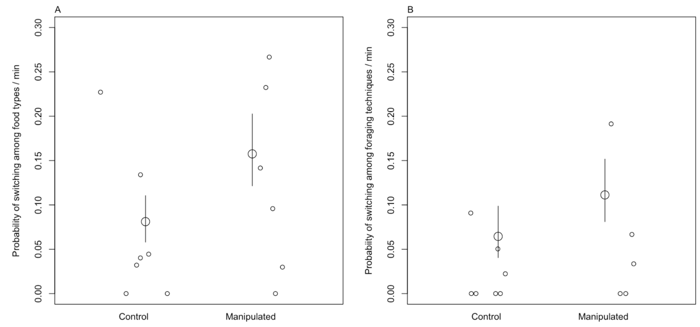

```{r setup, include=FALSE}
library(knitr)
library(formatR)
knitr::opts_chunk$set(tidy.opts=list(width.cutoff=70),tidy=TRUE) 
#Make code chunks wrap text so it doesn't go off the page when knitting to PDF

knitr::opts_chunk$set(echo=F, include=T, results='asis', warning=F, message=F) 
#sets global options to display code along with the results https://exeter-data-analytics.github.io/LitProg/r-markdown.html
#set echo=F for knitting to PDF (hide code), and echo=T for knitting to HTML (show code)
```

```{r cleanbib, include=FALSE, eval=F}
### make a bibtex file that has only the references cited in this rmd 
#load the Rmd file
Rmd <- readChar("https://raw.githubusercontent.com/corinalogan/grackles/master/Files/Preregistrations/gxpopbehaviorhabitatq1.Rmd",nchars=1e7)

#find all in text citations that start with @, but are preceded by a space
pattern <- "\\ @(.*?)\\ "
m <- regmatches(Rmd,gregexpr(pattern,Rmd))[[1]]
m

res<- gsub("\\ ","",m) #delete spaces
res<- gsub("\\]","",res) #delete ]
res<- gsub("\\;","",res) #delete ;
res<- gsub("\\,","",res) #delete ,
res<- gsub("\\.","",res) # delete .

#find all in text citations that start with @, but are preceded by a "["
pattern2 <- "\\[@(.*?)\\ "
m2 <- regmatches(Rmd,gregexpr(pattern2,Rmd))[[1]]
m2

res2<- gsub("\\[","",m2)
res2<- gsub("\\]","",res2)
res2<- gsub("\\]","",res2)
res2<- gsub("\\;","",res2)
res2<- gsub("\\,","",res2)
res2<- gsub("\\.","",res2)
res2<- gsub("\\ ","",res2)

#combine both patterns
allbibtexkeys<-c(res,res2)

#write to a new file and then clean it up manually
write(allbibtexkeys,file="gxpopbehaviorhabitatq1_bibtexkeys.txt")

#load the cleaned txt file
allbibtexkeys<-read.csv("gxpopbehaviorhabitatq1_bibtexkeys.txt")

#use bib2df to convert the bibliography file into a dataframe
install.packages("bib2df")
library(bib2df)

#load the bib from GitHub
df <- bib2df("https://raw.githubusercontent.com/corinalogan/grackles/master/Files/Preregistrations/MyLibrary.bib")

#remove the @ to match the entry in the bib file
allbibtexkeys2<- gsub("\\@","",allbibtexkeys[,1])

#filter the full bib to only keep the entries that are cited here
df_filtered<-df[df$BIBTEXKEY %in% allbibtexkeys2,]

#use bib2df to convert the data frame into the bibliography file that only contains the citations in this Rmd
df2bib(df_filtered, file = "xpopq1refs.bib", append = FALSE)
```


&nbsp;

**Affiliations:** 1) Max Planck Institute for Evolutionary Anthropology, 2) University of California Santa Barbara. *Corresponding author: corina_logan@eva.mpg.de

&nbsp;


&nbsp;

**This article began as a preregistration, which was pre-study peer reviewed and received an In Principle Recommendation of the [version](https://github.com/corinalogan/grackles/blob/master/Files/Preregistrations/gxpopbehaviorhabitatPassedPreStudyPeerReview16Dec2021.pdf) on 16 Dec 2021 by:**

Esther Sebastián González (2020) The role of behavior and habitat availability on species geographic expansion. *Peer Community in Ecology*, 100062. [10.24072/pci.ecology.100062](https://doi.org/10.24072/pci.ecology.100062). Reviewers: Caroline Nieberding, Tim Parker, and Pizza Ka Yee Chow


# ABSTRACT

It is generally thought that behavioral flexibility, the ability to change behavior when circumstances change, plays an important role in the ability of species to rapidly expand their geographic range. Great-tailed grackles (*Quiscalus mexicanus*; GTGR) and their closest relative, boat-tailed grackles (*Quiscalus major*; BTGR), are social, polygamous species, however the former are rapidly expanding their geographic range by settling in new areas and habitats, whereas the latter are not rapidly expanding their range and not settling in new habitats. We have previously found that GTGR are behaviorally flexible, however not much is known about BTGR behavior. This offers an opportunity to determine whether changes in behavioral traits facilitate the rapid GTGR expansion by comparing their behavioral flexibility with BTGR on the same tests. We compared behavioral flexibility of wild GTGR from two populations across their range (an older population in the middle of the northern expansion front: Tempe, Arizona, and a more recent population on the northern edge of the expansion front: Woodland, California) with wild BTGR from Lake Placid, Florida to investigate whether the rapidly expanding GTGR are more flexible. We found that both species have similar levels of flexibility (measured as the number of switches between food types during focal follows). Our results elucidated that, while GTGR are flexible, flexibility may not be the primary factor involved in their successful range expansion. If this were the case, we would expect to see a rapid range expansion in BTGR as well. This adds further support to our previous findings that persistence and flexibility variance play a larger role in the edge GTGR population. Our findings highlight the value of comparative studies and of breaking down cognitive concepts into direct measures of individual abilities to better understand how species might adapt to novel circumstances.

\newpage

# INTRODUCTION

It is generally thought that behavioral flexibility (hereafter, “flexibility”)  plays an important role in the ability of a species to rapidly expand their geographic range [e.g., @lefebvre1997feeding; @griffin2014innovation; @chow2016practice; @sol2000behavioural; @sol2002behavioural; @sol2005big; @sol2007big]. It is predicted that flexibility, the ability to change behavior when circumstances change through packaging information and making it available to other cognitive processes [see @mikhalevich_is_2017 for theoretical background on our flexibility definition], as well as exploration (latency to explore a novel environment or object) and innovation [creating new behaviors or using existing behaviors in a new context, @griffin2014innovation] facilitate the expansion of individuals into completely new areas. However, the role of these behaviors in the process of establishing a population in a particular area is predicted to diminish after a certain number of generations [@wright2010behavioral]. In support of this, experimental studies have shown that latent abilities are primarily expressed in a time of need [e.g., @taylor2007spontaneous; @bird2009insightful; @manrique2011spontaneous; @auersperg2012spontaneous; @laumer2018spontaneous].

To determine whether a behavior (e.g., flexibility, innovativeness, exploration, persistence) is involved in a rapid geographic range expansion, direct measures of behaviors in individuals must be collected in populations across the range of the species (see the discussion on the danger of proxies of flexibility in Logan et al., 2018). Flexibility, the ability to recognize that something about the environment has changed and decide to consider other options for deploying behavior [@mikhalevich_is_2017], is distinct from innovation, which is the specific stringing together of particular actions in a new way or in a new context [@griffin2014innovation]. Innovative behavior can be related to flexibility in that it may occur in response to the decision to change behavior in some way. Investigations of behavior in invasive species and species that are rapidly expanding their geographic ranges that compare edge versus core populations are rare. Behavioral evidence from invasive species indicates that Common mynas (*Sturnus tristis*) on the invasion front are more innovative than those from populations away from the front as well as those in their native range [@cohen2020innovation]. Similarly, spiders (*Cyrtophora citricola*) and bank voles (*Myodes glareolus*) from edge populations are less exploratory than those from core populations [@chuang2021personality; @eccard2022timid]. An increase in innovation in newly established populations could facilitate new foraging techniques and the ability to exploit new food sources [@griffin2016invading], while a decrease in exploration could reduce their risk of encountering danger in a new area. More data from more species is required to discover whether these results are generalizable to an invasion or rapid range expansion context. As such, it is important to decide which measures are the best proxies of the behavior in question. For example, exploration is often measured as activity levels [e.g., @fox_behavioural_2009; @logan2016behavioral], however it is important to distinguish activity levels, which could be an indicator of stress, from the curiosity to investigate novelty [@mettke2002significance]. The latter can be accomplished by placing a novel environment or object inside of the familiar environment, thus making it optional to approach the novel element. Additionally, we can distinguish exploration from boldness through variation in food deprivation or placement of food. For boldness, the behavioral response to a potential threat, subjects are usually food deprived and then a preferred food item is placed next to the novel object [@reale2007integrating]. Whereas, in exploration assays, the regular maintenance diet is provided far away from the novel element to assess the willingness to investigate novelty without the need for food [@mettke2002significance]. The latter ensures that the individual approaches the novel element primarily because they are internally motivated to explore something new.

Persistence behavior, “a measure of task-directed motivation” (Griffin & Guez 2014), to our knowledge, has not been investigated across populations of species that are rapidly expanding their geographic ranges. However, it could facilitate a range expansion through improving problem solving success [@morand2011innovators] and efficiency [@chow2016practice]. There is some indication that this could be the case in a cross-species comparison of Invasive mynas who were found to be more persistent than native noisy miners (*Manorina melanocephala*) even though both species are successful in urban environments [@griffin2015innovative]. Persistence is measured in a variety of ways [e.g., work time, number of touches to the test apparatus, number/frequency of unsuccessful manipulations, etc., see @griffin2014innovation for a review], which makes it a difficult variable to compare across studies. Many measures of persistence are resource intensive to collect because they involve hundreds of hours of video coding, which could prohibit some researchers from being able to measure this variable due to time and financial constraints. Therefore, we developed an easy to calculate measure that we believe better represents task-directed motivation in grackles: the number of trials participated in divided by the total number of trials offered.

We expect that the actual act of continuing a range expansion relies on flexibility, exploration, innovation, and persistence. It is therefore likely that these behaviors are expressed more on the edge of the expansion range where there have not been many generations to accumulate relevant knowledge about or genetic adaptations to the environment. Our study aims to test whether behavioral flexibility, innovativeness, exploration, and persistence play a role in the rapid geographic range expansion of great-tailed grackles (*Quiscalus mexicanus*). Great-tailed grackles are behaviorally flexible [@logan2016flexibilityproblem], rapidly expanding their geographic range [@wehtje2003range], and highly associated with human modified environments [@johnson2001great], thus offering an opportunity to assess the role of behavior across their expansion. This social, polygamous species eats a variety of human foods in addition to foraging on insects and on the ground for other natural food items [@johnson2001great]. This opportunistic foraging behavior increases the ecological relevance of comparative cognition experiments that measure individual behavior abilities: grackles eat at outdoor cafes, from garbage cans, and on crops, where they generally gain experience in the wild with approaching and opening novel objects to seek food (e.g., attempting to open a ketchup packet at an outdoor cafe, climbing into garbage cans to get french fries at the zoo, dunking sugar packets in water). Consequently, tests involving human-made apparatuses are ecologically relevant for this species. We compared behavior in wild-caught great-tailed grackles from two populations across their range. We use previously published data from @logan2023flexmanip for an older population in the middle of the northern expansion front in Tempe, Arizona, as well as new data collected on a more recent population on the northern edge of the expansion front in Woodland, California (Figure 1, Table 1). We investigated whether certain behaviors had higher averages and variances in the edge population relative to the older population. Specifically, we investigated behavioral flexibility, measured as reversal learning of food-filled colored tube preferences [@logan2016behavioral; @logan2023flexmanip]; innovativeness, measured as the number of loci they solve to access food from a puzzle box [@auersperg_flexibility_2011; @logan2023flexmanip]; exploration, measured as the latency in seconds to approach a novel environment in the absence of nearby food [@mccune2019exploration; @mettke2009spatial]; and persistence, measured as the proportion of trials they participated in during the flexibility and innovativeness experiments (Figure 2). While it is possible for individuals in the wild to learn asocially and socially about new foods or foraging techniques to assess whether the risks are low enough to encourage exploration behavior, we focused on measuring these four behaviors in an asocial context to allow us to obtain the individual’s actual cognitive performance (i.e., in the absence of dominant individuals who might hinder subordinates from participating). There could be multiple mechanisms underpinning the results, however our aim was to narrow down the role of changes in behavior in the range expansion of great-tailed grackles. 


# RESEARCH QUESTION: Are there differences in behavioral traits (flexibility, innovation, exploration, and persistence) between boat-tailed and great-tailed grackles?  (Fig 2)**

**Prediction 6:** If behavior modifications are needed to adapt to new locations, then great-tailed grackles, which are rapidly expanding their geographic range [@wehtje2003range], will have higher averages and/or larger variances than boat-tailed grackles, which are not rapidly expanding their range [@post1996boat, @wehtje2003range], in at least some behavioral traits (behavioral flexibility: speed at reversing a previously learned color preference, innovativeness: number of options solved on a puzzle box, exploration: latency to approach/touch a novel object, and persistence: proportion of trials participated in). Higher averages in behavioral traits indicate that each individual can exhibit more of that trait. If resources are regularly dispersed in time and space, perhaps boat-tailed grackles require less flexibility when visiting these resources and attend less to their temporal availability or the individual's food preferences. Perhaps the problems boat-tailed grackles solve do not require much exploration or persistence. Lower variances in behavioral traits indicate that there is less diversity of individuals in the population, which means that there is a lower chance that some individuals in the population would innovate new foraging techniques and be more flexible, exploratory, and persistent.

**Prediction 6 alternative 1:** Human-modified environments are suitable habitat for great-tailed and boat-tailed grackles and the amount of human-modified environments has and is increasing. If the original behaviors exhibited by these species happen to be suited to the uniformity of human-modified landscapes, then averages and/or variances of these traits will be similar in the great-tailed and boat-tailed grackles sampled. This supports the hypothesis that, because these species are closely associated with human-modified environments [@johnson2001great, @wehtje2003range], which may be similar across the geographic range, individuals in new areas may not need to learn very much about their new environment: they can eat familiar foods and access these foods in similar ways across their range (e.g., fast food restaurant chains likely make the same food and package it in the same packaging in Central and North America, outdoor cafes and garbage cans also look the same across their range).

**Prediction 6 alternative 2:** If boat-tailed grackles have higher averages and/or larger variances in the behavioral traits measured, this could indicate that perhaps these traits are not the primary facilitators of the great-tailed grackle's rapid geographic range expansion. Alternatively, perhaps these species differ in a life history variable that restricts the boat-tailed grackle from expanding, or there is some geographic feature that prevents the boat-tailed grackle from rapidly expanding its range (see Q3).


# METHODS

# Sample

Great-tailed grackles were caught in the wild in Woodland and in the Bufferlands of Sacramento, California. Some of our banded individuals were found in Woodland and the Bufferlands, which are 32 km apart, therefore we considered this one population. We caught grackles with walk-in traps and mist nets. Mist nets decrease the likelihood of a selection bias for exploratory and bold individuals because grackles cannot see the trap. We aimed to bring adult grackles, rather than juveniles, temporarily into the aviaries for behavioral choice tests to avoid the potential confound of variation in cognitive development due to age, as well as potential variation in fine motor-skill development [e.g., early-life experience plays a role in the development of holding/grasping objects, @collias1964development; @rutz2016discovery] with variation in our target variables of interest. Observations from members of the Yolo Audubon Society in Woodland, Davis, and Sacramento, California suggest that movement into new areas is most likely by adults or groups of mixed age individuals (Yolo Audubon Society’s newsletter *The Burrowing Owl*). Accordingly, if there are differences associated with presence at the edge of the rane, these differences should also be expressed in adults. Adults were identified from their eye color, which changes from brown to yellow upon reaching adulthood [@johnson2001great]. However, due to difficulties in trapping this species at this site, we also tested some juveniles. This should not pose a problem because we found that the two juveniles (Taco and Chilaquile) we tested in the Tempe population did not perform differently from adults [@logan2023flexmanip; @blaisdell2021causal; @logan2021inhibition; @seitz2021touchscreentraining]. We applied colored leg bands in unique combinations for individual identification. Some individuals (n=33 in Woodland) were brought temporarily into aviaries for behavioral choice tests, and then released back to the wild at their point of capture. Grackles were individually housed in an aviary (each 244 cm long by 122 cm wide by 213 cm tall) for 3 weeks to 6 months where they had *ad lib* access to water at all times and were fed Mazuri Small Bird maintenance diet *ad lib* during non-testing hours (minimum 20 h per day), and various other food items (e.g., peanuts, bread) during testing (up to 4 h per day per bird). Individuals were given three to four days to habituate to the aviaries and then their test battery began on the fourth or fifth day (birds were usually tested six days per week, therefore if their fourth day occurred on a day off, they were tested on the fifth day instead). 

We tested as many great-tailed grackles as we could during the 2 years we spent at each of our field sites given that the birds were only brought into the aviaries during the non-breeding season (September through April). It is time intensive to conduct the aviary test battery (3 weeks-6 months per bird), therefore we aimed to meet the minimum sample sizes in Supplementary Material 1 and 2. We aimed for an equal sex ratio of subjects (50% female) and achieved an overall 47% female (this percentage differed depending on the test). We expected to test 20 grackles per site. See the gxpopbehaviorhabitat_data_testhistory.csv data sheet at @logan2023xpopdata for a list of the order of experiments for each individual at the Woodland site, and g_flexmanip_data_AllGrackleExpOrder.csv at @logan2023flexmanipdata for the Tempe grackles.We stopped collecting data on wild-caught great-tailed grackles once we met our minimum sample size (Supplementary Material 1 and 2).

## Protocol

The Flexibility protocol [from @logan2024flexfor] used switching between food types during focal follows [@altmann1974observational]. 10 min focal follows were conducted in which all foraging techniques and all food types were recorded, as well as the foraging bout start and end times. Data were collected using a voice recorder (Voice Memos app on an iPhone) and later transcribing the recording into the datasheet on the computer. We set the minimum sample size to the average number of focals obtained from the great-tailed grackles [@logan2024flexfor]: a minimum of 4 focals per bird (conducted on separate days between 09:00 and 16:00, attempting to counterbalance mornings and afternoons). We set the minimum sample size for the number of individuals to 8, which was the number of great-tailed grackles in the flexibility manipulated condition in [@logan2024flexfor]. The full experimental protocol, including ethogram, is online at: https://docs.google.com/document/d/1WK6oR04LR1Q2CGXgICvUNN28MWlM-3o2U66lanDv-lc/edit?usp=sharing.

## Statistical analyses

We used **simulations** and designed **customized models** to determine what sample sizes would allow us to detect differences between sites following the methods in @rethinking2020 [Supplementary Material 1 and 2; see chapter 5.3 in @bolker2008ecological for why simulations perform more powerful power analyses]. We did not **exclude** any data, and if data were **missing** (e.g., if a bird participated in only one of the two experiments) for an individual in a given experiment, then this individual was not included in that analysis. Analyses were conducted in R [current version `r getRversion(), @rcoreteam] and Stan [version 2.18, @carpenter2017stan] using the following packages: psych [@psych] and irr [@gamer2012package] for calculating interobserver reliability scores; rethinking [@rethinking2020], cmdstanr [@cmdstanr], rstan [@rstan], posterior [@posterior] and Rcpp [@rcpp] for conducting Bayesian analyses; knitr [@xie2018knitr; @xie2017dynamic; @xie2013knitr], formatR [@formatr], dplyr [@dplyr], tidyr [@tidyr], kableExtra [@kableextra], lattice [@Sarkar2008], and gridExtra [@gridExtra] for formatting; DHARMa [@hartig2019dharma] for data cleaning; lme4 [@lme4; @bates2012lme4] and MCMCglmm [@hadfield2010mcmc] for running GLMMs; and rptR [@stoffel2017rptr] for calculating repeatability. Interobserver reliability scores indicated high agreement across coders for all dependent variables (see Supplementary Material 3 for details).

### Flexibility analysis

For each focal follow, we calculated the number of switches between food types that occur and the total amount of time that the bird was observed. We sum both measures across focal follows to have one data point per bird. This model takes the form of:

$foodswitches_{i}$ ~ Binomial($totaltime_{i}$, $p$) *[likelihood]*,

logit($p$) ~ $\alpha_{i}$[$population$] *[model]*,

where $foodswitches_{i}$ is the number of times individual, i, changed food types across all of their focal follows, $totaltime_{i}$ is the number of seconds individual, i, was observed across all of its focal follows, $p$ is the probability of switching to a different food type per second, and $\alpha_{i}$ is the intercept (one per level of $population$: AZ GTGR, CA GTGR, BTGR).


## Updates made to the in principle recommendation

This study began as a preregistration that was peer reviewed and received in principle recommendation at PCI Ecology in 2020 [@logan2023xpop]. While our ideal plan was to conduct the same tests in boat-tailed grackles as we did in great-tailed grackles (reversal learning, innovativeness, persistence, and exploration), due to two adult males dying in the aviaries, we decided not to continue with aviary research for this species. We received permission from our recommender, Esther Sebastián González, in February 2023 to replace the aviary tests with the one test we were able to conduct using the same methods in the wild - reversal learning using automated feeders.

In September 2023, before the new set of data collection started, it was becoming clear that the automated feeders that were designed for us might not function well enough to be used in an experiment. Therefore, we received permission from our recommender, Esther Sebastián González, in September 2023 to add an additional measure of behavioral flexibility that we had recently discovered in the great-tailed grackles: switching between food types during focal follows [@logan2024flexfor].

After data collection started in November 2023, and after extensive work in trying to get the automated feeders to function, we discovered in January 2024 that the feeders are not usable. Therefore, we have no data on reversal learning.


# RESULTS


```{r builddatasummarydatasheet, eval=F}
#load packages
library(dplyr)

#load data sheets
ft <- read.csv(url("https://raw.githubusercontent.com/corinalogan/grackles/master/Files/Preregistrations/gxpopbehaviorhabitatBTGR_data_summary.csv"), header=T, sep=",", stringsAsFactors=F)
ft <- data.frame(ft)

wt <- read.csv(url("https://raw.githubusercontent.com/corinalogan/grackles/master/Files/Preregistrations/gxpopbehaviorhabitatBTGR_data_foraging.csv"), header=T, sep=",", stringsAsFactors=F)
wt <- data.frame(wt)

# COUNTS for summary data sheet
#Need the focal duration ONLY for those focals where a foraging event occurred. This will equalize the difference between the species where the GTGR were focalled for more than just foraging behavior, whereas the BTGR were only focalled for their foraging behavior (a focal couldn't start until the BTGR started foraging)
#NOTE: many more AZ grackles are in this data set because they didn't need to have aviary tests, only focals
#fo <- subset(wt, is.na(wt$FoodType) == FALSE) # doesn't work
#fo <- subset(wt,!(is.na(wt["FoodType"]))) # doesn't work
fo <- wt[!(is.na(wt$FoodType) | wt$FoodType==""), ] #https://www.tutorialspoint.com/how-to-subset-rows-that-do-not-contain-na-and-blank-in-one-of-the-columns-in-an-r-data-frame
#length(fo$FoodType) #1177 foraging events

# COUNT food type switches per bird across all of its follows: FoodSwitch
fo$FoodSwitch<-NA
fo[1,]$FoodSwitch<-0
for(i in 2:nrow(fo)){
  ifelse(fo[i,]$FocalID==fo[i-1,]$FocalID & fo[i,]$FoodType !=fo[i-1,]$FoodType, fo[i,]$FoodSwitch<-1,fo[i,]$FoodSwitch<-0)
}
#fo$FoodSwitch


# COUNT number of food types per bird: NumFoodTypes
#number food types per bird
fo1 <- fo %>% group_by(BirdID) %>% reframe (NumFoodTypesPerBird=unique(FoodType))
#sum number food types per bird
fo2 <- fo1 %>% group_by(BirdID) %>% summarise (NumFoodTypes=n())

#add NumFoodTypes column to data_summary
NumFoodTypes <- full_join(fo2,ft,by="BirdID")
write.csv(fo2,"gxpopbehaviorhabitatBTGR_data_summaryNumFoodTypes.csv") 


# COUNT total number of food events per bird: TotalFoodEvents
fo3 <- fo %>% group_by(BirdID) %>% summarise (TotalFoodEvents=n())
#add TotalFoodEvents column to data_summary
TotalFoodEvents <- full_join(fo3,fo2,by="BirdID")
write.csv(fo3,"gxpopbehaviorhabitatBTGR_data_summaryTotalFoodEvents.csv") 


#CALCULATE total focal time across only those focals that contained food events: SumFocalTimeWFood
#number of seconds per focal
fo4 <- fo %>% group_by(BirdID,FocalID) %>% summarise(foodswitchesperfocal=sum(FoodSwitch),timeperfocal=mean(TimeInViewThisFocalSec))
#sum number of seconds per focal per bird
fo5 <- fo4 %>% group_by(BirdID) %>% summarise(NumFoodSwitches=sum(foodswitchesperfocal),SumFocalTimeWFood=sum(timeperfocal))
#add SumFocalTimeWFood column to data_summary
SumFocalTimeWFood <- left_join(fo5,fo3,by="BirdID")
write.csv(fo5,"gxpopbehaviorhabitatBTGR_data_summarySumFocalTimeWFood.csv") #upload the data sheet to calculate the next piece


#CALCULATE FoodTypesPerSec using NumFoodTypes/SumFocalTimeWFood
su <- read.csv(url("https://raw.githubusercontent.com/corinalogan/grackles/master/Files/Preregistrations/gxpopbehaviorhabitatBTGR_data_summary.csv"), header=T, sep=",", stringsAsFactors=F)
su <- data.frame(su)
su$FoodTypesPerSec <- su$NumFoodTypes/su$SumFocalTimeWFood #add FoodTypesPerSec column to data_summary by copying and pasting the output from su to the csv
```

```{r foodtypestats, eval=F}
#GTGR data from flexforaging article (Logan et al. 2024). I added this data to the BTGR_data_foraging data sheet below
gt <- read.csv(url("https://raw.githubusercontent.com/corinalogan/grackles/master/Files/Preregistrations/g_flexforaging_data_foraging.csv"), header=T, sep=",", stringsAsFactors=F)
gt <- data.frame(gt)

#load data sheet
wt <- read.csv(url("https://raw.githubusercontent.com/corinalogan/grackles/master/Files/Preregistrations/gxpopbehaviorhabitatBTGR_data_foraging.csv"), header=T, sep=",", stringsAsFactors=F)
wt <- data.frame(wt)

## HOW MANY DIFFERENT FOOD TYPES?
wt$FoodType <- as.factor(wt$FoodType)
levels(wt$FoodType)
unique(wt$FoodType) #36 food types across all populations/species

# GTGR AZ
length(unique(wt[wt$Site=="AZ",]$FoodType)) #20
unique(wt[wt$Site=="AZ",]$FoodType) #fry, lizard, unknown, grains, insect, rock, cat food, worm, seed, food crumbs, vegetation,  fruit, bird poop, candy, vomit, misc. trash, soil, condiment, carcass, chicken. The CA pop didn't have lizard, worm (BTGR did), bird poop, candy, vomit, condiment, or carcass

# GTGR CA
length(unique(wt[wt$Site=="CA",]$FoodType)) #15
unique(wt[wt$Site=="CA",]$FoodType) #unknown, insect, grains, cat food, fry, soil,  rock, *peanut,  chicken,  vegetation, *mulch, food crumbs, misc. trash, seed, fruit. The AZ pop didn't have peanut or mulch, the BTGR population didn't have mulch

# BTGR
length(unique(wt[wt$Site=="BTGR",]$FoodType)) #14
unique(wt[wt$Site=="BTGR",]$FoodType) #Insect,  *Cheese, Grains,  Worm, Unknown, Seed, Food crumbs, *Oil, Vegetation, Fruit, Fry, Peanut, Chicken. BTGR had cheese and oil, while GTGR didn't
```

```{r foodswitchresult, eval=F}
## Switching between food types: does one species have more switches and is thus more flexible?
#load packages
library(rethinking)

#load data sheet
ft <- read.csv(url("https://raw.githubusercontent.com/corinalogan/grackles/master/Files/Preregistrations/gxpopbehaviorhabitatBTGR_data_summary.csv"), header=T, sep=",", stringsAsFactors=F)
ft <- data.frame(ft)

# Sample size
ft$Site <- as.factor(ft$Site)
length(ft[ft$Site=="AZ",]$Site) #54 GTGR AZ
length(ft[ft$Site=="CA",]$Site) #22 GTGR CA
length(ft[ft$Site=="BTGR",]$Site) #8 BTGR


## AVERAGE flexibility
# Set up data
dat <- list(foodswitches = ft$NumFoodSwitches,
            totaltime = round(ft$SumFocalTimeWFood,0), 
            site = as.integer(as.factor(ft$Site)) #Site 1=AZ, 2=BTGR, 3=CA
              )

# Run model
set.seed(1)
switch <- ulam( alist(
        foodswitches ~ dbinom(totaltime,p),
        logit(p) <- a[site], #the intercept is the probability of observing any of the types is different between sites
        a[site] ~ dnorm(0,1) #each site gets its own intercept, mean=0 bc assume an average bird might show half of the total types, so 0 on inverse logit = 50%
    ) , data=dat , chains=4 , cores=4 , cmdstan = TRUE, control = list(adapt_delta = .95, force_recompile = TRUE))

output_switch <- precis( switch , depth=2 )
#      mean   sd  5.5% 94.5% n_eff Rhat4
# a[1] -6.24 0.07 -6.35 -6.13    1  1821.89
# a[2] -6.04 0.14 -6.26 -5.83    1  1911.45
# a[3] -6.14 0.12 -6.34 -5.95    1  1931.23

#means at each site on the regular scale
inv_logit(output_switch[,1]) #0.001951270 0.002372567 0.002141173


# CONTRASTS to see if Sites differ

## GTGR AZ - BTGR
post <- extract.samples(switch)
diff <- inv_logit( post$a[,1]) - inv_logit( post$a[,2])
contrast_swfo <- precis( diff )
#         mean   sd  5.5% 94.5%  histogram
#diff    0  0    0     0 ▁▁▁▁▂▅▇▅▂▁▁

#numbers are too small to distinguish, so check the actual intervals...
HPDI(diff) #Highest Posterior Density intervals, which are the same as is used in the precis (described as compatibility intervals) because our samples are from the posterior distribution
#        |0.89         0.89| 
#-0.0009906352  0.0001043139  
#crosses zero so the groups do not differ
mean(diff) # -0.0004387297 per sec
sd(diff) # 0.0003468508 per se
mean(diff)*60 # -0.02632378 per min

# How much more likely are the BTGR to switch than GTGR AZ?
mean(inv_logit(post$a[,2]))/mean(inv_logit(post$a[,1])) #  1.224324
sd(inv_logit(post$a[,2]))/mean(inv_logit(post$a[,1])) # 0.1658792
HPDI(inv_logit(post$a[,2]))/mean(inv_logit(post$a[,1]))
#   |0.89    0.89| 
#0.9587506 1.4857393 


## GTGR CA - BTGR
diffcb <- inv_logit( post$a[,3]) - inv_logit( post$a[,2])
contrastcb <- precis( diffcb )
#         mean   sd  5.5% 94.5%  histogram
#diffcb    0  0    0     0   ▁▁▃▇▃▁▁

#numbers are too small to distinguish, so check the actual intervals...
HPDI(diffcb) #Highest Posterior Density intervals, which are the same as is used in the precis (described as compatibility intervals) because our samples are from the posterior distribution
#        |0.89         0.89| 
#-0.0009058925  0.0004301702
#crosses zero so  groups do not differ: GTGR CA does not have higher probability of switching than BTGR
mean(diffcb) # -0.0002370211 per sec
sd(diffcb) # 0.0004195399 per sec
mean(diffcb)*60 #  -0.01422127 per min

# How much more likely are the GTGR CA to switch than BTGR?
mean(inv_logit(post$a[,2]))/mean(inv_logit(post$a[,3])) # 1.109859
sd(inv_logit(post$a[,2]))/mean(inv_logit(post$a[,3])) # 0.1503709
HPDI(inv_logit(post$a[,2]))/mean(inv_logit(post$a[,3]))
#   |0.89    0.89| 
#0.8691151 1.3468346 


## GTGR AZ - GTGR CA
diffca <- inv_logit( post$a[,1]) - inv_logit( post$a[,3])
contrastca <- precis( diffca )
#         mean   sd  5.5% 94.5%  histogram
#diffca    0  0    0     0 ▁▁▁▁▂▃▇▇▅▂▁▁▁

#numbers are too small to distinguish, so check the actual intervals...
HPDI(diffca) #Highest Posterior Density intervals, which are the same as is used in the precis (described as compatibility intervals) because our samples are from the posterior distribution
#        |0.89         0.89| 
#-0.0007138369  0.0002496342
#crosses zero so the groups do not differ: GTGR AZ and GTGR CA have similar probability of switching
mean(diffca) # -0.0002017086 per sec
sd(diffca) # 0.0003003185 per sec
mean(diffca)*60 # -0.01210251 per min

# How much more likely are the GTGR AZ to switch than GTGR CA?
mean(inv_logit(post$a[,3]))/mean(inv_logit(post$a[,1])) # 1.103134
sd(inv_logit(post$a[,3]))/mean(inv_logit(post$a[,1])) # 0.1362928
HPDI(inv_logit(post$a[,3]))/mean(inv_logit(post$a[,1]))
#   |0.89    0.89| 
#0.8896928 1.3200867 


## VARIANCE in flexibility
# Set up data
datvar <- list(foodswitches = ft$NumFoodSwitches,
            totaltime = round(ft$SumFocalTimeWFood,0), 
            site = as.integer(as.factor(ft$Site)), #Site 1=AZ, 2=BTGR, 3=CA
            individual = as.integer(as.factor(ft$BirdID))
              )

# Run model
set.seed(2)
switchvar <- ulam( alist(
        foodswitches ~ dbinom(totaltime,p),
        logit(p) <- a[site] + b[individual], #b[individual] is the component that measures variance 
        a[site] ~ dnorm(0,1),
        b[individual]~dnorm(0,sigma[site]),
        sigma[site]~dexp(1)
    ) , data=datvar , chains=4 , cores=4 , cmdstan = TRUE, control = list(adapt_delta = .95, force_recompile = TRUE))

output_switchvar <- precis( switchvar , depth=2 )
 

# CONTRASTS to see if Sites differ

#extract posterior
postvar <- extract.samples(switchvar)
#set up data sheet so each site has its own column of sigma
postvarab <- postvar$sigma
postvarab<-as.data.frame(postvarab)

## GTGR AZ - BTGR
diffvarab <- postvarab[,1] - postvarab[,2]
contrast_diffvarab <- precis( diffvarab )
#         mean   sd  5.5% 94.5%  histogram
#diffvarab -0.16 0.61 -1.23  0.61 ▁▁▁▁▁▁▃▇▇▂▁▁

#numbers are too small to distinguish, so check the actual intervals...
HPDI(diffvarab) #Highest Posterior Density intervals, which are the same as is used in the precis (described as compatibility intervals) because our samples are from the posterior distribution
#        |0.89         0.89| 
#-0.986370  0.761765
#crosses zero so the groups do not differ
mean(diffvarab) # -0.157407 per sec
sd(diffvarab) # 0.6052781 per sec
mean(diffvarab)*60 # -9.444421 per min


## GTGR CA - BTGR
diffvarcb <- postvarab[,3] - postvarab[,2]
contrast_diffvarcb <- precis( diffvarcb )
#         mean   sd  5.5% 94.5%  histogram
#diffvarcb 0.13 0.73 -1.05  1.21 ▁▁▁▁▁▂▅▇▅▂▁▁▁

#numbers are too small to distinguish, so check the actual intervals...
HPDI(diffvarcb) #Highest Posterior Density intervals, which are the same as is used in the precis (described as compatibility intervals) because our samples are from the posterior distribution
#        |0.89         0.89| 
#-0.93879  1.27681 
#crosses zero so  groups do not differ
mean(diffvarcb) # 0.1294479 per sec
sd(diffvarcb) # 0.7259996 per sec
mean(diffvarcb)*60 # 7.766874 per min


## GTGR AZ - GTGR CA
diffvarac <- postvarab[,1] - postvarab[,3]
contrast_diffvarac <- precis( diffvarac )
#         mean   sd  5.5% 94.5%  histogram
#diffca    0  0    0     0 ▁▁▁▁▂▃▇▇▅▂▁▁▁

#numbers are too small to distinguish, so check the actual intervals...
HPDI(diffvarac) #Highest Posterior Density intervals, which are the same as is used in the precis (described as compatibility intervals) because our samples are from the posterior distribution
#        |0.89         0.89| 
#-0.96900  0.36612
#crosses zero so the groups do not differ: GTGR AZ and GTGR CA have similar probability of switching (CA has higher variances, like in xpopq1 so it is in the same direction even though now it isn't a strong difference)
mean(diffvarac) #  -0.2868549 per sec
sd(diffvarac) # 0.4482109 per sec
mean(diffvarac)*60 # -17.21129 per min
```

```{r figure, eval=T}
#load data sheet
ft <- read.csv(url("https://raw.githubusercontent.com/corinalogan/grackles/master/Files/Preregistrations/gxpopbehaviorhabitatBTGR_data_summary.csv"), header=T, sep=",", stringsAsFactors=F)
ft <- data.frame(ft)

# VISUALIZE
#make new variable of probability of switching per minute
ft$probswitch <- (ft$NumFoodSwitches/ft$SumFocalTime)*60 #Ak'xi in CA has a really high rate

op <- par(mfrow=c(1,1), mar=c(3,4.9,2,0.9))
plot( as.integer(as.factor(ft$Site))+rnorm(34,0,0.1) , ft$probswitch , xlab="" , ylab="Probability of switching among food types / min" , ylim=c(0,1.3), xlim=c(0.6,3.5), xaxt="n")
#AZ
points(inv_logit(precis(switch,depth=2)[1,1])*60 ~ c(1.1),cex=2) #1,1 refers to the mean (column 1) in the precis output for site 1 (row 1)
lines(c(inv_logit(precis(switch,depth=2)[1,3])*60,inv_logit(precis(switch,depth=2)[1,4])*60) ~ c(1.1,1.1)) #1,3 refers to the lower CI (column 3) in the precis output for site 1 (row 1) and 1,4 to the upper CI (column 4)
#BTGR
points(inv_logit(precis(switch,depth=2)[2,1])*60 ~ c(1.9),cex=2)
lines(c(inv_logit(precis(switch,depth=2)[2,3])*60,inv_logit(precis(switch,depth=2)[2,4])*60) ~ c(1.9,1.9))
#CA
points(inv_logit(precis(switch,depth=2)[3,1])*60 ~ c(2.9),cex=2)
lines(c(inv_logit(precis(switch,depth=2)[3,3])*60,inv_logit(precis(switch,depth=2)[3,4])*60) ~ c(2.9,2.9))
#X axis labels
mtext("GTGR AZ",side=1,at=0.9,outer=FALSE,adj=0,font=1,cex=1,line=0.6)
mtext("BTGR",side=1,at=1.7,outer=FALSE,adj=0,font=1,cex=1,line=0.6)
mtext("GTGR CA",side=1,at=2.7,outer=FALSE,adj=0,font=1,cex=1,line=0.6)
par(op)
```

{width=100%} 

**Figure 5.** The probability of switching among food types per minute for great- and boat-tailed grackles. The small circles are the data points per individual and the large circles are the estimated means with their 89% compatibility intervals represented by the vertical lines.


## DISCUSSION

It is possible that behavioral flexibility facilitated the increase of this species’ habitat breadth beyond marshes when humans started to modify the environment in central America thousands of years ago [@christensen2000fifteenth]. Great-tailed grackles are now almost exclusively associated with human modified environments [@selander1961analysis, @johnson2001great, @wehtje2003range], and when planning study sites, we initially wanted to compare forest versus urban grackle populations. However, we are unable to find a population that exclusively exists in forests (based on eBird.org data, Logan, pers. obs.). In another article produced from the same preregistration, @logan2020xpop, as the current article, we investigated the role of increased habitat availability in geographic range expansions by comparing rapidly expanding great-tailed grackles with their closest relative that is not rapidly expanding its range, boat-tailed grackles (*Q. major*) [@summers2023xpop]. We predicted that great-tailed grackles expanded their range because suitable habitat (i.e., human modified environments) increased (prediction 1 alternative 1 in the preregistration). Results showed that, between 1979 and 2019, great-tailed grackles increased their habitat breadth to include more urban, arid environments. In contrast, boat-tailed grackles moved into new suitable habitat that was made available by climate change. These results support the possibility that flexibility played a role in the ability to increase habitat breadth. We are currently conducting a behavioral flexibility experiment in boat-tailed grackles to determine whether they are less flexible than great-tailed grackles, which would further support the hypothesis that flexibility was involved in the great-tailed grackle rapid range expansion [in the same preregistration as the current study: @logan2020xpop]. Unfortunately, we discovered in our first boat-tailed grackle field season in 2022 that they do not do well in captivity. Consequently, we will not continue the aviary tests in this species. Therefore, we only have comparable data from the aviary tests for two (reversal), four (multiaccess box), and five (persistence and exploration) individuals. Although the boat-tailed grackle sample size is too small to arrive at robust conclusions, we analyze their data here to give an indication of useful directions for future research. We find that boat-tailed grackles have a **similar flexibility average** as both populations of great-tailed grackles; and boat-tailed grackles are **less innovative** and **less persistent** than both great-tailed grackle populations. Boat-tailed grackles are **less exploratory** than Tempe grackles, while having **similar levels of exploration** as Woodland grackles (see model outputs in Supplementary Material 4). This suggests that we might not find differences in flexibility between the two species. However, we are currently conducting reversal learning experiments in the wild in both species to determine whether this is a robust result [following the hypotheses in the preregistration at @logan2020xpop and methods and analyses in @logan2022manyindividuals].


## DATA, SCRIPT, AND CODE AVAILABILITY

Data, scripts, and code are available online at the Knowledge Network for Biocomplexity’s data repository: <https://doi.org/10.5063/F10C4T7T> [@logan2023xpopdata]. The scripts and code are in the Rmd file, which is also available at https://github.com/corinalogan/grackles/blob/master/Files/Preregistrations/gxpopbehaviorhabitatq1.Rmd

## ETHICS

This research was carried out in accordance with permits from the:

1) US Fish and Wildlife Service (scientific collecting permit number MB76700A-0,1,2)
2) US Geological Survey Bird Banding Laboratory (federal bird banding permit number 23872)
3) Arizona Game and Fish Department (scientific collecting license number SP594338 [2017], SP606267 [2018], SP639866 [2019], and SP402153 [2020])
4) Institutional Animal Care and Use Committee at Arizona State University (protocol number 17-1594R)
5) Institutional Animal Care and Use Committee at the University of California Santa Barbara (protocol number 958)
6) Institutional Animal Care and Use Committee at Archbold Biological Station (protocol number ABS-AUP-033-R)
7) California Department of Fish and Wildlife (scientific collecting permit [specific use] number S‐192100001‐19210‐001)
8) RegionalSan (access permit number AP 2021-01)
9) Florida Fish and Wildlife Conservation Commission (scientific collecting permit number LSSC-21-00050)

# AUTHOR CONTRIBUTIONS

**Logan:** Hypothesis development, data collection (biometrics, focal follows), data analysis and interpretation, write up, revising/editing, materials/funding.

**Lukas:** Hypothesis development, data collection (biometrics), data analysis and interpretation, write up, revising/editing.

# FUNDING

This research was funded by the Department of Human Behavior, Ecology and Culture at the Max Planck Institute for Evolutionary Anthropology.

# CONFLICT OF INTEREST DISCLOSURE

We, the authors, declare that we have no financial conflicts of interest with the content of this article. CJ Logan and D Lukas are Recommenders at PCI Ecology, and CJ Logan used to be on the Managing Board at PCI Ecology (2018-2022).

# ACKNOWLEDGEMENTS

We thank our PCI Ecology recommender, Esther Sebastián González, and reviewers, ??? of the post-study article for their useful feedback, which greatly improved the manuscript. We also thank our pre-study manuscript PCI Ecology recommender, Esther Sebastián González, and reviewers Caroline Marie Jeanne Yvonne Nieberding, Pizza Ka Yee Chow, Tim Parker, and 1 anonymous reviewer for their helpful feedback before the study began. We thank Kristine Johnson for technical advice on great-tailed grackles; Julia Cissewski and Sophie Kaube for tirelessly solving problems involving financial transactions and contracts; Richard McElreath for generously supporting this project; Kelsey McCune for advice throughout the investigation; Sebastian Sosa for advice on how to modify the focal follow protocol for the BTGR; BP and Circle K gas stations for allowing access to their land; the Town of Lake Placid for allowing research access at Lake June Park; Archbold Biological Station and Buck Island Ranch for allowing access to hundreds of acres for grackle research; Reed Bowman and Sahas Barve for hosting this research at Archbold Biological Station; Betsie Rothermel for consultations during difficult times; Joe Guthrie and Emily Angell for helping protect the aviaries from predators; common grackles for enticing the boat-tailed grackles into the trap; boat-tailed grackles for participating in this research; and Brenda Leitner, Robin, and Buddy for great ideas for trap improvement.

# REFERENCES