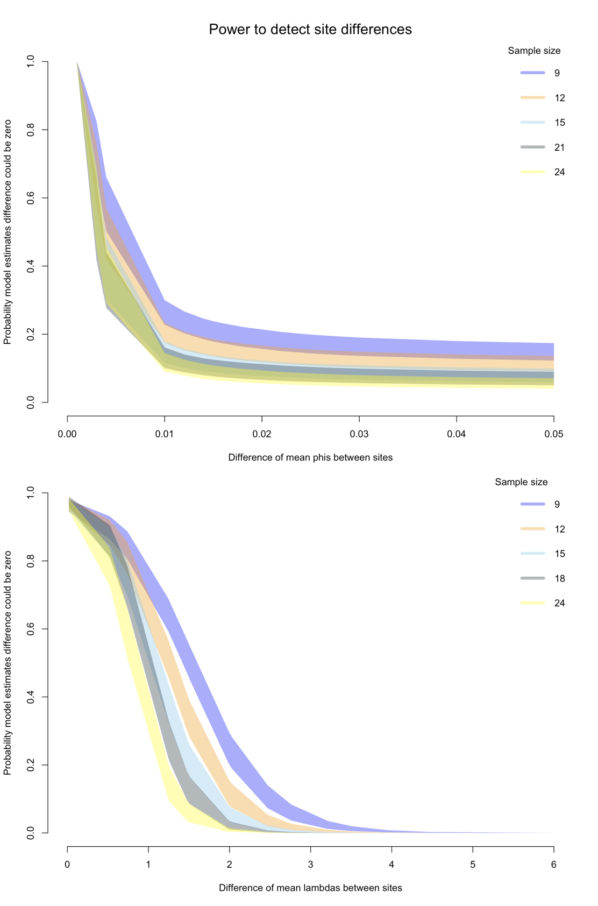

Open... {width=5%} access {width=5%} [code](https://github.com/corinalogan/grackles/blob/master/Files/Preregistrations/gxpopbehaviorhabitat.Rmd) {width=5%} peer review {width=5%} [data]()

\addtolength{\headheight}{0.1cm}
\pagestyle{fancyplain}
\lhead{\includegraphics[height=1.2cm]{logoPCIecology.png}}
\renewcommand{\headrulewidth}{0pt}

&nbsp;

**Affiliations:** 1) Max Planck Institute for Evolutionary Anthropology, 2) University of California Santa Barbara, 3) University of Rochester. *Corresponding author: corina_logan@eva.mpg.de

```{r setup, include=FALSE}
library(knitr)
library(formatR)
knitr::opts_chunk$set(tidy.opts=list(width.cutoff=70),tidy=TRUE) 
#Make code chunks wrap text so it doesn't go off the page when knitting to PDF

knitr::opts_chunk$set(echo=T, include=T, results='asis', warning=F, message=F) 
#sets global options to display code along with the results https://exeter-data-analytics.github.io/LitProg/r-markdown.html
#set echo=F for knitting to PDF (hide code), and echo=T for knitting to HTML (show code)
```

&nbsp;

**This is the post-study manuscript of the preregistration that was pre-study peer reviewed and received an In Principle Recommendation on 16 Dec 2021 by:**

Esther Sebastián González (2020) The role of behavior and habitat availability on species geographic expansion. *Peer Community in Ecology*, 100062. [10.24072/pci.ecology.100062](https://doi.org/10.24072/pci.ecology.100062). Reviewers: Caroline Nieberding, Tim Parker, and Pizza Ka Yee Chow

{width=50%}

**Preregistration:** [html](http://corinalogan.com/Preregistrations/gxpopbehaviorhabitat.html), [pdf](https://github.com/corinalogan/grackles/blob/master/Files/Preregistrations/gxpopbehaviorhabitatPassedPreStudyPeerReview16Dec2021.pdf), [rmd](https://github.com/corinalogan/grackles/blob/0fb956040a34986902a384a1d8355de65010effd/Files/Preregistrations/gxpopbehaviorhabitat.Rmd)

**Post-study manuscript** (submitted to PCI Ecology for post-study peer review on ? ? 2023): preprint [pdf]() at EcoEvoRxiv, [html](http://corinalogan.com/Preregistrations/gxpopbehaviorhabitatq1.html), [rmd](https://github.com/corinalogan/grackles/blob/master/Files/Preregistrations/gxpopbehaviorhabitatq1.Rmd)


## ABSTRACT

It is generally thought that behavioral flexibility, the ability to change behavior when circumstances change, plays an important role in the ability of a species to rapidly expand their geographic range [e.g. @lefebvre1997feeding; @griffin2014innovation; @chow2016practice; @sol2000behavioural; @sol2002behavioural; @sol2005big; @sol2007big]. Great-tailed grackles (*Quiscalus mexicanus*) are a social, polygamous species that is rapidly expanding its geographic range [@wehtje2003range] and eats a variety of human foods in addition to foraging on insects and on the ground for other natural food items [@johnson2001great]. They are behaviorally flexible [@logan2016flexibilityproblem] and highly associated with human-modified environments [@johnson2001great], thus offering an opportunity to assess the role of behavior change over the course of their expansion. We compare behavior in wild-caught grackles from two populations across their range (an older population in the middle of the northern expansion front: Tempe, Arizona, and a very recent population on the northern edge of the expansion front: Sacramento, California) to investigate whether certain behaviors (flexibility, innovativeness, exploration, and persistence) have higher averages and variances in some populations relative to others. Results elucidated whether the rapid geographic range expansion of great-tailed grackles is associated with individuals differentially expressing particular behaviors.

## INTRODUCTION

It is generally thought that behavioral flexibility, the ability to change behavior when circumstances change [see @mikhalevich_is_2017 for theoretical background on our flexibility definition], plays an important role in the ability of a species to rapidly expand their geographic range [e.g., @lefebvre1997feeding; @griffin2014innovation; @chow2016practice; @sol2000behavioural; @sol2002behavioural; @sol2005big; @sol2007big]. These ideas predict that flexibility, exploration, and innovation facilitate the expansion of individuals into completely new areas and that their role diminishes after a certain number of generations [@wright2010behavioral]. In support of this, experimental studies have shown that latent abilities are primarily expressed in a time of need [e.g., @taylor2007spontaneous; @bird2009insightful; @manrique2011spontaneous; @auersperg2012spontaneous; @laumer2018spontaneous]. Therefore, we do not expect the founding individuals who initially dispersed out of their original range to have unique behavioral characteristics that are passed on to their offspring. Instead, we expect that the actual act of continuing a range expansion relies on flexibility, exploration, innovation, and persistence, and that these behaviors are therefore expressed more on the edge of the expansion range where there have not been many generations to accumulate relevant knowledge about the environment. 

To determine whether behavior is involved in a rapid geographic range expansion, direct measures of individual behavioral abilities must be collected in populations across the range of the species [see the discussion on the danger of proxies of flexibility in @logan2018beyond]. We plan to test whether behavioral flexibility and/or an increase in habitat availability play a role in the rapid geographic range expansion of great-tailed grackles (*Quiscalus mexicanus*). Great-tailed grackles are behaviorally flexible [@logan2016flexibilityproblem], rapidly expanding their geographic range [@wehtje2003range], and highly associated with human-modified environments [@johnson2001great], thus offering an opportunity to assess the role of behavior and habitat change over the course of their expansion. This social, polygamous species eats a variety of human foods in addition to foraging on insects and on the ground for other natural food items [@johnson2001great]. This feature increases the ecological relevance of comparative cognition experiments that measure individual behavior abilities: grackles eat at outdoor cafes, from garbage cans, and they eat our crops. As such, they generally gain experience in the wild with approaching and opening novel objects to seek food (e.g., attempting to open a ketchup packet at an outdoor cafe, climbing into garbage cans to get french fries at the zoo, dunking sugar packets in water), which makes the tests involving human-made apparatuses ecologically relevant for this species.

We aim to compare behavior in wild-caught great-tailed grackles from two populations across their range (an older population in the middle of the northern expansion front: Tempe, Arizona, and a very recent population on the northern edge of the expansion front: Sacramento, California). We will investigate whether certain behaviors have higher averages and variances in the edge population relative to older populations. Specifically, we will investigate behavioral flexibility measured as reversal learning of food-filled colored tube preferences [@logan2016behavioral; @logan2023flexmanip], innovativeness measured as the number of loci they solve to access food on a puzzlebox [@auersperg_flexibility_2011; @logan2023flexmanip], exploration measured as the latency to approach a novel object in the absence of nearby food [@mccune2019exploration; @mettke2009spatial], and persistence measured as the proportion of sessions they participated in during the flexibility and innovativeness experiments.

There could be multiple mechanisms underpinning the results we find, however our aim is to narrow down the role of changes in behavior and changes in habitats in the range expansion of great-tailed grackles. Results will elucidate whether the rapid geographic range expansion of great-tailed grackles is associated with individuals differentially expressing particular behaviors.


### RESEARCH QUESTION: Are there differences in behavioral traits (flexibility, innovation, exploration, and persistence) between populations across the great-tailed grackle's geographic range?  (Fig. 1 & 2). 

**Prediction 1:** **If behavior modifications are needed to adapt to new locations, then there will be a higher average and/or larger variance of at least some traits thought to be involved in range expansions** (behavioral flexibility: speed at reversing a previously learned color preference based on it being associated with a food reward; innovativeness: number of options solved on a puzzle box; exploration: latency to approach/touch a novel object; and persistence: proportion of trials participated in with higher numbers indicating a more persistent individual) **in the grackles sampled from the more recently established population relative to the individuals sampled in the older populations** (Table 1). Higher averages in behavioral traits indicate that each individual can exhibit more of that trait (e.g., they are more flexible/innovative/exploratory/persistent). Perhaps in newly established populations, individuals need to learn about and innovate new foraging techniques or find new food sources. Perhaps grackles require flexibility to visit these resources according to their temporal availability and the individual's food preferences. Perhaps solving such problems requires more exploration and persistence. Higher variances in behavioral traits indicate that there is a larger diversity of individuals in the population, which means that there is a higher chance that at least some individuals in the population could innovate foraging techniques and be more flexible, exploratory, and persistent, which could be learned by conspecifics and/or future generations. *This would support the hypothesis* that changes in behavioral traits facilitate the great-tailed grackle's geographic range expansion.

**Prediction 1 alternative 1:** **Human-modified environments are suitable habitat for grackles** (e.g., @selander1961analysis, @johnson2001great, @wehtje2003range), **and the amount of human-modified environments has increased and is increasing** (e.g., @liu2020high). If the original behaviors exhibited by this species happen to be suited to the uniformity of human-modified landscapes (e.g., urban, agricultural, etc. environments are modified in similar ways across Central and North America), then the averages and/or variances of these traits will be similar in the grackles sampled from populations across their range (Table 1). *This supports the hypothesis* that, because this species is closely associated with human-modified environments, which may be similar across the geographic range of this species, individuals in new areas may not need to learn very much about their new environment: they can eat familiar foods and access these foods in similar ways across their range (e.g., fast food restaurant chains likely make the same food and package it in the same packaging in Central and North America, outdoor cafes and garbage cans also look the same across their range). Alternatively, it is possible that 2.9 generations at the edge site is too long after their original establishment date to detect differences in the averages and/or variances (though evidence from experimental evolution suggests that, even after 30 generations there is no change in certain behaviors when comparing domestic guinea pigs with 30 generations of wild-caught captive guinea pigs @kunzl2003wild, whereas artificial selection can induce changes in spatial ability in as little as two generations @kotrschal2013artificial). If the sampled individuals had already been living at this location for long enough (or for their whole lives) to have learned what they need about this particular environment (e.g., there may no longer be evidence of increased flexibility/innovativeness/exploration/persistence), there may be no reason to maintain population diversity in these traits to continue to learn about this environment. We will not be able to distinguish between these two alternatives within alternative 1 because populations closer to the northern edge of this species' range were too small for us to establish such a field site. Both of these alternatives assume that learning is costly [e.g., @mery2005cost], therefore individuals avoid it if they can. In the first case, individuals might not need to rely much on learning because they are attending to familiar cues across their range, therefore they only need to learn where in this new space space these cues are located. In the second case, individual learning that the founding individuals needed to rely on to move into this new space could have been lost due to potential pressure to reduce this investment as soon as possible after moving to a new location.


![**Figure 2.** Experimental protocol. Great-tailed grackles from the core, middle, and edge populations will be tested for their: (top left) flexibility (number of trials to reverse a previously learned color tube-food association); (middle) innovativeness (number of options [lift, swing, pull, push] solved to obtain food from within a multi-access log); (bottom left) persistence (proportion of trials participated in during flexibility and innovativeness tests); and (far right) exploration (latency to approach/touch a novel object).](gxpopbehaviorhabitatFig2.png)

**Table 1.** Population characteristics for the field sites. The number of generations at a site is based on a generation length of 5.6 years for this species [@GTGRbirdlife2018; note that this species starts breeding at age 1], and on the first year in which this species was reported (or estimated) to breed at each location (Woodland, California: Yolo Audubon Society's newsletter *The Burrowing Owl* (July 2004), which Steve Hampton shared with Logan; and Tempe, Arizona: estimated based on 1945 first-sighting report in nearby Phoenix, Arizona [@wehtje2004thesis] to which we added 6 years, which is the average time between first-sighting and first-breeding - see Table 3 in [@wehtje2003range].

```{r table1, eval=TRUE, warning=FALSE, results='asis', include=TRUE}
d <- read.csv(url("https://raw.githubusercontent.com/corinalogan/grackles/master/Files/Preregistrations/gxpopbehaviorhabitatq1_Table1.csv"), header=F, sep=",", stringsAsFactors=F) 

colnames(d) <- c("Site","Range position","Breeding since","Number of years breeding","Average number of generations","Citation")

library(kableExtra)
knitr::kable(d) %>%
kable_styling(full_width = T, position = "left")
```

## METHODS

### Sample
	
Great-tailed grackles were caught in the wild in Woodland and Sacramento, California. Some of our banded individuals were found at both sites, therefore we considered this one population. We aimed to bring adult grackles, rather than juveniles, temporarily into the aviaries for behavioral choice tests to avoid the potential confound of variation in cognitive development due to age, as well as potential variation in fine motor-skill development (e.g., holding/grasping objects; early-life experience plays a role in the development of both of these behaviors; e.g., @collias1964development, @rutz2016discovery) with variation in our target variables of interest. However, due to difficulties in trapping this species at this site, we also tested some juveniles. Adults were identified from their eye color, which changes from brown to yellow upon reaching adulthood (Johnson and Peer 2001). We applied colored leg bands in unique combinations for individual identification. Some individuals (23) were brought temporarily into aviaries for behavioral choice tests, and then are released back to the wild at their point of capture (see sample size rationale in Supplementary Material 1). We caught grackles with walk-in traps and mist nets. Mistnets decrease the likelihood of a selection bias for exploratory and bold individuals because grackles cannot see the trap. Grackles were individually housed in an aviary (each 244cm long by 122cm wide by 213cm tall) for an allowable maximum of six months where they had *ad lib* access to water at all times and were fed Mazuri Small Bird maintenance diet *ad lib* during non-testing hours (minimum 20h per day), and various other food items (e.g., peanuts, bread, goldfish crackers) during testing (up to 4h per day per bird). Individuals were given three to four days to habituate to the aviaries and then their test battery began on the fourth or fifth day (birds were usually tested six days per week, therefore if their fourth day occurred on a day off, they were tested on the fifth day instead). 

While our ideal plan was to conduct the same tests at an additional field site in the center of their original range (Central America), due to restrictions around COVID-19 and also to issues with sexual abuse at the planned field site, it was not be possible for us to accomplish this goal within our current funding period.

We tested as many great-tailed grackles as we could during the year we spent at our field site given that the birds are only brought into the aviaries during the non-breeding season (September through April). It was time intensive to conduct the aviary test battery (1-6 months per bird), therefore we aimed to meet the minimum sample sizes in Supplementary Material Table SM1. We aimed to test 50% females and achieved an overall 47% (this percentage differed depending on the test). We expected to test 20 grackles per site.

### Data collection stopping rule
	
We stopped collecting data on great-tailed grackles once we completed one year at the site (completed in winter 2022) and had met our minimum sample size.

### Protocols and open materials

  - Experimental protocols are online [here](https://docs.google.com/document/d/1oqucJ4mH-glh9Hv9JaiDSyhEGi0yVpMuqqzqR2IwQeA/edit?usp=sharing).
  
  - **Flexibility** protocol (from @logan2019flexmanip) using reversal learning with color tubes. Grackles are first habituated to a yellow tube and trained to search for hidden food. A light gray tube and a dark gray tube are placed on the table or floor: one color always contains a food reward (not visible by the bird) while the other color never contains a reward. The bird is allowed to choose one tube per trial. An individual is considered to have a preference if it chose the rewarded option at least 85% of the time (17/20 correct) in the most recent 20 trials (with a minimum of 8 or 9 correct choices out of 10 on the two most recent sets of 10 trials). We use a sliding window in 1-trial increments to calculate whether they passed after their first 20 trials. Once a bird learns to prefer one color, the contingency is reversed: food is always in the other color and never in the previously rewarded color. The flexibility measure is how many trials it takes them to reverse their color preference using the same passing criterion.
  
  - **Innovativeness** protocol (from @logan2019flexmanip and based on the experimental design by @auersperg_flexibility_2011) using a multi-access log. Grackles are first habituated to the log apparatus with all of the doors locked open and food inside each locus. After habituation, the log, which has four ways of accessing food (pull drawer, push door, lift door up, swing door out), is placed on the ground and grackles are allowed to attempt to solve or successfully solve one option per trial. Once a bird has successfully solved an option three times, it becomes non-functional (the door is locked open and there is no food at that locus). The experiment ends when all four loci become non-functional, if a bird does not come to the ground within 10 min in three consecutive test sessions, or if a bird does not obtain the food within 10 min (or 15 min if the bird was on the ground at 10 min) in three consecutive test sessions.
  
  - **Persistence** is measured as the proportion of trials participated in during the flexibility and innovativeness experiments (after habituation, thus it is not confounded with neophobia). The higher the number, the more persistent they are. This measure indicates that those birds who do not participate as often are less persistent in terms of their persistence with engaging with the task. We generally offer a grackle the chance to participate in a trial for 5 min. If they don't participate within that time, we record -1 in the data sheet, the apparatus is removed and the trial is re-attempted later. 
  
  - **Exploration** is measured as the latency to approach within 20 cm of a novel environment inside of their familiar aviary environment, averaged across Time 1 (on the individual's 8th day in the aviary) and Time 2 (1 week after Time 1). The bird’s regular food was moved to one end of the aviary, away from the novel environment, and a motivation test preceded the session. The bird was then exposed to first a familiar environment (45 min) and then a novel environment (45 min). If an individual did not approach within 20 cm, it was given a latency of 2701 sec (45 min plus 1 sec).
  
### Open data

The data and code are publicly available at the Knowledge Network for Biocomplexity's data repository [@logan2023xpopdata].

### Randomization and counterbalancing

**Experimental order:** The order of experiments, reversal learning or multiaccess log, was counterbalanced across birds.

**Reversal learning:** The first rewarded color in reversal learning was counterbalanced across birds. The rewarded option was pseudorandomized for side (and the option on the left was always placed first). Pseudorandomization consists of alternating location for the first two trials of a session and then keeping the same color on the same side for at most two consecutive trials thereafter. A list of all 88 unique trial sequences for a 10-trial session, following the pseudorandomization rules, was generated in advance for experimenters to use during testing (e.g., a randomized trial sequence might look like: LRLLRRLRLR, where L and R refer to the location, left or right, of the rewarded tube). Randomized trial sequences were assigned randomly to any given 10-trial session using a random number generator (random.org) to generate a number from 1-88.


### Analyses

We used **simulations** and designed customized **models** to determine what sample sizes allow us to detect differences between sites (see chapter 5.3 in @bolker2008ecological for why simulations perform more powerful power analyses). We did not **exclude** any data, and data that were **missing** (e.g. if a bird participated in one of the two experiments) for an individual in a given experiment, then this individual was not included in that analyses. Analyses were conducted in R (current version `r getRversion()`; @rcoreteam) and Stan (version 2.18, @carpenter2017stan) using the following packages: psych [@psych], irr [@gamer2012package], rethinking [@rethinking2020], rstan [@rstan], and Rcpp [@rcpp]. 

#### Interobserver reliability of dependent variables

To determine whether experimenters coded the dependent variables in a repeatable way, hypothesis-blind video coders were first trained in video coding the dependent variables (reversal learning and multiaccess log: whether the bird made the correct choice or not; exploration: latency to approach), requiring a Cohen's unweighted kappa (reversal and multiaccess categorical variables) or an intra-class correlation coefficient (ICC; exploration continuous variable) of 0.90 or above to pass training. This threshold indicated that the two coders (the experimenter and the video coder) agreed with each other to a high degree (kappa: @landis1977measurement; ICC: @hutcheon2010random). After passing training, the video coders coded 15-26% of the videos (depending on how many individuals participated in each test) for each experiment and the kappa and ICC were calculated to determine how objective and repeatable scoring was for each variable, while noting that the experimenter has the advantage over the video coder because watching the videos is not as clear as watching the bird participate in the trial from the aisle of the aviaries. The unweighted kappa was used when analyzing a categorical variable where the distances between the numbers are meaningless (0=incorrect choice, 1=correct choice, -1=did not participate), and the ICC was used for continuous variables where distances are meaningful (e.g., if coders disagree by a difference of 2 s rather than 5 s, this is important to account for).

##### Interobserver reliability training

To pass **interobserver reliability (IOR) training**, video coders needed an ICC or Cohen's unweighted kappa score of 0.90 or greater to ensure the instructions were clear and that there was a high degree of agreement across coders. Video coders, Alexis Breen and Vincent Kiepsch, passed interobserver reliability training for exploration in a previous article [@mccune2019exploration] where their training results can be found.

***Lea Gihlein*** (compared with experimenter's live coding): 

 - Reversal learning: correct choice unweighted Cohen's Kappa=1.00 (confidence boundaries=1.00-1.00, n=21 data points) 

 - Multiaccess box: correct choice unweighted Cohen's Kappa=1.00 (confidence boundaries=1.00-1.00, n=29 data points) 
 
 - Multiaccess box: correct choice unweighted Cohen's Kappa=1.00 (confidence boundaries=1.00-1.00, n=29 data points) 
 
##### Interobserver reliability

Interobserver reliability scores (minimum 15% of the videos) were as follows:
   
***Lea Gihlein*** (compared with experimenter's live coding): 

 - Reversal learning (5/19 birds): correct choice unweighted Cohen's Kappa=1.00 (confidence boundaries=0.99-1.00, n=707 data points) 
 
 - Multiaccess box (5/23 birds): correct choice unweighted Cohen's Kappa=0.92 (confidence boundaries=0.81-1.00, n=63 data points) 

 - Multiaccess box (5/23 birds): locus solved unweighted Cohen's Kappa=1.00 (confidence boundaries=1.00-1.00, n=48 data points) 

***Vincent Kiepsch*** (compared with Breen's video coding): 

 - Exploration (5/34 birds): latency to land on the ground unweighted Cohen's Kappa=0.998 (confidence boundaries=0.997-0.999, n=32 data points)

```{r ior, eval=FALSE, warning=FALSE, results='asis', include=TRUE}
library(irr) #ICC package
library(psych) #Cohen's kappa package

#### FLEXIBILITY (reversal learning)

# did video coder Lea Gihlein pass interobserver reliability training? YES
leat <- read.csv("https://raw.githubusercontent.com/corinalogan/grackles/master/Files/Preregistrations/IOR_xpop_rev_LeaTraining.csv", header = TRUE, sep = ",", stringsAsFactors = FALSE)
head(leat)  #Check to make sure it looks right
# Note: c(3,5) is telling R to look at columns 2 and 3 and compare them. Double check this:
leat[,11] #coder 1 (live coder)
leat[,12] #coder 2 (video coder)
cohen.kappa(leat[,c(11,12)], w=NULL,n.obs=NULL,alpha=.05,levels=NULL) 
#unweighted kappa = 1; upper and lower CIs = 1 - 1, n = 21


# video coder Lea Gihlein score for 20% of videos =  
lea <- read.csv("https://raw.githubusercontent.com/corinalogan/grackles/master/Files/Preregistrations/IOR_xpop_reverse_lea.csv", header = TRUE, sep = ",", stringsAsFactors = FALSE)
head(lea)  #Check to make sure it looks right
# Note: c(3,5) is telling R to look at columns 2 and 3 and compare them. Double check this:
lea[,11] #coder 1 (live coder)
lea[,12] #coder 2 (video coder)
cohen.kappa(lea[,c(11,12)], w=NULL,n.obs=NULL,alpha=.05,levels=NULL) 
#unweighted kappa = 1; upper and lower CIs = 0.99 - 1, n = 707


#### INNOVATIVENESS (multiaccess log)

# did video coder pass interobserver reliability training? Yes
leamt <- read.csv("https://raw.githubusercontent.com/corinalogan/grackles/master/Files/Preregistrations/IOR_xpop_MAB_LeaTraining.csv", header = TRUE, sep = ",", stringsAsFactors = FALSE)
head(leamt)  #Check to make sure it looks right
# Note: c(3,5) is telling R to look at columns 2 and 3 and compare them. Double check this:

# correct choice columns
leamt[,12] #coder 1 (live coder)
leamt[,13] #coder 2 (video coder)
cohen.kappa(leamt[,c(12,13)], w=NULL,n.obs=NULL,alpha=.05,levels=NULL) 
#unweighted Cohen’s Kappa=1.00 (confidence boundaries=1.00-1.00, n=29 data points)

# locus solved columns
leamt[,14] #coder 1 (live coder)
leamt[,15] #coder 2 (video coder)
cohen.kappa(leamt[,c(14,15)], w=NULL,n.obs=NULL,alpha=.05,levels=NULL) 
#unweighted Cohen’s Kappa=1.00 (confidence boundaries=1.00-1.00, n=29 data points)


# video coder score for 20% of videos =  
leam <- read.csv("https://raw.githubusercontent.com/corinalogan/grackles/master/Files/Preregistrations/IOR_xpop_MAB_Lea.csv", header = TRUE, sep = ",", stringsAsFactors = FALSE)
head(leam)  #Check to make sure it looks right

# correct choice columns
leam[,12] #coder 1 (live coder)
leam[,13] #coder 2 (video coder)
cohen.kappa(leam[,c(12,13)], w=NULL,n.obs=NULL,alpha=.05,levels=NULL) 
#unweighted Cohen’s Kappa=0.92 (confidence boundaries=0.81-1.00, n=63 data points)

# locus solved columns
leam[,14] #coder 1 (live coder)
leam[,15] #coder 2 (video coder)
cohen.kappa(leam[,c(14,15)], w=NULL,n.obs=NULL,alpha=.05,levels=NULL) 
#unweighted Cohen’s Kappa=1.00 (confidence boundaries=1.00-1.00, n=48 data points)


#### EXPLORATION (latency to approach a novel object)

# video coder score for 20% of videos =  
data <- read.csv("https://raw.githubusercontent.com/corinalogan/grackles/master/Files/Preregistrations/IOR_xpop_exploration.csv", header = TRUE, sep = ",", stringsAsFactors = FALSE)
head(data)  #Check to make sure it looks right
data[,2] #coder 1
data[,5] #coder 2

icc(data[,c(2,5)], model="oneway", type="consistency", unit="single", conf.level=0.95) 
#ICC=0.998; upper and lower CIs = 0.997-0.999, n = 32 data points
```

#### Hypothesis-specific mathematical model

Following procedures in @statrethinkingbook, we constructed a **hypothesis-appropriate mathematical model** for each of the response variables that examines differences in the response variable between sites. These models take the form of:

y ~ $\alpha$[site]

y is the response variable (flexibility, innovation, exploration, or persistence). There will be one intercept, $\alpha$, per site and we will estimate the site's average and standard deviation of the response variable. 

We formulated these models in a Bayesian framework. We determined the priors for each model by performing prior predictive simulations based on ranges of values from the literature to check that the models are covering the likely range of results.

We will then perform pairwise contrasts to determine at what point we will be able to detect differences between sites by manipulating sample size, and $\alpha$ means and standard deviations. Before running the simulations, we decided that a model would detect an effect if 89% of the difference between two sites is on the same side of zero (following @statrethinkingbook). We are using a Bayesian approach, therefore comparisons are based on samples from the posterior distribution. We will draw 10,000 samples from the posterior distribution, where each sample will have an estimated mean for each population. For the first contrast, within each sample, we subtract the estimated mean of the edge population from the estimated mean of the core population. For the second contrast, we subtract the estimated mean of the edge population from the estimated mean of the middle population. For the third contrast, we subtract the estimated mean of the middle population from the estimated mean of the core population. We will now have samples of differences between all of the pairs of sites, which we can use to assess whether any site is systematically larger or smaller than the others. We will determine whether this is the case by estimating what percentage of each sample of differences is either larger or smaller than zero. For the first contrast, if 89% of the differences are larger than zero, then the core population has a larger mean. If 89% of the differences are smaller than zero, then the edge population has a larger mean.

##### Flexibility analyses

**Model and simulation**

We modified the reversal learning Bayesian model in @blaisdell2021causal to simulate and analyze population differences in reversal learning, and calculate our ability to detect differences between populations. The model accounts for every choice made in the reversal learning experiment and updates the probability of choosing either option after the choice was made depending on whether that choice contained a food reward or not. It does this by updating three main components for each choice: an attraction score, a learning rate ($\phi$), and a rate of deviating from learned attractions ($\lambda$).

**Equation 1 (attraction and $\phi$):** $A_{i,j, t+1} = (1-\phi_j) A_{i,j,t} + \phi_j \pi_{i,j,t}$

Equation 1 “tells us how attractions to different behavioral options $A_{i,j, t+1}$ (i.e., how preferable option $i$ is to the bird $j$ at time $t+1$) change over time as a function of previous attractions $A_{i ,j, t}$ and recently experienced payoffs $\pi_{i,j,t}$ (i.e., whether they received a reward in a given trial or not). Attraction scores thus reflect the accumulated learning history up to this point. The (bird-specific) parameter $\phi_j$ describes the weight of recent experience. The higher the value of $\phi_j$, the faster the bird updates their attraction. It thus can be interpreted as the *learning or updating rate of an individual*. A value of $\phi_j = 0.04$, for example, means that receiving a single reward for one of the two options will shift preferences by 0.02 from initial 0.5-0.5 attractions, a value of $\phi_j = 0.06$ will shift preferences by 0.03 and so on” [@blaisdell2021causal]. 

**Equation 2 ($\lambda$):** $P(i)_{t+1} = \frac{\exp(\lambda_j A_{i, j, t})}{\sum\limits_{m=1}^{2}\exp(\lambda_j A_{m, j, t})}.$

Equation 2 “expresses the probability an individual $j$ chooses option $i$ in the next round, $t+1$, based on the latent attractions. The parameter $\lambda_j$ represents the *rate of deviating from learned attractions* of an individual (also called inverse temperature). It controls how sensitive choices are to differences in attraction scores. As $\lambda_j$ gets larger, choices become more deterministic, as it gets smaller, choices become more exploratory (random choice if $\lambda_j = 0$). For instance, if an individual has a 0.6-0.4 preference for option A, a value of $\lambda_j = 3$ means they choose A 65% of the time, a value of $\lambda_j = 10$ means they choose A 88% of the time and a value of $\lambda_j = 0.5$ means they choose A only 53% of the time” [@blaisdell2021causal].  

As in @blaisdell2021causal, we, too, used previously published data on reversal learning of color tube preferences in great-tailed grackles [@logan2016behavioral] to inform the model modifications. We modified the @blaisdell2021causal model in a few ways: 1) we set the initial attraction score assigned to option 1 and option 2 (the light gray and dark gray tubes) to 0.1 rather than 0.0. This change assumes that there would be some inclination (rather than no inclination) for the bird to approach the tubes when they are first presented because they had been previously trained to expect food in tubes. This also allows the attraction score to decrease when a non-rewarded choice is made near the beginning of the experiment. With the previous initial attraction scores set to zero, a bird would be expected to choose the rewarded option in 100% of the trials after the first time it chose that option (attraction cannot be lower than zero, and choice is shaped by the ratio of the two attractions so that when one option is zero and the other is larger than zero, the ratio will be 100% for the rewarded option).  2) We changed the updating so that an individual would only change the attraction toward the option they chose in that trial (either decreasing their attraction toward the unrewarded option or increasing their attraction toward the rewarded option). Previously, both attractions were updated after every trial, assuming that individuals understand that the experiment is setup such that one option is always rewarded. For our birds, we instead assumed that individuals will focus on their direct experience rather than making abstract assumptions about the test. Our modification resulted in needing a higher $\phi$ to have the same learning rate as a model where both attraction scores are updated after every trial. This change also appeared to better reflect the performance of the Santa Barbara grackles, because they had higher $\phi$ values, which, in turn, meant lower $\lambda$ values to reflect the performance during their initial learning. These lower $\lambda$ values better reflect the birds' behavior during the first reversal trials: a large $\lambda$ value means that birds continue to choose the now unrewarded option almost 100% of the time, whereas the lower $\lambda$ values mean that birds start to explore the rewarded option relatively soon after the switch of the rewarded option.

We first reanalyzed the Santa Barbara grackle data to obtain the phi and lambda values with this revised model, which informed our expectations of what a site’s mean and variance might be. Then we ran simulations, where we determined that we wanted to make the previously mentioned modificatio9s to the stan [@stan2019stan] model [in R, current version `r getRversion()`; @rcoreteam]. This model will be used to analyze the actual data after it is collected. 

```{r sim_power_philambda, eval=F, warning=FALSE, results='asis', include=TRUE}
library(rethinking)
library(dplyr)

# We first reanalyze the Santa Barbara data to obtain values for phi and lambda upon which to base our expectations of what the mean and variance might be at a site.
# We load the Santa Barbara data from github
d <- read.csv(url("https://raw.githubusercontent.com/corinalogan/grackles/master/Files/Preregistrations/g_causal_data_SBreverse.csv"), header=T, sep=",", stringsAsFactors=F) 

# We need to perform some modifications on these data to set them up for the STAN model
d$id <- sapply(1:nrow(d), function (i) which(unique(d$Bird) == d$Bird[i]) )
d <- d[-which(d$Experiment=="Refresher"),]
d <- d[with(d, order(d$id)), ]
d$Choice <- NA
for (i in 1: nrow(d)) {
  if (d$Experiment[i] == "Initial"){
    if (d$Correct[i] == 1){
      d$Choice[i] <- 1
    } else {
      d$Choice[i] <- 2
    } 
  } else {
    if (d$Correct[i] == 1){
      d$Choice[i] <- 2
    } else {
      d$Choice[i] <- 1
    } 
  }
}

d[d=="Initial"] <- 0
d[d=="Reverse"] <- 1
d$Experiment <- as.integer(d$Experiment)


# We can now extract the relevant data for the STAN model. In the model, we want to estimate the phi and lambda for each individual that was tested in Santa Barbara based on their choices during the initial learning phase and the reversal learning phase.
dat <- as.list(d)
dat$N <- nrow(d)
dat$N_id <- length(unique(d$id))

# The STAN model is set up to have the inital attraction for each option set to 0.1, and that individuals only learn the reward of the option they chose in a given trial.
reinforcement_model_nonzeroattraction <- "

data{
   int N;
   int N_id;
   int id[N];
   int Trial[N];
   int Choice[N];
   int Correct[N];
}

parameters{
  real logit_phi;
  real log_L;

  // Varying effects clustered on individual
  matrix[2,N_id] z_ID;
  vector<lower=0>[2] sigma_ID;       //SD of parameters among individuals
  cholesky_factor_corr[2] Rho_ID;
}

transformed parameters{
matrix[N_id,2] v_ID; // varying effects on stuff
v_ID = ( diag_pre_multiply( sigma_ID , Rho_ID ) * z_ID )';
}

model{
matrix[N_id,2] A; // attraction matrix

logit_phi ~  normal(0,1);
log_L ~  normal(0,1);

// varying effects
to_vector(z_ID) ~ normal(0,1);
sigma_ID ~ exponential(1);
Rho_ID ~ lkj_corr_cholesky(4);

// initialize attraction scores

for ( i in 1:N_id ) {
A[i,1] = 0.1; A[i,2] = 0.1';
}

// loop over Choices

for ( i in 1:N ) {
vector[2] pay;
vector[2] p;
real L;
real phi;

// first, what is log-prob of observed choice

L =  exp(log_L + v_ID[id[i],1]);
p = softmax(L*A[id[i],1:2]' );
Choice[i] ~ categorical( p );

// second, update attractions conditional on observed choice

phi =  inv_logit(logit_phi + v_ID[id[i],2]);
pay[1:2] = rep_vector(0,2);
pay[ Choice[i] ] = Correct[i];
A[ id[i] , Choice[i] ] = ( (1-phi)*(A[ id[i] , Choice[i] ]) + phi*pay[Choice[i]])';

}//i
}
"

# We run this model for the Santa Barbara data
m_SB <- stan( model_code =  reinforcement_model_nonzeroattraction, data=dat ,iter = 5000, cores = 4, chains=4, control = list(adapt_delta=0.9, max_treedepth = 12))


# We extract the estimated phi and lambda values for each bird from the STAN model
s <- extract.samples(m_SB)
santabarbara_lambda <- sapply(1 : dat$N_id, function(x) exp( mean(s$log_L) + mean(s$v_ID[ ,x, 1])))
santabarbara_phi <- sapply(1 : dat$N_id, function(x) inv_logit( mean(s$logit_phi) + mean(s$v_ID[ ,x, 2])))

#These values are what we will use to set up our expectations
# For phi, we see a mean of 0.025 and a standard deviation of 0.007
mean(santabarbara_phi)
sd(santabarbara_phi)
range(santabarbara_phi)

# These values are slightly lower than what we had calculated in a previous preregistration (causal) because in there we had used a STAN model where initial attraction for both options was set to zero and birds updated their attractions to both options after each trial. For reference, these were the phi values estimated with that approach
Causal_santabarbara_phi<-c(0.03061692, 0.03430556, 0.04839631, 0.02748937, 0.03125310, 0.03356904, 0.04142868, 0.03397079)

# For lambda, we see a mean of 4.9 and a standard deviation of 2.3
mean(santabarbara_lambda)
sd(santabarbara_lambda)
range(santabarbara_lambda)

# Again, for comparison, here are the lambda values estimated with the prvious approach (they are slightly lower)
Causal_santabarbara_lambda<-c(3.311051, 4.811929, 2.897794, 4.687649, 2.360964, 6.928005, 6.013120, 3.492505)


################################################################################################
# Start the simulation here
########################

# Based on the values for the Santa Barbara birds, we can now set our expectations as inputs for the power simulations. To illustrate the range, a phi of 0.02 means that there is a ~1% shift in attraction if birds would be equally attracted to an option whereas a phi of 0.04 means that there is a ~2% shift. 
simulated_sitemean_phi<-c(0.01,0.015,0.02,0.0225,0.025,0.03,0.035,0.04)
simulated_sitesd_phi<-c(0.005,0.005,0.006,0.006,0.007,0.007,0.008,0.008)
simulated_sitemean_lambda<-c(3,4,6,9)
simulated_sitesd_lambda<-c(1,1.5,2.5,3)

#Calculate the number of sites using the number of combinations of the mean and sd options for phi and lambda
totalnumberofsites<-length(simulated_sitemean_phi)*length(simulated_sitemean_lambda)

# We set up a dataframe that will store the relevant information, saving the choice of individuals at each trials and how their attraction scores change correspondingly.
simulatedreversaldata<-matrix(ncol=15,nrow=totalnumberofsites*20*300)
simulatedreversaldata<-as.data.frame(simulatedreversaldata)
colnames(simulatedreversaldata)<-c("Bird_ID", "Session", "Trial", "Reversal","Choice", "CorrectChoice","Phi_mean","Lambda_mean","Site","Phi_sd","Lambda_sd","ThisBirdsPhi","ThisBirdsLambda","Attraction1","Attraction2")


# There are two tubes, lightgrey and darkgrey
# Initially, one of them is the rewarded option (here lightgrey) and the other is the unrewarded option (here darkgrey)
# Rewarded option gives a payoff of 1, unrewarded option gives a payoff of 0
# When a reversal occurs, the rewards are flipped (previous option with 1 now gets 0, previous option with 0 now gets 1)
counter<-1
bird_id<-1
site_id<-1

for (mean_phi in 1:length(simulated_sitemean_phi)) {
  current_mean_phi<-simulated_sitemean_phi[mean_phi]
  current_sd_phi<-simulated_sitesd_phi[mean_phi]
  
  for (mean_lambda in 1:length(simulated_sitemean_lambda)) {
  current_mean_lambda<-simulated_sitemean_lambda[mean_lambda]
  current_sd_lambda<-simulated_sitesd_lambda[mean_lambda]
  
  for (bird in 1:20) {
    bird_phi<-rnorm(1,current_mean_phi,current_sd_phi)
    if(bird_phi<0){bird_phi<-0}
    bird_lambda<-rnorm(1,current_mean_lambda,current_sd_lambda)
    if(bird_lambda<0){bird_lambda<-0}
    
    # All birds initially have only a small attraction for either option;
    # setting these values to zero means that there would be no attraction at all. In this case,  
    # choosing the wrong option and not getting a reward does not reduce the attraction to that option. 
    # Accordingly, with values set to zero birds can only learn when they pick the right option.
    # Alternatively, setting both these to the same value higher than zero (e.g. 0.1) means
    # that individuals initially do not have a preference, but are somewhat attracted to both options.
    # In this case, not getting a reward at the wrong option would reduce the attraction to that option.
    # Accordingly, with values larger than zero birds can initially potentially learn twice as fast
    # because they update attractions both when choosing the correct and the wrong option.
    attractionlightgrey<-0.1
    attractiondarkgrey<-0.1
    
    # Initially, the light grey option is rewarded
    lightgreyreward<-1
    darkgreyreward<-0
    reversal<-"initial"
    
    # Reflecting the data being collected, the maximum number of sessions a bird can participate in is 30
    for (session in 1:30) {
    
    # Each session runs for 10 trials
    for (trial in 1:10) {
    
    # We first calculate the probability that the bird will choose the light grey option during this trial based on her relative attraction to this option over the dark grey option
    probability_choose_lightgrey<-exp(bird_lambda*attractionlightgrey)/(exp(bird_lambda*attractionlightgrey)+exp(bird_lambda*attractiondarkgrey)  )
    
    # Based on the probability, the bird will now make a choice
    choselightgrey<-if(runif(1,0,1)<probability_choose_lightgrey){1} else{0}
    
    # For the option they choose, they update their attraction. If they chose the correct option, the learned about the reward and increase their attraction to that option; if they chose the wrong option, they decrease their attraction to that option
    if(choselightgrey==1){
      attractionlightgrey<-(1-bird_phi)*attractionlightgrey+bird_phi*lightgreyreward
    } else {
      attractiondarkgrey<-(1-bird_phi)*attractiondarkgrey+bird_phi*darkgreyreward
    }
    
    # We store all the relevant information about this trial in the data frame
    simulatedreversaldata[counter,]$Bird_ID<-bird_id
    simulatedreversaldata[counter,]$Session<-session
    simulatedreversaldata[counter,]$Trial<-(session-1)*10+trial
    simulatedreversaldata[counter,]$Reversal<-reversal
    simulatedreversaldata[counter,]$Site<-site_id
    simulatedreversaldata[counter,]$Phi_mean<-current_mean_phi
    simulatedreversaldata[counter,]$Lambda_mean<-current_mean_lambda
    simulatedreversaldata[counter,]$Phi_sd<-current_sd_phi
    simulatedreversaldata[counter,]$Lambda_sd<-current_sd_lambda
    simulatedreversaldata[counter,]$Choice<-choselightgrey
    simulatedreversaldata[counter,]$Attraction1<-attractionlightgrey
    simulatedreversaldata[counter,]$Attraction2<-attractiondarkgrey
    simulatedreversaldata[counter,]$ThisBirdsPhi<-bird_phi
    simulatedreversaldata[counter,]$ThisBirdsLambda<-bird_lambda
    simulatedreversaldata[counter,]$CorrectChoice<-ifelse(reversal=="initial",ifelse(choselightgrey==1,1,0),ifelse(choselightgrey==1,0,1))
    
    counter<-counter+1
    #End of trial loop
    }

      # Birds are done when they have successfully completed the reversal trials after the initial learning trials. Matching the experiments, birds are counted as successful if they chose the correct option in 17 or more of the 20 trials and if they also during those last two sessions chose the correct option 8 or more times out of the 10 times in each session.
      if (reversal=="reversal") {
        if (sum(simulatedreversaldata[(counter-11):(counter-1),]$CorrectChoice)>7  
            & sum(simulatedreversaldata[(counter-21):(counter-12),]$CorrectChoice)>7 
            & sum(simulatedreversaldata[(counter-21):(counter-1),]$CorrectChoice)>16 ) {
          break
        }
      }

      # Birds switch from the initial learning to the reversal trials, based on the same definition of being successful. In this case, the reward is now set to be associated with the dark grey option in the following reversal trials.     
      if(session > 1) {
      if (   sum(simulatedreversaldata[(counter-11):(counter-1),]$CorrectChoice)>7  
             & sum(simulatedreversaldata[(counter-21):(counter-12),]$CorrectChoice)>7 
             & sum(simulatedreversaldata[(counter-21):(counter-1),]$CorrectChoice)>16 ) {
        lightgreyreward<-0
        darkgreyreward<-1
        reversal<-"reversal"
      }
      }
    #End of session loop  
    }
  bird_id <-bird_id+1    
  #End of bird loop
  }
  site_id<-site_id+1
  # End of mean lambda loop
}
#End of mean phi loop 
}

# Remove unnecessary rows at the bottom that contain only NA values
rem_simulatedreversaldata<-simulatedreversaldata[is.na(simulatedreversaldata$Site)==F,]

# What are the attraction values observed across all individuals in all populations across both initial and reversal for the option that is rewarded during the initial phase
hist(rem_simulatedreversaldata$Attraction1)
# What are the attraction values observed across all individuals in all populations across both initial and reversal for the option that is rewarded during the reversal phase
hist(rem_simulatedreversaldata$Attraction2)

# Boxplots of the 20 individual phi values per population to see whether populations with different mean phi values are different
boxplot(rem_simulatedreversaldata$ThisBirdsPhi~rem_simulatedreversaldata$Phi_mean)

# Save the output - use this code for the modified version with initial attraction scores at 0.1 and individuals only learning about the option they chose
write.csv(rem_simulatedreversaldata,file="SimulatedReversalData_Grackles_PhiLambda_Attraction.csv")

################################################################################################
# End of the simulation
################################################################################################


################################################################################################
# Load previously simulated data 
################################################################################################

# These two are the sets we decided on, with initial attractions at 0.1 and eight different phi and four different lambda combinations
simulatedreversaldata_attractionscores_1<-read.csv(url("https://raw.githubusercontent.com/corinalogan/grackles/master/Files/Preregistrations/gxpopbehaviorhabitat_SimulatedReversalData_Grackles_PhiLambda_Attraction02_Aug2021.csv"), header=T, sep=",", stringsAsFactors=F) 
  
simulatedreversaldata_attractionscores_2<-read.csv(url("https://raw.githubusercontent.com/corinalogan/grackles/master/Files/Preregistrations/gxpopbehaviorhabitat_SimulatedReversalData_Grackles_PhiLambda_Attraction04_Aug2021.csv"), header=T, sep=",", stringsAsFactors=F) 

# In both simulations, sites were counted from 1-16; we now assign each site a unique value from 1-32
simulatedreversaldata_attractionscores_2$site<-simulatedreversaldata_attractionscores_2$site+16

# We combine the two data sets for the further analyses
simulatedreversaldata_attractionscores<-bind_rows(simulatedreversaldata_attractionscores_1,simulatedreversaldata_attractionscores_2)

################################################################################################

# In the simulations, trials were counted continuously for each bird. We now want to change this so that it restarts counting trials from 1 upward once a bird switches to reversal.

for (birds in 1:length(unique(simulatedreversaldata_attractionscores$Bird_ID))){
  currentbird<-unique(simulatedreversaldata_attractionscores$Bird_ID)[birds]
  maximuminitial<-max(simulatedreversaldata_attractionscores[simulatedreversaldata_attractionscores$Bird_ID==currentbird & simulatedreversaldata_attractionscores$Reversal == "initial",]$Trial)
  simulatedreversaldata_attractionscores[simulatedreversaldata_attractionscores$Bird_ID==currentbird & simulatedreversaldata_attractionscores$Reversal == "reversal",]$Trial<-simulatedreversaldata_attractionscores[simulatedreversaldata_attractionscores$Bird_ID==currentbird & simulatedreversaldata_attractionscores$Reversal == "reversal",]$Trial - maximuminitial
}

# We need to adjust the coding during the reversal learning so that "correct" now matches whether it is correct or not. 
simulatedreversaldata_attractionscores$Choice<-as.integer(as.factor(simulatedreversaldata_attractionscores$Choice))

# To use the model to estimate the phi and lambda parameters, we first need to change the column names to match these to the specifications in the model: change Bird_ID  to id; change Reversal to Choice, change CorrectChoice to Correct, change Site to Expid

colnames(simulatedreversaldata_attractionscores)<-c("counter","id","Session","Trial","Reversal","Choice","Correct","Phi_mean","Lambda_mean","Site","Phi_sd","Lambda_sd","ThisBirdsPhi","ThisBirdsLambda","Attraction1","Attraction2")


################################################################################################
# Next, we can plot the average choices across trials for the different sites
################################################################################################

# Calculate average performance in reversal learning for different phi values c(0.02,0.0325,0.035,0.45)
se <- function(x) sd(x)/sqrt(length(x))

Prop_correct_reversal_phi_0.02  <- sapply(1:100, function (x) mean(simulatedreversaldata_attractionscores$Correct[simulatedreversaldata_attractionscores$Trial==x & simulatedreversaldata_attractionscores$Reversal == "reversal" & simulatedreversaldata_attractionscores$Phi_mean ==0.02]) )
Prop_correct_reversal_SE_phi_0.02 <- sapply(1:100, function (x) se(simulatedreversaldata_attractionscores$Correct[simulatedreversaldata_attractionscores$Trial==x & simulatedreversaldata_attractionscores$Reversal == "reversal" & simulatedreversaldata_attractionscores$Phi_mean ==0.02]) )

Prop_correct_reversal_phi_0.02<-1-Prop_correct_reversal_phi_0.02 #reverse the proportion so it is proportion of newly rewarded option correct

Prop_correct_reversal_phi_0.0325  <- sapply(1:100, function (x) mean(simulatedreversaldata_attractionscores$Correct[simulatedreversaldata_attractionscores$Trial==x & simulatedreversaldata_attractionscores$Reversal == "reversal" & simulatedreversaldata_attractionscores$Phi_mean ==0.0325]) )
Prop_correct_reversal_SE_phi_0.0325 <- sapply(1:100, function (x) se(simulatedreversaldata_attractionscores$Correct[simulatedreversaldata_attractionscores$Trial==x & simulatedreversaldata_attractionscores$Reversal == "reversal" & simulatedreversaldata_attractionscores$Phi_mean ==0.0325]) )

Prop_correct_reversal_phi_0.0325<-1-Prop_correct_reversal_phi_0.0325

Prop_correct_reversal_phi_0.035  <- sapply(1:100, function (x) mean(simulatedreversaldata_attractionscores$Correct[simulatedreversaldata_attractionscores$Trial==x & simulatedreversaldata_attractionscores$Reversal == "reversal" & simulatedreversaldata_attractionscores$Phi_mean ==0.035]) )
Prop_correct_reversal_SE_phi_0.035 <- sapply(1:100, function (x) se(simulatedreversaldata_attractionscores$simulatedreversaldata_attractionscores[simulatedreversaldata_attractionscores$Trial==x & simulatedreversaldata_attractionscores$Reversal == "reversal" & simulatedreversaldata_attractionscores$Phi_mean ==0.035]) )

Prop_correct_reversal_phi_0.035<-1-Prop_correct_reversal_phi_0.035

Prop_correct_reversal_phi_0.45  <- sapply(1:100, function (x) mean(simulatedreversaldata_attractionscores$Correct[simulatedreversaldata_attractionscores$Trial==x & simulatedreversaldata_attractionscores$Reversal == "reversal" & simulatedreversaldata_attractionscores$Phi_mean ==0.45]) )
Prop_correct_reversal_SE_phi_0.45 <- sapply(1:100, function (x) se(simulatedreversaldata_attractionscores$Correct[simulatedreversaldata_attractionscores$Trial==x & simulatedreversaldata_attractionscores$Reversal == "reversal" & simulatedreversaldata_attractionscores$Phi_mean ==0.45]) )

Prop_correct_reversal_phi_0.45<-1-Prop_correct_reversal_phi_0.45

# We now plot the curves that show how the average performance changes with each trial. Initially birds are close to 100% choosing the previously rewarded option. We now want to see how quickly they change from that to never selecting this option. We plot the outcomes with the different values for phi in different colours
plot(Prop_correct_reversal_phi_0.02[1:100],type="n" , lwd=2, lty=1, ylim=c(0,1), ylab="Proportion correct",xlab="Trial number", main = "Simulated Grackle Data")
arrows(1:100,c(Prop_correct_reversal_phi_0.02[1:100])-c(Prop_correct_reversal_SE_phi_0.02[1:100]),1:100,c(Prop_correct_reversal_phi_0.02[1:100], Prop_correct_reversal_phi_0.02[1:100])+c(Prop_correct_reversal_SE_phi_0.02[1:100], Prop_correct_reversal_phi_0.02[1:100]),col="darkgray", code=3, lwd=1, length=0.01, angle = 90)

arrows(1:100,c(Prop_correct_reversal_phi_0.035[1:100])-c(Prop_correct_reversal_SE_phi_0.035[1:100]),1:100,c(Prop_correct_reversal_phi_0.035[1:100], Prop_correct_reversal_phi_0.035[1:100])+c(Prop_correct_reversal_SE_phi_0.035[1:100], Prop_correct_reversal_phi_0.035[1:100]),col="blue", code=3, lwd=1, length=0.01, angle = 90)

#arrows(1:100,c(Prop_correct_reversal_phi_0.45[1:100])-c(Prop_correct_reversal_SE_phi_0.45[1:100]),1:100,c(Prop_correct_reversal_phi_0.45[1:100], Prop_correct_reversal_phi_0.45[1:100])+c(Prop_correct_reversal_SE_phi_0.45[1:100], Prop_correct_reversal_phi_0.45[1:100]),col="red", code=3, lwd=1, length=0.01, angle = 90)


# Now we do the same for lambda
Prop_correct_reversal_lambda_3  <- sapply(1:100, function (x) mean(cleanedsimulatedreversaldata$CorrectChoice[cleanedsimulatedreversaldata$Trial==x & cleanedsimulatedreversaldata$Reversal == "reversal" & cleanedsimulatedreversaldata$Lambda_mean ==3]) )
Prop_correct_reversal_SE_lambda_3 <- sapply(1:100, function (x) se(cleanedsimulatedreversaldata$CorrectChoice[cleanedsimulatedreversaldata$Trial==x & cleanedsimulatedreversaldata$Reversal == "reversal" & cleanedsimulatedreversaldata$Lambda_mean ==3]) )

Prop_correct_reversal_lambda_3<-1-Prop_correct_reversal_lambda_3

Prop_correct_reversal_lambda_45  <- sapply(1:100, function (x) mean(cleanedsimulatedreversaldata$CorrectChoice[cleanedsimulatedreversaldata$Trial==x & cleanedsimulatedreversaldata$Reversal == "reversal" & cleanedsimulatedreversaldata$Lambda_mean ==4.5]) )
Prop_correct_reversal_SE_lambda_45 <- sapply(1:100, function (x) se(cleanedsimulatedreversaldata$CorrectChoice[cleanedsimulatedreversaldata$Trial==x & cleanedsimulatedreversaldata$Reversal == "reversal" & cleanedsimulatedreversaldata$Lambda_mean ==4.5]) )

Prop_correct_reversal_lambda_45<-1-Prop_correct_reversal_lambda_45

# Plot the curves for the different lambda values
plot(Prop_correct_reversal_lambda_3[1:100],type="n" , lwd=2, lty=1, ylim=c(0,1), ylab="Proportion correct",xlab="Trial number", main = "Simulated Grackle Data")
arrows(1:100,c(Prop_correct_reversal_lambda_3[1:100])-c(Prop_correct_reversal_SE_lambda_3[1:100]),1:100,c(Prop_correct_reversal_lambda_3[1:100], Prop_correct_reversal_lambda_3[1:100])+c(Prop_correct_reversal_SE_lambda_3[1:100], Prop_correct_reversal_lambda_3[1:100]),col="darkgray", code=3, lwd=1, length=0.01, angle = 90)

arrows(1:100,c(Prop_correct_reversal_lambda_45[1:100])-c(Prop_correct_reversal_SE_lambda_45[1:100]),1:100,c(Prop_correct_reversal_lambda_45[1:100], Prop_correct_reversal_lambda_45[1:100])+c(Prop_correct_reversal_SE_lambda_45[1:100], Prop_correct_reversal_lambda_45[1:100]),col="red", code=3, lwd=1, length=0.01, angle = 90)


################################################################################################
# Do phi and lambda influence performance?
################################################################################################

performance_mean<-as.data.frame(simulatedreversaldata_attractionscores %>% group_by(id, Phi_mean, Reversal) %>% summarize(mean(Trial)))

boxplot((performance_mean[performance_mean$Reversal=="initial",]$`mean(Trial)`)~performance_mean[performance_mean$Reversal=="initial",]$Phi_mean)

boxplot((performance_mean[performance_mean$Reversal=="reversal",]$`mean(Trial)`)~performance_mean[performance_mean$Reversal=="reversal",]$Phi_mean)


performance_mean_lambda<-as.data.frame(simulatedreversaldata_attractionscores %>% group_by(id, Lambda_mean, Reversal) %>% summarize(mean(Trial)))

boxplot((performance_mean_lambda[performance_mean_lambda$Reversal=="initial",]$`mean(Trial)`)~performance_mean_lambda[performance_mean_lambda$Reversal=="initial",]$Lambda_mean)

boxplot((performance_mean_lambda[performance_mean_lambda$Reversal=="reversal",]$`mean(Trial)`)~performance_mean_lambda[performance_mean_lambda$Reversal=="reversal",]$Lambda_mean)


################################################################################################
# Can we estimate the phi lambda values back from the simulated data
################################################################################################

# We start with a single site, and estimate values for each individual

# Randomly pick one site from the 32 simulated sites  
site<-sample(unique(simulatedreversaldata_attractionscores$Site),1)

# Pick the individuals and their trials from that one site
singlesitetest<-simulatedreversaldata_attractionscores[simulatedreversaldata_attractionscores$Site==site ,]

# Renumber the site id so that it is 1 (necessary so that the STAN model knows to work on these data)
singlesitetest$id<-singlesitetest$id-((site-1)*20)

# Change the Choice into whether they picked option 1 or 2
singlesitetest$Choice<-as.integer(as.factor(singlesitetest$Choice))

# If you want to run the estimation only on the reversal trials, use the following, and then in the setting up of the data for the model choose "singlesitetest_reversal" instead of "singlesitetest"
singlesitetest_reversal<-singlesitetest[singlesitetest$Reversal=="reversal",]

# Set up the data for the STAN model
dat_singlesite <- as.list(singlesitetest)
dat_singlesite$N <- nrow(singlesitetest)
dat_singlesite$N_id <- length(unique(singlesitetest$id))

# Define the STAN model. In this model, the initial attraction is set to 0.1 for both options and individuals only update their attraction for the option they chose.

reinforcement_model_nonzeroattraction <- "
data{
   int N;
   int N_id;
   int id[N];
   int Trial[N];
   int Choice[N];
   int Correct[N];
}

parameters{
  real logit_phi;
  real log_L;

  // Varying effects clustered on individual
  matrix[2,N_id] z_ID;
  vector<lower=0>[2] sigma_ID;       //SD of parameters among individuals
  cholesky_factor_corr[2] Rho_ID;
}
transformed parameters{
matrix[N_id,2] v_ID; // varying effects on stuff
v_ID = ( diag_pre_multiply( sigma_ID , Rho_ID ) * z_ID )';
}
model{
matrix[N_id,2] A; // attraction matrix
logit_phi ~  normal(0,1);
log_L ~  normal(0,1);

// varying effects
to_vector(z_ID) ~ normal(0,1);
sigma_ID ~ exponential(1);
Rho_ID ~ lkj_corr_cholesky(4);

// initialize attraction scores
for ( i in 1:N_id ) {
A[i,1] = 0.1; A[i,2] = 0.1';
}

// loop over Choices
for ( i in 1:N ) {
vector[2] pay;
vector[2] p;
real L;
real phi;

// first, what is log-prob of observed choice
L =  exp(log_L + v_ID[id[i],1]);
p = softmax(L*A[id[i],1:2]' );
Choice[i] ~ categorical( p );

// second, update attractions conditional on observed choice
phi =  inv_logit(logit_phi + v_ID[id[i],2]);
pay[1:2] = rep_vector(0,2);
pay[ Choice[i] ] = Correct[i];
A[ id[i] , Choice[i] ] = ( (1-phi)*(A[ id[i] , Choice[i] ]) + phi*pay[Choice[i]])';

}//i
}
"

# Now we run the STAN model on the data from this one site
m_singlesite <- stan( model_code =  reinforcement_model_nonzeroattraction, data=dat_singlesite ,iter = 5000, cores = 4, chains=4, control = list(adapt_delta=0.9, max_treedepth = 12))

# We extract samples from the posterior of the STANmodel
posterior_singlesite<-extract.samples(m_singlesite)

# We calculate what lambda and phi values the STAN model estimated for each individual from this one site
lambda_singlesite <- sapply(1 : dat_singlesite$N_id, function(x) exp( mean(posterior_singlesite$log_L) + mean(posterior_singlesite$v_ID[ ,x, 1])))
phi_singlesite <- sapply(1 : dat_singlesite$N_id, function(x) inv_logit( mean(posterior_singlesite$logit_phi) + mean(posterior_singlesite$v_ID[ ,x, 2])))


# We set up a quick projection function to see how well the estimated STAN values can recover the  performance of the birds at this one simulated site
Projection_fct <- function(Tmax = 100,  N_id = 20){    
  #Create output object
  d_Overall <- c()
  #Loop over birds
  for (ind in 1:N_id) {
    #Set initial attractions to 0
    A <- c(0.1,0.1)
    #Create output matrix to record choices and payoffs
    d <- data.frame(id=ind, trial = 1:Tmax, Choice=NA, Payoff=NA, Experiment = NA)
    d$Experiment[1:50] <- 0
    d$Experiment[51:100] <- 1
    # Start simulation loop
    for (i in 1:Tmax) {
      Prob <- c()
      for (xx in 1:2) {
        Prob[xx] <- exp(lambda_singlesite[ind]*A[xx]) / sum(exp(lambda_singlesite[ind]*A))
      }
      #Make choice proportional to attraction scores
      d$Choice[which(d$id==ind & d$trial==i)] <- sample(c(1:2), size = 1, prob = Prob)
      pay <- c(0,0)
      if (d$Experiment[i] == 0){
        if (d$Choice[i] == 1){
          d$Payoff[i] <- 1
          pay[1] <- 1
        } else {
          d$Payoff[i] <- 0
        } 
      } else {
        if (d$Choice[i] == 1){
          d$Payoff[i] <- 0
        } else {
          d$Payoff[i] <- 1
          pay[2] <- 1
        } 
      }
      #Update Attractions
      for (xx in 1:2) {
        A[xx] <- (1-phi_singlesite[ind]) * A[xx] + phi_singlesite[ind] * pay[xx]
      }
    }#time i
    d_Overall <- rbind(d_Overall, d)
  }#ind
  return(d_Overall)
}

# We run this projection to get the expected performance of the birds based on the STAN estimates
dat_sim <- Projection_fct() 

# We now plot the learning curves for this birds at this one simulated site and the projected learning curves based on the STAN estimates

#Compute mean correct and SE of choices for simulated and projected data
Prop_correct_sim<- c()
se <- function(x) sd(x)/sqrt(length(x))
Prop_correct_sim  <- sapply(1:100, function (x) mean(dat$Payoff[dat$trial==x]) )
Prop_correct_sim_SE <- sapply(1:100, function (x) se(dat$Payoff[dat$trial==x]) )

Prop_correct_initial<- c()
Prop_correct_initial  <- sapply(1:100, function (x) mean(singlesitetest$Correct[singlesitetest$Trial==x & singlesitetest$Reversal == "initial"]) )
Prop_correct_initial_SE <- sapply(1:100, function (x) se(singlesitetest$Correct[singlesitetest$Trial==x & singlesitetest$Reversal == "initial"]) )

Prop_correct_reversal<- c()
Prop_correct_reversal  <- sapply(1:100, function (x) mean(singlesitetest$Correct[singlesitetest$Trial==x & singlesitetest$Reversal == "reversal"]) )
Prop_correct_reversal_SE <- sapply(1:100, function (x) se(singlesitetest$Correct[singlesitetest$Trial==x & singlesitetest$Reversal == "reversal"]) )


op<-par()
par(mfrow=c(2,1),
    oma=c(1.1,2.5,0,0),
    mar=c(2.5,2.4,1.5,0.1))

plot(c(Prop_correct_initial[1:50], Prop_correct_reversal[1:50]), type="n", lwd=2, lty=1, ylim=c(0,1), ylab="",xlab="", main = "simulated site 40")
arrows(1:100,c(Prop_correct_initial[1:50], Prop_correct_reversal[1:50])-c(Prop_correct_initial_SE[1:50], Prop_correct_reversal_SE[1:50]),1:100,c(Prop_correct_initial[1:50], Prop_correct_reversal[1:50])+c(Prop_correct_initial_SE[1:50], Prop_correct_reversal_SE[1:50]),col="darkgray", code=3, lwd=1, length=0.01, angle = 90)
lines(c(Prop_correct_initial[1:50], Prop_correct_reversal[1:50]), lwd=2)
abline(v = 51, lty =2)

plot(Prop_correct_sim, type="n", lwd=2, lty=1, ylim=c(0,1), ylab="",xlab="", main = "Simulated Data")
arrows(1:100,Prop_correct_sim-Prop_correct_sim_SE,1:100,Prop_correct_sim+Prop_correct_sim_SE, code=3, lwd=1,col="darkgray", length=0.01, angle = 90)
lines(Prop_correct_sim, lwd=2)
abline(v = 51, lty =2)
mtext(side = 1, "Trial", line = 0, outer = TRUE, cex = 1.2)
mtext(side = 2, "Proportion Correct", line = 0.5, outer = TRUE, cex = 1.2)
par(op)

########################################################################################


# Now we run a STAN model with all simulated sites, estimating both means of phi and lambda for each site as well as each individuals' phi and lambda

# We set up the data for the model
dat_full <- as.list(simulatedreversaldata_attractionscores)
dat_full$N <- nrow(simulatedreversaldata_attractionscores)
dat_full$N_id <- length(unique(simulatedreversaldata_attractionscores$id))
dat_full$N_exp <- length(unique(simulatedreversaldata_attractionscores$Site))
dat_full$Choice <- as.numeric(as.factor(dat_full$Choice))

# This STAN model, in addition to estimating phi and lambda for each individual, also estimates means for each site. It again starts with attractions set to 0.1 and assumes that individuals only learn about the option they chose.

reinforcement_model_id_site_nonzeroattraction <- "
data{
   int N;
   int N_id;
   int N_exp;
   int id[N];
   int Site[N];
   int Trial[N];
   int Choice[N];
   int Correct[N];
}

parameters{
  real logit_phi;
  real log_L;

  // Varying effects clustered on individual
  matrix[2,N_id] z_ID;
  vector<lower=0>[2] sigma_ID;       //SD of parameters among individuals
  cholesky_factor_corr[2] Rho_ID;

  // Varying effects clustered on experimenter
  matrix[2,N_exp] z_EXP;
  vector<lower=0>[2] sigma_EXP;
  cholesky_factor_corr[2] Rho_EXP;
}

transformed parameters{
matrix[N_id,2] v_ID; // varying effects on individuals
matrix[N_exp,2] v_EXP; // varying effects on experimenter

v_ID = ( diag_pre_multiply( sigma_ID , Rho_ID ) * z_ID )';
v_EXP = ( diag_pre_multiply( sigma_EXP , Rho_EXP ) * z_EXP )';
}

model{
matrix[N_id,2] A; // attraction matrix

logit_phi ~  normal(0,1);
log_L ~  normal(0,1);

// varying effects
to_vector(z_ID) ~ normal(0,1);
sigma_ID ~ exponential(1);
Rho_ID ~ lkj_corr_cholesky(4);

to_vector(z_EXP) ~ normal(0,1);
sigma_EXP ~ exponential(1);
Rho_EXP ~ lkj_corr_cholesky(4);

// initialize attraction scores
for ( i in 1:N_id ) {
A[i,1] = 0.1; A[i,2] = 0.1';
}

// loop over Choices
for ( i in 1:N ) {
vector[2] pay;
vector[2] p;
real L;
real phi;

// first, what is log-prob of observed choice
L =  exp(log_L + v_ID[id[i],1]+ v_EXP[Site[i],1]);
p = softmax(L*A[id[i],1:2]' );
Choice[i] ~ categorical( p );

// second, update attractions conditional on observed choice
phi =  inv_logit(logit_phi + v_ID[id[i],2]+ v_EXP[Site[i],2]);
pay[1:2] = rep_vector(0,2);
pay[ Choice[i] ] = Correct[i];
A[ id[i] , Choice[i] ] = ( (1-phi)*(A[ id[i] , Choice[i] ]) + phi*pay[Choice[i]])';
}//i
}
"

# Now we run the STAN model on the full data. This will take a few hours.
m_simulated_full <- stan( model_code =  reinforcement_model_id_site_nonzeroattraction, data=dat_full ,iter = 5000, cores = 4, chains=4, control = list(adapt_delta=0.9, max_treedepth = 12))

# We extract the posterior from the STAN model
s <- extract.samples(m_simulated_full)

# We calculate the mean phi and lambda for each site as estimated by the STAN model
lambda <- sapply(1 : dat_full$N_exp, function(x) exp( mean(s$log_L) + mean(s$v_EXP[ ,x, 1])))
phi <- sapply(1 : dat_full$N_exp, function(x) inv_logit( mean(s$logit_phi) + mean(s$v_EXP[ ,x, 2])))

# We calculate the original mean phi and lambda values for each site. Because we randomly generated 20 individuals per site, these original values will be slightly different than the means we set as starting values for the simulations
originallambda<-as.vector(as.data.frame(simulatedreversaldata_attractionscores %>% group_by(Site) %>% summarise(mean(ThisBirdsLambda)))[,2])
originalphi<-(as.data.frame(simulatedreversaldata_attractionscores %>% group_by(Site) %>% summarise(mean(ThisBirdsPhi)))[,2])


# We want to know whether the STAN model estimated two sites to be different or not. As criterion for this, we check whether the samples in the posterior for pairs of site overlap or not. That means that, when calculating the difference between the samples in the posterior for a pair of site, they are assumed to be different if the differences are all on one side of zero.

# We first check our power to estimate difference in mean phi between sites
# We calculate the pairwise differences between sites for the estimated phi means
pairwisedifferences_phiposteriors<-list(sapply(1 : (dat_full$N_exp * (dat_full$N_exp-1)/2), function(x) (s$v_EXP[ ,combn(1:dat_full$N_exp,m=2)[1,x], 2]-(s$v_EXP[ ,combn(1:dat_full$N_exp,m=2)[2,x], 2]))))

# We convert it into a dataframe for easier manipulation
estimates_pairwisedifferences_phiposteriors<-as.data.frame(precis(pairwisedifferences_phiposteriors,depth=2))

# We add a column that classifies as true or false whether the estimates crosses zero (as opposed to all values being either smaller or larger than zero)
estimates_pairwisedifferences_phiposteriors$crosseszero<-ifelse(estimates_pairwisedifferences_phiposteriors$mean>0,estimates_pairwisedifferences_phiposteriors$`5.5%`<0,estimates_pairwisedifferences_phiposteriors$`94.5%`>0)

# We go back and again calculate the original phi values for each site (the average across the random sample of 20 birds simulated at each site)
eachsimulatedsitesobservedphi<-as.data.frame(simulatedreversaldata_attractionscores %>% group_by(Site) %>% summarise(mean(ThisBirdsPhi)))
colnames(eachsimulatedsitesobservedphi)<-c("Site","Site_ObservedPhi_mean")

# We want to know all pairwise differences in the original means across the 32 sites
observedphi_combinations_wide<-as.data.frame((combn(eachsimulatedsitesobservedphi$Site_ObservedPhi_mean,m=2)))

# observedphi_combinations_wide is a long vector with two rows. To add it to the data frame we created before that has the difference in the estimated means from the STAN model, we need to transverse it into a format with two columns
observedphi_combinations_long<-matrix(ncol=2,nrow=(dat_full$N_exp * (dat_full$N_exp-1)/2))
observedphi_combinations_long<-as.data.frame(observedphi_combinations_long)
observedphi_combinations_long[,1]<-as.numeric(observedphi_combinations_wide[1,])
observedphi_combinations_long[,2]<-as.numeric(observedphi_combinations_wide[2,])
colnames(observedphi_combinations_long)<-c("observedphi_firstsiteforcomparison","observedphi_secondsiteforcomparison")
observedphi_combinations_long$observedsitedifference<-abs(observedphi_combinations_long$observedphi_firstsiteforcomparison-observedphi_combinations_long$observedphi_secondsiteforcomparison)

# We can now add the column from observedphi_combinations_long that has the differences in the phi means in the original data to the dataframe that has the differences from the STAN estimations
estimates_pairwisedifferences_phiposteriors$observedsitedifference<-observedphi_combinations_long$observedsitedifference

# As a first check, we can see whether the cases where the STAN model estimates that the two sites are not different (difference crosses zero is TRUE) show smaller differences in the original phis of the two sites than those cases where the STAN model does estimate the difference to be clear.
boxplot(estimates_pairwisedifferences_phiposteriors$simulatedsitedifference~estimates_pairwisedifferences_phiposteriors$crosseszero)


# We now also want to add the information about how different two sites were supposed to be based on the input values of the phi means in the simulations. We assumed variation at each site, so when we randomly simulated 20 individuals the mean across their phis can be lower or higher than what we set as the input. We can see that in the following plot, where on the x-axis we have the differences between sites that were set in the inputs and on the y-axis the actual differences in the original phi means that we obtained in the simulations.
plot(dat_phidifferences$differencedetected~combined_estimates_pairwisedifferences_phiposteriors$observedsitedifference)

# We first obtain the input value for each site
eachsimulatedsitessimulatedphi<-as.data.frame(simulatedreversaldata_attractionscores %>% group_by(Site) %>% summarise(mean(Phi_mean)))
colnames(eachsimulatedsitessimulatedphi)<-c("Site","Site_SimulatedPhi_mean")

# We set up all pairwise comparisons between sites again
simulatedphi_combinations_wide<-as.data.frame((combn(eachsimulatedsitessimulatedphi$Site_SimulatedPhi_mean,m=2)))

# The simulatedphi_combinations_wide needs to again be transformed into a data frame with the comparisons in columns
simulatedphi_combinations_long<-matrix(ncol=2,nrow=(dat_full$N_exp * (dat_full$N_exp-1)/2))
simulatedphi_combinations_long<-as.data.frame(simulatedphi_combinations_long)
simulatedphi_combinations_long[,1]<-as.numeric(simulatedphi_combinations_wide[1,])
simulatedphi_combinations_long[,2]<-as.numeric(simulatedphi_combinations_wide[2,])
colnames(simulatedphi_combinations_long)<-c("simulatedphi_firstsiteforcomparison","simulatedphi_secondsiteforcomparison")
simulatedphi_combinations_long$simulatedsitedifference<-abs(simulatedphi_combinations_long$simulatedphi_firstsiteforcomparison-simulatedphi_combinations_long$simulatedphi_secondsiteforcomparison)

# We add the column from simulatedphi_combinations_long that has the differences in the preset phi means for each simulated site to the dataframe that has the differences from the STAN estimations 
estimates_pairwisedifferences_phiposteriors$simulatedsitedifference<-simulatedphi_combinations_long$simulatedsitedifference


# We now have a dataframe with all the relevant information to determine our power to detect differences between sites when we have a sample of 20 individuals from each site. To estimate power, we run additional STAN models that estimate how the probability that a difference between a pair of sites crosses zero (meaning that we cannot tell the sites apart) depends on the difference in the phi means between those sites.

# We set up the data for the STAN model. There are two predictors: first, the differences in the inputs for the simulations (converted to categories) and second the differences in the original phi means at each of the simulated sites (log converted because we assume that the probability to detect a difference will drop off exponentially rather than change linearly)
dat_phidifferences <- list(differencedetected = as.integer(estimates_pairwisedifferences_phiposteriors$crosseszero),
                           simulatedsitedifference = as.integer(as.factor( estimates_pairwisedifferences_phiposteriors$simulatedsitedifference)),
                           observedsitedifference = standardize(estimates_pairwisedifferences_phiposteriors$observedsitedifference)
) 
dat_phidifferences$inv_observedsitedifference<-log(estimates_pairwisedifferences_phiposteriors$observedsitedifference)

# We run the first model that estimates how the probability to detect a difference depends on differences in the input values for the simulated sites
m_phidifferences <- ulam(
  alist(
    differencedetected~dbinom(1,p),
    logit(p) <- b[simulatedsitedifference],
    b[simulatedsitedifference]~dnorm(0,1.5)
  ),data=dat_phidifferences, log_lik=TRUE, messages=FALSE,cmdstan=T)

precis( m_phidifferences , depth=2 )

# We can plot the estimated probabilities to detect a difference across the scale of differences in the input values. The input values were set up such that they can be apart by one of 9 differences
plot(inv_logit(precis(m_phidifferences,depth=2)[,1])~c(0,0.0025,0.005,0.0075,0.01,0.015,0.02,0.025,0.03), lwd=2, lty=1, ylim=c(0,1),xlim=c(0,0.04), ylab=strwrap("Probability model estimates difference could be zero"),xlab="Difference of mean phis between pairs of sites", main = "Power to detect site differences with n=20 birds/site",frame.plot=F)
arrows(x0=c(0,0.0025,0.005,0.0075,0.01,0.015,0.02,0.025,0.03),x1=c(0,0.0025,0.005,0.0075,0.01,0.015,0.02,0.025,0.03),y0=inv_logit(precis(m_phidifferences,depth=2)[,3]),y1=inv_logit(precis(m_phidifferences,depth=2)[,4])
  ,col=col.alpha(rangi2,0.3), code=3, lwd=5, length=0.01, angle = 90)


# Next, we run the second model that estimates how the probability to detect a difference depends on differences in the original mean values across the 20 random birds at each of the simulated sites
m_phidifferences_inv <- ulam(
  alist(
    differencedetected~dbinom(1,p),
    logit(p) <- a+b*inv_observedsitedifference,
    b~dnorm(0,1.5),
    a~dnorm(0,1.5)
  ),data=dat_phidifferences, log_lik=TRUE, messages=FALSE,cmdstan=T)

# To plot the change in probability across the continuous differences in the original mean values for the sites, we set up a dataframe that has the values with the differences in the original mean values and use the model to calculate the probability for each of these values
sequence_mean_differences<-c(sort(unique(dat_phidifferences$inv_observedsitedifference)))
sequence_mean_differences
slopeestimate<-c()
for (i in 1:length(sequence_mean_differences)) {
  slopeestimate[i]<-inv_logit(precis( m_phidifferences_inv , depth=2 )[2,1]+precis( m_phidifferences_inv , depth=2 )[1,1]*sequence_mean_differences[i])
}
inv_sequence_mean_differences<-exp(sequence_mean_differences)
plot(slopeestimate~inv_sequence_mean_differences, lwd=2, lty=1, ylim=c(0,1),xlim=c(0,0.04), ylab=strwrap("Probability model estimates difference could be zero"),xlab="Difference of mean phis between pairs of sites", main = "Power to detect site differences with n=20 birds/site",frame.plot=F)
mu <- link( m_phidifferences_inv , data=data.frame( inv_observedsitedifference=sequence_mean_differences ) )
mu_mean <- apply( mu , 2 , mean )
mu_ci <- apply( mu , 2 , PI , prob=0.97 )
lines( inv_sequence_mean_differences , mu_mean , lwd=2 )
shade( mu_ci , inv_sequence_mean_differences , col=col.alpha(rangi2,0.3) )

#####################################################################################################

# We next check our power to estimate difference in mean lambda between sites
# We calculate the pairwise differences between sites for the estimated lambda means
pairwisedifferences_lambdaposteriors<-list(sapply(1 : (dat_full$N_exp * (dat_full$N_exp-1)/2), function(x) (s$v_EXP[ ,combn(1:dat_full$N_exp,m=2)[1,x], 1]-(s$v_EXP[ ,combn(1:dat_full$N_exp,m=2)[2,x], 1]))))

# We convert it into a dataframe for easier manipulation
estimates_pairwisedifferences_lambdaposteriors<-as.data.frame(precis(pairwisedifferences_lambdaposteriors,depth=2))

# We add a column that classifies as true or false whether the estimates crosses zero (as opposed to all values being either smaller or larger than zero)
estimates_pairwisedifferences_lambdaposteriors$crosseszero<-ifelse(estimates_pairwisedifferences_lambdaposteriors$mean>0,estimates_pairwisedifferences_lambdaposteriors$`5.5%`<0,estimates_pairwisedifferences_lambdaposteriors$`94.5%`>0)

# We go back and again calculate the original phi values for each site (the average across the random sample of 20 birds simulated at each site)
eachsimulatedsitesobservedlambda<-as.data.frame(simulatedreversaldata_attractionscores %>% group_by(Site) %>% summarise(mean(ThisBirdsLambda)))
colnames(eachsimulatedsitesobservedlambda)<-c("Site","Site_ObservedLambda_mean")

# We want to know all pairwise differences in the original means across the 32 sites
observedlambda_combinations_wide<-as.data.frame((combn(eachsimulatedsitesobservedlambda$Site_ObservedLambda_mean,m=2)))

# observedphi_combinations_wide is a long vector with two rows. To add it to the data frame we created before that has the difference in the estimated means from the STAN model, we need to transverse it into a format with two columns
observedlambda_combinations_long<-matrix(ncol=2,nrow=(dat_full$N_exp * (dat_full$N_exp-1)/2))
observedlambda_combinations_long<-as.data.frame(observedlambda_combinations_long)
observedlambda_combinations_long[,1]<-as.numeric(observedlambda_combinations_wide[1,])
observedlambda_combinations_long[,2]<-as.numeric(observedlambda_combinations_wide[2,])
colnames(observedlambda_combinations_long)<-c("observedlambda_firstsiteforcomparison","observedlambda_secondsiteforcomparison")
observedlambda_combinations_long$observedsitedifference<-abs(observedlambda_combinations_long$observedlambda_firstsiteforcomparison-observedlambda_combinations_long$observedlambda_secondsiteforcomparison)

# We can now add the column from observedlambda_combinations_long that has the differences in the phi means in the original data to the dataframe that has the differences from the STAN estimations
estimates_pairwisedifferences_lambdaposteriors$observedsitedifference<-observedlambda_combinations_long$observedsitedifference

# As a first check, we can see whether the cases where the STAN model estimates that the two sites are not different (difference crosses zero is TRUE) show smaller differences in the original phis of the two sites than those cases where the STAN model does estimate the difference to be clear.
boxplot(estimates_pairwisedifferences_lambdaposteriors$observedsitedifference~estimates_pairwisedifferences_lambdaposteriors$crosseszero)


# We now also want to add the information about how different two sites were supposed to be based on the input values of the phi means in the simulations. We assumed variation at each site, so when we randomly simulated 20 individuals the mean across their phis can be lower or higher than what we set as the input. We can see that in the following plot, where on the x-axis we have the differences between sites that were set in the inputs and on the y-axis the actual differences in the original phi means that we obtained in the simulations.
plot(dat_lambdadifferences$differencedetected~combined_estimates_pairwisedifferences_lambdaposteriors$observedsitedifference)

# We first obtain the input value for each site
eachsimulatedsitessimulatedlambda<-as.data.frame(simulatedreversaldata_attractionscores %>% group_by(Site) %>% summarise(mean(Lambda_mean)))
colnames(eachsimulatedsitessimulatedlambda)<-c("Site","Site_SimulatedLambda_mean")

# We set up all pairwise comparisons between sites again
simulatedlambda_combinations_wide<-as.data.frame((combn(eachsimulatedsitessimulatedlambda$Site_SimulatedLambda_mean,m=2)))

# The simulatedphi_combinations_wide needs to again be transformed into a data frame with the comparisons in columns
simulatedlambda_combinations_long<-matrix(ncol=2,nrow=(dat_full$N_exp * (dat_full$N_exp-1)/2))
simulatedlambda_combinations_long<-as.data.frame(simulatedlambda_combinations_long)
simulatedlambda_combinations_long[,1]<-as.numeric(simulatedlambda_combinations_wide[1,])
simulatedlambda_combinations_long[,2]<-as.numeric(simulatedlambda_combinations_wide[2,])
colnames(simulatedlambda_combinations_long)<-c("simulatedlambda_firstsiteforcomparison","simulatedlambda_secondsiteforcomparison")
simulatedlambda_combinations_long$simulatedsitedifference<-abs(simulatedlambda_combinations_long$simulatedlambda_firstsiteforcomparison-simulatedlambda_combinations_long$simulatedlambda_secondsiteforcomparison)

# We add the column from simulatedlambda_combinations_long that has the differences in the preset phi means for each simulated site to the dataframe that has the differences from the STAN estimations 
estimates_pairwisedifferences_lambdaposteriors$simulatedsitedifference<-simulatedlambda_combinations_long$simulatedsitedifference


# We now have a dataframe with all the relevant information to determine our power to detect differences between sites when we have a sample of 20 individuals from each site. To estimate power, we run additional STAN models that estimate how the probability that a difference between a pair of sites crosses zero (meaning that we cannot tell the sites apart) depends on the difference in the phi means between those sites.

# We set up the data for the STAN model. There are two predictors: first, the differences in the inputs for the simulations (converted to categories) and second the differences in the original phi means at each of the simulated sites (log converted because we assume that the probability to detect a difference will drop off exponentially rather than change linearly)
dat_lambdadifferences <- list(differencedetected = as.integer(estimates_pairwisedifferences_lambdaposteriors$crosseszero),
                           simulatedsitedifference = as.integer(as.factor( estimates_pairwisedifferences_lambdaposteriors$simulatedsitedifference)),
                           observedsitedifference = standardize(estimates_pairwisedifferences_lambdaposteriors$observedsitedifference)
) 
dat_lambdadifferences$inv_observedsitedifference<-log(estimates_pairwisedifferences_lambdaposteriors$observedsitedifference)

# We run the first model that estimates how the probability to detect a difference depends on differences in the input values for the simulated sites
m_lambdadifferences <- ulam(
  alist(
    differencedetected~dbinom(1,p),
    logit(p) <- b[simulatedsitedifference],
    b[simulatedsitedifference]~dnorm(0,1.5)
  ),data=dat_lambdadifferences, log_lik=TRUE, messages=FALSE,cmdstan=T)

precis( m_lambdadifferences , depth=2 )

# We can plot the estimated probabilities to detect a difference across the scale of differences in the input values. The input values were set up such that they can be apart by one of 9 differences
plot(inv_logit(precis(m_lambdadifferences,depth=2)[,1])~c(0,1,2,3,5,6), lwd=2, lty=1, ylim=c(0,1),xlim=c(0,7), ylab=strwrap("Probability model estimates difference could be zero"),xlab="Difference of mean lambdas between pairs of sites", main = "Power to detect site differences with n=20 birds/site",frame.plot=F)
arrows(x0=c(0,1,2,3,5,6),x1=c(0,1,2,3,5,6),y0=inv_logit(precis(m_lambdadifferences,depth=2)[,3]),y1=inv_logit(precis(m_lambdadifferences,depth=2)[,4])
  ,col=col.alpha(rangi2,0.3), code=3, lwd=5, length=0.01, angle = 90)

# Next, we run the second model that estimates how the probability to detect a difference depends on differences in the original mean values across the 20 random birds at each of the simulated sites
m_lambdadifferences_inv <- ulam(
  alist(
    differencedetected~dbinom(1,p),
    logit(p) <- a+b*inv_observedsitedifference,
    b~dnorm(0,1.5),
    a~dnorm(0,1.5)
  ),data=dat_lambdadifferences, log_lik=TRUE, messages=FALSE,cmdstan=T)

# To plot the change in probability across the continuous differences in the original mean values for the sites, we set up a dataframe that has the values with the differences in the original mean values and use the model to calculate the probability for each of these values
sequence_mean_differences<-c(sort(unique(dat_lambdadifferences$inv_observedsitedifference)))
sequence_mean_differences
slopeestimate<-c()
for (i in 1:length(sequence_mean_differences)) {
  slopeestimate[i]<-inv_logit(precis( m_lambdadifferences_inv , depth=2 )[2,1]+precis( m_lambdadifferences_inv , depth=2 )[1,1]*sequence_mean_differences[i])
}
inv_sequence_mean_differences<-exp(sequence_mean_differences)
plot(slopeestimate~inv_sequence_mean_differences , lwd=2, lty=1, ylim=c(0,1),xlim=c(0,7), ylab=strwrap("Probability model estimates difference could be zero"),xlab="Difference of mean lambdas between pairs of sites", main = "Power to detect site differences with n=20 birds/site",frame.plot=F)
mu <- link( m_lambdadifferences_inv , data=data.frame( inv_observedsitedifference=sequence_mean_differences ) )
mu_mean <- apply( mu , 2 , mean )
mu_ci <- apply( mu , 2 , PI , prob=0.97 )
lines( inv_sequence_mean_differences , mu_mean , lwd=2 )
shade( mu_ci , inv_sequence_mean_differences , col=col.alpha(rangi2,0.3) )


# Plot all four outcomes together in a single figure
op <- par(mfrow=c(2,2), mar=c(5.9,4.9,3,2.9))
mtext("Power to detect site differences with n=20 birds/site",side=3, line=2,adj=0.5,at=4,cex=1.5)
plot(inv_logit(precis(m_phidifferences,depth=2)[,1])~c(0,0.0025,0.005,0.0075,0.01,0.015,0.02,0.025,0.03), lwd=2, lty=1, ylim=c(0,1),xlim=c(0,0.035),ylab="",xlab="Difference of mean phis between pairs of sites",frame.plot=F)
arrows(x0=c(0,0.0025,0.005,0.0075,0.01,0.015,0.02,0.025,0.03),x1=c(0,0.0025,0.005,0.0075,0.01,0.015,0.02,0.025,0.03),y0=inv_logit(precis(m_phidifferences,depth=2)[,3]),y1=inv_logit(precis(m_phidifferences,depth=2)[,4])
       ,col=col.alpha(rangi2,0.3), code=3, lwd=5, length=0.01, angle = 90)

mtext("Probability model estimates difference could be zero",side=2, line=3,adj=0.5,at=-0.5,cex=1.2)
sequence_mean_differences<-c(sort(unique(dat_phidifferences$inv_observedsitedifference)))
sequence_mean_differences
slopeestimate<-c()
for (i in 1:length(sequence_mean_differences)) {
  slopeestimate[i]<-inv_logit(precis( m_phidifferences_inv , depth=2 )[2,1]+precis( m_phidifferences_inv , depth=2 )[1,1]*sequence_mean_differences[i])
}
inv_sequence_mean_differences<-exp(sequence_mean_differences)
plot(slopeestimate~inv_sequence_mean_differences, lwd=2, lty=1, ylim=c(0,1),xlim=c(0,0.035),ylab="",xlab="Difference of mean phis between pairs of sites", frame.plot=F)
mu <- link( m_phidifferences_inv , data=data.frame( inv_observedsitedifference=sequence_mean_differences ) )
mu_mean <- apply( mu , 2 , mean )
mu_ci <- apply( mu , 2 , PI , prob=0.97 )
lines( inv_sequence_mean_differences , mu_mean , lwd=2 )
shade( mu_ci , inv_sequence_mean_differences , col=col.alpha(rangi2,0.3) )

mtext("Probability model estimates difference could be zero",side=2, line=3,adj=0.5,at=-0.5,cex=1.2)
plot(inv_logit(precis(m_lambdadifferences,depth=2)[,1])~c(0,1,2,3,5,6), lwd=2, lty=1, ylim=c(0,1),xlim=c(0,7),ylab="", xlab="Difference of mean lambdas between pairs of sites", frame.plot=F)
arrows(x0=c(0,1,2,3,5,6),x1=c(0,1,2,3,5,6),y0=inv_logit(precis(m_lambdadifferences,depth=2)[,3]),y1=inv_logit(precis(m_lambdadifferences,depth=2)[,4])
       ,col=col.alpha(rangi2,0.3), code=3, lwd=5, length=0.01, angle = 90)

sequence_mean_differences<-c(sort(unique(dat_lambdadifferences$inv_observedsitedifference)))
sequence_mean_differences
slopeestimate<-c()
for (i in 1:length(sequence_mean_differences)) {
  slopeestimate[i]<-inv_logit(precis( m_lambdadifferences_inv , depth=2 )[2,1]+precis( m_lambdadifferences_inv , depth=2 )[1,1]*sequence_mean_differences[i])
}
inv_sequence_mean_differences<-exp(sequence_mean_differences)
plot(slopeestimate~inv_sequence_mean_differences , lwd=2, lty=1, ylim=c(0,1),xlim=c(0,7),ylab="", xlab="Difference of mean lambdas between pairs of sites",frame.plot=F)
mu <- link( m_lambdadifferences_inv , data=data.frame( inv_observedsitedifference=sequence_mean_differences ) )
mu_mean <- apply( mu , 2 , mean )
mu_ci <- apply( mu , 2 , PI , prob=0.97 )
lines( inv_sequence_mean_differences , mu_mean , lwd=2 )
shade( mu_ci , inv_sequence_mean_differences , col=col.alpha(rangi2,0.3) )
par(op)
mtext("Power to detect site differences with n=20 birds/site",side=3, line=2,adj=0.5,at=3.5,cex=1.5)


#############################################################################################
# We have an addition simulation for a more direct assessment of how sample size influences our ability to tell whether two populations have different mean phi values. Here, we do not generate the whole performance in the learning and reversal trials, but assume that we have estimated a phi for each individual in each population. Values from a single population are specified by a mean and variation. To represent values within populations, we thought that the distribution of phi values among individuals within a population most likely represents that of the gamma distribution: values have to be larger than zero, and only few individuals are expected to have very large values.

### SIMULATION: 
# Manipulate mean and sd of phi across a set of 7 populations
# We generate 7 simulated populations of 10000 individuals with the respective means spanning the same range that we used in the previous simulations (as informed by the Santa Barbara data) 

d1<-rgamma(10000,shape=2,rate=200) #mean phi: 0.01
d2<-rgamma(10000,shape=4,rate=200) #mean phi: 0.02
d3<-rgamma(10000,shape=6.8,rate=200) #mean phi: 0.034
d4<-rgamma(10000,shape=7,rate=200) #mean phi: 0.035
d5<-rgamma(10000,shape=7.5,rate=200) #mean phi: 0.038
d6<-rgamma(10000,shape=10,rate=200) #mean phi: 0.05
d7<-rgamma(10000,shape=12,rate=200) #mean phi: 0.06

# Alternatively, manipulate mean and sd of lambda across a set of 7 populations
# We generate 7 simulated populations of 10000 individuals with the respective means spanning the same range that we used in the previous simulations (as informed by the Santa Barbara data) 
d1<-rgamma(10000,shape=2,rate=1) #mean lambda: 2, 
d2<-rgamma(10000,shape=5.25,rate=1.5) #mean lambda: 3.5, larger variance
d3<-rgamma(10000,shape=7,rate=2) #mean phi: 3.5, smaller variance
d4<-rgamma(10000,shape=8,rate=2) #mean lambda: 4
d5<-rgamma(10000,shape=9.5,rate=2) #mean lambda: 4.25
d6<-rgamma(10000,shape=11,rate=2) #mean lambda: 5.5
d7<-rgamma(10000,shape=16,rate=2) #mean lambda: 8


# We now set our range of likely sample sizes, from a minimum of 9 individuals per population to a maximum of 24 individuals per population. We draw repeated samples of individuals of that size from each of the 7 populations, during each repetition we draw two samples from each population (so we can infer the false negative rate of wrongly estimating that two samples come from a different population even though they were taken from the sampe population). This means we have 14 populations, with 91 pairwise comparisons between, each repeated 10 times.
samplesizes<-c(rep(9,910),rep(12,910),rep(15,910),rep(18,910),rep(21,910),rep(24,910))

currentsamplesize<-NA

# We have a vector with all the possible pairwise distances between the mean phis in the fourteen simulated populations (91 differences).
pairwisecomparisons<-combn(rep(c(mean(d1),mean(d2),mean(d3),mean(d4),mean(d5),mean(d6),mean(d7)),2),m=2)
# We calculate the differences between populations. We set this up in a vector that will link to the simulation output, so there are 60 repeats for the 10 independent repetitions across the 6 different sample sizes each
currentmeandifference<-rep(abs(pairwisecomparisons[1,]-pairwisecomparisons[2,]) ,60)
currentoutcome<-NA
counter<-1

# We now run our simulations. There are six different sample sizes, and for each we perform 10 estimations for a total of 60 samples from 14 populations.
for (samplesize in 1:60) {
  
        n <- samplesizes[counter] #number of grackles in total across all sites (~20/site; AZ=20)
        sites <- matrix(nrow=n*7*2,ncol=2) #store data here
        colnames(sites)<-c("phi","site") # We label the outcome phi, but this doesn't matter for the lambda simulations
        
        # We randomly draw the pre-specified number of individuals from the 10,000 individuals in each population
        sample1_1<-sample(d1,n)
        sample2_1<-sample(d2,n)
        sample3_1<-sample(d3,n)
        sample4_1<-sample(d4,n)
        sample5_1<-sample(d5,n)
        sample6_1<-sample(d6,n)
        sample7_1<-sample(d7,n)
        
        sample1_2<-sample(d1,n)
        sample2_2<-sample(d2,n)
        sample3_2<-sample(d3,n)
        sample4_2<-sample(d4,n)
        sample5_2<-sample(d5,n)
        sample6_2<-sample(d6,n)
        sample7_2<-sample(d7,n)
        
        # We combine them into one long dataframe
        allsamples<-c(sample1_1,sample2_1,sample3_1,sample4_1,sample5_1,sample6_1,sample7_1,sample1_2,sample2_2,sample3_2,sample4_2,sample5_2,sample6_2,sample7_2)
        
        # In the dataframe, we will have the phi, and an identifier for each population
        sites[,1]<-allsamples
        sites[,2]<-c(rep(1,n),rep(2,n),rep(3,n),rep(4,n),rep(5,n),rep(6,n),rep(7,n),rep(8,n),rep(9,n),rep(10,n),rep(11,n),rep(12,n),rep(13,n),rep(14,n))
        
        ### We now run a STAN model to see whether we estimate that these samples come from the same or from different populations
        #This sets up the data sheet with the simulated data that the model will run on
        dat <- list(phi = as.numeric(sites[,1]),
                    site = as.integer(sites[,2])
        ) 
        
        # Our model, which will estimate a different mean and variance of phi for each site
        s1 <- ulam(
          alist(
            phi~dnorm(a[site],sigma[site]),
            a[site] ~ dnorm(0,1),
            sigma[site] ~ dunif(0,2)
          ),data=dat, log_lik=TRUE, messages=FALSE,cmdstan=T)
        
        # Now, we extract the posterior of the model, and on this perform the comparison to see whether the model thinks the sites have different or the same phi / lambda. For this, we calculate all pairwise differences in the posterior estimates of the sites.
        for (sample in 1:13) {
          for (comparison in (sample+1):14) {
        
        post1 <- extract.samples(s1) 
        post1$diff <- post1$a[,sample] - post1$a[,comparison]
        currentoutcome[counter]<-ifelse( precis(post1,depth=2)[29,1]<0 , currentoutcome[counter]<-precis(post1,depth=2)[29,4]<0, currentoutcome[counter]<-precis(post1,depth=2)[29,3]>0 )
        
        currentsamplesize[counter]<-samplesizes[samplesize]
        counter<-counter+1
           }
        }
}

# We now take the output from the estimation that says whether the model thought the phis are different or not, and link it to the sample size for that run and the difference we had set between the original populations
combinedoutput<-matrix(ncol=3,nrow=91*60)
combinedoutput[,1]<-as.integer(currentoutcome)
combinedoutput[,2]<-currentmeandifference
combinedoutput[,3]<-samplesizes
combinedoutput<-as.data.frame(combinedoutput)
colnames(combinedoutput)<-c("differencedetected","populationdifference","samplesize")
combinedoutput<-arrange(combinedoutput,samplesize)
falsenegative<-filter(combinedoutput,populationdifference>0)

# We can look at how many times two sites were estimated to be different or not for the six different sample sizes
table(combinedoutput[,c(1,3)])

#To get a better estimate of how the probability that the model will estimate that there is a difference, we use these outputs in another STAN model. This model will, for each pairwise difference, calculate how the sample size influences whether a comparison was deemed different or not. The transformation of the population differences in phi (1/1100) helps to approximate the rapid initial change in power better.

# We set up the data frame for the model
falsenegative_data <- list(differencedetected = falsenegative$differencedetected,
                           populationdifference = log(falsenegative$populationdifference),
                           samplesize = c(rep(1,840),rep(2,840),rep(3,840),rep(4,840),rep(5,840),rep(6,840))
)


# We run the STAN model - it is a binomial model that assumes that the probability to estimate a difference depends on an interaction between the sample size and the difference between the populations.
m_samplesize_populationdifferences <- ulam(
  alist(
    differencedetected~dbinom(1,p),
    logit(p) <- a[samplesize]-b[samplesize]*populationdifference,
    a[samplesize]~dnorm(a_bar,sigma_a),
    a_bar~dnorm(0,1.5),
    sigma_a~dexp(1),
    b[samplesize]~dnorm(0,1.5)
  ),data=falsenegative_data, log_lik=TRUE, messages=FALSE,cmdstan=T)

# To plot the output of this STAN model, we sort the differences between the populations so that they align along the x-axis
sequence_mean_differences<-c(sort(unique(falsenegative_data$populationdifference)))

# We extract the posterior estimates from this STAN model.
precis_output_5<-precis( m_samplesize_populationdifferences , depth=2 )


# We can now plot the predictions for the different sample sizes as separate lines
plot(NULL,xlim=c(0,max(exp(sequence_mean_differences))),ylim=c(0.0,1.0),pch=1,ann=F,frame.plot=F,cex=1.5)

mu_9 <- link( m_samplesize_populationdifferences , data=data.frame( populationdifference=sequence_mean_differences,samplesize=rep(1,length(sequence_mean_differences)) ) )
mu_9_mean <- apply( mu_9 , 2 , mean )
mu_9_ci <- apply( mu_9 , 2 , PI , prob=0.97 )
shade( 1-mu_9_ci , exp(sequence_mean_differences) , col=col.alpha("blue",0.4) )

mu_12 <- link( m_samplesize_populationdifferences , data=data.frame( populationdifference=sequence_mean_differences,samplesize=rep(2,length(sequence_mean_differences)) ) )
mu_12_mean <- apply( mu_12 , 2 , mean )
mu_12_ci <- apply( mu_12 , 2 , PI , prob=0.97 )
shade( 1-mu_12_ci , exp(sequence_mean_differences) , col=col.alpha("orange",0.4) )

mu_15 <- link( m_samplesize_populationdifferences , data=data.frame( populationdifference=sequence_mean_differences,samplesize=rep(3,length(sequence_mean_differences)) ) )
mu_15_mean <- apply( mu_15 , 2 , mean )
mu_15_ci <- apply( mu_15 , 2 , PI , prob=0.97 )
shade( 1-mu_15_ci , exp(sequence_mean_differences) , col=col.alpha("skyblue",0.4) )


mu_18 <- link( m_samplesize_populationdifferences , data=data.frame( populationdifference=sequence_mean_differences,samplesize=rep(4,length(sequence_mean_differences)) ) )
mu_18_mean <- apply( mu_18 , 2 , mean )
mu_18_ci <- apply( mu_18 , 2 , PI , prob=0.97 )
shade( 1-mu_18_ci , exp(sequence_mean_differences) , col=col.alpha("#213940",0.4) )

mu_24 <- link( m_samplesize_populationdifferences , data=data.frame( populationdifference=sequence_mean_differences,samplesize=rep(6,length(sequence_mean_differences)) ) )
mu_24_mean <- apply( mu_24 , 2 , mean )
mu_24_ci <- apply( mu_24 , 2 , PI , prob=0.97 )
shade( 1-mu_24_ci , exp(sequence_mean_differences) , col=col.alpha("yellow",0.4) )

legend(x="topright",legend=c(lty2="9",lty1="12",lty3="15",lty2="18",lty3="24"),lty=c(1,1,1,1,1),lwd=c(5,5,5,5,5),col=c(col.alpha("blue",0.4),col.alpha("orange",0.4),col.alpha("skyblue",0.4),col.alpha("#213940",0.4),col.alpha("yellow",0.4)),cex=1,bty="n")


# Labels when analysing phi
mtext("Sample size",side=3,line=-0.7,at=0.048)
mtext("Power to detect site differences",side=3,line=1,at=0.025,cex=1.5)
mtext("Difference of mean phis between sites",side=1,line=3)
mtext("Probability model estimates difference could be zero",side=2,line=3)

# Labels when analysing lambda
mtext("Sample size",side=3,line=-0.7,at=7.6)
mtext("Power to detect site differences",side=3,line=1,at=3,cex=1.5)
mtext("Difference of mean lambdas between sites",side=1,line=3)
mtext("Probability model estimates difference could be zero",side=2,line=3)
```

**Power analyses:** We also used the simulations to estimate our ability to detect differences in $\phi$ and $\lambda$ between sites based on extracting samples from the posterior distribution. We ran two different sets of simulations: the first set of simulations recreated choices for 20 birds per population across initial learning and reversal trials; the second set of simulations sampled between 9 and 24 birds from populations with pre-specified $\phi$ and $\lambda$ means. The first set of simulations showed that we have a very high chance of detecting that two sites are different from each other if the difference in their $\phi$ is 0.01 or greater and/or if the difference in their $\lambda$ is 3 or greater, based on data from 20 simulated individuals per site (Figure 5). The second set of simulations shows how different site sample sizes change detection levels: once a sample size of 15 is reached, there are only minimal differences in detection abilities compared to larger sample sizes (Figure 6). It appears that there is more variability in the $\lambda$ estimates for each bird based on their choices, meaning that with the learning model, which estimates $\lambda$ from the choices, the differences between sites have to be larger (than if we were able to infer lambda directly) to be reliably detected. The second set of simulations assumed that we could infer $\lambda$ directly, however it is not possible to directly measure $\lambda$. Therefore, the power curves in Figure 5 are more reliable than those in Figure 6.


**Figure 5.** How small of a site difference in phi and lambda can we detect? The probability that the model estimates that the difference shown on the x axis is zero, meaning that the model assumes that it is possible that these two estimates come from a population with the same phi or lambda. Each point is the mean phi or mean lambda from one site minus the mean phi or mean lambda from another site (calculated from 20 individuals per site) for all pairwise comparisons for all 32 sites (for a total of 496 pairwise comparisons). Left panels: error bars=89% compatibility intervals. Right panels: shaded areas=97% prediction intervals.



**Figure 6.** How do detection differences vary according to sample size differences? The probability that the model estimates that the difference shown on the x axis is zero, meaning that the model assumes that it is possible that these two estimates come from a population with the same phi or lambda. The x-axis is the mean phi or mean lambda from one site minus the mean phi or mean lambda from another site for all pairwise comparisons for all 14 sites (for a total of 91 pairwise comparisons). Each shaded region is the 97% prediction interval for that particular sample size.

```{r flexresults, eval=FALSE, warning=FALSE, results='asis', include=TRUE}
library(rethinking)
library(dplyr)

# We first reanalyze the Santa Barbara data to obtain values for phi and lambda upon which to base our expectations of what the mean and variance might be at a site.
# We load the Santa Barbara data from github
d <- read.csv(url("https://raw.githubusercontent.com/corinalogan/grackles/master/Files/Preregistrations/g_causal_data_SBreverse.csv"), header=T, sep=",", stringsAsFactors=F) 

# We need to perform some modifications on these data to set them up for the STAN model
d$id <- sapply(1:nrow(d), function (i) which(unique(d$Bird) == d$Bird[i]) )
d <- d[-which(d$Experiment=="Refresher"),]
d <- d[with(d, order(d$id)), ]
d$Choice <- NA
for (i in 1: nrow(d)) {
  if (d$Experiment[i] == "Initial"){
    if (d$Correct[i] == 1){
      d$Choice[i] <- 1
    } else {
      d$Choice[i] <- 2
    } 
  } else {
    if (d$Correct[i] == 1){
      d$Choice[i] <- 2
    } else {
      d$Choice[i] <- 1
    } 
  }
}

d[d=="Initial"] <- 0
d[d=="Reverse"] <- 1
d$Experiment <- as.integer(d$Experiment)


# We can now extract the relevant data for the STAN model. In the model, we want to estimate the phi and lambda for each individual that was tested in Santa Barbara based on their choices during the initial learning phase and the reversal learning phase.
dat <- as.list(d)
dat$N <- nrow(d)
dat$N_id <- length(unique(d$id))

# The STAN model is set up to have the inital attraction for each option set to 0.1, and that individuals only learn the reward of the option they chose in a given trial.
reinforcement_model_nonzeroattraction <- "

data{
   int N;
   int N_id;
   int id[N];
   int Trial[N];
   int Choice[N];
   int Correct[N];
}

parameters{
  real logit_phi;
  real log_L;

  // Varying effects clustered on individual
  matrix[2,N_id] z_ID;
  vector<lower=0>[2] sigma_ID;       //SD of parameters among individuals
  cholesky_factor_corr[2] Rho_ID;
}

transformed parameters{
matrix[N_id,2] v_ID; // varying effects on stuff
v_ID = ( diag_pre_multiply( sigma_ID , Rho_ID ) * z_ID )';
}

model{
matrix[N_id,2] A; // attraction matrix

logit_phi ~  normal(0,1);
log_L ~  normal(0,1);

// varying effects
to_vector(z_ID) ~ normal(0,1);
sigma_ID ~ exponential(1);
Rho_ID ~ lkj_corr_cholesky(4);

// initialize attraction scores

for ( i in 1:N_id ) {
A[i,1] = 0.1; A[i,2] = 0.1';
}

// loop over Choices

for ( i in 1:N ) {
vector[2] pay;
vector[2] p;
real L;
real phi;

// first, what is log-prob of observed choice

L =  exp(log_L + v_ID[id[i],1]);
p = softmax(L*A[id[i],1:2]' );
Choice[i] ~ categorical( p );

// second, update attractions conditional on observed choice

phi =  inv_logit(logit_phi + v_ID[id[i],2]);
pay[1:2] = rep_vector(0,2);
pay[ Choice[i] ] = Correct[i];
A[ id[i] , Choice[i] ] = ( (1-phi)*(A[ id[i] , Choice[i] ]) + phi*pay[Choice[i]])';

}//i
}
"

# We run this model for the Santa Barbara data
m_SB <- stan( model_code =  reinforcement_model_nonzeroattraction, data=dat ,iter = 5000, cores = 4, chains=4, control = list(adapt_delta=0.9, max_treedepth = 12))


# We extract the estimated phi and lambda values for each bird from the STAN model
s <- extract.samples(m_SB)
santabarbara_lambda <- sapply(1 : dat$N_id, function(x) exp( mean(s$log_L) + mean(s$v_ID[ ,x, 1])))
santabarbara_phi <- sapply(1 : dat$N_id, function(x) inv_logit( mean(s$logit_phi) + mean(s$v_ID[ ,x, 2])))

#These values are what we will use to set up our expectations
# For phi, we see a mean of 0.025 and a standard deviation of 0.007
mean(santabarbara_phi)
sd(santabarbara_phi)
range(santabarbara_phi)


###### 

```

##### Innovation analysis

**Model and simulation**

Expected values for the number of options solved on the multiaccess log were set to 0-4 (out of 4 options maximum) because this apparatus had been used on two species of jays who exhibited individual variation in the number of loci solved between 0-4 (California scrub-jays and Mexican jays: @mccune2018cognition, @mccune2019captive).

locisolved ~ Binomial(4, p) *[likelihood]*

logit(p) ~ $\alpha$[site]  *[model]*

locisolved is the number of loci solved on the multiaccess box, 4 is the total number of loci on the multiaccess box, p is the probability of solving any one locus across the whole experiment, $\alpha$ is the intercept, and each site gets its own intercept. After running simulations, we identified the following distribution to be the most likely priors for our expected data:

$\alpha$ ~ Normal(0,1) *[$\alpha$ prior]*

We used a normal distribution for $\alpha$ because it is a sum (see Figure 10.6 in @statrethinkingbook) and a logit link to ensure the values are between 0 and 1. We set the mean to 0 on a logit scale, which means an individual solves 2 loci on average on the actual scale at a probability of 0.5.

```{r innovation, eval=FALSE, warning=FALSE, results='asis', include=TRUE}
library(rethinking)
library(rstan)

### SIMULATION
#Figuring out probability, p
s1mean <- 2 #site 1: solves on average 2 loci 
s2mean <- 1.6 #site 2: solves on average 1.6 loci
s3mean <- 3.6 #site 3: solves on average 1.6 loci

s1mean <- log((s1mean/4)/(1-(s1mean/4))) #convert to the logit scale: log(p/1-p) p=4/probability to solve a given locus (4 because max 4 loci, so 2 loci solved / 4 total loci = 0.5 probability)
s2mean <- log((s2mean/4)/(1-(s2mean/4))) 
s3mean <- log((s3mean/4)/(1-(s3mean/4))) 

#Figuring out alpha prior
probabilities<-inv_logit(rnorm(10000,mean=0,sd=0.3))
loci <- vector()
for(i in 1:10000) {loci[i]<-rbinom(1,size=4,prob=probabilities[i])}
mean(loci) #this is the mean number of loci solved
hist(loci) #We expect a bell curve with most of the individuals being average at solving loci (at the mean=2 loci) and some being more innovative while others are less. Minimum SD=0.3

#Figuring out how much noise we expect (sd in alpha) = 0.4
hist(inv_logit(rnorm(10000,mean=0,sd=1))) #it is spread out along the x axis so the many individuals in the ends are going to have different probabilities from the pop mean
hist(inv_logit(rnorm(10000,mean=0,sd=0.5))) #this is much narrower, thus most of the individuals will match the pop mean and this reduces noise

#Result = in the simulation alpha sd should not be larger than 1 because at 1 it ranges from a probability of solving 0.12-0.88 loci which is basically the min and max possible range. But since this is the sd, we want it narrower than the full range (so it isn't a flat prior), so set it to something like 0.5


#RUN SIMULATION WITH PARAMETERS (this is the simulated data that the model (below) will use) Generate values for simulated individuals from 3 simulated sites: vary the SAMPLE SIZE, alpha site MEAN (expected number of loci solved and whether sites differ) and alpha SD (the noise in the population in the number of loci solved).

asd <- 0.3 #alpha sd for the population. We set this smaller than what we had it above bc we wanted to make it so individuals were not equally likely to have similar results
s1mean <- 1.9 #site 1: alpha mean: solves on average 2 loci 
s2mean <- 2.1 #site 2: alpha mean: solves on average 1.6 loci
s3mean <- 2.2 #site 3: alpha mean: solves on average 3.6 loci
n <- 60

s1mean <- log((s1mean/4)/(1-(s1mean/4))) #convert to the logit scale: log(p/1-p) p=4/probability to solve a given locus (4 because max 4 loci, so 2 loci solved / 4 total loci = 0.5 probability)
s2mean <- log((s2mean/4)/(1-(s2mean/4))) 
s3mean <- log((s3mean/4)/(1-(s3mean/4))) 

sites<-matrix(nrow=n,ncol=6)
colnames(sites)<-c("loci","site","probability","logit base value","base probability","logit probability")
for (i in 1:n/3) {
  s1 <- rnorm(1,s1mean,0.5) #n, mean, sd of probability of solving a locus. SD is the noise
  p <- s1
  sites[i,1]<-sum(rbinom(50,1,inv_logit(p)/12.5)) #50 trials (drawing 50 times (the highest number of trials an individual could get is probably 50 trials). Each trial is an opportunity to solve a locus and they can only solve 1 locus per trial. Sum for how many of the loci in total did they solve across the 50 trials
  ifelse(sites[i,1]>4,sites[i,1]<-4,sites[i,1]<-sites[i,1])
  sites[i,2]<-1 #column: site 1
  sites[i,3]<-inv_logit(p) #column: p (probability)
  sites[i,4]<-s1 #logit base value of alpha (for the intercept for this site)
  sites[i,5]<-inv_logit(s1) #base probability is the inverse logit of the previous column
  sites[i,6]<-p #logit probability
}

for (i in ((n/3)+1):((n/3)+(n/3))){
  s2 <- rnorm(1,s2mean,0.5) #n, mean, sd of probability of solving a locus. SD is the noise
  p <- s2
  sites[i,1]<-sum(rbinom(50,1,inv_logit(p)/12.5)) 
  ifelse(sites[i,1]>4,sites[i,1]<-4,sites[i,1]<-sites[i,1])
  sites[i,2]<-2 #column: site 2
  sites[i,3]<-inv_logit(p)
  sites[i,4]<-s2
  sites[i,5]<-inv_logit(s2)
  sites[i,6]<-p 
}

for (i in ((n/3)+(n/3)+1):n){
  s3 <- rnorm(1,s3mean,0.5) #n, mean, sd of probability of solving a locus. SD is the noise
  p <- s3
  sites[i,1]<-sum(rbinom(50,1,inv_logit(p)/12.5)) 
  ifelse(sites[i,1]>4,sites[i,1]<-4,sites[i,1]<-sites[i,1])
  sites[i,2]<-3 #column: site 3
  sites[i,3]<-inv_logit(p)
  sites[i,4]<-s3
  sites[i,5]<-inv_logit(s3)
  sites[i,6]<-p 
}

#Have a look at the relationship to double check the relationship is as expected when back translating to the original units
plot(sites[,3],sites[,1]) #positive relationship as expected


### RUN MODEL
#don't change alpha or beta parameters here because they are changed above
dat <- list(locisolved = sites[,1],
            site = sites[,2]
              )

m1 <- ulam( alist(
  locisolved ~ dbinom(4,p) , #4 loci, p=probability of solving a locus
  logit(p) <- a[site] , #site=random effect
  a[site] ~ dnorm(0,1) #each site gets its own intercept, set to sd to 1 to make a slightly narrower distribution around the mean 2 loci solved
) , data=dat , chains=4 , log_lik=TRUE )

precis(m1,depth=2)
#mean(sites[1:8,1])
#mean(sites[9:16,1])

#Figure out alpha sd: check posterior for p to look at the distribution of probabilities that are probable (this is where we would figure out whether we need to tweak alpha sd in m1) (p.328)
#prior <- extract.prior(m1,n=1e4)
#p <- inv_logit(prior$a) #convert from logit to actual probability
#dens(p,adj=0.1)
#result1: it was a normal curve with a peak at 0.5

#Plot it
labels <- paste( "a[" , 1:3 , "]:" , levels(dat$site) , sep="" ) 
plot( precis( m1 , depth=2 , pars="a" ) , labels=labels ,  xlab="expected loci solved" ) #contrasts plot p.157

#Compute pairwise contrasts
#Comparing sites 1 and 2
post1 <- extract.samples(m1) 
post1$diff_12 <- post1$a[,1] - post1$a[,2] #subtract mu for site 2 from mu for site 1. col1=site 1, col2=site 2
precis(post1,depth=2) #look at the last row: diff_12: this is the expected difference between the distributions of mu at sites 1 and 2. (p.156) The distribution crosses 0, which means that there are no differences between the sites (because subtracting distribution 1 from distribution 2 should result in all negative or all positive values if the two distributions are consistently different from each other)

#Comparing sites 1 and 3
post2 <- extract.samples(m1) 
post2$diff_13 <- post2$a[,1] - post2$a[,3] 
precis(post2,depth=2)

#Comparing sites 2 and 3
post3 <- extract.samples(m1) 
post3$diff_23 <- post3$a[,2] - post3$a[,3] 
precis(post3,depth=2)
```

We then ran the **mathematical model** and performed pairwise contrasts and determined that we will be able to detect differences between sites with a sample size of 15 at each site if the average number of loci solved differs by 1.2 loci or more and the standard deviation is generally a maximum of 0.9 at each site (Table 2). For a sample size of 20 at each site, we will be able to detect site differences if the average number of loci solved differs by 0.7 of a locus or more and the standard deviation is generally a maximum of 1 at each site (Table 2). Note: the Arizona sample size is 11 for the multiaccess log and 17 on a similar multiaccess box.

**Table 2.** Simulation outputs from **varying sample size (n), and $\alpha$ means and standard deviations**. We calculate pairwise contrasts between the estimated means from the posterior distribution: if for a large sample the difference is both positive and negative and crosses zero (yes), then we are not able to detect differences between the two sites. If the differences between the means are all on one side of zero for 89% of the posterior samples (no), then we are able to detect differences between the two sites. We chose the 89% interval based on [@statrethinkingbook]. Note that for latency, there is no mu_sd, but rather one phi that is the same for all sites.

```{r tableparam, eval=TRUE, warning=FALSE, results='asis', include=TRUE}
d <- read.csv(url("https://raw.githubusercontent.com/corinalogan/grackles/master/Files/Preregistrations/gxpopbehaviorhabitat_table_simoutputs.csv"), header=F, sep=",", stringsAsFactors=F) 

colnames(d) <- c("Response variable","n","mu1","mu2","mu3","mu1_sd","mu2_sd","mu3_sd","Difference crosses zero? S1-S2","Difference crosses zero? S1-S3","Difference crosses zero? S2-S3","Notes")

library(kableExtra)
knitr::kable(d) %>%
kable_styling(full_width = T, position = "left")
```


Because the mean and the variance are linked in the binomial distribution, and because the variance simulations in the flexibility analysis showed that we will not be able to robustly detect differences in variance between sites, we will plot the variance in the number of loci solved between sites to determine whether the edge population has a wider or narrower spread than the other two populations.

```{r figInnovationMinN, eval=F, warning=FALSE, results='asis', include=TRUE}
d <- read.csv(url("https://raw.githubusercontent.com/corinalogan/grackles/master/Files/Preregistrations/gxpopbehaviorhabitat_dataforfigminn.csv"), header=T, sep=",", stringsAsFactors=F) 

colnames(d) <- c("ResponseVariable","n","mu1","mu2","mu3","mu1_sd","mu2_sd","mu3_sd","Difference crosses zero? S1-S2","Difference crosses zero? S1-S3","Difference crosses zero? S2-S3")

simulateddata_locisolved<-d[d$ResponseVariable=="loci solved",]
library(dplyr)

colnames(simulateddata_locisolved) <- c("ResponseVariable","n","mu1","mu2","mu3","mu1_sd","mu2_sd","mu3_sd","CrossesZeroS1vsS2","CrossesZeroS1vsS3","CrossesZeroS2vsS3")

simulateddata_locisolved$mu1vsmu2<-simulateddata_locisolved$mu1-simulateddata_locisolved$mu2
simulateddata_locisolved$mu1vsmu3<-simulateddata_locisolved$mu1-simulateddata_locisolved$mu3
simulateddata_locisolved$mu2vsmu3<-simulateddata_locisolved$mu2-simulateddata_locisolved$mu3

locisolved_forplotting<-matrix(ncol=3,nrow=3*nrow(simulateddata_locisolved))
locisolved_forplotting<-as.data.frame(locisolved_forplotting)
colnames(locisolved_forplotting)<-c("samplesize","mu_difference","crosseszero")
locisolved_forplotting$samplesize<-rep(simulateddata_locisolved$n,3)
locisolved_forplotting$mu_difference<-c(simulateddata_locisolved$mu1vsmu2,simulateddata_locisolved$mu1vsmu3,simulateddata_locisolved$mu2vsmu3)
locisolved_forplotting$crosseszero<-c(simulateddata_locisolved$CrossesZeroS1vsS2,simulateddata_locisolved$CrossesZeroS1vsS3,simulateddata_locisolved$CrossesZeroS2vsS3)
locisolved_forplotting$crosseszero<-as.numeric(as.factor(locisolved_forplotting$crosseszero))
locisolved_forplotting[locisolved_forplotting$crosseszero==2,]$crosseszero<-0
locisolved_forplotting$mu_difference<-locisolved_forplotting$mu_difference*(-1)
plot(locisolved_forplotting[locisolved_forplotting$samplesize==45,] %>% group_by(mu_difference) %>% summarise(probabilitytodetectdifference=mean(crosseszero)),pch=1,cex=3,xlim=c(0,2.5))
points(locisolved_forplotting[locisolved_forplotting$samplesize==60,] %>% group_by(mu_difference) %>% summarise(probabilitytodetectdifference=mean(crosseszero)),pch=19)
```

**Results (using our actual data)**

We will analyze our data using the above model once all of the data have been collected.


##### Exploration analysis

**Model and simulation**

We modeled the average latency to approach an object and compared these between sites. We simulated data and set the model as follows: 

latency ~ gamma-Poisson($\lambda_i$, $\phi$) *[likelihood]*

log($\lambda_i$) ~ $\alpha$[site]  *[the model]*

latency is the average latency to approach an object, $\lambda_i$ is the rate (probability of approaching the object in each second) per bird (and we take the log of it to make sure it is always positive; birds with a higher rate have a smaller latency), $\phi$ is the dispersion of the rates across birds, and $\alpha$ is the intercept for the rate per site. 

Expected values for the latency to approach a novel object range from 0-2700 sec, which encompasses the time period during which they are exposed to the object (sessions last up to 45 min). However, we do not provide an upper limit for the model because those birds that do not approach within 2700 sec would eventually have had to approach the object to access their food (it is just that sessions did not run that long). After running simulations, we identified the following distribution and priors to be the most likely for our expected data:

$\phi$ ~ 1/(Exponential(1)) *[$\phi$ prior]*

$\alpha$ ~ Normal(1350,500) *[$\alpha$ prior]*

We used a gamma-Poisson distribution for latency because it constrains the values to be positive. For $\phi$, we used an exponential distribution because it is standard for this paramter. We used a normal distribution for $\alpha$ because it is a sum with a large mean (see Figure 10.6 in @statrethinkingbook). We estimate that the grackles might approach the object at any time in the session, therefore we held the $\alpha$ mean of 1350 sec in mind as we conducted the modeling. We set the $\alpha$ standard deviation to 500 because this puts the range of seconds for the distribution in the possible range.

```{r exploration, eval=FALSE, warning=FALSE, results='asis', include=TRUE}
library(rethinking)
library(rstan)
library(Rcpp)

#Get citations for packages
options(citation.bibtex.max=999) #this makes it so that citation() only shows up in bibtex format
citation("Rcpp")
citation("rstan")
citation("rethinking")

#Checking to make sure the alpha prior is as expected
hist(rnorm(10000,mean=1350,sd=500)) #this gives us a range from 0-3000 sec, which is what is possible

#Looked into using a poisson rather than a gamma poisson distribution, but poisson only has one paramater (lambda) and it doesn't let me change the shape of the curve. So I need to use a gamma poisson distribution
hist(rpois(1000,1350)) #1000=sample size, mean=1350 sec

### SIMULATIONS: GAMMA-POISSON
## NOTE: we varied the sample size and mean to explore the boundaries of differences we would be able to detect between sites. However, we did not vary the variance because in this equation, the mean and variance are tied together.
#FYI this is a useful resource for gamma poisson distributions https://en.wikipedia.org/wiki/Gamma_distribution
#Lambda * phi = variance. NOTE: lambda=mu, and phi is sometimes called scaling factor or scale

#Find the right mean seconds to approach (alpha mean) and phi
hist(rgampois(10000,2000,1000),breaks=30) #10000 samples, mu (average seconds to approach), scaling factor=1000 that gives variance (variance=mu * scale). 7.2=log of 1350 sec. Look at the shape of the curve and adjust the mean and scale until you get the shape you want. I want a flat line
sum(rgampois(10000,2000,1000)>2700) #use this to see how many of the 1000 simulated grackles did not come down in the 2700 sec session. Estimate 25% of the grackles will not participate so 250 grackles. =2500 
median(rgampois(10000,2000,1000)) #check the median to see if it is around 1350 sec. =1652
var(rgampois(10000,2000,1000)) #variance of the 1000 individuals in the sample above, mean=2000 seconds, phi=1000. SD=sqrt of variance
#Result: log(lambda)=alpha = 2000 seconds (this is alpha mu), phi=1000

#Simulate the data
n <- 60 #number of individuals
phi <- 1000 #this gives us a distribution that we expect (long right tail)

am1<-4.6 #site 1 alpha mean: 4.6=log of 100 sec (seconds to approach an object), 110s=4.7
am2<-6.3 #site 2 alpha mean: 6.2=log of 500 sec, 550s=6.3, 600s=6.4
am3<-7.3 #site 3 alpha mean: 7.1=log 1200 sec, 1339s=7.2, 1480s=7.3, 1636s=7.4

sites<-matrix(nrow=n,ncol=2)
colnames(sites)<-c("latency","site")

for (i in 1:n/3){
  lambda <- exp(am1) #the linear model for site 1
  latency <- rgampois(1,lambda,phi) #this is the latency per individual
  sites[i,1]<-latency
  sites[i,2]<-1 #site 1
}

for (i in ((n/3)+1):((n/3)+(n/3))){
  lambda <- exp(am2)
  latency <- rgampois(1,lambda,phi)
  sites[i,1]<-latency
  sites[i,2]<-2 #site 2
}

for (i in ((n/3)+(n/3)+1):n){
  lambda <- exp(am3)
  latency <- rgampois(1,lambda,phi)
  sites[i,1]<-latency
  sites[i,2]<-3 #site 3
}

sites[sites[,1]>2700,1]<-2701 #make all non-participatory birds have a 2701

#In case I want to check what the data look like
#mean(sites[sites[,2]==1,1]) #site 1
#mean(sites[sites[,2]==2,1]) #site 2
#mean(sites[sites[,2]==3,1]) #site 3

#hist(sites[sites[,2]==1,1],breaks=30) #site 1
#hist(sites[sites[,2]==2,1],breaks=30) #site 2
#hist(sites[sites[,2]==3,1],breaks=30) #site 1

#Maybe we want to compare the proportion of observations below the median between 2 sites?
#median(sites[sites[,2]!=3,1]) # 62
#sum(sites[sites[,2]==1,1]>62) # 7
#sum(sites[sites[,2]==2,1]>62) # 13

### RUN THE MODEL
dat <- list(latency = as.integer(sites[,1]),
            site = as.integer(sites[,2])
)

m2 <- ulam(
  alist(
    latency ~ dgampois(lambda, phi),
    log(lambda) <- a[site],
    a[site] ~ dnorm(1,1),
    phi ~ dexp(1)
  ),data=dat, log_lik=TRUE, messages=FALSE)

###NOTE: this model doesn't work on my computer...something about the rcpp package needing to be installed from scratch? Follow instructions here: https://github.com/stan-dev/rstan/wiki/How-to-build-rstan-package%3F


#Plot it (contrasts plot p.157)
labels <- paste( "a[" , 1:3 , "]:" , levels(dat$site) , sep="" ) 
plot( precis( m2 , depth=2 , pars="a" ) , labels=labels ,  xlab="expected latency" )

#Compute pairwise contrasts
#Comparing sites 1 and 2
post1 <- extract.samples(m2) 
post1$diff_12 <- post1$a[,1] - post1$a[,2] #subtract mu for site 2 from mu for site 1. col1=site 1, col2=site 2
precis(post1,depth=2) #look at the last row: diff_12: this is the expected difference between the distributions of mu at sites 1 and 2. (p.156) The distribution crosses 0, which means that there are no differences between the sites (because subtracting distribution 1 from distribution 2 should result in all negative or all positive values if the two distributions are consistently different from each other)

#Comparing sites 1 and 3
post2 <- extract.samples(m2) 
post2$diff_13 <- post2$a[,1] - post2$a[,3] 
precis(post2,depth=2)

#Comparing sites 2 and 3
post3 <- extract.samples(m2) 
post3$diff_23 <- post3$a[,2] - post3$a[,3] 
precis(post3,depth=2)
```

We then ran the **mathematical model** and performed pairwise contrasts and determined that we will be able to detect differences between sites with a sample size of 15 at each site or 20 at each site if the average latency to approach the object differs by at least 450 sec at each site (Table 2). We kept the shape of the curve (which can be thought of as similar to a standard deviation or the variance) the same across sites because we do not think this assumption will change across populations (i.e., there will be lots of variation at each site with some individuals approaching almost immediately, others in the middle of the session, and others near the end). 

Because the mean and the variance are linked in the gamma-Poisson distribution, and because the variance simulations in the flexibility analysis showed that we will not be able to robustly detect differences in variance between sites, we will plot the variance in the latency to approach the object between sites to determine whether the edge population has a wider or narrower spread than the other two populations.

**Results (using our actual data)**

We will analyze our data using the above model once all of the data have been collected.


##### Persistence analysis

**Model and simulation**

Expected values for the number of trials not participated in could range from 0-125 (likely maxima: 300 trials reversal learning [70 trials initial discrimination, 130 trials reversal, ~100 non-participation trials], 50 trials multiaccess log [~25 non-participation trials]). After running simulations, we identified the following distribution and priors most likely for our expected data:

participated ~ Binomial(totaltrials, p) *[likelihood]*

logit(p) ~ $\alpha$[site]  *[model]*

participated indicates whether the bird participated or not in a given trial, total trials is the total number  of trials offered to the individual (those participated in plus those not participated in), p is the probability of participating in a trial, $\alpha$ is the intercept, and each site gets its own intercept. We used a logit link to constrain the output to between 0 and 1. After running simulations, we identified the following distribution and priors most likely for our expected data:

$\alpha$ ~ Normal(0,0.5) *[$\alpha$ prior]*

We used a normal distribution for $\alpha$ because it is a sum (see Figure 10.6 in @statrethinkingbook). We set the mean to 0 (on a logit scale, which is a probability of 0.5 that a bird will participate in every other trial on average on the actual scale).

```{r modelpersistence, eval=FALSE, warning=FALSE, results='asis', include=TRUE}
library(rethinking)
library(rstan)
library(Rcpp)

#SIMULATE DATA
#Make sure the simulation stays in the correct range
hist(rnorm(n,mean=275,sd=27)) #mean number of total trials, based on the estimation that they will require ~215 trials to complete both experiments if they participate in all trials. sd=27 makes the range 190-360, which is what we would expect

#Figure out the priors: alpha mean
hist(inv_logit(rnorm(2000,mean=0,sd=1.5))) #what do we expect the probability of participating to be? A flat line. And that's what this gets us. 2000 sample size, mean=0 (0.5 probability on inverse logit scale), sd is of our expectation of the prior - doesn't have to have anything to do with what happens in the actual population. The larger the SD, the less certain we are about what we expect

#Manipulate these variables
n <-45 #number of grackles in total across all 3 sites
site1mean<-0.70 #site 1 alpha mean: proportion of trials participated in
site2mean<-0.70
site3mean<-0.70
asd1 <- 0.25 #site 1 alpha sd: proportion of trials participated in
asd2 <- 0.25 #site 2 alpha sd
asd3 <- 0.25 #site 3 alpha sd

#Populate the simulated data sheet
testdata <- matrix(nrow=n,ncol=5)
testdata <- as.data.frame(testdata)
colnames(testdata) <- c("individual","site","participated","optout","totaltrials")
testdata$individual <- c(1:n) #unique identifier for each individual
testdata$site <- c(rep(1,n/3),rep(2,n/3),rep(3,n/3)) #assign 3 sites
testdata$totaltrials <- c(round(rnorm(n,mean=275,sd=27),0)) #mean number of total trials=275 at each site with some variation (sd=15) among individuals, but not across sites. This is the total number of trials that the number of trials participated in is divided by to get the proportion of trials participated in

##Simulate the number of trials participated in for each site. Run a loop to multiply the proportion participated in by the total trials to convert it to the number of trials participated in per individual 
for (i in 1:(n/3)) {
  probability<-rnorm(1,site1mean,asd1)
  ifelse(probability>1,probability<-1,probability<-probability)
  testdata[i,]$participated<-round(testdata[i,]$totaltrials*probability,0)
}

for (i in ((n/3)+1):(2*n)/3) {
  probability<-rnorm(1,site2mean,asd2)
  ifelse(probability>1,probability<-1,probability<-probability)
  testdata[i,]$participated<-round(testdata[i,]$totaltrials*probability,0)
}

for (i in ((2*n/3)+1):n) {
  probability<-rnorm(1,site3mean,asd3)
  ifelse(probability>1,probability<-1,probability<-probability)
  testdata[i,]$participated<-round(testdata[i,]$totaltrials*probability,0)
}

testdata$optout <- testdata$totaltrials-testdata$participated #Populate the optout column: Calculate the trials not participated in: subtract participated in from the total

#RUN THE MODEL (this is the simulated data that the model (below) will use) Generate values for simulated individuals from 3 simulated sites: vary the alpha site mean (expected number of trials participated in and whether sites differ) and alpha sd (the noise/variance in the population in the number of trials participated in), and sample size
dat_list <- list( participated = as.integer(testdata$participated),
                  totaltrials = as.integer(testdata$totaltrials),
                  site = as.integer(testdata$site) )

m1<-ulam(
  alist(
    participated ~ dbinom( totaltrials , p ) , 
    logit(p) <- a[site], 
    a[site] ~ dnorm (0,1.5)
    ) , data=dat_list , chains=4 )

#Plot it
post <- extract.samples(m1) 
probability <- inv_logit(post$a)
labels <- paste( "a[" , 1:3 , "]:" , levels(dat_list$site) , sep="" ) 
plot( precis( as.data.frame(probability) ) , xlim=c(0,1), labels=labels ,  xlab="proportion of trials participated in" ) #contrasts plot p.157

#Summary data
precis(m1,depth=2) #depth=2 means to show any vector parameters (p.156)

#Compute pairwise contrasts
#Comparing sites 1 and 2
post1 <- extract.samples(m1) 
post1$diff_12 <- inv_logit(post1$a[,1]) - inv_logit(post1$a[,2]) #subtract mu for site 2 from mu for site 1. col1=site 1, col2=site 2
precis(post1,depth=2) #look at the last row: diff_12: this is the expected difference between the distributions of mu at sites 1 and 2. (p.156) The distribution crosses 0, which means that there are no differences between the sites (because subtracting distribution 1 from distribution 2 should result in all negative or all positive values if the two distributions are consistently different from each other)

#Comparing sites 1 and 3
post2 <- extract.samples(m1) 
post2$diff_13 <- inv_logit(post2$a[,1]) - inv_logit(post2$a[,3]) 
precis(post2,depth=2)

#Comparing sites 2 and 3
post3 <- extract.samples(m1) 
post3$diff_23 <- inv_logit(post3$a[,2]) - inv_logit(post3$a[,3])
precis(post3,depth=2)
```

We then ran the **mathematical model** and performed pairwise contrasts and determined that we will be able to detect differences between sites with a sample size of 15 per site or 20 per site if the average proportion of trials participated in differs by at least 0.08 and the standard deviation is generally a maximum of 0.25 at each site (Table 2). 

Because the mean and the variance are linked in the binomial distribution, and because the variance simulations in the flexibility analysis showed that we will not be able to robustly detect differences in variance between sites, we will plot the variance in the proportion of trials participated in between sites to determine whether the edge population has a wider or narrower spread than the other two populations.

**Results (using our actual data)**

We will analyze our data using the above model once all of the data have been collected.


##### Repeatability of exploration and persistence

**Analysis:** We will obtain repeatability estimates that account for the observed and latent scales, and then compare them with the raw repeatability estimate from the null model. The repeatability estimate indicates how much of the total variance, after accounting for fixed and random effects, is explained by individual differences (bird ID). We will run this GLMM using the MCMCglmm function in the MCMCglmm package ([@hadfield2010mcmcglmm]) with a Poisson distribution and log link using 13,000 iterations with a thinning interval of 10, a burnin of 3,000, and minimal priors (V=1, nu=0) [@hadfield2014coursenotes]. We will ensure the GLMM shows acceptable convergence (i.e., lag time autocorrelation values <0.01; [@hadfield2010mcmcglmm]), and adjust parameters if necessary.

```{r repeatablePer, eval=FALSE, warning=FALSE, results='asis', include=TRUE}
#Persistence
per <- read.csv(url(""), header=T, sep=",", stringsAsFactors=F) 

# DATA CHECKING
library(DHARMa)
library(lme4)
simulationOutput <- simulateResiduals(fittedModel = glmer(NoParticipation ~ Test + (1|ID), family=poisson, data=per), n=250)
simulationOutput$scaledResiduals 
testDispersion(simulationOutput) 
testZeroInflation(simulationOutput) 
testUniformity(simulationOutput) 
plot(simulationOutput) 
plotResiduals(Test, simulationOutput$scaledResiduals) #can't get this code to work yet

#REPEATABILITY
#GLMM
library(MCMCglmm)
prior = list(R=list(R1=list(V=1,nu=0)), G=list(G1=list(V=1,nu=0)))
pers <- MCMCglmm(NoParticipation ~ Test, random=~ID, family="poisson", data=per, verbose=F, prior=prior, nitt=13000, thin=10, burnin=3000)
summary(pers)
#autocorr(pers$Sol) #Did fixed effects converge?
#autocorr(pers$VCV) #Did random effects converge?

#In MCMCglmm, the latent scale adjusted repeatability and its credible interval can simply be obtained by: mod$VCV[,ID]/(mod$VCV[,ID]+mod$VCV[,units]) - advice from Maxime Dahirel

repeata <- pers$VCV[,"ID"]/(pers$VCV[,"ID"]+pers$VCV[,"units"]) #latent scale adjusted repeatability and its credible interval
mean(repeata) 
var(repeata) 
posterior.mode(repeata) 
HPDinterval(repeata, 0.95) 

# Repeatability on the data/observed scale (accounting for fixed effects)
#code from Supplementary Material S2 from Villemereuil et al. 2018 J Evol Biol
vf <- sapply(1:nrow(pers[["Sol"]]), function(i) {
   var(predict(pers, it=i))  
}) #estimates for each iteration of the MCMC

repeataF <- (vf+pers$VCV[,"ID"])/(vf+pers$VCV[,"ID"]+pers$VCV[,"units"]) #latent scale adjusted + data scale
posterior.mode(repeataF) 
HPDinterval(repeataF, 0.95)

# Now compare with the raw repeatability: null model
persraw <- MCMCglmm(NoParticipation ~ 1, random=~ID, family="poisson", data=per, verbose=F, prior=prior, nitt=13000, thin=10, burnin=3000)
summary(persraw)

repeataraw <- persraw$VCV[,"ID"]/(persraw$VCV[,"ID"]+persraw$VCV[,"units"]) #latent scale adjusted repeatability and its credible interval
posterior.mode(repeata)
HPDinterval(repeata, 0.95) 
```

```{r repeatableExpObj, eval=FALSE, warning=FALSE, results='asis', include=TRUE}
#Exploration of novel object
eo <- read.csv(url(""), header=T, sep=",", stringsAsFactors=F) 

# DATA CHECKING
library(DHARMa)
library(lme4)
simulationOutput <- simulateResiduals(fittedModel = glmer(Latency ~ Time + (1|ID), family=poisson, data=eo), n=250) #250 simulations, but if want higher precision change n>1000
simulationOutput$scaledResiduals #Expect a flat distribution of the overall residuals, and uniformity in y direction if plotted against any predictor
testDispersion(simulationOutput) #if under- or over-dispersed, then p-value<0.05, but then check the dispersion parameter and try to determine what in the model could be the cause and address it there, also check for zero inflation
testZeroInflation(simulationOutput) #compare expected vs observed zeros, not zero-inflated if p<0.05
testUniformity(simulationOutput) #check for heteroscedasticity ("a systematic dependency of the dispersion / variance on another variable in the model" Hartig, https://cran.r-project.org/web/packages/DHARMa/vignettes/DHARMa.html), which is indicated if dots aren't on the red line and p<0.05. Also...
plot(simulationOutput) #...there should be no pattern in the data points in the right panel
plotResiduals(Test, simulationOutput$scaledResiduals) #plot the residuals against other predictors (in cases when there is more than 1 fixed effect) - can't get this code to work yet

#REPEATABILITY
#GLMM
library(MCMCglmm)
prior = list(R=list(R1=list(V=1,nu=0)), G=list(G1=list(V=1,nu=0)))
explo <- MCMCglmm(Latency ~ Time, random=~ID, family="poisson", data=eo, verbose=F, prior=prior, nitt=13000, thin=10, burnin=3000)
summary(pers)
#autocorr(explo$Sol) #Did fixed effects converge?
#autocorr(explo$VCV) #Did random effects converge?

#In MCMCglmm, the latent scale adjusted repeatability and its credible interval can simply be obtained by: mod$VCV[,ID]/(mod$VCV[,ID]+mod$VCV[,units]) - advice from Maxime Dahirel

repeata <- explo$VCV[,"ID"]/(explo$VCV[,"ID"]+explo$VCV[,"units"]) #latent scale adjusted repeatability and its credible interval
mean(repeata) 
var(repeata) 
posterior.mode(repeata) 
HPDinterval(repeata, 0.95) 

# Repeatability on the data/observed scale (accounting for fixed effects)
#code from Supplementary Material S2 from Villemereuil et al. 2018 J Evol Biol
vf <- sapply(1:nrow(explo[["Sol"]]), function(i) {
   var(predict(explo, it=i))  
}) #estimates for each iteration of the MCMC

repeataF <- (vf+explo$VCV[,"ID"])/(vf+explo$VCV[,"ID"]+explo$VCV[,"units"]) #latent scale adjusted + data scale
posterior.mode(repeataF) 
HPDinterval(repeataF, 0.95)

# Now compare with the raw repeatability: null model
exploraw <- MCMCglmm(Latency ~ 1, random=~ID, family="poisson", data=eo, verbose=F, prior=prior, nitt=13000, thin=10, burnin=3000)
summary(explraw)

repeataraw <- exploraw$VCV[,"ID"]/(exploraw$VCV[,"ID"]+exploraw$VCV[,"units"]) #latent scale adjusted repeatability and its credible interval
posterior.mode(repeata)
HPDinterval(repeata, 0.95) 
```

### Post-study choices made since receiving in principle recommendation

In the preregistration, we said that for the exploration measure we would use the "Latency to approach up to 20cm of an object (novel or familiar, that does not contain food) in a familiar environment (that contains maintenance diet away from the object) - OR - closest approach distance to the object (choose the variable with the most data for the analysis)." We had data for both exploration measures and we used the latency measure because this was the variable that our preregistered analysis was designed for.


## RESULTS

### Flexibility

There were no strong site differences for either component of reversal learning: phi or lambda (Figure 7). We would need a difference of 0.01+ for phi and 3+ for lambda to detect a difference between the sites (Table SM1). However, phi differed by only 0.0005 (Sacramento=0.0306, Tempe=0.0301) and lambda by 0.26 (Sacramento=4.78, Tempe=4.52), and the site differences are unlikely to be larger than 0.01 for phi and 1.4 for lambda (Table 3).

**Table 3.** Contrasts between sites for the flexibility measure of reversal learning: phi and lambda.

```{r resltsflextable, eval=T, warning=FALSE, results='asis', include=TRUE}
library(kableExtra)
flextable <- read.csv(url("https://raw.githubusercontent.com/corinalogan/grackles/master/Files/Preregistrations/gxpopbehaviorhabitat_Table4.csv"), header=F, sep=",", stringsAsFactors=F)
flextable <- data.frame(flextable)
colnames(flextable) <- c("","Mean","Standard deviation","Lower 89 percentile compatibility interval (5.5%)","Upper 89 percentile compatibility interval (94.5%)")

knitr::kable(flextable) %>%
kable_styling(full_width = T, position = "left",  bootstrap_options = "condensed", font_size = 11)
```

```{r resltsflex, eval=F, warning=FALSE, results='asis', include=TRUE}
library(rethinking)
library(dplyr)

# We first obtain values for phi and lambda from the raw reversal data
d0 <- read.csv(url("https://raw.githubusercontent.com/corinalogan/grackles/master/Files/Preregistrations/gxpopbehavhabitat_data_reversegtgr.csv"), header=T, sep=",", stringsAsFactors=F) 

## We need to perform some modifications on these data to set them up for the STAN model

### remove -1 (did not participate in this trial) from the Correct column
d0 <- d0[!d$Correct==-1,]

### combine Sites Woodland and Sacramento because they are the edge site for comparison with the AZ site
d0$Site <- as.factor(d0$Site)
levels(d0$Site) <- c("Sacramento", "Tempe", "Sacramento")

### Get rid of the zeros on the Correct column by turning 0 (incorrect choice) to 2 and keeping 1 at 1 (correct choice)
d0$id <- sapply(1:nrow(d0), function (i) which(unique(d0$ID) == d0$ID[i]) )
d0 <- d0[with(d0, order(d0$id)), ]
d0$Choice <- NA
for (i in 1: nrow(d0)) {
  if (d0$Reversal[i] == 0){
    if (d0$Correct[i] == 1){
      d0$Choice[i] <- 1
    } else {
      d0$Choice[i] <- 2
    } 
  } else {
    if (d0$Correct[i] == 1){
      d0$Choice[i] <- 2
    } else {
      d0$Choice[i] <- 1
    } 
  }
}

d0$Reversal <- as.integer(d0$Reversal)

# We can now extract the relevant data for the STAN model. In the model, we want to estimate the phi and lambda for each individual that was tested based on their choices during the initial learning phase (R0) and the reversal learning phase (R1). Run a STAN model with all sites, estimating both means of phi and lambda for each site as well as each individual's phi and lambda

## Exclude columns that will not be analyzed
d <- select(d0,Site,id,Reversal,Trial,Correct,Choice)

## We set up the data for the model
dat <- as.list(d)
dat$N <- nrow(d)
dat$N_id <- length(unique(d$id))
dat$N_exp <- length(unique(d$Site))
dat$Choice <- as.numeric(as.factor(d$Choice))

## This STAN model, in addition to estimating phi and lambda for each individual, also estimates means for each site. It again starts with attractions set to 0.1 and assumes that individuals only learn about the option they chose
reinforcement_model_id_site_nonzeroattraction <- "
data{
   int N;
   int N_id;
   int N_exp;
   int id[N];
   int Site[N];
   int Trial[N];
   int Choice[N];
   int Correct[N];
}

parameters{
  real logit_phi;
  real log_L;

  // Varying effects clustered on individual
  matrix[2,N_id] z_ID;
  vector<lower=0>[2] sigma_ID;       //SD of parameters among individuals
  cholesky_factor_corr[2] Rho_ID;

  // Varying effects clustered on site
  matrix[2,N_exp] z_EXP;
  vector<lower=0>[2] sigma_EXP;
  cholesky_factor_corr[2] Rho_EXP;
}

transformed parameters{
matrix[N_id,2] v_ID; // varying effects on individuals
matrix[N_exp,2] v_EXP; // varying effects on site

v_ID = ( diag_pre_multiply( sigma_ID , Rho_ID ) * z_ID )';
v_EXP = ( diag_pre_multiply( sigma_EXP , Rho_EXP ) * z_EXP )';
}

model{
matrix[N_id,2] A; // attraction matrix

logit_phi ~  normal(0,1);
log_L ~  normal(0,1);

// varying effects
to_vector(z_ID) ~ normal(0,1);
sigma_ID ~ exponential(1);
Rho_ID ~ lkj_corr_cholesky(4);

to_vector(z_EXP) ~ normal(0,1);
sigma_EXP ~ exponential(1);
Rho_EXP ~ lkj_corr_cholesky(4);

// initialize attraction scores
for ( i in 1:N_id ) {
A[i,1] = 0.1; A[i,2] = 0.1;
}

// loop over Choices
for ( i in 1:N ) {
vector[2] pay;
vector[2] p;
real L;
real phi;

// first, what is log-prob of observed choice
L =  exp(log_L + v_ID[id[i],1]+ v_EXP[Site[i],1]);
p = softmax(L*A[id[i],1:2]' );
Choice[i] ~ categorical( p );

// second, update attractions conditional on observed choice
phi =  inv_logit(logit_phi + v_ID[id[i],2]+ v_EXP[Site[i],2]);
pay[1:2] = rep_vector(0,2);
pay[ Choice[i] ] = Correct[i];
A[ id[i] , Choice[i] ] = ( (1-phi)*(A[ id[i] , Choice[i] ]) + phi*pay[Choice[i]]);
}//i
}
"


# RUN the model, but STAN was acting up so need to run it with cmdstan (these instructions were copied from g_flexmanip2post.Rmd starting at line 342)
library(cmdstanr)
currentlocation<-getwd()
cmdstanlocation <- cmdstan_path()
setwd(cmdstanlocation)

# access the output file created by the model running the reinforcement model
write(reinforcement_model_id_site_nonzeroattraction,file="myowntrial.stan")
file <- file.path(cmdstan_path(), "myowntrial.stan")
mod <- cmdstan_model(file)
options(mc.cores=4)

d$Reversal<-as.numeric(as.factor(d$Reversal))

# RUN the model
fit <- mod$sample(
  data = dat,
  seed = 123,
  chains = 4,
  parallel_chains = 4,
  refresh = 500
)

# Show the 90% compatibility intervals for the association between latency to switch loci on the plastic multi-access box and lambda and phi, and the interaction between lambda and phi from the reinforcement learning model
library(posterior)
library(rethinking)
drawsarray<-fit$draws()
drawsdf<-as_draws_df(drawsarray)
drawsdf<-data.frame(drawsdf)

# Now, we extract the posterior of the model, and on this perform the comparison to see whether the model thinks the sites have different or the same phi / lambda. For this, we calculate all pairwise differences in the posterior estimates of the sites.
# We extract the estimated phi and lambda values for each bird from the STAN model. v_ID.x.2 = offset from the mean in phi for individual x, v_ID.x.1 = same but for lambda. v_EXP.x.2 = offset from the mean in phi for individuals at site x, v_EXP.x.1 = same for lambda

drawsdf$diffSiteLambda <- drawsdf$v_EXP.2.1. - drawsdf$v_EXP.1.1. #contrasting site 2 with site 1
drawsdf$diffSitePhi <- drawsdf$v_EXP.2.2. - drawsdf$v_EXP.1.2. #contrasting site 2 with site 1
look <- precis(drawsdf) #there are no differences between sites in either phi or lambda

# CONVERT the means for phi and lambda for each site to the actual scale to see what the actual difference is and compare with our power analysis
site1lambda <- exp( mean(drawsdf$log_L) + mean(drawsdf$v_EXP.1.1.)) #4.78
site2lambda <- exp( mean(drawsdf$log_L) + mean(drawsdf$v_EXP.2.1.)) #4.52
site1phi <- inv_logit( mean(drawsdf$logit_phi) + mean(drawsdf$v_EXP.1.2.)) #0.0306
site2phi <- inv_logit( mean(drawsdf$logit_phi) + mean(drawsdf$v_EXP.2.2.)) #0.0301
# Table SM1 says that we would need a difference of 3+ for lambda and 0.01+ for phi to detect a difference between the sites. So there are no strong site differences 

# convert the posterior as well
site1lambdap <- exp( (drawsdf$log_L) + (drawsdf$v_EXP.1.1.)) #4.78
site2lambdap <- exp( (drawsdf$log_L) + (drawsdf$v_EXP.2.1.)) #4.52
site1phip <- inv_logit( (drawsdf$logit_phi) + (drawsdf$v_EXP.1.2.)) #0.0306
site2phip <- inv_logit( (drawsdf$logit_phi) + (drawsdf$v_EXP.2.2.)) #0.0301

# and run a contrast on this scale too to get the range
lambdap <- precis(site1lambdap - site2lambdap)
phip <- precis(site1phip - site2phip)
# the site differences are unlikely to be larger than 0.1 for phi and 1.4 for lambda


# to calculate the values for each individual, we need to take the overall mean across all inds from both sites, the offset for the site that this individual belongs to, and these first two values give us the average value for individuals in that site. Then add the offset for individuals at the site to get each individual's value
indlambdasite=NA
indphisite=NA
individualsatsite = data.frame( d %>% group_by(Site) %>% summarise(unique(id))) #assign each individual to its associated site

for (i in 1:dat$N_id){
indlambdasite[i] <- exp( mean(drawsdf$log_L) + mean(drawsdf[,i+148]) + ifelse(individualsatsite[i,]$Site=="Sacramento",mean(drawsdf$v_EXP.1.1.),mean(drawsdf$v_EXP.2.1.)))

indphisite[i] <- inv_logit( mean(drawsdf$logit_phi) + mean(drawsdf[,i+105])+ifelse(individualsatsite[i,]$Site=="Sacramento",mean(drawsdf$v_EXP.1.2.),mean(drawsdf$v_EXP.2.2.)))
}

# make a dataframe with the values in the actual scale associated with the bird's names and sites
individualsatsite$phi=indphisite
individualsatsite$lambda=indlambdasite

originalid=data.frame(d0 %>% group_by(id) %>% summarise(unique(ID))) #connect the unique ID (name) with the id used in the model
individualsatsite$name=originalid$unique.ID. #this is the final dataframe

# visualize each bird at each site
library(lattice)
library(gridExtra)
plot1 <- bwplot(indphisite~individualsatsite$Site, d, ylab="Phi", col="black", panel = function(...) {
  panel.bwplot(..., pch = "|")
  panel.xyplot(..., jitter.x = TRUE)})
plot2 <- bwplot(indlambdasite~individualsatsite$Site, d, ylab="Lambda", col="black", panel = function(...) {
  panel.bwplot(..., pch = "|")
  panel.xyplot(..., jitter.x = TRUE)})
grid.arrange(plot1,plot2, ncol=2)

# Remove the stan command line file we created for this particular model from your computer
fn<-"myowntrial"
file.remove(fn)

# Reset your working directory to what it was before we ran the model
setwd(currentlocation)
```


**Figure 7.** Measures of flexibility from the reversal learning experiment: phi and lambda per individual at each site.


### Innovation

Individuals in the more recent population, Sacramento, California, were more innovative than individuals in the older population in Tempe, Arizona (Figure 8). Sacramento grackles solved more loci on the multi-access box as indicated by the contrast that showed that the compatibility interval did not cross zero (diff_12 in Table 4).

**Table 4.** Contrasts between sites for the innovation measure: the number of loci solved on the multi-access box.

```{r resltsinnovatetable, eval=T, warning=FALSE, results='asis', include=TRUE}
library(kableExtra)
exptable <- read.csv(url("https://raw.githubusercontent.com/corinalogan/grackles/master/Files/Preregistrations/gxpopbehaviorhabitatq1_TableInnov.csv"), header=F, sep=",", stringsAsFactors=F)
exptable <- data.frame(exptable)
colnames(exptable) <- c("","Mean","Standard deviation","Lower 89 percentile compatibility interval (5.5%)","Upper 89 percentile compatibility interval (94.5%)")

knitr::kable(exptable) %>%
kable_styling(full_width = T, position = "left",  bootstrap_options = "condensed", font_size = 11)
```

```{r resltsinnov, eval=F, warning=FALSE, results='asis', include=TRUE}
d <- read.csv(url("https://raw.githubusercontent.com/corinalogan/grackles/master/Files/Preregistrations/gxpopbehaviorhabitatq1dataSummaryCAAZ.csv"), header=T, sep=",", stringsAsFactors=F) 

colnames(d) <- c("Population","Batch","ID","Bird name","Sex","LearnSpeed","ReverseSpeed","MABsolved","ExplorationLatency","Persistence","Notes")

# combine Sites Woodland and Sacramento because they are the edge site for comparison with the AZ site
d$Population <- as.factor(d$Population)
levels(d$Population) <- c("Sacramento", "Tempe", "Sacramento")

# remove the birds who had no data for this experiment
# also removed the two birds where some of the doors accidentally fell shut during habituation, therefore we had to remove these doors from their test. This ended up with Kau and Galandra only having the opportunity to solve 2 or 3 doors during their test, which makes their data incomparable to the other birds unless we moved to a proportion scale (proportion of doors solved). MABsolved 2/2 and 3/3? n=38 with them in, they are from Sac, which has n=24 with them in
d <- d[!d$MABsolved=="-" & !d$MABsolved=="X" & !d$MABsolved=="2/2" & !d$MABsolved=="3/3",]

# get the mean number of loci solved per site
sac <- d[d$Population=="Sacramento",]
sac$MABsolved <- as.numeric(sac$MABsolved)
mean(sac$MABsolved) #3.0
length(sac$MABsolved) #21

tem <- d[d$Population=="Tempe",]
tem$MABsolved <- as.numeric(tem$MABsolved)
mean(tem$MABsolved) #2.0
length(tem$MABsolved) #15


#set up data sheet for model
dat <- list(locisolved = as.numeric(d$MABsolved),
            site = as.factor(d$Population)
              )

m1 <- ulam( alist(
  locisolved ~ dbinom(4,p) , #4 loci, p=probability of solving a locus
  logit(p) <- a[site] , #site=random effect
  a[site] ~ dnorm(0,1) #each site gets its own intercept, set to sd to 1 to make a slightly narrower distribution around the mean 2 loci solved
) , data=dat , chains=4 , log_lik=TRUE )

#Compute pairwise contrasts: site 1 = Sacramento, site 2 = Tempe
post1 <- extract.samples(m1) 
post1$diff_12 <- post1$a[,1] - post1$a[,2] #subtract mu for site 2 from mu for site 1. col1=site 1, col2=site 2
precis(post1,depth=2) #look at the last row: diff_12
#        mean   sd  5.5% 94.5%     histogram
#a[1]    1.12 0.24  0.74  1.53    ▁▁▁▂▅▇▅▂▁▁
#a[2]    0.00 0.25 -0.41  0.39    ▁▁▁▃▇▇▃▁▁▁
#diff_12 1.13 0.36  0.55  1.69 ▁▁▁▁▃▇▇▇▃▂▁▁▁

# visualize each bird at each site
library(lattice)
library(gridExtra)
plot1 <- bwplot(locisolved~site, dat, ylab="Number of loci solved on the multi-access box", col="black", cex="2", panel = function(...) {
  panel.bwplot(..., pch = "|")
  panel.xyplot(..., jitter.x = TRUE)})
```


**Figure 8.** Number of loci solved on the multi-access box in the innovativeness test per individual at each site (n=21 birds in Sacramento, n=15 birds in Tempe).


### Exploration

Individuals in the older population, Tempe, Arizona, were more exploratory than individuals in the more recent population in Sacramento, California (Figure 9). Tempe grackles were faster (had lower latencies) to approach a novel environment as indicated by the contrast that showed that the compatibility interval did not cross zero (diff_12 in Table 5).

**Table 5.** Contrasts between sites for the exploration measure: latency to approach within 20 cm of a novel environment.

```{r resltsexploretable, eval=T, warning=FALSE, results='asis', include=TRUE}
library(kableExtra)
exptable <- read.csv(url("https://raw.githubusercontent.com/corinalogan/grackles/master/Files/Preregistrations/gxpopbehaviorhabitatq1_TableExplore.csv"), header=F, sep=",", stringsAsFactors=F)
exptable <- data.frame(exptable)
colnames(exptable) <- c("","Mean","Standard deviation","Lower 89 percentile compatibility interval (5.5%)","Upper 89 percentile compatibility interval (94.5%)")

knitr::kable(exptable) %>%
kable_styling(full_width = T, position = "left",  bootstrap_options = "condensed", font_size = 11)
```

```{r resltsexplore, eval=F, warning=FALSE, results='asis', include=TRUE}
library(rethinking)
library(rstan)
library(Rcpp)

d <- read.csv(url("https://raw.githubusercontent.com/corinalogan/grackles/master/Files/Preregistrations/gxpopbehaviorhabitatq1dataSummaryCAAZ.csv"), header=T, sep=",", stringsAsFactors=F) 

colnames(d) <- c("Population","Batch","ID","Bird name","Sex","LearnSpeed","ReverseSpeed","MABsolved","ExplorationLatency","Persistence","Notes")

# combine Sites Woodland and Sacramento because they are the edge site for comparison with the AZ site
d$Population <- as.factor(d$Population)
levels(d$Population) <- c("Sacramento", "Tempe", "Sacramento")

# remove the bird who had no data for this experiment
d <- d[!d$ExplorationLatency=="-",]


# set up the data sheet for the model
datexp <- list(latency = as.numeric(d$ExplorationLatency),
            site = as.factor(d$Population)
)

# run the model
m2 <- ulam(
  alist(
    latency ~ dgampois(lambda, phi),
    log(lambda) <- a[site],
    a[site] ~ dnorm(1,1),
    phi ~ dexp(1)
  ),data=datexp, log_lik=TRUE, messages=FALSE)

#Compute pairwise contrasts
#Comparing sites 1 and 2
post1 <- extract.samples(m2) 
post1$diff_12 <- post1$a[,1] - post1$a[,2] #subtract mu for site 2 from mu for site 1. col1=site 1, col2=site 2
precis(post1,depth=2) #look at the last row: diff_12: this is the expected difference between the distributions of mu at sites 1 and 2. (p.156) Arizona (site 2) grackles have lower latencies and thus are more exploratory than Sacramento (site 1) grackles. The distribution does not cross 0, which means that there are differences between the sites (because subtracting distribution 1 from distribution 2 should result in all negative or all positive values if the two distributions are consistently different from each other)
#        mean   sd 5.5% 94.5%      histogram
#a[1]    7.35 0.14 7.13  7.59    ▁▁▃▇▇▇▂▁▁▁▁
#a[2]    6.95 0.20 6.64  7.27  ▁▁▃▅▇▇▇▅▂▁▁▁▁
#phi     1.37 0.28 0.99  1.81   ▁▂▇▇▅▃▁▁▁▁▁▁
#diff_12 0.40 0.24 0.02  0.79 ▁▁▁▁▂▃▅▇▅▅▃▂▂▁

# visualize each bird at each site
library(lattice)
library(gridExtra)
plot1 <- bwplot(latency~site, datexp, ylab="Average latency to approach within 20 cm of a novel environment", col="black", cex="2", panel = function(...) {
  panel.bwplot(..., pch = "|")
  panel.xyplot(..., jitter.x = TRUE)})
```


**Figure 9.** Average latency to approach within 20 cm of a novel environment in the exploration assay per individual at each site (n=32 Sacramento, n=19 Tempe). Note that if an individual did not approach to within 20 cm of the novel environment at Time 1 or 2, they were given a ceiling value of 2701, which is one second longer than the session length.


### Persistence

There were no strong site differences for persistence: the proportion of trials participated in across the reversal and multi-access box experiments (Figure 10). We would need a difference of 0.08+ in the proportion of trials participated in to detect a difference between the sites (Table SM1). However, the proportion differed by only 0.02 (Sacramento=0.72, Tempe=0.80), and the site differences are unlikely to be larger than 0.08 (Table 6).

**Table 6.** Contrasts between sites for the persistence measure: proportion of trials participated in across the reversal and multi-access box experiments.

```{r resltspersisttable, eval=T, warning=FALSE, results='asis', include=TRUE}
library(kableExtra)
pertable <- read.csv(url("https://raw.githubusercontent.com/corinalogan/grackles/master/Files/Preregistrations/gxpopbehaviorhabitatq1_TablePersist.csv"), header=F, sep=",", stringsAsFactors=F)
pertable <- data.frame(pertable)
colnames(pertable) <- c("","Mean","Standard deviation","Lower 89 percentile compatibility interval (5.5%)","Upper 89 percentile compatibility interval (94.5%)")

knitr::kable(pertable) %>%
kable_styling(full_width = T, position = "left",  bootstrap_options = "condensed", font_size = 11)
```

```{r resltspersist, eval=F, warning=FALSE, results='asis', include=TRUE}
library(rethinking)
library(rstan)
library(Rcpp)
library(dplyr)

# calculate persistence: need a column for number of trials a bird participated in and another column for total number of trials offered
dp <- read.csv(url("https://raw.githubusercontent.com/corinalogan/grackles/master/Files/Preregistrations/gxpopbehaviorhabitatq1_data_persist.csv"), header=T, sep=",", stringsAsFactors=F) 

colnames(dp) <- c("Experiment","Population","Date","ID","Session","Trial","Choice","Notes")

# combine Sites Woodland and Sacramento because they are the edge site for comparison with the AZ site
dp$Population <- as.factor(dp$Population)
levels(dp$Population) <- c("Sacramento", "Tempe", "Sacramento")

# calculate per bird: number of trials participated in (choice = 0, 1)
participate <- as.data.frame(dp %>% group_by(Population, ID, Choice) %>% summarize(n())) #n=number of values in a vector
colnames(participate)[4] <- c("Count")
participate <- as.data.frame(participate %>% pivot_wider(names_from=Choice,values_from = "Count"))
participate$sum <- participate$'0' + participate$'1'

# calculate per bird: total number of trials offered (choice = 0, 1, or -1)
total <- as.data.frame(dp %>% group_by(Population, ID) %>% summarize(n())) #n=number of values in a vector
participate$total <- total$`n()`

# add the proportion per bird for the summary data sheet
participate$prop <- participate$sum/participate$total

#remove NAs from the variables that will be in the model
participate <- subset(participate,!(is.na(participate["sum"])))
participate <- subset(participate,!(is.na(participate["total"])))

#RUN THE MODEL
datper <- list( participated = as.integer(participate$sum),
                  totaltrials = as.integer(participate$total),
                  site = as.integer(participate$Population) )

m1<-ulam(
  alist(
    participated ~ dbinom( totaltrials , p ) , 
    logit(p) <- a[site], 
    a[site] ~ dnorm (0,1.5)
    ) , data=datper , chains=4 )

#Compute pairwise contrasts to compare sites 1 and 2
post1 <- extract.samples(m1) 
post1$diff_12 <- inv_logit(post1$a[,1]) - inv_logit(post1$a[,2]) #subtract mu for site 2 from mu for site 1. col1=site 1, col2=site 2
precis(post1,depth=2) #look at the last row: diff_12: this is the expected difference between the distributions of mu at sites 1 and 2. (p.156) The distribution crosses 0, which means that there are no differences between the sites (because subtracting distribution 1 from distribution 2 should result in all negative or all positive values if the two distributions are consistently different from each other)

#       mean   sd  5.5% 94.5% histogram
#a[1]    1.29 0.04  1.22  1.36   ▁▁▃▇▇▁▁
#a[2]    1.31 0.04  1.24  1.37   ▁▁▇▇▂▁▁
#diff_12 0.00 0.01 -0.02  0.01 ▁▁▁▅▇▇▂▁▁


# visualize each bird at each site
library(lattice)
library(gridExtra)
plotp <- bwplot(prop~Population, participate, ylab="Proportion of trials participated in", col="black", cex="2", panel = function(...) {
  panel.bwplot(..., pch = "|")
  panel.xyplot(..., jitter.x = TRUE)})


# get the mean proportion of trials participated in per site
sac <- participate[participate$Population=="Sacramento",]
mean(sac$sum/sac$total) #0.72
length(sac$sum) #n=25 birds

tem <- participate[participate$Population=="Tempe",]
mean(tem$sum/tem$total) #0.80
length(tem$sum) #n=20 birds
```


**Figure 10.** The proportion of trials participated in across the reversal and multi-access box experiments was the measure of persistence per individual at each site (n=25 Sacramento, n=20 Tempe).


### Repeatability of exploration and persistence

```{r resltsrepeatability, eval=F, warning=FALSE, results='asis', include=TRUE}
#this code is just a placeholder
d <- read.csv(url("https://raw.githubusercontent.com/corinalogan/grackles/master/Files/Preregistrations/gxpopbehaviorhabitatq1dataSummaryCAAZ.csv"), header=T, sep=",", stringsAsFactors=F) 

colnames(d) <- c("Population","Batch","ID","Bird name","Sex","LearnSpeed","ReverseSpeed","MABsolved","ExplorationLatency","Persistence","Notes")

# combine Sites Woodland and Sacramento because they are the edge site for comparison with the AZ site
d$Population <- as.factor(d$Population)
levels(d$Population) <- c("Sacramento", "Tempe", "Sacramento")

# remove the birds who had no data for this experiment
d <- d[!d$MABsolved=="-" & !d$MABsolved=="X",]


```

## DISCUSSION


## ETHICS

This research was carried out in accordance with permits from the:

1) US Fish and Wildlife Service (scientific collecting permit number MB76700A-0,1,2)
2) US Geological Survey Bird Banding Laboratory (federal bird banding permit number 23872)
3) Arizona Game and Fish Department (scientific collecting license number SP594338 [2017], SP606267 [2018], SP639866 [2019], and SP402153 [2020])
4) Institutional Animal Care and Use Committee at Arizona State University (protocol number 17-1594R)
5) California Department of Fish and Wildlife (scientific collecting permit [specific use] number S‐192100001‐19210‐001)
6) Regionalsan (access permit number AP 2021-01)

## AUTHOR CONTRIBUTIONS

**Logan:** Hypothesis development, data collection (Q1 & Q2), data analysis and interpretation, write up, revising/editing, materials/funding.

**McCune:** Method development, data collection (Q1 & Q2), data analysis and interpretation, revising/editing.

**Marfori:** Data collection (Q1), revising/editing.

**LeGrande-Rolls:** Data collection (Q1 & Q2), revising/editing.

**Lukas:** Hypothesis development, data analysis and interpretation, write up, revising/editing.

## FUNDING

This research is funded by the Department of Human Behavior, Ecology and Culture at the Max Planck Institute for Evolutionary Anthropology.

## CONFLICT OF INTEREST DISCLOSURE

We, the authors, declare that we have no financial conflicts of interest with the content of this article. CJ Logan and D Lukas are Recommenders at PCI Ecology, and CJ Logan used to be on the Managing Board at PCI Ecology (2018-2022).

## ACKNOWLEDGEMENTS

We thank Kristine Johnson for technical advice on great-tailed grackles; Julia Cissewski and Sophie Kaube for tirelessly solving problems involving financial transactions and contracts; Richard McElreath for project support; Aaron Blackwell and Ken Kosik for being the UCSB sponsors of the Cooperation Agreement with the Max Planck Institute for Evolutionary Anthropology; Alexis Breen and Vincent Kiepsch for video coding; Josephine Hubbard for assistance in the aviaries; Ann Brice, Regionalsan, and Conaway Ranch for hosting the research on their land; and Rhonda Oates and the vet team at UC Davis for veterinary consultations.

## SUPPLEMENTARY MATERIAL 1: Sample size rationale

**We summarize the minimum sample sizes and their associated detection limits in Table SM1, which allowed us to determine whether populations are different from each other (detailed in the Analysis section for each experiment).**

**Table SM1.** A summary of the measure of interest in each experiment, the distribution used for the analysis, the minimum detectable difference between site means, and the minimum sample size that goes with the minimum detectable difference.

```{r tableN, eval=TRUE, warning=FALSE, results='asis', include=TRUE}
d <- read.csv(url("https://raw.githubusercontent.com/corinalogan/grackles/master/Files/Preregistrations/gxpopbehaviorhabitat_TableMinSampleSize.csv"), header=F, sep=",", stringsAsFactors=F) 

colnames(d) <- c("Experiment","Measurement","Distribution","Minimum difference between site means","Minimum sample size")

library(kableExtra)
knitr::kable(d) %>%
kable_styling(full_width = T, position = "left")
```


## REFERENCES