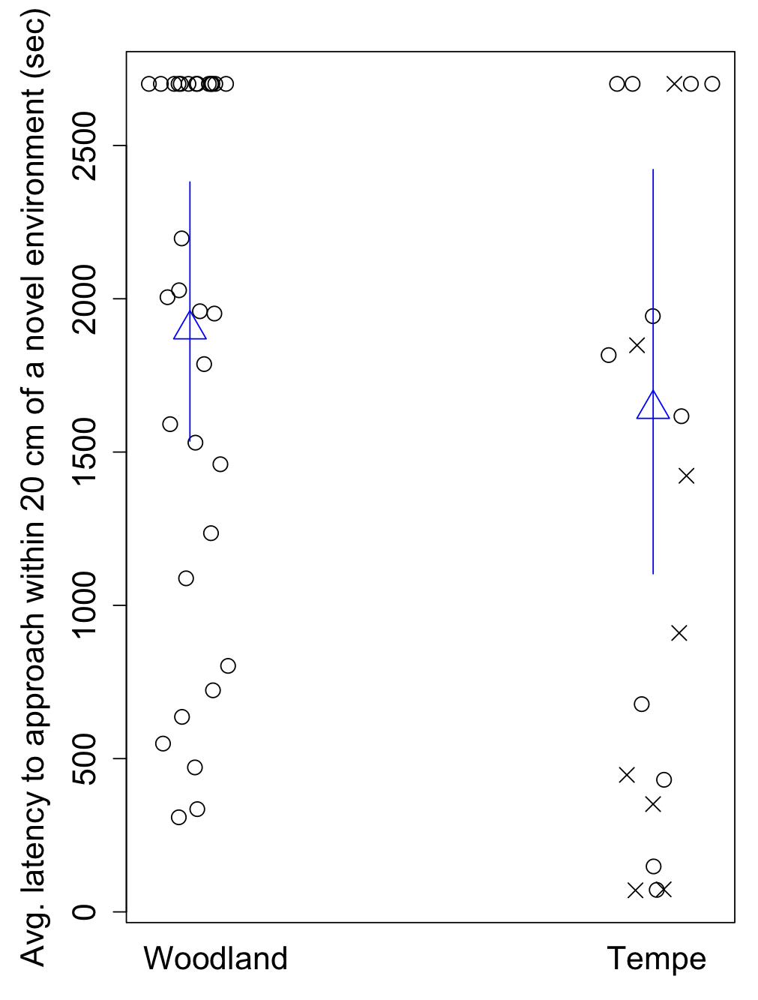
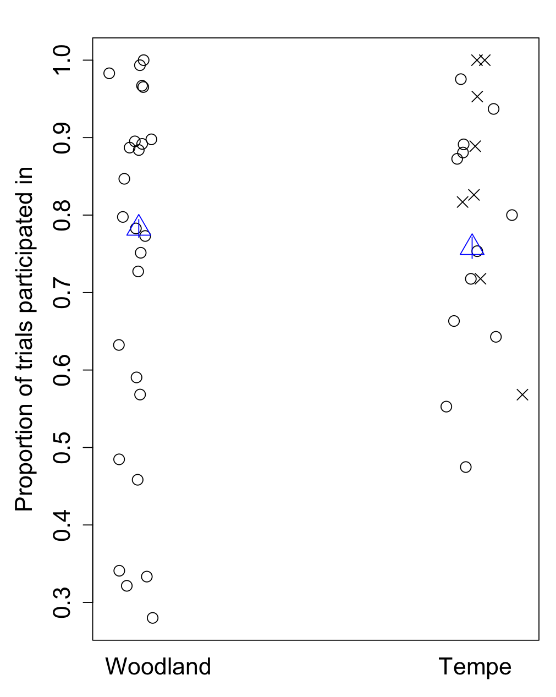

Open... {width=5%} access {width=5%} [code](https://github.com/corinalogan/grackles/blob/master/Files/Preregistrations/gxpopbehaviorhabitatq1.Rmd) {width=5%} peer review {width=5%} [data](https://doi.org/10.5063/F1QZ28FH)

\addtolength{\headheight}{0.1cm}
\pagestyle{fancyplain}
\lhead{\includegraphics[height=1.2cm]{logoPCIecology.png}}
\renewcommand{\headrulewidth}{0pt}

&nbsp;

**Affiliations:** 1) Max Planck Institute for Evolutionary Anthropology, 2) University of California Santa Barbara, 3) Animal Behavior Graduate Group, University of California Davis. *Corresponding author: corina_logan@eva.mpg.de

```{r setup, include=FALSE}
library(knitr)
library(formatR)
knitr::opts_chunk$set(tidy.opts=list(width.cutoff=70),tidy=TRUE) 
#Make code chunks wrap text so it doesn't go off the page when knitting to PDF

knitr::opts_chunk$set(echo=F, include=T, results='asis', warning=F, message=F) 
#sets global options to display code along with the results https://exeter-data-analytics.github.io/LitProg/r-markdown.html
#set echo=F for knitting to PDF (hide code), and echo=T for knitting to HTML (show code)
```

&nbsp;

**This is the post-study manuscript of the preregistration that was pre-study peer reviewed and received an In Principle Recommendation on 16 Dec 2021 by:**

Esther Sebastián González (2020) The role of behavior and habitat availability on species geographic expansion. *Peer Community in Ecology*, 100062. [10.24072/pci.ecology.100062](https://doi.org/10.24072/pci.ecology.100062). Reviewers: Caroline Nieberding, Tim Parker, and Pizza Ka Yee Chow

{width=50%}

**Preregistration:** [html](http://corinalogan.com/Preregistrations/gxpopbehaviorhabitat.html), [pdf](https://github.com/corinalogan/grackles/blob/master/Files/Preregistrations/gxpopbehaviorhabitatPassedPreStudyPeerReview16Dec2021.pdf), [rmd](https://github.com/corinalogan/grackles/blob/0fb956040a34986902a384a1d8355de65010effd/Files/Preregistrations/gxpopbehaviorhabitat.Rmd)

**Post-study manuscript** (submitted to PCI Ecology for post-study peer review on 12 April 2023): preprint [pdf]() at EcoEvoRxiv, [html](http://corinalogan.com/Preregistrations/gxpopbehaviorhabitatq1.html), [rmd](https://github.com/corinalogan/grackles/blob/master/Files/Preregistrations/gxpopbehaviorhabitatq1.Rmd)


## ABSTRACT

It is generally thought that behavioral flexibility, the ability to change behavior when circumstances change, plays an important role in the ability of species to rapidly expand their geographic range. Great-tailed grackles (*Quiscalus mexicanus*) are a social, polygamous species that is rapidly expanding its geographic range by settling in new areas and habitats. They are behaviorally flexible and highly associated with human-modified environments, eating a variety of human foods in addition to foraging on insects and on the ground for other natural food items. They offer an opportunity to assess the role of behavior change over the course of their expansion. We compare behavior in wild-caught grackles from two populations across their range (an older population in the middle of the northern expansion front: Tempe, Arizona, and a more recent population on the northern edge of the expansion front: Woodland, California) to investigate whether certain behaviors (flexibility, innovativeness, exploration, and persistence) have higher averages and variances in the newer or older population. We find that grackles in the edge population were more innovative and less exploratory, and that there were no population differences in flexibility (measured by reversal learning) or persistence (the proportion of trials participated in). Results elucidate that the rapid geographic range expansion of great-tailed grackles is associated with individuals differentially expressing particular behaviors. Our findings highlight the value of population studies and of breaking down cognitive concepts into direct measures of individual abilities to better understand how species might adapt to novel circumstances.

## INTRODUCTION

It is generally thought that behavioral flexibility, the ability to change behavior when circumstances change through packaging information and making it available to other cognitive processes [see @mikhalevich_is_2017 for theoretical background on our flexibility definition], plays an important role in the ability of a species to rapidly expand their geographic range [e.g., @lefebvre1997feeding; @griffin2014innovation; @chow2016practice; @sol2000behavioural; @sol2002behavioural; @sol2005big; @sol2007big]. These ideas predict that flexibility, exploration, and innovation [creating new behaviors or using existing behaviors in a new context, @griffin2014innovation] facilitate the expansion of individuals into completely new areas and that their role diminishes after a certain number of generations [@wright2010behavioral]. In support of this, experimental studies have shown that latent abilities are primarily expressed in a time of need [e.g., @taylor2007spontaneous; @bird2009insightful; @manrique2011spontaneous; @auersperg2012spontaneous; @laumer2018spontaneous]. Therefore, we do not expect the founding individuals who initially dispersed out of their original range to have unique behavioral characteristics that are passed on to their offspring. Instead, we expect that the actual act of continuing a range expansion relies on flexibility, exploration, innovation, and persistence, and that these behaviors are therefore expressed more on the edge of the expansion range where there have not been many generations to accumulate relevant knowledge about the environment. 

To determine whether behavior is involved in a rapid geographic range expansion, direct measures of individual behavioral abilities must be collected in populations across the range of the species [see the discussion on the danger of proxies of flexibility in @logan2018beyond]. Our study aims to test whether behavioral flexibility plays a role in the rapid geographic range expansion of great-tailed grackles (*Quiscalus mexicanus*). Great-tailed grackles are behaviorally flexible [@logan2016flexibilityproblem], rapidly expanding their geographic range [@wehtje2003range], and highly associated with human-modified environments [@johnson2001great], thus offering an opportunity to assess the role of behavior changes over the course of their expansion. This social, polygamous species eats a variety of human foods in addition to foraging on insects and on the ground for other natural food items [@johnson2001great]. This feature increases the ecological relevance of comparative cognition experiments that measure individual behavior abilities: grackles eat at outdoor cafes, from garbage cans, and on crops. As such, they generally gain experience in the wild with approaching and opening novel objects to seek food (e.g., attempting to open a ketchup packet at an outdoor cafe, climbing into garbage cans to get french fries at the zoo, dunking sugar packets in water), which makes the tests involving human-made apparatuses ecologically relevant for this species.

We aim to compare behavior in wild-caught great-tailed grackles from two populations across their range (an older population in the middle of the northern expansion front: Tempe, Arizona using previously published data from @logan2023flexmanip, and a more recent population on the northern edge of the expansion front: Woodland, California) (Figure 1, Table 1). We investigate whether certain behaviors have higher averages and variances in the edge population relative to the older population. Specifically, we investigate behavioral flexibility measured as reversal learning of food-filled colored tube preferences [@logan2016behavioral; @logan2023flexmanip]; innovativeness, measured as the number of loci they solve to access food on a puzzlebox [@auersperg_flexibility_2011; @logan2023flexmanip]; exploration, measured as the latency to approach a novel environment in the absence of nearby food [@mccune2019exploration; @mettke2009spatial]; and persistence, measured as the proportion of sessions they participate in during the flexibility and innovativeness experiments (Figure 2).

There could be multiple mechanisms underpinning the results, however our aim is to narrow down the role of changes in behavior in the range expansion of great-tailed grackles. Our results demonstrate that the rapid geographic range expansion of great-tailed grackles is associated with individuals differentially expressing particular behaviors in the edge compared to the older population.


**Table 1.** Population characteristics for the field sites. The number of generations at a site is based on a generation length of 5.6 years for this species [@GTGRbirdlife2018; note that this species starts breeding at age 1] and on the first year in which this species was reported (or estimated) to breed at each location (Woodland, California: Yolo Audubon Society's newsletter *The Burrowing Owl* from July 2004; and Tempe, Arizona: estimated based on 1945 first-sighting report in nearby Phoenix, Arizona [@wehtje2004thesis] to which we added 6 years to account for the average time between first-sighting and first-breeding - see Table 3 in @wehtje2003range. The average number of generations was calculated up to 2020, the final year of data collection in Tempe, and 2022, the final year of data collection in Woodland.

```{r table1, eval=TRUE, warning=FALSE, results='asis', include=TRUE}
d <- read.csv(url("https://raw.githubusercontent.com/corinalogan/grackles/master/Files/Preregistrations/gxpopbehaviorhabitatq1_Table1.csv"), header=F, sep=",", stringsAsFactors=F) 

colnames(d) <- c("Site","Range position","Breeding since","Number of years breeding","Average number of generations","Citation")

library(kableExtra)
knitr::kable(d) %>%
kable_styling(full_width = T, position = "left")
```

### RESEARCH QUESTION: Are there differences in behavioral traits (flexibility, innovation, exploration, and persistence) between populations across the great-tailed grackle's geographic range?

**Prediction 1:** **If behavior modifications are needed to adapt to new locations, then there is a higher average and/or larger variance of at least some traits thought to be involved in range expansions** (behavioral flexibility: speed at reversing a previously learned color preference based on it being associated with a food reward; innovativeness: number of options solved on a puzzle box; exploration: latency to approach/touch a novel object; and persistence: proportion of trials participated in with higher numbers indicating a more persistent individual) **in the grackles sampled from the more recently established population relative to the individuals sampled in the older population** (Table 1). Higher averages in behavioral traits indicate that each individual can exhibit more of that trait (e.g., they are more flexible/innovative/exploratory/persistent). Perhaps in newly established populations, individuals need to learn about and innovate new foraging techniques or find new food sources. Perhaps grackles require flexibility to visit these resources according to their temporal availability and the individual's food preferences. Perhaps solving such problems requires more exploration and persistence. Higher variances in behavioral traits indicate that there is a larger diversity of individuals in the population, which means that there is a higher chance that at least some individuals in the population could innovate foraging techniques and be more flexible, exploratory, and persistent, which could be learned by conspecifics and/or future generations. *This  supports the hypothesis* that changes in behavioral traits facilitate the great-tailed grackle's geographic range expansion.

![Experimental protocol. Great-tailed grackles from the older and newer populations are tested for their: (top left) flexibility (number of trials to reverse a previously learned color tube-food association); (middle) innovativeness (number of options [lift, swing, pull, push] solved to obtain food from within a multiaccess log); (bottom left) persistence (proportion of trials participated in during flexibility and innovativeness tests); and (far right) exploration (latency to approach a novel environment).](gxpopbehaviorhabitatFig2.png)

## METHODS

### Sample
	
Great-tailed grackles are caught in the wild in Woodland and in the Bufferlands of Sacramento, California. Some of our banded individuals were found at both sites, therefore we consider this one population. We aim to bring adult grackles, rather than juveniles, temporarily into the aviaries for behavioral choice tests to avoid the potential confound of variation in cognitive development due to age, as well as potential variation in fine motor-skill development (e.g., holding/grasping objects; early-life experience plays a role in the development of both of these behaviors; e.g., @collias1964development, @rutz2016discovery) with variation in our target variables of interest. However, due to difficulties in trapping this species at this site, we also tested some juveniles. This should not pose a problem because we found that the two juveniles (Taco and Chilaquile) we tested in the Tempe population did not perform differently from adults [@logan2023flexmanip; @blaisdell2021causal; @logan2021inhibition; @seitz2021touchscreentraining]. Adults are identified from their eye color, which changes from brown to yellow upon reaching adulthood [@johnson2001great]. We apply colored leg bands in unique combinations for individual identification. Some individuals (33) are brought temporarily into aviaries for behavioral choice tests, and then are released back to the wild at their point of capture. We catch grackles with walk-in traps and mist nets. Mist nets decrease the likelihood of a selection bias for exploratory and bold individuals because grackles cannot see the trap. Grackles are individually housed in an aviary (each 244 cm long by 122 cm wide by 213 cm tall) for three weeks to six months where they have *ad lib* access to water at all times and are fed Mazuri Small Bird maintenance diet *ad lib* during non-testing hours (minimum 20 h per day), and various other food items (e.g., peanuts, bread, goldfish crackers) during testing (up to 4 h per day per bird). Individuals Are given three to four days to habituate to the aviaries and then their test battery begins on the fourth or fifth day (birds were usually tested six days per week, therefore if their fourth day occurrs on a day off, they are tested on the fifth day instead). 

While our ideal plan was to conduct the same tests at an additional field site in Central America, due to restrictions around COVID-19 and also to issues with sexual abuse at the planned field site, it was not possible for us to accomplish this goal within our current funding period.

We test as many great-tailed grackles as we can during the 2 years we spend at each of our field sites given that the birds are only brought into the aviaries during the non-breeding season (September through April). It is time intensive to conduct the aviary test battery (3 weeks-6 months per bird), therefore we aim to meet the minimum sample sizes in Supplementary Material Table SM1. We aim for an equal sex ratio of subjects (50% female) and achieved an overall 47% female (this percentage differs depending on the test). We expected to test 20 grackles per site. See the gxpopbehaviorhabitat_data_testhistory.csv data sheet at @logan2023xpopdata for a list of the order of experiments for each individual at the Woodland site, and g_flexmanip_data_AllGrackleExpOrder.csv at @logan2023flexmanipdata for the Tempe grackles.

### Data collection stopping rule
	
We stop collecting data on wild-caught great-tailed grackles once we complete one year at the site and meet our minimum sample size.

### Protocols and open materials

  - Experimental protocols are online [here](https://docs.google.com/document/d/1oqucJ4mH-glh9Hv9JaiDSyhEGi0yVpMuqqzqR2IwQeA/edit?usp=sharing).
  
  - **Flexibility** protocol [from @logan2023flexmanip] using reversal learning with color tubes. Grackles are first habituated to a yellow tube and trained to search for hidden food. A light gray tube and a dark gray tube are placed on the table or floor: one color always contains a food reward (not visible by the bird) while the other color never contains a reward. The bird is allowed to choose one tube per trial. An individual is considered to have a preference if it chose the rewarded option at least 85% of the time (17/20 correct) in the most recent 20 trials (with a minimum of 8 or 9 correct choices out of 10 on the two most recent sets of 10 trials). We use a sliding window in 1-trial increments to calculate whether they passed after their first 20 trials. Once a bird learns to prefer one color, the contingency is reversed: food is always in the other color and never in the previously rewarded color. The flexibility measure is how many trials it takes them to reverse their color preference using the same passing criterion.
  
  - **Innovativeness** protocol [from @logan2023flexmanip and based on the experimental design by @auersperg_flexibility_2011] using a multiaccess log. Grackles are first habituated to the log apparatus with all of the doors locked open and food inside each locus. After habituation, the log, which has four ways of accessing food (pull drawer, push door, lift door up, swing door out), is placed on the ground and grackles are allowed to attempt to solve or successfully solve one option per trial. Once a bird has successfully solved an option three times, it becomes non-functional (the door is locked open and there is no food at that locus). The experiment ends when all four loci become non-functional, if a bird does not come to the ground within 10 min in three consecutive test sessions, or if a bird does not obtain the food within 10 min (or 15 min if the bird was on the ground at 10 min) in three consecutive test sessions.
  
  - **Persistence** is measured as the proportion of trials participated in during the flexibility and innovativeness experiments (after habituation, thus it is not confounded with neophobia). The higher the number, the more persistent they are. This measure indicates that those birds who do not participate as often are less persistent in terms of their persistence with engaging with the task. We generally offer a grackle the chance to participate in a trial for 5 min. If they do not participate within that time, we record -1 in the data sheet, the apparatus is removed and the trial is re-attempted later. 
  
  - **Exploration** is measured as the latency to approach within 20 cm of a novel environment inside of their familiar aviary environment, averaged across Time 1 (on the individual's 8th day in the aviary) and Time 2 (1 week after Time 1). The bird’s regular food is moved to one end of the aviary, away from the novel environment, and a motivation test precedes the session. The bird is then exposed to first a familiar environment (45 min) and then a novel environment (45 min). If an individual does not approach within 20 cm, it is given a latency of 2701 sec (45 min plus 1 sec).
  
### Open data

The data and code are publicly available at the Knowledge Network for Biocomplexity's data repository [@logan2023xpopdata].

### Randomization and counterbalancing

**Experimental order:** The order of experiments, reversal learning or multiaccess log, is counterbalanced across birds.

**Reversal learning:** The first rewarded color in reversal learning is counterbalanced across birds. The rewarded option is pseudorandomized for side (and the option on the left is always placed first). Pseudorandomization consists of alternating location for the first two trials of a session and then keeping the same color on the same side for at most two consecutive trials thereafter. A list of all 88 unique trial sequences for a 10-trial session, following the pseudorandomization rules, is generated in advance for experimenters to use during testing (e.g., a randomized trial sequence might look like: LRLLRRLRLR, where L and R refer to the location, left or right, of the rewarded tube). Randomized trial sequences are assigned randomly to any given 10-trial session using a random number generator (random.org) to generate a number from 1-88.


### Analyses

We use **simulations** and design customized **models** to determine what sample sizes allow us to detect differences between sites (Supplementary Material 2; see chapter 5.3 in @bolker2008ecological for why simulations perform more powerful power analyses). We do not **exclude** any data, and data that are **missing** (e.g. if a bird participates in one of the two experiments) for an individual in a given experiment, then this individual is not included in that analysis. Analyses are conducted in R [current version `r getRversion()`; @rcoreteam] and Stan [version 2.18, @carpenter2017stan] using the following packages: psych [@psych], irr [@gamer2012package], rethinking [@rethinking2020], rstan [@rstan], knitr [@xie2018knitr; @xie2017dynamic; @xie2013knitr], dplyr [@dplyr], tidyr [@tidyr], cmdstanr [@cmdstanr], DHARMa [@hartig2019dharma], lme4 [@lme4; @bates2012lme4], and Rcpp [@rcpp]. Interobserver reliability scores indicate high agreement across coders for all dependent variables (see Supplementary Material 3 for details).


##### Flexibility analyses
\
**Model and simulation**

We modify the reversal learning Bayesian model in @blaisdell2021causal to simulate and analyze population differences in reversal learning, and calculate our ability to detect differences between populations. The model accounts for every choice made in the reversal learning experiment and updates the probability of choosing either option after the choice is made depending on whether that choice contains a food reward or not. It does this by updating three main components for each choice: an attraction score, a learning rate ($\phi$), and a rate of deviating from learned attractions ($\lambda$).

As in @blaisdell2021causal, we, too, use previously published data on reversal learning of color tube preferences in great-tailed grackles in Santa Barbara, California [@logan2016behavioral] to inform the model modifications. We modified the @blaisdell2021causal model in a two ways: 1) we set the initial attraction score assigned to option 1 and option 2 (the light gray and dark gray tubes) to 0.1 rather than 0.0. This change assumes that there would be some inclination (rather than no inclination) for the bird to approach the tubes when they are first presented because they are previously trained to expect food in tubes. This also allows the attraction score to decrease when a non-rewarded choice is made near the beginning of the experiment. With the previous initial attraction scores set to zero, a bird would be expected to choose the rewarded option in 100% of the trials after the first time it chose that option (attraction cannot be lower than zero, and choice is shaped by the ratio of the two attractions so that when one option is zero and the other is larger than zero, the ratio will be 100% for the rewarded option).  2) We changed the updating so that an individual only changes the attraction toward the option they chose in that trial (either decreasing their attraction toward the unrewarded option or increasing their attraction toward the rewarded option). Previously, both attractions were updated after every trial, assuming that individuals understand that the experiment is set up such that one option is always rewarded. For our birds, we instead assumed that individuals will focus on their direct experience rather than making abstract assumptions about the test. Our modification resulted in needing a higher $\phi$ to have the same learning rate as a model where both attraction scores update after every trial. This change also appears to better reflect the performance of the Santa Barbara grackles, because they had higher $\phi$ values, which, in turn, meant lower $\lambda$ values to reflect the performance during their initial learning. These lower $\lambda$ values better reflect the birds' behavior during the first reversal trials: a large $\lambda$ value means that birds continue to choose the now unrewarded option almost 100% of the time, whereas the lower $\lambda$ values mean that birds start to explore the rewarded option relatively soon after the switch of the rewarded option.

We first reanalyze the Santa Barbara grackle data to obtain the phi and lambda values with this revised model, which informs our expectations of what a site’s mean and variance might be. Then we run simulations, where we determined that we wanted to make the previously mentioned modifications to the stan [@stan2019stan] model [in R, current version `r getRversion()`; @rcoreteam]. This model is used to analyze the actual data after it is collected. 

```{r sim_power_philambda, eval=F, warning=FALSE, results='asis', include=TRUE}
library(rethinking)
library(dplyr)

# We first reanalyze the Santa Barbara data to obtain values for phi and lambda upon which to base our expectations of what the mean and variance might be at a site.
# We load the Santa Barbara data from github
d <- read.csv(url("https://raw.githubusercontent.com/corinalogan/grackles/master/Files/Preregistrations/g_causal_data_SBreverse.csv"), header=T, sep=",", stringsAsFactors=F) 

# We need to perform some modifications on these data to set them up for the STAN model
d$id <- sapply(1:nrow(d), function (i) which(unique(d$Bird) == d$Bird[i]) )
d <- d[-which(d$Experiment=="Refresher"),]
d <- d[with(d, order(d$id)), ]
d$Choice <- NA
for (i in 1: nrow(d)) {
  if (d$Experiment[i] == "Initial"){
    if (d$Correct[i] == 1){
      d$Choice[i] <- 1
    } else {
      d$Choice[i] <- 2
    } 
  } else {
    if (d$Correct[i] == 1){
      d$Choice[i] <- 2
    } else {
      d$Choice[i] <- 1
    } 
  }
}

d[d=="Initial"] <- 0
d[d=="Reverse"] <- 1
d$Experiment <- as.integer(d$Experiment)


# We can now extract the relevant data for the STAN model. In the model, we want to estimate the phi and lambda for each individual that was tested in Santa Barbara based on their choices during the initial learning phase and the reversal learning phase.
dat <- as.list(d)
dat$N <- nrow(d)
dat$N_id <- length(unique(d$id))

# The STAN model is set up to have the inital attraction for each option set to 0.1, and that individuals only learn the reward of the option they chose in a given trial.
reinforcement_model_nonzeroattraction <- "

data{
   int N;
   int N_id;
   int id[N];
   int Trial[N];
   int Choice[N];
   int Correct[N];
}

parameters{
  real logit_phi;
  real log_L;

  // Varying effects clustered on individual
  matrix[2,N_id] z_ID;
  vector<lower=0>[2] sigma_ID;       //SD of parameters among individuals
  cholesky_factor_corr[2] Rho_ID;
}

transformed parameters{
matrix[N_id,2] v_ID; // varying effects on stuff
v_ID = ( diag_pre_multiply( sigma_ID , Rho_ID ) * z_ID )';
}

model{
matrix[N_id,2] A; // attraction matrix

logit_phi ~  normal(0,1);
log_L ~  normal(0,1);

// varying effects
to_vector(z_ID) ~ normal(0,1);
sigma_ID ~ exponential(1);
Rho_ID ~ lkj_corr_cholesky(4);

// initialize attraction scores

for ( i in 1:N_id ) {
A[i,1] = 0.1; A[i,2] = 0.1';
}

// loop over Choices

for ( i in 1:N ) {
vector[2] pay;
vector[2] p;
real L;
real phi;

// first, what is log-prob of observed choice

L =  exp(log_L + v_ID[id[i],1]);
p = softmax(L*A[id[i],1:2]' );
Choice[i] ~ categorical( p );

// second, update attractions conditional on observed choice

phi =  inv_logit(logit_phi + v_ID[id[i],2]);
pay[1:2] = rep_vector(0,2);
pay[ Choice[i] ] = Correct[i];
A[ id[i] , Choice[i] ] = ( (1-phi)*(A[ id[i] , Choice[i] ]) + phi*pay[Choice[i]])';

}//i
}
"

# We run this model for the Santa Barbara data
m_SB <- stan( model_code =  reinforcement_model_nonzeroattraction, data=dat ,iter = 5000, cores = 4, chains=4, control = list(adapt_delta=0.9, max_treedepth = 12))


# We extract the estimated phi and lambda values for each bird from the STAN model
s <- extract.samples(m_SB)
santabarbara_lambda <- sapply(1 : dat$N_id, function(x) exp( mean(s$log_L) + mean(s$v_ID[ ,x, 1])))
santabarbara_phi <- sapply(1 : dat$N_id, function(x) inv_logit( mean(s$logit_phi) + mean(s$v_ID[ ,x, 2])))

#These values are what we will use to set up our expectations
# For phi, we see a mean of 0.025 and a standard deviation of 0.007
mean(santabarbara_phi)
sd(santabarbara_phi)
range(santabarbara_phi)

# These values are slightly lower than what we had calculated in a previous preregistration (causal) because in there we had used a STAN model where initial attraction for both options was set to zero and birds updated their attractions to both options after each trial. For reference, these were the phi values estimated with that approach
Causal_santabarbara_phi<-c(0.03061692, 0.03430556, 0.04839631, 0.02748937, 0.03125310, 0.03356904, 0.04142868, 0.03397079)

# For lambda, we see a mean of 4.9 and a standard deviation of 2.3
mean(santabarbara_lambda)
sd(santabarbara_lambda)
range(santabarbara_lambda)

# Again, for comparison, here are the lambda values estimated with the prvious approach (they are slightly lower)
Causal_santabarbara_lambda<-c(3.311051, 4.811929, 2.897794, 4.687649, 2.360964, 6.928005, 6.013120, 3.492505)


################################################################################################
# Start the simulation here
########################

# Based on the values for the Santa Barbara birds, we can now set our expectations as inputs for the power simulations. To illustrate the range, a phi of 0.02 means that there is a ~1% shift in attraction if birds would be equally attracted to an option whereas a phi of 0.04 means that there is a ~2% shift. 
simulated_sitemean_phi<-c(0.01,0.015,0.02,0.0225,0.025,0.03,0.035,0.04)
simulated_sitesd_phi<-c(0.005,0.005,0.006,0.006,0.007,0.007,0.008,0.008)
simulated_sitemean_lambda<-c(3,4,6,9)
simulated_sitesd_lambda<-c(1,1.5,2.5,3)

#Calculate the number of sites using the number of combinations of the mean and sd options for phi and lambda
totalnumberofsites<-length(simulated_sitemean_phi)*length(simulated_sitemean_lambda)

# We set up a dataframe that will store the relevant information, saving the choice of individuals at each trials and how their attraction scores change correspondingly.
simulatedreversaldata<-matrix(ncol=15,nrow=totalnumberofsites*20*300)
simulatedreversaldata<-as.data.frame(simulatedreversaldata)
colnames(simulatedreversaldata)<-c("Bird_ID", "Session", "Trial", "Reversal","Choice", "CorrectChoice","Phi_mean","Lambda_mean","Site","Phi_sd","Lambda_sd","ThisBirdsPhi","ThisBirdsLambda","Attraction1","Attraction2")


# There are two tubes, lightgrey and darkgrey
# Initially, one of them is the rewarded option (here lightgrey) and the other is the unrewarded option (here darkgrey)
# Rewarded option gives a payoff of 1, unrewarded option gives a payoff of 0
# When a reversal occurs, the rewards are flipped (previous option with 1 now gets 0, previous option with 0 now gets 1)
counter<-1
bird_id<-1
site_id<-1

for (mean_phi in 1:length(simulated_sitemean_phi)) {
  current_mean_phi<-simulated_sitemean_phi[mean_phi]
  current_sd_phi<-simulated_sitesd_phi[mean_phi]
  
  for (mean_lambda in 1:length(simulated_sitemean_lambda)) {
  current_mean_lambda<-simulated_sitemean_lambda[mean_lambda]
  current_sd_lambda<-simulated_sitesd_lambda[mean_lambda]
  
  for (bird in 1:20) {
    bird_phi<-rnorm(1,current_mean_phi,current_sd_phi)
    if(bird_phi<0){bird_phi<-0}
    bird_lambda<-rnorm(1,current_mean_lambda,current_sd_lambda)
    if(bird_lambda<0){bird_lambda<-0}
    
    # All birds initially have only a small attraction for either option;
    # setting these values to zero means that there would be no attraction at all. In this case,  
    # choosing the wrong option and not getting a reward does not reduce the attraction to that option. 
    # Accordingly, with values set to zero birds can only learn when they pick the right option.
    # Alternatively, setting both these to the same value higher than zero (e.g. 0.1) means
    # that individuals initially do not have a preference, but are somewhat attracted to both options.
    # In this case, not getting a reward at the wrong option would reduce the attraction to that option.
    # Accordingly, with values larger than zero birds can initially potentially learn twice as fast
    # because they update attractions both when choosing the correct and the wrong option.
    attractionlightgrey<-0.1
    attractiondarkgrey<-0.1
    
    # Initially, the light grey option is rewarded
    lightgreyreward<-1
    darkgreyreward<-0
    reversal<-"initial"
    
    # Reflecting the data being collected, the maximum number of sessions a bird can participate in is 30
    for (session in 1:30) {
    
    # Each session runs for 10 trials
    for (trial in 1:10) {
    
    # We first calculate the probability that the bird will choose the light grey option during this trial based on her relative attraction to this option over the dark grey option
    probability_choose_lightgrey<-exp(bird_lambda*attractionlightgrey)/(exp(bird_lambda*attractionlightgrey)+exp(bird_lambda*attractiondarkgrey)  )
    
    # Based on the probability, the bird will now make a choice
    choselightgrey<-if(runif(1,0,1)<probability_choose_lightgrey){1} else{0}
    
    # For the option they choose, they update their attraction. If they chose the correct option, the learned about the reward and increase their attraction to that option; if they chose the wrong option, they decrease their attraction to that option
    if(choselightgrey==1){
      attractionlightgrey<-(1-bird_phi)*attractionlightgrey+bird_phi*lightgreyreward
    } else {
      attractiondarkgrey<-(1-bird_phi)*attractiondarkgrey+bird_phi*darkgreyreward
    }
    
    # We store all the relevant information about this trial in the data frame
    simulatedreversaldata[counter,]$Bird_ID<-bird_id
    simulatedreversaldata[counter,]$Session<-session
    simulatedreversaldata[counter,]$Trial<-(session-1)*10+trial
    simulatedreversaldata[counter,]$Reversal<-reversal
    simulatedreversaldata[counter,]$Site<-site_id
    simulatedreversaldata[counter,]$Phi_mean<-current_mean_phi
    simulatedreversaldata[counter,]$Lambda_mean<-current_mean_lambda
    simulatedreversaldata[counter,]$Phi_sd<-current_sd_phi
    simulatedreversaldata[counter,]$Lambda_sd<-current_sd_lambda
    simulatedreversaldata[counter,]$Choice<-choselightgrey
    simulatedreversaldata[counter,]$Attraction1<-attractionlightgrey
    simulatedreversaldata[counter,]$Attraction2<-attractiondarkgrey
    simulatedreversaldata[counter,]$ThisBirdsPhi<-bird_phi
    simulatedreversaldata[counter,]$ThisBirdsLambda<-bird_lambda
    simulatedreversaldata[counter,]$CorrectChoice<-ifelse(reversal=="initial",ifelse(choselightgrey==1,1,0),ifelse(choselightgrey==1,0,1))
    
    counter<-counter+1
    #End of trial loop
    }

      # Birds are done when they have successfully completed the reversal trials after the initial learning trials. Matching the experiments, birds are counted as successful if they chose the correct option in 17 or more of the 20 trials and if they also during those last two sessions chose the correct option 8 or more times out of the 10 times in each session.
      if (reversal=="reversal") {
        if (sum(simulatedreversaldata[(counter-11):(counter-1),]$CorrectChoice)>7  
            & sum(simulatedreversaldata[(counter-21):(counter-12),]$CorrectChoice)>7 
            & sum(simulatedreversaldata[(counter-21):(counter-1),]$CorrectChoice)>16 ) {
          break
        }
      }

      # Birds switch from the initial learning to the reversal trials, based on the same definition of being successful. In this case, the reward is now set to be associated with the dark grey option in the following reversal trials.     
      if(session > 1) {
      if (   sum(simulatedreversaldata[(counter-11):(counter-1),]$CorrectChoice)>7  
             & sum(simulatedreversaldata[(counter-21):(counter-12),]$CorrectChoice)>7 
             & sum(simulatedreversaldata[(counter-21):(counter-1),]$CorrectChoice)>16 ) {
        lightgreyreward<-0
        darkgreyreward<-1
        reversal<-"reversal"
      }
      }
    #End of session loop  
    }
  bird_id <-bird_id+1    
  #End of bird loop
  }
  site_id<-site_id+1
  # End of mean lambda loop
}
#End of mean phi loop 
}

# Remove unnecessary rows at the bottom that contain only NA values
rem_simulatedreversaldata<-simulatedreversaldata[is.na(simulatedreversaldata$Site)==F,]

# What are the attraction values observed across all individuals in all populations across both initial and reversal for the option that is rewarded during the initial phase
hist(rem_simulatedreversaldata$Attraction1)
# What are the attraction values observed across all individuals in all populations across both initial and reversal for the option that is rewarded during the reversal phase
hist(rem_simulatedreversaldata$Attraction2)

# Boxplots of the 20 individual phi values per population to see whether populations with different mean phi values are different
boxplot(rem_simulatedreversaldata$ThisBirdsPhi~rem_simulatedreversaldata$Phi_mean)

# Save the output - use this code for the modified version with initial attraction scores at 0.1 and individuals only learning about the option they chose
write.csv(rem_simulatedreversaldata,file="SimulatedReversalData_Grackles_PhiLambda_Attraction.csv")

################################################################################################
# End of the simulation
################################################################################################


################################################################################################
# Load previously simulated data 
################################################################################################

# These two are the sets we decided on, with initial attractions at 0.1 and eight different phi and four different lambda combinations
simulatedreversaldata_attractionscores_1<-read.csv(url("https://raw.githubusercontent.com/corinalogan/grackles/master/Files/Preregistrations/gxpopbehaviorhabitat_SimulatedReversalData_Grackles_PhiLambda_Attraction02_Aug2021.csv"), header=T, sep=",", stringsAsFactors=F) 
  
simulatedreversaldata_attractionscores_2<-read.csv(url("https://raw.githubusercontent.com/corinalogan/grackles/master/Files/Preregistrations/gxpopbehaviorhabitat_SimulatedReversalData_Grackles_PhiLambda_Attraction04_Aug2021.csv"), header=T, sep=",", stringsAsFactors=F) 

# In both simulations, sites were counted from 1-16; we now assign each site a unique value from 1-32
simulatedreversaldata_attractionscores_2$Site<-simulatedreversaldata_attractionscores_2$Site+16

# We combine the two data sets for the further analyses
simulatedreversaldata_attractionscores<-bind_rows(simulatedreversaldata_attractionscores_1,simulatedreversaldata_attractionscores_2)

################################################################################################

# In the simulations, trials were counted continuously for each bird. We now want to change this so that it restarts counting trials from 1 upward once a bird switches to reversal.

for (birds in 1:length(unique(simulatedreversaldata_attractionscores$Bird_ID))){
  currentbird<-unique(simulatedreversaldata_attractionscores$Bird_ID)[birds]
  maximuminitial<-max(simulatedreversaldata_attractionscores[simulatedreversaldata_attractionscores$Bird_ID==currentbird & simulatedreversaldata_attractionscores$Reversal == "initial",]$Trial)
  simulatedreversaldata_attractionscores[simulatedreversaldata_attractionscores$Bird_ID==currentbird & simulatedreversaldata_attractionscores$Reversal == "reversal",]$Trial<-simulatedreversaldata_attractionscores[simulatedreversaldata_attractionscores$Bird_ID==currentbird & simulatedreversaldata_attractionscores$Reversal == "reversal",]$Trial - maximuminitial
}

# We need to adjust the coding during the reversal learning so that "correct" now matches whether it is correct or not. In the table, choice means which of the two options they chose. If they chose 0, that means they chose the lt gray, if they chose 1, that means they chose the dk gray. CorrectChoice indicates whether this is the rewarded colour or not. It is currently set up so that during the initial learning, option 1 in choice is being rewarded, whereas in the reversal learning, option 0 in choice is being rewarded. To match this better to the original data, we assume that option 1 is rewarded in the intial learning and option 2 is rewarded in the reversal learning (which matches coding as factors 1 and 2).
simulatedreversaldata_attractionscores$Choice <- simulatedreversaldata_attractionscores[simulatedreversaldata_attractionscores$Choice==0,]$Choice<-2 

# To use the model to estimate the phi and lambda parameters, we first need to change the column names to match these to the specifications in the model: change Bird_ID  to id; change Reversal to Choice, change CorrectChoice to Correct, change Site to Expid

colnames(simulatedreversaldata_attractionscores)<-c("counter","id","Session","Trial","Reversal","Choice","Correct","Phi_mean","Lambda_mean","Site","Phi_sd","Lambda_sd","ThisBirdsPhi","ThisBirdsLambda","Attraction1","Attraction2")


################################################################################################
# Next, we can plot the average choices across trials for the different sites
################################################################################################

# Calculate average performance in reversal learning for different phi values c(0.02,0.0325,0.035,0.45)
se <- function(x) sd(x)/sqrt(length(x))

Prop_correct_reversal_phi_0.02  <- sapply(1:100, function (x) mean(simulatedreversaldata_attractionscores$Correct[simulatedreversaldata_attractionscores$Trial==x & simulatedreversaldata_attractionscores$Reversal == "reversal" & simulatedreversaldata_attractionscores$Phi_mean ==0.02]) )
Prop_correct_reversal_SE_phi_0.02 <- sapply(1:100, function (x) se(simulatedreversaldata_attractionscores$Correct[simulatedreversaldata_attractionscores$Trial==x & simulatedreversaldata_attractionscores$Reversal == "reversal" & simulatedreversaldata_attractionscores$Phi_mean ==0.02]) )

Prop_correct_reversal_phi_0.02<-1-Prop_correct_reversal_phi_0.02 #reverse the proportion so it is proportion of newly rewarded option correct

Prop_correct_reversal_phi_0.0325  <- sapply(1:100, function (x) mean(simulatedreversaldata_attractionscores$Correct[simulatedreversaldata_attractionscores$Trial==x & simulatedreversaldata_attractionscores$Reversal == "reversal" & simulatedreversaldata_attractionscores$Phi_mean ==0.0325]) )
Prop_correct_reversal_SE_phi_0.0325 <- sapply(1:100, function (x) se(simulatedreversaldata_attractionscores$Correct[simulatedreversaldata_attractionscores$Trial==x & simulatedreversaldata_attractionscores$Reversal == "reversal" & simulatedreversaldata_attractionscores$Phi_mean ==0.0325]) )

Prop_correct_reversal_phi_0.0325<-1-Prop_correct_reversal_phi_0.0325

Prop_correct_reversal_phi_0.035  <- sapply(1:100, function (x) mean(simulatedreversaldata_attractionscores$Correct[simulatedreversaldata_attractionscores$Trial==x & simulatedreversaldata_attractionscores$Reversal == "reversal" & simulatedreversaldata_attractionscores$Phi_mean ==0.035]) )
Prop_correct_reversal_SE_phi_0.035 <- sapply(1:100, function (x) se(simulatedreversaldata_attractionscores$simulatedreversaldata_attractionscores[simulatedreversaldata_attractionscores$Trial==x & simulatedreversaldata_attractionscores$Reversal == "reversal" & simulatedreversaldata_attractionscores$Phi_mean ==0.035]) )

Prop_correct_reversal_phi_0.035<-1-Prop_correct_reversal_phi_0.035

Prop_correct_reversal_phi_0.45  <- sapply(1:100, function (x) mean(simulatedreversaldata_attractionscores$Correct[simulatedreversaldata_attractionscores$Trial==x & simulatedreversaldata_attractionscores$Reversal == "reversal" & simulatedreversaldata_attractionscores$Phi_mean ==0.45]) )
Prop_correct_reversal_SE_phi_0.45 <- sapply(1:100, function (x) se(simulatedreversaldata_attractionscores$Correct[simulatedreversaldata_attractionscores$Trial==x & simulatedreversaldata_attractionscores$Reversal == "reversal" & simulatedreversaldata_attractionscores$Phi_mean ==0.45]) )

Prop_correct_reversal_phi_0.45<-1-Prop_correct_reversal_phi_0.45

# We now plot the curves that show how the average performance changes with each trial. Initially birds are close to 100% choosing the previously rewarded option. We now want to see how quickly they change from that to never selecting this option. We plot the outcomes with the different values for phi in different colours
plot(Prop_correct_reversal_phi_0.02[1:100],type="n" , lwd=2, lty=1, ylim=c(0,1), ylab="Proportion correct",xlab="Trial number", main = "Simulated Grackle Data")
arrows(1:100,c(Prop_correct_reversal_phi_0.02[1:100])-c(Prop_correct_reversal_SE_phi_0.02[1:100]),1:100,c(Prop_correct_reversal_phi_0.02[1:100], Prop_correct_reversal_phi_0.02[1:100])+c(Prop_correct_reversal_SE_phi_0.02[1:100], Prop_correct_reversal_phi_0.02[1:100]),col="darkgray", code=3, lwd=1, length=0.01, angle = 90)

arrows(1:100,c(Prop_correct_reversal_phi_0.035[1:100])-c(Prop_correct_reversal_SE_phi_0.035[1:100]),1:100,c(Prop_correct_reversal_phi_0.035[1:100], Prop_correct_reversal_phi_0.035[1:100])+c(Prop_correct_reversal_SE_phi_0.035[1:100], Prop_correct_reversal_phi_0.035[1:100]),col="blue", code=3, lwd=1, length=0.01, angle = 90)

#arrows(1:100,c(Prop_correct_reversal_phi_0.45[1:100])-c(Prop_correct_reversal_SE_phi_0.45[1:100]),1:100,c(Prop_correct_reversal_phi_0.45[1:100], Prop_correct_reversal_phi_0.45[1:100])+c(Prop_correct_reversal_SE_phi_0.45[1:100], Prop_correct_reversal_phi_0.45[1:100]),col="red", code=3, lwd=1, length=0.01, angle = 90)


# Now we do the same for lambda
Prop_correct_reversal_lambda_3  <- sapply(1:100, function (x) mean(cleanedsimulatedreversaldata$CorrectChoice[cleanedsimulatedreversaldata$Trial==x & cleanedsimulatedreversaldata$Reversal == "reversal" & cleanedsimulatedreversaldata$Lambda_mean ==3]) )
Prop_correct_reversal_SE_lambda_3 <- sapply(1:100, function (x) se(cleanedsimulatedreversaldata$CorrectChoice[cleanedsimulatedreversaldata$Trial==x & cleanedsimulatedreversaldata$Reversal == "reversal" & cleanedsimulatedreversaldata$Lambda_mean ==3]) )

Prop_correct_reversal_lambda_3<-1-Prop_correct_reversal_lambda_3

Prop_correct_reversal_lambda_45  <- sapply(1:100, function (x) mean(cleanedsimulatedreversaldata$CorrectChoice[cleanedsimulatedreversaldata$Trial==x & cleanedsimulatedreversaldata$Reversal == "reversal" & cleanedsimulatedreversaldata$Lambda_mean ==4.5]) )
Prop_correct_reversal_SE_lambda_45 <- sapply(1:100, function (x) se(cleanedsimulatedreversaldata$CorrectChoice[cleanedsimulatedreversaldata$Trial==x & cleanedsimulatedreversaldata$Reversal == "reversal" & cleanedsimulatedreversaldata$Lambda_mean ==4.5]) )

Prop_correct_reversal_lambda_45<-1-Prop_correct_reversal_lambda_45

# Plot the curves for the different lambda values
plot(Prop_correct_reversal_lambda_3[1:100],type="n" , lwd=2, lty=1, ylim=c(0,1), ylab="Proportion correct",xlab="Trial number", main = "Simulated Grackle Data")
arrows(1:100,c(Prop_correct_reversal_lambda_3[1:100])-c(Prop_correct_reversal_SE_lambda_3[1:100]),1:100,c(Prop_correct_reversal_lambda_3[1:100], Prop_correct_reversal_lambda_3[1:100])+c(Prop_correct_reversal_SE_lambda_3[1:100], Prop_correct_reversal_lambda_3[1:100]),col="darkgray", code=3, lwd=1, length=0.01, angle = 90)

arrows(1:100,c(Prop_correct_reversal_lambda_45[1:100])-c(Prop_correct_reversal_SE_lambda_45[1:100]),1:100,c(Prop_correct_reversal_lambda_45[1:100], Prop_correct_reversal_lambda_45[1:100])+c(Prop_correct_reversal_SE_lambda_45[1:100], Prop_correct_reversal_lambda_45[1:100]),col="red", code=3, lwd=1, length=0.01, angle = 90)


################################################################################################
# Do phi and lambda influence performance?
################################################################################################

performance_mean<-as.data.frame(simulatedreversaldata_attractionscores %>% group_by(id, Phi_mean, Reversal) %>% summarize(mean(Trial)))

boxplot((performance_mean[performance_mean$Reversal=="initial",]$`mean(Trial)`)~performance_mean[performance_mean$Reversal=="initial",]$Phi_mean)

boxplot((performance_mean[performance_mean$Reversal=="reversal",]$`mean(Trial)`)~performance_mean[performance_mean$Reversal=="reversal",]$Phi_mean)


performance_mean_lambda<-as.data.frame(simulatedreversaldata_attractionscores %>% group_by(id, Lambda_mean, Reversal) %>% summarize(mean(Trial)))

boxplot((performance_mean_lambda[performance_mean_lambda$Reversal=="initial",]$`mean(Trial)`)~performance_mean_lambda[performance_mean_lambda$Reversal=="initial",]$Lambda_mean)

boxplot((performance_mean_lambda[performance_mean_lambda$Reversal=="reversal",]$`mean(Trial)`)~performance_mean_lambda[performance_mean_lambda$Reversal=="reversal",]$Lambda_mean)


################################################################################################
# Can we estimate the phi lambda values back from the simulated data
################################################################################################

# We start with a single site, and estimate values for each individual

# Randomly pick one site from the 32 simulated sites  
site<-sample(unique(simulatedreversaldata_attractionscores$Site),1)

# Pick the individuals and their trials from that one site
singlesitetest<-simulatedreversaldata_attractionscores[simulatedreversaldata_attractionscores$Site==site ,]

# Renumber the site id so that it is 1 (necessary so that the STAN model knows to work on these data)
singlesitetest$id<-singlesitetest$id-((site-1)*20)

# Change the Choice into whether they picked option 1 or 2
singlesitetest$Choice<-as.integer(as.factor(singlesitetest$Choice))

# If you want to run the estimation only on the reversal trials, use the following, and then in the setting up of the data for the model choose "singlesitetest_reversal" instead of "singlesitetest"
singlesitetest_reversal<-singlesitetest[singlesitetest$Reversal=="reversal",]

# Set up the data for the STAN model
dat_singlesite <- as.list(singlesitetest)
dat_singlesite$N <- nrow(singlesitetest)
dat_singlesite$N_id <- length(unique(singlesitetest$id))

# Define the STAN model. In this model, the initial attraction is set to 0.1 for both options and individuals only update their attraction for the option they chose.

reinforcement_model_nonzeroattraction <- "
data{
   int N;
   int N_id;
   int id[N];
   int Trial[N];
   int Choice[N];
   int Correct[N];
}

parameters{
  real logit_phi;
  real log_L;

  // Varying effects clustered on individual
  matrix[2,N_id] z_ID;
  vector<lower=0>[2] sigma_ID;       //SD of parameters among individuals
  cholesky_factor_corr[2] Rho_ID;
}
transformed parameters{
matrix[N_id,2] v_ID; // varying effects on stuff
v_ID = ( diag_pre_multiply( sigma_ID , Rho_ID ) * z_ID )';
}
model{
matrix[N_id,2] A; // attraction matrix
logit_phi ~  normal(0,1);
log_L ~  normal(0,1);

// varying effects
to_vector(z_ID) ~ normal(0,1);
sigma_ID ~ exponential(1);
Rho_ID ~ lkj_corr_cholesky(4);

// initialize attraction scores
for ( i in 1:N_id ) {
A[i,1] = 0.1; A[i,2] = 0.1';
}

// loop over Choices
for ( i in 1:N ) {
vector[2] pay;
vector[2] p;
real L;
real phi;

// first, what is log-prob of observed choice
L =  exp(log_L + v_ID[id[i],1]);
p = softmax(L*A[id[i],1:2]' );
Choice[i] ~ categorical( p );

// second, update attractions conditional on observed choice
phi =  inv_logit(logit_phi + v_ID[id[i],2]);
pay[1:2] = rep_vector(0,2);
pay[ Choice[i] ] = Correct[i];
A[ id[i] , Choice[i] ] = ( (1-phi)*(A[ id[i] , Choice[i] ]) + phi*pay[Choice[i]])';

}//i
}
"

# Now we run the STAN model on the data from this one site
m_singlesite <- stan( model_code =  reinforcement_model_nonzeroattraction, data=dat_singlesite ,iter = 5000, cores = 4, chains=4, control = list(adapt_delta=0.9, max_treedepth = 12))

# We extract samples from the posterior of the STANmodel
posterior_singlesite<-extract.samples(m_singlesite)

# We calculate what lambda and phi values the STAN model estimated for each individual from this one site
lambda_singlesite <- sapply(1 : dat_singlesite$N_id, function(x) exp( mean(posterior_singlesite$log_L) + mean(posterior_singlesite$v_ID[ ,x, 1])))
phi_singlesite <- sapply(1 : dat_singlesite$N_id, function(x) inv_logit( mean(posterior_singlesite$logit_phi) + mean(posterior_singlesite$v_ID[ ,x, 2])))


# We set up a quick projection function to see how well the estimated STAN values can recover the  performance of the birds at this one simulated site
Projection_fct <- function(Tmax = 100,  N_id = 20){    
  #Create output object
  d_Overall <- c()
  #Loop over birds
  for (ind in 1:N_id) {
    #Set initial attractions to 0
    A <- c(0.1,0.1)
    #Create output matrix to record choices and payoffs
    d <- data.frame(id=ind, trial = 1:Tmax, Choice=NA, Payoff=NA, Experiment = NA)
    d$Experiment[1:50] <- 0
    d$Experiment[51:100] <- 1
    # Start simulation loop
    for (i in 1:Tmax) {
      Prob <- c()
      for (xx in 1:2) {
        Prob[xx] <- exp(lambda_singlesite[ind]*A[xx]) / sum(exp(lambda_singlesite[ind]*A))
      }
      #Make choice proportional to attraction scores
      d$Choice[which(d$id==ind & d$trial==i)] <- sample(c(1:2), size = 1, prob = Prob)
      pay <- c(0,0)
      if (d$Experiment[i] == 0){
        if (d$Choice[i] == 1){
          d$Payoff[i] <- 1
          pay[1] <- 1
        } else {
          d$Payoff[i] <- 0
        } 
      } else {
        if (d$Choice[i] == 1){
          d$Payoff[i] <- 0
        } else {
          d$Payoff[i] <- 1
          pay[2] <- 1
        } 
      }
      #Update Attractions
      for (xx in 1:2) {
        A[xx] <- (1-phi_singlesite[ind]) * A[xx] + phi_singlesite[ind] * pay[xx]
      }
    }#time i
    d_Overall <- rbind(d_Overall, d)
  }#ind
  return(d_Overall)
}

# We run this projection to get the expected performance of the birds based on the STAN estimates
dat_sim <- Projection_fct() 

# We now plot the learning curves for this birds at this one simulated site and the projected learning curves based on the STAN estimates

#Compute mean correct and SE of choices for simulated and projected data
Prop_correct_sim<- c()
se <- function(x) sd(x)/sqrt(length(x))
Prop_correct_sim  <- sapply(1:100, function (x) mean(dat$Payoff[dat$trial==x]) )
Prop_correct_sim_SE <- sapply(1:100, function (x) se(dat$Payoff[dat$trial==x]) )

Prop_correct_initial<- c()
Prop_correct_initial  <- sapply(1:100, function (x) mean(singlesitetest$Correct[singlesitetest$Trial==x & singlesitetest$Reversal == "initial"]) )
Prop_correct_initial_SE <- sapply(1:100, function (x) se(singlesitetest$Correct[singlesitetest$Trial==x & singlesitetest$Reversal == "initial"]) )

Prop_correct_reversal<- c()
Prop_correct_reversal  <- sapply(1:100, function (x) mean(singlesitetest$Correct[singlesitetest$Trial==x & singlesitetest$Reversal == "reversal"]) )
Prop_correct_reversal_SE <- sapply(1:100, function (x) se(singlesitetest$Correct[singlesitetest$Trial==x & singlesitetest$Reversal == "reversal"]) )


op<-par()
par(mfrow=c(2,1),
    oma=c(1.1,2.5,0,0),
    mar=c(2.5,2.4,1.5,0.1))

plot(c(Prop_correct_initial[1:50], Prop_correct_reversal[1:50]), type="n", lwd=2, lty=1, ylim=c(0,1), ylab="",xlab="", main = "simulated site 40")
arrows(1:100,c(Prop_correct_initial[1:50], Prop_correct_reversal[1:50])-c(Prop_correct_initial_SE[1:50], Prop_correct_reversal_SE[1:50]),1:100,c(Prop_correct_initial[1:50], Prop_correct_reversal[1:50])+c(Prop_correct_initial_SE[1:50], Prop_correct_reversal_SE[1:50]),col="darkgray", code=3, lwd=1, length=0.01, angle = 90)
lines(c(Prop_correct_initial[1:50], Prop_correct_reversal[1:50]), lwd=2)
abline(v = 51, lty =2)

plot(Prop_correct_sim, type="n", lwd=2, lty=1, ylim=c(0,1), ylab="",xlab="", main = "Simulated Data")
arrows(1:100,Prop_correct_sim-Prop_correct_sim_SE,1:100,Prop_correct_sim+Prop_correct_sim_SE, code=3, lwd=1,col="darkgray", length=0.01, angle = 90)
lines(Prop_correct_sim, lwd=2)
abline(v = 51, lty =2)
mtext(side = 1, "Trial", line = 0, outer = TRUE, cex = 1.2)
mtext(side = 2, "Proportion Correct", line = 0.5, outer = TRUE, cex = 1.2)
par(op)

########################################################################################


# Now we run a STAN model with all simulated sites, estimating both means of phi and lambda for each site as well as each individuals' phi and lambda

# We set up the data for the model
dat_full <- as.list(simulatedreversaldata_attractionscores)
dat_full$N <- nrow(simulatedreversaldata_attractionscores)
dat_full$N_id <- length(unique(simulatedreversaldata_attractionscores$id))
dat_full$N_exp <- length(unique(simulatedreversaldata_attractionscores$Site))
dat_full$Choice <- as.numeric(as.factor(dat_full$Choice))

# This STAN model, in addition to estimating phi and lambda for each individual, also estimates means for each site. It again starts with attractions set to 0.1 and assumes that individuals only learn about the option they chose.

reinforcement_model_id_site_nonzeroattraction <- "
data{
   int N;
   int N_id;
   int N_exp;
   int id[N];
   int Site[N];
   int Trial[N];
   int Choice[N];
   int Correct[N];
}

parameters{
  real logit_phi;
  real log_L;

  // Varying effects clustered on individual
  matrix[2,N_id] z_ID;
  vector<lower=0>[2] sigma_ID;       //SD of parameters among individuals
  cholesky_factor_corr[2] Rho_ID;

  // Varying effects clustered on experimenter
  matrix[2,N_exp] z_EXP;
  vector<lower=0>[2] sigma_EXP;
  cholesky_factor_corr[2] Rho_EXP;
}

transformed parameters{
matrix[N_id,2] v_ID; // varying effects on individuals
matrix[N_exp,2] v_EXP; // varying effects on experimenter

v_ID = ( diag_pre_multiply( sigma_ID , Rho_ID ) * z_ID )';
v_EXP = ( diag_pre_multiply( sigma_EXP , Rho_EXP ) * z_EXP )';
}

model{
matrix[N_id,2] A; // attraction matrix

logit_phi ~  normal(0,1);
log_L ~  normal(0,1);

// varying effects
to_vector(z_ID) ~ normal(0,1);
sigma_ID ~ exponential(1);
Rho_ID ~ lkj_corr_cholesky(4);

to_vector(z_EXP) ~ normal(0,1);
sigma_EXP ~ exponential(1);
Rho_EXP ~ lkj_corr_cholesky(4);

// initialize attraction scores
for ( i in 1:N_id ) {
A[i,1] = 0.1; A[i,2] = 0.1';
}

// loop over Choices
for ( i in 1:N ) {
vector[2] pay;
vector[2] p;
real L;
real phi;

// first, what is log-prob of observed choice
L =  exp(log_L + v_ID[id[i],1]+ v_EXP[Site[i],1]);
p = softmax(L*A[id[i],1:2]' );
Choice[i] ~ categorical( p );

// second, update attractions conditional on observed choice
phi =  inv_logit(logit_phi + v_ID[id[i],2]+ v_EXP[Site[i],2]);
pay[1:2] = rep_vector(0,2);
pay[ Choice[i] ] = Correct[i];
A[ id[i] , Choice[i] ] = ( (1-phi)*(A[ id[i] , Choice[i] ]) + phi*pay[Choice[i]])';
}//i
}
"

# Now we run the STAN model on the full data. This will take a few hours.
m_simulated_full <- stan( model_code =  reinforcement_model_id_site_nonzeroattraction, data=dat_full ,iter = 5000, cores = 4, chains=4, control = list(adapt_delta=0.9, max_treedepth = 12))

# We extract the posterior from the STAN model
s <- extract.samples(m_simulated_full)

# We calculate the mean phi and lambda for each site as estimated by the STAN model
lambda <- sapply(1 : dat_full$N_exp, function(x) exp( mean(s$log_L) + mean(s$v_EXP[ ,x, 1])))
phi <- sapply(1 : dat_full$N_exp, function(x) inv_logit( mean(s$logit_phi) + mean(s$v_EXP[ ,x, 2])))

# We calculate the original mean phi and lambda values for each site. Because we randomly generated 20 individuals per site, these original values will be slightly different than the means we set as starting values for the simulations
originallambda<-as.vector(as.data.frame(simulatedreversaldata_attractionscores %>% group_by(Site) %>% summarise(mean(ThisBirdsLambda)))[,2])
originalphi<-(as.data.frame(simulatedreversaldata_attractionscores %>% group_by(Site) %>% summarise(mean(ThisBirdsPhi)))[,2])


# We want to know whether the STAN model estimated two sites to be different or not. As criterion for this, we check whether the samples in the posterior for pairs of site overlap or not. That means that, when calculating the difference between the samples in the posterior for a pair of site, they are assumed to be different if the differences are all on one side of zero.

# We first check our power to estimate difference in mean phi between sites
# We calculate the pairwise differences between sites for the estimated phi means
pairwisedifferences_phiposteriors<-list(sapply(1 : (dat_full$N_exp * (dat_full$N_exp-1)/2), function(x) (s$v_EXP[ ,combn(1:dat_full$N_exp,m=2)[1,x], 2]-(s$v_EXP[ ,combn(1:dat_full$N_exp,m=2)[2,x], 2]))))

# We convert it into a dataframe for easier manipulation
estimates_pairwisedifferences_phiposteriors<-as.data.frame(precis(pairwisedifferences_phiposteriors,depth=2))

# We add a column that classifies as true or false whether the estimates crosses zero (as opposed to all values being either smaller or larger than zero)
estimates_pairwisedifferences_phiposteriors$crosseszero<-ifelse(estimates_pairwisedifferences_phiposteriors$mean>0,estimates_pairwisedifferences_phiposteriors$`5.5%`<0,estimates_pairwisedifferences_phiposteriors$`94.5%`>0)

# We go back and again calculate the original phi values for each site (the average across the random sample of 20 birds simulated at each site)
eachsimulatedsitesobservedphi<-as.data.frame(simulatedreversaldata_attractionscores %>% group_by(Site) %>% summarise(mean(ThisBirdsPhi)))
colnames(eachsimulatedsitesobservedphi)<-c("Site","Site_ObservedPhi_mean")

# We want to know all pairwise differences in the original means across the 32 sites
observedphi_combinations_wide<-as.data.frame((combn(eachsimulatedsitesobservedphi$Site_ObservedPhi_mean,m=2)))

# observedphi_combinations_wide is a long vector with two rows. To add it to the data frame we created before that has the difference in the estimated means from the STAN model, we need to transverse it into a format with two columns
observedphi_combinations_long<-matrix(ncol=2,nrow=(dat_full$N_exp * (dat_full$N_exp-1)/2))
observedphi_combinations_long<-as.data.frame(observedphi_combinations_long)
observedphi_combinations_long[,1]<-as.numeric(observedphi_combinations_wide[1,])
observedphi_combinations_long[,2]<-as.numeric(observedphi_combinations_wide[2,])
colnames(observedphi_combinations_long)<-c("observedphi_firstsiteforcomparison","observedphi_secondsiteforcomparison")
observedphi_combinations_long$observedsitedifference<-abs(observedphi_combinations_long$observedphi_firstsiteforcomparison-observedphi_combinations_long$observedphi_secondsiteforcomparison)

# We can now add the column from observedphi_combinations_long that has the differences in the phi means in the original data to the dataframe that has the differences from the STAN estimations
estimates_pairwisedifferences_phiposteriors$observedsitedifference<-observedphi_combinations_long$observedsitedifference

# As a first check, we can see whether the cases where the STAN model estimates that the two sites are not different (difference crosses zero is TRUE) show smaller differences in the original phis of the two sites than those cases where the STAN model does estimate the difference to be clear.
boxplot(estimates_pairwisedifferences_phiposteriors$simulatedsitedifference~estimates_pairwisedifferences_phiposteriors$crosseszero)


# We now also want to add the information about how different two sites were supposed to be based on the input values of the phi means in the simulations. We assumed variation at each site, so when we randomly simulated 20 individuals the mean across their phis can be lower or higher than what we set as the input. We can see that in the following plot, where on the x-axis we have the differences between sites that were set in the inputs and on the y-axis the actual differences in the original phi means that we obtained in the simulations.
plot(dat_phidifferences$differencedetected~combined_estimates_pairwisedifferences_phiposteriors$observedsitedifference)

# We first obtain the input value for each site
eachsimulatedsitessimulatedphi<-as.data.frame(simulatedreversaldata_attractionscores %>% group_by(Site) %>% summarise(mean(Phi_mean)))
colnames(eachsimulatedsitessimulatedphi)<-c("Site","Site_SimulatedPhi_mean")

# We set up all pairwise comparisons between sites again
simulatedphi_combinations_wide<-as.data.frame((combn(eachsimulatedsitessimulatedphi$Site_SimulatedPhi_mean,m=2)))

# The simulatedphi_combinations_wide needs to again be transformed into a data frame with the comparisons in columns
simulatedphi_combinations_long<-matrix(ncol=2,nrow=(dat_full$N_exp * (dat_full$N_exp-1)/2))
simulatedphi_combinations_long<-as.data.frame(simulatedphi_combinations_long)
simulatedphi_combinations_long[,1]<-as.numeric(simulatedphi_combinations_wide[1,])
simulatedphi_combinations_long[,2]<-as.numeric(simulatedphi_combinations_wide[2,])
colnames(simulatedphi_combinations_long)<-c("simulatedphi_firstsiteforcomparison","simulatedphi_secondsiteforcomparison")
simulatedphi_combinations_long$simulatedsitedifference<-abs(simulatedphi_combinations_long$simulatedphi_firstsiteforcomparison-simulatedphi_combinations_long$simulatedphi_secondsiteforcomparison)

# We add the column from simulatedphi_combinations_long that has the differences in the preset phi means for each simulated site to the dataframe that has the differences from the STAN estimations 
estimates_pairwisedifferences_phiposteriors$simulatedsitedifference<-simulatedphi_combinations_long$simulatedsitedifference


# We now have a dataframe with all the relevant information to determine our power to detect differences between sites when we have a sample of 20 individuals from each site. To estimate power, we run additional STAN models that estimate how the probability that a difference between a pair of sites crosses zero (meaning that we cannot tell the sites apart) depends on the difference in the phi means between those sites.

# We set up the data for the STAN model. There are two predictors: first, the differences in the inputs for the simulations (converted to categories) and second the differences in the original phi means at each of the simulated sites (log converted because we assume that the probability to detect a difference will drop off exponentially rather than change linearly)
dat_phidifferences <- list(differencedetected = as.integer(estimates_pairwisedifferences_phiposteriors$crosseszero),
                           simulatedsitedifference = as.integer(as.factor( estimates_pairwisedifferences_phiposteriors$simulatedsitedifference)),
                           observedsitedifference = standardize(estimates_pairwisedifferences_phiposteriors$observedsitedifference)
) 
dat_phidifferences$inv_observedsitedifference<-log(estimates_pairwisedifferences_phiposteriors$observedsitedifference)

# We run the first model that estimates how the probability to detect a difference depends on differences in the input values for the simulated sites
m_phidifferences <- ulam(
  alist(
    differencedetected~dbinom(1,p),
    logit(p) <- b[simulatedsitedifference],
    b[simulatedsitedifference]~dnorm(0,1.5)
  ),data=dat_phidifferences, log_lik=TRUE, messages=FALSE,cmdstan=T)

precis( m_phidifferences , depth=2 )

# We can plot the estimated probabilities to detect a difference across the scale of differences in the input values. The input values were set up such that they can be apart by one of 9 differences
plot(inv_logit(precis(m_phidifferences,depth=2)[,1])~c(0,0.0025,0.005,0.0075,0.01,0.015,0.02,0.025,0.03), lwd=2, lty=1, ylim=c(0,1),xlim=c(0,0.04), ylab=strwrap("Probability model estimates difference could be zero"),xlab="Difference of mean phis between pairs of sites", main = "Power to detect site differences with n=20 birds/site",frame.plot=F)
arrows(x0=c(0,0.0025,0.005,0.0075,0.01,0.015,0.02,0.025,0.03),x1=c(0,0.0025,0.005,0.0075,0.01,0.015,0.02,0.025,0.03),y0=inv_logit(precis(m_phidifferences,depth=2)[,3]),y1=inv_logit(precis(m_phidifferences,depth=2)[,4])
  ,col=col.alpha(rangi2,0.3), code=3, lwd=5, length=0.01, angle = 90)


# Next, we run the second model that estimates how the probability to detect a difference depends on differences in the original mean values across the 20 random birds at each of the simulated sites
m_phidifferences_inv <- ulam(
  alist(
    differencedetected~dbinom(1,p),
    logit(p) <- a+b*inv_observedsitedifference,
    b~dnorm(0,1.5),
    a~dnorm(0,1.5)
  ),data=dat_phidifferences, log_lik=TRUE, messages=FALSE,cmdstan=T)

# To plot the change in probability across the continuous differences in the original mean values for the sites, we set up a dataframe that has the values with the differences in the original mean values and use the model to calculate the probability for each of these values
sequence_mean_differences<-c(sort(unique(dat_phidifferences$inv_observedsitedifference)))
sequence_mean_differences
slopeestimate<-c()
for (i in 1:length(sequence_mean_differences)) {
  slopeestimate[i]<-inv_logit(precis( m_phidifferences_inv , depth=2 )[2,1]+precis( m_phidifferences_inv , depth=2 )[1,1]*sequence_mean_differences[i])
}
inv_sequence_mean_differences<-exp(sequence_mean_differences)
plot(slopeestimate~inv_sequence_mean_differences, lwd=2, lty=1, ylim=c(0,1),xlim=c(0,0.04), ylab=strwrap("Probability model estimates difference could be zero"),xlab="Difference of mean phis between pairs of sites", main = "Power to detect site differences with n=20 birds/site",frame.plot=F)
mu <- link( m_phidifferences_inv , data=data.frame( inv_observedsitedifference=sequence_mean_differences ) )
mu_mean <- apply( mu , 2 , mean )
mu_ci <- apply( mu , 2 , PI , prob=0.97 )
lines( inv_sequence_mean_differences , mu_mean , lwd=2 )
shade( mu_ci , inv_sequence_mean_differences , col=col.alpha(rangi2,0.3) )

#####################################################################################################

# We next check our power to estimate difference in mean lambda between sites
# We calculate the pairwise differences between sites for the estimated lambda means
pairwisedifferences_lambdaposteriors<-list(sapply(1 : (dat_full$N_exp * (dat_full$N_exp-1)/2), function(x) (s$v_EXP[ ,combn(1:dat_full$N_exp,m=2)[1,x], 1]-(s$v_EXP[ ,combn(1:dat_full$N_exp,m=2)[2,x], 1]))))

# We convert it into a dataframe for easier manipulation
estimates_pairwisedifferences_lambdaposteriors<-as.data.frame(precis(pairwisedifferences_lambdaposteriors,depth=2))

# We add a column that classifies as true or false whether the estimates crosses zero (as opposed to all values being either smaller or larger than zero)
estimates_pairwisedifferences_lambdaposteriors$crosseszero<-ifelse(estimates_pairwisedifferences_lambdaposteriors$mean>0,estimates_pairwisedifferences_lambdaposteriors$`5.5%`<0,estimates_pairwisedifferences_lambdaposteriors$`94.5%`>0)

# We go back and again calculate the original phi values for each site (the average across the random sample of 20 birds simulated at each site)
eachsimulatedsitesobservedlambda<-as.data.frame(simulatedreversaldata_attractionscores %>% group_by(Site) %>% summarise(mean(ThisBirdsLambda)))
colnames(eachsimulatedsitesobservedlambda)<-c("Site","Site_ObservedLambda_mean")

# We want to know all pairwise differences in the original means across the 32 sites
observedlambda_combinations_wide<-as.data.frame((combn(eachsimulatedsitesobservedlambda$Site_ObservedLambda_mean,m=2)))

# observedphi_combinations_wide is a long vector with two rows. To add it to the data frame we created before that has the difference in the estimated means from the STAN model, we need to transverse it into a format with two columns
observedlambda_combinations_long<-matrix(ncol=2,nrow=(dat_full$N_exp * (dat_full$N_exp-1)/2))
observedlambda_combinations_long<-as.data.frame(observedlambda_combinations_long)
observedlambda_combinations_long[,1]<-as.numeric(observedlambda_combinations_wide[1,])
observedlambda_combinations_long[,2]<-as.numeric(observedlambda_combinations_wide[2,])
colnames(observedlambda_combinations_long)<-c("observedlambda_firstsiteforcomparison","observedlambda_secondsiteforcomparison")
observedlambda_combinations_long$observedsitedifference<-abs(observedlambda_combinations_long$observedlambda_firstsiteforcomparison-observedlambda_combinations_long$observedlambda_secondsiteforcomparison)

# We can now add the column from observedlambda_combinations_long that has the differences in the phi means in the original data to the dataframe that has the differences from the STAN estimations
estimates_pairwisedifferences_lambdaposteriors$observedsitedifference<-observedlambda_combinations_long$observedsitedifference

# As a first check, we can see whether the cases where the STAN model estimates that the two sites are not different (difference crosses zero is TRUE) show smaller differences in the original phis of the two sites than those cases where the STAN model does estimate the difference to be clear.
boxplot(estimates_pairwisedifferences_lambdaposteriors$observedsitedifference~estimates_pairwisedifferences_lambdaposteriors$crosseszero)


# We now also want to add the information about how different two sites were supposed to be based on the input values of the phi means in the simulations. We assumed variation at each site, so when we randomly simulated 20 individuals the mean across their phis can be lower or higher than what we set as the input. We can see that in the following plot, where on the x-axis we have the differences between sites that were set in the inputs and on the y-axis the actual differences in the original phi means that we obtained in the simulations.
plot(dat_lambdadifferences$differencedetected~combined_estimates_pairwisedifferences_lambdaposteriors$observedsitedifference)

# We first obtain the input value for each site
eachsimulatedsitessimulatedlambda<-as.data.frame(simulatedreversaldata_attractionscores %>% group_by(Site) %>% summarise(mean(Lambda_mean)))
colnames(eachsimulatedsitessimulatedlambda)<-c("Site","Site_SimulatedLambda_mean")

# We set up all pairwise comparisons between sites again
simulatedlambda_combinations_wide<-as.data.frame((combn(eachsimulatedsitessimulatedlambda$Site_SimulatedLambda_mean,m=2)))

# The simulatedphi_combinations_wide needs to again be transformed into a data frame with the comparisons in columns
simulatedlambda_combinations_long<-matrix(ncol=2,nrow=(dat_full$N_exp * (dat_full$N_exp-1)/2))
simulatedlambda_combinations_long<-as.data.frame(simulatedlambda_combinations_long)
simulatedlambda_combinations_long[,1]<-as.numeric(simulatedlambda_combinations_wide[1,])
simulatedlambda_combinations_long[,2]<-as.numeric(simulatedlambda_combinations_wide[2,])
colnames(simulatedlambda_combinations_long)<-c("simulatedlambda_firstsiteforcomparison","simulatedlambda_secondsiteforcomparison")
simulatedlambda_combinations_long$simulatedsitedifference<-abs(simulatedlambda_combinations_long$simulatedlambda_firstsiteforcomparison-simulatedlambda_combinations_long$simulatedlambda_secondsiteforcomparison)

# We add the column from simulatedlambda_combinations_long that has the differences in the preset phi means for each simulated site to the dataframe that has the differences from the STAN estimations 
estimates_pairwisedifferences_lambdaposteriors$simulatedsitedifference<-simulatedlambda_combinations_long$simulatedsitedifference


# We now have a dataframe with all the relevant information to determine our power to detect differences between sites when we have a sample of 20 individuals from each site. To estimate power, we run additional STAN models that estimate how the probability that a difference between a pair of sites crosses zero (meaning that we cannot tell the sites apart) depends on the difference in the phi means between those sites.

# We set up the data for the STAN model. There are two predictors: first, the differences in the inputs for the simulations (converted to categories) and second the differences in the original phi means at each of the simulated sites (log converted because we assume that the probability to detect a difference will drop off exponentially rather than change linearly)
dat_lambdadifferences <- list(differencedetected = as.integer(estimates_pairwisedifferences_lambdaposteriors$crosseszero),
                           simulatedsitedifference = as.integer(as.factor( estimates_pairwisedifferences_lambdaposteriors$simulatedsitedifference)),
                           observedsitedifference = standardize(estimates_pairwisedifferences_lambdaposteriors$observedsitedifference)
) 
dat_lambdadifferences$inv_observedsitedifference<-log(estimates_pairwisedifferences_lambdaposteriors$observedsitedifference)

# We run the first model that estimates how the probability to detect a difference depends on differences in the input values for the simulated sites
m_lambdadifferences <- ulam(
  alist(
    differencedetected~dbinom(1,p),
    logit(p) <- b[simulatedsitedifference],
    b[simulatedsitedifference]~dnorm(0,1.5)
  ),data=dat_lambdadifferences, log_lik=TRUE, messages=FALSE,cmdstan=T)

precis( m_lambdadifferences , depth=2 )

# We can plot the estimated probabilities to detect a difference across the scale of differences in the input values. The input values were set up such that they can be apart by one of 9 differences
plot(inv_logit(precis(m_lambdadifferences,depth=2)[,1])~c(0,1,2,3,5,6), lwd=2, lty=1, ylim=c(0,1),xlim=c(0,7), ylab=strwrap("Probability model estimates difference could be zero"),xlab="Difference of mean lambdas between pairs of sites", main = "Power to detect site differences with n=20 birds/site",frame.plot=F)
arrows(x0=c(0,1,2,3,5,6),x1=c(0,1,2,3,5,6),y0=inv_logit(precis(m_lambdadifferences,depth=2)[,3]),y1=inv_logit(precis(m_lambdadifferences,depth=2)[,4])
  ,col=col.alpha(rangi2,0.3), code=3, lwd=5, length=0.01, angle = 90)

# Next, we run the second model that estimates how the probability to detect a difference depends on differences in the original mean values across the 20 random birds at each of the simulated sites
m_lambdadifferences_inv <- ulam(
  alist(
    differencedetected~dbinom(1,p),
    logit(p) <- a+b*inv_observedsitedifference,
    b~dnorm(0,1.5),
    a~dnorm(0,1.5)
  ),data=dat_lambdadifferences, log_lik=TRUE, messages=FALSE,cmdstan=T)

# To plot the change in probability across the continuous differences in the original mean values for the sites, we set up a dataframe that has the values with the differences in the original mean values and use the model to calculate the probability for each of these values
sequence_mean_differences<-c(sort(unique(dat_lambdadifferences$inv_observedsitedifference)))
sequence_mean_differences
slopeestimate<-c()
for (i in 1:length(sequence_mean_differences)) {
  slopeestimate[i]<-inv_logit(precis( m_lambdadifferences_inv , depth=2 )[2,1]+precis( m_lambdadifferences_inv , depth=2 )[1,1]*sequence_mean_differences[i])
}
inv_sequence_mean_differences<-exp(sequence_mean_differences)
plot(slopeestimate~inv_sequence_mean_differences , lwd=2, lty=1, ylim=c(0,1),xlim=c(0,7), ylab=strwrap("Probability model estimates difference could be zero"),xlab="Difference of mean lambdas between pairs of sites", main = "Power to detect site differences with n=20 birds/site",frame.plot=F)
mu <- link( m_lambdadifferences_inv , data=data.frame( inv_observedsitedifference=sequence_mean_differences ) )
mu_mean <- apply( mu , 2 , mean )
mu_ci <- apply( mu , 2 , PI , prob=0.97 )
lines( inv_sequence_mean_differences , mu_mean , lwd=2 )
shade( mu_ci , inv_sequence_mean_differences , col=col.alpha(rangi2,0.3) )


# Plot all four outcomes together in a single figure
op <- par(mfrow=c(2,2), mar=c(5.9,4.9,3,2.9))
mtext("Power to detect site differences with n=20 birds/site",side=3, line=2,adj=0.5,at=4,cex=1.5)
plot(inv_logit(precis(m_phidifferences,depth=2)[,1])~c(0,0.0025,0.005,0.0075,0.01,0.015,0.02,0.025,0.03), lwd=2, lty=1, ylim=c(0,1),xlim=c(0,0.035),ylab="",xlab="Difference of mean phis between pairs of sites",frame.plot=F)
arrows(x0=c(0,0.0025,0.005,0.0075,0.01,0.015,0.02,0.025,0.03),x1=c(0,0.0025,0.005,0.0075,0.01,0.015,0.02,0.025,0.03),y0=inv_logit(precis(m_phidifferences,depth=2)[,3]),y1=inv_logit(precis(m_phidifferences,depth=2)[,4])
       ,col=col.alpha(rangi2,0.3), code=3, lwd=5, length=0.01, angle = 90)

mtext("Probability model estimates difference could be zero",side=2, line=3,adj=0.5,at=-0.5,cex=1.2)
sequence_mean_differences<-c(sort(unique(dat_phidifferences$inv_observedsitedifference)))
sequence_mean_differences
slopeestimate<-c()
for (i in 1:length(sequence_mean_differences)) {
  slopeestimate[i]<-inv_logit(precis( m_phidifferences_inv , depth=2 )[2,1]+precis( m_phidifferences_inv , depth=2 )[1,1]*sequence_mean_differences[i])
}
inv_sequence_mean_differences<-exp(sequence_mean_differences)
plot(slopeestimate~inv_sequence_mean_differences, lwd=2, lty=1, ylim=c(0,1),xlim=c(0,0.035),ylab="",xlab="Difference of mean phis between pairs of sites", frame.plot=F)
mu <- link( m_phidifferences_inv , data=data.frame( inv_observedsitedifference=sequence_mean_differences ) )
mu_mean <- apply( mu , 2 , mean )
mu_ci <- apply( mu , 2 , PI , prob=0.97 )
lines( inv_sequence_mean_differences , mu_mean , lwd=2 )
shade( mu_ci , inv_sequence_mean_differences , col=col.alpha(rangi2,0.3) )

mtext("Probability model estimates difference could be zero",side=2, line=3,adj=0.5,at=-0.5,cex=1.2)
plot(inv_logit(precis(m_lambdadifferences,depth=2)[,1])~c(0,1,2,3,5,6), lwd=2, lty=1, ylim=c(0,1),xlim=c(0,7),ylab="", xlab="Difference of mean lambdas between pairs of sites", frame.plot=F)
arrows(x0=c(0,1,2,3,5,6),x1=c(0,1,2,3,5,6),y0=inv_logit(precis(m_lambdadifferences,depth=2)[,3]),y1=inv_logit(precis(m_lambdadifferences,depth=2)[,4])
       ,col=col.alpha(rangi2,0.3), code=3, lwd=5, length=0.01, angle = 90)

sequence_mean_differences<-c(sort(unique(dat_lambdadifferences$inv_observedsitedifference)))
sequence_mean_differences
slopeestimate<-c()
for (i in 1:length(sequence_mean_differences)) {
  slopeestimate[i]<-inv_logit(precis( m_lambdadifferences_inv , depth=2 )[2,1]+precis( m_lambdadifferences_inv , depth=2 )[1,1]*sequence_mean_differences[i])
}
inv_sequence_mean_differences<-exp(sequence_mean_differences)
plot(slopeestimate~inv_sequence_mean_differences , lwd=2, lty=1, ylim=c(0,1),xlim=c(0,7),ylab="", xlab="Difference of mean lambdas between pairs of sites",frame.plot=F)
mu <- link( m_lambdadifferences_inv , data=data.frame( inv_observedsitedifference=sequence_mean_differences ) )
mu_mean <- apply( mu , 2 , mean )
mu_ci <- apply( mu , 2 , PI , prob=0.97 )
lines( inv_sequence_mean_differences , mu_mean , lwd=2 )
shade( mu_ci , inv_sequence_mean_differences , col=col.alpha(rangi2,0.3) )
par(op)
mtext("Power to detect site differences with n=20 birds/site",side=3, line=2,adj=0.5,at=3.5,cex=1.5)


#############################################################################################
# We have an addition simulation for a more direct assessment of how sample size influences our ability to tell whether two populations have different mean phi values. Here, we do not generate the whole performance in the learning and reversal trials, but assume that we have estimated a phi for each individual in each population. Values from a single population are specified by a mean and variation. To represent values within populations, we thought that the distribution of phi values among individuals within a population most likely represents that of the gamma distribution: values have to be larger than zero, and only few individuals are expected to have very large values.

### SIMULATION: 
# Manipulate mean and sd of phi across a set of 7 populations
# We generate 7 simulated populations of 10000 individuals with the respective means spanning the same range that we used in the previous simulations (as informed by the Santa Barbara data) 

d1<-rgamma(10000,shape=2,rate=200) #mean phi: 0.01
d2<-rgamma(10000,shape=4,rate=200) #mean phi: 0.02
d3<-rgamma(10000,shape=6.8,rate=200) #mean phi: 0.034
d4<-rgamma(10000,shape=7,rate=200) #mean phi: 0.035
d5<-rgamma(10000,shape=7.5,rate=200) #mean phi: 0.038
d6<-rgamma(10000,shape=10,rate=200) #mean phi: 0.05
d7<-rgamma(10000,shape=12,rate=200) #mean phi: 0.06

# Alternatively, manipulate mean and sd of lambda across a set of 7 populations
# We generate 7 simulated populations of 10000 individuals with the respective means spanning the same range that we used in the previous simulations (as informed by the Santa Barbara data) 
d1<-rgamma(10000,shape=2,rate=1) #mean lambda: 2, 
d2<-rgamma(10000,shape=5.25,rate=1.5) #mean lambda: 3.5, larger variance
d3<-rgamma(10000,shape=7,rate=2) #mean phi: 3.5, smaller variance
d4<-rgamma(10000,shape=8,rate=2) #mean lambda: 4
d5<-rgamma(10000,shape=9.5,rate=2) #mean lambda: 4.25
d6<-rgamma(10000,shape=11,rate=2) #mean lambda: 5.5
d7<-rgamma(10000,shape=16,rate=2) #mean lambda: 8


# We now set our range of likely sample sizes, from a minimum of 9 individuals per population to a maximum of 24 individuals per population. We draw repeated samples of individuals of that size from each of the 7 populations, during each repetition we draw two samples from each population (so we can infer the false negative rate of wrongly estimating that two samples come from a different population even though they were taken from the sampe population). This means we have 14 populations, with 91 pairwise comparisons between, each repeated 10 times.
samplesizes<-c(rep(9,910),rep(12,910),rep(15,910),rep(18,910),rep(21,910),rep(24,910))

currentsamplesize<-NA

# We have a vector with all the possible pairwise distances between the mean phis in the fourteen simulated populations (91 differences).
pairwisecomparisons<-combn(rep(c(mean(d1),mean(d2),mean(d3),mean(d4),mean(d5),mean(d6),mean(d7)),2),m=2)
# We calculate the differences between populations. We set this up in a vector that will link to the simulation output, so there are 60 repeats for the 10 independent repetitions across the 6 different sample sizes each
currentmeandifference<-rep(abs(pairwisecomparisons[1,]-pairwisecomparisons[2,]) ,60)
currentoutcome<-NA
counter<-1

# We now run our simulations. There are six different sample sizes, and for each we perform 10 estimations for a total of 60 samples from 14 populations.
for (samplesize in 1:60) {
  
        n <- samplesizes[counter] #number of grackles in total across all sites (~20/site; AZ=20)
        sites <- matrix(nrow=n*7*2,ncol=2) #store data here
        colnames(sites)<-c("phi","site") # We label the outcome phi, but this doesn't matter for the lambda simulations
        
        # We randomly draw the pre-specified number of individuals from the 10,000 individuals in each population
        sample1_1<-sample(d1,n)
        sample2_1<-sample(d2,n)
        sample3_1<-sample(d3,n)
        sample4_1<-sample(d4,n)
        sample5_1<-sample(d5,n)
        sample6_1<-sample(d6,n)
        sample7_1<-sample(d7,n)
        
        sample1_2<-sample(d1,n)
        sample2_2<-sample(d2,n)
        sample3_2<-sample(d3,n)
        sample4_2<-sample(d4,n)
        sample5_2<-sample(d5,n)
        sample6_2<-sample(d6,n)
        sample7_2<-sample(d7,n)
        
        # We combine them into one long dataframe
        allsamples<-c(sample1_1,sample2_1,sample3_1,sample4_1,sample5_1,sample6_1,sample7_1,sample1_2,sample2_2,sample3_2,sample4_2,sample5_2,sample6_2,sample7_2)
        
        # In the dataframe, we will have the phi, and an identifier for each population
        sites[,1]<-allsamples
        sites[,2]<-c(rep(1,n),rep(2,n),rep(3,n),rep(4,n),rep(5,n),rep(6,n),rep(7,n),rep(8,n),rep(9,n),rep(10,n),rep(11,n),rep(12,n),rep(13,n),rep(14,n))
        
        ### We now run a STAN model to see whether we estimate that these samples come from the same or from different populations
        #This sets up the data sheet with the simulated data that the model will run on
        dat <- list(phi = as.numeric(sites[,1]),
                    site = as.integer(sites[,2])
        ) 
        
        # Our model, which will estimate a different mean and variance of phi for each site
        s1 <- ulam(
          alist(
            phi~dnorm(a[site],sigma[site]),
            a[site] ~ dnorm(0,1),
            sigma[site] ~ dunif(0,2)
          ),data=dat, log_lik=TRUE, messages=FALSE,cmdstan=T)
        
        # Now, we extract the posterior of the model, and on this perform the comparison to see whether the model thinks the sites have different or the same phi / lambda. For this, we calculate all pairwise differences in the posterior estimates of the sites.
        for (sample in 1:13) {
          for (comparison in (sample+1):14) {
        
        post1 <- extract.samples(s1) 
        post1$diff <- post1$a[,sample] - post1$a[,comparison]
        currentoutcome[counter]<-ifelse( precis(post1,depth=2)[29,1]<0 , currentoutcome[counter]<-precis(post1,depth=2)[29,4]<0, currentoutcome[counter]<-precis(post1,depth=2)[29,3]>0 )
        
        currentsamplesize[counter]<-samplesizes[samplesize]
        counter<-counter+1
           }
        }
}

# We now take the output from the estimation that says whether the model thought the phis are different or not, and link it to the sample size for that run and the difference we had set between the original populations
combinedoutput<-matrix(ncol=3,nrow=91*60)
combinedoutput[,1]<-as.integer(currentoutcome)
combinedoutput[,2]<-currentmeandifference
combinedoutput[,3]<-samplesizes
combinedoutput<-as.data.frame(combinedoutput)
colnames(combinedoutput)<-c("differencedetected","populationdifference","samplesize")
combinedoutput<-arrange(combinedoutput,samplesize)
falsenegative<-filter(combinedoutput,populationdifference>0)

# We can look at how many times two sites were estimated to be different or not for the six different sample sizes
table(combinedoutput[,c(1,3)])

#To get a better estimate of how the probability that the model will estimate that there is a difference, we use these outputs in another STAN model. This model will, for each pairwise difference, calculate how the sample size influences whether a comparison was deemed different or not. The transformation of the population differences in phi (1/1100) helps to approximate the rapid initial change in power better.

# We set up the data frame for the model
falsenegative_data <- list(differencedetected = falsenegative$differencedetected,
                           populationdifference = log(falsenegative$populationdifference),
                           samplesize = c(rep(1,840),rep(2,840),rep(3,840),rep(4,840),rep(5,840),rep(6,840))
)


# We run the STAN model - it is a binomial model that assumes that the probability to estimate a difference depends on an interaction between the sample size and the difference between the populations.
m_samplesize_populationdifferences <- ulam(
  alist(
    differencedetected~dbinom(1,p),
    logit(p) <- a[samplesize]-b[samplesize]*populationdifference,
    a[samplesize]~dnorm(a_bar,sigma_a),
    a_bar~dnorm(0,1.5),
    sigma_a~dexp(1),
    b[samplesize]~dnorm(0,1.5)
  ),data=falsenegative_data, log_lik=TRUE, messages=FALSE,cmdstan=T)

# To plot the output of this STAN model, we sort the differences between the populations so that they align along the x-axis
sequence_mean_differences<-c(sort(unique(falsenegative_data$populationdifference)))

# We extract the posterior estimates from this STAN model.
precis_output_5<-precis( m_samplesize_populationdifferences , depth=2 )


# We can now plot the predictions for the different sample sizes as separate lines
plot(NULL,xlim=c(0,max(exp(sequence_mean_differences))),ylim=c(0.0,1.0),pch=1,ann=F,frame.plot=F,cex=1.5)

mu_9 <- link( m_samplesize_populationdifferences , data=data.frame( populationdifference=sequence_mean_differences,samplesize=rep(1,length(sequence_mean_differences)) ) )
mu_9_mean <- apply( mu_9 , 2 , mean )
mu_9_ci <- apply( mu_9 , 2 , PI , prob=0.97 )
shade( 1-mu_9_ci , exp(sequence_mean_differences) , col=col.alpha("blue",0.4) )

mu_12 <- link( m_samplesize_populationdifferences , data=data.frame( populationdifference=sequence_mean_differences,samplesize=rep(2,length(sequence_mean_differences)) ) )
mu_12_mean <- apply( mu_12 , 2 , mean )
mu_12_ci <- apply( mu_12 , 2 , PI , prob=0.97 )
shade( 1-mu_12_ci , exp(sequence_mean_differences) , col=col.alpha("orange",0.4) )

mu_15 <- link( m_samplesize_populationdifferences , data=data.frame( populationdifference=sequence_mean_differences,samplesize=rep(3,length(sequence_mean_differences)) ) )
mu_15_mean <- apply( mu_15 , 2 , mean )
mu_15_ci <- apply( mu_15 , 2 , PI , prob=0.97 )
shade( 1-mu_15_ci , exp(sequence_mean_differences) , col=col.alpha("skyblue",0.4) )


mu_18 <- link( m_samplesize_populationdifferences , data=data.frame( populationdifference=sequence_mean_differences,samplesize=rep(4,length(sequence_mean_differences)) ) )
mu_18_mean <- apply( mu_18 , 2 , mean )
mu_18_ci <- apply( mu_18 , 2 , PI , prob=0.97 )
shade( 1-mu_18_ci , exp(sequence_mean_differences) , col=col.alpha("#213940",0.4) )

mu_24 <- link( m_samplesize_populationdifferences , data=data.frame( populationdifference=sequence_mean_differences,samplesize=rep(6,length(sequence_mean_differences)) ) )
mu_24_mean <- apply( mu_24 , 2 , mean )
mu_24_ci <- apply( mu_24 , 2 , PI , prob=0.97 )
shade( 1-mu_24_ci , exp(sequence_mean_differences) , col=col.alpha("yellow",0.4) )

legend(x="topright",legend=c(lty2="9",lty1="12",lty3="15",lty2="18",lty3="24"),lty=c(1,1,1,1,1),lwd=c(5,5,5,5,5),col=c(col.alpha("blue",0.4),col.alpha("orange",0.4),col.alpha("skyblue",0.4),col.alpha("#213940",0.4),col.alpha("yellow",0.4)),cex=1,bty="n")


# Labels when analysing phi
mtext("Sample size",side=3,line=-0.7,at=0.048)
mtext("Power to detect site differences",side=3,line=1,at=0.025,cex=1.5)
mtext("Difference of mean phis between sites",side=1,line=3)
mtext("Probability model estimates difference could be zero",side=2,line=3)

# Labels when analysing lambda
mtext("Sample size",side=3,line=-0.7,at=7.6)
mtext("Power to detect site differences",side=3,line=1,at=3,cex=1.5)
mtext("Difference of mean lambdas between sites",side=1,line=3)
mtext("Probability model estimates difference could be zero",side=2,line=3)
```


##### Innovation analysis
\
**Model and simulation**

Expected values for the number of options solved on the multiaccess log were set to 0-4 (out of 4 options maximum) because this apparatus had been used on two species of jays who exhibited individual variation in the number of loci solved between 0-4 [California scrub-jays, *Aphelocoma californica*, and Mexican jays, *Aphelocoma wollweberi*: @mccune2018cognition; @mccune2019captive].

locisolved ~ Binomial(4, p) *[likelihood]*

logit(p) ~ $\alpha$[site]  *[model]*

locisolved is the number of loci solved on the multiaccess box, 4 is the total number of loci on the multiaccess box, p is the probability of solving any one locus across the whole experiment, $\alpha$ is the intercept, and each site gets its own intercept. After running simulations, we identify the following distribution to be the most likely priors for our expected data:

$\alpha$ ~ Normal(0,1) *[$\alpha$ prior]*

We use a normal distribution for $\alpha$ because it is a sum (see Figure 10.6 in @mcelreath2020statistical) and a logit link to ensure the values are between 0 and 1. We set the mean to 0 on a logit scale, which means an individual solves 2 loci on average on the actual scale at a probability of 0.5.

```{r innovation, eval=FALSE, warning=FALSE, results='asis', include=TRUE}
library(rethinking)
library(rstan)

### SIMULATION (PREREGISTERED)
#Figuring out probability, p
s1mean <- 2 #site 1: solves on average 2 loci 
s2mean <- 1.6 #site 2: solves on average 1.6 loci
s3mean <- 3.6 #site 3: solves on average 3.6 loci

s1mean <- log((s1mean/4)/(1-(s1mean/4))) #convert to the logit scale: log(p/1-p) p=4/probability to solve a given locus (4 because max 4 loci, so 2 loci solved / 4 total loci = 0.5 probability)
s2mean <- log((s2mean/4)/(1-(s2mean/4))) 
s3mean <- log((s3mean/4)/(1-(s3mean/4))) 

#Figuring out alpha prior
probabilities<-inv_logit(rnorm(10000,mean=0,sd=0.3))
loci <- vector()
for(i in 1:10000) {loci[i]<-rbinom(1,size=4,prob=probabilities[i])}
mean(loci) #this is the mean number of loci solved
hist(loci) #We expect a bell curve with most of the individuals being average at solving loci (at the mean=2 loci) and some being more innovative while others are less. Minimum SD=0.3

#Figuring out how much noise we expect (sd in alpha) = 0.4
hist(inv_logit(rnorm(10000,mean=0,sd=1))) #it is spread out along the x axis so the many individuals in the ends are going to have different probabilities from the pop mean
hist(inv_logit(rnorm(10000,mean=0,sd=0.5))) #this is much narrower, thus most of the individuals will match the pop mean and this reduces noise

#Result = in the simulation alpha sd should not be larger than 1 because at 1 it ranges from a probability of solving 0.12-0.88 loci which is basically the min and max possible range. But since this is the sd, we want it narrower than the full range (so it isn't a flat prior), so set it to something like 0.5


#RUN SIMULATION WITH PARAMETERS (this is the simulated data that the model (below) will use) Generate values for simulated individuals from 3 simulated sites: vary the SAMPLE SIZE, alpha site MEAN (expected number of loci solved and whether sites differ) and alpha SD (the noise in the population in the number of loci solved).

asd <- 0.3 #alpha sd for the population. We set this smaller than what we had it above bc we wanted to make it so individuals were not equally likely to have similar results
s1mean <- 1.9 #site 1: alpha mean: solves on average 2 loci 
s2mean <- 2.1 #site 2: alpha mean: solves on average 1.6 loci
s3mean <- 2.2 #site 3: alpha mean: solves on average 3.6 loci
n <- 60

s1mean <- log((s1mean/4)/(1-(s1mean/4))) #convert to the logit scale: log(p/1-p) p=4/probability to solve a given locus (4 because max 4 loci, so 2 loci solved / 4 total loci = 0.5 probability)
s2mean <- log((s2mean/4)/(1-(s2mean/4))) 
s3mean <- log((s3mean/4)/(1-(s3mean/4))) 

sites<-matrix(nrow=n,ncol=6)
colnames(sites)<-c("loci","site","probability","logit base value","base probability","logit probability")
for (i in 1:n/3) {
  s1 <- rnorm(1,s1mean,0.5) #n, mean, sd of probability of solving a locus. SD is the noise
  p <- s1
  sites[i,1]<-sum(rbinom(50,1,inv_logit(p)/12.5)) #50 trials (drawing 50 times (the highest number of trials an individual could get is probably 50 trials). Each trial is an opportunity to solve a locus and they can only solve 1 locus per trial. Sum for how many of the loci in total did they solve across the 50 trials
  ifelse(sites[i,1]>4,sites[i,1]<-4,sites[i,1]<-sites[i,1])
  sites[i,2]<-1 #column: site 1
  sites[i,3]<-inv_logit(p) #column: p (probability)
  sites[i,4]<-s1 #logit base value of alpha (for the intercept for this site)
  sites[i,5]<-inv_logit(s1) #base probability is the inverse logit of the previous column
  sites[i,6]<-p #logit probability
}

for (i in ((n/3)+1):((n/3)+(n/3))){
  s2 <- rnorm(1,s2mean,0.5) #n, mean, sd of probability of solving a locus. SD is the noise
  p <- s2
  sites[i,1]<-sum(rbinom(50,1,inv_logit(p)/12.5)) 
  ifelse(sites[i,1]>4,sites[i,1]<-4,sites[i,1]<-sites[i,1])
  sites[i,2]<-2 #column: site 2
  sites[i,3]<-inv_logit(p)
  sites[i,4]<-s2
  sites[i,5]<-inv_logit(s2)
  sites[i,6]<-p 
}

for (i in ((n/3)+(n/3)+1):n){
  s3 <- rnorm(1,s3mean,0.5) #n, mean, sd of probability of solving a locus. SD is the noise
  p <- s3
  sites[i,1]<-sum(rbinom(50,1,inv_logit(p)/12.5)) 
  ifelse(sites[i,1]>4,sites[i,1]<-4,sites[i,1]<-sites[i,1])
  sites[i,2]<-3 #column: site 3
  sites[i,3]<-inv_logit(p)
  sites[i,4]<-s3
  sites[i,5]<-inv_logit(s3)
  sites[i,6]<-p 
}

#Have a look at the relationship to double check the relationship is as expected when back translating to the original units
plot(sites[,3],sites[,1]) #positive relationship as expected


### RUN MODEL
#don't change alpha or beta parameters here because they are changed above
dat <- list(locisolved = sites[,1],
            site = sites[,2]
              )

m1 <- ulam( alist(
  locisolved ~ dbinom(4,p) , #4 loci, p=probability of solving a locus
  logit(p) <- a[site] , #site=random effect
  a[site] ~ dnorm(0,1) #each site gets its own intercept, set to sd to 1 to make a slightly narrower distribution around the mean 2 loci solved
) , data=dat , chains=4 , log_lik=TRUE )

precis(m1,depth=2)
#mean(sites[1:8,1])
#mean(sites[9:16,1])

#Figure out alpha sd: check posterior for p to look at the distribution of probabilities that are probable (this is where we would figure out whether we need to tweak alpha sd in m1) (p.328)
#prior <- extract.prior(m1,n=1e4)
#p <- inv_logit(prior$a) #convert from logit to actual probability
#dens(p,adj=0.1)
#result1: it was a normal curve with a peak at 0.5

#Plot it
labels <- paste( "a[" , 1:3 , "]:" , levels(dat$site) , sep="" ) 
plot( precis( m1 , depth=2 , pars="a" ) , labels=labels ,  xlab="expected loci solved" ) #contrasts plot p.157

#Compute pairwise contrasts
#Comparing sites 1 and 2
post1 <- extract.samples(m1) 
post1$diff_12 <- post1$a[,1] - post1$a[,2] #subtract mu for site 2 from mu for site 1. col1=site 1, col2=site 2
precis(post1,depth=2) #look at the last row: diff_12: this is the expected difference between the distributions of mu at sites 1 and 2. (p.156) The distribution crosses 0, which means that there are no differences between the sites (because subtracting distribution 1 from distribution 2 should result in all negative or all positive values if the two distributions are consistently different from each other)

#Comparing sites 1 and 3
post2 <- extract.samples(m1) 
post2$diff_13 <- post2$a[,1] - post2$a[,3] 
precis(post2,depth=2)

#Comparing sites 2 and 3
post3 <- extract.samples(m1) 
post3$diff_23 <- post3$a[,2] - post3$a[,3] 
precis(post3,depth=2)


### SIMULATION (UPDATED June 2023 to include the new terms in the model: b*Treatment)
sim_manipulationeffects<-c(0,0.1,0.25) #0=no difference between manipulated vs non manipulated birds, 0.1=manipulated birds have a 10% higher probability of solving  locus, etc.
sim_sitedifferences<-c(0.1,0.15,0.2,0.25) #0.1=compared to core population the edge individuals have a 10% higher probability of solving a locus
corepop_prop<-0.2 #probability of solving a locus for the core population
innovation_simresults<-as.data.frame(matrix(ncol=4,nrow=12))
colnames(innovation_simresults)<-c("id","sitediff","manipeffect","num_crosseszero")
counter<-1
for(sitediff in 1:length(sim_sitedifferences)){
  for(manipeffect in 1:length(sim_manipulationeffects)){
    count_crosseszero<-0
    for(repetition in 1:10){
sim_n = 40 # /2 = n per site when running 2 sites
sim_site = c(rep(1,sim_n/2),rep(2,sim_n/2)) #site is a categorical variable: sites 1 or 2
sim_treat =  sample(0:1,size=sim_n,replace=T) #treatment is a categorical variable: manipulated or not
m = rbinom(n=sim_n,size=4, prob=abs(rnorm(sim_n,mean=(ifelse(sim_site==1,corepop_prop,corepop_prop+sim_sitedifferences[sitediff]) + sim_manipulationeffects[manipeffect] * ifelse(sim_treat==1,1,0)),sd=0.1))) #4 loci possible. Now change the mean: a=the ifelse term giving each sim_site a different intercept (a[1]=0.4), a[2]=0.5, b=0.1. If you are a manipulated bird, the probability of solving more loci increases by 0.1

#run the simulated data through the model
sim_dat <- list(m = m,
            sim_treat = sim_treat,
            sim_site = sim_site
              )
sim_mod <- ulam( alist(
        m ~ dbinom(4,p),
        logit(p) <- a[sim_site] + b*sim_treat, 
        a[sim_site] ~ dnorm(0,1), #each site gets its own intercept
        b ~ dnorm(0,1) #our prior expectation for b is that it is around 0, can be negative or positive, and should not be larger than 1
    ) , data=sim_dat , chains=4 , cores=4 , cmdstan = TRUE, control = list(adapt_delta = .95, force_recompile = TRUE))
sim_output <- precis( sim_mod , depth=2 )

#contrast
postt <- extract.samples(sim_mod)
diffsim <- inv_logit( postt$a[,1]) - inv_logit( postt$a[,2])
diff_site <- precis( diffsim )
print(diff_site)
ifelse(diff_site[1,4]>0,count_crosseszero<-count_crosseszero+1,count_crosseszero<-count_crosseszero+0)
    }
    innovation_simresults[counter,1]<-counter
    innovation_simresults[counter,2]<-sim_sitedifferences[sitediff]
    innovation_simresults[counter,3]<-sim_manipulationeffects[manipeffect]
    innovation_simresults[counter,4]<-count_crosseszero
    counter<-counter+1
  }
}

innovation_simresults #this is the table we show in the article. ID is just a place holder, Site differences = the simulated difference between the alpha means, manipeffect = the simulated difference between the manipulated and non manipulated birds, num_crosseszero = the number of the 10 repetitions with this setting in which the contrast between sites crosses zero (if it did cross zero, then we did not detect site differences)
#write.csv(innovation_simresults, file="gxpopbehaviorhabitatq1_tableinnovation_simresultsN20.csv")

#shows a difference between the sites when means differ by 0.25 (which means that individuals on the edge have a 25% higher probability of solving a locus on the MAB, which means 1 locus more - 25% of 4 loci = 1) or more when sd=0.1, b=0.1, and there is a treatment difference of 1.0 based on a sample of 30 individuals
```

**Note** that two grackles, Kau and Galandra, were accidentally able to pull 2 and 1, respectively, locus doors open during habituation to the multi-access box. Because habituation was not observed by an experimenter, the birds had the possibility to learn how these doors worked. Therefore, these doors were locked open and non-functional throughout their entire experiment. We accommodated for this in the model by replacing the 4 (as in 4 possible loci were available to solve) with a column of data that listed the maximum possible loci available to each bird.


##### Exploration analysis
\
**Model and simulation**

We model the average latency to approach a novel environment and compare these between sites. We simulate data and set the model as follows: 

$latency$ ~ gamma-Poisson($L_i$, $P$) *[likelihood]*, 

log($L_i$) ~ $\alpha$[site]  *[the model]*, 

where $latency$ is the average latency to approach a novel environment, $L_i$ is the rate (probability of approaching the novel environment in each second) per bird (and we take the log of it to make sure it is always positive; birds with a higher rate have a smaller latency), $P$ is the dispersion of the rates across birds, and $\alpha$ is the intercept for the rate per site. 

Expected values for the latency to approach a novel environment range from 0-2700 sec, which encompasses the time period during which they are exposed to the novel environment (sessions last up to 45 min). However, we do not provide an upper limit for the model because those birds that do not approach within 2700 sec would eventually have had to approach the novel environment to access their food (it is just that sessions did not run that long). After running simulations, we identify the following distribution and priors to be the most likely for our expected data:

$\phi$ ~ 1/(Exponential(1)) *[$\phi$ prior]*

$\alpha$ ~ Normal(1350,500) *[$\alpha$ prior]*

We use a gamma-Poisson distribution for latency because it constrains the values to be positive. For $\phi$, we used an exponential distribution because it is standard for this parameter. We used a normal distribution for $\alpha$ because it is a sum with a large mean (see Figure 10.6 in @mcelreath2020statistical). We estimate that the grackles might approach the novel environment at any time in the session, therefore we hold the $\alpha$ mean of 1350 sec in mind as we conduct the modeling. We set the $\alpha$ standard deviation to 500 because this puts the range of seconds for the distribution in the possible range.

```{r exploration, eval=FALSE, warning=FALSE, results='asis', include=TRUE}
library(rethinking)
library(rstan)
library(Rcpp)

#Get citations for packages
options(citation.bibtex.max=999) #this makes it so that citation() only shows up in bibtex format
citation("Rcpp")
citation("rstan")
citation("rethinking")

#Checking to make sure the alpha prior is as expected
hist(rnorm(10000,mean=1350,sd=500)) #this gives us a range from 0-3000 sec, which is what is possible

#Looked into using a poisson rather than a gamma poisson distribution, but poisson only has one paramater (lambda) and it doesn't let me change the shape of the curve. So I need to use a gamma poisson distribution
hist(rpois(1000,1350)) #1000=sample size, mean=1350 sec

### SIMULATIONS: GAMMA-POISSON
## NOTE: we varied the sample size and mean to explore the boundaries of differences we would be able to detect between sites. However, we did not vary the variance because in this equation, the mean and variance are tied together.
#FYI this is a useful resource for gamma poisson distributions https://en.wikipedia.org/wiki/Gamma_distribution
#Lambda * phi = variance. NOTE: lambda=mu, and phi is sometimes called scaling factor or scale

#Find the right mean seconds to approach (alpha mean) and phi
hist(rgampois(10000,2000,1000),breaks=30) #10000 samples, mu (average seconds to approach), scaling factor=1000 that gives variance (variance=mu * scale). 7.2=log of 1350 sec. Look at the shape of the curve and adjust the mean and scale until you get the shape you want. I want a flat line
sum(rgampois(10000,2000,1000)>2700) #use this to see how many of the 1000 simulated grackles did not come down in the 2700 sec session. Estimate 25% of the grackles will not participate so 250 grackles. =2500 
median(rgampois(10000,2000,1000)) #check the median to see if it is around 1350 sec. =1652
var(rgampois(10000,2000,1000)) #variance of the 1000 individuals in the sample above, mean=2000 seconds, phi=1000. SD=sqrt of variance
#Result: log(lambda)=alpha = 2000 seconds (this is alpha mu), phi=1000

#Simulate the data
n <- 60 #number of individuals
phi <- 1000 #this gives us a distribution that we expect (long right tail)

am1<-4.6 #site 1 alpha mean: 4.6=log of 100 sec (seconds to approach an object), 110s=4.7
am2<-6.3 #site 2 alpha mean: 6.2=log of 500 sec, 550s=6.3, 600s=6.4
am3<-7.3 #site 3 alpha mean: 7.1=log 1200 sec, 1339s=7.2, 1480s=7.3, 1636s=7.4

sites<-matrix(nrow=n,ncol=2)
colnames(sites)<-c("latency","site")

for (i in 1:n/3){
  lambda <- exp(am1) #the linear model for site 1
  latency <- rgampois(1,lambda,phi) #this is the latency per individual
  sites[i,1]<-latency
  sites[i,2]<-1 #site 1
}

for (i in ((n/3)+1):((n/3)+(n/3))){
  lambda <- exp(am2)
  latency <- rgampois(1,lambda,phi)
  sites[i,1]<-latency
  sites[i,2]<-2 #site 2
}

for (i in ((n/3)+(n/3)+1):n){
  lambda <- exp(am3)
  latency <- rgampois(1,lambda,phi)
  sites[i,1]<-latency
  sites[i,2]<-3 #site 3
}

sites[sites[,1]>2700,1]<-2701 #make all non-participatory birds have a 2701

#In case I want to check what the data look like
#mean(sites[sites[,2]==1,1]) #site 1
#mean(sites[sites[,2]==2,1]) #site 2
#mean(sites[sites[,2]==3,1]) #site 3

#hist(sites[sites[,2]==1,1],breaks=30) #site 1
#hist(sites[sites[,2]==2,1],breaks=30) #site 2
#hist(sites[sites[,2]==3,1],breaks=30) #site 1

#Maybe we want to compare the proportion of observations below the median between 2 sites?
#median(sites[sites[,2]!=3,1]) # 62
#sum(sites[sites[,2]==1,1]>62) # 7
#sum(sites[sites[,2]==2,1]>62) # 13

### RUN THE MODEL
simedat <- list(latency = as.integer(sites[,1]),
            site = as.integer(sites[,2]),
            treatment =
)

simem <- ulam(
latency ~ dgampois(L, P),
    log(L) <- a[site] + b*treatment,
    a[site] ~ dnorm(a_bar,sigma),
    P ~ dexp(1),
    a_bar ~ dnorm(0,1.5),
    sigma ~ dexp(1),
    b ~ dnorm(0,1)
),data=simedat, chains=4, cores=4, cmdstan=T, log_lik=TRUE, messages=FALSE)

###NOTE: if this model doesn't work, something about the rcpp package needing to be installed from scratch, follow instructions here: https://github.com/stan-dev/rstan/wiki/How-to-build-rstan-package%3F


#Plot it (contrasts plot p.157)
labels <- paste( "a[" , 1:3 , "]:" , levels(simedat$site) , sep="" ) 
plot( precis( simem , depth=2 , pars="a" ) , labels=labels ,  xlab="expected latency" )

#Compute pairwise contrasts
#Comparing sites 1 and 2
post1 <- extract.samples(simem) 
post1$diff_12 <- post1$a[,1] - post1$a[,2] #subtract mu for site 2 from mu for site 1. col1=site 1, col2=site 2
precis(post1,depth=2) #look at the last row: diff_12: this is the expected difference between the distributions of mu at sites 1 and 2. (p.156) The distribution crosses 0, which means that there are no differences between the sites (because subtracting distribution 1 from distribution 2 should result in all negative or all positive values if the two distributions are consistently different from each other)

#Comparing sites 1 and 3
post2 <- extract.samples(simem) 
post2$diff_13 <- post2$a[,1] - post2$a[,3] 
precis(post2,depth=2)

#Comparing sites 2 and 3
post3 <- extract.samples(simem) 
post3$diff_23 <- post3$a[,2] - post3$a[,3] 
precis(post3,depth=2)


### COPIED FROM INNOVATION! SIMULATION (UPDATED June 2023 to include the new terms in the model: b*Treatment)
#make simulated data to plug into the model
nsim = 40 # /2 = n per site when running 2 sites
P <- 1000 #this gives us a distribution that we expect (long right tail)
L <-
am1<-4.6 #site 1 alpha mean: 4.6=log of 100 sec (seconds to approach an object), 110s=4.7
am2<-6.3 #site 2 alpha mean: 6.2=log of 500 sec, 550s=6.3, 600s=6.4

site1means <- c(round(rnorm(nsim,mean=rnorm(nsim,mean=6.3,sd=0.1),sd=0.1),0)) #change the number for mean to make the sites similar or different
site2means <- c(round(rnorm(nsim,mean=rnorm(nsim,mean=4.6,sd=0.1),sd=0.1),0)) 

sites<-matrix(nrow=nsim,ncol=2)
sites<-as.data.frame(sites)
colnames(sites)<-c("latency","site")

#simulate the latencies per individual per site
for (i in 1:nsim/2){
  lambda <- exp(am1) #the linear model for site 1
  latency <- rgampois(1,L,P) #this is the latency per individual
  sites[i,1]<-latency
  sites[i,2]<-1 #site 1
}

for (j in (nsim/2+1):(2*nsim)/2){
  lambda <- exp(am2)
  latency <- rgampois(1,L,P)
  sites[j,1]<-latency
  sites[j,2]<-2 #site 2
}

#make all non-participatory birds have a 2701
sites[sites[,1]>2700,1]<-2701 

#populate the simulated data sheet
sim_manipulationeffects<-c(0,0.1,0.25) #0=no difference between manipulated vs non manipulated birds, 0.1=manipulated birds have a 10% higher probability of solving  locus, etc.
sim_sitedifferences<-c(0,0.1,1,2) #0.1=compared to core population the edge individuals have a 10% higher latency. alpha mean: 4.6=log of 100 sec (seconds to approach an object), 110s=4.7; 6.2=log of 500 sec, 550s=6.3, 600s=6.4; 7.1=log 1200 sec, 1339s=7.2, 1480s=7.3, 1636s=7.4
corepop_prop<-0.2 #probability of solving a locus for the core population


exploration_simresults<-as.data.frame(matrix(ncol=4,nrow=12))
colnames(exploration_simresults)<-c("id","sitediff","manipeffect","num_crosseszero")
counter<-1
for(sitediff in 1:length(sim_sitedifferences)){
  for(manipeffect in 1:length(sim_manipulationeffects)){
    count_crosseszero<-0
    for(repetition in 1:10){
nsim = 40 # /2 = n per site when running 2 sites
sim_site = c(rep(1,sim_n/2),rep(2,sim_n/2)) #site is a categorical variable: sites 1 or 2
sim_treat =  sample(0:1,size=sim_n,replace=T) #treatment is a categorical variable: manipulated or not
m = rbinom(n=sim_n,size=4, prob=abs(rnorm(sim_n,mean=(ifelse(sim_site==1,corepop_prop,corepop_prop+sim_sitedifferences[sitediff]) + sim_manipulationeffects[manipeffect] * ifelse(sim_treat==1,1,0)),sd=0.1))) #4 loci possible. Now change the mean: a=the ifelse term giving each sim_site a different intercept (a[1]=0.4), a[2]=0.5, b=0.1. If you are a manipulated bird, the probability of solving more loci increases by 0.1

#run the simulated data through the model
simedat <- list(latency = as.integer(sites[,1]),
            site = as.integer(sites[,2]),
            treatment =
)

simem <- ulam(
latency ~ dgampois(L, P),
    log(L) <- a[site] + b*treatment,
    a[site] ~ dnorm(a_bar,sigma),
    P ~ dexp(1),
    a_bar ~ dnorm(0,1.5),
    sigma ~ dexp(1),
    b ~ dnorm(0,1)
),data=simedat, chains=4, cores=4, cmdstan=T, log_lik=TRUE, messages=FALSE)


#INNOVATION
sim_dat <- list(m = m,
            sim_treat = sim_treat,
            sim_site = sim_site
              )
sim_mod <- ulam( alist(
        m ~ dbinom(4,p),
        logit(p) <- a[sim_site] + b*sim_treat, 
        a[sim_site] ~ dnorm(0,1), #each site gets its own intercept
        b ~ dnorm(0,1) #our prior expectation for b is that it is around 0, can be negative or positive, and should not be larger than 1
    ) , data=sim_dat , chains=4 , cores=4 , cmdstan = TRUE, control = list(adapt_delta = .95, force_recompile = TRUE))
sim_output <- precis( sim_mod , depth=2 )

#contrast
postt <- extract.samples(sim_mod)
diffsim <- inv_logit( postt$a[,1]) - inv_logit( postt$a[,2])
diff_site <- precis( diffsim )
print(diff_site)
ifelse(diff_site[1,4]>0,count_crosseszero<-count_crosseszero+1,count_crosseszero<-count_crosseszero+0)
    }
    exploration_simresults[counter,1]<-counter
    exploration_simresults[counter,2]<-sim_sitedifferences[sitediff]
    exploration_simresults[counter,3]<-sim_manipulationeffects[manipeffect]
    exploration_simresults[counter,4]<-count_crosseszero
    counter<-counter+1
  }
}

innovation_simresults #this is the table we show in the article. ID is just a place holder, Site differences = the simulated difference between the alpha means, manipeffect = the simulated difference between the manipulated and non manipulated birds, num_crosseszero = the number of the 10 repetitions with this setting in which the contrast between sites crosses zero (if it did cross zero, then we did not detect site differences)
#write.csv(innovation_simresults, file="gxpopbehaviorhabitatq1_tableinnovation_simresultsN20.csv")
```


##### Persistence analysis
\
**Model and simulation**

Expected values for the number of trials not participated in can range from 0-125. The likely maxima for reversal learning is 300 trials based on data from Santa Barbara [@logan2016flexibilityproblem] and Tempe grackles [@logan2023flexmanip] where, on average, individuals participate in 70 trials in the initial discrimination, a maximum of 130 trials in the reversal, and up to 100 non-participation trials across the initial discrimination and reversal. On the multiaccess log, grackles participated in a maximum of 50 trials and there were up to 25 non-participation trials. The estimated maximum number of non-participation trials is based on what might be expected from an individual who does not participate very often. After running simulations, we identify the following distribution and priors most likely for our expected data:

participated ~ Binomial(totaltrials, p) *[likelihood]*

logit(p) ~ $\alpha$[site]  *[model]*

participated indicates whether the bird participated or not in a given trial, total trials is the total number  of trials offered to the individual (those participated in plus those not participated in), p is the probability of participating in a trial, $\alpha$ is the intercept, and each site gets its own intercept. We use a logit link to constrain the output to between 0 and 1. After running simulations, we identify the following distribution and priors most likely for our expected data:

$\alpha$ ~ Normal(0,0.5) *[$\alpha$ prior]*

We use a normal distribution for $\alpha$ because it is a sum [see Figure 10.6 in @mcelreath2020statistical]. We set the mean to 0 (on a logit scale, which is a probability of 0.5 that a bird will participate in every other trial on average on the actual scale).

```{r modelpersistence, eval=FALSE, warning=FALSE, results='asis', include=TRUE}
library(rethinking)
library(rstan)
library(Rcpp)

#SIMULATE DATA
#Make sure the simulation stays in the correct range
hist(rnorm(n,mean=275,sd=27)) #mean number of total trials, based on the estimation that they will require ~215 trials to complete both experiments if they participate in all trials. sd=27 makes the range 190-360, which is what we would expect

#Figure out the priors: alpha mean
hist(inv_logit(rnorm(2000,mean=0,sd=1.5))) #what do we expect the probability of participating to be? A flat line. And that's what this gets us. 2000 sample size, mean=0 (0.5 probability on inverse logit scale), sd is of our expectation of the prior - doesn't have to have anything to do with what happens in the actual population. The larger the SD, the less certain we are about what we expect

#Manipulate these variables
n <-45 #number of grackles in total across all 3 sites
site1mean<-0.70 #site 1 alpha mean: proportion of trials participated in
site2mean<-0.70
site3mean<-0.70
asd1 <- 0.25 #site 1 alpha sd: proportion of trials participated in
asd2 <- 0.25 #site 2 alpha sd
asd3 <- 0.25 #site 3 alpha sd

#Populate the simulated data sheet
testdata <- matrix(nrow=n,ncol=5)
testdata <- as.data.frame(testdata)
colnames(testdata) <- c("individual","site","participated","optout","totaltrials")
testdata$individual <- c(1:n) #unique identifier for each individual
testdata$site <- c(rep(1,n/3),rep(2,n/3),rep(3,n/3)) #assign 3 sites
testdata$totaltrials <- c(round(rnorm(n,mean=275,sd=27),0)) #mean number of total trials=275 at each site with some variation (sd=15) among individuals, but not across sites. This is the total number of trials that the number of trials participated in is divided by to get the proportion of trials participated in

##Simulate the number of trials participated in for each site. Run a loop to multiply the proportion participated in by the total trials to convert it to the number of trials participated in per individual 
for (i in 1:(n/3)) {
  probability<-rnorm(1,site1mean,asd1)
  ifelse(probability>1,probability<-1,probability<-probability)
  testdata[i,]$participated<-round(testdata[i,]$totaltrials*probability,0)
}

for (i in ((n/3)+1):(2*n)/3) {
  probability<-rnorm(1,site2mean,asd2)
  ifelse(probability>1,probability<-1,probability<-probability)
  testdata[i,]$participated<-round(testdata[i,]$totaltrials*probability,0)
}

for (i in ((2*n/3)+1):n) {
  probability<-rnorm(1,site3mean,asd3)
  ifelse(probability>1,probability<-1,probability<-probability)
  testdata[i,]$participated<-round(testdata[i,]$totaltrials*probability,0)
}

testdata$optout <- testdata$totaltrials-testdata$participated #Populate the optout column: Calculate the trials not participated in: subtract participated in from the total

#RUN THE MODEL (this is the simulated data that the model (below) will use) Generate values for simulated individuals from 3 simulated sites: vary the alpha site mean (expected number of trials participated in and whether sites differ) and alpha sd (the noise/variance in the population in the number of trials participated in), and sample size
dat_list <- list( participated = as.integer(testdata$participated),
                  totaltrials = as.integer(testdata$totaltrials),
                  site = as.integer(testdata$site) )

m1<-ulam(
  alist(
    participated ~ dbinom( totaltrials , p ) , 
    logit(p) <- a[site], 
    a[site] ~ dnorm (0,1.5)
    ) , data=dat_list , chains=4 )

#Plot it
post <- extract.samples(m1) 
probability <- inv_logit(post$a)
labels <- paste( "a[" , 1:3 , "]:" , levels(dat_list$site) , sep="" ) 
plot( precis( as.data.frame(probability) ) , xlim=c(0,1), labels=labels ,  xlab="proportion of trials participated in" ) #contrasts plot p.157

#Summary data
precis(m1,depth=2) #depth=2 means to show any vector parameters (p.156)

#Compute pairwise contrasts
#Comparing sites 1 and 2
post1 <- extract.samples(m1) 
post1$diff_12 <- inv_logit(post1$a[,1]) - inv_logit(post1$a[,2]) #subtract mu for site 2 from mu for site 1. col1=site 1, col2=site 2
precis(post1,depth=2) #look at the last row: diff_12: this is the expected difference between the distributions of mu at sites 1 and 2. (p.156) The distribution crosses 0, which means that there are no differences between the sites (because subtracting distribution 1 from distribution 2 should result in all negative or all positive values if the two distributions are consistently different from each other)

#Comparing sites 1 and 3
post2 <- extract.samples(m1) 
post2$diff_13 <- inv_logit(post2$a[,1]) - inv_logit(post2$a[,3]) 
precis(post2,depth=2)

#Comparing sites 2 and 3
post3 <- extract.samples(m1) 
post3$diff_23 <- inv_logit(post3$a[,2]) - inv_logit(post3$a[,3])
precis(post3,depth=2)


### SIMULATION (UPDATED June 2023 to include the new terms in the model: b*Treatment)
#make simulated data to plug into the model
testdata <- matrix(nrow=n_sim,ncol=5)
testdata <- as.data.frame(testdata)
colnames(testdata) <- c("individual","site","participated","optout","totaltrials")
testdata$individual <- c(1:n_sim) #unique identifier for each individual
testdata$site <- c(rep(1,n_sim/2),rep(2,n_sim/2)) #assign 2 sites
testdata$totaltrials <- c(round(rnorm(n_sim,mean=275,sd=27),0)) #mean number of total trials=275 at each site with some variation (sd=15) among individuals, but not across sites. This is the total number of trials that the number of trials participated in is divided by to get the proportion of trials participated in

##Simulate the number of trials participated in for each site. Run a loop to multiply the proportion participated in by the total trials to convert it to the number of trials participated in per individual 
for (i in 1:(n_sim/2)) {
  probability<-rnorm(1,mean=abs(rnorm(n_sim,mean=0.75,sd=0.1)),sd=abs(rnorm(n_sim,mean=0.18,sd=0.1)))
  ifelse(probability>1,probability<-1,probability<-probability)
  testdata[i,]$participated<-round(testdata[i,]$totaltrials*probability,0)
}

for (j in ((n_sim/2)+1):(2*n_sim)/2) {
  probability<-rnorm(1,mean=abs(rnorm(n_sim,mean=0.75,sd=0.1)),sd=abs(rnorm(n_sim,mean=0.18,sd=0.1)))
  ifelse(probability>1,probability<-1,probability<-probability)
  testdata[j,]$participated<-round(testdata[j,]$totaltrials*probability,0)
}

testdata$optout <- testdata$totaltrials-testdata$participated #Populate the optout column: Calculate the trials not participated in: subtract participated in from the total

#Populate the simulated data sheet
simp_manipulationeffects<-c(0,0.25,0.5) #0=no difference between manipulated vs non manipulated birds, 0.1=manipulated birds have a 10% higher probability of solving  locus, etc.
simp_sitedifferences<-c(0,0.05,0.1,0.2) #0.1=compared to core population the edge individuals have a 10% higher probability of participating in a trial
corepop_prop<-0.65 #probability of participating in a trial for the core population

persist_simresults<-as.data.frame(matrix(ncol=4,nrow=12))
colnames(persist_simresults)<-c("id","sitediff","manipeffect","num_crosseszero")
counterp<-1
for(sitediffp in 1:length(simp_sitedifferences)){
  for(manipeffectp in 1:length(simp_manipulationeffects)){
    count_crosseszerop<-0
    for(repetitionp in 1:10){
n_sim = 40 # /2 = n per site when running 2 sites
simp_site = c(rep(1,n_sim/2),rep(2,n_sim/2)) #site is a categorical variable: sites 1 or 2
simp_treat =  sample(0:1,size=n_sim,replace=T) #treatment is a categorical variable: manipulated or not
totaltrials = round(rnorm(n_sim,mean=275,sd=27),0)
probabilities=abs(rnorm(n_sim,mean=(ifelse(simp_site==1,corepop_prop,corepop_prop+simp_sitedifferences[sitediffp]) + simp_manipulationeffects[manipeffectp] * ifelse(simp_treat==1,1,0)),sd=0.1))
probabilities[probabilities>1]<-1 #to prevent NAs from occurring
participated = rbinom(n=n_sim,size=totaltrials, prob=probabilities) #size is the total number of trials possible. Now change the mean: a=the ifelse term giving each sim_site a different intercept (a[1]=0.4), a[2]=0.5, b=0.1. If you are a manipulated bird, the probability of solving more loci increases by 0.1

#RUN THE MODEL
simp_dat <- list( participated = as.integer(participated),
                  totaltrials = as.integer(totaltrials),
                  simp_site = simp_site,
                  simp_treat = simp_treat
                  )

simp_mod <-ulam(alist(
    participated ~ dbinom( totaltrials , p ) , 
    logit(p) <- a[simp_site] + b*simp_treat, 
    a[simp_site] ~ dnorm(0,1), #each site gets its own intercept
    b ~ dnorm(0,1) #our prior expectation for b is that it is around 0, can be negative or positive, and should not be larger than 1
    ) , data=simp_dat , chains=4 , cores=4 , cmdstan = TRUE, control = list(adapt_delta = .95, force_recompile = TRUE ))

#contrast
postt <- extract.samples(simp_mod)
diffsimp <- inv_logit( postt$a[,1]) - inv_logit( postt$a[,2])
diff_sitep <- precis( diffsimp )
print(diff_sitep)
ifelse(diff_sitep[1,4]>0,count_crosseszerop<-count_crosseszerop+1,count_crosseszerop<-count_crosseszerop+0)
    }
    persist_simresults[counterp,1]<-counterp
    persist_simresults[counterp,2]<-simp_sitedifferences[sitediffp]
    persist_simresults[counterp,3]<-simp_manipulationeffects[manipeffectp]
    persist_simresults[counterp,4]<-count_crosseszerop
    counterp<-counterp+1
  }
}

persist_simresults #this is the table we show in the article. ID is just a place holder, Site differences = the simulated difference between the alpha means, manipeffect = the simulated difference between the manipulated and non manipulated birds, num_crosseszero = the number of the 10 repetitions with this setting in which the contrast between sites crosses zero (if it did cross zero, then we did not detect site differences)
#write.csv(persist_simresults, file="gxpopbehaviorhabitatq1_tablepersist_simresultsN15.csv")


### Run the model on the actual data to determine what the probability is that this is a true result. N=1000 repetitions (contrasts)
actual_manipulationeffects <- 0.08 #this is the manipulation effect we found
actual_sitedifferences <- c(0,0.02) #0=no site dif, 0.02 is the site difference we found
actual_corepop_prop <- 0.76 #this is the mean in the model output for Tempe

#changes to make: update the numbers in totaltrials to the actual numbers?
persist_actualresults<-as.data.frame(matrix(ncol=4,nrow=12))
colnames(persist_actualresults)<-c("id","sitediff","manipeffect","num_crosseszero")
counterp<-1
for(sitediffp in 1:length(actual_sitedifferences)){
  for(manipeffectp in 1:length(actual_manipulationeffects)){
    count_crosseszerop<-0
    for(repetitionp in 1:1000){
actual_n_site1 <- 25 #Woodland sample size
actual_n_site2 <- 20 #Tempe sample size
actual_site = c(rep(1,actual_n_site1),rep(2,actual_n_site2)) #using the actual sample sizes
actual_treat = c(rep(0,actual_n_site1),rep(0,12),rep(1,8)) #Tempe: 12 non-manip birds and 8 manip, Woodland: all non-manip
totaltrials = round(rnorm((actual_n_site1+actual_n_site2),mean=275,sd=27),0)
probabilities=abs(rnorm((actual_n_site1+actual_n_site2),mean=(ifelse(actual_site==1,actual_corepop_prop,actual_corepop_prop+actual_sitedifferences[sitediffp]) + actual_manipulationeffects[manipeffectp] * ifelse(actual_treat==1,1,0)),sd=ifelse(actual_site==1,0.1,0.1)))
probabilities[probabilities>1]<-1 #to prevent NAs from occurring
participated = rbinom(n=(actual_n_site1+actual_n_site2),size=totaltrials, prob=probabilities) #size is the total number of trials possible. Now change the mean: a=the ifelse term giving each sim_site a different intercept (a[1]=0.4), a[2]=0.5, b=0.1. If you are a manipulated bird, the probability of solving more loci increases by 0.1

#RUN THE MODEL
actualp_dat <- list( participated = as.integer(participated),
                  totaltrials = as.integer(totaltrials),
                  actual_site = actual_site,
                  actual_treat = actual_treat
                  )

actualp_mod <-ulam(alist(
    participated ~ dbinom( totaltrials , p ) , 
    logit(p) <- a[actual_site] + b*actual_treat, 
    a[actual_site] ~ dnorm(0,1), #each site gets its own intercept
    b ~ dnorm(0,1) #our prior expectation for b is that it is around 0, can be negative or positive, and should not be larger than 1
    ) , data=actualp_dat , chains=4 , cores=4 , cmdstan = TRUE, control = list(adapt_delta = .95, force_recompile = TRUE ))

#contrast
postt <- extract.samples(actualp_mod)
diffactualp <- inv_logit( postt$a[,1]) - inv_logit( postt$a[,2])
diff_sitep_actual <- precis( diffactualp )
print(diff_sitep_actual)
ifelse(diff_sitep_actual[1,4]>0,count_crosseszerop<-count_crosseszerop+1,count_crosseszerop<-count_crosseszerop+0)
    }
    persist_actualresults[counterp,1]<-counterp
    persist_actualresults[counterp,2]<-actual_sitedifferences[sitediffp]
    persist_actualresults[counterp,3]<-actual_manipulationeffects[manipeffectp]
    persist_actualresults[counterp,4]<-count_crosseszerop
    counterp<-counterp+1
  }
}

persist_actualresults
#   id sitediff manipeffect num_crosseszero
#1   1     0.00        0.08             662
#2   2     0.02        0.08             414

# Now run the calculation to determine what the probability is that this is a true result (p.49 Rethinking 2020 vampires)
Pr_positive_true <- 0.59 #1000 - num_crosses zero in persist_actualresults = 1000-414 = 586
Pr_positive_false <- 0.34 #1000 - num_crosses zero in persist_actualresults = 1000-662 = 338
Pr_positive <- Pr_positive_false / (Pr_positive_true + Pr_positive_false) #0.3655914, so there is a 63% probability that this is a true result
```


##### Repeatability of exploration and persistence
\
**Analysis:** We obtain repeatability estimates that account for the observed and latent scales, and then compare them with the raw repeatability estimate from the null model. The repeatability estimate indicates how much of the total variance, after accounting for fixed and random effects, is explained by individual differences (bird ID). We run this GLMM using the MCMCglmm function in the MCMCglmm package [@hadfield2010mcmcglmm] with a Poisson distribution and log link using 13,000 iterations with a thinning interval of 10, a burnin of 3,000, and minimal priors (V=1, nu=0) [@hadfield2014coursenotes]. We ensure the GLMM shows acceptable convergence [i.e., lag time autocorrelation values <0.01; @hadfield2010mcmcglmm], and adjust parameters if necessary.

```{r repeatablePer, eval=FALSE, warning=FALSE, results='asis', include=TRUE}
#Persistence
per <- read.csv(url(""), header=T, sep=",", stringsAsFactors=F) 

# DATA CHECKING
library(DHARMa)
library(lme4)
simulationOutput <- simulateResiduals(fittedModel = glmer(NoParticipation ~ Test + (1|ID), family=poisson, data=per), n=250)
simulationOutput$scaledResiduals 
testDispersion(simulationOutput) 
testZeroInflation(simulationOutput) 
testUniformity(simulationOutput) 
plot(simulationOutput) 
plotResiduals(Test, simulationOutput$scaledResiduals) #can't get this code to work yet

#REPEATABILITY
#GLMM
library(MCMCglmm)
prior = list(R=list(R1=list(V=1,nu=0)), G=list(G1=list(V=1,nu=0)))
pers <- MCMCglmm(NoParticipation ~ Test, random=~ID, family="poisson", data=per, verbose=F, prior=prior, nitt=13000, thin=10, burnin=3000)
summary(pers)
#autocorr(pers$Sol) #Did fixed effects converge?
#autocorr(pers$VCV) #Did random effects converge?

#In MCMCglmm, the latent scale adjusted repeatability and its credible interval can simply be obtained by: mod$VCV[,ID]/(mod$VCV[,ID]+mod$VCV[,units]) - advice from Maxime Dahirel

repeata <- pers$VCV[,"ID"]/(pers$VCV[,"ID"]+pers$VCV[,"units"]) #latent scale adjusted repeatability and its credible interval
mean(repeata) 
var(repeata) 
posterior.mode(repeata) 
HPDinterval(repeata, 0.95) 

# Repeatability on the data/observed scale (accounting for fixed effects)
#code from Supplementary Material S2 from Villemereuil et al. 2018 J Evol Biol
vf <- sapply(1:nrow(pers[["Sol"]]), function(i) {
   var(predict(pers, it=i))  
}) #estimates for each iteration of the MCMC

repeataF <- (vf+pers$VCV[,"ID"])/(vf+pers$VCV[,"ID"]+pers$VCV[,"units"]) #latent scale adjusted + data scale
posterior.mode(repeataF) 
HPDinterval(repeataF, 0.95)

# Now compare with the raw repeatability: null model
persraw <- MCMCglmm(NoParticipation ~ 1, random=~ID, family="poisson", data=per, verbose=F, prior=prior, nitt=13000, thin=10, burnin=3000)
summary(persraw)

repeataraw <- persraw$VCV[,"ID"]/(persraw$VCV[,"ID"]+persraw$VCV[,"units"]) #latent scale adjusted repeatability and its credible interval
posterior.mode(repeata)
HPDinterval(repeata, 0.95) 
```

```{r repeatableExpObj, eval=FALSE, warning=FALSE, results='asis', include=TRUE}
#Exploration of novel object
eo <- read.csv(url(""), header=T, sep=",", stringsAsFactors=F) 

# DATA CHECKING
library(DHARMa)
library(lme4)
simulationOutput <- simulateResiduals(fittedModel = glmer(Latency ~ Time + (1|ID), family=poisson, data=eo), n=250) #250 simulations, but if want higher precision change n>1000
simulationOutput$scaledResiduals #Expect a flat distribution of the overall residuals, and uniformity in y direction if plotted against any predictor
testDispersion(simulationOutput) #if under- or over-dispersed, then p-value<0.05, but then check the dispersion parameter and try to determine what in the model could be the cause and address it there, also check for zero inflation
testZeroInflation(simulationOutput) #compare expected vs observed zeros, not zero-inflated if p<0.05
testUniformity(simulationOutput) #check for heteroscedasticity ("a systematic dependency of the dispersion / variance on another variable in the model" Hartig, https://cran.r-project.org/web/packages/DHARMa/vignettes/DHARMa.html), which is indicated if dots aren't on the red line and p<0.05. Also...
plot(simulationOutput) #...there should be no pattern in the data points in the right panel
plotResiduals(Test, simulationOutput$scaledResiduals) #plot the residuals against other predictors (in cases when there is more than 1 fixed effect) - can't get this code to work yet

#REPEATABILITY
#GLMM
library(MCMCglmm)
prior = list(R=list(R1=list(V=1,nu=0)), G=list(G1=list(V=1,nu=0)))
explo <- MCMCglmm(Latency ~ Time, random=~ID, family="poisson", data=eo, verbose=F, prior=prior, nitt=13000, thin=10, burnin=3000)
summary(pers)
#autocorr(explo$Sol) #Did fixed effects converge?
#autocorr(explo$VCV) #Did random effects converge?

#In MCMCglmm, the latent scale adjusted repeatability and its credible interval can simply be obtained by: mod$VCV[,ID]/(mod$VCV[,ID]+mod$VCV[,units]) - advice from Maxime Dahirel

repeata <- explo$VCV[,"ID"]/(explo$VCV[,"ID"]+explo$VCV[,"units"]) #latent scale adjusted repeatability and its credible interval
mean(repeata) 
var(repeata) 
posterior.mode(repeata) 
HPDinterval(repeata, 0.95) 

# Repeatability on the data/observed scale (accounting for fixed effects)
#code from Supplementary Material S2 from Villemereuil et al. 2018 J Evol Biol
vf <- sapply(1:nrow(explo[["Sol"]]), function(i) {
   var(predict(explo, it=i))  
}) #estimates for each iteration of the MCMC

repeataF <- (vf+explo$VCV[,"ID"])/(vf+explo$VCV[,"ID"]+explo$VCV[,"units"]) #latent scale adjusted + data scale
posterior.mode(repeataF) 
HPDinterval(repeataF, 0.95)

# Now compare with the raw repeatability: null model
exploraw <- MCMCglmm(Latency ~ 1, random=~ID, family="poisson", data=eo, verbose=F, prior=prior, nitt=13000, thin=10, burnin=3000)
summary(explraw)

repeataraw <- exploraw$VCV[,"ID"]/(exploraw$VCV[,"ID"]+exploraw$VCV[,"units"]) #latent scale adjusted repeatability and its credible interval
posterior.mode(repeata)
HPDinterval(repeata, 0.95) 
```


### Post-study choices made since receiving in principle recommendation

In the preregistration, we said that for the exploration measure we would use the "Latency to approach within 20 cm of an object (novel or familiar, that does not contain food) in a familiar environment (that contains maintenance diet away from the object) - OR - closest approach distance to the object (choose the variable with the most data for the analysis)." We had data for both exploration measures and we used the latency measure because this was the variable that our preregistered analysis was designed for.

In the peer review history of the preregistration, we said that we would use whichever exploration test was repeatable with the Tempe grackles (novel object and/or novel environment) (round 1, response 16, https://ecology.peercommunityin.org/articles/rec?id=98). The methods for both novel stimuli were exactly the same and there was little variation in whether, or for how long, individuals went into the novel environment (i.e., most individuals did not go in the novel environment). However, the Tempe grackles responded differently to the novel environment and novel object, therefore they did not perceive the stimuli as the same. From the Tempe grackle data, we found that responses were only repeatable for the novel environment test [@mccune2019exploration]. Therefore, we conducted this assay (and not the novel object assay) with the Woodland grackles and compared the two populations on this one assay.

For the repeatability of persistence, the preregistered model had Test (reversal or multiaccess box) as the explanatory variable and ID as the random variable. However, we believe we made an error in choosing the explanatory variable because we are interested in whether the trait is repeatable across populations regardless of test. Therefore, we replaced Test with Population in the model. In addition, we realized that our measure of persistence (proportion of trials participated in) is not appropriate for a Poisson model, as preregistered. Consequently, we use a likelihood ratio test to compare a mixed model to a model without the ID random effect, and the function rpt from the package: rptR [@stoffel2017rptr] to estimate the variance in the dependent variable attributable to consistent differences among individuals across the two tests. We previously found that this method produces the same repeatability results as the MCMCglmm method using a Gaussian distribution [@mccune2023flexmanip].

The exploration data for the repeatability calculation were heteroscedastic and overdispersed. Additionally, 53% of the data were at the ceiling value (i.e., the bird did not approach the novel environment). Consequently, the model that best fit the data and was appropriate for the repeatability analysis was a binomial model, where the response was 0 (the grackle never approached the novel environment during exploration trials) or 1 (the grackle approached the novel environment).


## RESULTS

\blandscape

**Table 1.5.** Summary data by bird for each of the variables measured. Population indicates where they were trapped (Sacramento is part of the Woodland population), bird is the bird’s name, sex indicates whether they are female (F) or male (M), learn speed is the number of trials to form the initial color preference, reversal speed is the number of trials to reverse the color preference, $\phi$ and $\lambda$ are the two flexibility components, MAB loci are the number of loci solved on the multiaccess box, MAB max is the maximum number of loci available to that bird, Exploration is the average number of seconds it took the bird to approach within 20 cm of the novel environment (note that 2701 s means the bird never approached), persistence is the proportion of reversal learning and multiaccess box trials the bird participated in, and flexibility manipulated indicates whether this was one of the 8 Tempe grackles who underwent the serial reversals to make them more flexible (Yes) or not (No). “X” indicates that this bird did not complete this experiment or that we cannot count the data for this experiment, and “-” indicates this bird was not given this experiment. 

```{r resltssummarytable, eval=T, warning=FALSE, results='asis', include=TRUE}
library(kableExtra)
library(dplyr)
sumtable <- read.csv(url("https://raw.githubusercontent.com/corinalogan/grackles/master/Files/Preregistrations/gxpopbehaviorhabitatq1dataSummaryCAAZ.csv"), header=T, sep=",", stringsAsFactors=F)
sumtable <- data.frame(sumtable)
colnames(sumtable) <- c("Population","Batch","ID","Bird","Sex","Learn","Reverse","Phi","Lambda","MABloci","MABmax","Exploration","Persistence","Flexibilitymanipulated","Notes")

# Only include certain columns
sumtable <- select(sumtable,Population,Bird,Sex,Learn,Reverse,Phi,Lambda,MABloci,MABmax,Exploration,Persistence,Flexibilitymanipulated)

# Rename columns for final table
colnames(sumtable) <- c("Population","Bird","Sex","Learn speed","Reverse speed",expression(phi),"Lambda","MAB loci","MAB max","Exploration","Persistence","Flexibility manipulated")

knitr::kable(sumtable) %>%
kable_styling(full_width = T, position = "left",  bootstrap_options = "condensed", font_size = 6)
```

\elandscape

### Flexibility

There are no strong site differences for either component of reversal learning: $\phi$ or $\lambda$ (Figure 3). However, $\phi$ differs by only 0.0005 (Woodland=0.0306, Tempe=0.0301) and $\lambda$ by 0.26 (Woodland=4.78, Tempe=4.52), and the compatibility intervals for the estimated differences for both parameters cross zero (Table 2). With our sample size, we only have the power to reliably detect differences between the populations if they are larger than 0.01 for $\phi$ and 1.4 for $\lambda$ (based on our power analysis in Supplementary Material 2, summarized in Table SM1). Accordingly, we cannot exclude that the two populations are different, however we can estimate the range for how small the difference can be. Based on the estimated 89% compatibility intervals for phi and lambda in Table 2, the two populations are unlikely to differ by more than 0.01 for $\phi$ and 3 for $\lambda$ (Table 2). Plotting the values (Figure 3) suggests no differences in the variances because similar minimum and maximum values are observed in both populations.

**Table 2.** Contrasts (indicated by "diff") between populations for the flexibility measure of reversal learning: phi and lambda.

```{r resltsflextable, eval=T, warning=FALSE, results='asis', include=TRUE}
library(kableExtra)
flextable <- read.csv(url("https://raw.githubusercontent.com/corinalogan/grackles/master/Files/Preregistrations/gxpopbehaviorhabitat_Table4.csv"), header=F, sep=",", stringsAsFactors=F)
flextable <- data.frame(flextable)
colnames(flextable) <- c("","Mean","Standard deviation","Lower 89 percentile compatibility interval (5.5%)","Upper 89 percentile compatibility interval (94.5%)")

knitr::kable(flextable) %>%
kable_styling(full_width = T, position = "left",  bootstrap_options = "condensed", font_size = 11)
```

```{r resltsflex, eval=F, warning=FALSE, results='asis', include=TRUE}
library(rethinking)
library(dplyr)

# We first obtain values for phi and lambda from the raw reversal data
d <- read.csv(url("https://raw.githubusercontent.com/corinalogan/grackles/master/Files/Preregistrations/gxpopbehavhabitat_data_reversegtgr.csv"), header=T, sep=",", stringsAsFactors=F) 

## We need to perform some modifications on these data to set them up for the STAN model
### remove -1 (did not participate in this trial) from the Correct column
d0 <- d[!d$Correct==-1,]
### exclude boat-tailed grackles from this analysis
d0 <- d0[!d0$Site=="BTGR",]
### exclude those birds who did not complete reversal 1 so there is an accurate comparison between manipulated or not in the treatment variable
d0 <- d0[!d0$ID=="Chocolate",]
d0 <- d0[!d0$ID=="Xango",]
d0 <- d0[!d0$ID=="Wachil",]
d0 <- d0[!d0$ID=="Talingo",]
d0 <- d0[!d0$ID=="Quiscalus",]
d0 <- d0[!d0$ID=="Churro",]
d0 <- d0[!d0$ID=="Sopapilla",]
d0 <- d0[!d0$ID=="Tres Leches",]
d0 <- d0[!d0$ID=="Merengue",]
d0 <- d0[!d0$ID=="Carlota",]
d0 <- d0[!d0$ID=="Changa",]
d0 <- d0[!d0$ID=="Urraca",]
d0 <- d0[!d0$ID=="Bacmut bacni",]

#check that these birds are excluded
#unique(d0$ID)

#get sample size for those who completed R1. Should be n=20 AZ, n=19 CA = 39 total
#length(unique(d0$ID)) #39

### combine Sites Woodland and Sacramento because they are the edge site for comparison with the AZ site
d0$Site <- as.factor(d0$Site)
levels(d0$Site) <- c("Woodland", "Tempe", "Woodland")

#add a column that shows whether they were manipulated or not
#manip <- read.csv(url("https://raw.githubusercontent.com/corinalogan/grackles/master/Files/Preregistrations/gxpopbehaviorhabitatq1dataSummaryCAAZ.csv"), header=T, sep=",", stringsAsFactors=F) 

#colnames(manip) <- c("Population","Batch","ID","Bird name","Sex","LearnSpeed","ReverseSpeed","Phi","Lambda","MABsolved","MABmax","ExplorationLatency","Persistence","Flexibility Manipulated","Notes")

#manip_id<-as.data.frame(manip %>% group_by(`Bird name`) %>% summarise(unique(`Flexibility Manipulated`)))
#colnames(manip_id)<-c("ID","Treatment")
#d0<-left_join(d0,manip_id,by="ID")

#ONLY use data from first reversals to make the manipulated birds comparable without adding treatment to the model
d0 <- d0[d0$Reversal<2,]

### Get rid of the zeros in the Correct column by turning 0 (incorrect choice) to 2 and keeping 1 at 1 (correct choice)
d0$id <- sapply(1:nrow(d0), function (i) which(unique(d0$ID) == d0$ID[i]) )
d0 <- d0[with(d0, order(d0$id)), ]
d0$Choice <- NA
for (i in 1: nrow(d0)) {
  if (d0$Reversal[i] == 0){
    if (d0$Correct[i] == 1){
      d0$Choice[i] <- 1
    } else {
      d0$Choice[i] <- 2
    } 
  } else {
    if (d0$Correct[i] == 1){
      d0$Choice[i] <- 2
    } else {
      d0$Choice[i] <- 1
    } 
  }
}

d0$Reversal <- as.integer(d0$Reversal)

# We can now extract the relevant data for the STAN model. In the model, we want to estimate the phi and lambda for each individual that was tested based on their choices during the initial learning phase (R0) and the reversal learning phase (R1). Run a STAN model with all sites, estimating both means of phi and lambda for each site as well as each individual's phi and lambda

## Exclude columns that will not be analyzed
d <- select(d0,Site,id,Reversal,Trial,Correct,Choice)

## Convert treatment to a factor
#d$Treatment<-as.integer(as.factor(d$Treatment)) #1=not manipulated, 2=manipulated

## We set up the data for the model
dat <- as.list(d)
dat$N <- nrow(d)
dat$N_id <- length(unique(d$id))
dat$N_exp <- length(unique(d$Site))
dat$Choice <- as.numeric(as.factor(d$Choice))

## This STAN model, in addition to estimating phi and lambda for each individual, also estimates means for each site. It again starts with attractions set to 0.1 and assumes that individuals only learn about the option they chose
reinforcement_model_id_site_nonzeroattraction <- "
data{
   int N;
   int N_id;
   int N_exp;
   int id[N];
   int Site[N];
   int Trial[N];
   int Choice[N];
   int Correct[N];
}

parameters{
  real logit_phi;
  real log_L;

  // Varying effects clustered on individual
  matrix[2,N_id] z_ID;
  vector<lower=0>[2] sigma_ID;       //SD of parameters among individuals
  cholesky_factor_corr[2] Rho_ID;

  // Varying effects clustered on site
  matrix[2,N_exp] z_EXP;
  vector<lower=0>[2] sigma_EXP;
  cholesky_factor_corr[2] Rho_EXP;
}

transformed parameters{
matrix[N_id,2] v_ID; // varying effects on individuals
matrix[N_exp,2] v_EXP; // varying effects on site

v_ID = ( diag_pre_multiply( sigma_ID , Rho_ID ) * z_ID )';
v_EXP = ( diag_pre_multiply( sigma_EXP , Rho_EXP ) * z_EXP )';
}

model{
matrix[N_id,2] A; // attraction matrix

logit_phi ~  normal(0,1);
log_L ~  normal(0,1);

// varying effects
to_vector(z_ID) ~ normal(0,1);
sigma_ID ~ exponential(1);
Rho_ID ~ lkj_corr_cholesky(4);

to_vector(z_EXP) ~ normal(0,1);
sigma_EXP ~ exponential(1);
Rho_EXP ~ lkj_corr_cholesky(4);

// initialize attraction scores
for ( i in 1:N_id ) {
A[i,1] = 0.1; A[i,2] = 0.1;
}

// loop over Choices
for ( i in 1:N ) {
vector[2] pay;
vector[2] p;
real L;
real phi;

// first, what is log-prob of observed choice
L =  exp(log_L + v_ID[id[i],1]+ v_EXP[Site[i],1] );
p = softmax(L*A[id[i],1:2]' );
Choice[i] ~ categorical( p );

// second, update attractions conditional on observed choice
phi =  inv_logit(logit_phi + v_ID[id[i],2]+ v_EXP[Site[i],2] );
pay[1:2] = rep_vector(0,2);
pay[ Choice[i] ] = Correct[i];
A[ id[i] , Choice[i] ] = ( (1-phi)*(A[ id[i] , Choice[i] ]) + phi*pay[Choice[i]]);
}//i
}
"

# RUN the model, but STAN was acting up so need to run it with cmdstan (these instructions were copied from g_flexmanip2post.Rmd starting at line 342)
library(cmdstanr)

# ---> run this code as one chunk (otherwise it won't write the file) and copy/paste it into the console
currentlocation<-getwd()
cmdstanlocation <- cmdstan_path() #need to delete these files if tweaking the model and you can do that by finding the folder name by running cmdstanlocation, then go to Finder > Go > Go to folder, type in the file path, and delete: myowntrial.stan and myowntrial (the executable document)
setwd(cmdstanlocation)
# access the output file created by the model running the reinforcement model
write(reinforcement_model_id_site_nonzeroattraction,file="myowntrial.stan")
file <- file.path(cmdstan_path(), "myowntrial.stan")
mod <- cmdstan_model(file)
options(mc.cores=4)
# <--- 

d$Reversal<-as.numeric(as.factor(d$Reversal))

# RUN the model
fit <- mod$sample(
  data = dat,
  seed = 123,
  chains = 4,
  parallel_chains = 4,
  refresh = 500
)

# Show the 90% compatibility intervals for the association between latency to switch loci on the plastic multi-access box and lambda and phi, and the interaction between lambda and phi from the reinforcement learning model
library(posterior)
drawsarray<-fit$draws()
drawsdf<-as_draws_df(drawsarray)
drawsdf<-data.frame(drawsdf)

# Now, we extract the posterior of the model, and on this perform the comparison to see whether the model thinks the sites have different or the same phi / lambda. For this, we calculate all pairwise differences in the posterior estimates of the sites.
# We extract the estimated phi and lambda values for each bird from the STAN model. v_ID.x.2 = offset from the mean in phi for individual x, v_ID.x.1 = same but for lambda. v_EXP.x.2 = offset from the mean in phi for individuals at site x, v_EXP.x.1 = same for lambda
drawsdf$diffSiteLambda <- drawsdf$v_EXP.2.1. - drawsdf$v_EXP.1.1. #contrasting site 2 with site 1
drawsdf$diffSitePhi <- drawsdf$v_EXP.2.2. - drawsdf$v_EXP.1.2. #contrasting site 2 with site 1
look <- precis(drawsdf) #there are no differences between sites in either phi or lambda

# CONVERT the means for phi and lambda for each site to the actual scale to see what the actual difference is and compare with our power analysis. NOTE: these are for the model that does not include treatment
site1lambda <- exp( mean(drawsdf$log_L) + mean(drawsdf$v_EXP.1.1.)) #4.80
site2lambda <- exp( mean(drawsdf$log_L) + mean(drawsdf$v_EXP.2.1.)) #4.51
site1phi <- inv_logit( mean(drawsdf$logit_phi) + mean(drawsdf$v_EXP.1.2.)) #0.03132856
site2phi <- inv_logit( mean(drawsdf$logit_phi) + mean(drawsdf$v_EXP.2.2.)) #0.0301077
# Table SM1 says that we would need a difference of 3+ for lambda and 0.01+ for phi to detect a difference between the sites. So there are no strong site differences 

# THIS is for the model that includes treatment. Site 1=Woodland, Site 2=Tempe, v_TREAT.1.1. = lambda for control, v_TREAT.2.1.= lambda for manipulated, v_TREAT.1.2.=phi for control, v_TREAT.2.2.=phi for manipulated. We are only comparing NON-manipulated birds for the contrast
#site1lambda <- exp( mean(drawsdf$log_L) + mean(drawsdf$v_EXP.1.1.) + mean(drawsdf$v_TREAT.1.1.)) #4.81
#site2lambda <- exp( mean(drawsdf$log_L) + mean(drawsdf$v_EXP.2.1.) + mean(drawsdf$v_TREAT.1.1.)) #4.39
#site1phi <- inv_logit( mean(drawsdf$logit_phi) + mean(drawsdf$v_EXP.1.2.) + mean(drawsdf$v_TREAT.1.2.)) #0.0306
#site2phi <- inv_logit( mean(drawsdf$logit_phi) + mean(drawsdf$v_EXP.2.2.) + mean(drawsdf$v_TREAT.1.2.)) #0.0296

# convert the posterior as well
site1lambdap <- exp( (drawsdf$log_L) + (drawsdf$v_EXP.1.1.)) #removed  + (drawsdf$v_TREAT.1.1.)
site2lambdap <- exp( (drawsdf$log_L) + (drawsdf$v_EXP.2.1.)) #removed  + (drawsdf$v_TREAT.1.1.)
site1phip <- inv_logit( (drawsdf$logit_phi) + (drawsdf$v_EXP.1.2.)) #removed  + (drawsdf$v_TREAT.1.2.) 
site2phip <- inv_logit( (drawsdf$logit_phi) + (drawsdf$v_EXP.2.2.)) #removed + (drawsdf$v_TREAT.1.2.)

# check the difference between the manipulated and control birds by calculating the lambda and phi for manipulated  birds at site 2 (Tempe)
#site2lambdap_manip <- exp( (drawsdf$log_L) + (drawsdf$v_EXP.2.1.)) #removed  + (drawsdf$v_TREAT.2.1.) 
#site2phip_manip <- inv_logit( (drawsdf$logit_phi) + (drawsdf$v_EXP.2.2.)) #removed + (drawsdf$v_TREAT.2.2.)

# and run a contrast on this scale too to get the range
lambdap <- precis(site1lambdap - site2lambdap)
#                            mean   sd  5.5% 94.5%     histogram
#site1lambdap...site2lambdap 0.29 0.68 -0.75  1.48 ▁▁▁▁▂▅▇▅▂▁▁▁▁

phip <- precis(site1phip - site2phip)
#                     mean   sd  5.5% 94.5% histogram
#site1phip...site2phip    0 0.01 -0.01  0.01 ▁▁▁▁▁▃▇▇▅▂▁▁▁▁
# the site differences are unlikely to be larger than 0.1 for phi and 1.48 for lambda


# contrasts for the manipulated vs the control birds ONLY in AZ because there were control and manipulated birds there
#lambdap_manip <- precis(site2lambdap_manip - site2lambdap)
#                                 mean   sd  5.5% 94.5%     histogram
#site2lambdap_manip...site2lambdap 0.52 0.99 -0.78  2.32 ▁▁▅▇▃▁▁▁▁

#phip_manip <- precis(site2phip_manip - site2phip)
#                             mean   sd  5.5% 94.5% histogram
#site2phip_manip...site2phip    0 0.01 -0.02  0.02 ▁▁▂▇▇▂▁▁▁▁
# no differences in phi or lambda between the manipulated and control birds in AZ. This is different from flexmanip bc in flexmanip we only looked at phis and lambdas in the last reversal. However, here we are looking at the average phi and lambda for the manipulated birds across all reversals (and they have lots of ups and downs before they finally pass criterion quickly). Technically, they weren't manipulated until their last reversal.


# to calculate the values for each individual, we need to take the overall mean across all inds from both sites, the offset for the site that this individual belongs to, and these first two values give us the average value for individuals in that site. Then add the offset for individuals at the site to get each individual's value
indlambdasite=NA
indphisite=NA
individualsatsite = data.frame( d %>% group_by(Site) %>% summarise(unique(id))) #assign each individual to its associated site
#individualsatsite = data.frame( d %>% group_by(Site,Treatment) %>% summarise(unique(id))) #assign each individual to its associated site

#to get the numbers X in mean(drawsdf[(,i+X)]), run names(drawsdf) and look for where v_ID.1.2 for Phi starts and v_ID.1.1. for lambda
for (i in 1:dat$N_id){
  indlambdasite[i] <- exp( mean(drawsdf$log_L) + mean(drawsdf[,i+98]) + 
                             ifelse(individualsatsite[i,]$Site=="Woodland",mean(drawsdf$v_EXP.1.1.),mean(drawsdf$v_EXP.2.1.))
                           #+ifelse(individualsatsite[i,]$Treatment=="No",mean(drawsdf$v_TREAT.1.1.),mean(drawsdf$v_TREAT.2.1.))
  )
  
  indphisite[i] <- inv_logit( mean(drawsdf$logit_phi) + mean(drawsdf[,i+137])+
                                ifelse(individualsatsite[i,]$Site=="Woodland",mean(drawsdf$v_EXP.1.2.),mean(drawsdf$v_EXP.2.2.))
                              #+ifelse(individualsatsite[i,]$Treatment=="No",mean(drawsdf$v_TREAT.1.2.),mean(drawsdf$v_TREAT.2.2.))
                                )
}

# make a dataframe with the values in the actual scale associated with the bird's names and sites
individualsatsite$phi = indphisite
individualsatsite$lambda = indlambdasite

originalid = data.frame(d0 %>% group_by(id) %>% summarise(unique(ID))) #connect the unique ID (name) with the id used in the model
individualsatsite$name=originalid$unique.ID. #this is the final dataframe

#Phis and lambdas for each individual
#write.csv(individualsatsite,file="individualphilambda.csv")


# Do we get the same average as above (from the model prediction where the model uses actual data from individuals to learn from site 1 and then applies this learning to site 2, which results in each individual having an offset and this being added to the site average) if we average across individuals using the actual individual data (at the site)?  PER SITE: get the means, SDs, and intervals for the converted scale for phi and lamda
wo <- precis(individualsatsite[individualsatsite$Site=="Woodland",])
#           mean   sd 5.5% 94.5%    histogram
#phi         0.04 0.04 0.01  0.08    ▅▇▃▁▁▁▁▁▁
#lambda      5.11 1.66 2.84  7.80 ▅▂▂▅▂▇▁▂▃▂▂▂

te <- precis(individualsatsite[individualsatsite$Site=="Tempe",])
#            mean   sd  5.5% 94.5%  histogram
#phi         0.04 0.02  0.01  0.07   ▂▅▇▂▁▅▁▁▁▁▁
#lambda      4.69 1.40  2.98  5.94 ▂▂▂▃▂▃▇▁▁▁▁▁▁

# visualize each bird at each site
individualsatsite$Site <- as.integer(as.factor(individualsatsite$Site)) #this makes a scatter plot allowable
individualsatsite$plotlocation<-as.integer(as.factor(individualsatsite$Site))+rnorm(length(individualsatsite$Site),0,0.05) #this jitters

library(lattice)
library(gridExtra)
op <- par(mfrow=c(2,1), mar=c(3,4.9,2,0.9))
plot(indphisite~individualsatsite$plotlocation,xaxt="n",xlab="",ylab=expression(phi),cex.lab=1.5,cex=1.5,cex.axis=1.5, pch=1)
points(mean(site1phip)~c(1.1),cex=3,col="blue",pch=2)
lines(c(HPDI(site1phip)[1],HPDI(site1phip)[2])~c(1.1,1.1),col="blue")
points(mean(site2phip)~c(1.9),cex=3,col="blue",pch=2)
lines(c(HPDI(site2phip)[1],HPDI(site2phip)[2])~c(1.9,1.9),col="blue")
mtext("Woodland",side=1,outer=FALSE,adj=0,font=1,cex=1.5,line=1,at=0.9)
mtext("Tempe",side=1,outer=FALSE,adj=0,font=1,cex=1.5,line=1,at=1.9)

plot(indlambdasite~individualsatsite$plotlocation,xaxt="n",xlab="",ylab=expression(lambda),cex.lab=1.5,cex=1.5,cex.axis=1.5, pch=1)
points(mean(site1lambdap)~c(1.1),cex=3,col="blue",pch=2)
lines(c(HPDI(site1lambdap)[1],HPDI(site1lambdap)[2])~c(1.1,1.1),col="blue")
points(mean(site2lambdap)~c(1.9),cex=3,col="blue",pch=2)
lines(c(HPDI(site2lambdap)[1],HPDI(site2lambdap)[2])~c(1.9,1.9),col="blue")
mtext("Woodland",side=1,outer=FALSE,adj=0,font=1,cex=1.5,line=1,at=0.9)
mtext("Tempe",side=1,outer=FALSE,adj=0,font=1,cex=1.5,line=1,at=1.9)
par(op)


#with treatment
op <- par(mfrow=c(2,1), mar=c(3,4.9,2,0.9))
plot(indphisite~individualsatsite$plotlocation,xaxt="n",xlab="",ylab=expression(phi),cex.lab=1.5,cex=1.5,cex.axis=1.5, pch=c(1,4)[individualsatsite$Treatment])
points(mean(site1phip)~c(1.1),cex=3,col="blue",pch=2)
lines(c(HPDI(site1phip)[1],HPDI(site1phip)[2])~c(1.1,1.1),col="blue")
points(mean(site2phip)~c(1.9),cex=3,col="blue",pch=2)
lines(c(HPDI(site2phip)[1],HPDI(site2phip)[2])~c(1.9,1.9),col="blue")
mtext("Woodland",side=1,outer=FALSE,adj=0,font=1,cex=1.5,line=1,at=0.9)
mtext("Tempe",side=1,outer=FALSE,adj=0,font=1,cex=1.5,line=1,at=1.9)

plot(indlambdasite~individualsatsite$plotlocation,xaxt="n",xlab="",ylab=expression(lambda),cex.lab=1.5,cex=1.5,cex.axis=1.5, pch=c(1,4)[individualsatsite$Treatment])
points(mean(site1lambdap)~c(1.1),cex=3,col="blue",pch=2)
lines(c(HPDI(site1lambdap)[1],HPDI(site1lambdap)[2])~c(1.1,1.1),col="blue")
points(mean(site2lambdap)~c(1.9),cex=3,col="blue",pch=2)
lines(c(HPDI(site2lambdap)[1],HPDI(site2lambdap)[2])~c(1.9,1.9),col="blue")
mtext("Woodland",side=1,outer=FALSE,adj=0,font=1,cex=1.5,line=1,at=0.9)
mtext("Tempe",side=1,outer=FALSE,adj=0,font=1,cex=1.5,line=1,at=1.9)
par(op)


# Remove the stan command line file we created for this particular model from your computer
fn<-"myowntrial"
file.remove(fn)

# Reset your working directory to what it was before we ran the model
setwd(currentlocation)


### ANALYZE THE VARIANCE in loci solved between sites. When revising (R1), we found a way to make the Bayesian models work to compare the differences in variance between the sites
fva <- read.csv(url("https://raw.githubusercontent.com/corinalogan/grackles/master/Files/Preregistrations/gxpopbehaviorhabitatq1dataSummaryCAAZ.csv"), header=T, sep=",", stringsAsFactors=F) 
fva <- as.data.frame((fva))

# exclude boat-tailed grackles from this analysis
fva <- fva[!fva$Population=="BTGR",]

### combine Sites Woodland and Sacramento because they are the edge site for comparison with the AZ site
fva$Population <- as.factor(fva$Population)
levels(fva$Population) <- c("Woodland", "Tempe", "Woodland")

#remove NAs from the variables that will be in the model
fvar <- subset(fva,!(is.na(fva["Phi"]))) 

#sample size
length(fvar$Phi) #39. This matches the data sheet

# set up the data sheet for the model, then run the model
flexvar <- list(phi = as.numeric(fvar$Phi),
            lambda = as.numeric(fvar$Lambda),
            treatment = as.integer(as.factor(fvar$FlexibilityManipulated))-1, # -1 to make the control birds the baseline at 0
            site = as.factor(fvar$Population),
            individual = c(1:nrow(fvar) )
)
#Phi model
mflexvar_p <- ulam( alist(
  phi ~ dnorm(mu,sigma[site]) , 
  log(mu) <- a[site] , #removed + b*treatment 
  a[site] ~ dnorm(a_bar,a_sigma), 
  a_bar ~ dnorm(0,1.5),
  a_sigma ~ dexp(1),
  sigma[site]~dexp(1),
  b ~ dnorm(0,1)
) , data=flexvar , chains=4 , cores=4, log_lik=TRUE, cmdstan=T, messages=T)
precis(mflexvar_p,depth=2)
#       mean   sd  5.5% 94.5% n_eff Rhat4
#a[1]     -3.25 0.22 -3.62 -2.94   764  1.00
#a[2]     -3.33 0.16 -3.59 -3.10   997  1.01
#a_bar    -2.87 0.78 -3.64 -1.30   458  1.00
#a_sigma   0.74 0.79  0.08  2.32   422  1.00
#sigma[1]  0.04 0.01  0.03  0.05  1036  1.00
#sigma[2]  0.03 0.00  0.02  0.03  1083  1.00
#b        -0.06 1.00 -1.67  1.58  1238  1.00

#Compute pairwise contrasts to compare sites 1 (Woodland) and 2 (Tempe)
postvar_p <- extract.samples(mflexvar_p) 
post_diff_var_p<-postvar_p$sigma
post_diff_var_p<-as.data.frame(post_diff_var_p)

#Run the contrast
post_diff_var_p$diff_12 <- post_diff_var_p[,1] - post_diff_var_p[,2] #subtract mu for site 2 from mu for site 1. col1=site 1, col2=site 2
precis(post_diff_var_p,depth=2) 
#           mean     sd    5.5%   94.5%      histogram
#V1      0.04 0.01 0.03  0.05 ▁▃▇▇▃▂▁▁▁▁▁
#V2      0.03 0.00 0.02  0.03    ▁▇▇▂▁▁▁▁
#diff_12 0.02 0.01 0.00  0.03   ▁▁▁▃▇▃▁▁▁
HPDI(post_diff_var_p$diff_12) #0.0009158 0.0281026 run this instead of using the precis output because the number is so close to zero and need the exact number
#Woodland has a higher variance in phi than Tempe bc diff does not cross zero


#Lambda model
mflexvar_l <- ulam( alist(
  lambda ~ dnorm(mu,sigma[site]) , 
  log(mu) <- a[site] , #removed + b*treatment 
  a[site] ~ dnorm(a_bar,a_sigma), 
  a_bar ~ dnorm(0,1.5),
  a_sigma ~ dexp(1),
  sigma[site]~dexp(1),
  b ~ dnorm(0,1)
) , data=flexvar , chains=4 , cores=4, log_lik=TRUE, cmdstan=T, messages=T)
precis(mflexvar_l,depth=2)
#          mean   sd  5.5% 94.5% n_eff Rhat4
#a[1]      1.60 0.11  1.43  1.76   639  1.00
#a[2]      1.40 0.06  1.30  1.49  1052  1.00
#a_bar     1.35 0.55  0.36  1.95   419  1.02
#a_sigma   0.56 0.61  0.07  1.69   366  1.01
#sigma[1]  2.24 0.39  1.71  2.95  1077  1.00
#sigma[2]  0.82 0.15  0.62  1.09   830  1.01
#b        -0.26 0.11 -0.44 -0.09  1176  1.00
#NEW
#a[1]      1.61 0.07  1.49  1.72   924  1.00
#a[2]      1.55 0.07  1.43  1.65  1005  1.01
#a_bar     1.49 0.40  0.84  1.89   252  1.01
#a_sigma   0.38 0.48  0.02  1.31   216  1.01
#sigma[1]  1.70 0.29  1.32  2.21  1003  1.00
#sigma[2]  1.44 0.24  1.11  1.88   805  1.01
#b        -0.06 0.99 -1.59  1.57   987  1.01

#Compute pairwise contrasts to compare sites 1 (Woodland) and 2 (Tempe)
postvar_l <- extract.samples(mflexvar_l) 
post_diff_var_l<-postvar_l$sigma
post_diff_var_l<-as.data.frame(post_diff_var_l)

#Run the contrast
post_diff_var_l$diff_12 <- post_diff_var_l[,1] - post_diff_var_l[,2] #subtract mu for site 2 from mu for site 1. col1=site 1, col2=site 2
precis(post_diff_var_l,depth=2) 
#        mean     sd    5.5%   94.5%      histogram
#V1      1.70 0.29  1.32  2.21 ▁▂▇▇▃▂▁▁▁▁▁▁
#V2      1.44 0.24  1.11  1.88    ▁▂▇▅▃▁▁▁▁
#diff_12 0.26 0.39 -0.37  0.88     ▁▁▂▇▂▁▁▁
#no site differences in lambda variance bc diff crosses zero
```


**Figure 3.** Measures of flexibility from the reversal learning experiment: $\phi$ and $\lambda$ per individual in each population. The boxplots show the minimum, maximum, lower and upper quartiles, and median values. The blue circles are outliers associated with the boxplots. The black circles are the raw data from each individual.


### Innovation

Individuals in the more recent population, Woodland, California, are more innovative than individuals in the older population in Tempe, Arizona (Figure 4). Woodland grackles solve a higher proportion of loci on the multiaccess box as indicated by the contrast that showed that the compatibility interval did not cross zero (diff_12 in Table 3). Plotting the values (Figure 4) suggests no clear differences in the variances between the two populations because some individuals in both populations solved zero and some solved all four loci.

**Table 3.** Contrasts between populations for the innovation measure: the proportion of loci solved on the multi-access box.

```{r resltsinnovatetable, eval=T, warning=FALSE, results='asis', include=TRUE}
library(kableExtra)
exptable <- read.csv(url("https://raw.githubusercontent.com/corinalogan/grackles/master/Files/Preregistrations/gxpopbehaviorhabitatq1_TableInnov.csv"), header=F, sep=",", stringsAsFactors=F)
exptable <- data.frame(exptable)
colnames(exptable) <- c("","Mean","Standard deviation","Lower 89 percentile compatibility interval (5.5%)","Upper 89 percentile compatibility interval (94.5%)")

knitr::kable(exptable) %>%
kable_styling(full_width = T, position = "left",  bootstrap_options = "condensed", font_size = 11)
```

```{r resltsinnov, eval=F, warning=FALSE, results='asis', include=TRUE}
library(rethinking)
inn <- read.csv(url("https://raw.githubusercontent.com/corinalogan/grackles/master/Files/Preregistrations/gxpopbehaviorhabitatq1dataSummaryCAAZ.csv"), header=T, sep=",", stringsAsFactors=F) 

colnames(inn) <- c("Population","Batch","ID","BirdName","Sex","LearnSpeed","ReverseSpeed","Phi","Lambda","MABsolved","MABmax","ExplorationLatency","Persistence","FlexibilityManipulated","Notes")

# remove BTGR
inn <- inn[!inn$Population=="BTGR",]

# combine Sites Woodland and Sacramento because they are the edge site for comparison with the AZ site
inn$Population <- as.factor(inn$Population)
levels(inn$Population) <- c("Woodland", "Tempe", "Woodland")

# remove the birds who had no data for this experiment
inn <- inn[!inn$MABsolved=="-" & !inn$MABsolved=="X",]

# there were two birds (Kau and Galandra) where some of the doors accidentally fell shut during habituation, therefore we had to remove these doors from their test. This ended up with Kau and Galandra only having the opportunity to solve 2 or 3 doors during their test. To make their data comparable to the other birds, we added a column "MAB max loci available" to the data sheet and updated the model to accommodate a 2 column response variable. 
#MABsolved 2/2 and 3/3? n=38 with them in, they are from Sac, which has n=24 with them in

# set up data sheet for model
datinn <- list(locisolved = as.numeric(inn$MABsolved),
            maxloci = as.numeric(inn$MABmax),
            treatment = as.integer(as.factor(inn$FlexibilityManipulated))-1,
            site = as.factor(inn$Population)
              )

# run the model
m1 <- ulam( alist(
  locisolved ~ dbinom(maxloci,p) , #p=probability of solving a locus
  logit(p) <- a[site] + b*treatment, #site=random effect, treatment is also a random effect to account for the possibility that the slope for the manipulated birds might differ
  a[site] ~ dnorm(a_bar,sigma), #each site gets its own intercept, partial pooling (a_bar and sigma rather than 0,1) means that the model learns about each site as it goes through them and applies that learning to the next site
  a_bar ~ dnorm(0,1.5),
  sigma ~ dexp(1),
  b ~ dnorm(0,1)
) , data=datinn , chains=4 , log_lik=TRUE, cmdstan=T)
m1output <- precis(m1, depth=2)
stancode(m1) #this translate ulam into stan code

#Compute pairwise contrasts: site 1 = Woodland, site 2 = Tempe
post1 <- extract.samples(m1) 
post_diff<-post1$a

#Convert to the measured scale (the proportion of loci solved)
post_diff[,1] <- inv_logit(post_diff[,1])
post_diff[,2] <- inv_logit(post_diff[,2])
post_diff<-as.data.frame(post_diff)
colnames(post_diff)<-c("a1","a2")

#Run the contrast
post_diff$diff_12 <- post_diff[,1] - post_diff[,2] #subtract mu for site 2 from mu for site 1. col1=site 1, col2=site 2
precis(post_diff,depth=2)
#      mean   sd  5.5% 94.5% n_eff Rhat4
#         mean   sd  5.5% 94.5%       histogram
#a1       0.78 0.04  0.71  0.83 ▁▁▁▁▂▃▇▇▇▇▃▁▁▁▁
#a2       0.78 0.06  0.68  0.87       ▁▁▁▂▃▇▇▂▁
#diff_12 -0.01 0.06 -0.11  0.09     ▁▁▁▃▇▅▂▁▁▁▁
#no site differences in innovativeness bc diff crosses zero


# visualize each bird at each site
datinn$proportion<-datinn$locisolved/datinn$maxloci
datinn$plotlocation<-as.integer(as.factor(datinn$site))+rnorm(length(datinn$site),0,0.05)
datinn$treatment <- as.factor(datinn$treatment)

op <- par(mfrow=c(1,1), mar=c(3,4.9,2,0.9))
plot(datinn$proportion~datinn$plotlocation,xaxt="n",xlab="",ylab="Proportion of loci solved on the multiaccess box",cex.lab=1.5,cex=1.5,cex.axis=1.5, pch=c(1,4)[datinn$treatment])
points(precis(post_diff,depth=2)[1:2,1]~c(1,2),cex=3,col="blue",pch=2)
lines(c(precis(post_diff,depth=2)[1,3],precis(post_diff,depth=2)[1,4])~c(1,1),col="blue")
lines(c(precis(post_diff,depth=2)[2,3],precis(post_diff,depth=2)[2,4])~c(2,2),col="blue")
mtext("Woodland",side=1,outer=FALSE,adj=0,font=1,cex=1.5,line=1,at=0.9)
mtext("Tempe",side=1,outer=FALSE,adj=0,font=1,cex=1.5,line=1,at=1.9)
par(op)

# get the mean number of loci solved per site
woo <- inn[inn$Population=="Woodland",]
woo$MABsolved <- as.numeric(woo$MABsolved)
woo$MABmax <- as.numeric(woo$MABmax)
mean(woo$MABsolved) #3.0
length(woo$MABsolved) #23 birds

tem <- inn[inn$Population=="Tempe",]
tem$MABsolved <- as.numeric(tem$MABsolved)
tem$MABmax <- as.numeric(tem$MABmax)
mean(tem$MABsolved) #3.25
length(tem$MABsolved) #12 birds


### ANALYZE THE VARIANCE in loci solved between sites
datinnvar <- list(locisolved = as.numeric(inn$MABsolved),
            maxloci = as.numeric(inn$MABmax),
            treatment = as.integer(as.factor(inn$FlexibilityManipulated))-1,
            site = as.factor(inn$Population),
            individual = c(1:nrow(inn) )
              )

# run the model
m1var <- ulam( alist(
  locisolved ~ dbinom(maxloci,p) , 
  logit(p) <- a[site] + b*treatment + c[individual],
  a[site] ~ dnorm(a_bar,a_sigma),
  a_bar ~ dnorm(0,1.5),
  a_sigma ~ dexp(1),
  c[individual]~dnorm(0,sigma[site]),
  sigma[site]~dexp(1),
  b ~ dnorm(0,1)
) , data=datinnvar , chains=4 , log_lik=TRUE, cmdstan=T)
m1outputvar <- precis(m1var, depth=2)
#         mean   sd  5.5% 94.5% n_eff Rhat4
#a[1]      1.90 0.53  1.12  2.79   426  1.00
#a[2]      1.93 0.71  0.95  3.07   590  1.01
#a_bar     1.63 0.78  0.31  2.73   699  1.00
#a_sigma   0.76 0.73  0.08  2.20   614  1.01
#c[1]      1.17 1.44 -0.88  3.65  1403  1.00
#c[2]      1.24 1.61 -0.86  3.97   758  1.01
#c[3]     -0.32 1.17 -2.10  1.51  1169  1.00
#c[4]     -2.24 1.16 -4.18 -0.48   548  1.00
#c[5]      1.21 1.53 -0.87  3.77  1250  1.00
#c[6]      1.12 1.42 -0.84  3.58  1215  1.01
#c[7]      1.21 1.62 -0.93  3.93  1138  1.00
#c[8]     -1.38 1.08 -3.15  0.25   703  1.00
#c[9]      1.11 1.48 -0.93  3.67  1285  1.01
#c[10]     1.20 1.55 -0.93  3.98  1113  1.00
#c[11]     0.96 1.68 -1.47  3.82  1167  1.00
#c[12]     1.10 1.52 -1.03  3.74  1135  1.00
#c[13]    -0.32 1.10 -2.07  1.41  1016  1.00
#c[14]    -0.38 1.11 -2.06  1.43  1158  1.00
#c[15]     1.15 1.51 -0.88  3.67  1325  1.00
#c[16]     1.21 1.56 -0.91  4.08  1090  1.00
#c[17]    -2.20 1.18 -4.16 -0.46   474  1.00
#c[18]     1.20 1.56 -0.97  3.89  1055  1.00
#c[19]    -0.39 1.15 -2.21  1.45   969  1.00
#c[20]    -3.30 1.53 -5.99 -1.21   494  1.01
#c[21]    -2.21 1.25 -4.29 -0.25   390  1.01
#c[22]     1.19 1.56 -0.92  3.74   829  1.00
#c[23]    -0.39 1.14 -2.22  1.44  1107  1.00
#c[24]     1.32 1.84 -0.83  4.36   522  1.01
#c[25]    -1.34 1.16 -3.26  0.34   453  1.01
#c[26]    -2.20 1.29 -4.34 -0.16   288  1.02
#c[27]     1.20 1.76 -1.05  4.20   480  1.01
#c[28]     1.23 1.63 -0.85  4.17   611  1.01
#c[29]     1.04 1.67 -1.19  3.93   889  1.01
#c[30]    -2.44 1.42 -4.73 -0.21   289  1.01
#c[31]     1.10 1.79 -1.23  4.37   331  1.02
#c[32]     1.22 1.98 -1.14  4.47   693  1.00
#c[33]     1.20 1.83 -1.07  4.29   545  1.01
#c[34]    -0.62 1.28 -2.66  1.41   949  1.00
#c[35]     1.33 1.81 -0.83  4.75   376  1.02
#sigma[1]  1.90 0.62  1.02  2.98   244  1.02
#sigma[2]  1.97 0.95  0.60  3.56   164  1.03
#b         0.30 0.82 -1.00  1.52  1113  1.00

#Compute pairwise contrasts: site 1 = Woodland, site 2 = Tempe
post1var <- extract.samples(m1var) 
post_diffvarinn<-post1var$sigma
post_diffvarinn<-as.data.frame(post_diffvarinn)

#Run the contrast
post_diffvarinn$diff_12 <- post_diffvarinn[,1] - post_diffvarinn[,2] #subtract mu for site 2 from mu for site 1. col1=site 1, col2=site 2
precis(post_diffvarinn,depth=2)
#       mean   sd  5.5% 94.5% histogram
#V1       1.90 0.62  1.02  2.98 ▁▁▅▇▅▂▁▁▁▁▁
#V2       1.97 0.95  0.60  3.56    ▂▇▅▁▁▁▁▁
#diff_12 -0.07 1.08 -1.89  1.50  ▁▁▁▁▂▇▇▂▁▁
#no difference in variance between the two sites in innovativeness
```


**Figure 4.** Number of loci solved on the multiaccess box in the innovativeness test per individual at each site (n=21 birds in Woodland, n=15 birds in Tempe). The boxplots show the minimum, maximum, lower and upper quartiles, and median values. The blue circles are outliers associated with the boxplots. The black circles are the raw data from each individual.


### Exploration

Individuals in the older population, Tempe, Arizona, are more exploratory than individuals in the more recent population in Woodland, California (Figure 5). Tempe grackles are faster (have lower latencies) to approach a novel environment as indicated by the contrast that shows that the compatibility interval does not cross zero (diff_12 in Table 4). Plotting the values (Figure 5) suggest no clear differences in the variances between the two populations because there is a similar spread of latencies.

**Table 4.** Contrasts (indicated by "diff") between populations for the exploration measure: latency to approach within 20 cm of a novel environment. Note that “phi” in this table refers to a term in the gamma poisson model and not to what we refer to as the phi parameter in reversal learning.

```{r resltsexploretable, eval=T, warning=FALSE, results='asis', include=TRUE}
library(kableExtra)
exptable <- read.csv(url("https://raw.githubusercontent.com/corinalogan/grackles/master/Files/Preregistrations/gxpopbehaviorhabitatq1_TableExplore.csv"), header=F, sep=",", stringsAsFactors=F)
exptable <- data.frame(exptable)
colnames(exptable) <- c("","Mean","Standard deviation","Lower 89 percentile compatibility interval (5.5%)","Upper 89 percentile compatibility interval (94.5%)")

knitr::kable(exptable) %>%
kable_styling(full_width = T, position = "left",  bootstrap_options = "condensed", font_size = 11)
```

```{r resltsexplore, eval=F, warning=FALSE, results='asis', include=TRUE}
library(rethinking)
library(rstan)
library(Rcpp)

ex <- read.csv(url("https://raw.githubusercontent.com/corinalogan/grackles/master/Files/Preregistrations/gxpopbehaviorhabitatq1dataSummaryCAAZ.csv"), header=T, sep=",", stringsAsFactors=F) 
colnames(ex) <- c("Population","Batch","ID","BirdName","Sex","LearnSpeed","ReverseSpeed","Phi","Lambda","MABsolved","MABmax","ExplorationLatency","Persistence","FlexibilityManipulated","Notes")

# remove BTGR
ex <- ex[!ex$Population=="BTGR",]

# combine Sites Woodland and Sacramento because they are the edge site for comparison with the AZ site
ex$Population <- as.factor(ex$Population)
levels(ex$Population) <- c("Woodland", "Tempe", "Woodland")

# remove the bird who had no data for this experiment
ex <- ex[!ex$ExplorationLatency=="-",]

###
### WE ALSO RAN a right censored model from cat adoption example video 9 at 1:17:00 https://youtu.be/Zi6N3GLUJmw (Rethinking 2023). But we present the data from the gamma poisson model because the results are the same and the gamma poisson lists output that is within the range of the test period rather than estimating beyond the test period which is what the right censored model does.
#but the outcome variable is not a 1 or a 0 presence/absence. Does this work for continuous variables?
datright <- list(latency = as.numeric(ex$ExplorationLatency),
            treatment = as.integer(as.factor(ex$FlexibilityManipulated))-1, # -1 to make the control birds the baseline at 0
            site = as.factor(ex$Population)
)
m_right <- ulam( alist(
    latency | latency<=2700 ~ exponential(L), #the bird approached (event happened)
    latency | latency==2701 ~ custom(exponential_lccdf(!Y|L)), #the bird did not approach (event did not happen)
    L <- 1.0/mu, #mu is average waiting time, L is the expected waiting time
    log(mu) <- a[site] + b*treatment, #L gets a different rate for each site, log average time to approach novel environment
    a[site] ~ dnorm(a_bar,sigma),
    a_bar ~ dnorm(0,1.5),
    sigma ~ dexp(1),
    b ~ dnorm(0,1)
  ),data=datright, log_lik=TRUE, messages=FALSE)
#precis(m_right,depth=2)
#       mean   sd  5.5% 94.5% n_eff Rhat4
#a[1]   8.13 0.24  7.77  8.52   367     1
#a[2]   7.74 0.37  7.18  8.35   285     1
#a_bar  1.97 1.69 -0.77  4.49   320     1
#sigma  4.04 1.40  2.09  6.43   372     1
#b     -0.57 0.49 -1.38  0.22   288     1

#Compute pairwise contrasts to compare sites 1 (Woodland) and 2 (Tempe)
postexright <- extract.samples(m_right) 
post_diff_exright<-postexright$a

#Convert to the measured scale (the number of seconds)
post_diff_exright[,1] <- exp(post_diff_exright[,1])
post_diff_exright[,2] <- exp(post_diff_exright[,2])
post_diff_exright<-as.data.frame(post_diff_exright)
colnames(post_diff_exright)<-c("a1","a2")

#Run the contrast
post_diff_exright$diff_12 <- post_diff_exright[,1] - post_diff_exright[,2] #subtract mu for site 2 from mu for site 1. col1=site 1, col2=site 2
#precis(post_diff_exright,depth=2) 
#           mean     sd    5.5%   94.5%      histogram
#a1      3508.67  897.77  2363.03 5019.77 ▁▂▇▇▇▃▂▁▁▁▁▁▁▁
#a2      2463.66  974.69  1318.31 4216.03      ▁▇▇▂▁▁▁▁▁
#diff_12 1045.01 1334.96 -1059.31 3309.72   ▁▁▁▁▁▂▇▇▂▁▁▁
#there is no difference between populations. The numbers go over 2700 because the model estimates at what latency the bird would have come down if they would have had more time
###

### THIS IS THE GAMMA POISSON MODEL presented in the text
# set up the data sheet for the model
datexp <- list(latency = as.numeric(ex$ExplorationLatency),
            treatment = as.integer(as.factor(ex$FlexibilityManipulated))-1, # -1 to make the control birds the baseline at 0
            site = as.factor(ex$Population)
)
# run the model
m2 <- ulam(
  alist(
    latency ~ dgampois(L, P),
    log(L) <- a[site] + b*treatment,
    a[site] ~ dnorm(a_bar,sigma),
    P ~ dexp(1),
    a_bar ~ dnorm(0,1.5),
    sigma ~ dexp(1),
    b ~ dnorm(0,1)
  ),data=datexp, log_lik=TRUE, messages=FALSE)
#precis(m2,depth=2)
#       mean   sd  5.5% 94.5% n_eff Rhat4
#a[1]   7.54 0.14  7.34  7.78   399  1.00
#a[2]   7.37 0.25  7.01  7.79   236  1.00
#P      1.64 0.32  1.20  2.19   346  1.01
#a_bar  2.12 1.71 -0.59  4.74   475  1.00
#sigma  3.86 1.41  1.90  6.40   428  1.01
#b     -0.42 0.36 -1.00  0.12   374  1.00

#Compute pairwise contrasts to compare sites 1 (Woodland) and 2 (Tempe)
postex <- extract.samples(m2) 
post_diff_ex<-postex$a

#Convert to the measured scale (the number of seconds)
post_diff_ex[,1] <- exp(post_diff_ex[,1])
post_diff_ex[,2] <- exp(post_diff_ex[,2])
post_diff_ex<-as.data.frame(post_diff_ex)
colnames(post_diff_ex)<-c("a1","a2")

#Run the contrast
post_diff_ex$diff_12 <- post_diff_ex[,1] - post_diff_ex[,2] #subtract mu for site 2 from mu for site 1. col1=site 1, col2=site 2
#precis(post_diff_ex,depth=2) 
#           mean     sd    5.5%   94.5%      histogram
#a1      1899.99 269.63 1535.67 2381.05      ▁▂▇▇▅▂▁▁▁
#a2      1640.59 427.03 1102.87 2421.47 ▁▃▇▇▇▃▂▁▁▁▁▁▁▁
#diff_12  259.40 495.60 -575.89  974.61       ▁▁▁▃▇▅▁▁
#no difference in exploration between the populations bc diff crosses zero


# visualize each bird at each site
datexp$plotlocation<-as.integer(as.factor(datexp$site))+rnorm(length(datexp$site),0,0.05)
datexp$treatment <- as.factor(datexp$treatment)

op <- par(mfrow=c(1,1), mar=c(3,4.9,2,0.9))
plot(datexp$latency~datexp$plotlocation,xaxt="n",xlab="",ylab="Avg. latency to approach within 20 cm of a novel environment (sec)",cex.lab=1.5,cex=1.5,cex.axis=1.5, pch=c(1,4)[datexp$treatment])
points(precis(post_diff_ex,depth=2)[1:2,1]~c(1,2),cex=2.5,col="blue",pch=2)
lines(c(precis(post_diff_ex,depth=2)[1,3],precis(post_diff_ex,depth=2)[1,4])~c(1,1),col="blue")
lines(c(precis(post_diff_ex,depth=2)[2,3],precis(post_diff_ex,depth=2)[2,4])~c(2,2),col="blue")
mtext("Woodland",side=1,outer=FALSE,adj=0,font=1,cex=1.5,line=1,at=0.9)
mtext("Tempe",side=1,outer=FALSE,adj=0,font=1,cex=1.5,line=1,at=1.9)
par(op)


# get the sample sizes
wex <- ex[ex$Population=="Woodland",]
length(wex$ID) #n=32 birds

tempex <- ex[ex$Population=="Tempe",]
length(tempex$ID) #n=19 birds (8 manipulated, 11 not manipulated)


### VARIANCE
#In the submitted version of the manuscript, we conducted an UNREGISTERED ANALYSIS: from the boxplot, it looks like there is larger variance in persistence in the Woodland population. We conducted a test to see if the difference shows up statistically: Levene's Test for Homogeneity of Variance (center = median)
library(car)
#leveneTest(latency~as.factor(site),data=datexp)
#      Df F value Pr(>F)
#group  1  1.9463 0.1693
#      49   
#p=0.17, which is larger than 0.05, indicating that there is no significant difference between the variances of the two groups


### ANALYZE THE VARIANCE in loci solved between sites. When revising (R1), we found a way to make the Bayesian models work to compare the differences in variance between the sites

# the GAMMA POISSON model doesn't seem to work properly for the Woodland data, perhaps because there are so many 2701s (birds who didn't come down) and so not as much variance in the data to analyze?
datexpvar <- list(latency = as.numeric(ex$ExplorationLatency),
            treatment = as.integer(as.factor(ex$FlexibilityManipulated))-1, # -1 to make the control birds the baseline at 0
            site = as.factor(ex$Population),
            individual = c(1:nrow(ex) )
)
m2var <- ulam(
  alist(
    latency ~ dgampois(L, P),
    log(L) <- a[site] + b*treatment + c[individual],
    a[site] ~ dnorm(a_bar,a_sigma),
    P ~ dexp(1),
    a_bar ~ dnorm(0,1.5),
    a_sigma ~ dexp(1),
    c[individual]~dnorm(0,sigma[site]),
    sigma[site]~dexp(1),
    b ~ dnorm(0,1)
  ),data=datexpvar, chains=4 , cores=4, cmdstan=T, log_lik=TRUE, messages=FALSE,iter=8000)

precis(m2var,depth=2)
#       mean   sd  5.5% 94.5% n_eff Rhat4
#a[1]      7.54 0.12  7.35  7.73  1713  1.00
#a[2]      7.02 0.38  6.41  7.60   568  1.01
#P         2.55 0.69  1.57  3.69   451  1.00
#a_bar     2.29 1.75 -0.38  5.12  1318  1.00
#a_sigma   3.60 1.43  1.56  6.07  1316  1.00
#c[1]     -0.02 0.16 -0.29  0.22  1677  1.00
#c[2]     -0.05 0.18 -0.35  0.17   391  1.02
#c[3]     -0.04 0.18 -0.33  0.18   902  1.00
#c[4]      0.04 0.18 -0.19  0.33  1004  1.01
#c[5]      0.03 0.17 -0.19  0.31   861  1.01
#c[6]      0.03 0.16 -0.17  0.29  1435  1.01
#c[7]      0.03 0.17 -0.20  0.31  1051  1.01
#c[8]      0.03 0.18 -0.21  0.32  1079  1.01
#c[9]     -0.07 0.20 -0.43  0.17   212  1.03
#c[10]     0.04 0.17 -0.17  0.31  1102  1.01
#c[11]    -0.07 0.20 -0.44  0.17   266  1.03
#c[12]     0.01 0.18 -0.23  0.29  2570  1.00
#c[13]     0.03 0.16 -0.19  0.30  1516  1.00
#c[14]     0.01 0.17 -0.23  0.27  3185  1.00
#c[15]    -0.04 0.18 -0.36  0.19  1152  1.01
#c[16]     0.04 0.18 -0.20  0.33  1498  1.00
#c[17]     0.03 0.16 -0.20  0.32  1306  1.01
#c[18]     0.04 0.17 -0.19  0.32   695  1.01
#c[19]    -0.03 0.18 -0.31  0.22  2043  1.00
#c[20]    -0.03 0.18 -0.32  0.21  1692  1.00
#c[21]     0.03 0.19 -0.22  0.35  1295  1.01
#c[22]     0.01 0.17 -0.24  0.27  1201  1.01
#c[23]    -0.06 0.19 -0.41  0.19   242  1.03
#c[24]     0.00 0.17 -0.25  0.27  3207  1.00
#c[25]     0.03 0.18 -0.19  0.30  1250  1.01
#c[26]    -0.01 0.17 -0.28  0.25  2777  1.00
#c[27]     0.02 0.17 -0.20  0.30  2733  1.00
#c[28]     0.04 0.16 -0.17  0.31  1141  1.01
#c[29]     0.00 0.16 -0.24  0.23  3468  1.00
#c[30]    -0.05 0.20 -0.39  0.20   551  1.02
#c[31]     0.03 0.17 -0.19  0.30  1662  1.01
#c[32]    -0.01 0.17 -0.29  0.25  2465  1.00
#c[33]    -0.49 0.64 -1.53  0.53  1312  1.00
#c[34]     0.48 0.64 -0.44  1.58   568  1.01
#c[35]     0.39 0.62 -0.52  1.44  1028  1.00
#c[36]     0.46 0.63 -0.43  1.54   754  1.00
#c[37]     0.72 0.62 -0.21  1.83   681  1.01
#c[38]     0.73 0.62 -0.21  1.76   579  1.01
#c[39]    -1.43 0.92 -2.87  0.06   401  1.00
#c[40]     0.72 0.64 -0.21  1.81   666  1.01
#c[41]     0.72 0.62 -0.19  1.78   729  1.00
#c[42]    -1.23 0.85 -2.56  0.07   506  1.00
#c[43]    -0.36 0.68 -1.42  0.73  1239  1.00
#c[44]     1.00 0.66  0.04  2.10   464  1.00
#c[45]    -1.26 0.86 -2.61  0.09   386  1.00
#c[46]    -0.22 0.61 -1.20  0.73  1211  1.00
#c[47]     0.57 0.64 -0.37  1.68   773  1.00
#c[48]     0.22 0.63 -0.74  1.25   981  1.00
#c[49]    -1.06 0.77 -2.24  0.17   503  1.00
#c[50]     0.73 0.60 -0.17  1.74   586  1.01
#c[51]    -0.19 0.63 -1.15  0.84  1557  1.00
#sigma[1]  0.15 0.10  0.04  0.35    47  1.14
#sigma[2]  1.02 0.36  0.38  1.56   221  1.01
#b        -0.40 0.52 -1.18  0.44   809  1.00

#Compute pairwise contrasts to compare sites 1 (Woodland) and 2 (Tempe)
postexvar <- extract.samples(m2var) 
post_diff_exvar<-postexvar$sigma
post_diff_exvar<-as.data.frame(post_diff_exvar)

#Run the contrast
post_diff_exvar$diff_12 <- post_diff_exvar[,1] - post_diff_exvar[,2] #subtract mu for site 2 from mu for site 1. col1=site 1, col2=site 2
precis(post_diff_exvar,depth=2) 
#           mean     sd    5.5%   94.5%      histogram
#V1       0.15 0.10  0.04  0.35 ▂▇▇▃▂▂▁▁▁▁▁▁▁
#V2       1.02 0.36  0.38  1.56  ▁▂▂▃▇▇▅▃▁▁▁▁
#diff_12 -0.87 0.38 -1.45 -0.20 ▁▁▁▂▃▅▇▅▃▂▁▁▁
#Woodland has less variance in exploration than Tempe bc diff does not cross zero

#Check to make sure the model worked. Yes. The predictions are consistently higher than the actual latencies
mu_1e<- link( m2var, data=data.frame(latency=datexpvar$latency,individual=c(1:nrow(ex)),treatment=as.integer(as.factor(datexpvar$treatment)),site=as.integer(as.factor(datexpvar$site)) ) ) # predict the outcome for individuals
mu_1_meane <- apply( mu_1e , 2 , mean )  # extract the relevant information for the factor of interest
mu_1_cie <- apply( mu_1e , 2 , PI , prob=0.97 ) # extract the 97% compatibility interval
plot(mu_1_meane~datexpvar$latency)

plot(mu_1_meane[datexpvar$site=="Woodland"]~datexpvar$latency[datexpvar$site=="Woodland"]) # the model isn't working for Woodland
plot(mu_1_meane[datexpvar$site=="Tempe"]~datexpvar$latency[datexpvar$site=="Tempe"]) # the model seems fine for Tempe


# the RIGHT CENSORED model, which can deal with the high number of 2701s in Woodland
datrightvar <- list(latency = as.numeric(ex$ExplorationLatency),
            treatment = as.integer(as.factor(ex$FlexibilityManipulated))-1, # -1 to make the control birds the baseline at 0
            site = as.factor(ex$Population),
            individual = c(1:nrow(ex) )
)
m_rightvar <- ulam( alist(
    latency | latency<=2700 ~ exponential(L), #the bird approached (event happened)
    latency | latency==2701 ~ custom(exponential_lccdf(!Y|L)), #the bird did not approach (event did not happen)
    L <- 1.0/mu, #mu is average waiting time, L is the expected waiting time
    log(mu) <- a[site] + b*treatment + c[individual], #L gets a different rate for each site, log average time to approach novel environment
    a[site] ~ dnorm(a_bar,a_sigma),
    a_bar ~ dnorm(0,1.5),
    a_sigma ~ dexp(1),
    c[individual]~dnorm(0,sigma[site]),
    sigma[site]~dexp(1),
    b ~ dnorm(0,1)
  ),data=datrightvar, log_lik=TRUE, messages=FALSE, chains=4 , cores=4, cmdstan=T, iter=8000)
precis(m_rightvar,depth=2)
#          mean   sd  5.5% 94.5% n_eff Rhat4
#a[1]      8.17 0.26  7.79  8.59   237  1.02
#a[2]      7.65 0.44  6.93  8.34  1279  1.01
#a_bar     2.06 1.65 -0.50  4.73   395  1.01
#a_sigma   3.91 1.40  2.14  6.38   297  1.02
#c[1]     -0.10 0.46 -0.91  0.54  4200  1.00
#c[2]     -0.17 0.50 -1.12  0.46   694  1.01
#c[3]     -0.16 0.50 -1.08  0.48  1407  1.01
#c[4]      0.17 0.50 -0.41  1.08   985  1.01
#c[5]      0.17 0.51 -0.44  1.08  1041  1.01
#c[6]      0.16 0.50 -0.45  1.07  1170  1.01
#c[7]      0.18 0.50 -0.41  1.11  1227  1.01
#c[8]      0.17 0.50 -0.43  1.08  1027  1.01
#c[9]     -0.22 0.55 -1.30  0.42   578  1.01
#c[10]     0.17 0.52 -0.45  1.08  1382  1.01
#c[11]    -0.22 0.57 -1.31  0.43   700  1.01
#c[12]    -0.07 0.44 -0.82  0.59 10770  1.00
#c[13]     0.17 0.49 -0.43  1.07  1178  1.01
#c[14]    -0.07 0.44 -0.81  0.58 12565  1.00
#c[15]    -0.17 0.51 -1.11  0.48  1358  1.01
#c[16]     0.17 0.51 -0.43  1.10  1295  1.01
#c[17]     0.18 0.51 -0.44  1.10  1206  1.01
#c[18]     0.17 0.51 -0.43  1.10  1018  1.01
#c[19]    -0.13 0.49 -1.02  0.52  1835  1.01
#c[20]    -0.12 0.48 -0.98  0.52  2305  1.01
#c[21]     0.18 0.50 -0.42  1.11   771  1.01
#c[22]    -0.06 0.44 -0.80  0.59 14720  1.00
#c[23]    -0.20 0.53 -1.19  0.43   804  1.01
#c[24]    -0.07 0.44 -0.83  0.59 11186  1.00
#c[25]     0.17 0.50 -0.44  1.08  1333  1.01
#c[26]    -0.09 0.46 -0.89  0.56  4122  1.00
#c[27]    -0.06 0.43 -0.80  0.60 13686  1.00
#c[28]     0.17 0.50 -0.43  1.09  1179  1.01
#c[29]    -0.08 0.45 -0.87  0.57  6487  1.00
#c[30]    -0.18 0.53 -1.18  0.46   962  1.01
#c[31]     0.17 0.50 -0.44  1.09  1164  1.01
#c[32]    -0.10 0.46 -0.91  0.54  5109  1.00
#c[33]    -0.44 0.79 -1.71  0.74   452  1.02
#c[34]     0.13 0.67 -0.87  1.24  1634  1.00
#c[35]     0.05 0.70 -0.98  1.26   207  1.02
#c[36]     0.11 0.71 -0.99  1.22   152  1.03
#c[37]     0.70 0.91 -0.33  2.37  1605  1.00
#c[38]     0.71 0.92 -0.32  2.40   784  1.01
#c[39]    -0.78 1.01 -2.67  0.45  1338  1.01
#c[40]     0.68 1.06 -0.56  2.79   123  1.04
#c[41]     0.24 0.70 -0.67  1.50   465  1.01
#c[42]    -0.78 1.01 -2.46  0.52   176  1.03
#c[43]    -0.37 0.78 -1.63  0.79   216  1.02
#c[44]     0.86 0.92 -0.20  2.57   972  1.00
#c[45]    -0.79 1.00 -2.75  0.48   279  1.02
#c[46]    -0.30 0.78 -1.62  0.88   264  1.01
#c[47]     0.22 0.68 -0.79  1.36  1612  1.00
#c[48]     0.11 0.80 -1.14  1.49    79  1.07
#c[49]    -0.56 0.91 -2.27  0.52   760  1.01
#c[50]     0.70 0.92 -0.34  2.41  1655  1.00
#c[51]    -0.30 0.73 -1.50  0.83  1665  1.01
#sigma[1]  0.41 0.34  0.02  1.03    52  1.10
#sigma[2]  0.92 0.54  0.15  1.87   408  1.01
#b        -0.52 0.58 -1.42  0.47   579  1.00

#Compute pairwise contrasts to compare sites 1 (Woodland) and 2 (Tempe)
postexrightvar <- extract.samples(m_rightvar) 
post_diff_exrightvar<-postexrightvar$sigma
post_diff_exrightvar<-as.data.frame(post_diff_exrightvar)

#Run the contrast
post_diff_exrightvar$diff_12 <- post_diff_exrightvar[,1] - post_diff_exrightvar[,2] #subtract mu for site 2 from mu for site 1. col1=site 1, col2=site 2
precis(post_diff_exrightvar,depth=2) 
#         mean     sd    5.5%   94.5%      histogram
#V1       0.38 0.33  0.02  0.98  ▇▅▃▂▁▁▁▁▁▁▁
#V2       0.95 0.55  0.14  1.87     ▅▇▇▂▁▁▁▁
#diff_12 -0.57 0.65 -1.70  0.42 ▁▁▁▁▂▅▇▇▃▁▁▁
```



**Figure 5.** Average latency to approach within 20 cm of a novel environment in the exploration assay per individual at each site (n=32 Woodland, n=19 Tempe). Note that if an individual does not approach within 20 cm of the novel environment at Time 1 or 2, they are given a ceiling value of 2701, which is one second longer than the session length. The boxplots show the minimum, maximum, lower and upper quartiles, and median values. The black circles are the raw data from each individual.


### Persistence

There are no strong site differences for persistence quantified as the proportion of trials participated in across the reversal and multiaccess box experiments (Figure 6). We would need a difference of more than 0.08 in the proportion of trials participated to detect a difference between the sites (based on our power analysis in Supplementary Material 2, summarized in Table SM1). However, the proportion differs by only 0.08 (Woodland=0.72, Tempe=0.80), and the site differences are unlikely to be larger than 0.08 (Table 5). Visual interpretation, through plotting the values (Figure 6), could suggest that the variance in persistence might be larger among the individuals in Woodland compared to Tempe because some of the Woodland individuals show lower persistence values than those in the Tempe individuals. We conducted an UNREGISTERED ANALYSIS which finds no support that the variances differ between the two populations (Levene's test for homogeneity of variance: df=1, F value=1.9, p=0.17).

**Table 5.** Contrasts (indicated by “diff”) between populations for the persistence measure: proportion of trials participated in across the reversal and multiaccess box experiments.

```{r resltspersisttable, eval=T, warning=FALSE, results='asis', include=TRUE}
library(kableExtra)
pertable <- read.csv(url("https://raw.githubusercontent.com/corinalogan/grackles/master/Files/Preregistrations/gxpopbehaviorhabitatq1_TablePersist.csv"), header=F, sep=",", stringsAsFactors=F)
pertable <- data.frame(pertable)
colnames(pertable) <- c("","Mean","Standard deviation","Lower 89 percentile compatibility interval (5.5%)","Upper 89 percentile compatibility interval (94.5%)")

knitr::kable(pertable) %>%
kable_styling(full_width = T, position = "left",  bootstrap_options = "condensed", font_size = 11)
```

```{r resltspersist, eval=F, warning=FALSE, results='asis', include=TRUE}
# The bespoke models require the packages rstan and rethinking which may not be available to download from CRAN. See instructions to get these packages here: https://www.rdocumentation.org/packages/rethinking/versions/2.13
library(rethinking)
library(rstan)
library(Rcpp)
library(dplyr)
library(tidyr)

# calculate persistence: need a column for number of trials a bird participated in and another column for total number of trials offered
dp <- read.csv(url("https://raw.githubusercontent.com/corinalogan/grackles/master/Files/Preregistrations/gxpopbehaviorhabitatq1_data_persist.csv"), header=T, sep=",", stringsAsFactors=F) 

colnames(dp) <- c("Experiment","Population","Date","ID","Session","Trial","Choice","Notes")

# remove BTGR
dp <- dp[!dp$Population=="BTGR",]

# combine Sites Woodland and Sacramento because they are the edge site for comparison with the AZ site
dp$Population <- as.factor(dp$Population)
levels(dp$Population) <- c("Woodland", "Tempe", "Woodland")

# calculate per bird: number of trials participated in (choice = 0, 1)
participate <- as.data.frame(dp %>% group_by(Population, ID, Choice) %>% summarize(n())) #n=number of values in a vector
colnames(participate)[4] <- c("Count")
participate <- as.data.frame(participate %>% pivot_wider(names_from=Choice,values_from = "Count"))
participate$sum <- participate$'0' + participate$'1'

# calculate per bird: total number of trials offered (choice = 0, 1, or -1)
total <- as.data.frame(dp %>% group_by(Population, ID) %>% summarize(n())) #n=number of values in a vector
participate$total <- total$`n()`

# add the proportion per bird for the summary data sheet
participate$prop <- participate$sum/participate$total

#remove NAs from the variables that will be in the model
participate <- subset(participate,!(is.na(participate["sum"])))
participate <- subset(participate,!(is.na(participate["total"])))

#add a column that shows whether they were manipulated or not
tre <- read.csv(url("https://raw.githubusercontent.com/corinalogan/grackles/master/Files/Preregistrations/gxpopbehaviorhabitatq1dataSummaryCAAZ.csv"), header=T, sep=",", stringsAsFactors=F) 
colnames(tre) <- c("Population","Batch","ID","BirdName","Sex","LearnSpeed","ReverseSpeed","Phi","Lambda","MABsolved","MABmax","ExplorationLatency","Persistence","FlexibilityManipulated","Notes")
tre_id<-as.data.frame(tre %>% group_by(BirdName) %>% summarise(unique(FlexibilityManipulated)))
colnames(tre_id)<-c("ID","Treatment")
participate<-left_join(participate,tre_id,by="ID")

#RUN THE MODEL
## rebuild_cmdstan() #NOTE: run this if you get an error about a PCH or GCH file https://discourse.mc-stan.org/t/struggling-to-get-cmdstan-working-on-mac-os-big-sur/19774/4
datper <- list( participated = as.integer(participate$sum),
                  totaltrials = as.integer(participate$total),
                  treatment = as.integer(as.factor(participate$Treatment))-1, # -1 to make the control birds the baseline at 0
                  site = as.integer(participate$Population) )

mper<-ulam( alist(
    participated ~ dbinom(totaltrials, p), #probability of participating in a trial 
    logit(p) <- a[site] + b*treatment, 
    a[site] ~ dnorm (a_bar,sigma), #each site gets its own intercept, partial pooling (a_bar and sigma rather than 0,1) means that the model learns about each site as it goes through them and applies that learning to the next site
    a_bar ~ dnorm(0,1.5),
    sigma ~ dexp(1),
    b ~ dnorm(0,1)
    ) , data=datper , chains=4, log_lik=TRUE, cmdstan=T )
precis(mper,depth=2)
#      mean   sd 5.5% 94.5% n_eff Rhat4
#a[1]  1.28 0.04 1.21  1.35  1182  1.00
#a[2]  1.14 0.05 1.07  1.22   790  1.00
#a_bar 1.14 0.39 0.51  1.66   361  1.01
#sigma 0.45 0.48 0.06  1.32   321  1.00
#b     0.50 0.08 0.36  0.63   833  1.01

#What was the effect of the manipulation (to match what we estimated as the manip effect in the power analysis tables)
#inv_logit(1.14+0.5)-inv_logit(1.14) #0.0798553 manipulated birds are 8% more likely to persist

#Compute pairwise contrasts to compare sites 1 (Woodland) and 2 (Tempe)
postper <- extract.samples(mper) 
post_diff_per<-postper$a

#Convert to the measured scale (the proportion of trials participated in)
post_diff_per[,1] <- inv_logit(post_diff_per[,1])
post_diff_per[,2] <- inv_logit(post_diff_per[,2])
post_diff_per<-as.data.frame(post_diff_per)
colnames(post_diff_per)<-c("a1","a2")

#Run the contrast
post_diff_per$diff_12 <- post_diff_per[,1] - post_diff_per[,2] #subtract mu for site 2 from mu for site 1. col1=site 1, col2=site 2
precis(post_diff_per,depth=2)
#       mean   sd  5.5% 94.5% histogram
#a1      0.78 0.01 0.77  0.79   ▁▁▁▂▅▇▇▃▁▁▁
#a2      0.76 0.01 0.74  0.77 ▁▁▁▂▃▇▇▇▃▂▁▁▁
#diff_12 0.02 0.01 0.01  0.04     ▁▁▂▅▇▅▂▁▁
#look at the last row: diff_12: this is the expected difference between the distributions of mu at sites 1 and 2. (p.156) The distribution does not cross 0, which means that there are differences between the sites (that is, subtracting distribution 1 from distribution 2 results in all negative or all positive values if the two distributions are consistently different from each other)


# visualize each bird at each site
datper$proportion<-datper$participated/datper$totaltrials
datper$plotlocation<-as.integer(as.factor(datper$site))+rnorm(length(datper$site),0,0.05)
datper$treatment <- as.factor(datper$treatment)

op <- par(mfrow=c(1,1), mar=c(3,4.9,2,0.9))
plot(datper$proportion~datper$plotlocation,xaxt="n",xlab="",ylab="Proportion of trials participated in",cex.lab=1.5,cex=1.5,cex.axis=1.5, pch=c(1,4)[datper$treatment])
points(precis(post_diff_per,depth=2)[1:2,1]~c(1,2),cex=2.5,col="blue",pch=2)
lines(c(precis(post_diff_per,depth=2)[1,3],precis(post_diff_per,depth=2)[1,4])~c(1,1),col="blue")
lines(c(precis(post_diff_per,depth=2)[2,3],precis(post_diff_per,depth=2)[2,4])~c(2,2),col="blue")
mtext("Woodland",side=1,outer=FALSE,adj=0,font=1,cex=1.5,line=1,at=0.9)
mtext("Tempe",side=1,outer=FALSE,adj=0,font=1,cex=1.5,line=1,at=1.9)
par(op)

# get the mean proportion of trials participated in per site - but use the estimates in the model output for this because they account for differences between treatment conditions
wper <- participate[participate$Population=="Woodland",]
mean(wper$sum/wper$total) #0.72
length(wper$sum) #n=25 birds

temp <- participate[participate$Population=="Tempe",]
mean(temp$sum/temp$total) #0.80
length(temp$sum) #n=20 birds (8 manipulated, 12 not manipulated)


### ANALYZE THE VARIANCE in persistence between sites. Divergence in Rethinking p207
datpervar <- list( participated = as.integer(participate$sum),
                  totaltrials = as.integer(participate$total),
                  treatment = as.integer(as.factor(participate$Treatment))-1, # -1 to make the control birds the baseline at 0
                  site = as.integer(participate$Population),
                  individual = c(1:nrow(participate) ) )
mpervar <- ulam( alist(
    participated ~ dbinom(totaltrials,p),
    logit(p) <- a[site] + b*treatment + c[individual],
    a[site] ~dnorm(a_bar,a_sigma),
    b~dnorm(0,1),
    c[individual]~dnorm(0,sigma[site]),
    sigma[site]~dexp(1),
    a_bar ~ dnorm(0,1.5),
    a_sigma ~ dexp(1)
    ) , data=datpervar , chains=4, cores=4, log_lik=TRUE, cmdstan=T )

precis(mpervar,depth=2)
#      mean   sd 5.5% 94.5% n_eff Rhat4
#a[1]      1.47 0.31  0.96  1.96    89  1.04
#a[2]      1.51 0.36  0.94  2.09   158  1.05
#b         0.72 0.55 -0.18  1.57   154  1.03
#c[1]     -0.09 0.36 -0.66  0.51   120  1.03
#c[2]     -1.52 0.35 -2.06 -0.97    99  1.03
#c[3]      2.98 0.75  1.85  4.20   572  1.01
#c[4]      0.61 0.41 -0.04  1.27   159  1.02
#c[5]     -2.16 0.41 -2.83 -1.52   139  1.02
#c[6]     -2.05 0.43 -2.75 -1.37   268  1.02
#c[7]      0.72 0.42  0.07  1.37   217  1.02
#c[8]      0.26 0.40 -0.38  0.90   154  1.02
#c[9]      1.87 0.47  1.15  2.64   234  1.01
#c[10]     2.36 0.65  1.39  3.42   605  1.01
#c[11]     3.38 0.94  2.08  5.08   789  1.00
#c[12]     0.58 0.39 -0.03  1.18   145  1.02
#c[13]    -0.23 0.35 -0.82  0.32   136  1.03
#c[14]     0.66 0.41  0.02  1.32   165  1.02
#c[15]    -0.35 0.35 -0.94  0.21   112  1.03
#c[16]     1.81 0.52  1.04  2.66   378  1.01
#c[17]    -0.91 0.36 -1.50 -0.33   134  1.03
#c[18]    -1.53 0.48 -2.32 -0.76   258  1.02
#c[19]    -0.41 0.57 -1.32  0.49   387  1.01
#c[20]    -1.18 0.36 -1.74 -0.60   117  1.03
#c[21]    -1.08 0.37 -1.67 -0.51   159  1.03
#c[22]    -2.07 0.46 -2.78 -1.36   206  1.02
#c[23]    -2.26 0.52 -3.11 -1.46   339  1.01
#c[24]    -0.17 0.35 -0.73  0.37   110  1.03
#c[25]     0.69 0.40  0.05  1.35   198  1.02
#c[26]     3.04 0.97  1.70  4.69   556  1.00
#c[27]    -0.56 0.39 -1.16  0.04   179  1.05
#c[28]    -0.11 0.54 -0.98  0.78   262  1.01
#c[29]    -1.27 0.51 -2.06 -0.45   209  1.01
#c[30]     2.51 0.94  1.14  4.12   545  1.01
#c[31]    -0.71 0.51 -1.52  0.13   245  1.01
#c[32]    -0.82 0.39 -1.41 -0.21   176  1.05
#c[33]    -0.65 0.51 -1.46  0.16   228  1.01
#c[34]     0.50 0.46 -0.19  1.22   223  1.03
#c[35]    -1.27 0.39 -1.89 -0.67   174  1.04
#c[36]    -1.59 0.39 -2.22 -0.97   175  1.05
#c[37]     0.79 0.60 -0.14  1.77   293  1.01
#c[38]    -0.37 0.41 -1.03  0.25   192  1.04
#c[39]    -1.93 0.50 -2.69 -1.11   208  1.01
#c[40]     0.43 0.42 -0.25  1.07   210  1.03
#c[41]     0.61 0.45 -0.11  1.30   233  1.03
#c[42]    -0.11 0.40 -0.75  0.49   182  1.04
#c[43]     1.18 0.43  0.49  1.89   212  1.04
#c[44]    -0.90 0.39 -1.52 -0.30   179  1.05
#c[45]     2.03 0.56  1.20  2.93   359  1.02
#sigma[1]  1.66 0.28  1.27  2.15   876  1.00
#sigma[2]  1.45 0.30  1.05  1.98   665  1.00
#a_bar     1.35 0.56  0.46  2.07   490  1.01
#a_sigma   0.58 0.63  0.06  1.62   412  1.01

#Compute pairwise contrasts to compare sites 1 (Woodland) and 2 (Tempe)
postpervar <- extract.samples(mpervar) 
post_diff_pervar<-postpervar$sigma
post_diff_pervar<-as.data.frame(post_diff_pervar)
#Run the contrast
post_diff_pervar$diff_12 <- post_diff_pervar[,1] - post_diff_pervar[,2] #subtract mu for site 2 from mu for site 1. col1=site 1, col2=site 2
precis(post_diff_pervar,depth=2)
#       mean   sd  5.5% 94.5% histogram
#V1      1.66 0.28  1.27  2.15 ▁▁▃▇▇▃▂▁▁▁▁▁
#V2      1.45 0.30  1.05  1.98 ▁▅▇▇▃▂▁▁▁▁▁▁
#diff_12 0.21 0.40 -0.44  0.83    ▁▁▁▃▇▃▁▁▁
#no difference in variance between the two sites in persistence

#Check to make sure the model worked. Yes. The predictions are consistently about 10% higher than the actual proportions
mu_1<- link( mpervar, data=data.frame(totaltrials=participate$total,individual=c(1:nrow(participate)),treatment=as.integer(as.factor(participate$Treatment)),site=as.integer(as.factor(participate$Population)) ) ) # predict the outcome for individuals born between 1964 (1964-1979 = -15) and 1993 (1993-1979 = 14)
mu_1_mean <- apply( mu_1 , 2 , mean )  # extract the relevant information for the factor of interest, bCO (second column) 
mu_1_ci <- apply( mu_1 , 2 , PI , prob=0.97 ) # extract the 97% compatibility interval
#plot(mu_1_mean~datper$proportion)
```



**Figure 6.** The proportion of trials participated in across the reversal and multiaccess box experiments is the measure of persistence per individual at each site (n=25 Woodland, n=20 Tempe). The boxplots show the minimum, maximum, lower and upper quartiles, and median values. The black circles are the raw data from each individual.


### Repeatability of exploration and persistence

Exploration of the novel environment is repeatable in the Woodland population (current study: likelihood ratio test: R=0.70, p=0.001, confidence interval=0.2-1.0). Our previous analysis found that novel environment exploration was repeatable in the Tempe [@mccune2019exploration: R=0.72, p<0.001, confidence interval=0.42-0.88] grackles. Persistence is repeatable across both populations (likelihood ratio test: R=0.24, p=0.03, confidence interval=0.03-0.46).

```{r resltsrepeatability, eval=F, warning=FALSE, results='asis', include=TRUE}
library(dplyr)
library(tidyr)
library(rptR)

# exploration
e <- read.csv(url("https://raw.githubusercontent.com/corinalogan/grackles/master/Files/Preregistrations/gxpopbehaviorhabitatq1_data_exploration.csv"), header=T, sep=",", stringsAsFactors=F) 

colnames(e) <- c("CodingDate","VideoCoder","VideoFileName","TrialDate","Experimenter","BirdID","Test","Condition","Time","Session","IndicatedTrial","LatFirstLand","LatFirstLand2","LatFirstLandSum","TotalSecPt1","Lat20cmThisVideo","Lat20cm","LatTouch","LatEnterTent","TentDuration","DurationNear","DurationFar","DurationOutOfView","ClosestDistance","TrialEndTime","TrialDuration","Notes")

#remove NAs from the variables that will be in the model
e1 <- subset(e,!(is.na(e["Lat20cm"]))) # We only want data for the Test = Environment and Condition = Novel
e1$BirdID <- as.factor(e1$BirdID)
e1$Time <- as.factor(e1$Time)

#Only want Edge population (Woodland, CA) grackle data
e.CA = e1[str_detect(e1$BirdID, "C"),]


## Both Lat20cm and DurationNear fail some of the data checks below as Gaussian, Poisson, or negative binomial.
## For either Lat20cm or DurationNear, over 50% of data are zeros. Perhaps a binary/logistic model is better?
e.CA$binLat = ifelse(e.CA$Lat20cm == 2701, 0, 1)


# DATA CHECKING
library(DHARMa)
library(lme4)
simulationOutput <- simulateResiduals(fittedModel = glmer(binLat ~ Time + (1|BirdID), family = "binomial", data=e.CA), n=1500) #250 simulations, but if want higher precision change n>1000
plot(simulationOutput$scaledResiduals) #Expect a flat distribution of the overall residuals, and uniformity in y direction if plotted against any predictor
#looks good

testDispersion(simulationOutput) #if under- or over-dispersed, then p-value<0.05, but then check the dispersion parameter and try to determine what in the model could be the cause and address it there, also check for zero inflation
#p=0.61 so not over or under dispersed

testZeroInflation(simulationOutput) #compare expected vs observed zeros, not zero-inflated if p>0.05
#p=1 not zero inflated 

testUniformity(simulationOutput) #check for heteroscedasticity ("a systematic dependency of the dispersion / variance on another variable in the model" Hartig, https://cran.r-project.org/web/packages/DHARMa/vignettes/DHARMa.html), which is indicated if dots aren't on the red line and p<0.05. 
# p=0.33, data normally distributed. 

plot(simulationOutput)#...there should be no pattern in the data points in the right panel
# looks good
## DEVIATION - use binomial model instead of poisson

# REPEATABILITY MODELS
library(MCMCglmm)
prior = list(R=list(R1=list(V=1,nu=0)), G=list(G1=list(V=1,nu=0)))
expl <- MCMCglmm(binLat ~ Time, random=~ BirdID, data=e.CA, verbose=F, family = "categorical", prior=prior, nitt=1000000, thin=500, burnin=10000) 
summary(expl) # Had to increase nitt, etc. to get fixed and random effects to converge
autocorr(expl$Sol) #Did fixed effects converge? Values after Lag 0 should be < 0.1. Yes
autocorr(expl$VCV) #Did random effects converge? Yes

#Advice from one of our reviewers Maxime Dahirel: In MCMCglmm, the latent scale adjusted repeatability and its credible interval can simply be obtained by: mod$VCV[,ID]/(mod$VCV[,ID]+mod$VCV[,units])

repeata <- expl$VCV[,"BirdID"]/(expl$VCV[,"BirdID"]+expl$VCV[,"units"]) #latent scale adjusted repeatability and its credible interval
mean(repeata) # 0.77
var(repeata) # 0.03
posterior.mode(repeata) # 0.89
HPDinterval(repeata, 0.95) # 0.4-1.0

# Repeatability on the data/observed scale (accounting for fixed effects)
#code from Supplementary Material S2 from Villemereuil et al. 2018 J Evol Biol
vf <- sapply(1:nrow(expl[["Sol"]]), function(i) {
   var(predict(expl, it=i))  
}) #estimates for each iteration of the MCMC

repeataF <- (vf+expl$VCV[,"BirdID"])/(vf+expl$VCV[,"BirdID"]+expl$VCV[,"units"]) #latent scale adjusted + data scale
mean(repeataF) # 0.77
posterior.mode(repeataF) # 0.89
HPDinterval(repeataF, 0.95) # 0.41-0.98

### UNREGISTERED ANALYSIS - compare R values with rptR function and Likelihood Ratio Test test to get a p-value and make sure the interpretation of MCMCglmm results is correct ###
library(rptR)
exp2 = rpt(binLat ~ Time + (1|BirdID), grname = "BirdID", datatype = "Binary", data=e.CA, nboot=8000, npermut=800)
exp2 # R = 0.69, CI: 0.17-0.99, p = 0.001
#qualitatively similar results between frequentist and bayesian analysis

#RESULT: Exp Env = Repeatable


# persistence
# calculate persistence: need a column for number of trials a bird participated in and another column for total number of trials offered
dp <- read.csv(url("https://raw.githubusercontent.com/corinalogan/grackles/master/Files/Preregistrations/gxpopbehaviorhabitatq1_data_persist.csv"), header=T, sep=",", stringsAsFactors=F) 

colnames(dp) <- c("Experiment","Population","Date","ID","Session","Trial","Choice","Notes")

# combine Sites Woodland and Sacramento because they are the edge site for comparison with the AZ site
dp$Population <- as.factor(dp$Population)
levels(dp$Population) <- c("Woodland", "Tempe", "Woodland")

# calculate per bird: number of trials participated in (choice = 0, 1)
participate <- as.data.frame(dp %>% group_by(Experiment, Population, ID, Choice) %>% summarize(n())) #n=number of values in a vector
colnames(participate)[5] <- c("Count")
participate <- as.data.frame(participate %>% pivot_wider(names_from=Choice,values_from = "Count"))
participate = participate[,-7]
participate$'-1'[which(is.na(participate$'-1'))]<-0 # assign a count of zero to cells where choice is NA
participate$'0'[which(is.na(participate$'0'))]<-0
participate$'1'[which(is.na(participate$'1'))]<-0

participate$sum <- participate$'0' + participate$'1'

# calculate per bird: total number of trials offered (choice = 0, 1, or -1)
participate$total <- participate$'0' + participate$'1' + participate$'-1'

# add the proportion per bird for the summary data sheet
participate$prop <- participate$sum/participate$total

### Persistence repeatability
# DATA CHECKING
library(DHARMa)
library(lme4)
simulationOutput <- simulateResiduals(fittedModel = glmer(prop ~ Population + (1|ID), data=participate, weights = total, family = "binomial"), n=250) #250 simulations, but if want higher precision change n>1000
plot(simulationOutput$scaledResiduals) #Expect a flat distribution of the overall residuals, and uniformity in y direction if plotted against any predictor
#looks very uniform

testDispersion(simulationOutput) #if under- or over-dispersed, then p-value<0.05, but then check the dispersion parameter and try to determine what in the model could be the cause and address it there, also check for zero inflation
#p=0.94 so not over or under dispersed

testZeroInflation(simulationOutput) #compare expected vs observed zeros, not zero-inflated if p>0.05
#p=0.008 zero inflated ... There are basically no zeros in the data though, so I am not sure why I am getting this.

testUniformity(simulationOutput) #check for heteroscedasticity ("a systematic dependency of the dispersion / variance on another variable in the model" Hartig, https://cran.r-project.org/web/packages/DHARMa/vignettes/DHARMa.html), which is indicated if dots aren't on the red line and p<0.05. 
# p = 0.32, data normally distributed. 

plot(simulationOutput)#...there should be no pattern in the data points in the right panel
# looks good, all tests ns

# REPEATABILITY MODELS
# the prereg says we will use a Poisson distribution, but that is incorrect because this is proportion data. Therefore, a binomial distribution is required. Unfortunately, we were unable to figure out how to get MCMCglmm to work for our proportion response variable. Instead, we used the unregistered analysis (below). I previous articles on the Tempe grackles, the rpt output matches that of MCMCglmm for repeatability analyses, therefore we are confident that this analysis will give us the same results as would the MCMCglmm
library(MCMCglmm)
prior = list(R=list(R1=list(V=1,nu=0)), G=list(G1=list(V=1,nu=0)))
pers <- MCMCglmm(cbind(sum,total-sum) ~ Population + (1|ID), data=participate, family = "binomial", verbose=F, prior=prior, nitt=13000, thin=10, burnin=3000) #Binomial not a supported distribution for MCMC?
summary(pers)
autocorr(pers$Sol) #Did fixed effects converge? Values after Lag 0 should be < 0.1. 
autocorr(pers$VCV) #Did random effects converge? 

#instructions on how to do repeatability with MCMCglmm for binomial data at https://rdrr.io/rforge/rptR/man/rpt.binomGLMM.add.html. Proportion data = multinomial2 distribution. However, the function rpt.binomGLMM.add() no longer seems to exist so we were not able to implement an MCMCglmm solution
participate$ID <- as.factor(participate$ID)
prior1 = list(R=list(V=1e-10,nu=-1),G=list(G1=list(V=1,nu=1,alpha.mu=0,alpha.V=25^2)))
pers1 <- MCMCglmm(cbind(sum,NP) ~ Population + (1|ID), data=participate, family = "multinomial2", verbose=F, prior=prior1, nitt=13000, thin=10, burnin=3000)

#NOTE: the preregistered model had Test as the explanatory variable and ID as the random, but it makes more sense to replace Test with Population because we are interested in differences between the populations and not in differences between the tests. 

### UNREGISTERED ANALYSIS - compare R values with rptR function and Likelihood Ratio Test test to make sure the interpretation of MCMCglmm results is correct ###
colnames(participate)[4]="NP"
library(rptR)
p1 = rpt(cbind(sum,NP) ~ Population + (1|ID), grname = "ID", datatype = "Proportion", data=participate, nboot=2000, npermut=300)
p1 #Repeatable at R = 0.24, p = 0.03, CI: 0.03-0.46
```


## DISCUSSION

We conduct behavioral experiments with great-tailed grackles from two populations: an older population in the middle of the expansion front (Tempe, Arizona), and a more recent population on the northern edge of their expansion in Woodland, California. Our measures of flexibility [using serial reversals in the Tempe population, @mccune2023flexmanip], exploration [Tempe, @mccune2019exploration, Woodland, reported here], and persistence (both populations reported here) are repeatable and show large inter-individual variation, which validates that these are stable traits that can be meaningfully compared. We find that individuals in the edge population are more innovative and less exploratory than the population in the middle of the expansion front, and that there are no population differences in behavioral flexibility or persistence. This supports the hypothesis that changes in particular behavioral traits are potentially important for facilitating a species' rapid geographic range expansion. 

We find no support for the hypothesis that flexibility plays an important role in rapid geographic range expansions [e.g., @lefebvre1997feeding; @griffin2014innovation; @chow2016practice; @sol2000behavioural; @sol2002behavioural; @sol2005big; @sol2007big; @wright2010behavioral]. The finding that flexibility is not higher among individuals at the edge of the expansion range indicates that flexibility is not a latent trait that is called upon when individuals move into new areas. 

It is possible that behavioral flexibility facilitated the increase of this species’ habitat breadth beyond marshes when humans started to modify the environment thousands of years ago [@christensen2000fifteenth]. Great-tailed grackles are now almost exclusively associated with human modified environments [@selander1961analysis, @johnson2001great, @wehtje2003range], and when planning study sites, we initially wanted to compare forest versus urban grackle populations. However, we are unable to find a population that exclusively exists in forests (based on eBird.org data, Logan, pers. obs.). In another article produced from the same preregistration, @logan2020xpop, as the current article, we investigate the role of increased habitat availability in geographic range expansions by comparing rapidly expanding great-tailed grackles with their closest relative that is not rapidly expanding its range, boat-tailed grackles (*Q. major*) [@summers2023xpop]. We predict that great-tailed grackles expanded their range because suitable habitat (i.e., human modified environments) increased (prediction 1 alternative 1 in the preregistration). Results show that, between 1979 and 2019, great-tailed grackles increased their habitat breadth to include more urban, arid environments. In contrast, boat-tailed grackles moved into new suitable habitat that was made available by climate change. These results support the possibility that flexibility played a role in the ability to increase habitat breadth. We are currently conducting a behavioral flexibility experiment in boat-tailed grackles to determine whether they are less flexible than great-tailed grackles, which would further support the hypothesis that flexibility was involved in the great-tailed grackle rapid range expansion [in the same preregistration as the current study: @logan2020xpop]. Unfortunately, we discovered in our first boat-tailed grackle field season in 2022 that they do not do well in captivity. Consequently, we will not continue the aviary tests in this species. Therefore, we only have comparable data from the aviary tests for two (reversal), four (multiaccess box), and five (persistence) individuals. The boat-tailed grackle exploration videos are not coded and therefore not included in the analysis. Although the boat-tailed grackle sample size is too small to arrive at robust conclusions, we analyze their data here to give an indication of useful directions for future research. We find that boat-tailed grackles have **similar levels of flexibility** as both populations of great-tailed grackles; boat-tailed grackles are **less innovative** than the Woodland, but not the Tempe great-tailed grackles; and boat-tailed grackles are **less persistent** than both great-tailed grackle populations (see model outputs in Supplementary Material 4). This suggests that we might not find differences in flexibility between the two species. However, we are currently conducting reversal learning experiments in the wild in both species to determine whether this is a robust result [following the hypotheses in the preregistration at @logan2020xpop and methods and analyses in @logan2022manyindividuals].

The ability of great-tailed grackles to move into new habitats might be a species specific ability that has been ongoing for many years, which could be linked to the high levels of flexibility in this species being relatively fixed [@wright2010behavioral]. great-tailed grackles are flexible on the reversal learning task and are perhaps at their upper limit uniformly across their range. With an average reversal learning speed of 74 trials (using the data in the current article), great-tailed grackles are as flexible as great (*Parus major*) and blue (*Cyanistes caeruleus*) tits [average 59 trials; @morand2022cognitive] and three species of Darwin's finches (average 89 trials); and more flexible than Pinyon jays (average 155 trials), Clark's nutcrackers (average 143 trials), California scrub jays (average 191 trials), pigeons (average 168 trials) [data reported in @tebbich_tale_2010, but not in the original articles: @bond2007serial and @lissek2002impaired], and mice [average approximately 150 trials, @laughlin2011genetic]. Perhaps great-tailed grackles maintain a high level of flexibility across their range in response to daily changes in their local environment (e.g., the changing schedules of cafes with outdoor seating areas and garbage pick up times), rather than specifically in response to larger changes that might occur less frequently (e.g., traveling farther to exploit new foraging opportunities or moving to a new area). 

Another alternative is that we measured the edge population too long after their initial establishment, during which time they potentially exhibited more flexibility for their initial adaptation phase to the new area [@wright2010behavioral]. If the sampled individuals had already been living at this location for long enough (or for their whole lives) to have learned what they need to about this particular environment (e.g., there may no longer be evidence of increased flexibility/innovativeness/exploration/persistence), there may be no reason to maintain population diversity in these traits to continue to learn about this environment. In this case, because differences in innovativeness are found, this trait could have different timing in the process of establishing in a new location (i.e., be required for longer). Great-tailed grackles occur more irregularly in areas further north of our edge site, and flexibility might be higher in more northern individuals from areas where stable populations are not yet established. However, evidence from experimental evolution suggests that, even after 30 generations there is no change in exploration of a novel environment or other behaviors (aggression, social grooming, courtship, and orientation) when comparing domestic guinea pigs with 30 generations of wild-caught captive guinea pigs [@kunzl2003wild], whereas artificial selection can induce changes in spatial ability in as little as two generations [@kotrschal2013artificial]. This means it is likely that we would have detected population differences if such differences were linked with adapting to a new environment. 

Differences in innovativeness and exploration are associated with the great-tailed grackle’s rapid geographic range expansion. An increase in innovation in newly established populations can facilitate innovating new foraging techniques and exploiting new food sources, while a decrease in exploration can reduce their risk of encountering danger in a new area. The relatively little evidence from invasive species that are also expanding their geographic ranges shows similar results. Common mynas (Acridotheres tristis) on the invasion front are more innovative than those from populations away from the front and in their native range [@cohen2020innovation], and spiders from edge populations are less exploratory than those from core populations [@chuang2021personality]. While great-tailed grackles are not considered an invasive species because they introduced themselves rather than being introduced by humans, comparing them with invasive species is useful because the dynamics after the introduction stage should be similar (i.e., establishing in a new area and spreading out from there) [@chapple2012can]. Note that wild great-tailed grackles were caught from north of Rio de la Antigua, Mexico by the Aztec emperor, Auitzotl (1486-1502), and introduced approximately 370 km inland to the Valley of Mexico (Tenochititlan & Tlatelolco) where they reproduced and spread [@haemig2011introduction; @haemig2012introduction; @haemig2014aztec]. By 1577, they spread at least 100 km including back to their native range [@haemig2011introduction]. This indicates that great-tailed grackles had already spread this far north by themselves before the introduction at a parallel latitude, and that they continued their spread without the help of human-facilitated introductions. 

Flexibility is causally related with innovativeness in great-tailed grackles [@logan2023flexmanip, measured on the Tempe individuals included in the current study]. We manipulated flexibility in the Tempe grackles by giving a manipulated group serial reversals until they passed quickly. The manipulated grackles were then given an innovation test (the multiaccess box) and found to be more innovative (solved more loci) compared to control grackles who only experienced one reversal. Flexibility, the ability to recognize that something about the environment has changed and decide to consider other options for deploying behavior [@mikhalevich_is_2017], is distinct from innovation, which is the specific stringing together of particular behaviors in response to the decision to change behavior in some way [@griffin2014innovation]. That they are causally related does not mean that they must always be associated to the same degree because there can be other variables that additionally influence one or both traits differentially across time and space (e.g., environmental unpredictability, features of the items they forage on that differ and require different access methods). We are currently investigating how flexibility and exploration, and flexibility and a different measure of persistence (number of functional and/or non-functional touches to test apparatuses) are related in the Tempe grackles [@mccune2019exploration]. Additionally, we are determining to what extent the aviary measure of exploration is a proxy for how the Tempe individuals use space in the wild after their release [@mccune2020spaceuse].

In conclusion, rather than flexibility being associated with a rapid geographic range expansion, as is widely hypothesized, we find that higher innovation and lower exploration levels are the key behavioral traits associated with the great-tailed grackle’s edge population in comparison with an older population closer to the original range. The term "behavioral flexibility" is defined and measured in a variety of ways in the literature (or it is not defined at all). For example, the detour task (individuals must walk around a transparent barrier to access a food reward) is sometimes considered a test of flexibility, sometimes a test of self control, and sometimes a test of both. However, theoretically and empirically it measures a trait that is not, and is not related to, flexibility or self control, but rather a different trait: motor inhibition [@logan2021inhibition]. We argue that calling many types of traits "flexibility" without proper (or sometimes any) theoretical justification and without validating methods is detrimental because it confounds our ability to answer questions about the broader significance of flexibility and how it is genuinely involved in large scale changes [@logan_beyond_2017; @mikhalevich_is_2017]. Our research program shows the value of clearly defining terms for behavioral traits, validating the methods intended to measure those traits, and understanding how certain traits relate to each other (causally if possible) before attempting to answer broader cross population questions. 


## ETHICS

This research was carried out in accordance with permits from the:

1) US Fish and Wildlife Service (scientific collecting permit number MB76700A-0,1,2)
2) US Geological Survey Bird Banding Laboratory (federal bird banding permit number 23872)
3) Arizona Game and Fish Department (scientific collecting license number SP594338 [2017], SP606267 [2018], SP639866 [2019], and SP402153 [2020])
4) Institutional Animal Care and Use Committee at Arizona State University (protocol number 17-1594R)
5) California Department of Fish and Wildlife (scientific collecting permit [specific use] number S‐192100001‐19210‐001)
6) RegionalSan (access permit number AP 2021-01)

## AUTHOR CONTRIBUTIONS

**Logan:** Hypothesis development, data collection, data analysis and interpretation, write up, revising/editing, materials/funding.

**McCune:** Method development, data collection, data analysis and interpretation, revising/editing.

**LeGrande-Rolls:** Data collection, revising/editing.

**Marfori:** Data collection, revising/editing.

**Hubbard:** Data collection, revising/editing.

**Lukas:** Hypothesis development, data analysis and interpretation, write up, revising/editing.

## FUNDING

This research is funded by the Department of Human Behavior, Ecology and Culture at the Max Planck Institute for Evolutionary Anthropology.

## CONFLICT OF INTEREST DISCLOSURE

We, the authors, declare that we have no financial conflicts of interest with the content of this article. CJ Logan and D Lukas are Recommenders at PCI Ecology, and CJ Logan used to be on the Managing Board at PCI Ecology (2018-2022).

## ACKNOWLEDGEMENTS

We thank Kristine Johnson for technical advice on great-tailed grackles; Julia Cissewski and Sophie Kaube for tirelessly solving problems involving financial transactions and contracts; Richard McElreath for project support; Aaron Blackwell and Ken Kosik for being the UCSB sponsors of the Cooperation Agreement with the Max Planck Institute for Evolutionary Anthropology; Alexis Breen and Vincent Kiepsch for video coding; Ann Brice, Woodland-Davis Clean Water Agency, Regional San, and Conaway Ranch for hosting the research on their land; and Rhonda Oates and the vet team at UC Davis for veterinary consultations.

\newpage

## SUPPLEMENTARY MATERIAL 1: Sample size rationale

We summarize the minimum sample sizes and their associated detection limits in Table SM1, which allows us to determine whether populations are different from each other (detailed in the Analysis section for each experiment).

**Table SM1.** A summary of the measure of interest in each experiment, the distribution used for the analysis, the minimum detectable difference between site means, and the minimum sample size that goes with the minimum detectable difference.

```{r tableN, eval=TRUE, warning=FALSE, results='asis', include=TRUE}
d <- read.csv(url("https://raw.githubusercontent.com/corinalogan/grackles/master/Files/Preregistrations/gxpopbehaviorhabitat_TableMinSampleSize.csv"), header=F, sep=",", stringsAsFactors=F) 

colnames(d) <- c("Experiment","Measurement","Distribution","Minimum difference between site means","Minimum sample size")

library(kableExtra)
knitr::kable(d) %>%
kable_styling(full_width = T, position = "left")
```

\newpage

## SUPPLEMENTARY MATERIAL 2: Simulations for power analyses

### Hypothesis-specific mathematical model

Following procedures in @mcelreath2020statistical, we construct a **hypothesis-appropriate mathematical model** for each of the response variables that examines differences in the response variable between sites (each site represents a grackle population). These models take the form of:

y ~ $\alpha$[site]

y is the response variable (flexibility, innovation, exploration, or persistence). There is one intercept, $\alpha$, per site and we estimate the site's average and standard deviation of the response variable. 

We formulate these models in a Bayesian framework. We determine the priors for each model by performing prior predictive simulations based on ranges of values from the literature to check that the models are covering the likely range of results.

We then perform pairwise contrasts to determine at what point we can detect differences between sites by manipulating sample size, and $\alpha$ means and standard deviations. Before running the simulations, we decided that a model would detect an effect if 89% of the difference between two sites is on the same side of zero (following @mcelreath2020statistical). We are using a Bayesian approach, therefore comparisons are based on samples from the posterior distribution. We draw 10,000 samples from the posterior distribution, where each sample has an estimated mean for each population. For the first contrast, within each sample, we subtract the estimated mean of the edge population from the estimated mean of the core population. For the second contrast, we subtract the estimated mean of the edge population from the estimated mean of the middle population. For the third contrast, we subtract the estimated mean of the middle population from the estimated mean of the core population. We now have samples of differences between all of the pairs of sites, which we can use to assess whether any site is systematically larger or smaller than the others. We determine whether this is the case by estimating what percentage of each sample of differences is either larger or smaller than zero. For the first contrast, if 89% of the differences are larger than zero, then the core population has a larger mean. If 89% of the differences are smaller than zero, then the edge population has a larger mean.


### Flexibility analysis

**Power analyses:** We also use the simulations to estimate our ability to detect differences in $\phi$ and $\lambda$ between sites based on extracting samples from the posterior distribution. We run two different sets of simulations: we first sample between 9 and 24 birds from populations with pre-specified $\phi$ and $\lambda$ means to determine the minimum sample size required to detect whether two populations are different. This set of simulations shows how different site sample sizes change detection levels: once a sample size of 15 is reached, there are only minimal differences in detection abilities compared to larger sample sizes (Figure SM2.1). The second set of simulations recreates choices for 20 birds per population across initial learning and reversal trials from which we estimate their $\phi$ and $\lambda$. We simulate 20 birds per population because this number is above the threshold we detected in the first set of simulations and it appears a feasible sample size. We expect that the noise in the probabilistic choices of individuals might reduce the differences that can be detected compared to the first simulation where $\phi$ and $\lambda$ are assumed to be exactly known for each individual. This second set of simulations shows that we have a very high chance of detecting that two sites are different from each other if the difference in their $\phi$ is 0.01 or greater and/or if the difference in their $\lambda$ is 3 or greater, based on data from 20 simulated individuals per site (Figure SM2.2). It appears that there is more variability in the $\lambda$ estimates for each bird based on their choices, meaning that with the learning model, which estimates $\lambda$ from the choices, the differences between sites have to be larger (than if we were able to infer lambda directly) to be reliably detected. The power curves in Figure SM2.1 are more reliable than those in Figure 2.2.


**Figure SM2.1.** How small of a site difference in phi and lambda can we detect? The probability that the model estimates that the difference shown on the x axis is zero, meaning that the model assumes that it is possible that these two estimates come from a population with the same phi or lambda. Each point is the mean phi or mean lambda from one site minus the mean phi or mean lambda from another site (calculated from 20 individuals per site) for all pairwise comparisons for all 32 sites (for a total of 496 pairwise comparisons). Left panels: error bars=89% compatibility intervals. Right panels: shaded areas=97% prediction intervals.


**Figure SM2.2.** How do detection differences vary according to sample size differences? The probability that the model estimates that the difference shown on the x axis is zero, meaning that the model assumes that it is possible that these two estimates come from a population with the same phi or lambda. The x-axis is the mean phi or mean lambda from one site minus the mean phi or mean lambda from another site for all pairwise comparisons for all 14 sites (for a total of 91 pairwise comparisons). Each shaded region is the 97% prediction interval for that particular sample size.

```{r flexresults, eval=FALSE, warning=FALSE, results='asis', include=TRUE}
library(rethinking)
library(dplyr)
# NOTE: see R code chunk sim_power_philambda for the code for this simulation

# We first reanalyze the Santa Barbara data to obtain values for phi and lambda upon which to base our expectations of what the mean and variance might be at a site.
# We load the Santa Barbara data from github
d <- read.csv(url("https://raw.githubusercontent.com/corinalogan/grackles/master/Files/Preregistrations/g_causal_data_SBreverse.csv"), header=T, sep=",", stringsAsFactors=F) 

# We need to perform some modifications on these data to set them up for the STAN model
d$id <- sapply(1:nrow(d), function (i) which(unique(d$Bird) == d$Bird[i]) )
d <- d[-which(d$Experiment=="Refresher"),]
d <- d[with(d, order(d$id)), ]
d$Choice <- NA
for (i in 1: nrow(d)) {
  if (d$Experiment[i] == "Initial"){
    if (d$Correct[i] == 1){
      d$Choice[i] <- 1
    } else {
      d$Choice[i] <- 2
    } 
  } else {
    if (d$Correct[i] == 1){
      d$Choice[i] <- 2
    } else {
      d$Choice[i] <- 1
    } 
  }
}

d[d=="Initial"] <- 0
d[d=="Reverse"] <- 1
d$Experiment <- as.integer(d$Experiment)


# We can now extract the relevant data for the STAN model. In the model, we want to estimate the phi and lambda for each individual that was tested in Santa Barbara based on their choices during the initial learning phase and the reversal learning phase.
dat <- as.list(d)
dat$N <- nrow(d)
dat$N_id <- length(unique(d$id))

# The STAN model is set up to have the inital attraction for each option set to 0.1, and that individuals only learn the reward of the option they chose in a given trial.
reinforcement_model_nonzeroattraction <- "

data{
   int N;
   int N_id;
   int id[N];
   int Trial[N];
   int Choice[N];
   int Correct[N];
}

parameters{
  real logit_phi;
  real log_L;

  // Varying effects clustered on individual
  matrix[2,N_id] z_ID;
  vector<lower=0>[2] sigma_ID;       //SD of parameters among individuals
  cholesky_factor_corr[2] Rho_ID;
}

transformed parameters{
matrix[N_id,2] v_ID; // varying effects on stuff
v_ID = ( diag_pre_multiply( sigma_ID , Rho_ID ) * z_ID )';
}

model{
matrix[N_id,2] A; // attraction matrix

logit_phi ~  normal(0,1);
log_L ~  normal(0,1);

// varying effects
to_vector(z_ID) ~ normal(0,1);
sigma_ID ~ exponential(1);
Rho_ID ~ lkj_corr_cholesky(4);

// initialize attraction scores

for ( i in 1:N_id ) {
A[i,1] = 0.1; A[i,2] = 0.1';
}

// loop over Choices

for ( i in 1:N ) {
vector[2] pay;
vector[2] p;
real L;
real phi;

// first, what is log-prob of observed choice

L =  exp(log_L + v_ID[id[i],1]);
p = softmax(L*A[id[i],1:2]' );
Choice[i] ~ categorical( p );

// second, update attractions conditional on observed choice

phi =  inv_logit(logit_phi + v_ID[id[i],2]);
pay[1:2] = rep_vector(0,2);
pay[ Choice[i] ] = Correct[i];
A[ id[i] , Choice[i] ] = ( (1-phi)*(A[ id[i] , Choice[i] ]) + phi*pay[Choice[i]])';

}//i
}
"

# We run this model for the Santa Barbara data
m_SB <- stan( model_code =  reinforcement_model_nonzeroattraction, data=dat ,iter = 5000, cores = 4, chains=4, control = list(adapt_delta=0.9, max_treedepth = 12))

# We extract the estimated phi and lambda values for each bird from the STAN model
s <- extract.samples(m_SB)
santabarbara_lambda <- sapply(1 : dat$N_id, function(x) exp( mean(s$log_L) + mean(s$v_ID[ ,x, 1])))
santabarbara_phi <- sapply(1 : dat$N_id, function(x) inv_logit( mean(s$logit_phi) + mean(s$v_ID[ ,x, 2])))

#These values are what we will use to set up our expectations
# For phi, we see a mean of 0.025 and a standard deviation of 0.007
mean(santabarbara_phi)
sd(santabarbara_phi)
range(santabarbara_phi)
```


### Innovation analysis

After building the model (see Methods), we then run the **mathematical model** and perform pairwise contrasts and determine that we are able to detect differences between sites with a sample size of 15 at each site if the average number of loci solved differs by 1.2 loci or more and the standard deviation is generally a maximum of 0.9 at each site (Table SM2). For a sample size of 20 at each site, we are able to detect site differences if the average number of loci solved differs by 0.7 of a locus or more and the standard deviation is generally a maximum of 1 at each site (Table SM2). Note: the Arizona sample size is 11 for the multiaccess log and 17 on a similar multiaccess box.

**Table SM2.1** Simulation outputs from **varying sample size (n), and $\alpha$ means and standard deviations**. We calculate pairwise contrasts between the estimated means from the posterior distribution: if for a large sample the difference is both positive and negative and crosses zero (yes), then we are not able to detect differences between the two sites. If the differences between the means are all on one side of zero for 89% of the posterior samples (no), then we are able to detect differences between the two sites. We chose the 89% interval based on [@mcelreath2020statistical]. Note that for latency, there is no mu_sd, but rather one phi that is the same for all sites. The numbers 1-3 in the column titles refer to sites 1-3 as do S1-3 (the simulations were run on a total of three sites because we originally planned to collect data at two to three sites), mu=average, sd=standard deviation. Loci solved is the innovativeness measure, latency is the exploration measure, and trials participated in is the persistence measure. Note that the full table can be viewed at https://github.com/corinalogan/grackles/blob/master/Files/Preregistrations/gxpopbehaviorhabitat_table_simoutputs.csv


```{r tableparam, eval=T, warning=FALSE, results='asis', include=TRUE}
library(kableExtra)
library(dplyr)
inntablesm <- read.csv(url("https://raw.githubusercontent.com/corinalogan/grackles/master/Files/Preregistrations/gxpopbehaviorhabitatq1_tableinnovation_simresults.csv"), header=T, sep=",", stringsAsFactors=F)
inntablesm <- data.frame(inntablesm)
colnames(inntablesm) <- c("Sample size","Settings combination","Site difference","Manipulation effect","X/10 crosses zero")

knitr::kable(inntablesm) %>%
kable_styling(full_width = T, position = "left",  bootstrap_options = "condensed", font_size = 8)
```

Because the mean and the variance are linked in the binomial distribution, and because the variance simulations in the flexibility analysis showed that we are not able to robustly detect differences in variance between sites, we plot the variance in the number of loci solved between sites to determine whether the edge population has a wider or narrower spread than the other two populations.

```{r figInnovationMinN, eval=F, warning=FALSE, results='asis', include=TRUE}
d <- read.csv(url("https://raw.githubusercontent.com/corinalogan/grackles/master/Files/Preregistrations/gxpopbehaviorhabitat_dataforfigminn.csv"), header=T, sep=",", stringsAsFactors=F) 

colnames(d) <- c("ResponseVariable","n","mu1","mu2","mu3","mu1_sd","mu2_sd","mu3_sd","Difference crosses zero? S1-S2","Difference crosses zero? S1-S3","Difference crosses zero? S2-S3")

simulateddata_locisolved<-d[d$ResponseVariable=="loci solved",]
library(dplyr)

colnames(simulateddata_locisolved) <- c("ResponseVariable","n","mu1","mu2","mu3","mu1_sd","mu2_sd","mu3_sd","CrossesZeroS1vsS2","CrossesZeroS1vsS3","CrossesZeroS2vsS3")

simulateddata_locisolved$mu1vsmu2<-simulateddata_locisolved$mu1-simulateddata_locisolved$mu2
simulateddata_locisolved$mu1vsmu3<-simulateddata_locisolved$mu1-simulateddata_locisolved$mu3
simulateddata_locisolved$mu2vsmu3<-simulateddata_locisolved$mu2-simulateddata_locisolved$mu3

locisolved_forplotting<-matrix(ncol=3,nrow=3*nrow(simulateddata_locisolved))
locisolved_forplotting<-as.data.frame(locisolved_forplotting)
colnames(locisolved_forplotting)<-c("samplesize","mu_difference","crosseszero")
locisolved_forplotting$samplesize<-rep(simulateddata_locisolved$n,3)
locisolved_forplotting$mu_difference<-c(simulateddata_locisolved$mu1vsmu2,simulateddata_locisolved$mu1vsmu3,simulateddata_locisolved$mu2vsmu3)
locisolved_forplotting$crosseszero<-c(simulateddata_locisolved$CrossesZeroS1vsS2,simulateddata_locisolved$CrossesZeroS1vsS3,simulateddata_locisolved$CrossesZeroS2vsS3)
locisolved_forplotting$crosseszero<-as.numeric(as.factor(locisolved_forplotting$crosseszero))
locisolved_forplotting[locisolved_forplotting$crosseszero==2,]$crosseszero<-0
locisolved_forplotting$mu_difference<-locisolved_forplotting$mu_difference*(-1)
plot(locisolved_forplotting[locisolved_forplotting$samplesize==45,] %>% group_by(mu_difference) %>% summarise(probabilitytodetectdifference=mean(crosseszero)),pch=1,cex=3,xlim=c(0,2.5))
points(locisolved_forplotting[locisolved_forplotting$samplesize==60,] %>% group_by(mu_difference) %>% summarise(probabilitytodetectdifference=mean(crosseszero)),pch=19)
```


### Exploration analysis

After building the model (see Methods), we then run the **mathematical model** and perform pairwise contrasts and determine that we are able to detect differences between sites with a sample size of 15 or 20 at each site if the average latency to approach the novel environment differs by at least 450 sec between sites (Table SM2). We keep the shape of the curve (which can be thought of as similar to a standard deviation or the variance) the same across sites because we do not think this assumption will change across populations (i.e., there will be lots of variation at each site with some individuals approaching almost immediately, others in the middle of the session, and others near the end). 

Because the mean and the variance are linked in the gamma-Poisson distribution, and because the variance simulations in the flexibility analysis showed that we will not be able to robustly detect differences in variance between sites, we plot the variance in the latency to approach the novel environment between sites to determine whether the edge population has a wider or narrower spread than the other two populations.


### Persistence analysis

After building the model (see Methods), we then run the **mathematical model** and perform pairwise contrasts and determine that we are able to detect differences between sites with a sample size of 15 or 20 per site if the average proportion of trials participated in differs by at least 0.08 and the standard deviation is generally a maximum of 0.25 at each site (Table SM2). 

Because the mean and the variance are linked in the binomial distribution, and because the variance simulations in the flexibility analysis show that we are not able to robustly detect differences in variance between sites, we plot the variance in the proportion of trials participated in between sites to determine whether the edge population has a wider or narrower spread than the other two populations.

\newpage

## SUPPLEMENTARY MATERIAL 3: Interobserver reliability of dependent variables

To determine whether experimenters coded the dependent variables in a repeatable way, hypothesis-blind video coders were first trained in video coding the dependent variables (reversal learning and multiaccess log: whether the bird made the correct choice or not; exploration: latency to approach), requiring a Cohen's unweighted kappa (reversal and multiaccess categorical variables) or an intra-class correlation coefficient (ICC; exploration continuous variable) of 0.90 or above to pass training. This threshold indicated that the two coders (the experimenter and the video coder) agreed with each other to a high degree (kappa: @landis1977measurement; ICC: @hutcheon2010random). After passing training, the video coders coded 20% of the videos for each experiment (except for exploration for which 15% of the videos were coded due to an unexpectedly high sample size for this assay). The kappa and ICC were calculated to determine how objective and repeatable scoring was for each variable, while noting that the experimenter has the advantage over the video coder because watching the videos is not as clear as watching the bird participate in the trial from the aisle of the aviaries. The unweighted kappa was used when analyzing a categorical variable where the distances between the numbers are meaningless (0=incorrect choice, 1=correct choice, -1=did not participate), and the ICC was used for continuous variables where distances are meaningful (e.g., if coders disagree by a difference of 2 s rather than 5 s, this is important to account for).

### Interobserver reliability training

To pass **interobserver reliability (IOR) training**, video coders needed an ICC or Cohen's unweighted kappa score of 0.90 or greater to ensure the instructions were clear and that there was a high degree of agreement across coders. Video coders, Alexis Breen and Vincent Kiepsch, passed interobserver reliability training for exploration in a previous article [@mccune2019exploration] where their training results can be found.

***Lea Gihlein*** (compared with experimenter's live coding): 

 - Reversal learning: correct choice unweighted Cohen's Kappa=1.00 (confidence boundaries=1.00-1.00, n=21 data points) 

 - Multiaccess box: correct choice unweighted Cohen's Kappa=1.00 (confidence boundaries=1.00-1.00, n=29 data points) 
 
 - Multiaccess box: correct choice unweighted Cohen's Kappa=1.00 (confidence boundaries=1.00-1.00, n=29 data points) 
 
### Interobserver reliability

Interobserver reliability scores (minimum 15% of the videos) were as follows:
   
***Lea Gihlein*** (compared with experimenter's live coding): 

 - Reversal learning (5/19 birds): correct choice unweighted Cohen's Kappa=1.00 (confidence boundaries=0.99-1.00, n=707 data points) 
 
 - Multiaccess box (5/23 birds): correct choice unweighted Cohen's Kappa=0.92 (confidence boundaries=0.81-1.00, n=63 data points) 

 - Multiaccess box (5/23 birds): locus solved unweighted Cohen's Kappa=1.00 (confidence boundaries=1.00-1.00, n=48 data points) 

***Vincent Kiepsch*** (compared with Breen's video coding): 

 - Exploration (5/34 birds): latency to land on the ground unweighted Cohen's Kappa=0.998 (confidence boundaries=0.997-0.999, n=32 data points)

```{r ior, eval=FALSE, warning=FALSE, results='asis', include=TRUE}
library(irr) #ICC package
library(psych) #Cohen's kappa package

#### FLEXIBILITY (reversal learning)

# did video coder Lea Gihlein pass interobserver reliability training? YES
leat <- read.csv("https://raw.githubusercontent.com/corinalogan/grackles/master/Files/Preregistrations/IOR_xpop_rev_LeaTraining.csv", header = TRUE, sep = ",", stringsAsFactors = FALSE)
head(leat)  #Check to make sure it looks right
# Note: c(3,5) is telling R to look at columns 2 and 3 and compare them. Double check this:
leat[,11] #coder 1 (live coder)
leat[,12] #coder 2 (video coder)
cohen.kappa(leat[,c(11,12)], w=NULL,n.obs=NULL,alpha=.05,levels=NULL) 
#unweighted kappa = 1; upper and lower CIs = 1 - 1, n = 21


# video coder Lea Gihlein score for 20% of videos =  
lea <- read.csv("https://raw.githubusercontent.com/corinalogan/grackles/master/Files/Preregistrations/IOR_xpop_reverse_lea.csv", header = TRUE, sep = ",", stringsAsFactors = FALSE)
head(lea)  #Check to make sure it looks right
# Note: c(3,5) is telling R to look at columns 2 and 3 and compare them. Double check this:
lea[,11] #coder 1 (live coder)
lea[,12] #coder 2 (video coder)
cohen.kappa(lea[,c(11,12)], w=NULL,n.obs=NULL,alpha=.05,levels=NULL) 
#unweighted kappa = 1; upper and lower CIs = 0.99 - 1, n = 707


#### INNOVATIVENESS (multiaccess log)

# did video coder pass interobserver reliability training? Yes
leamt <- read.csv("https://raw.githubusercontent.com/corinalogan/grackles/master/Files/Preregistrations/IOR_xpop_MAB_LeaTraining.csv", header = TRUE, sep = ",", stringsAsFactors = FALSE)
head(leamt)  #Check to make sure it looks right
# Note: c(3,5) is telling R to look at columns 2 and 3 and compare them. Double check this:

# correct choice columns
leamt[,12] #coder 1 (live coder)
leamt[,13] #coder 2 (video coder)
cohen.kappa(leamt[,c(12,13)], w=NULL,n.obs=NULL,alpha=.05,levels=NULL) 
#unweighted Cohen’s Kappa=1.00 (confidence boundaries=1.00-1.00, n=29 data points)

# locus solved columns
leamt[,14] #coder 1 (live coder)
leamt[,15] #coder 2 (video coder)
cohen.kappa(leamt[,c(14,15)], w=NULL,n.obs=NULL,alpha=.05,levels=NULL) 
#unweighted Cohen’s Kappa=1.00 (confidence boundaries=1.00-1.00, n=29 data points)


# video coder score for 20% of videos =  
leam <- read.csv("https://raw.githubusercontent.com/corinalogan/grackles/master/Files/Preregistrations/IOR_xpop_MAB_Lea.csv", header = TRUE, sep = ",", stringsAsFactors = FALSE)
head(leam)  #Check to make sure it looks right

# correct choice columns
leam[,12] #coder 1 (live coder)
leam[,13] #coder 2 (video coder)
cohen.kappa(leam[,c(12,13)], w=NULL,n.obs=NULL,alpha=.05,levels=NULL) 
#unweighted Cohen’s Kappa=0.92 (confidence boundaries=0.81-1.00, n=63 data points)

# locus solved columns
leam[,14] #coder 1 (live coder)
leam[,15] #coder 2 (video coder)
cohen.kappa(leam[,c(14,15)], w=NULL,n.obs=NULL,alpha=.05,levels=NULL) 
#unweighted Cohen’s Kappa=1.00 (confidence boundaries=1.00-1.00, n=48 data points)


#### EXPLORATION (latency to approach a novel object)

# video coder score for 20% of videos =  
data <- read.csv("https://raw.githubusercontent.com/corinalogan/grackles/master/Files/Preregistrations/IOR_xpop_exploration.csv", header = TRUE, sep = ",", stringsAsFactors = FALSE)
head(data)  #Check to make sure it looks right
data[,2] #coder 1
data[,5] #coder 2

icc(data[,c(2,5)], model="oneway", type="consistency", unit="single", conf.level=0.95) 
#ICC=0.998; upper and lower CIs = 0.997-0.999, n = 32 data points
```

\newpage

## SUPPLEMENTARY MATERIAL 4: Boat-tailed grackle model outputs

**Table SM4.** Results for the comparison between the boat-tailed grackle (BTGR) population in Lake Placid and Venus, Florida and the great-tailed grackle populations in Tempe, Arizona and Woodland, California. Contrasts (indicated by "diff") between populations show whether there was a difference (compatibility interval does not cross zero) or not (compatibility interval crosses zero) for that pair of populations. Populations are labeled as follows: 1=boat-tailed grackles (BTGR), 2=Woodland great-tailed grackles, 3=Tempe great-tailed grackles (e.g., diff_12 means that BTGR and Woodland are being compared).

```{r resltsbtgr, eval=F, warning=FALSE, results='asis', include=TRUE}
##### Flexibility
library(rethinking)
library(dplyr)

# We first obtain values for phi and lambda from the raw reversal data
d <- read.csv(url("https://raw.githubusercontent.com/corinalogan/grackles/master/Files/Preregistrations/gxpopbehavhabitat_data_reversegtgr.csv"), header=T, sep=",", stringsAsFactors=F) 

## We need to perform some modifications on these data to set them up for the STAN model

### remove -1 (did not participate in this trial) from the Correct column
d0 <- d[!d$Correct==-1,]

# exclude the birds who didn't complete the initial discrimination 
d0 <- d[!d$ID=="Roseling",]

# exclude the birds who didn't complete reversal 1? Yes bc comparing manipulated vs non-manipulated GTGR so have to have passed R1
d0 <- d[!d$ID=="Bladderwort",]
d0 <- d[!d$ID=="Cocoplum",]

#SAMPLE SIZE = 2

### combine Sites Woodland and Sacramento because they are the edge site for comparison with the AZ site
d0$Site <- as.factor(d0$Site)
levels(d0$Site) <- c("BTGR","Woodland", "Tempe", "Woodland")

### Get rid of the zeros on the Correct column by turning 0 (incorrect choice) to 2 and keeping 1 at 1 (correct choice)
d0$id <- sapply(1:nrow(d0), function (i) which(unique(d0$ID) == d0$ID[i]) )
d0 <- d0[with(d0, order(d0$id)), ]
d0$Choice <- NA
for (i in 1: nrow(d0)) {
  if (d0$Reversal[i] == 0){
    if (d0$Correct[i] == 1){
      d0$Choice[i] <- 1
    } else {
      d0$Choice[i] <- 2
    } 
  } else {
    if (d0$Correct[i] == 1){
      d0$Choice[i] <- 2
    } else {
      d0$Choice[i] <- 1
    } 
  }
}

d0$Reversal <- as.integer(d0$Reversal)

# We can now extract the relevant data for the STAN model. In the model, we want to estimate the phi and lambda for each individual that was tested based on their choices during the initial learning phase (R0) and the reversal learning phase (R1). Run a STAN model with all sites, estimating both means of phi and lambda for each site as well as each individual's phi and lambda

## Exclude columns that will not be analyzed
d <- select(d0,Site,id,Reversal,Trial,Correct,Choice)

## We set up the data for the model
dat <- as.list(d)
dat$N <- nrow(d)
dat$N_id <- length(unique(d$id))
dat$N_exp <- length(unique(d$Site))
dat$Choice <- as.numeric(as.factor(d$Choice))

## This STAN model, in addition to estimating phi and lambda for each individual, also estimates means for each site. It again starts with attractions set to 0.1 and assumes that individuals only learn about the option they chose
reinforcement_model_id_site_nonzeroattraction <- "
data{
   int N;
   int N_id;
   int N_exp;
   int id[N];
   int Site[N];
   int Trial[N];
   int Choice[N];
   int Correct[N];
}

parameters{
  real logit_phi;
  real log_L;

  // Varying effects clustered on individual
  matrix[2,N_id] z_ID;
  vector<lower=0>[2] sigma_ID;       //SD of parameters among individuals
  cholesky_factor_corr[2] Rho_ID;

  // Varying effects clustered on site
  matrix[2,N_exp] z_EXP;
  vector<lower=0>[2] sigma_EXP;
  cholesky_factor_corr[2] Rho_EXP;
}

transformed parameters{
matrix[N_id,2] v_ID; // varying effects on individuals
matrix[N_exp,2] v_EXP; // varying effects on site

v_ID = ( diag_pre_multiply( sigma_ID , Rho_ID ) * z_ID )';
v_EXP = ( diag_pre_multiply( sigma_EXP , Rho_EXP ) * z_EXP )';
}

model{
matrix[N_id,2] A; // attraction matrix

logit_phi ~  normal(0,1);
log_L ~  normal(0,1);

// varying effects
to_vector(z_ID) ~ normal(0,1);
sigma_ID ~ exponential(1);
Rho_ID ~ lkj_corr_cholesky(4);

to_vector(z_EXP) ~ normal(0,1);
sigma_EXP ~ exponential(1);
Rho_EXP ~ lkj_corr_cholesky(4);

// initialize attraction scores
for ( i in 1:N_id ) {
A[i,1] = 0.1; A[i,2] = 0.1;
}

// loop over Choices
for ( i in 1:N ) {
vector[2] pay;
vector[2] p;
real L;
real phi;

// first, what is log-prob of observed choice
L =  exp(log_L + v_ID[id[i],1]+ v_EXP[Site[i],1]);
p = softmax(L*A[id[i],1:2]' );
Choice[i] ~ categorical( p );

// second, update attractions conditional on observed choice
phi =  inv_logit(logit_phi + v_ID[id[i],2]+ v_EXP[Site[i],2]);
pay[1:2] = rep_vector(0,2);
pay[ Choice[i] ] = Correct[i];
A[ id[i] , Choice[i] ] = ( (1-phi)*(A[ id[i] , Choice[i] ]) + phi*pay[Choice[i]]);
}//i
}
"


# RUN the model, but STAN was acting up so need to run it with cmdstan (these instructions were copied from g_flexmanip2post.Rmd starting at line 342)
library(cmdstanr)
currentlocation<-getwd()
cmdstanlocation <- cmdstan_path()
setwd(cmdstanlocation)

# access the output file created by the model running the reinforcement model
write(reinforcement_model_id_site_nonzeroattraction,file="myowntrial.stan")
file <- file.path(cmdstan_path(), "myowntrial.stan")
mod <- cmdstan_model(file)
options(mc.cores=4)

d$Reversal<-as.numeric(as.factor(d$Reversal))

# RUN the model
fit <- mod$sample(
  data = dat,
  seed = 123,
  chains = 4,
  parallel_chains = 4,
  refresh = 500
)

# Show the 90% compatibility intervals for the association between latency to switch loci on the plastic multi-access box and lambda and phi, and the interaction between lambda and phi from the reinforcement learning model
library(posterior)
library(rethinking)
drawsarray<-fit$draws()
drawsdf<-as_draws_df(drawsarray)
drawsdf<-data.frame(drawsdf)

# Now, we extract the posterior of the model, and on this perform the comparison to see whether the model thinks the sites have different or the same phi / lambda. For this, we calculate all pairwise differences in the posterior estimates of the sites.
# We extract the estimated phi and lambda values for each bird from the STAN model. v_ID.x.2 = offset from the mean in phi for individual x, v_ID.x.1 = same but for lambda. v_EXP.x.2 = offset from the mean in phi for individuals at site x, v_EXP.x.1 = same for lambda
drawsdf$diffSiteLambda <- drawsdf$v_EXP.2.1. - drawsdf$v_EXP.1.1. #contrasting site 2 with site 1
drawsdf$diffSitePhi <- drawsdf$v_EXP.2.2. - drawsdf$v_EXP.1.2. #contrasting site 2 with site 1
drawsdf$diffSiteLambda <- drawsdf$v_EXP.3.1. - drawsdf$v_EXP.1.1. #contrasting site 3 with site 1
drawsdf$diffSitePhi <- drawsdf$v_EXP.3.2. - drawsdf$v_EXP.1.2. #contrasting site 3 with site 1
look <- precis(drawsdf) #there are no differences between sites in either phi or lambda

# CONVERT the means for phi and lambda for each site to the actual scale to see what the actual difference is and compare with our power analysis
site1lambda <- exp( mean(drawsdf$log_L) + mean(drawsdf$v_EXP.1.1.)) #4.97 BTGR
site2lambda <- exp( mean(drawsdf$log_L) + mean(drawsdf$v_EXP.2.1.)) #4.80 Woodland
site3lambda <- exp( mean(drawsdf$log_L) + mean(drawsdf$v_EXP.3.1.)) #4.60 Tempe
site1phi <- inv_logit( mean(drawsdf$logit_phi) + mean(drawsdf$v_EXP.1.2.)) #0.0296 BTGR
site2phi <- inv_logit( mean(drawsdf$logit_phi) + mean(drawsdf$v_EXP.2.2.)) #0.0307 Woodland
site3phi <- inv_logit( mean(drawsdf$logit_phi) + mean(drawsdf$v_EXP.3.2.)) #0.0298 Tempe
# Table SM1 says that we would need a difference of 3+ for lambda and 0.01+ for phi to detect a difference between the sites. So there are no strong site differences 

# convert the posterior as well
site1lambdap <- exp( (drawsdf$log_L) + (drawsdf$v_EXP.1.1.)) 
site2lambdap <- exp( (drawsdf$log_L) + (drawsdf$v_EXP.2.1.)) 
site3lambdap <- exp( (drawsdf$log_L) + (drawsdf$v_EXP.3.1.)) 
site1phip <- inv_logit( (drawsdf$logit_phi) + (drawsdf$v_EXP.1.2.)) 
site2phip <- inv_logit( (drawsdf$logit_phi) + (drawsdf$v_EXP.2.2.)) 
site3phip <- inv_logit( (drawsdf$logit_phi) + (drawsdf$v_EXP.3.2.)) 

# BTGR vs Woodland: and run a contrast on this scale too to get the range
lambdap <- precis(site1lambdap - site2lambdap)
# mean   sd  5.5% 94.5%  histogram
#site1lambdap...site2lambdap 0.23 0.97 -1.06  1.97 ▁▁▇▇▂▁▁▁▁▁
#diff crosses zero so no site differences
site1lambdap...site2lambdap 29.95 317.76 -0.81 67.77 ▁▇▁▁▁▁▁▁▁▁▁▁▁▁▁

phip <- precis(site1phip - site2phip)
# mean   sd  5.5% 94.5%   histogram
#site1phip...site2phip    0 0.01 -0.01  0.01 ▁▁▂▇▇▁▁▁▁▁▁
#diff crosses zero so no site differences

# BTGR vs Tempe
lambdaT <- precis(site1lambdap - site3lambdap)
# mean   sd  5.5% 94.5%  histogram
#site1lambdap...site3lambdap 0.43 1.01 -0.79  2.32 ▁▁▅▇▂▁▁▁▁▁
#diff crosses zero so no site differences
site1lambdap...site3lambdap 29.24 317.65 -1.51 66.58 ▂▇▁▁▁▁▁▁▁▁▁▁▁▁▁

phiT <- precis(site1phip - site3phip)
# mean   sd  5.5% 94.5%   histogram
#site1phip...site3phip    0 0.01 -0.01  0.01 ▁▁▁▇▇▁▁▁▁▁▁
#diff crosses zero so no site differences


# to calculate the values for each individual, we need to take the overall mean across all inds from both sites, the offset for the site that this individual belongs to, and these first two values give us the average value for individuals in that site. Then add the offset for individuals at the site to get each individual's value
indlambdasite=NA
indphisite=NA
individualsatsite = data.frame( d %>% group_by(Site) %>% summarise(unique(id))) #assign each individual to its associated site

for (i in 1:dat$N_id){
indlambdasite[i] <- exp( mean(drawsdf$log_L) + mean(drawsdf[,i+148]) + ifelse(individualsatsite[i,]$Site=="Sacramento",mean(drawsdf$v_EXP.1.1.),mean(drawsdf$v_EXP.2.1.)))

indphisite[i] <- inv_logit( mean(drawsdf$logit_phi) + mean(drawsdf[,i+105])+ifelse(individualsatsite[i,]$Site=="Sacramento",mean(drawsdf$v_EXP.1.2.),mean(drawsdf$v_EXP.2.2.)))
}

# make a dataframe with the values in the actual scale associated with the bird's names and sites
individualsatsite$phi=indphisite
individualsatsite$lambda=indlambdasite

originalid_b=data.frame(d0 %>% group_by(id) %>% summarise(unique(ID))) #connect the unique ID (name) with the id used in the model
colnames(originalid_b)<-c("unique.id.","name")
individualsatsite<-left_join(individualsatsite,originalid_b,by="unique.id.")

## BTGR phis and lambdas in individualsatsite:
#       Site unique.id.        phi     lambda             name
#1      BTGR         44 0.03957788  6.0382432          Verbena
#2      BTGR         45 0.02231290  3.1834761      Bladderwort
#3      BTGR         46 0.03536739  4.6753405           Pawpaw
#4      BTGR         47 0.02461878  5.5351389         Cocoplum


# PER SITE: get the means, SDs, and intervals for the converted scale for phi and lamda
wo <- precis(individualsatsite[individualsatsite$Site=="Woodland",])
#           mean   sd 5.5% 94.5%    histogram
#phi         0.03 0.01 0.02  0.05     ▃▂▇▇▁▃▂▁
#lambda      5.84 5.96 1.79 12.00       ▇▂▁▁▁▁

phi         0.04 0.02 0.02  0.07 ▂▃▅▇▂▃▂▁▁▁▁▁▁
lambda      5.53 2.59 3.35 10.82  ▁▅▇▅▁▁▁▁▁▁▁▁

te <- precis(individualsatsite[individualsatsite$Site=="Tempe",])
#            mean   sd  5.5% 94.5%  histogram
#phi         0.03 0.01  0.02  0.04  ▂▅▂▇▇▁▁▁▁
#lambda      5.51 3.93  1.43 11.40  ▂▇▁▂▃▁▁▁▁

phi         0.03 0.01  0.02  0.05  ▃▁▃▇▅▁▁▁▁
lambda      5.49 6.97  1.49  9.19    ▇▂▁▁▁▁▁

btgr <- precis(individualsatsite[individualsatsite$Site=="BTGR",])
#            mean   sd  5.5% 94.5%  histogram
#phi         0.03 0.01  0.02  0.04  ▇▇▁▇▁▁▇▁▇
#lambda      4.51 1.34  3.11  5.93    ▇▁▁▃▁▃▃


##### Innovativeness and persistence
library(rethinking)
d <- read.csv(url("https://raw.githubusercontent.com/corinalogan/grackles/master/Files/Preregistrations/gxpopbehaviorhabitatq1dataSummaryCAAZ.csv"), header=T, sep=",", stringsAsFactors=F) 

colnames(d) <- c("Population","Batch","ID","Bird name","Sex","LearnSpeed","ReverseSpeed","Phi","Lambda","MABsolved","MABmax","ExplorationLatency","Persistence","Flexibility Manipulated","Notes")

# combine Sites Woodland and Sacramento because they are the edge site for comparison with the AZ site
d$Population <- as.factor(d$Population)
levels(d$Population) <- c("BTGR","Woodland", "Tempe", "Woodland")


# INNOVATIVENESS
# remove the birds who had no data for this experiment
dm <- d[!d$MABsolved=="-" & !d$MABsolved=="X",]

# set up data sheet for model
dat <- list(locisolved = as.numeric(dm$MABsolved),
            maxloci = as.numeric(dm$MABmax),
            treatment = as.integer(as.factor(dm$`Flexibility Manipulated`))-1,
            site = as.integer(as.factor(dm$Population))
              )

# run the model
## rebuild_cmdstan() #NOTE: run this if you get an error about a PCH file https://discourse.mc-stan.org/t/struggling-to-get-cmdstan-working-on-mac-os-big-sur/19774/4
mb <- ulam( alist(
  locisolved ~ dbinom(maxloci,p) , #p=probability of solving a locus
  logit(p) <- a[site] + b*treatment, #site=random effect, treatment is also a random effect to account for the possibility that the slope for the manipulated birds might differ
  a[site] ~ dnorm(a_bar,sigma), #each site gets its own intercept, partial pooling (a_bar and sigma rother than 0,1) means that the model learns about each site as it goes through them and applies that learning to the next site
  a_bar ~ dnorm(0,1.5),
  sigma ~ dexp(1),
  b ~ dnorm(0,1)
) , data=dat , chains=4 , log_lik=TRUE, cmdstan=T)
precis(mb, depth=2)
#       mean   sd  5.5% 94.5% n_eff Rhat4
#a[1]  -0.47 0.55 -1.35  0.41  1176     1
#a[2]   1.20 0.24  0.82  1.58  1799     1
#a[3]   1.27 0.43  0.63  1.99  1035     1
#a_bar  0.55 0.65 -0.50  1.55   977     1
#sigma  1.20 0.66  0.44  2.39   832     1
#b      0.32 0.59 -0.60  1.27  1207     1

#Compute pairwise contrasts: site 1 = BTGR, site 2 = Woodland, site 3 = Tempe
post1 <- extract.samples(mb) 

#Convert to the measured scale (the proportion of loci solved)
post1$a[,1] <- inv_logit(post1$a[,1])
post1$a[,2] <- inv_logit(post1$a[,2])
post1$a[,3] <- inv_logit(post1$a[,3])

post_diff<-as.data.frame(matrix(NA,ncol=2,nrow=2000))
colnames(post_diff)<-c("diff_12","diff_13")
#Run the contrast
post_diff$diff_12 <- post1$a[,1] - post1$a[,2] #subtract mu for site 2 from mu for site 1. col1=site 1, col2=site 2
post_diff$diff_13 <- post1$a[,1] - post1$a[,3] #subtract mu for site 3 from mu for site 1. col1=site 1, col3=site 3
precis(post_diff,depth=2)
#         mean   sd  5.5% 94.5%       histogram
#diff_12 -0.37 0.13 -0.58 -0.15 ▁▁▃▇▇▅▂▁▁
#diff_13 -0.38 0.15 -0.61 -0.14 ▁▂▅▇▇▅▂▁▁
#BTGR is less innovative than GTGR


# PERSISTENCE
# The bespoke models require the packages rstan and rethinking which may not be available to download from CRAN. See instructions to get these packages here: https://www.rdocumentation.org/packages/rethinking/versions/2.13
library(rstan)
library(Rcpp)
library(dplyr)
library(tidyr)

# calculate persistence: need a column for number of trials a bird participated in and another column for total number of trials offered
dp <- read.csv(url("https://raw.githubusercontent.com/corinalogan/grackles/master/Files/Preregistrations/gxpopbehaviorhabitatq1_data_persist.csv"), header=T, sep=",", stringsAsFactors=F) 

colnames(dp) <- c("Experiment","Population","Date","ID","Session","Trial","Choice","Notes")

# combine Sites Woodland and Sacramento because they are the edge site for comparison with the AZ site
dp$Population <- as.factor(dp$Population)
levels(dp$Population) <- c("BTGR","Woodland", "Tempe", "Woodland")

# calculate per bird: number of trials participated in (choice = 0, 1)
participate <- as.data.frame(dp %>% group_by(Population, ID, Choice) %>% summarize(n())) #n=number of values in a vector
colnames(participate)[4] <- c("Count")
participate <- as.data.frame(participate %>% pivot_wider(names_from=Choice,values_from = "Count"))
participate$sum <- participate$'0' + participate$'1'

# calculate per bird: total number of trials offered (choice = 0, 1, or -1)
total <- as.data.frame(dp %>% group_by(Population, ID) %>% summarize(n())) #n=number of values in a vector
participate$total <- total$`n()`

# add the proportion per bird for the summary data sheet
participate$prop <- participate$sum/participate$total

#remove NAs from the variables that will be in the model
participate <- subset(participate,!(is.na(participate["sum"])))
participate <- subset(participate,!(is.na(participate["total"])))

#add a column that shows whether they were manipulated or not
tre <- read.csv(url("https://raw.githubusercontent.com/corinalogan/grackles/master/Files/Preregistrations/gxpopbehaviorhabitatq1dataSummaryCAAZ.csv"), header=T, sep=",", stringsAsFactors=F) 
colnames(tre) <- c("Population","Batch","ID","BirdName","Sex","LearnSpeed","ReverseSpeed","Phi","Lambda","MABsolved","MABmax","ExplorationLatency","Persistence","FlexibilityManipulated","Notes")
tre_id<-as.data.frame(tre %>% group_by(BirdName) %>% summarise(unique(FlexibilityManipulated)))
colnames(tre_id)<-c("ID","Treatment")
participate<-left_join(participate,tre_id,by="ID")


#RUN THE MODEL
datper <- list( participated = as.integer(participate$sum),
                  totaltrials = as.integer(participate$total),
                  treatment = as.integer(as.factor(participate$Treatment))-1, # -1 to make the control birds the baseline at 0
                  site = as.integer(participate$Population) )

mper<-ulam( alist(
    participated ~ dbinom(totaltrials, p), #probability of participating in a trial 
    logit(p) <- a[site] + b*treatment, 
    a[site] ~ dnorm (a_bar,sigma), #each site gets its own intercept, partial pooling (a_bar and sigma rather than 0,1) means that the model learns about each site as it goes through them and applies that learning to the next site
    a_bar ~ dnorm(0,1.5),
    sigma ~ dexp(1),
    b ~ dnorm(0,1)
    ) , data=datper , chains=4, log_lik=TRUE, cmdstan=T )
precis(mper,depth=2)
#      mean   sd 5.5% 94.5% n_eff Rhat4
#a[1]  0.82 0.09 0.67  0.98  1699  1.00
#a[2]  1.28 0.04 1.21  1.36  1812  1.00
#a[3]  1.13 0.05 1.06  1.21  1376  1.00
#a_bar 1.04 0.30 0.59  1.43   404  1.01
#sigma 0.45 0.33 0.15  1.05   664  1.00
#b     0.51 0.09 0.37  0.65  1278  1.00

#Compute pairwise contrasts to compare sites: 1=BTGR, 2=Woodland, 3=Tempe
postp <- extract.samples(mper) 

#Convert to the measured scale (the proportion of trials participated in)
postp$a[,1] <- inv_logit(postp$a[,1])
postp$a[,2] <- inv_logit(postp$a[,2])
postp$a[,3] <- inv_logit(postp$a[,3])

#Run the contrast
post_diffp <- as.data.frame(matrix(NA,ncol=2,nrow=2000))
colnames(post_diffp)<-c("diff_12","diff_13")

post_diffp$diff_12 <- (postp$a[,1]) - (postp$a[,2]) #subtract mu for site 2 from mu for site 1. col1=site 1, col2=site 2
post_diffp$diff_13 <- (postp$a[,1]) - (postp$a[,3]) #subtract mu for site 3 from mu for site 1. col1=site 1, col3=site 3

precis(post_diffp,depth=2) 
#         mean   sd  5.5% 94.5%      histogram
#diff_12 -0.09 0.02 -0.12 -0.06       ▁▁▁▅▇▅▂▁
#diff_13 -0.06 0.02 -0.10 -0.03 ▁▁▁▁▂▅▅▇▇▅▃▂▁▁
# BTGR are less persistent than the two GTGR populations
```

```{r resltsbtgrtable, eval=T, warning=FALSE, results='asis', include=TRUE}
# TABLE of model outputs
library(kableExtra)
btgrtable <- read.csv(url("https://raw.githubusercontent.com/corinalogan/grackles/master/Files/Preregistrations/gxpopbehaviorhabitatq1_BTGRmodeloutputs.csv"), header=F, sep=",", stringsAsFactors=F)
exptable <- data.frame(btgrtable)
colnames(btgrtable) <- c("","Mean","Standard deviation","Lower 89 percentile compatibility interval (5.5%)","Upper 89 percentile compatibility interval (94.5%)")

knitr::kable(btgrtable) %>%
kable_styling(full_width = T, position = "left",  bootstrap_options = "condensed", font_size = 11)
```

\newpage

## REFERENCES