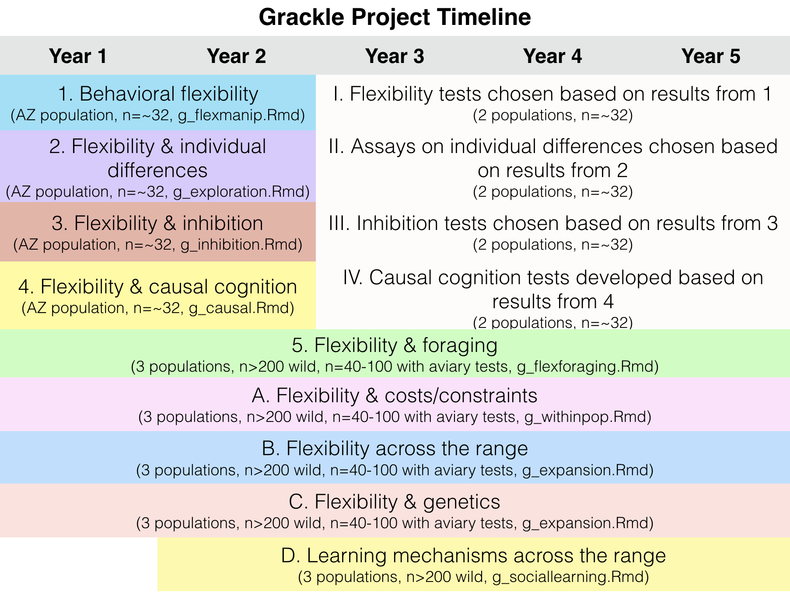

# Table of Contents

*Click the **title** of the preregistration you would like to see to be taken directly to that page. The **.Rmd** version is a version-tracked reproducible manuscript*

&ast; = undergraduate co-author

***Preregistrations: passed pre-study peer review at PCI Ecology***

1. Logan CJ, Rowney C, Bergeron L, Seitz B, Blaisdell A, Folsom M, Johnson-Ulrich Z, McCune K. 2017. **[Is behavioral flexibility manipulatable and, if so, does it improve flexibility and problem solving in a new context?](http://corinalogan.com/Preregistrations/g_flexmanip.html)** ([.Rmd](https://github.com/corinalogan/grackles/blob/master/Files/Preregistrations/g_flexmanip.Rmd) version) *PCI Ecology* ([pre-study peer review history](https://ecology.peercommunityin.org/public/rec?id=17&reviews=True))

2. McCune K, Rowney C, Bergeron L, Folsom M, Logan CJ. 2017. **[Is behavioral flexibility linked with exploration, but not boldness, persistence, or motor diversity?](http://corinalogan.com/Preregistrations/g_exploration.html)** ([.Rmd](https://github.com/corinalogan/grackles/blob/master/Files/Preregistrations/g_exploration.Rmd) version). *PCI Ecology* ([pre-study peer review history](https://ecology.peercommunityin.org/public/rec?id=29&reviews=True))

3. Logan CJ, Johnson-Ulrich Z, Bergeron L, Rowney C, Seitz B, Blaisdell A, McCune K, Folsom M, Wascher CAF. 2017. **[Are the more flexible individuals also better at inhibition?](http://corinalogan.com/Preregistrations/g_inhibition.html)** ([.Rmd](https://github.com/corinalogan/grackles/blob/master/Files/Preregistrations/g_inhibition.Rmd) version). *PCI Ecology* ([pre-study peer review history](https://ecology.peercommunityin.org/public/rec?id=32&reviews=True))

4. Blaisdell A, Johnson-Ulrich Z, Bergeron L, Rowney C, Seitz B, McCune K, Folsom M, Logan CJ. 2017. **[Do the more flexible individuals rely more on causal cognition? Observation versus intervention in casual inference in great-tailed grackles](http://corinalogan.com/Preregistrations/g_causal.html)**. ([.Rmd](https://github.com/corinalogan/grackles/blob/master/Files/Preregistrations/g_causal.Rmd) version). *PCI Ecology* ([pre-study peer review history](https://ecology.peercommunityin.org/public/rec?id=25&reviews=True))
   - Note: this preregistration is also at the [Open Science Framework](https://osf.io/g5tnh/) because it occurred before the GitHub repository was created. I posted the .Rmd file here at GitHub to implement version tracking. 

***Preregistrations***

*(Note: preregistrations 5-8 were reviewed as part of the [causal cognition preregistration peer review](https://ecology.peercommunityin.org/public/rec?id=25&reviews=True) by Reviewer 1)*

5. Logan CJ, Bergeron L, McCune K, Folsom M, Lukas D. 2017. **[Is behavioral flexibility related to foraging and social behavior in a rapidly expanding species?](http://corinalogan.com/Preregistrations/g_flexforaging.html)** ([.Rmd](https://github.com/corinalogan/grackles/blob/master/Files/Preregistrations/g_flexforaging.Rmd) version).

 - A. Logan CJ, Rowney C, Bergeron L, McCune K, Bond A, Trumble B, Blackwell A, Escalante A, Pacheco M. 2018. **[What are the costs and constraints of behavioral flexibility in great-tailed grackles?](http://corinalogan.com/Preregistrations/g_withinpop.html)** ([.Rmd](https://github.com/corinalogan/grackles/blob/master/Files/Preregistrations/g_withinpop.Rmd) version). 

 - B. Logan CJ, Rowney C, Bergeron L, McCune K, Bond A, Trumble B, Blackwell A, Escalante A, Pacheco M. 2018. **[How and why does behavioral flexibility vary across the range of a rapidly expanding species?](http://corinalogan.com/Preregistrations/g_expansion.html)** ([.Rmd](https://github.com/corinalogan/grackles/blob/master/Files/Preregistrations/g_expansion.Rmd) version). 

 - C. Logan CJ, Rowney C, Bergeron L, McCune K, Bond A, Blackwell A, Lukas D. 2018. **[The genetics of behavioral flexibility across the range of a rapidly expanding species](http://corinalogan.com/Preregistrations/g_flexgenes.html)**. ([.Rmd](https://github.com/corinalogan/grackles/blob/master/Files/Preregistrations/g_flexgenes.Rmd) version). 

 - D. McCune K, McElreath R, Logan CJ. 2017. **[Investigating the use of learning mechanisms in a species that is rapidly expanding its geographic range](http://corinalogan.com/Preregistrations/g_sociallearning.html)**. ([.Rmd](https://github.com/corinalogan/grackles/blob/master/Files/Preregistrations/g_sociallearning.Rmd) version). 
 
 - E. McCune KB, Folsom M, Ross C, Bergeron L, Logan CJ. 2019. **[Does great-tailed grackle space use behavior reflect individual differences in exploration?](http://corinalogan.com/Preregistrations/gspaceuse.html)** [.Rmd](https://github.com/corinalogan/grackles/blob/master/Files/Preregistrations/gspaceuse.Rmd)

 - F. &ast;Sevchik A, Logan CJ, Bergeron L, Blackwell A, Rowney C, Lukas D. 2019. **[Investigating sex differences in genetic diversity in great-tailed grackles in Tempe, Arizona to infer potential sex biases in dispersal](http://corinalogan.com/Preregistrations/gdispersal.html)**. ([.Rmd](https://github.com/corinalogan/grackles/blob/master/Files/Preregistrations/gdispersal.Rmd))

 - G. &ast;Berens JM, Logan CJ, Folsom M, Bergeron L, McCune KB. 2019. **[Validating morphological condition indices and their relationship with reproductive success in great-tailed grackles](http://corinalogan.com/Preregistrations/gcondition.html)**. ([.Rmd](https://github.com/corinalogan/grackles/blob/master/Files/Preregistrations/gcondition.Rmd))

*Note: full references are listed in [MyLibrary.bib](./Files/MyLibrary.bib)*

***Open Materials***

- [Multiaccess box](https://github.com/corinalogan/grackles/tree/master/Files/MultiaccessBoxDesignFiles) (3D printer and laser cutter) for [Is behavioral flexibility manipulatable and, if so, does it improve flexibility and problem solving in a new context?](https://github.com/corinalogan/grackles/blob/master/EasyToReadFiles/g_flexmanip.md)

 - [PsychoPy2 code](https://github.com/corinalogan/grackles/tree/master/Files/TouchscreenPsychoPy2code) for touchscreen experiments
 
 - How to modify the [bownet](https://gitlab.com/corinalogan/the-grackle-project/blob/master/README.md) trapping method and protocols to increase safety
 
 - Protocol: [nest checks](https://gitlab.com/corinalogan/the-grackle-project/blob/master/protocolNestCheck.pdf) to collect indicators of nest building, egg laying behavior, nestling and fledgling presence, and nest failure

- Protocol: [biometrics](https://gitlab.com/corinalogan/the-grackle-project/blob/master/protocolBiometrics.pdf)

# The Grackle Project

Many experiments will be conducted over the next several years and I post the **reproducible manuscripts** (.Rmd files including text and code) here. Each investigation (a group of hypotheses) has one .Rmd file that goes through different versions. It starts off as a **PREREGISTRATION** where I list the hypotheses, predictions, methods, and analysis plan BEFORE any data are collected. In most cases, the preregistration will undergo pre-study peer review at PCI Ecology, then the study will be conducted, and the resulting articles will undergo post-study peer review at PCI Ecology.

The version is noted in the Commit comment, and the different versions can be seen in the History of the file of interest. Following the version history of ONE file allows one to track how this piece of work has changed through the entire investigation.

# 5-year Project Overview

The same individuals will experience the experiments listed in each column (i.e., the same ~32 individuals in the left column (Years 1 and 2) will experience numbers 1-5 and A-D, and the same ~32 individuals in the right column (Years 3-5) will experience I-IV, plus number 5 and A-D). Year 1 started in September 2018.

### License

[CC-BY-SA 4.0](https://creativecommons.org/licenses/by-sa/4.0/legalcode): share alike and attribute the original source using the citations above

