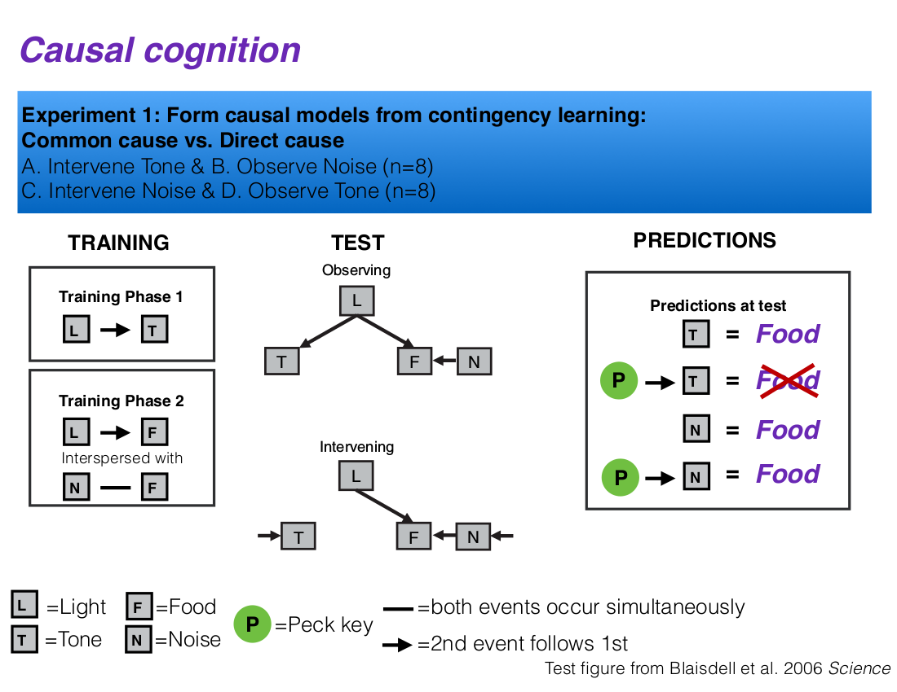
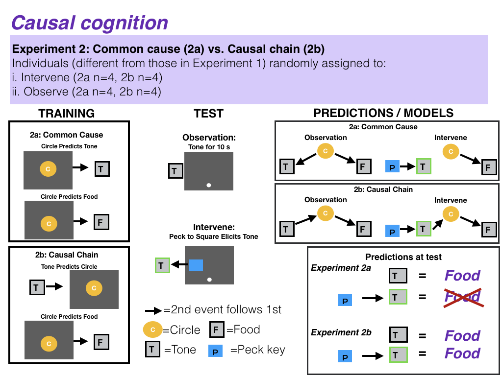

```{r setup, include=FALSE}
knitr::opts_chunk$set(echo = TRUE)
```

```{r}
library(knitr)
opts_chunk$set(tidy.opts=list(width.cutoff=60),tidy=TRUE)
```

###State of the data

This preregistration was written prior to collecting any data.

###Partitioning the results

We will present these results separately: 1) determining whether grackles have causal inference abilities, and 2) linking variation in performance on causal inference tasks to measures of flexibility.

###A. Hypothesis

####Individuals that are more [behaviorally flexible](./g_flexmanip.html), as measured by reversal learning and successfully switching between tasks on a multiaccess box, are better able to derive accurate causal inferences. This is because causal cognition may facilitate flexibility: an individual could be faster at solving new problems if it makes causal inferences about how the problem works, rather than relying solely on trial and error learning.

**Predictions:** Individuals that are faster to reverse preferences on a serial reversal learning task and who also have lower latencies to successfully solve new tasks after previously solved tasks become unavailable, perform better in two causal inference experiments. Specifically, the more flexible individuals are predicted to 

  - P1: form causal models from contingency learning: learn the causal maps between all pairwise events (visual and auditory cues and food delivered from a food dispenser), and integrate these individual maps into larger causal map structures, including a common-cause, two-effect map, and a direct cause-effect map

  - P2: behave as if intervention can influence the type of causal inference made at test, depending on which causal model is being tested: dissociate between seeing and doing as evidenced by a lower rate of pecking a key to release food when they had the opportunity to intervene in a common cause condition, while intervening on a direct cause will have no effect on key pecks.

Alternative 1: If there is no correlation between flexibility and performance on causal inference tasks, this suggests that learning about associations (on which the flexibility tasks are based) is different from learning about causal inferences.

Alternative 2: If there is a negative correlation between flexibility and performance on causal inference tasks, this suggests that some individuals may prefer to rely on information acquired previously (i.e., they are slow to reverse, but good at remembering prior information in causal inference tasks) rather than relying on current cues (e.g., the food is in a new location [flexibility], the light is absent in the test trials [causal inference]).





**Objective:** The aim is to determine whether grackles, like rats, derive predictions about the outcomes of interventions (actions) after passive observational learning of different kinds of causal models. This experiment adapts the procedure used by @blaisdell2006causal to study causal inference in rats for the study of causal inference in birds (e.g., pigeons and grackles) using a touchscreen. @blaisdell2006causal (see also @leising2008special) found that rats made different predictions about the presence of food based on a cue (a tone) depending on the causal relationship between them (direct cause or two effects of a common cause) and whether the tone was merely observed at test or had been caused by the subject’s own intervention (a lever press).
We wish to determine whether grackles can also form causal models from contingency learning, and if so, whether their intervention can influence the type of causal inference made at test, depending on which causal model is being tested.

###B. Methods

**Experiment 1**

At test, the grackles will receive four types of test. Half of the tests involve the presentation of the Tone and the Noise on separate trials. The other half of the tests involve trials on which when the grackle pecks at one of two novel response keys made available on the touchscreen, this is followed immediately by the presentation of the Tone (for one key) or the Noise (for the other key). Thus, these latter tests involve the grackle intervening on the Tone and the Noise. If grackles had formed the causal models shown in Figure 1, then they should expect food on test trials on which the Tone and the Noise are observed (but not intervened on). This is due to the causal inferences derived from observing a direct cause (Noise) of an effect (Food), or an effect (Tone) of a direct cause (Light) of the Food. We predict different expectation of food in the Intervention test trials, however. When the grackle intervenes on the Noise, they should still expect Food since the Noise is a direct cause of Food. When the grackle intervenes on the Tone, however, they should treat the Tone as caused by their own action (key peck) and thus discount the possibility that the Light had just occurred. By discounting the Light, they should also not expect Food. Thus, we expect less Food seeking on test trials on which grackles intervene on the Tone compared to the other three trial types. If causal inference is demonstrated in Experiment 1, we will begin Experiment 2.

**Experiment 2**

Grackles experience either common-cause training (as in Experiment 1) or causal-chain training, which is the same as the common-cause training except that the tone preceded the light during observational learning. At test, grackles in the Intervene condition hear a tone every time a key is pecked, whereas those in the Observe condition simply observe the tone. Both the Observe and Intervene grackles in the causal chain experiment should expect food after the tone. In contrast, grackles in the common cause experiment Observe condition should expect food if they hear the tone, but not those in the Intervene condition who have only experienced the light causing the tone or the food, but not the tone causing the light or the food.

**Assignment to conditions**

*Experiment 1:* Each individual will experience all four conditions in Experiment 1: 1) Intervene-Tone, 2) Intervene-Noise, 3) Observe-Tone, and 4) Observe-Noise. The Intervene condition will occur in one test session and the Observe condition in a separate test session, and the order will be counterbalanced across subjects.

*Experiment 2:* Individuals will be randomly assigned to Experiment 2a or 2b, and within Experiments 2a and 2b to one of two conditions: Observe or Intervene. 

To prevent their previous history with causal inference experiments from confounding the results, grackles that participated in Experiment 1 will not participate in Experiment 2 - new individuals will be selected for Experiment 2.

**The apparatus** 

A computer screen that the bird can interact with (peck) at will. There will be an automatic food dispenser below the screen, and speakers behind the screen to emit a tone or a noise.

####**Dependent variables**

1) The number of key pecks to the food delivery symbol (food key) on the touchscreen that releases food into the food dispenser

2) The number of key pecks to the novel stimulus (stimulus key) on the touchscreen

####**Independent variables**

####*Prediction 1: causal map*

1) Condition (Intervene Tone, Intervene Noise, Observe Tone, Observe Noise)

2) Average number of trials to reverse a preference ([reversal learning](./g_flexmanip.html))

3) Average latency to attempt to solve a new loci after solving a different loci ([multiaccess](./g_flexmanip.html))

4) ID (random effect because multiple measures per individual)

####*Prediction 2: common-cause vs causal chain*

1) Experiment (common cause, causal chain)

2) Condition (Intervene, Observe)

3) Average number of trials to reverse a preference ([reversal learning](./g_flexmanip.html))

4) Average latency to attempt to solve a new loci after solving a different loci ([multiaccess](./g_flexmanip.html))

5) ID (random effect because multiple measures per individual)

###C. Analysis Plan

Analyses will be conducted in R (current version `r getRversion()`; [@rcoreteam]). 

####*Data checking*

The data will be visually checked to determine whether they are normally distributed. Normality is indicated when the histograms of actual data match those with simulated data (Figure 2) [@zuur2009].

```{r dist_check1, eval=FALSE, warning=FALSE, results='asis', echo=TRUE, fig.cap="**Figure 2.** The distribution of the actual data versus what a normal distribution would look like with simulated data."}
cause <- read.csv ("/Users/corina/R/GrackleTestsYear1/Cognition/data_cause.csv", header=T, sep=",", stringsAsFactors=F) 

op <- par(mfrow=c(1,2), mar=c(4,4,2,0.2))
#Figure A-B. This is what the distribution of actual data looks like
hist(cause$KeyPecksFood, xlab="Number of food key pecks", main="Actual Data")
#Figure C-D. Given the actual data, this is what a normal distribution would look like
Y2 <- rnorm(1281, mean=mean(cause$KeyPecksFood), sd=sd(cause$KeyPecksFood))
hist(Y2, xlab="Number of food key pecks", main="Simulated Data")

op <- par(mfrow=c(1,2), mar=c(4,4,2,0.2))
#Figure E-F. This is what the distribution of actual data looks like
hist(cause$KeyPecksNovel, xlab="Number of stimulus key pecks", main="Actual Data")
#Figure G-H. Given the actual data, this is what a normal distribution would look like
Y2 <- rnorm(1281, mean=mean(cause$KeyPecksNovel), sd=sd(cause$KeyPecksNovel))
hist(Y2, xlab="Number of stimulus key pecks", main="Simulated Data")
```

####*Prediction 1: causal map*

**Analysis:** Because the independent variables could influence each other, we will analyze them in a single model: Generalized Linear Mixed Model (GLMM; MCMCglmm function, MCMCglmm package; [@hadfield2010mcmc]) with a Poisson distribution and log link using 13,000 iterations with a thinning interval of 10, a burnin of 3,000, and minimal priors (V=1, nu=0) [@hadfield2014coursenotes]. We will ensure the GLMM shows acceptable convergence (lag time autocorrelation values <0.01; [@hadfield2010mcmc]), and adjust parameters if necessary to meet this criterion. The contribution of each independent variable will be evaluated using the Estimate in the full model.

```{r cause1, eval=FALSE, warning=FALSE, results='asis', echo=TRUE, include=TRUE}
cause <- read.csv ("/Users/corina/R/GrackleTestsYear1/Cognition/data_cause.csv", header=T, sep=",", stringsAsFactors=F) 

#Select only data from Experiment 1
cause <- cause[cause$Experiment==1,]

#GLMM
library(MCMCglmm)
prior = list(R=list(R1=list(V=1,nu=0),R2=list(V=1,nu=0),R3=list(V=1,nu=0)), G=list(G1=list(V=1,nu=0)))

#GLMM with response variable = key pecks to the food key
cause1 <- MCMCglmm(KeyPecksFood ~ Condition + AvgTrialsReverse + AvgLatencySwitch, random=~ID, family="poisson", data=cause, verbose=F, prior=prior, nitt=130000, thin=10, burnin=30000)
summary(cause1)
#autocorr(cause1$Sol) #Did fixed effects converge?
#autocorr(cause1$VCV) #Did random effects converge?

#GLMM with response variable = key pecks to the stimulus key
cause1a <- MCMCglmm(KeyPecksNovel ~ Condition + AvgTrialsReverse + AvgLatencySwitch, random=~ID, family="poisson", data=cause, verbose=F, prior=prior, nitt=130000, thin=10, burnin=30000)
summary(cause1a)
#autocorr(cause1a$Sol) #Did fixed effects converge?
#autocorr(cause1a$VCV) #Did random effects converge?
```

####*Prediction 2: common-cause vs causal chain*

**Analysis:** Because the independent variables could influence each other, we will analyze them in a single model: Generalized Linear Mixed Model (GLMM; MCMCglmm function, MCMCglmm package; [@hadfield2010mcmc]) with a Poisson distribution and log link using 13,000 iterations with a thinning interval of 10, a burnin of 3,000, and minimal priors (V=1, nu=0) [@hadfield2014coursenotes]. We will ensure the GLMM shows acceptable convergence (lag time autocorrelation values <0.01; [@hadfield2010mcmc]), and adjust parameters if necessary to meet this criterion. The contribution of each independent variable will be evaluated using the Estimate in the full model.

```{r cause2, eval=FALSE, warning=FALSE, results='asis', echo=TRUE, include=TRUE}
cause <- read.csv ("/Users/corina/R/GrackleTestsYear1/Cognition/data_cause.csv", header=T, sep=",", stringsAsFactors=F) 

#Select only data from Experiment 2
cause <- cause[cause$Experiment=="2a" | cause$Experiment=="2b",]

#GLMM
library(MCMCglmm)
prior = list(R=list(R1=list(V=1,nu=0),R2=list(V=1,nu=0),R3=list(V=1,nu=0)), G=list(G1=list(V=1,nu=0)))

#GLMM with response variable = key pecks to the food key
cause2 <- MCMCglmm(KeyPecksFood ~ Condition + AvgTrialsReverse + AvgLatencySwitch, random=~ID, family="poisson", data=cause, verbose=F, prior=prior, nitt=13000, thin=10, burnin=3000)
summary(cause2)
#autocorr(cause2$Sol) #Did fixed effects converge?
#autocorr(cause2$VCV) #Did random effects converge?

#GLMM with response variable = key pecks to the stimulus key
cause2a <- MCMCglmm(KeyPecksNovel ~ Condition + AvgTrialsReverse + AvgLatencySwitch, random=~ID, family="poisson", data=cause, verbose=F, prior=prior, nitt=13000, thin=10, burnin=3000)
summary(cause2a)
#autocorr(cause2a$Sol) #Did fixed effects converge?
#autocorr(cause2a$VCV) #Did random effects converge?
```

####*Alternative Analyses*

Logan anticipates that she will want to run additional/different analyses after reading [@statrethinkingbook]. She will revise this preregistration to include these new analyses before conducting the analyses above.

###D. Planned Sample

Great-tailed grackles will be caught in the wild in Tempe, Arizona USA for individual identification (colored leg bands in unique combinations). Some individuals (16-40) will be brought temporarily into aviaries for testing, and then they will be released back to the wild. 

**Sample size rationale**

We will test as many birds as we can in the two years we have at this field site given that the birds participate in tests in aviaries only during the non-breeding season (September through February). The minimum sample size will be 8 birds per experiment (n=16 total), however we expect to be able to test many more.

**Data collection stopping rule**

We will stop testing birds in March 2019.

###E. Ethics

This research is carried out in accordance with permits from the:

1) US Fish and Wildlife Service (scientific collecting permit number MB76700A-0,1,2)
2) US Geological Survey Bird Banding Laboratory (federal bird banding permit number 23872)
3) Arizona Game and Fish Department (scientific collecting license number SP594338)
4) Institutional Animal Care and Use Committee at Arizona State University (protocol number 17-1594R)
5) University of Cambridge ethical review process (non-regulated use of animals in scientific procedures: zoo4/17)

###F. References