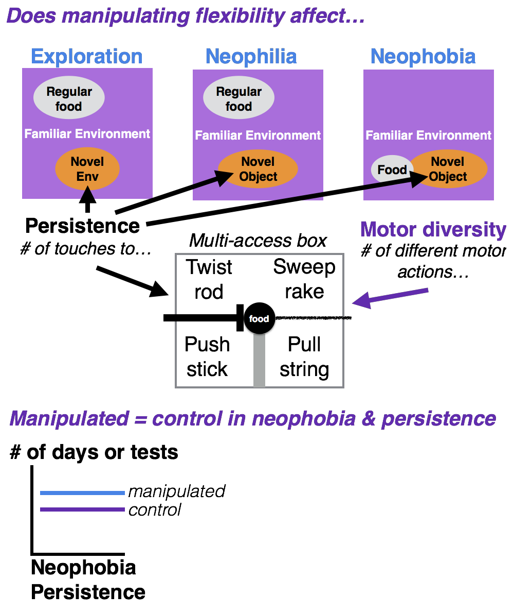

```{r setup, include=FALSE}
knitr::opts_chunk$set(echo = TRUE)
```

```{r}
library(knitr)
opts_chunk$set(tidy.opts=list(width.cutoff=60),tidy=TRUE)
```

###A. STATE OF THE DATA

This preregistration was written prior to collecting any data.

###B. PARTITIONING THE RESULTS

We may present the results from different hypotheses in separate papers.

###C. HYPOTHESES

####H1: [Behavioral flexibility](./g_flexmanip.html) is positively correlated with exploration and neophilia, but not other behaviors.

**Predictions 1-5:** Individuals in the experimental group where flexibility (as measured by reversal learning and on a multi-access box) was manipulated (and increased) will be more exploratory (P1; methods as in @mettke2009spatial) and more neophilic (P2; methods as in @mettke2009spatial) than individuals in the control group where flexibility was not increased, and there will be no difference between the groups in persistence (P3), neophobia (P4; methods as in @logan2016behavioral), or motor diversity (P5) (as found in @logan2016behavioral). 

**P1-P5 alternative:** If the flexibility manipulation does not work in that those individuals in the experimental condition are not more flexible than control individuals, then this experiment will elucidate whether general individual variation in flexibility relates to exploratory behaviors. The predictions are the same as above.

**P1 alternative 1:** There is a positive correlation between exploration and both dependent variables in reversal learning (one accounts for exploration in reversal learning [the ratio] and the other does not). This suggests that flexibility is not independent of exploration and could indicate that another trait is present, such as boldness.

**P1 alternative 2:** There is a positive correlation between exploration and one dependent variable, but not the other, in reversal learning. This indicates that exploration influences performance in reversal learning, but that flexibility is independent of exploration.

**P1 alternative 3:** There is no correlation between exploration and either dependent variable in reversal learning. This indicates that both dependent variables measure traits that are independent of exploration.

**P3 alternative 1:** There is a positive correlation between persistence and the number of incorrect choices in reversal learning before making the first correct choice. This indicates that individuals that are persistent in one context are also persistent in another context.

**P3 alternative 2:** There is no correlation between persistence and the number of incorrect choices in reversal learning before making the first correct choice. This indicates that flexibility is an independent trait. 



####H2: Individuals whose flexibility was increased through the manipulation do not differ from controls in their neophobia and persistence, potentially because flexibility is an independent trait.

Repeatability is indicated if the number of attempts to solve a task (persistence) strongly positively correlates within individuals across the different days on which the test occurs. The same definition is used for the neophobia test which is measured by the latency to land on a table next to a novel object.

**P6:** There is no repeatibility of persistence and neophobia within individuals, which could indicate that performance is state dependent (e.g., it depends on their fluctuating motivation, hunger levels, etc.) and/or reliant on the current context of the task at hand. 

**P6 alternative 1:** There is limited repeatability of persistence and neophobia within individuals, which could indicate that prior experience influences performance on tasks and facilitates the manipulation of these traits (e.g., individuals can change their behavior).  

**P6 alternative 2:** There is repeatibility of persistence and neophobia within individuals, which could indicate that it is a property of the individual (e.g., due to heritability or developmental effects).

###D. METHODS

####**Randomization and counterbalancing** 

There is no randomizing. The order of the three tasks will be counterbalanced across birds (using https://www.random.org to randomly assign individuals to one of three experimental orders). 

1/3 of the individuals will experience:

1. Exploration

2. Neophilia

3. Neophobia

1/3 of the individuals will experience:

1. Neophilia

2. Neophobia

3. Exploration

1/3 of the individuals will experience: 

1. Neophobia

2. Exploration

3. Neophilia

####**Blinding of conditions during analysis**

No blinding is involved in this study.

####**Dependent variables**

*P1-P5: flexibility correlates with exploration and neophilia?*

1) The **number of trials to reverse** a preference in the last reversal that individual participated in (an individual is considered to have a preference if it chose the rewarded option at least 17 out of the most recent 20 trials (with a minimum of 8 or 9 correct choices out of 10 on the two most recent sets of 10 trials)). See behavioral flexibility [preregistration](./g_flexmanip.html).

2) The **ratio of correct divided by incorrect trials** for the first 40 trials in their final reversal after the individual has seen the newly rewarded option once. These 40 trials include trials where individuals were offered the test and chose not to participate (i.e., make a choice). This accounts for flexibility that can occur when some individuals inhibit their previously rewarded preference (thus exhibiting flexibility because they changed their behavior when circumstances changed), but are not as exploratory as those who have fewer 'no choice' trials. 'No choice' data is data that is otherwise excluded from standard reversal learning analyses. Including 'no choice' trials, controls for individual differences in exploration because those that refuse to choose are not exploring new options, which would allow them to learn the new food location.

3) If the number of trials to reverse a preference does not positively correlate with the latency to attempt or solve new loci on the multi-access box (an additional measure of behavioral flexibility), then the **average latency to solve** and the **average latency to attempt** a new option on the multi-access box will be additional dependent variables. See behavioral flexibility [preregistration](./g_flexmanip.html).

All models will be run once per dependent variable.

*P3: does persistence correlate with reversal persistence?*

1) The number of incorrect choices in the final reversal before making the first correct choice

*P6: repeatability of neophobia and persistence*

1) Neophobia: Latency to land on the table - OR - Latency to eat the food - OR - Latency to touch a novel object that is next to food (I will choose the variable with the most data)

2) Persistence: Number of touches to an apparatus per time (multi-access box in the behavioral flexibility [preregistration](./g_flexmanip.html), novel sub-environment in P1, novel objects in P2 and P4)

####**Independent variables**

*P1: exploration*

1) Latency to enter a novel sub-environment inside a familiar environment

2) Time spent in each of the different sections inside the novel environment (pre-test: activity in familiar environment, experiment: activity in novel sub-environment)

3) Time spent exploring the outside of the novel environment (within 20cm) before entering it

*P2: neophilia*

4) Latency to land on the table next to an object (novel, familiar) (that does not contain food) in a familiar environment (that contains maintenance diet away from the object) - OR - latency to touch an object (novel, familiar) (choose the variable with the most data)

*P3: persistent*

5) Number of touches to the functional part of an apparatus per time (multi-access box, novel sub-environment in P1, novel objects in P2 and P4) 

6) Number of touches to the non-functional part of an apparatus per time ([multi-access box](./g_flexmanip.html)) 

*P4: neophobic*

7) Latency to land on the table - OR - Latency to eat the food - OR - Latency to touch a novel object that is next to food (choose the variable with the most data)

*P5: motor diversity*

8) Number of different motor actions used when attempting to solve the [multi-access box](./g_flexmanip.html) 

*Additional*

9) Age (adult: after hatch year, juvenile: hatch year). NOTE: this variable will be removed if only adults are tested.

10) ID

11) [Condition](./g_flexmanip.html): control, flexibility manipulation

*P3: does persistence correlate with reversal persistence?*

1) Average number of touches to the functional part of an apparatus per time ([multi-access box](./g_flexmanip.html), novel sub-environment in P1, novel objects in P2 and P4)

2) Condition: control, flexibility manipulation

*P6: repeatability of neophobia and persistence*

1) Day (neophobia) or test (persistence)

2) Condition: control, flexibility manipulation

3) ID (random effect because multiple measures per individual)

###E. ANALYSIS PLAN

I do not plan to **exclude** any data. When **missing data** occur, the existing data for that individual will be included in the analyses for the tests they completed. Analyses will be conducted in R (current version `r getRversion()`; [@rcoreteam]). 

####*Data checking*

The data will be visually checked to determine whether they are normally distributed via two methods: 1) normality is indicated when the histograms of actual data match those with simulated data (Figures 2, 4, 6, 8), and 2) normality is indicated when the residuals closely fit the dotted line in the Normal Q-Q plot (Figures 3, 5, 7, 9) [@zuur2009].

```{r dist_checkHist, eval=FALSE, warning=FALSE, results='asis', echo=TRUE, fig.cap="**Figure 2.** The distribution of the actual data versus what a normal distribution would look like with simulated data."}
#Check dependent variables for normality: Histograms
#Reversal learning
last <- read.csv ("/Users/corina/GTGR/data/data_reverselatency.csv", header=T, sep=",", stringsAsFactors=F) 

#Neophobia and persistence
neophobia <- read.csv ("/Users/corina/GTGR/data/data_neophobia.csv", header=T, sep=",", stringsAsFactors=F) 

op <- par(mfrow=c(2,4), mar=c(4,4,2,0.2))
#This is what the distribution of actual data looks like
hist(last$TrialsToReverseLast, xlab="Number of trials to reverse the last preference", main="Actual Data")
hist(last$NumberIncorrectTrialsReversal, xlab="Number of 'no choice' trials in the first reversal", main="Actual Data")
hist(neophobia$LatencyToLandOnTable, xlab="Latency to land on table", main="Actual Data")
hist(neophobia$NoObjectTouchesPerTime, xlab="Number of touches to an apparatus per time", main="Actual Data")

#Given the actual data, this is what a normal distribution would look like
W2 <- rnorm(1281, mean=mean(last$TrialsToReverseLast), sd=sd(last$TrialsToReverseLast))
hist(W2, xlab="No. trials reverse last preference", main="Simulated Data")

X2 <- rnorm(1281, mean=mean(last$NumberIncorrectTrialsReversal), sd=sd(last$NumberIncorrectTrialsReversal))
hist(X2, xlab="No. 'no choice' trials 1st reversal", main="Simulated Data")

Y2 <- rnorm(1281, mean=mean(neophobia$LatencyToLandOnTable), sd=sd(neophobia$LatencyToLandOnTable))
hist(Y2, xlab="Latency table", main="Simulated Data")

Z2 <- rnorm(1281, mean=mean(neophobia$NoObjectTouchesPerTime), sd=sd(neophobia$NoObjectTouchesPerTime))
hist(Z2, xlab="No. touches apparatus/time", main="Simulated Data")
```

```{r dist_checkQQ, eval=FALSE, warning=FALSE, results='asis', echo=TRUE, fig.cap="**Figure 3.** Residuals vs fitted: checking for homogeneity, which is satisfied if residuals have an even spread across the x-axis; Normal Q-Q: residuals are normally distributed if they are on the diagonal line; Residuals vs leverage: Cook's distance <1 means no influential observations [@zuur2009]."}
#Check dependent variables for normality: Q-Q plots
#Reversal learning
last <- read.csv ("/Users/corina/GTGR/data/data_reverselatency.csv", header=T, sep=",", stringsAsFactors=F) 

#Neophobia and persistence
neophobia <- read.csv ("/Users/corina/GTGR/data/data_neophobia.csv", header=T, sep=",", stringsAsFactors=F) 

op <- par(mfrow=c(4,4), mar=c(4,4,2,0.2))
plot(glm(last$TrialsToReverse~last$LatencyNovelEnvExploration)) 
plot(glm(last$NumberIncorrectTrialsReversal~last$LatencyNovelEnvExploration)) 
plot(glm(neophobia$LatencyToLandOnTable~neophobia$Day)) 
plot(glm(neophobia$NoObjectTouchesPerTime~neophobia$Day)) 
```

If the data do not appear normally distributed, visually check the residuals. If they are patternless, then assume a normal distribution (Figure 4) [@zuur2009].

```{r dist_checkResid, eval=FALSE, warning=FALSE, results='asis', echo=TRUE, fig.cap="**Figure 4.** Visual check of the residuals."}
#Check the dependent variables for normality: Residuals
#Reversal learning
last <- read.csv ("/Users/corina/GTGR/data/data_reverselatency.csv", header=T, sep=",", stringsAsFactors=F) 

#Neophobia and persistence
neophobia <- read.csv ("/Users/corina/GTGR/data/data_neophobia.csv", header=T, sep=",", stringsAsFactors=F) 

op <- par(mfrow=c(2,2), mar=c(4,4,2,0.2))
plot(residuals(glm(last$TrialsToReverse~last$LatencyNovelEnvExploration)), ylab="Reverse: Trials to reverse ~ Latency novel env.") 
plot(residuals(glm(last$NumberIncorrectTrialsReversal~last$LatencyNovelEnvExploration)), ylab="Reverse: No. incorrect ~ Latency novel env.") 
plot(residuals(glm(neophobia$LatencyToLandOnTable~neophobia$Day)), ylab="Neophobia: Latency table ~ Day")
plot(residuals(glm(neophobia$NoObjectTouchesPerTime~neophobia$Day)), ylab="Neophobia: No. object touches/time ~ Day")
```

####*P1-P5: flexibility correlates with exploration and neophilia?*

**Analysis:** Because the independent variables could influence each other, I will analyze them in a single model: Generalized Linear Mixed Model (GLMM; MCMCglmm function, MCMCglmm package; [@hadfieldMCMCglmmpackage]) with a Poisson distribution and log link using 13,000 iterations with a thinning interval of 10, a burnin of 3,000, and minimal priors (V=1, nu=0) [@hadfield2014coursenotes]. I will ensure the GLMM shows acceptable convergence (lag time autocorrelation values <0.01; [@hadfieldMCMCglmmpackage]), and adjust parameters if necessary. The contribution of each independent variable will be evaluated using the Estimate in the full model. 

```{r explore, eval=FALSE, warning=FALSE, results='asis', echo=TRUE, include=TRUE}
explore <- read.csv ("/Users/corina/GTGR/data/data_explore.csv", header=T, sep=",", stringsAsFactors=F) 

#GLMM - dependent variable = number of trials to reverse in the last reversal
library(MCMCglmm)
prior = list(R=list(R1=list(V=1,nu=0),R2=list(V=1,nu=0),R3=list(V=1,nu=0),R4=list(V=1,nu=0),R5=list(V=1,nu=0),R6=list(V=1,nu=0),R7=list(V=1,nu=0),R8=list(V=1,nu=0),R9=list(V=1,nu=0),R10=list(V=1,nu=0),R11=list(V=1,nu=0)), G=list(G1=list(V=1,nu=0),G2=list(V=1,nu=0))) 

expl1 <- MCMCglmm(AvgTrialsToReverse ~ Condition * TimeOutsideNovelEnv * LatencyNovelEnv * AverageTimePerSectionNovelEnv * TotalNumberSectionsNovelEnv * LatencyTableObjectNeophilia * MultiaccessTouchesPerTime * LatencyObjectNeophobia * NoMotorActions * ID, random=~ID+Batch, family="poisson", data=explore, verbose=F, prior=prior, nitt=13000, thin=10, burnin=3000)
summary(expl1)
autocorr(expl1$Sol) #Did fixed effects converge?
autocorr(expl1$VCV) #Did random effects converge?

#GLMM - dependent variable = ratio of correct divided by incorrect trials for first 40 trials of final reversal after making the first correct choice

expl2 <- MCMCglmm(Ratio40 ~ Condition * TimeOutsideNovelEnv * LatencyNovelEnv * AverageTimePerSectionNovelEnv * TotalNumberSectionsNovelEnv * LatencyTableObjectNeophilia * MultiaccessTouchesPerTime * LatencyObjectNeophobia * NoMotorActions * ID, random=~ID+Batch, family="poisson", data=explore, verbose=F, prior=prior, nitt=13000, thin=10, burnin=3000)

summary(expl2)
autocorr(expl2$Sol) #Did fixed effects converge?
autocorr(expl2$VCV) #Did random effects converge?
```

####*P3: does persistence correlate with reversal persistence?*

**Analysis:** Generalized Linear Model (GLM; glm function, stats package) with a Poisson distribution and log link.

```{r persist2, eval=FALSE, warning=FALSE, results='asis', echo=TRUE, include=TRUE}
persist2 <- read.csv ("/Users/corina/GTGR/data/data_reverselatency.csv", header=T, sep=",", stringsAsFactors=F) 

#GLM
p2 <- glm(NumberIncorrectTrialsReversal ~ AvgFunctionalTouchesExploration * Condition, family="poisson", data=persist2)
#summary(p2)

sp2 <- summary(p2)
library(xtable)
sp2.table <- xtable(sp2)
library(knitr)
kable(sp2.table, caption="Table 2: Model selection output.", format="html", digits=2)

#Model Validation
library(MuMIn)
options(na.action = "na.fail")
base1 <- dredge(glm(NumberIncorrectTrialsReversal ~ AvgFunctionalTouchesExploration * Condition, family="poisson", data=persist2))
library(knitr)
kable(base1, caption="Table 3: Model selection output.")
```

**Model validation:** Determine whether the test model results are likely to be reliable given the data [@burnham2003model]. Compare Akaike weights (range: 0–1, the sum of all model weights equals 1; Akaike, 1981) between the test model and a base model (number of trials to reverse as the response variable and 1 as the explanatory variable) using the dredge function in the MuMIN package [@bates2012lme4]. If the best fitting model has a high Akaike weight (>0.89; [@burnham2003model]), then it indicates that the results are likely given the data. The Akaike weights indicate the best fitting model is the [base/test *- delete as appropriate*] model (Table 2).

####*P6: repeatability of neophobia and persistence*

**Analysis:** To calculate repeatability, I will run a GLMM (R package: lme4, function: lmer, @lme4) where each individual has a random intercept (i.e., ID is a random effect). To obtain the repeatability estimate, which indicates how much of the total variance after accounting for fixed effects is explained by individual differences (ID), the estimate for ID is divided by the sum of the estimates of all random effects and residual variance (as in @houslay2016). The model is then run in lmerTest (@lmerTest) to determine whether the random effect (ID) is statistically significant (p<0.05). 

```{r repeatableNeo, eval=FALSE, warning=FALSE, results='asis', echo=TRUE, include=TRUE}
#Neophobia
neo <- read.csv ("/Users/corina/GTGR/data/data_neophobia.csv", header=T, sep=",", stringsAsFactors=F) 

#How to calculate repeatability following advice from Tom Houslay's blog http://rpubs.com/tomhouslay/200150
#GLMM
library(lme4)
neop <- lmer(LatencyToFeed ~ Day * Condition + (1|ID), data=neo)

#"we can also calculate the conditional repeatability easily - in terms of how much of the total phenotypic variance (after accounting for fixed effects) is explained by differences between individuals" http://rpubs.com/tomhouslay/200150
library(tidyr)
library(broom)
tneop <- tidy(neop,effects="ran_pars",scales="vcov")
tneop[tneop$group=="ID",]$estimate/(sum(tneop$estimate)) #this gives a number called Repeatability

#To see whether ID is signficant (and, by proxy, repeatability), run lmerTest
library(lmerTest)
rand(neop)
detach(package:lmerTest)
```

```{r repeatablePer, eval=FALSE, warning=FALSE, results='asis', echo=TRUE, include=TRUE}
#Persistence
per <- read.csv ("/Users/corina/GTGR/data/data_persist.csv", header=T, sep=",", stringsAsFactors=F) 

#How to calculate repeatability following advice from Tom Houslay's blog http://rpubs.com/tomhouslay/200150
#GLMM
library(lme4)
pers <- lmer(NoTouches ~ Test * Condition + (1|ID), data=per)

#"we can also calculate the conditional repeatability easily - in terms of how much of the total phenotypic variance (after accounting for fixed effects) is explained by differences between individuals" http://rpubs.com/tomhouslay/200150
library(tidyr)
library(broom)
tpers <- tidy(pers,effects="ran_pars",scales="vcov")
tpers[tpers$group=="ID",]$estimate/(sum(tpers$estimate)) #this gives a number called Repeatability

#To see whether ID is signficant (and, by proxy, repeatability), run lmerTest
library(lmerTest)
rand(pers)
detach(package:lmerTest)
```

####*Alternative Analyses*

I anticipate that I will want to run additional/different analyses after reading @statrethinkingbook. I will revise this preregistration to include these new analyses before conducting the analyses above.

###F. PLANNED SAMPLE

Great-tailed grackles will be caught in the wild in Tempe, Arizona USA for individual identification (colored leg bands in unique combinations). Some individuals (~40) will be brought temporarily into aviaries for testing, and then they will be released back to the wild.

**Sample size rationale**

I will test as many birds as I can in two years at this field site given that the birds only participate in tests in aviaries during the non-breeding season (September through February). The minimum sample size will be 16, however I expect to be able to test many more.

**Data collection stopping rule**

I will stop testing birds in March 2019.

###G. ETHICS

This research is carried out in accordance with permits from the:

1) US Fish and Wildlife Service (scientific collecting permit number MB76700A-0,1,2)
2) US Geological Survey Bird Banding Laboratory (federal bird banding permit number 23872)
3) Arizona Game and Fish Department (scientific collecting license number SP594338 [2017] and SP606267 [2018])
4) Institutional Animal Care and Use Committee at Arizona State University (protocol number 17-1594R)
5) University of Cambridge ethical review process (non-regulated use of animals in scientific procedures: zoo4/17)

###F. AUTHOR CONTRIBUTIONS

**Logan:** Hypothesis development, data collection, data analysis and interpretation, write up, materials/funding.

**Johnson-Ulrich:** Data collection, data interpretation, revising/editing.

**Bergeron:** Data collection, data interpretation, revising/editing.

###H. FUNDING

This research is funded by the Department of Human Behavior, Ecology and Culture at the Max Planck Institute for Evolutionary Anthropology, and by a Leverhulme Early Career Research Fellowship to Logan.

###I. ACKNOWLEDGEMENTS

We thank Dieter Lukas for help polishing the hypotheses; Ben Trumble for hosting the grackle project at Arizona State University (providing office and lab space); Melissa Wilson Sayres for sponsoring our affiliations at Arizona State University and lending lab equipment; Kristine Johnson for technical advice on great-tailed grackles; Jay Taylor for grackle scouting at Arizona State University; and Arizona State University School of Life Sciences Department Animal Care and Technologies for providing space for our aviaries and for their excellent support of our daily activities.

###J. REFERENCES
