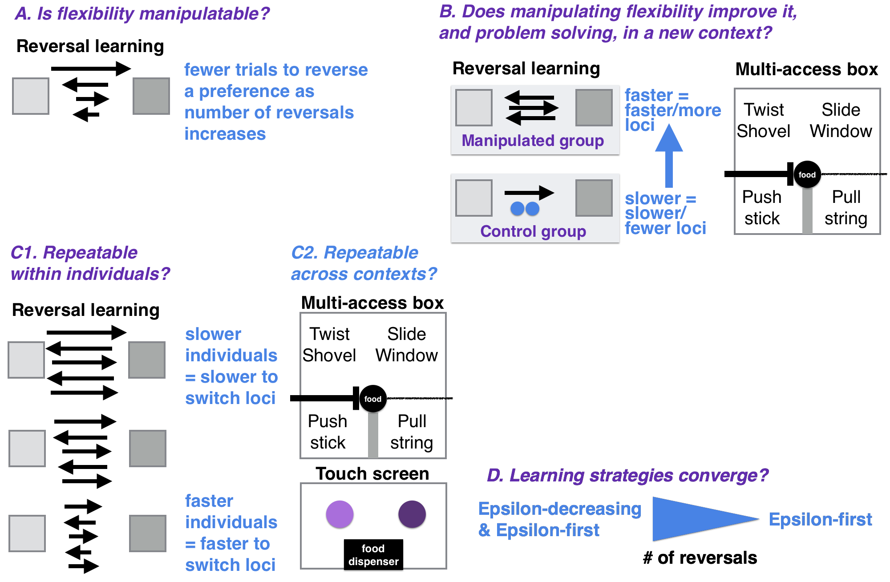

```{r setup, include=FALSE}
knitr::opts_chunk$set(echo = TRUE)
```

```{r}
#Make code wrap text so it doesn't go off the page when Knitting to PDF
library(knitr)
opts_chunk$set(tidy.opts=list(width.cutoff=60),tidy=TRUE)
```

###A. STATE OF THE DATA

This preregistration was written prior to collecting data. Pilot data on serial reversal learning (using color tubes) in one grackle was collected January through April 2018, which informed the revision of 1) the criterion to pass serial reversal learning, 2) more accurate language for H1 P1 (they generally get faster rather than getting faster with each reversal), 3) the removal of shape reversals from H3a and H3b (to reduce the amount of time each bird is tested), and 4) a new passing criterion for touch screen serial reversals in H3b.

###B. PARTITIONING THE RESULTS

We may present the different hypotheses in separate papers.

###C. HYPOTHESES

#### H1: Behavioral flexibility, as measured by reversal learning, is manipulatable.

**Prediction 1:** Individuals improve their flexibility on a serial reversal learning task by generally requiring fewer trials to reverse a preference as the number of reversals increases. 

**P1 alternative 1:** If the number of trials to reverse a preference does not correlate with or positively correlates with reversal number, this suggests that some individuals may prefer to rely on information acquired previously (i.e., they are slow to reverse) rather than relying on current cues (e.g., the food is in a new location).

#### H2: Manipulating behavioral flexibility (improving reversal learning speed through serial reversals) improves flexibility (rule switching) and problem solving in a new context.

**P2:** Individuals that have improved their flexibility on a serial reversal learning task (requiring fewer trials to reverse a preference as the number of reversals increases) are faster to switch between new methods of solving (latency to solve or attempt to solve a new loci), and learn more new loci (higher total number of solved loci) on a multi-access box flexibility task. The negative correlation across contexts indicates that both tests measure the same ability even though the multi-access box requires inventing new rules while reversal learning requires switching between two rules. Serial reversals eliminate the confounds of exploration, inhibition, and persistence in explaining reversal learning speed because, after multiple reversals, what is being measured is the ability to learn the rule to switch when the previously rewarded option no longer contains a reward. If the manipulation works, this indicates that flexibility can be influenced by previous experience and might indicate that any individual has the potential to move into new environments.

**P2 alternative 1:** If the manipulation does not work in that those individuals in the experimental condition do not decrease their reversal speeds more than control individuals, then this experiment will elucidate whether general individual variation in flexibility relates to flexibility in a new context as well as problem solving ability. The prediction is the same in P2, but in this case variation in flexibility is constrained by traits inherent to the individual, which suggests that certain individuals will be more likely to move into new environments.

**P2 alternative 2:** If there is no correlation between reversal learning speed and the latency to solve/attempt a new loci on the multi-access box, this could be because the latency to solve not only measures flexibility but also innovativeness. In this case, an additional analysis will be run with the latency to solve as the response variable, to determine whether the fit of the model (as determined by Akaike weights) with reversal learning as an explanatory variable is improved if motor diversity (the number of different motor actions used when attempting to solve the multi-access box) is included as an explanatory variable. If the inclusion of motor diversity improves the model fit, then this indicates that the latency to solve a new loci on the multi-access box is influenced by flexibility (reversal learning speed) and innovation (motor diversity). 



#### H3a: Behavioral flexibility within a context is repeatable within individuals.

Repeatibility of behavioral flexibility is defined as the number of trials to reverse a color preference being strongly negatively correlated within individuals with the number of reversals.

**P3a:** Individuals that are faster to reverse a color preference in the first reversal will also be faster to reverse a color preference in the second, etc. reversal due to natural individual variation.

**P3a alternative:** There is no repeatibility in behavioral flexibility within individuals, which could indicate that performance is state dependent (e.g., it depends on their fluctuating motivation, hunger levels, etc.). 

#### H3b: The consistency of behavioral flexibility in individuals across contexts (context 1=reversal learning, context 2=multi-access box, context 3=touch screen) indicates their ability to generalize across contexts.

Individual consistency of behavioral flexibility is defined as the number of trials to reverse a color preference being strongly positively correlated within individuals with the latency to solve new loci on the multi-access box and with the number of trials to reverse a color preference on a touch screen (total number of touch screen reversals = 5 per bird).

*If P3a is supported (repeatability of flexibility within individuals)...*

**P3b:** ...and flexibility is correlated across contexts, then the more flexible individuals are better at generalizing across contexts.

**P3b alternative 1:** ...and flexibility is not correlated across contexts, then there is something that influences an individual's ability to discount cues in a given context. This could be the individual's reinforcement history, their reliance on particular learning strategies, or their motivation to engage with a particular task (e.g., difficulty level of the task). 

#### H4: Individuals should converge on an epsilon-first learning strategy (learn the correct choice after one trial) as they progress through serial reversals.

**P4:** Individuals will prefer a mixture of learning strategies in the first serial reversals (an *epsilon-decreasing* strategy where individuals explore both options extensively before learning to prefer the rewarded option, and an *epsilon-first* strategy where the correct choice is consistently made after the first trial), and then move toward the epsilon-first learning strategy. The epsilon-first strategy works better later in the serial reversals where the reward is all or nothing because individuals will have learned the environment is changing in predictable ways [@bergstrom2004shannon]: only one option is consistently rewarded, and if the reward isn't in the previously rewarded option, it must be in the other option.

###D. METHODS

####**Randomization and counterbalancing** 

H1: Subjects will be randomly assigned to the manipulated or control group. In the reversal learning trials, the rewarded option is pseudorandomized for side (and the option on the left is always placed first). Pseudorandomization consisted of alternating location for the first two trials of a session and then keeping the same color on the same side for at most two consecutive trials thereafter. A list of all 88 unique trial sequences for a 10-trial session, following the pseudorandomization rules, will be generated in advance for experimenters to use during testing (e.g., a randomized trial sequence might look like: LRLLRRLRLR, where L and R refer to the location, left or right, of the rewarded tube). Randomized trial sequences will be assigned randomly to any given 10-trial session using a random number generator (random.org) to generate a number from 1-88.


####**Blinding of conditions during analysis**

No blinding is involved in this study.

####**Dependent variables**

*P1-P3*

Number of trials to reverse a preference. An individual is considered to have a preference if it chose the rewarded option at least 17 out of the most recent 20 trials (with a minimum of 8 or 9 correct choices out of 10 on the two most recent sets of 10 trials).

*P2 alternative 2: additional analysis: latency and motor diversity*

1) Latency to attempt to solve a new loci on the multi-access box.

2) Latency to solve a new loci on the multi-access box.

*P4: learning strategies* 

Proportion of correct choices in a non-overlapping sliding window of 4-trial bins across the total number of trials required to reach the criterion of 17/20 correct choices (as in P1-P3).

####**Independent variables**

####*P1: reversal speed gets faster with serial reversals*

1) Reversal number

2) Batch

3) ID (random effect because repeated measures on the same individuals)

####*P2: serial reversals improve rule switching & problem solving*

1) Average latency to attempt to solve a new loci after solving a different loci

2) Average latency to solve a new loci after solving a different loci

3) Total number of loci solved

4) Experimental group (manipulated=multiple reversals with color stimuli; control=one reversal plus equalized experience making choices where both are the same color and both contain a reward)

5) Batch

####*P2 alternative 2: additional analysis: latency and motor diversity*

1) Number of trials to reverse a preference in the last reversal that individual participated in

2) Motor diversity: the number of different motor actions used when attempting to solve the multi-access box

####*P3a: repeatable within individuals within a context (reversal learning)*

1) Reversal number

2) ID

####*P3b: repeatable across contexts*

1) Reversal number

2) Condition (color tubes, multi-access box, touch screen)

3) Average latency to solve a new locus

4) ID

####*P4: serial reversal learning strategy*

1) Trial number

2) ID

###E. ANALYSIS PLAN

We do not plan to **exclude** any data. When **missing data** occur, the existing data for that individual will be included in the analyses for the tests they completed. Analyses will be conducted in R (current version `r getRversion()`; @rcoreteam). 

####*Data checking*

The data will be visually checked to determine whether they are normally distributed via two methods: 1) normality is indicated when the histograms of actual data match those with simulated data (Figure 2), and 2) normality is indicated when the residuals closely fit the dotted line in the Normal Q-Q plot (Figure 3) [@zuur2009].

```{r dist_checkHist, eval=FALSE, warning=FALSE, results='asis', echo=TRUE, fig.cap="**Figure 2.** The distribution of the actual data versus what a normal distribution would look like with simulated data."}
#Check the dependent variables for normality: Histograms
#Trials to reverse
reverse <- read.csv ("/Users/corina/GTGR/data/data_reverse.csv", header=T, sep=",", stringsAsFactors=F) 

#Latency to attempt/solve a new loci
diversity <- read.csv ("/Users/corina/GTGR/data/data_reversemulti.csv", header=T, sep=",", stringsAsFactors=F) 

op <- par(mfrow=c(2,3), mar=c(4,4,2,0.2))
#This is what the distribution of actual data looks like
hist(reverse$TrialsToReverse, xlab="Number of trials to reverse a preference", main="Actual Data")
hist(diversity$AvgLatencyAttemptNewLoci, xlab="Latency to attempt a new loci (s)", main="Actual Data")
hist(diversity$AvgLatencySolveNewLoci, xlab="Latency to solve a new loci (s)", main="Actual Data")

#Given the actual data, this is what a normal distribution would look like
X2 <- rnorm(1281, mean=mean(reverse$TrialsToReverse), sd=sd(reverse$TrialsToReverse))
hist(X2, xlab="Number of trials to reverse a preference", main="Simulated Data")

Y2 <- rnorm(1281, mean=mean(diversity$AvgLatencyAttemptNewLoci), sd=sd(diversity$AvgLatencyAttemptNewLoci))
hist(Y2, xlab="Latency to attempt a new loci (s)", main="Simulated Data")

Z2 <- rnorm(1281, mean=mean(diversity$AvgLatencySolveNewLoci), sd=sd(diversity$AvgLatencySolveNewLoci))
hist(Z2, xlab="Latency to solve a new loci (s)", main="Simulated Data")

```

```{r dist_check2, eval=FALSE, warning=FALSE, results='asis', echo=TRUE, fig.cap="**Figure 3.** Residuals vs fitted: checking for homogeneity, which is satisfied if residuals have an even spread across the x-axis; Normal Q-Q: residuals are normally distributed if they are on the diagonal line; Residuals vs leverage: Cook's distance <1 means no influential observations [@zuur2009]. Top row = Trials to reverse, bottom row = Latency to solve a new loci"}
#Check the dependent variables for normality: Q-Q plot
#Trials to reverse
reverse <- read.csv ("/Users/corina/GTGR/data/data_reverse.csv", header=T, sep=",", stringsAsFactors=F) 

#Latency to attempt/solve a new loci
diversity <- read.csv ("/Users/corina/GTGR/data/data_reversemulti.csv", header=T, sep=",", stringsAsFactors=F) 

#Figure 2. Visual check of the Normal Q-Q plot
op <- par(mfrow=c(2,4), mar=c(4,4,2,0.2))
plot(glm(reverse$TrialsToReverse~reverse$ReverseNumber)) 
plot(glm(diversity$AvgLatencySolveNewLoci~diversity$AvgLatencyAttemptNewLoci)) 
```

If the data do not appear normally distributed, visually check the residuals. If they are patternless, then assume a normal distribution (Figure 4) [@zuur2009].

```{r dist_checkResid, eval=FALSE, warning=FALSE, results='asis', echo=TRUE, fig.cap="**Figure 4.** Visual check of the residuals."}
#Check the dependent variables for normality: Residuals
detour <- read.csv ("/Users/corina/GTGR/data/data_detour.csv", header=T, sep=",", stringsAsFactors=F) 

#Trials to reverse
reverse <- read.csv ("/Users/corina/GTGR/data/data_reverse.csv", header=T, sep=",", stringsAsFactors=F) 

#Latency to attempt/solve a new loci
diversity <- read.csv ("/Users/corina/GTGR/data/data_reversemulti.csv", header=T, sep=",", stringsAsFactors=F) 

#Figure 3. Visual check of the residuals
op <- par(mfrow=c(1,2), mar=c(4,4,2,0.2))
plot(residuals(glm(reverse$TrialsToReverse~reverse$ReverseNumber)), ylab="Reverse residuals: Trials to reverse ~ Reverse number")
plot(residuals(glm(diversity$AvgLatencySolveNewLoci~diversity$AvgLatencyAttemptNewLoci)), ylab="Multi-access residuals: Avg solve latency ~ Avg attempt latency")
```

####*Determining the threshold: How many reversals are enough?*

We initially (in 2017) set this as the passing criterion: During the data collection period, the number of trials required to reverse a preference will be documented per bird, and reversals will continue until the first batch of birds tested reaches an asymptote (i.e., there are negligible further decreases in the number of trials required to reverse a preference). The number of reversals to reach the asymptote will be the number of reversals that subsequent birds experience.

Due to delays in setting up the field site, we were only able to test two grackles in early 2018 (January through April) and, due to randomization, only one (Fajita) was in the experimental condition that involved undergoing the flexibility manipulation (Empanada was in the control condition). While Fajita's reversal speeds generally improved with increasing serial reversals, she never reached an asymptote (which we defined as passing three consecutive reversals in the same number of trials), even after 38 reversals. These 38 reversals took 2.5 months, which is an impractical amount of time if birds are to participate in the rest of the test battery after undergoing the reversal manipulation (we are permitted to keep them in aviaries for up to three months per bird). Because our objective in this experiment is to manipulate an individual's flexibility, we decided to revise our serial reversal passing criterion to something more species relevant based on Fajita's serial reversal performance and the performance of seven grackles in Santa Barbara who underwent only one reversal in 2014 and 2015 [@logan2016behavioral]. **The revised serial reversal passing criterion is: passing two sessions in a row at or under 50 trials**. 50 trials is fewer trials than any of the nine grackles required to pass their first reversal (range 70-130), therefore it should reflect an improvement in flexibility.

####*P1: negative relationship between the number of trials to reverse a preference and the number of reversals?*

**Analysis:** Generalized Linear Model (GLM; glm function, stats package) with a Poisson distribution and log link.

```{r serial, eval=FALSE, warning=FALSE, results='asis', echo=TRUE, include=TRUE}
serial <- read.csv ("/Users/corina/GTGR/data/data_reverse.csv", header=T, sep=",", stringsAsFactors=F) 

#GLM
serial1 <- glm(TrialsToReverse ~ ReverseNumber, family="poisson", data=serial)
#summary(serial1)

sserial1 <- summary(serial1)
library(xtable)
sserial1.table <- xtable(sserial1)
library(knitr)
kable(sserial1.table, caption="Table 1: Model selection output.", format="html", digits=2)

#Model Validation
library(MuMIn)
options(na.action = "na.fail")
base1 <- dredge(glm(TrialsToReverse ~ ReverseNumber, family="poisson", data=serial))
library(knitr)
kable(base1, caption="Table 2: Model selection output.")
```

**Model validation:** Determine whether the test model results are likely to be reliable given the data [@burnham2003model]. Compare Akaike weights (range: 0–1, the sum of all model weights equals 1; Akaike, 1981) between the test model and a base model (number of trials to reverse as the response variable and 1 as the explanatory variable) using the dredge function in the MuMIN package [@bates2012lme4]. If the best fitting model has a high Akaike weight (>0.89; [@burnham2003model]), then it indicates that the results are likely given the data. The Akaike weights indicate the best fitting model is the [base/test *- delete as appropriate*] model (Table 2).


####*P2: serial reversal improves rule switching & problem solving*

**Analysis:** Because the independent variables could influence each other, I will analyze them in a single model: Generalized Linear Model (GLM; glm function, stats package) with a Poisson distribution and log link. The contribution of each independent variable will be evaluated using the Estimate in the full model.

```{r improves, eval=FALSE, warning=FALSE, results='asis', echo=TRUE, include=TRUE}
improve <- read.csv ("/Users/corina/GTGR/data/data_reversemulti.csv", header=T, sep=",", stringsAsFactors=F) 

#GLM
imp <- glm(AvgTrialsToReverse ~ ExperimentalGroup + AvgLatencySolveNewLoci + AvgLatencyAttemptNewLoci+ TotalLoci + Batch, family="poisson", data=improve)
simp <- summary(imp)
library(xtable)
simp.table <- xtable(simp)
library(knitr)
kable(simp.table, caption="Table 3: Model selection output.", format="html", digits=2)
```

**P2 alternative 2: additional analysis: latency and motor diversity** Generalized Linear Model (GLM; glm function, stats package) with a Poisson distribution and log link. The best-fitting model will be determined by comparing Akaike weights: this will show whether the best-fitting model results are likely to be reliable given the data [@burnham2003model]. Compare Akaike weights (range: 0–1, the sum of all model weights equals 1; Akaike, 1981) between the test model and a base model (number of trials to reverse as the response variable and 1 as the explanatory variable) using the dredge function in the MuMIN package [@bates2012lme4]. If the best fitting model has a high Akaike weight (>0.89; [@burnham2003model]), then it indicates that the results are likely given the data. The Akaike weights indicate the best fitting model is the [base/test *- delete as appropriate*] model (Table 5).

```{r diversity1, eval=FALSE, warning=FALSE, results='asis', echo=TRUE, include=TRUE}
#Latency to attempt to solve a new loci
diversity <- read.csv ("/Users/corina/GTGR/data/data_reversemulti.csv", header=T, sep=",", stringsAsFactors=F) 

#GLM
div <- glm(AvgLatencySolveNewLoci ~ TrialsToReverseLast + NumberMotorActionsMulti, family="poisson", data=diversity)
#summary(div)

sdiv <- summary(div)
library(xtable)
sdiv.table <- xtable(sdiv)
library(knitr)
kable(sdiv.table, caption="Table 4: Model selection output.", format="html", digits=2)

#Model Validation
library(MuMIn)
options(na.action = "na.fail")
base1 <- dredge(glm(AvgLatencySolveNewLoci ~ TrialsToReverseLast + NumberMotorActionsMulti, family="poisson", data=diversity))
library(knitr)
kable(base1, caption="Table 5: Model selection output.")
```

```{r diversity2, eval=FALSE, warning=FALSE, results='asis', echo=TRUE, include=TRUE}
#Latency to solve a new loci
diversity <- read.csv ("/Users/corina/GTGR/data/data_reversemulti.csv", header=T, sep=",", stringsAsFactors=F) 

#GLM
div <- glm(AvgLatencyAttemptNewLoci ~ TrialsToReverseLast + NumberMotorActionsMulti, family="poisson", data=diversity)
#summary(div)

sdiv <- summary(div)
library(xtable)
sdiv.table <- xtable(sdiv)
library(knitr)
kable(sdiv.table, caption="Table 6: Model selection output.", format="html", digits=2)

#Model Validation
library(MuMIn)
options(na.action = "na.fail")
base1 <- dredge(glm(AvgLatencyAttemptNewLoci ~ TrialsToReverseLast + NumberMotorActionsMulti, family="poisson", data=diversity))
library(knitr)
kable(base1, caption="Table 7: Model selection output.")
```

####*P3a: repeatable within individuals within a context (reversal learning)*

**Analysis:** Is reversal learning (color and 
) repeatable within individuals within a context (reversal learning)? To calculate repeatability, a GLMM was run (R package: lme4, function: lmer, @lme4) where each individual had a random intercept (i.e., ID was a random effect). To obtain the repeatability estimate, which indicates how much of the total variance, after accounting for fixed effects, is explained by individual differences (ID), the estimate for ID is divided by the sum of the estimates of all random effects and residual variance (as in @houslay2016). The model was then run in lmerTest (@lmerTest) to determine whether the random effect (ID) was statistically significant (p<0.05).

```{r repeatableR, eval=FALSE, warning=FALSE, results='asis', echo=TRUE, include=TRUE}
serial2 <- read.csv ("/Users/corina/GTGR/data/data_reverse.csv", header=T, sep=",", stringsAsFactors=F) 

#GLMM
library(MCMCglmm)
prior = list(R=list(R1=list(V=1,nu=0)), G=list(G1=list(V=1,nu=0)))
serial <- MCMCglmm(TrialsToReverse ~ ReverseNumber, random=~ID, family="poisson", data=serial2, verbose=F, prior=prior, nitt=13000, thin=10, burnin=3000)
summary(serial)
#autocorr(serial$Sol) #Did fixed effects converge?
#autocorr(serial$VCV) #Did random effects converge?

#How to calculate repeatability following advice from Tom Houslay's blog http://rpubs.com/tomhouslay/200150
library(lme4)
rep <- lmer(TrialsToReverse ~ ReverseNumber + (1|ID), data=serial2)

#"we can also calculate the conditional repeatability easily - in terms of how much of the total phenotypic variance (after accounting for fixed effects) is explained by differences between individuals" http://rpubs.com/tomhouslay/200150
library(tidyr)
library(broom)
trep <- tidy(rep,effects="ran_pars",scales="vcov")
trep[trep$group=="ID",]$estimate/(sum(trep$estimate)) #this gives a number called Repeatability

#To see whether ID is signficant (and, by proxy, repeatability), run lmerTest
library(lmerTest)
rand(rep)
detach(package:lmerTest)
```

####*P3b: individual consistency across contexts*

**Analysis:** Do those individuals that are faster to reverse a color preference also have lower latencies to switch to new options on the multi-access box? Generalized Linear Model (GLM; glm function, stats package) with a Poisson distribution and log link. 
 
```{r consistent1, eval=FALSE, warning=FALSE, results='asis', echo=TRUE, include=TRUE}
improve1 <- read.csv ("/Users/corina/GTGR/data/data_reversemulti.csv", header=T, sep=",", stringsAsFactors=F) 

#GLM: color reversal vs multi-access box
rm <- glm(AvgTrialsToReverse ~ AvgLatencySolveNewLoci, data=improve1)
summary(rm)
```

```{r consistent2, eval=FALSE, warning=FALSE, results='asis', echo=TRUE, include=TRUE}
improve2 <- read.csv ("/Users/corina/GTGR/data/data_reversetouch.csv", header=T, sep=",", stringsAsFactors=F) 

#GLM: color reversal vs touch screen reversal
rt <- glm(AvgTrialsToReverseR ~ AvgTrialsToReverseT, data=improve2)
summary(rt)
```

####*P4: learning strategies*

**Analysis:** Learning strategies will be identified by matching them to the two known approximate strategies of the contextual, binary multi-armed bandit: epsilon-first and epsilon-decreasing ([@mcinerney2010], as in [@logan2016behavioral]). 

From @logan2016behavioral (emphasis added):

>The following equations refer to the different phases involved in each strategy:

>Equation 1 (exploration phase): $$\epsilon N$$

>Equation 2 (exploitation phase): $$ ( 1 - \epsilon ) N $$

>N is the number of trials given, and epsilon, $$\epsilon$$, represents the subject’s uncertainty about the location of the reward, starting at complete uncertainty ($\epsilon$ = 1) at the beginning of the experiment and decreasing rapidly as individuals gain experience with the task (exploration phase where the rewarded [option] is chosen below or at chance levels) and switch to the exploitative phase (the rewarded [option] is chosen significantly above chance levels). Because the [subjects] needed to learn the rules of the task, they necessarily had an exploration phase. The **epsilon-first strategy** involves an exploration phase followed by an entirely exploitative phase. The optimal strategy overall would be to explore one color in the first trial and the other color in the second trial, and then switch to an exploitative strategy (choose the rewarded [option] significantly above chance levels). In this case there would be no pattern [in the learning curve] in the choices [during] the exploration phase because it would consist of sampling each [option] only once. In the **epsilon-decreasing strategy**, subjects would start by making some incorrect choices and then increase their choice of the rewarded [option] gradually as their uncertainty decreases until they choose the rewarded [option] significantly above chance levels. In this case, a linear pattern emerges [in the learning curve] during the exploration phase. 

####*Alternative Analyses*

We anticipate that we will want to run additional/different analyses after reading @statrethinkingbook. We will revise this preregistration to include these new analyses before conducting the analyses above.

###F. PLANNED SAMPLE

Great-tailed grackles will be caught in the wild in Tempe, Arizona, USA for individual identification (colored leg bands in unique combinations). Some individuals (~40: ~20 per treatment (control: 1 reversal, flexibility manipulation: multiple reversals including a transfer to a new stimulus)) will be brought temporarily into aviaries for testing, and then they will be released back to the wild.

**Sample size rationale**

We will test as many birds as we can in the approximately three years at this field site given that the birds only participate in tests in aviaries during the non-breeding season (approximately September through March). The minimum sample size will be 8 birds per experiment (n=16 total), however we expect to be able to test many more.

**Data collection stopping rule**

We will stop testing birds once we have completed two full aviary seasons (likely in March 2020).

###G. ETHICS

This research is carried out in accordance with permits from the:

1) US Fish and Wildlife Service (scientific collecting permit number MB76700A-0,1,2)
2) US Geological Survey Bird Banding Laboratory (federal bird banding permit number 23872)
3) Arizona Game and Fish Department (scientific collecting license number SP594338 [2017] and SP606267 [2018])
4) Institutional Animal Care and Use Committee at Arizona State University (protocol number 17-1594R)
5) University of Cambridge ethical review process (non-regulated use of animals in scientific procedures: zoo4/17)

###H. AUTHOR CONTRIBUTIONS

**Logan:** Hypothesis development, data collection, data analysis and interpretation, write up, revising/editing, materials/funding.

**Rowney:** Data collection, data interpretation, revising/editing.

**Bergeron:** Data collection, data interpretation, revising/editing.

**Seitz:** Programmed the reversal learning touch screen experiment, data interpretation, revising/editing.

**Blaisdell:** Assisted with programming the reversal learning touch screen experiment, data interpretation, revising/editing.

**Johnson-Ulrich:** Data collection, data interpretation, revising/editing.

###I. FUNDING

This research is funded by the Department of Human Behavior, Ecology and Culture at the Max Planck Institute for Evolutionary Anthropology, and by a Leverhulme Early Career Research Fellowship to Logan.

###J. ACKNOWLEDGEMENTS

We thank Dieter Lukas for help polishing the hypotheses and for developing an additional dependent variable (flexibility ratio); Ben Trumble for hosting the grackle project via office and lab space; Angela Bond for daily logistical support in the lab; Jay Taylor for grackle scouting and connecting us with facilities at Arizona State University; Arizona State University School of Life Sciences Department Animal Care and Technologies for providing space for our aviaries and for their excellent support of our daily activities; Julia Cissewski for tirelessly solving problems involving financial transactions and contracts; and Richard McElreath for project support.

###K. REFERENCES
