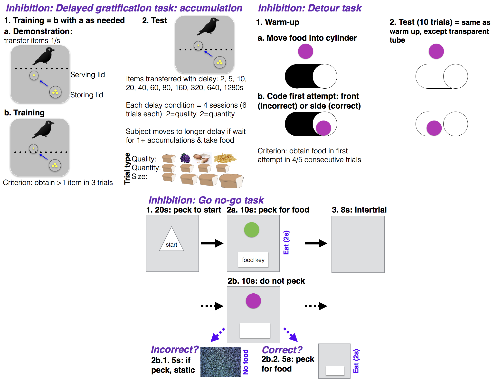

```{r setup, include=FALSE}
knitr::opts_chunk$set(echo = TRUE)
```

```{r}
#Make code wrap text so it doesn't go off the page when Knitting to PDF
library(knitr)
opts_chunk$set(tidy.opts=list(width.cutoff=60),tidy=TRUE)
```

###ABSTRACT

This is one of the first studies planned for our long-term research on the role of behavioral flexibility in rapid geographic range expansions. **Project background:** Behavioral flexibility, the ability to change behavior when circumstances change based on learning from previous experience (@mikhalevich_is_2017), is thought to play an important role in a species' ability to successfully adapt to new environments and expand its geographic range (e.g., [@lefebvre1997feeding], [@griffin2014innovation], [@chow2016practice], [@sol2000behavioural], [@sol2002behavioural], [@sol2005big]). However, behavioral flexibility is rarely directly tested at the individual level, thus limiting our ability to determine how it relates to other traits, which limits the power of predictions about a species' ability to adapt behavior to new environments. We use great-tailed grackles (a bird species) as a model to investigate this question because they have rapidly expanded their range into North America over the past 140 years ([@wehtje2003range], [@peer2011invasion]) (Fig. 1). **This investigation**: In this piece of the long-term project, we aim to measure grackle inhibition in three experiments (delay of gratification, go-no go, detour) to determine whether those individuals that are more flexible are also better at inhibiting. Results will allow us to determine whether inhibition is linked with measures of flexibility (reversal learning and solution switching), how performance on these inhibition tests relate to each other to determine whether they measure the same or different traits, and validate the use of an inhibition task using a touch screen.


***Figure 1.*** Five-year project overview. The same individuals will experience the experiments listed in each column (i.e., the same ~32 individuals in the left column (Years 1 and 2) will experience numbers 1-9, and the same ~32 individuals in the right column (Years 3-5) will experience A-D, plus numbers 5-9).

###A. STATE OF THE DATA

**Prior to collecting any data:** This preregistration was written. 

**After data collection had begun:** This preregistration was submitted to PCI Ecology for peer review after starting data collection on the detour task for the pre-reversal subcategory of subjects (for which there was data from one bird).

###B. PARTITIONING THE RESULTS

We may decide to present the results from different tests in separate papers.

###C. HYPOTHESIS

**If flexibility requires inhibition, then individuals that are more [behaviorally flexible](./g_flexmanip.Rmd) (indicated by individuals that are faster at functionally changing their behavior when circumstances change), as measured by reversal learning and switching between options on a multi-access box, will also be better at inhibiting their responses in three tasks: delayed gratification, go no-go, and detour.**

**P1:** Individuals that are faster to reverse preferences on a reversal learning task and who also have lower latencies to successfully solve new loci after previously solved loci become unavailable (multi-access box) (see [flexibility preregistration](./g_flexmanip.Rmd)) will perform better in the go no-go task (methods similar to @harding2004animal), in the detour task (methods as in @maclean2014evolution who call it the "cylinder task"), and they will wait longer for higher quality (more preferred) food, but not for higher quantities (methods as in @hillemann2014waiting). Waiting for higher quality food has been validated as a test of inhibition in birds, while waiting for a higher quantity of food does not appear to measure inhibition (@hillemann2014waiting).

**P1 alternative 1:** If there is no correlation between flexibility measures and performance on the inhibition tasks, this may indicate that the flexibility tasks may not require much inhibition (particularly if the inhibition results are reliable - see *P1 alternative 2*).

**P1 alternative 2:** If there is no correlation between flexibility measures and performance on the inhibition tasks, this may indicate that the inhibition tasks had low reliability and were therefore too noisy to correlate with flexibility.

**P2:** If there is no correlation in performance across inhibition tasks, it may indicate that that one or more of these tasks does not measure inhibition, or that they measure different types of inhibition (see @friedman2004relations).

**P2 alternative:** If go no-go task performance strongly correlates with performance on the delayed gratification task, this indicates these two tasks measure the same trait, which therefore validates an inhibition task using a touch screen (the go no-go task).

**P3:** If individuals perform well on the detour task and with little individual variation, this is potentially because they will have had extensive experience looking into the sides of opaque tubes during reversal learning. To determine whether prior experience with opaque tubes in reversal learning contributed to their detour performance, a subset of individuals will experience the detour task before any reversal learning tests. If this subset performs the same as the others, then previous experience with tubes does not influence detour task performance. If the subset performs worse than the others, this indicates that detour task performance depends on the previous experiences of the indviduals tested.



***Figure 2.*** The experimental designs of the three tasks: delayed gratification, go no-go, and detour (see [protocol](https://docs.google.com/document/d/1oEQ66yLrkMFr4UJTXfPBRAEXqoUuOgRwcKOB_KcT7HE/edit?usp=sharing) for details). In the **delay of gratification** task, individuals learn that food items will be transferred by the experimenter from a storing lid (near the experimenter) to a serving lid (near the bird) one at a time, and that they have access to the food in the serving lid from which they can eat at any time: they will learn that they will have access to more food if they wait longer for the experimenter to transfer food items. Once they pass training (by waiting for more than one food item in three trials), they move on to the test where food items are transferred from the serving to the storing lid with delays ranging from 2-1280 seconds. Birds will be tested on whether they are willing to wait for food items that increase in quality (i.e., are more preferred) or increase in quantity (i.e., the same food type accumulates in the serving lid). In the **go no-go** task, after pecking a start key on the touch screen to show they are interested in attending to a trial, they will see either a green circle or a purple circle (the rewarded circle color is counterbalanced across birds). Pecking the food key while the rewarded colored circle (green in the figure) is on the screen will result in the food hopper rising so the bird can eat food for 2 seconds, after which point the trial ends and the screen goes blank for 8 seconds before starting over again. If the non-rewarded colored circle (purple in the figure) appears on the screen after the start key is pecked, then the correct response is to refrain from pecking the food key for 10 seconds. If the bird succeeds in refraining, the next intertrial interval starts. If the bird fails and pecks the food key while the purple circle is on the screen, then it is given an aversive stimuli for 5 seconds (TV static screen). In the **detour** task, individuals first receive a warm up with an opaque tube where they learn that the experimenter will show them a piece of food and then move that piece of food into the tube. They then have the opportunity to approach the tube and eat the food. A correct response is when their first approach is to go to the side of the tube to the opening to obtain the food and an incorrect response is when they try to access the food by pecking at the front of the tube (which has no opening). Once they pass the warm up, they move on to the test, which is exactly the same except the tube is transparent. The idea is that being able to see the food through the tube wall might entice them to try to go through the wall rather than refrain from a direct approach to the food and instead go around the side through the tube opening.

###D. METHODS

####**Open materials** 

[Testing protocols](https://docs.google.com/document/d/1oEQ66yLrkMFr4UJTXfPBRAEXqoUuOgRwcKOB_KcT7HE/edit?usp=sharing) for all three experiments: color tube reversal learning, multi-access box, and touch screen reversal learning

####**Open data**

When the study is complete, the data will be published in the Knowledge Network for Biocomplexity's data repository.

####**Randomization and counterbalancing** 

**P3** 

Two individuals from each batch will experience the detour task before participating in the flexibility manipulation. These individuals will be randomly selected using the random number generator at https://www.random.org.

**P1-P2**

For the rest of the individuals (n=6 per batch), the order of the three inhibition tasks will be counterbalanced across birds (using https://www.random.org to randomly assign individuals to one of three experimental orders). 1/3 of the individuals will experience:

1. Delayed gratification task

2. Go no-go task

3. Detour

1/3 of the individuals will experience:

1. Go no-go task

2. Detour

3. Delayed gratification task

1/3 of the individuals will experience: 

1. Detour

2. Delayed gratification task

3. Go no-go task

**Delayed gratification** 

- Food preference test: food will be presented in random combinations over six sessions of 12-15 trials. 

- Training trials: The type of demonstration and training trials varied randomly (with more demo trials near the beginning of training), incorporating trials in which food of the same sort accumulated (quantity), food of ascending quality accumulated (quality), and trials in which we added increasingly larger food pieces throughout the trial (size)

- Test: we will test each food quality (low, mid, high) twice in randomized order in each session.

**Go no-go** 

Go and no-go trials will be presented randomly with the restriction that no more than four of the same type will occur in a row. The rewarded color will be counterbalanced across birds.

**Detour** 

The side from which the apparatus is baited will be consistent within subjects, but counterbalanced across subjects.

####**Blinding of conditions during analysis**

No blinding is involved in this study.

####**Dependent variables**

#####*P1: the more flexible individuals are better at inhibition*

1) **Delayed gratification:** Number of food pieces waited for (0-3). A successful wait is defined as waiting for at least one additional piece of food to be added to the serving lid of the three possible additional food items, and accepted at least one piece of the reward pieces.

2) **Go no-go:** 

  a) The number of trials to reach criterion (85% correct) where correct responses involve pecking when the rewarded stimulus is displayed and not pecking when the unrewarded stimulus is displayed, and incorrect responses involve pecking when the unrewarded stimulus is displayed, and not pecking when the rewarded stimulus is displayed

  b) The latency to respond (peck the target key)

3) **Detour:** First approach (physical contact): Correct (to the tube's side opening) or Incorrect (to the front unopen area of the tube) (methods as in @maclean2014evolution).

One model will be run per dependent variable.

#####*P3: does training improve detour performance?*

1) First approach (physical contact): Correct (to the tube's side opening) or Incorrect (to the front unopen area of the tube) (methods as in @maclean2014evolution).

####**Independent variables**

#####*P1: delayed gratification*

1) Food quality or quantity (Quality: High, Med, Low; Quantity: Smaller, Medium, Larger)

2) Trial

3) Delay (2, 5, 10, 20, 40, 60, or 80 seconds)

4) Flexibility 1: **Number of trials to reverse** a preference in the last reversal an individual experienced (reversal learning; an individual is considered to have a preference if it chose the rewarded option at least 17 out of the most recent 20 trials, with a minimum of 8 or 9 correct choices out of 10 on the two most recent sets of 10 trials). See behavioral flexibility [preregistration](./g_flexmanip.Rmd).

5) Flexibility 2: The **ratio of correct divided by incorrect trials** for the first 40 trials in their final reversal after the individual has seen the newly rewarded option once. These 40 trials include trials where individuals were offered the test and chose not to participate (i.e., make a choice). This accounts for flexibility that can occur when some individuals inhibit their previously rewarded preference (thus exhibiting flexibility because they changed their behavior when circumstances changed), but are not as exploratory as those who have fewer 'no choice' trials. 'No choice' data is data that is otherwise excluded from standard reversal learning analyses. Including 'no choice' trials, controls for individual differences in exploration because those that refuse to choose are not exploring new options, which would allow them to learn the new food location.

6) Flexibility 3: If the number of trials to reverse a preference does not positively correlate with the latency to attempt or solve new loci on the multi-access box (an additional measure of behavioral flexibility), then the **average latency to solve** and the **average latency to attempt** a new option on the multi-access box will be additional dependent variables. See behavioral flexibility [preregistration](./g_flexmanip.Rmd).

7) Flexibility 4: This measure is currently being developed and is intended be a more accurate representation of all of the choices an individual made, as well as accounting for the degree of uncertainty exhibited by individuals as preferences change. If this measure more effectively represents flexibility (determined using a modeled dataset and not the actual data), we may decide to solely rely on this measure and not use flexibility measures 1 through 3. If this ends up being the case, we will modify the code in the analysis plan below to reflect this change.

#####*P1: go no-go*

Model 2a: number of trials to reach criterion

1) Flexibility 1: Number of trials to reverse a preference in the last reversal an individual experienced (reversal learning; as above)

2) Flexibility 2: The **ratio of correct divided by incorrect trials** for the first 40 trials in their final reversal after the individual has seen the newly rewarded option once (reversal learning; as above).

3) Flexibility 3: If the number of trials to reverse a preference does not positively correlate with the latency to attempt or solve new loci on the multi-access box, then the **average latency to solve** and the **average latency to attempt** a new option on the multi-access box will be additional independent variables (as above).

4) Flexibility 4: This measure is currently being developed and is intended be a more accurate representation of all of the choices an individual made, as well as accounting for the degree of uncertainty exhibited by individuals as preferences change. If this measure more effectively represents flexibility (determined using a modeled dataset and not the actual data), we may decide to solely rely on this measure and not use flexibility measures 1 through 3. If this ends up being the case, we will modify the code in the analysis plan below to reflect this change.

Model 2b: latency to respond

1) Correct or incorrect response

2) Trial

3) [Flexibility Condition](./g_flexmanip.Rmd): control, flexibility manipulation

3) ID (random effect because multiple measures per bird)

#####*P1: detour*

1) Trial

2) Flexibility 1: Number of trials to reverse a preference in the last reversal an individual experienced (reversal learning; as above)

3) Flexibility 2: The **ratio of correct divided by incorrect trials** for the first 40 trials in their final reversal after the individual has seen the newly rewarded option once (reversal learning; as above).

4) Flexibility 3: If the number of trials to reverse a preference does not positively correlate with the latency to attempt or solve new loci on the multi-access box, then the **average latency to solve** and the **average latency to attempt** a new option on the multi-access box will be additional independent variables (as above).

4) Flexibility 4: This measure is currently being developed and is intended be a more accurate representation of all of the choices an individual made, as well as accounting for the degree of uncertainty exhibited by individuals as preferences change. If this measure more effectively represents flexibility (determined using a modeled dataset and not the actual data), we may decide to solely rely on this measure and not use flexibility measures 1 through 3. If this ends up being the case, we will modify the code in the analysis plan below to reflect this change.

#####*P3: does training improve detour performance?*

1) Condition: pre- or post-reversal learning tests

###E. ANALYSIS PLAN

We do not plan to **exclude** any data. When **missing data** occur, the existing data for that individual will be included in the analyses for the tests they completed. Analyses will be conducted in R (current version `r getRversion()`; @rcoreteam). When there is more than one experimenter within a test, experimenter will be added as a random effect to account for potential differences between experimenters in conducting the tests. If there are no differences between models including or excluding experimenter as a random effect, then we will use the model without this random effect for simplicity.

####*Ability to detect actual effects*

To begin to understand what kinds of effect sizes we will be able to detect given our sample size limitations and our interest in decreasing noise by attempting to measure it, which increases the number of explanatory variables, we used G&ast;Power (v.3.1, @faul2007g, @faul2009statistical) to conduct power analyses based on confidence intervals. G&ast;Power uses pre-set drop down menus and we chose the options that were as close to our analysis methods as possible (listed in each analysis below). Note that there were no explicit options for GLMs (though the chosen test in G&ast;Power appears to align with GLMs) or GLMMs or for the inclusion of the number of trials per bird (which are generally large in our investigation), thus the power analyses are only an approximation of the kinds of effect sizes we can detect. We realize that these power analyses are not fully aligned with our study design and that these kinds of analyses are not appropriate for Bayesian statistics (e.g., our MCMCglmm below), however we are unaware of better options at this time. Additionally, it is difficult to run power analyses because it is unclear what kinds of effect sizes we should expect due to the lack of data on this species for these experiments. 

####*Data checking*

The data will be visually checked to determine whether they are normally distributed via two methods: 1) normality is indicated when the histograms of actual data match those with simulated data (Figure 2), and 2) normality is indicated when the residuals closely fit the dotted line in the Normal Q-Q plot (Figure 3) [@zuur2009].

```{r dist_checkHist, eval=FALSE, warning=FALSE, results='asis', echo=TRUE, fig.cap="**Figure 2.** Part 1. The distribution of the actual data versus what a normal distribution would look like with simulated data. Part 2. Residuals vs fitted: checking for homogeneity, which is satisfied if residuals have an even spread across the x-axis; Normal Q-Q: residuals are normally distributed if they are on the diagonal line; Residuals vs leverage: Cook's distance <1 means no influential observations [@zuur2009]."}
acc <- read.csv ("/Users/corina/GTGR/data/data_accumulation.csv", header=T, sep=",", stringsAsFactors=F) 

go <- read.csv ("/Users/corina/GTGR/data/data_go.csv", header=T, sep=",", stringsAsFactors=F) 

detour <- read.csv ("/Users/corina/GTGR/data/data_detour.csv", header=T, sep=",", stringsAsFactors=F) 


#Check the dependent variables for normality: Histograms
op <- par(mfrow=c(2,3), mar=c(4,4,2,0.2))
#This is what the distribution of actual data looks like
hist(acc$NumberOfAccumulationsWaited, xlab="Delay: Number of accumulations waited", main="Actual Data")
hist(go$TrialsToCriterion, xlab="Go no-go: Trials to criterion", main="Actual Data")
hist(detour$FirstApproach, xlab="Detour: First approach", main="Actual Data")

#Given the actual data, this is what a normal distribution would look like
X2 <- rnorm(1281, mean=mean(acc$NumberOfAccumulationsWaited), sd=sd(acc$NumberOfAccumulationsWaited))
hist(X2, xlab="Delay: No. accumulations waited", main="Simulated Data")

Y2 <- rnorm(1281, mean=mean(go$TrialsToCriterion), sd=sd(go$TrialsToCriterion))
hist(Y2, xlab="Go/no-go: Trials to criterion", main="Simulated Data")

Z2 <- rnorm(1281, mean=mean(detour$FirstApproach), sd=sd(detour$FirstApproach))
hist(Z2, xlab="Detour: First approach", main="Simulated Data")


#Check the dependent variables for normality: Q-Q plots
op <- par(mfrow=c(3,4), mar=c(4,4,2,0.2))
plot(glm(acc$NumberOfAccumulationsWaited~acc$Delay)) 
plot(glm(go$TrialsToCriterion~go$TrialsToReverseLast)) 
plot(glm(detour$FirstApproach~detour$Trial)) 
```

If the data do not appear normally distributed, visually check the residuals. If they are patternless, then assume a normal distribution (Figure 4) [@zuur2009].

```{r dist_checkResid, eval=FALSE, warning=FALSE, results='asis', echo=TRUE, fig.cap="**Figure 4.** Visual check of the residuals."}
#Check the dependent variables for normality: Residuals
detour <- read.csv ("/Users/corina/GTGR/data/data_detour.csv", header=T, sep=",", stringsAsFactors=F) 

acc <- read.csv ("/Users/corina/GTGR/data/data_accumulation.csv", header=T, sep=",", stringsAsFactors=F) 

go <- read.csv ("/Users/corina/GTGR/data/data_go.csv", header=T, sep=",", stringsAsFactors=F) 

#Figure 3. Visual check of the residuals
op <- par(mfrow=c(1,3), mar=c(4,4,2,0.2))
plot(residuals(glm(detour$FirstApproach~detour$Trial)), ylab="Detour residuals: First approach ~ Trial")
plot(residuals(glm(acc$NumberOfAccumulationsWaited~acc$Delay)), ylab="Delay residuals: Number of accumulations waited ~ Delay")
plot(residuals(glm(go$TrialsToCriterion~go$TrialsToReverseLast)), ylab="Go/no-go: Residuals Correct response ~ Trial")
```

####*P1: delayed gratification*

**Assess food preferences:** Conduct preference tests between pairs of different foods. Rank food preferences into three categories (High, Medium, Low) in the order of the percentage of times a food was chosen.

**Analysis:** Generalized Linear Model (GLM; glm function, stats package) with a Poisson distribution and log link, unless the only choices made were 0 (they didn't wait for food) and 1 (they waited for 1 piece of food but not for 2 or 3), in which case we will use a binomial distribution with a logit link. We will determine whether an independent variable had an effect or not using the Estimate in the full model.

To determine our ability to detect actual effects, we ran a power analysis in G&ast;Power with the following settings: test family=F tests, statistical test=linear multiple regression: Fixed model (R^2 deviation from zero), type of power analysis=a priori, alpha error probability=0.05. We reduced the power to 0.70 and increased the effect size until the total sample size in the output matched our projected sample size (n=32). The protocol of the power analysis is here:

*Input:*

Effect size f²                	=	0,41
			
α err prob                    	=	0,05

Power (1-β err prob)          	=	0,7

Number of predictors          	=	5

*Output:*

Noncentrality parameter λ     	=	13,1200000

Critical F                    	=	2,5867901

Numerator df                  	=	5

Denominator df                	=	26

Total sample size             	=	32

Actual power                  	=	0,7103096

This means that, with our sample size of 32, we have a 71% chance of detecting a large effect (approximated at f^2^=0.35 by @cohen1988statistical). 

```{r better, eval=FALSE, warning=FALSE, results='asis', echo=TRUE, include=TRUE}
acc <- read.csv ("/Users/corina/GTGR/data/data_accumulation.csv", header=T, sep=",", stringsAsFactors=F) 

#GLM
better <- glm(NumberOfAccumulationsWaited ~ Delay + FoodQualityQuantity + Trial + TrialsToReverseLast + FlexRatio, family="poisson", data=acc)
#summary(better)

better1 <- summary(better)
library(xtable)
better1.table <- xtable(better1)
library(knitr)
kable(better1.table, caption="Table U: Model selection output.", format="html", digits=2)
```

####*P1: go no-go*

**Analysis:** 

**Model 2a:** Generalized Linear Model (GLM; glm function, stats package) with a Poisson distribution and a log link. We will determine whether an independent variable had an effect or not using the Estimate in the full model.

To determine our ability to detect actual effects, we ran a power analysis in G&ast;Power with the following settings: test family=F tests, statistical test=linear multiple regression: Fixed model (R^2 deviation from zero), type of power analysis=a priori, alpha error probability=0.05. We reduced the power to 0.70 and increased the effect size until the total sample size in the output matched our projected sample size (n=32). The protocol of the power analysis is here:

*Input:*

Effect size f²                	=	0,27

α err prob                    	=	0,05

Power (1-β err prob)          	=	0,7

Number of predictors          	=	2

*Output:*

Noncentrality parameter λ     	=	8,6400000

Critical F                    	=	3,3276545

Numerator df                  	=	2

Denominator df                	=	29

Total sample size             	=	32

Actual power                  	=	0,7047420

This means that, with our sample size of 32, we have a 70% chance of detecting a medium (approximated at f^2^=0.15 by @cohen1988statistical) to large effect (approximated at f^2^=0.35 by @cohen1988statistical). 

```{r go, eval=FALSE, warning=FALSE, results='asis', echo=TRUE, include=TRUE}
go <- read.csv ("/Users/corina/GTGR/data/data_go.csv", header=T, sep=",", stringsAsFactors=F) 

#GLM
go1 <- glm(TrialsToCriterion ~ TrialsToReverseLast + FlexRatio, family="poisson", data=go)
sgo1 <- summary(go1)
library(xtable)
sgo1.table <- xtable(sgo1)
library(knitr)
kable(sgo1.table, caption="Table T: Model selection output.", format="html", digits=2)
```

**Model 2b:** A Generalized Linear Mixed Model (GLMM; MCMCglmm function, MCMCglmm package; [@hadfieldMCMCglmmpackage]) will be used with a Poisson distribution and log link using 13,000 iterations with a thinning interval of 10, a burnin of 3,000, and minimal priors (V=1, nu=0) [@hadfield2014coursenotes]. I will ensure the GLMM shows acceptable convergence (lag time autocorrelation values <0.01; [@hadfieldMCMCglmmpackage]), and adjust parameters if necessary. We will determine whether an independent variable had an effect or not using the Estimate in the full model.

To roughly estimate our ability to detect actual effects (because these power analyses are designed for frequentist statistics, not Bayesian statistics), we ran a power analysis in G&ast;Power with the following settings: test family=F tests, statistical test=linear multiple regression: Fixed model (R^2 deviation from zero), type of power analysis=a priori, alpha error probability=0.05. We reduced the power to 0.70 and increased the effect size until the total sample size in the output matched our projected sample size (n=32). The number of predictor variables was restricted to only the fixed effects because this test was not designed for mixed models. The protocol of the power analysis is here:

*Input:*

Effect size f²                	=	0,32

α err prob                    	=	0,05

Power (1-β err prob)          	=	0,7

Number of predictors          	=	3

*Output:*

Noncentrality parameter λ     	=	10,2400000

Critical F                    	=	2,9466853

Numerator df                  	=	3

Denominator df                	=	28

Total sample size             	=	32

Actual power                  	=	0,7061592

This means that, with our sample size of 32, we have a 71% chance of detecting a large effect (approximated at f^2^=0.35 by @cohen1988statistical). 

```{r golatency, eval=FALSE, warning=FALSE, results='asis', echo=TRUE, include=TRUE}
go <- read.csv ("/Users/corina/GTGR/data/data_golatency.csv", header=T, sep=",", stringsAsFactors=F) 

#GLM
library(MCMCglmm)
prior = list(R=list(R1=list(V=1,nu=0),R2=list(V=1,nu=0),R3=list(V=1,nu=0)), G=list(G1=list(V=1,nu=0))) 

golat <- MCMCglmm(LatencyToRespond ~ CorrectResponse * Trial * FlexibilityCondition, random=~ID, family="poisson", data=go, verbose=F, prior=prior, nitt=13000, thin=10, burnin=3000)
summary(golat)
autocorr(golat$Sol) #Did fixed effects converge?
autocorr(golat$VCV) #Did random effects converge?
```

####*P1: detour*

**Analysis:** Generalized Linear Model (GLM; glm function, stats package) with a binomial distribution and a logit link. We will determine whether an independent variable had an effect or not using the Estimate in the full model.

See the protocol for the power analyses for Model 2b above for the rough estimation our ability to detect actual effects with this model.

```{r detour, eval=FALSE, warning=FALSE, results='asis', echo=TRUE, include=TRUE}
detour <- read.csv ("/Users/corina/GTGR/data/data_detour.csv", header=T, sep=",", stringsAsFactors=F) 

#GLM
detour$ID <- factor(detour$ID)
de <- glm(FirstApproach ~ Trial + TrialsToReverseLast + FlexRatio, family="binomial", data=detour)
sde <- summary(de)
library(xtable)
sde.table <- xtable(sde)
library(knitr)
kable(sde.table, caption="Table T: Model selection output.", format="html", digits=2)
```

#####*P1 alternative 2: are inhibition results reliable?*

The reliability of the inhibition tests will be calculated using Cronbach's Alpha (as in @friedman2004relations; R package: psych [@psych], function: alpha), which is indicated by std.alpha in the output.

```{r reliability, eval=FALSE, warning=FALSE, results='asis', echo=TRUE, include=TRUE}
rel <- read.csv ("/Users/corina/GTGR/data/data_inhibition.csv", header=T, sep=",", stringsAsFactors=F) 

library(psych)
reliab <- alpha(rel, check.keys=TRUE) #Check.keys automatically reverses the coding for variables that are negatively correlated with the total scale. How to interpret: http://data.library.virginia.edu/using-and-interpreting-cronbachs-alpha/ "If all of the scale items are entirely independent from one another (i.e., are not correlated or share no covariance), then alpha = 0; and, if all of the items have high covariances, then alpha will approach 1 as the number of items in the scale approaches infinity. In other words, the higher the alpha coefficient, the more the items have shared covariance and probably measure the same underlying concept."
summary(reliab)
#Insert into text: `r reliab$std.alpha`
```

When comparing all three tests, alpha= .

####*P2: correlation across inhibition tasks*

**See analysis description for P1 alternative 2.** 

```{r reliability2, eval=FALSE, warning=FALSE, results='asis', echo=TRUE, include=TRUE}
rel2 <- read.csv ("/Users/corina/GTGR/data/data_inhibition2.csv", header=T, sep=",", stringsAsFactors=F) 

library(psych)
reliab2 <- alpha(rel2, check.keys=TRUE)
summary(reliab2)
#Insert into text: `r reliab2$std.alpha`
```

When analyzing only the delayed gratification and go no-go tasks, the reliability is alpha= *fill in result when data are available*.

#####*P3: does training improve detour performance?*

**Analysis:** Generalized Linear Model (GLM; glm function, stats package) with a binomial distribution and a logit link. We will determine whether an independent variable had an effect or not using the Estimate in the full model.

To determine our ability to detect actual effects, we ran a power analysis in G&ast;Power with the following settings: test family=F tests, statistical test=linear multiple regression: Fixed model (R^2 deviation from zero), type of power analysis=a priori, alpha error probability=0.05. We reduced the power to 0.70 and increased the effect size until the total sample size in the output matched our projected sample size (n=32). The protocol of the power analysis is here:

*Input:*

Effect size f²                	=	0,21

α err prob                    	=	0,05

Power (1-β err prob)          	=	0,7

Number of predictors          	=	1

*Output:*

Noncentrality parameter λ     	=	6,7200000

Critical F                    	=	4,1708768

Numerator df                  	=	1

Denominator df                	=	30

Total sample size             	=	32

Actual power                  	=	0,7083763

This means that, with our sample size of 32, we have a 71% chance of detecting a medium effect (approximated at f^2^=0.15 by @cohen1988statistical).

```{r detour2, eval=FALSE, warning=FALSE, results='asis', echo=TRUE, include=TRUE}
detour <- read.csv ("/Users/corina/GTGR/data/data_detour.csv", header=T, sep=",", stringsAsFactors=F) 

#GLM
de <- glm(FirstApproach ~ Condition, family="binomial", data=detour)
sde <- summary(de)
library(xtable)
sde.table <- xtable(sde)
library(knitr)
kable(sde.table, caption="Table T: Model selection output.", format="html", digits=2)
```

####*Alternative Analyses*

We anticipate that we will want to run additional/different analyses after reading @statrethinkingbook. We will revise this preregistration to include these new analyses before conducting the analyses above.

###F. PLANNED SAMPLE

Great-tailed grackles are caught in the wild in Tempe, Arizona USA for individual identification (colored leg bands in unique combinations). Some individuals (~32) are brought temporarily into aviaries for testing, and then they will be released back to the wild. Grackles are individually housed in an aviary (each 244cm long by 122cm wide by 213cm tall) at Arizona State University for a maximum of three months where they have ad lib access to water at all times and are fed Mazuri Small Bird maintenance diet ad lib during non-testing hours (minimum 20h per day), and various other food items (e.g., peanuts, grapes, bread) during testing (up to 3h per day per bird). Individuals are given three to four days to habituate to the aviaries and then their test battery begins on the fourth or fifth day (birds are usually tested six days per week, therefore if their fourth day in the aviaries occurs on a day off, then they are tested on the fifth day instead).

**Sample size rationale**

We will test as many birds as we can in the approximately three years at this field site given that the birds only participate in tests in aviaries during the non-breeding season (approximately September through March). The minimum sample size will be 16, however we expect to be able to test up to 32 grackles.

**Data collection stopping rule**

We will stop testing birds once we have completed two full aviary seasons (likely in March 2020).

###G. ETHICS

This research is carried out in accordance with permits from the:

1) US Fish and Wildlife Service (scientific collecting permit number MB76700A-0,1,2)
2) US Geological Survey Bird Banding Laboratory (federal bird banding permit number 23872)
3) Arizona Game and Fish Department (scientific collecting license number SP594338 [2017] and SP606267 [2018])
4) Institutional Animal Care and Use Committee at Arizona State University (protocol number 17-1594R)
5) University of Cambridge ethical review process (non-regulated use of animals in scientific procedures: zoo4/17)

###H. AUTHOR CONTRIBUTIONS

**Logan:** Hypothesis development, experimental design (go no-go task), data collection, data analysis and interpretation, write up, revising/editing, materials/funding.

**McCune:** Data collection, data interpretation, revising/editing.

**Johnson-Ulrich:** Touchscreen programming for go no-go task, data interpretation, revising/editing.

**Bergeron:** Data collection, data interpretation, revising/editing.

**Rowney:** Data collection, data interpretation, revising/editing.

**Seitz:** Experimental design (go no-go task), touchscreen programming (go no-go task), data interpretation, revising/editing.

**Blaisdell:** Experimental design (go no-go task), data interpretation, revising/editing.

**Wascher:** Hypothesis development, experimental design (delayed gratification and detour tasks), data analysis and interpretation, write up, revising/editing.

###I. FUNDING

This research is funded by the Department of Human Behavior, Ecology and Culture at the Max Planck Institute for Evolutionary Anthropology, and by a Leverhulme Early Career Research Fellowship to Logan in 2017-2018.

###J. ACKNOWLEDGEMENTS

We thank Dieter Lukas for help polishing the predictions; Ben Trumble for providing us with a wet lab at Arizona State University; Melissa Wilson Sayres for sponsoring our affiliations at Arizona State University and lending lab equipment; Kristine Johnson for technical advice on great-tailed grackles; Jay Taylor for grackle scouting at Arizona State University; Arizona State University School of Life Sciences Department Animal Care and Technologies for providing space for our aviaries and for their excellent support of our daily activities; Julia Cissewski for tirelessly solving problems involving financial transactions and contracts; and Richard McElreath for project support.

###J. REFERENCES
